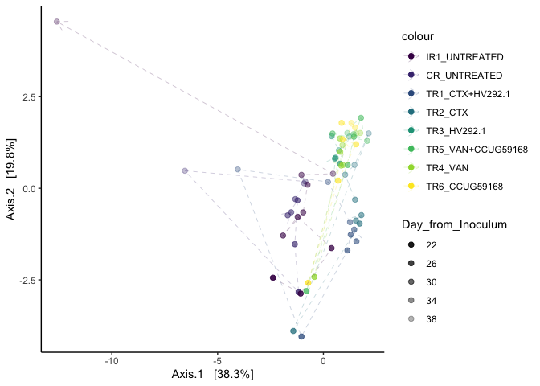
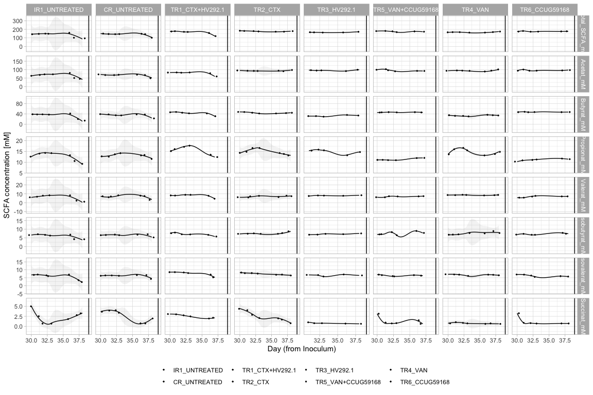

#### Load required packages


```r
library(tidyverse)
library(phyloseq)
library(speedyseq)
library(ggrepel)
library(ampvis2)
library(plotly)
library(microbiome)
options(getClass.msg=FALSE) # https://github.com/epurdom/clusterExperiment/issues/66
#this fixes an error message that pops up because the class 'Annotated' is defined in two different packages
```

#### Load functions from Github


```r
'%!in%' <- function(x,y)!('%in%'(x,y))

source("https://raw.githubusercontent.com/fconstancias/DivComAnalyses/master/R/phyloseq_taxa_tests.R")
source("https://raw.githubusercontent.com/fconstancias/DivComAnalyses/master/R/phyloseq_normalisation.R")
```

```
## Loading required package: scales
```

```
## 
## Attaching package: 'scales'
```

```
## The following object is masked from 'package:microbiome':
## 
##     alpha
```

```
## The following object is masked from 'package:purrr':
## 
##     discard
```

```
## The following object is masked from 'package:readr':
## 
##     col_factor
```

```
## Loading required package: reshape2
```

```
## 
## Attaching package: 'reshape2'
```

```
## The following object is masked from 'package:tidyr':
## 
##     smiths
```

```r
source("https://raw.githubusercontent.com/fconstancias/DivComAnalyses/master/R/phyloseq_alpha.R")
source("https://raw.githubusercontent.com/fconstancias/DivComAnalyses/master/R/phyloseq_beta.R")
source("https://raw.githubusercontent.com/fconstancias/DivComAnalyses/master/R/phyloseq_heatmap.R")
```


#### Load physeq object


```r
ps = "data/processed/physeq_update_11_1_21.RDS"

ps %>% 
  here::here() %>%
  readRDS() %>%
  phyloseq_get_strains_fast() %>%
  phyloseq_remove_chloro_mitho() -> physeq
```

```
## Joining, by = "ASV"
```

```r
physeq %>% 
  subset_samples(Experiment == "Continuous") %>% 
  subset_samples(Paul %!in% c("Paul")) %>%
  subset_samples(Reactor != "IR2") -> ps_PolyFermS
```

We will be analysing only the PolyFermS samples here so take a subset of the physeq object.  

```r
physeq %>% 
  subset_samples(Experiment == "Continuous") %>% 
  subset_samples(Paul %!in% c("Paul")) %>%
  subset_samples(Reactor != "IR2") -> ps_polyFermS

sample_data(ps_polyFermS)$Reactor <- fct_relevel(sample_data(ps_polyFermS)$Reactor, "IR1", "CR", "TR1", "TR2","TR3", "TR4", "TR5", "TR6") 

sample_data(ps_polyFermS)$Treatment <- fct_relevel(sample_data(ps_polyFermS)$Treatment, "UNTREATED",  "CTX+HV292.1", "CTX","HV292.1","VAN+CCUG59168", "VAN",  "CCUG59168") 

sample_data(ps_polyFermS)$Reactor_Treatment <- fct_relevel(sample_data(ps_polyFermS)$Reactor_Treatment, "IR1_UNTREATED","CR_UNTREATED", "CR_CTX", "CR_VAN", "TR1_CTX+HV292.1","TR2_CTX", "TR3_HV292.1", "TR5_VAN+CCUG59168", "TR4_VAN", "TR6_CCUG59168") 

ps_polyFermS %>% 
  rarefy_even_depth(sample.size = 4576,
                    rngseed = 123) -> ps_rare
```

```
## `set.seed(123)` was used to initialize repeatable random subsampling.
```

```
## Please record this for your records so others can reproduce.
```

```
## Try `set.seed(123); .Random.seed` for the full vector
```

```
## ...
```

```
## 16 samples removedbecause they contained fewer reads than `sample.size`.
```

```
## Up to first five removed samples are:
```

```
## CR-40-S166ETR1-30-S178ETR1-42-S194ETR2-30-S195IR1-40-S197
```

```
## ...
```

```
## 50OTUs were removed because they are no longer 
## present in any sample after random subsampling
```

```
## ...
```

```r
ps_rare %>%
  subset_samples(Enrichment == "NotEnriched") %>%
  subset_samples(Day_from_Inoculum >= 22 & Day_from_Inoculum <= 38) -> ps_polyFermS_rare

ps_polyFermS_rare
```

```
## phyloseq-class experiment-level object
## otu_table()   OTU Table:          [ 296 taxa and 72 samples ]:
## sample_data() Sample Data:        [ 72 samples by 50 sample variables ]:
## tax_table()   Taxonomy Table:     [ 296 taxa by 8 taxonomic ranks ]:
## phy_tree()    Phylogenetic Tree:  [ 296 tips and 294 internal nodes ]:
## refseq()      DNAStringSet:       [ 296 reference sequences ]
## taxa are rows
```
# Alpha div:

Compute alpha-div metrics:


```r
ps_polyFermS_rare %>%
  phyloseq_alphas(phylo = TRUE) -> alpha_df
```


```r
measures = c("Observed", "diversity_shannon", "evenness_pielou", "PD","MNTD", "SES.MPD" ,"bNTI")


alpha_df %>%
  plot_alphas(measure = measures,
             x_group = "Reactor_Treatment",
             colour_group = "Reactor",
             fill_group = "Reactor",
              shape_group = NULL,
              facet_group = "Reactor_Treatment",
            test_group = "Reactor_Treatment",
            test_group_2 = NULL) -> out

out$plot + 
  facet_null() + 
  facet_grid(alphadiversiy ~ ., scales = "free") + 
  ggpubr::rotate_x_text(60) +
  scale_fill_viridis_d() +
  scale_color_viridis_d()
```

<!-- -->

```r
out$stat %>%
  dplyr::filter(signif == "SIGN") %>%
  DT::datatable()
```

# Beta-div:

Compute beta-div metrics:


```r
ps_polyFermS_rare  %>%
  phyloseq_plot_bdiv(bdiv_list,
                     m = "CoDa",
                     seed = 123) -> coda
  
coda$PCA$layers[[1]] = NULL

coda$PCA + geom_point(size=2,
                   aes(color = Reactor_Treatment, 
                       fill = Reactor_Treatment,
                       shape = NULL,
                       alpha = Day_from_Inoculum)) + 
  theme_light() +
  # geom_path(arrow = arrow(type = "open", angle = 30, length = unit(0.15, "inches")),
              # size = 0.05, linetype = "dashed", inherit.aes = TRUE, aes(group=Reactor_Treatment, color = Reactor_Treatment), show.legend = FALSE) +
  scale_alpha_continuous(range=c( 0.9, 0.3)) + scale_color_viridis_d(na.value = "black") +
  scale_fill_viridis_d(na.value = "black") + 
  # scale_shape_manual(values = c(8, 21, 22, 23, 24, 16, 15, 18, 17)) + 
  theme_classic() +
    labs(col=NULL, fill = NULL, shape = NULL) + guides(shape=FALSE) -> p1

p1
```


```r
p1 %>%
  ggplotly() -> p1ply

p1ply
```

```{=html}
<div id="htmlwidget-972b6d5daa96844737ed" style="width:672px;height:480px;" class="plotly html-widget"></div>
<script type="application/json" data-for="htmlwidget-972b6d5daa96844737ed">{"x":{"data":[{"x":[-1.44006000718521,-1.51409399270161,-1.3245532003117,-0.44448227292117,-0.164020648741489,-0.152820917156337,-0.0544225120291555,0.461105396605988,0.83205536636531,0.600314939976521,0.270576827501804],"y":[-0.151171443040513,0.447836353072114,0.333549033158335,-0.187910329111273,-0.368730493201186,-0.199305597796316,-0.107475625720882,0.040120999377229,-0.422506309945354,-1.04335641897279,-1.63953420373802],"text":["Reactor_Treatment: IR1_UNTREATED<br />Reactor_Treatment: IR1_UNTREATED<br />shape: 19<br />Day_from_Inoculum: 22<br />colour: IR1_UNTREATED<br />shape: 19<br />na.rm: TRUE<br />PC1: -1.44006001<br />PC2: -0.151171443","Reactor_Treatment: IR1_UNTREATED<br />Reactor_Treatment: IR1_UNTREATED<br />shape: 19<br />Day_from_Inoculum: 24<br />colour: IR1_UNTREATED<br />shape: 19<br />na.rm: TRUE<br />PC1: -1.51409399<br />PC2:  0.447836353","Reactor_Treatment: IR1_UNTREATED<br />Reactor_Treatment: IR1_UNTREATED<br />shape: 19<br />Day_from_Inoculum: 26<br />colour: IR1_UNTREATED<br />shape: 19<br />na.rm: TRUE<br />PC1: -1.32455320<br />PC2:  0.333549033","Reactor_Treatment: IR1_UNTREATED<br />Reactor_Treatment: IR1_UNTREATED<br />shape: 19<br />Day_from_Inoculum: 29<br />colour: IR1_UNTREATED<br />shape: 19<br />na.rm: TRUE<br />PC1: -0.44448227<br />PC2: -0.187910329","Reactor_Treatment: IR1_UNTREATED<br />Reactor_Treatment: IR1_UNTREATED<br />shape: 19<br />Day_from_Inoculum: 30<br />colour: IR1_UNTREATED<br />shape: 19<br />na.rm: TRUE<br />PC1: -0.16402065<br />PC2: -0.368730493","Reactor_Treatment: IR1_UNTREATED<br />Reactor_Treatment: IR1_UNTREATED<br />shape: 19<br />Day_from_Inoculum: 31<br />colour: IR1_UNTREATED<br />shape: 19<br />na.rm: TRUE<br />PC1: -0.15282092<br />PC2: -0.199305598","Reactor_Treatment: IR1_UNTREATED<br />Reactor_Treatment: IR1_UNTREATED<br />shape: 19<br />Day_from_Inoculum: 32<br />colour: IR1_UNTREATED<br />shape: 19<br />na.rm: TRUE<br />PC1: -0.05442251<br />PC2: -0.107475626","Reactor_Treatment: IR1_UNTREATED<br />Reactor_Treatment: IR1_UNTREATED<br />shape: 19<br />Day_from_Inoculum: 33<br />colour: IR1_UNTREATED<br />shape: 19<br />na.rm: TRUE<br />PC1:  0.46110540<br />PC2:  0.040120999","Reactor_Treatment: IR1_UNTREATED<br />Reactor_Treatment: IR1_UNTREATED<br />shape: 19<br />Day_from_Inoculum: 36<br />colour: IR1_UNTREATED<br />shape: 19<br />na.rm: TRUE<br />PC1:  0.83205537<br />PC2: -0.422506310","Reactor_Treatment: IR1_UNTREATED<br />Reactor_Treatment: IR1_UNTREATED<br />shape: 19<br />Day_from_Inoculum: 37<br />colour: IR1_UNTREATED<br />shape: 19<br />na.rm: TRUE<br />PC1:  0.60031494<br />PC2: -1.043356419","Reactor_Treatment: IR1_UNTREATED<br />Reactor_Treatment: IR1_UNTREATED<br />shape: 19<br />Day_from_Inoculum: 38<br />colour: IR1_UNTREATED<br />shape: 19<br />na.rm: TRUE<br />PC1:  0.27057683<br />PC2: -1.639534204"],"type":"scatter","mode":"markers","marker":{"autocolorscale":false,"color":"rgba(68,1,84,1)","opacity":[0.9,0.825,0.75,0.6375,0.6,0.5625,0.525,0.4875,0.375,0.3375,0.3],"size":7.55905511811024,"symbol":"circle","line":{"width":1.88976377952756,"color":"rgba(68,1,84,1)"}},"hoveron":"points","name":"IR1_UNTREATED","legendgroup":"IR1_UNTREATED","showlegend":true,"xaxis":"x","yaxis":"y","hoverinfo":"text","frame":null},{"x":[-2.35174002840216,0.493484485372196,1.17875524752579,0.833850042888986,0.546313349859191,-1.91213421759691,-0.435974295125964,-0.0746710298712714,-0.0174729456709072,0.383804856854081],"y":[0.285019938662577,0.419756441017376,-0.19307172951966,-0.406802814958781,-1.78695445427682,0.670743881249675,0.883533232955278,0.715648917006493,0.651493367526916,0.514717143876488],"text":["Reactor_Treatment: CR_UNTREATED<br />Reactor_Treatment: CR_UNTREATED<br />shape: 19<br />Day_from_Inoculum: 24<br />colour: CR_UNTREATED<br />shape: 19<br />na.rm: TRUE<br />PC1: -2.35174003<br />PC2:  0.285019939","Reactor_Treatment: CR_UNTREATED<br />Reactor_Treatment: CR_UNTREATED<br />shape: 19<br />Day_from_Inoculum: 33<br />colour: CR_UNTREATED<br />shape: 19<br />na.rm: TRUE<br />PC1:  0.49348449<br />PC2:  0.419756441","Reactor_Treatment: CR_UNTREATED<br />Reactor_Treatment: CR_UNTREATED<br />shape: 19<br />Day_from_Inoculum: 36<br />colour: CR_UNTREATED<br />shape: 19<br />na.rm: TRUE<br />PC1:  1.17875525<br />PC2: -0.193071730","Reactor_Treatment: CR_UNTREATED<br />Reactor_Treatment: CR_UNTREATED<br />shape: 19<br />Day_from_Inoculum: 37<br />colour: CR_UNTREATED<br />shape: 19<br />na.rm: TRUE<br />PC1:  0.83385004<br />PC2: -0.406802815","Reactor_Treatment: CR_UNTREATED<br />Reactor_Treatment: CR_UNTREATED<br />shape: 19<br />Day_from_Inoculum: 38<br />colour: CR_UNTREATED<br />shape: 19<br />na.rm: TRUE<br />PC1:  0.54631335<br />PC2: -1.786954454","Reactor_Treatment: CR_UNTREATED<br />Reactor_Treatment: CR_UNTREATED<br />shape: 19<br />Day_from_Inoculum: 26<br />colour: CR_UNTREATED<br />shape: 19<br />na.rm: TRUE<br />PC1: -1.91213422<br />PC2:  0.670743881","Reactor_Treatment: CR_UNTREATED<br />Reactor_Treatment: CR_UNTREATED<br />shape: 19<br />Day_from_Inoculum: 29<br />colour: CR_UNTREATED<br />shape: 19<br />na.rm: TRUE<br />PC1: -0.43597430<br />PC2:  0.883533233","Reactor_Treatment: CR_UNTREATED<br />Reactor_Treatment: CR_UNTREATED<br />shape: 19<br />Day_from_Inoculum: 30<br />colour: CR_UNTREATED<br />shape: 19<br />na.rm: TRUE<br />PC1: -0.07467103<br />PC2:  0.715648917","Reactor_Treatment: CR_UNTREATED<br />Reactor_Treatment: CR_UNTREATED<br />shape: 19<br />Day_from_Inoculum: 31<br />colour: CR_UNTREATED<br />shape: 19<br />na.rm: TRUE<br />PC1: -0.01747295<br />PC2:  0.651493368","Reactor_Treatment: CR_UNTREATED<br />Reactor_Treatment: CR_UNTREATED<br />shape: 19<br />Day_from_Inoculum: 32<br />colour: CR_UNTREATED<br />shape: 19<br />na.rm: TRUE<br />PC1:  0.38380486<br />PC2:  0.514717144"],"type":"scatter","mode":"markers","marker":{"autocolorscale":false,"color":"rgba(70,51,126,1)","opacity":[0.825,0.4875,0.375,0.3375,0.3,0.75,0.6375,0.6,0.5625,0.525],"size":7.55905511811024,"symbol":"circle","line":{"width":1.88976377952756,"color":"rgba(70,51,126,1)"}},"hoveron":"points","name":"CR_UNTREATED","legendgroup":"CR_UNTREATED","showlegend":true,"xaxis":"x","yaxis":"y","hoverinfo":"text","frame":null},{"x":[-3.08729402354068,1.05749088868855,1.28122713010501,1.42346381927872,-2.38553315653514,0.149630473810096,0.347227829831324,0.634164453608121,0.862502326361602],"y":[-0.592304384674162,0.546325648456267,0.35035101977298,0.000657691961855076,0.641708204592024,1.47478885017547,1.87752795551137,1.60432666563839,0.869572780944679],"text":["Reactor_Treatment: TR1_CTX+HV292.1<br />Reactor_Treatment: TR1_CTX+HV292.1<br />shape: 19<br />Day_from_Inoculum: 24<br />colour: TR1_CTX+HV292.1<br />shape: 19<br />na.rm: TRUE<br />PC1: -3.08729402<br />PC2: -0.592304385","Reactor_Treatment: TR1_CTX+HV292.1<br />Reactor_Treatment: TR1_CTX+HV292.1<br />shape: 19<br />Day_from_Inoculum: 33<br />colour: TR1_CTX+HV292.1<br />shape: 19<br />na.rm: TRUE<br />PC1:  1.05749089<br />PC2:  0.546325648","Reactor_Treatment: TR1_CTX+HV292.1<br />Reactor_Treatment: TR1_CTX+HV292.1<br />shape: 19<br />Day_from_Inoculum: 36<br />colour: TR1_CTX+HV292.1<br />shape: 19<br />na.rm: TRUE<br />PC1:  1.28122713<br />PC2:  0.350351020","Reactor_Treatment: TR1_CTX+HV292.1<br />Reactor_Treatment: TR1_CTX+HV292.1<br />shape: 19<br />Day_from_Inoculum: 37<br />colour: TR1_CTX+HV292.1<br />shape: 19<br />na.rm: TRUE<br />PC1:  1.42346382<br />PC2:  0.000657692","Reactor_Treatment: TR1_CTX+HV292.1<br />Reactor_Treatment: TR1_CTX+HV292.1<br />shape: 19<br />Day_from_Inoculum: 26<br />colour: TR1_CTX+HV292.1<br />shape: 19<br />na.rm: TRUE<br />PC1: -2.38553316<br />PC2:  0.641708205","Reactor_Treatment: TR1_CTX+HV292.1<br />Reactor_Treatment: TR1_CTX+HV292.1<br />shape: 19<br />Day_from_Inoculum: 29<br />colour: TR1_CTX+HV292.1<br />shape: 19<br />na.rm: TRUE<br />PC1:  0.14963047<br />PC2:  1.474788850","Reactor_Treatment: TR1_CTX+HV292.1<br />Reactor_Treatment: TR1_CTX+HV292.1<br />shape: 19<br />Day_from_Inoculum: 30<br />colour: TR1_CTX+HV292.1<br />shape: 19<br />na.rm: TRUE<br />PC1:  0.34722783<br />PC2:  1.877527956","Reactor_Treatment: TR1_CTX+HV292.1<br />Reactor_Treatment: TR1_CTX+HV292.1<br />shape: 19<br />Day_from_Inoculum: 31<br />colour: TR1_CTX+HV292.1<br />shape: 19<br />na.rm: TRUE<br />PC1:  0.63416445<br />PC2:  1.604326666","Reactor_Treatment: TR1_CTX+HV292.1<br />Reactor_Treatment: TR1_CTX+HV292.1<br />shape: 19<br />Day_from_Inoculum: 32<br />colour: TR1_CTX+HV292.1<br />shape: 19<br />na.rm: TRUE<br />PC1:  0.86250233<br />PC2:  0.869572781"],"type":"scatter","mode":"markers","marker":{"autocolorscale":false,"color":"rgba(54,92,141,1)","opacity":[0.825,0.4875,0.375,0.3375,0.75,0.6375,0.6,0.5625,0.525],"size":7.55905511811024,"symbol":"circle","line":{"width":1.88976377952756,"color":"rgba(54,92,141,1)"}},"hoveron":"points","name":"TR1_CTX+HV292.1","legendgroup":"TR1_CTX+HV292.1","showlegend":true,"xaxis":"x","yaxis":"y","hoverinfo":"text","frame":null},{"x":[-2.95646138820022,1.23398375218772,1.66536628116404,1.83322702509158,1.57985149492247,-2.35613886201683,0.51897739825964,0.48537124449692,0.96832295221184],"y":[-0.240122419184397,1.43499009020466,0.473053667065709,0.345005210923996,0.119332596621427,0.8619895436194,2.00302002937021,1.90555047805596,1.53953935465571],"text":["Reactor_Treatment: TR2_CTX<br />Reactor_Treatment: TR2_CTX<br />shape: 19<br />Day_from_Inoculum: 24<br />colour: TR2_CTX<br />shape: 19<br />na.rm: TRUE<br />PC1: -2.95646139<br />PC2: -0.240122419","Reactor_Treatment: TR2_CTX<br />Reactor_Treatment: TR2_CTX<br />shape: 19<br />Day_from_Inoculum: 33<br />colour: TR2_CTX<br />shape: 19<br />na.rm: TRUE<br />PC1:  1.23398375<br />PC2:  1.434990090","Reactor_Treatment: TR2_CTX<br />Reactor_Treatment: TR2_CTX<br />shape: 19<br />Day_from_Inoculum: 36<br />colour: TR2_CTX<br />shape: 19<br />na.rm: TRUE<br />PC1:  1.66536628<br />PC2:  0.473053667","Reactor_Treatment: TR2_CTX<br />Reactor_Treatment: TR2_CTX<br />shape: 19<br />Day_from_Inoculum: 37<br />colour: TR2_CTX<br />shape: 19<br />na.rm: TRUE<br />PC1:  1.83322703<br />PC2:  0.345005211","Reactor_Treatment: TR2_CTX<br />Reactor_Treatment: TR2_CTX<br />shape: 19<br />Day_from_Inoculum: 38<br />colour: TR2_CTX<br />shape: 19<br />na.rm: TRUE<br />PC1:  1.57985149<br />PC2:  0.119332597","Reactor_Treatment: TR2_CTX<br />Reactor_Treatment: TR2_CTX<br />shape: 19<br />Day_from_Inoculum: 26<br />colour: TR2_CTX<br />shape: 19<br />na.rm: TRUE<br />PC1: -2.35613886<br />PC2:  0.861989544","Reactor_Treatment: TR2_CTX<br />Reactor_Treatment: TR2_CTX<br />shape: 19<br />Day_from_Inoculum: 30<br />colour: TR2_CTX<br />shape: 19<br />na.rm: TRUE<br />PC1:  0.51897740<br />PC2:  2.003020029","Reactor_Treatment: TR2_CTX<br />Reactor_Treatment: TR2_CTX<br />shape: 19<br />Day_from_Inoculum: 31<br />colour: TR2_CTX<br />shape: 19<br />na.rm: TRUE<br />PC1:  0.48537124<br />PC2:  1.905550478","Reactor_Treatment: TR2_CTX<br />Reactor_Treatment: TR2_CTX<br />shape: 19<br />Day_from_Inoculum: 32<br />colour: TR2_CTX<br />shape: 19<br />na.rm: TRUE<br />PC1:  0.96832295<br />PC2:  1.539539355"],"type":"scatter","mode":"markers","marker":{"autocolorscale":false,"color":"rgba(39,127,142,1)","opacity":[0.825,0.4875,0.375,0.3375,0.3,0.75,0.6,0.5625,0.525],"size":7.55905511811024,"symbol":"circle","line":{"width":1.88976377952756,"color":"rgba(39,127,142,1)"}},"hoveron":"points","name":"TR2_CTX","legendgroup":"TR2_CTX","showlegend":true,"xaxis":"x","yaxis":"y","hoverinfo":"text","frame":null},{"x":[-2.62544704921677,1.12047864701989,1.62405513937495,1.54664289788154,-0.551806007403021,0.134750166912722,0.516623233679477],"y":[-0.442418813766906,0.322351197506421,-0.203728508204402,-0.352181554074324,1.40013259748508,0.637977401348511,0.578002956934645],"text":["Reactor_Treatment: TR3_HV292.1<br />Reactor_Treatment: TR3_HV292.1<br />shape: 19<br />Day_from_Inoculum: 24<br />colour: TR3_HV292.1<br />shape: 19<br />na.rm: TRUE<br />PC1: -2.62544705<br />PC2: -0.442418814","Reactor_Treatment: TR3_HV292.1<br />Reactor_Treatment: TR3_HV292.1<br />shape: 19<br />Day_from_Inoculum: 33<br />colour: TR3_HV292.1<br />shape: 19<br />na.rm: TRUE<br />PC1:  1.12047865<br />PC2:  0.322351198","Reactor_Treatment: TR3_HV292.1<br />Reactor_Treatment: TR3_HV292.1<br />shape: 19<br />Day_from_Inoculum: 36<br />colour: TR3_HV292.1<br />shape: 19<br />na.rm: TRUE<br />PC1:  1.62405514<br />PC2: -0.203728508","Reactor_Treatment: TR3_HV292.1<br />Reactor_Treatment: TR3_HV292.1<br />shape: 19<br />Day_from_Inoculum: 38<br />colour: TR3_HV292.1<br />shape: 19<br />na.rm: TRUE<br />PC1:  1.54664290<br />PC2: -0.352181554","Reactor_Treatment: TR3_HV292.1<br />Reactor_Treatment: TR3_HV292.1<br />shape: 19<br />Day_from_Inoculum: 29<br />colour: TR3_HV292.1<br />shape: 19<br />na.rm: TRUE<br />PC1: -0.55180601<br />PC2:  1.400132597","Reactor_Treatment: TR3_HV292.1<br />Reactor_Treatment: TR3_HV292.1<br />shape: 19<br />Day_from_Inoculum: 31<br />colour: TR3_HV292.1<br />shape: 19<br />na.rm: TRUE<br />PC1:  0.13475017<br />PC2:  0.637977401","Reactor_Treatment: TR3_HV292.1<br />Reactor_Treatment: TR3_HV292.1<br />shape: 19<br />Day_from_Inoculum: 32<br />colour: TR3_HV292.1<br />shape: 19<br />na.rm: TRUE<br />PC1:  0.51662323<br />PC2:  0.578002957"],"type":"scatter","mode":"markers","marker":{"autocolorscale":false,"color":"rgba(31,161,135,1)","opacity":[0.825,0.4875,0.375,0.3,0.6375,0.5625,0.525],"size":7.55905511811024,"symbol":"circle","line":{"width":1.88976377952756,"color":"rgba(31,161,135,1)"}},"hoveron":"points","name":"TR3_HV292.1","legendgroup":"TR3_HV292.1","showlegend":true,"xaxis":"x","yaxis":"y","hoverinfo":"text","frame":null},{"x":[-2.9374775980778,0.563407000177062,0.993158150304174,0.812599977909329,-0.926958253762261,-2.20293191866645,-0.288757588024961,-0.371357196972084,0.237430622043692],"y":[0.115572022005409,0.221170846787977,-0.666255810402177,-0.792183835315034,-6.30472136170734,0.693324761990611,0.892791402655853,0.420139515069058,0.239638559568156],"text":["Reactor_Treatment: TR5_VAN+CCUG59168<br />Reactor_Treatment: TR5_VAN+CCUG59168<br />shape: 19<br />Day_from_Inoculum: 24<br />colour: TR5_VAN+CCUG59168<br />shape: 19<br />na.rm: TRUE<br />PC1: -2.93747760<br />PC2:  0.115572022","Reactor_Treatment: TR5_VAN+CCUG59168<br />Reactor_Treatment: TR5_VAN+CCUG59168<br />shape: 19<br />Day_from_Inoculum: 33<br />colour: TR5_VAN+CCUG59168<br />shape: 19<br />na.rm: TRUE<br />PC1:  0.56340700<br />PC2:  0.221170847","Reactor_Treatment: TR5_VAN+CCUG59168<br />Reactor_Treatment: TR5_VAN+CCUG59168<br />shape: 19<br />Day_from_Inoculum: 36<br />colour: TR5_VAN+CCUG59168<br />shape: 19<br />na.rm: TRUE<br />PC1:  0.99315815<br />PC2: -0.666255810","Reactor_Treatment: TR5_VAN+CCUG59168<br />Reactor_Treatment: TR5_VAN+CCUG59168<br />shape: 19<br />Day_from_Inoculum: 37<br />colour: TR5_VAN+CCUG59168<br />shape: 19<br />na.rm: TRUE<br />PC1:  0.81259998<br />PC2: -0.792183835","Reactor_Treatment: TR5_VAN+CCUG59168<br />Reactor_Treatment: TR5_VAN+CCUG59168<br />shape: 19<br />Day_from_Inoculum: 38<br />colour: TR5_VAN+CCUG59168<br />shape: 19<br />na.rm: TRUE<br />PC1: -0.92695825<br />PC2: -6.304721362","Reactor_Treatment: TR5_VAN+CCUG59168<br />Reactor_Treatment: TR5_VAN+CCUG59168<br />shape: 19<br />Day_from_Inoculum: 26<br />colour: TR5_VAN+CCUG59168<br />shape: 19<br />na.rm: TRUE<br />PC1: -2.20293192<br />PC2:  0.693324762","Reactor_Treatment: TR5_VAN+CCUG59168<br />Reactor_Treatment: TR5_VAN+CCUG59168<br />shape: 19<br />Day_from_Inoculum: 30<br />colour: TR5_VAN+CCUG59168<br />shape: 19<br />na.rm: TRUE<br />PC1: -0.28875759<br />PC2:  0.892791403","Reactor_Treatment: TR5_VAN+CCUG59168<br />Reactor_Treatment: TR5_VAN+CCUG59168<br />shape: 19<br />Day_from_Inoculum: 31<br />colour: TR5_VAN+CCUG59168<br />shape: 19<br />na.rm: TRUE<br />PC1: -0.37135720<br />PC2:  0.420139515","Reactor_Treatment: TR5_VAN+CCUG59168<br />Reactor_Treatment: TR5_VAN+CCUG59168<br />shape: 19<br />Day_from_Inoculum: 32<br />colour: TR5_VAN+CCUG59168<br />shape: 19<br />na.rm: TRUE<br />PC1:  0.23743062<br />PC2:  0.239638560"],"type":"scatter","mode":"markers","marker":{"autocolorscale":false,"color":"rgba(74,193,109,1)","opacity":[0.825,0.4875,0.375,0.3375,0.3,0.75,0.6,0.5625,0.525],"size":7.55905511811024,"symbol":"circle","line":{"width":1.88976377952756,"color":"rgba(74,193,109,1)"}},"hoveron":"points","name":"TR5_VAN+CCUG59168","legendgroup":"TR5_VAN+CCUG59168","showlegend":true,"xaxis":"x","yaxis":"y","hoverinfo":"text","frame":null},{"x":[-0.540934268839728,1.10613568102584,1.03330558886066,1.1197308582195,1.15351574147326,-1.82031478988161,0.550270188145884,0.966415503082794,1.19323471250763],"y":[-6.01959501464975,-0.455210783715697,-0.649999136498505,-0.815034122150901,-1.42592164748377,0.710769554893498,0.565550915090267,0.156846257305257,-0.356968966327227],"text":["Reactor_Treatment: TR4_VAN<br />Reactor_Treatment: TR4_VAN<br />shape: 19<br />Day_from_Inoculum: 24<br />colour: TR4_VAN<br />shape: 19<br />na.rm: TRUE<br />PC1: -0.54093427<br />PC2: -6.019595015","Reactor_Treatment: TR4_VAN<br />Reactor_Treatment: TR4_VAN<br />shape: 19<br />Day_from_Inoculum: 33<br />colour: TR4_VAN<br />shape: 19<br />na.rm: TRUE<br />PC1:  1.10613568<br />PC2: -0.455210784","Reactor_Treatment: TR4_VAN<br />Reactor_Treatment: TR4_VAN<br />shape: 19<br />Day_from_Inoculum: 36<br />colour: TR4_VAN<br />shape: 19<br />na.rm: TRUE<br />PC1:  1.03330559<br />PC2: -0.649999136","Reactor_Treatment: TR4_VAN<br />Reactor_Treatment: TR4_VAN<br />shape: 19<br />Day_from_Inoculum: 37<br />colour: TR4_VAN<br />shape: 19<br />na.rm: TRUE<br />PC1:  1.11973086<br />PC2: -0.815034122","Reactor_Treatment: TR4_VAN<br />Reactor_Treatment: TR4_VAN<br />shape: 19<br />Day_from_Inoculum: 38<br />colour: TR4_VAN<br />shape: 19<br />na.rm: TRUE<br />PC1:  1.15351574<br />PC2: -1.425921647","Reactor_Treatment: TR4_VAN<br />Reactor_Treatment: TR4_VAN<br />shape: 19<br />Day_from_Inoculum: 26<br />colour: TR4_VAN<br />shape: 19<br />na.rm: TRUE<br />PC1: -1.82031479<br />PC2:  0.710769555","Reactor_Treatment: TR4_VAN<br />Reactor_Treatment: TR4_VAN<br />shape: 19<br />Day_from_Inoculum: 30<br />colour: TR4_VAN<br />shape: 19<br />na.rm: TRUE<br />PC1:  0.55027019<br />PC2:  0.565550915","Reactor_Treatment: TR4_VAN<br />Reactor_Treatment: TR4_VAN<br />shape: 19<br />Day_from_Inoculum: 31<br />colour: TR4_VAN<br />shape: 19<br />na.rm: TRUE<br />PC1:  0.96641550<br />PC2:  0.156846257","Reactor_Treatment: TR4_VAN<br />Reactor_Treatment: TR4_VAN<br />shape: 19<br />Day_from_Inoculum: 32<br />colour: TR4_VAN<br />shape: 19<br />na.rm: TRUE<br />PC1:  1.19323471<br />PC2: -0.356968966"],"type":"scatter","mode":"markers","marker":{"autocolorscale":false,"color":"rgba(159,218,58,1)","opacity":[0.825,0.4875,0.375,0.3375,0.3,0.75,0.6,0.5625,0.525],"size":7.55905511811024,"symbol":"circle","line":{"width":1.88976377952756,"color":"rgba(159,218,58,1)"}},"hoveron":"points","name":"TR4_VAN","legendgroup":"TR4_VAN","showlegend":true,"xaxis":"x","yaxis":"y","hoverinfo":"text","frame":null},{"x":[-2.7651023156483,0.608297968288957,1.00335938732985,1.07410555699777,-2.18035892641076,0.0314135274725237,0.301807847121187,0.55151343211431],"y":[0.0283096915240985,-0.499121559924267,-1.15421569041265,-1.08923815814509,0.836625588015118,0.303227035296238,-0.234864336168519,-0.331683875862065],"text":["Reactor_Treatment: TR6_CCUG59168<br />Reactor_Treatment: TR6_CCUG59168<br />shape: 19<br />Day_from_Inoculum: 24<br />colour: TR6_CCUG59168<br />shape: 19<br />na.rm: TRUE<br />PC1: -2.76510232<br />PC2:  0.028309692","Reactor_Treatment: TR6_CCUG59168<br />Reactor_Treatment: TR6_CCUG59168<br />shape: 19<br />Day_from_Inoculum: 33<br />colour: TR6_CCUG59168<br />shape: 19<br />na.rm: TRUE<br />PC1:  0.60829797<br />PC2: -0.499121560","Reactor_Treatment: TR6_CCUG59168<br />Reactor_Treatment: TR6_CCUG59168<br />shape: 19<br />Day_from_Inoculum: 37<br />colour: TR6_CCUG59168<br />shape: 19<br />na.rm: TRUE<br />PC1:  1.00335939<br />PC2: -1.154215690","Reactor_Treatment: TR6_CCUG59168<br />Reactor_Treatment: TR6_CCUG59168<br />shape: 19<br />Day_from_Inoculum: 38<br />colour: TR6_CCUG59168<br />shape: 19<br />na.rm: TRUE<br />PC1:  1.07410556<br />PC2: -1.089238158","Reactor_Treatment: TR6_CCUG59168<br />Reactor_Treatment: TR6_CCUG59168<br />shape: 19<br />Day_from_Inoculum: 26<br />colour: TR6_CCUG59168<br />shape: 19<br />na.rm: TRUE<br />PC1: -2.18035893<br />PC2:  0.836625588","Reactor_Treatment: TR6_CCUG59168<br />Reactor_Treatment: TR6_CCUG59168<br />shape: 19<br />Day_from_Inoculum: 30<br />colour: TR6_CCUG59168<br />shape: 19<br />na.rm: TRUE<br />PC1:  0.03141353<br />PC2:  0.303227035","Reactor_Treatment: TR6_CCUG59168<br />Reactor_Treatment: TR6_CCUG59168<br />shape: 19<br />Day_from_Inoculum: 31<br />colour: TR6_CCUG59168<br />shape: 19<br />na.rm: TRUE<br />PC1:  0.30180785<br />PC2: -0.234864336","Reactor_Treatment: TR6_CCUG59168<br />Reactor_Treatment: TR6_CCUG59168<br />shape: 19<br />Day_from_Inoculum: 32<br />colour: TR6_CCUG59168<br />shape: 19<br />na.rm: TRUE<br />PC1:  0.55151343<br />PC2: -0.331683876"],"type":"scatter","mode":"markers","marker":{"autocolorscale":false,"color":"rgba(253,231,37,1)","opacity":[0.825,0.4875,0.3375,0.3,0.75,0.6,0.5625,0.525],"size":7.55905511811024,"symbol":"circle","line":{"width":1.88976377952756,"color":"rgba(253,231,37,1)"}},"hoveron":"points","name":"TR6_CCUG59168","legendgroup":"TR6_CCUG59168","showlegend":true,"xaxis":"x","yaxis":"y","hoverinfo":"text","frame":null}],"layout":{"margin":{"t":26.2283105022831,"r":7.30593607305936,"b":40.1826484018265,"l":48.9497716894977},"plot_bgcolor":"rgba(255,255,255,1)","paper_bgcolor":"rgba(255,255,255,1)","font":{"color":"rgba(0,0,0,1)","family":"","size":14.6118721461187},"xaxis":{"domain":[0,1],"automargin":true,"type":"linear","autorange":false,"range":[-3.3333200759723,2.07925307752319],"tickmode":"array","ticktext":["-3","-2","-1","0","1","2"],"tickvals":[-3,-2,-1,4.44089209850063e-16,1,2],"categoryorder":"array","categoryarray":["-3","-2","-1","0","1","2"],"nticks":null,"ticks":"outside","tickcolor":"rgba(51,51,51,1)","ticklen":3.65296803652968,"tickwidth":0.66417600664176,"showticklabels":true,"tickfont":{"color":"rgba(77,77,77,1)","family":"","size":11.689497716895},"tickangle":-0,"showline":true,"linecolor":"rgba(0,0,0,1)","linewidth":0.66417600664176,"showgrid":false,"gridcolor":null,"gridwidth":0,"zeroline":false,"anchor":"y","title":{"text":"PC1   [19.2%]","font":{"color":"rgba(0,0,0,1)","family":"","size":14.6118721461187}},"hoverformat":".2f"},"yaxis":{"domain":[0,1],"automargin":true,"type":"linear","autorange":false,"range":[-6.72010843126122,2.41840709892408],"tickmode":"array","ticktext":["-5.0","-2.5","0.0"],"tickvals":[-5,-2.5,0],"categoryorder":"array","categoryarray":["-5.0","-2.5","0.0"],"nticks":null,"ticks":"outside","tickcolor":"rgba(51,51,51,1)","ticklen":3.65296803652968,"tickwidth":0.66417600664176,"showticklabels":true,"tickfont":{"color":"rgba(77,77,77,1)","family":"","size":11.689497716895},"tickangle":-0,"showline":true,"linecolor":"rgba(0,0,0,1)","linewidth":0.66417600664176,"showgrid":false,"gridcolor":null,"gridwidth":0,"zeroline":false,"anchor":"x","title":{"text":"PC2   [11.9%]","font":{"color":"rgba(0,0,0,1)","family":"","size":14.6118721461187}},"hoverformat":".2f"},"shapes":[{"type":"rect","fillcolor":null,"line":{"color":null,"width":0,"linetype":[]},"yref":"paper","xref":"paper","x0":0,"x1":1,"y0":0,"y1":1}],"showlegend":true,"legend":{"bgcolor":"rgba(255,255,255,1)","bordercolor":"transparent","borderwidth":1.88976377952756,"font":{"color":"rgba(0,0,0,1)","family":"","size":11.689497716895},"y":0.913385826771654},"annotations":[{"text":"Day_from_Inoculum","x":1.02,"y":1,"showarrow":false,"ax":0,"ay":0,"font":{"color":"rgba(0,0,0,1)","family":"","size":14.6118721461187},"xref":"paper","yref":"paper","textangle":-0,"xanchor":"left","yanchor":"bottom","legendTitle":true}],"hovermode":"closest","barmode":"relative"},"config":{"doubleClick":"reset","showSendToCloud":false},"source":"A","attrs":{"11c40623f2905":{"colour":{},"fill":{},"shape":{},"alpha":{},"colour.1":{},"shape.1":{},"na.rm":{},"x":{},"y":{},"type":"scatter"}},"cur_data":"11c40623f2905","visdat":{"11c40623f2905":["function (y) ","x"]},"highlight":{"on":"plotly_click","persistent":false,"dynamic":false,"selectize":false,"opacityDim":0.2,"selected":{"opacity":1},"debounce":0},"shinyEvents":["plotly_hover","plotly_click","plotly_selected","plotly_relayout","plotly_brushed","plotly_brushing","plotly_clickannotation","plotly_doubleclick","plotly_deselect","plotly_afterplot","plotly_sunburstclick"],"base_url":"https://plot.ly"},"evals":[],"jsHooks":[]}</script>
```


```r
ps_polyFermS_rare %>%
  phyloseq_compute_bdiv(norm = "pc",
                        phylo = TRUE,
                        seed = 123) -> bdiv_list
```

```
## Loading required package: ape
```

```
## Loading required package: GUniFrac
```

```
## Loading required package: vegan
```

```
## Loading required package: permute
```

```
## Loading required package: lattice
```

```
## This is vegan 2.5-7
```

```
## 
## Attaching package: 'vegan'
```

```
## The following object is masked from 'package:microbiome':
## 
##     diversity
```

```
## Loading required package: matrixStats
```

```
## 
## Attaching package: 'matrixStats'
```

```
## The following object is masked from 'package:dplyr':
## 
##     count
```

```r
bdiv_list$coda <- coda$physeq_clr %>% phyloseq::distance(method = "euclidean")
```


```r
phyloseq_plot_bdiv(dlist = bdiv_list, # list of distance computed from a phyloseq object
                   ps_rare = ps_polyFermS_rare, # phyloseq object
                   m = "PCoA", # PCoA or NMDS
                   seed = 123, # for reproducibility
                   axis1 = 1, # axis to plot
                   axis2 = 2) -> plot_list
```

```
## [1] "bray"
## [1] "bjaccard"
## [1] "wjaccard"
## [1] "uunifrac"
## [1] "wunifrac"
## [1] "d_0"
## [1] "d_0.5"
## [1] "coda"
```


```r
plot_list$bray = NULL; plot_list$d_0 = NULL; plot_list$d_0.5 = NULL

plot_list %>%
  phyloseq_plot_ordinations_facet(color_group = "Reactor_Treatment",
                                 shape_group = NULL) +
  scale_color_viridis_d(na.value = "black") +
  scale_fill_viridis_d(na.value = "black") 
```

<!-- -->


```r
plot_list %>%
  phyloseq_ordinations_expl_var()
```

```
## New names:
## * .id -> .id...1
## * V1 -> V1...2
## * .id -> .id...3
## * V1 -> V1...4
```

```
##    .id...1           V1...2  .id...3           V1...4
## 1 bjaccard   Axis.1   [17%] bjaccard Axis.2   [14.7%]
## 2 wjaccard Axis.1   [22.8%] wjaccard Axis.2   [15.8%]
## 3 uunifrac Axis.1   [20.2%] uunifrac Axis.2   [15.6%]
## 4 wunifrac Axis.1   [67.8%] wunifrac Axis.2   [14.4%]
## 5     coda Axis.1   [19.2%]     coda Axis.2   [11.9%]
```


```r
ps_polyFermS_rare %>%
  phyloseq_distance_boxplot(bdiv_list$coda ,
                            d = "Reactor_Treatment") -> dist_box


dist_box$plot
```

<!-- -->

```r
  lapply(
  bdiv_list,
  FUN = physeq_pairwise_permanovas,
  physeq = ps_polyFermS_rare,
  compare_header = "Reactor_Treatment",
  n_perm = 999,
  strat = FALSE
) %>%
  bind_rows(.id = "Distance") %>%
  mutate_if(is.numeric, round, 3) %>%
  # filter(! terms %in% (c("Residuals", "Total"))) %>%
  DT::datatable()
```

```{=html}
<div id="htmlwidget-ed70110ffb0ac23b98a3" style="width:100%;height:auto;" class="datatables html-widget"></div>
<script type="application/json" data-for="htmlwidget-ed70110ffb0ac23b98a3">{"x":{"filter":"none","data":[["1","2","3","4","5","6","7","8","9","10","11","12","13","14","15","16","17","18","19","20","21","22","23","24","25","26","27","28","29","30","31","32","33","34","35","36","37","38","39","40","41","42","43","44","45","46","47","48","49","50","51","52","53","54","55","56","57","58","59","60","61","62","63","64","65","66","67","68","69","70","71","72","73","74","75","76","77","78","79","80","81","82","83","84","85","86","87","88","89","90","91","92","93","94","95","96","97","98","99","100","101","102","103","104","105","106","107","108","109","110","111","112","113","114","115","116","117","118","119","120","121","122","123","124","125","126","127","128","129","130","131","132","133","134","135","136","137","138","139","140","141","142","143","144","145","146","147","148","149","150","151","152","153","154","155","156","157","158","159","160","161","162","163","164","165","166","167","168","169","170","171","172","173","174","175","176","177","178","179","180","181","182","183","184","185","186","187","188","189","190","191","192","193","194","195","196","197","198","199","200","201","202","203","204","205","206","207","208","209","210","211","212","213","214","215","216","217","218","219","220","221","222","223","224"],["bray","bray","bray","bray","bray","bray","bray","bray","bray","bray","bray","bray","bray","bray","bray","bray","bray","bray","bray","bray","bray","bray","bray","bray","bray","bray","bray","bray","bjaccard","bjaccard","bjaccard","bjaccard","bjaccard","bjaccard","bjaccard","bjaccard","bjaccard","bjaccard","bjaccard","bjaccard","bjaccard","bjaccard","bjaccard","bjaccard","bjaccard","bjaccard","bjaccard","bjaccard","bjaccard","bjaccard","bjaccard","bjaccard","bjaccard","bjaccard","bjaccard","bjaccard","wjaccard","wjaccard","wjaccard","wjaccard","wjaccard","wjaccard","wjaccard","wjaccard","wjaccard","wjaccard","wjaccard","wjaccard","wjaccard","wjaccard","wjaccard","wjaccard","wjaccard","wjaccard","wjaccard","wjaccard","wjaccard","wjaccard","wjaccard","wjaccard","wjaccard","wjaccard","wjaccard","wjaccard","uunifrac","uunifrac","uunifrac","uunifrac","uunifrac","uunifrac","uunifrac","uunifrac","uunifrac","uunifrac","uunifrac","uunifrac","uunifrac","uunifrac","uunifrac","uunifrac","uunifrac","uunifrac","uunifrac","uunifrac","uunifrac","uunifrac","uunifrac","uunifrac","uunifrac","uunifrac","uunifrac","uunifrac","wunifrac","wunifrac","wunifrac","wunifrac","wunifrac","wunifrac","wunifrac","wunifrac","wunifrac","wunifrac","wunifrac","wunifrac","wunifrac","wunifrac","wunifrac","wunifrac","wunifrac","wunifrac","wunifrac","wunifrac","wunifrac","wunifrac","wunifrac","wunifrac","wunifrac","wunifrac","wunifrac","wunifrac","d_0","d_0","d_0","d_0","d_0","d_0","d_0","d_0","d_0","d_0","d_0","d_0","d_0","d_0","d_0","d_0","d_0","d_0","d_0","d_0","d_0","d_0","d_0","d_0","d_0","d_0","d_0","d_0","d_0.5","d_0.5","d_0.5","d_0.5","d_0.5","d_0.5","d_0.5","d_0.5","d_0.5","d_0.5","d_0.5","d_0.5","d_0.5","d_0.5","d_0.5","d_0.5","d_0.5","d_0.5","d_0.5","d_0.5","d_0.5","d_0.5","d_0.5","d_0.5","d_0.5","d_0.5","d_0.5","d_0.5","coda","coda","coda","coda","coda","coda","coda","coda","coda","coda","coda","coda","coda","coda","coda","coda","coda","coda","coda","coda","coda","coda","coda","coda","coda","coda","coda","coda"],["IR1_UNTREATED","IR1_UNTREATED","IR1_UNTREATED","IR1_UNTREATED","IR1_UNTREATED","IR1_UNTREATED","IR1_UNTREATED","CR_UNTREATED","CR_UNTREATED","CR_UNTREATED","CR_UNTREATED","CR_UNTREATED","CR_UNTREATED","TR1_CTX+HV292.1","TR1_CTX+HV292.1","TR1_CTX+HV292.1","TR1_CTX+HV292.1","TR1_CTX+HV292.1","TR2_CTX","TR2_CTX","TR2_CTX","TR2_CTX","TR3_HV292.1","TR3_HV292.1","TR3_HV292.1","TR5_VAN+CCUG59168","TR5_VAN+CCUG59168","TR4_VAN","IR1_UNTREATED","IR1_UNTREATED","IR1_UNTREATED","IR1_UNTREATED","IR1_UNTREATED","IR1_UNTREATED","IR1_UNTREATED","CR_UNTREATED","CR_UNTREATED","CR_UNTREATED","CR_UNTREATED","CR_UNTREATED","CR_UNTREATED","TR1_CTX+HV292.1","TR1_CTX+HV292.1","TR1_CTX+HV292.1","TR1_CTX+HV292.1","TR1_CTX+HV292.1","TR2_CTX","TR2_CTX","TR2_CTX","TR2_CTX","TR3_HV292.1","TR3_HV292.1","TR3_HV292.1","TR5_VAN+CCUG59168","TR5_VAN+CCUG59168","TR4_VAN","IR1_UNTREATED","IR1_UNTREATED","IR1_UNTREATED","IR1_UNTREATED","IR1_UNTREATED","IR1_UNTREATED","IR1_UNTREATED","CR_UNTREATED","CR_UNTREATED","CR_UNTREATED","CR_UNTREATED","CR_UNTREATED","CR_UNTREATED","TR1_CTX+HV292.1","TR1_CTX+HV292.1","TR1_CTX+HV292.1","TR1_CTX+HV292.1","TR1_CTX+HV292.1","TR2_CTX","TR2_CTX","TR2_CTX","TR2_CTX","TR3_HV292.1","TR3_HV292.1","TR3_HV292.1","TR5_VAN+CCUG59168","TR5_VAN+CCUG59168","TR4_VAN","IR1_UNTREATED","IR1_UNTREATED","IR1_UNTREATED","IR1_UNTREATED","IR1_UNTREATED","IR1_UNTREATED","IR1_UNTREATED","CR_UNTREATED","CR_UNTREATED","CR_UNTREATED","CR_UNTREATED","CR_UNTREATED","CR_UNTREATED","TR1_CTX+HV292.1","TR1_CTX+HV292.1","TR1_CTX+HV292.1","TR1_CTX+HV292.1","TR1_CTX+HV292.1","TR2_CTX","TR2_CTX","TR2_CTX","TR2_CTX","TR3_HV292.1","TR3_HV292.1","TR3_HV292.1","TR5_VAN+CCUG59168","TR5_VAN+CCUG59168","TR4_VAN","IR1_UNTREATED","IR1_UNTREATED","IR1_UNTREATED","IR1_UNTREATED","IR1_UNTREATED","IR1_UNTREATED","IR1_UNTREATED","CR_UNTREATED","CR_UNTREATED","CR_UNTREATED","CR_UNTREATED","CR_UNTREATED","CR_UNTREATED","TR1_CTX+HV292.1","TR1_CTX+HV292.1","TR1_CTX+HV292.1","TR1_CTX+HV292.1","TR1_CTX+HV292.1","TR2_CTX","TR2_CTX","TR2_CTX","TR2_CTX","TR3_HV292.1","TR3_HV292.1","TR3_HV292.1","TR5_VAN+CCUG59168","TR5_VAN+CCUG59168","TR4_VAN","IR1_UNTREATED","IR1_UNTREATED","IR1_UNTREATED","IR1_UNTREATED","IR1_UNTREATED","IR1_UNTREATED","IR1_UNTREATED","CR_UNTREATED","CR_UNTREATED","CR_UNTREATED","CR_UNTREATED","CR_UNTREATED","CR_UNTREATED","TR1_CTX+HV292.1","TR1_CTX+HV292.1","TR1_CTX+HV292.1","TR1_CTX+HV292.1","TR1_CTX+HV292.1","TR2_CTX","TR2_CTX","TR2_CTX","TR2_CTX","TR3_HV292.1","TR3_HV292.1","TR3_HV292.1","TR5_VAN+CCUG59168","TR5_VAN+CCUG59168","TR4_VAN","IR1_UNTREATED","IR1_UNTREATED","IR1_UNTREATED","IR1_UNTREATED","IR1_UNTREATED","IR1_UNTREATED","IR1_UNTREATED","CR_UNTREATED","CR_UNTREATED","CR_UNTREATED","CR_UNTREATED","CR_UNTREATED","CR_UNTREATED","TR1_CTX+HV292.1","TR1_CTX+HV292.1","TR1_CTX+HV292.1","TR1_CTX+HV292.1","TR1_CTX+HV292.1","TR2_CTX","TR2_CTX","TR2_CTX","TR2_CTX","TR3_HV292.1","TR3_HV292.1","TR3_HV292.1","TR5_VAN+CCUG59168","TR5_VAN+CCUG59168","TR4_VAN","IR1_UNTREATED","IR1_UNTREATED","IR1_UNTREATED","IR1_UNTREATED","IR1_UNTREATED","IR1_UNTREATED","IR1_UNTREATED","CR_UNTREATED","CR_UNTREATED","CR_UNTREATED","CR_UNTREATED","CR_UNTREATED","CR_UNTREATED","TR1_CTX+HV292.1","TR1_CTX+HV292.1","TR1_CTX+HV292.1","TR1_CTX+HV292.1","TR1_CTX+HV292.1","TR2_CTX","TR2_CTX","TR2_CTX","TR2_CTX","TR3_HV292.1","TR3_HV292.1","TR3_HV292.1","TR5_VAN+CCUG59168","TR5_VAN+CCUG59168","TR4_VAN"],["CR_UNTREATED","TR1_CTX+HV292.1","TR2_CTX","TR3_HV292.1","TR5_VAN+CCUG59168","TR4_VAN","TR6_CCUG59168","TR1_CTX+HV292.1","TR2_CTX","TR3_HV292.1","TR5_VAN+CCUG59168","TR4_VAN","TR6_CCUG59168","TR2_CTX","TR3_HV292.1","TR5_VAN+CCUG59168","TR4_VAN","TR6_CCUG59168","TR3_HV292.1","TR5_VAN+CCUG59168","TR4_VAN","TR6_CCUG59168","TR5_VAN+CCUG59168","TR4_VAN","TR6_CCUG59168","TR4_VAN","TR6_CCUG59168","TR6_CCUG59168","CR_UNTREATED","TR1_CTX+HV292.1","TR2_CTX","TR3_HV292.1","TR5_VAN+CCUG59168","TR4_VAN","TR6_CCUG59168","TR1_CTX+HV292.1","TR2_CTX","TR3_HV292.1","TR5_VAN+CCUG59168","TR4_VAN","TR6_CCUG59168","TR2_CTX","TR3_HV292.1","TR5_VAN+CCUG59168","TR4_VAN","TR6_CCUG59168","TR3_HV292.1","TR5_VAN+CCUG59168","TR4_VAN","TR6_CCUG59168","TR5_VAN+CCUG59168","TR4_VAN","TR6_CCUG59168","TR4_VAN","TR6_CCUG59168","TR6_CCUG59168","CR_UNTREATED","TR1_CTX+HV292.1","TR2_CTX","TR3_HV292.1","TR5_VAN+CCUG59168","TR4_VAN","TR6_CCUG59168","TR1_CTX+HV292.1","TR2_CTX","TR3_HV292.1","TR5_VAN+CCUG59168","TR4_VAN","TR6_CCUG59168","TR2_CTX","TR3_HV292.1","TR5_VAN+CCUG59168","TR4_VAN","TR6_CCUG59168","TR3_HV292.1","TR5_VAN+CCUG59168","TR4_VAN","TR6_CCUG59168","TR5_VAN+CCUG59168","TR4_VAN","TR6_CCUG59168","TR4_VAN","TR6_CCUG59168","TR6_CCUG59168","CR_UNTREATED","TR1_CTX+HV292.1","TR2_CTX","TR3_HV292.1","TR5_VAN+CCUG59168","TR4_VAN","TR6_CCUG59168","TR1_CTX+HV292.1","TR2_CTX","TR3_HV292.1","TR5_VAN+CCUG59168","TR4_VAN","TR6_CCUG59168","TR2_CTX","TR3_HV292.1","TR5_VAN+CCUG59168","TR4_VAN","TR6_CCUG59168","TR3_HV292.1","TR5_VAN+CCUG59168","TR4_VAN","TR6_CCUG59168","TR5_VAN+CCUG59168","TR4_VAN","TR6_CCUG59168","TR4_VAN","TR6_CCUG59168","TR6_CCUG59168","CR_UNTREATED","TR1_CTX+HV292.1","TR2_CTX","TR3_HV292.1","TR5_VAN+CCUG59168","TR4_VAN","TR6_CCUG59168","TR1_CTX+HV292.1","TR2_CTX","TR3_HV292.1","TR5_VAN+CCUG59168","TR4_VAN","TR6_CCUG59168","TR2_CTX","TR3_HV292.1","TR5_VAN+CCUG59168","TR4_VAN","TR6_CCUG59168","TR3_HV292.1","TR5_VAN+CCUG59168","TR4_VAN","TR6_CCUG59168","TR5_VAN+CCUG59168","TR4_VAN","TR6_CCUG59168","TR4_VAN","TR6_CCUG59168","TR6_CCUG59168","CR_UNTREATED","TR1_CTX+HV292.1","TR2_CTX","TR3_HV292.1","TR5_VAN+CCUG59168","TR4_VAN","TR6_CCUG59168","TR1_CTX+HV292.1","TR2_CTX","TR3_HV292.1","TR5_VAN+CCUG59168","TR4_VAN","TR6_CCUG59168","TR2_CTX","TR3_HV292.1","TR5_VAN+CCUG59168","TR4_VAN","TR6_CCUG59168","TR3_HV292.1","TR5_VAN+CCUG59168","TR4_VAN","TR6_CCUG59168","TR5_VAN+CCUG59168","TR4_VAN","TR6_CCUG59168","TR4_VAN","TR6_CCUG59168","TR6_CCUG59168","CR_UNTREATED","TR1_CTX+HV292.1","TR2_CTX","TR3_HV292.1","TR5_VAN+CCUG59168","TR4_VAN","TR6_CCUG59168","TR1_CTX+HV292.1","TR2_CTX","TR3_HV292.1","TR5_VAN+CCUG59168","TR4_VAN","TR6_CCUG59168","TR2_CTX","TR3_HV292.1","TR5_VAN+CCUG59168","TR4_VAN","TR6_CCUG59168","TR3_HV292.1","TR5_VAN+CCUG59168","TR4_VAN","TR6_CCUG59168","TR5_VAN+CCUG59168","TR4_VAN","TR6_CCUG59168","TR4_VAN","TR6_CCUG59168","TR6_CCUG59168","CR_UNTREATED","TR1_CTX+HV292.1","TR2_CTX","TR3_HV292.1","TR5_VAN+CCUG59168","TR4_VAN","TR6_CCUG59168","TR1_CTX+HV292.1","TR2_CTX","TR3_HV292.1","TR5_VAN+CCUG59168","TR4_VAN","TR6_CCUG59168","TR2_CTX","TR3_HV292.1","TR5_VAN+CCUG59168","TR4_VAN","TR6_CCUG59168","TR3_HV292.1","TR5_VAN+CCUG59168","TR4_VAN","TR6_CCUG59168","TR5_VAN+CCUG59168","TR4_VAN","TR6_CCUG59168","TR4_VAN","TR6_CCUG59168","TR6_CCUG59168"],[0.132,0.261,0.294,0.17,0.208,0.208,0.304,0.238,0.285,0.145,0.19,0.214,0.272,0.034,0.159,0.101,0.19,0.123,0.191,0.12,0.22,0.144,0.118,0.081,0.206,0.12,0.041,0.201,0.072,0.136,0.175,0.157,0.135,0.21,0.189,0.123,0.138,0.103,0.095,0.168,0.149,0.087,0.105,0.097,0.16,0.138,0.09,0.105,0.148,0.146,0.078,0.11,0.124,0.091,0.059,0.101,0.118,0.223,0.252,0.159,0.196,0.196,0.26,0.208,0.246,0.134,0.171,0.186,0.237,0.038,0.154,0.103,0.174,0.124,0.18,0.121,0.199,0.143,0.131,0.085,0.195,0.134,0.048,0.188,0.056,0.101,0.174,0.139,0.107,0.172,0.176,0.106,0.13,0.112,0.088,0.137,0.134,0.095,0.107,0.101,0.157,0.151,0.106,0.114,0.123,0.143,0.09,0.092,0.115,0.077,0.059,0.097,0.113,0.262,0.29,0.08,0.097,0.057,0.235,0.14,0.18,0.081,0.05,0.162,0.088,0.012,0.191,0.058,0.231,0.15,0.204,0.069,0.245,0.172,0.027,0.085,0.227,0.098,0.046,0.257,0.084,0.132,0.178,0.122,0.117,0.129,0.168,0.107,0.135,0.082,0.088,0.119,0.122,0.068,0.098,0.098,0.135,0.144,0.113,0.11,0.131,0.142,0.089,0.077,0.126,0.084,0.052,0.115,0.112,0.246,0.281,0.12,0.116,0.099,0.223,0.164,0.203,0.089,0.074,0.136,0.126,0.034,0.149,0.092,0.181,0.194,0.171,0.104,0.192,0.208,0.062,0.077,0.184,0.078,0.049,0.182,0.114,0.207,0.225,0.2,0.166,0.247,0.248,0.175,0.195,0.137,0.117,0.197,0.199,0.068,0.128,0.142,0.192,0.204,0.122,0.153,0.189,0.208,0.112,0.12,0.181,0.124,0.077,0.155],[0.021,0.001,0.001,0.004,0.001,0.002,0.001,0.001,0.001,0.017,0.002,0.005,0.001,0.71,0.008,0.117,0.006,0.08,0.003,0.053,0.002,0.055,0.074,0.292,0.012,0.085,0.746,0.009,0.109,0.002,0.001,0.001,0.002,0.001,0.001,0.009,0.005,0.051,0.018,0.001,0.002,0.138,0.094,0.039,0.001,0.02,0.186,0.028,0.001,0.019,0.217,0.019,0.067,0.094,0.48,0.034,0.01,0.001,0.001,0.003,0.001,0.003,0.001,0.001,0.001,0.024,0.001,0.005,0.001,0.715,0.012,0.062,0.004,0.049,0.005,0.033,0.002,0.03,0.025,0.223,0.002,0.022,0.657,0.004,0.344,0.017,0.002,0.002,0.005,0.001,0.003,0.038,0.008,0.063,0.053,0.002,0.006,0.112,0.097,0.038,0.003,0.009,0.086,0.008,0.008,0.01,0.118,0.117,0.106,0.261,0.494,0.071,0.116,0.006,0.004,0.259,0.147,0.326,0.005,0.047,0.015,0.244,0.432,0.063,0.205,0.903,0.047,0.412,0.011,0.067,0.027,0.327,0.008,0.05,0.773,0.291,0.021,0.19,0.585,0.015,0.03,0.001,0.001,0.001,0.001,0.001,0.001,0.004,0.001,0.128,0.015,0.004,0.004,0.266,0.08,0.013,0.002,0.003,0.03,0.003,0.002,0.002,0.08,0.237,0.019,0.123,0.728,0.006,0.063,0.001,0.001,0.041,0.045,0.086,0.002,0.006,0.001,0.155,0.202,0.028,0.017,0.742,0.056,0.103,0.003,0.004,0.01,0.061,0.007,0.005,0.535,0.302,0.004,0.36,0.726,0.012,0.004,0.001,0.001,0.001,0.001,0.001,0.001,0.002,0.001,0.015,0.007,0.001,0.001,0.245,0.044,0.003,0.001,0.001,0.073,0.004,0.002,0.002,0.041,0.015,0.005,0.014,0.202,0.002],[0.588,0.028,0.028,0.112,0.028,0.056,0.028,0.028,0.028,0.476,0.056,0.14,0.028,19.88,0.224,3.276,0.168,2.24,0.084,1.484,0.056,1.54,2.072,8.176,0.336,2.38,20.888,0.252,3.052,0.056,0.028,0.028,0.056,0.028,0.028,0.252,0.14,1.428,0.504,0.028,0.056,3.864,2.632,1.092,0.028,0.56,5.208,0.784,0.028,0.532,6.076,0.532,1.876,2.632,13.44,0.952,0.28,0.028,0.028,0.084,0.028,0.084,0.028,0.028,0.028,0.672,0.028,0.14,0.028,20.02,0.336,1.736,0.112,1.372,0.14,0.924,0.056,0.84,0.7,6.244,0.056,0.616,18.396,0.112,9.632,0.476,0.056,0.056,0.14,0.028,0.084,1.064,0.224,1.764,1.484,0.056,0.168,3.136,2.716,1.064,0.084,0.252,2.408,0.224,0.224,0.28,3.304,3.276,2.968,7.308,13.832,1.988,3.248,0.168,0.112,7.252,4.116,9.128,0.14,1.316,0.42,6.832,12.096,1.764,5.74,25.284,1.316,11.536,0.308,1.876,0.756,9.156,0.224,1.4,21.644,8.148,0.588,5.32,16.38,0.42,0.84,0.028,0.028,0.028,0.028,0.028,0.028,0.112,0.028,3.584,0.42,0.112,0.112,7.448,2.24,0.364,0.056,0.084,0.84,0.084,0.056,0.056,2.24,6.636,0.532,3.444,20.384,0.168,1.764,0.028,0.028,1.148,1.26,2.408,0.056,0.168,0.028,4.34,5.656,0.784,0.476,20.776,1.568,2.884,0.084,0.112,0.28,1.708,0.196,0.14,14.98,8.456,0.112,10.08,20.328,0.336,0.112,0.028,0.028,0.028,0.028,0.028,0.028,0.056,0.028,0.42,0.196,0.028,0.028,6.86,1.232,0.084,0.028,0.028,2.044,0.112,0.056,0.056,1.148,0.42,0.14,0.392,5.656,0.056],[0.031,0.007,0.007,0.009,0.007,0.006,0.007,0.007,0.007,0.026,0.006,0.011,0.007,0.736,0.015,0.131,0.012,0.097,0.008,0.074,0.006,0.073,0.094,0.314,0.02,0.099,0.746,0.016,0.127,0.006,0.007,0.007,0.006,0.007,0.007,0.021,0.013,0.071,0.039,0.007,0.006,0.155,0.117,0.057,0.007,0.035,0.2,0.046,0.007,0.037,0.225,0.037,0.089,0.117,0.48,0.053,0.016,0.006,0.006,0.007,0.006,0.007,0.006,0.006,0.006,0.034,0.006,0.009,0.006,0.715,0.019,0.069,0.008,0.057,0.009,0.04,0.006,0.038,0.033,0.24,0.006,0.032,0.681,0.008,0.357,0.034,0.019,0.019,0.02,0.028,0.015,0.069,0.022,0.098,0.087,0.019,0.021,0.136,0.129,0.069,0.015,0.021,0.12,0.022,0.022,0.022,0.132,0.136,0.135,0.281,0.494,0.105,0.217,0.056,0.112,0.363,0.257,0.415,0.07,0.125,0.065,0.36,0.484,0.136,0.319,0.903,0.125,0.481,0.062,0.134,0.084,0.398,0.056,0.117,0.802,0.388,0.074,0.313,0.63,0.065,0.041,0.007,0.007,0.007,0.007,0.007,0.007,0.008,0.007,0.143,0.023,0.008,0.008,0.276,0.1,0.021,0.006,0.007,0.041,0.007,0.006,0.006,0.1,0.255,0.028,0.144,0.728,0.011,0.093,0.014,0.014,0.077,0.079,0.12,0.014,0.019,0.014,0.197,0.246,0.056,0.037,0.742,0.092,0.137,0.017,0.017,0.025,0.095,0.02,0.018,0.576,0.352,0.017,0.403,0.753,0.028,0.006,0.005,0.005,0.005,0.005,0.005,0.005,0.004,0.005,0.019,0.01,0.005,0.005,0.245,0.049,0.005,0.005,0.005,0.079,0.006,0.004,0.004,0.048,0.019,0.007,0.019,0.209,0.004]],"container":"<table class=\"display\">\n  <thead>\n    <tr>\n      <th> <\/th>\n      <th>Distance<\/th>\n      <th>X1<\/th>\n      <th>X2<\/th>\n      <th>R2<\/th>\n      <th>pval<\/th>\n      <th>pvalBon<\/th>\n      <th>pvalFDR<\/th>\n    <\/tr>\n  <\/thead>\n<\/table>","options":{"columnDefs":[{"className":"dt-right","targets":[4,5,6,7]},{"orderable":false,"targets":0}],"order":[],"autoWidth":false,"orderClasses":false}},"evals":[],"jsHooks":[]}</script>
```


# Taxa Heatmap:

```r
ps_polyFermS_rare %>%
  # subset_samples(Experiment == "CCUG59168" |  Experiment ==  "HV292.1" | Experiment ==  "Cecum" |  Experiment ==  "Continuous" & Reactor %in% c("IR1", "CR")) %>%
  # rarefy_even_depth(sample.size = 2574,rngseed = 123) %>%
  phyloseq_ampvis_heatmap(transform = "percent",
                          group_by = "Day_from_Inoculum",
                          facet_by = c("Enrichment", "Phase", "Reactor", "Treatment", "Experiment", "Reactor_Treatment" ),
                          tax_aggregate = "Class",
                          tax_add = NULL,
                          ntax  = 60) -> p
```

```
## Warning: There are only 7 taxa, showing all
```

```r
p + facet_grid( ~ Reactor_Treatment + Phase , scales = "free", space = "free") + 
  scale_fill_viridis_c(breaks = c(0,  0.01, 1, 10, 50, 75, 100), 
                       labels = c(0,  0.01, 1, 10, 50, 75, 100), 
                       trans = scales::pseudo_log_trans(sigma = 0.001),
                       na.value = 'transparent') -> p2
```

```
## Scale for 'fill' is already present. Adding another scale for 'fill', which
## will replace the existing scale.
```

```r
p2
```



```r
ps_polyFermS_rare %>%
  # subset_samples(Experiment == "CCUG59168" |  Experiment ==  "HV292.1" | Experiment ==  "Cecum" |  Experiment ==  "Continuous" & Reactor %in% c("IR1", "CR")) %>%
  # rarefy_even_depth(sample.size = 2574,rngseed = 123) %>%
  phyloseq_ampvis_heatmap(transform = "percent",
                          group_by = "Day_from_Inoculum",
                          facet_by = c("Enrichment", "Phase", "Reactor", "Treatment", "Experiment", "Reactor_Treatment" ),
                          tax_aggregate = "Genus",
                          tax_add = NULL,
                          ntax  = 60) -> p

p + facet_grid( ~ Reactor_Treatment + Phase , scales = "free", space = "free") + 
  scale_fill_viridis_c(breaks = c(0,  0.01, 1, 10, 50, 75, 100), 
                       labels = c(0,  0.01, 1, 10, 50, 75, 100), 
                       trans = scales::pseudo_log_trans(sigma = 0.001),
                       na.value = 'transparent') -> p2
```

```
## Scale for 'fill' is already present. Adding another scale for 'fill', which
## will replace the existing scale.
```

```r
p2
```


```r
ps_polyFermS_rare %>%
  # subset_samples(Experiment == "CCUG59168" |  Experiment ==  "HV292.1" | Experiment ==  "Cecum" |  Experiment ==  "Continuous" & Reactor %in% c("IR1", "CR")) %>%
  # rarefy_even_depth(sample.size = 2574,rngseed = 123) %>%
  phyloseq_ampvis_heatmap(transform = "percent",
                          group_by = "Day_from_Inoculum",
                          facet_by = c("Enrichment", "Phase", "Reactor", "Treatment", "Experiment", "Reactor_Treatment" ),
                          tax_aggregate = "Species",
                          tax_add = NULL,
                          ntax  = 60) -> p

p + facet_grid( ~ Reactor_Treatment + Phase , scales = "free", space = "free") + 
  scale_fill_viridis_c(breaks = c(0,  0.01, 1, 10, 50, 75, 100), 
                       labels = c(0,  0.01, 1, 10, 50, 75, 100), 
                       trans = scales::pseudo_log_trans(sigma = 0.001),
                       na.value = 'transparent') -> p2
```

```
## Scale for 'fill' is already present. Adding another scale for 'fill', which
## will replace the existing scale.
```

```r
p2
```


```r
paste0(here::here(),
       "/data/processed/",
       "stab",
       "_",
       format(Sys.time(), "%Y%b%d")
       ,".RData") %>% save.image()
# load("/Users/fconstan/Projects/EZe/ASV/260420.RData")
```


```r
sessionInfo()
```

```
## R version 4.0.3 (2020-10-10)
## Platform: x86_64-apple-darwin17.0 (64-bit)
## Running under: macOS Mojave 10.14.6
## 
## Matrix products: default
## BLAS:   /Library/Frameworks/R.framework/Versions/4.0/Resources/lib/libRblas.dylib
## LAPACK: /Library/Frameworks/R.framework/Versions/4.0/Resources/lib/libRlapack.dylib
## 
## locale:
## [1] en_US.UTF-8/en_US.UTF-8/en_US.UTF-8/C/en_US.UTF-8/en_US.UTF-8
## 
## attached base packages:
## [1] stats     graphics  grDevices utils     datasets  methods   base     
## 
## other attached packages:
##  [1] GUniFrac_1.1         matrixStats_0.57.0   vegan_2.5-7         
##  [4] lattice_0.20-41      permute_0.9-5        ape_5.4-1           
##  [7] metagMisc_0.0.4      reshape2_1.4.4       scales_1.1.1        
## [10] microbiome_1.10.0    plotly_4.9.3         ampvis2_2.6.4       
## [13] ggrepel_0.9.0        speedyseq_0.5.3.9001 phyloseq_1.32.0     
## [16] forcats_0.5.0        stringr_1.4.0        dplyr_1.0.3         
## [19] purrr_0.3.4          readr_1.4.0          tidyr_1.1.2         
## [22] tibble_3.0.5         ggplot2_3.3.3        tidyverse_1.3.0.9000
## 
## loaded via a namespace (and not attached):
##   [1] Rtsne_0.15          colorspace_2.0-0    ggsignif_0.6.0     
##   [4] rio_0.5.16          ellipsis_0.3.1      rprojroot_2.0.2    
##   [7] XVector_0.28.0      fs_1.5.0            rstudioapi_0.13    
##  [10] farver_2.0.3        ggpubr_0.4.0        DT_0.17            
##  [13] ggnet_0.1.0         fansi_0.4.2         lubridate_1.7.9.2  
##  [16] xml2_1.3.2          codetools_0.2-18    splines_4.0.3      
##  [19] doParallel_1.0.16   knitr_1.30          ade4_1.7-16        
##  [22] jsonlite_1.7.2      broom_0.7.3         cluster_2.1.0      
##  [25] dbplyr_2.0.0        compiler_4.0.3      httr_1.4.2         
##  [28] backports_1.2.1     assertthat_0.2.1    Matrix_1.3-2       
##  [31] lazyeval_0.2.2      cli_2.2.0           htmltools_0.5.1    
##  [34] prettyunits_1.1.1   tools_4.0.3         igraph_1.2.6       
##  [37] gtable_0.3.0        glue_1.4.2          Rcpp_1.0.6         
##  [40] carData_3.0-4       Biobase_2.48.0      cellranger_1.1.0   
##  [43] zCompositions_1.3.4 vctrs_0.3.6         Biostrings_2.56.0  
##  [46] multtest_2.44.0     nlme_3.1-151        crosstalk_1.1.1    
##  [49] iterators_1.0.13    xfun_0.20           network_1.16.1     
##  [52] openxlsx_4.2.3      rvest_0.3.6         lifecycle_0.2.0    
##  [55] rstatix_0.6.0       zlibbioc_1.34.0     MASS_7.3-53        
##  [58] hms_0.5.3           parallel_4.0.3      biomformat_1.16.0  
##  [61] rhdf5_2.32.2        RColorBrewer_1.1-2  curl_4.3           
##  [64] yaml_2.2.1          NADA_1.6-1.1        stringi_1.5.3      
##  [67] S4Vectors_0.26.1    foreach_1.5.1       BiocGenerics_0.34.0
##  [70] zip_2.1.1           truncnorm_1.0-8     rlang_0.4.10       
##  [73] pkgconfig_2.0.3     evaluate_0.14       Rhdf5lib_1.10.0    
##  [76] labeling_0.4.2      patchwork_1.1.1     htmlwidgets_1.5.3  
##  [79] tidyselect_1.1.0    here_1.0.1          plyr_1.8.6         
##  [82] magrittr_2.0.1      R6_2.5.0            IRanges_2.22.2     
##  [85] generics_0.1.0      picante_1.8.2       DBI_1.1.0          
##  [88] foreign_0.8-81      pillar_1.4.7        haven_2.3.1        
##  [91] withr_2.4.0         mgcv_1.8-33         abind_1.4-5        
##  [94] survival_3.2-7      car_3.0-10          modelr_0.1.8       
##  [97] crayon_1.3.4        PhyloMeasures_2.1   rmarkdown_2.6      
## [100] progress_1.2.2      grid_4.0.3          readxl_1.3.1       
## [103] data.table_1.13.6   reprex_0.3.0        digest_0.6.27      
## [106] stats4_4.0.3        munsell_0.5.0       viridisLite_0.3.0
```

