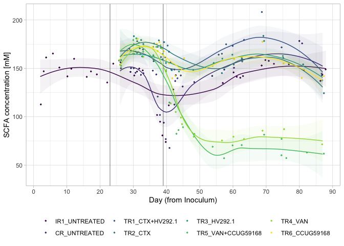

#### Load required packages


```r
library(tidyverse)
library(phyloseq)
library(speedyseq)
library(plotly)
options(getClass.msg=FALSE) # https://github.com/epurdom/clusterExperiment/issues/66
#this fixes an error message that pops up because the class 'Annotated' is defined in two different packages
```

#### Load functions from Github


```r
'%!in%' <- function(x,y)!('%in%'(x,y))

source("https://raw.githubusercontent.com/fconstancias/DivComAnalyses/master/R/phyloseq_taxa_tests.R")
source("https://raw.githubusercontent.com/fconstancias/DivComAnalyses/master/R/phyloseq_normalisation.R")
```

```
## Loading required package: scales
```

```
## 
## Attaching package: 'scales'
```

```
## The following object is masked from 'package:purrr':
## 
##     discard
```

```
## The following object is masked from 'package:readr':
## 
##     col_factor
```

```
## Loading required package: reshape2
```

```
## 
## Attaching package: 'reshape2'
```

```
## The following object is masked from 'package:tidyr':
## 
##     smiths
```

```r
source("https://raw.githubusercontent.com/fconstancias/DivComAnalyses/master/R/phyloseq_alpha.R")
source("https://raw.githubusercontent.com/fconstancias/DivComAnalyses/master/R/phyloseq_beta.R")
source("https://raw.githubusercontent.com/fconstancias/DivComAnalyses/master/R/phyloseq_heatmap.R")
```


#### Load physeq object


```r
ps = "~/Documents/GitHub/amchick/data/processed/physeq_update_23_11.RDS"

ps %>% 
  here::here() %>%
  readRDS() %>%
  phyloseq_get_strains_fast() %>%
  phyloseq_remove_chloro_mitho() -> physeq
```

```
## Joining, by = "ASV"
```

```r
physeq
```

```
## phyloseq-class experiment-level object
## otu_table()   OTU Table:         [ 346 taxa and 384 samples ]
## sample_data() Sample Data:       [ 384 samples by 50 sample variables ]
## tax_table()   Taxonomy Table:    [ 346 taxa by 8 taxonomic ranks ]
## phy_tree()    Phylogenetic Tree: [ 346 tips and 344 internal nodes ]
## refseq()      DNAStringSet:      [ 346 reference sequences ]
```


```r
physeq@sam_data %>%
  data.frame() %>%
  rownames_to_column('id') %>%
  left_join(
    "~/Documents/GitHub/amchick/data/raw/hplc Fermentation (Salvato automaticamente).xlsx" %>%
      readxl::read_xlsx(sheet = "All total"),
    by = c("Sample_description" = "Sample_Id")) %>%
  column_to_rownames('id') %>% 
  sample_data() -> physeq@sam_data
```


```r
physeq
```

```
## phyloseq-class experiment-level object
## otu_table()   OTU Table:         [ 346 taxa and 384 samples ]
## sample_data() Sample Data:       [ 384 samples by 63 sample variables ]
## tax_table()   Taxonomy Table:    [ 346 taxa by 8 taxonomic ranks ]
## phy_tree()    Phylogenetic Tree: [ 346 tips and 344 internal nodes ]
## refseq()      DNAStringSet:      [ 346 reference sequences ]
```

We will be analyzing only the PolyFermS samples here so take a subset of the physeq object.  

```r
physeq %>% 
  subset_samples(Experiment == "Continuous") %>% 
  subset_samples(Paul %!in% c("Paul")) %>%
  subset_samples(Reactor != "IR2") -> ps_polyFermS

sample_data(ps_polyFermS)$Reactor <- fct_relevel(sample_data(ps_polyFermS)$Reactor, "IR1", "CR", "TR1", "TR2","TR3", "TR4", "TR5", "TR6") 

sample_data(ps_polyFermS)$Treatment <- fct_relevel(sample_data(ps_polyFermS)$Treatment, "UNTREATED",  "CTX+HV292.1", "CTX","HV292.1","VAN+CCUG59168", "VAN",  "CCUG59168") 

sample_data(ps_polyFermS)$Reactor_Treatment <- fct_relevel(sample_data(ps_polyFermS)$Reactor_Treatment, "IR1_UNTREATED","CR_UNTREATED", "CR_CTX", "CR_VAN", "TR1_CTX+HV292.1","TR2_CTX", "TR3_HV292.1", "TR5_VAN+CCUG59168", "TR4_VAN", "TR6_CCUG59168") 
```


```r
ps_polyFermS %>%
  sample_data() %>%
  data.frame() -> df
```


```r
measures = df %>% select(ends_with("mM")) %>% colnames()

# define a function to plot scatter plot
my_fn <- function(data, mapping, ...){
  p <- ggplot(data = data, mapping = mapping) +
    geom_point() +
    geom_smooth(method=lm, ...)
  p
}


df %>%
  GGally::ggpairs(columns = measures,
                  ggplot2::aes(colour = Reactor),
                  # legend = 1,
                  progress = FALSE,
                  upper = list(
                    continuous = GGally::wrap('cor', method = "pearson")
                  ),
                  lower = list(continuous = my_fn)) -> p_corr

p_corr
```

<!-- -->


```r
df %>%
  plot_alphas(measure = measures,
              x_group = "Reactor_Treatment",
              colour_group = "Enrichment",
              fill_group = "Enrichment",
              shape_group = "Enrichment",
              facet_group = "Reactor_Treatment",
              test_group = "Reactor_Treatment",
              test_group_2 = "Enrichment") -> out
```


```r
plot_alpha_time <- function(df, 
                            x = "Day_from_Inoculum", 
                            y = "value", 
                            shape = "neg",
                            fill = "Reactor_Treatment",
                            group = "Reactor_Treatment", 
                            facet)
{
  df %>%
  arrange(Day_from_Inoculum) %>%
  ggplot(aes_string(x = x,
             y = y, shape = shape)) +
  geom_point(size=2, alpha=0.9, aes_string(group = group, color = fill, fill = fill),  show.legend = FALSE) + 
  geom_path(inherit.aes = TRUE, aes_string(group=group),
            size = 0.08,
            linetype = "dashed") +
  facet_grid(as.formula(facet), scales = "free") +
  theme_light() +
  scale_color_viridis_d(na.value = "black") + 
  geom_vline(xintercept = c(23,39), 
             color="black", alpha=0.4) + 
  # geom_smooth(show.legend = TRUE, level = 0.95) + 
  scale_x_continuous(breaks=seq(0,90,10)) -> plot

  return(plot)
}
```


```r
out$plot$data %>%
  dplyr::filter(alphadiversiy == "Total_SCFA_mM") %>%
  dplyr::mutate(neg = ifelse(value == 0, "neg", "pos")) %>%
  arrange(Day_from_Inoculum) %>%
  ggplot(aes_string(x = "Day_from_Inoculum",
                    y = "value", group = "Reactor_Treatment")) +
  geom_jitter(size=0.5, alpha=0.9, aes_string(group = "Reactor_Treatment", color = "Reactor_Treatment", fill = "Reactor_Treatment"),  show.legend = TRUE) + 
  geom_path(inherit.aes = TRUE, aes_string(group="Reactor_Treatment", fill = "Reactor_Treatment", color = "Reactor_Treatment", show.legend = FALSE),
            size = 0.001,
            linetype = "dashed") +
  # facet_grid(as.formula(facet), scales = "free") +
  geom_vline(xintercept = c(23,39), 
             color="black", alpha=0.4) + 
  geom_smooth(show.legend = FALSE, level = 0.95, alpha=0.05, size = 0.5 ,aes_string(group="Reactor_Treatment", color = "Reactor_Treatment", fill = "Reactor_Treatment")) +
  scale_x_continuous(breaks=seq(0,90,10)) +
  # scale_y_continuous(labels = scientific,
  #                    limits=c(1e+10, 1e+11), breaks = seq(1e+10, 1e+11, by = 1e+10),
  #                    trans = "log10") +
  labs(x="Day (from Inoculum)", y= "SCFA concentration [mM]",  
       col=NULL, fill = NULL, shape = NULL) +
  theme_light() +
  scale_color_viridis_d(na.value = "black") +
  scale_fill_viridis_d(na.value = "black") -> plot
```

```
## Warning: Ignoring unknown aesthetics: fill, show.legend
```

```r
plot + theme(legend.position = "bottom")
```

```
## `geom_smooth()` using method = 'loess' and formula 'y ~ x'
```

<!-- -->


```r
plot %>%
  plotly::ggplotly()
```

```
## `geom_smooth()` using method = 'loess' and formula 'y ~ x'
```

```
## Warning: `group_by_()` is deprecated as of dplyr 0.7.0.
## Please use `group_by()` instead.
## See vignette('programming') for more help
## This warning is displayed once every 8 hours.
## Call `lifecycle::last_warnings()` to see where this warning was generated.
```

<!--html_preserve--><div id="htmlwidget-b28d42b717cdcc3c7967" style="width:672px;height:480px;" class="plotly html-widget"></div>
<script type="application/json" data-for="htmlwidget-b28d42b717cdcc3c7967">{"x":{"data":[{"x":[1.96595457140356,2.71543331909925,3.96885282639414,6.30771165657788,8.39757598526776,10.2681867737323,11.3291812049225,12.0392618441954,16.0963691597804,16.6529779998586,19.2025806734338,22.2798517059535,23.8536269638687,26.3350662790239,28.7657219370827,30.3144745141268,30.9393169675022,32.204709222354,33.1657002964988,36.2131416689605,36.9476414900273,37.8905062606558,38.6320242540911,39.888884063065,40.9544584045187,42.1435331298038,42.8700223837048,56.6918398723006,57.9595104660839,59.8715397039428,60.6099157897755,61.9575869726017,63.0253252040595,68.6949854755774,70.1968255668879,71.1898527242243,72.0094613509253,76.9150763997808,79.9722668301314,81.3954908955842,85.8049441609532,87.3589466650039,88.1119888016954],"y":[112.703444478535,146.922639649534,161.21616207783,165.290320572832,150.790938924855,141.698553831967,149.601940424696,159.837221413626,141.180580618013,146.813471772075,143.73677025014,135.385211780114,154.843501347791,156.229052814856,146.3446902648,142.60397141926,146.665373272461,149.772552569772,147.895991136029,159.325091473314,101.80442441014,94.8764625019986,80.700233112837,73.9373841653653,111.773599773475,128.108729954838,142.893950717723,134.85335207644,142.132056488494,145.788010350446,141.248465385002,140.286448273281,142.014424916241,152.89837834647,158.565189124962,157.699262208889,154.67236335525,154.1977198801,178.256274058633,148.269177586904,137.028535840539,143.694782740125,148.895957717468],"text":["Reactor_Treatment: IR1_UNTREATED<br />Reactor_Treatment: IR1_UNTREATED<br />Reactor_Treatment: IR1_UNTREATED<br />Reactor_Treatment: IR1_UNTREATED<br />Day_from_Inoculum:  2<br />value: 112.703","Reactor_Treatment: IR1_UNTREATED<br />Reactor_Treatment: IR1_UNTREATED<br />Reactor_Treatment: IR1_UNTREATED<br />Reactor_Treatment: IR1_UNTREATED<br />Day_from_Inoculum:  3<br />value: 146.922","Reactor_Treatment: IR1_UNTREATED<br />Reactor_Treatment: IR1_UNTREATED<br />Reactor_Treatment: IR1_UNTREATED<br />Reactor_Treatment: IR1_UNTREATED<br />Day_from_Inoculum:  4<br />value: 161.216","Reactor_Treatment: IR1_UNTREATED<br />Reactor_Treatment: IR1_UNTREATED<br />Reactor_Treatment: IR1_UNTREATED<br />Reactor_Treatment: IR1_UNTREATED<br />Day_from_Inoculum:  6<br />value: 165.291","Reactor_Treatment: IR1_UNTREATED<br />Reactor_Treatment: IR1_UNTREATED<br />Reactor_Treatment: IR1_UNTREATED<br />Reactor_Treatment: IR1_UNTREATED<br />Day_from_Inoculum:  8<br />value: 150.791","Reactor_Treatment: IR1_UNTREATED<br />Reactor_Treatment: IR1_UNTREATED<br />Reactor_Treatment: IR1_UNTREATED<br />Reactor_Treatment: IR1_UNTREATED<br />Day_from_Inoculum: 10<br />value: 141.698","Reactor_Treatment: IR1_UNTREATED<br />Reactor_Treatment: IR1_UNTREATED<br />Reactor_Treatment: IR1_UNTREATED<br />Reactor_Treatment: IR1_UNTREATED<br />Day_from_Inoculum: 11<br />value: 149.602","Reactor_Treatment: IR1_UNTREATED<br />Reactor_Treatment: IR1_UNTREATED<br />Reactor_Treatment: IR1_UNTREATED<br />Reactor_Treatment: IR1_UNTREATED<br />Day_from_Inoculum: 12<br />value: 159.837","Reactor_Treatment: IR1_UNTREATED<br />Reactor_Treatment: IR1_UNTREATED<br />Reactor_Treatment: IR1_UNTREATED<br />Reactor_Treatment: IR1_UNTREATED<br />Day_from_Inoculum: 16<br />value: 141.181","Reactor_Treatment: IR1_UNTREATED<br />Reactor_Treatment: IR1_UNTREATED<br />Reactor_Treatment: IR1_UNTREATED<br />Reactor_Treatment: IR1_UNTREATED<br />Day_from_Inoculum: 17<br />value: 146.814","Reactor_Treatment: IR1_UNTREATED<br />Reactor_Treatment: IR1_UNTREATED<br />Reactor_Treatment: IR1_UNTREATED<br />Reactor_Treatment: IR1_UNTREATED<br />Day_from_Inoculum: 19<br />value: 143.737","Reactor_Treatment: IR1_UNTREATED<br />Reactor_Treatment: IR1_UNTREATED<br />Reactor_Treatment: IR1_UNTREATED<br />Reactor_Treatment: IR1_UNTREATED<br />Day_from_Inoculum: 22<br />value: 135.385","Reactor_Treatment: IR1_UNTREATED<br />Reactor_Treatment: IR1_UNTREATED<br />Reactor_Treatment: IR1_UNTREATED<br />Reactor_Treatment: IR1_UNTREATED<br />Day_from_Inoculum: 24<br />value: 154.844","Reactor_Treatment: IR1_UNTREATED<br />Reactor_Treatment: IR1_UNTREATED<br />Reactor_Treatment: IR1_UNTREATED<br />Reactor_Treatment: IR1_UNTREATED<br />Day_from_Inoculum: 26<br />value: 156.229","Reactor_Treatment: IR1_UNTREATED<br />Reactor_Treatment: IR1_UNTREATED<br />Reactor_Treatment: IR1_UNTREATED<br />Reactor_Treatment: IR1_UNTREATED<br />Day_from_Inoculum: 29<br />value: 146.344","Reactor_Treatment: IR1_UNTREATED<br />Reactor_Treatment: IR1_UNTREATED<br />Reactor_Treatment: IR1_UNTREATED<br />Reactor_Treatment: IR1_UNTREATED<br />Day_from_Inoculum: 30<br />value: 142.604","Reactor_Treatment: IR1_UNTREATED<br />Reactor_Treatment: IR1_UNTREATED<br />Reactor_Treatment: IR1_UNTREATED<br />Reactor_Treatment: IR1_UNTREATED<br />Day_from_Inoculum: 31<br />value: 146.666","Reactor_Treatment: IR1_UNTREATED<br />Reactor_Treatment: IR1_UNTREATED<br />Reactor_Treatment: IR1_UNTREATED<br />Reactor_Treatment: IR1_UNTREATED<br />Day_from_Inoculum: 32<br />value: 149.773","Reactor_Treatment: IR1_UNTREATED<br />Reactor_Treatment: IR1_UNTREATED<br />Reactor_Treatment: IR1_UNTREATED<br />Reactor_Treatment: IR1_UNTREATED<br />Day_from_Inoculum: 33<br />value: 147.896","Reactor_Treatment: IR1_UNTREATED<br />Reactor_Treatment: IR1_UNTREATED<br />Reactor_Treatment: IR1_UNTREATED<br />Reactor_Treatment: IR1_UNTREATED<br />Day_from_Inoculum: 36<br />value: 159.325","Reactor_Treatment: IR1_UNTREATED<br />Reactor_Treatment: IR1_UNTREATED<br />Reactor_Treatment: IR1_UNTREATED<br />Reactor_Treatment: IR1_UNTREATED<br />Day_from_Inoculum: 37<br />value: 101.804","Reactor_Treatment: IR1_UNTREATED<br />Reactor_Treatment: IR1_UNTREATED<br />Reactor_Treatment: IR1_UNTREATED<br />Reactor_Treatment: IR1_UNTREATED<br />Day_from_Inoculum: 38<br />value:  94.876","Reactor_Treatment: IR1_UNTREATED<br />Reactor_Treatment: IR1_UNTREATED<br />Reactor_Treatment: IR1_UNTREATED<br />Reactor_Treatment: IR1_UNTREATED<br />Day_from_Inoculum: 39<br />value:  80.700","Reactor_Treatment: IR1_UNTREATED<br />Reactor_Treatment: IR1_UNTREATED<br />Reactor_Treatment: IR1_UNTREATED<br />Reactor_Treatment: IR1_UNTREATED<br />Day_from_Inoculum: 40<br />value:  73.937","Reactor_Treatment: IR1_UNTREATED<br />Reactor_Treatment: IR1_UNTREATED<br />Reactor_Treatment: IR1_UNTREATED<br />Reactor_Treatment: IR1_UNTREATED<br />Day_from_Inoculum: 41<br />value: 111.774","Reactor_Treatment: IR1_UNTREATED<br />Reactor_Treatment: IR1_UNTREATED<br />Reactor_Treatment: IR1_UNTREATED<br />Reactor_Treatment: IR1_UNTREATED<br />Day_from_Inoculum: 42<br />value: 128.108","Reactor_Treatment: IR1_UNTREATED<br />Reactor_Treatment: IR1_UNTREATED<br />Reactor_Treatment: IR1_UNTREATED<br />Reactor_Treatment: IR1_UNTREATED<br />Day_from_Inoculum: 43<br />value: 142.894","Reactor_Treatment: IR1_UNTREATED<br />Reactor_Treatment: IR1_UNTREATED<br />Reactor_Treatment: IR1_UNTREATED<br />Reactor_Treatment: IR1_UNTREATED<br />Day_from_Inoculum: 57<br />value: 134.853","Reactor_Treatment: IR1_UNTREATED<br />Reactor_Treatment: IR1_UNTREATED<br />Reactor_Treatment: IR1_UNTREATED<br />Reactor_Treatment: IR1_UNTREATED<br />Day_from_Inoculum: 58<br />value: 142.132","Reactor_Treatment: IR1_UNTREATED<br />Reactor_Treatment: IR1_UNTREATED<br />Reactor_Treatment: IR1_UNTREATED<br />Reactor_Treatment: IR1_UNTREATED<br />Day_from_Inoculum: 60<br />value: 145.788","Reactor_Treatment: IR1_UNTREATED<br />Reactor_Treatment: IR1_UNTREATED<br />Reactor_Treatment: IR1_UNTREATED<br />Reactor_Treatment: IR1_UNTREATED<br />Day_from_Inoculum: 61<br />value: 141.248","Reactor_Treatment: IR1_UNTREATED<br />Reactor_Treatment: IR1_UNTREATED<br />Reactor_Treatment: IR1_UNTREATED<br />Reactor_Treatment: IR1_UNTREATED<br />Day_from_Inoculum: 62<br />value: 140.286","Reactor_Treatment: IR1_UNTREATED<br />Reactor_Treatment: IR1_UNTREATED<br />Reactor_Treatment: IR1_UNTREATED<br />Reactor_Treatment: IR1_UNTREATED<br />Day_from_Inoculum: 63<br />value: 142.015","Reactor_Treatment: IR1_UNTREATED<br />Reactor_Treatment: IR1_UNTREATED<br />Reactor_Treatment: IR1_UNTREATED<br />Reactor_Treatment: IR1_UNTREATED<br />Day_from_Inoculum: 69<br />value: 152.899","Reactor_Treatment: IR1_UNTREATED<br />Reactor_Treatment: IR1_UNTREATED<br />Reactor_Treatment: IR1_UNTREATED<br />Reactor_Treatment: IR1_UNTREATED<br />Day_from_Inoculum: 70<br />value: 158.565","Reactor_Treatment: IR1_UNTREATED<br />Reactor_Treatment: IR1_UNTREATED<br />Reactor_Treatment: IR1_UNTREATED<br />Reactor_Treatment: IR1_UNTREATED<br />Day_from_Inoculum: 71<br />value: 157.700","Reactor_Treatment: IR1_UNTREATED<br />Reactor_Treatment: IR1_UNTREATED<br />Reactor_Treatment: IR1_UNTREATED<br />Reactor_Treatment: IR1_UNTREATED<br />Day_from_Inoculum: 72<br />value: 154.672","Reactor_Treatment: IR1_UNTREATED<br />Reactor_Treatment: IR1_UNTREATED<br />Reactor_Treatment: IR1_UNTREATED<br />Reactor_Treatment: IR1_UNTREATED<br />Day_from_Inoculum: 77<br />value: 154.198","Reactor_Treatment: IR1_UNTREATED<br />Reactor_Treatment: IR1_UNTREATED<br />Reactor_Treatment: IR1_UNTREATED<br />Reactor_Treatment: IR1_UNTREATED<br />Day_from_Inoculum: 80<br />value: 178.256","Reactor_Treatment: IR1_UNTREATED<br />Reactor_Treatment: IR1_UNTREATED<br />Reactor_Treatment: IR1_UNTREATED<br />Reactor_Treatment: IR1_UNTREATED<br />Day_from_Inoculum: 81<br />value: 148.269","Reactor_Treatment: IR1_UNTREATED<br />Reactor_Treatment: IR1_UNTREATED<br />Reactor_Treatment: IR1_UNTREATED<br />Reactor_Treatment: IR1_UNTREATED<br />Day_from_Inoculum: 86<br />value: 137.028","Reactor_Treatment: IR1_UNTREATED<br />Reactor_Treatment: IR1_UNTREATED<br />Reactor_Treatment: IR1_UNTREATED<br />Reactor_Treatment: IR1_UNTREATED<br />Day_from_Inoculum: 87<br />value: 143.694","Reactor_Treatment: IR1_UNTREATED<br />Reactor_Treatment: IR1_UNTREATED<br />Reactor_Treatment: IR1_UNTREATED<br />Reactor_Treatment: IR1_UNTREATED<br />Day_from_Inoculum: 88<br />value: 148.896"],"type":"scatter","mode":"markers","marker":{"autocolorscale":false,"color":"rgba(68,1,84,1)","opacity":0.9,"size":1.88976377952756,"symbol":"circle","line":{"width":1.88976377952756,"color":"rgba(68,1,84,1)"}},"hoveron":"points","name":"IR1_UNTREATED","legendgroup":"IR1_UNTREATED","showlegend":true,"xaxis":"x","yaxis":"y","hoverinfo":"text","frame":null},{"x":[26.0564016448334,25.9937824714929,30.1833164395764,31.0744888966903,32.1217389328405,33.3592765467241,35.669074540399,36.8545333320275,38.2104958008975,39.3031280135736,39.7629949521273,41.1261265549809,42.2827018652111,42.7629761999473,44.0033685486764,44.6210464846343,47.6375640081242,57.1198697954416,59.723917809315,63.116873129271,81.3545131158084,87.2650481790304],"y":[150.098832979694,150.154427299032,150.118447042884,145.407895090868,143.259677635964,144.926735143504,147.635157674256,143.668517188501,101.838781722427,93.8470108936116,76.880017160847,67.7341876676947,112.555696504262,136.866820932324,142.666824442364,131.203809845032,135.833556306323,148.658415564886,150.546571080871,159.558379883416,175.769616914202,142.830566272514],"text":["Reactor_Treatment: CR_UNTREATED<br />Reactor_Treatment: CR_UNTREATED<br />Reactor_Treatment: CR_UNTREATED<br />Reactor_Treatment: CR_UNTREATED<br />Day_from_Inoculum: 26<br />value: 150.099","Reactor_Treatment: CR_UNTREATED<br />Reactor_Treatment: CR_UNTREATED<br />Reactor_Treatment: CR_UNTREATED<br />Reactor_Treatment: CR_UNTREATED<br />Day_from_Inoculum: 26<br />value: 150.155","Reactor_Treatment: CR_UNTREATED<br />Reactor_Treatment: CR_UNTREATED<br />Reactor_Treatment: CR_UNTREATED<br />Reactor_Treatment: CR_UNTREATED<br />Day_from_Inoculum: 30<br />value: 150.119","Reactor_Treatment: CR_UNTREATED<br />Reactor_Treatment: CR_UNTREATED<br />Reactor_Treatment: CR_UNTREATED<br />Reactor_Treatment: CR_UNTREATED<br />Day_from_Inoculum: 31<br />value: 145.408","Reactor_Treatment: CR_UNTREATED<br />Reactor_Treatment: CR_UNTREATED<br />Reactor_Treatment: CR_UNTREATED<br />Reactor_Treatment: CR_UNTREATED<br />Day_from_Inoculum: 32<br />value: 143.259","Reactor_Treatment: CR_UNTREATED<br />Reactor_Treatment: CR_UNTREATED<br />Reactor_Treatment: CR_UNTREATED<br />Reactor_Treatment: CR_UNTREATED<br />Day_from_Inoculum: 33<br />value: 144.927","Reactor_Treatment: CR_UNTREATED<br />Reactor_Treatment: CR_UNTREATED<br />Reactor_Treatment: CR_UNTREATED<br />Reactor_Treatment: CR_UNTREATED<br />Day_from_Inoculum: 36<br />value: 147.635","Reactor_Treatment: CR_UNTREATED<br />Reactor_Treatment: CR_UNTREATED<br />Reactor_Treatment: CR_UNTREATED<br />Reactor_Treatment: CR_UNTREATED<br />Day_from_Inoculum: 37<br />value: 143.669","Reactor_Treatment: CR_UNTREATED<br />Reactor_Treatment: CR_UNTREATED<br />Reactor_Treatment: CR_UNTREATED<br />Reactor_Treatment: CR_UNTREATED<br />Day_from_Inoculum: 38<br />value: 101.838","Reactor_Treatment: CR_UNTREATED<br />Reactor_Treatment: CR_UNTREATED<br />Reactor_Treatment: CR_UNTREATED<br />Reactor_Treatment: CR_UNTREATED<br />Day_from_Inoculum: 39<br />value:  93.847","Reactor_Treatment: CR_UNTREATED<br />Reactor_Treatment: CR_UNTREATED<br />Reactor_Treatment: CR_UNTREATED<br />Reactor_Treatment: CR_UNTREATED<br />Day_from_Inoculum: 40<br />value:  76.880","Reactor_Treatment: CR_UNTREATED<br />Reactor_Treatment: CR_UNTREATED<br />Reactor_Treatment: CR_UNTREATED<br />Reactor_Treatment: CR_UNTREATED<br />Day_from_Inoculum: 41<br />value:  67.734","Reactor_Treatment: CR_UNTREATED<br />Reactor_Treatment: CR_UNTREATED<br />Reactor_Treatment: CR_UNTREATED<br />Reactor_Treatment: CR_UNTREATED<br />Day_from_Inoculum: 42<br />value: 112.555","Reactor_Treatment: CR_UNTREATED<br />Reactor_Treatment: CR_UNTREATED<br />Reactor_Treatment: CR_UNTREATED<br />Reactor_Treatment: CR_UNTREATED<br />Day_from_Inoculum: 43<br />value: 136.867","Reactor_Treatment: CR_UNTREATED<br />Reactor_Treatment: CR_UNTREATED<br />Reactor_Treatment: CR_UNTREATED<br />Reactor_Treatment: CR_UNTREATED<br />Day_from_Inoculum: 44<br />value: 142.667","Reactor_Treatment: CR_UNTREATED<br />Reactor_Treatment: CR_UNTREATED<br />Reactor_Treatment: CR_UNTREATED<br />Reactor_Treatment: CR_UNTREATED<br />Day_from_Inoculum: 45<br />value: 131.204","Reactor_Treatment: CR_UNTREATED<br />Reactor_Treatment: CR_UNTREATED<br />Reactor_Treatment: CR_UNTREATED<br />Reactor_Treatment: CR_UNTREATED<br />Day_from_Inoculum: 48<br />value: 135.833","Reactor_Treatment: CR_UNTREATED<br />Reactor_Treatment: CR_UNTREATED<br />Reactor_Treatment: CR_UNTREATED<br />Reactor_Treatment: CR_UNTREATED<br />Day_from_Inoculum: 57<br />value: 148.659","Reactor_Treatment: CR_UNTREATED<br />Reactor_Treatment: CR_UNTREATED<br />Reactor_Treatment: CR_UNTREATED<br />Reactor_Treatment: CR_UNTREATED<br />Day_from_Inoculum: 60<br />value: 150.547","Reactor_Treatment: CR_UNTREATED<br />Reactor_Treatment: CR_UNTREATED<br />Reactor_Treatment: CR_UNTREATED<br />Reactor_Treatment: CR_UNTREATED<br />Day_from_Inoculum: 63<br />value: 159.559","Reactor_Treatment: CR_UNTREATED<br />Reactor_Treatment: CR_UNTREATED<br />Reactor_Treatment: CR_UNTREATED<br />Reactor_Treatment: CR_UNTREATED<br />Day_from_Inoculum: 81<br />value: 175.770","Reactor_Treatment: CR_UNTREATED<br />Reactor_Treatment: CR_UNTREATED<br />Reactor_Treatment: CR_UNTREATED<br />Reactor_Treatment: CR_UNTREATED<br />Day_from_Inoculum: 87<br />value: 142.830"],"type":"scatter","mode":"markers","marker":{"autocolorscale":false,"color":"rgba(70,51,126,1)","opacity":0.9,"size":1.88976377952756,"symbol":"circle","line":{"width":1.88976377952756,"color":"rgba(70,51,126,1)"}},"hoveron":"points","name":"CR_UNTREATED","legendgroup":"CR_UNTREATED","showlegend":true,"xaxis":"x","yaxis":"y","hoverinfo":"text","frame":null},{"x":[26.2243701165542,29.3247234959155,29.841802101396,31.3845961999148,31.6152201380581,33.2271354189143,36.3471084009856,37.3780427243561,38.3691653644666,39.1693014692515,39.8784175239503,41.3629235954955,41.7795288641006,43.3800320249051,56.2949019113556,56.6912812601775,57.9878777204081,59.6443386863917,63.3845705520362,69.2936874765903,74.7415628017858,86.6962861731649],"y":[158.099541585598,170.192674242079,174.812129336946,178.021251289163,170.646870641129,169.420074881714,157.392234270098,120.7914730651,161.602441644149,159.123717499858,161.444446297157,156.245910935739,148.69504863016,139.725798689354,164.071779088744,165.066720335823,174.840729450254,173.167081258539,179.378339952629,208.178524071847,171.699337448473,144.455083274223],"text":["Reactor_Treatment: TR1_CTX+HV292.1<br />Reactor_Treatment: TR1_CTX+HV292.1<br />Reactor_Treatment: TR1_CTX+HV292.1<br />Reactor_Treatment: TR1_CTX+HV292.1<br />Day_from_Inoculum: 26<br />value: 158.100","Reactor_Treatment: TR1_CTX+HV292.1<br />Reactor_Treatment: TR1_CTX+HV292.1<br />Reactor_Treatment: TR1_CTX+HV292.1<br />Reactor_Treatment: TR1_CTX+HV292.1<br />Day_from_Inoculum: 29<br />value: 170.193","Reactor_Treatment: TR1_CTX+HV292.1<br />Reactor_Treatment: TR1_CTX+HV292.1<br />Reactor_Treatment: TR1_CTX+HV292.1<br />Reactor_Treatment: TR1_CTX+HV292.1<br />Day_from_Inoculum: 30<br />value: 174.812","Reactor_Treatment: TR1_CTX+HV292.1<br />Reactor_Treatment: TR1_CTX+HV292.1<br />Reactor_Treatment: TR1_CTX+HV292.1<br />Reactor_Treatment: TR1_CTX+HV292.1<br />Day_from_Inoculum: 31<br />value: 178.022","Reactor_Treatment: TR1_CTX+HV292.1<br />Reactor_Treatment: TR1_CTX+HV292.1<br />Reactor_Treatment: TR1_CTX+HV292.1<br />Reactor_Treatment: TR1_CTX+HV292.1<br />Day_from_Inoculum: 32<br />value: 170.647","Reactor_Treatment: TR1_CTX+HV292.1<br />Reactor_Treatment: TR1_CTX+HV292.1<br />Reactor_Treatment: TR1_CTX+HV292.1<br />Reactor_Treatment: TR1_CTX+HV292.1<br />Day_from_Inoculum: 33<br />value: 169.420","Reactor_Treatment: TR1_CTX+HV292.1<br />Reactor_Treatment: TR1_CTX+HV292.1<br />Reactor_Treatment: TR1_CTX+HV292.1<br />Reactor_Treatment: TR1_CTX+HV292.1<br />Day_from_Inoculum: 36<br />value: 157.392","Reactor_Treatment: TR1_CTX+HV292.1<br />Reactor_Treatment: TR1_CTX+HV292.1<br />Reactor_Treatment: TR1_CTX+HV292.1<br />Reactor_Treatment: TR1_CTX+HV292.1<br />Day_from_Inoculum: 37<br />value: 120.791","Reactor_Treatment: TR1_CTX+HV292.1<br />Reactor_Treatment: TR1_CTX+HV292.1<br />Reactor_Treatment: TR1_CTX+HV292.1<br />Reactor_Treatment: TR1_CTX+HV292.1<br />Day_from_Inoculum: 38<br />value: 161.603","Reactor_Treatment: TR1_CTX+HV292.1<br />Reactor_Treatment: TR1_CTX+HV292.1<br />Reactor_Treatment: TR1_CTX+HV292.1<br />Reactor_Treatment: TR1_CTX+HV292.1<br />Day_from_Inoculum: 39<br />value: 159.124","Reactor_Treatment: TR1_CTX+HV292.1<br />Reactor_Treatment: TR1_CTX+HV292.1<br />Reactor_Treatment: TR1_CTX+HV292.1<br />Reactor_Treatment: TR1_CTX+HV292.1<br />Day_from_Inoculum: 40<br />value: 161.445","Reactor_Treatment: TR1_CTX+HV292.1<br />Reactor_Treatment: TR1_CTX+HV292.1<br />Reactor_Treatment: TR1_CTX+HV292.1<br />Reactor_Treatment: TR1_CTX+HV292.1<br />Day_from_Inoculum: 41<br />value: 156.246","Reactor_Treatment: TR1_CTX+HV292.1<br />Reactor_Treatment: TR1_CTX+HV292.1<br />Reactor_Treatment: TR1_CTX+HV292.1<br />Reactor_Treatment: TR1_CTX+HV292.1<br />Day_from_Inoculum: 42<br />value: 148.695","Reactor_Treatment: TR1_CTX+HV292.1<br />Reactor_Treatment: TR1_CTX+HV292.1<br />Reactor_Treatment: TR1_CTX+HV292.1<br />Reactor_Treatment: TR1_CTX+HV292.1<br />Day_from_Inoculum: 43<br />value: 139.725","Reactor_Treatment: TR1_CTX+HV292.1<br />Reactor_Treatment: TR1_CTX+HV292.1<br />Reactor_Treatment: TR1_CTX+HV292.1<br />Reactor_Treatment: TR1_CTX+HV292.1<br />Day_from_Inoculum: 56<br />value: 164.072","Reactor_Treatment: TR1_CTX+HV292.1<br />Reactor_Treatment: TR1_CTX+HV292.1<br />Reactor_Treatment: TR1_CTX+HV292.1<br />Reactor_Treatment: TR1_CTX+HV292.1<br />Day_from_Inoculum: 57<br />value: 165.067","Reactor_Treatment: TR1_CTX+HV292.1<br />Reactor_Treatment: TR1_CTX+HV292.1<br />Reactor_Treatment: TR1_CTX+HV292.1<br />Reactor_Treatment: TR1_CTX+HV292.1<br />Day_from_Inoculum: 58<br />value: 174.840","Reactor_Treatment: TR1_CTX+HV292.1<br />Reactor_Treatment: TR1_CTX+HV292.1<br />Reactor_Treatment: TR1_CTX+HV292.1<br />Reactor_Treatment: TR1_CTX+HV292.1<br />Day_from_Inoculum: 60<br />value: 173.167","Reactor_Treatment: TR1_CTX+HV292.1<br />Reactor_Treatment: TR1_CTX+HV292.1<br />Reactor_Treatment: TR1_CTX+HV292.1<br />Reactor_Treatment: TR1_CTX+HV292.1<br />Day_from_Inoculum: 63<br />value: 179.379","Reactor_Treatment: TR1_CTX+HV292.1<br />Reactor_Treatment: TR1_CTX+HV292.1<br />Reactor_Treatment: TR1_CTX+HV292.1<br />Reactor_Treatment: TR1_CTX+HV292.1<br />Day_from_Inoculum: 69<br />value: 208.178","Reactor_Treatment: TR1_CTX+HV292.1<br />Reactor_Treatment: TR1_CTX+HV292.1<br />Reactor_Treatment: TR1_CTX+HV292.1<br />Reactor_Treatment: TR1_CTX+HV292.1<br />Day_from_Inoculum: 75<br />value: 171.699","Reactor_Treatment: TR1_CTX+HV292.1<br />Reactor_Treatment: TR1_CTX+HV292.1<br />Reactor_Treatment: TR1_CTX+HV292.1<br />Reactor_Treatment: TR1_CTX+HV292.1<br />Day_from_Inoculum: 87<br />value: 144.455"],"type":"scatter","mode":"markers","marker":{"autocolorscale":false,"color":"rgba(54,92,141,1)","opacity":0.9,"size":1.88976377952756,"symbol":"circle","line":{"width":1.88976377952756,"color":"rgba(54,92,141,1)"}},"hoveron":"points","name":"TR1_CTX+HV292.1","legendgroup":"TR1_CTX+HV292.1","showlegend":true,"xaxis":"x","yaxis":"y","hoverinfo":"text","frame":null},{"x":[26.1676349304616,29.7486449411139,30.9336832897738,32.010951734893,33.080522621423,35.8322155741975,36.7716896742582,37.9770444620401,38.9225211463869,40.1464807882905,40.7730145348236,42.2536430675536,57.183913173154,59.8320982947946,62.6291115034372,68.913472378999,75.189253651537,80.9487631866708,86.7287707906216],"y":[153.693273093627,183.221269956428,180.645084772353,179.252563732078,175.083784953446,172.169427862724,172.17882430187,178.886369966192,177.081178441211,173.500585942277,167.134049384394,148.109835305081,145.074773195141,153.940059829581,157.114077195372,183.505430609817,160.800287186233,154.067242523968,124.305008591574],"text":["Reactor_Treatment: TR2_CTX<br />Reactor_Treatment: TR2_CTX<br />Reactor_Treatment: TR2_CTX<br />Reactor_Treatment: TR2_CTX<br />Day_from_Inoculum: 26<br />value: 153.694","Reactor_Treatment: TR2_CTX<br />Reactor_Treatment: TR2_CTX<br />Reactor_Treatment: TR2_CTX<br />Reactor_Treatment: TR2_CTX<br />Day_from_Inoculum: 30<br />value: 183.222","Reactor_Treatment: TR2_CTX<br />Reactor_Treatment: TR2_CTX<br />Reactor_Treatment: TR2_CTX<br />Reactor_Treatment: TR2_CTX<br />Day_from_Inoculum: 31<br />value: 180.645","Reactor_Treatment: TR2_CTX<br />Reactor_Treatment: TR2_CTX<br />Reactor_Treatment: TR2_CTX<br />Reactor_Treatment: TR2_CTX<br />Day_from_Inoculum: 32<br />value: 179.252","Reactor_Treatment: TR2_CTX<br />Reactor_Treatment: TR2_CTX<br />Reactor_Treatment: TR2_CTX<br />Reactor_Treatment: TR2_CTX<br />Day_from_Inoculum: 33<br />value: 175.083","Reactor_Treatment: TR2_CTX<br />Reactor_Treatment: TR2_CTX<br />Reactor_Treatment: TR2_CTX<br />Reactor_Treatment: TR2_CTX<br />Day_from_Inoculum: 36<br />value: 172.170","Reactor_Treatment: TR2_CTX<br />Reactor_Treatment: TR2_CTX<br />Reactor_Treatment: TR2_CTX<br />Reactor_Treatment: TR2_CTX<br />Day_from_Inoculum: 37<br />value: 172.179","Reactor_Treatment: TR2_CTX<br />Reactor_Treatment: TR2_CTX<br />Reactor_Treatment: TR2_CTX<br />Reactor_Treatment: TR2_CTX<br />Day_from_Inoculum: 38<br />value: 178.886","Reactor_Treatment: TR2_CTX<br />Reactor_Treatment: TR2_CTX<br />Reactor_Treatment: TR2_CTX<br />Reactor_Treatment: TR2_CTX<br />Day_from_Inoculum: 39<br />value: 177.081","Reactor_Treatment: TR2_CTX<br />Reactor_Treatment: TR2_CTX<br />Reactor_Treatment: TR2_CTX<br />Reactor_Treatment: TR2_CTX<br />Day_from_Inoculum: 40<br />value: 173.501","Reactor_Treatment: TR2_CTX<br />Reactor_Treatment: TR2_CTX<br />Reactor_Treatment: TR2_CTX<br />Reactor_Treatment: TR2_CTX<br />Day_from_Inoculum: 41<br />value: 167.134","Reactor_Treatment: TR2_CTX<br />Reactor_Treatment: TR2_CTX<br />Reactor_Treatment: TR2_CTX<br />Reactor_Treatment: TR2_CTX<br />Day_from_Inoculum: 42<br />value: 148.110","Reactor_Treatment: TR2_CTX<br />Reactor_Treatment: TR2_CTX<br />Reactor_Treatment: TR2_CTX<br />Reactor_Treatment: TR2_CTX<br />Day_from_Inoculum: 57<br />value: 145.075","Reactor_Treatment: TR2_CTX<br />Reactor_Treatment: TR2_CTX<br />Reactor_Treatment: TR2_CTX<br />Reactor_Treatment: TR2_CTX<br />Day_from_Inoculum: 60<br />value: 153.940","Reactor_Treatment: TR2_CTX<br />Reactor_Treatment: TR2_CTX<br />Reactor_Treatment: TR2_CTX<br />Reactor_Treatment: TR2_CTX<br />Day_from_Inoculum: 63<br />value: 157.114","Reactor_Treatment: TR2_CTX<br />Reactor_Treatment: TR2_CTX<br />Reactor_Treatment: TR2_CTX<br />Reactor_Treatment: TR2_CTX<br />Day_from_Inoculum: 69<br />value: 183.506","Reactor_Treatment: TR2_CTX<br />Reactor_Treatment: TR2_CTX<br />Reactor_Treatment: TR2_CTX<br />Reactor_Treatment: TR2_CTX<br />Day_from_Inoculum: 75<br />value: 160.801","Reactor_Treatment: TR2_CTX<br />Reactor_Treatment: TR2_CTX<br />Reactor_Treatment: TR2_CTX<br />Reactor_Treatment: TR2_CTX<br />Day_from_Inoculum: 81<br />value: 154.067","Reactor_Treatment: TR2_CTX<br />Reactor_Treatment: TR2_CTX<br />Reactor_Treatment: TR2_CTX<br />Reactor_Treatment: TR2_CTX<br />Day_from_Inoculum: 87<br />value: 124.305"],"type":"scatter","mode":"markers","marker":{"autocolorscale":false,"color":"rgba(39,127,142,1)","opacity":0.9,"size":1.88976377952756,"symbol":"circle","line":{"width":1.88976377952756,"color":"rgba(39,127,142,1)"}},"hoveron":"points","name":"TR2_CTX","legendgroup":"TR2_CTX","showlegend":true,"xaxis":"x","yaxis":"y","hoverinfo":"text","frame":null},{"x":[26.3620743442327,28.6200805122033,30.1567279752344,30.9645960422233,32.0536295657977,32.7837719524279,35.6141223588958,38.0119484005496,38.7591096572578,39.7082921998575,41.2603062085807,43.934523951821,47.8283985590562,53.8812519578263,57.2738463211805,60.1415202260017,63.2036847829819,68.9658025735989,75.3356436457485,87.0105011189357],"y":[158.54262169604,168.555765398968,164.880041986978,166.052476948522,164.622995190602,162.313053748009,163.406774749007,171.112390110437,158.951557798268,155.513343068909,148.770264362377,146.728494037703,148.306132873319,155.539520890097,160.011132767444,164.069016366954,160.872033529198,178.26352276329,162.771894369829,137.576991294548],"text":["Reactor_Treatment: TR3_HV292.1<br />Reactor_Treatment: TR3_HV292.1<br />Reactor_Treatment: TR3_HV292.1<br />Reactor_Treatment: TR3_HV292.1<br />Day_from_Inoculum: 26<br />value: 158.543","Reactor_Treatment: TR3_HV292.1<br />Reactor_Treatment: TR3_HV292.1<br />Reactor_Treatment: TR3_HV292.1<br />Reactor_Treatment: TR3_HV292.1<br />Day_from_Inoculum: 29<br />value: 168.555","Reactor_Treatment: TR3_HV292.1<br />Reactor_Treatment: TR3_HV292.1<br />Reactor_Treatment: TR3_HV292.1<br />Reactor_Treatment: TR3_HV292.1<br />Day_from_Inoculum: 30<br />value: 164.880","Reactor_Treatment: TR3_HV292.1<br />Reactor_Treatment: TR3_HV292.1<br />Reactor_Treatment: TR3_HV292.1<br />Reactor_Treatment: TR3_HV292.1<br />Day_from_Inoculum: 31<br />value: 166.053","Reactor_Treatment: TR3_HV292.1<br />Reactor_Treatment: TR3_HV292.1<br />Reactor_Treatment: TR3_HV292.1<br />Reactor_Treatment: TR3_HV292.1<br />Day_from_Inoculum: 32<br />value: 164.623","Reactor_Treatment: TR3_HV292.1<br />Reactor_Treatment: TR3_HV292.1<br />Reactor_Treatment: TR3_HV292.1<br />Reactor_Treatment: TR3_HV292.1<br />Day_from_Inoculum: 33<br />value: 162.313","Reactor_Treatment: TR3_HV292.1<br />Reactor_Treatment: TR3_HV292.1<br />Reactor_Treatment: TR3_HV292.1<br />Reactor_Treatment: TR3_HV292.1<br />Day_from_Inoculum: 36<br />value: 163.406","Reactor_Treatment: TR3_HV292.1<br />Reactor_Treatment: TR3_HV292.1<br />Reactor_Treatment: TR3_HV292.1<br />Reactor_Treatment: TR3_HV292.1<br />Day_from_Inoculum: 38<br />value: 171.113","Reactor_Treatment: TR3_HV292.1<br />Reactor_Treatment: TR3_HV292.1<br />Reactor_Treatment: TR3_HV292.1<br />Reactor_Treatment: TR3_HV292.1<br />Day_from_Inoculum: 39<br />value: 158.952","Reactor_Treatment: TR3_HV292.1<br />Reactor_Treatment: TR3_HV292.1<br />Reactor_Treatment: TR3_HV292.1<br />Reactor_Treatment: TR3_HV292.1<br />Day_from_Inoculum: 40<br />value: 155.513","Reactor_Treatment: TR3_HV292.1<br />Reactor_Treatment: TR3_HV292.1<br />Reactor_Treatment: TR3_HV292.1<br />Reactor_Treatment: TR3_HV292.1<br />Day_from_Inoculum: 41<br />value: 148.770","Reactor_Treatment: TR3_HV292.1<br />Reactor_Treatment: TR3_HV292.1<br />Reactor_Treatment: TR3_HV292.1<br />Reactor_Treatment: TR3_HV292.1<br />Day_from_Inoculum: 44<br />value: 146.729","Reactor_Treatment: TR3_HV292.1<br />Reactor_Treatment: TR3_HV292.1<br />Reactor_Treatment: TR3_HV292.1<br />Reactor_Treatment: TR3_HV292.1<br />Day_from_Inoculum: 48<br />value: 148.306","Reactor_Treatment: TR3_HV292.1<br />Reactor_Treatment: TR3_HV292.1<br />Reactor_Treatment: TR3_HV292.1<br />Reactor_Treatment: TR3_HV292.1<br />Day_from_Inoculum: 54<br />value: 155.539","Reactor_Treatment: TR3_HV292.1<br />Reactor_Treatment: TR3_HV292.1<br />Reactor_Treatment: TR3_HV292.1<br />Reactor_Treatment: TR3_HV292.1<br />Day_from_Inoculum: 57<br />value: 160.011","Reactor_Treatment: TR3_HV292.1<br />Reactor_Treatment: TR3_HV292.1<br />Reactor_Treatment: TR3_HV292.1<br />Reactor_Treatment: TR3_HV292.1<br />Day_from_Inoculum: 60<br />value: 164.069","Reactor_Treatment: TR3_HV292.1<br />Reactor_Treatment: TR3_HV292.1<br />Reactor_Treatment: TR3_HV292.1<br />Reactor_Treatment: TR3_HV292.1<br />Day_from_Inoculum: 63<br />value: 160.872","Reactor_Treatment: TR3_HV292.1<br />Reactor_Treatment: TR3_HV292.1<br />Reactor_Treatment: TR3_HV292.1<br />Reactor_Treatment: TR3_HV292.1<br />Day_from_Inoculum: 69<br />value: 178.264","Reactor_Treatment: TR3_HV292.1<br />Reactor_Treatment: TR3_HV292.1<br />Reactor_Treatment: TR3_HV292.1<br />Reactor_Treatment: TR3_HV292.1<br />Day_from_Inoculum: 75<br />value: 162.772","Reactor_Treatment: TR3_HV292.1<br />Reactor_Treatment: TR3_HV292.1<br />Reactor_Treatment: TR3_HV292.1<br />Reactor_Treatment: TR3_HV292.1<br />Day_from_Inoculum: 87<br />value: 137.577"],"type":"scatter","mode":"markers","marker":{"autocolorscale":false,"color":"rgba(31,161,135,1)","opacity":0.9,"size":1.88976377952756,"symbol":"circle","line":{"width":1.88976377952756,"color":"rgba(31,161,135,1)"}},"hoveron":"points","name":"TR3_HV292.1","legendgroup":"TR3_HV292.1","showlegend":true,"xaxis":"x","yaxis":"y","hoverinfo":"text","frame":null},{"x":[26.0765197435394,29.6440206382424,30.8661180641502,32.3541617397219,33.1613801972941,35.9152400540188,37.0777187151834,38.0270096788183,38.810012790747,40.3756994366646,41.3852340320125,42.724241457507,44.2557728499174,44.7279996462166,48.1279680380598,54.3580550596118,57.1417728193104,59.7447863141075,62.8329799776897,69.242246638611,75.0366388937458,74.9113694950938,75.9495019881055,82.2354955416173,86.8942552970722],"y":[152.601434095556,179.250755545946,181.011992571347,176.481554100667,167.148695219611,175.692662622706,172.158813391673,171.401175554167,164.774562320682,146.775888721443,114.667756338402,82.391450556644,86.2206622112844,89.1964356552601,82.2097842707239,68.9984337537255,57.1312114460595,70.390699585639,70.7010507166445,81.4433797957037,77.0849106577847,60.1687345807765,57.297985770205,63.043746159292,61.853024735247],"text":["Reactor_Treatment: TR5_VAN+CCUG59168<br />Reactor_Treatment: TR5_VAN+CCUG59168<br />Reactor_Treatment: TR5_VAN+CCUG59168<br />Reactor_Treatment: TR5_VAN+CCUG59168<br />Day_from_Inoculum: 26<br />value: 152.602","Reactor_Treatment: TR5_VAN+CCUG59168<br />Reactor_Treatment: TR5_VAN+CCUG59168<br />Reactor_Treatment: TR5_VAN+CCUG59168<br />Reactor_Treatment: TR5_VAN+CCUG59168<br />Day_from_Inoculum: 30<br />value: 179.250","Reactor_Treatment: TR5_VAN+CCUG59168<br />Reactor_Treatment: TR5_VAN+CCUG59168<br />Reactor_Treatment: TR5_VAN+CCUG59168<br />Reactor_Treatment: TR5_VAN+CCUG59168<br />Day_from_Inoculum: 31<br />value: 181.012","Reactor_Treatment: TR5_VAN+CCUG59168<br />Reactor_Treatment: TR5_VAN+CCUG59168<br />Reactor_Treatment: TR5_VAN+CCUG59168<br />Reactor_Treatment: TR5_VAN+CCUG59168<br />Day_from_Inoculum: 32<br />value: 176.482","Reactor_Treatment: TR5_VAN+CCUG59168<br />Reactor_Treatment: TR5_VAN+CCUG59168<br />Reactor_Treatment: TR5_VAN+CCUG59168<br />Reactor_Treatment: TR5_VAN+CCUG59168<br />Day_from_Inoculum: 33<br />value: 167.148","Reactor_Treatment: TR5_VAN+CCUG59168<br />Reactor_Treatment: TR5_VAN+CCUG59168<br />Reactor_Treatment: TR5_VAN+CCUG59168<br />Reactor_Treatment: TR5_VAN+CCUG59168<br />Day_from_Inoculum: 36<br />value: 175.692","Reactor_Treatment: TR5_VAN+CCUG59168<br />Reactor_Treatment: TR5_VAN+CCUG59168<br />Reactor_Treatment: TR5_VAN+CCUG59168<br />Reactor_Treatment: TR5_VAN+CCUG59168<br />Day_from_Inoculum: 37<br />value: 172.159","Reactor_Treatment: TR5_VAN+CCUG59168<br />Reactor_Treatment: TR5_VAN+CCUG59168<br />Reactor_Treatment: TR5_VAN+CCUG59168<br />Reactor_Treatment: TR5_VAN+CCUG59168<br />Day_from_Inoculum: 38<br />value: 171.401","Reactor_Treatment: TR5_VAN+CCUG59168<br />Reactor_Treatment: TR5_VAN+CCUG59168<br />Reactor_Treatment: TR5_VAN+CCUG59168<br />Reactor_Treatment: TR5_VAN+CCUG59168<br />Day_from_Inoculum: 39<br />value: 164.774","Reactor_Treatment: TR5_VAN+CCUG59168<br />Reactor_Treatment: TR5_VAN+CCUG59168<br />Reactor_Treatment: TR5_VAN+CCUG59168<br />Reactor_Treatment: TR5_VAN+CCUG59168<br />Day_from_Inoculum: 40<br />value: 146.776","Reactor_Treatment: TR5_VAN+CCUG59168<br />Reactor_Treatment: TR5_VAN+CCUG59168<br />Reactor_Treatment: TR5_VAN+CCUG59168<br />Reactor_Treatment: TR5_VAN+CCUG59168<br />Day_from_Inoculum: 41<br />value: 114.668","Reactor_Treatment: TR5_VAN+CCUG59168<br />Reactor_Treatment: TR5_VAN+CCUG59168<br />Reactor_Treatment: TR5_VAN+CCUG59168<br />Reactor_Treatment: TR5_VAN+CCUG59168<br />Day_from_Inoculum: 43<br />value:  82.391","Reactor_Treatment: TR5_VAN+CCUG59168<br />Reactor_Treatment: TR5_VAN+CCUG59168<br />Reactor_Treatment: TR5_VAN+CCUG59168<br />Reactor_Treatment: TR5_VAN+CCUG59168<br />Day_from_Inoculum: 44<br />value:  86.221","Reactor_Treatment: TR5_VAN+CCUG59168<br />Reactor_Treatment: TR5_VAN+CCUG59168<br />Reactor_Treatment: TR5_VAN+CCUG59168<br />Reactor_Treatment: TR5_VAN+CCUG59168<br />Day_from_Inoculum: 45<br />value:  89.196","Reactor_Treatment: TR5_VAN+CCUG59168<br />Reactor_Treatment: TR5_VAN+CCUG59168<br />Reactor_Treatment: TR5_VAN+CCUG59168<br />Reactor_Treatment: TR5_VAN+CCUG59168<br />Day_from_Inoculum: 48<br />value:  82.210","Reactor_Treatment: TR5_VAN+CCUG59168<br />Reactor_Treatment: TR5_VAN+CCUG59168<br />Reactor_Treatment: TR5_VAN+CCUG59168<br />Reactor_Treatment: TR5_VAN+CCUG59168<br />Day_from_Inoculum: 54<br />value:  68.999","Reactor_Treatment: TR5_VAN+CCUG59168<br />Reactor_Treatment: TR5_VAN+CCUG59168<br />Reactor_Treatment: TR5_VAN+CCUG59168<br />Reactor_Treatment: TR5_VAN+CCUG59168<br />Day_from_Inoculum: 57<br />value:  57.131","Reactor_Treatment: TR5_VAN+CCUG59168<br />Reactor_Treatment: TR5_VAN+CCUG59168<br />Reactor_Treatment: TR5_VAN+CCUG59168<br />Reactor_Treatment: TR5_VAN+CCUG59168<br />Day_from_Inoculum: 60<br />value:  70.390","Reactor_Treatment: TR5_VAN+CCUG59168<br />Reactor_Treatment: TR5_VAN+CCUG59168<br />Reactor_Treatment: TR5_VAN+CCUG59168<br />Reactor_Treatment: TR5_VAN+CCUG59168<br />Day_from_Inoculum: 63<br />value:  70.701","Reactor_Treatment: TR5_VAN+CCUG59168<br />Reactor_Treatment: TR5_VAN+CCUG59168<br />Reactor_Treatment: TR5_VAN+CCUG59168<br />Reactor_Treatment: TR5_VAN+CCUG59168<br />Day_from_Inoculum: 69<br />value:  81.443","Reactor_Treatment: TR5_VAN+CCUG59168<br />Reactor_Treatment: TR5_VAN+CCUG59168<br />Reactor_Treatment: TR5_VAN+CCUG59168<br />Reactor_Treatment: TR5_VAN+CCUG59168<br />Day_from_Inoculum: 75<br />value:  77.085","Reactor_Treatment: TR5_VAN+CCUG59168<br />Reactor_Treatment: TR5_VAN+CCUG59168<br />Reactor_Treatment: TR5_VAN+CCUG59168<br />Reactor_Treatment: TR5_VAN+CCUG59168<br />Day_from_Inoculum: 75<br />value:  60.169","Reactor_Treatment: TR5_VAN+CCUG59168<br />Reactor_Treatment: TR5_VAN+CCUG59168<br />Reactor_Treatment: TR5_VAN+CCUG59168<br />Reactor_Treatment: TR5_VAN+CCUG59168<br />Day_from_Inoculum: 76<br />value:  57.298","Reactor_Treatment: TR5_VAN+CCUG59168<br />Reactor_Treatment: TR5_VAN+CCUG59168<br />Reactor_Treatment: TR5_VAN+CCUG59168<br />Reactor_Treatment: TR5_VAN+CCUG59168<br />Day_from_Inoculum: 82<br />value:  63.044","Reactor_Treatment: TR5_VAN+CCUG59168<br />Reactor_Treatment: TR5_VAN+CCUG59168<br />Reactor_Treatment: TR5_VAN+CCUG59168<br />Reactor_Treatment: TR5_VAN+CCUG59168<br />Day_from_Inoculum: 87<br />value:  61.853"],"type":"scatter","mode":"markers","marker":{"autocolorscale":false,"color":"rgba(74,193,109,1)","opacity":0.9,"size":1.88976377952756,"symbol":"circle","line":{"width":1.88976377952756,"color":"rgba(74,193,109,1)"}},"hoveron":"points","name":"TR5_VAN+CCUG59168","legendgroup":"TR5_VAN+CCUG59168","showlegend":true,"xaxis":"x","yaxis":"y","hoverinfo":"text","frame":null},{"x":[26.1581691460684,29.6381542587653,30.9059932973236,31.7322050189599,32.6199627449736,36.1992032309994,37.261143550463,38.0284221187234,38.7049377243966,39.865041908063,40.8355111595243,42.7563014922664,44.3609648900107,44.6762424051762,48.3384001923725,57.3515545070171,59.9901687208563,62.7629277562723,68.6235396983102,75.1281964570284,86.723901263997],"y":[158.608119645319,165.24456978185,167.21139289696,166.929592297196,161.985065683964,162.032057248704,167.824200846197,173.891716504058,170.32987017469,148.215056189807,113.82209136005,104.934418855854,99.0612660756923,92.3697389433228,79.350661470719,75.4093923410162,79.3465241240978,77.0013133844141,85.5524011672877,87.1311555036191,71.4744533283878],"text":["Reactor_Treatment: TR4_VAN<br />Reactor_Treatment: TR4_VAN<br />Reactor_Treatment: TR4_VAN<br />Reactor_Treatment: TR4_VAN<br />Day_from_Inoculum: 26<br />value: 158.608","Reactor_Treatment: TR4_VAN<br />Reactor_Treatment: TR4_VAN<br />Reactor_Treatment: TR4_VAN<br />Reactor_Treatment: TR4_VAN<br />Day_from_Inoculum: 30<br />value: 165.244","Reactor_Treatment: TR4_VAN<br />Reactor_Treatment: TR4_VAN<br />Reactor_Treatment: TR4_VAN<br />Reactor_Treatment: TR4_VAN<br />Day_from_Inoculum: 31<br />value: 167.212","Reactor_Treatment: TR4_VAN<br />Reactor_Treatment: TR4_VAN<br />Reactor_Treatment: TR4_VAN<br />Reactor_Treatment: TR4_VAN<br />Day_from_Inoculum: 32<br />value: 166.930","Reactor_Treatment: TR4_VAN<br />Reactor_Treatment: TR4_VAN<br />Reactor_Treatment: TR4_VAN<br />Reactor_Treatment: TR4_VAN<br />Day_from_Inoculum: 33<br />value: 161.985","Reactor_Treatment: TR4_VAN<br />Reactor_Treatment: TR4_VAN<br />Reactor_Treatment: TR4_VAN<br />Reactor_Treatment: TR4_VAN<br />Day_from_Inoculum: 36<br />value: 162.032","Reactor_Treatment: TR4_VAN<br />Reactor_Treatment: TR4_VAN<br />Reactor_Treatment: TR4_VAN<br />Reactor_Treatment: TR4_VAN<br />Day_from_Inoculum: 37<br />value: 167.824","Reactor_Treatment: TR4_VAN<br />Reactor_Treatment: TR4_VAN<br />Reactor_Treatment: TR4_VAN<br />Reactor_Treatment: TR4_VAN<br />Day_from_Inoculum: 38<br />value: 173.891","Reactor_Treatment: TR4_VAN<br />Reactor_Treatment: TR4_VAN<br />Reactor_Treatment: TR4_VAN<br />Reactor_Treatment: TR4_VAN<br />Day_from_Inoculum: 39<br />value: 170.330","Reactor_Treatment: TR4_VAN<br />Reactor_Treatment: TR4_VAN<br />Reactor_Treatment: TR4_VAN<br />Reactor_Treatment: TR4_VAN<br />Day_from_Inoculum: 40<br />value: 148.215","Reactor_Treatment: TR4_VAN<br />Reactor_Treatment: TR4_VAN<br />Reactor_Treatment: TR4_VAN<br />Reactor_Treatment: TR4_VAN<br />Day_from_Inoculum: 41<br />value: 113.822","Reactor_Treatment: TR4_VAN<br />Reactor_Treatment: TR4_VAN<br />Reactor_Treatment: TR4_VAN<br />Reactor_Treatment: TR4_VAN<br />Day_from_Inoculum: 43<br />value: 104.935","Reactor_Treatment: TR4_VAN<br />Reactor_Treatment: TR4_VAN<br />Reactor_Treatment: TR4_VAN<br />Reactor_Treatment: TR4_VAN<br />Day_from_Inoculum: 44<br />value:  99.062","Reactor_Treatment: TR4_VAN<br />Reactor_Treatment: TR4_VAN<br />Reactor_Treatment: TR4_VAN<br />Reactor_Treatment: TR4_VAN<br />Day_from_Inoculum: 45<br />value:  92.369","Reactor_Treatment: TR4_VAN<br />Reactor_Treatment: TR4_VAN<br />Reactor_Treatment: TR4_VAN<br />Reactor_Treatment: TR4_VAN<br />Day_from_Inoculum: 48<br />value:  79.351","Reactor_Treatment: TR4_VAN<br />Reactor_Treatment: TR4_VAN<br />Reactor_Treatment: TR4_VAN<br />Reactor_Treatment: TR4_VAN<br />Day_from_Inoculum: 57<br />value:  75.410","Reactor_Treatment: TR4_VAN<br />Reactor_Treatment: TR4_VAN<br />Reactor_Treatment: TR4_VAN<br />Reactor_Treatment: TR4_VAN<br />Day_from_Inoculum: 60<br />value:  79.347","Reactor_Treatment: TR4_VAN<br />Reactor_Treatment: TR4_VAN<br />Reactor_Treatment: TR4_VAN<br />Reactor_Treatment: TR4_VAN<br />Day_from_Inoculum: 63<br />value:  77.001","Reactor_Treatment: TR4_VAN<br />Reactor_Treatment: TR4_VAN<br />Reactor_Treatment: TR4_VAN<br />Reactor_Treatment: TR4_VAN<br />Day_from_Inoculum: 69<br />value:  85.553","Reactor_Treatment: TR4_VAN<br />Reactor_Treatment: TR4_VAN<br />Reactor_Treatment: TR4_VAN<br />Reactor_Treatment: TR4_VAN<br />Day_from_Inoculum: 75<br />value:  87.131","Reactor_Treatment: TR4_VAN<br />Reactor_Treatment: TR4_VAN<br />Reactor_Treatment: TR4_VAN<br />Reactor_Treatment: TR4_VAN<br />Day_from_Inoculum: 87<br />value:  71.475"],"type":"scatter","mode":"markers","marker":{"autocolorscale":false,"color":"rgba(159,218,58,1)","opacity":0.9,"size":1.88976377952756,"symbol":"circle","line":{"width":1.88976377952756,"color":"rgba(159,218,58,1)"}},"hoveron":"points","name":"TR4_VAN","legendgroup":"TR4_VAN","showlegend":true,"xaxis":"x","yaxis":"y","hoverinfo":"text","frame":null},{"x":[26.1209879064932,29.7979726167396,31.3303913896903,32.3879285281524,32.8272467911243,35.9439852310345,36.7732594784349,38.3103207621723,38.6903035452589,40.3829843008891,40.7129742098972,41.6493483103812,42.6662127306685,43.6456955309957,45.3753518044949,54.3272287063301,56.9095934035256,60.1610196473077,62.9735895272344,68.8410503992811,75.3261373171583,81.0158234931529,86.864814529568],"y":[153.724570273491,173.567834878174,180.51268556429,172.093464380993,172.960707982128,172.033734596774,175.444532650694,177.04005617952,167.64659030948,158.539360461219,155.144442859548,139.713604781495,142.120200585976,148.633179264044,160.348095721917,152.221718227696,157.749399133264,159.377963267706,162.222670537676,177.546766510306,155.092191032161,139.951816339312,141.937223447209],"text":["Reactor_Treatment: TR6_CCUG59168<br />Reactor_Treatment: TR6_CCUG59168<br />Reactor_Treatment: TR6_CCUG59168<br />Reactor_Treatment: TR6_CCUG59168<br />Day_from_Inoculum: 26<br />value: 153.725","Reactor_Treatment: TR6_CCUG59168<br />Reactor_Treatment: TR6_CCUG59168<br />Reactor_Treatment: TR6_CCUG59168<br />Reactor_Treatment: TR6_CCUG59168<br />Day_from_Inoculum: 30<br />value: 173.568","Reactor_Treatment: TR6_CCUG59168<br />Reactor_Treatment: TR6_CCUG59168<br />Reactor_Treatment: TR6_CCUG59168<br />Reactor_Treatment: TR6_CCUG59168<br />Day_from_Inoculum: 31<br />value: 180.513","Reactor_Treatment: TR6_CCUG59168<br />Reactor_Treatment: TR6_CCUG59168<br />Reactor_Treatment: TR6_CCUG59168<br />Reactor_Treatment: TR6_CCUG59168<br />Day_from_Inoculum: 32<br />value: 172.093","Reactor_Treatment: TR6_CCUG59168<br />Reactor_Treatment: TR6_CCUG59168<br />Reactor_Treatment: TR6_CCUG59168<br />Reactor_Treatment: TR6_CCUG59168<br />Day_from_Inoculum: 33<br />value: 172.960","Reactor_Treatment: TR6_CCUG59168<br />Reactor_Treatment: TR6_CCUG59168<br />Reactor_Treatment: TR6_CCUG59168<br />Reactor_Treatment: TR6_CCUG59168<br />Day_from_Inoculum: 36<br />value: 172.033","Reactor_Treatment: TR6_CCUG59168<br />Reactor_Treatment: TR6_CCUG59168<br />Reactor_Treatment: TR6_CCUG59168<br />Reactor_Treatment: TR6_CCUG59168<br />Day_from_Inoculum: 37<br />value: 175.444","Reactor_Treatment: TR6_CCUG59168<br />Reactor_Treatment: TR6_CCUG59168<br />Reactor_Treatment: TR6_CCUG59168<br />Reactor_Treatment: TR6_CCUG59168<br />Day_from_Inoculum: 38<br />value: 177.040","Reactor_Treatment: TR6_CCUG59168<br />Reactor_Treatment: TR6_CCUG59168<br />Reactor_Treatment: TR6_CCUG59168<br />Reactor_Treatment: TR6_CCUG59168<br />Day_from_Inoculum: 39<br />value: 167.646","Reactor_Treatment: TR6_CCUG59168<br />Reactor_Treatment: TR6_CCUG59168<br />Reactor_Treatment: TR6_CCUG59168<br />Reactor_Treatment: TR6_CCUG59168<br />Day_from_Inoculum: 40<br />value: 158.540","Reactor_Treatment: TR6_CCUG59168<br />Reactor_Treatment: TR6_CCUG59168<br />Reactor_Treatment: TR6_CCUG59168<br />Reactor_Treatment: TR6_CCUG59168<br />Day_from_Inoculum: 41<br />value: 155.145","Reactor_Treatment: TR6_CCUG59168<br />Reactor_Treatment: TR6_CCUG59168<br />Reactor_Treatment: TR6_CCUG59168<br />Reactor_Treatment: TR6_CCUG59168<br />Day_from_Inoculum: 42<br />value: 139.713","Reactor_Treatment: TR6_CCUG59168<br />Reactor_Treatment: TR6_CCUG59168<br />Reactor_Treatment: TR6_CCUG59168<br />Reactor_Treatment: TR6_CCUG59168<br />Day_from_Inoculum: 43<br />value: 142.121","Reactor_Treatment: TR6_CCUG59168<br />Reactor_Treatment: TR6_CCUG59168<br />Reactor_Treatment: TR6_CCUG59168<br />Reactor_Treatment: TR6_CCUG59168<br />Day_from_Inoculum: 44<br />value: 148.633","Reactor_Treatment: TR6_CCUG59168<br />Reactor_Treatment: TR6_CCUG59168<br />Reactor_Treatment: TR6_CCUG59168<br />Reactor_Treatment: TR6_CCUG59168<br />Day_from_Inoculum: 45<br />value: 160.348","Reactor_Treatment: TR6_CCUG59168<br />Reactor_Treatment: TR6_CCUG59168<br />Reactor_Treatment: TR6_CCUG59168<br />Reactor_Treatment: TR6_CCUG59168<br />Day_from_Inoculum: 54<br />value: 152.221","Reactor_Treatment: TR6_CCUG59168<br />Reactor_Treatment: TR6_CCUG59168<br />Reactor_Treatment: TR6_CCUG59168<br />Reactor_Treatment: TR6_CCUG59168<br />Day_from_Inoculum: 57<br />value: 157.750","Reactor_Treatment: TR6_CCUG59168<br />Reactor_Treatment: TR6_CCUG59168<br />Reactor_Treatment: TR6_CCUG59168<br />Reactor_Treatment: TR6_CCUG59168<br />Day_from_Inoculum: 60<br />value: 159.378","Reactor_Treatment: TR6_CCUG59168<br />Reactor_Treatment: TR6_CCUG59168<br />Reactor_Treatment: TR6_CCUG59168<br />Reactor_Treatment: TR6_CCUG59168<br />Day_from_Inoculum: 63<br />value: 162.223","Reactor_Treatment: TR6_CCUG59168<br />Reactor_Treatment: TR6_CCUG59168<br />Reactor_Treatment: TR6_CCUG59168<br />Reactor_Treatment: TR6_CCUG59168<br />Day_from_Inoculum: 69<br />value: 177.547","Reactor_Treatment: TR6_CCUG59168<br />Reactor_Treatment: TR6_CCUG59168<br />Reactor_Treatment: TR6_CCUG59168<br />Reactor_Treatment: TR6_CCUG59168<br />Day_from_Inoculum: 75<br />value: 155.092","Reactor_Treatment: TR6_CCUG59168<br />Reactor_Treatment: TR6_CCUG59168<br />Reactor_Treatment: TR6_CCUG59168<br />Reactor_Treatment: TR6_CCUG59168<br />Day_from_Inoculum: 81<br />value: 139.952","Reactor_Treatment: TR6_CCUG59168<br />Reactor_Treatment: TR6_CCUG59168<br />Reactor_Treatment: TR6_CCUG59168<br />Reactor_Treatment: TR6_CCUG59168<br />Day_from_Inoculum: 87<br />value: 141.938"],"type":"scatter","mode":"markers","marker":{"autocolorscale":false,"color":"rgba(253,231,37,1)","opacity":0.9,"size":1.88976377952756,"symbol":"circle","line":{"width":1.88976377952756,"color":"rgba(253,231,37,1)"}},"hoveron":"points","name":"TR6_CCUG59168","legendgroup":"TR6_CCUG59168","showlegend":true,"xaxis":"x","yaxis":"y","hoverinfo":"text","frame":null},{"x":[2,3,4,6,8,10,11,12,16,17,19,22,24,26,29,30,31,32,33,36,37,38,39,40,41,42,43,57,58,60,61,62,63,69,70,71,72,77,80,81,86,87,88],"y":[112.703,146.922,161.216,165.291,150.791,141.698,149.602,159.837,141.181,146.814,143.737,135.385,154.844,156.229,146.344,142.604,146.666,149.773,147.896,159.325,101.804,94.876,80.7,73.937,111.774,128.108,142.894,134.853,142.132,145.788,141.248,140.286,142.015,152.899,158.565,157.7,154.672,154.198,178.256,148.269,137.028,143.694,148.896],"text":["Reactor_Treatment: IR1_UNTREATED<br />Reactor_Treatment: IR1_UNTREATED<br />Reactor_Treatment: IR1_UNTREATED<br />show.legend: FALSE<br />Reactor_Treatment: IR1_UNTREATED<br />Day_from_Inoculum:  2<br />value: 112.703","Reactor_Treatment: IR1_UNTREATED<br />Reactor_Treatment: IR1_UNTREATED<br />Reactor_Treatment: IR1_UNTREATED<br />show.legend: FALSE<br />Reactor_Treatment: IR1_UNTREATED<br />Day_from_Inoculum:  3<br />value: 146.922","Reactor_Treatment: IR1_UNTREATED<br />Reactor_Treatment: IR1_UNTREATED<br />Reactor_Treatment: IR1_UNTREATED<br />show.legend: FALSE<br />Reactor_Treatment: IR1_UNTREATED<br />Day_from_Inoculum:  4<br />value: 161.216","Reactor_Treatment: IR1_UNTREATED<br />Reactor_Treatment: IR1_UNTREATED<br />Reactor_Treatment: IR1_UNTREATED<br />show.legend: FALSE<br />Reactor_Treatment: IR1_UNTREATED<br />Day_from_Inoculum:  6<br />value: 165.291","Reactor_Treatment: IR1_UNTREATED<br />Reactor_Treatment: IR1_UNTREATED<br />Reactor_Treatment: IR1_UNTREATED<br />show.legend: FALSE<br />Reactor_Treatment: IR1_UNTREATED<br />Day_from_Inoculum:  8<br />value: 150.791","Reactor_Treatment: IR1_UNTREATED<br />Reactor_Treatment: IR1_UNTREATED<br />Reactor_Treatment: IR1_UNTREATED<br />show.legend: FALSE<br />Reactor_Treatment: IR1_UNTREATED<br />Day_from_Inoculum: 10<br />value: 141.698","Reactor_Treatment: IR1_UNTREATED<br />Reactor_Treatment: IR1_UNTREATED<br />Reactor_Treatment: IR1_UNTREATED<br />show.legend: FALSE<br />Reactor_Treatment: IR1_UNTREATED<br />Day_from_Inoculum: 11<br />value: 149.602","Reactor_Treatment: IR1_UNTREATED<br />Reactor_Treatment: IR1_UNTREATED<br />Reactor_Treatment: IR1_UNTREATED<br />show.legend: FALSE<br />Reactor_Treatment: IR1_UNTREATED<br />Day_from_Inoculum: 12<br />value: 159.837","Reactor_Treatment: IR1_UNTREATED<br />Reactor_Treatment: IR1_UNTREATED<br />Reactor_Treatment: IR1_UNTREATED<br />show.legend: FALSE<br />Reactor_Treatment: IR1_UNTREATED<br />Day_from_Inoculum: 16<br />value: 141.181","Reactor_Treatment: IR1_UNTREATED<br />Reactor_Treatment: IR1_UNTREATED<br />Reactor_Treatment: IR1_UNTREATED<br />show.legend: FALSE<br />Reactor_Treatment: IR1_UNTREATED<br />Day_from_Inoculum: 17<br />value: 146.814","Reactor_Treatment: IR1_UNTREATED<br />Reactor_Treatment: IR1_UNTREATED<br />Reactor_Treatment: IR1_UNTREATED<br />show.legend: FALSE<br />Reactor_Treatment: IR1_UNTREATED<br />Day_from_Inoculum: 19<br />value: 143.737","Reactor_Treatment: IR1_UNTREATED<br />Reactor_Treatment: IR1_UNTREATED<br />Reactor_Treatment: IR1_UNTREATED<br />show.legend: FALSE<br />Reactor_Treatment: IR1_UNTREATED<br />Day_from_Inoculum: 22<br />value: 135.385","Reactor_Treatment: IR1_UNTREATED<br />Reactor_Treatment: IR1_UNTREATED<br />Reactor_Treatment: IR1_UNTREATED<br />show.legend: FALSE<br />Reactor_Treatment: IR1_UNTREATED<br />Day_from_Inoculum: 24<br />value: 154.844","Reactor_Treatment: IR1_UNTREATED<br />Reactor_Treatment: IR1_UNTREATED<br />Reactor_Treatment: IR1_UNTREATED<br />show.legend: FALSE<br />Reactor_Treatment: IR1_UNTREATED<br />Day_from_Inoculum: 26<br />value: 156.229","Reactor_Treatment: IR1_UNTREATED<br />Reactor_Treatment: IR1_UNTREATED<br />Reactor_Treatment: IR1_UNTREATED<br />show.legend: FALSE<br />Reactor_Treatment: IR1_UNTREATED<br />Day_from_Inoculum: 29<br />value: 146.344","Reactor_Treatment: IR1_UNTREATED<br />Reactor_Treatment: IR1_UNTREATED<br />Reactor_Treatment: IR1_UNTREATED<br />show.legend: FALSE<br />Reactor_Treatment: IR1_UNTREATED<br />Day_from_Inoculum: 30<br />value: 142.604","Reactor_Treatment: IR1_UNTREATED<br />Reactor_Treatment: IR1_UNTREATED<br />Reactor_Treatment: IR1_UNTREATED<br />show.legend: FALSE<br />Reactor_Treatment: IR1_UNTREATED<br />Day_from_Inoculum: 31<br />value: 146.666","Reactor_Treatment: IR1_UNTREATED<br />Reactor_Treatment: IR1_UNTREATED<br />Reactor_Treatment: IR1_UNTREATED<br />show.legend: FALSE<br />Reactor_Treatment: IR1_UNTREATED<br />Day_from_Inoculum: 32<br />value: 149.773","Reactor_Treatment: IR1_UNTREATED<br />Reactor_Treatment: IR1_UNTREATED<br />Reactor_Treatment: IR1_UNTREATED<br />show.legend: FALSE<br />Reactor_Treatment: IR1_UNTREATED<br />Day_from_Inoculum: 33<br />value: 147.896","Reactor_Treatment: IR1_UNTREATED<br />Reactor_Treatment: IR1_UNTREATED<br />Reactor_Treatment: IR1_UNTREATED<br />show.legend: FALSE<br />Reactor_Treatment: IR1_UNTREATED<br />Day_from_Inoculum: 36<br />value: 159.325","Reactor_Treatment: IR1_UNTREATED<br />Reactor_Treatment: IR1_UNTREATED<br />Reactor_Treatment: IR1_UNTREATED<br />show.legend: FALSE<br />Reactor_Treatment: IR1_UNTREATED<br />Day_from_Inoculum: 37<br />value: 101.804","Reactor_Treatment: IR1_UNTREATED<br />Reactor_Treatment: IR1_UNTREATED<br />Reactor_Treatment: IR1_UNTREATED<br />show.legend: FALSE<br />Reactor_Treatment: IR1_UNTREATED<br />Day_from_Inoculum: 38<br />value:  94.876","Reactor_Treatment: IR1_UNTREATED<br />Reactor_Treatment: IR1_UNTREATED<br />Reactor_Treatment: IR1_UNTREATED<br />show.legend: FALSE<br />Reactor_Treatment: IR1_UNTREATED<br />Day_from_Inoculum: 39<br />value:  80.700","Reactor_Treatment: IR1_UNTREATED<br />Reactor_Treatment: IR1_UNTREATED<br />Reactor_Treatment: IR1_UNTREATED<br />show.legend: FALSE<br />Reactor_Treatment: IR1_UNTREATED<br />Day_from_Inoculum: 40<br />value:  73.937","Reactor_Treatment: IR1_UNTREATED<br />Reactor_Treatment: IR1_UNTREATED<br />Reactor_Treatment: IR1_UNTREATED<br />show.legend: FALSE<br />Reactor_Treatment: IR1_UNTREATED<br />Day_from_Inoculum: 41<br />value: 111.774","Reactor_Treatment: IR1_UNTREATED<br />Reactor_Treatment: IR1_UNTREATED<br />Reactor_Treatment: IR1_UNTREATED<br />show.legend: FALSE<br />Reactor_Treatment: IR1_UNTREATED<br />Day_from_Inoculum: 42<br />value: 128.108","Reactor_Treatment: IR1_UNTREATED<br />Reactor_Treatment: IR1_UNTREATED<br />Reactor_Treatment: IR1_UNTREATED<br />show.legend: FALSE<br />Reactor_Treatment: IR1_UNTREATED<br />Day_from_Inoculum: 43<br />value: 142.894","Reactor_Treatment: IR1_UNTREATED<br />Reactor_Treatment: IR1_UNTREATED<br />Reactor_Treatment: IR1_UNTREATED<br />show.legend: FALSE<br />Reactor_Treatment: IR1_UNTREATED<br />Day_from_Inoculum: 57<br />value: 134.853","Reactor_Treatment: IR1_UNTREATED<br />Reactor_Treatment: IR1_UNTREATED<br />Reactor_Treatment: IR1_UNTREATED<br />show.legend: FALSE<br />Reactor_Treatment: IR1_UNTREATED<br />Day_from_Inoculum: 58<br />value: 142.132","Reactor_Treatment: IR1_UNTREATED<br />Reactor_Treatment: IR1_UNTREATED<br />Reactor_Treatment: IR1_UNTREATED<br />show.legend: FALSE<br />Reactor_Treatment: IR1_UNTREATED<br />Day_from_Inoculum: 60<br />value: 145.788","Reactor_Treatment: IR1_UNTREATED<br />Reactor_Treatment: IR1_UNTREATED<br />Reactor_Treatment: IR1_UNTREATED<br />show.legend: FALSE<br />Reactor_Treatment: IR1_UNTREATED<br />Day_from_Inoculum: 61<br />value: 141.248","Reactor_Treatment: IR1_UNTREATED<br />Reactor_Treatment: IR1_UNTREATED<br />Reactor_Treatment: IR1_UNTREATED<br />show.legend: FALSE<br />Reactor_Treatment: IR1_UNTREATED<br />Day_from_Inoculum: 62<br />value: 140.286","Reactor_Treatment: IR1_UNTREATED<br />Reactor_Treatment: IR1_UNTREATED<br />Reactor_Treatment: IR1_UNTREATED<br />show.legend: FALSE<br />Reactor_Treatment: IR1_UNTREATED<br />Day_from_Inoculum: 63<br />value: 142.015","Reactor_Treatment: IR1_UNTREATED<br />Reactor_Treatment: IR1_UNTREATED<br />Reactor_Treatment: IR1_UNTREATED<br />show.legend: FALSE<br />Reactor_Treatment: IR1_UNTREATED<br />Day_from_Inoculum: 69<br />value: 152.899","Reactor_Treatment: IR1_UNTREATED<br />Reactor_Treatment: IR1_UNTREATED<br />Reactor_Treatment: IR1_UNTREATED<br />show.legend: FALSE<br />Reactor_Treatment: IR1_UNTREATED<br />Day_from_Inoculum: 70<br />value: 158.565","Reactor_Treatment: IR1_UNTREATED<br />Reactor_Treatment: IR1_UNTREATED<br />Reactor_Treatment: IR1_UNTREATED<br />show.legend: FALSE<br />Reactor_Treatment: IR1_UNTREATED<br />Day_from_Inoculum: 71<br />value: 157.700","Reactor_Treatment: IR1_UNTREATED<br />Reactor_Treatment: IR1_UNTREATED<br />Reactor_Treatment: IR1_UNTREATED<br />show.legend: FALSE<br />Reactor_Treatment: IR1_UNTREATED<br />Day_from_Inoculum: 72<br />value: 154.672","Reactor_Treatment: IR1_UNTREATED<br />Reactor_Treatment: IR1_UNTREATED<br />Reactor_Treatment: IR1_UNTREATED<br />show.legend: FALSE<br />Reactor_Treatment: IR1_UNTREATED<br />Day_from_Inoculum: 77<br />value: 154.198","Reactor_Treatment: IR1_UNTREATED<br />Reactor_Treatment: IR1_UNTREATED<br />Reactor_Treatment: IR1_UNTREATED<br />show.legend: FALSE<br />Reactor_Treatment: IR1_UNTREATED<br />Day_from_Inoculum: 80<br />value: 178.256","Reactor_Treatment: IR1_UNTREATED<br />Reactor_Treatment: IR1_UNTREATED<br />Reactor_Treatment: IR1_UNTREATED<br />show.legend: FALSE<br />Reactor_Treatment: IR1_UNTREATED<br />Day_from_Inoculum: 81<br />value: 148.269","Reactor_Treatment: IR1_UNTREATED<br />Reactor_Treatment: IR1_UNTREATED<br />Reactor_Treatment: IR1_UNTREATED<br />show.legend: FALSE<br />Reactor_Treatment: IR1_UNTREATED<br />Day_from_Inoculum: 86<br />value: 137.028","Reactor_Treatment: IR1_UNTREATED<br />Reactor_Treatment: IR1_UNTREATED<br />Reactor_Treatment: IR1_UNTREATED<br />show.legend: FALSE<br />Reactor_Treatment: IR1_UNTREATED<br />Day_from_Inoculum: 87<br />value: 143.694","Reactor_Treatment: IR1_UNTREATED<br />Reactor_Treatment: IR1_UNTREATED<br />Reactor_Treatment: IR1_UNTREATED<br />show.legend: FALSE<br />Reactor_Treatment: IR1_UNTREATED<br />Day_from_Inoculum: 88<br />value: 148.896"],"type":"scatter","mode":"lines","line":{"width":0.00377952755905512,"color":"rgba(68,1,84,1)","dash":"dash"},"hoveron":"points","name":"IR1_UNTREATED","legendgroup":"IR1_UNTREATED","showlegend":false,"xaxis":"x","yaxis":"y","hoverinfo":"text","frame":null},{"x":[26,26,30,31,32,33,36,37,38,39,40,41,42,43,44,45,48,57,60,63,81,87],"y":[150.099,150.155,150.119,145.408,143.259,144.927,147.635,143.669,101.838,93.847,76.88,67.734,112.555,136.867,142.667,131.204,135.833,148.659,150.547,159.559,175.77,142.83],"text":["Reactor_Treatment: CR_UNTREATED<br />Reactor_Treatment: CR_UNTREATED<br />Reactor_Treatment: CR_UNTREATED<br />show.legend: FALSE<br />Reactor_Treatment: CR_UNTREATED<br />Day_from_Inoculum: 26<br />value: 150.099","Reactor_Treatment: CR_UNTREATED<br />Reactor_Treatment: CR_UNTREATED<br />Reactor_Treatment: CR_UNTREATED<br />show.legend: FALSE<br />Reactor_Treatment: CR_UNTREATED<br />Day_from_Inoculum: 26<br />value: 150.155","Reactor_Treatment: CR_UNTREATED<br />Reactor_Treatment: CR_UNTREATED<br />Reactor_Treatment: CR_UNTREATED<br />show.legend: FALSE<br />Reactor_Treatment: CR_UNTREATED<br />Day_from_Inoculum: 30<br />value: 150.119","Reactor_Treatment: CR_UNTREATED<br />Reactor_Treatment: CR_UNTREATED<br />Reactor_Treatment: CR_UNTREATED<br />show.legend: FALSE<br />Reactor_Treatment: CR_UNTREATED<br />Day_from_Inoculum: 31<br />value: 145.408","Reactor_Treatment: CR_UNTREATED<br />Reactor_Treatment: CR_UNTREATED<br />Reactor_Treatment: CR_UNTREATED<br />show.legend: FALSE<br />Reactor_Treatment: CR_UNTREATED<br />Day_from_Inoculum: 32<br />value: 143.259","Reactor_Treatment: CR_UNTREATED<br />Reactor_Treatment: CR_UNTREATED<br />Reactor_Treatment: CR_UNTREATED<br />show.legend: FALSE<br />Reactor_Treatment: CR_UNTREATED<br />Day_from_Inoculum: 33<br />value: 144.927","Reactor_Treatment: CR_UNTREATED<br />Reactor_Treatment: CR_UNTREATED<br />Reactor_Treatment: CR_UNTREATED<br />show.legend: FALSE<br />Reactor_Treatment: CR_UNTREATED<br />Day_from_Inoculum: 36<br />value: 147.635","Reactor_Treatment: CR_UNTREATED<br />Reactor_Treatment: CR_UNTREATED<br />Reactor_Treatment: CR_UNTREATED<br />show.legend: FALSE<br />Reactor_Treatment: CR_UNTREATED<br />Day_from_Inoculum: 37<br />value: 143.669","Reactor_Treatment: CR_UNTREATED<br />Reactor_Treatment: CR_UNTREATED<br />Reactor_Treatment: CR_UNTREATED<br />show.legend: FALSE<br />Reactor_Treatment: CR_UNTREATED<br />Day_from_Inoculum: 38<br />value: 101.838","Reactor_Treatment: CR_UNTREATED<br />Reactor_Treatment: CR_UNTREATED<br />Reactor_Treatment: CR_UNTREATED<br />show.legend: FALSE<br />Reactor_Treatment: CR_UNTREATED<br />Day_from_Inoculum: 39<br />value:  93.847","Reactor_Treatment: CR_UNTREATED<br />Reactor_Treatment: CR_UNTREATED<br />Reactor_Treatment: CR_UNTREATED<br />show.legend: FALSE<br />Reactor_Treatment: CR_UNTREATED<br />Day_from_Inoculum: 40<br />value:  76.880","Reactor_Treatment: CR_UNTREATED<br />Reactor_Treatment: CR_UNTREATED<br />Reactor_Treatment: CR_UNTREATED<br />show.legend: FALSE<br />Reactor_Treatment: CR_UNTREATED<br />Day_from_Inoculum: 41<br />value:  67.734","Reactor_Treatment: CR_UNTREATED<br />Reactor_Treatment: CR_UNTREATED<br />Reactor_Treatment: CR_UNTREATED<br />show.legend: FALSE<br />Reactor_Treatment: CR_UNTREATED<br />Day_from_Inoculum: 42<br />value: 112.555","Reactor_Treatment: CR_UNTREATED<br />Reactor_Treatment: CR_UNTREATED<br />Reactor_Treatment: CR_UNTREATED<br />show.legend: FALSE<br />Reactor_Treatment: CR_UNTREATED<br />Day_from_Inoculum: 43<br />value: 136.867","Reactor_Treatment: CR_UNTREATED<br />Reactor_Treatment: CR_UNTREATED<br />Reactor_Treatment: CR_UNTREATED<br />show.legend: FALSE<br />Reactor_Treatment: CR_UNTREATED<br />Day_from_Inoculum: 44<br />value: 142.667","Reactor_Treatment: CR_UNTREATED<br />Reactor_Treatment: CR_UNTREATED<br />Reactor_Treatment: CR_UNTREATED<br />show.legend: FALSE<br />Reactor_Treatment: CR_UNTREATED<br />Day_from_Inoculum: 45<br />value: 131.204","Reactor_Treatment: CR_UNTREATED<br />Reactor_Treatment: CR_UNTREATED<br />Reactor_Treatment: CR_UNTREATED<br />show.legend: FALSE<br />Reactor_Treatment: CR_UNTREATED<br />Day_from_Inoculum: 48<br />value: 135.833","Reactor_Treatment: CR_UNTREATED<br />Reactor_Treatment: CR_UNTREATED<br />Reactor_Treatment: CR_UNTREATED<br />show.legend: FALSE<br />Reactor_Treatment: CR_UNTREATED<br />Day_from_Inoculum: 57<br />value: 148.659","Reactor_Treatment: CR_UNTREATED<br />Reactor_Treatment: CR_UNTREATED<br />Reactor_Treatment: CR_UNTREATED<br />show.legend: FALSE<br />Reactor_Treatment: CR_UNTREATED<br />Day_from_Inoculum: 60<br />value: 150.547","Reactor_Treatment: CR_UNTREATED<br />Reactor_Treatment: CR_UNTREATED<br />Reactor_Treatment: CR_UNTREATED<br />show.legend: FALSE<br />Reactor_Treatment: CR_UNTREATED<br />Day_from_Inoculum: 63<br />value: 159.559","Reactor_Treatment: CR_UNTREATED<br />Reactor_Treatment: CR_UNTREATED<br />Reactor_Treatment: CR_UNTREATED<br />show.legend: FALSE<br />Reactor_Treatment: CR_UNTREATED<br />Day_from_Inoculum: 81<br />value: 175.770","Reactor_Treatment: CR_UNTREATED<br />Reactor_Treatment: CR_UNTREATED<br />Reactor_Treatment: CR_UNTREATED<br />show.legend: FALSE<br />Reactor_Treatment: CR_UNTREATED<br />Day_from_Inoculum: 87<br />value: 142.830"],"type":"scatter","mode":"lines","line":{"width":0.00377952755905512,"color":"rgba(70,51,126,1)","dash":"dash"},"hoveron":"points","name":"CR_UNTREATED","legendgroup":"CR_UNTREATED","showlegend":false,"xaxis":"x","yaxis":"y","hoverinfo":"text","frame":null},{"x":[26,29,30,31,32,33,36,37,38,39,40,41,42,43,56,57,58,60,63,69,75,87],"y":[158.1,170.193,174.812,178.022,170.647,169.42,157.392,120.791,161.603,159.124,161.445,156.246,148.695,139.725,164.072,165.067,174.84,173.167,179.379,208.178,171.699,144.455],"text":["Reactor_Treatment: TR1_CTX+HV292.1<br />Reactor_Treatment: TR1_CTX+HV292.1<br />Reactor_Treatment: TR1_CTX+HV292.1<br />show.legend: FALSE<br />Reactor_Treatment: TR1_CTX+HV292.1<br />Day_from_Inoculum: 26<br />value: 158.100","Reactor_Treatment: TR1_CTX+HV292.1<br />Reactor_Treatment: TR1_CTX+HV292.1<br />Reactor_Treatment: TR1_CTX+HV292.1<br />show.legend: FALSE<br />Reactor_Treatment: TR1_CTX+HV292.1<br />Day_from_Inoculum: 29<br />value: 170.193","Reactor_Treatment: TR1_CTX+HV292.1<br />Reactor_Treatment: TR1_CTX+HV292.1<br />Reactor_Treatment: TR1_CTX+HV292.1<br />show.legend: FALSE<br />Reactor_Treatment: TR1_CTX+HV292.1<br />Day_from_Inoculum: 30<br />value: 174.812","Reactor_Treatment: TR1_CTX+HV292.1<br />Reactor_Treatment: TR1_CTX+HV292.1<br />Reactor_Treatment: TR1_CTX+HV292.1<br />show.legend: FALSE<br />Reactor_Treatment: TR1_CTX+HV292.1<br />Day_from_Inoculum: 31<br />value: 178.022","Reactor_Treatment: TR1_CTX+HV292.1<br />Reactor_Treatment: TR1_CTX+HV292.1<br />Reactor_Treatment: TR1_CTX+HV292.1<br />show.legend: FALSE<br />Reactor_Treatment: TR1_CTX+HV292.1<br />Day_from_Inoculum: 32<br />value: 170.647","Reactor_Treatment: TR1_CTX+HV292.1<br />Reactor_Treatment: TR1_CTX+HV292.1<br />Reactor_Treatment: TR1_CTX+HV292.1<br />show.legend: FALSE<br />Reactor_Treatment: TR1_CTX+HV292.1<br />Day_from_Inoculum: 33<br />value: 169.420","Reactor_Treatment: TR1_CTX+HV292.1<br />Reactor_Treatment: TR1_CTX+HV292.1<br />Reactor_Treatment: TR1_CTX+HV292.1<br />show.legend: FALSE<br />Reactor_Treatment: TR1_CTX+HV292.1<br />Day_from_Inoculum: 36<br />value: 157.392","Reactor_Treatment: TR1_CTX+HV292.1<br />Reactor_Treatment: TR1_CTX+HV292.1<br />Reactor_Treatment: TR1_CTX+HV292.1<br />show.legend: FALSE<br />Reactor_Treatment: TR1_CTX+HV292.1<br />Day_from_Inoculum: 37<br />value: 120.791","Reactor_Treatment: TR1_CTX+HV292.1<br />Reactor_Treatment: TR1_CTX+HV292.1<br />Reactor_Treatment: TR1_CTX+HV292.1<br />show.legend: FALSE<br />Reactor_Treatment: TR1_CTX+HV292.1<br />Day_from_Inoculum: 38<br />value: 161.603","Reactor_Treatment: TR1_CTX+HV292.1<br />Reactor_Treatment: TR1_CTX+HV292.1<br />Reactor_Treatment: TR1_CTX+HV292.1<br />show.legend: FALSE<br />Reactor_Treatment: TR1_CTX+HV292.1<br />Day_from_Inoculum: 39<br />value: 159.124","Reactor_Treatment: TR1_CTX+HV292.1<br />Reactor_Treatment: TR1_CTX+HV292.1<br />Reactor_Treatment: TR1_CTX+HV292.1<br />show.legend: FALSE<br />Reactor_Treatment: TR1_CTX+HV292.1<br />Day_from_Inoculum: 40<br />value: 161.445","Reactor_Treatment: TR1_CTX+HV292.1<br />Reactor_Treatment: TR1_CTX+HV292.1<br />Reactor_Treatment: TR1_CTX+HV292.1<br />show.legend: FALSE<br />Reactor_Treatment: TR1_CTX+HV292.1<br />Day_from_Inoculum: 41<br />value: 156.246","Reactor_Treatment: TR1_CTX+HV292.1<br />Reactor_Treatment: TR1_CTX+HV292.1<br />Reactor_Treatment: TR1_CTX+HV292.1<br />show.legend: FALSE<br />Reactor_Treatment: TR1_CTX+HV292.1<br />Day_from_Inoculum: 42<br />value: 148.695","Reactor_Treatment: TR1_CTX+HV292.1<br />Reactor_Treatment: TR1_CTX+HV292.1<br />Reactor_Treatment: TR1_CTX+HV292.1<br />show.legend: FALSE<br />Reactor_Treatment: TR1_CTX+HV292.1<br />Day_from_Inoculum: 43<br />value: 139.725","Reactor_Treatment: TR1_CTX+HV292.1<br />Reactor_Treatment: TR1_CTX+HV292.1<br />Reactor_Treatment: TR1_CTX+HV292.1<br />show.legend: FALSE<br />Reactor_Treatment: TR1_CTX+HV292.1<br />Day_from_Inoculum: 56<br />value: 164.072","Reactor_Treatment: TR1_CTX+HV292.1<br />Reactor_Treatment: TR1_CTX+HV292.1<br />Reactor_Treatment: TR1_CTX+HV292.1<br />show.legend: FALSE<br />Reactor_Treatment: TR1_CTX+HV292.1<br />Day_from_Inoculum: 57<br />value: 165.067","Reactor_Treatment: TR1_CTX+HV292.1<br />Reactor_Treatment: TR1_CTX+HV292.1<br />Reactor_Treatment: TR1_CTX+HV292.1<br />show.legend: FALSE<br />Reactor_Treatment: TR1_CTX+HV292.1<br />Day_from_Inoculum: 58<br />value: 174.840","Reactor_Treatment: TR1_CTX+HV292.1<br />Reactor_Treatment: TR1_CTX+HV292.1<br />Reactor_Treatment: TR1_CTX+HV292.1<br />show.legend: FALSE<br />Reactor_Treatment: TR1_CTX+HV292.1<br />Day_from_Inoculum: 60<br />value: 173.167","Reactor_Treatment: TR1_CTX+HV292.1<br />Reactor_Treatment: TR1_CTX+HV292.1<br />Reactor_Treatment: TR1_CTX+HV292.1<br />show.legend: FALSE<br />Reactor_Treatment: TR1_CTX+HV292.1<br />Day_from_Inoculum: 63<br />value: 179.379","Reactor_Treatment: TR1_CTX+HV292.1<br />Reactor_Treatment: TR1_CTX+HV292.1<br />Reactor_Treatment: TR1_CTX+HV292.1<br />show.legend: FALSE<br />Reactor_Treatment: TR1_CTX+HV292.1<br />Day_from_Inoculum: 69<br />value: 208.178","Reactor_Treatment: TR1_CTX+HV292.1<br />Reactor_Treatment: TR1_CTX+HV292.1<br />Reactor_Treatment: TR1_CTX+HV292.1<br />show.legend: FALSE<br />Reactor_Treatment: TR1_CTX+HV292.1<br />Day_from_Inoculum: 75<br />value: 171.699","Reactor_Treatment: TR1_CTX+HV292.1<br />Reactor_Treatment: TR1_CTX+HV292.1<br />Reactor_Treatment: TR1_CTX+HV292.1<br />show.legend: FALSE<br />Reactor_Treatment: TR1_CTX+HV292.1<br />Day_from_Inoculum: 87<br />value: 144.455"],"type":"scatter","mode":"lines","line":{"width":0.00377952755905512,"color":"rgba(54,92,141,1)","dash":"dash"},"hoveron":"points","name":"TR1_CTX+HV292.1","legendgroup":"TR1_CTX+HV292.1","showlegend":false,"xaxis":"x","yaxis":"y","hoverinfo":"text","frame":null},{"x":[26,30,31,32,33,36,37,38,39,40,41,42,57,60,63,69,75,81,87],"y":[153.694,183.222,180.645,179.252,175.083,172.17,172.179,178.886,177.081,173.501,167.134,148.11,145.075,153.94,157.114,183.506,160.801,154.067,124.305],"text":["Reactor_Treatment: TR2_CTX<br />Reactor_Treatment: TR2_CTX<br />Reactor_Treatment: TR2_CTX<br />show.legend: FALSE<br />Reactor_Treatment: TR2_CTX<br />Day_from_Inoculum: 26<br />value: 153.694","Reactor_Treatment: TR2_CTX<br />Reactor_Treatment: TR2_CTX<br />Reactor_Treatment: TR2_CTX<br />show.legend: FALSE<br />Reactor_Treatment: TR2_CTX<br />Day_from_Inoculum: 30<br />value: 183.222","Reactor_Treatment: TR2_CTX<br />Reactor_Treatment: TR2_CTX<br />Reactor_Treatment: TR2_CTX<br />show.legend: FALSE<br />Reactor_Treatment: TR2_CTX<br />Day_from_Inoculum: 31<br />value: 180.645","Reactor_Treatment: TR2_CTX<br />Reactor_Treatment: TR2_CTX<br />Reactor_Treatment: TR2_CTX<br />show.legend: FALSE<br />Reactor_Treatment: TR2_CTX<br />Day_from_Inoculum: 32<br />value: 179.252","Reactor_Treatment: TR2_CTX<br />Reactor_Treatment: TR2_CTX<br />Reactor_Treatment: TR2_CTX<br />show.legend: FALSE<br />Reactor_Treatment: TR2_CTX<br />Day_from_Inoculum: 33<br />value: 175.083","Reactor_Treatment: TR2_CTX<br />Reactor_Treatment: TR2_CTX<br />Reactor_Treatment: TR2_CTX<br />show.legend: FALSE<br />Reactor_Treatment: TR2_CTX<br />Day_from_Inoculum: 36<br />value: 172.170","Reactor_Treatment: TR2_CTX<br />Reactor_Treatment: TR2_CTX<br />Reactor_Treatment: TR2_CTX<br />show.legend: FALSE<br />Reactor_Treatment: TR2_CTX<br />Day_from_Inoculum: 37<br />value: 172.179","Reactor_Treatment: TR2_CTX<br />Reactor_Treatment: TR2_CTX<br />Reactor_Treatment: TR2_CTX<br />show.legend: FALSE<br />Reactor_Treatment: TR2_CTX<br />Day_from_Inoculum: 38<br />value: 178.886","Reactor_Treatment: TR2_CTX<br />Reactor_Treatment: TR2_CTX<br />Reactor_Treatment: TR2_CTX<br />show.legend: FALSE<br />Reactor_Treatment: TR2_CTX<br />Day_from_Inoculum: 39<br />value: 177.081","Reactor_Treatment: TR2_CTX<br />Reactor_Treatment: TR2_CTX<br />Reactor_Treatment: TR2_CTX<br />show.legend: FALSE<br />Reactor_Treatment: TR2_CTX<br />Day_from_Inoculum: 40<br />value: 173.501","Reactor_Treatment: TR2_CTX<br />Reactor_Treatment: TR2_CTX<br />Reactor_Treatment: TR2_CTX<br />show.legend: FALSE<br />Reactor_Treatment: TR2_CTX<br />Day_from_Inoculum: 41<br />value: 167.134","Reactor_Treatment: TR2_CTX<br />Reactor_Treatment: TR2_CTX<br />Reactor_Treatment: TR2_CTX<br />show.legend: FALSE<br />Reactor_Treatment: TR2_CTX<br />Day_from_Inoculum: 42<br />value: 148.110","Reactor_Treatment: TR2_CTX<br />Reactor_Treatment: TR2_CTX<br />Reactor_Treatment: TR2_CTX<br />show.legend: FALSE<br />Reactor_Treatment: TR2_CTX<br />Day_from_Inoculum: 57<br />value: 145.075","Reactor_Treatment: TR2_CTX<br />Reactor_Treatment: TR2_CTX<br />Reactor_Treatment: TR2_CTX<br />show.legend: FALSE<br />Reactor_Treatment: TR2_CTX<br />Day_from_Inoculum: 60<br />value: 153.940","Reactor_Treatment: TR2_CTX<br />Reactor_Treatment: TR2_CTX<br />Reactor_Treatment: TR2_CTX<br />show.legend: FALSE<br />Reactor_Treatment: TR2_CTX<br />Day_from_Inoculum: 63<br />value: 157.114","Reactor_Treatment: TR2_CTX<br />Reactor_Treatment: TR2_CTX<br />Reactor_Treatment: TR2_CTX<br />show.legend: FALSE<br />Reactor_Treatment: TR2_CTX<br />Day_from_Inoculum: 69<br />value: 183.506","Reactor_Treatment: TR2_CTX<br />Reactor_Treatment: TR2_CTX<br />Reactor_Treatment: TR2_CTX<br />show.legend: FALSE<br />Reactor_Treatment: TR2_CTX<br />Day_from_Inoculum: 75<br />value: 160.801","Reactor_Treatment: TR2_CTX<br />Reactor_Treatment: TR2_CTX<br />Reactor_Treatment: TR2_CTX<br />show.legend: FALSE<br />Reactor_Treatment: TR2_CTX<br />Day_from_Inoculum: 81<br />value: 154.067","Reactor_Treatment: TR2_CTX<br />Reactor_Treatment: TR2_CTX<br />Reactor_Treatment: TR2_CTX<br />show.legend: FALSE<br />Reactor_Treatment: TR2_CTX<br />Day_from_Inoculum: 87<br />value: 124.305"],"type":"scatter","mode":"lines","line":{"width":0.00377952755905512,"color":"rgba(39,127,142,1)","dash":"dash"},"hoveron":"points","name":"TR2_CTX","legendgroup":"TR2_CTX","showlegend":false,"xaxis":"x","yaxis":"y","hoverinfo":"text","frame":null},{"x":[26,29,30,31,32,33,36,38,39,40,41,44,48,54,57,60,63,69,75,87],"y":[158.543,168.555,164.88,166.053,164.623,162.313,163.406,171.113,158.952,155.513,148.77,146.729,148.306,155.539,160.011,164.069,160.872,178.264,162.772,137.577],"text":["Reactor_Treatment: TR3_HV292.1<br />Reactor_Treatment: TR3_HV292.1<br />Reactor_Treatment: TR3_HV292.1<br />show.legend: FALSE<br />Reactor_Treatment: TR3_HV292.1<br />Day_from_Inoculum: 26<br />value: 158.543","Reactor_Treatment: TR3_HV292.1<br />Reactor_Treatment: TR3_HV292.1<br />Reactor_Treatment: TR3_HV292.1<br />show.legend: FALSE<br />Reactor_Treatment: TR3_HV292.1<br />Day_from_Inoculum: 29<br />value: 168.555","Reactor_Treatment: TR3_HV292.1<br />Reactor_Treatment: TR3_HV292.1<br />Reactor_Treatment: TR3_HV292.1<br />show.legend: FALSE<br />Reactor_Treatment: TR3_HV292.1<br />Day_from_Inoculum: 30<br />value: 164.880","Reactor_Treatment: TR3_HV292.1<br />Reactor_Treatment: TR3_HV292.1<br />Reactor_Treatment: TR3_HV292.1<br />show.legend: FALSE<br />Reactor_Treatment: TR3_HV292.1<br />Day_from_Inoculum: 31<br />value: 166.053","Reactor_Treatment: TR3_HV292.1<br />Reactor_Treatment: TR3_HV292.1<br />Reactor_Treatment: TR3_HV292.1<br />show.legend: FALSE<br />Reactor_Treatment: TR3_HV292.1<br />Day_from_Inoculum: 32<br />value: 164.623","Reactor_Treatment: TR3_HV292.1<br />Reactor_Treatment: TR3_HV292.1<br />Reactor_Treatment: TR3_HV292.1<br />show.legend: FALSE<br />Reactor_Treatment: TR3_HV292.1<br />Day_from_Inoculum: 33<br />value: 162.313","Reactor_Treatment: TR3_HV292.1<br />Reactor_Treatment: TR3_HV292.1<br />Reactor_Treatment: TR3_HV292.1<br />show.legend: FALSE<br />Reactor_Treatment: TR3_HV292.1<br />Day_from_Inoculum: 36<br />value: 163.406","Reactor_Treatment: TR3_HV292.1<br />Reactor_Treatment: TR3_HV292.1<br />Reactor_Treatment: TR3_HV292.1<br />show.legend: FALSE<br />Reactor_Treatment: TR3_HV292.1<br />Day_from_Inoculum: 38<br />value: 171.113","Reactor_Treatment: TR3_HV292.1<br />Reactor_Treatment: TR3_HV292.1<br />Reactor_Treatment: TR3_HV292.1<br />show.legend: FALSE<br />Reactor_Treatment: TR3_HV292.1<br />Day_from_Inoculum: 39<br />value: 158.952","Reactor_Treatment: TR3_HV292.1<br />Reactor_Treatment: TR3_HV292.1<br />Reactor_Treatment: TR3_HV292.1<br />show.legend: FALSE<br />Reactor_Treatment: TR3_HV292.1<br />Day_from_Inoculum: 40<br />value: 155.513","Reactor_Treatment: TR3_HV292.1<br />Reactor_Treatment: TR3_HV292.1<br />Reactor_Treatment: TR3_HV292.1<br />show.legend: FALSE<br />Reactor_Treatment: TR3_HV292.1<br />Day_from_Inoculum: 41<br />value: 148.770","Reactor_Treatment: TR3_HV292.1<br />Reactor_Treatment: TR3_HV292.1<br />Reactor_Treatment: TR3_HV292.1<br />show.legend: FALSE<br />Reactor_Treatment: TR3_HV292.1<br />Day_from_Inoculum: 44<br />value: 146.729","Reactor_Treatment: TR3_HV292.1<br />Reactor_Treatment: TR3_HV292.1<br />Reactor_Treatment: TR3_HV292.1<br />show.legend: FALSE<br />Reactor_Treatment: TR3_HV292.1<br />Day_from_Inoculum: 48<br />value: 148.306","Reactor_Treatment: TR3_HV292.1<br />Reactor_Treatment: TR3_HV292.1<br />Reactor_Treatment: TR3_HV292.1<br />show.legend: FALSE<br />Reactor_Treatment: TR3_HV292.1<br />Day_from_Inoculum: 54<br />value: 155.539","Reactor_Treatment: TR3_HV292.1<br />Reactor_Treatment: TR3_HV292.1<br />Reactor_Treatment: TR3_HV292.1<br />show.legend: FALSE<br />Reactor_Treatment: TR3_HV292.1<br />Day_from_Inoculum: 57<br />value: 160.011","Reactor_Treatment: TR3_HV292.1<br />Reactor_Treatment: TR3_HV292.1<br />Reactor_Treatment: TR3_HV292.1<br />show.legend: FALSE<br />Reactor_Treatment: TR3_HV292.1<br />Day_from_Inoculum: 60<br />value: 164.069","Reactor_Treatment: TR3_HV292.1<br />Reactor_Treatment: TR3_HV292.1<br />Reactor_Treatment: TR3_HV292.1<br />show.legend: FALSE<br />Reactor_Treatment: TR3_HV292.1<br />Day_from_Inoculum: 63<br />value: 160.872","Reactor_Treatment: TR3_HV292.1<br />Reactor_Treatment: TR3_HV292.1<br />Reactor_Treatment: TR3_HV292.1<br />show.legend: FALSE<br />Reactor_Treatment: TR3_HV292.1<br />Day_from_Inoculum: 69<br />value: 178.264","Reactor_Treatment: TR3_HV292.1<br />Reactor_Treatment: TR3_HV292.1<br />Reactor_Treatment: TR3_HV292.1<br />show.legend: FALSE<br />Reactor_Treatment: TR3_HV292.1<br />Day_from_Inoculum: 75<br />value: 162.772","Reactor_Treatment: TR3_HV292.1<br />Reactor_Treatment: TR3_HV292.1<br />Reactor_Treatment: TR3_HV292.1<br />show.legend: FALSE<br />Reactor_Treatment: TR3_HV292.1<br />Day_from_Inoculum: 87<br />value: 137.577"],"type":"scatter","mode":"lines","line":{"width":0.00377952755905512,"color":"rgba(31,161,135,1)","dash":"dash"},"hoveron":"points","name":"TR3_HV292.1","legendgroup":"TR3_HV292.1","showlegend":false,"xaxis":"x","yaxis":"y","hoverinfo":"text","frame":null},{"x":[26,30,31,32,33,36,37,38,39,40,41,43,44,45,48,54,57,60,63,69,75,75,76,82,87],"y":[152.602,179.25,181.012,176.482,167.148,175.692,172.159,171.401,164.774,146.776,114.668,82.391,86.221,89.196,82.21,68.999,57.131,70.39,70.701,81.443,77.085,60.169,57.298,63.044,61.853],"text":["Reactor_Treatment: TR5_VAN+CCUG59168<br />Reactor_Treatment: TR5_VAN+CCUG59168<br />Reactor_Treatment: TR5_VAN+CCUG59168<br />show.legend: FALSE<br />Reactor_Treatment: TR5_VAN+CCUG59168<br />Day_from_Inoculum: 26<br />value: 152.602","Reactor_Treatment: TR5_VAN+CCUG59168<br />Reactor_Treatment: TR5_VAN+CCUG59168<br />Reactor_Treatment: TR5_VAN+CCUG59168<br />show.legend: FALSE<br />Reactor_Treatment: TR5_VAN+CCUG59168<br />Day_from_Inoculum: 30<br />value: 179.250","Reactor_Treatment: TR5_VAN+CCUG59168<br />Reactor_Treatment: TR5_VAN+CCUG59168<br />Reactor_Treatment: TR5_VAN+CCUG59168<br />show.legend: FALSE<br />Reactor_Treatment: TR5_VAN+CCUG59168<br />Day_from_Inoculum: 31<br />value: 181.012","Reactor_Treatment: TR5_VAN+CCUG59168<br />Reactor_Treatment: TR5_VAN+CCUG59168<br />Reactor_Treatment: TR5_VAN+CCUG59168<br />show.legend: FALSE<br />Reactor_Treatment: TR5_VAN+CCUG59168<br />Day_from_Inoculum: 32<br />value: 176.482","Reactor_Treatment: TR5_VAN+CCUG59168<br />Reactor_Treatment: TR5_VAN+CCUG59168<br />Reactor_Treatment: TR5_VAN+CCUG59168<br />show.legend: FALSE<br />Reactor_Treatment: TR5_VAN+CCUG59168<br />Day_from_Inoculum: 33<br />value: 167.148","Reactor_Treatment: TR5_VAN+CCUG59168<br />Reactor_Treatment: TR5_VAN+CCUG59168<br />Reactor_Treatment: TR5_VAN+CCUG59168<br />show.legend: FALSE<br />Reactor_Treatment: TR5_VAN+CCUG59168<br />Day_from_Inoculum: 36<br />value: 175.692","Reactor_Treatment: TR5_VAN+CCUG59168<br />Reactor_Treatment: TR5_VAN+CCUG59168<br />Reactor_Treatment: TR5_VAN+CCUG59168<br />show.legend: FALSE<br />Reactor_Treatment: TR5_VAN+CCUG59168<br />Day_from_Inoculum: 37<br />value: 172.159","Reactor_Treatment: TR5_VAN+CCUG59168<br />Reactor_Treatment: TR5_VAN+CCUG59168<br />Reactor_Treatment: TR5_VAN+CCUG59168<br />show.legend: FALSE<br />Reactor_Treatment: TR5_VAN+CCUG59168<br />Day_from_Inoculum: 38<br />value: 171.401","Reactor_Treatment: TR5_VAN+CCUG59168<br />Reactor_Treatment: TR5_VAN+CCUG59168<br />Reactor_Treatment: TR5_VAN+CCUG59168<br />show.legend: FALSE<br />Reactor_Treatment: TR5_VAN+CCUG59168<br />Day_from_Inoculum: 39<br />value: 164.774","Reactor_Treatment: TR5_VAN+CCUG59168<br />Reactor_Treatment: TR5_VAN+CCUG59168<br />Reactor_Treatment: TR5_VAN+CCUG59168<br />show.legend: FALSE<br />Reactor_Treatment: TR5_VAN+CCUG59168<br />Day_from_Inoculum: 40<br />value: 146.776","Reactor_Treatment: TR5_VAN+CCUG59168<br />Reactor_Treatment: TR5_VAN+CCUG59168<br />Reactor_Treatment: TR5_VAN+CCUG59168<br />show.legend: FALSE<br />Reactor_Treatment: TR5_VAN+CCUG59168<br />Day_from_Inoculum: 41<br />value: 114.668","Reactor_Treatment: TR5_VAN+CCUG59168<br />Reactor_Treatment: TR5_VAN+CCUG59168<br />Reactor_Treatment: TR5_VAN+CCUG59168<br />show.legend: FALSE<br />Reactor_Treatment: TR5_VAN+CCUG59168<br />Day_from_Inoculum: 43<br />value:  82.391","Reactor_Treatment: TR5_VAN+CCUG59168<br />Reactor_Treatment: TR5_VAN+CCUG59168<br />Reactor_Treatment: TR5_VAN+CCUG59168<br />show.legend: FALSE<br />Reactor_Treatment: TR5_VAN+CCUG59168<br />Day_from_Inoculum: 44<br />value:  86.221","Reactor_Treatment: TR5_VAN+CCUG59168<br />Reactor_Treatment: TR5_VAN+CCUG59168<br />Reactor_Treatment: TR5_VAN+CCUG59168<br />show.legend: FALSE<br />Reactor_Treatment: TR5_VAN+CCUG59168<br />Day_from_Inoculum: 45<br />value:  89.196","Reactor_Treatment: TR5_VAN+CCUG59168<br />Reactor_Treatment: TR5_VAN+CCUG59168<br />Reactor_Treatment: TR5_VAN+CCUG59168<br />show.legend: FALSE<br />Reactor_Treatment: TR5_VAN+CCUG59168<br />Day_from_Inoculum: 48<br />value:  82.210","Reactor_Treatment: TR5_VAN+CCUG59168<br />Reactor_Treatment: TR5_VAN+CCUG59168<br />Reactor_Treatment: TR5_VAN+CCUG59168<br />show.legend: FALSE<br />Reactor_Treatment: TR5_VAN+CCUG59168<br />Day_from_Inoculum: 54<br />value:  68.999","Reactor_Treatment: TR5_VAN+CCUG59168<br />Reactor_Treatment: TR5_VAN+CCUG59168<br />Reactor_Treatment: TR5_VAN+CCUG59168<br />show.legend: FALSE<br />Reactor_Treatment: TR5_VAN+CCUG59168<br />Day_from_Inoculum: 57<br />value:  57.131","Reactor_Treatment: TR5_VAN+CCUG59168<br />Reactor_Treatment: TR5_VAN+CCUG59168<br />Reactor_Treatment: TR5_VAN+CCUG59168<br />show.legend: FALSE<br />Reactor_Treatment: TR5_VAN+CCUG59168<br />Day_from_Inoculum: 60<br />value:  70.390","Reactor_Treatment: TR5_VAN+CCUG59168<br />Reactor_Treatment: TR5_VAN+CCUG59168<br />Reactor_Treatment: TR5_VAN+CCUG59168<br />show.legend: FALSE<br />Reactor_Treatment: TR5_VAN+CCUG59168<br />Day_from_Inoculum: 63<br />value:  70.701","Reactor_Treatment: TR5_VAN+CCUG59168<br />Reactor_Treatment: TR5_VAN+CCUG59168<br />Reactor_Treatment: TR5_VAN+CCUG59168<br />show.legend: FALSE<br />Reactor_Treatment: TR5_VAN+CCUG59168<br />Day_from_Inoculum: 69<br />value:  81.443","Reactor_Treatment: TR5_VAN+CCUG59168<br />Reactor_Treatment: TR5_VAN+CCUG59168<br />Reactor_Treatment: TR5_VAN+CCUG59168<br />show.legend: FALSE<br />Reactor_Treatment: TR5_VAN+CCUG59168<br />Day_from_Inoculum: 75<br />value:  77.085","Reactor_Treatment: TR5_VAN+CCUG59168<br />Reactor_Treatment: TR5_VAN+CCUG59168<br />Reactor_Treatment: TR5_VAN+CCUG59168<br />show.legend: FALSE<br />Reactor_Treatment: TR5_VAN+CCUG59168<br />Day_from_Inoculum: 75<br />value:  60.169","Reactor_Treatment: TR5_VAN+CCUG59168<br />Reactor_Treatment: TR5_VAN+CCUG59168<br />Reactor_Treatment: TR5_VAN+CCUG59168<br />show.legend: FALSE<br />Reactor_Treatment: TR5_VAN+CCUG59168<br />Day_from_Inoculum: 76<br />value:  57.298","Reactor_Treatment: TR5_VAN+CCUG59168<br />Reactor_Treatment: TR5_VAN+CCUG59168<br />Reactor_Treatment: TR5_VAN+CCUG59168<br />show.legend: FALSE<br />Reactor_Treatment: TR5_VAN+CCUG59168<br />Day_from_Inoculum: 82<br />value:  63.044","Reactor_Treatment: TR5_VAN+CCUG59168<br />Reactor_Treatment: TR5_VAN+CCUG59168<br />Reactor_Treatment: TR5_VAN+CCUG59168<br />show.legend: FALSE<br />Reactor_Treatment: TR5_VAN+CCUG59168<br />Day_from_Inoculum: 87<br />value:  61.853"],"type":"scatter","mode":"lines","line":{"width":0.00377952755905512,"color":"rgba(74,193,109,1)","dash":"dash"},"hoveron":"points","name":"TR5_VAN+CCUG59168","legendgroup":"TR5_VAN+CCUG59168","showlegend":false,"xaxis":"x","yaxis":"y","hoverinfo":"text","frame":null},{"x":[26,30,31,32,33,36,37,38,39,40,41,43,44,45,48,57,60,63,69,75,87],"y":[158.608,165.244,167.212,166.93,161.985,162.032,167.824,173.891,170.33,148.215,113.822,104.935,99.062,92.369,79.351,75.41,79.347,77.001,85.553,87.131,71.475],"text":["Reactor_Treatment: TR4_VAN<br />Reactor_Treatment: TR4_VAN<br />Reactor_Treatment: TR4_VAN<br />show.legend: FALSE<br />Reactor_Treatment: TR4_VAN<br />Day_from_Inoculum: 26<br />value: 158.608","Reactor_Treatment: TR4_VAN<br />Reactor_Treatment: TR4_VAN<br />Reactor_Treatment: TR4_VAN<br />show.legend: FALSE<br />Reactor_Treatment: TR4_VAN<br />Day_from_Inoculum: 30<br />value: 165.244","Reactor_Treatment: TR4_VAN<br />Reactor_Treatment: TR4_VAN<br />Reactor_Treatment: TR4_VAN<br />show.legend: FALSE<br />Reactor_Treatment: TR4_VAN<br />Day_from_Inoculum: 31<br />value: 167.212","Reactor_Treatment: TR4_VAN<br />Reactor_Treatment: TR4_VAN<br />Reactor_Treatment: TR4_VAN<br />show.legend: FALSE<br />Reactor_Treatment: TR4_VAN<br />Day_from_Inoculum: 32<br />value: 166.930","Reactor_Treatment: TR4_VAN<br />Reactor_Treatment: TR4_VAN<br />Reactor_Treatment: TR4_VAN<br />show.legend: FALSE<br />Reactor_Treatment: TR4_VAN<br />Day_from_Inoculum: 33<br />value: 161.985","Reactor_Treatment: TR4_VAN<br />Reactor_Treatment: TR4_VAN<br />Reactor_Treatment: TR4_VAN<br />show.legend: FALSE<br />Reactor_Treatment: TR4_VAN<br />Day_from_Inoculum: 36<br />value: 162.032","Reactor_Treatment: TR4_VAN<br />Reactor_Treatment: TR4_VAN<br />Reactor_Treatment: TR4_VAN<br />show.legend: FALSE<br />Reactor_Treatment: TR4_VAN<br />Day_from_Inoculum: 37<br />value: 167.824","Reactor_Treatment: TR4_VAN<br />Reactor_Treatment: TR4_VAN<br />Reactor_Treatment: TR4_VAN<br />show.legend: FALSE<br />Reactor_Treatment: TR4_VAN<br />Day_from_Inoculum: 38<br />value: 173.891","Reactor_Treatment: TR4_VAN<br />Reactor_Treatment: TR4_VAN<br />Reactor_Treatment: TR4_VAN<br />show.legend: FALSE<br />Reactor_Treatment: TR4_VAN<br />Day_from_Inoculum: 39<br />value: 170.330","Reactor_Treatment: TR4_VAN<br />Reactor_Treatment: TR4_VAN<br />Reactor_Treatment: TR4_VAN<br />show.legend: FALSE<br />Reactor_Treatment: TR4_VAN<br />Day_from_Inoculum: 40<br />value: 148.215","Reactor_Treatment: TR4_VAN<br />Reactor_Treatment: TR4_VAN<br />Reactor_Treatment: TR4_VAN<br />show.legend: FALSE<br />Reactor_Treatment: TR4_VAN<br />Day_from_Inoculum: 41<br />value: 113.822","Reactor_Treatment: TR4_VAN<br />Reactor_Treatment: TR4_VAN<br />Reactor_Treatment: TR4_VAN<br />show.legend: FALSE<br />Reactor_Treatment: TR4_VAN<br />Day_from_Inoculum: 43<br />value: 104.935","Reactor_Treatment: TR4_VAN<br />Reactor_Treatment: TR4_VAN<br />Reactor_Treatment: TR4_VAN<br />show.legend: FALSE<br />Reactor_Treatment: TR4_VAN<br />Day_from_Inoculum: 44<br />value:  99.062","Reactor_Treatment: TR4_VAN<br />Reactor_Treatment: TR4_VAN<br />Reactor_Treatment: TR4_VAN<br />show.legend: FALSE<br />Reactor_Treatment: TR4_VAN<br />Day_from_Inoculum: 45<br />value:  92.369","Reactor_Treatment: TR4_VAN<br />Reactor_Treatment: TR4_VAN<br />Reactor_Treatment: TR4_VAN<br />show.legend: FALSE<br />Reactor_Treatment: TR4_VAN<br />Day_from_Inoculum: 48<br />value:  79.351","Reactor_Treatment: TR4_VAN<br />Reactor_Treatment: TR4_VAN<br />Reactor_Treatment: TR4_VAN<br />show.legend: FALSE<br />Reactor_Treatment: TR4_VAN<br />Day_from_Inoculum: 57<br />value:  75.410","Reactor_Treatment: TR4_VAN<br />Reactor_Treatment: TR4_VAN<br />Reactor_Treatment: TR4_VAN<br />show.legend: FALSE<br />Reactor_Treatment: TR4_VAN<br />Day_from_Inoculum: 60<br />value:  79.347","Reactor_Treatment: TR4_VAN<br />Reactor_Treatment: TR4_VAN<br />Reactor_Treatment: TR4_VAN<br />show.legend: FALSE<br />Reactor_Treatment: TR4_VAN<br />Day_from_Inoculum: 63<br />value:  77.001","Reactor_Treatment: TR4_VAN<br />Reactor_Treatment: TR4_VAN<br />Reactor_Treatment: TR4_VAN<br />show.legend: FALSE<br />Reactor_Treatment: TR4_VAN<br />Day_from_Inoculum: 69<br />value:  85.553","Reactor_Treatment: TR4_VAN<br />Reactor_Treatment: TR4_VAN<br />Reactor_Treatment: TR4_VAN<br />show.legend: FALSE<br />Reactor_Treatment: TR4_VAN<br />Day_from_Inoculum: 75<br />value:  87.131","Reactor_Treatment: TR4_VAN<br />Reactor_Treatment: TR4_VAN<br />Reactor_Treatment: TR4_VAN<br />show.legend: FALSE<br />Reactor_Treatment: TR4_VAN<br />Day_from_Inoculum: 87<br />value:  71.475"],"type":"scatter","mode":"lines","line":{"width":0.00377952755905512,"color":"rgba(159,218,58,1)","dash":"dash"},"hoveron":"points","name":"TR4_VAN","legendgroup":"TR4_VAN","showlegend":false,"xaxis":"x","yaxis":"y","hoverinfo":"text","frame":null},{"x":[26,30,31,32,33,36,37,38,39,40,41,42,43,44,45,54,57,60,63,69,75,81,87],"y":[153.725,173.568,180.513,172.093,172.96,172.033,175.444,177.04,167.646,158.54,155.145,139.713,142.121,148.633,160.348,152.221,157.75,159.378,162.223,177.547,155.092,139.952,141.938],"text":["Reactor_Treatment: TR6_CCUG59168<br />Reactor_Treatment: TR6_CCUG59168<br />Reactor_Treatment: TR6_CCUG59168<br />show.legend: FALSE<br />Reactor_Treatment: TR6_CCUG59168<br />Day_from_Inoculum: 26<br />value: 153.725","Reactor_Treatment: TR6_CCUG59168<br />Reactor_Treatment: TR6_CCUG59168<br />Reactor_Treatment: TR6_CCUG59168<br />show.legend: FALSE<br />Reactor_Treatment: TR6_CCUG59168<br />Day_from_Inoculum: 30<br />value: 173.568","Reactor_Treatment: TR6_CCUG59168<br />Reactor_Treatment: TR6_CCUG59168<br />Reactor_Treatment: TR6_CCUG59168<br />show.legend: FALSE<br />Reactor_Treatment: TR6_CCUG59168<br />Day_from_Inoculum: 31<br />value: 180.513","Reactor_Treatment: TR6_CCUG59168<br />Reactor_Treatment: TR6_CCUG59168<br />Reactor_Treatment: TR6_CCUG59168<br />show.legend: FALSE<br />Reactor_Treatment: TR6_CCUG59168<br />Day_from_Inoculum: 32<br />value: 172.093","Reactor_Treatment: TR6_CCUG59168<br />Reactor_Treatment: TR6_CCUG59168<br />Reactor_Treatment: TR6_CCUG59168<br />show.legend: FALSE<br />Reactor_Treatment: TR6_CCUG59168<br />Day_from_Inoculum: 33<br />value: 172.960","Reactor_Treatment: TR6_CCUG59168<br />Reactor_Treatment: TR6_CCUG59168<br />Reactor_Treatment: TR6_CCUG59168<br />show.legend: FALSE<br />Reactor_Treatment: TR6_CCUG59168<br />Day_from_Inoculum: 36<br />value: 172.033","Reactor_Treatment: TR6_CCUG59168<br />Reactor_Treatment: TR6_CCUG59168<br />Reactor_Treatment: TR6_CCUG59168<br />show.legend: FALSE<br />Reactor_Treatment: TR6_CCUG59168<br />Day_from_Inoculum: 37<br />value: 175.444","Reactor_Treatment: TR6_CCUG59168<br />Reactor_Treatment: TR6_CCUG59168<br />Reactor_Treatment: TR6_CCUG59168<br />show.legend: FALSE<br />Reactor_Treatment: TR6_CCUG59168<br />Day_from_Inoculum: 38<br />value: 177.040","Reactor_Treatment: TR6_CCUG59168<br />Reactor_Treatment: TR6_CCUG59168<br />Reactor_Treatment: TR6_CCUG59168<br />show.legend: FALSE<br />Reactor_Treatment: TR6_CCUG59168<br />Day_from_Inoculum: 39<br />value: 167.646","Reactor_Treatment: TR6_CCUG59168<br />Reactor_Treatment: TR6_CCUG59168<br />Reactor_Treatment: TR6_CCUG59168<br />show.legend: FALSE<br />Reactor_Treatment: TR6_CCUG59168<br />Day_from_Inoculum: 40<br />value: 158.540","Reactor_Treatment: TR6_CCUG59168<br />Reactor_Treatment: TR6_CCUG59168<br />Reactor_Treatment: TR6_CCUG59168<br />show.legend: FALSE<br />Reactor_Treatment: TR6_CCUG59168<br />Day_from_Inoculum: 41<br />value: 155.145","Reactor_Treatment: TR6_CCUG59168<br />Reactor_Treatment: TR6_CCUG59168<br />Reactor_Treatment: TR6_CCUG59168<br />show.legend: FALSE<br />Reactor_Treatment: TR6_CCUG59168<br />Day_from_Inoculum: 42<br />value: 139.713","Reactor_Treatment: TR6_CCUG59168<br />Reactor_Treatment: TR6_CCUG59168<br />Reactor_Treatment: TR6_CCUG59168<br />show.legend: FALSE<br />Reactor_Treatment: TR6_CCUG59168<br />Day_from_Inoculum: 43<br />value: 142.121","Reactor_Treatment: TR6_CCUG59168<br />Reactor_Treatment: TR6_CCUG59168<br />Reactor_Treatment: TR6_CCUG59168<br />show.legend: FALSE<br />Reactor_Treatment: TR6_CCUG59168<br />Day_from_Inoculum: 44<br />value: 148.633","Reactor_Treatment: TR6_CCUG59168<br />Reactor_Treatment: TR6_CCUG59168<br />Reactor_Treatment: TR6_CCUG59168<br />show.legend: FALSE<br />Reactor_Treatment: TR6_CCUG59168<br />Day_from_Inoculum: 45<br />value: 160.348","Reactor_Treatment: TR6_CCUG59168<br />Reactor_Treatment: TR6_CCUG59168<br />Reactor_Treatment: TR6_CCUG59168<br />show.legend: FALSE<br />Reactor_Treatment: TR6_CCUG59168<br />Day_from_Inoculum: 54<br />value: 152.221","Reactor_Treatment: TR6_CCUG59168<br />Reactor_Treatment: TR6_CCUG59168<br />Reactor_Treatment: TR6_CCUG59168<br />show.legend: FALSE<br />Reactor_Treatment: TR6_CCUG59168<br />Day_from_Inoculum: 57<br />value: 157.750","Reactor_Treatment: TR6_CCUG59168<br />Reactor_Treatment: TR6_CCUG59168<br />Reactor_Treatment: TR6_CCUG59168<br />show.legend: FALSE<br />Reactor_Treatment: TR6_CCUG59168<br />Day_from_Inoculum: 60<br />value: 159.378","Reactor_Treatment: TR6_CCUG59168<br />Reactor_Treatment: TR6_CCUG59168<br />Reactor_Treatment: TR6_CCUG59168<br />show.legend: FALSE<br />Reactor_Treatment: TR6_CCUG59168<br />Day_from_Inoculum: 63<br />value: 162.223","Reactor_Treatment: TR6_CCUG59168<br />Reactor_Treatment: TR6_CCUG59168<br />Reactor_Treatment: TR6_CCUG59168<br />show.legend: FALSE<br />Reactor_Treatment: TR6_CCUG59168<br />Day_from_Inoculum: 69<br />value: 177.547","Reactor_Treatment: TR6_CCUG59168<br />Reactor_Treatment: TR6_CCUG59168<br />Reactor_Treatment: TR6_CCUG59168<br />show.legend: FALSE<br />Reactor_Treatment: TR6_CCUG59168<br />Day_from_Inoculum: 75<br />value: 155.092","Reactor_Treatment: TR6_CCUG59168<br />Reactor_Treatment: TR6_CCUG59168<br />Reactor_Treatment: TR6_CCUG59168<br />show.legend: FALSE<br />Reactor_Treatment: TR6_CCUG59168<br />Day_from_Inoculum: 81<br />value: 139.952","Reactor_Treatment: TR6_CCUG59168<br />Reactor_Treatment: TR6_CCUG59168<br />Reactor_Treatment: TR6_CCUG59168<br />show.legend: FALSE<br />Reactor_Treatment: TR6_CCUG59168<br />Day_from_Inoculum: 87<br />value: 141.938"],"type":"scatter","mode":"lines","line":{"width":0.00377952755905512,"color":"rgba(253,231,37,1)","dash":"dash"},"hoveron":"points","name":"TR6_CCUG59168","legendgroup":"TR6_CCUG59168","showlegend":false,"xaxis":"x","yaxis":"y","hoverinfo":"text","frame":null},{"x":[23,23,null,39,39],"y":[28.5395671598954,216.732760115274,null,28.5395671598954,216.732760115274],"text":["xintercept: 23","xintercept: 23",null,"xintercept: 39","xintercept: 39"],"type":"scatter","mode":"lines","line":{"width":1.88976377952756,"color":"rgba(0,0,0,0.4)","dash":"solid"},"hoveron":"points","showlegend":false,"xaxis":"x","yaxis":"y","hoverinfo":"text","frame":null},{"x":[2,3.08860759493671,4.17721518987342,5.26582278481013,6.35443037974684,7.44303797468354,8.53164556962025,9.62025316455696,10.7088607594937,11.7974683544304,12.8860759493671,13.9746835443038,15.0632911392405,16.1518987341772,17.2405063291139,18.3291139240506,19.4177215189873,20.506329113924,21.5949367088608,22.6835443037975,23.7721518987342,24.8607594936709,25.9493670886076,27.0379746835443,28.126582278481,29.2151898734177,30.3037974683544,31.3924050632911,32.4810126582278,33.5696202531646,34.6582278481013,35.746835443038,36.8354430379747,37.9240506329114,39.0126582278481,40.1012658227848,41.1898734177215,42.2784810126582,43.3670886075949,44.4556962025316,45.5443037974684,46.6329113924051,47.7215189873418,48.8101265822785,49.8987341772152,50.9873417721519,52.0759493670886,53.1645569620253,54.253164556962,55.3417721518987,56.4303797468354,57.5189873417722,58.6075949367089,59.6962025316456,60.7848101265823,61.873417721519,62.9620253164557,64.0506329113924,65.1392405063291,66.2278481012658,67.3164556962025,68.4050632911392,69.4936708860759,70.5822784810127,71.6708860759494,72.7594936708861,73.8481012658228,74.9367088607595,76.0253164556962,77.1139240506329,78.2025316455696,79.2911392405063,80.379746835443,81.4683544303797,82.5569620253165,83.6455696202532,84.7341772151899,85.8227848101266,86.9113924050633,88],"y":[140.672756423129,142.447993492387,144.078594709472,145.562308989987,146.896885249539,148.080072403731,149.109619368169,149.983275058458,150.693771997243,151.22679516093,151.589739546507,151.791669291201,151.84164853224,151.748741406853,151.522012052266,151.170524605708,150.690977809227,149.975622100521,149.021837554242,147.860265778109,146.521548379844,145.036326967167,143.435243147796,141.748938529454,140.008054719859,138.243233326733,136.485115957795,134.728044309104,132.649948563559,130.334750331875,127.99289124879,125.834812949044,124.070957067374,122.911765238521,122.297079693842,121.941377350094,121.824019950299,121.92570497934,122.227129922096,122.708992263448,123.351989488279,124.136819081469,125.044178527898,126.054765312449,127.149276920001,128.308410835436,129.512864543636,130.74333552948,131.980521277851,133.205119273629,134.397827001695,135.627772442741,137.357967043362,139.410761200358,141.489313520615,143.296782611018,144.53632707845,145.362400445144,146.180713089628,146.983046566249,147.760651272457,148.504777605706,149.206675963446,149.857596743131,150.448790342212,150.971507158141,151.416997588369,151.77651203035,152.041300881536,152.20281806532,152.276528153614,152.27772949219,152.208233927062,152.069853304245,151.864399469752,151.593684269597,151.259519549795,150.863717156359,150.408088935303,149.894446732642],"text":["Reactor_Treatment: IR1_UNTREATED<br />Reactor_Treatment: IR1_UNTREATED<br />Reactor_Treatment: IR1_UNTREATED<br />Reactor_Treatment: IR1_UNTREATED<br />Day_from_Inoculum:  2.000000<br />value: 140.67276","Reactor_Treatment: IR1_UNTREATED<br />Reactor_Treatment: IR1_UNTREATED<br />Reactor_Treatment: IR1_UNTREATED<br />Reactor_Treatment: IR1_UNTREATED<br />Day_from_Inoculum:  3.088608<br />value: 142.44799","Reactor_Treatment: IR1_UNTREATED<br />Reactor_Treatment: IR1_UNTREATED<br />Reactor_Treatment: IR1_UNTREATED<br />Reactor_Treatment: IR1_UNTREATED<br />Day_from_Inoculum:  4.177215<br />value: 144.07859","Reactor_Treatment: IR1_UNTREATED<br />Reactor_Treatment: IR1_UNTREATED<br />Reactor_Treatment: IR1_UNTREATED<br />Reactor_Treatment: IR1_UNTREATED<br />Day_from_Inoculum:  5.265823<br />value: 145.56231","Reactor_Treatment: IR1_UNTREATED<br />Reactor_Treatment: IR1_UNTREATED<br />Reactor_Treatment: IR1_UNTREATED<br />Reactor_Treatment: IR1_UNTREATED<br />Day_from_Inoculum:  6.354430<br />value: 146.89689","Reactor_Treatment: IR1_UNTREATED<br />Reactor_Treatment: IR1_UNTREATED<br />Reactor_Treatment: IR1_UNTREATED<br />Reactor_Treatment: IR1_UNTREATED<br />Day_from_Inoculum:  7.443038<br />value: 148.08007","Reactor_Treatment: IR1_UNTREATED<br />Reactor_Treatment: IR1_UNTREATED<br />Reactor_Treatment: IR1_UNTREATED<br />Reactor_Treatment: IR1_UNTREATED<br />Day_from_Inoculum:  8.531646<br />value: 149.10962","Reactor_Treatment: IR1_UNTREATED<br />Reactor_Treatment: IR1_UNTREATED<br />Reactor_Treatment: IR1_UNTREATED<br />Reactor_Treatment: IR1_UNTREATED<br />Day_from_Inoculum:  9.620253<br />value: 149.98328","Reactor_Treatment: IR1_UNTREATED<br />Reactor_Treatment: IR1_UNTREATED<br />Reactor_Treatment: IR1_UNTREATED<br />Reactor_Treatment: IR1_UNTREATED<br />Day_from_Inoculum: 10.708861<br />value: 150.69377","Reactor_Treatment: IR1_UNTREATED<br />Reactor_Treatment: IR1_UNTREATED<br />Reactor_Treatment: IR1_UNTREATED<br />Reactor_Treatment: IR1_UNTREATED<br />Day_from_Inoculum: 11.797468<br />value: 151.22680","Reactor_Treatment: IR1_UNTREATED<br />Reactor_Treatment: IR1_UNTREATED<br />Reactor_Treatment: IR1_UNTREATED<br />Reactor_Treatment: IR1_UNTREATED<br />Day_from_Inoculum: 12.886076<br />value: 151.58974","Reactor_Treatment: IR1_UNTREATED<br />Reactor_Treatment: IR1_UNTREATED<br />Reactor_Treatment: IR1_UNTREATED<br />Reactor_Treatment: IR1_UNTREATED<br />Day_from_Inoculum: 13.974684<br />value: 151.79167","Reactor_Treatment: IR1_UNTREATED<br />Reactor_Treatment: IR1_UNTREATED<br />Reactor_Treatment: IR1_UNTREATED<br />Reactor_Treatment: IR1_UNTREATED<br />Day_from_Inoculum: 15.063291<br />value: 151.84165","Reactor_Treatment: IR1_UNTREATED<br />Reactor_Treatment: IR1_UNTREATED<br />Reactor_Treatment: IR1_UNTREATED<br />Reactor_Treatment: IR1_UNTREATED<br />Day_from_Inoculum: 16.151899<br />value: 151.74874","Reactor_Treatment: IR1_UNTREATED<br />Reactor_Treatment: IR1_UNTREATED<br />Reactor_Treatment: IR1_UNTREATED<br />Reactor_Treatment: IR1_UNTREATED<br />Day_from_Inoculum: 17.240506<br />value: 151.52201","Reactor_Treatment: IR1_UNTREATED<br />Reactor_Treatment: IR1_UNTREATED<br />Reactor_Treatment: IR1_UNTREATED<br />Reactor_Treatment: IR1_UNTREATED<br />Day_from_Inoculum: 18.329114<br />value: 151.17052","Reactor_Treatment: IR1_UNTREATED<br />Reactor_Treatment: IR1_UNTREATED<br />Reactor_Treatment: IR1_UNTREATED<br />Reactor_Treatment: IR1_UNTREATED<br />Day_from_Inoculum: 19.417722<br />value: 150.69098","Reactor_Treatment: IR1_UNTREATED<br />Reactor_Treatment: IR1_UNTREATED<br />Reactor_Treatment: IR1_UNTREATED<br />Reactor_Treatment: IR1_UNTREATED<br />Day_from_Inoculum: 20.506329<br />value: 149.97562","Reactor_Treatment: IR1_UNTREATED<br />Reactor_Treatment: IR1_UNTREATED<br />Reactor_Treatment: IR1_UNTREATED<br />Reactor_Treatment: IR1_UNTREATED<br />Day_from_Inoculum: 21.594937<br />value: 149.02184","Reactor_Treatment: IR1_UNTREATED<br />Reactor_Treatment: IR1_UNTREATED<br />Reactor_Treatment: IR1_UNTREATED<br />Reactor_Treatment: IR1_UNTREATED<br />Day_from_Inoculum: 22.683544<br />value: 147.86027","Reactor_Treatment: IR1_UNTREATED<br />Reactor_Treatment: IR1_UNTREATED<br />Reactor_Treatment: IR1_UNTREATED<br />Reactor_Treatment: IR1_UNTREATED<br />Day_from_Inoculum: 23.772152<br />value: 146.52155","Reactor_Treatment: IR1_UNTREATED<br />Reactor_Treatment: IR1_UNTREATED<br />Reactor_Treatment: IR1_UNTREATED<br />Reactor_Treatment: IR1_UNTREATED<br />Day_from_Inoculum: 24.860759<br />value: 145.03633","Reactor_Treatment: IR1_UNTREATED<br />Reactor_Treatment: IR1_UNTREATED<br />Reactor_Treatment: IR1_UNTREATED<br />Reactor_Treatment: IR1_UNTREATED<br />Day_from_Inoculum: 25.949367<br />value: 143.43524","Reactor_Treatment: IR1_UNTREATED<br />Reactor_Treatment: IR1_UNTREATED<br />Reactor_Treatment: IR1_UNTREATED<br />Reactor_Treatment: IR1_UNTREATED<br />Day_from_Inoculum: 27.037975<br />value: 141.74894","Reactor_Treatment: IR1_UNTREATED<br />Reactor_Treatment: IR1_UNTREATED<br />Reactor_Treatment: IR1_UNTREATED<br />Reactor_Treatment: IR1_UNTREATED<br />Day_from_Inoculum: 28.126582<br />value: 140.00805","Reactor_Treatment: IR1_UNTREATED<br />Reactor_Treatment: IR1_UNTREATED<br />Reactor_Treatment: IR1_UNTREATED<br />Reactor_Treatment: IR1_UNTREATED<br />Day_from_Inoculum: 29.215190<br />value: 138.24323","Reactor_Treatment: IR1_UNTREATED<br />Reactor_Treatment: IR1_UNTREATED<br />Reactor_Treatment: IR1_UNTREATED<br />Reactor_Treatment: IR1_UNTREATED<br />Day_from_Inoculum: 30.303797<br />value: 136.48512","Reactor_Treatment: IR1_UNTREATED<br />Reactor_Treatment: IR1_UNTREATED<br />Reactor_Treatment: IR1_UNTREATED<br />Reactor_Treatment: IR1_UNTREATED<br />Day_from_Inoculum: 31.392405<br />value: 134.72804","Reactor_Treatment: IR1_UNTREATED<br />Reactor_Treatment: IR1_UNTREATED<br />Reactor_Treatment: IR1_UNTREATED<br />Reactor_Treatment: IR1_UNTREATED<br />Day_from_Inoculum: 32.481013<br />value: 132.64995","Reactor_Treatment: IR1_UNTREATED<br />Reactor_Treatment: IR1_UNTREATED<br />Reactor_Treatment: IR1_UNTREATED<br />Reactor_Treatment: IR1_UNTREATED<br />Day_from_Inoculum: 33.569620<br />value: 130.33475","Reactor_Treatment: IR1_UNTREATED<br />Reactor_Treatment: IR1_UNTREATED<br />Reactor_Treatment: IR1_UNTREATED<br />Reactor_Treatment: IR1_UNTREATED<br />Day_from_Inoculum: 34.658228<br />value: 127.99289","Reactor_Treatment: IR1_UNTREATED<br />Reactor_Treatment: IR1_UNTREATED<br />Reactor_Treatment: IR1_UNTREATED<br />Reactor_Treatment: IR1_UNTREATED<br />Day_from_Inoculum: 35.746835<br />value: 125.83481","Reactor_Treatment: IR1_UNTREATED<br />Reactor_Treatment: IR1_UNTREATED<br />Reactor_Treatment: IR1_UNTREATED<br />Reactor_Treatment: IR1_UNTREATED<br />Day_from_Inoculum: 36.835443<br />value: 124.07096","Reactor_Treatment: IR1_UNTREATED<br />Reactor_Treatment: IR1_UNTREATED<br />Reactor_Treatment: IR1_UNTREATED<br />Reactor_Treatment: IR1_UNTREATED<br />Day_from_Inoculum: 37.924051<br />value: 122.91177","Reactor_Treatment: IR1_UNTREATED<br />Reactor_Treatment: IR1_UNTREATED<br />Reactor_Treatment: IR1_UNTREATED<br />Reactor_Treatment: IR1_UNTREATED<br />Day_from_Inoculum: 39.012658<br />value: 122.29708","Reactor_Treatment: IR1_UNTREATED<br />Reactor_Treatment: IR1_UNTREATED<br />Reactor_Treatment: IR1_UNTREATED<br />Reactor_Treatment: IR1_UNTREATED<br />Day_from_Inoculum: 40.101266<br />value: 121.94138","Reactor_Treatment: IR1_UNTREATED<br />Reactor_Treatment: IR1_UNTREATED<br />Reactor_Treatment: IR1_UNTREATED<br />Reactor_Treatment: IR1_UNTREATED<br />Day_from_Inoculum: 41.189873<br />value: 121.82402","Reactor_Treatment: IR1_UNTREATED<br />Reactor_Treatment: IR1_UNTREATED<br />Reactor_Treatment: IR1_UNTREATED<br />Reactor_Treatment: IR1_UNTREATED<br />Day_from_Inoculum: 42.278481<br />value: 121.92570","Reactor_Treatment: IR1_UNTREATED<br />Reactor_Treatment: IR1_UNTREATED<br />Reactor_Treatment: IR1_UNTREATED<br />Reactor_Treatment: IR1_UNTREATED<br />Day_from_Inoculum: 43.367089<br />value: 122.22713","Reactor_Treatment: IR1_UNTREATED<br />Reactor_Treatment: IR1_UNTREATED<br />Reactor_Treatment: IR1_UNTREATED<br />Reactor_Treatment: IR1_UNTREATED<br />Day_from_Inoculum: 44.455696<br />value: 122.70899","Reactor_Treatment: IR1_UNTREATED<br />Reactor_Treatment: IR1_UNTREATED<br />Reactor_Treatment: IR1_UNTREATED<br />Reactor_Treatment: IR1_UNTREATED<br />Day_from_Inoculum: 45.544304<br />value: 123.35199","Reactor_Treatment: IR1_UNTREATED<br />Reactor_Treatment: IR1_UNTREATED<br />Reactor_Treatment: IR1_UNTREATED<br />Reactor_Treatment: IR1_UNTREATED<br />Day_from_Inoculum: 46.632911<br />value: 124.13682","Reactor_Treatment: IR1_UNTREATED<br />Reactor_Treatment: IR1_UNTREATED<br />Reactor_Treatment: IR1_UNTREATED<br />Reactor_Treatment: IR1_UNTREATED<br />Day_from_Inoculum: 47.721519<br />value: 125.04418","Reactor_Treatment: IR1_UNTREATED<br />Reactor_Treatment: IR1_UNTREATED<br />Reactor_Treatment: IR1_UNTREATED<br />Reactor_Treatment: IR1_UNTREATED<br />Day_from_Inoculum: 48.810127<br />value: 126.05477","Reactor_Treatment: IR1_UNTREATED<br />Reactor_Treatment: IR1_UNTREATED<br />Reactor_Treatment: IR1_UNTREATED<br />Reactor_Treatment: IR1_UNTREATED<br />Day_from_Inoculum: 49.898734<br />value: 127.14928","Reactor_Treatment: IR1_UNTREATED<br />Reactor_Treatment: IR1_UNTREATED<br />Reactor_Treatment: IR1_UNTREATED<br />Reactor_Treatment: IR1_UNTREATED<br />Day_from_Inoculum: 50.987342<br />value: 128.30841","Reactor_Treatment: IR1_UNTREATED<br />Reactor_Treatment: IR1_UNTREATED<br />Reactor_Treatment: IR1_UNTREATED<br />Reactor_Treatment: IR1_UNTREATED<br />Day_from_Inoculum: 52.075949<br />value: 129.51286","Reactor_Treatment: IR1_UNTREATED<br />Reactor_Treatment: IR1_UNTREATED<br />Reactor_Treatment: IR1_UNTREATED<br />Reactor_Treatment: IR1_UNTREATED<br />Day_from_Inoculum: 53.164557<br />value: 130.74334","Reactor_Treatment: IR1_UNTREATED<br />Reactor_Treatment: IR1_UNTREATED<br />Reactor_Treatment: IR1_UNTREATED<br />Reactor_Treatment: IR1_UNTREATED<br />Day_from_Inoculum: 54.253165<br />value: 131.98052","Reactor_Treatment: IR1_UNTREATED<br />Reactor_Treatment: IR1_UNTREATED<br />Reactor_Treatment: IR1_UNTREATED<br />Reactor_Treatment: IR1_UNTREATED<br />Day_from_Inoculum: 55.341772<br />value: 133.20512","Reactor_Treatment: IR1_UNTREATED<br />Reactor_Treatment: IR1_UNTREATED<br />Reactor_Treatment: IR1_UNTREATED<br />Reactor_Treatment: IR1_UNTREATED<br />Day_from_Inoculum: 56.430380<br />value: 134.39783","Reactor_Treatment: IR1_UNTREATED<br />Reactor_Treatment: IR1_UNTREATED<br />Reactor_Treatment: IR1_UNTREATED<br />Reactor_Treatment: IR1_UNTREATED<br />Day_from_Inoculum: 57.518987<br />value: 135.62777","Reactor_Treatment: IR1_UNTREATED<br />Reactor_Treatment: IR1_UNTREATED<br />Reactor_Treatment: IR1_UNTREATED<br />Reactor_Treatment: IR1_UNTREATED<br />Day_from_Inoculum: 58.607595<br />value: 137.35797","Reactor_Treatment: IR1_UNTREATED<br />Reactor_Treatment: IR1_UNTREATED<br />Reactor_Treatment: IR1_UNTREATED<br />Reactor_Treatment: IR1_UNTREATED<br />Day_from_Inoculum: 59.696203<br />value: 139.41076","Reactor_Treatment: IR1_UNTREATED<br />Reactor_Treatment: IR1_UNTREATED<br />Reactor_Treatment: IR1_UNTREATED<br />Reactor_Treatment: IR1_UNTREATED<br />Day_from_Inoculum: 60.784810<br />value: 141.48931","Reactor_Treatment: IR1_UNTREATED<br />Reactor_Treatment: IR1_UNTREATED<br />Reactor_Treatment: IR1_UNTREATED<br />Reactor_Treatment: IR1_UNTREATED<br />Day_from_Inoculum: 61.873418<br />value: 143.29678","Reactor_Treatment: IR1_UNTREATED<br />Reactor_Treatment: IR1_UNTREATED<br />Reactor_Treatment: IR1_UNTREATED<br />Reactor_Treatment: IR1_UNTREATED<br />Day_from_Inoculum: 62.962025<br />value: 144.53633","Reactor_Treatment: IR1_UNTREATED<br />Reactor_Treatment: IR1_UNTREATED<br />Reactor_Treatment: IR1_UNTREATED<br />Reactor_Treatment: IR1_UNTREATED<br />Day_from_Inoculum: 64.050633<br />value: 145.36240","Reactor_Treatment: IR1_UNTREATED<br />Reactor_Treatment: IR1_UNTREATED<br />Reactor_Treatment: IR1_UNTREATED<br />Reactor_Treatment: IR1_UNTREATED<br />Day_from_Inoculum: 65.139241<br />value: 146.18071","Reactor_Treatment: IR1_UNTREATED<br />Reactor_Treatment: IR1_UNTREATED<br />Reactor_Treatment: IR1_UNTREATED<br />Reactor_Treatment: IR1_UNTREATED<br />Day_from_Inoculum: 66.227848<br />value: 146.98305","Reactor_Treatment: IR1_UNTREATED<br />Reactor_Treatment: IR1_UNTREATED<br />Reactor_Treatment: IR1_UNTREATED<br />Reactor_Treatment: IR1_UNTREATED<br />Day_from_Inoculum: 67.316456<br />value: 147.76065","Reactor_Treatment: IR1_UNTREATED<br />Reactor_Treatment: IR1_UNTREATED<br />Reactor_Treatment: IR1_UNTREATED<br />Reactor_Treatment: IR1_UNTREATED<br />Day_from_Inoculum: 68.405063<br />value: 148.50478","Reactor_Treatment: IR1_UNTREATED<br />Reactor_Treatment: IR1_UNTREATED<br />Reactor_Treatment: IR1_UNTREATED<br />Reactor_Treatment: IR1_UNTREATED<br />Day_from_Inoculum: 69.493671<br />value: 149.20668","Reactor_Treatment: IR1_UNTREATED<br />Reactor_Treatment: IR1_UNTREATED<br />Reactor_Treatment: IR1_UNTREATED<br />Reactor_Treatment: IR1_UNTREATED<br />Day_from_Inoculum: 70.582278<br />value: 149.85760","Reactor_Treatment: IR1_UNTREATED<br />Reactor_Treatment: IR1_UNTREATED<br />Reactor_Treatment: IR1_UNTREATED<br />Reactor_Treatment: IR1_UNTREATED<br />Day_from_Inoculum: 71.670886<br />value: 150.44879","Reactor_Treatment: IR1_UNTREATED<br />Reactor_Treatment: IR1_UNTREATED<br />Reactor_Treatment: IR1_UNTREATED<br />Reactor_Treatment: IR1_UNTREATED<br />Day_from_Inoculum: 72.759494<br />value: 150.97151","Reactor_Treatment: IR1_UNTREATED<br />Reactor_Treatment: IR1_UNTREATED<br />Reactor_Treatment: IR1_UNTREATED<br />Reactor_Treatment: IR1_UNTREATED<br />Day_from_Inoculum: 73.848101<br />value: 151.41700","Reactor_Treatment: IR1_UNTREATED<br />Reactor_Treatment: IR1_UNTREATED<br />Reactor_Treatment: IR1_UNTREATED<br />Reactor_Treatment: IR1_UNTREATED<br />Day_from_Inoculum: 74.936709<br />value: 151.77651","Reactor_Treatment: IR1_UNTREATED<br />Reactor_Treatment: IR1_UNTREATED<br />Reactor_Treatment: IR1_UNTREATED<br />Reactor_Treatment: IR1_UNTREATED<br />Day_from_Inoculum: 76.025316<br />value: 152.04130","Reactor_Treatment: IR1_UNTREATED<br />Reactor_Treatment: IR1_UNTREATED<br />Reactor_Treatment: IR1_UNTREATED<br />Reactor_Treatment: IR1_UNTREATED<br />Day_from_Inoculum: 77.113924<br />value: 152.20282","Reactor_Treatment: IR1_UNTREATED<br />Reactor_Treatment: IR1_UNTREATED<br />Reactor_Treatment: IR1_UNTREATED<br />Reactor_Treatment: IR1_UNTREATED<br />Day_from_Inoculum: 78.202532<br />value: 152.27653","Reactor_Treatment: IR1_UNTREATED<br />Reactor_Treatment: IR1_UNTREATED<br />Reactor_Treatment: IR1_UNTREATED<br />Reactor_Treatment: IR1_UNTREATED<br />Day_from_Inoculum: 79.291139<br />value: 152.27773","Reactor_Treatment: IR1_UNTREATED<br />Reactor_Treatment: IR1_UNTREATED<br />Reactor_Treatment: IR1_UNTREATED<br />Reactor_Treatment: IR1_UNTREATED<br />Day_from_Inoculum: 80.379747<br />value: 152.20823","Reactor_Treatment: IR1_UNTREATED<br />Reactor_Treatment: IR1_UNTREATED<br />Reactor_Treatment: IR1_UNTREATED<br />Reactor_Treatment: IR1_UNTREATED<br />Day_from_Inoculum: 81.468354<br />value: 152.06985","Reactor_Treatment: IR1_UNTREATED<br />Reactor_Treatment: IR1_UNTREATED<br />Reactor_Treatment: IR1_UNTREATED<br />Reactor_Treatment: IR1_UNTREATED<br />Day_from_Inoculum: 82.556962<br />value: 151.86440","Reactor_Treatment: IR1_UNTREATED<br />Reactor_Treatment: IR1_UNTREATED<br />Reactor_Treatment: IR1_UNTREATED<br />Reactor_Treatment: IR1_UNTREATED<br />Day_from_Inoculum: 83.645570<br />value: 151.59368","Reactor_Treatment: IR1_UNTREATED<br />Reactor_Treatment: IR1_UNTREATED<br />Reactor_Treatment: IR1_UNTREATED<br />Reactor_Treatment: IR1_UNTREATED<br />Day_from_Inoculum: 84.734177<br />value: 151.25952","Reactor_Treatment: IR1_UNTREATED<br />Reactor_Treatment: IR1_UNTREATED<br />Reactor_Treatment: IR1_UNTREATED<br />Reactor_Treatment: IR1_UNTREATED<br />Day_from_Inoculum: 85.822785<br />value: 150.86372","Reactor_Treatment: IR1_UNTREATED<br />Reactor_Treatment: IR1_UNTREATED<br />Reactor_Treatment: IR1_UNTREATED<br />Reactor_Treatment: IR1_UNTREATED<br />Day_from_Inoculum: 86.911392<br />value: 150.40809","Reactor_Treatment: IR1_UNTREATED<br />Reactor_Treatment: IR1_UNTREATED<br />Reactor_Treatment: IR1_UNTREATED<br />Reactor_Treatment: IR1_UNTREATED<br />Day_from_Inoculum: 88.000000<br />value: 149.89445"],"type":"scatter","mode":"lines","name":"IR1_UNTREATED","line":{"width":1.88976377952756,"color":"rgba(68,1,84,1)","dash":"solid"},"hoveron":"points","legendgroup":"IR1_UNTREATED","showlegend":false,"xaxis":"x","yaxis":"y","hoverinfo":"text","frame":null},{"x":[26,26.7721518987342,27.5443037974684,28.3164556962025,29.0886075949367,29.8607594936709,30.6329113924051,31.4050632911392,32.1772151898734,32.9493670886076,33.7215189873418,34.4936708860759,35.2658227848101,36.0379746835443,36.8101265822785,37.5822784810127,38.3544303797468,39.126582278481,39.8987341772152,40.6708860759494,41.4430379746835,42.2151898734177,42.9873417721519,43.7594936708861,44.5316455696203,45.3037974683544,46.0759493670886,46.8481012658228,47.620253164557,48.3924050632911,49.1645569620253,49.9367088607595,50.7088607594937,51.4810126582278,52.253164556962,53.0253164556962,53.7974683544304,54.5696202531646,55.3417721518987,56.1139240506329,56.8860759493671,57.6582278481013,58.4303797468354,59.2025316455696,59.9746835443038,60.746835443038,61.5189873417722,62.2911392405063,63.0632911392405,63.8354430379747,64.6075949367089,65.379746835443,66.1518987341772,66.9240506329114,67.6962025316456,68.4683544303797,69.2405063291139,70.0126582278481,70.7848101265823,71.5569620253165,72.3291139240506,73.1012658227848,73.873417721519,74.6455696202532,75.4177215189873,76.1898734177215,76.9620253164557,77.7341772151899,78.5063291139241,79.2784810126582,80.0506329113924,80.8227848101266,81.5949367088608,82.3670886075949,83.1392405063291,83.9113924050633,84.6835443037975,85.4556962025316,86.2278481012658,87],"y":[148.893107583893,150.469771064035,151.556415951693,152.146082285442,152.231810103854,151.806639445505,150.823293017658,149.244983284565,147.149161376872,144.615700392327,140.759383354182,134.942722336928,128.079440289572,121.088614254374,114.889321273595,110.400638389495,108.353036298059,107.767216031846,107.802489785769,107.847712262311,108.057656227432,109.042211558431,111.413892227897,114.920098950439,118.708116377069,122.56345433554,126.271825929745,129.618944263579,132.390522440938,134.478334754495,136.367527684172,138.154476520996,139.845104722548,141.445335746414,142.961093050176,144.398300091419,145.762880327726,147.06075721668,148.297854215866,149.480094782866,150.613402375265,151.703700450646,152.756912466593,153.778961880689,154.775772150518,155.753266733663,156.717369087709,157.674002670239,158.628848424515,159.545026748335,160.392423603222,161.170428107563,161.878429379746,162.515816538158,163.081978701188,163.576304987224,163.998184514653,164.347006401863,164.622159767243,164.823033729179,164.94901740606,164.999499916274,164.973870378209,164.871517910251,164.691831630791,164.434200658214,164.09801411091,163.682661107265,163.187530765668,162.612012204507,161.955494542169,161.217366897043,160.397018387516,159.493838131976,158.507215248811,157.436538856409,156.281198073158,155.040582017445,153.714079807659,152.301080562187],"text":["Reactor_Treatment: CR_UNTREATED<br />Reactor_Treatment: CR_UNTREATED<br />Reactor_Treatment: CR_UNTREATED<br />Reactor_Treatment: CR_UNTREATED<br />Day_from_Inoculum: 26.000000<br />value: 148.89311","Reactor_Treatment: CR_UNTREATED<br />Reactor_Treatment: CR_UNTREATED<br />Reactor_Treatment: CR_UNTREATED<br />Reactor_Treatment: CR_UNTREATED<br />Day_from_Inoculum: 26.772152<br />value: 150.46977","Reactor_Treatment: CR_UNTREATED<br />Reactor_Treatment: CR_UNTREATED<br />Reactor_Treatment: CR_UNTREATED<br />Reactor_Treatment: CR_UNTREATED<br />Day_from_Inoculum: 27.544304<br />value: 151.55642","Reactor_Treatment: CR_UNTREATED<br />Reactor_Treatment: CR_UNTREATED<br />Reactor_Treatment: CR_UNTREATED<br />Reactor_Treatment: CR_UNTREATED<br />Day_from_Inoculum: 28.316456<br />value: 152.14608","Reactor_Treatment: CR_UNTREATED<br />Reactor_Treatment: CR_UNTREATED<br />Reactor_Treatment: CR_UNTREATED<br />Reactor_Treatment: CR_UNTREATED<br />Day_from_Inoculum: 29.088608<br />value: 152.23181","Reactor_Treatment: CR_UNTREATED<br />Reactor_Treatment: CR_UNTREATED<br />Reactor_Treatment: CR_UNTREATED<br />Reactor_Treatment: CR_UNTREATED<br />Day_from_Inoculum: 29.860759<br />value: 151.80664","Reactor_Treatment: CR_UNTREATED<br />Reactor_Treatment: CR_UNTREATED<br />Reactor_Treatment: CR_UNTREATED<br />Reactor_Treatment: CR_UNTREATED<br />Day_from_Inoculum: 30.632911<br />value: 150.82329","Reactor_Treatment: CR_UNTREATED<br />Reactor_Treatment: CR_UNTREATED<br />Reactor_Treatment: CR_UNTREATED<br />Reactor_Treatment: CR_UNTREATED<br />Day_from_Inoculum: 31.405063<br />value: 149.24498","Reactor_Treatment: CR_UNTREATED<br />Reactor_Treatment: CR_UNTREATED<br />Reactor_Treatment: CR_UNTREATED<br />Reactor_Treatment: CR_UNTREATED<br />Day_from_Inoculum: 32.177215<br />value: 147.14916","Reactor_Treatment: CR_UNTREATED<br />Reactor_Treatment: CR_UNTREATED<br />Reactor_Treatment: CR_UNTREATED<br />Reactor_Treatment: CR_UNTREATED<br />Day_from_Inoculum: 32.949367<br />value: 144.61570","Reactor_Treatment: CR_UNTREATED<br />Reactor_Treatment: CR_UNTREATED<br />Reactor_Treatment: CR_UNTREATED<br />Reactor_Treatment: CR_UNTREATED<br />Day_from_Inoculum: 33.721519<br />value: 140.75938","Reactor_Treatment: CR_UNTREATED<br />Reactor_Treatment: CR_UNTREATED<br />Reactor_Treatment: CR_UNTREATED<br />Reactor_Treatment: CR_UNTREATED<br />Day_from_Inoculum: 34.493671<br />value: 134.94272","Reactor_Treatment: CR_UNTREATED<br />Reactor_Treatment: CR_UNTREATED<br />Reactor_Treatment: CR_UNTREATED<br />Reactor_Treatment: CR_UNTREATED<br />Day_from_Inoculum: 35.265823<br />value: 128.07944","Reactor_Treatment: CR_UNTREATED<br />Reactor_Treatment: CR_UNTREATED<br />Reactor_Treatment: CR_UNTREATED<br />Reactor_Treatment: CR_UNTREATED<br />Day_from_Inoculum: 36.037975<br />value: 121.08861","Reactor_Treatment: CR_UNTREATED<br />Reactor_Treatment: CR_UNTREATED<br />Reactor_Treatment: CR_UNTREATED<br />Reactor_Treatment: CR_UNTREATED<br />Day_from_Inoculum: 36.810127<br />value: 114.88932","Reactor_Treatment: CR_UNTREATED<br />Reactor_Treatment: CR_UNTREATED<br />Reactor_Treatment: CR_UNTREATED<br />Reactor_Treatment: CR_UNTREATED<br />Day_from_Inoculum: 37.582278<br />value: 110.40064","Reactor_Treatment: CR_UNTREATED<br />Reactor_Treatment: CR_UNTREATED<br />Reactor_Treatment: CR_UNTREATED<br />Reactor_Treatment: CR_UNTREATED<br />Day_from_Inoculum: 38.354430<br />value: 108.35304","Reactor_Treatment: CR_UNTREATED<br />Reactor_Treatment: CR_UNTREATED<br />Reactor_Treatment: CR_UNTREATED<br />Reactor_Treatment: CR_UNTREATED<br />Day_from_Inoculum: 39.126582<br />value: 107.76722","Reactor_Treatment: CR_UNTREATED<br />Reactor_Treatment: CR_UNTREATED<br />Reactor_Treatment: CR_UNTREATED<br />Reactor_Treatment: CR_UNTREATED<br />Day_from_Inoculum: 39.898734<br />value: 107.80249","Reactor_Treatment: CR_UNTREATED<br />Reactor_Treatment: CR_UNTREATED<br />Reactor_Treatment: CR_UNTREATED<br />Reactor_Treatment: CR_UNTREATED<br />Day_from_Inoculum: 40.670886<br />value: 107.84771","Reactor_Treatment: CR_UNTREATED<br />Reactor_Treatment: CR_UNTREATED<br />Reactor_Treatment: CR_UNTREATED<br />Reactor_Treatment: CR_UNTREATED<br />Day_from_Inoculum: 41.443038<br />value: 108.05766","Reactor_Treatment: CR_UNTREATED<br />Reactor_Treatment: CR_UNTREATED<br />Reactor_Treatment: CR_UNTREATED<br />Reactor_Treatment: CR_UNTREATED<br />Day_from_Inoculum: 42.215190<br />value: 109.04221","Reactor_Treatment: CR_UNTREATED<br />Reactor_Treatment: CR_UNTREATED<br />Reactor_Treatment: CR_UNTREATED<br />Reactor_Treatment: CR_UNTREATED<br />Day_from_Inoculum: 42.987342<br />value: 111.41389","Reactor_Treatment: CR_UNTREATED<br />Reactor_Treatment: CR_UNTREATED<br />Reactor_Treatment: CR_UNTREATED<br />Reactor_Treatment: CR_UNTREATED<br />Day_from_Inoculum: 43.759494<br />value: 114.92010","Reactor_Treatment: CR_UNTREATED<br />Reactor_Treatment: CR_UNTREATED<br />Reactor_Treatment: CR_UNTREATED<br />Reactor_Treatment: CR_UNTREATED<br />Day_from_Inoculum: 44.531646<br />value: 118.70812","Reactor_Treatment: CR_UNTREATED<br />Reactor_Treatment: CR_UNTREATED<br />Reactor_Treatment: CR_UNTREATED<br />Reactor_Treatment: CR_UNTREATED<br />Day_from_Inoculum: 45.303797<br />value: 122.56345","Reactor_Treatment: CR_UNTREATED<br />Reactor_Treatment: CR_UNTREATED<br />Reactor_Treatment: CR_UNTREATED<br />Reactor_Treatment: CR_UNTREATED<br />Day_from_Inoculum: 46.075949<br />value: 126.27183","Reactor_Treatment: CR_UNTREATED<br />Reactor_Treatment: CR_UNTREATED<br />Reactor_Treatment: CR_UNTREATED<br />Reactor_Treatment: CR_UNTREATED<br />Day_from_Inoculum: 46.848101<br />value: 129.61894","Reactor_Treatment: CR_UNTREATED<br />Reactor_Treatment: CR_UNTREATED<br />Reactor_Treatment: CR_UNTREATED<br />Reactor_Treatment: CR_UNTREATED<br />Day_from_Inoculum: 47.620253<br />value: 132.39052","Reactor_Treatment: CR_UNTREATED<br />Reactor_Treatment: CR_UNTREATED<br />Reactor_Treatment: CR_UNTREATED<br />Reactor_Treatment: CR_UNTREATED<br />Day_from_Inoculum: 48.392405<br />value: 134.47833","Reactor_Treatment: CR_UNTREATED<br />Reactor_Treatment: CR_UNTREATED<br />Reactor_Treatment: CR_UNTREATED<br />Reactor_Treatment: CR_UNTREATED<br />Day_from_Inoculum: 49.164557<br />value: 136.36753","Reactor_Treatment: CR_UNTREATED<br />Reactor_Treatment: CR_UNTREATED<br />Reactor_Treatment: CR_UNTREATED<br />Reactor_Treatment: CR_UNTREATED<br />Day_from_Inoculum: 49.936709<br />value: 138.15448","Reactor_Treatment: CR_UNTREATED<br />Reactor_Treatment: CR_UNTREATED<br />Reactor_Treatment: CR_UNTREATED<br />Reactor_Treatment: CR_UNTREATED<br />Day_from_Inoculum: 50.708861<br />value: 139.84510","Reactor_Treatment: CR_UNTREATED<br />Reactor_Treatment: CR_UNTREATED<br />Reactor_Treatment: CR_UNTREATED<br />Reactor_Treatment: CR_UNTREATED<br />Day_from_Inoculum: 51.481013<br />value: 141.44534","Reactor_Treatment: CR_UNTREATED<br />Reactor_Treatment: CR_UNTREATED<br />Reactor_Treatment: CR_UNTREATED<br />Reactor_Treatment: CR_UNTREATED<br />Day_from_Inoculum: 52.253165<br />value: 142.96109","Reactor_Treatment: CR_UNTREATED<br />Reactor_Treatment: CR_UNTREATED<br />Reactor_Treatment: CR_UNTREATED<br />Reactor_Treatment: CR_UNTREATED<br />Day_from_Inoculum: 53.025316<br />value: 144.39830","Reactor_Treatment: CR_UNTREATED<br />Reactor_Treatment: CR_UNTREATED<br />Reactor_Treatment: CR_UNTREATED<br />Reactor_Treatment: CR_UNTREATED<br />Day_from_Inoculum: 53.797468<br />value: 145.76288","Reactor_Treatment: CR_UNTREATED<br />Reactor_Treatment: CR_UNTREATED<br />Reactor_Treatment: CR_UNTREATED<br />Reactor_Treatment: CR_UNTREATED<br />Day_from_Inoculum: 54.569620<br />value: 147.06076","Reactor_Treatment: CR_UNTREATED<br />Reactor_Treatment: CR_UNTREATED<br />Reactor_Treatment: CR_UNTREATED<br />Reactor_Treatment: CR_UNTREATED<br />Day_from_Inoculum: 55.341772<br />value: 148.29785","Reactor_Treatment: CR_UNTREATED<br />Reactor_Treatment: CR_UNTREATED<br />Reactor_Treatment: CR_UNTREATED<br />Reactor_Treatment: CR_UNTREATED<br />Day_from_Inoculum: 56.113924<br />value: 149.48009","Reactor_Treatment: CR_UNTREATED<br />Reactor_Treatment: CR_UNTREATED<br />Reactor_Treatment: CR_UNTREATED<br />Reactor_Treatment: CR_UNTREATED<br />Day_from_Inoculum: 56.886076<br />value: 150.61340","Reactor_Treatment: CR_UNTREATED<br />Reactor_Treatment: CR_UNTREATED<br />Reactor_Treatment: CR_UNTREATED<br />Reactor_Treatment: CR_UNTREATED<br />Day_from_Inoculum: 57.658228<br />value: 151.70370","Reactor_Treatment: CR_UNTREATED<br />Reactor_Treatment: CR_UNTREATED<br />Reactor_Treatment: CR_UNTREATED<br />Reactor_Treatment: CR_UNTREATED<br />Day_from_Inoculum: 58.430380<br />value: 152.75691","Reactor_Treatment: CR_UNTREATED<br />Reactor_Treatment: CR_UNTREATED<br />Reactor_Treatment: CR_UNTREATED<br />Reactor_Treatment: CR_UNTREATED<br />Day_from_Inoculum: 59.202532<br />value: 153.77896","Reactor_Treatment: CR_UNTREATED<br />Reactor_Treatment: CR_UNTREATED<br />Reactor_Treatment: CR_UNTREATED<br />Reactor_Treatment: CR_UNTREATED<br />Day_from_Inoculum: 59.974684<br />value: 154.77577","Reactor_Treatment: CR_UNTREATED<br />Reactor_Treatment: CR_UNTREATED<br />Reactor_Treatment: CR_UNTREATED<br />Reactor_Treatment: CR_UNTREATED<br />Day_from_Inoculum: 60.746835<br />value: 155.75327","Reactor_Treatment: CR_UNTREATED<br />Reactor_Treatment: CR_UNTREATED<br />Reactor_Treatment: CR_UNTREATED<br />Reactor_Treatment: CR_UNTREATED<br />Day_from_Inoculum: 61.518987<br />value: 156.71737","Reactor_Treatment: CR_UNTREATED<br />Reactor_Treatment: CR_UNTREATED<br />Reactor_Treatment: CR_UNTREATED<br />Reactor_Treatment: CR_UNTREATED<br />Day_from_Inoculum: 62.291139<br />value: 157.67400","Reactor_Treatment: CR_UNTREATED<br />Reactor_Treatment: CR_UNTREATED<br />Reactor_Treatment: CR_UNTREATED<br />Reactor_Treatment: CR_UNTREATED<br />Day_from_Inoculum: 63.063291<br />value: 158.62885","Reactor_Treatment: CR_UNTREATED<br />Reactor_Treatment: CR_UNTREATED<br />Reactor_Treatment: CR_UNTREATED<br />Reactor_Treatment: CR_UNTREATED<br />Day_from_Inoculum: 63.835443<br />value: 159.54503","Reactor_Treatment: CR_UNTREATED<br />Reactor_Treatment: CR_UNTREATED<br />Reactor_Treatment: CR_UNTREATED<br />Reactor_Treatment: CR_UNTREATED<br />Day_from_Inoculum: 64.607595<br />value: 160.39242","Reactor_Treatment: CR_UNTREATED<br />Reactor_Treatment: CR_UNTREATED<br />Reactor_Treatment: CR_UNTREATED<br />Reactor_Treatment: CR_UNTREATED<br />Day_from_Inoculum: 65.379747<br />value: 161.17043","Reactor_Treatment: CR_UNTREATED<br />Reactor_Treatment: CR_UNTREATED<br />Reactor_Treatment: CR_UNTREATED<br />Reactor_Treatment: CR_UNTREATED<br />Day_from_Inoculum: 66.151899<br />value: 161.87843","Reactor_Treatment: CR_UNTREATED<br />Reactor_Treatment: CR_UNTREATED<br />Reactor_Treatment: CR_UNTREATED<br />Reactor_Treatment: CR_UNTREATED<br />Day_from_Inoculum: 66.924051<br />value: 162.51582","Reactor_Treatment: CR_UNTREATED<br />Reactor_Treatment: CR_UNTREATED<br />Reactor_Treatment: CR_UNTREATED<br />Reactor_Treatment: CR_UNTREATED<br />Day_from_Inoculum: 67.696203<br />value: 163.08198","Reactor_Treatment: CR_UNTREATED<br />Reactor_Treatment: CR_UNTREATED<br />Reactor_Treatment: CR_UNTREATED<br />Reactor_Treatment: CR_UNTREATED<br />Day_from_Inoculum: 68.468354<br />value: 163.57630","Reactor_Treatment: CR_UNTREATED<br />Reactor_Treatment: CR_UNTREATED<br />Reactor_Treatment: CR_UNTREATED<br />Reactor_Treatment: CR_UNTREATED<br />Day_from_Inoculum: 69.240506<br />value: 163.99818","Reactor_Treatment: CR_UNTREATED<br />Reactor_Treatment: CR_UNTREATED<br />Reactor_Treatment: CR_UNTREATED<br />Reactor_Treatment: CR_UNTREATED<br />Day_from_Inoculum: 70.012658<br />value: 164.34701","Reactor_Treatment: CR_UNTREATED<br />Reactor_Treatment: CR_UNTREATED<br />Reactor_Treatment: CR_UNTREATED<br />Reactor_Treatment: CR_UNTREATED<br />Day_from_Inoculum: 70.784810<br />value: 164.62216","Reactor_Treatment: CR_UNTREATED<br />Reactor_Treatment: CR_UNTREATED<br />Reactor_Treatment: CR_UNTREATED<br />Reactor_Treatment: CR_UNTREATED<br />Day_from_Inoculum: 71.556962<br />value: 164.82303","Reactor_Treatment: CR_UNTREATED<br />Reactor_Treatment: CR_UNTREATED<br />Reactor_Treatment: CR_UNTREATED<br />Reactor_Treatment: CR_UNTREATED<br />Day_from_Inoculum: 72.329114<br />value: 164.94902","Reactor_Treatment: CR_UNTREATED<br />Reactor_Treatment: CR_UNTREATED<br />Reactor_Treatment: CR_UNTREATED<br />Reactor_Treatment: CR_UNTREATED<br />Day_from_Inoculum: 73.101266<br />value: 164.99950","Reactor_Treatment: CR_UNTREATED<br />Reactor_Treatment: CR_UNTREATED<br />Reactor_Treatment: CR_UNTREATED<br />Reactor_Treatment: CR_UNTREATED<br />Day_from_Inoculum: 73.873418<br />value: 164.97387","Reactor_Treatment: CR_UNTREATED<br />Reactor_Treatment: CR_UNTREATED<br />Reactor_Treatment: CR_UNTREATED<br />Reactor_Treatment: CR_UNTREATED<br />Day_from_Inoculum: 74.645570<br />value: 164.87152","Reactor_Treatment: CR_UNTREATED<br />Reactor_Treatment: CR_UNTREATED<br />Reactor_Treatment: CR_UNTREATED<br />Reactor_Treatment: CR_UNTREATED<br />Day_from_Inoculum: 75.417722<br />value: 164.69183","Reactor_Treatment: CR_UNTREATED<br />Reactor_Treatment: CR_UNTREATED<br />Reactor_Treatment: CR_UNTREATED<br />Reactor_Treatment: CR_UNTREATED<br />Day_from_Inoculum: 76.189873<br />value: 164.43420","Reactor_Treatment: CR_UNTREATED<br />Reactor_Treatment: CR_UNTREATED<br />Reactor_Treatment: CR_UNTREATED<br />Reactor_Treatment: CR_UNTREATED<br />Day_from_Inoculum: 76.962025<br />value: 164.09801","Reactor_Treatment: CR_UNTREATED<br />Reactor_Treatment: CR_UNTREATED<br />Reactor_Treatment: CR_UNTREATED<br />Reactor_Treatment: CR_UNTREATED<br />Day_from_Inoculum: 77.734177<br />value: 163.68266","Reactor_Treatment: CR_UNTREATED<br />Reactor_Treatment: CR_UNTREATED<br />Reactor_Treatment: CR_UNTREATED<br />Reactor_Treatment: CR_UNTREATED<br />Day_from_Inoculum: 78.506329<br />value: 163.18753","Reactor_Treatment: CR_UNTREATED<br />Reactor_Treatment: CR_UNTREATED<br />Reactor_Treatment: CR_UNTREATED<br />Reactor_Treatment: CR_UNTREATED<br />Day_from_Inoculum: 79.278481<br />value: 162.61201","Reactor_Treatment: CR_UNTREATED<br />Reactor_Treatment: CR_UNTREATED<br />Reactor_Treatment: CR_UNTREATED<br />Reactor_Treatment: CR_UNTREATED<br />Day_from_Inoculum: 80.050633<br />value: 161.95549","Reactor_Treatment: CR_UNTREATED<br />Reactor_Treatment: CR_UNTREATED<br />Reactor_Treatment: CR_UNTREATED<br />Reactor_Treatment: CR_UNTREATED<br />Day_from_Inoculum: 80.822785<br />value: 161.21737","Reactor_Treatment: CR_UNTREATED<br />Reactor_Treatment: CR_UNTREATED<br />Reactor_Treatment: CR_UNTREATED<br />Reactor_Treatment: CR_UNTREATED<br />Day_from_Inoculum: 81.594937<br />value: 160.39702","Reactor_Treatment: CR_UNTREATED<br />Reactor_Treatment: CR_UNTREATED<br />Reactor_Treatment: CR_UNTREATED<br />Reactor_Treatment: CR_UNTREATED<br />Day_from_Inoculum: 82.367089<br />value: 159.49384","Reactor_Treatment: CR_UNTREATED<br />Reactor_Treatment: CR_UNTREATED<br />Reactor_Treatment: CR_UNTREATED<br />Reactor_Treatment: CR_UNTREATED<br />Day_from_Inoculum: 83.139241<br />value: 158.50722","Reactor_Treatment: CR_UNTREATED<br />Reactor_Treatment: CR_UNTREATED<br />Reactor_Treatment: CR_UNTREATED<br />Reactor_Treatment: CR_UNTREATED<br />Day_from_Inoculum: 83.911392<br />value: 157.43654","Reactor_Treatment: CR_UNTREATED<br />Reactor_Treatment: CR_UNTREATED<br />Reactor_Treatment: CR_UNTREATED<br />Reactor_Treatment: CR_UNTREATED<br />Day_from_Inoculum: 84.683544<br />value: 156.28120","Reactor_Treatment: CR_UNTREATED<br />Reactor_Treatment: CR_UNTREATED<br />Reactor_Treatment: CR_UNTREATED<br />Reactor_Treatment: CR_UNTREATED<br />Day_from_Inoculum: 85.455696<br />value: 155.04058","Reactor_Treatment: CR_UNTREATED<br />Reactor_Treatment: CR_UNTREATED<br />Reactor_Treatment: CR_UNTREATED<br />Reactor_Treatment: CR_UNTREATED<br />Day_from_Inoculum: 86.227848<br />value: 153.71408","Reactor_Treatment: CR_UNTREATED<br />Reactor_Treatment: CR_UNTREATED<br />Reactor_Treatment: CR_UNTREATED<br />Reactor_Treatment: CR_UNTREATED<br />Day_from_Inoculum: 87.000000<br />value: 152.30108"],"type":"scatter","mode":"lines","name":"CR_UNTREATED","line":{"width":1.88976377952756,"color":"rgba(70,51,126,1)","dash":"solid"},"hoveron":"points","legendgroup":"CR_UNTREATED","showlegend":false,"xaxis":"x","yaxis":"y","hoverinfo":"text","frame":null},{"x":[26,26.7721518987342,27.5443037974684,28.3164556962025,29.0886075949367,29.8607594936709,30.6329113924051,31.4050632911392,32.1772151898734,32.9493670886076,33.7215189873418,34.4936708860759,35.2658227848101,36.0379746835443,36.8101265822785,37.5822784810127,38.3544303797468,39.126582278481,39.8987341772152,40.6708860759494,41.4430379746835,42.2151898734177,42.9873417721519,43.7594936708861,44.5316455696203,45.3037974683544,46.0759493670886,46.8481012658228,47.620253164557,48.3924050632911,49.1645569620253,49.9367088607595,50.7088607594937,51.4810126582278,52.253164556962,53.0253164556962,53.7974683544304,54.5696202531646,55.3417721518987,56.1139240506329,56.8860759493671,57.6582278481013,58.4303797468354,59.2025316455696,59.9746835443038,60.746835443038,61.5189873417722,62.2911392405063,63.0632911392405,63.8354430379747,64.6075949367089,65.379746835443,66.1518987341772,66.9240506329114,67.6962025316456,68.4683544303797,69.2405063291139,70.0126582278481,70.7848101265823,71.5569620253165,72.3291139240506,73.1012658227848,73.873417721519,74.6455696202532,75.4177215189873,76.1898734177215,76.9620253164557,77.7341772151899,78.5063291139241,79.2784810126582,80.0506329113924,80.8227848101266,81.5949367088608,82.3670886075949,83.1392405063291,83.9113924050633,84.6835443037975,85.4556962025316,86.2278481012658,87],"y":[167.689113745626,168.029458459374,168.223811346406,168.26608299739,168.150184002997,167.870024953898,167.418833856805,166.80601563649,166.055744090131,165.192391142955,164.138885655595,162.822447199456,161.320248465243,159.709999934627,158.069412089282,156.476195410881,154.878184384646,152.78290625587,151.032401375105,150.104960104403,149.453044890528,149.012833963898,148.730783904767,148.648145921465,148.832726515631,149.261824326424,149.912713041488,150.762666348463,151.788957934992,152.968861488717,154.279650697279,155.698599248322,157.202980829487,158.770069128416,160.377137832751,162.001460630135,163.620311208209,165.210963254615,166.750690456996,168.216766502994,169.58646508025,170.837059876407,171.97462039348,173.116758066838,174.263485110989,175.396809012713,176.498737258791,177.551277336004,178.536436731131,179.436222930953,180.232643422251,180.907705691805,181.443417226396,181.821785512804,182.02481803781,182.034522288194,181.83930623155,181.51993158011,181.104089286114,180.589430873451,179.973607866011,179.254271787683,178.429074162358,177.495666513925,176.451700366272,175.294827243291,174.022698668871,172.632966166901,171.123281261271,169.49129547587,167.734660334588,165.851027361315,163.83804807994,161.693374014354,159.414656688444,156.999547626102,154.445698351217,151.750760387678,148.912385259375,145.928224490197],"text":["Reactor_Treatment: TR1_CTX+HV292.1<br />Reactor_Treatment: TR1_CTX+HV292.1<br />Reactor_Treatment: TR1_CTX+HV292.1<br />Reactor_Treatment: TR1_CTX+HV292.1<br />Day_from_Inoculum: 26.000000<br />value: 167.68911","Reactor_Treatment: TR1_CTX+HV292.1<br />Reactor_Treatment: TR1_CTX+HV292.1<br />Reactor_Treatment: TR1_CTX+HV292.1<br />Reactor_Treatment: TR1_CTX+HV292.1<br />Day_from_Inoculum: 26.772152<br />value: 168.02946","Reactor_Treatment: TR1_CTX+HV292.1<br />Reactor_Treatment: TR1_CTX+HV292.1<br />Reactor_Treatment: TR1_CTX+HV292.1<br />Reactor_Treatment: TR1_CTX+HV292.1<br />Day_from_Inoculum: 27.544304<br />value: 168.22381","Reactor_Treatment: TR1_CTX+HV292.1<br />Reactor_Treatment: TR1_CTX+HV292.1<br />Reactor_Treatment: TR1_CTX+HV292.1<br />Reactor_Treatment: TR1_CTX+HV292.1<br />Day_from_Inoculum: 28.316456<br />value: 168.26608","Reactor_Treatment: TR1_CTX+HV292.1<br />Reactor_Treatment: TR1_CTX+HV292.1<br />Reactor_Treatment: TR1_CTX+HV292.1<br />Reactor_Treatment: TR1_CTX+HV292.1<br />Day_from_Inoculum: 29.088608<br />value: 168.15018","Reactor_Treatment: TR1_CTX+HV292.1<br />Reactor_Treatment: TR1_CTX+HV292.1<br />Reactor_Treatment: TR1_CTX+HV292.1<br />Reactor_Treatment: TR1_CTX+HV292.1<br />Day_from_Inoculum: 29.860759<br />value: 167.87002","Reactor_Treatment: TR1_CTX+HV292.1<br />Reactor_Treatment: TR1_CTX+HV292.1<br />Reactor_Treatment: TR1_CTX+HV292.1<br />Reactor_Treatment: TR1_CTX+HV292.1<br />Day_from_Inoculum: 30.632911<br />value: 167.41883","Reactor_Treatment: TR1_CTX+HV292.1<br />Reactor_Treatment: TR1_CTX+HV292.1<br />Reactor_Treatment: TR1_CTX+HV292.1<br />Reactor_Treatment: TR1_CTX+HV292.1<br />Day_from_Inoculum: 31.405063<br />value: 166.80602","Reactor_Treatment: TR1_CTX+HV292.1<br />Reactor_Treatment: TR1_CTX+HV292.1<br />Reactor_Treatment: TR1_CTX+HV292.1<br />Reactor_Treatment: TR1_CTX+HV292.1<br />Day_from_Inoculum: 32.177215<br />value: 166.05574","Reactor_Treatment: TR1_CTX+HV292.1<br />Reactor_Treatment: TR1_CTX+HV292.1<br />Reactor_Treatment: TR1_CTX+HV292.1<br />Reactor_Treatment: TR1_CTX+HV292.1<br />Day_from_Inoculum: 32.949367<br />value: 165.19239","Reactor_Treatment: TR1_CTX+HV292.1<br />Reactor_Treatment: TR1_CTX+HV292.1<br />Reactor_Treatment: TR1_CTX+HV292.1<br />Reactor_Treatment: TR1_CTX+HV292.1<br />Day_from_Inoculum: 33.721519<br />value: 164.13889","Reactor_Treatment: TR1_CTX+HV292.1<br />Reactor_Treatment: TR1_CTX+HV292.1<br />Reactor_Treatment: TR1_CTX+HV292.1<br />Reactor_Treatment: TR1_CTX+HV292.1<br />Day_from_Inoculum: 34.493671<br />value: 162.82245","Reactor_Treatment: TR1_CTX+HV292.1<br />Reactor_Treatment: TR1_CTX+HV292.1<br />Reactor_Treatment: TR1_CTX+HV292.1<br />Reactor_Treatment: TR1_CTX+HV292.1<br />Day_from_Inoculum: 35.265823<br />value: 161.32025","Reactor_Treatment: TR1_CTX+HV292.1<br />Reactor_Treatment: TR1_CTX+HV292.1<br />Reactor_Treatment: TR1_CTX+HV292.1<br />Reactor_Treatment: TR1_CTX+HV292.1<br />Day_from_Inoculum: 36.037975<br />value: 159.71000","Reactor_Treatment: TR1_CTX+HV292.1<br />Reactor_Treatment: TR1_CTX+HV292.1<br />Reactor_Treatment: TR1_CTX+HV292.1<br />Reactor_Treatment: TR1_CTX+HV292.1<br />Day_from_Inoculum: 36.810127<br />value: 158.06941","Reactor_Treatment: TR1_CTX+HV292.1<br />Reactor_Treatment: TR1_CTX+HV292.1<br />Reactor_Treatment: TR1_CTX+HV292.1<br />Reactor_Treatment: TR1_CTX+HV292.1<br />Day_from_Inoculum: 37.582278<br />value: 156.47620","Reactor_Treatment: TR1_CTX+HV292.1<br />Reactor_Treatment: TR1_CTX+HV292.1<br />Reactor_Treatment: TR1_CTX+HV292.1<br />Reactor_Treatment: TR1_CTX+HV292.1<br />Day_from_Inoculum: 38.354430<br />value: 154.87818","Reactor_Treatment: TR1_CTX+HV292.1<br />Reactor_Treatment: TR1_CTX+HV292.1<br />Reactor_Treatment: TR1_CTX+HV292.1<br />Reactor_Treatment: TR1_CTX+HV292.1<br />Day_from_Inoculum: 39.126582<br />value: 152.78291","Reactor_Treatment: TR1_CTX+HV292.1<br />Reactor_Treatment: TR1_CTX+HV292.1<br />Reactor_Treatment: TR1_CTX+HV292.1<br />Reactor_Treatment: TR1_CTX+HV292.1<br />Day_from_Inoculum: 39.898734<br />value: 151.03240","Reactor_Treatment: TR1_CTX+HV292.1<br />Reactor_Treatment: TR1_CTX+HV292.1<br />Reactor_Treatment: TR1_CTX+HV292.1<br />Reactor_Treatment: TR1_CTX+HV292.1<br />Day_from_Inoculum: 40.670886<br />value: 150.10496","Reactor_Treatment: TR1_CTX+HV292.1<br />Reactor_Treatment: TR1_CTX+HV292.1<br />Reactor_Treatment: TR1_CTX+HV292.1<br />Reactor_Treatment: TR1_CTX+HV292.1<br />Day_from_Inoculum: 41.443038<br />value: 149.45304","Reactor_Treatment: TR1_CTX+HV292.1<br />Reactor_Treatment: TR1_CTX+HV292.1<br />Reactor_Treatment: TR1_CTX+HV292.1<br />Reactor_Treatment: TR1_CTX+HV292.1<br />Day_from_Inoculum: 42.215190<br />value: 149.01283","Reactor_Treatment: TR1_CTX+HV292.1<br />Reactor_Treatment: TR1_CTX+HV292.1<br />Reactor_Treatment: TR1_CTX+HV292.1<br />Reactor_Treatment: TR1_CTX+HV292.1<br />Day_from_Inoculum: 42.987342<br />value: 148.73078","Reactor_Treatment: TR1_CTX+HV292.1<br />Reactor_Treatment: TR1_CTX+HV292.1<br />Reactor_Treatment: TR1_CTX+HV292.1<br />Reactor_Treatment: TR1_CTX+HV292.1<br />Day_from_Inoculum: 43.759494<br />value: 148.64815","Reactor_Treatment: TR1_CTX+HV292.1<br />Reactor_Treatment: TR1_CTX+HV292.1<br />Reactor_Treatment: TR1_CTX+HV292.1<br />Reactor_Treatment: TR1_CTX+HV292.1<br />Day_from_Inoculum: 44.531646<br />value: 148.83273","Reactor_Treatment: TR1_CTX+HV292.1<br />Reactor_Treatment: TR1_CTX+HV292.1<br />Reactor_Treatment: TR1_CTX+HV292.1<br />Reactor_Treatment: TR1_CTX+HV292.1<br />Day_from_Inoculum: 45.303797<br />value: 149.26182","Reactor_Treatment: TR1_CTX+HV292.1<br />Reactor_Treatment: TR1_CTX+HV292.1<br />Reactor_Treatment: TR1_CTX+HV292.1<br />Reactor_Treatment: TR1_CTX+HV292.1<br />Day_from_Inoculum: 46.075949<br />value: 149.91271","Reactor_Treatment: TR1_CTX+HV292.1<br />Reactor_Treatment: TR1_CTX+HV292.1<br />Reactor_Treatment: TR1_CTX+HV292.1<br />Reactor_Treatment: TR1_CTX+HV292.1<br />Day_from_Inoculum: 46.848101<br />value: 150.76267","Reactor_Treatment: TR1_CTX+HV292.1<br />Reactor_Treatment: TR1_CTX+HV292.1<br />Reactor_Treatment: TR1_CTX+HV292.1<br />Reactor_Treatment: TR1_CTX+HV292.1<br />Day_from_Inoculum: 47.620253<br />value: 151.78896","Reactor_Treatment: TR1_CTX+HV292.1<br />Reactor_Treatment: TR1_CTX+HV292.1<br />Reactor_Treatment: TR1_CTX+HV292.1<br />Reactor_Treatment: TR1_CTX+HV292.1<br />Day_from_Inoculum: 48.392405<br />value: 152.96886","Reactor_Treatment: TR1_CTX+HV292.1<br />Reactor_Treatment: TR1_CTX+HV292.1<br />Reactor_Treatment: TR1_CTX+HV292.1<br />Reactor_Treatment: TR1_CTX+HV292.1<br />Day_from_Inoculum: 49.164557<br />value: 154.27965","Reactor_Treatment: TR1_CTX+HV292.1<br />Reactor_Treatment: TR1_CTX+HV292.1<br />Reactor_Treatment: TR1_CTX+HV292.1<br />Reactor_Treatment: TR1_CTX+HV292.1<br />Day_from_Inoculum: 49.936709<br />value: 155.69860","Reactor_Treatment: TR1_CTX+HV292.1<br />Reactor_Treatment: TR1_CTX+HV292.1<br />Reactor_Treatment: TR1_CTX+HV292.1<br />Reactor_Treatment: TR1_CTX+HV292.1<br />Day_from_Inoculum: 50.708861<br />value: 157.20298","Reactor_Treatment: TR1_CTX+HV292.1<br />Reactor_Treatment: TR1_CTX+HV292.1<br />Reactor_Treatment: TR1_CTX+HV292.1<br />Reactor_Treatment: TR1_CTX+HV292.1<br />Day_from_Inoculum: 51.481013<br />value: 158.77007","Reactor_Treatment: TR1_CTX+HV292.1<br />Reactor_Treatment: TR1_CTX+HV292.1<br />Reactor_Treatment: TR1_CTX+HV292.1<br />Reactor_Treatment: TR1_CTX+HV292.1<br />Day_from_Inoculum: 52.253165<br />value: 160.37714","Reactor_Treatment: TR1_CTX+HV292.1<br />Reactor_Treatment: TR1_CTX+HV292.1<br />Reactor_Treatment: TR1_CTX+HV292.1<br />Reactor_Treatment: TR1_CTX+HV292.1<br />Day_from_Inoculum: 53.025316<br />value: 162.00146","Reactor_Treatment: TR1_CTX+HV292.1<br />Reactor_Treatment: TR1_CTX+HV292.1<br />Reactor_Treatment: TR1_CTX+HV292.1<br />Reactor_Treatment: TR1_CTX+HV292.1<br />Day_from_Inoculum: 53.797468<br />value: 163.62031","Reactor_Treatment: TR1_CTX+HV292.1<br />Reactor_Treatment: TR1_CTX+HV292.1<br />Reactor_Treatment: TR1_CTX+HV292.1<br />Reactor_Treatment: TR1_CTX+HV292.1<br />Day_from_Inoculum: 54.569620<br />value: 165.21096","Reactor_Treatment: TR1_CTX+HV292.1<br />Reactor_Treatment: TR1_CTX+HV292.1<br />Reactor_Treatment: TR1_CTX+HV292.1<br />Reactor_Treatment: TR1_CTX+HV292.1<br />Day_from_Inoculum: 55.341772<br />value: 166.75069","Reactor_Treatment: TR1_CTX+HV292.1<br />Reactor_Treatment: TR1_CTX+HV292.1<br />Reactor_Treatment: TR1_CTX+HV292.1<br />Reactor_Treatment: TR1_CTX+HV292.1<br />Day_from_Inoculum: 56.113924<br />value: 168.21677","Reactor_Treatment: TR1_CTX+HV292.1<br />Reactor_Treatment: TR1_CTX+HV292.1<br />Reactor_Treatment: TR1_CTX+HV292.1<br />Reactor_Treatment: TR1_CTX+HV292.1<br />Day_from_Inoculum: 56.886076<br />value: 169.58647","Reactor_Treatment: TR1_CTX+HV292.1<br />Reactor_Treatment: TR1_CTX+HV292.1<br />Reactor_Treatment: TR1_CTX+HV292.1<br />Reactor_Treatment: TR1_CTX+HV292.1<br />Day_from_Inoculum: 57.658228<br />value: 170.83706","Reactor_Treatment: TR1_CTX+HV292.1<br />Reactor_Treatment: TR1_CTX+HV292.1<br />Reactor_Treatment: TR1_CTX+HV292.1<br />Reactor_Treatment: TR1_CTX+HV292.1<br />Day_from_Inoculum: 58.430380<br />value: 171.97462","Reactor_Treatment: TR1_CTX+HV292.1<br />Reactor_Treatment: TR1_CTX+HV292.1<br />Reactor_Treatment: TR1_CTX+HV292.1<br />Reactor_Treatment: TR1_CTX+HV292.1<br />Day_from_Inoculum: 59.202532<br />value: 173.11676","Reactor_Treatment: TR1_CTX+HV292.1<br />Reactor_Treatment: TR1_CTX+HV292.1<br />Reactor_Treatment: TR1_CTX+HV292.1<br />Reactor_Treatment: TR1_CTX+HV292.1<br />Day_from_Inoculum: 59.974684<br />value: 174.26349","Reactor_Treatment: TR1_CTX+HV292.1<br />Reactor_Treatment: TR1_CTX+HV292.1<br />Reactor_Treatment: TR1_CTX+HV292.1<br />Reactor_Treatment: TR1_CTX+HV292.1<br />Day_from_Inoculum: 60.746835<br />value: 175.39681","Reactor_Treatment: TR1_CTX+HV292.1<br />Reactor_Treatment: TR1_CTX+HV292.1<br />Reactor_Treatment: TR1_CTX+HV292.1<br />Reactor_Treatment: TR1_CTX+HV292.1<br />Day_from_Inoculum: 61.518987<br />value: 176.49874","Reactor_Treatment: TR1_CTX+HV292.1<br />Reactor_Treatment: TR1_CTX+HV292.1<br />Reactor_Treatment: TR1_CTX+HV292.1<br />Reactor_Treatment: TR1_CTX+HV292.1<br />Day_from_Inoculum: 62.291139<br />value: 177.55128","Reactor_Treatment: TR1_CTX+HV292.1<br />Reactor_Treatment: TR1_CTX+HV292.1<br />Reactor_Treatment: TR1_CTX+HV292.1<br />Reactor_Treatment: TR1_CTX+HV292.1<br />Day_from_Inoculum: 63.063291<br />value: 178.53644","Reactor_Treatment: TR1_CTX+HV292.1<br />Reactor_Treatment: TR1_CTX+HV292.1<br />Reactor_Treatment: TR1_CTX+HV292.1<br />Reactor_Treatment: TR1_CTX+HV292.1<br />Day_from_Inoculum: 63.835443<br />value: 179.43622","Reactor_Treatment: TR1_CTX+HV292.1<br />Reactor_Treatment: TR1_CTX+HV292.1<br />Reactor_Treatment: TR1_CTX+HV292.1<br />Reactor_Treatment: TR1_CTX+HV292.1<br />Day_from_Inoculum: 64.607595<br />value: 180.23264","Reactor_Treatment: TR1_CTX+HV292.1<br />Reactor_Treatment: TR1_CTX+HV292.1<br />Reactor_Treatment: TR1_CTX+HV292.1<br />Reactor_Treatment: TR1_CTX+HV292.1<br />Day_from_Inoculum: 65.379747<br />value: 180.90771","Reactor_Treatment: TR1_CTX+HV292.1<br />Reactor_Treatment: TR1_CTX+HV292.1<br />Reactor_Treatment: TR1_CTX+HV292.1<br />Reactor_Treatment: TR1_CTX+HV292.1<br />Day_from_Inoculum: 66.151899<br />value: 181.44342","Reactor_Treatment: TR1_CTX+HV292.1<br />Reactor_Treatment: TR1_CTX+HV292.1<br />Reactor_Treatment: TR1_CTX+HV292.1<br />Reactor_Treatment: TR1_CTX+HV292.1<br />Day_from_Inoculum: 66.924051<br />value: 181.82179","Reactor_Treatment: TR1_CTX+HV292.1<br />Reactor_Treatment: TR1_CTX+HV292.1<br />Reactor_Treatment: TR1_CTX+HV292.1<br />Reactor_Treatment: TR1_CTX+HV292.1<br />Day_from_Inoculum: 67.696203<br />value: 182.02482","Reactor_Treatment: TR1_CTX+HV292.1<br />Reactor_Treatment: TR1_CTX+HV292.1<br />Reactor_Treatment: TR1_CTX+HV292.1<br />Reactor_Treatment: TR1_CTX+HV292.1<br />Day_from_Inoculum: 68.468354<br />value: 182.03452","Reactor_Treatment: TR1_CTX+HV292.1<br />Reactor_Treatment: TR1_CTX+HV292.1<br />Reactor_Treatment: TR1_CTX+HV292.1<br />Reactor_Treatment: TR1_CTX+HV292.1<br />Day_from_Inoculum: 69.240506<br />value: 181.83931","Reactor_Treatment: TR1_CTX+HV292.1<br />Reactor_Treatment: TR1_CTX+HV292.1<br />Reactor_Treatment: TR1_CTX+HV292.1<br />Reactor_Treatment: TR1_CTX+HV292.1<br />Day_from_Inoculum: 70.012658<br />value: 181.51993","Reactor_Treatment: TR1_CTX+HV292.1<br />Reactor_Treatment: TR1_CTX+HV292.1<br />Reactor_Treatment: TR1_CTX+HV292.1<br />Reactor_Treatment: TR1_CTX+HV292.1<br />Day_from_Inoculum: 70.784810<br />value: 181.10409","Reactor_Treatment: TR1_CTX+HV292.1<br />Reactor_Treatment: TR1_CTX+HV292.1<br />Reactor_Treatment: TR1_CTX+HV292.1<br />Reactor_Treatment: TR1_CTX+HV292.1<br />Day_from_Inoculum: 71.556962<br />value: 180.58943","Reactor_Treatment: TR1_CTX+HV292.1<br />Reactor_Treatment: TR1_CTX+HV292.1<br />Reactor_Treatment: TR1_CTX+HV292.1<br />Reactor_Treatment: TR1_CTX+HV292.1<br />Day_from_Inoculum: 72.329114<br />value: 179.97361","Reactor_Treatment: TR1_CTX+HV292.1<br />Reactor_Treatment: TR1_CTX+HV292.1<br />Reactor_Treatment: TR1_CTX+HV292.1<br />Reactor_Treatment: TR1_CTX+HV292.1<br />Day_from_Inoculum: 73.101266<br />value: 179.25427","Reactor_Treatment: TR1_CTX+HV292.1<br />Reactor_Treatment: TR1_CTX+HV292.1<br />Reactor_Treatment: TR1_CTX+HV292.1<br />Reactor_Treatment: TR1_CTX+HV292.1<br />Day_from_Inoculum: 73.873418<br />value: 178.42907","Reactor_Treatment: TR1_CTX+HV292.1<br />Reactor_Treatment: TR1_CTX+HV292.1<br />Reactor_Treatment: TR1_CTX+HV292.1<br />Reactor_Treatment: TR1_CTX+HV292.1<br />Day_from_Inoculum: 74.645570<br />value: 177.49567","Reactor_Treatment: TR1_CTX+HV292.1<br />Reactor_Treatment: TR1_CTX+HV292.1<br />Reactor_Treatment: TR1_CTX+HV292.1<br />Reactor_Treatment: TR1_CTX+HV292.1<br />Day_from_Inoculum: 75.417722<br />value: 176.45170","Reactor_Treatment: TR1_CTX+HV292.1<br />Reactor_Treatment: TR1_CTX+HV292.1<br />Reactor_Treatment: TR1_CTX+HV292.1<br />Reactor_Treatment: TR1_CTX+HV292.1<br />Day_from_Inoculum: 76.189873<br />value: 175.29483","Reactor_Treatment: TR1_CTX+HV292.1<br />Reactor_Treatment: TR1_CTX+HV292.1<br />Reactor_Treatment: TR1_CTX+HV292.1<br />Reactor_Treatment: TR1_CTX+HV292.1<br />Day_from_Inoculum: 76.962025<br />value: 174.02270","Reactor_Treatment: TR1_CTX+HV292.1<br />Reactor_Treatment: TR1_CTX+HV292.1<br />Reactor_Treatment: TR1_CTX+HV292.1<br />Reactor_Treatment: TR1_CTX+HV292.1<br />Day_from_Inoculum: 77.734177<br />value: 172.63297","Reactor_Treatment: TR1_CTX+HV292.1<br />Reactor_Treatment: TR1_CTX+HV292.1<br />Reactor_Treatment: TR1_CTX+HV292.1<br />Reactor_Treatment: TR1_CTX+HV292.1<br />Day_from_Inoculum: 78.506329<br />value: 171.12328","Reactor_Treatment: TR1_CTX+HV292.1<br />Reactor_Treatment: TR1_CTX+HV292.1<br />Reactor_Treatment: TR1_CTX+HV292.1<br />Reactor_Treatment: TR1_CTX+HV292.1<br />Day_from_Inoculum: 79.278481<br />value: 169.49130","Reactor_Treatment: TR1_CTX+HV292.1<br />Reactor_Treatment: TR1_CTX+HV292.1<br />Reactor_Treatment: TR1_CTX+HV292.1<br />Reactor_Treatment: TR1_CTX+HV292.1<br />Day_from_Inoculum: 80.050633<br />value: 167.73466","Reactor_Treatment: TR1_CTX+HV292.1<br />Reactor_Treatment: TR1_CTX+HV292.1<br />Reactor_Treatment: TR1_CTX+HV292.1<br />Reactor_Treatment: TR1_CTX+HV292.1<br />Day_from_Inoculum: 80.822785<br />value: 165.85103","Reactor_Treatment: TR1_CTX+HV292.1<br />Reactor_Treatment: TR1_CTX+HV292.1<br />Reactor_Treatment: TR1_CTX+HV292.1<br />Reactor_Treatment: TR1_CTX+HV292.1<br />Day_from_Inoculum: 81.594937<br />value: 163.83805","Reactor_Treatment: TR1_CTX+HV292.1<br />Reactor_Treatment: TR1_CTX+HV292.1<br />Reactor_Treatment: TR1_CTX+HV292.1<br />Reactor_Treatment: TR1_CTX+HV292.1<br />Day_from_Inoculum: 82.367089<br />value: 161.69337","Reactor_Treatment: TR1_CTX+HV292.1<br />Reactor_Treatment: TR1_CTX+HV292.1<br />Reactor_Treatment: TR1_CTX+HV292.1<br />Reactor_Treatment: TR1_CTX+HV292.1<br />Day_from_Inoculum: 83.139241<br />value: 159.41466","Reactor_Treatment: TR1_CTX+HV292.1<br />Reactor_Treatment: TR1_CTX+HV292.1<br />Reactor_Treatment: TR1_CTX+HV292.1<br />Reactor_Treatment: TR1_CTX+HV292.1<br />Day_from_Inoculum: 83.911392<br />value: 156.99955","Reactor_Treatment: TR1_CTX+HV292.1<br />Reactor_Treatment: TR1_CTX+HV292.1<br />Reactor_Treatment: TR1_CTX+HV292.1<br />Reactor_Treatment: TR1_CTX+HV292.1<br />Day_from_Inoculum: 84.683544<br />value: 154.44570","Reactor_Treatment: TR1_CTX+HV292.1<br />Reactor_Treatment: TR1_CTX+HV292.1<br />Reactor_Treatment: TR1_CTX+HV292.1<br />Reactor_Treatment: TR1_CTX+HV292.1<br />Day_from_Inoculum: 85.455696<br />value: 151.75076","Reactor_Treatment: TR1_CTX+HV292.1<br />Reactor_Treatment: TR1_CTX+HV292.1<br />Reactor_Treatment: TR1_CTX+HV292.1<br />Reactor_Treatment: TR1_CTX+HV292.1<br />Day_from_Inoculum: 86.227848<br />value: 148.91239","Reactor_Treatment: TR1_CTX+HV292.1<br />Reactor_Treatment: TR1_CTX+HV292.1<br />Reactor_Treatment: TR1_CTX+HV292.1<br />Reactor_Treatment: TR1_CTX+HV292.1<br />Day_from_Inoculum: 87.000000<br />value: 145.92822"],"type":"scatter","mode":"lines","name":"TR1_CTX+HV292.1","line":{"width":1.88976377952756,"color":"rgba(54,92,141,1)","dash":"solid"},"hoveron":"points","legendgroup":"TR1_CTX+HV292.1","showlegend":false,"xaxis":"x","yaxis":"y","hoverinfo":"text","frame":null},{"x":[26,26.7721518987342,27.5443037974684,28.3164556962025,29.0886075949367,29.8607594936709,30.6329113924051,31.4050632911392,32.1772151898734,32.9493670886076,33.7215189873418,34.4936708860759,35.2658227848101,36.0379746835443,36.8101265822785,37.5822784810127,38.3544303797468,39.126582278481,39.8987341772152,40.6708860759494,41.4430379746835,42.2151898734177,42.9873417721519,43.7594936708861,44.5316455696203,45.3037974683544,46.0759493670886,46.8481012658228,47.620253164557,48.3924050632911,49.1645569620253,49.9367088607595,50.7088607594937,51.4810126582278,52.253164556962,53.0253164556962,53.7974683544304,54.5696202531646,55.3417721518987,56.1139240506329,56.8860759493671,57.6582278481013,58.4303797468354,59.2025316455696,59.9746835443038,60.746835443038,61.5189873417722,62.2911392405063,63.0632911392405,63.8354430379747,64.6075949367089,65.379746835443,66.1518987341772,66.9240506329114,67.6962025316456,68.4683544303797,69.2405063291139,70.0126582278481,70.7848101265823,71.5569620253165,72.3291139240506,73.1012658227848,73.873417721519,74.6455696202532,75.4177215189873,76.1898734177215,76.9620253164557,77.7341772151899,78.5063291139241,79.2784810126582,80.0506329113924,80.8227848101266,81.5949367088608,82.3670886075949,83.1392405063291,83.9113924050633,84.6835443037975,85.4556962025316,86.2278481012658,87],"y":[161.741836567881,164.746792806895,167.454969114206,169.843584841441,171.889859340228,173.571011962194,174.861775708692,175.850421243074,176.473061013684,176.857097604579,176.98693373379,176.745064878041,176.2204205004,175.502781315828,174.681928039286,173.615255618537,172.406783339435,170.877489782281,169.324254745273,167.698147268496,165.740161668532,164.140976167084,162.751717389322,161.387861862899,160.057719260363,158.769599254263,157.531811517148,156.352665721566,155.240471540066,154.203538645196,153.250176709506,152.388695405544,151.627404405859,150.974613383,150.438632009514,150.027769957952,149.750336900861,149.614642510791,149.628996460289,149.801708421906,150.141088068189,150.788514130272,151.886975597169,153.284137814679,154.823080498583,156.346883364657,157.698626128681,158.721388506434,159.260509925525,159.573608163618,159.908744672816,160.250381831955,160.58298201987,160.891007615399,161.158920997377,161.371184544639,161.512260636023,161.566611650363,161.518699966496,161.352987963259,161.053938019486,160.606012514014,159.993673825679,159.201384333317,158.230376471001,157.155713603991,155.985734004877,154.71713228564,153.346603058258,151.870840934712,150.28654052698,148.590396447042,146.779103306878,144.849355718467,142.797848293788,140.621275644822,138.316332383548,135.879713121945,133.308112471992,130.59822504567],"text":["Reactor_Treatment: TR2_CTX<br />Reactor_Treatment: TR2_CTX<br />Reactor_Treatment: TR2_CTX<br />Reactor_Treatment: TR2_CTX<br />Day_from_Inoculum: 26.000000<br />value: 161.74184","Reactor_Treatment: TR2_CTX<br />Reactor_Treatment: TR2_CTX<br />Reactor_Treatment: TR2_CTX<br />Reactor_Treatment: TR2_CTX<br />Day_from_Inoculum: 26.772152<br />value: 164.74679","Reactor_Treatment: TR2_CTX<br />Reactor_Treatment: TR2_CTX<br />Reactor_Treatment: TR2_CTX<br />Reactor_Treatment: TR2_CTX<br />Day_from_Inoculum: 27.544304<br />value: 167.45497","Reactor_Treatment: TR2_CTX<br />Reactor_Treatment: TR2_CTX<br />Reactor_Treatment: TR2_CTX<br />Reactor_Treatment: TR2_CTX<br />Day_from_Inoculum: 28.316456<br />value: 169.84358","Reactor_Treatment: TR2_CTX<br />Reactor_Treatment: TR2_CTX<br />Reactor_Treatment: TR2_CTX<br />Reactor_Treatment: TR2_CTX<br />Day_from_Inoculum: 29.088608<br />value: 171.88986","Reactor_Treatment: TR2_CTX<br />Reactor_Treatment: TR2_CTX<br />Reactor_Treatment: TR2_CTX<br />Reactor_Treatment: TR2_CTX<br />Day_from_Inoculum: 29.860759<br />value: 173.57101","Reactor_Treatment: TR2_CTX<br />Reactor_Treatment: TR2_CTX<br />Reactor_Treatment: TR2_CTX<br />Reactor_Treatment: TR2_CTX<br />Day_from_Inoculum: 30.632911<br />value: 174.86178","Reactor_Treatment: TR2_CTX<br />Reactor_Treatment: TR2_CTX<br />Reactor_Treatment: TR2_CTX<br />Reactor_Treatment: TR2_CTX<br />Day_from_Inoculum: 31.405063<br />value: 175.85042","Reactor_Treatment: TR2_CTX<br />Reactor_Treatment: TR2_CTX<br />Reactor_Treatment: TR2_CTX<br />Reactor_Treatment: TR2_CTX<br />Day_from_Inoculum: 32.177215<br />value: 176.47306","Reactor_Treatment: TR2_CTX<br />Reactor_Treatment: TR2_CTX<br />Reactor_Treatment: TR2_CTX<br />Reactor_Treatment: TR2_CTX<br />Day_from_Inoculum: 32.949367<br />value: 176.85710","Reactor_Treatment: TR2_CTX<br />Reactor_Treatment: TR2_CTX<br />Reactor_Treatment: TR2_CTX<br />Reactor_Treatment: TR2_CTX<br />Day_from_Inoculum: 33.721519<br />value: 176.98693","Reactor_Treatment: TR2_CTX<br />Reactor_Treatment: TR2_CTX<br />Reactor_Treatment: TR2_CTX<br />Reactor_Treatment: TR2_CTX<br />Day_from_Inoculum: 34.493671<br />value: 176.74506","Reactor_Treatment: TR2_CTX<br />Reactor_Treatment: TR2_CTX<br />Reactor_Treatment: TR2_CTX<br />Reactor_Treatment: TR2_CTX<br />Day_from_Inoculum: 35.265823<br />value: 176.22042","Reactor_Treatment: TR2_CTX<br />Reactor_Treatment: TR2_CTX<br />Reactor_Treatment: TR2_CTX<br />Reactor_Treatment: TR2_CTX<br />Day_from_Inoculum: 36.037975<br />value: 175.50278","Reactor_Treatment: TR2_CTX<br />Reactor_Treatment: TR2_CTX<br />Reactor_Treatment: TR2_CTX<br />Reactor_Treatment: TR2_CTX<br />Day_from_Inoculum: 36.810127<br />value: 174.68193","Reactor_Treatment: TR2_CTX<br />Reactor_Treatment: TR2_CTX<br />Reactor_Treatment: TR2_CTX<br />Reactor_Treatment: TR2_CTX<br />Day_from_Inoculum: 37.582278<br />value: 173.61526","Reactor_Treatment: TR2_CTX<br />Reactor_Treatment: TR2_CTX<br />Reactor_Treatment: TR2_CTX<br />Reactor_Treatment: TR2_CTX<br />Day_from_Inoculum: 38.354430<br />value: 172.40678","Reactor_Treatment: TR2_CTX<br />Reactor_Treatment: TR2_CTX<br />Reactor_Treatment: TR2_CTX<br />Reactor_Treatment: TR2_CTX<br />Day_from_Inoculum: 39.126582<br />value: 170.87749","Reactor_Treatment: TR2_CTX<br />Reactor_Treatment: TR2_CTX<br />Reactor_Treatment: TR2_CTX<br />Reactor_Treatment: TR2_CTX<br />Day_from_Inoculum: 39.898734<br />value: 169.32425","Reactor_Treatment: TR2_CTX<br />Reactor_Treatment: TR2_CTX<br />Reactor_Treatment: TR2_CTX<br />Reactor_Treatment: TR2_CTX<br />Day_from_Inoculum: 40.670886<br />value: 167.69815","Reactor_Treatment: TR2_CTX<br />Reactor_Treatment: TR2_CTX<br />Reactor_Treatment: TR2_CTX<br />Reactor_Treatment: TR2_CTX<br />Day_from_Inoculum: 41.443038<br />value: 165.74016","Reactor_Treatment: TR2_CTX<br />Reactor_Treatment: TR2_CTX<br />Reactor_Treatment: TR2_CTX<br />Reactor_Treatment: TR2_CTX<br />Day_from_Inoculum: 42.215190<br />value: 164.14098","Reactor_Treatment: TR2_CTX<br />Reactor_Treatment: TR2_CTX<br />Reactor_Treatment: TR2_CTX<br />Reactor_Treatment: TR2_CTX<br />Day_from_Inoculum: 42.987342<br />value: 162.75172","Reactor_Treatment: TR2_CTX<br />Reactor_Treatment: TR2_CTX<br />Reactor_Treatment: TR2_CTX<br />Reactor_Treatment: TR2_CTX<br />Day_from_Inoculum: 43.759494<br />value: 161.38786","Reactor_Treatment: TR2_CTX<br />Reactor_Treatment: TR2_CTX<br />Reactor_Treatment: TR2_CTX<br />Reactor_Treatment: TR2_CTX<br />Day_from_Inoculum: 44.531646<br />value: 160.05772","Reactor_Treatment: TR2_CTX<br />Reactor_Treatment: TR2_CTX<br />Reactor_Treatment: TR2_CTX<br />Reactor_Treatment: TR2_CTX<br />Day_from_Inoculum: 45.303797<br />value: 158.76960","Reactor_Treatment: TR2_CTX<br />Reactor_Treatment: TR2_CTX<br />Reactor_Treatment: TR2_CTX<br />Reactor_Treatment: TR2_CTX<br />Day_from_Inoculum: 46.075949<br />value: 157.53181","Reactor_Treatment: TR2_CTX<br />Reactor_Treatment: TR2_CTX<br />Reactor_Treatment: TR2_CTX<br />Reactor_Treatment: TR2_CTX<br />Day_from_Inoculum: 46.848101<br />value: 156.35267","Reactor_Treatment: TR2_CTX<br />Reactor_Treatment: TR2_CTX<br />Reactor_Treatment: TR2_CTX<br />Reactor_Treatment: TR2_CTX<br />Day_from_Inoculum: 47.620253<br />value: 155.24047","Reactor_Treatment: TR2_CTX<br />Reactor_Treatment: TR2_CTX<br />Reactor_Treatment: TR2_CTX<br />Reactor_Treatment: TR2_CTX<br />Day_from_Inoculum: 48.392405<br />value: 154.20354","Reactor_Treatment: TR2_CTX<br />Reactor_Treatment: TR2_CTX<br />Reactor_Treatment: TR2_CTX<br />Reactor_Treatment: TR2_CTX<br />Day_from_Inoculum: 49.164557<br />value: 153.25018","Reactor_Treatment: TR2_CTX<br />Reactor_Treatment: TR2_CTX<br />Reactor_Treatment: TR2_CTX<br />Reactor_Treatment: TR2_CTX<br />Day_from_Inoculum: 49.936709<br />value: 152.38870","Reactor_Treatment: TR2_CTX<br />Reactor_Treatment: TR2_CTX<br />Reactor_Treatment: TR2_CTX<br />Reactor_Treatment: TR2_CTX<br />Day_from_Inoculum: 50.708861<br />value: 151.62740","Reactor_Treatment: TR2_CTX<br />Reactor_Treatment: TR2_CTX<br />Reactor_Treatment: TR2_CTX<br />Reactor_Treatment: TR2_CTX<br />Day_from_Inoculum: 51.481013<br />value: 150.97461","Reactor_Treatment: TR2_CTX<br />Reactor_Treatment: TR2_CTX<br />Reactor_Treatment: TR2_CTX<br />Reactor_Treatment: TR2_CTX<br />Day_from_Inoculum: 52.253165<br />value: 150.43863","Reactor_Treatment: TR2_CTX<br />Reactor_Treatment: TR2_CTX<br />Reactor_Treatment: TR2_CTX<br />Reactor_Treatment: TR2_CTX<br />Day_from_Inoculum: 53.025316<br />value: 150.02777","Reactor_Treatment: TR2_CTX<br />Reactor_Treatment: TR2_CTX<br />Reactor_Treatment: TR2_CTX<br />Reactor_Treatment: TR2_CTX<br />Day_from_Inoculum: 53.797468<br />value: 149.75034","Reactor_Treatment: TR2_CTX<br />Reactor_Treatment: TR2_CTX<br />Reactor_Treatment: TR2_CTX<br />Reactor_Treatment: TR2_CTX<br />Day_from_Inoculum: 54.569620<br />value: 149.61464","Reactor_Treatment: TR2_CTX<br />Reactor_Treatment: TR2_CTX<br />Reactor_Treatment: TR2_CTX<br />Reactor_Treatment: TR2_CTX<br />Day_from_Inoculum: 55.341772<br />value: 149.62900","Reactor_Treatment: TR2_CTX<br />Reactor_Treatment: TR2_CTX<br />Reactor_Treatment: TR2_CTX<br />Reactor_Treatment: TR2_CTX<br />Day_from_Inoculum: 56.113924<br />value: 149.80171","Reactor_Treatment: TR2_CTX<br />Reactor_Treatment: TR2_CTX<br />Reactor_Treatment: TR2_CTX<br />Reactor_Treatment: TR2_CTX<br />Day_from_Inoculum: 56.886076<br />value: 150.14109","Reactor_Treatment: TR2_CTX<br />Reactor_Treatment: TR2_CTX<br />Reactor_Treatment: TR2_CTX<br />Reactor_Treatment: TR2_CTX<br />Day_from_Inoculum: 57.658228<br />value: 150.78851","Reactor_Treatment: TR2_CTX<br />Reactor_Treatment: TR2_CTX<br />Reactor_Treatment: TR2_CTX<br />Reactor_Treatment: TR2_CTX<br />Day_from_Inoculum: 58.430380<br />value: 151.88698","Reactor_Treatment: TR2_CTX<br />Reactor_Treatment: TR2_CTX<br />Reactor_Treatment: TR2_CTX<br />Reactor_Treatment: TR2_CTX<br />Day_from_Inoculum: 59.202532<br />value: 153.28414","Reactor_Treatment: TR2_CTX<br />Reactor_Treatment: TR2_CTX<br />Reactor_Treatment: TR2_CTX<br />Reactor_Treatment: TR2_CTX<br />Day_from_Inoculum: 59.974684<br />value: 154.82308","Reactor_Treatment: TR2_CTX<br />Reactor_Treatment: TR2_CTX<br />Reactor_Treatment: TR2_CTX<br />Reactor_Treatment: TR2_CTX<br />Day_from_Inoculum: 60.746835<br />value: 156.34688","Reactor_Treatment: TR2_CTX<br />Reactor_Treatment: TR2_CTX<br />Reactor_Treatment: TR2_CTX<br />Reactor_Treatment: TR2_CTX<br />Day_from_Inoculum: 61.518987<br />value: 157.69863","Reactor_Treatment: TR2_CTX<br />Reactor_Treatment: TR2_CTX<br />Reactor_Treatment: TR2_CTX<br />Reactor_Treatment: TR2_CTX<br />Day_from_Inoculum: 62.291139<br />value: 158.72139","Reactor_Treatment: TR2_CTX<br />Reactor_Treatment: TR2_CTX<br />Reactor_Treatment: TR2_CTX<br />Reactor_Treatment: TR2_CTX<br />Day_from_Inoculum: 63.063291<br />value: 159.26051","Reactor_Treatment: TR2_CTX<br />Reactor_Treatment: TR2_CTX<br />Reactor_Treatment: TR2_CTX<br />Reactor_Treatment: TR2_CTX<br />Day_from_Inoculum: 63.835443<br />value: 159.57361","Reactor_Treatment: TR2_CTX<br />Reactor_Treatment: TR2_CTX<br />Reactor_Treatment: TR2_CTX<br />Reactor_Treatment: TR2_CTX<br />Day_from_Inoculum: 64.607595<br />value: 159.90874","Reactor_Treatment: TR2_CTX<br />Reactor_Treatment: TR2_CTX<br />Reactor_Treatment: TR2_CTX<br />Reactor_Treatment: TR2_CTX<br />Day_from_Inoculum: 65.379747<br />value: 160.25038","Reactor_Treatment: TR2_CTX<br />Reactor_Treatment: TR2_CTX<br />Reactor_Treatment: TR2_CTX<br />Reactor_Treatment: TR2_CTX<br />Day_from_Inoculum: 66.151899<br />value: 160.58298","Reactor_Treatment: TR2_CTX<br />Reactor_Treatment: TR2_CTX<br />Reactor_Treatment: TR2_CTX<br />Reactor_Treatment: TR2_CTX<br />Day_from_Inoculum: 66.924051<br />value: 160.89101","Reactor_Treatment: TR2_CTX<br />Reactor_Treatment: TR2_CTX<br />Reactor_Treatment: TR2_CTX<br />Reactor_Treatment: TR2_CTX<br />Day_from_Inoculum: 67.696203<br />value: 161.15892","Reactor_Treatment: TR2_CTX<br />Reactor_Treatment: TR2_CTX<br />Reactor_Treatment: TR2_CTX<br />Reactor_Treatment: TR2_CTX<br />Day_from_Inoculum: 68.468354<br />value: 161.37118","Reactor_Treatment: TR2_CTX<br />Reactor_Treatment: TR2_CTX<br />Reactor_Treatment: TR2_CTX<br />Reactor_Treatment: TR2_CTX<br />Day_from_Inoculum: 69.240506<br />value: 161.51226","Reactor_Treatment: TR2_CTX<br />Reactor_Treatment: TR2_CTX<br />Reactor_Treatment: TR2_CTX<br />Reactor_Treatment: TR2_CTX<br />Day_from_Inoculum: 70.012658<br />value: 161.56661","Reactor_Treatment: TR2_CTX<br />Reactor_Treatment: TR2_CTX<br />Reactor_Treatment: TR2_CTX<br />Reactor_Treatment: TR2_CTX<br />Day_from_Inoculum: 70.784810<br />value: 161.51870","Reactor_Treatment: TR2_CTX<br />Reactor_Treatment: TR2_CTX<br />Reactor_Treatment: TR2_CTX<br />Reactor_Treatment: TR2_CTX<br />Day_from_Inoculum: 71.556962<br />value: 161.35299","Reactor_Treatment: TR2_CTX<br />Reactor_Treatment: TR2_CTX<br />Reactor_Treatment: TR2_CTX<br />Reactor_Treatment: TR2_CTX<br />Day_from_Inoculum: 72.329114<br />value: 161.05394","Reactor_Treatment: TR2_CTX<br />Reactor_Treatment: TR2_CTX<br />Reactor_Treatment: TR2_CTX<br />Reactor_Treatment: TR2_CTX<br />Day_from_Inoculum: 73.101266<br />value: 160.60601","Reactor_Treatment: TR2_CTX<br />Reactor_Treatment: TR2_CTX<br />Reactor_Treatment: TR2_CTX<br />Reactor_Treatment: TR2_CTX<br />Day_from_Inoculum: 73.873418<br />value: 159.99367","Reactor_Treatment: TR2_CTX<br />Reactor_Treatment: TR2_CTX<br />Reactor_Treatment: TR2_CTX<br />Reactor_Treatment: TR2_CTX<br />Day_from_Inoculum: 74.645570<br />value: 159.20138","Reactor_Treatment: TR2_CTX<br />Reactor_Treatment: TR2_CTX<br />Reactor_Treatment: TR2_CTX<br />Reactor_Treatment: TR2_CTX<br />Day_from_Inoculum: 75.417722<br />value: 158.23038","Reactor_Treatment: TR2_CTX<br />Reactor_Treatment: TR2_CTX<br />Reactor_Treatment: TR2_CTX<br />Reactor_Treatment: TR2_CTX<br />Day_from_Inoculum: 76.189873<br />value: 157.15571","Reactor_Treatment: TR2_CTX<br />Reactor_Treatment: TR2_CTX<br />Reactor_Treatment: TR2_CTX<br />Reactor_Treatment: TR2_CTX<br />Day_from_Inoculum: 76.962025<br />value: 155.98573","Reactor_Treatment: TR2_CTX<br />Reactor_Treatment: TR2_CTX<br />Reactor_Treatment: TR2_CTX<br />Reactor_Treatment: TR2_CTX<br />Day_from_Inoculum: 77.734177<br />value: 154.71713","Reactor_Treatment: TR2_CTX<br />Reactor_Treatment: TR2_CTX<br />Reactor_Treatment: TR2_CTX<br />Reactor_Treatment: TR2_CTX<br />Day_from_Inoculum: 78.506329<br />value: 153.34660","Reactor_Treatment: TR2_CTX<br />Reactor_Treatment: TR2_CTX<br />Reactor_Treatment: TR2_CTX<br />Reactor_Treatment: TR2_CTX<br />Day_from_Inoculum: 79.278481<br />value: 151.87084","Reactor_Treatment: TR2_CTX<br />Reactor_Treatment: TR2_CTX<br />Reactor_Treatment: TR2_CTX<br />Reactor_Treatment: TR2_CTX<br />Day_from_Inoculum: 80.050633<br />value: 150.28654","Reactor_Treatment: TR2_CTX<br />Reactor_Treatment: TR2_CTX<br />Reactor_Treatment: TR2_CTX<br />Reactor_Treatment: TR2_CTX<br />Day_from_Inoculum: 80.822785<br />value: 148.59040","Reactor_Treatment: TR2_CTX<br />Reactor_Treatment: TR2_CTX<br />Reactor_Treatment: TR2_CTX<br />Reactor_Treatment: TR2_CTX<br />Day_from_Inoculum: 81.594937<br />value: 146.77910","Reactor_Treatment: TR2_CTX<br />Reactor_Treatment: TR2_CTX<br />Reactor_Treatment: TR2_CTX<br />Reactor_Treatment: TR2_CTX<br />Day_from_Inoculum: 82.367089<br />value: 144.84936","Reactor_Treatment: TR2_CTX<br />Reactor_Treatment: TR2_CTX<br />Reactor_Treatment: TR2_CTX<br />Reactor_Treatment: TR2_CTX<br />Day_from_Inoculum: 83.139241<br />value: 142.79785","Reactor_Treatment: TR2_CTX<br />Reactor_Treatment: TR2_CTX<br />Reactor_Treatment: TR2_CTX<br />Reactor_Treatment: TR2_CTX<br />Day_from_Inoculum: 83.911392<br />value: 140.62128","Reactor_Treatment: TR2_CTX<br />Reactor_Treatment: TR2_CTX<br />Reactor_Treatment: TR2_CTX<br />Reactor_Treatment: TR2_CTX<br />Day_from_Inoculum: 84.683544<br />value: 138.31633","Reactor_Treatment: TR2_CTX<br />Reactor_Treatment: TR2_CTX<br />Reactor_Treatment: TR2_CTX<br />Reactor_Treatment: TR2_CTX<br />Day_from_Inoculum: 85.455696<br />value: 135.87971","Reactor_Treatment: TR2_CTX<br />Reactor_Treatment: TR2_CTX<br />Reactor_Treatment: TR2_CTX<br />Reactor_Treatment: TR2_CTX<br />Day_from_Inoculum: 86.227848<br />value: 133.30811","Reactor_Treatment: TR2_CTX<br />Reactor_Treatment: TR2_CTX<br />Reactor_Treatment: TR2_CTX<br />Reactor_Treatment: TR2_CTX<br />Day_from_Inoculum: 87.000000<br />value: 130.59823"],"type":"scatter","mode":"lines","name":"TR2_CTX","line":{"width":1.88976377952756,"color":"rgba(39,127,142,1)","dash":"solid"},"hoveron":"points","legendgroup":"TR2_CTX","showlegend":false,"xaxis":"x","yaxis":"y","hoverinfo":"text","frame":null},{"x":[26,26.7721518987342,27.5443037974684,28.3164556962025,29.0886075949367,29.8607594936709,30.6329113924051,31.4050632911392,32.1772151898734,32.9493670886076,33.7215189873418,34.4936708860759,35.2658227848101,36.0379746835443,36.8101265822785,37.5822784810127,38.3544303797468,39.126582278481,39.8987341772152,40.6708860759494,41.4430379746835,42.2151898734177,42.9873417721519,43.7594936708861,44.5316455696203,45.3037974683544,46.0759493670886,46.8481012658228,47.620253164557,48.3924050632911,49.1645569620253,49.9367088607595,50.7088607594937,51.4810126582278,52.253164556962,53.0253164556962,53.7974683544304,54.5696202531646,55.3417721518987,56.1139240506329,56.8860759493671,57.6582278481013,58.4303797468354,59.2025316455696,59.9746835443038,60.746835443038,61.5189873417722,62.2911392405063,63.0632911392405,63.8354430379747,64.6075949367089,65.379746835443,66.1518987341772,66.9240506329114,67.6962025316456,68.4683544303797,69.2405063291139,70.0126582278481,70.7848101265823,71.5569620253165,72.3291139240506,73.1012658227848,73.873417721519,74.6455696202532,75.4177215189873,76.1898734177215,76.9620253164557,77.7341772151899,78.5063291139241,79.2784810126582,80.0506329113924,80.8227848101266,81.5949367088608,82.3670886075949,83.1392405063291,83.9113924050633,84.6835443037975,85.4556962025316,86.2278481012658,87],"y":[162.392828049989,163.047377568282,163.604750808436,164.05368370914,164.382912209087,164.581172246966,164.639796793992,164.579125147128,164.432593958315,164.148150291868,163.715048365812,163.159273430443,162.506810736053,161.783645532935,161.015763071382,160.229148601688,159.386119634109,158.219804372156,157.095105834933,156.169393740814,155.149446683156,154.072598250004,152.982186530446,151.92154961357,150.934025588466,150.062952544222,149.351668569926,148.843511754668,148.581820187535,148.608016671611,148.920631811155,149.475940182836,150.228428314078,151.132582732309,152.142889964954,153.21383653944,154.299908983194,155.355593823641,156.335377588207,157.19374680432,157.885187999404,158.46804310246,159.093295530191,159.749257201698,160.421240822135,161.094559096654,161.754524730407,162.386450428546,162.975648896225,163.507432838595,163.967114960809,164.340007968019,164.611424565378,164.766677458039,164.791079351153,164.669942949872,164.39425692199,164.036893364838,163.623625452078,163.153582876891,162.625895332456,162.039692511953,161.394104108561,160.68825981546,159.92128932583,159.092322332851,158.200488529701,157.244917609561,156.224739265611,155.13908319103,153.987079078998,152.767856622694,151.480545515299,150.124275449991,148.698176119951,147.201377218358,145.633008438393,143.992199473233,142.27808001606,140.489779760053],"text":["Reactor_Treatment: TR3_HV292.1<br />Reactor_Treatment: TR3_HV292.1<br />Reactor_Treatment: TR3_HV292.1<br />Reactor_Treatment: TR3_HV292.1<br />Day_from_Inoculum: 26.000000<br />value: 162.39283","Reactor_Treatment: TR3_HV292.1<br />Reactor_Treatment: TR3_HV292.1<br />Reactor_Treatment: TR3_HV292.1<br />Reactor_Treatment: TR3_HV292.1<br />Day_from_Inoculum: 26.772152<br />value: 163.04738","Reactor_Treatment: TR3_HV292.1<br />Reactor_Treatment: TR3_HV292.1<br />Reactor_Treatment: TR3_HV292.1<br />Reactor_Treatment: TR3_HV292.1<br />Day_from_Inoculum: 27.544304<br />value: 163.60475","Reactor_Treatment: TR3_HV292.1<br />Reactor_Treatment: TR3_HV292.1<br />Reactor_Treatment: TR3_HV292.1<br />Reactor_Treatment: TR3_HV292.1<br />Day_from_Inoculum: 28.316456<br />value: 164.05368","Reactor_Treatment: TR3_HV292.1<br />Reactor_Treatment: TR3_HV292.1<br />Reactor_Treatment: TR3_HV292.1<br />Reactor_Treatment: TR3_HV292.1<br />Day_from_Inoculum: 29.088608<br />value: 164.38291","Reactor_Treatment: TR3_HV292.1<br />Reactor_Treatment: TR3_HV292.1<br />Reactor_Treatment: TR3_HV292.1<br />Reactor_Treatment: TR3_HV292.1<br />Day_from_Inoculum: 29.860759<br />value: 164.58117","Reactor_Treatment: TR3_HV292.1<br />Reactor_Treatment: TR3_HV292.1<br />Reactor_Treatment: TR3_HV292.1<br />Reactor_Treatment: TR3_HV292.1<br />Day_from_Inoculum: 30.632911<br />value: 164.63980","Reactor_Treatment: TR3_HV292.1<br />Reactor_Treatment: TR3_HV292.1<br />Reactor_Treatment: TR3_HV292.1<br />Reactor_Treatment: TR3_HV292.1<br />Day_from_Inoculum: 31.405063<br />value: 164.57913","Reactor_Treatment: TR3_HV292.1<br />Reactor_Treatment: TR3_HV292.1<br />Reactor_Treatment: TR3_HV292.1<br />Reactor_Treatment: TR3_HV292.1<br />Day_from_Inoculum: 32.177215<br />value: 164.43259","Reactor_Treatment: TR3_HV292.1<br />Reactor_Treatment: TR3_HV292.1<br />Reactor_Treatment: TR3_HV292.1<br />Reactor_Treatment: TR3_HV292.1<br />Day_from_Inoculum: 32.949367<br />value: 164.14815","Reactor_Treatment: TR3_HV292.1<br />Reactor_Treatment: TR3_HV292.1<br />Reactor_Treatment: TR3_HV292.1<br />Reactor_Treatment: TR3_HV292.1<br />Day_from_Inoculum: 33.721519<br />value: 163.71505","Reactor_Treatment: TR3_HV292.1<br />Reactor_Treatment: TR3_HV292.1<br />Reactor_Treatment: TR3_HV292.1<br />Reactor_Treatment: TR3_HV292.1<br />Day_from_Inoculum: 34.493671<br />value: 163.15927","Reactor_Treatment: TR3_HV292.1<br />Reactor_Treatment: TR3_HV292.1<br />Reactor_Treatment: TR3_HV292.1<br />Reactor_Treatment: TR3_HV292.1<br />Day_from_Inoculum: 35.265823<br />value: 162.50681","Reactor_Treatment: TR3_HV292.1<br />Reactor_Treatment: TR3_HV292.1<br />Reactor_Treatment: TR3_HV292.1<br />Reactor_Treatment: TR3_HV292.1<br />Day_from_Inoculum: 36.037975<br />value: 161.78365","Reactor_Treatment: TR3_HV292.1<br />Reactor_Treatment: TR3_HV292.1<br />Reactor_Treatment: TR3_HV292.1<br />Reactor_Treatment: TR3_HV292.1<br />Day_from_Inoculum: 36.810127<br />value: 161.01576","Reactor_Treatment: TR3_HV292.1<br />Reactor_Treatment: TR3_HV292.1<br />Reactor_Treatment: TR3_HV292.1<br />Reactor_Treatment: TR3_HV292.1<br />Day_from_Inoculum: 37.582278<br />value: 160.22915","Reactor_Treatment: TR3_HV292.1<br />Reactor_Treatment: TR3_HV292.1<br />Reactor_Treatment: TR3_HV292.1<br />Reactor_Treatment: TR3_HV292.1<br />Day_from_Inoculum: 38.354430<br />value: 159.38612","Reactor_Treatment: TR3_HV292.1<br />Reactor_Treatment: TR3_HV292.1<br />Reactor_Treatment: TR3_HV292.1<br />Reactor_Treatment: TR3_HV292.1<br />Day_from_Inoculum: 39.126582<br />value: 158.21980","Reactor_Treatment: TR3_HV292.1<br />Reactor_Treatment: TR3_HV292.1<br />Reactor_Treatment: TR3_HV292.1<br />Reactor_Treatment: TR3_HV292.1<br />Day_from_Inoculum: 39.898734<br />value: 157.09511","Reactor_Treatment: TR3_HV292.1<br />Reactor_Treatment: TR3_HV292.1<br />Reactor_Treatment: TR3_HV292.1<br />Reactor_Treatment: TR3_HV292.1<br />Day_from_Inoculum: 40.670886<br />value: 156.16939","Reactor_Treatment: TR3_HV292.1<br />Reactor_Treatment: TR3_HV292.1<br />Reactor_Treatment: TR3_HV292.1<br />Reactor_Treatment: TR3_HV292.1<br />Day_from_Inoculum: 41.443038<br />value: 155.14945","Reactor_Treatment: TR3_HV292.1<br />Reactor_Treatment: TR3_HV292.1<br />Reactor_Treatment: TR3_HV292.1<br />Reactor_Treatment: TR3_HV292.1<br />Day_from_Inoculum: 42.215190<br />value: 154.07260","Reactor_Treatment: TR3_HV292.1<br />Reactor_Treatment: TR3_HV292.1<br />Reactor_Treatment: TR3_HV292.1<br />Reactor_Treatment: TR3_HV292.1<br />Day_from_Inoculum: 42.987342<br />value: 152.98219","Reactor_Treatment: TR3_HV292.1<br />Reactor_Treatment: TR3_HV292.1<br />Reactor_Treatment: TR3_HV292.1<br />Reactor_Treatment: TR3_HV292.1<br />Day_from_Inoculum: 43.759494<br />value: 151.92155","Reactor_Treatment: TR3_HV292.1<br />Reactor_Treatment: TR3_HV292.1<br />Reactor_Treatment: TR3_HV292.1<br />Reactor_Treatment: TR3_HV292.1<br />Day_from_Inoculum: 44.531646<br />value: 150.93403","Reactor_Treatment: TR3_HV292.1<br />Reactor_Treatment: TR3_HV292.1<br />Reactor_Treatment: TR3_HV292.1<br />Reactor_Treatment: TR3_HV292.1<br />Day_from_Inoculum: 45.303797<br />value: 150.06295","Reactor_Treatment: TR3_HV292.1<br />Reactor_Treatment: TR3_HV292.1<br />Reactor_Treatment: TR3_HV292.1<br />Reactor_Treatment: TR3_HV292.1<br />Day_from_Inoculum: 46.075949<br />value: 149.35167","Reactor_Treatment: TR3_HV292.1<br />Reactor_Treatment: TR3_HV292.1<br />Reactor_Treatment: TR3_HV292.1<br />Reactor_Treatment: TR3_HV292.1<br />Day_from_Inoculum: 46.848101<br />value: 148.84351","Reactor_Treatment: TR3_HV292.1<br />Reactor_Treatment: TR3_HV292.1<br />Reactor_Treatment: TR3_HV292.1<br />Reactor_Treatment: TR3_HV292.1<br />Day_from_Inoculum: 47.620253<br />value: 148.58182","Reactor_Treatment: TR3_HV292.1<br />Reactor_Treatment: TR3_HV292.1<br />Reactor_Treatment: TR3_HV292.1<br />Reactor_Treatment: TR3_HV292.1<br />Day_from_Inoculum: 48.392405<br />value: 148.60802","Reactor_Treatment: TR3_HV292.1<br />Reactor_Treatment: TR3_HV292.1<br />Reactor_Treatment: TR3_HV292.1<br />Reactor_Treatment: TR3_HV292.1<br />Day_from_Inoculum: 49.164557<br />value: 148.92063","Reactor_Treatment: TR3_HV292.1<br />Reactor_Treatment: TR3_HV292.1<br />Reactor_Treatment: TR3_HV292.1<br />Reactor_Treatment: TR3_HV292.1<br />Day_from_Inoculum: 49.936709<br />value: 149.47594","Reactor_Treatment: TR3_HV292.1<br />Reactor_Treatment: TR3_HV292.1<br />Reactor_Treatment: TR3_HV292.1<br />Reactor_Treatment: TR3_HV292.1<br />Day_from_Inoculum: 50.708861<br />value: 150.22843","Reactor_Treatment: TR3_HV292.1<br />Reactor_Treatment: TR3_HV292.1<br />Reactor_Treatment: TR3_HV292.1<br />Reactor_Treatment: TR3_HV292.1<br />Day_from_Inoculum: 51.481013<br />value: 151.13258","Reactor_Treatment: TR3_HV292.1<br />Reactor_Treatment: TR3_HV292.1<br />Reactor_Treatment: TR3_HV292.1<br />Reactor_Treatment: TR3_HV292.1<br />Day_from_Inoculum: 52.253165<br />value: 152.14289","Reactor_Treatment: TR3_HV292.1<br />Reactor_Treatment: TR3_HV292.1<br />Reactor_Treatment: TR3_HV292.1<br />Reactor_Treatment: TR3_HV292.1<br />Day_from_Inoculum: 53.025316<br />value: 153.21384","Reactor_Treatment: TR3_HV292.1<br />Reactor_Treatment: TR3_HV292.1<br />Reactor_Treatment: TR3_HV292.1<br />Reactor_Treatment: TR3_HV292.1<br />Day_from_Inoculum: 53.797468<br />value: 154.29991","Reactor_Treatment: TR3_HV292.1<br />Reactor_Treatment: TR3_HV292.1<br />Reactor_Treatment: TR3_HV292.1<br />Reactor_Treatment: TR3_HV292.1<br />Day_from_Inoculum: 54.569620<br />value: 155.35559","Reactor_Treatment: TR3_HV292.1<br />Reactor_Treatment: TR3_HV292.1<br />Reactor_Treatment: TR3_HV292.1<br />Reactor_Treatment: TR3_HV292.1<br />Day_from_Inoculum: 55.341772<br />value: 156.33538","Reactor_Treatment: TR3_HV292.1<br />Reactor_Treatment: TR3_HV292.1<br />Reactor_Treatment: TR3_HV292.1<br />Reactor_Treatment: TR3_HV292.1<br />Day_from_Inoculum: 56.113924<br />value: 157.19375","Reactor_Treatment: TR3_HV292.1<br />Reactor_Treatment: TR3_HV292.1<br />Reactor_Treatment: TR3_HV292.1<br />Reactor_Treatment: TR3_HV292.1<br />Day_from_Inoculum: 56.886076<br />value: 157.88519","Reactor_Treatment: TR3_HV292.1<br />Reactor_Treatment: TR3_HV292.1<br />Reactor_Treatment: TR3_HV292.1<br />Reactor_Treatment: TR3_HV292.1<br />Day_from_Inoculum: 57.658228<br />value: 158.46804","Reactor_Treatment: TR3_HV292.1<br />Reactor_Treatment: TR3_HV292.1<br />Reactor_Treatment: TR3_HV292.1<br />Reactor_Treatment: TR3_HV292.1<br />Day_from_Inoculum: 58.430380<br />value: 159.09330","Reactor_Treatment: TR3_HV292.1<br />Reactor_Treatment: TR3_HV292.1<br />Reactor_Treatment: TR3_HV292.1<br />Reactor_Treatment: TR3_HV292.1<br />Day_from_Inoculum: 59.202532<br />value: 159.74926","Reactor_Treatment: TR3_HV292.1<br />Reactor_Treatment: TR3_HV292.1<br />Reactor_Treatment: TR3_HV292.1<br />Reactor_Treatment: TR3_HV292.1<br />Day_from_Inoculum: 59.974684<br />value: 160.42124","Reactor_Treatment: TR3_HV292.1<br />Reactor_Treatment: TR3_HV292.1<br />Reactor_Treatment: TR3_HV292.1<br />Reactor_Treatment: TR3_HV292.1<br />Day_from_Inoculum: 60.746835<br />value: 161.09456","Reactor_Treatment: TR3_HV292.1<br />Reactor_Treatment: TR3_HV292.1<br />Reactor_Treatment: TR3_HV292.1<br />Reactor_Treatment: TR3_HV292.1<br />Day_from_Inoculum: 61.518987<br />value: 161.75452","Reactor_Treatment: TR3_HV292.1<br />Reactor_Treatment: TR3_HV292.1<br />Reactor_Treatment: TR3_HV292.1<br />Reactor_Treatment: TR3_HV292.1<br />Day_from_Inoculum: 62.291139<br />value: 162.38645","Reactor_Treatment: TR3_HV292.1<br />Reactor_Treatment: TR3_HV292.1<br />Reactor_Treatment: TR3_HV292.1<br />Reactor_Treatment: TR3_HV292.1<br />Day_from_Inoculum: 63.063291<br />value: 162.97565","Reactor_Treatment: TR3_HV292.1<br />Reactor_Treatment: TR3_HV292.1<br />Reactor_Treatment: TR3_HV292.1<br />Reactor_Treatment: TR3_HV292.1<br />Day_from_Inoculum: 63.835443<br />value: 163.50743","Reactor_Treatment: TR3_HV292.1<br />Reactor_Treatment: TR3_HV292.1<br />Reactor_Treatment: TR3_HV292.1<br />Reactor_Treatment: TR3_HV292.1<br />Day_from_Inoculum: 64.607595<br />value: 163.96711","Reactor_Treatment: TR3_HV292.1<br />Reactor_Treatment: TR3_HV292.1<br />Reactor_Treatment: TR3_HV292.1<br />Reactor_Treatment: TR3_HV292.1<br />Day_from_Inoculum: 65.379747<br />value: 164.34001","Reactor_Treatment: TR3_HV292.1<br />Reactor_Treatment: TR3_HV292.1<br />Reactor_Treatment: TR3_HV292.1<br />Reactor_Treatment: TR3_HV292.1<br />Day_from_Inoculum: 66.151899<br />value: 164.61142","Reactor_Treatment: TR3_HV292.1<br />Reactor_Treatment: TR3_HV292.1<br />Reactor_Treatment: TR3_HV292.1<br />Reactor_Treatment: TR3_HV292.1<br />Day_from_Inoculum: 66.924051<br />value: 164.76668","Reactor_Treatment: TR3_HV292.1<br />Reactor_Treatment: TR3_HV292.1<br />Reactor_Treatment: TR3_HV292.1<br />Reactor_Treatment: TR3_HV292.1<br />Day_from_Inoculum: 67.696203<br />value: 164.79108","Reactor_Treatment: TR3_HV292.1<br />Reactor_Treatment: TR3_HV292.1<br />Reactor_Treatment: TR3_HV292.1<br />Reactor_Treatment: TR3_HV292.1<br />Day_from_Inoculum: 68.468354<br />value: 164.66994","Reactor_Treatment: TR3_HV292.1<br />Reactor_Treatment: TR3_HV292.1<br />Reactor_Treatment: TR3_HV292.1<br />Reactor_Treatment: TR3_HV292.1<br />Day_from_Inoculum: 69.240506<br />value: 164.39426","Reactor_Treatment: TR3_HV292.1<br />Reactor_Treatment: TR3_HV292.1<br />Reactor_Treatment: TR3_HV292.1<br />Reactor_Treatment: TR3_HV292.1<br />Day_from_Inoculum: 70.012658<br />value: 164.03689","Reactor_Treatment: TR3_HV292.1<br />Reactor_Treatment: TR3_HV292.1<br />Reactor_Treatment: TR3_HV292.1<br />Reactor_Treatment: TR3_HV292.1<br />Day_from_Inoculum: 70.784810<br />value: 163.62363","Reactor_Treatment: TR3_HV292.1<br />Reactor_Treatment: TR3_HV292.1<br />Reactor_Treatment: TR3_HV292.1<br />Reactor_Treatment: TR3_HV292.1<br />Day_from_Inoculum: 71.556962<br />value: 163.15358","Reactor_Treatment: TR3_HV292.1<br />Reactor_Treatment: TR3_HV292.1<br />Reactor_Treatment: TR3_HV292.1<br />Reactor_Treatment: TR3_HV292.1<br />Day_from_Inoculum: 72.329114<br />value: 162.62590","Reactor_Treatment: TR3_HV292.1<br />Reactor_Treatment: TR3_HV292.1<br />Reactor_Treatment: TR3_HV292.1<br />Reactor_Treatment: TR3_HV292.1<br />Day_from_Inoculum: 73.101266<br />value: 162.03969","Reactor_Treatment: TR3_HV292.1<br />Reactor_Treatment: TR3_HV292.1<br />Reactor_Treatment: TR3_HV292.1<br />Reactor_Treatment: TR3_HV292.1<br />Day_from_Inoculum: 73.873418<br />value: 161.39410","Reactor_Treatment: TR3_HV292.1<br />Reactor_Treatment: TR3_HV292.1<br />Reactor_Treatment: TR3_HV292.1<br />Reactor_Treatment: TR3_HV292.1<br />Day_from_Inoculum: 74.645570<br />value: 160.68826","Reactor_Treatment: TR3_HV292.1<br />Reactor_Treatment: TR3_HV292.1<br />Reactor_Treatment: TR3_HV292.1<br />Reactor_Treatment: TR3_HV292.1<br />Day_from_Inoculum: 75.417722<br />value: 159.92129","Reactor_Treatment: TR3_HV292.1<br />Reactor_Treatment: TR3_HV292.1<br />Reactor_Treatment: TR3_HV292.1<br />Reactor_Treatment: TR3_HV292.1<br />Day_from_Inoculum: 76.189873<br />value: 159.09232","Reactor_Treatment: TR3_HV292.1<br />Reactor_Treatment: TR3_HV292.1<br />Reactor_Treatment: TR3_HV292.1<br />Reactor_Treatment: TR3_HV292.1<br />Day_from_Inoculum: 76.962025<br />value: 158.20049","Reactor_Treatment: TR3_HV292.1<br />Reactor_Treatment: TR3_HV292.1<br />Reactor_Treatment: TR3_HV292.1<br />Reactor_Treatment: TR3_HV292.1<br />Day_from_Inoculum: 77.734177<br />value: 157.24492","Reactor_Treatment: TR3_HV292.1<br />Reactor_Treatment: TR3_HV292.1<br />Reactor_Treatment: TR3_HV292.1<br />Reactor_Treatment: TR3_HV292.1<br />Day_from_Inoculum: 78.506329<br />value: 156.22474","Reactor_Treatment: TR3_HV292.1<br />Reactor_Treatment: TR3_HV292.1<br />Reactor_Treatment: TR3_HV292.1<br />Reactor_Treatment: TR3_HV292.1<br />Day_from_Inoculum: 79.278481<br />value: 155.13908","Reactor_Treatment: TR3_HV292.1<br />Reactor_Treatment: TR3_HV292.1<br />Reactor_Treatment: TR3_HV292.1<br />Reactor_Treatment: TR3_HV292.1<br />Day_from_Inoculum: 80.050633<br />value: 153.98708","Reactor_Treatment: TR3_HV292.1<br />Reactor_Treatment: TR3_HV292.1<br />Reactor_Treatment: TR3_HV292.1<br />Reactor_Treatment: TR3_HV292.1<br />Day_from_Inoculum: 80.822785<br />value: 152.76786","Reactor_Treatment: TR3_HV292.1<br />Reactor_Treatment: TR3_HV292.1<br />Reactor_Treatment: TR3_HV292.1<br />Reactor_Treatment: TR3_HV292.1<br />Day_from_Inoculum: 81.594937<br />value: 151.48055","Reactor_Treatment: TR3_HV292.1<br />Reactor_Treatment: TR3_HV292.1<br />Reactor_Treatment: TR3_HV292.1<br />Reactor_Treatment: TR3_HV292.1<br />Day_from_Inoculum: 82.367089<br />value: 150.12428","Reactor_Treatment: TR3_HV292.1<br />Reactor_Treatment: TR3_HV292.1<br />Reactor_Treatment: TR3_HV292.1<br />Reactor_Treatment: TR3_HV292.1<br />Day_from_Inoculum: 83.139241<br />value: 148.69818","Reactor_Treatment: TR3_HV292.1<br />Reactor_Treatment: TR3_HV292.1<br />Reactor_Treatment: TR3_HV292.1<br />Reactor_Treatment: TR3_HV292.1<br />Day_from_Inoculum: 83.911392<br />value: 147.20138","Reactor_Treatment: TR3_HV292.1<br />Reactor_Treatment: TR3_HV292.1<br />Reactor_Treatment: TR3_HV292.1<br />Reactor_Treatment: TR3_HV292.1<br />Day_from_Inoculum: 84.683544<br />value: 145.63301","Reactor_Treatment: TR3_HV292.1<br />Reactor_Treatment: TR3_HV292.1<br />Reactor_Treatment: TR3_HV292.1<br />Reactor_Treatment: TR3_HV292.1<br />Day_from_Inoculum: 85.455696<br />value: 143.99220","Reactor_Treatment: TR3_HV292.1<br />Reactor_Treatment: TR3_HV292.1<br />Reactor_Treatment: TR3_HV292.1<br />Reactor_Treatment: TR3_HV292.1<br />Day_from_Inoculum: 86.227848<br />value: 142.27808","Reactor_Treatment: TR3_HV292.1<br />Reactor_Treatment: TR3_HV292.1<br />Reactor_Treatment: TR3_HV292.1<br />Reactor_Treatment: TR3_HV292.1<br />Day_from_Inoculum: 87.000000<br />value: 140.48978"],"type":"scatter","mode":"lines","name":"TR3_HV292.1","line":{"width":1.88976377952756,"color":"rgba(31,161,135,1)","dash":"solid"},"hoveron":"points","legendgroup":"TR3_HV292.1","showlegend":false,"xaxis":"x","yaxis":"y","hoverinfo":"text","frame":null},{"x":[26,26.7721518987342,27.5443037974684,28.3164556962025,29.0886075949367,29.8607594936709,30.6329113924051,31.4050632911392,32.1772151898734,32.9493670886076,33.7215189873418,34.4936708860759,35.2658227848101,36.0379746835443,36.8101265822785,37.5822784810127,38.3544303797468,39.126582278481,39.8987341772152,40.6708860759494,41.4430379746835,42.2151898734177,42.9873417721519,43.7594936708861,44.5316455696203,45.3037974683544,46.0759493670886,46.8481012658228,47.620253164557,48.3924050632911,49.1645569620253,49.9367088607595,50.7088607594937,51.4810126582278,52.253164556962,53.0253164556962,53.7974683544304,54.5696202531646,55.3417721518987,56.1139240506329,56.8860759493671,57.6582278481013,58.4303797468354,59.2025316455696,59.9746835443038,60.746835443038,61.5189873417722,62.2911392405063,63.0632911392405,63.8354430379747,64.6075949367089,65.379746835443,66.1518987341772,66.9240506329114,67.6962025316456,68.4683544303797,69.2405063291139,70.0126582278481,70.7848101265823,71.5569620253165,72.3291139240506,73.1012658227848,73.873417721519,74.6455696202532,75.4177215189873,76.1898734177215,76.9620253164557,77.7341772151899,78.5063291139241,79.2784810126582,80.0506329113924,80.8227848101266,81.5949367088608,82.3670886075949,83.1392405063291,83.9113924050633,84.6835443037975,85.4556962025316,86.2278481012658,87],"y":[167.744812375379,170.043147710006,171.979918166697,173.470632399125,174.430799060963,174.775926805884,174.508011699491,173.782060685191,172.641409167102,170.953459624797,168.719615729796,166.02890992921,162.970374670154,159.633042399738,156.105945565077,152.169614932399,147.388826014201,142.243415526618,137.250336560331,132.055797837543,125.815868094859,119.122614860049,112.58821759837,106.824855775084,102.045775145495,97.3892372421546,92.8237401455744,88.3901858678087,84.1294764209111,80.0825138169354,76.2902000679354,72.7934371859648,69.6331271830773,66.8501720713268,64.4854738627669,62.5799345694514,61.174456203434,60.3375909522261,60.1060439911836,60.3775498253579,61.0446462199804,61.9998709402825,63.1357617514956,64.3448564188511,65.5196927075802,66.5528083829145,67.3367412100852,67.7640289543238,67.7293050786198,67.5034988897819,67.3280449914851,67.195549691705,67.0986192984172,67.0298601195974,66.9818784632212,66.9472806372643,66.9186729497023,66.8886617085107,66.8498532216654,66.7948537971419,66.7162697429157,66.6067073669627,66.4587729772584,66.2650728817784,66.025708868353,65.7744385063824,65.516140337254,65.2505469541835,64.9773909503867,64.6964049190792,64.4073214534767,64.1098731467947,63.803792592249,63.4888123830552,63.164665112429,62.8310833735861,62.4877997597421,62.1345468641127,61.7710572799134,61.3970636003601],"text":["Reactor_Treatment: TR5_VAN+CCUG59168<br />Reactor_Treatment: TR5_VAN+CCUG59168<br />Reactor_Treatment: TR5_VAN+CCUG59168<br />Reactor_Treatment: TR5_VAN+CCUG59168<br />Day_from_Inoculum: 26.000000<br />value: 167.74481","Reactor_Treatment: TR5_VAN+CCUG59168<br />Reactor_Treatment: TR5_VAN+CCUG59168<br />Reactor_Treatment: TR5_VAN+CCUG59168<br />Reactor_Treatment: TR5_VAN+CCUG59168<br />Day_from_Inoculum: 26.772152<br />value: 170.04315","Reactor_Treatment: TR5_VAN+CCUG59168<br />Reactor_Treatment: TR5_VAN+CCUG59168<br />Reactor_Treatment: TR5_VAN+CCUG59168<br />Reactor_Treatment: TR5_VAN+CCUG59168<br />Day_from_Inoculum: 27.544304<br />value: 171.97992","Reactor_Treatment: TR5_VAN+CCUG59168<br />Reactor_Treatment: TR5_VAN+CCUG59168<br />Reactor_Treatment: TR5_VAN+CCUG59168<br />Reactor_Treatment: TR5_VAN+CCUG59168<br />Day_from_Inoculum: 28.316456<br />value: 173.47063","Reactor_Treatment: TR5_VAN+CCUG59168<br />Reactor_Treatment: TR5_VAN+CCUG59168<br />Reactor_Treatment: TR5_VAN+CCUG59168<br />Reactor_Treatment: TR5_VAN+CCUG59168<br />Day_from_Inoculum: 29.088608<br />value: 174.43080","Reactor_Treatment: TR5_VAN+CCUG59168<br />Reactor_Treatment: TR5_VAN+CCUG59168<br />Reactor_Treatment: TR5_VAN+CCUG59168<br />Reactor_Treatment: TR5_VAN+CCUG59168<br />Day_from_Inoculum: 29.860759<br />value: 174.77593","Reactor_Treatment: TR5_VAN+CCUG59168<br />Reactor_Treatment: TR5_VAN+CCUG59168<br />Reactor_Treatment: TR5_VAN+CCUG59168<br />Reactor_Treatment: TR5_VAN+CCUG59168<br />Day_from_Inoculum: 30.632911<br />value: 174.50801","Reactor_Treatment: TR5_VAN+CCUG59168<br />Reactor_Treatment: TR5_VAN+CCUG59168<br />Reactor_Treatment: TR5_VAN+CCUG59168<br />Reactor_Treatment: TR5_VAN+CCUG59168<br />Day_from_Inoculum: 31.405063<br />value: 173.78206","Reactor_Treatment: TR5_VAN+CCUG59168<br />Reactor_Treatment: TR5_VAN+CCUG59168<br />Reactor_Treatment: TR5_VAN+CCUG59168<br />Reactor_Treatment: TR5_VAN+CCUG59168<br />Day_from_Inoculum: 32.177215<br />value: 172.64141","Reactor_Treatment: TR5_VAN+CCUG59168<br />Reactor_Treatment: TR5_VAN+CCUG59168<br />Reactor_Treatment: TR5_VAN+CCUG59168<br />Reactor_Treatment: TR5_VAN+CCUG59168<br />Day_from_Inoculum: 32.949367<br />value: 170.95346","Reactor_Treatment: TR5_VAN+CCUG59168<br />Reactor_Treatment: TR5_VAN+CCUG59168<br />Reactor_Treatment: TR5_VAN+CCUG59168<br />Reactor_Treatment: TR5_VAN+CCUG59168<br />Day_from_Inoculum: 33.721519<br />value: 168.71962","Reactor_Treatment: TR5_VAN+CCUG59168<br />Reactor_Treatment: TR5_VAN+CCUG59168<br />Reactor_Treatment: TR5_VAN+CCUG59168<br />Reactor_Treatment: TR5_VAN+CCUG59168<br />Day_from_Inoculum: 34.493671<br />value: 166.02891","Reactor_Treatment: TR5_VAN+CCUG59168<br />Reactor_Treatment: TR5_VAN+CCUG59168<br />Reactor_Treatment: TR5_VAN+CCUG59168<br />Reactor_Treatment: TR5_VAN+CCUG59168<br />Day_from_Inoculum: 35.265823<br />value: 162.97037","Reactor_Treatment: TR5_VAN+CCUG59168<br />Reactor_Treatment: TR5_VAN+CCUG59168<br />Reactor_Treatment: TR5_VAN+CCUG59168<br />Reactor_Treatment: TR5_VAN+CCUG59168<br />Day_from_Inoculum: 36.037975<br />value: 159.63304","Reactor_Treatment: TR5_VAN+CCUG59168<br />Reactor_Treatment: TR5_VAN+CCUG59168<br />Reactor_Treatment: TR5_VAN+CCUG59168<br />Reactor_Treatment: TR5_VAN+CCUG59168<br />Day_from_Inoculum: 36.810127<br />value: 156.10595","Reactor_Treatment: TR5_VAN+CCUG59168<br />Reactor_Treatment: TR5_VAN+CCUG59168<br />Reactor_Treatment: TR5_VAN+CCUG59168<br />Reactor_Treatment: TR5_VAN+CCUG59168<br />Day_from_Inoculum: 37.582278<br />value: 152.16961","Reactor_Treatment: TR5_VAN+CCUG59168<br />Reactor_Treatment: TR5_VAN+CCUG59168<br />Reactor_Treatment: TR5_VAN+CCUG59168<br />Reactor_Treatment: TR5_VAN+CCUG59168<br />Day_from_Inoculum: 38.354430<br />value: 147.38883","Reactor_Treatment: TR5_VAN+CCUG59168<br />Reactor_Treatment: TR5_VAN+CCUG59168<br />Reactor_Treatment: TR5_VAN+CCUG59168<br />Reactor_Treatment: TR5_VAN+CCUG59168<br />Day_from_Inoculum: 39.126582<br />value: 142.24342","Reactor_Treatment: TR5_VAN+CCUG59168<br />Reactor_Treatment: TR5_VAN+CCUG59168<br />Reactor_Treatment: TR5_VAN+CCUG59168<br />Reactor_Treatment: TR5_VAN+CCUG59168<br />Day_from_Inoculum: 39.898734<br />value: 137.25034","Reactor_Treatment: TR5_VAN+CCUG59168<br />Reactor_Treatment: TR5_VAN+CCUG59168<br />Reactor_Treatment: TR5_VAN+CCUG59168<br />Reactor_Treatment: TR5_VAN+CCUG59168<br />Day_from_Inoculum: 40.670886<br />value: 132.05580","Reactor_Treatment: TR5_VAN+CCUG59168<br />Reactor_Treatment: TR5_VAN+CCUG59168<br />Reactor_Treatment: TR5_VAN+CCUG59168<br />Reactor_Treatment: TR5_VAN+CCUG59168<br />Day_from_Inoculum: 41.443038<br />value: 125.81587","Reactor_Treatment: TR5_VAN+CCUG59168<br />Reactor_Treatment: TR5_VAN+CCUG59168<br />Reactor_Treatment: TR5_VAN+CCUG59168<br />Reactor_Treatment: TR5_VAN+CCUG59168<br />Day_from_Inoculum: 42.215190<br />value: 119.12261","Reactor_Treatment: TR5_VAN+CCUG59168<br />Reactor_Treatment: TR5_VAN+CCUG59168<br />Reactor_Treatment: TR5_VAN+CCUG59168<br />Reactor_Treatment: TR5_VAN+CCUG59168<br />Day_from_Inoculum: 42.987342<br />value: 112.58822","Reactor_Treatment: TR5_VAN+CCUG59168<br />Reactor_Treatment: TR5_VAN+CCUG59168<br />Reactor_Treatment: TR5_VAN+CCUG59168<br />Reactor_Treatment: TR5_VAN+CCUG59168<br />Day_from_Inoculum: 43.759494<br />value: 106.82486","Reactor_Treatment: TR5_VAN+CCUG59168<br />Reactor_Treatment: TR5_VAN+CCUG59168<br />Reactor_Treatment: TR5_VAN+CCUG59168<br />Reactor_Treatment: TR5_VAN+CCUG59168<br />Day_from_Inoculum: 44.531646<br />value: 102.04578","Reactor_Treatment: TR5_VAN+CCUG59168<br />Reactor_Treatment: TR5_VAN+CCUG59168<br />Reactor_Treatment: TR5_VAN+CCUG59168<br />Reactor_Treatment: TR5_VAN+CCUG59168<br />Day_from_Inoculum: 45.303797<br />value:  97.38924","Reactor_Treatment: TR5_VAN+CCUG59168<br />Reactor_Treatment: TR5_VAN+CCUG59168<br />Reactor_Treatment: TR5_VAN+CCUG59168<br />Reactor_Treatment: TR5_VAN+CCUG59168<br />Day_from_Inoculum: 46.075949<br />value:  92.82374","Reactor_Treatment: TR5_VAN+CCUG59168<br />Reactor_Treatment: TR5_VAN+CCUG59168<br />Reactor_Treatment: TR5_VAN+CCUG59168<br />Reactor_Treatment: TR5_VAN+CCUG59168<br />Day_from_Inoculum: 46.848101<br />value:  88.39019","Reactor_Treatment: TR5_VAN+CCUG59168<br />Reactor_Treatment: TR5_VAN+CCUG59168<br />Reactor_Treatment: TR5_VAN+CCUG59168<br />Reactor_Treatment: TR5_VAN+CCUG59168<br />Day_from_Inoculum: 47.620253<br />value:  84.12948","Reactor_Treatment: TR5_VAN+CCUG59168<br />Reactor_Treatment: TR5_VAN+CCUG59168<br />Reactor_Treatment: TR5_VAN+CCUG59168<br />Reactor_Treatment: TR5_VAN+CCUG59168<br />Day_from_Inoculum: 48.392405<br />value:  80.08251","Reactor_Treatment: TR5_VAN+CCUG59168<br />Reactor_Treatment: TR5_VAN+CCUG59168<br />Reactor_Treatment: TR5_VAN+CCUG59168<br />Reactor_Treatment: TR5_VAN+CCUG59168<br />Day_from_Inoculum: 49.164557<br />value:  76.29020","Reactor_Treatment: TR5_VAN+CCUG59168<br />Reactor_Treatment: TR5_VAN+CCUG59168<br />Reactor_Treatment: TR5_VAN+CCUG59168<br />Reactor_Treatment: TR5_VAN+CCUG59168<br />Day_from_Inoculum: 49.936709<br />value:  72.79344","Reactor_Treatment: TR5_VAN+CCUG59168<br />Reactor_Treatment: TR5_VAN+CCUG59168<br />Reactor_Treatment: TR5_VAN+CCUG59168<br />Reactor_Treatment: TR5_VAN+CCUG59168<br />Day_from_Inoculum: 50.708861<br />value:  69.63313","Reactor_Treatment: TR5_VAN+CCUG59168<br />Reactor_Treatment: TR5_VAN+CCUG59168<br />Reactor_Treatment: TR5_VAN+CCUG59168<br />Reactor_Treatment: TR5_VAN+CCUG59168<br />Day_from_Inoculum: 51.481013<br />value:  66.85017","Reactor_Treatment: TR5_VAN+CCUG59168<br />Reactor_Treatment: TR5_VAN+CCUG59168<br />Reactor_Treatment: TR5_VAN+CCUG59168<br />Reactor_Treatment: TR5_VAN+CCUG59168<br />Day_from_Inoculum: 52.253165<br />value:  64.48547","Reactor_Treatment: TR5_VAN+CCUG59168<br />Reactor_Treatment: TR5_VAN+CCUG59168<br />Reactor_Treatment: TR5_VAN+CCUG59168<br />Reactor_Treatment: TR5_VAN+CCUG59168<br />Day_from_Inoculum: 53.025316<br />value:  62.57993","Reactor_Treatment: TR5_VAN+CCUG59168<br />Reactor_Treatment: TR5_VAN+CCUG59168<br />Reactor_Treatment: TR5_VAN+CCUG59168<br />Reactor_Treatment: TR5_VAN+CCUG59168<br />Day_from_Inoculum: 53.797468<br />value:  61.17446","Reactor_Treatment: TR5_VAN+CCUG59168<br />Reactor_Treatment: TR5_VAN+CCUG59168<br />Reactor_Treatment: TR5_VAN+CCUG59168<br />Reactor_Treatment: TR5_VAN+CCUG59168<br />Day_from_Inoculum: 54.569620<br />value:  60.33759","Reactor_Treatment: TR5_VAN+CCUG59168<br />Reactor_Treatment: TR5_VAN+CCUG59168<br />Reactor_Treatment: TR5_VAN+CCUG59168<br />Reactor_Treatment: TR5_VAN+CCUG59168<br />Day_from_Inoculum: 55.341772<br />value:  60.10604","Reactor_Treatment: TR5_VAN+CCUG59168<br />Reactor_Treatment: TR5_VAN+CCUG59168<br />Reactor_Treatment: TR5_VAN+CCUG59168<br />Reactor_Treatment: TR5_VAN+CCUG59168<br />Day_from_Inoculum: 56.113924<br />value:  60.37755","Reactor_Treatment: TR5_VAN+CCUG59168<br />Reactor_Treatment: TR5_VAN+CCUG59168<br />Reactor_Treatment: TR5_VAN+CCUG59168<br />Reactor_Treatment: TR5_VAN+CCUG59168<br />Day_from_Inoculum: 56.886076<br />value:  61.04465","Reactor_Treatment: TR5_VAN+CCUG59168<br />Reactor_Treatment: TR5_VAN+CCUG59168<br />Reactor_Treatment: TR5_VAN+CCUG59168<br />Reactor_Treatment: TR5_VAN+CCUG59168<br />Day_from_Inoculum: 57.658228<br />value:  61.99987","Reactor_Treatment: TR5_VAN+CCUG59168<br />Reactor_Treatment: TR5_VAN+CCUG59168<br />Reactor_Treatment: TR5_VAN+CCUG59168<br />Reactor_Treatment: TR5_VAN+CCUG59168<br />Day_from_Inoculum: 58.430380<br />value:  63.13576","Reactor_Treatment: TR5_VAN+CCUG59168<br />Reactor_Treatment: TR5_VAN+CCUG59168<br />Reactor_Treatment: TR5_VAN+CCUG59168<br />Reactor_Treatment: TR5_VAN+CCUG59168<br />Day_from_Inoculum: 59.202532<br />value:  64.34486","Reactor_Treatment: TR5_VAN+CCUG59168<br />Reactor_Treatment: TR5_VAN+CCUG59168<br />Reactor_Treatment: TR5_VAN+CCUG59168<br />Reactor_Treatment: TR5_VAN+CCUG59168<br />Day_from_Inoculum: 59.974684<br />value:  65.51969","Reactor_Treatment: TR5_VAN+CCUG59168<br />Reactor_Treatment: TR5_VAN+CCUG59168<br />Reactor_Treatment: TR5_VAN+CCUG59168<br />Reactor_Treatment: TR5_VAN+CCUG59168<br />Day_from_Inoculum: 60.746835<br />value:  66.55281","Reactor_Treatment: TR5_VAN+CCUG59168<br />Reactor_Treatment: TR5_VAN+CCUG59168<br />Reactor_Treatment: TR5_VAN+CCUG59168<br />Reactor_Treatment: TR5_VAN+CCUG59168<br />Day_from_Inoculum: 61.518987<br />value:  67.33674","Reactor_Treatment: TR5_VAN+CCUG59168<br />Reactor_Treatment: TR5_VAN+CCUG59168<br />Reactor_Treatment: TR5_VAN+CCUG59168<br />Reactor_Treatment: TR5_VAN+CCUG59168<br />Day_from_Inoculum: 62.291139<br />value:  67.76403","Reactor_Treatment: TR5_VAN+CCUG59168<br />Reactor_Treatment: TR5_VAN+CCUG59168<br />Reactor_Treatment: TR5_VAN+CCUG59168<br />Reactor_Treatment: TR5_VAN+CCUG59168<br />Day_from_Inoculum: 63.063291<br />value:  67.72931","Reactor_Treatment: TR5_VAN+CCUG59168<br />Reactor_Treatment: TR5_VAN+CCUG59168<br />Reactor_Treatment: TR5_VAN+CCUG59168<br />Reactor_Treatment: TR5_VAN+CCUG59168<br />Day_from_Inoculum: 63.835443<br />value:  67.50350","Reactor_Treatment: TR5_VAN+CCUG59168<br />Reactor_Treatment: TR5_VAN+CCUG59168<br />Reactor_Treatment: TR5_VAN+CCUG59168<br />Reactor_Treatment: TR5_VAN+CCUG59168<br />Day_from_Inoculum: 64.607595<br />value:  67.32804","Reactor_Treatment: TR5_VAN+CCUG59168<br />Reactor_Treatment: TR5_VAN+CCUG59168<br />Reactor_Treatment: TR5_VAN+CCUG59168<br />Reactor_Treatment: TR5_VAN+CCUG59168<br />Day_from_Inoculum: 65.379747<br />value:  67.19555","Reactor_Treatment: TR5_VAN+CCUG59168<br />Reactor_Treatment: TR5_VAN+CCUG59168<br />Reactor_Treatment: TR5_VAN+CCUG59168<br />Reactor_Treatment: TR5_VAN+CCUG59168<br />Day_from_Inoculum: 66.151899<br />value:  67.09862","Reactor_Treatment: TR5_VAN+CCUG59168<br />Reactor_Treatment: TR5_VAN+CCUG59168<br />Reactor_Treatment: TR5_VAN+CCUG59168<br />Reactor_Treatment: TR5_VAN+CCUG59168<br />Day_from_Inoculum: 66.924051<br />value:  67.02986","Reactor_Treatment: TR5_VAN+CCUG59168<br />Reactor_Treatment: TR5_VAN+CCUG59168<br />Reactor_Treatment: TR5_VAN+CCUG59168<br />Reactor_Treatment: TR5_VAN+CCUG59168<br />Day_from_Inoculum: 67.696203<br />value:  66.98188","Reactor_Treatment: TR5_VAN+CCUG59168<br />Reactor_Treatment: TR5_VAN+CCUG59168<br />Reactor_Treatment: TR5_VAN+CCUG59168<br />Reactor_Treatment: TR5_VAN+CCUG59168<br />Day_from_Inoculum: 68.468354<br />value:  66.94728","Reactor_Treatment: TR5_VAN+CCUG59168<br />Reactor_Treatment: TR5_VAN+CCUG59168<br />Reactor_Treatment: TR5_VAN+CCUG59168<br />Reactor_Treatment: TR5_VAN+CCUG59168<br />Day_from_Inoculum: 69.240506<br />value:  66.91867","Reactor_Treatment: TR5_VAN+CCUG59168<br />Reactor_Treatment: TR5_VAN+CCUG59168<br />Reactor_Treatment: TR5_VAN+CCUG59168<br />Reactor_Treatment: TR5_VAN+CCUG59168<br />Day_from_Inoculum: 70.012658<br />value:  66.88866","Reactor_Treatment: TR5_VAN+CCUG59168<br />Reactor_Treatment: TR5_VAN+CCUG59168<br />Reactor_Treatment: TR5_VAN+CCUG59168<br />Reactor_Treatment: TR5_VAN+CCUG59168<br />Day_from_Inoculum: 70.784810<br />value:  66.84985","Reactor_Treatment: TR5_VAN+CCUG59168<br />Reactor_Treatment: TR5_VAN+CCUG59168<br />Reactor_Treatment: TR5_VAN+CCUG59168<br />Reactor_Treatment: TR5_VAN+CCUG59168<br />Day_from_Inoculum: 71.556962<br />value:  66.79485","Reactor_Treatment: TR5_VAN+CCUG59168<br />Reactor_Treatment: TR5_VAN+CCUG59168<br />Reactor_Treatment: TR5_VAN+CCUG59168<br />Reactor_Treatment: TR5_VAN+CCUG59168<br />Day_from_Inoculum: 72.329114<br />value:  66.71627","Reactor_Treatment: TR5_VAN+CCUG59168<br />Reactor_Treatment: TR5_VAN+CCUG59168<br />Reactor_Treatment: TR5_VAN+CCUG59168<br />Reactor_Treatment: TR5_VAN+CCUG59168<br />Day_from_Inoculum: 73.101266<br />value:  66.60671","Reactor_Treatment: TR5_VAN+CCUG59168<br />Reactor_Treatment: TR5_VAN+CCUG59168<br />Reactor_Treatment: TR5_VAN+CCUG59168<br />Reactor_Treatment: TR5_VAN+CCUG59168<br />Day_from_Inoculum: 73.873418<br />value:  66.45877","Reactor_Treatment: TR5_VAN+CCUG59168<br />Reactor_Treatment: TR5_VAN+CCUG59168<br />Reactor_Treatment: TR5_VAN+CCUG59168<br />Reactor_Treatment: TR5_VAN+CCUG59168<br />Day_from_Inoculum: 74.645570<br />value:  66.26507","Reactor_Treatment: TR5_VAN+CCUG59168<br />Reactor_Treatment: TR5_VAN+CCUG59168<br />Reactor_Treatment: TR5_VAN+CCUG59168<br />Reactor_Treatment: TR5_VAN+CCUG59168<br />Day_from_Inoculum: 75.417722<br />value:  66.02571","Reactor_Treatment: TR5_VAN+CCUG59168<br />Reactor_Treatment: TR5_VAN+CCUG59168<br />Reactor_Treatment: TR5_VAN+CCUG59168<br />Reactor_Treatment: TR5_VAN+CCUG59168<br />Day_from_Inoculum: 76.189873<br />value:  65.77444","Reactor_Treatment: TR5_VAN+CCUG59168<br />Reactor_Treatment: TR5_VAN+CCUG59168<br />Reactor_Treatment: TR5_VAN+CCUG59168<br />Reactor_Treatment: TR5_VAN+CCUG59168<br />Day_from_Inoculum: 76.962025<br />value:  65.51614","Reactor_Treatment: TR5_VAN+CCUG59168<br />Reactor_Treatment: TR5_VAN+CCUG59168<br />Reactor_Treatment: TR5_VAN+CCUG59168<br />Reactor_Treatment: TR5_VAN+CCUG59168<br />Day_from_Inoculum: 77.734177<br />value:  65.25055","Reactor_Treatment: TR5_VAN+CCUG59168<br />Reactor_Treatment: TR5_VAN+CCUG59168<br />Reactor_Treatment: TR5_VAN+CCUG59168<br />Reactor_Treatment: TR5_VAN+CCUG59168<br />Day_from_Inoculum: 78.506329<br />value:  64.97739","Reactor_Treatment: TR5_VAN+CCUG59168<br />Reactor_Treatment: TR5_VAN+CCUG59168<br />Reactor_Treatment: TR5_VAN+CCUG59168<br />Reactor_Treatment: TR5_VAN+CCUG59168<br />Day_from_Inoculum: 79.278481<br />value:  64.69640","Reactor_Treatment: TR5_VAN+CCUG59168<br />Reactor_Treatment: TR5_VAN+CCUG59168<br />Reactor_Treatment: TR5_VAN+CCUG59168<br />Reactor_Treatment: TR5_VAN+CCUG59168<br />Day_from_Inoculum: 80.050633<br />value:  64.40732","Reactor_Treatment: TR5_VAN+CCUG59168<br />Reactor_Treatment: TR5_VAN+CCUG59168<br />Reactor_Treatment: TR5_VAN+CCUG59168<br />Reactor_Treatment: TR5_VAN+CCUG59168<br />Day_from_Inoculum: 80.822785<br />value:  64.10987","Reactor_Treatment: TR5_VAN+CCUG59168<br />Reactor_Treatment: TR5_VAN+CCUG59168<br />Reactor_Treatment: TR5_VAN+CCUG59168<br />Reactor_Treatment: TR5_VAN+CCUG59168<br />Day_from_Inoculum: 81.594937<br />value:  63.80379","Reactor_Treatment: TR5_VAN+CCUG59168<br />Reactor_Treatment: TR5_VAN+CCUG59168<br />Reactor_Treatment: TR5_VAN+CCUG59168<br />Reactor_Treatment: TR5_VAN+CCUG59168<br />Day_from_Inoculum: 82.367089<br />value:  63.48881","Reactor_Treatment: TR5_VAN+CCUG59168<br />Reactor_Treatment: TR5_VAN+CCUG59168<br />Reactor_Treatment: TR5_VAN+CCUG59168<br />Reactor_Treatment: TR5_VAN+CCUG59168<br />Day_from_Inoculum: 83.139241<br />value:  63.16467","Reactor_Treatment: TR5_VAN+CCUG59168<br />Reactor_Treatment: TR5_VAN+CCUG59168<br />Reactor_Treatment: TR5_VAN+CCUG59168<br />Reactor_Treatment: TR5_VAN+CCUG59168<br />Day_from_Inoculum: 83.911392<br />value:  62.83108","Reactor_Treatment: TR5_VAN+CCUG59168<br />Reactor_Treatment: TR5_VAN+CCUG59168<br />Reactor_Treatment: TR5_VAN+CCUG59168<br />Reactor_Treatment: TR5_VAN+CCUG59168<br />Day_from_Inoculum: 84.683544<br />value:  62.48780","Reactor_Treatment: TR5_VAN+CCUG59168<br />Reactor_Treatment: TR5_VAN+CCUG59168<br />Reactor_Treatment: TR5_VAN+CCUG59168<br />Reactor_Treatment: TR5_VAN+CCUG59168<br />Day_from_Inoculum: 85.455696<br />value:  62.13455","Reactor_Treatment: TR5_VAN+CCUG59168<br />Reactor_Treatment: TR5_VAN+CCUG59168<br />Reactor_Treatment: TR5_VAN+CCUG59168<br />Reactor_Treatment: TR5_VAN+CCUG59168<br />Day_from_Inoculum: 86.227848<br />value:  61.77106","Reactor_Treatment: TR5_VAN+CCUG59168<br />Reactor_Treatment: TR5_VAN+CCUG59168<br />Reactor_Treatment: TR5_VAN+CCUG59168<br />Reactor_Treatment: TR5_VAN+CCUG59168<br />Day_from_Inoculum: 87.000000<br />value:  61.39706"],"type":"scatter","mode":"lines","name":"TR5_VAN+CCUG59168","line":{"width":1.88976377952756,"color":"rgba(74,193,109,1)","dash":"solid"},"hoveron":"points","legendgroup":"TR5_VAN+CCUG59168","showlegend":false,"xaxis":"x","yaxis":"y","hoverinfo":"text","frame":null},{"x":[26,26.7721518987342,27.5443037974684,28.3164556962025,29.0886075949367,29.8607594936709,30.6329113924051,31.4050632911392,32.1772151898734,32.9493670886076,33.7215189873418,34.4936708860759,35.2658227848101,36.0379746835443,36.8101265822785,37.5822784810127,38.3544303797468,39.126582278481,39.8987341772152,40.6708860759494,41.4430379746835,42.2151898734177,42.9873417721519,43.7594936708861,44.5316455696203,45.3037974683544,46.0759493670886,46.8481012658228,47.620253164557,48.3924050632911,49.1645569620253,49.9367088607595,50.7088607594937,51.4810126582278,52.253164556962,53.0253164556962,53.7974683544304,54.5696202531646,55.3417721518987,56.1139240506329,56.8860759493671,57.6582278481013,58.4303797468354,59.2025316455696,59.9746835443038,60.746835443038,61.5189873417722,62.2911392405063,63.0632911392405,63.8354430379747,64.6075949367089,65.379746835443,66.1518987341772,66.9240506329114,67.6962025316456,68.4683544303797,69.2405063291139,70.0126582278481,70.7848101265823,71.5569620253165,72.3291139240506,73.1012658227848,73.873417721519,74.6455696202532,75.4177215189873,76.1898734177215,76.9620253164557,77.7341772151899,78.5063291139241,79.2784810126582,80.0506329113924,80.8227848101266,81.5949367088608,82.3670886075949,83.1392405063291,83.9113924050633,84.6835443037975,85.4556962025316,86.2278481012658,87],"y":[153.018977344213,157.071110157138,160.636338359704,163.716747665367,166.314423787582,168.431452439804,170.069919335489,171.273912532888,172.22495127919,172.837093043706,172.985103188172,172.543747074321,171.387790063888,169.390806407224,166.034370175074,161.420795114022,156.21695845451,151.060331307272,145.271855383382,138.94219091356,132.515545919412,124.871164743242,116.582517789599,108.461707785347,101.320837457348,95.8450726863581,91.3536639509146,87.540659182915,84.348473646076,81.7195226041145,79.5962213207473,77.9209850596913,76.6362290846633,75.6843686593801,75.0078190475586,74.5489955129156,74.2503133191679,74.0541877300324,73.9030340092259,73.7392674204652,73.5053032274672,73.2828483610971,73.2704431322106,73.4429465379121,73.7711479497542,74.2258367392892,74.7778022780698,75.3978339376486,76.056721089578,76.7252531054105,77.3742193566989,77.9744092149955,78.4966120518529,78.9116172388237,79.1902141474604,79.3031921493155,79.2321223081758,79.1146113344979,78.9998955812736,78.8867376469987,78.7739001301691,78.6601456292803,78.5442367428282,78.4249360693086,78.3010062072172,78.1712097550499,78.0343093113023,77.8890674744703,77.7342468430495,77.5686100155359,77.3909195904251,77.1999381662129,76.9944283413951,76.7731527144674,76.5348738839256,76.2783544482655,76.0023570059828,75.7056441555733,75.3869784955328,75.0451226243571],"text":["Reactor_Treatment: TR4_VAN<br />Reactor_Treatment: TR4_VAN<br />Reactor_Treatment: TR4_VAN<br />Reactor_Treatment: TR4_VAN<br />Day_from_Inoculum: 26.000000<br />value: 153.01898","Reactor_Treatment: TR4_VAN<br />Reactor_Treatment: TR4_VAN<br />Reactor_Treatment: TR4_VAN<br />Reactor_Treatment: TR4_VAN<br />Day_from_Inoculum: 26.772152<br />value: 157.07111","Reactor_Treatment: TR4_VAN<br />Reactor_Treatment: TR4_VAN<br />Reactor_Treatment: TR4_VAN<br />Reactor_Treatment: TR4_VAN<br />Day_from_Inoculum: 27.544304<br />value: 160.63634","Reactor_Treatment: TR4_VAN<br />Reactor_Treatment: TR4_VAN<br />Reactor_Treatment: TR4_VAN<br />Reactor_Treatment: TR4_VAN<br />Day_from_Inoculum: 28.316456<br />value: 163.71675","Reactor_Treatment: TR4_VAN<br />Reactor_Treatment: TR4_VAN<br />Reactor_Treatment: TR4_VAN<br />Reactor_Treatment: TR4_VAN<br />Day_from_Inoculum: 29.088608<br />value: 166.31442","Reactor_Treatment: TR4_VAN<br />Reactor_Treatment: TR4_VAN<br />Reactor_Treatment: TR4_VAN<br />Reactor_Treatment: TR4_VAN<br />Day_from_Inoculum: 29.860759<br />value: 168.43145","Reactor_Treatment: TR4_VAN<br />Reactor_Treatment: TR4_VAN<br />Reactor_Treatment: TR4_VAN<br />Reactor_Treatment: TR4_VAN<br />Day_from_Inoculum: 30.632911<br />value: 170.06992","Reactor_Treatment: TR4_VAN<br />Reactor_Treatment: TR4_VAN<br />Reactor_Treatment: TR4_VAN<br />Reactor_Treatment: TR4_VAN<br />Day_from_Inoculum: 31.405063<br />value: 171.27391","Reactor_Treatment: TR4_VAN<br />Reactor_Treatment: TR4_VAN<br />Reactor_Treatment: TR4_VAN<br />Reactor_Treatment: TR4_VAN<br />Day_from_Inoculum: 32.177215<br />value: 172.22495","Reactor_Treatment: TR4_VAN<br />Reactor_Treatment: TR4_VAN<br />Reactor_Treatment: TR4_VAN<br />Reactor_Treatment: TR4_VAN<br />Day_from_Inoculum: 32.949367<br />value: 172.83709","Reactor_Treatment: TR4_VAN<br />Reactor_Treatment: TR4_VAN<br />Reactor_Treatment: TR4_VAN<br />Reactor_Treatment: TR4_VAN<br />Day_from_Inoculum: 33.721519<br />value: 172.98510","Reactor_Treatment: TR4_VAN<br />Reactor_Treatment: TR4_VAN<br />Reactor_Treatment: TR4_VAN<br />Reactor_Treatment: TR4_VAN<br />Day_from_Inoculum: 34.493671<br />value: 172.54375","Reactor_Treatment: TR4_VAN<br />Reactor_Treatment: TR4_VAN<br />Reactor_Treatment: TR4_VAN<br />Reactor_Treatment: TR4_VAN<br />Day_from_Inoculum: 35.265823<br />value: 171.38779","Reactor_Treatment: TR4_VAN<br />Reactor_Treatment: TR4_VAN<br />Reactor_Treatment: TR4_VAN<br />Reactor_Treatment: TR4_VAN<br />Day_from_Inoculum: 36.037975<br />value: 169.39081","Reactor_Treatment: TR4_VAN<br />Reactor_Treatment: TR4_VAN<br />Reactor_Treatment: TR4_VAN<br />Reactor_Treatment: TR4_VAN<br />Day_from_Inoculum: 36.810127<br />value: 166.03437","Reactor_Treatment: TR4_VAN<br />Reactor_Treatment: TR4_VAN<br />Reactor_Treatment: TR4_VAN<br />Reactor_Treatment: TR4_VAN<br />Day_from_Inoculum: 37.582278<br />value: 161.42080","Reactor_Treatment: TR4_VAN<br />Reactor_Treatment: TR4_VAN<br />Reactor_Treatment: TR4_VAN<br />Reactor_Treatment: TR4_VAN<br />Day_from_Inoculum: 38.354430<br />value: 156.21696","Reactor_Treatment: TR4_VAN<br />Reactor_Treatment: TR4_VAN<br />Reactor_Treatment: TR4_VAN<br />Reactor_Treatment: TR4_VAN<br />Day_from_Inoculum: 39.126582<br />value: 151.06033","Reactor_Treatment: TR4_VAN<br />Reactor_Treatment: TR4_VAN<br />Reactor_Treatment: TR4_VAN<br />Reactor_Treatment: TR4_VAN<br />Day_from_Inoculum: 39.898734<br />value: 145.27186","Reactor_Treatment: TR4_VAN<br />Reactor_Treatment: TR4_VAN<br />Reactor_Treatment: TR4_VAN<br />Reactor_Treatment: TR4_VAN<br />Day_from_Inoculum: 40.670886<br />value: 138.94219","Reactor_Treatment: TR4_VAN<br />Reactor_Treatment: TR4_VAN<br />Reactor_Treatment: TR4_VAN<br />Reactor_Treatment: TR4_VAN<br />Day_from_Inoculum: 41.443038<br />value: 132.51555","Reactor_Treatment: TR4_VAN<br />Reactor_Treatment: TR4_VAN<br />Reactor_Treatment: TR4_VAN<br />Reactor_Treatment: TR4_VAN<br />Day_from_Inoculum: 42.215190<br />value: 124.87116","Reactor_Treatment: TR4_VAN<br />Reactor_Treatment: TR4_VAN<br />Reactor_Treatment: TR4_VAN<br />Reactor_Treatment: TR4_VAN<br />Day_from_Inoculum: 42.987342<br />value: 116.58252","Reactor_Treatment: TR4_VAN<br />Reactor_Treatment: TR4_VAN<br />Reactor_Treatment: TR4_VAN<br />Reactor_Treatment: TR4_VAN<br />Day_from_Inoculum: 43.759494<br />value: 108.46171","Reactor_Treatment: TR4_VAN<br />Reactor_Treatment: TR4_VAN<br />Reactor_Treatment: TR4_VAN<br />Reactor_Treatment: TR4_VAN<br />Day_from_Inoculum: 44.531646<br />value: 101.32084","Reactor_Treatment: TR4_VAN<br />Reactor_Treatment: TR4_VAN<br />Reactor_Treatment: TR4_VAN<br />Reactor_Treatment: TR4_VAN<br />Day_from_Inoculum: 45.303797<br />value:  95.84507","Reactor_Treatment: TR4_VAN<br />Reactor_Treatment: TR4_VAN<br />Reactor_Treatment: TR4_VAN<br />Reactor_Treatment: TR4_VAN<br />Day_from_Inoculum: 46.075949<br />value:  91.35366","Reactor_Treatment: TR4_VAN<br />Reactor_Treatment: TR4_VAN<br />Reactor_Treatment: TR4_VAN<br />Reactor_Treatment: TR4_VAN<br />Day_from_Inoculum: 46.848101<br />value:  87.54066","Reactor_Treatment: TR4_VAN<br />Reactor_Treatment: TR4_VAN<br />Reactor_Treatment: TR4_VAN<br />Reactor_Treatment: TR4_VAN<br />Day_from_Inoculum: 47.620253<br />value:  84.34847","Reactor_Treatment: TR4_VAN<br />Reactor_Treatment: TR4_VAN<br />Reactor_Treatment: TR4_VAN<br />Reactor_Treatment: TR4_VAN<br />Day_from_Inoculum: 48.392405<br />value:  81.71952","Reactor_Treatment: TR4_VAN<br />Reactor_Treatment: TR4_VAN<br />Reactor_Treatment: TR4_VAN<br />Reactor_Treatment: TR4_VAN<br />Day_from_Inoculum: 49.164557<br />value:  79.59622","Reactor_Treatment: TR4_VAN<br />Reactor_Treatment: TR4_VAN<br />Reactor_Treatment: TR4_VAN<br />Reactor_Treatment: TR4_VAN<br />Day_from_Inoculum: 49.936709<br />value:  77.92099","Reactor_Treatment: TR4_VAN<br />Reactor_Treatment: TR4_VAN<br />Reactor_Treatment: TR4_VAN<br />Reactor_Treatment: TR4_VAN<br />Day_from_Inoculum: 50.708861<br />value:  76.63623","Reactor_Treatment: TR4_VAN<br />Reactor_Treatment: TR4_VAN<br />Reactor_Treatment: TR4_VAN<br />Reactor_Treatment: TR4_VAN<br />Day_from_Inoculum: 51.481013<br />value:  75.68437","Reactor_Treatment: TR4_VAN<br />Reactor_Treatment: TR4_VAN<br />Reactor_Treatment: TR4_VAN<br />Reactor_Treatment: TR4_VAN<br />Day_from_Inoculum: 52.253165<br />value:  75.00782","Reactor_Treatment: TR4_VAN<br />Reactor_Treatment: TR4_VAN<br />Reactor_Treatment: TR4_VAN<br />Reactor_Treatment: TR4_VAN<br />Day_from_Inoculum: 53.025316<br />value:  74.54900","Reactor_Treatment: TR4_VAN<br />Reactor_Treatment: TR4_VAN<br />Reactor_Treatment: TR4_VAN<br />Reactor_Treatment: TR4_VAN<br />Day_from_Inoculum: 53.797468<br />value:  74.25031","Reactor_Treatment: TR4_VAN<br />Reactor_Treatment: TR4_VAN<br />Reactor_Treatment: TR4_VAN<br />Reactor_Treatment: TR4_VAN<br />Day_from_Inoculum: 54.569620<br />value:  74.05419","Reactor_Treatment: TR4_VAN<br />Reactor_Treatment: TR4_VAN<br />Reactor_Treatment: TR4_VAN<br />Reactor_Treatment: TR4_VAN<br />Day_from_Inoculum: 55.341772<br />value:  73.90303","Reactor_Treatment: TR4_VAN<br />Reactor_Treatment: TR4_VAN<br />Reactor_Treatment: TR4_VAN<br />Reactor_Treatment: TR4_VAN<br />Day_from_Inoculum: 56.113924<br />value:  73.73927","Reactor_Treatment: TR4_VAN<br />Reactor_Treatment: TR4_VAN<br />Reactor_Treatment: TR4_VAN<br />Reactor_Treatment: TR4_VAN<br />Day_from_Inoculum: 56.886076<br />value:  73.50530","Reactor_Treatment: TR4_VAN<br />Reactor_Treatment: TR4_VAN<br />Reactor_Treatment: TR4_VAN<br />Reactor_Treatment: TR4_VAN<br />Day_from_Inoculum: 57.658228<br />value:  73.28285","Reactor_Treatment: TR4_VAN<br />Reactor_Treatment: TR4_VAN<br />Reactor_Treatment: TR4_VAN<br />Reactor_Treatment: TR4_VAN<br />Day_from_Inoculum: 58.430380<br />value:  73.27044","Reactor_Treatment: TR4_VAN<br />Reactor_Treatment: TR4_VAN<br />Reactor_Treatment: TR4_VAN<br />Reactor_Treatment: TR4_VAN<br />Day_from_Inoculum: 59.202532<br />value:  73.44295","Reactor_Treatment: TR4_VAN<br />Reactor_Treatment: TR4_VAN<br />Reactor_Treatment: TR4_VAN<br />Reactor_Treatment: TR4_VAN<br />Day_from_Inoculum: 59.974684<br />value:  73.77115","Reactor_Treatment: TR4_VAN<br />Reactor_Treatment: TR4_VAN<br />Reactor_Treatment: TR4_VAN<br />Reactor_Treatment: TR4_VAN<br />Day_from_Inoculum: 60.746835<br />value:  74.22584","Reactor_Treatment: TR4_VAN<br />Reactor_Treatment: TR4_VAN<br />Reactor_Treatment: TR4_VAN<br />Reactor_Treatment: TR4_VAN<br />Day_from_Inoculum: 61.518987<br />value:  74.77780","Reactor_Treatment: TR4_VAN<br />Reactor_Treatment: TR4_VAN<br />Reactor_Treatment: TR4_VAN<br />Reactor_Treatment: TR4_VAN<br />Day_from_Inoculum: 62.291139<br />value:  75.39783","Reactor_Treatment: TR4_VAN<br />Reactor_Treatment: TR4_VAN<br />Reactor_Treatment: TR4_VAN<br />Reactor_Treatment: TR4_VAN<br />Day_from_Inoculum: 63.063291<br />value:  76.05672","Reactor_Treatment: TR4_VAN<br />Reactor_Treatment: TR4_VAN<br />Reactor_Treatment: TR4_VAN<br />Reactor_Treatment: TR4_VAN<br />Day_from_Inoculum: 63.835443<br />value:  76.72525","Reactor_Treatment: TR4_VAN<br />Reactor_Treatment: TR4_VAN<br />Reactor_Treatment: TR4_VAN<br />Reactor_Treatment: TR4_VAN<br />Day_from_Inoculum: 64.607595<br />value:  77.37422","Reactor_Treatment: TR4_VAN<br />Reactor_Treatment: TR4_VAN<br />Reactor_Treatment: TR4_VAN<br />Reactor_Treatment: TR4_VAN<br />Day_from_Inoculum: 65.379747<br />value:  77.97441","Reactor_Treatment: TR4_VAN<br />Reactor_Treatment: TR4_VAN<br />Reactor_Treatment: TR4_VAN<br />Reactor_Treatment: TR4_VAN<br />Day_from_Inoculum: 66.151899<br />value:  78.49661","Reactor_Treatment: TR4_VAN<br />Reactor_Treatment: TR4_VAN<br />Reactor_Treatment: TR4_VAN<br />Reactor_Treatment: TR4_VAN<br />Day_from_Inoculum: 66.924051<br />value:  78.91162","Reactor_Treatment: TR4_VAN<br />Reactor_Treatment: TR4_VAN<br />Reactor_Treatment: TR4_VAN<br />Reactor_Treatment: TR4_VAN<br />Day_from_Inoculum: 67.696203<br />value:  79.19021","Reactor_Treatment: TR4_VAN<br />Reactor_Treatment: TR4_VAN<br />Reactor_Treatment: TR4_VAN<br />Reactor_Treatment: TR4_VAN<br />Day_from_Inoculum: 68.468354<br />value:  79.30319","Reactor_Treatment: TR4_VAN<br />Reactor_Treatment: TR4_VAN<br />Reactor_Treatment: TR4_VAN<br />Reactor_Treatment: TR4_VAN<br />Day_from_Inoculum: 69.240506<br />value:  79.23212","Reactor_Treatment: TR4_VAN<br />Reactor_Treatment: TR4_VAN<br />Reactor_Treatment: TR4_VAN<br />Reactor_Treatment: TR4_VAN<br />Day_from_Inoculum: 70.012658<br />value:  79.11461","Reactor_Treatment: TR4_VAN<br />Reactor_Treatment: TR4_VAN<br />Reactor_Treatment: TR4_VAN<br />Reactor_Treatment: TR4_VAN<br />Day_from_Inoculum: 70.784810<br />value:  78.99990","Reactor_Treatment: TR4_VAN<br />Reactor_Treatment: TR4_VAN<br />Reactor_Treatment: TR4_VAN<br />Reactor_Treatment: TR4_VAN<br />Day_from_Inoculum: 71.556962<br />value:  78.88674","Reactor_Treatment: TR4_VAN<br />Reactor_Treatment: TR4_VAN<br />Reactor_Treatment: TR4_VAN<br />Reactor_Treatment: TR4_VAN<br />Day_from_Inoculum: 72.329114<br />value:  78.77390","Reactor_Treatment: TR4_VAN<br />Reactor_Treatment: TR4_VAN<br />Reactor_Treatment: TR4_VAN<br />Reactor_Treatment: TR4_VAN<br />Day_from_Inoculum: 73.101266<br />value:  78.66015","Reactor_Treatment: TR4_VAN<br />Reactor_Treatment: TR4_VAN<br />Reactor_Treatment: TR4_VAN<br />Reactor_Treatment: TR4_VAN<br />Day_from_Inoculum: 73.873418<br />value:  78.54424","Reactor_Treatment: TR4_VAN<br />Reactor_Treatment: TR4_VAN<br />Reactor_Treatment: TR4_VAN<br />Reactor_Treatment: TR4_VAN<br />Day_from_Inoculum: 74.645570<br />value:  78.42494","Reactor_Treatment: TR4_VAN<br />Reactor_Treatment: TR4_VAN<br />Reactor_Treatment: TR4_VAN<br />Reactor_Treatment: TR4_VAN<br />Day_from_Inoculum: 75.417722<br />value:  78.30101","Reactor_Treatment: TR4_VAN<br />Reactor_Treatment: TR4_VAN<br />Reactor_Treatment: TR4_VAN<br />Reactor_Treatment: TR4_VAN<br />Day_from_Inoculum: 76.189873<br />value:  78.17121","Reactor_Treatment: TR4_VAN<br />Reactor_Treatment: TR4_VAN<br />Reactor_Treatment: TR4_VAN<br />Reactor_Treatment: TR4_VAN<br />Day_from_Inoculum: 76.962025<br />value:  78.03431","Reactor_Treatment: TR4_VAN<br />Reactor_Treatment: TR4_VAN<br />Reactor_Treatment: TR4_VAN<br />Reactor_Treatment: TR4_VAN<br />Day_from_Inoculum: 77.734177<br />value:  77.88907","Reactor_Treatment: TR4_VAN<br />Reactor_Treatment: TR4_VAN<br />Reactor_Treatment: TR4_VAN<br />Reactor_Treatment: TR4_VAN<br />Day_from_Inoculum: 78.506329<br />value:  77.73425","Reactor_Treatment: TR4_VAN<br />Reactor_Treatment: TR4_VAN<br />Reactor_Treatment: TR4_VAN<br />Reactor_Treatment: TR4_VAN<br />Day_from_Inoculum: 79.278481<br />value:  77.56861","Reactor_Treatment: TR4_VAN<br />Reactor_Treatment: TR4_VAN<br />Reactor_Treatment: TR4_VAN<br />Reactor_Treatment: TR4_VAN<br />Day_from_Inoculum: 80.050633<br />value:  77.39092","Reactor_Treatment: TR4_VAN<br />Reactor_Treatment: TR4_VAN<br />Reactor_Treatment: TR4_VAN<br />Reactor_Treatment: TR4_VAN<br />Day_from_Inoculum: 80.822785<br />value:  77.19994","Reactor_Treatment: TR4_VAN<br />Reactor_Treatment: TR4_VAN<br />Reactor_Treatment: TR4_VAN<br />Reactor_Treatment: TR4_VAN<br />Day_from_Inoculum: 81.594937<br />value:  76.99443","Reactor_Treatment: TR4_VAN<br />Reactor_Treatment: TR4_VAN<br />Reactor_Treatment: TR4_VAN<br />Reactor_Treatment: TR4_VAN<br />Day_from_Inoculum: 82.367089<br />value:  76.77315","Reactor_Treatment: TR4_VAN<br />Reactor_Treatment: TR4_VAN<br />Reactor_Treatment: TR4_VAN<br />Reactor_Treatment: TR4_VAN<br />Day_from_Inoculum: 83.139241<br />value:  76.53487","Reactor_Treatment: TR4_VAN<br />Reactor_Treatment: TR4_VAN<br />Reactor_Treatment: TR4_VAN<br />Reactor_Treatment: TR4_VAN<br />Day_from_Inoculum: 83.911392<br />value:  76.27835","Reactor_Treatment: TR4_VAN<br />Reactor_Treatment: TR4_VAN<br />Reactor_Treatment: TR4_VAN<br />Reactor_Treatment: TR4_VAN<br />Day_from_Inoculum: 84.683544<br />value:  76.00236","Reactor_Treatment: TR4_VAN<br />Reactor_Treatment: TR4_VAN<br />Reactor_Treatment: TR4_VAN<br />Reactor_Treatment: TR4_VAN<br />Day_from_Inoculum: 85.455696<br />value:  75.70564","Reactor_Treatment: TR4_VAN<br />Reactor_Treatment: TR4_VAN<br />Reactor_Treatment: TR4_VAN<br />Reactor_Treatment: TR4_VAN<br />Day_from_Inoculum: 86.227848<br />value:  75.38698","Reactor_Treatment: TR4_VAN<br />Reactor_Treatment: TR4_VAN<br />Reactor_Treatment: TR4_VAN<br />Reactor_Treatment: TR4_VAN<br />Day_from_Inoculum: 87.000000<br />value:  75.04512"],"type":"scatter","mode":"lines","name":"TR4_VAN","line":{"width":1.88976377952756,"color":"rgba(159,218,58,1)","dash":"solid"},"hoveron":"points","legendgroup":"TR4_VAN","showlegend":false,"xaxis":"x","yaxis":"y","hoverinfo":"text","frame":null},{"x":[26,26.7721518987342,27.5443037974684,28.3164556962025,29.0886075949367,29.8607594936709,30.6329113924051,31.4050632911392,32.1772151898734,32.9493670886076,33.7215189873418,34.4936708860759,35.2658227848101,36.0379746835443,36.8101265822785,37.5822784810127,38.3544303797468,39.126582278481,39.8987341772152,40.6708860759494,41.4430379746835,42.2151898734177,42.9873417721519,43.7594936708861,44.5316455696203,45.3037974683544,46.0759493670886,46.8481012658228,47.620253164557,48.3924050632911,49.1645569620253,49.9367088607595,50.7088607594937,51.4810126582278,52.253164556962,53.0253164556962,53.7974683544304,54.5696202531646,55.3417721518987,56.1139240506329,56.8860759493671,57.6582278481013,58.4303797468354,59.2025316455696,59.9746835443038,60.746835443038,61.5189873417722,62.2911392405063,63.0632911392405,63.8354430379747,64.6075949367089,65.379746835443,66.1518987341772,66.9240506329114,67.6962025316456,68.4683544303797,69.2405063291139,70.0126582278481,70.7848101265823,71.5569620253165,72.3291139240506,73.1012658227848,73.873417721519,74.6455696202532,75.4177215189873,76.1898734177215,76.9620253164557,77.7341772151899,78.5063291139241,79.2784810126582,80.0506329113924,80.8227848101266,81.5949367088608,82.3670886075949,83.1392405063291,83.9113924050633,84.6835443037975,85.4556962025316,86.2278481012658,87],"y":[160.222459890311,162.873831892964,165.237699232221,167.301970149701,169.054552887026,170.483355685813,171.576286787684,172.312977964955,172.660715721239,172.661357920555,172.365937656059,171.825488020908,171.091042108256,170.212720375218,168.884302212886,167.071977190237,165.128523848701,163.387514756505,161.323392357646,158.915458370468,156.659185930779,154.971780739857,152.960183953304,150.677145506101,148.707472496282,147.560953209372,146.90738136723,146.575812119373,146.535878923864,146.757215238765,147.209454522139,147.862230232048,148.685175826555,149.647924763722,150.720110501611,151.871366498286,153.071326211807,154.289623100238,155.495890621641,156.659762234078,157.750871395612,158.738851564306,159.593336198221,160.28395875542,160.780352693965,161.1392307052,161.447913532376,161.705123278864,161.909487180339,162.059632472475,162.154186390947,162.19177617143,162.171029049597,162.090572261123,161.949033041683,161.745038626951,161.477216252601,161.144193154308,160.744596567746,160.277053728589,159.740191872512,159.13263823519,158.453020052297,157.699964559506,156.874884952924,155.991022815817,155.049906588569,154.051091616211,152.994133243776,151.878586816295,150.7040076788,149.469951176322,148.175972653893,146.821627456545,145.406470929309,143.930058417217,142.3919452653,140.791686818591,139.128838422121,137.402955420921],"text":["Reactor_Treatment: TR6_CCUG59168<br />Reactor_Treatment: TR6_CCUG59168<br />Reactor_Treatment: TR6_CCUG59168<br />Reactor_Treatment: TR6_CCUG59168<br />Day_from_Inoculum: 26.000000<br />value: 160.22246","Reactor_Treatment: TR6_CCUG59168<br />Reactor_Treatment: TR6_CCUG59168<br />Reactor_Treatment: TR6_CCUG59168<br />Reactor_Treatment: TR6_CCUG59168<br />Day_from_Inoculum: 26.772152<br />value: 162.87383","Reactor_Treatment: TR6_CCUG59168<br />Reactor_Treatment: TR6_CCUG59168<br />Reactor_Treatment: TR6_CCUG59168<br />Reactor_Treatment: TR6_CCUG59168<br />Day_from_Inoculum: 27.544304<br />value: 165.23770","Reactor_Treatment: TR6_CCUG59168<br />Reactor_Treatment: TR6_CCUG59168<br />Reactor_Treatment: TR6_CCUG59168<br />Reactor_Treatment: TR6_CCUG59168<br />Day_from_Inoculum: 28.316456<br />value: 167.30197","Reactor_Treatment: TR6_CCUG59168<br />Reactor_Treatment: TR6_CCUG59168<br />Reactor_Treatment: TR6_CCUG59168<br />Reactor_Treatment: TR6_CCUG59168<br />Day_from_Inoculum: 29.088608<br />value: 169.05455","Reactor_Treatment: TR6_CCUG59168<br />Reactor_Treatment: TR6_CCUG59168<br />Reactor_Treatment: TR6_CCUG59168<br />Reactor_Treatment: TR6_CCUG59168<br />Day_from_Inoculum: 29.860759<br />value: 170.48336","Reactor_Treatment: TR6_CCUG59168<br />Reactor_Treatment: TR6_CCUG59168<br />Reactor_Treatment: TR6_CCUG59168<br />Reactor_Treatment: TR6_CCUG59168<br />Day_from_Inoculum: 30.632911<br />value: 171.57629","Reactor_Treatment: TR6_CCUG59168<br />Reactor_Treatment: TR6_CCUG59168<br />Reactor_Treatment: TR6_CCUG59168<br />Reactor_Treatment: TR6_CCUG59168<br />Day_from_Inoculum: 31.405063<br />value: 172.31298","Reactor_Treatment: TR6_CCUG59168<br />Reactor_Treatment: TR6_CCUG59168<br />Reactor_Treatment: TR6_CCUG59168<br />Reactor_Treatment: TR6_CCUG59168<br />Day_from_Inoculum: 32.177215<br />value: 172.66072","Reactor_Treatment: TR6_CCUG59168<br />Reactor_Treatment: TR6_CCUG59168<br />Reactor_Treatment: TR6_CCUG59168<br />Reactor_Treatment: TR6_CCUG59168<br />Day_from_Inoculum: 32.949367<br />value: 172.66136","Reactor_Treatment: TR6_CCUG59168<br />Reactor_Treatment: TR6_CCUG59168<br />Reactor_Treatment: TR6_CCUG59168<br />Reactor_Treatment: TR6_CCUG59168<br />Day_from_Inoculum: 33.721519<br />value: 172.36594","Reactor_Treatment: TR6_CCUG59168<br />Reactor_Treatment: TR6_CCUG59168<br />Reactor_Treatment: TR6_CCUG59168<br />Reactor_Treatment: TR6_CCUG59168<br />Day_from_Inoculum: 34.493671<br />value: 171.82549","Reactor_Treatment: TR6_CCUG59168<br />Reactor_Treatment: TR6_CCUG59168<br />Reactor_Treatment: TR6_CCUG59168<br />Reactor_Treatment: TR6_CCUG59168<br />Day_from_Inoculum: 35.265823<br />value: 171.09104","Reactor_Treatment: TR6_CCUG59168<br />Reactor_Treatment: TR6_CCUG59168<br />Reactor_Treatment: TR6_CCUG59168<br />Reactor_Treatment: TR6_CCUG59168<br />Day_from_Inoculum: 36.037975<br />value: 170.21272","Reactor_Treatment: TR6_CCUG59168<br />Reactor_Treatment: TR6_CCUG59168<br />Reactor_Treatment: TR6_CCUG59168<br />Reactor_Treatment: TR6_CCUG59168<br />Day_from_Inoculum: 36.810127<br />value: 168.88430","Reactor_Treatment: TR6_CCUG59168<br />Reactor_Treatment: TR6_CCUG59168<br />Reactor_Treatment: TR6_CCUG59168<br />Reactor_Treatment: TR6_CCUG59168<br />Day_from_Inoculum: 37.582278<br />value: 167.07198","Reactor_Treatment: TR6_CCUG59168<br />Reactor_Treatment: TR6_CCUG59168<br />Reactor_Treatment: TR6_CCUG59168<br />Reactor_Treatment: TR6_CCUG59168<br />Day_from_Inoculum: 38.354430<br />value: 165.12852","Reactor_Treatment: TR6_CCUG59168<br />Reactor_Treatment: TR6_CCUG59168<br />Reactor_Treatment: TR6_CCUG59168<br />Reactor_Treatment: TR6_CCUG59168<br />Day_from_Inoculum: 39.126582<br />value: 163.38751","Reactor_Treatment: TR6_CCUG59168<br />Reactor_Treatment: TR6_CCUG59168<br />Reactor_Treatment: TR6_CCUG59168<br />Reactor_Treatment: TR6_CCUG59168<br />Day_from_Inoculum: 39.898734<br />value: 161.32339","Reactor_Treatment: TR6_CCUG59168<br />Reactor_Treatment: TR6_CCUG59168<br />Reactor_Treatment: TR6_CCUG59168<br />Reactor_Treatment: TR6_CCUG59168<br />Day_from_Inoculum: 40.670886<br />value: 158.91546","Reactor_Treatment: TR6_CCUG59168<br />Reactor_Treatment: TR6_CCUG59168<br />Reactor_Treatment: TR6_CCUG59168<br />Reactor_Treatment: TR6_CCUG59168<br />Day_from_Inoculum: 41.443038<br />value: 156.65919","Reactor_Treatment: TR6_CCUG59168<br />Reactor_Treatment: TR6_CCUG59168<br />Reactor_Treatment: TR6_CCUG59168<br />Reactor_Treatment: TR6_CCUG59168<br />Day_from_Inoculum: 42.215190<br />value: 154.97178","Reactor_Treatment: TR6_CCUG59168<br />Reactor_Treatment: TR6_CCUG59168<br />Reactor_Treatment: TR6_CCUG59168<br />Reactor_Treatment: TR6_CCUG59168<br />Day_from_Inoculum: 42.987342<br />value: 152.96018","Reactor_Treatment: TR6_CCUG59168<br />Reactor_Treatment: TR6_CCUG59168<br />Reactor_Treatment: TR6_CCUG59168<br />Reactor_Treatment: TR6_CCUG59168<br />Day_from_Inoculum: 43.759494<br />value: 150.67715","Reactor_Treatment: TR6_CCUG59168<br />Reactor_Treatment: TR6_CCUG59168<br />Reactor_Treatment: TR6_CCUG59168<br />Reactor_Treatment: TR6_CCUG59168<br />Day_from_Inoculum: 44.531646<br />value: 148.70747","Reactor_Treatment: TR6_CCUG59168<br />Reactor_Treatment: TR6_CCUG59168<br />Reactor_Treatment: TR6_CCUG59168<br />Reactor_Treatment: TR6_CCUG59168<br />Day_from_Inoculum: 45.303797<br />value: 147.56095","Reactor_Treatment: TR6_CCUG59168<br />Reactor_Treatment: TR6_CCUG59168<br />Reactor_Treatment: TR6_CCUG59168<br />Reactor_Treatment: TR6_CCUG59168<br />Day_from_Inoculum: 46.075949<br />value: 146.90738","Reactor_Treatment: TR6_CCUG59168<br />Reactor_Treatment: TR6_CCUG59168<br />Reactor_Treatment: TR6_CCUG59168<br />Reactor_Treatment: TR6_CCUG59168<br />Day_from_Inoculum: 46.848101<br />value: 146.57581","Reactor_Treatment: TR6_CCUG59168<br />Reactor_Treatment: TR6_CCUG59168<br />Reactor_Treatment: TR6_CCUG59168<br />Reactor_Treatment: TR6_CCUG59168<br />Day_from_Inoculum: 47.620253<br />value: 146.53588","Reactor_Treatment: TR6_CCUG59168<br />Reactor_Treatment: TR6_CCUG59168<br />Reactor_Treatment: TR6_CCUG59168<br />Reactor_Treatment: TR6_CCUG59168<br />Day_from_Inoculum: 48.392405<br />value: 146.75722","Reactor_Treatment: TR6_CCUG59168<br />Reactor_Treatment: TR6_CCUG59168<br />Reactor_Treatment: TR6_CCUG59168<br />Reactor_Treatment: TR6_CCUG59168<br />Day_from_Inoculum: 49.164557<br />value: 147.20945","Reactor_Treatment: TR6_CCUG59168<br />Reactor_Treatment: TR6_CCUG59168<br />Reactor_Treatment: TR6_CCUG59168<br />Reactor_Treatment: TR6_CCUG59168<br />Day_from_Inoculum: 49.936709<br />value: 147.86223","Reactor_Treatment: TR6_CCUG59168<br />Reactor_Treatment: TR6_CCUG59168<br />Reactor_Treatment: TR6_CCUG59168<br />Reactor_Treatment: TR6_CCUG59168<br />Day_from_Inoculum: 50.708861<br />value: 148.68518","Reactor_Treatment: TR6_CCUG59168<br />Reactor_Treatment: TR6_CCUG59168<br />Reactor_Treatment: TR6_CCUG59168<br />Reactor_Treatment: TR6_CCUG59168<br />Day_from_Inoculum: 51.481013<br />value: 149.64792","Reactor_Treatment: TR6_CCUG59168<br />Reactor_Treatment: TR6_CCUG59168<br />Reactor_Treatment: TR6_CCUG59168<br />Reactor_Treatment: TR6_CCUG59168<br />Day_from_Inoculum: 52.253165<br />value: 150.72011","Reactor_Treatment: TR6_CCUG59168<br />Reactor_Treatment: TR6_CCUG59168<br />Reactor_Treatment: TR6_CCUG59168<br />Reactor_Treatment: TR6_CCUG59168<br />Day_from_Inoculum: 53.025316<br />value: 151.87137","Reactor_Treatment: TR6_CCUG59168<br />Reactor_Treatment: TR6_CCUG59168<br />Reactor_Treatment: TR6_CCUG59168<br />Reactor_Treatment: TR6_CCUG59168<br />Day_from_Inoculum: 53.797468<br />value: 153.07133","Reactor_Treatment: TR6_CCUG59168<br />Reactor_Treatment: TR6_CCUG59168<br />Reactor_Treatment: TR6_CCUG59168<br />Reactor_Treatment: TR6_CCUG59168<br />Day_from_Inoculum: 54.569620<br />value: 154.28962","Reactor_Treatment: TR6_CCUG59168<br />Reactor_Treatment: TR6_CCUG59168<br />Reactor_Treatment: TR6_CCUG59168<br />Reactor_Treatment: TR6_CCUG59168<br />Day_from_Inoculum: 55.341772<br />value: 155.49589","Reactor_Treatment: TR6_CCUG59168<br />Reactor_Treatment: TR6_CCUG59168<br />Reactor_Treatment: TR6_CCUG59168<br />Reactor_Treatment: TR6_CCUG59168<br />Day_from_Inoculum: 56.113924<br />value: 156.65976","Reactor_Treatment: TR6_CCUG59168<br />Reactor_Treatment: TR6_CCUG59168<br />Reactor_Treatment: TR6_CCUG59168<br />Reactor_Treatment: TR6_CCUG59168<br />Day_from_Inoculum: 56.886076<br />value: 157.75087","Reactor_Treatment: TR6_CCUG59168<br />Reactor_Treatment: TR6_CCUG59168<br />Reactor_Treatment: TR6_CCUG59168<br />Reactor_Treatment: TR6_CCUG59168<br />Day_from_Inoculum: 57.658228<br />value: 158.73885","Reactor_Treatment: TR6_CCUG59168<br />Reactor_Treatment: TR6_CCUG59168<br />Reactor_Treatment: TR6_CCUG59168<br />Reactor_Treatment: TR6_CCUG59168<br />Day_from_Inoculum: 58.430380<br />value: 159.59334","Reactor_Treatment: TR6_CCUG59168<br />Reactor_Treatment: TR6_CCUG59168<br />Reactor_Treatment: TR6_CCUG59168<br />Reactor_Treatment: TR6_CCUG59168<br />Day_from_Inoculum: 59.202532<br />value: 160.28396","Reactor_Treatment: TR6_CCUG59168<br />Reactor_Treatment: TR6_CCUG59168<br />Reactor_Treatment: TR6_CCUG59168<br />Reactor_Treatment: TR6_CCUG59168<br />Day_from_Inoculum: 59.974684<br />value: 160.78035","Reactor_Treatment: TR6_CCUG59168<br />Reactor_Treatment: TR6_CCUG59168<br />Reactor_Treatment: TR6_CCUG59168<br />Reactor_Treatment: TR6_CCUG59168<br />Day_from_Inoculum: 60.746835<br />value: 161.13923","Reactor_Treatment: TR6_CCUG59168<br />Reactor_Treatment: TR6_CCUG59168<br />Reactor_Treatment: TR6_CCUG59168<br />Reactor_Treatment: TR6_CCUG59168<br />Day_from_Inoculum: 61.518987<br />value: 161.44791","Reactor_Treatment: TR6_CCUG59168<br />Reactor_Treatment: TR6_CCUG59168<br />Reactor_Treatment: TR6_CCUG59168<br />Reactor_Treatment: TR6_CCUG59168<br />Day_from_Inoculum: 62.291139<br />value: 161.70512","Reactor_Treatment: TR6_CCUG59168<br />Reactor_Treatment: TR6_CCUG59168<br />Reactor_Treatment: TR6_CCUG59168<br />Reactor_Treatment: TR6_CCUG59168<br />Day_from_Inoculum: 63.063291<br />value: 161.90949","Reactor_Treatment: TR6_CCUG59168<br />Reactor_Treatment: TR6_CCUG59168<br />Reactor_Treatment: TR6_CCUG59168<br />Reactor_Treatment: TR6_CCUG59168<br />Day_from_Inoculum: 63.835443<br />value: 162.05963","Reactor_Treatment: TR6_CCUG59168<br />Reactor_Treatment: TR6_CCUG59168<br />Reactor_Treatment: TR6_CCUG59168<br />Reactor_Treatment: TR6_CCUG59168<br />Day_from_Inoculum: 64.607595<br />value: 162.15419","Reactor_Treatment: TR6_CCUG59168<br />Reactor_Treatment: TR6_CCUG59168<br />Reactor_Treatment: TR6_CCUG59168<br />Reactor_Treatment: TR6_CCUG59168<br />Day_from_Inoculum: 65.379747<br />value: 162.19178","Reactor_Treatment: TR6_CCUG59168<br />Reactor_Treatment: TR6_CCUG59168<br />Reactor_Treatment: TR6_CCUG59168<br />Reactor_Treatment: TR6_CCUG59168<br />Day_from_Inoculum: 66.151899<br />value: 162.17103","Reactor_Treatment: TR6_CCUG59168<br />Reactor_Treatment: TR6_CCUG59168<br />Reactor_Treatment: TR6_CCUG59168<br />Reactor_Treatment: TR6_CCUG59168<br />Day_from_Inoculum: 66.924051<br />value: 162.09057","Reactor_Treatment: TR6_CCUG59168<br />Reactor_Treatment: TR6_CCUG59168<br />Reactor_Treatment: TR6_CCUG59168<br />Reactor_Treatment: TR6_CCUG59168<br />Day_from_Inoculum: 67.696203<br />value: 161.94903","Reactor_Treatment: TR6_CCUG59168<br />Reactor_Treatment: TR6_CCUG59168<br />Reactor_Treatment: TR6_CCUG59168<br />Reactor_Treatment: TR6_CCUG59168<br />Day_from_Inoculum: 68.468354<br />value: 161.74504","Reactor_Treatment: TR6_CCUG59168<br />Reactor_Treatment: TR6_CCUG59168<br />Reactor_Treatment: TR6_CCUG59168<br />Reactor_Treatment: TR6_CCUG59168<br />Day_from_Inoculum: 69.240506<br />value: 161.47722","Reactor_Treatment: TR6_CCUG59168<br />Reactor_Treatment: TR6_CCUG59168<br />Reactor_Treatment: TR6_CCUG59168<br />Reactor_Treatment: TR6_CCUG59168<br />Day_from_Inoculum: 70.012658<br />value: 161.14419","Reactor_Treatment: TR6_CCUG59168<br />Reactor_Treatment: TR6_CCUG59168<br />Reactor_Treatment: TR6_CCUG59168<br />Reactor_Treatment: TR6_CCUG59168<br />Day_from_Inoculum: 70.784810<br />value: 160.74460","Reactor_Treatment: TR6_CCUG59168<br />Reactor_Treatment: TR6_CCUG59168<br />Reactor_Treatment: TR6_CCUG59168<br />Reactor_Treatment: TR6_CCUG59168<br />Day_from_Inoculum: 71.556962<br />value: 160.27705","Reactor_Treatment: TR6_CCUG59168<br />Reactor_Treatment: TR6_CCUG59168<br />Reactor_Treatment: TR6_CCUG59168<br />Reactor_Treatment: TR6_CCUG59168<br />Day_from_Inoculum: 72.329114<br />value: 159.74019","Reactor_Treatment: TR6_CCUG59168<br />Reactor_Treatment: TR6_CCUG59168<br />Reactor_Treatment: TR6_CCUG59168<br />Reactor_Treatment: TR6_CCUG59168<br />Day_from_Inoculum: 73.101266<br />value: 159.13264","Reactor_Treatment: TR6_CCUG59168<br />Reactor_Treatment: TR6_CCUG59168<br />Reactor_Treatment: TR6_CCUG59168<br />Reactor_Treatment: TR6_CCUG59168<br />Day_from_Inoculum: 73.873418<br />value: 158.45302","Reactor_Treatment: TR6_CCUG59168<br />Reactor_Treatment: TR6_CCUG59168<br />Reactor_Treatment: TR6_CCUG59168<br />Reactor_Treatment: TR6_CCUG59168<br />Day_from_Inoculum: 74.645570<br />value: 157.69996","Reactor_Treatment: TR6_CCUG59168<br />Reactor_Treatment: TR6_CCUG59168<br />Reactor_Treatment: TR6_CCUG59168<br />Reactor_Treatment: TR6_CCUG59168<br />Day_from_Inoculum: 75.417722<br />value: 156.87488","Reactor_Treatment: TR6_CCUG59168<br />Reactor_Treatment: TR6_CCUG59168<br />Reactor_Treatment: TR6_CCUG59168<br />Reactor_Treatment: TR6_CCUG59168<br />Day_from_Inoculum: 76.189873<br />value: 155.99102","Reactor_Treatment: TR6_CCUG59168<br />Reactor_Treatment: TR6_CCUG59168<br />Reactor_Treatment: TR6_CCUG59168<br />Reactor_Treatment: TR6_CCUG59168<br />Day_from_Inoculum: 76.962025<br />value: 155.04991","Reactor_Treatment: TR6_CCUG59168<br />Reactor_Treatment: TR6_CCUG59168<br />Reactor_Treatment: TR6_CCUG59168<br />Reactor_Treatment: TR6_CCUG59168<br />Day_from_Inoculum: 77.734177<br />value: 154.05109","Reactor_Treatment: TR6_CCUG59168<br />Reactor_Treatment: TR6_CCUG59168<br />Reactor_Treatment: TR6_CCUG59168<br />Reactor_Treatment: TR6_CCUG59168<br />Day_from_Inoculum: 78.506329<br />value: 152.99413","Reactor_Treatment: TR6_CCUG59168<br />Reactor_Treatment: TR6_CCUG59168<br />Reactor_Treatment: TR6_CCUG59168<br />Reactor_Treatment: TR6_CCUG59168<br />Day_from_Inoculum: 79.278481<br />value: 151.87859","Reactor_Treatment: TR6_CCUG59168<br />Reactor_Treatment: TR6_CCUG59168<br />Reactor_Treatment: TR6_CCUG59168<br />Reactor_Treatment: TR6_CCUG59168<br />Day_from_Inoculum: 80.050633<br />value: 150.70401","Reactor_Treatment: TR6_CCUG59168<br />Reactor_Treatment: TR6_CCUG59168<br />Reactor_Treatment: TR6_CCUG59168<br />Reactor_Treatment: TR6_CCUG59168<br />Day_from_Inoculum: 80.822785<br />value: 149.46995","Reactor_Treatment: TR6_CCUG59168<br />Reactor_Treatment: TR6_CCUG59168<br />Reactor_Treatment: TR6_CCUG59168<br />Reactor_Treatment: TR6_CCUG59168<br />Day_from_Inoculum: 81.594937<br />value: 148.17597","Reactor_Treatment: TR6_CCUG59168<br />Reactor_Treatment: TR6_CCUG59168<br />Reactor_Treatment: TR6_CCUG59168<br />Reactor_Treatment: TR6_CCUG59168<br />Day_from_Inoculum: 82.367089<br />value: 146.82163","Reactor_Treatment: TR6_CCUG59168<br />Reactor_Treatment: TR6_CCUG59168<br />Reactor_Treatment: TR6_CCUG59168<br />Reactor_Treatment: TR6_CCUG59168<br />Day_from_Inoculum: 83.139241<br />value: 145.40647","Reactor_Treatment: TR6_CCUG59168<br />Reactor_Treatment: TR6_CCUG59168<br />Reactor_Treatment: TR6_CCUG59168<br />Reactor_Treatment: TR6_CCUG59168<br />Day_from_Inoculum: 83.911392<br />value: 143.93006","Reactor_Treatment: TR6_CCUG59168<br />Reactor_Treatment: TR6_CCUG59168<br />Reactor_Treatment: TR6_CCUG59168<br />Reactor_Treatment: TR6_CCUG59168<br />Day_from_Inoculum: 84.683544<br />value: 142.39195","Reactor_Treatment: TR6_CCUG59168<br />Reactor_Treatment: TR6_CCUG59168<br />Reactor_Treatment: TR6_CCUG59168<br />Reactor_Treatment: TR6_CCUG59168<br />Day_from_Inoculum: 85.455696<br />value: 140.79169","Reactor_Treatment: TR6_CCUG59168<br />Reactor_Treatment: TR6_CCUG59168<br />Reactor_Treatment: TR6_CCUG59168<br />Reactor_Treatment: TR6_CCUG59168<br />Day_from_Inoculum: 86.227848<br />value: 139.12884","Reactor_Treatment: TR6_CCUG59168<br />Reactor_Treatment: TR6_CCUG59168<br />Reactor_Treatment: TR6_CCUG59168<br />Reactor_Treatment: TR6_CCUG59168<br />Day_from_Inoculum: 87.000000<br />value: 137.40296"],"type":"scatter","mode":"lines","name":"TR6_CCUG59168","line":{"width":1.88976377952756,"color":"rgba(253,231,37,1)","dash":"solid"},"hoveron":"points","legendgroup":"TR6_CCUG59168","showlegend":false,"xaxis":"x","yaxis":"y","hoverinfo":"text","frame":null},{"x":[2,3.08860759493671,4.17721518987342,5.26582278481013,6.35443037974684,7.44303797468354,8.53164556962025,9.62025316455696,10.7088607594937,11.7974683544304,12.8860759493671,13.9746835443038,15.0632911392405,16.1518987341772,17.2405063291139,18.3291139240506,19.4177215189873,20.506329113924,21.5949367088608,22.6835443037975,23.7721518987342,24.8607594936709,25.9493670886076,27.0379746835443,28.126582278481,29.2151898734177,30.3037974683544,31.3924050632911,32.4810126582278,33.5696202531646,34.6582278481013,35.746835443038,36.8354430379747,37.9240506329114,39.0126582278481,40.1012658227848,41.1898734177215,42.2784810126582,43.3670886075949,44.4556962025316,45.5443037974684,46.6329113924051,47.7215189873418,48.8101265822785,49.8987341772152,50.9873417721519,52.0759493670886,53.1645569620253,54.253164556962,55.3417721518987,56.4303797468354,57.5189873417722,58.6075949367089,59.6962025316456,60.7848101265823,61.873417721519,62.9620253164557,64.0506329113924,65.1392405063291,66.2278481012658,67.3164556962025,68.4050632911392,69.4936708860759,70.5822784810127,71.6708860759494,72.7594936708861,73.8481012658228,74.9367088607595,76.0253164556962,77.1139240506329,78.2025316455696,79.2911392405063,80.379746835443,81.4683544303797,82.5569620253165,83.6455696202532,84.7341772151899,85.8227848101266,86.9113924050633,88,88,88,86.9113924050633,85.8227848101266,84.7341772151899,83.6455696202532,82.5569620253165,81.4683544303797,80.379746835443,79.2911392405063,78.2025316455696,77.1139240506329,76.0253164556962,74.9367088607595,73.8481012658228,72.7594936708861,71.6708860759494,70.5822784810127,69.4936708860759,68.4050632911392,67.3164556962025,66.2278481012658,65.1392405063291,64.0506329113924,62.9620253164557,61.873417721519,60.7848101265823,59.6962025316456,58.6075949367089,57.5189873417722,56.4303797468354,55.3417721518987,54.253164556962,53.1645569620253,52.0759493670886,50.9873417721519,49.8987341772152,48.8101265822785,47.7215189873418,46.6329113924051,45.5443037974684,44.4556962025316,43.3670886075949,42.2784810126582,41.1898734177215,40.1012658227848,39.0126582278481,37.9240506329114,36.8354430379747,35.746835443038,34.6582278481013,33.5696202531646,32.4810126582278,31.3924050632911,30.3037974683544,29.2151898734177,28.126582278481,27.0379746835443,25.9493670886076,24.8607594936709,23.7721518987342,22.6835443037975,21.5949367088608,20.506329113924,19.4177215189873,18.3291139240506,17.2405063291139,16.1518987341772,15.0632911392405,13.9746835443038,12.8860759493671,11.7974683544304,10.7088607594937,9.62025316455696,8.53164556962025,7.44303797468354,6.35443037974684,5.26582278481013,4.17721518987342,3.08860759493671,2,2],"y":[122.975807216352,126.469974878705,129.635157053417,132.455366484298,134.915688023661,137.005018114404,138.719677980424,140.066821409355,141.061813353173,141.725823340315,142.10253344287,142.235039217933,142.162068270193,141.917036880662,141.528121624694,141.018843958913,140.401419185775,139.620694914893,138.673314418601,137.568252840692,136.313115529495,134.91883343565,133.403184190055,131.79292528048,130.124164674915,128.440747352551,126.790687505791,125.18697454342,123.301631581652,121.109445441858,118.740888909899,116.406851313401,114.397548536073,113.047590423711,112.367553958147,112.032644468336,111.996914971955,112.211857047107,112.627243162781,113.193831420878,113.866551224301,114.607830533746,115.390274782227,116.197827175389,117.025019367488,117.874682770077,118.754985319675,119.676615513087,120.650544638198,121.686392415637,122.791168383782,124.062667149268,125.97181153389,128.235147924522,130.4756192127,132.386403351177,133.720785124152,134.6708644925,135.632178154508,136.592241116006,137.537191949553,138.452132660689,139.320925270859,140.125977636152,140.848054509215,141.466171380931,141.957649835945,142.298421020079,142.463638407739,142.428775215577,142.193355946893,141.761185190399,141.128104571569,140.294191743331,139.263031566664,138.040683923843,136.634649818785,135.053027055761,133.30392052442,131.39508668823,131.39508668823,168.393806777054,167.512257346187,166.674407256956,165.884389280804,165.146684615351,164.46576737284,163.845514865159,163.288363282555,162.794273793981,162.359700360335,161.976860915063,161.618963355333,161.254603040622,160.876345340794,160.47684293535,160.049526175208,159.58921585011,159.092426656034,158.557422550723,157.984110595361,157.373852016491,156.729248024748,156.053936397787,155.351869032748,154.207161870859,152.503007828531,150.586374476194,148.744122552834,147.192877736215,146.004485619608,144.723846131621,143.310497917504,141.810055545873,140.270743767597,138.742138900796,137.273534472514,135.911703449508,134.69808227357,133.665807629191,132.837427752257,132.224153106019,131.82701668141,131.639552911572,131.651124928644,131.850110231852,132.226605429537,132.77594005333,133.744365598675,135.262774584686,137.244893587682,139.560055221892,141.998265545466,144.269114074789,146.179544409799,148.045719300915,149.891944764804,151.704951778427,153.467302105538,155.153820498684,156.729981230193,158.152278715527,159.370360689882,160.330549286148,160.980536432678,161.322205252503,161.515902479839,161.580445933044,161.521228794288,161.348299364469,161.076945650143,160.727766981545,160.325730641314,159.899728707561,159.499560755914,159.155126693057,158.878082475416,158.669251495677,158.522032365527,158.42601210607,158.369705629906,122.975807216352],"text":["Reactor_Treatment: IR1_UNTREATED<br />Reactor_Treatment: IR1_UNTREATED<br />Reactor_Treatment: IR1_UNTREATED<br />Reactor_Treatment: IR1_UNTREATED<br />Day_from_Inoculum:  2.000000<br />value: 140.67276","Reactor_Treatment: IR1_UNTREATED<br />Reactor_Treatment: IR1_UNTREATED<br />Reactor_Treatment: IR1_UNTREATED<br />Reactor_Treatment: IR1_UNTREATED<br />Day_from_Inoculum:  3.088608<br />value: 142.44799","Reactor_Treatment: IR1_UNTREATED<br />Reactor_Treatment: IR1_UNTREATED<br />Reactor_Treatment: IR1_UNTREATED<br />Reactor_Treatment: IR1_UNTREATED<br />Day_from_Inoculum:  4.177215<br />value: 144.07859","Reactor_Treatment: IR1_UNTREATED<br />Reactor_Treatment: IR1_UNTREATED<br />Reactor_Treatment: IR1_UNTREATED<br />Reactor_Treatment: IR1_UNTREATED<br />Day_from_Inoculum:  5.265823<br />value: 145.56231","Reactor_Treatment: IR1_UNTREATED<br />Reactor_Treatment: IR1_UNTREATED<br />Reactor_Treatment: IR1_UNTREATED<br />Reactor_Treatment: IR1_UNTREATED<br />Day_from_Inoculum:  6.354430<br />value: 146.89689","Reactor_Treatment: IR1_UNTREATED<br />Reactor_Treatment: IR1_UNTREATED<br />Reactor_Treatment: IR1_UNTREATED<br />Reactor_Treatment: IR1_UNTREATED<br />Day_from_Inoculum:  7.443038<br />value: 148.08007","Reactor_Treatment: IR1_UNTREATED<br />Reactor_Treatment: IR1_UNTREATED<br />Reactor_Treatment: IR1_UNTREATED<br />Reactor_Treatment: IR1_UNTREATED<br />Day_from_Inoculum:  8.531646<br />value: 149.10962","Reactor_Treatment: IR1_UNTREATED<br />Reactor_Treatment: IR1_UNTREATED<br />Reactor_Treatment: IR1_UNTREATED<br />Reactor_Treatment: IR1_UNTREATED<br />Day_from_Inoculum:  9.620253<br />value: 149.98328","Reactor_Treatment: IR1_UNTREATED<br />Reactor_Treatment: IR1_UNTREATED<br />Reactor_Treatment: IR1_UNTREATED<br />Reactor_Treatment: IR1_UNTREATED<br />Day_from_Inoculum: 10.708861<br />value: 150.69377","Reactor_Treatment: IR1_UNTREATED<br />Reactor_Treatment: IR1_UNTREATED<br />Reactor_Treatment: IR1_UNTREATED<br />Reactor_Treatment: IR1_UNTREATED<br />Day_from_Inoculum: 11.797468<br />value: 151.22680","Reactor_Treatment: IR1_UNTREATED<br />Reactor_Treatment: IR1_UNTREATED<br />Reactor_Treatment: IR1_UNTREATED<br />Reactor_Treatment: IR1_UNTREATED<br />Day_from_Inoculum: 12.886076<br />value: 151.58974","Reactor_Treatment: IR1_UNTREATED<br />Reactor_Treatment: IR1_UNTREATED<br />Reactor_Treatment: IR1_UNTREATED<br />Reactor_Treatment: IR1_UNTREATED<br />Day_from_Inoculum: 13.974684<br />value: 151.79167","Reactor_Treatment: IR1_UNTREATED<br />Reactor_Treatment: IR1_UNTREATED<br />Reactor_Treatment: IR1_UNTREATED<br />Reactor_Treatment: IR1_UNTREATED<br />Day_from_Inoculum: 15.063291<br />value: 151.84165","Reactor_Treatment: IR1_UNTREATED<br />Reactor_Treatment: IR1_UNTREATED<br />Reactor_Treatment: IR1_UNTREATED<br />Reactor_Treatment: IR1_UNTREATED<br />Day_from_Inoculum: 16.151899<br />value: 151.74874","Reactor_Treatment: IR1_UNTREATED<br />Reactor_Treatment: IR1_UNTREATED<br />Reactor_Treatment: IR1_UNTREATED<br />Reactor_Treatment: IR1_UNTREATED<br />Day_from_Inoculum: 17.240506<br />value: 151.52201","Reactor_Treatment: IR1_UNTREATED<br />Reactor_Treatment: IR1_UNTREATED<br />Reactor_Treatment: IR1_UNTREATED<br />Reactor_Treatment: IR1_UNTREATED<br />Day_from_Inoculum: 18.329114<br />value: 151.17052","Reactor_Treatment: IR1_UNTREATED<br />Reactor_Treatment: IR1_UNTREATED<br />Reactor_Treatment: IR1_UNTREATED<br />Reactor_Treatment: IR1_UNTREATED<br />Day_from_Inoculum: 19.417722<br />value: 150.69098","Reactor_Treatment: IR1_UNTREATED<br />Reactor_Treatment: IR1_UNTREATED<br />Reactor_Treatment: IR1_UNTREATED<br />Reactor_Treatment: IR1_UNTREATED<br />Day_from_Inoculum: 20.506329<br />value: 149.97562","Reactor_Treatment: IR1_UNTREATED<br />Reactor_Treatment: IR1_UNTREATED<br />Reactor_Treatment: IR1_UNTREATED<br />Reactor_Treatment: IR1_UNTREATED<br />Day_from_Inoculum: 21.594937<br />value: 149.02184","Reactor_Treatment: IR1_UNTREATED<br />Reactor_Treatment: IR1_UNTREATED<br />Reactor_Treatment: IR1_UNTREATED<br />Reactor_Treatment: IR1_UNTREATED<br />Day_from_Inoculum: 22.683544<br />value: 147.86027","Reactor_Treatment: IR1_UNTREATED<br />Reactor_Treatment: IR1_UNTREATED<br />Reactor_Treatment: IR1_UNTREATED<br />Reactor_Treatment: IR1_UNTREATED<br />Day_from_Inoculum: 23.772152<br />value: 146.52155","Reactor_Treatment: IR1_UNTREATED<br />Reactor_Treatment: IR1_UNTREATED<br />Reactor_Treatment: IR1_UNTREATED<br />Reactor_Treatment: IR1_UNTREATED<br />Day_from_Inoculum: 24.860759<br />value: 145.03633","Reactor_Treatment: IR1_UNTREATED<br />Reactor_Treatment: IR1_UNTREATED<br />Reactor_Treatment: IR1_UNTREATED<br />Reactor_Treatment: IR1_UNTREATED<br />Day_from_Inoculum: 25.949367<br />value: 143.43524","Reactor_Treatment: IR1_UNTREATED<br />Reactor_Treatment: IR1_UNTREATED<br />Reactor_Treatment: IR1_UNTREATED<br />Reactor_Treatment: IR1_UNTREATED<br />Day_from_Inoculum: 27.037975<br />value: 141.74894","Reactor_Treatment: IR1_UNTREATED<br />Reactor_Treatment: IR1_UNTREATED<br />Reactor_Treatment: IR1_UNTREATED<br />Reactor_Treatment: IR1_UNTREATED<br />Day_from_Inoculum: 28.126582<br />value: 140.00805","Reactor_Treatment: IR1_UNTREATED<br />Reactor_Treatment: IR1_UNTREATED<br />Reactor_Treatment: IR1_UNTREATED<br />Reactor_Treatment: IR1_UNTREATED<br />Day_from_Inoculum: 29.215190<br />value: 138.24323","Reactor_Treatment: IR1_UNTREATED<br />Reactor_Treatment: IR1_UNTREATED<br />Reactor_Treatment: IR1_UNTREATED<br />Reactor_Treatment: IR1_UNTREATED<br />Day_from_Inoculum: 30.303797<br />value: 136.48512","Reactor_Treatment: IR1_UNTREATED<br />Reactor_Treatment: IR1_UNTREATED<br />Reactor_Treatment: IR1_UNTREATED<br />Reactor_Treatment: IR1_UNTREATED<br />Day_from_Inoculum: 31.392405<br />value: 134.72804","Reactor_Treatment: IR1_UNTREATED<br />Reactor_Treatment: IR1_UNTREATED<br />Reactor_Treatment: IR1_UNTREATED<br />Reactor_Treatment: IR1_UNTREATED<br />Day_from_Inoculum: 32.481013<br />value: 132.64995","Reactor_Treatment: IR1_UNTREATED<br />Reactor_Treatment: IR1_UNTREATED<br />Reactor_Treatment: IR1_UNTREATED<br />Reactor_Treatment: IR1_UNTREATED<br />Day_from_Inoculum: 33.569620<br />value: 130.33475","Reactor_Treatment: IR1_UNTREATED<br />Reactor_Treatment: IR1_UNTREATED<br />Reactor_Treatment: IR1_UNTREATED<br />Reactor_Treatment: IR1_UNTREATED<br />Day_from_Inoculum: 34.658228<br />value: 127.99289","Reactor_Treatment: IR1_UNTREATED<br />Reactor_Treatment: IR1_UNTREATED<br />Reactor_Treatment: IR1_UNTREATED<br />Reactor_Treatment: IR1_UNTREATED<br />Day_from_Inoculum: 35.746835<br />value: 125.83481","Reactor_Treatment: IR1_UNTREATED<br />Reactor_Treatment: IR1_UNTREATED<br />Reactor_Treatment: IR1_UNTREATED<br />Reactor_Treatment: IR1_UNTREATED<br />Day_from_Inoculum: 36.835443<br />value: 124.07096","Reactor_Treatment: IR1_UNTREATED<br />Reactor_Treatment: IR1_UNTREATED<br />Reactor_Treatment: IR1_UNTREATED<br />Reactor_Treatment: IR1_UNTREATED<br />Day_from_Inoculum: 37.924051<br />value: 122.91177","Reactor_Treatment: IR1_UNTREATED<br />Reactor_Treatment: IR1_UNTREATED<br />Reactor_Treatment: IR1_UNTREATED<br />Reactor_Treatment: IR1_UNTREATED<br />Day_from_Inoculum: 39.012658<br />value: 122.29708","Reactor_Treatment: IR1_UNTREATED<br />Reactor_Treatment: IR1_UNTREATED<br />Reactor_Treatment: IR1_UNTREATED<br />Reactor_Treatment: IR1_UNTREATED<br />Day_from_Inoculum: 40.101266<br />value: 121.94138","Reactor_Treatment: IR1_UNTREATED<br />Reactor_Treatment: IR1_UNTREATED<br />Reactor_Treatment: IR1_UNTREATED<br />Reactor_Treatment: IR1_UNTREATED<br />Day_from_Inoculum: 41.189873<br />value: 121.82402","Reactor_Treatment: IR1_UNTREATED<br />Reactor_Treatment: IR1_UNTREATED<br />Reactor_Treatment: IR1_UNTREATED<br />Reactor_Treatment: IR1_UNTREATED<br />Day_from_Inoculum: 42.278481<br />value: 121.92570","Reactor_Treatment: IR1_UNTREATED<br />Reactor_Treatment: IR1_UNTREATED<br />Reactor_Treatment: IR1_UNTREATED<br />Reactor_Treatment: IR1_UNTREATED<br />Day_from_Inoculum: 43.367089<br />value: 122.22713","Reactor_Treatment: IR1_UNTREATED<br />Reactor_Treatment: IR1_UNTREATED<br />Reactor_Treatment: IR1_UNTREATED<br />Reactor_Treatment: IR1_UNTREATED<br />Day_from_Inoculum: 44.455696<br />value: 122.70899","Reactor_Treatment: IR1_UNTREATED<br />Reactor_Treatment: IR1_UNTREATED<br />Reactor_Treatment: IR1_UNTREATED<br />Reactor_Treatment: IR1_UNTREATED<br />Day_from_Inoculum: 45.544304<br />value: 123.35199","Reactor_Treatment: IR1_UNTREATED<br />Reactor_Treatment: IR1_UNTREATED<br />Reactor_Treatment: IR1_UNTREATED<br />Reactor_Treatment: IR1_UNTREATED<br />Day_from_Inoculum: 46.632911<br />value: 124.13682","Reactor_Treatment: IR1_UNTREATED<br />Reactor_Treatment: IR1_UNTREATED<br />Reactor_Treatment: IR1_UNTREATED<br />Reactor_Treatment: IR1_UNTREATED<br />Day_from_Inoculum: 47.721519<br />value: 125.04418","Reactor_Treatment: IR1_UNTREATED<br />Reactor_Treatment: IR1_UNTREATED<br />Reactor_Treatment: IR1_UNTREATED<br />Reactor_Treatment: IR1_UNTREATED<br />Day_from_Inoculum: 48.810127<br />value: 126.05477","Reactor_Treatment: IR1_UNTREATED<br />Reactor_Treatment: IR1_UNTREATED<br />Reactor_Treatment: IR1_UNTREATED<br />Reactor_Treatment: IR1_UNTREATED<br />Day_from_Inoculum: 49.898734<br />value: 127.14928","Reactor_Treatment: IR1_UNTREATED<br />Reactor_Treatment: IR1_UNTREATED<br />Reactor_Treatment: IR1_UNTREATED<br />Reactor_Treatment: IR1_UNTREATED<br />Day_from_Inoculum: 50.987342<br />value: 128.30841","Reactor_Treatment: IR1_UNTREATED<br />Reactor_Treatment: IR1_UNTREATED<br />Reactor_Treatment: IR1_UNTREATED<br />Reactor_Treatment: IR1_UNTREATED<br />Day_from_Inoculum: 52.075949<br />value: 129.51286","Reactor_Treatment: IR1_UNTREATED<br />Reactor_Treatment: IR1_UNTREATED<br />Reactor_Treatment: IR1_UNTREATED<br />Reactor_Treatment: IR1_UNTREATED<br />Day_from_Inoculum: 53.164557<br />value: 130.74334","Reactor_Treatment: IR1_UNTREATED<br />Reactor_Treatment: IR1_UNTREATED<br />Reactor_Treatment: IR1_UNTREATED<br />Reactor_Treatment: IR1_UNTREATED<br />Day_from_Inoculum: 54.253165<br />value: 131.98052","Reactor_Treatment: IR1_UNTREATED<br />Reactor_Treatment: IR1_UNTREATED<br />Reactor_Treatment: IR1_UNTREATED<br />Reactor_Treatment: IR1_UNTREATED<br />Day_from_Inoculum: 55.341772<br />value: 133.20512","Reactor_Treatment: IR1_UNTREATED<br />Reactor_Treatment: IR1_UNTREATED<br />Reactor_Treatment: IR1_UNTREATED<br />Reactor_Treatment: IR1_UNTREATED<br />Day_from_Inoculum: 56.430380<br />value: 134.39783","Reactor_Treatment: IR1_UNTREATED<br />Reactor_Treatment: IR1_UNTREATED<br />Reactor_Treatment: IR1_UNTREATED<br />Reactor_Treatment: IR1_UNTREATED<br />Day_from_Inoculum: 57.518987<br />value: 135.62777","Reactor_Treatment: IR1_UNTREATED<br />Reactor_Treatment: IR1_UNTREATED<br />Reactor_Treatment: IR1_UNTREATED<br />Reactor_Treatment: IR1_UNTREATED<br />Day_from_Inoculum: 58.607595<br />value: 137.35797","Reactor_Treatment: IR1_UNTREATED<br />Reactor_Treatment: IR1_UNTREATED<br />Reactor_Treatment: IR1_UNTREATED<br />Reactor_Treatment: IR1_UNTREATED<br />Day_from_Inoculum: 59.696203<br />value: 139.41076","Reactor_Treatment: IR1_UNTREATED<br />Reactor_Treatment: IR1_UNTREATED<br />Reactor_Treatment: IR1_UNTREATED<br />Reactor_Treatment: IR1_UNTREATED<br />Day_from_Inoculum: 60.784810<br />value: 141.48931","Reactor_Treatment: IR1_UNTREATED<br />Reactor_Treatment: IR1_UNTREATED<br />Reactor_Treatment: IR1_UNTREATED<br />Reactor_Treatment: IR1_UNTREATED<br />Day_from_Inoculum: 61.873418<br />value: 143.29678","Reactor_Treatment: IR1_UNTREATED<br />Reactor_Treatment: IR1_UNTREATED<br />Reactor_Treatment: IR1_UNTREATED<br />Reactor_Treatment: IR1_UNTREATED<br />Day_from_Inoculum: 62.962025<br />value: 144.53633","Reactor_Treatment: IR1_UNTREATED<br />Reactor_Treatment: IR1_UNTREATED<br />Reactor_Treatment: IR1_UNTREATED<br />Reactor_Treatment: IR1_UNTREATED<br />Day_from_Inoculum: 64.050633<br />value: 145.36240","Reactor_Treatment: IR1_UNTREATED<br />Reactor_Treatment: IR1_UNTREATED<br />Reactor_Treatment: IR1_UNTREATED<br />Reactor_Treatment: IR1_UNTREATED<br />Day_from_Inoculum: 65.139241<br />value: 146.18071","Reactor_Treatment: IR1_UNTREATED<br />Reactor_Treatment: IR1_UNTREATED<br />Reactor_Treatment: IR1_UNTREATED<br />Reactor_Treatment: IR1_UNTREATED<br />Day_from_Inoculum: 66.227848<br />value: 146.98305","Reactor_Treatment: IR1_UNTREATED<br />Reactor_Treatment: IR1_UNTREATED<br />Reactor_Treatment: IR1_UNTREATED<br />Reactor_Treatment: IR1_UNTREATED<br />Day_from_Inoculum: 67.316456<br />value: 147.76065","Reactor_Treatment: IR1_UNTREATED<br />Reactor_Treatment: IR1_UNTREATED<br />Reactor_Treatment: IR1_UNTREATED<br />Reactor_Treatment: IR1_UNTREATED<br />Day_from_Inoculum: 68.405063<br />value: 148.50478","Reactor_Treatment: IR1_UNTREATED<br />Reactor_Treatment: IR1_UNTREATED<br />Reactor_Treatment: IR1_UNTREATED<br />Reactor_Treatment: IR1_UNTREATED<br />Day_from_Inoculum: 69.493671<br />value: 149.20668","Reactor_Treatment: IR1_UNTREATED<br />Reactor_Treatment: IR1_UNTREATED<br />Reactor_Treatment: IR1_UNTREATED<br />Reactor_Treatment: IR1_UNTREATED<br />Day_from_Inoculum: 70.582278<br />value: 149.85760","Reactor_Treatment: IR1_UNTREATED<br />Reactor_Treatment: IR1_UNTREATED<br />Reactor_Treatment: IR1_UNTREATED<br />Reactor_Treatment: IR1_UNTREATED<br />Day_from_Inoculum: 71.670886<br />value: 150.44879","Reactor_Treatment: IR1_UNTREATED<br />Reactor_Treatment: IR1_UNTREATED<br />Reactor_Treatment: IR1_UNTREATED<br />Reactor_Treatment: IR1_UNTREATED<br />Day_from_Inoculum: 72.759494<br />value: 150.97151","Reactor_Treatment: IR1_UNTREATED<br />Reactor_Treatment: IR1_UNTREATED<br />Reactor_Treatment: IR1_UNTREATED<br />Reactor_Treatment: IR1_UNTREATED<br />Day_from_Inoculum: 73.848101<br />value: 151.41700","Reactor_Treatment: IR1_UNTREATED<br />Reactor_Treatment: IR1_UNTREATED<br />Reactor_Treatment: IR1_UNTREATED<br />Reactor_Treatment: IR1_UNTREATED<br />Day_from_Inoculum: 74.936709<br />value: 151.77651","Reactor_Treatment: IR1_UNTREATED<br />Reactor_Treatment: IR1_UNTREATED<br />Reactor_Treatment: IR1_UNTREATED<br />Reactor_Treatment: IR1_UNTREATED<br />Day_from_Inoculum: 76.025316<br />value: 152.04130","Reactor_Treatment: IR1_UNTREATED<br />Reactor_Treatment: IR1_UNTREATED<br />Reactor_Treatment: IR1_UNTREATED<br />Reactor_Treatment: IR1_UNTREATED<br />Day_from_Inoculum: 77.113924<br />value: 152.20282","Reactor_Treatment: IR1_UNTREATED<br />Reactor_Treatment: IR1_UNTREATED<br />Reactor_Treatment: IR1_UNTREATED<br />Reactor_Treatment: IR1_UNTREATED<br />Day_from_Inoculum: 78.202532<br />value: 152.27653","Reactor_Treatment: IR1_UNTREATED<br />Reactor_Treatment: IR1_UNTREATED<br />Reactor_Treatment: IR1_UNTREATED<br />Reactor_Treatment: IR1_UNTREATED<br />Day_from_Inoculum: 79.291139<br />value: 152.27773","Reactor_Treatment: IR1_UNTREATED<br />Reactor_Treatment: IR1_UNTREATED<br />Reactor_Treatment: IR1_UNTREATED<br />Reactor_Treatment: IR1_UNTREATED<br />Day_from_Inoculum: 80.379747<br />value: 152.20823","Reactor_Treatment: IR1_UNTREATED<br />Reactor_Treatment: IR1_UNTREATED<br />Reactor_Treatment: IR1_UNTREATED<br />Reactor_Treatment: IR1_UNTREATED<br />Day_from_Inoculum: 81.468354<br />value: 152.06985","Reactor_Treatment: IR1_UNTREATED<br />Reactor_Treatment: IR1_UNTREATED<br />Reactor_Treatment: IR1_UNTREATED<br />Reactor_Treatment: IR1_UNTREATED<br />Day_from_Inoculum: 82.556962<br />value: 151.86440","Reactor_Treatment: IR1_UNTREATED<br />Reactor_Treatment: IR1_UNTREATED<br />Reactor_Treatment: IR1_UNTREATED<br />Reactor_Treatment: IR1_UNTREATED<br />Day_from_Inoculum: 83.645570<br />value: 151.59368","Reactor_Treatment: IR1_UNTREATED<br />Reactor_Treatment: IR1_UNTREATED<br />Reactor_Treatment: IR1_UNTREATED<br />Reactor_Treatment: IR1_UNTREATED<br />Day_from_Inoculum: 84.734177<br />value: 151.25952","Reactor_Treatment: IR1_UNTREATED<br />Reactor_Treatment: IR1_UNTREATED<br />Reactor_Treatment: IR1_UNTREATED<br />Reactor_Treatment: IR1_UNTREATED<br />Day_from_Inoculum: 85.822785<br />value: 150.86372","Reactor_Treatment: IR1_UNTREATED<br />Reactor_Treatment: IR1_UNTREATED<br />Reactor_Treatment: IR1_UNTREATED<br />Reactor_Treatment: IR1_UNTREATED<br />Day_from_Inoculum: 86.911392<br />value: 150.40809","Reactor_Treatment: IR1_UNTREATED<br />Reactor_Treatment: IR1_UNTREATED<br />Reactor_Treatment: IR1_UNTREATED<br />Reactor_Treatment: IR1_UNTREATED<br />Day_from_Inoculum: 88.000000<br />value: 149.89445","Reactor_Treatment: IR1_UNTREATED<br />Reactor_Treatment: IR1_UNTREATED<br />Reactor_Treatment: IR1_UNTREATED<br />Reactor_Treatment: IR1_UNTREATED<br />Day_from_Inoculum: 88.000000<br />value: 149.89445","Reactor_Treatment: IR1_UNTREATED<br />Reactor_Treatment: IR1_UNTREATED<br />Reactor_Treatment: IR1_UNTREATED<br />Reactor_Treatment: IR1_UNTREATED<br />Day_from_Inoculum: 88.000000<br />value: 149.89445","Reactor_Treatment: IR1_UNTREATED<br />Reactor_Treatment: IR1_UNTREATED<br />Reactor_Treatment: IR1_UNTREATED<br />Reactor_Treatment: IR1_UNTREATED<br />Day_from_Inoculum: 86.911392<br />value: 150.40809","Reactor_Treatment: IR1_UNTREATED<br />Reactor_Treatment: IR1_UNTREATED<br />Reactor_Treatment: IR1_UNTREATED<br />Reactor_Treatment: IR1_UNTREATED<br />Day_from_Inoculum: 85.822785<br />value: 150.86372","Reactor_Treatment: IR1_UNTREATED<br />Reactor_Treatment: IR1_UNTREATED<br />Reactor_Treatment: IR1_UNTREATED<br />Reactor_Treatment: IR1_UNTREATED<br />Day_from_Inoculum: 84.734177<br />value: 151.25952","Reactor_Treatment: IR1_UNTREATED<br />Reactor_Treatment: IR1_UNTREATED<br />Reactor_Treatment: IR1_UNTREATED<br />Reactor_Treatment: IR1_UNTREATED<br />Day_from_Inoculum: 83.645570<br />value: 151.59368","Reactor_Treatment: IR1_UNTREATED<br />Reactor_Treatment: IR1_UNTREATED<br />Reactor_Treatment: IR1_UNTREATED<br />Reactor_Treatment: IR1_UNTREATED<br />Day_from_Inoculum: 82.556962<br />value: 151.86440","Reactor_Treatment: IR1_UNTREATED<br />Reactor_Treatment: IR1_UNTREATED<br />Reactor_Treatment: IR1_UNTREATED<br />Reactor_Treatment: IR1_UNTREATED<br />Day_from_Inoculum: 81.468354<br />value: 152.06985","Reactor_Treatment: IR1_UNTREATED<br />Reactor_Treatment: IR1_UNTREATED<br />Reactor_Treatment: IR1_UNTREATED<br />Reactor_Treatment: IR1_UNTREATED<br />Day_from_Inoculum: 80.379747<br />value: 152.20823","Reactor_Treatment: IR1_UNTREATED<br />Reactor_Treatment: IR1_UNTREATED<br />Reactor_Treatment: IR1_UNTREATED<br />Reactor_Treatment: IR1_UNTREATED<br />Day_from_Inoculum: 79.291139<br />value: 152.27773","Reactor_Treatment: IR1_UNTREATED<br />Reactor_Treatment: IR1_UNTREATED<br />Reactor_Treatment: IR1_UNTREATED<br />Reactor_Treatment: IR1_UNTREATED<br />Day_from_Inoculum: 78.202532<br />value: 152.27653","Reactor_Treatment: IR1_UNTREATED<br />Reactor_Treatment: IR1_UNTREATED<br />Reactor_Treatment: IR1_UNTREATED<br />Reactor_Treatment: IR1_UNTREATED<br />Day_from_Inoculum: 77.113924<br />value: 152.20282","Reactor_Treatment: IR1_UNTREATED<br />Reactor_Treatment: IR1_UNTREATED<br />Reactor_Treatment: IR1_UNTREATED<br />Reactor_Treatment: IR1_UNTREATED<br />Day_from_Inoculum: 76.025316<br />value: 152.04130","Reactor_Treatment: IR1_UNTREATED<br />Reactor_Treatment: IR1_UNTREATED<br />Reactor_Treatment: IR1_UNTREATED<br />Reactor_Treatment: IR1_UNTREATED<br />Day_from_Inoculum: 74.936709<br />value: 151.77651","Reactor_Treatment: IR1_UNTREATED<br />Reactor_Treatment: IR1_UNTREATED<br />Reactor_Treatment: IR1_UNTREATED<br />Reactor_Treatment: IR1_UNTREATED<br />Day_from_Inoculum: 73.848101<br />value: 151.41700","Reactor_Treatment: IR1_UNTREATED<br />Reactor_Treatment: IR1_UNTREATED<br />Reactor_Treatment: IR1_UNTREATED<br />Reactor_Treatment: IR1_UNTREATED<br />Day_from_Inoculum: 72.759494<br />value: 150.97151","Reactor_Treatment: IR1_UNTREATED<br />Reactor_Treatment: IR1_UNTREATED<br />Reactor_Treatment: IR1_UNTREATED<br />Reactor_Treatment: IR1_UNTREATED<br />Day_from_Inoculum: 71.670886<br />value: 150.44879","Reactor_Treatment: IR1_UNTREATED<br />Reactor_Treatment: IR1_UNTREATED<br />Reactor_Treatment: IR1_UNTREATED<br />Reactor_Treatment: IR1_UNTREATED<br />Day_from_Inoculum: 70.582278<br />value: 149.85760","Reactor_Treatment: IR1_UNTREATED<br />Reactor_Treatment: IR1_UNTREATED<br />Reactor_Treatment: IR1_UNTREATED<br />Reactor_Treatment: IR1_UNTREATED<br />Day_from_Inoculum: 69.493671<br />value: 149.20668","Reactor_Treatment: IR1_UNTREATED<br />Reactor_Treatment: IR1_UNTREATED<br />Reactor_Treatment: IR1_UNTREATED<br />Reactor_Treatment: IR1_UNTREATED<br />Day_from_Inoculum: 68.405063<br />value: 148.50478","Reactor_Treatment: IR1_UNTREATED<br />Reactor_Treatment: IR1_UNTREATED<br />Reactor_Treatment: IR1_UNTREATED<br />Reactor_Treatment: IR1_UNTREATED<br />Day_from_Inoculum: 67.316456<br />value: 147.76065","Reactor_Treatment: IR1_UNTREATED<br />Reactor_Treatment: IR1_UNTREATED<br />Reactor_Treatment: IR1_UNTREATED<br />Reactor_Treatment: IR1_UNTREATED<br />Day_from_Inoculum: 66.227848<br />value: 146.98305","Reactor_Treatment: IR1_UNTREATED<br />Reactor_Treatment: IR1_UNTREATED<br />Reactor_Treatment: IR1_UNTREATED<br />Reactor_Treatment: IR1_UNTREATED<br />Day_from_Inoculum: 65.139241<br />value: 146.18071","Reactor_Treatment: IR1_UNTREATED<br />Reactor_Treatment: IR1_UNTREATED<br />Reactor_Treatment: IR1_UNTREATED<br />Reactor_Treatment: IR1_UNTREATED<br />Day_from_Inoculum: 64.050633<br />value: 145.36240","Reactor_Treatment: IR1_UNTREATED<br />Reactor_Treatment: IR1_UNTREATED<br />Reactor_Treatment: IR1_UNTREATED<br />Reactor_Treatment: IR1_UNTREATED<br />Day_from_Inoculum: 62.962025<br />value: 144.53633","Reactor_Treatment: IR1_UNTREATED<br />Reactor_Treatment: IR1_UNTREATED<br />Reactor_Treatment: IR1_UNTREATED<br />Reactor_Treatment: IR1_UNTREATED<br />Day_from_Inoculum: 61.873418<br />value: 143.29678","Reactor_Treatment: IR1_UNTREATED<br />Reactor_Treatment: IR1_UNTREATED<br />Reactor_Treatment: IR1_UNTREATED<br />Reactor_Treatment: IR1_UNTREATED<br />Day_from_Inoculum: 60.784810<br />value: 141.48931","Reactor_Treatment: IR1_UNTREATED<br />Reactor_Treatment: IR1_UNTREATED<br />Reactor_Treatment: IR1_UNTREATED<br />Reactor_Treatment: IR1_UNTREATED<br />Day_from_Inoculum: 59.696203<br />value: 139.41076","Reactor_Treatment: IR1_UNTREATED<br />Reactor_Treatment: IR1_UNTREATED<br />Reactor_Treatment: IR1_UNTREATED<br />Reactor_Treatment: IR1_UNTREATED<br />Day_from_Inoculum: 58.607595<br />value: 137.35797","Reactor_Treatment: IR1_UNTREATED<br />Reactor_Treatment: IR1_UNTREATED<br />Reactor_Treatment: IR1_UNTREATED<br />Reactor_Treatment: IR1_UNTREATED<br />Day_from_Inoculum: 57.518987<br />value: 135.62777","Reactor_Treatment: IR1_UNTREATED<br />Reactor_Treatment: IR1_UNTREATED<br />Reactor_Treatment: IR1_UNTREATED<br />Reactor_Treatment: IR1_UNTREATED<br />Day_from_Inoculum: 56.430380<br />value: 134.39783","Reactor_Treatment: IR1_UNTREATED<br />Reactor_Treatment: IR1_UNTREATED<br />Reactor_Treatment: IR1_UNTREATED<br />Reactor_Treatment: IR1_UNTREATED<br />Day_from_Inoculum: 55.341772<br />value: 133.20512","Reactor_Treatment: IR1_UNTREATED<br />Reactor_Treatment: IR1_UNTREATED<br />Reactor_Treatment: IR1_UNTREATED<br />Reactor_Treatment: IR1_UNTREATED<br />Day_from_Inoculum: 54.253165<br />value: 131.98052","Reactor_Treatment: IR1_UNTREATED<br />Reactor_Treatment: IR1_UNTREATED<br />Reactor_Treatment: IR1_UNTREATED<br />Reactor_Treatment: IR1_UNTREATED<br />Day_from_Inoculum: 53.164557<br />value: 130.74334","Reactor_Treatment: IR1_UNTREATED<br />Reactor_Treatment: IR1_UNTREATED<br />Reactor_Treatment: IR1_UNTREATED<br />Reactor_Treatment: IR1_UNTREATED<br />Day_from_Inoculum: 52.075949<br />value: 129.51286","Reactor_Treatment: IR1_UNTREATED<br />Reactor_Treatment: IR1_UNTREATED<br />Reactor_Treatment: IR1_UNTREATED<br />Reactor_Treatment: IR1_UNTREATED<br />Day_from_Inoculum: 50.987342<br />value: 128.30841","Reactor_Treatment: IR1_UNTREATED<br />Reactor_Treatment: IR1_UNTREATED<br />Reactor_Treatment: IR1_UNTREATED<br />Reactor_Treatment: IR1_UNTREATED<br />Day_from_Inoculum: 49.898734<br />value: 127.14928","Reactor_Treatment: IR1_UNTREATED<br />Reactor_Treatment: IR1_UNTREATED<br />Reactor_Treatment: IR1_UNTREATED<br />Reactor_Treatment: IR1_UNTREATED<br />Day_from_Inoculum: 48.810127<br />value: 126.05477","Reactor_Treatment: IR1_UNTREATED<br />Reactor_Treatment: IR1_UNTREATED<br />Reactor_Treatment: IR1_UNTREATED<br />Reactor_Treatment: IR1_UNTREATED<br />Day_from_Inoculum: 47.721519<br />value: 125.04418","Reactor_Treatment: IR1_UNTREATED<br />Reactor_Treatment: IR1_UNTREATED<br />Reactor_Treatment: IR1_UNTREATED<br />Reactor_Treatment: IR1_UNTREATED<br />Day_from_Inoculum: 46.632911<br />value: 124.13682","Reactor_Treatment: IR1_UNTREATED<br />Reactor_Treatment: IR1_UNTREATED<br />Reactor_Treatment: IR1_UNTREATED<br />Reactor_Treatment: IR1_UNTREATED<br />Day_from_Inoculum: 45.544304<br />value: 123.35199","Reactor_Treatment: IR1_UNTREATED<br />Reactor_Treatment: IR1_UNTREATED<br />Reactor_Treatment: IR1_UNTREATED<br />Reactor_Treatment: IR1_UNTREATED<br />Day_from_Inoculum: 44.455696<br />value: 122.70899","Reactor_Treatment: IR1_UNTREATED<br />Reactor_Treatment: IR1_UNTREATED<br />Reactor_Treatment: IR1_UNTREATED<br />Reactor_Treatment: IR1_UNTREATED<br />Day_from_Inoculum: 43.367089<br />value: 122.22713","Reactor_Treatment: IR1_UNTREATED<br />Reactor_Treatment: IR1_UNTREATED<br />Reactor_Treatment: IR1_UNTREATED<br />Reactor_Treatment: IR1_UNTREATED<br />Day_from_Inoculum: 42.278481<br />value: 121.92570","Reactor_Treatment: IR1_UNTREATED<br />Reactor_Treatment: IR1_UNTREATED<br />Reactor_Treatment: IR1_UNTREATED<br />Reactor_Treatment: IR1_UNTREATED<br />Day_from_Inoculum: 41.189873<br />value: 121.82402","Reactor_Treatment: IR1_UNTREATED<br />Reactor_Treatment: IR1_UNTREATED<br />Reactor_Treatment: IR1_UNTREATED<br />Reactor_Treatment: IR1_UNTREATED<br />Day_from_Inoculum: 40.101266<br />value: 121.94138","Reactor_Treatment: IR1_UNTREATED<br />Reactor_Treatment: IR1_UNTREATED<br />Reactor_Treatment: IR1_UNTREATED<br />Reactor_Treatment: IR1_UNTREATED<br />Day_from_Inoculum: 39.012658<br />value: 122.29708","Reactor_Treatment: IR1_UNTREATED<br />Reactor_Treatment: IR1_UNTREATED<br />Reactor_Treatment: IR1_UNTREATED<br />Reactor_Treatment: IR1_UNTREATED<br />Day_from_Inoculum: 37.924051<br />value: 122.91177","Reactor_Treatment: IR1_UNTREATED<br />Reactor_Treatment: IR1_UNTREATED<br />Reactor_Treatment: IR1_UNTREATED<br />Reactor_Treatment: IR1_UNTREATED<br />Day_from_Inoculum: 36.835443<br />value: 124.07096","Reactor_Treatment: IR1_UNTREATED<br />Reactor_Treatment: IR1_UNTREATED<br />Reactor_Treatment: IR1_UNTREATED<br />Reactor_Treatment: IR1_UNTREATED<br />Day_from_Inoculum: 35.746835<br />value: 125.83481","Reactor_Treatment: IR1_UNTREATED<br />Reactor_Treatment: IR1_UNTREATED<br />Reactor_Treatment: IR1_UNTREATED<br />Reactor_Treatment: IR1_UNTREATED<br />Day_from_Inoculum: 34.658228<br />value: 127.99289","Reactor_Treatment: IR1_UNTREATED<br />Reactor_Treatment: IR1_UNTREATED<br />Reactor_Treatment: IR1_UNTREATED<br />Reactor_Treatment: IR1_UNTREATED<br />Day_from_Inoculum: 33.569620<br />value: 130.33475","Reactor_Treatment: IR1_UNTREATED<br />Reactor_Treatment: IR1_UNTREATED<br />Reactor_Treatment: IR1_UNTREATED<br />Reactor_Treatment: IR1_UNTREATED<br />Day_from_Inoculum: 32.481013<br />value: 132.64995","Reactor_Treatment: IR1_UNTREATED<br />Reactor_Treatment: IR1_UNTREATED<br />Reactor_Treatment: IR1_UNTREATED<br />Reactor_Treatment: IR1_UNTREATED<br />Day_from_Inoculum: 31.392405<br />value: 134.72804","Reactor_Treatment: IR1_UNTREATED<br />Reactor_Treatment: IR1_UNTREATED<br />Reactor_Treatment: IR1_UNTREATED<br />Reactor_Treatment: IR1_UNTREATED<br />Day_from_Inoculum: 30.303797<br />value: 136.48512","Reactor_Treatment: IR1_UNTREATED<br />Reactor_Treatment: IR1_UNTREATED<br />Reactor_Treatment: IR1_UNTREATED<br />Reactor_Treatment: IR1_UNTREATED<br />Day_from_Inoculum: 29.215190<br />value: 138.24323","Reactor_Treatment: IR1_UNTREATED<br />Reactor_Treatment: IR1_UNTREATED<br />Reactor_Treatment: IR1_UNTREATED<br />Reactor_Treatment: IR1_UNTREATED<br />Day_from_Inoculum: 28.126582<br />value: 140.00805","Reactor_Treatment: IR1_UNTREATED<br />Reactor_Treatment: IR1_UNTREATED<br />Reactor_Treatment: IR1_UNTREATED<br />Reactor_Treatment: IR1_UNTREATED<br />Day_from_Inoculum: 27.037975<br />value: 141.74894","Reactor_Treatment: IR1_UNTREATED<br />Reactor_Treatment: IR1_UNTREATED<br />Reactor_Treatment: IR1_UNTREATED<br />Reactor_Treatment: IR1_UNTREATED<br />Day_from_Inoculum: 25.949367<br />value: 143.43524","Reactor_Treatment: IR1_UNTREATED<br />Reactor_Treatment: IR1_UNTREATED<br />Reactor_Treatment: IR1_UNTREATED<br />Reactor_Treatment: IR1_UNTREATED<br />Day_from_Inoculum: 24.860759<br />value: 145.03633","Reactor_Treatment: IR1_UNTREATED<br />Reactor_Treatment: IR1_UNTREATED<br />Reactor_Treatment: IR1_UNTREATED<br />Reactor_Treatment: IR1_UNTREATED<br />Day_from_Inoculum: 23.772152<br />value: 146.52155","Reactor_Treatment: IR1_UNTREATED<br />Reactor_Treatment: IR1_UNTREATED<br />Reactor_Treatment: IR1_UNTREATED<br />Reactor_Treatment: IR1_UNTREATED<br />Day_from_Inoculum: 22.683544<br />value: 147.86027","Reactor_Treatment: IR1_UNTREATED<br />Reactor_Treatment: IR1_UNTREATED<br />Reactor_Treatment: IR1_UNTREATED<br />Reactor_Treatment: IR1_UNTREATED<br />Day_from_Inoculum: 21.594937<br />value: 149.02184","Reactor_Treatment: IR1_UNTREATED<br />Reactor_Treatment: IR1_UNTREATED<br />Reactor_Treatment: IR1_UNTREATED<br />Reactor_Treatment: IR1_UNTREATED<br />Day_from_Inoculum: 20.506329<br />value: 149.97562","Reactor_Treatment: IR1_UNTREATED<br />Reactor_Treatment: IR1_UNTREATED<br />Reactor_Treatment: IR1_UNTREATED<br />Reactor_Treatment: IR1_UNTREATED<br />Day_from_Inoculum: 19.417722<br />value: 150.69098","Reactor_Treatment: IR1_UNTREATED<br />Reactor_Treatment: IR1_UNTREATED<br />Reactor_Treatment: IR1_UNTREATED<br />Reactor_Treatment: IR1_UNTREATED<br />Day_from_Inoculum: 18.329114<br />value: 151.17052","Reactor_Treatment: IR1_UNTREATED<br />Reactor_Treatment: IR1_UNTREATED<br />Reactor_Treatment: IR1_UNTREATED<br />Reactor_Treatment: IR1_UNTREATED<br />Day_from_Inoculum: 17.240506<br />value: 151.52201","Reactor_Treatment: IR1_UNTREATED<br />Reactor_Treatment: IR1_UNTREATED<br />Reactor_Treatment: IR1_UNTREATED<br />Reactor_Treatment: IR1_UNTREATED<br />Day_from_Inoculum: 16.151899<br />value: 151.74874","Reactor_Treatment: IR1_UNTREATED<br />Reactor_Treatment: IR1_UNTREATED<br />Reactor_Treatment: IR1_UNTREATED<br />Reactor_Treatment: IR1_UNTREATED<br />Day_from_Inoculum: 15.063291<br />value: 151.84165","Reactor_Treatment: IR1_UNTREATED<br />Reactor_Treatment: IR1_UNTREATED<br />Reactor_Treatment: IR1_UNTREATED<br />Reactor_Treatment: IR1_UNTREATED<br />Day_from_Inoculum: 13.974684<br />value: 151.79167","Reactor_Treatment: IR1_UNTREATED<br />Reactor_Treatment: IR1_UNTREATED<br />Reactor_Treatment: IR1_UNTREATED<br />Reactor_Treatment: IR1_UNTREATED<br />Day_from_Inoculum: 12.886076<br />value: 151.58974","Reactor_Treatment: IR1_UNTREATED<br />Reactor_Treatment: IR1_UNTREATED<br />Reactor_Treatment: IR1_UNTREATED<br />Reactor_Treatment: IR1_UNTREATED<br />Day_from_Inoculum: 11.797468<br />value: 151.22680","Reactor_Treatment: IR1_UNTREATED<br />Reactor_Treatment: IR1_UNTREATED<br />Reactor_Treatment: IR1_UNTREATED<br />Reactor_Treatment: IR1_UNTREATED<br />Day_from_Inoculum: 10.708861<br />value: 150.69377","Reactor_Treatment: IR1_UNTREATED<br />Reactor_Treatment: IR1_UNTREATED<br />Reactor_Treatment: IR1_UNTREATED<br />Reactor_Treatment: IR1_UNTREATED<br />Day_from_Inoculum:  9.620253<br />value: 149.98328","Reactor_Treatment: IR1_UNTREATED<br />Reactor_Treatment: IR1_UNTREATED<br />Reactor_Treatment: IR1_UNTREATED<br />Reactor_Treatment: IR1_UNTREATED<br />Day_from_Inoculum:  8.531646<br />value: 149.10962","Reactor_Treatment: IR1_UNTREATED<br />Reactor_Treatment: IR1_UNTREATED<br />Reactor_Treatment: IR1_UNTREATED<br />Reactor_Treatment: IR1_UNTREATED<br />Day_from_Inoculum:  7.443038<br />value: 148.08007","Reactor_Treatment: IR1_UNTREATED<br />Reactor_Treatment: IR1_UNTREATED<br />Reactor_Treatment: IR1_UNTREATED<br />Reactor_Treatment: IR1_UNTREATED<br />Day_from_Inoculum:  6.354430<br />value: 146.89689","Reactor_Treatment: IR1_UNTREATED<br />Reactor_Treatment: IR1_UNTREATED<br />Reactor_Treatment: IR1_UNTREATED<br />Reactor_Treatment: IR1_UNTREATED<br />Day_from_Inoculum:  5.265823<br />value: 145.56231","Reactor_Treatment: IR1_UNTREATED<br />Reactor_Treatment: IR1_UNTREATED<br />Reactor_Treatment: IR1_UNTREATED<br />Reactor_Treatment: IR1_UNTREATED<br />Day_from_Inoculum:  4.177215<br />value: 144.07859","Reactor_Treatment: IR1_UNTREATED<br />Reactor_Treatment: IR1_UNTREATED<br />Reactor_Treatment: IR1_UNTREATED<br />Reactor_Treatment: IR1_UNTREATED<br />Day_from_Inoculum:  3.088608<br />value: 142.44799","Reactor_Treatment: IR1_UNTREATED<br />Reactor_Treatment: IR1_UNTREATED<br />Reactor_Treatment: IR1_UNTREATED<br />Reactor_Treatment: IR1_UNTREATED<br />Day_from_Inoculum:  2.000000<br />value: 140.67276","Reactor_Treatment: IR1_UNTREATED<br />Reactor_Treatment: IR1_UNTREATED<br />Reactor_Treatment: IR1_UNTREATED<br />Reactor_Treatment: IR1_UNTREATED<br />Day_from_Inoculum:  2.000000<br />value: 140.67276"],"type":"scatter","mode":"lines","line":{"width":1.88976377952756,"color":"transparent","dash":"solid"},"fill":"toself","fillcolor":"rgba(68,1,84,0.05)","hoveron":"points","hoverinfo":"x+y","name":"IR1_UNTREATED","legendgroup":"IR1_UNTREATED","showlegend":false,"xaxis":"x","yaxis":"y","frame":null},{"x":[26,26.7721518987342,27.5443037974684,28.3164556962025,29.0886075949367,29.8607594936709,30.6329113924051,31.4050632911392,32.1772151898734,32.9493670886076,33.7215189873418,34.4936708860759,35.2658227848101,36.0379746835443,36.8101265822785,37.5822784810127,38.3544303797468,39.126582278481,39.8987341772152,40.6708860759494,41.4430379746835,42.2151898734177,42.9873417721519,43.7594936708861,44.5316455696203,45.3037974683544,46.0759493670886,46.8481012658228,47.620253164557,48.3924050632911,49.1645569620253,49.9367088607595,50.7088607594937,51.4810126582278,52.253164556962,53.0253164556962,53.7974683544304,54.5696202531646,55.3417721518987,56.1139240506329,56.8860759493671,57.6582278481013,58.4303797468354,59.2025316455696,59.9746835443038,60.746835443038,61.5189873417722,62.2911392405063,63.0632911392405,63.8354430379747,64.6075949367089,65.379746835443,66.1518987341772,66.9240506329114,67.6962025316456,68.4683544303797,69.2405063291139,70.0126582278481,70.7848101265823,71.5569620253165,72.3291139240506,73.1012658227848,73.873417721519,74.6455696202532,75.4177215189873,76.1898734177215,76.9620253164557,77.7341772151899,78.5063291139241,79.2784810126582,80.0506329113924,80.8227848101266,81.5949367088608,82.3670886075949,83.1392405063291,83.9113924050633,84.6835443037975,85.4556962025316,86.2278481012658,87,87,86.2278481012658,85.4556962025316,84.6835443037975,83.9113924050633,83.1392405063291,82.3670886075949,81.5949367088608,80.8227848101266,80.0506329113924,79.2784810126582,78.5063291139241,77.7341772151899,76.9620253164557,76.1898734177215,75.4177215189873,74.6455696202532,73.873417721519,73.1012658227848,72.3291139240506,71.5569620253165,70.7848101265823,70.0126582278481,69.2405063291139,68.4683544303797,67.6962025316456,66.9240506329114,66.1518987341772,65.379746835443,64.6075949367089,63.8354430379747,63.0632911392405,62.2911392405063,61.5189873417722,60.746835443038,59.9746835443038,59.2025316455696,58.4303797468354,57.6582278481013,56.8860759493671,56.1139240506329,55.3417721518987,54.5696202531646,53.7974683544304,53.0253164556962,52.253164556962,51.4810126582278,50.7088607594937,49.9367088607595,49.1645569620253,48.3924050632911,47.620253164557,46.8481012658228,46.0759493670886,45.3037974683544,44.5316455696203,43.7594936708861,42.9873417721519,42.2151898734177,41.4430379746835,40.6708860759494,39.8987341772152,39.126582278481,38.3544303797468,37.5822784810127,36.8101265822785,36.0379746835443,35.2658227848101,34.4936708860759,33.7215189873418,32.9493670886076,32.1772151898734,31.4050632911392,30.6329113924051,29.8607594936709,29.0886075949367,28.3164556962025,27.5443037974684,26.7721518987342,26,26],"y":[120.138205613897,126.303915862474,130.776540137657,133.527856998993,134.666428968323,134.458345767908,133.261846876071,131.40750042847,129.071055218465,126.373633834099,122.818180682472,117.868543560121,111.793077728843,105.033189007669,98.5109847742564,93.6359357753745,91.8139006961936,92.0080286868857,92.4978479952835,92.8650826637247,93.1970210268418,94.0274041966475,96.146463828148,99.1122476868642,101.85941362258,104.375534705019,106.66670054336,108.728493552316,110.532948442655,112.091040709018,113.74913106824,115.540141901714,117.423546975763,119.351098322687,121.269356910127,123.122431108537,124.855591866956,126.420075872783,127.778769270398,128.911666752841,129.819475151032,130.524031871787,131.0653640934,131.4964811353,131.877520668228,132.27050287787,132.735173517922,133.3257505319,134.087191840207,134.909965103427,135.696859589473,136.447592067729,137.161288302534,137.836456391678,138.470946404375,139.061896010543,139.605662052205,140.097738539947,140.532662502229,140.903910641345,141.203792039838,141.423345367703,141.55225319638,141.578790890929,141.489832404571,141.27093871813,140.906554451502,140.380331657576,139.675584814611,138.775857505564,137.66555297919,136.330555766312,134.758759902999,132.940428536366,130.868339632859,128.537714164854,125.945962607864,123.092310937093,119.977373852176,116.602733631366,187.999427493008,187.450785763142,186.988853097798,186.616433538452,186.335363547965,186.146090864764,186.047247727586,186.035276872033,186.104178027774,186.245436105148,186.44816690345,186.699476716725,186.984990556954,187.289473770317,187.597462598298,187.89383085701,188.164244929574,188.395487560037,188.575654464845,188.694242772282,188.742156817013,188.711657032257,188.59627426378,188.390706977101,188.090713963905,187.693010998002,187.195176684638,186.595570456958,185.893264147396,185.087987616972,184.180088393244,183.170505008822,182.022254808577,180.699564657496,179.236030589457,177.674023632807,176.061442626077,174.448460839785,172.883369029504,171.407329599498,170.048522812891,168.816939161334,167.701438560578,166.670168788496,165.674169074301,164.652829190226,163.53957317014,162.266662469333,160.768811140277,158.985924300105,156.865628799971,154.248096439221,150.509394974842,145.87695131613,140.75137396606,135.556819131558,130.727950214013,126.681320627646,124.057018920214,122.918291428022,122.830341860896,123.107131576255,123.526403376806,124.892171899924,127.165341003616,131.267657772934,137.14403950108,144.365802850301,152.016901113735,158.700586025892,162.857766950554,165.227267535279,167.082466140659,168.384739159245,169.154933123102,169.797191239386,170.76430757189,172.33629176573,174.635626265596,177.648009553889,120.138205613897],"text":["Reactor_Treatment: CR_UNTREATED<br />Reactor_Treatment: CR_UNTREATED<br />Reactor_Treatment: CR_UNTREATED<br />Reactor_Treatment: CR_UNTREATED<br />Day_from_Inoculum: 26.000000<br />value: 148.89311","Reactor_Treatment: CR_UNTREATED<br />Reactor_Treatment: CR_UNTREATED<br />Reactor_Treatment: CR_UNTREATED<br />Reactor_Treatment: CR_UNTREATED<br />Day_from_Inoculum: 26.772152<br />value: 150.46977","Reactor_Treatment: CR_UNTREATED<br />Reactor_Treatment: CR_UNTREATED<br />Reactor_Treatment: CR_UNTREATED<br />Reactor_Treatment: CR_UNTREATED<br />Day_from_Inoculum: 27.544304<br />value: 151.55642","Reactor_Treatment: CR_UNTREATED<br />Reactor_Treatment: CR_UNTREATED<br />Reactor_Treatment: CR_UNTREATED<br />Reactor_Treatment: CR_UNTREATED<br />Day_from_Inoculum: 28.316456<br />value: 152.14608","Reactor_Treatment: CR_UNTREATED<br />Reactor_Treatment: CR_UNTREATED<br />Reactor_Treatment: CR_UNTREATED<br />Reactor_Treatment: CR_UNTREATED<br />Day_from_Inoculum: 29.088608<br />value: 152.23181","Reactor_Treatment: CR_UNTREATED<br />Reactor_Treatment: CR_UNTREATED<br />Reactor_Treatment: CR_UNTREATED<br />Reactor_Treatment: CR_UNTREATED<br />Day_from_Inoculum: 29.860759<br />value: 151.80664","Reactor_Treatment: CR_UNTREATED<br />Reactor_Treatment: CR_UNTREATED<br />Reactor_Treatment: CR_UNTREATED<br />Reactor_Treatment: CR_UNTREATED<br />Day_from_Inoculum: 30.632911<br />value: 150.82329","Reactor_Treatment: CR_UNTREATED<br />Reactor_Treatment: CR_UNTREATED<br />Reactor_Treatment: CR_UNTREATED<br />Reactor_Treatment: CR_UNTREATED<br />Day_from_Inoculum: 31.405063<br />value: 149.24498","Reactor_Treatment: CR_UNTREATED<br />Reactor_Treatment: CR_UNTREATED<br />Reactor_Treatment: CR_UNTREATED<br />Reactor_Treatment: CR_UNTREATED<br />Day_from_Inoculum: 32.177215<br />value: 147.14916","Reactor_Treatment: CR_UNTREATED<br />Reactor_Treatment: CR_UNTREATED<br />Reactor_Treatment: CR_UNTREATED<br />Reactor_Treatment: CR_UNTREATED<br />Day_from_Inoculum: 32.949367<br />value: 144.61570","Reactor_Treatment: CR_UNTREATED<br />Reactor_Treatment: CR_UNTREATED<br />Reactor_Treatment: CR_UNTREATED<br />Reactor_Treatment: CR_UNTREATED<br />Day_from_Inoculum: 33.721519<br />value: 140.75938","Reactor_Treatment: CR_UNTREATED<br />Reactor_Treatment: CR_UNTREATED<br />Reactor_Treatment: CR_UNTREATED<br />Reactor_Treatment: CR_UNTREATED<br />Day_from_Inoculum: 34.493671<br />value: 134.94272","Reactor_Treatment: CR_UNTREATED<br />Reactor_Treatment: CR_UNTREATED<br />Reactor_Treatment: CR_UNTREATED<br />Reactor_Treatment: CR_UNTREATED<br />Day_from_Inoculum: 35.265823<br />value: 128.07944","Reactor_Treatment: CR_UNTREATED<br />Reactor_Treatment: CR_UNTREATED<br />Reactor_Treatment: CR_UNTREATED<br />Reactor_Treatment: CR_UNTREATED<br />Day_from_Inoculum: 36.037975<br />value: 121.08861","Reactor_Treatment: CR_UNTREATED<br />Reactor_Treatment: CR_UNTREATED<br />Reactor_Treatment: CR_UNTREATED<br />Reactor_Treatment: CR_UNTREATED<br />Day_from_Inoculum: 36.810127<br />value: 114.88932","Reactor_Treatment: CR_UNTREATED<br />Reactor_Treatment: CR_UNTREATED<br />Reactor_Treatment: CR_UNTREATED<br />Reactor_Treatment: CR_UNTREATED<br />Day_from_Inoculum: 37.582278<br />value: 110.40064","Reactor_Treatment: CR_UNTREATED<br />Reactor_Treatment: CR_UNTREATED<br />Reactor_Treatment: CR_UNTREATED<br />Reactor_Treatment: CR_UNTREATED<br />Day_from_Inoculum: 38.354430<br />value: 108.35304","Reactor_Treatment: CR_UNTREATED<br />Reactor_Treatment: CR_UNTREATED<br />Reactor_Treatment: CR_UNTREATED<br />Reactor_Treatment: CR_UNTREATED<br />Day_from_Inoculum: 39.126582<br />value: 107.76722","Reactor_Treatment: CR_UNTREATED<br />Reactor_Treatment: CR_UNTREATED<br />Reactor_Treatment: CR_UNTREATED<br />Reactor_Treatment: CR_UNTREATED<br />Day_from_Inoculum: 39.898734<br />value: 107.80249","Reactor_Treatment: CR_UNTREATED<br />Reactor_Treatment: CR_UNTREATED<br />Reactor_Treatment: CR_UNTREATED<br />Reactor_Treatment: CR_UNTREATED<br />Day_from_Inoculum: 40.670886<br />value: 107.84771","Reactor_Treatment: CR_UNTREATED<br />Reactor_Treatment: CR_UNTREATED<br />Reactor_Treatment: CR_UNTREATED<br />Reactor_Treatment: CR_UNTREATED<br />Day_from_Inoculum: 41.443038<br />value: 108.05766","Reactor_Treatment: CR_UNTREATED<br />Reactor_Treatment: CR_UNTREATED<br />Reactor_Treatment: CR_UNTREATED<br />Reactor_Treatment: CR_UNTREATED<br />Day_from_Inoculum: 42.215190<br />value: 109.04221","Reactor_Treatment: CR_UNTREATED<br />Reactor_Treatment: CR_UNTREATED<br />Reactor_Treatment: CR_UNTREATED<br />Reactor_Treatment: CR_UNTREATED<br />Day_from_Inoculum: 42.987342<br />value: 111.41389","Reactor_Treatment: CR_UNTREATED<br />Reactor_Treatment: CR_UNTREATED<br />Reactor_Treatment: CR_UNTREATED<br />Reactor_Treatment: CR_UNTREATED<br />Day_from_Inoculum: 43.759494<br />value: 114.92010","Reactor_Treatment: CR_UNTREATED<br />Reactor_Treatment: CR_UNTREATED<br />Reactor_Treatment: CR_UNTREATED<br />Reactor_Treatment: CR_UNTREATED<br />Day_from_Inoculum: 44.531646<br />value: 118.70812","Reactor_Treatment: CR_UNTREATED<br />Reactor_Treatment: CR_UNTREATED<br />Reactor_Treatment: CR_UNTREATED<br />Reactor_Treatment: CR_UNTREATED<br />Day_from_Inoculum: 45.303797<br />value: 122.56345","Reactor_Treatment: CR_UNTREATED<br />Reactor_Treatment: CR_UNTREATED<br />Reactor_Treatment: CR_UNTREATED<br />Reactor_Treatment: CR_UNTREATED<br />Day_from_Inoculum: 46.075949<br />value: 126.27183","Reactor_Treatment: CR_UNTREATED<br />Reactor_Treatment: CR_UNTREATED<br />Reactor_Treatment: CR_UNTREATED<br />Reactor_Treatment: CR_UNTREATED<br />Day_from_Inoculum: 46.848101<br />value: 129.61894","Reactor_Treatment: CR_UNTREATED<br />Reactor_Treatment: CR_UNTREATED<br />Reactor_Treatment: CR_UNTREATED<br />Reactor_Treatment: CR_UNTREATED<br />Day_from_Inoculum: 47.620253<br />value: 132.39052","Reactor_Treatment: CR_UNTREATED<br />Reactor_Treatment: CR_UNTREATED<br />Reactor_Treatment: CR_UNTREATED<br />Reactor_Treatment: CR_UNTREATED<br />Day_from_Inoculum: 48.392405<br />value: 134.47833","Reactor_Treatment: CR_UNTREATED<br />Reactor_Treatment: CR_UNTREATED<br />Reactor_Treatment: CR_UNTREATED<br />Reactor_Treatment: CR_UNTREATED<br />Day_from_Inoculum: 49.164557<br />value: 136.36753","Reactor_Treatment: CR_UNTREATED<br />Reactor_Treatment: CR_UNTREATED<br />Reactor_Treatment: CR_UNTREATED<br />Reactor_Treatment: CR_UNTREATED<br />Day_from_Inoculum: 49.936709<br />value: 138.15448","Reactor_Treatment: CR_UNTREATED<br />Reactor_Treatment: CR_UNTREATED<br />Reactor_Treatment: CR_UNTREATED<br />Reactor_Treatment: CR_UNTREATED<br />Day_from_Inoculum: 50.708861<br />value: 139.84510","Reactor_Treatment: CR_UNTREATED<br />Reactor_Treatment: CR_UNTREATED<br />Reactor_Treatment: CR_UNTREATED<br />Reactor_Treatment: CR_UNTREATED<br />Day_from_Inoculum: 51.481013<br />value: 141.44534","Reactor_Treatment: CR_UNTREATED<br />Reactor_Treatment: CR_UNTREATED<br />Reactor_Treatment: CR_UNTREATED<br />Reactor_Treatment: CR_UNTREATED<br />Day_from_Inoculum: 52.253165<br />value: 142.96109","Reactor_Treatment: CR_UNTREATED<br />Reactor_Treatment: CR_UNTREATED<br />Reactor_Treatment: CR_UNTREATED<br />Reactor_Treatment: CR_UNTREATED<br />Day_from_Inoculum: 53.025316<br />value: 144.39830","Reactor_Treatment: CR_UNTREATED<br />Reactor_Treatment: CR_UNTREATED<br />Reactor_Treatment: CR_UNTREATED<br />Reactor_Treatment: CR_UNTREATED<br />Day_from_Inoculum: 53.797468<br />value: 145.76288","Reactor_Treatment: CR_UNTREATED<br />Reactor_Treatment: CR_UNTREATED<br />Reactor_Treatment: CR_UNTREATED<br />Reactor_Treatment: CR_UNTREATED<br />Day_from_Inoculum: 54.569620<br />value: 147.06076","Reactor_Treatment: CR_UNTREATED<br />Reactor_Treatment: CR_UNTREATED<br />Reactor_Treatment: CR_UNTREATED<br />Reactor_Treatment: CR_UNTREATED<br />Day_from_Inoculum: 55.341772<br />value: 148.29785","Reactor_Treatment: CR_UNTREATED<br />Reactor_Treatment: CR_UNTREATED<br />Reactor_Treatment: CR_UNTREATED<br />Reactor_Treatment: CR_UNTREATED<br />Day_from_Inoculum: 56.113924<br />value: 149.48009","Reactor_Treatment: CR_UNTREATED<br />Reactor_Treatment: CR_UNTREATED<br />Reactor_Treatment: CR_UNTREATED<br />Reactor_Treatment: CR_UNTREATED<br />Day_from_Inoculum: 56.886076<br />value: 150.61340","Reactor_Treatment: CR_UNTREATED<br />Reactor_Treatment: CR_UNTREATED<br />Reactor_Treatment: CR_UNTREATED<br />Reactor_Treatment: CR_UNTREATED<br />Day_from_Inoculum: 57.658228<br />value: 151.70370","Reactor_Treatment: CR_UNTREATED<br />Reactor_Treatment: CR_UNTREATED<br />Reactor_Treatment: CR_UNTREATED<br />Reactor_Treatment: CR_UNTREATED<br />Day_from_Inoculum: 58.430380<br />value: 152.75691","Reactor_Treatment: CR_UNTREATED<br />Reactor_Treatment: CR_UNTREATED<br />Reactor_Treatment: CR_UNTREATED<br />Reactor_Treatment: CR_UNTREATED<br />Day_from_Inoculum: 59.202532<br />value: 153.77896","Reactor_Treatment: CR_UNTREATED<br />Reactor_Treatment: CR_UNTREATED<br />Reactor_Treatment: CR_UNTREATED<br />Reactor_Treatment: CR_UNTREATED<br />Day_from_Inoculum: 59.974684<br />value: 154.77577","Reactor_Treatment: CR_UNTREATED<br />Reactor_Treatment: CR_UNTREATED<br />Reactor_Treatment: CR_UNTREATED<br />Reactor_Treatment: CR_UNTREATED<br />Day_from_Inoculum: 60.746835<br />value: 155.75327","Reactor_Treatment: CR_UNTREATED<br />Reactor_Treatment: CR_UNTREATED<br />Reactor_Treatment: CR_UNTREATED<br />Reactor_Treatment: CR_UNTREATED<br />Day_from_Inoculum: 61.518987<br />value: 156.71737","Reactor_Treatment: CR_UNTREATED<br />Reactor_Treatment: CR_UNTREATED<br />Reactor_Treatment: CR_UNTREATED<br />Reactor_Treatment: CR_UNTREATED<br />Day_from_Inoculum: 62.291139<br />value: 157.67400","Reactor_Treatment: CR_UNTREATED<br />Reactor_Treatment: CR_UNTREATED<br />Reactor_Treatment: CR_UNTREATED<br />Reactor_Treatment: CR_UNTREATED<br />Day_from_Inoculum: 63.063291<br />value: 158.62885","Reactor_Treatment: CR_UNTREATED<br />Reactor_Treatment: CR_UNTREATED<br />Reactor_Treatment: CR_UNTREATED<br />Reactor_Treatment: CR_UNTREATED<br />Day_from_Inoculum: 63.835443<br />value: 159.54503","Reactor_Treatment: CR_UNTREATED<br />Reactor_Treatment: CR_UNTREATED<br />Reactor_Treatment: CR_UNTREATED<br />Reactor_Treatment: CR_UNTREATED<br />Day_from_Inoculum: 64.607595<br />value: 160.39242","Reactor_Treatment: CR_UNTREATED<br />Reactor_Treatment: CR_UNTREATED<br />Reactor_Treatment: CR_UNTREATED<br />Reactor_Treatment: CR_UNTREATED<br />Day_from_Inoculum: 65.379747<br />value: 161.17043","Reactor_Treatment: CR_UNTREATED<br />Reactor_Treatment: CR_UNTREATED<br />Reactor_Treatment: CR_UNTREATED<br />Reactor_Treatment: CR_UNTREATED<br />Day_from_Inoculum: 66.151899<br />value: 161.87843","Reactor_Treatment: CR_UNTREATED<br />Reactor_Treatment: CR_UNTREATED<br />Reactor_Treatment: CR_UNTREATED<br />Reactor_Treatment: CR_UNTREATED<br />Day_from_Inoculum: 66.924051<br />value: 162.51582","Reactor_Treatment: CR_UNTREATED<br />Reactor_Treatment: CR_UNTREATED<br />Reactor_Treatment: CR_UNTREATED<br />Reactor_Treatment: CR_UNTREATED<br />Day_from_Inoculum: 67.696203<br />value: 163.08198","Reactor_Treatment: CR_UNTREATED<br />Reactor_Treatment: CR_UNTREATED<br />Reactor_Treatment: CR_UNTREATED<br />Reactor_Treatment: CR_UNTREATED<br />Day_from_Inoculum: 68.468354<br />value: 163.57630","Reactor_Treatment: CR_UNTREATED<br />Reactor_Treatment: CR_UNTREATED<br />Reactor_Treatment: CR_UNTREATED<br />Reactor_Treatment: CR_UNTREATED<br />Day_from_Inoculum: 69.240506<br />value: 163.99818","Reactor_Treatment: CR_UNTREATED<br />Reactor_Treatment: CR_UNTREATED<br />Reactor_Treatment: CR_UNTREATED<br />Reactor_Treatment: CR_UNTREATED<br />Day_from_Inoculum: 70.012658<br />value: 164.34701","Reactor_Treatment: CR_UNTREATED<br />Reactor_Treatment: CR_UNTREATED<br />Reactor_Treatment: CR_UNTREATED<br />Reactor_Treatment: CR_UNTREATED<br />Day_from_Inoculum: 70.784810<br />value: 164.62216","Reactor_Treatment: CR_UNTREATED<br />Reactor_Treatment: CR_UNTREATED<br />Reactor_Treatment: CR_UNTREATED<br />Reactor_Treatment: CR_UNTREATED<br />Day_from_Inoculum: 71.556962<br />value: 164.82303","Reactor_Treatment: CR_UNTREATED<br />Reactor_Treatment: CR_UNTREATED<br />Reactor_Treatment: CR_UNTREATED<br />Reactor_Treatment: CR_UNTREATED<br />Day_from_Inoculum: 72.329114<br />value: 164.94902","Reactor_Treatment: CR_UNTREATED<br />Reactor_Treatment: CR_UNTREATED<br />Reactor_Treatment: CR_UNTREATED<br />Reactor_Treatment: CR_UNTREATED<br />Day_from_Inoculum: 73.101266<br />value: 164.99950","Reactor_Treatment: CR_UNTREATED<br />Reactor_Treatment: CR_UNTREATED<br />Reactor_Treatment: CR_UNTREATED<br />Reactor_Treatment: CR_UNTREATED<br />Day_from_Inoculum: 73.873418<br />value: 164.97387","Reactor_Treatment: CR_UNTREATED<br />Reactor_Treatment: CR_UNTREATED<br />Reactor_Treatment: CR_UNTREATED<br />Reactor_Treatment: CR_UNTREATED<br />Day_from_Inoculum: 74.645570<br />value: 164.87152","Reactor_Treatment: CR_UNTREATED<br />Reactor_Treatment: CR_UNTREATED<br />Reactor_Treatment: CR_UNTREATED<br />Reactor_Treatment: CR_UNTREATED<br />Day_from_Inoculum: 75.417722<br />value: 164.69183","Reactor_Treatment: CR_UNTREATED<br />Reactor_Treatment: CR_UNTREATED<br />Reactor_Treatment: CR_UNTREATED<br />Reactor_Treatment: CR_UNTREATED<br />Day_from_Inoculum: 76.189873<br />value: 164.43420","Reactor_Treatment: CR_UNTREATED<br />Reactor_Treatment: CR_UNTREATED<br />Reactor_Treatment: CR_UNTREATED<br />Reactor_Treatment: CR_UNTREATED<br />Day_from_Inoculum: 76.962025<br />value: 164.09801","Reactor_Treatment: CR_UNTREATED<br />Reactor_Treatment: CR_UNTREATED<br />Reactor_Treatment: CR_UNTREATED<br />Reactor_Treatment: CR_UNTREATED<br />Day_from_Inoculum: 77.734177<br />value: 163.68266","Reactor_Treatment: CR_UNTREATED<br />Reactor_Treatment: CR_UNTREATED<br />Reactor_Treatment: CR_UNTREATED<br />Reactor_Treatment: CR_UNTREATED<br />Day_from_Inoculum: 78.506329<br />value: 163.18753","Reactor_Treatment: CR_UNTREATED<br />Reactor_Treatment: CR_UNTREATED<br />Reactor_Treatment: CR_UNTREATED<br />Reactor_Treatment: CR_UNTREATED<br />Day_from_Inoculum: 79.278481<br />value: 162.61201","Reactor_Treatment: CR_UNTREATED<br />Reactor_Treatment: CR_UNTREATED<br />Reactor_Treatment: CR_UNTREATED<br />Reactor_Treatment: CR_UNTREATED<br />Day_from_Inoculum: 80.050633<br />value: 161.95549","Reactor_Treatment: CR_UNTREATED<br />Reactor_Treatment: CR_UNTREATED<br />Reactor_Treatment: CR_UNTREATED<br />Reactor_Treatment: CR_UNTREATED<br />Day_from_Inoculum: 80.822785<br />value: 161.21737","Reactor_Treatment: CR_UNTREATED<br />Reactor_Treatment: CR_UNTREATED<br />Reactor_Treatment: CR_UNTREATED<br />Reactor_Treatment: CR_UNTREATED<br />Day_from_Inoculum: 81.594937<br />value: 160.39702","Reactor_Treatment: CR_UNTREATED<br />Reactor_Treatment: CR_UNTREATED<br />Reactor_Treatment: CR_UNTREATED<br />Reactor_Treatment: CR_UNTREATED<br />Day_from_Inoculum: 82.367089<br />value: 159.49384","Reactor_Treatment: CR_UNTREATED<br />Reactor_Treatment: CR_UNTREATED<br />Reactor_Treatment: CR_UNTREATED<br />Reactor_Treatment: CR_UNTREATED<br />Day_from_Inoculum: 83.139241<br />value: 158.50722","Reactor_Treatment: CR_UNTREATED<br />Reactor_Treatment: CR_UNTREATED<br />Reactor_Treatment: CR_UNTREATED<br />Reactor_Treatment: CR_UNTREATED<br />Day_from_Inoculum: 83.911392<br />value: 157.43654","Reactor_Treatment: CR_UNTREATED<br />Reactor_Treatment: CR_UNTREATED<br />Reactor_Treatment: CR_UNTREATED<br />Reactor_Treatment: CR_UNTREATED<br />Day_from_Inoculum: 84.683544<br />value: 156.28120","Reactor_Treatment: CR_UNTREATED<br />Reactor_Treatment: CR_UNTREATED<br />Reactor_Treatment: CR_UNTREATED<br />Reactor_Treatment: CR_UNTREATED<br />Day_from_Inoculum: 85.455696<br />value: 155.04058","Reactor_Treatment: CR_UNTREATED<br />Reactor_Treatment: CR_UNTREATED<br />Reactor_Treatment: CR_UNTREATED<br />Reactor_Treatment: CR_UNTREATED<br />Day_from_Inoculum: 86.227848<br />value: 153.71408","Reactor_Treatment: CR_UNTREATED<br />Reactor_Treatment: CR_UNTREATED<br />Reactor_Treatment: CR_UNTREATED<br />Reactor_Treatment: CR_UNTREATED<br />Day_from_Inoculum: 87.000000<br />value: 152.30108","Reactor_Treatment: CR_UNTREATED<br />Reactor_Treatment: CR_UNTREATED<br />Reactor_Treatment: CR_UNTREATED<br />Reactor_Treatment: CR_UNTREATED<br />Day_from_Inoculum: 87.000000<br />value: 152.30108","Reactor_Treatment: CR_UNTREATED<br />Reactor_Treatment: CR_UNTREATED<br />Reactor_Treatment: CR_UNTREATED<br />Reactor_Treatment: CR_UNTREATED<br />Day_from_Inoculum: 86.227848<br />value: 153.71408","Reactor_Treatment: CR_UNTREATED<br />Reactor_Treatment: CR_UNTREATED<br />Reactor_Treatment: CR_UNTREATED<br />Reactor_Treatment: CR_UNTREATED<br />Day_from_Inoculum: 85.455696<br />value: 155.04058","Reactor_Treatment: CR_UNTREATED<br />Reactor_Treatment: CR_UNTREATED<br />Reactor_Treatment: CR_UNTREATED<br />Reactor_Treatment: CR_UNTREATED<br />Day_from_Inoculum: 84.683544<br />value: 156.28120","Reactor_Treatment: CR_UNTREATED<br />Reactor_Treatment: CR_UNTREATED<br />Reactor_Treatment: CR_UNTREATED<br />Reactor_Treatment: CR_UNTREATED<br />Day_from_Inoculum: 83.911392<br />value: 157.43654","Reactor_Treatment: CR_UNTREATED<br />Reactor_Treatment: CR_UNTREATED<br />Reactor_Treatment: CR_UNTREATED<br />Reactor_Treatment: CR_UNTREATED<br />Day_from_Inoculum: 83.139241<br />value: 158.50722","Reactor_Treatment: CR_UNTREATED<br />Reactor_Treatment: CR_UNTREATED<br />Reactor_Treatment: CR_UNTREATED<br />Reactor_Treatment: CR_UNTREATED<br />Day_from_Inoculum: 82.367089<br />value: 159.49384","Reactor_Treatment: CR_UNTREATED<br />Reactor_Treatment: CR_UNTREATED<br />Reactor_Treatment: CR_UNTREATED<br />Reactor_Treatment: CR_UNTREATED<br />Day_from_Inoculum: 81.594937<br />value: 160.39702","Reactor_Treatment: CR_UNTREATED<br />Reactor_Treatment: CR_UNTREATED<br />Reactor_Treatment: CR_UNTREATED<br />Reactor_Treatment: CR_UNTREATED<br />Day_from_Inoculum: 80.822785<br />value: 161.21737","Reactor_Treatment: CR_UNTREATED<br />Reactor_Treatment: CR_UNTREATED<br />Reactor_Treatment: CR_UNTREATED<br />Reactor_Treatment: CR_UNTREATED<br />Day_from_Inoculum: 80.050633<br />value: 161.95549","Reactor_Treatment: CR_UNTREATED<br />Reactor_Treatment: CR_UNTREATED<br />Reactor_Treatment: CR_UNTREATED<br />Reactor_Treatment: CR_UNTREATED<br />Day_from_Inoculum: 79.278481<br />value: 162.61201","Reactor_Treatment: CR_UNTREATED<br />Reactor_Treatment: CR_UNTREATED<br />Reactor_Treatment: CR_UNTREATED<br />Reactor_Treatment: CR_UNTREATED<br />Day_from_Inoculum: 78.506329<br />value: 163.18753","Reactor_Treatment: CR_UNTREATED<br />Reactor_Treatment: CR_UNTREATED<br />Reactor_Treatment: CR_UNTREATED<br />Reactor_Treatment: CR_UNTREATED<br />Day_from_Inoculum: 77.734177<br />value: 163.68266","Reactor_Treatment: CR_UNTREATED<br />Reactor_Treatment: CR_UNTREATED<br />Reactor_Treatment: CR_UNTREATED<br />Reactor_Treatment: CR_UNTREATED<br />Day_from_Inoculum: 76.962025<br />value: 164.09801","Reactor_Treatment: CR_UNTREATED<br />Reactor_Treatment: CR_UNTREATED<br />Reactor_Treatment: CR_UNTREATED<br />Reactor_Treatment: CR_UNTREATED<br />Day_from_Inoculum: 76.189873<br />value: 164.43420","Reactor_Treatment: CR_UNTREATED<br />Reactor_Treatment: CR_UNTREATED<br />Reactor_Treatment: CR_UNTREATED<br />Reactor_Treatment: CR_UNTREATED<br />Day_from_Inoculum: 75.417722<br />value: 164.69183","Reactor_Treatment: CR_UNTREATED<br />Reactor_Treatment: CR_UNTREATED<br />Reactor_Treatment: CR_UNTREATED<br />Reactor_Treatment: CR_UNTREATED<br />Day_from_Inoculum: 74.645570<br />value: 164.87152","Reactor_Treatment: CR_UNTREATED<br />Reactor_Treatment: CR_UNTREATED<br />Reactor_Treatment: CR_UNTREATED<br />Reactor_Treatment: CR_UNTREATED<br />Day_from_Inoculum: 73.873418<br />value: 164.97387","Reactor_Treatment: CR_UNTREATED<br />Reactor_Treatment: CR_UNTREATED<br />Reactor_Treatment: CR_UNTREATED<br />Reactor_Treatment: CR_UNTREATED<br />Day_from_Inoculum: 73.101266<br />value: 164.99950","Reactor_Treatment: CR_UNTREATED<br />Reactor_Treatment: CR_UNTREATED<br />Reactor_Treatment: CR_UNTREATED<br />Reactor_Treatment: CR_UNTREATED<br />Day_from_Inoculum: 72.329114<br />value: 164.94902","Reactor_Treatment: CR_UNTREATED<br />Reactor_Treatment: CR_UNTREATED<br />Reactor_Treatment: CR_UNTREATED<br />Reactor_Treatment: CR_UNTREATED<br />Day_from_Inoculum: 71.556962<br />value: 164.82303","Reactor_Treatment: CR_UNTREATED<br />Reactor_Treatment: CR_UNTREATED<br />Reactor_Treatment: CR_UNTREATED<br />Reactor_Treatment: CR_UNTREATED<br />Day_from_Inoculum: 70.784810<br />value: 164.62216","Reactor_Treatment: CR_UNTREATED<br />Reactor_Treatment: CR_UNTREATED<br />Reactor_Treatment: CR_UNTREATED<br />Reactor_Treatment: CR_UNTREATED<br />Day_from_Inoculum: 70.012658<br />value: 164.34701","Reactor_Treatment: CR_UNTREATED<br />Reactor_Treatment: CR_UNTREATED<br />Reactor_Treatment: CR_UNTREATED<br />Reactor_Treatment: CR_UNTREATED<br />Day_from_Inoculum: 69.240506<br />value: 163.99818","Reactor_Treatment: CR_UNTREATED<br />Reactor_Treatment: CR_UNTREATED<br />Reactor_Treatment: CR_UNTREATED<br />Reactor_Treatment: CR_UNTREATED<br />Day_from_Inoculum: 68.468354<br />value: 163.57630","Reactor_Treatment: CR_UNTREATED<br />Reactor_Treatment: CR_UNTREATED<br />Reactor_Treatment: CR_UNTREATED<br />Reactor_Treatment: CR_UNTREATED<br />Day_from_Inoculum: 67.696203<br />value: 163.08198","Reactor_Treatment: CR_UNTREATED<br />Reactor_Treatment: CR_UNTREATED<br />Reactor_Treatment: CR_UNTREATED<br />Reactor_Treatment: CR_UNTREATED<br />Day_from_Inoculum: 66.924051<br />value: 162.51582","Reactor_Treatment: CR_UNTREATED<br />Reactor_Treatment: CR_UNTREATED<br />Reactor_Treatment: CR_UNTREATED<br />Reactor_Treatment: CR_UNTREATED<br />Day_from_Inoculum: 66.151899<br />value: 161.87843","Reactor_Treatment: CR_UNTREATED<br />Reactor_Treatment: CR_UNTREATED<br />Reactor_Treatment: CR_UNTREATED<br />Reactor_Treatment: CR_UNTREATED<br />Day_from_Inoculum: 65.379747<br />value: 161.17043","Reactor_Treatment: CR_UNTREATED<br />Reactor_Treatment: CR_UNTREATED<br />Reactor_Treatment: CR_UNTREATED<br />Reactor_Treatment: CR_UNTREATED<br />Day_from_Inoculum: 64.607595<br />value: 160.39242","Reactor_Treatment: CR_UNTREATED<br />Reactor_Treatment: CR_UNTREATED<br />Reactor_Treatment: CR_UNTREATED<br />Reactor_Treatment: CR_UNTREATED<br />Day_from_Inoculum: 63.835443<br />value: 159.54503","Reactor_Treatment: CR_UNTREATED<br />Reactor_Treatment: CR_UNTREATED<br />Reactor_Treatment: CR_UNTREATED<br />Reactor_Treatment: CR_UNTREATED<br />Day_from_Inoculum: 63.063291<br />value: 158.62885","Reactor_Treatment: CR_UNTREATED<br />Reactor_Treatment: CR_UNTREATED<br />Reactor_Treatment: CR_UNTREATED<br />Reactor_Treatment: CR_UNTREATED<br />Day_from_Inoculum: 62.291139<br />value: 157.67400","Reactor_Treatment: CR_UNTREATED<br />Reactor_Treatment: CR_UNTREATED<br />Reactor_Treatment: CR_UNTREATED<br />Reactor_Treatment: CR_UNTREATED<br />Day_from_Inoculum: 61.518987<br />value: 156.71737","Reactor_Treatment: CR_UNTREATED<br />Reactor_Treatment: CR_UNTREATED<br />Reactor_Treatment: CR_UNTREATED<br />Reactor_Treatment: CR_UNTREATED<br />Day_from_Inoculum: 60.746835<br />value: 155.75327","Reactor_Treatment: CR_UNTREATED<br />Reactor_Treatment: CR_UNTREATED<br />Reactor_Treatment: CR_UNTREATED<br />Reactor_Treatment: CR_UNTREATED<br />Day_from_Inoculum: 59.974684<br />value: 154.77577","Reactor_Treatment: CR_UNTREATED<br />Reactor_Treatment: CR_UNTREATED<br />Reactor_Treatment: CR_UNTREATED<br />Reactor_Treatment: CR_UNTREATED<br />Day_from_Inoculum: 59.202532<br />value: 153.77896","Reactor_Treatment: CR_UNTREATED<br />Reactor_Treatment: CR_UNTREATED<br />Reactor_Treatment: CR_UNTREATED<br />Reactor_Treatment: CR_UNTREATED<br />Day_from_Inoculum: 58.430380<br />value: 152.75691","Reactor_Treatment: CR_UNTREATED<br />Reactor_Treatment: CR_UNTREATED<br />Reactor_Treatment: CR_UNTREATED<br />Reactor_Treatment: CR_UNTREATED<br />Day_from_Inoculum: 57.658228<br />value: 151.70370","Reactor_Treatment: CR_UNTREATED<br />Reactor_Treatment: CR_UNTREATED<br />Reactor_Treatment: CR_UNTREATED<br />Reactor_Treatment: CR_UNTREATED<br />Day_from_Inoculum: 56.886076<br />value: 150.61340","Reactor_Treatment: CR_UNTREATED<br />Reactor_Treatment: CR_UNTREATED<br />Reactor_Treatment: CR_UNTREATED<br />Reactor_Treatment: CR_UNTREATED<br />Day_from_Inoculum: 56.113924<br />value: 149.48009","Reactor_Treatment: CR_UNTREATED<br />Reactor_Treatment: CR_UNTREATED<br />Reactor_Treatment: CR_UNTREATED<br />Reactor_Treatment: CR_UNTREATED<br />Day_from_Inoculum: 55.341772<br />value: 148.29785","Reactor_Treatment: CR_UNTREATED<br />Reactor_Treatment: CR_UNTREATED<br />Reactor_Treatment: CR_UNTREATED<br />Reactor_Treatment: CR_UNTREATED<br />Day_from_Inoculum: 54.569620<br />value: 147.06076","Reactor_Treatment: CR_UNTREATED<br />Reactor_Treatment: CR_UNTREATED<br />Reactor_Treatment: CR_UNTREATED<br />Reactor_Treatment: CR_UNTREATED<br />Day_from_Inoculum: 53.797468<br />value: 145.76288","Reactor_Treatment: CR_UNTREATED<br />Reactor_Treatment: CR_UNTREATED<br />Reactor_Treatment: CR_UNTREATED<br />Reactor_Treatment: CR_UNTREATED<br />Day_from_Inoculum: 53.025316<br />value: 144.39830","Reactor_Treatment: CR_UNTREATED<br />Reactor_Treatment: CR_UNTREATED<br />Reactor_Treatment: CR_UNTREATED<br />Reactor_Treatment: CR_UNTREATED<br />Day_from_Inoculum: 52.253165<br />value: 142.96109","Reactor_Treatment: CR_UNTREATED<br />Reactor_Treatment: CR_UNTREATED<br />Reactor_Treatment: CR_UNTREATED<br />Reactor_Treatment: CR_UNTREATED<br />Day_from_Inoculum: 51.481013<br />value: 141.44534","Reactor_Treatment: CR_UNTREATED<br />Reactor_Treatment: CR_UNTREATED<br />Reactor_Treatment: CR_UNTREATED<br />Reactor_Treatment: CR_UNTREATED<br />Day_from_Inoculum: 50.708861<br />value: 139.84510","Reactor_Treatment: CR_UNTREATED<br />Reactor_Treatment: CR_UNTREATED<br />Reactor_Treatment: CR_UNTREATED<br />Reactor_Treatment: CR_UNTREATED<br />Day_from_Inoculum: 49.936709<br />value: 138.15448","Reactor_Treatment: CR_UNTREATED<br />Reactor_Treatment: CR_UNTREATED<br />Reactor_Treatment: CR_UNTREATED<br />Reactor_Treatment: CR_UNTREATED<br />Day_from_Inoculum: 49.164557<br />value: 136.36753","Reactor_Treatment: CR_UNTREATED<br />Reactor_Treatment: CR_UNTREATED<br />Reactor_Treatment: CR_UNTREATED<br />Reactor_Treatment: CR_UNTREATED<br />Day_from_Inoculum: 48.392405<br />value: 134.47833","Reactor_Treatment: CR_UNTREATED<br />Reactor_Treatment: CR_UNTREATED<br />Reactor_Treatment: CR_UNTREATED<br />Reactor_Treatment: CR_UNTREATED<br />Day_from_Inoculum: 47.620253<br />value: 132.39052","Reactor_Treatment: CR_UNTREATED<br />Reactor_Treatment: CR_UNTREATED<br />Reactor_Treatment: CR_UNTREATED<br />Reactor_Treatment: CR_UNTREATED<br />Day_from_Inoculum: 46.848101<br />value: 129.61894","Reactor_Treatment: CR_UNTREATED<br />Reactor_Treatment: CR_UNTREATED<br />Reactor_Treatment: CR_UNTREATED<br />Reactor_Treatment: CR_UNTREATED<br />Day_from_Inoculum: 46.075949<br />value: 126.27183","Reactor_Treatment: CR_UNTREATED<br />Reactor_Treatment: CR_UNTREATED<br />Reactor_Treatment: CR_UNTREATED<br />Reactor_Treatment: CR_UNTREATED<br />Day_from_Inoculum: 45.303797<br />value: 122.56345","Reactor_Treatment: CR_UNTREATED<br />Reactor_Treatment: CR_UNTREATED<br />Reactor_Treatment: CR_UNTREATED<br />Reactor_Treatment: CR_UNTREATED<br />Day_from_Inoculum: 44.531646<br />value: 118.70812","Reactor_Treatment: CR_UNTREATED<br />Reactor_Treatment: CR_UNTREATED<br />Reactor_Treatment: CR_UNTREATED<br />Reactor_Treatment: CR_UNTREATED<br />Day_from_Inoculum: 43.759494<br />value: 114.92010","Reactor_Treatment: CR_UNTREATED<br />Reactor_Treatment: CR_UNTREATED<br />Reactor_Treatment: CR_UNTREATED<br />Reactor_Treatment: CR_UNTREATED<br />Day_from_Inoculum: 42.987342<br />value: 111.41389","Reactor_Treatment: CR_UNTREATED<br />Reactor_Treatment: CR_UNTREATED<br />Reactor_Treatment: CR_UNTREATED<br />Reactor_Treatment: CR_UNTREATED<br />Day_from_Inoculum: 42.215190<br />value: 109.04221","Reactor_Treatment: CR_UNTREATED<br />Reactor_Treatment: CR_UNTREATED<br />Reactor_Treatment: CR_UNTREATED<br />Reactor_Treatment: CR_UNTREATED<br />Day_from_Inoculum: 41.443038<br />value: 108.05766","Reactor_Treatment: CR_UNTREATED<br />Reactor_Treatment: CR_UNTREATED<br />Reactor_Treatment: CR_UNTREATED<br />Reactor_Treatment: CR_UNTREATED<br />Day_from_Inoculum: 40.670886<br />value: 107.84771","Reactor_Treatment: CR_UNTREATED<br />Reactor_Treatment: CR_UNTREATED<br />Reactor_Treatment: CR_UNTREATED<br />Reactor_Treatment: CR_UNTREATED<br />Day_from_Inoculum: 39.898734<br />value: 107.80249","Reactor_Treatment: CR_UNTREATED<br />Reactor_Treatment: CR_UNTREATED<br />Reactor_Treatment: CR_UNTREATED<br />Reactor_Treatment: CR_UNTREATED<br />Day_from_Inoculum: 39.126582<br />value: 107.76722","Reactor_Treatment: CR_UNTREATED<br />Reactor_Treatment: CR_UNTREATED<br />Reactor_Treatment: CR_UNTREATED<br />Reactor_Treatment: CR_UNTREATED<br />Day_from_Inoculum: 38.354430<br />value: 108.35304","Reactor_Treatment: CR_UNTREATED<br />Reactor_Treatment: CR_UNTREATED<br />Reactor_Treatment: CR_UNTREATED<br />Reactor_Treatment: CR_UNTREATED<br />Day_from_Inoculum: 37.582278<br />value: 110.40064","Reactor_Treatment: CR_UNTREATED<br />Reactor_Treatment: CR_UNTREATED<br />Reactor_Treatment: CR_UNTREATED<br />Reactor_Treatment: CR_UNTREATED<br />Day_from_Inoculum: 36.810127<br />value: 114.88932","Reactor_Treatment: CR_UNTREATED<br />Reactor_Treatment: CR_UNTREATED<br />Reactor_Treatment: CR_UNTREATED<br />Reactor_Treatment: CR_UNTREATED<br />Day_from_Inoculum: 36.037975<br />value: 121.08861","Reactor_Treatment: CR_UNTREATED<br />Reactor_Treatment: CR_UNTREATED<br />Reactor_Treatment: CR_UNTREATED<br />Reactor_Treatment: CR_UNTREATED<br />Day_from_Inoculum: 35.265823<br />value: 128.07944","Reactor_Treatment: CR_UNTREATED<br />Reactor_Treatment: CR_UNTREATED<br />Reactor_Treatment: CR_UNTREATED<br />Reactor_Treatment: CR_UNTREATED<br />Day_from_Inoculum: 34.493671<br />value: 134.94272","Reactor_Treatment: CR_UNTREATED<br />Reactor_Treatment: CR_UNTREATED<br />Reactor_Treatment: CR_UNTREATED<br />Reactor_Treatment: CR_UNTREATED<br />Day_from_Inoculum: 33.721519<br />value: 140.75938","Reactor_Treatment: CR_UNTREATED<br />Reactor_Treatment: CR_UNTREATED<br />Reactor_Treatment: CR_UNTREATED<br />Reactor_Treatment: CR_UNTREATED<br />Day_from_Inoculum: 32.949367<br />value: 144.61570","Reactor_Treatment: CR_UNTREATED<br />Reactor_Treatment: CR_UNTREATED<br />Reactor_Treatment: CR_UNTREATED<br />Reactor_Treatment: CR_UNTREATED<br />Day_from_Inoculum: 32.177215<br />value: 147.14916","Reactor_Treatment: CR_UNTREATED<br />Reactor_Treatment: CR_UNTREATED<br />Reactor_Treatment: CR_UNTREATED<br />Reactor_Treatment: CR_UNTREATED<br />Day_from_Inoculum: 31.405063<br />value: 149.24498","Reactor_Treatment: CR_UNTREATED<br />Reactor_Treatment: CR_UNTREATED<br />Reactor_Treatment: CR_UNTREATED<br />Reactor_Treatment: CR_UNTREATED<br />Day_from_Inoculum: 30.632911<br />value: 150.82329","Reactor_Treatment: CR_UNTREATED<br />Reactor_Treatment: CR_UNTREATED<br />Reactor_Treatment: CR_UNTREATED<br />Reactor_Treatment: CR_UNTREATED<br />Day_from_Inoculum: 29.860759<br />value: 151.80664","Reactor_Treatment: CR_UNTREATED<br />Reactor_Treatment: CR_UNTREATED<br />Reactor_Treatment: CR_UNTREATED<br />Reactor_Treatment: CR_UNTREATED<br />Day_from_Inoculum: 29.088608<br />value: 152.23181","Reactor_Treatment: CR_UNTREATED<br />Reactor_Treatment: CR_UNTREATED<br />Reactor_Treatment: CR_UNTREATED<br />Reactor_Treatment: CR_UNTREATED<br />Day_from_Inoculum: 28.316456<br />value: 152.14608","Reactor_Treatment: CR_UNTREATED<br />Reactor_Treatment: CR_UNTREATED<br />Reactor_Treatment: CR_UNTREATED<br />Reactor_Treatment: CR_UNTREATED<br />Day_from_Inoculum: 27.544304<br />value: 151.55642","Reactor_Treatment: CR_UNTREATED<br />Reactor_Treatment: CR_UNTREATED<br />Reactor_Treatment: CR_UNTREATED<br />Reactor_Treatment: CR_UNTREATED<br />Day_from_Inoculum: 26.772152<br />value: 150.46977","Reactor_Treatment: CR_UNTREATED<br />Reactor_Treatment: CR_UNTREATED<br />Reactor_Treatment: CR_UNTREATED<br />Reactor_Treatment: CR_UNTREATED<br />Day_from_Inoculum: 26.000000<br />value: 148.89311","Reactor_Treatment: CR_UNTREATED<br />Reactor_Treatment: CR_UNTREATED<br />Reactor_Treatment: CR_UNTREATED<br />Reactor_Treatment: CR_UNTREATED<br />Day_from_Inoculum: 26.000000<br />value: 148.89311"],"type":"scatter","mode":"lines","line":{"width":1.88976377952756,"color":"transparent","dash":"solid"},"fill":"toself","fillcolor":"rgba(70,51,126,0.05)","hoveron":"points","hoverinfo":"x+y","name":"CR_UNTREATED","legendgroup":"CR_UNTREATED","showlegend":false,"xaxis":"x","yaxis":"y","frame":null},{"x":[26,26.7721518987342,27.5443037974684,28.3164556962025,29.0886075949367,29.8607594936709,30.6329113924051,31.4050632911392,32.1772151898734,32.9493670886076,33.7215189873418,34.4936708860759,35.2658227848101,36.0379746835443,36.8101265822785,37.5822784810127,38.3544303797468,39.126582278481,39.8987341772152,40.6708860759494,41.4430379746835,42.2151898734177,42.9873417721519,43.7594936708861,44.5316455696203,45.3037974683544,46.0759493670886,46.8481012658228,47.620253164557,48.3924050632911,49.1645569620253,49.9367088607595,50.7088607594937,51.4810126582278,52.253164556962,53.0253164556962,53.7974683544304,54.5696202531646,55.3417721518987,56.1139240506329,56.8860759493671,57.6582278481013,58.4303797468354,59.2025316455696,59.9746835443038,60.746835443038,61.5189873417722,62.2911392405063,63.0632911392405,63.8354430379747,64.6075949367089,65.379746835443,66.1518987341772,66.9240506329114,67.6962025316456,68.4683544303797,69.2405063291139,70.0126582278481,70.7848101265823,71.5569620253165,72.3291139240506,73.1012658227848,73.873417721519,74.6455696202532,75.4177215189873,76.1898734177215,76.9620253164557,77.7341772151899,78.5063291139241,79.2784810126582,80.0506329113924,80.8227848101266,81.5949367088608,82.3670886075949,83.1392405063291,83.9113924050633,84.6835443037975,85.4556962025316,86.2278481012658,87,87,86.2278481012658,85.4556962025316,84.6835443037975,83.9113924050633,83.1392405063291,82.3670886075949,81.5949367088608,80.8227848101266,80.0506329113924,79.2784810126582,78.5063291139241,77.7341772151899,76.9620253164557,76.1898734177215,75.4177215189873,74.6455696202532,73.873417721519,73.1012658227848,72.3291139240506,71.5569620253165,70.7848101265823,70.0126582278481,69.2405063291139,68.4683544303797,67.6962025316456,66.9240506329114,66.1518987341772,65.379746835443,64.6075949367089,63.8354430379747,63.0632911392405,62.2911392405063,61.5189873417722,60.746835443038,59.9746835443038,59.2025316455696,58.4303797468354,57.6582278481013,56.8860759493671,56.1139240506329,55.3417721518987,54.5696202531646,53.7974683544304,53.0253164556962,52.253164556962,51.4810126582278,50.7088607594937,49.9367088607595,49.1645569620253,48.3924050632911,47.620253164557,46.8481012658228,46.0759493670886,45.3037974683544,44.5316455696203,43.7594936708861,42.9873417721519,42.2151898734177,41.4430379746835,40.6708860759494,39.8987341772152,39.126582278481,38.3544303797468,37.5822784810127,36.8101265822785,36.0379746835443,35.2658227848101,34.4936708860759,33.7215189873418,32.9493670886076,32.1772151898734,31.4050632911392,30.6329113924051,29.8607594936709,29.0886075949367,28.3164556962025,27.5443037974684,26.7721518987342,26,26],"y":[145.037579323666,148.942172422458,152.141332558485,154.569125273674,156.170800906724,156.941476223605,156.964685056828,156.418035577779,155.507044413008,154.406102495118,153.167329502589,151.8012049083,150.390737190957,148.997494060055,147.670661737746,146.444171110991,145.174277791364,143.122983702273,141.104525989772,139.608623804813,138.106038853094,136.745760205396,135.57603433796,134.737127973405,134.402197852978,134.552057892557,135.145481784482,136.12831002389,137.438134626595,139.007048334258,140.763797328639,142.636233242007,144.554717086273,146.456744762721,148.292320379722,150.028648623465,151.652246886393,153.167306359578,154.590762748181,155.945763674277,157.255134766295,158.535382904216,159.805326044776,161.115843912625,162.43923124937,163.738720776017,164.979812952778,166.131554429369,167.167667476235,168.067297455939,168.815179182736,169.40114533094,169.8190567195,170.065345808842,170.137381582475,170.031793823533,169.747049696562,169.338204849638,168.820041466677,168.186444096679,167.430855620247,166.546293205979,165.525383839993,164.360421566454,163.043446644227,161.5663442577,159.920957551986,158.099207135882,156.093207448425,153.895370056252,151.498485270919,148.895776247366,146.080923348951,143.048060239139,139.791746143347,136.306920551085,132.588847193802,128.633053639508,124.435271662822,119.991382074175,171.865066906219,173.389498855928,174.868467135848,176.302549508632,177.692174701119,179.037567233542,180.338687789568,181.59517281093,182.806278475265,183.970835398258,185.087220895488,186.153355074116,187.16672519792,188.124439785756,189.023310228883,189.859954088318,190.630911461395,191.332764484723,191.962250369387,192.516360111775,192.992417650223,193.388137105551,193.701658310582,193.931562766539,194.037250752855,193.912254493145,193.578225216767,193.067777733292,192.414266052671,191.650107661767,190.805148405968,189.905205986027,188.971000242639,188.017661564805,187.054897249409,186.087738972608,185.117672221052,184.143914742185,183.138736848598,181.917795394206,180.487769331711,178.910618165812,177.254620149653,175.588375530025,173.974272636805,172.46195528578,171.083393494111,169.851244572701,168.760965254637,167.79550406592,166.930674643175,166.139781243388,165.397022673036,164.679944298493,163.971590760292,163.263255178283,162.559163869524,161.885533471573,161.2799077224,160.800050927962,160.601296403994,160.960276760438,162.442828809467,164.582090977927,166.508219710772,168.468162440817,170.422505809199,172.249759739528,173.843689490613,175.1104418086,175.978679790793,176.604443767253,177.193995695201,177.872982656781,178.798573684191,180.129567099271,181.963040721106,184.306290134327,187.11674449629,190.340648167586,145.037579323666],"text":["Reactor_Treatment: TR1_CTX+HV292.1<br />Reactor_Treatment: TR1_CTX+HV292.1<br />Reactor_Treatment: TR1_CTX+HV292.1<br />Reactor_Treatment: TR1_CTX+HV292.1<br />Day_from_Inoculum: 26.000000<br />value: 167.68911","Reactor_Treatment: TR1_CTX+HV292.1<br />Reactor_Treatment: TR1_CTX+HV292.1<br />Reactor_Treatment: TR1_CTX+HV292.1<br />Reactor_Treatment: TR1_CTX+HV292.1<br />Day_from_Inoculum: 26.772152<br />value: 168.02946","Reactor_Treatment: TR1_CTX+HV292.1<br />Reactor_Treatment: TR1_CTX+HV292.1<br />Reactor_Treatment: TR1_CTX+HV292.1<br />Reactor_Treatment: TR1_CTX+HV292.1<br />Day_from_Inoculum: 27.544304<br />value: 168.22381","Reactor_Treatment: TR1_CTX+HV292.1<br />Reactor_Treatment: TR1_CTX+HV292.1<br />Reactor_Treatment: TR1_CTX+HV292.1<br />Reactor_Treatment: TR1_CTX+HV292.1<br />Day_from_Inoculum: 28.316456<br />value: 168.26608","Reactor_Treatment: TR1_CTX+HV292.1<br />Reactor_Treatment: TR1_CTX+HV292.1<br />Reactor_Treatment: TR1_CTX+HV292.1<br />Reactor_Treatment: TR1_CTX+HV292.1<br />Day_from_Inoculum: 29.088608<br />value: 168.15018","Reactor_Treatment: TR1_CTX+HV292.1<br />Reactor_Treatment: TR1_CTX+HV292.1<br />Reactor_Treatment: TR1_CTX+HV292.1<br />Reactor_Treatment: TR1_CTX+HV292.1<br />Day_from_Inoculum: 29.860759<br />value: 167.87002","Reactor_Treatment: TR1_CTX+HV292.1<br />Reactor_Treatment: TR1_CTX+HV292.1<br />Reactor_Treatment: TR1_CTX+HV292.1<br />Reactor_Treatment: TR1_CTX+HV292.1<br />Day_from_Inoculum: 30.632911<br />value: 167.41883","Reactor_Treatment: TR1_CTX+HV292.1<br />Reactor_Treatment: TR1_CTX+HV292.1<br />Reactor_Treatment: TR1_CTX+HV292.1<br />Reactor_Treatment: TR1_CTX+HV292.1<br />Day_from_Inoculum: 31.405063<br />value: 166.80602","Reactor_Treatment: TR1_CTX+HV292.1<br />Reactor_Treatment: TR1_CTX+HV292.1<br />Reactor_Treatment: TR1_CTX+HV292.1<br />Reactor_Treatment: TR1_CTX+HV292.1<br />Day_from_Inoculum: 32.177215<br />value: 166.05574","Reactor_Treatment: TR1_CTX+HV292.1<br />Reactor_Treatment: TR1_CTX+HV292.1<br />Reactor_Treatment: TR1_CTX+HV292.1<br />Reactor_Treatment: TR1_CTX+HV292.1<br />Day_from_Inoculum: 32.949367<br />value: 165.19239","Reactor_Treatment: TR1_CTX+HV292.1<br />Reactor_Treatment: TR1_CTX+HV292.1<br />Reactor_Treatment: TR1_CTX+HV292.1<br />Reactor_Treatment: TR1_CTX+HV292.1<br />Day_from_Inoculum: 33.721519<br />value: 164.13889","Reactor_Treatment: TR1_CTX+HV292.1<br />Reactor_Treatment: TR1_CTX+HV292.1<br />Reactor_Treatment: TR1_CTX+HV292.1<br />Reactor_Treatment: TR1_CTX+HV292.1<br />Day_from_Inoculum: 34.493671<br />value: 162.82245","Reactor_Treatment: TR1_CTX+HV292.1<br />Reactor_Treatment: TR1_CTX+HV292.1<br />Reactor_Treatment: TR1_CTX+HV292.1<br />Reactor_Treatment: TR1_CTX+HV292.1<br />Day_from_Inoculum: 35.265823<br />value: 161.32025","Reactor_Treatment: TR1_CTX+HV292.1<br />Reactor_Treatment: TR1_CTX+HV292.1<br />Reactor_Treatment: TR1_CTX+HV292.1<br />Reactor_Treatment: TR1_CTX+HV292.1<br />Day_from_Inoculum: 36.037975<br />value: 159.71000","Reactor_Treatment: TR1_CTX+HV292.1<br />Reactor_Treatment: TR1_CTX+HV292.1<br />Reactor_Treatment: TR1_CTX+HV292.1<br />Reactor_Treatment: TR1_CTX+HV292.1<br />Day_from_Inoculum: 36.810127<br />value: 158.06941","Reactor_Treatment: TR1_CTX+HV292.1<br />Reactor_Treatment: TR1_CTX+HV292.1<br />Reactor_Treatment: TR1_CTX+HV292.1<br />Reactor_Treatment: TR1_CTX+HV292.1<br />Day_from_Inoculum: 37.582278<br />value: 156.47620","Reactor_Treatment: TR1_CTX+HV292.1<br />Reactor_Treatment: TR1_CTX+HV292.1<br />Reactor_Treatment: TR1_CTX+HV292.1<br />Reactor_Treatment: TR1_CTX+HV292.1<br />Day_from_Inoculum: 38.354430<br />value: 154.87818","Reactor_Treatment: TR1_CTX+HV292.1<br />Reactor_Treatment: TR1_CTX+HV292.1<br />Reactor_Treatment: TR1_CTX+HV292.1<br />Reactor_Treatment: TR1_CTX+HV292.1<br />Day_from_Inoculum: 39.126582<br />value: 152.78291","Reactor_Treatment: TR1_CTX+HV292.1<br />Reactor_Treatment: TR1_CTX+HV292.1<br />Reactor_Treatment: TR1_CTX+HV292.1<br />Reactor_Treatment: TR1_CTX+HV292.1<br />Day_from_Inoculum: 39.898734<br />value: 151.03240","Reactor_Treatment: TR1_CTX+HV292.1<br />Reactor_Treatment: TR1_CTX+HV292.1<br />Reactor_Treatment: TR1_CTX+HV292.1<br />Reactor_Treatment: TR1_CTX+HV292.1<br />Day_from_Inoculum: 40.670886<br />value: 150.10496","Reactor_Treatment: TR1_CTX+HV292.1<br />Reactor_Treatment: TR1_CTX+HV292.1<br />Reactor_Treatment: TR1_CTX+HV292.1<br />Reactor_Treatment: TR1_CTX+HV292.1<br />Day_from_Inoculum: 41.443038<br />value: 149.45304","Reactor_Treatment: TR1_CTX+HV292.1<br />Reactor_Treatment: TR1_CTX+HV292.1<br />Reactor_Treatment: TR1_CTX+HV292.1<br />Reactor_Treatment: TR1_CTX+HV292.1<br />Day_from_Inoculum: 42.215190<br />value: 149.01283","Reactor_Treatment: TR1_CTX+HV292.1<br />Reactor_Treatment: TR1_CTX+HV292.1<br />Reactor_Treatment: TR1_CTX+HV292.1<br />Reactor_Treatment: TR1_CTX+HV292.1<br />Day_from_Inoculum: 42.987342<br />value: 148.73078","Reactor_Treatment: TR1_CTX+HV292.1<br />Reactor_Treatment: TR1_CTX+HV292.1<br />Reactor_Treatment: TR1_CTX+HV292.1<br />Reactor_Treatment: TR1_CTX+HV292.1<br />Day_from_Inoculum: 43.759494<br />value: 148.64815","Reactor_Treatment: TR1_CTX+HV292.1<br />Reactor_Treatment: TR1_CTX+HV292.1<br />Reactor_Treatment: TR1_CTX+HV292.1<br />Reactor_Treatment: TR1_CTX+HV292.1<br />Day_from_Inoculum: 44.531646<br />value: 148.83273","Reactor_Treatment: TR1_CTX+HV292.1<br />Reactor_Treatment: TR1_CTX+HV292.1<br />Reactor_Treatment: TR1_CTX+HV292.1<br />Reactor_Treatment: TR1_CTX+HV292.1<br />Day_from_Inoculum: 45.303797<br />value: 149.26182","Reactor_Treatment: TR1_CTX+HV292.1<br />Reactor_Treatment: TR1_CTX+HV292.1<br />Reactor_Treatment: TR1_CTX+HV292.1<br />Reactor_Treatment: TR1_CTX+HV292.1<br />Day_from_Inoculum: 46.075949<br />value: 149.91271","Reactor_Treatment: TR1_CTX+HV292.1<br />Reactor_Treatment: TR1_CTX+HV292.1<br />Reactor_Treatment: TR1_CTX+HV292.1<br />Reactor_Treatment: TR1_CTX+HV292.1<br />Day_from_Inoculum: 46.848101<br />value: 150.76267","Reactor_Treatment: TR1_CTX+HV292.1<br />Reactor_Treatment: TR1_CTX+HV292.1<br />Reactor_Treatment: TR1_CTX+HV292.1<br />Reactor_Treatment: TR1_CTX+HV292.1<br />Day_from_Inoculum: 47.620253<br />value: 151.78896","Reactor_Treatment: TR1_CTX+HV292.1<br />Reactor_Treatment: TR1_CTX+HV292.1<br />Reactor_Treatment: TR1_CTX+HV292.1<br />Reactor_Treatment: TR1_CTX+HV292.1<br />Day_from_Inoculum: 48.392405<br />value: 152.96886","Reactor_Treatment: TR1_CTX+HV292.1<br />Reactor_Treatment: TR1_CTX+HV292.1<br />Reactor_Treatment: TR1_CTX+HV292.1<br />Reactor_Treatment: TR1_CTX+HV292.1<br />Day_from_Inoculum: 49.164557<br />value: 154.27965","Reactor_Treatment: TR1_CTX+HV292.1<br />Reactor_Treatment: TR1_CTX+HV292.1<br />Reactor_Treatment: TR1_CTX+HV292.1<br />Reactor_Treatment: TR1_CTX+HV292.1<br />Day_from_Inoculum: 49.936709<br />value: 155.69860","Reactor_Treatment: TR1_CTX+HV292.1<br />Reactor_Treatment: TR1_CTX+HV292.1<br />Reactor_Treatment: TR1_CTX+HV292.1<br />Reactor_Treatment: TR1_CTX+HV292.1<br />Day_from_Inoculum: 50.708861<br />value: 157.20298","Reactor_Treatment: TR1_CTX+HV292.1<br />Reactor_Treatment: TR1_CTX+HV292.1<br />Reactor_Treatment: TR1_CTX+HV292.1<br />Reactor_Treatment: TR1_CTX+HV292.1<br />Day_from_Inoculum: 51.481013<br />value: 158.77007","Reactor_Treatment: TR1_CTX+HV292.1<br />Reactor_Treatment: TR1_CTX+HV292.1<br />Reactor_Treatment: TR1_CTX+HV292.1<br />Reactor_Treatment: TR1_CTX+HV292.1<br />Day_from_Inoculum: 52.253165<br />value: 160.37714","Reactor_Treatment: TR1_CTX+HV292.1<br />Reactor_Treatment: TR1_CTX+HV292.1<br />Reactor_Treatment: TR1_CTX+HV292.1<br />Reactor_Treatment: TR1_CTX+HV292.1<br />Day_from_Inoculum: 53.025316<br />value: 162.00146","Reactor_Treatment: TR1_CTX+HV292.1<br />Reactor_Treatment: TR1_CTX+HV292.1<br />Reactor_Treatment: TR1_CTX+HV292.1<br />Reactor_Treatment: TR1_CTX+HV292.1<br />Day_from_Inoculum: 53.797468<br />value: 163.62031","Reactor_Treatment: TR1_CTX+HV292.1<br />Reactor_Treatment: TR1_CTX+HV292.1<br />Reactor_Treatment: TR1_CTX+HV292.1<br />Reactor_Treatment: TR1_CTX+HV292.1<br />Day_from_Inoculum: 54.569620<br />value: 165.21096","Reactor_Treatment: TR1_CTX+HV292.1<br />Reactor_Treatment: TR1_CTX+HV292.1<br />Reactor_Treatment: TR1_CTX+HV292.1<br />Reactor_Treatment: TR1_CTX+HV292.1<br />Day_from_Inoculum: 55.341772<br />value: 166.75069","Reactor_Treatment: TR1_CTX+HV292.1<br />Reactor_Treatment: TR1_CTX+HV292.1<br />Reactor_Treatment: TR1_CTX+HV292.1<br />Reactor_Treatment: TR1_CTX+HV292.1<br />Day_from_Inoculum: 56.113924<br />value: 168.21677","Reactor_Treatment: TR1_CTX+HV292.1<br />Reactor_Treatment: TR1_CTX+HV292.1<br />Reactor_Treatment: TR1_CTX+HV292.1<br />Reactor_Treatment: TR1_CTX+HV292.1<br />Day_from_Inoculum: 56.886076<br />value: 169.58647","Reactor_Treatment: TR1_CTX+HV292.1<br />Reactor_Treatment: TR1_CTX+HV292.1<br />Reactor_Treatment: TR1_CTX+HV292.1<br />Reactor_Treatment: TR1_CTX+HV292.1<br />Day_from_Inoculum: 57.658228<br />value: 170.83706","Reactor_Treatment: TR1_CTX+HV292.1<br />Reactor_Treatment: TR1_CTX+HV292.1<br />Reactor_Treatment: TR1_CTX+HV292.1<br />Reactor_Treatment: TR1_CTX+HV292.1<br />Day_from_Inoculum: 58.430380<br />value: 171.97462","Reactor_Treatment: TR1_CTX+HV292.1<br />Reactor_Treatment: TR1_CTX+HV292.1<br />Reactor_Treatment: TR1_CTX+HV292.1<br />Reactor_Treatment: TR1_CTX+HV292.1<br />Day_from_Inoculum: 59.202532<br />value: 173.11676","Reactor_Treatment: TR1_CTX+HV292.1<br />Reactor_Treatment: TR1_CTX+HV292.1<br />Reactor_Treatment: TR1_CTX+HV292.1<br />Reactor_Treatment: TR1_CTX+HV292.1<br />Day_from_Inoculum: 59.974684<br />value: 174.26349","Reactor_Treatment: TR1_CTX+HV292.1<br />Reactor_Treatment: TR1_CTX+HV292.1<br />Reactor_Treatment: TR1_CTX+HV292.1<br />Reactor_Treatment: TR1_CTX+HV292.1<br />Day_from_Inoculum: 60.746835<br />value: 175.39681","Reactor_Treatment: TR1_CTX+HV292.1<br />Reactor_Treatment: TR1_CTX+HV292.1<br />Reactor_Treatment: TR1_CTX+HV292.1<br />Reactor_Treatment: TR1_CTX+HV292.1<br />Day_from_Inoculum: 61.518987<br />value: 176.49874","Reactor_Treatment: TR1_CTX+HV292.1<br />Reactor_Treatment: TR1_CTX+HV292.1<br />Reactor_Treatment: TR1_CTX+HV292.1<br />Reactor_Treatment: TR1_CTX+HV292.1<br />Day_from_Inoculum: 62.291139<br />value: 177.55128","Reactor_Treatment: TR1_CTX+HV292.1<br />Reactor_Treatment: TR1_CTX+HV292.1<br />Reactor_Treatment: TR1_CTX+HV292.1<br />Reactor_Treatment: TR1_CTX+HV292.1<br />Day_from_Inoculum: 63.063291<br />value: 178.53644","Reactor_Treatment: TR1_CTX+HV292.1<br />Reactor_Treatment: TR1_CTX+HV292.1<br />Reactor_Treatment: TR1_CTX+HV292.1<br />Reactor_Treatment: TR1_CTX+HV292.1<br />Day_from_Inoculum: 63.835443<br />value: 179.43622","Reactor_Treatment: TR1_CTX+HV292.1<br />Reactor_Treatment: TR1_CTX+HV292.1<br />Reactor_Treatment: TR1_CTX+HV292.1<br />Reactor_Treatment: TR1_CTX+HV292.1<br />Day_from_Inoculum: 64.607595<br />value: 180.23264","Reactor_Treatment: TR1_CTX+HV292.1<br />Reactor_Treatment: TR1_CTX+HV292.1<br />Reactor_Treatment: TR1_CTX+HV292.1<br />Reactor_Treatment: TR1_CTX+HV292.1<br />Day_from_Inoculum: 65.379747<br />value: 180.90771","Reactor_Treatment: TR1_CTX+HV292.1<br />Reactor_Treatment: TR1_CTX+HV292.1<br />Reactor_Treatment: TR1_CTX+HV292.1<br />Reactor_Treatment: TR1_CTX+HV292.1<br />Day_from_Inoculum: 66.151899<br />value: 181.44342","Reactor_Treatment: TR1_CTX+HV292.1<br />Reactor_Treatment: TR1_CTX+HV292.1<br />Reactor_Treatment: TR1_CTX+HV292.1<br />Reactor_Treatment: TR1_CTX+HV292.1<br />Day_from_Inoculum: 66.924051<br />value: 181.82179","Reactor_Treatment: TR1_CTX+HV292.1<br />Reactor_Treatment: TR1_CTX+HV292.1<br />Reactor_Treatment: TR1_CTX+HV292.1<br />Reactor_Treatment: TR1_CTX+HV292.1<br />Day_from_Inoculum: 67.696203<br />value: 182.02482","Reactor_Treatment: TR1_CTX+HV292.1<br />Reactor_Treatment: TR1_CTX+HV292.1<br />Reactor_Treatment: TR1_CTX+HV292.1<br />Reactor_Treatment: TR1_CTX+HV292.1<br />Day_from_Inoculum: 68.468354<br />value: 182.03452","Reactor_Treatment: TR1_CTX+HV292.1<br />Reactor_Treatment: TR1_CTX+HV292.1<br />Reactor_Treatment: TR1_CTX+HV292.1<br />Reactor_Treatment: TR1_CTX+HV292.1<br />Day_from_Inoculum: 69.240506<br />value: 181.83931","Reactor_Treatment: TR1_CTX+HV292.1<br />Reactor_Treatment: TR1_CTX+HV292.1<br />Reactor_Treatment: TR1_CTX+HV292.1<br />Reactor_Treatment: TR1_CTX+HV292.1<br />Day_from_Inoculum: 70.012658<br />value: 181.51993","Reactor_Treatment: TR1_CTX+HV292.1<br />Reactor_Treatment: TR1_CTX+HV292.1<br />Reactor_Treatment: TR1_CTX+HV292.1<br />Reactor_Treatment: TR1_CTX+HV292.1<br />Day_from_Inoculum: 70.784810<br />value: 181.10409","Reactor_Treatment: TR1_CTX+HV292.1<br />Reactor_Treatment: TR1_CTX+HV292.1<br />Reactor_Treatment: TR1_CTX+HV292.1<br />Reactor_Treatment: TR1_CTX+HV292.1<br />Day_from_Inoculum: 71.556962<br />value: 180.58943","Reactor_Treatment: TR1_CTX+HV292.1<br />Reactor_Treatment: TR1_CTX+HV292.1<br />Reactor_Treatment: TR1_CTX+HV292.1<br />Reactor_Treatment: TR1_CTX+HV292.1<br />Day_from_Inoculum: 72.329114<br />value: 179.97361","Reactor_Treatment: TR1_CTX+HV292.1<br />Reactor_Treatment: TR1_CTX+HV292.1<br />Reactor_Treatment: TR1_CTX+HV292.1<br />Reactor_Treatment: TR1_CTX+HV292.1<br />Day_from_Inoculum: 73.101266<br />value: 179.25427","Reactor_Treatment: TR1_CTX+HV292.1<br />Reactor_Treatment: TR1_CTX+HV292.1<br />Reactor_Treatment: TR1_CTX+HV292.1<br />Reactor_Treatment: TR1_CTX+HV292.1<br />Day_from_Inoculum: 73.873418<br />value: 178.42907","Reactor_Treatment: TR1_CTX+HV292.1<br />Reactor_Treatment: TR1_CTX+HV292.1<br />Reactor_Treatment: TR1_CTX+HV292.1<br />Reactor_Treatment: TR1_CTX+HV292.1<br />Day_from_Inoculum: 74.645570<br />value: 177.49567","Reactor_Treatment: TR1_CTX+HV292.1<br />Reactor_Treatment: TR1_CTX+HV292.1<br />Reactor_Treatment: TR1_CTX+HV292.1<br />Reactor_Treatment: TR1_CTX+HV292.1<br />Day_from_Inoculum: 75.417722<br />value: 176.45170","Reactor_Treatment: TR1_CTX+HV292.1<br />Reactor_Treatment: TR1_CTX+HV292.1<br />Reactor_Treatment: TR1_CTX+HV292.1<br />Reactor_Treatment: TR1_CTX+HV292.1<br />Day_from_Inoculum: 76.189873<br />value: 175.29483","Reactor_Treatment: TR1_CTX+HV292.1<br />Reactor_Treatment: TR1_CTX+HV292.1<br />Reactor_Treatment: TR1_CTX+HV292.1<br />Reactor_Treatment: TR1_CTX+HV292.1<br />Day_from_Inoculum: 76.962025<br />value: 174.02270","Reactor_Treatment: TR1_CTX+HV292.1<br />Reactor_Treatment: TR1_CTX+HV292.1<br />Reactor_Treatment: TR1_CTX+HV292.1<br />Reactor_Treatment: TR1_CTX+HV292.1<br />Day_from_Inoculum: 77.734177<br />value: 172.63297","Reactor_Treatment: TR1_CTX+HV292.1<br />Reactor_Treatment: TR1_CTX+HV292.1<br />Reactor_Treatment: TR1_CTX+HV292.1<br />Reactor_Treatment: TR1_CTX+HV292.1<br />Day_from_Inoculum: 78.506329<br />value: 171.12328","Reactor_Treatment: TR1_CTX+HV292.1<br />Reactor_Treatment: TR1_CTX+HV292.1<br />Reactor_Treatment: TR1_CTX+HV292.1<br />Reactor_Treatment: TR1_CTX+HV292.1<br />Day_from_Inoculum: 79.278481<br />value: 169.49130","Reactor_Treatment: TR1_CTX+HV292.1<br />Reactor_Treatment: TR1_CTX+HV292.1<br />Reactor_Treatment: TR1_CTX+HV292.1<br />Reactor_Treatment: TR1_CTX+HV292.1<br />Day_from_Inoculum: 80.050633<br />value: 167.73466","Reactor_Treatment: TR1_CTX+HV292.1<br />Reactor_Treatment: TR1_CTX+HV292.1<br />Reactor_Treatment: TR1_CTX+HV292.1<br />Reactor_Treatment: TR1_CTX+HV292.1<br />Day_from_Inoculum: 80.822785<br />value: 165.85103","Reactor_Treatment: TR1_CTX+HV292.1<br />Reactor_Treatment: TR1_CTX+HV292.1<br />Reactor_Treatment: TR1_CTX+HV292.1<br />Reactor_Treatment: TR1_CTX+HV292.1<br />Day_from_Inoculum: 81.594937<br />value: 163.83805","Reactor_Treatment: TR1_CTX+HV292.1<br />Reactor_Treatment: TR1_CTX+HV292.1<br />Reactor_Treatment: TR1_CTX+HV292.1<br />Reactor_Treatment: TR1_CTX+HV292.1<br />Day_from_Inoculum: 82.367089<br />value: 161.69337","Reactor_Treatment: TR1_CTX+HV292.1<br />Reactor_Treatment: TR1_CTX+HV292.1<br />Reactor_Treatment: TR1_CTX+HV292.1<br />Reactor_Treatment: TR1_CTX+HV292.1<br />Day_from_Inoculum: 83.139241<br />value: 159.41466","Reactor_Treatment: TR1_CTX+HV292.1<br />Reactor_Treatment: TR1_CTX+HV292.1<br />Reactor_Treatment: TR1_CTX+HV292.1<br />Reactor_Treatment: TR1_CTX+HV292.1<br />Day_from_Inoculum: 83.911392<br />value: 156.99955","Reactor_Treatment: TR1_CTX+HV292.1<br />Reactor_Treatment: TR1_CTX+HV292.1<br />Reactor_Treatment: TR1_CTX+HV292.1<br />Reactor_Treatment: TR1_CTX+HV292.1<br />Day_from_Inoculum: 84.683544<br />value: 154.44570","Reactor_Treatment: TR1_CTX+HV292.1<br />Reactor_Treatment: TR1_CTX+HV292.1<br />Reactor_Treatment: TR1_CTX+HV292.1<br />Reactor_Treatment: TR1_CTX+HV292.1<br />Day_from_Inoculum: 85.455696<br />value: 151.75076","Reactor_Treatment: TR1_CTX+HV292.1<br />Reactor_Treatment: TR1_CTX+HV292.1<br />Reactor_Treatment: TR1_CTX+HV292.1<br />Reactor_Treatment: TR1_CTX+HV292.1<br />Day_from_Inoculum: 86.227848<br />value: 148.91239","Reactor_Treatment: TR1_CTX+HV292.1<br />Reactor_Treatment: TR1_CTX+HV292.1<br />Reactor_Treatment: TR1_CTX+HV292.1<br />Reactor_Treatment: TR1_CTX+HV292.1<br />Day_from_Inoculum: 87.000000<br />value: 145.92822","Reactor_Treatment: TR1_CTX+HV292.1<br />Reactor_Treatment: TR1_CTX+HV292.1<br />Reactor_Treatment: TR1_CTX+HV292.1<br />Reactor_Treatment: TR1_CTX+HV292.1<br />Day_from_Inoculum: 87.000000<br />value: 145.92822","Reactor_Treatment: TR1_CTX+HV292.1<br />Reactor_Treatment: TR1_CTX+HV292.1<br />Reactor_Treatment: TR1_CTX+HV292.1<br />Reactor_Treatment: TR1_CTX+HV292.1<br />Day_from_Inoculum: 86.227848<br />value: 148.91239","Reactor_Treatment: TR1_CTX+HV292.1<br />Reactor_Treatment: TR1_CTX+HV292.1<br />Reactor_Treatment: TR1_CTX+HV292.1<br />Reactor_Treatment: TR1_CTX+HV292.1<br />Day_from_Inoculum: 85.455696<br />value: 151.75076","Reactor_Treatment: TR1_CTX+HV292.1<br />Reactor_Treatment: TR1_CTX+HV292.1<br />Reactor_Treatment: TR1_CTX+HV292.1<br />Reactor_Treatment: TR1_CTX+HV292.1<br />Day_from_Inoculum: 84.683544<br />value: 154.44570","Reactor_Treatment: TR1_CTX+HV292.1<br />Reactor_Treatment: TR1_CTX+HV292.1<br />Reactor_Treatment: TR1_CTX+HV292.1<br />Reactor_Treatment: TR1_CTX+HV292.1<br />Day_from_Inoculum: 83.911392<br />value: 156.99955","Reactor_Treatment: TR1_CTX+HV292.1<br />Reactor_Treatment: TR1_CTX+HV292.1<br />Reactor_Treatment: TR1_CTX+HV292.1<br />Reactor_Treatment: TR1_CTX+HV292.1<br />Day_from_Inoculum: 83.139241<br />value: 159.41466","Reactor_Treatment: TR1_CTX+HV292.1<br />Reactor_Treatment: TR1_CTX+HV292.1<br />Reactor_Treatment: TR1_CTX+HV292.1<br />Reactor_Treatment: TR1_CTX+HV292.1<br />Day_from_Inoculum: 82.367089<br />value: 161.69337","Reactor_Treatment: TR1_CTX+HV292.1<br />Reactor_Treatment: TR1_CTX+HV292.1<br />Reactor_Treatment: TR1_CTX+HV292.1<br />Reactor_Treatment: TR1_CTX+HV292.1<br />Day_from_Inoculum: 81.594937<br />value: 163.83805","Reactor_Treatment: TR1_CTX+HV292.1<br />Reactor_Treatment: TR1_CTX+HV292.1<br />Reactor_Treatment: TR1_CTX+HV292.1<br />Reactor_Treatment: TR1_CTX+HV292.1<br />Day_from_Inoculum: 80.822785<br />value: 165.85103","Reactor_Treatment: TR1_CTX+HV292.1<br />Reactor_Treatment: TR1_CTX+HV292.1<br />Reactor_Treatment: TR1_CTX+HV292.1<br />Reactor_Treatment: TR1_CTX+HV292.1<br />Day_from_Inoculum: 80.050633<br />value: 167.73466","Reactor_Treatment: TR1_CTX+HV292.1<br />Reactor_Treatment: TR1_CTX+HV292.1<br />Reactor_Treatment: TR1_CTX+HV292.1<br />Reactor_Treatment: TR1_CTX+HV292.1<br />Day_from_Inoculum: 79.278481<br />value: 169.49130","Reactor_Treatment: TR1_CTX+HV292.1<br />Reactor_Treatment: TR1_CTX+HV292.1<br />Reactor_Treatment: TR1_CTX+HV292.1<br />Reactor_Treatment: TR1_CTX+HV292.1<br />Day_from_Inoculum: 78.506329<br />value: 171.12328","Reactor_Treatment: TR1_CTX+HV292.1<br />Reactor_Treatment: TR1_CTX+HV292.1<br />Reactor_Treatment: TR1_CTX+HV292.1<br />Reactor_Treatment: TR1_CTX+HV292.1<br />Day_from_Inoculum: 77.734177<br />value: 172.63297","Reactor_Treatment: TR1_CTX+HV292.1<br />Reactor_Treatment: TR1_CTX+HV292.1<br />Reactor_Treatment: TR1_CTX+HV292.1<br />Reactor_Treatment: TR1_CTX+HV292.1<br />Day_from_Inoculum: 76.962025<br />value: 174.02270","Reactor_Treatment: TR1_CTX+HV292.1<br />Reactor_Treatment: TR1_CTX+HV292.1<br />Reactor_Treatment: TR1_CTX+HV292.1<br />Reactor_Treatment: TR1_CTX+HV292.1<br />Day_from_Inoculum: 76.189873<br />value: 175.29483","Reactor_Treatment: TR1_CTX+HV292.1<br />Reactor_Treatment: TR1_CTX+HV292.1<br />Reactor_Treatment: TR1_CTX+HV292.1<br />Reactor_Treatment: TR1_CTX+HV292.1<br />Day_from_Inoculum: 75.417722<br />value: 176.45170","Reactor_Treatment: TR1_CTX+HV292.1<br />Reactor_Treatment: TR1_CTX+HV292.1<br />Reactor_Treatment: TR1_CTX+HV292.1<br />Reactor_Treatment: TR1_CTX+HV292.1<br />Day_from_Inoculum: 74.645570<br />value: 177.49567","Reactor_Treatment: TR1_CTX+HV292.1<br />Reactor_Treatment: TR1_CTX+HV292.1<br />Reactor_Treatment: TR1_CTX+HV292.1<br />Reactor_Treatment: TR1_CTX+HV292.1<br />Day_from_Inoculum: 73.873418<br />value: 178.42907","Reactor_Treatment: TR1_CTX+HV292.1<br />Reactor_Treatment: TR1_CTX+HV292.1<br />Reactor_Treatment: TR1_CTX+HV292.1<br />Reactor_Treatment: TR1_CTX+HV292.1<br />Day_from_Inoculum: 73.101266<br />value: 179.25427","Reactor_Treatment: TR1_CTX+HV292.1<br />Reactor_Treatment: TR1_CTX+HV292.1<br />Reactor_Treatment: TR1_CTX+HV292.1<br />Reactor_Treatment: TR1_CTX+HV292.1<br />Day_from_Inoculum: 72.329114<br />value: 179.97361","Reactor_Treatment: TR1_CTX+HV292.1<br />Reactor_Treatment: TR1_CTX+HV292.1<br />Reactor_Treatment: TR1_CTX+HV292.1<br />Reactor_Treatment: TR1_CTX+HV292.1<br />Day_from_Inoculum: 71.556962<br />value: 180.58943","Reactor_Treatment: TR1_CTX+HV292.1<br />Reactor_Treatment: TR1_CTX+HV292.1<br />Reactor_Treatment: TR1_CTX+HV292.1<br />Reactor_Treatment: TR1_CTX+HV292.1<br />Day_from_Inoculum: 70.784810<br />value: 181.10409","Reactor_Treatment: TR1_CTX+HV292.1<br />Reactor_Treatment: TR1_CTX+HV292.1<br />Reactor_Treatment: TR1_CTX+HV292.1<br />Reactor_Treatment: TR1_CTX+HV292.1<br />Day_from_Inoculum: 70.012658<br />value: 181.51993","Reactor_Treatment: TR1_CTX+HV292.1<br />Reactor_Treatment: TR1_CTX+HV292.1<br />Reactor_Treatment: TR1_CTX+HV292.1<br />Reactor_Treatment: TR1_CTX+HV292.1<br />Day_from_Inoculum: 69.240506<br />value: 181.83931","Reactor_Treatment: TR1_CTX+HV292.1<br />Reactor_Treatment: TR1_CTX+HV292.1<br />Reactor_Treatment: TR1_CTX+HV292.1<br />Reactor_Treatment: TR1_CTX+HV292.1<br />Day_from_Inoculum: 68.468354<br />value: 182.03452","Reactor_Treatment: TR1_CTX+HV292.1<br />Reactor_Treatment: TR1_CTX+HV292.1<br />Reactor_Treatment: TR1_CTX+HV292.1<br />Reactor_Treatment: TR1_CTX+HV292.1<br />Day_from_Inoculum: 67.696203<br />value: 182.02482","Reactor_Treatment: TR1_CTX+HV292.1<br />Reactor_Treatment: TR1_CTX+HV292.1<br />Reactor_Treatment: TR1_CTX+HV292.1<br />Reactor_Treatment: TR1_CTX+HV292.1<br />Day_from_Inoculum: 66.924051<br />value: 181.82179","Reactor_Treatment: TR1_CTX+HV292.1<br />Reactor_Treatment: TR1_CTX+HV292.1<br />Reactor_Treatment: TR1_CTX+HV292.1<br />Reactor_Treatment: TR1_CTX+HV292.1<br />Day_from_Inoculum: 66.151899<br />value: 181.44342","Reactor_Treatment: TR1_CTX+HV292.1<br />Reactor_Treatment: TR1_CTX+HV292.1<br />Reactor_Treatment: TR1_CTX+HV292.1<br />Reactor_Treatment: TR1_CTX+HV292.1<br />Day_from_Inoculum: 65.379747<br />value: 180.90771","Reactor_Treatment: TR1_CTX+HV292.1<br />Reactor_Treatment: TR1_CTX+HV292.1<br />Reactor_Treatment: TR1_CTX+HV292.1<br />Reactor_Treatment: TR1_CTX+HV292.1<br />Day_from_Inoculum: 64.607595<br />value: 180.23264","Reactor_Treatment: TR1_CTX+HV292.1<br />Reactor_Treatment: TR1_CTX+HV292.1<br />Reactor_Treatment: TR1_CTX+HV292.1<br />Reactor_Treatment: TR1_CTX+HV292.1<br />Day_from_Inoculum: 63.835443<br />value: 179.43622","Reactor_Treatment: TR1_CTX+HV292.1<br />Reactor_Treatment: TR1_CTX+HV292.1<br />Reactor_Treatment: TR1_CTX+HV292.1<br />Reactor_Treatment: TR1_CTX+HV292.1<br />Day_from_Inoculum: 63.063291<br />value: 178.53644","Reactor_Treatment: TR1_CTX+HV292.1<br />Reactor_Treatment: TR1_CTX+HV292.1<br />Reactor_Treatment: TR1_CTX+HV292.1<br />Reactor_Treatment: TR1_CTX+HV292.1<br />Day_from_Inoculum: 62.291139<br />value: 177.55128","Reactor_Treatment: TR1_CTX+HV292.1<br />Reactor_Treatment: TR1_CTX+HV292.1<br />Reactor_Treatment: TR1_CTX+HV292.1<br />Reactor_Treatment: TR1_CTX+HV292.1<br />Day_from_Inoculum: 61.518987<br />value: 176.49874","Reactor_Treatment: TR1_CTX+HV292.1<br />Reactor_Treatment: TR1_CTX+HV292.1<br />Reactor_Treatment: TR1_CTX+HV292.1<br />Reactor_Treatment: TR1_CTX+HV292.1<br />Day_from_Inoculum: 60.746835<br />value: 175.39681","Reactor_Treatment: TR1_CTX+HV292.1<br />Reactor_Treatment: TR1_CTX+HV292.1<br />Reactor_Treatment: TR1_CTX+HV292.1<br />Reactor_Treatment: TR1_CTX+HV292.1<br />Day_from_Inoculum: 59.974684<br />value: 174.26349","Reactor_Treatment: TR1_CTX+HV292.1<br />Reactor_Treatment: TR1_CTX+HV292.1<br />Reactor_Treatment: TR1_CTX+HV292.1<br />Reactor_Treatment: TR1_CTX+HV292.1<br />Day_from_Inoculum: 59.202532<br />value: 173.11676","Reactor_Treatment: TR1_CTX+HV292.1<br />Reactor_Treatment: TR1_CTX+HV292.1<br />Reactor_Treatment: TR1_CTX+HV292.1<br />Reactor_Treatment: TR1_CTX+HV292.1<br />Day_from_Inoculum: 58.430380<br />value: 171.97462","Reactor_Treatment: TR1_CTX+HV292.1<br />Reactor_Treatment: TR1_CTX+HV292.1<br />Reactor_Treatment: TR1_CTX+HV292.1<br />Reactor_Treatment: TR1_CTX+HV292.1<br />Day_from_Inoculum: 57.658228<br />value: 170.83706","Reactor_Treatment: TR1_CTX+HV292.1<br />Reactor_Treatment: TR1_CTX+HV292.1<br />Reactor_Treatment: TR1_CTX+HV292.1<br />Reactor_Treatment: TR1_CTX+HV292.1<br />Day_from_Inoculum: 56.886076<br />value: 169.58647","Reactor_Treatment: TR1_CTX+HV292.1<br />Reactor_Treatment: TR1_CTX+HV292.1<br />Reactor_Treatment: TR1_CTX+HV292.1<br />Reactor_Treatment: TR1_CTX+HV292.1<br />Day_from_Inoculum: 56.113924<br />value: 168.21677","Reactor_Treatment: TR1_CTX+HV292.1<br />Reactor_Treatment: TR1_CTX+HV292.1<br />Reactor_Treatment: TR1_CTX+HV292.1<br />Reactor_Treatment: TR1_CTX+HV292.1<br />Day_from_Inoculum: 55.341772<br />value: 166.75069","Reactor_Treatment: TR1_CTX+HV292.1<br />Reactor_Treatment: TR1_CTX+HV292.1<br />Reactor_Treatment: TR1_CTX+HV292.1<br />Reactor_Treatment: TR1_CTX+HV292.1<br />Day_from_Inoculum: 54.569620<br />value: 165.21096","Reactor_Treatment: TR1_CTX+HV292.1<br />Reactor_Treatment: TR1_CTX+HV292.1<br />Reactor_Treatment: TR1_CTX+HV292.1<br />Reactor_Treatment: TR1_CTX+HV292.1<br />Day_from_Inoculum: 53.797468<br />value: 163.62031","Reactor_Treatment: TR1_CTX+HV292.1<br />Reactor_Treatment: TR1_CTX+HV292.1<br />Reactor_Treatment: TR1_CTX+HV292.1<br />Reactor_Treatment: TR1_CTX+HV292.1<br />Day_from_Inoculum: 53.025316<br />value: 162.00146","Reactor_Treatment: TR1_CTX+HV292.1<br />Reactor_Treatment: TR1_CTX+HV292.1<br />Reactor_Treatment: TR1_CTX+HV292.1<br />Reactor_Treatment: TR1_CTX+HV292.1<br />Day_from_Inoculum: 52.253165<br />value: 160.37714","Reactor_Treatment: TR1_CTX+HV292.1<br />Reactor_Treatment: TR1_CTX+HV292.1<br />Reactor_Treatment: TR1_CTX+HV292.1<br />Reactor_Treatment: TR1_CTX+HV292.1<br />Day_from_Inoculum: 51.481013<br />value: 158.77007","Reactor_Treatment: TR1_CTX+HV292.1<br />Reactor_Treatment: TR1_CTX+HV292.1<br />Reactor_Treatment: TR1_CTX+HV292.1<br />Reactor_Treatment: TR1_CTX+HV292.1<br />Day_from_Inoculum: 50.708861<br />value: 157.20298","Reactor_Treatment: TR1_CTX+HV292.1<br />Reactor_Treatment: TR1_CTX+HV292.1<br />Reactor_Treatment: TR1_CTX+HV292.1<br />Reactor_Treatment: TR1_CTX+HV292.1<br />Day_from_Inoculum: 49.936709<br />value: 155.69860","Reactor_Treatment: TR1_CTX+HV292.1<br />Reactor_Treatment: TR1_CTX+HV292.1<br />Reactor_Treatment: TR1_CTX+HV292.1<br />Reactor_Treatment: TR1_CTX+HV292.1<br />Day_from_Inoculum: 49.164557<br />value: 154.27965","Reactor_Treatment: TR1_CTX+HV292.1<br />Reactor_Treatment: TR1_CTX+HV292.1<br />Reactor_Treatment: TR1_CTX+HV292.1<br />Reactor_Treatment: TR1_CTX+HV292.1<br />Day_from_Inoculum: 48.392405<br />value: 152.96886","Reactor_Treatment: TR1_CTX+HV292.1<br />Reactor_Treatment: TR1_CTX+HV292.1<br />Reactor_Treatment: TR1_CTX+HV292.1<br />Reactor_Treatment: TR1_CTX+HV292.1<br />Day_from_Inoculum: 47.620253<br />value: 151.78896","Reactor_Treatment: TR1_CTX+HV292.1<br />Reactor_Treatment: TR1_CTX+HV292.1<br />Reactor_Treatment: TR1_CTX+HV292.1<br />Reactor_Treatment: TR1_CTX+HV292.1<br />Day_from_Inoculum: 46.848101<br />value: 150.76267","Reactor_Treatment: TR1_CTX+HV292.1<br />Reactor_Treatment: TR1_CTX+HV292.1<br />Reactor_Treatment: TR1_CTX+HV292.1<br />Reactor_Treatment: TR1_CTX+HV292.1<br />Day_from_Inoculum: 46.075949<br />value: 149.91271","Reactor_Treatment: TR1_CTX+HV292.1<br />Reactor_Treatment: TR1_CTX+HV292.1<br />Reactor_Treatment: TR1_CTX+HV292.1<br />Reactor_Treatment: TR1_CTX+HV292.1<br />Day_from_Inoculum: 45.303797<br />value: 149.26182","Reactor_Treatment: TR1_CTX+HV292.1<br />Reactor_Treatment: TR1_CTX+HV292.1<br />Reactor_Treatment: TR1_CTX+HV292.1<br />Reactor_Treatment: TR1_CTX+HV292.1<br />Day_from_Inoculum: 44.531646<br />value: 148.83273","Reactor_Treatment: TR1_CTX+HV292.1<br />Reactor_Treatment: TR1_CTX+HV292.1<br />Reactor_Treatment: TR1_CTX+HV292.1<br />Reactor_Treatment: TR1_CTX+HV292.1<br />Day_from_Inoculum: 43.759494<br />value: 148.64815","Reactor_Treatment: TR1_CTX+HV292.1<br />Reactor_Treatment: TR1_CTX+HV292.1<br />Reactor_Treatment: TR1_CTX+HV292.1<br />Reactor_Treatment: TR1_CTX+HV292.1<br />Day_from_Inoculum: 42.987342<br />value: 148.73078","Reactor_Treatment: TR1_CTX+HV292.1<br />Reactor_Treatment: TR1_CTX+HV292.1<br />Reactor_Treatment: TR1_CTX+HV292.1<br />Reactor_Treatment: TR1_CTX+HV292.1<br />Day_from_Inoculum: 42.215190<br />value: 149.01283","Reactor_Treatment: TR1_CTX+HV292.1<br />Reactor_Treatment: TR1_CTX+HV292.1<br />Reactor_Treatment: TR1_CTX+HV292.1<br />Reactor_Treatment: TR1_CTX+HV292.1<br />Day_from_Inoculum: 41.443038<br />value: 149.45304","Reactor_Treatment: TR1_CTX+HV292.1<br />Reactor_Treatment: TR1_CTX+HV292.1<br />Reactor_Treatment: TR1_CTX+HV292.1<br />Reactor_Treatment: TR1_CTX+HV292.1<br />Day_from_Inoculum: 40.670886<br />value: 150.10496","Reactor_Treatment: TR1_CTX+HV292.1<br />Reactor_Treatment: TR1_CTX+HV292.1<br />Reactor_Treatment: TR1_CTX+HV292.1<br />Reactor_Treatment: TR1_CTX+HV292.1<br />Day_from_Inoculum: 39.898734<br />value: 151.03240","Reactor_Treatment: TR1_CTX+HV292.1<br />Reactor_Treatment: TR1_CTX+HV292.1<br />Reactor_Treatment: TR1_CTX+HV292.1<br />Reactor_Treatment: TR1_CTX+HV292.1<br />Day_from_Inoculum: 39.126582<br />value: 152.78291","Reactor_Treatment: TR1_CTX+HV292.1<br />Reactor_Treatment: TR1_CTX+HV292.1<br />Reactor_Treatment: TR1_CTX+HV292.1<br />Reactor_Treatment: TR1_CTX+HV292.1<br />Day_from_Inoculum: 38.354430<br />value: 154.87818","Reactor_Treatment: TR1_CTX+HV292.1<br />Reactor_Treatment: TR1_CTX+HV292.1<br />Reactor_Treatment: TR1_CTX+HV292.1<br />Reactor_Treatment: TR1_CTX+HV292.1<br />Day_from_Inoculum: 37.582278<br />value: 156.47620","Reactor_Treatment: TR1_CTX+HV292.1<br />Reactor_Treatment: TR1_CTX+HV292.1<br />Reactor_Treatment: TR1_CTX+HV292.1<br />Reactor_Treatment: TR1_CTX+HV292.1<br />Day_from_Inoculum: 36.810127<br />value: 158.06941","Reactor_Treatment: TR1_CTX+HV292.1<br />Reactor_Treatment: TR1_CTX+HV292.1<br />Reactor_Treatment: TR1_CTX+HV292.1<br />Reactor_Treatment: TR1_CTX+HV292.1<br />Day_from_Inoculum: 36.037975<br />value: 159.71000","Reactor_Treatment: TR1_CTX+HV292.1<br />Reactor_Treatment: TR1_CTX+HV292.1<br />Reactor_Treatment: TR1_CTX+HV292.1<br />Reactor_Treatment: TR1_CTX+HV292.1<br />Day_from_Inoculum: 35.265823<br />value: 161.32025","Reactor_Treatment: TR1_CTX+HV292.1<br />Reactor_Treatment: TR1_CTX+HV292.1<br />Reactor_Treatment: TR1_CTX+HV292.1<br />Reactor_Treatment: TR1_CTX+HV292.1<br />Day_from_Inoculum: 34.493671<br />value: 162.82245","Reactor_Treatment: TR1_CTX+HV292.1<br />Reactor_Treatment: TR1_CTX+HV292.1<br />Reactor_Treatment: TR1_CTX+HV292.1<br />Reactor_Treatment: TR1_CTX+HV292.1<br />Day_from_Inoculum: 33.721519<br />value: 164.13889","Reactor_Treatment: TR1_CTX+HV292.1<br />Reactor_Treatment: TR1_CTX+HV292.1<br />Reactor_Treatment: TR1_CTX+HV292.1<br />Reactor_Treatment: TR1_CTX+HV292.1<br />Day_from_Inoculum: 32.949367<br />value: 165.19239","Reactor_Treatment: TR1_CTX+HV292.1<br />Reactor_Treatment: TR1_CTX+HV292.1<br />Reactor_Treatment: TR1_CTX+HV292.1<br />Reactor_Treatment: TR1_CTX+HV292.1<br />Day_from_Inoculum: 32.177215<br />value: 166.05574","Reactor_Treatment: TR1_CTX+HV292.1<br />Reactor_Treatment: TR1_CTX+HV292.1<br />Reactor_Treatment: TR1_CTX+HV292.1<br />Reactor_Treatment: TR1_CTX+HV292.1<br />Day_from_Inoculum: 31.405063<br />value: 166.80602","Reactor_Treatment: TR1_CTX+HV292.1<br />Reactor_Treatment: TR1_CTX+HV292.1<br />Reactor_Treatment: TR1_CTX+HV292.1<br />Reactor_Treatment: TR1_CTX+HV292.1<br />Day_from_Inoculum: 30.632911<br />value: 167.41883","Reactor_Treatment: TR1_CTX+HV292.1<br />Reactor_Treatment: TR1_CTX+HV292.1<br />Reactor_Treatment: TR1_CTX+HV292.1<br />Reactor_Treatment: TR1_CTX+HV292.1<br />Day_from_Inoculum: 29.860759<br />value: 167.87002","Reactor_Treatment: TR1_CTX+HV292.1<br />Reactor_Treatment: TR1_CTX+HV292.1<br />Reactor_Treatment: TR1_CTX+HV292.1<br />Reactor_Treatment: TR1_CTX+HV292.1<br />Day_from_Inoculum: 29.088608<br />value: 168.15018","Reactor_Treatment: TR1_CTX+HV292.1<br />Reactor_Treatment: TR1_CTX+HV292.1<br />Reactor_Treatment: TR1_CTX+HV292.1<br />Reactor_Treatment: TR1_CTX+HV292.1<br />Day_from_Inoculum: 28.316456<br />value: 168.26608","Reactor_Treatment: TR1_CTX+HV292.1<br />Reactor_Treatment: TR1_CTX+HV292.1<br />Reactor_Treatment: TR1_CTX+HV292.1<br />Reactor_Treatment: TR1_CTX+HV292.1<br />Day_from_Inoculum: 27.544304<br />value: 168.22381","Reactor_Treatment: TR1_CTX+HV292.1<br />Reactor_Treatment: TR1_CTX+HV292.1<br />Reactor_Treatment: TR1_CTX+HV292.1<br />Reactor_Treatment: TR1_CTX+HV292.1<br />Day_from_Inoculum: 26.772152<br />value: 168.02946","Reactor_Treatment: TR1_CTX+HV292.1<br />Reactor_Treatment: TR1_CTX+HV292.1<br />Reactor_Treatment: TR1_CTX+HV292.1<br />Reactor_Treatment: TR1_CTX+HV292.1<br />Day_from_Inoculum: 26.000000<br />value: 167.68911","Reactor_Treatment: TR1_CTX+HV292.1<br />Reactor_Treatment: TR1_CTX+HV292.1<br />Reactor_Treatment: TR1_CTX+HV292.1<br />Reactor_Treatment: TR1_CTX+HV292.1<br />Day_from_Inoculum: 26.000000<br />value: 167.68911"],"type":"scatter","mode":"lines","line":{"width":1.88976377952756,"color":"transparent","dash":"solid"},"fill":"toself","fillcolor":"rgba(54,92,141,0.05)","hoveron":"points","hoverinfo":"x+y","name":"TR1_CTX+HV292.1","legendgroup":"TR1_CTX+HV292.1","showlegend":false,"xaxis":"x","yaxis":"y","frame":null},{"x":[26,26.7721518987342,27.5443037974684,28.3164556962025,29.0886075949367,29.8607594936709,30.6329113924051,31.4050632911392,32.1772151898734,32.9493670886076,33.7215189873418,34.4936708860759,35.2658227848101,36.0379746835443,36.8101265822785,37.5822784810127,38.3544303797468,39.126582278481,39.8987341772152,40.6708860759494,41.4430379746835,42.2151898734177,42.9873417721519,43.7594936708861,44.5316455696203,45.3037974683544,46.0759493670886,46.8481012658228,47.620253164557,48.3924050632911,49.1645569620253,49.9367088607595,50.7088607594937,51.4810126582278,52.253164556962,53.0253164556962,53.7974683544304,54.5696202531646,55.3417721518987,56.1139240506329,56.8860759493671,57.6582278481013,58.4303797468354,59.2025316455696,59.9746835443038,60.746835443038,61.5189873417722,62.2911392405063,63.0632911392405,63.8354430379747,64.6075949367089,65.379746835443,66.1518987341772,66.9240506329114,67.6962025316456,68.4683544303797,69.2405063291139,70.0126582278481,70.7848101265823,71.5569620253165,72.3291139240506,73.1012658227848,73.873417721519,74.6455696202532,75.4177215189873,76.1898734177215,76.9620253164557,77.7341772151899,78.5063291139241,79.2784810126582,80.0506329113924,80.8227848101266,81.5949367088608,82.3670886075949,83.1392405063291,83.9113924050633,84.6835443037975,85.4556962025316,86.2278481012658,87,87,86.2278481012658,85.4556962025316,84.6835443037975,83.9113924050633,83.1392405063291,82.3670886075949,81.5949367088608,80.8227848101266,80.0506329113924,79.2784810126582,78.5063291139241,77.7341772151899,76.9620253164557,76.1898734177215,75.4177215189873,74.6455696202532,73.873417721519,73.1012658227848,72.3291139240506,71.5569620253165,70.7848101265823,70.0126582278481,69.2405063291139,68.4683544303797,67.6962025316456,66.9240506329114,66.1518987341772,65.379746835443,64.6075949367089,63.8354430379747,63.0632911392405,62.2911392405063,61.5189873417722,60.746835443038,59.9746835443038,59.2025316455696,58.4303797468354,57.6582278481013,56.8860759493671,56.1139240506329,55.3417721518987,54.5696202531646,53.7974683544304,53.0253164556962,52.253164556962,51.4810126582278,50.7088607594937,49.9367088607595,49.1645569620253,48.3924050632911,47.620253164557,46.8481012658228,46.0759493670886,45.3037974683544,44.5316455696203,43.7594936708861,42.9873417721519,42.2151898734177,41.4430379746835,40.6708860759494,39.8987341772152,39.126582278481,38.3544303797468,37.5822784810127,36.8101265822785,36.0379746835443,35.2658227848101,34.4936708860759,33.7215189873418,32.9493670886076,32.1772151898734,31.4050632911392,30.6329113924051,29.8607594936709,29.0886075949367,28.3164556962025,27.5443037974684,26.7721518987342,26,26],"y":[145.67022078959,150.682312346315,155.135979795325,158.994190840598,162.232362630376,164.844720401509,166.845583313505,168.352599213161,169.358420474413,169.993917645166,170.274237000313,170.146290835742,169.682912066197,168.953090894562,168.036745746714,166.815356960124,165.381971839156,163.53952384106,161.600041219746,159.516708328588,156.941238892024,154.838129075874,153.124299353051,151.557260997774,150.126521228783,148.81436530683,147.598977848127,146.457038262575,145.366438895452,144.309314443158,143.275107653401,142.263014570333,141.283090229996,140.355679184512,139.509448374649,138.778723849087,138.200839082866,137.813906939537,137.655081506865,137.759129320748,138.156980049285,139.011761825977,140.435532941047,142.199452345982,144.080731967031,145.879530506061,147.427057224262,148.585076932274,149.236341881336,149.670082464616,150.13432542043,150.606303018438,151.064048943199,151.486727043595,151.854903207219,152.150726125377,152.357982923729,152.462004407628,152.449409518213,152.307694270638,152.024681138838,151.587846979068,150.98354165225,150.196100456772,149.220384288623,148.108492509071,146.858826812738,145.460295005075,143.90193879283,142.173265198297,140.264554618877,138.167096098737,135.873313474907,133.376770232203,130.672067093851,127.754665192086,124.620674266113,121.266640825446,117.689360416074,113.885726228564,147.310723862776,148.926864527911,150.492785418443,152.011990500983,153.487886097558,154.923629493726,156.32194120473,157.684893138848,159.013696795347,160.308526435082,161.568416671127,162.791267323686,163.973969566205,165.112641197016,166.20293469891,167.240368653378,168.206668209862,169.003805999108,169.62417804896,170.083194900134,170.398281655879,170.58799041478,170.671218893098,170.666538348316,170.591642963901,170.462938787534,170.295288187203,170.101915096542,169.894460645471,169.683163925202,169.47713386262,169.284677969714,168.857700080594,167.970195033101,166.814236223254,165.565429030134,164.368823283377,163.33841825329,162.565266434567,162.125196087092,161.844287523064,161.602911413714,161.415378082045,161.299834718857,161.276816066817,161.36781564438,161.593547581487,161.971718581722,162.514376240755,163.225245765612,164.097762847235,165.11450418468,166.248293180557,167.464645186169,168.724833201697,169.988917291944,171.218462728024,172.379135425593,173.443823258294,174.53908444504,175.879586208404,177.0484682708,178.215455723501,179.431594839713,180.41515427695,181.327110331859,182.052471737094,182.757928934603,183.34383892034,183.699630467268,183.720277563993,183.587701552955,183.348243272988,182.877968103879,182.29730352288,181.54735605008,180.692978842284,179.773958433088,178.811273267476,177.813452346172,145.67022078959],"text":["Reactor_Treatment: TR2_CTX<br />Reactor_Treatment: TR2_CTX<br />Reactor_Treatment: TR2_CTX<br />Reactor_Treatment: TR2_CTX<br />Day_from_Inoculum: 26.000000<br />value: 161.74184","Reactor_Treatment: TR2_CTX<br />Reactor_Treatment: TR2_CTX<br />Reactor_Treatment: TR2_CTX<br />Reactor_Treatment: TR2_CTX<br />Day_from_Inoculum: 26.772152<br />value: 164.74679","Reactor_Treatment: TR2_CTX<br />Reactor_Treatment: TR2_CTX<br />Reactor_Treatment: TR2_CTX<br />Reactor_Treatment: TR2_CTX<br />Day_from_Inoculum: 27.544304<br />value: 167.45497","Reactor_Treatment: TR2_CTX<br />Reactor_Treatment: TR2_CTX<br />Reactor_Treatment: TR2_CTX<br />Reactor_Treatment: TR2_CTX<br />Day_from_Inoculum: 28.316456<br />value: 169.84358","Reactor_Treatment: TR2_CTX<br />Reactor_Treatment: TR2_CTX<br />Reactor_Treatment: TR2_CTX<br />Reactor_Treatment: TR2_CTX<br />Day_from_Inoculum: 29.088608<br />value: 171.88986","Reactor_Treatment: TR2_CTX<br />Reactor_Treatment: TR2_CTX<br />Reactor_Treatment: TR2_CTX<br />Reactor_Treatment: TR2_CTX<br />Day_from_Inoculum: 29.860759<br />value: 173.57101","Reactor_Treatment: TR2_CTX<br />Reactor_Treatment: TR2_CTX<br />Reactor_Treatment: TR2_CTX<br />Reactor_Treatment: TR2_CTX<br />Day_from_Inoculum: 30.632911<br />value: 174.86178","Reactor_Treatment: TR2_CTX<br />Reactor_Treatment: TR2_CTX<br />Reactor_Treatment: TR2_CTX<br />Reactor_Treatment: TR2_CTX<br />Day_from_Inoculum: 31.405063<br />value: 175.85042","Reactor_Treatment: TR2_CTX<br />Reactor_Treatment: TR2_CTX<br />Reactor_Treatment: TR2_CTX<br />Reactor_Treatment: TR2_CTX<br />Day_from_Inoculum: 32.177215<br />value: 176.47306","Reactor_Treatment: TR2_CTX<br />Reactor_Treatment: TR2_CTX<br />Reactor_Treatment: TR2_CTX<br />Reactor_Treatment: TR2_CTX<br />Day_from_Inoculum: 32.949367<br />value: 176.85710","Reactor_Treatment: TR2_CTX<br />Reactor_Treatment: TR2_CTX<br />Reactor_Treatment: TR2_CTX<br />Reactor_Treatment: TR2_CTX<br />Day_from_Inoculum: 33.721519<br />value: 176.98693","Reactor_Treatment: TR2_CTX<br />Reactor_Treatment: TR2_CTX<br />Reactor_Treatment: TR2_CTX<br />Reactor_Treatment: TR2_CTX<br />Day_from_Inoculum: 34.493671<br />value: 176.74506","Reactor_Treatment: TR2_CTX<br />Reactor_Treatment: TR2_CTX<br />Reactor_Treatment: TR2_CTX<br />Reactor_Treatment: TR2_CTX<br />Day_from_Inoculum: 35.265823<br />value: 176.22042","Reactor_Treatment: TR2_CTX<br />Reactor_Treatment: TR2_CTX<br />Reactor_Treatment: TR2_CTX<br />Reactor_Treatment: TR2_CTX<br />Day_from_Inoculum: 36.037975<br />value: 175.50278","Reactor_Treatment: TR2_CTX<br />Reactor_Treatment: TR2_CTX<br />Reactor_Treatment: TR2_CTX<br />Reactor_Treatment: TR2_CTX<br />Day_from_Inoculum: 36.810127<br />value: 174.68193","Reactor_Treatment: TR2_CTX<br />Reactor_Treatment: TR2_CTX<br />Reactor_Treatment: TR2_CTX<br />Reactor_Treatment: TR2_CTX<br />Day_from_Inoculum: 37.582278<br />value: 173.61526","Reactor_Treatment: TR2_CTX<br />Reactor_Treatment: TR2_CTX<br />Reactor_Treatment: TR2_CTX<br />Reactor_Treatment: TR2_CTX<br />Day_from_Inoculum: 38.354430<br />value: 172.40678","Reactor_Treatment: TR2_CTX<br />Reactor_Treatment: TR2_CTX<br />Reactor_Treatment: TR2_CTX<br />Reactor_Treatment: TR2_CTX<br />Day_from_Inoculum: 39.126582<br />value: 170.87749","Reactor_Treatment: TR2_CTX<br />Reactor_Treatment: TR2_CTX<br />Reactor_Treatment: TR2_CTX<br />Reactor_Treatment: TR2_CTX<br />Day_from_Inoculum: 39.898734<br />value: 169.32425","Reactor_Treatment: TR2_CTX<br />Reactor_Treatment: TR2_CTX<br />Reactor_Treatment: TR2_CTX<br />Reactor_Treatment: TR2_CTX<br />Day_from_Inoculum: 40.670886<br />value: 167.69815","Reactor_Treatment: TR2_CTX<br />Reactor_Treatment: TR2_CTX<br />Reactor_Treatment: TR2_CTX<br />Reactor_Treatment: TR2_CTX<br />Day_from_Inoculum: 41.443038<br />value: 165.74016","Reactor_Treatment: TR2_CTX<br />Reactor_Treatment: TR2_CTX<br />Reactor_Treatment: TR2_CTX<br />Reactor_Treatment: TR2_CTX<br />Day_from_Inoculum: 42.215190<br />value: 164.14098","Reactor_Treatment: TR2_CTX<br />Reactor_Treatment: TR2_CTX<br />Reactor_Treatment: TR2_CTX<br />Reactor_Treatment: TR2_CTX<br />Day_from_Inoculum: 42.987342<br />value: 162.75172","Reactor_Treatment: TR2_CTX<br />Reactor_Treatment: TR2_CTX<br />Reactor_Treatment: TR2_CTX<br />Reactor_Treatment: TR2_CTX<br />Day_from_Inoculum: 43.759494<br />value: 161.38786","Reactor_Treatment: TR2_CTX<br />Reactor_Treatment: TR2_CTX<br />Reactor_Treatment: TR2_CTX<br />Reactor_Treatment: TR2_CTX<br />Day_from_Inoculum: 44.531646<br />value: 160.05772","Reactor_Treatment: TR2_CTX<br />Reactor_Treatment: TR2_CTX<br />Reactor_Treatment: TR2_CTX<br />Reactor_Treatment: TR2_CTX<br />Day_from_Inoculum: 45.303797<br />value: 158.76960","Reactor_Treatment: TR2_CTX<br />Reactor_Treatment: TR2_CTX<br />Reactor_Treatment: TR2_CTX<br />Reactor_Treatment: TR2_CTX<br />Day_from_Inoculum: 46.075949<br />value: 157.53181","Reactor_Treatment: TR2_CTX<br />Reactor_Treatment: TR2_CTX<br />Reactor_Treatment: TR2_CTX<br />Reactor_Treatment: TR2_CTX<br />Day_from_Inoculum: 46.848101<br />value: 156.35267","Reactor_Treatment: TR2_CTX<br />Reactor_Treatment: TR2_CTX<br />Reactor_Treatment: TR2_CTX<br />Reactor_Treatment: TR2_CTX<br />Day_from_Inoculum: 47.620253<br />value: 155.24047","Reactor_Treatment: TR2_CTX<br />Reactor_Treatment: TR2_CTX<br />Reactor_Treatment: TR2_CTX<br />Reactor_Treatment: TR2_CTX<br />Day_from_Inoculum: 48.392405<br />value: 154.20354","Reactor_Treatment: TR2_CTX<br />Reactor_Treatment: TR2_CTX<br />Reactor_Treatment: TR2_CTX<br />Reactor_Treatment: TR2_CTX<br />Day_from_Inoculum: 49.164557<br />value: 153.25018","Reactor_Treatment: TR2_CTX<br />Reactor_Treatment: TR2_CTX<br />Reactor_Treatment: TR2_CTX<br />Reactor_Treatment: TR2_CTX<br />Day_from_Inoculum: 49.936709<br />value: 152.38870","Reactor_Treatment: TR2_CTX<br />Reactor_Treatment: TR2_CTX<br />Reactor_Treatment: TR2_CTX<br />Reactor_Treatment: TR2_CTX<br />Day_from_Inoculum: 50.708861<br />value: 151.62740","Reactor_Treatment: TR2_CTX<br />Reactor_Treatment: TR2_CTX<br />Reactor_Treatment: TR2_CTX<br />Reactor_Treatment: TR2_CTX<br />Day_from_Inoculum: 51.481013<br />value: 150.97461","Reactor_Treatment: TR2_CTX<br />Reactor_Treatment: TR2_CTX<br />Reactor_Treatment: TR2_CTX<br />Reactor_Treatment: TR2_CTX<br />Day_from_Inoculum: 52.253165<br />value: 150.43863","Reactor_Treatment: TR2_CTX<br />Reactor_Treatment: TR2_CTX<br />Reactor_Treatment: TR2_CTX<br />Reactor_Treatment: TR2_CTX<br />Day_from_Inoculum: 53.025316<br />value: 150.02777","Reactor_Treatment: TR2_CTX<br />Reactor_Treatment: TR2_CTX<br />Reactor_Treatment: TR2_CTX<br />Reactor_Treatment: TR2_CTX<br />Day_from_Inoculum: 53.797468<br />value: 149.75034","Reactor_Treatment: TR2_CTX<br />Reactor_Treatment: TR2_CTX<br />Reactor_Treatment: TR2_CTX<br />Reactor_Treatment: TR2_CTX<br />Day_from_Inoculum: 54.569620<br />value: 149.61464","Reactor_Treatment: TR2_CTX<br />Reactor_Treatment: TR2_CTX<br />Reactor_Treatment: TR2_CTX<br />Reactor_Treatment: TR2_CTX<br />Day_from_Inoculum: 55.341772<br />value: 149.62900","Reactor_Treatment: TR2_CTX<br />Reactor_Treatment: TR2_CTX<br />Reactor_Treatment: TR2_CTX<br />Reactor_Treatment: TR2_CTX<br />Day_from_Inoculum: 56.113924<br />value: 149.80171","Reactor_Treatment: TR2_CTX<br />Reactor_Treatment: TR2_CTX<br />Reactor_Treatment: TR2_CTX<br />Reactor_Treatment: TR2_CTX<br />Day_from_Inoculum: 56.886076<br />value: 150.14109","Reactor_Treatment: TR2_CTX<br />Reactor_Treatment: TR2_CTX<br />Reactor_Treatment: TR2_CTX<br />Reactor_Treatment: TR2_CTX<br />Day_from_Inoculum: 57.658228<br />value: 150.78851","Reactor_Treatment: TR2_CTX<br />Reactor_Treatment: TR2_CTX<br />Reactor_Treatment: TR2_CTX<br />Reactor_Treatment: TR2_CTX<br />Day_from_Inoculum: 58.430380<br />value: 151.88698","Reactor_Treatment: TR2_CTX<br />Reactor_Treatment: TR2_CTX<br />Reactor_Treatment: TR2_CTX<br />Reactor_Treatment: TR2_CTX<br />Day_from_Inoculum: 59.202532<br />value: 153.28414","Reactor_Treatment: TR2_CTX<br />Reactor_Treatment: TR2_CTX<br />Reactor_Treatment: TR2_CTX<br />Reactor_Treatment: TR2_CTX<br />Day_from_Inoculum: 59.974684<br />value: 154.82308","Reactor_Treatment: TR2_CTX<br />Reactor_Treatment: TR2_CTX<br />Reactor_Treatment: TR2_CTX<br />Reactor_Treatment: TR2_CTX<br />Day_from_Inoculum: 60.746835<br />value: 156.34688","Reactor_Treatment: TR2_CTX<br />Reactor_Treatment: TR2_CTX<br />Reactor_Treatment: TR2_CTX<br />Reactor_Treatment: TR2_CTX<br />Day_from_Inoculum: 61.518987<br />value: 157.69863","Reactor_Treatment: TR2_CTX<br />Reactor_Treatment: TR2_CTX<br />Reactor_Treatment: TR2_CTX<br />Reactor_Treatment: TR2_CTX<br />Day_from_Inoculum: 62.291139<br />value: 158.72139","Reactor_Treatment: TR2_CTX<br />Reactor_Treatment: TR2_CTX<br />Reactor_Treatment: TR2_CTX<br />Reactor_Treatment: TR2_CTX<br />Day_from_Inoculum: 63.063291<br />value: 159.26051","Reactor_Treatment: TR2_CTX<br />Reactor_Treatment: TR2_CTX<br />Reactor_Treatment: TR2_CTX<br />Reactor_Treatment: TR2_CTX<br />Day_from_Inoculum: 63.835443<br />value: 159.57361","Reactor_Treatment: TR2_CTX<br />Reactor_Treatment: TR2_CTX<br />Reactor_Treatment: TR2_CTX<br />Reactor_Treatment: TR2_CTX<br />Day_from_Inoculum: 64.607595<br />value: 159.90874","Reactor_Treatment: TR2_CTX<br />Reactor_Treatment: TR2_CTX<br />Reactor_Treatment: TR2_CTX<br />Reactor_Treatment: TR2_CTX<br />Day_from_Inoculum: 65.379747<br />value: 160.25038","Reactor_Treatment: TR2_CTX<br />Reactor_Treatment: TR2_CTX<br />Reactor_Treatment: TR2_CTX<br />Reactor_Treatment: TR2_CTX<br />Day_from_Inoculum: 66.151899<br />value: 160.58298","Reactor_Treatment: TR2_CTX<br />Reactor_Treatment: TR2_CTX<br />Reactor_Treatment: TR2_CTX<br />Reactor_Treatment: TR2_CTX<br />Day_from_Inoculum: 66.924051<br />value: 160.89101","Reactor_Treatment: TR2_CTX<br />Reactor_Treatment: TR2_CTX<br />Reactor_Treatment: TR2_CTX<br />Reactor_Treatment: TR2_CTX<br />Day_from_Inoculum: 67.696203<br />value: 161.15892","Reactor_Treatment: TR2_CTX<br />Reactor_Treatment: TR2_CTX<br />Reactor_Treatment: TR2_CTX<br />Reactor_Treatment: TR2_CTX<br />Day_from_Inoculum: 68.468354<br />value: 161.37118","Reactor_Treatment: TR2_CTX<br />Reactor_Treatment: TR2_CTX<br />Reactor_Treatment: TR2_CTX<br />Reactor_Treatment: TR2_CTX<br />Day_from_Inoculum: 69.240506<br />value: 161.51226","Reactor_Treatment: TR2_CTX<br />Reactor_Treatment: TR2_CTX<br />Reactor_Treatment: TR2_CTX<br />Reactor_Treatment: TR2_CTX<br />Day_from_Inoculum: 70.012658<br />value: 161.56661","Reactor_Treatment: TR2_CTX<br />Reactor_Treatment: TR2_CTX<br />Reactor_Treatment: TR2_CTX<br />Reactor_Treatment: TR2_CTX<br />Day_from_Inoculum: 70.784810<br />value: 161.51870","Reactor_Treatment: TR2_CTX<br />Reactor_Treatment: TR2_CTX<br />Reactor_Treatment: TR2_CTX<br />Reactor_Treatment: TR2_CTX<br />Day_from_Inoculum: 71.556962<br />value: 161.35299","Reactor_Treatment: TR2_CTX<br />Reactor_Treatment: TR2_CTX<br />Reactor_Treatment: TR2_CTX<br />Reactor_Treatment: TR2_CTX<br />Day_from_Inoculum: 72.329114<br />value: 161.05394","Reactor_Treatment: TR2_CTX<br />Reactor_Treatment: TR2_CTX<br />Reactor_Treatment: TR2_CTX<br />Reactor_Treatment: TR2_CTX<br />Day_from_Inoculum: 73.101266<br />value: 160.60601","Reactor_Treatment: TR2_CTX<br />Reactor_Treatment: TR2_CTX<br />Reactor_Treatment: TR2_CTX<br />Reactor_Treatment: TR2_CTX<br />Day_from_Inoculum: 73.873418<br />value: 159.99367","Reactor_Treatment: TR2_CTX<br />Reactor_Treatment: TR2_CTX<br />Reactor_Treatment: TR2_CTX<br />Reactor_Treatment: TR2_CTX<br />Day_from_Inoculum: 74.645570<br />value: 159.20138","Reactor_Treatment: TR2_CTX<br />Reactor_Treatment: TR2_CTX<br />Reactor_Treatment: TR2_CTX<br />Reactor_Treatment: TR2_CTX<br />Day_from_Inoculum: 75.417722<br />value: 158.23038","Reactor_Treatment: TR2_CTX<br />Reactor_Treatment: TR2_CTX<br />Reactor_Treatment: TR2_CTX<br />Reactor_Treatment: TR2_CTX<br />Day_from_Inoculum: 76.189873<br />value: 157.15571","Reactor_Treatment: TR2_CTX<br />Reactor_Treatment: TR2_CTX<br />Reactor_Treatment: TR2_CTX<br />Reactor_Treatment: TR2_CTX<br />Day_from_Inoculum: 76.962025<br />value: 155.98573","Reactor_Treatment: TR2_CTX<br />Reactor_Treatment: TR2_CTX<br />Reactor_Treatment: TR2_CTX<br />Reactor_Treatment: TR2_CTX<br />Day_from_Inoculum: 77.734177<br />value: 154.71713","Reactor_Treatment: TR2_CTX<br />Reactor_Treatment: TR2_CTX<br />Reactor_Treatment: TR2_CTX<br />Reactor_Treatment: TR2_CTX<br />Day_from_Inoculum: 78.506329<br />value: 153.34660","Reactor_Treatment: TR2_CTX<br />Reactor_Treatment: TR2_CTX<br />Reactor_Treatment: TR2_CTX<br />Reactor_Treatment: TR2_CTX<br />Day_from_Inoculum: 79.278481<br />value: 151.87084","Reactor_Treatment: TR2_CTX<br />Reactor_Treatment: TR2_CTX<br />Reactor_Treatment: TR2_CTX<br />Reactor_Treatment: TR2_CTX<br />Day_from_Inoculum: 80.050633<br />value: 150.28654","Reactor_Treatment: TR2_CTX<br />Reactor_Treatment: TR2_CTX<br />Reactor_Treatment: TR2_CTX<br />Reactor_Treatment: TR2_CTX<br />Day_from_Inoculum: 80.822785<br />value: 148.59040","Reactor_Treatment: TR2_CTX<br />Reactor_Treatment: TR2_CTX<br />Reactor_Treatment: TR2_CTX<br />Reactor_Treatment: TR2_CTX<br />Day_from_Inoculum: 81.594937<br />value: 146.77910","Reactor_Treatment: TR2_CTX<br />Reactor_Treatment: TR2_CTX<br />Reactor_Treatment: TR2_CTX<br />Reactor_Treatment: TR2_CTX<br />Day_from_Inoculum: 82.367089<br />value: 144.84936","Reactor_Treatment: TR2_CTX<br />Reactor_Treatment: TR2_CTX<br />Reactor_Treatment: TR2_CTX<br />Reactor_Treatment: TR2_CTX<br />Day_from_Inoculum: 83.139241<br />value: 142.79785","Reactor_Treatment: TR2_CTX<br />Reactor_Treatment: TR2_CTX<br />Reactor_Treatment: TR2_CTX<br />Reactor_Treatment: TR2_CTX<br />Day_from_Inoculum: 83.911392<br />value: 140.62128","Reactor_Treatment: TR2_CTX<br />Reactor_Treatment: TR2_CTX<br />Reactor_Treatment: TR2_CTX<br />Reactor_Treatment: TR2_CTX<br />Day_from_Inoculum: 84.683544<br />value: 138.31633","Reactor_Treatment: TR2_CTX<br />Reactor_Treatment: TR2_CTX<br />Reactor_Treatment: TR2_CTX<br />Reactor_Treatment: TR2_CTX<br />Day_from_Inoculum: 85.455696<br />value: 135.87971","Reactor_Treatment: TR2_CTX<br />Reactor_Treatment: TR2_CTX<br />Reactor_Treatment: TR2_CTX<br />Reactor_Treatment: TR2_CTX<br />Day_from_Inoculum: 86.227848<br />value: 133.30811","Reactor_Treatment: TR2_CTX<br />Reactor_Treatment: TR2_CTX<br />Reactor_Treatment: TR2_CTX<br />Reactor_Treatment: TR2_CTX<br />Day_from_Inoculum: 87.000000<br />value: 130.59823","Reactor_Treatment: TR2_CTX<br />Reactor_Treatment: TR2_CTX<br />Reactor_Treatment: TR2_CTX<br />Reactor_Treatment: TR2_CTX<br />Day_from_Inoculum: 87.000000<br />value: 130.59823","Reactor_Treatment: TR2_CTX<br />Reactor_Treatment: TR2_CTX<br />Reactor_Treatment: TR2_CTX<br />Reactor_Treatment: TR2_CTX<br />Day_from_Inoculum: 86.227848<br />value: 133.30811","Reactor_Treatment: TR2_CTX<br />Reactor_Treatment: TR2_CTX<br />Reactor_Treatment: TR2_CTX<br />Reactor_Treatment: TR2_CTX<br />Day_from_Inoculum: 85.455696<br />value: 135.87971","Reactor_Treatment: TR2_CTX<br />Reactor_Treatment: TR2_CTX<br />Reactor_Treatment: TR2_CTX<br />Reactor_Treatment: TR2_CTX<br />Day_from_Inoculum: 84.683544<br />value: 138.31633","Reactor_Treatment: TR2_CTX<br />Reactor_Treatment: TR2_CTX<br />Reactor_Treatment: TR2_CTX<br />Reactor_Treatment: TR2_CTX<br />Day_from_Inoculum: 83.911392<br />value: 140.62128","Reactor_Treatment: TR2_CTX<br />Reactor_Treatment: TR2_CTX<br />Reactor_Treatment: TR2_CTX<br />Reactor_Treatment: TR2_CTX<br />Day_from_Inoculum: 83.139241<br />value: 142.79785","Reactor_Treatment: TR2_CTX<br />Reactor_Treatment: TR2_CTX<br />Reactor_Treatment: TR2_CTX<br />Reactor_Treatment: TR2_CTX<br />Day_from_Inoculum: 82.367089<br />value: 144.84936","Reactor_Treatment: TR2_CTX<br />Reactor_Treatment: TR2_CTX<br />Reactor_Treatment: TR2_CTX<br />Reactor_Treatment: TR2_CTX<br />Day_from_Inoculum: 81.594937<br />value: 146.77910","Reactor_Treatment: TR2_CTX<br />Reactor_Treatment: TR2_CTX<br />Reactor_Treatment: TR2_CTX<br />Reactor_Treatment: TR2_CTX<br />Day_from_Inoculum: 80.822785<br />value: 148.59040","Reactor_Treatment: TR2_CTX<br />Reactor_Treatment: TR2_CTX<br />Reactor_Treatment: TR2_CTX<br />Reactor_Treatment: TR2_CTX<br />Day_from_Inoculum: 80.050633<br />value: 150.28654","Reactor_Treatment: TR2_CTX<br />Reactor_Treatment: TR2_CTX<br />Reactor_Treatment: TR2_CTX<br />Reactor_Treatment: TR2_CTX<br />Day_from_Inoculum: 79.278481<br />value: 151.87084","Reactor_Treatment: TR2_CTX<br />Reactor_Treatment: TR2_CTX<br />Reactor_Treatment: TR2_CTX<br />Reactor_Treatment: TR2_CTX<br />Day_from_Inoculum: 78.506329<br />value: 153.34660","Reactor_Treatment: TR2_CTX<br />Reactor_Treatment: TR2_CTX<br />Reactor_Treatment: TR2_CTX<br />Reactor_Treatment: TR2_CTX<br />Day_from_Inoculum: 77.734177<br />value: 154.71713","Reactor_Treatment: TR2_CTX<br />Reactor_Treatment: TR2_CTX<br />Reactor_Treatment: TR2_CTX<br />Reactor_Treatment: TR2_CTX<br />Day_from_Inoculum: 76.962025<br />value: 155.98573","Reactor_Treatment: TR2_CTX<br />Reactor_Treatment: TR2_CTX<br />Reactor_Treatment: TR2_CTX<br />Reactor_Treatment: TR2_CTX<br />Day_from_Inoculum: 76.189873<br />value: 157.15571","Reactor_Treatment: TR2_CTX<br />Reactor_Treatment: TR2_CTX<br />Reactor_Treatment: TR2_CTX<br />Reactor_Treatment: TR2_CTX<br />Day_from_Inoculum: 75.417722<br />value: 158.23038","Reactor_Treatment: TR2_CTX<br />Reactor_Treatment: TR2_CTX<br />Reactor_Treatment: TR2_CTX<br />Reactor_Treatment: TR2_CTX<br />Day_from_Inoculum: 74.645570<br />value: 159.20138","Reactor_Treatment: TR2_CTX<br />Reactor_Treatment: TR2_CTX<br />Reactor_Treatment: TR2_CTX<br />Reactor_Treatment: TR2_CTX<br />Day_from_Inoculum: 73.873418<br />value: 159.99367","Reactor_Treatment: TR2_CTX<br />Reactor_Treatment: TR2_CTX<br />Reactor_Treatment: TR2_CTX<br />Reactor_Treatment: TR2_CTX<br />Day_from_Inoculum: 73.101266<br />value: 160.60601","Reactor_Treatment: TR2_CTX<br />Reactor_Treatment: TR2_CTX<br />Reactor_Treatment: TR2_CTX<br />Reactor_Treatment: TR2_CTX<br />Day_from_Inoculum: 72.329114<br />value: 161.05394","Reactor_Treatment: TR2_CTX<br />Reactor_Treatment: TR2_CTX<br />Reactor_Treatment: TR2_CTX<br />Reactor_Treatment: TR2_CTX<br />Day_from_Inoculum: 71.556962<br />value: 161.35299","Reactor_Treatment: TR2_CTX<br />Reactor_Treatment: TR2_CTX<br />Reactor_Treatment: TR2_CTX<br />Reactor_Treatment: TR2_CTX<br />Day_from_Inoculum: 70.784810<br />value: 161.51870","Reactor_Treatment: TR2_CTX<br />Reactor_Treatment: TR2_CTX<br />Reactor_Treatment: TR2_CTX<br />Reactor_Treatment: TR2_CTX<br />Day_from_Inoculum: 70.012658<br />value: 161.56661","Reactor_Treatment: TR2_CTX<br />Reactor_Treatment: TR2_CTX<br />Reactor_Treatment: TR2_CTX<br />Reactor_Treatment: TR2_CTX<br />Day_from_Inoculum: 69.240506<br />value: 161.51226","Reactor_Treatment: TR2_CTX<br />Reactor_Treatment: TR2_CTX<br />Reactor_Treatment: TR2_CTX<br />Reactor_Treatment: TR2_CTX<br />Day_from_Inoculum: 68.468354<br />value: 161.37118","Reactor_Treatment: TR2_CTX<br />Reactor_Treatment: TR2_CTX<br />Reactor_Treatment: TR2_CTX<br />Reactor_Treatment: TR2_CTX<br />Day_from_Inoculum: 67.696203<br />value: 161.15892","Reactor_Treatment: TR2_CTX<br />Reactor_Treatment: TR2_CTX<br />Reactor_Treatment: TR2_CTX<br />Reactor_Treatment: TR2_CTX<br />Day_from_Inoculum: 66.924051<br />value: 160.89101","Reactor_Treatment: TR2_CTX<br />Reactor_Treatment: TR2_CTX<br />Reactor_Treatment: TR2_CTX<br />Reactor_Treatment: TR2_CTX<br />Day_from_Inoculum: 66.151899<br />value: 160.58298","Reactor_Treatment: TR2_CTX<br />Reactor_Treatment: TR2_CTX<br />Reactor_Treatment: TR2_CTX<br />Reactor_Treatment: TR2_CTX<br />Day_from_Inoculum: 65.379747<br />value: 160.25038","Reactor_Treatment: TR2_CTX<br />Reactor_Treatment: TR2_CTX<br />Reactor_Treatment: TR2_CTX<br />Reactor_Treatment: TR2_CTX<br />Day_from_Inoculum: 64.607595<br />value: 159.90874","Reactor_Treatment: TR2_CTX<br />Reactor_Treatment: TR2_CTX<br />Reactor_Treatment: TR2_CTX<br />Reactor_Treatment: TR2_CTX<br />Day_from_Inoculum: 63.835443<br />value: 159.57361","Reactor_Treatment: TR2_CTX<br />Reactor_Treatment: TR2_CTX<br />Reactor_Treatment: TR2_CTX<br />Reactor_Treatment: TR2_CTX<br />Day_from_Inoculum: 63.063291<br />value: 159.26051","Reactor_Treatment: TR2_CTX<br />Reactor_Treatment: TR2_CTX<br />Reactor_Treatment: TR2_CTX<br />Reactor_Treatment: TR2_CTX<br />Day_from_Inoculum: 62.291139<br />value: 158.72139","Reactor_Treatment: TR2_CTX<br />Reactor_Treatment: TR2_CTX<br />Reactor_Treatment: TR2_CTX<br />Reactor_Treatment: TR2_CTX<br />Day_from_Inoculum: 61.518987<br />value: 157.69863","Reactor_Treatment: TR2_CTX<br />Reactor_Treatment: TR2_CTX<br />Reactor_Treatment: TR2_CTX<br />Reactor_Treatment: TR2_CTX<br />Day_from_Inoculum: 60.746835<br />value: 156.34688","Reactor_Treatment: TR2_CTX<br />Reactor_Treatment: TR2_CTX<br />Reactor_Treatment: TR2_CTX<br />Reactor_Treatment: TR2_CTX<br />Day_from_Inoculum: 59.974684<br />value: 154.82308","Reactor_Treatment: TR2_CTX<br />Reactor_Treatment: TR2_CTX<br />Reactor_Treatment: TR2_CTX<br />Reactor_Treatment: TR2_CTX<br />Day_from_Inoculum: 59.202532<br />value: 153.28414","Reactor_Treatment: TR2_CTX<br />Reactor_Treatment: TR2_CTX<br />Reactor_Treatment: TR2_CTX<br />Reactor_Treatment: TR2_CTX<br />Day_from_Inoculum: 58.430380<br />value: 151.88698","Reactor_Treatment: TR2_CTX<br />Reactor_Treatment: TR2_CTX<br />Reactor_Treatment: TR2_CTX<br />Reactor_Treatment: TR2_CTX<br />Day_from_Inoculum: 57.658228<br />value: 150.78851","Reactor_Treatment: TR2_CTX<br />Reactor_Treatment: TR2_CTX<br />Reactor_Treatment: TR2_CTX<br />Reactor_Treatment: TR2_CTX<br />Day_from_Inoculum: 56.886076<br />value: 150.14109","Reactor_Treatment: TR2_CTX<br />Reactor_Treatment: TR2_CTX<br />Reactor_Treatment: TR2_CTX<br />Reactor_Treatment: TR2_CTX<br />Day_from_Inoculum: 56.113924<br />value: 149.80171","Reactor_Treatment: TR2_CTX<br />Reactor_Treatment: TR2_CTX<br />Reactor_Treatment: TR2_CTX<br />Reactor_Treatment: TR2_CTX<br />Day_from_Inoculum: 55.341772<br />value: 149.62900","Reactor_Treatment: TR2_CTX<br />Reactor_Treatment: TR2_CTX<br />Reactor_Treatment: TR2_CTX<br />Reactor_Treatment: TR2_CTX<br />Day_from_Inoculum: 54.569620<br />value: 149.61464","Reactor_Treatment: TR2_CTX<br />Reactor_Treatment: TR2_CTX<br />Reactor_Treatment: TR2_CTX<br />Reactor_Treatment: TR2_CTX<br />Day_from_Inoculum: 53.797468<br />value: 149.75034","Reactor_Treatment: TR2_CTX<br />Reactor_Treatment: TR2_CTX<br />Reactor_Treatment: TR2_CTX<br />Reactor_Treatment: TR2_CTX<br />Day_from_Inoculum: 53.025316<br />value: 150.02777","Reactor_Treatment: TR2_CTX<br />Reactor_Treatment: TR2_CTX<br />Reactor_Treatment: TR2_CTX<br />Reactor_Treatment: TR2_CTX<br />Day_from_Inoculum: 52.253165<br />value: 150.43863","Reactor_Treatment: TR2_CTX<br />Reactor_Treatment: TR2_CTX<br />Reactor_Treatment: TR2_CTX<br />Reactor_Treatment: TR2_CTX<br />Day_from_Inoculum: 51.481013<br />value: 150.97461","Reactor_Treatment: TR2_CTX<br />Reactor_Treatment: TR2_CTX<br />Reactor_Treatment: TR2_CTX<br />Reactor_Treatment: TR2_CTX<br />Day_from_Inoculum: 50.708861<br />value: 151.62740","Reactor_Treatment: TR2_CTX<br />Reactor_Treatment: TR2_CTX<br />Reactor_Treatment: TR2_CTX<br />Reactor_Treatment: TR2_CTX<br />Day_from_Inoculum: 49.936709<br />value: 152.38870","Reactor_Treatment: TR2_CTX<br />Reactor_Treatment: TR2_CTX<br />Reactor_Treatment: TR2_CTX<br />Reactor_Treatment: TR2_CTX<br />Day_from_Inoculum: 49.164557<br />value: 153.25018","Reactor_Treatment: TR2_CTX<br />Reactor_Treatment: TR2_CTX<br />Reactor_Treatment: TR2_CTX<br />Reactor_Treatment: TR2_CTX<br />Day_from_Inoculum: 48.392405<br />value: 154.20354","Reactor_Treatment: TR2_CTX<br />Reactor_Treatment: TR2_CTX<br />Reactor_Treatment: TR2_CTX<br />Reactor_Treatment: TR2_CTX<br />Day_from_Inoculum: 47.620253<br />value: 155.24047","Reactor_Treatment: TR2_CTX<br />Reactor_Treatment: TR2_CTX<br />Reactor_Treatment: TR2_CTX<br />Reactor_Treatment: TR2_CTX<br />Day_from_Inoculum: 46.848101<br />value: 156.35267","Reactor_Treatment: TR2_CTX<br />Reactor_Treatment: TR2_CTX<br />Reactor_Treatment: TR2_CTX<br />Reactor_Treatment: TR2_CTX<br />Day_from_Inoculum: 46.075949<br />value: 157.53181","Reactor_Treatment: TR2_CTX<br />Reactor_Treatment: TR2_CTX<br />Reactor_Treatment: TR2_CTX<br />Reactor_Treatment: TR2_CTX<br />Day_from_Inoculum: 45.303797<br />value: 158.76960","Reactor_Treatment: TR2_CTX<br />Reactor_Treatment: TR2_CTX<br />Reactor_Treatment: TR2_CTX<br />Reactor_Treatment: TR2_CTX<br />Day_from_Inoculum: 44.531646<br />value: 160.05772","Reactor_Treatment: TR2_CTX<br />Reactor_Treatment: TR2_CTX<br />Reactor_Treatment: TR2_CTX<br />Reactor_Treatment: TR2_CTX<br />Day_from_Inoculum: 43.759494<br />value: 161.38786","Reactor_Treatment: TR2_CTX<br />Reactor_Treatment: TR2_CTX<br />Reactor_Treatment: TR2_CTX<br />Reactor_Treatment: TR2_CTX<br />Day_from_Inoculum: 42.987342<br />value: 162.75172","Reactor_Treatment: TR2_CTX<br />Reactor_Treatment: TR2_CTX<br />Reactor_Treatment: TR2_CTX<br />Reactor_Treatment: TR2_CTX<br />Day_from_Inoculum: 42.215190<br />value: 164.14098","Reactor_Treatment: TR2_CTX<br />Reactor_Treatment: TR2_CTX<br />Reactor_Treatment: TR2_CTX<br />Reactor_Treatment: TR2_CTX<br />Day_from_Inoculum: 41.443038<br />value: 165.74016","Reactor_Treatment: TR2_CTX<br />Reactor_Treatment: TR2_CTX<br />Reactor_Treatment: TR2_CTX<br />Reactor_Treatment: TR2_CTX<br />Day_from_Inoculum: 40.670886<br />value: 167.69815","Reactor_Treatment: TR2_CTX<br />Reactor_Treatment: TR2_CTX<br />Reactor_Treatment: TR2_CTX<br />Reactor_Treatment: TR2_CTX<br />Day_from_Inoculum: 39.898734<br />value: 169.32425","Reactor_Treatment: TR2_CTX<br />Reactor_Treatment: TR2_CTX<br />Reactor_Treatment: TR2_CTX<br />Reactor_Treatment: TR2_CTX<br />Day_from_Inoculum: 39.126582<br />value: 170.87749","Reactor_Treatment: TR2_CTX<br />Reactor_Treatment: TR2_CTX<br />Reactor_Treatment: TR2_CTX<br />Reactor_Treatment: TR2_CTX<br />Day_from_Inoculum: 38.354430<br />value: 172.40678","Reactor_Treatment: TR2_CTX<br />Reactor_Treatment: TR2_CTX<br />Reactor_Treatment: TR2_CTX<br />Reactor_Treatment: TR2_CTX<br />Day_from_Inoculum: 37.582278<br />value: 173.61526","Reactor_Treatment: TR2_CTX<br />Reactor_Treatment: TR2_CTX<br />Reactor_Treatment: TR2_CTX<br />Reactor_Treatment: TR2_CTX<br />Day_from_Inoculum: 36.810127<br />value: 174.68193","Reactor_Treatment: TR2_CTX<br />Reactor_Treatment: TR2_CTX<br />Reactor_Treatment: TR2_CTX<br />Reactor_Treatment: TR2_CTX<br />Day_from_Inoculum: 36.037975<br />value: 175.50278","Reactor_Treatment: TR2_CTX<br />Reactor_Treatment: TR2_CTX<br />Reactor_Treatment: TR2_CTX<br />Reactor_Treatment: TR2_CTX<br />Day_from_Inoculum: 35.265823<br />value: 176.22042","Reactor_Treatment: TR2_CTX<br />Reactor_Treatment: TR2_CTX<br />Reactor_Treatment: TR2_CTX<br />Reactor_Treatment: TR2_CTX<br />Day_from_Inoculum: 34.493671<br />value: 176.74506","Reactor_Treatment: TR2_CTX<br />Reactor_Treatment: TR2_CTX<br />Reactor_Treatment: TR2_CTX<br />Reactor_Treatment: TR2_CTX<br />Day_from_Inoculum: 33.721519<br />value: 176.98693","Reactor_Treatment: TR2_CTX<br />Reactor_Treatment: TR2_CTX<br />Reactor_Treatment: TR2_CTX<br />Reactor_Treatment: TR2_CTX<br />Day_from_Inoculum: 32.949367<br />value: 176.85710","Reactor_Treatment: TR2_CTX<br />Reactor_Treatment: TR2_CTX<br />Reactor_Treatment: TR2_CTX<br />Reactor_Treatment: TR2_CTX<br />Day_from_Inoculum: 32.177215<br />value: 176.47306","Reactor_Treatment: TR2_CTX<br />Reactor_Treatment: TR2_CTX<br />Reactor_Treatment: TR2_CTX<br />Reactor_Treatment: TR2_CTX<br />Day_from_Inoculum: 31.405063<br />value: 175.85042","Reactor_Treatment: TR2_CTX<br />Reactor_Treatment: TR2_CTX<br />Reactor_Treatment: TR2_CTX<br />Reactor_Treatment: TR2_CTX<br />Day_from_Inoculum: 30.632911<br />value: 174.86178","Reactor_Treatment: TR2_CTX<br />Reactor_Treatment: TR2_CTX<br />Reactor_Treatment: TR2_CTX<br />Reactor_Treatment: TR2_CTX<br />Day_from_Inoculum: 29.860759<br />value: 173.57101","Reactor_Treatment: TR2_CTX<br />Reactor_Treatment: TR2_CTX<br />Reactor_Treatment: TR2_CTX<br />Reactor_Treatment: TR2_CTX<br />Day_from_Inoculum: 29.088608<br />value: 171.88986","Reactor_Treatment: TR2_CTX<br />Reactor_Treatment: TR2_CTX<br />Reactor_Treatment: TR2_CTX<br />Reactor_Treatment: TR2_CTX<br />Day_from_Inoculum: 28.316456<br />value: 169.84358","Reactor_Treatment: TR2_CTX<br />Reactor_Treatment: TR2_CTX<br />Reactor_Treatment: TR2_CTX<br />Reactor_Treatment: TR2_CTX<br />Day_from_Inoculum: 27.544304<br />value: 167.45497","Reactor_Treatment: TR2_CTX<br />Reactor_Treatment: TR2_CTX<br />Reactor_Treatment: TR2_CTX<br />Reactor_Treatment: TR2_CTX<br />Day_from_Inoculum: 26.772152<br />value: 164.74679","Reactor_Treatment: TR2_CTX<br />Reactor_Treatment: TR2_CTX<br />Reactor_Treatment: TR2_CTX<br />Reactor_Treatment: TR2_CTX<br />Day_from_Inoculum: 26.000000<br />value: 161.74184","Reactor_Treatment: TR2_CTX<br />Reactor_Treatment: TR2_CTX<br />Reactor_Treatment: TR2_CTX<br />Reactor_Treatment: TR2_CTX<br />Day_from_Inoculum: 26.000000<br />value: 161.74184"],"type":"scatter","mode":"lines","line":{"width":1.88976377952756,"color":"transparent","dash":"solid"},"fill":"toself","fillcolor":"rgba(39,127,142,0.05)","hoveron":"points","hoverinfo":"x+y","name":"TR2_CTX","legendgroup":"TR2_CTX","showlegend":false,"xaxis":"x","yaxis":"y","frame":null},{"x":[26,26.7721518987342,27.5443037974684,28.3164556962025,29.0886075949367,29.8607594936709,30.6329113924051,31.4050632911392,32.1772151898734,32.9493670886076,33.7215189873418,34.4936708860759,35.2658227848101,36.0379746835443,36.8101265822785,37.5822784810127,38.3544303797468,39.126582278481,39.8987341772152,40.6708860759494,41.4430379746835,42.2151898734177,42.9873417721519,43.7594936708861,44.5316455696203,45.3037974683544,46.0759493670886,46.8481012658228,47.620253164557,48.3924050632911,49.1645569620253,49.9367088607595,50.7088607594937,51.4810126582278,52.253164556962,53.0253164556962,53.7974683544304,54.5696202531646,55.3417721518987,56.1139240506329,56.8860759493671,57.6582278481013,58.4303797468354,59.2025316455696,59.9746835443038,60.746835443038,61.5189873417722,62.2911392405063,63.0632911392405,63.8354430379747,64.6075949367089,65.379746835443,66.1518987341772,66.9240506329114,67.6962025316456,68.4683544303797,69.2405063291139,70.0126582278481,70.7848101265823,71.5569620253165,72.3291139240506,73.1012658227848,73.873417721519,74.6455696202532,75.4177215189873,76.1898734177215,76.9620253164557,77.7341772151899,78.5063291139241,79.2784810126582,80.0506329113924,80.8227848101266,81.5949367088608,82.3670886075949,83.1392405063291,83.9113924050633,84.6835443037975,85.4556962025316,86.2278481012658,87,87,86.2278481012658,85.4556962025316,84.6835443037975,83.9113924050633,83.1392405063291,82.3670886075949,81.5949367088608,80.8227848101266,80.0506329113924,79.2784810126582,78.5063291139241,77.7341772151899,76.9620253164557,76.1898734177215,75.4177215189873,74.6455696202532,73.873417721519,73.1012658227848,72.3291139240506,71.5569620253165,70.7848101265823,70.0126582278481,69.2405063291139,68.4683544303797,67.6962025316456,66.9240506329114,66.1518987341772,65.379746835443,64.6075949367089,63.8354430379747,63.0632911392405,62.2911392405063,61.5189873417722,60.746835443038,59.9746835443038,59.2025316455696,58.4303797468354,57.6582278481013,56.8860759493671,56.1139240506329,55.3417721518987,54.5696202531646,53.7974683544304,53.0253164556962,52.253164556962,51.4810126582278,50.7088607594937,49.9367088607595,49.1645569620253,48.3924050632911,47.620253164557,46.8481012658228,46.0759493670886,45.3037974683544,44.5316455696203,43.7594936708861,42.9873417721519,42.2151898734177,41.4430379746835,40.6708860759494,39.8987341772152,39.126582278481,38.3544303797468,37.5822784810127,36.8101265822785,36.0379746835443,35.2658227848101,34.4936708860759,33.7215189873418,32.9493670886076,32.1772151898734,31.4050632911392,30.6329113924051,29.8607594936709,29.0886075949367,28.3164556962025,27.5443037974684,26.7721518987342,26,26],"y":[153.361702348911,155.180854373006,156.758321978694,158.068528302913,159.088531405571,159.802751142719,160.210714373725,160.350920357854,160.279428877626,159.988565673395,159.505088024191,158.875417388289,158.138206016753,157.327892754685,156.477179837149,155.618227354931,154.714753834098,153.447475730149,152.20176574289,151.250971926069,150.233538918095,149.13438733064,147.954608917498,146.716435544303,145.469270033384,144.286485298239,143.256231783076,142.472071255508,142.026380577743,142.000449025995,142.382164575528,143.090505361292,144.040314266744,145.146737072731,146.329661062091,147.519157115404,148.660446508242,149.715934744566,150.662738965756,151.486451018346,152.173221023158,152.790356156951,153.466038457862,154.181010050201,154.913670153076,155.643100997663,156.349468060759,157.014380286087,157.621157667809,158.15495330825,158.602695622887,158.952847748969,159.19501196416,159.31942353521,159.31637488162,159.175590550499,158.8904757313,158.523580509054,158.095092723803,157.601729260426,157.039995852094,156.406225497005,155.696632930455,154.907384409019,154.03467952401,153.074839078496,152.024390928161,150.880144839735,149.639248340243,148.299218169044,146.857945673556,145.313678319732,143.664982464882,141.910694092543,140.049864283695,138.081705154633,136.005540367658,133.820762613818,131.526799010523,129.123084299654,151.856475220453,153.029361021598,154.163636332649,155.260476509127,156.321049282084,157.346487956207,158.337856807439,159.296108565716,160.222034925657,161.11621248444,161.978948213016,162.810230190979,163.609690379388,164.376586131241,165.109805587206,165.807899127651,166.469135221902,167.091575286667,167.673159526901,168.211794812818,168.705436493357,169.152158180354,169.550206220622,169.89803811268,170.164295349246,170.265783820685,170.213931380867,170.027837166597,169.72716818707,169.331534298731,168.859912368939,168.33014012464,167.758520571005,167.159581400054,166.546017195644,165.928811491194,165.317504353195,164.720552602519,164.145730047969,163.59715497565,162.901042590293,162.008016210659,160.995252902715,159.939371458146,158.908515963477,157.956118867817,157.118428391887,156.416542361412,155.861375004379,155.459099046782,155.215584317228,155.137259797327,155.214952253828,155.447105356776,155.839419790205,156.398781143548,157.126663682838,158.009764143394,159.010809169368,160.065354448218,161.08781555556,161.988445926977,162.992133014163,164.05748543412,164.840069848445,165.554346305614,166.239398311184,166.875415455352,167.443129472597,167.925008707434,168.30773491034,168.585759039005,168.807329936401,169.068879214259,169.359593351213,169.677293012602,170.038839115368,170.451179638178,170.913900763559,171.423953751067,153.361702348911],"text":["Reactor_Treatment: TR3_HV292.1<br />Reactor_Treatment: TR3_HV292.1<br />Reactor_Treatment: TR3_HV292.1<br />Reactor_Treatment: TR3_HV292.1<br />Day_from_Inoculum: 26.000000<br />value: 162.39283","Reactor_Treatment: TR3_HV292.1<br />Reactor_Treatment: TR3_HV292.1<br />Reactor_Treatment: TR3_HV292.1<br />Reactor_Treatment: TR3_HV292.1<br />Day_from_Inoculum: 26.772152<br />value: 163.04738","Reactor_Treatment: TR3_HV292.1<br />Reactor_Treatment: TR3_HV292.1<br />Reactor_Treatment: TR3_HV292.1<br />Reactor_Treatment: TR3_HV292.1<br />Day_from_Inoculum: 27.544304<br />value: 163.60475","Reactor_Treatment: TR3_HV292.1<br />Reactor_Treatment: TR3_HV292.1<br />Reactor_Treatment: TR3_HV292.1<br />Reactor_Treatment: TR3_HV292.1<br />Day_from_Inoculum: 28.316456<br />value: 164.05368","Reactor_Treatment: TR3_HV292.1<br />Reactor_Treatment: TR3_HV292.1<br />Reactor_Treatment: TR3_HV292.1<br />Reactor_Treatment: TR3_HV292.1<br />Day_from_Inoculum: 29.088608<br />value: 164.38291","Reactor_Treatment: TR3_HV292.1<br />Reactor_Treatment: TR3_HV292.1<br />Reactor_Treatment: TR3_HV292.1<br />Reactor_Treatment: TR3_HV292.1<br />Day_from_Inoculum: 29.860759<br />value: 164.58117","Reactor_Treatment: TR3_HV292.1<br />Reactor_Treatment: TR3_HV292.1<br />Reactor_Treatment: TR3_HV292.1<br />Reactor_Treatment: TR3_HV292.1<br />Day_from_Inoculum: 30.632911<br />value: 164.63980","Reactor_Treatment: TR3_HV292.1<br />Reactor_Treatment: TR3_HV292.1<br />Reactor_Treatment: TR3_HV292.1<br />Reactor_Treatment: TR3_HV292.1<br />Day_from_Inoculum: 31.405063<br />value: 164.57913","Reactor_Treatment: TR3_HV292.1<br />Reactor_Treatment: TR3_HV292.1<br />Reactor_Treatment: TR3_HV292.1<br />Reactor_Treatment: TR3_HV292.1<br />Day_from_Inoculum: 32.177215<br />value: 164.43259","Reactor_Treatment: TR3_HV292.1<br />Reactor_Treatment: TR3_HV292.1<br />Reactor_Treatment: TR3_HV292.1<br />Reactor_Treatment: TR3_HV292.1<br />Day_from_Inoculum: 32.949367<br />value: 164.14815","Reactor_Treatment: TR3_HV292.1<br />Reactor_Treatment: TR3_HV292.1<br />Reactor_Treatment: TR3_HV292.1<br />Reactor_Treatment: TR3_HV292.1<br />Day_from_Inoculum: 33.721519<br />value: 163.71505","Reactor_Treatment: TR3_HV292.1<br />Reactor_Treatment: TR3_HV292.1<br />Reactor_Treatment: TR3_HV292.1<br />Reactor_Treatment: TR3_HV292.1<br />Day_from_Inoculum: 34.493671<br />value: 163.15927","Reactor_Treatment: TR3_HV292.1<br />Reactor_Treatment: TR3_HV292.1<br />Reactor_Treatment: TR3_HV292.1<br />Reactor_Treatment: TR3_HV292.1<br />Day_from_Inoculum: 35.265823<br />value: 162.50681","Reactor_Treatment: TR3_HV292.1<br />Reactor_Treatment: TR3_HV292.1<br />Reactor_Treatment: TR3_HV292.1<br />Reactor_Treatment: TR3_HV292.1<br />Day_from_Inoculum: 36.037975<br />value: 161.78365","Reactor_Treatment: TR3_HV292.1<br />Reactor_Treatment: TR3_HV292.1<br />Reactor_Treatment: TR3_HV292.1<br />Reactor_Treatment: TR3_HV292.1<br />Day_from_Inoculum: 36.810127<br />value: 161.01576","Reactor_Treatment: TR3_HV292.1<br />Reactor_Treatment: TR3_HV292.1<br />Reactor_Treatment: TR3_HV292.1<br />Reactor_Treatment: TR3_HV292.1<br />Day_from_Inoculum: 37.582278<br />value: 160.22915","Reactor_Treatment: TR3_HV292.1<br />Reactor_Treatment: TR3_HV292.1<br />Reactor_Treatment: TR3_HV292.1<br />Reactor_Treatment: TR3_HV292.1<br />Day_from_Inoculum: 38.354430<br />value: 159.38612","Reactor_Treatment: TR3_HV292.1<br />Reactor_Treatment: TR3_HV292.1<br />Reactor_Treatment: TR3_HV292.1<br />Reactor_Treatment: TR3_HV292.1<br />Day_from_Inoculum: 39.126582<br />value: 158.21980","Reactor_Treatment: TR3_HV292.1<br />Reactor_Treatment: TR3_HV292.1<br />Reactor_Treatment: TR3_HV292.1<br />Reactor_Treatment: TR3_HV292.1<br />Day_from_Inoculum: 39.898734<br />value: 157.09511","Reactor_Treatment: TR3_HV292.1<br />Reactor_Treatment: TR3_HV292.1<br />Reactor_Treatment: TR3_HV292.1<br />Reactor_Treatment: TR3_HV292.1<br />Day_from_Inoculum: 40.670886<br />value: 156.16939","Reactor_Treatment: TR3_HV292.1<br />Reactor_Treatment: TR3_HV292.1<br />Reactor_Treatment: TR3_HV292.1<br />Reactor_Treatment: TR3_HV292.1<br />Day_from_Inoculum: 41.443038<br />value: 155.14945","Reactor_Treatment: TR3_HV292.1<br />Reactor_Treatment: TR3_HV292.1<br />Reactor_Treatment: TR3_HV292.1<br />Reactor_Treatment: TR3_HV292.1<br />Day_from_Inoculum: 42.215190<br />value: 154.07260","Reactor_Treatment: TR3_HV292.1<br />Reactor_Treatment: TR3_HV292.1<br />Reactor_Treatment: TR3_HV292.1<br />Reactor_Treatment: TR3_HV292.1<br />Day_from_Inoculum: 42.987342<br />value: 152.98219","Reactor_Treatment: TR3_HV292.1<br />Reactor_Treatment: TR3_HV292.1<br />Reactor_Treatment: TR3_HV292.1<br />Reactor_Treatment: TR3_HV292.1<br />Day_from_Inoculum: 43.759494<br />value: 151.92155","Reactor_Treatment: TR3_HV292.1<br />Reactor_Treatment: TR3_HV292.1<br />Reactor_Treatment: TR3_HV292.1<br />Reactor_Treatment: TR3_HV292.1<br />Day_from_Inoculum: 44.531646<br />value: 150.93403","Reactor_Treatment: TR3_HV292.1<br />Reactor_Treatment: TR3_HV292.1<br />Reactor_Treatment: TR3_HV292.1<br />Reactor_Treatment: TR3_HV292.1<br />Day_from_Inoculum: 45.303797<br />value: 150.06295","Reactor_Treatment: TR3_HV292.1<br />Reactor_Treatment: TR3_HV292.1<br />Reactor_Treatment: TR3_HV292.1<br />Reactor_Treatment: TR3_HV292.1<br />Day_from_Inoculum: 46.075949<br />value: 149.35167","Reactor_Treatment: TR3_HV292.1<br />Reactor_Treatment: TR3_HV292.1<br />Reactor_Treatment: TR3_HV292.1<br />Reactor_Treatment: TR3_HV292.1<br />Day_from_Inoculum: 46.848101<br />value: 148.84351","Reactor_Treatment: TR3_HV292.1<br />Reactor_Treatment: TR3_HV292.1<br />Reactor_Treatment: TR3_HV292.1<br />Reactor_Treatment: TR3_HV292.1<br />Day_from_Inoculum: 47.620253<br />value: 148.58182","Reactor_Treatment: TR3_HV292.1<br />Reactor_Treatment: TR3_HV292.1<br />Reactor_Treatment: TR3_HV292.1<br />Reactor_Treatment: TR3_HV292.1<br />Day_from_Inoculum: 48.392405<br />value: 148.60802","Reactor_Treatment: TR3_HV292.1<br />Reactor_Treatment: TR3_HV292.1<br />Reactor_Treatment: TR3_HV292.1<br />Reactor_Treatment: TR3_HV292.1<br />Day_from_Inoculum: 49.164557<br />value: 148.92063","Reactor_Treatment: TR3_HV292.1<br />Reactor_Treatment: TR3_HV292.1<br />Reactor_Treatment: TR3_HV292.1<br />Reactor_Treatment: TR3_HV292.1<br />Day_from_Inoculum: 49.936709<br />value: 149.47594","Reactor_Treatment: TR3_HV292.1<br />Reactor_Treatment: TR3_HV292.1<br />Reactor_Treatment: TR3_HV292.1<br />Reactor_Treatment: TR3_HV292.1<br />Day_from_Inoculum: 50.708861<br />value: 150.22843","Reactor_Treatment: TR3_HV292.1<br />Reactor_Treatment: TR3_HV292.1<br />Reactor_Treatment: TR3_HV292.1<br />Reactor_Treatment: TR3_HV292.1<br />Day_from_Inoculum: 51.481013<br />value: 151.13258","Reactor_Treatment: TR3_HV292.1<br />Reactor_Treatment: TR3_HV292.1<br />Reactor_Treatment: TR3_HV292.1<br />Reactor_Treatment: TR3_HV292.1<br />Day_from_Inoculum: 52.253165<br />value: 152.14289","Reactor_Treatment: TR3_HV292.1<br />Reactor_Treatment: TR3_HV292.1<br />Reactor_Treatment: TR3_HV292.1<br />Reactor_Treatment: TR3_HV292.1<br />Day_from_Inoculum: 53.025316<br />value: 153.21384","Reactor_Treatment: TR3_HV292.1<br />Reactor_Treatment: TR3_HV292.1<br />Reactor_Treatment: TR3_HV292.1<br />Reactor_Treatment: TR3_HV292.1<br />Day_from_Inoculum: 53.797468<br />value: 154.29991","Reactor_Treatment: TR3_HV292.1<br />Reactor_Treatment: TR3_HV292.1<br />Reactor_Treatment: TR3_HV292.1<br />Reactor_Treatment: TR3_HV292.1<br />Day_from_Inoculum: 54.569620<br />value: 155.35559","Reactor_Treatment: TR3_HV292.1<br />Reactor_Treatment: TR3_HV292.1<br />Reactor_Treatment: TR3_HV292.1<br />Reactor_Treatment: TR3_HV292.1<br />Day_from_Inoculum: 55.341772<br />value: 156.33538","Reactor_Treatment: TR3_HV292.1<br />Reactor_Treatment: TR3_HV292.1<br />Reactor_Treatment: TR3_HV292.1<br />Reactor_Treatment: TR3_HV292.1<br />Day_from_Inoculum: 56.113924<br />value: 157.19375","Reactor_Treatment: TR3_HV292.1<br />Reactor_Treatment: TR3_HV292.1<br />Reactor_Treatment: TR3_HV292.1<br />Reactor_Treatment: TR3_HV292.1<br />Day_from_Inoculum: 56.886076<br />value: 157.88519","Reactor_Treatment: TR3_HV292.1<br />Reactor_Treatment: TR3_HV292.1<br />Reactor_Treatment: TR3_HV292.1<br />Reactor_Treatment: TR3_HV292.1<br />Day_from_Inoculum: 57.658228<br />value: 158.46804","Reactor_Treatment: TR3_HV292.1<br />Reactor_Treatment: TR3_HV292.1<br />Reactor_Treatment: TR3_HV292.1<br />Reactor_Treatment: TR3_HV292.1<br />Day_from_Inoculum: 58.430380<br />value: 159.09330","Reactor_Treatment: TR3_HV292.1<br />Reactor_Treatment: TR3_HV292.1<br />Reactor_Treatment: TR3_HV292.1<br />Reactor_Treatment: TR3_HV292.1<br />Day_from_Inoculum: 59.202532<br />value: 159.74926","Reactor_Treatment: TR3_HV292.1<br />Reactor_Treatment: TR3_HV292.1<br />Reactor_Treatment: TR3_HV292.1<br />Reactor_Treatment: TR3_HV292.1<br />Day_from_Inoculum: 59.974684<br />value: 160.42124","Reactor_Treatment: TR3_HV292.1<br />Reactor_Treatment: TR3_HV292.1<br />Reactor_Treatment: TR3_HV292.1<br />Reactor_Treatment: TR3_HV292.1<br />Day_from_Inoculum: 60.746835<br />value: 161.09456","Reactor_Treatment: TR3_HV292.1<br />Reactor_Treatment: TR3_HV292.1<br />Reactor_Treatment: TR3_HV292.1<br />Reactor_Treatment: TR3_HV292.1<br />Day_from_Inoculum: 61.518987<br />value: 161.75452","Reactor_Treatment: TR3_HV292.1<br />Reactor_Treatment: TR3_HV292.1<br />Reactor_Treatment: TR3_HV292.1<br />Reactor_Treatment: TR3_HV292.1<br />Day_from_Inoculum: 62.291139<br />value: 162.38645","Reactor_Treatment: TR3_HV292.1<br />Reactor_Treatment: TR3_HV292.1<br />Reactor_Treatment: TR3_HV292.1<br />Reactor_Treatment: TR3_HV292.1<br />Day_from_Inoculum: 63.063291<br />value: 162.97565","Reactor_Treatment: TR3_HV292.1<br />Reactor_Treatment: TR3_HV292.1<br />Reactor_Treatment: TR3_HV292.1<br />Reactor_Treatment: TR3_HV292.1<br />Day_from_Inoculum: 63.835443<br />value: 163.50743","Reactor_Treatment: TR3_HV292.1<br />Reactor_Treatment: TR3_HV292.1<br />Reactor_Treatment: TR3_HV292.1<br />Reactor_Treatment: TR3_HV292.1<br />Day_from_Inoculum: 64.607595<br />value: 163.96711","Reactor_Treatment: TR3_HV292.1<br />Reactor_Treatment: TR3_HV292.1<br />Reactor_Treatment: TR3_HV292.1<br />Reactor_Treatment: TR3_HV292.1<br />Day_from_Inoculum: 65.379747<br />value: 164.34001","Reactor_Treatment: TR3_HV292.1<br />Reactor_Treatment: TR3_HV292.1<br />Reactor_Treatment: TR3_HV292.1<br />Reactor_Treatment: TR3_HV292.1<br />Day_from_Inoculum: 66.151899<br />value: 164.61142","Reactor_Treatment: TR3_HV292.1<br />Reactor_Treatment: TR3_HV292.1<br />Reactor_Treatment: TR3_HV292.1<br />Reactor_Treatment: TR3_HV292.1<br />Day_from_Inoculum: 66.924051<br />value: 164.76668","Reactor_Treatment: TR3_HV292.1<br />Reactor_Treatment: TR3_HV292.1<br />Reactor_Treatment: TR3_HV292.1<br />Reactor_Treatment: TR3_HV292.1<br />Day_from_Inoculum: 67.696203<br />value: 164.79108","Reactor_Treatment: TR3_HV292.1<br />Reactor_Treatment: TR3_HV292.1<br />Reactor_Treatment: TR3_HV292.1<br />Reactor_Treatment: TR3_HV292.1<br />Day_from_Inoculum: 68.468354<br />value: 164.66994","Reactor_Treatment: TR3_HV292.1<br />Reactor_Treatment: TR3_HV292.1<br />Reactor_Treatment: TR3_HV292.1<br />Reactor_Treatment: TR3_HV292.1<br />Day_from_Inoculum: 69.240506<br />value: 164.39426","Reactor_Treatment: TR3_HV292.1<br />Reactor_Treatment: TR3_HV292.1<br />Reactor_Treatment: TR3_HV292.1<br />Reactor_Treatment: TR3_HV292.1<br />Day_from_Inoculum: 70.012658<br />value: 164.03689","Reactor_Treatment: TR3_HV292.1<br />Reactor_Treatment: TR3_HV292.1<br />Reactor_Treatment: TR3_HV292.1<br />Reactor_Treatment: TR3_HV292.1<br />Day_from_Inoculum: 70.784810<br />value: 163.62363","Reactor_Treatment: TR3_HV292.1<br />Reactor_Treatment: TR3_HV292.1<br />Reactor_Treatment: TR3_HV292.1<br />Reactor_Treatment: TR3_HV292.1<br />Day_from_Inoculum: 71.556962<br />value: 163.15358","Reactor_Treatment: TR3_HV292.1<br />Reactor_Treatment: TR3_HV292.1<br />Reactor_Treatment: TR3_HV292.1<br />Reactor_Treatment: TR3_HV292.1<br />Day_from_Inoculum: 72.329114<br />value: 162.62590","Reactor_Treatment: TR3_HV292.1<br />Reactor_Treatment: TR3_HV292.1<br />Reactor_Treatment: TR3_HV292.1<br />Reactor_Treatment: TR3_HV292.1<br />Day_from_Inoculum: 73.101266<br />value: 162.03969","Reactor_Treatment: TR3_HV292.1<br />Reactor_Treatment: TR3_HV292.1<br />Reactor_Treatment: TR3_HV292.1<br />Reactor_Treatment: TR3_HV292.1<br />Day_from_Inoculum: 73.873418<br />value: 161.39410","Reactor_Treatment: TR3_HV292.1<br />Reactor_Treatment: TR3_HV292.1<br />Reactor_Treatment: TR3_HV292.1<br />Reactor_Treatment: TR3_HV292.1<br />Day_from_Inoculum: 74.645570<br />value: 160.68826","Reactor_Treatment: TR3_HV292.1<br />Reactor_Treatment: TR3_HV292.1<br />Reactor_Treatment: TR3_HV292.1<br />Reactor_Treatment: TR3_HV292.1<br />Day_from_Inoculum: 75.417722<br />value: 159.92129","Reactor_Treatment: TR3_HV292.1<br />Reactor_Treatment: TR3_HV292.1<br />Reactor_Treatment: TR3_HV292.1<br />Reactor_Treatment: TR3_HV292.1<br />Day_from_Inoculum: 76.189873<br />value: 159.09232","Reactor_Treatment: TR3_HV292.1<br />Reactor_Treatment: TR3_HV292.1<br />Reactor_Treatment: TR3_HV292.1<br />Reactor_Treatment: TR3_HV292.1<br />Day_from_Inoculum: 76.962025<br />value: 158.20049","Reactor_Treatment: TR3_HV292.1<br />Reactor_Treatment: TR3_HV292.1<br />Reactor_Treatment: TR3_HV292.1<br />Reactor_Treatment: TR3_HV292.1<br />Day_from_Inoculum: 77.734177<br />value: 157.24492","Reactor_Treatment: TR3_HV292.1<br />Reactor_Treatment: TR3_HV292.1<br />Reactor_Treatment: TR3_HV292.1<br />Reactor_Treatment: TR3_HV292.1<br />Day_from_Inoculum: 78.506329<br />value: 156.22474","Reactor_Treatment: TR3_HV292.1<br />Reactor_Treatment: TR3_HV292.1<br />Reactor_Treatment: TR3_HV292.1<br />Reactor_Treatment: TR3_HV292.1<br />Day_from_Inoculum: 79.278481<br />value: 155.13908","Reactor_Treatment: TR3_HV292.1<br />Reactor_Treatment: TR3_HV292.1<br />Reactor_Treatment: TR3_HV292.1<br />Reactor_Treatment: TR3_HV292.1<br />Day_from_Inoculum: 80.050633<br />value: 153.98708","Reactor_Treatment: TR3_HV292.1<br />Reactor_Treatment: TR3_HV292.1<br />Reactor_Treatment: TR3_HV292.1<br />Reactor_Treatment: TR3_HV292.1<br />Day_from_Inoculum: 80.822785<br />value: 152.76786","Reactor_Treatment: TR3_HV292.1<br />Reactor_Treatment: TR3_HV292.1<br />Reactor_Treatment: TR3_HV292.1<br />Reactor_Treatment: TR3_HV292.1<br />Day_from_Inoculum: 81.594937<br />value: 151.48055","Reactor_Treatment: TR3_HV292.1<br />Reactor_Treatment: TR3_HV292.1<br />Reactor_Treatment: TR3_HV292.1<br />Reactor_Treatment: TR3_HV292.1<br />Day_from_Inoculum: 82.367089<br />value: 150.12428","Reactor_Treatment: TR3_HV292.1<br />Reactor_Treatment: TR3_HV292.1<br />Reactor_Treatment: TR3_HV292.1<br />Reactor_Treatment: TR3_HV292.1<br />Day_from_Inoculum: 83.139241<br />value: 148.69818","Reactor_Treatment: TR3_HV292.1<br />Reactor_Treatment: TR3_HV292.1<br />Reactor_Treatment: TR3_HV292.1<br />Reactor_Treatment: TR3_HV292.1<br />Day_from_Inoculum: 83.911392<br />value: 147.20138","Reactor_Treatment: TR3_HV292.1<br />Reactor_Treatment: TR3_HV292.1<br />Reactor_Treatment: TR3_HV292.1<br />Reactor_Treatment: TR3_HV292.1<br />Day_from_Inoculum: 84.683544<br />value: 145.63301","Reactor_Treatment: TR3_HV292.1<br />Reactor_Treatment: TR3_HV292.1<br />Reactor_Treatment: TR3_HV292.1<br />Reactor_Treatment: TR3_HV292.1<br />Day_from_Inoculum: 85.455696<br />value: 143.99220","Reactor_Treatment: TR3_HV292.1<br />Reactor_Treatment: TR3_HV292.1<br />Reactor_Treatment: TR3_HV292.1<br />Reactor_Treatment: TR3_HV292.1<br />Day_from_Inoculum: 86.227848<br />value: 142.27808","Reactor_Treatment: TR3_HV292.1<br />Reactor_Treatment: TR3_HV292.1<br />Reactor_Treatment: TR3_HV292.1<br />Reactor_Treatment: TR3_HV292.1<br />Day_from_Inoculum: 87.000000<br />value: 140.48978","Reactor_Treatment: TR3_HV292.1<br />Reactor_Treatment: TR3_HV292.1<br />Reactor_Treatment: TR3_HV292.1<br />Reactor_Treatment: TR3_HV292.1<br />Day_from_Inoculum: 87.000000<br />value: 140.48978","Reactor_Treatment: TR3_HV292.1<br />Reactor_Treatment: TR3_HV292.1<br />Reactor_Treatment: TR3_HV292.1<br />Reactor_Treatment: TR3_HV292.1<br />Day_from_Inoculum: 86.227848<br />value: 142.27808","Reactor_Treatment: TR3_HV292.1<br />Reactor_Treatment: TR3_HV292.1<br />Reactor_Treatment: TR3_HV292.1<br />Reactor_Treatment: TR3_HV292.1<br />Day_from_Inoculum: 85.455696<br />value: 143.99220","Reactor_Treatment: TR3_HV292.1<br />Reactor_Treatment: TR3_HV292.1<br />Reactor_Treatment: TR3_HV292.1<br />Reactor_Treatment: TR3_HV292.1<br />Day_from_Inoculum: 84.683544<br />value: 145.63301","Reactor_Treatment: TR3_HV292.1<br />Reactor_Treatment: TR3_HV292.1<br />Reactor_Treatment: TR3_HV292.1<br />Reactor_Treatment: TR3_HV292.1<br />Day_from_Inoculum: 83.911392<br />value: 147.20138","Reactor_Treatment: TR3_HV292.1<br />Reactor_Treatment: TR3_HV292.1<br />Reactor_Treatment: TR3_HV292.1<br />Reactor_Treatment: TR3_HV292.1<br />Day_from_Inoculum: 83.139241<br />value: 148.69818","Reactor_Treatment: TR3_HV292.1<br />Reactor_Treatment: TR3_HV292.1<br />Reactor_Treatment: TR3_HV292.1<br />Reactor_Treatment: TR3_HV292.1<br />Day_from_Inoculum: 82.367089<br />value: 150.12428","Reactor_Treatment: TR3_HV292.1<br />Reactor_Treatment: TR3_HV292.1<br />Reactor_Treatment: TR3_HV292.1<br />Reactor_Treatment: TR3_HV292.1<br />Day_from_Inoculum: 81.594937<br />value: 151.48055","Reactor_Treatment: TR3_HV292.1<br />Reactor_Treatment: TR3_HV292.1<br />Reactor_Treatment: TR3_HV292.1<br />Reactor_Treatment: TR3_HV292.1<br />Day_from_Inoculum: 80.822785<br />value: 152.76786","Reactor_Treatment: TR3_HV292.1<br />Reactor_Treatment: TR3_HV292.1<br />Reactor_Treatment: TR3_HV292.1<br />Reactor_Treatment: TR3_HV292.1<br />Day_from_Inoculum: 80.050633<br />value: 153.98708","Reactor_Treatment: TR3_HV292.1<br />Reactor_Treatment: TR3_HV292.1<br />Reactor_Treatment: TR3_HV292.1<br />Reactor_Treatment: TR3_HV292.1<br />Day_from_Inoculum: 79.278481<br />value: 155.13908","Reactor_Treatment: TR3_HV292.1<br />Reactor_Treatment: TR3_HV292.1<br />Reactor_Treatment: TR3_HV292.1<br />Reactor_Treatment: TR3_HV292.1<br />Day_from_Inoculum: 78.506329<br />value: 156.22474","Reactor_Treatment: TR3_HV292.1<br />Reactor_Treatment: TR3_HV292.1<br />Reactor_Treatment: TR3_HV292.1<br />Reactor_Treatment: TR3_HV292.1<br />Day_from_Inoculum: 77.734177<br />value: 157.24492","Reactor_Treatment: TR3_HV292.1<br />Reactor_Treatment: TR3_HV292.1<br />Reactor_Treatment: TR3_HV292.1<br />Reactor_Treatment: TR3_HV292.1<br />Day_from_Inoculum: 76.962025<br />value: 158.20049","Reactor_Treatment: TR3_HV292.1<br />Reactor_Treatment: TR3_HV292.1<br />Reactor_Treatment: TR3_HV292.1<br />Reactor_Treatment: TR3_HV292.1<br />Day_from_Inoculum: 76.189873<br />value: 159.09232","Reactor_Treatment: TR3_HV292.1<br />Reactor_Treatment: TR3_HV292.1<br />Reactor_Treatment: TR3_HV292.1<br />Reactor_Treatment: TR3_HV292.1<br />Day_from_Inoculum: 75.417722<br />value: 159.92129","Reactor_Treatment: TR3_HV292.1<br />Reactor_Treatment: TR3_HV292.1<br />Reactor_Treatment: TR3_HV292.1<br />Reactor_Treatment: TR3_HV292.1<br />Day_from_Inoculum: 74.645570<br />value: 160.68826","Reactor_Treatment: TR3_HV292.1<br />Reactor_Treatment: TR3_HV292.1<br />Reactor_Treatment: TR3_HV292.1<br />Reactor_Treatment: TR3_HV292.1<br />Day_from_Inoculum: 73.873418<br />value: 161.39410","Reactor_Treatment: TR3_HV292.1<br />Reactor_Treatment: TR3_HV292.1<br />Reactor_Treatment: TR3_HV292.1<br />Reactor_Treatment: TR3_HV292.1<br />Day_from_Inoculum: 73.101266<br />value: 162.03969","Reactor_Treatment: TR3_HV292.1<br />Reactor_Treatment: TR3_HV292.1<br />Reactor_Treatment: TR3_HV292.1<br />Reactor_Treatment: TR3_HV292.1<br />Day_from_Inoculum: 72.329114<br />value: 162.62590","Reactor_Treatment: TR3_HV292.1<br />Reactor_Treatment: TR3_HV292.1<br />Reactor_Treatment: TR3_HV292.1<br />Reactor_Treatment: TR3_HV292.1<br />Day_from_Inoculum: 71.556962<br />value: 163.15358","Reactor_Treatment: TR3_HV292.1<br />Reactor_Treatment: TR3_HV292.1<br />Reactor_Treatment: TR3_HV292.1<br />Reactor_Treatment: TR3_HV292.1<br />Day_from_Inoculum: 70.784810<br />value: 163.62363","Reactor_Treatment: TR3_HV292.1<br />Reactor_Treatment: TR3_HV292.1<br />Reactor_Treatment: TR3_HV292.1<br />Reactor_Treatment: TR3_HV292.1<br />Day_from_Inoculum: 70.012658<br />value: 164.03689","Reactor_Treatment: TR3_HV292.1<br />Reactor_Treatment: TR3_HV292.1<br />Reactor_Treatment: TR3_HV292.1<br />Reactor_Treatment: TR3_HV292.1<br />Day_from_Inoculum: 69.240506<br />value: 164.39426","Reactor_Treatment: TR3_HV292.1<br />Reactor_Treatment: TR3_HV292.1<br />Reactor_Treatment: TR3_HV292.1<br />Reactor_Treatment: TR3_HV292.1<br />Day_from_Inoculum: 68.468354<br />value: 164.66994","Reactor_Treatment: TR3_HV292.1<br />Reactor_Treatment: TR3_HV292.1<br />Reactor_Treatment: TR3_HV292.1<br />Reactor_Treatment: TR3_HV292.1<br />Day_from_Inoculum: 67.696203<br />value: 164.79108","Reactor_Treatment: TR3_HV292.1<br />Reactor_Treatment: TR3_HV292.1<br />Reactor_Treatment: TR3_HV292.1<br />Reactor_Treatment: TR3_HV292.1<br />Day_from_Inoculum: 66.924051<br />value: 164.76668","Reactor_Treatment: TR3_HV292.1<br />Reactor_Treatment: TR3_HV292.1<br />Reactor_Treatment: TR3_HV292.1<br />Reactor_Treatment: TR3_HV292.1<br />Day_from_Inoculum: 66.151899<br />value: 164.61142","Reactor_Treatment: TR3_HV292.1<br />Reactor_Treatment: TR3_HV292.1<br />Reactor_Treatment: TR3_HV292.1<br />Reactor_Treatment: TR3_HV292.1<br />Day_from_Inoculum: 65.379747<br />value: 164.34001","Reactor_Treatment: TR3_HV292.1<br />Reactor_Treatment: TR3_HV292.1<br />Reactor_Treatment: TR3_HV292.1<br />Reactor_Treatment: TR3_HV292.1<br />Day_from_Inoculum: 64.607595<br />value: 163.96711","Reactor_Treatment: TR3_HV292.1<br />Reactor_Treatment: TR3_HV292.1<br />Reactor_Treatment: TR3_HV292.1<br />Reactor_Treatment: TR3_HV292.1<br />Day_from_Inoculum: 63.835443<br />value: 163.50743","Reactor_Treatment: TR3_HV292.1<br />Reactor_Treatment: TR3_HV292.1<br />Reactor_Treatment: TR3_HV292.1<br />Reactor_Treatment: TR3_HV292.1<br />Day_from_Inoculum: 63.063291<br />value: 162.97565","Reactor_Treatment: TR3_HV292.1<br />Reactor_Treatment: TR3_HV292.1<br />Reactor_Treatment: TR3_HV292.1<br />Reactor_Treatment: TR3_HV292.1<br />Day_from_Inoculum: 62.291139<br />value: 162.38645","Reactor_Treatment: TR3_HV292.1<br />Reactor_Treatment: TR3_HV292.1<br />Reactor_Treatment: TR3_HV292.1<br />Reactor_Treatment: TR3_HV292.1<br />Day_from_Inoculum: 61.518987<br />value: 161.75452","Reactor_Treatment: TR3_HV292.1<br />Reactor_Treatment: TR3_HV292.1<br />Reactor_Treatment: TR3_HV292.1<br />Reactor_Treatment: TR3_HV292.1<br />Day_from_Inoculum: 60.746835<br />value: 161.09456","Reactor_Treatment: TR3_HV292.1<br />Reactor_Treatment: TR3_HV292.1<br />Reactor_Treatment: TR3_HV292.1<br />Reactor_Treatment: TR3_HV292.1<br />Day_from_Inoculum: 59.974684<br />value: 160.42124","Reactor_Treatment: TR3_HV292.1<br />Reactor_Treatment: TR3_HV292.1<br />Reactor_Treatment: TR3_HV292.1<br />Reactor_Treatment: TR3_HV292.1<br />Day_from_Inoculum: 59.202532<br />value: 159.74926","Reactor_Treatment: TR3_HV292.1<br />Reactor_Treatment: TR3_HV292.1<br />Reactor_Treatment: TR3_HV292.1<br />Reactor_Treatment: TR3_HV292.1<br />Day_from_Inoculum: 58.430380<br />value: 159.09330","Reactor_Treatment: TR3_HV292.1<br />Reactor_Treatment: TR3_HV292.1<br />Reactor_Treatment: TR3_HV292.1<br />Reactor_Treatment: TR3_HV292.1<br />Day_from_Inoculum: 57.658228<br />value: 158.46804","Reactor_Treatment: TR3_HV292.1<br />Reactor_Treatment: TR3_HV292.1<br />Reactor_Treatment: TR3_HV292.1<br />Reactor_Treatment: TR3_HV292.1<br />Day_from_Inoculum: 56.886076<br />value: 157.88519","Reactor_Treatment: TR3_HV292.1<br />Reactor_Treatment: TR3_HV292.1<br />Reactor_Treatment: TR3_HV292.1<br />Reactor_Treatment: TR3_HV292.1<br />Day_from_Inoculum: 56.113924<br />value: 157.19375","Reactor_Treatment: TR3_HV292.1<br />Reactor_Treatment: TR3_HV292.1<br />Reactor_Treatment: TR3_HV292.1<br />Reactor_Treatment: TR3_HV292.1<br />Day_from_Inoculum: 55.341772<br />value: 156.33538","Reactor_Treatment: TR3_HV292.1<br />Reactor_Treatment: TR3_HV292.1<br />Reactor_Treatment: TR3_HV292.1<br />Reactor_Treatment: TR3_HV292.1<br />Day_from_Inoculum: 54.569620<br />value: 155.35559","Reactor_Treatment: TR3_HV292.1<br />Reactor_Treatment: TR3_HV292.1<br />Reactor_Treatment: TR3_HV292.1<br />Reactor_Treatment: TR3_HV292.1<br />Day_from_Inoculum: 53.797468<br />value: 154.29991","Reactor_Treatment: TR3_HV292.1<br />Reactor_Treatment: TR3_HV292.1<br />Reactor_Treatment: TR3_HV292.1<br />Reactor_Treatment: TR3_HV292.1<br />Day_from_Inoculum: 53.025316<br />value: 153.21384","Reactor_Treatment: TR3_HV292.1<br />Reactor_Treatment: TR3_HV292.1<br />Reactor_Treatment: TR3_HV292.1<br />Reactor_Treatment: TR3_HV292.1<br />Day_from_Inoculum: 52.253165<br />value: 152.14289","Reactor_Treatment: TR3_HV292.1<br />Reactor_Treatment: TR3_HV292.1<br />Reactor_Treatment: TR3_HV292.1<br />Reactor_Treatment: TR3_HV292.1<br />Day_from_Inoculum: 51.481013<br />value: 151.13258","Reactor_Treatment: TR3_HV292.1<br />Reactor_Treatment: TR3_HV292.1<br />Reactor_Treatment: TR3_HV292.1<br />Reactor_Treatment: TR3_HV292.1<br />Day_from_Inoculum: 50.708861<br />value: 150.22843","Reactor_Treatment: TR3_HV292.1<br />Reactor_Treatment: TR3_HV292.1<br />Reactor_Treatment: TR3_HV292.1<br />Reactor_Treatment: TR3_HV292.1<br />Day_from_Inoculum: 49.936709<br />value: 149.47594","Reactor_Treatment: TR3_HV292.1<br />Reactor_Treatment: TR3_HV292.1<br />Reactor_Treatment: TR3_HV292.1<br />Reactor_Treatment: TR3_HV292.1<br />Day_from_Inoculum: 49.164557<br />value: 148.92063","Reactor_Treatment: TR3_HV292.1<br />Reactor_Treatment: TR3_HV292.1<br />Reactor_Treatment: TR3_HV292.1<br />Reactor_Treatment: TR3_HV292.1<br />Day_from_Inoculum: 48.392405<br />value: 148.60802","Reactor_Treatment: TR3_HV292.1<br />Reactor_Treatment: TR3_HV292.1<br />Reactor_Treatment: TR3_HV292.1<br />Reactor_Treatment: TR3_HV292.1<br />Day_from_Inoculum: 47.620253<br />value: 148.58182","Reactor_Treatment: TR3_HV292.1<br />Reactor_Treatment: TR3_HV292.1<br />Reactor_Treatment: TR3_HV292.1<br />Reactor_Treatment: TR3_HV292.1<br />Day_from_Inoculum: 46.848101<br />value: 148.84351","Reactor_Treatment: TR3_HV292.1<br />Reactor_Treatment: TR3_HV292.1<br />Reactor_Treatment: TR3_HV292.1<br />Reactor_Treatment: TR3_HV292.1<br />Day_from_Inoculum: 46.075949<br />value: 149.35167","Reactor_Treatment: TR3_HV292.1<br />Reactor_Treatment: TR3_HV292.1<br />Reactor_Treatment: TR3_HV292.1<br />Reactor_Treatment: TR3_HV292.1<br />Day_from_Inoculum: 45.303797<br />value: 150.06295","Reactor_Treatment: TR3_HV292.1<br />Reactor_Treatment: TR3_HV292.1<br />Reactor_Treatment: TR3_HV292.1<br />Reactor_Treatment: TR3_HV292.1<br />Day_from_Inoculum: 44.531646<br />value: 150.93403","Reactor_Treatment: TR3_HV292.1<br />Reactor_Treatment: TR3_HV292.1<br />Reactor_Treatment: TR3_HV292.1<br />Reactor_Treatment: TR3_HV292.1<br />Day_from_Inoculum: 43.759494<br />value: 151.92155","Reactor_Treatment: TR3_HV292.1<br />Reactor_Treatment: TR3_HV292.1<br />Reactor_Treatment: TR3_HV292.1<br />Reactor_Treatment: TR3_HV292.1<br />Day_from_Inoculum: 42.987342<br />value: 152.98219","Reactor_Treatment: TR3_HV292.1<br />Reactor_Treatment: TR3_HV292.1<br />Reactor_Treatment: TR3_HV292.1<br />Reactor_Treatment: TR3_HV292.1<br />Day_from_Inoculum: 42.215190<br />value: 154.07260","Reactor_Treatment: TR3_HV292.1<br />Reactor_Treatment: TR3_HV292.1<br />Reactor_Treatment: TR3_HV292.1<br />Reactor_Treatment: TR3_HV292.1<br />Day_from_Inoculum: 41.443038<br />value: 155.14945","Reactor_Treatment: TR3_HV292.1<br />Reactor_Treatment: TR3_HV292.1<br />Reactor_Treatment: TR3_HV292.1<br />Reactor_Treatment: TR3_HV292.1<br />Day_from_Inoculum: 40.670886<br />value: 156.16939","Reactor_Treatment: TR3_HV292.1<br />Reactor_Treatment: TR3_HV292.1<br />Reactor_Treatment: TR3_HV292.1<br />Reactor_Treatment: TR3_HV292.1<br />Day_from_Inoculum: 39.898734<br />value: 157.09511","Reactor_Treatment: TR3_HV292.1<br />Reactor_Treatment: TR3_HV292.1<br />Reactor_Treatment: TR3_HV292.1<br />Reactor_Treatment: TR3_HV292.1<br />Day_from_Inoculum: 39.126582<br />value: 158.21980","Reactor_Treatment: TR3_HV292.1<br />Reactor_Treatment: TR3_HV292.1<br />Reactor_Treatment: TR3_HV292.1<br />Reactor_Treatment: TR3_HV292.1<br />Day_from_Inoculum: 38.354430<br />value: 159.38612","Reactor_Treatment: TR3_HV292.1<br />Reactor_Treatment: TR3_HV292.1<br />Reactor_Treatment: TR3_HV292.1<br />Reactor_Treatment: TR3_HV292.1<br />Day_from_Inoculum: 37.582278<br />value: 160.22915","Reactor_Treatment: TR3_HV292.1<br />Reactor_Treatment: TR3_HV292.1<br />Reactor_Treatment: TR3_HV292.1<br />Reactor_Treatment: TR3_HV292.1<br />Day_from_Inoculum: 36.810127<br />value: 161.01576","Reactor_Treatment: TR3_HV292.1<br />Reactor_Treatment: TR3_HV292.1<br />Reactor_Treatment: TR3_HV292.1<br />Reactor_Treatment: TR3_HV292.1<br />Day_from_Inoculum: 36.037975<br />value: 161.78365","Reactor_Treatment: TR3_HV292.1<br />Reactor_Treatment: TR3_HV292.1<br />Reactor_Treatment: TR3_HV292.1<br />Reactor_Treatment: TR3_HV292.1<br />Day_from_Inoculum: 35.265823<br />value: 162.50681","Reactor_Treatment: TR3_HV292.1<br />Reactor_Treatment: TR3_HV292.1<br />Reactor_Treatment: TR3_HV292.1<br />Reactor_Treatment: TR3_HV292.1<br />Day_from_Inoculum: 34.493671<br />value: 163.15927","Reactor_Treatment: TR3_HV292.1<br />Reactor_Treatment: TR3_HV292.1<br />Reactor_Treatment: TR3_HV292.1<br />Reactor_Treatment: TR3_HV292.1<br />Day_from_Inoculum: 33.721519<br />value: 163.71505","Reactor_Treatment: TR3_HV292.1<br />Reactor_Treatment: TR3_HV292.1<br />Reactor_Treatment: TR3_HV292.1<br />Reactor_Treatment: TR3_HV292.1<br />Day_from_Inoculum: 32.949367<br />value: 164.14815","Reactor_Treatment: TR3_HV292.1<br />Reactor_Treatment: TR3_HV292.1<br />Reactor_Treatment: TR3_HV292.1<br />Reactor_Treatment: TR3_HV292.1<br />Day_from_Inoculum: 32.177215<br />value: 164.43259","Reactor_Treatment: TR3_HV292.1<br />Reactor_Treatment: TR3_HV292.1<br />Reactor_Treatment: TR3_HV292.1<br />Reactor_Treatment: TR3_HV292.1<br />Day_from_Inoculum: 31.405063<br />value: 164.57913","Reactor_Treatment: TR3_HV292.1<br />Reactor_Treatment: TR3_HV292.1<br />Reactor_Treatment: TR3_HV292.1<br />Reactor_Treatment: TR3_HV292.1<br />Day_from_Inoculum: 30.632911<br />value: 164.63980","Reactor_Treatment: TR3_HV292.1<br />Reactor_Treatment: TR3_HV292.1<br />Reactor_Treatment: TR3_HV292.1<br />Reactor_Treatment: TR3_HV292.1<br />Day_from_Inoculum: 29.860759<br />value: 164.58117","Reactor_Treatment: TR3_HV292.1<br />Reactor_Treatment: TR3_HV292.1<br />Reactor_Treatment: TR3_HV292.1<br />Reactor_Treatment: TR3_HV292.1<br />Day_from_Inoculum: 29.088608<br />value: 164.38291","Reactor_Treatment: TR3_HV292.1<br />Reactor_Treatment: TR3_HV292.1<br />Reactor_Treatment: TR3_HV292.1<br />Reactor_Treatment: TR3_HV292.1<br />Day_from_Inoculum: 28.316456<br />value: 164.05368","Reactor_Treatment: TR3_HV292.1<br />Reactor_Treatment: TR3_HV292.1<br />Reactor_Treatment: TR3_HV292.1<br />Reactor_Treatment: TR3_HV292.1<br />Day_from_Inoculum: 27.544304<br />value: 163.60475","Reactor_Treatment: TR3_HV292.1<br />Reactor_Treatment: TR3_HV292.1<br />Reactor_Treatment: TR3_HV292.1<br />Reactor_Treatment: TR3_HV292.1<br />Day_from_Inoculum: 26.772152<br />value: 163.04738","Reactor_Treatment: TR3_HV292.1<br />Reactor_Treatment: TR3_HV292.1<br />Reactor_Treatment: TR3_HV292.1<br />Reactor_Treatment: TR3_HV292.1<br />Day_from_Inoculum: 26.000000<br />value: 162.39283","Reactor_Treatment: TR3_HV292.1<br />Reactor_Treatment: TR3_HV292.1<br />Reactor_Treatment: TR3_HV292.1<br />Reactor_Treatment: TR3_HV292.1<br />Day_from_Inoculum: 26.000000<br />value: 162.39283"],"type":"scatter","mode":"lines","line":{"width":1.88976377952756,"color":"transparent","dash":"solid"},"fill":"toself","fillcolor":"rgba(31,161,135,0.05)","hoveron":"points","hoverinfo":"x+y","name":"TR3_HV292.1","legendgroup":"TR3_HV292.1","showlegend":false,"xaxis":"x","yaxis":"y","frame":null},{"x":[26,26.7721518987342,27.5443037974684,28.3164556962025,29.0886075949367,29.8607594936709,30.6329113924051,31.4050632911392,32.1772151898734,32.9493670886076,33.7215189873418,34.4936708860759,35.2658227848101,36.0379746835443,36.8101265822785,37.5822784810127,38.3544303797468,39.126582278481,39.8987341772152,40.6708860759494,41.4430379746835,42.2151898734177,42.9873417721519,43.7594936708861,44.5316455696203,45.3037974683544,46.0759493670886,46.8481012658228,47.620253164557,48.3924050632911,49.1645569620253,49.9367088607595,50.7088607594937,51.4810126582278,52.253164556962,53.0253164556962,53.7974683544304,54.5696202531646,55.3417721518987,56.1139240506329,56.8860759493671,57.6582278481013,58.4303797468354,59.2025316455696,59.9746835443038,60.746835443038,61.5189873417722,62.2911392405063,63.0632911392405,63.8354430379747,64.6075949367089,65.379746835443,66.1518987341772,66.9240506329114,67.6962025316456,68.4683544303797,69.2405063291139,70.0126582278481,70.7848101265823,71.5569620253165,72.3291139240506,73.1012658227848,73.873417721519,74.6455696202532,75.4177215189873,76.1898734177215,76.9620253164557,77.7341772151899,78.5063291139241,79.2784810126582,80.0506329113924,80.8227848101266,81.5949367088608,82.3670886075949,83.1392405063291,83.9113924050633,84.6835443037975,85.4556962025316,86.2278481012658,87,87,86.2278481012658,85.4556962025316,84.6835443037975,83.9113924050633,83.1392405063291,82.3670886075949,81.5949367088608,80.8227848101266,80.0506329113924,79.2784810126582,78.5063291139241,77.7341772151899,76.9620253164557,76.1898734177215,75.4177215189873,74.6455696202532,73.873417721519,73.1012658227848,72.3291139240506,71.5569620253165,70.7848101265823,70.0126582278481,69.2405063291139,68.4683544303797,67.6962025316456,66.9240506329114,66.1518987341772,65.379746835443,64.6075949367089,63.8354430379747,63.0632911392405,62.2911392405063,61.5189873417722,60.746835443038,59.9746835443038,59.2025316455696,58.4303797468354,57.6582278481013,56.8860759493671,56.1139240506329,55.3417721518987,54.5696202531646,53.7974683544304,53.0253164556962,52.253164556962,51.4810126582278,50.7088607594937,49.9367088607595,49.1645569620253,48.3924050632911,47.620253164557,46.8481012658228,46.0759493670886,45.3037974683544,44.5316455696203,43.7594936708861,42.9873417721519,42.2151898734177,41.4430379746835,40.6708860759494,39.8987341772152,39.126582278481,38.3544303797468,37.5822784810127,36.8101265822785,36.0379746835443,35.2658227848101,34.4936708860759,33.7215189873418,32.9493670886076,32.1772151898734,31.4050632911392,30.6329113924051,29.8607594936709,29.0886075949367,28.3164556962025,27.5443037974684,26.7721518987342,26,26],"y":[144.667270581048,149.484132437494,153.701196636548,157.211407009731,159.914165981161,161.719636083371,162.637387918291,162.831574869969,162.358790980155,161.124530305054,159.173943089643,156.632293884353,153.620180949147,150.253623680562,146.644599210787,142.61530973529,137.754225885599,132.49112765621,127.355952257445,122.03694170131,115.618045951136,108.625933457811,101.709123949971,95.6115901836179,90.6727624629846,85.9594217582962,81.3725500681473,76.8908297834824,72.5035150258345,68.2202212530142,64.0770362790416,60.1366616284286,56.4830079360668,53.2130692584144,50.4289950035998,48.2316802240029,46.7155222956795,45.9615683448486,45.9170924589483,46.4152377957114,47.2909026919791,48.3904464936721,49.5786910543443,50.7437107543779,51.7974620525544,52.6718351126897,53.3115500558658,53.6659512164199,53.6826331388577,53.6085000624922,53.6341186234678,53.7345433612877,53.8854012259673,54.0638301965938,54.2493988938919,54.4249347203755,54.5771391447795,54.6968491860495,54.7788262195681,54.8210115339566,54.8232562825811,54.7855771201311,54.7059868139058,54.5779097247247,54.3893978481626,54.1323631235635,53.7907157112991,53.3470992165238,52.785392182494,52.0918691918019,51.2560919597939,50.2713232269307,49.1344034217042,47.8451939187502,46.4057885810852,44.8196977675228,43.091145705372,41.2245430807722,39.2241363335482,37.0938032033217,85.7003239973985,84.3179782262787,83.0445506474531,81.8844538141122,80.8424689796494,79.9235416437729,79.1324308473602,78.4731817627938,77.9484230666586,77.5585509471594,77.3009406463565,77.1693897182794,77.1539946918433,77.2415649632088,77.4165138892012,77.6620198885435,77.9522360388321,78.2115591406109,78.4278376137944,78.6092832032504,78.7686960603271,78.9208802237627,79.080474230972,79.260206754625,79.4696265541531,79.7143580325506,79.995890042601,80.3118373708671,80.6565560221223,81.0219713595024,81.3984977170716,81.7759770183819,81.8621066922277,81.3619323643046,80.4337816531393,79.2419233626061,77.9460020833242,76.692832448647,75.609295386893,74.7983897479818,74.3398618550044,74.2949955234188,74.7136135596035,75.6333901111886,76.9281889148998,78.541952721934,80.4872748842392,82.7832464300879,85.4502127435009,88.5033638568292,91.9448063808567,95.7554378159877,99.8895419521349,104.274930223001,108.819052726013,113.418787828006,118.03812136655,123.46731124677,129.619296262287,136.013690238583,142.074653973776,147.144720863216,151.995703397025,157.023426142804,161.723920129508,165.567291919367,169.012461118915,172.32056839116,175.425525974068,178.265288369948,180.78238894454,182.924027354049,184.732546500413,186.37863548069,187.832217528397,188.947432140765,189.729857788519,190.258639696846,190.602162982519,190.822354169711,144.667270581048],"text":["Reactor_Treatment: TR5_VAN+CCUG59168<br />Reactor_Treatment: TR5_VAN+CCUG59168<br />Reactor_Treatment: TR5_VAN+CCUG59168<br />Reactor_Treatment: TR5_VAN+CCUG59168<br />Day_from_Inoculum: 26.000000<br />value: 167.74481","Reactor_Treatment: TR5_VAN+CCUG59168<br />Reactor_Treatment: TR5_VAN+CCUG59168<br />Reactor_Treatment: TR5_VAN+CCUG59168<br />Reactor_Treatment: TR5_VAN+CCUG59168<br />Day_from_Inoculum: 26.772152<br />value: 170.04315","Reactor_Treatment: TR5_VAN+CCUG59168<br />Reactor_Treatment: TR5_VAN+CCUG59168<br />Reactor_Treatment: TR5_VAN+CCUG59168<br />Reactor_Treatment: TR5_VAN+CCUG59168<br />Day_from_Inoculum: 27.544304<br />value: 171.97992","Reactor_Treatment: TR5_VAN+CCUG59168<br />Reactor_Treatment: TR5_VAN+CCUG59168<br />Reactor_Treatment: TR5_VAN+CCUG59168<br />Reactor_Treatment: TR5_VAN+CCUG59168<br />Day_from_Inoculum: 28.316456<br />value: 173.47063","Reactor_Treatment: TR5_VAN+CCUG59168<br />Reactor_Treatment: TR5_VAN+CCUG59168<br />Reactor_Treatment: TR5_VAN+CCUG59168<br />Reactor_Treatment: TR5_VAN+CCUG59168<br />Day_from_Inoculum: 29.088608<br />value: 174.43080","Reactor_Treatment: TR5_VAN+CCUG59168<br />Reactor_Treatment: TR5_VAN+CCUG59168<br />Reactor_Treatment: TR5_VAN+CCUG59168<br />Reactor_Treatment: TR5_VAN+CCUG59168<br />Day_from_Inoculum: 29.860759<br />value: 174.77593","Reactor_Treatment: TR5_VAN+CCUG59168<br />Reactor_Treatment: TR5_VAN+CCUG59168<br />Reactor_Treatment: TR5_VAN+CCUG59168<br />Reactor_Treatment: TR5_VAN+CCUG59168<br />Day_from_Inoculum: 30.632911<br />value: 174.50801","Reactor_Treatment: TR5_VAN+CCUG59168<br />Reactor_Treatment: TR5_VAN+CCUG59168<br />Reactor_Treatment: TR5_VAN+CCUG59168<br />Reactor_Treatment: TR5_VAN+CCUG59168<br />Day_from_Inoculum: 31.405063<br />value: 173.78206","Reactor_Treatment: TR5_VAN+CCUG59168<br />Reactor_Treatment: TR5_VAN+CCUG59168<br />Reactor_Treatment: TR5_VAN+CCUG59168<br />Reactor_Treatment: TR5_VAN+CCUG59168<br />Day_from_Inoculum: 32.177215<br />value: 172.64141","Reactor_Treatment: TR5_VAN+CCUG59168<br />Reactor_Treatment: TR5_VAN+CCUG59168<br />Reactor_Treatment: TR5_VAN+CCUG59168<br />Reactor_Treatment: TR5_VAN+CCUG59168<br />Day_from_Inoculum: 32.949367<br />value: 170.95346","Reactor_Treatment: TR5_VAN+CCUG59168<br />Reactor_Treatment: TR5_VAN+CCUG59168<br />Reactor_Treatment: TR5_VAN+CCUG59168<br />Reactor_Treatment: TR5_VAN+CCUG59168<br />Day_from_Inoculum: 33.721519<br />value: 168.71962","Reactor_Treatment: TR5_VAN+CCUG59168<br />Reactor_Treatment: TR5_VAN+CCUG59168<br />Reactor_Treatment: TR5_VAN+CCUG59168<br />Reactor_Treatment: TR5_VAN+CCUG59168<br />Day_from_Inoculum: 34.493671<br />value: 166.02891","Reactor_Treatment: TR5_VAN+CCUG59168<br />Reactor_Treatment: TR5_VAN+CCUG59168<br />Reactor_Treatment: TR5_VAN+CCUG59168<br />Reactor_Treatment: TR5_VAN+CCUG59168<br />Day_from_Inoculum: 35.265823<br />value: 162.97037","Reactor_Treatment: TR5_VAN+CCUG59168<br />Reactor_Treatment: TR5_VAN+CCUG59168<br />Reactor_Treatment: TR5_VAN+CCUG59168<br />Reactor_Treatment: TR5_VAN+CCUG59168<br />Day_from_Inoculum: 36.037975<br />value: 159.63304","Reactor_Treatment: TR5_VAN+CCUG59168<br />Reactor_Treatment: TR5_VAN+CCUG59168<br />Reactor_Treatment: TR5_VAN+CCUG59168<br />Reactor_Treatment: TR5_VAN+CCUG59168<br />Day_from_Inoculum: 36.810127<br />value: 156.10595","Reactor_Treatment: TR5_VAN+CCUG59168<br />Reactor_Treatment: TR5_VAN+CCUG59168<br />Reactor_Treatment: TR5_VAN+CCUG59168<br />Reactor_Treatment: TR5_VAN+CCUG59168<br />Day_from_Inoculum: 37.582278<br />value: 152.16961","Reactor_Treatment: TR5_VAN+CCUG59168<br />Reactor_Treatment: TR5_VAN+CCUG59168<br />Reactor_Treatment: TR5_VAN+CCUG59168<br />Reactor_Treatment: TR5_VAN+CCUG59168<br />Day_from_Inoculum: 38.354430<br />value: 147.38883","Reactor_Treatment: TR5_VAN+CCUG59168<br />Reactor_Treatment: TR5_VAN+CCUG59168<br />Reactor_Treatment: TR5_VAN+CCUG59168<br />Reactor_Treatment: TR5_VAN+CCUG59168<br />Day_from_Inoculum: 39.126582<br />value: 142.24342","Reactor_Treatment: TR5_VAN+CCUG59168<br />Reactor_Treatment: TR5_VAN+CCUG59168<br />Reactor_Treatment: TR5_VAN+CCUG59168<br />Reactor_Treatment: TR5_VAN+CCUG59168<br />Day_from_Inoculum: 39.898734<br />value: 137.25034","Reactor_Treatment: TR5_VAN+CCUG59168<br />Reactor_Treatment: TR5_VAN+CCUG59168<br />Reactor_Treatment: TR5_VAN+CCUG59168<br />Reactor_Treatment: TR5_VAN+CCUG59168<br />Day_from_Inoculum: 40.670886<br />value: 132.05580","Reactor_Treatment: TR5_VAN+CCUG59168<br />Reactor_Treatment: TR5_VAN+CCUG59168<br />Reactor_Treatment: TR5_VAN+CCUG59168<br />Reactor_Treatment: TR5_VAN+CCUG59168<br />Day_from_Inoculum: 41.443038<br />value: 125.81587","Reactor_Treatment: TR5_VAN+CCUG59168<br />Reactor_Treatment: TR5_VAN+CCUG59168<br />Reactor_Treatment: TR5_VAN+CCUG59168<br />Reactor_Treatment: TR5_VAN+CCUG59168<br />Day_from_Inoculum: 42.215190<br />value: 119.12261","Reactor_Treatment: TR5_VAN+CCUG59168<br />Reactor_Treatment: TR5_VAN+CCUG59168<br />Reactor_Treatment: TR5_VAN+CCUG59168<br />Reactor_Treatment: TR5_VAN+CCUG59168<br />Day_from_Inoculum: 42.987342<br />value: 112.58822","Reactor_Treatment: TR5_VAN+CCUG59168<br />Reactor_Treatment: TR5_VAN+CCUG59168<br />Reactor_Treatment: TR5_VAN+CCUG59168<br />Reactor_Treatment: TR5_VAN+CCUG59168<br />Day_from_Inoculum: 43.759494<br />value: 106.82486","Reactor_Treatment: TR5_VAN+CCUG59168<br />Reactor_Treatment: TR5_VAN+CCUG59168<br />Reactor_Treatment: TR5_VAN+CCUG59168<br />Reactor_Treatment: TR5_VAN+CCUG59168<br />Day_from_Inoculum: 44.531646<br />value: 102.04578","Reactor_Treatment: TR5_VAN+CCUG59168<br />Reactor_Treatment: TR5_VAN+CCUG59168<br />Reactor_Treatment: TR5_VAN+CCUG59168<br />Reactor_Treatment: TR5_VAN+CCUG59168<br />Day_from_Inoculum: 45.303797<br />value:  97.38924","Reactor_Treatment: TR5_VAN+CCUG59168<br />Reactor_Treatment: TR5_VAN+CCUG59168<br />Reactor_Treatment: TR5_VAN+CCUG59168<br />Reactor_Treatment: TR5_VAN+CCUG59168<br />Day_from_Inoculum: 46.075949<br />value:  92.82374","Reactor_Treatment: TR5_VAN+CCUG59168<br />Reactor_Treatment: TR5_VAN+CCUG59168<br />Reactor_Treatment: TR5_VAN+CCUG59168<br />Reactor_Treatment: TR5_VAN+CCUG59168<br />Day_from_Inoculum: 46.848101<br />value:  88.39019","Reactor_Treatment: TR5_VAN+CCUG59168<br />Reactor_Treatment: TR5_VAN+CCUG59168<br />Reactor_Treatment: TR5_VAN+CCUG59168<br />Reactor_Treatment: TR5_VAN+CCUG59168<br />Day_from_Inoculum: 47.620253<br />value:  84.12948","Reactor_Treatment: TR5_VAN+CCUG59168<br />Reactor_Treatment: TR5_VAN+CCUG59168<br />Reactor_Treatment: TR5_VAN+CCUG59168<br />Reactor_Treatment: TR5_VAN+CCUG59168<br />Day_from_Inoculum: 48.392405<br />value:  80.08251","Reactor_Treatment: TR5_VAN+CCUG59168<br />Reactor_Treatment: TR5_VAN+CCUG59168<br />Reactor_Treatment: TR5_VAN+CCUG59168<br />Reactor_Treatment: TR5_VAN+CCUG59168<br />Day_from_Inoculum: 49.164557<br />value:  76.29020","Reactor_Treatment: TR5_VAN+CCUG59168<br />Reactor_Treatment: TR5_VAN+CCUG59168<br />Reactor_Treatment: TR5_VAN+CCUG59168<br />Reactor_Treatment: TR5_VAN+CCUG59168<br />Day_from_Inoculum: 49.936709<br />value:  72.79344","Reactor_Treatment: TR5_VAN+CCUG59168<br />Reactor_Treatment: TR5_VAN+CCUG59168<br />Reactor_Treatment: TR5_VAN+CCUG59168<br />Reactor_Treatment: TR5_VAN+CCUG59168<br />Day_from_Inoculum: 50.708861<br />value:  69.63313","Reactor_Treatment: TR5_VAN+CCUG59168<br />Reactor_Treatment: TR5_VAN+CCUG59168<br />Reactor_Treatment: TR5_VAN+CCUG59168<br />Reactor_Treatment: TR5_VAN+CCUG59168<br />Day_from_Inoculum: 51.481013<br />value:  66.85017","Reactor_Treatment: TR5_VAN+CCUG59168<br />Reactor_Treatment: TR5_VAN+CCUG59168<br />Reactor_Treatment: TR5_VAN+CCUG59168<br />Reactor_Treatment: TR5_VAN+CCUG59168<br />Day_from_Inoculum: 52.253165<br />value:  64.48547","Reactor_Treatment: TR5_VAN+CCUG59168<br />Reactor_Treatment: TR5_VAN+CCUG59168<br />Reactor_Treatment: TR5_VAN+CCUG59168<br />Reactor_Treatment: TR5_VAN+CCUG59168<br />Day_from_Inoculum: 53.025316<br />value:  62.57993","Reactor_Treatment: TR5_VAN+CCUG59168<br />Reactor_Treatment: TR5_VAN+CCUG59168<br />Reactor_Treatment: TR5_VAN+CCUG59168<br />Reactor_Treatment: TR5_VAN+CCUG59168<br />Day_from_Inoculum: 53.797468<br />value:  61.17446","Reactor_Treatment: TR5_VAN+CCUG59168<br />Reactor_Treatment: TR5_VAN+CCUG59168<br />Reactor_Treatment: TR5_VAN+CCUG59168<br />Reactor_Treatment: TR5_VAN+CCUG59168<br />Day_from_Inoculum: 54.569620<br />value:  60.33759","Reactor_Treatment: TR5_VAN+CCUG59168<br />Reactor_Treatment: TR5_VAN+CCUG59168<br />Reactor_Treatment: TR5_VAN+CCUG59168<br />Reactor_Treatment: TR5_VAN+CCUG59168<br />Day_from_Inoculum: 55.341772<br />value:  60.10604","Reactor_Treatment: TR5_VAN+CCUG59168<br />Reactor_Treatment: TR5_VAN+CCUG59168<br />Reactor_Treatment: TR5_VAN+CCUG59168<br />Reactor_Treatment: TR5_VAN+CCUG59168<br />Day_from_Inoculum: 56.113924<br />value:  60.37755","Reactor_Treatment: TR5_VAN+CCUG59168<br />Reactor_Treatment: TR5_VAN+CCUG59168<br />Reactor_Treatment: TR5_VAN+CCUG59168<br />Reactor_Treatment: TR5_VAN+CCUG59168<br />Day_from_Inoculum: 56.886076<br />value:  61.04465","Reactor_Treatment: TR5_VAN+CCUG59168<br />Reactor_Treatment: TR5_VAN+CCUG59168<br />Reactor_Treatment: TR5_VAN+CCUG59168<br />Reactor_Treatment: TR5_VAN+CCUG59168<br />Day_from_Inoculum: 57.658228<br />value:  61.99987","Reactor_Treatment: TR5_VAN+CCUG59168<br />Reactor_Treatment: TR5_VAN+CCUG59168<br />Reactor_Treatment: TR5_VAN+CCUG59168<br />Reactor_Treatment: TR5_VAN+CCUG59168<br />Day_from_Inoculum: 58.430380<br />value:  63.13576","Reactor_Treatment: TR5_VAN+CCUG59168<br />Reactor_Treatment: TR5_VAN+CCUG59168<br />Reactor_Treatment: TR5_VAN+CCUG59168<br />Reactor_Treatment: TR5_VAN+CCUG59168<br />Day_from_Inoculum: 59.202532<br />value:  64.34486","Reactor_Treatment: TR5_VAN+CCUG59168<br />Reactor_Treatment: TR5_VAN+CCUG59168<br />Reactor_Treatment: TR5_VAN+CCUG59168<br />Reactor_Treatment: TR5_VAN+CCUG59168<br />Day_from_Inoculum: 59.974684<br />value:  65.51969","Reactor_Treatment: TR5_VAN+CCUG59168<br />Reactor_Treatment: TR5_VAN+CCUG59168<br />Reactor_Treatment: TR5_VAN+CCUG59168<br />Reactor_Treatment: TR5_VAN+CCUG59168<br />Day_from_Inoculum: 60.746835<br />value:  66.55281","Reactor_Treatment: TR5_VAN+CCUG59168<br />Reactor_Treatment: TR5_VAN+CCUG59168<br />Reactor_Treatment: TR5_VAN+CCUG59168<br />Reactor_Treatment: TR5_VAN+CCUG59168<br />Day_from_Inoculum: 61.518987<br />value:  67.33674","Reactor_Treatment: TR5_VAN+CCUG59168<br />Reactor_Treatment: TR5_VAN+CCUG59168<br />Reactor_Treatment: TR5_VAN+CCUG59168<br />Reactor_Treatment: TR5_VAN+CCUG59168<br />Day_from_Inoculum: 62.291139<br />value:  67.76403","Reactor_Treatment: TR5_VAN+CCUG59168<br />Reactor_Treatment: TR5_VAN+CCUG59168<br />Reactor_Treatment: TR5_VAN+CCUG59168<br />Reactor_Treatment: TR5_VAN+CCUG59168<br />Day_from_Inoculum: 63.063291<br />value:  67.72931","Reactor_Treatment: TR5_VAN+CCUG59168<br />Reactor_Treatment: TR5_VAN+CCUG59168<br />Reactor_Treatment: TR5_VAN+CCUG59168<br />Reactor_Treatment: TR5_VAN+CCUG59168<br />Day_from_Inoculum: 63.835443<br />value:  67.50350","Reactor_Treatment: TR5_VAN+CCUG59168<br />Reactor_Treatment: TR5_VAN+CCUG59168<br />Reactor_Treatment: TR5_VAN+CCUG59168<br />Reactor_Treatment: TR5_VAN+CCUG59168<br />Day_from_Inoculum: 64.607595<br />value:  67.32804","Reactor_Treatment: TR5_VAN+CCUG59168<br />Reactor_Treatment: TR5_VAN+CCUG59168<br />Reactor_Treatment: TR5_VAN+CCUG59168<br />Reactor_Treatment: TR5_VAN+CCUG59168<br />Day_from_Inoculum: 65.379747<br />value:  67.19555","Reactor_Treatment: TR5_VAN+CCUG59168<br />Reactor_Treatment: TR5_VAN+CCUG59168<br />Reactor_Treatment: TR5_VAN+CCUG59168<br />Reactor_Treatment: TR5_VAN+CCUG59168<br />Day_from_Inoculum: 66.151899<br />value:  67.09862","Reactor_Treatment: TR5_VAN+CCUG59168<br />Reactor_Treatment: TR5_VAN+CCUG59168<br />Reactor_Treatment: TR5_VAN+CCUG59168<br />Reactor_Treatment: TR5_VAN+CCUG59168<br />Day_from_Inoculum: 66.924051<br />value:  67.02986","Reactor_Treatment: TR5_VAN+CCUG59168<br />Reactor_Treatment: TR5_VAN+CCUG59168<br />Reactor_Treatment: TR5_VAN+CCUG59168<br />Reactor_Treatment: TR5_VAN+CCUG59168<br />Day_from_Inoculum: 67.696203<br />value:  66.98188","Reactor_Treatment: TR5_VAN+CCUG59168<br />Reactor_Treatment: TR5_VAN+CCUG59168<br />Reactor_Treatment: TR5_VAN+CCUG59168<br />Reactor_Treatment: TR5_VAN+CCUG59168<br />Day_from_Inoculum: 68.468354<br />value:  66.94728","Reactor_Treatment: TR5_VAN+CCUG59168<br />Reactor_Treatment: TR5_VAN+CCUG59168<br />Reactor_Treatment: TR5_VAN+CCUG59168<br />Reactor_Treatment: TR5_VAN+CCUG59168<br />Day_from_Inoculum: 69.240506<br />value:  66.91867","Reactor_Treatment: TR5_VAN+CCUG59168<br />Reactor_Treatment: TR5_VAN+CCUG59168<br />Reactor_Treatment: TR5_VAN+CCUG59168<br />Reactor_Treatment: TR5_VAN+CCUG59168<br />Day_from_Inoculum: 70.012658<br />value:  66.88866","Reactor_Treatment: TR5_VAN+CCUG59168<br />Reactor_Treatment: TR5_VAN+CCUG59168<br />Reactor_Treatment: TR5_VAN+CCUG59168<br />Reactor_Treatment: TR5_VAN+CCUG59168<br />Day_from_Inoculum: 70.784810<br />value:  66.84985","Reactor_Treatment: TR5_VAN+CCUG59168<br />Reactor_Treatment: TR5_VAN+CCUG59168<br />Reactor_Treatment: TR5_VAN+CCUG59168<br />Reactor_Treatment: TR5_VAN+CCUG59168<br />Day_from_Inoculum: 71.556962<br />value:  66.79485","Reactor_Treatment: TR5_VAN+CCUG59168<br />Reactor_Treatment: TR5_VAN+CCUG59168<br />Reactor_Treatment: TR5_VAN+CCUG59168<br />Reactor_Treatment: TR5_VAN+CCUG59168<br />Day_from_Inoculum: 72.329114<br />value:  66.71627","Reactor_Treatment: TR5_VAN+CCUG59168<br />Reactor_Treatment: TR5_VAN+CCUG59168<br />Reactor_Treatment: TR5_VAN+CCUG59168<br />Reactor_Treatment: TR5_VAN+CCUG59168<br />Day_from_Inoculum: 73.101266<br />value:  66.60671","Reactor_Treatment: TR5_VAN+CCUG59168<br />Reactor_Treatment: TR5_VAN+CCUG59168<br />Reactor_Treatment: TR5_VAN+CCUG59168<br />Reactor_Treatment: TR5_VAN+CCUG59168<br />Day_from_Inoculum: 73.873418<br />value:  66.45877","Reactor_Treatment: TR5_VAN+CCUG59168<br />Reactor_Treatment: TR5_VAN+CCUG59168<br />Reactor_Treatment: TR5_VAN+CCUG59168<br />Reactor_Treatment: TR5_VAN+CCUG59168<br />Day_from_Inoculum: 74.645570<br />value:  66.26507","Reactor_Treatment: TR5_VAN+CCUG59168<br />Reactor_Treatment: TR5_VAN+CCUG59168<br />Reactor_Treatment: TR5_VAN+CCUG59168<br />Reactor_Treatment: TR5_VAN+CCUG59168<br />Day_from_Inoculum: 75.417722<br />value:  66.02571","Reactor_Treatment: TR5_VAN+CCUG59168<br />Reactor_Treatment: TR5_VAN+CCUG59168<br />Reactor_Treatment: TR5_VAN+CCUG59168<br />Reactor_Treatment: TR5_VAN+CCUG59168<br />Day_from_Inoculum: 76.189873<br />value:  65.77444","Reactor_Treatment: TR5_VAN+CCUG59168<br />Reactor_Treatment: TR5_VAN+CCUG59168<br />Reactor_Treatment: TR5_VAN+CCUG59168<br />Reactor_Treatment: TR5_VAN+CCUG59168<br />Day_from_Inoculum: 76.962025<br />value:  65.51614","Reactor_Treatment: TR5_VAN+CCUG59168<br />Reactor_Treatment: TR5_VAN+CCUG59168<br />Reactor_Treatment: TR5_VAN+CCUG59168<br />Reactor_Treatment: TR5_VAN+CCUG59168<br />Day_from_Inoculum: 77.734177<br />value:  65.25055","Reactor_Treatment: TR5_VAN+CCUG59168<br />Reactor_Treatment: TR5_VAN+CCUG59168<br />Reactor_Treatment: TR5_VAN+CCUG59168<br />Reactor_Treatment: TR5_VAN+CCUG59168<br />Day_from_Inoculum: 78.506329<br />value:  64.97739","Reactor_Treatment: TR5_VAN+CCUG59168<br />Reactor_Treatment: TR5_VAN+CCUG59168<br />Reactor_Treatment: TR5_VAN+CCUG59168<br />Reactor_Treatment: TR5_VAN+CCUG59168<br />Day_from_Inoculum: 79.278481<br />value:  64.69640","Reactor_Treatment: TR5_VAN+CCUG59168<br />Reactor_Treatment: TR5_VAN+CCUG59168<br />Reactor_Treatment: TR5_VAN+CCUG59168<br />Reactor_Treatment: TR5_VAN+CCUG59168<br />Day_from_Inoculum: 80.050633<br />value:  64.40732","Reactor_Treatment: TR5_VAN+CCUG59168<br />Reactor_Treatment: TR5_VAN+CCUG59168<br />Reactor_Treatment: TR5_VAN+CCUG59168<br />Reactor_Treatment: TR5_VAN+CCUG59168<br />Day_from_Inoculum: 80.822785<br />value:  64.10987","Reactor_Treatment: TR5_VAN+CCUG59168<br />Reactor_Treatment: TR5_VAN+CCUG59168<br />Reactor_Treatment: TR5_VAN+CCUG59168<br />Reactor_Treatment: TR5_VAN+CCUG59168<br />Day_from_Inoculum: 81.594937<br />value:  63.80379","Reactor_Treatment: TR5_VAN+CCUG59168<br />Reactor_Treatment: TR5_VAN+CCUG59168<br />Reactor_Treatment: TR5_VAN+CCUG59168<br />Reactor_Treatment: TR5_VAN+CCUG59168<br />Day_from_Inoculum: 82.367089<br />value:  63.48881","Reactor_Treatment: TR5_VAN+CCUG59168<br />Reactor_Treatment: TR5_VAN+CCUG59168<br />Reactor_Treatment: TR5_VAN+CCUG59168<br />Reactor_Treatment: TR5_VAN+CCUG59168<br />Day_from_Inoculum: 83.139241<br />value:  63.16467","Reactor_Treatment: TR5_VAN+CCUG59168<br />Reactor_Treatment: TR5_VAN+CCUG59168<br />Reactor_Treatment: TR5_VAN+CCUG59168<br />Reactor_Treatment: TR5_VAN+CCUG59168<br />Day_from_Inoculum: 83.911392<br />value:  62.83108","Reactor_Treatment: TR5_VAN+CCUG59168<br />Reactor_Treatment: TR5_VAN+CCUG59168<br />Reactor_Treatment: TR5_VAN+CCUG59168<br />Reactor_Treatment: TR5_VAN+CCUG59168<br />Day_from_Inoculum: 84.683544<br />value:  62.48780","Reactor_Treatment: TR5_VAN+CCUG59168<br />Reactor_Treatment: TR5_VAN+CCUG59168<br />Reactor_Treatment: TR5_VAN+CCUG59168<br />Reactor_Treatment: TR5_VAN+CCUG59168<br />Day_from_Inoculum: 85.455696<br />value:  62.13455","Reactor_Treatment: TR5_VAN+CCUG59168<br />Reactor_Treatment: TR5_VAN+CCUG59168<br />Reactor_Treatment: TR5_VAN+CCUG59168<br />Reactor_Treatment: TR5_VAN+CCUG59168<br />Day_from_Inoculum: 86.227848<br />value:  61.77106","Reactor_Treatment: TR5_VAN+CCUG59168<br />Reactor_Treatment: TR5_VAN+CCUG59168<br />Reactor_Treatment: TR5_VAN+CCUG59168<br />Reactor_Treatment: TR5_VAN+CCUG59168<br />Day_from_Inoculum: 87.000000<br />value:  61.39706","Reactor_Treatment: TR5_VAN+CCUG59168<br />Reactor_Treatment: TR5_VAN+CCUG59168<br />Reactor_Treatment: TR5_VAN+CCUG59168<br />Reactor_Treatment: TR5_VAN+CCUG59168<br />Day_from_Inoculum: 87.000000<br />value:  61.39706","Reactor_Treatment: TR5_VAN+CCUG59168<br />Reactor_Treatment: TR5_VAN+CCUG59168<br />Reactor_Treatment: TR5_VAN+CCUG59168<br />Reactor_Treatment: TR5_VAN+CCUG59168<br />Day_from_Inoculum: 86.227848<br />value:  61.77106","Reactor_Treatment: TR5_VAN+CCUG59168<br />Reactor_Treatment: TR5_VAN+CCUG59168<br />Reactor_Treatment: TR5_VAN+CCUG59168<br />Reactor_Treatment: TR5_VAN+CCUG59168<br />Day_from_Inoculum: 85.455696<br />value:  62.13455","Reactor_Treatment: TR5_VAN+CCUG59168<br />Reactor_Treatment: TR5_VAN+CCUG59168<br />Reactor_Treatment: TR5_VAN+CCUG59168<br />Reactor_Treatment: TR5_VAN+CCUG59168<br />Day_from_Inoculum: 84.683544<br />value:  62.48780","Reactor_Treatment: TR5_VAN+CCUG59168<br />Reactor_Treatment: TR5_VAN+CCUG59168<br />Reactor_Treatment: TR5_VAN+CCUG59168<br />Reactor_Treatment: TR5_VAN+CCUG59168<br />Day_from_Inoculum: 83.911392<br />value:  62.83108","Reactor_Treatment: TR5_VAN+CCUG59168<br />Reactor_Treatment: TR5_VAN+CCUG59168<br />Reactor_Treatment: TR5_VAN+CCUG59168<br />Reactor_Treatment: TR5_VAN+CCUG59168<br />Day_from_Inoculum: 83.139241<br />value:  63.16467","Reactor_Treatment: TR5_VAN+CCUG59168<br />Reactor_Treatment: TR5_VAN+CCUG59168<br />Reactor_Treatment: TR5_VAN+CCUG59168<br />Reactor_Treatment: TR5_VAN+CCUG59168<br />Day_from_Inoculum: 82.367089<br />value:  63.48881","Reactor_Treatment: TR5_VAN+CCUG59168<br />Reactor_Treatment: TR5_VAN+CCUG59168<br />Reactor_Treatment: TR5_VAN+CCUG59168<br />Reactor_Treatment: TR5_VAN+CCUG59168<br />Day_from_Inoculum: 81.594937<br />value:  63.80379","Reactor_Treatment: TR5_VAN+CCUG59168<br />Reactor_Treatment: TR5_VAN+CCUG59168<br />Reactor_Treatment: TR5_VAN+CCUG59168<br />Reactor_Treatment: TR5_VAN+CCUG59168<br />Day_from_Inoculum: 80.822785<br />value:  64.10987","Reactor_Treatment: TR5_VAN+CCUG59168<br />Reactor_Treatment: TR5_VAN+CCUG59168<br />Reactor_Treatment: TR5_VAN+CCUG59168<br />Reactor_Treatment: TR5_VAN+CCUG59168<br />Day_from_Inoculum: 80.050633<br />value:  64.40732","Reactor_Treatment: TR5_VAN+CCUG59168<br />Reactor_Treatment: TR5_VAN+CCUG59168<br />Reactor_Treatment: TR5_VAN+CCUG59168<br />Reactor_Treatment: TR5_VAN+CCUG59168<br />Day_from_Inoculum: 79.278481<br />value:  64.69640","Reactor_Treatment: TR5_VAN+CCUG59168<br />Reactor_Treatment: TR5_VAN+CCUG59168<br />Reactor_Treatment: TR5_VAN+CCUG59168<br />Reactor_Treatment: TR5_VAN+CCUG59168<br />Day_from_Inoculum: 78.506329<br />value:  64.97739","Reactor_Treatment: TR5_VAN+CCUG59168<br />Reactor_Treatment: TR5_VAN+CCUG59168<br />Reactor_Treatment: TR5_VAN+CCUG59168<br />Reactor_Treatment: TR5_VAN+CCUG59168<br />Day_from_Inoculum: 77.734177<br />value:  65.25055","Reactor_Treatment: TR5_VAN+CCUG59168<br />Reactor_Treatment: TR5_VAN+CCUG59168<br />Reactor_Treatment: TR5_VAN+CCUG59168<br />Reactor_Treatment: TR5_VAN+CCUG59168<br />Day_from_Inoculum: 76.962025<br />value:  65.51614","Reactor_Treatment: TR5_VAN+CCUG59168<br />Reactor_Treatment: TR5_VAN+CCUG59168<br />Reactor_Treatment: TR5_VAN+CCUG59168<br />Reactor_Treatment: TR5_VAN+CCUG59168<br />Day_from_Inoculum: 76.189873<br />value:  65.77444","Reactor_Treatment: TR5_VAN+CCUG59168<br />Reactor_Treatment: TR5_VAN+CCUG59168<br />Reactor_Treatment: TR5_VAN+CCUG59168<br />Reactor_Treatment: TR5_VAN+CCUG59168<br />Day_from_Inoculum: 75.417722<br />value:  66.02571","Reactor_Treatment: TR5_VAN+CCUG59168<br />Reactor_Treatment: TR5_VAN+CCUG59168<br />Reactor_Treatment: TR5_VAN+CCUG59168<br />Reactor_Treatment: TR5_VAN+CCUG59168<br />Day_from_Inoculum: 74.645570<br />value:  66.26507","Reactor_Treatment: TR5_VAN+CCUG59168<br />Reactor_Treatment: TR5_VAN+CCUG59168<br />Reactor_Treatment: TR5_VAN+CCUG59168<br />Reactor_Treatment: TR5_VAN+CCUG59168<br />Day_from_Inoculum: 73.873418<br />value:  66.45877","Reactor_Treatment: TR5_VAN+CCUG59168<br />Reactor_Treatment: TR5_VAN+CCUG59168<br />Reactor_Treatment: TR5_VAN+CCUG59168<br />Reactor_Treatment: TR5_VAN+CCUG59168<br />Day_from_Inoculum: 73.101266<br />value:  66.60671","Reactor_Treatment: TR5_VAN+CCUG59168<br />Reactor_Treatment: TR5_VAN+CCUG59168<br />Reactor_Treatment: TR5_VAN+CCUG59168<br />Reactor_Treatment: TR5_VAN+CCUG59168<br />Day_from_Inoculum: 72.329114<br />value:  66.71627","Reactor_Treatment: TR5_VAN+CCUG59168<br />Reactor_Treatment: TR5_VAN+CCUG59168<br />Reactor_Treatment: TR5_VAN+CCUG59168<br />Reactor_Treatment: TR5_VAN+CCUG59168<br />Day_from_Inoculum: 71.556962<br />value:  66.79485","Reactor_Treatment: TR5_VAN+CCUG59168<br />Reactor_Treatment: TR5_VAN+CCUG59168<br />Reactor_Treatment: TR5_VAN+CCUG59168<br />Reactor_Treatment: TR5_VAN+CCUG59168<br />Day_from_Inoculum: 70.784810<br />value:  66.84985","Reactor_Treatment: TR5_VAN+CCUG59168<br />Reactor_Treatment: TR5_VAN+CCUG59168<br />Reactor_Treatment: TR5_VAN+CCUG59168<br />Reactor_Treatment: TR5_VAN+CCUG59168<br />Day_from_Inoculum: 70.012658<br />value:  66.88866","Reactor_Treatment: TR5_VAN+CCUG59168<br />Reactor_Treatment: TR5_VAN+CCUG59168<br />Reactor_Treatment: TR5_VAN+CCUG59168<br />Reactor_Treatment: TR5_VAN+CCUG59168<br />Day_from_Inoculum: 69.240506<br />value:  66.91867","Reactor_Treatment: TR5_VAN+CCUG59168<br />Reactor_Treatment: TR5_VAN+CCUG59168<br />Reactor_Treatment: TR5_VAN+CCUG59168<br />Reactor_Treatment: TR5_VAN+CCUG59168<br />Day_from_Inoculum: 68.468354<br />value:  66.94728","Reactor_Treatment: TR5_VAN+CCUG59168<br />Reactor_Treatment: TR5_VAN+CCUG59168<br />Reactor_Treatment: TR5_VAN+CCUG59168<br />Reactor_Treatment: TR5_VAN+CCUG59168<br />Day_from_Inoculum: 67.696203<br />value:  66.98188","Reactor_Treatment: TR5_VAN+CCUG59168<br />Reactor_Treatment: TR5_VAN+CCUG59168<br />Reactor_Treatment: TR5_VAN+CCUG59168<br />Reactor_Treatment: TR5_VAN+CCUG59168<br />Day_from_Inoculum: 66.924051<br />value:  67.02986","Reactor_Treatment: TR5_VAN+CCUG59168<br />Reactor_Treatment: TR5_VAN+CCUG59168<br />Reactor_Treatment: TR5_VAN+CCUG59168<br />Reactor_Treatment: TR5_VAN+CCUG59168<br />Day_from_Inoculum: 66.151899<br />value:  67.09862","Reactor_Treatment: TR5_VAN+CCUG59168<br />Reactor_Treatment: TR5_VAN+CCUG59168<br />Reactor_Treatment: TR5_VAN+CCUG59168<br />Reactor_Treatment: TR5_VAN+CCUG59168<br />Day_from_Inoculum: 65.379747<br />value:  67.19555","Reactor_Treatment: TR5_VAN+CCUG59168<br />Reactor_Treatment: TR5_VAN+CCUG59168<br />Reactor_Treatment: TR5_VAN+CCUG59168<br />Reactor_Treatment: TR5_VAN+CCUG59168<br />Day_from_Inoculum: 64.607595<br />value:  67.32804","Reactor_Treatment: TR5_VAN+CCUG59168<br />Reactor_Treatment: TR5_VAN+CCUG59168<br />Reactor_Treatment: TR5_VAN+CCUG59168<br />Reactor_Treatment: TR5_VAN+CCUG59168<br />Day_from_Inoculum: 63.835443<br />value:  67.50350","Reactor_Treatment: TR5_VAN+CCUG59168<br />Reactor_Treatment: TR5_VAN+CCUG59168<br />Reactor_Treatment: TR5_VAN+CCUG59168<br />Reactor_Treatment: TR5_VAN+CCUG59168<br />Day_from_Inoculum: 63.063291<br />value:  67.72931","Reactor_Treatment: TR5_VAN+CCUG59168<br />Reactor_Treatment: TR5_VAN+CCUG59168<br />Reactor_Treatment: TR5_VAN+CCUG59168<br />Reactor_Treatment: TR5_VAN+CCUG59168<br />Day_from_Inoculum: 62.291139<br />value:  67.76403","Reactor_Treatment: TR5_VAN+CCUG59168<br />Reactor_Treatment: TR5_VAN+CCUG59168<br />Reactor_Treatment: TR5_VAN+CCUG59168<br />Reactor_Treatment: TR5_VAN+CCUG59168<br />Day_from_Inoculum: 61.518987<br />value:  67.33674","Reactor_Treatment: TR5_VAN+CCUG59168<br />Reactor_Treatment: TR5_VAN+CCUG59168<br />Reactor_Treatment: TR5_VAN+CCUG59168<br />Reactor_Treatment: TR5_VAN+CCUG59168<br />Day_from_Inoculum: 60.746835<br />value:  66.55281","Reactor_Treatment: TR5_VAN+CCUG59168<br />Reactor_Treatment: TR5_VAN+CCUG59168<br />Reactor_Treatment: TR5_VAN+CCUG59168<br />Reactor_Treatment: TR5_VAN+CCUG59168<br />Day_from_Inoculum: 59.974684<br />value:  65.51969","Reactor_Treatment: TR5_VAN+CCUG59168<br />Reactor_Treatment: TR5_VAN+CCUG59168<br />Reactor_Treatment: TR5_VAN+CCUG59168<br />Reactor_Treatment: TR5_VAN+CCUG59168<br />Day_from_Inoculum: 59.202532<br />value:  64.34486","Reactor_Treatment: TR5_VAN+CCUG59168<br />Reactor_Treatment: TR5_VAN+CCUG59168<br />Reactor_Treatment: TR5_VAN+CCUG59168<br />Reactor_Treatment: TR5_VAN+CCUG59168<br />Day_from_Inoculum: 58.430380<br />value:  63.13576","Reactor_Treatment: TR5_VAN+CCUG59168<br />Reactor_Treatment: TR5_VAN+CCUG59168<br />Reactor_Treatment: TR5_VAN+CCUG59168<br />Reactor_Treatment: TR5_VAN+CCUG59168<br />Day_from_Inoculum: 57.658228<br />value:  61.99987","Reactor_Treatment: TR5_VAN+CCUG59168<br />Reactor_Treatment: TR5_VAN+CCUG59168<br />Reactor_Treatment: TR5_VAN+CCUG59168<br />Reactor_Treatment: TR5_VAN+CCUG59168<br />Day_from_Inoculum: 56.886076<br />value:  61.04465","Reactor_Treatment: TR5_VAN+CCUG59168<br />Reactor_Treatment: TR5_VAN+CCUG59168<br />Reactor_Treatment: TR5_VAN+CCUG59168<br />Reactor_Treatment: TR5_VAN+CCUG59168<br />Day_from_Inoculum: 56.113924<br />value:  60.37755","Reactor_Treatment: TR5_VAN+CCUG59168<br />Reactor_Treatment: TR5_VAN+CCUG59168<br />Reactor_Treatment: TR5_VAN+CCUG59168<br />Reactor_Treatment: TR5_VAN+CCUG59168<br />Day_from_Inoculum: 55.341772<br />value:  60.10604","Reactor_Treatment: TR5_VAN+CCUG59168<br />Reactor_Treatment: TR5_VAN+CCUG59168<br />Reactor_Treatment: TR5_VAN+CCUG59168<br />Reactor_Treatment: TR5_VAN+CCUG59168<br />Day_from_Inoculum: 54.569620<br />value:  60.33759","Reactor_Treatment: TR5_VAN+CCUG59168<br />Reactor_Treatment: TR5_VAN+CCUG59168<br />Reactor_Treatment: TR5_VAN+CCUG59168<br />Reactor_Treatment: TR5_VAN+CCUG59168<br />Day_from_Inoculum: 53.797468<br />value:  61.17446","Reactor_Treatment: TR5_VAN+CCUG59168<br />Reactor_Treatment: TR5_VAN+CCUG59168<br />Reactor_Treatment: TR5_VAN+CCUG59168<br />Reactor_Treatment: TR5_VAN+CCUG59168<br />Day_from_Inoculum: 53.025316<br />value:  62.57993","Reactor_Treatment: TR5_VAN+CCUG59168<br />Reactor_Treatment: TR5_VAN+CCUG59168<br />Reactor_Treatment: TR5_VAN+CCUG59168<br />Reactor_Treatment: TR5_VAN+CCUG59168<br />Day_from_Inoculum: 52.253165<br />value:  64.48547","Reactor_Treatment: TR5_VAN+CCUG59168<br />Reactor_Treatment: TR5_VAN+CCUG59168<br />Reactor_Treatment: TR5_VAN+CCUG59168<br />Reactor_Treatment: TR5_VAN+CCUG59168<br />Day_from_Inoculum: 51.481013<br />value:  66.85017","Reactor_Treatment: TR5_VAN+CCUG59168<br />Reactor_Treatment: TR5_VAN+CCUG59168<br />Reactor_Treatment: TR5_VAN+CCUG59168<br />Reactor_Treatment: TR5_VAN+CCUG59168<br />Day_from_Inoculum: 50.708861<br />value:  69.63313","Reactor_Treatment: TR5_VAN+CCUG59168<br />Reactor_Treatment: TR5_VAN+CCUG59168<br />Reactor_Treatment: TR5_VAN+CCUG59168<br />Reactor_Treatment: TR5_VAN+CCUG59168<br />Day_from_Inoculum: 49.936709<br />value:  72.79344","Reactor_Treatment: TR5_VAN+CCUG59168<br />Reactor_Treatment: TR5_VAN+CCUG59168<br />Reactor_Treatment: TR5_VAN+CCUG59168<br />Reactor_Treatment: TR5_VAN+CCUG59168<br />Day_from_Inoculum: 49.164557<br />value:  76.29020","Reactor_Treatment: TR5_VAN+CCUG59168<br />Reactor_Treatment: TR5_VAN+CCUG59168<br />Reactor_Treatment: TR5_VAN+CCUG59168<br />Reactor_Treatment: TR5_VAN+CCUG59168<br />Day_from_Inoculum: 48.392405<br />value:  80.08251","Reactor_Treatment: TR5_VAN+CCUG59168<br />Reactor_Treatment: TR5_VAN+CCUG59168<br />Reactor_Treatment: TR5_VAN+CCUG59168<br />Reactor_Treatment: TR5_VAN+CCUG59168<br />Day_from_Inoculum: 47.620253<br />value:  84.12948","Reactor_Treatment: TR5_VAN+CCUG59168<br />Reactor_Treatment: TR5_VAN+CCUG59168<br />Reactor_Treatment: TR5_VAN+CCUG59168<br />Reactor_Treatment: TR5_VAN+CCUG59168<br />Day_from_Inoculum: 46.848101<br />value:  88.39019","Reactor_Treatment: TR5_VAN+CCUG59168<br />Reactor_Treatment: TR5_VAN+CCUG59168<br />Reactor_Treatment: TR5_VAN+CCUG59168<br />Reactor_Treatment: TR5_VAN+CCUG59168<br />Day_from_Inoculum: 46.075949<br />value:  92.82374","Reactor_Treatment: TR5_VAN+CCUG59168<br />Reactor_Treatment: TR5_VAN+CCUG59168<br />Reactor_Treatment: TR5_VAN+CCUG59168<br />Reactor_Treatment: TR5_VAN+CCUG59168<br />Day_from_Inoculum: 45.303797<br />value:  97.38924","Reactor_Treatment: TR5_VAN+CCUG59168<br />Reactor_Treatment: TR5_VAN+CCUG59168<br />Reactor_Treatment: TR5_VAN+CCUG59168<br />Reactor_Treatment: TR5_VAN+CCUG59168<br />Day_from_Inoculum: 44.531646<br />value: 102.04578","Reactor_Treatment: TR5_VAN+CCUG59168<br />Reactor_Treatment: TR5_VAN+CCUG59168<br />Reactor_Treatment: TR5_VAN+CCUG59168<br />Reactor_Treatment: TR5_VAN+CCUG59168<br />Day_from_Inoculum: 43.759494<br />value: 106.82486","Reactor_Treatment: TR5_VAN+CCUG59168<br />Reactor_Treatment: TR5_VAN+CCUG59168<br />Reactor_Treatment: TR5_VAN+CCUG59168<br />Reactor_Treatment: TR5_VAN+CCUG59168<br />Day_from_Inoculum: 42.987342<br />value: 112.58822","Reactor_Treatment: TR5_VAN+CCUG59168<br />Reactor_Treatment: TR5_VAN+CCUG59168<br />Reactor_Treatment: TR5_VAN+CCUG59168<br />Reactor_Treatment: TR5_VAN+CCUG59168<br />Day_from_Inoculum: 42.215190<br />value: 119.12261","Reactor_Treatment: TR5_VAN+CCUG59168<br />Reactor_Treatment: TR5_VAN+CCUG59168<br />Reactor_Treatment: TR5_VAN+CCUG59168<br />Reactor_Treatment: TR5_VAN+CCUG59168<br />Day_from_Inoculum: 41.443038<br />value: 125.81587","Reactor_Treatment: TR5_VAN+CCUG59168<br />Reactor_Treatment: TR5_VAN+CCUG59168<br />Reactor_Treatment: TR5_VAN+CCUG59168<br />Reactor_Treatment: TR5_VAN+CCUG59168<br />Day_from_Inoculum: 40.670886<br />value: 132.05580","Reactor_Treatment: TR5_VAN+CCUG59168<br />Reactor_Treatment: TR5_VAN+CCUG59168<br />Reactor_Treatment: TR5_VAN+CCUG59168<br />Reactor_Treatment: TR5_VAN+CCUG59168<br />Day_from_Inoculum: 39.898734<br />value: 137.25034","Reactor_Treatment: TR5_VAN+CCUG59168<br />Reactor_Treatment: TR5_VAN+CCUG59168<br />Reactor_Treatment: TR5_VAN+CCUG59168<br />Reactor_Treatment: TR5_VAN+CCUG59168<br />Day_from_Inoculum: 39.126582<br />value: 142.24342","Reactor_Treatment: TR5_VAN+CCUG59168<br />Reactor_Treatment: TR5_VAN+CCUG59168<br />Reactor_Treatment: TR5_VAN+CCUG59168<br />Reactor_Treatment: TR5_VAN+CCUG59168<br />Day_from_Inoculum: 38.354430<br />value: 147.38883","Reactor_Treatment: TR5_VAN+CCUG59168<br />Reactor_Treatment: TR5_VAN+CCUG59168<br />Reactor_Treatment: TR5_VAN+CCUG59168<br />Reactor_Treatment: TR5_VAN+CCUG59168<br />Day_from_Inoculum: 37.582278<br />value: 152.16961","Reactor_Treatment: TR5_VAN+CCUG59168<br />Reactor_Treatment: TR5_VAN+CCUG59168<br />Reactor_Treatment: TR5_VAN+CCUG59168<br />Reactor_Treatment: TR5_VAN+CCUG59168<br />Day_from_Inoculum: 36.810127<br />value: 156.10595","Reactor_Treatment: TR5_VAN+CCUG59168<br />Reactor_Treatment: TR5_VAN+CCUG59168<br />Reactor_Treatment: TR5_VAN+CCUG59168<br />Reactor_Treatment: TR5_VAN+CCUG59168<br />Day_from_Inoculum: 36.037975<br />value: 159.63304","Reactor_Treatment: TR5_VAN+CCUG59168<br />Reactor_Treatment: TR5_VAN+CCUG59168<br />Reactor_Treatment: TR5_VAN+CCUG59168<br />Reactor_Treatment: TR5_VAN+CCUG59168<br />Day_from_Inoculum: 35.265823<br />value: 162.97037","Reactor_Treatment: TR5_VAN+CCUG59168<br />Reactor_Treatment: TR5_VAN+CCUG59168<br />Reactor_Treatment: TR5_VAN+CCUG59168<br />Reactor_Treatment: TR5_VAN+CCUG59168<br />Day_from_Inoculum: 34.493671<br />value: 166.02891","Reactor_Treatment: TR5_VAN+CCUG59168<br />Reactor_Treatment: TR5_VAN+CCUG59168<br />Reactor_Treatment: TR5_VAN+CCUG59168<br />Reactor_Treatment: TR5_VAN+CCUG59168<br />Day_from_Inoculum: 33.721519<br />value: 168.71962","Reactor_Treatment: TR5_VAN+CCUG59168<br />Reactor_Treatment: TR5_VAN+CCUG59168<br />Reactor_Treatment: TR5_VAN+CCUG59168<br />Reactor_Treatment: TR5_VAN+CCUG59168<br />Day_from_Inoculum: 32.949367<br />value: 170.95346","Reactor_Treatment: TR5_VAN+CCUG59168<br />Reactor_Treatment: TR5_VAN+CCUG59168<br />Reactor_Treatment: TR5_VAN+CCUG59168<br />Reactor_Treatment: TR5_VAN+CCUG59168<br />Day_from_Inoculum: 32.177215<br />value: 172.64141","Reactor_Treatment: TR5_VAN+CCUG59168<br />Reactor_Treatment: TR5_VAN+CCUG59168<br />Reactor_Treatment: TR5_VAN+CCUG59168<br />Reactor_Treatment: TR5_VAN+CCUG59168<br />Day_from_Inoculum: 31.405063<br />value: 173.78206","Reactor_Treatment: TR5_VAN+CCUG59168<br />Reactor_Treatment: TR5_VAN+CCUG59168<br />Reactor_Treatment: TR5_VAN+CCUG59168<br />Reactor_Treatment: TR5_VAN+CCUG59168<br />Day_from_Inoculum: 30.632911<br />value: 174.50801","Reactor_Treatment: TR5_VAN+CCUG59168<br />Reactor_Treatment: TR5_VAN+CCUG59168<br />Reactor_Treatment: TR5_VAN+CCUG59168<br />Reactor_Treatment: TR5_VAN+CCUG59168<br />Day_from_Inoculum: 29.860759<br />value: 174.77593","Reactor_Treatment: TR5_VAN+CCUG59168<br />Reactor_Treatment: TR5_VAN+CCUG59168<br />Reactor_Treatment: TR5_VAN+CCUG59168<br />Reactor_Treatment: TR5_VAN+CCUG59168<br />Day_from_Inoculum: 29.088608<br />value: 174.43080","Reactor_Treatment: TR5_VAN+CCUG59168<br />Reactor_Treatment: TR5_VAN+CCUG59168<br />Reactor_Treatment: TR5_VAN+CCUG59168<br />Reactor_Treatment: TR5_VAN+CCUG59168<br />Day_from_Inoculum: 28.316456<br />value: 173.47063","Reactor_Treatment: TR5_VAN+CCUG59168<br />Reactor_Treatment: TR5_VAN+CCUG59168<br />Reactor_Treatment: TR5_VAN+CCUG59168<br />Reactor_Treatment: TR5_VAN+CCUG59168<br />Day_from_Inoculum: 27.544304<br />value: 171.97992","Reactor_Treatment: TR5_VAN+CCUG59168<br />Reactor_Treatment: TR5_VAN+CCUG59168<br />Reactor_Treatment: TR5_VAN+CCUG59168<br />Reactor_Treatment: TR5_VAN+CCUG59168<br />Day_from_Inoculum: 26.772152<br />value: 170.04315","Reactor_Treatment: TR5_VAN+CCUG59168<br />Reactor_Treatment: TR5_VAN+CCUG59168<br />Reactor_Treatment: TR5_VAN+CCUG59168<br />Reactor_Treatment: TR5_VAN+CCUG59168<br />Day_from_Inoculum: 26.000000<br />value: 167.74481","Reactor_Treatment: TR5_VAN+CCUG59168<br />Reactor_Treatment: TR5_VAN+CCUG59168<br />Reactor_Treatment: TR5_VAN+CCUG59168<br />Reactor_Treatment: TR5_VAN+CCUG59168<br />Day_from_Inoculum: 26.000000<br />value: 167.74481"],"type":"scatter","mode":"lines","line":{"width":1.88976377952756,"color":"transparent","dash":"solid"},"fill":"toself","fillcolor":"rgba(74,193,109,0.05)","hoveron":"points","hoverinfo":"x+y","name":"TR5_VAN+CCUG59168","legendgroup":"TR5_VAN+CCUG59168","showlegend":false,"xaxis":"x","yaxis":"y","frame":null},{"x":[26,26.7721518987342,27.5443037974684,28.3164556962025,29.0886075949367,29.8607594936709,30.6329113924051,31.4050632911392,32.1772151898734,32.9493670886076,33.7215189873418,34.4936708860759,35.2658227848101,36.0379746835443,36.8101265822785,37.5822784810127,38.3544303797468,39.126582278481,39.8987341772152,40.6708860759494,41.4430379746835,42.2151898734177,42.9873417721519,43.7594936708861,44.5316455696203,45.3037974683544,46.0759493670886,46.8481012658228,47.620253164557,48.3924050632911,49.1645569620253,49.9367088607595,50.7088607594937,51.4810126582278,52.253164556962,53.0253164556962,53.7974683544304,54.5696202531646,55.3417721518987,56.1139240506329,56.8860759493671,57.6582278481013,58.4303797468354,59.2025316455696,59.9746835443038,60.746835443038,61.5189873417722,62.2911392405063,63.0632911392405,63.8354430379747,64.6075949367089,65.379746835443,66.1518987341772,66.9240506329114,67.6962025316456,68.4683544303797,69.2405063291139,70.0126582278481,70.7848101265823,71.5569620253165,72.3291139240506,73.1012658227848,73.873417721519,74.6455696202532,75.4177215189873,76.1898734177215,76.9620253164557,77.7341772151899,78.5063291139241,79.2784810126582,80.0506329113924,80.8227848101266,81.5949367088608,82.3670886075949,83.1392405063291,83.9113924050633,84.6835443037975,85.4556962025316,86.2278481012658,87,87,86.2278481012658,85.4556962025316,84.6835443037975,83.9113924050633,83.1392405063291,82.3670886075949,81.5949367088608,80.8227848101266,80.0506329113924,79.2784810126582,78.5063291139241,77.7341772151899,76.9620253164557,76.1898734177215,75.4177215189873,74.6455696202532,73.873417721519,73.1012658227848,72.3291139240506,71.5569620253165,70.7848101265823,70.0126582278481,69.2405063291139,68.4683544303797,67.6962025316456,66.9240506329114,66.1518987341772,65.379746835443,64.6075949367089,63.8354430379747,63.0632911392405,62.2911392405063,61.5189873417722,60.746835443038,59.9746835443038,59.2025316455696,58.4303797468354,57.6582278481013,56.8860759493671,56.1139240506329,55.3417721518987,54.5696202531646,53.7974683544304,53.0253164556962,52.253164556962,51.4810126582278,50.7088607594937,49.9367088607595,49.1645569620253,48.3924050632911,47.620253164557,46.8481012658228,46.0759493670886,45.3037974683544,44.5316455696203,43.7594936708861,42.9873417721519,42.2151898734177,41.4430379746835,40.6708860759494,39.8987341772152,39.126582278481,38.3544303797468,37.5822784810127,36.8101265822785,36.0379746835443,35.2658227848101,34.4936708860759,33.7215189873418,32.9493670886076,32.1772151898734,31.4050632911392,30.6329113924051,29.8607594936709,29.0886075949367,28.3164556962025,27.5443037974684,26.7721518987342,26,26],"y":[132.349882925476,139.478691092731,145.656731119133,150.854323408763,155.051212781189,158.256772289179,160.530344005259,162.034156010603,163.123618795686,163.776028872616,163.876507796025,163.312611879584,162.000975553513,159.889676768143,156.669923813657,152.271794752344,147.127490967511,142.011784179372,136.384761767265,130.216394252217,123.970176095844,116.409707318117,107.870320339492,99.1580167059223,91.3193930981551,85.3364284538641,80.5222664363012,76.5243950884057,73.2527876266139,70.6064729647103,68.4810884324832,66.7756814424631,65.399299148159,64.2765154025259,63.35039823607,62.5819679851244,61.9465702048207,61.4286536204011,61.0164543290286,60.6973048459269,60.4533663927743,60.3570964705873,60.5375072274363,60.9467697512735,61.5331547481299,62.245369165979,63.0340168691705,63.8531917420492,64.6620329959667,65.4259492458947,66.1171881611398,66.7145393714337,67.2021730306222,67.5678192255847,67.8005720457882,67.8885275681917,67.8251093862016,67.7246801298593,67.6235937182187,67.515843211165,67.3947857304898,67.2531660656211,67.0831780339339,66.8765717990733,66.6248112589991,66.3192786283959,65.9515141254672,65.5134691774172,64.9977447357322,64.3977850618527,63.7080031235973,62.9238254146322,62.041658140832,61.0587890698158,59.9732467567789,58.7836403911585,57.4890002761344,56.0886331410736,54.5820002357377,52.9686208971227,97.1216243515915,96.191956755328,95.3226551700731,94.5157137358311,93.7730685053724,93.0965010110723,92.487516359119,91.9471985419581,91.4760509177936,91.0738360572528,90.739434969219,90.4707489503669,90.2646657715234,90.1171044971374,90.0231408817039,89.9772011554353,89.9733003395439,90.0052954517225,90.0671251929394,90.1530145298483,90.2576320828325,90.3761974443285,90.5045425391366,90.6391352301501,90.7178567304393,90.5798562491325,90.2554152520627,89.7910510730836,89.2342790585573,88.631250552258,88.0245569649264,87.4514091831893,86.9424761332479,86.5215876869692,86.2063043125994,86.0091411513784,85.9391233245508,86.003379036985,86.2086002516069,86.55724006216,86.7812299950035,86.7896136894231,86.6797218396637,86.5540564335151,86.5160230407068,86.6652398590472,87.0922219162343,87.8731590211676,89.0662886769195,90.7113542090114,92.8325722435186,95.4441596655381,98.5569232774243,102.185061465528,106.353716918852,111.32228181654,117.765398864771,125.294715239705,133.332622168367,141.06091574298,147.667987574903,154.158948999499,160.108878435172,165.306425941509,170.5697954757,175.398816536492,178.891936046305,180.774604574262,181.774882269058,182.093698580319,181.898157214796,181.326283762694,180.513669055172,179.60949466572,178.606132590429,177.577634793975,176.579171921971,175.615945600275,174.663529221546,173.688071762949,132.349882925476],"text":["Reactor_Treatment: TR4_VAN<br />Reactor_Treatment: TR4_VAN<br />Reactor_Treatment: TR4_VAN<br />Reactor_Treatment: TR4_VAN<br />Day_from_Inoculum: 26.000000<br />value: 153.01898","Reactor_Treatment: TR4_VAN<br />Reactor_Treatment: TR4_VAN<br />Reactor_Treatment: TR4_VAN<br />Reactor_Treatment: TR4_VAN<br />Day_from_Inoculum: 26.772152<br />value: 157.07111","Reactor_Treatment: TR4_VAN<br />Reactor_Treatment: TR4_VAN<br />Reactor_Treatment: TR4_VAN<br />Reactor_Treatment: TR4_VAN<br />Day_from_Inoculum: 27.544304<br />value: 160.63634","Reactor_Treatment: TR4_VAN<br />Reactor_Treatment: TR4_VAN<br />Reactor_Treatment: TR4_VAN<br />Reactor_Treatment: TR4_VAN<br />Day_from_Inoculum: 28.316456<br />value: 163.71675","Reactor_Treatment: TR4_VAN<br />Reactor_Treatment: TR4_VAN<br />Reactor_Treatment: TR4_VAN<br />Reactor_Treatment: TR4_VAN<br />Day_from_Inoculum: 29.088608<br />value: 166.31442","Reactor_Treatment: TR4_VAN<br />Reactor_Treatment: TR4_VAN<br />Reactor_Treatment: TR4_VAN<br />Reactor_Treatment: TR4_VAN<br />Day_from_Inoculum: 29.860759<br />value: 168.43145","Reactor_Treatment: TR4_VAN<br />Reactor_Treatment: TR4_VAN<br />Reactor_Treatment: TR4_VAN<br />Reactor_Treatment: TR4_VAN<br />Day_from_Inoculum: 30.632911<br />value: 170.06992","Reactor_Treatment: TR4_VAN<br />Reactor_Treatment: TR4_VAN<br />Reactor_Treatment: TR4_VAN<br />Reactor_Treatment: TR4_VAN<br />Day_from_Inoculum: 31.405063<br />value: 171.27391","Reactor_Treatment: TR4_VAN<br />Reactor_Treatment: TR4_VAN<br />Reactor_Treatment: TR4_VAN<br />Reactor_Treatment: TR4_VAN<br />Day_from_Inoculum: 32.177215<br />value: 172.22495","Reactor_Treatment: TR4_VAN<br />Reactor_Treatment: TR4_VAN<br />Reactor_Treatment: TR4_VAN<br />Reactor_Treatment: TR4_VAN<br />Day_from_Inoculum: 32.949367<br />value: 172.83709","Reactor_Treatment: TR4_VAN<br />Reactor_Treatment: TR4_VAN<br />Reactor_Treatment: TR4_VAN<br />Reactor_Treatment: TR4_VAN<br />Day_from_Inoculum: 33.721519<br />value: 172.98510","Reactor_Treatment: TR4_VAN<br />Reactor_Treatment: TR4_VAN<br />Reactor_Treatment: TR4_VAN<br />Reactor_Treatment: TR4_VAN<br />Day_from_Inoculum: 34.493671<br />value: 172.54375","Reactor_Treatment: TR4_VAN<br />Reactor_Treatment: TR4_VAN<br />Reactor_Treatment: TR4_VAN<br />Reactor_Treatment: TR4_VAN<br />Day_from_Inoculum: 35.265823<br />value: 171.38779","Reactor_Treatment: TR4_VAN<br />Reactor_Treatment: TR4_VAN<br />Reactor_Treatment: TR4_VAN<br />Reactor_Treatment: TR4_VAN<br />Day_from_Inoculum: 36.037975<br />value: 169.39081","Reactor_Treatment: TR4_VAN<br />Reactor_Treatment: TR4_VAN<br />Reactor_Treatment: TR4_VAN<br />Reactor_Treatment: TR4_VAN<br />Day_from_Inoculum: 36.810127<br />value: 166.03437","Reactor_Treatment: TR4_VAN<br />Reactor_Treatment: TR4_VAN<br />Reactor_Treatment: TR4_VAN<br />Reactor_Treatment: TR4_VAN<br />Day_from_Inoculum: 37.582278<br />value: 161.42080","Reactor_Treatment: TR4_VAN<br />Reactor_Treatment: TR4_VAN<br />Reactor_Treatment: TR4_VAN<br />Reactor_Treatment: TR4_VAN<br />Day_from_Inoculum: 38.354430<br />value: 156.21696","Reactor_Treatment: TR4_VAN<br />Reactor_Treatment: TR4_VAN<br />Reactor_Treatment: TR4_VAN<br />Reactor_Treatment: TR4_VAN<br />Day_from_Inoculum: 39.126582<br />value: 151.06033","Reactor_Treatment: TR4_VAN<br />Reactor_Treatment: TR4_VAN<br />Reactor_Treatment: TR4_VAN<br />Reactor_Treatment: TR4_VAN<br />Day_from_Inoculum: 39.898734<br />value: 145.27186","Reactor_Treatment: TR4_VAN<br />Reactor_Treatment: TR4_VAN<br />Reactor_Treatment: TR4_VAN<br />Reactor_Treatment: TR4_VAN<br />Day_from_Inoculum: 40.670886<br />value: 138.94219","Reactor_Treatment: TR4_VAN<br />Reactor_Treatment: TR4_VAN<br />Reactor_Treatment: TR4_VAN<br />Reactor_Treatment: TR4_VAN<br />Day_from_Inoculum: 41.443038<br />value: 132.51555","Reactor_Treatment: TR4_VAN<br />Reactor_Treatment: TR4_VAN<br />Reactor_Treatment: TR4_VAN<br />Reactor_Treatment: TR4_VAN<br />Day_from_Inoculum: 42.215190<br />value: 124.87116","Reactor_Treatment: TR4_VAN<br />Reactor_Treatment: TR4_VAN<br />Reactor_Treatment: TR4_VAN<br />Reactor_Treatment: TR4_VAN<br />Day_from_Inoculum: 42.987342<br />value: 116.58252","Reactor_Treatment: TR4_VAN<br />Reactor_Treatment: TR4_VAN<br />Reactor_Treatment: TR4_VAN<br />Reactor_Treatment: TR4_VAN<br />Day_from_Inoculum: 43.759494<br />value: 108.46171","Reactor_Treatment: TR4_VAN<br />Reactor_Treatment: TR4_VAN<br />Reactor_Treatment: TR4_VAN<br />Reactor_Treatment: TR4_VAN<br />Day_from_Inoculum: 44.531646<br />value: 101.32084","Reactor_Treatment: TR4_VAN<br />Reactor_Treatment: TR4_VAN<br />Reactor_Treatment: TR4_VAN<br />Reactor_Treatment: TR4_VAN<br />Day_from_Inoculum: 45.303797<br />value:  95.84507","Reactor_Treatment: TR4_VAN<br />Reactor_Treatment: TR4_VAN<br />Reactor_Treatment: TR4_VAN<br />Reactor_Treatment: TR4_VAN<br />Day_from_Inoculum: 46.075949<br />value:  91.35366","Reactor_Treatment: TR4_VAN<br />Reactor_Treatment: TR4_VAN<br />Reactor_Treatment: TR4_VAN<br />Reactor_Treatment: TR4_VAN<br />Day_from_Inoculum: 46.848101<br />value:  87.54066","Reactor_Treatment: TR4_VAN<br />Reactor_Treatment: TR4_VAN<br />Reactor_Treatment: TR4_VAN<br />Reactor_Treatment: TR4_VAN<br />Day_from_Inoculum: 47.620253<br />value:  84.34847","Reactor_Treatment: TR4_VAN<br />Reactor_Treatment: TR4_VAN<br />Reactor_Treatment: TR4_VAN<br />Reactor_Treatment: TR4_VAN<br />Day_from_Inoculum: 48.392405<br />value:  81.71952","Reactor_Treatment: TR4_VAN<br />Reactor_Treatment: TR4_VAN<br />Reactor_Treatment: TR4_VAN<br />Reactor_Treatment: TR4_VAN<br />Day_from_Inoculum: 49.164557<br />value:  79.59622","Reactor_Treatment: TR4_VAN<br />Reactor_Treatment: TR4_VAN<br />Reactor_Treatment: TR4_VAN<br />Reactor_Treatment: TR4_VAN<br />Day_from_Inoculum: 49.936709<br />value:  77.92099","Reactor_Treatment: TR4_VAN<br />Reactor_Treatment: TR4_VAN<br />Reactor_Treatment: TR4_VAN<br />Reactor_Treatment: TR4_VAN<br />Day_from_Inoculum: 50.708861<br />value:  76.63623","Reactor_Treatment: TR4_VAN<br />Reactor_Treatment: TR4_VAN<br />Reactor_Treatment: TR4_VAN<br />Reactor_Treatment: TR4_VAN<br />Day_from_Inoculum: 51.481013<br />value:  75.68437","Reactor_Treatment: TR4_VAN<br />Reactor_Treatment: TR4_VAN<br />Reactor_Treatment: TR4_VAN<br />Reactor_Treatment: TR4_VAN<br />Day_from_Inoculum: 52.253165<br />value:  75.00782","Reactor_Treatment: TR4_VAN<br />Reactor_Treatment: TR4_VAN<br />Reactor_Treatment: TR4_VAN<br />Reactor_Treatment: TR4_VAN<br />Day_from_Inoculum: 53.025316<br />value:  74.54900","Reactor_Treatment: TR4_VAN<br />Reactor_Treatment: TR4_VAN<br />Reactor_Treatment: TR4_VAN<br />Reactor_Treatment: TR4_VAN<br />Day_from_Inoculum: 53.797468<br />value:  74.25031","Reactor_Treatment: TR4_VAN<br />Reactor_Treatment: TR4_VAN<br />Reactor_Treatment: TR4_VAN<br />Reactor_Treatment: TR4_VAN<br />Day_from_Inoculum: 54.569620<br />value:  74.05419","Reactor_Treatment: TR4_VAN<br />Reactor_Treatment: TR4_VAN<br />Reactor_Treatment: TR4_VAN<br />Reactor_Treatment: TR4_VAN<br />Day_from_Inoculum: 55.341772<br />value:  73.90303","Reactor_Treatment: TR4_VAN<br />Reactor_Treatment: TR4_VAN<br />Reactor_Treatment: TR4_VAN<br />Reactor_Treatment: TR4_VAN<br />Day_from_Inoculum: 56.113924<br />value:  73.73927","Reactor_Treatment: TR4_VAN<br />Reactor_Treatment: TR4_VAN<br />Reactor_Treatment: TR4_VAN<br />Reactor_Treatment: TR4_VAN<br />Day_from_Inoculum: 56.886076<br />value:  73.50530","Reactor_Treatment: TR4_VAN<br />Reactor_Treatment: TR4_VAN<br />Reactor_Treatment: TR4_VAN<br />Reactor_Treatment: TR4_VAN<br />Day_from_Inoculum: 57.658228<br />value:  73.28285","Reactor_Treatment: TR4_VAN<br />Reactor_Treatment: TR4_VAN<br />Reactor_Treatment: TR4_VAN<br />Reactor_Treatment: TR4_VAN<br />Day_from_Inoculum: 58.430380<br />value:  73.27044","Reactor_Treatment: TR4_VAN<br />Reactor_Treatment: TR4_VAN<br />Reactor_Treatment: TR4_VAN<br />Reactor_Treatment: TR4_VAN<br />Day_from_Inoculum: 59.202532<br />value:  73.44295","Reactor_Treatment: TR4_VAN<br />Reactor_Treatment: TR4_VAN<br />Reactor_Treatment: TR4_VAN<br />Reactor_Treatment: TR4_VAN<br />Day_from_Inoculum: 59.974684<br />value:  73.77115","Reactor_Treatment: TR4_VAN<br />Reactor_Treatment: TR4_VAN<br />Reactor_Treatment: TR4_VAN<br />Reactor_Treatment: TR4_VAN<br />Day_from_Inoculum: 60.746835<br />value:  74.22584","Reactor_Treatment: TR4_VAN<br />Reactor_Treatment: TR4_VAN<br />Reactor_Treatment: TR4_VAN<br />Reactor_Treatment: TR4_VAN<br />Day_from_Inoculum: 61.518987<br />value:  74.77780","Reactor_Treatment: TR4_VAN<br />Reactor_Treatment: TR4_VAN<br />Reactor_Treatment: TR4_VAN<br />Reactor_Treatment: TR4_VAN<br />Day_from_Inoculum: 62.291139<br />value:  75.39783","Reactor_Treatment: TR4_VAN<br />Reactor_Treatment: TR4_VAN<br />Reactor_Treatment: TR4_VAN<br />Reactor_Treatment: TR4_VAN<br />Day_from_Inoculum: 63.063291<br />value:  76.05672","Reactor_Treatment: TR4_VAN<br />Reactor_Treatment: TR4_VAN<br />Reactor_Treatment: TR4_VAN<br />Reactor_Treatment: TR4_VAN<br />Day_from_Inoculum: 63.835443<br />value:  76.72525","Reactor_Treatment: TR4_VAN<br />Reactor_Treatment: TR4_VAN<br />Reactor_Treatment: TR4_VAN<br />Reactor_Treatment: TR4_VAN<br />Day_from_Inoculum: 64.607595<br />value:  77.37422","Reactor_Treatment: TR4_VAN<br />Reactor_Treatment: TR4_VAN<br />Reactor_Treatment: TR4_VAN<br />Reactor_Treatment: TR4_VAN<br />Day_from_Inoculum: 65.379747<br />value:  77.97441","Reactor_Treatment: TR4_VAN<br />Reactor_Treatment: TR4_VAN<br />Reactor_Treatment: TR4_VAN<br />Reactor_Treatment: TR4_VAN<br />Day_from_Inoculum: 66.151899<br />value:  78.49661","Reactor_Treatment: TR4_VAN<br />Reactor_Treatment: TR4_VAN<br />Reactor_Treatment: TR4_VAN<br />Reactor_Treatment: TR4_VAN<br />Day_from_Inoculum: 66.924051<br />value:  78.91162","Reactor_Treatment: TR4_VAN<br />Reactor_Treatment: TR4_VAN<br />Reactor_Treatment: TR4_VAN<br />Reactor_Treatment: TR4_VAN<br />Day_from_Inoculum: 67.696203<br />value:  79.19021","Reactor_Treatment: TR4_VAN<br />Reactor_Treatment: TR4_VAN<br />Reactor_Treatment: TR4_VAN<br />Reactor_Treatment: TR4_VAN<br />Day_from_Inoculum: 68.468354<br />value:  79.30319","Reactor_Treatment: TR4_VAN<br />Reactor_Treatment: TR4_VAN<br />Reactor_Treatment: TR4_VAN<br />Reactor_Treatment: TR4_VAN<br />Day_from_Inoculum: 69.240506<br />value:  79.23212","Reactor_Treatment: TR4_VAN<br />Reactor_Treatment: TR4_VAN<br />Reactor_Treatment: TR4_VAN<br />Reactor_Treatment: TR4_VAN<br />Day_from_Inoculum: 70.012658<br />value:  79.11461","Reactor_Treatment: TR4_VAN<br />Reactor_Treatment: TR4_VAN<br />Reactor_Treatment: TR4_VAN<br />Reactor_Treatment: TR4_VAN<br />Day_from_Inoculum: 70.784810<br />value:  78.99990","Reactor_Treatment: TR4_VAN<br />Reactor_Treatment: TR4_VAN<br />Reactor_Treatment: TR4_VAN<br />Reactor_Treatment: TR4_VAN<br />Day_from_Inoculum: 71.556962<br />value:  78.88674","Reactor_Treatment: TR4_VAN<br />Reactor_Treatment: TR4_VAN<br />Reactor_Treatment: TR4_VAN<br />Reactor_Treatment: TR4_VAN<br />Day_from_Inoculum: 72.329114<br />value:  78.77390","Reactor_Treatment: TR4_VAN<br />Reactor_Treatment: TR4_VAN<br />Reactor_Treatment: TR4_VAN<br />Reactor_Treatment: TR4_VAN<br />Day_from_Inoculum: 73.101266<br />value:  78.66015","Reactor_Treatment: TR4_VAN<br />Reactor_Treatment: TR4_VAN<br />Reactor_Treatment: TR4_VAN<br />Reactor_Treatment: TR4_VAN<br />Day_from_Inoculum: 73.873418<br />value:  78.54424","Reactor_Treatment: TR4_VAN<br />Reactor_Treatment: TR4_VAN<br />Reactor_Treatment: TR4_VAN<br />Reactor_Treatment: TR4_VAN<br />Day_from_Inoculum: 74.645570<br />value:  78.42494","Reactor_Treatment: TR4_VAN<br />Reactor_Treatment: TR4_VAN<br />Reactor_Treatment: TR4_VAN<br />Reactor_Treatment: TR4_VAN<br />Day_from_Inoculum: 75.417722<br />value:  78.30101","Reactor_Treatment: TR4_VAN<br />Reactor_Treatment: TR4_VAN<br />Reactor_Treatment: TR4_VAN<br />Reactor_Treatment: TR4_VAN<br />Day_from_Inoculum: 76.189873<br />value:  78.17121","Reactor_Treatment: TR4_VAN<br />Reactor_Treatment: TR4_VAN<br />Reactor_Treatment: TR4_VAN<br />Reactor_Treatment: TR4_VAN<br />Day_from_Inoculum: 76.962025<br />value:  78.03431","Reactor_Treatment: TR4_VAN<br />Reactor_Treatment: TR4_VAN<br />Reactor_Treatment: TR4_VAN<br />Reactor_Treatment: TR4_VAN<br />Day_from_Inoculum: 77.734177<br />value:  77.88907","Reactor_Treatment: TR4_VAN<br />Reactor_Treatment: TR4_VAN<br />Reactor_Treatment: TR4_VAN<br />Reactor_Treatment: TR4_VAN<br />Day_from_Inoculum: 78.506329<br />value:  77.73425","Reactor_Treatment: TR4_VAN<br />Reactor_Treatment: TR4_VAN<br />Reactor_Treatment: TR4_VAN<br />Reactor_Treatment: TR4_VAN<br />Day_from_Inoculum: 79.278481<br />value:  77.56861","Reactor_Treatment: TR4_VAN<br />Reactor_Treatment: TR4_VAN<br />Reactor_Treatment: TR4_VAN<br />Reactor_Treatment: TR4_VAN<br />Day_from_Inoculum: 80.050633<br />value:  77.39092","Reactor_Treatment: TR4_VAN<br />Reactor_Treatment: TR4_VAN<br />Reactor_Treatment: TR4_VAN<br />Reactor_Treatment: TR4_VAN<br />Day_from_Inoculum: 80.822785<br />value:  77.19994","Reactor_Treatment: TR4_VAN<br />Reactor_Treatment: TR4_VAN<br />Reactor_Treatment: TR4_VAN<br />Reactor_Treatment: TR4_VAN<br />Day_from_Inoculum: 81.594937<br />value:  76.99443","Reactor_Treatment: TR4_VAN<br />Reactor_Treatment: TR4_VAN<br />Reactor_Treatment: TR4_VAN<br />Reactor_Treatment: TR4_VAN<br />Day_from_Inoculum: 82.367089<br />value:  76.77315","Reactor_Treatment: TR4_VAN<br />Reactor_Treatment: TR4_VAN<br />Reactor_Treatment: TR4_VAN<br />Reactor_Treatment: TR4_VAN<br />Day_from_Inoculum: 83.139241<br />value:  76.53487","Reactor_Treatment: TR4_VAN<br />Reactor_Treatment: TR4_VAN<br />Reactor_Treatment: TR4_VAN<br />Reactor_Treatment: TR4_VAN<br />Day_from_Inoculum: 83.911392<br />value:  76.27835","Reactor_Treatment: TR4_VAN<br />Reactor_Treatment: TR4_VAN<br />Reactor_Treatment: TR4_VAN<br />Reactor_Treatment: TR4_VAN<br />Day_from_Inoculum: 84.683544<br />value:  76.00236","Reactor_Treatment: TR4_VAN<br />Reactor_Treatment: TR4_VAN<br />Reactor_Treatment: TR4_VAN<br />Reactor_Treatment: TR4_VAN<br />Day_from_Inoculum: 85.455696<br />value:  75.70564","Reactor_Treatment: TR4_VAN<br />Reactor_Treatment: TR4_VAN<br />Reactor_Treatment: TR4_VAN<br />Reactor_Treatment: TR4_VAN<br />Day_from_Inoculum: 86.227848<br />value:  75.38698","Reactor_Treatment: TR4_VAN<br />Reactor_Treatment: TR4_VAN<br />Reactor_Treatment: TR4_VAN<br />Reactor_Treatment: TR4_VAN<br />Day_from_Inoculum: 87.000000<br />value:  75.04512","Reactor_Treatment: TR4_VAN<br />Reactor_Treatment: TR4_VAN<br />Reactor_Treatment: TR4_VAN<br />Reactor_Treatment: TR4_VAN<br />Day_from_Inoculum: 87.000000<br />value:  75.04512","Reactor_Treatment: TR4_VAN<br />Reactor_Treatment: TR4_VAN<br />Reactor_Treatment: TR4_VAN<br />Reactor_Treatment: TR4_VAN<br />Day_from_Inoculum: 86.227848<br />value:  75.38698","Reactor_Treatment: TR4_VAN<br />Reactor_Treatment: TR4_VAN<br />Reactor_Treatment: TR4_VAN<br />Reactor_Treatment: TR4_VAN<br />Day_from_Inoculum: 85.455696<br />value:  75.70564","Reactor_Treatment: TR4_VAN<br />Reactor_Treatment: TR4_VAN<br />Reactor_Treatment: TR4_VAN<br />Reactor_Treatment: TR4_VAN<br />Day_from_Inoculum: 84.683544<br />value:  76.00236","Reactor_Treatment: TR4_VAN<br />Reactor_Treatment: TR4_VAN<br />Reactor_Treatment: TR4_VAN<br />Reactor_Treatment: TR4_VAN<br />Day_from_Inoculum: 83.911392<br />value:  76.27835","Reactor_Treatment: TR4_VAN<br />Reactor_Treatment: TR4_VAN<br />Reactor_Treatment: TR4_VAN<br />Reactor_Treatment: TR4_VAN<br />Day_from_Inoculum: 83.139241<br />value:  76.53487","Reactor_Treatment: TR4_VAN<br />Reactor_Treatment: TR4_VAN<br />Reactor_Treatment: TR4_VAN<br />Reactor_Treatment: TR4_VAN<br />Day_from_Inoculum: 82.367089<br />value:  76.77315","Reactor_Treatment: TR4_VAN<br />Reactor_Treatment: TR4_VAN<br />Reactor_Treatment: TR4_VAN<br />Reactor_Treatment: TR4_VAN<br />Day_from_Inoculum: 81.594937<br />value:  76.99443","Reactor_Treatment: TR4_VAN<br />Reactor_Treatment: TR4_VAN<br />Reactor_Treatment: TR4_VAN<br />Reactor_Treatment: TR4_VAN<br />Day_from_Inoculum: 80.822785<br />value:  77.19994","Reactor_Treatment: TR4_VAN<br />Reactor_Treatment: TR4_VAN<br />Reactor_Treatment: TR4_VAN<br />Reactor_Treatment: TR4_VAN<br />Day_from_Inoculum: 80.050633<br />value:  77.39092","Reactor_Treatment: TR4_VAN<br />Reactor_Treatment: TR4_VAN<br />Reactor_Treatment: TR4_VAN<br />Reactor_Treatment: TR4_VAN<br />Day_from_Inoculum: 79.278481<br />value:  77.56861","Reactor_Treatment: TR4_VAN<br />Reactor_Treatment: TR4_VAN<br />Reactor_Treatment: TR4_VAN<br />Reactor_Treatment: TR4_VAN<br />Day_from_Inoculum: 78.506329<br />value:  77.73425","Reactor_Treatment: TR4_VAN<br />Reactor_Treatment: TR4_VAN<br />Reactor_Treatment: TR4_VAN<br />Reactor_Treatment: TR4_VAN<br />Day_from_Inoculum: 77.734177<br />value:  77.88907","Reactor_Treatment: TR4_VAN<br />Reactor_Treatment: TR4_VAN<br />Reactor_Treatment: TR4_VAN<br />Reactor_Treatment: TR4_VAN<br />Day_from_Inoculum: 76.962025<br />value:  78.03431","Reactor_Treatment: TR4_VAN<br />Reactor_Treatment: TR4_VAN<br />Reactor_Treatment: TR4_VAN<br />Reactor_Treatment: TR4_VAN<br />Day_from_Inoculum: 76.189873<br />value:  78.17121","Reactor_Treatment: TR4_VAN<br />Reactor_Treatment: TR4_VAN<br />Reactor_Treatment: TR4_VAN<br />Reactor_Treatment: TR4_VAN<br />Day_from_Inoculum: 75.417722<br />value:  78.30101","Reactor_Treatment: TR4_VAN<br />Reactor_Treatment: TR4_VAN<br />Reactor_Treatment: TR4_VAN<br />Reactor_Treatment: TR4_VAN<br />Day_from_Inoculum: 74.645570<br />value:  78.42494","Reactor_Treatment: TR4_VAN<br />Reactor_Treatment: TR4_VAN<br />Reactor_Treatment: TR4_VAN<br />Reactor_Treatment: TR4_VAN<br />Day_from_Inoculum: 73.873418<br />value:  78.54424","Reactor_Treatment: TR4_VAN<br />Reactor_Treatment: TR4_VAN<br />Reactor_Treatment: TR4_VAN<br />Reactor_Treatment: TR4_VAN<br />Day_from_Inoculum: 73.101266<br />value:  78.66015","Reactor_Treatment: TR4_VAN<br />Reactor_Treatment: TR4_VAN<br />Reactor_Treatment: TR4_VAN<br />Reactor_Treatment: TR4_VAN<br />Day_from_Inoculum: 72.329114<br />value:  78.77390","Reactor_Treatment: TR4_VAN<br />Reactor_Treatment: TR4_VAN<br />Reactor_Treatment: TR4_VAN<br />Reactor_Treatment: TR4_VAN<br />Day_from_Inoculum: 71.556962<br />value:  78.88674","Reactor_Treatment: TR4_VAN<br />Reactor_Treatment: TR4_VAN<br />Reactor_Treatment: TR4_VAN<br />Reactor_Treatment: TR4_VAN<br />Day_from_Inoculum: 70.784810<br />value:  78.99990","Reactor_Treatment: TR4_VAN<br />Reactor_Treatment: TR4_VAN<br />Reactor_Treatment: TR4_VAN<br />Reactor_Treatment: TR4_VAN<br />Day_from_Inoculum: 70.012658<br />value:  79.11461","Reactor_Treatment: TR4_VAN<br />Reactor_Treatment: TR4_VAN<br />Reactor_Treatment: TR4_VAN<br />Reactor_Treatment: TR4_VAN<br />Day_from_Inoculum: 69.240506<br />value:  79.23212","Reactor_Treatment: TR4_VAN<br />Reactor_Treatment: TR4_VAN<br />Reactor_Treatment: TR4_VAN<br />Reactor_Treatment: TR4_VAN<br />Day_from_Inoculum: 68.468354<br />value:  79.30319","Reactor_Treatment: TR4_VAN<br />Reactor_Treatment: TR4_VAN<br />Reactor_Treatment: TR4_VAN<br />Reactor_Treatment: TR4_VAN<br />Day_from_Inoculum: 67.696203<br />value:  79.19021","Reactor_Treatment: TR4_VAN<br />Reactor_Treatment: TR4_VAN<br />Reactor_Treatment: TR4_VAN<br />Reactor_Treatment: TR4_VAN<br />Day_from_Inoculum: 66.924051<br />value:  78.91162","Reactor_Treatment: TR4_VAN<br />Reactor_Treatment: TR4_VAN<br />Reactor_Treatment: TR4_VAN<br />Reactor_Treatment: TR4_VAN<br />Day_from_Inoculum: 66.151899<br />value:  78.49661","Reactor_Treatment: TR4_VAN<br />Reactor_Treatment: TR4_VAN<br />Reactor_Treatment: TR4_VAN<br />Reactor_Treatment: TR4_VAN<br />Day_from_Inoculum: 65.379747<br />value:  77.97441","Reactor_Treatment: TR4_VAN<br />Reactor_Treatment: TR4_VAN<br />Reactor_Treatment: TR4_VAN<br />Reactor_Treatment: TR4_VAN<br />Day_from_Inoculum: 64.607595<br />value:  77.37422","Reactor_Treatment: TR4_VAN<br />Reactor_Treatment: TR4_VAN<br />Reactor_Treatment: TR4_VAN<br />Reactor_Treatment: TR4_VAN<br />Day_from_Inoculum: 63.835443<br />value:  76.72525","Reactor_Treatment: TR4_VAN<br />Reactor_Treatment: TR4_VAN<br />Reactor_Treatment: TR4_VAN<br />Reactor_Treatment: TR4_VAN<br />Day_from_Inoculum: 63.063291<br />value:  76.05672","Reactor_Treatment: TR4_VAN<br />Reactor_Treatment: TR4_VAN<br />Reactor_Treatment: TR4_VAN<br />Reactor_Treatment: TR4_VAN<br />Day_from_Inoculum: 62.291139<br />value:  75.39783","Reactor_Treatment: TR4_VAN<br />Reactor_Treatment: TR4_VAN<br />Reactor_Treatment: TR4_VAN<br />Reactor_Treatment: TR4_VAN<br />Day_from_Inoculum: 61.518987<br />value:  74.77780","Reactor_Treatment: TR4_VAN<br />Reactor_Treatment: TR4_VAN<br />Reactor_Treatment: TR4_VAN<br />Reactor_Treatment: TR4_VAN<br />Day_from_Inoculum: 60.746835<br />value:  74.22584","Reactor_Treatment: TR4_VAN<br />Reactor_Treatment: TR4_VAN<br />Reactor_Treatment: TR4_VAN<br />Reactor_Treatment: TR4_VAN<br />Day_from_Inoculum: 59.974684<br />value:  73.77115","Reactor_Treatment: TR4_VAN<br />Reactor_Treatment: TR4_VAN<br />Reactor_Treatment: TR4_VAN<br />Reactor_Treatment: TR4_VAN<br />Day_from_Inoculum: 59.202532<br />value:  73.44295","Reactor_Treatment: TR4_VAN<br />Reactor_Treatment: TR4_VAN<br />Reactor_Treatment: TR4_VAN<br />Reactor_Treatment: TR4_VAN<br />Day_from_Inoculum: 58.430380<br />value:  73.27044","Reactor_Treatment: TR4_VAN<br />Reactor_Treatment: TR4_VAN<br />Reactor_Treatment: TR4_VAN<br />Reactor_Treatment: TR4_VAN<br />Day_from_Inoculum: 57.658228<br />value:  73.28285","Reactor_Treatment: TR4_VAN<br />Reactor_Treatment: TR4_VAN<br />Reactor_Treatment: TR4_VAN<br />Reactor_Treatment: TR4_VAN<br />Day_from_Inoculum: 56.886076<br />value:  73.50530","Reactor_Treatment: TR4_VAN<br />Reactor_Treatment: TR4_VAN<br />Reactor_Treatment: TR4_VAN<br />Reactor_Treatment: TR4_VAN<br />Day_from_Inoculum: 56.113924<br />value:  73.73927","Reactor_Treatment: TR4_VAN<br />Reactor_Treatment: TR4_VAN<br />Reactor_Treatment: TR4_VAN<br />Reactor_Treatment: TR4_VAN<br />Day_from_Inoculum: 55.341772<br />value:  73.90303","Reactor_Treatment: TR4_VAN<br />Reactor_Treatment: TR4_VAN<br />Reactor_Treatment: TR4_VAN<br />Reactor_Treatment: TR4_VAN<br />Day_from_Inoculum: 54.569620<br />value:  74.05419","Reactor_Treatment: TR4_VAN<br />Reactor_Treatment: TR4_VAN<br />Reactor_Treatment: TR4_VAN<br />Reactor_Treatment: TR4_VAN<br />Day_from_Inoculum: 53.797468<br />value:  74.25031","Reactor_Treatment: TR4_VAN<br />Reactor_Treatment: TR4_VAN<br />Reactor_Treatment: TR4_VAN<br />Reactor_Treatment: TR4_VAN<br />Day_from_Inoculum: 53.025316<br />value:  74.54900","Reactor_Treatment: TR4_VAN<br />Reactor_Treatment: TR4_VAN<br />Reactor_Treatment: TR4_VAN<br />Reactor_Treatment: TR4_VAN<br />Day_from_Inoculum: 52.253165<br />value:  75.00782","Reactor_Treatment: TR4_VAN<br />Reactor_Treatment: TR4_VAN<br />Reactor_Treatment: TR4_VAN<br />Reactor_Treatment: TR4_VAN<br />Day_from_Inoculum: 51.481013<br />value:  75.68437","Reactor_Treatment: TR4_VAN<br />Reactor_Treatment: TR4_VAN<br />Reactor_Treatment: TR4_VAN<br />Reactor_Treatment: TR4_VAN<br />Day_from_Inoculum: 50.708861<br />value:  76.63623","Reactor_Treatment: TR4_VAN<br />Reactor_Treatment: TR4_VAN<br />Reactor_Treatment: TR4_VAN<br />Reactor_Treatment: TR4_VAN<br />Day_from_Inoculum: 49.936709<br />value:  77.92099","Reactor_Treatment: TR4_VAN<br />Reactor_Treatment: TR4_VAN<br />Reactor_Treatment: TR4_VAN<br />Reactor_Treatment: TR4_VAN<br />Day_from_Inoculum: 49.164557<br />value:  79.59622","Reactor_Treatment: TR4_VAN<br />Reactor_Treatment: TR4_VAN<br />Reactor_Treatment: TR4_VAN<br />Reactor_Treatment: TR4_VAN<br />Day_from_Inoculum: 48.392405<br />value:  81.71952","Reactor_Treatment: TR4_VAN<br />Reactor_Treatment: TR4_VAN<br />Reactor_Treatment: TR4_VAN<br />Reactor_Treatment: TR4_VAN<br />Day_from_Inoculum: 47.620253<br />value:  84.34847","Reactor_Treatment: TR4_VAN<br />Reactor_Treatment: TR4_VAN<br />Reactor_Treatment: TR4_VAN<br />Reactor_Treatment: TR4_VAN<br />Day_from_Inoculum: 46.848101<br />value:  87.54066","Reactor_Treatment: TR4_VAN<br />Reactor_Treatment: TR4_VAN<br />Reactor_Treatment: TR4_VAN<br />Reactor_Treatment: TR4_VAN<br />Day_from_Inoculum: 46.075949<br />value:  91.35366","Reactor_Treatment: TR4_VAN<br />Reactor_Treatment: TR4_VAN<br />Reactor_Treatment: TR4_VAN<br />Reactor_Treatment: TR4_VAN<br />Day_from_Inoculum: 45.303797<br />value:  95.84507","Reactor_Treatment: TR4_VAN<br />Reactor_Treatment: TR4_VAN<br />Reactor_Treatment: TR4_VAN<br />Reactor_Treatment: TR4_VAN<br />Day_from_Inoculum: 44.531646<br />value: 101.32084","Reactor_Treatment: TR4_VAN<br />Reactor_Treatment: TR4_VAN<br />Reactor_Treatment: TR4_VAN<br />Reactor_Treatment: TR4_VAN<br />Day_from_Inoculum: 43.759494<br />value: 108.46171","Reactor_Treatment: TR4_VAN<br />Reactor_Treatment: TR4_VAN<br />Reactor_Treatment: TR4_VAN<br />Reactor_Treatment: TR4_VAN<br />Day_from_Inoculum: 42.987342<br />value: 116.58252","Reactor_Treatment: TR4_VAN<br />Reactor_Treatment: TR4_VAN<br />Reactor_Treatment: TR4_VAN<br />Reactor_Treatment: TR4_VAN<br />Day_from_Inoculum: 42.215190<br />value: 124.87116","Reactor_Treatment: TR4_VAN<br />Reactor_Treatment: TR4_VAN<br />Reactor_Treatment: TR4_VAN<br />Reactor_Treatment: TR4_VAN<br />Day_from_Inoculum: 41.443038<br />value: 132.51555","Reactor_Treatment: TR4_VAN<br />Reactor_Treatment: TR4_VAN<br />Reactor_Treatment: TR4_VAN<br />Reactor_Treatment: TR4_VAN<br />Day_from_Inoculum: 40.670886<br />value: 138.94219","Reactor_Treatment: TR4_VAN<br />Reactor_Treatment: TR4_VAN<br />Reactor_Treatment: TR4_VAN<br />Reactor_Treatment: TR4_VAN<br />Day_from_Inoculum: 39.898734<br />value: 145.27186","Reactor_Treatment: TR4_VAN<br />Reactor_Treatment: TR4_VAN<br />Reactor_Treatment: TR4_VAN<br />Reactor_Treatment: TR4_VAN<br />Day_from_Inoculum: 39.126582<br />value: 151.06033","Reactor_Treatment: TR4_VAN<br />Reactor_Treatment: TR4_VAN<br />Reactor_Treatment: TR4_VAN<br />Reactor_Treatment: TR4_VAN<br />Day_from_Inoculum: 38.354430<br />value: 156.21696","Reactor_Treatment: TR4_VAN<br />Reactor_Treatment: TR4_VAN<br />Reactor_Treatment: TR4_VAN<br />Reactor_Treatment: TR4_VAN<br />Day_from_Inoculum: 37.582278<br />value: 161.42080","Reactor_Treatment: TR4_VAN<br />Reactor_Treatment: TR4_VAN<br />Reactor_Treatment: TR4_VAN<br />Reactor_Treatment: TR4_VAN<br />Day_from_Inoculum: 36.810127<br />value: 166.03437","Reactor_Treatment: TR4_VAN<br />Reactor_Treatment: TR4_VAN<br />Reactor_Treatment: TR4_VAN<br />Reactor_Treatment: TR4_VAN<br />Day_from_Inoculum: 36.037975<br />value: 169.39081","Reactor_Treatment: TR4_VAN<br />Reactor_Treatment: TR4_VAN<br />Reactor_Treatment: TR4_VAN<br />Reactor_Treatment: TR4_VAN<br />Day_from_Inoculum: 35.265823<br />value: 171.38779","Reactor_Treatment: TR4_VAN<br />Reactor_Treatment: TR4_VAN<br />Reactor_Treatment: TR4_VAN<br />Reactor_Treatment: TR4_VAN<br />Day_from_Inoculum: 34.493671<br />value: 172.54375","Reactor_Treatment: TR4_VAN<br />Reactor_Treatment: TR4_VAN<br />Reactor_Treatment: TR4_VAN<br />Reactor_Treatment: TR4_VAN<br />Day_from_Inoculum: 33.721519<br />value: 172.98510","Reactor_Treatment: TR4_VAN<br />Reactor_Treatment: TR4_VAN<br />Reactor_Treatment: TR4_VAN<br />Reactor_Treatment: TR4_VAN<br />Day_from_Inoculum: 32.949367<br />value: 172.83709","Reactor_Treatment: TR4_VAN<br />Reactor_Treatment: TR4_VAN<br />Reactor_Treatment: TR4_VAN<br />Reactor_Treatment: TR4_VAN<br />Day_from_Inoculum: 32.177215<br />value: 172.22495","Reactor_Treatment: TR4_VAN<br />Reactor_Treatment: TR4_VAN<br />Reactor_Treatment: TR4_VAN<br />Reactor_Treatment: TR4_VAN<br />Day_from_Inoculum: 31.405063<br />value: 171.27391","Reactor_Treatment: TR4_VAN<br />Reactor_Treatment: TR4_VAN<br />Reactor_Treatment: TR4_VAN<br />Reactor_Treatment: TR4_VAN<br />Day_from_Inoculum: 30.632911<br />value: 170.06992","Reactor_Treatment: TR4_VAN<br />Reactor_Treatment: TR4_VAN<br />Reactor_Treatment: TR4_VAN<br />Reactor_Treatment: TR4_VAN<br />Day_from_Inoculum: 29.860759<br />value: 168.43145","Reactor_Treatment: TR4_VAN<br />Reactor_Treatment: TR4_VAN<br />Reactor_Treatment: TR4_VAN<br />Reactor_Treatment: TR4_VAN<br />Day_from_Inoculum: 29.088608<br />value: 166.31442","Reactor_Treatment: TR4_VAN<br />Reactor_Treatment: TR4_VAN<br />Reactor_Treatment: TR4_VAN<br />Reactor_Treatment: TR4_VAN<br />Day_from_Inoculum: 28.316456<br />value: 163.71675","Reactor_Treatment: TR4_VAN<br />Reactor_Treatment: TR4_VAN<br />Reactor_Treatment: TR4_VAN<br />Reactor_Treatment: TR4_VAN<br />Day_from_Inoculum: 27.544304<br />value: 160.63634","Reactor_Treatment: TR4_VAN<br />Reactor_Treatment: TR4_VAN<br />Reactor_Treatment: TR4_VAN<br />Reactor_Treatment: TR4_VAN<br />Day_from_Inoculum: 26.772152<br />value: 157.07111","Reactor_Treatment: TR4_VAN<br />Reactor_Treatment: TR4_VAN<br />Reactor_Treatment: TR4_VAN<br />Reactor_Treatment: TR4_VAN<br />Day_from_Inoculum: 26.000000<br />value: 153.01898","Reactor_Treatment: TR4_VAN<br />Reactor_Treatment: TR4_VAN<br />Reactor_Treatment: TR4_VAN<br />Reactor_Treatment: TR4_VAN<br />Day_from_Inoculum: 26.000000<br />value: 153.01898"],"type":"scatter","mode":"lines","line":{"width":1.88976377952756,"color":"transparent","dash":"solid"},"fill":"toself","fillcolor":"rgba(159,218,58,0.05)","hoveron":"points","hoverinfo":"x+y","name":"TR4_VAN","legendgroup":"TR4_VAN","showlegend":false,"xaxis":"x","yaxis":"y","frame":null},{"x":[26,26.7721518987342,27.5443037974684,28.3164556962025,29.0886075949367,29.8607594936709,30.6329113924051,31.4050632911392,32.1772151898734,32.9493670886076,33.7215189873418,34.4936708860759,35.2658227848101,36.0379746835443,36.8101265822785,37.5822784810127,38.3544303797468,39.126582278481,39.8987341772152,40.6708860759494,41.4430379746835,42.2151898734177,42.9873417721519,43.7594936708861,44.5316455696203,45.3037974683544,46.0759493670886,46.8481012658228,47.620253164557,48.3924050632911,49.1645569620253,49.9367088607595,50.7088607594937,51.4810126582278,52.253164556962,53.0253164556962,53.7974683544304,54.5696202531646,55.3417721518987,56.1139240506329,56.8860759493671,57.6582278481013,58.4303797468354,59.2025316455696,59.9746835443038,60.746835443038,61.5189873417722,62.2911392405063,63.0632911392405,63.8354430379747,64.6075949367089,65.379746835443,66.1518987341772,66.9240506329114,67.6962025316456,68.4683544303797,69.2405063291139,70.0126582278481,70.7848101265823,71.5569620253165,72.3291139240506,73.1012658227848,73.873417721519,74.6455696202532,75.4177215189873,76.1898734177215,76.9620253164557,77.7341772151899,78.5063291139241,79.2784810126582,80.0506329113924,80.8227848101266,81.5949367088608,82.3670886075949,83.1392405063291,83.9113924050633,84.6835443037975,85.4556962025316,86.2278481012658,87,87,86.2278481012658,85.4556962025316,84.6835443037975,83.9113924050633,83.1392405063291,82.3670886075949,81.5949367088608,80.8227848101266,80.0506329113924,79.2784810126582,78.5063291139241,77.7341772151899,76.9620253164557,76.1898734177215,75.4177215189873,74.6455696202532,73.873417721519,73.1012658227848,72.3291139240506,71.5569620253165,70.7848101265823,70.0126582278481,69.2405063291139,68.4683544303797,67.6962025316456,66.9240506329114,66.1518987341772,65.379746835443,64.6075949367089,63.8354430379747,63.0632911392405,62.2911392405063,61.5189873417722,60.746835443038,59.9746835443038,59.2025316455696,58.4303797468354,57.6582278481013,56.8860759493671,56.1139240506329,55.3417721518987,54.5696202531646,53.7974683544304,53.0253164556962,52.253164556962,51.4810126582278,50.7088607594937,49.9367088607595,49.1645569620253,48.3924050632911,47.620253164557,46.8481012658228,46.0759493670886,45.3037974683544,44.5316455696203,43.7594936708861,42.9873417721519,42.2151898734177,41.4430379746835,40.6708860759494,39.8987341772152,39.126582278481,38.3544303797468,37.5822784810127,36.8101265822785,36.0379746835443,35.2658227848101,34.4936708860759,33.7215189873418,32.9493670886076,32.1772151898734,31.4050632911392,30.6329113924051,29.8607594936709,29.0886075949367,28.3164556962025,27.5443037974684,26.7721518987342,26,26],"y":[145.689019948803,150.198778210002,154.193871803563,157.646588450592,160.532260600717,162.835019733941,164.555024708833,165.705882024101,166.31057519691,166.462868751467,166.254620084832,165.765873862606,165.066297618798,164.216921132857,162.969026707656,161.263116638326,159.383051505355,157.668114971405,155.60264290514,153.072463800904,150.584468424462,148.692432921734,146.377510819442,143.563443179555,141.001480803019,139.512103083492,138.679398148152,138.266854039819,138.231533353827,138.52513624283,139.095896677232,139.890072995546,140.853494852899,141.93343661791,143.080850452293,144.25267488556,145.413646196805,146.53700243133,147.603805150611,148.601128514003,149.519712517233,150.351652855143,151.088416863175,151.719156465597,152.229053463695,152.650716514559,153.032433694303,153.368565500189,153.653585763755,153.882332865002,154.050185193033,154.153210033483,154.188274326508,154.153104959299,154.046288130034,153.867201435719,153.615877542467,153.292803020141,152.898658734031,152.434008340478,151.898939167781,151.292656310084,150.613028254854,149.856083861241,149.015969223916,148.087306652104,147.062907527397,145.935331233817,144.697493226108,143.342979502567,141.866310759325,140.263112823579,138.530169676891,136.665361851256,134.667516078782,132.536204268046,130.271529651967,127.87392899877,125.34400765461,122.682413307024,152.123497534818,152.913669189632,153.709444638413,154.512360878634,155.323912566387,156.145425779835,156.977893061834,157.821775630895,158.676789529065,159.541704598275,160.414194130024,161.290773261445,162.166851998606,163.03690564974,163.89473897953,164.733800681932,165.543845257772,166.29301184974,166.972620160296,167.581444577244,168.1200991167,168.59053440146,168.995583288475,169.338554962735,169.622875818183,169.851777953333,170.028039562947,170.153783772687,170.230342309377,170.258187588862,170.236932079949,170.165388596922,170.041681057538,169.863393370448,169.627744895842,169.331651924235,168.848761045242,168.098255533266,167.126050273468,165.982030273992,164.718395954153,163.387976092671,162.042243769146,160.729006226809,159.490058111011,158.35937055093,157.362412909534,156.516856800212,155.834387468551,155.323012367046,154.9892942347,154.8402244939,154.884770198927,155.135364586307,155.609803335252,156.413464189544,157.790847832646,159.542857087166,161.251128557979,162.733903437095,164.758452940032,167.044141810152,169.106914541605,170.873996192047,172.880837742149,174.799577718117,176.208519617579,177.115786597715,177.88510217921,178.477255227287,178.859847089643,179.010856245568,178.92007390581,178.597548866535,178.131691637685,177.576845173334,176.957351848811,176.281526660878,175.548885575925,174.755899831819,145.689019948803],"text":["Reactor_Treatment: TR6_CCUG59168<br />Reactor_Treatment: TR6_CCUG59168<br />Reactor_Treatment: TR6_CCUG59168<br />Reactor_Treatment: TR6_CCUG59168<br />Day_from_Inoculum: 26.000000<br />value: 160.22246","Reactor_Treatment: TR6_CCUG59168<br />Reactor_Treatment: TR6_CCUG59168<br />Reactor_Treatment: TR6_CCUG59168<br />Reactor_Treatment: TR6_CCUG59168<br />Day_from_Inoculum: 26.772152<br />value: 162.87383","Reactor_Treatment: TR6_CCUG59168<br />Reactor_Treatment: TR6_CCUG59168<br />Reactor_Treatment: TR6_CCUG59168<br />Reactor_Treatment: TR6_CCUG59168<br />Day_from_Inoculum: 27.544304<br />value: 165.23770","Reactor_Treatment: TR6_CCUG59168<br />Reactor_Treatment: TR6_CCUG59168<br />Reactor_Treatment: TR6_CCUG59168<br />Reactor_Treatment: TR6_CCUG59168<br />Day_from_Inoculum: 28.316456<br />value: 167.30197","Reactor_Treatment: TR6_CCUG59168<br />Reactor_Treatment: TR6_CCUG59168<br />Reactor_Treatment: TR6_CCUG59168<br />Reactor_Treatment: TR6_CCUG59168<br />Day_from_Inoculum: 29.088608<br />value: 169.05455","Reactor_Treatment: TR6_CCUG59168<br />Reactor_Treatment: TR6_CCUG59168<br />Reactor_Treatment: TR6_CCUG59168<br />Reactor_Treatment: TR6_CCUG59168<br />Day_from_Inoculum: 29.860759<br />value: 170.48336","Reactor_Treatment: TR6_CCUG59168<br />Reactor_Treatment: TR6_CCUG59168<br />Reactor_Treatment: TR6_CCUG59168<br />Reactor_Treatment: TR6_CCUG59168<br />Day_from_Inoculum: 30.632911<br />value: 171.57629","Reactor_Treatment: TR6_CCUG59168<br />Reactor_Treatment: TR6_CCUG59168<br />Reactor_Treatment: TR6_CCUG59168<br />Reactor_Treatment: TR6_CCUG59168<br />Day_from_Inoculum: 31.405063<br />value: 172.31298","Reactor_Treatment: TR6_CCUG59168<br />Reactor_Treatment: TR6_CCUG59168<br />Reactor_Treatment: TR6_CCUG59168<br />Reactor_Treatment: TR6_CCUG59168<br />Day_from_Inoculum: 32.177215<br />value: 172.66072","Reactor_Treatment: TR6_CCUG59168<br />Reactor_Treatment: TR6_CCUG59168<br />Reactor_Treatment: TR6_CCUG59168<br />Reactor_Treatment: TR6_CCUG59168<br />Day_from_Inoculum: 32.949367<br />value: 172.66136","Reactor_Treatment: TR6_CCUG59168<br />Reactor_Treatment: TR6_CCUG59168<br />Reactor_Treatment: TR6_CCUG59168<br />Reactor_Treatment: TR6_CCUG59168<br />Day_from_Inoculum: 33.721519<br />value: 172.36594","Reactor_Treatment: TR6_CCUG59168<br />Reactor_Treatment: TR6_CCUG59168<br />Reactor_Treatment: TR6_CCUG59168<br />Reactor_Treatment: TR6_CCUG59168<br />Day_from_Inoculum: 34.493671<br />value: 171.82549","Reactor_Treatment: TR6_CCUG59168<br />Reactor_Treatment: TR6_CCUG59168<br />Reactor_Treatment: TR6_CCUG59168<br />Reactor_Treatment: TR6_CCUG59168<br />Day_from_Inoculum: 35.265823<br />value: 171.09104","Reactor_Treatment: TR6_CCUG59168<br />Reactor_Treatment: TR6_CCUG59168<br />Reactor_Treatment: TR6_CCUG59168<br />Reactor_Treatment: TR6_CCUG59168<br />Day_from_Inoculum: 36.037975<br />value: 170.21272","Reactor_Treatment: TR6_CCUG59168<br />Reactor_Treatment: TR6_CCUG59168<br />Reactor_Treatment: TR6_CCUG59168<br />Reactor_Treatment: TR6_CCUG59168<br />Day_from_Inoculum: 36.810127<br />value: 168.88430","Reactor_Treatment: TR6_CCUG59168<br />Reactor_Treatment: TR6_CCUG59168<br />Reactor_Treatment: TR6_CCUG59168<br />Reactor_Treatment: TR6_CCUG59168<br />Day_from_Inoculum: 37.582278<br />value: 167.07198","Reactor_Treatment: TR6_CCUG59168<br />Reactor_Treatment: TR6_CCUG59168<br />Reactor_Treatment: TR6_CCUG59168<br />Reactor_Treatment: TR6_CCUG59168<br />Day_from_Inoculum: 38.354430<br />value: 165.12852","Reactor_Treatment: TR6_CCUG59168<br />Reactor_Treatment: TR6_CCUG59168<br />Reactor_Treatment: TR6_CCUG59168<br />Reactor_Treatment: TR6_CCUG59168<br />Day_from_Inoculum: 39.126582<br />value: 163.38751","Reactor_Treatment: TR6_CCUG59168<br />Reactor_Treatment: TR6_CCUG59168<br />Reactor_Treatment: TR6_CCUG59168<br />Reactor_Treatment: TR6_CCUG59168<br />Day_from_Inoculum: 39.898734<br />value: 161.32339","Reactor_Treatment: TR6_CCUG59168<br />Reactor_Treatment: TR6_CCUG59168<br />Reactor_Treatment: TR6_CCUG59168<br />Reactor_Treatment: TR6_CCUG59168<br />Day_from_Inoculum: 40.670886<br />value: 158.91546","Reactor_Treatment: TR6_CCUG59168<br />Reactor_Treatment: TR6_CCUG59168<br />Reactor_Treatment: TR6_CCUG59168<br />Reactor_Treatment: TR6_CCUG59168<br />Day_from_Inoculum: 41.443038<br />value: 156.65919","Reactor_Treatment: TR6_CCUG59168<br />Reactor_Treatment: TR6_CCUG59168<br />Reactor_Treatment: TR6_CCUG59168<br />Reactor_Treatment: TR6_CCUG59168<br />Day_from_Inoculum: 42.215190<br />value: 154.97178","Reactor_Treatment: TR6_CCUG59168<br />Reactor_Treatment: TR6_CCUG59168<br />Reactor_Treatment: TR6_CCUG59168<br />Reactor_Treatment: TR6_CCUG59168<br />Day_from_Inoculum: 42.987342<br />value: 152.96018","Reactor_Treatment: TR6_CCUG59168<br />Reactor_Treatment: TR6_CCUG59168<br />Reactor_Treatment: TR6_CCUG59168<br />Reactor_Treatment: TR6_CCUG59168<br />Day_from_Inoculum: 43.759494<br />value: 150.67715","Reactor_Treatment: TR6_CCUG59168<br />Reactor_Treatment: TR6_CCUG59168<br />Reactor_Treatment: TR6_CCUG59168<br />Reactor_Treatment: TR6_CCUG59168<br />Day_from_Inoculum: 44.531646<br />value: 148.70747","Reactor_Treatment: TR6_CCUG59168<br />Reactor_Treatment: TR6_CCUG59168<br />Reactor_Treatment: TR6_CCUG59168<br />Reactor_Treatment: TR6_CCUG59168<br />Day_from_Inoculum: 45.303797<br />value: 147.56095","Reactor_Treatment: TR6_CCUG59168<br />Reactor_Treatment: TR6_CCUG59168<br />Reactor_Treatment: TR6_CCUG59168<br />Reactor_Treatment: TR6_CCUG59168<br />Day_from_Inoculum: 46.075949<br />value: 146.90738","Reactor_Treatment: TR6_CCUG59168<br />Reactor_Treatment: TR6_CCUG59168<br />Reactor_Treatment: TR6_CCUG59168<br />Reactor_Treatment: TR6_CCUG59168<br />Day_from_Inoculum: 46.848101<br />value: 146.57581","Reactor_Treatment: TR6_CCUG59168<br />Reactor_Treatment: TR6_CCUG59168<br />Reactor_Treatment: TR6_CCUG59168<br />Reactor_Treatment: TR6_CCUG59168<br />Day_from_Inoculum: 47.620253<br />value: 146.53588","Reactor_Treatment: TR6_CCUG59168<br />Reactor_Treatment: TR6_CCUG59168<br />Reactor_Treatment: TR6_CCUG59168<br />Reactor_Treatment: TR6_CCUG59168<br />Day_from_Inoculum: 48.392405<br />value: 146.75722","Reactor_Treatment: TR6_CCUG59168<br />Reactor_Treatment: TR6_CCUG59168<br />Reactor_Treatment: TR6_CCUG59168<br />Reactor_Treatment: TR6_CCUG59168<br />Day_from_Inoculum: 49.164557<br />value: 147.20945","Reactor_Treatment: TR6_CCUG59168<br />Reactor_Treatment: TR6_CCUG59168<br />Reactor_Treatment: TR6_CCUG59168<br />Reactor_Treatment: TR6_CCUG59168<br />Day_from_Inoculum: 49.936709<br />value: 147.86223","Reactor_Treatment: TR6_CCUG59168<br />Reactor_Treatment: TR6_CCUG59168<br />Reactor_Treatment: TR6_CCUG59168<br />Reactor_Treatment: TR6_CCUG59168<br />Day_from_Inoculum: 50.708861<br />value: 148.68518","Reactor_Treatment: TR6_CCUG59168<br />Reactor_Treatment: TR6_CCUG59168<br />Reactor_Treatment: TR6_CCUG59168<br />Reactor_Treatment: TR6_CCUG59168<br />Day_from_Inoculum: 51.481013<br />value: 149.64792","Reactor_Treatment: TR6_CCUG59168<br />Reactor_Treatment: TR6_CCUG59168<br />Reactor_Treatment: TR6_CCUG59168<br />Reactor_Treatment: TR6_CCUG59168<br />Day_from_Inoculum: 52.253165<br />value: 150.72011","Reactor_Treatment: TR6_CCUG59168<br />Reactor_Treatment: TR6_CCUG59168<br />Reactor_Treatment: TR6_CCUG59168<br />Reactor_Treatment: TR6_CCUG59168<br />Day_from_Inoculum: 53.025316<br />value: 151.87137","Reactor_Treatment: TR6_CCUG59168<br />Reactor_Treatment: TR6_CCUG59168<br />Reactor_Treatment: TR6_CCUG59168<br />Reactor_Treatment: TR6_CCUG59168<br />Day_from_Inoculum: 53.797468<br />value: 153.07133","Reactor_Treatment: TR6_CCUG59168<br />Reactor_Treatment: TR6_CCUG59168<br />Reactor_Treatment: TR6_CCUG59168<br />Reactor_Treatment: TR6_CCUG59168<br />Day_from_Inoculum: 54.569620<br />value: 154.28962","Reactor_Treatment: TR6_CCUG59168<br />Reactor_Treatment: TR6_CCUG59168<br />Reactor_Treatment: TR6_CCUG59168<br />Reactor_Treatment: TR6_CCUG59168<br />Day_from_Inoculum: 55.341772<br />value: 155.49589","Reactor_Treatment: TR6_CCUG59168<br />Reactor_Treatment: TR6_CCUG59168<br />Reactor_Treatment: TR6_CCUG59168<br />Reactor_Treatment: TR6_CCUG59168<br />Day_from_Inoculum: 56.113924<br />value: 156.65976","Reactor_Treatment: TR6_CCUG59168<br />Reactor_Treatment: TR6_CCUG59168<br />Reactor_Treatment: TR6_CCUG59168<br />Reactor_Treatment: TR6_CCUG59168<br />Day_from_Inoculum: 56.886076<br />value: 157.75087","Reactor_Treatment: TR6_CCUG59168<br />Reactor_Treatment: TR6_CCUG59168<br />Reactor_Treatment: TR6_CCUG59168<br />Reactor_Treatment: TR6_CCUG59168<br />Day_from_Inoculum: 57.658228<br />value: 158.73885","Reactor_Treatment: TR6_CCUG59168<br />Reactor_Treatment: TR6_CCUG59168<br />Reactor_Treatment: TR6_CCUG59168<br />Reactor_Treatment: TR6_CCUG59168<br />Day_from_Inoculum: 58.430380<br />value: 159.59334","Reactor_Treatment: TR6_CCUG59168<br />Reactor_Treatment: TR6_CCUG59168<br />Reactor_Treatment: TR6_CCUG59168<br />Reactor_Treatment: TR6_CCUG59168<br />Day_from_Inoculum: 59.202532<br />value: 160.28396","Reactor_Treatment: TR6_CCUG59168<br />Reactor_Treatment: TR6_CCUG59168<br />Reactor_Treatment: TR6_CCUG59168<br />Reactor_Treatment: TR6_CCUG59168<br />Day_from_Inoculum: 59.974684<br />value: 160.78035","Reactor_Treatment: TR6_CCUG59168<br />Reactor_Treatment: TR6_CCUG59168<br />Reactor_Treatment: TR6_CCUG59168<br />Reactor_Treatment: TR6_CCUG59168<br />Day_from_Inoculum: 60.746835<br />value: 161.13923","Reactor_Treatment: TR6_CCUG59168<br />Reactor_Treatment: TR6_CCUG59168<br />Reactor_Treatment: TR6_CCUG59168<br />Reactor_Treatment: TR6_CCUG59168<br />Day_from_Inoculum: 61.518987<br />value: 161.44791","Reactor_Treatment: TR6_CCUG59168<br />Reactor_Treatment: TR6_CCUG59168<br />Reactor_Treatment: TR6_CCUG59168<br />Reactor_Treatment: TR6_CCUG59168<br />Day_from_Inoculum: 62.291139<br />value: 161.70512","Reactor_Treatment: TR6_CCUG59168<br />Reactor_Treatment: TR6_CCUG59168<br />Reactor_Treatment: TR6_CCUG59168<br />Reactor_Treatment: TR6_CCUG59168<br />Day_from_Inoculum: 63.063291<br />value: 161.90949","Reactor_Treatment: TR6_CCUG59168<br />Reactor_Treatment: TR6_CCUG59168<br />Reactor_Treatment: TR6_CCUG59168<br />Reactor_Treatment: TR6_CCUG59168<br />Day_from_Inoculum: 63.835443<br />value: 162.05963","Reactor_Treatment: TR6_CCUG59168<br />Reactor_Treatment: TR6_CCUG59168<br />Reactor_Treatment: TR6_CCUG59168<br />Reactor_Treatment: TR6_CCUG59168<br />Day_from_Inoculum: 64.607595<br />value: 162.15419","Reactor_Treatment: TR6_CCUG59168<br />Reactor_Treatment: TR6_CCUG59168<br />Reactor_Treatment: TR6_CCUG59168<br />Reactor_Treatment: TR6_CCUG59168<br />Day_from_Inoculum: 65.379747<br />value: 162.19178","Reactor_Treatment: TR6_CCUG59168<br />Reactor_Treatment: TR6_CCUG59168<br />Reactor_Treatment: TR6_CCUG59168<br />Reactor_Treatment: TR6_CCUG59168<br />Day_from_Inoculum: 66.151899<br />value: 162.17103","Reactor_Treatment: TR6_CCUG59168<br />Reactor_Treatment: TR6_CCUG59168<br />Reactor_Treatment: TR6_CCUG59168<br />Reactor_Treatment: TR6_CCUG59168<br />Day_from_Inoculum: 66.924051<br />value: 162.09057","Reactor_Treatment: TR6_CCUG59168<br />Reactor_Treatment: TR6_CCUG59168<br />Reactor_Treatment: TR6_CCUG59168<br />Reactor_Treatment: TR6_CCUG59168<br />Day_from_Inoculum: 67.696203<br />value: 161.94903","Reactor_Treatment: TR6_CCUG59168<br />Reactor_Treatment: TR6_CCUG59168<br />Reactor_Treatment: TR6_CCUG59168<br />Reactor_Treatment: TR6_CCUG59168<br />Day_from_Inoculum: 68.468354<br />value: 161.74504","Reactor_Treatment: TR6_CCUG59168<br />Reactor_Treatment: TR6_CCUG59168<br />Reactor_Treatment: TR6_CCUG59168<br />Reactor_Treatment: TR6_CCUG59168<br />Day_from_Inoculum: 69.240506<br />value: 161.47722","Reactor_Treatment: TR6_CCUG59168<br />Reactor_Treatment: TR6_CCUG59168<br />Reactor_Treatment: TR6_CCUG59168<br />Reactor_Treatment: TR6_CCUG59168<br />Day_from_Inoculum: 70.012658<br />value: 161.14419","Reactor_Treatment: TR6_CCUG59168<br />Reactor_Treatment: TR6_CCUG59168<br />Reactor_Treatment: TR6_CCUG59168<br />Reactor_Treatment: TR6_CCUG59168<br />Day_from_Inoculum: 70.784810<br />value: 160.74460","Reactor_Treatment: TR6_CCUG59168<br />Reactor_Treatment: TR6_CCUG59168<br />Reactor_Treatment: TR6_CCUG59168<br />Reactor_Treatment: TR6_CCUG59168<br />Day_from_Inoculum: 71.556962<br />value: 160.27705","Reactor_Treatment: TR6_CCUG59168<br />Reactor_Treatment: TR6_CCUG59168<br />Reactor_Treatment: TR6_CCUG59168<br />Reactor_Treatment: TR6_CCUG59168<br />Day_from_Inoculum: 72.329114<br />value: 159.74019","Reactor_Treatment: TR6_CCUG59168<br />Reactor_Treatment: TR6_CCUG59168<br />Reactor_Treatment: TR6_CCUG59168<br />Reactor_Treatment: TR6_CCUG59168<br />Day_from_Inoculum: 73.101266<br />value: 159.13264","Reactor_Treatment: TR6_CCUG59168<br />Reactor_Treatment: TR6_CCUG59168<br />Reactor_Treatment: TR6_CCUG59168<br />Reactor_Treatment: TR6_CCUG59168<br />Day_from_Inoculum: 73.873418<br />value: 158.45302","Reactor_Treatment: TR6_CCUG59168<br />Reactor_Treatment: TR6_CCUG59168<br />Reactor_Treatment: TR6_CCUG59168<br />Reactor_Treatment: TR6_CCUG59168<br />Day_from_Inoculum: 74.645570<br />value: 157.69996","Reactor_Treatment: TR6_CCUG59168<br />Reactor_Treatment: TR6_CCUG59168<br />Reactor_Treatment: TR6_CCUG59168<br />Reactor_Treatment: TR6_CCUG59168<br />Day_from_Inoculum: 75.417722<br />value: 156.87488","Reactor_Treatment: TR6_CCUG59168<br />Reactor_Treatment: TR6_CCUG59168<br />Reactor_Treatment: TR6_CCUG59168<br />Reactor_Treatment: TR6_CCUG59168<br />Day_from_Inoculum: 76.189873<br />value: 155.99102","Reactor_Treatment: TR6_CCUG59168<br />Reactor_Treatment: TR6_CCUG59168<br />Reactor_Treatment: TR6_CCUG59168<br />Reactor_Treatment: TR6_CCUG59168<br />Day_from_Inoculum: 76.962025<br />value: 155.04991","Reactor_Treatment: TR6_CCUG59168<br />Reactor_Treatment: TR6_CCUG59168<br />Reactor_Treatment: TR6_CCUG59168<br />Reactor_Treatment: TR6_CCUG59168<br />Day_from_Inoculum: 77.734177<br />value: 154.05109","Reactor_Treatment: TR6_CCUG59168<br />Reactor_Treatment: TR6_CCUG59168<br />Reactor_Treatment: TR6_CCUG59168<br />Reactor_Treatment: TR6_CCUG59168<br />Day_from_Inoculum: 78.506329<br />value: 152.99413","Reactor_Treatment: TR6_CCUG59168<br />Reactor_Treatment: TR6_CCUG59168<br />Reactor_Treatment: TR6_CCUG59168<br />Reactor_Treatment: TR6_CCUG59168<br />Day_from_Inoculum: 79.278481<br />value: 151.87859","Reactor_Treatment: TR6_CCUG59168<br />Reactor_Treatment: TR6_CCUG59168<br />Reactor_Treatment: TR6_CCUG59168<br />Reactor_Treatment: TR6_CCUG59168<br />Day_from_Inoculum: 80.050633<br />value: 150.70401","Reactor_Treatment: TR6_CCUG59168<br />Reactor_Treatment: TR6_CCUG59168<br />Reactor_Treatment: TR6_CCUG59168<br />Reactor_Treatment: TR6_CCUG59168<br />Day_from_Inoculum: 80.822785<br />value: 149.46995","Reactor_Treatment: TR6_CCUG59168<br />Reactor_Treatment: TR6_CCUG59168<br />Reactor_Treatment: TR6_CCUG59168<br />Reactor_Treatment: TR6_CCUG59168<br />Day_from_Inoculum: 81.594937<br />value: 148.17597","Reactor_Treatment: TR6_CCUG59168<br />Reactor_Treatment: TR6_CCUG59168<br />Reactor_Treatment: TR6_CCUG59168<br />Reactor_Treatment: TR6_CCUG59168<br />Day_from_Inoculum: 82.367089<br />value: 146.82163","Reactor_Treatment: TR6_CCUG59168<br />Reactor_Treatment: TR6_CCUG59168<br />Reactor_Treatment: TR6_CCUG59168<br />Reactor_Treatment: TR6_CCUG59168<br />Day_from_Inoculum: 83.139241<br />value: 145.40647","Reactor_Treatment: TR6_CCUG59168<br />Reactor_Treatment: TR6_CCUG59168<br />Reactor_Treatment: TR6_CCUG59168<br />Reactor_Treatment: TR6_CCUG59168<br />Day_from_Inoculum: 83.911392<br />value: 143.93006","Reactor_Treatment: TR6_CCUG59168<br />Reactor_Treatment: TR6_CCUG59168<br />Reactor_Treatment: TR6_CCUG59168<br />Reactor_Treatment: TR6_CCUG59168<br />Day_from_Inoculum: 84.683544<br />value: 142.39195","Reactor_Treatment: TR6_CCUG59168<br />Reactor_Treatment: TR6_CCUG59168<br />Reactor_Treatment: TR6_CCUG59168<br />Reactor_Treatment: TR6_CCUG59168<br />Day_from_Inoculum: 85.455696<br />value: 140.79169","Reactor_Treatment: TR6_CCUG59168<br />Reactor_Treatment: TR6_CCUG59168<br />Reactor_Treatment: TR6_CCUG59168<br />Reactor_Treatment: TR6_CCUG59168<br />Day_from_Inoculum: 86.227848<br />value: 139.12884","Reactor_Treatment: TR6_CCUG59168<br />Reactor_Treatment: TR6_CCUG59168<br />Reactor_Treatment: TR6_CCUG59168<br />Reactor_Treatment: TR6_CCUG59168<br />Day_from_Inoculum: 87.000000<br />value: 137.40296","Reactor_Treatment: TR6_CCUG59168<br />Reactor_Treatment: TR6_CCUG59168<br />Reactor_Treatment: TR6_CCUG59168<br />Reactor_Treatment: TR6_CCUG59168<br />Day_from_Inoculum: 87.000000<br />value: 137.40296","Reactor_Treatment: TR6_CCUG59168<br />Reactor_Treatment: TR6_CCUG59168<br />Reactor_Treatment: TR6_CCUG59168<br />Reactor_Treatment: TR6_CCUG59168<br />Day_from_Inoculum: 86.227848<br />value: 139.12884","Reactor_Treatment: TR6_CCUG59168<br />Reactor_Treatment: TR6_CCUG59168<br />Reactor_Treatment: TR6_CCUG59168<br />Reactor_Treatment: TR6_CCUG59168<br />Day_from_Inoculum: 85.455696<br />value: 140.79169","Reactor_Treatment: TR6_CCUG59168<br />Reactor_Treatment: TR6_CCUG59168<br />Reactor_Treatment: TR6_CCUG59168<br />Reactor_Treatment: TR6_CCUG59168<br />Day_from_Inoculum: 84.683544<br />value: 142.39195","Reactor_Treatment: TR6_CCUG59168<br />Reactor_Treatment: TR6_CCUG59168<br />Reactor_Treatment: TR6_CCUG59168<br />Reactor_Treatment: TR6_CCUG59168<br />Day_from_Inoculum: 83.911392<br />value: 143.93006","Reactor_Treatment: TR6_CCUG59168<br />Reactor_Treatment: TR6_CCUG59168<br />Reactor_Treatment: TR6_CCUG59168<br />Reactor_Treatment: TR6_CCUG59168<br />Day_from_Inoculum: 83.139241<br />value: 145.40647","Reactor_Treatment: TR6_CCUG59168<br />Reactor_Treatment: TR6_CCUG59168<br />Reactor_Treatment: TR6_CCUG59168<br />Reactor_Treatment: TR6_CCUG59168<br />Day_from_Inoculum: 82.367089<br />value: 146.82163","Reactor_Treatment: TR6_CCUG59168<br />Reactor_Treatment: TR6_CCUG59168<br />Reactor_Treatment: TR6_CCUG59168<br />Reactor_Treatment: TR6_CCUG59168<br />Day_from_Inoculum: 81.594937<br />value: 148.17597","Reactor_Treatment: TR6_CCUG59168<br />Reactor_Treatment: TR6_CCUG59168<br />Reactor_Treatment: TR6_CCUG59168<br />Reactor_Treatment: TR6_CCUG59168<br />Day_from_Inoculum: 80.822785<br />value: 149.46995","Reactor_Treatment: TR6_CCUG59168<br />Reactor_Treatment: TR6_CCUG59168<br />Reactor_Treatment: TR6_CCUG59168<br />Reactor_Treatment: TR6_CCUG59168<br />Day_from_Inoculum: 80.050633<br />value: 150.70401","Reactor_Treatment: TR6_CCUG59168<br />Reactor_Treatment: TR6_CCUG59168<br />Reactor_Treatment: TR6_CCUG59168<br />Reactor_Treatment: TR6_CCUG59168<br />Day_from_Inoculum: 79.278481<br />value: 151.87859","Reactor_Treatment: TR6_CCUG59168<br />Reactor_Treatment: TR6_CCUG59168<br />Reactor_Treatment: TR6_CCUG59168<br />Reactor_Treatment: TR6_CCUG59168<br />Day_from_Inoculum: 78.506329<br />value: 152.99413","Reactor_Treatment: TR6_CCUG59168<br />Reactor_Treatment: TR6_CCUG59168<br />Reactor_Treatment: TR6_CCUG59168<br />Reactor_Treatment: TR6_CCUG59168<br />Day_from_Inoculum: 77.734177<br />value: 154.05109","Reactor_Treatment: TR6_CCUG59168<br />Reactor_Treatment: TR6_CCUG59168<br />Reactor_Treatment: TR6_CCUG59168<br />Reactor_Treatment: TR6_CCUG59168<br />Day_from_Inoculum: 76.962025<br />value: 155.04991","Reactor_Treatment: TR6_CCUG59168<br />Reactor_Treatment: TR6_CCUG59168<br />Reactor_Treatment: TR6_CCUG59168<br />Reactor_Treatment: TR6_CCUG59168<br />Day_from_Inoculum: 76.189873<br />value: 155.99102","Reactor_Treatment: TR6_CCUG59168<br />Reactor_Treatment: TR6_CCUG59168<br />Reactor_Treatment: TR6_CCUG59168<br />Reactor_Treatment: TR6_CCUG59168<br />Day_from_Inoculum: 75.417722<br />value: 156.87488","Reactor_Treatment: TR6_CCUG59168<br />Reactor_Treatment: TR6_CCUG59168<br />Reactor_Treatment: TR6_CCUG59168<br />Reactor_Treatment: TR6_CCUG59168<br />Day_from_Inoculum: 74.645570<br />value: 157.69996","Reactor_Treatment: TR6_CCUG59168<br />Reactor_Treatment: TR6_CCUG59168<br />Reactor_Treatment: TR6_CCUG59168<br />Reactor_Treatment: TR6_CCUG59168<br />Day_from_Inoculum: 73.873418<br />value: 158.45302","Reactor_Treatment: TR6_CCUG59168<br />Reactor_Treatment: TR6_CCUG59168<br />Reactor_Treatment: TR6_CCUG59168<br />Reactor_Treatment: TR6_CCUG59168<br />Day_from_Inoculum: 73.101266<br />value: 159.13264","Reactor_Treatment: TR6_CCUG59168<br />Reactor_Treatment: TR6_CCUG59168<br />Reactor_Treatment: TR6_CCUG59168<br />Reactor_Treatment: TR6_CCUG59168<br />Day_from_Inoculum: 72.329114<br />value: 159.74019","Reactor_Treatment: TR6_CCUG59168<br />Reactor_Treatment: TR6_CCUG59168<br />Reactor_Treatment: TR6_CCUG59168<br />Reactor_Treatment: TR6_CCUG59168<br />Day_from_Inoculum: 71.556962<br />value: 160.27705","Reactor_Treatment: TR6_CCUG59168<br />Reactor_Treatment: TR6_CCUG59168<br />Reactor_Treatment: TR6_CCUG59168<br />Reactor_Treatment: TR6_CCUG59168<br />Day_from_Inoculum: 70.784810<br />value: 160.74460","Reactor_Treatment: TR6_CCUG59168<br />Reactor_Treatment: TR6_CCUG59168<br />Reactor_Treatment: TR6_CCUG59168<br />Reactor_Treatment: TR6_CCUG59168<br />Day_from_Inoculum: 70.012658<br />value: 161.14419","Reactor_Treatment: TR6_CCUG59168<br />Reactor_Treatment: TR6_CCUG59168<br />Reactor_Treatment: TR6_CCUG59168<br />Reactor_Treatment: TR6_CCUG59168<br />Day_from_Inoculum: 69.240506<br />value: 161.47722","Reactor_Treatment: TR6_CCUG59168<br />Reactor_Treatment: TR6_CCUG59168<br />Reactor_Treatment: TR6_CCUG59168<br />Reactor_Treatment: TR6_CCUG59168<br />Day_from_Inoculum: 68.468354<br />value: 161.74504","Reactor_Treatment: TR6_CCUG59168<br />Reactor_Treatment: TR6_CCUG59168<br />Reactor_Treatment: TR6_CCUG59168<br />Reactor_Treatment: TR6_CCUG59168<br />Day_from_Inoculum: 67.696203<br />value: 161.94903","Reactor_Treatment: TR6_CCUG59168<br />Reactor_Treatment: TR6_CCUG59168<br />Reactor_Treatment: TR6_CCUG59168<br />Reactor_Treatment: TR6_CCUG59168<br />Day_from_Inoculum: 66.924051<br />value: 162.09057","Reactor_Treatment: TR6_CCUG59168<br />Reactor_Treatment: TR6_CCUG59168<br />Reactor_Treatment: TR6_CCUG59168<br />Reactor_Treatment: TR6_CCUG59168<br />Day_from_Inoculum: 66.151899<br />value: 162.17103","Reactor_Treatment: TR6_CCUG59168<br />Reactor_Treatment: TR6_CCUG59168<br />Reactor_Treatment: TR6_CCUG59168<br />Reactor_Treatment: TR6_CCUG59168<br />Day_from_Inoculum: 65.379747<br />value: 162.19178","Reactor_Treatment: TR6_CCUG59168<br />Reactor_Treatment: TR6_CCUG59168<br />Reactor_Treatment: TR6_CCUG59168<br />Reactor_Treatment: TR6_CCUG59168<br />Day_from_Inoculum: 64.607595<br />value: 162.15419","Reactor_Treatment: TR6_CCUG59168<br />Reactor_Treatment: TR6_CCUG59168<br />Reactor_Treatment: TR6_CCUG59168<br />Reactor_Treatment: TR6_CCUG59168<br />Day_from_Inoculum: 63.835443<br />value: 162.05963","Reactor_Treatment: TR6_CCUG59168<br />Reactor_Treatment: TR6_CCUG59168<br />Reactor_Treatment: TR6_CCUG59168<br />Reactor_Treatment: TR6_CCUG59168<br />Day_from_Inoculum: 63.063291<br />value: 161.90949","Reactor_Treatment: TR6_CCUG59168<br />Reactor_Treatment: TR6_CCUG59168<br />Reactor_Treatment: TR6_CCUG59168<br />Reactor_Treatment: TR6_CCUG59168<br />Day_from_Inoculum: 62.291139<br />value: 161.70512","Reactor_Treatment: TR6_CCUG59168<br />Reactor_Treatment: TR6_CCUG59168<br />Reactor_Treatment: TR6_CCUG59168<br />Reactor_Treatment: TR6_CCUG59168<br />Day_from_Inoculum: 61.518987<br />value: 161.44791","Reactor_Treatment: TR6_CCUG59168<br />Reactor_Treatment: TR6_CCUG59168<br />Reactor_Treatment: TR6_CCUG59168<br />Reactor_Treatment: TR6_CCUG59168<br />Day_from_Inoculum: 60.746835<br />value: 161.13923","Reactor_Treatment: TR6_CCUG59168<br />Reactor_Treatment: TR6_CCUG59168<br />Reactor_Treatment: TR6_CCUG59168<br />Reactor_Treatment: TR6_CCUG59168<br />Day_from_Inoculum: 59.974684<br />value: 160.78035","Reactor_Treatment: TR6_CCUG59168<br />Reactor_Treatment: TR6_CCUG59168<br />Reactor_Treatment: TR6_CCUG59168<br />Reactor_Treatment: TR6_CCUG59168<br />Day_from_Inoculum: 59.202532<br />value: 160.28396","Reactor_Treatment: TR6_CCUG59168<br />Reactor_Treatment: TR6_CCUG59168<br />Reactor_Treatment: TR6_CCUG59168<br />Reactor_Treatment: TR6_CCUG59168<br />Day_from_Inoculum: 58.430380<br />value: 159.59334","Reactor_Treatment: TR6_CCUG59168<br />Reactor_Treatment: TR6_CCUG59168<br />Reactor_Treatment: TR6_CCUG59168<br />Reactor_Treatment: TR6_CCUG59168<br />Day_from_Inoculum: 57.658228<br />value: 158.73885","Reactor_Treatment: TR6_CCUG59168<br />Reactor_Treatment: TR6_CCUG59168<br />Reactor_Treatment: TR6_CCUG59168<br />Reactor_Treatment: TR6_CCUG59168<br />Day_from_Inoculum: 56.886076<br />value: 157.75087","Reactor_Treatment: TR6_CCUG59168<br />Reactor_Treatment: TR6_CCUG59168<br />Reactor_Treatment: TR6_CCUG59168<br />Reactor_Treatment: TR6_CCUG59168<br />Day_from_Inoculum: 56.113924<br />value: 156.65976","Reactor_Treatment: TR6_CCUG59168<br />Reactor_Treatment: TR6_CCUG59168<br />Reactor_Treatment: TR6_CCUG59168<br />Reactor_Treatment: TR6_CCUG59168<br />Day_from_Inoculum: 55.341772<br />value: 155.49589","Reactor_Treatment: TR6_CCUG59168<br />Reactor_Treatment: TR6_CCUG59168<br />Reactor_Treatment: TR6_CCUG59168<br />Reactor_Treatment: TR6_CCUG59168<br />Day_from_Inoculum: 54.569620<br />value: 154.28962","Reactor_Treatment: TR6_CCUG59168<br />Reactor_Treatment: TR6_CCUG59168<br />Reactor_Treatment: TR6_CCUG59168<br />Reactor_Treatment: TR6_CCUG59168<br />Day_from_Inoculum: 53.797468<br />value: 153.07133","Reactor_Treatment: TR6_CCUG59168<br />Reactor_Treatment: TR6_CCUG59168<br />Reactor_Treatment: TR6_CCUG59168<br />Reactor_Treatment: TR6_CCUG59168<br />Day_from_Inoculum: 53.025316<br />value: 151.87137","Reactor_Treatment: TR6_CCUG59168<br />Reactor_Treatment: TR6_CCUG59168<br />Reactor_Treatment: TR6_CCUG59168<br />Reactor_Treatment: TR6_CCUG59168<br />Day_from_Inoculum: 52.253165<br />value: 150.72011","Reactor_Treatment: TR6_CCUG59168<br />Reactor_Treatment: TR6_CCUG59168<br />Reactor_Treatment: TR6_CCUG59168<br />Reactor_Treatment: TR6_CCUG59168<br />Day_from_Inoculum: 51.481013<br />value: 149.64792","Reactor_Treatment: TR6_CCUG59168<br />Reactor_Treatment: TR6_CCUG59168<br />Reactor_Treatment: TR6_CCUG59168<br />Reactor_Treatment: TR6_CCUG59168<br />Day_from_Inoculum: 50.708861<br />value: 148.68518","Reactor_Treatment: TR6_CCUG59168<br />Reactor_Treatment: TR6_CCUG59168<br />Reactor_Treatment: TR6_CCUG59168<br />Reactor_Treatment: TR6_CCUG59168<br />Day_from_Inoculum: 49.936709<br />value: 147.86223","Reactor_Treatment: TR6_CCUG59168<br />Reactor_Treatment: TR6_CCUG59168<br />Reactor_Treatment: TR6_CCUG59168<br />Reactor_Treatment: TR6_CCUG59168<br />Day_from_Inoculum: 49.164557<br />value: 147.20945","Reactor_Treatment: TR6_CCUG59168<br />Reactor_Treatment: TR6_CCUG59168<br />Reactor_Treatment: TR6_CCUG59168<br />Reactor_Treatment: TR6_CCUG59168<br />Day_from_Inoculum: 48.392405<br />value: 146.75722","Reactor_Treatment: TR6_CCUG59168<br />Reactor_Treatment: TR6_CCUG59168<br />Reactor_Treatment: TR6_CCUG59168<br />Reactor_Treatment: TR6_CCUG59168<br />Day_from_Inoculum: 47.620253<br />value: 146.53588","Reactor_Treatment: TR6_CCUG59168<br />Reactor_Treatment: TR6_CCUG59168<br />Reactor_Treatment: TR6_CCUG59168<br />Reactor_Treatment: TR6_CCUG59168<br />Day_from_Inoculum: 46.848101<br />value: 146.57581","Reactor_Treatment: TR6_CCUG59168<br />Reactor_Treatment: TR6_CCUG59168<br />Reactor_Treatment: TR6_CCUG59168<br />Reactor_Treatment: TR6_CCUG59168<br />Day_from_Inoculum: 46.075949<br />value: 146.90738","Reactor_Treatment: TR6_CCUG59168<br />Reactor_Treatment: TR6_CCUG59168<br />Reactor_Treatment: TR6_CCUG59168<br />Reactor_Treatment: TR6_CCUG59168<br />Day_from_Inoculum: 45.303797<br />value: 147.56095","Reactor_Treatment: TR6_CCUG59168<br />Reactor_Treatment: TR6_CCUG59168<br />Reactor_Treatment: TR6_CCUG59168<br />Reactor_Treatment: TR6_CCUG59168<br />Day_from_Inoculum: 44.531646<br />value: 148.70747","Reactor_Treatment: TR6_CCUG59168<br />Reactor_Treatment: TR6_CCUG59168<br />Reactor_Treatment: TR6_CCUG59168<br />Reactor_Treatment: TR6_CCUG59168<br />Day_from_Inoculum: 43.759494<br />value: 150.67715","Reactor_Treatment: TR6_CCUG59168<br />Reactor_Treatment: TR6_CCUG59168<br />Reactor_Treatment: TR6_CCUG59168<br />Reactor_Treatment: TR6_CCUG59168<br />Day_from_Inoculum: 42.987342<br />value: 152.96018","Reactor_Treatment: TR6_CCUG59168<br />Reactor_Treatment: TR6_CCUG59168<br />Reactor_Treatment: TR6_CCUG59168<br />Reactor_Treatment: TR6_CCUG59168<br />Day_from_Inoculum: 42.215190<br />value: 154.97178","Reactor_Treatment: TR6_CCUG59168<br />Reactor_Treatment: TR6_CCUG59168<br />Reactor_Treatment: TR6_CCUG59168<br />Reactor_Treatment: TR6_CCUG59168<br />Day_from_Inoculum: 41.443038<br />value: 156.65919","Reactor_Treatment: TR6_CCUG59168<br />Reactor_Treatment: TR6_CCUG59168<br />Reactor_Treatment: TR6_CCUG59168<br />Reactor_Treatment: TR6_CCUG59168<br />Day_from_Inoculum: 40.670886<br />value: 158.91546","Reactor_Treatment: TR6_CCUG59168<br />Reactor_Treatment: TR6_CCUG59168<br />Reactor_Treatment: TR6_CCUG59168<br />Reactor_Treatment: TR6_CCUG59168<br />Day_from_Inoculum: 39.898734<br />value: 161.32339","Reactor_Treatment: TR6_CCUG59168<br />Reactor_Treatment: TR6_CCUG59168<br />Reactor_Treatment: TR6_CCUG59168<br />Reactor_Treatment: TR6_CCUG59168<br />Day_from_Inoculum: 39.126582<br />value: 163.38751","Reactor_Treatment: TR6_CCUG59168<br />Reactor_Treatment: TR6_CCUG59168<br />Reactor_Treatment: TR6_CCUG59168<br />Reactor_Treatment: TR6_CCUG59168<br />Day_from_Inoculum: 38.354430<br />value: 165.12852","Reactor_Treatment: TR6_CCUG59168<br />Reactor_Treatment: TR6_CCUG59168<br />Reactor_Treatment: TR6_CCUG59168<br />Reactor_Treatment: TR6_CCUG59168<br />Day_from_Inoculum: 37.582278<br />value: 167.07198","Reactor_Treatment: TR6_CCUG59168<br />Reactor_Treatment: TR6_CCUG59168<br />Reactor_Treatment: TR6_CCUG59168<br />Reactor_Treatment: TR6_CCUG59168<br />Day_from_Inoculum: 36.810127<br />value: 168.88430","Reactor_Treatment: TR6_CCUG59168<br />Reactor_Treatment: TR6_CCUG59168<br />Reactor_Treatment: TR6_CCUG59168<br />Reactor_Treatment: TR6_CCUG59168<br />Day_from_Inoculum: 36.037975<br />value: 170.21272","Reactor_Treatment: TR6_CCUG59168<br />Reactor_Treatment: TR6_CCUG59168<br />Reactor_Treatment: TR6_CCUG59168<br />Reactor_Treatment: TR6_CCUG59168<br />Day_from_Inoculum: 35.265823<br />value: 171.09104","Reactor_Treatment: TR6_CCUG59168<br />Reactor_Treatment: TR6_CCUG59168<br />Reactor_Treatment: TR6_CCUG59168<br />Reactor_Treatment: TR6_CCUG59168<br />Day_from_Inoculum: 34.493671<br />value: 171.82549","Reactor_Treatment: TR6_CCUG59168<br />Reactor_Treatment: TR6_CCUG59168<br />Reactor_Treatment: TR6_CCUG59168<br />Reactor_Treatment: TR6_CCUG59168<br />Day_from_Inoculum: 33.721519<br />value: 172.36594","Reactor_Treatment: TR6_CCUG59168<br />Reactor_Treatment: TR6_CCUG59168<br />Reactor_Treatment: TR6_CCUG59168<br />Reactor_Treatment: TR6_CCUG59168<br />Day_from_Inoculum: 32.949367<br />value: 172.66136","Reactor_Treatment: TR6_CCUG59168<br />Reactor_Treatment: TR6_CCUG59168<br />Reactor_Treatment: TR6_CCUG59168<br />Reactor_Treatment: TR6_CCUG59168<br />Day_from_Inoculum: 32.177215<br />value: 172.66072","Reactor_Treatment: TR6_CCUG59168<br />Reactor_Treatment: TR6_CCUG59168<br />Reactor_Treatment: TR6_CCUG59168<br />Reactor_Treatment: TR6_CCUG59168<br />Day_from_Inoculum: 31.405063<br />value: 172.31298","Reactor_Treatment: TR6_CCUG59168<br />Reactor_Treatment: TR6_CCUG59168<br />Reactor_Treatment: TR6_CCUG59168<br />Reactor_Treatment: TR6_CCUG59168<br />Day_from_Inoculum: 30.632911<br />value: 171.57629","Reactor_Treatment: TR6_CCUG59168<br />Reactor_Treatment: TR6_CCUG59168<br />Reactor_Treatment: TR6_CCUG59168<br />Reactor_Treatment: TR6_CCUG59168<br />Day_from_Inoculum: 29.860759<br />value: 170.48336","Reactor_Treatment: TR6_CCUG59168<br />Reactor_Treatment: TR6_CCUG59168<br />Reactor_Treatment: TR6_CCUG59168<br />Reactor_Treatment: TR6_CCUG59168<br />Day_from_Inoculum: 29.088608<br />value: 169.05455","Reactor_Treatment: TR6_CCUG59168<br />Reactor_Treatment: TR6_CCUG59168<br />Reactor_Treatment: TR6_CCUG59168<br />Reactor_Treatment: TR6_CCUG59168<br />Day_from_Inoculum: 28.316456<br />value: 167.30197","Reactor_Treatment: TR6_CCUG59168<br />Reactor_Treatment: TR6_CCUG59168<br />Reactor_Treatment: TR6_CCUG59168<br />Reactor_Treatment: TR6_CCUG59168<br />Day_from_Inoculum: 27.544304<br />value: 165.23770","Reactor_Treatment: TR6_CCUG59168<br />Reactor_Treatment: TR6_CCUG59168<br />Reactor_Treatment: TR6_CCUG59168<br />Reactor_Treatment: TR6_CCUG59168<br />Day_from_Inoculum: 26.772152<br />value: 162.87383","Reactor_Treatment: TR6_CCUG59168<br />Reactor_Treatment: TR6_CCUG59168<br />Reactor_Treatment: TR6_CCUG59168<br />Reactor_Treatment: TR6_CCUG59168<br />Day_from_Inoculum: 26.000000<br />value: 160.22246","Reactor_Treatment: TR6_CCUG59168<br />Reactor_Treatment: TR6_CCUG59168<br />Reactor_Treatment: TR6_CCUG59168<br />Reactor_Treatment: TR6_CCUG59168<br />Day_from_Inoculum: 26.000000<br />value: 160.22246"],"type":"scatter","mode":"lines","line":{"width":1.88976377952756,"color":"transparent","dash":"solid"},"fill":"toself","fillcolor":"rgba(253,231,37,0.05)","hoveron":"points","hoverinfo":"x+y","name":"TR6_CCUG59168","legendgroup":"TR6_CCUG59168","showlegend":false,"xaxis":"x","yaxis":"y","frame":null}],"layout":{"margin":{"t":26.2283105022831,"r":7.30593607305936,"b":40.1826484018265,"l":43.1050228310502},"plot_bgcolor":"rgba(255,255,255,1)","paper_bgcolor":"rgba(255,255,255,1)","font":{"color":"rgba(0,0,0,1)","family":"","size":14.6118721461187},"xaxis":{"domain":[0,1],"automargin":true,"type":"linear","autorange":false,"range":[-2.34134714011103,92.41929051321],"tickmode":"array","ticktext":["0","10","20","30","40","50","60","70","80","90"],"tickvals":[0,10,20,30,40,50,60,70,80,90],"categoryorder":"array","categoryarray":["0","10","20","30","40","50","60","70","80","90"],"nticks":null,"ticks":"outside","tickcolor":"rgba(179,179,179,1)","ticklen":3.65296803652968,"tickwidth":0.33208800332088,"showticklabels":true,"tickfont":{"color":"rgba(77,77,77,1)","family":"","size":11.689497716895},"tickangle":-0,"showline":false,"linecolor":null,"linewidth":0,"showgrid":true,"gridcolor":"rgba(222,222,222,1)","gridwidth":0.33208800332088,"zeroline":false,"anchor":"y","title":{"text":"Day (from Inoculum)","font":{"color":"rgba(0,0,0,1)","family":"","size":14.6118721461187}},"hoverformat":".2f"},"yaxis":{"domain":[0,1],"automargin":true,"type":"linear","autorange":false,"range":[28.5395671598954,216.732760115274],"tickmode":"array","ticktext":["50","100","150","200"],"tickvals":[50,100,150,200],"categoryorder":"array","categoryarray":["50","100","150","200"],"nticks":null,"ticks":"outside","tickcolor":"rgba(179,179,179,1)","ticklen":3.65296803652968,"tickwidth":0.33208800332088,"showticklabels":true,"tickfont":{"color":"rgba(77,77,77,1)","family":"","size":11.689497716895},"tickangle":-0,"showline":false,"linecolor":null,"linewidth":0,"showgrid":true,"gridcolor":"rgba(222,222,222,1)","gridwidth":0.33208800332088,"zeroline":false,"anchor":"x","title":{"text":"SCFA concentration [mM]","font":{"color":"rgba(0,0,0,1)","family":"","size":14.6118721461187}},"hoverformat":".2f"},"shapes":[{"type":"rect","fillcolor":"transparent","line":{"color":"rgba(179,179,179,1)","width":0.66417600664176,"linetype":"solid"},"yref":"paper","xref":"paper","x0":0,"x1":1,"y0":0,"y1":1}],"showlegend":true,"legend":{"bgcolor":"rgba(255,255,255,1)","bordercolor":"transparent","borderwidth":1.88976377952756,"font":{"color":"rgba(0,0,0,1)","family":"","size":11.689497716895},"y":1},"hovermode":"closest","barmode":"relative"},"config":{"doubleClick":"reset","showSendToCloud":false},"source":"A","attrs":{"226315bede9c":{"colour":{},"fill":{},"x":{},"y":{},"type":"scatter"},"22632608deeb":{"fill":{},"colour":{},"show.legend":{},"x":{},"y":{}},"2263106329cf":{"xintercept":{}},"22635e4ddd70":{"colour":{},"fill":{},"x":{},"y":{}}},"cur_data":"226315bede9c","visdat":{"226315bede9c":["function (y) ","x"],"22632608deeb":["function (y) ","x"],"2263106329cf":["function (y) ","x"],"22635e4ddd70":["function (y) ","x"]},"highlight":{"on":"plotly_click","persistent":false,"dynamic":false,"selectize":false,"opacityDim":0.2,"selected":{"opacity":1},"debounce":0},"shinyEvents":["plotly_hover","plotly_click","plotly_selected","plotly_relayout","plotly_brushed","plotly_brushing","plotly_clickannotation","plotly_doubleclick","plotly_deselect","plotly_afterplot","plotly_sunburstclick"],"base_url":"https://plot.ly"},"evals":[],"jsHooks":[]}</script><!--/html_preserve-->


```r
plot_time <- function(df, 
                      measure,
                      x = "Day_from_Inoculum", 
                      y = "value", 
                      shape = "neg",
                      fill = "Reactor_Treatment",
                      group = "Reactor_Treatment", 
                      facet)
{
  df %>%
  dplyr::filter(alphadiversiy %in% measure) %>%
  dplyr::mutate(alphadiversiy = fct_reorder(alphadiversiy, value, .desc = TRUE)) %>%
  dplyr::mutate(neg = ifelse(value == 0, "neg", "pos")) %>%
  arrange(Day_from_Inoculum) %>%
  ggplot(aes_string(x = x,
                    y = y)) +
  geom_jitter(size=0.5, alpha=0.9, aes_string(color = fill, fill = fill, shape = shape),  show.legend = TRUE) + 
  geom_path(inherit.aes = TRUE, aes_string(fill = fill, color = fill, show.legend = FALSE),
            size = 0.001,
            linetype = "dashed") +
  facet_grid(as.formula(facet), scales = "free") +
  geom_vline(xintercept = c(23,39), 
             color="black", alpha=0.4) + 
  geom_smooth(show.legend = FALSE, level = 0.95, alpha=0.05, size = 0.5 ,aes_string(color = fill, fill = fill)) +
  scale_x_continuous(breaks=seq(0,90,10)) +
  # scale_y_continuous(labels = scientific,
  #                    limits=c(1e+10, 1e+11), breaks = seq(1e+10, 1e+11, by = 1e+10),
  #                    trans = "log10") +
  theme_light() +
  scale_color_viridis_d(na.value = "black") +
  scale_fill_viridis_d(na.value = "black") -> plot

  return(plot + theme(legend.position = "bottom"))
}
```


```r
out$plot$data %>%
  plot_time(measure = c("Total_SCFA_mM", "Acetat_mM", "Butyrat_mM", "Propionat_mM", "Isobutyrat_mM", "Valerat_mM", "Isovalerat_mM", "Succinat_mM"),
            facet = c("alphadiversiy ~ .")) + 
  labs(x="Day (from Inoculum)", y= "SCFA concentration [mM]",  
       col=NULL, fill = NULL, shape = NULL) + 
  scale_shape_manual(values=c(4, 19)) -> p4

p4
```



```r
p4 + 
  facet_null() +
  facet_grid(alphadiversiy ~ Reactor_Treatment, scales = "free") +
  scale_color_manual(values = rep("black",8)) +
  scale_fill_manual(values = rep("black",8)) 
```


```r
p4 + 
  facet_null() +
  facet_grid(Reactor_Treatment  ~ alphadiversiy, scales = "free") +
  scale_color_manual(values = rep("black",8)) +
  scale_fill_manual(values = rep("black",8)) + 
  scale_x_continuous(breaks=seq(0,90,20))
```


```r
df %>%
  dplyr::select(ends_with("mM") | "Total_SCFA_mM") %>%
  drop_na() %>%
  # t() %>%
  scale(center = TRUE, 
        scale = TRUE) %>%
  dist(method= "euc") -> euc_met

plot_ordination(ps_polyFermS,
                ordination = phyloseq::ordinate(ps_polyFermS,
                                      distance = euc_met, 
                                      method = "PCoA")) -> pca

pca$layers[[1]] = NULL

pca +
  geom_point(size=2,
                   aes(color = Reactor_Treatment, 
                       fill = NULL,
                       shape = NULL,
                       alpha = Day_from_Inoculum)) + 
  theme_light() +
  geom_path(arrow = arrow(type = "open", angle = 30, length = unit(0.15, "inches")),
              size = 0.08, linetype = "dashed", inherit.aes = TRUE, aes(group=Reactor_Treatment, color = Reactor_Treatment)) +
  scale_alpha_continuous(range=c( 0.9, 0.3)) + 
  scale_color_viridis_d(na.value = "red") + 
  scale_fill_viridis_d(na.value = "red") + 
  scale_shape_manual(values = c(8, 21, 22, 23, 24, 16, 15, 18, 17)) + 
  theme_classic() -> p5

p5
```

<!-- -->


```r
p5 %>%
  plotly::ggplotly()
```

<!--html_preserve--><div id="htmlwidget-ec0ec03941f63ea689ac" style="width:672px;height:480px;" class="plotly html-widget"></div>
<script type="application/json" data-for="htmlwidget-ec0ec03941f63ea689ac">{"x":{"data":[{"x":[-0.379923061234004,0.398659633414484,0.632088662000738,-0.817697371733038,-0.266082208633269,-0.463512208401547,-2.41661328291637,-0.634813612113163,0.0855759198777894,0.971409394386943,0.338715112035935,-0.185000052601956,-0.112663802288208,0.429456116299068,0.723003633721686,0.641442489546344,1.47477264095006,-4.38335441727141,-5.65828036835492,-0.0266449915759666,-5.59756429950888,-2.93760373803216,-1.59824062920635,-0.329385202162561,1.0526038474621,0.450696778605504,0.248472071006855,0.878406810905477,0.797446106114801,0.545570262101837,0.737627594754056,1.30939916956986,1.67406039444005,0.841354002237627,1.27301579580747,0.953433171540539,-0.183367633765835,1.50264563611569,1.05511601346554,0.75183874451591,0.144748853790427,-0.123559974695372],"y":[0.787935900125376,0.531426489366857,0.923396032235074,1.72410185997934,1.04639147597295,1.15868558315534,-2.29255118176882,1.1125767882813,1.59521653263077,1.31219593726586,0.600089414591124,0.645491766708229,0.699350372545449,0.75982247740331,0.498583592929935,0.289948843613675,0.238592452025605,-3.80689978363943,-4.92915910846592,1.9468799749706,-5.08760014797844,-3.13620926875988,-1.71016280459091,0.232083261138313,-0.112329120696119,-1.08936181029315,1.21132005793526,-0.497486345423222,-0.441248836231304,-0.413094565055918,-0.421847036131818,-0.305306003934637,0.171249895562736,-1.56791123524851,-0.0333671489291634,-1.11010272297422,0.790775126392289,-1.42122952478012,-0.215107026575857,-0.341015942274324,-1.99538958663804,-2.94940833956249],"text":["Reactor_Treatment: IR1_UNTREATED<br />fill: NA<br />shape: 19<br />Day_from_Inoculum: 10<br />colour: IR1_UNTREATED<br />shape: 19<br />na.rm: TRUE<br />Axis.1: -0.37992306<br />Axis.2:  0.787935900","Reactor_Treatment: IR1_UNTREATED<br />fill: NA<br />shape: 19<br />Day_from_Inoculum: 11<br />colour: IR1_UNTREATED<br />shape: 19<br />na.rm: TRUE<br />Axis.1:  0.39865963<br />Axis.2:  0.531426489","Reactor_Treatment: IR1_UNTREATED<br />fill: NA<br />shape: 19<br />Day_from_Inoculum: 12<br />colour: IR1_UNTREATED<br />shape: 19<br />na.rm: TRUE<br />Axis.1:  0.63208866<br />Axis.2:  0.923396032","Reactor_Treatment: IR1_UNTREATED<br />fill: NA<br />shape: 19<br />Day_from_Inoculum: 16<br />colour: IR1_UNTREATED<br />shape: 19<br />na.rm: TRUE<br />Axis.1: -0.81769737<br />Axis.2:  1.724101860","Reactor_Treatment: IR1_UNTREATED<br />fill: NA<br />shape: 19<br />Day_from_Inoculum: 17<br />colour: IR1_UNTREATED<br />shape: 19<br />na.rm: TRUE<br />Axis.1: -0.26608221<br />Axis.2:  1.046391476","Reactor_Treatment: IR1_UNTREATED<br />fill: NA<br />shape: 19<br />Day_from_Inoculum: 19<br />colour: IR1_UNTREATED<br />shape: 19<br />na.rm: TRUE<br />Axis.1: -0.46351221<br />Axis.2:  1.158685583","Reactor_Treatment: IR1_UNTREATED<br />fill: NA<br />shape: 19<br />Day_from_Inoculum:  2<br />colour: IR1_UNTREATED<br />shape: 19<br />na.rm: TRUE<br />Axis.1: -2.41661328<br />Axis.2: -2.292551182","Reactor_Treatment: IR1_UNTREATED<br />fill: NA<br />shape: 19<br />Day_from_Inoculum: 22<br />colour: IR1_UNTREATED<br />shape: 19<br />na.rm: TRUE<br />Axis.1: -0.63481361<br />Axis.2:  1.112576788","Reactor_Treatment: IR1_UNTREATED<br />fill: NA<br />shape: 19<br />Day_from_Inoculum: 24<br />colour: IR1_UNTREATED<br />shape: 19<br />na.rm: TRUE<br />Axis.1:  0.08557592<br />Axis.2:  1.595216533","Reactor_Treatment: IR1_UNTREATED<br />fill: NA<br />shape: 19<br />Day_from_Inoculum: 26<br />colour: IR1_UNTREATED<br />shape: 19<br />na.rm: TRUE<br />Axis.1:  0.97140939<br />Axis.2:  1.312195937","Reactor_Treatment: IR1_UNTREATED<br />fill: NA<br />shape: 19<br />Day_from_Inoculum: 29<br />colour: IR1_UNTREATED<br />shape: 19<br />na.rm: TRUE<br />Axis.1:  0.33871511<br />Axis.2:  0.600089415","Reactor_Treatment: IR1_UNTREATED<br />fill: NA<br />shape: 19<br />Day_from_Inoculum:  3<br />colour: IR1_UNTREATED<br />shape: 19<br />na.rm: TRUE<br />Axis.1: -0.18500005<br />Axis.2:  0.645491767","Reactor_Treatment: IR1_UNTREATED<br />fill: NA<br />shape: 19<br />Day_from_Inoculum: 30<br />colour: IR1_UNTREATED<br />shape: 19<br />na.rm: TRUE<br />Axis.1: -0.11266380<br />Axis.2:  0.699350373","Reactor_Treatment: IR1_UNTREATED<br />fill: NA<br />shape: 19<br />Day_from_Inoculum: 31<br />colour: IR1_UNTREATED<br />shape: 19<br />na.rm: TRUE<br />Axis.1:  0.42945612<br />Axis.2:  0.759822477","Reactor_Treatment: IR1_UNTREATED<br />fill: NA<br />shape: 19<br />Day_from_Inoculum: 32<br />colour: IR1_UNTREATED<br />shape: 19<br />na.rm: TRUE<br />Axis.1:  0.72300363<br />Axis.2:  0.498583593","Reactor_Treatment: IR1_UNTREATED<br />fill: NA<br />shape: 19<br />Day_from_Inoculum: 33<br />colour: IR1_UNTREATED<br />shape: 19<br />na.rm: TRUE<br />Axis.1:  0.64144249<br />Axis.2:  0.289948844","Reactor_Treatment: IR1_UNTREATED<br />fill: NA<br />shape: 19<br />Day_from_Inoculum: 36<br />colour: IR1_UNTREATED<br />shape: 19<br />na.rm: TRUE<br />Axis.1:  1.47477264<br />Axis.2:  0.238592452","Reactor_Treatment: IR1_UNTREATED<br />fill: NA<br />shape: 19<br />Day_from_Inoculum: 38<br />colour: IR1_UNTREATED<br />shape: 19<br />na.rm: TRUE<br />Axis.1: -4.38335442<br />Axis.2: -3.806899784","Reactor_Treatment: IR1_UNTREATED<br />fill: NA<br />shape: 19<br />Day_from_Inoculum: 39<br />colour: IR1_UNTREATED<br />shape: 19<br />na.rm: TRUE<br />Axis.1: -5.65828037<br />Axis.2: -4.929159108","Reactor_Treatment: IR1_UNTREATED<br />fill: NA<br />shape: 19<br />Day_from_Inoculum:  4<br />colour: IR1_UNTREATED<br />shape: 19<br />na.rm: TRUE<br />Axis.1: -0.02664499<br />Axis.2:  1.946879975","Reactor_Treatment: IR1_UNTREATED<br />fill: NA<br />shape: 19<br />Day_from_Inoculum: 40<br />colour: IR1_UNTREATED<br />shape: 19<br />na.rm: TRUE<br />Axis.1: -5.59756430<br />Axis.2: -5.087600148","Reactor_Treatment: IR1_UNTREATED<br />fill: NA<br />shape: 19<br />Day_from_Inoculum: 41<br />colour: IR1_UNTREATED<br />shape: 19<br />na.rm: TRUE<br />Axis.1: -2.93760374<br />Axis.2: -3.136209269","Reactor_Treatment: IR1_UNTREATED<br />fill: NA<br />shape: 19<br />Day_from_Inoculum: 42<br />colour: IR1_UNTREATED<br />shape: 19<br />na.rm: TRUE<br />Axis.1: -1.59824063<br />Axis.2: -1.710162805","Reactor_Treatment: IR1_UNTREATED<br />fill: NA<br />shape: 19<br />Day_from_Inoculum: 43<br />colour: IR1_UNTREATED<br />shape: 19<br />na.rm: TRUE<br />Axis.1: -0.32938520<br />Axis.2:  0.232083261","Reactor_Treatment: IR1_UNTREATED<br />fill: NA<br />shape: 19<br />Day_from_Inoculum: 58<br />colour: IR1_UNTREATED<br />shape: 19<br />na.rm: TRUE<br />Axis.1:  1.05260385<br />Axis.2: -0.112329121","Reactor_Treatment: IR1_UNTREATED<br />fill: NA<br />shape: 19<br />Day_from_Inoculum: 57<br />colour: IR1_UNTREATED<br />shape: 19<br />na.rm: TRUE<br />Axis.1:  0.45069678<br />Axis.2: -1.089361810","Reactor_Treatment: IR1_UNTREATED<br />fill: NA<br />shape: 19<br />Day_from_Inoculum:  6<br />colour: IR1_UNTREATED<br />shape: 19<br />na.rm: TRUE<br />Axis.1:  0.24847207<br />Axis.2:  1.211320058","Reactor_Treatment: IR1_UNTREATED<br />fill: NA<br />shape: 19<br />Day_from_Inoculum: 60<br />colour: IR1_UNTREATED<br />shape: 19<br />na.rm: TRUE<br />Axis.1:  0.87840681<br />Axis.2: -0.497486345","Reactor_Treatment: IR1_UNTREATED<br />fill: NA<br />shape: 19<br />Day_from_Inoculum: 61<br />colour: IR1_UNTREATED<br />shape: 19<br />na.rm: TRUE<br />Axis.1:  0.79744611<br />Axis.2: -0.441248836","Reactor_Treatment: IR1_UNTREATED<br />fill: NA<br />shape: 19<br />Day_from_Inoculum: 62<br />colour: IR1_UNTREATED<br />shape: 19<br />na.rm: TRUE<br />Axis.1:  0.54557026<br />Axis.2: -0.413094565","Reactor_Treatment: IR1_UNTREATED<br />fill: NA<br />shape: 19<br />Day_from_Inoculum: 63<br />colour: IR1_UNTREATED<br />shape: 19<br />na.rm: TRUE<br />Axis.1:  0.73762759<br />Axis.2: -0.421847036","Reactor_Treatment: IR1_UNTREATED<br />fill: NA<br />shape: 19<br />Day_from_Inoculum: 69<br />colour: IR1_UNTREATED<br />shape: 19<br />na.rm: TRUE<br />Axis.1:  1.30939917<br />Axis.2: -0.305306004","Reactor_Treatment: IR1_UNTREATED<br />fill: NA<br />shape: 19<br />Day_from_Inoculum: 70<br />colour: IR1_UNTREATED<br />shape: 19<br />na.rm: TRUE<br />Axis.1:  1.67406039<br />Axis.2:  0.171249896","Reactor_Treatment: IR1_UNTREATED<br />fill: NA<br />shape: 19<br />Day_from_Inoculum: 71<br />colour: IR1_UNTREATED<br />shape: 19<br />na.rm: TRUE<br />Axis.1:  0.84135400<br />Axis.2: -1.567911235","Reactor_Treatment: IR1_UNTREATED<br />fill: NA<br />shape: 19<br />Day_from_Inoculum: 72<br />colour: IR1_UNTREATED<br />shape: 19<br />na.rm: TRUE<br />Axis.1:  1.27301580<br />Axis.2: -0.033367149","Reactor_Treatment: IR1_UNTREATED<br />fill: NA<br />shape: 19<br />Day_from_Inoculum: 77<br />colour: IR1_UNTREATED<br />shape: 19<br />na.rm: TRUE<br />Axis.1:  0.95343317<br />Axis.2: -1.110102723","Reactor_Treatment: IR1_UNTREATED<br />fill: NA<br />shape: 19<br />Day_from_Inoculum:  8<br />colour: IR1_UNTREATED<br />shape: 19<br />na.rm: TRUE<br />Axis.1: -0.18336763<br />Axis.2:  0.790775126","Reactor_Treatment: IR1_UNTREATED<br />fill: NA<br />shape: 19<br />Day_from_Inoculum: 80<br />colour: IR1_UNTREATED<br />shape: 19<br />na.rm: TRUE<br />Axis.1:  1.50264564<br />Axis.2: -1.421229525","Reactor_Treatment: IR1_UNTREATED<br />fill: NA<br />shape: 19<br />Day_from_Inoculum: 81<br />colour: IR1_UNTREATED<br />shape: 19<br />na.rm: TRUE<br />Axis.1:  1.05511601<br />Axis.2: -0.215107027","Reactor_Treatment: IR1_UNTREATED<br />fill: NA<br />shape: 19<br />Day_from_Inoculum: 86<br />colour: IR1_UNTREATED<br />shape: 19<br />na.rm: TRUE<br />Axis.1:  0.75183874<br />Axis.2: -0.341015942","Reactor_Treatment: IR1_UNTREATED<br />fill: NA<br />shape: 19<br />Day_from_Inoculum: 87<br />colour: IR1_UNTREATED<br />shape: 19<br />na.rm: TRUE<br />Axis.1:  0.14474885<br />Axis.2: -1.995389587","Reactor_Treatment: IR1_UNTREATED<br />fill: NA<br />shape: 19<br />Day_from_Inoculum: 88<br />colour: IR1_UNTREATED<br />shape: 19<br />na.rm: TRUE<br />Axis.1: -0.12355997<br />Axis.2: -2.949408340"],"type":"scatter","mode":"markers","marker":{"autocolorscale":false,"color":"rgba(68,1,84,1)","opacity":[0.844186046511628,0.837209302325581,0.830232558139535,0.802325581395349,0.795348837209302,0.781395348837209,0.9,0.76046511627907,0.746511627906977,0.732558139534884,0.711627906976744,0.893023255813953,0.704651162790698,0.697674418604651,0.690697674418605,0.683720930232558,0.662790697674419,0.648837209302326,0.641860465116279,0.886046511627907,0.634883720930232,0.627906976744186,0.62093023255814,0.613953488372093,0.509302325581395,0.516279069767442,0.872093023255814,0.495348837209302,0.488372093023256,0.481395348837209,0.474418604651163,0.432558139534884,0.425581395348837,0.418604651162791,0.411627906976744,0.376744186046512,0.858139534883721,0.355813953488372,0.348837209302326,0.313953488372093,0.306976744186046,0.3],"size":7.55905511811024,"symbol":"circle","line":{"width":1.88976377952756,"color":"rgba(68,1,84,1)"}},"hoveron":"points","name":"(IR1_UNTREATED,1,NA)","legendgroup":"(IR1_UNTREATED,1,NA)","showlegend":true,"xaxis":"x","yaxis":"y","hoverinfo":"text","frame":null},{"x":[0.296774665236762,0.654300295052973,0.626537761354572,-2.18699781612436,-4.20368731285189,-5.82795204109404,-5.46267331489285,-2.84883271208636,-0.998406000963404,-0.182681913418742,-0.921367559297411,0.511698671842183,0.0133008828849449,1.20555684905664,0.910489012960622,0.83568652450459,1.95115833255001,-0.137411529763035,0.782544868125728,0.422924662045742,0.0809145608649137,0.0888284786879491],"y":[0.582179900189792,0.448015059367938,0.397832227477463,0.0396424726365672,-2.87977924230312,-4.21318949530171,-4.39474097225288,-2.58433225365607,-0.945889230813803,-0.158945256492666,-1.03211496002338,-1.2368164014521,1.38653348312152,-0.700667661760046,-1.15034825573591,-1.8321341683767,-0.33809026894283,1.55830757255402,-0.70149866363759,0.361149754622496,0.503940775053884,0.66822967573066],"text":["Reactor_Treatment: CR_UNTREATED<br />fill: NA<br />shape: 19<br />Day_from_Inoculum: 33<br />colour: CR_UNTREATED<br />shape: 19<br />na.rm: TRUE<br />Axis.1:  0.29677467<br />Axis.2:  0.582179900","Reactor_Treatment: CR_UNTREATED<br />fill: NA<br />shape: 19<br />Day_from_Inoculum: 36<br />colour: CR_UNTREATED<br />shape: 19<br />na.rm: TRUE<br />Axis.1:  0.65430030<br />Axis.2:  0.448015059","Reactor_Treatment: CR_UNTREATED<br />fill: NA<br />shape: 19<br />Day_from_Inoculum: 37<br />colour: CR_UNTREATED<br />shape: 19<br />na.rm: TRUE<br />Axis.1:  0.62653776<br />Axis.2:  0.397832227","Reactor_Treatment: CR_UNTREATED<br />fill: NA<br />shape: 19<br />Day_from_Inoculum: 38<br />colour: CR_UNTREATED<br />shape: 19<br />na.rm: TRUE<br />Axis.1: -2.18699782<br />Axis.2:  0.039642473","Reactor_Treatment: CR_UNTREATED<br />fill: NA<br />shape: 19<br />Day_from_Inoculum: 39<br />colour: CR_UNTREATED<br />shape: 19<br />na.rm: TRUE<br />Axis.1: -4.20368731<br />Axis.2: -2.879779242","Reactor_Treatment: CR_UNTREATED<br />fill: NA<br />shape: 19<br />Day_from_Inoculum: 40<br />colour: CR_UNTREATED<br />shape: 19<br />na.rm: TRUE<br />Axis.1: -5.82795204<br />Axis.2: -4.213189495","Reactor_Treatment: CR_UNTREATED<br />fill: NA<br />shape: 19<br />Day_from_Inoculum: 41<br />colour: CR_UNTREATED<br />shape: 19<br />na.rm: TRUE<br />Axis.1: -5.46267331<br />Axis.2: -4.394740972","Reactor_Treatment: CR_UNTREATED<br />fill: NA<br />shape: 19<br />Day_from_Inoculum: 42<br />colour: CR_UNTREATED<br />shape: 19<br />na.rm: TRUE<br />Axis.1: -2.84883271<br />Axis.2: -2.584332254","Reactor_Treatment: CR_UNTREATED<br />fill: NA<br />shape: 19<br />Day_from_Inoculum: 43<br />colour: CR_UNTREATED<br />shape: 19<br />na.rm: TRUE<br />Axis.1: -0.99840600<br />Axis.2: -0.945889231","Reactor_Treatment: CR_UNTREATED<br />fill: NA<br />shape: 19<br />Day_from_Inoculum: 44<br />colour: CR_UNTREATED<br />shape: 19<br />na.rm: TRUE<br />Axis.1: -0.18268191<br />Axis.2: -0.158945256","Reactor_Treatment: CR_UNTREATED<br />fill: NA<br />shape: 19<br />Day_from_Inoculum: 45<br />colour: CR_UNTREATED<br />shape: 19<br />na.rm: TRUE<br />Axis.1: -0.92136756<br />Axis.2: -1.032114960","Reactor_Treatment: CR_UNTREATED<br />fill: NA<br />shape: 19<br />Day_from_Inoculum: 48<br />colour: CR_UNTREATED<br />shape: 19<br />na.rm: TRUE<br />Axis.1:  0.51169867<br />Axis.2: -1.236816401","Reactor_Treatment: CR_UNTREATED<br />fill: NA<br />shape: 19<br />Day_from_Inoculum: 26<br />colour: CR_UNTREATED<br />shape: 19<br />na.rm: TRUE<br />Axis.1:  0.01330088<br />Axis.2:  1.386533483","Reactor_Treatment: CR_UNTREATED<br />fill: NA<br />shape: 19<br />Day_from_Inoculum: 57<br />colour: CR_UNTREATED<br />shape: 19<br />na.rm: TRUE<br />Axis.1:  1.20555685<br />Axis.2: -0.700667662","Reactor_Treatment: CR_UNTREATED<br />fill: NA<br />shape: 19<br />Day_from_Inoculum: 60<br />colour: CR_UNTREATED<br />shape: 19<br />na.rm: TRUE<br />Axis.1:  0.91048901<br />Axis.2: -1.150348256","Reactor_Treatment: CR_UNTREATED<br />fill: NA<br />shape: 19<br />Day_from_Inoculum: 63<br />colour: CR_UNTREATED<br />shape: 19<br />na.rm: TRUE<br />Axis.1:  0.83568652<br />Axis.2: -1.832134168","Reactor_Treatment: CR_UNTREATED<br />fill: NA<br />shape: 19<br />Day_from_Inoculum: 81<br />colour: CR_UNTREATED<br />shape: 19<br />na.rm: TRUE<br />Axis.1:  1.95115833<br />Axis.2: -0.338090269","Reactor_Treatment: CR_UNTREATED<br />fill: NA<br />shape: 19<br />Day_from_Inoculum: 26<br />colour: CR_UNTREATED<br />shape: 19<br />na.rm: TRUE<br />Axis.1: -0.13741153<br />Axis.2:  1.558307573","Reactor_Treatment: CR_UNTREATED<br />fill: NA<br />shape: 19<br />Day_from_Inoculum: 87<br />colour: CR_UNTREATED<br />shape: 19<br />na.rm: TRUE<br />Axis.1:  0.78254487<br />Axis.2: -0.701498664","Reactor_Treatment: CR_UNTREATED<br />fill: NA<br />shape: 19<br />Day_from_Inoculum: 30<br />colour: CR_UNTREATED<br />shape: 19<br />na.rm: TRUE<br />Axis.1:  0.42292466<br />Axis.2:  0.361149755","Reactor_Treatment: CR_UNTREATED<br />fill: NA<br />shape: 19<br />Day_from_Inoculum: 31<br />colour: CR_UNTREATED<br />shape: 19<br />na.rm: TRUE<br />Axis.1:  0.08091456<br />Axis.2:  0.503940775","Reactor_Treatment: CR_UNTREATED<br />fill: NA<br />shape: 19<br />Day_from_Inoculum: 32<br />colour: CR_UNTREATED<br />shape: 19<br />na.rm: TRUE<br />Axis.1:  0.08882848<br />Axis.2:  0.668229676"],"type":"scatter","mode":"markers","marker":{"autocolorscale":false,"color":"rgba(70,51,126,1)","opacity":[0.683720930232558,0.662790697674419,0.655813953488372,0.648837209302326,0.641860465116279,0.634883720930232,0.627906976744186,0.62093023255814,0.613953488372093,0.606976744186047,0.6,0.57906976744186,0.732558139534884,0.516279069767442,0.495348837209302,0.474418604651163,0.348837209302326,0.732558139534884,0.306976744186046,0.704651162790698,0.697674418604651,0.690697674418605],"size":7.55905511811024,"symbol":"circle","line":{"width":1.88976377952756,"color":"rgba(70,51,126,1)"}},"hoveron":"points","name":"(CR_UNTREATED,1,NA)","legendgroup":"(CR_UNTREATED,1,NA)","showlegend":true,"xaxis":"x","yaxis":"y","hoverinfo":"text","frame":null},{"x":[1.48386115644947,1.65195730401417,1.3233812889444,-0.828552674770001,1.67508987553919,1.37385804992148,1.43586957390655,0.825978885552329,0.132210698932843,-0.577487884474114,-0.092264673868333,0.69876029008087,1.555792276707,2.15022970292943,1.72155419998084,3.09704175032237,1.49697154465493,1.43721570983853,1.1483820875766,1.62946252765285,1.67146813211607,1.76690200571376],"y":[-2.01918236628063,1.28851152597095,0.274311469016608,0.0688544232573746,0.139638370813886,-0.313431385219428,-0.103787377708245,-0.580479315413184,-1.67188363393716,-2.22442219779551,2.09560434022601,1.81892417853618,0.856122693389864,0.450204058308971,-0.95700213449666,-0.50074834333709,-1.29021201591694,1.71886067678302,0.362236566263742,1.42598443790135,1.64057966756028,1.3314389026257],"text":["Reactor_Treatment: TR1_CTX+HV292.1<br />fill: NA<br />shape: 19<br />Day_from_Inoculum: 58<br />colour: TR1_CTX+HV292.1<br />shape: 19<br />na.rm: TRUE<br />Axis.1:  1.48386116<br />Axis.2: -2.019182366","Reactor_Treatment: TR1_CTX+HV292.1<br />fill: NA<br />shape: 19<br />Day_from_Inoculum: 33<br />colour: TR1_CTX+HV292.1<br />shape: 19<br />na.rm: TRUE<br />Axis.1:  1.65195730<br />Axis.2:  1.288511526","Reactor_Treatment: TR1_CTX+HV292.1<br />fill: NA<br />shape: 19<br />Day_from_Inoculum: 36<br />colour: TR1_CTX+HV292.1<br />shape: 19<br />na.rm: TRUE<br />Axis.1:  1.32338129<br />Axis.2:  0.274311469","Reactor_Treatment: TR1_CTX+HV292.1<br />fill: NA<br />shape: 19<br />Day_from_Inoculum: 37<br />colour: TR1_CTX+HV292.1<br />shape: 19<br />na.rm: TRUE<br />Axis.1: -0.82855267<br />Axis.2:  0.068854423","Reactor_Treatment: TR1_CTX+HV292.1<br />fill: NA<br />shape: 19<br />Day_from_Inoculum: 38<br />colour: TR1_CTX+HV292.1<br />shape: 19<br />na.rm: TRUE<br />Axis.1:  1.67508988<br />Axis.2:  0.139638371","Reactor_Treatment: TR1_CTX+HV292.1<br />fill: NA<br />shape: 19<br />Day_from_Inoculum: 39<br />colour: TR1_CTX+HV292.1<br />shape: 19<br />na.rm: TRUE<br />Axis.1:  1.37385805<br />Axis.2: -0.313431385","Reactor_Treatment: TR1_CTX+HV292.1<br />fill: NA<br />shape: 19<br />Day_from_Inoculum: 40<br />colour: TR1_CTX+HV292.1<br />shape: 19<br />na.rm: TRUE<br />Axis.1:  1.43586957<br />Axis.2: -0.103787378","Reactor_Treatment: TR1_CTX+HV292.1<br />fill: NA<br />shape: 19<br />Day_from_Inoculum: 41<br />colour: TR1_CTX+HV292.1<br />shape: 19<br />na.rm: TRUE<br />Axis.1:  0.82597889<br />Axis.2: -0.580479315","Reactor_Treatment: TR1_CTX+HV292.1<br />fill: NA<br />shape: 19<br />Day_from_Inoculum: 42<br />colour: TR1_CTX+HV292.1<br />shape: 19<br />na.rm: TRUE<br />Axis.1:  0.13221070<br />Axis.2: -1.671883634","Reactor_Treatment: TR1_CTX+HV292.1<br />fill: NA<br />shape: 19<br />Day_from_Inoculum: 43<br />colour: TR1_CTX+HV292.1<br />shape: 19<br />na.rm: TRUE<br />Axis.1: -0.57748788<br />Axis.2: -2.224422198","Reactor_Treatment: TR1_CTX+HV292.1<br />fill: NA<br />shape: 19<br />Day_from_Inoculum: 26<br />colour: TR1_CTX+HV292.1<br />shape: 19<br />na.rm: TRUE<br />Axis.1: -0.09226467<br />Axis.2:  2.095604340","Reactor_Treatment: TR1_CTX+HV292.1<br />fill: NA<br />shape: 19<br />Day_from_Inoculum: 56<br />colour: TR1_CTX+HV292.1<br />shape: 19<br />na.rm: TRUE<br />Axis.1:  0.69876029<br />Axis.2:  1.818924179","Reactor_Treatment: TR1_CTX+HV292.1<br />fill: NA<br />shape: 19<br />Day_from_Inoculum: 57<br />colour: TR1_CTX+HV292.1<br />shape: 19<br />na.rm: TRUE<br />Axis.1:  1.55579228<br />Axis.2:  0.856122693","Reactor_Treatment: TR1_CTX+HV292.1<br />fill: NA<br />shape: 19<br />Day_from_Inoculum: 60<br />colour: TR1_CTX+HV292.1<br />shape: 19<br />na.rm: TRUE<br />Axis.1:  2.15022970<br />Axis.2:  0.450204058","Reactor_Treatment: TR1_CTX+HV292.1<br />fill: NA<br />shape: 19<br />Day_from_Inoculum: 63<br />colour: TR1_CTX+HV292.1<br />shape: 19<br />na.rm: TRUE<br />Axis.1:  1.72155420<br />Axis.2: -0.957002134","Reactor_Treatment: TR1_CTX+HV292.1<br />fill: NA<br />shape: 19<br />Day_from_Inoculum: 69<br />colour: TR1_CTX+HV292.1<br />shape: 19<br />na.rm: TRUE<br />Axis.1:  3.09704175<br />Axis.2: -0.500748343","Reactor_Treatment: TR1_CTX+HV292.1<br />fill: NA<br />shape: 19<br />Day_from_Inoculum: 75<br />colour: TR1_CTX+HV292.1<br />shape: 19<br />na.rm: TRUE<br />Axis.1:  1.49697154<br />Axis.2: -1.290212016","Reactor_Treatment: TR1_CTX+HV292.1<br />fill: NA<br />shape: 19<br />Day_from_Inoculum: 29<br />colour: TR1_CTX+HV292.1<br />shape: 19<br />na.rm: TRUE<br />Axis.1:  1.43721571<br />Axis.2:  1.718860677","Reactor_Treatment: TR1_CTX+HV292.1<br />fill: NA<br />shape: 19<br />Day_from_Inoculum: 87<br />colour: TR1_CTX+HV292.1<br />shape: 19<br />na.rm: TRUE<br />Axis.1:  1.14838209<br />Axis.2:  0.362236566","Reactor_Treatment: TR1_CTX+HV292.1<br />fill: NA<br />shape: 19<br />Day_from_Inoculum: 30<br />colour: TR1_CTX+HV292.1<br />shape: 19<br />na.rm: TRUE<br />Axis.1:  1.62946253<br />Axis.2:  1.425984438","Reactor_Treatment: TR1_CTX+HV292.1<br />fill: NA<br />shape: 19<br />Day_from_Inoculum: 31<br />colour: TR1_CTX+HV292.1<br />shape: 19<br />na.rm: TRUE<br />Axis.1:  1.67146813<br />Axis.2:  1.640579668","Reactor_Treatment: TR1_CTX+HV292.1<br />fill: NA<br />shape: 19<br />Day_from_Inoculum: 32<br />colour: TR1_CTX+HV292.1<br />shape: 19<br />na.rm: TRUE<br />Axis.1:  1.76690201<br />Axis.2:  1.331438903"],"type":"scatter","mode":"markers","marker":{"autocolorscale":false,"color":"rgba(54,92,141,1)","opacity":[0.509302325581395,0.683720930232558,0.662790697674419,0.655813953488372,0.648837209302326,0.641860465116279,0.634883720930232,0.627906976744186,0.62093023255814,0.613953488372093,0.732558139534884,0.523255813953488,0.516279069767442,0.495348837209302,0.474418604651163,0.432558139534884,0.390697674418605,0.711627906976744,0.306976744186046,0.704651162790698,0.697674418604651,0.690697674418605],"size":7.55905511811024,"symbol":"circle","line":{"width":1.88976377952756,"color":"rgba(54,92,141,1)"}},"hoveron":"points","name":"(TR1_CTX+HV292.1,1,NA)","legendgroup":"(TR1_CTX+HV292.1,1,NA)","showlegend":true,"xaxis":"x","yaxis":"y","hoverinfo":"text","frame":null},{"x":[1.8298131992545,1.67709666444528,1.92505969241337,2.26165094392781,2.0191894434105,1.66059509626849,0.9338090587316,-0.5700708670241,-0.242620138705285,-0.794039814371725,-0.263792378050769,-0.380396695409826,1.22911979970721,0.997952837242173,1.00089022976037,-0.549762628441518,1.95987904523327,1.82342397816323,1.90703570195545],"y":[0.966062274459764,0.349466737311287,0.360997521585597,0.080676107973188,-0.372567764178576,-0.350661804000168,-1.47006117064746,-2.8428005623345,1.96891529615213,-3.23064572154467,-3.40154212397133,-1.80012966777597,-0.316204419136473,-0.561816773553452,0.505773195499994,0.352835858831048,0.912165374563267,0.877520655517595,1.13142590316129],"text":["Reactor_Treatment: TR2_CTX<br />fill: NA<br />shape: 19<br />Day_from_Inoculum: 33<br />colour: TR2_CTX<br />shape: 19<br />na.rm: TRUE<br />Axis.1:  1.82981320<br />Axis.2:  0.966062274","Reactor_Treatment: TR2_CTX<br />fill: NA<br />shape: 19<br />Day_from_Inoculum: 36<br />colour: TR2_CTX<br />shape: 19<br />na.rm: TRUE<br />Axis.1:  1.67709666<br />Axis.2:  0.349466737","Reactor_Treatment: TR2_CTX<br />fill: NA<br />shape: 19<br />Day_from_Inoculum: 37<br />colour: TR2_CTX<br />shape: 19<br />na.rm: TRUE<br />Axis.1:  1.92505969<br />Axis.2:  0.360997522","Reactor_Treatment: TR2_CTX<br />fill: NA<br />shape: 19<br />Day_from_Inoculum: 38<br />colour: TR2_CTX<br />shape: 19<br />na.rm: TRUE<br />Axis.1:  2.26165094<br />Axis.2:  0.080676108","Reactor_Treatment: TR2_CTX<br />fill: NA<br />shape: 19<br />Day_from_Inoculum: 39<br />colour: TR2_CTX<br />shape: 19<br />na.rm: TRUE<br />Axis.1:  2.01918944<br />Axis.2: -0.372567764","Reactor_Treatment: TR2_CTX<br />fill: NA<br />shape: 19<br />Day_from_Inoculum: 40<br />colour: TR2_CTX<br />shape: 19<br />na.rm: TRUE<br />Axis.1:  1.66059510<br />Axis.2: -0.350661804","Reactor_Treatment: TR2_CTX<br />fill: NA<br />shape: 19<br />Day_from_Inoculum: 41<br />colour: TR2_CTX<br />shape: 19<br />na.rm: TRUE<br />Axis.1:  0.93380906<br />Axis.2: -1.470061171","Reactor_Treatment: TR2_CTX<br />fill: NA<br />shape: 19<br />Day_from_Inoculum: 42<br />colour: TR2_CTX<br />shape: 19<br />na.rm: TRUE<br />Axis.1: -0.57007087<br />Axis.2: -2.842800562","Reactor_Treatment: TR2_CTX<br />fill: NA<br />shape: 19<br />Day_from_Inoculum: 26<br />colour: TR2_CTX<br />shape: 19<br />na.rm: TRUE<br />Axis.1: -0.24262014<br />Axis.2:  1.968915296","Reactor_Treatment: TR2_CTX<br />fill: NA<br />shape: 19<br />Day_from_Inoculum: 57<br />colour: TR2_CTX<br />shape: 19<br />na.rm: TRUE<br />Axis.1: -0.79403981<br />Axis.2: -3.230645722","Reactor_Treatment: TR2_CTX<br />fill: NA<br />shape: 19<br />Day_from_Inoculum: 60<br />colour: TR2_CTX<br />shape: 19<br />na.rm: TRUE<br />Axis.1: -0.26379238<br />Axis.2: -3.401542124","Reactor_Treatment: TR2_CTX<br />fill: NA<br />shape: 19<br />Day_from_Inoculum: 63<br />colour: TR2_CTX<br />shape: 19<br />na.rm: TRUE<br />Axis.1: -0.38039670<br />Axis.2: -1.800129668","Reactor_Treatment: TR2_CTX<br />fill: NA<br />shape: 19<br />Day_from_Inoculum: 69<br />colour: TR2_CTX<br />shape: 19<br />na.rm: TRUE<br />Axis.1:  1.22911980<br />Axis.2: -0.316204419","Reactor_Treatment: TR2_CTX<br />fill: NA<br />shape: 19<br />Day_from_Inoculum: 75<br />colour: TR2_CTX<br />shape: 19<br />na.rm: TRUE<br />Axis.1:  0.99795284<br />Axis.2: -0.561816774","Reactor_Treatment: TR2_CTX<br />fill: NA<br />shape: 19<br />Day_from_Inoculum: 81<br />colour: TR2_CTX<br />shape: 19<br />na.rm: TRUE<br />Axis.1:  1.00089023<br />Axis.2:  0.505773195","Reactor_Treatment: TR2_CTX<br />fill: NA<br />shape: 19<br />Day_from_Inoculum: 87<br />colour: TR2_CTX<br />shape: 19<br />na.rm: TRUE<br />Axis.1: -0.54976263<br />Axis.2:  0.352835859","Reactor_Treatment: TR2_CTX<br />fill: NA<br />shape: 19<br />Day_from_Inoculum: 30<br />colour: TR2_CTX<br />shape: 19<br />na.rm: TRUE<br />Axis.1:  1.95987905<br />Axis.2:  0.912165375","Reactor_Treatment: TR2_CTX<br />fill: NA<br />shape: 19<br />Day_from_Inoculum: 31<br />colour: TR2_CTX<br />shape: 19<br />na.rm: TRUE<br />Axis.1:  1.82342398<br />Axis.2:  0.877520656","Reactor_Treatment: TR2_CTX<br />fill: NA<br />shape: 19<br />Day_from_Inoculum: 32<br />colour: TR2_CTX<br />shape: 19<br />na.rm: TRUE<br />Axis.1:  1.90703570<br />Axis.2:  1.131425903"],"type":"scatter","mode":"markers","marker":{"autocolorscale":false,"color":"rgba(39,127,142,1)","opacity":[0.683720930232558,0.662790697674419,0.655813953488372,0.648837209302326,0.641860465116279,0.634883720930232,0.627906976744186,0.62093023255814,0.732558139534884,0.516279069767442,0.495348837209302,0.474418604651163,0.432558139534884,0.390697674418605,0.348837209302326,0.306976744186046,0.704651162790698,0.697674418604651,0.690697674418605],"size":7.55905511811024,"symbol":"circle","line":{"width":1.88976377952756,"color":"rgba(39,127,142,1)"}},"hoveron":"points","name":"(TR2_CTX,1,NA)","legendgroup":"(TR2_CTX,1,NA)","showlegend":true,"xaxis":"x","yaxis":"y","hoverinfo":"text","frame":null},{"x":[1.33557513145567,1.67358187930744,1.85341517521067,1.4938680260065,1.4375161098465,1.02812790074382,0.101584700263719,0.708590850350449,0.262972127217248,0.78409571515898,1.21966214344541,1.5887806108175,1.25600737339857,2.09297590420348,1.11654143824018,1.66765007636752,0.250244172759484,1.50273340193088,1.49107979729692,1.48926041623846],"y":[0.211040352412377,0.145881166442222,0.254771687080432,-0.155009638491521,-0.163920488973396,-0.15244429085679,-0.446007706468526,-0.291148510256079,1.94696067261833,-0.509824751396746,-0.280060381126228,-0.112870275427511,-0.261730283597135,0.124307997982927,-0.234739906805393,0.359654906483364,-0.746688244094134,0.287115208358458,0.402102462608974,0.461705580520052],"text":["Reactor_Treatment: TR3_HV292.1<br />fill: NA<br />shape: 19<br />Day_from_Inoculum: 33<br />colour: TR3_HV292.1<br />shape: 19<br />na.rm: TRUE<br />Axis.1:  1.33557513<br />Axis.2:  0.211040352","Reactor_Treatment: TR3_HV292.1<br />fill: NA<br />shape: 19<br />Day_from_Inoculum: 36<br />colour: TR3_HV292.1<br />shape: 19<br />na.rm: TRUE<br />Axis.1:  1.67358188<br />Axis.2:  0.145881166","Reactor_Treatment: TR3_HV292.1<br />fill: NA<br />shape: 19<br />Day_from_Inoculum: 38<br />colour: TR3_HV292.1<br />shape: 19<br />na.rm: TRUE<br />Axis.1:  1.85341518<br />Axis.2:  0.254771687","Reactor_Treatment: TR3_HV292.1<br />fill: NA<br />shape: 19<br />Day_from_Inoculum: 39<br />colour: TR3_HV292.1<br />shape: 19<br />na.rm: TRUE<br />Axis.1:  1.49386803<br />Axis.2: -0.155009638","Reactor_Treatment: TR3_HV292.1<br />fill: NA<br />shape: 19<br />Day_from_Inoculum: 40<br />colour: TR3_HV292.1<br />shape: 19<br />na.rm: TRUE<br />Axis.1:  1.43751611<br />Axis.2: -0.163920489","Reactor_Treatment: TR3_HV292.1<br />fill: NA<br />shape: 19<br />Day_from_Inoculum: 41<br />colour: TR3_HV292.1<br />shape: 19<br />na.rm: TRUE<br />Axis.1:  1.02812790<br />Axis.2: -0.152444291","Reactor_Treatment: TR3_HV292.1<br />fill: NA<br />shape: 19<br />Day_from_Inoculum: 44<br />colour: TR3_HV292.1<br />shape: 19<br />na.rm: TRUE<br />Axis.1:  0.10158470<br />Axis.2: -0.446007706","Reactor_Treatment: TR3_HV292.1<br />fill: NA<br />shape: 19<br />Day_from_Inoculum: 48<br />colour: TR3_HV292.1<br />shape: 19<br />na.rm: TRUE<br />Axis.1:  0.70859085<br />Axis.2: -0.291148510","Reactor_Treatment: TR3_HV292.1<br />fill: NA<br />shape: 19<br />Day_from_Inoculum: 26<br />colour: TR3_HV292.1<br />shape: 19<br />na.rm: TRUE<br />Axis.1:  0.26297213<br />Axis.2:  1.946960673","Reactor_Treatment: TR3_HV292.1<br />fill: NA<br />shape: 19<br />Day_from_Inoculum: 54<br />colour: TR3_HV292.1<br />shape: 19<br />na.rm: TRUE<br />Axis.1:  0.78409572<br />Axis.2: -0.509824751","Reactor_Treatment: TR3_HV292.1<br />fill: NA<br />shape: 19<br />Day_from_Inoculum: 57<br />colour: TR3_HV292.1<br />shape: 19<br />na.rm: TRUE<br />Axis.1:  1.21966214<br />Axis.2: -0.280060381","Reactor_Treatment: TR3_HV292.1<br />fill: NA<br />shape: 19<br />Day_from_Inoculum: 60<br />colour: TR3_HV292.1<br />shape: 19<br />na.rm: TRUE<br />Axis.1:  1.58878061<br />Axis.2: -0.112870275","Reactor_Treatment: TR3_HV292.1<br />fill: NA<br />shape: 19<br />Day_from_Inoculum: 63<br />colour: TR3_HV292.1<br />shape: 19<br />na.rm: TRUE<br />Axis.1:  1.25600737<br />Axis.2: -0.261730284","Reactor_Treatment: TR3_HV292.1<br />fill: NA<br />shape: 19<br />Day_from_Inoculum: 69<br />colour: TR3_HV292.1<br />shape: 19<br />na.rm: TRUE<br />Axis.1:  2.09297590<br />Axis.2:  0.124307998","Reactor_Treatment: TR3_HV292.1<br />fill: NA<br />shape: 19<br />Day_from_Inoculum: 75<br />colour: TR3_HV292.1<br />shape: 19<br />na.rm: TRUE<br />Axis.1:  1.11654144<br />Axis.2: -0.234739907","Reactor_Treatment: TR3_HV292.1<br />fill: NA<br />shape: 19<br />Day_from_Inoculum: 29<br />colour: TR3_HV292.1<br />shape: 19<br />na.rm: TRUE<br />Axis.1:  1.66765008<br />Axis.2:  0.359654906","Reactor_Treatment: TR3_HV292.1<br />fill: NA<br />shape: 19<br />Day_from_Inoculum: 87<br />colour: TR3_HV292.1<br />shape: 19<br />na.rm: TRUE<br />Axis.1:  0.25024417<br />Axis.2: -0.746688244","Reactor_Treatment: TR3_HV292.1<br />fill: NA<br />shape: 19<br />Day_from_Inoculum: 30<br />colour: TR3_HV292.1<br />shape: 19<br />na.rm: TRUE<br />Axis.1:  1.50273340<br />Axis.2:  0.287115208","Reactor_Treatment: TR3_HV292.1<br />fill: NA<br />shape: 19<br />Day_from_Inoculum: 31<br />colour: TR3_HV292.1<br />shape: 19<br />na.rm: TRUE<br />Axis.1:  1.49107980<br />Axis.2:  0.402102463","Reactor_Treatment: TR3_HV292.1<br />fill: NA<br />shape: 19<br />Day_from_Inoculum: 32<br />colour: TR3_HV292.1<br />shape: 19<br />na.rm: TRUE<br />Axis.1:  1.48926042<br />Axis.2:  0.461705581"],"type":"scatter","mode":"markers","marker":{"autocolorscale":false,"color":"rgba(31,161,135,1)","opacity":[0.683720930232558,0.662790697674419,0.648837209302326,0.641860465116279,0.634883720930232,0.627906976744186,0.606976744186047,0.57906976744186,0.732558139534884,0.537209302325581,0.516279069767442,0.495348837209302,0.474418604651163,0.432558139534884,0.390697674418605,0.711627906976744,0.306976744186046,0.704651162790698,0.697674418604651,0.690697674418605],"size":7.55905511811024,"symbol":"circle","line":{"width":1.88976377952756,"color":"rgba(31,161,135,1)"}},"hoveron":"points","name":"(TR3_HV292.1,1,NA)","legendgroup":"(TR3_HV292.1,1,NA)","showlegend":true,"xaxis":"x","yaxis":"y","hoverinfo":"text","frame":null},{"x":[1.72796918076783,2.19123040839679,2.04687769704566,1.90195426494731,1.48995865403065,-1.64224346643872,-3.96082765877659,-5.16870290163627,-6.44171658403405,-4.73215201532403,-4.23427865998002,0.316286668291079,-3.15406267254777,-4.0289795792272,-3.27655589766362,-3.33484536327695,-3.1875656689817,-2.7574611100716,-4.87067617312362,-5.42459042586985,-3.720206220842,-3.35761281007043,1.95466354820997,2.22176332487339,2.24257212641979],"y":[-0.633488296064649,0.0360119776084736,-0.221346891140831,-0.236660848963791,-0.541062607253279,1.22684481716603,2.06559413818354,3.05391421054866,4.3116034120718,3.74668523325065,2.18079536607244,1.38250525637205,-0.114452623297209,-0.949842274270856,-0.328162472697198,0.315312109165199,1.53087767824481,1.25062450322072,-0.578337741671618,-0.823466868315881,1.44747999660958,-0.0380774135932498,-0.117608930294871,-0.390231892391506,-0.428126891051511],"text":["Reactor_Treatment: TR5_VAN+CCUG59168<br />fill: NA<br />shape: 19<br />Day_from_Inoculum: 33<br />colour: TR5_VAN+CCUG59168<br />shape: 19<br />na.rm: TRUE<br />Axis.1:  1.72796918<br />Axis.2: -0.633488296","Reactor_Treatment: TR5_VAN+CCUG59168<br />fill: NA<br />shape: 19<br />Day_from_Inoculum: 36<br />colour: TR5_VAN+CCUG59168<br />shape: 19<br />na.rm: TRUE<br />Axis.1:  2.19123041<br />Axis.2:  0.036011978","Reactor_Treatment: TR5_VAN+CCUG59168<br />fill: NA<br />shape: 19<br />Day_from_Inoculum: 37<br />colour: TR5_VAN+CCUG59168<br />shape: 19<br />na.rm: TRUE<br />Axis.1:  2.04687770<br />Axis.2: -0.221346891","Reactor_Treatment: TR5_VAN+CCUG59168<br />fill: NA<br />shape: 19<br />Day_from_Inoculum: 38<br />colour: TR5_VAN+CCUG59168<br />shape: 19<br />na.rm: TRUE<br />Axis.1:  1.90195426<br />Axis.2: -0.236660849","Reactor_Treatment: TR5_VAN+CCUG59168<br />fill: NA<br />shape: 19<br />Day_from_Inoculum: 39<br />colour: TR5_VAN+CCUG59168<br />shape: 19<br />na.rm: TRUE<br />Axis.1:  1.48995865<br />Axis.2: -0.541062607","Reactor_Treatment: TR5_VAN+CCUG59168<br />fill: NA<br />shape: 19<br />Day_from_Inoculum: 40<br />colour: TR5_VAN+CCUG59168<br />shape: 19<br />na.rm: TRUE<br />Axis.1: -1.64224347<br />Axis.2:  1.226844817","Reactor_Treatment: TR5_VAN+CCUG59168<br />fill: NA<br />shape: 19<br />Day_from_Inoculum: 41<br />colour: TR5_VAN+CCUG59168<br />shape: 19<br />na.rm: TRUE<br />Axis.1: -3.96082766<br />Axis.2:  2.065594138","Reactor_Treatment: TR5_VAN+CCUG59168<br />fill: NA<br />shape: 19<br />Day_from_Inoculum: 43<br />colour: TR5_VAN+CCUG59168<br />shape: 19<br />na.rm: TRUE<br />Axis.1: -5.16870290<br />Axis.2:  3.053914211","Reactor_Treatment: TR5_VAN+CCUG59168<br />fill: NA<br />shape: 19<br />Day_from_Inoculum: 44<br />colour: TR5_VAN+CCUG59168<br />shape: 19<br />na.rm: TRUE<br />Axis.1: -6.44171658<br />Axis.2:  4.311603412","Reactor_Treatment: TR5_VAN+CCUG59168<br />fill: NA<br />shape: 19<br />Day_from_Inoculum: 45<br />colour: TR5_VAN+CCUG59168<br />shape: 19<br />na.rm: TRUE<br />Axis.1: -4.73215202<br />Axis.2:  3.746685233","Reactor_Treatment: TR5_VAN+CCUG59168<br />fill: NA<br />shape: 19<br />Day_from_Inoculum: 48<br />colour: TR5_VAN+CCUG59168<br />shape: 19<br />na.rm: TRUE<br />Axis.1: -4.23427866<br />Axis.2:  2.180795366","Reactor_Treatment: TR5_VAN+CCUG59168<br />fill: NA<br />shape: 19<br />Day_from_Inoculum: 26<br />colour: TR5_VAN+CCUG59168<br />shape: 19<br />na.rm: TRUE<br />Axis.1:  0.31628667<br />Axis.2:  1.382505256","Reactor_Treatment: TR5_VAN+CCUG59168<br />fill: NA<br />shape: 19<br />Day_from_Inoculum: 54<br />colour: TR5_VAN+CCUG59168<br />shape: 19<br />na.rm: TRUE<br />Axis.1: -3.15406267<br />Axis.2: -0.114452623","Reactor_Treatment: TR5_VAN+CCUG59168<br />fill: NA<br />shape: 19<br />Day_from_Inoculum: 57<br />colour: TR5_VAN+CCUG59168<br />shape: 19<br />na.rm: TRUE<br />Axis.1: -4.02897958<br />Axis.2: -0.949842274","Reactor_Treatment: TR5_VAN+CCUG59168<br />fill: NA<br />shape: 19<br />Day_from_Inoculum: 60<br />colour: TR5_VAN+CCUG59168<br />shape: 19<br />na.rm: TRUE<br />Axis.1: -3.27655590<br />Axis.2: -0.328162473","Reactor_Treatment: TR5_VAN+CCUG59168<br />fill: NA<br />shape: 19<br />Day_from_Inoculum: 63<br />colour: TR5_VAN+CCUG59168<br />shape: 19<br />na.rm: TRUE<br />Axis.1: -3.33484536<br />Axis.2:  0.315312109","Reactor_Treatment: TR5_VAN+CCUG59168<br />fill: NA<br />shape: 19<br />Day_from_Inoculum: 69<br />colour: TR5_VAN+CCUG59168<br />shape: 19<br />na.rm: TRUE<br />Axis.1: -3.18756567<br />Axis.2:  1.530877678","Reactor_Treatment: TR5_VAN+CCUG59168<br />fill: NA<br />shape: 19<br />Day_from_Inoculum: 75<br />colour: TR5_VAN+CCUG59168<br />shape: 19<br />na.rm: TRUE<br />Axis.1: -2.75746111<br />Axis.2:  1.250624503","Reactor_Treatment: TR5_VAN+CCUG59168<br />fill: NA<br />shape: 19<br />Day_from_Inoculum: 75<br />colour: TR5_VAN+CCUG59168<br />shape: 19<br />na.rm: TRUE<br />Axis.1: -4.87067617<br />Axis.2: -0.578337742","Reactor_Treatment: TR5_VAN+CCUG59168<br />fill: NA<br />shape: 19<br />Day_from_Inoculum: 76<br />colour: TR5_VAN+CCUG59168<br />shape: 19<br />na.rm: TRUE<br />Axis.1: -5.42459043<br />Axis.2: -0.823466868","Reactor_Treatment: TR5_VAN+CCUG59168<br />fill: NA<br />shape: 19<br />Day_from_Inoculum: 82<br />colour: TR5_VAN+CCUG59168<br />shape: 19<br />na.rm: TRUE<br />Axis.1: -3.72020622<br />Axis.2:  1.447479997","Reactor_Treatment: TR5_VAN+CCUG59168<br />fill: NA<br />shape: 19<br />Day_from_Inoculum: 87<br />colour: TR5_VAN+CCUG59168<br />shape: 19<br />na.rm: TRUE<br />Axis.1: -3.35761281<br />Axis.2: -0.038077414","Reactor_Treatment: TR5_VAN+CCUG59168<br />fill: NA<br />shape: 19<br />Day_from_Inoculum: 30<br />colour: TR5_VAN+CCUG59168<br />shape: 19<br />na.rm: TRUE<br />Axis.1:  1.95466355<br />Axis.2: -0.117608930","Reactor_Treatment: TR5_VAN+CCUG59168<br />fill: NA<br />shape: 19<br />Day_from_Inoculum: 31<br />colour: TR5_VAN+CCUG59168<br />shape: 19<br />na.rm: TRUE<br />Axis.1:  2.22176332<br />Axis.2: -0.390231892","Reactor_Treatment: TR5_VAN+CCUG59168<br />fill: NA<br />shape: 19<br />Day_from_Inoculum: 32<br />colour: TR5_VAN+CCUG59168<br />shape: 19<br />na.rm: TRUE<br />Axis.1:  2.24257213<br />Axis.2: -0.428126891"],"type":"scatter","mode":"markers","marker":{"autocolorscale":false,"color":"rgba(74,193,109,1)","opacity":[0.683720930232558,0.662790697674419,0.655813953488372,0.648837209302326,0.641860465116279,0.634883720930232,0.627906976744186,0.613953488372093,0.606976744186047,0.6,0.57906976744186,0.732558139534884,0.537209302325581,0.516279069767442,0.495348837209302,0.474418604651163,0.432558139534884,0.390697674418605,0.390697674418605,0.383720930232558,0.341860465116279,0.306976744186046,0.704651162790698,0.697674418604651,0.690697674418605],"size":7.55905511811024,"symbol":"circle","line":{"width":1.88976377952756,"color":"rgba(74,193,109,1)"}},"hoveron":"points","name":"(TR5_VAN+CCUG59168,1,NA)","legendgroup":"(TR5_VAN+CCUG59168,1,NA)","showlegend":true,"xaxis":"x","yaxis":"y","hoverinfo":"text","frame":null},{"x":[1.48412371577478,1.70582009093507,1.96206547232021,2.00701639329531,1.99897746914652,-1.14237269757813,-3.31759863365835,-5.52565031623968,-7.11458254521176,-4.58006867492082,-4.01398846780598,0.625550180980647,-3.20923652199084,-3.16060153855558,-3.67351675542593,-3.49749827901111,-3.08848728249557,-3.04946770539981,1.75908387869263,1.6201061854429,1.62823446628396],"y":[0.37291208371536,0.158157740306173,0.366716406806568,0.309384757555273,0.0819858559115344,1.24294885935838,0.797451146180191,2.72495470580534,3.97397575705818,3.75994092510373,2.1644071250809,1.15636956551464,0.107967807319826,0.957978878603522,-0.18065741280794,0.405189601522455,2.16040040540253,-0.47771589813393,0.231397254851616,0.616338816494887,0.702659885740013],"text":["Reactor_Treatment: TR4_VAN<br />fill: NA<br />shape: 19<br />Day_from_Inoculum: 33<br />colour: TR4_VAN<br />shape: 19<br />na.rm: TRUE<br />Axis.1:  1.48412372<br />Axis.2:  0.372912084","Reactor_Treatment: TR4_VAN<br />fill: NA<br />shape: 19<br />Day_from_Inoculum: 36<br />colour: TR4_VAN<br />shape: 19<br />na.rm: TRUE<br />Axis.1:  1.70582009<br />Axis.2:  0.158157740","Reactor_Treatment: TR4_VAN<br />fill: NA<br />shape: 19<br />Day_from_Inoculum: 37<br />colour: TR4_VAN<br />shape: 19<br />na.rm: TRUE<br />Axis.1:  1.96206547<br />Axis.2:  0.366716407","Reactor_Treatment: TR4_VAN<br />fill: NA<br />shape: 19<br />Day_from_Inoculum: 38<br />colour: TR4_VAN<br />shape: 19<br />na.rm: TRUE<br />Axis.1:  2.00701639<br />Axis.2:  0.309384758","Reactor_Treatment: TR4_VAN<br />fill: NA<br />shape: 19<br />Day_from_Inoculum: 39<br />colour: TR4_VAN<br />shape: 19<br />na.rm: TRUE<br />Axis.1:  1.99897747<br />Axis.2:  0.081985856","Reactor_Treatment: TR4_VAN<br />fill: NA<br />shape: 19<br />Day_from_Inoculum: 40<br />colour: TR4_VAN<br />shape: 19<br />na.rm: TRUE<br />Axis.1: -1.14237270<br />Axis.2:  1.242948859","Reactor_Treatment: TR4_VAN<br />fill: NA<br />shape: 19<br />Day_from_Inoculum: 41<br />colour: TR4_VAN<br />shape: 19<br />na.rm: TRUE<br />Axis.1: -3.31759863<br />Axis.2:  0.797451146","Reactor_Treatment: TR4_VAN<br />fill: NA<br />shape: 19<br />Day_from_Inoculum: 43<br />colour: TR4_VAN<br />shape: 19<br />na.rm: TRUE<br />Axis.1: -5.52565032<br />Axis.2:  2.724954706","Reactor_Treatment: TR4_VAN<br />fill: NA<br />shape: 19<br />Day_from_Inoculum: 44<br />colour: TR4_VAN<br />shape: 19<br />na.rm: TRUE<br />Axis.1: -7.11458255<br />Axis.2:  3.973975757","Reactor_Treatment: TR4_VAN<br />fill: NA<br />shape: 19<br />Day_from_Inoculum: 45<br />colour: TR4_VAN<br />shape: 19<br />na.rm: TRUE<br />Axis.1: -4.58006867<br />Axis.2:  3.759940925","Reactor_Treatment: TR4_VAN<br />fill: NA<br />shape: 19<br />Day_from_Inoculum: 48<br />colour: TR4_VAN<br />shape: 19<br />na.rm: TRUE<br />Axis.1: -4.01398847<br />Axis.2:  2.164407125","Reactor_Treatment: TR4_VAN<br />fill: NA<br />shape: 19<br />Day_from_Inoculum: 26<br />colour: TR4_VAN<br />shape: 19<br />na.rm: TRUE<br />Axis.1:  0.62555018<br />Axis.2:  1.156369566","Reactor_Treatment: TR4_VAN<br />fill: NA<br />shape: 19<br />Day_from_Inoculum: 57<br />colour: TR4_VAN<br />shape: 19<br />na.rm: TRUE<br />Axis.1: -3.20923652<br />Axis.2:  0.107967807","Reactor_Treatment: TR4_VAN<br />fill: NA<br />shape: 19<br />Day_from_Inoculum: 60<br />colour: TR4_VAN<br />shape: 19<br />na.rm: TRUE<br />Axis.1: -3.16060154<br />Axis.2:  0.957978879","Reactor_Treatment: TR4_VAN<br />fill: NA<br />shape: 19<br />Day_from_Inoculum: 63<br />colour: TR4_VAN<br />shape: 19<br />na.rm: TRUE<br />Axis.1: -3.67351676<br />Axis.2: -0.180657413","Reactor_Treatment: TR4_VAN<br />fill: NA<br />shape: 19<br />Day_from_Inoculum: 69<br />colour: TR4_VAN<br />shape: 19<br />na.rm: TRUE<br />Axis.1: -3.49749828<br />Axis.2:  0.405189602","Reactor_Treatment: TR4_VAN<br />fill: NA<br />shape: 19<br />Day_from_Inoculum: 75<br />colour: TR4_VAN<br />shape: 19<br />na.rm: TRUE<br />Axis.1: -3.08848728<br />Axis.2:  2.160400405","Reactor_Treatment: TR4_VAN<br />fill: NA<br />shape: 19<br />Day_from_Inoculum: 87<br />colour: TR4_VAN<br />shape: 19<br />na.rm: TRUE<br />Axis.1: -3.04946771<br />Axis.2: -0.477715898","Reactor_Treatment: TR4_VAN<br />fill: NA<br />shape: 19<br />Day_from_Inoculum: 30<br />colour: TR4_VAN<br />shape: 19<br />na.rm: TRUE<br />Axis.1:  1.75908388<br />Axis.2:  0.231397255","Reactor_Treatment: TR4_VAN<br />fill: NA<br />shape: 19<br />Day_from_Inoculum: 31<br />colour: TR4_VAN<br />shape: 19<br />na.rm: TRUE<br />Axis.1:  1.62010619<br />Axis.2:  0.616338816","Reactor_Treatment: TR4_VAN<br />fill: NA<br />shape: 19<br />Day_from_Inoculum: 32<br />colour: TR4_VAN<br />shape: 19<br />na.rm: TRUE<br />Axis.1:  1.62823447<br />Axis.2:  0.702659886"],"type":"scatter","mode":"markers","marker":{"autocolorscale":false,"color":"rgba(159,218,58,1)","opacity":[0.683720930232558,0.662790697674419,0.655813953488372,0.648837209302326,0.641860465116279,0.634883720930232,0.627906976744186,0.613953488372093,0.606976744186047,0.6,0.57906976744186,0.732558139534884,0.516279069767442,0.495348837209302,0.474418604651163,0.432558139534884,0.390697674418605,0.306976744186046,0.704651162790698,0.697674418604651,0.690697674418605],"size":7.55905511811024,"symbol":"circle","line":{"width":1.88976377952756,"color":"rgba(159,218,58,1)"}},"hoveron":"points","name":"(TR4_VAN,1,NA)","legendgroup":"(TR4_VAN,1,NA)","showlegend":true,"xaxis":"x","yaxis":"y","hoverinfo":"text","frame":null},{"x":[1.95696537618308,2.07762554781498,2.1088572743852,2.11283488182186,1.66460757162759,1.47185309468996,1.246353342589,-0.60802489455372,-0.612084299355395,0.176986169818665,1.54362172090548,0.39031793845087,1.3477648391748,1.23108796133572,1.5629307927351,1.39553566674157,2.08225332822062,0.946387875041568,0.567216388776346,0.521308590156654,1.4189332497835,2.25330164647823,1.95992352614394],"y":[-0.663794429708528,-0.23458110212806,-0.362640186296956,-0.53171567271239,-0.924788106347323,-0.328888569465641,-0.084808937639723,-0.840346244177656,-0.805610024668206,-0.331870408101721,-0.3252241502098,1.28131282165053,-0.147344715251958,-0.282505907388877,0.00797085364484553,-0.0532739549561453,0.658404420826958,0.22905250277383,-0.336650103761945,-0.191775652700835,0.299122649120961,-0.333817708796113,-0.461611988959942],"text":["Reactor_Treatment: TR6_CCUG59168<br />fill: NA<br />shape: 19<br />Day_from_Inoculum: 33<br />colour: TR6_CCUG59168<br />shape: 19<br />na.rm: TRUE<br />Axis.1:  1.95696538<br />Axis.2: -0.663794430","Reactor_Treatment: TR6_CCUG59168<br />fill: NA<br />shape: 19<br />Day_from_Inoculum: 36<br />colour: TR6_CCUG59168<br />shape: 19<br />na.rm: TRUE<br />Axis.1:  2.07762555<br />Axis.2: -0.234581102","Reactor_Treatment: TR6_CCUG59168<br />fill: NA<br />shape: 19<br />Day_from_Inoculum: 37<br />colour: TR6_CCUG59168<br />shape: 19<br />na.rm: TRUE<br />Axis.1:  2.10885727<br />Axis.2: -0.362640186","Reactor_Treatment: TR6_CCUG59168<br />fill: NA<br />shape: 19<br />Day_from_Inoculum: 38<br />colour: TR6_CCUG59168<br />shape: 19<br />na.rm: TRUE<br />Axis.1:  2.11283488<br />Axis.2: -0.531715673","Reactor_Treatment: TR6_CCUG59168<br />fill: NA<br />shape: 19<br />Day_from_Inoculum: 39<br />colour: TR6_CCUG59168<br />shape: 19<br />na.rm: TRUE<br />Axis.1:  1.66460757<br />Axis.2: -0.924788106","Reactor_Treatment: TR6_CCUG59168<br />fill: NA<br />shape: 19<br />Day_from_Inoculum: 40<br />colour: TR6_CCUG59168<br />shape: 19<br />na.rm: TRUE<br />Axis.1:  1.47185309<br />Axis.2: -0.328888569","Reactor_Treatment: TR6_CCUG59168<br />fill: NA<br />shape: 19<br />Day_from_Inoculum: 41<br />colour: TR6_CCUG59168<br />shape: 19<br />na.rm: TRUE<br />Axis.1:  1.24635334<br />Axis.2: -0.084808938","Reactor_Treatment: TR6_CCUG59168<br />fill: NA<br />shape: 19<br />Day_from_Inoculum: 42<br />colour: TR6_CCUG59168<br />shape: 19<br />na.rm: TRUE<br />Axis.1: -0.60802489<br />Axis.2: -0.840346244","Reactor_Treatment: TR6_CCUG59168<br />fill: NA<br />shape: 19<br />Day_from_Inoculum: 43<br />colour: TR6_CCUG59168<br />shape: 19<br />na.rm: TRUE<br />Axis.1: -0.61208430<br />Axis.2: -0.805610025","Reactor_Treatment: TR6_CCUG59168<br />fill: NA<br />shape: 19<br />Day_from_Inoculum: 44<br />colour: TR6_CCUG59168<br />shape: 19<br />na.rm: TRUE<br />Axis.1:  0.17698617<br />Axis.2: -0.331870408","Reactor_Treatment: TR6_CCUG59168<br />fill: NA<br />shape: 19<br />Day_from_Inoculum: 45<br />colour: TR6_CCUG59168<br />shape: 19<br />na.rm: TRUE<br />Axis.1:  1.54362172<br />Axis.2: -0.325224150","Reactor_Treatment: TR6_CCUG59168<br />fill: NA<br />shape: 19<br />Day_from_Inoculum: 26<br />colour: TR6_CCUG59168<br />shape: 19<br />na.rm: TRUE<br />Axis.1:  0.39031794<br />Axis.2:  1.281312822","Reactor_Treatment: TR6_CCUG59168<br />fill: NA<br />shape: 19<br />Day_from_Inoculum: 54<br />colour: TR6_CCUG59168<br />shape: 19<br />na.rm: TRUE<br />Axis.1:  1.34776484<br />Axis.2: -0.147344715","Reactor_Treatment: TR6_CCUG59168<br />fill: NA<br />shape: 19<br />Day_from_Inoculum: 57<br />colour: TR6_CCUG59168<br />shape: 19<br />na.rm: TRUE<br />Axis.1:  1.23108796<br />Axis.2: -0.282505907","Reactor_Treatment: TR6_CCUG59168<br />fill: NA<br />shape: 19<br />Day_from_Inoculum: 60<br />colour: TR6_CCUG59168<br />shape: 19<br />na.rm: TRUE<br />Axis.1:  1.56293079<br />Axis.2:  0.007970854","Reactor_Treatment: TR6_CCUG59168<br />fill: NA<br />shape: 19<br />Day_from_Inoculum: 63<br />colour: TR6_CCUG59168<br />shape: 19<br />na.rm: TRUE<br />Axis.1:  1.39553567<br />Axis.2: -0.053273955","Reactor_Treatment: TR6_CCUG59168<br />fill: NA<br />shape: 19<br />Day_from_Inoculum: 69<br />colour: TR6_CCUG59168<br />shape: 19<br />na.rm: TRUE<br />Axis.1:  2.08225333<br />Axis.2:  0.658404421","Reactor_Treatment: TR6_CCUG59168<br />fill: NA<br />shape: 19<br />Day_from_Inoculum: 75<br />colour: TR6_CCUG59168<br />shape: 19<br />na.rm: TRUE<br />Axis.1:  0.94638788<br />Axis.2:  0.229052503","Reactor_Treatment: TR6_CCUG59168<br />fill: NA<br />shape: 19<br />Day_from_Inoculum: 81<br />colour: TR6_CCUG59168<br />shape: 19<br />na.rm: TRUE<br />Axis.1:  0.56721639<br />Axis.2: -0.336650104","Reactor_Treatment: TR6_CCUG59168<br />fill: NA<br />shape: 19<br />Day_from_Inoculum: 87<br />colour: TR6_CCUG59168<br />shape: 19<br />na.rm: TRUE<br />Axis.1:  0.52130859<br />Axis.2: -0.191775653","Reactor_Treatment: TR6_CCUG59168<br />fill: NA<br />shape: 19<br />Day_from_Inoculum: 30<br />colour: TR6_CCUG59168<br />shape: 19<br />na.rm: TRUE<br />Axis.1:  1.41893325<br />Axis.2:  0.299122649","Reactor_Treatment: TR6_CCUG59168<br />fill: NA<br />shape: 19<br />Day_from_Inoculum: 31<br />colour: TR6_CCUG59168<br />shape: 19<br />na.rm: TRUE<br />Axis.1:  2.25330165<br />Axis.2: -0.333817709","Reactor_Treatment: TR6_CCUG59168<br />fill: NA<br />shape: 19<br />Day_from_Inoculum: 32<br />colour: TR6_CCUG59168<br />shape: 19<br />na.rm: TRUE<br />Axis.1:  1.95992353<br />Axis.2: -0.461611989"],"type":"scatter","mode":"markers","marker":{"autocolorscale":false,"color":"rgba(253,231,37,1)","opacity":[0.683720930232558,0.662790697674419,0.655813953488372,0.648837209302326,0.641860465116279,0.634883720930232,0.627906976744186,0.62093023255814,0.613953488372093,0.606976744186047,0.6,0.732558139534884,0.537209302325581,0.516279069767442,0.495348837209302,0.474418604651163,0.432558139534884,0.390697674418605,0.348837209302326,0.306976744186046,0.704651162790698,0.697674418604651,0.690697674418605],"size":7.55905511811024,"symbol":"circle","line":{"width":1.88976377952756,"color":"rgba(253,231,37,1)"}},"hoveron":"points","name":"(TR6_CCUG59168,1,NA)","legendgroup":"(TR6_CCUG59168,1,NA)","showlegend":true,"xaxis":"x","yaxis":"y","hoverinfo":"text","frame":null},{"x":[-0.379923061234004,0.398659633414484,0.632088662000738,-0.817697371733038,-0.266082208633269,-0.463512208401547,-2.41661328291637,-0.634813612113163,0.0855759198777894,0.971409394386943,0.338715112035935,-0.185000052601956,-0.112663802288208,0.429456116299068,0.723003633721686,0.641442489546344,1.47477264095006,-4.38335441727141,-5.65828036835492,-0.0266449915759666,-5.59756429950888,-2.93760373803216,-1.59824062920635,-0.329385202162561,1.0526038474621,0.450696778605504,0.248472071006855,0.878406810905477,0.797446106114801,0.545570262101837,0.737627594754056,1.30939916956986,1.67406039444005,0.841354002237627,1.27301579580747,0.953433171540539,-0.183367633765835,1.50264563611569,1.05511601346554,0.75183874451591,0.144748853790427,-0.123559974695372],"y":[0.787935900125376,0.531426489366857,0.923396032235074,1.72410185997934,1.04639147597295,1.15868558315534,-2.29255118176882,1.1125767882813,1.59521653263077,1.31219593726586,0.600089414591124,0.645491766708229,0.699350372545449,0.75982247740331,0.498583592929935,0.289948843613675,0.238592452025605,-3.80689978363943,-4.92915910846592,1.9468799749706,-5.08760014797844,-3.13620926875988,-1.71016280459091,0.232083261138313,-0.112329120696119,-1.08936181029315,1.21132005793526,-0.497486345423222,-0.441248836231304,-0.413094565055918,-0.421847036131818,-0.305306003934637,0.171249895562736,-1.56791123524851,-0.0333671489291634,-1.11010272297422,0.790775126392289,-1.42122952478012,-0.215107026575857,-0.341015942274324,-1.99538958663804,-2.94940833956249],"text":["Reactor_Treatment: IR1_UNTREATED<br />Reactor_Treatment: IR1_UNTREATED<br />colour: IR1_UNTREATED<br />na.rm: TRUE<br />Axis.1: -0.37992306<br />Axis.2:  0.787935900","Reactor_Treatment: IR1_UNTREATED<br />Reactor_Treatment: IR1_UNTREATED<br />colour: IR1_UNTREATED<br />na.rm: TRUE<br />Axis.1:  0.39865963<br />Axis.2:  0.531426489","Reactor_Treatment: IR1_UNTREATED<br />Reactor_Treatment: IR1_UNTREATED<br />colour: IR1_UNTREATED<br />na.rm: TRUE<br />Axis.1:  0.63208866<br />Axis.2:  0.923396032","Reactor_Treatment: IR1_UNTREATED<br />Reactor_Treatment: IR1_UNTREATED<br />colour: IR1_UNTREATED<br />na.rm: TRUE<br />Axis.1: -0.81769737<br />Axis.2:  1.724101860","Reactor_Treatment: IR1_UNTREATED<br />Reactor_Treatment: IR1_UNTREATED<br />colour: IR1_UNTREATED<br />na.rm: TRUE<br />Axis.1: -0.26608221<br />Axis.2:  1.046391476","Reactor_Treatment: IR1_UNTREATED<br />Reactor_Treatment: IR1_UNTREATED<br />colour: IR1_UNTREATED<br />na.rm: TRUE<br />Axis.1: -0.46351221<br />Axis.2:  1.158685583","Reactor_Treatment: IR1_UNTREATED<br />Reactor_Treatment: IR1_UNTREATED<br />colour: IR1_UNTREATED<br />na.rm: TRUE<br />Axis.1: -2.41661328<br />Axis.2: -2.292551182","Reactor_Treatment: IR1_UNTREATED<br />Reactor_Treatment: IR1_UNTREATED<br />colour: IR1_UNTREATED<br />na.rm: TRUE<br />Axis.1: -0.63481361<br />Axis.2:  1.112576788","Reactor_Treatment: IR1_UNTREATED<br />Reactor_Treatment: IR1_UNTREATED<br />colour: IR1_UNTREATED<br />na.rm: TRUE<br />Axis.1:  0.08557592<br />Axis.2:  1.595216533","Reactor_Treatment: IR1_UNTREATED<br />Reactor_Treatment: IR1_UNTREATED<br />colour: IR1_UNTREATED<br />na.rm: TRUE<br />Axis.1:  0.97140939<br />Axis.2:  1.312195937","Reactor_Treatment: IR1_UNTREATED<br />Reactor_Treatment: IR1_UNTREATED<br />colour: IR1_UNTREATED<br />na.rm: TRUE<br />Axis.1:  0.33871511<br />Axis.2:  0.600089415","Reactor_Treatment: IR1_UNTREATED<br />Reactor_Treatment: IR1_UNTREATED<br />colour: IR1_UNTREATED<br />na.rm: TRUE<br />Axis.1: -0.18500005<br />Axis.2:  0.645491767","Reactor_Treatment: IR1_UNTREATED<br />Reactor_Treatment: IR1_UNTREATED<br />colour: IR1_UNTREATED<br />na.rm: TRUE<br />Axis.1: -0.11266380<br />Axis.2:  0.699350373","Reactor_Treatment: IR1_UNTREATED<br />Reactor_Treatment: IR1_UNTREATED<br />colour: IR1_UNTREATED<br />na.rm: TRUE<br />Axis.1:  0.42945612<br />Axis.2:  0.759822477","Reactor_Treatment: IR1_UNTREATED<br />Reactor_Treatment: IR1_UNTREATED<br />colour: IR1_UNTREATED<br />na.rm: TRUE<br />Axis.1:  0.72300363<br />Axis.2:  0.498583593","Reactor_Treatment: IR1_UNTREATED<br />Reactor_Treatment: IR1_UNTREATED<br />colour: IR1_UNTREATED<br />na.rm: TRUE<br />Axis.1:  0.64144249<br />Axis.2:  0.289948844","Reactor_Treatment: IR1_UNTREATED<br />Reactor_Treatment: IR1_UNTREATED<br />colour: IR1_UNTREATED<br />na.rm: TRUE<br />Axis.1:  1.47477264<br />Axis.2:  0.238592452","Reactor_Treatment: IR1_UNTREATED<br />Reactor_Treatment: IR1_UNTREATED<br />colour: IR1_UNTREATED<br />na.rm: TRUE<br />Axis.1: -4.38335442<br />Axis.2: -3.806899784","Reactor_Treatment: IR1_UNTREATED<br />Reactor_Treatment: IR1_UNTREATED<br />colour: IR1_UNTREATED<br />na.rm: TRUE<br />Axis.1: -5.65828037<br />Axis.2: -4.929159108","Reactor_Treatment: IR1_UNTREATED<br />Reactor_Treatment: IR1_UNTREATED<br />colour: IR1_UNTREATED<br />na.rm: TRUE<br />Axis.1: -0.02664499<br />Axis.2:  1.946879975","Reactor_Treatment: IR1_UNTREATED<br />Reactor_Treatment: IR1_UNTREATED<br />colour: IR1_UNTREATED<br />na.rm: TRUE<br />Axis.1: -5.59756430<br />Axis.2: -5.087600148","Reactor_Treatment: IR1_UNTREATED<br />Reactor_Treatment: IR1_UNTREATED<br />colour: IR1_UNTREATED<br />na.rm: TRUE<br />Axis.1: -2.93760374<br />Axis.2: -3.136209269","Reactor_Treatment: IR1_UNTREATED<br />Reactor_Treatment: IR1_UNTREATED<br />colour: IR1_UNTREATED<br />na.rm: TRUE<br />Axis.1: -1.59824063<br />Axis.2: -1.710162805","Reactor_Treatment: IR1_UNTREATED<br />Reactor_Treatment: IR1_UNTREATED<br />colour: IR1_UNTREATED<br />na.rm: TRUE<br />Axis.1: -0.32938520<br />Axis.2:  0.232083261","Reactor_Treatment: IR1_UNTREATED<br />Reactor_Treatment: IR1_UNTREATED<br />colour: IR1_UNTREATED<br />na.rm: TRUE<br />Axis.1:  1.05260385<br />Axis.2: -0.112329121","Reactor_Treatment: IR1_UNTREATED<br />Reactor_Treatment: IR1_UNTREATED<br />colour: IR1_UNTREATED<br />na.rm: TRUE<br />Axis.1:  0.45069678<br />Axis.2: -1.089361810","Reactor_Treatment: IR1_UNTREATED<br />Reactor_Treatment: IR1_UNTREATED<br />colour: IR1_UNTREATED<br />na.rm: TRUE<br />Axis.1:  0.24847207<br />Axis.2:  1.211320058","Reactor_Treatment: IR1_UNTREATED<br />Reactor_Treatment: IR1_UNTREATED<br />colour: IR1_UNTREATED<br />na.rm: TRUE<br />Axis.1:  0.87840681<br />Axis.2: -0.497486345","Reactor_Treatment: IR1_UNTREATED<br />Reactor_Treatment: IR1_UNTREATED<br />colour: IR1_UNTREATED<br />na.rm: TRUE<br />Axis.1:  0.79744611<br />Axis.2: -0.441248836","Reactor_Treatment: IR1_UNTREATED<br />Reactor_Treatment: IR1_UNTREATED<br />colour: IR1_UNTREATED<br />na.rm: TRUE<br />Axis.1:  0.54557026<br />Axis.2: -0.413094565","Reactor_Treatment: IR1_UNTREATED<br />Reactor_Treatment: IR1_UNTREATED<br />colour: IR1_UNTREATED<br />na.rm: TRUE<br />Axis.1:  0.73762759<br />Axis.2: -0.421847036","Reactor_Treatment: IR1_UNTREATED<br />Reactor_Treatment: IR1_UNTREATED<br />colour: IR1_UNTREATED<br />na.rm: TRUE<br />Axis.1:  1.30939917<br />Axis.2: -0.305306004","Reactor_Treatment: IR1_UNTREATED<br />Reactor_Treatment: IR1_UNTREATED<br />colour: IR1_UNTREATED<br />na.rm: TRUE<br />Axis.1:  1.67406039<br />Axis.2:  0.171249896","Reactor_Treatment: IR1_UNTREATED<br />Reactor_Treatment: IR1_UNTREATED<br />colour: IR1_UNTREATED<br />na.rm: TRUE<br />Axis.1:  0.84135400<br />Axis.2: -1.567911235","Reactor_Treatment: IR1_UNTREATED<br />Reactor_Treatment: IR1_UNTREATED<br />colour: IR1_UNTREATED<br />na.rm: TRUE<br />Axis.1:  1.27301580<br />Axis.2: -0.033367149","Reactor_Treatment: IR1_UNTREATED<br />Reactor_Treatment: IR1_UNTREATED<br />colour: IR1_UNTREATED<br />na.rm: TRUE<br />Axis.1:  0.95343317<br />Axis.2: -1.110102723","Reactor_Treatment: IR1_UNTREATED<br />Reactor_Treatment: IR1_UNTREATED<br />colour: IR1_UNTREATED<br />na.rm: TRUE<br />Axis.1: -0.18336763<br />Axis.2:  0.790775126","Reactor_Treatment: IR1_UNTREATED<br />Reactor_Treatment: IR1_UNTREATED<br />colour: IR1_UNTREATED<br />na.rm: TRUE<br />Axis.1:  1.50264564<br />Axis.2: -1.421229525","Reactor_Treatment: IR1_UNTREATED<br />Reactor_Treatment: IR1_UNTREATED<br />colour: IR1_UNTREATED<br />na.rm: TRUE<br />Axis.1:  1.05511601<br />Axis.2: -0.215107027","Reactor_Treatment: IR1_UNTREATED<br />Reactor_Treatment: IR1_UNTREATED<br />colour: IR1_UNTREATED<br />na.rm: TRUE<br />Axis.1:  0.75183874<br />Axis.2: -0.341015942","Reactor_Treatment: IR1_UNTREATED<br />Reactor_Treatment: IR1_UNTREATED<br />colour: IR1_UNTREATED<br />na.rm: TRUE<br />Axis.1:  0.14474885<br />Axis.2: -1.995389587","Reactor_Treatment: IR1_UNTREATED<br />Reactor_Treatment: IR1_UNTREATED<br />colour: IR1_UNTREATED<br />na.rm: TRUE<br />Axis.1: -0.12355997<br />Axis.2: -2.949408340"],"type":"scatter","mode":"lines","line":{"width":0.302362204724409,"color":"rgba(68,1,84,1)","dash":"dash"},"hoveron":"points","name":"(IR1_UNTREATED,1,NA)","legendgroup":"(IR1_UNTREATED,1,NA)","showlegend":false,"xaxis":"x","yaxis":"y","hoverinfo":"text","frame":null},{"x":[0.296774665236762,0.654300295052973,0.626537761354572,-2.18699781612436,-4.20368731285189,-5.82795204109404,-5.46267331489285,-2.84883271208636,-0.998406000963404,-0.182681913418742,-0.921367559297411,0.511698671842183,0.0133008828849449,1.20555684905664,0.910489012960622,0.83568652450459,1.95115833255001,-0.137411529763035,0.782544868125728,0.422924662045742,0.0809145608649137,0.0888284786879491],"y":[0.582179900189792,0.448015059367938,0.397832227477463,0.0396424726365672,-2.87977924230312,-4.21318949530171,-4.39474097225288,-2.58433225365607,-0.945889230813803,-0.158945256492666,-1.03211496002338,-1.2368164014521,1.38653348312152,-0.700667661760046,-1.15034825573591,-1.8321341683767,-0.33809026894283,1.55830757255402,-0.70149866363759,0.361149754622496,0.503940775053884,0.66822967573066],"text":["Reactor_Treatment: CR_UNTREATED<br />Reactor_Treatment: CR_UNTREATED<br />colour: CR_UNTREATED<br />na.rm: TRUE<br />Axis.1:  0.29677467<br />Axis.2:  0.582179900","Reactor_Treatment: CR_UNTREATED<br />Reactor_Treatment: CR_UNTREATED<br />colour: CR_UNTREATED<br />na.rm: TRUE<br />Axis.1:  0.65430030<br />Axis.2:  0.448015059","Reactor_Treatment: CR_UNTREATED<br />Reactor_Treatment: CR_UNTREATED<br />colour: CR_UNTREATED<br />na.rm: TRUE<br />Axis.1:  0.62653776<br />Axis.2:  0.397832227","Reactor_Treatment: CR_UNTREATED<br />Reactor_Treatment: CR_UNTREATED<br />colour: CR_UNTREATED<br />na.rm: TRUE<br />Axis.1: -2.18699782<br />Axis.2:  0.039642473","Reactor_Treatment: CR_UNTREATED<br />Reactor_Treatment: CR_UNTREATED<br />colour: CR_UNTREATED<br />na.rm: TRUE<br />Axis.1: -4.20368731<br />Axis.2: -2.879779242","Reactor_Treatment: CR_UNTREATED<br />Reactor_Treatment: CR_UNTREATED<br />colour: CR_UNTREATED<br />na.rm: TRUE<br />Axis.1: -5.82795204<br />Axis.2: -4.213189495","Reactor_Treatment: CR_UNTREATED<br />Reactor_Treatment: CR_UNTREATED<br />colour: CR_UNTREATED<br />na.rm: TRUE<br />Axis.1: -5.46267331<br />Axis.2: -4.394740972","Reactor_Treatment: CR_UNTREATED<br />Reactor_Treatment: CR_UNTREATED<br />colour: CR_UNTREATED<br />na.rm: TRUE<br />Axis.1: -2.84883271<br />Axis.2: -2.584332254","Reactor_Treatment: CR_UNTREATED<br />Reactor_Treatment: CR_UNTREATED<br />colour: CR_UNTREATED<br />na.rm: TRUE<br />Axis.1: -0.99840600<br />Axis.2: -0.945889231","Reactor_Treatment: CR_UNTREATED<br />Reactor_Treatment: CR_UNTREATED<br />colour: CR_UNTREATED<br />na.rm: TRUE<br />Axis.1: -0.18268191<br />Axis.2: -0.158945256","Reactor_Treatment: CR_UNTREATED<br />Reactor_Treatment: CR_UNTREATED<br />colour: CR_UNTREATED<br />na.rm: TRUE<br />Axis.1: -0.92136756<br />Axis.2: -1.032114960","Reactor_Treatment: CR_UNTREATED<br />Reactor_Treatment: CR_UNTREATED<br />colour: CR_UNTREATED<br />na.rm: TRUE<br />Axis.1:  0.51169867<br />Axis.2: -1.236816401","Reactor_Treatment: CR_UNTREATED<br />Reactor_Treatment: CR_UNTREATED<br />colour: CR_UNTREATED<br />na.rm: TRUE<br />Axis.1:  0.01330088<br />Axis.2:  1.386533483","Reactor_Treatment: CR_UNTREATED<br />Reactor_Treatment: CR_UNTREATED<br />colour: CR_UNTREATED<br />na.rm: TRUE<br />Axis.1:  1.20555685<br />Axis.2: -0.700667662","Reactor_Treatment: CR_UNTREATED<br />Reactor_Treatment: CR_UNTREATED<br />colour: CR_UNTREATED<br />na.rm: TRUE<br />Axis.1:  0.91048901<br />Axis.2: -1.150348256","Reactor_Treatment: CR_UNTREATED<br />Reactor_Treatment: CR_UNTREATED<br />colour: CR_UNTREATED<br />na.rm: TRUE<br />Axis.1:  0.83568652<br />Axis.2: -1.832134168","Reactor_Treatment: CR_UNTREATED<br />Reactor_Treatment: CR_UNTREATED<br />colour: CR_UNTREATED<br />na.rm: TRUE<br />Axis.1:  1.95115833<br />Axis.2: -0.338090269","Reactor_Treatment: CR_UNTREATED<br />Reactor_Treatment: CR_UNTREATED<br />colour: CR_UNTREATED<br />na.rm: TRUE<br />Axis.1: -0.13741153<br />Axis.2:  1.558307573","Reactor_Treatment: CR_UNTREATED<br />Reactor_Treatment: CR_UNTREATED<br />colour: CR_UNTREATED<br />na.rm: TRUE<br />Axis.1:  0.78254487<br />Axis.2: -0.701498664","Reactor_Treatment: CR_UNTREATED<br />Reactor_Treatment: CR_UNTREATED<br />colour: CR_UNTREATED<br />na.rm: TRUE<br />Axis.1:  0.42292466<br />Axis.2:  0.361149755","Reactor_Treatment: CR_UNTREATED<br />Reactor_Treatment: CR_UNTREATED<br />colour: CR_UNTREATED<br />na.rm: TRUE<br />Axis.1:  0.08091456<br />Axis.2:  0.503940775","Reactor_Treatment: CR_UNTREATED<br />Reactor_Treatment: CR_UNTREATED<br />colour: CR_UNTREATED<br />na.rm: TRUE<br />Axis.1:  0.08882848<br />Axis.2:  0.668229676"],"type":"scatter","mode":"lines","line":{"width":0.302362204724409,"color":"rgba(70,51,126,1)","dash":"dash"},"hoveron":"points","name":"(CR_UNTREATED,1,NA)","legendgroup":"(CR_UNTREATED,1,NA)","showlegend":false,"xaxis":"x","yaxis":"y","hoverinfo":"text","frame":null},{"x":[1.48386115644947,1.65195730401417,1.3233812889444,-0.828552674770001,1.67508987553919,1.37385804992148,1.43586957390655,0.825978885552329,0.132210698932843,-0.577487884474114,-0.092264673868333,0.69876029008087,1.555792276707,2.15022970292943,1.72155419998084,3.09704175032237,1.49697154465493,1.43721570983853,1.1483820875766,1.62946252765285,1.67146813211607,1.76690200571376],"y":[-2.01918236628063,1.28851152597095,0.274311469016608,0.0688544232573746,0.139638370813886,-0.313431385219428,-0.103787377708245,-0.580479315413184,-1.67188363393716,-2.22442219779551,2.09560434022601,1.81892417853618,0.856122693389864,0.450204058308971,-0.95700213449666,-0.50074834333709,-1.29021201591694,1.71886067678302,0.362236566263742,1.42598443790135,1.64057966756028,1.3314389026257],"text":["Reactor_Treatment: TR1_CTX+HV292.1<br />Reactor_Treatment: TR1_CTX+HV292.1<br />colour: TR1_CTX+HV292.1<br />na.rm: TRUE<br />Axis.1:  1.48386116<br />Axis.2: -2.019182366","Reactor_Treatment: TR1_CTX+HV292.1<br />Reactor_Treatment: TR1_CTX+HV292.1<br />colour: TR1_CTX+HV292.1<br />na.rm: TRUE<br />Axis.1:  1.65195730<br />Axis.2:  1.288511526","Reactor_Treatment: TR1_CTX+HV292.1<br />Reactor_Treatment: TR1_CTX+HV292.1<br />colour: TR1_CTX+HV292.1<br />na.rm: TRUE<br />Axis.1:  1.32338129<br />Axis.2:  0.274311469","Reactor_Treatment: TR1_CTX+HV292.1<br />Reactor_Treatment: TR1_CTX+HV292.1<br />colour: TR1_CTX+HV292.1<br />na.rm: TRUE<br />Axis.1: -0.82855267<br />Axis.2:  0.068854423","Reactor_Treatment: TR1_CTX+HV292.1<br />Reactor_Treatment: TR1_CTX+HV292.1<br />colour: TR1_CTX+HV292.1<br />na.rm: TRUE<br />Axis.1:  1.67508988<br />Axis.2:  0.139638371","Reactor_Treatment: TR1_CTX+HV292.1<br />Reactor_Treatment: TR1_CTX+HV292.1<br />colour: TR1_CTX+HV292.1<br />na.rm: TRUE<br />Axis.1:  1.37385805<br />Axis.2: -0.313431385","Reactor_Treatment: TR1_CTX+HV292.1<br />Reactor_Treatment: TR1_CTX+HV292.1<br />colour: TR1_CTX+HV292.1<br />na.rm: TRUE<br />Axis.1:  1.43586957<br />Axis.2: -0.103787378","Reactor_Treatment: TR1_CTX+HV292.1<br />Reactor_Treatment: TR1_CTX+HV292.1<br />colour: TR1_CTX+HV292.1<br />na.rm: TRUE<br />Axis.1:  0.82597889<br />Axis.2: -0.580479315","Reactor_Treatment: TR1_CTX+HV292.1<br />Reactor_Treatment: TR1_CTX+HV292.1<br />colour: TR1_CTX+HV292.1<br />na.rm: TRUE<br />Axis.1:  0.13221070<br />Axis.2: -1.671883634","Reactor_Treatment: TR1_CTX+HV292.1<br />Reactor_Treatment: TR1_CTX+HV292.1<br />colour: TR1_CTX+HV292.1<br />na.rm: TRUE<br />Axis.1: -0.57748788<br />Axis.2: -2.224422198","Reactor_Treatment: TR1_CTX+HV292.1<br />Reactor_Treatment: TR1_CTX+HV292.1<br />colour: TR1_CTX+HV292.1<br />na.rm: TRUE<br />Axis.1: -0.09226467<br />Axis.2:  2.095604340","Reactor_Treatment: TR1_CTX+HV292.1<br />Reactor_Treatment: TR1_CTX+HV292.1<br />colour: TR1_CTX+HV292.1<br />na.rm: TRUE<br />Axis.1:  0.69876029<br />Axis.2:  1.818924179","Reactor_Treatment: TR1_CTX+HV292.1<br />Reactor_Treatment: TR1_CTX+HV292.1<br />colour: TR1_CTX+HV292.1<br />na.rm: TRUE<br />Axis.1:  1.55579228<br />Axis.2:  0.856122693","Reactor_Treatment: TR1_CTX+HV292.1<br />Reactor_Treatment: TR1_CTX+HV292.1<br />colour: TR1_CTX+HV292.1<br />na.rm: TRUE<br />Axis.1:  2.15022970<br />Axis.2:  0.450204058","Reactor_Treatment: TR1_CTX+HV292.1<br />Reactor_Treatment: TR1_CTX+HV292.1<br />colour: TR1_CTX+HV292.1<br />na.rm: TRUE<br />Axis.1:  1.72155420<br />Axis.2: -0.957002134","Reactor_Treatment: TR1_CTX+HV292.1<br />Reactor_Treatment: TR1_CTX+HV292.1<br />colour: TR1_CTX+HV292.1<br />na.rm: TRUE<br />Axis.1:  3.09704175<br />Axis.2: -0.500748343","Reactor_Treatment: TR1_CTX+HV292.1<br />Reactor_Treatment: TR1_CTX+HV292.1<br />colour: TR1_CTX+HV292.1<br />na.rm: TRUE<br />Axis.1:  1.49697154<br />Axis.2: -1.290212016","Reactor_Treatment: TR1_CTX+HV292.1<br />Reactor_Treatment: TR1_CTX+HV292.1<br />colour: TR1_CTX+HV292.1<br />na.rm: TRUE<br />Axis.1:  1.43721571<br />Axis.2:  1.718860677","Reactor_Treatment: TR1_CTX+HV292.1<br />Reactor_Treatment: TR1_CTX+HV292.1<br />colour: TR1_CTX+HV292.1<br />na.rm: TRUE<br />Axis.1:  1.14838209<br />Axis.2:  0.362236566","Reactor_Treatment: TR1_CTX+HV292.1<br />Reactor_Treatment: TR1_CTX+HV292.1<br />colour: TR1_CTX+HV292.1<br />na.rm: TRUE<br />Axis.1:  1.62946253<br />Axis.2:  1.425984438","Reactor_Treatment: TR1_CTX+HV292.1<br />Reactor_Treatment: TR1_CTX+HV292.1<br />colour: TR1_CTX+HV292.1<br />na.rm: TRUE<br />Axis.1:  1.67146813<br />Axis.2:  1.640579668","Reactor_Treatment: TR1_CTX+HV292.1<br />Reactor_Treatment: TR1_CTX+HV292.1<br />colour: TR1_CTX+HV292.1<br />na.rm: TRUE<br />Axis.1:  1.76690201<br />Axis.2:  1.331438903"],"type":"scatter","mode":"lines","line":{"width":0.302362204724409,"color":"rgba(54,92,141,1)","dash":"dash"},"hoveron":"points","name":"(TR1_CTX+HV292.1,1,NA)","legendgroup":"(TR1_CTX+HV292.1,1,NA)","showlegend":false,"xaxis":"x","yaxis":"y","hoverinfo":"text","frame":null},{"x":[1.8298131992545,1.67709666444528,1.92505969241337,2.26165094392781,2.0191894434105,1.66059509626849,0.9338090587316,-0.5700708670241,-0.242620138705285,-0.794039814371725,-0.263792378050769,-0.380396695409826,1.22911979970721,0.997952837242173,1.00089022976037,-0.549762628441518,1.95987904523327,1.82342397816323,1.90703570195545],"y":[0.966062274459764,0.349466737311287,0.360997521585597,0.080676107973188,-0.372567764178576,-0.350661804000168,-1.47006117064746,-2.8428005623345,1.96891529615213,-3.23064572154467,-3.40154212397133,-1.80012966777597,-0.316204419136473,-0.561816773553452,0.505773195499994,0.352835858831048,0.912165374563267,0.877520655517595,1.13142590316129],"text":["Reactor_Treatment: TR2_CTX<br />Reactor_Treatment: TR2_CTX<br />colour: TR2_CTX<br />na.rm: TRUE<br />Axis.1:  1.82981320<br />Axis.2:  0.966062274","Reactor_Treatment: TR2_CTX<br />Reactor_Treatment: TR2_CTX<br />colour: TR2_CTX<br />na.rm: TRUE<br />Axis.1:  1.67709666<br />Axis.2:  0.349466737","Reactor_Treatment: TR2_CTX<br />Reactor_Treatment: TR2_CTX<br />colour: TR2_CTX<br />na.rm: TRUE<br />Axis.1:  1.92505969<br />Axis.2:  0.360997522","Reactor_Treatment: TR2_CTX<br />Reactor_Treatment: TR2_CTX<br />colour: TR2_CTX<br />na.rm: TRUE<br />Axis.1:  2.26165094<br />Axis.2:  0.080676108","Reactor_Treatment: TR2_CTX<br />Reactor_Treatment: TR2_CTX<br />colour: TR2_CTX<br />na.rm: TRUE<br />Axis.1:  2.01918944<br />Axis.2: -0.372567764","Reactor_Treatment: TR2_CTX<br />Reactor_Treatment: TR2_CTX<br />colour: TR2_CTX<br />na.rm: TRUE<br />Axis.1:  1.66059510<br />Axis.2: -0.350661804","Reactor_Treatment: TR2_CTX<br />Reactor_Treatment: TR2_CTX<br />colour: TR2_CTX<br />na.rm: TRUE<br />Axis.1:  0.93380906<br />Axis.2: -1.470061171","Reactor_Treatment: TR2_CTX<br />Reactor_Treatment: TR2_CTX<br />colour: TR2_CTX<br />na.rm: TRUE<br />Axis.1: -0.57007087<br />Axis.2: -2.842800562","Reactor_Treatment: TR2_CTX<br />Reactor_Treatment: TR2_CTX<br />colour: TR2_CTX<br />na.rm: TRUE<br />Axis.1: -0.24262014<br />Axis.2:  1.968915296","Reactor_Treatment: TR2_CTX<br />Reactor_Treatment: TR2_CTX<br />colour: TR2_CTX<br />na.rm: TRUE<br />Axis.1: -0.79403981<br />Axis.2: -3.230645722","Reactor_Treatment: TR2_CTX<br />Reactor_Treatment: TR2_CTX<br />colour: TR2_CTX<br />na.rm: TRUE<br />Axis.1: -0.26379238<br />Axis.2: -3.401542124","Reactor_Treatment: TR2_CTX<br />Reactor_Treatment: TR2_CTX<br />colour: TR2_CTX<br />na.rm: TRUE<br />Axis.1: -0.38039670<br />Axis.2: -1.800129668","Reactor_Treatment: TR2_CTX<br />Reactor_Treatment: TR2_CTX<br />colour: TR2_CTX<br />na.rm: TRUE<br />Axis.1:  1.22911980<br />Axis.2: -0.316204419","Reactor_Treatment: TR2_CTX<br />Reactor_Treatment: TR2_CTX<br />colour: TR2_CTX<br />na.rm: TRUE<br />Axis.1:  0.99795284<br />Axis.2: -0.561816774","Reactor_Treatment: TR2_CTX<br />Reactor_Treatment: TR2_CTX<br />colour: TR2_CTX<br />na.rm: TRUE<br />Axis.1:  1.00089023<br />Axis.2:  0.505773195","Reactor_Treatment: TR2_CTX<br />Reactor_Treatment: TR2_CTX<br />colour: TR2_CTX<br />na.rm: TRUE<br />Axis.1: -0.54976263<br />Axis.2:  0.352835859","Reactor_Treatment: TR2_CTX<br />Reactor_Treatment: TR2_CTX<br />colour: TR2_CTX<br />na.rm: TRUE<br />Axis.1:  1.95987905<br />Axis.2:  0.912165375","Reactor_Treatment: TR2_CTX<br />Reactor_Treatment: TR2_CTX<br />colour: TR2_CTX<br />na.rm: TRUE<br />Axis.1:  1.82342398<br />Axis.2:  0.877520656","Reactor_Treatment: TR2_CTX<br />Reactor_Treatment: TR2_CTX<br />colour: TR2_CTX<br />na.rm: TRUE<br />Axis.1:  1.90703570<br />Axis.2:  1.131425903"],"type":"scatter","mode":"lines","line":{"width":0.302362204724409,"color":"rgba(39,127,142,1)","dash":"dash"},"hoveron":"points","name":"(TR2_CTX,1,NA)","legendgroup":"(TR2_CTX,1,NA)","showlegend":false,"xaxis":"x","yaxis":"y","hoverinfo":"text","frame":null},{"x":[1.33557513145567,1.67358187930744,1.85341517521067,1.4938680260065,1.4375161098465,1.02812790074382,0.101584700263719,0.708590850350449,0.262972127217248,0.78409571515898,1.21966214344541,1.5887806108175,1.25600737339857,2.09297590420348,1.11654143824018,1.66765007636752,0.250244172759484,1.50273340193088,1.49107979729692,1.48926041623846],"y":[0.211040352412377,0.145881166442222,0.254771687080432,-0.155009638491521,-0.163920488973396,-0.15244429085679,-0.446007706468526,-0.291148510256079,1.94696067261833,-0.509824751396746,-0.280060381126228,-0.112870275427511,-0.261730283597135,0.124307997982927,-0.234739906805393,0.359654906483364,-0.746688244094134,0.287115208358458,0.402102462608974,0.461705580520052],"text":["Reactor_Treatment: TR3_HV292.1<br />Reactor_Treatment: TR3_HV292.1<br />colour: TR3_HV292.1<br />na.rm: TRUE<br />Axis.1:  1.33557513<br />Axis.2:  0.211040352","Reactor_Treatment: TR3_HV292.1<br />Reactor_Treatment: TR3_HV292.1<br />colour: TR3_HV292.1<br />na.rm: TRUE<br />Axis.1:  1.67358188<br />Axis.2:  0.145881166","Reactor_Treatment: TR3_HV292.1<br />Reactor_Treatment: TR3_HV292.1<br />colour: TR3_HV292.1<br />na.rm: TRUE<br />Axis.1:  1.85341518<br />Axis.2:  0.254771687","Reactor_Treatment: TR3_HV292.1<br />Reactor_Treatment: TR3_HV292.1<br />colour: TR3_HV292.1<br />na.rm: TRUE<br />Axis.1:  1.49386803<br />Axis.2: -0.155009638","Reactor_Treatment: TR3_HV292.1<br />Reactor_Treatment: TR3_HV292.1<br />colour: TR3_HV292.1<br />na.rm: TRUE<br />Axis.1:  1.43751611<br />Axis.2: -0.163920489","Reactor_Treatment: TR3_HV292.1<br />Reactor_Treatment: TR3_HV292.1<br />colour: TR3_HV292.1<br />na.rm: TRUE<br />Axis.1:  1.02812790<br />Axis.2: -0.152444291","Reactor_Treatment: TR3_HV292.1<br />Reactor_Treatment: TR3_HV292.1<br />colour: TR3_HV292.1<br />na.rm: TRUE<br />Axis.1:  0.10158470<br />Axis.2: -0.446007706","Reactor_Treatment: TR3_HV292.1<br />Reactor_Treatment: TR3_HV292.1<br />colour: TR3_HV292.1<br />na.rm: TRUE<br />Axis.1:  0.70859085<br />Axis.2: -0.291148510","Reactor_Treatment: TR3_HV292.1<br />Reactor_Treatment: TR3_HV292.1<br />colour: TR3_HV292.1<br />na.rm: TRUE<br />Axis.1:  0.26297213<br />Axis.2:  1.946960673","Reactor_Treatment: TR3_HV292.1<br />Reactor_Treatment: TR3_HV292.1<br />colour: TR3_HV292.1<br />na.rm: TRUE<br />Axis.1:  0.78409572<br />Axis.2: -0.509824751","Reactor_Treatment: TR3_HV292.1<br />Reactor_Treatment: TR3_HV292.1<br />colour: TR3_HV292.1<br />na.rm: TRUE<br />Axis.1:  1.21966214<br />Axis.2: -0.280060381","Reactor_Treatment: TR3_HV292.1<br />Reactor_Treatment: TR3_HV292.1<br />colour: TR3_HV292.1<br />na.rm: TRUE<br />Axis.1:  1.58878061<br />Axis.2: -0.112870275","Reactor_Treatment: TR3_HV292.1<br />Reactor_Treatment: TR3_HV292.1<br />colour: TR3_HV292.1<br />na.rm: TRUE<br />Axis.1:  1.25600737<br />Axis.2: -0.261730284","Reactor_Treatment: TR3_HV292.1<br />Reactor_Treatment: TR3_HV292.1<br />colour: TR3_HV292.1<br />na.rm: TRUE<br />Axis.1:  2.09297590<br />Axis.2:  0.124307998","Reactor_Treatment: TR3_HV292.1<br />Reactor_Treatment: TR3_HV292.1<br />colour: TR3_HV292.1<br />na.rm: TRUE<br />Axis.1:  1.11654144<br />Axis.2: -0.234739907","Reactor_Treatment: TR3_HV292.1<br />Reactor_Treatment: TR3_HV292.1<br />colour: TR3_HV292.1<br />na.rm: TRUE<br />Axis.1:  1.66765008<br />Axis.2:  0.359654906","Reactor_Treatment: TR3_HV292.1<br />Reactor_Treatment: TR3_HV292.1<br />colour: TR3_HV292.1<br />na.rm: TRUE<br />Axis.1:  0.25024417<br />Axis.2: -0.746688244","Reactor_Treatment: TR3_HV292.1<br />Reactor_Treatment: TR3_HV292.1<br />colour: TR3_HV292.1<br />na.rm: TRUE<br />Axis.1:  1.50273340<br />Axis.2:  0.287115208","Reactor_Treatment: TR3_HV292.1<br />Reactor_Treatment: TR3_HV292.1<br />colour: TR3_HV292.1<br />na.rm: TRUE<br />Axis.1:  1.49107980<br />Axis.2:  0.402102463","Reactor_Treatment: TR3_HV292.1<br />Reactor_Treatment: TR3_HV292.1<br />colour: TR3_HV292.1<br />na.rm: TRUE<br />Axis.1:  1.48926042<br />Axis.2:  0.461705581"],"type":"scatter","mode":"lines","line":{"width":0.302362204724409,"color":"rgba(31,161,135,1)","dash":"dash"},"hoveron":"points","name":"(TR3_HV292.1,1,NA)","legendgroup":"(TR3_HV292.1,1,NA)","showlegend":false,"xaxis":"x","yaxis":"y","hoverinfo":"text","frame":null},{"x":[1.72796918076783,2.19123040839679,2.04687769704566,1.90195426494731,1.48995865403065,-1.64224346643872,-3.96082765877659,-5.16870290163627,-6.44171658403405,-4.73215201532403,-4.23427865998002,0.316286668291079,-3.15406267254777,-4.0289795792272,-3.27655589766362,-3.33484536327695,-3.1875656689817,-2.7574611100716,-4.87067617312362,-5.42459042586985,-3.720206220842,-3.35761281007043,1.95466354820997,2.22176332487339,2.24257212641979],"y":[-0.633488296064649,0.0360119776084736,-0.221346891140831,-0.236660848963791,-0.541062607253279,1.22684481716603,2.06559413818354,3.05391421054866,4.3116034120718,3.74668523325065,2.18079536607244,1.38250525637205,-0.114452623297209,-0.949842274270856,-0.328162472697198,0.315312109165199,1.53087767824481,1.25062450322072,-0.578337741671618,-0.823466868315881,1.44747999660958,-0.0380774135932498,-0.117608930294871,-0.390231892391506,-0.428126891051511],"text":["Reactor_Treatment: TR5_VAN+CCUG59168<br />Reactor_Treatment: TR5_VAN+CCUG59168<br />colour: TR5_VAN+CCUG59168<br />na.rm: TRUE<br />Axis.1:  1.72796918<br />Axis.2: -0.633488296","Reactor_Treatment: TR5_VAN+CCUG59168<br />Reactor_Treatment: TR5_VAN+CCUG59168<br />colour: TR5_VAN+CCUG59168<br />na.rm: TRUE<br />Axis.1:  2.19123041<br />Axis.2:  0.036011978","Reactor_Treatment: TR5_VAN+CCUG59168<br />Reactor_Treatment: TR5_VAN+CCUG59168<br />colour: TR5_VAN+CCUG59168<br />na.rm: TRUE<br />Axis.1:  2.04687770<br />Axis.2: -0.221346891","Reactor_Treatment: TR5_VAN+CCUG59168<br />Reactor_Treatment: TR5_VAN+CCUG59168<br />colour: TR5_VAN+CCUG59168<br />na.rm: TRUE<br />Axis.1:  1.90195426<br />Axis.2: -0.236660849","Reactor_Treatment: TR5_VAN+CCUG59168<br />Reactor_Treatment: TR5_VAN+CCUG59168<br />colour: TR5_VAN+CCUG59168<br />na.rm: TRUE<br />Axis.1:  1.48995865<br />Axis.2: -0.541062607","Reactor_Treatment: TR5_VAN+CCUG59168<br />Reactor_Treatment: TR5_VAN+CCUG59168<br />colour: TR5_VAN+CCUG59168<br />na.rm: TRUE<br />Axis.1: -1.64224347<br />Axis.2:  1.226844817","Reactor_Treatment: TR5_VAN+CCUG59168<br />Reactor_Treatment: TR5_VAN+CCUG59168<br />colour: TR5_VAN+CCUG59168<br />na.rm: TRUE<br />Axis.1: -3.96082766<br />Axis.2:  2.065594138","Reactor_Treatment: TR5_VAN+CCUG59168<br />Reactor_Treatment: TR5_VAN+CCUG59168<br />colour: TR5_VAN+CCUG59168<br />na.rm: TRUE<br />Axis.1: -5.16870290<br />Axis.2:  3.053914211","Reactor_Treatment: TR5_VAN+CCUG59168<br />Reactor_Treatment: TR5_VAN+CCUG59168<br />colour: TR5_VAN+CCUG59168<br />na.rm: TRUE<br />Axis.1: -6.44171658<br />Axis.2:  4.311603412","Reactor_Treatment: TR5_VAN+CCUG59168<br />Reactor_Treatment: TR5_VAN+CCUG59168<br />colour: TR5_VAN+CCUG59168<br />na.rm: TRUE<br />Axis.1: -4.73215202<br />Axis.2:  3.746685233","Reactor_Treatment: TR5_VAN+CCUG59168<br />Reactor_Treatment: TR5_VAN+CCUG59168<br />colour: TR5_VAN+CCUG59168<br />na.rm: TRUE<br />Axis.1: -4.23427866<br />Axis.2:  2.180795366","Reactor_Treatment: TR5_VAN+CCUG59168<br />Reactor_Treatment: TR5_VAN+CCUG59168<br />colour: TR5_VAN+CCUG59168<br />na.rm: TRUE<br />Axis.1:  0.31628667<br />Axis.2:  1.382505256","Reactor_Treatment: TR5_VAN+CCUG59168<br />Reactor_Treatment: TR5_VAN+CCUG59168<br />colour: TR5_VAN+CCUG59168<br />na.rm: TRUE<br />Axis.1: -3.15406267<br />Axis.2: -0.114452623","Reactor_Treatment: TR5_VAN+CCUG59168<br />Reactor_Treatment: TR5_VAN+CCUG59168<br />colour: TR5_VAN+CCUG59168<br />na.rm: TRUE<br />Axis.1: -4.02897958<br />Axis.2: -0.949842274","Reactor_Treatment: TR5_VAN+CCUG59168<br />Reactor_Treatment: TR5_VAN+CCUG59168<br />colour: TR5_VAN+CCUG59168<br />na.rm: TRUE<br />Axis.1: -3.27655590<br />Axis.2: -0.328162473","Reactor_Treatment: TR5_VAN+CCUG59168<br />Reactor_Treatment: TR5_VAN+CCUG59168<br />colour: TR5_VAN+CCUG59168<br />na.rm: TRUE<br />Axis.1: -3.33484536<br />Axis.2:  0.315312109","Reactor_Treatment: TR5_VAN+CCUG59168<br />Reactor_Treatment: TR5_VAN+CCUG59168<br />colour: TR5_VAN+CCUG59168<br />na.rm: TRUE<br />Axis.1: -3.18756567<br />Axis.2:  1.530877678","Reactor_Treatment: TR5_VAN+CCUG59168<br />Reactor_Treatment: TR5_VAN+CCUG59168<br />colour: TR5_VAN+CCUG59168<br />na.rm: TRUE<br />Axis.1: -2.75746111<br />Axis.2:  1.250624503","Reactor_Treatment: TR5_VAN+CCUG59168<br />Reactor_Treatment: TR5_VAN+CCUG59168<br />colour: TR5_VAN+CCUG59168<br />na.rm: TRUE<br />Axis.1: -4.87067617<br />Axis.2: -0.578337742","Reactor_Treatment: TR5_VAN+CCUG59168<br />Reactor_Treatment: TR5_VAN+CCUG59168<br />colour: TR5_VAN+CCUG59168<br />na.rm: TRUE<br />Axis.1: -5.42459043<br />Axis.2: -0.823466868","Reactor_Treatment: TR5_VAN+CCUG59168<br />Reactor_Treatment: TR5_VAN+CCUG59168<br />colour: TR5_VAN+CCUG59168<br />na.rm: TRUE<br />Axis.1: -3.72020622<br />Axis.2:  1.447479997","Reactor_Treatment: TR5_VAN+CCUG59168<br />Reactor_Treatment: TR5_VAN+CCUG59168<br />colour: TR5_VAN+CCUG59168<br />na.rm: TRUE<br />Axis.1: -3.35761281<br />Axis.2: -0.038077414","Reactor_Treatment: TR5_VAN+CCUG59168<br />Reactor_Treatment: TR5_VAN+CCUG59168<br />colour: TR5_VAN+CCUG59168<br />na.rm: TRUE<br />Axis.1:  1.95466355<br />Axis.2: -0.117608930","Reactor_Treatment: TR5_VAN+CCUG59168<br />Reactor_Treatment: TR5_VAN+CCUG59168<br />colour: TR5_VAN+CCUG59168<br />na.rm: TRUE<br />Axis.1:  2.22176332<br />Axis.2: -0.390231892","Reactor_Treatment: TR5_VAN+CCUG59168<br />Reactor_Treatment: TR5_VAN+CCUG59168<br />colour: TR5_VAN+CCUG59168<br />na.rm: TRUE<br />Axis.1:  2.24257213<br />Axis.2: -0.428126891"],"type":"scatter","mode":"lines","line":{"width":0.302362204724409,"color":"rgba(74,193,109,1)","dash":"dash"},"hoveron":"points","name":"(TR5_VAN+CCUG59168,1,NA)","legendgroup":"(TR5_VAN+CCUG59168,1,NA)","showlegend":false,"xaxis":"x","yaxis":"y","hoverinfo":"text","frame":null},{"x":[1.48412371577478,1.70582009093507,1.96206547232021,2.00701639329531,1.99897746914652,-1.14237269757813,-3.31759863365835,-5.52565031623968,-7.11458254521176,-4.58006867492082,-4.01398846780598,0.625550180980647,-3.20923652199084,-3.16060153855558,-3.67351675542593,-3.49749827901111,-3.08848728249557,-3.04946770539981,1.75908387869263,1.6201061854429,1.62823446628396],"y":[0.37291208371536,0.158157740306173,0.366716406806568,0.309384757555273,0.0819858559115344,1.24294885935838,0.797451146180191,2.72495470580534,3.97397575705818,3.75994092510373,2.1644071250809,1.15636956551464,0.107967807319826,0.957978878603522,-0.18065741280794,0.405189601522455,2.16040040540253,-0.47771589813393,0.231397254851616,0.616338816494887,0.702659885740013],"text":["Reactor_Treatment: TR4_VAN<br />Reactor_Treatment: TR4_VAN<br />colour: TR4_VAN<br />na.rm: TRUE<br />Axis.1:  1.48412372<br />Axis.2:  0.372912084","Reactor_Treatment: TR4_VAN<br />Reactor_Treatment: TR4_VAN<br />colour: TR4_VAN<br />na.rm: TRUE<br />Axis.1:  1.70582009<br />Axis.2:  0.158157740","Reactor_Treatment: TR4_VAN<br />Reactor_Treatment: TR4_VAN<br />colour: TR4_VAN<br />na.rm: TRUE<br />Axis.1:  1.96206547<br />Axis.2:  0.366716407","Reactor_Treatment: TR4_VAN<br />Reactor_Treatment: TR4_VAN<br />colour: TR4_VAN<br />na.rm: TRUE<br />Axis.1:  2.00701639<br />Axis.2:  0.309384758","Reactor_Treatment: TR4_VAN<br />Reactor_Treatment: TR4_VAN<br />colour: TR4_VAN<br />na.rm: TRUE<br />Axis.1:  1.99897747<br />Axis.2:  0.081985856","Reactor_Treatment: TR4_VAN<br />Reactor_Treatment: TR4_VAN<br />colour: TR4_VAN<br />na.rm: TRUE<br />Axis.1: -1.14237270<br />Axis.2:  1.242948859","Reactor_Treatment: TR4_VAN<br />Reactor_Treatment: TR4_VAN<br />colour: TR4_VAN<br />na.rm: TRUE<br />Axis.1: -3.31759863<br />Axis.2:  0.797451146","Reactor_Treatment: TR4_VAN<br />Reactor_Treatment: TR4_VAN<br />colour: TR4_VAN<br />na.rm: TRUE<br />Axis.1: -5.52565032<br />Axis.2:  2.724954706","Reactor_Treatment: TR4_VAN<br />Reactor_Treatment: TR4_VAN<br />colour: TR4_VAN<br />na.rm: TRUE<br />Axis.1: -7.11458255<br />Axis.2:  3.973975757","Reactor_Treatment: TR4_VAN<br />Reactor_Treatment: TR4_VAN<br />colour: TR4_VAN<br />na.rm: TRUE<br />Axis.1: -4.58006867<br />Axis.2:  3.759940925","Reactor_Treatment: TR4_VAN<br />Reactor_Treatment: TR4_VAN<br />colour: TR4_VAN<br />na.rm: TRUE<br />Axis.1: -4.01398847<br />Axis.2:  2.164407125","Reactor_Treatment: TR4_VAN<br />Reactor_Treatment: TR4_VAN<br />colour: TR4_VAN<br />na.rm: TRUE<br />Axis.1:  0.62555018<br />Axis.2:  1.156369566","Reactor_Treatment: TR4_VAN<br />Reactor_Treatment: TR4_VAN<br />colour: TR4_VAN<br />na.rm: TRUE<br />Axis.1: -3.20923652<br />Axis.2:  0.107967807","Reactor_Treatment: TR4_VAN<br />Reactor_Treatment: TR4_VAN<br />colour: TR4_VAN<br />na.rm: TRUE<br />Axis.1: -3.16060154<br />Axis.2:  0.957978879","Reactor_Treatment: TR4_VAN<br />Reactor_Treatment: TR4_VAN<br />colour: TR4_VAN<br />na.rm: TRUE<br />Axis.1: -3.67351676<br />Axis.2: -0.180657413","Reactor_Treatment: TR4_VAN<br />Reactor_Treatment: TR4_VAN<br />colour: TR4_VAN<br />na.rm: TRUE<br />Axis.1: -3.49749828<br />Axis.2:  0.405189602","Reactor_Treatment: TR4_VAN<br />Reactor_Treatment: TR4_VAN<br />colour: TR4_VAN<br />na.rm: TRUE<br />Axis.1: -3.08848728<br />Axis.2:  2.160400405","Reactor_Treatment: TR4_VAN<br />Reactor_Treatment: TR4_VAN<br />colour: TR4_VAN<br />na.rm: TRUE<br />Axis.1: -3.04946771<br />Axis.2: -0.477715898","Reactor_Treatment: TR4_VAN<br />Reactor_Treatment: TR4_VAN<br />colour: TR4_VAN<br />na.rm: TRUE<br />Axis.1:  1.75908388<br />Axis.2:  0.231397255","Reactor_Treatment: TR4_VAN<br />Reactor_Treatment: TR4_VAN<br />colour: TR4_VAN<br />na.rm: TRUE<br />Axis.1:  1.62010619<br />Axis.2:  0.616338816","Reactor_Treatment: TR4_VAN<br />Reactor_Treatment: TR4_VAN<br />colour: TR4_VAN<br />na.rm: TRUE<br />Axis.1:  1.62823447<br />Axis.2:  0.702659886"],"type":"scatter","mode":"lines","line":{"width":0.302362204724409,"color":"rgba(159,218,58,1)","dash":"dash"},"hoveron":"points","name":"(TR4_VAN,1,NA)","legendgroup":"(TR4_VAN,1,NA)","showlegend":false,"xaxis":"x","yaxis":"y","hoverinfo":"text","frame":null},{"x":[1.95696537618308,2.07762554781498,2.1088572743852,2.11283488182186,1.66460757162759,1.47185309468996,1.246353342589,-0.60802489455372,-0.612084299355395,0.176986169818665,1.54362172090548,0.39031793845087,1.3477648391748,1.23108796133572,1.5629307927351,1.39553566674157,2.08225332822062,0.946387875041568,0.567216388776346,0.521308590156654,1.4189332497835,2.25330164647823,1.95992352614394],"y":[-0.663794429708528,-0.23458110212806,-0.362640186296956,-0.53171567271239,-0.924788106347323,-0.328888569465641,-0.084808937639723,-0.840346244177656,-0.805610024668206,-0.331870408101721,-0.3252241502098,1.28131282165053,-0.147344715251958,-0.282505907388877,0.00797085364484553,-0.0532739549561453,0.658404420826958,0.22905250277383,-0.336650103761945,-0.191775652700835,0.299122649120961,-0.333817708796113,-0.461611988959942],"text":["Reactor_Treatment: TR6_CCUG59168<br />Reactor_Treatment: TR6_CCUG59168<br />colour: TR6_CCUG59168<br />na.rm: TRUE<br />Axis.1:  1.95696538<br />Axis.2: -0.663794430","Reactor_Treatment: TR6_CCUG59168<br />Reactor_Treatment: TR6_CCUG59168<br />colour: TR6_CCUG59168<br />na.rm: TRUE<br />Axis.1:  2.07762555<br />Axis.2: -0.234581102","Reactor_Treatment: TR6_CCUG59168<br />Reactor_Treatment: TR6_CCUG59168<br />colour: TR6_CCUG59168<br />na.rm: TRUE<br />Axis.1:  2.10885727<br />Axis.2: -0.362640186","Reactor_Treatment: TR6_CCUG59168<br />Reactor_Treatment: TR6_CCUG59168<br />colour: TR6_CCUG59168<br />na.rm: TRUE<br />Axis.1:  2.11283488<br />Axis.2: -0.531715673","Reactor_Treatment: TR6_CCUG59168<br />Reactor_Treatment: TR6_CCUG59168<br />colour: TR6_CCUG59168<br />na.rm: TRUE<br />Axis.1:  1.66460757<br />Axis.2: -0.924788106","Reactor_Treatment: TR6_CCUG59168<br />Reactor_Treatment: TR6_CCUG59168<br />colour: TR6_CCUG59168<br />na.rm: TRUE<br />Axis.1:  1.47185309<br />Axis.2: -0.328888569","Reactor_Treatment: TR6_CCUG59168<br />Reactor_Treatment: TR6_CCUG59168<br />colour: TR6_CCUG59168<br />na.rm: TRUE<br />Axis.1:  1.24635334<br />Axis.2: -0.084808938","Reactor_Treatment: TR6_CCUG59168<br />Reactor_Treatment: TR6_CCUG59168<br />colour: TR6_CCUG59168<br />na.rm: TRUE<br />Axis.1: -0.60802489<br />Axis.2: -0.840346244","Reactor_Treatment: TR6_CCUG59168<br />Reactor_Treatment: TR6_CCUG59168<br />colour: TR6_CCUG59168<br />na.rm: TRUE<br />Axis.1: -0.61208430<br />Axis.2: -0.805610025","Reactor_Treatment: TR6_CCUG59168<br />Reactor_Treatment: TR6_CCUG59168<br />colour: TR6_CCUG59168<br />na.rm: TRUE<br />Axis.1:  0.17698617<br />Axis.2: -0.331870408","Reactor_Treatment: TR6_CCUG59168<br />Reactor_Treatment: TR6_CCUG59168<br />colour: TR6_CCUG59168<br />na.rm: TRUE<br />Axis.1:  1.54362172<br />Axis.2: -0.325224150","Reactor_Treatment: TR6_CCUG59168<br />Reactor_Treatment: TR6_CCUG59168<br />colour: TR6_CCUG59168<br />na.rm: TRUE<br />Axis.1:  0.39031794<br />Axis.2:  1.281312822","Reactor_Treatment: TR6_CCUG59168<br />Reactor_Treatment: TR6_CCUG59168<br />colour: TR6_CCUG59168<br />na.rm: TRUE<br />Axis.1:  1.34776484<br />Axis.2: -0.147344715","Reactor_Treatment: TR6_CCUG59168<br />Reactor_Treatment: TR6_CCUG59168<br />colour: TR6_CCUG59168<br />na.rm: TRUE<br />Axis.1:  1.23108796<br />Axis.2: -0.282505907","Reactor_Treatment: TR6_CCUG59168<br />Reactor_Treatment: TR6_CCUG59168<br />colour: TR6_CCUG59168<br />na.rm: TRUE<br />Axis.1:  1.56293079<br />Axis.2:  0.007970854","Reactor_Treatment: TR6_CCUG59168<br />Reactor_Treatment: TR6_CCUG59168<br />colour: TR6_CCUG59168<br />na.rm: TRUE<br />Axis.1:  1.39553567<br />Axis.2: -0.053273955","Reactor_Treatment: TR6_CCUG59168<br />Reactor_Treatment: TR6_CCUG59168<br />colour: TR6_CCUG59168<br />na.rm: TRUE<br />Axis.1:  2.08225333<br />Axis.2:  0.658404421","Reactor_Treatment: TR6_CCUG59168<br />Reactor_Treatment: TR6_CCUG59168<br />colour: TR6_CCUG59168<br />na.rm: TRUE<br />Axis.1:  0.94638788<br />Axis.2:  0.229052503","Reactor_Treatment: TR6_CCUG59168<br />Reactor_Treatment: TR6_CCUG59168<br />colour: TR6_CCUG59168<br />na.rm: TRUE<br />Axis.1:  0.56721639<br />Axis.2: -0.336650104","Reactor_Treatment: TR6_CCUG59168<br />Reactor_Treatment: TR6_CCUG59168<br />colour: TR6_CCUG59168<br />na.rm: TRUE<br />Axis.1:  0.52130859<br />Axis.2: -0.191775653","Reactor_Treatment: TR6_CCUG59168<br />Reactor_Treatment: TR6_CCUG59168<br />colour: TR6_CCUG59168<br />na.rm: TRUE<br />Axis.1:  1.41893325<br />Axis.2:  0.299122649","Reactor_Treatment: TR6_CCUG59168<br />Reactor_Treatment: TR6_CCUG59168<br />colour: TR6_CCUG59168<br />na.rm: TRUE<br />Axis.1:  2.25330165<br />Axis.2: -0.333817709","Reactor_Treatment: TR6_CCUG59168<br />Reactor_Treatment: TR6_CCUG59168<br />colour: TR6_CCUG59168<br />na.rm: TRUE<br />Axis.1:  1.95992353<br />Axis.2: -0.461611989"],"type":"scatter","mode":"lines","line":{"width":0.302362204724409,"color":"rgba(253,231,37,1)","dash":"dash"},"hoveron":"points","name":"(TR6_CCUG59168,1,NA)","legendgroup":"(TR6_CCUG59168,1,NA)","showlegend":false,"xaxis":"x","yaxis":"y","hoverinfo":"text","frame":null}],"layout":{"margin":{"t":26.2283105022831,"r":7.30593607305936,"b":40.1826484018265,"l":48.9497716894977},"plot_bgcolor":"rgba(255,255,255,1)","paper_bgcolor":"rgba(255,255,255,1)","font":{"color":"rgba(0,0,0,1)","family":"","size":14.6118721461187},"xaxis":{"domain":[0,1],"automargin":true,"type":"linear","autorange":false,"range":[-7.62516375998846,3.60762296509908],"tickmode":"array","ticktext":["-7.5","-5.0","-2.5","0.0","2.5"],"tickvals":[-7.5,-5,-2.5,0,2.5],"categoryorder":"array","categoryarray":["-7.5","-5.0","-2.5","0.0","2.5"],"nticks":null,"ticks":"outside","tickcolor":"rgba(51,51,51,1)","ticklen":3.65296803652968,"tickwidth":0.66417600664176,"showticklabels":true,"tickfont":{"color":"rgba(77,77,77,1)","family":"","size":11.689497716895},"tickangle":-0,"showline":true,"linecolor":"rgba(0,0,0,1)","linewidth":0.66417600664176,"showgrid":false,"gridcolor":null,"gridwidth":0,"zeroline":false,"anchor":"y","title":{"text":"Axis.1   [36.9%]","font":{"color":"rgba(0,0,0,1)","family":"","size":14.6118721461187}},"hoverformat":".2f"},"yaxis":{"domain":[0,1],"automargin":true,"type":"linear","autorange":false,"range":[-5.55756032598095,4.78156359007431],"tickmode":"array","ticktext":["-5.0","-2.5","0.0","2.5"],"tickvals":[-5,-2.5,0,2.5],"categoryorder":"array","categoryarray":["-5.0","-2.5","0.0","2.5"],"nticks":null,"ticks":"outside","tickcolor":"rgba(51,51,51,1)","ticklen":3.65296803652968,"tickwidth":0.66417600664176,"showticklabels":true,"tickfont":{"color":"rgba(77,77,77,1)","family":"","size":11.689497716895},"tickangle":-0,"showline":true,"linecolor":"rgba(0,0,0,1)","linewidth":0.66417600664176,"showgrid":false,"gridcolor":null,"gridwidth":0,"zeroline":false,"anchor":"x","title":{"text":"Axis.2   [15.9%]","font":{"color":"rgba(0,0,0,1)","family":"","size":14.6118721461187}},"hoverformat":".2f"},"shapes":[{"type":"rect","fillcolor":null,"line":{"color":null,"width":0,"linetype":[]},"yref":"paper","xref":"paper","x0":0,"x1":1,"y0":0,"y1":1}],"showlegend":true,"legend":{"bgcolor":"rgba(255,255,255,1)","bordercolor":"transparent","borderwidth":1.88976377952756,"font":{"color":"rgba(0,0,0,1)","family":"","size":11.689497716895},"y":0.826771653543307},"annotations":[{"text":"Day_from_Inoculum<br />colour","x":1.02,"y":1,"showarrow":false,"ax":0,"ay":0,"font":{"color":"rgba(0,0,0,1)","family":"","size":14.6118721461187},"xref":"paper","yref":"paper","textangle":-0,"xanchor":"left","yanchor":"bottom","legendTitle":true}],"hovermode":"closest","barmode":"relative"},"config":{"doubleClick":"reset","showSendToCloud":false},"source":"A","attrs":{"226358c6957d":{"colour":{},"fill":{},"shape":{},"alpha":{},"colour.1":{},"shape.1":{},"na.rm":{},"x":{},"y":{},"type":"scatter"},"226355806f13":{"colour":{},"colour.1":{},"shape":{},"na.rm":{},"x":{},"y":{}}},"cur_data":"226358c6957d","visdat":{"226358c6957d":["function (y) ","x"],"226355806f13":["function (y) ","x"]},"highlight":{"on":"plotly_click","persistent":false,"dynamic":false,"selectize":false,"opacityDim":0.2,"selected":{"opacity":1},"debounce":0},"shinyEvents":["plotly_hover","plotly_click","plotly_selected","plotly_relayout","plotly_brushed","plotly_brushing","plotly_clickannotation","plotly_doubleclick","plotly_deselect","plotly_afterplot","plotly_sunburstclick"],"base_url":"https://plot.ly"},"evals":[],"jsHooks":[]}</script><!--/html_preserve-->


```r
paste0(here::here(),
       "/data/processed/",
       "metabolites",
       "_",
       format(Sys.time(), "%Y%b%d")
       ,".RData") %>% save.image()
```


```r
sessionInfo()
```

```
## R version 3.6.3 (2020-02-29)
## Platform: x86_64-apple-darwin15.6.0 (64-bit)
## Running under: macOS Mojave 10.14.6
## 
## Matrix products: default
## BLAS:   /Library/Frameworks/R.framework/Versions/3.6/Resources/lib/libRblas.0.dylib
## LAPACK: /Library/Frameworks/R.framework/Versions/3.6/Resources/lib/libRlapack.dylib
## 
## locale:
## [1] en_US.UTF-8/en_US.UTF-8/en_US.UTF-8/C/en_US.UTF-8/en_US.UTF-8
## 
## attached base packages:
## [1] stats     graphics  grDevices utils     datasets  methods   base     
## 
## other attached packages:
##  [1] reshape2_1.4.4  scales_1.1.1    plotly_4.9.2.2  speedyseq_0.3.0
##  [5] phyloseq_1.30.0 forcats_0.5.0   stringr_1.4.0   dplyr_1.0.2    
##  [9] purrr_0.3.4     readr_1.4.0     tidyr_1.1.2     tibble_3.0.4   
## [13] ggplot2_3.3.3   tidyverse_1.3.0
## 
## loaded via a namespace (and not attached):
##   [1] colorspace_2.0-0    ggsignif_0.6.0      ellipsis_0.3.1     
##   [4] rio_0.5.16          rprojroot_2.0.2     XVector_0.26.0     
##   [7] fs_1.5.0            rstudioapi_0.13     ggpubr_0.4.0       
##  [10] farver_2.0.3        fansi_0.4.1         lubridate_1.7.9.2  
##  [13] xml2_1.3.2          codetools_0.2-18    splines_3.6.3      
##  [16] knitr_1.30          ade4_1.7-16         jsonlite_1.7.2     
##  [19] broom_0.7.3         cluster_2.1.0       dbplyr_2.0.0       
##  [22] compiler_3.6.3      httr_1.4.2          backports_1.2.1    
##  [25] assertthat_0.2.1    Matrix_1.3-0        lazyeval_0.2.2     
##  [28] cli_2.2.0           htmltools_0.5.0     prettyunits_1.1.1  
##  [31] tools_3.6.3         igraph_1.2.6        gtable_0.3.0       
##  [34] glue_1.4.2          Rcpp_1.0.5          carData_3.0-4      
##  [37] Biobase_2.46.0      cellranger_1.1.0    vctrs_0.3.6        
##  [40] Biostrings_2.54.0   multtest_2.42.0     ape_5.4-1          
##  [43] nlme_3.1-151        crosstalk_1.1.0.1   iterators_1.0.13   
##  [46] xfun_0.19           openxlsx_4.2.3      rvest_0.3.6        
##  [49] lifecycle_0.2.0     rstatix_0.6.0       zlibbioc_1.32.0    
##  [52] MASS_7.3-53         hms_0.5.3           parallel_3.6.3     
##  [55] biomformat_1.14.0   rhdf5_2.30.1        RColorBrewer_1.1-2 
##  [58] yaml_2.2.1          curl_4.3            reshape_0.8.8      
##  [61] stringi_1.5.3       S4Vectors_0.24.4    foreach_1.5.1      
##  [64] permute_0.9-5       BiocGenerics_0.32.0 zip_2.1.1          
##  [67] rlang_0.4.10        pkgconfig_2.0.3     evaluate_0.14      
##  [70] lattice_0.20-41     Rhdf5lib_1.8.0      htmlwidgets_1.5.3  
##  [73] labeling_0.4.2      tidyselect_1.1.0    here_1.0.1         
##  [76] GGally_2.1.0        plyr_1.8.6          magrittr_2.0.1     
##  [79] R6_2.5.0            IRanges_2.20.2      generics_0.1.0     
##  [82] DBI_1.1.0           pillar_1.4.7        haven_2.3.1        
##  [85] foreign_0.8-75      withr_2.3.0         mgcv_1.8-33        
##  [88] abind_1.4-5         survival_3.2-7      modelr_0.1.8       
##  [91] crayon_1.3.4        car_3.0-10          rmarkdown_2.6      
##  [94] progress_1.2.2      grid_3.6.3          readxl_1.3.1       
##  [97] data.table_1.13.6   vegan_2.5-7         reprex_0.3.0       
## [100] digest_0.6.27       stats4_3.6.3        munsell_0.5.0      
## [103] viridisLite_0.3.0
```

