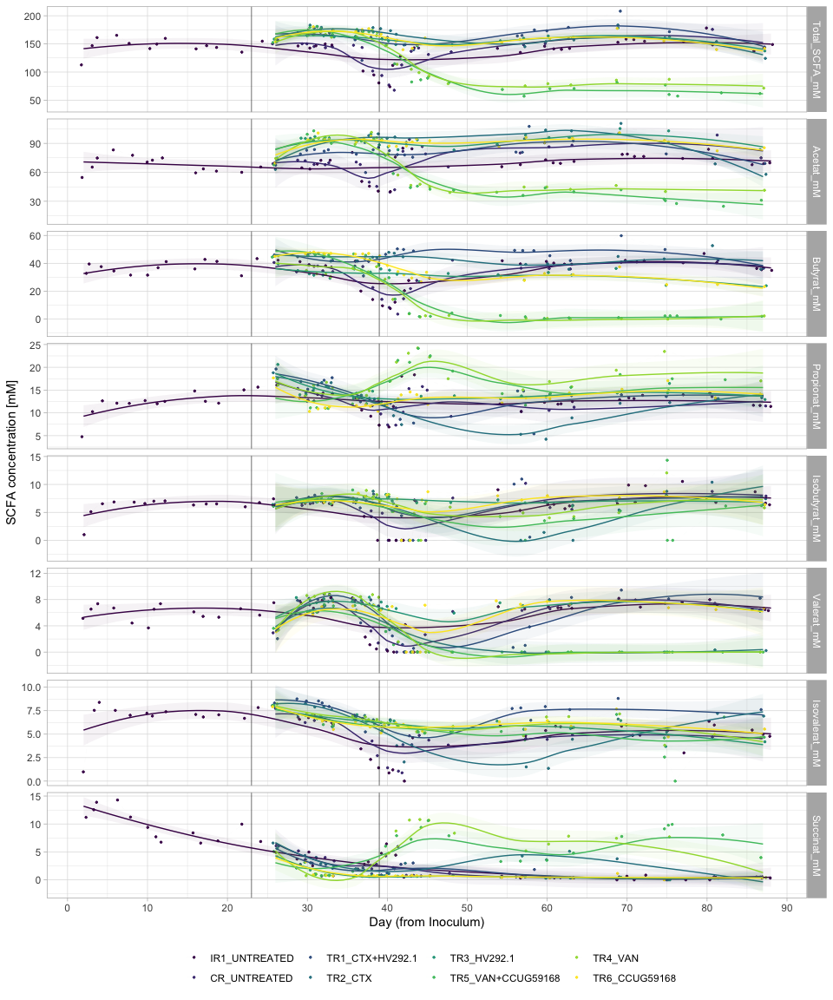
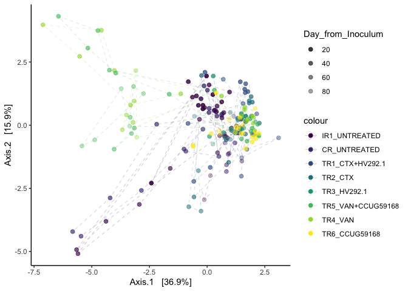

#### Load required packages


```r
library(tidyverse)
library(phyloseq)
library(speedyseq)
library(plotly)
options(getClass.msg=FALSE) # https://github.com/epurdom/clusterExperiment/issues/66
#this fixes an error message that pops up because the class 'Annotated' is defined in two different packages
```

#### Load functions from Github


```r
'%!in%' <- function(x,y)!('%in%'(x,y))

source("https://raw.githubusercontent.com/fconstancias/DivComAnalyses/master/R/phyloseq_taxa_tests.R")
source("https://raw.githubusercontent.com/fconstancias/DivComAnalyses/master/R/phyloseq_normalisation.R")
```

```
## Loading required package: scales
```

```
## 
## Attaching package: 'scales'
```

```
## The following object is masked from 'package:purrr':
## 
##     discard
```

```
## The following object is masked from 'package:readr':
## 
##     col_factor
```

```
## Loading required package: reshape2
```

```
## 
## Attaching package: 'reshape2'
```

```
## The following object is masked from 'package:tidyr':
## 
##     smiths
```

```r
source("https://raw.githubusercontent.com/fconstancias/DivComAnalyses/master/R/phyloseq_alpha.R")
source("https://raw.githubusercontent.com/fconstancias/DivComAnalyses/master/R/phyloseq_beta.R")
source("https://raw.githubusercontent.com/fconstancias/DivComAnalyses/master/R/phyloseq_heatmap.R")
```


#### Load physeq object


```r
ps = "data/processed/physeq_update_23_11.RDS"

ps %>% 
  here::here() %>%
  readRDS() %>%
  phyloseq_get_strains_fast() %>%
  phyloseq_remove_chloro_mitho() -> physeq
```

```
## Joining, by = "ASV"
```

```r
physeq
```

```
## phyloseq-class experiment-level object
## otu_table()   OTU Table:         [ 346 taxa and 384 samples ]
## sample_data() Sample Data:       [ 384 samples by 50 sample variables ]
## tax_table()   Taxonomy Table:    [ 346 taxa by 8 taxonomic ranks ]
## phy_tree()    Phylogenetic Tree: [ 346 tips and 344 internal nodes ]
## refseq()      DNAStringSet:      [ 346 reference sequences ]
```


```r
physeq@sam_data %>%
  data.frame() %>%
  rownames_to_column('id') %>%
  left_join(
    "data/raw/hplc Fermentation (Salvato automaticamente).xlsx" %>%
      readxl::read_xlsx(sheet = "All total"),
    by = c("Sample_description" = "Sample_Id")) %>%
  column_to_rownames('id') %>% 
  sample_data() -> physeq@sam_data
```


```r
physeq
```

```
## phyloseq-class experiment-level object
## otu_table()   OTU Table:         [ 346 taxa and 384 samples ]
## sample_data() Sample Data:       [ 384 samples by 63 sample variables ]
## tax_table()   Taxonomy Table:    [ 346 taxa by 8 taxonomic ranks ]
## phy_tree()    Phylogenetic Tree: [ 346 tips and 344 internal nodes ]
## refseq()      DNAStringSet:      [ 346 reference sequences ]
```

We will be analyzing only the PolyFermS samples here so take a subset of the physeq object.  

```r
physeq %>% 
  subset_samples(Experiment == "Continuous") %>% 
  subset_samples(Paul %!in% c("Paul")) %>%
  subset_samples(Reactor != "IR2") -> ps_polyFermS

sample_data(ps_polyFermS)$Reactor <- fct_relevel(sample_data(ps_polyFermS)$Reactor, "IR1", "CR", "TR1", "TR2","TR3", "TR4", "TR5", "TR6") 

sample_data(ps_polyFermS)$Treatment <- fct_relevel(sample_data(ps_polyFermS)$Treatment, "UNTREATED",  "CTX+HV292.1", "CTX","HV292.1","VAN+CCUG59168", "VAN",  "CCUG59168") 

sample_data(ps_polyFermS)$Reactor_Treatment <- fct_relevel(sample_data(ps_polyFermS)$Reactor_Treatment, "IR1_UNTREATED","CR_UNTREATED", "CR_CTX", "CR_VAN", "TR1_CTX+HV292.1","TR2_CTX", "TR3_HV292.1", "TR5_VAN+CCUG59168", "TR4_VAN", "TR6_CCUG59168") 
```


```r
ps_polyFermS %>%
  sample_data() %>%
  data.frame() -> df
```


```r
measures = df %>% select(ends_with("mM")) %>% colnames()

# define a function to plot scatter plot
my_fn <- function(data, mapping, ...){
  p <- ggplot(data = data, mapping = mapping) +
    geom_point() +
    geom_smooth(method=lm, ...)
  p
}


df %>%
  GGally::ggpairs(columns = measures,
                  ggplot2::aes(colour = Reactor),
                  # legend = 1,
                  progress = FALSE,
                  upper = list(
                    continuous = GGally::wrap('cor', method = "pearson")
                  ),
                  lower = list(continuous = my_fn)) -> p_corr

p_corr
```

<!-- -->


```r
df %>%
  plot_alphas(measure = measures,
              x_group = "Reactor_Treatment",
              colour_group = "Enrichment",
              fill_group = "Enrichment",
              shape_group = "Enrichment",
              facet_group = "Reactor_Treatment",
              test_group = "Reactor_Treatment",
              test_group_2 = "Enrichment") -> out
```


```r
plot_alpha_time <- function(df, 
                            x = "Day_from_Inoculum", 
                            y = "value", 
                            shape = "neg",
                            fill = "Reactor_Treatment",
                            group = "Reactor_Treatment", 
                            facet)
{
  df %>%
  arrange(Day_from_Inoculum) %>%
  ggplot(aes_string(x = x,
             y = y, shape = shape)) +
  geom_point(size=2, alpha=0.9, aes_string(group = group, color = fill, fill = fill),  show.legend = FALSE) + 
  geom_path(inherit.aes = TRUE, aes_string(group=group),
            size = 0.08,
            linetype = "dashed") +
  facet_grid(as.formula(facet), scales = "free") +
  theme_light() +
  scale_color_viridis_d(na.value = "black") + 
  geom_vline(xintercept = c(23,39), 
             color="black", alpha=0.4) + 
  # geom_smooth(show.legend = TRUE, level = 0.95) + 
  scale_x_continuous(breaks=seq(0,90,10)) -> plot

  return(plot)
}
```


```r
out$plot$data %>%
  dplyr::filter(alphadiversiy == "Total_SCFA_mM") %>%
  dplyr::mutate(neg = ifelse(value == 0, "neg", "pos")) %>%
  arrange(Day_from_Inoculum) %>%
  ggplot(aes_string(x = "Day_from_Inoculum",
                    y = "value", group = "Reactor_Treatment")) +
  geom_jitter(size=0.5, alpha=0.9, aes_string(group = "Reactor_Treatment", color = "Reactor_Treatment", fill = "Reactor_Treatment"),  show.legend = TRUE) + 
  geom_path(inherit.aes = TRUE, aes_string(group="Reactor_Treatment", fill = "Reactor_Treatment", color = "Reactor_Treatment", show.legend = FALSE),
            size = 0.001,
            linetype = "dashed") +
  # facet_grid(as.formula(facet), scales = "free") +
  geom_vline(xintercept = c(23,39), 
             color="black", alpha=0.4) + 
  geom_smooth(show.legend = FALSE, level = 0.95, alpha=0.05, size = 0.5 ,aes_string(group="Reactor_Treatment", color = "Reactor_Treatment", fill = "Reactor_Treatment")) +
  scale_x_continuous(breaks=seq(0,90,10)) +
  # scale_y_continuous(labels = scientific,
  #                    limits=c(1e+10, 1e+11), breaks = seq(1e+10, 1e+11, by = 1e+10),
  #                    trans = "log10") +
  labs(x="Day (from Inoculum)", y= "SCFA concentration [mM]",  
       col=NULL, fill = NULL, shape = NULL) +
  theme_light() +
  scale_color_viridis_d(na.value = "black") +
  scale_fill_viridis_d(na.value = "black") -> plot
```

```
## Warning: Ignoring unknown aesthetics: fill, show.legend
```

```r
plot + theme(legend.position = "bottom")
```

```
## `geom_smooth()` using method = 'loess' and formula 'y ~ x'
```

<!-- -->


```r
plot %>%
  plotly::ggplotly()
```

```
## `geom_smooth()` using method = 'loess' and formula 'y ~ x'
```

```
## Warning: `group_by_()` is deprecated as of dplyr 0.7.0.
## Please use `group_by()` instead.
## See vignette('programming') for more help
## This warning is displayed once every 8 hours.
## Call `lifecycle::last_warnings()` to see where this warning was generated.
```

<!--html_preserve--><div id="htmlwidget-12f51c04bea7f5e07b0c" style="width:672px;height:480px;" class="plotly html-widget"></div>
<script type="application/json" data-for="htmlwidget-12f51c04bea7f5e07b0c">{"x":{"data":[{"x":[2.12311445381492,2.89711132384837,3.91701621357352,6.16529055200517,7.720838990435,9.96257813144475,11.3680695205927,12.0514311719686,15.7047206426039,16.6765998462215,18.6442282602191,22.1834627779201,24.3473498849198,25.9818715149537,29.2389864753932,29.9334715928882,30.7133004188538,31.6278671933338,33.311187893711,36.0946501169354,37.3916857913136,38.3749897390604,38.9056552775204,39.9619841054082,41.2322371788323,42.1492249986157,42.8098054118454,57.2140138087794,58.0004027554765,60.0728530811146,61.0148617610335,62.2156777072698,62.9799649000168,69.0792335676029,70.3684335229918,70.8656322877854,71.8706066446379,76.7140322109684,79.826685266383,80.8518020566553,85.6186040792614,86.7857375815511,88.2610184464604],"y":[112.702301324299,146.922229436627,161.215841172858,165.290793967341,150.791000792,141.698716971349,149.602775785282,159.836642698042,141.181511670261,146.813278550185,143.736524732664,135.38520599164,154.844698253899,156.22946550831,146.344225413636,142.60454299508,146.666505332182,149.772909734923,147.895225005181,159.325734725374,101.804732393455,94.8766568073038,80.7002929055285,73.9372330525901,111.773861000792,128.107673112668,142.893942775996,134.852829252341,142.131993540964,145.788518346639,141.247767692174,140.286680265125,142.01464463083,152.89949862946,158.565764953834,157.699226106903,154.67204762436,154.197814268932,178.255626117563,148.268901070063,137.028251102199,143.693755188967,148.896571344462],"text":["Reactor_Treatment: IR1_UNTREATED<br />Reactor_Treatment: IR1_UNTREATED<br />Reactor_Treatment: IR1_UNTREATED<br />Reactor_Treatment: IR1_UNTREATED<br />Day_from_Inoculum:  2<br />value: 112.703","Reactor_Treatment: IR1_UNTREATED<br />Reactor_Treatment: IR1_UNTREATED<br />Reactor_Treatment: IR1_UNTREATED<br />Reactor_Treatment: IR1_UNTREATED<br />Day_from_Inoculum:  3<br />value: 146.922","Reactor_Treatment: IR1_UNTREATED<br />Reactor_Treatment: IR1_UNTREATED<br />Reactor_Treatment: IR1_UNTREATED<br />Reactor_Treatment: IR1_UNTREATED<br />Day_from_Inoculum:  4<br />value: 161.216","Reactor_Treatment: IR1_UNTREATED<br />Reactor_Treatment: IR1_UNTREATED<br />Reactor_Treatment: IR1_UNTREATED<br />Reactor_Treatment: IR1_UNTREATED<br />Day_from_Inoculum:  6<br />value: 165.291","Reactor_Treatment: IR1_UNTREATED<br />Reactor_Treatment: IR1_UNTREATED<br />Reactor_Treatment: IR1_UNTREATED<br />Reactor_Treatment: IR1_UNTREATED<br />Day_from_Inoculum:  8<br />value: 150.791","Reactor_Treatment: IR1_UNTREATED<br />Reactor_Treatment: IR1_UNTREATED<br />Reactor_Treatment: IR1_UNTREATED<br />Reactor_Treatment: IR1_UNTREATED<br />Day_from_Inoculum: 10<br />value: 141.698","Reactor_Treatment: IR1_UNTREATED<br />Reactor_Treatment: IR1_UNTREATED<br />Reactor_Treatment: IR1_UNTREATED<br />Reactor_Treatment: IR1_UNTREATED<br />Day_from_Inoculum: 11<br />value: 149.602","Reactor_Treatment: IR1_UNTREATED<br />Reactor_Treatment: IR1_UNTREATED<br />Reactor_Treatment: IR1_UNTREATED<br />Reactor_Treatment: IR1_UNTREATED<br />Day_from_Inoculum: 12<br />value: 159.837","Reactor_Treatment: IR1_UNTREATED<br />Reactor_Treatment: IR1_UNTREATED<br />Reactor_Treatment: IR1_UNTREATED<br />Reactor_Treatment: IR1_UNTREATED<br />Day_from_Inoculum: 16<br />value: 141.181","Reactor_Treatment: IR1_UNTREATED<br />Reactor_Treatment: IR1_UNTREATED<br />Reactor_Treatment: IR1_UNTREATED<br />Reactor_Treatment: IR1_UNTREATED<br />Day_from_Inoculum: 17<br />value: 146.814","Reactor_Treatment: IR1_UNTREATED<br />Reactor_Treatment: IR1_UNTREATED<br />Reactor_Treatment: IR1_UNTREATED<br />Reactor_Treatment: IR1_UNTREATED<br />Day_from_Inoculum: 19<br />value: 143.737","Reactor_Treatment: IR1_UNTREATED<br />Reactor_Treatment: IR1_UNTREATED<br />Reactor_Treatment: IR1_UNTREATED<br />Reactor_Treatment: IR1_UNTREATED<br />Day_from_Inoculum: 22<br />value: 135.385","Reactor_Treatment: IR1_UNTREATED<br />Reactor_Treatment: IR1_UNTREATED<br />Reactor_Treatment: IR1_UNTREATED<br />Reactor_Treatment: IR1_UNTREATED<br />Day_from_Inoculum: 24<br />value: 154.844","Reactor_Treatment: IR1_UNTREATED<br />Reactor_Treatment: IR1_UNTREATED<br />Reactor_Treatment: IR1_UNTREATED<br />Reactor_Treatment: IR1_UNTREATED<br />Day_from_Inoculum: 26<br />value: 156.229","Reactor_Treatment: IR1_UNTREATED<br />Reactor_Treatment: IR1_UNTREATED<br />Reactor_Treatment: IR1_UNTREATED<br />Reactor_Treatment: IR1_UNTREATED<br />Day_from_Inoculum: 29<br />value: 146.344","Reactor_Treatment: IR1_UNTREATED<br />Reactor_Treatment: IR1_UNTREATED<br />Reactor_Treatment: IR1_UNTREATED<br />Reactor_Treatment: IR1_UNTREATED<br />Day_from_Inoculum: 30<br />value: 142.604","Reactor_Treatment: IR1_UNTREATED<br />Reactor_Treatment: IR1_UNTREATED<br />Reactor_Treatment: IR1_UNTREATED<br />Reactor_Treatment: IR1_UNTREATED<br />Day_from_Inoculum: 31<br />value: 146.666","Reactor_Treatment: IR1_UNTREATED<br />Reactor_Treatment: IR1_UNTREATED<br />Reactor_Treatment: IR1_UNTREATED<br />Reactor_Treatment: IR1_UNTREATED<br />Day_from_Inoculum: 32<br />value: 149.773","Reactor_Treatment: IR1_UNTREATED<br />Reactor_Treatment: IR1_UNTREATED<br />Reactor_Treatment: IR1_UNTREATED<br />Reactor_Treatment: IR1_UNTREATED<br />Day_from_Inoculum: 33<br />value: 147.896","Reactor_Treatment: IR1_UNTREATED<br />Reactor_Treatment: IR1_UNTREATED<br />Reactor_Treatment: IR1_UNTREATED<br />Reactor_Treatment: IR1_UNTREATED<br />Day_from_Inoculum: 36<br />value: 159.325","Reactor_Treatment: IR1_UNTREATED<br />Reactor_Treatment: IR1_UNTREATED<br />Reactor_Treatment: IR1_UNTREATED<br />Reactor_Treatment: IR1_UNTREATED<br />Day_from_Inoculum: 37<br />value: 101.804","Reactor_Treatment: IR1_UNTREATED<br />Reactor_Treatment: IR1_UNTREATED<br />Reactor_Treatment: IR1_UNTREATED<br />Reactor_Treatment: IR1_UNTREATED<br />Day_from_Inoculum: 38<br />value:  94.876","Reactor_Treatment: IR1_UNTREATED<br />Reactor_Treatment: IR1_UNTREATED<br />Reactor_Treatment: IR1_UNTREATED<br />Reactor_Treatment: IR1_UNTREATED<br />Day_from_Inoculum: 39<br />value:  80.700","Reactor_Treatment: IR1_UNTREATED<br />Reactor_Treatment: IR1_UNTREATED<br />Reactor_Treatment: IR1_UNTREATED<br />Reactor_Treatment: IR1_UNTREATED<br />Day_from_Inoculum: 40<br />value:  73.937","Reactor_Treatment: IR1_UNTREATED<br />Reactor_Treatment: IR1_UNTREATED<br />Reactor_Treatment: IR1_UNTREATED<br />Reactor_Treatment: IR1_UNTREATED<br />Day_from_Inoculum: 41<br />value: 111.774","Reactor_Treatment: IR1_UNTREATED<br />Reactor_Treatment: IR1_UNTREATED<br />Reactor_Treatment: IR1_UNTREATED<br />Reactor_Treatment: IR1_UNTREATED<br />Day_from_Inoculum: 42<br />value: 128.108","Reactor_Treatment: IR1_UNTREATED<br />Reactor_Treatment: IR1_UNTREATED<br />Reactor_Treatment: IR1_UNTREATED<br />Reactor_Treatment: IR1_UNTREATED<br />Day_from_Inoculum: 43<br />value: 142.894","Reactor_Treatment: IR1_UNTREATED<br />Reactor_Treatment: IR1_UNTREATED<br />Reactor_Treatment: IR1_UNTREATED<br />Reactor_Treatment: IR1_UNTREATED<br />Day_from_Inoculum: 57<br />value: 134.853","Reactor_Treatment: IR1_UNTREATED<br />Reactor_Treatment: IR1_UNTREATED<br />Reactor_Treatment: IR1_UNTREATED<br />Reactor_Treatment: IR1_UNTREATED<br />Day_from_Inoculum: 58<br />value: 142.132","Reactor_Treatment: IR1_UNTREATED<br />Reactor_Treatment: IR1_UNTREATED<br />Reactor_Treatment: IR1_UNTREATED<br />Reactor_Treatment: IR1_UNTREATED<br />Day_from_Inoculum: 60<br />value: 145.788","Reactor_Treatment: IR1_UNTREATED<br />Reactor_Treatment: IR1_UNTREATED<br />Reactor_Treatment: IR1_UNTREATED<br />Reactor_Treatment: IR1_UNTREATED<br />Day_from_Inoculum: 61<br />value: 141.248","Reactor_Treatment: IR1_UNTREATED<br />Reactor_Treatment: IR1_UNTREATED<br />Reactor_Treatment: IR1_UNTREATED<br />Reactor_Treatment: IR1_UNTREATED<br />Day_from_Inoculum: 62<br />value: 140.286","Reactor_Treatment: IR1_UNTREATED<br />Reactor_Treatment: IR1_UNTREATED<br />Reactor_Treatment: IR1_UNTREATED<br />Reactor_Treatment: IR1_UNTREATED<br />Day_from_Inoculum: 63<br />value: 142.015","Reactor_Treatment: IR1_UNTREATED<br />Reactor_Treatment: IR1_UNTREATED<br />Reactor_Treatment: IR1_UNTREATED<br />Reactor_Treatment: IR1_UNTREATED<br />Day_from_Inoculum: 69<br />value: 152.899","Reactor_Treatment: IR1_UNTREATED<br />Reactor_Treatment: IR1_UNTREATED<br />Reactor_Treatment: IR1_UNTREATED<br />Reactor_Treatment: IR1_UNTREATED<br />Day_from_Inoculum: 70<br />value: 158.565","Reactor_Treatment: IR1_UNTREATED<br />Reactor_Treatment: IR1_UNTREATED<br />Reactor_Treatment: IR1_UNTREATED<br />Reactor_Treatment: IR1_UNTREATED<br />Day_from_Inoculum: 71<br />value: 157.700","Reactor_Treatment: IR1_UNTREATED<br />Reactor_Treatment: IR1_UNTREATED<br />Reactor_Treatment: IR1_UNTREATED<br />Reactor_Treatment: IR1_UNTREATED<br />Day_from_Inoculum: 72<br />value: 154.672","Reactor_Treatment: IR1_UNTREATED<br />Reactor_Treatment: IR1_UNTREATED<br />Reactor_Treatment: IR1_UNTREATED<br />Reactor_Treatment: IR1_UNTREATED<br />Day_from_Inoculum: 77<br />value: 154.198","Reactor_Treatment: IR1_UNTREATED<br />Reactor_Treatment: IR1_UNTREATED<br />Reactor_Treatment: IR1_UNTREATED<br />Reactor_Treatment: IR1_UNTREATED<br />Day_from_Inoculum: 80<br />value: 178.256","Reactor_Treatment: IR1_UNTREATED<br />Reactor_Treatment: IR1_UNTREATED<br />Reactor_Treatment: IR1_UNTREATED<br />Reactor_Treatment: IR1_UNTREATED<br />Day_from_Inoculum: 81<br />value: 148.269","Reactor_Treatment: IR1_UNTREATED<br />Reactor_Treatment: IR1_UNTREATED<br />Reactor_Treatment: IR1_UNTREATED<br />Reactor_Treatment: IR1_UNTREATED<br />Day_from_Inoculum: 86<br />value: 137.028","Reactor_Treatment: IR1_UNTREATED<br />Reactor_Treatment: IR1_UNTREATED<br />Reactor_Treatment: IR1_UNTREATED<br />Reactor_Treatment: IR1_UNTREATED<br />Day_from_Inoculum: 87<br />value: 143.694","Reactor_Treatment: IR1_UNTREATED<br />Reactor_Treatment: IR1_UNTREATED<br />Reactor_Treatment: IR1_UNTREATED<br />Reactor_Treatment: IR1_UNTREATED<br />Day_from_Inoculum: 88<br />value: 148.896"],"type":"scatter","mode":"markers","marker":{"autocolorscale":false,"color":"rgba(68,1,84,1)","opacity":0.9,"size":1.88976377952756,"symbol":"circle","line":{"width":1.88976377952756,"color":"rgba(68,1,84,1)"}},"hoveron":"points","name":"IR1_UNTREATED","legendgroup":"IR1_UNTREATED","showlegend":true,"xaxis":"x","yaxis":"y","hoverinfo":"text","frame":null},{"x":[26.2936022270471,26.2967443495989,30.2493265556172,30.7874938782305,32.3404130280018,32.7977260718122,36.142468640022,36.6902616744861,38.2749367460608,39.2083684543148,39.6825680488721,40.6847835181281,42.2255395932123,42.8928681217134,43.9176902381703,45.3050142446533,48.1233815962449,56.8547492239624,59.8289146693423,62.7606598276645,80.6076949959621,86.855407897383],"y":[150.098483676003,150.155326282579,150.118546806617,145.40743681077,143.259468752077,144.926465155424,147.634220376264,143.668950380738,101.838597643964,93.8465567745928,76.8801973649889,67.7346623981711,112.554449391397,136.866927022664,142.666437537198,131.204795757951,135.832662122491,148.658738043229,150.547679179981,159.559405147263,175.76973986479,142.829489948289],"text":["Reactor_Treatment: CR_UNTREATED<br />Reactor_Treatment: CR_UNTREATED<br />Reactor_Treatment: CR_UNTREATED<br />Reactor_Treatment: CR_UNTREATED<br />Day_from_Inoculum: 26<br />value: 150.099","Reactor_Treatment: CR_UNTREATED<br />Reactor_Treatment: CR_UNTREATED<br />Reactor_Treatment: CR_UNTREATED<br />Reactor_Treatment: CR_UNTREATED<br />Day_from_Inoculum: 26<br />value: 150.155","Reactor_Treatment: CR_UNTREATED<br />Reactor_Treatment: CR_UNTREATED<br />Reactor_Treatment: CR_UNTREATED<br />Reactor_Treatment: CR_UNTREATED<br />Day_from_Inoculum: 30<br />value: 150.119","Reactor_Treatment: CR_UNTREATED<br />Reactor_Treatment: CR_UNTREATED<br />Reactor_Treatment: CR_UNTREATED<br />Reactor_Treatment: CR_UNTREATED<br />Day_from_Inoculum: 31<br />value: 145.408","Reactor_Treatment: CR_UNTREATED<br />Reactor_Treatment: CR_UNTREATED<br />Reactor_Treatment: CR_UNTREATED<br />Reactor_Treatment: CR_UNTREATED<br />Day_from_Inoculum: 32<br />value: 143.259","Reactor_Treatment: CR_UNTREATED<br />Reactor_Treatment: CR_UNTREATED<br />Reactor_Treatment: CR_UNTREATED<br />Reactor_Treatment: CR_UNTREATED<br />Day_from_Inoculum: 33<br />value: 144.927","Reactor_Treatment: CR_UNTREATED<br />Reactor_Treatment: CR_UNTREATED<br />Reactor_Treatment: CR_UNTREATED<br />Reactor_Treatment: CR_UNTREATED<br />Day_from_Inoculum: 36<br />value: 147.635","Reactor_Treatment: CR_UNTREATED<br />Reactor_Treatment: CR_UNTREATED<br />Reactor_Treatment: CR_UNTREATED<br />Reactor_Treatment: CR_UNTREATED<br />Day_from_Inoculum: 37<br />value: 143.669","Reactor_Treatment: CR_UNTREATED<br />Reactor_Treatment: CR_UNTREATED<br />Reactor_Treatment: CR_UNTREATED<br />Reactor_Treatment: CR_UNTREATED<br />Day_from_Inoculum: 38<br />value: 101.838","Reactor_Treatment: CR_UNTREATED<br />Reactor_Treatment: CR_UNTREATED<br />Reactor_Treatment: CR_UNTREATED<br />Reactor_Treatment: CR_UNTREATED<br />Day_from_Inoculum: 39<br />value:  93.847","Reactor_Treatment: CR_UNTREATED<br />Reactor_Treatment: CR_UNTREATED<br />Reactor_Treatment: CR_UNTREATED<br />Reactor_Treatment: CR_UNTREATED<br />Day_from_Inoculum: 40<br />value:  76.880","Reactor_Treatment: CR_UNTREATED<br />Reactor_Treatment: CR_UNTREATED<br />Reactor_Treatment: CR_UNTREATED<br />Reactor_Treatment: CR_UNTREATED<br />Day_from_Inoculum: 41<br />value:  67.734","Reactor_Treatment: CR_UNTREATED<br />Reactor_Treatment: CR_UNTREATED<br />Reactor_Treatment: CR_UNTREATED<br />Reactor_Treatment: CR_UNTREATED<br />Day_from_Inoculum: 42<br />value: 112.555","Reactor_Treatment: CR_UNTREATED<br />Reactor_Treatment: CR_UNTREATED<br />Reactor_Treatment: CR_UNTREATED<br />Reactor_Treatment: CR_UNTREATED<br />Day_from_Inoculum: 43<br />value: 136.867","Reactor_Treatment: CR_UNTREATED<br />Reactor_Treatment: CR_UNTREATED<br />Reactor_Treatment: CR_UNTREATED<br />Reactor_Treatment: CR_UNTREATED<br />Day_from_Inoculum: 44<br />value: 142.667","Reactor_Treatment: CR_UNTREATED<br />Reactor_Treatment: CR_UNTREATED<br />Reactor_Treatment: CR_UNTREATED<br />Reactor_Treatment: CR_UNTREATED<br />Day_from_Inoculum: 45<br />value: 131.204","Reactor_Treatment: CR_UNTREATED<br />Reactor_Treatment: CR_UNTREATED<br />Reactor_Treatment: CR_UNTREATED<br />Reactor_Treatment: CR_UNTREATED<br />Day_from_Inoculum: 48<br />value: 135.833","Reactor_Treatment: CR_UNTREATED<br />Reactor_Treatment: CR_UNTREATED<br />Reactor_Treatment: CR_UNTREATED<br />Reactor_Treatment: CR_UNTREATED<br />Day_from_Inoculum: 57<br />value: 148.659","Reactor_Treatment: CR_UNTREATED<br />Reactor_Treatment: CR_UNTREATED<br />Reactor_Treatment: CR_UNTREATED<br />Reactor_Treatment: CR_UNTREATED<br />Day_from_Inoculum: 60<br />value: 150.547","Reactor_Treatment: CR_UNTREATED<br />Reactor_Treatment: CR_UNTREATED<br />Reactor_Treatment: CR_UNTREATED<br />Reactor_Treatment: CR_UNTREATED<br />Day_from_Inoculum: 63<br />value: 159.559","Reactor_Treatment: CR_UNTREATED<br />Reactor_Treatment: CR_UNTREATED<br />Reactor_Treatment: CR_UNTREATED<br />Reactor_Treatment: CR_UNTREATED<br />Day_from_Inoculum: 81<br />value: 175.770","Reactor_Treatment: CR_UNTREATED<br />Reactor_Treatment: CR_UNTREATED<br />Reactor_Treatment: CR_UNTREATED<br />Reactor_Treatment: CR_UNTREATED<br />Day_from_Inoculum: 87<br />value: 142.830"],"type":"scatter","mode":"markers","marker":{"autocolorscale":false,"color":"rgba(70,51,126,1)","opacity":0.9,"size":1.88976377952756,"symbol":"circle","line":{"width":1.88976377952756,"color":"rgba(70,51,126,1)"}},"hoveron":"points","name":"CR_UNTREATED","legendgroup":"CR_UNTREATED","showlegend":true,"xaxis":"x","yaxis":"y","hoverinfo":"text","frame":null},{"x":[25.8689080853015,28.7533477606252,29.7433089539409,30.7964704656973,31.9928230307996,33.3369974577799,36.1977089956403,36.9782647984102,37.823317749612,39.3878857912496,40.0824814612046,40.9267000246793,41.6245563983917,43.1652281228453,56.1402321623638,57.3004808314145,58.2816928682849,59.9635780386627,63.0363524964079,69.367669743672,75.361765711382,87.1397990312427],"y":[158.099351989841,170.193668190345,174.811604023229,178.021223297181,170.646622415593,169.419359412789,157.392732470906,120.790359518927,161.602645883495,159.123420126439,161.444638811155,156.245793558277,148.695277796437,139.725352188367,164.072590874531,165.066950786267,174.840633077751,173.16773416473,179.379712886014,208.178180294187,171.699657536503,144.455677237087],"text":["Reactor_Treatment: TR1_CTX+HV292.1<br />Reactor_Treatment: TR1_CTX+HV292.1<br />Reactor_Treatment: TR1_CTX+HV292.1<br />Reactor_Treatment: TR1_CTX+HV292.1<br />Day_from_Inoculum: 26<br />value: 158.100","Reactor_Treatment: TR1_CTX+HV292.1<br />Reactor_Treatment: TR1_CTX+HV292.1<br />Reactor_Treatment: TR1_CTX+HV292.1<br />Reactor_Treatment: TR1_CTX+HV292.1<br />Day_from_Inoculum: 29<br />value: 170.193","Reactor_Treatment: TR1_CTX+HV292.1<br />Reactor_Treatment: TR1_CTX+HV292.1<br />Reactor_Treatment: TR1_CTX+HV292.1<br />Reactor_Treatment: TR1_CTX+HV292.1<br />Day_from_Inoculum: 30<br />value: 174.812","Reactor_Treatment: TR1_CTX+HV292.1<br />Reactor_Treatment: TR1_CTX+HV292.1<br />Reactor_Treatment: TR1_CTX+HV292.1<br />Reactor_Treatment: TR1_CTX+HV292.1<br />Day_from_Inoculum: 31<br />value: 178.022","Reactor_Treatment: TR1_CTX+HV292.1<br />Reactor_Treatment: TR1_CTX+HV292.1<br />Reactor_Treatment: TR1_CTX+HV292.1<br />Reactor_Treatment: TR1_CTX+HV292.1<br />Day_from_Inoculum: 32<br />value: 170.647","Reactor_Treatment: TR1_CTX+HV292.1<br />Reactor_Treatment: TR1_CTX+HV292.1<br />Reactor_Treatment: TR1_CTX+HV292.1<br />Reactor_Treatment: TR1_CTX+HV292.1<br />Day_from_Inoculum: 33<br />value: 169.420","Reactor_Treatment: TR1_CTX+HV292.1<br />Reactor_Treatment: TR1_CTX+HV292.1<br />Reactor_Treatment: TR1_CTX+HV292.1<br />Reactor_Treatment: TR1_CTX+HV292.1<br />Day_from_Inoculum: 36<br />value: 157.392","Reactor_Treatment: TR1_CTX+HV292.1<br />Reactor_Treatment: TR1_CTX+HV292.1<br />Reactor_Treatment: TR1_CTX+HV292.1<br />Reactor_Treatment: TR1_CTX+HV292.1<br />Day_from_Inoculum: 37<br />value: 120.791","Reactor_Treatment: TR1_CTX+HV292.1<br />Reactor_Treatment: TR1_CTX+HV292.1<br />Reactor_Treatment: TR1_CTX+HV292.1<br />Reactor_Treatment: TR1_CTX+HV292.1<br />Day_from_Inoculum: 38<br />value: 161.603","Reactor_Treatment: TR1_CTX+HV292.1<br />Reactor_Treatment: TR1_CTX+HV292.1<br />Reactor_Treatment: TR1_CTX+HV292.1<br />Reactor_Treatment: TR1_CTX+HV292.1<br />Day_from_Inoculum: 39<br />value: 159.124","Reactor_Treatment: TR1_CTX+HV292.1<br />Reactor_Treatment: TR1_CTX+HV292.1<br />Reactor_Treatment: TR1_CTX+HV292.1<br />Reactor_Treatment: TR1_CTX+HV292.1<br />Day_from_Inoculum: 40<br />value: 161.445","Reactor_Treatment: TR1_CTX+HV292.1<br />Reactor_Treatment: TR1_CTX+HV292.1<br />Reactor_Treatment: TR1_CTX+HV292.1<br />Reactor_Treatment: TR1_CTX+HV292.1<br />Day_from_Inoculum: 41<br />value: 156.246","Reactor_Treatment: TR1_CTX+HV292.1<br />Reactor_Treatment: TR1_CTX+HV292.1<br />Reactor_Treatment: TR1_CTX+HV292.1<br />Reactor_Treatment: TR1_CTX+HV292.1<br />Day_from_Inoculum: 42<br />value: 148.695","Reactor_Treatment: TR1_CTX+HV292.1<br />Reactor_Treatment: TR1_CTX+HV292.1<br />Reactor_Treatment: TR1_CTX+HV292.1<br />Reactor_Treatment: TR1_CTX+HV292.1<br />Day_from_Inoculum: 43<br />value: 139.725","Reactor_Treatment: TR1_CTX+HV292.1<br />Reactor_Treatment: TR1_CTX+HV292.1<br />Reactor_Treatment: TR1_CTX+HV292.1<br />Reactor_Treatment: TR1_CTX+HV292.1<br />Day_from_Inoculum: 56<br />value: 164.072","Reactor_Treatment: TR1_CTX+HV292.1<br />Reactor_Treatment: TR1_CTX+HV292.1<br />Reactor_Treatment: TR1_CTX+HV292.1<br />Reactor_Treatment: TR1_CTX+HV292.1<br />Day_from_Inoculum: 57<br />value: 165.067","Reactor_Treatment: TR1_CTX+HV292.1<br />Reactor_Treatment: TR1_CTX+HV292.1<br />Reactor_Treatment: TR1_CTX+HV292.1<br />Reactor_Treatment: TR1_CTX+HV292.1<br />Day_from_Inoculum: 58<br />value: 174.840","Reactor_Treatment: TR1_CTX+HV292.1<br />Reactor_Treatment: TR1_CTX+HV292.1<br />Reactor_Treatment: TR1_CTX+HV292.1<br />Reactor_Treatment: TR1_CTX+HV292.1<br />Day_from_Inoculum: 60<br />value: 173.167","Reactor_Treatment: TR1_CTX+HV292.1<br />Reactor_Treatment: TR1_CTX+HV292.1<br />Reactor_Treatment: TR1_CTX+HV292.1<br />Reactor_Treatment: TR1_CTX+HV292.1<br />Day_from_Inoculum: 63<br />value: 179.379","Reactor_Treatment: TR1_CTX+HV292.1<br />Reactor_Treatment: TR1_CTX+HV292.1<br />Reactor_Treatment: TR1_CTX+HV292.1<br />Reactor_Treatment: TR1_CTX+HV292.1<br />Day_from_Inoculum: 69<br />value: 208.178","Reactor_Treatment: TR1_CTX+HV292.1<br />Reactor_Treatment: TR1_CTX+HV292.1<br />Reactor_Treatment: TR1_CTX+HV292.1<br />Reactor_Treatment: TR1_CTX+HV292.1<br />Day_from_Inoculum: 75<br />value: 171.699","Reactor_Treatment: TR1_CTX+HV292.1<br />Reactor_Treatment: TR1_CTX+HV292.1<br />Reactor_Treatment: TR1_CTX+HV292.1<br />Reactor_Treatment: TR1_CTX+HV292.1<br />Day_from_Inoculum: 87<br />value: 144.455"],"type":"scatter","mode":"markers","marker":{"autocolorscale":false,"color":"rgba(54,92,141,1)","opacity":0.9,"size":1.88976377952756,"symbol":"circle","line":{"width":1.88976377952756,"color":"rgba(54,92,141,1)"}},"hoveron":"points","name":"TR1_CTX+HV292.1","legendgroup":"TR1_CTX+HV292.1","showlegend":true,"xaxis":"x","yaxis":"y","hoverinfo":"text","frame":null},{"x":[26.3295731313527,29.6218525152653,30.9961686171591,32.3808408586308,33.2497726244852,35.9243003718555,37.03062059246,38.3238447293639,39.3834186732769,39.6439921190962,41.3101320840418,42.253052037023,56.8600560074672,59.9980689115822,62.9304983554408,69.197655213438,74.9557399410754,81.093266556412,87.1614652518183],"y":[153.693933517362,183.221637875977,180.64480712167,179.252155531212,175.083159697836,172.169766985837,172.178280508777,178.886715950411,177.080965328019,173.500968589795,167.133646438003,148.11004061534,145.074808285966,153.940519196042,157.11363831449,183.506381608196,160.800507033943,154.06777900703,124.3042795691],"text":["Reactor_Treatment: TR2_CTX<br />Reactor_Treatment: TR2_CTX<br />Reactor_Treatment: TR2_CTX<br />Reactor_Treatment: TR2_CTX<br />Day_from_Inoculum: 26<br />value: 153.694","Reactor_Treatment: TR2_CTX<br />Reactor_Treatment: TR2_CTX<br />Reactor_Treatment: TR2_CTX<br />Reactor_Treatment: TR2_CTX<br />Day_from_Inoculum: 30<br />value: 183.222","Reactor_Treatment: TR2_CTX<br />Reactor_Treatment: TR2_CTX<br />Reactor_Treatment: TR2_CTX<br />Reactor_Treatment: TR2_CTX<br />Day_from_Inoculum: 31<br />value: 180.645","Reactor_Treatment: TR2_CTX<br />Reactor_Treatment: TR2_CTX<br />Reactor_Treatment: TR2_CTX<br />Reactor_Treatment: TR2_CTX<br />Day_from_Inoculum: 32<br />value: 179.252","Reactor_Treatment: TR2_CTX<br />Reactor_Treatment: TR2_CTX<br />Reactor_Treatment: TR2_CTX<br />Reactor_Treatment: TR2_CTX<br />Day_from_Inoculum: 33<br />value: 175.083","Reactor_Treatment: TR2_CTX<br />Reactor_Treatment: TR2_CTX<br />Reactor_Treatment: TR2_CTX<br />Reactor_Treatment: TR2_CTX<br />Day_from_Inoculum: 36<br />value: 172.170","Reactor_Treatment: TR2_CTX<br />Reactor_Treatment: TR2_CTX<br />Reactor_Treatment: TR2_CTX<br />Reactor_Treatment: TR2_CTX<br />Day_from_Inoculum: 37<br />value: 172.179","Reactor_Treatment: TR2_CTX<br />Reactor_Treatment: TR2_CTX<br />Reactor_Treatment: TR2_CTX<br />Reactor_Treatment: TR2_CTX<br />Day_from_Inoculum: 38<br />value: 178.886","Reactor_Treatment: TR2_CTX<br />Reactor_Treatment: TR2_CTX<br />Reactor_Treatment: TR2_CTX<br />Reactor_Treatment: TR2_CTX<br />Day_from_Inoculum: 39<br />value: 177.081","Reactor_Treatment: TR2_CTX<br />Reactor_Treatment: TR2_CTX<br />Reactor_Treatment: TR2_CTX<br />Reactor_Treatment: TR2_CTX<br />Day_from_Inoculum: 40<br />value: 173.501","Reactor_Treatment: TR2_CTX<br />Reactor_Treatment: TR2_CTX<br />Reactor_Treatment: TR2_CTX<br />Reactor_Treatment: TR2_CTX<br />Day_from_Inoculum: 41<br />value: 167.134","Reactor_Treatment: TR2_CTX<br />Reactor_Treatment: TR2_CTX<br />Reactor_Treatment: TR2_CTX<br />Reactor_Treatment: TR2_CTX<br />Day_from_Inoculum: 42<br />value: 148.110","Reactor_Treatment: TR2_CTX<br />Reactor_Treatment: TR2_CTX<br />Reactor_Treatment: TR2_CTX<br />Reactor_Treatment: TR2_CTX<br />Day_from_Inoculum: 57<br />value: 145.075","Reactor_Treatment: TR2_CTX<br />Reactor_Treatment: TR2_CTX<br />Reactor_Treatment: TR2_CTX<br />Reactor_Treatment: TR2_CTX<br />Day_from_Inoculum: 60<br />value: 153.940","Reactor_Treatment: TR2_CTX<br />Reactor_Treatment: TR2_CTX<br />Reactor_Treatment: TR2_CTX<br />Reactor_Treatment: TR2_CTX<br />Day_from_Inoculum: 63<br />value: 157.114","Reactor_Treatment: TR2_CTX<br />Reactor_Treatment: TR2_CTX<br />Reactor_Treatment: TR2_CTX<br />Reactor_Treatment: TR2_CTX<br />Day_from_Inoculum: 69<br />value: 183.506","Reactor_Treatment: TR2_CTX<br />Reactor_Treatment: TR2_CTX<br />Reactor_Treatment: TR2_CTX<br />Reactor_Treatment: TR2_CTX<br />Day_from_Inoculum: 75<br />value: 160.801","Reactor_Treatment: TR2_CTX<br />Reactor_Treatment: TR2_CTX<br />Reactor_Treatment: TR2_CTX<br />Reactor_Treatment: TR2_CTX<br />Day_from_Inoculum: 81<br />value: 154.067","Reactor_Treatment: TR2_CTX<br />Reactor_Treatment: TR2_CTX<br />Reactor_Treatment: TR2_CTX<br />Reactor_Treatment: TR2_CTX<br />Day_from_Inoculum: 87<br />value: 124.305"],"type":"scatter","mode":"markers","marker":{"autocolorscale":false,"color":"rgba(39,127,142,1)","opacity":0.9,"size":1.88976377952756,"symbol":"circle","line":{"width":1.88976377952756,"color":"rgba(39,127,142,1)"}},"hoveron":"points","name":"TR2_CTX","legendgroup":"TR2_CTX","showlegend":true,"xaxis":"x","yaxis":"y","hoverinfo":"text","frame":null},{"x":[25.6661257322878,28.607385224849,29.600880481489,31.089504468441,32.3877230292186,33.3435905657709,36.2527497209609,38.0574794705957,39.1570204032585,39.9194424498826,40.6119263794273,44.1352809257805,47.7820310711861,53.7164472989738,57.281819322519,60.3578430507332,63.0299419729039,69.1470913909376,75.205592234619,87.3854366868734],"y":[158.542765308763,168.554765146661,164.880493884656,166.052355680293,164.622872339803,162.313177790405,163.40575414408,171.113729566613,158.951603903622,155.513609704337,148.769307465402,146.72930901333,148.306345484785,155.53853289918,160.011349759122,164.069008771203,160.871634422372,178.264708256683,162.771666339673,137.577382534755],"text":["Reactor_Treatment: TR3_HV292.1<br />Reactor_Treatment: TR3_HV292.1<br />Reactor_Treatment: TR3_HV292.1<br />Reactor_Treatment: TR3_HV292.1<br />Day_from_Inoculum: 26<br />value: 158.543","Reactor_Treatment: TR3_HV292.1<br />Reactor_Treatment: TR3_HV292.1<br />Reactor_Treatment: TR3_HV292.1<br />Reactor_Treatment: TR3_HV292.1<br />Day_from_Inoculum: 29<br />value: 168.555","Reactor_Treatment: TR3_HV292.1<br />Reactor_Treatment: TR3_HV292.1<br />Reactor_Treatment: TR3_HV292.1<br />Reactor_Treatment: TR3_HV292.1<br />Day_from_Inoculum: 30<br />value: 164.880","Reactor_Treatment: TR3_HV292.1<br />Reactor_Treatment: TR3_HV292.1<br />Reactor_Treatment: TR3_HV292.1<br />Reactor_Treatment: TR3_HV292.1<br />Day_from_Inoculum: 31<br />value: 166.053","Reactor_Treatment: TR3_HV292.1<br />Reactor_Treatment: TR3_HV292.1<br />Reactor_Treatment: TR3_HV292.1<br />Reactor_Treatment: TR3_HV292.1<br />Day_from_Inoculum: 32<br />value: 164.623","Reactor_Treatment: TR3_HV292.1<br />Reactor_Treatment: TR3_HV292.1<br />Reactor_Treatment: TR3_HV292.1<br />Reactor_Treatment: TR3_HV292.1<br />Day_from_Inoculum: 33<br />value: 162.313","Reactor_Treatment: TR3_HV292.1<br />Reactor_Treatment: TR3_HV292.1<br />Reactor_Treatment: TR3_HV292.1<br />Reactor_Treatment: TR3_HV292.1<br />Day_from_Inoculum: 36<br />value: 163.406","Reactor_Treatment: TR3_HV292.1<br />Reactor_Treatment: TR3_HV292.1<br />Reactor_Treatment: TR3_HV292.1<br />Reactor_Treatment: TR3_HV292.1<br />Day_from_Inoculum: 38<br />value: 171.113","Reactor_Treatment: TR3_HV292.1<br />Reactor_Treatment: TR3_HV292.1<br />Reactor_Treatment: TR3_HV292.1<br />Reactor_Treatment: TR3_HV292.1<br />Day_from_Inoculum: 39<br />value: 158.952","Reactor_Treatment: TR3_HV292.1<br />Reactor_Treatment: TR3_HV292.1<br />Reactor_Treatment: TR3_HV292.1<br />Reactor_Treatment: TR3_HV292.1<br />Day_from_Inoculum: 40<br />value: 155.513","Reactor_Treatment: TR3_HV292.1<br />Reactor_Treatment: TR3_HV292.1<br />Reactor_Treatment: TR3_HV292.1<br />Reactor_Treatment: TR3_HV292.1<br />Day_from_Inoculum: 41<br />value: 148.770","Reactor_Treatment: TR3_HV292.1<br />Reactor_Treatment: TR3_HV292.1<br />Reactor_Treatment: TR3_HV292.1<br />Reactor_Treatment: TR3_HV292.1<br />Day_from_Inoculum: 44<br />value: 146.729","Reactor_Treatment: TR3_HV292.1<br />Reactor_Treatment: TR3_HV292.1<br />Reactor_Treatment: TR3_HV292.1<br />Reactor_Treatment: TR3_HV292.1<br />Day_from_Inoculum: 48<br />value: 148.306","Reactor_Treatment: TR3_HV292.1<br />Reactor_Treatment: TR3_HV292.1<br />Reactor_Treatment: TR3_HV292.1<br />Reactor_Treatment: TR3_HV292.1<br />Day_from_Inoculum: 54<br />value: 155.539","Reactor_Treatment: TR3_HV292.1<br />Reactor_Treatment: TR3_HV292.1<br />Reactor_Treatment: TR3_HV292.1<br />Reactor_Treatment: TR3_HV292.1<br />Day_from_Inoculum: 57<br />value: 160.011","Reactor_Treatment: TR3_HV292.1<br />Reactor_Treatment: TR3_HV292.1<br />Reactor_Treatment: TR3_HV292.1<br />Reactor_Treatment: TR3_HV292.1<br />Day_from_Inoculum: 60<br />value: 164.069","Reactor_Treatment: TR3_HV292.1<br />Reactor_Treatment: TR3_HV292.1<br />Reactor_Treatment: TR3_HV292.1<br />Reactor_Treatment: TR3_HV292.1<br />Day_from_Inoculum: 63<br />value: 160.872","Reactor_Treatment: TR3_HV292.1<br />Reactor_Treatment: TR3_HV292.1<br />Reactor_Treatment: TR3_HV292.1<br />Reactor_Treatment: TR3_HV292.1<br />Day_from_Inoculum: 69<br />value: 178.264","Reactor_Treatment: TR3_HV292.1<br />Reactor_Treatment: TR3_HV292.1<br />Reactor_Treatment: TR3_HV292.1<br />Reactor_Treatment: TR3_HV292.1<br />Day_from_Inoculum: 75<br />value: 162.772","Reactor_Treatment: TR3_HV292.1<br />Reactor_Treatment: TR3_HV292.1<br />Reactor_Treatment: TR3_HV292.1<br />Reactor_Treatment: TR3_HV292.1<br />Day_from_Inoculum: 87<br />value: 137.577"],"type":"scatter","mode":"markers","marker":{"autocolorscale":false,"color":"rgba(31,161,135,1)","opacity":0.9,"size":1.88976377952756,"symbol":"circle","line":{"width":1.88976377952756,"color":"rgba(31,161,135,1)"}},"hoveron":"points","name":"TR3_HV292.1","legendgroup":"TR3_HV292.1","showlegend":true,"xaxis":"x","yaxis":"y","hoverinfo":"text","frame":null},{"x":[25.6529816366732,29.8102137390524,30.9920491244644,32.0200857210904,33.0313935637474,35.7731048297137,37.1837226619944,38.0444342756644,39.0724764222279,40.3928655333817,41.0759342594072,43.1308965427801,43.85581795834,45.394979358837,47.7331593686715,54.1635263737291,56.8095150625333,60.0960976224393,63.0127093547955,68.7311356317252,75.0103632379323,74.8488683728501,75.7621696153656,81.8307620072737,86.8363538376987],"y":[152.602279540547,179.249456883133,181.012432013872,176.48176304681,167.147643173895,175.691337254872,172.158903255631,171.401234594675,164.773650597288,146.775274988161,114.668670820176,82.3915908209451,86.2204564140305,89.1955940011687,82.209356190937,68.9989296853248,57.1310808554646,70.3905796775393,70.7015314402636,81.4430258727223,77.0848090572827,60.1691628697179,57.2983641688388,63.0446132892504,61.8534777521975],"text":["Reactor_Treatment: TR5_VAN+CCUG59168<br />Reactor_Treatment: TR5_VAN+CCUG59168<br />Reactor_Treatment: TR5_VAN+CCUG59168<br />Reactor_Treatment: TR5_VAN+CCUG59168<br />Day_from_Inoculum: 26<br />value: 152.602","Reactor_Treatment: TR5_VAN+CCUG59168<br />Reactor_Treatment: TR5_VAN+CCUG59168<br />Reactor_Treatment: TR5_VAN+CCUG59168<br />Reactor_Treatment: TR5_VAN+CCUG59168<br />Day_from_Inoculum: 30<br />value: 179.250","Reactor_Treatment: TR5_VAN+CCUG59168<br />Reactor_Treatment: TR5_VAN+CCUG59168<br />Reactor_Treatment: TR5_VAN+CCUG59168<br />Reactor_Treatment: TR5_VAN+CCUG59168<br />Day_from_Inoculum: 31<br />value: 181.012","Reactor_Treatment: TR5_VAN+CCUG59168<br />Reactor_Treatment: TR5_VAN+CCUG59168<br />Reactor_Treatment: TR5_VAN+CCUG59168<br />Reactor_Treatment: TR5_VAN+CCUG59168<br />Day_from_Inoculum: 32<br />value: 176.482","Reactor_Treatment: TR5_VAN+CCUG59168<br />Reactor_Treatment: TR5_VAN+CCUG59168<br />Reactor_Treatment: TR5_VAN+CCUG59168<br />Reactor_Treatment: TR5_VAN+CCUG59168<br />Day_from_Inoculum: 33<br />value: 167.148","Reactor_Treatment: TR5_VAN+CCUG59168<br />Reactor_Treatment: TR5_VAN+CCUG59168<br />Reactor_Treatment: TR5_VAN+CCUG59168<br />Reactor_Treatment: TR5_VAN+CCUG59168<br />Day_from_Inoculum: 36<br />value: 175.692","Reactor_Treatment: TR5_VAN+CCUG59168<br />Reactor_Treatment: TR5_VAN+CCUG59168<br />Reactor_Treatment: TR5_VAN+CCUG59168<br />Reactor_Treatment: TR5_VAN+CCUG59168<br />Day_from_Inoculum: 37<br />value: 172.159","Reactor_Treatment: TR5_VAN+CCUG59168<br />Reactor_Treatment: TR5_VAN+CCUG59168<br />Reactor_Treatment: TR5_VAN+CCUG59168<br />Reactor_Treatment: TR5_VAN+CCUG59168<br />Day_from_Inoculum: 38<br />value: 171.401","Reactor_Treatment: TR5_VAN+CCUG59168<br />Reactor_Treatment: TR5_VAN+CCUG59168<br />Reactor_Treatment: TR5_VAN+CCUG59168<br />Reactor_Treatment: TR5_VAN+CCUG59168<br />Day_from_Inoculum: 39<br />value: 164.774","Reactor_Treatment: TR5_VAN+CCUG59168<br />Reactor_Treatment: TR5_VAN+CCUG59168<br />Reactor_Treatment: TR5_VAN+CCUG59168<br />Reactor_Treatment: TR5_VAN+CCUG59168<br />Day_from_Inoculum: 40<br />value: 146.776","Reactor_Treatment: TR5_VAN+CCUG59168<br />Reactor_Treatment: TR5_VAN+CCUG59168<br />Reactor_Treatment: TR5_VAN+CCUG59168<br />Reactor_Treatment: TR5_VAN+CCUG59168<br />Day_from_Inoculum: 41<br />value: 114.668","Reactor_Treatment: TR5_VAN+CCUG59168<br />Reactor_Treatment: TR5_VAN+CCUG59168<br />Reactor_Treatment: TR5_VAN+CCUG59168<br />Reactor_Treatment: TR5_VAN+CCUG59168<br />Day_from_Inoculum: 43<br />value:  82.391","Reactor_Treatment: TR5_VAN+CCUG59168<br />Reactor_Treatment: TR5_VAN+CCUG59168<br />Reactor_Treatment: TR5_VAN+CCUG59168<br />Reactor_Treatment: TR5_VAN+CCUG59168<br />Day_from_Inoculum: 44<br />value:  86.221","Reactor_Treatment: TR5_VAN+CCUG59168<br />Reactor_Treatment: TR5_VAN+CCUG59168<br />Reactor_Treatment: TR5_VAN+CCUG59168<br />Reactor_Treatment: TR5_VAN+CCUG59168<br />Day_from_Inoculum: 45<br />value:  89.196","Reactor_Treatment: TR5_VAN+CCUG59168<br />Reactor_Treatment: TR5_VAN+CCUG59168<br />Reactor_Treatment: TR5_VAN+CCUG59168<br />Reactor_Treatment: TR5_VAN+CCUG59168<br />Day_from_Inoculum: 48<br />value:  82.210","Reactor_Treatment: TR5_VAN+CCUG59168<br />Reactor_Treatment: TR5_VAN+CCUG59168<br />Reactor_Treatment: TR5_VAN+CCUG59168<br />Reactor_Treatment: TR5_VAN+CCUG59168<br />Day_from_Inoculum: 54<br />value:  68.999","Reactor_Treatment: TR5_VAN+CCUG59168<br />Reactor_Treatment: TR5_VAN+CCUG59168<br />Reactor_Treatment: TR5_VAN+CCUG59168<br />Reactor_Treatment: TR5_VAN+CCUG59168<br />Day_from_Inoculum: 57<br />value:  57.131","Reactor_Treatment: TR5_VAN+CCUG59168<br />Reactor_Treatment: TR5_VAN+CCUG59168<br />Reactor_Treatment: TR5_VAN+CCUG59168<br />Reactor_Treatment: TR5_VAN+CCUG59168<br />Day_from_Inoculum: 60<br />value:  70.390","Reactor_Treatment: TR5_VAN+CCUG59168<br />Reactor_Treatment: TR5_VAN+CCUG59168<br />Reactor_Treatment: TR5_VAN+CCUG59168<br />Reactor_Treatment: TR5_VAN+CCUG59168<br />Day_from_Inoculum: 63<br />value:  70.701","Reactor_Treatment: TR5_VAN+CCUG59168<br />Reactor_Treatment: TR5_VAN+CCUG59168<br />Reactor_Treatment: TR5_VAN+CCUG59168<br />Reactor_Treatment: TR5_VAN+CCUG59168<br />Day_from_Inoculum: 69<br />value:  81.443","Reactor_Treatment: TR5_VAN+CCUG59168<br />Reactor_Treatment: TR5_VAN+CCUG59168<br />Reactor_Treatment: TR5_VAN+CCUG59168<br />Reactor_Treatment: TR5_VAN+CCUG59168<br />Day_from_Inoculum: 75<br />value:  77.085","Reactor_Treatment: TR5_VAN+CCUG59168<br />Reactor_Treatment: TR5_VAN+CCUG59168<br />Reactor_Treatment: TR5_VAN+CCUG59168<br />Reactor_Treatment: TR5_VAN+CCUG59168<br />Day_from_Inoculum: 75<br />value:  60.169","Reactor_Treatment: TR5_VAN+CCUG59168<br />Reactor_Treatment: TR5_VAN+CCUG59168<br />Reactor_Treatment: TR5_VAN+CCUG59168<br />Reactor_Treatment: TR5_VAN+CCUG59168<br />Day_from_Inoculum: 76<br />value:  57.298","Reactor_Treatment: TR5_VAN+CCUG59168<br />Reactor_Treatment: TR5_VAN+CCUG59168<br />Reactor_Treatment: TR5_VAN+CCUG59168<br />Reactor_Treatment: TR5_VAN+CCUG59168<br />Day_from_Inoculum: 82<br />value:  63.044","Reactor_Treatment: TR5_VAN+CCUG59168<br />Reactor_Treatment: TR5_VAN+CCUG59168<br />Reactor_Treatment: TR5_VAN+CCUG59168<br />Reactor_Treatment: TR5_VAN+CCUG59168<br />Day_from_Inoculum: 87<br />value:  61.853"],"type":"scatter","mode":"markers","marker":{"autocolorscale":false,"color":"rgba(74,193,109,1)","opacity":0.9,"size":1.88976377952756,"symbol":"circle","line":{"width":1.88976377952756,"color":"rgba(74,193,109,1)"}},"hoveron":"points","name":"TR5_VAN+CCUG59168","legendgroup":"TR5_VAN+CCUG59168","showlegend":true,"xaxis":"x","yaxis":"y","hoverinfo":"text","frame":null},{"x":[25.8807291183621,30.2804807819426,31.3443512562662,31.8001690473408,33.3379222203046,35.7136422401294,37.3502662096173,38.1588800767437,39.1005127351731,40.3303745802492,41.3718522528186,42.9009182581678,44.2191827133298,44.7557527547702,47.7724088679999,57.2877458238974,59.9698150506243,63.2366178592667,69.0606301380321,74.6436827974394,86.7052240842953],"y":[158.60861233509,165.244659172207,167.212427501252,166.929559692933,161.984699152574,162.0326090786,167.824031491904,173.890661573559,170.330644791984,148.214421022999,113.82263635731,104.935615200419,99.0624533010512,92.3683129823275,79.3510031647783,75.409354529554,79.3470221574448,77.0015391904503,85.5532479649697,87.130639807659,71.4751818348598],"text":["Reactor_Treatment: TR4_VAN<br />Reactor_Treatment: TR4_VAN<br />Reactor_Treatment: TR4_VAN<br />Reactor_Treatment: TR4_VAN<br />Day_from_Inoculum: 26<br />value: 158.608","Reactor_Treatment: TR4_VAN<br />Reactor_Treatment: TR4_VAN<br />Reactor_Treatment: TR4_VAN<br />Reactor_Treatment: TR4_VAN<br />Day_from_Inoculum: 30<br />value: 165.244","Reactor_Treatment: TR4_VAN<br />Reactor_Treatment: TR4_VAN<br />Reactor_Treatment: TR4_VAN<br />Reactor_Treatment: TR4_VAN<br />Day_from_Inoculum: 31<br />value: 167.212","Reactor_Treatment: TR4_VAN<br />Reactor_Treatment: TR4_VAN<br />Reactor_Treatment: TR4_VAN<br />Reactor_Treatment: TR4_VAN<br />Day_from_Inoculum: 32<br />value: 166.930","Reactor_Treatment: TR4_VAN<br />Reactor_Treatment: TR4_VAN<br />Reactor_Treatment: TR4_VAN<br />Reactor_Treatment: TR4_VAN<br />Day_from_Inoculum: 33<br />value: 161.985","Reactor_Treatment: TR4_VAN<br />Reactor_Treatment: TR4_VAN<br />Reactor_Treatment: TR4_VAN<br />Reactor_Treatment: TR4_VAN<br />Day_from_Inoculum: 36<br />value: 162.032","Reactor_Treatment: TR4_VAN<br />Reactor_Treatment: TR4_VAN<br />Reactor_Treatment: TR4_VAN<br />Reactor_Treatment: TR4_VAN<br />Day_from_Inoculum: 37<br />value: 167.824","Reactor_Treatment: TR4_VAN<br />Reactor_Treatment: TR4_VAN<br />Reactor_Treatment: TR4_VAN<br />Reactor_Treatment: TR4_VAN<br />Day_from_Inoculum: 38<br />value: 173.891","Reactor_Treatment: TR4_VAN<br />Reactor_Treatment: TR4_VAN<br />Reactor_Treatment: TR4_VAN<br />Reactor_Treatment: TR4_VAN<br />Day_from_Inoculum: 39<br />value: 170.330","Reactor_Treatment: TR4_VAN<br />Reactor_Treatment: TR4_VAN<br />Reactor_Treatment: TR4_VAN<br />Reactor_Treatment: TR4_VAN<br />Day_from_Inoculum: 40<br />value: 148.215","Reactor_Treatment: TR4_VAN<br />Reactor_Treatment: TR4_VAN<br />Reactor_Treatment: TR4_VAN<br />Reactor_Treatment: TR4_VAN<br />Day_from_Inoculum: 41<br />value: 113.822","Reactor_Treatment: TR4_VAN<br />Reactor_Treatment: TR4_VAN<br />Reactor_Treatment: TR4_VAN<br />Reactor_Treatment: TR4_VAN<br />Day_from_Inoculum: 43<br />value: 104.935","Reactor_Treatment: TR4_VAN<br />Reactor_Treatment: TR4_VAN<br />Reactor_Treatment: TR4_VAN<br />Reactor_Treatment: TR4_VAN<br />Day_from_Inoculum: 44<br />value:  99.062","Reactor_Treatment: TR4_VAN<br />Reactor_Treatment: TR4_VAN<br />Reactor_Treatment: TR4_VAN<br />Reactor_Treatment: TR4_VAN<br />Day_from_Inoculum: 45<br />value:  92.369","Reactor_Treatment: TR4_VAN<br />Reactor_Treatment: TR4_VAN<br />Reactor_Treatment: TR4_VAN<br />Reactor_Treatment: TR4_VAN<br />Day_from_Inoculum: 48<br />value:  79.351","Reactor_Treatment: TR4_VAN<br />Reactor_Treatment: TR4_VAN<br />Reactor_Treatment: TR4_VAN<br />Reactor_Treatment: TR4_VAN<br />Day_from_Inoculum: 57<br />value:  75.410","Reactor_Treatment: TR4_VAN<br />Reactor_Treatment: TR4_VAN<br />Reactor_Treatment: TR4_VAN<br />Reactor_Treatment: TR4_VAN<br />Day_from_Inoculum: 60<br />value:  79.347","Reactor_Treatment: TR4_VAN<br />Reactor_Treatment: TR4_VAN<br />Reactor_Treatment: TR4_VAN<br />Reactor_Treatment: TR4_VAN<br />Day_from_Inoculum: 63<br />value:  77.001","Reactor_Treatment: TR4_VAN<br />Reactor_Treatment: TR4_VAN<br />Reactor_Treatment: TR4_VAN<br />Reactor_Treatment: TR4_VAN<br />Day_from_Inoculum: 69<br />value:  85.553","Reactor_Treatment: TR4_VAN<br />Reactor_Treatment: TR4_VAN<br />Reactor_Treatment: TR4_VAN<br />Reactor_Treatment: TR4_VAN<br />Day_from_Inoculum: 75<br />value:  87.131","Reactor_Treatment: TR4_VAN<br />Reactor_Treatment: TR4_VAN<br />Reactor_Treatment: TR4_VAN<br />Reactor_Treatment: TR4_VAN<br />Day_from_Inoculum: 87<br />value:  71.475"],"type":"scatter","mode":"markers","marker":{"autocolorscale":false,"color":"rgba(159,218,58,1)","opacity":0.9,"size":1.88976377952756,"symbol":"circle","line":{"width":1.88976377952756,"color":"rgba(159,218,58,1)"}},"hoveron":"points","name":"TR4_VAN","legendgroup":"TR4_VAN","showlegend":true,"xaxis":"x","yaxis":"y","hoverinfo":"text","frame":null},{"x":[26.1615745984018,30.3263151755556,30.6257560929283,31.9660052733496,33.2937692852691,35.6649109102786,37.3590087920427,38.0736317850649,39.0876907158643,40.2159766506404,40.9052779266611,42.3183682244271,42.6944084761664,43.8663202984259,44.6199797773734,53.6335935512558,56.7608120759949,59.8314430896193,63.2110053636134,69.2537419449538,75.2138586079702,80.7188148850575,86.6695440080017],"y":[153.724486711053,173.568664476583,180.512215218265,172.092220882763,172.960138345489,172.03242400884,175.443901137238,177.03989093186,167.645709866306,158.54037929358,155.145659659746,139.712417603181,142.120957585724,148.633654463123,160.347224452508,152.220915354126,157.750111594236,159.378361023627,162.223086432059,177.547348245587,155.091990198473,139.952634239648,141.938590472514],"text":["Reactor_Treatment: TR6_CCUG59168<br />Reactor_Treatment: TR6_CCUG59168<br />Reactor_Treatment: TR6_CCUG59168<br />Reactor_Treatment: TR6_CCUG59168<br />Day_from_Inoculum: 26<br />value: 153.725","Reactor_Treatment: TR6_CCUG59168<br />Reactor_Treatment: TR6_CCUG59168<br />Reactor_Treatment: TR6_CCUG59168<br />Reactor_Treatment: TR6_CCUG59168<br />Day_from_Inoculum: 30<br />value: 173.568","Reactor_Treatment: TR6_CCUG59168<br />Reactor_Treatment: TR6_CCUG59168<br />Reactor_Treatment: TR6_CCUG59168<br />Reactor_Treatment: TR6_CCUG59168<br />Day_from_Inoculum: 31<br />value: 180.513","Reactor_Treatment: TR6_CCUG59168<br />Reactor_Treatment: TR6_CCUG59168<br />Reactor_Treatment: TR6_CCUG59168<br />Reactor_Treatment: TR6_CCUG59168<br />Day_from_Inoculum: 32<br />value: 172.093","Reactor_Treatment: TR6_CCUG59168<br />Reactor_Treatment: TR6_CCUG59168<br />Reactor_Treatment: TR6_CCUG59168<br />Reactor_Treatment: TR6_CCUG59168<br />Day_from_Inoculum: 33<br />value: 172.960","Reactor_Treatment: TR6_CCUG59168<br />Reactor_Treatment: TR6_CCUG59168<br />Reactor_Treatment: TR6_CCUG59168<br />Reactor_Treatment: TR6_CCUG59168<br />Day_from_Inoculum: 36<br />value: 172.033","Reactor_Treatment: TR6_CCUG59168<br />Reactor_Treatment: TR6_CCUG59168<br />Reactor_Treatment: TR6_CCUG59168<br />Reactor_Treatment: TR6_CCUG59168<br />Day_from_Inoculum: 37<br />value: 175.444","Reactor_Treatment: TR6_CCUG59168<br />Reactor_Treatment: TR6_CCUG59168<br />Reactor_Treatment: TR6_CCUG59168<br />Reactor_Treatment: TR6_CCUG59168<br />Day_from_Inoculum: 38<br />value: 177.040","Reactor_Treatment: TR6_CCUG59168<br />Reactor_Treatment: TR6_CCUG59168<br />Reactor_Treatment: TR6_CCUG59168<br />Reactor_Treatment: TR6_CCUG59168<br />Day_from_Inoculum: 39<br />value: 167.646","Reactor_Treatment: TR6_CCUG59168<br />Reactor_Treatment: TR6_CCUG59168<br />Reactor_Treatment: TR6_CCUG59168<br />Reactor_Treatment: TR6_CCUG59168<br />Day_from_Inoculum: 40<br />value: 158.540","Reactor_Treatment: TR6_CCUG59168<br />Reactor_Treatment: TR6_CCUG59168<br />Reactor_Treatment: TR6_CCUG59168<br />Reactor_Treatment: TR6_CCUG59168<br />Day_from_Inoculum: 41<br />value: 155.145","Reactor_Treatment: TR6_CCUG59168<br />Reactor_Treatment: TR6_CCUG59168<br />Reactor_Treatment: TR6_CCUG59168<br />Reactor_Treatment: TR6_CCUG59168<br />Day_from_Inoculum: 42<br />value: 139.713","Reactor_Treatment: TR6_CCUG59168<br />Reactor_Treatment: TR6_CCUG59168<br />Reactor_Treatment: TR6_CCUG59168<br />Reactor_Treatment: TR6_CCUG59168<br />Day_from_Inoculum: 43<br />value: 142.121","Reactor_Treatment: TR6_CCUG59168<br />Reactor_Treatment: TR6_CCUG59168<br />Reactor_Treatment: TR6_CCUG59168<br />Reactor_Treatment: TR6_CCUG59168<br />Day_from_Inoculum: 44<br />value: 148.633","Reactor_Treatment: TR6_CCUG59168<br />Reactor_Treatment: TR6_CCUG59168<br />Reactor_Treatment: TR6_CCUG59168<br />Reactor_Treatment: TR6_CCUG59168<br />Day_from_Inoculum: 45<br />value: 160.348","Reactor_Treatment: TR6_CCUG59168<br />Reactor_Treatment: TR6_CCUG59168<br />Reactor_Treatment: TR6_CCUG59168<br />Reactor_Treatment: TR6_CCUG59168<br />Day_from_Inoculum: 54<br />value: 152.221","Reactor_Treatment: TR6_CCUG59168<br />Reactor_Treatment: TR6_CCUG59168<br />Reactor_Treatment: TR6_CCUG59168<br />Reactor_Treatment: TR6_CCUG59168<br />Day_from_Inoculum: 57<br />value: 157.750","Reactor_Treatment: TR6_CCUG59168<br />Reactor_Treatment: TR6_CCUG59168<br />Reactor_Treatment: TR6_CCUG59168<br />Reactor_Treatment: TR6_CCUG59168<br />Day_from_Inoculum: 60<br />value: 159.378","Reactor_Treatment: TR6_CCUG59168<br />Reactor_Treatment: TR6_CCUG59168<br />Reactor_Treatment: TR6_CCUG59168<br />Reactor_Treatment: TR6_CCUG59168<br />Day_from_Inoculum: 63<br />value: 162.223","Reactor_Treatment: TR6_CCUG59168<br />Reactor_Treatment: TR6_CCUG59168<br />Reactor_Treatment: TR6_CCUG59168<br />Reactor_Treatment: TR6_CCUG59168<br />Day_from_Inoculum: 69<br />value: 177.547","Reactor_Treatment: TR6_CCUG59168<br />Reactor_Treatment: TR6_CCUG59168<br />Reactor_Treatment: TR6_CCUG59168<br />Reactor_Treatment: TR6_CCUG59168<br />Day_from_Inoculum: 75<br />value: 155.092","Reactor_Treatment: TR6_CCUG59168<br />Reactor_Treatment: TR6_CCUG59168<br />Reactor_Treatment: TR6_CCUG59168<br />Reactor_Treatment: TR6_CCUG59168<br />Day_from_Inoculum: 81<br />value: 139.952","Reactor_Treatment: TR6_CCUG59168<br />Reactor_Treatment: TR6_CCUG59168<br />Reactor_Treatment: TR6_CCUG59168<br />Reactor_Treatment: TR6_CCUG59168<br />Day_from_Inoculum: 87<br />value: 141.938"],"type":"scatter","mode":"markers","marker":{"autocolorscale":false,"color":"rgba(253,231,37,1)","opacity":0.9,"size":1.88976377952756,"symbol":"circle","line":{"width":1.88976377952756,"color":"rgba(253,231,37,1)"}},"hoveron":"points","name":"TR6_CCUG59168","legendgroup":"TR6_CCUG59168","showlegend":true,"xaxis":"x","yaxis":"y","hoverinfo":"text","frame":null},{"x":[2,3,4,6,8,10,11,12,16,17,19,22,24,26,29,30,31,32,33,36,37,38,39,40,41,42,43,57,58,60,61,62,63,69,70,71,72,77,80,81,86,87,88],"y":[112.703,146.922,161.216,165.291,150.791,141.698,149.602,159.837,141.181,146.814,143.737,135.385,154.844,156.229,146.344,142.604,146.666,149.773,147.896,159.325,101.804,94.876,80.7,73.937,111.774,128.108,142.894,134.853,142.132,145.788,141.248,140.286,142.015,152.899,158.565,157.7,154.672,154.198,178.256,148.269,137.028,143.694,148.896],"text":["Reactor_Treatment: IR1_UNTREATED<br />Reactor_Treatment: IR1_UNTREATED<br />Reactor_Treatment: IR1_UNTREATED<br />show.legend: FALSE<br />Reactor_Treatment: IR1_UNTREATED<br />Day_from_Inoculum:  2<br />value: 112.703","Reactor_Treatment: IR1_UNTREATED<br />Reactor_Treatment: IR1_UNTREATED<br />Reactor_Treatment: IR1_UNTREATED<br />show.legend: FALSE<br />Reactor_Treatment: IR1_UNTREATED<br />Day_from_Inoculum:  3<br />value: 146.922","Reactor_Treatment: IR1_UNTREATED<br />Reactor_Treatment: IR1_UNTREATED<br />Reactor_Treatment: IR1_UNTREATED<br />show.legend: FALSE<br />Reactor_Treatment: IR1_UNTREATED<br />Day_from_Inoculum:  4<br />value: 161.216","Reactor_Treatment: IR1_UNTREATED<br />Reactor_Treatment: IR1_UNTREATED<br />Reactor_Treatment: IR1_UNTREATED<br />show.legend: FALSE<br />Reactor_Treatment: IR1_UNTREATED<br />Day_from_Inoculum:  6<br />value: 165.291","Reactor_Treatment: IR1_UNTREATED<br />Reactor_Treatment: IR1_UNTREATED<br />Reactor_Treatment: IR1_UNTREATED<br />show.legend: FALSE<br />Reactor_Treatment: IR1_UNTREATED<br />Day_from_Inoculum:  8<br />value: 150.791","Reactor_Treatment: IR1_UNTREATED<br />Reactor_Treatment: IR1_UNTREATED<br />Reactor_Treatment: IR1_UNTREATED<br />show.legend: FALSE<br />Reactor_Treatment: IR1_UNTREATED<br />Day_from_Inoculum: 10<br />value: 141.698","Reactor_Treatment: IR1_UNTREATED<br />Reactor_Treatment: IR1_UNTREATED<br />Reactor_Treatment: IR1_UNTREATED<br />show.legend: FALSE<br />Reactor_Treatment: IR1_UNTREATED<br />Day_from_Inoculum: 11<br />value: 149.602","Reactor_Treatment: IR1_UNTREATED<br />Reactor_Treatment: IR1_UNTREATED<br />Reactor_Treatment: IR1_UNTREATED<br />show.legend: FALSE<br />Reactor_Treatment: IR1_UNTREATED<br />Day_from_Inoculum: 12<br />value: 159.837","Reactor_Treatment: IR1_UNTREATED<br />Reactor_Treatment: IR1_UNTREATED<br />Reactor_Treatment: IR1_UNTREATED<br />show.legend: FALSE<br />Reactor_Treatment: IR1_UNTREATED<br />Day_from_Inoculum: 16<br />value: 141.181","Reactor_Treatment: IR1_UNTREATED<br />Reactor_Treatment: IR1_UNTREATED<br />Reactor_Treatment: IR1_UNTREATED<br />show.legend: FALSE<br />Reactor_Treatment: IR1_UNTREATED<br />Day_from_Inoculum: 17<br />value: 146.814","Reactor_Treatment: IR1_UNTREATED<br />Reactor_Treatment: IR1_UNTREATED<br />Reactor_Treatment: IR1_UNTREATED<br />show.legend: FALSE<br />Reactor_Treatment: IR1_UNTREATED<br />Day_from_Inoculum: 19<br />value: 143.737","Reactor_Treatment: IR1_UNTREATED<br />Reactor_Treatment: IR1_UNTREATED<br />Reactor_Treatment: IR1_UNTREATED<br />show.legend: FALSE<br />Reactor_Treatment: IR1_UNTREATED<br />Day_from_Inoculum: 22<br />value: 135.385","Reactor_Treatment: IR1_UNTREATED<br />Reactor_Treatment: IR1_UNTREATED<br />Reactor_Treatment: IR1_UNTREATED<br />show.legend: FALSE<br />Reactor_Treatment: IR1_UNTREATED<br />Day_from_Inoculum: 24<br />value: 154.844","Reactor_Treatment: IR1_UNTREATED<br />Reactor_Treatment: IR1_UNTREATED<br />Reactor_Treatment: IR1_UNTREATED<br />show.legend: FALSE<br />Reactor_Treatment: IR1_UNTREATED<br />Day_from_Inoculum: 26<br />value: 156.229","Reactor_Treatment: IR1_UNTREATED<br />Reactor_Treatment: IR1_UNTREATED<br />Reactor_Treatment: IR1_UNTREATED<br />show.legend: FALSE<br />Reactor_Treatment: IR1_UNTREATED<br />Day_from_Inoculum: 29<br />value: 146.344","Reactor_Treatment: IR1_UNTREATED<br />Reactor_Treatment: IR1_UNTREATED<br />Reactor_Treatment: IR1_UNTREATED<br />show.legend: FALSE<br />Reactor_Treatment: IR1_UNTREATED<br />Day_from_Inoculum: 30<br />value: 142.604","Reactor_Treatment: IR1_UNTREATED<br />Reactor_Treatment: IR1_UNTREATED<br />Reactor_Treatment: IR1_UNTREATED<br />show.legend: FALSE<br />Reactor_Treatment: IR1_UNTREATED<br />Day_from_Inoculum: 31<br />value: 146.666","Reactor_Treatment: IR1_UNTREATED<br />Reactor_Treatment: IR1_UNTREATED<br />Reactor_Treatment: IR1_UNTREATED<br />show.legend: FALSE<br />Reactor_Treatment: IR1_UNTREATED<br />Day_from_Inoculum: 32<br />value: 149.773","Reactor_Treatment: IR1_UNTREATED<br />Reactor_Treatment: IR1_UNTREATED<br />Reactor_Treatment: IR1_UNTREATED<br />show.legend: FALSE<br />Reactor_Treatment: IR1_UNTREATED<br />Day_from_Inoculum: 33<br />value: 147.896","Reactor_Treatment: IR1_UNTREATED<br />Reactor_Treatment: IR1_UNTREATED<br />Reactor_Treatment: IR1_UNTREATED<br />show.legend: FALSE<br />Reactor_Treatment: IR1_UNTREATED<br />Day_from_Inoculum: 36<br />value: 159.325","Reactor_Treatment: IR1_UNTREATED<br />Reactor_Treatment: IR1_UNTREATED<br />Reactor_Treatment: IR1_UNTREATED<br />show.legend: FALSE<br />Reactor_Treatment: IR1_UNTREATED<br />Day_from_Inoculum: 37<br />value: 101.804","Reactor_Treatment: IR1_UNTREATED<br />Reactor_Treatment: IR1_UNTREATED<br />Reactor_Treatment: IR1_UNTREATED<br />show.legend: FALSE<br />Reactor_Treatment: IR1_UNTREATED<br />Day_from_Inoculum: 38<br />value:  94.876","Reactor_Treatment: IR1_UNTREATED<br />Reactor_Treatment: IR1_UNTREATED<br />Reactor_Treatment: IR1_UNTREATED<br />show.legend: FALSE<br />Reactor_Treatment: IR1_UNTREATED<br />Day_from_Inoculum: 39<br />value:  80.700","Reactor_Treatment: IR1_UNTREATED<br />Reactor_Treatment: IR1_UNTREATED<br />Reactor_Treatment: IR1_UNTREATED<br />show.legend: FALSE<br />Reactor_Treatment: IR1_UNTREATED<br />Day_from_Inoculum: 40<br />value:  73.937","Reactor_Treatment: IR1_UNTREATED<br />Reactor_Treatment: IR1_UNTREATED<br />Reactor_Treatment: IR1_UNTREATED<br />show.legend: FALSE<br />Reactor_Treatment: IR1_UNTREATED<br />Day_from_Inoculum: 41<br />value: 111.774","Reactor_Treatment: IR1_UNTREATED<br />Reactor_Treatment: IR1_UNTREATED<br />Reactor_Treatment: IR1_UNTREATED<br />show.legend: FALSE<br />Reactor_Treatment: IR1_UNTREATED<br />Day_from_Inoculum: 42<br />value: 128.108","Reactor_Treatment: IR1_UNTREATED<br />Reactor_Treatment: IR1_UNTREATED<br />Reactor_Treatment: IR1_UNTREATED<br />show.legend: FALSE<br />Reactor_Treatment: IR1_UNTREATED<br />Day_from_Inoculum: 43<br />value: 142.894","Reactor_Treatment: IR1_UNTREATED<br />Reactor_Treatment: IR1_UNTREATED<br />Reactor_Treatment: IR1_UNTREATED<br />show.legend: FALSE<br />Reactor_Treatment: IR1_UNTREATED<br />Day_from_Inoculum: 57<br />value: 134.853","Reactor_Treatment: IR1_UNTREATED<br />Reactor_Treatment: IR1_UNTREATED<br />Reactor_Treatment: IR1_UNTREATED<br />show.legend: FALSE<br />Reactor_Treatment: IR1_UNTREATED<br />Day_from_Inoculum: 58<br />value: 142.132","Reactor_Treatment: IR1_UNTREATED<br />Reactor_Treatment: IR1_UNTREATED<br />Reactor_Treatment: IR1_UNTREATED<br />show.legend: FALSE<br />Reactor_Treatment: IR1_UNTREATED<br />Day_from_Inoculum: 60<br />value: 145.788","Reactor_Treatment: IR1_UNTREATED<br />Reactor_Treatment: IR1_UNTREATED<br />Reactor_Treatment: IR1_UNTREATED<br />show.legend: FALSE<br />Reactor_Treatment: IR1_UNTREATED<br />Day_from_Inoculum: 61<br />value: 141.248","Reactor_Treatment: IR1_UNTREATED<br />Reactor_Treatment: IR1_UNTREATED<br />Reactor_Treatment: IR1_UNTREATED<br />show.legend: FALSE<br />Reactor_Treatment: IR1_UNTREATED<br />Day_from_Inoculum: 62<br />value: 140.286","Reactor_Treatment: IR1_UNTREATED<br />Reactor_Treatment: IR1_UNTREATED<br />Reactor_Treatment: IR1_UNTREATED<br />show.legend: FALSE<br />Reactor_Treatment: IR1_UNTREATED<br />Day_from_Inoculum: 63<br />value: 142.015","Reactor_Treatment: IR1_UNTREATED<br />Reactor_Treatment: IR1_UNTREATED<br />Reactor_Treatment: IR1_UNTREATED<br />show.legend: FALSE<br />Reactor_Treatment: IR1_UNTREATED<br />Day_from_Inoculum: 69<br />value: 152.899","Reactor_Treatment: IR1_UNTREATED<br />Reactor_Treatment: IR1_UNTREATED<br />Reactor_Treatment: IR1_UNTREATED<br />show.legend: FALSE<br />Reactor_Treatment: IR1_UNTREATED<br />Day_from_Inoculum: 70<br />value: 158.565","Reactor_Treatment: IR1_UNTREATED<br />Reactor_Treatment: IR1_UNTREATED<br />Reactor_Treatment: IR1_UNTREATED<br />show.legend: FALSE<br />Reactor_Treatment: IR1_UNTREATED<br />Day_from_Inoculum: 71<br />value: 157.700","Reactor_Treatment: IR1_UNTREATED<br />Reactor_Treatment: IR1_UNTREATED<br />Reactor_Treatment: IR1_UNTREATED<br />show.legend: FALSE<br />Reactor_Treatment: IR1_UNTREATED<br />Day_from_Inoculum: 72<br />value: 154.672","Reactor_Treatment: IR1_UNTREATED<br />Reactor_Treatment: IR1_UNTREATED<br />Reactor_Treatment: IR1_UNTREATED<br />show.legend: FALSE<br />Reactor_Treatment: IR1_UNTREATED<br />Day_from_Inoculum: 77<br />value: 154.198","Reactor_Treatment: IR1_UNTREATED<br />Reactor_Treatment: IR1_UNTREATED<br />Reactor_Treatment: IR1_UNTREATED<br />show.legend: FALSE<br />Reactor_Treatment: IR1_UNTREATED<br />Day_from_Inoculum: 80<br />value: 178.256","Reactor_Treatment: IR1_UNTREATED<br />Reactor_Treatment: IR1_UNTREATED<br />Reactor_Treatment: IR1_UNTREATED<br />show.legend: FALSE<br />Reactor_Treatment: IR1_UNTREATED<br />Day_from_Inoculum: 81<br />value: 148.269","Reactor_Treatment: IR1_UNTREATED<br />Reactor_Treatment: IR1_UNTREATED<br />Reactor_Treatment: IR1_UNTREATED<br />show.legend: FALSE<br />Reactor_Treatment: IR1_UNTREATED<br />Day_from_Inoculum: 86<br />value: 137.028","Reactor_Treatment: IR1_UNTREATED<br />Reactor_Treatment: IR1_UNTREATED<br />Reactor_Treatment: IR1_UNTREATED<br />show.legend: FALSE<br />Reactor_Treatment: IR1_UNTREATED<br />Day_from_Inoculum: 87<br />value: 143.694","Reactor_Treatment: IR1_UNTREATED<br />Reactor_Treatment: IR1_UNTREATED<br />Reactor_Treatment: IR1_UNTREATED<br />show.legend: FALSE<br />Reactor_Treatment: IR1_UNTREATED<br />Day_from_Inoculum: 88<br />value: 148.896"],"type":"scatter","mode":"lines","line":{"width":0.00377952755905512,"color":"rgba(68,1,84,1)","dash":"dash"},"hoveron":"points","name":"IR1_UNTREATED","legendgroup":"IR1_UNTREATED","showlegend":false,"xaxis":"x","yaxis":"y","hoverinfo":"text","frame":null},{"x":[26,26,30,31,32,33,36,37,38,39,40,41,42,43,44,45,48,57,60,63,81,87],"y":[150.099,150.155,150.119,145.408,143.259,144.927,147.635,143.669,101.838,93.847,76.88,67.734,112.555,136.867,142.667,131.204,135.833,148.659,150.547,159.559,175.77,142.83],"text":["Reactor_Treatment: CR_UNTREATED<br />Reactor_Treatment: CR_UNTREATED<br />Reactor_Treatment: CR_UNTREATED<br />show.legend: FALSE<br />Reactor_Treatment: CR_UNTREATED<br />Day_from_Inoculum: 26<br />value: 150.099","Reactor_Treatment: CR_UNTREATED<br />Reactor_Treatment: CR_UNTREATED<br />Reactor_Treatment: CR_UNTREATED<br />show.legend: FALSE<br />Reactor_Treatment: CR_UNTREATED<br />Day_from_Inoculum: 26<br />value: 150.155","Reactor_Treatment: CR_UNTREATED<br />Reactor_Treatment: CR_UNTREATED<br />Reactor_Treatment: CR_UNTREATED<br />show.legend: FALSE<br />Reactor_Treatment: CR_UNTREATED<br />Day_from_Inoculum: 30<br />value: 150.119","Reactor_Treatment: CR_UNTREATED<br />Reactor_Treatment: CR_UNTREATED<br />Reactor_Treatment: CR_UNTREATED<br />show.legend: FALSE<br />Reactor_Treatment: CR_UNTREATED<br />Day_from_Inoculum: 31<br />value: 145.408","Reactor_Treatment: CR_UNTREATED<br />Reactor_Treatment: CR_UNTREATED<br />Reactor_Treatment: CR_UNTREATED<br />show.legend: FALSE<br />Reactor_Treatment: CR_UNTREATED<br />Day_from_Inoculum: 32<br />value: 143.259","Reactor_Treatment: CR_UNTREATED<br />Reactor_Treatment: CR_UNTREATED<br />Reactor_Treatment: CR_UNTREATED<br />show.legend: FALSE<br />Reactor_Treatment: CR_UNTREATED<br />Day_from_Inoculum: 33<br />value: 144.927","Reactor_Treatment: CR_UNTREATED<br />Reactor_Treatment: CR_UNTREATED<br />Reactor_Treatment: CR_UNTREATED<br />show.legend: FALSE<br />Reactor_Treatment: CR_UNTREATED<br />Day_from_Inoculum: 36<br />value: 147.635","Reactor_Treatment: CR_UNTREATED<br />Reactor_Treatment: CR_UNTREATED<br />Reactor_Treatment: CR_UNTREATED<br />show.legend: FALSE<br />Reactor_Treatment: CR_UNTREATED<br />Day_from_Inoculum: 37<br />value: 143.669","Reactor_Treatment: CR_UNTREATED<br />Reactor_Treatment: CR_UNTREATED<br />Reactor_Treatment: CR_UNTREATED<br />show.legend: FALSE<br />Reactor_Treatment: CR_UNTREATED<br />Day_from_Inoculum: 38<br />value: 101.838","Reactor_Treatment: CR_UNTREATED<br />Reactor_Treatment: CR_UNTREATED<br />Reactor_Treatment: CR_UNTREATED<br />show.legend: FALSE<br />Reactor_Treatment: CR_UNTREATED<br />Day_from_Inoculum: 39<br />value:  93.847","Reactor_Treatment: CR_UNTREATED<br />Reactor_Treatment: CR_UNTREATED<br />Reactor_Treatment: CR_UNTREATED<br />show.legend: FALSE<br />Reactor_Treatment: CR_UNTREATED<br />Day_from_Inoculum: 40<br />value:  76.880","Reactor_Treatment: CR_UNTREATED<br />Reactor_Treatment: CR_UNTREATED<br />Reactor_Treatment: CR_UNTREATED<br />show.legend: FALSE<br />Reactor_Treatment: CR_UNTREATED<br />Day_from_Inoculum: 41<br />value:  67.734","Reactor_Treatment: CR_UNTREATED<br />Reactor_Treatment: CR_UNTREATED<br />Reactor_Treatment: CR_UNTREATED<br />show.legend: FALSE<br />Reactor_Treatment: CR_UNTREATED<br />Day_from_Inoculum: 42<br />value: 112.555","Reactor_Treatment: CR_UNTREATED<br />Reactor_Treatment: CR_UNTREATED<br />Reactor_Treatment: CR_UNTREATED<br />show.legend: FALSE<br />Reactor_Treatment: CR_UNTREATED<br />Day_from_Inoculum: 43<br />value: 136.867","Reactor_Treatment: CR_UNTREATED<br />Reactor_Treatment: CR_UNTREATED<br />Reactor_Treatment: CR_UNTREATED<br />show.legend: FALSE<br />Reactor_Treatment: CR_UNTREATED<br />Day_from_Inoculum: 44<br />value: 142.667","Reactor_Treatment: CR_UNTREATED<br />Reactor_Treatment: CR_UNTREATED<br />Reactor_Treatment: CR_UNTREATED<br />show.legend: FALSE<br />Reactor_Treatment: CR_UNTREATED<br />Day_from_Inoculum: 45<br />value: 131.204","Reactor_Treatment: CR_UNTREATED<br />Reactor_Treatment: CR_UNTREATED<br />Reactor_Treatment: CR_UNTREATED<br />show.legend: FALSE<br />Reactor_Treatment: CR_UNTREATED<br />Day_from_Inoculum: 48<br />value: 135.833","Reactor_Treatment: CR_UNTREATED<br />Reactor_Treatment: CR_UNTREATED<br />Reactor_Treatment: CR_UNTREATED<br />show.legend: FALSE<br />Reactor_Treatment: CR_UNTREATED<br />Day_from_Inoculum: 57<br />value: 148.659","Reactor_Treatment: CR_UNTREATED<br />Reactor_Treatment: CR_UNTREATED<br />Reactor_Treatment: CR_UNTREATED<br />show.legend: FALSE<br />Reactor_Treatment: CR_UNTREATED<br />Day_from_Inoculum: 60<br />value: 150.547","Reactor_Treatment: CR_UNTREATED<br />Reactor_Treatment: CR_UNTREATED<br />Reactor_Treatment: CR_UNTREATED<br />show.legend: FALSE<br />Reactor_Treatment: CR_UNTREATED<br />Day_from_Inoculum: 63<br />value: 159.559","Reactor_Treatment: CR_UNTREATED<br />Reactor_Treatment: CR_UNTREATED<br />Reactor_Treatment: CR_UNTREATED<br />show.legend: FALSE<br />Reactor_Treatment: CR_UNTREATED<br />Day_from_Inoculum: 81<br />value: 175.770","Reactor_Treatment: CR_UNTREATED<br />Reactor_Treatment: CR_UNTREATED<br />Reactor_Treatment: CR_UNTREATED<br />show.legend: FALSE<br />Reactor_Treatment: CR_UNTREATED<br />Day_from_Inoculum: 87<br />value: 142.830"],"type":"scatter","mode":"lines","line":{"width":0.00377952755905512,"color":"rgba(70,51,126,1)","dash":"dash"},"hoveron":"points","name":"CR_UNTREATED","legendgroup":"CR_UNTREATED","showlegend":false,"xaxis":"x","yaxis":"y","hoverinfo":"text","frame":null},{"x":[26,29,30,31,32,33,36,37,38,39,40,41,42,43,56,57,58,60,63,69,75,87],"y":[158.1,170.193,174.812,178.022,170.647,169.42,157.392,120.791,161.603,159.124,161.445,156.246,148.695,139.725,164.072,165.067,174.84,173.167,179.379,208.178,171.699,144.455],"text":["Reactor_Treatment: TR1_CTX+HV292.1<br />Reactor_Treatment: TR1_CTX+HV292.1<br />Reactor_Treatment: TR1_CTX+HV292.1<br />show.legend: FALSE<br />Reactor_Treatment: TR1_CTX+HV292.1<br />Day_from_Inoculum: 26<br />value: 158.100","Reactor_Treatment: TR1_CTX+HV292.1<br />Reactor_Treatment: TR1_CTX+HV292.1<br />Reactor_Treatment: TR1_CTX+HV292.1<br />show.legend: FALSE<br />Reactor_Treatment: TR1_CTX+HV292.1<br />Day_from_Inoculum: 29<br />value: 170.193","Reactor_Treatment: TR1_CTX+HV292.1<br />Reactor_Treatment: TR1_CTX+HV292.1<br />Reactor_Treatment: TR1_CTX+HV292.1<br />show.legend: FALSE<br />Reactor_Treatment: TR1_CTX+HV292.1<br />Day_from_Inoculum: 30<br />value: 174.812","Reactor_Treatment: TR1_CTX+HV292.1<br />Reactor_Treatment: TR1_CTX+HV292.1<br />Reactor_Treatment: TR1_CTX+HV292.1<br />show.legend: FALSE<br />Reactor_Treatment: TR1_CTX+HV292.1<br />Day_from_Inoculum: 31<br />value: 178.022","Reactor_Treatment: TR1_CTX+HV292.1<br />Reactor_Treatment: TR1_CTX+HV292.1<br />Reactor_Treatment: TR1_CTX+HV292.1<br />show.legend: FALSE<br />Reactor_Treatment: TR1_CTX+HV292.1<br />Day_from_Inoculum: 32<br />value: 170.647","Reactor_Treatment: TR1_CTX+HV292.1<br />Reactor_Treatment: TR1_CTX+HV292.1<br />Reactor_Treatment: TR1_CTX+HV292.1<br />show.legend: FALSE<br />Reactor_Treatment: TR1_CTX+HV292.1<br />Day_from_Inoculum: 33<br />value: 169.420","Reactor_Treatment: TR1_CTX+HV292.1<br />Reactor_Treatment: TR1_CTX+HV292.1<br />Reactor_Treatment: TR1_CTX+HV292.1<br />show.legend: FALSE<br />Reactor_Treatment: TR1_CTX+HV292.1<br />Day_from_Inoculum: 36<br />value: 157.392","Reactor_Treatment: TR1_CTX+HV292.1<br />Reactor_Treatment: TR1_CTX+HV292.1<br />Reactor_Treatment: TR1_CTX+HV292.1<br />show.legend: FALSE<br />Reactor_Treatment: TR1_CTX+HV292.1<br />Day_from_Inoculum: 37<br />value: 120.791","Reactor_Treatment: TR1_CTX+HV292.1<br />Reactor_Treatment: TR1_CTX+HV292.1<br />Reactor_Treatment: TR1_CTX+HV292.1<br />show.legend: FALSE<br />Reactor_Treatment: TR1_CTX+HV292.1<br />Day_from_Inoculum: 38<br />value: 161.603","Reactor_Treatment: TR1_CTX+HV292.1<br />Reactor_Treatment: TR1_CTX+HV292.1<br />Reactor_Treatment: TR1_CTX+HV292.1<br />show.legend: FALSE<br />Reactor_Treatment: TR1_CTX+HV292.1<br />Day_from_Inoculum: 39<br />value: 159.124","Reactor_Treatment: TR1_CTX+HV292.1<br />Reactor_Treatment: TR1_CTX+HV292.1<br />Reactor_Treatment: TR1_CTX+HV292.1<br />show.legend: FALSE<br />Reactor_Treatment: TR1_CTX+HV292.1<br />Day_from_Inoculum: 40<br />value: 161.445","Reactor_Treatment: TR1_CTX+HV292.1<br />Reactor_Treatment: TR1_CTX+HV292.1<br />Reactor_Treatment: TR1_CTX+HV292.1<br />show.legend: FALSE<br />Reactor_Treatment: TR1_CTX+HV292.1<br />Day_from_Inoculum: 41<br />value: 156.246","Reactor_Treatment: TR1_CTX+HV292.1<br />Reactor_Treatment: TR1_CTX+HV292.1<br />Reactor_Treatment: TR1_CTX+HV292.1<br />show.legend: FALSE<br />Reactor_Treatment: TR1_CTX+HV292.1<br />Day_from_Inoculum: 42<br />value: 148.695","Reactor_Treatment: TR1_CTX+HV292.1<br />Reactor_Treatment: TR1_CTX+HV292.1<br />Reactor_Treatment: TR1_CTX+HV292.1<br />show.legend: FALSE<br />Reactor_Treatment: TR1_CTX+HV292.1<br />Day_from_Inoculum: 43<br />value: 139.725","Reactor_Treatment: TR1_CTX+HV292.1<br />Reactor_Treatment: TR1_CTX+HV292.1<br />Reactor_Treatment: TR1_CTX+HV292.1<br />show.legend: FALSE<br />Reactor_Treatment: TR1_CTX+HV292.1<br />Day_from_Inoculum: 56<br />value: 164.072","Reactor_Treatment: TR1_CTX+HV292.1<br />Reactor_Treatment: TR1_CTX+HV292.1<br />Reactor_Treatment: TR1_CTX+HV292.1<br />show.legend: FALSE<br />Reactor_Treatment: TR1_CTX+HV292.1<br />Day_from_Inoculum: 57<br />value: 165.067","Reactor_Treatment: TR1_CTX+HV292.1<br />Reactor_Treatment: TR1_CTX+HV292.1<br />Reactor_Treatment: TR1_CTX+HV292.1<br />show.legend: FALSE<br />Reactor_Treatment: TR1_CTX+HV292.1<br />Day_from_Inoculum: 58<br />value: 174.840","Reactor_Treatment: TR1_CTX+HV292.1<br />Reactor_Treatment: TR1_CTX+HV292.1<br />Reactor_Treatment: TR1_CTX+HV292.1<br />show.legend: FALSE<br />Reactor_Treatment: TR1_CTX+HV292.1<br />Day_from_Inoculum: 60<br />value: 173.167","Reactor_Treatment: TR1_CTX+HV292.1<br />Reactor_Treatment: TR1_CTX+HV292.1<br />Reactor_Treatment: TR1_CTX+HV292.1<br />show.legend: FALSE<br />Reactor_Treatment: TR1_CTX+HV292.1<br />Day_from_Inoculum: 63<br />value: 179.379","Reactor_Treatment: TR1_CTX+HV292.1<br />Reactor_Treatment: TR1_CTX+HV292.1<br />Reactor_Treatment: TR1_CTX+HV292.1<br />show.legend: FALSE<br />Reactor_Treatment: TR1_CTX+HV292.1<br />Day_from_Inoculum: 69<br />value: 208.178","Reactor_Treatment: TR1_CTX+HV292.1<br />Reactor_Treatment: TR1_CTX+HV292.1<br />Reactor_Treatment: TR1_CTX+HV292.1<br />show.legend: FALSE<br />Reactor_Treatment: TR1_CTX+HV292.1<br />Day_from_Inoculum: 75<br />value: 171.699","Reactor_Treatment: TR1_CTX+HV292.1<br />Reactor_Treatment: TR1_CTX+HV292.1<br />Reactor_Treatment: TR1_CTX+HV292.1<br />show.legend: FALSE<br />Reactor_Treatment: TR1_CTX+HV292.1<br />Day_from_Inoculum: 87<br />value: 144.455"],"type":"scatter","mode":"lines","line":{"width":0.00377952755905512,"color":"rgba(54,92,141,1)","dash":"dash"},"hoveron":"points","name":"TR1_CTX+HV292.1","legendgroup":"TR1_CTX+HV292.1","showlegend":false,"xaxis":"x","yaxis":"y","hoverinfo":"text","frame":null},{"x":[26,30,31,32,33,36,37,38,39,40,41,42,57,60,63,69,75,81,87],"y":[153.694,183.222,180.645,179.252,175.083,172.17,172.179,178.886,177.081,173.501,167.134,148.11,145.075,153.94,157.114,183.506,160.801,154.067,124.305],"text":["Reactor_Treatment: TR2_CTX<br />Reactor_Treatment: TR2_CTX<br />Reactor_Treatment: TR2_CTX<br />show.legend: FALSE<br />Reactor_Treatment: TR2_CTX<br />Day_from_Inoculum: 26<br />value: 153.694","Reactor_Treatment: TR2_CTX<br />Reactor_Treatment: TR2_CTX<br />Reactor_Treatment: TR2_CTX<br />show.legend: FALSE<br />Reactor_Treatment: TR2_CTX<br />Day_from_Inoculum: 30<br />value: 183.222","Reactor_Treatment: TR2_CTX<br />Reactor_Treatment: TR2_CTX<br />Reactor_Treatment: TR2_CTX<br />show.legend: FALSE<br />Reactor_Treatment: TR2_CTX<br />Day_from_Inoculum: 31<br />value: 180.645","Reactor_Treatment: TR2_CTX<br />Reactor_Treatment: TR2_CTX<br />Reactor_Treatment: TR2_CTX<br />show.legend: FALSE<br />Reactor_Treatment: TR2_CTX<br />Day_from_Inoculum: 32<br />value: 179.252","Reactor_Treatment: TR2_CTX<br />Reactor_Treatment: TR2_CTX<br />Reactor_Treatment: TR2_CTX<br />show.legend: FALSE<br />Reactor_Treatment: TR2_CTX<br />Day_from_Inoculum: 33<br />value: 175.083","Reactor_Treatment: TR2_CTX<br />Reactor_Treatment: TR2_CTX<br />Reactor_Treatment: TR2_CTX<br />show.legend: FALSE<br />Reactor_Treatment: TR2_CTX<br />Day_from_Inoculum: 36<br />value: 172.170","Reactor_Treatment: TR2_CTX<br />Reactor_Treatment: TR2_CTX<br />Reactor_Treatment: TR2_CTX<br />show.legend: FALSE<br />Reactor_Treatment: TR2_CTX<br />Day_from_Inoculum: 37<br />value: 172.179","Reactor_Treatment: TR2_CTX<br />Reactor_Treatment: TR2_CTX<br />Reactor_Treatment: TR2_CTX<br />show.legend: FALSE<br />Reactor_Treatment: TR2_CTX<br />Day_from_Inoculum: 38<br />value: 178.886","Reactor_Treatment: TR2_CTX<br />Reactor_Treatment: TR2_CTX<br />Reactor_Treatment: TR2_CTX<br />show.legend: FALSE<br />Reactor_Treatment: TR2_CTX<br />Day_from_Inoculum: 39<br />value: 177.081","Reactor_Treatment: TR2_CTX<br />Reactor_Treatment: TR2_CTX<br />Reactor_Treatment: TR2_CTX<br />show.legend: FALSE<br />Reactor_Treatment: TR2_CTX<br />Day_from_Inoculum: 40<br />value: 173.501","Reactor_Treatment: TR2_CTX<br />Reactor_Treatment: TR2_CTX<br />Reactor_Treatment: TR2_CTX<br />show.legend: FALSE<br />Reactor_Treatment: TR2_CTX<br />Day_from_Inoculum: 41<br />value: 167.134","Reactor_Treatment: TR2_CTX<br />Reactor_Treatment: TR2_CTX<br />Reactor_Treatment: TR2_CTX<br />show.legend: FALSE<br />Reactor_Treatment: TR2_CTX<br />Day_from_Inoculum: 42<br />value: 148.110","Reactor_Treatment: TR2_CTX<br />Reactor_Treatment: TR2_CTX<br />Reactor_Treatment: TR2_CTX<br />show.legend: FALSE<br />Reactor_Treatment: TR2_CTX<br />Day_from_Inoculum: 57<br />value: 145.075","Reactor_Treatment: TR2_CTX<br />Reactor_Treatment: TR2_CTX<br />Reactor_Treatment: TR2_CTX<br />show.legend: FALSE<br />Reactor_Treatment: TR2_CTX<br />Day_from_Inoculum: 60<br />value: 153.940","Reactor_Treatment: TR2_CTX<br />Reactor_Treatment: TR2_CTX<br />Reactor_Treatment: TR2_CTX<br />show.legend: FALSE<br />Reactor_Treatment: TR2_CTX<br />Day_from_Inoculum: 63<br />value: 157.114","Reactor_Treatment: TR2_CTX<br />Reactor_Treatment: TR2_CTX<br />Reactor_Treatment: TR2_CTX<br />show.legend: FALSE<br />Reactor_Treatment: TR2_CTX<br />Day_from_Inoculum: 69<br />value: 183.506","Reactor_Treatment: TR2_CTX<br />Reactor_Treatment: TR2_CTX<br />Reactor_Treatment: TR2_CTX<br />show.legend: FALSE<br />Reactor_Treatment: TR2_CTX<br />Day_from_Inoculum: 75<br />value: 160.801","Reactor_Treatment: TR2_CTX<br />Reactor_Treatment: TR2_CTX<br />Reactor_Treatment: TR2_CTX<br />show.legend: FALSE<br />Reactor_Treatment: TR2_CTX<br />Day_from_Inoculum: 81<br />value: 154.067","Reactor_Treatment: TR2_CTX<br />Reactor_Treatment: TR2_CTX<br />Reactor_Treatment: TR2_CTX<br />show.legend: FALSE<br />Reactor_Treatment: TR2_CTX<br />Day_from_Inoculum: 87<br />value: 124.305"],"type":"scatter","mode":"lines","line":{"width":0.00377952755905512,"color":"rgba(39,127,142,1)","dash":"dash"},"hoveron":"points","name":"TR2_CTX","legendgroup":"TR2_CTX","showlegend":false,"xaxis":"x","yaxis":"y","hoverinfo":"text","frame":null},{"x":[26,29,30,31,32,33,36,38,39,40,41,44,48,54,57,60,63,69,75,87],"y":[158.543,168.555,164.88,166.053,164.623,162.313,163.406,171.113,158.952,155.513,148.77,146.729,148.306,155.539,160.011,164.069,160.872,178.264,162.772,137.577],"text":["Reactor_Treatment: TR3_HV292.1<br />Reactor_Treatment: TR3_HV292.1<br />Reactor_Treatment: TR3_HV292.1<br />show.legend: FALSE<br />Reactor_Treatment: TR3_HV292.1<br />Day_from_Inoculum: 26<br />value: 158.543","Reactor_Treatment: TR3_HV292.1<br />Reactor_Treatment: TR3_HV292.1<br />Reactor_Treatment: TR3_HV292.1<br />show.legend: FALSE<br />Reactor_Treatment: TR3_HV292.1<br />Day_from_Inoculum: 29<br />value: 168.555","Reactor_Treatment: TR3_HV292.1<br />Reactor_Treatment: TR3_HV292.1<br />Reactor_Treatment: TR3_HV292.1<br />show.legend: FALSE<br />Reactor_Treatment: TR3_HV292.1<br />Day_from_Inoculum: 30<br />value: 164.880","Reactor_Treatment: TR3_HV292.1<br />Reactor_Treatment: TR3_HV292.1<br />Reactor_Treatment: TR3_HV292.1<br />show.legend: FALSE<br />Reactor_Treatment: TR3_HV292.1<br />Day_from_Inoculum: 31<br />value: 166.053","Reactor_Treatment: TR3_HV292.1<br />Reactor_Treatment: TR3_HV292.1<br />Reactor_Treatment: TR3_HV292.1<br />show.legend: FALSE<br />Reactor_Treatment: TR3_HV292.1<br />Day_from_Inoculum: 32<br />value: 164.623","Reactor_Treatment: TR3_HV292.1<br />Reactor_Treatment: TR3_HV292.1<br />Reactor_Treatment: TR3_HV292.1<br />show.legend: FALSE<br />Reactor_Treatment: TR3_HV292.1<br />Day_from_Inoculum: 33<br />value: 162.313","Reactor_Treatment: TR3_HV292.1<br />Reactor_Treatment: TR3_HV292.1<br />Reactor_Treatment: TR3_HV292.1<br />show.legend: FALSE<br />Reactor_Treatment: TR3_HV292.1<br />Day_from_Inoculum: 36<br />value: 163.406","Reactor_Treatment: TR3_HV292.1<br />Reactor_Treatment: TR3_HV292.1<br />Reactor_Treatment: TR3_HV292.1<br />show.legend: FALSE<br />Reactor_Treatment: TR3_HV292.1<br />Day_from_Inoculum: 38<br />value: 171.113","Reactor_Treatment: TR3_HV292.1<br />Reactor_Treatment: TR3_HV292.1<br />Reactor_Treatment: TR3_HV292.1<br />show.legend: FALSE<br />Reactor_Treatment: TR3_HV292.1<br />Day_from_Inoculum: 39<br />value: 158.952","Reactor_Treatment: TR3_HV292.1<br />Reactor_Treatment: TR3_HV292.1<br />Reactor_Treatment: TR3_HV292.1<br />show.legend: FALSE<br />Reactor_Treatment: TR3_HV292.1<br />Day_from_Inoculum: 40<br />value: 155.513","Reactor_Treatment: TR3_HV292.1<br />Reactor_Treatment: TR3_HV292.1<br />Reactor_Treatment: TR3_HV292.1<br />show.legend: FALSE<br />Reactor_Treatment: TR3_HV292.1<br />Day_from_Inoculum: 41<br />value: 148.770","Reactor_Treatment: TR3_HV292.1<br />Reactor_Treatment: TR3_HV292.1<br />Reactor_Treatment: TR3_HV292.1<br />show.legend: FALSE<br />Reactor_Treatment: TR3_HV292.1<br />Day_from_Inoculum: 44<br />value: 146.729","Reactor_Treatment: TR3_HV292.1<br />Reactor_Treatment: TR3_HV292.1<br />Reactor_Treatment: TR3_HV292.1<br />show.legend: FALSE<br />Reactor_Treatment: TR3_HV292.1<br />Day_from_Inoculum: 48<br />value: 148.306","Reactor_Treatment: TR3_HV292.1<br />Reactor_Treatment: TR3_HV292.1<br />Reactor_Treatment: TR3_HV292.1<br />show.legend: FALSE<br />Reactor_Treatment: TR3_HV292.1<br />Day_from_Inoculum: 54<br />value: 155.539","Reactor_Treatment: TR3_HV292.1<br />Reactor_Treatment: TR3_HV292.1<br />Reactor_Treatment: TR3_HV292.1<br />show.legend: FALSE<br />Reactor_Treatment: TR3_HV292.1<br />Day_from_Inoculum: 57<br />value: 160.011","Reactor_Treatment: TR3_HV292.1<br />Reactor_Treatment: TR3_HV292.1<br />Reactor_Treatment: TR3_HV292.1<br />show.legend: FALSE<br />Reactor_Treatment: TR3_HV292.1<br />Day_from_Inoculum: 60<br />value: 164.069","Reactor_Treatment: TR3_HV292.1<br />Reactor_Treatment: TR3_HV292.1<br />Reactor_Treatment: TR3_HV292.1<br />show.legend: FALSE<br />Reactor_Treatment: TR3_HV292.1<br />Day_from_Inoculum: 63<br />value: 160.872","Reactor_Treatment: TR3_HV292.1<br />Reactor_Treatment: TR3_HV292.1<br />Reactor_Treatment: TR3_HV292.1<br />show.legend: FALSE<br />Reactor_Treatment: TR3_HV292.1<br />Day_from_Inoculum: 69<br />value: 178.264","Reactor_Treatment: TR3_HV292.1<br />Reactor_Treatment: TR3_HV292.1<br />Reactor_Treatment: TR3_HV292.1<br />show.legend: FALSE<br />Reactor_Treatment: TR3_HV292.1<br />Day_from_Inoculum: 75<br />value: 162.772","Reactor_Treatment: TR3_HV292.1<br />Reactor_Treatment: TR3_HV292.1<br />Reactor_Treatment: TR3_HV292.1<br />show.legend: FALSE<br />Reactor_Treatment: TR3_HV292.1<br />Day_from_Inoculum: 87<br />value: 137.577"],"type":"scatter","mode":"lines","line":{"width":0.00377952755905512,"color":"rgba(31,161,135,1)","dash":"dash"},"hoveron":"points","name":"TR3_HV292.1","legendgroup":"TR3_HV292.1","showlegend":false,"xaxis":"x","yaxis":"y","hoverinfo":"text","frame":null},{"x":[26,30,31,32,33,36,37,38,39,40,41,43,44,45,48,54,57,60,63,69,75,75,76,82,87],"y":[152.602,179.25,181.012,176.482,167.148,175.692,172.159,171.401,164.774,146.776,114.668,82.391,86.221,89.196,82.21,68.999,57.131,70.39,70.701,81.443,77.085,60.169,57.298,63.044,61.853],"text":["Reactor_Treatment: TR5_VAN+CCUG59168<br />Reactor_Treatment: TR5_VAN+CCUG59168<br />Reactor_Treatment: TR5_VAN+CCUG59168<br />show.legend: FALSE<br />Reactor_Treatment: TR5_VAN+CCUG59168<br />Day_from_Inoculum: 26<br />value: 152.602","Reactor_Treatment: TR5_VAN+CCUG59168<br />Reactor_Treatment: TR5_VAN+CCUG59168<br />Reactor_Treatment: TR5_VAN+CCUG59168<br />show.legend: FALSE<br />Reactor_Treatment: TR5_VAN+CCUG59168<br />Day_from_Inoculum: 30<br />value: 179.250","Reactor_Treatment: TR5_VAN+CCUG59168<br />Reactor_Treatment: TR5_VAN+CCUG59168<br />Reactor_Treatment: TR5_VAN+CCUG59168<br />show.legend: FALSE<br />Reactor_Treatment: TR5_VAN+CCUG59168<br />Day_from_Inoculum: 31<br />value: 181.012","Reactor_Treatment: TR5_VAN+CCUG59168<br />Reactor_Treatment: TR5_VAN+CCUG59168<br />Reactor_Treatment: TR5_VAN+CCUG59168<br />show.legend: FALSE<br />Reactor_Treatment: TR5_VAN+CCUG59168<br />Day_from_Inoculum: 32<br />value: 176.482","Reactor_Treatment: TR5_VAN+CCUG59168<br />Reactor_Treatment: TR5_VAN+CCUG59168<br />Reactor_Treatment: TR5_VAN+CCUG59168<br />show.legend: FALSE<br />Reactor_Treatment: TR5_VAN+CCUG59168<br />Day_from_Inoculum: 33<br />value: 167.148","Reactor_Treatment: TR5_VAN+CCUG59168<br />Reactor_Treatment: TR5_VAN+CCUG59168<br />Reactor_Treatment: TR5_VAN+CCUG59168<br />show.legend: FALSE<br />Reactor_Treatment: TR5_VAN+CCUG59168<br />Day_from_Inoculum: 36<br />value: 175.692","Reactor_Treatment: TR5_VAN+CCUG59168<br />Reactor_Treatment: TR5_VAN+CCUG59168<br />Reactor_Treatment: TR5_VAN+CCUG59168<br />show.legend: FALSE<br />Reactor_Treatment: TR5_VAN+CCUG59168<br />Day_from_Inoculum: 37<br />value: 172.159","Reactor_Treatment: TR5_VAN+CCUG59168<br />Reactor_Treatment: TR5_VAN+CCUG59168<br />Reactor_Treatment: TR5_VAN+CCUG59168<br />show.legend: FALSE<br />Reactor_Treatment: TR5_VAN+CCUG59168<br />Day_from_Inoculum: 38<br />value: 171.401","Reactor_Treatment: TR5_VAN+CCUG59168<br />Reactor_Treatment: TR5_VAN+CCUG59168<br />Reactor_Treatment: TR5_VAN+CCUG59168<br />show.legend: FALSE<br />Reactor_Treatment: TR5_VAN+CCUG59168<br />Day_from_Inoculum: 39<br />value: 164.774","Reactor_Treatment: TR5_VAN+CCUG59168<br />Reactor_Treatment: TR5_VAN+CCUG59168<br />Reactor_Treatment: TR5_VAN+CCUG59168<br />show.legend: FALSE<br />Reactor_Treatment: TR5_VAN+CCUG59168<br />Day_from_Inoculum: 40<br />value: 146.776","Reactor_Treatment: TR5_VAN+CCUG59168<br />Reactor_Treatment: TR5_VAN+CCUG59168<br />Reactor_Treatment: TR5_VAN+CCUG59168<br />show.legend: FALSE<br />Reactor_Treatment: TR5_VAN+CCUG59168<br />Day_from_Inoculum: 41<br />value: 114.668","Reactor_Treatment: TR5_VAN+CCUG59168<br />Reactor_Treatment: TR5_VAN+CCUG59168<br />Reactor_Treatment: TR5_VAN+CCUG59168<br />show.legend: FALSE<br />Reactor_Treatment: TR5_VAN+CCUG59168<br />Day_from_Inoculum: 43<br />value:  82.391","Reactor_Treatment: TR5_VAN+CCUG59168<br />Reactor_Treatment: TR5_VAN+CCUG59168<br />Reactor_Treatment: TR5_VAN+CCUG59168<br />show.legend: FALSE<br />Reactor_Treatment: TR5_VAN+CCUG59168<br />Day_from_Inoculum: 44<br />value:  86.221","Reactor_Treatment: TR5_VAN+CCUG59168<br />Reactor_Treatment: TR5_VAN+CCUG59168<br />Reactor_Treatment: TR5_VAN+CCUG59168<br />show.legend: FALSE<br />Reactor_Treatment: TR5_VAN+CCUG59168<br />Day_from_Inoculum: 45<br />value:  89.196","Reactor_Treatment: TR5_VAN+CCUG59168<br />Reactor_Treatment: TR5_VAN+CCUG59168<br />Reactor_Treatment: TR5_VAN+CCUG59168<br />show.legend: FALSE<br />Reactor_Treatment: TR5_VAN+CCUG59168<br />Day_from_Inoculum: 48<br />value:  82.210","Reactor_Treatment: TR5_VAN+CCUG59168<br />Reactor_Treatment: TR5_VAN+CCUG59168<br />Reactor_Treatment: TR5_VAN+CCUG59168<br />show.legend: FALSE<br />Reactor_Treatment: TR5_VAN+CCUG59168<br />Day_from_Inoculum: 54<br />value:  68.999","Reactor_Treatment: TR5_VAN+CCUG59168<br />Reactor_Treatment: TR5_VAN+CCUG59168<br />Reactor_Treatment: TR5_VAN+CCUG59168<br />show.legend: FALSE<br />Reactor_Treatment: TR5_VAN+CCUG59168<br />Day_from_Inoculum: 57<br />value:  57.131","Reactor_Treatment: TR5_VAN+CCUG59168<br />Reactor_Treatment: TR5_VAN+CCUG59168<br />Reactor_Treatment: TR5_VAN+CCUG59168<br />show.legend: FALSE<br />Reactor_Treatment: TR5_VAN+CCUG59168<br />Day_from_Inoculum: 60<br />value:  70.390","Reactor_Treatment: TR5_VAN+CCUG59168<br />Reactor_Treatment: TR5_VAN+CCUG59168<br />Reactor_Treatment: TR5_VAN+CCUG59168<br />show.legend: FALSE<br />Reactor_Treatment: TR5_VAN+CCUG59168<br />Day_from_Inoculum: 63<br />value:  70.701","Reactor_Treatment: TR5_VAN+CCUG59168<br />Reactor_Treatment: TR5_VAN+CCUG59168<br />Reactor_Treatment: TR5_VAN+CCUG59168<br />show.legend: FALSE<br />Reactor_Treatment: TR5_VAN+CCUG59168<br />Day_from_Inoculum: 69<br />value:  81.443","Reactor_Treatment: TR5_VAN+CCUG59168<br />Reactor_Treatment: TR5_VAN+CCUG59168<br />Reactor_Treatment: TR5_VAN+CCUG59168<br />show.legend: FALSE<br />Reactor_Treatment: TR5_VAN+CCUG59168<br />Day_from_Inoculum: 75<br />value:  77.085","Reactor_Treatment: TR5_VAN+CCUG59168<br />Reactor_Treatment: TR5_VAN+CCUG59168<br />Reactor_Treatment: TR5_VAN+CCUG59168<br />show.legend: FALSE<br />Reactor_Treatment: TR5_VAN+CCUG59168<br />Day_from_Inoculum: 75<br />value:  60.169","Reactor_Treatment: TR5_VAN+CCUG59168<br />Reactor_Treatment: TR5_VAN+CCUG59168<br />Reactor_Treatment: TR5_VAN+CCUG59168<br />show.legend: FALSE<br />Reactor_Treatment: TR5_VAN+CCUG59168<br />Day_from_Inoculum: 76<br />value:  57.298","Reactor_Treatment: TR5_VAN+CCUG59168<br />Reactor_Treatment: TR5_VAN+CCUG59168<br />Reactor_Treatment: TR5_VAN+CCUG59168<br />show.legend: FALSE<br />Reactor_Treatment: TR5_VAN+CCUG59168<br />Day_from_Inoculum: 82<br />value:  63.044","Reactor_Treatment: TR5_VAN+CCUG59168<br />Reactor_Treatment: TR5_VAN+CCUG59168<br />Reactor_Treatment: TR5_VAN+CCUG59168<br />show.legend: FALSE<br />Reactor_Treatment: TR5_VAN+CCUG59168<br />Day_from_Inoculum: 87<br />value:  61.853"],"type":"scatter","mode":"lines","line":{"width":0.00377952755905512,"color":"rgba(74,193,109,1)","dash":"dash"},"hoveron":"points","name":"TR5_VAN+CCUG59168","legendgroup":"TR5_VAN+CCUG59168","showlegend":false,"xaxis":"x","yaxis":"y","hoverinfo":"text","frame":null},{"x":[26,30,31,32,33,36,37,38,39,40,41,43,44,45,48,57,60,63,69,75,87],"y":[158.608,165.244,167.212,166.93,161.985,162.032,167.824,173.891,170.33,148.215,113.822,104.935,99.062,92.369,79.351,75.41,79.347,77.001,85.553,87.131,71.475],"text":["Reactor_Treatment: TR4_VAN<br />Reactor_Treatment: TR4_VAN<br />Reactor_Treatment: TR4_VAN<br />show.legend: FALSE<br />Reactor_Treatment: TR4_VAN<br />Day_from_Inoculum: 26<br />value: 158.608","Reactor_Treatment: TR4_VAN<br />Reactor_Treatment: TR4_VAN<br />Reactor_Treatment: TR4_VAN<br />show.legend: FALSE<br />Reactor_Treatment: TR4_VAN<br />Day_from_Inoculum: 30<br />value: 165.244","Reactor_Treatment: TR4_VAN<br />Reactor_Treatment: TR4_VAN<br />Reactor_Treatment: TR4_VAN<br />show.legend: FALSE<br />Reactor_Treatment: TR4_VAN<br />Day_from_Inoculum: 31<br />value: 167.212","Reactor_Treatment: TR4_VAN<br />Reactor_Treatment: TR4_VAN<br />Reactor_Treatment: TR4_VAN<br />show.legend: FALSE<br />Reactor_Treatment: TR4_VAN<br />Day_from_Inoculum: 32<br />value: 166.930","Reactor_Treatment: TR4_VAN<br />Reactor_Treatment: TR4_VAN<br />Reactor_Treatment: TR4_VAN<br />show.legend: FALSE<br />Reactor_Treatment: TR4_VAN<br />Day_from_Inoculum: 33<br />value: 161.985","Reactor_Treatment: TR4_VAN<br />Reactor_Treatment: TR4_VAN<br />Reactor_Treatment: TR4_VAN<br />show.legend: FALSE<br />Reactor_Treatment: TR4_VAN<br />Day_from_Inoculum: 36<br />value: 162.032","Reactor_Treatment: TR4_VAN<br />Reactor_Treatment: TR4_VAN<br />Reactor_Treatment: TR4_VAN<br />show.legend: FALSE<br />Reactor_Treatment: TR4_VAN<br />Day_from_Inoculum: 37<br />value: 167.824","Reactor_Treatment: TR4_VAN<br />Reactor_Treatment: TR4_VAN<br />Reactor_Treatment: TR4_VAN<br />show.legend: FALSE<br />Reactor_Treatment: TR4_VAN<br />Day_from_Inoculum: 38<br />value: 173.891","Reactor_Treatment: TR4_VAN<br />Reactor_Treatment: TR4_VAN<br />Reactor_Treatment: TR4_VAN<br />show.legend: FALSE<br />Reactor_Treatment: TR4_VAN<br />Day_from_Inoculum: 39<br />value: 170.330","Reactor_Treatment: TR4_VAN<br />Reactor_Treatment: TR4_VAN<br />Reactor_Treatment: TR4_VAN<br />show.legend: FALSE<br />Reactor_Treatment: TR4_VAN<br />Day_from_Inoculum: 40<br />value: 148.215","Reactor_Treatment: TR4_VAN<br />Reactor_Treatment: TR4_VAN<br />Reactor_Treatment: TR4_VAN<br />show.legend: FALSE<br />Reactor_Treatment: TR4_VAN<br />Day_from_Inoculum: 41<br />value: 113.822","Reactor_Treatment: TR4_VAN<br />Reactor_Treatment: TR4_VAN<br />Reactor_Treatment: TR4_VAN<br />show.legend: FALSE<br />Reactor_Treatment: TR4_VAN<br />Day_from_Inoculum: 43<br />value: 104.935","Reactor_Treatment: TR4_VAN<br />Reactor_Treatment: TR4_VAN<br />Reactor_Treatment: TR4_VAN<br />show.legend: FALSE<br />Reactor_Treatment: TR4_VAN<br />Day_from_Inoculum: 44<br />value:  99.062","Reactor_Treatment: TR4_VAN<br />Reactor_Treatment: TR4_VAN<br />Reactor_Treatment: TR4_VAN<br />show.legend: FALSE<br />Reactor_Treatment: TR4_VAN<br />Day_from_Inoculum: 45<br />value:  92.369","Reactor_Treatment: TR4_VAN<br />Reactor_Treatment: TR4_VAN<br />Reactor_Treatment: TR4_VAN<br />show.legend: FALSE<br />Reactor_Treatment: TR4_VAN<br />Day_from_Inoculum: 48<br />value:  79.351","Reactor_Treatment: TR4_VAN<br />Reactor_Treatment: TR4_VAN<br />Reactor_Treatment: TR4_VAN<br />show.legend: FALSE<br />Reactor_Treatment: TR4_VAN<br />Day_from_Inoculum: 57<br />value:  75.410","Reactor_Treatment: TR4_VAN<br />Reactor_Treatment: TR4_VAN<br />Reactor_Treatment: TR4_VAN<br />show.legend: FALSE<br />Reactor_Treatment: TR4_VAN<br />Day_from_Inoculum: 60<br />value:  79.347","Reactor_Treatment: TR4_VAN<br />Reactor_Treatment: TR4_VAN<br />Reactor_Treatment: TR4_VAN<br />show.legend: FALSE<br />Reactor_Treatment: TR4_VAN<br />Day_from_Inoculum: 63<br />value:  77.001","Reactor_Treatment: TR4_VAN<br />Reactor_Treatment: TR4_VAN<br />Reactor_Treatment: TR4_VAN<br />show.legend: FALSE<br />Reactor_Treatment: TR4_VAN<br />Day_from_Inoculum: 69<br />value:  85.553","Reactor_Treatment: TR4_VAN<br />Reactor_Treatment: TR4_VAN<br />Reactor_Treatment: TR4_VAN<br />show.legend: FALSE<br />Reactor_Treatment: TR4_VAN<br />Day_from_Inoculum: 75<br />value:  87.131","Reactor_Treatment: TR4_VAN<br />Reactor_Treatment: TR4_VAN<br />Reactor_Treatment: TR4_VAN<br />show.legend: FALSE<br />Reactor_Treatment: TR4_VAN<br />Day_from_Inoculum: 87<br />value:  71.475"],"type":"scatter","mode":"lines","line":{"width":0.00377952755905512,"color":"rgba(159,218,58,1)","dash":"dash"},"hoveron":"points","name":"TR4_VAN","legendgroup":"TR4_VAN","showlegend":false,"xaxis":"x","yaxis":"y","hoverinfo":"text","frame":null},{"x":[26,30,31,32,33,36,37,38,39,40,41,42,43,44,45,54,57,60,63,69,75,81,87],"y":[153.725,173.568,180.513,172.093,172.96,172.033,175.444,177.04,167.646,158.54,155.145,139.713,142.121,148.633,160.348,152.221,157.75,159.378,162.223,177.547,155.092,139.952,141.938],"text":["Reactor_Treatment: TR6_CCUG59168<br />Reactor_Treatment: TR6_CCUG59168<br />Reactor_Treatment: TR6_CCUG59168<br />show.legend: FALSE<br />Reactor_Treatment: TR6_CCUG59168<br />Day_from_Inoculum: 26<br />value: 153.725","Reactor_Treatment: TR6_CCUG59168<br />Reactor_Treatment: TR6_CCUG59168<br />Reactor_Treatment: TR6_CCUG59168<br />show.legend: FALSE<br />Reactor_Treatment: TR6_CCUG59168<br />Day_from_Inoculum: 30<br />value: 173.568","Reactor_Treatment: TR6_CCUG59168<br />Reactor_Treatment: TR6_CCUG59168<br />Reactor_Treatment: TR6_CCUG59168<br />show.legend: FALSE<br />Reactor_Treatment: TR6_CCUG59168<br />Day_from_Inoculum: 31<br />value: 180.513","Reactor_Treatment: TR6_CCUG59168<br />Reactor_Treatment: TR6_CCUG59168<br />Reactor_Treatment: TR6_CCUG59168<br />show.legend: FALSE<br />Reactor_Treatment: TR6_CCUG59168<br />Day_from_Inoculum: 32<br />value: 172.093","Reactor_Treatment: TR6_CCUG59168<br />Reactor_Treatment: TR6_CCUG59168<br />Reactor_Treatment: TR6_CCUG59168<br />show.legend: FALSE<br />Reactor_Treatment: TR6_CCUG59168<br />Day_from_Inoculum: 33<br />value: 172.960","Reactor_Treatment: TR6_CCUG59168<br />Reactor_Treatment: TR6_CCUG59168<br />Reactor_Treatment: TR6_CCUG59168<br />show.legend: FALSE<br />Reactor_Treatment: TR6_CCUG59168<br />Day_from_Inoculum: 36<br />value: 172.033","Reactor_Treatment: TR6_CCUG59168<br />Reactor_Treatment: TR6_CCUG59168<br />Reactor_Treatment: TR6_CCUG59168<br />show.legend: FALSE<br />Reactor_Treatment: TR6_CCUG59168<br />Day_from_Inoculum: 37<br />value: 175.444","Reactor_Treatment: TR6_CCUG59168<br />Reactor_Treatment: TR6_CCUG59168<br />Reactor_Treatment: TR6_CCUG59168<br />show.legend: FALSE<br />Reactor_Treatment: TR6_CCUG59168<br />Day_from_Inoculum: 38<br />value: 177.040","Reactor_Treatment: TR6_CCUG59168<br />Reactor_Treatment: TR6_CCUG59168<br />Reactor_Treatment: TR6_CCUG59168<br />show.legend: FALSE<br />Reactor_Treatment: TR6_CCUG59168<br />Day_from_Inoculum: 39<br />value: 167.646","Reactor_Treatment: TR6_CCUG59168<br />Reactor_Treatment: TR6_CCUG59168<br />Reactor_Treatment: TR6_CCUG59168<br />show.legend: FALSE<br />Reactor_Treatment: TR6_CCUG59168<br />Day_from_Inoculum: 40<br />value: 158.540","Reactor_Treatment: TR6_CCUG59168<br />Reactor_Treatment: TR6_CCUG59168<br />Reactor_Treatment: TR6_CCUG59168<br />show.legend: FALSE<br />Reactor_Treatment: TR6_CCUG59168<br />Day_from_Inoculum: 41<br />value: 155.145","Reactor_Treatment: TR6_CCUG59168<br />Reactor_Treatment: TR6_CCUG59168<br />Reactor_Treatment: TR6_CCUG59168<br />show.legend: FALSE<br />Reactor_Treatment: TR6_CCUG59168<br />Day_from_Inoculum: 42<br />value: 139.713","Reactor_Treatment: TR6_CCUG59168<br />Reactor_Treatment: TR6_CCUG59168<br />Reactor_Treatment: TR6_CCUG59168<br />show.legend: FALSE<br />Reactor_Treatment: TR6_CCUG59168<br />Day_from_Inoculum: 43<br />value: 142.121","Reactor_Treatment: TR6_CCUG59168<br />Reactor_Treatment: TR6_CCUG59168<br />Reactor_Treatment: TR6_CCUG59168<br />show.legend: FALSE<br />Reactor_Treatment: TR6_CCUG59168<br />Day_from_Inoculum: 44<br />value: 148.633","Reactor_Treatment: TR6_CCUG59168<br />Reactor_Treatment: TR6_CCUG59168<br />Reactor_Treatment: TR6_CCUG59168<br />show.legend: FALSE<br />Reactor_Treatment: TR6_CCUG59168<br />Day_from_Inoculum: 45<br />value: 160.348","Reactor_Treatment: TR6_CCUG59168<br />Reactor_Treatment: TR6_CCUG59168<br />Reactor_Treatment: TR6_CCUG59168<br />show.legend: FALSE<br />Reactor_Treatment: TR6_CCUG59168<br />Day_from_Inoculum: 54<br />value: 152.221","Reactor_Treatment: TR6_CCUG59168<br />Reactor_Treatment: TR6_CCUG59168<br />Reactor_Treatment: TR6_CCUG59168<br />show.legend: FALSE<br />Reactor_Treatment: TR6_CCUG59168<br />Day_from_Inoculum: 57<br />value: 157.750","Reactor_Treatment: TR6_CCUG59168<br />Reactor_Treatment: TR6_CCUG59168<br />Reactor_Treatment: TR6_CCUG59168<br />show.legend: FALSE<br />Reactor_Treatment: TR6_CCUG59168<br />Day_from_Inoculum: 60<br />value: 159.378","Reactor_Treatment: TR6_CCUG59168<br />Reactor_Treatment: TR6_CCUG59168<br />Reactor_Treatment: TR6_CCUG59168<br />show.legend: FALSE<br />Reactor_Treatment: TR6_CCUG59168<br />Day_from_Inoculum: 63<br />value: 162.223","Reactor_Treatment: TR6_CCUG59168<br />Reactor_Treatment: TR6_CCUG59168<br />Reactor_Treatment: TR6_CCUG59168<br />show.legend: FALSE<br />Reactor_Treatment: TR6_CCUG59168<br />Day_from_Inoculum: 69<br />value: 177.547","Reactor_Treatment: TR6_CCUG59168<br />Reactor_Treatment: TR6_CCUG59168<br />Reactor_Treatment: TR6_CCUG59168<br />show.legend: FALSE<br />Reactor_Treatment: TR6_CCUG59168<br />Day_from_Inoculum: 75<br />value: 155.092","Reactor_Treatment: TR6_CCUG59168<br />Reactor_Treatment: TR6_CCUG59168<br />Reactor_Treatment: TR6_CCUG59168<br />show.legend: FALSE<br />Reactor_Treatment: TR6_CCUG59168<br />Day_from_Inoculum: 81<br />value: 139.952","Reactor_Treatment: TR6_CCUG59168<br />Reactor_Treatment: TR6_CCUG59168<br />Reactor_Treatment: TR6_CCUG59168<br />show.legend: FALSE<br />Reactor_Treatment: TR6_CCUG59168<br />Day_from_Inoculum: 87<br />value: 141.938"],"type":"scatter","mode":"lines","line":{"width":0.00377952755905512,"color":"rgba(253,231,37,1)","dash":"dash"},"hoveron":"points","name":"TR6_CCUG59168","legendgroup":"TR6_CCUG59168","showlegend":false,"xaxis":"x","yaxis":"y","hoverinfo":"text","frame":null},{"x":[23,23,null,39,39],"y":[28.5395843487784,216.73239914873,null,28.5395843487784,216.73239914873],"text":["xintercept: 23","xintercept: 23",null,"xintercept: 39","xintercept: 39"],"type":"scatter","mode":"lines","line":{"width":1.88976377952756,"color":"rgba(0,0,0,0.4)","dash":"solid"},"hoveron":"points","showlegend":false,"xaxis":"x","yaxis":"y","hoverinfo":"text","frame":null},{"x":[2,3.08860759493671,4.17721518987342,5.26582278481013,6.35443037974684,7.44303797468354,8.53164556962025,9.62025316455696,10.7088607594937,11.7974683544304,12.8860759493671,13.9746835443038,15.0632911392405,16.1518987341772,17.2405063291139,18.3291139240506,19.4177215189873,20.506329113924,21.5949367088608,22.6835443037975,23.7721518987342,24.8607594936709,25.9493670886076,27.0379746835443,28.126582278481,29.2151898734177,30.3037974683544,31.3924050632911,32.4810126582278,33.5696202531646,34.6582278481013,35.746835443038,36.8354430379747,37.9240506329114,39.0126582278481,40.1012658227848,41.1898734177215,42.2784810126582,43.3670886075949,44.4556962025316,45.5443037974684,46.6329113924051,47.7215189873418,48.8101265822785,49.8987341772152,50.9873417721519,52.0759493670886,53.1645569620253,54.253164556962,55.3417721518987,56.4303797468354,57.5189873417722,58.6075949367089,59.6962025316456,60.7848101265823,61.873417721519,62.9620253164557,64.0506329113924,65.1392405063291,66.2278481012658,67.3164556962025,68.4050632911392,69.4936708860759,70.5822784810127,71.6708860759494,72.7594936708861,73.8481012658228,74.9367088607595,76.0253164556962,77.1139240506329,78.2025316455696,79.2911392405063,80.379746835443,81.4683544303797,82.5569620253165,83.6455696202532,84.7341772151899,85.8227848101266,86.9113924050633,88],"y":[140.672756423129,142.447993492387,144.078594709472,145.562308989987,146.896885249539,148.080072403731,149.109619368169,149.983275058458,150.693771997243,151.22679516093,151.589739546507,151.791669291201,151.84164853224,151.748741406853,151.522012052266,151.170524605708,150.690977809227,149.975622100521,149.021837554242,147.860265778109,146.521548379844,145.036326967167,143.435243147796,141.748938529454,140.008054719859,138.243233326733,136.485115957795,134.728044309104,132.649948563559,130.334750331875,127.99289124879,125.834812949044,124.070957067374,122.911765238521,122.297079693842,121.941377350094,121.824019950299,121.92570497934,122.227129922096,122.708992263448,123.351989488279,124.136819081469,125.044178527898,126.054765312449,127.149276920001,128.308410835436,129.512864543636,130.74333552948,131.980521277851,133.205119273629,134.397827001695,135.627772442741,137.357967043362,139.410761200358,141.489313520615,143.296782611018,144.53632707845,145.362400445144,146.180713089628,146.983046566249,147.760651272457,148.504777605706,149.206675963446,149.857596743131,150.448790342212,150.971507158141,151.416997588369,151.77651203035,152.041300881536,152.20281806532,152.276528153614,152.27772949219,152.208233927062,152.069853304245,151.864399469752,151.593684269597,151.259519549795,150.863717156359,150.408088935303,149.894446732642],"text":["Reactor_Treatment: IR1_UNTREATED<br />Reactor_Treatment: IR1_UNTREATED<br />Reactor_Treatment: IR1_UNTREATED<br />Reactor_Treatment: IR1_UNTREATED<br />Day_from_Inoculum:  2.000000<br />value: 140.67276","Reactor_Treatment: IR1_UNTREATED<br />Reactor_Treatment: IR1_UNTREATED<br />Reactor_Treatment: IR1_UNTREATED<br />Reactor_Treatment: IR1_UNTREATED<br />Day_from_Inoculum:  3.088608<br />value: 142.44799","Reactor_Treatment: IR1_UNTREATED<br />Reactor_Treatment: IR1_UNTREATED<br />Reactor_Treatment: IR1_UNTREATED<br />Reactor_Treatment: IR1_UNTREATED<br />Day_from_Inoculum:  4.177215<br />value: 144.07859","Reactor_Treatment: IR1_UNTREATED<br />Reactor_Treatment: IR1_UNTREATED<br />Reactor_Treatment: IR1_UNTREATED<br />Reactor_Treatment: IR1_UNTREATED<br />Day_from_Inoculum:  5.265823<br />value: 145.56231","Reactor_Treatment: IR1_UNTREATED<br />Reactor_Treatment: IR1_UNTREATED<br />Reactor_Treatment: IR1_UNTREATED<br />Reactor_Treatment: IR1_UNTREATED<br />Day_from_Inoculum:  6.354430<br />value: 146.89689","Reactor_Treatment: IR1_UNTREATED<br />Reactor_Treatment: IR1_UNTREATED<br />Reactor_Treatment: IR1_UNTREATED<br />Reactor_Treatment: IR1_UNTREATED<br />Day_from_Inoculum:  7.443038<br />value: 148.08007","Reactor_Treatment: IR1_UNTREATED<br />Reactor_Treatment: IR1_UNTREATED<br />Reactor_Treatment: IR1_UNTREATED<br />Reactor_Treatment: IR1_UNTREATED<br />Day_from_Inoculum:  8.531646<br />value: 149.10962","Reactor_Treatment: IR1_UNTREATED<br />Reactor_Treatment: IR1_UNTREATED<br />Reactor_Treatment: IR1_UNTREATED<br />Reactor_Treatment: IR1_UNTREATED<br />Day_from_Inoculum:  9.620253<br />value: 149.98328","Reactor_Treatment: IR1_UNTREATED<br />Reactor_Treatment: IR1_UNTREATED<br />Reactor_Treatment: IR1_UNTREATED<br />Reactor_Treatment: IR1_UNTREATED<br />Day_from_Inoculum: 10.708861<br />value: 150.69377","Reactor_Treatment: IR1_UNTREATED<br />Reactor_Treatment: IR1_UNTREATED<br />Reactor_Treatment: IR1_UNTREATED<br />Reactor_Treatment: IR1_UNTREATED<br />Day_from_Inoculum: 11.797468<br />value: 151.22680","Reactor_Treatment: IR1_UNTREATED<br />Reactor_Treatment: IR1_UNTREATED<br />Reactor_Treatment: IR1_UNTREATED<br />Reactor_Treatment: IR1_UNTREATED<br />Day_from_Inoculum: 12.886076<br />value: 151.58974","Reactor_Treatment: IR1_UNTREATED<br />Reactor_Treatment: IR1_UNTREATED<br />Reactor_Treatment: IR1_UNTREATED<br />Reactor_Treatment: IR1_UNTREATED<br />Day_from_Inoculum: 13.974684<br />value: 151.79167","Reactor_Treatment: IR1_UNTREATED<br />Reactor_Treatment: IR1_UNTREATED<br />Reactor_Treatment: IR1_UNTREATED<br />Reactor_Treatment: IR1_UNTREATED<br />Day_from_Inoculum: 15.063291<br />value: 151.84165","Reactor_Treatment: IR1_UNTREATED<br />Reactor_Treatment: IR1_UNTREATED<br />Reactor_Treatment: IR1_UNTREATED<br />Reactor_Treatment: IR1_UNTREATED<br />Day_from_Inoculum: 16.151899<br />value: 151.74874","Reactor_Treatment: IR1_UNTREATED<br />Reactor_Treatment: IR1_UNTREATED<br />Reactor_Treatment: IR1_UNTREATED<br />Reactor_Treatment: IR1_UNTREATED<br />Day_from_Inoculum: 17.240506<br />value: 151.52201","Reactor_Treatment: IR1_UNTREATED<br />Reactor_Treatment: IR1_UNTREATED<br />Reactor_Treatment: IR1_UNTREATED<br />Reactor_Treatment: IR1_UNTREATED<br />Day_from_Inoculum: 18.329114<br />value: 151.17052","Reactor_Treatment: IR1_UNTREATED<br />Reactor_Treatment: IR1_UNTREATED<br />Reactor_Treatment: IR1_UNTREATED<br />Reactor_Treatment: IR1_UNTREATED<br />Day_from_Inoculum: 19.417722<br />value: 150.69098","Reactor_Treatment: IR1_UNTREATED<br />Reactor_Treatment: IR1_UNTREATED<br />Reactor_Treatment: IR1_UNTREATED<br />Reactor_Treatment: IR1_UNTREATED<br />Day_from_Inoculum: 20.506329<br />value: 149.97562","Reactor_Treatment: IR1_UNTREATED<br />Reactor_Treatment: IR1_UNTREATED<br />Reactor_Treatment: IR1_UNTREATED<br />Reactor_Treatment: IR1_UNTREATED<br />Day_from_Inoculum: 21.594937<br />value: 149.02184","Reactor_Treatment: IR1_UNTREATED<br />Reactor_Treatment: IR1_UNTREATED<br />Reactor_Treatment: IR1_UNTREATED<br />Reactor_Treatment: IR1_UNTREATED<br />Day_from_Inoculum: 22.683544<br />value: 147.86027","Reactor_Treatment: IR1_UNTREATED<br />Reactor_Treatment: IR1_UNTREATED<br />Reactor_Treatment: IR1_UNTREATED<br />Reactor_Treatment: IR1_UNTREATED<br />Day_from_Inoculum: 23.772152<br />value: 146.52155","Reactor_Treatment: IR1_UNTREATED<br />Reactor_Treatment: IR1_UNTREATED<br />Reactor_Treatment: IR1_UNTREATED<br />Reactor_Treatment: IR1_UNTREATED<br />Day_from_Inoculum: 24.860759<br />value: 145.03633","Reactor_Treatment: IR1_UNTREATED<br />Reactor_Treatment: IR1_UNTREATED<br />Reactor_Treatment: IR1_UNTREATED<br />Reactor_Treatment: IR1_UNTREATED<br />Day_from_Inoculum: 25.949367<br />value: 143.43524","Reactor_Treatment: IR1_UNTREATED<br />Reactor_Treatment: IR1_UNTREATED<br />Reactor_Treatment: IR1_UNTREATED<br />Reactor_Treatment: IR1_UNTREATED<br />Day_from_Inoculum: 27.037975<br />value: 141.74894","Reactor_Treatment: IR1_UNTREATED<br />Reactor_Treatment: IR1_UNTREATED<br />Reactor_Treatment: IR1_UNTREATED<br />Reactor_Treatment: IR1_UNTREATED<br />Day_from_Inoculum: 28.126582<br />value: 140.00805","Reactor_Treatment: IR1_UNTREATED<br />Reactor_Treatment: IR1_UNTREATED<br />Reactor_Treatment: IR1_UNTREATED<br />Reactor_Treatment: IR1_UNTREATED<br />Day_from_Inoculum: 29.215190<br />value: 138.24323","Reactor_Treatment: IR1_UNTREATED<br />Reactor_Treatment: IR1_UNTREATED<br />Reactor_Treatment: IR1_UNTREATED<br />Reactor_Treatment: IR1_UNTREATED<br />Day_from_Inoculum: 30.303797<br />value: 136.48512","Reactor_Treatment: IR1_UNTREATED<br />Reactor_Treatment: IR1_UNTREATED<br />Reactor_Treatment: IR1_UNTREATED<br />Reactor_Treatment: IR1_UNTREATED<br />Day_from_Inoculum: 31.392405<br />value: 134.72804","Reactor_Treatment: IR1_UNTREATED<br />Reactor_Treatment: IR1_UNTREATED<br />Reactor_Treatment: IR1_UNTREATED<br />Reactor_Treatment: IR1_UNTREATED<br />Day_from_Inoculum: 32.481013<br />value: 132.64995","Reactor_Treatment: IR1_UNTREATED<br />Reactor_Treatment: IR1_UNTREATED<br />Reactor_Treatment: IR1_UNTREATED<br />Reactor_Treatment: IR1_UNTREATED<br />Day_from_Inoculum: 33.569620<br />value: 130.33475","Reactor_Treatment: IR1_UNTREATED<br />Reactor_Treatment: IR1_UNTREATED<br />Reactor_Treatment: IR1_UNTREATED<br />Reactor_Treatment: IR1_UNTREATED<br />Day_from_Inoculum: 34.658228<br />value: 127.99289","Reactor_Treatment: IR1_UNTREATED<br />Reactor_Treatment: IR1_UNTREATED<br />Reactor_Treatment: IR1_UNTREATED<br />Reactor_Treatment: IR1_UNTREATED<br />Day_from_Inoculum: 35.746835<br />value: 125.83481","Reactor_Treatment: IR1_UNTREATED<br />Reactor_Treatment: IR1_UNTREATED<br />Reactor_Treatment: IR1_UNTREATED<br />Reactor_Treatment: IR1_UNTREATED<br />Day_from_Inoculum: 36.835443<br />value: 124.07096","Reactor_Treatment: IR1_UNTREATED<br />Reactor_Treatment: IR1_UNTREATED<br />Reactor_Treatment: IR1_UNTREATED<br />Reactor_Treatment: IR1_UNTREATED<br />Day_from_Inoculum: 37.924051<br />value: 122.91177","Reactor_Treatment: IR1_UNTREATED<br />Reactor_Treatment: IR1_UNTREATED<br />Reactor_Treatment: IR1_UNTREATED<br />Reactor_Treatment: IR1_UNTREATED<br />Day_from_Inoculum: 39.012658<br />value: 122.29708","Reactor_Treatment: IR1_UNTREATED<br />Reactor_Treatment: IR1_UNTREATED<br />Reactor_Treatment: IR1_UNTREATED<br />Reactor_Treatment: IR1_UNTREATED<br />Day_from_Inoculum: 40.101266<br />value: 121.94138","Reactor_Treatment: IR1_UNTREATED<br />Reactor_Treatment: IR1_UNTREATED<br />Reactor_Treatment: IR1_UNTREATED<br />Reactor_Treatment: IR1_UNTREATED<br />Day_from_Inoculum: 41.189873<br />value: 121.82402","Reactor_Treatment: IR1_UNTREATED<br />Reactor_Treatment: IR1_UNTREATED<br />Reactor_Treatment: IR1_UNTREATED<br />Reactor_Treatment: IR1_UNTREATED<br />Day_from_Inoculum: 42.278481<br />value: 121.92570","Reactor_Treatment: IR1_UNTREATED<br />Reactor_Treatment: IR1_UNTREATED<br />Reactor_Treatment: IR1_UNTREATED<br />Reactor_Treatment: IR1_UNTREATED<br />Day_from_Inoculum: 43.367089<br />value: 122.22713","Reactor_Treatment: IR1_UNTREATED<br />Reactor_Treatment: IR1_UNTREATED<br />Reactor_Treatment: IR1_UNTREATED<br />Reactor_Treatment: IR1_UNTREATED<br />Day_from_Inoculum: 44.455696<br />value: 122.70899","Reactor_Treatment: IR1_UNTREATED<br />Reactor_Treatment: IR1_UNTREATED<br />Reactor_Treatment: IR1_UNTREATED<br />Reactor_Treatment: IR1_UNTREATED<br />Day_from_Inoculum: 45.544304<br />value: 123.35199","Reactor_Treatment: IR1_UNTREATED<br />Reactor_Treatment: IR1_UNTREATED<br />Reactor_Treatment: IR1_UNTREATED<br />Reactor_Treatment: IR1_UNTREATED<br />Day_from_Inoculum: 46.632911<br />value: 124.13682","Reactor_Treatment: IR1_UNTREATED<br />Reactor_Treatment: IR1_UNTREATED<br />Reactor_Treatment: IR1_UNTREATED<br />Reactor_Treatment: IR1_UNTREATED<br />Day_from_Inoculum: 47.721519<br />value: 125.04418","Reactor_Treatment: IR1_UNTREATED<br />Reactor_Treatment: IR1_UNTREATED<br />Reactor_Treatment: IR1_UNTREATED<br />Reactor_Treatment: IR1_UNTREATED<br />Day_from_Inoculum: 48.810127<br />value: 126.05477","Reactor_Treatment: IR1_UNTREATED<br />Reactor_Treatment: IR1_UNTREATED<br />Reactor_Treatment: IR1_UNTREATED<br />Reactor_Treatment: IR1_UNTREATED<br />Day_from_Inoculum: 49.898734<br />value: 127.14928","Reactor_Treatment: IR1_UNTREATED<br />Reactor_Treatment: IR1_UNTREATED<br />Reactor_Treatment: IR1_UNTREATED<br />Reactor_Treatment: IR1_UNTREATED<br />Day_from_Inoculum: 50.987342<br />value: 128.30841","Reactor_Treatment: IR1_UNTREATED<br />Reactor_Treatment: IR1_UNTREATED<br />Reactor_Treatment: IR1_UNTREATED<br />Reactor_Treatment: IR1_UNTREATED<br />Day_from_Inoculum: 52.075949<br />value: 129.51286","Reactor_Treatment: IR1_UNTREATED<br />Reactor_Treatment: IR1_UNTREATED<br />Reactor_Treatment: IR1_UNTREATED<br />Reactor_Treatment: IR1_UNTREATED<br />Day_from_Inoculum: 53.164557<br />value: 130.74334","Reactor_Treatment: IR1_UNTREATED<br />Reactor_Treatment: IR1_UNTREATED<br />Reactor_Treatment: IR1_UNTREATED<br />Reactor_Treatment: IR1_UNTREATED<br />Day_from_Inoculum: 54.253165<br />value: 131.98052","Reactor_Treatment: IR1_UNTREATED<br />Reactor_Treatment: IR1_UNTREATED<br />Reactor_Treatment: IR1_UNTREATED<br />Reactor_Treatment: IR1_UNTREATED<br />Day_from_Inoculum: 55.341772<br />value: 133.20512","Reactor_Treatment: IR1_UNTREATED<br />Reactor_Treatment: IR1_UNTREATED<br />Reactor_Treatment: IR1_UNTREATED<br />Reactor_Treatment: IR1_UNTREATED<br />Day_from_Inoculum: 56.430380<br />value: 134.39783","Reactor_Treatment: IR1_UNTREATED<br />Reactor_Treatment: IR1_UNTREATED<br />Reactor_Treatment: IR1_UNTREATED<br />Reactor_Treatment: IR1_UNTREATED<br />Day_from_Inoculum: 57.518987<br />value: 135.62777","Reactor_Treatment: IR1_UNTREATED<br />Reactor_Treatment: IR1_UNTREATED<br />Reactor_Treatment: IR1_UNTREATED<br />Reactor_Treatment: IR1_UNTREATED<br />Day_from_Inoculum: 58.607595<br />value: 137.35797","Reactor_Treatment: IR1_UNTREATED<br />Reactor_Treatment: IR1_UNTREATED<br />Reactor_Treatment: IR1_UNTREATED<br />Reactor_Treatment: IR1_UNTREATED<br />Day_from_Inoculum: 59.696203<br />value: 139.41076","Reactor_Treatment: IR1_UNTREATED<br />Reactor_Treatment: IR1_UNTREATED<br />Reactor_Treatment: IR1_UNTREATED<br />Reactor_Treatment: IR1_UNTREATED<br />Day_from_Inoculum: 60.784810<br />value: 141.48931","Reactor_Treatment: IR1_UNTREATED<br />Reactor_Treatment: IR1_UNTREATED<br />Reactor_Treatment: IR1_UNTREATED<br />Reactor_Treatment: IR1_UNTREATED<br />Day_from_Inoculum: 61.873418<br />value: 143.29678","Reactor_Treatment: IR1_UNTREATED<br />Reactor_Treatment: IR1_UNTREATED<br />Reactor_Treatment: IR1_UNTREATED<br />Reactor_Treatment: IR1_UNTREATED<br />Day_from_Inoculum: 62.962025<br />value: 144.53633","Reactor_Treatment: IR1_UNTREATED<br />Reactor_Treatment: IR1_UNTREATED<br />Reactor_Treatment: IR1_UNTREATED<br />Reactor_Treatment: IR1_UNTREATED<br />Day_from_Inoculum: 64.050633<br />value: 145.36240","Reactor_Treatment: IR1_UNTREATED<br />Reactor_Treatment: IR1_UNTREATED<br />Reactor_Treatment: IR1_UNTREATED<br />Reactor_Treatment: IR1_UNTREATED<br />Day_from_Inoculum: 65.139241<br />value: 146.18071","Reactor_Treatment: IR1_UNTREATED<br />Reactor_Treatment: IR1_UNTREATED<br />Reactor_Treatment: IR1_UNTREATED<br />Reactor_Treatment: IR1_UNTREATED<br />Day_from_Inoculum: 66.227848<br />value: 146.98305","Reactor_Treatment: IR1_UNTREATED<br />Reactor_Treatment: IR1_UNTREATED<br />Reactor_Treatment: IR1_UNTREATED<br />Reactor_Treatment: IR1_UNTREATED<br />Day_from_Inoculum: 67.316456<br />value: 147.76065","Reactor_Treatment: IR1_UNTREATED<br />Reactor_Treatment: IR1_UNTREATED<br />Reactor_Treatment: IR1_UNTREATED<br />Reactor_Treatment: IR1_UNTREATED<br />Day_from_Inoculum: 68.405063<br />value: 148.50478","Reactor_Treatment: IR1_UNTREATED<br />Reactor_Treatment: IR1_UNTREATED<br />Reactor_Treatment: IR1_UNTREATED<br />Reactor_Treatment: IR1_UNTREATED<br />Day_from_Inoculum: 69.493671<br />value: 149.20668","Reactor_Treatment: IR1_UNTREATED<br />Reactor_Treatment: IR1_UNTREATED<br />Reactor_Treatment: IR1_UNTREATED<br />Reactor_Treatment: IR1_UNTREATED<br />Day_from_Inoculum: 70.582278<br />value: 149.85760","Reactor_Treatment: IR1_UNTREATED<br />Reactor_Treatment: IR1_UNTREATED<br />Reactor_Treatment: IR1_UNTREATED<br />Reactor_Treatment: IR1_UNTREATED<br />Day_from_Inoculum: 71.670886<br />value: 150.44879","Reactor_Treatment: IR1_UNTREATED<br />Reactor_Treatment: IR1_UNTREATED<br />Reactor_Treatment: IR1_UNTREATED<br />Reactor_Treatment: IR1_UNTREATED<br />Day_from_Inoculum: 72.759494<br />value: 150.97151","Reactor_Treatment: IR1_UNTREATED<br />Reactor_Treatment: IR1_UNTREATED<br />Reactor_Treatment: IR1_UNTREATED<br />Reactor_Treatment: IR1_UNTREATED<br />Day_from_Inoculum: 73.848101<br />value: 151.41700","Reactor_Treatment: IR1_UNTREATED<br />Reactor_Treatment: IR1_UNTREATED<br />Reactor_Treatment: IR1_UNTREATED<br />Reactor_Treatment: IR1_UNTREATED<br />Day_from_Inoculum: 74.936709<br />value: 151.77651","Reactor_Treatment: IR1_UNTREATED<br />Reactor_Treatment: IR1_UNTREATED<br />Reactor_Treatment: IR1_UNTREATED<br />Reactor_Treatment: IR1_UNTREATED<br />Day_from_Inoculum: 76.025316<br />value: 152.04130","Reactor_Treatment: IR1_UNTREATED<br />Reactor_Treatment: IR1_UNTREATED<br />Reactor_Treatment: IR1_UNTREATED<br />Reactor_Treatment: IR1_UNTREATED<br />Day_from_Inoculum: 77.113924<br />value: 152.20282","Reactor_Treatment: IR1_UNTREATED<br />Reactor_Treatment: IR1_UNTREATED<br />Reactor_Treatment: IR1_UNTREATED<br />Reactor_Treatment: IR1_UNTREATED<br />Day_from_Inoculum: 78.202532<br />value: 152.27653","Reactor_Treatment: IR1_UNTREATED<br />Reactor_Treatment: IR1_UNTREATED<br />Reactor_Treatment: IR1_UNTREATED<br />Reactor_Treatment: IR1_UNTREATED<br />Day_from_Inoculum: 79.291139<br />value: 152.27773","Reactor_Treatment: IR1_UNTREATED<br />Reactor_Treatment: IR1_UNTREATED<br />Reactor_Treatment: IR1_UNTREATED<br />Reactor_Treatment: IR1_UNTREATED<br />Day_from_Inoculum: 80.379747<br />value: 152.20823","Reactor_Treatment: IR1_UNTREATED<br />Reactor_Treatment: IR1_UNTREATED<br />Reactor_Treatment: IR1_UNTREATED<br />Reactor_Treatment: IR1_UNTREATED<br />Day_from_Inoculum: 81.468354<br />value: 152.06985","Reactor_Treatment: IR1_UNTREATED<br />Reactor_Treatment: IR1_UNTREATED<br />Reactor_Treatment: IR1_UNTREATED<br />Reactor_Treatment: IR1_UNTREATED<br />Day_from_Inoculum: 82.556962<br />value: 151.86440","Reactor_Treatment: IR1_UNTREATED<br />Reactor_Treatment: IR1_UNTREATED<br />Reactor_Treatment: IR1_UNTREATED<br />Reactor_Treatment: IR1_UNTREATED<br />Day_from_Inoculum: 83.645570<br />value: 151.59368","Reactor_Treatment: IR1_UNTREATED<br />Reactor_Treatment: IR1_UNTREATED<br />Reactor_Treatment: IR1_UNTREATED<br />Reactor_Treatment: IR1_UNTREATED<br />Day_from_Inoculum: 84.734177<br />value: 151.25952","Reactor_Treatment: IR1_UNTREATED<br />Reactor_Treatment: IR1_UNTREATED<br />Reactor_Treatment: IR1_UNTREATED<br />Reactor_Treatment: IR1_UNTREATED<br />Day_from_Inoculum: 85.822785<br />value: 150.86372","Reactor_Treatment: IR1_UNTREATED<br />Reactor_Treatment: IR1_UNTREATED<br />Reactor_Treatment: IR1_UNTREATED<br />Reactor_Treatment: IR1_UNTREATED<br />Day_from_Inoculum: 86.911392<br />value: 150.40809","Reactor_Treatment: IR1_UNTREATED<br />Reactor_Treatment: IR1_UNTREATED<br />Reactor_Treatment: IR1_UNTREATED<br />Reactor_Treatment: IR1_UNTREATED<br />Day_from_Inoculum: 88.000000<br />value: 149.89445"],"type":"scatter","mode":"lines","name":"IR1_UNTREATED","line":{"width":1.88976377952756,"color":"rgba(68,1,84,1)","dash":"solid"},"hoveron":"points","legendgroup":"IR1_UNTREATED","showlegend":false,"xaxis":"x","yaxis":"y","hoverinfo":"text","frame":null},{"x":[26,26.7721518987342,27.5443037974684,28.3164556962025,29.0886075949367,29.8607594936709,30.6329113924051,31.4050632911392,32.1772151898734,32.9493670886076,33.7215189873418,34.4936708860759,35.2658227848101,36.0379746835443,36.8101265822785,37.5822784810127,38.3544303797468,39.126582278481,39.8987341772152,40.6708860759494,41.4430379746835,42.2151898734177,42.9873417721519,43.7594936708861,44.5316455696203,45.3037974683544,46.0759493670886,46.8481012658228,47.620253164557,48.3924050632911,49.1645569620253,49.9367088607595,50.7088607594937,51.4810126582278,52.253164556962,53.0253164556962,53.7974683544304,54.5696202531646,55.3417721518987,56.1139240506329,56.8860759493671,57.6582278481013,58.4303797468354,59.2025316455696,59.9746835443038,60.746835443038,61.5189873417722,62.2911392405063,63.0632911392405,63.8354430379747,64.6075949367089,65.379746835443,66.1518987341772,66.9240506329114,67.6962025316456,68.4683544303797,69.2405063291139,70.0126582278481,70.7848101265823,71.5569620253165,72.3291139240506,73.1012658227848,73.873417721519,74.6455696202532,75.4177215189873,76.1898734177215,76.9620253164557,77.7341772151899,78.5063291139241,79.2784810126582,80.0506329113924,80.8227848101266,81.5949367088608,82.3670886075949,83.1392405063291,83.9113924050633,84.6835443037975,85.4556962025316,86.2278481012658,87],"y":[148.893107583893,150.469771064035,151.556415951693,152.146082285442,152.231810103854,151.806639445505,150.823293017658,149.244983284565,147.149161376872,144.615700392327,140.759383354182,134.942722336928,128.079440289572,121.088614254374,114.889321273595,110.400638389495,108.353036298059,107.767216031846,107.802489785769,107.847712262311,108.057656227432,109.042211558431,111.413892227897,114.920098950439,118.708116377069,122.56345433554,126.271825929745,129.618944263579,132.390522440938,134.478334754495,136.367527684172,138.154476520996,139.845104722548,141.445335746414,142.961093050176,144.398300091419,145.762880327726,147.06075721668,148.297854215866,149.480094782866,150.613402375265,151.703700450646,152.756912466593,153.778961880689,154.775772150518,155.753266733663,156.717369087709,157.674002670239,158.628848424515,159.545026748335,160.392423603222,161.170428107563,161.878429379746,162.515816538158,163.081978701188,163.576304987224,163.998184514653,164.347006401863,164.622159767243,164.823033729179,164.94901740606,164.999499916274,164.973870378209,164.871517910251,164.691831630791,164.434200658214,164.09801411091,163.682661107265,163.187530765668,162.612012204507,161.955494542169,161.217366897043,160.397018387516,159.493838131976,158.507215248811,157.436538856409,156.281198073158,155.040582017445,153.714079807659,152.301080562187],"text":["Reactor_Treatment: CR_UNTREATED<br />Reactor_Treatment: CR_UNTREATED<br />Reactor_Treatment: CR_UNTREATED<br />Reactor_Treatment: CR_UNTREATED<br />Day_from_Inoculum: 26.000000<br />value: 148.89311","Reactor_Treatment: CR_UNTREATED<br />Reactor_Treatment: CR_UNTREATED<br />Reactor_Treatment: CR_UNTREATED<br />Reactor_Treatment: CR_UNTREATED<br />Day_from_Inoculum: 26.772152<br />value: 150.46977","Reactor_Treatment: CR_UNTREATED<br />Reactor_Treatment: CR_UNTREATED<br />Reactor_Treatment: CR_UNTREATED<br />Reactor_Treatment: CR_UNTREATED<br />Day_from_Inoculum: 27.544304<br />value: 151.55642","Reactor_Treatment: CR_UNTREATED<br />Reactor_Treatment: CR_UNTREATED<br />Reactor_Treatment: CR_UNTREATED<br />Reactor_Treatment: CR_UNTREATED<br />Day_from_Inoculum: 28.316456<br />value: 152.14608","Reactor_Treatment: CR_UNTREATED<br />Reactor_Treatment: CR_UNTREATED<br />Reactor_Treatment: CR_UNTREATED<br />Reactor_Treatment: CR_UNTREATED<br />Day_from_Inoculum: 29.088608<br />value: 152.23181","Reactor_Treatment: CR_UNTREATED<br />Reactor_Treatment: CR_UNTREATED<br />Reactor_Treatment: CR_UNTREATED<br />Reactor_Treatment: CR_UNTREATED<br />Day_from_Inoculum: 29.860759<br />value: 151.80664","Reactor_Treatment: CR_UNTREATED<br />Reactor_Treatment: CR_UNTREATED<br />Reactor_Treatment: CR_UNTREATED<br />Reactor_Treatment: CR_UNTREATED<br />Day_from_Inoculum: 30.632911<br />value: 150.82329","Reactor_Treatment: CR_UNTREATED<br />Reactor_Treatment: CR_UNTREATED<br />Reactor_Treatment: CR_UNTREATED<br />Reactor_Treatment: CR_UNTREATED<br />Day_from_Inoculum: 31.405063<br />value: 149.24498","Reactor_Treatment: CR_UNTREATED<br />Reactor_Treatment: CR_UNTREATED<br />Reactor_Treatment: CR_UNTREATED<br />Reactor_Treatment: CR_UNTREATED<br />Day_from_Inoculum: 32.177215<br />value: 147.14916","Reactor_Treatment: CR_UNTREATED<br />Reactor_Treatment: CR_UNTREATED<br />Reactor_Treatment: CR_UNTREATED<br />Reactor_Treatment: CR_UNTREATED<br />Day_from_Inoculum: 32.949367<br />value: 144.61570","Reactor_Treatment: CR_UNTREATED<br />Reactor_Treatment: CR_UNTREATED<br />Reactor_Treatment: CR_UNTREATED<br />Reactor_Treatment: CR_UNTREATED<br />Day_from_Inoculum: 33.721519<br />value: 140.75938","Reactor_Treatment: CR_UNTREATED<br />Reactor_Treatment: CR_UNTREATED<br />Reactor_Treatment: CR_UNTREATED<br />Reactor_Treatment: CR_UNTREATED<br />Day_from_Inoculum: 34.493671<br />value: 134.94272","Reactor_Treatment: CR_UNTREATED<br />Reactor_Treatment: CR_UNTREATED<br />Reactor_Treatment: CR_UNTREATED<br />Reactor_Treatment: CR_UNTREATED<br />Day_from_Inoculum: 35.265823<br />value: 128.07944","Reactor_Treatment: CR_UNTREATED<br />Reactor_Treatment: CR_UNTREATED<br />Reactor_Treatment: CR_UNTREATED<br />Reactor_Treatment: CR_UNTREATED<br />Day_from_Inoculum: 36.037975<br />value: 121.08861","Reactor_Treatment: CR_UNTREATED<br />Reactor_Treatment: CR_UNTREATED<br />Reactor_Treatment: CR_UNTREATED<br />Reactor_Treatment: CR_UNTREATED<br />Day_from_Inoculum: 36.810127<br />value: 114.88932","Reactor_Treatment: CR_UNTREATED<br />Reactor_Treatment: CR_UNTREATED<br />Reactor_Treatment: CR_UNTREATED<br />Reactor_Treatment: CR_UNTREATED<br />Day_from_Inoculum: 37.582278<br />value: 110.40064","Reactor_Treatment: CR_UNTREATED<br />Reactor_Treatment: CR_UNTREATED<br />Reactor_Treatment: CR_UNTREATED<br />Reactor_Treatment: CR_UNTREATED<br />Day_from_Inoculum: 38.354430<br />value: 108.35304","Reactor_Treatment: CR_UNTREATED<br />Reactor_Treatment: CR_UNTREATED<br />Reactor_Treatment: CR_UNTREATED<br />Reactor_Treatment: CR_UNTREATED<br />Day_from_Inoculum: 39.126582<br />value: 107.76722","Reactor_Treatment: CR_UNTREATED<br />Reactor_Treatment: CR_UNTREATED<br />Reactor_Treatment: CR_UNTREATED<br />Reactor_Treatment: CR_UNTREATED<br />Day_from_Inoculum: 39.898734<br />value: 107.80249","Reactor_Treatment: CR_UNTREATED<br />Reactor_Treatment: CR_UNTREATED<br />Reactor_Treatment: CR_UNTREATED<br />Reactor_Treatment: CR_UNTREATED<br />Day_from_Inoculum: 40.670886<br />value: 107.84771","Reactor_Treatment: CR_UNTREATED<br />Reactor_Treatment: CR_UNTREATED<br />Reactor_Treatment: CR_UNTREATED<br />Reactor_Treatment: CR_UNTREATED<br />Day_from_Inoculum: 41.443038<br />value: 108.05766","Reactor_Treatment: CR_UNTREATED<br />Reactor_Treatment: CR_UNTREATED<br />Reactor_Treatment: CR_UNTREATED<br />Reactor_Treatment: CR_UNTREATED<br />Day_from_Inoculum: 42.215190<br />value: 109.04221","Reactor_Treatment: CR_UNTREATED<br />Reactor_Treatment: CR_UNTREATED<br />Reactor_Treatment: CR_UNTREATED<br />Reactor_Treatment: CR_UNTREATED<br />Day_from_Inoculum: 42.987342<br />value: 111.41389","Reactor_Treatment: CR_UNTREATED<br />Reactor_Treatment: CR_UNTREATED<br />Reactor_Treatment: CR_UNTREATED<br />Reactor_Treatment: CR_UNTREATED<br />Day_from_Inoculum: 43.759494<br />value: 114.92010","Reactor_Treatment: CR_UNTREATED<br />Reactor_Treatment: CR_UNTREATED<br />Reactor_Treatment: CR_UNTREATED<br />Reactor_Treatment: CR_UNTREATED<br />Day_from_Inoculum: 44.531646<br />value: 118.70812","Reactor_Treatment: CR_UNTREATED<br />Reactor_Treatment: CR_UNTREATED<br />Reactor_Treatment: CR_UNTREATED<br />Reactor_Treatment: CR_UNTREATED<br />Day_from_Inoculum: 45.303797<br />value: 122.56345","Reactor_Treatment: CR_UNTREATED<br />Reactor_Treatment: CR_UNTREATED<br />Reactor_Treatment: CR_UNTREATED<br />Reactor_Treatment: CR_UNTREATED<br />Day_from_Inoculum: 46.075949<br />value: 126.27183","Reactor_Treatment: CR_UNTREATED<br />Reactor_Treatment: CR_UNTREATED<br />Reactor_Treatment: CR_UNTREATED<br />Reactor_Treatment: CR_UNTREATED<br />Day_from_Inoculum: 46.848101<br />value: 129.61894","Reactor_Treatment: CR_UNTREATED<br />Reactor_Treatment: CR_UNTREATED<br />Reactor_Treatment: CR_UNTREATED<br />Reactor_Treatment: CR_UNTREATED<br />Day_from_Inoculum: 47.620253<br />value: 132.39052","Reactor_Treatment: CR_UNTREATED<br />Reactor_Treatment: CR_UNTREATED<br />Reactor_Treatment: CR_UNTREATED<br />Reactor_Treatment: CR_UNTREATED<br />Day_from_Inoculum: 48.392405<br />value: 134.47833","Reactor_Treatment: CR_UNTREATED<br />Reactor_Treatment: CR_UNTREATED<br />Reactor_Treatment: CR_UNTREATED<br />Reactor_Treatment: CR_UNTREATED<br />Day_from_Inoculum: 49.164557<br />value: 136.36753","Reactor_Treatment: CR_UNTREATED<br />Reactor_Treatment: CR_UNTREATED<br />Reactor_Treatment: CR_UNTREATED<br />Reactor_Treatment: CR_UNTREATED<br />Day_from_Inoculum: 49.936709<br />value: 138.15448","Reactor_Treatment: CR_UNTREATED<br />Reactor_Treatment: CR_UNTREATED<br />Reactor_Treatment: CR_UNTREATED<br />Reactor_Treatment: CR_UNTREATED<br />Day_from_Inoculum: 50.708861<br />value: 139.84510","Reactor_Treatment: CR_UNTREATED<br />Reactor_Treatment: CR_UNTREATED<br />Reactor_Treatment: CR_UNTREATED<br />Reactor_Treatment: CR_UNTREATED<br />Day_from_Inoculum: 51.481013<br />value: 141.44534","Reactor_Treatment: CR_UNTREATED<br />Reactor_Treatment: CR_UNTREATED<br />Reactor_Treatment: CR_UNTREATED<br />Reactor_Treatment: CR_UNTREATED<br />Day_from_Inoculum: 52.253165<br />value: 142.96109","Reactor_Treatment: CR_UNTREATED<br />Reactor_Treatment: CR_UNTREATED<br />Reactor_Treatment: CR_UNTREATED<br />Reactor_Treatment: CR_UNTREATED<br />Day_from_Inoculum: 53.025316<br />value: 144.39830","Reactor_Treatment: CR_UNTREATED<br />Reactor_Treatment: CR_UNTREATED<br />Reactor_Treatment: CR_UNTREATED<br />Reactor_Treatment: CR_UNTREATED<br />Day_from_Inoculum: 53.797468<br />value: 145.76288","Reactor_Treatment: CR_UNTREATED<br />Reactor_Treatment: CR_UNTREATED<br />Reactor_Treatment: CR_UNTREATED<br />Reactor_Treatment: CR_UNTREATED<br />Day_from_Inoculum: 54.569620<br />value: 147.06076","Reactor_Treatment: CR_UNTREATED<br />Reactor_Treatment: CR_UNTREATED<br />Reactor_Treatment: CR_UNTREATED<br />Reactor_Treatment: CR_UNTREATED<br />Day_from_Inoculum: 55.341772<br />value: 148.29785","Reactor_Treatment: CR_UNTREATED<br />Reactor_Treatment: CR_UNTREATED<br />Reactor_Treatment: CR_UNTREATED<br />Reactor_Treatment: CR_UNTREATED<br />Day_from_Inoculum: 56.113924<br />value: 149.48009","Reactor_Treatment: CR_UNTREATED<br />Reactor_Treatment: CR_UNTREATED<br />Reactor_Treatment: CR_UNTREATED<br />Reactor_Treatment: CR_UNTREATED<br />Day_from_Inoculum: 56.886076<br />value: 150.61340","Reactor_Treatment: CR_UNTREATED<br />Reactor_Treatment: CR_UNTREATED<br />Reactor_Treatment: CR_UNTREATED<br />Reactor_Treatment: CR_UNTREATED<br />Day_from_Inoculum: 57.658228<br />value: 151.70370","Reactor_Treatment: CR_UNTREATED<br />Reactor_Treatment: CR_UNTREATED<br />Reactor_Treatment: CR_UNTREATED<br />Reactor_Treatment: CR_UNTREATED<br />Day_from_Inoculum: 58.430380<br />value: 152.75691","Reactor_Treatment: CR_UNTREATED<br />Reactor_Treatment: CR_UNTREATED<br />Reactor_Treatment: CR_UNTREATED<br />Reactor_Treatment: CR_UNTREATED<br />Day_from_Inoculum: 59.202532<br />value: 153.77896","Reactor_Treatment: CR_UNTREATED<br />Reactor_Treatment: CR_UNTREATED<br />Reactor_Treatment: CR_UNTREATED<br />Reactor_Treatment: CR_UNTREATED<br />Day_from_Inoculum: 59.974684<br />value: 154.77577","Reactor_Treatment: CR_UNTREATED<br />Reactor_Treatment: CR_UNTREATED<br />Reactor_Treatment: CR_UNTREATED<br />Reactor_Treatment: CR_UNTREATED<br />Day_from_Inoculum: 60.746835<br />value: 155.75327","Reactor_Treatment: CR_UNTREATED<br />Reactor_Treatment: CR_UNTREATED<br />Reactor_Treatment: CR_UNTREATED<br />Reactor_Treatment: CR_UNTREATED<br />Day_from_Inoculum: 61.518987<br />value: 156.71737","Reactor_Treatment: CR_UNTREATED<br />Reactor_Treatment: CR_UNTREATED<br />Reactor_Treatment: CR_UNTREATED<br />Reactor_Treatment: CR_UNTREATED<br />Day_from_Inoculum: 62.291139<br />value: 157.67400","Reactor_Treatment: CR_UNTREATED<br />Reactor_Treatment: CR_UNTREATED<br />Reactor_Treatment: CR_UNTREATED<br />Reactor_Treatment: CR_UNTREATED<br />Day_from_Inoculum: 63.063291<br />value: 158.62885","Reactor_Treatment: CR_UNTREATED<br />Reactor_Treatment: CR_UNTREATED<br />Reactor_Treatment: CR_UNTREATED<br />Reactor_Treatment: CR_UNTREATED<br />Day_from_Inoculum: 63.835443<br />value: 159.54503","Reactor_Treatment: CR_UNTREATED<br />Reactor_Treatment: CR_UNTREATED<br />Reactor_Treatment: CR_UNTREATED<br />Reactor_Treatment: CR_UNTREATED<br />Day_from_Inoculum: 64.607595<br />value: 160.39242","Reactor_Treatment: CR_UNTREATED<br />Reactor_Treatment: CR_UNTREATED<br />Reactor_Treatment: CR_UNTREATED<br />Reactor_Treatment: CR_UNTREATED<br />Day_from_Inoculum: 65.379747<br />value: 161.17043","Reactor_Treatment: CR_UNTREATED<br />Reactor_Treatment: CR_UNTREATED<br />Reactor_Treatment: CR_UNTREATED<br />Reactor_Treatment: CR_UNTREATED<br />Day_from_Inoculum: 66.151899<br />value: 161.87843","Reactor_Treatment: CR_UNTREATED<br />Reactor_Treatment: CR_UNTREATED<br />Reactor_Treatment: CR_UNTREATED<br />Reactor_Treatment: CR_UNTREATED<br />Day_from_Inoculum: 66.924051<br />value: 162.51582","Reactor_Treatment: CR_UNTREATED<br />Reactor_Treatment: CR_UNTREATED<br />Reactor_Treatment: CR_UNTREATED<br />Reactor_Treatment: CR_UNTREATED<br />Day_from_Inoculum: 67.696203<br />value: 163.08198","Reactor_Treatment: CR_UNTREATED<br />Reactor_Treatment: CR_UNTREATED<br />Reactor_Treatment: CR_UNTREATED<br />Reactor_Treatment: CR_UNTREATED<br />Day_from_Inoculum: 68.468354<br />value: 163.57630","Reactor_Treatment: CR_UNTREATED<br />Reactor_Treatment: CR_UNTREATED<br />Reactor_Treatment: CR_UNTREATED<br />Reactor_Treatment: CR_UNTREATED<br />Day_from_Inoculum: 69.240506<br />value: 163.99818","Reactor_Treatment: CR_UNTREATED<br />Reactor_Treatment: CR_UNTREATED<br />Reactor_Treatment: CR_UNTREATED<br />Reactor_Treatment: CR_UNTREATED<br />Day_from_Inoculum: 70.012658<br />value: 164.34701","Reactor_Treatment: CR_UNTREATED<br />Reactor_Treatment: CR_UNTREATED<br />Reactor_Treatment: CR_UNTREATED<br />Reactor_Treatment: CR_UNTREATED<br />Day_from_Inoculum: 70.784810<br />value: 164.62216","Reactor_Treatment: CR_UNTREATED<br />Reactor_Treatment: CR_UNTREATED<br />Reactor_Treatment: CR_UNTREATED<br />Reactor_Treatment: CR_UNTREATED<br />Day_from_Inoculum: 71.556962<br />value: 164.82303","Reactor_Treatment: CR_UNTREATED<br />Reactor_Treatment: CR_UNTREATED<br />Reactor_Treatment: CR_UNTREATED<br />Reactor_Treatment: CR_UNTREATED<br />Day_from_Inoculum: 72.329114<br />value: 164.94902","Reactor_Treatment: CR_UNTREATED<br />Reactor_Treatment: CR_UNTREATED<br />Reactor_Treatment: CR_UNTREATED<br />Reactor_Treatment: CR_UNTREATED<br />Day_from_Inoculum: 73.101266<br />value: 164.99950","Reactor_Treatment: CR_UNTREATED<br />Reactor_Treatment: CR_UNTREATED<br />Reactor_Treatment: CR_UNTREATED<br />Reactor_Treatment: CR_UNTREATED<br />Day_from_Inoculum: 73.873418<br />value: 164.97387","Reactor_Treatment: CR_UNTREATED<br />Reactor_Treatment: CR_UNTREATED<br />Reactor_Treatment: CR_UNTREATED<br />Reactor_Treatment: CR_UNTREATED<br />Day_from_Inoculum: 74.645570<br />value: 164.87152","Reactor_Treatment: CR_UNTREATED<br />Reactor_Treatment: CR_UNTREATED<br />Reactor_Treatment: CR_UNTREATED<br />Reactor_Treatment: CR_UNTREATED<br />Day_from_Inoculum: 75.417722<br />value: 164.69183","Reactor_Treatment: CR_UNTREATED<br />Reactor_Treatment: CR_UNTREATED<br />Reactor_Treatment: CR_UNTREATED<br />Reactor_Treatment: CR_UNTREATED<br />Day_from_Inoculum: 76.189873<br />value: 164.43420","Reactor_Treatment: CR_UNTREATED<br />Reactor_Treatment: CR_UNTREATED<br />Reactor_Treatment: CR_UNTREATED<br />Reactor_Treatment: CR_UNTREATED<br />Day_from_Inoculum: 76.962025<br />value: 164.09801","Reactor_Treatment: CR_UNTREATED<br />Reactor_Treatment: CR_UNTREATED<br />Reactor_Treatment: CR_UNTREATED<br />Reactor_Treatment: CR_UNTREATED<br />Day_from_Inoculum: 77.734177<br />value: 163.68266","Reactor_Treatment: CR_UNTREATED<br />Reactor_Treatment: CR_UNTREATED<br />Reactor_Treatment: CR_UNTREATED<br />Reactor_Treatment: CR_UNTREATED<br />Day_from_Inoculum: 78.506329<br />value: 163.18753","Reactor_Treatment: CR_UNTREATED<br />Reactor_Treatment: CR_UNTREATED<br />Reactor_Treatment: CR_UNTREATED<br />Reactor_Treatment: CR_UNTREATED<br />Day_from_Inoculum: 79.278481<br />value: 162.61201","Reactor_Treatment: CR_UNTREATED<br />Reactor_Treatment: CR_UNTREATED<br />Reactor_Treatment: CR_UNTREATED<br />Reactor_Treatment: CR_UNTREATED<br />Day_from_Inoculum: 80.050633<br />value: 161.95549","Reactor_Treatment: CR_UNTREATED<br />Reactor_Treatment: CR_UNTREATED<br />Reactor_Treatment: CR_UNTREATED<br />Reactor_Treatment: CR_UNTREATED<br />Day_from_Inoculum: 80.822785<br />value: 161.21737","Reactor_Treatment: CR_UNTREATED<br />Reactor_Treatment: CR_UNTREATED<br />Reactor_Treatment: CR_UNTREATED<br />Reactor_Treatment: CR_UNTREATED<br />Day_from_Inoculum: 81.594937<br />value: 160.39702","Reactor_Treatment: CR_UNTREATED<br />Reactor_Treatment: CR_UNTREATED<br />Reactor_Treatment: CR_UNTREATED<br />Reactor_Treatment: CR_UNTREATED<br />Day_from_Inoculum: 82.367089<br />value: 159.49384","Reactor_Treatment: CR_UNTREATED<br />Reactor_Treatment: CR_UNTREATED<br />Reactor_Treatment: CR_UNTREATED<br />Reactor_Treatment: CR_UNTREATED<br />Day_from_Inoculum: 83.139241<br />value: 158.50722","Reactor_Treatment: CR_UNTREATED<br />Reactor_Treatment: CR_UNTREATED<br />Reactor_Treatment: CR_UNTREATED<br />Reactor_Treatment: CR_UNTREATED<br />Day_from_Inoculum: 83.911392<br />value: 157.43654","Reactor_Treatment: CR_UNTREATED<br />Reactor_Treatment: CR_UNTREATED<br />Reactor_Treatment: CR_UNTREATED<br />Reactor_Treatment: CR_UNTREATED<br />Day_from_Inoculum: 84.683544<br />value: 156.28120","Reactor_Treatment: CR_UNTREATED<br />Reactor_Treatment: CR_UNTREATED<br />Reactor_Treatment: CR_UNTREATED<br />Reactor_Treatment: CR_UNTREATED<br />Day_from_Inoculum: 85.455696<br />value: 155.04058","Reactor_Treatment: CR_UNTREATED<br />Reactor_Treatment: CR_UNTREATED<br />Reactor_Treatment: CR_UNTREATED<br />Reactor_Treatment: CR_UNTREATED<br />Day_from_Inoculum: 86.227848<br />value: 153.71408","Reactor_Treatment: CR_UNTREATED<br />Reactor_Treatment: CR_UNTREATED<br />Reactor_Treatment: CR_UNTREATED<br />Reactor_Treatment: CR_UNTREATED<br />Day_from_Inoculum: 87.000000<br />value: 152.30108"],"type":"scatter","mode":"lines","name":"CR_UNTREATED","line":{"width":1.88976377952756,"color":"rgba(70,51,126,1)","dash":"solid"},"hoveron":"points","legendgroup":"CR_UNTREATED","showlegend":false,"xaxis":"x","yaxis":"y","hoverinfo":"text","frame":null},{"x":[26,26.7721518987342,27.5443037974684,28.3164556962025,29.0886075949367,29.8607594936709,30.6329113924051,31.4050632911392,32.1772151898734,32.9493670886076,33.7215189873418,34.4936708860759,35.2658227848101,36.0379746835443,36.8101265822785,37.5822784810127,38.3544303797468,39.126582278481,39.8987341772152,40.6708860759494,41.4430379746835,42.2151898734177,42.9873417721519,43.7594936708861,44.5316455696203,45.3037974683544,46.0759493670886,46.8481012658228,47.620253164557,48.3924050632911,49.1645569620253,49.9367088607595,50.7088607594937,51.4810126582278,52.253164556962,53.0253164556962,53.7974683544304,54.5696202531646,55.3417721518987,56.1139240506329,56.8860759493671,57.6582278481013,58.4303797468354,59.2025316455696,59.9746835443038,60.746835443038,61.5189873417722,62.2911392405063,63.0632911392405,63.8354430379747,64.6075949367089,65.379746835443,66.1518987341772,66.9240506329114,67.6962025316456,68.4683544303797,69.2405063291139,70.0126582278481,70.7848101265823,71.5569620253165,72.3291139240506,73.1012658227848,73.873417721519,74.6455696202532,75.4177215189873,76.1898734177215,76.9620253164557,77.7341772151899,78.5063291139241,79.2784810126582,80.0506329113924,80.8227848101266,81.5949367088608,82.3670886075949,83.1392405063291,83.9113924050633,84.6835443037975,85.4556962025316,86.2278481012658,87],"y":[167.689113745626,168.029458459374,168.223811346406,168.26608299739,168.150184002997,167.870024953898,167.418833856805,166.80601563649,166.055744090131,165.192391142955,164.138885655595,162.822447199456,161.320248465243,159.709999934627,158.069412089282,156.476195410881,154.878184384646,152.78290625587,151.032401375105,150.104960104403,149.453044890528,149.012833963898,148.730783904767,148.648145921465,148.832726515631,149.261824326424,149.912713041488,150.762666348463,151.788957934992,152.968861488717,154.279650697279,155.698599248322,157.202980829487,158.770069128416,160.377137832751,162.001460630135,163.620311208209,165.210963254615,166.750690456996,168.216766502994,169.58646508025,170.837059876407,171.97462039348,173.116758066838,174.263485110989,175.396809012713,176.498737258791,177.551277336004,178.536436731131,179.436222930953,180.232643422251,180.907705691805,181.443417226396,181.821785512804,182.02481803781,182.034522288194,181.83930623155,181.51993158011,181.104089286114,180.589430873451,179.973607866011,179.254271787683,178.429074162358,177.495666513925,176.451700366272,175.294827243291,174.022698668871,172.632966166901,171.123281261271,169.49129547587,167.734660334588,165.851027361315,163.83804807994,161.693374014354,159.414656688444,156.999547626102,154.445698351217,151.750760387678,148.912385259375,145.928224490197],"text":["Reactor_Treatment: TR1_CTX+HV292.1<br />Reactor_Treatment: TR1_CTX+HV292.1<br />Reactor_Treatment: TR1_CTX+HV292.1<br />Reactor_Treatment: TR1_CTX+HV292.1<br />Day_from_Inoculum: 26.000000<br />value: 167.68911","Reactor_Treatment: TR1_CTX+HV292.1<br />Reactor_Treatment: TR1_CTX+HV292.1<br />Reactor_Treatment: TR1_CTX+HV292.1<br />Reactor_Treatment: TR1_CTX+HV292.1<br />Day_from_Inoculum: 26.772152<br />value: 168.02946","Reactor_Treatment: TR1_CTX+HV292.1<br />Reactor_Treatment: TR1_CTX+HV292.1<br />Reactor_Treatment: TR1_CTX+HV292.1<br />Reactor_Treatment: TR1_CTX+HV292.1<br />Day_from_Inoculum: 27.544304<br />value: 168.22381","Reactor_Treatment: TR1_CTX+HV292.1<br />Reactor_Treatment: TR1_CTX+HV292.1<br />Reactor_Treatment: TR1_CTX+HV292.1<br />Reactor_Treatment: TR1_CTX+HV292.1<br />Day_from_Inoculum: 28.316456<br />value: 168.26608","Reactor_Treatment: TR1_CTX+HV292.1<br />Reactor_Treatment: TR1_CTX+HV292.1<br />Reactor_Treatment: TR1_CTX+HV292.1<br />Reactor_Treatment: TR1_CTX+HV292.1<br />Day_from_Inoculum: 29.088608<br />value: 168.15018","Reactor_Treatment: TR1_CTX+HV292.1<br />Reactor_Treatment: TR1_CTX+HV292.1<br />Reactor_Treatment: TR1_CTX+HV292.1<br />Reactor_Treatment: TR1_CTX+HV292.1<br />Day_from_Inoculum: 29.860759<br />value: 167.87002","Reactor_Treatment: TR1_CTX+HV292.1<br />Reactor_Treatment: TR1_CTX+HV292.1<br />Reactor_Treatment: TR1_CTX+HV292.1<br />Reactor_Treatment: TR1_CTX+HV292.1<br />Day_from_Inoculum: 30.632911<br />value: 167.41883","Reactor_Treatment: TR1_CTX+HV292.1<br />Reactor_Treatment: TR1_CTX+HV292.1<br />Reactor_Treatment: TR1_CTX+HV292.1<br />Reactor_Treatment: TR1_CTX+HV292.1<br />Day_from_Inoculum: 31.405063<br />value: 166.80602","Reactor_Treatment: TR1_CTX+HV292.1<br />Reactor_Treatment: TR1_CTX+HV292.1<br />Reactor_Treatment: TR1_CTX+HV292.1<br />Reactor_Treatment: TR1_CTX+HV292.1<br />Day_from_Inoculum: 32.177215<br />value: 166.05574","Reactor_Treatment: TR1_CTX+HV292.1<br />Reactor_Treatment: TR1_CTX+HV292.1<br />Reactor_Treatment: TR1_CTX+HV292.1<br />Reactor_Treatment: TR1_CTX+HV292.1<br />Day_from_Inoculum: 32.949367<br />value: 165.19239","Reactor_Treatment: TR1_CTX+HV292.1<br />Reactor_Treatment: TR1_CTX+HV292.1<br />Reactor_Treatment: TR1_CTX+HV292.1<br />Reactor_Treatment: TR1_CTX+HV292.1<br />Day_from_Inoculum: 33.721519<br />value: 164.13889","Reactor_Treatment: TR1_CTX+HV292.1<br />Reactor_Treatment: TR1_CTX+HV292.1<br />Reactor_Treatment: TR1_CTX+HV292.1<br />Reactor_Treatment: TR1_CTX+HV292.1<br />Day_from_Inoculum: 34.493671<br />value: 162.82245","Reactor_Treatment: TR1_CTX+HV292.1<br />Reactor_Treatment: TR1_CTX+HV292.1<br />Reactor_Treatment: TR1_CTX+HV292.1<br />Reactor_Treatment: TR1_CTX+HV292.1<br />Day_from_Inoculum: 35.265823<br />value: 161.32025","Reactor_Treatment: TR1_CTX+HV292.1<br />Reactor_Treatment: TR1_CTX+HV292.1<br />Reactor_Treatment: TR1_CTX+HV292.1<br />Reactor_Treatment: TR1_CTX+HV292.1<br />Day_from_Inoculum: 36.037975<br />value: 159.71000","Reactor_Treatment: TR1_CTX+HV292.1<br />Reactor_Treatment: TR1_CTX+HV292.1<br />Reactor_Treatment: TR1_CTX+HV292.1<br />Reactor_Treatment: TR1_CTX+HV292.1<br />Day_from_Inoculum: 36.810127<br />value: 158.06941","Reactor_Treatment: TR1_CTX+HV292.1<br />Reactor_Treatment: TR1_CTX+HV292.1<br />Reactor_Treatment: TR1_CTX+HV292.1<br />Reactor_Treatment: TR1_CTX+HV292.1<br />Day_from_Inoculum: 37.582278<br />value: 156.47620","Reactor_Treatment: TR1_CTX+HV292.1<br />Reactor_Treatment: TR1_CTX+HV292.1<br />Reactor_Treatment: TR1_CTX+HV292.1<br />Reactor_Treatment: TR1_CTX+HV292.1<br />Day_from_Inoculum: 38.354430<br />value: 154.87818","Reactor_Treatment: TR1_CTX+HV292.1<br />Reactor_Treatment: TR1_CTX+HV292.1<br />Reactor_Treatment: TR1_CTX+HV292.1<br />Reactor_Treatment: TR1_CTX+HV292.1<br />Day_from_Inoculum: 39.126582<br />value: 152.78291","Reactor_Treatment: TR1_CTX+HV292.1<br />Reactor_Treatment: TR1_CTX+HV292.1<br />Reactor_Treatment: TR1_CTX+HV292.1<br />Reactor_Treatment: TR1_CTX+HV292.1<br />Day_from_Inoculum: 39.898734<br />value: 151.03240","Reactor_Treatment: TR1_CTX+HV292.1<br />Reactor_Treatment: TR1_CTX+HV292.1<br />Reactor_Treatment: TR1_CTX+HV292.1<br />Reactor_Treatment: TR1_CTX+HV292.1<br />Day_from_Inoculum: 40.670886<br />value: 150.10496","Reactor_Treatment: TR1_CTX+HV292.1<br />Reactor_Treatment: TR1_CTX+HV292.1<br />Reactor_Treatment: TR1_CTX+HV292.1<br />Reactor_Treatment: TR1_CTX+HV292.1<br />Day_from_Inoculum: 41.443038<br />value: 149.45304","Reactor_Treatment: TR1_CTX+HV292.1<br />Reactor_Treatment: TR1_CTX+HV292.1<br />Reactor_Treatment: TR1_CTX+HV292.1<br />Reactor_Treatment: TR1_CTX+HV292.1<br />Day_from_Inoculum: 42.215190<br />value: 149.01283","Reactor_Treatment: TR1_CTX+HV292.1<br />Reactor_Treatment: TR1_CTX+HV292.1<br />Reactor_Treatment: TR1_CTX+HV292.1<br />Reactor_Treatment: TR1_CTX+HV292.1<br />Day_from_Inoculum: 42.987342<br />value: 148.73078","Reactor_Treatment: TR1_CTX+HV292.1<br />Reactor_Treatment: TR1_CTX+HV292.1<br />Reactor_Treatment: TR1_CTX+HV292.1<br />Reactor_Treatment: TR1_CTX+HV292.1<br />Day_from_Inoculum: 43.759494<br />value: 148.64815","Reactor_Treatment: TR1_CTX+HV292.1<br />Reactor_Treatment: TR1_CTX+HV292.1<br />Reactor_Treatment: TR1_CTX+HV292.1<br />Reactor_Treatment: TR1_CTX+HV292.1<br />Day_from_Inoculum: 44.531646<br />value: 148.83273","Reactor_Treatment: TR1_CTX+HV292.1<br />Reactor_Treatment: TR1_CTX+HV292.1<br />Reactor_Treatment: TR1_CTX+HV292.1<br />Reactor_Treatment: TR1_CTX+HV292.1<br />Day_from_Inoculum: 45.303797<br />value: 149.26182","Reactor_Treatment: TR1_CTX+HV292.1<br />Reactor_Treatment: TR1_CTX+HV292.1<br />Reactor_Treatment: TR1_CTX+HV292.1<br />Reactor_Treatment: TR1_CTX+HV292.1<br />Day_from_Inoculum: 46.075949<br />value: 149.91271","Reactor_Treatment: TR1_CTX+HV292.1<br />Reactor_Treatment: TR1_CTX+HV292.1<br />Reactor_Treatment: TR1_CTX+HV292.1<br />Reactor_Treatment: TR1_CTX+HV292.1<br />Day_from_Inoculum: 46.848101<br />value: 150.76267","Reactor_Treatment: TR1_CTX+HV292.1<br />Reactor_Treatment: TR1_CTX+HV292.1<br />Reactor_Treatment: TR1_CTX+HV292.1<br />Reactor_Treatment: TR1_CTX+HV292.1<br />Day_from_Inoculum: 47.620253<br />value: 151.78896","Reactor_Treatment: TR1_CTX+HV292.1<br />Reactor_Treatment: TR1_CTX+HV292.1<br />Reactor_Treatment: TR1_CTX+HV292.1<br />Reactor_Treatment: TR1_CTX+HV292.1<br />Day_from_Inoculum: 48.392405<br />value: 152.96886","Reactor_Treatment: TR1_CTX+HV292.1<br />Reactor_Treatment: TR1_CTX+HV292.1<br />Reactor_Treatment: TR1_CTX+HV292.1<br />Reactor_Treatment: TR1_CTX+HV292.1<br />Day_from_Inoculum: 49.164557<br />value: 154.27965","Reactor_Treatment: TR1_CTX+HV292.1<br />Reactor_Treatment: TR1_CTX+HV292.1<br />Reactor_Treatment: TR1_CTX+HV292.1<br />Reactor_Treatment: TR1_CTX+HV292.1<br />Day_from_Inoculum: 49.936709<br />value: 155.69860","Reactor_Treatment: TR1_CTX+HV292.1<br />Reactor_Treatment: TR1_CTX+HV292.1<br />Reactor_Treatment: TR1_CTX+HV292.1<br />Reactor_Treatment: TR1_CTX+HV292.1<br />Day_from_Inoculum: 50.708861<br />value: 157.20298","Reactor_Treatment: TR1_CTX+HV292.1<br />Reactor_Treatment: TR1_CTX+HV292.1<br />Reactor_Treatment: TR1_CTX+HV292.1<br />Reactor_Treatment: TR1_CTX+HV292.1<br />Day_from_Inoculum: 51.481013<br />value: 158.77007","Reactor_Treatment: TR1_CTX+HV292.1<br />Reactor_Treatment: TR1_CTX+HV292.1<br />Reactor_Treatment: TR1_CTX+HV292.1<br />Reactor_Treatment: TR1_CTX+HV292.1<br />Day_from_Inoculum: 52.253165<br />value: 160.37714","Reactor_Treatment: TR1_CTX+HV292.1<br />Reactor_Treatment: TR1_CTX+HV292.1<br />Reactor_Treatment: TR1_CTX+HV292.1<br />Reactor_Treatment: TR1_CTX+HV292.1<br />Day_from_Inoculum: 53.025316<br />value: 162.00146","Reactor_Treatment: TR1_CTX+HV292.1<br />Reactor_Treatment: TR1_CTX+HV292.1<br />Reactor_Treatment: TR1_CTX+HV292.1<br />Reactor_Treatment: TR1_CTX+HV292.1<br />Day_from_Inoculum: 53.797468<br />value: 163.62031","Reactor_Treatment: TR1_CTX+HV292.1<br />Reactor_Treatment: TR1_CTX+HV292.1<br />Reactor_Treatment: TR1_CTX+HV292.1<br />Reactor_Treatment: TR1_CTX+HV292.1<br />Day_from_Inoculum: 54.569620<br />value: 165.21096","Reactor_Treatment: TR1_CTX+HV292.1<br />Reactor_Treatment: TR1_CTX+HV292.1<br />Reactor_Treatment: TR1_CTX+HV292.1<br />Reactor_Treatment: TR1_CTX+HV292.1<br />Day_from_Inoculum: 55.341772<br />value: 166.75069","Reactor_Treatment: TR1_CTX+HV292.1<br />Reactor_Treatment: TR1_CTX+HV292.1<br />Reactor_Treatment: TR1_CTX+HV292.1<br />Reactor_Treatment: TR1_CTX+HV292.1<br />Day_from_Inoculum: 56.113924<br />value: 168.21677","Reactor_Treatment: TR1_CTX+HV292.1<br />Reactor_Treatment: TR1_CTX+HV292.1<br />Reactor_Treatment: TR1_CTX+HV292.1<br />Reactor_Treatment: TR1_CTX+HV292.1<br />Day_from_Inoculum: 56.886076<br />value: 169.58647","Reactor_Treatment: TR1_CTX+HV292.1<br />Reactor_Treatment: TR1_CTX+HV292.1<br />Reactor_Treatment: TR1_CTX+HV292.1<br />Reactor_Treatment: TR1_CTX+HV292.1<br />Day_from_Inoculum: 57.658228<br />value: 170.83706","Reactor_Treatment: TR1_CTX+HV292.1<br />Reactor_Treatment: TR1_CTX+HV292.1<br />Reactor_Treatment: TR1_CTX+HV292.1<br />Reactor_Treatment: TR1_CTX+HV292.1<br />Day_from_Inoculum: 58.430380<br />value: 171.97462","Reactor_Treatment: TR1_CTX+HV292.1<br />Reactor_Treatment: TR1_CTX+HV292.1<br />Reactor_Treatment: TR1_CTX+HV292.1<br />Reactor_Treatment: TR1_CTX+HV292.1<br />Day_from_Inoculum: 59.202532<br />value: 173.11676","Reactor_Treatment: TR1_CTX+HV292.1<br />Reactor_Treatment: TR1_CTX+HV292.1<br />Reactor_Treatment: TR1_CTX+HV292.1<br />Reactor_Treatment: TR1_CTX+HV292.1<br />Day_from_Inoculum: 59.974684<br />value: 174.26349","Reactor_Treatment: TR1_CTX+HV292.1<br />Reactor_Treatment: TR1_CTX+HV292.1<br />Reactor_Treatment: TR1_CTX+HV292.1<br />Reactor_Treatment: TR1_CTX+HV292.1<br />Day_from_Inoculum: 60.746835<br />value: 175.39681","Reactor_Treatment: TR1_CTX+HV292.1<br />Reactor_Treatment: TR1_CTX+HV292.1<br />Reactor_Treatment: TR1_CTX+HV292.1<br />Reactor_Treatment: TR1_CTX+HV292.1<br />Day_from_Inoculum: 61.518987<br />value: 176.49874","Reactor_Treatment: TR1_CTX+HV292.1<br />Reactor_Treatment: TR1_CTX+HV292.1<br />Reactor_Treatment: TR1_CTX+HV292.1<br />Reactor_Treatment: TR1_CTX+HV292.1<br />Day_from_Inoculum: 62.291139<br />value: 177.55128","Reactor_Treatment: TR1_CTX+HV292.1<br />Reactor_Treatment: TR1_CTX+HV292.1<br />Reactor_Treatment: TR1_CTX+HV292.1<br />Reactor_Treatment: TR1_CTX+HV292.1<br />Day_from_Inoculum: 63.063291<br />value: 178.53644","Reactor_Treatment: TR1_CTX+HV292.1<br />Reactor_Treatment: TR1_CTX+HV292.1<br />Reactor_Treatment: TR1_CTX+HV292.1<br />Reactor_Treatment: TR1_CTX+HV292.1<br />Day_from_Inoculum: 63.835443<br />value: 179.43622","Reactor_Treatment: TR1_CTX+HV292.1<br />Reactor_Treatment: TR1_CTX+HV292.1<br />Reactor_Treatment: TR1_CTX+HV292.1<br />Reactor_Treatment: TR1_CTX+HV292.1<br />Day_from_Inoculum: 64.607595<br />value: 180.23264","Reactor_Treatment: TR1_CTX+HV292.1<br />Reactor_Treatment: TR1_CTX+HV292.1<br />Reactor_Treatment: TR1_CTX+HV292.1<br />Reactor_Treatment: TR1_CTX+HV292.1<br />Day_from_Inoculum: 65.379747<br />value: 180.90771","Reactor_Treatment: TR1_CTX+HV292.1<br />Reactor_Treatment: TR1_CTX+HV292.1<br />Reactor_Treatment: TR1_CTX+HV292.1<br />Reactor_Treatment: TR1_CTX+HV292.1<br />Day_from_Inoculum: 66.151899<br />value: 181.44342","Reactor_Treatment: TR1_CTX+HV292.1<br />Reactor_Treatment: TR1_CTX+HV292.1<br />Reactor_Treatment: TR1_CTX+HV292.1<br />Reactor_Treatment: TR1_CTX+HV292.1<br />Day_from_Inoculum: 66.924051<br />value: 181.82179","Reactor_Treatment: TR1_CTX+HV292.1<br />Reactor_Treatment: TR1_CTX+HV292.1<br />Reactor_Treatment: TR1_CTX+HV292.1<br />Reactor_Treatment: TR1_CTX+HV292.1<br />Day_from_Inoculum: 67.696203<br />value: 182.02482","Reactor_Treatment: TR1_CTX+HV292.1<br />Reactor_Treatment: TR1_CTX+HV292.1<br />Reactor_Treatment: TR1_CTX+HV292.1<br />Reactor_Treatment: TR1_CTX+HV292.1<br />Day_from_Inoculum: 68.468354<br />value: 182.03452","Reactor_Treatment: TR1_CTX+HV292.1<br />Reactor_Treatment: TR1_CTX+HV292.1<br />Reactor_Treatment: TR1_CTX+HV292.1<br />Reactor_Treatment: TR1_CTX+HV292.1<br />Day_from_Inoculum: 69.240506<br />value: 181.83931","Reactor_Treatment: TR1_CTX+HV292.1<br />Reactor_Treatment: TR1_CTX+HV292.1<br />Reactor_Treatment: TR1_CTX+HV292.1<br />Reactor_Treatment: TR1_CTX+HV292.1<br />Day_from_Inoculum: 70.012658<br />value: 181.51993","Reactor_Treatment: TR1_CTX+HV292.1<br />Reactor_Treatment: TR1_CTX+HV292.1<br />Reactor_Treatment: TR1_CTX+HV292.1<br />Reactor_Treatment: TR1_CTX+HV292.1<br />Day_from_Inoculum: 70.784810<br />value: 181.10409","Reactor_Treatment: TR1_CTX+HV292.1<br />Reactor_Treatment: TR1_CTX+HV292.1<br />Reactor_Treatment: TR1_CTX+HV292.1<br />Reactor_Treatment: TR1_CTX+HV292.1<br />Day_from_Inoculum: 71.556962<br />value: 180.58943","Reactor_Treatment: TR1_CTX+HV292.1<br />Reactor_Treatment: TR1_CTX+HV292.1<br />Reactor_Treatment: TR1_CTX+HV292.1<br />Reactor_Treatment: TR1_CTX+HV292.1<br />Day_from_Inoculum: 72.329114<br />value: 179.97361","Reactor_Treatment: TR1_CTX+HV292.1<br />Reactor_Treatment: TR1_CTX+HV292.1<br />Reactor_Treatment: TR1_CTX+HV292.1<br />Reactor_Treatment: TR1_CTX+HV292.1<br />Day_from_Inoculum: 73.101266<br />value: 179.25427","Reactor_Treatment: TR1_CTX+HV292.1<br />Reactor_Treatment: TR1_CTX+HV292.1<br />Reactor_Treatment: TR1_CTX+HV292.1<br />Reactor_Treatment: TR1_CTX+HV292.1<br />Day_from_Inoculum: 73.873418<br />value: 178.42907","Reactor_Treatment: TR1_CTX+HV292.1<br />Reactor_Treatment: TR1_CTX+HV292.1<br />Reactor_Treatment: TR1_CTX+HV292.1<br />Reactor_Treatment: TR1_CTX+HV292.1<br />Day_from_Inoculum: 74.645570<br />value: 177.49567","Reactor_Treatment: TR1_CTX+HV292.1<br />Reactor_Treatment: TR1_CTX+HV292.1<br />Reactor_Treatment: TR1_CTX+HV292.1<br />Reactor_Treatment: TR1_CTX+HV292.1<br />Day_from_Inoculum: 75.417722<br />value: 176.45170","Reactor_Treatment: TR1_CTX+HV292.1<br />Reactor_Treatment: TR1_CTX+HV292.1<br />Reactor_Treatment: TR1_CTX+HV292.1<br />Reactor_Treatment: TR1_CTX+HV292.1<br />Day_from_Inoculum: 76.189873<br />value: 175.29483","Reactor_Treatment: TR1_CTX+HV292.1<br />Reactor_Treatment: TR1_CTX+HV292.1<br />Reactor_Treatment: TR1_CTX+HV292.1<br />Reactor_Treatment: TR1_CTX+HV292.1<br />Day_from_Inoculum: 76.962025<br />value: 174.02270","Reactor_Treatment: TR1_CTX+HV292.1<br />Reactor_Treatment: TR1_CTX+HV292.1<br />Reactor_Treatment: TR1_CTX+HV292.1<br />Reactor_Treatment: TR1_CTX+HV292.1<br />Day_from_Inoculum: 77.734177<br />value: 172.63297","Reactor_Treatment: TR1_CTX+HV292.1<br />Reactor_Treatment: TR1_CTX+HV292.1<br />Reactor_Treatment: TR1_CTX+HV292.1<br />Reactor_Treatment: TR1_CTX+HV292.1<br />Day_from_Inoculum: 78.506329<br />value: 171.12328","Reactor_Treatment: TR1_CTX+HV292.1<br />Reactor_Treatment: TR1_CTX+HV292.1<br />Reactor_Treatment: TR1_CTX+HV292.1<br />Reactor_Treatment: TR1_CTX+HV292.1<br />Day_from_Inoculum: 79.278481<br />value: 169.49130","Reactor_Treatment: TR1_CTX+HV292.1<br />Reactor_Treatment: TR1_CTX+HV292.1<br />Reactor_Treatment: TR1_CTX+HV292.1<br />Reactor_Treatment: TR1_CTX+HV292.1<br />Day_from_Inoculum: 80.050633<br />value: 167.73466","Reactor_Treatment: TR1_CTX+HV292.1<br />Reactor_Treatment: TR1_CTX+HV292.1<br />Reactor_Treatment: TR1_CTX+HV292.1<br />Reactor_Treatment: TR1_CTX+HV292.1<br />Day_from_Inoculum: 80.822785<br />value: 165.85103","Reactor_Treatment: TR1_CTX+HV292.1<br />Reactor_Treatment: TR1_CTX+HV292.1<br />Reactor_Treatment: TR1_CTX+HV292.1<br />Reactor_Treatment: TR1_CTX+HV292.1<br />Day_from_Inoculum: 81.594937<br />value: 163.83805","Reactor_Treatment: TR1_CTX+HV292.1<br />Reactor_Treatment: TR1_CTX+HV292.1<br />Reactor_Treatment: TR1_CTX+HV292.1<br />Reactor_Treatment: TR1_CTX+HV292.1<br />Day_from_Inoculum: 82.367089<br />value: 161.69337","Reactor_Treatment: TR1_CTX+HV292.1<br />Reactor_Treatment: TR1_CTX+HV292.1<br />Reactor_Treatment: TR1_CTX+HV292.1<br />Reactor_Treatment: TR1_CTX+HV292.1<br />Day_from_Inoculum: 83.139241<br />value: 159.41466","Reactor_Treatment: TR1_CTX+HV292.1<br />Reactor_Treatment: TR1_CTX+HV292.1<br />Reactor_Treatment: TR1_CTX+HV292.1<br />Reactor_Treatment: TR1_CTX+HV292.1<br />Day_from_Inoculum: 83.911392<br />value: 156.99955","Reactor_Treatment: TR1_CTX+HV292.1<br />Reactor_Treatment: TR1_CTX+HV292.1<br />Reactor_Treatment: TR1_CTX+HV292.1<br />Reactor_Treatment: TR1_CTX+HV292.1<br />Day_from_Inoculum: 84.683544<br />value: 154.44570","Reactor_Treatment: TR1_CTX+HV292.1<br />Reactor_Treatment: TR1_CTX+HV292.1<br />Reactor_Treatment: TR1_CTX+HV292.1<br />Reactor_Treatment: TR1_CTX+HV292.1<br />Day_from_Inoculum: 85.455696<br />value: 151.75076","Reactor_Treatment: TR1_CTX+HV292.1<br />Reactor_Treatment: TR1_CTX+HV292.1<br />Reactor_Treatment: TR1_CTX+HV292.1<br />Reactor_Treatment: TR1_CTX+HV292.1<br />Day_from_Inoculum: 86.227848<br />value: 148.91239","Reactor_Treatment: TR1_CTX+HV292.1<br />Reactor_Treatment: TR1_CTX+HV292.1<br />Reactor_Treatment: TR1_CTX+HV292.1<br />Reactor_Treatment: TR1_CTX+HV292.1<br />Day_from_Inoculum: 87.000000<br />value: 145.92822"],"type":"scatter","mode":"lines","name":"TR1_CTX+HV292.1","line":{"width":1.88976377952756,"color":"rgba(54,92,141,1)","dash":"solid"},"hoveron":"points","legendgroup":"TR1_CTX+HV292.1","showlegend":false,"xaxis":"x","yaxis":"y","hoverinfo":"text","frame":null},{"x":[26,26.7721518987342,27.5443037974684,28.3164556962025,29.0886075949367,29.8607594936709,30.6329113924051,31.4050632911392,32.1772151898734,32.9493670886076,33.7215189873418,34.4936708860759,35.2658227848101,36.0379746835443,36.8101265822785,37.5822784810127,38.3544303797468,39.126582278481,39.8987341772152,40.6708860759494,41.4430379746835,42.2151898734177,42.9873417721519,43.7594936708861,44.5316455696203,45.3037974683544,46.0759493670886,46.8481012658228,47.620253164557,48.3924050632911,49.1645569620253,49.9367088607595,50.7088607594937,51.4810126582278,52.253164556962,53.0253164556962,53.7974683544304,54.5696202531646,55.3417721518987,56.1139240506329,56.8860759493671,57.6582278481013,58.4303797468354,59.2025316455696,59.9746835443038,60.746835443038,61.5189873417722,62.2911392405063,63.0632911392405,63.8354430379747,64.6075949367089,65.379746835443,66.1518987341772,66.9240506329114,67.6962025316456,68.4683544303797,69.2405063291139,70.0126582278481,70.7848101265823,71.5569620253165,72.3291139240506,73.1012658227848,73.873417721519,74.6455696202532,75.4177215189873,76.1898734177215,76.9620253164557,77.7341772151899,78.5063291139241,79.2784810126582,80.0506329113924,80.8227848101266,81.5949367088608,82.3670886075949,83.1392405063291,83.9113924050633,84.6835443037975,85.4556962025316,86.2278481012658,87],"y":[161.741836567881,164.746792806895,167.454969114206,169.843584841441,171.889859340228,173.571011962194,174.861775708692,175.850421243074,176.473061013684,176.857097604579,176.98693373379,176.745064878041,176.2204205004,175.502781315828,174.681928039286,173.615255618537,172.406783339435,170.877489782281,169.324254745273,167.698147268496,165.740161668532,164.140976167084,162.751717389322,161.387861862899,160.057719260363,158.769599254263,157.531811517148,156.352665721566,155.240471540066,154.203538645196,153.250176709506,152.388695405544,151.627404405859,150.974613383,150.438632009514,150.027769957952,149.750336900861,149.614642510791,149.628996460289,149.801708421906,150.141088068189,150.788514130272,151.886975597169,153.284137814679,154.823080498583,156.346883364657,157.698626128681,158.721388506434,159.260509925525,159.573608163618,159.908744672816,160.250381831955,160.58298201987,160.891007615399,161.158920997377,161.371184544639,161.512260636023,161.566611650363,161.518699966496,161.352987963259,161.053938019486,160.606012514014,159.993673825679,159.201384333317,158.230376471001,157.155713603991,155.985734004877,154.71713228564,153.346603058258,151.870840934712,150.28654052698,148.590396447042,146.779103306878,144.849355718467,142.797848293788,140.621275644822,138.316332383548,135.879713121945,133.308112471992,130.59822504567],"text":["Reactor_Treatment: TR2_CTX<br />Reactor_Treatment: TR2_CTX<br />Reactor_Treatment: TR2_CTX<br />Reactor_Treatment: TR2_CTX<br />Day_from_Inoculum: 26.000000<br />value: 161.74184","Reactor_Treatment: TR2_CTX<br />Reactor_Treatment: TR2_CTX<br />Reactor_Treatment: TR2_CTX<br />Reactor_Treatment: TR2_CTX<br />Day_from_Inoculum: 26.772152<br />value: 164.74679","Reactor_Treatment: TR2_CTX<br />Reactor_Treatment: TR2_CTX<br />Reactor_Treatment: TR2_CTX<br />Reactor_Treatment: TR2_CTX<br />Day_from_Inoculum: 27.544304<br />value: 167.45497","Reactor_Treatment: TR2_CTX<br />Reactor_Treatment: TR2_CTX<br />Reactor_Treatment: TR2_CTX<br />Reactor_Treatment: TR2_CTX<br />Day_from_Inoculum: 28.316456<br />value: 169.84358","Reactor_Treatment: TR2_CTX<br />Reactor_Treatment: TR2_CTX<br />Reactor_Treatment: TR2_CTX<br />Reactor_Treatment: TR2_CTX<br />Day_from_Inoculum: 29.088608<br />value: 171.88986","Reactor_Treatment: TR2_CTX<br />Reactor_Treatment: TR2_CTX<br />Reactor_Treatment: TR2_CTX<br />Reactor_Treatment: TR2_CTX<br />Day_from_Inoculum: 29.860759<br />value: 173.57101","Reactor_Treatment: TR2_CTX<br />Reactor_Treatment: TR2_CTX<br />Reactor_Treatment: TR2_CTX<br />Reactor_Treatment: TR2_CTX<br />Day_from_Inoculum: 30.632911<br />value: 174.86178","Reactor_Treatment: TR2_CTX<br />Reactor_Treatment: TR2_CTX<br />Reactor_Treatment: TR2_CTX<br />Reactor_Treatment: TR2_CTX<br />Day_from_Inoculum: 31.405063<br />value: 175.85042","Reactor_Treatment: TR2_CTX<br />Reactor_Treatment: TR2_CTX<br />Reactor_Treatment: TR2_CTX<br />Reactor_Treatment: TR2_CTX<br />Day_from_Inoculum: 32.177215<br />value: 176.47306","Reactor_Treatment: TR2_CTX<br />Reactor_Treatment: TR2_CTX<br />Reactor_Treatment: TR2_CTX<br />Reactor_Treatment: TR2_CTX<br />Day_from_Inoculum: 32.949367<br />value: 176.85710","Reactor_Treatment: TR2_CTX<br />Reactor_Treatment: TR2_CTX<br />Reactor_Treatment: TR2_CTX<br />Reactor_Treatment: TR2_CTX<br />Day_from_Inoculum: 33.721519<br />value: 176.98693","Reactor_Treatment: TR2_CTX<br />Reactor_Treatment: TR2_CTX<br />Reactor_Treatment: TR2_CTX<br />Reactor_Treatment: TR2_CTX<br />Day_from_Inoculum: 34.493671<br />value: 176.74506","Reactor_Treatment: TR2_CTX<br />Reactor_Treatment: TR2_CTX<br />Reactor_Treatment: TR2_CTX<br />Reactor_Treatment: TR2_CTX<br />Day_from_Inoculum: 35.265823<br />value: 176.22042","Reactor_Treatment: TR2_CTX<br />Reactor_Treatment: TR2_CTX<br />Reactor_Treatment: TR2_CTX<br />Reactor_Treatment: TR2_CTX<br />Day_from_Inoculum: 36.037975<br />value: 175.50278","Reactor_Treatment: TR2_CTX<br />Reactor_Treatment: TR2_CTX<br />Reactor_Treatment: TR2_CTX<br />Reactor_Treatment: TR2_CTX<br />Day_from_Inoculum: 36.810127<br />value: 174.68193","Reactor_Treatment: TR2_CTX<br />Reactor_Treatment: TR2_CTX<br />Reactor_Treatment: TR2_CTX<br />Reactor_Treatment: TR2_CTX<br />Day_from_Inoculum: 37.582278<br />value: 173.61526","Reactor_Treatment: TR2_CTX<br />Reactor_Treatment: TR2_CTX<br />Reactor_Treatment: TR2_CTX<br />Reactor_Treatment: TR2_CTX<br />Day_from_Inoculum: 38.354430<br />value: 172.40678","Reactor_Treatment: TR2_CTX<br />Reactor_Treatment: TR2_CTX<br />Reactor_Treatment: TR2_CTX<br />Reactor_Treatment: TR2_CTX<br />Day_from_Inoculum: 39.126582<br />value: 170.87749","Reactor_Treatment: TR2_CTX<br />Reactor_Treatment: TR2_CTX<br />Reactor_Treatment: TR2_CTX<br />Reactor_Treatment: TR2_CTX<br />Day_from_Inoculum: 39.898734<br />value: 169.32425","Reactor_Treatment: TR2_CTX<br />Reactor_Treatment: TR2_CTX<br />Reactor_Treatment: TR2_CTX<br />Reactor_Treatment: TR2_CTX<br />Day_from_Inoculum: 40.670886<br />value: 167.69815","Reactor_Treatment: TR2_CTX<br />Reactor_Treatment: TR2_CTX<br />Reactor_Treatment: TR2_CTX<br />Reactor_Treatment: TR2_CTX<br />Day_from_Inoculum: 41.443038<br />value: 165.74016","Reactor_Treatment: TR2_CTX<br />Reactor_Treatment: TR2_CTX<br />Reactor_Treatment: TR2_CTX<br />Reactor_Treatment: TR2_CTX<br />Day_from_Inoculum: 42.215190<br />value: 164.14098","Reactor_Treatment: TR2_CTX<br />Reactor_Treatment: TR2_CTX<br />Reactor_Treatment: TR2_CTX<br />Reactor_Treatment: TR2_CTX<br />Day_from_Inoculum: 42.987342<br />value: 162.75172","Reactor_Treatment: TR2_CTX<br />Reactor_Treatment: TR2_CTX<br />Reactor_Treatment: TR2_CTX<br />Reactor_Treatment: TR2_CTX<br />Day_from_Inoculum: 43.759494<br />value: 161.38786","Reactor_Treatment: TR2_CTX<br />Reactor_Treatment: TR2_CTX<br />Reactor_Treatment: TR2_CTX<br />Reactor_Treatment: TR2_CTX<br />Day_from_Inoculum: 44.531646<br />value: 160.05772","Reactor_Treatment: TR2_CTX<br />Reactor_Treatment: TR2_CTX<br />Reactor_Treatment: TR2_CTX<br />Reactor_Treatment: TR2_CTX<br />Day_from_Inoculum: 45.303797<br />value: 158.76960","Reactor_Treatment: TR2_CTX<br />Reactor_Treatment: TR2_CTX<br />Reactor_Treatment: TR2_CTX<br />Reactor_Treatment: TR2_CTX<br />Day_from_Inoculum: 46.075949<br />value: 157.53181","Reactor_Treatment: TR2_CTX<br />Reactor_Treatment: TR2_CTX<br />Reactor_Treatment: TR2_CTX<br />Reactor_Treatment: TR2_CTX<br />Day_from_Inoculum: 46.848101<br />value: 156.35267","Reactor_Treatment: TR2_CTX<br />Reactor_Treatment: TR2_CTX<br />Reactor_Treatment: TR2_CTX<br />Reactor_Treatment: TR2_CTX<br />Day_from_Inoculum: 47.620253<br />value: 155.24047","Reactor_Treatment: TR2_CTX<br />Reactor_Treatment: TR2_CTX<br />Reactor_Treatment: TR2_CTX<br />Reactor_Treatment: TR2_CTX<br />Day_from_Inoculum: 48.392405<br />value: 154.20354","Reactor_Treatment: TR2_CTX<br />Reactor_Treatment: TR2_CTX<br />Reactor_Treatment: TR2_CTX<br />Reactor_Treatment: TR2_CTX<br />Day_from_Inoculum: 49.164557<br />value: 153.25018","Reactor_Treatment: TR2_CTX<br />Reactor_Treatment: TR2_CTX<br />Reactor_Treatment: TR2_CTX<br />Reactor_Treatment: TR2_CTX<br />Day_from_Inoculum: 49.936709<br />value: 152.38870","Reactor_Treatment: TR2_CTX<br />Reactor_Treatment: TR2_CTX<br />Reactor_Treatment: TR2_CTX<br />Reactor_Treatment: TR2_CTX<br />Day_from_Inoculum: 50.708861<br />value: 151.62740","Reactor_Treatment: TR2_CTX<br />Reactor_Treatment: TR2_CTX<br />Reactor_Treatment: TR2_CTX<br />Reactor_Treatment: TR2_CTX<br />Day_from_Inoculum: 51.481013<br />value: 150.97461","Reactor_Treatment: TR2_CTX<br />Reactor_Treatment: TR2_CTX<br />Reactor_Treatment: TR2_CTX<br />Reactor_Treatment: TR2_CTX<br />Day_from_Inoculum: 52.253165<br />value: 150.43863","Reactor_Treatment: TR2_CTX<br />Reactor_Treatment: TR2_CTX<br />Reactor_Treatment: TR2_CTX<br />Reactor_Treatment: TR2_CTX<br />Day_from_Inoculum: 53.025316<br />value: 150.02777","Reactor_Treatment: TR2_CTX<br />Reactor_Treatment: TR2_CTX<br />Reactor_Treatment: TR2_CTX<br />Reactor_Treatment: TR2_CTX<br />Day_from_Inoculum: 53.797468<br />value: 149.75034","Reactor_Treatment: TR2_CTX<br />Reactor_Treatment: TR2_CTX<br />Reactor_Treatment: TR2_CTX<br />Reactor_Treatment: TR2_CTX<br />Day_from_Inoculum: 54.569620<br />value: 149.61464","Reactor_Treatment: TR2_CTX<br />Reactor_Treatment: TR2_CTX<br />Reactor_Treatment: TR2_CTX<br />Reactor_Treatment: TR2_CTX<br />Day_from_Inoculum: 55.341772<br />value: 149.62900","Reactor_Treatment: TR2_CTX<br />Reactor_Treatment: TR2_CTX<br />Reactor_Treatment: TR2_CTX<br />Reactor_Treatment: TR2_CTX<br />Day_from_Inoculum: 56.113924<br />value: 149.80171","Reactor_Treatment: TR2_CTX<br />Reactor_Treatment: TR2_CTX<br />Reactor_Treatment: TR2_CTX<br />Reactor_Treatment: TR2_CTX<br />Day_from_Inoculum: 56.886076<br />value: 150.14109","Reactor_Treatment: TR2_CTX<br />Reactor_Treatment: TR2_CTX<br />Reactor_Treatment: TR2_CTX<br />Reactor_Treatment: TR2_CTX<br />Day_from_Inoculum: 57.658228<br />value: 150.78851","Reactor_Treatment: TR2_CTX<br />Reactor_Treatment: TR2_CTX<br />Reactor_Treatment: TR2_CTX<br />Reactor_Treatment: TR2_CTX<br />Day_from_Inoculum: 58.430380<br />value: 151.88698","Reactor_Treatment: TR2_CTX<br />Reactor_Treatment: TR2_CTX<br />Reactor_Treatment: TR2_CTX<br />Reactor_Treatment: TR2_CTX<br />Day_from_Inoculum: 59.202532<br />value: 153.28414","Reactor_Treatment: TR2_CTX<br />Reactor_Treatment: TR2_CTX<br />Reactor_Treatment: TR2_CTX<br />Reactor_Treatment: TR2_CTX<br />Day_from_Inoculum: 59.974684<br />value: 154.82308","Reactor_Treatment: TR2_CTX<br />Reactor_Treatment: TR2_CTX<br />Reactor_Treatment: TR2_CTX<br />Reactor_Treatment: TR2_CTX<br />Day_from_Inoculum: 60.746835<br />value: 156.34688","Reactor_Treatment: TR2_CTX<br />Reactor_Treatment: TR2_CTX<br />Reactor_Treatment: TR2_CTX<br />Reactor_Treatment: TR2_CTX<br />Day_from_Inoculum: 61.518987<br />value: 157.69863","Reactor_Treatment: TR2_CTX<br />Reactor_Treatment: TR2_CTX<br />Reactor_Treatment: TR2_CTX<br />Reactor_Treatment: TR2_CTX<br />Day_from_Inoculum: 62.291139<br />value: 158.72139","Reactor_Treatment: TR2_CTX<br />Reactor_Treatment: TR2_CTX<br />Reactor_Treatment: TR2_CTX<br />Reactor_Treatment: TR2_CTX<br />Day_from_Inoculum: 63.063291<br />value: 159.26051","Reactor_Treatment: TR2_CTX<br />Reactor_Treatment: TR2_CTX<br />Reactor_Treatment: TR2_CTX<br />Reactor_Treatment: TR2_CTX<br />Day_from_Inoculum: 63.835443<br />value: 159.57361","Reactor_Treatment: TR2_CTX<br />Reactor_Treatment: TR2_CTX<br />Reactor_Treatment: TR2_CTX<br />Reactor_Treatment: TR2_CTX<br />Day_from_Inoculum: 64.607595<br />value: 159.90874","Reactor_Treatment: TR2_CTX<br />Reactor_Treatment: TR2_CTX<br />Reactor_Treatment: TR2_CTX<br />Reactor_Treatment: TR2_CTX<br />Day_from_Inoculum: 65.379747<br />value: 160.25038","Reactor_Treatment: TR2_CTX<br />Reactor_Treatment: TR2_CTX<br />Reactor_Treatment: TR2_CTX<br />Reactor_Treatment: TR2_CTX<br />Day_from_Inoculum: 66.151899<br />value: 160.58298","Reactor_Treatment: TR2_CTX<br />Reactor_Treatment: TR2_CTX<br />Reactor_Treatment: TR2_CTX<br />Reactor_Treatment: TR2_CTX<br />Day_from_Inoculum: 66.924051<br />value: 160.89101","Reactor_Treatment: TR2_CTX<br />Reactor_Treatment: TR2_CTX<br />Reactor_Treatment: TR2_CTX<br />Reactor_Treatment: TR2_CTX<br />Day_from_Inoculum: 67.696203<br />value: 161.15892","Reactor_Treatment: TR2_CTX<br />Reactor_Treatment: TR2_CTX<br />Reactor_Treatment: TR2_CTX<br />Reactor_Treatment: TR2_CTX<br />Day_from_Inoculum: 68.468354<br />value: 161.37118","Reactor_Treatment: TR2_CTX<br />Reactor_Treatment: TR2_CTX<br />Reactor_Treatment: TR2_CTX<br />Reactor_Treatment: TR2_CTX<br />Day_from_Inoculum: 69.240506<br />value: 161.51226","Reactor_Treatment: TR2_CTX<br />Reactor_Treatment: TR2_CTX<br />Reactor_Treatment: TR2_CTX<br />Reactor_Treatment: TR2_CTX<br />Day_from_Inoculum: 70.012658<br />value: 161.56661","Reactor_Treatment: TR2_CTX<br />Reactor_Treatment: TR2_CTX<br />Reactor_Treatment: TR2_CTX<br />Reactor_Treatment: TR2_CTX<br />Day_from_Inoculum: 70.784810<br />value: 161.51870","Reactor_Treatment: TR2_CTX<br />Reactor_Treatment: TR2_CTX<br />Reactor_Treatment: TR2_CTX<br />Reactor_Treatment: TR2_CTX<br />Day_from_Inoculum: 71.556962<br />value: 161.35299","Reactor_Treatment: TR2_CTX<br />Reactor_Treatment: TR2_CTX<br />Reactor_Treatment: TR2_CTX<br />Reactor_Treatment: TR2_CTX<br />Day_from_Inoculum: 72.329114<br />value: 161.05394","Reactor_Treatment: TR2_CTX<br />Reactor_Treatment: TR2_CTX<br />Reactor_Treatment: TR2_CTX<br />Reactor_Treatment: TR2_CTX<br />Day_from_Inoculum: 73.101266<br />value: 160.60601","Reactor_Treatment: TR2_CTX<br />Reactor_Treatment: TR2_CTX<br />Reactor_Treatment: TR2_CTX<br />Reactor_Treatment: TR2_CTX<br />Day_from_Inoculum: 73.873418<br />value: 159.99367","Reactor_Treatment: TR2_CTX<br />Reactor_Treatment: TR2_CTX<br />Reactor_Treatment: TR2_CTX<br />Reactor_Treatment: TR2_CTX<br />Day_from_Inoculum: 74.645570<br />value: 159.20138","Reactor_Treatment: TR2_CTX<br />Reactor_Treatment: TR2_CTX<br />Reactor_Treatment: TR2_CTX<br />Reactor_Treatment: TR2_CTX<br />Day_from_Inoculum: 75.417722<br />value: 158.23038","Reactor_Treatment: TR2_CTX<br />Reactor_Treatment: TR2_CTX<br />Reactor_Treatment: TR2_CTX<br />Reactor_Treatment: TR2_CTX<br />Day_from_Inoculum: 76.189873<br />value: 157.15571","Reactor_Treatment: TR2_CTX<br />Reactor_Treatment: TR2_CTX<br />Reactor_Treatment: TR2_CTX<br />Reactor_Treatment: TR2_CTX<br />Day_from_Inoculum: 76.962025<br />value: 155.98573","Reactor_Treatment: TR2_CTX<br />Reactor_Treatment: TR2_CTX<br />Reactor_Treatment: TR2_CTX<br />Reactor_Treatment: TR2_CTX<br />Day_from_Inoculum: 77.734177<br />value: 154.71713","Reactor_Treatment: TR2_CTX<br />Reactor_Treatment: TR2_CTX<br />Reactor_Treatment: TR2_CTX<br />Reactor_Treatment: TR2_CTX<br />Day_from_Inoculum: 78.506329<br />value: 153.34660","Reactor_Treatment: TR2_CTX<br />Reactor_Treatment: TR2_CTX<br />Reactor_Treatment: TR2_CTX<br />Reactor_Treatment: TR2_CTX<br />Day_from_Inoculum: 79.278481<br />value: 151.87084","Reactor_Treatment: TR2_CTX<br />Reactor_Treatment: TR2_CTX<br />Reactor_Treatment: TR2_CTX<br />Reactor_Treatment: TR2_CTX<br />Day_from_Inoculum: 80.050633<br />value: 150.28654","Reactor_Treatment: TR2_CTX<br />Reactor_Treatment: TR2_CTX<br />Reactor_Treatment: TR2_CTX<br />Reactor_Treatment: TR2_CTX<br />Day_from_Inoculum: 80.822785<br />value: 148.59040","Reactor_Treatment: TR2_CTX<br />Reactor_Treatment: TR2_CTX<br />Reactor_Treatment: TR2_CTX<br />Reactor_Treatment: TR2_CTX<br />Day_from_Inoculum: 81.594937<br />value: 146.77910","Reactor_Treatment: TR2_CTX<br />Reactor_Treatment: TR2_CTX<br />Reactor_Treatment: TR2_CTX<br />Reactor_Treatment: TR2_CTX<br />Day_from_Inoculum: 82.367089<br />value: 144.84936","Reactor_Treatment: TR2_CTX<br />Reactor_Treatment: TR2_CTX<br />Reactor_Treatment: TR2_CTX<br />Reactor_Treatment: TR2_CTX<br />Day_from_Inoculum: 83.139241<br />value: 142.79785","Reactor_Treatment: TR2_CTX<br />Reactor_Treatment: TR2_CTX<br />Reactor_Treatment: TR2_CTX<br />Reactor_Treatment: TR2_CTX<br />Day_from_Inoculum: 83.911392<br />value: 140.62128","Reactor_Treatment: TR2_CTX<br />Reactor_Treatment: TR2_CTX<br />Reactor_Treatment: TR2_CTX<br />Reactor_Treatment: TR2_CTX<br />Day_from_Inoculum: 84.683544<br />value: 138.31633","Reactor_Treatment: TR2_CTX<br />Reactor_Treatment: TR2_CTX<br />Reactor_Treatment: TR2_CTX<br />Reactor_Treatment: TR2_CTX<br />Day_from_Inoculum: 85.455696<br />value: 135.87971","Reactor_Treatment: TR2_CTX<br />Reactor_Treatment: TR2_CTX<br />Reactor_Treatment: TR2_CTX<br />Reactor_Treatment: TR2_CTX<br />Day_from_Inoculum: 86.227848<br />value: 133.30811","Reactor_Treatment: TR2_CTX<br />Reactor_Treatment: TR2_CTX<br />Reactor_Treatment: TR2_CTX<br />Reactor_Treatment: TR2_CTX<br />Day_from_Inoculum: 87.000000<br />value: 130.59823"],"type":"scatter","mode":"lines","name":"TR2_CTX","line":{"width":1.88976377952756,"color":"rgba(39,127,142,1)","dash":"solid"},"hoveron":"points","legendgroup":"TR2_CTX","showlegend":false,"xaxis":"x","yaxis":"y","hoverinfo":"text","frame":null},{"x":[26,26.7721518987342,27.5443037974684,28.3164556962025,29.0886075949367,29.8607594936709,30.6329113924051,31.4050632911392,32.1772151898734,32.9493670886076,33.7215189873418,34.4936708860759,35.2658227848101,36.0379746835443,36.8101265822785,37.5822784810127,38.3544303797468,39.126582278481,39.8987341772152,40.6708860759494,41.4430379746835,42.2151898734177,42.9873417721519,43.7594936708861,44.5316455696203,45.3037974683544,46.0759493670886,46.8481012658228,47.620253164557,48.3924050632911,49.1645569620253,49.9367088607595,50.7088607594937,51.4810126582278,52.253164556962,53.0253164556962,53.7974683544304,54.5696202531646,55.3417721518987,56.1139240506329,56.8860759493671,57.6582278481013,58.4303797468354,59.2025316455696,59.9746835443038,60.746835443038,61.5189873417722,62.2911392405063,63.0632911392405,63.8354430379747,64.6075949367089,65.379746835443,66.1518987341772,66.9240506329114,67.6962025316456,68.4683544303797,69.2405063291139,70.0126582278481,70.7848101265823,71.5569620253165,72.3291139240506,73.1012658227848,73.873417721519,74.6455696202532,75.4177215189873,76.1898734177215,76.9620253164557,77.7341772151899,78.5063291139241,79.2784810126582,80.0506329113924,80.8227848101266,81.5949367088608,82.3670886075949,83.1392405063291,83.9113924050633,84.6835443037975,85.4556962025316,86.2278481012658,87],"y":[162.392828049989,163.047377568282,163.604750808436,164.05368370914,164.382912209087,164.581172246966,164.639796793992,164.579125147128,164.432593958315,164.148150291868,163.715048365812,163.159273430443,162.506810736053,161.783645532935,161.015763071382,160.229148601688,159.386119634109,158.219804372156,157.095105834933,156.169393740814,155.149446683156,154.072598250004,152.982186530446,151.92154961357,150.934025588466,150.062952544222,149.351668569926,148.843511754668,148.581820187535,148.608016671611,148.920631811155,149.475940182836,150.228428314078,151.132582732309,152.142889964954,153.21383653944,154.299908983194,155.355593823641,156.335377588207,157.19374680432,157.885187999404,158.46804310246,159.093295530191,159.749257201698,160.421240822135,161.094559096654,161.754524730407,162.386450428546,162.975648896225,163.507432838595,163.967114960809,164.340007968019,164.611424565378,164.766677458039,164.791079351153,164.669942949872,164.39425692199,164.036893364838,163.623625452078,163.153582876891,162.625895332456,162.039692511953,161.394104108561,160.68825981546,159.92128932583,159.092322332851,158.200488529701,157.244917609561,156.224739265611,155.13908319103,153.987079078998,152.767856622694,151.480545515299,150.124275449991,148.698176119951,147.201377218358,145.633008438393,143.992199473233,142.27808001606,140.489779760053],"text":["Reactor_Treatment: TR3_HV292.1<br />Reactor_Treatment: TR3_HV292.1<br />Reactor_Treatment: TR3_HV292.1<br />Reactor_Treatment: TR3_HV292.1<br />Day_from_Inoculum: 26.000000<br />value: 162.39283","Reactor_Treatment: TR3_HV292.1<br />Reactor_Treatment: TR3_HV292.1<br />Reactor_Treatment: TR3_HV292.1<br />Reactor_Treatment: TR3_HV292.1<br />Day_from_Inoculum: 26.772152<br />value: 163.04738","Reactor_Treatment: TR3_HV292.1<br />Reactor_Treatment: TR3_HV292.1<br />Reactor_Treatment: TR3_HV292.1<br />Reactor_Treatment: TR3_HV292.1<br />Day_from_Inoculum: 27.544304<br />value: 163.60475","Reactor_Treatment: TR3_HV292.1<br />Reactor_Treatment: TR3_HV292.1<br />Reactor_Treatment: TR3_HV292.1<br />Reactor_Treatment: TR3_HV292.1<br />Day_from_Inoculum: 28.316456<br />value: 164.05368","Reactor_Treatment: TR3_HV292.1<br />Reactor_Treatment: TR3_HV292.1<br />Reactor_Treatment: TR3_HV292.1<br />Reactor_Treatment: TR3_HV292.1<br />Day_from_Inoculum: 29.088608<br />value: 164.38291","Reactor_Treatment: TR3_HV292.1<br />Reactor_Treatment: TR3_HV292.1<br />Reactor_Treatment: TR3_HV292.1<br />Reactor_Treatment: TR3_HV292.1<br />Day_from_Inoculum: 29.860759<br />value: 164.58117","Reactor_Treatment: TR3_HV292.1<br />Reactor_Treatment: TR3_HV292.1<br />Reactor_Treatment: TR3_HV292.1<br />Reactor_Treatment: TR3_HV292.1<br />Day_from_Inoculum: 30.632911<br />value: 164.63980","Reactor_Treatment: TR3_HV292.1<br />Reactor_Treatment: TR3_HV292.1<br />Reactor_Treatment: TR3_HV292.1<br />Reactor_Treatment: TR3_HV292.1<br />Day_from_Inoculum: 31.405063<br />value: 164.57913","Reactor_Treatment: TR3_HV292.1<br />Reactor_Treatment: TR3_HV292.1<br />Reactor_Treatment: TR3_HV292.1<br />Reactor_Treatment: TR3_HV292.1<br />Day_from_Inoculum: 32.177215<br />value: 164.43259","Reactor_Treatment: TR3_HV292.1<br />Reactor_Treatment: TR3_HV292.1<br />Reactor_Treatment: TR3_HV292.1<br />Reactor_Treatment: TR3_HV292.1<br />Day_from_Inoculum: 32.949367<br />value: 164.14815","Reactor_Treatment: TR3_HV292.1<br />Reactor_Treatment: TR3_HV292.1<br />Reactor_Treatment: TR3_HV292.1<br />Reactor_Treatment: TR3_HV292.1<br />Day_from_Inoculum: 33.721519<br />value: 163.71505","Reactor_Treatment: TR3_HV292.1<br />Reactor_Treatment: TR3_HV292.1<br />Reactor_Treatment: TR3_HV292.1<br />Reactor_Treatment: TR3_HV292.1<br />Day_from_Inoculum: 34.493671<br />value: 163.15927","Reactor_Treatment: TR3_HV292.1<br />Reactor_Treatment: TR3_HV292.1<br />Reactor_Treatment: TR3_HV292.1<br />Reactor_Treatment: TR3_HV292.1<br />Day_from_Inoculum: 35.265823<br />value: 162.50681","Reactor_Treatment: TR3_HV292.1<br />Reactor_Treatment: TR3_HV292.1<br />Reactor_Treatment: TR3_HV292.1<br />Reactor_Treatment: TR3_HV292.1<br />Day_from_Inoculum: 36.037975<br />value: 161.78365","Reactor_Treatment: TR3_HV292.1<br />Reactor_Treatment: TR3_HV292.1<br />Reactor_Treatment: TR3_HV292.1<br />Reactor_Treatment: TR3_HV292.1<br />Day_from_Inoculum: 36.810127<br />value: 161.01576","Reactor_Treatment: TR3_HV292.1<br />Reactor_Treatment: TR3_HV292.1<br />Reactor_Treatment: TR3_HV292.1<br />Reactor_Treatment: TR3_HV292.1<br />Day_from_Inoculum: 37.582278<br />value: 160.22915","Reactor_Treatment: TR3_HV292.1<br />Reactor_Treatment: TR3_HV292.1<br />Reactor_Treatment: TR3_HV292.1<br />Reactor_Treatment: TR3_HV292.1<br />Day_from_Inoculum: 38.354430<br />value: 159.38612","Reactor_Treatment: TR3_HV292.1<br />Reactor_Treatment: TR3_HV292.1<br />Reactor_Treatment: TR3_HV292.1<br />Reactor_Treatment: TR3_HV292.1<br />Day_from_Inoculum: 39.126582<br />value: 158.21980","Reactor_Treatment: TR3_HV292.1<br />Reactor_Treatment: TR3_HV292.1<br />Reactor_Treatment: TR3_HV292.1<br />Reactor_Treatment: TR3_HV292.1<br />Day_from_Inoculum: 39.898734<br />value: 157.09511","Reactor_Treatment: TR3_HV292.1<br />Reactor_Treatment: TR3_HV292.1<br />Reactor_Treatment: TR3_HV292.1<br />Reactor_Treatment: TR3_HV292.1<br />Day_from_Inoculum: 40.670886<br />value: 156.16939","Reactor_Treatment: TR3_HV292.1<br />Reactor_Treatment: TR3_HV292.1<br />Reactor_Treatment: TR3_HV292.1<br />Reactor_Treatment: TR3_HV292.1<br />Day_from_Inoculum: 41.443038<br />value: 155.14945","Reactor_Treatment: TR3_HV292.1<br />Reactor_Treatment: TR3_HV292.1<br />Reactor_Treatment: TR3_HV292.1<br />Reactor_Treatment: TR3_HV292.1<br />Day_from_Inoculum: 42.215190<br />value: 154.07260","Reactor_Treatment: TR3_HV292.1<br />Reactor_Treatment: TR3_HV292.1<br />Reactor_Treatment: TR3_HV292.1<br />Reactor_Treatment: TR3_HV292.1<br />Day_from_Inoculum: 42.987342<br />value: 152.98219","Reactor_Treatment: TR3_HV292.1<br />Reactor_Treatment: TR3_HV292.1<br />Reactor_Treatment: TR3_HV292.1<br />Reactor_Treatment: TR3_HV292.1<br />Day_from_Inoculum: 43.759494<br />value: 151.92155","Reactor_Treatment: TR3_HV292.1<br />Reactor_Treatment: TR3_HV292.1<br />Reactor_Treatment: TR3_HV292.1<br />Reactor_Treatment: TR3_HV292.1<br />Day_from_Inoculum: 44.531646<br />value: 150.93403","Reactor_Treatment: TR3_HV292.1<br />Reactor_Treatment: TR3_HV292.1<br />Reactor_Treatment: TR3_HV292.1<br />Reactor_Treatment: TR3_HV292.1<br />Day_from_Inoculum: 45.303797<br />value: 150.06295","Reactor_Treatment: TR3_HV292.1<br />Reactor_Treatment: TR3_HV292.1<br />Reactor_Treatment: TR3_HV292.1<br />Reactor_Treatment: TR3_HV292.1<br />Day_from_Inoculum: 46.075949<br />value: 149.35167","Reactor_Treatment: TR3_HV292.1<br />Reactor_Treatment: TR3_HV292.1<br />Reactor_Treatment: TR3_HV292.1<br />Reactor_Treatment: TR3_HV292.1<br />Day_from_Inoculum: 46.848101<br />value: 148.84351","Reactor_Treatment: TR3_HV292.1<br />Reactor_Treatment: TR3_HV292.1<br />Reactor_Treatment: TR3_HV292.1<br />Reactor_Treatment: TR3_HV292.1<br />Day_from_Inoculum: 47.620253<br />value: 148.58182","Reactor_Treatment: TR3_HV292.1<br />Reactor_Treatment: TR3_HV292.1<br />Reactor_Treatment: TR3_HV292.1<br />Reactor_Treatment: TR3_HV292.1<br />Day_from_Inoculum: 48.392405<br />value: 148.60802","Reactor_Treatment: TR3_HV292.1<br />Reactor_Treatment: TR3_HV292.1<br />Reactor_Treatment: TR3_HV292.1<br />Reactor_Treatment: TR3_HV292.1<br />Day_from_Inoculum: 49.164557<br />value: 148.92063","Reactor_Treatment: TR3_HV292.1<br />Reactor_Treatment: TR3_HV292.1<br />Reactor_Treatment: TR3_HV292.1<br />Reactor_Treatment: TR3_HV292.1<br />Day_from_Inoculum: 49.936709<br />value: 149.47594","Reactor_Treatment: TR3_HV292.1<br />Reactor_Treatment: TR3_HV292.1<br />Reactor_Treatment: TR3_HV292.1<br />Reactor_Treatment: TR3_HV292.1<br />Day_from_Inoculum: 50.708861<br />value: 150.22843","Reactor_Treatment: TR3_HV292.1<br />Reactor_Treatment: TR3_HV292.1<br />Reactor_Treatment: TR3_HV292.1<br />Reactor_Treatment: TR3_HV292.1<br />Day_from_Inoculum: 51.481013<br />value: 151.13258","Reactor_Treatment: TR3_HV292.1<br />Reactor_Treatment: TR3_HV292.1<br />Reactor_Treatment: TR3_HV292.1<br />Reactor_Treatment: TR3_HV292.1<br />Day_from_Inoculum: 52.253165<br />value: 152.14289","Reactor_Treatment: TR3_HV292.1<br />Reactor_Treatment: TR3_HV292.1<br />Reactor_Treatment: TR3_HV292.1<br />Reactor_Treatment: TR3_HV292.1<br />Day_from_Inoculum: 53.025316<br />value: 153.21384","Reactor_Treatment: TR3_HV292.1<br />Reactor_Treatment: TR3_HV292.1<br />Reactor_Treatment: TR3_HV292.1<br />Reactor_Treatment: TR3_HV292.1<br />Day_from_Inoculum: 53.797468<br />value: 154.29991","Reactor_Treatment: TR3_HV292.1<br />Reactor_Treatment: TR3_HV292.1<br />Reactor_Treatment: TR3_HV292.1<br />Reactor_Treatment: TR3_HV292.1<br />Day_from_Inoculum: 54.569620<br />value: 155.35559","Reactor_Treatment: TR3_HV292.1<br />Reactor_Treatment: TR3_HV292.1<br />Reactor_Treatment: TR3_HV292.1<br />Reactor_Treatment: TR3_HV292.1<br />Day_from_Inoculum: 55.341772<br />value: 156.33538","Reactor_Treatment: TR3_HV292.1<br />Reactor_Treatment: TR3_HV292.1<br />Reactor_Treatment: TR3_HV292.1<br />Reactor_Treatment: TR3_HV292.1<br />Day_from_Inoculum: 56.113924<br />value: 157.19375","Reactor_Treatment: TR3_HV292.1<br />Reactor_Treatment: TR3_HV292.1<br />Reactor_Treatment: TR3_HV292.1<br />Reactor_Treatment: TR3_HV292.1<br />Day_from_Inoculum: 56.886076<br />value: 157.88519","Reactor_Treatment: TR3_HV292.1<br />Reactor_Treatment: TR3_HV292.1<br />Reactor_Treatment: TR3_HV292.1<br />Reactor_Treatment: TR3_HV292.1<br />Day_from_Inoculum: 57.658228<br />value: 158.46804","Reactor_Treatment: TR3_HV292.1<br />Reactor_Treatment: TR3_HV292.1<br />Reactor_Treatment: TR3_HV292.1<br />Reactor_Treatment: TR3_HV292.1<br />Day_from_Inoculum: 58.430380<br />value: 159.09330","Reactor_Treatment: TR3_HV292.1<br />Reactor_Treatment: TR3_HV292.1<br />Reactor_Treatment: TR3_HV292.1<br />Reactor_Treatment: TR3_HV292.1<br />Day_from_Inoculum: 59.202532<br />value: 159.74926","Reactor_Treatment: TR3_HV292.1<br />Reactor_Treatment: TR3_HV292.1<br />Reactor_Treatment: TR3_HV292.1<br />Reactor_Treatment: TR3_HV292.1<br />Day_from_Inoculum: 59.974684<br />value: 160.42124","Reactor_Treatment: TR3_HV292.1<br />Reactor_Treatment: TR3_HV292.1<br />Reactor_Treatment: TR3_HV292.1<br />Reactor_Treatment: TR3_HV292.1<br />Day_from_Inoculum: 60.746835<br />value: 161.09456","Reactor_Treatment: TR3_HV292.1<br />Reactor_Treatment: TR3_HV292.1<br />Reactor_Treatment: TR3_HV292.1<br />Reactor_Treatment: TR3_HV292.1<br />Day_from_Inoculum: 61.518987<br />value: 161.75452","Reactor_Treatment: TR3_HV292.1<br />Reactor_Treatment: TR3_HV292.1<br />Reactor_Treatment: TR3_HV292.1<br />Reactor_Treatment: TR3_HV292.1<br />Day_from_Inoculum: 62.291139<br />value: 162.38645","Reactor_Treatment: TR3_HV292.1<br />Reactor_Treatment: TR3_HV292.1<br />Reactor_Treatment: TR3_HV292.1<br />Reactor_Treatment: TR3_HV292.1<br />Day_from_Inoculum: 63.063291<br />value: 162.97565","Reactor_Treatment: TR3_HV292.1<br />Reactor_Treatment: TR3_HV292.1<br />Reactor_Treatment: TR3_HV292.1<br />Reactor_Treatment: TR3_HV292.1<br />Day_from_Inoculum: 63.835443<br />value: 163.50743","Reactor_Treatment: TR3_HV292.1<br />Reactor_Treatment: TR3_HV292.1<br />Reactor_Treatment: TR3_HV292.1<br />Reactor_Treatment: TR3_HV292.1<br />Day_from_Inoculum: 64.607595<br />value: 163.96711","Reactor_Treatment: TR3_HV292.1<br />Reactor_Treatment: TR3_HV292.1<br />Reactor_Treatment: TR3_HV292.1<br />Reactor_Treatment: TR3_HV292.1<br />Day_from_Inoculum: 65.379747<br />value: 164.34001","Reactor_Treatment: TR3_HV292.1<br />Reactor_Treatment: TR3_HV292.1<br />Reactor_Treatment: TR3_HV292.1<br />Reactor_Treatment: TR3_HV292.1<br />Day_from_Inoculum: 66.151899<br />value: 164.61142","Reactor_Treatment: TR3_HV292.1<br />Reactor_Treatment: TR3_HV292.1<br />Reactor_Treatment: TR3_HV292.1<br />Reactor_Treatment: TR3_HV292.1<br />Day_from_Inoculum: 66.924051<br />value: 164.76668","Reactor_Treatment: TR3_HV292.1<br />Reactor_Treatment: TR3_HV292.1<br />Reactor_Treatment: TR3_HV292.1<br />Reactor_Treatment: TR3_HV292.1<br />Day_from_Inoculum: 67.696203<br />value: 164.79108","Reactor_Treatment: TR3_HV292.1<br />Reactor_Treatment: TR3_HV292.1<br />Reactor_Treatment: TR3_HV292.1<br />Reactor_Treatment: TR3_HV292.1<br />Day_from_Inoculum: 68.468354<br />value: 164.66994","Reactor_Treatment: TR3_HV292.1<br />Reactor_Treatment: TR3_HV292.1<br />Reactor_Treatment: TR3_HV292.1<br />Reactor_Treatment: TR3_HV292.1<br />Day_from_Inoculum: 69.240506<br />value: 164.39426","Reactor_Treatment: TR3_HV292.1<br />Reactor_Treatment: TR3_HV292.1<br />Reactor_Treatment: TR3_HV292.1<br />Reactor_Treatment: TR3_HV292.1<br />Day_from_Inoculum: 70.012658<br />value: 164.03689","Reactor_Treatment: TR3_HV292.1<br />Reactor_Treatment: TR3_HV292.1<br />Reactor_Treatment: TR3_HV292.1<br />Reactor_Treatment: TR3_HV292.1<br />Day_from_Inoculum: 70.784810<br />value: 163.62363","Reactor_Treatment: TR3_HV292.1<br />Reactor_Treatment: TR3_HV292.1<br />Reactor_Treatment: TR3_HV292.1<br />Reactor_Treatment: TR3_HV292.1<br />Day_from_Inoculum: 71.556962<br />value: 163.15358","Reactor_Treatment: TR3_HV292.1<br />Reactor_Treatment: TR3_HV292.1<br />Reactor_Treatment: TR3_HV292.1<br />Reactor_Treatment: TR3_HV292.1<br />Day_from_Inoculum: 72.329114<br />value: 162.62590","Reactor_Treatment: TR3_HV292.1<br />Reactor_Treatment: TR3_HV292.1<br />Reactor_Treatment: TR3_HV292.1<br />Reactor_Treatment: TR3_HV292.1<br />Day_from_Inoculum: 73.101266<br />value: 162.03969","Reactor_Treatment: TR3_HV292.1<br />Reactor_Treatment: TR3_HV292.1<br />Reactor_Treatment: TR3_HV292.1<br />Reactor_Treatment: TR3_HV292.1<br />Day_from_Inoculum: 73.873418<br />value: 161.39410","Reactor_Treatment: TR3_HV292.1<br />Reactor_Treatment: TR3_HV292.1<br />Reactor_Treatment: TR3_HV292.1<br />Reactor_Treatment: TR3_HV292.1<br />Day_from_Inoculum: 74.645570<br />value: 160.68826","Reactor_Treatment: TR3_HV292.1<br />Reactor_Treatment: TR3_HV292.1<br />Reactor_Treatment: TR3_HV292.1<br />Reactor_Treatment: TR3_HV292.1<br />Day_from_Inoculum: 75.417722<br />value: 159.92129","Reactor_Treatment: TR3_HV292.1<br />Reactor_Treatment: TR3_HV292.1<br />Reactor_Treatment: TR3_HV292.1<br />Reactor_Treatment: TR3_HV292.1<br />Day_from_Inoculum: 76.189873<br />value: 159.09232","Reactor_Treatment: TR3_HV292.1<br />Reactor_Treatment: TR3_HV292.1<br />Reactor_Treatment: TR3_HV292.1<br />Reactor_Treatment: TR3_HV292.1<br />Day_from_Inoculum: 76.962025<br />value: 158.20049","Reactor_Treatment: TR3_HV292.1<br />Reactor_Treatment: TR3_HV292.1<br />Reactor_Treatment: TR3_HV292.1<br />Reactor_Treatment: TR3_HV292.1<br />Day_from_Inoculum: 77.734177<br />value: 157.24492","Reactor_Treatment: TR3_HV292.1<br />Reactor_Treatment: TR3_HV292.1<br />Reactor_Treatment: TR3_HV292.1<br />Reactor_Treatment: TR3_HV292.1<br />Day_from_Inoculum: 78.506329<br />value: 156.22474","Reactor_Treatment: TR3_HV292.1<br />Reactor_Treatment: TR3_HV292.1<br />Reactor_Treatment: TR3_HV292.1<br />Reactor_Treatment: TR3_HV292.1<br />Day_from_Inoculum: 79.278481<br />value: 155.13908","Reactor_Treatment: TR3_HV292.1<br />Reactor_Treatment: TR3_HV292.1<br />Reactor_Treatment: TR3_HV292.1<br />Reactor_Treatment: TR3_HV292.1<br />Day_from_Inoculum: 80.050633<br />value: 153.98708","Reactor_Treatment: TR3_HV292.1<br />Reactor_Treatment: TR3_HV292.1<br />Reactor_Treatment: TR3_HV292.1<br />Reactor_Treatment: TR3_HV292.1<br />Day_from_Inoculum: 80.822785<br />value: 152.76786","Reactor_Treatment: TR3_HV292.1<br />Reactor_Treatment: TR3_HV292.1<br />Reactor_Treatment: TR3_HV292.1<br />Reactor_Treatment: TR3_HV292.1<br />Day_from_Inoculum: 81.594937<br />value: 151.48055","Reactor_Treatment: TR3_HV292.1<br />Reactor_Treatment: TR3_HV292.1<br />Reactor_Treatment: TR3_HV292.1<br />Reactor_Treatment: TR3_HV292.1<br />Day_from_Inoculum: 82.367089<br />value: 150.12428","Reactor_Treatment: TR3_HV292.1<br />Reactor_Treatment: TR3_HV292.1<br />Reactor_Treatment: TR3_HV292.1<br />Reactor_Treatment: TR3_HV292.1<br />Day_from_Inoculum: 83.139241<br />value: 148.69818","Reactor_Treatment: TR3_HV292.1<br />Reactor_Treatment: TR3_HV292.1<br />Reactor_Treatment: TR3_HV292.1<br />Reactor_Treatment: TR3_HV292.1<br />Day_from_Inoculum: 83.911392<br />value: 147.20138","Reactor_Treatment: TR3_HV292.1<br />Reactor_Treatment: TR3_HV292.1<br />Reactor_Treatment: TR3_HV292.1<br />Reactor_Treatment: TR3_HV292.1<br />Day_from_Inoculum: 84.683544<br />value: 145.63301","Reactor_Treatment: TR3_HV292.1<br />Reactor_Treatment: TR3_HV292.1<br />Reactor_Treatment: TR3_HV292.1<br />Reactor_Treatment: TR3_HV292.1<br />Day_from_Inoculum: 85.455696<br />value: 143.99220","Reactor_Treatment: TR3_HV292.1<br />Reactor_Treatment: TR3_HV292.1<br />Reactor_Treatment: TR3_HV292.1<br />Reactor_Treatment: TR3_HV292.1<br />Day_from_Inoculum: 86.227848<br />value: 142.27808","Reactor_Treatment: TR3_HV292.1<br />Reactor_Treatment: TR3_HV292.1<br />Reactor_Treatment: TR3_HV292.1<br />Reactor_Treatment: TR3_HV292.1<br />Day_from_Inoculum: 87.000000<br />value: 140.48978"],"type":"scatter","mode":"lines","name":"TR3_HV292.1","line":{"width":1.88976377952756,"color":"rgba(31,161,135,1)","dash":"solid"},"hoveron":"points","legendgroup":"TR3_HV292.1","showlegend":false,"xaxis":"x","yaxis":"y","hoverinfo":"text","frame":null},{"x":[26,26.7721518987342,27.5443037974684,28.3164556962025,29.0886075949367,29.8607594936709,30.6329113924051,31.4050632911392,32.1772151898734,32.9493670886076,33.7215189873418,34.4936708860759,35.2658227848101,36.0379746835443,36.8101265822785,37.5822784810127,38.3544303797468,39.126582278481,39.8987341772152,40.6708860759494,41.4430379746835,42.2151898734177,42.9873417721519,43.7594936708861,44.5316455696203,45.3037974683544,46.0759493670886,46.8481012658228,47.620253164557,48.3924050632911,49.1645569620253,49.9367088607595,50.7088607594937,51.4810126582278,52.253164556962,53.0253164556962,53.7974683544304,54.5696202531646,55.3417721518987,56.1139240506329,56.8860759493671,57.6582278481013,58.4303797468354,59.2025316455696,59.9746835443038,60.746835443038,61.5189873417722,62.2911392405063,63.0632911392405,63.8354430379747,64.6075949367089,65.379746835443,66.1518987341772,66.9240506329114,67.6962025316456,68.4683544303797,69.2405063291139,70.0126582278481,70.7848101265823,71.5569620253165,72.3291139240506,73.1012658227848,73.873417721519,74.6455696202532,75.4177215189873,76.1898734177215,76.9620253164557,77.7341772151899,78.5063291139241,79.2784810126582,80.0506329113924,80.8227848101266,81.5949367088608,82.3670886075949,83.1392405063291,83.9113924050633,84.6835443037975,85.4556962025316,86.2278481012658,87],"y":[167.744812375379,170.043147710006,171.979918166697,173.470632399125,174.430799060963,174.775926805884,174.508011699491,173.782060685191,172.641409167102,170.953459624797,168.719615729796,166.02890992921,162.970374670154,159.633042399738,156.105945565077,152.169614932399,147.388826014201,142.243415526618,137.250336560331,132.055797837543,125.815868094859,119.122614860049,112.58821759837,106.824855775084,102.045775145495,97.3892372421546,92.8237401455744,88.3901858678087,84.1294764209111,80.0825138169354,76.2902000679354,72.7934371859648,69.6331271830773,66.8501720713268,64.4854738627669,62.5799345694514,61.174456203434,60.3375909522261,60.1060439911836,60.3775498253579,61.0446462199804,61.9998709402825,63.1357617514956,64.3448564188511,65.5196927075802,66.5528083829145,67.3367412100852,67.7640289543238,67.7293050786198,67.5034988897819,67.3280449914851,67.195549691705,67.0986192984172,67.0298601195974,66.9818784632212,66.9472806372643,66.9186729497023,66.8886617085107,66.8498532216654,66.7948537971419,66.7162697429157,66.6067073669627,66.4587729772584,66.2650728817784,66.025708868353,65.7744385063824,65.516140337254,65.2505469541835,64.9773909503867,64.6964049190792,64.4073214534767,64.1098731467947,63.803792592249,63.4888123830552,63.164665112429,62.8310833735861,62.4877997597421,62.1345468641127,61.7710572799134,61.3970636003601],"text":["Reactor_Treatment: TR5_VAN+CCUG59168<br />Reactor_Treatment: TR5_VAN+CCUG59168<br />Reactor_Treatment: TR5_VAN+CCUG59168<br />Reactor_Treatment: TR5_VAN+CCUG59168<br />Day_from_Inoculum: 26.000000<br />value: 167.74481","Reactor_Treatment: TR5_VAN+CCUG59168<br />Reactor_Treatment: TR5_VAN+CCUG59168<br />Reactor_Treatment: TR5_VAN+CCUG59168<br />Reactor_Treatment: TR5_VAN+CCUG59168<br />Day_from_Inoculum: 26.772152<br />value: 170.04315","Reactor_Treatment: TR5_VAN+CCUG59168<br />Reactor_Treatment: TR5_VAN+CCUG59168<br />Reactor_Treatment: TR5_VAN+CCUG59168<br />Reactor_Treatment: TR5_VAN+CCUG59168<br />Day_from_Inoculum: 27.544304<br />value: 171.97992","Reactor_Treatment: TR5_VAN+CCUG59168<br />Reactor_Treatment: TR5_VAN+CCUG59168<br />Reactor_Treatment: TR5_VAN+CCUG59168<br />Reactor_Treatment: TR5_VAN+CCUG59168<br />Day_from_Inoculum: 28.316456<br />value: 173.47063","Reactor_Treatment: TR5_VAN+CCUG59168<br />Reactor_Treatment: TR5_VAN+CCUG59168<br />Reactor_Treatment: TR5_VAN+CCUG59168<br />Reactor_Treatment: TR5_VAN+CCUG59168<br />Day_from_Inoculum: 29.088608<br />value: 174.43080","Reactor_Treatment: TR5_VAN+CCUG59168<br />Reactor_Treatment: TR5_VAN+CCUG59168<br />Reactor_Treatment: TR5_VAN+CCUG59168<br />Reactor_Treatment: TR5_VAN+CCUG59168<br />Day_from_Inoculum: 29.860759<br />value: 174.77593","Reactor_Treatment: TR5_VAN+CCUG59168<br />Reactor_Treatment: TR5_VAN+CCUG59168<br />Reactor_Treatment: TR5_VAN+CCUG59168<br />Reactor_Treatment: TR5_VAN+CCUG59168<br />Day_from_Inoculum: 30.632911<br />value: 174.50801","Reactor_Treatment: TR5_VAN+CCUG59168<br />Reactor_Treatment: TR5_VAN+CCUG59168<br />Reactor_Treatment: TR5_VAN+CCUG59168<br />Reactor_Treatment: TR5_VAN+CCUG59168<br />Day_from_Inoculum: 31.405063<br />value: 173.78206","Reactor_Treatment: TR5_VAN+CCUG59168<br />Reactor_Treatment: TR5_VAN+CCUG59168<br />Reactor_Treatment: TR5_VAN+CCUG59168<br />Reactor_Treatment: TR5_VAN+CCUG59168<br />Day_from_Inoculum: 32.177215<br />value: 172.64141","Reactor_Treatment: TR5_VAN+CCUG59168<br />Reactor_Treatment: TR5_VAN+CCUG59168<br />Reactor_Treatment: TR5_VAN+CCUG59168<br />Reactor_Treatment: TR5_VAN+CCUG59168<br />Day_from_Inoculum: 32.949367<br />value: 170.95346","Reactor_Treatment: TR5_VAN+CCUG59168<br />Reactor_Treatment: TR5_VAN+CCUG59168<br />Reactor_Treatment: TR5_VAN+CCUG59168<br />Reactor_Treatment: TR5_VAN+CCUG59168<br />Day_from_Inoculum: 33.721519<br />value: 168.71962","Reactor_Treatment: TR5_VAN+CCUG59168<br />Reactor_Treatment: TR5_VAN+CCUG59168<br />Reactor_Treatment: TR5_VAN+CCUG59168<br />Reactor_Treatment: TR5_VAN+CCUG59168<br />Day_from_Inoculum: 34.493671<br />value: 166.02891","Reactor_Treatment: TR5_VAN+CCUG59168<br />Reactor_Treatment: TR5_VAN+CCUG59168<br />Reactor_Treatment: TR5_VAN+CCUG59168<br />Reactor_Treatment: TR5_VAN+CCUG59168<br />Day_from_Inoculum: 35.265823<br />value: 162.97037","Reactor_Treatment: TR5_VAN+CCUG59168<br />Reactor_Treatment: TR5_VAN+CCUG59168<br />Reactor_Treatment: TR5_VAN+CCUG59168<br />Reactor_Treatment: TR5_VAN+CCUG59168<br />Day_from_Inoculum: 36.037975<br />value: 159.63304","Reactor_Treatment: TR5_VAN+CCUG59168<br />Reactor_Treatment: TR5_VAN+CCUG59168<br />Reactor_Treatment: TR5_VAN+CCUG59168<br />Reactor_Treatment: TR5_VAN+CCUG59168<br />Day_from_Inoculum: 36.810127<br />value: 156.10595","Reactor_Treatment: TR5_VAN+CCUG59168<br />Reactor_Treatment: TR5_VAN+CCUG59168<br />Reactor_Treatment: TR5_VAN+CCUG59168<br />Reactor_Treatment: TR5_VAN+CCUG59168<br />Day_from_Inoculum: 37.582278<br />value: 152.16961","Reactor_Treatment: TR5_VAN+CCUG59168<br />Reactor_Treatment: TR5_VAN+CCUG59168<br />Reactor_Treatment: TR5_VAN+CCUG59168<br />Reactor_Treatment: TR5_VAN+CCUG59168<br />Day_from_Inoculum: 38.354430<br />value: 147.38883","Reactor_Treatment: TR5_VAN+CCUG59168<br />Reactor_Treatment: TR5_VAN+CCUG59168<br />Reactor_Treatment: TR5_VAN+CCUG59168<br />Reactor_Treatment: TR5_VAN+CCUG59168<br />Day_from_Inoculum: 39.126582<br />value: 142.24342","Reactor_Treatment: TR5_VAN+CCUG59168<br />Reactor_Treatment: TR5_VAN+CCUG59168<br />Reactor_Treatment: TR5_VAN+CCUG59168<br />Reactor_Treatment: TR5_VAN+CCUG59168<br />Day_from_Inoculum: 39.898734<br />value: 137.25034","Reactor_Treatment: TR5_VAN+CCUG59168<br />Reactor_Treatment: TR5_VAN+CCUG59168<br />Reactor_Treatment: TR5_VAN+CCUG59168<br />Reactor_Treatment: TR5_VAN+CCUG59168<br />Day_from_Inoculum: 40.670886<br />value: 132.05580","Reactor_Treatment: TR5_VAN+CCUG59168<br />Reactor_Treatment: TR5_VAN+CCUG59168<br />Reactor_Treatment: TR5_VAN+CCUG59168<br />Reactor_Treatment: TR5_VAN+CCUG59168<br />Day_from_Inoculum: 41.443038<br />value: 125.81587","Reactor_Treatment: TR5_VAN+CCUG59168<br />Reactor_Treatment: TR5_VAN+CCUG59168<br />Reactor_Treatment: TR5_VAN+CCUG59168<br />Reactor_Treatment: TR5_VAN+CCUG59168<br />Day_from_Inoculum: 42.215190<br />value: 119.12261","Reactor_Treatment: TR5_VAN+CCUG59168<br />Reactor_Treatment: TR5_VAN+CCUG59168<br />Reactor_Treatment: TR5_VAN+CCUG59168<br />Reactor_Treatment: TR5_VAN+CCUG59168<br />Day_from_Inoculum: 42.987342<br />value: 112.58822","Reactor_Treatment: TR5_VAN+CCUG59168<br />Reactor_Treatment: TR5_VAN+CCUG59168<br />Reactor_Treatment: TR5_VAN+CCUG59168<br />Reactor_Treatment: TR5_VAN+CCUG59168<br />Day_from_Inoculum: 43.759494<br />value: 106.82486","Reactor_Treatment: TR5_VAN+CCUG59168<br />Reactor_Treatment: TR5_VAN+CCUG59168<br />Reactor_Treatment: TR5_VAN+CCUG59168<br />Reactor_Treatment: TR5_VAN+CCUG59168<br />Day_from_Inoculum: 44.531646<br />value: 102.04578","Reactor_Treatment: TR5_VAN+CCUG59168<br />Reactor_Treatment: TR5_VAN+CCUG59168<br />Reactor_Treatment: TR5_VAN+CCUG59168<br />Reactor_Treatment: TR5_VAN+CCUG59168<br />Day_from_Inoculum: 45.303797<br />value:  97.38924","Reactor_Treatment: TR5_VAN+CCUG59168<br />Reactor_Treatment: TR5_VAN+CCUG59168<br />Reactor_Treatment: TR5_VAN+CCUG59168<br />Reactor_Treatment: TR5_VAN+CCUG59168<br />Day_from_Inoculum: 46.075949<br />value:  92.82374","Reactor_Treatment: TR5_VAN+CCUG59168<br />Reactor_Treatment: TR5_VAN+CCUG59168<br />Reactor_Treatment: TR5_VAN+CCUG59168<br />Reactor_Treatment: TR5_VAN+CCUG59168<br />Day_from_Inoculum: 46.848101<br />value:  88.39019","Reactor_Treatment: TR5_VAN+CCUG59168<br />Reactor_Treatment: TR5_VAN+CCUG59168<br />Reactor_Treatment: TR5_VAN+CCUG59168<br />Reactor_Treatment: TR5_VAN+CCUG59168<br />Day_from_Inoculum: 47.620253<br />value:  84.12948","Reactor_Treatment: TR5_VAN+CCUG59168<br />Reactor_Treatment: TR5_VAN+CCUG59168<br />Reactor_Treatment: TR5_VAN+CCUG59168<br />Reactor_Treatment: TR5_VAN+CCUG59168<br />Day_from_Inoculum: 48.392405<br />value:  80.08251","Reactor_Treatment: TR5_VAN+CCUG59168<br />Reactor_Treatment: TR5_VAN+CCUG59168<br />Reactor_Treatment: TR5_VAN+CCUG59168<br />Reactor_Treatment: TR5_VAN+CCUG59168<br />Day_from_Inoculum: 49.164557<br />value:  76.29020","Reactor_Treatment: TR5_VAN+CCUG59168<br />Reactor_Treatment: TR5_VAN+CCUG59168<br />Reactor_Treatment: TR5_VAN+CCUG59168<br />Reactor_Treatment: TR5_VAN+CCUG59168<br />Day_from_Inoculum: 49.936709<br />value:  72.79344","Reactor_Treatment: TR5_VAN+CCUG59168<br />Reactor_Treatment: TR5_VAN+CCUG59168<br />Reactor_Treatment: TR5_VAN+CCUG59168<br />Reactor_Treatment: TR5_VAN+CCUG59168<br />Day_from_Inoculum: 50.708861<br />value:  69.63313","Reactor_Treatment: TR5_VAN+CCUG59168<br />Reactor_Treatment: TR5_VAN+CCUG59168<br />Reactor_Treatment: TR5_VAN+CCUG59168<br />Reactor_Treatment: TR5_VAN+CCUG59168<br />Day_from_Inoculum: 51.481013<br />value:  66.85017","Reactor_Treatment: TR5_VAN+CCUG59168<br />Reactor_Treatment: TR5_VAN+CCUG59168<br />Reactor_Treatment: TR5_VAN+CCUG59168<br />Reactor_Treatment: TR5_VAN+CCUG59168<br />Day_from_Inoculum: 52.253165<br />value:  64.48547","Reactor_Treatment: TR5_VAN+CCUG59168<br />Reactor_Treatment: TR5_VAN+CCUG59168<br />Reactor_Treatment: TR5_VAN+CCUG59168<br />Reactor_Treatment: TR5_VAN+CCUG59168<br />Day_from_Inoculum: 53.025316<br />value:  62.57993","Reactor_Treatment: TR5_VAN+CCUG59168<br />Reactor_Treatment: TR5_VAN+CCUG59168<br />Reactor_Treatment: TR5_VAN+CCUG59168<br />Reactor_Treatment: TR5_VAN+CCUG59168<br />Day_from_Inoculum: 53.797468<br />value:  61.17446","Reactor_Treatment: TR5_VAN+CCUG59168<br />Reactor_Treatment: TR5_VAN+CCUG59168<br />Reactor_Treatment: TR5_VAN+CCUG59168<br />Reactor_Treatment: TR5_VAN+CCUG59168<br />Day_from_Inoculum: 54.569620<br />value:  60.33759","Reactor_Treatment: TR5_VAN+CCUG59168<br />Reactor_Treatment: TR5_VAN+CCUG59168<br />Reactor_Treatment: TR5_VAN+CCUG59168<br />Reactor_Treatment: TR5_VAN+CCUG59168<br />Day_from_Inoculum: 55.341772<br />value:  60.10604","Reactor_Treatment: TR5_VAN+CCUG59168<br />Reactor_Treatment: TR5_VAN+CCUG59168<br />Reactor_Treatment: TR5_VAN+CCUG59168<br />Reactor_Treatment: TR5_VAN+CCUG59168<br />Day_from_Inoculum: 56.113924<br />value:  60.37755","Reactor_Treatment: TR5_VAN+CCUG59168<br />Reactor_Treatment: TR5_VAN+CCUG59168<br />Reactor_Treatment: TR5_VAN+CCUG59168<br />Reactor_Treatment: TR5_VAN+CCUG59168<br />Day_from_Inoculum: 56.886076<br />value:  61.04465","Reactor_Treatment: TR5_VAN+CCUG59168<br />Reactor_Treatment: TR5_VAN+CCUG59168<br />Reactor_Treatment: TR5_VAN+CCUG59168<br />Reactor_Treatment: TR5_VAN+CCUG59168<br />Day_from_Inoculum: 57.658228<br />value:  61.99987","Reactor_Treatment: TR5_VAN+CCUG59168<br />Reactor_Treatment: TR5_VAN+CCUG59168<br />Reactor_Treatment: TR5_VAN+CCUG59168<br />Reactor_Treatment: TR5_VAN+CCUG59168<br />Day_from_Inoculum: 58.430380<br />value:  63.13576","Reactor_Treatment: TR5_VAN+CCUG59168<br />Reactor_Treatment: TR5_VAN+CCUG59168<br />Reactor_Treatment: TR5_VAN+CCUG59168<br />Reactor_Treatment: TR5_VAN+CCUG59168<br />Day_from_Inoculum: 59.202532<br />value:  64.34486","Reactor_Treatment: TR5_VAN+CCUG59168<br />Reactor_Treatment: TR5_VAN+CCUG59168<br />Reactor_Treatment: TR5_VAN+CCUG59168<br />Reactor_Treatment: TR5_VAN+CCUG59168<br />Day_from_Inoculum: 59.974684<br />value:  65.51969","Reactor_Treatment: TR5_VAN+CCUG59168<br />Reactor_Treatment: TR5_VAN+CCUG59168<br />Reactor_Treatment: TR5_VAN+CCUG59168<br />Reactor_Treatment: TR5_VAN+CCUG59168<br />Day_from_Inoculum: 60.746835<br />value:  66.55281","Reactor_Treatment: TR5_VAN+CCUG59168<br />Reactor_Treatment: TR5_VAN+CCUG59168<br />Reactor_Treatment: TR5_VAN+CCUG59168<br />Reactor_Treatment: TR5_VAN+CCUG59168<br />Day_from_Inoculum: 61.518987<br />value:  67.33674","Reactor_Treatment: TR5_VAN+CCUG59168<br />Reactor_Treatment: TR5_VAN+CCUG59168<br />Reactor_Treatment: TR5_VAN+CCUG59168<br />Reactor_Treatment: TR5_VAN+CCUG59168<br />Day_from_Inoculum: 62.291139<br />value:  67.76403","Reactor_Treatment: TR5_VAN+CCUG59168<br />Reactor_Treatment: TR5_VAN+CCUG59168<br />Reactor_Treatment: TR5_VAN+CCUG59168<br />Reactor_Treatment: TR5_VAN+CCUG59168<br />Day_from_Inoculum: 63.063291<br />value:  67.72931","Reactor_Treatment: TR5_VAN+CCUG59168<br />Reactor_Treatment: TR5_VAN+CCUG59168<br />Reactor_Treatment: TR5_VAN+CCUG59168<br />Reactor_Treatment: TR5_VAN+CCUG59168<br />Day_from_Inoculum: 63.835443<br />value:  67.50350","Reactor_Treatment: TR5_VAN+CCUG59168<br />Reactor_Treatment: TR5_VAN+CCUG59168<br />Reactor_Treatment: TR5_VAN+CCUG59168<br />Reactor_Treatment: TR5_VAN+CCUG59168<br />Day_from_Inoculum: 64.607595<br />value:  67.32804","Reactor_Treatment: TR5_VAN+CCUG59168<br />Reactor_Treatment: TR5_VAN+CCUG59168<br />Reactor_Treatment: TR5_VAN+CCUG59168<br />Reactor_Treatment: TR5_VAN+CCUG59168<br />Day_from_Inoculum: 65.379747<br />value:  67.19555","Reactor_Treatment: TR5_VAN+CCUG59168<br />Reactor_Treatment: TR5_VAN+CCUG59168<br />Reactor_Treatment: TR5_VAN+CCUG59168<br />Reactor_Treatment: TR5_VAN+CCUG59168<br />Day_from_Inoculum: 66.151899<br />value:  67.09862","Reactor_Treatment: TR5_VAN+CCUG59168<br />Reactor_Treatment: TR5_VAN+CCUG59168<br />Reactor_Treatment: TR5_VAN+CCUG59168<br />Reactor_Treatment: TR5_VAN+CCUG59168<br />Day_from_Inoculum: 66.924051<br />value:  67.02986","Reactor_Treatment: TR5_VAN+CCUG59168<br />Reactor_Treatment: TR5_VAN+CCUG59168<br />Reactor_Treatment: TR5_VAN+CCUG59168<br />Reactor_Treatment: TR5_VAN+CCUG59168<br />Day_from_Inoculum: 67.696203<br />value:  66.98188","Reactor_Treatment: TR5_VAN+CCUG59168<br />Reactor_Treatment: TR5_VAN+CCUG59168<br />Reactor_Treatment: TR5_VAN+CCUG59168<br />Reactor_Treatment: TR5_VAN+CCUG59168<br />Day_from_Inoculum: 68.468354<br />value:  66.94728","Reactor_Treatment: TR5_VAN+CCUG59168<br />Reactor_Treatment: TR5_VAN+CCUG59168<br />Reactor_Treatment: TR5_VAN+CCUG59168<br />Reactor_Treatment: TR5_VAN+CCUG59168<br />Day_from_Inoculum: 69.240506<br />value:  66.91867","Reactor_Treatment: TR5_VAN+CCUG59168<br />Reactor_Treatment: TR5_VAN+CCUG59168<br />Reactor_Treatment: TR5_VAN+CCUG59168<br />Reactor_Treatment: TR5_VAN+CCUG59168<br />Day_from_Inoculum: 70.012658<br />value:  66.88866","Reactor_Treatment: TR5_VAN+CCUG59168<br />Reactor_Treatment: TR5_VAN+CCUG59168<br />Reactor_Treatment: TR5_VAN+CCUG59168<br />Reactor_Treatment: TR5_VAN+CCUG59168<br />Day_from_Inoculum: 70.784810<br />value:  66.84985","Reactor_Treatment: TR5_VAN+CCUG59168<br />Reactor_Treatment: TR5_VAN+CCUG59168<br />Reactor_Treatment: TR5_VAN+CCUG59168<br />Reactor_Treatment: TR5_VAN+CCUG59168<br />Day_from_Inoculum: 71.556962<br />value:  66.79485","Reactor_Treatment: TR5_VAN+CCUG59168<br />Reactor_Treatment: TR5_VAN+CCUG59168<br />Reactor_Treatment: TR5_VAN+CCUG59168<br />Reactor_Treatment: TR5_VAN+CCUG59168<br />Day_from_Inoculum: 72.329114<br />value:  66.71627","Reactor_Treatment: TR5_VAN+CCUG59168<br />Reactor_Treatment: TR5_VAN+CCUG59168<br />Reactor_Treatment: TR5_VAN+CCUG59168<br />Reactor_Treatment: TR5_VAN+CCUG59168<br />Day_from_Inoculum: 73.101266<br />value:  66.60671","Reactor_Treatment: TR5_VAN+CCUG59168<br />Reactor_Treatment: TR5_VAN+CCUG59168<br />Reactor_Treatment: TR5_VAN+CCUG59168<br />Reactor_Treatment: TR5_VAN+CCUG59168<br />Day_from_Inoculum: 73.873418<br />value:  66.45877","Reactor_Treatment: TR5_VAN+CCUG59168<br />Reactor_Treatment: TR5_VAN+CCUG59168<br />Reactor_Treatment: TR5_VAN+CCUG59168<br />Reactor_Treatment: TR5_VAN+CCUG59168<br />Day_from_Inoculum: 74.645570<br />value:  66.26507","Reactor_Treatment: TR5_VAN+CCUG59168<br />Reactor_Treatment: TR5_VAN+CCUG59168<br />Reactor_Treatment: TR5_VAN+CCUG59168<br />Reactor_Treatment: TR5_VAN+CCUG59168<br />Day_from_Inoculum: 75.417722<br />value:  66.02571","Reactor_Treatment: TR5_VAN+CCUG59168<br />Reactor_Treatment: TR5_VAN+CCUG59168<br />Reactor_Treatment: TR5_VAN+CCUG59168<br />Reactor_Treatment: TR5_VAN+CCUG59168<br />Day_from_Inoculum: 76.189873<br />value:  65.77444","Reactor_Treatment: TR5_VAN+CCUG59168<br />Reactor_Treatment: TR5_VAN+CCUG59168<br />Reactor_Treatment: TR5_VAN+CCUG59168<br />Reactor_Treatment: TR5_VAN+CCUG59168<br />Day_from_Inoculum: 76.962025<br />value:  65.51614","Reactor_Treatment: TR5_VAN+CCUG59168<br />Reactor_Treatment: TR5_VAN+CCUG59168<br />Reactor_Treatment: TR5_VAN+CCUG59168<br />Reactor_Treatment: TR5_VAN+CCUG59168<br />Day_from_Inoculum: 77.734177<br />value:  65.25055","Reactor_Treatment: TR5_VAN+CCUG59168<br />Reactor_Treatment: TR5_VAN+CCUG59168<br />Reactor_Treatment: TR5_VAN+CCUG59168<br />Reactor_Treatment: TR5_VAN+CCUG59168<br />Day_from_Inoculum: 78.506329<br />value:  64.97739","Reactor_Treatment: TR5_VAN+CCUG59168<br />Reactor_Treatment: TR5_VAN+CCUG59168<br />Reactor_Treatment: TR5_VAN+CCUG59168<br />Reactor_Treatment: TR5_VAN+CCUG59168<br />Day_from_Inoculum: 79.278481<br />value:  64.69640","Reactor_Treatment: TR5_VAN+CCUG59168<br />Reactor_Treatment: TR5_VAN+CCUG59168<br />Reactor_Treatment: TR5_VAN+CCUG59168<br />Reactor_Treatment: TR5_VAN+CCUG59168<br />Day_from_Inoculum: 80.050633<br />value:  64.40732","Reactor_Treatment: TR5_VAN+CCUG59168<br />Reactor_Treatment: TR5_VAN+CCUG59168<br />Reactor_Treatment: TR5_VAN+CCUG59168<br />Reactor_Treatment: TR5_VAN+CCUG59168<br />Day_from_Inoculum: 80.822785<br />value:  64.10987","Reactor_Treatment: TR5_VAN+CCUG59168<br />Reactor_Treatment: TR5_VAN+CCUG59168<br />Reactor_Treatment: TR5_VAN+CCUG59168<br />Reactor_Treatment: TR5_VAN+CCUG59168<br />Day_from_Inoculum: 81.594937<br />value:  63.80379","Reactor_Treatment: TR5_VAN+CCUG59168<br />Reactor_Treatment: TR5_VAN+CCUG59168<br />Reactor_Treatment: TR5_VAN+CCUG59168<br />Reactor_Treatment: TR5_VAN+CCUG59168<br />Day_from_Inoculum: 82.367089<br />value:  63.48881","Reactor_Treatment: TR5_VAN+CCUG59168<br />Reactor_Treatment: TR5_VAN+CCUG59168<br />Reactor_Treatment: TR5_VAN+CCUG59168<br />Reactor_Treatment: TR5_VAN+CCUG59168<br />Day_from_Inoculum: 83.139241<br />value:  63.16467","Reactor_Treatment: TR5_VAN+CCUG59168<br />Reactor_Treatment: TR5_VAN+CCUG59168<br />Reactor_Treatment: TR5_VAN+CCUG59168<br />Reactor_Treatment: TR5_VAN+CCUG59168<br />Day_from_Inoculum: 83.911392<br />value:  62.83108","Reactor_Treatment: TR5_VAN+CCUG59168<br />Reactor_Treatment: TR5_VAN+CCUG59168<br />Reactor_Treatment: TR5_VAN+CCUG59168<br />Reactor_Treatment: TR5_VAN+CCUG59168<br />Day_from_Inoculum: 84.683544<br />value:  62.48780","Reactor_Treatment: TR5_VAN+CCUG59168<br />Reactor_Treatment: TR5_VAN+CCUG59168<br />Reactor_Treatment: TR5_VAN+CCUG59168<br />Reactor_Treatment: TR5_VAN+CCUG59168<br />Day_from_Inoculum: 85.455696<br />value:  62.13455","Reactor_Treatment: TR5_VAN+CCUG59168<br />Reactor_Treatment: TR5_VAN+CCUG59168<br />Reactor_Treatment: TR5_VAN+CCUG59168<br />Reactor_Treatment: TR5_VAN+CCUG59168<br />Day_from_Inoculum: 86.227848<br />value:  61.77106","Reactor_Treatment: TR5_VAN+CCUG59168<br />Reactor_Treatment: TR5_VAN+CCUG59168<br />Reactor_Treatment: TR5_VAN+CCUG59168<br />Reactor_Treatment: TR5_VAN+CCUG59168<br />Day_from_Inoculum: 87.000000<br />value:  61.39706"],"type":"scatter","mode":"lines","name":"TR5_VAN+CCUG59168","line":{"width":1.88976377952756,"color":"rgba(74,193,109,1)","dash":"solid"},"hoveron":"points","legendgroup":"TR5_VAN+CCUG59168","showlegend":false,"xaxis":"x","yaxis":"y","hoverinfo":"text","frame":null},{"x":[26,26.7721518987342,27.5443037974684,28.3164556962025,29.0886075949367,29.8607594936709,30.6329113924051,31.4050632911392,32.1772151898734,32.9493670886076,33.7215189873418,34.4936708860759,35.2658227848101,36.0379746835443,36.8101265822785,37.5822784810127,38.3544303797468,39.126582278481,39.8987341772152,40.6708860759494,41.4430379746835,42.2151898734177,42.9873417721519,43.7594936708861,44.5316455696203,45.3037974683544,46.0759493670886,46.8481012658228,47.620253164557,48.3924050632911,49.1645569620253,49.9367088607595,50.7088607594937,51.4810126582278,52.253164556962,53.0253164556962,53.7974683544304,54.5696202531646,55.3417721518987,56.1139240506329,56.8860759493671,57.6582278481013,58.4303797468354,59.2025316455696,59.9746835443038,60.746835443038,61.5189873417722,62.2911392405063,63.0632911392405,63.8354430379747,64.6075949367089,65.379746835443,66.1518987341772,66.9240506329114,67.6962025316456,68.4683544303797,69.2405063291139,70.0126582278481,70.7848101265823,71.5569620253165,72.3291139240506,73.1012658227848,73.873417721519,74.6455696202532,75.4177215189873,76.1898734177215,76.9620253164557,77.7341772151899,78.5063291139241,79.2784810126582,80.0506329113924,80.8227848101266,81.5949367088608,82.3670886075949,83.1392405063291,83.9113924050633,84.6835443037975,85.4556962025316,86.2278481012658,87],"y":[153.018977344213,157.071110157138,160.636338359704,163.716747665367,166.314423787582,168.431452439804,170.069919335489,171.273912532888,172.22495127919,172.837093043706,172.985103188172,172.543747074321,171.387790063888,169.390806407224,166.034370175074,161.420795114022,156.21695845451,151.060331307272,145.271855383382,138.94219091356,132.515545919412,124.871164743242,116.582517789599,108.461707785347,101.320837457348,95.8450726863581,91.3536639509146,87.540659182915,84.348473646076,81.7195226041145,79.5962213207473,77.9209850596913,76.6362290846633,75.6843686593801,75.0078190475586,74.5489955129156,74.2503133191679,74.0541877300324,73.9030340092259,73.7392674204652,73.5053032274672,73.2828483610971,73.2704431322106,73.4429465379121,73.7711479497542,74.2258367392892,74.7778022780698,75.3978339376486,76.056721089578,76.7252531054105,77.3742193566989,77.9744092149955,78.4966120518529,78.9116172388237,79.1902141474604,79.3031921493155,79.2321223081758,79.1146113344979,78.9998955812736,78.8867376469987,78.7739001301691,78.6601456292803,78.5442367428282,78.4249360693086,78.3010062072172,78.1712097550499,78.0343093113023,77.8890674744703,77.7342468430495,77.5686100155359,77.3909195904251,77.1999381662129,76.9944283413951,76.7731527144674,76.5348738839256,76.2783544482655,76.0023570059828,75.7056441555733,75.3869784955328,75.0451226243571],"text":["Reactor_Treatment: TR4_VAN<br />Reactor_Treatment: TR4_VAN<br />Reactor_Treatment: TR4_VAN<br />Reactor_Treatment: TR4_VAN<br />Day_from_Inoculum: 26.000000<br />value: 153.01898","Reactor_Treatment: TR4_VAN<br />Reactor_Treatment: TR4_VAN<br />Reactor_Treatment: TR4_VAN<br />Reactor_Treatment: TR4_VAN<br />Day_from_Inoculum: 26.772152<br />value: 157.07111","Reactor_Treatment: TR4_VAN<br />Reactor_Treatment: TR4_VAN<br />Reactor_Treatment: TR4_VAN<br />Reactor_Treatment: TR4_VAN<br />Day_from_Inoculum: 27.544304<br />value: 160.63634","Reactor_Treatment: TR4_VAN<br />Reactor_Treatment: TR4_VAN<br />Reactor_Treatment: TR4_VAN<br />Reactor_Treatment: TR4_VAN<br />Day_from_Inoculum: 28.316456<br />value: 163.71675","Reactor_Treatment: TR4_VAN<br />Reactor_Treatment: TR4_VAN<br />Reactor_Treatment: TR4_VAN<br />Reactor_Treatment: TR4_VAN<br />Day_from_Inoculum: 29.088608<br />value: 166.31442","Reactor_Treatment: TR4_VAN<br />Reactor_Treatment: TR4_VAN<br />Reactor_Treatment: TR4_VAN<br />Reactor_Treatment: TR4_VAN<br />Day_from_Inoculum: 29.860759<br />value: 168.43145","Reactor_Treatment: TR4_VAN<br />Reactor_Treatment: TR4_VAN<br />Reactor_Treatment: TR4_VAN<br />Reactor_Treatment: TR4_VAN<br />Day_from_Inoculum: 30.632911<br />value: 170.06992","Reactor_Treatment: TR4_VAN<br />Reactor_Treatment: TR4_VAN<br />Reactor_Treatment: TR4_VAN<br />Reactor_Treatment: TR4_VAN<br />Day_from_Inoculum: 31.405063<br />value: 171.27391","Reactor_Treatment: TR4_VAN<br />Reactor_Treatment: TR4_VAN<br />Reactor_Treatment: TR4_VAN<br />Reactor_Treatment: TR4_VAN<br />Day_from_Inoculum: 32.177215<br />value: 172.22495","Reactor_Treatment: TR4_VAN<br />Reactor_Treatment: TR4_VAN<br />Reactor_Treatment: TR4_VAN<br />Reactor_Treatment: TR4_VAN<br />Day_from_Inoculum: 32.949367<br />value: 172.83709","Reactor_Treatment: TR4_VAN<br />Reactor_Treatment: TR4_VAN<br />Reactor_Treatment: TR4_VAN<br />Reactor_Treatment: TR4_VAN<br />Day_from_Inoculum: 33.721519<br />value: 172.98510","Reactor_Treatment: TR4_VAN<br />Reactor_Treatment: TR4_VAN<br />Reactor_Treatment: TR4_VAN<br />Reactor_Treatment: TR4_VAN<br />Day_from_Inoculum: 34.493671<br />value: 172.54375","Reactor_Treatment: TR4_VAN<br />Reactor_Treatment: TR4_VAN<br />Reactor_Treatment: TR4_VAN<br />Reactor_Treatment: TR4_VAN<br />Day_from_Inoculum: 35.265823<br />value: 171.38779","Reactor_Treatment: TR4_VAN<br />Reactor_Treatment: TR4_VAN<br />Reactor_Treatment: TR4_VAN<br />Reactor_Treatment: TR4_VAN<br />Day_from_Inoculum: 36.037975<br />value: 169.39081","Reactor_Treatment: TR4_VAN<br />Reactor_Treatment: TR4_VAN<br />Reactor_Treatment: TR4_VAN<br />Reactor_Treatment: TR4_VAN<br />Day_from_Inoculum: 36.810127<br />value: 166.03437","Reactor_Treatment: TR4_VAN<br />Reactor_Treatment: TR4_VAN<br />Reactor_Treatment: TR4_VAN<br />Reactor_Treatment: TR4_VAN<br />Day_from_Inoculum: 37.582278<br />value: 161.42080","Reactor_Treatment: TR4_VAN<br />Reactor_Treatment: TR4_VAN<br />Reactor_Treatment: TR4_VAN<br />Reactor_Treatment: TR4_VAN<br />Day_from_Inoculum: 38.354430<br />value: 156.21696","Reactor_Treatment: TR4_VAN<br />Reactor_Treatment: TR4_VAN<br />Reactor_Treatment: TR4_VAN<br />Reactor_Treatment: TR4_VAN<br />Day_from_Inoculum: 39.126582<br />value: 151.06033","Reactor_Treatment: TR4_VAN<br />Reactor_Treatment: TR4_VAN<br />Reactor_Treatment: TR4_VAN<br />Reactor_Treatment: TR4_VAN<br />Day_from_Inoculum: 39.898734<br />value: 145.27186","Reactor_Treatment: TR4_VAN<br />Reactor_Treatment: TR4_VAN<br />Reactor_Treatment: TR4_VAN<br />Reactor_Treatment: TR4_VAN<br />Day_from_Inoculum: 40.670886<br />value: 138.94219","Reactor_Treatment: TR4_VAN<br />Reactor_Treatment: TR4_VAN<br />Reactor_Treatment: TR4_VAN<br />Reactor_Treatment: TR4_VAN<br />Day_from_Inoculum: 41.443038<br />value: 132.51555","Reactor_Treatment: TR4_VAN<br />Reactor_Treatment: TR4_VAN<br />Reactor_Treatment: TR4_VAN<br />Reactor_Treatment: TR4_VAN<br />Day_from_Inoculum: 42.215190<br />value: 124.87116","Reactor_Treatment: TR4_VAN<br />Reactor_Treatment: TR4_VAN<br />Reactor_Treatment: TR4_VAN<br />Reactor_Treatment: TR4_VAN<br />Day_from_Inoculum: 42.987342<br />value: 116.58252","Reactor_Treatment: TR4_VAN<br />Reactor_Treatment: TR4_VAN<br />Reactor_Treatment: TR4_VAN<br />Reactor_Treatment: TR4_VAN<br />Day_from_Inoculum: 43.759494<br />value: 108.46171","Reactor_Treatment: TR4_VAN<br />Reactor_Treatment: TR4_VAN<br />Reactor_Treatment: TR4_VAN<br />Reactor_Treatment: TR4_VAN<br />Day_from_Inoculum: 44.531646<br />value: 101.32084","Reactor_Treatment: TR4_VAN<br />Reactor_Treatment: TR4_VAN<br />Reactor_Treatment: TR4_VAN<br />Reactor_Treatment: TR4_VAN<br />Day_from_Inoculum: 45.303797<br />value:  95.84507","Reactor_Treatment: TR4_VAN<br />Reactor_Treatment: TR4_VAN<br />Reactor_Treatment: TR4_VAN<br />Reactor_Treatment: TR4_VAN<br />Day_from_Inoculum: 46.075949<br />value:  91.35366","Reactor_Treatment: TR4_VAN<br />Reactor_Treatment: TR4_VAN<br />Reactor_Treatment: TR4_VAN<br />Reactor_Treatment: TR4_VAN<br />Day_from_Inoculum: 46.848101<br />value:  87.54066","Reactor_Treatment: TR4_VAN<br />Reactor_Treatment: TR4_VAN<br />Reactor_Treatment: TR4_VAN<br />Reactor_Treatment: TR4_VAN<br />Day_from_Inoculum: 47.620253<br />value:  84.34847","Reactor_Treatment: TR4_VAN<br />Reactor_Treatment: TR4_VAN<br />Reactor_Treatment: TR4_VAN<br />Reactor_Treatment: TR4_VAN<br />Day_from_Inoculum: 48.392405<br />value:  81.71952","Reactor_Treatment: TR4_VAN<br />Reactor_Treatment: TR4_VAN<br />Reactor_Treatment: TR4_VAN<br />Reactor_Treatment: TR4_VAN<br />Day_from_Inoculum: 49.164557<br />value:  79.59622","Reactor_Treatment: TR4_VAN<br />Reactor_Treatment: TR4_VAN<br />Reactor_Treatment: TR4_VAN<br />Reactor_Treatment: TR4_VAN<br />Day_from_Inoculum: 49.936709<br />value:  77.92099","Reactor_Treatment: TR4_VAN<br />Reactor_Treatment: TR4_VAN<br />Reactor_Treatment: TR4_VAN<br />Reactor_Treatment: TR4_VAN<br />Day_from_Inoculum: 50.708861<br />value:  76.63623","Reactor_Treatment: TR4_VAN<br />Reactor_Treatment: TR4_VAN<br />Reactor_Treatment: TR4_VAN<br />Reactor_Treatment: TR4_VAN<br />Day_from_Inoculum: 51.481013<br />value:  75.68437","Reactor_Treatment: TR4_VAN<br />Reactor_Treatment: TR4_VAN<br />Reactor_Treatment: TR4_VAN<br />Reactor_Treatment: TR4_VAN<br />Day_from_Inoculum: 52.253165<br />value:  75.00782","Reactor_Treatment: TR4_VAN<br />Reactor_Treatment: TR4_VAN<br />Reactor_Treatment: TR4_VAN<br />Reactor_Treatment: TR4_VAN<br />Day_from_Inoculum: 53.025316<br />value:  74.54900","Reactor_Treatment: TR4_VAN<br />Reactor_Treatment: TR4_VAN<br />Reactor_Treatment: TR4_VAN<br />Reactor_Treatment: TR4_VAN<br />Day_from_Inoculum: 53.797468<br />value:  74.25031","Reactor_Treatment: TR4_VAN<br />Reactor_Treatment: TR4_VAN<br />Reactor_Treatment: TR4_VAN<br />Reactor_Treatment: TR4_VAN<br />Day_from_Inoculum: 54.569620<br />value:  74.05419","Reactor_Treatment: TR4_VAN<br />Reactor_Treatment: TR4_VAN<br />Reactor_Treatment: TR4_VAN<br />Reactor_Treatment: TR4_VAN<br />Day_from_Inoculum: 55.341772<br />value:  73.90303","Reactor_Treatment: TR4_VAN<br />Reactor_Treatment: TR4_VAN<br />Reactor_Treatment: TR4_VAN<br />Reactor_Treatment: TR4_VAN<br />Day_from_Inoculum: 56.113924<br />value:  73.73927","Reactor_Treatment: TR4_VAN<br />Reactor_Treatment: TR4_VAN<br />Reactor_Treatment: TR4_VAN<br />Reactor_Treatment: TR4_VAN<br />Day_from_Inoculum: 56.886076<br />value:  73.50530","Reactor_Treatment: TR4_VAN<br />Reactor_Treatment: TR4_VAN<br />Reactor_Treatment: TR4_VAN<br />Reactor_Treatment: TR4_VAN<br />Day_from_Inoculum: 57.658228<br />value:  73.28285","Reactor_Treatment: TR4_VAN<br />Reactor_Treatment: TR4_VAN<br />Reactor_Treatment: TR4_VAN<br />Reactor_Treatment: TR4_VAN<br />Day_from_Inoculum: 58.430380<br />value:  73.27044","Reactor_Treatment: TR4_VAN<br />Reactor_Treatment: TR4_VAN<br />Reactor_Treatment: TR4_VAN<br />Reactor_Treatment: TR4_VAN<br />Day_from_Inoculum: 59.202532<br />value:  73.44295","Reactor_Treatment: TR4_VAN<br />Reactor_Treatment: TR4_VAN<br />Reactor_Treatment: TR4_VAN<br />Reactor_Treatment: TR4_VAN<br />Day_from_Inoculum: 59.974684<br />value:  73.77115","Reactor_Treatment: TR4_VAN<br />Reactor_Treatment: TR4_VAN<br />Reactor_Treatment: TR4_VAN<br />Reactor_Treatment: TR4_VAN<br />Day_from_Inoculum: 60.746835<br />value:  74.22584","Reactor_Treatment: TR4_VAN<br />Reactor_Treatment: TR4_VAN<br />Reactor_Treatment: TR4_VAN<br />Reactor_Treatment: TR4_VAN<br />Day_from_Inoculum: 61.518987<br />value:  74.77780","Reactor_Treatment: TR4_VAN<br />Reactor_Treatment: TR4_VAN<br />Reactor_Treatment: TR4_VAN<br />Reactor_Treatment: TR4_VAN<br />Day_from_Inoculum: 62.291139<br />value:  75.39783","Reactor_Treatment: TR4_VAN<br />Reactor_Treatment: TR4_VAN<br />Reactor_Treatment: TR4_VAN<br />Reactor_Treatment: TR4_VAN<br />Day_from_Inoculum: 63.063291<br />value:  76.05672","Reactor_Treatment: TR4_VAN<br />Reactor_Treatment: TR4_VAN<br />Reactor_Treatment: TR4_VAN<br />Reactor_Treatment: TR4_VAN<br />Day_from_Inoculum: 63.835443<br />value:  76.72525","Reactor_Treatment: TR4_VAN<br />Reactor_Treatment: TR4_VAN<br />Reactor_Treatment: TR4_VAN<br />Reactor_Treatment: TR4_VAN<br />Day_from_Inoculum: 64.607595<br />value:  77.37422","Reactor_Treatment: TR4_VAN<br />Reactor_Treatment: TR4_VAN<br />Reactor_Treatment: TR4_VAN<br />Reactor_Treatment: TR4_VAN<br />Day_from_Inoculum: 65.379747<br />value:  77.97441","Reactor_Treatment: TR4_VAN<br />Reactor_Treatment: TR4_VAN<br />Reactor_Treatment: TR4_VAN<br />Reactor_Treatment: TR4_VAN<br />Day_from_Inoculum: 66.151899<br />value:  78.49661","Reactor_Treatment: TR4_VAN<br />Reactor_Treatment: TR4_VAN<br />Reactor_Treatment: TR4_VAN<br />Reactor_Treatment: TR4_VAN<br />Day_from_Inoculum: 66.924051<br />value:  78.91162","Reactor_Treatment: TR4_VAN<br />Reactor_Treatment: TR4_VAN<br />Reactor_Treatment: TR4_VAN<br />Reactor_Treatment: TR4_VAN<br />Day_from_Inoculum: 67.696203<br />value:  79.19021","Reactor_Treatment: TR4_VAN<br />Reactor_Treatment: TR4_VAN<br />Reactor_Treatment: TR4_VAN<br />Reactor_Treatment: TR4_VAN<br />Day_from_Inoculum: 68.468354<br />value:  79.30319","Reactor_Treatment: TR4_VAN<br />Reactor_Treatment: TR4_VAN<br />Reactor_Treatment: TR4_VAN<br />Reactor_Treatment: TR4_VAN<br />Day_from_Inoculum: 69.240506<br />value:  79.23212","Reactor_Treatment: TR4_VAN<br />Reactor_Treatment: TR4_VAN<br />Reactor_Treatment: TR4_VAN<br />Reactor_Treatment: TR4_VAN<br />Day_from_Inoculum: 70.012658<br />value:  79.11461","Reactor_Treatment: TR4_VAN<br />Reactor_Treatment: TR4_VAN<br />Reactor_Treatment: TR4_VAN<br />Reactor_Treatment: TR4_VAN<br />Day_from_Inoculum: 70.784810<br />value:  78.99990","Reactor_Treatment: TR4_VAN<br />Reactor_Treatment: TR4_VAN<br />Reactor_Treatment: TR4_VAN<br />Reactor_Treatment: TR4_VAN<br />Day_from_Inoculum: 71.556962<br />value:  78.88674","Reactor_Treatment: TR4_VAN<br />Reactor_Treatment: TR4_VAN<br />Reactor_Treatment: TR4_VAN<br />Reactor_Treatment: TR4_VAN<br />Day_from_Inoculum: 72.329114<br />value:  78.77390","Reactor_Treatment: TR4_VAN<br />Reactor_Treatment: TR4_VAN<br />Reactor_Treatment: TR4_VAN<br />Reactor_Treatment: TR4_VAN<br />Day_from_Inoculum: 73.101266<br />value:  78.66015","Reactor_Treatment: TR4_VAN<br />Reactor_Treatment: TR4_VAN<br />Reactor_Treatment: TR4_VAN<br />Reactor_Treatment: TR4_VAN<br />Day_from_Inoculum: 73.873418<br />value:  78.54424","Reactor_Treatment: TR4_VAN<br />Reactor_Treatment: TR4_VAN<br />Reactor_Treatment: TR4_VAN<br />Reactor_Treatment: TR4_VAN<br />Day_from_Inoculum: 74.645570<br />value:  78.42494","Reactor_Treatment: TR4_VAN<br />Reactor_Treatment: TR4_VAN<br />Reactor_Treatment: TR4_VAN<br />Reactor_Treatment: TR4_VAN<br />Day_from_Inoculum: 75.417722<br />value:  78.30101","Reactor_Treatment: TR4_VAN<br />Reactor_Treatment: TR4_VAN<br />Reactor_Treatment: TR4_VAN<br />Reactor_Treatment: TR4_VAN<br />Day_from_Inoculum: 76.189873<br />value:  78.17121","Reactor_Treatment: TR4_VAN<br />Reactor_Treatment: TR4_VAN<br />Reactor_Treatment: TR4_VAN<br />Reactor_Treatment: TR4_VAN<br />Day_from_Inoculum: 76.962025<br />value:  78.03431","Reactor_Treatment: TR4_VAN<br />Reactor_Treatment: TR4_VAN<br />Reactor_Treatment: TR4_VAN<br />Reactor_Treatment: TR4_VAN<br />Day_from_Inoculum: 77.734177<br />value:  77.88907","Reactor_Treatment: TR4_VAN<br />Reactor_Treatment: TR4_VAN<br />Reactor_Treatment: TR4_VAN<br />Reactor_Treatment: TR4_VAN<br />Day_from_Inoculum: 78.506329<br />value:  77.73425","Reactor_Treatment: TR4_VAN<br />Reactor_Treatment: TR4_VAN<br />Reactor_Treatment: TR4_VAN<br />Reactor_Treatment: TR4_VAN<br />Day_from_Inoculum: 79.278481<br />value:  77.56861","Reactor_Treatment: TR4_VAN<br />Reactor_Treatment: TR4_VAN<br />Reactor_Treatment: TR4_VAN<br />Reactor_Treatment: TR4_VAN<br />Day_from_Inoculum: 80.050633<br />value:  77.39092","Reactor_Treatment: TR4_VAN<br />Reactor_Treatment: TR4_VAN<br />Reactor_Treatment: TR4_VAN<br />Reactor_Treatment: TR4_VAN<br />Day_from_Inoculum: 80.822785<br />value:  77.19994","Reactor_Treatment: TR4_VAN<br />Reactor_Treatment: TR4_VAN<br />Reactor_Treatment: TR4_VAN<br />Reactor_Treatment: TR4_VAN<br />Day_from_Inoculum: 81.594937<br />value:  76.99443","Reactor_Treatment: TR4_VAN<br />Reactor_Treatment: TR4_VAN<br />Reactor_Treatment: TR4_VAN<br />Reactor_Treatment: TR4_VAN<br />Day_from_Inoculum: 82.367089<br />value:  76.77315","Reactor_Treatment: TR4_VAN<br />Reactor_Treatment: TR4_VAN<br />Reactor_Treatment: TR4_VAN<br />Reactor_Treatment: TR4_VAN<br />Day_from_Inoculum: 83.139241<br />value:  76.53487","Reactor_Treatment: TR4_VAN<br />Reactor_Treatment: TR4_VAN<br />Reactor_Treatment: TR4_VAN<br />Reactor_Treatment: TR4_VAN<br />Day_from_Inoculum: 83.911392<br />value:  76.27835","Reactor_Treatment: TR4_VAN<br />Reactor_Treatment: TR4_VAN<br />Reactor_Treatment: TR4_VAN<br />Reactor_Treatment: TR4_VAN<br />Day_from_Inoculum: 84.683544<br />value:  76.00236","Reactor_Treatment: TR4_VAN<br />Reactor_Treatment: TR4_VAN<br />Reactor_Treatment: TR4_VAN<br />Reactor_Treatment: TR4_VAN<br />Day_from_Inoculum: 85.455696<br />value:  75.70564","Reactor_Treatment: TR4_VAN<br />Reactor_Treatment: TR4_VAN<br />Reactor_Treatment: TR4_VAN<br />Reactor_Treatment: TR4_VAN<br />Day_from_Inoculum: 86.227848<br />value:  75.38698","Reactor_Treatment: TR4_VAN<br />Reactor_Treatment: TR4_VAN<br />Reactor_Treatment: TR4_VAN<br />Reactor_Treatment: TR4_VAN<br />Day_from_Inoculum: 87.000000<br />value:  75.04512"],"type":"scatter","mode":"lines","name":"TR4_VAN","line":{"width":1.88976377952756,"color":"rgba(159,218,58,1)","dash":"solid"},"hoveron":"points","legendgroup":"TR4_VAN","showlegend":false,"xaxis":"x","yaxis":"y","hoverinfo":"text","frame":null},{"x":[26,26.7721518987342,27.5443037974684,28.3164556962025,29.0886075949367,29.8607594936709,30.6329113924051,31.4050632911392,32.1772151898734,32.9493670886076,33.7215189873418,34.4936708860759,35.2658227848101,36.0379746835443,36.8101265822785,37.5822784810127,38.3544303797468,39.126582278481,39.8987341772152,40.6708860759494,41.4430379746835,42.2151898734177,42.9873417721519,43.7594936708861,44.5316455696203,45.3037974683544,46.0759493670886,46.8481012658228,47.620253164557,48.3924050632911,49.1645569620253,49.9367088607595,50.7088607594937,51.4810126582278,52.253164556962,53.0253164556962,53.7974683544304,54.5696202531646,55.3417721518987,56.1139240506329,56.8860759493671,57.6582278481013,58.4303797468354,59.2025316455696,59.9746835443038,60.746835443038,61.5189873417722,62.2911392405063,63.0632911392405,63.8354430379747,64.6075949367089,65.379746835443,66.1518987341772,66.9240506329114,67.6962025316456,68.4683544303797,69.2405063291139,70.0126582278481,70.7848101265823,71.5569620253165,72.3291139240506,73.1012658227848,73.873417721519,74.6455696202532,75.4177215189873,76.1898734177215,76.9620253164557,77.7341772151899,78.5063291139241,79.2784810126582,80.0506329113924,80.8227848101266,81.5949367088608,82.3670886075949,83.1392405063291,83.9113924050633,84.6835443037975,85.4556962025316,86.2278481012658,87],"y":[160.222459890311,162.873831892964,165.237699232221,167.301970149701,169.054552887026,170.483355685813,171.576286787684,172.312977964955,172.660715721239,172.661357920555,172.365937656059,171.825488020908,171.091042108256,170.212720375218,168.884302212886,167.071977190237,165.128523848701,163.387514756505,161.323392357646,158.915458370468,156.659185930779,154.971780739857,152.960183953304,150.677145506101,148.707472496282,147.560953209372,146.90738136723,146.575812119373,146.535878923864,146.757215238765,147.209454522139,147.862230232048,148.685175826555,149.647924763722,150.720110501611,151.871366498286,153.071326211807,154.289623100238,155.495890621641,156.659762234078,157.750871395612,158.738851564306,159.593336198221,160.28395875542,160.780352693965,161.1392307052,161.447913532376,161.705123278864,161.909487180339,162.059632472475,162.154186390947,162.19177617143,162.171029049597,162.090572261123,161.949033041683,161.745038626951,161.477216252601,161.144193154308,160.744596567746,160.277053728589,159.740191872512,159.13263823519,158.453020052297,157.699964559506,156.874884952924,155.991022815817,155.049906588569,154.051091616211,152.994133243776,151.878586816295,150.7040076788,149.469951176322,148.175972653893,146.821627456545,145.406470929309,143.930058417217,142.3919452653,140.791686818591,139.128838422121,137.402955420921],"text":["Reactor_Treatment: TR6_CCUG59168<br />Reactor_Treatment: TR6_CCUG59168<br />Reactor_Treatment: TR6_CCUG59168<br />Reactor_Treatment: TR6_CCUG59168<br />Day_from_Inoculum: 26.000000<br />value: 160.22246","Reactor_Treatment: TR6_CCUG59168<br />Reactor_Treatment: TR6_CCUG59168<br />Reactor_Treatment: TR6_CCUG59168<br />Reactor_Treatment: TR6_CCUG59168<br />Day_from_Inoculum: 26.772152<br />value: 162.87383","Reactor_Treatment: TR6_CCUG59168<br />Reactor_Treatment: TR6_CCUG59168<br />Reactor_Treatment: TR6_CCUG59168<br />Reactor_Treatment: TR6_CCUG59168<br />Day_from_Inoculum: 27.544304<br />value: 165.23770","Reactor_Treatment: TR6_CCUG59168<br />Reactor_Treatment: TR6_CCUG59168<br />Reactor_Treatment: TR6_CCUG59168<br />Reactor_Treatment: TR6_CCUG59168<br />Day_from_Inoculum: 28.316456<br />value: 167.30197","Reactor_Treatment: TR6_CCUG59168<br />Reactor_Treatment: TR6_CCUG59168<br />Reactor_Treatment: TR6_CCUG59168<br />Reactor_Treatment: TR6_CCUG59168<br />Day_from_Inoculum: 29.088608<br />value: 169.05455","Reactor_Treatment: TR6_CCUG59168<br />Reactor_Treatment: TR6_CCUG59168<br />Reactor_Treatment: TR6_CCUG59168<br />Reactor_Treatment: TR6_CCUG59168<br />Day_from_Inoculum: 29.860759<br />value: 170.48336","Reactor_Treatment: TR6_CCUG59168<br />Reactor_Treatment: TR6_CCUG59168<br />Reactor_Treatment: TR6_CCUG59168<br />Reactor_Treatment: TR6_CCUG59168<br />Day_from_Inoculum: 30.632911<br />value: 171.57629","Reactor_Treatment: TR6_CCUG59168<br />Reactor_Treatment: TR6_CCUG59168<br />Reactor_Treatment: TR6_CCUG59168<br />Reactor_Treatment: TR6_CCUG59168<br />Day_from_Inoculum: 31.405063<br />value: 172.31298","Reactor_Treatment: TR6_CCUG59168<br />Reactor_Treatment: TR6_CCUG59168<br />Reactor_Treatment: TR6_CCUG59168<br />Reactor_Treatment: TR6_CCUG59168<br />Day_from_Inoculum: 32.177215<br />value: 172.66072","Reactor_Treatment: TR6_CCUG59168<br />Reactor_Treatment: TR6_CCUG59168<br />Reactor_Treatment: TR6_CCUG59168<br />Reactor_Treatment: TR6_CCUG59168<br />Day_from_Inoculum: 32.949367<br />value: 172.66136","Reactor_Treatment: TR6_CCUG59168<br />Reactor_Treatment: TR6_CCUG59168<br />Reactor_Treatment: TR6_CCUG59168<br />Reactor_Treatment: TR6_CCUG59168<br />Day_from_Inoculum: 33.721519<br />value: 172.36594","Reactor_Treatment: TR6_CCUG59168<br />Reactor_Treatment: TR6_CCUG59168<br />Reactor_Treatment: TR6_CCUG59168<br />Reactor_Treatment: TR6_CCUG59168<br />Day_from_Inoculum: 34.493671<br />value: 171.82549","Reactor_Treatment: TR6_CCUG59168<br />Reactor_Treatment: TR6_CCUG59168<br />Reactor_Treatment: TR6_CCUG59168<br />Reactor_Treatment: TR6_CCUG59168<br />Day_from_Inoculum: 35.265823<br />value: 171.09104","Reactor_Treatment: TR6_CCUG59168<br />Reactor_Treatment: TR6_CCUG59168<br />Reactor_Treatment: TR6_CCUG59168<br />Reactor_Treatment: TR6_CCUG59168<br />Day_from_Inoculum: 36.037975<br />value: 170.21272","Reactor_Treatment: TR6_CCUG59168<br />Reactor_Treatment: TR6_CCUG59168<br />Reactor_Treatment: TR6_CCUG59168<br />Reactor_Treatment: TR6_CCUG59168<br />Day_from_Inoculum: 36.810127<br />value: 168.88430","Reactor_Treatment: TR6_CCUG59168<br />Reactor_Treatment: TR6_CCUG59168<br />Reactor_Treatment: TR6_CCUG59168<br />Reactor_Treatment: TR6_CCUG59168<br />Day_from_Inoculum: 37.582278<br />value: 167.07198","Reactor_Treatment: TR6_CCUG59168<br />Reactor_Treatment: TR6_CCUG59168<br />Reactor_Treatment: TR6_CCUG59168<br />Reactor_Treatment: TR6_CCUG59168<br />Day_from_Inoculum: 38.354430<br />value: 165.12852","Reactor_Treatment: TR6_CCUG59168<br />Reactor_Treatment: TR6_CCUG59168<br />Reactor_Treatment: TR6_CCUG59168<br />Reactor_Treatment: TR6_CCUG59168<br />Day_from_Inoculum: 39.126582<br />value: 163.38751","Reactor_Treatment: TR6_CCUG59168<br />Reactor_Treatment: TR6_CCUG59168<br />Reactor_Treatment: TR6_CCUG59168<br />Reactor_Treatment: TR6_CCUG59168<br />Day_from_Inoculum: 39.898734<br />value: 161.32339","Reactor_Treatment: TR6_CCUG59168<br />Reactor_Treatment: TR6_CCUG59168<br />Reactor_Treatment: TR6_CCUG59168<br />Reactor_Treatment: TR6_CCUG59168<br />Day_from_Inoculum: 40.670886<br />value: 158.91546","Reactor_Treatment: TR6_CCUG59168<br />Reactor_Treatment: TR6_CCUG59168<br />Reactor_Treatment: TR6_CCUG59168<br />Reactor_Treatment: TR6_CCUG59168<br />Day_from_Inoculum: 41.443038<br />value: 156.65919","Reactor_Treatment: TR6_CCUG59168<br />Reactor_Treatment: TR6_CCUG59168<br />Reactor_Treatment: TR6_CCUG59168<br />Reactor_Treatment: TR6_CCUG59168<br />Day_from_Inoculum: 42.215190<br />value: 154.97178","Reactor_Treatment: TR6_CCUG59168<br />Reactor_Treatment: TR6_CCUG59168<br />Reactor_Treatment: TR6_CCUG59168<br />Reactor_Treatment: TR6_CCUG59168<br />Day_from_Inoculum: 42.987342<br />value: 152.96018","Reactor_Treatment: TR6_CCUG59168<br />Reactor_Treatment: TR6_CCUG59168<br />Reactor_Treatment: TR6_CCUG59168<br />Reactor_Treatment: TR6_CCUG59168<br />Day_from_Inoculum: 43.759494<br />value: 150.67715","Reactor_Treatment: TR6_CCUG59168<br />Reactor_Treatment: TR6_CCUG59168<br />Reactor_Treatment: TR6_CCUG59168<br />Reactor_Treatment: TR6_CCUG59168<br />Day_from_Inoculum: 44.531646<br />value: 148.70747","Reactor_Treatment: TR6_CCUG59168<br />Reactor_Treatment: TR6_CCUG59168<br />Reactor_Treatment: TR6_CCUG59168<br />Reactor_Treatment: TR6_CCUG59168<br />Day_from_Inoculum: 45.303797<br />value: 147.56095","Reactor_Treatment: TR6_CCUG59168<br />Reactor_Treatment: TR6_CCUG59168<br />Reactor_Treatment: TR6_CCUG59168<br />Reactor_Treatment: TR6_CCUG59168<br />Day_from_Inoculum: 46.075949<br />value: 146.90738","Reactor_Treatment: TR6_CCUG59168<br />Reactor_Treatment: TR6_CCUG59168<br />Reactor_Treatment: TR6_CCUG59168<br />Reactor_Treatment: TR6_CCUG59168<br />Day_from_Inoculum: 46.848101<br />value: 146.57581","Reactor_Treatment: TR6_CCUG59168<br />Reactor_Treatment: TR6_CCUG59168<br />Reactor_Treatment: TR6_CCUG59168<br />Reactor_Treatment: TR6_CCUG59168<br />Day_from_Inoculum: 47.620253<br />value: 146.53588","Reactor_Treatment: TR6_CCUG59168<br />Reactor_Treatment: TR6_CCUG59168<br />Reactor_Treatment: TR6_CCUG59168<br />Reactor_Treatment: TR6_CCUG59168<br />Day_from_Inoculum: 48.392405<br />value: 146.75722","Reactor_Treatment: TR6_CCUG59168<br />Reactor_Treatment: TR6_CCUG59168<br />Reactor_Treatment: TR6_CCUG59168<br />Reactor_Treatment: TR6_CCUG59168<br />Day_from_Inoculum: 49.164557<br />value: 147.20945","Reactor_Treatment: TR6_CCUG59168<br />Reactor_Treatment: TR6_CCUG59168<br />Reactor_Treatment: TR6_CCUG59168<br />Reactor_Treatment: TR6_CCUG59168<br />Day_from_Inoculum: 49.936709<br />value: 147.86223","Reactor_Treatment: TR6_CCUG59168<br />Reactor_Treatment: TR6_CCUG59168<br />Reactor_Treatment: TR6_CCUG59168<br />Reactor_Treatment: TR6_CCUG59168<br />Day_from_Inoculum: 50.708861<br />value: 148.68518","Reactor_Treatment: TR6_CCUG59168<br />Reactor_Treatment: TR6_CCUG59168<br />Reactor_Treatment: TR6_CCUG59168<br />Reactor_Treatment: TR6_CCUG59168<br />Day_from_Inoculum: 51.481013<br />value: 149.64792","Reactor_Treatment: TR6_CCUG59168<br />Reactor_Treatment: TR6_CCUG59168<br />Reactor_Treatment: TR6_CCUG59168<br />Reactor_Treatment: TR6_CCUG59168<br />Day_from_Inoculum: 52.253165<br />value: 150.72011","Reactor_Treatment: TR6_CCUG59168<br />Reactor_Treatment: TR6_CCUG59168<br />Reactor_Treatment: TR6_CCUG59168<br />Reactor_Treatment: TR6_CCUG59168<br />Day_from_Inoculum: 53.025316<br />value: 151.87137","Reactor_Treatment: TR6_CCUG59168<br />Reactor_Treatment: TR6_CCUG59168<br />Reactor_Treatment: TR6_CCUG59168<br />Reactor_Treatment: TR6_CCUG59168<br />Day_from_Inoculum: 53.797468<br />value: 153.07133","Reactor_Treatment: TR6_CCUG59168<br />Reactor_Treatment: TR6_CCUG59168<br />Reactor_Treatment: TR6_CCUG59168<br />Reactor_Treatment: TR6_CCUG59168<br />Day_from_Inoculum: 54.569620<br />value: 154.28962","Reactor_Treatment: TR6_CCUG59168<br />Reactor_Treatment: TR6_CCUG59168<br />Reactor_Treatment: TR6_CCUG59168<br />Reactor_Treatment: TR6_CCUG59168<br />Day_from_Inoculum: 55.341772<br />value: 155.49589","Reactor_Treatment: TR6_CCUG59168<br />Reactor_Treatment: TR6_CCUG59168<br />Reactor_Treatment: TR6_CCUG59168<br />Reactor_Treatment: TR6_CCUG59168<br />Day_from_Inoculum: 56.113924<br />value: 156.65976","Reactor_Treatment: TR6_CCUG59168<br />Reactor_Treatment: TR6_CCUG59168<br />Reactor_Treatment: TR6_CCUG59168<br />Reactor_Treatment: TR6_CCUG59168<br />Day_from_Inoculum: 56.886076<br />value: 157.75087","Reactor_Treatment: TR6_CCUG59168<br />Reactor_Treatment: TR6_CCUG59168<br />Reactor_Treatment: TR6_CCUG59168<br />Reactor_Treatment: TR6_CCUG59168<br />Day_from_Inoculum: 57.658228<br />value: 158.73885","Reactor_Treatment: TR6_CCUG59168<br />Reactor_Treatment: TR6_CCUG59168<br />Reactor_Treatment: TR6_CCUG59168<br />Reactor_Treatment: TR6_CCUG59168<br />Day_from_Inoculum: 58.430380<br />value: 159.59334","Reactor_Treatment: TR6_CCUG59168<br />Reactor_Treatment: TR6_CCUG59168<br />Reactor_Treatment: TR6_CCUG59168<br />Reactor_Treatment: TR6_CCUG59168<br />Day_from_Inoculum: 59.202532<br />value: 160.28396","Reactor_Treatment: TR6_CCUG59168<br />Reactor_Treatment: TR6_CCUG59168<br />Reactor_Treatment: TR6_CCUG59168<br />Reactor_Treatment: TR6_CCUG59168<br />Day_from_Inoculum: 59.974684<br />value: 160.78035","Reactor_Treatment: TR6_CCUG59168<br />Reactor_Treatment: TR6_CCUG59168<br />Reactor_Treatment: TR6_CCUG59168<br />Reactor_Treatment: TR6_CCUG59168<br />Day_from_Inoculum: 60.746835<br />value: 161.13923","Reactor_Treatment: TR6_CCUG59168<br />Reactor_Treatment: TR6_CCUG59168<br />Reactor_Treatment: TR6_CCUG59168<br />Reactor_Treatment: TR6_CCUG59168<br />Day_from_Inoculum: 61.518987<br />value: 161.44791","Reactor_Treatment: TR6_CCUG59168<br />Reactor_Treatment: TR6_CCUG59168<br />Reactor_Treatment: TR6_CCUG59168<br />Reactor_Treatment: TR6_CCUG59168<br />Day_from_Inoculum: 62.291139<br />value: 161.70512","Reactor_Treatment: TR6_CCUG59168<br />Reactor_Treatment: TR6_CCUG59168<br />Reactor_Treatment: TR6_CCUG59168<br />Reactor_Treatment: TR6_CCUG59168<br />Day_from_Inoculum: 63.063291<br />value: 161.90949","Reactor_Treatment: TR6_CCUG59168<br />Reactor_Treatment: TR6_CCUG59168<br />Reactor_Treatment: TR6_CCUG59168<br />Reactor_Treatment: TR6_CCUG59168<br />Day_from_Inoculum: 63.835443<br />value: 162.05963","Reactor_Treatment: TR6_CCUG59168<br />Reactor_Treatment: TR6_CCUG59168<br />Reactor_Treatment: TR6_CCUG59168<br />Reactor_Treatment: TR6_CCUG59168<br />Day_from_Inoculum: 64.607595<br />value: 162.15419","Reactor_Treatment: TR6_CCUG59168<br />Reactor_Treatment: TR6_CCUG59168<br />Reactor_Treatment: TR6_CCUG59168<br />Reactor_Treatment: TR6_CCUG59168<br />Day_from_Inoculum: 65.379747<br />value: 162.19178","Reactor_Treatment: TR6_CCUG59168<br />Reactor_Treatment: TR6_CCUG59168<br />Reactor_Treatment: TR6_CCUG59168<br />Reactor_Treatment: TR6_CCUG59168<br />Day_from_Inoculum: 66.151899<br />value: 162.17103","Reactor_Treatment: TR6_CCUG59168<br />Reactor_Treatment: TR6_CCUG59168<br />Reactor_Treatment: TR6_CCUG59168<br />Reactor_Treatment: TR6_CCUG59168<br />Day_from_Inoculum: 66.924051<br />value: 162.09057","Reactor_Treatment: TR6_CCUG59168<br />Reactor_Treatment: TR6_CCUG59168<br />Reactor_Treatment: TR6_CCUG59168<br />Reactor_Treatment: TR6_CCUG59168<br />Day_from_Inoculum: 67.696203<br />value: 161.94903","Reactor_Treatment: TR6_CCUG59168<br />Reactor_Treatment: TR6_CCUG59168<br />Reactor_Treatment: TR6_CCUG59168<br />Reactor_Treatment: TR6_CCUG59168<br />Day_from_Inoculum: 68.468354<br />value: 161.74504","Reactor_Treatment: TR6_CCUG59168<br />Reactor_Treatment: TR6_CCUG59168<br />Reactor_Treatment: TR6_CCUG59168<br />Reactor_Treatment: TR6_CCUG59168<br />Day_from_Inoculum: 69.240506<br />value: 161.47722","Reactor_Treatment: TR6_CCUG59168<br />Reactor_Treatment: TR6_CCUG59168<br />Reactor_Treatment: TR6_CCUG59168<br />Reactor_Treatment: TR6_CCUG59168<br />Day_from_Inoculum: 70.012658<br />value: 161.14419","Reactor_Treatment: TR6_CCUG59168<br />Reactor_Treatment: TR6_CCUG59168<br />Reactor_Treatment: TR6_CCUG59168<br />Reactor_Treatment: TR6_CCUG59168<br />Day_from_Inoculum: 70.784810<br />value: 160.74460","Reactor_Treatment: TR6_CCUG59168<br />Reactor_Treatment: TR6_CCUG59168<br />Reactor_Treatment: TR6_CCUG59168<br />Reactor_Treatment: TR6_CCUG59168<br />Day_from_Inoculum: 71.556962<br />value: 160.27705","Reactor_Treatment: TR6_CCUG59168<br />Reactor_Treatment: TR6_CCUG59168<br />Reactor_Treatment: TR6_CCUG59168<br />Reactor_Treatment: TR6_CCUG59168<br />Day_from_Inoculum: 72.329114<br />value: 159.74019","Reactor_Treatment: TR6_CCUG59168<br />Reactor_Treatment: TR6_CCUG59168<br />Reactor_Treatment: TR6_CCUG59168<br />Reactor_Treatment: TR6_CCUG59168<br />Day_from_Inoculum: 73.101266<br />value: 159.13264","Reactor_Treatment: TR6_CCUG59168<br />Reactor_Treatment: TR6_CCUG59168<br />Reactor_Treatment: TR6_CCUG59168<br />Reactor_Treatment: TR6_CCUG59168<br />Day_from_Inoculum: 73.873418<br />value: 158.45302","Reactor_Treatment: TR6_CCUG59168<br />Reactor_Treatment: TR6_CCUG59168<br />Reactor_Treatment: TR6_CCUG59168<br />Reactor_Treatment: TR6_CCUG59168<br />Day_from_Inoculum: 74.645570<br />value: 157.69996","Reactor_Treatment: TR6_CCUG59168<br />Reactor_Treatment: TR6_CCUG59168<br />Reactor_Treatment: TR6_CCUG59168<br />Reactor_Treatment: TR6_CCUG59168<br />Day_from_Inoculum: 75.417722<br />value: 156.87488","Reactor_Treatment: TR6_CCUG59168<br />Reactor_Treatment: TR6_CCUG59168<br />Reactor_Treatment: TR6_CCUG59168<br />Reactor_Treatment: TR6_CCUG59168<br />Day_from_Inoculum: 76.189873<br />value: 155.99102","Reactor_Treatment: TR6_CCUG59168<br />Reactor_Treatment: TR6_CCUG59168<br />Reactor_Treatment: TR6_CCUG59168<br />Reactor_Treatment: TR6_CCUG59168<br />Day_from_Inoculum: 76.962025<br />value: 155.04991","Reactor_Treatment: TR6_CCUG59168<br />Reactor_Treatment: TR6_CCUG59168<br />Reactor_Treatment: TR6_CCUG59168<br />Reactor_Treatment: TR6_CCUG59168<br />Day_from_Inoculum: 77.734177<br />value: 154.05109","Reactor_Treatment: TR6_CCUG59168<br />Reactor_Treatment: TR6_CCUG59168<br />Reactor_Treatment: TR6_CCUG59168<br />Reactor_Treatment: TR6_CCUG59168<br />Day_from_Inoculum: 78.506329<br />value: 152.99413","Reactor_Treatment: TR6_CCUG59168<br />Reactor_Treatment: TR6_CCUG59168<br />Reactor_Treatment: TR6_CCUG59168<br />Reactor_Treatment: TR6_CCUG59168<br />Day_from_Inoculum: 79.278481<br />value: 151.87859","Reactor_Treatment: TR6_CCUG59168<br />Reactor_Treatment: TR6_CCUG59168<br />Reactor_Treatment: TR6_CCUG59168<br />Reactor_Treatment: TR6_CCUG59168<br />Day_from_Inoculum: 80.050633<br />value: 150.70401","Reactor_Treatment: TR6_CCUG59168<br />Reactor_Treatment: TR6_CCUG59168<br />Reactor_Treatment: TR6_CCUG59168<br />Reactor_Treatment: TR6_CCUG59168<br />Day_from_Inoculum: 80.822785<br />value: 149.46995","Reactor_Treatment: TR6_CCUG59168<br />Reactor_Treatment: TR6_CCUG59168<br />Reactor_Treatment: TR6_CCUG59168<br />Reactor_Treatment: TR6_CCUG59168<br />Day_from_Inoculum: 81.594937<br />value: 148.17597","Reactor_Treatment: TR6_CCUG59168<br />Reactor_Treatment: TR6_CCUG59168<br />Reactor_Treatment: TR6_CCUG59168<br />Reactor_Treatment: TR6_CCUG59168<br />Day_from_Inoculum: 82.367089<br />value: 146.82163","Reactor_Treatment: TR6_CCUG59168<br />Reactor_Treatment: TR6_CCUG59168<br />Reactor_Treatment: TR6_CCUG59168<br />Reactor_Treatment: TR6_CCUG59168<br />Day_from_Inoculum: 83.139241<br />value: 145.40647","Reactor_Treatment: TR6_CCUG59168<br />Reactor_Treatment: TR6_CCUG59168<br />Reactor_Treatment: TR6_CCUG59168<br />Reactor_Treatment: TR6_CCUG59168<br />Day_from_Inoculum: 83.911392<br />value: 143.93006","Reactor_Treatment: TR6_CCUG59168<br />Reactor_Treatment: TR6_CCUG59168<br />Reactor_Treatment: TR6_CCUG59168<br />Reactor_Treatment: TR6_CCUG59168<br />Day_from_Inoculum: 84.683544<br />value: 142.39195","Reactor_Treatment: TR6_CCUG59168<br />Reactor_Treatment: TR6_CCUG59168<br />Reactor_Treatment: TR6_CCUG59168<br />Reactor_Treatment: TR6_CCUG59168<br />Day_from_Inoculum: 85.455696<br />value: 140.79169","Reactor_Treatment: TR6_CCUG59168<br />Reactor_Treatment: TR6_CCUG59168<br />Reactor_Treatment: TR6_CCUG59168<br />Reactor_Treatment: TR6_CCUG59168<br />Day_from_Inoculum: 86.227848<br />value: 139.12884","Reactor_Treatment: TR6_CCUG59168<br />Reactor_Treatment: TR6_CCUG59168<br />Reactor_Treatment: TR6_CCUG59168<br />Reactor_Treatment: TR6_CCUG59168<br />Day_from_Inoculum: 87.000000<br />value: 137.40296"],"type":"scatter","mode":"lines","name":"TR6_CCUG59168","line":{"width":1.88976377952756,"color":"rgba(253,231,37,1)","dash":"solid"},"hoveron":"points","legendgroup":"TR6_CCUG59168","showlegend":false,"xaxis":"x","yaxis":"y","hoverinfo":"text","frame":null},{"x":[2,3.08860759493671,4.17721518987342,5.26582278481013,6.35443037974684,7.44303797468354,8.53164556962025,9.62025316455696,10.7088607594937,11.7974683544304,12.8860759493671,13.9746835443038,15.0632911392405,16.1518987341772,17.2405063291139,18.3291139240506,19.4177215189873,20.506329113924,21.5949367088608,22.6835443037975,23.7721518987342,24.8607594936709,25.9493670886076,27.0379746835443,28.126582278481,29.2151898734177,30.3037974683544,31.3924050632911,32.4810126582278,33.5696202531646,34.6582278481013,35.746835443038,36.8354430379747,37.9240506329114,39.0126582278481,40.1012658227848,41.1898734177215,42.2784810126582,43.3670886075949,44.4556962025316,45.5443037974684,46.6329113924051,47.7215189873418,48.8101265822785,49.8987341772152,50.9873417721519,52.0759493670886,53.1645569620253,54.253164556962,55.3417721518987,56.4303797468354,57.5189873417722,58.6075949367089,59.6962025316456,60.7848101265823,61.873417721519,62.9620253164557,64.0506329113924,65.1392405063291,66.2278481012658,67.3164556962025,68.4050632911392,69.4936708860759,70.5822784810127,71.6708860759494,72.7594936708861,73.8481012658228,74.9367088607595,76.0253164556962,77.1139240506329,78.2025316455696,79.2911392405063,80.379746835443,81.4683544303797,82.5569620253165,83.6455696202532,84.7341772151899,85.8227848101266,86.9113924050633,88,88,88,86.9113924050633,85.8227848101266,84.7341772151899,83.6455696202532,82.5569620253165,81.4683544303797,80.379746835443,79.2911392405063,78.2025316455696,77.1139240506329,76.0253164556962,74.9367088607595,73.8481012658228,72.7594936708861,71.6708860759494,70.5822784810127,69.4936708860759,68.4050632911392,67.3164556962025,66.2278481012658,65.1392405063291,64.0506329113924,62.9620253164557,61.873417721519,60.7848101265823,59.6962025316456,58.6075949367089,57.5189873417722,56.4303797468354,55.3417721518987,54.253164556962,53.1645569620253,52.0759493670886,50.9873417721519,49.8987341772152,48.8101265822785,47.7215189873418,46.6329113924051,45.5443037974684,44.4556962025316,43.3670886075949,42.2784810126582,41.1898734177215,40.1012658227848,39.0126582278481,37.9240506329114,36.8354430379747,35.746835443038,34.6582278481013,33.5696202531646,32.4810126582278,31.3924050632911,30.3037974683544,29.2151898734177,28.126582278481,27.0379746835443,25.9493670886076,24.8607594936709,23.7721518987342,22.6835443037975,21.5949367088608,20.506329113924,19.4177215189873,18.3291139240506,17.2405063291139,16.1518987341772,15.0632911392405,13.9746835443038,12.8860759493671,11.7974683544304,10.7088607594937,9.62025316455696,8.53164556962025,7.44303797468354,6.35443037974684,5.26582278481013,4.17721518987342,3.08860759493671,2,2],"y":[122.975807216352,126.469974878705,129.635157053417,132.455366484298,134.915688023661,137.005018114404,138.719677980424,140.066821409355,141.061813353173,141.725823340315,142.10253344287,142.235039217933,142.162068270193,141.917036880662,141.528121624694,141.018843958913,140.401419185775,139.620694914893,138.673314418601,137.568252840692,136.313115529495,134.91883343565,133.403184190055,131.79292528048,130.124164674915,128.440747352551,126.790687505791,125.18697454342,123.301631581652,121.109445441858,118.740888909899,116.406851313401,114.397548536073,113.047590423711,112.367553958147,112.032644468336,111.996914971955,112.211857047107,112.627243162781,113.193831420878,113.866551224301,114.607830533746,115.390274782227,116.197827175389,117.025019367488,117.874682770077,118.754985319675,119.676615513087,120.650544638198,121.686392415637,122.791168383782,124.062667149268,125.97181153389,128.235147924522,130.4756192127,132.386403351177,133.720785124152,134.6708644925,135.632178154508,136.592241116006,137.537191949553,138.452132660689,139.320925270859,140.125977636152,140.848054509215,141.466171380931,141.957649835945,142.298421020079,142.463638407739,142.428775215577,142.193355946893,141.761185190399,141.128104571569,140.294191743331,139.263031566664,138.040683923843,136.634649818785,135.053027055761,133.30392052442,131.39508668823,131.39508668823,168.393806777054,167.512257346187,166.674407256956,165.884389280804,165.146684615351,164.46576737284,163.845514865159,163.288363282555,162.794273793981,162.359700360335,161.976860915063,161.618963355333,161.254603040622,160.876345340794,160.47684293535,160.049526175208,159.58921585011,159.092426656034,158.557422550723,157.984110595361,157.373852016491,156.729248024748,156.053936397787,155.351869032748,154.207161870859,152.503007828531,150.586374476194,148.744122552834,147.192877736215,146.004485619608,144.723846131621,143.310497917504,141.810055545873,140.270743767597,138.742138900796,137.273534472514,135.911703449508,134.69808227357,133.665807629191,132.837427752257,132.224153106019,131.82701668141,131.639552911572,131.651124928644,131.850110231852,132.226605429537,132.77594005333,133.744365598675,135.262774584686,137.244893587682,139.560055221892,141.998265545466,144.269114074789,146.179544409799,148.045719300915,149.891944764804,151.704951778427,153.467302105538,155.153820498684,156.729981230193,158.152278715527,159.370360689882,160.330549286148,160.980536432678,161.322205252503,161.515902479839,161.580445933044,161.521228794288,161.348299364469,161.076945650143,160.727766981545,160.325730641314,159.899728707561,159.499560755914,159.155126693057,158.878082475416,158.669251495677,158.522032365527,158.42601210607,158.369705629906,122.975807216352],"text":["Reactor_Treatment: IR1_UNTREATED<br />Reactor_Treatment: IR1_UNTREATED<br />Reactor_Treatment: IR1_UNTREATED<br />Reactor_Treatment: IR1_UNTREATED<br />Day_from_Inoculum:  2.000000<br />value: 140.67276","Reactor_Treatment: IR1_UNTREATED<br />Reactor_Treatment: IR1_UNTREATED<br />Reactor_Treatment: IR1_UNTREATED<br />Reactor_Treatment: IR1_UNTREATED<br />Day_from_Inoculum:  3.088608<br />value: 142.44799","Reactor_Treatment: IR1_UNTREATED<br />Reactor_Treatment: IR1_UNTREATED<br />Reactor_Treatment: IR1_UNTREATED<br />Reactor_Treatment: IR1_UNTREATED<br />Day_from_Inoculum:  4.177215<br />value: 144.07859","Reactor_Treatment: IR1_UNTREATED<br />Reactor_Treatment: IR1_UNTREATED<br />Reactor_Treatment: IR1_UNTREATED<br />Reactor_Treatment: IR1_UNTREATED<br />Day_from_Inoculum:  5.265823<br />value: 145.56231","Reactor_Treatment: IR1_UNTREATED<br />Reactor_Treatment: IR1_UNTREATED<br />Reactor_Treatment: IR1_UNTREATED<br />Reactor_Treatment: IR1_UNTREATED<br />Day_from_Inoculum:  6.354430<br />value: 146.89689","Reactor_Treatment: IR1_UNTREATED<br />Reactor_Treatment: IR1_UNTREATED<br />Reactor_Treatment: IR1_UNTREATED<br />Reactor_Treatment: IR1_UNTREATED<br />Day_from_Inoculum:  7.443038<br />value: 148.08007","Reactor_Treatment: IR1_UNTREATED<br />Reactor_Treatment: IR1_UNTREATED<br />Reactor_Treatment: IR1_UNTREATED<br />Reactor_Treatment: IR1_UNTREATED<br />Day_from_Inoculum:  8.531646<br />value: 149.10962","Reactor_Treatment: IR1_UNTREATED<br />Reactor_Treatment: IR1_UNTREATED<br />Reactor_Treatment: IR1_UNTREATED<br />Reactor_Treatment: IR1_UNTREATED<br />Day_from_Inoculum:  9.620253<br />value: 149.98328","Reactor_Treatment: IR1_UNTREATED<br />Reactor_Treatment: IR1_UNTREATED<br />Reactor_Treatment: IR1_UNTREATED<br />Reactor_Treatment: IR1_UNTREATED<br />Day_from_Inoculum: 10.708861<br />value: 150.69377","Reactor_Treatment: IR1_UNTREATED<br />Reactor_Treatment: IR1_UNTREATED<br />Reactor_Treatment: IR1_UNTREATED<br />Reactor_Treatment: IR1_UNTREATED<br />Day_from_Inoculum: 11.797468<br />value: 151.22680","Reactor_Treatment: IR1_UNTREATED<br />Reactor_Treatment: IR1_UNTREATED<br />Reactor_Treatment: IR1_UNTREATED<br />Reactor_Treatment: IR1_UNTREATED<br />Day_from_Inoculum: 12.886076<br />value: 151.58974","Reactor_Treatment: IR1_UNTREATED<br />Reactor_Treatment: IR1_UNTREATED<br />Reactor_Treatment: IR1_UNTREATED<br />Reactor_Treatment: IR1_UNTREATED<br />Day_from_Inoculum: 13.974684<br />value: 151.79167","Reactor_Treatment: IR1_UNTREATED<br />Reactor_Treatment: IR1_UNTREATED<br />Reactor_Treatment: IR1_UNTREATED<br />Reactor_Treatment: IR1_UNTREATED<br />Day_from_Inoculum: 15.063291<br />value: 151.84165","Reactor_Treatment: IR1_UNTREATED<br />Reactor_Treatment: IR1_UNTREATED<br />Reactor_Treatment: IR1_UNTREATED<br />Reactor_Treatment: IR1_UNTREATED<br />Day_from_Inoculum: 16.151899<br />value: 151.74874","Reactor_Treatment: IR1_UNTREATED<br />Reactor_Treatment: IR1_UNTREATED<br />Reactor_Treatment: IR1_UNTREATED<br />Reactor_Treatment: IR1_UNTREATED<br />Day_from_Inoculum: 17.240506<br />value: 151.52201","Reactor_Treatment: IR1_UNTREATED<br />Reactor_Treatment: IR1_UNTREATED<br />Reactor_Treatment: IR1_UNTREATED<br />Reactor_Treatment: IR1_UNTREATED<br />Day_from_Inoculum: 18.329114<br />value: 151.17052","Reactor_Treatment: IR1_UNTREATED<br />Reactor_Treatment: IR1_UNTREATED<br />Reactor_Treatment: IR1_UNTREATED<br />Reactor_Treatment: IR1_UNTREATED<br />Day_from_Inoculum: 19.417722<br />value: 150.69098","Reactor_Treatment: IR1_UNTREATED<br />Reactor_Treatment: IR1_UNTREATED<br />Reactor_Treatment: IR1_UNTREATED<br />Reactor_Treatment: IR1_UNTREATED<br />Day_from_Inoculum: 20.506329<br />value: 149.97562","Reactor_Treatment: IR1_UNTREATED<br />Reactor_Treatment: IR1_UNTREATED<br />Reactor_Treatment: IR1_UNTREATED<br />Reactor_Treatment: IR1_UNTREATED<br />Day_from_Inoculum: 21.594937<br />value: 149.02184","Reactor_Treatment: IR1_UNTREATED<br />Reactor_Treatment: IR1_UNTREATED<br />Reactor_Treatment: IR1_UNTREATED<br />Reactor_Treatment: IR1_UNTREATED<br />Day_from_Inoculum: 22.683544<br />value: 147.86027","Reactor_Treatment: IR1_UNTREATED<br />Reactor_Treatment: IR1_UNTREATED<br />Reactor_Treatment: IR1_UNTREATED<br />Reactor_Treatment: IR1_UNTREATED<br />Day_from_Inoculum: 23.772152<br />value: 146.52155","Reactor_Treatment: IR1_UNTREATED<br />Reactor_Treatment: IR1_UNTREATED<br />Reactor_Treatment: IR1_UNTREATED<br />Reactor_Treatment: IR1_UNTREATED<br />Day_from_Inoculum: 24.860759<br />value: 145.03633","Reactor_Treatment: IR1_UNTREATED<br />Reactor_Treatment: IR1_UNTREATED<br />Reactor_Treatment: IR1_UNTREATED<br />Reactor_Treatment: IR1_UNTREATED<br />Day_from_Inoculum: 25.949367<br />value: 143.43524","Reactor_Treatment: IR1_UNTREATED<br />Reactor_Treatment: IR1_UNTREATED<br />Reactor_Treatment: IR1_UNTREATED<br />Reactor_Treatment: IR1_UNTREATED<br />Day_from_Inoculum: 27.037975<br />value: 141.74894","Reactor_Treatment: IR1_UNTREATED<br />Reactor_Treatment: IR1_UNTREATED<br />Reactor_Treatment: IR1_UNTREATED<br />Reactor_Treatment: IR1_UNTREATED<br />Day_from_Inoculum: 28.126582<br />value: 140.00805","Reactor_Treatment: IR1_UNTREATED<br />Reactor_Treatment: IR1_UNTREATED<br />Reactor_Treatment: IR1_UNTREATED<br />Reactor_Treatment: IR1_UNTREATED<br />Day_from_Inoculum: 29.215190<br />value: 138.24323","Reactor_Treatment: IR1_UNTREATED<br />Reactor_Treatment: IR1_UNTREATED<br />Reactor_Treatment: IR1_UNTREATED<br />Reactor_Treatment: IR1_UNTREATED<br />Day_from_Inoculum: 30.303797<br />value: 136.48512","Reactor_Treatment: IR1_UNTREATED<br />Reactor_Treatment: IR1_UNTREATED<br />Reactor_Treatment: IR1_UNTREATED<br />Reactor_Treatment: IR1_UNTREATED<br />Day_from_Inoculum: 31.392405<br />value: 134.72804","Reactor_Treatment: IR1_UNTREATED<br />Reactor_Treatment: IR1_UNTREATED<br />Reactor_Treatment: IR1_UNTREATED<br />Reactor_Treatment: IR1_UNTREATED<br />Day_from_Inoculum: 32.481013<br />value: 132.64995","Reactor_Treatment: IR1_UNTREATED<br />Reactor_Treatment: IR1_UNTREATED<br />Reactor_Treatment: IR1_UNTREATED<br />Reactor_Treatment: IR1_UNTREATED<br />Day_from_Inoculum: 33.569620<br />value: 130.33475","Reactor_Treatment: IR1_UNTREATED<br />Reactor_Treatment: IR1_UNTREATED<br />Reactor_Treatment: IR1_UNTREATED<br />Reactor_Treatment: IR1_UNTREATED<br />Day_from_Inoculum: 34.658228<br />value: 127.99289","Reactor_Treatment: IR1_UNTREATED<br />Reactor_Treatment: IR1_UNTREATED<br />Reactor_Treatment: IR1_UNTREATED<br />Reactor_Treatment: IR1_UNTREATED<br />Day_from_Inoculum: 35.746835<br />value: 125.83481","Reactor_Treatment: IR1_UNTREATED<br />Reactor_Treatment: IR1_UNTREATED<br />Reactor_Treatment: IR1_UNTREATED<br />Reactor_Treatment: IR1_UNTREATED<br />Day_from_Inoculum: 36.835443<br />value: 124.07096","Reactor_Treatment: IR1_UNTREATED<br />Reactor_Treatment: IR1_UNTREATED<br />Reactor_Treatment: IR1_UNTREATED<br />Reactor_Treatment: IR1_UNTREATED<br />Day_from_Inoculum: 37.924051<br />value: 122.91177","Reactor_Treatment: IR1_UNTREATED<br />Reactor_Treatment: IR1_UNTREATED<br />Reactor_Treatment: IR1_UNTREATED<br />Reactor_Treatment: IR1_UNTREATED<br />Day_from_Inoculum: 39.012658<br />value: 122.29708","Reactor_Treatment: IR1_UNTREATED<br />Reactor_Treatment: IR1_UNTREATED<br />Reactor_Treatment: IR1_UNTREATED<br />Reactor_Treatment: IR1_UNTREATED<br />Day_from_Inoculum: 40.101266<br />value: 121.94138","Reactor_Treatment: IR1_UNTREATED<br />Reactor_Treatment: IR1_UNTREATED<br />Reactor_Treatment: IR1_UNTREATED<br />Reactor_Treatment: IR1_UNTREATED<br />Day_from_Inoculum: 41.189873<br />value: 121.82402","Reactor_Treatment: IR1_UNTREATED<br />Reactor_Treatment: IR1_UNTREATED<br />Reactor_Treatment: IR1_UNTREATED<br />Reactor_Treatment: IR1_UNTREATED<br />Day_from_Inoculum: 42.278481<br />value: 121.92570","Reactor_Treatment: IR1_UNTREATED<br />Reactor_Treatment: IR1_UNTREATED<br />Reactor_Treatment: IR1_UNTREATED<br />Reactor_Treatment: IR1_UNTREATED<br />Day_from_Inoculum: 43.367089<br />value: 122.22713","Reactor_Treatment: IR1_UNTREATED<br />Reactor_Treatment: IR1_UNTREATED<br />Reactor_Treatment: IR1_UNTREATED<br />Reactor_Treatment: IR1_UNTREATED<br />Day_from_Inoculum: 44.455696<br />value: 122.70899","Reactor_Treatment: IR1_UNTREATED<br />Reactor_Treatment: IR1_UNTREATED<br />Reactor_Treatment: IR1_UNTREATED<br />Reactor_Treatment: IR1_UNTREATED<br />Day_from_Inoculum: 45.544304<br />value: 123.35199","Reactor_Treatment: IR1_UNTREATED<br />Reactor_Treatment: IR1_UNTREATED<br />Reactor_Treatment: IR1_UNTREATED<br />Reactor_Treatment: IR1_UNTREATED<br />Day_from_Inoculum: 46.632911<br />value: 124.13682","Reactor_Treatment: IR1_UNTREATED<br />Reactor_Treatment: IR1_UNTREATED<br />Reactor_Treatment: IR1_UNTREATED<br />Reactor_Treatment: IR1_UNTREATED<br />Day_from_Inoculum: 47.721519<br />value: 125.04418","Reactor_Treatment: IR1_UNTREATED<br />Reactor_Treatment: IR1_UNTREATED<br />Reactor_Treatment: IR1_UNTREATED<br />Reactor_Treatment: IR1_UNTREATED<br />Day_from_Inoculum: 48.810127<br />value: 126.05477","Reactor_Treatment: IR1_UNTREATED<br />Reactor_Treatment: IR1_UNTREATED<br />Reactor_Treatment: IR1_UNTREATED<br />Reactor_Treatment: IR1_UNTREATED<br />Day_from_Inoculum: 49.898734<br />value: 127.14928","Reactor_Treatment: IR1_UNTREATED<br />Reactor_Treatment: IR1_UNTREATED<br />Reactor_Treatment: IR1_UNTREATED<br />Reactor_Treatment: IR1_UNTREATED<br />Day_from_Inoculum: 50.987342<br />value: 128.30841","Reactor_Treatment: IR1_UNTREATED<br />Reactor_Treatment: IR1_UNTREATED<br />Reactor_Treatment: IR1_UNTREATED<br />Reactor_Treatment: IR1_UNTREATED<br />Day_from_Inoculum: 52.075949<br />value: 129.51286","Reactor_Treatment: IR1_UNTREATED<br />Reactor_Treatment: IR1_UNTREATED<br />Reactor_Treatment: IR1_UNTREATED<br />Reactor_Treatment: IR1_UNTREATED<br />Day_from_Inoculum: 53.164557<br />value: 130.74334","Reactor_Treatment: IR1_UNTREATED<br />Reactor_Treatment: IR1_UNTREATED<br />Reactor_Treatment: IR1_UNTREATED<br />Reactor_Treatment: IR1_UNTREATED<br />Day_from_Inoculum: 54.253165<br />value: 131.98052","Reactor_Treatment: IR1_UNTREATED<br />Reactor_Treatment: IR1_UNTREATED<br />Reactor_Treatment: IR1_UNTREATED<br />Reactor_Treatment: IR1_UNTREATED<br />Day_from_Inoculum: 55.341772<br />value: 133.20512","Reactor_Treatment: IR1_UNTREATED<br />Reactor_Treatment: IR1_UNTREATED<br />Reactor_Treatment: IR1_UNTREATED<br />Reactor_Treatment: IR1_UNTREATED<br />Day_from_Inoculum: 56.430380<br />value: 134.39783","Reactor_Treatment: IR1_UNTREATED<br />Reactor_Treatment: IR1_UNTREATED<br />Reactor_Treatment: IR1_UNTREATED<br />Reactor_Treatment: IR1_UNTREATED<br />Day_from_Inoculum: 57.518987<br />value: 135.62777","Reactor_Treatment: IR1_UNTREATED<br />Reactor_Treatment: IR1_UNTREATED<br />Reactor_Treatment: IR1_UNTREATED<br />Reactor_Treatment: IR1_UNTREATED<br />Day_from_Inoculum: 58.607595<br />value: 137.35797","Reactor_Treatment: IR1_UNTREATED<br />Reactor_Treatment: IR1_UNTREATED<br />Reactor_Treatment: IR1_UNTREATED<br />Reactor_Treatment: IR1_UNTREATED<br />Day_from_Inoculum: 59.696203<br />value: 139.41076","Reactor_Treatment: IR1_UNTREATED<br />Reactor_Treatment: IR1_UNTREATED<br />Reactor_Treatment: IR1_UNTREATED<br />Reactor_Treatment: IR1_UNTREATED<br />Day_from_Inoculum: 60.784810<br />value: 141.48931","Reactor_Treatment: IR1_UNTREATED<br />Reactor_Treatment: IR1_UNTREATED<br />Reactor_Treatment: IR1_UNTREATED<br />Reactor_Treatment: IR1_UNTREATED<br />Day_from_Inoculum: 61.873418<br />value: 143.29678","Reactor_Treatment: IR1_UNTREATED<br />Reactor_Treatment: IR1_UNTREATED<br />Reactor_Treatment: IR1_UNTREATED<br />Reactor_Treatment: IR1_UNTREATED<br />Day_from_Inoculum: 62.962025<br />value: 144.53633","Reactor_Treatment: IR1_UNTREATED<br />Reactor_Treatment: IR1_UNTREATED<br />Reactor_Treatment: IR1_UNTREATED<br />Reactor_Treatment: IR1_UNTREATED<br />Day_from_Inoculum: 64.050633<br />value: 145.36240","Reactor_Treatment: IR1_UNTREATED<br />Reactor_Treatment: IR1_UNTREATED<br />Reactor_Treatment: IR1_UNTREATED<br />Reactor_Treatment: IR1_UNTREATED<br />Day_from_Inoculum: 65.139241<br />value: 146.18071","Reactor_Treatment: IR1_UNTREATED<br />Reactor_Treatment: IR1_UNTREATED<br />Reactor_Treatment: IR1_UNTREATED<br />Reactor_Treatment: IR1_UNTREATED<br />Day_from_Inoculum: 66.227848<br />value: 146.98305","Reactor_Treatment: IR1_UNTREATED<br />Reactor_Treatment: IR1_UNTREATED<br />Reactor_Treatment: IR1_UNTREATED<br />Reactor_Treatment: IR1_UNTREATED<br />Day_from_Inoculum: 67.316456<br />value: 147.76065","Reactor_Treatment: IR1_UNTREATED<br />Reactor_Treatment: IR1_UNTREATED<br />Reactor_Treatment: IR1_UNTREATED<br />Reactor_Treatment: IR1_UNTREATED<br />Day_from_Inoculum: 68.405063<br />value: 148.50478","Reactor_Treatment: IR1_UNTREATED<br />Reactor_Treatment: IR1_UNTREATED<br />Reactor_Treatment: IR1_UNTREATED<br />Reactor_Treatment: IR1_UNTREATED<br />Day_from_Inoculum: 69.493671<br />value: 149.20668","Reactor_Treatment: IR1_UNTREATED<br />Reactor_Treatment: IR1_UNTREATED<br />Reactor_Treatment: IR1_UNTREATED<br />Reactor_Treatment: IR1_UNTREATED<br />Day_from_Inoculum: 70.582278<br />value: 149.85760","Reactor_Treatment: IR1_UNTREATED<br />Reactor_Treatment: IR1_UNTREATED<br />Reactor_Treatment: IR1_UNTREATED<br />Reactor_Treatment: IR1_UNTREATED<br />Day_from_Inoculum: 71.670886<br />value: 150.44879","Reactor_Treatment: IR1_UNTREATED<br />Reactor_Treatment: IR1_UNTREATED<br />Reactor_Treatment: IR1_UNTREATED<br />Reactor_Treatment: IR1_UNTREATED<br />Day_from_Inoculum: 72.759494<br />value: 150.97151","Reactor_Treatment: IR1_UNTREATED<br />Reactor_Treatment: IR1_UNTREATED<br />Reactor_Treatment: IR1_UNTREATED<br />Reactor_Treatment: IR1_UNTREATED<br />Day_from_Inoculum: 73.848101<br />value: 151.41700","Reactor_Treatment: IR1_UNTREATED<br />Reactor_Treatment: IR1_UNTREATED<br />Reactor_Treatment: IR1_UNTREATED<br />Reactor_Treatment: IR1_UNTREATED<br />Day_from_Inoculum: 74.936709<br />value: 151.77651","Reactor_Treatment: IR1_UNTREATED<br />Reactor_Treatment: IR1_UNTREATED<br />Reactor_Treatment: IR1_UNTREATED<br />Reactor_Treatment: IR1_UNTREATED<br />Day_from_Inoculum: 76.025316<br />value: 152.04130","Reactor_Treatment: IR1_UNTREATED<br />Reactor_Treatment: IR1_UNTREATED<br />Reactor_Treatment: IR1_UNTREATED<br />Reactor_Treatment: IR1_UNTREATED<br />Day_from_Inoculum: 77.113924<br />value: 152.20282","Reactor_Treatment: IR1_UNTREATED<br />Reactor_Treatment: IR1_UNTREATED<br />Reactor_Treatment: IR1_UNTREATED<br />Reactor_Treatment: IR1_UNTREATED<br />Day_from_Inoculum: 78.202532<br />value: 152.27653","Reactor_Treatment: IR1_UNTREATED<br />Reactor_Treatment: IR1_UNTREATED<br />Reactor_Treatment: IR1_UNTREATED<br />Reactor_Treatment: IR1_UNTREATED<br />Day_from_Inoculum: 79.291139<br />value: 152.27773","Reactor_Treatment: IR1_UNTREATED<br />Reactor_Treatment: IR1_UNTREATED<br />Reactor_Treatment: IR1_UNTREATED<br />Reactor_Treatment: IR1_UNTREATED<br />Day_from_Inoculum: 80.379747<br />value: 152.20823","Reactor_Treatment: IR1_UNTREATED<br />Reactor_Treatment: IR1_UNTREATED<br />Reactor_Treatment: IR1_UNTREATED<br />Reactor_Treatment: IR1_UNTREATED<br />Day_from_Inoculum: 81.468354<br />value: 152.06985","Reactor_Treatment: IR1_UNTREATED<br />Reactor_Treatment: IR1_UNTREATED<br />Reactor_Treatment: IR1_UNTREATED<br />Reactor_Treatment: IR1_UNTREATED<br />Day_from_Inoculum: 82.556962<br />value: 151.86440","Reactor_Treatment: IR1_UNTREATED<br />Reactor_Treatment: IR1_UNTREATED<br />Reactor_Treatment: IR1_UNTREATED<br />Reactor_Treatment: IR1_UNTREATED<br />Day_from_Inoculum: 83.645570<br />value: 151.59368","Reactor_Treatment: IR1_UNTREATED<br />Reactor_Treatment: IR1_UNTREATED<br />Reactor_Treatment: IR1_UNTREATED<br />Reactor_Treatment: IR1_UNTREATED<br />Day_from_Inoculum: 84.734177<br />value: 151.25952","Reactor_Treatment: IR1_UNTREATED<br />Reactor_Treatment: IR1_UNTREATED<br />Reactor_Treatment: IR1_UNTREATED<br />Reactor_Treatment: IR1_UNTREATED<br />Day_from_Inoculum: 85.822785<br />value: 150.86372","Reactor_Treatment: IR1_UNTREATED<br />Reactor_Treatment: IR1_UNTREATED<br />Reactor_Treatment: IR1_UNTREATED<br />Reactor_Treatment: IR1_UNTREATED<br />Day_from_Inoculum: 86.911392<br />value: 150.40809","Reactor_Treatment: IR1_UNTREATED<br />Reactor_Treatment: IR1_UNTREATED<br />Reactor_Treatment: IR1_UNTREATED<br />Reactor_Treatment: IR1_UNTREATED<br />Day_from_Inoculum: 88.000000<br />value: 149.89445","Reactor_Treatment: IR1_UNTREATED<br />Reactor_Treatment: IR1_UNTREATED<br />Reactor_Treatment: IR1_UNTREATED<br />Reactor_Treatment: IR1_UNTREATED<br />Day_from_Inoculum: 88.000000<br />value: 149.89445","Reactor_Treatment: IR1_UNTREATED<br />Reactor_Treatment: IR1_UNTREATED<br />Reactor_Treatment: IR1_UNTREATED<br />Reactor_Treatment: IR1_UNTREATED<br />Day_from_Inoculum: 88.000000<br />value: 149.89445","Reactor_Treatment: IR1_UNTREATED<br />Reactor_Treatment: IR1_UNTREATED<br />Reactor_Treatment: IR1_UNTREATED<br />Reactor_Treatment: IR1_UNTREATED<br />Day_from_Inoculum: 86.911392<br />value: 150.40809","Reactor_Treatment: IR1_UNTREATED<br />Reactor_Treatment: IR1_UNTREATED<br />Reactor_Treatment: IR1_UNTREATED<br />Reactor_Treatment: IR1_UNTREATED<br />Day_from_Inoculum: 85.822785<br />value: 150.86372","Reactor_Treatment: IR1_UNTREATED<br />Reactor_Treatment: IR1_UNTREATED<br />Reactor_Treatment: IR1_UNTREATED<br />Reactor_Treatment: IR1_UNTREATED<br />Day_from_Inoculum: 84.734177<br />value: 151.25952","Reactor_Treatment: IR1_UNTREATED<br />Reactor_Treatment: IR1_UNTREATED<br />Reactor_Treatment: IR1_UNTREATED<br />Reactor_Treatment: IR1_UNTREATED<br />Day_from_Inoculum: 83.645570<br />value: 151.59368","Reactor_Treatment: IR1_UNTREATED<br />Reactor_Treatment: IR1_UNTREATED<br />Reactor_Treatment: IR1_UNTREATED<br />Reactor_Treatment: IR1_UNTREATED<br />Day_from_Inoculum: 82.556962<br />value: 151.86440","Reactor_Treatment: IR1_UNTREATED<br />Reactor_Treatment: IR1_UNTREATED<br />Reactor_Treatment: IR1_UNTREATED<br />Reactor_Treatment: IR1_UNTREATED<br />Day_from_Inoculum: 81.468354<br />value: 152.06985","Reactor_Treatment: IR1_UNTREATED<br />Reactor_Treatment: IR1_UNTREATED<br />Reactor_Treatment: IR1_UNTREATED<br />Reactor_Treatment: IR1_UNTREATED<br />Day_from_Inoculum: 80.379747<br />value: 152.20823","Reactor_Treatment: IR1_UNTREATED<br />Reactor_Treatment: IR1_UNTREATED<br />Reactor_Treatment: IR1_UNTREATED<br />Reactor_Treatment: IR1_UNTREATED<br />Day_from_Inoculum: 79.291139<br />value: 152.27773","Reactor_Treatment: IR1_UNTREATED<br />Reactor_Treatment: IR1_UNTREATED<br />Reactor_Treatment: IR1_UNTREATED<br />Reactor_Treatment: IR1_UNTREATED<br />Day_from_Inoculum: 78.202532<br />value: 152.27653","Reactor_Treatment: IR1_UNTREATED<br />Reactor_Treatment: IR1_UNTREATED<br />Reactor_Treatment: IR1_UNTREATED<br />Reactor_Treatment: IR1_UNTREATED<br />Day_from_Inoculum: 77.113924<br />value: 152.20282","Reactor_Treatment: IR1_UNTREATED<br />Reactor_Treatment: IR1_UNTREATED<br />Reactor_Treatment: IR1_UNTREATED<br />Reactor_Treatment: IR1_UNTREATED<br />Day_from_Inoculum: 76.025316<br />value: 152.04130","Reactor_Treatment: IR1_UNTREATED<br />Reactor_Treatment: IR1_UNTREATED<br />Reactor_Treatment: IR1_UNTREATED<br />Reactor_Treatment: IR1_UNTREATED<br />Day_from_Inoculum: 74.936709<br />value: 151.77651","Reactor_Treatment: IR1_UNTREATED<br />Reactor_Treatment: IR1_UNTREATED<br />Reactor_Treatment: IR1_UNTREATED<br />Reactor_Treatment: IR1_UNTREATED<br />Day_from_Inoculum: 73.848101<br />value: 151.41700","Reactor_Treatment: IR1_UNTREATED<br />Reactor_Treatment: IR1_UNTREATED<br />Reactor_Treatment: IR1_UNTREATED<br />Reactor_Treatment: IR1_UNTREATED<br />Day_from_Inoculum: 72.759494<br />value: 150.97151","Reactor_Treatment: IR1_UNTREATED<br />Reactor_Treatment: IR1_UNTREATED<br />Reactor_Treatment: IR1_UNTREATED<br />Reactor_Treatment: IR1_UNTREATED<br />Day_from_Inoculum: 71.670886<br />value: 150.44879","Reactor_Treatment: IR1_UNTREATED<br />Reactor_Treatment: IR1_UNTREATED<br />Reactor_Treatment: IR1_UNTREATED<br />Reactor_Treatment: IR1_UNTREATED<br />Day_from_Inoculum: 70.582278<br />value: 149.85760","Reactor_Treatment: IR1_UNTREATED<br />Reactor_Treatment: IR1_UNTREATED<br />Reactor_Treatment: IR1_UNTREATED<br />Reactor_Treatment: IR1_UNTREATED<br />Day_from_Inoculum: 69.493671<br />value: 149.20668","Reactor_Treatment: IR1_UNTREATED<br />Reactor_Treatment: IR1_UNTREATED<br />Reactor_Treatment: IR1_UNTREATED<br />Reactor_Treatment: IR1_UNTREATED<br />Day_from_Inoculum: 68.405063<br />value: 148.50478","Reactor_Treatment: IR1_UNTREATED<br />Reactor_Treatment: IR1_UNTREATED<br />Reactor_Treatment: IR1_UNTREATED<br />Reactor_Treatment: IR1_UNTREATED<br />Day_from_Inoculum: 67.316456<br />value: 147.76065","Reactor_Treatment: IR1_UNTREATED<br />Reactor_Treatment: IR1_UNTREATED<br />Reactor_Treatment: IR1_UNTREATED<br />Reactor_Treatment: IR1_UNTREATED<br />Day_from_Inoculum: 66.227848<br />value: 146.98305","Reactor_Treatment: IR1_UNTREATED<br />Reactor_Treatment: IR1_UNTREATED<br />Reactor_Treatment: IR1_UNTREATED<br />Reactor_Treatment: IR1_UNTREATED<br />Day_from_Inoculum: 65.139241<br />value: 146.18071","Reactor_Treatment: IR1_UNTREATED<br />Reactor_Treatment: IR1_UNTREATED<br />Reactor_Treatment: IR1_UNTREATED<br />Reactor_Treatment: IR1_UNTREATED<br />Day_from_Inoculum: 64.050633<br />value: 145.36240","Reactor_Treatment: IR1_UNTREATED<br />Reactor_Treatment: IR1_UNTREATED<br />Reactor_Treatment: IR1_UNTREATED<br />Reactor_Treatment: IR1_UNTREATED<br />Day_from_Inoculum: 62.962025<br />value: 144.53633","Reactor_Treatment: IR1_UNTREATED<br />Reactor_Treatment: IR1_UNTREATED<br />Reactor_Treatment: IR1_UNTREATED<br />Reactor_Treatment: IR1_UNTREATED<br />Day_from_Inoculum: 61.873418<br />value: 143.29678","Reactor_Treatment: IR1_UNTREATED<br />Reactor_Treatment: IR1_UNTREATED<br />Reactor_Treatment: IR1_UNTREATED<br />Reactor_Treatment: IR1_UNTREATED<br />Day_from_Inoculum: 60.784810<br />value: 141.48931","Reactor_Treatment: IR1_UNTREATED<br />Reactor_Treatment: IR1_UNTREATED<br />Reactor_Treatment: IR1_UNTREATED<br />Reactor_Treatment: IR1_UNTREATED<br />Day_from_Inoculum: 59.696203<br />value: 139.41076","Reactor_Treatment: IR1_UNTREATED<br />Reactor_Treatment: IR1_UNTREATED<br />Reactor_Treatment: IR1_UNTREATED<br />Reactor_Treatment: IR1_UNTREATED<br />Day_from_Inoculum: 58.607595<br />value: 137.35797","Reactor_Treatment: IR1_UNTREATED<br />Reactor_Treatment: IR1_UNTREATED<br />Reactor_Treatment: IR1_UNTREATED<br />Reactor_Treatment: IR1_UNTREATED<br />Day_from_Inoculum: 57.518987<br />value: 135.62777","Reactor_Treatment: IR1_UNTREATED<br />Reactor_Treatment: IR1_UNTREATED<br />Reactor_Treatment: IR1_UNTREATED<br />Reactor_Treatment: IR1_UNTREATED<br />Day_from_Inoculum: 56.430380<br />value: 134.39783","Reactor_Treatment: IR1_UNTREATED<br />Reactor_Treatment: IR1_UNTREATED<br />Reactor_Treatment: IR1_UNTREATED<br />Reactor_Treatment: IR1_UNTREATED<br />Day_from_Inoculum: 55.341772<br />value: 133.20512","Reactor_Treatment: IR1_UNTREATED<br />Reactor_Treatment: IR1_UNTREATED<br />Reactor_Treatment: IR1_UNTREATED<br />Reactor_Treatment: IR1_UNTREATED<br />Day_from_Inoculum: 54.253165<br />value: 131.98052","Reactor_Treatment: IR1_UNTREATED<br />Reactor_Treatment: IR1_UNTREATED<br />Reactor_Treatment: IR1_UNTREATED<br />Reactor_Treatment: IR1_UNTREATED<br />Day_from_Inoculum: 53.164557<br />value: 130.74334","Reactor_Treatment: IR1_UNTREATED<br />Reactor_Treatment: IR1_UNTREATED<br />Reactor_Treatment: IR1_UNTREATED<br />Reactor_Treatment: IR1_UNTREATED<br />Day_from_Inoculum: 52.075949<br />value: 129.51286","Reactor_Treatment: IR1_UNTREATED<br />Reactor_Treatment: IR1_UNTREATED<br />Reactor_Treatment: IR1_UNTREATED<br />Reactor_Treatment: IR1_UNTREATED<br />Day_from_Inoculum: 50.987342<br />value: 128.30841","Reactor_Treatment: IR1_UNTREATED<br />Reactor_Treatment: IR1_UNTREATED<br />Reactor_Treatment: IR1_UNTREATED<br />Reactor_Treatment: IR1_UNTREATED<br />Day_from_Inoculum: 49.898734<br />value: 127.14928","Reactor_Treatment: IR1_UNTREATED<br />Reactor_Treatment: IR1_UNTREATED<br />Reactor_Treatment: IR1_UNTREATED<br />Reactor_Treatment: IR1_UNTREATED<br />Day_from_Inoculum: 48.810127<br />value: 126.05477","Reactor_Treatment: IR1_UNTREATED<br />Reactor_Treatment: IR1_UNTREATED<br />Reactor_Treatment: IR1_UNTREATED<br />Reactor_Treatment: IR1_UNTREATED<br />Day_from_Inoculum: 47.721519<br />value: 125.04418","Reactor_Treatment: IR1_UNTREATED<br />Reactor_Treatment: IR1_UNTREATED<br />Reactor_Treatment: IR1_UNTREATED<br />Reactor_Treatment: IR1_UNTREATED<br />Day_from_Inoculum: 46.632911<br />value: 124.13682","Reactor_Treatment: IR1_UNTREATED<br />Reactor_Treatment: IR1_UNTREATED<br />Reactor_Treatment: IR1_UNTREATED<br />Reactor_Treatment: IR1_UNTREATED<br />Day_from_Inoculum: 45.544304<br />value: 123.35199","Reactor_Treatment: IR1_UNTREATED<br />Reactor_Treatment: IR1_UNTREATED<br />Reactor_Treatment: IR1_UNTREATED<br />Reactor_Treatment: IR1_UNTREATED<br />Day_from_Inoculum: 44.455696<br />value: 122.70899","Reactor_Treatment: IR1_UNTREATED<br />Reactor_Treatment: IR1_UNTREATED<br />Reactor_Treatment: IR1_UNTREATED<br />Reactor_Treatment: IR1_UNTREATED<br />Day_from_Inoculum: 43.367089<br />value: 122.22713","Reactor_Treatment: IR1_UNTREATED<br />Reactor_Treatment: IR1_UNTREATED<br />Reactor_Treatment: IR1_UNTREATED<br />Reactor_Treatment: IR1_UNTREATED<br />Day_from_Inoculum: 42.278481<br />value: 121.92570","Reactor_Treatment: IR1_UNTREATED<br />Reactor_Treatment: IR1_UNTREATED<br />Reactor_Treatment: IR1_UNTREATED<br />Reactor_Treatment: IR1_UNTREATED<br />Day_from_Inoculum: 41.189873<br />value: 121.82402","Reactor_Treatment: IR1_UNTREATED<br />Reactor_Treatment: IR1_UNTREATED<br />Reactor_Treatment: IR1_UNTREATED<br />Reactor_Treatment: IR1_UNTREATED<br />Day_from_Inoculum: 40.101266<br />value: 121.94138","Reactor_Treatment: IR1_UNTREATED<br />Reactor_Treatment: IR1_UNTREATED<br />Reactor_Treatment: IR1_UNTREATED<br />Reactor_Treatment: IR1_UNTREATED<br />Day_from_Inoculum: 39.012658<br />value: 122.29708","Reactor_Treatment: IR1_UNTREATED<br />Reactor_Treatment: IR1_UNTREATED<br />Reactor_Treatment: IR1_UNTREATED<br />Reactor_Treatment: IR1_UNTREATED<br />Day_from_Inoculum: 37.924051<br />value: 122.91177","Reactor_Treatment: IR1_UNTREATED<br />Reactor_Treatment: IR1_UNTREATED<br />Reactor_Treatment: IR1_UNTREATED<br />Reactor_Treatment: IR1_UNTREATED<br />Day_from_Inoculum: 36.835443<br />value: 124.07096","Reactor_Treatment: IR1_UNTREATED<br />Reactor_Treatment: IR1_UNTREATED<br />Reactor_Treatment: IR1_UNTREATED<br />Reactor_Treatment: IR1_UNTREATED<br />Day_from_Inoculum: 35.746835<br />value: 125.83481","Reactor_Treatment: IR1_UNTREATED<br />Reactor_Treatment: IR1_UNTREATED<br />Reactor_Treatment: IR1_UNTREATED<br />Reactor_Treatment: IR1_UNTREATED<br />Day_from_Inoculum: 34.658228<br />value: 127.99289","Reactor_Treatment: IR1_UNTREATED<br />Reactor_Treatment: IR1_UNTREATED<br />Reactor_Treatment: IR1_UNTREATED<br />Reactor_Treatment: IR1_UNTREATED<br />Day_from_Inoculum: 33.569620<br />value: 130.33475","Reactor_Treatment: IR1_UNTREATED<br />Reactor_Treatment: IR1_UNTREATED<br />Reactor_Treatment: IR1_UNTREATED<br />Reactor_Treatment: IR1_UNTREATED<br />Day_from_Inoculum: 32.481013<br />value: 132.64995","Reactor_Treatment: IR1_UNTREATED<br />Reactor_Treatment: IR1_UNTREATED<br />Reactor_Treatment: IR1_UNTREATED<br />Reactor_Treatment: IR1_UNTREATED<br />Day_from_Inoculum: 31.392405<br />value: 134.72804","Reactor_Treatment: IR1_UNTREATED<br />Reactor_Treatment: IR1_UNTREATED<br />Reactor_Treatment: IR1_UNTREATED<br />Reactor_Treatment: IR1_UNTREATED<br />Day_from_Inoculum: 30.303797<br />value: 136.48512","Reactor_Treatment: IR1_UNTREATED<br />Reactor_Treatment: IR1_UNTREATED<br />Reactor_Treatment: IR1_UNTREATED<br />Reactor_Treatment: IR1_UNTREATED<br />Day_from_Inoculum: 29.215190<br />value: 138.24323","Reactor_Treatment: IR1_UNTREATED<br />Reactor_Treatment: IR1_UNTREATED<br />Reactor_Treatment: IR1_UNTREATED<br />Reactor_Treatment: IR1_UNTREATED<br />Day_from_Inoculum: 28.126582<br />value: 140.00805","Reactor_Treatment: IR1_UNTREATED<br />Reactor_Treatment: IR1_UNTREATED<br />Reactor_Treatment: IR1_UNTREATED<br />Reactor_Treatment: IR1_UNTREATED<br />Day_from_Inoculum: 27.037975<br />value: 141.74894","Reactor_Treatment: IR1_UNTREATED<br />Reactor_Treatment: IR1_UNTREATED<br />Reactor_Treatment: IR1_UNTREATED<br />Reactor_Treatment: IR1_UNTREATED<br />Day_from_Inoculum: 25.949367<br />value: 143.43524","Reactor_Treatment: IR1_UNTREATED<br />Reactor_Treatment: IR1_UNTREATED<br />Reactor_Treatment: IR1_UNTREATED<br />Reactor_Treatment: IR1_UNTREATED<br />Day_from_Inoculum: 24.860759<br />value: 145.03633","Reactor_Treatment: IR1_UNTREATED<br />Reactor_Treatment: IR1_UNTREATED<br />Reactor_Treatment: IR1_UNTREATED<br />Reactor_Treatment: IR1_UNTREATED<br />Day_from_Inoculum: 23.772152<br />value: 146.52155","Reactor_Treatment: IR1_UNTREATED<br />Reactor_Treatment: IR1_UNTREATED<br />Reactor_Treatment: IR1_UNTREATED<br />Reactor_Treatment: IR1_UNTREATED<br />Day_from_Inoculum: 22.683544<br />value: 147.86027","Reactor_Treatment: IR1_UNTREATED<br />Reactor_Treatment: IR1_UNTREATED<br />Reactor_Treatment: IR1_UNTREATED<br />Reactor_Treatment: IR1_UNTREATED<br />Day_from_Inoculum: 21.594937<br />value: 149.02184","Reactor_Treatment: IR1_UNTREATED<br />Reactor_Treatment: IR1_UNTREATED<br />Reactor_Treatment: IR1_UNTREATED<br />Reactor_Treatment: IR1_UNTREATED<br />Day_from_Inoculum: 20.506329<br />value: 149.97562","Reactor_Treatment: IR1_UNTREATED<br />Reactor_Treatment: IR1_UNTREATED<br />Reactor_Treatment: IR1_UNTREATED<br />Reactor_Treatment: IR1_UNTREATED<br />Day_from_Inoculum: 19.417722<br />value: 150.69098","Reactor_Treatment: IR1_UNTREATED<br />Reactor_Treatment: IR1_UNTREATED<br />Reactor_Treatment: IR1_UNTREATED<br />Reactor_Treatment: IR1_UNTREATED<br />Day_from_Inoculum: 18.329114<br />value: 151.17052","Reactor_Treatment: IR1_UNTREATED<br />Reactor_Treatment: IR1_UNTREATED<br />Reactor_Treatment: IR1_UNTREATED<br />Reactor_Treatment: IR1_UNTREATED<br />Day_from_Inoculum: 17.240506<br />value: 151.52201","Reactor_Treatment: IR1_UNTREATED<br />Reactor_Treatment: IR1_UNTREATED<br />Reactor_Treatment: IR1_UNTREATED<br />Reactor_Treatment: IR1_UNTREATED<br />Day_from_Inoculum: 16.151899<br />value: 151.74874","Reactor_Treatment: IR1_UNTREATED<br />Reactor_Treatment: IR1_UNTREATED<br />Reactor_Treatment: IR1_UNTREATED<br />Reactor_Treatment: IR1_UNTREATED<br />Day_from_Inoculum: 15.063291<br />value: 151.84165","Reactor_Treatment: IR1_UNTREATED<br />Reactor_Treatment: IR1_UNTREATED<br />Reactor_Treatment: IR1_UNTREATED<br />Reactor_Treatment: IR1_UNTREATED<br />Day_from_Inoculum: 13.974684<br />value: 151.79167","Reactor_Treatment: IR1_UNTREATED<br />Reactor_Treatment: IR1_UNTREATED<br />Reactor_Treatment: IR1_UNTREATED<br />Reactor_Treatment: IR1_UNTREATED<br />Day_from_Inoculum: 12.886076<br />value: 151.58974","Reactor_Treatment: IR1_UNTREATED<br />Reactor_Treatment: IR1_UNTREATED<br />Reactor_Treatment: IR1_UNTREATED<br />Reactor_Treatment: IR1_UNTREATED<br />Day_from_Inoculum: 11.797468<br />value: 151.22680","Reactor_Treatment: IR1_UNTREATED<br />Reactor_Treatment: IR1_UNTREATED<br />Reactor_Treatment: IR1_UNTREATED<br />Reactor_Treatment: IR1_UNTREATED<br />Day_from_Inoculum: 10.708861<br />value: 150.69377","Reactor_Treatment: IR1_UNTREATED<br />Reactor_Treatment: IR1_UNTREATED<br />Reactor_Treatment: IR1_UNTREATED<br />Reactor_Treatment: IR1_UNTREATED<br />Day_from_Inoculum:  9.620253<br />value: 149.98328","Reactor_Treatment: IR1_UNTREATED<br />Reactor_Treatment: IR1_UNTREATED<br />Reactor_Treatment: IR1_UNTREATED<br />Reactor_Treatment: IR1_UNTREATED<br />Day_from_Inoculum:  8.531646<br />value: 149.10962","Reactor_Treatment: IR1_UNTREATED<br />Reactor_Treatment: IR1_UNTREATED<br />Reactor_Treatment: IR1_UNTREATED<br />Reactor_Treatment: IR1_UNTREATED<br />Day_from_Inoculum:  7.443038<br />value: 148.08007","Reactor_Treatment: IR1_UNTREATED<br />Reactor_Treatment: IR1_UNTREATED<br />Reactor_Treatment: IR1_UNTREATED<br />Reactor_Treatment: IR1_UNTREATED<br />Day_from_Inoculum:  6.354430<br />value: 146.89689","Reactor_Treatment: IR1_UNTREATED<br />Reactor_Treatment: IR1_UNTREATED<br />Reactor_Treatment: IR1_UNTREATED<br />Reactor_Treatment: IR1_UNTREATED<br />Day_from_Inoculum:  5.265823<br />value: 145.56231","Reactor_Treatment: IR1_UNTREATED<br />Reactor_Treatment: IR1_UNTREATED<br />Reactor_Treatment: IR1_UNTREATED<br />Reactor_Treatment: IR1_UNTREATED<br />Day_from_Inoculum:  4.177215<br />value: 144.07859","Reactor_Treatment: IR1_UNTREATED<br />Reactor_Treatment: IR1_UNTREATED<br />Reactor_Treatment: IR1_UNTREATED<br />Reactor_Treatment: IR1_UNTREATED<br />Day_from_Inoculum:  3.088608<br />value: 142.44799","Reactor_Treatment: IR1_UNTREATED<br />Reactor_Treatment: IR1_UNTREATED<br />Reactor_Treatment: IR1_UNTREATED<br />Reactor_Treatment: IR1_UNTREATED<br />Day_from_Inoculum:  2.000000<br />value: 140.67276","Reactor_Treatment: IR1_UNTREATED<br />Reactor_Treatment: IR1_UNTREATED<br />Reactor_Treatment: IR1_UNTREATED<br />Reactor_Treatment: IR1_UNTREATED<br />Day_from_Inoculum:  2.000000<br />value: 140.67276"],"type":"scatter","mode":"lines","line":{"width":1.88976377952756,"color":"transparent","dash":"solid"},"fill":"toself","fillcolor":"rgba(68,1,84,0.05)","hoveron":"points","hoverinfo":"x+y","name":"IR1_UNTREATED","legendgroup":"IR1_UNTREATED","showlegend":false,"xaxis":"x","yaxis":"y","frame":null},{"x":[26,26.7721518987342,27.5443037974684,28.3164556962025,29.0886075949367,29.8607594936709,30.6329113924051,31.4050632911392,32.1772151898734,32.9493670886076,33.7215189873418,34.4936708860759,35.2658227848101,36.0379746835443,36.8101265822785,37.5822784810127,38.3544303797468,39.126582278481,39.8987341772152,40.6708860759494,41.4430379746835,42.2151898734177,42.9873417721519,43.7594936708861,44.5316455696203,45.3037974683544,46.0759493670886,46.8481012658228,47.620253164557,48.3924050632911,49.1645569620253,49.9367088607595,50.7088607594937,51.4810126582278,52.253164556962,53.0253164556962,53.7974683544304,54.5696202531646,55.3417721518987,56.1139240506329,56.8860759493671,57.6582278481013,58.4303797468354,59.2025316455696,59.9746835443038,60.746835443038,61.5189873417722,62.2911392405063,63.0632911392405,63.8354430379747,64.6075949367089,65.379746835443,66.1518987341772,66.9240506329114,67.6962025316456,68.4683544303797,69.2405063291139,70.0126582278481,70.7848101265823,71.5569620253165,72.3291139240506,73.1012658227848,73.873417721519,74.6455696202532,75.4177215189873,76.1898734177215,76.9620253164557,77.7341772151899,78.5063291139241,79.2784810126582,80.0506329113924,80.8227848101266,81.5949367088608,82.3670886075949,83.1392405063291,83.9113924050633,84.6835443037975,85.4556962025316,86.2278481012658,87,87,86.2278481012658,85.4556962025316,84.6835443037975,83.9113924050633,83.1392405063291,82.3670886075949,81.5949367088608,80.8227848101266,80.0506329113924,79.2784810126582,78.5063291139241,77.7341772151899,76.9620253164557,76.1898734177215,75.4177215189873,74.6455696202532,73.873417721519,73.1012658227848,72.3291139240506,71.5569620253165,70.7848101265823,70.0126582278481,69.2405063291139,68.4683544303797,67.6962025316456,66.9240506329114,66.1518987341772,65.379746835443,64.6075949367089,63.8354430379747,63.0632911392405,62.2911392405063,61.5189873417722,60.746835443038,59.9746835443038,59.2025316455696,58.4303797468354,57.6582278481013,56.8860759493671,56.1139240506329,55.3417721518987,54.5696202531646,53.7974683544304,53.0253164556962,52.253164556962,51.4810126582278,50.7088607594937,49.9367088607595,49.1645569620253,48.3924050632911,47.620253164557,46.8481012658228,46.0759493670886,45.3037974683544,44.5316455696203,43.7594936708861,42.9873417721519,42.2151898734177,41.4430379746835,40.6708860759494,39.8987341772152,39.126582278481,38.3544303797468,37.5822784810127,36.8101265822785,36.0379746835443,35.2658227848101,34.4936708860759,33.7215189873418,32.9493670886076,32.1772151898734,31.4050632911392,30.6329113924051,29.8607594936709,29.0886075949367,28.3164556962025,27.5443037974684,26.7721518987342,26,26],"y":[120.138205613897,126.303915862474,130.776540137657,133.527856998993,134.666428968323,134.458345767908,133.261846876071,131.40750042847,129.071055218465,126.373633834099,122.818180682472,117.868543560121,111.793077728843,105.033189007669,98.5109847742564,93.6359357753745,91.8139006961936,92.0080286868857,92.4978479952835,92.8650826637247,93.1970210268418,94.0274041966475,96.146463828148,99.1122476868642,101.85941362258,104.375534705019,106.66670054336,108.728493552316,110.532948442655,112.091040709018,113.74913106824,115.540141901714,117.423546975763,119.351098322687,121.269356910127,123.122431108537,124.855591866956,126.420075872783,127.778769270398,128.911666752841,129.819475151032,130.524031871787,131.0653640934,131.4964811353,131.877520668228,132.27050287787,132.735173517922,133.3257505319,134.087191840207,134.909965103427,135.696859589473,136.447592067729,137.161288302534,137.836456391678,138.470946404375,139.061896010543,139.605662052205,140.097738539947,140.532662502229,140.903910641345,141.203792039838,141.423345367703,141.55225319638,141.578790890929,141.489832404571,141.27093871813,140.906554451502,140.380331657576,139.675584814611,138.775857505564,137.66555297919,136.330555766312,134.758759902999,132.940428536366,130.868339632859,128.537714164854,125.945962607864,123.092310937093,119.977373852176,116.602733631366,187.999427493008,187.450785763142,186.988853097798,186.616433538452,186.335363547965,186.146090864764,186.047247727586,186.035276872033,186.104178027774,186.245436105148,186.44816690345,186.699476716725,186.984990556954,187.289473770317,187.597462598298,187.89383085701,188.164244929574,188.395487560037,188.575654464845,188.694242772282,188.742156817013,188.711657032257,188.59627426378,188.390706977101,188.090713963905,187.693010998002,187.195176684638,186.595570456958,185.893264147396,185.087987616972,184.180088393244,183.170505008822,182.022254808577,180.699564657496,179.236030589457,177.674023632807,176.061442626077,174.448460839785,172.883369029504,171.407329599498,170.048522812891,168.816939161334,167.701438560578,166.670168788496,165.674169074301,164.652829190226,163.53957317014,162.266662469333,160.768811140277,158.985924300105,156.865628799971,154.248096439221,150.509394974842,145.87695131613,140.75137396606,135.556819131558,130.727950214013,126.681320627646,124.057018920214,122.918291428022,122.830341860896,123.107131576255,123.526403376806,124.892171899924,127.165341003616,131.267657772934,137.14403950108,144.365802850301,152.016901113735,158.700586025892,162.857766950554,165.227267535279,167.082466140659,168.384739159245,169.154933123102,169.797191239386,170.76430757189,172.33629176573,174.635626265596,177.648009553889,120.138205613897],"text":["Reactor_Treatment: CR_UNTREATED<br />Reactor_Treatment: CR_UNTREATED<br />Reactor_Treatment: CR_UNTREATED<br />Reactor_Treatment: CR_UNTREATED<br />Day_from_Inoculum: 26.000000<br />value: 148.89311","Reactor_Treatment: CR_UNTREATED<br />Reactor_Treatment: CR_UNTREATED<br />Reactor_Treatment: CR_UNTREATED<br />Reactor_Treatment: CR_UNTREATED<br />Day_from_Inoculum: 26.772152<br />value: 150.46977","Reactor_Treatment: CR_UNTREATED<br />Reactor_Treatment: CR_UNTREATED<br />Reactor_Treatment: CR_UNTREATED<br />Reactor_Treatment: CR_UNTREATED<br />Day_from_Inoculum: 27.544304<br />value: 151.55642","Reactor_Treatment: CR_UNTREATED<br />Reactor_Treatment: CR_UNTREATED<br />Reactor_Treatment: CR_UNTREATED<br />Reactor_Treatment: CR_UNTREATED<br />Day_from_Inoculum: 28.316456<br />value: 152.14608","Reactor_Treatment: CR_UNTREATED<br />Reactor_Treatment: CR_UNTREATED<br />Reactor_Treatment: CR_UNTREATED<br />Reactor_Treatment: CR_UNTREATED<br />Day_from_Inoculum: 29.088608<br />value: 152.23181","Reactor_Treatment: CR_UNTREATED<br />Reactor_Treatment: CR_UNTREATED<br />Reactor_Treatment: CR_UNTREATED<br />Reactor_Treatment: CR_UNTREATED<br />Day_from_Inoculum: 29.860759<br />value: 151.80664","Reactor_Treatment: CR_UNTREATED<br />Reactor_Treatment: CR_UNTREATED<br />Reactor_Treatment: CR_UNTREATED<br />Reactor_Treatment: CR_UNTREATED<br />Day_from_Inoculum: 30.632911<br />value: 150.82329","Reactor_Treatment: CR_UNTREATED<br />Reactor_Treatment: CR_UNTREATED<br />Reactor_Treatment: CR_UNTREATED<br />Reactor_Treatment: CR_UNTREATED<br />Day_from_Inoculum: 31.405063<br />value: 149.24498","Reactor_Treatment: CR_UNTREATED<br />Reactor_Treatment: CR_UNTREATED<br />Reactor_Treatment: CR_UNTREATED<br />Reactor_Treatment: CR_UNTREATED<br />Day_from_Inoculum: 32.177215<br />value: 147.14916","Reactor_Treatment: CR_UNTREATED<br />Reactor_Treatment: CR_UNTREATED<br />Reactor_Treatment: CR_UNTREATED<br />Reactor_Treatment: CR_UNTREATED<br />Day_from_Inoculum: 32.949367<br />value: 144.61570","Reactor_Treatment: CR_UNTREATED<br />Reactor_Treatment: CR_UNTREATED<br />Reactor_Treatment: CR_UNTREATED<br />Reactor_Treatment: CR_UNTREATED<br />Day_from_Inoculum: 33.721519<br />value: 140.75938","Reactor_Treatment: CR_UNTREATED<br />Reactor_Treatment: CR_UNTREATED<br />Reactor_Treatment: CR_UNTREATED<br />Reactor_Treatment: CR_UNTREATED<br />Day_from_Inoculum: 34.493671<br />value: 134.94272","Reactor_Treatment: CR_UNTREATED<br />Reactor_Treatment: CR_UNTREATED<br />Reactor_Treatment: CR_UNTREATED<br />Reactor_Treatment: CR_UNTREATED<br />Day_from_Inoculum: 35.265823<br />value: 128.07944","Reactor_Treatment: CR_UNTREATED<br />Reactor_Treatment: CR_UNTREATED<br />Reactor_Treatment: CR_UNTREATED<br />Reactor_Treatment: CR_UNTREATED<br />Day_from_Inoculum: 36.037975<br />value: 121.08861","Reactor_Treatment: CR_UNTREATED<br />Reactor_Treatment: CR_UNTREATED<br />Reactor_Treatment: CR_UNTREATED<br />Reactor_Treatment: CR_UNTREATED<br />Day_from_Inoculum: 36.810127<br />value: 114.88932","Reactor_Treatment: CR_UNTREATED<br />Reactor_Treatment: CR_UNTREATED<br />Reactor_Treatment: CR_UNTREATED<br />Reactor_Treatment: CR_UNTREATED<br />Day_from_Inoculum: 37.582278<br />value: 110.40064","Reactor_Treatment: CR_UNTREATED<br />Reactor_Treatment: CR_UNTREATED<br />Reactor_Treatment: CR_UNTREATED<br />Reactor_Treatment: CR_UNTREATED<br />Day_from_Inoculum: 38.354430<br />value: 108.35304","Reactor_Treatment: CR_UNTREATED<br />Reactor_Treatment: CR_UNTREATED<br />Reactor_Treatment: CR_UNTREATED<br />Reactor_Treatment: CR_UNTREATED<br />Day_from_Inoculum: 39.126582<br />value: 107.76722","Reactor_Treatment: CR_UNTREATED<br />Reactor_Treatment: CR_UNTREATED<br />Reactor_Treatment: CR_UNTREATED<br />Reactor_Treatment: CR_UNTREATED<br />Day_from_Inoculum: 39.898734<br />value: 107.80249","Reactor_Treatment: CR_UNTREATED<br />Reactor_Treatment: CR_UNTREATED<br />Reactor_Treatment: CR_UNTREATED<br />Reactor_Treatment: CR_UNTREATED<br />Day_from_Inoculum: 40.670886<br />value: 107.84771","Reactor_Treatment: CR_UNTREATED<br />Reactor_Treatment: CR_UNTREATED<br />Reactor_Treatment: CR_UNTREATED<br />Reactor_Treatment: CR_UNTREATED<br />Day_from_Inoculum: 41.443038<br />value: 108.05766","Reactor_Treatment: CR_UNTREATED<br />Reactor_Treatment: CR_UNTREATED<br />Reactor_Treatment: CR_UNTREATED<br />Reactor_Treatment: CR_UNTREATED<br />Day_from_Inoculum: 42.215190<br />value: 109.04221","Reactor_Treatment: CR_UNTREATED<br />Reactor_Treatment: CR_UNTREATED<br />Reactor_Treatment: CR_UNTREATED<br />Reactor_Treatment: CR_UNTREATED<br />Day_from_Inoculum: 42.987342<br />value: 111.41389","Reactor_Treatment: CR_UNTREATED<br />Reactor_Treatment: CR_UNTREATED<br />Reactor_Treatment: CR_UNTREATED<br />Reactor_Treatment: CR_UNTREATED<br />Day_from_Inoculum: 43.759494<br />value: 114.92010","Reactor_Treatment: CR_UNTREATED<br />Reactor_Treatment: CR_UNTREATED<br />Reactor_Treatment: CR_UNTREATED<br />Reactor_Treatment: CR_UNTREATED<br />Day_from_Inoculum: 44.531646<br />value: 118.70812","Reactor_Treatment: CR_UNTREATED<br />Reactor_Treatment: CR_UNTREATED<br />Reactor_Treatment: CR_UNTREATED<br />Reactor_Treatment: CR_UNTREATED<br />Day_from_Inoculum: 45.303797<br />value: 122.56345","Reactor_Treatment: CR_UNTREATED<br />Reactor_Treatment: CR_UNTREATED<br />Reactor_Treatment: CR_UNTREATED<br />Reactor_Treatment: CR_UNTREATED<br />Day_from_Inoculum: 46.075949<br />value: 126.27183","Reactor_Treatment: CR_UNTREATED<br />Reactor_Treatment: CR_UNTREATED<br />Reactor_Treatment: CR_UNTREATED<br />Reactor_Treatment: CR_UNTREATED<br />Day_from_Inoculum: 46.848101<br />value: 129.61894","Reactor_Treatment: CR_UNTREATED<br />Reactor_Treatment: CR_UNTREATED<br />Reactor_Treatment: CR_UNTREATED<br />Reactor_Treatment: CR_UNTREATED<br />Day_from_Inoculum: 47.620253<br />value: 132.39052","Reactor_Treatment: CR_UNTREATED<br />Reactor_Treatment: CR_UNTREATED<br />Reactor_Treatment: CR_UNTREATED<br />Reactor_Treatment: CR_UNTREATED<br />Day_from_Inoculum: 48.392405<br />value: 134.47833","Reactor_Treatment: CR_UNTREATED<br />Reactor_Treatment: CR_UNTREATED<br />Reactor_Treatment: CR_UNTREATED<br />Reactor_Treatment: CR_UNTREATED<br />Day_from_Inoculum: 49.164557<br />value: 136.36753","Reactor_Treatment: CR_UNTREATED<br />Reactor_Treatment: CR_UNTREATED<br />Reactor_Treatment: CR_UNTREATED<br />Reactor_Treatment: CR_UNTREATED<br />Day_from_Inoculum: 49.936709<br />value: 138.15448","Reactor_Treatment: CR_UNTREATED<br />Reactor_Treatment: CR_UNTREATED<br />Reactor_Treatment: CR_UNTREATED<br />Reactor_Treatment: CR_UNTREATED<br />Day_from_Inoculum: 50.708861<br />value: 139.84510","Reactor_Treatment: CR_UNTREATED<br />Reactor_Treatment: CR_UNTREATED<br />Reactor_Treatment: CR_UNTREATED<br />Reactor_Treatment: CR_UNTREATED<br />Day_from_Inoculum: 51.481013<br />value: 141.44534","Reactor_Treatment: CR_UNTREATED<br />Reactor_Treatment: CR_UNTREATED<br />Reactor_Treatment: CR_UNTREATED<br />Reactor_Treatment: CR_UNTREATED<br />Day_from_Inoculum: 52.253165<br />value: 142.96109","Reactor_Treatment: CR_UNTREATED<br />Reactor_Treatment: CR_UNTREATED<br />Reactor_Treatment: CR_UNTREATED<br />Reactor_Treatment: CR_UNTREATED<br />Day_from_Inoculum: 53.025316<br />value: 144.39830","Reactor_Treatment: CR_UNTREATED<br />Reactor_Treatment: CR_UNTREATED<br />Reactor_Treatment: CR_UNTREATED<br />Reactor_Treatment: CR_UNTREATED<br />Day_from_Inoculum: 53.797468<br />value: 145.76288","Reactor_Treatment: CR_UNTREATED<br />Reactor_Treatment: CR_UNTREATED<br />Reactor_Treatment: CR_UNTREATED<br />Reactor_Treatment: CR_UNTREATED<br />Day_from_Inoculum: 54.569620<br />value: 147.06076","Reactor_Treatment: CR_UNTREATED<br />Reactor_Treatment: CR_UNTREATED<br />Reactor_Treatment: CR_UNTREATED<br />Reactor_Treatment: CR_UNTREATED<br />Day_from_Inoculum: 55.341772<br />value: 148.29785","Reactor_Treatment: CR_UNTREATED<br />Reactor_Treatment: CR_UNTREATED<br />Reactor_Treatment: CR_UNTREATED<br />Reactor_Treatment: CR_UNTREATED<br />Day_from_Inoculum: 56.113924<br />value: 149.48009","Reactor_Treatment: CR_UNTREATED<br />Reactor_Treatment: CR_UNTREATED<br />Reactor_Treatment: CR_UNTREATED<br />Reactor_Treatment: CR_UNTREATED<br />Day_from_Inoculum: 56.886076<br />value: 150.61340","Reactor_Treatment: CR_UNTREATED<br />Reactor_Treatment: CR_UNTREATED<br />Reactor_Treatment: CR_UNTREATED<br />Reactor_Treatment: CR_UNTREATED<br />Day_from_Inoculum: 57.658228<br />value: 151.70370","Reactor_Treatment: CR_UNTREATED<br />Reactor_Treatment: CR_UNTREATED<br />Reactor_Treatment: CR_UNTREATED<br />Reactor_Treatment: CR_UNTREATED<br />Day_from_Inoculum: 58.430380<br />value: 152.75691","Reactor_Treatment: CR_UNTREATED<br />Reactor_Treatment: CR_UNTREATED<br />Reactor_Treatment: CR_UNTREATED<br />Reactor_Treatment: CR_UNTREATED<br />Day_from_Inoculum: 59.202532<br />value: 153.77896","Reactor_Treatment: CR_UNTREATED<br />Reactor_Treatment: CR_UNTREATED<br />Reactor_Treatment: CR_UNTREATED<br />Reactor_Treatment: CR_UNTREATED<br />Day_from_Inoculum: 59.974684<br />value: 154.77577","Reactor_Treatment: CR_UNTREATED<br />Reactor_Treatment: CR_UNTREATED<br />Reactor_Treatment: CR_UNTREATED<br />Reactor_Treatment: CR_UNTREATED<br />Day_from_Inoculum: 60.746835<br />value: 155.75327","Reactor_Treatment: CR_UNTREATED<br />Reactor_Treatment: CR_UNTREATED<br />Reactor_Treatment: CR_UNTREATED<br />Reactor_Treatment: CR_UNTREATED<br />Day_from_Inoculum: 61.518987<br />value: 156.71737","Reactor_Treatment: CR_UNTREATED<br />Reactor_Treatment: CR_UNTREATED<br />Reactor_Treatment: CR_UNTREATED<br />Reactor_Treatment: CR_UNTREATED<br />Day_from_Inoculum: 62.291139<br />value: 157.67400","Reactor_Treatment: CR_UNTREATED<br />Reactor_Treatment: CR_UNTREATED<br />Reactor_Treatment: CR_UNTREATED<br />Reactor_Treatment: CR_UNTREATED<br />Day_from_Inoculum: 63.063291<br />value: 158.62885","Reactor_Treatment: CR_UNTREATED<br />Reactor_Treatment: CR_UNTREATED<br />Reactor_Treatment: CR_UNTREATED<br />Reactor_Treatment: CR_UNTREATED<br />Day_from_Inoculum: 63.835443<br />value: 159.54503","Reactor_Treatment: CR_UNTREATED<br />Reactor_Treatment: CR_UNTREATED<br />Reactor_Treatment: CR_UNTREATED<br />Reactor_Treatment: CR_UNTREATED<br />Day_from_Inoculum: 64.607595<br />value: 160.39242","Reactor_Treatment: CR_UNTREATED<br />Reactor_Treatment: CR_UNTREATED<br />Reactor_Treatment: CR_UNTREATED<br />Reactor_Treatment: CR_UNTREATED<br />Day_from_Inoculum: 65.379747<br />value: 161.17043","Reactor_Treatment: CR_UNTREATED<br />Reactor_Treatment: CR_UNTREATED<br />Reactor_Treatment: CR_UNTREATED<br />Reactor_Treatment: CR_UNTREATED<br />Day_from_Inoculum: 66.151899<br />value: 161.87843","Reactor_Treatment: CR_UNTREATED<br />Reactor_Treatment: CR_UNTREATED<br />Reactor_Treatment: CR_UNTREATED<br />Reactor_Treatment: CR_UNTREATED<br />Day_from_Inoculum: 66.924051<br />value: 162.51582","Reactor_Treatment: CR_UNTREATED<br />Reactor_Treatment: CR_UNTREATED<br />Reactor_Treatment: CR_UNTREATED<br />Reactor_Treatment: CR_UNTREATED<br />Day_from_Inoculum: 67.696203<br />value: 163.08198","Reactor_Treatment: CR_UNTREATED<br />Reactor_Treatment: CR_UNTREATED<br />Reactor_Treatment: CR_UNTREATED<br />Reactor_Treatment: CR_UNTREATED<br />Day_from_Inoculum: 68.468354<br />value: 163.57630","Reactor_Treatment: CR_UNTREATED<br />Reactor_Treatment: CR_UNTREATED<br />Reactor_Treatment: CR_UNTREATED<br />Reactor_Treatment: CR_UNTREATED<br />Day_from_Inoculum: 69.240506<br />value: 163.99818","Reactor_Treatment: CR_UNTREATED<br />Reactor_Treatment: CR_UNTREATED<br />Reactor_Treatment: CR_UNTREATED<br />Reactor_Treatment: CR_UNTREATED<br />Day_from_Inoculum: 70.012658<br />value: 164.34701","Reactor_Treatment: CR_UNTREATED<br />Reactor_Treatment: CR_UNTREATED<br />Reactor_Treatment: CR_UNTREATED<br />Reactor_Treatment: CR_UNTREATED<br />Day_from_Inoculum: 70.784810<br />value: 164.62216","Reactor_Treatment: CR_UNTREATED<br />Reactor_Treatment: CR_UNTREATED<br />Reactor_Treatment: CR_UNTREATED<br />Reactor_Treatment: CR_UNTREATED<br />Day_from_Inoculum: 71.556962<br />value: 164.82303","Reactor_Treatment: CR_UNTREATED<br />Reactor_Treatment: CR_UNTREATED<br />Reactor_Treatment: CR_UNTREATED<br />Reactor_Treatment: CR_UNTREATED<br />Day_from_Inoculum: 72.329114<br />value: 164.94902","Reactor_Treatment: CR_UNTREATED<br />Reactor_Treatment: CR_UNTREATED<br />Reactor_Treatment: CR_UNTREATED<br />Reactor_Treatment: CR_UNTREATED<br />Day_from_Inoculum: 73.101266<br />value: 164.99950","Reactor_Treatment: CR_UNTREATED<br />Reactor_Treatment: CR_UNTREATED<br />Reactor_Treatment: CR_UNTREATED<br />Reactor_Treatment: CR_UNTREATED<br />Day_from_Inoculum: 73.873418<br />value: 164.97387","Reactor_Treatment: CR_UNTREATED<br />Reactor_Treatment: CR_UNTREATED<br />Reactor_Treatment: CR_UNTREATED<br />Reactor_Treatment: CR_UNTREATED<br />Day_from_Inoculum: 74.645570<br />value: 164.87152","Reactor_Treatment: CR_UNTREATED<br />Reactor_Treatment: CR_UNTREATED<br />Reactor_Treatment: CR_UNTREATED<br />Reactor_Treatment: CR_UNTREATED<br />Day_from_Inoculum: 75.417722<br />value: 164.69183","Reactor_Treatment: CR_UNTREATED<br />Reactor_Treatment: CR_UNTREATED<br />Reactor_Treatment: CR_UNTREATED<br />Reactor_Treatment: CR_UNTREATED<br />Day_from_Inoculum: 76.189873<br />value: 164.43420","Reactor_Treatment: CR_UNTREATED<br />Reactor_Treatment: CR_UNTREATED<br />Reactor_Treatment: CR_UNTREATED<br />Reactor_Treatment: CR_UNTREATED<br />Day_from_Inoculum: 76.962025<br />value: 164.09801","Reactor_Treatment: CR_UNTREATED<br />Reactor_Treatment: CR_UNTREATED<br />Reactor_Treatment: CR_UNTREATED<br />Reactor_Treatment: CR_UNTREATED<br />Day_from_Inoculum: 77.734177<br />value: 163.68266","Reactor_Treatment: CR_UNTREATED<br />Reactor_Treatment: CR_UNTREATED<br />Reactor_Treatment: CR_UNTREATED<br />Reactor_Treatment: CR_UNTREATED<br />Day_from_Inoculum: 78.506329<br />value: 163.18753","Reactor_Treatment: CR_UNTREATED<br />Reactor_Treatment: CR_UNTREATED<br />Reactor_Treatment: CR_UNTREATED<br />Reactor_Treatment: CR_UNTREATED<br />Day_from_Inoculum: 79.278481<br />value: 162.61201","Reactor_Treatment: CR_UNTREATED<br />Reactor_Treatment: CR_UNTREATED<br />Reactor_Treatment: CR_UNTREATED<br />Reactor_Treatment: CR_UNTREATED<br />Day_from_Inoculum: 80.050633<br />value: 161.95549","Reactor_Treatment: CR_UNTREATED<br />Reactor_Treatment: CR_UNTREATED<br />Reactor_Treatment: CR_UNTREATED<br />Reactor_Treatment: CR_UNTREATED<br />Day_from_Inoculum: 80.822785<br />value: 161.21737","Reactor_Treatment: CR_UNTREATED<br />Reactor_Treatment: CR_UNTREATED<br />Reactor_Treatment: CR_UNTREATED<br />Reactor_Treatment: CR_UNTREATED<br />Day_from_Inoculum: 81.594937<br />value: 160.39702","Reactor_Treatment: CR_UNTREATED<br />Reactor_Treatment: CR_UNTREATED<br />Reactor_Treatment: CR_UNTREATED<br />Reactor_Treatment: CR_UNTREATED<br />Day_from_Inoculum: 82.367089<br />value: 159.49384","Reactor_Treatment: CR_UNTREATED<br />Reactor_Treatment: CR_UNTREATED<br />Reactor_Treatment: CR_UNTREATED<br />Reactor_Treatment: CR_UNTREATED<br />Day_from_Inoculum: 83.139241<br />value: 158.50722","Reactor_Treatment: CR_UNTREATED<br />Reactor_Treatment: CR_UNTREATED<br />Reactor_Treatment: CR_UNTREATED<br />Reactor_Treatment: CR_UNTREATED<br />Day_from_Inoculum: 83.911392<br />value: 157.43654","Reactor_Treatment: CR_UNTREATED<br />Reactor_Treatment: CR_UNTREATED<br />Reactor_Treatment: CR_UNTREATED<br />Reactor_Treatment: CR_UNTREATED<br />Day_from_Inoculum: 84.683544<br />value: 156.28120","Reactor_Treatment: CR_UNTREATED<br />Reactor_Treatment: CR_UNTREATED<br />Reactor_Treatment: CR_UNTREATED<br />Reactor_Treatment: CR_UNTREATED<br />Day_from_Inoculum: 85.455696<br />value: 155.04058","Reactor_Treatment: CR_UNTREATED<br />Reactor_Treatment: CR_UNTREATED<br />Reactor_Treatment: CR_UNTREATED<br />Reactor_Treatment: CR_UNTREATED<br />Day_from_Inoculum: 86.227848<br />value: 153.71408","Reactor_Treatment: CR_UNTREATED<br />Reactor_Treatment: CR_UNTREATED<br />Reactor_Treatment: CR_UNTREATED<br />Reactor_Treatment: CR_UNTREATED<br />Day_from_Inoculum: 87.000000<br />value: 152.30108","Reactor_Treatment: CR_UNTREATED<br />Reactor_Treatment: CR_UNTREATED<br />Reactor_Treatment: CR_UNTREATED<br />Reactor_Treatment: CR_UNTREATED<br />Day_from_Inoculum: 87.000000<br />value: 152.30108","Reactor_Treatment: CR_UNTREATED<br />Reactor_Treatment: CR_UNTREATED<br />Reactor_Treatment: CR_UNTREATED<br />Reactor_Treatment: CR_UNTREATED<br />Day_from_Inoculum: 86.227848<br />value: 153.71408","Reactor_Treatment: CR_UNTREATED<br />Reactor_Treatment: CR_UNTREATED<br />Reactor_Treatment: CR_UNTREATED<br />Reactor_Treatment: CR_UNTREATED<br />Day_from_Inoculum: 85.455696<br />value: 155.04058","Reactor_Treatment: CR_UNTREATED<br />Reactor_Treatment: CR_UNTREATED<br />Reactor_Treatment: CR_UNTREATED<br />Reactor_Treatment: CR_UNTREATED<br />Day_from_Inoculum: 84.683544<br />value: 156.28120","Reactor_Treatment: CR_UNTREATED<br />Reactor_Treatment: CR_UNTREATED<br />Reactor_Treatment: CR_UNTREATED<br />Reactor_Treatment: CR_UNTREATED<br />Day_from_Inoculum: 83.911392<br />value: 157.43654","Reactor_Treatment: CR_UNTREATED<br />Reactor_Treatment: CR_UNTREATED<br />Reactor_Treatment: CR_UNTREATED<br />Reactor_Treatment: CR_UNTREATED<br />Day_from_Inoculum: 83.139241<br />value: 158.50722","Reactor_Treatment: CR_UNTREATED<br />Reactor_Treatment: CR_UNTREATED<br />Reactor_Treatment: CR_UNTREATED<br />Reactor_Treatment: CR_UNTREATED<br />Day_from_Inoculum: 82.367089<br />value: 159.49384","Reactor_Treatment: CR_UNTREATED<br />Reactor_Treatment: CR_UNTREATED<br />Reactor_Treatment: CR_UNTREATED<br />Reactor_Treatment: CR_UNTREATED<br />Day_from_Inoculum: 81.594937<br />value: 160.39702","Reactor_Treatment: CR_UNTREATED<br />Reactor_Treatment: CR_UNTREATED<br />Reactor_Treatment: CR_UNTREATED<br />Reactor_Treatment: CR_UNTREATED<br />Day_from_Inoculum: 80.822785<br />value: 161.21737","Reactor_Treatment: CR_UNTREATED<br />Reactor_Treatment: CR_UNTREATED<br />Reactor_Treatment: CR_UNTREATED<br />Reactor_Treatment: CR_UNTREATED<br />Day_from_Inoculum: 80.050633<br />value: 161.95549","Reactor_Treatment: CR_UNTREATED<br />Reactor_Treatment: CR_UNTREATED<br />Reactor_Treatment: CR_UNTREATED<br />Reactor_Treatment: CR_UNTREATED<br />Day_from_Inoculum: 79.278481<br />value: 162.61201","Reactor_Treatment: CR_UNTREATED<br />Reactor_Treatment: CR_UNTREATED<br />Reactor_Treatment: CR_UNTREATED<br />Reactor_Treatment: CR_UNTREATED<br />Day_from_Inoculum: 78.506329<br />value: 163.18753","Reactor_Treatment: CR_UNTREATED<br />Reactor_Treatment: CR_UNTREATED<br />Reactor_Treatment: CR_UNTREATED<br />Reactor_Treatment: CR_UNTREATED<br />Day_from_Inoculum: 77.734177<br />value: 163.68266","Reactor_Treatment: CR_UNTREATED<br />Reactor_Treatment: CR_UNTREATED<br />Reactor_Treatment: CR_UNTREATED<br />Reactor_Treatment: CR_UNTREATED<br />Day_from_Inoculum: 76.962025<br />value: 164.09801","Reactor_Treatment: CR_UNTREATED<br />Reactor_Treatment: CR_UNTREATED<br />Reactor_Treatment: CR_UNTREATED<br />Reactor_Treatment: CR_UNTREATED<br />Day_from_Inoculum: 76.189873<br />value: 164.43420","Reactor_Treatment: CR_UNTREATED<br />Reactor_Treatment: CR_UNTREATED<br />Reactor_Treatment: CR_UNTREATED<br />Reactor_Treatment: CR_UNTREATED<br />Day_from_Inoculum: 75.417722<br />value: 164.69183","Reactor_Treatment: CR_UNTREATED<br />Reactor_Treatment: CR_UNTREATED<br />Reactor_Treatment: CR_UNTREATED<br />Reactor_Treatment: CR_UNTREATED<br />Day_from_Inoculum: 74.645570<br />value: 164.87152","Reactor_Treatment: CR_UNTREATED<br />Reactor_Treatment: CR_UNTREATED<br />Reactor_Treatment: CR_UNTREATED<br />Reactor_Treatment: CR_UNTREATED<br />Day_from_Inoculum: 73.873418<br />value: 164.97387","Reactor_Treatment: CR_UNTREATED<br />Reactor_Treatment: CR_UNTREATED<br />Reactor_Treatment: CR_UNTREATED<br />Reactor_Treatment: CR_UNTREATED<br />Day_from_Inoculum: 73.101266<br />value: 164.99950","Reactor_Treatment: CR_UNTREATED<br />Reactor_Treatment: CR_UNTREATED<br />Reactor_Treatment: CR_UNTREATED<br />Reactor_Treatment: CR_UNTREATED<br />Day_from_Inoculum: 72.329114<br />value: 164.94902","Reactor_Treatment: CR_UNTREATED<br />Reactor_Treatment: CR_UNTREATED<br />Reactor_Treatment: CR_UNTREATED<br />Reactor_Treatment: CR_UNTREATED<br />Day_from_Inoculum: 71.556962<br />value: 164.82303","Reactor_Treatment: CR_UNTREATED<br />Reactor_Treatment: CR_UNTREATED<br />Reactor_Treatment: CR_UNTREATED<br />Reactor_Treatment: CR_UNTREATED<br />Day_from_Inoculum: 70.784810<br />value: 164.62216","Reactor_Treatment: CR_UNTREATED<br />Reactor_Treatment: CR_UNTREATED<br />Reactor_Treatment: CR_UNTREATED<br />Reactor_Treatment: CR_UNTREATED<br />Day_from_Inoculum: 70.012658<br />value: 164.34701","Reactor_Treatment: CR_UNTREATED<br />Reactor_Treatment: CR_UNTREATED<br />Reactor_Treatment: CR_UNTREATED<br />Reactor_Treatment: CR_UNTREATED<br />Day_from_Inoculum: 69.240506<br />value: 163.99818","Reactor_Treatment: CR_UNTREATED<br />Reactor_Treatment: CR_UNTREATED<br />Reactor_Treatment: CR_UNTREATED<br />Reactor_Treatment: CR_UNTREATED<br />Day_from_Inoculum: 68.468354<br />value: 163.57630","Reactor_Treatment: CR_UNTREATED<br />Reactor_Treatment: CR_UNTREATED<br />Reactor_Treatment: CR_UNTREATED<br />Reactor_Treatment: CR_UNTREATED<br />Day_from_Inoculum: 67.696203<br />value: 163.08198","Reactor_Treatment: CR_UNTREATED<br />Reactor_Treatment: CR_UNTREATED<br />Reactor_Treatment: CR_UNTREATED<br />Reactor_Treatment: CR_UNTREATED<br />Day_from_Inoculum: 66.924051<br />value: 162.51582","Reactor_Treatment: CR_UNTREATED<br />Reactor_Treatment: CR_UNTREATED<br />Reactor_Treatment: CR_UNTREATED<br />Reactor_Treatment: CR_UNTREATED<br />Day_from_Inoculum: 66.151899<br />value: 161.87843","Reactor_Treatment: CR_UNTREATED<br />Reactor_Treatment: CR_UNTREATED<br />Reactor_Treatment: CR_UNTREATED<br />Reactor_Treatment: CR_UNTREATED<br />Day_from_Inoculum: 65.379747<br />value: 161.17043","Reactor_Treatment: CR_UNTREATED<br />Reactor_Treatment: CR_UNTREATED<br />Reactor_Treatment: CR_UNTREATED<br />Reactor_Treatment: CR_UNTREATED<br />Day_from_Inoculum: 64.607595<br />value: 160.39242","Reactor_Treatment: CR_UNTREATED<br />Reactor_Treatment: CR_UNTREATED<br />Reactor_Treatment: CR_UNTREATED<br />Reactor_Treatment: CR_UNTREATED<br />Day_from_Inoculum: 63.835443<br />value: 159.54503","Reactor_Treatment: CR_UNTREATED<br />Reactor_Treatment: CR_UNTREATED<br />Reactor_Treatment: CR_UNTREATED<br />Reactor_Treatment: CR_UNTREATED<br />Day_from_Inoculum: 63.063291<br />value: 158.62885","Reactor_Treatment: CR_UNTREATED<br />Reactor_Treatment: CR_UNTREATED<br />Reactor_Treatment: CR_UNTREATED<br />Reactor_Treatment: CR_UNTREATED<br />Day_from_Inoculum: 62.291139<br />value: 157.67400","Reactor_Treatment: CR_UNTREATED<br />Reactor_Treatment: CR_UNTREATED<br />Reactor_Treatment: CR_UNTREATED<br />Reactor_Treatment: CR_UNTREATED<br />Day_from_Inoculum: 61.518987<br />value: 156.71737","Reactor_Treatment: CR_UNTREATED<br />Reactor_Treatment: CR_UNTREATED<br />Reactor_Treatment: CR_UNTREATED<br />Reactor_Treatment: CR_UNTREATED<br />Day_from_Inoculum: 60.746835<br />value: 155.75327","Reactor_Treatment: CR_UNTREATED<br />Reactor_Treatment: CR_UNTREATED<br />Reactor_Treatment: CR_UNTREATED<br />Reactor_Treatment: CR_UNTREATED<br />Day_from_Inoculum: 59.974684<br />value: 154.77577","Reactor_Treatment: CR_UNTREATED<br />Reactor_Treatment: CR_UNTREATED<br />Reactor_Treatment: CR_UNTREATED<br />Reactor_Treatment: CR_UNTREATED<br />Day_from_Inoculum: 59.202532<br />value: 153.77896","Reactor_Treatment: CR_UNTREATED<br />Reactor_Treatment: CR_UNTREATED<br />Reactor_Treatment: CR_UNTREATED<br />Reactor_Treatment: CR_UNTREATED<br />Day_from_Inoculum: 58.430380<br />value: 152.75691","Reactor_Treatment: CR_UNTREATED<br />Reactor_Treatment: CR_UNTREATED<br />Reactor_Treatment: CR_UNTREATED<br />Reactor_Treatment: CR_UNTREATED<br />Day_from_Inoculum: 57.658228<br />value: 151.70370","Reactor_Treatment: CR_UNTREATED<br />Reactor_Treatment: CR_UNTREATED<br />Reactor_Treatment: CR_UNTREATED<br />Reactor_Treatment: CR_UNTREATED<br />Day_from_Inoculum: 56.886076<br />value: 150.61340","Reactor_Treatment: CR_UNTREATED<br />Reactor_Treatment: CR_UNTREATED<br />Reactor_Treatment: CR_UNTREATED<br />Reactor_Treatment: CR_UNTREATED<br />Day_from_Inoculum: 56.113924<br />value: 149.48009","Reactor_Treatment: CR_UNTREATED<br />Reactor_Treatment: CR_UNTREATED<br />Reactor_Treatment: CR_UNTREATED<br />Reactor_Treatment: CR_UNTREATED<br />Day_from_Inoculum: 55.341772<br />value: 148.29785","Reactor_Treatment: CR_UNTREATED<br />Reactor_Treatment: CR_UNTREATED<br />Reactor_Treatment: CR_UNTREATED<br />Reactor_Treatment: CR_UNTREATED<br />Day_from_Inoculum: 54.569620<br />value: 147.06076","Reactor_Treatment: CR_UNTREATED<br />Reactor_Treatment: CR_UNTREATED<br />Reactor_Treatment: CR_UNTREATED<br />Reactor_Treatment: CR_UNTREATED<br />Day_from_Inoculum: 53.797468<br />value: 145.76288","Reactor_Treatment: CR_UNTREATED<br />Reactor_Treatment: CR_UNTREATED<br />Reactor_Treatment: CR_UNTREATED<br />Reactor_Treatment: CR_UNTREATED<br />Day_from_Inoculum: 53.025316<br />value: 144.39830","Reactor_Treatment: CR_UNTREATED<br />Reactor_Treatment: CR_UNTREATED<br />Reactor_Treatment: CR_UNTREATED<br />Reactor_Treatment: CR_UNTREATED<br />Day_from_Inoculum: 52.253165<br />value: 142.96109","Reactor_Treatment: CR_UNTREATED<br />Reactor_Treatment: CR_UNTREATED<br />Reactor_Treatment: CR_UNTREATED<br />Reactor_Treatment: CR_UNTREATED<br />Day_from_Inoculum: 51.481013<br />value: 141.44534","Reactor_Treatment: CR_UNTREATED<br />Reactor_Treatment: CR_UNTREATED<br />Reactor_Treatment: CR_UNTREATED<br />Reactor_Treatment: CR_UNTREATED<br />Day_from_Inoculum: 50.708861<br />value: 139.84510","Reactor_Treatment: CR_UNTREATED<br />Reactor_Treatment: CR_UNTREATED<br />Reactor_Treatment: CR_UNTREATED<br />Reactor_Treatment: CR_UNTREATED<br />Day_from_Inoculum: 49.936709<br />value: 138.15448","Reactor_Treatment: CR_UNTREATED<br />Reactor_Treatment: CR_UNTREATED<br />Reactor_Treatment: CR_UNTREATED<br />Reactor_Treatment: CR_UNTREATED<br />Day_from_Inoculum: 49.164557<br />value: 136.36753","Reactor_Treatment: CR_UNTREATED<br />Reactor_Treatment: CR_UNTREATED<br />Reactor_Treatment: CR_UNTREATED<br />Reactor_Treatment: CR_UNTREATED<br />Day_from_Inoculum: 48.392405<br />value: 134.47833","Reactor_Treatment: CR_UNTREATED<br />Reactor_Treatment: CR_UNTREATED<br />Reactor_Treatment: CR_UNTREATED<br />Reactor_Treatment: CR_UNTREATED<br />Day_from_Inoculum: 47.620253<br />value: 132.39052","Reactor_Treatment: CR_UNTREATED<br />Reactor_Treatment: CR_UNTREATED<br />Reactor_Treatment: CR_UNTREATED<br />Reactor_Treatment: CR_UNTREATED<br />Day_from_Inoculum: 46.848101<br />value: 129.61894","Reactor_Treatment: CR_UNTREATED<br />Reactor_Treatment: CR_UNTREATED<br />Reactor_Treatment: CR_UNTREATED<br />Reactor_Treatment: CR_UNTREATED<br />Day_from_Inoculum: 46.075949<br />value: 126.27183","Reactor_Treatment: CR_UNTREATED<br />Reactor_Treatment: CR_UNTREATED<br />Reactor_Treatment: CR_UNTREATED<br />Reactor_Treatment: CR_UNTREATED<br />Day_from_Inoculum: 45.303797<br />value: 122.56345","Reactor_Treatment: CR_UNTREATED<br />Reactor_Treatment: CR_UNTREATED<br />Reactor_Treatment: CR_UNTREATED<br />Reactor_Treatment: CR_UNTREATED<br />Day_from_Inoculum: 44.531646<br />value: 118.70812","Reactor_Treatment: CR_UNTREATED<br />Reactor_Treatment: CR_UNTREATED<br />Reactor_Treatment: CR_UNTREATED<br />Reactor_Treatment: CR_UNTREATED<br />Day_from_Inoculum: 43.759494<br />value: 114.92010","Reactor_Treatment: CR_UNTREATED<br />Reactor_Treatment: CR_UNTREATED<br />Reactor_Treatment: CR_UNTREATED<br />Reactor_Treatment: CR_UNTREATED<br />Day_from_Inoculum: 42.987342<br />value: 111.41389","Reactor_Treatment: CR_UNTREATED<br />Reactor_Treatment: CR_UNTREATED<br />Reactor_Treatment: CR_UNTREATED<br />Reactor_Treatment: CR_UNTREATED<br />Day_from_Inoculum: 42.215190<br />value: 109.04221","Reactor_Treatment: CR_UNTREATED<br />Reactor_Treatment: CR_UNTREATED<br />Reactor_Treatment: CR_UNTREATED<br />Reactor_Treatment: CR_UNTREATED<br />Day_from_Inoculum: 41.443038<br />value: 108.05766","Reactor_Treatment: CR_UNTREATED<br />Reactor_Treatment: CR_UNTREATED<br />Reactor_Treatment: CR_UNTREATED<br />Reactor_Treatment: CR_UNTREATED<br />Day_from_Inoculum: 40.670886<br />value: 107.84771","Reactor_Treatment: CR_UNTREATED<br />Reactor_Treatment: CR_UNTREATED<br />Reactor_Treatment: CR_UNTREATED<br />Reactor_Treatment: CR_UNTREATED<br />Day_from_Inoculum: 39.898734<br />value: 107.80249","Reactor_Treatment: CR_UNTREATED<br />Reactor_Treatment: CR_UNTREATED<br />Reactor_Treatment: CR_UNTREATED<br />Reactor_Treatment: CR_UNTREATED<br />Day_from_Inoculum: 39.126582<br />value: 107.76722","Reactor_Treatment: CR_UNTREATED<br />Reactor_Treatment: CR_UNTREATED<br />Reactor_Treatment: CR_UNTREATED<br />Reactor_Treatment: CR_UNTREATED<br />Day_from_Inoculum: 38.354430<br />value: 108.35304","Reactor_Treatment: CR_UNTREATED<br />Reactor_Treatment: CR_UNTREATED<br />Reactor_Treatment: CR_UNTREATED<br />Reactor_Treatment: CR_UNTREATED<br />Day_from_Inoculum: 37.582278<br />value: 110.40064","Reactor_Treatment: CR_UNTREATED<br />Reactor_Treatment: CR_UNTREATED<br />Reactor_Treatment: CR_UNTREATED<br />Reactor_Treatment: CR_UNTREATED<br />Day_from_Inoculum: 36.810127<br />value: 114.88932","Reactor_Treatment: CR_UNTREATED<br />Reactor_Treatment: CR_UNTREATED<br />Reactor_Treatment: CR_UNTREATED<br />Reactor_Treatment: CR_UNTREATED<br />Day_from_Inoculum: 36.037975<br />value: 121.08861","Reactor_Treatment: CR_UNTREATED<br />Reactor_Treatment: CR_UNTREATED<br />Reactor_Treatment: CR_UNTREATED<br />Reactor_Treatment: CR_UNTREATED<br />Day_from_Inoculum: 35.265823<br />value: 128.07944","Reactor_Treatment: CR_UNTREATED<br />Reactor_Treatment: CR_UNTREATED<br />Reactor_Treatment: CR_UNTREATED<br />Reactor_Treatment: CR_UNTREATED<br />Day_from_Inoculum: 34.493671<br />value: 134.94272","Reactor_Treatment: CR_UNTREATED<br />Reactor_Treatment: CR_UNTREATED<br />Reactor_Treatment: CR_UNTREATED<br />Reactor_Treatment: CR_UNTREATED<br />Day_from_Inoculum: 33.721519<br />value: 140.75938","Reactor_Treatment: CR_UNTREATED<br />Reactor_Treatment: CR_UNTREATED<br />Reactor_Treatment: CR_UNTREATED<br />Reactor_Treatment: CR_UNTREATED<br />Day_from_Inoculum: 32.949367<br />value: 144.61570","Reactor_Treatment: CR_UNTREATED<br />Reactor_Treatment: CR_UNTREATED<br />Reactor_Treatment: CR_UNTREATED<br />Reactor_Treatment: CR_UNTREATED<br />Day_from_Inoculum: 32.177215<br />value: 147.14916","Reactor_Treatment: CR_UNTREATED<br />Reactor_Treatment: CR_UNTREATED<br />Reactor_Treatment: CR_UNTREATED<br />Reactor_Treatment: CR_UNTREATED<br />Day_from_Inoculum: 31.405063<br />value: 149.24498","Reactor_Treatment: CR_UNTREATED<br />Reactor_Treatment: CR_UNTREATED<br />Reactor_Treatment: CR_UNTREATED<br />Reactor_Treatment: CR_UNTREATED<br />Day_from_Inoculum: 30.632911<br />value: 150.82329","Reactor_Treatment: CR_UNTREATED<br />Reactor_Treatment: CR_UNTREATED<br />Reactor_Treatment: CR_UNTREATED<br />Reactor_Treatment: CR_UNTREATED<br />Day_from_Inoculum: 29.860759<br />value: 151.80664","Reactor_Treatment: CR_UNTREATED<br />Reactor_Treatment: CR_UNTREATED<br />Reactor_Treatment: CR_UNTREATED<br />Reactor_Treatment: CR_UNTREATED<br />Day_from_Inoculum: 29.088608<br />value: 152.23181","Reactor_Treatment: CR_UNTREATED<br />Reactor_Treatment: CR_UNTREATED<br />Reactor_Treatment: CR_UNTREATED<br />Reactor_Treatment: CR_UNTREATED<br />Day_from_Inoculum: 28.316456<br />value: 152.14608","Reactor_Treatment: CR_UNTREATED<br />Reactor_Treatment: CR_UNTREATED<br />Reactor_Treatment: CR_UNTREATED<br />Reactor_Treatment: CR_UNTREATED<br />Day_from_Inoculum: 27.544304<br />value: 151.55642","Reactor_Treatment: CR_UNTREATED<br />Reactor_Treatment: CR_UNTREATED<br />Reactor_Treatment: CR_UNTREATED<br />Reactor_Treatment: CR_UNTREATED<br />Day_from_Inoculum: 26.772152<br />value: 150.46977","Reactor_Treatment: CR_UNTREATED<br />Reactor_Treatment: CR_UNTREATED<br />Reactor_Treatment: CR_UNTREATED<br />Reactor_Treatment: CR_UNTREATED<br />Day_from_Inoculum: 26.000000<br />value: 148.89311","Reactor_Treatment: CR_UNTREATED<br />Reactor_Treatment: CR_UNTREATED<br />Reactor_Treatment: CR_UNTREATED<br />Reactor_Treatment: CR_UNTREATED<br />Day_from_Inoculum: 26.000000<br />value: 148.89311"],"type":"scatter","mode":"lines","line":{"width":1.88976377952756,"color":"transparent","dash":"solid"},"fill":"toself","fillcolor":"rgba(70,51,126,0.05)","hoveron":"points","hoverinfo":"x+y","name":"CR_UNTREATED","legendgroup":"CR_UNTREATED","showlegend":false,"xaxis":"x","yaxis":"y","frame":null},{"x":[26,26.7721518987342,27.5443037974684,28.3164556962025,29.0886075949367,29.8607594936709,30.6329113924051,31.4050632911392,32.1772151898734,32.9493670886076,33.7215189873418,34.4936708860759,35.2658227848101,36.0379746835443,36.8101265822785,37.5822784810127,38.3544303797468,39.126582278481,39.8987341772152,40.6708860759494,41.4430379746835,42.2151898734177,42.9873417721519,43.7594936708861,44.5316455696203,45.3037974683544,46.0759493670886,46.8481012658228,47.620253164557,48.3924050632911,49.1645569620253,49.9367088607595,50.7088607594937,51.4810126582278,52.253164556962,53.0253164556962,53.7974683544304,54.5696202531646,55.3417721518987,56.1139240506329,56.8860759493671,57.6582278481013,58.4303797468354,59.2025316455696,59.9746835443038,60.746835443038,61.5189873417722,62.2911392405063,63.0632911392405,63.8354430379747,64.6075949367089,65.379746835443,66.1518987341772,66.9240506329114,67.6962025316456,68.4683544303797,69.2405063291139,70.0126582278481,70.7848101265823,71.5569620253165,72.3291139240506,73.1012658227848,73.873417721519,74.6455696202532,75.4177215189873,76.1898734177215,76.9620253164557,77.7341772151899,78.5063291139241,79.2784810126582,80.0506329113924,80.8227848101266,81.5949367088608,82.3670886075949,83.1392405063291,83.9113924050633,84.6835443037975,85.4556962025316,86.2278481012658,87,87,86.2278481012658,85.4556962025316,84.6835443037975,83.9113924050633,83.1392405063291,82.3670886075949,81.5949367088608,80.8227848101266,80.0506329113924,79.2784810126582,78.5063291139241,77.7341772151899,76.9620253164557,76.1898734177215,75.4177215189873,74.6455696202532,73.873417721519,73.1012658227848,72.3291139240506,71.5569620253165,70.7848101265823,70.0126582278481,69.2405063291139,68.4683544303797,67.6962025316456,66.9240506329114,66.1518987341772,65.379746835443,64.6075949367089,63.8354430379747,63.0632911392405,62.2911392405063,61.5189873417722,60.746835443038,59.9746835443038,59.2025316455696,58.4303797468354,57.6582278481013,56.8860759493671,56.1139240506329,55.3417721518987,54.5696202531646,53.7974683544304,53.0253164556962,52.253164556962,51.4810126582278,50.7088607594937,49.9367088607595,49.1645569620253,48.3924050632911,47.620253164557,46.8481012658228,46.0759493670886,45.3037974683544,44.5316455696203,43.7594936708861,42.9873417721519,42.2151898734177,41.4430379746835,40.6708860759494,39.8987341772152,39.126582278481,38.3544303797468,37.5822784810127,36.8101265822785,36.0379746835443,35.2658227848101,34.4936708860759,33.7215189873418,32.9493670886076,32.1772151898734,31.4050632911392,30.6329113924051,29.8607594936709,29.0886075949367,28.3164556962025,27.5443037974684,26.7721518987342,26,26],"y":[145.037579323666,148.942172422458,152.141332558485,154.569125273674,156.170800906724,156.941476223605,156.964685056828,156.418035577779,155.507044413008,154.406102495118,153.167329502589,151.8012049083,150.390737190957,148.997494060055,147.670661737746,146.444171110991,145.174277791364,143.122983702273,141.104525989772,139.608623804813,138.106038853094,136.745760205396,135.57603433796,134.737127973405,134.402197852978,134.552057892557,135.145481784482,136.12831002389,137.438134626595,139.007048334258,140.763797328639,142.636233242007,144.554717086273,146.456744762721,148.292320379722,150.028648623465,151.652246886393,153.167306359578,154.590762748181,155.945763674277,157.255134766295,158.535382904216,159.805326044776,161.115843912625,162.43923124937,163.738720776017,164.979812952778,166.131554429369,167.167667476235,168.067297455939,168.815179182736,169.40114533094,169.8190567195,170.065345808842,170.137381582475,170.031793823533,169.747049696562,169.338204849638,168.820041466677,168.186444096679,167.430855620247,166.546293205979,165.525383839993,164.360421566454,163.043446644227,161.5663442577,159.920957551986,158.099207135882,156.093207448425,153.895370056252,151.498485270919,148.895776247366,146.080923348951,143.048060239139,139.791746143347,136.306920551085,132.588847193802,128.633053639508,124.435271662822,119.991382074175,171.865066906219,173.389498855928,174.868467135848,176.302549508632,177.692174701119,179.037567233542,180.338687789568,181.59517281093,182.806278475265,183.970835398258,185.087220895488,186.153355074116,187.16672519792,188.124439785756,189.023310228883,189.859954088318,190.630911461395,191.332764484723,191.962250369387,192.516360111775,192.992417650223,193.388137105551,193.701658310582,193.931562766539,194.037250752855,193.912254493145,193.578225216767,193.067777733292,192.414266052671,191.650107661767,190.805148405968,189.905205986027,188.971000242639,188.017661564805,187.054897249409,186.087738972608,185.117672221052,184.143914742185,183.138736848598,181.917795394206,180.487769331711,178.910618165812,177.254620149653,175.588375530025,173.974272636805,172.46195528578,171.083393494111,169.851244572701,168.760965254637,167.79550406592,166.930674643175,166.139781243388,165.397022673036,164.679944298493,163.971590760292,163.263255178283,162.559163869524,161.885533471573,161.2799077224,160.800050927962,160.601296403994,160.960276760438,162.442828809467,164.582090977927,166.508219710772,168.468162440817,170.422505809199,172.249759739528,173.843689490613,175.1104418086,175.978679790793,176.604443767253,177.193995695201,177.872982656781,178.798573684191,180.129567099271,181.963040721106,184.306290134327,187.11674449629,190.340648167586,145.037579323666],"text":["Reactor_Treatment: TR1_CTX+HV292.1<br />Reactor_Treatment: TR1_CTX+HV292.1<br />Reactor_Treatment: TR1_CTX+HV292.1<br />Reactor_Treatment: TR1_CTX+HV292.1<br />Day_from_Inoculum: 26.000000<br />value: 167.68911","Reactor_Treatment: TR1_CTX+HV292.1<br />Reactor_Treatment: TR1_CTX+HV292.1<br />Reactor_Treatment: TR1_CTX+HV292.1<br />Reactor_Treatment: TR1_CTX+HV292.1<br />Day_from_Inoculum: 26.772152<br />value: 168.02946","Reactor_Treatment: TR1_CTX+HV292.1<br />Reactor_Treatment: TR1_CTX+HV292.1<br />Reactor_Treatment: TR1_CTX+HV292.1<br />Reactor_Treatment: TR1_CTX+HV292.1<br />Day_from_Inoculum: 27.544304<br />value: 168.22381","Reactor_Treatment: TR1_CTX+HV292.1<br />Reactor_Treatment: TR1_CTX+HV292.1<br />Reactor_Treatment: TR1_CTX+HV292.1<br />Reactor_Treatment: TR1_CTX+HV292.1<br />Day_from_Inoculum: 28.316456<br />value: 168.26608","Reactor_Treatment: TR1_CTX+HV292.1<br />Reactor_Treatment: TR1_CTX+HV292.1<br />Reactor_Treatment: TR1_CTX+HV292.1<br />Reactor_Treatment: TR1_CTX+HV292.1<br />Day_from_Inoculum: 29.088608<br />value: 168.15018","Reactor_Treatment: TR1_CTX+HV292.1<br />Reactor_Treatment: TR1_CTX+HV292.1<br />Reactor_Treatment: TR1_CTX+HV292.1<br />Reactor_Treatment: TR1_CTX+HV292.1<br />Day_from_Inoculum: 29.860759<br />value: 167.87002","Reactor_Treatment: TR1_CTX+HV292.1<br />Reactor_Treatment: TR1_CTX+HV292.1<br />Reactor_Treatment: TR1_CTX+HV292.1<br />Reactor_Treatment: TR1_CTX+HV292.1<br />Day_from_Inoculum: 30.632911<br />value: 167.41883","Reactor_Treatment: TR1_CTX+HV292.1<br />Reactor_Treatment: TR1_CTX+HV292.1<br />Reactor_Treatment: TR1_CTX+HV292.1<br />Reactor_Treatment: TR1_CTX+HV292.1<br />Day_from_Inoculum: 31.405063<br />value: 166.80602","Reactor_Treatment: TR1_CTX+HV292.1<br />Reactor_Treatment: TR1_CTX+HV292.1<br />Reactor_Treatment: TR1_CTX+HV292.1<br />Reactor_Treatment: TR1_CTX+HV292.1<br />Day_from_Inoculum: 32.177215<br />value: 166.05574","Reactor_Treatment: TR1_CTX+HV292.1<br />Reactor_Treatment: TR1_CTX+HV292.1<br />Reactor_Treatment: TR1_CTX+HV292.1<br />Reactor_Treatment: TR1_CTX+HV292.1<br />Day_from_Inoculum: 32.949367<br />value: 165.19239","Reactor_Treatment: TR1_CTX+HV292.1<br />Reactor_Treatment: TR1_CTX+HV292.1<br />Reactor_Treatment: TR1_CTX+HV292.1<br />Reactor_Treatment: TR1_CTX+HV292.1<br />Day_from_Inoculum: 33.721519<br />value: 164.13889","Reactor_Treatment: TR1_CTX+HV292.1<br />Reactor_Treatment: TR1_CTX+HV292.1<br />Reactor_Treatment: TR1_CTX+HV292.1<br />Reactor_Treatment: TR1_CTX+HV292.1<br />Day_from_Inoculum: 34.493671<br />value: 162.82245","Reactor_Treatment: TR1_CTX+HV292.1<br />Reactor_Treatment: TR1_CTX+HV292.1<br />Reactor_Treatment: TR1_CTX+HV292.1<br />Reactor_Treatment: TR1_CTX+HV292.1<br />Day_from_Inoculum: 35.265823<br />value: 161.32025","Reactor_Treatment: TR1_CTX+HV292.1<br />Reactor_Treatment: TR1_CTX+HV292.1<br />Reactor_Treatment: TR1_CTX+HV292.1<br />Reactor_Treatment: TR1_CTX+HV292.1<br />Day_from_Inoculum: 36.037975<br />value: 159.71000","Reactor_Treatment: TR1_CTX+HV292.1<br />Reactor_Treatment: TR1_CTX+HV292.1<br />Reactor_Treatment: TR1_CTX+HV292.1<br />Reactor_Treatment: TR1_CTX+HV292.1<br />Day_from_Inoculum: 36.810127<br />value: 158.06941","Reactor_Treatment: TR1_CTX+HV292.1<br />Reactor_Treatment: TR1_CTX+HV292.1<br />Reactor_Treatment: TR1_CTX+HV292.1<br />Reactor_Treatment: TR1_CTX+HV292.1<br />Day_from_Inoculum: 37.582278<br />value: 156.47620","Reactor_Treatment: TR1_CTX+HV292.1<br />Reactor_Treatment: TR1_CTX+HV292.1<br />Reactor_Treatment: TR1_CTX+HV292.1<br />Reactor_Treatment: TR1_CTX+HV292.1<br />Day_from_Inoculum: 38.354430<br />value: 154.87818","Reactor_Treatment: TR1_CTX+HV292.1<br />Reactor_Treatment: TR1_CTX+HV292.1<br />Reactor_Treatment: TR1_CTX+HV292.1<br />Reactor_Treatment: TR1_CTX+HV292.1<br />Day_from_Inoculum: 39.126582<br />value: 152.78291","Reactor_Treatment: TR1_CTX+HV292.1<br />Reactor_Treatment: TR1_CTX+HV292.1<br />Reactor_Treatment: TR1_CTX+HV292.1<br />Reactor_Treatment: TR1_CTX+HV292.1<br />Day_from_Inoculum: 39.898734<br />value: 151.03240","Reactor_Treatment: TR1_CTX+HV292.1<br />Reactor_Treatment: TR1_CTX+HV292.1<br />Reactor_Treatment: TR1_CTX+HV292.1<br />Reactor_Treatment: TR1_CTX+HV292.1<br />Day_from_Inoculum: 40.670886<br />value: 150.10496","Reactor_Treatment: TR1_CTX+HV292.1<br />Reactor_Treatment: TR1_CTX+HV292.1<br />Reactor_Treatment: TR1_CTX+HV292.1<br />Reactor_Treatment: TR1_CTX+HV292.1<br />Day_from_Inoculum: 41.443038<br />value: 149.45304","Reactor_Treatment: TR1_CTX+HV292.1<br />Reactor_Treatment: TR1_CTX+HV292.1<br />Reactor_Treatment: TR1_CTX+HV292.1<br />Reactor_Treatment: TR1_CTX+HV292.1<br />Day_from_Inoculum: 42.215190<br />value: 149.01283","Reactor_Treatment: TR1_CTX+HV292.1<br />Reactor_Treatment: TR1_CTX+HV292.1<br />Reactor_Treatment: TR1_CTX+HV292.1<br />Reactor_Treatment: TR1_CTX+HV292.1<br />Day_from_Inoculum: 42.987342<br />value: 148.73078","Reactor_Treatment: TR1_CTX+HV292.1<br />Reactor_Treatment: TR1_CTX+HV292.1<br />Reactor_Treatment: TR1_CTX+HV292.1<br />Reactor_Treatment: TR1_CTX+HV292.1<br />Day_from_Inoculum: 43.759494<br />value: 148.64815","Reactor_Treatment: TR1_CTX+HV292.1<br />Reactor_Treatment: TR1_CTX+HV292.1<br />Reactor_Treatment: TR1_CTX+HV292.1<br />Reactor_Treatment: TR1_CTX+HV292.1<br />Day_from_Inoculum: 44.531646<br />value: 148.83273","Reactor_Treatment: TR1_CTX+HV292.1<br />Reactor_Treatment: TR1_CTX+HV292.1<br />Reactor_Treatment: TR1_CTX+HV292.1<br />Reactor_Treatment: TR1_CTX+HV292.1<br />Day_from_Inoculum: 45.303797<br />value: 149.26182","Reactor_Treatment: TR1_CTX+HV292.1<br />Reactor_Treatment: TR1_CTX+HV292.1<br />Reactor_Treatment: TR1_CTX+HV292.1<br />Reactor_Treatment: TR1_CTX+HV292.1<br />Day_from_Inoculum: 46.075949<br />value: 149.91271","Reactor_Treatment: TR1_CTX+HV292.1<br />Reactor_Treatment: TR1_CTX+HV292.1<br />Reactor_Treatment: TR1_CTX+HV292.1<br />Reactor_Treatment: TR1_CTX+HV292.1<br />Day_from_Inoculum: 46.848101<br />value: 150.76267","Reactor_Treatment: TR1_CTX+HV292.1<br />Reactor_Treatment: TR1_CTX+HV292.1<br />Reactor_Treatment: TR1_CTX+HV292.1<br />Reactor_Treatment: TR1_CTX+HV292.1<br />Day_from_Inoculum: 47.620253<br />value: 151.78896","Reactor_Treatment: TR1_CTX+HV292.1<br />Reactor_Treatment: TR1_CTX+HV292.1<br />Reactor_Treatment: TR1_CTX+HV292.1<br />Reactor_Treatment: TR1_CTX+HV292.1<br />Day_from_Inoculum: 48.392405<br />value: 152.96886","Reactor_Treatment: TR1_CTX+HV292.1<br />Reactor_Treatment: TR1_CTX+HV292.1<br />Reactor_Treatment: TR1_CTX+HV292.1<br />Reactor_Treatment: TR1_CTX+HV292.1<br />Day_from_Inoculum: 49.164557<br />value: 154.27965","Reactor_Treatment: TR1_CTX+HV292.1<br />Reactor_Treatment: TR1_CTX+HV292.1<br />Reactor_Treatment: TR1_CTX+HV292.1<br />Reactor_Treatment: TR1_CTX+HV292.1<br />Day_from_Inoculum: 49.936709<br />value: 155.69860","Reactor_Treatment: TR1_CTX+HV292.1<br />Reactor_Treatment: TR1_CTX+HV292.1<br />Reactor_Treatment: TR1_CTX+HV292.1<br />Reactor_Treatment: TR1_CTX+HV292.1<br />Day_from_Inoculum: 50.708861<br />value: 157.20298","Reactor_Treatment: TR1_CTX+HV292.1<br />Reactor_Treatment: TR1_CTX+HV292.1<br />Reactor_Treatment: TR1_CTX+HV292.1<br />Reactor_Treatment: TR1_CTX+HV292.1<br />Day_from_Inoculum: 51.481013<br />value: 158.77007","Reactor_Treatment: TR1_CTX+HV292.1<br />Reactor_Treatment: TR1_CTX+HV292.1<br />Reactor_Treatment: TR1_CTX+HV292.1<br />Reactor_Treatment: TR1_CTX+HV292.1<br />Day_from_Inoculum: 52.253165<br />value: 160.37714","Reactor_Treatment: TR1_CTX+HV292.1<br />Reactor_Treatment: TR1_CTX+HV292.1<br />Reactor_Treatment: TR1_CTX+HV292.1<br />Reactor_Treatment: TR1_CTX+HV292.1<br />Day_from_Inoculum: 53.025316<br />value: 162.00146","Reactor_Treatment: TR1_CTX+HV292.1<br />Reactor_Treatment: TR1_CTX+HV292.1<br />Reactor_Treatment: TR1_CTX+HV292.1<br />Reactor_Treatment: TR1_CTX+HV292.1<br />Day_from_Inoculum: 53.797468<br />value: 163.62031","Reactor_Treatment: TR1_CTX+HV292.1<br />Reactor_Treatment: TR1_CTX+HV292.1<br />Reactor_Treatment: TR1_CTX+HV292.1<br />Reactor_Treatment: TR1_CTX+HV292.1<br />Day_from_Inoculum: 54.569620<br />value: 165.21096","Reactor_Treatment: TR1_CTX+HV292.1<br />Reactor_Treatment: TR1_CTX+HV292.1<br />Reactor_Treatment: TR1_CTX+HV292.1<br />Reactor_Treatment: TR1_CTX+HV292.1<br />Day_from_Inoculum: 55.341772<br />value: 166.75069","Reactor_Treatment: TR1_CTX+HV292.1<br />Reactor_Treatment: TR1_CTX+HV292.1<br />Reactor_Treatment: TR1_CTX+HV292.1<br />Reactor_Treatment: TR1_CTX+HV292.1<br />Day_from_Inoculum: 56.113924<br />value: 168.21677","Reactor_Treatment: TR1_CTX+HV292.1<br />Reactor_Treatment: TR1_CTX+HV292.1<br />Reactor_Treatment: TR1_CTX+HV292.1<br />Reactor_Treatment: TR1_CTX+HV292.1<br />Day_from_Inoculum: 56.886076<br />value: 169.58647","Reactor_Treatment: TR1_CTX+HV292.1<br />Reactor_Treatment: TR1_CTX+HV292.1<br />Reactor_Treatment: TR1_CTX+HV292.1<br />Reactor_Treatment: TR1_CTX+HV292.1<br />Day_from_Inoculum: 57.658228<br />value: 170.83706","Reactor_Treatment: TR1_CTX+HV292.1<br />Reactor_Treatment: TR1_CTX+HV292.1<br />Reactor_Treatment: TR1_CTX+HV292.1<br />Reactor_Treatment: TR1_CTX+HV292.1<br />Day_from_Inoculum: 58.430380<br />value: 171.97462","Reactor_Treatment: TR1_CTX+HV292.1<br />Reactor_Treatment: TR1_CTX+HV292.1<br />Reactor_Treatment: TR1_CTX+HV292.1<br />Reactor_Treatment: TR1_CTX+HV292.1<br />Day_from_Inoculum: 59.202532<br />value: 173.11676","Reactor_Treatment: TR1_CTX+HV292.1<br />Reactor_Treatment: TR1_CTX+HV292.1<br />Reactor_Treatment: TR1_CTX+HV292.1<br />Reactor_Treatment: TR1_CTX+HV292.1<br />Day_from_Inoculum: 59.974684<br />value: 174.26349","Reactor_Treatment: TR1_CTX+HV292.1<br />Reactor_Treatment: TR1_CTX+HV292.1<br />Reactor_Treatment: TR1_CTX+HV292.1<br />Reactor_Treatment: TR1_CTX+HV292.1<br />Day_from_Inoculum: 60.746835<br />value: 175.39681","Reactor_Treatment: TR1_CTX+HV292.1<br />Reactor_Treatment: TR1_CTX+HV292.1<br />Reactor_Treatment: TR1_CTX+HV292.1<br />Reactor_Treatment: TR1_CTX+HV292.1<br />Day_from_Inoculum: 61.518987<br />value: 176.49874","Reactor_Treatment: TR1_CTX+HV292.1<br />Reactor_Treatment: TR1_CTX+HV292.1<br />Reactor_Treatment: TR1_CTX+HV292.1<br />Reactor_Treatment: TR1_CTX+HV292.1<br />Day_from_Inoculum: 62.291139<br />value: 177.55128","Reactor_Treatment: TR1_CTX+HV292.1<br />Reactor_Treatment: TR1_CTX+HV292.1<br />Reactor_Treatment: TR1_CTX+HV292.1<br />Reactor_Treatment: TR1_CTX+HV292.1<br />Day_from_Inoculum: 63.063291<br />value: 178.53644","Reactor_Treatment: TR1_CTX+HV292.1<br />Reactor_Treatment: TR1_CTX+HV292.1<br />Reactor_Treatment: TR1_CTX+HV292.1<br />Reactor_Treatment: TR1_CTX+HV292.1<br />Day_from_Inoculum: 63.835443<br />value: 179.43622","Reactor_Treatment: TR1_CTX+HV292.1<br />Reactor_Treatment: TR1_CTX+HV292.1<br />Reactor_Treatment: TR1_CTX+HV292.1<br />Reactor_Treatment: TR1_CTX+HV292.1<br />Day_from_Inoculum: 64.607595<br />value: 180.23264","Reactor_Treatment: TR1_CTX+HV292.1<br />Reactor_Treatment: TR1_CTX+HV292.1<br />Reactor_Treatment: TR1_CTX+HV292.1<br />Reactor_Treatment: TR1_CTX+HV292.1<br />Day_from_Inoculum: 65.379747<br />value: 180.90771","Reactor_Treatment: TR1_CTX+HV292.1<br />Reactor_Treatment: TR1_CTX+HV292.1<br />Reactor_Treatment: TR1_CTX+HV292.1<br />Reactor_Treatment: TR1_CTX+HV292.1<br />Day_from_Inoculum: 66.151899<br />value: 181.44342","Reactor_Treatment: TR1_CTX+HV292.1<br />Reactor_Treatment: TR1_CTX+HV292.1<br />Reactor_Treatment: TR1_CTX+HV292.1<br />Reactor_Treatment: TR1_CTX+HV292.1<br />Day_from_Inoculum: 66.924051<br />value: 181.82179","Reactor_Treatment: TR1_CTX+HV292.1<br />Reactor_Treatment: TR1_CTX+HV292.1<br />Reactor_Treatment: TR1_CTX+HV292.1<br />Reactor_Treatment: TR1_CTX+HV292.1<br />Day_from_Inoculum: 67.696203<br />value: 182.02482","Reactor_Treatment: TR1_CTX+HV292.1<br />Reactor_Treatment: TR1_CTX+HV292.1<br />Reactor_Treatment: TR1_CTX+HV292.1<br />Reactor_Treatment: TR1_CTX+HV292.1<br />Day_from_Inoculum: 68.468354<br />value: 182.03452","Reactor_Treatment: TR1_CTX+HV292.1<br />Reactor_Treatment: TR1_CTX+HV292.1<br />Reactor_Treatment: TR1_CTX+HV292.1<br />Reactor_Treatment: TR1_CTX+HV292.1<br />Day_from_Inoculum: 69.240506<br />value: 181.83931","Reactor_Treatment: TR1_CTX+HV292.1<br />Reactor_Treatment: TR1_CTX+HV292.1<br />Reactor_Treatment: TR1_CTX+HV292.1<br />Reactor_Treatment: TR1_CTX+HV292.1<br />Day_from_Inoculum: 70.012658<br />value: 181.51993","Reactor_Treatment: TR1_CTX+HV292.1<br />Reactor_Treatment: TR1_CTX+HV292.1<br />Reactor_Treatment: TR1_CTX+HV292.1<br />Reactor_Treatment: TR1_CTX+HV292.1<br />Day_from_Inoculum: 70.784810<br />value: 181.10409","Reactor_Treatment: TR1_CTX+HV292.1<br />Reactor_Treatment: TR1_CTX+HV292.1<br />Reactor_Treatment: TR1_CTX+HV292.1<br />Reactor_Treatment: TR1_CTX+HV292.1<br />Day_from_Inoculum: 71.556962<br />value: 180.58943","Reactor_Treatment: TR1_CTX+HV292.1<br />Reactor_Treatment: TR1_CTX+HV292.1<br />Reactor_Treatment: TR1_CTX+HV292.1<br />Reactor_Treatment: TR1_CTX+HV292.1<br />Day_from_Inoculum: 72.329114<br />value: 179.97361","Reactor_Treatment: TR1_CTX+HV292.1<br />Reactor_Treatment: TR1_CTX+HV292.1<br />Reactor_Treatment: TR1_CTX+HV292.1<br />Reactor_Treatment: TR1_CTX+HV292.1<br />Day_from_Inoculum: 73.101266<br />value: 179.25427","Reactor_Treatment: TR1_CTX+HV292.1<br />Reactor_Treatment: TR1_CTX+HV292.1<br />Reactor_Treatment: TR1_CTX+HV292.1<br />Reactor_Treatment: TR1_CTX+HV292.1<br />Day_from_Inoculum: 73.873418<br />value: 178.42907","Reactor_Treatment: TR1_CTX+HV292.1<br />Reactor_Treatment: TR1_CTX+HV292.1<br />Reactor_Treatment: TR1_CTX+HV292.1<br />Reactor_Treatment: TR1_CTX+HV292.1<br />Day_from_Inoculum: 74.645570<br />value: 177.49567","Reactor_Treatment: TR1_CTX+HV292.1<br />Reactor_Treatment: TR1_CTX+HV292.1<br />Reactor_Treatment: TR1_CTX+HV292.1<br />Reactor_Treatment: TR1_CTX+HV292.1<br />Day_from_Inoculum: 75.417722<br />value: 176.45170","Reactor_Treatment: TR1_CTX+HV292.1<br />Reactor_Treatment: TR1_CTX+HV292.1<br />Reactor_Treatment: TR1_CTX+HV292.1<br />Reactor_Treatment: TR1_CTX+HV292.1<br />Day_from_Inoculum: 76.189873<br />value: 175.29483","Reactor_Treatment: TR1_CTX+HV292.1<br />Reactor_Treatment: TR1_CTX+HV292.1<br />Reactor_Treatment: TR1_CTX+HV292.1<br />Reactor_Treatment: TR1_CTX+HV292.1<br />Day_from_Inoculum: 76.962025<br />value: 174.02270","Reactor_Treatment: TR1_CTX+HV292.1<br />Reactor_Treatment: TR1_CTX+HV292.1<br />Reactor_Treatment: TR1_CTX+HV292.1<br />Reactor_Treatment: TR1_CTX+HV292.1<br />Day_from_Inoculum: 77.734177<br />value: 172.63297","Reactor_Treatment: TR1_CTX+HV292.1<br />Reactor_Treatment: TR1_CTX+HV292.1<br />Reactor_Treatment: TR1_CTX+HV292.1<br />Reactor_Treatment: TR1_CTX+HV292.1<br />Day_from_Inoculum: 78.506329<br />value: 171.12328","Reactor_Treatment: TR1_CTX+HV292.1<br />Reactor_Treatment: TR1_CTX+HV292.1<br />Reactor_Treatment: TR1_CTX+HV292.1<br />Reactor_Treatment: TR1_CTX+HV292.1<br />Day_from_Inoculum: 79.278481<br />value: 169.49130","Reactor_Treatment: TR1_CTX+HV292.1<br />Reactor_Treatment: TR1_CTX+HV292.1<br />Reactor_Treatment: TR1_CTX+HV292.1<br />Reactor_Treatment: TR1_CTX+HV292.1<br />Day_from_Inoculum: 80.050633<br />value: 167.73466","Reactor_Treatment: TR1_CTX+HV292.1<br />Reactor_Treatment: TR1_CTX+HV292.1<br />Reactor_Treatment: TR1_CTX+HV292.1<br />Reactor_Treatment: TR1_CTX+HV292.1<br />Day_from_Inoculum: 80.822785<br />value: 165.85103","Reactor_Treatment: TR1_CTX+HV292.1<br />Reactor_Treatment: TR1_CTX+HV292.1<br />Reactor_Treatment: TR1_CTX+HV292.1<br />Reactor_Treatment: TR1_CTX+HV292.1<br />Day_from_Inoculum: 81.594937<br />value: 163.83805","Reactor_Treatment: TR1_CTX+HV292.1<br />Reactor_Treatment: TR1_CTX+HV292.1<br />Reactor_Treatment: TR1_CTX+HV292.1<br />Reactor_Treatment: TR1_CTX+HV292.1<br />Day_from_Inoculum: 82.367089<br />value: 161.69337","Reactor_Treatment: TR1_CTX+HV292.1<br />Reactor_Treatment: TR1_CTX+HV292.1<br />Reactor_Treatment: TR1_CTX+HV292.1<br />Reactor_Treatment: TR1_CTX+HV292.1<br />Day_from_Inoculum: 83.139241<br />value: 159.41466","Reactor_Treatment: TR1_CTX+HV292.1<br />Reactor_Treatment: TR1_CTX+HV292.1<br />Reactor_Treatment: TR1_CTX+HV292.1<br />Reactor_Treatment: TR1_CTX+HV292.1<br />Day_from_Inoculum: 83.911392<br />value: 156.99955","Reactor_Treatment: TR1_CTX+HV292.1<br />Reactor_Treatment: TR1_CTX+HV292.1<br />Reactor_Treatment: TR1_CTX+HV292.1<br />Reactor_Treatment: TR1_CTX+HV292.1<br />Day_from_Inoculum: 84.683544<br />value: 154.44570","Reactor_Treatment: TR1_CTX+HV292.1<br />Reactor_Treatment: TR1_CTX+HV292.1<br />Reactor_Treatment: TR1_CTX+HV292.1<br />Reactor_Treatment: TR1_CTX+HV292.1<br />Day_from_Inoculum: 85.455696<br />value: 151.75076","Reactor_Treatment: TR1_CTX+HV292.1<br />Reactor_Treatment: TR1_CTX+HV292.1<br />Reactor_Treatment: TR1_CTX+HV292.1<br />Reactor_Treatment: TR1_CTX+HV292.1<br />Day_from_Inoculum: 86.227848<br />value: 148.91239","Reactor_Treatment: TR1_CTX+HV292.1<br />Reactor_Treatment: TR1_CTX+HV292.1<br />Reactor_Treatment: TR1_CTX+HV292.1<br />Reactor_Treatment: TR1_CTX+HV292.1<br />Day_from_Inoculum: 87.000000<br />value: 145.92822","Reactor_Treatment: TR1_CTX+HV292.1<br />Reactor_Treatment: TR1_CTX+HV292.1<br />Reactor_Treatment: TR1_CTX+HV292.1<br />Reactor_Treatment: TR1_CTX+HV292.1<br />Day_from_Inoculum: 87.000000<br />value: 145.92822","Reactor_Treatment: TR1_CTX+HV292.1<br />Reactor_Treatment: TR1_CTX+HV292.1<br />Reactor_Treatment: TR1_CTX+HV292.1<br />Reactor_Treatment: TR1_CTX+HV292.1<br />Day_from_Inoculum: 86.227848<br />value: 148.91239","Reactor_Treatment: TR1_CTX+HV292.1<br />Reactor_Treatment: TR1_CTX+HV292.1<br />Reactor_Treatment: TR1_CTX+HV292.1<br />Reactor_Treatment: TR1_CTX+HV292.1<br />Day_from_Inoculum: 85.455696<br />value: 151.75076","Reactor_Treatment: TR1_CTX+HV292.1<br />Reactor_Treatment: TR1_CTX+HV292.1<br />Reactor_Treatment: TR1_CTX+HV292.1<br />Reactor_Treatment: TR1_CTX+HV292.1<br />Day_from_Inoculum: 84.683544<br />value: 154.44570","Reactor_Treatment: TR1_CTX+HV292.1<br />Reactor_Treatment: TR1_CTX+HV292.1<br />Reactor_Treatment: TR1_CTX+HV292.1<br />Reactor_Treatment: TR1_CTX+HV292.1<br />Day_from_Inoculum: 83.911392<br />value: 156.99955","Reactor_Treatment: TR1_CTX+HV292.1<br />Reactor_Treatment: TR1_CTX+HV292.1<br />Reactor_Treatment: TR1_CTX+HV292.1<br />Reactor_Treatment: TR1_CTX+HV292.1<br />Day_from_Inoculum: 83.139241<br />value: 159.41466","Reactor_Treatment: TR1_CTX+HV292.1<br />Reactor_Treatment: TR1_CTX+HV292.1<br />Reactor_Treatment: TR1_CTX+HV292.1<br />Reactor_Treatment: TR1_CTX+HV292.1<br />Day_from_Inoculum: 82.367089<br />value: 161.69337","Reactor_Treatment: TR1_CTX+HV292.1<br />Reactor_Treatment: TR1_CTX+HV292.1<br />Reactor_Treatment: TR1_CTX+HV292.1<br />Reactor_Treatment: TR1_CTX+HV292.1<br />Day_from_Inoculum: 81.594937<br />value: 163.83805","Reactor_Treatment: TR1_CTX+HV292.1<br />Reactor_Treatment: TR1_CTX+HV292.1<br />Reactor_Treatment: TR1_CTX+HV292.1<br />Reactor_Treatment: TR1_CTX+HV292.1<br />Day_from_Inoculum: 80.822785<br />value: 165.85103","Reactor_Treatment: TR1_CTX+HV292.1<br />Reactor_Treatment: TR1_CTX+HV292.1<br />Reactor_Treatment: TR1_CTX+HV292.1<br />Reactor_Treatment: TR1_CTX+HV292.1<br />Day_from_Inoculum: 80.050633<br />value: 167.73466","Reactor_Treatment: TR1_CTX+HV292.1<br />Reactor_Treatment: TR1_CTX+HV292.1<br />Reactor_Treatment: TR1_CTX+HV292.1<br />Reactor_Treatment: TR1_CTX+HV292.1<br />Day_from_Inoculum: 79.278481<br />value: 169.49130","Reactor_Treatment: TR1_CTX+HV292.1<br />Reactor_Treatment: TR1_CTX+HV292.1<br />Reactor_Treatment: TR1_CTX+HV292.1<br />Reactor_Treatment: TR1_CTX+HV292.1<br />Day_from_Inoculum: 78.506329<br />value: 171.12328","Reactor_Treatment: TR1_CTX+HV292.1<br />Reactor_Treatment: TR1_CTX+HV292.1<br />Reactor_Treatment: TR1_CTX+HV292.1<br />Reactor_Treatment: TR1_CTX+HV292.1<br />Day_from_Inoculum: 77.734177<br />value: 172.63297","Reactor_Treatment: TR1_CTX+HV292.1<br />Reactor_Treatment: TR1_CTX+HV292.1<br />Reactor_Treatment: TR1_CTX+HV292.1<br />Reactor_Treatment: TR1_CTX+HV292.1<br />Day_from_Inoculum: 76.962025<br />value: 174.02270","Reactor_Treatment: TR1_CTX+HV292.1<br />Reactor_Treatment: TR1_CTX+HV292.1<br />Reactor_Treatment: TR1_CTX+HV292.1<br />Reactor_Treatment: TR1_CTX+HV292.1<br />Day_from_Inoculum: 76.189873<br />value: 175.29483","Reactor_Treatment: TR1_CTX+HV292.1<br />Reactor_Treatment: TR1_CTX+HV292.1<br />Reactor_Treatment: TR1_CTX+HV292.1<br />Reactor_Treatment: TR1_CTX+HV292.1<br />Day_from_Inoculum: 75.417722<br />value: 176.45170","Reactor_Treatment: TR1_CTX+HV292.1<br />Reactor_Treatment: TR1_CTX+HV292.1<br />Reactor_Treatment: TR1_CTX+HV292.1<br />Reactor_Treatment: TR1_CTX+HV292.1<br />Day_from_Inoculum: 74.645570<br />value: 177.49567","Reactor_Treatment: TR1_CTX+HV292.1<br />Reactor_Treatment: TR1_CTX+HV292.1<br />Reactor_Treatment: TR1_CTX+HV292.1<br />Reactor_Treatment: TR1_CTX+HV292.1<br />Day_from_Inoculum: 73.873418<br />value: 178.42907","Reactor_Treatment: TR1_CTX+HV292.1<br />Reactor_Treatment: TR1_CTX+HV292.1<br />Reactor_Treatment: TR1_CTX+HV292.1<br />Reactor_Treatment: TR1_CTX+HV292.1<br />Day_from_Inoculum: 73.101266<br />value: 179.25427","Reactor_Treatment: TR1_CTX+HV292.1<br />Reactor_Treatment: TR1_CTX+HV292.1<br />Reactor_Treatment: TR1_CTX+HV292.1<br />Reactor_Treatment: TR1_CTX+HV292.1<br />Day_from_Inoculum: 72.329114<br />value: 179.97361","Reactor_Treatment: TR1_CTX+HV292.1<br />Reactor_Treatment: TR1_CTX+HV292.1<br />Reactor_Treatment: TR1_CTX+HV292.1<br />Reactor_Treatment: TR1_CTX+HV292.1<br />Day_from_Inoculum: 71.556962<br />value: 180.58943","Reactor_Treatment: TR1_CTX+HV292.1<br />Reactor_Treatment: TR1_CTX+HV292.1<br />Reactor_Treatment: TR1_CTX+HV292.1<br />Reactor_Treatment: TR1_CTX+HV292.1<br />Day_from_Inoculum: 70.784810<br />value: 181.10409","Reactor_Treatment: TR1_CTX+HV292.1<br />Reactor_Treatment: TR1_CTX+HV292.1<br />Reactor_Treatment: TR1_CTX+HV292.1<br />Reactor_Treatment: TR1_CTX+HV292.1<br />Day_from_Inoculum: 70.012658<br />value: 181.51993","Reactor_Treatment: TR1_CTX+HV292.1<br />Reactor_Treatment: TR1_CTX+HV292.1<br />Reactor_Treatment: TR1_CTX+HV292.1<br />Reactor_Treatment: TR1_CTX+HV292.1<br />Day_from_Inoculum: 69.240506<br />value: 181.83931","Reactor_Treatment: TR1_CTX+HV292.1<br />Reactor_Treatment: TR1_CTX+HV292.1<br />Reactor_Treatment: TR1_CTX+HV292.1<br />Reactor_Treatment: TR1_CTX+HV292.1<br />Day_from_Inoculum: 68.468354<br />value: 182.03452","Reactor_Treatment: TR1_CTX+HV292.1<br />Reactor_Treatment: TR1_CTX+HV292.1<br />Reactor_Treatment: TR1_CTX+HV292.1<br />Reactor_Treatment: TR1_CTX+HV292.1<br />Day_from_Inoculum: 67.696203<br />value: 182.02482","Reactor_Treatment: TR1_CTX+HV292.1<br />Reactor_Treatment: TR1_CTX+HV292.1<br />Reactor_Treatment: TR1_CTX+HV292.1<br />Reactor_Treatment: TR1_CTX+HV292.1<br />Day_from_Inoculum: 66.924051<br />value: 181.82179","Reactor_Treatment: TR1_CTX+HV292.1<br />Reactor_Treatment: TR1_CTX+HV292.1<br />Reactor_Treatment: TR1_CTX+HV292.1<br />Reactor_Treatment: TR1_CTX+HV292.1<br />Day_from_Inoculum: 66.151899<br />value: 181.44342","Reactor_Treatment: TR1_CTX+HV292.1<br />Reactor_Treatment: TR1_CTX+HV292.1<br />Reactor_Treatment: TR1_CTX+HV292.1<br />Reactor_Treatment: TR1_CTX+HV292.1<br />Day_from_Inoculum: 65.379747<br />value: 180.90771","Reactor_Treatment: TR1_CTX+HV292.1<br />Reactor_Treatment: TR1_CTX+HV292.1<br />Reactor_Treatment: TR1_CTX+HV292.1<br />Reactor_Treatment: TR1_CTX+HV292.1<br />Day_from_Inoculum: 64.607595<br />value: 180.23264","Reactor_Treatment: TR1_CTX+HV292.1<br />Reactor_Treatment: TR1_CTX+HV292.1<br />Reactor_Treatment: TR1_CTX+HV292.1<br />Reactor_Treatment: TR1_CTX+HV292.1<br />Day_from_Inoculum: 63.835443<br />value: 179.43622","Reactor_Treatment: TR1_CTX+HV292.1<br />Reactor_Treatment: TR1_CTX+HV292.1<br />Reactor_Treatment: TR1_CTX+HV292.1<br />Reactor_Treatment: TR1_CTX+HV292.1<br />Day_from_Inoculum: 63.063291<br />value: 178.53644","Reactor_Treatment: TR1_CTX+HV292.1<br />Reactor_Treatment: TR1_CTX+HV292.1<br />Reactor_Treatment: TR1_CTX+HV292.1<br />Reactor_Treatment: TR1_CTX+HV292.1<br />Day_from_Inoculum: 62.291139<br />value: 177.55128","Reactor_Treatment: TR1_CTX+HV292.1<br />Reactor_Treatment: TR1_CTX+HV292.1<br />Reactor_Treatment: TR1_CTX+HV292.1<br />Reactor_Treatment: TR1_CTX+HV292.1<br />Day_from_Inoculum: 61.518987<br />value: 176.49874","Reactor_Treatment: TR1_CTX+HV292.1<br />Reactor_Treatment: TR1_CTX+HV292.1<br />Reactor_Treatment: TR1_CTX+HV292.1<br />Reactor_Treatment: TR1_CTX+HV292.1<br />Day_from_Inoculum: 60.746835<br />value: 175.39681","Reactor_Treatment: TR1_CTX+HV292.1<br />Reactor_Treatment: TR1_CTX+HV292.1<br />Reactor_Treatment: TR1_CTX+HV292.1<br />Reactor_Treatment: TR1_CTX+HV292.1<br />Day_from_Inoculum: 59.974684<br />value: 174.26349","Reactor_Treatment: TR1_CTX+HV292.1<br />Reactor_Treatment: TR1_CTX+HV292.1<br />Reactor_Treatment: TR1_CTX+HV292.1<br />Reactor_Treatment: TR1_CTX+HV292.1<br />Day_from_Inoculum: 59.202532<br />value: 173.11676","Reactor_Treatment: TR1_CTX+HV292.1<br />Reactor_Treatment: TR1_CTX+HV292.1<br />Reactor_Treatment: TR1_CTX+HV292.1<br />Reactor_Treatment: TR1_CTX+HV292.1<br />Day_from_Inoculum: 58.430380<br />value: 171.97462","Reactor_Treatment: TR1_CTX+HV292.1<br />Reactor_Treatment: TR1_CTX+HV292.1<br />Reactor_Treatment: TR1_CTX+HV292.1<br />Reactor_Treatment: TR1_CTX+HV292.1<br />Day_from_Inoculum: 57.658228<br />value: 170.83706","Reactor_Treatment: TR1_CTX+HV292.1<br />Reactor_Treatment: TR1_CTX+HV292.1<br />Reactor_Treatment: TR1_CTX+HV292.1<br />Reactor_Treatment: TR1_CTX+HV292.1<br />Day_from_Inoculum: 56.886076<br />value: 169.58647","Reactor_Treatment: TR1_CTX+HV292.1<br />Reactor_Treatment: TR1_CTX+HV292.1<br />Reactor_Treatment: TR1_CTX+HV292.1<br />Reactor_Treatment: TR1_CTX+HV292.1<br />Day_from_Inoculum: 56.113924<br />value: 168.21677","Reactor_Treatment: TR1_CTX+HV292.1<br />Reactor_Treatment: TR1_CTX+HV292.1<br />Reactor_Treatment: TR1_CTX+HV292.1<br />Reactor_Treatment: TR1_CTX+HV292.1<br />Day_from_Inoculum: 55.341772<br />value: 166.75069","Reactor_Treatment: TR1_CTX+HV292.1<br />Reactor_Treatment: TR1_CTX+HV292.1<br />Reactor_Treatment: TR1_CTX+HV292.1<br />Reactor_Treatment: TR1_CTX+HV292.1<br />Day_from_Inoculum: 54.569620<br />value: 165.21096","Reactor_Treatment: TR1_CTX+HV292.1<br />Reactor_Treatment: TR1_CTX+HV292.1<br />Reactor_Treatment: TR1_CTX+HV292.1<br />Reactor_Treatment: TR1_CTX+HV292.1<br />Day_from_Inoculum: 53.797468<br />value: 163.62031","Reactor_Treatment: TR1_CTX+HV292.1<br />Reactor_Treatment: TR1_CTX+HV292.1<br />Reactor_Treatment: TR1_CTX+HV292.1<br />Reactor_Treatment: TR1_CTX+HV292.1<br />Day_from_Inoculum: 53.025316<br />value: 162.00146","Reactor_Treatment: TR1_CTX+HV292.1<br />Reactor_Treatment: TR1_CTX+HV292.1<br />Reactor_Treatment: TR1_CTX+HV292.1<br />Reactor_Treatment: TR1_CTX+HV292.1<br />Day_from_Inoculum: 52.253165<br />value: 160.37714","Reactor_Treatment: TR1_CTX+HV292.1<br />Reactor_Treatment: TR1_CTX+HV292.1<br />Reactor_Treatment: TR1_CTX+HV292.1<br />Reactor_Treatment: TR1_CTX+HV292.1<br />Day_from_Inoculum: 51.481013<br />value: 158.77007","Reactor_Treatment: TR1_CTX+HV292.1<br />Reactor_Treatment: TR1_CTX+HV292.1<br />Reactor_Treatment: TR1_CTX+HV292.1<br />Reactor_Treatment: TR1_CTX+HV292.1<br />Day_from_Inoculum: 50.708861<br />value: 157.20298","Reactor_Treatment: TR1_CTX+HV292.1<br />Reactor_Treatment: TR1_CTX+HV292.1<br />Reactor_Treatment: TR1_CTX+HV292.1<br />Reactor_Treatment: TR1_CTX+HV292.1<br />Day_from_Inoculum: 49.936709<br />value: 155.69860","Reactor_Treatment: TR1_CTX+HV292.1<br />Reactor_Treatment: TR1_CTX+HV292.1<br />Reactor_Treatment: TR1_CTX+HV292.1<br />Reactor_Treatment: TR1_CTX+HV292.1<br />Day_from_Inoculum: 49.164557<br />value: 154.27965","Reactor_Treatment: TR1_CTX+HV292.1<br />Reactor_Treatment: TR1_CTX+HV292.1<br />Reactor_Treatment: TR1_CTX+HV292.1<br />Reactor_Treatment: TR1_CTX+HV292.1<br />Day_from_Inoculum: 48.392405<br />value: 152.96886","Reactor_Treatment: TR1_CTX+HV292.1<br />Reactor_Treatment: TR1_CTX+HV292.1<br />Reactor_Treatment: TR1_CTX+HV292.1<br />Reactor_Treatment: TR1_CTX+HV292.1<br />Day_from_Inoculum: 47.620253<br />value: 151.78896","Reactor_Treatment: TR1_CTX+HV292.1<br />Reactor_Treatment: TR1_CTX+HV292.1<br />Reactor_Treatment: TR1_CTX+HV292.1<br />Reactor_Treatment: TR1_CTX+HV292.1<br />Day_from_Inoculum: 46.848101<br />value: 150.76267","Reactor_Treatment: TR1_CTX+HV292.1<br />Reactor_Treatment: TR1_CTX+HV292.1<br />Reactor_Treatment: TR1_CTX+HV292.1<br />Reactor_Treatment: TR1_CTX+HV292.1<br />Day_from_Inoculum: 46.075949<br />value: 149.91271","Reactor_Treatment: TR1_CTX+HV292.1<br />Reactor_Treatment: TR1_CTX+HV292.1<br />Reactor_Treatment: TR1_CTX+HV292.1<br />Reactor_Treatment: TR1_CTX+HV292.1<br />Day_from_Inoculum: 45.303797<br />value: 149.26182","Reactor_Treatment: TR1_CTX+HV292.1<br />Reactor_Treatment: TR1_CTX+HV292.1<br />Reactor_Treatment: TR1_CTX+HV292.1<br />Reactor_Treatment: TR1_CTX+HV292.1<br />Day_from_Inoculum: 44.531646<br />value: 148.83273","Reactor_Treatment: TR1_CTX+HV292.1<br />Reactor_Treatment: TR1_CTX+HV292.1<br />Reactor_Treatment: TR1_CTX+HV292.1<br />Reactor_Treatment: TR1_CTX+HV292.1<br />Day_from_Inoculum: 43.759494<br />value: 148.64815","Reactor_Treatment: TR1_CTX+HV292.1<br />Reactor_Treatment: TR1_CTX+HV292.1<br />Reactor_Treatment: TR1_CTX+HV292.1<br />Reactor_Treatment: TR1_CTX+HV292.1<br />Day_from_Inoculum: 42.987342<br />value: 148.73078","Reactor_Treatment: TR1_CTX+HV292.1<br />Reactor_Treatment: TR1_CTX+HV292.1<br />Reactor_Treatment: TR1_CTX+HV292.1<br />Reactor_Treatment: TR1_CTX+HV292.1<br />Day_from_Inoculum: 42.215190<br />value: 149.01283","Reactor_Treatment: TR1_CTX+HV292.1<br />Reactor_Treatment: TR1_CTX+HV292.1<br />Reactor_Treatment: TR1_CTX+HV292.1<br />Reactor_Treatment: TR1_CTX+HV292.1<br />Day_from_Inoculum: 41.443038<br />value: 149.45304","Reactor_Treatment: TR1_CTX+HV292.1<br />Reactor_Treatment: TR1_CTX+HV292.1<br />Reactor_Treatment: TR1_CTX+HV292.1<br />Reactor_Treatment: TR1_CTX+HV292.1<br />Day_from_Inoculum: 40.670886<br />value: 150.10496","Reactor_Treatment: TR1_CTX+HV292.1<br />Reactor_Treatment: TR1_CTX+HV292.1<br />Reactor_Treatment: TR1_CTX+HV292.1<br />Reactor_Treatment: TR1_CTX+HV292.1<br />Day_from_Inoculum: 39.898734<br />value: 151.03240","Reactor_Treatment: TR1_CTX+HV292.1<br />Reactor_Treatment: TR1_CTX+HV292.1<br />Reactor_Treatment: TR1_CTX+HV292.1<br />Reactor_Treatment: TR1_CTX+HV292.1<br />Day_from_Inoculum: 39.126582<br />value: 152.78291","Reactor_Treatment: TR1_CTX+HV292.1<br />Reactor_Treatment: TR1_CTX+HV292.1<br />Reactor_Treatment: TR1_CTX+HV292.1<br />Reactor_Treatment: TR1_CTX+HV292.1<br />Day_from_Inoculum: 38.354430<br />value: 154.87818","Reactor_Treatment: TR1_CTX+HV292.1<br />Reactor_Treatment: TR1_CTX+HV292.1<br />Reactor_Treatment: TR1_CTX+HV292.1<br />Reactor_Treatment: TR1_CTX+HV292.1<br />Day_from_Inoculum: 37.582278<br />value: 156.47620","Reactor_Treatment: TR1_CTX+HV292.1<br />Reactor_Treatment: TR1_CTX+HV292.1<br />Reactor_Treatment: TR1_CTX+HV292.1<br />Reactor_Treatment: TR1_CTX+HV292.1<br />Day_from_Inoculum: 36.810127<br />value: 158.06941","Reactor_Treatment: TR1_CTX+HV292.1<br />Reactor_Treatment: TR1_CTX+HV292.1<br />Reactor_Treatment: TR1_CTX+HV292.1<br />Reactor_Treatment: TR1_CTX+HV292.1<br />Day_from_Inoculum: 36.037975<br />value: 159.71000","Reactor_Treatment: TR1_CTX+HV292.1<br />Reactor_Treatment: TR1_CTX+HV292.1<br />Reactor_Treatment: TR1_CTX+HV292.1<br />Reactor_Treatment: TR1_CTX+HV292.1<br />Day_from_Inoculum: 35.265823<br />value: 161.32025","Reactor_Treatment: TR1_CTX+HV292.1<br />Reactor_Treatment: TR1_CTX+HV292.1<br />Reactor_Treatment: TR1_CTX+HV292.1<br />Reactor_Treatment: TR1_CTX+HV292.1<br />Day_from_Inoculum: 34.493671<br />value: 162.82245","Reactor_Treatment: TR1_CTX+HV292.1<br />Reactor_Treatment: TR1_CTX+HV292.1<br />Reactor_Treatment: TR1_CTX+HV292.1<br />Reactor_Treatment: TR1_CTX+HV292.1<br />Day_from_Inoculum: 33.721519<br />value: 164.13889","Reactor_Treatment: TR1_CTX+HV292.1<br />Reactor_Treatment: TR1_CTX+HV292.1<br />Reactor_Treatment: TR1_CTX+HV292.1<br />Reactor_Treatment: TR1_CTX+HV292.1<br />Day_from_Inoculum: 32.949367<br />value: 165.19239","Reactor_Treatment: TR1_CTX+HV292.1<br />Reactor_Treatment: TR1_CTX+HV292.1<br />Reactor_Treatment: TR1_CTX+HV292.1<br />Reactor_Treatment: TR1_CTX+HV292.1<br />Day_from_Inoculum: 32.177215<br />value: 166.05574","Reactor_Treatment: TR1_CTX+HV292.1<br />Reactor_Treatment: TR1_CTX+HV292.1<br />Reactor_Treatment: TR1_CTX+HV292.1<br />Reactor_Treatment: TR1_CTX+HV292.1<br />Day_from_Inoculum: 31.405063<br />value: 166.80602","Reactor_Treatment: TR1_CTX+HV292.1<br />Reactor_Treatment: TR1_CTX+HV292.1<br />Reactor_Treatment: TR1_CTX+HV292.1<br />Reactor_Treatment: TR1_CTX+HV292.1<br />Day_from_Inoculum: 30.632911<br />value: 167.41883","Reactor_Treatment: TR1_CTX+HV292.1<br />Reactor_Treatment: TR1_CTX+HV292.1<br />Reactor_Treatment: TR1_CTX+HV292.1<br />Reactor_Treatment: TR1_CTX+HV292.1<br />Day_from_Inoculum: 29.860759<br />value: 167.87002","Reactor_Treatment: TR1_CTX+HV292.1<br />Reactor_Treatment: TR1_CTX+HV292.1<br />Reactor_Treatment: TR1_CTX+HV292.1<br />Reactor_Treatment: TR1_CTX+HV292.1<br />Day_from_Inoculum: 29.088608<br />value: 168.15018","Reactor_Treatment: TR1_CTX+HV292.1<br />Reactor_Treatment: TR1_CTX+HV292.1<br />Reactor_Treatment: TR1_CTX+HV292.1<br />Reactor_Treatment: TR1_CTX+HV292.1<br />Day_from_Inoculum: 28.316456<br />value: 168.26608","Reactor_Treatment: TR1_CTX+HV292.1<br />Reactor_Treatment: TR1_CTX+HV292.1<br />Reactor_Treatment: TR1_CTX+HV292.1<br />Reactor_Treatment: TR1_CTX+HV292.1<br />Day_from_Inoculum: 27.544304<br />value: 168.22381","Reactor_Treatment: TR1_CTX+HV292.1<br />Reactor_Treatment: TR1_CTX+HV292.1<br />Reactor_Treatment: TR1_CTX+HV292.1<br />Reactor_Treatment: TR1_CTX+HV292.1<br />Day_from_Inoculum: 26.772152<br />value: 168.02946","Reactor_Treatment: TR1_CTX+HV292.1<br />Reactor_Treatment: TR1_CTX+HV292.1<br />Reactor_Treatment: TR1_CTX+HV292.1<br />Reactor_Treatment: TR1_CTX+HV292.1<br />Day_from_Inoculum: 26.000000<br />value: 167.68911","Reactor_Treatment: TR1_CTX+HV292.1<br />Reactor_Treatment: TR1_CTX+HV292.1<br />Reactor_Treatment: TR1_CTX+HV292.1<br />Reactor_Treatment: TR1_CTX+HV292.1<br />Day_from_Inoculum: 26.000000<br />value: 167.68911"],"type":"scatter","mode":"lines","line":{"width":1.88976377952756,"color":"transparent","dash":"solid"},"fill":"toself","fillcolor":"rgba(54,92,141,0.05)","hoveron":"points","hoverinfo":"x+y","name":"TR1_CTX+HV292.1","legendgroup":"TR1_CTX+HV292.1","showlegend":false,"xaxis":"x","yaxis":"y","frame":null},{"x":[26,26.7721518987342,27.5443037974684,28.3164556962025,29.0886075949367,29.8607594936709,30.6329113924051,31.4050632911392,32.1772151898734,32.9493670886076,33.7215189873418,34.4936708860759,35.2658227848101,36.0379746835443,36.8101265822785,37.5822784810127,38.3544303797468,39.126582278481,39.8987341772152,40.6708860759494,41.4430379746835,42.2151898734177,42.9873417721519,43.7594936708861,44.5316455696203,45.3037974683544,46.0759493670886,46.8481012658228,47.620253164557,48.3924050632911,49.1645569620253,49.9367088607595,50.7088607594937,51.4810126582278,52.253164556962,53.0253164556962,53.7974683544304,54.5696202531646,55.3417721518987,56.1139240506329,56.8860759493671,57.6582278481013,58.4303797468354,59.2025316455696,59.9746835443038,60.746835443038,61.5189873417722,62.2911392405063,63.0632911392405,63.8354430379747,64.6075949367089,65.379746835443,66.1518987341772,66.9240506329114,67.6962025316456,68.4683544303797,69.2405063291139,70.0126582278481,70.7848101265823,71.5569620253165,72.3291139240506,73.1012658227848,73.873417721519,74.6455696202532,75.4177215189873,76.1898734177215,76.9620253164557,77.7341772151899,78.5063291139241,79.2784810126582,80.0506329113924,80.8227848101266,81.5949367088608,82.3670886075949,83.1392405063291,83.9113924050633,84.6835443037975,85.4556962025316,86.2278481012658,87,87,86.2278481012658,85.4556962025316,84.6835443037975,83.9113924050633,83.1392405063291,82.3670886075949,81.5949367088608,80.8227848101266,80.0506329113924,79.2784810126582,78.5063291139241,77.7341772151899,76.9620253164557,76.1898734177215,75.4177215189873,74.6455696202532,73.873417721519,73.1012658227848,72.3291139240506,71.5569620253165,70.7848101265823,70.0126582278481,69.2405063291139,68.4683544303797,67.6962025316456,66.9240506329114,66.1518987341772,65.379746835443,64.6075949367089,63.8354430379747,63.0632911392405,62.2911392405063,61.5189873417722,60.746835443038,59.9746835443038,59.2025316455696,58.4303797468354,57.6582278481013,56.8860759493671,56.1139240506329,55.3417721518987,54.5696202531646,53.7974683544304,53.0253164556962,52.253164556962,51.4810126582278,50.7088607594937,49.9367088607595,49.1645569620253,48.3924050632911,47.620253164557,46.8481012658228,46.0759493670886,45.3037974683544,44.5316455696203,43.7594936708861,42.9873417721519,42.2151898734177,41.4430379746835,40.6708860759494,39.8987341772152,39.126582278481,38.3544303797468,37.5822784810127,36.8101265822785,36.0379746835443,35.2658227848101,34.4936708860759,33.7215189873418,32.9493670886076,32.1772151898734,31.4050632911392,30.6329113924051,29.8607594936709,29.0886075949367,28.3164556962025,27.5443037974684,26.7721518987342,26,26],"y":[145.67022078959,150.682312346315,155.135979795325,158.994190840598,162.232362630376,164.844720401509,166.845583313505,168.352599213161,169.358420474413,169.993917645166,170.274237000313,170.146290835742,169.682912066197,168.953090894562,168.036745746714,166.815356960124,165.381971839156,163.53952384106,161.600041219746,159.516708328588,156.941238892024,154.838129075874,153.124299353051,151.557260997774,150.126521228783,148.81436530683,147.598977848127,146.457038262575,145.366438895452,144.309314443158,143.275107653401,142.263014570333,141.283090229996,140.355679184512,139.509448374649,138.778723849087,138.200839082866,137.813906939537,137.655081506865,137.759129320748,138.156980049285,139.011761825977,140.435532941047,142.199452345982,144.080731967031,145.879530506061,147.427057224262,148.585076932274,149.236341881336,149.670082464616,150.13432542043,150.606303018438,151.064048943199,151.486727043595,151.854903207219,152.150726125377,152.357982923729,152.462004407628,152.449409518213,152.307694270638,152.024681138838,151.587846979068,150.98354165225,150.196100456772,149.220384288623,148.108492509071,146.858826812738,145.460295005075,143.90193879283,142.173265198297,140.264554618877,138.167096098737,135.873313474907,133.376770232203,130.672067093851,127.754665192086,124.620674266113,121.266640825446,117.689360416074,113.885726228564,147.310723862776,148.926864527911,150.492785418443,152.011990500983,153.487886097558,154.923629493726,156.32194120473,157.684893138848,159.013696795347,160.308526435082,161.568416671127,162.791267323686,163.973969566205,165.112641197016,166.20293469891,167.240368653378,168.206668209862,169.003805999108,169.62417804896,170.083194900134,170.398281655879,170.58799041478,170.671218893098,170.666538348316,170.591642963901,170.462938787534,170.295288187203,170.101915096542,169.894460645471,169.683163925202,169.47713386262,169.284677969714,168.857700080594,167.970195033101,166.814236223254,165.565429030134,164.368823283377,163.33841825329,162.565266434567,162.125196087092,161.844287523064,161.602911413714,161.415378082045,161.299834718857,161.276816066817,161.36781564438,161.593547581487,161.971718581722,162.514376240755,163.225245765612,164.097762847235,165.11450418468,166.248293180557,167.464645186169,168.724833201697,169.988917291944,171.218462728024,172.379135425593,173.443823258294,174.53908444504,175.879586208404,177.0484682708,178.215455723501,179.431594839713,180.41515427695,181.327110331859,182.052471737094,182.757928934603,183.34383892034,183.699630467268,183.720277563993,183.587701552955,183.348243272988,182.877968103879,182.29730352288,181.54735605008,180.692978842284,179.773958433088,178.811273267476,177.813452346172,145.67022078959],"text":["Reactor_Treatment: TR2_CTX<br />Reactor_Treatment: TR2_CTX<br />Reactor_Treatment: TR2_CTX<br />Reactor_Treatment: TR2_CTX<br />Day_from_Inoculum: 26.000000<br />value: 161.74184","Reactor_Treatment: TR2_CTX<br />Reactor_Treatment: TR2_CTX<br />Reactor_Treatment: TR2_CTX<br />Reactor_Treatment: TR2_CTX<br />Day_from_Inoculum: 26.772152<br />value: 164.74679","Reactor_Treatment: TR2_CTX<br />Reactor_Treatment: TR2_CTX<br />Reactor_Treatment: TR2_CTX<br />Reactor_Treatment: TR2_CTX<br />Day_from_Inoculum: 27.544304<br />value: 167.45497","Reactor_Treatment: TR2_CTX<br />Reactor_Treatment: TR2_CTX<br />Reactor_Treatment: TR2_CTX<br />Reactor_Treatment: TR2_CTX<br />Day_from_Inoculum: 28.316456<br />value: 169.84358","Reactor_Treatment: TR2_CTX<br />Reactor_Treatment: TR2_CTX<br />Reactor_Treatment: TR2_CTX<br />Reactor_Treatment: TR2_CTX<br />Day_from_Inoculum: 29.088608<br />value: 171.88986","Reactor_Treatment: TR2_CTX<br />Reactor_Treatment: TR2_CTX<br />Reactor_Treatment: TR2_CTX<br />Reactor_Treatment: TR2_CTX<br />Day_from_Inoculum: 29.860759<br />value: 173.57101","Reactor_Treatment: TR2_CTX<br />Reactor_Treatment: TR2_CTX<br />Reactor_Treatment: TR2_CTX<br />Reactor_Treatment: TR2_CTX<br />Day_from_Inoculum: 30.632911<br />value: 174.86178","Reactor_Treatment: TR2_CTX<br />Reactor_Treatment: TR2_CTX<br />Reactor_Treatment: TR2_CTX<br />Reactor_Treatment: TR2_CTX<br />Day_from_Inoculum: 31.405063<br />value: 175.85042","Reactor_Treatment: TR2_CTX<br />Reactor_Treatment: TR2_CTX<br />Reactor_Treatment: TR2_CTX<br />Reactor_Treatment: TR2_CTX<br />Day_from_Inoculum: 32.177215<br />value: 176.47306","Reactor_Treatment: TR2_CTX<br />Reactor_Treatment: TR2_CTX<br />Reactor_Treatment: TR2_CTX<br />Reactor_Treatment: TR2_CTX<br />Day_from_Inoculum: 32.949367<br />value: 176.85710","Reactor_Treatment: TR2_CTX<br />Reactor_Treatment: TR2_CTX<br />Reactor_Treatment: TR2_CTX<br />Reactor_Treatment: TR2_CTX<br />Day_from_Inoculum: 33.721519<br />value: 176.98693","Reactor_Treatment: TR2_CTX<br />Reactor_Treatment: TR2_CTX<br />Reactor_Treatment: TR2_CTX<br />Reactor_Treatment: TR2_CTX<br />Day_from_Inoculum: 34.493671<br />value: 176.74506","Reactor_Treatment: TR2_CTX<br />Reactor_Treatment: TR2_CTX<br />Reactor_Treatment: TR2_CTX<br />Reactor_Treatment: TR2_CTX<br />Day_from_Inoculum: 35.265823<br />value: 176.22042","Reactor_Treatment: TR2_CTX<br />Reactor_Treatment: TR2_CTX<br />Reactor_Treatment: TR2_CTX<br />Reactor_Treatment: TR2_CTX<br />Day_from_Inoculum: 36.037975<br />value: 175.50278","Reactor_Treatment: TR2_CTX<br />Reactor_Treatment: TR2_CTX<br />Reactor_Treatment: TR2_CTX<br />Reactor_Treatment: TR2_CTX<br />Day_from_Inoculum: 36.810127<br />value: 174.68193","Reactor_Treatment: TR2_CTX<br />Reactor_Treatment: TR2_CTX<br />Reactor_Treatment: TR2_CTX<br />Reactor_Treatment: TR2_CTX<br />Day_from_Inoculum: 37.582278<br />value: 173.61526","Reactor_Treatment: TR2_CTX<br />Reactor_Treatment: TR2_CTX<br />Reactor_Treatment: TR2_CTX<br />Reactor_Treatment: TR2_CTX<br />Day_from_Inoculum: 38.354430<br />value: 172.40678","Reactor_Treatment: TR2_CTX<br />Reactor_Treatment: TR2_CTX<br />Reactor_Treatment: TR2_CTX<br />Reactor_Treatment: TR2_CTX<br />Day_from_Inoculum: 39.126582<br />value: 170.87749","Reactor_Treatment: TR2_CTX<br />Reactor_Treatment: TR2_CTX<br />Reactor_Treatment: TR2_CTX<br />Reactor_Treatment: TR2_CTX<br />Day_from_Inoculum: 39.898734<br />value: 169.32425","Reactor_Treatment: TR2_CTX<br />Reactor_Treatment: TR2_CTX<br />Reactor_Treatment: TR2_CTX<br />Reactor_Treatment: TR2_CTX<br />Day_from_Inoculum: 40.670886<br />value: 167.69815","Reactor_Treatment: TR2_CTX<br />Reactor_Treatment: TR2_CTX<br />Reactor_Treatment: TR2_CTX<br />Reactor_Treatment: TR2_CTX<br />Day_from_Inoculum: 41.443038<br />value: 165.74016","Reactor_Treatment: TR2_CTX<br />Reactor_Treatment: TR2_CTX<br />Reactor_Treatment: TR2_CTX<br />Reactor_Treatment: TR2_CTX<br />Day_from_Inoculum: 42.215190<br />value: 164.14098","Reactor_Treatment: TR2_CTX<br />Reactor_Treatment: TR2_CTX<br />Reactor_Treatment: TR2_CTX<br />Reactor_Treatment: TR2_CTX<br />Day_from_Inoculum: 42.987342<br />value: 162.75172","Reactor_Treatment: TR2_CTX<br />Reactor_Treatment: TR2_CTX<br />Reactor_Treatment: TR2_CTX<br />Reactor_Treatment: TR2_CTX<br />Day_from_Inoculum: 43.759494<br />value: 161.38786","Reactor_Treatment: TR2_CTX<br />Reactor_Treatment: TR2_CTX<br />Reactor_Treatment: TR2_CTX<br />Reactor_Treatment: TR2_CTX<br />Day_from_Inoculum: 44.531646<br />value: 160.05772","Reactor_Treatment: TR2_CTX<br />Reactor_Treatment: TR2_CTX<br />Reactor_Treatment: TR2_CTX<br />Reactor_Treatment: TR2_CTX<br />Day_from_Inoculum: 45.303797<br />value: 158.76960","Reactor_Treatment: TR2_CTX<br />Reactor_Treatment: TR2_CTX<br />Reactor_Treatment: TR2_CTX<br />Reactor_Treatment: TR2_CTX<br />Day_from_Inoculum: 46.075949<br />value: 157.53181","Reactor_Treatment: TR2_CTX<br />Reactor_Treatment: TR2_CTX<br />Reactor_Treatment: TR2_CTX<br />Reactor_Treatment: TR2_CTX<br />Day_from_Inoculum: 46.848101<br />value: 156.35267","Reactor_Treatment: TR2_CTX<br />Reactor_Treatment: TR2_CTX<br />Reactor_Treatment: TR2_CTX<br />Reactor_Treatment: TR2_CTX<br />Day_from_Inoculum: 47.620253<br />value: 155.24047","Reactor_Treatment: TR2_CTX<br />Reactor_Treatment: TR2_CTX<br />Reactor_Treatment: TR2_CTX<br />Reactor_Treatment: TR2_CTX<br />Day_from_Inoculum: 48.392405<br />value: 154.20354","Reactor_Treatment: TR2_CTX<br />Reactor_Treatment: TR2_CTX<br />Reactor_Treatment: TR2_CTX<br />Reactor_Treatment: TR2_CTX<br />Day_from_Inoculum: 49.164557<br />value: 153.25018","Reactor_Treatment: TR2_CTX<br />Reactor_Treatment: TR2_CTX<br />Reactor_Treatment: TR2_CTX<br />Reactor_Treatment: TR2_CTX<br />Day_from_Inoculum: 49.936709<br />value: 152.38870","Reactor_Treatment: TR2_CTX<br />Reactor_Treatment: TR2_CTX<br />Reactor_Treatment: TR2_CTX<br />Reactor_Treatment: TR2_CTX<br />Day_from_Inoculum: 50.708861<br />value: 151.62740","Reactor_Treatment: TR2_CTX<br />Reactor_Treatment: TR2_CTX<br />Reactor_Treatment: TR2_CTX<br />Reactor_Treatment: TR2_CTX<br />Day_from_Inoculum: 51.481013<br />value: 150.97461","Reactor_Treatment: TR2_CTX<br />Reactor_Treatment: TR2_CTX<br />Reactor_Treatment: TR2_CTX<br />Reactor_Treatment: TR2_CTX<br />Day_from_Inoculum: 52.253165<br />value: 150.43863","Reactor_Treatment: TR2_CTX<br />Reactor_Treatment: TR2_CTX<br />Reactor_Treatment: TR2_CTX<br />Reactor_Treatment: TR2_CTX<br />Day_from_Inoculum: 53.025316<br />value: 150.02777","Reactor_Treatment: TR2_CTX<br />Reactor_Treatment: TR2_CTX<br />Reactor_Treatment: TR2_CTX<br />Reactor_Treatment: TR2_CTX<br />Day_from_Inoculum: 53.797468<br />value: 149.75034","Reactor_Treatment: TR2_CTX<br />Reactor_Treatment: TR2_CTX<br />Reactor_Treatment: TR2_CTX<br />Reactor_Treatment: TR2_CTX<br />Day_from_Inoculum: 54.569620<br />value: 149.61464","Reactor_Treatment: TR2_CTX<br />Reactor_Treatment: TR2_CTX<br />Reactor_Treatment: TR2_CTX<br />Reactor_Treatment: TR2_CTX<br />Day_from_Inoculum: 55.341772<br />value: 149.62900","Reactor_Treatment: TR2_CTX<br />Reactor_Treatment: TR2_CTX<br />Reactor_Treatment: TR2_CTX<br />Reactor_Treatment: TR2_CTX<br />Day_from_Inoculum: 56.113924<br />value: 149.80171","Reactor_Treatment: TR2_CTX<br />Reactor_Treatment: TR2_CTX<br />Reactor_Treatment: TR2_CTX<br />Reactor_Treatment: TR2_CTX<br />Day_from_Inoculum: 56.886076<br />value: 150.14109","Reactor_Treatment: TR2_CTX<br />Reactor_Treatment: TR2_CTX<br />Reactor_Treatment: TR2_CTX<br />Reactor_Treatment: TR2_CTX<br />Day_from_Inoculum: 57.658228<br />value: 150.78851","Reactor_Treatment: TR2_CTX<br />Reactor_Treatment: TR2_CTX<br />Reactor_Treatment: TR2_CTX<br />Reactor_Treatment: TR2_CTX<br />Day_from_Inoculum: 58.430380<br />value: 151.88698","Reactor_Treatment: TR2_CTX<br />Reactor_Treatment: TR2_CTX<br />Reactor_Treatment: TR2_CTX<br />Reactor_Treatment: TR2_CTX<br />Day_from_Inoculum: 59.202532<br />value: 153.28414","Reactor_Treatment: TR2_CTX<br />Reactor_Treatment: TR2_CTX<br />Reactor_Treatment: TR2_CTX<br />Reactor_Treatment: TR2_CTX<br />Day_from_Inoculum: 59.974684<br />value: 154.82308","Reactor_Treatment: TR2_CTX<br />Reactor_Treatment: TR2_CTX<br />Reactor_Treatment: TR2_CTX<br />Reactor_Treatment: TR2_CTX<br />Day_from_Inoculum: 60.746835<br />value: 156.34688","Reactor_Treatment: TR2_CTX<br />Reactor_Treatment: TR2_CTX<br />Reactor_Treatment: TR2_CTX<br />Reactor_Treatment: TR2_CTX<br />Day_from_Inoculum: 61.518987<br />value: 157.69863","Reactor_Treatment: TR2_CTX<br />Reactor_Treatment: TR2_CTX<br />Reactor_Treatment: TR2_CTX<br />Reactor_Treatment: TR2_CTX<br />Day_from_Inoculum: 62.291139<br />value: 158.72139","Reactor_Treatment: TR2_CTX<br />Reactor_Treatment: TR2_CTX<br />Reactor_Treatment: TR2_CTX<br />Reactor_Treatment: TR2_CTX<br />Day_from_Inoculum: 63.063291<br />value: 159.26051","Reactor_Treatment: TR2_CTX<br />Reactor_Treatment: TR2_CTX<br />Reactor_Treatment: TR2_CTX<br />Reactor_Treatment: TR2_CTX<br />Day_from_Inoculum: 63.835443<br />value: 159.57361","Reactor_Treatment: TR2_CTX<br />Reactor_Treatment: TR2_CTX<br />Reactor_Treatment: TR2_CTX<br />Reactor_Treatment: TR2_CTX<br />Day_from_Inoculum: 64.607595<br />value: 159.90874","Reactor_Treatment: TR2_CTX<br />Reactor_Treatment: TR2_CTX<br />Reactor_Treatment: TR2_CTX<br />Reactor_Treatment: TR2_CTX<br />Day_from_Inoculum: 65.379747<br />value: 160.25038","Reactor_Treatment: TR2_CTX<br />Reactor_Treatment: TR2_CTX<br />Reactor_Treatment: TR2_CTX<br />Reactor_Treatment: TR2_CTX<br />Day_from_Inoculum: 66.151899<br />value: 160.58298","Reactor_Treatment: TR2_CTX<br />Reactor_Treatment: TR2_CTX<br />Reactor_Treatment: TR2_CTX<br />Reactor_Treatment: TR2_CTX<br />Day_from_Inoculum: 66.924051<br />value: 160.89101","Reactor_Treatment: TR2_CTX<br />Reactor_Treatment: TR2_CTX<br />Reactor_Treatment: TR2_CTX<br />Reactor_Treatment: TR2_CTX<br />Day_from_Inoculum: 67.696203<br />value: 161.15892","Reactor_Treatment: TR2_CTX<br />Reactor_Treatment: TR2_CTX<br />Reactor_Treatment: TR2_CTX<br />Reactor_Treatment: TR2_CTX<br />Day_from_Inoculum: 68.468354<br />value: 161.37118","Reactor_Treatment: TR2_CTX<br />Reactor_Treatment: TR2_CTX<br />Reactor_Treatment: TR2_CTX<br />Reactor_Treatment: TR2_CTX<br />Day_from_Inoculum: 69.240506<br />value: 161.51226","Reactor_Treatment: TR2_CTX<br />Reactor_Treatment: TR2_CTX<br />Reactor_Treatment: TR2_CTX<br />Reactor_Treatment: TR2_CTX<br />Day_from_Inoculum: 70.012658<br />value: 161.56661","Reactor_Treatment: TR2_CTX<br />Reactor_Treatment: TR2_CTX<br />Reactor_Treatment: TR2_CTX<br />Reactor_Treatment: TR2_CTX<br />Day_from_Inoculum: 70.784810<br />value: 161.51870","Reactor_Treatment: TR2_CTX<br />Reactor_Treatment: TR2_CTX<br />Reactor_Treatment: TR2_CTX<br />Reactor_Treatment: TR2_CTX<br />Day_from_Inoculum: 71.556962<br />value: 161.35299","Reactor_Treatment: TR2_CTX<br />Reactor_Treatment: TR2_CTX<br />Reactor_Treatment: TR2_CTX<br />Reactor_Treatment: TR2_CTX<br />Day_from_Inoculum: 72.329114<br />value: 161.05394","Reactor_Treatment: TR2_CTX<br />Reactor_Treatment: TR2_CTX<br />Reactor_Treatment: TR2_CTX<br />Reactor_Treatment: TR2_CTX<br />Day_from_Inoculum: 73.101266<br />value: 160.60601","Reactor_Treatment: TR2_CTX<br />Reactor_Treatment: TR2_CTX<br />Reactor_Treatment: TR2_CTX<br />Reactor_Treatment: TR2_CTX<br />Day_from_Inoculum: 73.873418<br />value: 159.99367","Reactor_Treatment: TR2_CTX<br />Reactor_Treatment: TR2_CTX<br />Reactor_Treatment: TR2_CTX<br />Reactor_Treatment: TR2_CTX<br />Day_from_Inoculum: 74.645570<br />value: 159.20138","Reactor_Treatment: TR2_CTX<br />Reactor_Treatment: TR2_CTX<br />Reactor_Treatment: TR2_CTX<br />Reactor_Treatment: TR2_CTX<br />Day_from_Inoculum: 75.417722<br />value: 158.23038","Reactor_Treatment: TR2_CTX<br />Reactor_Treatment: TR2_CTX<br />Reactor_Treatment: TR2_CTX<br />Reactor_Treatment: TR2_CTX<br />Day_from_Inoculum: 76.189873<br />value: 157.15571","Reactor_Treatment: TR2_CTX<br />Reactor_Treatment: TR2_CTX<br />Reactor_Treatment: TR2_CTX<br />Reactor_Treatment: TR2_CTX<br />Day_from_Inoculum: 76.962025<br />value: 155.98573","Reactor_Treatment: TR2_CTX<br />Reactor_Treatment: TR2_CTX<br />Reactor_Treatment: TR2_CTX<br />Reactor_Treatment: TR2_CTX<br />Day_from_Inoculum: 77.734177<br />value: 154.71713","Reactor_Treatment: TR2_CTX<br />Reactor_Treatment: TR2_CTX<br />Reactor_Treatment: TR2_CTX<br />Reactor_Treatment: TR2_CTX<br />Day_from_Inoculum: 78.506329<br />value: 153.34660","Reactor_Treatment: TR2_CTX<br />Reactor_Treatment: TR2_CTX<br />Reactor_Treatment: TR2_CTX<br />Reactor_Treatment: TR2_CTX<br />Day_from_Inoculum: 79.278481<br />value: 151.87084","Reactor_Treatment: TR2_CTX<br />Reactor_Treatment: TR2_CTX<br />Reactor_Treatment: TR2_CTX<br />Reactor_Treatment: TR2_CTX<br />Day_from_Inoculum: 80.050633<br />value: 150.28654","Reactor_Treatment: TR2_CTX<br />Reactor_Treatment: TR2_CTX<br />Reactor_Treatment: TR2_CTX<br />Reactor_Treatment: TR2_CTX<br />Day_from_Inoculum: 80.822785<br />value: 148.59040","Reactor_Treatment: TR2_CTX<br />Reactor_Treatment: TR2_CTX<br />Reactor_Treatment: TR2_CTX<br />Reactor_Treatment: TR2_CTX<br />Day_from_Inoculum: 81.594937<br />value: 146.77910","Reactor_Treatment: TR2_CTX<br />Reactor_Treatment: TR2_CTX<br />Reactor_Treatment: TR2_CTX<br />Reactor_Treatment: TR2_CTX<br />Day_from_Inoculum: 82.367089<br />value: 144.84936","Reactor_Treatment: TR2_CTX<br />Reactor_Treatment: TR2_CTX<br />Reactor_Treatment: TR2_CTX<br />Reactor_Treatment: TR2_CTX<br />Day_from_Inoculum: 83.139241<br />value: 142.79785","Reactor_Treatment: TR2_CTX<br />Reactor_Treatment: TR2_CTX<br />Reactor_Treatment: TR2_CTX<br />Reactor_Treatment: TR2_CTX<br />Day_from_Inoculum: 83.911392<br />value: 140.62128","Reactor_Treatment: TR2_CTX<br />Reactor_Treatment: TR2_CTX<br />Reactor_Treatment: TR2_CTX<br />Reactor_Treatment: TR2_CTX<br />Day_from_Inoculum: 84.683544<br />value: 138.31633","Reactor_Treatment: TR2_CTX<br />Reactor_Treatment: TR2_CTX<br />Reactor_Treatment: TR2_CTX<br />Reactor_Treatment: TR2_CTX<br />Day_from_Inoculum: 85.455696<br />value: 135.87971","Reactor_Treatment: TR2_CTX<br />Reactor_Treatment: TR2_CTX<br />Reactor_Treatment: TR2_CTX<br />Reactor_Treatment: TR2_CTX<br />Day_from_Inoculum: 86.227848<br />value: 133.30811","Reactor_Treatment: TR2_CTX<br />Reactor_Treatment: TR2_CTX<br />Reactor_Treatment: TR2_CTX<br />Reactor_Treatment: TR2_CTX<br />Day_from_Inoculum: 87.000000<br />value: 130.59823","Reactor_Treatment: TR2_CTX<br />Reactor_Treatment: TR2_CTX<br />Reactor_Treatment: TR2_CTX<br />Reactor_Treatment: TR2_CTX<br />Day_from_Inoculum: 87.000000<br />value: 130.59823","Reactor_Treatment: TR2_CTX<br />Reactor_Treatment: TR2_CTX<br />Reactor_Treatment: TR2_CTX<br />Reactor_Treatment: TR2_CTX<br />Day_from_Inoculum: 86.227848<br />value: 133.30811","Reactor_Treatment: TR2_CTX<br />Reactor_Treatment: TR2_CTX<br />Reactor_Treatment: TR2_CTX<br />Reactor_Treatment: TR2_CTX<br />Day_from_Inoculum: 85.455696<br />value: 135.87971","Reactor_Treatment: TR2_CTX<br />Reactor_Treatment: TR2_CTX<br />Reactor_Treatment: TR2_CTX<br />Reactor_Treatment: TR2_CTX<br />Day_from_Inoculum: 84.683544<br />value: 138.31633","Reactor_Treatment: TR2_CTX<br />Reactor_Treatment: TR2_CTX<br />Reactor_Treatment: TR2_CTX<br />Reactor_Treatment: TR2_CTX<br />Day_from_Inoculum: 83.911392<br />value: 140.62128","Reactor_Treatment: TR2_CTX<br />Reactor_Treatment: TR2_CTX<br />Reactor_Treatment: TR2_CTX<br />Reactor_Treatment: TR2_CTX<br />Day_from_Inoculum: 83.139241<br />value: 142.79785","Reactor_Treatment: TR2_CTX<br />Reactor_Treatment: TR2_CTX<br />Reactor_Treatment: TR2_CTX<br />Reactor_Treatment: TR2_CTX<br />Day_from_Inoculum: 82.367089<br />value: 144.84936","Reactor_Treatment: TR2_CTX<br />Reactor_Treatment: TR2_CTX<br />Reactor_Treatment: TR2_CTX<br />Reactor_Treatment: TR2_CTX<br />Day_from_Inoculum: 81.594937<br />value: 146.77910","Reactor_Treatment: TR2_CTX<br />Reactor_Treatment: TR2_CTX<br />Reactor_Treatment: TR2_CTX<br />Reactor_Treatment: TR2_CTX<br />Day_from_Inoculum: 80.822785<br />value: 148.59040","Reactor_Treatment: TR2_CTX<br />Reactor_Treatment: TR2_CTX<br />Reactor_Treatment: TR2_CTX<br />Reactor_Treatment: TR2_CTX<br />Day_from_Inoculum: 80.050633<br />value: 150.28654","Reactor_Treatment: TR2_CTX<br />Reactor_Treatment: TR2_CTX<br />Reactor_Treatment: TR2_CTX<br />Reactor_Treatment: TR2_CTX<br />Day_from_Inoculum: 79.278481<br />value: 151.87084","Reactor_Treatment: TR2_CTX<br />Reactor_Treatment: TR2_CTX<br />Reactor_Treatment: TR2_CTX<br />Reactor_Treatment: TR2_CTX<br />Day_from_Inoculum: 78.506329<br />value: 153.34660","Reactor_Treatment: TR2_CTX<br />Reactor_Treatment: TR2_CTX<br />Reactor_Treatment: TR2_CTX<br />Reactor_Treatment: TR2_CTX<br />Day_from_Inoculum: 77.734177<br />value: 154.71713","Reactor_Treatment: TR2_CTX<br />Reactor_Treatment: TR2_CTX<br />Reactor_Treatment: TR2_CTX<br />Reactor_Treatment: TR2_CTX<br />Day_from_Inoculum: 76.962025<br />value: 155.98573","Reactor_Treatment: TR2_CTX<br />Reactor_Treatment: TR2_CTX<br />Reactor_Treatment: TR2_CTX<br />Reactor_Treatment: TR2_CTX<br />Day_from_Inoculum: 76.189873<br />value: 157.15571","Reactor_Treatment: TR2_CTX<br />Reactor_Treatment: TR2_CTX<br />Reactor_Treatment: TR2_CTX<br />Reactor_Treatment: TR2_CTX<br />Day_from_Inoculum: 75.417722<br />value: 158.23038","Reactor_Treatment: TR2_CTX<br />Reactor_Treatment: TR2_CTX<br />Reactor_Treatment: TR2_CTX<br />Reactor_Treatment: TR2_CTX<br />Day_from_Inoculum: 74.645570<br />value: 159.20138","Reactor_Treatment: TR2_CTX<br />Reactor_Treatment: TR2_CTX<br />Reactor_Treatment: TR2_CTX<br />Reactor_Treatment: TR2_CTX<br />Day_from_Inoculum: 73.873418<br />value: 159.99367","Reactor_Treatment: TR2_CTX<br />Reactor_Treatment: TR2_CTX<br />Reactor_Treatment: TR2_CTX<br />Reactor_Treatment: TR2_CTX<br />Day_from_Inoculum: 73.101266<br />value: 160.60601","Reactor_Treatment: TR2_CTX<br />Reactor_Treatment: TR2_CTX<br />Reactor_Treatment: TR2_CTX<br />Reactor_Treatment: TR2_CTX<br />Day_from_Inoculum: 72.329114<br />value: 161.05394","Reactor_Treatment: TR2_CTX<br />Reactor_Treatment: TR2_CTX<br />Reactor_Treatment: TR2_CTX<br />Reactor_Treatment: TR2_CTX<br />Day_from_Inoculum: 71.556962<br />value: 161.35299","Reactor_Treatment: TR2_CTX<br />Reactor_Treatment: TR2_CTX<br />Reactor_Treatment: TR2_CTX<br />Reactor_Treatment: TR2_CTX<br />Day_from_Inoculum: 70.784810<br />value: 161.51870","Reactor_Treatment: TR2_CTX<br />Reactor_Treatment: TR2_CTX<br />Reactor_Treatment: TR2_CTX<br />Reactor_Treatment: TR2_CTX<br />Day_from_Inoculum: 70.012658<br />value: 161.56661","Reactor_Treatment: TR2_CTX<br />Reactor_Treatment: TR2_CTX<br />Reactor_Treatment: TR2_CTX<br />Reactor_Treatment: TR2_CTX<br />Day_from_Inoculum: 69.240506<br />value: 161.51226","Reactor_Treatment: TR2_CTX<br />Reactor_Treatment: TR2_CTX<br />Reactor_Treatment: TR2_CTX<br />Reactor_Treatment: TR2_CTX<br />Day_from_Inoculum: 68.468354<br />value: 161.37118","Reactor_Treatment: TR2_CTX<br />Reactor_Treatment: TR2_CTX<br />Reactor_Treatment: TR2_CTX<br />Reactor_Treatment: TR2_CTX<br />Day_from_Inoculum: 67.696203<br />value: 161.15892","Reactor_Treatment: TR2_CTX<br />Reactor_Treatment: TR2_CTX<br />Reactor_Treatment: TR2_CTX<br />Reactor_Treatment: TR2_CTX<br />Day_from_Inoculum: 66.924051<br />value: 160.89101","Reactor_Treatment: TR2_CTX<br />Reactor_Treatment: TR2_CTX<br />Reactor_Treatment: TR2_CTX<br />Reactor_Treatment: TR2_CTX<br />Day_from_Inoculum: 66.151899<br />value: 160.58298","Reactor_Treatment: TR2_CTX<br />Reactor_Treatment: TR2_CTX<br />Reactor_Treatment: TR2_CTX<br />Reactor_Treatment: TR2_CTX<br />Day_from_Inoculum: 65.379747<br />value: 160.25038","Reactor_Treatment: TR2_CTX<br />Reactor_Treatment: TR2_CTX<br />Reactor_Treatment: TR2_CTX<br />Reactor_Treatment: TR2_CTX<br />Day_from_Inoculum: 64.607595<br />value: 159.90874","Reactor_Treatment: TR2_CTX<br />Reactor_Treatment: TR2_CTX<br />Reactor_Treatment: TR2_CTX<br />Reactor_Treatment: TR2_CTX<br />Day_from_Inoculum: 63.835443<br />value: 159.57361","Reactor_Treatment: TR2_CTX<br />Reactor_Treatment: TR2_CTX<br />Reactor_Treatment: TR2_CTX<br />Reactor_Treatment: TR2_CTX<br />Day_from_Inoculum: 63.063291<br />value: 159.26051","Reactor_Treatment: TR2_CTX<br />Reactor_Treatment: TR2_CTX<br />Reactor_Treatment: TR2_CTX<br />Reactor_Treatment: TR2_CTX<br />Day_from_Inoculum: 62.291139<br />value: 158.72139","Reactor_Treatment: TR2_CTX<br />Reactor_Treatment: TR2_CTX<br />Reactor_Treatment: TR2_CTX<br />Reactor_Treatment: TR2_CTX<br />Day_from_Inoculum: 61.518987<br />value: 157.69863","Reactor_Treatment: TR2_CTX<br />Reactor_Treatment: TR2_CTX<br />Reactor_Treatment: TR2_CTX<br />Reactor_Treatment: TR2_CTX<br />Day_from_Inoculum: 60.746835<br />value: 156.34688","Reactor_Treatment: TR2_CTX<br />Reactor_Treatment: TR2_CTX<br />Reactor_Treatment: TR2_CTX<br />Reactor_Treatment: TR2_CTX<br />Day_from_Inoculum: 59.974684<br />value: 154.82308","Reactor_Treatment: TR2_CTX<br />Reactor_Treatment: TR2_CTX<br />Reactor_Treatment: TR2_CTX<br />Reactor_Treatment: TR2_CTX<br />Day_from_Inoculum: 59.202532<br />value: 153.28414","Reactor_Treatment: TR2_CTX<br />Reactor_Treatment: TR2_CTX<br />Reactor_Treatment: TR2_CTX<br />Reactor_Treatment: TR2_CTX<br />Day_from_Inoculum: 58.430380<br />value: 151.88698","Reactor_Treatment: TR2_CTX<br />Reactor_Treatment: TR2_CTX<br />Reactor_Treatment: TR2_CTX<br />Reactor_Treatment: TR2_CTX<br />Day_from_Inoculum: 57.658228<br />value: 150.78851","Reactor_Treatment: TR2_CTX<br />Reactor_Treatment: TR2_CTX<br />Reactor_Treatment: TR2_CTX<br />Reactor_Treatment: TR2_CTX<br />Day_from_Inoculum: 56.886076<br />value: 150.14109","Reactor_Treatment: TR2_CTX<br />Reactor_Treatment: TR2_CTX<br />Reactor_Treatment: TR2_CTX<br />Reactor_Treatment: TR2_CTX<br />Day_from_Inoculum: 56.113924<br />value: 149.80171","Reactor_Treatment: TR2_CTX<br />Reactor_Treatment: TR2_CTX<br />Reactor_Treatment: TR2_CTX<br />Reactor_Treatment: TR2_CTX<br />Day_from_Inoculum: 55.341772<br />value: 149.62900","Reactor_Treatment: TR2_CTX<br />Reactor_Treatment: TR2_CTX<br />Reactor_Treatment: TR2_CTX<br />Reactor_Treatment: TR2_CTX<br />Day_from_Inoculum: 54.569620<br />value: 149.61464","Reactor_Treatment: TR2_CTX<br />Reactor_Treatment: TR2_CTX<br />Reactor_Treatment: TR2_CTX<br />Reactor_Treatment: TR2_CTX<br />Day_from_Inoculum: 53.797468<br />value: 149.75034","Reactor_Treatment: TR2_CTX<br />Reactor_Treatment: TR2_CTX<br />Reactor_Treatment: TR2_CTX<br />Reactor_Treatment: TR2_CTX<br />Day_from_Inoculum: 53.025316<br />value: 150.02777","Reactor_Treatment: TR2_CTX<br />Reactor_Treatment: TR2_CTX<br />Reactor_Treatment: TR2_CTX<br />Reactor_Treatment: TR2_CTX<br />Day_from_Inoculum: 52.253165<br />value: 150.43863","Reactor_Treatment: TR2_CTX<br />Reactor_Treatment: TR2_CTX<br />Reactor_Treatment: TR2_CTX<br />Reactor_Treatment: TR2_CTX<br />Day_from_Inoculum: 51.481013<br />value: 150.97461","Reactor_Treatment: TR2_CTX<br />Reactor_Treatment: TR2_CTX<br />Reactor_Treatment: TR2_CTX<br />Reactor_Treatment: TR2_CTX<br />Day_from_Inoculum: 50.708861<br />value: 151.62740","Reactor_Treatment: TR2_CTX<br />Reactor_Treatment: TR2_CTX<br />Reactor_Treatment: TR2_CTX<br />Reactor_Treatment: TR2_CTX<br />Day_from_Inoculum: 49.936709<br />value: 152.38870","Reactor_Treatment: TR2_CTX<br />Reactor_Treatment: TR2_CTX<br />Reactor_Treatment: TR2_CTX<br />Reactor_Treatment: TR2_CTX<br />Day_from_Inoculum: 49.164557<br />value: 153.25018","Reactor_Treatment: TR2_CTX<br />Reactor_Treatment: TR2_CTX<br />Reactor_Treatment: TR2_CTX<br />Reactor_Treatment: TR2_CTX<br />Day_from_Inoculum: 48.392405<br />value: 154.20354","Reactor_Treatment: TR2_CTX<br />Reactor_Treatment: TR2_CTX<br />Reactor_Treatment: TR2_CTX<br />Reactor_Treatment: TR2_CTX<br />Day_from_Inoculum: 47.620253<br />value: 155.24047","Reactor_Treatment: TR2_CTX<br />Reactor_Treatment: TR2_CTX<br />Reactor_Treatment: TR2_CTX<br />Reactor_Treatment: TR2_CTX<br />Day_from_Inoculum: 46.848101<br />value: 156.35267","Reactor_Treatment: TR2_CTX<br />Reactor_Treatment: TR2_CTX<br />Reactor_Treatment: TR2_CTX<br />Reactor_Treatment: TR2_CTX<br />Day_from_Inoculum: 46.075949<br />value: 157.53181","Reactor_Treatment: TR2_CTX<br />Reactor_Treatment: TR2_CTX<br />Reactor_Treatment: TR2_CTX<br />Reactor_Treatment: TR2_CTX<br />Day_from_Inoculum: 45.303797<br />value: 158.76960","Reactor_Treatment: TR2_CTX<br />Reactor_Treatment: TR2_CTX<br />Reactor_Treatment: TR2_CTX<br />Reactor_Treatment: TR2_CTX<br />Day_from_Inoculum: 44.531646<br />value: 160.05772","Reactor_Treatment: TR2_CTX<br />Reactor_Treatment: TR2_CTX<br />Reactor_Treatment: TR2_CTX<br />Reactor_Treatment: TR2_CTX<br />Day_from_Inoculum: 43.759494<br />value: 161.38786","Reactor_Treatment: TR2_CTX<br />Reactor_Treatment: TR2_CTX<br />Reactor_Treatment: TR2_CTX<br />Reactor_Treatment: TR2_CTX<br />Day_from_Inoculum: 42.987342<br />value: 162.75172","Reactor_Treatment: TR2_CTX<br />Reactor_Treatment: TR2_CTX<br />Reactor_Treatment: TR2_CTX<br />Reactor_Treatment: TR2_CTX<br />Day_from_Inoculum: 42.215190<br />value: 164.14098","Reactor_Treatment: TR2_CTX<br />Reactor_Treatment: TR2_CTX<br />Reactor_Treatment: TR2_CTX<br />Reactor_Treatment: TR2_CTX<br />Day_from_Inoculum: 41.443038<br />value: 165.74016","Reactor_Treatment: TR2_CTX<br />Reactor_Treatment: TR2_CTX<br />Reactor_Treatment: TR2_CTX<br />Reactor_Treatment: TR2_CTX<br />Day_from_Inoculum: 40.670886<br />value: 167.69815","Reactor_Treatment: TR2_CTX<br />Reactor_Treatment: TR2_CTX<br />Reactor_Treatment: TR2_CTX<br />Reactor_Treatment: TR2_CTX<br />Day_from_Inoculum: 39.898734<br />value: 169.32425","Reactor_Treatment: TR2_CTX<br />Reactor_Treatment: TR2_CTX<br />Reactor_Treatment: TR2_CTX<br />Reactor_Treatment: TR2_CTX<br />Day_from_Inoculum: 39.126582<br />value: 170.87749","Reactor_Treatment: TR2_CTX<br />Reactor_Treatment: TR2_CTX<br />Reactor_Treatment: TR2_CTX<br />Reactor_Treatment: TR2_CTX<br />Day_from_Inoculum: 38.354430<br />value: 172.40678","Reactor_Treatment: TR2_CTX<br />Reactor_Treatment: TR2_CTX<br />Reactor_Treatment: TR2_CTX<br />Reactor_Treatment: TR2_CTX<br />Day_from_Inoculum: 37.582278<br />value: 173.61526","Reactor_Treatment: TR2_CTX<br />Reactor_Treatment: TR2_CTX<br />Reactor_Treatment: TR2_CTX<br />Reactor_Treatment: TR2_CTX<br />Day_from_Inoculum: 36.810127<br />value: 174.68193","Reactor_Treatment: TR2_CTX<br />Reactor_Treatment: TR2_CTX<br />Reactor_Treatment: TR2_CTX<br />Reactor_Treatment: TR2_CTX<br />Day_from_Inoculum: 36.037975<br />value: 175.50278","Reactor_Treatment: TR2_CTX<br />Reactor_Treatment: TR2_CTX<br />Reactor_Treatment: TR2_CTX<br />Reactor_Treatment: TR2_CTX<br />Day_from_Inoculum: 35.265823<br />value: 176.22042","Reactor_Treatment: TR2_CTX<br />Reactor_Treatment: TR2_CTX<br />Reactor_Treatment: TR2_CTX<br />Reactor_Treatment: TR2_CTX<br />Day_from_Inoculum: 34.493671<br />value: 176.74506","Reactor_Treatment: TR2_CTX<br />Reactor_Treatment: TR2_CTX<br />Reactor_Treatment: TR2_CTX<br />Reactor_Treatment: TR2_CTX<br />Day_from_Inoculum: 33.721519<br />value: 176.98693","Reactor_Treatment: TR2_CTX<br />Reactor_Treatment: TR2_CTX<br />Reactor_Treatment: TR2_CTX<br />Reactor_Treatment: TR2_CTX<br />Day_from_Inoculum: 32.949367<br />value: 176.85710","Reactor_Treatment: TR2_CTX<br />Reactor_Treatment: TR2_CTX<br />Reactor_Treatment: TR2_CTX<br />Reactor_Treatment: TR2_CTX<br />Day_from_Inoculum: 32.177215<br />value: 176.47306","Reactor_Treatment: TR2_CTX<br />Reactor_Treatment: TR2_CTX<br />Reactor_Treatment: TR2_CTX<br />Reactor_Treatment: TR2_CTX<br />Day_from_Inoculum: 31.405063<br />value: 175.85042","Reactor_Treatment: TR2_CTX<br />Reactor_Treatment: TR2_CTX<br />Reactor_Treatment: TR2_CTX<br />Reactor_Treatment: TR2_CTX<br />Day_from_Inoculum: 30.632911<br />value: 174.86178","Reactor_Treatment: TR2_CTX<br />Reactor_Treatment: TR2_CTX<br />Reactor_Treatment: TR2_CTX<br />Reactor_Treatment: TR2_CTX<br />Day_from_Inoculum: 29.860759<br />value: 173.57101","Reactor_Treatment: TR2_CTX<br />Reactor_Treatment: TR2_CTX<br />Reactor_Treatment: TR2_CTX<br />Reactor_Treatment: TR2_CTX<br />Day_from_Inoculum: 29.088608<br />value: 171.88986","Reactor_Treatment: TR2_CTX<br />Reactor_Treatment: TR2_CTX<br />Reactor_Treatment: TR2_CTX<br />Reactor_Treatment: TR2_CTX<br />Day_from_Inoculum: 28.316456<br />value: 169.84358","Reactor_Treatment: TR2_CTX<br />Reactor_Treatment: TR2_CTX<br />Reactor_Treatment: TR2_CTX<br />Reactor_Treatment: TR2_CTX<br />Day_from_Inoculum: 27.544304<br />value: 167.45497","Reactor_Treatment: TR2_CTX<br />Reactor_Treatment: TR2_CTX<br />Reactor_Treatment: TR2_CTX<br />Reactor_Treatment: TR2_CTX<br />Day_from_Inoculum: 26.772152<br />value: 164.74679","Reactor_Treatment: TR2_CTX<br />Reactor_Treatment: TR2_CTX<br />Reactor_Treatment: TR2_CTX<br />Reactor_Treatment: TR2_CTX<br />Day_from_Inoculum: 26.000000<br />value: 161.74184","Reactor_Treatment: TR2_CTX<br />Reactor_Treatment: TR2_CTX<br />Reactor_Treatment: TR2_CTX<br />Reactor_Treatment: TR2_CTX<br />Day_from_Inoculum: 26.000000<br />value: 161.74184"],"type":"scatter","mode":"lines","line":{"width":1.88976377952756,"color":"transparent","dash":"solid"},"fill":"toself","fillcolor":"rgba(39,127,142,0.05)","hoveron":"points","hoverinfo":"x+y","name":"TR2_CTX","legendgroup":"TR2_CTX","showlegend":false,"xaxis":"x","yaxis":"y","frame":null},{"x":[26,26.7721518987342,27.5443037974684,28.3164556962025,29.0886075949367,29.8607594936709,30.6329113924051,31.4050632911392,32.1772151898734,32.9493670886076,33.7215189873418,34.4936708860759,35.2658227848101,36.0379746835443,36.8101265822785,37.5822784810127,38.3544303797468,39.126582278481,39.8987341772152,40.6708860759494,41.4430379746835,42.2151898734177,42.9873417721519,43.7594936708861,44.5316455696203,45.3037974683544,46.0759493670886,46.8481012658228,47.620253164557,48.3924050632911,49.1645569620253,49.9367088607595,50.7088607594937,51.4810126582278,52.253164556962,53.0253164556962,53.7974683544304,54.5696202531646,55.3417721518987,56.1139240506329,56.8860759493671,57.6582278481013,58.4303797468354,59.2025316455696,59.9746835443038,60.746835443038,61.5189873417722,62.2911392405063,63.0632911392405,63.8354430379747,64.6075949367089,65.379746835443,66.1518987341772,66.9240506329114,67.6962025316456,68.4683544303797,69.2405063291139,70.0126582278481,70.7848101265823,71.5569620253165,72.3291139240506,73.1012658227848,73.873417721519,74.6455696202532,75.4177215189873,76.1898734177215,76.9620253164557,77.7341772151899,78.5063291139241,79.2784810126582,80.0506329113924,80.8227848101266,81.5949367088608,82.3670886075949,83.1392405063291,83.9113924050633,84.6835443037975,85.4556962025316,86.2278481012658,87,87,86.2278481012658,85.4556962025316,84.6835443037975,83.9113924050633,83.1392405063291,82.3670886075949,81.5949367088608,80.8227848101266,80.0506329113924,79.2784810126582,78.5063291139241,77.7341772151899,76.9620253164557,76.1898734177215,75.4177215189873,74.6455696202532,73.873417721519,73.1012658227848,72.3291139240506,71.5569620253165,70.7848101265823,70.0126582278481,69.2405063291139,68.4683544303797,67.6962025316456,66.9240506329114,66.1518987341772,65.379746835443,64.6075949367089,63.8354430379747,63.0632911392405,62.2911392405063,61.5189873417722,60.746835443038,59.9746835443038,59.2025316455696,58.4303797468354,57.6582278481013,56.8860759493671,56.1139240506329,55.3417721518987,54.5696202531646,53.7974683544304,53.0253164556962,52.253164556962,51.4810126582278,50.7088607594937,49.9367088607595,49.1645569620253,48.3924050632911,47.620253164557,46.8481012658228,46.0759493670886,45.3037974683544,44.5316455696203,43.7594936708861,42.9873417721519,42.2151898734177,41.4430379746835,40.6708860759494,39.8987341772152,39.126582278481,38.3544303797468,37.5822784810127,36.8101265822785,36.0379746835443,35.2658227848101,34.4936708860759,33.7215189873418,32.9493670886076,32.1772151898734,31.4050632911392,30.6329113924051,29.8607594936709,29.0886075949367,28.3164556962025,27.5443037974684,26.7721518987342,26,26],"y":[153.361702348911,155.180854373006,156.758321978694,158.068528302913,159.088531405571,159.802751142719,160.210714373725,160.350920357854,160.279428877626,159.988565673395,159.505088024191,158.875417388289,158.138206016753,157.327892754685,156.477179837149,155.618227354931,154.714753834098,153.447475730149,152.20176574289,151.250971926069,150.233538918095,149.13438733064,147.954608917498,146.716435544303,145.469270033384,144.286485298239,143.256231783076,142.472071255508,142.026380577743,142.000449025995,142.382164575528,143.090505361292,144.040314266744,145.146737072731,146.329661062091,147.519157115404,148.660446508242,149.715934744566,150.662738965756,151.486451018346,152.173221023158,152.790356156951,153.466038457862,154.181010050201,154.913670153076,155.643100997663,156.349468060759,157.014380286087,157.621157667809,158.15495330825,158.602695622887,158.952847748969,159.19501196416,159.31942353521,159.31637488162,159.175590550499,158.8904757313,158.523580509054,158.095092723803,157.601729260426,157.039995852094,156.406225497005,155.696632930455,154.907384409019,154.03467952401,153.074839078496,152.024390928161,150.880144839735,149.639248340243,148.299218169044,146.857945673556,145.313678319732,143.664982464882,141.910694092543,140.049864283695,138.081705154633,136.005540367658,133.820762613818,131.526799010523,129.123084299654,151.856475220453,153.029361021598,154.163636332649,155.260476509127,156.321049282084,157.346487956207,158.337856807439,159.296108565716,160.222034925657,161.11621248444,161.978948213016,162.810230190979,163.609690379388,164.376586131241,165.109805587206,165.807899127651,166.469135221902,167.091575286667,167.673159526901,168.211794812818,168.705436493357,169.152158180354,169.550206220622,169.89803811268,170.164295349246,170.265783820685,170.213931380867,170.027837166597,169.72716818707,169.331534298731,168.859912368939,168.33014012464,167.758520571005,167.159581400054,166.546017195644,165.928811491194,165.317504353195,164.720552602519,164.145730047969,163.59715497565,162.901042590293,162.008016210659,160.995252902715,159.939371458146,158.908515963477,157.956118867817,157.118428391887,156.416542361412,155.861375004379,155.459099046782,155.215584317228,155.137259797327,155.214952253828,155.447105356776,155.839419790205,156.398781143548,157.126663682838,158.009764143394,159.010809169368,160.065354448218,161.08781555556,161.988445926977,162.992133014163,164.05748543412,164.840069848445,165.554346305614,166.239398311184,166.875415455352,167.443129472597,167.925008707434,168.30773491034,168.585759039005,168.807329936401,169.068879214259,169.359593351213,169.677293012602,170.038839115368,170.451179638178,170.913900763559,171.423953751067,153.361702348911],"text":["Reactor_Treatment: TR3_HV292.1<br />Reactor_Treatment: TR3_HV292.1<br />Reactor_Treatment: TR3_HV292.1<br />Reactor_Treatment: TR3_HV292.1<br />Day_from_Inoculum: 26.000000<br />value: 162.39283","Reactor_Treatment: TR3_HV292.1<br />Reactor_Treatment: TR3_HV292.1<br />Reactor_Treatment: TR3_HV292.1<br />Reactor_Treatment: TR3_HV292.1<br />Day_from_Inoculum: 26.772152<br />value: 163.04738","Reactor_Treatment: TR3_HV292.1<br />Reactor_Treatment: TR3_HV292.1<br />Reactor_Treatment: TR3_HV292.1<br />Reactor_Treatment: TR3_HV292.1<br />Day_from_Inoculum: 27.544304<br />value: 163.60475","Reactor_Treatment: TR3_HV292.1<br />Reactor_Treatment: TR3_HV292.1<br />Reactor_Treatment: TR3_HV292.1<br />Reactor_Treatment: TR3_HV292.1<br />Day_from_Inoculum: 28.316456<br />value: 164.05368","Reactor_Treatment: TR3_HV292.1<br />Reactor_Treatment: TR3_HV292.1<br />Reactor_Treatment: TR3_HV292.1<br />Reactor_Treatment: TR3_HV292.1<br />Day_from_Inoculum: 29.088608<br />value: 164.38291","Reactor_Treatment: TR3_HV292.1<br />Reactor_Treatment: TR3_HV292.1<br />Reactor_Treatment: TR3_HV292.1<br />Reactor_Treatment: TR3_HV292.1<br />Day_from_Inoculum: 29.860759<br />value: 164.58117","Reactor_Treatment: TR3_HV292.1<br />Reactor_Treatment: TR3_HV292.1<br />Reactor_Treatment: TR3_HV292.1<br />Reactor_Treatment: TR3_HV292.1<br />Day_from_Inoculum: 30.632911<br />value: 164.63980","Reactor_Treatment: TR3_HV292.1<br />Reactor_Treatment: TR3_HV292.1<br />Reactor_Treatment: TR3_HV292.1<br />Reactor_Treatment: TR3_HV292.1<br />Day_from_Inoculum: 31.405063<br />value: 164.57913","Reactor_Treatment: TR3_HV292.1<br />Reactor_Treatment: TR3_HV292.1<br />Reactor_Treatment: TR3_HV292.1<br />Reactor_Treatment: TR3_HV292.1<br />Day_from_Inoculum: 32.177215<br />value: 164.43259","Reactor_Treatment: TR3_HV292.1<br />Reactor_Treatment: TR3_HV292.1<br />Reactor_Treatment: TR3_HV292.1<br />Reactor_Treatment: TR3_HV292.1<br />Day_from_Inoculum: 32.949367<br />value: 164.14815","Reactor_Treatment: TR3_HV292.1<br />Reactor_Treatment: TR3_HV292.1<br />Reactor_Treatment: TR3_HV292.1<br />Reactor_Treatment: TR3_HV292.1<br />Day_from_Inoculum: 33.721519<br />value: 163.71505","Reactor_Treatment: TR3_HV292.1<br />Reactor_Treatment: TR3_HV292.1<br />Reactor_Treatment: TR3_HV292.1<br />Reactor_Treatment: TR3_HV292.1<br />Day_from_Inoculum: 34.493671<br />value: 163.15927","Reactor_Treatment: TR3_HV292.1<br />Reactor_Treatment: TR3_HV292.1<br />Reactor_Treatment: TR3_HV292.1<br />Reactor_Treatment: TR3_HV292.1<br />Day_from_Inoculum: 35.265823<br />value: 162.50681","Reactor_Treatment: TR3_HV292.1<br />Reactor_Treatment: TR3_HV292.1<br />Reactor_Treatment: TR3_HV292.1<br />Reactor_Treatment: TR3_HV292.1<br />Day_from_Inoculum: 36.037975<br />value: 161.78365","Reactor_Treatment: TR3_HV292.1<br />Reactor_Treatment: TR3_HV292.1<br />Reactor_Treatment: TR3_HV292.1<br />Reactor_Treatment: TR3_HV292.1<br />Day_from_Inoculum: 36.810127<br />value: 161.01576","Reactor_Treatment: TR3_HV292.1<br />Reactor_Treatment: TR3_HV292.1<br />Reactor_Treatment: TR3_HV292.1<br />Reactor_Treatment: TR3_HV292.1<br />Day_from_Inoculum: 37.582278<br />value: 160.22915","Reactor_Treatment: TR3_HV292.1<br />Reactor_Treatment: TR3_HV292.1<br />Reactor_Treatment: TR3_HV292.1<br />Reactor_Treatment: TR3_HV292.1<br />Day_from_Inoculum: 38.354430<br />value: 159.38612","Reactor_Treatment: TR3_HV292.1<br />Reactor_Treatment: TR3_HV292.1<br />Reactor_Treatment: TR3_HV292.1<br />Reactor_Treatment: TR3_HV292.1<br />Day_from_Inoculum: 39.126582<br />value: 158.21980","Reactor_Treatment: TR3_HV292.1<br />Reactor_Treatment: TR3_HV292.1<br />Reactor_Treatment: TR3_HV292.1<br />Reactor_Treatment: TR3_HV292.1<br />Day_from_Inoculum: 39.898734<br />value: 157.09511","Reactor_Treatment: TR3_HV292.1<br />Reactor_Treatment: TR3_HV292.1<br />Reactor_Treatment: TR3_HV292.1<br />Reactor_Treatment: TR3_HV292.1<br />Day_from_Inoculum: 40.670886<br />value: 156.16939","Reactor_Treatment: TR3_HV292.1<br />Reactor_Treatment: TR3_HV292.1<br />Reactor_Treatment: TR3_HV292.1<br />Reactor_Treatment: TR3_HV292.1<br />Day_from_Inoculum: 41.443038<br />value: 155.14945","Reactor_Treatment: TR3_HV292.1<br />Reactor_Treatment: TR3_HV292.1<br />Reactor_Treatment: TR3_HV292.1<br />Reactor_Treatment: TR3_HV292.1<br />Day_from_Inoculum: 42.215190<br />value: 154.07260","Reactor_Treatment: TR3_HV292.1<br />Reactor_Treatment: TR3_HV292.1<br />Reactor_Treatment: TR3_HV292.1<br />Reactor_Treatment: TR3_HV292.1<br />Day_from_Inoculum: 42.987342<br />value: 152.98219","Reactor_Treatment: TR3_HV292.1<br />Reactor_Treatment: TR3_HV292.1<br />Reactor_Treatment: TR3_HV292.1<br />Reactor_Treatment: TR3_HV292.1<br />Day_from_Inoculum: 43.759494<br />value: 151.92155","Reactor_Treatment: TR3_HV292.1<br />Reactor_Treatment: TR3_HV292.1<br />Reactor_Treatment: TR3_HV292.1<br />Reactor_Treatment: TR3_HV292.1<br />Day_from_Inoculum: 44.531646<br />value: 150.93403","Reactor_Treatment: TR3_HV292.1<br />Reactor_Treatment: TR3_HV292.1<br />Reactor_Treatment: TR3_HV292.1<br />Reactor_Treatment: TR3_HV292.1<br />Day_from_Inoculum: 45.303797<br />value: 150.06295","Reactor_Treatment: TR3_HV292.1<br />Reactor_Treatment: TR3_HV292.1<br />Reactor_Treatment: TR3_HV292.1<br />Reactor_Treatment: TR3_HV292.1<br />Day_from_Inoculum: 46.075949<br />value: 149.35167","Reactor_Treatment: TR3_HV292.1<br />Reactor_Treatment: TR3_HV292.1<br />Reactor_Treatment: TR3_HV292.1<br />Reactor_Treatment: TR3_HV292.1<br />Day_from_Inoculum: 46.848101<br />value: 148.84351","Reactor_Treatment: TR3_HV292.1<br />Reactor_Treatment: TR3_HV292.1<br />Reactor_Treatment: TR3_HV292.1<br />Reactor_Treatment: TR3_HV292.1<br />Day_from_Inoculum: 47.620253<br />value: 148.58182","Reactor_Treatment: TR3_HV292.1<br />Reactor_Treatment: TR3_HV292.1<br />Reactor_Treatment: TR3_HV292.1<br />Reactor_Treatment: TR3_HV292.1<br />Day_from_Inoculum: 48.392405<br />value: 148.60802","Reactor_Treatment: TR3_HV292.1<br />Reactor_Treatment: TR3_HV292.1<br />Reactor_Treatment: TR3_HV292.1<br />Reactor_Treatment: TR3_HV292.1<br />Day_from_Inoculum: 49.164557<br />value: 148.92063","Reactor_Treatment: TR3_HV292.1<br />Reactor_Treatment: TR3_HV292.1<br />Reactor_Treatment: TR3_HV292.1<br />Reactor_Treatment: TR3_HV292.1<br />Day_from_Inoculum: 49.936709<br />value: 149.47594","Reactor_Treatment: TR3_HV292.1<br />Reactor_Treatment: TR3_HV292.1<br />Reactor_Treatment: TR3_HV292.1<br />Reactor_Treatment: TR3_HV292.1<br />Day_from_Inoculum: 50.708861<br />value: 150.22843","Reactor_Treatment: TR3_HV292.1<br />Reactor_Treatment: TR3_HV292.1<br />Reactor_Treatment: TR3_HV292.1<br />Reactor_Treatment: TR3_HV292.1<br />Day_from_Inoculum: 51.481013<br />value: 151.13258","Reactor_Treatment: TR3_HV292.1<br />Reactor_Treatment: TR3_HV292.1<br />Reactor_Treatment: TR3_HV292.1<br />Reactor_Treatment: TR3_HV292.1<br />Day_from_Inoculum: 52.253165<br />value: 152.14289","Reactor_Treatment: TR3_HV292.1<br />Reactor_Treatment: TR3_HV292.1<br />Reactor_Treatment: TR3_HV292.1<br />Reactor_Treatment: TR3_HV292.1<br />Day_from_Inoculum: 53.025316<br />value: 153.21384","Reactor_Treatment: TR3_HV292.1<br />Reactor_Treatment: TR3_HV292.1<br />Reactor_Treatment: TR3_HV292.1<br />Reactor_Treatment: TR3_HV292.1<br />Day_from_Inoculum: 53.797468<br />value: 154.29991","Reactor_Treatment: TR3_HV292.1<br />Reactor_Treatment: TR3_HV292.1<br />Reactor_Treatment: TR3_HV292.1<br />Reactor_Treatment: TR3_HV292.1<br />Day_from_Inoculum: 54.569620<br />value: 155.35559","Reactor_Treatment: TR3_HV292.1<br />Reactor_Treatment: TR3_HV292.1<br />Reactor_Treatment: TR3_HV292.1<br />Reactor_Treatment: TR3_HV292.1<br />Day_from_Inoculum: 55.341772<br />value: 156.33538","Reactor_Treatment: TR3_HV292.1<br />Reactor_Treatment: TR3_HV292.1<br />Reactor_Treatment: TR3_HV292.1<br />Reactor_Treatment: TR3_HV292.1<br />Day_from_Inoculum: 56.113924<br />value: 157.19375","Reactor_Treatment: TR3_HV292.1<br />Reactor_Treatment: TR3_HV292.1<br />Reactor_Treatment: TR3_HV292.1<br />Reactor_Treatment: TR3_HV292.1<br />Day_from_Inoculum: 56.886076<br />value: 157.88519","Reactor_Treatment: TR3_HV292.1<br />Reactor_Treatment: TR3_HV292.1<br />Reactor_Treatment: TR3_HV292.1<br />Reactor_Treatment: TR3_HV292.1<br />Day_from_Inoculum: 57.658228<br />value: 158.46804","Reactor_Treatment: TR3_HV292.1<br />Reactor_Treatment: TR3_HV292.1<br />Reactor_Treatment: TR3_HV292.1<br />Reactor_Treatment: TR3_HV292.1<br />Day_from_Inoculum: 58.430380<br />value: 159.09330","Reactor_Treatment: TR3_HV292.1<br />Reactor_Treatment: TR3_HV292.1<br />Reactor_Treatment: TR3_HV292.1<br />Reactor_Treatment: TR3_HV292.1<br />Day_from_Inoculum: 59.202532<br />value: 159.74926","Reactor_Treatment: TR3_HV292.1<br />Reactor_Treatment: TR3_HV292.1<br />Reactor_Treatment: TR3_HV292.1<br />Reactor_Treatment: TR3_HV292.1<br />Day_from_Inoculum: 59.974684<br />value: 160.42124","Reactor_Treatment: TR3_HV292.1<br />Reactor_Treatment: TR3_HV292.1<br />Reactor_Treatment: TR3_HV292.1<br />Reactor_Treatment: TR3_HV292.1<br />Day_from_Inoculum: 60.746835<br />value: 161.09456","Reactor_Treatment: TR3_HV292.1<br />Reactor_Treatment: TR3_HV292.1<br />Reactor_Treatment: TR3_HV292.1<br />Reactor_Treatment: TR3_HV292.1<br />Day_from_Inoculum: 61.518987<br />value: 161.75452","Reactor_Treatment: TR3_HV292.1<br />Reactor_Treatment: TR3_HV292.1<br />Reactor_Treatment: TR3_HV292.1<br />Reactor_Treatment: TR3_HV292.1<br />Day_from_Inoculum: 62.291139<br />value: 162.38645","Reactor_Treatment: TR3_HV292.1<br />Reactor_Treatment: TR3_HV292.1<br />Reactor_Treatment: TR3_HV292.1<br />Reactor_Treatment: TR3_HV292.1<br />Day_from_Inoculum: 63.063291<br />value: 162.97565","Reactor_Treatment: TR3_HV292.1<br />Reactor_Treatment: TR3_HV292.1<br />Reactor_Treatment: TR3_HV292.1<br />Reactor_Treatment: TR3_HV292.1<br />Day_from_Inoculum: 63.835443<br />value: 163.50743","Reactor_Treatment: TR3_HV292.1<br />Reactor_Treatment: TR3_HV292.1<br />Reactor_Treatment: TR3_HV292.1<br />Reactor_Treatment: TR3_HV292.1<br />Day_from_Inoculum: 64.607595<br />value: 163.96711","Reactor_Treatment: TR3_HV292.1<br />Reactor_Treatment: TR3_HV292.1<br />Reactor_Treatment: TR3_HV292.1<br />Reactor_Treatment: TR3_HV292.1<br />Day_from_Inoculum: 65.379747<br />value: 164.34001","Reactor_Treatment: TR3_HV292.1<br />Reactor_Treatment: TR3_HV292.1<br />Reactor_Treatment: TR3_HV292.1<br />Reactor_Treatment: TR3_HV292.1<br />Day_from_Inoculum: 66.151899<br />value: 164.61142","Reactor_Treatment: TR3_HV292.1<br />Reactor_Treatment: TR3_HV292.1<br />Reactor_Treatment: TR3_HV292.1<br />Reactor_Treatment: TR3_HV292.1<br />Day_from_Inoculum: 66.924051<br />value: 164.76668","Reactor_Treatment: TR3_HV292.1<br />Reactor_Treatment: TR3_HV292.1<br />Reactor_Treatment: TR3_HV292.1<br />Reactor_Treatment: TR3_HV292.1<br />Day_from_Inoculum: 67.696203<br />value: 164.79108","Reactor_Treatment: TR3_HV292.1<br />Reactor_Treatment: TR3_HV292.1<br />Reactor_Treatment: TR3_HV292.1<br />Reactor_Treatment: TR3_HV292.1<br />Day_from_Inoculum: 68.468354<br />value: 164.66994","Reactor_Treatment: TR3_HV292.1<br />Reactor_Treatment: TR3_HV292.1<br />Reactor_Treatment: TR3_HV292.1<br />Reactor_Treatment: TR3_HV292.1<br />Day_from_Inoculum: 69.240506<br />value: 164.39426","Reactor_Treatment: TR3_HV292.1<br />Reactor_Treatment: TR3_HV292.1<br />Reactor_Treatment: TR3_HV292.1<br />Reactor_Treatment: TR3_HV292.1<br />Day_from_Inoculum: 70.012658<br />value: 164.03689","Reactor_Treatment: TR3_HV292.1<br />Reactor_Treatment: TR3_HV292.1<br />Reactor_Treatment: TR3_HV292.1<br />Reactor_Treatment: TR3_HV292.1<br />Day_from_Inoculum: 70.784810<br />value: 163.62363","Reactor_Treatment: TR3_HV292.1<br />Reactor_Treatment: TR3_HV292.1<br />Reactor_Treatment: TR3_HV292.1<br />Reactor_Treatment: TR3_HV292.1<br />Day_from_Inoculum: 71.556962<br />value: 163.15358","Reactor_Treatment: TR3_HV292.1<br />Reactor_Treatment: TR3_HV292.1<br />Reactor_Treatment: TR3_HV292.1<br />Reactor_Treatment: TR3_HV292.1<br />Day_from_Inoculum: 72.329114<br />value: 162.62590","Reactor_Treatment: TR3_HV292.1<br />Reactor_Treatment: TR3_HV292.1<br />Reactor_Treatment: TR3_HV292.1<br />Reactor_Treatment: TR3_HV292.1<br />Day_from_Inoculum: 73.101266<br />value: 162.03969","Reactor_Treatment: TR3_HV292.1<br />Reactor_Treatment: TR3_HV292.1<br />Reactor_Treatment: TR3_HV292.1<br />Reactor_Treatment: TR3_HV292.1<br />Day_from_Inoculum: 73.873418<br />value: 161.39410","Reactor_Treatment: TR3_HV292.1<br />Reactor_Treatment: TR3_HV292.1<br />Reactor_Treatment: TR3_HV292.1<br />Reactor_Treatment: TR3_HV292.1<br />Day_from_Inoculum: 74.645570<br />value: 160.68826","Reactor_Treatment: TR3_HV292.1<br />Reactor_Treatment: TR3_HV292.1<br />Reactor_Treatment: TR3_HV292.1<br />Reactor_Treatment: TR3_HV292.1<br />Day_from_Inoculum: 75.417722<br />value: 159.92129","Reactor_Treatment: TR3_HV292.1<br />Reactor_Treatment: TR3_HV292.1<br />Reactor_Treatment: TR3_HV292.1<br />Reactor_Treatment: TR3_HV292.1<br />Day_from_Inoculum: 76.189873<br />value: 159.09232","Reactor_Treatment: TR3_HV292.1<br />Reactor_Treatment: TR3_HV292.1<br />Reactor_Treatment: TR3_HV292.1<br />Reactor_Treatment: TR3_HV292.1<br />Day_from_Inoculum: 76.962025<br />value: 158.20049","Reactor_Treatment: TR3_HV292.1<br />Reactor_Treatment: TR3_HV292.1<br />Reactor_Treatment: TR3_HV292.1<br />Reactor_Treatment: TR3_HV292.1<br />Day_from_Inoculum: 77.734177<br />value: 157.24492","Reactor_Treatment: TR3_HV292.1<br />Reactor_Treatment: TR3_HV292.1<br />Reactor_Treatment: TR3_HV292.1<br />Reactor_Treatment: TR3_HV292.1<br />Day_from_Inoculum: 78.506329<br />value: 156.22474","Reactor_Treatment: TR3_HV292.1<br />Reactor_Treatment: TR3_HV292.1<br />Reactor_Treatment: TR3_HV292.1<br />Reactor_Treatment: TR3_HV292.1<br />Day_from_Inoculum: 79.278481<br />value: 155.13908","Reactor_Treatment: TR3_HV292.1<br />Reactor_Treatment: TR3_HV292.1<br />Reactor_Treatment: TR3_HV292.1<br />Reactor_Treatment: TR3_HV292.1<br />Day_from_Inoculum: 80.050633<br />value: 153.98708","Reactor_Treatment: TR3_HV292.1<br />Reactor_Treatment: TR3_HV292.1<br />Reactor_Treatment: TR3_HV292.1<br />Reactor_Treatment: TR3_HV292.1<br />Day_from_Inoculum: 80.822785<br />value: 152.76786","Reactor_Treatment: TR3_HV292.1<br />Reactor_Treatment: TR3_HV292.1<br />Reactor_Treatment: TR3_HV292.1<br />Reactor_Treatment: TR3_HV292.1<br />Day_from_Inoculum: 81.594937<br />value: 151.48055","Reactor_Treatment: TR3_HV292.1<br />Reactor_Treatment: TR3_HV292.1<br />Reactor_Treatment: TR3_HV292.1<br />Reactor_Treatment: TR3_HV292.1<br />Day_from_Inoculum: 82.367089<br />value: 150.12428","Reactor_Treatment: TR3_HV292.1<br />Reactor_Treatment: TR3_HV292.1<br />Reactor_Treatment: TR3_HV292.1<br />Reactor_Treatment: TR3_HV292.1<br />Day_from_Inoculum: 83.139241<br />value: 148.69818","Reactor_Treatment: TR3_HV292.1<br />Reactor_Treatment: TR3_HV292.1<br />Reactor_Treatment: TR3_HV292.1<br />Reactor_Treatment: TR3_HV292.1<br />Day_from_Inoculum: 83.911392<br />value: 147.20138","Reactor_Treatment: TR3_HV292.1<br />Reactor_Treatment: TR3_HV292.1<br />Reactor_Treatment: TR3_HV292.1<br />Reactor_Treatment: TR3_HV292.1<br />Day_from_Inoculum: 84.683544<br />value: 145.63301","Reactor_Treatment: TR3_HV292.1<br />Reactor_Treatment: TR3_HV292.1<br />Reactor_Treatment: TR3_HV292.1<br />Reactor_Treatment: TR3_HV292.1<br />Day_from_Inoculum: 85.455696<br />value: 143.99220","Reactor_Treatment: TR3_HV292.1<br />Reactor_Treatment: TR3_HV292.1<br />Reactor_Treatment: TR3_HV292.1<br />Reactor_Treatment: TR3_HV292.1<br />Day_from_Inoculum: 86.227848<br />value: 142.27808","Reactor_Treatment: TR3_HV292.1<br />Reactor_Treatment: TR3_HV292.1<br />Reactor_Treatment: TR3_HV292.1<br />Reactor_Treatment: TR3_HV292.1<br />Day_from_Inoculum: 87.000000<br />value: 140.48978","Reactor_Treatment: TR3_HV292.1<br />Reactor_Treatment: TR3_HV292.1<br />Reactor_Treatment: TR3_HV292.1<br />Reactor_Treatment: TR3_HV292.1<br />Day_from_Inoculum: 87.000000<br />value: 140.48978","Reactor_Treatment: TR3_HV292.1<br />Reactor_Treatment: TR3_HV292.1<br />Reactor_Treatment: TR3_HV292.1<br />Reactor_Treatment: TR3_HV292.1<br />Day_from_Inoculum: 86.227848<br />value: 142.27808","Reactor_Treatment: TR3_HV292.1<br />Reactor_Treatment: TR3_HV292.1<br />Reactor_Treatment: TR3_HV292.1<br />Reactor_Treatment: TR3_HV292.1<br />Day_from_Inoculum: 85.455696<br />value: 143.99220","Reactor_Treatment: TR3_HV292.1<br />Reactor_Treatment: TR3_HV292.1<br />Reactor_Treatment: TR3_HV292.1<br />Reactor_Treatment: TR3_HV292.1<br />Day_from_Inoculum: 84.683544<br />value: 145.63301","Reactor_Treatment: TR3_HV292.1<br />Reactor_Treatment: TR3_HV292.1<br />Reactor_Treatment: TR3_HV292.1<br />Reactor_Treatment: TR3_HV292.1<br />Day_from_Inoculum: 83.911392<br />value: 147.20138","Reactor_Treatment: TR3_HV292.1<br />Reactor_Treatment: TR3_HV292.1<br />Reactor_Treatment: TR3_HV292.1<br />Reactor_Treatment: TR3_HV292.1<br />Day_from_Inoculum: 83.139241<br />value: 148.69818","Reactor_Treatment: TR3_HV292.1<br />Reactor_Treatment: TR3_HV292.1<br />Reactor_Treatment: TR3_HV292.1<br />Reactor_Treatment: TR3_HV292.1<br />Day_from_Inoculum: 82.367089<br />value: 150.12428","Reactor_Treatment: TR3_HV292.1<br />Reactor_Treatment: TR3_HV292.1<br />Reactor_Treatment: TR3_HV292.1<br />Reactor_Treatment: TR3_HV292.1<br />Day_from_Inoculum: 81.594937<br />value: 151.48055","Reactor_Treatment: TR3_HV292.1<br />Reactor_Treatment: TR3_HV292.1<br />Reactor_Treatment: TR3_HV292.1<br />Reactor_Treatment: TR3_HV292.1<br />Day_from_Inoculum: 80.822785<br />value: 152.76786","Reactor_Treatment: TR3_HV292.1<br />Reactor_Treatment: TR3_HV292.1<br />Reactor_Treatment: TR3_HV292.1<br />Reactor_Treatment: TR3_HV292.1<br />Day_from_Inoculum: 80.050633<br />value: 153.98708","Reactor_Treatment: TR3_HV292.1<br />Reactor_Treatment: TR3_HV292.1<br />Reactor_Treatment: TR3_HV292.1<br />Reactor_Treatment: TR3_HV292.1<br />Day_from_Inoculum: 79.278481<br />value: 155.13908","Reactor_Treatment: TR3_HV292.1<br />Reactor_Treatment: TR3_HV292.1<br />Reactor_Treatment: TR3_HV292.1<br />Reactor_Treatment: TR3_HV292.1<br />Day_from_Inoculum: 78.506329<br />value: 156.22474","Reactor_Treatment: TR3_HV292.1<br />Reactor_Treatment: TR3_HV292.1<br />Reactor_Treatment: TR3_HV292.1<br />Reactor_Treatment: TR3_HV292.1<br />Day_from_Inoculum: 77.734177<br />value: 157.24492","Reactor_Treatment: TR3_HV292.1<br />Reactor_Treatment: TR3_HV292.1<br />Reactor_Treatment: TR3_HV292.1<br />Reactor_Treatment: TR3_HV292.1<br />Day_from_Inoculum: 76.962025<br />value: 158.20049","Reactor_Treatment: TR3_HV292.1<br />Reactor_Treatment: TR3_HV292.1<br />Reactor_Treatment: TR3_HV292.1<br />Reactor_Treatment: TR3_HV292.1<br />Day_from_Inoculum: 76.189873<br />value: 159.09232","Reactor_Treatment: TR3_HV292.1<br />Reactor_Treatment: TR3_HV292.1<br />Reactor_Treatment: TR3_HV292.1<br />Reactor_Treatment: TR3_HV292.1<br />Day_from_Inoculum: 75.417722<br />value: 159.92129","Reactor_Treatment: TR3_HV292.1<br />Reactor_Treatment: TR3_HV292.1<br />Reactor_Treatment: TR3_HV292.1<br />Reactor_Treatment: TR3_HV292.1<br />Day_from_Inoculum: 74.645570<br />value: 160.68826","Reactor_Treatment: TR3_HV292.1<br />Reactor_Treatment: TR3_HV292.1<br />Reactor_Treatment: TR3_HV292.1<br />Reactor_Treatment: TR3_HV292.1<br />Day_from_Inoculum: 73.873418<br />value: 161.39410","Reactor_Treatment: TR3_HV292.1<br />Reactor_Treatment: TR3_HV292.1<br />Reactor_Treatment: TR3_HV292.1<br />Reactor_Treatment: TR3_HV292.1<br />Day_from_Inoculum: 73.101266<br />value: 162.03969","Reactor_Treatment: TR3_HV292.1<br />Reactor_Treatment: TR3_HV292.1<br />Reactor_Treatment: TR3_HV292.1<br />Reactor_Treatment: TR3_HV292.1<br />Day_from_Inoculum: 72.329114<br />value: 162.62590","Reactor_Treatment: TR3_HV292.1<br />Reactor_Treatment: TR3_HV292.1<br />Reactor_Treatment: TR3_HV292.1<br />Reactor_Treatment: TR3_HV292.1<br />Day_from_Inoculum: 71.556962<br />value: 163.15358","Reactor_Treatment: TR3_HV292.1<br />Reactor_Treatment: TR3_HV292.1<br />Reactor_Treatment: TR3_HV292.1<br />Reactor_Treatment: TR3_HV292.1<br />Day_from_Inoculum: 70.784810<br />value: 163.62363","Reactor_Treatment: TR3_HV292.1<br />Reactor_Treatment: TR3_HV292.1<br />Reactor_Treatment: TR3_HV292.1<br />Reactor_Treatment: TR3_HV292.1<br />Day_from_Inoculum: 70.012658<br />value: 164.03689","Reactor_Treatment: TR3_HV292.1<br />Reactor_Treatment: TR3_HV292.1<br />Reactor_Treatment: TR3_HV292.1<br />Reactor_Treatment: TR3_HV292.1<br />Day_from_Inoculum: 69.240506<br />value: 164.39426","Reactor_Treatment: TR3_HV292.1<br />Reactor_Treatment: TR3_HV292.1<br />Reactor_Treatment: TR3_HV292.1<br />Reactor_Treatment: TR3_HV292.1<br />Day_from_Inoculum: 68.468354<br />value: 164.66994","Reactor_Treatment: TR3_HV292.1<br />Reactor_Treatment: TR3_HV292.1<br />Reactor_Treatment: TR3_HV292.1<br />Reactor_Treatment: TR3_HV292.1<br />Day_from_Inoculum: 67.696203<br />value: 164.79108","Reactor_Treatment: TR3_HV292.1<br />Reactor_Treatment: TR3_HV292.1<br />Reactor_Treatment: TR3_HV292.1<br />Reactor_Treatment: TR3_HV292.1<br />Day_from_Inoculum: 66.924051<br />value: 164.76668","Reactor_Treatment: TR3_HV292.1<br />Reactor_Treatment: TR3_HV292.1<br />Reactor_Treatment: TR3_HV292.1<br />Reactor_Treatment: TR3_HV292.1<br />Day_from_Inoculum: 66.151899<br />value: 164.61142","Reactor_Treatment: TR3_HV292.1<br />Reactor_Treatment: TR3_HV292.1<br />Reactor_Treatment: TR3_HV292.1<br />Reactor_Treatment: TR3_HV292.1<br />Day_from_Inoculum: 65.379747<br />value: 164.34001","Reactor_Treatment: TR3_HV292.1<br />Reactor_Treatment: TR3_HV292.1<br />Reactor_Treatment: TR3_HV292.1<br />Reactor_Treatment: TR3_HV292.1<br />Day_from_Inoculum: 64.607595<br />value: 163.96711","Reactor_Treatment: TR3_HV292.1<br />Reactor_Treatment: TR3_HV292.1<br />Reactor_Treatment: TR3_HV292.1<br />Reactor_Treatment: TR3_HV292.1<br />Day_from_Inoculum: 63.835443<br />value: 163.50743","Reactor_Treatment: TR3_HV292.1<br />Reactor_Treatment: TR3_HV292.1<br />Reactor_Treatment: TR3_HV292.1<br />Reactor_Treatment: TR3_HV292.1<br />Day_from_Inoculum: 63.063291<br />value: 162.97565","Reactor_Treatment: TR3_HV292.1<br />Reactor_Treatment: TR3_HV292.1<br />Reactor_Treatment: TR3_HV292.1<br />Reactor_Treatment: TR3_HV292.1<br />Day_from_Inoculum: 62.291139<br />value: 162.38645","Reactor_Treatment: TR3_HV292.1<br />Reactor_Treatment: TR3_HV292.1<br />Reactor_Treatment: TR3_HV292.1<br />Reactor_Treatment: TR3_HV292.1<br />Day_from_Inoculum: 61.518987<br />value: 161.75452","Reactor_Treatment: TR3_HV292.1<br />Reactor_Treatment: TR3_HV292.1<br />Reactor_Treatment: TR3_HV292.1<br />Reactor_Treatment: TR3_HV292.1<br />Day_from_Inoculum: 60.746835<br />value: 161.09456","Reactor_Treatment: TR3_HV292.1<br />Reactor_Treatment: TR3_HV292.1<br />Reactor_Treatment: TR3_HV292.1<br />Reactor_Treatment: TR3_HV292.1<br />Day_from_Inoculum: 59.974684<br />value: 160.42124","Reactor_Treatment: TR3_HV292.1<br />Reactor_Treatment: TR3_HV292.1<br />Reactor_Treatment: TR3_HV292.1<br />Reactor_Treatment: TR3_HV292.1<br />Day_from_Inoculum: 59.202532<br />value: 159.74926","Reactor_Treatment: TR3_HV292.1<br />Reactor_Treatment: TR3_HV292.1<br />Reactor_Treatment: TR3_HV292.1<br />Reactor_Treatment: TR3_HV292.1<br />Day_from_Inoculum: 58.430380<br />value: 159.09330","Reactor_Treatment: TR3_HV292.1<br />Reactor_Treatment: TR3_HV292.1<br />Reactor_Treatment: TR3_HV292.1<br />Reactor_Treatment: TR3_HV292.1<br />Day_from_Inoculum: 57.658228<br />value: 158.46804","Reactor_Treatment: TR3_HV292.1<br />Reactor_Treatment: TR3_HV292.1<br />Reactor_Treatment: TR3_HV292.1<br />Reactor_Treatment: TR3_HV292.1<br />Day_from_Inoculum: 56.886076<br />value: 157.88519","Reactor_Treatment: TR3_HV292.1<br />Reactor_Treatment: TR3_HV292.1<br />Reactor_Treatment: TR3_HV292.1<br />Reactor_Treatment: TR3_HV292.1<br />Day_from_Inoculum: 56.113924<br />value: 157.19375","Reactor_Treatment: TR3_HV292.1<br />Reactor_Treatment: TR3_HV292.1<br />Reactor_Treatment: TR3_HV292.1<br />Reactor_Treatment: TR3_HV292.1<br />Day_from_Inoculum: 55.341772<br />value: 156.33538","Reactor_Treatment: TR3_HV292.1<br />Reactor_Treatment: TR3_HV292.1<br />Reactor_Treatment: TR3_HV292.1<br />Reactor_Treatment: TR3_HV292.1<br />Day_from_Inoculum: 54.569620<br />value: 155.35559","Reactor_Treatment: TR3_HV292.1<br />Reactor_Treatment: TR3_HV292.1<br />Reactor_Treatment: TR3_HV292.1<br />Reactor_Treatment: TR3_HV292.1<br />Day_from_Inoculum: 53.797468<br />value: 154.29991","Reactor_Treatment: TR3_HV292.1<br />Reactor_Treatment: TR3_HV292.1<br />Reactor_Treatment: TR3_HV292.1<br />Reactor_Treatment: TR3_HV292.1<br />Day_from_Inoculum: 53.025316<br />value: 153.21384","Reactor_Treatment: TR3_HV292.1<br />Reactor_Treatment: TR3_HV292.1<br />Reactor_Treatment: TR3_HV292.1<br />Reactor_Treatment: TR3_HV292.1<br />Day_from_Inoculum: 52.253165<br />value: 152.14289","Reactor_Treatment: TR3_HV292.1<br />Reactor_Treatment: TR3_HV292.1<br />Reactor_Treatment: TR3_HV292.1<br />Reactor_Treatment: TR3_HV292.1<br />Day_from_Inoculum: 51.481013<br />value: 151.13258","Reactor_Treatment: TR3_HV292.1<br />Reactor_Treatment: TR3_HV292.1<br />Reactor_Treatment: TR3_HV292.1<br />Reactor_Treatment: TR3_HV292.1<br />Day_from_Inoculum: 50.708861<br />value: 150.22843","Reactor_Treatment: TR3_HV292.1<br />Reactor_Treatment: TR3_HV292.1<br />Reactor_Treatment: TR3_HV292.1<br />Reactor_Treatment: TR3_HV292.1<br />Day_from_Inoculum: 49.936709<br />value: 149.47594","Reactor_Treatment: TR3_HV292.1<br />Reactor_Treatment: TR3_HV292.1<br />Reactor_Treatment: TR3_HV292.1<br />Reactor_Treatment: TR3_HV292.1<br />Day_from_Inoculum: 49.164557<br />value: 148.92063","Reactor_Treatment: TR3_HV292.1<br />Reactor_Treatment: TR3_HV292.1<br />Reactor_Treatment: TR3_HV292.1<br />Reactor_Treatment: TR3_HV292.1<br />Day_from_Inoculum: 48.392405<br />value: 148.60802","Reactor_Treatment: TR3_HV292.1<br />Reactor_Treatment: TR3_HV292.1<br />Reactor_Treatment: TR3_HV292.1<br />Reactor_Treatment: TR3_HV292.1<br />Day_from_Inoculum: 47.620253<br />value: 148.58182","Reactor_Treatment: TR3_HV292.1<br />Reactor_Treatment: TR3_HV292.1<br />Reactor_Treatment: TR3_HV292.1<br />Reactor_Treatment: TR3_HV292.1<br />Day_from_Inoculum: 46.848101<br />value: 148.84351","Reactor_Treatment: TR3_HV292.1<br />Reactor_Treatment: TR3_HV292.1<br />Reactor_Treatment: TR3_HV292.1<br />Reactor_Treatment: TR3_HV292.1<br />Day_from_Inoculum: 46.075949<br />value: 149.35167","Reactor_Treatment: TR3_HV292.1<br />Reactor_Treatment: TR3_HV292.1<br />Reactor_Treatment: TR3_HV292.1<br />Reactor_Treatment: TR3_HV292.1<br />Day_from_Inoculum: 45.303797<br />value: 150.06295","Reactor_Treatment: TR3_HV292.1<br />Reactor_Treatment: TR3_HV292.1<br />Reactor_Treatment: TR3_HV292.1<br />Reactor_Treatment: TR3_HV292.1<br />Day_from_Inoculum: 44.531646<br />value: 150.93403","Reactor_Treatment: TR3_HV292.1<br />Reactor_Treatment: TR3_HV292.1<br />Reactor_Treatment: TR3_HV292.1<br />Reactor_Treatment: TR3_HV292.1<br />Day_from_Inoculum: 43.759494<br />value: 151.92155","Reactor_Treatment: TR3_HV292.1<br />Reactor_Treatment: TR3_HV292.1<br />Reactor_Treatment: TR3_HV292.1<br />Reactor_Treatment: TR3_HV292.1<br />Day_from_Inoculum: 42.987342<br />value: 152.98219","Reactor_Treatment: TR3_HV292.1<br />Reactor_Treatment: TR3_HV292.1<br />Reactor_Treatment: TR3_HV292.1<br />Reactor_Treatment: TR3_HV292.1<br />Day_from_Inoculum: 42.215190<br />value: 154.07260","Reactor_Treatment: TR3_HV292.1<br />Reactor_Treatment: TR3_HV292.1<br />Reactor_Treatment: TR3_HV292.1<br />Reactor_Treatment: TR3_HV292.1<br />Day_from_Inoculum: 41.443038<br />value: 155.14945","Reactor_Treatment: TR3_HV292.1<br />Reactor_Treatment: TR3_HV292.1<br />Reactor_Treatment: TR3_HV292.1<br />Reactor_Treatment: TR3_HV292.1<br />Day_from_Inoculum: 40.670886<br />value: 156.16939","Reactor_Treatment: TR3_HV292.1<br />Reactor_Treatment: TR3_HV292.1<br />Reactor_Treatment: TR3_HV292.1<br />Reactor_Treatment: TR3_HV292.1<br />Day_from_Inoculum: 39.898734<br />value: 157.09511","Reactor_Treatment: TR3_HV292.1<br />Reactor_Treatment: TR3_HV292.1<br />Reactor_Treatment: TR3_HV292.1<br />Reactor_Treatment: TR3_HV292.1<br />Day_from_Inoculum: 39.126582<br />value: 158.21980","Reactor_Treatment: TR3_HV292.1<br />Reactor_Treatment: TR3_HV292.1<br />Reactor_Treatment: TR3_HV292.1<br />Reactor_Treatment: TR3_HV292.1<br />Day_from_Inoculum: 38.354430<br />value: 159.38612","Reactor_Treatment: TR3_HV292.1<br />Reactor_Treatment: TR3_HV292.1<br />Reactor_Treatment: TR3_HV292.1<br />Reactor_Treatment: TR3_HV292.1<br />Day_from_Inoculum: 37.582278<br />value: 160.22915","Reactor_Treatment: TR3_HV292.1<br />Reactor_Treatment: TR3_HV292.1<br />Reactor_Treatment: TR3_HV292.1<br />Reactor_Treatment: TR3_HV292.1<br />Day_from_Inoculum: 36.810127<br />value: 161.01576","Reactor_Treatment: TR3_HV292.1<br />Reactor_Treatment: TR3_HV292.1<br />Reactor_Treatment: TR3_HV292.1<br />Reactor_Treatment: TR3_HV292.1<br />Day_from_Inoculum: 36.037975<br />value: 161.78365","Reactor_Treatment: TR3_HV292.1<br />Reactor_Treatment: TR3_HV292.1<br />Reactor_Treatment: TR3_HV292.1<br />Reactor_Treatment: TR3_HV292.1<br />Day_from_Inoculum: 35.265823<br />value: 162.50681","Reactor_Treatment: TR3_HV292.1<br />Reactor_Treatment: TR3_HV292.1<br />Reactor_Treatment: TR3_HV292.1<br />Reactor_Treatment: TR3_HV292.1<br />Day_from_Inoculum: 34.493671<br />value: 163.15927","Reactor_Treatment: TR3_HV292.1<br />Reactor_Treatment: TR3_HV292.1<br />Reactor_Treatment: TR3_HV292.1<br />Reactor_Treatment: TR3_HV292.1<br />Day_from_Inoculum: 33.721519<br />value: 163.71505","Reactor_Treatment: TR3_HV292.1<br />Reactor_Treatment: TR3_HV292.1<br />Reactor_Treatment: TR3_HV292.1<br />Reactor_Treatment: TR3_HV292.1<br />Day_from_Inoculum: 32.949367<br />value: 164.14815","Reactor_Treatment: TR3_HV292.1<br />Reactor_Treatment: TR3_HV292.1<br />Reactor_Treatment: TR3_HV292.1<br />Reactor_Treatment: TR3_HV292.1<br />Day_from_Inoculum: 32.177215<br />value: 164.43259","Reactor_Treatment: TR3_HV292.1<br />Reactor_Treatment: TR3_HV292.1<br />Reactor_Treatment: TR3_HV292.1<br />Reactor_Treatment: TR3_HV292.1<br />Day_from_Inoculum: 31.405063<br />value: 164.57913","Reactor_Treatment: TR3_HV292.1<br />Reactor_Treatment: TR3_HV292.1<br />Reactor_Treatment: TR3_HV292.1<br />Reactor_Treatment: TR3_HV292.1<br />Day_from_Inoculum: 30.632911<br />value: 164.63980","Reactor_Treatment: TR3_HV292.1<br />Reactor_Treatment: TR3_HV292.1<br />Reactor_Treatment: TR3_HV292.1<br />Reactor_Treatment: TR3_HV292.1<br />Day_from_Inoculum: 29.860759<br />value: 164.58117","Reactor_Treatment: TR3_HV292.1<br />Reactor_Treatment: TR3_HV292.1<br />Reactor_Treatment: TR3_HV292.1<br />Reactor_Treatment: TR3_HV292.1<br />Day_from_Inoculum: 29.088608<br />value: 164.38291","Reactor_Treatment: TR3_HV292.1<br />Reactor_Treatment: TR3_HV292.1<br />Reactor_Treatment: TR3_HV292.1<br />Reactor_Treatment: TR3_HV292.1<br />Day_from_Inoculum: 28.316456<br />value: 164.05368","Reactor_Treatment: TR3_HV292.1<br />Reactor_Treatment: TR3_HV292.1<br />Reactor_Treatment: TR3_HV292.1<br />Reactor_Treatment: TR3_HV292.1<br />Day_from_Inoculum: 27.544304<br />value: 163.60475","Reactor_Treatment: TR3_HV292.1<br />Reactor_Treatment: TR3_HV292.1<br />Reactor_Treatment: TR3_HV292.1<br />Reactor_Treatment: TR3_HV292.1<br />Day_from_Inoculum: 26.772152<br />value: 163.04738","Reactor_Treatment: TR3_HV292.1<br />Reactor_Treatment: TR3_HV292.1<br />Reactor_Treatment: TR3_HV292.1<br />Reactor_Treatment: TR3_HV292.1<br />Day_from_Inoculum: 26.000000<br />value: 162.39283","Reactor_Treatment: TR3_HV292.1<br />Reactor_Treatment: TR3_HV292.1<br />Reactor_Treatment: TR3_HV292.1<br />Reactor_Treatment: TR3_HV292.1<br />Day_from_Inoculum: 26.000000<br />value: 162.39283"],"type":"scatter","mode":"lines","line":{"width":1.88976377952756,"color":"transparent","dash":"solid"},"fill":"toself","fillcolor":"rgba(31,161,135,0.05)","hoveron":"points","hoverinfo":"x+y","name":"TR3_HV292.1","legendgroup":"TR3_HV292.1","showlegend":false,"xaxis":"x","yaxis":"y","frame":null},{"x":[26,26.7721518987342,27.5443037974684,28.3164556962025,29.0886075949367,29.8607594936709,30.6329113924051,31.4050632911392,32.1772151898734,32.9493670886076,33.7215189873418,34.4936708860759,35.2658227848101,36.0379746835443,36.8101265822785,37.5822784810127,38.3544303797468,39.126582278481,39.8987341772152,40.6708860759494,41.4430379746835,42.2151898734177,42.9873417721519,43.7594936708861,44.5316455696203,45.3037974683544,46.0759493670886,46.8481012658228,47.620253164557,48.3924050632911,49.1645569620253,49.9367088607595,50.7088607594937,51.4810126582278,52.253164556962,53.0253164556962,53.7974683544304,54.5696202531646,55.3417721518987,56.1139240506329,56.8860759493671,57.6582278481013,58.4303797468354,59.2025316455696,59.9746835443038,60.746835443038,61.5189873417722,62.2911392405063,63.0632911392405,63.8354430379747,64.6075949367089,65.379746835443,66.1518987341772,66.9240506329114,67.6962025316456,68.4683544303797,69.2405063291139,70.0126582278481,70.7848101265823,71.5569620253165,72.3291139240506,73.1012658227848,73.873417721519,74.6455696202532,75.4177215189873,76.1898734177215,76.9620253164557,77.7341772151899,78.5063291139241,79.2784810126582,80.0506329113924,80.8227848101266,81.5949367088608,82.3670886075949,83.1392405063291,83.9113924050633,84.6835443037975,85.4556962025316,86.2278481012658,87,87,86.2278481012658,85.4556962025316,84.6835443037975,83.9113924050633,83.1392405063291,82.3670886075949,81.5949367088608,80.8227848101266,80.0506329113924,79.2784810126582,78.5063291139241,77.7341772151899,76.9620253164557,76.1898734177215,75.4177215189873,74.6455696202532,73.873417721519,73.1012658227848,72.3291139240506,71.5569620253165,70.7848101265823,70.0126582278481,69.2405063291139,68.4683544303797,67.6962025316456,66.9240506329114,66.1518987341772,65.379746835443,64.6075949367089,63.8354430379747,63.0632911392405,62.2911392405063,61.5189873417722,60.746835443038,59.9746835443038,59.2025316455696,58.4303797468354,57.6582278481013,56.8860759493671,56.1139240506329,55.3417721518987,54.5696202531646,53.7974683544304,53.0253164556962,52.253164556962,51.4810126582278,50.7088607594937,49.9367088607595,49.1645569620253,48.3924050632911,47.620253164557,46.8481012658228,46.0759493670886,45.3037974683544,44.5316455696203,43.7594936708861,42.9873417721519,42.2151898734177,41.4430379746835,40.6708860759494,39.8987341772152,39.126582278481,38.3544303797468,37.5822784810127,36.8101265822785,36.0379746835443,35.2658227848101,34.4936708860759,33.7215189873418,32.9493670886076,32.1772151898734,31.4050632911392,30.6329113924051,29.8607594936709,29.0886075949367,28.3164556962025,27.5443037974684,26.7721518987342,26,26],"y":[144.667270581048,149.484132437494,153.701196636548,157.211407009731,159.914165981161,161.719636083371,162.637387918291,162.831574869969,162.358790980155,161.124530305054,159.173943089643,156.632293884353,153.620180949147,150.253623680562,146.644599210787,142.61530973529,137.754225885599,132.49112765621,127.355952257445,122.03694170131,115.618045951136,108.625933457811,101.709123949971,95.6115901836179,90.6727624629846,85.9594217582962,81.3725500681473,76.8908297834824,72.5035150258345,68.2202212530142,64.0770362790416,60.1366616284286,56.4830079360668,53.2130692584144,50.4289950035998,48.2316802240029,46.7155222956795,45.9615683448486,45.9170924589483,46.4152377957114,47.2909026919791,48.3904464936721,49.5786910543443,50.7437107543779,51.7974620525544,52.6718351126897,53.3115500558658,53.6659512164199,53.6826331388577,53.6085000624922,53.6341186234678,53.7345433612877,53.8854012259673,54.0638301965938,54.2493988938919,54.4249347203755,54.5771391447795,54.6968491860495,54.7788262195681,54.8210115339566,54.8232562825811,54.7855771201311,54.7059868139058,54.5779097247247,54.3893978481626,54.1323631235635,53.7907157112991,53.3470992165238,52.785392182494,52.0918691918019,51.2560919597939,50.2713232269307,49.1344034217042,47.8451939187502,46.4057885810852,44.8196977675228,43.091145705372,41.2245430807722,39.2241363335482,37.0938032033217,85.7003239973985,84.3179782262787,83.0445506474531,81.8844538141122,80.8424689796494,79.9235416437729,79.1324308473602,78.4731817627938,77.9484230666586,77.5585509471594,77.3009406463565,77.1693897182794,77.1539946918433,77.2415649632088,77.4165138892012,77.6620198885435,77.9522360388321,78.2115591406109,78.4278376137944,78.6092832032504,78.7686960603271,78.9208802237627,79.080474230972,79.260206754625,79.4696265541531,79.7143580325506,79.995890042601,80.3118373708671,80.6565560221223,81.0219713595024,81.3984977170716,81.7759770183819,81.8621066922277,81.3619323643046,80.4337816531393,79.2419233626061,77.9460020833242,76.692832448647,75.609295386893,74.7983897479818,74.3398618550044,74.2949955234188,74.7136135596035,75.6333901111886,76.9281889148998,78.541952721934,80.4872748842392,82.7832464300879,85.4502127435009,88.5033638568292,91.9448063808567,95.7554378159877,99.8895419521349,104.274930223001,108.819052726013,113.418787828006,118.03812136655,123.46731124677,129.619296262287,136.013690238583,142.074653973776,147.144720863216,151.995703397025,157.023426142804,161.723920129508,165.567291919367,169.012461118915,172.32056839116,175.425525974068,178.265288369948,180.78238894454,182.924027354049,184.732546500413,186.37863548069,187.832217528397,188.947432140765,189.729857788519,190.258639696846,190.602162982519,190.822354169711,144.667270581048],"text":["Reactor_Treatment: TR5_VAN+CCUG59168<br />Reactor_Treatment: TR5_VAN+CCUG59168<br />Reactor_Treatment: TR5_VAN+CCUG59168<br />Reactor_Treatment: TR5_VAN+CCUG59168<br />Day_from_Inoculum: 26.000000<br />value: 167.74481","Reactor_Treatment: TR5_VAN+CCUG59168<br />Reactor_Treatment: TR5_VAN+CCUG59168<br />Reactor_Treatment: TR5_VAN+CCUG59168<br />Reactor_Treatment: TR5_VAN+CCUG59168<br />Day_from_Inoculum: 26.772152<br />value: 170.04315","Reactor_Treatment: TR5_VAN+CCUG59168<br />Reactor_Treatment: TR5_VAN+CCUG59168<br />Reactor_Treatment: TR5_VAN+CCUG59168<br />Reactor_Treatment: TR5_VAN+CCUG59168<br />Day_from_Inoculum: 27.544304<br />value: 171.97992","Reactor_Treatment: TR5_VAN+CCUG59168<br />Reactor_Treatment: TR5_VAN+CCUG59168<br />Reactor_Treatment: TR5_VAN+CCUG59168<br />Reactor_Treatment: TR5_VAN+CCUG59168<br />Day_from_Inoculum: 28.316456<br />value: 173.47063","Reactor_Treatment: TR5_VAN+CCUG59168<br />Reactor_Treatment: TR5_VAN+CCUG59168<br />Reactor_Treatment: TR5_VAN+CCUG59168<br />Reactor_Treatment: TR5_VAN+CCUG59168<br />Day_from_Inoculum: 29.088608<br />value: 174.43080","Reactor_Treatment: TR5_VAN+CCUG59168<br />Reactor_Treatment: TR5_VAN+CCUG59168<br />Reactor_Treatment: TR5_VAN+CCUG59168<br />Reactor_Treatment: TR5_VAN+CCUG59168<br />Day_from_Inoculum: 29.860759<br />value: 174.77593","Reactor_Treatment: TR5_VAN+CCUG59168<br />Reactor_Treatment: TR5_VAN+CCUG59168<br />Reactor_Treatment: TR5_VAN+CCUG59168<br />Reactor_Treatment: TR5_VAN+CCUG59168<br />Day_from_Inoculum: 30.632911<br />value: 174.50801","Reactor_Treatment: TR5_VAN+CCUG59168<br />Reactor_Treatment: TR5_VAN+CCUG59168<br />Reactor_Treatment: TR5_VAN+CCUG59168<br />Reactor_Treatment: TR5_VAN+CCUG59168<br />Day_from_Inoculum: 31.405063<br />value: 173.78206","Reactor_Treatment: TR5_VAN+CCUG59168<br />Reactor_Treatment: TR5_VAN+CCUG59168<br />Reactor_Treatment: TR5_VAN+CCUG59168<br />Reactor_Treatment: TR5_VAN+CCUG59168<br />Day_from_Inoculum: 32.177215<br />value: 172.64141","Reactor_Treatment: TR5_VAN+CCUG59168<br />Reactor_Treatment: TR5_VAN+CCUG59168<br />Reactor_Treatment: TR5_VAN+CCUG59168<br />Reactor_Treatment: TR5_VAN+CCUG59168<br />Day_from_Inoculum: 32.949367<br />value: 170.95346","Reactor_Treatment: TR5_VAN+CCUG59168<br />Reactor_Treatment: TR5_VAN+CCUG59168<br />Reactor_Treatment: TR5_VAN+CCUG59168<br />Reactor_Treatment: TR5_VAN+CCUG59168<br />Day_from_Inoculum: 33.721519<br />value: 168.71962","Reactor_Treatment: TR5_VAN+CCUG59168<br />Reactor_Treatment: TR5_VAN+CCUG59168<br />Reactor_Treatment: TR5_VAN+CCUG59168<br />Reactor_Treatment: TR5_VAN+CCUG59168<br />Day_from_Inoculum: 34.493671<br />value: 166.02891","Reactor_Treatment: TR5_VAN+CCUG59168<br />Reactor_Treatment: TR5_VAN+CCUG59168<br />Reactor_Treatment: TR5_VAN+CCUG59168<br />Reactor_Treatment: TR5_VAN+CCUG59168<br />Day_from_Inoculum: 35.265823<br />value: 162.97037","Reactor_Treatment: TR5_VAN+CCUG59168<br />Reactor_Treatment: TR5_VAN+CCUG59168<br />Reactor_Treatment: TR5_VAN+CCUG59168<br />Reactor_Treatment: TR5_VAN+CCUG59168<br />Day_from_Inoculum: 36.037975<br />value: 159.63304","Reactor_Treatment: TR5_VAN+CCUG59168<br />Reactor_Treatment: TR5_VAN+CCUG59168<br />Reactor_Treatment: TR5_VAN+CCUG59168<br />Reactor_Treatment: TR5_VAN+CCUG59168<br />Day_from_Inoculum: 36.810127<br />value: 156.10595","Reactor_Treatment: TR5_VAN+CCUG59168<br />Reactor_Treatment: TR5_VAN+CCUG59168<br />Reactor_Treatment: TR5_VAN+CCUG59168<br />Reactor_Treatment: TR5_VAN+CCUG59168<br />Day_from_Inoculum: 37.582278<br />value: 152.16961","Reactor_Treatment: TR5_VAN+CCUG59168<br />Reactor_Treatment: TR5_VAN+CCUG59168<br />Reactor_Treatment: TR5_VAN+CCUG59168<br />Reactor_Treatment: TR5_VAN+CCUG59168<br />Day_from_Inoculum: 38.354430<br />value: 147.38883","Reactor_Treatment: TR5_VAN+CCUG59168<br />Reactor_Treatment: TR5_VAN+CCUG59168<br />Reactor_Treatment: TR5_VAN+CCUG59168<br />Reactor_Treatment: TR5_VAN+CCUG59168<br />Day_from_Inoculum: 39.126582<br />value: 142.24342","Reactor_Treatment: TR5_VAN+CCUG59168<br />Reactor_Treatment: TR5_VAN+CCUG59168<br />Reactor_Treatment: TR5_VAN+CCUG59168<br />Reactor_Treatment: TR5_VAN+CCUG59168<br />Day_from_Inoculum: 39.898734<br />value: 137.25034","Reactor_Treatment: TR5_VAN+CCUG59168<br />Reactor_Treatment: TR5_VAN+CCUG59168<br />Reactor_Treatment: TR5_VAN+CCUG59168<br />Reactor_Treatment: TR5_VAN+CCUG59168<br />Day_from_Inoculum: 40.670886<br />value: 132.05580","Reactor_Treatment: TR5_VAN+CCUG59168<br />Reactor_Treatment: TR5_VAN+CCUG59168<br />Reactor_Treatment: TR5_VAN+CCUG59168<br />Reactor_Treatment: TR5_VAN+CCUG59168<br />Day_from_Inoculum: 41.443038<br />value: 125.81587","Reactor_Treatment: TR5_VAN+CCUG59168<br />Reactor_Treatment: TR5_VAN+CCUG59168<br />Reactor_Treatment: TR5_VAN+CCUG59168<br />Reactor_Treatment: TR5_VAN+CCUG59168<br />Day_from_Inoculum: 42.215190<br />value: 119.12261","Reactor_Treatment: TR5_VAN+CCUG59168<br />Reactor_Treatment: TR5_VAN+CCUG59168<br />Reactor_Treatment: TR5_VAN+CCUG59168<br />Reactor_Treatment: TR5_VAN+CCUG59168<br />Day_from_Inoculum: 42.987342<br />value: 112.58822","Reactor_Treatment: TR5_VAN+CCUG59168<br />Reactor_Treatment: TR5_VAN+CCUG59168<br />Reactor_Treatment: TR5_VAN+CCUG59168<br />Reactor_Treatment: TR5_VAN+CCUG59168<br />Day_from_Inoculum: 43.759494<br />value: 106.82486","Reactor_Treatment: TR5_VAN+CCUG59168<br />Reactor_Treatment: TR5_VAN+CCUG59168<br />Reactor_Treatment: TR5_VAN+CCUG59168<br />Reactor_Treatment: TR5_VAN+CCUG59168<br />Day_from_Inoculum: 44.531646<br />value: 102.04578","Reactor_Treatment: TR5_VAN+CCUG59168<br />Reactor_Treatment: TR5_VAN+CCUG59168<br />Reactor_Treatment: TR5_VAN+CCUG59168<br />Reactor_Treatment: TR5_VAN+CCUG59168<br />Day_from_Inoculum: 45.303797<br />value:  97.38924","Reactor_Treatment: TR5_VAN+CCUG59168<br />Reactor_Treatment: TR5_VAN+CCUG59168<br />Reactor_Treatment: TR5_VAN+CCUG59168<br />Reactor_Treatment: TR5_VAN+CCUG59168<br />Day_from_Inoculum: 46.075949<br />value:  92.82374","Reactor_Treatment: TR5_VAN+CCUG59168<br />Reactor_Treatment: TR5_VAN+CCUG59168<br />Reactor_Treatment: TR5_VAN+CCUG59168<br />Reactor_Treatment: TR5_VAN+CCUG59168<br />Day_from_Inoculum: 46.848101<br />value:  88.39019","Reactor_Treatment: TR5_VAN+CCUG59168<br />Reactor_Treatment: TR5_VAN+CCUG59168<br />Reactor_Treatment: TR5_VAN+CCUG59168<br />Reactor_Treatment: TR5_VAN+CCUG59168<br />Day_from_Inoculum: 47.620253<br />value:  84.12948","Reactor_Treatment: TR5_VAN+CCUG59168<br />Reactor_Treatment: TR5_VAN+CCUG59168<br />Reactor_Treatment: TR5_VAN+CCUG59168<br />Reactor_Treatment: TR5_VAN+CCUG59168<br />Day_from_Inoculum: 48.392405<br />value:  80.08251","Reactor_Treatment: TR5_VAN+CCUG59168<br />Reactor_Treatment: TR5_VAN+CCUG59168<br />Reactor_Treatment: TR5_VAN+CCUG59168<br />Reactor_Treatment: TR5_VAN+CCUG59168<br />Day_from_Inoculum: 49.164557<br />value:  76.29020","Reactor_Treatment: TR5_VAN+CCUG59168<br />Reactor_Treatment: TR5_VAN+CCUG59168<br />Reactor_Treatment: TR5_VAN+CCUG59168<br />Reactor_Treatment: TR5_VAN+CCUG59168<br />Day_from_Inoculum: 49.936709<br />value:  72.79344","Reactor_Treatment: TR5_VAN+CCUG59168<br />Reactor_Treatment: TR5_VAN+CCUG59168<br />Reactor_Treatment: TR5_VAN+CCUG59168<br />Reactor_Treatment: TR5_VAN+CCUG59168<br />Day_from_Inoculum: 50.708861<br />value:  69.63313","Reactor_Treatment: TR5_VAN+CCUG59168<br />Reactor_Treatment: TR5_VAN+CCUG59168<br />Reactor_Treatment: TR5_VAN+CCUG59168<br />Reactor_Treatment: TR5_VAN+CCUG59168<br />Day_from_Inoculum: 51.481013<br />value:  66.85017","Reactor_Treatment: TR5_VAN+CCUG59168<br />Reactor_Treatment: TR5_VAN+CCUG59168<br />Reactor_Treatment: TR5_VAN+CCUG59168<br />Reactor_Treatment: TR5_VAN+CCUG59168<br />Day_from_Inoculum: 52.253165<br />value:  64.48547","Reactor_Treatment: TR5_VAN+CCUG59168<br />Reactor_Treatment: TR5_VAN+CCUG59168<br />Reactor_Treatment: TR5_VAN+CCUG59168<br />Reactor_Treatment: TR5_VAN+CCUG59168<br />Day_from_Inoculum: 53.025316<br />value:  62.57993","Reactor_Treatment: TR5_VAN+CCUG59168<br />Reactor_Treatment: TR5_VAN+CCUG59168<br />Reactor_Treatment: TR5_VAN+CCUG59168<br />Reactor_Treatment: TR5_VAN+CCUG59168<br />Day_from_Inoculum: 53.797468<br />value:  61.17446","Reactor_Treatment: TR5_VAN+CCUG59168<br />Reactor_Treatment: TR5_VAN+CCUG59168<br />Reactor_Treatment: TR5_VAN+CCUG59168<br />Reactor_Treatment: TR5_VAN+CCUG59168<br />Day_from_Inoculum: 54.569620<br />value:  60.33759","Reactor_Treatment: TR5_VAN+CCUG59168<br />Reactor_Treatment: TR5_VAN+CCUG59168<br />Reactor_Treatment: TR5_VAN+CCUG59168<br />Reactor_Treatment: TR5_VAN+CCUG59168<br />Day_from_Inoculum: 55.341772<br />value:  60.10604","Reactor_Treatment: TR5_VAN+CCUG59168<br />Reactor_Treatment: TR5_VAN+CCUG59168<br />Reactor_Treatment: TR5_VAN+CCUG59168<br />Reactor_Treatment: TR5_VAN+CCUG59168<br />Day_from_Inoculum: 56.113924<br />value:  60.37755","Reactor_Treatment: TR5_VAN+CCUG59168<br />Reactor_Treatment: TR5_VAN+CCUG59168<br />Reactor_Treatment: TR5_VAN+CCUG59168<br />Reactor_Treatment: TR5_VAN+CCUG59168<br />Day_from_Inoculum: 56.886076<br />value:  61.04465","Reactor_Treatment: TR5_VAN+CCUG59168<br />Reactor_Treatment: TR5_VAN+CCUG59168<br />Reactor_Treatment: TR5_VAN+CCUG59168<br />Reactor_Treatment: TR5_VAN+CCUG59168<br />Day_from_Inoculum: 57.658228<br />value:  61.99987","Reactor_Treatment: TR5_VAN+CCUG59168<br />Reactor_Treatment: TR5_VAN+CCUG59168<br />Reactor_Treatment: TR5_VAN+CCUG59168<br />Reactor_Treatment: TR5_VAN+CCUG59168<br />Day_from_Inoculum: 58.430380<br />value:  63.13576","Reactor_Treatment: TR5_VAN+CCUG59168<br />Reactor_Treatment: TR5_VAN+CCUG59168<br />Reactor_Treatment: TR5_VAN+CCUG59168<br />Reactor_Treatment: TR5_VAN+CCUG59168<br />Day_from_Inoculum: 59.202532<br />value:  64.34486","Reactor_Treatment: TR5_VAN+CCUG59168<br />Reactor_Treatment: TR5_VAN+CCUG59168<br />Reactor_Treatment: TR5_VAN+CCUG59168<br />Reactor_Treatment: TR5_VAN+CCUG59168<br />Day_from_Inoculum: 59.974684<br />value:  65.51969","Reactor_Treatment: TR5_VAN+CCUG59168<br />Reactor_Treatment: TR5_VAN+CCUG59168<br />Reactor_Treatment: TR5_VAN+CCUG59168<br />Reactor_Treatment: TR5_VAN+CCUG59168<br />Day_from_Inoculum: 60.746835<br />value:  66.55281","Reactor_Treatment: TR5_VAN+CCUG59168<br />Reactor_Treatment: TR5_VAN+CCUG59168<br />Reactor_Treatment: TR5_VAN+CCUG59168<br />Reactor_Treatment: TR5_VAN+CCUG59168<br />Day_from_Inoculum: 61.518987<br />value:  67.33674","Reactor_Treatment: TR5_VAN+CCUG59168<br />Reactor_Treatment: TR5_VAN+CCUG59168<br />Reactor_Treatment: TR5_VAN+CCUG59168<br />Reactor_Treatment: TR5_VAN+CCUG59168<br />Day_from_Inoculum: 62.291139<br />value:  67.76403","Reactor_Treatment: TR5_VAN+CCUG59168<br />Reactor_Treatment: TR5_VAN+CCUG59168<br />Reactor_Treatment: TR5_VAN+CCUG59168<br />Reactor_Treatment: TR5_VAN+CCUG59168<br />Day_from_Inoculum: 63.063291<br />value:  67.72931","Reactor_Treatment: TR5_VAN+CCUG59168<br />Reactor_Treatment: TR5_VAN+CCUG59168<br />Reactor_Treatment: TR5_VAN+CCUG59168<br />Reactor_Treatment: TR5_VAN+CCUG59168<br />Day_from_Inoculum: 63.835443<br />value:  67.50350","Reactor_Treatment: TR5_VAN+CCUG59168<br />Reactor_Treatment: TR5_VAN+CCUG59168<br />Reactor_Treatment: TR5_VAN+CCUG59168<br />Reactor_Treatment: TR5_VAN+CCUG59168<br />Day_from_Inoculum: 64.607595<br />value:  67.32804","Reactor_Treatment: TR5_VAN+CCUG59168<br />Reactor_Treatment: TR5_VAN+CCUG59168<br />Reactor_Treatment: TR5_VAN+CCUG59168<br />Reactor_Treatment: TR5_VAN+CCUG59168<br />Day_from_Inoculum: 65.379747<br />value:  67.19555","Reactor_Treatment: TR5_VAN+CCUG59168<br />Reactor_Treatment: TR5_VAN+CCUG59168<br />Reactor_Treatment: TR5_VAN+CCUG59168<br />Reactor_Treatment: TR5_VAN+CCUG59168<br />Day_from_Inoculum: 66.151899<br />value:  67.09862","Reactor_Treatment: TR5_VAN+CCUG59168<br />Reactor_Treatment: TR5_VAN+CCUG59168<br />Reactor_Treatment: TR5_VAN+CCUG59168<br />Reactor_Treatment: TR5_VAN+CCUG59168<br />Day_from_Inoculum: 66.924051<br />value:  67.02986","Reactor_Treatment: TR5_VAN+CCUG59168<br />Reactor_Treatment: TR5_VAN+CCUG59168<br />Reactor_Treatment: TR5_VAN+CCUG59168<br />Reactor_Treatment: TR5_VAN+CCUG59168<br />Day_from_Inoculum: 67.696203<br />value:  66.98188","Reactor_Treatment: TR5_VAN+CCUG59168<br />Reactor_Treatment: TR5_VAN+CCUG59168<br />Reactor_Treatment: TR5_VAN+CCUG59168<br />Reactor_Treatment: TR5_VAN+CCUG59168<br />Day_from_Inoculum: 68.468354<br />value:  66.94728","Reactor_Treatment: TR5_VAN+CCUG59168<br />Reactor_Treatment: TR5_VAN+CCUG59168<br />Reactor_Treatment: TR5_VAN+CCUG59168<br />Reactor_Treatment: TR5_VAN+CCUG59168<br />Day_from_Inoculum: 69.240506<br />value:  66.91867","Reactor_Treatment: TR5_VAN+CCUG59168<br />Reactor_Treatment: TR5_VAN+CCUG59168<br />Reactor_Treatment: TR5_VAN+CCUG59168<br />Reactor_Treatment: TR5_VAN+CCUG59168<br />Day_from_Inoculum: 70.012658<br />value:  66.88866","Reactor_Treatment: TR5_VAN+CCUG59168<br />Reactor_Treatment: TR5_VAN+CCUG59168<br />Reactor_Treatment: TR5_VAN+CCUG59168<br />Reactor_Treatment: TR5_VAN+CCUG59168<br />Day_from_Inoculum: 70.784810<br />value:  66.84985","Reactor_Treatment: TR5_VAN+CCUG59168<br />Reactor_Treatment: TR5_VAN+CCUG59168<br />Reactor_Treatment: TR5_VAN+CCUG59168<br />Reactor_Treatment: TR5_VAN+CCUG59168<br />Day_from_Inoculum: 71.556962<br />value:  66.79485","Reactor_Treatment: TR5_VAN+CCUG59168<br />Reactor_Treatment: TR5_VAN+CCUG59168<br />Reactor_Treatment: TR5_VAN+CCUG59168<br />Reactor_Treatment: TR5_VAN+CCUG59168<br />Day_from_Inoculum: 72.329114<br />value:  66.71627","Reactor_Treatment: TR5_VAN+CCUG59168<br />Reactor_Treatment: TR5_VAN+CCUG59168<br />Reactor_Treatment: TR5_VAN+CCUG59168<br />Reactor_Treatment: TR5_VAN+CCUG59168<br />Day_from_Inoculum: 73.101266<br />value:  66.60671","Reactor_Treatment: TR5_VAN+CCUG59168<br />Reactor_Treatment: TR5_VAN+CCUG59168<br />Reactor_Treatment: TR5_VAN+CCUG59168<br />Reactor_Treatment: TR5_VAN+CCUG59168<br />Day_from_Inoculum: 73.873418<br />value:  66.45877","Reactor_Treatment: TR5_VAN+CCUG59168<br />Reactor_Treatment: TR5_VAN+CCUG59168<br />Reactor_Treatment: TR5_VAN+CCUG59168<br />Reactor_Treatment: TR5_VAN+CCUG59168<br />Day_from_Inoculum: 74.645570<br />value:  66.26507","Reactor_Treatment: TR5_VAN+CCUG59168<br />Reactor_Treatment: TR5_VAN+CCUG59168<br />Reactor_Treatment: TR5_VAN+CCUG59168<br />Reactor_Treatment: TR5_VAN+CCUG59168<br />Day_from_Inoculum: 75.417722<br />value:  66.02571","Reactor_Treatment: TR5_VAN+CCUG59168<br />Reactor_Treatment: TR5_VAN+CCUG59168<br />Reactor_Treatment: TR5_VAN+CCUG59168<br />Reactor_Treatment: TR5_VAN+CCUG59168<br />Day_from_Inoculum: 76.189873<br />value:  65.77444","Reactor_Treatment: TR5_VAN+CCUG59168<br />Reactor_Treatment: TR5_VAN+CCUG59168<br />Reactor_Treatment: TR5_VAN+CCUG59168<br />Reactor_Treatment: TR5_VAN+CCUG59168<br />Day_from_Inoculum: 76.962025<br />value:  65.51614","Reactor_Treatment: TR5_VAN+CCUG59168<br />Reactor_Treatment: TR5_VAN+CCUG59168<br />Reactor_Treatment: TR5_VAN+CCUG59168<br />Reactor_Treatment: TR5_VAN+CCUG59168<br />Day_from_Inoculum: 77.734177<br />value:  65.25055","Reactor_Treatment: TR5_VAN+CCUG59168<br />Reactor_Treatment: TR5_VAN+CCUG59168<br />Reactor_Treatment: TR5_VAN+CCUG59168<br />Reactor_Treatment: TR5_VAN+CCUG59168<br />Day_from_Inoculum: 78.506329<br />value:  64.97739","Reactor_Treatment: TR5_VAN+CCUG59168<br />Reactor_Treatment: TR5_VAN+CCUG59168<br />Reactor_Treatment: TR5_VAN+CCUG59168<br />Reactor_Treatment: TR5_VAN+CCUG59168<br />Day_from_Inoculum: 79.278481<br />value:  64.69640","Reactor_Treatment: TR5_VAN+CCUG59168<br />Reactor_Treatment: TR5_VAN+CCUG59168<br />Reactor_Treatment: TR5_VAN+CCUG59168<br />Reactor_Treatment: TR5_VAN+CCUG59168<br />Day_from_Inoculum: 80.050633<br />value:  64.40732","Reactor_Treatment: TR5_VAN+CCUG59168<br />Reactor_Treatment: TR5_VAN+CCUG59168<br />Reactor_Treatment: TR5_VAN+CCUG59168<br />Reactor_Treatment: TR5_VAN+CCUG59168<br />Day_from_Inoculum: 80.822785<br />value:  64.10987","Reactor_Treatment: TR5_VAN+CCUG59168<br />Reactor_Treatment: TR5_VAN+CCUG59168<br />Reactor_Treatment: TR5_VAN+CCUG59168<br />Reactor_Treatment: TR5_VAN+CCUG59168<br />Day_from_Inoculum: 81.594937<br />value:  63.80379","Reactor_Treatment: TR5_VAN+CCUG59168<br />Reactor_Treatment: TR5_VAN+CCUG59168<br />Reactor_Treatment: TR5_VAN+CCUG59168<br />Reactor_Treatment: TR5_VAN+CCUG59168<br />Day_from_Inoculum: 82.367089<br />value:  63.48881","Reactor_Treatment: TR5_VAN+CCUG59168<br />Reactor_Treatment: TR5_VAN+CCUG59168<br />Reactor_Treatment: TR5_VAN+CCUG59168<br />Reactor_Treatment: TR5_VAN+CCUG59168<br />Day_from_Inoculum: 83.139241<br />value:  63.16467","Reactor_Treatment: TR5_VAN+CCUG59168<br />Reactor_Treatment: TR5_VAN+CCUG59168<br />Reactor_Treatment: TR5_VAN+CCUG59168<br />Reactor_Treatment: TR5_VAN+CCUG59168<br />Day_from_Inoculum: 83.911392<br />value:  62.83108","Reactor_Treatment: TR5_VAN+CCUG59168<br />Reactor_Treatment: TR5_VAN+CCUG59168<br />Reactor_Treatment: TR5_VAN+CCUG59168<br />Reactor_Treatment: TR5_VAN+CCUG59168<br />Day_from_Inoculum: 84.683544<br />value:  62.48780","Reactor_Treatment: TR5_VAN+CCUG59168<br />Reactor_Treatment: TR5_VAN+CCUG59168<br />Reactor_Treatment: TR5_VAN+CCUG59168<br />Reactor_Treatment: TR5_VAN+CCUG59168<br />Day_from_Inoculum: 85.455696<br />value:  62.13455","Reactor_Treatment: TR5_VAN+CCUG59168<br />Reactor_Treatment: TR5_VAN+CCUG59168<br />Reactor_Treatment: TR5_VAN+CCUG59168<br />Reactor_Treatment: TR5_VAN+CCUG59168<br />Day_from_Inoculum: 86.227848<br />value:  61.77106","Reactor_Treatment: TR5_VAN+CCUG59168<br />Reactor_Treatment: TR5_VAN+CCUG59168<br />Reactor_Treatment: TR5_VAN+CCUG59168<br />Reactor_Treatment: TR5_VAN+CCUG59168<br />Day_from_Inoculum: 87.000000<br />value:  61.39706","Reactor_Treatment: TR5_VAN+CCUG59168<br />Reactor_Treatment: TR5_VAN+CCUG59168<br />Reactor_Treatment: TR5_VAN+CCUG59168<br />Reactor_Treatment: TR5_VAN+CCUG59168<br />Day_from_Inoculum: 87.000000<br />value:  61.39706","Reactor_Treatment: TR5_VAN+CCUG59168<br />Reactor_Treatment: TR5_VAN+CCUG59168<br />Reactor_Treatment: TR5_VAN+CCUG59168<br />Reactor_Treatment: TR5_VAN+CCUG59168<br />Day_from_Inoculum: 86.227848<br />value:  61.77106","Reactor_Treatment: TR5_VAN+CCUG59168<br />Reactor_Treatment: TR5_VAN+CCUG59168<br />Reactor_Treatment: TR5_VAN+CCUG59168<br />Reactor_Treatment: TR5_VAN+CCUG59168<br />Day_from_Inoculum: 85.455696<br />value:  62.13455","Reactor_Treatment: TR5_VAN+CCUG59168<br />Reactor_Treatment: TR5_VAN+CCUG59168<br />Reactor_Treatment: TR5_VAN+CCUG59168<br />Reactor_Treatment: TR5_VAN+CCUG59168<br />Day_from_Inoculum: 84.683544<br />value:  62.48780","Reactor_Treatment: TR5_VAN+CCUG59168<br />Reactor_Treatment: TR5_VAN+CCUG59168<br />Reactor_Treatment: TR5_VAN+CCUG59168<br />Reactor_Treatment: TR5_VAN+CCUG59168<br />Day_from_Inoculum: 83.911392<br />value:  62.83108","Reactor_Treatment: TR5_VAN+CCUG59168<br />Reactor_Treatment: TR5_VAN+CCUG59168<br />Reactor_Treatment: TR5_VAN+CCUG59168<br />Reactor_Treatment: TR5_VAN+CCUG59168<br />Day_from_Inoculum: 83.139241<br />value:  63.16467","Reactor_Treatment: TR5_VAN+CCUG59168<br />Reactor_Treatment: TR5_VAN+CCUG59168<br />Reactor_Treatment: TR5_VAN+CCUG59168<br />Reactor_Treatment: TR5_VAN+CCUG59168<br />Day_from_Inoculum: 82.367089<br />value:  63.48881","Reactor_Treatment: TR5_VAN+CCUG59168<br />Reactor_Treatment: TR5_VAN+CCUG59168<br />Reactor_Treatment: TR5_VAN+CCUG59168<br />Reactor_Treatment: TR5_VAN+CCUG59168<br />Day_from_Inoculum: 81.594937<br />value:  63.80379","Reactor_Treatment: TR5_VAN+CCUG59168<br />Reactor_Treatment: TR5_VAN+CCUG59168<br />Reactor_Treatment: TR5_VAN+CCUG59168<br />Reactor_Treatment: TR5_VAN+CCUG59168<br />Day_from_Inoculum: 80.822785<br />value:  64.10987","Reactor_Treatment: TR5_VAN+CCUG59168<br />Reactor_Treatment: TR5_VAN+CCUG59168<br />Reactor_Treatment: TR5_VAN+CCUG59168<br />Reactor_Treatment: TR5_VAN+CCUG59168<br />Day_from_Inoculum: 80.050633<br />value:  64.40732","Reactor_Treatment: TR5_VAN+CCUG59168<br />Reactor_Treatment: TR5_VAN+CCUG59168<br />Reactor_Treatment: TR5_VAN+CCUG59168<br />Reactor_Treatment: TR5_VAN+CCUG59168<br />Day_from_Inoculum: 79.278481<br />value:  64.69640","Reactor_Treatment: TR5_VAN+CCUG59168<br />Reactor_Treatment: TR5_VAN+CCUG59168<br />Reactor_Treatment: TR5_VAN+CCUG59168<br />Reactor_Treatment: TR5_VAN+CCUG59168<br />Day_from_Inoculum: 78.506329<br />value:  64.97739","Reactor_Treatment: TR5_VAN+CCUG59168<br />Reactor_Treatment: TR5_VAN+CCUG59168<br />Reactor_Treatment: TR5_VAN+CCUG59168<br />Reactor_Treatment: TR5_VAN+CCUG59168<br />Day_from_Inoculum: 77.734177<br />value:  65.25055","Reactor_Treatment: TR5_VAN+CCUG59168<br />Reactor_Treatment: TR5_VAN+CCUG59168<br />Reactor_Treatment: TR5_VAN+CCUG59168<br />Reactor_Treatment: TR5_VAN+CCUG59168<br />Day_from_Inoculum: 76.962025<br />value:  65.51614","Reactor_Treatment: TR5_VAN+CCUG59168<br />Reactor_Treatment: TR5_VAN+CCUG59168<br />Reactor_Treatment: TR5_VAN+CCUG59168<br />Reactor_Treatment: TR5_VAN+CCUG59168<br />Day_from_Inoculum: 76.189873<br />value:  65.77444","Reactor_Treatment: TR5_VAN+CCUG59168<br />Reactor_Treatment: TR5_VAN+CCUG59168<br />Reactor_Treatment: TR5_VAN+CCUG59168<br />Reactor_Treatment: TR5_VAN+CCUG59168<br />Day_from_Inoculum: 75.417722<br />value:  66.02571","Reactor_Treatment: TR5_VAN+CCUG59168<br />Reactor_Treatment: TR5_VAN+CCUG59168<br />Reactor_Treatment: TR5_VAN+CCUG59168<br />Reactor_Treatment: TR5_VAN+CCUG59168<br />Day_from_Inoculum: 74.645570<br />value:  66.26507","Reactor_Treatment: TR5_VAN+CCUG59168<br />Reactor_Treatment: TR5_VAN+CCUG59168<br />Reactor_Treatment: TR5_VAN+CCUG59168<br />Reactor_Treatment: TR5_VAN+CCUG59168<br />Day_from_Inoculum: 73.873418<br />value:  66.45877","Reactor_Treatment: TR5_VAN+CCUG59168<br />Reactor_Treatment: TR5_VAN+CCUG59168<br />Reactor_Treatment: TR5_VAN+CCUG59168<br />Reactor_Treatment: TR5_VAN+CCUG59168<br />Day_from_Inoculum: 73.101266<br />value:  66.60671","Reactor_Treatment: TR5_VAN+CCUG59168<br />Reactor_Treatment: TR5_VAN+CCUG59168<br />Reactor_Treatment: TR5_VAN+CCUG59168<br />Reactor_Treatment: TR5_VAN+CCUG59168<br />Day_from_Inoculum: 72.329114<br />value:  66.71627","Reactor_Treatment: TR5_VAN+CCUG59168<br />Reactor_Treatment: TR5_VAN+CCUG59168<br />Reactor_Treatment: TR5_VAN+CCUG59168<br />Reactor_Treatment: TR5_VAN+CCUG59168<br />Day_from_Inoculum: 71.556962<br />value:  66.79485","Reactor_Treatment: TR5_VAN+CCUG59168<br />Reactor_Treatment: TR5_VAN+CCUG59168<br />Reactor_Treatment: TR5_VAN+CCUG59168<br />Reactor_Treatment: TR5_VAN+CCUG59168<br />Day_from_Inoculum: 70.784810<br />value:  66.84985","Reactor_Treatment: TR5_VAN+CCUG59168<br />Reactor_Treatment: TR5_VAN+CCUG59168<br />Reactor_Treatment: TR5_VAN+CCUG59168<br />Reactor_Treatment: TR5_VAN+CCUG59168<br />Day_from_Inoculum: 70.012658<br />value:  66.88866","Reactor_Treatment: TR5_VAN+CCUG59168<br />Reactor_Treatment: TR5_VAN+CCUG59168<br />Reactor_Treatment: TR5_VAN+CCUG59168<br />Reactor_Treatment: TR5_VAN+CCUG59168<br />Day_from_Inoculum: 69.240506<br />value:  66.91867","Reactor_Treatment: TR5_VAN+CCUG59168<br />Reactor_Treatment: TR5_VAN+CCUG59168<br />Reactor_Treatment: TR5_VAN+CCUG59168<br />Reactor_Treatment: TR5_VAN+CCUG59168<br />Day_from_Inoculum: 68.468354<br />value:  66.94728","Reactor_Treatment: TR5_VAN+CCUG59168<br />Reactor_Treatment: TR5_VAN+CCUG59168<br />Reactor_Treatment: TR5_VAN+CCUG59168<br />Reactor_Treatment: TR5_VAN+CCUG59168<br />Day_from_Inoculum: 67.696203<br />value:  66.98188","Reactor_Treatment: TR5_VAN+CCUG59168<br />Reactor_Treatment: TR5_VAN+CCUG59168<br />Reactor_Treatment: TR5_VAN+CCUG59168<br />Reactor_Treatment: TR5_VAN+CCUG59168<br />Day_from_Inoculum: 66.924051<br />value:  67.02986","Reactor_Treatment: TR5_VAN+CCUG59168<br />Reactor_Treatment: TR5_VAN+CCUG59168<br />Reactor_Treatment: TR5_VAN+CCUG59168<br />Reactor_Treatment: TR5_VAN+CCUG59168<br />Day_from_Inoculum: 66.151899<br />value:  67.09862","Reactor_Treatment: TR5_VAN+CCUG59168<br />Reactor_Treatment: TR5_VAN+CCUG59168<br />Reactor_Treatment: TR5_VAN+CCUG59168<br />Reactor_Treatment: TR5_VAN+CCUG59168<br />Day_from_Inoculum: 65.379747<br />value:  67.19555","Reactor_Treatment: TR5_VAN+CCUG59168<br />Reactor_Treatment: TR5_VAN+CCUG59168<br />Reactor_Treatment: TR5_VAN+CCUG59168<br />Reactor_Treatment: TR5_VAN+CCUG59168<br />Day_from_Inoculum: 64.607595<br />value:  67.32804","Reactor_Treatment: TR5_VAN+CCUG59168<br />Reactor_Treatment: TR5_VAN+CCUG59168<br />Reactor_Treatment: TR5_VAN+CCUG59168<br />Reactor_Treatment: TR5_VAN+CCUG59168<br />Day_from_Inoculum: 63.835443<br />value:  67.50350","Reactor_Treatment: TR5_VAN+CCUG59168<br />Reactor_Treatment: TR5_VAN+CCUG59168<br />Reactor_Treatment: TR5_VAN+CCUG59168<br />Reactor_Treatment: TR5_VAN+CCUG59168<br />Day_from_Inoculum: 63.063291<br />value:  67.72931","Reactor_Treatment: TR5_VAN+CCUG59168<br />Reactor_Treatment: TR5_VAN+CCUG59168<br />Reactor_Treatment: TR5_VAN+CCUG59168<br />Reactor_Treatment: TR5_VAN+CCUG59168<br />Day_from_Inoculum: 62.291139<br />value:  67.76403","Reactor_Treatment: TR5_VAN+CCUG59168<br />Reactor_Treatment: TR5_VAN+CCUG59168<br />Reactor_Treatment: TR5_VAN+CCUG59168<br />Reactor_Treatment: TR5_VAN+CCUG59168<br />Day_from_Inoculum: 61.518987<br />value:  67.33674","Reactor_Treatment: TR5_VAN+CCUG59168<br />Reactor_Treatment: TR5_VAN+CCUG59168<br />Reactor_Treatment: TR5_VAN+CCUG59168<br />Reactor_Treatment: TR5_VAN+CCUG59168<br />Day_from_Inoculum: 60.746835<br />value:  66.55281","Reactor_Treatment: TR5_VAN+CCUG59168<br />Reactor_Treatment: TR5_VAN+CCUG59168<br />Reactor_Treatment: TR5_VAN+CCUG59168<br />Reactor_Treatment: TR5_VAN+CCUG59168<br />Day_from_Inoculum: 59.974684<br />value:  65.51969","Reactor_Treatment: TR5_VAN+CCUG59168<br />Reactor_Treatment: TR5_VAN+CCUG59168<br />Reactor_Treatment: TR5_VAN+CCUG59168<br />Reactor_Treatment: TR5_VAN+CCUG59168<br />Day_from_Inoculum: 59.202532<br />value:  64.34486","Reactor_Treatment: TR5_VAN+CCUG59168<br />Reactor_Treatment: TR5_VAN+CCUG59168<br />Reactor_Treatment: TR5_VAN+CCUG59168<br />Reactor_Treatment: TR5_VAN+CCUG59168<br />Day_from_Inoculum: 58.430380<br />value:  63.13576","Reactor_Treatment: TR5_VAN+CCUG59168<br />Reactor_Treatment: TR5_VAN+CCUG59168<br />Reactor_Treatment: TR5_VAN+CCUG59168<br />Reactor_Treatment: TR5_VAN+CCUG59168<br />Day_from_Inoculum: 57.658228<br />value:  61.99987","Reactor_Treatment: TR5_VAN+CCUG59168<br />Reactor_Treatment: TR5_VAN+CCUG59168<br />Reactor_Treatment: TR5_VAN+CCUG59168<br />Reactor_Treatment: TR5_VAN+CCUG59168<br />Day_from_Inoculum: 56.886076<br />value:  61.04465","Reactor_Treatment: TR5_VAN+CCUG59168<br />Reactor_Treatment: TR5_VAN+CCUG59168<br />Reactor_Treatment: TR5_VAN+CCUG59168<br />Reactor_Treatment: TR5_VAN+CCUG59168<br />Day_from_Inoculum: 56.113924<br />value:  60.37755","Reactor_Treatment: TR5_VAN+CCUG59168<br />Reactor_Treatment: TR5_VAN+CCUG59168<br />Reactor_Treatment: TR5_VAN+CCUG59168<br />Reactor_Treatment: TR5_VAN+CCUG59168<br />Day_from_Inoculum: 55.341772<br />value:  60.10604","Reactor_Treatment: TR5_VAN+CCUG59168<br />Reactor_Treatment: TR5_VAN+CCUG59168<br />Reactor_Treatment: TR5_VAN+CCUG59168<br />Reactor_Treatment: TR5_VAN+CCUG59168<br />Day_from_Inoculum: 54.569620<br />value:  60.33759","Reactor_Treatment: TR5_VAN+CCUG59168<br />Reactor_Treatment: TR5_VAN+CCUG59168<br />Reactor_Treatment: TR5_VAN+CCUG59168<br />Reactor_Treatment: TR5_VAN+CCUG59168<br />Day_from_Inoculum: 53.797468<br />value:  61.17446","Reactor_Treatment: TR5_VAN+CCUG59168<br />Reactor_Treatment: TR5_VAN+CCUG59168<br />Reactor_Treatment: TR5_VAN+CCUG59168<br />Reactor_Treatment: TR5_VAN+CCUG59168<br />Day_from_Inoculum: 53.025316<br />value:  62.57993","Reactor_Treatment: TR5_VAN+CCUG59168<br />Reactor_Treatment: TR5_VAN+CCUG59168<br />Reactor_Treatment: TR5_VAN+CCUG59168<br />Reactor_Treatment: TR5_VAN+CCUG59168<br />Day_from_Inoculum: 52.253165<br />value:  64.48547","Reactor_Treatment: TR5_VAN+CCUG59168<br />Reactor_Treatment: TR5_VAN+CCUG59168<br />Reactor_Treatment: TR5_VAN+CCUG59168<br />Reactor_Treatment: TR5_VAN+CCUG59168<br />Day_from_Inoculum: 51.481013<br />value:  66.85017","Reactor_Treatment: TR5_VAN+CCUG59168<br />Reactor_Treatment: TR5_VAN+CCUG59168<br />Reactor_Treatment: TR5_VAN+CCUG59168<br />Reactor_Treatment: TR5_VAN+CCUG59168<br />Day_from_Inoculum: 50.708861<br />value:  69.63313","Reactor_Treatment: TR5_VAN+CCUG59168<br />Reactor_Treatment: TR5_VAN+CCUG59168<br />Reactor_Treatment: TR5_VAN+CCUG59168<br />Reactor_Treatment: TR5_VAN+CCUG59168<br />Day_from_Inoculum: 49.936709<br />value:  72.79344","Reactor_Treatment: TR5_VAN+CCUG59168<br />Reactor_Treatment: TR5_VAN+CCUG59168<br />Reactor_Treatment: TR5_VAN+CCUG59168<br />Reactor_Treatment: TR5_VAN+CCUG59168<br />Day_from_Inoculum: 49.164557<br />value:  76.29020","Reactor_Treatment: TR5_VAN+CCUG59168<br />Reactor_Treatment: TR5_VAN+CCUG59168<br />Reactor_Treatment: TR5_VAN+CCUG59168<br />Reactor_Treatment: TR5_VAN+CCUG59168<br />Day_from_Inoculum: 48.392405<br />value:  80.08251","Reactor_Treatment: TR5_VAN+CCUG59168<br />Reactor_Treatment: TR5_VAN+CCUG59168<br />Reactor_Treatment: TR5_VAN+CCUG59168<br />Reactor_Treatment: TR5_VAN+CCUG59168<br />Day_from_Inoculum: 47.620253<br />value:  84.12948","Reactor_Treatment: TR5_VAN+CCUG59168<br />Reactor_Treatment: TR5_VAN+CCUG59168<br />Reactor_Treatment: TR5_VAN+CCUG59168<br />Reactor_Treatment: TR5_VAN+CCUG59168<br />Day_from_Inoculum: 46.848101<br />value:  88.39019","Reactor_Treatment: TR5_VAN+CCUG59168<br />Reactor_Treatment: TR5_VAN+CCUG59168<br />Reactor_Treatment: TR5_VAN+CCUG59168<br />Reactor_Treatment: TR5_VAN+CCUG59168<br />Day_from_Inoculum: 46.075949<br />value:  92.82374","Reactor_Treatment: TR5_VAN+CCUG59168<br />Reactor_Treatment: TR5_VAN+CCUG59168<br />Reactor_Treatment: TR5_VAN+CCUG59168<br />Reactor_Treatment: TR5_VAN+CCUG59168<br />Day_from_Inoculum: 45.303797<br />value:  97.38924","Reactor_Treatment: TR5_VAN+CCUG59168<br />Reactor_Treatment: TR5_VAN+CCUG59168<br />Reactor_Treatment: TR5_VAN+CCUG59168<br />Reactor_Treatment: TR5_VAN+CCUG59168<br />Day_from_Inoculum: 44.531646<br />value: 102.04578","Reactor_Treatment: TR5_VAN+CCUG59168<br />Reactor_Treatment: TR5_VAN+CCUG59168<br />Reactor_Treatment: TR5_VAN+CCUG59168<br />Reactor_Treatment: TR5_VAN+CCUG59168<br />Day_from_Inoculum: 43.759494<br />value: 106.82486","Reactor_Treatment: TR5_VAN+CCUG59168<br />Reactor_Treatment: TR5_VAN+CCUG59168<br />Reactor_Treatment: TR5_VAN+CCUG59168<br />Reactor_Treatment: TR5_VAN+CCUG59168<br />Day_from_Inoculum: 42.987342<br />value: 112.58822","Reactor_Treatment: TR5_VAN+CCUG59168<br />Reactor_Treatment: TR5_VAN+CCUG59168<br />Reactor_Treatment: TR5_VAN+CCUG59168<br />Reactor_Treatment: TR5_VAN+CCUG59168<br />Day_from_Inoculum: 42.215190<br />value: 119.12261","Reactor_Treatment: TR5_VAN+CCUG59168<br />Reactor_Treatment: TR5_VAN+CCUG59168<br />Reactor_Treatment: TR5_VAN+CCUG59168<br />Reactor_Treatment: TR5_VAN+CCUG59168<br />Day_from_Inoculum: 41.443038<br />value: 125.81587","Reactor_Treatment: TR5_VAN+CCUG59168<br />Reactor_Treatment: TR5_VAN+CCUG59168<br />Reactor_Treatment: TR5_VAN+CCUG59168<br />Reactor_Treatment: TR5_VAN+CCUG59168<br />Day_from_Inoculum: 40.670886<br />value: 132.05580","Reactor_Treatment: TR5_VAN+CCUG59168<br />Reactor_Treatment: TR5_VAN+CCUG59168<br />Reactor_Treatment: TR5_VAN+CCUG59168<br />Reactor_Treatment: TR5_VAN+CCUG59168<br />Day_from_Inoculum: 39.898734<br />value: 137.25034","Reactor_Treatment: TR5_VAN+CCUG59168<br />Reactor_Treatment: TR5_VAN+CCUG59168<br />Reactor_Treatment: TR5_VAN+CCUG59168<br />Reactor_Treatment: TR5_VAN+CCUG59168<br />Day_from_Inoculum: 39.126582<br />value: 142.24342","Reactor_Treatment: TR5_VAN+CCUG59168<br />Reactor_Treatment: TR5_VAN+CCUG59168<br />Reactor_Treatment: TR5_VAN+CCUG59168<br />Reactor_Treatment: TR5_VAN+CCUG59168<br />Day_from_Inoculum: 38.354430<br />value: 147.38883","Reactor_Treatment: TR5_VAN+CCUG59168<br />Reactor_Treatment: TR5_VAN+CCUG59168<br />Reactor_Treatment: TR5_VAN+CCUG59168<br />Reactor_Treatment: TR5_VAN+CCUG59168<br />Day_from_Inoculum: 37.582278<br />value: 152.16961","Reactor_Treatment: TR5_VAN+CCUG59168<br />Reactor_Treatment: TR5_VAN+CCUG59168<br />Reactor_Treatment: TR5_VAN+CCUG59168<br />Reactor_Treatment: TR5_VAN+CCUG59168<br />Day_from_Inoculum: 36.810127<br />value: 156.10595","Reactor_Treatment: TR5_VAN+CCUG59168<br />Reactor_Treatment: TR5_VAN+CCUG59168<br />Reactor_Treatment: TR5_VAN+CCUG59168<br />Reactor_Treatment: TR5_VAN+CCUG59168<br />Day_from_Inoculum: 36.037975<br />value: 159.63304","Reactor_Treatment: TR5_VAN+CCUG59168<br />Reactor_Treatment: TR5_VAN+CCUG59168<br />Reactor_Treatment: TR5_VAN+CCUG59168<br />Reactor_Treatment: TR5_VAN+CCUG59168<br />Day_from_Inoculum: 35.265823<br />value: 162.97037","Reactor_Treatment: TR5_VAN+CCUG59168<br />Reactor_Treatment: TR5_VAN+CCUG59168<br />Reactor_Treatment: TR5_VAN+CCUG59168<br />Reactor_Treatment: TR5_VAN+CCUG59168<br />Day_from_Inoculum: 34.493671<br />value: 166.02891","Reactor_Treatment: TR5_VAN+CCUG59168<br />Reactor_Treatment: TR5_VAN+CCUG59168<br />Reactor_Treatment: TR5_VAN+CCUG59168<br />Reactor_Treatment: TR5_VAN+CCUG59168<br />Day_from_Inoculum: 33.721519<br />value: 168.71962","Reactor_Treatment: TR5_VAN+CCUG59168<br />Reactor_Treatment: TR5_VAN+CCUG59168<br />Reactor_Treatment: TR5_VAN+CCUG59168<br />Reactor_Treatment: TR5_VAN+CCUG59168<br />Day_from_Inoculum: 32.949367<br />value: 170.95346","Reactor_Treatment: TR5_VAN+CCUG59168<br />Reactor_Treatment: TR5_VAN+CCUG59168<br />Reactor_Treatment: TR5_VAN+CCUG59168<br />Reactor_Treatment: TR5_VAN+CCUG59168<br />Day_from_Inoculum: 32.177215<br />value: 172.64141","Reactor_Treatment: TR5_VAN+CCUG59168<br />Reactor_Treatment: TR5_VAN+CCUG59168<br />Reactor_Treatment: TR5_VAN+CCUG59168<br />Reactor_Treatment: TR5_VAN+CCUG59168<br />Day_from_Inoculum: 31.405063<br />value: 173.78206","Reactor_Treatment: TR5_VAN+CCUG59168<br />Reactor_Treatment: TR5_VAN+CCUG59168<br />Reactor_Treatment: TR5_VAN+CCUG59168<br />Reactor_Treatment: TR5_VAN+CCUG59168<br />Day_from_Inoculum: 30.632911<br />value: 174.50801","Reactor_Treatment: TR5_VAN+CCUG59168<br />Reactor_Treatment: TR5_VAN+CCUG59168<br />Reactor_Treatment: TR5_VAN+CCUG59168<br />Reactor_Treatment: TR5_VAN+CCUG59168<br />Day_from_Inoculum: 29.860759<br />value: 174.77593","Reactor_Treatment: TR5_VAN+CCUG59168<br />Reactor_Treatment: TR5_VAN+CCUG59168<br />Reactor_Treatment: TR5_VAN+CCUG59168<br />Reactor_Treatment: TR5_VAN+CCUG59168<br />Day_from_Inoculum: 29.088608<br />value: 174.43080","Reactor_Treatment: TR5_VAN+CCUG59168<br />Reactor_Treatment: TR5_VAN+CCUG59168<br />Reactor_Treatment: TR5_VAN+CCUG59168<br />Reactor_Treatment: TR5_VAN+CCUG59168<br />Day_from_Inoculum: 28.316456<br />value: 173.47063","Reactor_Treatment: TR5_VAN+CCUG59168<br />Reactor_Treatment: TR5_VAN+CCUG59168<br />Reactor_Treatment: TR5_VAN+CCUG59168<br />Reactor_Treatment: TR5_VAN+CCUG59168<br />Day_from_Inoculum: 27.544304<br />value: 171.97992","Reactor_Treatment: TR5_VAN+CCUG59168<br />Reactor_Treatment: TR5_VAN+CCUG59168<br />Reactor_Treatment: TR5_VAN+CCUG59168<br />Reactor_Treatment: TR5_VAN+CCUG59168<br />Day_from_Inoculum: 26.772152<br />value: 170.04315","Reactor_Treatment: TR5_VAN+CCUG59168<br />Reactor_Treatment: TR5_VAN+CCUG59168<br />Reactor_Treatment: TR5_VAN+CCUG59168<br />Reactor_Treatment: TR5_VAN+CCUG59168<br />Day_from_Inoculum: 26.000000<br />value: 167.74481","Reactor_Treatment: TR5_VAN+CCUG59168<br />Reactor_Treatment: TR5_VAN+CCUG59168<br />Reactor_Treatment: TR5_VAN+CCUG59168<br />Reactor_Treatment: TR5_VAN+CCUG59168<br />Day_from_Inoculum: 26.000000<br />value: 167.74481"],"type":"scatter","mode":"lines","line":{"width":1.88976377952756,"color":"transparent","dash":"solid"},"fill":"toself","fillcolor":"rgba(74,193,109,0.05)","hoveron":"points","hoverinfo":"x+y","name":"TR5_VAN+CCUG59168","legendgroup":"TR5_VAN+CCUG59168","showlegend":false,"xaxis":"x","yaxis":"y","frame":null},{"x":[26,26.7721518987342,27.5443037974684,28.3164556962025,29.0886075949367,29.8607594936709,30.6329113924051,31.4050632911392,32.1772151898734,32.9493670886076,33.7215189873418,34.4936708860759,35.2658227848101,36.0379746835443,36.8101265822785,37.5822784810127,38.3544303797468,39.126582278481,39.8987341772152,40.6708860759494,41.4430379746835,42.2151898734177,42.9873417721519,43.7594936708861,44.5316455696203,45.3037974683544,46.0759493670886,46.8481012658228,47.620253164557,48.3924050632911,49.1645569620253,49.9367088607595,50.7088607594937,51.4810126582278,52.253164556962,53.0253164556962,53.7974683544304,54.5696202531646,55.3417721518987,56.1139240506329,56.8860759493671,57.6582278481013,58.4303797468354,59.2025316455696,59.9746835443038,60.746835443038,61.5189873417722,62.2911392405063,63.0632911392405,63.8354430379747,64.6075949367089,65.379746835443,66.1518987341772,66.9240506329114,67.6962025316456,68.4683544303797,69.2405063291139,70.0126582278481,70.7848101265823,71.5569620253165,72.3291139240506,73.1012658227848,73.873417721519,74.6455696202532,75.4177215189873,76.1898734177215,76.9620253164557,77.7341772151899,78.5063291139241,79.2784810126582,80.0506329113924,80.8227848101266,81.5949367088608,82.3670886075949,83.1392405063291,83.9113924050633,84.6835443037975,85.4556962025316,86.2278481012658,87,87,86.2278481012658,85.4556962025316,84.6835443037975,83.9113924050633,83.1392405063291,82.3670886075949,81.5949367088608,80.8227848101266,80.0506329113924,79.2784810126582,78.5063291139241,77.7341772151899,76.9620253164557,76.1898734177215,75.4177215189873,74.6455696202532,73.873417721519,73.1012658227848,72.3291139240506,71.5569620253165,70.7848101265823,70.0126582278481,69.2405063291139,68.4683544303797,67.6962025316456,66.9240506329114,66.1518987341772,65.379746835443,64.6075949367089,63.8354430379747,63.0632911392405,62.2911392405063,61.5189873417722,60.746835443038,59.9746835443038,59.2025316455696,58.4303797468354,57.6582278481013,56.8860759493671,56.1139240506329,55.3417721518987,54.5696202531646,53.7974683544304,53.0253164556962,52.253164556962,51.4810126582278,50.7088607594937,49.9367088607595,49.1645569620253,48.3924050632911,47.620253164557,46.8481012658228,46.0759493670886,45.3037974683544,44.5316455696203,43.7594936708861,42.9873417721519,42.2151898734177,41.4430379746835,40.6708860759494,39.8987341772152,39.126582278481,38.3544303797468,37.5822784810127,36.8101265822785,36.0379746835443,35.2658227848101,34.4936708860759,33.7215189873418,32.9493670886076,32.1772151898734,31.4050632911392,30.6329113924051,29.8607594936709,29.0886075949367,28.3164556962025,27.5443037974684,26.7721518987342,26,26],"y":[132.349882925476,139.478691092731,145.656731119133,150.854323408763,155.051212781189,158.256772289179,160.530344005259,162.034156010603,163.123618795686,163.776028872616,163.876507796025,163.312611879584,162.000975553513,159.889676768143,156.669923813657,152.271794752344,147.127490967511,142.011784179372,136.384761767265,130.216394252217,123.970176095844,116.409707318117,107.870320339492,99.1580167059223,91.3193930981551,85.3364284538641,80.5222664363012,76.5243950884057,73.2527876266139,70.6064729647103,68.4810884324832,66.7756814424631,65.399299148159,64.2765154025259,63.35039823607,62.5819679851244,61.9465702048207,61.4286536204011,61.0164543290286,60.6973048459269,60.4533663927743,60.3570964705873,60.5375072274363,60.9467697512735,61.5331547481299,62.245369165979,63.0340168691705,63.8531917420492,64.6620329959667,65.4259492458947,66.1171881611398,66.7145393714337,67.2021730306222,67.5678192255847,67.8005720457882,67.8885275681917,67.8251093862016,67.7246801298593,67.6235937182187,67.515843211165,67.3947857304898,67.2531660656211,67.0831780339339,66.8765717990733,66.6248112589991,66.3192786283959,65.9515141254672,65.5134691774172,64.9977447357322,64.3977850618527,63.7080031235973,62.9238254146322,62.041658140832,61.0587890698158,59.9732467567789,58.7836403911585,57.4890002761344,56.0886331410736,54.5820002357377,52.9686208971227,97.1216243515915,96.191956755328,95.3226551700731,94.5157137358311,93.7730685053724,93.0965010110723,92.487516359119,91.9471985419581,91.4760509177936,91.0738360572528,90.739434969219,90.4707489503669,90.2646657715234,90.1171044971374,90.0231408817039,89.9772011554353,89.9733003395439,90.0052954517225,90.0671251929394,90.1530145298483,90.2576320828325,90.3761974443285,90.5045425391366,90.6391352301501,90.7178567304393,90.5798562491325,90.2554152520627,89.7910510730836,89.2342790585573,88.631250552258,88.0245569649264,87.4514091831893,86.9424761332479,86.5215876869692,86.2063043125994,86.0091411513784,85.9391233245508,86.003379036985,86.2086002516069,86.55724006216,86.7812299950035,86.7896136894231,86.6797218396637,86.5540564335151,86.5160230407068,86.6652398590472,87.0922219162343,87.8731590211676,89.0662886769195,90.7113542090114,92.8325722435186,95.4441596655381,98.5569232774243,102.185061465528,106.353716918852,111.32228181654,117.765398864771,125.294715239705,133.332622168367,141.06091574298,147.667987574903,154.158948999499,160.108878435172,165.306425941509,170.5697954757,175.398816536492,178.891936046305,180.774604574262,181.774882269058,182.093698580319,181.898157214796,181.326283762694,180.513669055172,179.60949466572,178.606132590429,177.577634793975,176.579171921971,175.615945600275,174.663529221546,173.688071762949,132.349882925476],"text":["Reactor_Treatment: TR4_VAN<br />Reactor_Treatment: TR4_VAN<br />Reactor_Treatment: TR4_VAN<br />Reactor_Treatment: TR4_VAN<br />Day_from_Inoculum: 26.000000<br />value: 153.01898","Reactor_Treatment: TR4_VAN<br />Reactor_Treatment: TR4_VAN<br />Reactor_Treatment: TR4_VAN<br />Reactor_Treatment: TR4_VAN<br />Day_from_Inoculum: 26.772152<br />value: 157.07111","Reactor_Treatment: TR4_VAN<br />Reactor_Treatment: TR4_VAN<br />Reactor_Treatment: TR4_VAN<br />Reactor_Treatment: TR4_VAN<br />Day_from_Inoculum: 27.544304<br />value: 160.63634","Reactor_Treatment: TR4_VAN<br />Reactor_Treatment: TR4_VAN<br />Reactor_Treatment: TR4_VAN<br />Reactor_Treatment: TR4_VAN<br />Day_from_Inoculum: 28.316456<br />value: 163.71675","Reactor_Treatment: TR4_VAN<br />Reactor_Treatment: TR4_VAN<br />Reactor_Treatment: TR4_VAN<br />Reactor_Treatment: TR4_VAN<br />Day_from_Inoculum: 29.088608<br />value: 166.31442","Reactor_Treatment: TR4_VAN<br />Reactor_Treatment: TR4_VAN<br />Reactor_Treatment: TR4_VAN<br />Reactor_Treatment: TR4_VAN<br />Day_from_Inoculum: 29.860759<br />value: 168.43145","Reactor_Treatment: TR4_VAN<br />Reactor_Treatment: TR4_VAN<br />Reactor_Treatment: TR4_VAN<br />Reactor_Treatment: TR4_VAN<br />Day_from_Inoculum: 30.632911<br />value: 170.06992","Reactor_Treatment: TR4_VAN<br />Reactor_Treatment: TR4_VAN<br />Reactor_Treatment: TR4_VAN<br />Reactor_Treatment: TR4_VAN<br />Day_from_Inoculum: 31.405063<br />value: 171.27391","Reactor_Treatment: TR4_VAN<br />Reactor_Treatment: TR4_VAN<br />Reactor_Treatment: TR4_VAN<br />Reactor_Treatment: TR4_VAN<br />Day_from_Inoculum: 32.177215<br />value: 172.22495","Reactor_Treatment: TR4_VAN<br />Reactor_Treatment: TR4_VAN<br />Reactor_Treatment: TR4_VAN<br />Reactor_Treatment: TR4_VAN<br />Day_from_Inoculum: 32.949367<br />value: 172.83709","Reactor_Treatment: TR4_VAN<br />Reactor_Treatment: TR4_VAN<br />Reactor_Treatment: TR4_VAN<br />Reactor_Treatment: TR4_VAN<br />Day_from_Inoculum: 33.721519<br />value: 172.98510","Reactor_Treatment: TR4_VAN<br />Reactor_Treatment: TR4_VAN<br />Reactor_Treatment: TR4_VAN<br />Reactor_Treatment: TR4_VAN<br />Day_from_Inoculum: 34.493671<br />value: 172.54375","Reactor_Treatment: TR4_VAN<br />Reactor_Treatment: TR4_VAN<br />Reactor_Treatment: TR4_VAN<br />Reactor_Treatment: TR4_VAN<br />Day_from_Inoculum: 35.265823<br />value: 171.38779","Reactor_Treatment: TR4_VAN<br />Reactor_Treatment: TR4_VAN<br />Reactor_Treatment: TR4_VAN<br />Reactor_Treatment: TR4_VAN<br />Day_from_Inoculum: 36.037975<br />value: 169.39081","Reactor_Treatment: TR4_VAN<br />Reactor_Treatment: TR4_VAN<br />Reactor_Treatment: TR4_VAN<br />Reactor_Treatment: TR4_VAN<br />Day_from_Inoculum: 36.810127<br />value: 166.03437","Reactor_Treatment: TR4_VAN<br />Reactor_Treatment: TR4_VAN<br />Reactor_Treatment: TR4_VAN<br />Reactor_Treatment: TR4_VAN<br />Day_from_Inoculum: 37.582278<br />value: 161.42080","Reactor_Treatment: TR4_VAN<br />Reactor_Treatment: TR4_VAN<br />Reactor_Treatment: TR4_VAN<br />Reactor_Treatment: TR4_VAN<br />Day_from_Inoculum: 38.354430<br />value: 156.21696","Reactor_Treatment: TR4_VAN<br />Reactor_Treatment: TR4_VAN<br />Reactor_Treatment: TR4_VAN<br />Reactor_Treatment: TR4_VAN<br />Day_from_Inoculum: 39.126582<br />value: 151.06033","Reactor_Treatment: TR4_VAN<br />Reactor_Treatment: TR4_VAN<br />Reactor_Treatment: TR4_VAN<br />Reactor_Treatment: TR4_VAN<br />Day_from_Inoculum: 39.898734<br />value: 145.27186","Reactor_Treatment: TR4_VAN<br />Reactor_Treatment: TR4_VAN<br />Reactor_Treatment: TR4_VAN<br />Reactor_Treatment: TR4_VAN<br />Day_from_Inoculum: 40.670886<br />value: 138.94219","Reactor_Treatment: TR4_VAN<br />Reactor_Treatment: TR4_VAN<br />Reactor_Treatment: TR4_VAN<br />Reactor_Treatment: TR4_VAN<br />Day_from_Inoculum: 41.443038<br />value: 132.51555","Reactor_Treatment: TR4_VAN<br />Reactor_Treatment: TR4_VAN<br />Reactor_Treatment: TR4_VAN<br />Reactor_Treatment: TR4_VAN<br />Day_from_Inoculum: 42.215190<br />value: 124.87116","Reactor_Treatment: TR4_VAN<br />Reactor_Treatment: TR4_VAN<br />Reactor_Treatment: TR4_VAN<br />Reactor_Treatment: TR4_VAN<br />Day_from_Inoculum: 42.987342<br />value: 116.58252","Reactor_Treatment: TR4_VAN<br />Reactor_Treatment: TR4_VAN<br />Reactor_Treatment: TR4_VAN<br />Reactor_Treatment: TR4_VAN<br />Day_from_Inoculum: 43.759494<br />value: 108.46171","Reactor_Treatment: TR4_VAN<br />Reactor_Treatment: TR4_VAN<br />Reactor_Treatment: TR4_VAN<br />Reactor_Treatment: TR4_VAN<br />Day_from_Inoculum: 44.531646<br />value: 101.32084","Reactor_Treatment: TR4_VAN<br />Reactor_Treatment: TR4_VAN<br />Reactor_Treatment: TR4_VAN<br />Reactor_Treatment: TR4_VAN<br />Day_from_Inoculum: 45.303797<br />value:  95.84507","Reactor_Treatment: TR4_VAN<br />Reactor_Treatment: TR4_VAN<br />Reactor_Treatment: TR4_VAN<br />Reactor_Treatment: TR4_VAN<br />Day_from_Inoculum: 46.075949<br />value:  91.35366","Reactor_Treatment: TR4_VAN<br />Reactor_Treatment: TR4_VAN<br />Reactor_Treatment: TR4_VAN<br />Reactor_Treatment: TR4_VAN<br />Day_from_Inoculum: 46.848101<br />value:  87.54066","Reactor_Treatment: TR4_VAN<br />Reactor_Treatment: TR4_VAN<br />Reactor_Treatment: TR4_VAN<br />Reactor_Treatment: TR4_VAN<br />Day_from_Inoculum: 47.620253<br />value:  84.34847","Reactor_Treatment: TR4_VAN<br />Reactor_Treatment: TR4_VAN<br />Reactor_Treatment: TR4_VAN<br />Reactor_Treatment: TR4_VAN<br />Day_from_Inoculum: 48.392405<br />value:  81.71952","Reactor_Treatment: TR4_VAN<br />Reactor_Treatment: TR4_VAN<br />Reactor_Treatment: TR4_VAN<br />Reactor_Treatment: TR4_VAN<br />Day_from_Inoculum: 49.164557<br />value:  79.59622","Reactor_Treatment: TR4_VAN<br />Reactor_Treatment: TR4_VAN<br />Reactor_Treatment: TR4_VAN<br />Reactor_Treatment: TR4_VAN<br />Day_from_Inoculum: 49.936709<br />value:  77.92099","Reactor_Treatment: TR4_VAN<br />Reactor_Treatment: TR4_VAN<br />Reactor_Treatment: TR4_VAN<br />Reactor_Treatment: TR4_VAN<br />Day_from_Inoculum: 50.708861<br />value:  76.63623","Reactor_Treatment: TR4_VAN<br />Reactor_Treatment: TR4_VAN<br />Reactor_Treatment: TR4_VAN<br />Reactor_Treatment: TR4_VAN<br />Day_from_Inoculum: 51.481013<br />value:  75.68437","Reactor_Treatment: TR4_VAN<br />Reactor_Treatment: TR4_VAN<br />Reactor_Treatment: TR4_VAN<br />Reactor_Treatment: TR4_VAN<br />Day_from_Inoculum: 52.253165<br />value:  75.00782","Reactor_Treatment: TR4_VAN<br />Reactor_Treatment: TR4_VAN<br />Reactor_Treatment: TR4_VAN<br />Reactor_Treatment: TR4_VAN<br />Day_from_Inoculum: 53.025316<br />value:  74.54900","Reactor_Treatment: TR4_VAN<br />Reactor_Treatment: TR4_VAN<br />Reactor_Treatment: TR4_VAN<br />Reactor_Treatment: TR4_VAN<br />Day_from_Inoculum: 53.797468<br />value:  74.25031","Reactor_Treatment: TR4_VAN<br />Reactor_Treatment: TR4_VAN<br />Reactor_Treatment: TR4_VAN<br />Reactor_Treatment: TR4_VAN<br />Day_from_Inoculum: 54.569620<br />value:  74.05419","Reactor_Treatment: TR4_VAN<br />Reactor_Treatment: TR4_VAN<br />Reactor_Treatment: TR4_VAN<br />Reactor_Treatment: TR4_VAN<br />Day_from_Inoculum: 55.341772<br />value:  73.90303","Reactor_Treatment: TR4_VAN<br />Reactor_Treatment: TR4_VAN<br />Reactor_Treatment: TR4_VAN<br />Reactor_Treatment: TR4_VAN<br />Day_from_Inoculum: 56.113924<br />value:  73.73927","Reactor_Treatment: TR4_VAN<br />Reactor_Treatment: TR4_VAN<br />Reactor_Treatment: TR4_VAN<br />Reactor_Treatment: TR4_VAN<br />Day_from_Inoculum: 56.886076<br />value:  73.50530","Reactor_Treatment: TR4_VAN<br />Reactor_Treatment: TR4_VAN<br />Reactor_Treatment: TR4_VAN<br />Reactor_Treatment: TR4_VAN<br />Day_from_Inoculum: 57.658228<br />value:  73.28285","Reactor_Treatment: TR4_VAN<br />Reactor_Treatment: TR4_VAN<br />Reactor_Treatment: TR4_VAN<br />Reactor_Treatment: TR4_VAN<br />Day_from_Inoculum: 58.430380<br />value:  73.27044","Reactor_Treatment: TR4_VAN<br />Reactor_Treatment: TR4_VAN<br />Reactor_Treatment: TR4_VAN<br />Reactor_Treatment: TR4_VAN<br />Day_from_Inoculum: 59.202532<br />value:  73.44295","Reactor_Treatment: TR4_VAN<br />Reactor_Treatment: TR4_VAN<br />Reactor_Treatment: TR4_VAN<br />Reactor_Treatment: TR4_VAN<br />Day_from_Inoculum: 59.974684<br />value:  73.77115","Reactor_Treatment: TR4_VAN<br />Reactor_Treatment: TR4_VAN<br />Reactor_Treatment: TR4_VAN<br />Reactor_Treatment: TR4_VAN<br />Day_from_Inoculum: 60.746835<br />value:  74.22584","Reactor_Treatment: TR4_VAN<br />Reactor_Treatment: TR4_VAN<br />Reactor_Treatment: TR4_VAN<br />Reactor_Treatment: TR4_VAN<br />Day_from_Inoculum: 61.518987<br />value:  74.77780","Reactor_Treatment: TR4_VAN<br />Reactor_Treatment: TR4_VAN<br />Reactor_Treatment: TR4_VAN<br />Reactor_Treatment: TR4_VAN<br />Day_from_Inoculum: 62.291139<br />value:  75.39783","Reactor_Treatment: TR4_VAN<br />Reactor_Treatment: TR4_VAN<br />Reactor_Treatment: TR4_VAN<br />Reactor_Treatment: TR4_VAN<br />Day_from_Inoculum: 63.063291<br />value:  76.05672","Reactor_Treatment: TR4_VAN<br />Reactor_Treatment: TR4_VAN<br />Reactor_Treatment: TR4_VAN<br />Reactor_Treatment: TR4_VAN<br />Day_from_Inoculum: 63.835443<br />value:  76.72525","Reactor_Treatment: TR4_VAN<br />Reactor_Treatment: TR4_VAN<br />Reactor_Treatment: TR4_VAN<br />Reactor_Treatment: TR4_VAN<br />Day_from_Inoculum: 64.607595<br />value:  77.37422","Reactor_Treatment: TR4_VAN<br />Reactor_Treatment: TR4_VAN<br />Reactor_Treatment: TR4_VAN<br />Reactor_Treatment: TR4_VAN<br />Day_from_Inoculum: 65.379747<br />value:  77.97441","Reactor_Treatment: TR4_VAN<br />Reactor_Treatment: TR4_VAN<br />Reactor_Treatment: TR4_VAN<br />Reactor_Treatment: TR4_VAN<br />Day_from_Inoculum: 66.151899<br />value:  78.49661","Reactor_Treatment: TR4_VAN<br />Reactor_Treatment: TR4_VAN<br />Reactor_Treatment: TR4_VAN<br />Reactor_Treatment: TR4_VAN<br />Day_from_Inoculum: 66.924051<br />value:  78.91162","Reactor_Treatment: TR4_VAN<br />Reactor_Treatment: TR4_VAN<br />Reactor_Treatment: TR4_VAN<br />Reactor_Treatment: TR4_VAN<br />Day_from_Inoculum: 67.696203<br />value:  79.19021","Reactor_Treatment: TR4_VAN<br />Reactor_Treatment: TR4_VAN<br />Reactor_Treatment: TR4_VAN<br />Reactor_Treatment: TR4_VAN<br />Day_from_Inoculum: 68.468354<br />value:  79.30319","Reactor_Treatment: TR4_VAN<br />Reactor_Treatment: TR4_VAN<br />Reactor_Treatment: TR4_VAN<br />Reactor_Treatment: TR4_VAN<br />Day_from_Inoculum: 69.240506<br />value:  79.23212","Reactor_Treatment: TR4_VAN<br />Reactor_Treatment: TR4_VAN<br />Reactor_Treatment: TR4_VAN<br />Reactor_Treatment: TR4_VAN<br />Day_from_Inoculum: 70.012658<br />value:  79.11461","Reactor_Treatment: TR4_VAN<br />Reactor_Treatment: TR4_VAN<br />Reactor_Treatment: TR4_VAN<br />Reactor_Treatment: TR4_VAN<br />Day_from_Inoculum: 70.784810<br />value:  78.99990","Reactor_Treatment: TR4_VAN<br />Reactor_Treatment: TR4_VAN<br />Reactor_Treatment: TR4_VAN<br />Reactor_Treatment: TR4_VAN<br />Day_from_Inoculum: 71.556962<br />value:  78.88674","Reactor_Treatment: TR4_VAN<br />Reactor_Treatment: TR4_VAN<br />Reactor_Treatment: TR4_VAN<br />Reactor_Treatment: TR4_VAN<br />Day_from_Inoculum: 72.329114<br />value:  78.77390","Reactor_Treatment: TR4_VAN<br />Reactor_Treatment: TR4_VAN<br />Reactor_Treatment: TR4_VAN<br />Reactor_Treatment: TR4_VAN<br />Day_from_Inoculum: 73.101266<br />value:  78.66015","Reactor_Treatment: TR4_VAN<br />Reactor_Treatment: TR4_VAN<br />Reactor_Treatment: TR4_VAN<br />Reactor_Treatment: TR4_VAN<br />Day_from_Inoculum: 73.873418<br />value:  78.54424","Reactor_Treatment: TR4_VAN<br />Reactor_Treatment: TR4_VAN<br />Reactor_Treatment: TR4_VAN<br />Reactor_Treatment: TR4_VAN<br />Day_from_Inoculum: 74.645570<br />value:  78.42494","Reactor_Treatment: TR4_VAN<br />Reactor_Treatment: TR4_VAN<br />Reactor_Treatment: TR4_VAN<br />Reactor_Treatment: TR4_VAN<br />Day_from_Inoculum: 75.417722<br />value:  78.30101","Reactor_Treatment: TR4_VAN<br />Reactor_Treatment: TR4_VAN<br />Reactor_Treatment: TR4_VAN<br />Reactor_Treatment: TR4_VAN<br />Day_from_Inoculum: 76.189873<br />value:  78.17121","Reactor_Treatment: TR4_VAN<br />Reactor_Treatment: TR4_VAN<br />Reactor_Treatment: TR4_VAN<br />Reactor_Treatment: TR4_VAN<br />Day_from_Inoculum: 76.962025<br />value:  78.03431","Reactor_Treatment: TR4_VAN<br />Reactor_Treatment: TR4_VAN<br />Reactor_Treatment: TR4_VAN<br />Reactor_Treatment: TR4_VAN<br />Day_from_Inoculum: 77.734177<br />value:  77.88907","Reactor_Treatment: TR4_VAN<br />Reactor_Treatment: TR4_VAN<br />Reactor_Treatment: TR4_VAN<br />Reactor_Treatment: TR4_VAN<br />Day_from_Inoculum: 78.506329<br />value:  77.73425","Reactor_Treatment: TR4_VAN<br />Reactor_Treatment: TR4_VAN<br />Reactor_Treatment: TR4_VAN<br />Reactor_Treatment: TR4_VAN<br />Day_from_Inoculum: 79.278481<br />value:  77.56861","Reactor_Treatment: TR4_VAN<br />Reactor_Treatment: TR4_VAN<br />Reactor_Treatment: TR4_VAN<br />Reactor_Treatment: TR4_VAN<br />Day_from_Inoculum: 80.050633<br />value:  77.39092","Reactor_Treatment: TR4_VAN<br />Reactor_Treatment: TR4_VAN<br />Reactor_Treatment: TR4_VAN<br />Reactor_Treatment: TR4_VAN<br />Day_from_Inoculum: 80.822785<br />value:  77.19994","Reactor_Treatment: TR4_VAN<br />Reactor_Treatment: TR4_VAN<br />Reactor_Treatment: TR4_VAN<br />Reactor_Treatment: TR4_VAN<br />Day_from_Inoculum: 81.594937<br />value:  76.99443","Reactor_Treatment: TR4_VAN<br />Reactor_Treatment: TR4_VAN<br />Reactor_Treatment: TR4_VAN<br />Reactor_Treatment: TR4_VAN<br />Day_from_Inoculum: 82.367089<br />value:  76.77315","Reactor_Treatment: TR4_VAN<br />Reactor_Treatment: TR4_VAN<br />Reactor_Treatment: TR4_VAN<br />Reactor_Treatment: TR4_VAN<br />Day_from_Inoculum: 83.139241<br />value:  76.53487","Reactor_Treatment: TR4_VAN<br />Reactor_Treatment: TR4_VAN<br />Reactor_Treatment: TR4_VAN<br />Reactor_Treatment: TR4_VAN<br />Day_from_Inoculum: 83.911392<br />value:  76.27835","Reactor_Treatment: TR4_VAN<br />Reactor_Treatment: TR4_VAN<br />Reactor_Treatment: TR4_VAN<br />Reactor_Treatment: TR4_VAN<br />Day_from_Inoculum: 84.683544<br />value:  76.00236","Reactor_Treatment: TR4_VAN<br />Reactor_Treatment: TR4_VAN<br />Reactor_Treatment: TR4_VAN<br />Reactor_Treatment: TR4_VAN<br />Day_from_Inoculum: 85.455696<br />value:  75.70564","Reactor_Treatment: TR4_VAN<br />Reactor_Treatment: TR4_VAN<br />Reactor_Treatment: TR4_VAN<br />Reactor_Treatment: TR4_VAN<br />Day_from_Inoculum: 86.227848<br />value:  75.38698","Reactor_Treatment: TR4_VAN<br />Reactor_Treatment: TR4_VAN<br />Reactor_Treatment: TR4_VAN<br />Reactor_Treatment: TR4_VAN<br />Day_from_Inoculum: 87.000000<br />value:  75.04512","Reactor_Treatment: TR4_VAN<br />Reactor_Treatment: TR4_VAN<br />Reactor_Treatment: TR4_VAN<br />Reactor_Treatment: TR4_VAN<br />Day_from_Inoculum: 87.000000<br />value:  75.04512","Reactor_Treatment: TR4_VAN<br />Reactor_Treatment: TR4_VAN<br />Reactor_Treatment: TR4_VAN<br />Reactor_Treatment: TR4_VAN<br />Day_from_Inoculum: 86.227848<br />value:  75.38698","Reactor_Treatment: TR4_VAN<br />Reactor_Treatment: TR4_VAN<br />Reactor_Treatment: TR4_VAN<br />Reactor_Treatment: TR4_VAN<br />Day_from_Inoculum: 85.455696<br />value:  75.70564","Reactor_Treatment: TR4_VAN<br />Reactor_Treatment: TR4_VAN<br />Reactor_Treatment: TR4_VAN<br />Reactor_Treatment: TR4_VAN<br />Day_from_Inoculum: 84.683544<br />value:  76.00236","Reactor_Treatment: TR4_VAN<br />Reactor_Treatment: TR4_VAN<br />Reactor_Treatment: TR4_VAN<br />Reactor_Treatment: TR4_VAN<br />Day_from_Inoculum: 83.911392<br />value:  76.27835","Reactor_Treatment: TR4_VAN<br />Reactor_Treatment: TR4_VAN<br />Reactor_Treatment: TR4_VAN<br />Reactor_Treatment: TR4_VAN<br />Day_from_Inoculum: 83.139241<br />value:  76.53487","Reactor_Treatment: TR4_VAN<br />Reactor_Treatment: TR4_VAN<br />Reactor_Treatment: TR4_VAN<br />Reactor_Treatment: TR4_VAN<br />Day_from_Inoculum: 82.367089<br />value:  76.77315","Reactor_Treatment: TR4_VAN<br />Reactor_Treatment: TR4_VAN<br />Reactor_Treatment: TR4_VAN<br />Reactor_Treatment: TR4_VAN<br />Day_from_Inoculum: 81.594937<br />value:  76.99443","Reactor_Treatment: TR4_VAN<br />Reactor_Treatment: TR4_VAN<br />Reactor_Treatment: TR4_VAN<br />Reactor_Treatment: TR4_VAN<br />Day_from_Inoculum: 80.822785<br />value:  77.19994","Reactor_Treatment: TR4_VAN<br />Reactor_Treatment: TR4_VAN<br />Reactor_Treatment: TR4_VAN<br />Reactor_Treatment: TR4_VAN<br />Day_from_Inoculum: 80.050633<br />value:  77.39092","Reactor_Treatment: TR4_VAN<br />Reactor_Treatment: TR4_VAN<br />Reactor_Treatment: TR4_VAN<br />Reactor_Treatment: TR4_VAN<br />Day_from_Inoculum: 79.278481<br />value:  77.56861","Reactor_Treatment: TR4_VAN<br />Reactor_Treatment: TR4_VAN<br />Reactor_Treatment: TR4_VAN<br />Reactor_Treatment: TR4_VAN<br />Day_from_Inoculum: 78.506329<br />value:  77.73425","Reactor_Treatment: TR4_VAN<br />Reactor_Treatment: TR4_VAN<br />Reactor_Treatment: TR4_VAN<br />Reactor_Treatment: TR4_VAN<br />Day_from_Inoculum: 77.734177<br />value:  77.88907","Reactor_Treatment: TR4_VAN<br />Reactor_Treatment: TR4_VAN<br />Reactor_Treatment: TR4_VAN<br />Reactor_Treatment: TR4_VAN<br />Day_from_Inoculum: 76.962025<br />value:  78.03431","Reactor_Treatment: TR4_VAN<br />Reactor_Treatment: TR4_VAN<br />Reactor_Treatment: TR4_VAN<br />Reactor_Treatment: TR4_VAN<br />Day_from_Inoculum: 76.189873<br />value:  78.17121","Reactor_Treatment: TR4_VAN<br />Reactor_Treatment: TR4_VAN<br />Reactor_Treatment: TR4_VAN<br />Reactor_Treatment: TR4_VAN<br />Day_from_Inoculum: 75.417722<br />value:  78.30101","Reactor_Treatment: TR4_VAN<br />Reactor_Treatment: TR4_VAN<br />Reactor_Treatment: TR4_VAN<br />Reactor_Treatment: TR4_VAN<br />Day_from_Inoculum: 74.645570<br />value:  78.42494","Reactor_Treatment: TR4_VAN<br />Reactor_Treatment: TR4_VAN<br />Reactor_Treatment: TR4_VAN<br />Reactor_Treatment: TR4_VAN<br />Day_from_Inoculum: 73.873418<br />value:  78.54424","Reactor_Treatment: TR4_VAN<br />Reactor_Treatment: TR4_VAN<br />Reactor_Treatment: TR4_VAN<br />Reactor_Treatment: TR4_VAN<br />Day_from_Inoculum: 73.101266<br />value:  78.66015","Reactor_Treatment: TR4_VAN<br />Reactor_Treatment: TR4_VAN<br />Reactor_Treatment: TR4_VAN<br />Reactor_Treatment: TR4_VAN<br />Day_from_Inoculum: 72.329114<br />value:  78.77390","Reactor_Treatment: TR4_VAN<br />Reactor_Treatment: TR4_VAN<br />Reactor_Treatment: TR4_VAN<br />Reactor_Treatment: TR4_VAN<br />Day_from_Inoculum: 71.556962<br />value:  78.88674","Reactor_Treatment: TR4_VAN<br />Reactor_Treatment: TR4_VAN<br />Reactor_Treatment: TR4_VAN<br />Reactor_Treatment: TR4_VAN<br />Day_from_Inoculum: 70.784810<br />value:  78.99990","Reactor_Treatment: TR4_VAN<br />Reactor_Treatment: TR4_VAN<br />Reactor_Treatment: TR4_VAN<br />Reactor_Treatment: TR4_VAN<br />Day_from_Inoculum: 70.012658<br />value:  79.11461","Reactor_Treatment: TR4_VAN<br />Reactor_Treatment: TR4_VAN<br />Reactor_Treatment: TR4_VAN<br />Reactor_Treatment: TR4_VAN<br />Day_from_Inoculum: 69.240506<br />value:  79.23212","Reactor_Treatment: TR4_VAN<br />Reactor_Treatment: TR4_VAN<br />Reactor_Treatment: TR4_VAN<br />Reactor_Treatment: TR4_VAN<br />Day_from_Inoculum: 68.468354<br />value:  79.30319","Reactor_Treatment: TR4_VAN<br />Reactor_Treatment: TR4_VAN<br />Reactor_Treatment: TR4_VAN<br />Reactor_Treatment: TR4_VAN<br />Day_from_Inoculum: 67.696203<br />value:  79.19021","Reactor_Treatment: TR4_VAN<br />Reactor_Treatment: TR4_VAN<br />Reactor_Treatment: TR4_VAN<br />Reactor_Treatment: TR4_VAN<br />Day_from_Inoculum: 66.924051<br />value:  78.91162","Reactor_Treatment: TR4_VAN<br />Reactor_Treatment: TR4_VAN<br />Reactor_Treatment: TR4_VAN<br />Reactor_Treatment: TR4_VAN<br />Day_from_Inoculum: 66.151899<br />value:  78.49661","Reactor_Treatment: TR4_VAN<br />Reactor_Treatment: TR4_VAN<br />Reactor_Treatment: TR4_VAN<br />Reactor_Treatment: TR4_VAN<br />Day_from_Inoculum: 65.379747<br />value:  77.97441","Reactor_Treatment: TR4_VAN<br />Reactor_Treatment: TR4_VAN<br />Reactor_Treatment: TR4_VAN<br />Reactor_Treatment: TR4_VAN<br />Day_from_Inoculum: 64.607595<br />value:  77.37422","Reactor_Treatment: TR4_VAN<br />Reactor_Treatment: TR4_VAN<br />Reactor_Treatment: TR4_VAN<br />Reactor_Treatment: TR4_VAN<br />Day_from_Inoculum: 63.835443<br />value:  76.72525","Reactor_Treatment: TR4_VAN<br />Reactor_Treatment: TR4_VAN<br />Reactor_Treatment: TR4_VAN<br />Reactor_Treatment: TR4_VAN<br />Day_from_Inoculum: 63.063291<br />value:  76.05672","Reactor_Treatment: TR4_VAN<br />Reactor_Treatment: TR4_VAN<br />Reactor_Treatment: TR4_VAN<br />Reactor_Treatment: TR4_VAN<br />Day_from_Inoculum: 62.291139<br />value:  75.39783","Reactor_Treatment: TR4_VAN<br />Reactor_Treatment: TR4_VAN<br />Reactor_Treatment: TR4_VAN<br />Reactor_Treatment: TR4_VAN<br />Day_from_Inoculum: 61.518987<br />value:  74.77780","Reactor_Treatment: TR4_VAN<br />Reactor_Treatment: TR4_VAN<br />Reactor_Treatment: TR4_VAN<br />Reactor_Treatment: TR4_VAN<br />Day_from_Inoculum: 60.746835<br />value:  74.22584","Reactor_Treatment: TR4_VAN<br />Reactor_Treatment: TR4_VAN<br />Reactor_Treatment: TR4_VAN<br />Reactor_Treatment: TR4_VAN<br />Day_from_Inoculum: 59.974684<br />value:  73.77115","Reactor_Treatment: TR4_VAN<br />Reactor_Treatment: TR4_VAN<br />Reactor_Treatment: TR4_VAN<br />Reactor_Treatment: TR4_VAN<br />Day_from_Inoculum: 59.202532<br />value:  73.44295","Reactor_Treatment: TR4_VAN<br />Reactor_Treatment: TR4_VAN<br />Reactor_Treatment: TR4_VAN<br />Reactor_Treatment: TR4_VAN<br />Day_from_Inoculum: 58.430380<br />value:  73.27044","Reactor_Treatment: TR4_VAN<br />Reactor_Treatment: TR4_VAN<br />Reactor_Treatment: TR4_VAN<br />Reactor_Treatment: TR4_VAN<br />Day_from_Inoculum: 57.658228<br />value:  73.28285","Reactor_Treatment: TR4_VAN<br />Reactor_Treatment: TR4_VAN<br />Reactor_Treatment: TR4_VAN<br />Reactor_Treatment: TR4_VAN<br />Day_from_Inoculum: 56.886076<br />value:  73.50530","Reactor_Treatment: TR4_VAN<br />Reactor_Treatment: TR4_VAN<br />Reactor_Treatment: TR4_VAN<br />Reactor_Treatment: TR4_VAN<br />Day_from_Inoculum: 56.113924<br />value:  73.73927","Reactor_Treatment: TR4_VAN<br />Reactor_Treatment: TR4_VAN<br />Reactor_Treatment: TR4_VAN<br />Reactor_Treatment: TR4_VAN<br />Day_from_Inoculum: 55.341772<br />value:  73.90303","Reactor_Treatment: TR4_VAN<br />Reactor_Treatment: TR4_VAN<br />Reactor_Treatment: TR4_VAN<br />Reactor_Treatment: TR4_VAN<br />Day_from_Inoculum: 54.569620<br />value:  74.05419","Reactor_Treatment: TR4_VAN<br />Reactor_Treatment: TR4_VAN<br />Reactor_Treatment: TR4_VAN<br />Reactor_Treatment: TR4_VAN<br />Day_from_Inoculum: 53.797468<br />value:  74.25031","Reactor_Treatment: TR4_VAN<br />Reactor_Treatment: TR4_VAN<br />Reactor_Treatment: TR4_VAN<br />Reactor_Treatment: TR4_VAN<br />Day_from_Inoculum: 53.025316<br />value:  74.54900","Reactor_Treatment: TR4_VAN<br />Reactor_Treatment: TR4_VAN<br />Reactor_Treatment: TR4_VAN<br />Reactor_Treatment: TR4_VAN<br />Day_from_Inoculum: 52.253165<br />value:  75.00782","Reactor_Treatment: TR4_VAN<br />Reactor_Treatment: TR4_VAN<br />Reactor_Treatment: TR4_VAN<br />Reactor_Treatment: TR4_VAN<br />Day_from_Inoculum: 51.481013<br />value:  75.68437","Reactor_Treatment: TR4_VAN<br />Reactor_Treatment: TR4_VAN<br />Reactor_Treatment: TR4_VAN<br />Reactor_Treatment: TR4_VAN<br />Day_from_Inoculum: 50.708861<br />value:  76.63623","Reactor_Treatment: TR4_VAN<br />Reactor_Treatment: TR4_VAN<br />Reactor_Treatment: TR4_VAN<br />Reactor_Treatment: TR4_VAN<br />Day_from_Inoculum: 49.936709<br />value:  77.92099","Reactor_Treatment: TR4_VAN<br />Reactor_Treatment: TR4_VAN<br />Reactor_Treatment: TR4_VAN<br />Reactor_Treatment: TR4_VAN<br />Day_from_Inoculum: 49.164557<br />value:  79.59622","Reactor_Treatment: TR4_VAN<br />Reactor_Treatment: TR4_VAN<br />Reactor_Treatment: TR4_VAN<br />Reactor_Treatment: TR4_VAN<br />Day_from_Inoculum: 48.392405<br />value:  81.71952","Reactor_Treatment: TR4_VAN<br />Reactor_Treatment: TR4_VAN<br />Reactor_Treatment: TR4_VAN<br />Reactor_Treatment: TR4_VAN<br />Day_from_Inoculum: 47.620253<br />value:  84.34847","Reactor_Treatment: TR4_VAN<br />Reactor_Treatment: TR4_VAN<br />Reactor_Treatment: TR4_VAN<br />Reactor_Treatment: TR4_VAN<br />Day_from_Inoculum: 46.848101<br />value:  87.54066","Reactor_Treatment: TR4_VAN<br />Reactor_Treatment: TR4_VAN<br />Reactor_Treatment: TR4_VAN<br />Reactor_Treatment: TR4_VAN<br />Day_from_Inoculum: 46.075949<br />value:  91.35366","Reactor_Treatment: TR4_VAN<br />Reactor_Treatment: TR4_VAN<br />Reactor_Treatment: TR4_VAN<br />Reactor_Treatment: TR4_VAN<br />Day_from_Inoculum: 45.303797<br />value:  95.84507","Reactor_Treatment: TR4_VAN<br />Reactor_Treatment: TR4_VAN<br />Reactor_Treatment: TR4_VAN<br />Reactor_Treatment: TR4_VAN<br />Day_from_Inoculum: 44.531646<br />value: 101.32084","Reactor_Treatment: TR4_VAN<br />Reactor_Treatment: TR4_VAN<br />Reactor_Treatment: TR4_VAN<br />Reactor_Treatment: TR4_VAN<br />Day_from_Inoculum: 43.759494<br />value: 108.46171","Reactor_Treatment: TR4_VAN<br />Reactor_Treatment: TR4_VAN<br />Reactor_Treatment: TR4_VAN<br />Reactor_Treatment: TR4_VAN<br />Day_from_Inoculum: 42.987342<br />value: 116.58252","Reactor_Treatment: TR4_VAN<br />Reactor_Treatment: TR4_VAN<br />Reactor_Treatment: TR4_VAN<br />Reactor_Treatment: TR4_VAN<br />Day_from_Inoculum: 42.215190<br />value: 124.87116","Reactor_Treatment: TR4_VAN<br />Reactor_Treatment: TR4_VAN<br />Reactor_Treatment: TR4_VAN<br />Reactor_Treatment: TR4_VAN<br />Day_from_Inoculum: 41.443038<br />value: 132.51555","Reactor_Treatment: TR4_VAN<br />Reactor_Treatment: TR4_VAN<br />Reactor_Treatment: TR4_VAN<br />Reactor_Treatment: TR4_VAN<br />Day_from_Inoculum: 40.670886<br />value: 138.94219","Reactor_Treatment: TR4_VAN<br />Reactor_Treatment: TR4_VAN<br />Reactor_Treatment: TR4_VAN<br />Reactor_Treatment: TR4_VAN<br />Day_from_Inoculum: 39.898734<br />value: 145.27186","Reactor_Treatment: TR4_VAN<br />Reactor_Treatment: TR4_VAN<br />Reactor_Treatment: TR4_VAN<br />Reactor_Treatment: TR4_VAN<br />Day_from_Inoculum: 39.126582<br />value: 151.06033","Reactor_Treatment: TR4_VAN<br />Reactor_Treatment: TR4_VAN<br />Reactor_Treatment: TR4_VAN<br />Reactor_Treatment: TR4_VAN<br />Day_from_Inoculum: 38.354430<br />value: 156.21696","Reactor_Treatment: TR4_VAN<br />Reactor_Treatment: TR4_VAN<br />Reactor_Treatment: TR4_VAN<br />Reactor_Treatment: TR4_VAN<br />Day_from_Inoculum: 37.582278<br />value: 161.42080","Reactor_Treatment: TR4_VAN<br />Reactor_Treatment: TR4_VAN<br />Reactor_Treatment: TR4_VAN<br />Reactor_Treatment: TR4_VAN<br />Day_from_Inoculum: 36.810127<br />value: 166.03437","Reactor_Treatment: TR4_VAN<br />Reactor_Treatment: TR4_VAN<br />Reactor_Treatment: TR4_VAN<br />Reactor_Treatment: TR4_VAN<br />Day_from_Inoculum: 36.037975<br />value: 169.39081","Reactor_Treatment: TR4_VAN<br />Reactor_Treatment: TR4_VAN<br />Reactor_Treatment: TR4_VAN<br />Reactor_Treatment: TR4_VAN<br />Day_from_Inoculum: 35.265823<br />value: 171.38779","Reactor_Treatment: TR4_VAN<br />Reactor_Treatment: TR4_VAN<br />Reactor_Treatment: TR4_VAN<br />Reactor_Treatment: TR4_VAN<br />Day_from_Inoculum: 34.493671<br />value: 172.54375","Reactor_Treatment: TR4_VAN<br />Reactor_Treatment: TR4_VAN<br />Reactor_Treatment: TR4_VAN<br />Reactor_Treatment: TR4_VAN<br />Day_from_Inoculum: 33.721519<br />value: 172.98510","Reactor_Treatment: TR4_VAN<br />Reactor_Treatment: TR4_VAN<br />Reactor_Treatment: TR4_VAN<br />Reactor_Treatment: TR4_VAN<br />Day_from_Inoculum: 32.949367<br />value: 172.83709","Reactor_Treatment: TR4_VAN<br />Reactor_Treatment: TR4_VAN<br />Reactor_Treatment: TR4_VAN<br />Reactor_Treatment: TR4_VAN<br />Day_from_Inoculum: 32.177215<br />value: 172.22495","Reactor_Treatment: TR4_VAN<br />Reactor_Treatment: TR4_VAN<br />Reactor_Treatment: TR4_VAN<br />Reactor_Treatment: TR4_VAN<br />Day_from_Inoculum: 31.405063<br />value: 171.27391","Reactor_Treatment: TR4_VAN<br />Reactor_Treatment: TR4_VAN<br />Reactor_Treatment: TR4_VAN<br />Reactor_Treatment: TR4_VAN<br />Day_from_Inoculum: 30.632911<br />value: 170.06992","Reactor_Treatment: TR4_VAN<br />Reactor_Treatment: TR4_VAN<br />Reactor_Treatment: TR4_VAN<br />Reactor_Treatment: TR4_VAN<br />Day_from_Inoculum: 29.860759<br />value: 168.43145","Reactor_Treatment: TR4_VAN<br />Reactor_Treatment: TR4_VAN<br />Reactor_Treatment: TR4_VAN<br />Reactor_Treatment: TR4_VAN<br />Day_from_Inoculum: 29.088608<br />value: 166.31442","Reactor_Treatment: TR4_VAN<br />Reactor_Treatment: TR4_VAN<br />Reactor_Treatment: TR4_VAN<br />Reactor_Treatment: TR4_VAN<br />Day_from_Inoculum: 28.316456<br />value: 163.71675","Reactor_Treatment: TR4_VAN<br />Reactor_Treatment: TR4_VAN<br />Reactor_Treatment: TR4_VAN<br />Reactor_Treatment: TR4_VAN<br />Day_from_Inoculum: 27.544304<br />value: 160.63634","Reactor_Treatment: TR4_VAN<br />Reactor_Treatment: TR4_VAN<br />Reactor_Treatment: TR4_VAN<br />Reactor_Treatment: TR4_VAN<br />Day_from_Inoculum: 26.772152<br />value: 157.07111","Reactor_Treatment: TR4_VAN<br />Reactor_Treatment: TR4_VAN<br />Reactor_Treatment: TR4_VAN<br />Reactor_Treatment: TR4_VAN<br />Day_from_Inoculum: 26.000000<br />value: 153.01898","Reactor_Treatment: TR4_VAN<br />Reactor_Treatment: TR4_VAN<br />Reactor_Treatment: TR4_VAN<br />Reactor_Treatment: TR4_VAN<br />Day_from_Inoculum: 26.000000<br />value: 153.01898"],"type":"scatter","mode":"lines","line":{"width":1.88976377952756,"color":"transparent","dash":"solid"},"fill":"toself","fillcolor":"rgba(159,218,58,0.05)","hoveron":"points","hoverinfo":"x+y","name":"TR4_VAN","legendgroup":"TR4_VAN","showlegend":false,"xaxis":"x","yaxis":"y","frame":null},{"x":[26,26.7721518987342,27.5443037974684,28.3164556962025,29.0886075949367,29.8607594936709,30.6329113924051,31.4050632911392,32.1772151898734,32.9493670886076,33.7215189873418,34.4936708860759,35.2658227848101,36.0379746835443,36.8101265822785,37.5822784810127,38.3544303797468,39.126582278481,39.8987341772152,40.6708860759494,41.4430379746835,42.2151898734177,42.9873417721519,43.7594936708861,44.5316455696203,45.3037974683544,46.0759493670886,46.8481012658228,47.620253164557,48.3924050632911,49.1645569620253,49.9367088607595,50.7088607594937,51.4810126582278,52.253164556962,53.0253164556962,53.7974683544304,54.5696202531646,55.3417721518987,56.1139240506329,56.8860759493671,57.6582278481013,58.4303797468354,59.2025316455696,59.9746835443038,60.746835443038,61.5189873417722,62.2911392405063,63.0632911392405,63.8354430379747,64.6075949367089,65.379746835443,66.1518987341772,66.9240506329114,67.6962025316456,68.4683544303797,69.2405063291139,70.0126582278481,70.7848101265823,71.5569620253165,72.3291139240506,73.1012658227848,73.873417721519,74.6455696202532,75.4177215189873,76.1898734177215,76.9620253164557,77.7341772151899,78.5063291139241,79.2784810126582,80.0506329113924,80.8227848101266,81.5949367088608,82.3670886075949,83.1392405063291,83.9113924050633,84.6835443037975,85.4556962025316,86.2278481012658,87,87,86.2278481012658,85.4556962025316,84.6835443037975,83.9113924050633,83.1392405063291,82.3670886075949,81.5949367088608,80.8227848101266,80.0506329113924,79.2784810126582,78.5063291139241,77.7341772151899,76.9620253164557,76.1898734177215,75.4177215189873,74.6455696202532,73.873417721519,73.1012658227848,72.3291139240506,71.5569620253165,70.7848101265823,70.0126582278481,69.2405063291139,68.4683544303797,67.6962025316456,66.9240506329114,66.1518987341772,65.379746835443,64.6075949367089,63.8354430379747,63.0632911392405,62.2911392405063,61.5189873417722,60.746835443038,59.9746835443038,59.2025316455696,58.4303797468354,57.6582278481013,56.8860759493671,56.1139240506329,55.3417721518987,54.5696202531646,53.7974683544304,53.0253164556962,52.253164556962,51.4810126582278,50.7088607594937,49.9367088607595,49.1645569620253,48.3924050632911,47.620253164557,46.8481012658228,46.0759493670886,45.3037974683544,44.5316455696203,43.7594936708861,42.9873417721519,42.2151898734177,41.4430379746835,40.6708860759494,39.8987341772152,39.126582278481,38.3544303797468,37.5822784810127,36.8101265822785,36.0379746835443,35.2658227848101,34.4936708860759,33.7215189873418,32.9493670886076,32.1772151898734,31.4050632911392,30.6329113924051,29.8607594936709,29.0886075949367,28.3164556962025,27.5443037974684,26.7721518987342,26,26],"y":[145.689019948803,150.198778210002,154.193871803563,157.646588450592,160.532260600717,162.835019733941,164.555024708833,165.705882024101,166.31057519691,166.462868751467,166.254620084832,165.765873862606,165.066297618798,164.216921132857,162.969026707656,161.263116638326,159.383051505355,157.668114971405,155.60264290514,153.072463800904,150.584468424462,148.692432921734,146.377510819442,143.563443179555,141.001480803019,139.512103083492,138.679398148152,138.266854039819,138.231533353827,138.52513624283,139.095896677232,139.890072995546,140.853494852899,141.93343661791,143.080850452293,144.25267488556,145.413646196805,146.53700243133,147.603805150611,148.601128514003,149.519712517233,150.351652855143,151.088416863175,151.719156465597,152.229053463695,152.650716514559,153.032433694303,153.368565500189,153.653585763755,153.882332865002,154.050185193033,154.153210033483,154.188274326508,154.153104959299,154.046288130034,153.867201435719,153.615877542467,153.292803020141,152.898658734031,152.434008340478,151.898939167781,151.292656310084,150.613028254854,149.856083861241,149.015969223916,148.087306652104,147.062907527397,145.935331233817,144.697493226108,143.342979502567,141.866310759325,140.263112823579,138.530169676891,136.665361851256,134.667516078782,132.536204268046,130.271529651967,127.87392899877,125.34400765461,122.682413307024,152.123497534818,152.913669189632,153.709444638413,154.512360878634,155.323912566387,156.145425779835,156.977893061834,157.821775630895,158.676789529065,159.541704598275,160.414194130024,161.290773261445,162.166851998606,163.03690564974,163.89473897953,164.733800681932,165.543845257772,166.29301184974,166.972620160296,167.581444577244,168.1200991167,168.59053440146,168.995583288475,169.338554962735,169.622875818183,169.851777953333,170.028039562947,170.153783772687,170.230342309377,170.258187588862,170.236932079949,170.165388596922,170.041681057538,169.863393370448,169.627744895842,169.331651924235,168.848761045242,168.098255533266,167.126050273468,165.982030273992,164.718395954153,163.387976092671,162.042243769146,160.729006226809,159.490058111011,158.35937055093,157.362412909534,156.516856800212,155.834387468551,155.323012367046,154.9892942347,154.8402244939,154.884770198927,155.135364586307,155.609803335252,156.413464189544,157.790847832646,159.542857087166,161.251128557979,162.733903437095,164.758452940032,167.044141810152,169.106914541605,170.873996192047,172.880837742149,174.799577718117,176.208519617579,177.115786597715,177.88510217921,178.477255227287,178.859847089643,179.010856245568,178.92007390581,178.597548866535,178.131691637685,177.576845173334,176.957351848811,176.281526660878,175.548885575925,174.755899831819,145.689019948803],"text":["Reactor_Treatment: TR6_CCUG59168<br />Reactor_Treatment: TR6_CCUG59168<br />Reactor_Treatment: TR6_CCUG59168<br />Reactor_Treatment: TR6_CCUG59168<br />Day_from_Inoculum: 26.000000<br />value: 160.22246","Reactor_Treatment: TR6_CCUG59168<br />Reactor_Treatment: TR6_CCUG59168<br />Reactor_Treatment: TR6_CCUG59168<br />Reactor_Treatment: TR6_CCUG59168<br />Day_from_Inoculum: 26.772152<br />value: 162.87383","Reactor_Treatment: TR6_CCUG59168<br />Reactor_Treatment: TR6_CCUG59168<br />Reactor_Treatment: TR6_CCUG59168<br />Reactor_Treatment: TR6_CCUG59168<br />Day_from_Inoculum: 27.544304<br />value: 165.23770","Reactor_Treatment: TR6_CCUG59168<br />Reactor_Treatment: TR6_CCUG59168<br />Reactor_Treatment: TR6_CCUG59168<br />Reactor_Treatment: TR6_CCUG59168<br />Day_from_Inoculum: 28.316456<br />value: 167.30197","Reactor_Treatment: TR6_CCUG59168<br />Reactor_Treatment: TR6_CCUG59168<br />Reactor_Treatment: TR6_CCUG59168<br />Reactor_Treatment: TR6_CCUG59168<br />Day_from_Inoculum: 29.088608<br />value: 169.05455","Reactor_Treatment: TR6_CCUG59168<br />Reactor_Treatment: TR6_CCUG59168<br />Reactor_Treatment: TR6_CCUG59168<br />Reactor_Treatment: TR6_CCUG59168<br />Day_from_Inoculum: 29.860759<br />value: 170.48336","Reactor_Treatment: TR6_CCUG59168<br />Reactor_Treatment: TR6_CCUG59168<br />Reactor_Treatment: TR6_CCUG59168<br />Reactor_Treatment: TR6_CCUG59168<br />Day_from_Inoculum: 30.632911<br />value: 171.57629","Reactor_Treatment: TR6_CCUG59168<br />Reactor_Treatment: TR6_CCUG59168<br />Reactor_Treatment: TR6_CCUG59168<br />Reactor_Treatment: TR6_CCUG59168<br />Day_from_Inoculum: 31.405063<br />value: 172.31298","Reactor_Treatment: TR6_CCUG59168<br />Reactor_Treatment: TR6_CCUG59168<br />Reactor_Treatment: TR6_CCUG59168<br />Reactor_Treatment: TR6_CCUG59168<br />Day_from_Inoculum: 32.177215<br />value: 172.66072","Reactor_Treatment: TR6_CCUG59168<br />Reactor_Treatment: TR6_CCUG59168<br />Reactor_Treatment: TR6_CCUG59168<br />Reactor_Treatment: TR6_CCUG59168<br />Day_from_Inoculum: 32.949367<br />value: 172.66136","Reactor_Treatment: TR6_CCUG59168<br />Reactor_Treatment: TR6_CCUG59168<br />Reactor_Treatment: TR6_CCUG59168<br />Reactor_Treatment: TR6_CCUG59168<br />Day_from_Inoculum: 33.721519<br />value: 172.36594","Reactor_Treatment: TR6_CCUG59168<br />Reactor_Treatment: TR6_CCUG59168<br />Reactor_Treatment: TR6_CCUG59168<br />Reactor_Treatment: TR6_CCUG59168<br />Day_from_Inoculum: 34.493671<br />value: 171.82549","Reactor_Treatment: TR6_CCUG59168<br />Reactor_Treatment: TR6_CCUG59168<br />Reactor_Treatment: TR6_CCUG59168<br />Reactor_Treatment: TR6_CCUG59168<br />Day_from_Inoculum: 35.265823<br />value: 171.09104","Reactor_Treatment: TR6_CCUG59168<br />Reactor_Treatment: TR6_CCUG59168<br />Reactor_Treatment: TR6_CCUG59168<br />Reactor_Treatment: TR6_CCUG59168<br />Day_from_Inoculum: 36.037975<br />value: 170.21272","Reactor_Treatment: TR6_CCUG59168<br />Reactor_Treatment: TR6_CCUG59168<br />Reactor_Treatment: TR6_CCUG59168<br />Reactor_Treatment: TR6_CCUG59168<br />Day_from_Inoculum: 36.810127<br />value: 168.88430","Reactor_Treatment: TR6_CCUG59168<br />Reactor_Treatment: TR6_CCUG59168<br />Reactor_Treatment: TR6_CCUG59168<br />Reactor_Treatment: TR6_CCUG59168<br />Day_from_Inoculum: 37.582278<br />value: 167.07198","Reactor_Treatment: TR6_CCUG59168<br />Reactor_Treatment: TR6_CCUG59168<br />Reactor_Treatment: TR6_CCUG59168<br />Reactor_Treatment: TR6_CCUG59168<br />Day_from_Inoculum: 38.354430<br />value: 165.12852","Reactor_Treatment: TR6_CCUG59168<br />Reactor_Treatment: TR6_CCUG59168<br />Reactor_Treatment: TR6_CCUG59168<br />Reactor_Treatment: TR6_CCUG59168<br />Day_from_Inoculum: 39.126582<br />value: 163.38751","Reactor_Treatment: TR6_CCUG59168<br />Reactor_Treatment: TR6_CCUG59168<br />Reactor_Treatment: TR6_CCUG59168<br />Reactor_Treatment: TR6_CCUG59168<br />Day_from_Inoculum: 39.898734<br />value: 161.32339","Reactor_Treatment: TR6_CCUG59168<br />Reactor_Treatment: TR6_CCUG59168<br />Reactor_Treatment: TR6_CCUG59168<br />Reactor_Treatment: TR6_CCUG59168<br />Day_from_Inoculum: 40.670886<br />value: 158.91546","Reactor_Treatment: TR6_CCUG59168<br />Reactor_Treatment: TR6_CCUG59168<br />Reactor_Treatment: TR6_CCUG59168<br />Reactor_Treatment: TR6_CCUG59168<br />Day_from_Inoculum: 41.443038<br />value: 156.65919","Reactor_Treatment: TR6_CCUG59168<br />Reactor_Treatment: TR6_CCUG59168<br />Reactor_Treatment: TR6_CCUG59168<br />Reactor_Treatment: TR6_CCUG59168<br />Day_from_Inoculum: 42.215190<br />value: 154.97178","Reactor_Treatment: TR6_CCUG59168<br />Reactor_Treatment: TR6_CCUG59168<br />Reactor_Treatment: TR6_CCUG59168<br />Reactor_Treatment: TR6_CCUG59168<br />Day_from_Inoculum: 42.987342<br />value: 152.96018","Reactor_Treatment: TR6_CCUG59168<br />Reactor_Treatment: TR6_CCUG59168<br />Reactor_Treatment: TR6_CCUG59168<br />Reactor_Treatment: TR6_CCUG59168<br />Day_from_Inoculum: 43.759494<br />value: 150.67715","Reactor_Treatment: TR6_CCUG59168<br />Reactor_Treatment: TR6_CCUG59168<br />Reactor_Treatment: TR6_CCUG59168<br />Reactor_Treatment: TR6_CCUG59168<br />Day_from_Inoculum: 44.531646<br />value: 148.70747","Reactor_Treatment: TR6_CCUG59168<br />Reactor_Treatment: TR6_CCUG59168<br />Reactor_Treatment: TR6_CCUG59168<br />Reactor_Treatment: TR6_CCUG59168<br />Day_from_Inoculum: 45.303797<br />value: 147.56095","Reactor_Treatment: TR6_CCUG59168<br />Reactor_Treatment: TR6_CCUG59168<br />Reactor_Treatment: TR6_CCUG59168<br />Reactor_Treatment: TR6_CCUG59168<br />Day_from_Inoculum: 46.075949<br />value: 146.90738","Reactor_Treatment: TR6_CCUG59168<br />Reactor_Treatment: TR6_CCUG59168<br />Reactor_Treatment: TR6_CCUG59168<br />Reactor_Treatment: TR6_CCUG59168<br />Day_from_Inoculum: 46.848101<br />value: 146.57581","Reactor_Treatment: TR6_CCUG59168<br />Reactor_Treatment: TR6_CCUG59168<br />Reactor_Treatment: TR6_CCUG59168<br />Reactor_Treatment: TR6_CCUG59168<br />Day_from_Inoculum: 47.620253<br />value: 146.53588","Reactor_Treatment: TR6_CCUG59168<br />Reactor_Treatment: TR6_CCUG59168<br />Reactor_Treatment: TR6_CCUG59168<br />Reactor_Treatment: TR6_CCUG59168<br />Day_from_Inoculum: 48.392405<br />value: 146.75722","Reactor_Treatment: TR6_CCUG59168<br />Reactor_Treatment: TR6_CCUG59168<br />Reactor_Treatment: TR6_CCUG59168<br />Reactor_Treatment: TR6_CCUG59168<br />Day_from_Inoculum: 49.164557<br />value: 147.20945","Reactor_Treatment: TR6_CCUG59168<br />Reactor_Treatment: TR6_CCUG59168<br />Reactor_Treatment: TR6_CCUG59168<br />Reactor_Treatment: TR6_CCUG59168<br />Day_from_Inoculum: 49.936709<br />value: 147.86223","Reactor_Treatment: TR6_CCUG59168<br />Reactor_Treatment: TR6_CCUG59168<br />Reactor_Treatment: TR6_CCUG59168<br />Reactor_Treatment: TR6_CCUG59168<br />Day_from_Inoculum: 50.708861<br />value: 148.68518","Reactor_Treatment: TR6_CCUG59168<br />Reactor_Treatment: TR6_CCUG59168<br />Reactor_Treatment: TR6_CCUG59168<br />Reactor_Treatment: TR6_CCUG59168<br />Day_from_Inoculum: 51.481013<br />value: 149.64792","Reactor_Treatment: TR6_CCUG59168<br />Reactor_Treatment: TR6_CCUG59168<br />Reactor_Treatment: TR6_CCUG59168<br />Reactor_Treatment: TR6_CCUG59168<br />Day_from_Inoculum: 52.253165<br />value: 150.72011","Reactor_Treatment: TR6_CCUG59168<br />Reactor_Treatment: TR6_CCUG59168<br />Reactor_Treatment: TR6_CCUG59168<br />Reactor_Treatment: TR6_CCUG59168<br />Day_from_Inoculum: 53.025316<br />value: 151.87137","Reactor_Treatment: TR6_CCUG59168<br />Reactor_Treatment: TR6_CCUG59168<br />Reactor_Treatment: TR6_CCUG59168<br />Reactor_Treatment: TR6_CCUG59168<br />Day_from_Inoculum: 53.797468<br />value: 153.07133","Reactor_Treatment: TR6_CCUG59168<br />Reactor_Treatment: TR6_CCUG59168<br />Reactor_Treatment: TR6_CCUG59168<br />Reactor_Treatment: TR6_CCUG59168<br />Day_from_Inoculum: 54.569620<br />value: 154.28962","Reactor_Treatment: TR6_CCUG59168<br />Reactor_Treatment: TR6_CCUG59168<br />Reactor_Treatment: TR6_CCUG59168<br />Reactor_Treatment: TR6_CCUG59168<br />Day_from_Inoculum: 55.341772<br />value: 155.49589","Reactor_Treatment: TR6_CCUG59168<br />Reactor_Treatment: TR6_CCUG59168<br />Reactor_Treatment: TR6_CCUG59168<br />Reactor_Treatment: TR6_CCUG59168<br />Day_from_Inoculum: 56.113924<br />value: 156.65976","Reactor_Treatment: TR6_CCUG59168<br />Reactor_Treatment: TR6_CCUG59168<br />Reactor_Treatment: TR6_CCUG59168<br />Reactor_Treatment: TR6_CCUG59168<br />Day_from_Inoculum: 56.886076<br />value: 157.75087","Reactor_Treatment: TR6_CCUG59168<br />Reactor_Treatment: TR6_CCUG59168<br />Reactor_Treatment: TR6_CCUG59168<br />Reactor_Treatment: TR6_CCUG59168<br />Day_from_Inoculum: 57.658228<br />value: 158.73885","Reactor_Treatment: TR6_CCUG59168<br />Reactor_Treatment: TR6_CCUG59168<br />Reactor_Treatment: TR6_CCUG59168<br />Reactor_Treatment: TR6_CCUG59168<br />Day_from_Inoculum: 58.430380<br />value: 159.59334","Reactor_Treatment: TR6_CCUG59168<br />Reactor_Treatment: TR6_CCUG59168<br />Reactor_Treatment: TR6_CCUG59168<br />Reactor_Treatment: TR6_CCUG59168<br />Day_from_Inoculum: 59.202532<br />value: 160.28396","Reactor_Treatment: TR6_CCUG59168<br />Reactor_Treatment: TR6_CCUG59168<br />Reactor_Treatment: TR6_CCUG59168<br />Reactor_Treatment: TR6_CCUG59168<br />Day_from_Inoculum: 59.974684<br />value: 160.78035","Reactor_Treatment: TR6_CCUG59168<br />Reactor_Treatment: TR6_CCUG59168<br />Reactor_Treatment: TR6_CCUG59168<br />Reactor_Treatment: TR6_CCUG59168<br />Day_from_Inoculum: 60.746835<br />value: 161.13923","Reactor_Treatment: TR6_CCUG59168<br />Reactor_Treatment: TR6_CCUG59168<br />Reactor_Treatment: TR6_CCUG59168<br />Reactor_Treatment: TR6_CCUG59168<br />Day_from_Inoculum: 61.518987<br />value: 161.44791","Reactor_Treatment: TR6_CCUG59168<br />Reactor_Treatment: TR6_CCUG59168<br />Reactor_Treatment: TR6_CCUG59168<br />Reactor_Treatment: TR6_CCUG59168<br />Day_from_Inoculum: 62.291139<br />value: 161.70512","Reactor_Treatment: TR6_CCUG59168<br />Reactor_Treatment: TR6_CCUG59168<br />Reactor_Treatment: TR6_CCUG59168<br />Reactor_Treatment: TR6_CCUG59168<br />Day_from_Inoculum: 63.063291<br />value: 161.90949","Reactor_Treatment: TR6_CCUG59168<br />Reactor_Treatment: TR6_CCUG59168<br />Reactor_Treatment: TR6_CCUG59168<br />Reactor_Treatment: TR6_CCUG59168<br />Day_from_Inoculum: 63.835443<br />value: 162.05963","Reactor_Treatment: TR6_CCUG59168<br />Reactor_Treatment: TR6_CCUG59168<br />Reactor_Treatment: TR6_CCUG59168<br />Reactor_Treatment: TR6_CCUG59168<br />Day_from_Inoculum: 64.607595<br />value: 162.15419","Reactor_Treatment: TR6_CCUG59168<br />Reactor_Treatment: TR6_CCUG59168<br />Reactor_Treatment: TR6_CCUG59168<br />Reactor_Treatment: TR6_CCUG59168<br />Day_from_Inoculum: 65.379747<br />value: 162.19178","Reactor_Treatment: TR6_CCUG59168<br />Reactor_Treatment: TR6_CCUG59168<br />Reactor_Treatment: TR6_CCUG59168<br />Reactor_Treatment: TR6_CCUG59168<br />Day_from_Inoculum: 66.151899<br />value: 162.17103","Reactor_Treatment: TR6_CCUG59168<br />Reactor_Treatment: TR6_CCUG59168<br />Reactor_Treatment: TR6_CCUG59168<br />Reactor_Treatment: TR6_CCUG59168<br />Day_from_Inoculum: 66.924051<br />value: 162.09057","Reactor_Treatment: TR6_CCUG59168<br />Reactor_Treatment: TR6_CCUG59168<br />Reactor_Treatment: TR6_CCUG59168<br />Reactor_Treatment: TR6_CCUG59168<br />Day_from_Inoculum: 67.696203<br />value: 161.94903","Reactor_Treatment: TR6_CCUG59168<br />Reactor_Treatment: TR6_CCUG59168<br />Reactor_Treatment: TR6_CCUG59168<br />Reactor_Treatment: TR6_CCUG59168<br />Day_from_Inoculum: 68.468354<br />value: 161.74504","Reactor_Treatment: TR6_CCUG59168<br />Reactor_Treatment: TR6_CCUG59168<br />Reactor_Treatment: TR6_CCUG59168<br />Reactor_Treatment: TR6_CCUG59168<br />Day_from_Inoculum: 69.240506<br />value: 161.47722","Reactor_Treatment: TR6_CCUG59168<br />Reactor_Treatment: TR6_CCUG59168<br />Reactor_Treatment: TR6_CCUG59168<br />Reactor_Treatment: TR6_CCUG59168<br />Day_from_Inoculum: 70.012658<br />value: 161.14419","Reactor_Treatment: TR6_CCUG59168<br />Reactor_Treatment: TR6_CCUG59168<br />Reactor_Treatment: TR6_CCUG59168<br />Reactor_Treatment: TR6_CCUG59168<br />Day_from_Inoculum: 70.784810<br />value: 160.74460","Reactor_Treatment: TR6_CCUG59168<br />Reactor_Treatment: TR6_CCUG59168<br />Reactor_Treatment: TR6_CCUG59168<br />Reactor_Treatment: TR6_CCUG59168<br />Day_from_Inoculum: 71.556962<br />value: 160.27705","Reactor_Treatment: TR6_CCUG59168<br />Reactor_Treatment: TR6_CCUG59168<br />Reactor_Treatment: TR6_CCUG59168<br />Reactor_Treatment: TR6_CCUG59168<br />Day_from_Inoculum: 72.329114<br />value: 159.74019","Reactor_Treatment: TR6_CCUG59168<br />Reactor_Treatment: TR6_CCUG59168<br />Reactor_Treatment: TR6_CCUG59168<br />Reactor_Treatment: TR6_CCUG59168<br />Day_from_Inoculum: 73.101266<br />value: 159.13264","Reactor_Treatment: TR6_CCUG59168<br />Reactor_Treatment: TR6_CCUG59168<br />Reactor_Treatment: TR6_CCUG59168<br />Reactor_Treatment: TR6_CCUG59168<br />Day_from_Inoculum: 73.873418<br />value: 158.45302","Reactor_Treatment: TR6_CCUG59168<br />Reactor_Treatment: TR6_CCUG59168<br />Reactor_Treatment: TR6_CCUG59168<br />Reactor_Treatment: TR6_CCUG59168<br />Day_from_Inoculum: 74.645570<br />value: 157.69996","Reactor_Treatment: TR6_CCUG59168<br />Reactor_Treatment: TR6_CCUG59168<br />Reactor_Treatment: TR6_CCUG59168<br />Reactor_Treatment: TR6_CCUG59168<br />Day_from_Inoculum: 75.417722<br />value: 156.87488","Reactor_Treatment: TR6_CCUG59168<br />Reactor_Treatment: TR6_CCUG59168<br />Reactor_Treatment: TR6_CCUG59168<br />Reactor_Treatment: TR6_CCUG59168<br />Day_from_Inoculum: 76.189873<br />value: 155.99102","Reactor_Treatment: TR6_CCUG59168<br />Reactor_Treatment: TR6_CCUG59168<br />Reactor_Treatment: TR6_CCUG59168<br />Reactor_Treatment: TR6_CCUG59168<br />Day_from_Inoculum: 76.962025<br />value: 155.04991","Reactor_Treatment: TR6_CCUG59168<br />Reactor_Treatment: TR6_CCUG59168<br />Reactor_Treatment: TR6_CCUG59168<br />Reactor_Treatment: TR6_CCUG59168<br />Day_from_Inoculum: 77.734177<br />value: 154.05109","Reactor_Treatment: TR6_CCUG59168<br />Reactor_Treatment: TR6_CCUG59168<br />Reactor_Treatment: TR6_CCUG59168<br />Reactor_Treatment: TR6_CCUG59168<br />Day_from_Inoculum: 78.506329<br />value: 152.99413","Reactor_Treatment: TR6_CCUG59168<br />Reactor_Treatment: TR6_CCUG59168<br />Reactor_Treatment: TR6_CCUG59168<br />Reactor_Treatment: TR6_CCUG59168<br />Day_from_Inoculum: 79.278481<br />value: 151.87859","Reactor_Treatment: TR6_CCUG59168<br />Reactor_Treatment: TR6_CCUG59168<br />Reactor_Treatment: TR6_CCUG59168<br />Reactor_Treatment: TR6_CCUG59168<br />Day_from_Inoculum: 80.050633<br />value: 150.70401","Reactor_Treatment: TR6_CCUG59168<br />Reactor_Treatment: TR6_CCUG59168<br />Reactor_Treatment: TR6_CCUG59168<br />Reactor_Treatment: TR6_CCUG59168<br />Day_from_Inoculum: 80.822785<br />value: 149.46995","Reactor_Treatment: TR6_CCUG59168<br />Reactor_Treatment: TR6_CCUG59168<br />Reactor_Treatment: TR6_CCUG59168<br />Reactor_Treatment: TR6_CCUG59168<br />Day_from_Inoculum: 81.594937<br />value: 148.17597","Reactor_Treatment: TR6_CCUG59168<br />Reactor_Treatment: TR6_CCUG59168<br />Reactor_Treatment: TR6_CCUG59168<br />Reactor_Treatment: TR6_CCUG59168<br />Day_from_Inoculum: 82.367089<br />value: 146.82163","Reactor_Treatment: TR6_CCUG59168<br />Reactor_Treatment: TR6_CCUG59168<br />Reactor_Treatment: TR6_CCUG59168<br />Reactor_Treatment: TR6_CCUG59168<br />Day_from_Inoculum: 83.139241<br />value: 145.40647","Reactor_Treatment: TR6_CCUG59168<br />Reactor_Treatment: TR6_CCUG59168<br />Reactor_Treatment: TR6_CCUG59168<br />Reactor_Treatment: TR6_CCUG59168<br />Day_from_Inoculum: 83.911392<br />value: 143.93006","Reactor_Treatment: TR6_CCUG59168<br />Reactor_Treatment: TR6_CCUG59168<br />Reactor_Treatment: TR6_CCUG59168<br />Reactor_Treatment: TR6_CCUG59168<br />Day_from_Inoculum: 84.683544<br />value: 142.39195","Reactor_Treatment: TR6_CCUG59168<br />Reactor_Treatment: TR6_CCUG59168<br />Reactor_Treatment: TR6_CCUG59168<br />Reactor_Treatment: TR6_CCUG59168<br />Day_from_Inoculum: 85.455696<br />value: 140.79169","Reactor_Treatment: TR6_CCUG59168<br />Reactor_Treatment: TR6_CCUG59168<br />Reactor_Treatment: TR6_CCUG59168<br />Reactor_Treatment: TR6_CCUG59168<br />Day_from_Inoculum: 86.227848<br />value: 139.12884","Reactor_Treatment: TR6_CCUG59168<br />Reactor_Treatment: TR6_CCUG59168<br />Reactor_Treatment: TR6_CCUG59168<br />Reactor_Treatment: TR6_CCUG59168<br />Day_from_Inoculum: 87.000000<br />value: 137.40296","Reactor_Treatment: TR6_CCUG59168<br />Reactor_Treatment: TR6_CCUG59168<br />Reactor_Treatment: TR6_CCUG59168<br />Reactor_Treatment: TR6_CCUG59168<br />Day_from_Inoculum: 87.000000<br />value: 137.40296","Reactor_Treatment: TR6_CCUG59168<br />Reactor_Treatment: TR6_CCUG59168<br />Reactor_Treatment: TR6_CCUG59168<br />Reactor_Treatment: TR6_CCUG59168<br />Day_from_Inoculum: 86.227848<br />value: 139.12884","Reactor_Treatment: TR6_CCUG59168<br />Reactor_Treatment: TR6_CCUG59168<br />Reactor_Treatment: TR6_CCUG59168<br />Reactor_Treatment: TR6_CCUG59168<br />Day_from_Inoculum: 85.455696<br />value: 140.79169","Reactor_Treatment: TR6_CCUG59168<br />Reactor_Treatment: TR6_CCUG59168<br />Reactor_Treatment: TR6_CCUG59168<br />Reactor_Treatment: TR6_CCUG59168<br />Day_from_Inoculum: 84.683544<br />value: 142.39195","Reactor_Treatment: TR6_CCUG59168<br />Reactor_Treatment: TR6_CCUG59168<br />Reactor_Treatment: TR6_CCUG59168<br />Reactor_Treatment: TR6_CCUG59168<br />Day_from_Inoculum: 83.911392<br />value: 143.93006","Reactor_Treatment: TR6_CCUG59168<br />Reactor_Treatment: TR6_CCUG59168<br />Reactor_Treatment: TR6_CCUG59168<br />Reactor_Treatment: TR6_CCUG59168<br />Day_from_Inoculum: 83.139241<br />value: 145.40647","Reactor_Treatment: TR6_CCUG59168<br />Reactor_Treatment: TR6_CCUG59168<br />Reactor_Treatment: TR6_CCUG59168<br />Reactor_Treatment: TR6_CCUG59168<br />Day_from_Inoculum: 82.367089<br />value: 146.82163","Reactor_Treatment: TR6_CCUG59168<br />Reactor_Treatment: TR6_CCUG59168<br />Reactor_Treatment: TR6_CCUG59168<br />Reactor_Treatment: TR6_CCUG59168<br />Day_from_Inoculum: 81.594937<br />value: 148.17597","Reactor_Treatment: TR6_CCUG59168<br />Reactor_Treatment: TR6_CCUG59168<br />Reactor_Treatment: TR6_CCUG59168<br />Reactor_Treatment: TR6_CCUG59168<br />Day_from_Inoculum: 80.822785<br />value: 149.46995","Reactor_Treatment: TR6_CCUG59168<br />Reactor_Treatment: TR6_CCUG59168<br />Reactor_Treatment: TR6_CCUG59168<br />Reactor_Treatment: TR6_CCUG59168<br />Day_from_Inoculum: 80.050633<br />value: 150.70401","Reactor_Treatment: TR6_CCUG59168<br />Reactor_Treatment: TR6_CCUG59168<br />Reactor_Treatment: TR6_CCUG59168<br />Reactor_Treatment: TR6_CCUG59168<br />Day_from_Inoculum: 79.278481<br />value: 151.87859","Reactor_Treatment: TR6_CCUG59168<br />Reactor_Treatment: TR6_CCUG59168<br />Reactor_Treatment: TR6_CCUG59168<br />Reactor_Treatment: TR6_CCUG59168<br />Day_from_Inoculum: 78.506329<br />value: 152.99413","Reactor_Treatment: TR6_CCUG59168<br />Reactor_Treatment: TR6_CCUG59168<br />Reactor_Treatment: TR6_CCUG59168<br />Reactor_Treatment: TR6_CCUG59168<br />Day_from_Inoculum: 77.734177<br />value: 154.05109","Reactor_Treatment: TR6_CCUG59168<br />Reactor_Treatment: TR6_CCUG59168<br />Reactor_Treatment: TR6_CCUG59168<br />Reactor_Treatment: TR6_CCUG59168<br />Day_from_Inoculum: 76.962025<br />value: 155.04991","Reactor_Treatment: TR6_CCUG59168<br />Reactor_Treatment: TR6_CCUG59168<br />Reactor_Treatment: TR6_CCUG59168<br />Reactor_Treatment: TR6_CCUG59168<br />Day_from_Inoculum: 76.189873<br />value: 155.99102","Reactor_Treatment: TR6_CCUG59168<br />Reactor_Treatment: TR6_CCUG59168<br />Reactor_Treatment: TR6_CCUG59168<br />Reactor_Treatment: TR6_CCUG59168<br />Day_from_Inoculum: 75.417722<br />value: 156.87488","Reactor_Treatment: TR6_CCUG59168<br />Reactor_Treatment: TR6_CCUG59168<br />Reactor_Treatment: TR6_CCUG59168<br />Reactor_Treatment: TR6_CCUG59168<br />Day_from_Inoculum: 74.645570<br />value: 157.69996","Reactor_Treatment: TR6_CCUG59168<br />Reactor_Treatment: TR6_CCUG59168<br />Reactor_Treatment: TR6_CCUG59168<br />Reactor_Treatment: TR6_CCUG59168<br />Day_from_Inoculum: 73.873418<br />value: 158.45302","Reactor_Treatment: TR6_CCUG59168<br />Reactor_Treatment: TR6_CCUG59168<br />Reactor_Treatment: TR6_CCUG59168<br />Reactor_Treatment: TR6_CCUG59168<br />Day_from_Inoculum: 73.101266<br />value: 159.13264","Reactor_Treatment: TR6_CCUG59168<br />Reactor_Treatment: TR6_CCUG59168<br />Reactor_Treatment: TR6_CCUG59168<br />Reactor_Treatment: TR6_CCUG59168<br />Day_from_Inoculum: 72.329114<br />value: 159.74019","Reactor_Treatment: TR6_CCUG59168<br />Reactor_Treatment: TR6_CCUG59168<br />Reactor_Treatment: TR6_CCUG59168<br />Reactor_Treatment: TR6_CCUG59168<br />Day_from_Inoculum: 71.556962<br />value: 160.27705","Reactor_Treatment: TR6_CCUG59168<br />Reactor_Treatment: TR6_CCUG59168<br />Reactor_Treatment: TR6_CCUG59168<br />Reactor_Treatment: TR6_CCUG59168<br />Day_from_Inoculum: 70.784810<br />value: 160.74460","Reactor_Treatment: TR6_CCUG59168<br />Reactor_Treatment: TR6_CCUG59168<br />Reactor_Treatment: TR6_CCUG59168<br />Reactor_Treatment: TR6_CCUG59168<br />Day_from_Inoculum: 70.012658<br />value: 161.14419","Reactor_Treatment: TR6_CCUG59168<br />Reactor_Treatment: TR6_CCUG59168<br />Reactor_Treatment: TR6_CCUG59168<br />Reactor_Treatment: TR6_CCUG59168<br />Day_from_Inoculum: 69.240506<br />value: 161.47722","Reactor_Treatment: TR6_CCUG59168<br />Reactor_Treatment: TR6_CCUG59168<br />Reactor_Treatment: TR6_CCUG59168<br />Reactor_Treatment: TR6_CCUG59168<br />Day_from_Inoculum: 68.468354<br />value: 161.74504","Reactor_Treatment: TR6_CCUG59168<br />Reactor_Treatment: TR6_CCUG59168<br />Reactor_Treatment: TR6_CCUG59168<br />Reactor_Treatment: TR6_CCUG59168<br />Day_from_Inoculum: 67.696203<br />value: 161.94903","Reactor_Treatment: TR6_CCUG59168<br />Reactor_Treatment: TR6_CCUG59168<br />Reactor_Treatment: TR6_CCUG59168<br />Reactor_Treatment: TR6_CCUG59168<br />Day_from_Inoculum: 66.924051<br />value: 162.09057","Reactor_Treatment: TR6_CCUG59168<br />Reactor_Treatment: TR6_CCUG59168<br />Reactor_Treatment: TR6_CCUG59168<br />Reactor_Treatment: TR6_CCUG59168<br />Day_from_Inoculum: 66.151899<br />value: 162.17103","Reactor_Treatment: TR6_CCUG59168<br />Reactor_Treatment: TR6_CCUG59168<br />Reactor_Treatment: TR6_CCUG59168<br />Reactor_Treatment: TR6_CCUG59168<br />Day_from_Inoculum: 65.379747<br />value: 162.19178","Reactor_Treatment: TR6_CCUG59168<br />Reactor_Treatment: TR6_CCUG59168<br />Reactor_Treatment: TR6_CCUG59168<br />Reactor_Treatment: TR6_CCUG59168<br />Day_from_Inoculum: 64.607595<br />value: 162.15419","Reactor_Treatment: TR6_CCUG59168<br />Reactor_Treatment: TR6_CCUG59168<br />Reactor_Treatment: TR6_CCUG59168<br />Reactor_Treatment: TR6_CCUG59168<br />Day_from_Inoculum: 63.835443<br />value: 162.05963","Reactor_Treatment: TR6_CCUG59168<br />Reactor_Treatment: TR6_CCUG59168<br />Reactor_Treatment: TR6_CCUG59168<br />Reactor_Treatment: TR6_CCUG59168<br />Day_from_Inoculum: 63.063291<br />value: 161.90949","Reactor_Treatment: TR6_CCUG59168<br />Reactor_Treatment: TR6_CCUG59168<br />Reactor_Treatment: TR6_CCUG59168<br />Reactor_Treatment: TR6_CCUG59168<br />Day_from_Inoculum: 62.291139<br />value: 161.70512","Reactor_Treatment: TR6_CCUG59168<br />Reactor_Treatment: TR6_CCUG59168<br />Reactor_Treatment: TR6_CCUG59168<br />Reactor_Treatment: TR6_CCUG59168<br />Day_from_Inoculum: 61.518987<br />value: 161.44791","Reactor_Treatment: TR6_CCUG59168<br />Reactor_Treatment: TR6_CCUG59168<br />Reactor_Treatment: TR6_CCUG59168<br />Reactor_Treatment: TR6_CCUG59168<br />Day_from_Inoculum: 60.746835<br />value: 161.13923","Reactor_Treatment: TR6_CCUG59168<br />Reactor_Treatment: TR6_CCUG59168<br />Reactor_Treatment: TR6_CCUG59168<br />Reactor_Treatment: TR6_CCUG59168<br />Day_from_Inoculum: 59.974684<br />value: 160.78035","Reactor_Treatment: TR6_CCUG59168<br />Reactor_Treatment: TR6_CCUG59168<br />Reactor_Treatment: TR6_CCUG59168<br />Reactor_Treatment: TR6_CCUG59168<br />Day_from_Inoculum: 59.202532<br />value: 160.28396","Reactor_Treatment: TR6_CCUG59168<br />Reactor_Treatment: TR6_CCUG59168<br />Reactor_Treatment: TR6_CCUG59168<br />Reactor_Treatment: TR6_CCUG59168<br />Day_from_Inoculum: 58.430380<br />value: 159.59334","Reactor_Treatment: TR6_CCUG59168<br />Reactor_Treatment: TR6_CCUG59168<br />Reactor_Treatment: TR6_CCUG59168<br />Reactor_Treatment: TR6_CCUG59168<br />Day_from_Inoculum: 57.658228<br />value: 158.73885","Reactor_Treatment: TR6_CCUG59168<br />Reactor_Treatment: TR6_CCUG59168<br />Reactor_Treatment: TR6_CCUG59168<br />Reactor_Treatment: TR6_CCUG59168<br />Day_from_Inoculum: 56.886076<br />value: 157.75087","Reactor_Treatment: TR6_CCUG59168<br />Reactor_Treatment: TR6_CCUG59168<br />Reactor_Treatment: TR6_CCUG59168<br />Reactor_Treatment: TR6_CCUG59168<br />Day_from_Inoculum: 56.113924<br />value: 156.65976","Reactor_Treatment: TR6_CCUG59168<br />Reactor_Treatment: TR6_CCUG59168<br />Reactor_Treatment: TR6_CCUG59168<br />Reactor_Treatment: TR6_CCUG59168<br />Day_from_Inoculum: 55.341772<br />value: 155.49589","Reactor_Treatment: TR6_CCUG59168<br />Reactor_Treatment: TR6_CCUG59168<br />Reactor_Treatment: TR6_CCUG59168<br />Reactor_Treatment: TR6_CCUG59168<br />Day_from_Inoculum: 54.569620<br />value: 154.28962","Reactor_Treatment: TR6_CCUG59168<br />Reactor_Treatment: TR6_CCUG59168<br />Reactor_Treatment: TR6_CCUG59168<br />Reactor_Treatment: TR6_CCUG59168<br />Day_from_Inoculum: 53.797468<br />value: 153.07133","Reactor_Treatment: TR6_CCUG59168<br />Reactor_Treatment: TR6_CCUG59168<br />Reactor_Treatment: TR6_CCUG59168<br />Reactor_Treatment: TR6_CCUG59168<br />Day_from_Inoculum: 53.025316<br />value: 151.87137","Reactor_Treatment: TR6_CCUG59168<br />Reactor_Treatment: TR6_CCUG59168<br />Reactor_Treatment: TR6_CCUG59168<br />Reactor_Treatment: TR6_CCUG59168<br />Day_from_Inoculum: 52.253165<br />value: 150.72011","Reactor_Treatment: TR6_CCUG59168<br />Reactor_Treatment: TR6_CCUG59168<br />Reactor_Treatment: TR6_CCUG59168<br />Reactor_Treatment: TR6_CCUG59168<br />Day_from_Inoculum: 51.481013<br />value: 149.64792","Reactor_Treatment: TR6_CCUG59168<br />Reactor_Treatment: TR6_CCUG59168<br />Reactor_Treatment: TR6_CCUG59168<br />Reactor_Treatment: TR6_CCUG59168<br />Day_from_Inoculum: 50.708861<br />value: 148.68518","Reactor_Treatment: TR6_CCUG59168<br />Reactor_Treatment: TR6_CCUG59168<br />Reactor_Treatment: TR6_CCUG59168<br />Reactor_Treatment: TR6_CCUG59168<br />Day_from_Inoculum: 49.936709<br />value: 147.86223","Reactor_Treatment: TR6_CCUG59168<br />Reactor_Treatment: TR6_CCUG59168<br />Reactor_Treatment: TR6_CCUG59168<br />Reactor_Treatment: TR6_CCUG59168<br />Day_from_Inoculum: 49.164557<br />value: 147.20945","Reactor_Treatment: TR6_CCUG59168<br />Reactor_Treatment: TR6_CCUG59168<br />Reactor_Treatment: TR6_CCUG59168<br />Reactor_Treatment: TR6_CCUG59168<br />Day_from_Inoculum: 48.392405<br />value: 146.75722","Reactor_Treatment: TR6_CCUG59168<br />Reactor_Treatment: TR6_CCUG59168<br />Reactor_Treatment: TR6_CCUG59168<br />Reactor_Treatment: TR6_CCUG59168<br />Day_from_Inoculum: 47.620253<br />value: 146.53588","Reactor_Treatment: TR6_CCUG59168<br />Reactor_Treatment: TR6_CCUG59168<br />Reactor_Treatment: TR6_CCUG59168<br />Reactor_Treatment: TR6_CCUG59168<br />Day_from_Inoculum: 46.848101<br />value: 146.57581","Reactor_Treatment: TR6_CCUG59168<br />Reactor_Treatment: TR6_CCUG59168<br />Reactor_Treatment: TR6_CCUG59168<br />Reactor_Treatment: TR6_CCUG59168<br />Day_from_Inoculum: 46.075949<br />value: 146.90738","Reactor_Treatment: TR6_CCUG59168<br />Reactor_Treatment: TR6_CCUG59168<br />Reactor_Treatment: TR6_CCUG59168<br />Reactor_Treatment: TR6_CCUG59168<br />Day_from_Inoculum: 45.303797<br />value: 147.56095","Reactor_Treatment: TR6_CCUG59168<br />Reactor_Treatment: TR6_CCUG59168<br />Reactor_Treatment: TR6_CCUG59168<br />Reactor_Treatment: TR6_CCUG59168<br />Day_from_Inoculum: 44.531646<br />value: 148.70747","Reactor_Treatment: TR6_CCUG59168<br />Reactor_Treatment: TR6_CCUG59168<br />Reactor_Treatment: TR6_CCUG59168<br />Reactor_Treatment: TR6_CCUG59168<br />Day_from_Inoculum: 43.759494<br />value: 150.67715","Reactor_Treatment: TR6_CCUG59168<br />Reactor_Treatment: TR6_CCUG59168<br />Reactor_Treatment: TR6_CCUG59168<br />Reactor_Treatment: TR6_CCUG59168<br />Day_from_Inoculum: 42.987342<br />value: 152.96018","Reactor_Treatment: TR6_CCUG59168<br />Reactor_Treatment: TR6_CCUG59168<br />Reactor_Treatment: TR6_CCUG59168<br />Reactor_Treatment: TR6_CCUG59168<br />Day_from_Inoculum: 42.215190<br />value: 154.97178","Reactor_Treatment: TR6_CCUG59168<br />Reactor_Treatment: TR6_CCUG59168<br />Reactor_Treatment: TR6_CCUG59168<br />Reactor_Treatment: TR6_CCUG59168<br />Day_from_Inoculum: 41.443038<br />value: 156.65919","Reactor_Treatment: TR6_CCUG59168<br />Reactor_Treatment: TR6_CCUG59168<br />Reactor_Treatment: TR6_CCUG59168<br />Reactor_Treatment: TR6_CCUG59168<br />Day_from_Inoculum: 40.670886<br />value: 158.91546","Reactor_Treatment: TR6_CCUG59168<br />Reactor_Treatment: TR6_CCUG59168<br />Reactor_Treatment: TR6_CCUG59168<br />Reactor_Treatment: TR6_CCUG59168<br />Day_from_Inoculum: 39.898734<br />value: 161.32339","Reactor_Treatment: TR6_CCUG59168<br />Reactor_Treatment: TR6_CCUG59168<br />Reactor_Treatment: TR6_CCUG59168<br />Reactor_Treatment: TR6_CCUG59168<br />Day_from_Inoculum: 39.126582<br />value: 163.38751","Reactor_Treatment: TR6_CCUG59168<br />Reactor_Treatment: TR6_CCUG59168<br />Reactor_Treatment: TR6_CCUG59168<br />Reactor_Treatment: TR6_CCUG59168<br />Day_from_Inoculum: 38.354430<br />value: 165.12852","Reactor_Treatment: TR6_CCUG59168<br />Reactor_Treatment: TR6_CCUG59168<br />Reactor_Treatment: TR6_CCUG59168<br />Reactor_Treatment: TR6_CCUG59168<br />Day_from_Inoculum: 37.582278<br />value: 167.07198","Reactor_Treatment: TR6_CCUG59168<br />Reactor_Treatment: TR6_CCUG59168<br />Reactor_Treatment: TR6_CCUG59168<br />Reactor_Treatment: TR6_CCUG59168<br />Day_from_Inoculum: 36.810127<br />value: 168.88430","Reactor_Treatment: TR6_CCUG59168<br />Reactor_Treatment: TR6_CCUG59168<br />Reactor_Treatment: TR6_CCUG59168<br />Reactor_Treatment: TR6_CCUG59168<br />Day_from_Inoculum: 36.037975<br />value: 170.21272","Reactor_Treatment: TR6_CCUG59168<br />Reactor_Treatment: TR6_CCUG59168<br />Reactor_Treatment: TR6_CCUG59168<br />Reactor_Treatment: TR6_CCUG59168<br />Day_from_Inoculum: 35.265823<br />value: 171.09104","Reactor_Treatment: TR6_CCUG59168<br />Reactor_Treatment: TR6_CCUG59168<br />Reactor_Treatment: TR6_CCUG59168<br />Reactor_Treatment: TR6_CCUG59168<br />Day_from_Inoculum: 34.493671<br />value: 171.82549","Reactor_Treatment: TR6_CCUG59168<br />Reactor_Treatment: TR6_CCUG59168<br />Reactor_Treatment: TR6_CCUG59168<br />Reactor_Treatment: TR6_CCUG59168<br />Day_from_Inoculum: 33.721519<br />value: 172.36594","Reactor_Treatment: TR6_CCUG59168<br />Reactor_Treatment: TR6_CCUG59168<br />Reactor_Treatment: TR6_CCUG59168<br />Reactor_Treatment: TR6_CCUG59168<br />Day_from_Inoculum: 32.949367<br />value: 172.66136","Reactor_Treatment: TR6_CCUG59168<br />Reactor_Treatment: TR6_CCUG59168<br />Reactor_Treatment: TR6_CCUG59168<br />Reactor_Treatment: TR6_CCUG59168<br />Day_from_Inoculum: 32.177215<br />value: 172.66072","Reactor_Treatment: TR6_CCUG59168<br />Reactor_Treatment: TR6_CCUG59168<br />Reactor_Treatment: TR6_CCUG59168<br />Reactor_Treatment: TR6_CCUG59168<br />Day_from_Inoculum: 31.405063<br />value: 172.31298","Reactor_Treatment: TR6_CCUG59168<br />Reactor_Treatment: TR6_CCUG59168<br />Reactor_Treatment: TR6_CCUG59168<br />Reactor_Treatment: TR6_CCUG59168<br />Day_from_Inoculum: 30.632911<br />value: 171.57629","Reactor_Treatment: TR6_CCUG59168<br />Reactor_Treatment: TR6_CCUG59168<br />Reactor_Treatment: TR6_CCUG59168<br />Reactor_Treatment: TR6_CCUG59168<br />Day_from_Inoculum: 29.860759<br />value: 170.48336","Reactor_Treatment: TR6_CCUG59168<br />Reactor_Treatment: TR6_CCUG59168<br />Reactor_Treatment: TR6_CCUG59168<br />Reactor_Treatment: TR6_CCUG59168<br />Day_from_Inoculum: 29.088608<br />value: 169.05455","Reactor_Treatment: TR6_CCUG59168<br />Reactor_Treatment: TR6_CCUG59168<br />Reactor_Treatment: TR6_CCUG59168<br />Reactor_Treatment: TR6_CCUG59168<br />Day_from_Inoculum: 28.316456<br />value: 167.30197","Reactor_Treatment: TR6_CCUG59168<br />Reactor_Treatment: TR6_CCUG59168<br />Reactor_Treatment: TR6_CCUG59168<br />Reactor_Treatment: TR6_CCUG59168<br />Day_from_Inoculum: 27.544304<br />value: 165.23770","Reactor_Treatment: TR6_CCUG59168<br />Reactor_Treatment: TR6_CCUG59168<br />Reactor_Treatment: TR6_CCUG59168<br />Reactor_Treatment: TR6_CCUG59168<br />Day_from_Inoculum: 26.772152<br />value: 162.87383","Reactor_Treatment: TR6_CCUG59168<br />Reactor_Treatment: TR6_CCUG59168<br />Reactor_Treatment: TR6_CCUG59168<br />Reactor_Treatment: TR6_CCUG59168<br />Day_from_Inoculum: 26.000000<br />value: 160.22246","Reactor_Treatment: TR6_CCUG59168<br />Reactor_Treatment: TR6_CCUG59168<br />Reactor_Treatment: TR6_CCUG59168<br />Reactor_Treatment: TR6_CCUG59168<br />Day_from_Inoculum: 26.000000<br />value: 160.22246"],"type":"scatter","mode":"lines","line":{"width":1.88976377952756,"color":"transparent","dash":"solid"},"fill":"toself","fillcolor":"rgba(253,231,37,0.05)","hoveron":"points","hoverinfo":"x+y","name":"TR6_CCUG59168","legendgroup":"TR6_CCUG59168","showlegend":false,"xaxis":"x","yaxis":"y","frame":null}],"layout":{"margin":{"t":26.2283105022831,"r":7.30593607305936,"b":40.1826484018265,"l":43.1050228310502},"plot_bgcolor":"rgba(255,255,255,1)","paper_bgcolor":"rgba(255,255,255,1)","font":{"color":"rgba(0,0,0,1)","family":"","size":14.6118721461187},"xaxis":{"domain":[0,1],"automargin":true,"type":"linear","autorange":false,"range":[-2.31305092232302,92.5740693687834],"tickmode":"array","ticktext":["0","10","20","30","40","50","60","70","80","90"],"tickvals":[0,10,20,30,40,50,60,70,80,90],"categoryorder":"array","categoryarray":["0","10","20","30","40","50","60","70","80","90"],"nticks":null,"ticks":"outside","tickcolor":"rgba(179,179,179,1)","ticklen":3.65296803652968,"tickwidth":0.33208800332088,"showticklabels":true,"tickfont":{"color":"rgba(77,77,77,1)","family":"","size":11.689497716895},"tickangle":-0,"showline":false,"linecolor":null,"linewidth":0,"showgrid":true,"gridcolor":"rgba(222,222,222,1)","gridwidth":0.33208800332088,"zeroline":false,"anchor":"y","title":{"text":"Day (from Inoculum)","font":{"color":"rgba(0,0,0,1)","family":"","size":14.6118721461187}},"hoverformat":".2f"},"yaxis":{"domain":[0,1],"automargin":true,"type":"linear","autorange":false,"range":[28.5395843487784,216.73239914873],"tickmode":"array","ticktext":["50","100","150","200"],"tickvals":[50,100,150,200],"categoryorder":"array","categoryarray":["50","100","150","200"],"nticks":null,"ticks":"outside","tickcolor":"rgba(179,179,179,1)","ticklen":3.65296803652968,"tickwidth":0.33208800332088,"showticklabels":true,"tickfont":{"color":"rgba(77,77,77,1)","family":"","size":11.689497716895},"tickangle":-0,"showline":false,"linecolor":null,"linewidth":0,"showgrid":true,"gridcolor":"rgba(222,222,222,1)","gridwidth":0.33208800332088,"zeroline":false,"anchor":"x","title":{"text":"SCFA concentration [mM]","font":{"color":"rgba(0,0,0,1)","family":"","size":14.6118721461187}},"hoverformat":".2f"},"shapes":[{"type":"rect","fillcolor":"transparent","line":{"color":"rgba(179,179,179,1)","width":0.66417600664176,"linetype":"solid"},"yref":"paper","xref":"paper","x0":0,"x1":1,"y0":0,"y1":1}],"showlegend":true,"legend":{"bgcolor":"rgba(255,255,255,1)","bordercolor":"transparent","borderwidth":1.88976377952756,"font":{"color":"rgba(0,0,0,1)","family":"","size":11.689497716895},"y":1},"hovermode":"closest","barmode":"relative"},"config":{"doubleClick":"reset","showSendToCloud":false},"source":"A","attrs":{"59eb28c2f911":{"colour":{},"fill":{},"x":{},"y":{},"type":"scatter"},"59eb186ddfff":{"fill":{},"colour":{},"show.legend":{},"x":{},"y":{}},"59eb558ceae0":{"xintercept":{}},"59eb16904401":{"colour":{},"fill":{},"x":{},"y":{}}},"cur_data":"59eb28c2f911","visdat":{"59eb28c2f911":["function (y) ","x"],"59eb186ddfff":["function (y) ","x"],"59eb558ceae0":["function (y) ","x"],"59eb16904401":["function (y) ","x"]},"highlight":{"on":"plotly_click","persistent":false,"dynamic":false,"selectize":false,"opacityDim":0.2,"selected":{"opacity":1},"debounce":0},"shinyEvents":["plotly_hover","plotly_click","plotly_selected","plotly_relayout","plotly_brushed","plotly_brushing","plotly_clickannotation","plotly_doubleclick","plotly_deselect","plotly_afterplot","plotly_sunburstclick"],"base_url":"https://plot.ly"},"evals":[],"jsHooks":[]}</script><!--/html_preserve-->


```r
plot_time <- function(df, 
                      measure,
                      x = "Day_from_Inoculum", 
                      y = "value", 
                      shape = "neg",
                      fill = "Reactor_Treatment",
                      group = "Reactor_Treatment", 
                      facet)
{
  df %>%
  dplyr::filter(alphadiversiy %in% measure) %>%
  dplyr::mutate(alphadiversiy = fct_reorder(alphadiversiy, value, .desc = TRUE)) %>%
  dplyr::mutate(neg = ifelse(value == 0, "neg", "pos")) %>%
  arrange(Day_from_Inoculum) %>%
  ggplot(aes_string(x = x,
                    y = y)) +
  geom_jitter(size=0.5, alpha=0.9, aes_string(color = fill, fill = fill, shape = shape),  show.legend = TRUE) + 
  geom_path(inherit.aes = TRUE, aes_string(fill = fill, color = fill, show.legend = FALSE),
            size = 0.005,
            linetype = "dashed") +
  facet_grid(as.formula(facet), scales = "free") +
  geom_vline(xintercept = c(23,39), 
             color="black", alpha=0.4) + 
  geom_smooth(show.legend = FALSE, level = 0.95, alpha=0.05, size = 0.5 ,aes_string(color = fill, fill = fill)) +
  scale_x_continuous(breaks=seq(0,90,10)) +
  # scale_y_continuous(labels = scientific,
  #                    limits=c(1e+10, 1e+11), breaks = seq(1e+10, 1e+11, by = 1e+10),
  #                    trans = "log10") +
  theme_light() +
  scale_color_viridis_d(na.value = "black") +
  scale_fill_viridis_d(na.value = "black") -> plot

  return(plot + theme(legend.position = "bottom"))
}
```


```r
out$plot$data %>%
  plot_time(measure = c("Total_SCFA_mM", "Acetat_mM", "Butyrat_mM", "Propionat_mM", "Isobutyrat_mM", "Valerat_mM", "Isovalerat_mM", "Succinat_mM"),
            facet = c("alphadiversiy ~ ."),  shape = NULL) + 
  labs(x="Day (from Inoculum)", y= "SCFA concentration [mM]",  
       col=NULL, fill = NULL, shape = NULL) + 
  scale_shape_manual(values=c(4, 19)) -> p4

p4
```


```r
p4 %>% ggplotly()
```

```
## `geom_smooth()` using method = 'loess' and formula 'y ~ x'
```

<!--html_preserve--><div id="htmlwidget-7ac19e0fdc3c70f0e881" style="width:672px;height:480px;" class="plotly html-widget"></div>
<script type="application/json" data-for="htmlwidget-7ac19e0fdc3c70f0e881">{"x":{"data":[{"x":[1.79733502976596,3.20153423137963,3.79701735824347,5.96442124918103,7.91656735371798,9.66728807073087,10.6189580639824,11.6618257176131,16.2359208401293,16.7984096588567,19.0321100348607,22.0342921568081,23.8831599917263,26.105138274841,29.291915746592,30.1367930516601,31.2138798717409,31.6130769146606,33.1653378669173,35.8226172510535,36.7251127300784,37.7087867489085,38.8617344504222,40.0262001631781,40.9151854081079,42.0943710004911,42.8089950585738,56.6159219514579,58.1014321168885,59.9341677254066,60.8710895657539,62.352235881798,63.1596425028518,69.2632833240554,70.2743826305494,71.0374017242342,71.8910030720755,76.9530300740153,79.9817020449787,81.1928222117945,86.3585405414924,87.1814374711364,88.1526854002848],"y":[112.703354924483,146.922337611391,161.215952994227,165.29105620114,150.790886943439,141.697793175137,149.60222154349,159.836813734709,141.1811253803,146.813893918174,143.737078606901,135.3850800112,154.84435179218,156.229124440118,146.344360457449,142.60375052009,146.666167337482,149.772874496837,147.896016157451,159.325218981228,101.8043829673,94.8757089049093,80.6999187149407,73.9367979564071,111.774184311725,128.107855408516,142.893896136541,134.853301204894,142.132280728997,145.787862275525,141.24792226079,140.285902795151,142.015093366076,152.899073975638,158.565280868359,157.699776254862,154.672075292949,154.198195421041,178.256331022426,148.269074515542,137.028199323659,143.693880657447,148.895619743012],"text":["Reactor_Treatment: IR1_UNTREATED<br />Reactor_Treatment: IR1_UNTREATED<br />shape: 19<br />Day_from_Inoculum:  2<br />value: 112.703","Reactor_Treatment: IR1_UNTREATED<br />Reactor_Treatment: IR1_UNTREATED<br />shape: 19<br />Day_from_Inoculum:  3<br />value: 146.922","Reactor_Treatment: IR1_UNTREATED<br />Reactor_Treatment: IR1_UNTREATED<br />shape: 19<br />Day_from_Inoculum:  4<br />value: 161.216","Reactor_Treatment: IR1_UNTREATED<br />Reactor_Treatment: IR1_UNTREATED<br />shape: 19<br />Day_from_Inoculum:  6<br />value: 165.291","Reactor_Treatment: IR1_UNTREATED<br />Reactor_Treatment: IR1_UNTREATED<br />shape: 19<br />Day_from_Inoculum:  8<br />value: 150.791","Reactor_Treatment: IR1_UNTREATED<br />Reactor_Treatment: IR1_UNTREATED<br />shape: 19<br />Day_from_Inoculum: 10<br />value: 141.698","Reactor_Treatment: IR1_UNTREATED<br />Reactor_Treatment: IR1_UNTREATED<br />shape: 19<br />Day_from_Inoculum: 11<br />value: 149.602","Reactor_Treatment: IR1_UNTREATED<br />Reactor_Treatment: IR1_UNTREATED<br />shape: 19<br />Day_from_Inoculum: 12<br />value: 159.837","Reactor_Treatment: IR1_UNTREATED<br />Reactor_Treatment: IR1_UNTREATED<br />shape: 19<br />Day_from_Inoculum: 16<br />value: 141.181","Reactor_Treatment: IR1_UNTREATED<br />Reactor_Treatment: IR1_UNTREATED<br />shape: 19<br />Day_from_Inoculum: 17<br />value: 146.814","Reactor_Treatment: IR1_UNTREATED<br />Reactor_Treatment: IR1_UNTREATED<br />shape: 19<br />Day_from_Inoculum: 19<br />value: 143.737","Reactor_Treatment: IR1_UNTREATED<br />Reactor_Treatment: IR1_UNTREATED<br />shape: 19<br />Day_from_Inoculum: 22<br />value: 135.385","Reactor_Treatment: IR1_UNTREATED<br />Reactor_Treatment: IR1_UNTREATED<br />shape: 19<br />Day_from_Inoculum: 24<br />value: 154.844","Reactor_Treatment: IR1_UNTREATED<br />Reactor_Treatment: IR1_UNTREATED<br />shape: 19<br />Day_from_Inoculum: 26<br />value: 156.229","Reactor_Treatment: IR1_UNTREATED<br />Reactor_Treatment: IR1_UNTREATED<br />shape: 19<br />Day_from_Inoculum: 29<br />value: 146.344","Reactor_Treatment: IR1_UNTREATED<br />Reactor_Treatment: IR1_UNTREATED<br />shape: 19<br />Day_from_Inoculum: 30<br />value: 142.604","Reactor_Treatment: IR1_UNTREATED<br />Reactor_Treatment: IR1_UNTREATED<br />shape: 19<br />Day_from_Inoculum: 31<br />value: 146.666","Reactor_Treatment: IR1_UNTREATED<br />Reactor_Treatment: IR1_UNTREATED<br />shape: 19<br />Day_from_Inoculum: 32<br />value: 149.773","Reactor_Treatment: IR1_UNTREATED<br />Reactor_Treatment: IR1_UNTREATED<br />shape: 19<br />Day_from_Inoculum: 33<br />value: 147.896","Reactor_Treatment: IR1_UNTREATED<br />Reactor_Treatment: IR1_UNTREATED<br />shape: 19<br />Day_from_Inoculum: 36<br />value: 159.325","Reactor_Treatment: IR1_UNTREATED<br />Reactor_Treatment: IR1_UNTREATED<br />shape: 19<br />Day_from_Inoculum: 37<br />value: 101.804","Reactor_Treatment: IR1_UNTREATED<br />Reactor_Treatment: IR1_UNTREATED<br />shape: 19<br />Day_from_Inoculum: 38<br />value:  94.876","Reactor_Treatment: IR1_UNTREATED<br />Reactor_Treatment: IR1_UNTREATED<br />shape: 19<br />Day_from_Inoculum: 39<br />value:  80.700","Reactor_Treatment: IR1_UNTREATED<br />Reactor_Treatment: IR1_UNTREATED<br />shape: 19<br />Day_from_Inoculum: 40<br />value:  73.937","Reactor_Treatment: IR1_UNTREATED<br />Reactor_Treatment: IR1_UNTREATED<br />shape: 19<br />Day_from_Inoculum: 41<br />value: 111.774","Reactor_Treatment: IR1_UNTREATED<br />Reactor_Treatment: IR1_UNTREATED<br />shape: 19<br />Day_from_Inoculum: 42<br />value: 128.108","Reactor_Treatment: IR1_UNTREATED<br />Reactor_Treatment: IR1_UNTREATED<br />shape: 19<br />Day_from_Inoculum: 43<br />value: 142.894","Reactor_Treatment: IR1_UNTREATED<br />Reactor_Treatment: IR1_UNTREATED<br />shape: 19<br />Day_from_Inoculum: 57<br />value: 134.853","Reactor_Treatment: IR1_UNTREATED<br />Reactor_Treatment: IR1_UNTREATED<br />shape: 19<br />Day_from_Inoculum: 58<br />value: 142.132","Reactor_Treatment: IR1_UNTREATED<br />Reactor_Treatment: IR1_UNTREATED<br />shape: 19<br />Day_from_Inoculum: 60<br />value: 145.788","Reactor_Treatment: IR1_UNTREATED<br />Reactor_Treatment: IR1_UNTREATED<br />shape: 19<br />Day_from_Inoculum: 61<br />value: 141.248","Reactor_Treatment: IR1_UNTREATED<br />Reactor_Treatment: IR1_UNTREATED<br />shape: 19<br />Day_from_Inoculum: 62<br />value: 140.286","Reactor_Treatment: IR1_UNTREATED<br />Reactor_Treatment: IR1_UNTREATED<br />shape: 19<br />Day_from_Inoculum: 63<br />value: 142.015","Reactor_Treatment: IR1_UNTREATED<br />Reactor_Treatment: IR1_UNTREATED<br />shape: 19<br />Day_from_Inoculum: 69<br />value: 152.899","Reactor_Treatment: IR1_UNTREATED<br />Reactor_Treatment: IR1_UNTREATED<br />shape: 19<br />Day_from_Inoculum: 70<br />value: 158.565","Reactor_Treatment: IR1_UNTREATED<br />Reactor_Treatment: IR1_UNTREATED<br />shape: 19<br />Day_from_Inoculum: 71<br />value: 157.700","Reactor_Treatment: IR1_UNTREATED<br />Reactor_Treatment: IR1_UNTREATED<br />shape: 19<br />Day_from_Inoculum: 72<br />value: 154.672","Reactor_Treatment: IR1_UNTREATED<br />Reactor_Treatment: IR1_UNTREATED<br />shape: 19<br />Day_from_Inoculum: 77<br />value: 154.198","Reactor_Treatment: IR1_UNTREATED<br />Reactor_Treatment: IR1_UNTREATED<br />shape: 19<br />Day_from_Inoculum: 80<br />value: 178.256","Reactor_Treatment: IR1_UNTREATED<br />Reactor_Treatment: IR1_UNTREATED<br />shape: 19<br />Day_from_Inoculum: 81<br />value: 148.269","Reactor_Treatment: IR1_UNTREATED<br />Reactor_Treatment: IR1_UNTREATED<br />shape: 19<br />Day_from_Inoculum: 86<br />value: 137.028","Reactor_Treatment: IR1_UNTREATED<br />Reactor_Treatment: IR1_UNTREATED<br />shape: 19<br />Day_from_Inoculum: 87<br />value: 143.694","Reactor_Treatment: IR1_UNTREATED<br />Reactor_Treatment: IR1_UNTREATED<br />shape: 19<br />Day_from_Inoculum: 88<br />value: 148.896"],"type":"scatter","mode":"markers","marker":{"autocolorscale":false,"color":"rgba(68,1,84,1)","opacity":0.9,"size":1.88976377952756,"symbol":"circle","line":{"width":1.88976377952756,"color":"rgba(68,1,84,1)"}},"hoveron":"points","name":"(IR1_UNTREATED,1)","legendgroup":"(IR1_UNTREATED,1)","showlegend":true,"xaxis":"x","yaxis":"y","hoverinfo":"text","frame":null},{"x":[1.70128765273839,2.84285087604076,3.64697432368994,6.02661965359002,8.02024175710976,10.1808193104342,11.038839019835,11.9679897673428,16.3644029632211,17.0035484662279,19.1990391686559,21.720753554441,24.3122140364721,26.3609638819471,29.2525091553107,29.8059026828036,31.1082423552871,32.1629011686891,32.9863473115489,35.9254038736224,37.3345923736691,37.7505713876337,39.228004655242,39.960321928747,41.3025181768462,41.756303643994,43.2764426790178,57.016931482777,57.9397178849205,59.9501555560157,61.0874773668125,62.2300369614735,63.1864097708836,69.3041673818603,70.2640849899501,71.3511860303581,72.1358584467322,76.7276795523241,80.0267434470356,80.8494584422559,86.2474876902997,86.7342484397814,88.3852930536494],"y":[54.6338650000677,65.4046420983532,74.813147011506,83.2211354770474,77.6676507801438,70.5886674163334,72.5760775468191,74.9207608096644,59.4448253275786,63.5699992574163,61.2296794437634,60.0160797837226,65.5221073678328,70.0040222194746,64.6168140892034,63.4268796336401,68.6043429492479,72.4072134690953,72.5489919264013,80.5817224447384,50.5951978179883,45.5818895911686,40.5363838456776,39.9922485637762,75.8067662097661,85.0356459084623,84.3443490090407,67.9567418902857,65.8139144964,72.9306990768198,69.8101244691173,69.2708654976994,71.3157403471138,78.5776913848,78.9130184018625,76.4356741370227,76.4520749410765,74.3521905430922,83.8830219707945,74.5446017723016,67.9059135193724,69.0230856188767,69.8052739578018],"text":["Reactor_Treatment: IR1_UNTREATED<br />Reactor_Treatment: IR1_UNTREATED<br />shape: 19<br />Day_from_Inoculum:  2<br />value:  54.634","Reactor_Treatment: IR1_UNTREATED<br />Reactor_Treatment: IR1_UNTREATED<br />shape: 19<br />Day_from_Inoculum:  3<br />value:  65.405","Reactor_Treatment: IR1_UNTREATED<br />Reactor_Treatment: IR1_UNTREATED<br />shape: 19<br />Day_from_Inoculum:  4<br />value:  74.813","Reactor_Treatment: IR1_UNTREATED<br />Reactor_Treatment: IR1_UNTREATED<br />shape: 19<br />Day_from_Inoculum:  6<br />value:  83.221","Reactor_Treatment: IR1_UNTREATED<br />Reactor_Treatment: IR1_UNTREATED<br />shape: 19<br />Day_from_Inoculum:  8<br />value:  77.668","Reactor_Treatment: IR1_UNTREATED<br />Reactor_Treatment: IR1_UNTREATED<br />shape: 19<br />Day_from_Inoculum: 10<br />value:  70.589","Reactor_Treatment: IR1_UNTREATED<br />Reactor_Treatment: IR1_UNTREATED<br />shape: 19<br />Day_from_Inoculum: 11<br />value:  72.576","Reactor_Treatment: IR1_UNTREATED<br />Reactor_Treatment: IR1_UNTREATED<br />shape: 19<br />Day_from_Inoculum: 12<br />value:  74.921","Reactor_Treatment: IR1_UNTREATED<br />Reactor_Treatment: IR1_UNTREATED<br />shape: 19<br />Day_from_Inoculum: 16<br />value:  59.445","Reactor_Treatment: IR1_UNTREATED<br />Reactor_Treatment: IR1_UNTREATED<br />shape: 19<br />Day_from_Inoculum: 17<br />value:  63.570","Reactor_Treatment: IR1_UNTREATED<br />Reactor_Treatment: IR1_UNTREATED<br />shape: 19<br />Day_from_Inoculum: 19<br />value:  61.230","Reactor_Treatment: IR1_UNTREATED<br />Reactor_Treatment: IR1_UNTREATED<br />shape: 19<br />Day_from_Inoculum: 22<br />value:  60.016","Reactor_Treatment: IR1_UNTREATED<br />Reactor_Treatment: IR1_UNTREATED<br />shape: 19<br />Day_from_Inoculum: 24<br />value:  65.522","Reactor_Treatment: IR1_UNTREATED<br />Reactor_Treatment: IR1_UNTREATED<br />shape: 19<br />Day_from_Inoculum: 26<br />value:  70.004","Reactor_Treatment: IR1_UNTREATED<br />Reactor_Treatment: IR1_UNTREATED<br />shape: 19<br />Day_from_Inoculum: 29<br />value:  64.617","Reactor_Treatment: IR1_UNTREATED<br />Reactor_Treatment: IR1_UNTREATED<br />shape: 19<br />Day_from_Inoculum: 30<br />value:  63.427","Reactor_Treatment: IR1_UNTREATED<br />Reactor_Treatment: IR1_UNTREATED<br />shape: 19<br />Day_from_Inoculum: 31<br />value:  68.604","Reactor_Treatment: IR1_UNTREATED<br />Reactor_Treatment: IR1_UNTREATED<br />shape: 19<br />Day_from_Inoculum: 32<br />value:  72.407","Reactor_Treatment: IR1_UNTREATED<br />Reactor_Treatment: IR1_UNTREATED<br />shape: 19<br />Day_from_Inoculum: 33<br />value:  72.549","Reactor_Treatment: IR1_UNTREATED<br />Reactor_Treatment: IR1_UNTREATED<br />shape: 19<br />Day_from_Inoculum: 36<br />value:  80.582","Reactor_Treatment: IR1_UNTREATED<br />Reactor_Treatment: IR1_UNTREATED<br />shape: 19<br />Day_from_Inoculum: 37<br />value:  50.595","Reactor_Treatment: IR1_UNTREATED<br />Reactor_Treatment: IR1_UNTREATED<br />shape: 19<br />Day_from_Inoculum: 38<br />value:  45.582","Reactor_Treatment: IR1_UNTREATED<br />Reactor_Treatment: IR1_UNTREATED<br />shape: 19<br />Day_from_Inoculum: 39<br />value:  40.536","Reactor_Treatment: IR1_UNTREATED<br />Reactor_Treatment: IR1_UNTREATED<br />shape: 19<br />Day_from_Inoculum: 40<br />value:  39.992","Reactor_Treatment: IR1_UNTREATED<br />Reactor_Treatment: IR1_UNTREATED<br />shape: 19<br />Day_from_Inoculum: 41<br />value:  75.807","Reactor_Treatment: IR1_UNTREATED<br />Reactor_Treatment: IR1_UNTREATED<br />shape: 19<br />Day_from_Inoculum: 42<br />value:  85.036","Reactor_Treatment: IR1_UNTREATED<br />Reactor_Treatment: IR1_UNTREATED<br />shape: 19<br />Day_from_Inoculum: 43<br />value:  84.344","Reactor_Treatment: IR1_UNTREATED<br />Reactor_Treatment: IR1_UNTREATED<br />shape: 19<br />Day_from_Inoculum: 57<br />value:  67.957","Reactor_Treatment: IR1_UNTREATED<br />Reactor_Treatment: IR1_UNTREATED<br />shape: 19<br />Day_from_Inoculum: 58<br />value:  65.814","Reactor_Treatment: IR1_UNTREATED<br />Reactor_Treatment: IR1_UNTREATED<br />shape: 19<br />Day_from_Inoculum: 60<br />value:  72.931","Reactor_Treatment: IR1_UNTREATED<br />Reactor_Treatment: IR1_UNTREATED<br />shape: 19<br />Day_from_Inoculum: 61<br />value:  69.810","Reactor_Treatment: IR1_UNTREATED<br />Reactor_Treatment: IR1_UNTREATED<br />shape: 19<br />Day_from_Inoculum: 62<br />value:  69.271","Reactor_Treatment: IR1_UNTREATED<br />Reactor_Treatment: IR1_UNTREATED<br />shape: 19<br />Day_from_Inoculum: 63<br />value:  71.316","Reactor_Treatment: IR1_UNTREATED<br />Reactor_Treatment: IR1_UNTREATED<br />shape: 19<br />Day_from_Inoculum: 69<br />value:  78.578","Reactor_Treatment: IR1_UNTREATED<br />Reactor_Treatment: IR1_UNTREATED<br />shape: 19<br />Day_from_Inoculum: 70<br />value:  78.913","Reactor_Treatment: IR1_UNTREATED<br />Reactor_Treatment: IR1_UNTREATED<br />shape: 19<br />Day_from_Inoculum: 71<br />value:  76.436","Reactor_Treatment: IR1_UNTREATED<br />Reactor_Treatment: IR1_UNTREATED<br />shape: 19<br />Day_from_Inoculum: 72<br />value:  76.452","Reactor_Treatment: IR1_UNTREATED<br />Reactor_Treatment: IR1_UNTREATED<br />shape: 19<br />Day_from_Inoculum: 77<br />value:  74.352","Reactor_Treatment: IR1_UNTREATED<br />Reactor_Treatment: IR1_UNTREATED<br />shape: 19<br />Day_from_Inoculum: 80<br />value:  83.883","Reactor_Treatment: IR1_UNTREATED<br />Reactor_Treatment: IR1_UNTREATED<br />shape: 19<br />Day_from_Inoculum: 81<br />value:  74.545","Reactor_Treatment: IR1_UNTREATED<br />Reactor_Treatment: IR1_UNTREATED<br />shape: 19<br />Day_from_Inoculum: 86<br />value:  67.906","Reactor_Treatment: IR1_UNTREATED<br />Reactor_Treatment: IR1_UNTREATED<br />shape: 19<br />Day_from_Inoculum: 87<br />value:  69.023","Reactor_Treatment: IR1_UNTREATED<br />Reactor_Treatment: IR1_UNTREATED<br />shape: 19<br />Day_from_Inoculum: 88<br />value:  69.805"],"type":"scatter","mode":"markers","marker":{"autocolorscale":false,"color":"rgba(68,1,84,1)","opacity":0.9,"size":1.88976377952756,"symbol":"circle","line":{"width":1.88976377952756,"color":"rgba(68,1,84,1)"}},"hoveron":"points","name":"(IR1_UNTREATED,2)","legendgroup":"(IR1_UNTREATED,2)","showlegend":true,"xaxis":"x","yaxis":"y2","hoverinfo":"text","frame":null},{"x":[2.28986356575042,3.17866686265916,4.17264450918883,5.99129376467317,8.31412239819765,10.1930316723883,10.8127535894513,11.7579153614119,15.8356536891311,17.1926773797721,19.0039813023061,21.8246092043817,23.6387666579336,26.348547325097,28.625041141361,29.6231856644154,30.8983875097707,32.1501425908878,33.2377945955843,35.7966525109485,37.0551300125197,38.3286935960874,39.1215512838215,40.1750979749486,41.2685258259997,42.202300548926,43.1576607435942,57.2883141880855,58.2464958678931,59.6476927764714,60.6047030204907,61.8280760532245,63.122022565268,68.7818738909438,69.8419995779172,71.2460876129568,71.8788233125582,76.9866980241612,79.8752285793424,80.7261861311272,86.2877855554223,86.9579651344568,88.3137836948037],"y":[32.7833092216089,39.5176462285779,37.5900261830088,34.5428313596094,31.5472481860585,31.5281010662079,36.8333452045608,41.1953078651253,35.9671668706426,42.809672128452,41.3767417183716,31.0709933274966,43.3753580085143,42.2548418278249,41.192121424336,38.5693799868656,37.8802341109682,38.2609835618705,37.1726910665829,41.5251133479487,20.076329698935,14.0279782701766,9.52094743279647,7.56698384036254,12.1371770367147,20.3488659920124,27.6849756819025,39.5611470205743,41.8331432716504,41.3056848140534,40.1143108139187,39.4206184396945,39.3447339819666,40.8277583504908,42.0606799379798,41.0316318303708,41.9972577118196,40.3893280251177,47.021993905719,40.4286746271825,36.2976828639138,35.4217395092346,34.9416170896778],"text":["Reactor_Treatment: IR1_UNTREATED<br />Reactor_Treatment: IR1_UNTREATED<br />shape: 19<br />Day_from_Inoculum:  2<br />value:  32.783","Reactor_Treatment: IR1_UNTREATED<br />Reactor_Treatment: IR1_UNTREATED<br />shape: 19<br />Day_from_Inoculum:  3<br />value:  39.518","Reactor_Treatment: IR1_UNTREATED<br />Reactor_Treatment: IR1_UNTREATED<br />shape: 19<br />Day_from_Inoculum:  4<br />value:  37.590","Reactor_Treatment: IR1_UNTREATED<br />Reactor_Treatment: IR1_UNTREATED<br />shape: 19<br />Day_from_Inoculum:  6<br />value:  34.543","Reactor_Treatment: IR1_UNTREATED<br />Reactor_Treatment: IR1_UNTREATED<br />shape: 19<br />Day_from_Inoculum:  8<br />value:  31.547","Reactor_Treatment: IR1_UNTREATED<br />Reactor_Treatment: IR1_UNTREATED<br />shape: 19<br />Day_from_Inoculum: 10<br />value:  31.528","Reactor_Treatment: IR1_UNTREATED<br />Reactor_Treatment: IR1_UNTREATED<br />shape: 19<br />Day_from_Inoculum: 11<br />value:  36.833","Reactor_Treatment: IR1_UNTREATED<br />Reactor_Treatment: IR1_UNTREATED<br />shape: 19<br />Day_from_Inoculum: 12<br />value:  41.195","Reactor_Treatment: IR1_UNTREATED<br />Reactor_Treatment: IR1_UNTREATED<br />shape: 19<br />Day_from_Inoculum: 16<br />value:  35.967","Reactor_Treatment: IR1_UNTREATED<br />Reactor_Treatment: IR1_UNTREATED<br />shape: 19<br />Day_from_Inoculum: 17<br />value:  42.810","Reactor_Treatment: IR1_UNTREATED<br />Reactor_Treatment: IR1_UNTREATED<br />shape: 19<br />Day_from_Inoculum: 19<br />value:  41.377","Reactor_Treatment: IR1_UNTREATED<br />Reactor_Treatment: IR1_UNTREATED<br />shape: 19<br />Day_from_Inoculum: 22<br />value:  31.071","Reactor_Treatment: IR1_UNTREATED<br />Reactor_Treatment: IR1_UNTREATED<br />shape: 19<br />Day_from_Inoculum: 24<br />value:  43.375","Reactor_Treatment: IR1_UNTREATED<br />Reactor_Treatment: IR1_UNTREATED<br />shape: 19<br />Day_from_Inoculum: 26<br />value:  42.255","Reactor_Treatment: IR1_UNTREATED<br />Reactor_Treatment: IR1_UNTREATED<br />shape: 19<br />Day_from_Inoculum: 29<br />value:  41.192","Reactor_Treatment: IR1_UNTREATED<br />Reactor_Treatment: IR1_UNTREATED<br />shape: 19<br />Day_from_Inoculum: 30<br />value:  38.569","Reactor_Treatment: IR1_UNTREATED<br />Reactor_Treatment: IR1_UNTREATED<br />shape: 19<br />Day_from_Inoculum: 31<br />value:  37.880","Reactor_Treatment: IR1_UNTREATED<br />Reactor_Treatment: IR1_UNTREATED<br />shape: 19<br />Day_from_Inoculum: 32<br />value:  38.261","Reactor_Treatment: IR1_UNTREATED<br />Reactor_Treatment: IR1_UNTREATED<br />shape: 19<br />Day_from_Inoculum: 33<br />value:  37.173","Reactor_Treatment: IR1_UNTREATED<br />Reactor_Treatment: IR1_UNTREATED<br />shape: 19<br />Day_from_Inoculum: 36<br />value:  41.525","Reactor_Treatment: IR1_UNTREATED<br />Reactor_Treatment: IR1_UNTREATED<br />shape: 19<br />Day_from_Inoculum: 37<br />value:  20.076","Reactor_Treatment: IR1_UNTREATED<br />Reactor_Treatment: IR1_UNTREATED<br />shape: 19<br />Day_from_Inoculum: 38<br />value:  14.028","Reactor_Treatment: IR1_UNTREATED<br />Reactor_Treatment: IR1_UNTREATED<br />shape: 19<br />Day_from_Inoculum: 39<br />value:   9.521","Reactor_Treatment: IR1_UNTREATED<br />Reactor_Treatment: IR1_UNTREATED<br />shape: 19<br />Day_from_Inoculum: 40<br />value:   7.567","Reactor_Treatment: IR1_UNTREATED<br />Reactor_Treatment: IR1_UNTREATED<br />shape: 19<br />Day_from_Inoculum: 41<br />value:  12.137","Reactor_Treatment: IR1_UNTREATED<br />Reactor_Treatment: IR1_UNTREATED<br />shape: 19<br />Day_from_Inoculum: 42<br />value:  20.349","Reactor_Treatment: IR1_UNTREATED<br />Reactor_Treatment: IR1_UNTREATED<br />shape: 19<br />Day_from_Inoculum: 43<br />value:  27.685","Reactor_Treatment: IR1_UNTREATED<br />Reactor_Treatment: IR1_UNTREATED<br />shape: 19<br />Day_from_Inoculum: 57<br />value:  39.561","Reactor_Treatment: IR1_UNTREATED<br />Reactor_Treatment: IR1_UNTREATED<br />shape: 19<br />Day_from_Inoculum: 58<br />value:  41.833","Reactor_Treatment: IR1_UNTREATED<br />Reactor_Treatment: IR1_UNTREATED<br />shape: 19<br />Day_from_Inoculum: 60<br />value:  41.306","Reactor_Treatment: IR1_UNTREATED<br />Reactor_Treatment: IR1_UNTREATED<br />shape: 19<br />Day_from_Inoculum: 61<br />value:  40.114","Reactor_Treatment: IR1_UNTREATED<br />Reactor_Treatment: IR1_UNTREATED<br />shape: 19<br />Day_from_Inoculum: 62<br />value:  39.421","Reactor_Treatment: IR1_UNTREATED<br />Reactor_Treatment: IR1_UNTREATED<br />shape: 19<br />Day_from_Inoculum: 63<br />value:  39.345","Reactor_Treatment: IR1_UNTREATED<br />Reactor_Treatment: IR1_UNTREATED<br />shape: 19<br />Day_from_Inoculum: 69<br />value:  40.828","Reactor_Treatment: IR1_UNTREATED<br />Reactor_Treatment: IR1_UNTREATED<br />shape: 19<br />Day_from_Inoculum: 70<br />value:  42.061","Reactor_Treatment: IR1_UNTREATED<br />Reactor_Treatment: IR1_UNTREATED<br />shape: 19<br />Day_from_Inoculum: 71<br />value:  41.032","Reactor_Treatment: IR1_UNTREATED<br />Reactor_Treatment: IR1_UNTREATED<br />shape: 19<br />Day_from_Inoculum: 72<br />value:  41.997","Reactor_Treatment: IR1_UNTREATED<br />Reactor_Treatment: IR1_UNTREATED<br />shape: 19<br />Day_from_Inoculum: 77<br />value:  40.389","Reactor_Treatment: IR1_UNTREATED<br />Reactor_Treatment: IR1_UNTREATED<br />shape: 19<br />Day_from_Inoculum: 80<br />value:  47.022","Reactor_Treatment: IR1_UNTREATED<br />Reactor_Treatment: IR1_UNTREATED<br />shape: 19<br />Day_from_Inoculum: 81<br />value:  40.429","Reactor_Treatment: IR1_UNTREATED<br />Reactor_Treatment: IR1_UNTREATED<br />shape: 19<br />Day_from_Inoculum: 86<br />value:  36.298","Reactor_Treatment: IR1_UNTREATED<br />Reactor_Treatment: IR1_UNTREATED<br />shape: 19<br />Day_from_Inoculum: 87<br />value:  35.422","Reactor_Treatment: IR1_UNTREATED<br />Reactor_Treatment: IR1_UNTREATED<br />shape: 19<br />Day_from_Inoculum: 88<br />value:  34.942"],"type":"scatter","mode":"markers","marker":{"autocolorscale":false,"color":"rgba(68,1,84,1)","opacity":0.9,"size":1.88976377952756,"symbol":"circle","line":{"width":1.88976377952756,"color":"rgba(68,1,84,1)"}},"hoveron":"points","name":"(IR1_UNTREATED,3)","legendgroup":"(IR1_UNTREATED,3)","showlegend":true,"xaxis":"x","yaxis":"y3","hoverinfo":"text","frame":null},{"x":[1.67960287481546,2.87118919920176,3.75770807377994,6.0894598165527,7.92464019395411,10.3852603547275,11.3039634952322,12.0707969700918,15.7879818949848,17.0029357148334,19.2706143995747,21.7034755298868,23.9311216942966,25.9437987327576,29.2937335947528,30.3654826693237,31.1900805624202,32.3752199359238,32.8452379165217,36.0868616446853,37.1767441015691,37.6410562597215,39.1183215266094,40.2255879765376,41.1198228418827,41.7021407749504,42.9797984804958,56.7626165827736,57.9057515516877,60.010153099522,60.8924722537398,61.9373155931011,63.1557235263288,68.7299537038431,69.9462102564052,71.1468736346811,71.7491561409086,77.2326511375606,79.9415804805234,80.6986378176138,85.8889385361224,87.3734498901293,88.0948284674436],"y":[4.76710238921493,10.2603175201362,12.6339595349329,12.126671618573,12.0806094566766,12.6919262639629,12.0157531844914,12.5130312629757,14.8061986110838,12.5328320058808,12.1288126608348,15.0460476758506,15.6443462554915,16.0810314823119,13.2578304596385,12.6030609431282,14.0377834572094,14.3371169745,14.2600604871839,13.2610538313286,10.601832910688,9.26880048156567,7.29599174102247,6.91107052264158,11.4113627552627,18.050144575455,18.354179342756,10.2917938204464,11.9617674408685,12.3120199751807,11.9082131143704,11.9882625012564,12.4820276845179,12.9038211980468,13.2949189916395,13.1347768339666,13.8578414588315,13.9770263584141,14.361707594911,12.899626350515,11.6739696885755,11.6261117937509,11.4061563003151],"text":["Reactor_Treatment: IR1_UNTREATED<br />Reactor_Treatment: IR1_UNTREATED<br />shape: 19<br />Day_from_Inoculum:  2<br />value:   4.767","Reactor_Treatment: IR1_UNTREATED<br />Reactor_Treatment: IR1_UNTREATED<br />shape: 19<br />Day_from_Inoculum:  3<br />value:  10.260","Reactor_Treatment: IR1_UNTREATED<br />Reactor_Treatment: IR1_UNTREATED<br />shape: 19<br />Day_from_Inoculum:  4<br />value:  12.634","Reactor_Treatment: IR1_UNTREATED<br />Reactor_Treatment: IR1_UNTREATED<br />shape: 19<br />Day_from_Inoculum:  6<br />value:  12.127","Reactor_Treatment: IR1_UNTREATED<br />Reactor_Treatment: IR1_UNTREATED<br />shape: 19<br />Day_from_Inoculum:  8<br />value:  12.081","Reactor_Treatment: IR1_UNTREATED<br />Reactor_Treatment: IR1_UNTREATED<br />shape: 19<br />Day_from_Inoculum: 10<br />value:  12.692","Reactor_Treatment: IR1_UNTREATED<br />Reactor_Treatment: IR1_UNTREATED<br />shape: 19<br />Day_from_Inoculum: 11<br />value:  12.016","Reactor_Treatment: IR1_UNTREATED<br />Reactor_Treatment: IR1_UNTREATED<br />shape: 19<br />Day_from_Inoculum: 12<br />value:  12.513","Reactor_Treatment: IR1_UNTREATED<br />Reactor_Treatment: IR1_UNTREATED<br />shape: 19<br />Day_from_Inoculum: 16<br />value:  14.806","Reactor_Treatment: IR1_UNTREATED<br />Reactor_Treatment: IR1_UNTREATED<br />shape: 19<br />Day_from_Inoculum: 17<br />value:  12.533","Reactor_Treatment: IR1_UNTREATED<br />Reactor_Treatment: IR1_UNTREATED<br />shape: 19<br />Day_from_Inoculum: 19<br />value:  12.129","Reactor_Treatment: IR1_UNTREATED<br />Reactor_Treatment: IR1_UNTREATED<br />shape: 19<br />Day_from_Inoculum: 22<br />value:  15.046","Reactor_Treatment: IR1_UNTREATED<br />Reactor_Treatment: IR1_UNTREATED<br />shape: 19<br />Day_from_Inoculum: 24<br />value:  15.644","Reactor_Treatment: IR1_UNTREATED<br />Reactor_Treatment: IR1_UNTREATED<br />shape: 19<br />Day_from_Inoculum: 26<br />value:  16.081","Reactor_Treatment: IR1_UNTREATED<br />Reactor_Treatment: IR1_UNTREATED<br />shape: 19<br />Day_from_Inoculum: 29<br />value:  13.258","Reactor_Treatment: IR1_UNTREATED<br />Reactor_Treatment: IR1_UNTREATED<br />shape: 19<br />Day_from_Inoculum: 30<br />value:  12.603","Reactor_Treatment: IR1_UNTREATED<br />Reactor_Treatment: IR1_UNTREATED<br />shape: 19<br />Day_from_Inoculum: 31<br />value:  14.038","Reactor_Treatment: IR1_UNTREATED<br />Reactor_Treatment: IR1_UNTREATED<br />shape: 19<br />Day_from_Inoculum: 32<br />value:  14.337","Reactor_Treatment: IR1_UNTREATED<br />Reactor_Treatment: IR1_UNTREATED<br />shape: 19<br />Day_from_Inoculum: 33<br />value:  14.260","Reactor_Treatment: IR1_UNTREATED<br />Reactor_Treatment: IR1_UNTREATED<br />shape: 19<br />Day_from_Inoculum: 36<br />value:  13.261","Reactor_Treatment: IR1_UNTREATED<br />Reactor_Treatment: IR1_UNTREATED<br />shape: 19<br />Day_from_Inoculum: 37<br />value:  10.602","Reactor_Treatment: IR1_UNTREATED<br />Reactor_Treatment: IR1_UNTREATED<br />shape: 19<br />Day_from_Inoculum: 38<br />value:   9.269","Reactor_Treatment: IR1_UNTREATED<br />Reactor_Treatment: IR1_UNTREATED<br />shape: 19<br />Day_from_Inoculum: 39<br />value:   7.296","Reactor_Treatment: IR1_UNTREATED<br />Reactor_Treatment: IR1_UNTREATED<br />shape: 19<br />Day_from_Inoculum: 40<br />value:   6.911","Reactor_Treatment: IR1_UNTREATED<br />Reactor_Treatment: IR1_UNTREATED<br />shape: 19<br />Day_from_Inoculum: 41<br />value:  11.411","Reactor_Treatment: IR1_UNTREATED<br />Reactor_Treatment: IR1_UNTREATED<br />shape: 19<br />Day_from_Inoculum: 42<br />value:  18.050","Reactor_Treatment: IR1_UNTREATED<br />Reactor_Treatment: IR1_UNTREATED<br />shape: 19<br />Day_from_Inoculum: 43<br />value:  18.354","Reactor_Treatment: IR1_UNTREATED<br />Reactor_Treatment: IR1_UNTREATED<br />shape: 19<br />Day_from_Inoculum: 57<br />value:  10.292","Reactor_Treatment: IR1_UNTREATED<br />Reactor_Treatment: IR1_UNTREATED<br />shape: 19<br />Day_from_Inoculum: 58<br />value:  11.962","Reactor_Treatment: IR1_UNTREATED<br />Reactor_Treatment: IR1_UNTREATED<br />shape: 19<br />Day_from_Inoculum: 60<br />value:  12.312","Reactor_Treatment: IR1_UNTREATED<br />Reactor_Treatment: IR1_UNTREATED<br />shape: 19<br />Day_from_Inoculum: 61<br />value:  11.908","Reactor_Treatment: IR1_UNTREATED<br />Reactor_Treatment: IR1_UNTREATED<br />shape: 19<br />Day_from_Inoculum: 62<br />value:  11.988","Reactor_Treatment: IR1_UNTREATED<br />Reactor_Treatment: IR1_UNTREATED<br />shape: 19<br />Day_from_Inoculum: 63<br />value:  12.482","Reactor_Treatment: IR1_UNTREATED<br />Reactor_Treatment: IR1_UNTREATED<br />shape: 19<br />Day_from_Inoculum: 69<br />value:  12.904","Reactor_Treatment: IR1_UNTREATED<br />Reactor_Treatment: IR1_UNTREATED<br />shape: 19<br />Day_from_Inoculum: 70<br />value:  13.295","Reactor_Treatment: IR1_UNTREATED<br />Reactor_Treatment: IR1_UNTREATED<br />shape: 19<br />Day_from_Inoculum: 71<br />value:  13.135","Reactor_Treatment: IR1_UNTREATED<br />Reactor_Treatment: IR1_UNTREATED<br />shape: 19<br />Day_from_Inoculum: 72<br />value:  13.858","Reactor_Treatment: IR1_UNTREATED<br />Reactor_Treatment: IR1_UNTREATED<br />shape: 19<br />Day_from_Inoculum: 77<br />value:  13.977","Reactor_Treatment: IR1_UNTREATED<br />Reactor_Treatment: IR1_UNTREATED<br />shape: 19<br />Day_from_Inoculum: 80<br />value:  14.362","Reactor_Treatment: IR1_UNTREATED<br />Reactor_Treatment: IR1_UNTREATED<br />shape: 19<br />Day_from_Inoculum: 81<br />value:  12.900","Reactor_Treatment: IR1_UNTREATED<br />Reactor_Treatment: IR1_UNTREATED<br />shape: 19<br />Day_from_Inoculum: 86<br />value:  11.674","Reactor_Treatment: IR1_UNTREATED<br />Reactor_Treatment: IR1_UNTREATED<br />shape: 19<br />Day_from_Inoculum: 87<br />value:  11.626","Reactor_Treatment: IR1_UNTREATED<br />Reactor_Treatment: IR1_UNTREATED<br />shape: 19<br />Day_from_Inoculum: 88<br />value:  11.406"],"type":"scatter","mode":"markers","marker":{"autocolorscale":false,"color":"rgba(68,1,84,1)","opacity":0.9,"size":1.88976377952756,"symbol":"circle","line":{"width":1.88976377952756,"color":"rgba(68,1,84,1)"}},"hoveron":"points","name":"(IR1_UNTREATED,4)","legendgroup":"(IR1_UNTREATED,4)","showlegend":true,"xaxis":"x","yaxis":"y4","hoverinfo":"text","frame":null},{"x":[2.20681438613683,2.91880029514432,3.87021625507623,5.97357549443841,8.03050100822002,9.85973987057805,11.2379368524998,12.2217000508681,15.6073139455169,16.9084543418139,18.9887715306133,21.6111152669415,23.7705983303487,26.3869436072186,28.6476537840441,29.676608221978,30.8841090226546,32.2232734663412,33.0604780262336,36.0367799254134,36.6570855086669,37.8771003028378,39.2914520474151,40.0677918972448,40.6566048078239,41.6274407073855,43.0792600182816,57.1756726991385,57.9051880564541,60.3256937326863,61.1650269994512,61.7678477140144,62.62151551079,69.1834188224748,70.32786191497,70.7733555229381,71.6006498120725,77.0114126248285,79.9842021480203,80.8367796249688,86.0751674311236,87.2471781939268,88.3940110905096],"y":[1.01136232663933,5.11069839686286,6.5401470245935,6.86328070168216,6.83005015354175,6.57804610598981,7.00269624063633,7.04936747418381,6.31480561509188,6.50211779196914,6.51824557253942,5.99938871719316,6.74029857359901,7.42512792768311,6.72334832141437,6.6239853716312,7.11921644405145,6.7356900055889,6.33328255483136,6.89180568570141,4.27324200196527,4.21000611840114,0.000378398808463526,-5.26639543472493e-05,-0.000202331652864342,-2.02343527227169e-05,7.19587333292905,5.33900690092333,9.04628734908979,6.44408711377755,6.43494364389088,5.65706601868868,6.15614025081731,6.54626799620837,9.88860927569829,6.81728671104014,9.77129311031401,10.5388894394724,7.62715616037287,6.79327563602906,8.68665347396005,6.65617486863565,6.35789923553206],"text":["Reactor_Treatment: IR1_UNTREATED<br />Reactor_Treatment: IR1_UNTREATED<br />shape: 19<br />Day_from_Inoculum:  2<br />value:   1.011","Reactor_Treatment: IR1_UNTREATED<br />Reactor_Treatment: IR1_UNTREATED<br />shape: 19<br />Day_from_Inoculum:  3<br />value:   5.111","Reactor_Treatment: IR1_UNTREATED<br />Reactor_Treatment: IR1_UNTREATED<br />shape: 19<br />Day_from_Inoculum:  4<br />value:   6.540","Reactor_Treatment: IR1_UNTREATED<br />Reactor_Treatment: IR1_UNTREATED<br />shape: 19<br />Day_from_Inoculum:  6<br />value:   6.863","Reactor_Treatment: IR1_UNTREATED<br />Reactor_Treatment: IR1_UNTREATED<br />shape: 19<br />Day_from_Inoculum:  8<br />value:   6.830","Reactor_Treatment: IR1_UNTREATED<br />Reactor_Treatment: IR1_UNTREATED<br />shape: 19<br />Day_from_Inoculum: 10<br />value:   6.578","Reactor_Treatment: IR1_UNTREATED<br />Reactor_Treatment: IR1_UNTREATED<br />shape: 19<br />Day_from_Inoculum: 11<br />value:   7.003","Reactor_Treatment: IR1_UNTREATED<br />Reactor_Treatment: IR1_UNTREATED<br />shape: 19<br />Day_from_Inoculum: 12<br />value:   7.049","Reactor_Treatment: IR1_UNTREATED<br />Reactor_Treatment: IR1_UNTREATED<br />shape: 19<br />Day_from_Inoculum: 16<br />value:   6.315","Reactor_Treatment: IR1_UNTREATED<br />Reactor_Treatment: IR1_UNTREATED<br />shape: 19<br />Day_from_Inoculum: 17<br />value:   6.502","Reactor_Treatment: IR1_UNTREATED<br />Reactor_Treatment: IR1_UNTREATED<br />shape: 19<br />Day_from_Inoculum: 19<br />value:   6.518","Reactor_Treatment: IR1_UNTREATED<br />Reactor_Treatment: IR1_UNTREATED<br />shape: 19<br />Day_from_Inoculum: 22<br />value:   5.999","Reactor_Treatment: IR1_UNTREATED<br />Reactor_Treatment: IR1_UNTREATED<br />shape: 19<br />Day_from_Inoculum: 24<br />value:   6.740","Reactor_Treatment: IR1_UNTREATED<br />Reactor_Treatment: IR1_UNTREATED<br />shape: 19<br />Day_from_Inoculum: 26<br />value:   7.425","Reactor_Treatment: IR1_UNTREATED<br />Reactor_Treatment: IR1_UNTREATED<br />shape: 19<br />Day_from_Inoculum: 29<br />value:   6.723","Reactor_Treatment: IR1_UNTREATED<br />Reactor_Treatment: IR1_UNTREATED<br />shape: 19<br />Day_from_Inoculum: 30<br />value:   6.624","Reactor_Treatment: IR1_UNTREATED<br />Reactor_Treatment: IR1_UNTREATED<br />shape: 19<br />Day_from_Inoculum: 31<br />value:   7.119","Reactor_Treatment: IR1_UNTREATED<br />Reactor_Treatment: IR1_UNTREATED<br />shape: 19<br />Day_from_Inoculum: 32<br />value:   6.736","Reactor_Treatment: IR1_UNTREATED<br />Reactor_Treatment: IR1_UNTREATED<br />shape: 19<br />Day_from_Inoculum: 33<br />value:   6.333","Reactor_Treatment: IR1_UNTREATED<br />Reactor_Treatment: IR1_UNTREATED<br />shape: 19<br />Day_from_Inoculum: 36<br />value:   6.892","Reactor_Treatment: IR1_UNTREATED<br />Reactor_Treatment: IR1_UNTREATED<br />shape: 19<br />Day_from_Inoculum: 37<br />value:   4.273","Reactor_Treatment: IR1_UNTREATED<br />Reactor_Treatment: IR1_UNTREATED<br />shape: 19<br />Day_from_Inoculum: 38<br />value:   4.210","Reactor_Treatment: IR1_UNTREATED<br />Reactor_Treatment: IR1_UNTREATED<br />shape: 19<br />Day_from_Inoculum: 39<br />value:   0.000","Reactor_Treatment: IR1_UNTREATED<br />Reactor_Treatment: IR1_UNTREATED<br />shape: 19<br />Day_from_Inoculum: 40<br />value:   0.000","Reactor_Treatment: IR1_UNTREATED<br />Reactor_Treatment: IR1_UNTREATED<br />shape: 19<br />Day_from_Inoculum: 41<br />value:   0.000","Reactor_Treatment: IR1_UNTREATED<br />Reactor_Treatment: IR1_UNTREATED<br />shape: 19<br />Day_from_Inoculum: 42<br />value:   0.000","Reactor_Treatment: IR1_UNTREATED<br />Reactor_Treatment: IR1_UNTREATED<br />shape: 19<br />Day_from_Inoculum: 43<br />value:   7.196","Reactor_Treatment: IR1_UNTREATED<br />Reactor_Treatment: IR1_UNTREATED<br />shape: 19<br />Day_from_Inoculum: 57<br />value:   5.339","Reactor_Treatment: IR1_UNTREATED<br />Reactor_Treatment: IR1_UNTREATED<br />shape: 19<br />Day_from_Inoculum: 58<br />value:   9.046","Reactor_Treatment: IR1_UNTREATED<br />Reactor_Treatment: IR1_UNTREATED<br />shape: 19<br />Day_from_Inoculum: 60<br />value:   6.444","Reactor_Treatment: IR1_UNTREATED<br />Reactor_Treatment: IR1_UNTREATED<br />shape: 19<br />Day_from_Inoculum: 61<br />value:   6.435","Reactor_Treatment: IR1_UNTREATED<br />Reactor_Treatment: IR1_UNTREATED<br />shape: 19<br />Day_from_Inoculum: 62<br />value:   5.657","Reactor_Treatment: IR1_UNTREATED<br />Reactor_Treatment: IR1_UNTREATED<br />shape: 19<br />Day_from_Inoculum: 63<br />value:   6.156","Reactor_Treatment: IR1_UNTREATED<br />Reactor_Treatment: IR1_UNTREATED<br />shape: 19<br />Day_from_Inoculum: 69<br />value:   6.546","Reactor_Treatment: IR1_UNTREATED<br />Reactor_Treatment: IR1_UNTREATED<br />shape: 19<br />Day_from_Inoculum: 70<br />value:   9.889","Reactor_Treatment: IR1_UNTREATED<br />Reactor_Treatment: IR1_UNTREATED<br />shape: 19<br />Day_from_Inoculum: 71<br />value:   6.817","Reactor_Treatment: IR1_UNTREATED<br />Reactor_Treatment: IR1_UNTREATED<br />shape: 19<br />Day_from_Inoculum: 72<br />value:   9.771","Reactor_Treatment: IR1_UNTREATED<br />Reactor_Treatment: IR1_UNTREATED<br />shape: 19<br />Day_from_Inoculum: 77<br />value:  10.539","Reactor_Treatment: IR1_UNTREATED<br />Reactor_Treatment: IR1_UNTREATED<br />shape: 19<br />Day_from_Inoculum: 80<br />value:   7.627","Reactor_Treatment: IR1_UNTREATED<br />Reactor_Treatment: IR1_UNTREATED<br />shape: 19<br />Day_from_Inoculum: 81<br />value:   6.793","Reactor_Treatment: IR1_UNTREATED<br />Reactor_Treatment: IR1_UNTREATED<br />shape: 19<br />Day_from_Inoculum: 86<br />value:   8.687","Reactor_Treatment: IR1_UNTREATED<br />Reactor_Treatment: IR1_UNTREATED<br />shape: 19<br />Day_from_Inoculum: 87<br />value:   6.656","Reactor_Treatment: IR1_UNTREATED<br />Reactor_Treatment: IR1_UNTREATED<br />shape: 19<br />Day_from_Inoculum: 88<br />value:   6.358"],"type":"scatter","mode":"markers","marker":{"autocolorscale":false,"color":"rgba(68,1,84,1)","opacity":0.9,"size":1.88976377952756,"symbol":"circle","line":{"width":1.88976377952756,"color":"rgba(68,1,84,1)"}},"hoveron":"points","name":"(IR1_UNTREATED,5)","legendgroup":"(IR1_UNTREATED,5)","showlegend":true,"xaxis":"x","yaxis":"y5","hoverinfo":"text","frame":null},{"x":[1.86047750264406,3.19690833073109,4.03858995083719,5.73061011116952,8.08105175085366,10.3900810744613,11.2535098019987,11.9860889306292,16.1288631338626,16.740518883802,19.1321576064453,22.3515064919367,24.2634626664221,26.2190294237807,28.8921941462904,29.6257209099829,31.1265848381445,32.0604381330311,32.7770696675405,35.9695197548717,36.8599342903122,37.9994355347008,38.7589160243049,40.2724779443815,40.6202912569046,41.7794853765517,43.3441942848265,56.7949414955452,57.6550462119281,59.7641491474584,61.1088869664818,62.2319151738659,63.3938761737198,69.1487217148766,69.6434501038864,71.2809987943619,72.1339197829366,77.3038210254163,79.8805256791413,80.76828164123,86.3185351405293,87.1555853974074,88.0917633121833],"y":[5.13871656528376,6.54628263524398,7.36619520878103,6.71467932846751,4.42681995648779,3.68290297691766,6.5308778275935,7.36911903499588,6.12607476733997,5.43798588621188,5.3121430463871,6.60434700374864,5.63091927005928,7.52064680095166,7.43700697372369,6.05796884826571,6.68932172953263,7.92528042120542,8.28590784580391,8.25479639955666,2.28823303796258,1.12162298910916,0.477106550665758,0.168013493576646,0.000379467217809568,4.18833994919229,-0.000245093647017504,6.55530645000562,6.91182015372068,6.9000384882981,6.76388686719574,6.73602950552776,6.66604561300594,8.19086713535804,7.77125528091788,7.93534925067387,6.85703478919473,7.58811677541472,7.98395184953306,7.20992117998675,6.50668312154617,6.47215677602328,6.32423296294827],"text":["Reactor_Treatment: IR1_UNTREATED<br />Reactor_Treatment: IR1_UNTREATED<br />shape: 19<br />Day_from_Inoculum:  2<br />value:   5.139","Reactor_Treatment: IR1_UNTREATED<br />Reactor_Treatment: IR1_UNTREATED<br />shape: 19<br />Day_from_Inoculum:  3<br />value:   6.546","Reactor_Treatment: IR1_UNTREATED<br />Reactor_Treatment: IR1_UNTREATED<br />shape: 19<br />Day_from_Inoculum:  4<br />value:   7.366","Reactor_Treatment: IR1_UNTREATED<br />Reactor_Treatment: IR1_UNTREATED<br />shape: 19<br />Day_from_Inoculum:  6<br />value:   6.715","Reactor_Treatment: IR1_UNTREATED<br />Reactor_Treatment: IR1_UNTREATED<br />shape: 19<br />Day_from_Inoculum:  8<br />value:   4.427","Reactor_Treatment: IR1_UNTREATED<br />Reactor_Treatment: IR1_UNTREATED<br />shape: 19<br />Day_from_Inoculum: 10<br />value:   3.683","Reactor_Treatment: IR1_UNTREATED<br />Reactor_Treatment: IR1_UNTREATED<br />shape: 19<br />Day_from_Inoculum: 11<br />value:   6.531","Reactor_Treatment: IR1_UNTREATED<br />Reactor_Treatment: IR1_UNTREATED<br />shape: 19<br />Day_from_Inoculum: 12<br />value:   7.369","Reactor_Treatment: IR1_UNTREATED<br />Reactor_Treatment: IR1_UNTREATED<br />shape: 19<br />Day_from_Inoculum: 16<br />value:   6.126","Reactor_Treatment: IR1_UNTREATED<br />Reactor_Treatment: IR1_UNTREATED<br />shape: 19<br />Day_from_Inoculum: 17<br />value:   5.438","Reactor_Treatment: IR1_UNTREATED<br />Reactor_Treatment: IR1_UNTREATED<br />shape: 19<br />Day_from_Inoculum: 19<br />value:   5.312","Reactor_Treatment: IR1_UNTREATED<br />Reactor_Treatment: IR1_UNTREATED<br />shape: 19<br />Day_from_Inoculum: 22<br />value:   6.604","Reactor_Treatment: IR1_UNTREATED<br />Reactor_Treatment: IR1_UNTREATED<br />shape: 19<br />Day_from_Inoculum: 24<br />value:   5.631","Reactor_Treatment: IR1_UNTREATED<br />Reactor_Treatment: IR1_UNTREATED<br />shape: 19<br />Day_from_Inoculum: 26<br />value:   7.521","Reactor_Treatment: IR1_UNTREATED<br />Reactor_Treatment: IR1_UNTREATED<br />shape: 19<br />Day_from_Inoculum: 29<br />value:   7.437","Reactor_Treatment: IR1_UNTREATED<br />Reactor_Treatment: IR1_UNTREATED<br />shape: 19<br />Day_from_Inoculum: 30<br />value:   6.058","Reactor_Treatment: IR1_UNTREATED<br />Reactor_Treatment: IR1_UNTREATED<br />shape: 19<br />Day_from_Inoculum: 31<br />value:   6.689","Reactor_Treatment: IR1_UNTREATED<br />Reactor_Treatment: IR1_UNTREATED<br />shape: 19<br />Day_from_Inoculum: 32<br />value:   7.925","Reactor_Treatment: IR1_UNTREATED<br />Reactor_Treatment: IR1_UNTREATED<br />shape: 19<br />Day_from_Inoculum: 33<br />value:   8.286","Reactor_Treatment: IR1_UNTREATED<br />Reactor_Treatment: IR1_UNTREATED<br />shape: 19<br />Day_from_Inoculum: 36<br />value:   8.255","Reactor_Treatment: IR1_UNTREATED<br />Reactor_Treatment: IR1_UNTREATED<br />shape: 19<br />Day_from_Inoculum: 37<br />value:   2.288","Reactor_Treatment: IR1_UNTREATED<br />Reactor_Treatment: IR1_UNTREATED<br />shape: 19<br />Day_from_Inoculum: 38<br />value:   1.122","Reactor_Treatment: IR1_UNTREATED<br />Reactor_Treatment: IR1_UNTREATED<br />shape: 19<br />Day_from_Inoculum: 39<br />value:   0.477","Reactor_Treatment: IR1_UNTREATED<br />Reactor_Treatment: IR1_UNTREATED<br />shape: 19<br />Day_from_Inoculum: 40<br />value:   0.168","Reactor_Treatment: IR1_UNTREATED<br />Reactor_Treatment: IR1_UNTREATED<br />shape: 19<br />Day_from_Inoculum: 41<br />value:   0.000","Reactor_Treatment: IR1_UNTREATED<br />Reactor_Treatment: IR1_UNTREATED<br />shape: 19<br />Day_from_Inoculum: 42<br />value:   4.188","Reactor_Treatment: IR1_UNTREATED<br />Reactor_Treatment: IR1_UNTREATED<br />shape: 19<br />Day_from_Inoculum: 43<br />value:   0.000","Reactor_Treatment: IR1_UNTREATED<br />Reactor_Treatment: IR1_UNTREATED<br />shape: 19<br />Day_from_Inoculum: 57<br />value:   6.555","Reactor_Treatment: IR1_UNTREATED<br />Reactor_Treatment: IR1_UNTREATED<br />shape: 19<br />Day_from_Inoculum: 58<br />value:   6.912","Reactor_Treatment: IR1_UNTREATED<br />Reactor_Treatment: IR1_UNTREATED<br />shape: 19<br />Day_from_Inoculum: 60<br />value:   6.900","Reactor_Treatment: IR1_UNTREATED<br />Reactor_Treatment: IR1_UNTREATED<br />shape: 19<br />Day_from_Inoculum: 61<br />value:   6.764","Reactor_Treatment: IR1_UNTREATED<br />Reactor_Treatment: IR1_UNTREATED<br />shape: 19<br />Day_from_Inoculum: 62<br />value:   6.736","Reactor_Treatment: IR1_UNTREATED<br />Reactor_Treatment: IR1_UNTREATED<br />shape: 19<br />Day_from_Inoculum: 63<br />value:   6.666","Reactor_Treatment: IR1_UNTREATED<br />Reactor_Treatment: IR1_UNTREATED<br />shape: 19<br />Day_from_Inoculum: 69<br />value:   8.191","Reactor_Treatment: IR1_UNTREATED<br />Reactor_Treatment: IR1_UNTREATED<br />shape: 19<br />Day_from_Inoculum: 70<br />value:   7.771","Reactor_Treatment: IR1_UNTREATED<br />Reactor_Treatment: IR1_UNTREATED<br />shape: 19<br />Day_from_Inoculum: 71<br />value:   7.935","Reactor_Treatment: IR1_UNTREATED<br />Reactor_Treatment: IR1_UNTREATED<br />shape: 19<br />Day_from_Inoculum: 72<br />value:   6.857","Reactor_Treatment: IR1_UNTREATED<br />Reactor_Treatment: IR1_UNTREATED<br />shape: 19<br />Day_from_Inoculum: 77<br />value:   7.588","Reactor_Treatment: IR1_UNTREATED<br />Reactor_Treatment: IR1_UNTREATED<br />shape: 19<br />Day_from_Inoculum: 80<br />value:   7.984","Reactor_Treatment: IR1_UNTREATED<br />Reactor_Treatment: IR1_UNTREATED<br />shape: 19<br />Day_from_Inoculum: 81<br />value:   7.210","Reactor_Treatment: IR1_UNTREATED<br />Reactor_Treatment: IR1_UNTREATED<br />shape: 19<br />Day_from_Inoculum: 86<br />value:   6.507","Reactor_Treatment: IR1_UNTREATED<br />Reactor_Treatment: IR1_UNTREATED<br />shape: 19<br />Day_from_Inoculum: 87<br />value:   6.472","Reactor_Treatment: IR1_UNTREATED<br />Reactor_Treatment: IR1_UNTREATED<br />shape: 19<br />Day_from_Inoculum: 88<br />value:   6.324"],"type":"scatter","mode":"markers","marker":{"autocolorscale":false,"color":"rgba(68,1,84,1)","opacity":0.9,"size":1.88976377952756,"symbol":"circle","line":{"width":1.88976377952756,"color":"rgba(68,1,84,1)"}},"hoveron":"points","name":"(IR1_UNTREATED,6)","legendgroup":"(IR1_UNTREATED,6)","showlegend":true,"xaxis":"x","yaxis":"y6","hoverinfo":"text","frame":null},{"x":[1.96982664633542,3.26432508863509,3.86832336373627,5.78977121319622,8.34470537472516,9.75835257153958,10.8061179479584,12.0680210411549,15.6799637440592,16.7226401176304,19.3192260142416,22.1548307484016,23.9090992575511,26.0668711917475,29.1246050685644,29.7052164221182,30.7567507809028,31.7400701034814,32.7136652007699,35.6647986905649,37.072028516978,38.2499352958053,38.6112938454375,39.6585562560707,41.1334046071395,42.3946594184265,43.0862643219531,57.3134659325704,57.8837097192183,59.8231269551441,60.615239604935,61.7050248192623,62.7097216527909,68.9318540077657,70.2874450886622,70.7502564959228,72.2667648606002,77.2201382283121,79.8725242480636,81.1611550979316,86.2557048220187,86.9907893965021,88.3615534724668],"y":[0.986206975120864,7.53586385429297,8.38519931946676,7.52997510588821,7.00876674887352,7.23238193628211,6.93186271391697,7.39029950810037,7.09714216519706,6.82800387694389,7.06290530839562,6.68299900557064,7.83106609693952,7.98592099196743,6.57527884300072,6.76166116546169,7.00969724631067,6.50465929281376,6.0170045090409,6.99178547272515,3.43709196494743,2.30598929182179,1.41475153024271,0.872189230111241,1.1978872458443,-0.00016937829945197,4.61874872011654,4.81870691276565,5.91905510682706,5.38527907410227,5.83735969786886,5.78120663067456,5.69385018927567,5.85172724768147,5.986912819474,4.86465656479914,4.89267366442252,3.00722380853668,6.37492098371685,5.96992866795715,5.43728698254954,4.98391298310384,4.77378916728105],"text":["Reactor_Treatment: IR1_UNTREATED<br />Reactor_Treatment: IR1_UNTREATED<br />shape: 19<br />Day_from_Inoculum:  2<br />value:   0.986","Reactor_Treatment: IR1_UNTREATED<br />Reactor_Treatment: IR1_UNTREATED<br />shape: 19<br />Day_from_Inoculum:  3<br />value:   7.536","Reactor_Treatment: IR1_UNTREATED<br />Reactor_Treatment: IR1_UNTREATED<br />shape: 19<br />Day_from_Inoculum:  4<br />value:   8.385","Reactor_Treatment: IR1_UNTREATED<br />Reactor_Treatment: IR1_UNTREATED<br />shape: 19<br />Day_from_Inoculum:  6<br />value:   7.530","Reactor_Treatment: IR1_UNTREATED<br />Reactor_Treatment: IR1_UNTREATED<br />shape: 19<br />Day_from_Inoculum:  8<br />value:   7.009","Reactor_Treatment: IR1_UNTREATED<br />Reactor_Treatment: IR1_UNTREATED<br />shape: 19<br />Day_from_Inoculum: 10<br />value:   7.232","Reactor_Treatment: IR1_UNTREATED<br />Reactor_Treatment: IR1_UNTREATED<br />shape: 19<br />Day_from_Inoculum: 11<br />value:   6.932","Reactor_Treatment: IR1_UNTREATED<br />Reactor_Treatment: IR1_UNTREATED<br />shape: 19<br />Day_from_Inoculum: 12<br />value:   7.390","Reactor_Treatment: IR1_UNTREATED<br />Reactor_Treatment: IR1_UNTREATED<br />shape: 19<br />Day_from_Inoculum: 16<br />value:   7.097","Reactor_Treatment: IR1_UNTREATED<br />Reactor_Treatment: IR1_UNTREATED<br />shape: 19<br />Day_from_Inoculum: 17<br />value:   6.828","Reactor_Treatment: IR1_UNTREATED<br />Reactor_Treatment: IR1_UNTREATED<br />shape: 19<br />Day_from_Inoculum: 19<br />value:   7.063","Reactor_Treatment: IR1_UNTREATED<br />Reactor_Treatment: IR1_UNTREATED<br />shape: 19<br />Day_from_Inoculum: 22<br />value:   6.683","Reactor_Treatment: IR1_UNTREATED<br />Reactor_Treatment: IR1_UNTREATED<br />shape: 19<br />Day_from_Inoculum: 24<br />value:   7.831","Reactor_Treatment: IR1_UNTREATED<br />Reactor_Treatment: IR1_UNTREATED<br />shape: 19<br />Day_from_Inoculum: 26<br />value:   7.986","Reactor_Treatment: IR1_UNTREATED<br />Reactor_Treatment: IR1_UNTREATED<br />shape: 19<br />Day_from_Inoculum: 29<br />value:   6.575","Reactor_Treatment: IR1_UNTREATED<br />Reactor_Treatment: IR1_UNTREATED<br />shape: 19<br />Day_from_Inoculum: 30<br />value:   6.762","Reactor_Treatment: IR1_UNTREATED<br />Reactor_Treatment: IR1_UNTREATED<br />shape: 19<br />Day_from_Inoculum: 31<br />value:   7.010","Reactor_Treatment: IR1_UNTREATED<br />Reactor_Treatment: IR1_UNTREATED<br />shape: 19<br />Day_from_Inoculum: 32<br />value:   6.505","Reactor_Treatment: IR1_UNTREATED<br />Reactor_Treatment: IR1_UNTREATED<br />shape: 19<br />Day_from_Inoculum: 33<br />value:   6.017","Reactor_Treatment: IR1_UNTREATED<br />Reactor_Treatment: IR1_UNTREATED<br />shape: 19<br />Day_from_Inoculum: 36<br />value:   6.992","Reactor_Treatment: IR1_UNTREATED<br />Reactor_Treatment: IR1_UNTREATED<br />shape: 19<br />Day_from_Inoculum: 37<br />value:   3.437","Reactor_Treatment: IR1_UNTREATED<br />Reactor_Treatment: IR1_UNTREATED<br />shape: 19<br />Day_from_Inoculum: 38<br />value:   2.306","Reactor_Treatment: IR1_UNTREATED<br />Reactor_Treatment: IR1_UNTREATED<br />shape: 19<br />Day_from_Inoculum: 39<br />value:   1.415","Reactor_Treatment: IR1_UNTREATED<br />Reactor_Treatment: IR1_UNTREATED<br />shape: 19<br />Day_from_Inoculum: 40<br />value:   0.872","Reactor_Treatment: IR1_UNTREATED<br />Reactor_Treatment: IR1_UNTREATED<br />shape: 19<br />Day_from_Inoculum: 41<br />value:   1.198","Reactor_Treatment: IR1_UNTREATED<br />Reactor_Treatment: IR1_UNTREATED<br />shape: 19<br />Day_from_Inoculum: 42<br />value:   0.000","Reactor_Treatment: IR1_UNTREATED<br />Reactor_Treatment: IR1_UNTREATED<br />shape: 19<br />Day_from_Inoculum: 43<br />value:   4.619","Reactor_Treatment: IR1_UNTREATED<br />Reactor_Treatment: IR1_UNTREATED<br />shape: 19<br />Day_from_Inoculum: 57<br />value:   4.819","Reactor_Treatment: IR1_UNTREATED<br />Reactor_Treatment: IR1_UNTREATED<br />shape: 19<br />Day_from_Inoculum: 58<br />value:   5.919","Reactor_Treatment: IR1_UNTREATED<br />Reactor_Treatment: IR1_UNTREATED<br />shape: 19<br />Day_from_Inoculum: 60<br />value:   5.385","Reactor_Treatment: IR1_UNTREATED<br />Reactor_Treatment: IR1_UNTREATED<br />shape: 19<br />Day_from_Inoculum: 61<br />value:   5.837","Reactor_Treatment: IR1_UNTREATED<br />Reactor_Treatment: IR1_UNTREATED<br />shape: 19<br />Day_from_Inoculum: 62<br />value:   5.781","Reactor_Treatment: IR1_UNTREATED<br />Reactor_Treatment: IR1_UNTREATED<br />shape: 19<br />Day_from_Inoculum: 63<br />value:   5.694","Reactor_Treatment: IR1_UNTREATED<br />Reactor_Treatment: IR1_UNTREATED<br />shape: 19<br />Day_from_Inoculum: 69<br />value:   5.852","Reactor_Treatment: IR1_UNTREATED<br />Reactor_Treatment: IR1_UNTREATED<br />shape: 19<br />Day_from_Inoculum: 70<br />value:   5.987","Reactor_Treatment: IR1_UNTREATED<br />Reactor_Treatment: IR1_UNTREATED<br />shape: 19<br />Day_from_Inoculum: 71<br />value:   4.865","Reactor_Treatment: IR1_UNTREATED<br />Reactor_Treatment: IR1_UNTREATED<br />shape: 19<br />Day_from_Inoculum: 72<br />value:   4.893","Reactor_Treatment: IR1_UNTREATED<br />Reactor_Treatment: IR1_UNTREATED<br />shape: 19<br />Day_from_Inoculum: 77<br />value:   3.007","Reactor_Treatment: IR1_UNTREATED<br />Reactor_Treatment: IR1_UNTREATED<br />shape: 19<br />Day_from_Inoculum: 80<br />value:   6.375","Reactor_Treatment: IR1_UNTREATED<br />Reactor_Treatment: IR1_UNTREATED<br />shape: 19<br />Day_from_Inoculum: 81<br />value:   5.970","Reactor_Treatment: IR1_UNTREATED<br />Reactor_Treatment: IR1_UNTREATED<br />shape: 19<br />Day_from_Inoculum: 86<br />value:   5.437","Reactor_Treatment: IR1_UNTREATED<br />Reactor_Treatment: IR1_UNTREATED<br />shape: 19<br />Day_from_Inoculum: 87<br />value:   4.984","Reactor_Treatment: IR1_UNTREATED<br />Reactor_Treatment: IR1_UNTREATED<br />shape: 19<br />Day_from_Inoculum: 88<br />value:   4.774"],"type":"scatter","mode":"markers","marker":{"autocolorscale":false,"color":"rgba(68,1,84,1)","opacity":0.9,"size":1.88976377952756,"symbol":"circle","line":{"width":1.88976377952756,"color":"rgba(68,1,84,1)"}},"hoveron":"points","name":"(IR1_UNTREATED,7)","legendgroup":"(IR1_UNTREATED,7)","showlegend":true,"xaxis":"x","yaxis":"y7","hoverinfo":"text","frame":null},{"x":[1.6277452563867,2.72240497600287,4.14733710829169,6.29383709263057,8.33457899168134,10.0366384455934,10.6598350057378,11.8174206929281,15.6914455374703,16.9398545552045,18.7889886727557,22.1761288410053,24.1179527964443,25.7096784843132,29.1290526587516,30.1435277443379,31.0459937222302,31.6259463671595,32.9657047182322,35.7836708111688,37.0714374337345,37.7991547288373,38.6691017648205,40.3126661468297,41.1071293251589,41.9944488352165,43.3431770924479,56.8990248860791,58.0566730244085,59.8702025668696,60.9167241299525,61.9692133635283,62.9880684357137,68.675702184625,69.6393452815712,71.2239927997813,72.2915077034384,77.2355493303388,79.6186276402324,80.6075513707474,85.9332174537703,87.1927243437618,88.3873766848817],"y":[11.1879229114324,12.5458468190717,13.887755593433,14.2917215176672,11.2290702004973,9.39604584694356,7.71088644437287,6.74287736158762,8.40278776081409,6.58217397224382,6.97673585522175,9.96567992473356,6.86187242927607,4.95683273315094,3.72908692592122,4.97690665216502,2.51598190540187,0.695925872500055,0.693661601072364,1.81800523086376,2.80077943026889,3.23337760001887,4.74181387613248,6.43839806482103,4.43162169972081,0.484742567729205,0.696223001403733,0.329824960409105,0.645990676388517,0.509719276988693,0.379870904561691,0.4159691543933,0.355873934784718,-0.000209809341094899,0.648663220786677,4.59220165385726e-05,0.844211448597721,-0.000297285042516194,-0.000155548215098317,0.421670660834201,0.519374738661571,0.350185730496048,0.331154346407763],"text":["Reactor_Treatment: IR1_UNTREATED<br />Reactor_Treatment: IR1_UNTREATED<br />shape: 19<br />Day_from_Inoculum:  2<br />value:  11.188","Reactor_Treatment: IR1_UNTREATED<br />Reactor_Treatment: IR1_UNTREATED<br />shape: 19<br />Day_from_Inoculum:  3<br />value:  12.546","Reactor_Treatment: IR1_UNTREATED<br />Reactor_Treatment: IR1_UNTREATED<br />shape: 19<br />Day_from_Inoculum:  4<br />value:  13.888","Reactor_Treatment: IR1_UNTREATED<br />Reactor_Treatment: IR1_UNTREATED<br />shape: 19<br />Day_from_Inoculum:  6<br />value:  14.292","Reactor_Treatment: IR1_UNTREATED<br />Reactor_Treatment: IR1_UNTREATED<br />shape: 19<br />Day_from_Inoculum:  8<br />value:  11.229","Reactor_Treatment: IR1_UNTREATED<br />Reactor_Treatment: IR1_UNTREATED<br />shape: 19<br />Day_from_Inoculum: 10<br />value:   9.396","Reactor_Treatment: IR1_UNTREATED<br />Reactor_Treatment: IR1_UNTREATED<br />shape: 19<br />Day_from_Inoculum: 11<br />value:   7.711","Reactor_Treatment: IR1_UNTREATED<br />Reactor_Treatment: IR1_UNTREATED<br />shape: 19<br />Day_from_Inoculum: 12<br />value:   6.743","Reactor_Treatment: IR1_UNTREATED<br />Reactor_Treatment: IR1_UNTREATED<br />shape: 19<br />Day_from_Inoculum: 16<br />value:   8.403","Reactor_Treatment: IR1_UNTREATED<br />Reactor_Treatment: IR1_UNTREATED<br />shape: 19<br />Day_from_Inoculum: 17<br />value:   6.582","Reactor_Treatment: IR1_UNTREATED<br />Reactor_Treatment: IR1_UNTREATED<br />shape: 19<br />Day_from_Inoculum: 19<br />value:   6.977","Reactor_Treatment: IR1_UNTREATED<br />Reactor_Treatment: IR1_UNTREATED<br />shape: 19<br />Day_from_Inoculum: 22<br />value:   9.966","Reactor_Treatment: IR1_UNTREATED<br />Reactor_Treatment: IR1_UNTREATED<br />shape: 19<br />Day_from_Inoculum: 24<br />value:   6.862","Reactor_Treatment: IR1_UNTREATED<br />Reactor_Treatment: IR1_UNTREATED<br />shape: 19<br />Day_from_Inoculum: 26<br />value:   4.957","Reactor_Treatment: IR1_UNTREATED<br />Reactor_Treatment: IR1_UNTREATED<br />shape: 19<br />Day_from_Inoculum: 29<br />value:   3.729","Reactor_Treatment: IR1_UNTREATED<br />Reactor_Treatment: IR1_UNTREATED<br />shape: 19<br />Day_from_Inoculum: 30<br />value:   4.977","Reactor_Treatment: IR1_UNTREATED<br />Reactor_Treatment: IR1_UNTREATED<br />shape: 19<br />Day_from_Inoculum: 31<br />value:   2.516","Reactor_Treatment: IR1_UNTREATED<br />Reactor_Treatment: IR1_UNTREATED<br />shape: 19<br />Day_from_Inoculum: 32<br />value:   0.696","Reactor_Treatment: IR1_UNTREATED<br />Reactor_Treatment: IR1_UNTREATED<br />shape: 19<br />Day_from_Inoculum: 33<br />value:   0.694","Reactor_Treatment: IR1_UNTREATED<br />Reactor_Treatment: IR1_UNTREATED<br />shape: 19<br />Day_from_Inoculum: 36<br />value:   1.818","Reactor_Treatment: IR1_UNTREATED<br />Reactor_Treatment: IR1_UNTREATED<br />shape: 19<br />Day_from_Inoculum: 37<br />value:   2.801","Reactor_Treatment: IR1_UNTREATED<br />Reactor_Treatment: IR1_UNTREATED<br />shape: 19<br />Day_from_Inoculum: 38<br />value:   3.233","Reactor_Treatment: IR1_UNTREATED<br />Reactor_Treatment: IR1_UNTREATED<br />shape: 19<br />Day_from_Inoculum: 39<br />value:   4.742","Reactor_Treatment: IR1_UNTREATED<br />Reactor_Treatment: IR1_UNTREATED<br />shape: 19<br />Day_from_Inoculum: 40<br />value:   6.438","Reactor_Treatment: IR1_UNTREATED<br />Reactor_Treatment: IR1_UNTREATED<br />shape: 19<br />Day_from_Inoculum: 41<br />value:   4.432","Reactor_Treatment: IR1_UNTREATED<br />Reactor_Treatment: IR1_UNTREATED<br />shape: 19<br />Day_from_Inoculum: 42<br />value:   0.485","Reactor_Treatment: IR1_UNTREATED<br />Reactor_Treatment: IR1_UNTREATED<br />shape: 19<br />Day_from_Inoculum: 43<br />value:   0.696","Reactor_Treatment: IR1_UNTREATED<br />Reactor_Treatment: IR1_UNTREATED<br />shape: 19<br />Day_from_Inoculum: 57<br />value:   0.330","Reactor_Treatment: IR1_UNTREATED<br />Reactor_Treatment: IR1_UNTREATED<br />shape: 19<br />Day_from_Inoculum: 58<br />value:   0.646","Reactor_Treatment: IR1_UNTREATED<br />Reactor_Treatment: IR1_UNTREATED<br />shape: 19<br />Day_from_Inoculum: 60<br />value:   0.510","Reactor_Treatment: IR1_UNTREATED<br />Reactor_Treatment: IR1_UNTREATED<br />shape: 19<br />Day_from_Inoculum: 61<br />value:   0.380","Reactor_Treatment: IR1_UNTREATED<br />Reactor_Treatment: IR1_UNTREATED<br />shape: 19<br />Day_from_Inoculum: 62<br />value:   0.416","Reactor_Treatment: IR1_UNTREATED<br />Reactor_Treatment: IR1_UNTREATED<br />shape: 19<br />Day_from_Inoculum: 63<br />value:   0.356","Reactor_Treatment: IR1_UNTREATED<br />Reactor_Treatment: IR1_UNTREATED<br />shape: 19<br />Day_from_Inoculum: 69<br />value:   0.000","Reactor_Treatment: IR1_UNTREATED<br />Reactor_Treatment: IR1_UNTREATED<br />shape: 19<br />Day_from_Inoculum: 70<br />value:   0.649","Reactor_Treatment: IR1_UNTREATED<br />Reactor_Treatment: IR1_UNTREATED<br />shape: 19<br />Day_from_Inoculum: 71<br />value:   0.000","Reactor_Treatment: IR1_UNTREATED<br />Reactor_Treatment: IR1_UNTREATED<br />shape: 19<br />Day_from_Inoculum: 72<br />value:   0.844","Reactor_Treatment: IR1_UNTREATED<br />Reactor_Treatment: IR1_UNTREATED<br />shape: 19<br />Day_from_Inoculum: 77<br />value:   0.000","Reactor_Treatment: IR1_UNTREATED<br />Reactor_Treatment: IR1_UNTREATED<br />shape: 19<br />Day_from_Inoculum: 80<br />value:   0.000","Reactor_Treatment: IR1_UNTREATED<br />Reactor_Treatment: IR1_UNTREATED<br />shape: 19<br />Day_from_Inoculum: 81<br />value:   0.422","Reactor_Treatment: IR1_UNTREATED<br />Reactor_Treatment: IR1_UNTREATED<br />shape: 19<br />Day_from_Inoculum: 86<br />value:   0.519","Reactor_Treatment: IR1_UNTREATED<br />Reactor_Treatment: IR1_UNTREATED<br />shape: 19<br />Day_from_Inoculum: 87<br />value:   0.350","Reactor_Treatment: IR1_UNTREATED<br />Reactor_Treatment: IR1_UNTREATED<br />shape: 19<br />Day_from_Inoculum: 88<br />value:   0.331"],"type":"scatter","mode":"markers","marker":{"autocolorscale":false,"color":"rgba(68,1,84,1)","opacity":0.9,"size":1.88976377952756,"symbol":"circle","line":{"width":1.88976377952756,"color":"rgba(68,1,84,1)"}},"hoveron":"points","name":"(IR1_UNTREATED,8)","legendgroup":"(IR1_UNTREATED,8)","showlegend":true,"xaxis":"x","yaxis":"y8","hoverinfo":"text","frame":null},{"x":[25.8703509349376,26.1440363844857,29.7428422885016,31.0710283951834,32.3008992616087,33.096946343407,36.3229859845713,37.0017494009808,38.1382757654414,39.0469511670992,40.3168720580637,41.1572809616104,41.8083802040666,43.2188514322042,43.9762117078528,45.0811862621456,47.7253728313372,57.2073262967169,60.0060889910907,63.2676679333672,81.0922107556835,87.2052800616249],"y":[150.09898508583,150.154933636171,150.118704182476,145.408302495829,143.258775143777,144.927124197611,147.635348181286,143.669343684046,101.837801606539,93.8469316314315,76.8800545468798,67.7341350862455,112.554973275719,136.867182764971,142.667308354239,131.204116880597,135.833173580921,148.659351142695,150.547120065781,159.55921636058,175.770212047703,142.830115691162],"text":["Reactor_Treatment: CR_UNTREATED<br />Reactor_Treatment: CR_UNTREATED<br />shape: 19<br />Day_from_Inoculum: 26<br />value: 150.099","Reactor_Treatment: CR_UNTREATED<br />Reactor_Treatment: CR_UNTREATED<br />shape: 19<br />Day_from_Inoculum: 26<br />value: 150.155","Reactor_Treatment: CR_UNTREATED<br />Reactor_Treatment: CR_UNTREATED<br />shape: 19<br />Day_from_Inoculum: 30<br />value: 150.119","Reactor_Treatment: CR_UNTREATED<br />Reactor_Treatment: CR_UNTREATED<br />shape: 19<br />Day_from_Inoculum: 31<br />value: 145.408","Reactor_Treatment: CR_UNTREATED<br />Reactor_Treatment: CR_UNTREATED<br />shape: 19<br />Day_from_Inoculum: 32<br />value: 143.259","Reactor_Treatment: CR_UNTREATED<br />Reactor_Treatment: CR_UNTREATED<br />shape: 19<br />Day_from_Inoculum: 33<br />value: 144.927","Reactor_Treatment: CR_UNTREATED<br />Reactor_Treatment: CR_UNTREATED<br />shape: 19<br />Day_from_Inoculum: 36<br />value: 147.635","Reactor_Treatment: CR_UNTREATED<br />Reactor_Treatment: CR_UNTREATED<br />shape: 19<br />Day_from_Inoculum: 37<br />value: 143.669","Reactor_Treatment: CR_UNTREATED<br />Reactor_Treatment: CR_UNTREATED<br />shape: 19<br />Day_from_Inoculum: 38<br />value: 101.838","Reactor_Treatment: CR_UNTREATED<br />Reactor_Treatment: CR_UNTREATED<br />shape: 19<br />Day_from_Inoculum: 39<br />value:  93.847","Reactor_Treatment: CR_UNTREATED<br />Reactor_Treatment: CR_UNTREATED<br />shape: 19<br />Day_from_Inoculum: 40<br />value:  76.880","Reactor_Treatment: CR_UNTREATED<br />Reactor_Treatment: CR_UNTREATED<br />shape: 19<br />Day_from_Inoculum: 41<br />value:  67.734","Reactor_Treatment: CR_UNTREATED<br />Reactor_Treatment: CR_UNTREATED<br />shape: 19<br />Day_from_Inoculum: 42<br />value: 112.555","Reactor_Treatment: CR_UNTREATED<br />Reactor_Treatment: CR_UNTREATED<br />shape: 19<br />Day_from_Inoculum: 43<br />value: 136.867","Reactor_Treatment: CR_UNTREATED<br />Reactor_Treatment: CR_UNTREATED<br />shape: 19<br />Day_from_Inoculum: 44<br />value: 142.667","Reactor_Treatment: CR_UNTREATED<br />Reactor_Treatment: CR_UNTREATED<br />shape: 19<br />Day_from_Inoculum: 45<br />value: 131.204","Reactor_Treatment: CR_UNTREATED<br />Reactor_Treatment: CR_UNTREATED<br />shape: 19<br />Day_from_Inoculum: 48<br />value: 135.833","Reactor_Treatment: CR_UNTREATED<br />Reactor_Treatment: CR_UNTREATED<br />shape: 19<br />Day_from_Inoculum: 57<br />value: 148.659","Reactor_Treatment: CR_UNTREATED<br />Reactor_Treatment: CR_UNTREATED<br />shape: 19<br />Day_from_Inoculum: 60<br />value: 150.547","Reactor_Treatment: CR_UNTREATED<br />Reactor_Treatment: CR_UNTREATED<br />shape: 19<br />Day_from_Inoculum: 63<br />value: 159.559","Reactor_Treatment: CR_UNTREATED<br />Reactor_Treatment: CR_UNTREATED<br />shape: 19<br />Day_from_Inoculum: 81<br />value: 175.770","Reactor_Treatment: CR_UNTREATED<br />Reactor_Treatment: CR_UNTREATED<br />shape: 19<br />Day_from_Inoculum: 87<br />value: 142.830"],"type":"scatter","mode":"markers","marker":{"autocolorscale":false,"color":"rgba(70,51,126,1)","opacity":0.9,"size":1.88976377952756,"symbol":"circle","line":{"width":1.88976377952756,"color":"rgba(70,51,126,1)"}},"hoveron":"points","name":"(CR_UNTREATED,1)","legendgroup":"(CR_UNTREATED,1)","showlegend":true,"xaxis":"x","yaxis":"y","hoverinfo":"text","frame":null},{"x":[25.9322099877521,25.6748782858253,29.8388664884493,31.3223791308701,31.6796236017719,32.7311883099377,35.7328396357596,37.1640607940033,37.6312712285668,39.2003389291465,40.0640199571848,40.9307684946805,42.2254190407693,42.8512699669227,43.6583211429417,44.6101370025426,48.0415507184342,56.6036444798112,59.8017231753096,63.1265600699931,81.2647701604292,87.368537054956],"y":[68.9340501793336,72.6681908316463,71.9626404934255,68.1333189977081,67.8420094751183,69.8216818332529,70.6450970597723,68.1016425615242,49.7751715090753,45.3730763776617,39.530183433434,41.9263816237066,81.7970615133394,94.0743968823284,86.7052223149436,79.0216286332803,65.5689766433343,80.1082638971271,86.4022044333605,88.0726256107505,98.6108939224459,75.0090070050966],"text":["Reactor_Treatment: CR_UNTREATED<br />Reactor_Treatment: CR_UNTREATED<br />shape: 19<br />Day_from_Inoculum: 26<br />value:  68.934","Reactor_Treatment: CR_UNTREATED<br />Reactor_Treatment: CR_UNTREATED<br />shape: 19<br />Day_from_Inoculum: 26<br />value:  72.668","Reactor_Treatment: CR_UNTREATED<br />Reactor_Treatment: CR_UNTREATED<br />shape: 19<br />Day_from_Inoculum: 30<br />value:  71.963","Reactor_Treatment: CR_UNTREATED<br />Reactor_Treatment: CR_UNTREATED<br />shape: 19<br />Day_from_Inoculum: 31<br />value:  68.133","Reactor_Treatment: CR_UNTREATED<br />Reactor_Treatment: CR_UNTREATED<br />shape: 19<br />Day_from_Inoculum: 32<br />value:  67.842","Reactor_Treatment: CR_UNTREATED<br />Reactor_Treatment: CR_UNTREATED<br />shape: 19<br />Day_from_Inoculum: 33<br />value:  69.822","Reactor_Treatment: CR_UNTREATED<br />Reactor_Treatment: CR_UNTREATED<br />shape: 19<br />Day_from_Inoculum: 36<br />value:  70.645","Reactor_Treatment: CR_UNTREATED<br />Reactor_Treatment: CR_UNTREATED<br />shape: 19<br />Day_from_Inoculum: 37<br />value:  68.102","Reactor_Treatment: CR_UNTREATED<br />Reactor_Treatment: CR_UNTREATED<br />shape: 19<br />Day_from_Inoculum: 38<br />value:  49.775","Reactor_Treatment: CR_UNTREATED<br />Reactor_Treatment: CR_UNTREATED<br />shape: 19<br />Day_from_Inoculum: 39<br />value:  45.373","Reactor_Treatment: CR_UNTREATED<br />Reactor_Treatment: CR_UNTREATED<br />shape: 19<br />Day_from_Inoculum: 40<br />value:  39.530","Reactor_Treatment: CR_UNTREATED<br />Reactor_Treatment: CR_UNTREATED<br />shape: 19<br />Day_from_Inoculum: 41<br />value:  41.926","Reactor_Treatment: CR_UNTREATED<br />Reactor_Treatment: CR_UNTREATED<br />shape: 19<br />Day_from_Inoculum: 42<br />value:  81.797","Reactor_Treatment: CR_UNTREATED<br />Reactor_Treatment: CR_UNTREATED<br />shape: 19<br />Day_from_Inoculum: 43<br />value:  94.074","Reactor_Treatment: CR_UNTREATED<br />Reactor_Treatment: CR_UNTREATED<br />shape: 19<br />Day_from_Inoculum: 44<br />value:  86.705","Reactor_Treatment: CR_UNTREATED<br />Reactor_Treatment: CR_UNTREATED<br />shape: 19<br />Day_from_Inoculum: 45<br />value:  79.022","Reactor_Treatment: CR_UNTREATED<br />Reactor_Treatment: CR_UNTREATED<br />shape: 19<br />Day_from_Inoculum: 48<br />value:  65.569","Reactor_Treatment: CR_UNTREATED<br />Reactor_Treatment: CR_UNTREATED<br />shape: 19<br />Day_from_Inoculum: 57<br />value:  80.108","Reactor_Treatment: CR_UNTREATED<br />Reactor_Treatment: CR_UNTREATED<br />shape: 19<br />Day_from_Inoculum: 60<br />value:  86.402","Reactor_Treatment: CR_UNTREATED<br />Reactor_Treatment: CR_UNTREATED<br />shape: 19<br />Day_from_Inoculum: 63<br />value:  88.073","Reactor_Treatment: CR_UNTREATED<br />Reactor_Treatment: CR_UNTREATED<br />shape: 19<br />Day_from_Inoculum: 81<br />value:  98.611","Reactor_Treatment: CR_UNTREATED<br />Reactor_Treatment: CR_UNTREATED<br />shape: 19<br />Day_from_Inoculum: 87<br />value:  75.009"],"type":"scatter","mode":"markers","marker":{"autocolorscale":false,"color":"rgba(70,51,126,1)","opacity":0.9,"size":1.88976377952756,"symbol":"circle","line":{"width":1.88976377952756,"color":"rgba(70,51,126,1)"}},"hoveron":"points","name":"(CR_UNTREATED,2)","legendgroup":"(CR_UNTREATED,2)","showlegend":true,"xaxis":"x","yaxis":"y2","hoverinfo":"text","frame":null},{"x":[26.0579787222669,26.0028402175754,29.7458197986707,30.8387974154204,32.2622703948989,33.1423103442416,35.8872394390404,36.6829955887049,37.7126958888024,39.1208892876282,40.1403786648065,40.6480596441776,42.2930134240538,42.7159594006836,43.9518575631082,45.2949601784348,48.0010341458023,56.819055788219,59.7024784509093,63.3469912590459,81.188290750049,87.0139527177438],"y":[40.5866214239476,33.9013204522863,39.0641242231647,38.0461565712743,34.5921695013229,34.0566912956618,38.0328641629111,37.6732737939803,22.5999416712742,14.1580244066719,8.31481916064192,3.55184496759418,14.5992485456116,21.8439802903492,27.6821115322672,29.3961220929043,42.2643436801087,36.5060148267237,36.2100355724113,35.9358968000121,42.1563744841818,36.7972894140232],"text":["Reactor_Treatment: CR_UNTREATED<br />Reactor_Treatment: CR_UNTREATED<br />shape: 19<br />Day_from_Inoculum: 26<br />value:  40.587","Reactor_Treatment: CR_UNTREATED<br />Reactor_Treatment: CR_UNTREATED<br />shape: 19<br />Day_from_Inoculum: 26<br />value:  33.901","Reactor_Treatment: CR_UNTREATED<br />Reactor_Treatment: CR_UNTREATED<br />shape: 19<br />Day_from_Inoculum: 30<br />value:  39.064","Reactor_Treatment: CR_UNTREATED<br />Reactor_Treatment: CR_UNTREATED<br />shape: 19<br />Day_from_Inoculum: 31<br />value:  38.046","Reactor_Treatment: CR_UNTREATED<br />Reactor_Treatment: CR_UNTREATED<br />shape: 19<br />Day_from_Inoculum: 32<br />value:  34.592","Reactor_Treatment: CR_UNTREATED<br />Reactor_Treatment: CR_UNTREATED<br />shape: 19<br />Day_from_Inoculum: 33<br />value:  34.057","Reactor_Treatment: CR_UNTREATED<br />Reactor_Treatment: CR_UNTREATED<br />shape: 19<br />Day_from_Inoculum: 36<br />value:  38.033","Reactor_Treatment: CR_UNTREATED<br />Reactor_Treatment: CR_UNTREATED<br />shape: 19<br />Day_from_Inoculum: 37<br />value:  37.673","Reactor_Treatment: CR_UNTREATED<br />Reactor_Treatment: CR_UNTREATED<br />shape: 19<br />Day_from_Inoculum: 38<br />value:  22.600","Reactor_Treatment: CR_UNTREATED<br />Reactor_Treatment: CR_UNTREATED<br />shape: 19<br />Day_from_Inoculum: 39<br />value:  14.158","Reactor_Treatment: CR_UNTREATED<br />Reactor_Treatment: CR_UNTREATED<br />shape: 19<br />Day_from_Inoculum: 40<br />value:   8.315","Reactor_Treatment: CR_UNTREATED<br />Reactor_Treatment: CR_UNTREATED<br />shape: 19<br />Day_from_Inoculum: 41<br />value:   3.552","Reactor_Treatment: CR_UNTREATED<br />Reactor_Treatment: CR_UNTREATED<br />shape: 19<br />Day_from_Inoculum: 42<br />value:  14.599","Reactor_Treatment: CR_UNTREATED<br />Reactor_Treatment: CR_UNTREATED<br />shape: 19<br />Day_from_Inoculum: 43<br />value:  21.844","Reactor_Treatment: CR_UNTREATED<br />Reactor_Treatment: CR_UNTREATED<br />shape: 19<br />Day_from_Inoculum: 44<br />value:  27.682","Reactor_Treatment: CR_UNTREATED<br />Reactor_Treatment: CR_UNTREATED<br />shape: 19<br />Day_from_Inoculum: 45<br />value:  29.396","Reactor_Treatment: CR_UNTREATED<br />Reactor_Treatment: CR_UNTREATED<br />shape: 19<br />Day_from_Inoculum: 48<br />value:  42.264","Reactor_Treatment: CR_UNTREATED<br />Reactor_Treatment: CR_UNTREATED<br />shape: 19<br />Day_from_Inoculum: 57<br />value:  36.506","Reactor_Treatment: CR_UNTREATED<br />Reactor_Treatment: CR_UNTREATED<br />shape: 19<br />Day_from_Inoculum: 60<br />value:  36.210","Reactor_Treatment: CR_UNTREATED<br />Reactor_Treatment: CR_UNTREATED<br />shape: 19<br />Day_from_Inoculum: 63<br />value:  35.936","Reactor_Treatment: CR_UNTREATED<br />Reactor_Treatment: CR_UNTREATED<br />shape: 19<br />Day_from_Inoculum: 81<br />value:  42.156","Reactor_Treatment: CR_UNTREATED<br />Reactor_Treatment: CR_UNTREATED<br />shape: 19<br />Day_from_Inoculum: 87<br />value:  36.797"],"type":"scatter","mode":"markers","marker":{"autocolorscale":false,"color":"rgba(70,51,126,1)","opacity":0.9,"size":1.88976377952756,"symbol":"circle","line":{"width":1.88976377952756,"color":"rgba(70,51,126,1)"}},"hoveron":"points","name":"(CR_UNTREATED,3)","legendgroup":"(CR_UNTREATED,3)","showlegend":true,"xaxis":"x","yaxis":"y3","hoverinfo":"text","frame":null},{"x":[26.1200058581308,25.7675225030631,30.3091556800529,30.8593829179183,31.7852156635374,33.3851170936599,35.7237123247236,37.2804723629728,37.9033485528082,38.7905418403447,40.2966080065817,41.1049885012209,41.8126980487257,42.7981442281976,44.3895822258666,44.9610112596303,47.7085604859516,57.0548217235133,59.9990535285324,63.3199219873175,81.2148707393557,86.8959112610668],"y":[17.5291997986201,15.3540235849775,12.7586310329197,12.6040857758826,13.7148895584544,14.2321084139779,13.2050706531284,13.3950257803965,11.5602509594588,9.76478300816268,7.36170325418096,7.31099807336163,10.1327103900053,15.3256980787497,15.7670232030271,14.988663101716,9.22479119054377,10.3056188431183,10.5457483711436,11.2472356691368,13.5680288382595,11.5181659447841],"text":["Reactor_Treatment: CR_UNTREATED<br />Reactor_Treatment: CR_UNTREATED<br />shape: 19<br />Day_from_Inoculum: 26<br />value:  17.529","Reactor_Treatment: CR_UNTREATED<br />Reactor_Treatment: CR_UNTREATED<br />shape: 19<br />Day_from_Inoculum: 26<br />value:  15.354","Reactor_Treatment: CR_UNTREATED<br />Reactor_Treatment: CR_UNTREATED<br />shape: 19<br />Day_from_Inoculum: 30<br />value:  12.759","Reactor_Treatment: CR_UNTREATED<br />Reactor_Treatment: CR_UNTREATED<br />shape: 19<br />Day_from_Inoculum: 31<br />value:  12.604","Reactor_Treatment: CR_UNTREATED<br />Reactor_Treatment: CR_UNTREATED<br />shape: 19<br />Day_from_Inoculum: 32<br />value:  13.715","Reactor_Treatment: CR_UNTREATED<br />Reactor_Treatment: CR_UNTREATED<br />shape: 19<br />Day_from_Inoculum: 33<br />value:  14.232","Reactor_Treatment: CR_UNTREATED<br />Reactor_Treatment: CR_UNTREATED<br />shape: 19<br />Day_from_Inoculum: 36<br />value:  13.205","Reactor_Treatment: CR_UNTREATED<br />Reactor_Treatment: CR_UNTREATED<br />shape: 19<br />Day_from_Inoculum: 37<br />value:  13.395","Reactor_Treatment: CR_UNTREATED<br />Reactor_Treatment: CR_UNTREATED<br />shape: 19<br />Day_from_Inoculum: 38<br />value:  11.560","Reactor_Treatment: CR_UNTREATED<br />Reactor_Treatment: CR_UNTREATED<br />shape: 19<br />Day_from_Inoculum: 39<br />value:   9.765","Reactor_Treatment: CR_UNTREATED<br />Reactor_Treatment: CR_UNTREATED<br />shape: 19<br />Day_from_Inoculum: 40<br />value:   7.362","Reactor_Treatment: CR_UNTREATED<br />Reactor_Treatment: CR_UNTREATED<br />shape: 19<br />Day_from_Inoculum: 41<br />value:   7.311","Reactor_Treatment: CR_UNTREATED<br />Reactor_Treatment: CR_UNTREATED<br />shape: 19<br />Day_from_Inoculum: 42<br />value:  10.133","Reactor_Treatment: CR_UNTREATED<br />Reactor_Treatment: CR_UNTREATED<br />shape: 19<br />Day_from_Inoculum: 43<br />value:  15.326","Reactor_Treatment: CR_UNTREATED<br />Reactor_Treatment: CR_UNTREATED<br />shape: 19<br />Day_from_Inoculum: 44<br />value:  15.767","Reactor_Treatment: CR_UNTREATED<br />Reactor_Treatment: CR_UNTREATED<br />shape: 19<br />Day_from_Inoculum: 45<br />value:  14.989","Reactor_Treatment: CR_UNTREATED<br />Reactor_Treatment: CR_UNTREATED<br />shape: 19<br />Day_from_Inoculum: 48<br />value:   9.225","Reactor_Treatment: CR_UNTREATED<br />Reactor_Treatment: CR_UNTREATED<br />shape: 19<br />Day_from_Inoculum: 57<br />value:  10.306","Reactor_Treatment: CR_UNTREATED<br />Reactor_Treatment: CR_UNTREATED<br />shape: 19<br />Day_from_Inoculum: 60<br />value:  10.546","Reactor_Treatment: CR_UNTREATED<br />Reactor_Treatment: CR_UNTREATED<br />shape: 19<br />Day_from_Inoculum: 63<br />value:  11.247","Reactor_Treatment: CR_UNTREATED<br />Reactor_Treatment: CR_UNTREATED<br />shape: 19<br />Day_from_Inoculum: 81<br />value:  13.568","Reactor_Treatment: CR_UNTREATED<br />Reactor_Treatment: CR_UNTREATED<br />shape: 19<br />Day_from_Inoculum: 87<br />value:  11.518"],"type":"scatter","mode":"markers","marker":{"autocolorscale":false,"color":"rgba(70,51,126,1)","opacity":0.9,"size":1.88976377952756,"symbol":"circle","line":{"width":1.88976377952756,"color":"rgba(70,51,126,1)"}},"hoveron":"points","name":"(CR_UNTREATED,4)","legendgroup":"(CR_UNTREATED,4)","showlegend":true,"xaxis":"x","yaxis":"y4","hoverinfo":"text","frame":null},{"x":[25.7279684307054,25.6720246013254,30.3313366793096,31.0647736929357,32.0500483663753,32.7024279188365,36.303115343675,36.6375460527837,37.8602404288948,38.8052996680141,40.3561763705686,40.8637916214764,41.8499549794942,42.7277946544811,43.8849468987435,44.7312035722658,48.2132363963872,57.0683406511322,59.9731330409646,62.7053777463734,81.3056153606623,87.2983377167955],"y":[6.30265528990086,6.25686086984463,6.54928693834674,6.6698124256989,6.91029388663378,6.56468551150486,6.86475579437986,7.1193408134412,5.26964649658073,4.85388255172595,-0.000113366902619336,0.000223163196630256,-0.000272941426187118,-7.15759601442338e-05,6.942057773293,0.000231170670501349,7.56530464055147,10.1982711126203,5.8571967504574,5.53689486141354,8.74133915225454,7.91418212721702],"text":["Reactor_Treatment: CR_UNTREATED<br />Reactor_Treatment: CR_UNTREATED<br />shape: 19<br />Day_from_Inoculum: 26<br />value:   6.303","Reactor_Treatment: CR_UNTREATED<br />Reactor_Treatment: CR_UNTREATED<br />shape: 19<br />Day_from_Inoculum: 26<br />value:   6.257","Reactor_Treatment: CR_UNTREATED<br />Reactor_Treatment: CR_UNTREATED<br />shape: 19<br />Day_from_Inoculum: 30<br />value:   6.549","Reactor_Treatment: CR_UNTREATED<br />Reactor_Treatment: CR_UNTREATED<br />shape: 19<br />Day_from_Inoculum: 31<br />value:   6.670","Reactor_Treatment: CR_UNTREATED<br />Reactor_Treatment: CR_UNTREATED<br />shape: 19<br />Day_from_Inoculum: 32<br />value:   6.910","Reactor_Treatment: CR_UNTREATED<br />Reactor_Treatment: CR_UNTREATED<br />shape: 19<br />Day_from_Inoculum: 33<br />value:   6.565","Reactor_Treatment: CR_UNTREATED<br />Reactor_Treatment: CR_UNTREATED<br />shape: 19<br />Day_from_Inoculum: 36<br />value:   6.865","Reactor_Treatment: CR_UNTREATED<br />Reactor_Treatment: CR_UNTREATED<br />shape: 19<br />Day_from_Inoculum: 37<br />value:   7.119","Reactor_Treatment: CR_UNTREATED<br />Reactor_Treatment: CR_UNTREATED<br />shape: 19<br />Day_from_Inoculum: 38<br />value:   5.270","Reactor_Treatment: CR_UNTREATED<br />Reactor_Treatment: CR_UNTREATED<br />shape: 19<br />Day_from_Inoculum: 39<br />value:   4.854","Reactor_Treatment: CR_UNTREATED<br />Reactor_Treatment: CR_UNTREATED<br />shape: 19<br />Day_from_Inoculum: 40<br />value:   0.000","Reactor_Treatment: CR_UNTREATED<br />Reactor_Treatment: CR_UNTREATED<br />shape: 19<br />Day_from_Inoculum: 41<br />value:   0.000","Reactor_Treatment: CR_UNTREATED<br />Reactor_Treatment: CR_UNTREATED<br />shape: 19<br />Day_from_Inoculum: 42<br />value:   0.000","Reactor_Treatment: CR_UNTREATED<br />Reactor_Treatment: CR_UNTREATED<br />shape: 19<br />Day_from_Inoculum: 43<br />value:   0.000","Reactor_Treatment: CR_UNTREATED<br />Reactor_Treatment: CR_UNTREATED<br />shape: 19<br />Day_from_Inoculum: 44<br />value:   6.942","Reactor_Treatment: CR_UNTREATED<br />Reactor_Treatment: CR_UNTREATED<br />shape: 19<br />Day_from_Inoculum: 45<br />value:   0.000","Reactor_Treatment: CR_UNTREATED<br />Reactor_Treatment: CR_UNTREATED<br />shape: 19<br />Day_from_Inoculum: 48<br />value:   7.565","Reactor_Treatment: CR_UNTREATED<br />Reactor_Treatment: CR_UNTREATED<br />shape: 19<br />Day_from_Inoculum: 57<br />value:  10.198","Reactor_Treatment: CR_UNTREATED<br />Reactor_Treatment: CR_UNTREATED<br />shape: 19<br />Day_from_Inoculum: 60<br />value:   5.857","Reactor_Treatment: CR_UNTREATED<br />Reactor_Treatment: CR_UNTREATED<br />shape: 19<br />Day_from_Inoculum: 63<br />value:   5.537","Reactor_Treatment: CR_UNTREATED<br />Reactor_Treatment: CR_UNTREATED<br />shape: 19<br />Day_from_Inoculum: 81<br />value:   8.741","Reactor_Treatment: CR_UNTREATED<br />Reactor_Treatment: CR_UNTREATED<br />shape: 19<br />Day_from_Inoculum: 87<br />value:   7.914"],"type":"scatter","mode":"markers","marker":{"autocolorscale":false,"color":"rgba(70,51,126,1)","opacity":0.9,"size":1.88976377952756,"symbol":"circle","line":{"width":1.88976377952756,"color":"rgba(70,51,126,1)"}},"hoveron":"points","name":"(CR_UNTREATED,5)","legendgroup":"(CR_UNTREATED,5)","showlegend":true,"xaxis":"x","yaxis":"y5","hoverinfo":"text","frame":null},{"x":[25.9554210044444,26.3439414234832,29.6131783310324,30.6860547056422,31.67195512373,33.3350157070905,36.1740106979385,37.3045927323401,38.1387318676338,38.8968802515417,40.0976009890437,41.2403188930824,42.124455219321,42.6749280912802,43.9167159469798,45.2857181558386,47.8415376635268,57.0674129538238,60.2103583637625,62.9723943337798,81.1426646698266,86.9620663136244],"y":[2.93579665952679,7.76027967355233,7.20223374314103,6.11972747169957,6.95518828926869,8.26992163743637,7.90606710832231,7.4659349355001,3.21804066943247,1.38426952502634,0.365044220752828,-1.00460978224639e-05,-9.51654000205564e-05,0.000328343788161109,0.000214784300885594,2.64983144432716,6.17777846667096,6.35094840138629,6.58584341987483,7.0911193456579,7.41883091499247,6.46069152828176],"text":["Reactor_Treatment: CR_UNTREATED<br />Reactor_Treatment: CR_UNTREATED<br />shape: 19<br />Day_from_Inoculum: 26<br />value:   2.936","Reactor_Treatment: CR_UNTREATED<br />Reactor_Treatment: CR_UNTREATED<br />shape: 19<br />Day_from_Inoculum: 26<br />value:   7.760","Reactor_Treatment: CR_UNTREATED<br />Reactor_Treatment: CR_UNTREATED<br />shape: 19<br />Day_from_Inoculum: 30<br />value:   7.202","Reactor_Treatment: CR_UNTREATED<br />Reactor_Treatment: CR_UNTREATED<br />shape: 19<br />Day_from_Inoculum: 31<br />value:   6.120","Reactor_Treatment: CR_UNTREATED<br />Reactor_Treatment: CR_UNTREATED<br />shape: 19<br />Day_from_Inoculum: 32<br />value:   6.955","Reactor_Treatment: CR_UNTREATED<br />Reactor_Treatment: CR_UNTREATED<br />shape: 19<br />Day_from_Inoculum: 33<br />value:   8.270","Reactor_Treatment: CR_UNTREATED<br />Reactor_Treatment: CR_UNTREATED<br />shape: 19<br />Day_from_Inoculum: 36<br />value:   7.906","Reactor_Treatment: CR_UNTREATED<br />Reactor_Treatment: CR_UNTREATED<br />shape: 19<br />Day_from_Inoculum: 37<br />value:   7.466","Reactor_Treatment: CR_UNTREATED<br />Reactor_Treatment: CR_UNTREATED<br />shape: 19<br />Day_from_Inoculum: 38<br />value:   3.218","Reactor_Treatment: CR_UNTREATED<br />Reactor_Treatment: CR_UNTREATED<br />shape: 19<br />Day_from_Inoculum: 39<br />value:   1.384","Reactor_Treatment: CR_UNTREATED<br />Reactor_Treatment: CR_UNTREATED<br />shape: 19<br />Day_from_Inoculum: 40<br />value:   0.365","Reactor_Treatment: CR_UNTREATED<br />Reactor_Treatment: CR_UNTREATED<br />shape: 19<br />Day_from_Inoculum: 41<br />value:   0.000","Reactor_Treatment: CR_UNTREATED<br />Reactor_Treatment: CR_UNTREATED<br />shape: 19<br />Day_from_Inoculum: 42<br />value:   0.000","Reactor_Treatment: CR_UNTREATED<br />Reactor_Treatment: CR_UNTREATED<br />shape: 19<br />Day_from_Inoculum: 43<br />value:   0.000","Reactor_Treatment: CR_UNTREATED<br />Reactor_Treatment: CR_UNTREATED<br />shape: 19<br />Day_from_Inoculum: 44<br />value:   0.000","Reactor_Treatment: CR_UNTREATED<br />Reactor_Treatment: CR_UNTREATED<br />shape: 19<br />Day_from_Inoculum: 45<br />value:   2.650","Reactor_Treatment: CR_UNTREATED<br />Reactor_Treatment: CR_UNTREATED<br />shape: 19<br />Day_from_Inoculum: 48<br />value:   6.178","Reactor_Treatment: CR_UNTREATED<br />Reactor_Treatment: CR_UNTREATED<br />shape: 19<br />Day_from_Inoculum: 57<br />value:   6.351","Reactor_Treatment: CR_UNTREATED<br />Reactor_Treatment: CR_UNTREATED<br />shape: 19<br />Day_from_Inoculum: 60<br />value:   6.586","Reactor_Treatment: CR_UNTREATED<br />Reactor_Treatment: CR_UNTREATED<br />shape: 19<br />Day_from_Inoculum: 63<br />value:   7.091","Reactor_Treatment: CR_UNTREATED<br />Reactor_Treatment: CR_UNTREATED<br />shape: 19<br />Day_from_Inoculum: 81<br />value:   7.419","Reactor_Treatment: CR_UNTREATED<br />Reactor_Treatment: CR_UNTREATED<br />shape: 19<br />Day_from_Inoculum: 87<br />value:   6.461"],"type":"scatter","mode":"markers","marker":{"autocolorscale":false,"color":"rgba(70,51,126,1)","opacity":0.9,"size":1.88976377952756,"symbol":"circle","line":{"width":1.88976377952756,"color":"rgba(70,51,126,1)"}},"hoveron":"points","name":"(CR_UNTREATED,6)","legendgroup":"(CR_UNTREATED,6)","showlegend":true,"xaxis":"x","yaxis":"y6","hoverinfo":"text","frame":null},{"x":[26.2646141823381,26.3331366121769,29.9817231236026,31.1864448580891,31.9580665184185,32.8421148998663,35.8394067838788,37.0049925839528,38.0641895670444,38.834210771136,40.1967118350789,41.2306985609233,42.1202176228166,42.9281264234334,43.7075178699568,45.035223845765,47.625983876735,57.1513871639967,59.644877031073,63.3440937902778,81.1265830880031,87.3551852507517],"y":[7.72910854779445,6.80813047588393,6.2342752934657,6.45692713820934,6.42925299258288,6.21025625754334,6.6727299147008,6.65625910720918,4.26719465251379,2.70975019697174,1.41664859153219,1.0612351926785,0.881017448499985,4.82439811519813,4.86976767649036,4.36387287562415,3.83972912229747,4.52609904774316,4.44299630459752,4.97382346274257,4.69694975556172,4.58532678663283],"text":["Reactor_Treatment: CR_UNTREATED<br />Reactor_Treatment: CR_UNTREATED<br />shape: 19<br />Day_from_Inoculum: 26<br />value:   7.729","Reactor_Treatment: CR_UNTREATED<br />Reactor_Treatment: CR_UNTREATED<br />shape: 19<br />Day_from_Inoculum: 26<br />value:   6.808","Reactor_Treatment: CR_UNTREATED<br />Reactor_Treatment: CR_UNTREATED<br />shape: 19<br />Day_from_Inoculum: 30<br />value:   6.234","Reactor_Treatment: CR_UNTREATED<br />Reactor_Treatment: CR_UNTREATED<br />shape: 19<br />Day_from_Inoculum: 31<br />value:   6.457","Reactor_Treatment: CR_UNTREATED<br />Reactor_Treatment: CR_UNTREATED<br />shape: 19<br />Day_from_Inoculum: 32<br />value:   6.429","Reactor_Treatment: CR_UNTREATED<br />Reactor_Treatment: CR_UNTREATED<br />shape: 19<br />Day_from_Inoculum: 33<br />value:   6.210","Reactor_Treatment: CR_UNTREATED<br />Reactor_Treatment: CR_UNTREATED<br />shape: 19<br />Day_from_Inoculum: 36<br />value:   6.673","Reactor_Treatment: CR_UNTREATED<br />Reactor_Treatment: CR_UNTREATED<br />shape: 19<br />Day_from_Inoculum: 37<br />value:   6.656","Reactor_Treatment: CR_UNTREATED<br />Reactor_Treatment: CR_UNTREATED<br />shape: 19<br />Day_from_Inoculum: 38<br />value:   4.267","Reactor_Treatment: CR_UNTREATED<br />Reactor_Treatment: CR_UNTREATED<br />shape: 19<br />Day_from_Inoculum: 39<br />value:   2.710","Reactor_Treatment: CR_UNTREATED<br />Reactor_Treatment: CR_UNTREATED<br />shape: 19<br />Day_from_Inoculum: 40<br />value:   1.417","Reactor_Treatment: CR_UNTREATED<br />Reactor_Treatment: CR_UNTREATED<br />shape: 19<br />Day_from_Inoculum: 41<br />value:   1.061","Reactor_Treatment: CR_UNTREATED<br />Reactor_Treatment: CR_UNTREATED<br />shape: 19<br />Day_from_Inoculum: 42<br />value:   0.881","Reactor_Treatment: CR_UNTREATED<br />Reactor_Treatment: CR_UNTREATED<br />shape: 19<br />Day_from_Inoculum: 43<br />value:   4.824","Reactor_Treatment: CR_UNTREATED<br />Reactor_Treatment: CR_UNTREATED<br />shape: 19<br />Day_from_Inoculum: 44<br />value:   4.870","Reactor_Treatment: CR_UNTREATED<br />Reactor_Treatment: CR_UNTREATED<br />shape: 19<br />Day_from_Inoculum: 45<br />value:   4.364","Reactor_Treatment: CR_UNTREATED<br />Reactor_Treatment: CR_UNTREATED<br />shape: 19<br />Day_from_Inoculum: 48<br />value:   3.840","Reactor_Treatment: CR_UNTREATED<br />Reactor_Treatment: CR_UNTREATED<br />shape: 19<br />Day_from_Inoculum: 57<br />value:   4.526","Reactor_Treatment: CR_UNTREATED<br />Reactor_Treatment: CR_UNTREATED<br />shape: 19<br />Day_from_Inoculum: 60<br />value:   4.443","Reactor_Treatment: CR_UNTREATED<br />Reactor_Treatment: CR_UNTREATED<br />shape: 19<br />Day_from_Inoculum: 63<br />value:   4.974","Reactor_Treatment: CR_UNTREATED<br />Reactor_Treatment: CR_UNTREATED<br />shape: 19<br />Day_from_Inoculum: 81<br />value:   4.697","Reactor_Treatment: CR_UNTREATED<br />Reactor_Treatment: CR_UNTREATED<br />shape: 19<br />Day_from_Inoculum: 87<br />value:   4.585"],"type":"scatter","mode":"markers","marker":{"autocolorscale":false,"color":"rgba(70,51,126,1)","opacity":0.9,"size":1.88976377952756,"symbol":"circle","line":{"width":1.88976377952756,"color":"rgba(70,51,126,1)"}},"hoveron":"points","name":"(CR_UNTREATED,7)","legendgroup":"(CR_UNTREATED,7)","showlegend":true,"xaxis":"x","yaxis":"y7","hoverinfo":"text","frame":null},{"x":[25.9065497796983,25.9876962088048,30.3562534641474,31.344073484838,31.6383672667667,32.7902217503637,35.6314594989642,37.2082362635061,37.6128625182435,38.6869482502341,40.2896610178053,41.0588323919103,41.7668323988095,42.7075538566336,43.8932237669826,44.7249545212835,47.7373077003285,56.8227099746466,60.0092408737168,63.140550176613,81.1092743515968,86.7939966166392],"y":[6.08120442637205,5.18687922669277,3.64632923225891,3.93329162917249,3.99787321257256,3.38324363491218,0.750949019272439,0.748061593194865,1.9689710007757,2.79800402260739,4.29475035336129,5.95969588793796,0.818248536911792,0.799331870733201,0.701169223982282,0.782692956604064,1.19208272162676,0.6641534427993,0.502601088401117,0.376893173120171,0.578151175242662,0.545986757158674],"text":["Reactor_Treatment: CR_UNTREATED<br />Reactor_Treatment: CR_UNTREATED<br />shape: 19<br />Day_from_Inoculum: 26<br />value:   6.081","Reactor_Treatment: CR_UNTREATED<br />Reactor_Treatment: CR_UNTREATED<br />shape: 19<br />Day_from_Inoculum: 26<br />value:   5.187","Reactor_Treatment: CR_UNTREATED<br />Reactor_Treatment: CR_UNTREATED<br />shape: 19<br />Day_from_Inoculum: 30<br />value:   3.646","Reactor_Treatment: CR_UNTREATED<br />Reactor_Treatment: CR_UNTREATED<br />shape: 19<br />Day_from_Inoculum: 31<br />value:   3.933","Reactor_Treatment: CR_UNTREATED<br />Reactor_Treatment: CR_UNTREATED<br />shape: 19<br />Day_from_Inoculum: 32<br />value:   3.998","Reactor_Treatment: CR_UNTREATED<br />Reactor_Treatment: CR_UNTREATED<br />shape: 19<br />Day_from_Inoculum: 33<br />value:   3.383","Reactor_Treatment: CR_UNTREATED<br />Reactor_Treatment: CR_UNTREATED<br />shape: 19<br />Day_from_Inoculum: 36<br />value:   0.751","Reactor_Treatment: CR_UNTREATED<br />Reactor_Treatment: CR_UNTREATED<br />shape: 19<br />Day_from_Inoculum: 37<br />value:   0.748","Reactor_Treatment: CR_UNTREATED<br />Reactor_Treatment: CR_UNTREATED<br />shape: 19<br />Day_from_Inoculum: 38<br />value:   1.969","Reactor_Treatment: CR_UNTREATED<br />Reactor_Treatment: CR_UNTREATED<br />shape: 19<br />Day_from_Inoculum: 39<br />value:   2.798","Reactor_Treatment: CR_UNTREATED<br />Reactor_Treatment: CR_UNTREATED<br />shape: 19<br />Day_from_Inoculum: 40<br />value:   4.295","Reactor_Treatment: CR_UNTREATED<br />Reactor_Treatment: CR_UNTREATED<br />shape: 19<br />Day_from_Inoculum: 41<br />value:   5.960","Reactor_Treatment: CR_UNTREATED<br />Reactor_Treatment: CR_UNTREATED<br />shape: 19<br />Day_from_Inoculum: 42<br />value:   0.818","Reactor_Treatment: CR_UNTREATED<br />Reactor_Treatment: CR_UNTREATED<br />shape: 19<br />Day_from_Inoculum: 43<br />value:   0.799","Reactor_Treatment: CR_UNTREATED<br />Reactor_Treatment: CR_UNTREATED<br />shape: 19<br />Day_from_Inoculum: 44<br />value:   0.701","Reactor_Treatment: CR_UNTREATED<br />Reactor_Treatment: CR_UNTREATED<br />shape: 19<br />Day_from_Inoculum: 45<br />value:   0.783","Reactor_Treatment: CR_UNTREATED<br />Reactor_Treatment: CR_UNTREATED<br />shape: 19<br />Day_from_Inoculum: 48<br />value:   1.192","Reactor_Treatment: CR_UNTREATED<br />Reactor_Treatment: CR_UNTREATED<br />shape: 19<br />Day_from_Inoculum: 57<br />value:   0.664","Reactor_Treatment: CR_UNTREATED<br />Reactor_Treatment: CR_UNTREATED<br />shape: 19<br />Day_from_Inoculum: 60<br />value:   0.503","Reactor_Treatment: CR_UNTREATED<br />Reactor_Treatment: CR_UNTREATED<br />shape: 19<br />Day_from_Inoculum: 63<br />value:   0.377","Reactor_Treatment: CR_UNTREATED<br />Reactor_Treatment: CR_UNTREATED<br />shape: 19<br />Day_from_Inoculum: 81<br />value:   0.578","Reactor_Treatment: CR_UNTREATED<br />Reactor_Treatment: CR_UNTREATED<br />shape: 19<br />Day_from_Inoculum: 87<br />value:   0.546"],"type":"scatter","mode":"markers","marker":{"autocolorscale":false,"color":"rgba(70,51,126,1)","opacity":0.9,"size":1.88976377952756,"symbol":"circle","line":{"width":1.88976377952756,"color":"rgba(70,51,126,1)"}},"hoveron":"points","name":"(CR_UNTREATED,8)","legendgroup":"(CR_UNTREATED,8)","showlegend":true,"xaxis":"x","yaxis":"y8","hoverinfo":"text","frame":null},{"x":[26.1105604385957,28.8240673480555,29.8474756650627,31.1492183180526,31.6821851657704,33.181272944808,36.1028698571026,36.7414582422003,38.3870600089431,39.1249863935634,40.1577242897823,41.2350787645206,42.3081053748727,43.0250391146168,56.2186129851267,56.9600720064715,57.9589884685352,59.7848923077807,62.9749568410218,68.7257234938443,75.3961315087974,87.2851735629141],"y":[158.100047525008,170.193298237227,174.811965546727,178.022292230967,170.646811867889,169.420056137869,157.392387278452,120.791228408352,161.603165732888,159.123996112682,161.445158779365,156.246295040484,148.694870049697,139.724700157533,164.071967123622,165.066723789768,174.840309441844,173.166988145787,179.37875087766,208.178050529107,171.699041832911,144.454995651605],"text":["Reactor_Treatment: TR1_CTX+HV292.1<br />Reactor_Treatment: TR1_CTX+HV292.1<br />shape: 19<br />Day_from_Inoculum: 26<br />value: 158.100","Reactor_Treatment: TR1_CTX+HV292.1<br />Reactor_Treatment: TR1_CTX+HV292.1<br />shape: 19<br />Day_from_Inoculum: 29<br />value: 170.193","Reactor_Treatment: TR1_CTX+HV292.1<br />Reactor_Treatment: TR1_CTX+HV292.1<br />shape: 19<br />Day_from_Inoculum: 30<br />value: 174.812","Reactor_Treatment: TR1_CTX+HV292.1<br />Reactor_Treatment: TR1_CTX+HV292.1<br />shape: 19<br />Day_from_Inoculum: 31<br />value: 178.022","Reactor_Treatment: TR1_CTX+HV292.1<br />Reactor_Treatment: TR1_CTX+HV292.1<br />shape: 19<br />Day_from_Inoculum: 32<br />value: 170.647","Reactor_Treatment: TR1_CTX+HV292.1<br />Reactor_Treatment: TR1_CTX+HV292.1<br />shape: 19<br />Day_from_Inoculum: 33<br />value: 169.420","Reactor_Treatment: TR1_CTX+HV292.1<br />Reactor_Treatment: TR1_CTX+HV292.1<br />shape: 19<br />Day_from_Inoculum: 36<br />value: 157.392","Reactor_Treatment: TR1_CTX+HV292.1<br />Reactor_Treatment: TR1_CTX+HV292.1<br />shape: 19<br />Day_from_Inoculum: 37<br />value: 120.791","Reactor_Treatment: TR1_CTX+HV292.1<br />Reactor_Treatment: TR1_CTX+HV292.1<br />shape: 19<br />Day_from_Inoculum: 38<br />value: 161.603","Reactor_Treatment: TR1_CTX+HV292.1<br />Reactor_Treatment: TR1_CTX+HV292.1<br />shape: 19<br />Day_from_Inoculum: 39<br />value: 159.124","Reactor_Treatment: TR1_CTX+HV292.1<br />Reactor_Treatment: TR1_CTX+HV292.1<br />shape: 19<br />Day_from_Inoculum: 40<br />value: 161.445","Reactor_Treatment: TR1_CTX+HV292.1<br />Reactor_Treatment: TR1_CTX+HV292.1<br />shape: 19<br />Day_from_Inoculum: 41<br />value: 156.246","Reactor_Treatment: TR1_CTX+HV292.1<br />Reactor_Treatment: TR1_CTX+HV292.1<br />shape: 19<br />Day_from_Inoculum: 42<br />value: 148.695","Reactor_Treatment: TR1_CTX+HV292.1<br />Reactor_Treatment: TR1_CTX+HV292.1<br />shape: 19<br />Day_from_Inoculum: 43<br />value: 139.725","Reactor_Treatment: TR1_CTX+HV292.1<br />Reactor_Treatment: TR1_CTX+HV292.1<br />shape: 19<br />Day_from_Inoculum: 56<br />value: 164.072","Reactor_Treatment: TR1_CTX+HV292.1<br />Reactor_Treatment: TR1_CTX+HV292.1<br />shape: 19<br />Day_from_Inoculum: 57<br />value: 165.067","Reactor_Treatment: TR1_CTX+HV292.1<br />Reactor_Treatment: TR1_CTX+HV292.1<br />shape: 19<br />Day_from_Inoculum: 58<br />value: 174.840","Reactor_Treatment: TR1_CTX+HV292.1<br />Reactor_Treatment: TR1_CTX+HV292.1<br />shape: 19<br />Day_from_Inoculum: 60<br />value: 173.167","Reactor_Treatment: TR1_CTX+HV292.1<br />Reactor_Treatment: TR1_CTX+HV292.1<br />shape: 19<br />Day_from_Inoculum: 63<br />value: 179.379","Reactor_Treatment: TR1_CTX+HV292.1<br />Reactor_Treatment: TR1_CTX+HV292.1<br />shape: 19<br />Day_from_Inoculum: 69<br />value: 208.178","Reactor_Treatment: TR1_CTX+HV292.1<br />Reactor_Treatment: TR1_CTX+HV292.1<br />shape: 19<br />Day_from_Inoculum: 75<br />value: 171.699","Reactor_Treatment: TR1_CTX+HV292.1<br />Reactor_Treatment: TR1_CTX+HV292.1<br />shape: 19<br />Day_from_Inoculum: 87<br />value: 144.455"],"type":"scatter","mode":"markers","marker":{"autocolorscale":false,"color":"rgba(54,92,141,1)","opacity":0.9,"size":1.88976377952756,"symbol":"circle","line":{"width":1.88976377952756,"color":"rgba(54,92,141,1)"}},"hoveron":"points","name":"(TR1_CTX+HV292.1,1)","legendgroup":"(TR1_CTX+HV292.1,1)","showlegend":true,"xaxis":"x","yaxis":"y","hoverinfo":"text","frame":null},{"x":[26.0560910755768,29.1267301512882,29.6849157078192,30.684085669741,31.961301211454,32.8223729178309,36.3058377608657,37.3833832325414,37.9406380688772,39.3908071327955,40.3416228026152,41.097477125749,42.2671934543177,42.9914597257972,56.2837514672428,56.6562240682542,58.0415902592242,60.3053854709491,62.7999012354761,68.6196189852431,75.0039883293211,87.0760344782844],"y":[67.4181464209443,78.9327037530106,82.9246022215668,83.5630397199083,81.9017762558749,83.3710307460481,78.776926716662,59.7880267438831,83.3658281323846,85.8760152314264,82.4283153211862,78.3257236935329,77.9881194615269,75.6337543139119,80.9343409149598,80.7756014807621,107.603837230674,90.52773207408,92.5259857165534,100.47628873106,79.078185320743,69.1911846382193],"text":["Reactor_Treatment: TR1_CTX+HV292.1<br />Reactor_Treatment: TR1_CTX+HV292.1<br />shape: 19<br />Day_from_Inoculum: 26<br />value:  67.418","Reactor_Treatment: TR1_CTX+HV292.1<br />Reactor_Treatment: TR1_CTX+HV292.1<br />shape: 19<br />Day_from_Inoculum: 29<br />value:  78.933","Reactor_Treatment: TR1_CTX+HV292.1<br />Reactor_Treatment: TR1_CTX+HV292.1<br />shape: 19<br />Day_from_Inoculum: 30<br />value:  82.925","Reactor_Treatment: TR1_CTX+HV292.1<br />Reactor_Treatment: TR1_CTX+HV292.1<br />shape: 19<br />Day_from_Inoculum: 31<br />value:  83.563","Reactor_Treatment: TR1_CTX+HV292.1<br />Reactor_Treatment: TR1_CTX+HV292.1<br />shape: 19<br />Day_from_Inoculum: 32<br />value:  81.902","Reactor_Treatment: TR1_CTX+HV292.1<br />Reactor_Treatment: TR1_CTX+HV292.1<br />shape: 19<br />Day_from_Inoculum: 33<br />value:  83.371","Reactor_Treatment: TR1_CTX+HV292.1<br />Reactor_Treatment: TR1_CTX+HV292.1<br />shape: 19<br />Day_from_Inoculum: 36<br />value:  78.777","Reactor_Treatment: TR1_CTX+HV292.1<br />Reactor_Treatment: TR1_CTX+HV292.1<br />shape: 19<br />Day_from_Inoculum: 37<br />value:  59.788","Reactor_Treatment: TR1_CTX+HV292.1<br />Reactor_Treatment: TR1_CTX+HV292.1<br />shape: 19<br />Day_from_Inoculum: 38<br />value:  83.366","Reactor_Treatment: TR1_CTX+HV292.1<br />Reactor_Treatment: TR1_CTX+HV292.1<br />shape: 19<br />Day_from_Inoculum: 39<br />value:  85.876","Reactor_Treatment: TR1_CTX+HV292.1<br />Reactor_Treatment: TR1_CTX+HV292.1<br />shape: 19<br />Day_from_Inoculum: 40<br />value:  82.428","Reactor_Treatment: TR1_CTX+HV292.1<br />Reactor_Treatment: TR1_CTX+HV292.1<br />shape: 19<br />Day_from_Inoculum: 41<br />value:  78.326","Reactor_Treatment: TR1_CTX+HV292.1<br />Reactor_Treatment: TR1_CTX+HV292.1<br />shape: 19<br />Day_from_Inoculum: 42<br />value:  77.988","Reactor_Treatment: TR1_CTX+HV292.1<br />Reactor_Treatment: TR1_CTX+HV292.1<br />shape: 19<br />Day_from_Inoculum: 43<br />value:  75.634","Reactor_Treatment: TR1_CTX+HV292.1<br />Reactor_Treatment: TR1_CTX+HV292.1<br />shape: 19<br />Day_from_Inoculum: 56<br />value:  80.934","Reactor_Treatment: TR1_CTX+HV292.1<br />Reactor_Treatment: TR1_CTX+HV292.1<br />shape: 19<br />Day_from_Inoculum: 57<br />value:  80.776","Reactor_Treatment: TR1_CTX+HV292.1<br />Reactor_Treatment: TR1_CTX+HV292.1<br />shape: 19<br />Day_from_Inoculum: 58<br />value: 107.604","Reactor_Treatment: TR1_CTX+HV292.1<br />Reactor_Treatment: TR1_CTX+HV292.1<br />shape: 19<br />Day_from_Inoculum: 60<br />value:  90.528","Reactor_Treatment: TR1_CTX+HV292.1<br />Reactor_Treatment: TR1_CTX+HV292.1<br />shape: 19<br />Day_from_Inoculum: 63<br />value:  92.526","Reactor_Treatment: TR1_CTX+HV292.1<br />Reactor_Treatment: TR1_CTX+HV292.1<br />shape: 19<br />Day_from_Inoculum: 69<br />value: 100.476","Reactor_Treatment: TR1_CTX+HV292.1<br />Reactor_Treatment: TR1_CTX+HV292.1<br />shape: 19<br />Day_from_Inoculum: 75<br />value:  79.078","Reactor_Treatment: TR1_CTX+HV292.1<br />Reactor_Treatment: TR1_CTX+HV292.1<br />shape: 19<br />Day_from_Inoculum: 87<br />value:  69.191"],"type":"scatter","mode":"markers","marker":{"autocolorscale":false,"color":"rgba(54,92,141,1)","opacity":0.9,"size":1.88976377952756,"symbol":"circle","line":{"width":1.88976377952756,"color":"rgba(54,92,141,1)"}},"hoveron":"points","name":"(TR1_CTX+HV292.1,2)","legendgroup":"(TR1_CTX+HV292.1,2)","showlegend":true,"xaxis":"x","yaxis":"y2","hoverinfo":"text","frame":null},{"x":[26.1911535052583,28.7266980068758,29.7453232616186,31.200964361988,31.8446254398674,33.1970372062176,35.7166814047843,37.228812915273,38.2204898482189,38.9443460714072,40.2098948517814,40.8087443599477,41.8981799181551,42.7082611046731,56.0983018340543,57.1196530656889,58.1843041708693,59.9045379277319,62.699326383695,69.2800295492634,75.1475543186069,87.2637250930071],"y":[46.0290030972997,44.7016527727617,46.2933771053653,47.4257717335859,44.6197229582079,42.1060942351518,41.6783766065443,30.9499497991025,41.332785829585,39.9872441573497,46.4393952880233,50.3558884786464,49.9231527644577,48.8616749966286,49.3097128233023,49.1872826909645,49.0840314978616,45.4513732514579,41.9937601223024,59.8173414952818,49.9257948780479,36.4593192378368],"text":["Reactor_Treatment: TR1_CTX+HV292.1<br />Reactor_Treatment: TR1_CTX+HV292.1<br />shape: 19<br />Day_from_Inoculum: 26<br />value:  46.029","Reactor_Treatment: TR1_CTX+HV292.1<br />Reactor_Treatment: TR1_CTX+HV292.1<br />shape: 19<br />Day_from_Inoculum: 29<br />value:  44.702","Reactor_Treatment: TR1_CTX+HV292.1<br />Reactor_Treatment: TR1_CTX+HV292.1<br />shape: 19<br />Day_from_Inoculum: 30<br />value:  46.293","Reactor_Treatment: TR1_CTX+HV292.1<br />Reactor_Treatment: TR1_CTX+HV292.1<br />shape: 19<br />Day_from_Inoculum: 31<br />value:  47.426","Reactor_Treatment: TR1_CTX+HV292.1<br />Reactor_Treatment: TR1_CTX+HV292.1<br />shape: 19<br />Day_from_Inoculum: 32<br />value:  44.620","Reactor_Treatment: TR1_CTX+HV292.1<br />Reactor_Treatment: TR1_CTX+HV292.1<br />shape: 19<br />Day_from_Inoculum: 33<br />value:  42.106","Reactor_Treatment: TR1_CTX+HV292.1<br />Reactor_Treatment: TR1_CTX+HV292.1<br />shape: 19<br />Day_from_Inoculum: 36<br />value:  41.678","Reactor_Treatment: TR1_CTX+HV292.1<br />Reactor_Treatment: TR1_CTX+HV292.1<br />shape: 19<br />Day_from_Inoculum: 37<br />value:  30.950","Reactor_Treatment: TR1_CTX+HV292.1<br />Reactor_Treatment: TR1_CTX+HV292.1<br />shape: 19<br />Day_from_Inoculum: 38<br />value:  41.333","Reactor_Treatment: TR1_CTX+HV292.1<br />Reactor_Treatment: TR1_CTX+HV292.1<br />shape: 19<br />Day_from_Inoculum: 39<br />value:  39.987","Reactor_Treatment: TR1_CTX+HV292.1<br />Reactor_Treatment: TR1_CTX+HV292.1<br />shape: 19<br />Day_from_Inoculum: 40<br />value:  46.439","Reactor_Treatment: TR1_CTX+HV292.1<br />Reactor_Treatment: TR1_CTX+HV292.1<br />shape: 19<br />Day_from_Inoculum: 41<br />value:  50.356","Reactor_Treatment: TR1_CTX+HV292.1<br />Reactor_Treatment: TR1_CTX+HV292.1<br />shape: 19<br />Day_from_Inoculum: 42<br />value:  49.923","Reactor_Treatment: TR1_CTX+HV292.1<br />Reactor_Treatment: TR1_CTX+HV292.1<br />shape: 19<br />Day_from_Inoculum: 43<br />value:  48.862","Reactor_Treatment: TR1_CTX+HV292.1<br />Reactor_Treatment: TR1_CTX+HV292.1<br />shape: 19<br />Day_from_Inoculum: 56<br />value:  49.310","Reactor_Treatment: TR1_CTX+HV292.1<br />Reactor_Treatment: TR1_CTX+HV292.1<br />shape: 19<br />Day_from_Inoculum: 57<br />value:  49.187","Reactor_Treatment: TR1_CTX+HV292.1<br />Reactor_Treatment: TR1_CTX+HV292.1<br />shape: 19<br />Day_from_Inoculum: 58<br />value:  49.084","Reactor_Treatment: TR1_CTX+HV292.1<br />Reactor_Treatment: TR1_CTX+HV292.1<br />shape: 19<br />Day_from_Inoculum: 60<br />value:  45.451","Reactor_Treatment: TR1_CTX+HV292.1<br />Reactor_Treatment: TR1_CTX+HV292.1<br />shape: 19<br />Day_from_Inoculum: 63<br />value:  41.994","Reactor_Treatment: TR1_CTX+HV292.1<br />Reactor_Treatment: TR1_CTX+HV292.1<br />shape: 19<br />Day_from_Inoculum: 69<br />value:  59.817","Reactor_Treatment: TR1_CTX+HV292.1<br />Reactor_Treatment: TR1_CTX+HV292.1<br />shape: 19<br />Day_from_Inoculum: 75<br />value:  49.926","Reactor_Treatment: TR1_CTX+HV292.1<br />Reactor_Treatment: TR1_CTX+HV292.1<br />shape: 19<br />Day_from_Inoculum: 87<br />value:  36.459"],"type":"scatter","mode":"markers","marker":{"autocolorscale":false,"color":"rgba(54,92,141,1)","opacity":0.9,"size":1.88976377952756,"symbol":"circle","line":{"width":1.88976377952756,"color":"rgba(54,92,141,1)"}},"hoveron":"points","name":"(TR1_CTX+HV292.1,3)","legendgroup":"(TR1_CTX+HV292.1,3)","showlegend":true,"xaxis":"x","yaxis":"y3","hoverinfo":"text","frame":null},{"x":[26.130395312421,28.923567802459,30.259892048873,31.0603533757851,31.9563651062548,32.8402418373153,35.7210332697257,36.7773120429367,37.7969205694273,39.2983476253226,40.1288226949051,41.0226740779355,42.3993140473962,42.7745647711679,55.8547978244722,56.7145611876622,57.7623353805393,60.1266939194873,63.300687581487,68.9212038146332,75.3276301953942,86.9628027576953],"y":[19.6271676916949,16.8869227482369,15.180268728395,16.1126687385207,17.1547444956781,17.7178363923013,13.518214025262,12.4273835674349,13.0603478887452,12.4543523990868,12.11022208998,11.0908863642603,8.58207247165497,7.7622267320646,14.8040945645422,14.7793383957244,5.40681521241888,14.1206169213893,13.7851784994058,13.970856667674,13.6042832287937,13.7067445869965],"text":["Reactor_Treatment: TR1_CTX+HV292.1<br />Reactor_Treatment: TR1_CTX+HV292.1<br />shape: 19<br />Day_from_Inoculum: 26<br />value:  19.627","Reactor_Treatment: TR1_CTX+HV292.1<br />Reactor_Treatment: TR1_CTX+HV292.1<br />shape: 19<br />Day_from_Inoculum: 29<br />value:  16.887","Reactor_Treatment: TR1_CTX+HV292.1<br />Reactor_Treatment: TR1_CTX+HV292.1<br />shape: 19<br />Day_from_Inoculum: 30<br />value:  15.180","Reactor_Treatment: TR1_CTX+HV292.1<br />Reactor_Treatment: TR1_CTX+HV292.1<br />shape: 19<br />Day_from_Inoculum: 31<br />value:  16.113","Reactor_Treatment: TR1_CTX+HV292.1<br />Reactor_Treatment: TR1_CTX+HV292.1<br />shape: 19<br />Day_from_Inoculum: 32<br />value:  17.155","Reactor_Treatment: TR1_CTX+HV292.1<br />Reactor_Treatment: TR1_CTX+HV292.1<br />shape: 19<br />Day_from_Inoculum: 33<br />value:  17.718","Reactor_Treatment: TR1_CTX+HV292.1<br />Reactor_Treatment: TR1_CTX+HV292.1<br />shape: 19<br />Day_from_Inoculum: 36<br />value:  13.518","Reactor_Treatment: TR1_CTX+HV292.1<br />Reactor_Treatment: TR1_CTX+HV292.1<br />shape: 19<br />Day_from_Inoculum: 37<br />value:  12.427","Reactor_Treatment: TR1_CTX+HV292.1<br />Reactor_Treatment: TR1_CTX+HV292.1<br />shape: 19<br />Day_from_Inoculum: 38<br />value:  13.060","Reactor_Treatment: TR1_CTX+HV292.1<br />Reactor_Treatment: TR1_CTX+HV292.1<br />shape: 19<br />Day_from_Inoculum: 39<br />value:  12.454","Reactor_Treatment: TR1_CTX+HV292.1<br />Reactor_Treatment: TR1_CTX+HV292.1<br />shape: 19<br />Day_from_Inoculum: 40<br />value:  12.110","Reactor_Treatment: TR1_CTX+HV292.1<br />Reactor_Treatment: TR1_CTX+HV292.1<br />shape: 19<br />Day_from_Inoculum: 41<br />value:  11.091","Reactor_Treatment: TR1_CTX+HV292.1<br />Reactor_Treatment: TR1_CTX+HV292.1<br />shape: 19<br />Day_from_Inoculum: 42<br />value:   8.582","Reactor_Treatment: TR1_CTX+HV292.1<br />Reactor_Treatment: TR1_CTX+HV292.1<br />shape: 19<br />Day_from_Inoculum: 43<br />value:   7.762","Reactor_Treatment: TR1_CTX+HV292.1<br />Reactor_Treatment: TR1_CTX+HV292.1<br />shape: 19<br />Day_from_Inoculum: 56<br />value:  14.804","Reactor_Treatment: TR1_CTX+HV292.1<br />Reactor_Treatment: TR1_CTX+HV292.1<br />shape: 19<br />Day_from_Inoculum: 57<br />value:  14.779","Reactor_Treatment: TR1_CTX+HV292.1<br />Reactor_Treatment: TR1_CTX+HV292.1<br />shape: 19<br />Day_from_Inoculum: 58<br />value:   5.407","Reactor_Treatment: TR1_CTX+HV292.1<br />Reactor_Treatment: TR1_CTX+HV292.1<br />shape: 19<br />Day_from_Inoculum: 60<br />value:  14.121","Reactor_Treatment: TR1_CTX+HV292.1<br />Reactor_Treatment: TR1_CTX+HV292.1<br />shape: 19<br />Day_from_Inoculum: 63<br />value:  13.785","Reactor_Treatment: TR1_CTX+HV292.1<br />Reactor_Treatment: TR1_CTX+HV292.1<br />shape: 19<br />Day_from_Inoculum: 69<br />value:  13.971","Reactor_Treatment: TR1_CTX+HV292.1<br />Reactor_Treatment: TR1_CTX+HV292.1<br />shape: 19<br />Day_from_Inoculum: 75<br />value:  13.604","Reactor_Treatment: TR1_CTX+HV292.1<br />Reactor_Treatment: TR1_CTX+HV292.1<br />shape: 19<br />Day_from_Inoculum: 87<br />value:  13.707"],"type":"scatter","mode":"markers","marker":{"autocolorscale":false,"color":"rgba(54,92,141,1)","opacity":0.9,"size":1.88976377952756,"symbol":"circle","line":{"width":1.88976377952756,"color":"rgba(54,92,141,1)"}},"hoveron":"points","name":"(TR1_CTX+HV292.1,4)","legendgroup":"(TR1_CTX+HV292.1,4)","showlegend":true,"xaxis":"x","yaxis":"y4","hoverinfo":"text","frame":null},{"x":[26.0355082631111,28.889398814179,30.390937727876,30.9288547966629,32.3656205359846,32.9153619561344,35.6928483750671,36.6822519244626,38.0047728788108,39.2374807609245,39.6004874864593,41.0508099308237,42.1842529369518,42.9421906573698,56.3081338375807,57.3784112948924,58.0860847376287,59.6941823191941,63.3614709243178,68.7699467672035,75.008512717858,87.0845317637548],"y":[6.41291455673017,7.64060206276272,7.69762260154151,8.0763080083834,7.06301995155197,6.9848469363898,6.73673590011001,5.79587554703821,8.26780047884062,7.11574945218675,7.90065771897808,6.07569897727892,4.40020618333146,0.000256923995352683,10.0562132845599,10.9601349761792,0.563313709598593,6.82980144276097,6.25983598560654,7.0208555765206,7.92779409938008,7.78680418187771],"text":["Reactor_Treatment: TR1_CTX+HV292.1<br />Reactor_Treatment: TR1_CTX+HV292.1<br />shape: 19<br />Day_from_Inoculum: 26<br />value:   6.413","Reactor_Treatment: TR1_CTX+HV292.1<br />Reactor_Treatment: TR1_CTX+HV292.1<br />shape: 19<br />Day_from_Inoculum: 29<br />value:   7.641","Reactor_Treatment: TR1_CTX+HV292.1<br />Reactor_Treatment: TR1_CTX+HV292.1<br />shape: 19<br />Day_from_Inoculum: 30<br />value:   7.698","Reactor_Treatment: TR1_CTX+HV292.1<br />Reactor_Treatment: TR1_CTX+HV292.1<br />shape: 19<br />Day_from_Inoculum: 31<br />value:   8.076","Reactor_Treatment: TR1_CTX+HV292.1<br />Reactor_Treatment: TR1_CTX+HV292.1<br />shape: 19<br />Day_from_Inoculum: 32<br />value:   7.063","Reactor_Treatment: TR1_CTX+HV292.1<br />Reactor_Treatment: TR1_CTX+HV292.1<br />shape: 19<br />Day_from_Inoculum: 33<br />value:   6.985","Reactor_Treatment: TR1_CTX+HV292.1<br />Reactor_Treatment: TR1_CTX+HV292.1<br />shape: 19<br />Day_from_Inoculum: 36<br />value:   6.737","Reactor_Treatment: TR1_CTX+HV292.1<br />Reactor_Treatment: TR1_CTX+HV292.1<br />shape: 19<br />Day_from_Inoculum: 37<br />value:   5.796","Reactor_Treatment: TR1_CTX+HV292.1<br />Reactor_Treatment: TR1_CTX+HV292.1<br />shape: 19<br />Day_from_Inoculum: 38<br />value:   8.268","Reactor_Treatment: TR1_CTX+HV292.1<br />Reactor_Treatment: TR1_CTX+HV292.1<br />shape: 19<br />Day_from_Inoculum: 39<br />value:   7.116","Reactor_Treatment: TR1_CTX+HV292.1<br />Reactor_Treatment: TR1_CTX+HV292.1<br />shape: 19<br />Day_from_Inoculum: 40<br />value:   7.901","Reactor_Treatment: TR1_CTX+HV292.1<br />Reactor_Treatment: TR1_CTX+HV292.1<br />shape: 19<br />Day_from_Inoculum: 41<br />value:   6.076","Reactor_Treatment: TR1_CTX+HV292.1<br />Reactor_Treatment: TR1_CTX+HV292.1<br />shape: 19<br />Day_from_Inoculum: 42<br />value:   4.400","Reactor_Treatment: TR1_CTX+HV292.1<br />Reactor_Treatment: TR1_CTX+HV292.1<br />shape: 19<br />Day_from_Inoculum: 43<br />value:   0.000","Reactor_Treatment: TR1_CTX+HV292.1<br />Reactor_Treatment: TR1_CTX+HV292.1<br />shape: 19<br />Day_from_Inoculum: 56<br />value:  10.056","Reactor_Treatment: TR1_CTX+HV292.1<br />Reactor_Treatment: TR1_CTX+HV292.1<br />shape: 19<br />Day_from_Inoculum: 57<br />value:  10.960","Reactor_Treatment: TR1_CTX+HV292.1<br />Reactor_Treatment: TR1_CTX+HV292.1<br />shape: 19<br />Day_from_Inoculum: 58<br />value:   0.563","Reactor_Treatment: TR1_CTX+HV292.1<br />Reactor_Treatment: TR1_CTX+HV292.1<br />shape: 19<br />Day_from_Inoculum: 60<br />value:   6.830","Reactor_Treatment: TR1_CTX+HV292.1<br />Reactor_Treatment: TR1_CTX+HV292.1<br />shape: 19<br />Day_from_Inoculum: 63<br />value:   6.260","Reactor_Treatment: TR1_CTX+HV292.1<br />Reactor_Treatment: TR1_CTX+HV292.1<br />shape: 19<br />Day_from_Inoculum: 69<br />value:   7.021","Reactor_Treatment: TR1_CTX+HV292.1<br />Reactor_Treatment: TR1_CTX+HV292.1<br />shape: 19<br />Day_from_Inoculum: 75<br />value:   7.928","Reactor_Treatment: TR1_CTX+HV292.1<br />Reactor_Treatment: TR1_CTX+HV292.1<br />shape: 19<br />Day_from_Inoculum: 87<br />value:   7.787"],"type":"scatter","mode":"markers","marker":{"autocolorscale":false,"color":"rgba(54,92,141,1)","opacity":0.9,"size":1.88976377952756,"symbol":"circle","line":{"width":1.88976377952756,"color":"rgba(54,92,141,1)"}},"hoveron":"points","name":"(TR1_CTX+HV292.1,5)","legendgroup":"(TR1_CTX+HV292.1,5)","showlegend":true,"xaxis":"x","yaxis":"y5","hoverinfo":"text","frame":null},{"x":[26.2181517550722,28.7112579323351,29.8972014231607,30.6900222739205,31.6774489231408,32.8027141749859,36.0926274703816,37.217524497956,37.6401212554425,38.8117816444486,39.9366052107885,41.15118663311,42.2590450575575,42.6861473213881,56.3976549716666,57.3838327556848,57.6989397177473,59.8577190820128,62.7596815271303,69.327186810039,75.0975704139098,86.785292609781],"y":[2.04321385606322,7.87222955601402,8.17476267521549,8.01477823705021,8.82791253688075,8.81081583911721,7.73692658746727,4.45400732602701,7.96234494572803,7.01999137237705,4.83191532205958,2.45836950886007,1.14716897866912,0.570186175916343,0.702042706531659,1.02064902653638,3.84963312426005,7.98022312480733,8.32795328493081,9.4471524738742,8.10502757293265,8.20715770077072],"text":["Reactor_Treatment: TR1_CTX+HV292.1<br />Reactor_Treatment: TR1_CTX+HV292.1<br />shape: 19<br />Day_from_Inoculum: 26<br />value:   2.043","Reactor_Treatment: TR1_CTX+HV292.1<br />Reactor_Treatment: TR1_CTX+HV292.1<br />shape: 19<br />Day_from_Inoculum: 29<br />value:   7.872","Reactor_Treatment: TR1_CTX+HV292.1<br />Reactor_Treatment: TR1_CTX+HV292.1<br />shape: 19<br />Day_from_Inoculum: 30<br />value:   8.175","Reactor_Treatment: TR1_CTX+HV292.1<br />Reactor_Treatment: TR1_CTX+HV292.1<br />shape: 19<br />Day_from_Inoculum: 31<br />value:   8.015","Reactor_Treatment: TR1_CTX+HV292.1<br />Reactor_Treatment: TR1_CTX+HV292.1<br />shape: 19<br />Day_from_Inoculum: 32<br />value:   8.828","Reactor_Treatment: TR1_CTX+HV292.1<br />Reactor_Treatment: TR1_CTX+HV292.1<br />shape: 19<br />Day_from_Inoculum: 33<br />value:   8.811","Reactor_Treatment: TR1_CTX+HV292.1<br />Reactor_Treatment: TR1_CTX+HV292.1<br />shape: 19<br />Day_from_Inoculum: 36<br />value:   7.737","Reactor_Treatment: TR1_CTX+HV292.1<br />Reactor_Treatment: TR1_CTX+HV292.1<br />shape: 19<br />Day_from_Inoculum: 37<br />value:   4.454","Reactor_Treatment: TR1_CTX+HV292.1<br />Reactor_Treatment: TR1_CTX+HV292.1<br />shape: 19<br />Day_from_Inoculum: 38<br />value:   7.962","Reactor_Treatment: TR1_CTX+HV292.1<br />Reactor_Treatment: TR1_CTX+HV292.1<br />shape: 19<br />Day_from_Inoculum: 39<br />value:   7.020","Reactor_Treatment: TR1_CTX+HV292.1<br />Reactor_Treatment: TR1_CTX+HV292.1<br />shape: 19<br />Day_from_Inoculum: 40<br />value:   4.832","Reactor_Treatment: TR1_CTX+HV292.1<br />Reactor_Treatment: TR1_CTX+HV292.1<br />shape: 19<br />Day_from_Inoculum: 41<br />value:   2.458","Reactor_Treatment: TR1_CTX+HV292.1<br />Reactor_Treatment: TR1_CTX+HV292.1<br />shape: 19<br />Day_from_Inoculum: 42<br />value:   1.147","Reactor_Treatment: TR1_CTX+HV292.1<br />Reactor_Treatment: TR1_CTX+HV292.1<br />shape: 19<br />Day_from_Inoculum: 43<br />value:   0.570","Reactor_Treatment: TR1_CTX+HV292.1<br />Reactor_Treatment: TR1_CTX+HV292.1<br />shape: 19<br />Day_from_Inoculum: 56<br />value:   0.702","Reactor_Treatment: TR1_CTX+HV292.1<br />Reactor_Treatment: TR1_CTX+HV292.1<br />shape: 19<br />Day_from_Inoculum: 57<br />value:   1.021","Reactor_Treatment: TR1_CTX+HV292.1<br />Reactor_Treatment: TR1_CTX+HV292.1<br />shape: 19<br />Day_from_Inoculum: 58<br />value:   3.850","Reactor_Treatment: TR1_CTX+HV292.1<br />Reactor_Treatment: TR1_CTX+HV292.1<br />shape: 19<br />Day_from_Inoculum: 60<br />value:   7.980","Reactor_Treatment: TR1_CTX+HV292.1<br />Reactor_Treatment: TR1_CTX+HV292.1<br />shape: 19<br />Day_from_Inoculum: 63<br />value:   8.328","Reactor_Treatment: TR1_CTX+HV292.1<br />Reactor_Treatment: TR1_CTX+HV292.1<br />shape: 19<br />Day_from_Inoculum: 69<br />value:   9.447","Reactor_Treatment: TR1_CTX+HV292.1<br />Reactor_Treatment: TR1_CTX+HV292.1<br />shape: 19<br />Day_from_Inoculum: 75<br />value:   8.105","Reactor_Treatment: TR1_CTX+HV292.1<br />Reactor_Treatment: TR1_CTX+HV292.1<br />shape: 19<br />Day_from_Inoculum: 87<br />value:   8.207"],"type":"scatter","mode":"markers","marker":{"autocolorscale":false,"color":"rgba(54,92,141,1)","opacity":0.9,"size":1.88976377952756,"symbol":"circle","line":{"width":1.88976377952756,"color":"rgba(54,92,141,1)"}},"hoveron":"points","name":"(TR1_CTX+HV292.1,6)","legendgroup":"(TR1_CTX+HV292.1,6)","showlegend":true,"xaxis":"x","yaxis":"y6","hoverinfo":"text","frame":null},{"x":[26.0587777798995,28.6084159623832,30.2472598893568,31.0597195627168,32.2098573002964,33.1721036830917,35.6983461923897,37.0307491898537,37.9086978260428,38.7021212497726,40.0549391947687,41.3350154083222,42.202883207798,42.8536652429029,55.9380237000063,57.2914595581591,58.3590261939913,60.3464120324701,62.7376991976053,68.8393750378862,74.8144245300442,86.9412010658532],"y":[8.30499561701715,8.75227526253294,8.5227921300374,8.53327460507601,8.32824899995588,7.94182361544184,6.99334024401456,5.24263502417784,6.52391924751047,5.79599671048671,6.53429287405889,5.93980802351665,3.87602193849459,3.87185039114319,7.72785652944017,7.79438434081636,6.48004455761928,7.93626503025405,7.61338762713782,8.80412271008752,5.39003449214194,7.61401826089174],"text":["Reactor_Treatment: TR1_CTX+HV292.1<br />Reactor_Treatment: TR1_CTX+HV292.1<br />shape: 19<br />Day_from_Inoculum: 26<br />value:   8.305","Reactor_Treatment: TR1_CTX+HV292.1<br />Reactor_Treatment: TR1_CTX+HV292.1<br />shape: 19<br />Day_from_Inoculum: 29<br />value:   8.752","Reactor_Treatment: TR1_CTX+HV292.1<br />Reactor_Treatment: TR1_CTX+HV292.1<br />shape: 19<br />Day_from_Inoculum: 30<br />value:   8.523","Reactor_Treatment: TR1_CTX+HV292.1<br />Reactor_Treatment: TR1_CTX+HV292.1<br />shape: 19<br />Day_from_Inoculum: 31<br />value:   8.533","Reactor_Treatment: TR1_CTX+HV292.1<br />Reactor_Treatment: TR1_CTX+HV292.1<br />shape: 19<br />Day_from_Inoculum: 32<br />value:   8.328","Reactor_Treatment: TR1_CTX+HV292.1<br />Reactor_Treatment: TR1_CTX+HV292.1<br />shape: 19<br />Day_from_Inoculum: 33<br />value:   7.942","Reactor_Treatment: TR1_CTX+HV292.1<br />Reactor_Treatment: TR1_CTX+HV292.1<br />shape: 19<br />Day_from_Inoculum: 36<br />value:   6.993","Reactor_Treatment: TR1_CTX+HV292.1<br />Reactor_Treatment: TR1_CTX+HV292.1<br />shape: 19<br />Day_from_Inoculum: 37<br />value:   5.243","Reactor_Treatment: TR1_CTX+HV292.1<br />Reactor_Treatment: TR1_CTX+HV292.1<br />shape: 19<br />Day_from_Inoculum: 38<br />value:   6.524","Reactor_Treatment: TR1_CTX+HV292.1<br />Reactor_Treatment: TR1_CTX+HV292.1<br />shape: 19<br />Day_from_Inoculum: 39<br />value:   5.796","Reactor_Treatment: TR1_CTX+HV292.1<br />Reactor_Treatment: TR1_CTX+HV292.1<br />shape: 19<br />Day_from_Inoculum: 40<br />value:   6.534","Reactor_Treatment: TR1_CTX+HV292.1<br />Reactor_Treatment: TR1_CTX+HV292.1<br />shape: 19<br />Day_from_Inoculum: 41<br />value:   5.940","Reactor_Treatment: TR1_CTX+HV292.1<br />Reactor_Treatment: TR1_CTX+HV292.1<br />shape: 19<br />Day_from_Inoculum: 42<br />value:   3.876","Reactor_Treatment: TR1_CTX+HV292.1<br />Reactor_Treatment: TR1_CTX+HV292.1<br />shape: 19<br />Day_from_Inoculum: 43<br />value:   3.872","Reactor_Treatment: TR1_CTX+HV292.1<br />Reactor_Treatment: TR1_CTX+HV292.1<br />shape: 19<br />Day_from_Inoculum: 56<br />value:   7.728","Reactor_Treatment: TR1_CTX+HV292.1<br />Reactor_Treatment: TR1_CTX+HV292.1<br />shape: 19<br />Day_from_Inoculum: 57<br />value:   7.794","Reactor_Treatment: TR1_CTX+HV292.1<br />Reactor_Treatment: TR1_CTX+HV292.1<br />shape: 19<br />Day_from_Inoculum: 58<br />value:   6.480","Reactor_Treatment: TR1_CTX+HV292.1<br />Reactor_Treatment: TR1_CTX+HV292.1<br />shape: 19<br />Day_from_Inoculum: 60<br />value:   7.936","Reactor_Treatment: TR1_CTX+HV292.1<br />Reactor_Treatment: TR1_CTX+HV292.1<br />shape: 19<br />Day_from_Inoculum: 63<br />value:   7.613","Reactor_Treatment: TR1_CTX+HV292.1<br />Reactor_Treatment: TR1_CTX+HV292.1<br />shape: 19<br />Day_from_Inoculum: 69<br />value:   8.804","Reactor_Treatment: TR1_CTX+HV292.1<br />Reactor_Treatment: TR1_CTX+HV292.1<br />shape: 19<br />Day_from_Inoculum: 75<br />value:   5.390","Reactor_Treatment: TR1_CTX+HV292.1<br />Reactor_Treatment: TR1_CTX+HV292.1<br />shape: 19<br />Day_from_Inoculum: 87<br />value:   7.614"],"type":"scatter","mode":"markers","marker":{"autocolorscale":false,"color":"rgba(54,92,141,1)","opacity":0.9,"size":1.88976377952756,"symbol":"circle","line":{"width":1.88976377952756,"color":"rgba(54,92,141,1)"}},"hoveron":"points","name":"(TR1_CTX+HV292.1,7)","legendgroup":"(TR1_CTX+HV292.1,7)","showlegend":true,"xaxis":"x","yaxis":"y7","hoverinfo":"text","frame":null},{"x":[25.6985064804554,29.1823739338666,30.0374621875584,31.1597116813064,31.8848367389292,33.2131811976433,35.6752976411954,36.9159688128158,38.3356079054996,39.2617272987962,40.0244395196438,40.8002071775496,42.0375791968778,42.8212872659788,55.7100067561492,56.9028059737757,57.6098756510764,60.0214610667899,62.9475557524711,68.9165841048583,74.994806073606,87.2984782768413],"y":[6.0299647338219,2.78868202484958,3.05925145103913,2.99514232399575,2.75068584094979,2.4873351001,1.95219984732158,2.13320688409843,1.09025206635315,0.875103433977812,1.20104321600925,1.99894663078934,2.77895876300763,3.02479030732047,0.538382965431548,0.5496191065114,1.85220274437964,0.320784614952468,0.341371370540186,0.526752848647163,-0.000267138846404228,0.454922823380307],"text":["Reactor_Treatment: TR1_CTX+HV292.1<br />Reactor_Treatment: TR1_CTX+HV292.1<br />shape: 19<br />Day_from_Inoculum: 26<br />value:   6.030","Reactor_Treatment: TR1_CTX+HV292.1<br />Reactor_Treatment: TR1_CTX+HV292.1<br />shape: 19<br />Day_from_Inoculum: 29<br />value:   2.789","Reactor_Treatment: TR1_CTX+HV292.1<br />Reactor_Treatment: TR1_CTX+HV292.1<br />shape: 19<br />Day_from_Inoculum: 30<br />value:   3.059","Reactor_Treatment: TR1_CTX+HV292.1<br />Reactor_Treatment: TR1_CTX+HV292.1<br />shape: 19<br />Day_from_Inoculum: 31<br />value:   2.995","Reactor_Treatment: TR1_CTX+HV292.1<br />Reactor_Treatment: TR1_CTX+HV292.1<br />shape: 19<br />Day_from_Inoculum: 32<br />value:   2.751","Reactor_Treatment: TR1_CTX+HV292.1<br />Reactor_Treatment: TR1_CTX+HV292.1<br />shape: 19<br />Day_from_Inoculum: 33<br />value:   2.487","Reactor_Treatment: TR1_CTX+HV292.1<br />Reactor_Treatment: TR1_CTX+HV292.1<br />shape: 19<br />Day_from_Inoculum: 36<br />value:   1.952","Reactor_Treatment: TR1_CTX+HV292.1<br />Reactor_Treatment: TR1_CTX+HV292.1<br />shape: 19<br />Day_from_Inoculum: 37<br />value:   2.133","Reactor_Treatment: TR1_CTX+HV292.1<br />Reactor_Treatment: TR1_CTX+HV292.1<br />shape: 19<br />Day_from_Inoculum: 38<br />value:   1.090","Reactor_Treatment: TR1_CTX+HV292.1<br />Reactor_Treatment: TR1_CTX+HV292.1<br />shape: 19<br />Day_from_Inoculum: 39<br />value:   0.875","Reactor_Treatment: TR1_CTX+HV292.1<br />Reactor_Treatment: TR1_CTX+HV292.1<br />shape: 19<br />Day_from_Inoculum: 40<br />value:   1.201","Reactor_Treatment: TR1_CTX+HV292.1<br />Reactor_Treatment: TR1_CTX+HV292.1<br />shape: 19<br />Day_from_Inoculum: 41<br />value:   1.999","Reactor_Treatment: TR1_CTX+HV292.1<br />Reactor_Treatment: TR1_CTX+HV292.1<br />shape: 19<br />Day_from_Inoculum: 42<br />value:   2.779","Reactor_Treatment: TR1_CTX+HV292.1<br />Reactor_Treatment: TR1_CTX+HV292.1<br />shape: 19<br />Day_from_Inoculum: 43<br />value:   3.025","Reactor_Treatment: TR1_CTX+HV292.1<br />Reactor_Treatment: TR1_CTX+HV292.1<br />shape: 19<br />Day_from_Inoculum: 56<br />value:   0.538","Reactor_Treatment: TR1_CTX+HV292.1<br />Reactor_Treatment: TR1_CTX+HV292.1<br />shape: 19<br />Day_from_Inoculum: 57<br />value:   0.550","Reactor_Treatment: TR1_CTX+HV292.1<br />Reactor_Treatment: TR1_CTX+HV292.1<br />shape: 19<br />Day_from_Inoculum: 58<br />value:   1.852","Reactor_Treatment: TR1_CTX+HV292.1<br />Reactor_Treatment: TR1_CTX+HV292.1<br />shape: 19<br />Day_from_Inoculum: 60<br />value:   0.321","Reactor_Treatment: TR1_CTX+HV292.1<br />Reactor_Treatment: TR1_CTX+HV292.1<br />shape: 19<br />Day_from_Inoculum: 63<br />value:   0.341","Reactor_Treatment: TR1_CTX+HV292.1<br />Reactor_Treatment: TR1_CTX+HV292.1<br />shape: 19<br />Day_from_Inoculum: 69<br />value:   0.527","Reactor_Treatment: TR1_CTX+HV292.1<br />Reactor_Treatment: TR1_CTX+HV292.1<br />shape: 19<br />Day_from_Inoculum: 75<br />value:   0.000","Reactor_Treatment: TR1_CTX+HV292.1<br />Reactor_Treatment: TR1_CTX+HV292.1<br />shape: 19<br />Day_from_Inoculum: 87<br />value:   0.455"],"type":"scatter","mode":"markers","marker":{"autocolorscale":false,"color":"rgba(54,92,141,1)","opacity":0.9,"size":1.88976377952756,"symbol":"circle","line":{"width":1.88976377952756,"color":"rgba(54,92,141,1)"}},"hoveron":"points","name":"(TR1_CTX+HV292.1,8)","legendgroup":"(TR1_CTX+HV292.1,8)","showlegend":true,"xaxis":"x","yaxis":"y8","hoverinfo":"text","frame":null},{"x":[26.2622741360217,29.626601619646,30.958407016471,31.7657152472064,32.6273971822113,35.7310634400696,36.8203518396243,37.6836768941954,38.6107947535813,39.9698567004874,40.7584773560986,41.6653037426993,56.8972847178578,59.7545747162774,63.3490736257285,68.8100482624024,74.674366094172,81.0604811677709,86.6245474060997],"y":[153.693834686871,183.221911354543,180.644689664562,179.252198612498,175.083110987773,172.1702625946,172.179059002733,178.885981519743,177.080779663195,173.5011916465,167.134026022334,148.109876788752,145.075161790096,153.939729381493,157.113729087949,183.506169158665,160.80081115803,154.067220352351,124.305216983797],"text":["Reactor_Treatment: TR2_CTX<br />Reactor_Treatment: TR2_CTX<br />shape: 19<br />Day_from_Inoculum: 26<br />value: 153.694","Reactor_Treatment: TR2_CTX<br />Reactor_Treatment: TR2_CTX<br />shape: 19<br />Day_from_Inoculum: 30<br />value: 183.222","Reactor_Treatment: TR2_CTX<br />Reactor_Treatment: TR2_CTX<br />shape: 19<br />Day_from_Inoculum: 31<br />value: 180.645","Reactor_Treatment: TR2_CTX<br />Reactor_Treatment: TR2_CTX<br />shape: 19<br />Day_from_Inoculum: 32<br />value: 179.252","Reactor_Treatment: TR2_CTX<br />Reactor_Treatment: TR2_CTX<br />shape: 19<br />Day_from_Inoculum: 33<br />value: 175.083","Reactor_Treatment: TR2_CTX<br />Reactor_Treatment: TR2_CTX<br />shape: 19<br />Day_from_Inoculum: 36<br />value: 172.170","Reactor_Treatment: TR2_CTX<br />Reactor_Treatment: TR2_CTX<br />shape: 19<br />Day_from_Inoculum: 37<br />value: 172.179","Reactor_Treatment: TR2_CTX<br />Reactor_Treatment: TR2_CTX<br />shape: 19<br />Day_from_Inoculum: 38<br />value: 178.886","Reactor_Treatment: TR2_CTX<br />Reactor_Treatment: TR2_CTX<br />shape: 19<br />Day_from_Inoculum: 39<br />value: 177.081","Reactor_Treatment: TR2_CTX<br />Reactor_Treatment: TR2_CTX<br />shape: 19<br />Day_from_Inoculum: 40<br />value: 173.501","Reactor_Treatment: TR2_CTX<br />Reactor_Treatment: TR2_CTX<br />shape: 19<br />Day_from_Inoculum: 41<br />value: 167.134","Reactor_Treatment: TR2_CTX<br />Reactor_Treatment: TR2_CTX<br />shape: 19<br />Day_from_Inoculum: 42<br />value: 148.110","Reactor_Treatment: TR2_CTX<br />Reactor_Treatment: TR2_CTX<br />shape: 19<br />Day_from_Inoculum: 57<br />value: 145.075","Reactor_Treatment: TR2_CTX<br />Reactor_Treatment: TR2_CTX<br />shape: 19<br />Day_from_Inoculum: 60<br />value: 153.940","Reactor_Treatment: TR2_CTX<br />Reactor_Treatment: TR2_CTX<br />shape: 19<br />Day_from_Inoculum: 63<br />value: 157.114","Reactor_Treatment: TR2_CTX<br />Reactor_Treatment: TR2_CTX<br />shape: 19<br />Day_from_Inoculum: 69<br />value: 183.506","Reactor_Treatment: TR2_CTX<br />Reactor_Treatment: TR2_CTX<br />shape: 19<br />Day_from_Inoculum: 75<br />value: 160.801","Reactor_Treatment: TR2_CTX<br />Reactor_Treatment: TR2_CTX<br />shape: 19<br />Day_from_Inoculum: 81<br />value: 154.067","Reactor_Treatment: TR2_CTX<br />Reactor_Treatment: TR2_CTX<br />shape: 19<br />Day_from_Inoculum: 87<br />value: 124.305"],"type":"scatter","mode":"markers","marker":{"autocolorscale":false,"color":"rgba(39,127,142,1)","opacity":0.9,"size":1.88976377952756,"symbol":"circle","line":{"width":1.88976377952756,"color":"rgba(39,127,142,1)"}},"hoveron":"points","name":"(TR2_CTX,1)","legendgroup":"(TR2_CTX,1)","showlegend":true,"xaxis":"x","yaxis":"y","hoverinfo":"text","frame":null},{"x":[26.0446748187765,30.3655271112919,30.8145737033337,32.0454383974895,32.9419763302431,35.8641870945692,37.0934449087828,38.2879405770451,38.7481246888638,39.9863207519054,41.3329377615824,42.1836724035442,56.9390413271263,60.2894342603162,62.7871399020776,69.0360133623704,74.6234510628506,81.3183414461091,86.9061384219676],"y":[63.0209997156365,95.1900731335398,93.2362775544407,92.5486937395982,92.167937844722,93.5602351770027,90.8560928198911,98.0702224625176,99.9022790082909,95.2351590318771,96.527298875783,90.9913277841106,94.7641523841415,103.752174734346,102.943154755974,110.662799316006,91.3967739709398,68.7461191031473,57.9097188997414],"text":["Reactor_Treatment: TR2_CTX<br />Reactor_Treatment: TR2_CTX<br />shape: 19<br />Day_from_Inoculum: 26<br />value:  63.021","Reactor_Treatment: TR2_CTX<br />Reactor_Treatment: TR2_CTX<br />shape: 19<br />Day_from_Inoculum: 30<br />value:  95.190","Reactor_Treatment: TR2_CTX<br />Reactor_Treatment: TR2_CTX<br />shape: 19<br />Day_from_Inoculum: 31<br />value:  93.236","Reactor_Treatment: TR2_CTX<br />Reactor_Treatment: TR2_CTX<br />shape: 19<br />Day_from_Inoculum: 32<br />value:  92.549","Reactor_Treatment: TR2_CTX<br />Reactor_Treatment: TR2_CTX<br />shape: 19<br />Day_from_Inoculum: 33<br />value:  92.168","Reactor_Treatment: TR2_CTX<br />Reactor_Treatment: TR2_CTX<br />shape: 19<br />Day_from_Inoculum: 36<br />value:  93.560","Reactor_Treatment: TR2_CTX<br />Reactor_Treatment: TR2_CTX<br />shape: 19<br />Day_from_Inoculum: 37<br />value:  90.856","Reactor_Treatment: TR2_CTX<br />Reactor_Treatment: TR2_CTX<br />shape: 19<br />Day_from_Inoculum: 38<br />value:  98.070","Reactor_Treatment: TR2_CTX<br />Reactor_Treatment: TR2_CTX<br />shape: 19<br />Day_from_Inoculum: 39<br />value:  99.902","Reactor_Treatment: TR2_CTX<br />Reactor_Treatment: TR2_CTX<br />shape: 19<br />Day_from_Inoculum: 40<br />value:  95.235","Reactor_Treatment: TR2_CTX<br />Reactor_Treatment: TR2_CTX<br />shape: 19<br />Day_from_Inoculum: 41<br />value:  96.527","Reactor_Treatment: TR2_CTX<br />Reactor_Treatment: TR2_CTX<br />shape: 19<br />Day_from_Inoculum: 42<br />value:  90.991","Reactor_Treatment: TR2_CTX<br />Reactor_Treatment: TR2_CTX<br />shape: 19<br />Day_from_Inoculum: 57<br />value:  94.764","Reactor_Treatment: TR2_CTX<br />Reactor_Treatment: TR2_CTX<br />shape: 19<br />Day_from_Inoculum: 60<br />value: 103.752","Reactor_Treatment: TR2_CTX<br />Reactor_Treatment: TR2_CTX<br />shape: 19<br />Day_from_Inoculum: 63<br />value: 102.943","Reactor_Treatment: TR2_CTX<br />Reactor_Treatment: TR2_CTX<br />shape: 19<br />Day_from_Inoculum: 69<br />value: 110.663","Reactor_Treatment: TR2_CTX<br />Reactor_Treatment: TR2_CTX<br />shape: 19<br />Day_from_Inoculum: 75<br />value:  91.397","Reactor_Treatment: TR2_CTX<br />Reactor_Treatment: TR2_CTX<br />shape: 19<br />Day_from_Inoculum: 81<br />value:  68.746","Reactor_Treatment: TR2_CTX<br />Reactor_Treatment: TR2_CTX<br />shape: 19<br />Day_from_Inoculum: 87<br />value:  57.910"],"type":"scatter","mode":"markers","marker":{"autocolorscale":false,"color":"rgba(39,127,142,1)","opacity":0.9,"size":1.88976377952756,"symbol":"circle","line":{"width":1.88976377952756,"color":"rgba(39,127,142,1)"}},"hoveron":"points","name":"(TR2_CTX,2)","legendgroup":"(TR2_CTX,2)","showlegend":true,"xaxis":"x","yaxis":"y2","hoverinfo":"text","frame":null},{"x":[26.2674210686237,29.9588284851983,30.7042734200135,32.2114852005616,32.7043848508969,36.2449880953878,37.2698848474771,37.6520057933405,39.2697918003425,39.7875124687329,41.1689590560272,42.1382629016414,56.6384641557932,59.745480995439,63.3536092404276,69.0801223801449,74.9167113507167,80.8210759630427,87.3887155441567],"y":[45.1913075333227,47.5122121062424,47.2857050123919,44.5663247610061,41.5846718518166,41.7190717808932,43.1569009908898,44.3330326070979,44.1286762213843,47.8896398038682,47.2533862890571,44.650933448544,39.2311184738111,39.6039852979556,35.693154219811,44.9337041310465,43.1452472965777,52.6826441125402,35.7561282714132],"text":["Reactor_Treatment: TR2_CTX<br />Reactor_Treatment: TR2_CTX<br />shape: 19<br />Day_from_Inoculum: 26<br />value:  45.191","Reactor_Treatment: TR2_CTX<br />Reactor_Treatment: TR2_CTX<br />shape: 19<br />Day_from_Inoculum: 30<br />value:  47.512","Reactor_Treatment: TR2_CTX<br />Reactor_Treatment: TR2_CTX<br />shape: 19<br />Day_from_Inoculum: 31<br />value:  47.286","Reactor_Treatment: TR2_CTX<br />Reactor_Treatment: TR2_CTX<br />shape: 19<br />Day_from_Inoculum: 32<br />value:  44.566","Reactor_Treatment: TR2_CTX<br />Reactor_Treatment: TR2_CTX<br />shape: 19<br />Day_from_Inoculum: 33<br />value:  41.585","Reactor_Treatment: TR2_CTX<br />Reactor_Treatment: TR2_CTX<br />shape: 19<br />Day_from_Inoculum: 36<br />value:  41.719","Reactor_Treatment: TR2_CTX<br />Reactor_Treatment: TR2_CTX<br />shape: 19<br />Day_from_Inoculum: 37<br />value:  43.157","Reactor_Treatment: TR2_CTX<br />Reactor_Treatment: TR2_CTX<br />shape: 19<br />Day_from_Inoculum: 38<br />value:  44.333","Reactor_Treatment: TR2_CTX<br />Reactor_Treatment: TR2_CTX<br />shape: 19<br />Day_from_Inoculum: 39<br />value:  44.129","Reactor_Treatment: TR2_CTX<br />Reactor_Treatment: TR2_CTX<br />shape: 19<br />Day_from_Inoculum: 40<br />value:  47.890","Reactor_Treatment: TR2_CTX<br />Reactor_Treatment: TR2_CTX<br />shape: 19<br />Day_from_Inoculum: 41<br />value:  47.253","Reactor_Treatment: TR2_CTX<br />Reactor_Treatment: TR2_CTX<br />shape: 19<br />Day_from_Inoculum: 42<br />value:  44.651","Reactor_Treatment: TR2_CTX<br />Reactor_Treatment: TR2_CTX<br />shape: 19<br />Day_from_Inoculum: 57<br />value:  39.231","Reactor_Treatment: TR2_CTX<br />Reactor_Treatment: TR2_CTX<br />shape: 19<br />Day_from_Inoculum: 60<br />value:  39.604","Reactor_Treatment: TR2_CTX<br />Reactor_Treatment: TR2_CTX<br />shape: 19<br />Day_from_Inoculum: 63<br />value:  35.693","Reactor_Treatment: TR2_CTX<br />Reactor_Treatment: TR2_CTX<br />shape: 19<br />Day_from_Inoculum: 69<br />value:  44.934","Reactor_Treatment: TR2_CTX<br />Reactor_Treatment: TR2_CTX<br />shape: 19<br />Day_from_Inoculum: 75<br />value:  43.145","Reactor_Treatment: TR2_CTX<br />Reactor_Treatment: TR2_CTX<br />shape: 19<br />Day_from_Inoculum: 81<br />value:  52.683","Reactor_Treatment: TR2_CTX<br />Reactor_Treatment: TR2_CTX<br />shape: 19<br />Day_from_Inoculum: 87<br />value:  35.756"],"type":"scatter","mode":"markers","marker":{"autocolorscale":false,"color":"rgba(39,127,142,1)","opacity":0.9,"size":1.88976377952756,"symbol":"circle","line":{"width":1.88976377952756,"color":"rgba(39,127,142,1)"}},"hoveron":"points","name":"(TR2_CTX,3)","legendgroup":"(TR2_CTX,3)","showlegend":true,"xaxis":"x","yaxis":"y3","hoverinfo":"text","frame":null},{"x":[25.7306947816163,30.2624921042472,30.6330935854465,32.044880618155,32.8832049589604,36.0353993771598,36.692741551809,37.7145632667467,38.7838737735525,40.1381823858246,41.2900123422965,42.2991706939414,56.6716537831351,60.1371924577281,63.1732076101005,69.1709383752197,75.18015768677,81.1264555547386,86.6994049532339],"y":[18.8003962697832,14.3750796588579,14.8742171008974,16.6467049019204,16.6288868254708,14.2830099124443,13.8702359625649,13.1800260820316,12.2942844677152,12.017658069142,9.38392757318895,7.42266066344511,5.28821366180517,4.21575782876127,8.90325974129699,12.0957920755804,12.2611208189037,13.1152507850429,13.3113818788495],"text":["Reactor_Treatment: TR2_CTX<br />Reactor_Treatment: TR2_CTX<br />shape: 19<br />Day_from_Inoculum: 26<br />value:  18.800","Reactor_Treatment: TR2_CTX<br />Reactor_Treatment: TR2_CTX<br />shape: 19<br />Day_from_Inoculum: 30<br />value:  14.375","Reactor_Treatment: TR2_CTX<br />Reactor_Treatment: TR2_CTX<br />shape: 19<br />Day_from_Inoculum: 31<br />value:  14.874","Reactor_Treatment: TR2_CTX<br />Reactor_Treatment: TR2_CTX<br />shape: 19<br />Day_from_Inoculum: 32<br />value:  16.647","Reactor_Treatment: TR2_CTX<br />Reactor_Treatment: TR2_CTX<br />shape: 19<br />Day_from_Inoculum: 33<br />value:  16.629","Reactor_Treatment: TR2_CTX<br />Reactor_Treatment: TR2_CTX<br />shape: 19<br />Day_from_Inoculum: 36<br />value:  14.283","Reactor_Treatment: TR2_CTX<br />Reactor_Treatment: TR2_CTX<br />shape: 19<br />Day_from_Inoculum: 37<br />value:  13.870","Reactor_Treatment: TR2_CTX<br />Reactor_Treatment: TR2_CTX<br />shape: 19<br />Day_from_Inoculum: 38<br />value:  13.180","Reactor_Treatment: TR2_CTX<br />Reactor_Treatment: TR2_CTX<br />shape: 19<br />Day_from_Inoculum: 39<br />value:  12.294","Reactor_Treatment: TR2_CTX<br />Reactor_Treatment: TR2_CTX<br />shape: 19<br />Day_from_Inoculum: 40<br />value:  12.018","Reactor_Treatment: TR2_CTX<br />Reactor_Treatment: TR2_CTX<br />shape: 19<br />Day_from_Inoculum: 41<br />value:   9.384","Reactor_Treatment: TR2_CTX<br />Reactor_Treatment: TR2_CTX<br />shape: 19<br />Day_from_Inoculum: 42<br />value:   7.423","Reactor_Treatment: TR2_CTX<br />Reactor_Treatment: TR2_CTX<br />shape: 19<br />Day_from_Inoculum: 57<br />value:   5.288","Reactor_Treatment: TR2_CTX<br />Reactor_Treatment: TR2_CTX<br />shape: 19<br />Day_from_Inoculum: 60<br />value:   4.216","Reactor_Treatment: TR2_CTX<br />Reactor_Treatment: TR2_CTX<br />shape: 19<br />Day_from_Inoculum: 63<br />value:   8.903","Reactor_Treatment: TR2_CTX<br />Reactor_Treatment: TR2_CTX<br />shape: 19<br />Day_from_Inoculum: 69<br />value:  12.096","Reactor_Treatment: TR2_CTX<br />Reactor_Treatment: TR2_CTX<br />shape: 19<br />Day_from_Inoculum: 75<br />value:  12.261","Reactor_Treatment: TR2_CTX<br />Reactor_Treatment: TR2_CTX<br />shape: 19<br />Day_from_Inoculum: 81<br />value:  13.115","Reactor_Treatment: TR2_CTX<br />Reactor_Treatment: TR2_CTX<br />shape: 19<br />Day_from_Inoculum: 87<br />value:  13.311"],"type":"scatter","mode":"markers","marker":{"autocolorscale":false,"color":"rgba(39,127,142,1)","opacity":0.9,"size":1.88976377952756,"symbol":"circle","line":{"width":1.88976377952756,"color":"rgba(39,127,142,1)"}},"hoveron":"points","name":"(TR2_CTX,4)","legendgroup":"(TR2_CTX,4)","showlegend":true,"xaxis":"x","yaxis":"y4","hoverinfo":"text","frame":null},{"x":[25.6215869419277,29.6171304501593,30.755006025359,32.1816050427035,32.7180462850258,36.2334158979356,37.0415659559891,37.7045992873609,39.2314127687365,39.9379128891975,41.1554034184664,41.7614931331947,57.2980758361518,59.9433216968551,62.8627912245691,68.6895637530833,74.7407506451011,81.2831981182098,86.7303038341925],"y":[6.15000060397722,7.33271921505034,7.4113563352976,7.62115773465652,7.32881569232121,7.36729124864899,7.78195987118855,8.77560994032547,7.59571230313089,7.79390199209824,6.54699444241803,-3.6149191483771e-05,-0.000339281699246868,1.41107616836317,0.000177601845003251,5.42788131592907,8.76586047264785,10.3980885976683,7.44036192312855],"text":["Reactor_Treatment: TR2_CTX<br />Reactor_Treatment: TR2_CTX<br />shape: 19<br />Day_from_Inoculum: 26<br />value:   6.150","Reactor_Treatment: TR2_CTX<br />Reactor_Treatment: TR2_CTX<br />shape: 19<br />Day_from_Inoculum: 30<br />value:   7.333","Reactor_Treatment: TR2_CTX<br />Reactor_Treatment: TR2_CTX<br />shape: 19<br />Day_from_Inoculum: 31<br />value:   7.411","Reactor_Treatment: TR2_CTX<br />Reactor_Treatment: TR2_CTX<br />shape: 19<br />Day_from_Inoculum: 32<br />value:   7.621","Reactor_Treatment: TR2_CTX<br />Reactor_Treatment: TR2_CTX<br />shape: 19<br />Day_from_Inoculum: 33<br />value:   7.329","Reactor_Treatment: TR2_CTX<br />Reactor_Treatment: TR2_CTX<br />shape: 19<br />Day_from_Inoculum: 36<br />value:   7.367","Reactor_Treatment: TR2_CTX<br />Reactor_Treatment: TR2_CTX<br />shape: 19<br />Day_from_Inoculum: 37<br />value:   7.782","Reactor_Treatment: TR2_CTX<br />Reactor_Treatment: TR2_CTX<br />shape: 19<br />Day_from_Inoculum: 38<br />value:   8.776","Reactor_Treatment: TR2_CTX<br />Reactor_Treatment: TR2_CTX<br />shape: 19<br />Day_from_Inoculum: 39<br />value:   7.596","Reactor_Treatment: TR2_CTX<br />Reactor_Treatment: TR2_CTX<br />shape: 19<br />Day_from_Inoculum: 40<br />value:   7.794","Reactor_Treatment: TR2_CTX<br />Reactor_Treatment: TR2_CTX<br />shape: 19<br />Day_from_Inoculum: 41<br />value:   6.547","Reactor_Treatment: TR2_CTX<br />Reactor_Treatment: TR2_CTX<br />shape: 19<br />Day_from_Inoculum: 42<br />value:   0.000","Reactor_Treatment: TR2_CTX<br />Reactor_Treatment: TR2_CTX<br />shape: 19<br />Day_from_Inoculum: 57<br />value:   0.000","Reactor_Treatment: TR2_CTX<br />Reactor_Treatment: TR2_CTX<br />shape: 19<br />Day_from_Inoculum: 60<br />value:   1.411","Reactor_Treatment: TR2_CTX<br />Reactor_Treatment: TR2_CTX<br />shape: 19<br />Day_from_Inoculum: 63<br />value:   0.000","Reactor_Treatment: TR2_CTX<br />Reactor_Treatment: TR2_CTX<br />shape: 19<br />Day_from_Inoculum: 69<br />value:   5.428","Reactor_Treatment: TR2_CTX<br />Reactor_Treatment: TR2_CTX<br />shape: 19<br />Day_from_Inoculum: 75<br />value:   8.766","Reactor_Treatment: TR2_CTX<br />Reactor_Treatment: TR2_CTX<br />shape: 19<br />Day_from_Inoculum: 81<br />value:  10.398","Reactor_Treatment: TR2_CTX<br />Reactor_Treatment: TR2_CTX<br />shape: 19<br />Day_from_Inoculum: 87<br />value:   7.440"],"type":"scatter","mode":"markers","marker":{"autocolorscale":false,"color":"rgba(39,127,142,1)","opacity":0.9,"size":1.88976377952756,"symbol":"circle","line":{"width":1.88976377952756,"color":"rgba(39,127,142,1)"}},"hoveron":"points","name":"(TR2_CTX,5)","legendgroup":"(TR2_CTX,5)","showlegend":true,"xaxis":"x","yaxis":"y5","hoverinfo":"text","frame":null},{"x":[26.0026238575578,30.1087070986629,30.9063756337389,32.1979335552081,32.7081202665344,35.9975374190137,37.0733997697011,37.8212612297386,38.6640471598133,39.8004232831299,41.05639528092,41.6527269890532,57.2091697942466,60.2411385282874,62.636714345403,69.2872334944084,74.9539280354977,81.2432410098612,87.2099163994193],"y":[3.38366549579743,6.18801985197961,5.92732964442745,7.07098232329339,7.68538043757286,6.37597151235491,7.84672179281023,7.31334317586869,6.60577347535491,3.41017462287974,1.46907720441613,0.0362962732059874,0.000221321567147454,0.000219267884827639,-7.87237239999724e-05,0.000389348132907437,-0.000131273408792607,0.338228580285981,0.233053980060853],"text":["Reactor_Treatment: TR2_CTX<br />Reactor_Treatment: TR2_CTX<br />shape: 19<br />Day_from_Inoculum: 26<br />value:   3.384","Reactor_Treatment: TR2_CTX<br />Reactor_Treatment: TR2_CTX<br />shape: 19<br />Day_from_Inoculum: 30<br />value:   6.188","Reactor_Treatment: TR2_CTX<br />Reactor_Treatment: TR2_CTX<br />shape: 19<br />Day_from_Inoculum: 31<br />value:   5.927","Reactor_Treatment: TR2_CTX<br />Reactor_Treatment: TR2_CTX<br />shape: 19<br />Day_from_Inoculum: 32<br />value:   7.071","Reactor_Treatment: TR2_CTX<br />Reactor_Treatment: TR2_CTX<br />shape: 19<br />Day_from_Inoculum: 33<br />value:   7.685","Reactor_Treatment: TR2_CTX<br />Reactor_Treatment: TR2_CTX<br />shape: 19<br />Day_from_Inoculum: 36<br />value:   6.376","Reactor_Treatment: TR2_CTX<br />Reactor_Treatment: TR2_CTX<br />shape: 19<br />Day_from_Inoculum: 37<br />value:   7.847","Reactor_Treatment: TR2_CTX<br />Reactor_Treatment: TR2_CTX<br />shape: 19<br />Day_from_Inoculum: 38<br />value:   7.313","Reactor_Treatment: TR2_CTX<br />Reactor_Treatment: TR2_CTX<br />shape: 19<br />Day_from_Inoculum: 39<br />value:   6.606","Reactor_Treatment: TR2_CTX<br />Reactor_Treatment: TR2_CTX<br />shape: 19<br />Day_from_Inoculum: 40<br />value:   3.410","Reactor_Treatment: TR2_CTX<br />Reactor_Treatment: TR2_CTX<br />shape: 19<br />Day_from_Inoculum: 41<br />value:   1.469","Reactor_Treatment: TR2_CTX<br />Reactor_Treatment: TR2_CTX<br />shape: 19<br />Day_from_Inoculum: 42<br />value:   0.036","Reactor_Treatment: TR2_CTX<br />Reactor_Treatment: TR2_CTX<br />shape: 19<br />Day_from_Inoculum: 57<br />value:   0.000","Reactor_Treatment: TR2_CTX<br />Reactor_Treatment: TR2_CTX<br />shape: 19<br />Day_from_Inoculum: 60<br />value:   0.000","Reactor_Treatment: TR2_CTX<br />Reactor_Treatment: TR2_CTX<br />shape: 19<br />Day_from_Inoculum: 63<br />value:   0.000","Reactor_Treatment: TR2_CTX<br />Reactor_Treatment: TR2_CTX<br />shape: 19<br />Day_from_Inoculum: 69<br />value:   0.000","Reactor_Treatment: TR2_CTX<br />Reactor_Treatment: TR2_CTX<br />shape: 19<br />Day_from_Inoculum: 75<br />value:   0.000","Reactor_Treatment: TR2_CTX<br />Reactor_Treatment: TR2_CTX<br />shape: 19<br />Day_from_Inoculum: 81<br />value:   0.338","Reactor_Treatment: TR2_CTX<br />Reactor_Treatment: TR2_CTX<br />shape: 19<br />Day_from_Inoculum: 87<br />value:   0.233"],"type":"scatter","mode":"markers","marker":{"autocolorscale":false,"color":"rgba(39,127,142,1)","opacity":0.9,"size":1.88976377952756,"symbol":"circle","line":{"width":1.88976377952756,"color":"rgba(39,127,142,1)"}},"hoveron":"points","name":"(TR2_CTX,6)","legendgroup":"(TR2_CTX,6)","showlegend":true,"xaxis":"x","yaxis":"y6","hoverinfo":"text","frame":null},{"x":[25.7707133103162,30.2393216861412,30.7383997259662,32.1329531423748,33.0101637840271,35.8149349329993,37.3675977028906,38.1656114194542,38.9209797197953,40.304993160814,41.3190219873562,41.9579806262627,57.0470207352191,59.9888675199822,62.8073419457302,68.9318900294602,75.3522767141461,81.0773221723735,87.2434360701591],"y":[7.96801176567748,8.26283928985391,7.89593164486811,7.93034531272426,7.61337206961755,6.87513120398261,6.97984098822344,6.42164075966664,5.8021712134853,6.0380267855376,3.76130584474578,2.03562089166623,1.51108985939641,1.35498427626975,4.45606335182544,6.60904338096306,5.23211176619884,7.21131004957445,6.92528381732684],"text":["Reactor_Treatment: TR2_CTX<br />Reactor_Treatment: TR2_CTX<br />shape: 19<br />Day_from_Inoculum: 26<br />value:   7.968","Reactor_Treatment: TR2_CTX<br />Reactor_Treatment: TR2_CTX<br />shape: 19<br />Day_from_Inoculum: 30<br />value:   8.263","Reactor_Treatment: TR2_CTX<br />Reactor_Treatment: TR2_CTX<br />shape: 19<br />Day_from_Inoculum: 31<br />value:   7.896","Reactor_Treatment: TR2_CTX<br />Reactor_Treatment: TR2_CTX<br />shape: 19<br />Day_from_Inoculum: 32<br />value:   7.930","Reactor_Treatment: TR2_CTX<br />Reactor_Treatment: TR2_CTX<br />shape: 19<br />Day_from_Inoculum: 33<br />value:   7.613","Reactor_Treatment: TR2_CTX<br />Reactor_Treatment: TR2_CTX<br />shape: 19<br />Day_from_Inoculum: 36<br />value:   6.875","Reactor_Treatment: TR2_CTX<br />Reactor_Treatment: TR2_CTX<br />shape: 19<br />Day_from_Inoculum: 37<br />value:   6.980","Reactor_Treatment: TR2_CTX<br />Reactor_Treatment: TR2_CTX<br />shape: 19<br />Day_from_Inoculum: 38<br />value:   6.422","Reactor_Treatment: TR2_CTX<br />Reactor_Treatment: TR2_CTX<br />shape: 19<br />Day_from_Inoculum: 39<br />value:   5.802","Reactor_Treatment: TR2_CTX<br />Reactor_Treatment: TR2_CTX<br />shape: 19<br />Day_from_Inoculum: 40<br />value:   6.038","Reactor_Treatment: TR2_CTX<br />Reactor_Treatment: TR2_CTX<br />shape: 19<br />Day_from_Inoculum: 41<br />value:   3.761","Reactor_Treatment: TR2_CTX<br />Reactor_Treatment: TR2_CTX<br />shape: 19<br />Day_from_Inoculum: 42<br />value:   2.036","Reactor_Treatment: TR2_CTX<br />Reactor_Treatment: TR2_CTX<br />shape: 19<br />Day_from_Inoculum: 57<br />value:   1.511","Reactor_Treatment: TR2_CTX<br />Reactor_Treatment: TR2_CTX<br />shape: 19<br />Day_from_Inoculum: 60<br />value:   1.355","Reactor_Treatment: TR2_CTX<br />Reactor_Treatment: TR2_CTX<br />shape: 19<br />Day_from_Inoculum: 63<br />value:   4.456","Reactor_Treatment: TR2_CTX<br />Reactor_Treatment: TR2_CTX<br />shape: 19<br />Day_from_Inoculum: 69<br />value:   6.609","Reactor_Treatment: TR2_CTX<br />Reactor_Treatment: TR2_CTX<br />shape: 19<br />Day_from_Inoculum: 75<br />value:   5.232","Reactor_Treatment: TR2_CTX<br />Reactor_Treatment: TR2_CTX<br />shape: 19<br />Day_from_Inoculum: 81<br />value:   7.211","Reactor_Treatment: TR2_CTX<br />Reactor_Treatment: TR2_CTX<br />shape: 19<br />Day_from_Inoculum: 87<br />value:   6.925"],"type":"scatter","mode":"markers","marker":{"autocolorscale":false,"color":"rgba(39,127,142,1)","opacity":0.9,"size":1.88976377952756,"symbol":"circle","line":{"width":1.88976377952756,"color":"rgba(39,127,142,1)"}},"hoveron":"points","name":"(TR2_CTX,7)","legendgroup":"(TR2_CTX,7)","showlegend":true,"xaxis":"x","yaxis":"y7","hoverinfo":"text","frame":null},{"x":[26.0146507026628,29.9867710005492,30.6648832585663,32.1134275063872,33.2646187474951,36.1255432035774,36.9241736177355,38.0999845733866,39.2485095532611,39.6070465631783,41.3033066598698,42.3997748898342,57.2672800796106,59.9904782345518,63.395557176508,69.2714087149128,75.3796480463818,81.0975077819079,86.9094571422786],"y":[6.59318859826494,4.36110669029485,4.01508305507395,2.86817214442175,2.07436603645328,1.98978628876247,1.68667102877554,0.791983865744062,0.752235884076729,1.11613085622396,2.19261474371292,2.9727253072083,4.28114775345903,3.60167918597814,5.11919699443523,3.77615206571352,-0.000207316342368239,0.327187133740633,0.510698032986373],"text":["Reactor_Treatment: TR2_CTX<br />Reactor_Treatment: TR2_CTX<br />shape: 19<br />Day_from_Inoculum: 26<br />value:   6.593","Reactor_Treatment: TR2_CTX<br />Reactor_Treatment: TR2_CTX<br />shape: 19<br />Day_from_Inoculum: 30<br />value:   4.361","Reactor_Treatment: TR2_CTX<br />Reactor_Treatment: TR2_CTX<br />shape: 19<br />Day_from_Inoculum: 31<br />value:   4.015","Reactor_Treatment: TR2_CTX<br />Reactor_Treatment: TR2_CTX<br />shape: 19<br />Day_from_Inoculum: 32<br />value:   2.868","Reactor_Treatment: TR2_CTX<br />Reactor_Treatment: TR2_CTX<br />shape: 19<br />Day_from_Inoculum: 33<br />value:   2.074","Reactor_Treatment: TR2_CTX<br />Reactor_Treatment: TR2_CTX<br />shape: 19<br />Day_from_Inoculum: 36<br />value:   1.990","Reactor_Treatment: TR2_CTX<br />Reactor_Treatment: TR2_CTX<br />shape: 19<br />Day_from_Inoculum: 37<br />value:   1.687","Reactor_Treatment: TR2_CTX<br />Reactor_Treatment: TR2_CTX<br />shape: 19<br />Day_from_Inoculum: 38<br />value:   0.792","Reactor_Treatment: TR2_CTX<br />Reactor_Treatment: TR2_CTX<br />shape: 19<br />Day_from_Inoculum: 39<br />value:   0.752","Reactor_Treatment: TR2_CTX<br />Reactor_Treatment: TR2_CTX<br />shape: 19<br />Day_from_Inoculum: 40<br />value:   1.116","Reactor_Treatment: TR2_CTX<br />Reactor_Treatment: TR2_CTX<br />shape: 19<br />Day_from_Inoculum: 41<br />value:   2.193","Reactor_Treatment: TR2_CTX<br />Reactor_Treatment: TR2_CTX<br />shape: 19<br />Day_from_Inoculum: 42<br />value:   2.973","Reactor_Treatment: TR2_CTX<br />Reactor_Treatment: TR2_CTX<br />shape: 19<br />Day_from_Inoculum: 57<br />value:   4.281","Reactor_Treatment: TR2_CTX<br />Reactor_Treatment: TR2_CTX<br />shape: 19<br />Day_from_Inoculum: 60<br />value:   3.602","Reactor_Treatment: TR2_CTX<br />Reactor_Treatment: TR2_CTX<br />shape: 19<br />Day_from_Inoculum: 63<br />value:   5.119","Reactor_Treatment: TR2_CTX<br />Reactor_Treatment: TR2_CTX<br />shape: 19<br />Day_from_Inoculum: 69<br />value:   3.776","Reactor_Treatment: TR2_CTX<br />Reactor_Treatment: TR2_CTX<br />shape: 19<br />Day_from_Inoculum: 75<br />value:   0.000","Reactor_Treatment: TR2_CTX<br />Reactor_Treatment: TR2_CTX<br />shape: 19<br />Day_from_Inoculum: 81<br />value:   0.327","Reactor_Treatment: TR2_CTX<br />Reactor_Treatment: TR2_CTX<br />shape: 19<br />Day_from_Inoculum: 87<br />value:   0.511"],"type":"scatter","mode":"markers","marker":{"autocolorscale":false,"color":"rgba(39,127,142,1)","opacity":0.9,"size":1.88976377952756,"symbol":"circle","line":{"width":1.88976377952756,"color":"rgba(39,127,142,1)"}},"hoveron":"points","name":"(TR2_CTX,8)","legendgroup":"(TR2_CTX,8)","showlegend":true,"xaxis":"x","yaxis":"y8","hoverinfo":"text","frame":null},{"x":[26.045210323669,29.1254034413025,29.6206843171269,30.8459139902145,31.6356077028438,32.9422121997923,35.6649766655639,37.8274067547172,38.9760449226946,40.1969261964783,40.8959347100928,44.2885088101029,47.8206727456301,54.3081741243601,57.2781962083653,59.8616244686767,63.0686162417755,69.0517069935799,75.010754256323,86.6919218109921],"y":[158.543397483661,168.554741598482,164.880190386151,166.053234339868,164.622989088284,162.313367612536,163.406139730012,171.112604665301,158.952316200427,155.513328872281,148.770255472813,146.729043494667,148.305945608876,155.539162882556,160.010953577191,164.069206090982,160.872276172022,178.264263228854,162.771978152051,137.577381009914],"text":["Reactor_Treatment: TR3_HV292.1<br />Reactor_Treatment: TR3_HV292.1<br />shape: 19<br />Day_from_Inoculum: 26<br />value: 158.543","Reactor_Treatment: TR3_HV292.1<br />Reactor_Treatment: TR3_HV292.1<br />shape: 19<br />Day_from_Inoculum: 29<br />value: 168.555","Reactor_Treatment: TR3_HV292.1<br />Reactor_Treatment: TR3_HV292.1<br />shape: 19<br />Day_from_Inoculum: 30<br />value: 164.880","Reactor_Treatment: TR3_HV292.1<br />Reactor_Treatment: TR3_HV292.1<br />shape: 19<br />Day_from_Inoculum: 31<br />value: 166.053","Reactor_Treatment: TR3_HV292.1<br />Reactor_Treatment: TR3_HV292.1<br />shape: 19<br />Day_from_Inoculum: 32<br />value: 164.623","Reactor_Treatment: TR3_HV292.1<br />Reactor_Treatment: TR3_HV292.1<br />shape: 19<br />Day_from_Inoculum: 33<br />value: 162.313","Reactor_Treatment: TR3_HV292.1<br />Reactor_Treatment: TR3_HV292.1<br />shape: 19<br />Day_from_Inoculum: 36<br />value: 163.406","Reactor_Treatment: TR3_HV292.1<br />Reactor_Treatment: TR3_HV292.1<br />shape: 19<br />Day_from_Inoculum: 38<br />value: 171.113","Reactor_Treatment: TR3_HV292.1<br />Reactor_Treatment: TR3_HV292.1<br />shape: 19<br />Day_from_Inoculum: 39<br />value: 158.952","Reactor_Treatment: TR3_HV292.1<br />Reactor_Treatment: TR3_HV292.1<br />shape: 19<br />Day_from_Inoculum: 40<br />value: 155.513","Reactor_Treatment: TR3_HV292.1<br />Reactor_Treatment: TR3_HV292.1<br />shape: 19<br />Day_from_Inoculum: 41<br />value: 148.770","Reactor_Treatment: TR3_HV292.1<br />Reactor_Treatment: TR3_HV292.1<br />shape: 19<br />Day_from_Inoculum: 44<br />value: 146.729","Reactor_Treatment: TR3_HV292.1<br />Reactor_Treatment: TR3_HV292.1<br />shape: 19<br />Day_from_Inoculum: 48<br />value: 148.306","Reactor_Treatment: TR3_HV292.1<br />Reactor_Treatment: TR3_HV292.1<br />shape: 19<br />Day_from_Inoculum: 54<br />value: 155.539","Reactor_Treatment: TR3_HV292.1<br />Reactor_Treatment: TR3_HV292.1<br />shape: 19<br />Day_from_Inoculum: 57<br />value: 160.011","Reactor_Treatment: TR3_HV292.1<br />Reactor_Treatment: TR3_HV292.1<br />shape: 19<br />Day_from_Inoculum: 60<br />value: 164.069","Reactor_Treatment: TR3_HV292.1<br />Reactor_Treatment: TR3_HV292.1<br />shape: 19<br />Day_from_Inoculum: 63<br />value: 160.872","Reactor_Treatment: TR3_HV292.1<br />Reactor_Treatment: TR3_HV292.1<br />shape: 19<br />Day_from_Inoculum: 69<br />value: 178.264","Reactor_Treatment: TR3_HV292.1<br />Reactor_Treatment: TR3_HV292.1<br />shape: 19<br />Day_from_Inoculum: 75<br />value: 162.772","Reactor_Treatment: TR3_HV292.1<br />Reactor_Treatment: TR3_HV292.1<br />shape: 19<br />Day_from_Inoculum: 87<br />value: 137.577"],"type":"scatter","mode":"markers","marker":{"autocolorscale":false,"color":"rgba(31,161,135,1)","opacity":0.9,"size":1.88976377952756,"symbol":"circle","line":{"width":1.88976377952756,"color":"rgba(31,161,135,1)"}},"hoveron":"points","name":"(TR3_HV292.1,1)","legendgroup":"(TR3_HV292.1,1)","showlegend":true,"xaxis":"x","yaxis":"y","hoverinfo":"text","frame":null},{"x":[26.1012315878645,28.6867368983105,30.0683686377481,31.2052740408108,31.7154135085642,33.0128071850166,36.2590111367404,37.6838515736163,39.2299016293138,40.3057997586206,40.9182830734178,44.371005836688,48.2008741598576,53.7660037707537,57.1945954473689,60.3481509843841,62.862497478351,69.1590204192325,75.1557779079303,86.6952012537047],"y":[74.6838390863236,95.3989834860655,95.0779226320328,96.9921659706663,94.7477952546075,95.5796410396703,91.5748578428179,99.567785845332,88.424958757128,86.3979570492247,83.4329675661564,93.6351563559678,83.1507947235418,88.9801390369648,98.5213050607877,95.9742601362126,95.7923035091478,105.353695241865,102.957606426205,83.4742896160336],"text":["Reactor_Treatment: TR3_HV292.1<br />Reactor_Treatment: TR3_HV292.1<br />shape: 19<br />Day_from_Inoculum: 26<br />value:  74.684","Reactor_Treatment: TR3_HV292.1<br />Reactor_Treatment: TR3_HV292.1<br />shape: 19<br />Day_from_Inoculum: 29<br />value:  95.399","Reactor_Treatment: TR3_HV292.1<br />Reactor_Treatment: TR3_HV292.1<br />shape: 19<br />Day_from_Inoculum: 30<br />value:  95.078","Reactor_Treatment: TR3_HV292.1<br />Reactor_Treatment: TR3_HV292.1<br />shape: 19<br />Day_from_Inoculum: 31<br />value:  96.992","Reactor_Treatment: TR3_HV292.1<br />Reactor_Treatment: TR3_HV292.1<br />shape: 19<br />Day_from_Inoculum: 32<br />value:  94.748","Reactor_Treatment: TR3_HV292.1<br />Reactor_Treatment: TR3_HV292.1<br />shape: 19<br />Day_from_Inoculum: 33<br />value:  95.580","Reactor_Treatment: TR3_HV292.1<br />Reactor_Treatment: TR3_HV292.1<br />shape: 19<br />Day_from_Inoculum: 36<br />value:  91.575","Reactor_Treatment: TR3_HV292.1<br />Reactor_Treatment: TR3_HV292.1<br />shape: 19<br />Day_from_Inoculum: 38<br />value:  99.568","Reactor_Treatment: TR3_HV292.1<br />Reactor_Treatment: TR3_HV292.1<br />shape: 19<br />Day_from_Inoculum: 39<br />value:  88.425","Reactor_Treatment: TR3_HV292.1<br />Reactor_Treatment: TR3_HV292.1<br />shape: 19<br />Day_from_Inoculum: 40<br />value:  86.398","Reactor_Treatment: TR3_HV292.1<br />Reactor_Treatment: TR3_HV292.1<br />shape: 19<br />Day_from_Inoculum: 41<br />value:  83.433","Reactor_Treatment: TR3_HV292.1<br />Reactor_Treatment: TR3_HV292.1<br />shape: 19<br />Day_from_Inoculum: 44<br />value:  93.635","Reactor_Treatment: TR3_HV292.1<br />Reactor_Treatment: TR3_HV292.1<br />shape: 19<br />Day_from_Inoculum: 48<br />value:  83.151","Reactor_Treatment: TR3_HV292.1<br />Reactor_Treatment: TR3_HV292.1<br />shape: 19<br />Day_from_Inoculum: 54<br />value:  88.980","Reactor_Treatment: TR3_HV292.1<br />Reactor_Treatment: TR3_HV292.1<br />shape: 19<br />Day_from_Inoculum: 57<br />value:  98.521","Reactor_Treatment: TR3_HV292.1<br />Reactor_Treatment: TR3_HV292.1<br />shape: 19<br />Day_from_Inoculum: 60<br />value:  95.974","Reactor_Treatment: TR3_HV292.1<br />Reactor_Treatment: TR3_HV292.1<br />shape: 19<br />Day_from_Inoculum: 63<br />value:  95.792","Reactor_Treatment: TR3_HV292.1<br />Reactor_Treatment: TR3_HV292.1<br />shape: 19<br />Day_from_Inoculum: 69<br />value: 105.354","Reactor_Treatment: TR3_HV292.1<br />Reactor_Treatment: TR3_HV292.1<br />shape: 19<br />Day_from_Inoculum: 75<br />value: 102.958","Reactor_Treatment: TR3_HV292.1<br />Reactor_Treatment: TR3_HV292.1<br />shape: 19<br />Day_from_Inoculum: 87<br />value:  83.474"],"type":"scatter","mode":"markers","marker":{"autocolorscale":false,"color":"rgba(31,161,135,1)","opacity":0.9,"size":1.88976377952756,"symbol":"circle","line":{"width":1.88976377952756,"color":"rgba(31,161,135,1)"}},"hoveron":"points","name":"(TR3_HV292.1,2)","legendgroup":"(TR3_HV292.1,2)","showlegend":true,"xaxis":"x","yaxis":"y2","hoverinfo":"text","frame":null},{"x":[26.0432975297794,28.7343453858048,30.2753538314253,30.8683283304796,32.1051344851032,32.9979883203283,35.6938366364688,38.2112706495449,38.7445113055408,39.8600259263068,41.3923173177987,43.9145041868091,47.8513622242957,53.7083816550672,57.0795728884637,60.3658192925155,63.0498461982235,68.6258335830644,75.3321931652725,86.9366656756029],"y":[39.589673832495,34.7872660684977,32.4500766196221,31.4888406709496,31.5006336247938,29.2740454678437,35.9199684117576,33.7210803211786,35.9660795729743,35.0820247514045,32.1089863534685,26.798707762396,32.6881380553544,31.8290567255601,27.9557425079776,33.3962335318679,31.5662935164914,36.305056788652,24.192198884685,23.8820288018582],"text":["Reactor_Treatment: TR3_HV292.1<br />Reactor_Treatment: TR3_HV292.1<br />shape: 19<br />Day_from_Inoculum: 26<br />value:  39.590","Reactor_Treatment: TR3_HV292.1<br />Reactor_Treatment: TR3_HV292.1<br />shape: 19<br />Day_from_Inoculum: 29<br />value:  34.787","Reactor_Treatment: TR3_HV292.1<br />Reactor_Treatment: TR3_HV292.1<br />shape: 19<br />Day_from_Inoculum: 30<br />value:  32.450","Reactor_Treatment: TR3_HV292.1<br />Reactor_Treatment: TR3_HV292.1<br />shape: 19<br />Day_from_Inoculum: 31<br />value:  31.489","Reactor_Treatment: TR3_HV292.1<br />Reactor_Treatment: TR3_HV292.1<br />shape: 19<br />Day_from_Inoculum: 32<br />value:  31.501","Reactor_Treatment: TR3_HV292.1<br />Reactor_Treatment: TR3_HV292.1<br />shape: 19<br />Day_from_Inoculum: 33<br />value:  29.274","Reactor_Treatment: TR3_HV292.1<br />Reactor_Treatment: TR3_HV292.1<br />shape: 19<br />Day_from_Inoculum: 36<br />value:  35.920","Reactor_Treatment: TR3_HV292.1<br />Reactor_Treatment: TR3_HV292.1<br />shape: 19<br />Day_from_Inoculum: 38<br />value:  33.721","Reactor_Treatment: TR3_HV292.1<br />Reactor_Treatment: TR3_HV292.1<br />shape: 19<br />Day_from_Inoculum: 39<br />value:  35.966","Reactor_Treatment: TR3_HV292.1<br />Reactor_Treatment: TR3_HV292.1<br />shape: 19<br />Day_from_Inoculum: 40<br />value:  35.082","Reactor_Treatment: TR3_HV292.1<br />Reactor_Treatment: TR3_HV292.1<br />shape: 19<br />Day_from_Inoculum: 41<br />value:  32.109","Reactor_Treatment: TR3_HV292.1<br />Reactor_Treatment: TR3_HV292.1<br />shape: 19<br />Day_from_Inoculum: 44<br />value:  26.799","Reactor_Treatment: TR3_HV292.1<br />Reactor_Treatment: TR3_HV292.1<br />shape: 19<br />Day_from_Inoculum: 48<br />value:  32.688","Reactor_Treatment: TR3_HV292.1<br />Reactor_Treatment: TR3_HV292.1<br />shape: 19<br />Day_from_Inoculum: 54<br />value:  31.829","Reactor_Treatment: TR3_HV292.1<br />Reactor_Treatment: TR3_HV292.1<br />shape: 19<br />Day_from_Inoculum: 57<br />value:  27.956","Reactor_Treatment: TR3_HV292.1<br />Reactor_Treatment: TR3_HV292.1<br />shape: 19<br />Day_from_Inoculum: 60<br />value:  33.396","Reactor_Treatment: TR3_HV292.1<br />Reactor_Treatment: TR3_HV292.1<br />shape: 19<br />Day_from_Inoculum: 63<br />value:  31.566","Reactor_Treatment: TR3_HV292.1<br />Reactor_Treatment: TR3_HV292.1<br />shape: 19<br />Day_from_Inoculum: 69<br />value:  36.305","Reactor_Treatment: TR3_HV292.1<br />Reactor_Treatment: TR3_HV292.1<br />shape: 19<br />Day_from_Inoculum: 75<br />value:  24.192","Reactor_Treatment: TR3_HV292.1<br />Reactor_Treatment: TR3_HV292.1<br />shape: 19<br />Day_from_Inoculum: 87<br />value:  23.882"],"type":"scatter","mode":"markers","marker":{"autocolorscale":false,"color":"rgba(31,161,135,1)","opacity":0.9,"size":1.88976377952756,"symbol":"circle","line":{"width":1.88976377952756,"color":"rgba(31,161,135,1)"}},"hoveron":"points","name":"(TR3_HV292.1,3)","legendgroup":"(TR3_HV292.1,3)","showlegend":true,"xaxis":"x","yaxis":"y3","hoverinfo":"text","frame":null},{"x":[25.8190351834521,29.116431622766,29.8004611115903,30.7843404594809,32.2036496428773,33.2999002574012,35.8071922285482,38.3580511925742,38.9415699578822,40.3733701439574,41.3880854815245,43.8651788664982,47.9233153078705,54.3333541972563,56.9706170754507,59.7892986565828,63.0158481093124,69.0060316897929,74.6747823297978,87.3457071328536],"y":[20.6289994199025,13.9809567656998,14.0177495564058,15.4173210351082,15.8857106669964,15.5676456038412,13.2518001767932,14.7596744276593,12.4819942471072,11.6887053322984,12.4896587293008,13.6452184895964,13.7380077545054,13.0769864730807,13.7089561760588,13.4778727347106,14.0512833895832,14.3682722349798,16.4610111360384,12.9333060838841],"text":["Reactor_Treatment: TR3_HV292.1<br />Reactor_Treatment: TR3_HV292.1<br />shape: 19<br />Day_from_Inoculum: 26<br />value:  20.629","Reactor_Treatment: TR3_HV292.1<br />Reactor_Treatment: TR3_HV292.1<br />shape: 19<br />Day_from_Inoculum: 29<br />value:  13.981","Reactor_Treatment: TR3_HV292.1<br />Reactor_Treatment: TR3_HV292.1<br />shape: 19<br />Day_from_Inoculum: 30<br />value:  14.018","Reactor_Treatment: TR3_HV292.1<br />Reactor_Treatment: TR3_HV292.1<br />shape: 19<br />Day_from_Inoculum: 31<br />value:  15.417","Reactor_Treatment: TR3_HV292.1<br />Reactor_Treatment: TR3_HV292.1<br />shape: 19<br />Day_from_Inoculum: 32<br />value:  15.886","Reactor_Treatment: TR3_HV292.1<br />Reactor_Treatment: TR3_HV292.1<br />shape: 19<br />Day_from_Inoculum: 33<br />value:  15.568","Reactor_Treatment: TR3_HV292.1<br />Reactor_Treatment: TR3_HV292.1<br />shape: 19<br />Day_from_Inoculum: 36<br />value:  13.252","Reactor_Treatment: TR3_HV292.1<br />Reactor_Treatment: TR3_HV292.1<br />shape: 19<br />Day_from_Inoculum: 38<br />value:  14.760","Reactor_Treatment: TR3_HV292.1<br />Reactor_Treatment: TR3_HV292.1<br />shape: 19<br />Day_from_Inoculum: 39<br />value:  12.482","Reactor_Treatment: TR3_HV292.1<br />Reactor_Treatment: TR3_HV292.1<br />shape: 19<br />Day_from_Inoculum: 40<br />value:  11.689","Reactor_Treatment: TR3_HV292.1<br />Reactor_Treatment: TR3_HV292.1<br />shape: 19<br />Day_from_Inoculum: 41<br />value:  12.490","Reactor_Treatment: TR3_HV292.1<br />Reactor_Treatment: TR3_HV292.1<br />shape: 19<br />Day_from_Inoculum: 44<br />value:  13.645","Reactor_Treatment: TR3_HV292.1<br />Reactor_Treatment: TR3_HV292.1<br />shape: 19<br />Day_from_Inoculum: 48<br />value:  13.738","Reactor_Treatment: TR3_HV292.1<br />Reactor_Treatment: TR3_HV292.1<br />shape: 19<br />Day_from_Inoculum: 54<br />value:  13.077","Reactor_Treatment: TR3_HV292.1<br />Reactor_Treatment: TR3_HV292.1<br />shape: 19<br />Day_from_Inoculum: 57<br />value:  13.709","Reactor_Treatment: TR3_HV292.1<br />Reactor_Treatment: TR3_HV292.1<br />shape: 19<br />Day_from_Inoculum: 60<br />value:  13.478","Reactor_Treatment: TR3_HV292.1<br />Reactor_Treatment: TR3_HV292.1<br />shape: 19<br />Day_from_Inoculum: 63<br />value:  14.051","Reactor_Treatment: TR3_HV292.1<br />Reactor_Treatment: TR3_HV292.1<br />shape: 19<br />Day_from_Inoculum: 69<br />value:  14.368","Reactor_Treatment: TR3_HV292.1<br />Reactor_Treatment: TR3_HV292.1<br />shape: 19<br />Day_from_Inoculum: 75<br />value:  16.461","Reactor_Treatment: TR3_HV292.1<br />Reactor_Treatment: TR3_HV292.1<br />shape: 19<br />Day_from_Inoculum: 87<br />value:  12.933"],"type":"scatter","mode":"markers","marker":{"autocolorscale":false,"color":"rgba(31,161,135,1)","opacity":0.9,"size":1.88976377952756,"symbol":"circle","line":{"width":1.88976377952756,"color":"rgba(31,161,135,1)"}},"hoveron":"points","name":"(TR3_HV292.1,4)","legendgroup":"(TR3_HV292.1,4)","showlegend":true,"xaxis":"x","yaxis":"y4","hoverinfo":"text","frame":null},{"x":[26.1851901983842,28.6529845766723,30.2678052363917,30.8167625926435,32.3543416803703,32.9888805342838,36.2166236156598,37.7674128374085,38.786767299287,39.628994423151,41.033582222648,44.374976850301,48.2651304343715,54.3948194123805,57.1219326214865,60.0386592024937,62.9172297006473,69.2020771035925,74.7908630507067,87.1048908729106],"y":[6.40137603017744,6.87536470311079,6.77209582372345,6.83190408486035,6.88262075179927,7.32375881141536,7.14418749750834,7.58429438693691,7.49824229952469,8.20411652358938,7.05626908570249,6.71408027156722,6.75139085201118,7.23163333970048,6.69296497206837,6.79480579884704,6.12423908526692,7.53617929470334,8.03903728091158,6.4167425826164],"text":["Reactor_Treatment: TR3_HV292.1<br />Reactor_Treatment: TR3_HV292.1<br />shape: 19<br />Day_from_Inoculum: 26<br />value:   6.401","Reactor_Treatment: TR3_HV292.1<br />Reactor_Treatment: TR3_HV292.1<br />shape: 19<br />Day_from_Inoculum: 29<br />value:   6.875","Reactor_Treatment: TR3_HV292.1<br />Reactor_Treatment: TR3_HV292.1<br />shape: 19<br />Day_from_Inoculum: 30<br />value:   6.772","Reactor_Treatment: TR3_HV292.1<br />Reactor_Treatment: TR3_HV292.1<br />shape: 19<br />Day_from_Inoculum: 31<br />value:   6.832","Reactor_Treatment: TR3_HV292.1<br />Reactor_Treatment: TR3_HV292.1<br />shape: 19<br />Day_from_Inoculum: 32<br />value:   6.883","Reactor_Treatment: TR3_HV292.1<br />Reactor_Treatment: TR3_HV292.1<br />shape: 19<br />Day_from_Inoculum: 33<br />value:   7.324","Reactor_Treatment: TR3_HV292.1<br />Reactor_Treatment: TR3_HV292.1<br />shape: 19<br />Day_from_Inoculum: 36<br />value:   7.144","Reactor_Treatment: TR3_HV292.1<br />Reactor_Treatment: TR3_HV292.1<br />shape: 19<br />Day_from_Inoculum: 38<br />value:   7.584","Reactor_Treatment: TR3_HV292.1<br />Reactor_Treatment: TR3_HV292.1<br />shape: 19<br />Day_from_Inoculum: 39<br />value:   7.498","Reactor_Treatment: TR3_HV292.1<br />Reactor_Treatment: TR3_HV292.1<br />shape: 19<br />Day_from_Inoculum: 40<br />value:   8.204","Reactor_Treatment: TR3_HV292.1<br />Reactor_Treatment: TR3_HV292.1<br />shape: 19<br />Day_from_Inoculum: 41<br />value:   7.056","Reactor_Treatment: TR3_HV292.1<br />Reactor_Treatment: TR3_HV292.1<br />shape: 19<br />Day_from_Inoculum: 44<br />value:   6.714","Reactor_Treatment: TR3_HV292.1<br />Reactor_Treatment: TR3_HV292.1<br />shape: 19<br />Day_from_Inoculum: 48<br />value:   6.751","Reactor_Treatment: TR3_HV292.1<br />Reactor_Treatment: TR3_HV292.1<br />shape: 19<br />Day_from_Inoculum: 54<br />value:   7.232","Reactor_Treatment: TR3_HV292.1<br />Reactor_Treatment: TR3_HV292.1<br />shape: 19<br />Day_from_Inoculum: 57<br />value:   6.693","Reactor_Treatment: TR3_HV292.1<br />Reactor_Treatment: TR3_HV292.1<br />shape: 19<br />Day_from_Inoculum: 60<br />value:   6.795","Reactor_Treatment: TR3_HV292.1<br />Reactor_Treatment: TR3_HV292.1<br />shape: 19<br />Day_from_Inoculum: 63<br />value:   6.124","Reactor_Treatment: TR3_HV292.1<br />Reactor_Treatment: TR3_HV292.1<br />shape: 19<br />Day_from_Inoculum: 69<br />value:   7.536","Reactor_Treatment: TR3_HV292.1<br />Reactor_Treatment: TR3_HV292.1<br />shape: 19<br />Day_from_Inoculum: 75<br />value:   8.039","Reactor_Treatment: TR3_HV292.1<br />Reactor_Treatment: TR3_HV292.1<br />shape: 19<br />Day_from_Inoculum: 87<br />value:   6.417"],"type":"scatter","mode":"markers","marker":{"autocolorscale":false,"color":"rgba(31,161,135,1)","opacity":0.9,"size":1.88976377952756,"symbol":"circle","line":{"width":1.88976377952756,"color":"rgba(31,161,135,1)"}},"hoveron":"points","name":"(TR3_HV292.1,5)","legendgroup":"(TR3_HV292.1,5)","showlegend":true,"xaxis":"x","yaxis":"y5","hoverinfo":"text","frame":null},{"x":[25.6426651805639,29.1301876218989,30.2276494620368,30.9475735507905,31.7335869193077,33.2647714575753,35.9769941292703,38.2342526214197,39.3570744479075,39.9081745402887,40.8968314964324,44.3899734802544,48.255733981356,54.2165126489475,57.0228578841314,60.2902772771195,63.143830604665,68.9896237438545,74.6232362361625,87.1824995432049],"y":[3.56478460545968,8.30472225192804,7.85068515008874,7.52822995737456,8.11869158334732,7.97196937689949,7.74935663296077,8.36299423184898,7.62296426262613,6.95993107201085,6.63205227453727,-0.000197876596077815,5.94718011851031,7.5096030271437,7.08810925044045,7.84299898969196,7.35804149893373,7.80473762688246,7.4271363652572,6.22681424253862],"text":["Reactor_Treatment: TR3_HV292.1<br />Reactor_Treatment: TR3_HV292.1<br />shape: 19<br />Day_from_Inoculum: 26<br />value:   3.565","Reactor_Treatment: TR3_HV292.1<br />Reactor_Treatment: TR3_HV292.1<br />shape: 19<br />Day_from_Inoculum: 29<br />value:   8.305","Reactor_Treatment: TR3_HV292.1<br />Reactor_Treatment: TR3_HV292.1<br />shape: 19<br />Day_from_Inoculum: 30<br />value:   7.851","Reactor_Treatment: TR3_HV292.1<br />Reactor_Treatment: TR3_HV292.1<br />shape: 19<br />Day_from_Inoculum: 31<br />value:   7.528","Reactor_Treatment: TR3_HV292.1<br />Reactor_Treatment: TR3_HV292.1<br />shape: 19<br />Day_from_Inoculum: 32<br />value:   8.119","Reactor_Treatment: TR3_HV292.1<br />Reactor_Treatment: TR3_HV292.1<br />shape: 19<br />Day_from_Inoculum: 33<br />value:   7.972","Reactor_Treatment: TR3_HV292.1<br />Reactor_Treatment: TR3_HV292.1<br />shape: 19<br />Day_from_Inoculum: 36<br />value:   7.749","Reactor_Treatment: TR3_HV292.1<br />Reactor_Treatment: TR3_HV292.1<br />shape: 19<br />Day_from_Inoculum: 38<br />value:   8.363","Reactor_Treatment: TR3_HV292.1<br />Reactor_Treatment: TR3_HV292.1<br />shape: 19<br />Day_from_Inoculum: 39<br />value:   7.623","Reactor_Treatment: TR3_HV292.1<br />Reactor_Treatment: TR3_HV292.1<br />shape: 19<br />Day_from_Inoculum: 40<br />value:   6.960","Reactor_Treatment: TR3_HV292.1<br />Reactor_Treatment: TR3_HV292.1<br />shape: 19<br />Day_from_Inoculum: 41<br />value:   6.632","Reactor_Treatment: TR3_HV292.1<br />Reactor_Treatment: TR3_HV292.1<br />shape: 19<br />Day_from_Inoculum: 44<br />value:   0.000","Reactor_Treatment: TR3_HV292.1<br />Reactor_Treatment: TR3_HV292.1<br />shape: 19<br />Day_from_Inoculum: 48<br />value:   5.947","Reactor_Treatment: TR3_HV292.1<br />Reactor_Treatment: TR3_HV292.1<br />shape: 19<br />Day_from_Inoculum: 54<br />value:   7.510","Reactor_Treatment: TR3_HV292.1<br />Reactor_Treatment: TR3_HV292.1<br />shape: 19<br />Day_from_Inoculum: 57<br />value:   7.088","Reactor_Treatment: TR3_HV292.1<br />Reactor_Treatment: TR3_HV292.1<br />shape: 19<br />Day_from_Inoculum: 60<br />value:   7.843","Reactor_Treatment: TR3_HV292.1<br />Reactor_Treatment: TR3_HV292.1<br />shape: 19<br />Day_from_Inoculum: 63<br />value:   7.358","Reactor_Treatment: TR3_HV292.1<br />Reactor_Treatment: TR3_HV292.1<br />shape: 19<br />Day_from_Inoculum: 69<br />value:   7.805","Reactor_Treatment: TR3_HV292.1<br />Reactor_Treatment: TR3_HV292.1<br />shape: 19<br />Day_from_Inoculum: 75<br />value:   7.427","Reactor_Treatment: TR3_HV292.1<br />Reactor_Treatment: TR3_HV292.1<br />shape: 19<br />Day_from_Inoculum: 87<br />value:   6.227"],"type":"scatter","mode":"markers","marker":{"autocolorscale":false,"color":"rgba(31,161,135,1)","opacity":0.9,"size":1.88976377952756,"symbol":"circle","line":{"width":1.88976377952756,"color":"rgba(31,161,135,1)"}},"hoveron":"points","name":"(TR3_HV292.1,6)","legendgroup":"(TR3_HV292.1,6)","showlegend":true,"xaxis":"x","yaxis":"y6","hoverinfo":"text","frame":null},{"x":[26.0178263289854,29.0736305573955,29.7036973852664,31.0104017423466,32.1638030672446,33.3757910881192,36.0556604815647,38.2641646774486,39.0913285538554,40.1236072884873,40.9567359557375,44.3387543430552,47.8087969888002,53.693175797537,56.8928518483415,59.9754143919796,62.6264806000516,68.7423665720969,74.8559280313551,86.6666907837614],"y":[8.07034882020615,7.08462801470943,6.95398746448513,6.78100494790561,6.6931764466064,5.79933687266856,7.06479941758942,6.4673875181118,6.24364309043754,6.42901518785655,6.39467298037093,5.29738071127292,5.23669406707995,6.39416967102028,5.5199684370596,6.2532569429975,5.6016159304848,6.44262279214822,3.69509163730536,4.1881189870201],"text":["Reactor_Treatment: TR3_HV292.1<br />Reactor_Treatment: TR3_HV292.1<br />shape: 19<br />Day_from_Inoculum: 26<br />value:   8.070","Reactor_Treatment: TR3_HV292.1<br />Reactor_Treatment: TR3_HV292.1<br />shape: 19<br />Day_from_Inoculum: 29<br />value:   7.085","Reactor_Treatment: TR3_HV292.1<br />Reactor_Treatment: TR3_HV292.1<br />shape: 19<br />Day_from_Inoculum: 30<br />value:   6.954","Reactor_Treatment: TR3_HV292.1<br />Reactor_Treatment: TR3_HV292.1<br />shape: 19<br />Day_from_Inoculum: 31<br />value:   6.781","Reactor_Treatment: TR3_HV292.1<br />Reactor_Treatment: TR3_HV292.1<br />shape: 19<br />Day_from_Inoculum: 32<br />value:   6.693","Reactor_Treatment: TR3_HV292.1<br />Reactor_Treatment: TR3_HV292.1<br />shape: 19<br />Day_from_Inoculum: 33<br />value:   5.799","Reactor_Treatment: TR3_HV292.1<br />Reactor_Treatment: TR3_HV292.1<br />shape: 19<br />Day_from_Inoculum: 36<br />value:   7.065","Reactor_Treatment: TR3_HV292.1<br />Reactor_Treatment: TR3_HV292.1<br />shape: 19<br />Day_from_Inoculum: 38<br />value:   6.467","Reactor_Treatment: TR3_HV292.1<br />Reactor_Treatment: TR3_HV292.1<br />shape: 19<br />Day_from_Inoculum: 39<br />value:   6.244","Reactor_Treatment: TR3_HV292.1<br />Reactor_Treatment: TR3_HV292.1<br />shape: 19<br />Day_from_Inoculum: 40<br />value:   6.429","Reactor_Treatment: TR3_HV292.1<br />Reactor_Treatment: TR3_HV292.1<br />shape: 19<br />Day_from_Inoculum: 41<br />value:   6.395","Reactor_Treatment: TR3_HV292.1<br />Reactor_Treatment: TR3_HV292.1<br />shape: 19<br />Day_from_Inoculum: 44<br />value:   5.297","Reactor_Treatment: TR3_HV292.1<br />Reactor_Treatment: TR3_HV292.1<br />shape: 19<br />Day_from_Inoculum: 48<br />value:   5.237","Reactor_Treatment: TR3_HV292.1<br />Reactor_Treatment: TR3_HV292.1<br />shape: 19<br />Day_from_Inoculum: 54<br />value:   6.394","Reactor_Treatment: TR3_HV292.1<br />Reactor_Treatment: TR3_HV292.1<br />shape: 19<br />Day_from_Inoculum: 57<br />value:   5.520","Reactor_Treatment: TR3_HV292.1<br />Reactor_Treatment: TR3_HV292.1<br />shape: 19<br />Day_from_Inoculum: 60<br />value:   6.253","Reactor_Treatment: TR3_HV292.1<br />Reactor_Treatment: TR3_HV292.1<br />shape: 19<br />Day_from_Inoculum: 63<br />value:   5.602","Reactor_Treatment: TR3_HV292.1<br />Reactor_Treatment: TR3_HV292.1<br />shape: 19<br />Day_from_Inoculum: 69<br />value:   6.443","Reactor_Treatment: TR3_HV292.1<br />Reactor_Treatment: TR3_HV292.1<br />shape: 19<br />Day_from_Inoculum: 75<br />value:   3.695","Reactor_Treatment: TR3_HV292.1<br />Reactor_Treatment: TR3_HV292.1<br />shape: 19<br />Day_from_Inoculum: 87<br />value:   4.188"],"type":"scatter","mode":"markers","marker":{"autocolorscale":false,"color":"rgba(31,161,135,1)","opacity":0.9,"size":1.88976377952756,"symbol":"circle","line":{"width":1.88976377952756,"color":"rgba(31,161,135,1)"}},"hoveron":"points","name":"(TR3_HV292.1,7)","legendgroup":"(TR3_HV292.1,7)","showlegend":true,"xaxis":"x","yaxis":"y7","hoverinfo":"text","frame":null},{"x":[26.3679959835485,28.6576140457764,29.847591496259,30.9670917673036,32.0136930052191,32.9786325357854,35.8360354725271,38.3143504256383,38.6245169563219,39.6206310827285,41.3979473099113,44.0247244935483,47.9657138390467,54.1502722112462,57.3801157470793,59.8060211468488,62.8006434313953,69.3073572823778,75.3712426131591,87.1650529980659],"y":[5.60378859589249,2.1227811655689,1.7569806163596,1.01409502863213,0.793183200727403,0.796213882285356,0.700922931564041,0.649854184792005,0.713934808274545,0.751141499667987,0.655239899912662,0.638655945186132,0.793922472458892,0.517342516250535,0.524334281583688,0.330055365439504,0.379193096989207,0.453375844793207,0.000325049065984028,0.455971960184537],"text":["Reactor_Treatment: TR3_HV292.1<br />Reactor_Treatment: TR3_HV292.1<br />shape: 19<br />Day_from_Inoculum: 26<br />value:   5.604","Reactor_Treatment: TR3_HV292.1<br />Reactor_Treatment: TR3_HV292.1<br />shape: 19<br />Day_from_Inoculum: 29<br />value:   2.123","Reactor_Treatment: TR3_HV292.1<br />Reactor_Treatment: TR3_HV292.1<br />shape: 19<br />Day_from_Inoculum: 30<br />value:   1.757","Reactor_Treatment: TR3_HV292.1<br />Reactor_Treatment: TR3_HV292.1<br />shape: 19<br />Day_from_Inoculum: 31<br />value:   1.014","Reactor_Treatment: TR3_HV292.1<br />Reactor_Treatment: TR3_HV292.1<br />shape: 19<br />Day_from_Inoculum: 32<br />value:   0.793","Reactor_Treatment: TR3_HV292.1<br />Reactor_Treatment: TR3_HV292.1<br />shape: 19<br />Day_from_Inoculum: 33<br />value:   0.796","Reactor_Treatment: TR3_HV292.1<br />Reactor_Treatment: TR3_HV292.1<br />shape: 19<br />Day_from_Inoculum: 36<br />value:   0.701","Reactor_Treatment: TR3_HV292.1<br />Reactor_Treatment: TR3_HV292.1<br />shape: 19<br />Day_from_Inoculum: 38<br />value:   0.650","Reactor_Treatment: TR3_HV292.1<br />Reactor_Treatment: TR3_HV292.1<br />shape: 19<br />Day_from_Inoculum: 39<br />value:   0.714","Reactor_Treatment: TR3_HV292.1<br />Reactor_Treatment: TR3_HV292.1<br />shape: 19<br />Day_from_Inoculum: 40<br />value:   0.751","Reactor_Treatment: TR3_HV292.1<br />Reactor_Treatment: TR3_HV292.1<br />shape: 19<br />Day_from_Inoculum: 41<br />value:   0.655","Reactor_Treatment: TR3_HV292.1<br />Reactor_Treatment: TR3_HV292.1<br />shape: 19<br />Day_from_Inoculum: 44<br />value:   0.639","Reactor_Treatment: TR3_HV292.1<br />Reactor_Treatment: TR3_HV292.1<br />shape: 19<br />Day_from_Inoculum: 48<br />value:   0.794","Reactor_Treatment: TR3_HV292.1<br />Reactor_Treatment: TR3_HV292.1<br />shape: 19<br />Day_from_Inoculum: 54<br />value:   0.517","Reactor_Treatment: TR3_HV292.1<br />Reactor_Treatment: TR3_HV292.1<br />shape: 19<br />Day_from_Inoculum: 57<br />value:   0.524","Reactor_Treatment: TR3_HV292.1<br />Reactor_Treatment: TR3_HV292.1<br />shape: 19<br />Day_from_Inoculum: 60<br />value:   0.330","Reactor_Treatment: TR3_HV292.1<br />Reactor_Treatment: TR3_HV292.1<br />shape: 19<br />Day_from_Inoculum: 63<br />value:   0.379","Reactor_Treatment: TR3_HV292.1<br />Reactor_Treatment: TR3_HV292.1<br />shape: 19<br />Day_from_Inoculum: 69<br />value:   0.453","Reactor_Treatment: TR3_HV292.1<br />Reactor_Treatment: TR3_HV292.1<br />shape: 19<br />Day_from_Inoculum: 75<br />value:   0.000","Reactor_Treatment: TR3_HV292.1<br />Reactor_Treatment: TR3_HV292.1<br />shape: 19<br />Day_from_Inoculum: 87<br />value:   0.456"],"type":"scatter","mode":"markers","marker":{"autocolorscale":false,"color":"rgba(31,161,135,1)","opacity":0.9,"size":1.88976377952756,"symbol":"circle","line":{"width":1.88976377952756,"color":"rgba(31,161,135,1)"}},"hoveron":"points","name":"(TR3_HV292.1,8)","legendgroup":"(TR3_HV292.1,8)","showlegend":true,"xaxis":"x","yaxis":"y8","hoverinfo":"text","frame":null},{"x":[25.8640517281368,29.7761713396758,31.1636443238705,32.1793713349849,33.1100150756538,35.7773612769321,36.8769059773535,37.9568964486942,39.0448262751102,39.7852623844519,40.9120070230216,42.8260669289157,43.7731662614271,44.667539953813,48.1078579597175,53.8898583175614,57.2991157593206,60.3558017872274,62.7453650044277,68.8732790077105,74.7670897690579,74.7984518773854,76.2045597005635,81.7730182798579,86.854210537672],"y":[152.602269775932,179.250318063929,181.012337263374,176.481697184429,167.148276290996,175.692395759981,172.159054858023,171.401305208116,164.774133766957,146.776277361962,114.667626128342,82.3913906143062,86.2209217585698,89.195757755227,82.2103894758951,68.998613847832,57.1313146286929,70.3900238888398,70.7011479408406,81.4429542111244,77.0850759853482,60.1687040350905,57.2983177536415,63.0443345550466,61.8529338948011],"text":["Reactor_Treatment: TR5_VAN+CCUG59168<br />Reactor_Treatment: TR5_VAN+CCUG59168<br />shape: 19<br />Day_from_Inoculum: 26<br />value: 152.602","Reactor_Treatment: TR5_VAN+CCUG59168<br />Reactor_Treatment: TR5_VAN+CCUG59168<br />shape: 19<br />Day_from_Inoculum: 30<br />value: 179.250","Reactor_Treatment: TR5_VAN+CCUG59168<br />Reactor_Treatment: TR5_VAN+CCUG59168<br />shape: 19<br />Day_from_Inoculum: 31<br />value: 181.012","Reactor_Treatment: TR5_VAN+CCUG59168<br />Reactor_Treatment: TR5_VAN+CCUG59168<br />shape: 19<br />Day_from_Inoculum: 32<br />value: 176.482","Reactor_Treatment: TR5_VAN+CCUG59168<br />Reactor_Treatment: TR5_VAN+CCUG59168<br />shape: 19<br />Day_from_Inoculum: 33<br />value: 167.148","Reactor_Treatment: TR5_VAN+CCUG59168<br />Reactor_Treatment: TR5_VAN+CCUG59168<br />shape: 19<br />Day_from_Inoculum: 36<br />value: 175.692","Reactor_Treatment: TR5_VAN+CCUG59168<br />Reactor_Treatment: TR5_VAN+CCUG59168<br />shape: 19<br />Day_from_Inoculum: 37<br />value: 172.159","Reactor_Treatment: TR5_VAN+CCUG59168<br />Reactor_Treatment: TR5_VAN+CCUG59168<br />shape: 19<br />Day_from_Inoculum: 38<br />value: 171.401","Reactor_Treatment: TR5_VAN+CCUG59168<br />Reactor_Treatment: TR5_VAN+CCUG59168<br />shape: 19<br />Day_from_Inoculum: 39<br />value: 164.774","Reactor_Treatment: TR5_VAN+CCUG59168<br />Reactor_Treatment: TR5_VAN+CCUG59168<br />shape: 19<br />Day_from_Inoculum: 40<br />value: 146.776","Reactor_Treatment: TR5_VAN+CCUG59168<br />Reactor_Treatment: TR5_VAN+CCUG59168<br />shape: 19<br />Day_from_Inoculum: 41<br />value: 114.668","Reactor_Treatment: TR5_VAN+CCUG59168<br />Reactor_Treatment: TR5_VAN+CCUG59168<br />shape: 19<br />Day_from_Inoculum: 43<br />value:  82.391","Reactor_Treatment: TR5_VAN+CCUG59168<br />Reactor_Treatment: TR5_VAN+CCUG59168<br />shape: 19<br />Day_from_Inoculum: 44<br />value:  86.221","Reactor_Treatment: TR5_VAN+CCUG59168<br />Reactor_Treatment: TR5_VAN+CCUG59168<br />shape: 19<br />Day_from_Inoculum: 45<br />value:  89.196","Reactor_Treatment: TR5_VAN+CCUG59168<br />Reactor_Treatment: TR5_VAN+CCUG59168<br />shape: 19<br />Day_from_Inoculum: 48<br />value:  82.210","Reactor_Treatment: TR5_VAN+CCUG59168<br />Reactor_Treatment: TR5_VAN+CCUG59168<br />shape: 19<br />Day_from_Inoculum: 54<br />value:  68.999","Reactor_Treatment: TR5_VAN+CCUG59168<br />Reactor_Treatment: TR5_VAN+CCUG59168<br />shape: 19<br />Day_from_Inoculum: 57<br />value:  57.131","Reactor_Treatment: TR5_VAN+CCUG59168<br />Reactor_Treatment: TR5_VAN+CCUG59168<br />shape: 19<br />Day_from_Inoculum: 60<br />value:  70.390","Reactor_Treatment: TR5_VAN+CCUG59168<br />Reactor_Treatment: TR5_VAN+CCUG59168<br />shape: 19<br />Day_from_Inoculum: 63<br />value:  70.701","Reactor_Treatment: TR5_VAN+CCUG59168<br />Reactor_Treatment: TR5_VAN+CCUG59168<br />shape: 19<br />Day_from_Inoculum: 69<br />value:  81.443","Reactor_Treatment: TR5_VAN+CCUG59168<br />Reactor_Treatment: TR5_VAN+CCUG59168<br />shape: 19<br />Day_from_Inoculum: 75<br />value:  77.085","Reactor_Treatment: TR5_VAN+CCUG59168<br />Reactor_Treatment: TR5_VAN+CCUG59168<br />shape: 19<br />Day_from_Inoculum: 75<br />value:  60.169","Reactor_Treatment: TR5_VAN+CCUG59168<br />Reactor_Treatment: TR5_VAN+CCUG59168<br />shape: 19<br />Day_from_Inoculum: 76<br />value:  57.298","Reactor_Treatment: TR5_VAN+CCUG59168<br />Reactor_Treatment: TR5_VAN+CCUG59168<br />shape: 19<br />Day_from_Inoculum: 82<br />value:  63.044","Reactor_Treatment: TR5_VAN+CCUG59168<br />Reactor_Treatment: TR5_VAN+CCUG59168<br />shape: 19<br />Day_from_Inoculum: 87<br />value:  61.853"],"type":"scatter","mode":"markers","marker":{"autocolorscale":false,"color":"rgba(74,193,109,1)","opacity":0.9,"size":1.88976377952756,"symbol":"circle","line":{"width":1.88976377952756,"color":"rgba(74,193,109,1)"}},"hoveron":"points","name":"(TR5_VAN+CCUG59168,1)","legendgroup":"(TR5_VAN+CCUG59168,1)","showlegend":true,"xaxis":"x","yaxis":"y","hoverinfo":"text","frame":null},{"x":[25.8123215209693,29.9213121837005,31.1679692739621,32.3359996251762,32.7395694522187,35.6045229544863,36.9335911756381,37.7478801133111,38.7496930008754,40.052301424928,41.3038741515949,43.0345744775608,43.6135458702222,44.7231209844351,48.0734773138538,54.1981531569734,57.3193137284368,59.9991876475513,62.6316805822775,69.2876356134191,75.2922158172354,74.8855382107198,76.09939848762,81.6717788718641,86.7091118609533],"y":[67.7590224602088,99.4369843032278,102.983624927151,96.2526840312125,90.0501877104705,92.6956337732334,92.2838401263632,94.6047616554897,94.2820182276601,77.563846920163,58.734385569719,44.2199309682703,45.6689821433332,42.4803447282007,41.3923402602283,39.4283812417204,36.0668833802274,43.9809936321035,39.8800643897602,41.8842607732059,32.2986466503251,30.6350619553469,27.6608803403599,24.7877208033469,31.0816978287144],"text":["Reactor_Treatment: TR5_VAN+CCUG59168<br />Reactor_Treatment: TR5_VAN+CCUG59168<br />shape: 19<br />Day_from_Inoculum: 26<br />value:  67.759","Reactor_Treatment: TR5_VAN+CCUG59168<br />Reactor_Treatment: TR5_VAN+CCUG59168<br />shape: 19<br />Day_from_Inoculum: 30<br />value:  99.437","Reactor_Treatment: TR5_VAN+CCUG59168<br />Reactor_Treatment: TR5_VAN+CCUG59168<br />shape: 19<br />Day_from_Inoculum: 31<br />value: 102.984","Reactor_Treatment: TR5_VAN+CCUG59168<br />Reactor_Treatment: TR5_VAN+CCUG59168<br />shape: 19<br />Day_from_Inoculum: 32<br />value:  96.253","Reactor_Treatment: TR5_VAN+CCUG59168<br />Reactor_Treatment: TR5_VAN+CCUG59168<br />shape: 19<br />Day_from_Inoculum: 33<br />value:  90.050","Reactor_Treatment: TR5_VAN+CCUG59168<br />Reactor_Treatment: TR5_VAN+CCUG59168<br />shape: 19<br />Day_from_Inoculum: 36<br />value:  92.696","Reactor_Treatment: TR5_VAN+CCUG59168<br />Reactor_Treatment: TR5_VAN+CCUG59168<br />shape: 19<br />Day_from_Inoculum: 37<br />value:  92.284","Reactor_Treatment: TR5_VAN+CCUG59168<br />Reactor_Treatment: TR5_VAN+CCUG59168<br />shape: 19<br />Day_from_Inoculum: 38<br />value:  94.605","Reactor_Treatment: TR5_VAN+CCUG59168<br />Reactor_Treatment: TR5_VAN+CCUG59168<br />shape: 19<br />Day_from_Inoculum: 39<br />value:  94.282","Reactor_Treatment: TR5_VAN+CCUG59168<br />Reactor_Treatment: TR5_VAN+CCUG59168<br />shape: 19<br />Day_from_Inoculum: 40<br />value:  77.564","Reactor_Treatment: TR5_VAN+CCUG59168<br />Reactor_Treatment: TR5_VAN+CCUG59168<br />shape: 19<br />Day_from_Inoculum: 41<br />value:  58.734","Reactor_Treatment: TR5_VAN+CCUG59168<br />Reactor_Treatment: TR5_VAN+CCUG59168<br />shape: 19<br />Day_from_Inoculum: 43<br />value:  44.220","Reactor_Treatment: TR5_VAN+CCUG59168<br />Reactor_Treatment: TR5_VAN+CCUG59168<br />shape: 19<br />Day_from_Inoculum: 44<br />value:  45.669","Reactor_Treatment: TR5_VAN+CCUG59168<br />Reactor_Treatment: TR5_VAN+CCUG59168<br />shape: 19<br />Day_from_Inoculum: 45<br />value:  42.480","Reactor_Treatment: TR5_VAN+CCUG59168<br />Reactor_Treatment: TR5_VAN+CCUG59168<br />shape: 19<br />Day_from_Inoculum: 48<br />value:  41.392","Reactor_Treatment: TR5_VAN+CCUG59168<br />Reactor_Treatment: TR5_VAN+CCUG59168<br />shape: 19<br />Day_from_Inoculum: 54<br />value:  39.428","Reactor_Treatment: TR5_VAN+CCUG59168<br />Reactor_Treatment: TR5_VAN+CCUG59168<br />shape: 19<br />Day_from_Inoculum: 57<br />value:  36.067","Reactor_Treatment: TR5_VAN+CCUG59168<br />Reactor_Treatment: TR5_VAN+CCUG59168<br />shape: 19<br />Day_from_Inoculum: 60<br />value:  43.981","Reactor_Treatment: TR5_VAN+CCUG59168<br />Reactor_Treatment: TR5_VAN+CCUG59168<br />shape: 19<br />Day_from_Inoculum: 63<br />value:  39.880","Reactor_Treatment: TR5_VAN+CCUG59168<br />Reactor_Treatment: TR5_VAN+CCUG59168<br />shape: 19<br />Day_from_Inoculum: 69<br />value:  41.884","Reactor_Treatment: TR5_VAN+CCUG59168<br />Reactor_Treatment: TR5_VAN+CCUG59168<br />shape: 19<br />Day_from_Inoculum: 75<br />value:  32.299","Reactor_Treatment: TR5_VAN+CCUG59168<br />Reactor_Treatment: TR5_VAN+CCUG59168<br />shape: 19<br />Day_from_Inoculum: 75<br />value:  30.635","Reactor_Treatment: TR5_VAN+CCUG59168<br />Reactor_Treatment: TR5_VAN+CCUG59168<br />shape: 19<br />Day_from_Inoculum: 76<br />value:  27.661","Reactor_Treatment: TR5_VAN+CCUG59168<br />Reactor_Treatment: TR5_VAN+CCUG59168<br />shape: 19<br />Day_from_Inoculum: 82<br />value:  24.788","Reactor_Treatment: TR5_VAN+CCUG59168<br />Reactor_Treatment: TR5_VAN+CCUG59168<br />shape: 19<br />Day_from_Inoculum: 87<br />value:  31.082"],"type":"scatter","mode":"markers","marker":{"autocolorscale":false,"color":"rgba(74,193,109,1)","opacity":0.9,"size":1.88976377952756,"symbol":"circle","line":{"width":1.88976377952756,"color":"rgba(74,193,109,1)"}},"hoveron":"points","name":"(TR5_VAN+CCUG59168,2)","legendgroup":"(TR5_VAN+CCUG59168,2)","showlegend":true,"xaxis":"x","yaxis":"y2","hoverinfo":"text","frame":null},{"x":[26.3955116795376,30.0576358873397,31.0799016341567,32.1236343776807,32.9874750435352,36.1637809442356,37.1530400505289,37.6258446484804,38.9548460321501,39.8179936863482,40.6537552930415,42.6216630913317,44.2777282547206,45.3536889273673,47.7007142238319,54.2966098610312,57.074301613681,60.0502442020923,62.9817104306072,69.3970335029066,75.0770324429497,75.2131181782111,76.3541464658454,81.6433304270729,87.1151695743203],"y":[44.4433927182827,45.3978989860904,46.0519380196432,46.8388962163705,45.9010353067298,46.7547085622506,45.6947833351696,42.8111918203056,38.7078157937549,29.6899290783489,14.3263080890357,3.9839562649291,1.78790737569854,1.97073695248738,4.29874987348206,2.52311442796886,1.61921843284536,0.422229780652746,0.854739470931888,1.01761854098812,2.33366684910283,2.27027808334585,2.21966139551532,-0.000333994482270595,1.97420442764554],"text":["Reactor_Treatment: TR5_VAN+CCUG59168<br />Reactor_Treatment: TR5_VAN+CCUG59168<br />shape: 19<br />Day_from_Inoculum: 26<br />value:  44.443","Reactor_Treatment: TR5_VAN+CCUG59168<br />Reactor_Treatment: TR5_VAN+CCUG59168<br />shape: 19<br />Day_from_Inoculum: 30<br />value:  45.398","Reactor_Treatment: TR5_VAN+CCUG59168<br />Reactor_Treatment: TR5_VAN+CCUG59168<br />shape: 19<br />Day_from_Inoculum: 31<br />value:  46.052","Reactor_Treatment: TR5_VAN+CCUG59168<br />Reactor_Treatment: TR5_VAN+CCUG59168<br />shape: 19<br />Day_from_Inoculum: 32<br />value:  46.839","Reactor_Treatment: TR5_VAN+CCUG59168<br />Reactor_Treatment: TR5_VAN+CCUG59168<br />shape: 19<br />Day_from_Inoculum: 33<br />value:  45.901","Reactor_Treatment: TR5_VAN+CCUG59168<br />Reactor_Treatment: TR5_VAN+CCUG59168<br />shape: 19<br />Day_from_Inoculum: 36<br />value:  46.755","Reactor_Treatment: TR5_VAN+CCUG59168<br />Reactor_Treatment: TR5_VAN+CCUG59168<br />shape: 19<br />Day_from_Inoculum: 37<br />value:  45.695","Reactor_Treatment: TR5_VAN+CCUG59168<br />Reactor_Treatment: TR5_VAN+CCUG59168<br />shape: 19<br />Day_from_Inoculum: 38<br />value:  42.811","Reactor_Treatment: TR5_VAN+CCUG59168<br />Reactor_Treatment: TR5_VAN+CCUG59168<br />shape: 19<br />Day_from_Inoculum: 39<br />value:  38.708","Reactor_Treatment: TR5_VAN+CCUG59168<br />Reactor_Treatment: TR5_VAN+CCUG59168<br />shape: 19<br />Day_from_Inoculum: 40<br />value:  29.690","Reactor_Treatment: TR5_VAN+CCUG59168<br />Reactor_Treatment: TR5_VAN+CCUG59168<br />shape: 19<br />Day_from_Inoculum: 41<br />value:  14.326","Reactor_Treatment: TR5_VAN+CCUG59168<br />Reactor_Treatment: TR5_VAN+CCUG59168<br />shape: 19<br />Day_from_Inoculum: 43<br />value:   3.984","Reactor_Treatment: TR5_VAN+CCUG59168<br />Reactor_Treatment: TR5_VAN+CCUG59168<br />shape: 19<br />Day_from_Inoculum: 44<br />value:   1.788","Reactor_Treatment: TR5_VAN+CCUG59168<br />Reactor_Treatment: TR5_VAN+CCUG59168<br />shape: 19<br />Day_from_Inoculum: 45<br />value:   1.971","Reactor_Treatment: TR5_VAN+CCUG59168<br />Reactor_Treatment: TR5_VAN+CCUG59168<br />shape: 19<br />Day_from_Inoculum: 48<br />value:   4.299","Reactor_Treatment: TR5_VAN+CCUG59168<br />Reactor_Treatment: TR5_VAN+CCUG59168<br />shape: 19<br />Day_from_Inoculum: 54<br />value:   2.523","Reactor_Treatment: TR5_VAN+CCUG59168<br />Reactor_Treatment: TR5_VAN+CCUG59168<br />shape: 19<br />Day_from_Inoculum: 57<br />value:   1.619","Reactor_Treatment: TR5_VAN+CCUG59168<br />Reactor_Treatment: TR5_VAN+CCUG59168<br />shape: 19<br />Day_from_Inoculum: 60<br />value:   0.422","Reactor_Treatment: TR5_VAN+CCUG59168<br />Reactor_Treatment: TR5_VAN+CCUG59168<br />shape: 19<br />Day_from_Inoculum: 63<br />value:   0.855","Reactor_Treatment: TR5_VAN+CCUG59168<br />Reactor_Treatment: TR5_VAN+CCUG59168<br />shape: 19<br />Day_from_Inoculum: 69<br />value:   1.018","Reactor_Treatment: TR5_VAN+CCUG59168<br />Reactor_Treatment: TR5_VAN+CCUG59168<br />shape: 19<br />Day_from_Inoculum: 75<br />value:   2.334","Reactor_Treatment: TR5_VAN+CCUG59168<br />Reactor_Treatment: TR5_VAN+CCUG59168<br />shape: 19<br />Day_from_Inoculum: 75<br />value:   2.270","Reactor_Treatment: TR5_VAN+CCUG59168<br />Reactor_Treatment: TR5_VAN+CCUG59168<br />shape: 19<br />Day_from_Inoculum: 76<br />value:   2.220","Reactor_Treatment: TR5_VAN+CCUG59168<br />Reactor_Treatment: TR5_VAN+CCUG59168<br />shape: 19<br />Day_from_Inoculum: 82<br />value:   0.000","Reactor_Treatment: TR5_VAN+CCUG59168<br />Reactor_Treatment: TR5_VAN+CCUG59168<br />shape: 19<br />Day_from_Inoculum: 87<br />value:   1.974"],"type":"scatter","mode":"markers","marker":{"autocolorscale":false,"color":"rgba(74,193,109,1)","opacity":0.9,"size":1.88976377952756,"symbol":"circle","line":{"width":1.88976377952756,"color":"rgba(74,193,109,1)"}},"hoveron":"points","name":"(TR5_VAN+CCUG59168,3)","legendgroup":"(TR5_VAN+CCUG59168,3)","showlegend":true,"xaxis":"x","yaxis":"y3","hoverinfo":"text","frame":null},{"x":[25.8933267526329,29.6683344278485,31.0621721537784,32.203406839259,32.6876112787053,35.9835803987458,37.3285606995225,37.7402443926781,38.8100745955482,40.1028799656779,41.1754933049902,43.1745450694114,43.687180551514,45.238203754276,48.0472953809425,53.6468035098165,57.1014019455761,59.70687860623,63.3830702867359,68.7054812874645,75.2663697950542,75.1451790839434,75.8987826870754,82.0115097530186,86.946477003023],"y":[17.5310195616873,11.1046562039562,11.1281880491978,11.0048611962302,10.9710439461883,11.9578103208905,12.0266480103014,12.4693899592973,12.0408585869817,16.9180127089081,21.5248068481361,21.1018372765312,24.1467889526887,22.5089096627723,19.1652771133628,14.21231697836,11.7120517357115,14.2389674256271,15.5968048620323,18.4118733333137,14.3923969466131,14.9233022127889,17.4883084069753,17.277678101347,13.9311147207616],"text":["Reactor_Treatment: TR5_VAN+CCUG59168<br />Reactor_Treatment: TR5_VAN+CCUG59168<br />shape: 19<br />Day_from_Inoculum: 26<br />value:  17.531","Reactor_Treatment: TR5_VAN+CCUG59168<br />Reactor_Treatment: TR5_VAN+CCUG59168<br />shape: 19<br />Day_from_Inoculum: 30<br />value:  11.105","Reactor_Treatment: TR5_VAN+CCUG59168<br />Reactor_Treatment: TR5_VAN+CCUG59168<br />shape: 19<br />Day_from_Inoculum: 31<br />value:  11.128","Reactor_Treatment: TR5_VAN+CCUG59168<br />Reactor_Treatment: TR5_VAN+CCUG59168<br />shape: 19<br />Day_from_Inoculum: 32<br />value:  11.005","Reactor_Treatment: TR5_VAN+CCUG59168<br />Reactor_Treatment: TR5_VAN+CCUG59168<br />shape: 19<br />Day_from_Inoculum: 33<br />value:  10.971","Reactor_Treatment: TR5_VAN+CCUG59168<br />Reactor_Treatment: TR5_VAN+CCUG59168<br />shape: 19<br />Day_from_Inoculum: 36<br />value:  11.958","Reactor_Treatment: TR5_VAN+CCUG59168<br />Reactor_Treatment: TR5_VAN+CCUG59168<br />shape: 19<br />Day_from_Inoculum: 37<br />value:  12.027","Reactor_Treatment: TR5_VAN+CCUG59168<br />Reactor_Treatment: TR5_VAN+CCUG59168<br />shape: 19<br />Day_from_Inoculum: 38<br />value:  12.469","Reactor_Treatment: TR5_VAN+CCUG59168<br />Reactor_Treatment: TR5_VAN+CCUG59168<br />shape: 19<br />Day_from_Inoculum: 39<br />value:  12.041","Reactor_Treatment: TR5_VAN+CCUG59168<br />Reactor_Treatment: TR5_VAN+CCUG59168<br />shape: 19<br />Day_from_Inoculum: 40<br />value:  16.918","Reactor_Treatment: TR5_VAN+CCUG59168<br />Reactor_Treatment: TR5_VAN+CCUG59168<br />shape: 19<br />Day_from_Inoculum: 41<br />value:  21.525","Reactor_Treatment: TR5_VAN+CCUG59168<br />Reactor_Treatment: TR5_VAN+CCUG59168<br />shape: 19<br />Day_from_Inoculum: 43<br />value:  21.102","Reactor_Treatment: TR5_VAN+CCUG59168<br />Reactor_Treatment: TR5_VAN+CCUG59168<br />shape: 19<br />Day_from_Inoculum: 44<br />value:  24.147","Reactor_Treatment: TR5_VAN+CCUG59168<br />Reactor_Treatment: TR5_VAN+CCUG59168<br />shape: 19<br />Day_from_Inoculum: 45<br />value:  22.509","Reactor_Treatment: TR5_VAN+CCUG59168<br />Reactor_Treatment: TR5_VAN+CCUG59168<br />shape: 19<br />Day_from_Inoculum: 48<br />value:  19.165","Reactor_Treatment: TR5_VAN+CCUG59168<br />Reactor_Treatment: TR5_VAN+CCUG59168<br />shape: 19<br />Day_from_Inoculum: 54<br />value:  14.212","Reactor_Treatment: TR5_VAN+CCUG59168<br />Reactor_Treatment: TR5_VAN+CCUG59168<br />shape: 19<br />Day_from_Inoculum: 57<br />value:  11.712","Reactor_Treatment: TR5_VAN+CCUG59168<br />Reactor_Treatment: TR5_VAN+CCUG59168<br />shape: 19<br />Day_from_Inoculum: 60<br />value:  14.239","Reactor_Treatment: TR5_VAN+CCUG59168<br />Reactor_Treatment: TR5_VAN+CCUG59168<br />shape: 19<br />Day_from_Inoculum: 63<br />value:  15.597","Reactor_Treatment: TR5_VAN+CCUG59168<br />Reactor_Treatment: TR5_VAN+CCUG59168<br />shape: 19<br />Day_from_Inoculum: 69<br />value:  18.412","Reactor_Treatment: TR5_VAN+CCUG59168<br />Reactor_Treatment: TR5_VAN+CCUG59168<br />shape: 19<br />Day_from_Inoculum: 75<br />value:  14.392","Reactor_Treatment: TR5_VAN+CCUG59168<br />Reactor_Treatment: TR5_VAN+CCUG59168<br />shape: 19<br />Day_from_Inoculum: 75<br />value:  14.923","Reactor_Treatment: TR5_VAN+CCUG59168<br />Reactor_Treatment: TR5_VAN+CCUG59168<br />shape: 19<br />Day_from_Inoculum: 76<br />value:  17.488","Reactor_Treatment: TR5_VAN+CCUG59168<br />Reactor_Treatment: TR5_VAN+CCUG59168<br />shape: 19<br />Day_from_Inoculum: 82<br />value:  17.278","Reactor_Treatment: TR5_VAN+CCUG59168<br />Reactor_Treatment: TR5_VAN+CCUG59168<br />shape: 19<br />Day_from_Inoculum: 87<br />value:  13.931"],"type":"scatter","mode":"markers","marker":{"autocolorscale":false,"color":"rgba(74,193,109,1)","opacity":0.9,"size":1.88976377952756,"symbol":"circle","line":{"width":1.88976377952756,"color":"rgba(74,193,109,1)"}},"hoveron":"points","name":"(TR5_VAN+CCUG59168,4)","legendgroup":"(TR5_VAN+CCUG59168,4)","showlegend":true,"xaxis":"x","yaxis":"y4","hoverinfo":"text","frame":null},{"x":[25.9447416132316,30.0396130083129,31.3730093209073,31.6655406655744,33.0832731490955,36.3375566454604,37.3269275538623,37.6638215828687,38.6046754157171,39.6341874947771,40.6928578607738,43.2416317146271,43.8964833702892,45.3931324608624,47.8666704813018,54.1541789123788,57.2506720127538,59.9425044426695,63.3142541887239,69.1201479379088,75.2533678136766,75.1094429655001,76.1922512315214,82.0969793112949,87.3024782883003],"y":[6.11533541545756,7.02135046661776,7.16575839512684,8.35892504768204,6.53575797037166,9.00882302997988,7.86769452048931,7.54465755093731,7.12117194051277,7.58983279364873,5.18925086911451,0.000389589795283065,-0.0001119734635574,6.53764177936632,4.1377179320246,4.26378541393243,1.50973159819489e-05,3.50228641107157,3.87760295917448,5.25703123894781,14.3277989114901,0.000228636411204401,-0.000197431002929347,6.13299079018868,6.20208005440868],"text":["Reactor_Treatment: TR5_VAN+CCUG59168<br />Reactor_Treatment: TR5_VAN+CCUG59168<br />shape: 19<br />Day_from_Inoculum: 26<br />value:   6.115","Reactor_Treatment: TR5_VAN+CCUG59168<br />Reactor_Treatment: TR5_VAN+CCUG59168<br />shape: 19<br />Day_from_Inoculum: 30<br />value:   7.021","Reactor_Treatment: TR5_VAN+CCUG59168<br />Reactor_Treatment: TR5_VAN+CCUG59168<br />shape: 19<br />Day_from_Inoculum: 31<br />value:   7.166","Reactor_Treatment: TR5_VAN+CCUG59168<br />Reactor_Treatment: TR5_VAN+CCUG59168<br />shape: 19<br />Day_from_Inoculum: 32<br />value:   8.359","Reactor_Treatment: TR5_VAN+CCUG59168<br />Reactor_Treatment: TR5_VAN+CCUG59168<br />shape: 19<br />Day_from_Inoculum: 33<br />value:   6.536","Reactor_Treatment: TR5_VAN+CCUG59168<br />Reactor_Treatment: TR5_VAN+CCUG59168<br />shape: 19<br />Day_from_Inoculum: 36<br />value:   9.009","Reactor_Treatment: TR5_VAN+CCUG59168<br />Reactor_Treatment: TR5_VAN+CCUG59168<br />shape: 19<br />Day_from_Inoculum: 37<br />value:   7.868","Reactor_Treatment: TR5_VAN+CCUG59168<br />Reactor_Treatment: TR5_VAN+CCUG59168<br />shape: 19<br />Day_from_Inoculum: 38<br />value:   7.545","Reactor_Treatment: TR5_VAN+CCUG59168<br />Reactor_Treatment: TR5_VAN+CCUG59168<br />shape: 19<br />Day_from_Inoculum: 39<br />value:   7.121","Reactor_Treatment: TR5_VAN+CCUG59168<br />Reactor_Treatment: TR5_VAN+CCUG59168<br />shape: 19<br />Day_from_Inoculum: 40<br />value:   7.590","Reactor_Treatment: TR5_VAN+CCUG59168<br />Reactor_Treatment: TR5_VAN+CCUG59168<br />shape: 19<br />Day_from_Inoculum: 41<br />value:   5.189","Reactor_Treatment: TR5_VAN+CCUG59168<br />Reactor_Treatment: TR5_VAN+CCUG59168<br />shape: 19<br />Day_from_Inoculum: 43<br />value:   0.000","Reactor_Treatment: TR5_VAN+CCUG59168<br />Reactor_Treatment: TR5_VAN+CCUG59168<br />shape: 19<br />Day_from_Inoculum: 44<br />value:   0.000","Reactor_Treatment: TR5_VAN+CCUG59168<br />Reactor_Treatment: TR5_VAN+CCUG59168<br />shape: 19<br />Day_from_Inoculum: 45<br />value:   6.538","Reactor_Treatment: TR5_VAN+CCUG59168<br />Reactor_Treatment: TR5_VAN+CCUG59168<br />shape: 19<br />Day_from_Inoculum: 48<br />value:   4.138","Reactor_Treatment: TR5_VAN+CCUG59168<br />Reactor_Treatment: TR5_VAN+CCUG59168<br />shape: 19<br />Day_from_Inoculum: 54<br />value:   4.264","Reactor_Treatment: TR5_VAN+CCUG59168<br />Reactor_Treatment: TR5_VAN+CCUG59168<br />shape: 19<br />Day_from_Inoculum: 57<br />value:   0.000","Reactor_Treatment: TR5_VAN+CCUG59168<br />Reactor_Treatment: TR5_VAN+CCUG59168<br />shape: 19<br />Day_from_Inoculum: 60<br />value:   3.502","Reactor_Treatment: TR5_VAN+CCUG59168<br />Reactor_Treatment: TR5_VAN+CCUG59168<br />shape: 19<br />Day_from_Inoculum: 63<br />value:   3.878","Reactor_Treatment: TR5_VAN+CCUG59168<br />Reactor_Treatment: TR5_VAN+CCUG59168<br />shape: 19<br />Day_from_Inoculum: 69<br />value:   5.257","Reactor_Treatment: TR5_VAN+CCUG59168<br />Reactor_Treatment: TR5_VAN+CCUG59168<br />shape: 19<br />Day_from_Inoculum: 75<br />value:  14.328","Reactor_Treatment: TR5_VAN+CCUG59168<br />Reactor_Treatment: TR5_VAN+CCUG59168<br />shape: 19<br />Day_from_Inoculum: 75<br />value:   0.000","Reactor_Treatment: TR5_VAN+CCUG59168<br />Reactor_Treatment: TR5_VAN+CCUG59168<br />shape: 19<br />Day_from_Inoculum: 76<br />value:   0.000","Reactor_Treatment: TR5_VAN+CCUG59168<br />Reactor_Treatment: TR5_VAN+CCUG59168<br />shape: 19<br />Day_from_Inoculum: 82<br />value:   6.133","Reactor_Treatment: TR5_VAN+CCUG59168<br />Reactor_Treatment: TR5_VAN+CCUG59168<br />shape: 19<br />Day_from_Inoculum: 87<br />value:   6.202"],"type":"scatter","mode":"markers","marker":{"autocolorscale":false,"color":"rgba(74,193,109,1)","opacity":0.9,"size":1.88976377952756,"symbol":"circle","line":{"width":1.88976377952756,"color":"rgba(74,193,109,1)"}},"hoveron":"points","name":"(TR5_VAN+CCUG59168,5)","legendgroup":"(TR5_VAN+CCUG59168,5)","showlegend":true,"xaxis":"x","yaxis":"y5","hoverinfo":"text","frame":null},{"x":[26.1250349827111,29.8840719886124,31.1127406073734,31.753163726069,33.2428123334423,36.1772040326148,36.971738255769,37.9567177210003,39.3743456635624,40.162538131699,41.0030210727826,42.7206320229918,44.0794917149469,44.9612852362916,48.1062112109736,54.3252158354968,57.2512343617156,59.8538272803649,63.0293545849621,68.9844409244135,74.8981322681531,75.0949807642028,76.1374865172431,81.8573434298858,87.1948002519086],"y":[3.61860633460116,6.16985768231377,6.09671076234095,7.25797113266401,7.02582303917948,7.11171960219853,7.34521206642557,7.16699634792414,6.47439376303069,3.13522412687708,1.13175529957749,0.000107580024935054,-1.96483729406733e-05,-0.000232110304571147,-0.000324598507954914,0.000156027198955053,0.000278616550564117,-9.1802359930957e-05,3.31062609329048e-05,-0.000345048377103299,5.70750996469121e-05,-0.000329493091254658,-0.000373062720893944,0.000238081877678078,0.000386211378871494],"text":["Reactor_Treatment: TR5_VAN+CCUG59168<br />Reactor_Treatment: TR5_VAN+CCUG59168<br />shape: 19<br />Day_from_Inoculum: 26<br />value:   3.619","Reactor_Treatment: TR5_VAN+CCUG59168<br />Reactor_Treatment: TR5_VAN+CCUG59168<br />shape: 19<br />Day_from_Inoculum: 30<br />value:   6.170","Reactor_Treatment: TR5_VAN+CCUG59168<br />Reactor_Treatment: TR5_VAN+CCUG59168<br />shape: 19<br />Day_from_Inoculum: 31<br />value:   6.097","Reactor_Treatment: TR5_VAN+CCUG59168<br />Reactor_Treatment: TR5_VAN+CCUG59168<br />shape: 19<br />Day_from_Inoculum: 32<br />value:   7.258","Reactor_Treatment: TR5_VAN+CCUG59168<br />Reactor_Treatment: TR5_VAN+CCUG59168<br />shape: 19<br />Day_from_Inoculum: 33<br />value:   7.026","Reactor_Treatment: TR5_VAN+CCUG59168<br />Reactor_Treatment: TR5_VAN+CCUG59168<br />shape: 19<br />Day_from_Inoculum: 36<br />value:   7.112","Reactor_Treatment: TR5_VAN+CCUG59168<br />Reactor_Treatment: TR5_VAN+CCUG59168<br />shape: 19<br />Day_from_Inoculum: 37<br />value:   7.345","Reactor_Treatment: TR5_VAN+CCUG59168<br />Reactor_Treatment: TR5_VAN+CCUG59168<br />shape: 19<br />Day_from_Inoculum: 38<br />value:   7.167","Reactor_Treatment: TR5_VAN+CCUG59168<br />Reactor_Treatment: TR5_VAN+CCUG59168<br />shape: 19<br />Day_from_Inoculum: 39<br />value:   6.474","Reactor_Treatment: TR5_VAN+CCUG59168<br />Reactor_Treatment: TR5_VAN+CCUG59168<br />shape: 19<br />Day_from_Inoculum: 40<br />value:   3.135","Reactor_Treatment: TR5_VAN+CCUG59168<br />Reactor_Treatment: TR5_VAN+CCUG59168<br />shape: 19<br />Day_from_Inoculum: 41<br />value:   1.132","Reactor_Treatment: TR5_VAN+CCUG59168<br />Reactor_Treatment: TR5_VAN+CCUG59168<br />shape: 19<br />Day_from_Inoculum: 43<br />value:   0.000","Reactor_Treatment: TR5_VAN+CCUG59168<br />Reactor_Treatment: TR5_VAN+CCUG59168<br />shape: 19<br />Day_from_Inoculum: 44<br />value:   0.000","Reactor_Treatment: TR5_VAN+CCUG59168<br />Reactor_Treatment: TR5_VAN+CCUG59168<br />shape: 19<br />Day_from_Inoculum: 45<br />value:   0.000","Reactor_Treatment: TR5_VAN+CCUG59168<br />Reactor_Treatment: TR5_VAN+CCUG59168<br />shape: 19<br />Day_from_Inoculum: 48<br />value:   0.000","Reactor_Treatment: TR5_VAN+CCUG59168<br />Reactor_Treatment: TR5_VAN+CCUG59168<br />shape: 19<br />Day_from_Inoculum: 54<br />value:   0.000","Reactor_Treatment: TR5_VAN+CCUG59168<br />Reactor_Treatment: TR5_VAN+CCUG59168<br />shape: 19<br />Day_from_Inoculum: 57<br />value:   0.000","Reactor_Treatment: TR5_VAN+CCUG59168<br />Reactor_Treatment: TR5_VAN+CCUG59168<br />shape: 19<br />Day_from_Inoculum: 60<br />value:   0.000","Reactor_Treatment: TR5_VAN+CCUG59168<br />Reactor_Treatment: TR5_VAN+CCUG59168<br />shape: 19<br />Day_from_Inoculum: 63<br />value:   0.000","Reactor_Treatment: TR5_VAN+CCUG59168<br />Reactor_Treatment: TR5_VAN+CCUG59168<br />shape: 19<br />Day_from_Inoculum: 69<br />value:   0.000","Reactor_Treatment: TR5_VAN+CCUG59168<br />Reactor_Treatment: TR5_VAN+CCUG59168<br />shape: 19<br />Day_from_Inoculum: 75<br />value:   0.000","Reactor_Treatment: TR5_VAN+CCUG59168<br />Reactor_Treatment: TR5_VAN+CCUG59168<br />shape: 19<br />Day_from_Inoculum: 75<br />value:   0.000","Reactor_Treatment: TR5_VAN+CCUG59168<br />Reactor_Treatment: TR5_VAN+CCUG59168<br />shape: 19<br />Day_from_Inoculum: 76<br />value:   0.000","Reactor_Treatment: TR5_VAN+CCUG59168<br />Reactor_Treatment: TR5_VAN+CCUG59168<br />shape: 19<br />Day_from_Inoculum: 82<br />value:   0.000","Reactor_Treatment: TR5_VAN+CCUG59168<br />Reactor_Treatment: TR5_VAN+CCUG59168<br />shape: 19<br />Day_from_Inoculum: 87<br />value:   0.000"],"type":"scatter","mode":"markers","marker":{"autocolorscale":false,"color":"rgba(74,193,109,1)","opacity":0.9,"size":1.88976377952756,"symbol":"circle","line":{"width":1.88976377952756,"color":"rgba(74,193,109,1)"}},"hoveron":"points","name":"(TR5_VAN+CCUG59168,6)","legendgroup":"(TR5_VAN+CCUG59168,6)","showlegend":true,"xaxis":"x","yaxis":"y6","hoverinfo":"text","frame":null},{"x":[26.0001337120309,30.3369570359588,31.1044843748212,32.1841730000451,32.895538636297,35.957321992889,36.9114892147481,37.8882045835257,38.8686675069854,40.3632006572559,41.0004396893084,43.2916157282889,43.6074067777023,44.9115175351501,48.2267216237262,54.2617150500417,56.9261703854427,59.6265620144084,63.2972452800721,69.1054301636294,74.9510065078735,75.2193069014698,76.2236201258376,82.3314721882343,87.0500436106697],"y":[8.05733397110477,6.97422958112489,6.63905952645075,6.01964072362464,5.84808312763069,6.63701666432191,6.31029121829662,6.10991393197998,5.3907832390517,5.85821336454209,5.85818975827526,5.81808711352963,5.23085313122813,5.09877377823498,5.31781437672805,5.28236252570543,4.38206906028334,4.74138808507752,5.70901498155612,7.10064343894869,4.59591135658585,2.56102215634584,-0.0001705944031473,6.81401971568745,4.67405829187091],"text":["Reactor_Treatment: TR5_VAN+CCUG59168<br />Reactor_Treatment: TR5_VAN+CCUG59168<br />shape: 19<br />Day_from_Inoculum: 26<br />value:   8.057","Reactor_Treatment: TR5_VAN+CCUG59168<br />Reactor_Treatment: TR5_VAN+CCUG59168<br />shape: 19<br />Day_from_Inoculum: 30<br />value:   6.974","Reactor_Treatment: TR5_VAN+CCUG59168<br />Reactor_Treatment: TR5_VAN+CCUG59168<br />shape: 19<br />Day_from_Inoculum: 31<br />value:   6.639","Reactor_Treatment: TR5_VAN+CCUG59168<br />Reactor_Treatment: TR5_VAN+CCUG59168<br />shape: 19<br />Day_from_Inoculum: 32<br />value:   6.020","Reactor_Treatment: TR5_VAN+CCUG59168<br />Reactor_Treatment: TR5_VAN+CCUG59168<br />shape: 19<br />Day_from_Inoculum: 33<br />value:   5.848","Reactor_Treatment: TR5_VAN+CCUG59168<br />Reactor_Treatment: TR5_VAN+CCUG59168<br />shape: 19<br />Day_from_Inoculum: 36<br />value:   6.637","Reactor_Treatment: TR5_VAN+CCUG59168<br />Reactor_Treatment: TR5_VAN+CCUG59168<br />shape: 19<br />Day_from_Inoculum: 37<br />value:   6.310","Reactor_Treatment: TR5_VAN+CCUG59168<br />Reactor_Treatment: TR5_VAN+CCUG59168<br />shape: 19<br />Day_from_Inoculum: 38<br />value:   6.110","Reactor_Treatment: TR5_VAN+CCUG59168<br />Reactor_Treatment: TR5_VAN+CCUG59168<br />shape: 19<br />Day_from_Inoculum: 39<br />value:   5.391","Reactor_Treatment: TR5_VAN+CCUG59168<br />Reactor_Treatment: TR5_VAN+CCUG59168<br />shape: 19<br />Day_from_Inoculum: 40<br />value:   5.858","Reactor_Treatment: TR5_VAN+CCUG59168<br />Reactor_Treatment: TR5_VAN+CCUG59168<br />shape: 19<br />Day_from_Inoculum: 41<br />value:   5.858","Reactor_Treatment: TR5_VAN+CCUG59168<br />Reactor_Treatment: TR5_VAN+CCUG59168<br />shape: 19<br />Day_from_Inoculum: 43<br />value:   5.818","Reactor_Treatment: TR5_VAN+CCUG59168<br />Reactor_Treatment: TR5_VAN+CCUG59168<br />shape: 19<br />Day_from_Inoculum: 44<br />value:   5.231","Reactor_Treatment: TR5_VAN+CCUG59168<br />Reactor_Treatment: TR5_VAN+CCUG59168<br />shape: 19<br />Day_from_Inoculum: 45<br />value:   5.099","Reactor_Treatment: TR5_VAN+CCUG59168<br />Reactor_Treatment: TR5_VAN+CCUG59168<br />shape: 19<br />Day_from_Inoculum: 48<br />value:   5.318","Reactor_Treatment: TR5_VAN+CCUG59168<br />Reactor_Treatment: TR5_VAN+CCUG59168<br />shape: 19<br />Day_from_Inoculum: 54<br />value:   5.282","Reactor_Treatment: TR5_VAN+CCUG59168<br />Reactor_Treatment: TR5_VAN+CCUG59168<br />shape: 19<br />Day_from_Inoculum: 57<br />value:   4.382","Reactor_Treatment: TR5_VAN+CCUG59168<br />Reactor_Treatment: TR5_VAN+CCUG59168<br />shape: 19<br />Day_from_Inoculum: 60<br />value:   4.741","Reactor_Treatment: TR5_VAN+CCUG59168<br />Reactor_Treatment: TR5_VAN+CCUG59168<br />shape: 19<br />Day_from_Inoculum: 63<br />value:   5.709","Reactor_Treatment: TR5_VAN+CCUG59168<br />Reactor_Treatment: TR5_VAN+CCUG59168<br />shape: 19<br />Day_from_Inoculum: 69<br />value:   7.101","Reactor_Treatment: TR5_VAN+CCUG59168<br />Reactor_Treatment: TR5_VAN+CCUG59168<br />shape: 19<br />Day_from_Inoculum: 75<br />value:   4.596","Reactor_Treatment: TR5_VAN+CCUG59168<br />Reactor_Treatment: TR5_VAN+CCUG59168<br />shape: 19<br />Day_from_Inoculum: 75<br />value:   2.561","Reactor_Treatment: TR5_VAN+CCUG59168<br />Reactor_Treatment: TR5_VAN+CCUG59168<br />shape: 19<br />Day_from_Inoculum: 76<br />value:   0.000","Reactor_Treatment: TR5_VAN+CCUG59168<br />Reactor_Treatment: TR5_VAN+CCUG59168<br />shape: 19<br />Day_from_Inoculum: 82<br />value:   6.814","Reactor_Treatment: TR5_VAN+CCUG59168<br />Reactor_Treatment: TR5_VAN+CCUG59168<br />shape: 19<br />Day_from_Inoculum: 87<br />value:   4.674"],"type":"scatter","mode":"markers","marker":{"autocolorscale":false,"color":"rgba(74,193,109,1)","opacity":0.9,"size":1.88976377952756,"symbol":"circle","line":{"width":1.88976377952756,"color":"rgba(74,193,109,1)"}},"hoveron":"points","name":"(TR5_VAN+CCUG59168,7)","legendgroup":"(TR5_VAN+CCUG59168,7)","showlegend":true,"xaxis":"x","yaxis":"y7","hoverinfo":"text","frame":null},{"x":[25.7374732108787,29.945514081791,31.1449020711705,32.1196606168523,32.89615390338,36.3963340150192,37.2802080314606,38.2719080507755,39.1835629459471,39.8822758840397,41.3892570462078,42.7686190411448,43.6186337068677,44.8017025047913,47.77264641691,54.3842523764819,56.6285974955186,60.3061291823164,63.3466051625088,68.7312207989395,75.3410478983074,74.7779256692156,76.1311744851992,81.9577363783494,86.6093810608611],"y":[5.07831393751223,3.14525108457245,0.946171476711891,0.747817628455349,0.815794546769932,1.52473675613422,0.629971649345756,0.693923674552515,0.756686100178026,6.02120989198964,7.90412895663995,7.26686049290579,9.3861051216267,10.5990535117179,7.89799134417195,3.29007976651881,3.35083149385154,3.50538148124814,4.78200992685631,7.77102178387027,9.13618903523721,9.77994545608778,9.92932701341268,8.0309344620904,3.99031209190208],"text":["Reactor_Treatment: TR5_VAN+CCUG59168<br />Reactor_Treatment: TR5_VAN+CCUG59168<br />shape: 19<br />Day_from_Inoculum: 26<br />value:   5.078","Reactor_Treatment: TR5_VAN+CCUG59168<br />Reactor_Treatment: TR5_VAN+CCUG59168<br />shape: 19<br />Day_from_Inoculum: 30<br />value:   3.145","Reactor_Treatment: TR5_VAN+CCUG59168<br />Reactor_Treatment: TR5_VAN+CCUG59168<br />shape: 19<br />Day_from_Inoculum: 31<br />value:   0.946","Reactor_Treatment: TR5_VAN+CCUG59168<br />Reactor_Treatment: TR5_VAN+CCUG59168<br />shape: 19<br />Day_from_Inoculum: 32<br />value:   0.748","Reactor_Treatment: TR5_VAN+CCUG59168<br />Reactor_Treatment: TR5_VAN+CCUG59168<br />shape: 19<br />Day_from_Inoculum: 33<br />value:   0.816","Reactor_Treatment: TR5_VAN+CCUG59168<br />Reactor_Treatment: TR5_VAN+CCUG59168<br />shape: 19<br />Day_from_Inoculum: 36<br />value:   1.525","Reactor_Treatment: TR5_VAN+CCUG59168<br />Reactor_Treatment: TR5_VAN+CCUG59168<br />shape: 19<br />Day_from_Inoculum: 37<br />value:   0.630","Reactor_Treatment: TR5_VAN+CCUG59168<br />Reactor_Treatment: TR5_VAN+CCUG59168<br />shape: 19<br />Day_from_Inoculum: 38<br />value:   0.694","Reactor_Treatment: TR5_VAN+CCUG59168<br />Reactor_Treatment: TR5_VAN+CCUG59168<br />shape: 19<br />Day_from_Inoculum: 39<br />value:   0.757","Reactor_Treatment: TR5_VAN+CCUG59168<br />Reactor_Treatment: TR5_VAN+CCUG59168<br />shape: 19<br />Day_from_Inoculum: 40<br />value:   6.021","Reactor_Treatment: TR5_VAN+CCUG59168<br />Reactor_Treatment: TR5_VAN+CCUG59168<br />shape: 19<br />Day_from_Inoculum: 41<br />value:   7.904","Reactor_Treatment: TR5_VAN+CCUG59168<br />Reactor_Treatment: TR5_VAN+CCUG59168<br />shape: 19<br />Day_from_Inoculum: 43<br />value:   7.267","Reactor_Treatment: TR5_VAN+CCUG59168<br />Reactor_Treatment: TR5_VAN+CCUG59168<br />shape: 19<br />Day_from_Inoculum: 44<br />value:   9.386","Reactor_Treatment: TR5_VAN+CCUG59168<br />Reactor_Treatment: TR5_VAN+CCUG59168<br />shape: 19<br />Day_from_Inoculum: 45<br />value:  10.599","Reactor_Treatment: TR5_VAN+CCUG59168<br />Reactor_Treatment: TR5_VAN+CCUG59168<br />shape: 19<br />Day_from_Inoculum: 48<br />value:   7.898","Reactor_Treatment: TR5_VAN+CCUG59168<br />Reactor_Treatment: TR5_VAN+CCUG59168<br />shape: 19<br />Day_from_Inoculum: 54<br />value:   3.290","Reactor_Treatment: TR5_VAN+CCUG59168<br />Reactor_Treatment: TR5_VAN+CCUG59168<br />shape: 19<br />Day_from_Inoculum: 57<br />value:   3.351","Reactor_Treatment: TR5_VAN+CCUG59168<br />Reactor_Treatment: TR5_VAN+CCUG59168<br />shape: 19<br />Day_from_Inoculum: 60<br />value:   3.505","Reactor_Treatment: TR5_VAN+CCUG59168<br />Reactor_Treatment: TR5_VAN+CCUG59168<br />shape: 19<br />Day_from_Inoculum: 63<br />value:   4.782","Reactor_Treatment: TR5_VAN+CCUG59168<br />Reactor_Treatment: TR5_VAN+CCUG59168<br />shape: 19<br />Day_from_Inoculum: 69<br />value:   7.771","Reactor_Treatment: TR5_VAN+CCUG59168<br />Reactor_Treatment: TR5_VAN+CCUG59168<br />shape: 19<br />Day_from_Inoculum: 75<br />value:   9.136","Reactor_Treatment: TR5_VAN+CCUG59168<br />Reactor_Treatment: TR5_VAN+CCUG59168<br />shape: 19<br />Day_from_Inoculum: 75<br />value:   9.780","Reactor_Treatment: TR5_VAN+CCUG59168<br />Reactor_Treatment: TR5_VAN+CCUG59168<br />shape: 19<br />Day_from_Inoculum: 76<br />value:   9.929","Reactor_Treatment: TR5_VAN+CCUG59168<br />Reactor_Treatment: TR5_VAN+CCUG59168<br />shape: 19<br />Day_from_Inoculum: 82<br />value:   8.031","Reactor_Treatment: TR5_VAN+CCUG59168<br />Reactor_Treatment: TR5_VAN+CCUG59168<br />shape: 19<br />Day_from_Inoculum: 87<br />value:   3.990"],"type":"scatter","mode":"markers","marker":{"autocolorscale":false,"color":"rgba(74,193,109,1)","opacity":0.9,"size":1.88976377952756,"symbol":"circle","line":{"width":1.88976377952756,"color":"rgba(74,193,109,1)"}},"hoveron":"points","name":"(TR5_VAN+CCUG59168,8)","legendgroup":"(TR5_VAN+CCUG59168,8)","showlegend":true,"xaxis":"x","yaxis":"y8","hoverinfo":"text","frame":null},{"x":[26.2771436594427,29.7071786018088,30.9346843849868,31.7913696598262,33.2582952739671,36.03579884395,37.3381448222324,37.7143845427781,38.7130978357047,39.8466262381524,41.0573930272833,42.6305084565654,44.2990132860839,44.7631182249635,47.9363139085472,56.6757331876084,59.957751419954,62.861523482576,68.8949359487742,75.2111062703654,87.0169721718878],"y":[158.60809903787,165.244282815055,167.212363375542,166.929970125174,161.985296687214,162.031743930739,167.823888490175,173.89065664559,170.329751421614,148.214816774314,113.822059229803,104.935030050121,99.0623941716878,92.3689842758566,79.35078702331,75.4099761260813,79.3466213975379,77.0006370713279,85.5529469862316,87.1307675416617,71.4748638482958],"text":["Reactor_Treatment: TR4_VAN<br />Reactor_Treatment: TR4_VAN<br />shape: 19<br />Day_from_Inoculum: 26<br />value: 158.608","Reactor_Treatment: TR4_VAN<br />Reactor_Treatment: TR4_VAN<br />shape: 19<br />Day_from_Inoculum: 30<br />value: 165.244","Reactor_Treatment: TR4_VAN<br />Reactor_Treatment: TR4_VAN<br />shape: 19<br />Day_from_Inoculum: 31<br />value: 167.212","Reactor_Treatment: TR4_VAN<br />Reactor_Treatment: TR4_VAN<br />shape: 19<br />Day_from_Inoculum: 32<br />value: 166.930","Reactor_Treatment: TR4_VAN<br />Reactor_Treatment: TR4_VAN<br />shape: 19<br />Day_from_Inoculum: 33<br />value: 161.985","Reactor_Treatment: TR4_VAN<br />Reactor_Treatment: TR4_VAN<br />shape: 19<br />Day_from_Inoculum: 36<br />value: 162.032","Reactor_Treatment: TR4_VAN<br />Reactor_Treatment: TR4_VAN<br />shape: 19<br />Day_from_Inoculum: 37<br />value: 167.824","Reactor_Treatment: TR4_VAN<br />Reactor_Treatment: TR4_VAN<br />shape: 19<br />Day_from_Inoculum: 38<br />value: 173.891","Reactor_Treatment: TR4_VAN<br />Reactor_Treatment: TR4_VAN<br />shape: 19<br />Day_from_Inoculum: 39<br />value: 170.330","Reactor_Treatment: TR4_VAN<br />Reactor_Treatment: TR4_VAN<br />shape: 19<br />Day_from_Inoculum: 40<br />value: 148.215","Reactor_Treatment: TR4_VAN<br />Reactor_Treatment: TR4_VAN<br />shape: 19<br />Day_from_Inoculum: 41<br />value: 113.822","Reactor_Treatment: TR4_VAN<br />Reactor_Treatment: TR4_VAN<br />shape: 19<br />Day_from_Inoculum: 43<br />value: 104.935","Reactor_Treatment: TR4_VAN<br />Reactor_Treatment: TR4_VAN<br />shape: 19<br />Day_from_Inoculum: 44<br />value:  99.062","Reactor_Treatment: TR4_VAN<br />Reactor_Treatment: TR4_VAN<br />shape: 19<br />Day_from_Inoculum: 45<br />value:  92.369","Reactor_Treatment: TR4_VAN<br />Reactor_Treatment: TR4_VAN<br />shape: 19<br />Day_from_Inoculum: 48<br />value:  79.351","Reactor_Treatment: TR4_VAN<br />Reactor_Treatment: TR4_VAN<br />shape: 19<br />Day_from_Inoculum: 57<br />value:  75.410","Reactor_Treatment: TR4_VAN<br />Reactor_Treatment: TR4_VAN<br />shape: 19<br />Day_from_Inoculum: 60<br />value:  79.347","Reactor_Treatment: TR4_VAN<br />Reactor_Treatment: TR4_VAN<br />shape: 19<br />Day_from_Inoculum: 63<br />value:  77.001","Reactor_Treatment: TR4_VAN<br />Reactor_Treatment: TR4_VAN<br />shape: 19<br />Day_from_Inoculum: 69<br />value:  85.553","Reactor_Treatment: TR4_VAN<br />Reactor_Treatment: TR4_VAN<br />shape: 19<br />Day_from_Inoculum: 75<br />value:  87.131","Reactor_Treatment: TR4_VAN<br />Reactor_Treatment: TR4_VAN<br />shape: 19<br />Day_from_Inoculum: 87<br />value:  71.475"],"type":"scatter","mode":"markers","marker":{"autocolorscale":false,"color":"rgba(159,218,58,1)","opacity":0.9,"size":1.88976377952756,"symbol":"circle","line":{"width":1.88976377952756,"color":"rgba(159,218,58,1)"}},"hoveron":"points","name":"(TR4_VAN,1)","legendgroup":"(TR4_VAN,1)","showlegend":true,"xaxis":"x","yaxis":"y","hoverinfo":"text","frame":null},{"x":[26.0414680061862,29.8429333517328,30.9074327768758,31.8698553349823,32.6523679567501,36.1811245603487,37.1113072605804,37.9206005901098,39.259712620452,40.2052642265335,41.3977656265721,43.0844187347218,44.15730282031,44.9368690442294,48.1263336492702,56.8192704396322,59.6866975154728,62.9209128541872,69.2787832790986,74.9867581721395,87.0111611681059],"y":[74.4191076021247,93.2749024689496,95.2322612794911,94.2011684698606,92.6823813801164,89.0361628484206,94.1316299204031,101.440991501832,95.8152472652208,79.2428696937034,57.244351468106,46.5018015346177,47.6369457910676,44.9450487883359,39.1596219788652,44.7930304496314,44.769227481818,42.3462446127951,46.3620896843517,40.062103848879,41.3936674196778],"text":["Reactor_Treatment: TR4_VAN<br />Reactor_Treatment: TR4_VAN<br />shape: 19<br />Day_from_Inoculum: 26<br />value:  74.419","Reactor_Treatment: TR4_VAN<br />Reactor_Treatment: TR4_VAN<br />shape: 19<br />Day_from_Inoculum: 30<br />value:  93.275","Reactor_Treatment: TR4_VAN<br />Reactor_Treatment: TR4_VAN<br />shape: 19<br />Day_from_Inoculum: 31<br />value:  95.232","Reactor_Treatment: TR4_VAN<br />Reactor_Treatment: TR4_VAN<br />shape: 19<br />Day_from_Inoculum: 32<br />value:  94.201","Reactor_Treatment: TR4_VAN<br />Reactor_Treatment: TR4_VAN<br />shape: 19<br />Day_from_Inoculum: 33<br />value:  92.682","Reactor_Treatment: TR4_VAN<br />Reactor_Treatment: TR4_VAN<br />shape: 19<br />Day_from_Inoculum: 36<br />value:  89.036","Reactor_Treatment: TR4_VAN<br />Reactor_Treatment: TR4_VAN<br />shape: 19<br />Day_from_Inoculum: 37<br />value:  94.132","Reactor_Treatment: TR4_VAN<br />Reactor_Treatment: TR4_VAN<br />shape: 19<br />Day_from_Inoculum: 38<br />value: 101.441","Reactor_Treatment: TR4_VAN<br />Reactor_Treatment: TR4_VAN<br />shape: 19<br />Day_from_Inoculum: 39<br />value:  95.815","Reactor_Treatment: TR4_VAN<br />Reactor_Treatment: TR4_VAN<br />shape: 19<br />Day_from_Inoculum: 40<br />value:  79.243","Reactor_Treatment: TR4_VAN<br />Reactor_Treatment: TR4_VAN<br />shape: 19<br />Day_from_Inoculum: 41<br />value:  57.244","Reactor_Treatment: TR4_VAN<br />Reactor_Treatment: TR4_VAN<br />shape: 19<br />Day_from_Inoculum: 43<br />value:  46.502","Reactor_Treatment: TR4_VAN<br />Reactor_Treatment: TR4_VAN<br />shape: 19<br />Day_from_Inoculum: 44<br />value:  47.637","Reactor_Treatment: TR4_VAN<br />Reactor_Treatment: TR4_VAN<br />shape: 19<br />Day_from_Inoculum: 45<br />value:  44.945","Reactor_Treatment: TR4_VAN<br />Reactor_Treatment: TR4_VAN<br />shape: 19<br />Day_from_Inoculum: 48<br />value:  39.160","Reactor_Treatment: TR4_VAN<br />Reactor_Treatment: TR4_VAN<br />shape: 19<br />Day_from_Inoculum: 57<br />value:  44.793","Reactor_Treatment: TR4_VAN<br />Reactor_Treatment: TR4_VAN<br />shape: 19<br />Day_from_Inoculum: 60<br />value:  44.769","Reactor_Treatment: TR4_VAN<br />Reactor_Treatment: TR4_VAN<br />shape: 19<br />Day_from_Inoculum: 63<br />value:  42.346","Reactor_Treatment: TR4_VAN<br />Reactor_Treatment: TR4_VAN<br />shape: 19<br />Day_from_Inoculum: 69<br />value:  46.362","Reactor_Treatment: TR4_VAN<br />Reactor_Treatment: TR4_VAN<br />shape: 19<br />Day_from_Inoculum: 75<br />value:  40.062","Reactor_Treatment: TR4_VAN<br />Reactor_Treatment: TR4_VAN<br />shape: 19<br />Day_from_Inoculum: 87<br />value:  41.394"],"type":"scatter","mode":"markers","marker":{"autocolorscale":false,"color":"rgba(159,218,58,1)","opacity":0.9,"size":1.88976377952756,"symbol":"circle","line":{"width":1.88976377952756,"color":"rgba(159,218,58,1)"}},"hoveron":"points","name":"(TR4_VAN,2)","legendgroup":"(TR4_VAN,2)","showlegend":true,"xaxis":"x","yaxis":"y2","hoverinfo":"text","frame":null},{"x":[26.0198963828385,30.1606142850593,31.2008802691475,32.0172118896619,32.8637707723305,36.0417064176872,37.1481946999207,37.7969773797318,39.057403065823,39.6982495818287,41.3678202578798,43.3818465312943,43.7194092359394,44.6948143748566,48.1764544758946,57.2515665479004,59.6891527736559,62.8497956357896,69.0862777303904,74.8434500740841,86.6101593343541],"y":[45.3850818388466,34.9140254931735,32.4106759497097,32.26793243862,30.3356698493227,36.4782131323386,34.8972041575555,33.8720608108586,37.5817147857852,28.4792641439544,14.108754421597,3.75017894279826,1.5216318293659,2.36684566292353,2.60130170225929,0.633686954177358,0.449807385179028,0.000261190798691797,0.286888301894441,-0.000254346401430074,2.22988791045509],"text":["Reactor_Treatment: TR4_VAN<br />Reactor_Treatment: TR4_VAN<br />shape: 19<br />Day_from_Inoculum: 26<br />value:  45.385","Reactor_Treatment: TR4_VAN<br />Reactor_Treatment: TR4_VAN<br />shape: 19<br />Day_from_Inoculum: 30<br />value:  34.914","Reactor_Treatment: TR4_VAN<br />Reactor_Treatment: TR4_VAN<br />shape: 19<br />Day_from_Inoculum: 31<br />value:  32.411","Reactor_Treatment: TR4_VAN<br />Reactor_Treatment: TR4_VAN<br />shape: 19<br />Day_from_Inoculum: 32<br />value:  32.268","Reactor_Treatment: TR4_VAN<br />Reactor_Treatment: TR4_VAN<br />shape: 19<br />Day_from_Inoculum: 33<br />value:  30.336","Reactor_Treatment: TR4_VAN<br />Reactor_Treatment: TR4_VAN<br />shape: 19<br />Day_from_Inoculum: 36<br />value:  36.478","Reactor_Treatment: TR4_VAN<br />Reactor_Treatment: TR4_VAN<br />shape: 19<br />Day_from_Inoculum: 37<br />value:  34.897","Reactor_Treatment: TR4_VAN<br />Reactor_Treatment: TR4_VAN<br />shape: 19<br />Day_from_Inoculum: 38<br />value:  33.872","Reactor_Treatment: TR4_VAN<br />Reactor_Treatment: TR4_VAN<br />shape: 19<br />Day_from_Inoculum: 39<br />value:  37.582","Reactor_Treatment: TR4_VAN<br />Reactor_Treatment: TR4_VAN<br />shape: 19<br />Day_from_Inoculum: 40<br />value:  28.479","Reactor_Treatment: TR4_VAN<br />Reactor_Treatment: TR4_VAN<br />shape: 19<br />Day_from_Inoculum: 41<br />value:  14.109","Reactor_Treatment: TR4_VAN<br />Reactor_Treatment: TR4_VAN<br />shape: 19<br />Day_from_Inoculum: 43<br />value:   3.750","Reactor_Treatment: TR4_VAN<br />Reactor_Treatment: TR4_VAN<br />shape: 19<br />Day_from_Inoculum: 44<br />value:   1.522","Reactor_Treatment: TR4_VAN<br />Reactor_Treatment: TR4_VAN<br />shape: 19<br />Day_from_Inoculum: 45<br />value:   2.367","Reactor_Treatment: TR4_VAN<br />Reactor_Treatment: TR4_VAN<br />shape: 19<br />Day_from_Inoculum: 48<br />value:   2.601","Reactor_Treatment: TR4_VAN<br />Reactor_Treatment: TR4_VAN<br />shape: 19<br />Day_from_Inoculum: 57<br />value:   0.634","Reactor_Treatment: TR4_VAN<br />Reactor_Treatment: TR4_VAN<br />shape: 19<br />Day_from_Inoculum: 60<br />value:   0.450","Reactor_Treatment: TR4_VAN<br />Reactor_Treatment: TR4_VAN<br />shape: 19<br />Day_from_Inoculum: 63<br />value:   0.000","Reactor_Treatment: TR4_VAN<br />Reactor_Treatment: TR4_VAN<br />shape: 19<br />Day_from_Inoculum: 69<br />value:   0.287","Reactor_Treatment: TR4_VAN<br />Reactor_Treatment: TR4_VAN<br />shape: 19<br />Day_from_Inoculum: 75<br />value:   0.000","Reactor_Treatment: TR4_VAN<br />Reactor_Treatment: TR4_VAN<br />shape: 19<br />Day_from_Inoculum: 87<br />value:   2.230"],"type":"scatter","mode":"markers","marker":{"autocolorscale":false,"color":"rgba(159,218,58,1)","opacity":0.9,"size":1.88976377952756,"symbol":"circle","line":{"width":1.88976377952756,"color":"rgba(159,218,58,1)"}},"hoveron":"points","name":"(TR4_VAN,3)","legendgroup":"(TR4_VAN,3)","showlegend":true,"xaxis":"x","yaxis":"y3","hoverinfo":"text","frame":null},{"x":[26.0522531690076,29.685014911741,30.863990133442,32.0907143767923,32.9186280628666,36.2044036537409,37.3644164888188,38.2638803491369,39.1070264775306,39.6333053488284,40.6171907076612,42.8952584246174,43.7461440324783,45.0135170387104,47.9417713975534,57.2516013517976,59.7182603662834,62.8491499690339,68.8662003779784,75.3307935724035,87.0008355399594],"y":[16.121136697769,13.6927360976562,16.0699363779426,16.7059299759423,15.5649457051292,13.1956567881331,13.8309172982549,14.8502303250091,13.113781270377,17.0053194298807,21.1311584550597,23.0923513901001,24.2391937539672,22.2422624915624,17.4851699490719,15.0559969665507,16.8743807124346,15.7331973139808,19.3581533985669,23.4776472558459,17.0219372029722],"text":["Reactor_Treatment: TR4_VAN<br />Reactor_Treatment: TR4_VAN<br />shape: 19<br />Day_from_Inoculum: 26<br />value:  16.121","Reactor_Treatment: TR4_VAN<br />Reactor_Treatment: TR4_VAN<br />shape: 19<br />Day_from_Inoculum: 30<br />value:  13.693","Reactor_Treatment: TR4_VAN<br />Reactor_Treatment: TR4_VAN<br />shape: 19<br />Day_from_Inoculum: 31<br />value:  16.070","Reactor_Treatment: TR4_VAN<br />Reactor_Treatment: TR4_VAN<br />shape: 19<br />Day_from_Inoculum: 32<br />value:  16.706","Reactor_Treatment: TR4_VAN<br />Reactor_Treatment: TR4_VAN<br />shape: 19<br />Day_from_Inoculum: 33<br />value:  15.565","Reactor_Treatment: TR4_VAN<br />Reactor_Treatment: TR4_VAN<br />shape: 19<br />Day_from_Inoculum: 36<br />value:  13.196","Reactor_Treatment: TR4_VAN<br />Reactor_Treatment: TR4_VAN<br />shape: 19<br />Day_from_Inoculum: 37<br />value:  13.831","Reactor_Treatment: TR4_VAN<br />Reactor_Treatment: TR4_VAN<br />shape: 19<br />Day_from_Inoculum: 38<br />value:  14.850","Reactor_Treatment: TR4_VAN<br />Reactor_Treatment: TR4_VAN<br />shape: 19<br />Day_from_Inoculum: 39<br />value:  13.114","Reactor_Treatment: TR4_VAN<br />Reactor_Treatment: TR4_VAN<br />shape: 19<br />Day_from_Inoculum: 40<br />value:  17.005","Reactor_Treatment: TR4_VAN<br />Reactor_Treatment: TR4_VAN<br />shape: 19<br />Day_from_Inoculum: 41<br />value:  21.131","Reactor_Treatment: TR4_VAN<br />Reactor_Treatment: TR4_VAN<br />shape: 19<br />Day_from_Inoculum: 43<br />value:  23.092","Reactor_Treatment: TR4_VAN<br />Reactor_Treatment: TR4_VAN<br />shape: 19<br />Day_from_Inoculum: 44<br />value:  24.239","Reactor_Treatment: TR4_VAN<br />Reactor_Treatment: TR4_VAN<br />shape: 19<br />Day_from_Inoculum: 45<br />value:  22.242","Reactor_Treatment: TR4_VAN<br />Reactor_Treatment: TR4_VAN<br />shape: 19<br />Day_from_Inoculum: 48<br />value:  17.485","Reactor_Treatment: TR4_VAN<br />Reactor_Treatment: TR4_VAN<br />shape: 19<br />Day_from_Inoculum: 57<br />value:  15.056","Reactor_Treatment: TR4_VAN<br />Reactor_Treatment: TR4_VAN<br />shape: 19<br />Day_from_Inoculum: 60<br />value:  16.874","Reactor_Treatment: TR4_VAN<br />Reactor_Treatment: TR4_VAN<br />shape: 19<br />Day_from_Inoculum: 63<br />value:  15.733","Reactor_Treatment: TR4_VAN<br />Reactor_Treatment: TR4_VAN<br />shape: 19<br />Day_from_Inoculum: 69<br />value:  19.358","Reactor_Treatment: TR4_VAN<br />Reactor_Treatment: TR4_VAN<br />shape: 19<br />Day_from_Inoculum: 75<br />value:  23.478","Reactor_Treatment: TR4_VAN<br />Reactor_Treatment: TR4_VAN<br />shape: 19<br />Day_from_Inoculum: 87<br />value:  17.022"],"type":"scatter","mode":"markers","marker":{"autocolorscale":false,"color":"rgba(159,218,58,1)","opacity":0.9,"size":1.88976377952756,"symbol":"circle","line":{"width":1.88976377952756,"color":"rgba(159,218,58,1)"}},"hoveron":"points","name":"(TR4_VAN,4)","legendgroup":"(TR4_VAN,4)","showlegend":true,"xaxis":"x","yaxis":"y4","hoverinfo":"text","frame":null},{"x":[26.2132387490943,30.3311047647148,30.661520123668,32.3206262428314,32.9431532306597,36.102452114597,36.7014290556312,37.7655718697235,39.3879564305767,40.3920264801011,41.0628812188283,43.3422921530902,44.1839161159471,45.1031961379573,47.6835343854502,56.6131459271535,60.114563279599,63.179102335684,68.9929031528532,74.8991892896593,86.9745720332488],"y":[6.22985789245814,6.81192207734492,6.90924859646279,7.04416497116927,7.81139961901568,7.59533964441828,8.93268651390243,7.81285959377699,8.16229758351035,8.20705352928098,5.16902949368637,4.80223687097542,-9.64262910184997e-05,6.99416944041457,5.93512560051214,4.90374993263707,4.02084339891709,4.23032586821951,4.94133916458357,12.069623224742,5.82021776246447],"text":["Reactor_Treatment: TR4_VAN<br />Reactor_Treatment: TR4_VAN<br />shape: 19<br />Day_from_Inoculum: 26<br />value:   6.230","Reactor_Treatment: TR4_VAN<br />Reactor_Treatment: TR4_VAN<br />shape: 19<br />Day_from_Inoculum: 30<br />value:   6.812","Reactor_Treatment: TR4_VAN<br />Reactor_Treatment: TR4_VAN<br />shape: 19<br />Day_from_Inoculum: 31<br />value:   6.909","Reactor_Treatment: TR4_VAN<br />Reactor_Treatment: TR4_VAN<br />shape: 19<br />Day_from_Inoculum: 32<br />value:   7.044","Reactor_Treatment: TR4_VAN<br />Reactor_Treatment: TR4_VAN<br />shape: 19<br />Day_from_Inoculum: 33<br />value:   7.811","Reactor_Treatment: TR4_VAN<br />Reactor_Treatment: TR4_VAN<br />shape: 19<br />Day_from_Inoculum: 36<br />value:   7.595","Reactor_Treatment: TR4_VAN<br />Reactor_Treatment: TR4_VAN<br />shape: 19<br />Day_from_Inoculum: 37<br />value:   8.933","Reactor_Treatment: TR4_VAN<br />Reactor_Treatment: TR4_VAN<br />shape: 19<br />Day_from_Inoculum: 38<br />value:   7.813","Reactor_Treatment: TR4_VAN<br />Reactor_Treatment: TR4_VAN<br />shape: 19<br />Day_from_Inoculum: 39<br />value:   8.162","Reactor_Treatment: TR4_VAN<br />Reactor_Treatment: TR4_VAN<br />shape: 19<br />Day_from_Inoculum: 40<br />value:   8.207","Reactor_Treatment: TR4_VAN<br />Reactor_Treatment: TR4_VAN<br />shape: 19<br />Day_from_Inoculum: 41<br />value:   5.169","Reactor_Treatment: TR4_VAN<br />Reactor_Treatment: TR4_VAN<br />shape: 19<br />Day_from_Inoculum: 43<br />value:   4.802","Reactor_Treatment: TR4_VAN<br />Reactor_Treatment: TR4_VAN<br />shape: 19<br />Day_from_Inoculum: 44<br />value:   0.000","Reactor_Treatment: TR4_VAN<br />Reactor_Treatment: TR4_VAN<br />shape: 19<br />Day_from_Inoculum: 45<br />value:   6.994","Reactor_Treatment: TR4_VAN<br />Reactor_Treatment: TR4_VAN<br />shape: 19<br />Day_from_Inoculum: 48<br />value:   5.935","Reactor_Treatment: TR4_VAN<br />Reactor_Treatment: TR4_VAN<br />shape: 19<br />Day_from_Inoculum: 57<br />value:   4.904","Reactor_Treatment: TR4_VAN<br />Reactor_Treatment: TR4_VAN<br />shape: 19<br />Day_from_Inoculum: 60<br />value:   4.021","Reactor_Treatment: TR4_VAN<br />Reactor_Treatment: TR4_VAN<br />shape: 19<br />Day_from_Inoculum: 63<br />value:   4.230","Reactor_Treatment: TR4_VAN<br />Reactor_Treatment: TR4_VAN<br />shape: 19<br />Day_from_Inoculum: 69<br />value:   4.941","Reactor_Treatment: TR4_VAN<br />Reactor_Treatment: TR4_VAN<br />shape: 19<br />Day_from_Inoculum: 75<br />value:  12.070","Reactor_Treatment: TR4_VAN<br />Reactor_Treatment: TR4_VAN<br />shape: 19<br />Day_from_Inoculum: 87<br />value:   5.820"],"type":"scatter","mode":"markers","marker":{"autocolorscale":false,"color":"rgba(159,218,58,1)","opacity":0.9,"size":1.88976377952756,"symbol":"circle","line":{"width":1.88976377952756,"color":"rgba(159,218,58,1)"}},"hoveron":"points","name":"(TR4_VAN,5)","legendgroup":"(TR4_VAN,5)","showlegend":true,"xaxis":"x","yaxis":"y5","hoverinfo":"text","frame":null},{"x":[25.8917650839314,29.9195389363915,30.8141698354855,32.3387335207313,33.0314273126423,36.230344238691,37.0850607693195,38.3024507297203,38.6972414188087,39.7301872083917,40.8953571008518,43.3053232530132,44.1771382194012,45.2287946758792,47.746270070225,57.1618624974042,59.6631968529895,63.250246505253,68.6929738182575,74.7406383456662,86.9525167137384],"y":[3.3512429856427,8.61566311718114,8.4867172947688,8.88890900437813,8.6861070808854,8.16433825211879,8.44308456620574,8.75192015593406,8.35809629160874,4.30728750165254,1.58464137071483,-0.000359043697080669,-0.000251025413348686,-5.1182104274511e-06,-0.000264297185278813,4.06721048056133e-06,3.80411444230981e-05,-6.35903153567024e-05,-5.62059123067738e-05,-0.000366006448491555,0.000169819092563889],"text":["Reactor_Treatment: TR4_VAN<br />Reactor_Treatment: TR4_VAN<br />shape: 19<br />Day_from_Inoculum: 26<br />value:   3.351","Reactor_Treatment: TR4_VAN<br />Reactor_Treatment: TR4_VAN<br />shape: 19<br />Day_from_Inoculum: 30<br />value:   8.616","Reactor_Treatment: TR4_VAN<br />Reactor_Treatment: TR4_VAN<br />shape: 19<br />Day_from_Inoculum: 31<br />value:   8.487","Reactor_Treatment: TR4_VAN<br />Reactor_Treatment: TR4_VAN<br />shape: 19<br />Day_from_Inoculum: 32<br />value:   8.889","Reactor_Treatment: TR4_VAN<br />Reactor_Treatment: TR4_VAN<br />shape: 19<br />Day_from_Inoculum: 33<br />value:   8.686","Reactor_Treatment: TR4_VAN<br />Reactor_Treatment: TR4_VAN<br />shape: 19<br />Day_from_Inoculum: 36<br />value:   8.164","Reactor_Treatment: TR4_VAN<br />Reactor_Treatment: TR4_VAN<br />shape: 19<br />Day_from_Inoculum: 37<br />value:   8.443","Reactor_Treatment: TR4_VAN<br />Reactor_Treatment: TR4_VAN<br />shape: 19<br />Day_from_Inoculum: 38<br />value:   8.752","Reactor_Treatment: TR4_VAN<br />Reactor_Treatment: TR4_VAN<br />shape: 19<br />Day_from_Inoculum: 39<br />value:   8.358","Reactor_Treatment: TR4_VAN<br />Reactor_Treatment: TR4_VAN<br />shape: 19<br />Day_from_Inoculum: 40<br />value:   4.307","Reactor_Treatment: TR4_VAN<br />Reactor_Treatment: TR4_VAN<br />shape: 19<br />Day_from_Inoculum: 41<br />value:   1.585","Reactor_Treatment: TR4_VAN<br />Reactor_Treatment: TR4_VAN<br />shape: 19<br />Day_from_Inoculum: 43<br />value:   0.000","Reactor_Treatment: TR4_VAN<br />Reactor_Treatment: TR4_VAN<br />shape: 19<br />Day_from_Inoculum: 44<br />value:   0.000","Reactor_Treatment: TR4_VAN<br />Reactor_Treatment: TR4_VAN<br />shape: 19<br />Day_from_Inoculum: 45<br />value:   0.000","Reactor_Treatment: TR4_VAN<br />Reactor_Treatment: TR4_VAN<br />shape: 19<br />Day_from_Inoculum: 48<br />value:   0.000","Reactor_Treatment: TR4_VAN<br />Reactor_Treatment: TR4_VAN<br />shape: 19<br />Day_from_Inoculum: 57<br />value:   0.000","Reactor_Treatment: TR4_VAN<br />Reactor_Treatment: TR4_VAN<br />shape: 19<br />Day_from_Inoculum: 60<br />value:   0.000","Reactor_Treatment: TR4_VAN<br />Reactor_Treatment: TR4_VAN<br />shape: 19<br />Day_from_Inoculum: 63<br />value:   0.000","Reactor_Treatment: TR4_VAN<br />Reactor_Treatment: TR4_VAN<br />shape: 19<br />Day_from_Inoculum: 69<br />value:   0.000","Reactor_Treatment: TR4_VAN<br />Reactor_Treatment: TR4_VAN<br />shape: 19<br />Day_from_Inoculum: 75<br />value:   0.000","Reactor_Treatment: TR4_VAN<br />Reactor_Treatment: TR4_VAN<br />shape: 19<br />Day_from_Inoculum: 87<br />value:   0.000"],"type":"scatter","mode":"markers","marker":{"autocolorscale":false,"color":"rgba(159,218,58,1)","opacity":0.9,"size":1.88976377952756,"symbol":"circle","line":{"width":1.88976377952756,"color":"rgba(159,218,58,1)"}},"hoveron":"points","name":"(TR4_VAN,6)","legendgroup":"(TR4_VAN,6)","showlegend":true,"xaxis":"x","yaxis":"y6","hoverinfo":"text","frame":null},{"x":[25.9694186544046,29.9920728510246,30.9591676842421,31.9932675234973,33.2270882986486,36.0419779710472,37.2579601313919,37.9525454331189,38.8619279641658,39.91716388762,41.1567644549534,42.7262048043311,43.991845914349,44.6969318216667,48.365493471548,57.0423301588744,59.6220021296293,63.1000209845603,68.8215795170516,75.1724057709798,87.1505166245624],"y":[8.21814179780353,7.17971507830471,7.05532250390556,6.94919910854772,6.14999107112754,6.93978224841245,6.84034394071121,6.54175504583418,6.55682988038492,6.1821394522503,5.84033421364799,5.74063272296041,5.25006025372539,5.15391689248197,5.81579751401432,4.83570703287907,6.83214090610482,6.86728208390251,7.16109846707173,3.82278252336979,4.59081050090119],"text":["Reactor_Treatment: TR4_VAN<br />Reactor_Treatment: TR4_VAN<br />shape: 19<br />Day_from_Inoculum: 26<br />value:   8.218","Reactor_Treatment: TR4_VAN<br />Reactor_Treatment: TR4_VAN<br />shape: 19<br />Day_from_Inoculum: 30<br />value:   7.180","Reactor_Treatment: TR4_VAN<br />Reactor_Treatment: TR4_VAN<br />shape: 19<br />Day_from_Inoculum: 31<br />value:   7.055","Reactor_Treatment: TR4_VAN<br />Reactor_Treatment: TR4_VAN<br />shape: 19<br />Day_from_Inoculum: 32<br />value:   6.949","Reactor_Treatment: TR4_VAN<br />Reactor_Treatment: TR4_VAN<br />shape: 19<br />Day_from_Inoculum: 33<br />value:   6.150","Reactor_Treatment: TR4_VAN<br />Reactor_Treatment: TR4_VAN<br />shape: 19<br />Day_from_Inoculum: 36<br />value:   6.940","Reactor_Treatment: TR4_VAN<br />Reactor_Treatment: TR4_VAN<br />shape: 19<br />Day_from_Inoculum: 37<br />value:   6.840","Reactor_Treatment: TR4_VAN<br />Reactor_Treatment: TR4_VAN<br />shape: 19<br />Day_from_Inoculum: 38<br />value:   6.542","Reactor_Treatment: TR4_VAN<br />Reactor_Treatment: TR4_VAN<br />shape: 19<br />Day_from_Inoculum: 39<br />value:   6.557","Reactor_Treatment: TR4_VAN<br />Reactor_Treatment: TR4_VAN<br />shape: 19<br />Day_from_Inoculum: 40<br />value:   6.182","Reactor_Treatment: TR4_VAN<br />Reactor_Treatment: TR4_VAN<br />shape: 19<br />Day_from_Inoculum: 41<br />value:   5.840","Reactor_Treatment: TR4_VAN<br />Reactor_Treatment: TR4_VAN<br />shape: 19<br />Day_from_Inoculum: 43<br />value:   5.741","Reactor_Treatment: TR4_VAN<br />Reactor_Treatment: TR4_VAN<br />shape: 19<br />Day_from_Inoculum: 44<br />value:   5.250","Reactor_Treatment: TR4_VAN<br />Reactor_Treatment: TR4_VAN<br />shape: 19<br />Day_from_Inoculum: 45<br />value:   5.154","Reactor_Treatment: TR4_VAN<br />Reactor_Treatment: TR4_VAN<br />shape: 19<br />Day_from_Inoculum: 48<br />value:   5.816","Reactor_Treatment: TR4_VAN<br />Reactor_Treatment: TR4_VAN<br />shape: 19<br />Day_from_Inoculum: 57<br />value:   4.836","Reactor_Treatment: TR4_VAN<br />Reactor_Treatment: TR4_VAN<br />shape: 19<br />Day_from_Inoculum: 60<br />value:   6.832","Reactor_Treatment: TR4_VAN<br />Reactor_Treatment: TR4_VAN<br />shape: 19<br />Day_from_Inoculum: 63<br />value:   6.867","Reactor_Treatment: TR4_VAN<br />Reactor_Treatment: TR4_VAN<br />shape: 19<br />Day_from_Inoculum: 69<br />value:   7.161","Reactor_Treatment: TR4_VAN<br />Reactor_Treatment: TR4_VAN<br />shape: 19<br />Day_from_Inoculum: 75<br />value:   3.823","Reactor_Treatment: TR4_VAN<br />Reactor_Treatment: TR4_VAN<br />shape: 19<br />Day_from_Inoculum: 87<br />value:   4.591"],"type":"scatter","mode":"markers","marker":{"autocolorscale":false,"color":"rgba(159,218,58,1)","opacity":0.9,"size":1.88976377952756,"symbol":"circle","line":{"width":1.88976377952756,"color":"rgba(159,218,58,1)"}},"hoveron":"points","name":"(TR4_VAN,7)","legendgroup":"(TR4_VAN,7)","showlegend":true,"xaxis":"x","yaxis":"y7","hoverinfo":"text","frame":null},{"x":[26.2964498244226,30.2463908812031,31.3427221061662,32.3086439559236,32.753168473579,36.3478870544583,37.2481185546145,37.9942173304036,39.0450947657228,39.9827754927799,41.0101807391271,42.6406118538231,43.7738773206249,45.1100509013981,48.2122583286837,57.1891290867701,59.7153691910207,63.0836739253253,68.7018972147256,75.3630306854844,87.020326746814],"y":[4.88380093236044,0.753789528491721,1.04786268289108,0.872839869916812,0.755259815355576,0.622906998761557,0.747800531682186,0.620618424977363,0.742056169250421,4.79194188703224,8.74423927761987,10.6993033474209,10.7960917493505,10.6668959322399,8.3540108842859,5.18693450079951,6.40134310148917,7.82534705434069,7.4438502411576,7.69798960709758,0.417770631006174],"text":["Reactor_Treatment: TR4_VAN<br />Reactor_Treatment: TR4_VAN<br />shape: 19<br />Day_from_Inoculum: 26<br />value:   4.884","Reactor_Treatment: TR4_VAN<br />Reactor_Treatment: TR4_VAN<br />shape: 19<br />Day_from_Inoculum: 30<br />value:   0.754","Reactor_Treatment: TR4_VAN<br />Reactor_Treatment: TR4_VAN<br />shape: 19<br />Day_from_Inoculum: 31<br />value:   1.048","Reactor_Treatment: TR4_VAN<br />Reactor_Treatment: TR4_VAN<br />shape: 19<br />Day_from_Inoculum: 32<br />value:   0.873","Reactor_Treatment: TR4_VAN<br />Reactor_Treatment: TR4_VAN<br />shape: 19<br />Day_from_Inoculum: 33<br />value:   0.755","Reactor_Treatment: TR4_VAN<br />Reactor_Treatment: TR4_VAN<br />shape: 19<br />Day_from_Inoculum: 36<br />value:   0.623","Reactor_Treatment: TR4_VAN<br />Reactor_Treatment: TR4_VAN<br />shape: 19<br />Day_from_Inoculum: 37<br />value:   0.748","Reactor_Treatment: TR4_VAN<br />Reactor_Treatment: TR4_VAN<br />shape: 19<br />Day_from_Inoculum: 38<br />value:   0.621","Reactor_Treatment: TR4_VAN<br />Reactor_Treatment: TR4_VAN<br />shape: 19<br />Day_from_Inoculum: 39<br />value:   0.742","Reactor_Treatment: TR4_VAN<br />Reactor_Treatment: TR4_VAN<br />shape: 19<br />Day_from_Inoculum: 40<br />value:   4.792","Reactor_Treatment: TR4_VAN<br />Reactor_Treatment: TR4_VAN<br />shape: 19<br />Day_from_Inoculum: 41<br />value:   8.744","Reactor_Treatment: TR4_VAN<br />Reactor_Treatment: TR4_VAN<br />shape: 19<br />Day_from_Inoculum: 43<br />value:  10.699","Reactor_Treatment: TR4_VAN<br />Reactor_Treatment: TR4_VAN<br />shape: 19<br />Day_from_Inoculum: 44<br />value:  10.796","Reactor_Treatment: TR4_VAN<br />Reactor_Treatment: TR4_VAN<br />shape: 19<br />Day_from_Inoculum: 45<br />value:  10.667","Reactor_Treatment: TR4_VAN<br />Reactor_Treatment: TR4_VAN<br />shape: 19<br />Day_from_Inoculum: 48<br />value:   8.354","Reactor_Treatment: TR4_VAN<br />Reactor_Treatment: TR4_VAN<br />shape: 19<br />Day_from_Inoculum: 57<br />value:   5.187","Reactor_Treatment: TR4_VAN<br />Reactor_Treatment: TR4_VAN<br />shape: 19<br />Day_from_Inoculum: 60<br />value:   6.401","Reactor_Treatment: TR4_VAN<br />Reactor_Treatment: TR4_VAN<br />shape: 19<br />Day_from_Inoculum: 63<br />value:   7.825","Reactor_Treatment: TR4_VAN<br />Reactor_Treatment: TR4_VAN<br />shape: 19<br />Day_from_Inoculum: 69<br />value:   7.444","Reactor_Treatment: TR4_VAN<br />Reactor_Treatment: TR4_VAN<br />shape: 19<br />Day_from_Inoculum: 75<br />value:   7.698","Reactor_Treatment: TR4_VAN<br />Reactor_Treatment: TR4_VAN<br />shape: 19<br />Day_from_Inoculum: 87<br />value:   0.418"],"type":"scatter","mode":"markers","marker":{"autocolorscale":false,"color":"rgba(159,218,58,1)","opacity":0.9,"size":1.88976377952756,"symbol":"circle","line":{"width":1.88976377952756,"color":"rgba(159,218,58,1)"}},"hoveron":"points","name":"(TR4_VAN,8)","legendgroup":"(TR4_VAN,8)","showlegend":true,"xaxis":"x","yaxis":"y8","hoverinfo":"text","frame":null},{"x":[25.6459433499724,29.8049234027043,31.0383200947195,31.8809457633644,32.6195489848033,35.6835941385478,37.2795345969498,37.6719419283792,38.9138846011832,40.3290697969496,40.8213395047933,42.2302750686184,43.36914861314,43.8490735502914,45.2653280735016,53.8843272931874,57.1117748243734,60.296465164423,63.0735450271517,69.1856896059588,75.0470712417737,81.086021714285,87.3883422585204],"y":[153.725368324284,173.567837819071,180.513071080786,172.093390046986,172.960004889181,172.033191760222,175.44394908538,177.039832575718,167.646104299759,158.53978471431,155.14504280459,139.713002690094,142.120960482966,148.632817022214,160.348109016901,152.22089383196,157.749626340005,159.378299020906,162.222929363504,177.546964662115,155.091794471275,139.951873656211,141.937712256682],"text":["Reactor_Treatment: TR6_CCUG59168<br />Reactor_Treatment: TR6_CCUG59168<br />shape: 19<br />Day_from_Inoculum: 26<br />value: 153.725","Reactor_Treatment: TR6_CCUG59168<br />Reactor_Treatment: TR6_CCUG59168<br />shape: 19<br />Day_from_Inoculum: 30<br />value: 173.568","Reactor_Treatment: TR6_CCUG59168<br />Reactor_Treatment: TR6_CCUG59168<br />shape: 19<br />Day_from_Inoculum: 31<br />value: 180.513","Reactor_Treatment: TR6_CCUG59168<br />Reactor_Treatment: TR6_CCUG59168<br />shape: 19<br />Day_from_Inoculum: 32<br />value: 172.093","Reactor_Treatment: TR6_CCUG59168<br />Reactor_Treatment: TR6_CCUG59168<br />shape: 19<br />Day_from_Inoculum: 33<br />value: 172.960","Reactor_Treatment: TR6_CCUG59168<br />Reactor_Treatment: TR6_CCUG59168<br />shape: 19<br />Day_from_Inoculum: 36<br />value: 172.033","Reactor_Treatment: TR6_CCUG59168<br />Reactor_Treatment: TR6_CCUG59168<br />shape: 19<br />Day_from_Inoculum: 37<br />value: 175.444","Reactor_Treatment: TR6_CCUG59168<br />Reactor_Treatment: TR6_CCUG59168<br />shape: 19<br />Day_from_Inoculum: 38<br />value: 177.040","Reactor_Treatment: TR6_CCUG59168<br />Reactor_Treatment: TR6_CCUG59168<br />shape: 19<br />Day_from_Inoculum: 39<br />value: 167.646","Reactor_Treatment: TR6_CCUG59168<br />Reactor_Treatment: TR6_CCUG59168<br />shape: 19<br />Day_from_Inoculum: 40<br />value: 158.540","Reactor_Treatment: TR6_CCUG59168<br />Reactor_Treatment: TR6_CCUG59168<br />shape: 19<br />Day_from_Inoculum: 41<br />value: 155.145","Reactor_Treatment: TR6_CCUG59168<br />Reactor_Treatment: TR6_CCUG59168<br />shape: 19<br />Day_from_Inoculum: 42<br />value: 139.713","Reactor_Treatment: TR6_CCUG59168<br />Reactor_Treatment: TR6_CCUG59168<br />shape: 19<br />Day_from_Inoculum: 43<br />value: 142.121","Reactor_Treatment: TR6_CCUG59168<br />Reactor_Treatment: TR6_CCUG59168<br />shape: 19<br />Day_from_Inoculum: 44<br />value: 148.633","Reactor_Treatment: TR6_CCUG59168<br />Reactor_Treatment: TR6_CCUG59168<br />shape: 19<br />Day_from_Inoculum: 45<br />value: 160.348","Reactor_Treatment: TR6_CCUG59168<br />Reactor_Treatment: TR6_CCUG59168<br />shape: 19<br />Day_from_Inoculum: 54<br />value: 152.221","Reactor_Treatment: TR6_CCUG59168<br />Reactor_Treatment: TR6_CCUG59168<br />shape: 19<br />Day_from_Inoculum: 57<br />value: 157.750","Reactor_Treatment: TR6_CCUG59168<br />Reactor_Treatment: TR6_CCUG59168<br />shape: 19<br />Day_from_Inoculum: 60<br />value: 159.378","Reactor_Treatment: TR6_CCUG59168<br />Reactor_Treatment: TR6_CCUG59168<br />shape: 19<br />Day_from_Inoculum: 63<br />value: 162.223","Reactor_Treatment: TR6_CCUG59168<br />Reactor_Treatment: TR6_CCUG59168<br />shape: 19<br />Day_from_Inoculum: 69<br />value: 177.547","Reactor_Treatment: TR6_CCUG59168<br />Reactor_Treatment: TR6_CCUG59168<br />shape: 19<br />Day_from_Inoculum: 75<br />value: 155.092","Reactor_Treatment: TR6_CCUG59168<br />Reactor_Treatment: TR6_CCUG59168<br />shape: 19<br />Day_from_Inoculum: 81<br />value: 139.952","Reactor_Treatment: TR6_CCUG59168<br />Reactor_Treatment: TR6_CCUG59168<br />shape: 19<br />Day_from_Inoculum: 87<br />value: 141.938"],"type":"scatter","mode":"markers","marker":{"autocolorscale":false,"color":"rgba(253,231,37,1)","opacity":0.9,"size":1.88976377952756,"symbol":"circle","line":{"width":1.88976377952756,"color":"rgba(253,231,37,1)"}},"hoveron":"points","name":"(TR6_CCUG59168,1)","legendgroup":"(TR6_CCUG59168,1)","showlegend":true,"xaxis":"x","yaxis":"y","hoverinfo":"text","frame":null},{"x":[25.9741356119514,29.6422728994861,30.6643729789183,32.275062488392,33.1505373764783,36.3132637087256,36.6460310827941,38.1270095277578,38.8144384805113,40.0849573872983,40.8865653142333,42.1934133801609,43.144082958065,43.8702849291265,44.9175114935264,54.0756034051999,56.9782412612811,60.3353682167828,62.8496977634728,68.6707084676251,74.6550484240055,80.9197272654623,86.9230845479295],"y":[69.6147726186279,93.5729149788121,100.724854269262,93.5847180808902,93.8876691313721,91.3578297776563,95.2377828290466,97.4982215584494,92.9809489330344,87.2518311479012,86.864129692605,87.3103752767958,91.4503285813503,94.750183533613,92.7081447608974,86.8441018974829,96.1307881072059,91.1476208317945,95.3938684662657,100.966985927341,93.154288299422,82.2527490471421,85.4846422687897],"text":["Reactor_Treatment: TR6_CCUG59168<br />Reactor_Treatment: TR6_CCUG59168<br />shape: 19<br />Day_from_Inoculum: 26<br />value:  69.615","Reactor_Treatment: TR6_CCUG59168<br />Reactor_Treatment: TR6_CCUG59168<br />shape: 19<br />Day_from_Inoculum: 30<br />value:  93.573","Reactor_Treatment: TR6_CCUG59168<br />Reactor_Treatment: TR6_CCUG59168<br />shape: 19<br />Day_from_Inoculum: 31<br />value: 100.725","Reactor_Treatment: TR6_CCUG59168<br />Reactor_Treatment: TR6_CCUG59168<br />shape: 19<br />Day_from_Inoculum: 32<br />value:  93.585","Reactor_Treatment: TR6_CCUG59168<br />Reactor_Treatment: TR6_CCUG59168<br />shape: 19<br />Day_from_Inoculum: 33<br />value:  93.888","Reactor_Treatment: TR6_CCUG59168<br />Reactor_Treatment: TR6_CCUG59168<br />shape: 19<br />Day_from_Inoculum: 36<br />value:  91.358","Reactor_Treatment: TR6_CCUG59168<br />Reactor_Treatment: TR6_CCUG59168<br />shape: 19<br />Day_from_Inoculum: 37<br />value:  95.238","Reactor_Treatment: TR6_CCUG59168<br />Reactor_Treatment: TR6_CCUG59168<br />shape: 19<br />Day_from_Inoculum: 38<br />value:  97.498","Reactor_Treatment: TR6_CCUG59168<br />Reactor_Treatment: TR6_CCUG59168<br />shape: 19<br />Day_from_Inoculum: 39<br />value:  92.981","Reactor_Treatment: TR6_CCUG59168<br />Reactor_Treatment: TR6_CCUG59168<br />shape: 19<br />Day_from_Inoculum: 40<br />value:  87.252","Reactor_Treatment: TR6_CCUG59168<br />Reactor_Treatment: TR6_CCUG59168<br />shape: 19<br />Day_from_Inoculum: 41<br />value:  86.864","Reactor_Treatment: TR6_CCUG59168<br />Reactor_Treatment: TR6_CCUG59168<br />shape: 19<br />Day_from_Inoculum: 42<br />value:  87.310","Reactor_Treatment: TR6_CCUG59168<br />Reactor_Treatment: TR6_CCUG59168<br />shape: 19<br />Day_from_Inoculum: 43<br />value:  91.450","Reactor_Treatment: TR6_CCUG59168<br />Reactor_Treatment: TR6_CCUG59168<br />shape: 19<br />Day_from_Inoculum: 44<br />value:  94.750","Reactor_Treatment: TR6_CCUG59168<br />Reactor_Treatment: TR6_CCUG59168<br />shape: 19<br />Day_from_Inoculum: 45<br />value:  92.708","Reactor_Treatment: TR6_CCUG59168<br />Reactor_Treatment: TR6_CCUG59168<br />shape: 19<br />Day_from_Inoculum: 54<br />value:  86.844","Reactor_Treatment: TR6_CCUG59168<br />Reactor_Treatment: TR6_CCUG59168<br />shape: 19<br />Day_from_Inoculum: 57<br />value:  96.131","Reactor_Treatment: TR6_CCUG59168<br />Reactor_Treatment: TR6_CCUG59168<br />shape: 19<br />Day_from_Inoculum: 60<br />value:  91.148","Reactor_Treatment: TR6_CCUG59168<br />Reactor_Treatment: TR6_CCUG59168<br />shape: 19<br />Day_from_Inoculum: 63<br />value:  95.394","Reactor_Treatment: TR6_CCUG59168<br />Reactor_Treatment: TR6_CCUG59168<br />shape: 19<br />Day_from_Inoculum: 69<br />value: 100.967","Reactor_Treatment: TR6_CCUG59168<br />Reactor_Treatment: TR6_CCUG59168<br />shape: 19<br />Day_from_Inoculum: 75<br />value:  93.154","Reactor_Treatment: TR6_CCUG59168<br />Reactor_Treatment: TR6_CCUG59168<br />shape: 19<br />Day_from_Inoculum: 81<br />value:  82.253","Reactor_Treatment: TR6_CCUG59168<br />Reactor_Treatment: TR6_CCUG59168<br />shape: 19<br />Day_from_Inoculum: 87<br />value:  85.485"],"type":"scatter","mode":"markers","marker":{"autocolorscale":false,"color":"rgba(253,231,37,1)","opacity":0.9,"size":1.88976377952756,"symbol":"circle","line":{"width":1.88976377952756,"color":"rgba(253,231,37,1)"}},"hoveron":"points","name":"(TR6_CCUG59168,2)","legendgroup":"(TR6_CCUG59168,2)","showlegend":true,"xaxis":"x","yaxis":"y2","hoverinfo":"text","frame":null},{"x":[25.9007592206821,30.3494024813175,31.279778169468,31.9600352376699,32.9814391043037,35.6257760666311,37.091216265969,37.8816806541756,39.0294753873721,40.0253833943978,41.1186554994434,41.7576843604445,42.8679852388799,43.6845047617331,45.2997051397339,53.6847274035215,56.7570144616067,60.0496412456036,62.8675899978727,68.8830201670527,75.1743006896228,80.8446716846898,86.9959557745606],"y":[45.0616012148729,46.8070743014464,48.0579701955151,46.5240804032233,47.1206227357078,46.6003347639885,46.7898336052841,47.0829910260035,45.2230200340228,38.4431078100916,33.9752621334037,31.6692570061961,29.4823276376136,26.6342695791392,33.5978181185886,30.6982160781542,27.7777462082567,32.6969977782415,31.9123806030074,37.4220529954582,24.7258291931063,24.8097983832017,23.2809860830376],"text":["Reactor_Treatment: TR6_CCUG59168<br />Reactor_Treatment: TR6_CCUG59168<br />shape: 19<br />Day_from_Inoculum: 26<br />value:  45.062","Reactor_Treatment: TR6_CCUG59168<br />Reactor_Treatment: TR6_CCUG59168<br />shape: 19<br />Day_from_Inoculum: 30<br />value:  46.807","Reactor_Treatment: TR6_CCUG59168<br />Reactor_Treatment: TR6_CCUG59168<br />shape: 19<br />Day_from_Inoculum: 31<br />value:  48.058","Reactor_Treatment: TR6_CCUG59168<br />Reactor_Treatment: TR6_CCUG59168<br />shape: 19<br />Day_from_Inoculum: 32<br />value:  46.524","Reactor_Treatment: TR6_CCUG59168<br />Reactor_Treatment: TR6_CCUG59168<br />shape: 19<br />Day_from_Inoculum: 33<br />value:  47.121","Reactor_Treatment: TR6_CCUG59168<br />Reactor_Treatment: TR6_CCUG59168<br />shape: 19<br />Day_from_Inoculum: 36<br />value:  46.600","Reactor_Treatment: TR6_CCUG59168<br />Reactor_Treatment: TR6_CCUG59168<br />shape: 19<br />Day_from_Inoculum: 37<br />value:  46.790","Reactor_Treatment: TR6_CCUG59168<br />Reactor_Treatment: TR6_CCUG59168<br />shape: 19<br />Day_from_Inoculum: 38<br />value:  47.083","Reactor_Treatment: TR6_CCUG59168<br />Reactor_Treatment: TR6_CCUG59168<br />shape: 19<br />Day_from_Inoculum: 39<br />value:  45.223","Reactor_Treatment: TR6_CCUG59168<br />Reactor_Treatment: TR6_CCUG59168<br />shape: 19<br />Day_from_Inoculum: 40<br />value:  38.443","Reactor_Treatment: TR6_CCUG59168<br />Reactor_Treatment: TR6_CCUG59168<br />shape: 19<br />Day_from_Inoculum: 41<br />value:  33.975","Reactor_Treatment: TR6_CCUG59168<br />Reactor_Treatment: TR6_CCUG59168<br />shape: 19<br />Day_from_Inoculum: 42<br />value:  31.669","Reactor_Treatment: TR6_CCUG59168<br />Reactor_Treatment: TR6_CCUG59168<br />shape: 19<br />Day_from_Inoculum: 43<br />value:  29.482","Reactor_Treatment: TR6_CCUG59168<br />Reactor_Treatment: TR6_CCUG59168<br />shape: 19<br />Day_from_Inoculum: 44<br />value:  26.634","Reactor_Treatment: TR6_CCUG59168<br />Reactor_Treatment: TR6_CCUG59168<br />shape: 19<br />Day_from_Inoculum: 45<br />value:  33.598","Reactor_Treatment: TR6_CCUG59168<br />Reactor_Treatment: TR6_CCUG59168<br />shape: 19<br />Day_from_Inoculum: 54<br />value:  30.698","Reactor_Treatment: TR6_CCUG59168<br />Reactor_Treatment: TR6_CCUG59168<br />shape: 19<br />Day_from_Inoculum: 57<br />value:  27.778","Reactor_Treatment: TR6_CCUG59168<br />Reactor_Treatment: TR6_CCUG59168<br />shape: 19<br />Day_from_Inoculum: 60<br />value:  32.697","Reactor_Treatment: TR6_CCUG59168<br />Reactor_Treatment: TR6_CCUG59168<br />shape: 19<br />Day_from_Inoculum: 63<br />value:  31.912","Reactor_Treatment: TR6_CCUG59168<br />Reactor_Treatment: TR6_CCUG59168<br />shape: 19<br />Day_from_Inoculum: 69<br />value:  37.422","Reactor_Treatment: TR6_CCUG59168<br />Reactor_Treatment: TR6_CCUG59168<br />shape: 19<br />Day_from_Inoculum: 75<br />value:  24.726","Reactor_Treatment: TR6_CCUG59168<br />Reactor_Treatment: TR6_CCUG59168<br />shape: 19<br />Day_from_Inoculum: 81<br />value:  24.810","Reactor_Treatment: TR6_CCUG59168<br />Reactor_Treatment: TR6_CCUG59168<br />shape: 19<br />Day_from_Inoculum: 87<br />value:  23.281"],"type":"scatter","mode":"markers","marker":{"autocolorscale":false,"color":"rgba(253,231,37,1)","opacity":0.9,"size":1.88976377952756,"symbol":"circle","line":{"width":1.88976377952756,"color":"rgba(253,231,37,1)"}},"hoveron":"points","name":"(TR6_CCUG59168,3)","legendgroup":"(TR6_CCUG59168,3)","showlegend":true,"xaxis":"x","yaxis":"y3","hoverinfo":"text","frame":null},{"x":[25.8850656839088,29.9007192689925,30.9705816829577,31.9504279786721,33.2444232838228,36.0742374230176,36.8831000169739,38.0637309033424,39.0553158009425,39.9740675261244,41.0526227869093,42.3614061042666,43.2477986603975,44.2758158069104,45.2583348156884,53.6686052137986,56.7718475146219,59.745956973359,62.690595523268,69.2644471719861,75.3126744117588,81.0601538717747,86.8322410948575],"y":[17.6766032282621,10.3191878782814,10.8851468686633,11.095188857145,11.2971012597786,11.6050025520271,11.7221418559037,11.4550740696419,10.3728815248661,11.5330761334987,13.0827304485621,13.94607260975,14.5763375581672,13.9966137024995,11.8746562041165,12.1567171384377,13.3046815906392,13.0722490379816,14.3918026667044,15.176282542434,17.0661774920408,13.3113809106532,14.1178101710105],"text":["Reactor_Treatment: TR6_CCUG59168<br />Reactor_Treatment: TR6_CCUG59168<br />shape: 19<br />Day_from_Inoculum: 26<br />value:  17.677","Reactor_Treatment: TR6_CCUG59168<br />Reactor_Treatment: TR6_CCUG59168<br />shape: 19<br />Day_from_Inoculum: 30<br />value:  10.319","Reactor_Treatment: TR6_CCUG59168<br />Reactor_Treatment: TR6_CCUG59168<br />shape: 19<br />Day_from_Inoculum: 31<br />value:  10.885","Reactor_Treatment: TR6_CCUG59168<br />Reactor_Treatment: TR6_CCUG59168<br />shape: 19<br />Day_from_Inoculum: 32<br />value:  11.095","Reactor_Treatment: TR6_CCUG59168<br />Reactor_Treatment: TR6_CCUG59168<br />shape: 19<br />Day_from_Inoculum: 33<br />value:  11.297","Reactor_Treatment: TR6_CCUG59168<br />Reactor_Treatment: TR6_CCUG59168<br />shape: 19<br />Day_from_Inoculum: 36<br />value:  11.605","Reactor_Treatment: TR6_CCUG59168<br />Reactor_Treatment: TR6_CCUG59168<br />shape: 19<br />Day_from_Inoculum: 37<br />value:  11.722","Reactor_Treatment: TR6_CCUG59168<br />Reactor_Treatment: TR6_CCUG59168<br />shape: 19<br />Day_from_Inoculum: 38<br />value:  11.455","Reactor_Treatment: TR6_CCUG59168<br />Reactor_Treatment: TR6_CCUG59168<br />shape: 19<br />Day_from_Inoculum: 39<br />value:  10.373","Reactor_Treatment: TR6_CCUG59168<br />Reactor_Treatment: TR6_CCUG59168<br />shape: 19<br />Day_from_Inoculum: 40<br />value:  11.533","Reactor_Treatment: TR6_CCUG59168<br />Reactor_Treatment: TR6_CCUG59168<br />shape: 19<br />Day_from_Inoculum: 41<br />value:  13.083","Reactor_Treatment: TR6_CCUG59168<br />Reactor_Treatment: TR6_CCUG59168<br />shape: 19<br />Day_from_Inoculum: 42<br />value:  13.946","Reactor_Treatment: TR6_CCUG59168<br />Reactor_Treatment: TR6_CCUG59168<br />shape: 19<br />Day_from_Inoculum: 43<br />value:  14.576","Reactor_Treatment: TR6_CCUG59168<br />Reactor_Treatment: TR6_CCUG59168<br />shape: 19<br />Day_from_Inoculum: 44<br />value:  13.997","Reactor_Treatment: TR6_CCUG59168<br />Reactor_Treatment: TR6_CCUG59168<br />shape: 19<br />Day_from_Inoculum: 45<br />value:  11.875","Reactor_Treatment: TR6_CCUG59168<br />Reactor_Treatment: TR6_CCUG59168<br />shape: 19<br />Day_from_Inoculum: 54<br />value:  12.157","Reactor_Treatment: TR6_CCUG59168<br />Reactor_Treatment: TR6_CCUG59168<br />shape: 19<br />Day_from_Inoculum: 57<br />value:  13.305","Reactor_Treatment: TR6_CCUG59168<br />Reactor_Treatment: TR6_CCUG59168<br />shape: 19<br />Day_from_Inoculum: 60<br />value:  13.072","Reactor_Treatment: TR6_CCUG59168<br />Reactor_Treatment: TR6_CCUG59168<br />shape: 19<br />Day_from_Inoculum: 63<br />value:  14.392","Reactor_Treatment: TR6_CCUG59168<br />Reactor_Treatment: TR6_CCUG59168<br />shape: 19<br />Day_from_Inoculum: 69<br />value:  15.176","Reactor_Treatment: TR6_CCUG59168<br />Reactor_Treatment: TR6_CCUG59168<br />shape: 19<br />Day_from_Inoculum: 75<br />value:  17.066","Reactor_Treatment: TR6_CCUG59168<br />Reactor_Treatment: TR6_CCUG59168<br />shape: 19<br />Day_from_Inoculum: 81<br />value:  13.311","Reactor_Treatment: TR6_CCUG59168<br />Reactor_Treatment: TR6_CCUG59168<br />shape: 19<br />Day_from_Inoculum: 87<br />value:  14.118"],"type":"scatter","mode":"markers","marker":{"autocolorscale":false,"color":"rgba(253,231,37,1)","opacity":0.9,"size":1.88976377952756,"symbol":"circle","line":{"width":1.88976377952756,"color":"rgba(253,231,37,1)"}},"hoveron":"points","name":"(TR6_CCUG59168,4)","legendgroup":"(TR6_CCUG59168,4)","showlegend":true,"xaxis":"x","yaxis":"y4","hoverinfo":"text","frame":null},{"x":[26.1411587642506,29.9429433112964,31.1013562669978,32.1237338030711,32.6554684124887,36.071325225383,36.7349469847977,38.351692157425,38.684367332235,40.1315046105534,40.8782458519563,42.166533466056,43.3745172504336,43.6043105695397,44.7182841140777,54.2939516697079,56.7160059370101,59.6821119789034,63.2864688409492,68.963363051787,75.1791377898306,80.9636348038912,86.8823025394231],"y":[6.14627694308665,6.89522361039389,7.32675527771823,6.7841677111866,6.77431335327905,8.41096910064202,7.88630898021869,7.40798312738016,6.82116612697486,8.11533323715907,7.40422879825439,-0.000183866900205184,0.000140398492850036,7.21420859597214,8.69334216025509,7.96578346052263,7.22317953566816,7.97908045579363,7.04679583375361,7.53065513702408,8.66812371854037,7.84069269216508,6.38107401586231],"text":["Reactor_Treatment: TR6_CCUG59168<br />Reactor_Treatment: TR6_CCUG59168<br />shape: 19<br />Day_from_Inoculum: 26<br />value:   6.146","Reactor_Treatment: TR6_CCUG59168<br />Reactor_Treatment: TR6_CCUG59168<br />shape: 19<br />Day_from_Inoculum: 30<br />value:   6.895","Reactor_Treatment: TR6_CCUG59168<br />Reactor_Treatment: TR6_CCUG59168<br />shape: 19<br />Day_from_Inoculum: 31<br />value:   7.327","Reactor_Treatment: TR6_CCUG59168<br />Reactor_Treatment: TR6_CCUG59168<br />shape: 19<br />Day_from_Inoculum: 32<br />value:   6.784","Reactor_Treatment: TR6_CCUG59168<br />Reactor_Treatment: TR6_CCUG59168<br />shape: 19<br />Day_from_Inoculum: 33<br />value:   6.774","Reactor_Treatment: TR6_CCUG59168<br />Reactor_Treatment: TR6_CCUG59168<br />shape: 19<br />Day_from_Inoculum: 36<br />value:   8.411","Reactor_Treatment: TR6_CCUG59168<br />Reactor_Treatment: TR6_CCUG59168<br />shape: 19<br />Day_from_Inoculum: 37<br />value:   7.886","Reactor_Treatment: TR6_CCUG59168<br />Reactor_Treatment: TR6_CCUG59168<br />shape: 19<br />Day_from_Inoculum: 38<br />value:   7.408","Reactor_Treatment: TR6_CCUG59168<br />Reactor_Treatment: TR6_CCUG59168<br />shape: 19<br />Day_from_Inoculum: 39<br />value:   6.821","Reactor_Treatment: TR6_CCUG59168<br />Reactor_Treatment: TR6_CCUG59168<br />shape: 19<br />Day_from_Inoculum: 40<br />value:   8.115","Reactor_Treatment: TR6_CCUG59168<br />Reactor_Treatment: TR6_CCUG59168<br />shape: 19<br />Day_from_Inoculum: 41<br />value:   7.404","Reactor_Treatment: TR6_CCUG59168<br />Reactor_Treatment: TR6_CCUG59168<br />shape: 19<br />Day_from_Inoculum: 42<br />value:   0.000","Reactor_Treatment: TR6_CCUG59168<br />Reactor_Treatment: TR6_CCUG59168<br />shape: 19<br />Day_from_Inoculum: 43<br />value:   0.000","Reactor_Treatment: TR6_CCUG59168<br />Reactor_Treatment: TR6_CCUG59168<br />shape: 19<br />Day_from_Inoculum: 44<br />value:   7.214","Reactor_Treatment: TR6_CCUG59168<br />Reactor_Treatment: TR6_CCUG59168<br />shape: 19<br />Day_from_Inoculum: 45<br />value:   8.693","Reactor_Treatment: TR6_CCUG59168<br />Reactor_Treatment: TR6_CCUG59168<br />shape: 19<br />Day_from_Inoculum: 54<br />value:   7.966","Reactor_Treatment: TR6_CCUG59168<br />Reactor_Treatment: TR6_CCUG59168<br />shape: 19<br />Day_from_Inoculum: 57<br />value:   7.223","Reactor_Treatment: TR6_CCUG59168<br />Reactor_Treatment: TR6_CCUG59168<br />shape: 19<br />Day_from_Inoculum: 60<br />value:   7.979","Reactor_Treatment: TR6_CCUG59168<br />Reactor_Treatment: TR6_CCUG59168<br />shape: 19<br />Day_from_Inoculum: 63<br />value:   7.047","Reactor_Treatment: TR6_CCUG59168<br />Reactor_Treatment: TR6_CCUG59168<br />shape: 19<br />Day_from_Inoculum: 69<br />value:   7.531","Reactor_Treatment: TR6_CCUG59168<br />Reactor_Treatment: TR6_CCUG59168<br />shape: 19<br />Day_from_Inoculum: 75<br />value:   8.668","Reactor_Treatment: TR6_CCUG59168<br />Reactor_Treatment: TR6_CCUG59168<br />shape: 19<br />Day_from_Inoculum: 81<br />value:   7.841","Reactor_Treatment: TR6_CCUG59168<br />Reactor_Treatment: TR6_CCUG59168<br />shape: 19<br />Day_from_Inoculum: 87<br />value:   6.381"],"type":"scatter","mode":"markers","marker":{"autocolorscale":false,"color":"rgba(253,231,37,1)","opacity":0.9,"size":1.88976377952756,"symbol":"circle","line":{"width":1.88976377952756,"color":"rgba(253,231,37,1)"}},"hoveron":"points","name":"(TR6_CCUG59168,5)","legendgroup":"(TR6_CCUG59168,5)","showlegend":true,"xaxis":"x","yaxis":"y5","hoverinfo":"text","frame":null},{"x":[25.8549171259627,30.0618629982695,30.7716606941074,31.652361129038,33.0501439917833,36.3021660378203,37.0373892115429,38.2451682399958,39.3197965161875,40.2174170272425,41.1491341110319,41.738986871019,42.9245578914881,43.6628079228103,45.0276604708284,53.9851330772042,56.7031869394705,60.1286404743791,63.1876544617116,68.7521813390777,75.1531781323254,80.704083006829,86.6471514498815],"y":[3.12399630857911,5.67793003554009,5.66775974209868,6.90486512555685,7.6590607725177,7.02363138917834,7.06814519571979,7.11369096671101,6.37821485121995,6.44725075532868,6.9381048558725,-6.91272798924027e-05,4.6932644396911e-05,-3.50673152133005e-05,7.14392275005765,7.80989272479024,7.28737392854001,7.70568388787639,7.32430427743103,7.62792063210662,6.76078288649097,6.473981828833,6.70267743512075],"text":["Reactor_Treatment: TR6_CCUG59168<br />Reactor_Treatment: TR6_CCUG59168<br />shape: 19<br />Day_from_Inoculum: 26<br />value:   3.124","Reactor_Treatment: TR6_CCUG59168<br />Reactor_Treatment: TR6_CCUG59168<br />shape: 19<br />Day_from_Inoculum: 30<br />value:   5.678","Reactor_Treatment: TR6_CCUG59168<br />Reactor_Treatment: TR6_CCUG59168<br />shape: 19<br />Day_from_Inoculum: 31<br />value:   5.668","Reactor_Treatment: TR6_CCUG59168<br />Reactor_Treatment: TR6_CCUG59168<br />shape: 19<br />Day_from_Inoculum: 32<br />value:   6.905","Reactor_Treatment: TR6_CCUG59168<br />Reactor_Treatment: TR6_CCUG59168<br />shape: 19<br />Day_from_Inoculum: 33<br />value:   7.659","Reactor_Treatment: TR6_CCUG59168<br />Reactor_Treatment: TR6_CCUG59168<br />shape: 19<br />Day_from_Inoculum: 36<br />value:   7.024","Reactor_Treatment: TR6_CCUG59168<br />Reactor_Treatment: TR6_CCUG59168<br />shape: 19<br />Day_from_Inoculum: 37<br />value:   7.068","Reactor_Treatment: TR6_CCUG59168<br />Reactor_Treatment: TR6_CCUG59168<br />shape: 19<br />Day_from_Inoculum: 38<br />value:   7.114","Reactor_Treatment: TR6_CCUG59168<br />Reactor_Treatment: TR6_CCUG59168<br />shape: 19<br />Day_from_Inoculum: 39<br />value:   6.378","Reactor_Treatment: TR6_CCUG59168<br />Reactor_Treatment: TR6_CCUG59168<br />shape: 19<br />Day_from_Inoculum: 40<br />value:   6.447","Reactor_Treatment: TR6_CCUG59168<br />Reactor_Treatment: TR6_CCUG59168<br />shape: 19<br />Day_from_Inoculum: 41<br />value:   6.938","Reactor_Treatment: TR6_CCUG59168<br />Reactor_Treatment: TR6_CCUG59168<br />shape: 19<br />Day_from_Inoculum: 42<br />value:   0.000","Reactor_Treatment: TR6_CCUG59168<br />Reactor_Treatment: TR6_CCUG59168<br />shape: 19<br />Day_from_Inoculum: 43<br />value:   0.000","Reactor_Treatment: TR6_CCUG59168<br />Reactor_Treatment: TR6_CCUG59168<br />shape: 19<br />Day_from_Inoculum: 44<br />value:   0.000","Reactor_Treatment: TR6_CCUG59168<br />Reactor_Treatment: TR6_CCUG59168<br />shape: 19<br />Day_from_Inoculum: 45<br />value:   7.144","Reactor_Treatment: TR6_CCUG59168<br />Reactor_Treatment: TR6_CCUG59168<br />shape: 19<br />Day_from_Inoculum: 54<br />value:   7.810","Reactor_Treatment: TR6_CCUG59168<br />Reactor_Treatment: TR6_CCUG59168<br />shape: 19<br />Day_from_Inoculum: 57<br />value:   7.287","Reactor_Treatment: TR6_CCUG59168<br />Reactor_Treatment: TR6_CCUG59168<br />shape: 19<br />Day_from_Inoculum: 60<br />value:   7.706","Reactor_Treatment: TR6_CCUG59168<br />Reactor_Treatment: TR6_CCUG59168<br />shape: 19<br />Day_from_Inoculum: 63<br />value:   7.324","Reactor_Treatment: TR6_CCUG59168<br />Reactor_Treatment: TR6_CCUG59168<br />shape: 19<br />Day_from_Inoculum: 69<br />value:   7.628","Reactor_Treatment: TR6_CCUG59168<br />Reactor_Treatment: TR6_CCUG59168<br />shape: 19<br />Day_from_Inoculum: 75<br />value:   6.761","Reactor_Treatment: TR6_CCUG59168<br />Reactor_Treatment: TR6_CCUG59168<br />shape: 19<br />Day_from_Inoculum: 81<br />value:   6.474","Reactor_Treatment: TR6_CCUG59168<br />Reactor_Treatment: TR6_CCUG59168<br />shape: 19<br />Day_from_Inoculum: 87<br />value:   6.703"],"type":"scatter","mode":"markers","marker":{"autocolorscale":false,"color":"rgba(253,231,37,1)","opacity":0.9,"size":1.88976377952756,"symbol":"circle","line":{"width":1.88976377952756,"color":"rgba(253,231,37,1)"}},"hoveron":"points","name":"(TR6_CCUG59168,6)","legendgroup":"(TR6_CCUG59168,6)","showlegend":true,"xaxis":"x","yaxis":"y6","hoverinfo":"text","frame":null},{"x":[26.2076250622049,30.2991847557947,30.8118377014995,31.7641013758257,33.0768014753237,35.7596270648763,37.3279528928921,38.031291189976,38.8199322344735,39.7701561337337,40.9702614285052,41.7753486940637,43.2911098493263,44.1398329272866,45.1661030190065,53.8205688484013,56.8929109880701,60.0346090903506,63.399046837166,69.3126016190276,75.1144822577015,80.7555067908019,87.0985732179135],"y":[7.92664736779667,7.03706049330011,6.96523482082132,6.38406969009619,5.50330079242047,6.29834723827168,6.0021836201325,5.74771108331438,5.13327358123045,6.02387130205948,6.1889734074926,6.04024982489683,5.81700291339885,5.30882273907885,5.6211470688127,6.30909495442733,5.51394059873577,6.4408648773307,5.84784328947831,7.6730808078723,4.71722702699173,4.97682377325799,5.54100044130776],"text":["Reactor_Treatment: TR6_CCUG59168<br />Reactor_Treatment: TR6_CCUG59168<br />shape: 19<br />Day_from_Inoculum: 26<br />value:   7.927","Reactor_Treatment: TR6_CCUG59168<br />Reactor_Treatment: TR6_CCUG59168<br />shape: 19<br />Day_from_Inoculum: 30<br />value:   7.037","Reactor_Treatment: TR6_CCUG59168<br />Reactor_Treatment: TR6_CCUG59168<br />shape: 19<br />Day_from_Inoculum: 31<br />value:   6.965","Reactor_Treatment: TR6_CCUG59168<br />Reactor_Treatment: TR6_CCUG59168<br />shape: 19<br />Day_from_Inoculum: 32<br />value:   6.384","Reactor_Treatment: TR6_CCUG59168<br />Reactor_Treatment: TR6_CCUG59168<br />shape: 19<br />Day_from_Inoculum: 33<br />value:   5.503","Reactor_Treatment: TR6_CCUG59168<br />Reactor_Treatment: TR6_CCUG59168<br />shape: 19<br />Day_from_Inoculum: 36<br />value:   6.298","Reactor_Treatment: TR6_CCUG59168<br />Reactor_Treatment: TR6_CCUG59168<br />shape: 19<br />Day_from_Inoculum: 37<br />value:   6.002","Reactor_Treatment: TR6_CCUG59168<br />Reactor_Treatment: TR6_CCUG59168<br />shape: 19<br />Day_from_Inoculum: 38<br />value:   5.748","Reactor_Treatment: TR6_CCUG59168<br />Reactor_Treatment: TR6_CCUG59168<br />shape: 19<br />Day_from_Inoculum: 39<br />value:   5.133","Reactor_Treatment: TR6_CCUG59168<br />Reactor_Treatment: TR6_CCUG59168<br />shape: 19<br />Day_from_Inoculum: 40<br />value:   6.024","Reactor_Treatment: TR6_CCUG59168<br />Reactor_Treatment: TR6_CCUG59168<br />shape: 19<br />Day_from_Inoculum: 41<br />value:   6.189","Reactor_Treatment: TR6_CCUG59168<br />Reactor_Treatment: TR6_CCUG59168<br />shape: 19<br />Day_from_Inoculum: 42<br />value:   6.040","Reactor_Treatment: TR6_CCUG59168<br />Reactor_Treatment: TR6_CCUG59168<br />shape: 19<br />Day_from_Inoculum: 43<br />value:   5.817","Reactor_Treatment: TR6_CCUG59168<br />Reactor_Treatment: TR6_CCUG59168<br />shape: 19<br />Day_from_Inoculum: 44<br />value:   5.309","Reactor_Treatment: TR6_CCUG59168<br />Reactor_Treatment: TR6_CCUG59168<br />shape: 19<br />Day_from_Inoculum: 45<br />value:   5.621","Reactor_Treatment: TR6_CCUG59168<br />Reactor_Treatment: TR6_CCUG59168<br />shape: 19<br />Day_from_Inoculum: 54<br />value:   6.309","Reactor_Treatment: TR6_CCUG59168<br />Reactor_Treatment: TR6_CCUG59168<br />shape: 19<br />Day_from_Inoculum: 57<br />value:   5.514","Reactor_Treatment: TR6_CCUG59168<br />Reactor_Treatment: TR6_CCUG59168<br />shape: 19<br />Day_from_Inoculum: 60<br />value:   6.441","Reactor_Treatment: TR6_CCUG59168<br />Reactor_Treatment: TR6_CCUG59168<br />shape: 19<br />Day_from_Inoculum: 63<br />value:   5.848","Reactor_Treatment: TR6_CCUG59168<br />Reactor_Treatment: TR6_CCUG59168<br />shape: 19<br />Day_from_Inoculum: 69<br />value:   7.673","Reactor_Treatment: TR6_CCUG59168<br />Reactor_Treatment: TR6_CCUG59168<br />shape: 19<br />Day_from_Inoculum: 75<br />value:   4.717","Reactor_Treatment: TR6_CCUG59168<br />Reactor_Treatment: TR6_CCUG59168<br />shape: 19<br />Day_from_Inoculum: 81<br />value:   4.977","Reactor_Treatment: TR6_CCUG59168<br />Reactor_Treatment: TR6_CCUG59168<br />shape: 19<br />Day_from_Inoculum: 87<br />value:   5.541"],"type":"scatter","mode":"markers","marker":{"autocolorscale":false,"color":"rgba(253,231,37,1)","opacity":0.9,"size":1.88976377952756,"symbol":"circle","line":{"width":1.88976377952756,"color":"rgba(253,231,37,1)"}},"hoveron":"points","name":"(TR6_CCUG59168,7)","legendgroup":"(TR6_CCUG59168,7)","showlegend":true,"xaxis":"x","yaxis":"y7","hoverinfo":"text","frame":null},{"x":[25.7497789820656,29.7076042801142,31.3867607038468,31.6199711611494,33.0733279505745,35.8585431270301,36.7647616343573,38.0235468391329,39.0464994980022,40.1609509816393,41.3775583883747,42.361425226368,42.7002864830196,43.657498254627,45.3690507469699,53.6788003064692,57.2573572289199,60.3382470229641,63.1639537323266,68.9980837140232,75.1886844307184,81.2838203541935,87.3622112426907],"y":[4.17379911048729,3.25877358896919,0.884786259436235,0.816339733472279,0.718336867222003,0.7369758035345,0.73810730978474,0.734377213255501,0.737008237089589,0.726039390004985,0.692371042330748,0.747695695672557,0.796016572401673,0.728969388078898,0.70925200716257,0.436706909639203,0.511630756451004,0.335265415163896,0.306238460354879,1.14984337238725,-0.000245149584672774,0.286117988858558,0.428606667638198],"text":["Reactor_Treatment: TR6_CCUG59168<br />Reactor_Treatment: TR6_CCUG59168<br />shape: 19<br />Day_from_Inoculum: 26<br />value:   4.174","Reactor_Treatment: TR6_CCUG59168<br />Reactor_Treatment: TR6_CCUG59168<br />shape: 19<br />Day_from_Inoculum: 30<br />value:   3.259","Reactor_Treatment: TR6_CCUG59168<br />Reactor_Treatment: TR6_CCUG59168<br />shape: 19<br />Day_from_Inoculum: 31<br />value:   0.885","Reactor_Treatment: TR6_CCUG59168<br />Reactor_Treatment: TR6_CCUG59168<br />shape: 19<br />Day_from_Inoculum: 32<br />value:   0.816","Reactor_Treatment: TR6_CCUG59168<br />Reactor_Treatment: TR6_CCUG59168<br />shape: 19<br />Day_from_Inoculum: 33<br />value:   0.718","Reactor_Treatment: TR6_CCUG59168<br />Reactor_Treatment: TR6_CCUG59168<br />shape: 19<br />Day_from_Inoculum: 36<br />value:   0.737","Reactor_Treatment: TR6_CCUG59168<br />Reactor_Treatment: TR6_CCUG59168<br />shape: 19<br />Day_from_Inoculum: 37<br />value:   0.738","Reactor_Treatment: TR6_CCUG59168<br />Reactor_Treatment: TR6_CCUG59168<br />shape: 19<br />Day_from_Inoculum: 38<br />value:   0.734","Reactor_Treatment: TR6_CCUG59168<br />Reactor_Treatment: TR6_CCUG59168<br />shape: 19<br />Day_from_Inoculum: 39<br />value:   0.737","Reactor_Treatment: TR6_CCUG59168<br />Reactor_Treatment: TR6_CCUG59168<br />shape: 19<br />Day_from_Inoculum: 40<br />value:   0.726","Reactor_Treatment: TR6_CCUG59168<br />Reactor_Treatment: TR6_CCUG59168<br />shape: 19<br />Day_from_Inoculum: 41<br />value:   0.692","Reactor_Treatment: TR6_CCUG59168<br />Reactor_Treatment: TR6_CCUG59168<br />shape: 19<br />Day_from_Inoculum: 42<br />value:   0.748","Reactor_Treatment: TR6_CCUG59168<br />Reactor_Treatment: TR6_CCUG59168<br />shape: 19<br />Day_from_Inoculum: 43<br />value:   0.796","Reactor_Treatment: TR6_CCUG59168<br />Reactor_Treatment: TR6_CCUG59168<br />shape: 19<br />Day_from_Inoculum: 44<br />value:   0.729","Reactor_Treatment: TR6_CCUG59168<br />Reactor_Treatment: TR6_CCUG59168<br />shape: 19<br />Day_from_Inoculum: 45<br />value:   0.709","Reactor_Treatment: TR6_CCUG59168<br />Reactor_Treatment: TR6_CCUG59168<br />shape: 19<br />Day_from_Inoculum: 54<br />value:   0.437","Reactor_Treatment: TR6_CCUG59168<br />Reactor_Treatment: TR6_CCUG59168<br />shape: 19<br />Day_from_Inoculum: 57<br />value:   0.512","Reactor_Treatment: TR6_CCUG59168<br />Reactor_Treatment: TR6_CCUG59168<br />shape: 19<br />Day_from_Inoculum: 60<br />value:   0.335","Reactor_Treatment: TR6_CCUG59168<br />Reactor_Treatment: TR6_CCUG59168<br />shape: 19<br />Day_from_Inoculum: 63<br />value:   0.306","Reactor_Treatment: TR6_CCUG59168<br />Reactor_Treatment: TR6_CCUG59168<br />shape: 19<br />Day_from_Inoculum: 69<br />value:   1.150","Reactor_Treatment: TR6_CCUG59168<br />Reactor_Treatment: TR6_CCUG59168<br />shape: 19<br />Day_from_Inoculum: 75<br />value:   0.000","Reactor_Treatment: TR6_CCUG59168<br />Reactor_Treatment: TR6_CCUG59168<br />shape: 19<br />Day_from_Inoculum: 81<br />value:   0.286","Reactor_Treatment: TR6_CCUG59168<br />Reactor_Treatment: TR6_CCUG59168<br />shape: 19<br />Day_from_Inoculum: 87<br />value:   0.429"],"type":"scatter","mode":"markers","marker":{"autocolorscale":false,"color":"rgba(253,231,37,1)","opacity":0.9,"size":1.88976377952756,"symbol":"circle","line":{"width":1.88976377952756,"color":"rgba(253,231,37,1)"}},"hoveron":"points","name":"(TR6_CCUG59168,8)","legendgroup":"(TR6_CCUG59168,8)","showlegend":true,"xaxis":"x","yaxis":"y8","hoverinfo":"text","frame":null},{"x":[2,3,4,6,8,10,11,12,16,17,19,22,24,26,29,30,31,32,33,36,37,38,39,40,41,42,43,57,58,60,61,62,63,69,70,71,72,77,80,81,86,87,88],"y":[112.703,146.922,161.216,165.291,150.791,141.698,149.602,159.837,141.181,146.814,143.737,135.385,154.844,156.229,146.344,142.604,146.666,149.773,147.896,159.325,101.804,94.876,80.7,73.937,111.774,128.108,142.894,134.853,142.132,145.788,141.248,140.286,142.015,152.899,158.565,157.7,154.672,154.198,178.256,148.269,137.028,143.694,148.896],"text":["Reactor_Treatment: IR1_UNTREATED<br />Reactor_Treatment: IR1_UNTREATED<br />show.legend: FALSE<br />Day_from_Inoculum:  2<br />value: 112.703","Reactor_Treatment: IR1_UNTREATED<br />Reactor_Treatment: IR1_UNTREATED<br />show.legend: FALSE<br />Day_from_Inoculum:  3<br />value: 146.922","Reactor_Treatment: IR1_UNTREATED<br />Reactor_Treatment: IR1_UNTREATED<br />show.legend: FALSE<br />Day_from_Inoculum:  4<br />value: 161.216","Reactor_Treatment: IR1_UNTREATED<br />Reactor_Treatment: IR1_UNTREATED<br />show.legend: FALSE<br />Day_from_Inoculum:  6<br />value: 165.291","Reactor_Treatment: IR1_UNTREATED<br />Reactor_Treatment: IR1_UNTREATED<br />show.legend: FALSE<br />Day_from_Inoculum:  8<br />value: 150.791","Reactor_Treatment: IR1_UNTREATED<br />Reactor_Treatment: IR1_UNTREATED<br />show.legend: FALSE<br />Day_from_Inoculum: 10<br />value: 141.698","Reactor_Treatment: IR1_UNTREATED<br />Reactor_Treatment: IR1_UNTREATED<br />show.legend: FALSE<br />Day_from_Inoculum: 11<br />value: 149.602","Reactor_Treatment: IR1_UNTREATED<br />Reactor_Treatment: IR1_UNTREATED<br />show.legend: FALSE<br />Day_from_Inoculum: 12<br />value: 159.837","Reactor_Treatment: IR1_UNTREATED<br />Reactor_Treatment: IR1_UNTREATED<br />show.legend: FALSE<br />Day_from_Inoculum: 16<br />value: 141.181","Reactor_Treatment: IR1_UNTREATED<br />Reactor_Treatment: IR1_UNTREATED<br />show.legend: FALSE<br />Day_from_Inoculum: 17<br />value: 146.814","Reactor_Treatment: IR1_UNTREATED<br />Reactor_Treatment: IR1_UNTREATED<br />show.legend: FALSE<br />Day_from_Inoculum: 19<br />value: 143.737","Reactor_Treatment: IR1_UNTREATED<br />Reactor_Treatment: IR1_UNTREATED<br />show.legend: FALSE<br />Day_from_Inoculum: 22<br />value: 135.385","Reactor_Treatment: IR1_UNTREATED<br />Reactor_Treatment: IR1_UNTREATED<br />show.legend: FALSE<br />Day_from_Inoculum: 24<br />value: 154.844","Reactor_Treatment: IR1_UNTREATED<br />Reactor_Treatment: IR1_UNTREATED<br />show.legend: FALSE<br />Day_from_Inoculum: 26<br />value: 156.229","Reactor_Treatment: IR1_UNTREATED<br />Reactor_Treatment: IR1_UNTREATED<br />show.legend: FALSE<br />Day_from_Inoculum: 29<br />value: 146.344","Reactor_Treatment: IR1_UNTREATED<br />Reactor_Treatment: IR1_UNTREATED<br />show.legend: FALSE<br />Day_from_Inoculum: 30<br />value: 142.604","Reactor_Treatment: IR1_UNTREATED<br />Reactor_Treatment: IR1_UNTREATED<br />show.legend: FALSE<br />Day_from_Inoculum: 31<br />value: 146.666","Reactor_Treatment: IR1_UNTREATED<br />Reactor_Treatment: IR1_UNTREATED<br />show.legend: FALSE<br />Day_from_Inoculum: 32<br />value: 149.773","Reactor_Treatment: IR1_UNTREATED<br />Reactor_Treatment: IR1_UNTREATED<br />show.legend: FALSE<br />Day_from_Inoculum: 33<br />value: 147.896","Reactor_Treatment: IR1_UNTREATED<br />Reactor_Treatment: IR1_UNTREATED<br />show.legend: FALSE<br />Day_from_Inoculum: 36<br />value: 159.325","Reactor_Treatment: IR1_UNTREATED<br />Reactor_Treatment: IR1_UNTREATED<br />show.legend: FALSE<br />Day_from_Inoculum: 37<br />value: 101.804","Reactor_Treatment: IR1_UNTREATED<br />Reactor_Treatment: IR1_UNTREATED<br />show.legend: FALSE<br />Day_from_Inoculum: 38<br />value:  94.876","Reactor_Treatment: IR1_UNTREATED<br />Reactor_Treatment: IR1_UNTREATED<br />show.legend: FALSE<br />Day_from_Inoculum: 39<br />value:  80.700","Reactor_Treatment: IR1_UNTREATED<br />Reactor_Treatment: IR1_UNTREATED<br />show.legend: FALSE<br />Day_from_Inoculum: 40<br />value:  73.937","Reactor_Treatment: IR1_UNTREATED<br />Reactor_Treatment: IR1_UNTREATED<br />show.legend: FALSE<br />Day_from_Inoculum: 41<br />value: 111.774","Reactor_Treatment: IR1_UNTREATED<br />Reactor_Treatment: IR1_UNTREATED<br />show.legend: FALSE<br />Day_from_Inoculum: 42<br />value: 128.108","Reactor_Treatment: IR1_UNTREATED<br />Reactor_Treatment: IR1_UNTREATED<br />show.legend: FALSE<br />Day_from_Inoculum: 43<br />value: 142.894","Reactor_Treatment: IR1_UNTREATED<br />Reactor_Treatment: IR1_UNTREATED<br />show.legend: FALSE<br />Day_from_Inoculum: 57<br />value: 134.853","Reactor_Treatment: IR1_UNTREATED<br />Reactor_Treatment: IR1_UNTREATED<br />show.legend: FALSE<br />Day_from_Inoculum: 58<br />value: 142.132","Reactor_Treatment: IR1_UNTREATED<br />Reactor_Treatment: IR1_UNTREATED<br />show.legend: FALSE<br />Day_from_Inoculum: 60<br />value: 145.788","Reactor_Treatment: IR1_UNTREATED<br />Reactor_Treatment: IR1_UNTREATED<br />show.legend: FALSE<br />Day_from_Inoculum: 61<br />value: 141.248","Reactor_Treatment: IR1_UNTREATED<br />Reactor_Treatment: IR1_UNTREATED<br />show.legend: FALSE<br />Day_from_Inoculum: 62<br />value: 140.286","Reactor_Treatment: IR1_UNTREATED<br />Reactor_Treatment: IR1_UNTREATED<br />show.legend: FALSE<br />Day_from_Inoculum: 63<br />value: 142.015","Reactor_Treatment: IR1_UNTREATED<br />Reactor_Treatment: IR1_UNTREATED<br />show.legend: FALSE<br />Day_from_Inoculum: 69<br />value: 152.899","Reactor_Treatment: IR1_UNTREATED<br />Reactor_Treatment: IR1_UNTREATED<br />show.legend: FALSE<br />Day_from_Inoculum: 70<br />value: 158.565","Reactor_Treatment: IR1_UNTREATED<br />Reactor_Treatment: IR1_UNTREATED<br />show.legend: FALSE<br />Day_from_Inoculum: 71<br />value: 157.700","Reactor_Treatment: IR1_UNTREATED<br />Reactor_Treatment: IR1_UNTREATED<br />show.legend: FALSE<br />Day_from_Inoculum: 72<br />value: 154.672","Reactor_Treatment: IR1_UNTREATED<br />Reactor_Treatment: IR1_UNTREATED<br />show.legend: FALSE<br />Day_from_Inoculum: 77<br />value: 154.198","Reactor_Treatment: IR1_UNTREATED<br />Reactor_Treatment: IR1_UNTREATED<br />show.legend: FALSE<br />Day_from_Inoculum: 80<br />value: 178.256","Reactor_Treatment: IR1_UNTREATED<br />Reactor_Treatment: IR1_UNTREATED<br />show.legend: FALSE<br />Day_from_Inoculum: 81<br />value: 148.269","Reactor_Treatment: IR1_UNTREATED<br />Reactor_Treatment: IR1_UNTREATED<br />show.legend: FALSE<br />Day_from_Inoculum: 86<br />value: 137.028","Reactor_Treatment: IR1_UNTREATED<br />Reactor_Treatment: IR1_UNTREATED<br />show.legend: FALSE<br />Day_from_Inoculum: 87<br />value: 143.694","Reactor_Treatment: IR1_UNTREATED<br />Reactor_Treatment: IR1_UNTREATED<br />show.legend: FALSE<br />Day_from_Inoculum: 88<br />value: 148.896"],"type":"scatter","mode":"lines","line":{"width":0.0188976377952756,"color":"rgba(68,1,84,1)","dash":"dash"},"hoveron":"points","name":"(IR1_UNTREATED,1)","legendgroup":"(IR1_UNTREATED,1)","showlegend":false,"xaxis":"x","yaxis":"y","hoverinfo":"text","frame":null},{"x":[2,3,4,6,8,10,11,12,16,17,19,22,24,26,29,30,31,32,33,36,37,38,39,40,41,42,43,57,58,60,61,62,63,69,70,71,72,77,80,81,86,87,88],"y":[54.634,65.405,74.813,83.221,77.668,70.589,72.576,74.921,59.445,63.57,61.23,60.016,65.522,70.004,64.617,63.427,68.604,72.407,72.549,80.582,50.595,45.582,40.536,39.992,75.807,85.036,84.344,67.957,65.814,72.931,69.81,69.271,71.316,78.578,78.913,76.436,76.452,74.352,83.883,74.545,67.906,69.023,69.805],"text":["Reactor_Treatment: IR1_UNTREATED<br />Reactor_Treatment: IR1_UNTREATED<br />show.legend: FALSE<br />Day_from_Inoculum:  2<br />value:  54.634","Reactor_Treatment: IR1_UNTREATED<br />Reactor_Treatment: IR1_UNTREATED<br />show.legend: FALSE<br />Day_from_Inoculum:  3<br />value:  65.405","Reactor_Treatment: IR1_UNTREATED<br />Reactor_Treatment: IR1_UNTREATED<br />show.legend: FALSE<br />Day_from_Inoculum:  4<br />value:  74.813","Reactor_Treatment: IR1_UNTREATED<br />Reactor_Treatment: IR1_UNTREATED<br />show.legend: FALSE<br />Day_from_Inoculum:  6<br />value:  83.221","Reactor_Treatment: IR1_UNTREATED<br />Reactor_Treatment: IR1_UNTREATED<br />show.legend: FALSE<br />Day_from_Inoculum:  8<br />value:  77.668","Reactor_Treatment: IR1_UNTREATED<br />Reactor_Treatment: IR1_UNTREATED<br />show.legend: FALSE<br />Day_from_Inoculum: 10<br />value:  70.589","Reactor_Treatment: IR1_UNTREATED<br />Reactor_Treatment: IR1_UNTREATED<br />show.legend: FALSE<br />Day_from_Inoculum: 11<br />value:  72.576","Reactor_Treatment: IR1_UNTREATED<br />Reactor_Treatment: IR1_UNTREATED<br />show.legend: FALSE<br />Day_from_Inoculum: 12<br />value:  74.921","Reactor_Treatment: IR1_UNTREATED<br />Reactor_Treatment: IR1_UNTREATED<br />show.legend: FALSE<br />Day_from_Inoculum: 16<br />value:  59.445","Reactor_Treatment: IR1_UNTREATED<br />Reactor_Treatment: IR1_UNTREATED<br />show.legend: FALSE<br />Day_from_Inoculum: 17<br />value:  63.570","Reactor_Treatment: IR1_UNTREATED<br />Reactor_Treatment: IR1_UNTREATED<br />show.legend: FALSE<br />Day_from_Inoculum: 19<br />value:  61.230","Reactor_Treatment: IR1_UNTREATED<br />Reactor_Treatment: IR1_UNTREATED<br />show.legend: FALSE<br />Day_from_Inoculum: 22<br />value:  60.016","Reactor_Treatment: IR1_UNTREATED<br />Reactor_Treatment: IR1_UNTREATED<br />show.legend: FALSE<br />Day_from_Inoculum: 24<br />value:  65.522","Reactor_Treatment: IR1_UNTREATED<br />Reactor_Treatment: IR1_UNTREATED<br />show.legend: FALSE<br />Day_from_Inoculum: 26<br />value:  70.004","Reactor_Treatment: IR1_UNTREATED<br />Reactor_Treatment: IR1_UNTREATED<br />show.legend: FALSE<br />Day_from_Inoculum: 29<br />value:  64.617","Reactor_Treatment: IR1_UNTREATED<br />Reactor_Treatment: IR1_UNTREATED<br />show.legend: FALSE<br />Day_from_Inoculum: 30<br />value:  63.427","Reactor_Treatment: IR1_UNTREATED<br />Reactor_Treatment: IR1_UNTREATED<br />show.legend: FALSE<br />Day_from_Inoculum: 31<br />value:  68.604","Reactor_Treatment: IR1_UNTREATED<br />Reactor_Treatment: IR1_UNTREATED<br />show.legend: FALSE<br />Day_from_Inoculum: 32<br />value:  72.407","Reactor_Treatment: IR1_UNTREATED<br />Reactor_Treatment: IR1_UNTREATED<br />show.legend: FALSE<br />Day_from_Inoculum: 33<br />value:  72.549","Reactor_Treatment: IR1_UNTREATED<br />Reactor_Treatment: IR1_UNTREATED<br />show.legend: FALSE<br />Day_from_Inoculum: 36<br />value:  80.582","Reactor_Treatment: IR1_UNTREATED<br />Reactor_Treatment: IR1_UNTREATED<br />show.legend: FALSE<br />Day_from_Inoculum: 37<br />value:  50.595","Reactor_Treatment: IR1_UNTREATED<br />Reactor_Treatment: IR1_UNTREATED<br />show.legend: FALSE<br />Day_from_Inoculum: 38<br />value:  45.582","Reactor_Treatment: IR1_UNTREATED<br />Reactor_Treatment: IR1_UNTREATED<br />show.legend: FALSE<br />Day_from_Inoculum: 39<br />value:  40.536","Reactor_Treatment: IR1_UNTREATED<br />Reactor_Treatment: IR1_UNTREATED<br />show.legend: FALSE<br />Day_from_Inoculum: 40<br />value:  39.992","Reactor_Treatment: IR1_UNTREATED<br />Reactor_Treatment: IR1_UNTREATED<br />show.legend: FALSE<br />Day_from_Inoculum: 41<br />value:  75.807","Reactor_Treatment: IR1_UNTREATED<br />Reactor_Treatment: IR1_UNTREATED<br />show.legend: FALSE<br />Day_from_Inoculum: 42<br />value:  85.036","Reactor_Treatment: IR1_UNTREATED<br />Reactor_Treatment: IR1_UNTREATED<br />show.legend: FALSE<br />Day_from_Inoculum: 43<br />value:  84.344","Reactor_Treatment: IR1_UNTREATED<br />Reactor_Treatment: IR1_UNTREATED<br />show.legend: FALSE<br />Day_from_Inoculum: 57<br />value:  67.957","Reactor_Treatment: IR1_UNTREATED<br />Reactor_Treatment: IR1_UNTREATED<br />show.legend: FALSE<br />Day_from_Inoculum: 58<br />value:  65.814","Reactor_Treatment: IR1_UNTREATED<br />Reactor_Treatment: IR1_UNTREATED<br />show.legend: FALSE<br />Day_from_Inoculum: 60<br />value:  72.931","Reactor_Treatment: IR1_UNTREATED<br />Reactor_Treatment: IR1_UNTREATED<br />show.legend: FALSE<br />Day_from_Inoculum: 61<br />value:  69.810","Reactor_Treatment: IR1_UNTREATED<br />Reactor_Treatment: IR1_UNTREATED<br />show.legend: FALSE<br />Day_from_Inoculum: 62<br />value:  69.271","Reactor_Treatment: IR1_UNTREATED<br />Reactor_Treatment: IR1_UNTREATED<br />show.legend: FALSE<br />Day_from_Inoculum: 63<br />value:  71.316","Reactor_Treatment: IR1_UNTREATED<br />Reactor_Treatment: IR1_UNTREATED<br />show.legend: FALSE<br />Day_from_Inoculum: 69<br />value:  78.578","Reactor_Treatment: IR1_UNTREATED<br />Reactor_Treatment: IR1_UNTREATED<br />show.legend: FALSE<br />Day_from_Inoculum: 70<br />value:  78.913","Reactor_Treatment: IR1_UNTREATED<br />Reactor_Treatment: IR1_UNTREATED<br />show.legend: FALSE<br />Day_from_Inoculum: 71<br />value:  76.436","Reactor_Treatment: IR1_UNTREATED<br />Reactor_Treatment: IR1_UNTREATED<br />show.legend: FALSE<br />Day_from_Inoculum: 72<br />value:  76.452","Reactor_Treatment: IR1_UNTREATED<br />Reactor_Treatment: IR1_UNTREATED<br />show.legend: FALSE<br />Day_from_Inoculum: 77<br />value:  74.352","Reactor_Treatment: IR1_UNTREATED<br />Reactor_Treatment: IR1_UNTREATED<br />show.legend: FALSE<br />Day_from_Inoculum: 80<br />value:  83.883","Reactor_Treatment: IR1_UNTREATED<br />Reactor_Treatment: IR1_UNTREATED<br />show.legend: FALSE<br />Day_from_Inoculum: 81<br />value:  74.545","Reactor_Treatment: IR1_UNTREATED<br />Reactor_Treatment: IR1_UNTREATED<br />show.legend: FALSE<br />Day_from_Inoculum: 86<br />value:  67.906","Reactor_Treatment: IR1_UNTREATED<br />Reactor_Treatment: IR1_UNTREATED<br />show.legend: FALSE<br />Day_from_Inoculum: 87<br />value:  69.023","Reactor_Treatment: IR1_UNTREATED<br />Reactor_Treatment: IR1_UNTREATED<br />show.legend: FALSE<br />Day_from_Inoculum: 88<br />value:  69.805"],"type":"scatter","mode":"lines","line":{"width":0.0188976377952756,"color":"rgba(68,1,84,1)","dash":"dash"},"hoveron":"points","name":"(IR1_UNTREATED,2)","legendgroup":"(IR1_UNTREATED,2)","showlegend":false,"xaxis":"x","yaxis":"y2","hoverinfo":"text","frame":null},{"x":[2,3,4,6,8,10,11,12,16,17,19,22,24,26,29,30,31,32,33,36,37,38,39,40,41,42,43,57,58,60,61,62,63,69,70,71,72,77,80,81,86,87,88],"y":[32.783,39.518,37.59,34.543,31.547,31.528,36.833,41.195,35.967,42.81,41.377,31.071,43.375,42.255,41.192,38.569,37.88,38.261,37.173,41.525,20.076,14.028,9.521,7.567,12.137,20.349,27.685,39.561,41.833,41.306,40.114,39.421,39.345,40.828,42.061,41.032,41.997,40.389,47.022,40.429,36.298,35.422,34.942],"text":["Reactor_Treatment: IR1_UNTREATED<br />Reactor_Treatment: IR1_UNTREATED<br />show.legend: FALSE<br />Day_from_Inoculum:  2<br />value:  32.783","Reactor_Treatment: IR1_UNTREATED<br />Reactor_Treatment: IR1_UNTREATED<br />show.legend: FALSE<br />Day_from_Inoculum:  3<br />value:  39.518","Reactor_Treatment: IR1_UNTREATED<br />Reactor_Treatment: IR1_UNTREATED<br />show.legend: FALSE<br />Day_from_Inoculum:  4<br />value:  37.590","Reactor_Treatment: IR1_UNTREATED<br />Reactor_Treatment: IR1_UNTREATED<br />show.legend: FALSE<br />Day_from_Inoculum:  6<br />value:  34.543","Reactor_Treatment: IR1_UNTREATED<br />Reactor_Treatment: IR1_UNTREATED<br />show.legend: FALSE<br />Day_from_Inoculum:  8<br />value:  31.547","Reactor_Treatment: IR1_UNTREATED<br />Reactor_Treatment: IR1_UNTREATED<br />show.legend: FALSE<br />Day_from_Inoculum: 10<br />value:  31.528","Reactor_Treatment: IR1_UNTREATED<br />Reactor_Treatment: IR1_UNTREATED<br />show.legend: FALSE<br />Day_from_Inoculum: 11<br />value:  36.833","Reactor_Treatment: IR1_UNTREATED<br />Reactor_Treatment: IR1_UNTREATED<br />show.legend: FALSE<br />Day_from_Inoculum: 12<br />value:  41.195","Reactor_Treatment: IR1_UNTREATED<br />Reactor_Treatment: IR1_UNTREATED<br />show.legend: FALSE<br />Day_from_Inoculum: 16<br />value:  35.967","Reactor_Treatment: IR1_UNTREATED<br />Reactor_Treatment: IR1_UNTREATED<br />show.legend: FALSE<br />Day_from_Inoculum: 17<br />value:  42.810","Reactor_Treatment: IR1_UNTREATED<br />Reactor_Treatment: IR1_UNTREATED<br />show.legend: FALSE<br />Day_from_Inoculum: 19<br />value:  41.377","Reactor_Treatment: IR1_UNTREATED<br />Reactor_Treatment: IR1_UNTREATED<br />show.legend: FALSE<br />Day_from_Inoculum: 22<br />value:  31.071","Reactor_Treatment: IR1_UNTREATED<br />Reactor_Treatment: IR1_UNTREATED<br />show.legend: FALSE<br />Day_from_Inoculum: 24<br />value:  43.375","Reactor_Treatment: IR1_UNTREATED<br />Reactor_Treatment: IR1_UNTREATED<br />show.legend: FALSE<br />Day_from_Inoculum: 26<br />value:  42.255","Reactor_Treatment: IR1_UNTREATED<br />Reactor_Treatment: IR1_UNTREATED<br />show.legend: FALSE<br />Day_from_Inoculum: 29<br />value:  41.192","Reactor_Treatment: IR1_UNTREATED<br />Reactor_Treatment: IR1_UNTREATED<br />show.legend: FALSE<br />Day_from_Inoculum: 30<br />value:  38.569","Reactor_Treatment: IR1_UNTREATED<br />Reactor_Treatment: IR1_UNTREATED<br />show.legend: FALSE<br />Day_from_Inoculum: 31<br />value:  37.880","Reactor_Treatment: IR1_UNTREATED<br />Reactor_Treatment: IR1_UNTREATED<br />show.legend: FALSE<br />Day_from_Inoculum: 32<br />value:  38.261","Reactor_Treatment: IR1_UNTREATED<br />Reactor_Treatment: IR1_UNTREATED<br />show.legend: FALSE<br />Day_from_Inoculum: 33<br />value:  37.173","Reactor_Treatment: IR1_UNTREATED<br />Reactor_Treatment: IR1_UNTREATED<br />show.legend: FALSE<br />Day_from_Inoculum: 36<br />value:  41.525","Reactor_Treatment: IR1_UNTREATED<br />Reactor_Treatment: IR1_UNTREATED<br />show.legend: FALSE<br />Day_from_Inoculum: 37<br />value:  20.076","Reactor_Treatment: IR1_UNTREATED<br />Reactor_Treatment: IR1_UNTREATED<br />show.legend: FALSE<br />Day_from_Inoculum: 38<br />value:  14.028","Reactor_Treatment: IR1_UNTREATED<br />Reactor_Treatment: IR1_UNTREATED<br />show.legend: FALSE<br />Day_from_Inoculum: 39<br />value:   9.521","Reactor_Treatment: IR1_UNTREATED<br />Reactor_Treatment: IR1_UNTREATED<br />show.legend: FALSE<br />Day_from_Inoculum: 40<br />value:   7.567","Reactor_Treatment: IR1_UNTREATED<br />Reactor_Treatment: IR1_UNTREATED<br />show.legend: FALSE<br />Day_from_Inoculum: 41<br />value:  12.137","Reactor_Treatment: IR1_UNTREATED<br />Reactor_Treatment: IR1_UNTREATED<br />show.legend: FALSE<br />Day_from_Inoculum: 42<br />value:  20.349","Reactor_Treatment: IR1_UNTREATED<br />Reactor_Treatment: IR1_UNTREATED<br />show.legend: FALSE<br />Day_from_Inoculum: 43<br />value:  27.685","Reactor_Treatment: IR1_UNTREATED<br />Reactor_Treatment: IR1_UNTREATED<br />show.legend: FALSE<br />Day_from_Inoculum: 57<br />value:  39.561","Reactor_Treatment: IR1_UNTREATED<br />Reactor_Treatment: IR1_UNTREATED<br />show.legend: FALSE<br />Day_from_Inoculum: 58<br />value:  41.833","Reactor_Treatment: IR1_UNTREATED<br />Reactor_Treatment: IR1_UNTREATED<br />show.legend: FALSE<br />Day_from_Inoculum: 60<br />value:  41.306","Reactor_Treatment: IR1_UNTREATED<br />Reactor_Treatment: IR1_UNTREATED<br />show.legend: FALSE<br />Day_from_Inoculum: 61<br />value:  40.114","Reactor_Treatment: IR1_UNTREATED<br />Reactor_Treatment: IR1_UNTREATED<br />show.legend: FALSE<br />Day_from_Inoculum: 62<br />value:  39.421","Reactor_Treatment: IR1_UNTREATED<br />Reactor_Treatment: IR1_UNTREATED<br />show.legend: FALSE<br />Day_from_Inoculum: 63<br />value:  39.345","Reactor_Treatment: IR1_UNTREATED<br />Reactor_Treatment: IR1_UNTREATED<br />show.legend: FALSE<br />Day_from_Inoculum: 69<br />value:  40.828","Reactor_Treatment: IR1_UNTREATED<br />Reactor_Treatment: IR1_UNTREATED<br />show.legend: FALSE<br />Day_from_Inoculum: 70<br />value:  42.061","Reactor_Treatment: IR1_UNTREATED<br />Reactor_Treatment: IR1_UNTREATED<br />show.legend: FALSE<br />Day_from_Inoculum: 71<br />value:  41.032","Reactor_Treatment: IR1_UNTREATED<br />Reactor_Treatment: IR1_UNTREATED<br />show.legend: FALSE<br />Day_from_Inoculum: 72<br />value:  41.997","Reactor_Treatment: IR1_UNTREATED<br />Reactor_Treatment: IR1_UNTREATED<br />show.legend: FALSE<br />Day_from_Inoculum: 77<br />value:  40.389","Reactor_Treatment: IR1_UNTREATED<br />Reactor_Treatment: IR1_UNTREATED<br />show.legend: FALSE<br />Day_from_Inoculum: 80<br />value:  47.022","Reactor_Treatment: IR1_UNTREATED<br />Reactor_Treatment: IR1_UNTREATED<br />show.legend: FALSE<br />Day_from_Inoculum: 81<br />value:  40.429","Reactor_Treatment: IR1_UNTREATED<br />Reactor_Treatment: IR1_UNTREATED<br />show.legend: FALSE<br />Day_from_Inoculum: 86<br />value:  36.298","Reactor_Treatment: IR1_UNTREATED<br />Reactor_Treatment: IR1_UNTREATED<br />show.legend: FALSE<br />Day_from_Inoculum: 87<br />value:  35.422","Reactor_Treatment: IR1_UNTREATED<br />Reactor_Treatment: IR1_UNTREATED<br />show.legend: FALSE<br />Day_from_Inoculum: 88<br />value:  34.942"],"type":"scatter","mode":"lines","line":{"width":0.0188976377952756,"color":"rgba(68,1,84,1)","dash":"dash"},"hoveron":"points","name":"(IR1_UNTREATED,3)","legendgroup":"(IR1_UNTREATED,3)","showlegend":false,"xaxis":"x","yaxis":"y3","hoverinfo":"text","frame":null},{"x":[2,3,4,6,8,10,11,12,16,17,19,22,24,26,29,30,31,32,33,36,37,38,39,40,41,42,43,57,58,60,61,62,63,69,70,71,72,77,80,81,86,87,88],"y":[4.767,10.26,12.634,12.127,12.081,12.692,12.016,12.513,14.806,12.533,12.129,15.046,15.644,16.081,13.258,12.603,14.038,14.337,14.26,13.261,10.602,9.269,7.296,6.911,11.411,18.05,18.354,10.292,11.962,12.312,11.908,11.988,12.482,12.904,13.295,13.135,13.858,13.977,14.362,12.9,11.674,11.626,11.406],"text":["Reactor_Treatment: IR1_UNTREATED<br />Reactor_Treatment: IR1_UNTREATED<br />show.legend: FALSE<br />Day_from_Inoculum:  2<br />value:   4.767","Reactor_Treatment: IR1_UNTREATED<br />Reactor_Treatment: IR1_UNTREATED<br />show.legend: FALSE<br />Day_from_Inoculum:  3<br />value:  10.260","Reactor_Treatment: IR1_UNTREATED<br />Reactor_Treatment: IR1_UNTREATED<br />show.legend: FALSE<br />Day_from_Inoculum:  4<br />value:  12.634","Reactor_Treatment: IR1_UNTREATED<br />Reactor_Treatment: IR1_UNTREATED<br />show.legend: FALSE<br />Day_from_Inoculum:  6<br />value:  12.127","Reactor_Treatment: IR1_UNTREATED<br />Reactor_Treatment: IR1_UNTREATED<br />show.legend: FALSE<br />Day_from_Inoculum:  8<br />value:  12.081","Reactor_Treatment: IR1_UNTREATED<br />Reactor_Treatment: IR1_UNTREATED<br />show.legend: FALSE<br />Day_from_Inoculum: 10<br />value:  12.692","Reactor_Treatment: IR1_UNTREATED<br />Reactor_Treatment: IR1_UNTREATED<br />show.legend: FALSE<br />Day_from_Inoculum: 11<br />value:  12.016","Reactor_Treatment: IR1_UNTREATED<br />Reactor_Treatment: IR1_UNTREATED<br />show.legend: FALSE<br />Day_from_Inoculum: 12<br />value:  12.513","Reactor_Treatment: IR1_UNTREATED<br />Reactor_Treatment: IR1_UNTREATED<br />show.legend: FALSE<br />Day_from_Inoculum: 16<br />value:  14.806","Reactor_Treatment: IR1_UNTREATED<br />Reactor_Treatment: IR1_UNTREATED<br />show.legend: FALSE<br />Day_from_Inoculum: 17<br />value:  12.533","Reactor_Treatment: IR1_UNTREATED<br />Reactor_Treatment: IR1_UNTREATED<br />show.legend: FALSE<br />Day_from_Inoculum: 19<br />value:  12.129","Reactor_Treatment: IR1_UNTREATED<br />Reactor_Treatment: IR1_UNTREATED<br />show.legend: FALSE<br />Day_from_Inoculum: 22<br />value:  15.046","Reactor_Treatment: IR1_UNTREATED<br />Reactor_Treatment: IR1_UNTREATED<br />show.legend: FALSE<br />Day_from_Inoculum: 24<br />value:  15.644","Reactor_Treatment: IR1_UNTREATED<br />Reactor_Treatment: IR1_UNTREATED<br />show.legend: FALSE<br />Day_from_Inoculum: 26<br />value:  16.081","Reactor_Treatment: IR1_UNTREATED<br />Reactor_Treatment: IR1_UNTREATED<br />show.legend: FALSE<br />Day_from_Inoculum: 29<br />value:  13.258","Reactor_Treatment: IR1_UNTREATED<br />Reactor_Treatment: IR1_UNTREATED<br />show.legend: FALSE<br />Day_from_Inoculum: 30<br />value:  12.603","Reactor_Treatment: IR1_UNTREATED<br />Reactor_Treatment: IR1_UNTREATED<br />show.legend: FALSE<br />Day_from_Inoculum: 31<br />value:  14.038","Reactor_Treatment: IR1_UNTREATED<br />Reactor_Treatment: IR1_UNTREATED<br />show.legend: FALSE<br />Day_from_Inoculum: 32<br />value:  14.337","Reactor_Treatment: IR1_UNTREATED<br />Reactor_Treatment: IR1_UNTREATED<br />show.legend: FALSE<br />Day_from_Inoculum: 33<br />value:  14.260","Reactor_Treatment: IR1_UNTREATED<br />Reactor_Treatment: IR1_UNTREATED<br />show.legend: FALSE<br />Day_from_Inoculum: 36<br />value:  13.261","Reactor_Treatment: IR1_UNTREATED<br />Reactor_Treatment: IR1_UNTREATED<br />show.legend: FALSE<br />Day_from_Inoculum: 37<br />value:  10.602","Reactor_Treatment: IR1_UNTREATED<br />Reactor_Treatment: IR1_UNTREATED<br />show.legend: FALSE<br />Day_from_Inoculum: 38<br />value:   9.269","Reactor_Treatment: IR1_UNTREATED<br />Reactor_Treatment: IR1_UNTREATED<br />show.legend: FALSE<br />Day_from_Inoculum: 39<br />value:   7.296","Reactor_Treatment: IR1_UNTREATED<br />Reactor_Treatment: IR1_UNTREATED<br />show.legend: FALSE<br />Day_from_Inoculum: 40<br />value:   6.911","Reactor_Treatment: IR1_UNTREATED<br />Reactor_Treatment: IR1_UNTREATED<br />show.legend: FALSE<br />Day_from_Inoculum: 41<br />value:  11.411","Reactor_Treatment: IR1_UNTREATED<br />Reactor_Treatment: IR1_UNTREATED<br />show.legend: FALSE<br />Day_from_Inoculum: 42<br />value:  18.050","Reactor_Treatment: IR1_UNTREATED<br />Reactor_Treatment: IR1_UNTREATED<br />show.legend: FALSE<br />Day_from_Inoculum: 43<br />value:  18.354","Reactor_Treatment: IR1_UNTREATED<br />Reactor_Treatment: IR1_UNTREATED<br />show.legend: FALSE<br />Day_from_Inoculum: 57<br />value:  10.292","Reactor_Treatment: IR1_UNTREATED<br />Reactor_Treatment: IR1_UNTREATED<br />show.legend: FALSE<br />Day_from_Inoculum: 58<br />value:  11.962","Reactor_Treatment: IR1_UNTREATED<br />Reactor_Treatment: IR1_UNTREATED<br />show.legend: FALSE<br />Day_from_Inoculum: 60<br />value:  12.312","Reactor_Treatment: IR1_UNTREATED<br />Reactor_Treatment: IR1_UNTREATED<br />show.legend: FALSE<br />Day_from_Inoculum: 61<br />value:  11.908","Reactor_Treatment: IR1_UNTREATED<br />Reactor_Treatment: IR1_UNTREATED<br />show.legend: FALSE<br />Day_from_Inoculum: 62<br />value:  11.988","Reactor_Treatment: IR1_UNTREATED<br />Reactor_Treatment: IR1_UNTREATED<br />show.legend: FALSE<br />Day_from_Inoculum: 63<br />value:  12.482","Reactor_Treatment: IR1_UNTREATED<br />Reactor_Treatment: IR1_UNTREATED<br />show.legend: FALSE<br />Day_from_Inoculum: 69<br />value:  12.904","Reactor_Treatment: IR1_UNTREATED<br />Reactor_Treatment: IR1_UNTREATED<br />show.legend: FALSE<br />Day_from_Inoculum: 70<br />value:  13.295","Reactor_Treatment: IR1_UNTREATED<br />Reactor_Treatment: IR1_UNTREATED<br />show.legend: FALSE<br />Day_from_Inoculum: 71<br />value:  13.135","Reactor_Treatment: IR1_UNTREATED<br />Reactor_Treatment: IR1_UNTREATED<br />show.legend: FALSE<br />Day_from_Inoculum: 72<br />value:  13.858","Reactor_Treatment: IR1_UNTREATED<br />Reactor_Treatment: IR1_UNTREATED<br />show.legend: FALSE<br />Day_from_Inoculum: 77<br />value:  13.977","Reactor_Treatment: IR1_UNTREATED<br />Reactor_Treatment: IR1_UNTREATED<br />show.legend: FALSE<br />Day_from_Inoculum: 80<br />value:  14.362","Reactor_Treatment: IR1_UNTREATED<br />Reactor_Treatment: IR1_UNTREATED<br />show.legend: FALSE<br />Day_from_Inoculum: 81<br />value:  12.900","Reactor_Treatment: IR1_UNTREATED<br />Reactor_Treatment: IR1_UNTREATED<br />show.legend: FALSE<br />Day_from_Inoculum: 86<br />value:  11.674","Reactor_Treatment: IR1_UNTREATED<br />Reactor_Treatment: IR1_UNTREATED<br />show.legend: FALSE<br />Day_from_Inoculum: 87<br />value:  11.626","Reactor_Treatment: IR1_UNTREATED<br />Reactor_Treatment: IR1_UNTREATED<br />show.legend: FALSE<br />Day_from_Inoculum: 88<br />value:  11.406"],"type":"scatter","mode":"lines","line":{"width":0.0188976377952756,"color":"rgba(68,1,84,1)","dash":"dash"},"hoveron":"points","name":"(IR1_UNTREATED,4)","legendgroup":"(IR1_UNTREATED,4)","showlegend":false,"xaxis":"x","yaxis":"y4","hoverinfo":"text","frame":null},{"x":[2,3,4,6,8,10,11,12,16,17,19,22,24,26,29,30,31,32,33,36,37,38,39,40,41,42,43,57,58,60,61,62,63,69,70,71,72,77,80,81,86,87,88],"y":[1.011,5.111,6.54,6.863,6.83,6.578,7.003,7.049,6.315,6.502,6.518,5.999,6.74,7.425,6.723,6.624,7.119,6.736,6.333,6.892,4.273,4.21,0,0,0,0,7.196,5.339,9.046,6.444,6.435,5.657,6.156,6.546,9.889,6.817,9.771,10.539,7.627,6.793,8.687,6.656,6.358],"text":["Reactor_Treatment: IR1_UNTREATED<br />Reactor_Treatment: IR1_UNTREATED<br />show.legend: FALSE<br />Day_from_Inoculum:  2<br />value:   1.011","Reactor_Treatment: IR1_UNTREATED<br />Reactor_Treatment: IR1_UNTREATED<br />show.legend: FALSE<br />Day_from_Inoculum:  3<br />value:   5.111","Reactor_Treatment: IR1_UNTREATED<br />Reactor_Treatment: IR1_UNTREATED<br />show.legend: FALSE<br />Day_from_Inoculum:  4<br />value:   6.540","Reactor_Treatment: IR1_UNTREATED<br />Reactor_Treatment: IR1_UNTREATED<br />show.legend: FALSE<br />Day_from_Inoculum:  6<br />value:   6.863","Reactor_Treatment: IR1_UNTREATED<br />Reactor_Treatment: IR1_UNTREATED<br />show.legend: FALSE<br />Day_from_Inoculum:  8<br />value:   6.830","Reactor_Treatment: IR1_UNTREATED<br />Reactor_Treatment: IR1_UNTREATED<br />show.legend: FALSE<br />Day_from_Inoculum: 10<br />value:   6.578","Reactor_Treatment: IR1_UNTREATED<br />Reactor_Treatment: IR1_UNTREATED<br />show.legend: FALSE<br />Day_from_Inoculum: 11<br />value:   7.003","Reactor_Treatment: IR1_UNTREATED<br />Reactor_Treatment: IR1_UNTREATED<br />show.legend: FALSE<br />Day_from_Inoculum: 12<br />value:   7.049","Reactor_Treatment: IR1_UNTREATED<br />Reactor_Treatment: IR1_UNTREATED<br />show.legend: FALSE<br />Day_from_Inoculum: 16<br />value:   6.315","Reactor_Treatment: IR1_UNTREATED<br />Reactor_Treatment: IR1_UNTREATED<br />show.legend: FALSE<br />Day_from_Inoculum: 17<br />value:   6.502","Reactor_Treatment: IR1_UNTREATED<br />Reactor_Treatment: IR1_UNTREATED<br />show.legend: FALSE<br />Day_from_Inoculum: 19<br />value:   6.518","Reactor_Treatment: IR1_UNTREATED<br />Reactor_Treatment: IR1_UNTREATED<br />show.legend: FALSE<br />Day_from_Inoculum: 22<br />value:   5.999","Reactor_Treatment: IR1_UNTREATED<br />Reactor_Treatment: IR1_UNTREATED<br />show.legend: FALSE<br />Day_from_Inoculum: 24<br />value:   6.740","Reactor_Treatment: IR1_UNTREATED<br />Reactor_Treatment: IR1_UNTREATED<br />show.legend: FALSE<br />Day_from_Inoculum: 26<br />value:   7.425","Reactor_Treatment: IR1_UNTREATED<br />Reactor_Treatment: IR1_UNTREATED<br />show.legend: FALSE<br />Day_from_Inoculum: 29<br />value:   6.723","Reactor_Treatment: IR1_UNTREATED<br />Reactor_Treatment: IR1_UNTREATED<br />show.legend: FALSE<br />Day_from_Inoculum: 30<br />value:   6.624","Reactor_Treatment: IR1_UNTREATED<br />Reactor_Treatment: IR1_UNTREATED<br />show.legend: FALSE<br />Day_from_Inoculum: 31<br />value:   7.119","Reactor_Treatment: IR1_UNTREATED<br />Reactor_Treatment: IR1_UNTREATED<br />show.legend: FALSE<br />Day_from_Inoculum: 32<br />value:   6.736","Reactor_Treatment: IR1_UNTREATED<br />Reactor_Treatment: IR1_UNTREATED<br />show.legend: FALSE<br />Day_from_Inoculum: 33<br />value:   6.333","Reactor_Treatment: IR1_UNTREATED<br />Reactor_Treatment: IR1_UNTREATED<br />show.legend: FALSE<br />Day_from_Inoculum: 36<br />value:   6.892","Reactor_Treatment: IR1_UNTREATED<br />Reactor_Treatment: IR1_UNTREATED<br />show.legend: FALSE<br />Day_from_Inoculum: 37<br />value:   4.273","Reactor_Treatment: IR1_UNTREATED<br />Reactor_Treatment: IR1_UNTREATED<br />show.legend: FALSE<br />Day_from_Inoculum: 38<br />value:   4.210","Reactor_Treatment: IR1_UNTREATED<br />Reactor_Treatment: IR1_UNTREATED<br />show.legend: FALSE<br />Day_from_Inoculum: 39<br />value:   0.000","Reactor_Treatment: IR1_UNTREATED<br />Reactor_Treatment: IR1_UNTREATED<br />show.legend: FALSE<br />Day_from_Inoculum: 40<br />value:   0.000","Reactor_Treatment: IR1_UNTREATED<br />Reactor_Treatment: IR1_UNTREATED<br />show.legend: FALSE<br />Day_from_Inoculum: 41<br />value:   0.000","Reactor_Treatment: IR1_UNTREATED<br />Reactor_Treatment: IR1_UNTREATED<br />show.legend: FALSE<br />Day_from_Inoculum: 42<br />value:   0.000","Reactor_Treatment: IR1_UNTREATED<br />Reactor_Treatment: IR1_UNTREATED<br />show.legend: FALSE<br />Day_from_Inoculum: 43<br />value:   7.196","Reactor_Treatment: IR1_UNTREATED<br />Reactor_Treatment: IR1_UNTREATED<br />show.legend: FALSE<br />Day_from_Inoculum: 57<br />value:   5.339","Reactor_Treatment: IR1_UNTREATED<br />Reactor_Treatment: IR1_UNTREATED<br />show.legend: FALSE<br />Day_from_Inoculum: 58<br />value:   9.046","Reactor_Treatment: IR1_UNTREATED<br />Reactor_Treatment: IR1_UNTREATED<br />show.legend: FALSE<br />Day_from_Inoculum: 60<br />value:   6.444","Reactor_Treatment: IR1_UNTREATED<br />Reactor_Treatment: IR1_UNTREATED<br />show.legend: FALSE<br />Day_from_Inoculum: 61<br />value:   6.435","Reactor_Treatment: IR1_UNTREATED<br />Reactor_Treatment: IR1_UNTREATED<br />show.legend: FALSE<br />Day_from_Inoculum: 62<br />value:   5.657","Reactor_Treatment: IR1_UNTREATED<br />Reactor_Treatment: IR1_UNTREATED<br />show.legend: FALSE<br />Day_from_Inoculum: 63<br />value:   6.156","Reactor_Treatment: IR1_UNTREATED<br />Reactor_Treatment: IR1_UNTREATED<br />show.legend: FALSE<br />Day_from_Inoculum: 69<br />value:   6.546","Reactor_Treatment: IR1_UNTREATED<br />Reactor_Treatment: IR1_UNTREATED<br />show.legend: FALSE<br />Day_from_Inoculum: 70<br />value:   9.889","Reactor_Treatment: IR1_UNTREATED<br />Reactor_Treatment: IR1_UNTREATED<br />show.legend: FALSE<br />Day_from_Inoculum: 71<br />value:   6.817","Reactor_Treatment: IR1_UNTREATED<br />Reactor_Treatment: IR1_UNTREATED<br />show.legend: FALSE<br />Day_from_Inoculum: 72<br />value:   9.771","Reactor_Treatment: IR1_UNTREATED<br />Reactor_Treatment: IR1_UNTREATED<br />show.legend: FALSE<br />Day_from_Inoculum: 77<br />value:  10.539","Reactor_Treatment: IR1_UNTREATED<br />Reactor_Treatment: IR1_UNTREATED<br />show.legend: FALSE<br />Day_from_Inoculum: 80<br />value:   7.627","Reactor_Treatment: IR1_UNTREATED<br />Reactor_Treatment: IR1_UNTREATED<br />show.legend: FALSE<br />Day_from_Inoculum: 81<br />value:   6.793","Reactor_Treatment: IR1_UNTREATED<br />Reactor_Treatment: IR1_UNTREATED<br />show.legend: FALSE<br />Day_from_Inoculum: 86<br />value:   8.687","Reactor_Treatment: IR1_UNTREATED<br />Reactor_Treatment: IR1_UNTREATED<br />show.legend: FALSE<br />Day_from_Inoculum: 87<br />value:   6.656","Reactor_Treatment: IR1_UNTREATED<br />Reactor_Treatment: IR1_UNTREATED<br />show.legend: FALSE<br />Day_from_Inoculum: 88<br />value:   6.358"],"type":"scatter","mode":"lines","line":{"width":0.0188976377952756,"color":"rgba(68,1,84,1)","dash":"dash"},"hoveron":"points","name":"(IR1_UNTREATED,5)","legendgroup":"(IR1_UNTREATED,5)","showlegend":false,"xaxis":"x","yaxis":"y5","hoverinfo":"text","frame":null},{"x":[2,3,4,6,8,10,11,12,16,17,19,22,24,26,29,30,31,32,33,36,37,38,39,40,41,42,43,57,58,60,61,62,63,69,70,71,72,77,80,81,86,87,88],"y":[5.139,6.546,7.366,6.715,4.427,3.683,6.531,7.369,6.126,5.438,5.312,6.604,5.631,7.521,7.437,6.058,6.689,7.925,8.286,8.255,2.288,1.122,0.477,0.168,0,4.188,0,6.555,6.912,6.9,6.764,6.736,6.666,8.191,7.771,7.935,6.857,7.588,7.984,7.21,6.507,6.472,6.324],"text":["Reactor_Treatment: IR1_UNTREATED<br />Reactor_Treatment: IR1_UNTREATED<br />show.legend: FALSE<br />Day_from_Inoculum:  2<br />value:   5.139","Reactor_Treatment: IR1_UNTREATED<br />Reactor_Treatment: IR1_UNTREATED<br />show.legend: FALSE<br />Day_from_Inoculum:  3<br />value:   6.546","Reactor_Treatment: IR1_UNTREATED<br />Reactor_Treatment: IR1_UNTREATED<br />show.legend: FALSE<br />Day_from_Inoculum:  4<br />value:   7.366","Reactor_Treatment: IR1_UNTREATED<br />Reactor_Treatment: IR1_UNTREATED<br />show.legend: FALSE<br />Day_from_Inoculum:  6<br />value:   6.715","Reactor_Treatment: IR1_UNTREATED<br />Reactor_Treatment: IR1_UNTREATED<br />show.legend: FALSE<br />Day_from_Inoculum:  8<br />value:   4.427","Reactor_Treatment: IR1_UNTREATED<br />Reactor_Treatment: IR1_UNTREATED<br />show.legend: FALSE<br />Day_from_Inoculum: 10<br />value:   3.683","Reactor_Treatment: IR1_UNTREATED<br />Reactor_Treatment: IR1_UNTREATED<br />show.legend: FALSE<br />Day_from_Inoculum: 11<br />value:   6.531","Reactor_Treatment: IR1_UNTREATED<br />Reactor_Treatment: IR1_UNTREATED<br />show.legend: FALSE<br />Day_from_Inoculum: 12<br />value:   7.369","Reactor_Treatment: IR1_UNTREATED<br />Reactor_Treatment: IR1_UNTREATED<br />show.legend: FALSE<br />Day_from_Inoculum: 16<br />value:   6.126","Reactor_Treatment: IR1_UNTREATED<br />Reactor_Treatment: IR1_UNTREATED<br />show.legend: FALSE<br />Day_from_Inoculum: 17<br />value:   5.438","Reactor_Treatment: IR1_UNTREATED<br />Reactor_Treatment: IR1_UNTREATED<br />show.legend: FALSE<br />Day_from_Inoculum: 19<br />value:   5.312","Reactor_Treatment: IR1_UNTREATED<br />Reactor_Treatment: IR1_UNTREATED<br />show.legend: FALSE<br />Day_from_Inoculum: 22<br />value:   6.604","Reactor_Treatment: IR1_UNTREATED<br />Reactor_Treatment: IR1_UNTREATED<br />show.legend: FALSE<br />Day_from_Inoculum: 24<br />value:   5.631","Reactor_Treatment: IR1_UNTREATED<br />Reactor_Treatment: IR1_UNTREATED<br />show.legend: FALSE<br />Day_from_Inoculum: 26<br />value:   7.521","Reactor_Treatment: IR1_UNTREATED<br />Reactor_Treatment: IR1_UNTREATED<br />show.legend: FALSE<br />Day_from_Inoculum: 29<br />value:   7.437","Reactor_Treatment: IR1_UNTREATED<br />Reactor_Treatment: IR1_UNTREATED<br />show.legend: FALSE<br />Day_from_Inoculum: 30<br />value:   6.058","Reactor_Treatment: IR1_UNTREATED<br />Reactor_Treatment: IR1_UNTREATED<br />show.legend: FALSE<br />Day_from_Inoculum: 31<br />value:   6.689","Reactor_Treatment: IR1_UNTREATED<br />Reactor_Treatment: IR1_UNTREATED<br />show.legend: FALSE<br />Day_from_Inoculum: 32<br />value:   7.925","Reactor_Treatment: IR1_UNTREATED<br />Reactor_Treatment: IR1_UNTREATED<br />show.legend: FALSE<br />Day_from_Inoculum: 33<br />value:   8.286","Reactor_Treatment: IR1_UNTREATED<br />Reactor_Treatment: IR1_UNTREATED<br />show.legend: FALSE<br />Day_from_Inoculum: 36<br />value:   8.255","Reactor_Treatment: IR1_UNTREATED<br />Reactor_Treatment: IR1_UNTREATED<br />show.legend: FALSE<br />Day_from_Inoculum: 37<br />value:   2.288","Reactor_Treatment: IR1_UNTREATED<br />Reactor_Treatment: IR1_UNTREATED<br />show.legend: FALSE<br />Day_from_Inoculum: 38<br />value:   1.122","Reactor_Treatment: IR1_UNTREATED<br />Reactor_Treatment: IR1_UNTREATED<br />show.legend: FALSE<br />Day_from_Inoculum: 39<br />value:   0.477","Reactor_Treatment: IR1_UNTREATED<br />Reactor_Treatment: IR1_UNTREATED<br />show.legend: FALSE<br />Day_from_Inoculum: 40<br />value:   0.168","Reactor_Treatment: IR1_UNTREATED<br />Reactor_Treatment: IR1_UNTREATED<br />show.legend: FALSE<br />Day_from_Inoculum: 41<br />value:   0.000","Reactor_Treatment: IR1_UNTREATED<br />Reactor_Treatment: IR1_UNTREATED<br />show.legend: FALSE<br />Day_from_Inoculum: 42<br />value:   4.188","Reactor_Treatment: IR1_UNTREATED<br />Reactor_Treatment: IR1_UNTREATED<br />show.legend: FALSE<br />Day_from_Inoculum: 43<br />value:   0.000","Reactor_Treatment: IR1_UNTREATED<br />Reactor_Treatment: IR1_UNTREATED<br />show.legend: FALSE<br />Day_from_Inoculum: 57<br />value:   6.555","Reactor_Treatment: IR1_UNTREATED<br />Reactor_Treatment: IR1_UNTREATED<br />show.legend: FALSE<br />Day_from_Inoculum: 58<br />value:   6.912","Reactor_Treatment: IR1_UNTREATED<br />Reactor_Treatment: IR1_UNTREATED<br />show.legend: FALSE<br />Day_from_Inoculum: 60<br />value:   6.900","Reactor_Treatment: IR1_UNTREATED<br />Reactor_Treatment: IR1_UNTREATED<br />show.legend: FALSE<br />Day_from_Inoculum: 61<br />value:   6.764","Reactor_Treatment: IR1_UNTREATED<br />Reactor_Treatment: IR1_UNTREATED<br />show.legend: FALSE<br />Day_from_Inoculum: 62<br />value:   6.736","Reactor_Treatment: IR1_UNTREATED<br />Reactor_Treatment: IR1_UNTREATED<br />show.legend: FALSE<br />Day_from_Inoculum: 63<br />value:   6.666","Reactor_Treatment: IR1_UNTREATED<br />Reactor_Treatment: IR1_UNTREATED<br />show.legend: FALSE<br />Day_from_Inoculum: 69<br />value:   8.191","Reactor_Treatment: IR1_UNTREATED<br />Reactor_Treatment: IR1_UNTREATED<br />show.legend: FALSE<br />Day_from_Inoculum: 70<br />value:   7.771","Reactor_Treatment: IR1_UNTREATED<br />Reactor_Treatment: IR1_UNTREATED<br />show.legend: FALSE<br />Day_from_Inoculum: 71<br />value:   7.935","Reactor_Treatment: IR1_UNTREATED<br />Reactor_Treatment: IR1_UNTREATED<br />show.legend: FALSE<br />Day_from_Inoculum: 72<br />value:   6.857","Reactor_Treatment: IR1_UNTREATED<br />Reactor_Treatment: IR1_UNTREATED<br />show.legend: FALSE<br />Day_from_Inoculum: 77<br />value:   7.588","Reactor_Treatment: IR1_UNTREATED<br />Reactor_Treatment: IR1_UNTREATED<br />show.legend: FALSE<br />Day_from_Inoculum: 80<br />value:   7.984","Reactor_Treatment: IR1_UNTREATED<br />Reactor_Treatment: IR1_UNTREATED<br />show.legend: FALSE<br />Day_from_Inoculum: 81<br />value:   7.210","Reactor_Treatment: IR1_UNTREATED<br />Reactor_Treatment: IR1_UNTREATED<br />show.legend: FALSE<br />Day_from_Inoculum: 86<br />value:   6.507","Reactor_Treatment: IR1_UNTREATED<br />Reactor_Treatment: IR1_UNTREATED<br />show.legend: FALSE<br />Day_from_Inoculum: 87<br />value:   6.472","Reactor_Treatment: IR1_UNTREATED<br />Reactor_Treatment: IR1_UNTREATED<br />show.legend: FALSE<br />Day_from_Inoculum: 88<br />value:   6.324"],"type":"scatter","mode":"lines","line":{"width":0.0188976377952756,"color":"rgba(68,1,84,1)","dash":"dash"},"hoveron":"points","name":"(IR1_UNTREATED,6)","legendgroup":"(IR1_UNTREATED,6)","showlegend":false,"xaxis":"x","yaxis":"y6","hoverinfo":"text","frame":null},{"x":[2,3,4,6,8,10,11,12,16,17,19,22,24,26,29,30,31,32,33,36,37,38,39,40,41,42,43,57,58,60,61,62,63,69,70,71,72,77,80,81,86,87,88],"y":[0.986,7.536,8.385,7.53,7.009,7.232,6.932,7.39,7.097,6.828,7.063,6.683,7.831,7.986,6.575,6.762,7.01,6.505,6.017,6.992,3.437,2.306,1.415,0.872,1.198,0,4.619,4.819,5.919,5.385,5.837,5.781,5.694,5.852,5.987,4.865,4.893,3.007,6.375,5.97,5.437,4.984,4.774],"text":["Reactor_Treatment: IR1_UNTREATED<br />Reactor_Treatment: IR1_UNTREATED<br />show.legend: FALSE<br />Day_from_Inoculum:  2<br />value:   0.986","Reactor_Treatment: IR1_UNTREATED<br />Reactor_Treatment: IR1_UNTREATED<br />show.legend: FALSE<br />Day_from_Inoculum:  3<br />value:   7.536","Reactor_Treatment: IR1_UNTREATED<br />Reactor_Treatment: IR1_UNTREATED<br />show.legend: FALSE<br />Day_from_Inoculum:  4<br />value:   8.385","Reactor_Treatment: IR1_UNTREATED<br />Reactor_Treatment: IR1_UNTREATED<br />show.legend: FALSE<br />Day_from_Inoculum:  6<br />value:   7.530","Reactor_Treatment: IR1_UNTREATED<br />Reactor_Treatment: IR1_UNTREATED<br />show.legend: FALSE<br />Day_from_Inoculum:  8<br />value:   7.009","Reactor_Treatment: IR1_UNTREATED<br />Reactor_Treatment: IR1_UNTREATED<br />show.legend: FALSE<br />Day_from_Inoculum: 10<br />value:   7.232","Reactor_Treatment: IR1_UNTREATED<br />Reactor_Treatment: IR1_UNTREATED<br />show.legend: FALSE<br />Day_from_Inoculum: 11<br />value:   6.932","Reactor_Treatment: IR1_UNTREATED<br />Reactor_Treatment: IR1_UNTREATED<br />show.legend: FALSE<br />Day_from_Inoculum: 12<br />value:   7.390","Reactor_Treatment: IR1_UNTREATED<br />Reactor_Treatment: IR1_UNTREATED<br />show.legend: FALSE<br />Day_from_Inoculum: 16<br />value:   7.097","Reactor_Treatment: IR1_UNTREATED<br />Reactor_Treatment: IR1_UNTREATED<br />show.legend: FALSE<br />Day_from_Inoculum: 17<br />value:   6.828","Reactor_Treatment: IR1_UNTREATED<br />Reactor_Treatment: IR1_UNTREATED<br />show.legend: FALSE<br />Day_from_Inoculum: 19<br />value:   7.063","Reactor_Treatment: IR1_UNTREATED<br />Reactor_Treatment: IR1_UNTREATED<br />show.legend: FALSE<br />Day_from_Inoculum: 22<br />value:   6.683","Reactor_Treatment: IR1_UNTREATED<br />Reactor_Treatment: IR1_UNTREATED<br />show.legend: FALSE<br />Day_from_Inoculum: 24<br />value:   7.831","Reactor_Treatment: IR1_UNTREATED<br />Reactor_Treatment: IR1_UNTREATED<br />show.legend: FALSE<br />Day_from_Inoculum: 26<br />value:   7.986","Reactor_Treatment: IR1_UNTREATED<br />Reactor_Treatment: IR1_UNTREATED<br />show.legend: FALSE<br />Day_from_Inoculum: 29<br />value:   6.575","Reactor_Treatment: IR1_UNTREATED<br />Reactor_Treatment: IR1_UNTREATED<br />show.legend: FALSE<br />Day_from_Inoculum: 30<br />value:   6.762","Reactor_Treatment: IR1_UNTREATED<br />Reactor_Treatment: IR1_UNTREATED<br />show.legend: FALSE<br />Day_from_Inoculum: 31<br />value:   7.010","Reactor_Treatment: IR1_UNTREATED<br />Reactor_Treatment: IR1_UNTREATED<br />show.legend: FALSE<br />Day_from_Inoculum: 32<br />value:   6.505","Reactor_Treatment: IR1_UNTREATED<br />Reactor_Treatment: IR1_UNTREATED<br />show.legend: FALSE<br />Day_from_Inoculum: 33<br />value:   6.017","Reactor_Treatment: IR1_UNTREATED<br />Reactor_Treatment: IR1_UNTREATED<br />show.legend: FALSE<br />Day_from_Inoculum: 36<br />value:   6.992","Reactor_Treatment: IR1_UNTREATED<br />Reactor_Treatment: IR1_UNTREATED<br />show.legend: FALSE<br />Day_from_Inoculum: 37<br />value:   3.437","Reactor_Treatment: IR1_UNTREATED<br />Reactor_Treatment: IR1_UNTREATED<br />show.legend: FALSE<br />Day_from_Inoculum: 38<br />value:   2.306","Reactor_Treatment: IR1_UNTREATED<br />Reactor_Treatment: IR1_UNTREATED<br />show.legend: FALSE<br />Day_from_Inoculum: 39<br />value:   1.415","Reactor_Treatment: IR1_UNTREATED<br />Reactor_Treatment: IR1_UNTREATED<br />show.legend: FALSE<br />Day_from_Inoculum: 40<br />value:   0.872","Reactor_Treatment: IR1_UNTREATED<br />Reactor_Treatment: IR1_UNTREATED<br />show.legend: FALSE<br />Day_from_Inoculum: 41<br />value:   1.198","Reactor_Treatment: IR1_UNTREATED<br />Reactor_Treatment: IR1_UNTREATED<br />show.legend: FALSE<br />Day_from_Inoculum: 42<br />value:   0.000","Reactor_Treatment: IR1_UNTREATED<br />Reactor_Treatment: IR1_UNTREATED<br />show.legend: FALSE<br />Day_from_Inoculum: 43<br />value:   4.619","Reactor_Treatment: IR1_UNTREATED<br />Reactor_Treatment: IR1_UNTREATED<br />show.legend: FALSE<br />Day_from_Inoculum: 57<br />value:   4.819","Reactor_Treatment: IR1_UNTREATED<br />Reactor_Treatment: IR1_UNTREATED<br />show.legend: FALSE<br />Day_from_Inoculum: 58<br />value:   5.919","Reactor_Treatment: IR1_UNTREATED<br />Reactor_Treatment: IR1_UNTREATED<br />show.legend: FALSE<br />Day_from_Inoculum: 60<br />value:   5.385","Reactor_Treatment: IR1_UNTREATED<br />Reactor_Treatment: IR1_UNTREATED<br />show.legend: FALSE<br />Day_from_Inoculum: 61<br />value:   5.837","Reactor_Treatment: IR1_UNTREATED<br />Reactor_Treatment: IR1_UNTREATED<br />show.legend: FALSE<br />Day_from_Inoculum: 62<br />value:   5.781","Reactor_Treatment: IR1_UNTREATED<br />Reactor_Treatment: IR1_UNTREATED<br />show.legend: FALSE<br />Day_from_Inoculum: 63<br />value:   5.694","Reactor_Treatment: IR1_UNTREATED<br />Reactor_Treatment: IR1_UNTREATED<br />show.legend: FALSE<br />Day_from_Inoculum: 69<br />value:   5.852","Reactor_Treatment: IR1_UNTREATED<br />Reactor_Treatment: IR1_UNTREATED<br />show.legend: FALSE<br />Day_from_Inoculum: 70<br />value:   5.987","Reactor_Treatment: IR1_UNTREATED<br />Reactor_Treatment: IR1_UNTREATED<br />show.legend: FALSE<br />Day_from_Inoculum: 71<br />value:   4.865","Reactor_Treatment: IR1_UNTREATED<br />Reactor_Treatment: IR1_UNTREATED<br />show.legend: FALSE<br />Day_from_Inoculum: 72<br />value:   4.893","Reactor_Treatment: IR1_UNTREATED<br />Reactor_Treatment: IR1_UNTREATED<br />show.legend: FALSE<br />Day_from_Inoculum: 77<br />value:   3.007","Reactor_Treatment: IR1_UNTREATED<br />Reactor_Treatment: IR1_UNTREATED<br />show.legend: FALSE<br />Day_from_Inoculum: 80<br />value:   6.375","Reactor_Treatment: IR1_UNTREATED<br />Reactor_Treatment: IR1_UNTREATED<br />show.legend: FALSE<br />Day_from_Inoculum: 81<br />value:   5.970","Reactor_Treatment: IR1_UNTREATED<br />Reactor_Treatment: IR1_UNTREATED<br />show.legend: FALSE<br />Day_from_Inoculum: 86<br />value:   5.437","Reactor_Treatment: IR1_UNTREATED<br />Reactor_Treatment: IR1_UNTREATED<br />show.legend: FALSE<br />Day_from_Inoculum: 87<br />value:   4.984","Reactor_Treatment: IR1_UNTREATED<br />Reactor_Treatment: IR1_UNTREATED<br />show.legend: FALSE<br />Day_from_Inoculum: 88<br />value:   4.774"],"type":"scatter","mode":"lines","line":{"width":0.0188976377952756,"color":"rgba(68,1,84,1)","dash":"dash"},"hoveron":"points","name":"(IR1_UNTREATED,7)","legendgroup":"(IR1_UNTREATED,7)","showlegend":false,"xaxis":"x","yaxis":"y7","hoverinfo":"text","frame":null},{"x":[2,3,4,6,8,10,11,12,16,17,19,22,24,26,29,30,31,32,33,36,37,38,39,40,41,42,43,57,58,60,61,62,63,69,70,71,72,77,80,81,86,87,88],"y":[11.188,12.546,13.888,14.292,11.229,9.396,7.711,6.743,8.403,6.582,6.977,9.966,6.862,4.957,3.729,4.977,2.516,0.696,0.694,1.818,2.801,3.233,4.742,6.438,4.432,0.485,0.696,0.33,0.646,0.51,0.38,0.416,0.356,0,0.649,0,0.844,0,0,0.422,0.519,0.35,0.331],"text":["Reactor_Treatment: IR1_UNTREATED<br />Reactor_Treatment: IR1_UNTREATED<br />show.legend: FALSE<br />Day_from_Inoculum:  2<br />value:  11.188","Reactor_Treatment: IR1_UNTREATED<br />Reactor_Treatment: IR1_UNTREATED<br />show.legend: FALSE<br />Day_from_Inoculum:  3<br />value:  12.546","Reactor_Treatment: IR1_UNTREATED<br />Reactor_Treatment: IR1_UNTREATED<br />show.legend: FALSE<br />Day_from_Inoculum:  4<br />value:  13.888","Reactor_Treatment: IR1_UNTREATED<br />Reactor_Treatment: IR1_UNTREATED<br />show.legend: FALSE<br />Day_from_Inoculum:  6<br />value:  14.292","Reactor_Treatment: IR1_UNTREATED<br />Reactor_Treatment: IR1_UNTREATED<br />show.legend: FALSE<br />Day_from_Inoculum:  8<br />value:  11.229","Reactor_Treatment: IR1_UNTREATED<br />Reactor_Treatment: IR1_UNTREATED<br />show.legend: FALSE<br />Day_from_Inoculum: 10<br />value:   9.396","Reactor_Treatment: IR1_UNTREATED<br />Reactor_Treatment: IR1_UNTREATED<br />show.legend: FALSE<br />Day_from_Inoculum: 11<br />value:   7.711","Reactor_Treatment: IR1_UNTREATED<br />Reactor_Treatment: IR1_UNTREATED<br />show.legend: FALSE<br />Day_from_Inoculum: 12<br />value:   6.743","Reactor_Treatment: IR1_UNTREATED<br />Reactor_Treatment: IR1_UNTREATED<br />show.legend: FALSE<br />Day_from_Inoculum: 16<br />value:   8.403","Reactor_Treatment: IR1_UNTREATED<br />Reactor_Treatment: IR1_UNTREATED<br />show.legend: FALSE<br />Day_from_Inoculum: 17<br />value:   6.582","Reactor_Treatment: IR1_UNTREATED<br />Reactor_Treatment: IR1_UNTREATED<br />show.legend: FALSE<br />Day_from_Inoculum: 19<br />value:   6.977","Reactor_Treatment: IR1_UNTREATED<br />Reactor_Treatment: IR1_UNTREATED<br />show.legend: FALSE<br />Day_from_Inoculum: 22<br />value:   9.966","Reactor_Treatment: IR1_UNTREATED<br />Reactor_Treatment: IR1_UNTREATED<br />show.legend: FALSE<br />Day_from_Inoculum: 24<br />value:   6.862","Reactor_Treatment: IR1_UNTREATED<br />Reactor_Treatment: IR1_UNTREATED<br />show.legend: FALSE<br />Day_from_Inoculum: 26<br />value:   4.957","Reactor_Treatment: IR1_UNTREATED<br />Reactor_Treatment: IR1_UNTREATED<br />show.legend: FALSE<br />Day_from_Inoculum: 29<br />value:   3.729","Reactor_Treatment: IR1_UNTREATED<br />Reactor_Treatment: IR1_UNTREATED<br />show.legend: FALSE<br />Day_from_Inoculum: 30<br />value:   4.977","Reactor_Treatment: IR1_UNTREATED<br />Reactor_Treatment: IR1_UNTREATED<br />show.legend: FALSE<br />Day_from_Inoculum: 31<br />value:   2.516","Reactor_Treatment: IR1_UNTREATED<br />Reactor_Treatment: IR1_UNTREATED<br />show.legend: FALSE<br />Day_from_Inoculum: 32<br />value:   0.696","Reactor_Treatment: IR1_UNTREATED<br />Reactor_Treatment: IR1_UNTREATED<br />show.legend: FALSE<br />Day_from_Inoculum: 33<br />value:   0.694","Reactor_Treatment: IR1_UNTREATED<br />Reactor_Treatment: IR1_UNTREATED<br />show.legend: FALSE<br />Day_from_Inoculum: 36<br />value:   1.818","Reactor_Treatment: IR1_UNTREATED<br />Reactor_Treatment: IR1_UNTREATED<br />show.legend: FALSE<br />Day_from_Inoculum: 37<br />value:   2.801","Reactor_Treatment: IR1_UNTREATED<br />Reactor_Treatment: IR1_UNTREATED<br />show.legend: FALSE<br />Day_from_Inoculum: 38<br />value:   3.233","Reactor_Treatment: IR1_UNTREATED<br />Reactor_Treatment: IR1_UNTREATED<br />show.legend: FALSE<br />Day_from_Inoculum: 39<br />value:   4.742","Reactor_Treatment: IR1_UNTREATED<br />Reactor_Treatment: IR1_UNTREATED<br />show.legend: FALSE<br />Day_from_Inoculum: 40<br />value:   6.438","Reactor_Treatment: IR1_UNTREATED<br />Reactor_Treatment: IR1_UNTREATED<br />show.legend: FALSE<br />Day_from_Inoculum: 41<br />value:   4.432","Reactor_Treatment: IR1_UNTREATED<br />Reactor_Treatment: IR1_UNTREATED<br />show.legend: FALSE<br />Day_from_Inoculum: 42<br />value:   0.485","Reactor_Treatment: IR1_UNTREATED<br />Reactor_Treatment: IR1_UNTREATED<br />show.legend: FALSE<br />Day_from_Inoculum: 43<br />value:   0.696","Reactor_Treatment: IR1_UNTREATED<br />Reactor_Treatment: IR1_UNTREATED<br />show.legend: FALSE<br />Day_from_Inoculum: 57<br />value:   0.330","Reactor_Treatment: IR1_UNTREATED<br />Reactor_Treatment: IR1_UNTREATED<br />show.legend: FALSE<br />Day_from_Inoculum: 58<br />value:   0.646","Reactor_Treatment: IR1_UNTREATED<br />Reactor_Treatment: IR1_UNTREATED<br />show.legend: FALSE<br />Day_from_Inoculum: 60<br />value:   0.510","Reactor_Treatment: IR1_UNTREATED<br />Reactor_Treatment: IR1_UNTREATED<br />show.legend: FALSE<br />Day_from_Inoculum: 61<br />value:   0.380","Reactor_Treatment: IR1_UNTREATED<br />Reactor_Treatment: IR1_UNTREATED<br />show.legend: FALSE<br />Day_from_Inoculum: 62<br />value:   0.416","Reactor_Treatment: IR1_UNTREATED<br />Reactor_Treatment: IR1_UNTREATED<br />show.legend: FALSE<br />Day_from_Inoculum: 63<br />value:   0.356","Reactor_Treatment: IR1_UNTREATED<br />Reactor_Treatment: IR1_UNTREATED<br />show.legend: FALSE<br />Day_from_Inoculum: 69<br />value:   0.000","Reactor_Treatment: IR1_UNTREATED<br />Reactor_Treatment: IR1_UNTREATED<br />show.legend: FALSE<br />Day_from_Inoculum: 70<br />value:   0.649","Reactor_Treatment: IR1_UNTREATED<br />Reactor_Treatment: IR1_UNTREATED<br />show.legend: FALSE<br />Day_from_Inoculum: 71<br />value:   0.000","Reactor_Treatment: IR1_UNTREATED<br />Reactor_Treatment: IR1_UNTREATED<br />show.legend: FALSE<br />Day_from_Inoculum: 72<br />value:   0.844","Reactor_Treatment: IR1_UNTREATED<br />Reactor_Treatment: IR1_UNTREATED<br />show.legend: FALSE<br />Day_from_Inoculum: 77<br />value:   0.000","Reactor_Treatment: IR1_UNTREATED<br />Reactor_Treatment: IR1_UNTREATED<br />show.legend: FALSE<br />Day_from_Inoculum: 80<br />value:   0.000","Reactor_Treatment: IR1_UNTREATED<br />Reactor_Treatment: IR1_UNTREATED<br />show.legend: FALSE<br />Day_from_Inoculum: 81<br />value:   0.422","Reactor_Treatment: IR1_UNTREATED<br />Reactor_Treatment: IR1_UNTREATED<br />show.legend: FALSE<br />Day_from_Inoculum: 86<br />value:   0.519","Reactor_Treatment: IR1_UNTREATED<br />Reactor_Treatment: IR1_UNTREATED<br />show.legend: FALSE<br />Day_from_Inoculum: 87<br />value:   0.350","Reactor_Treatment: IR1_UNTREATED<br />Reactor_Treatment: IR1_UNTREATED<br />show.legend: FALSE<br />Day_from_Inoculum: 88<br />value:   0.331"],"type":"scatter","mode":"lines","line":{"width":0.0188976377952756,"color":"rgba(68,1,84,1)","dash":"dash"},"hoveron":"points","name":"(IR1_UNTREATED,8)","legendgroup":"(IR1_UNTREATED,8)","showlegend":false,"xaxis":"x","yaxis":"y8","hoverinfo":"text","frame":null},{"x":[26,26,30,31,32,33,36,37,38,39,40,41,42,43,44,45,48,57,60,63,81,87],"y":[150.099,150.155,150.119,145.408,143.259,144.927,147.635,143.669,101.838,93.847,76.88,67.734,112.555,136.867,142.667,131.204,135.833,148.659,150.547,159.559,175.77,142.83],"text":["Reactor_Treatment: CR_UNTREATED<br />Reactor_Treatment: CR_UNTREATED<br />show.legend: FALSE<br />Day_from_Inoculum: 26<br />value: 150.099","Reactor_Treatment: CR_UNTREATED<br />Reactor_Treatment: CR_UNTREATED<br />show.legend: FALSE<br />Day_from_Inoculum: 26<br />value: 150.155","Reactor_Treatment: CR_UNTREATED<br />Reactor_Treatment: CR_UNTREATED<br />show.legend: FALSE<br />Day_from_Inoculum: 30<br />value: 150.119","Reactor_Treatment: CR_UNTREATED<br />Reactor_Treatment: CR_UNTREATED<br />show.legend: FALSE<br />Day_from_Inoculum: 31<br />value: 145.408","Reactor_Treatment: CR_UNTREATED<br />Reactor_Treatment: CR_UNTREATED<br />show.legend: FALSE<br />Day_from_Inoculum: 32<br />value: 143.259","Reactor_Treatment: CR_UNTREATED<br />Reactor_Treatment: CR_UNTREATED<br />show.legend: FALSE<br />Day_from_Inoculum: 33<br />value: 144.927","Reactor_Treatment: CR_UNTREATED<br />Reactor_Treatment: CR_UNTREATED<br />show.legend: FALSE<br />Day_from_Inoculum: 36<br />value: 147.635","Reactor_Treatment: CR_UNTREATED<br />Reactor_Treatment: CR_UNTREATED<br />show.legend: FALSE<br />Day_from_Inoculum: 37<br />value: 143.669","Reactor_Treatment: CR_UNTREATED<br />Reactor_Treatment: CR_UNTREATED<br />show.legend: FALSE<br />Day_from_Inoculum: 38<br />value: 101.838","Reactor_Treatment: CR_UNTREATED<br />Reactor_Treatment: CR_UNTREATED<br />show.legend: FALSE<br />Day_from_Inoculum: 39<br />value:  93.847","Reactor_Treatment: CR_UNTREATED<br />Reactor_Treatment: CR_UNTREATED<br />show.legend: FALSE<br />Day_from_Inoculum: 40<br />value:  76.880","Reactor_Treatment: CR_UNTREATED<br />Reactor_Treatment: CR_UNTREATED<br />show.legend: FALSE<br />Day_from_Inoculum: 41<br />value:  67.734","Reactor_Treatment: CR_UNTREATED<br />Reactor_Treatment: CR_UNTREATED<br />show.legend: FALSE<br />Day_from_Inoculum: 42<br />value: 112.555","Reactor_Treatment: CR_UNTREATED<br />Reactor_Treatment: CR_UNTREATED<br />show.legend: FALSE<br />Day_from_Inoculum: 43<br />value: 136.867","Reactor_Treatment: CR_UNTREATED<br />Reactor_Treatment: CR_UNTREATED<br />show.legend: FALSE<br />Day_from_Inoculum: 44<br />value: 142.667","Reactor_Treatment: CR_UNTREATED<br />Reactor_Treatment: CR_UNTREATED<br />show.legend: FALSE<br />Day_from_Inoculum: 45<br />value: 131.204","Reactor_Treatment: CR_UNTREATED<br />Reactor_Treatment: CR_UNTREATED<br />show.legend: FALSE<br />Day_from_Inoculum: 48<br />value: 135.833","Reactor_Treatment: CR_UNTREATED<br />Reactor_Treatment: CR_UNTREATED<br />show.legend: FALSE<br />Day_from_Inoculum: 57<br />value: 148.659","Reactor_Treatment: CR_UNTREATED<br />Reactor_Treatment: CR_UNTREATED<br />show.legend: FALSE<br />Day_from_Inoculum: 60<br />value: 150.547","Reactor_Treatment: CR_UNTREATED<br />Reactor_Treatment: CR_UNTREATED<br />show.legend: FALSE<br />Day_from_Inoculum: 63<br />value: 159.559","Reactor_Treatment: CR_UNTREATED<br />Reactor_Treatment: CR_UNTREATED<br />show.legend: FALSE<br />Day_from_Inoculum: 81<br />value: 175.770","Reactor_Treatment: CR_UNTREATED<br />Reactor_Treatment: CR_UNTREATED<br />show.legend: FALSE<br />Day_from_Inoculum: 87<br />value: 142.830"],"type":"scatter","mode":"lines","line":{"width":0.0188976377952756,"color":"rgba(70,51,126,1)","dash":"dash"},"hoveron":"points","name":"(CR_UNTREATED,1)","legendgroup":"(CR_UNTREATED,1)","showlegend":false,"xaxis":"x","yaxis":"y","hoverinfo":"text","frame":null},{"x":[26,26,30,31,32,33,36,37,38,39,40,41,42,43,44,45,48,57,60,63,81,87],"y":[68.934,72.668,71.963,68.133,67.842,69.822,70.645,68.102,49.775,45.373,39.53,41.926,81.797,94.074,86.705,79.022,65.569,80.108,86.402,88.073,98.611,75.009],"text":["Reactor_Treatment: CR_UNTREATED<br />Reactor_Treatment: CR_UNTREATED<br />show.legend: FALSE<br />Day_from_Inoculum: 26<br />value:  68.934","Reactor_Treatment: CR_UNTREATED<br />Reactor_Treatment: CR_UNTREATED<br />show.legend: FALSE<br />Day_from_Inoculum: 26<br />value:  72.668","Reactor_Treatment: CR_UNTREATED<br />Reactor_Treatment: CR_UNTREATED<br />show.legend: FALSE<br />Day_from_Inoculum: 30<br />value:  71.963","Reactor_Treatment: CR_UNTREATED<br />Reactor_Treatment: CR_UNTREATED<br />show.legend: FALSE<br />Day_from_Inoculum: 31<br />value:  68.133","Reactor_Treatment: CR_UNTREATED<br />Reactor_Treatment: CR_UNTREATED<br />show.legend: FALSE<br />Day_from_Inoculum: 32<br />value:  67.842","Reactor_Treatment: CR_UNTREATED<br />Reactor_Treatment: CR_UNTREATED<br />show.legend: FALSE<br />Day_from_Inoculum: 33<br />value:  69.822","Reactor_Treatment: CR_UNTREATED<br />Reactor_Treatment: CR_UNTREATED<br />show.legend: FALSE<br />Day_from_Inoculum: 36<br />value:  70.645","Reactor_Treatment: CR_UNTREATED<br />Reactor_Treatment: CR_UNTREATED<br />show.legend: FALSE<br />Day_from_Inoculum: 37<br />value:  68.102","Reactor_Treatment: CR_UNTREATED<br />Reactor_Treatment: CR_UNTREATED<br />show.legend: FALSE<br />Day_from_Inoculum: 38<br />value:  49.775","Reactor_Treatment: CR_UNTREATED<br />Reactor_Treatment: CR_UNTREATED<br />show.legend: FALSE<br />Day_from_Inoculum: 39<br />value:  45.373","Reactor_Treatment: CR_UNTREATED<br />Reactor_Treatment: CR_UNTREATED<br />show.legend: FALSE<br />Day_from_Inoculum: 40<br />value:  39.530","Reactor_Treatment: CR_UNTREATED<br />Reactor_Treatment: CR_UNTREATED<br />show.legend: FALSE<br />Day_from_Inoculum: 41<br />value:  41.926","Reactor_Treatment: CR_UNTREATED<br />Reactor_Treatment: CR_UNTREATED<br />show.legend: FALSE<br />Day_from_Inoculum: 42<br />value:  81.797","Reactor_Treatment: CR_UNTREATED<br />Reactor_Treatment: CR_UNTREATED<br />show.legend: FALSE<br />Day_from_Inoculum: 43<br />value:  94.074","Reactor_Treatment: CR_UNTREATED<br />Reactor_Treatment: CR_UNTREATED<br />show.legend: FALSE<br />Day_from_Inoculum: 44<br />value:  86.705","Reactor_Treatment: CR_UNTREATED<br />Reactor_Treatment: CR_UNTREATED<br />show.legend: FALSE<br />Day_from_Inoculum: 45<br />value:  79.022","Reactor_Treatment: CR_UNTREATED<br />Reactor_Treatment: CR_UNTREATED<br />show.legend: FALSE<br />Day_from_Inoculum: 48<br />value:  65.569","Reactor_Treatment: CR_UNTREATED<br />Reactor_Treatment: CR_UNTREATED<br />show.legend: FALSE<br />Day_from_Inoculum: 57<br />value:  80.108","Reactor_Treatment: CR_UNTREATED<br />Reactor_Treatment: CR_UNTREATED<br />show.legend: FALSE<br />Day_from_Inoculum: 60<br />value:  86.402","Reactor_Treatment: CR_UNTREATED<br />Reactor_Treatment: CR_UNTREATED<br />show.legend: FALSE<br />Day_from_Inoculum: 63<br />value:  88.073","Reactor_Treatment: CR_UNTREATED<br />Reactor_Treatment: CR_UNTREATED<br />show.legend: FALSE<br />Day_from_Inoculum: 81<br />value:  98.611","Reactor_Treatment: CR_UNTREATED<br />Reactor_Treatment: CR_UNTREATED<br />show.legend: FALSE<br />Day_from_Inoculum: 87<br />value:  75.009"],"type":"scatter","mode":"lines","line":{"width":0.0188976377952756,"color":"rgba(70,51,126,1)","dash":"dash"},"hoveron":"points","name":"(CR_UNTREATED,2)","legendgroup":"(CR_UNTREATED,2)","showlegend":false,"xaxis":"x","yaxis":"y2","hoverinfo":"text","frame":null},{"x":[26,26,30,31,32,33,36,37,38,39,40,41,42,43,44,45,48,57,60,63,81,87],"y":[40.587,33.901,39.064,38.046,34.592,34.057,38.033,37.673,22.6,14.158,8.315,3.552,14.599,21.844,27.682,29.396,42.264,36.506,36.21,35.936,42.156,36.797],"text":["Reactor_Treatment: CR_UNTREATED<br />Reactor_Treatment: CR_UNTREATED<br />show.legend: FALSE<br />Day_from_Inoculum: 26<br />value:  40.587","Reactor_Treatment: CR_UNTREATED<br />Reactor_Treatment: CR_UNTREATED<br />show.legend: FALSE<br />Day_from_Inoculum: 26<br />value:  33.901","Reactor_Treatment: CR_UNTREATED<br />Reactor_Treatment: CR_UNTREATED<br />show.legend: FALSE<br />Day_from_Inoculum: 30<br />value:  39.064","Reactor_Treatment: CR_UNTREATED<br />Reactor_Treatment: CR_UNTREATED<br />show.legend: FALSE<br />Day_from_Inoculum: 31<br />value:  38.046","Reactor_Treatment: CR_UNTREATED<br />Reactor_Treatment: CR_UNTREATED<br />show.legend: FALSE<br />Day_from_Inoculum: 32<br />value:  34.592","Reactor_Treatment: CR_UNTREATED<br />Reactor_Treatment: CR_UNTREATED<br />show.legend: FALSE<br />Day_from_Inoculum: 33<br />value:  34.057","Reactor_Treatment: CR_UNTREATED<br />Reactor_Treatment: CR_UNTREATED<br />show.legend: FALSE<br />Day_from_Inoculum: 36<br />value:  38.033","Reactor_Treatment: CR_UNTREATED<br />Reactor_Treatment: CR_UNTREATED<br />show.legend: FALSE<br />Day_from_Inoculum: 37<br />value:  37.673","Reactor_Treatment: CR_UNTREATED<br />Reactor_Treatment: CR_UNTREATED<br />show.legend: FALSE<br />Day_from_Inoculum: 38<br />value:  22.600","Reactor_Treatment: CR_UNTREATED<br />Reactor_Treatment: CR_UNTREATED<br />show.legend: FALSE<br />Day_from_Inoculum: 39<br />value:  14.158","Reactor_Treatment: CR_UNTREATED<br />Reactor_Treatment: CR_UNTREATED<br />show.legend: FALSE<br />Day_from_Inoculum: 40<br />value:   8.315","Reactor_Treatment: CR_UNTREATED<br />Reactor_Treatment: CR_UNTREATED<br />show.legend: FALSE<br />Day_from_Inoculum: 41<br />value:   3.552","Reactor_Treatment: CR_UNTREATED<br />Reactor_Treatment: CR_UNTREATED<br />show.legend: FALSE<br />Day_from_Inoculum: 42<br />value:  14.599","Reactor_Treatment: CR_UNTREATED<br />Reactor_Treatment: CR_UNTREATED<br />show.legend: FALSE<br />Day_from_Inoculum: 43<br />value:  21.844","Reactor_Treatment: CR_UNTREATED<br />Reactor_Treatment: CR_UNTREATED<br />show.legend: FALSE<br />Day_from_Inoculum: 44<br />value:  27.682","Reactor_Treatment: CR_UNTREATED<br />Reactor_Treatment: CR_UNTREATED<br />show.legend: FALSE<br />Day_from_Inoculum: 45<br />value:  29.396","Reactor_Treatment: CR_UNTREATED<br />Reactor_Treatment: CR_UNTREATED<br />show.legend: FALSE<br />Day_from_Inoculum: 48<br />value:  42.264","Reactor_Treatment: CR_UNTREATED<br />Reactor_Treatment: CR_UNTREATED<br />show.legend: FALSE<br />Day_from_Inoculum: 57<br />value:  36.506","Reactor_Treatment: CR_UNTREATED<br />Reactor_Treatment: CR_UNTREATED<br />show.legend: FALSE<br />Day_from_Inoculum: 60<br />value:  36.210","Reactor_Treatment: CR_UNTREATED<br />Reactor_Treatment: CR_UNTREATED<br />show.legend: FALSE<br />Day_from_Inoculum: 63<br />value:  35.936","Reactor_Treatment: CR_UNTREATED<br />Reactor_Treatment: CR_UNTREATED<br />show.legend: FALSE<br />Day_from_Inoculum: 81<br />value:  42.156","Reactor_Treatment: CR_UNTREATED<br />Reactor_Treatment: CR_UNTREATED<br />show.legend: FALSE<br />Day_from_Inoculum: 87<br />value:  36.797"],"type":"scatter","mode":"lines","line":{"width":0.0188976377952756,"color":"rgba(70,51,126,1)","dash":"dash"},"hoveron":"points","name":"(CR_UNTREATED,3)","legendgroup":"(CR_UNTREATED,3)","showlegend":false,"xaxis":"x","yaxis":"y3","hoverinfo":"text","frame":null},{"x":[26,26,30,31,32,33,36,37,38,39,40,41,42,43,44,45,48,57,60,63,81,87],"y":[17.529,15.354,12.759,12.604,13.715,14.232,13.205,13.395,11.56,9.765,7.362,7.311,10.133,15.326,15.767,14.989,9.225,10.306,10.546,11.247,13.568,11.518],"text":["Reactor_Treatment: CR_UNTREATED<br />Reactor_Treatment: CR_UNTREATED<br />show.legend: FALSE<br />Day_from_Inoculum: 26<br />value:  17.529","Reactor_Treatment: CR_UNTREATED<br />Reactor_Treatment: CR_UNTREATED<br />show.legend: FALSE<br />Day_from_Inoculum: 26<br />value:  15.354","Reactor_Treatment: CR_UNTREATED<br />Reactor_Treatment: CR_UNTREATED<br />show.legend: FALSE<br />Day_from_Inoculum: 30<br />value:  12.759","Reactor_Treatment: CR_UNTREATED<br />Reactor_Treatment: CR_UNTREATED<br />show.legend: FALSE<br />Day_from_Inoculum: 31<br />value:  12.604","Reactor_Treatment: CR_UNTREATED<br />Reactor_Treatment: CR_UNTREATED<br />show.legend: FALSE<br />Day_from_Inoculum: 32<br />value:  13.715","Reactor_Treatment: CR_UNTREATED<br />Reactor_Treatment: CR_UNTREATED<br />show.legend: FALSE<br />Day_from_Inoculum: 33<br />value:  14.232","Reactor_Treatment: CR_UNTREATED<br />Reactor_Treatment: CR_UNTREATED<br />show.legend: FALSE<br />Day_from_Inoculum: 36<br />value:  13.205","Reactor_Treatment: CR_UNTREATED<br />Reactor_Treatment: CR_UNTREATED<br />show.legend: FALSE<br />Day_from_Inoculum: 37<br />value:  13.395","Reactor_Treatment: CR_UNTREATED<br />Reactor_Treatment: CR_UNTREATED<br />show.legend: FALSE<br />Day_from_Inoculum: 38<br />value:  11.560","Reactor_Treatment: CR_UNTREATED<br />Reactor_Treatment: CR_UNTREATED<br />show.legend: FALSE<br />Day_from_Inoculum: 39<br />value:   9.765","Reactor_Treatment: CR_UNTREATED<br />Reactor_Treatment: CR_UNTREATED<br />show.legend: FALSE<br />Day_from_Inoculum: 40<br />value:   7.362","Reactor_Treatment: CR_UNTREATED<br />Reactor_Treatment: CR_UNTREATED<br />show.legend: FALSE<br />Day_from_Inoculum: 41<br />value:   7.311","Reactor_Treatment: CR_UNTREATED<br />Reactor_Treatment: CR_UNTREATED<br />show.legend: FALSE<br />Day_from_Inoculum: 42<br />value:  10.133","Reactor_Treatment: CR_UNTREATED<br />Reactor_Treatment: CR_UNTREATED<br />show.legend: FALSE<br />Day_from_Inoculum: 43<br />value:  15.326","Reactor_Treatment: CR_UNTREATED<br />Reactor_Treatment: CR_UNTREATED<br />show.legend: FALSE<br />Day_from_Inoculum: 44<br />value:  15.767","Reactor_Treatment: CR_UNTREATED<br />Reactor_Treatment: CR_UNTREATED<br />show.legend: FALSE<br />Day_from_Inoculum: 45<br />value:  14.989","Reactor_Treatment: CR_UNTREATED<br />Reactor_Treatment: CR_UNTREATED<br />show.legend: FALSE<br />Day_from_Inoculum: 48<br />value:   9.225","Reactor_Treatment: CR_UNTREATED<br />Reactor_Treatment: CR_UNTREATED<br />show.legend: FALSE<br />Day_from_Inoculum: 57<br />value:  10.306","Reactor_Treatment: CR_UNTREATED<br />Reactor_Treatment: CR_UNTREATED<br />show.legend: FALSE<br />Day_from_Inoculum: 60<br />value:  10.546","Reactor_Treatment: CR_UNTREATED<br />Reactor_Treatment: CR_UNTREATED<br />show.legend: FALSE<br />Day_from_Inoculum: 63<br />value:  11.247","Reactor_Treatment: CR_UNTREATED<br />Reactor_Treatment: CR_UNTREATED<br />show.legend: FALSE<br />Day_from_Inoculum: 81<br />value:  13.568","Reactor_Treatment: CR_UNTREATED<br />Reactor_Treatment: CR_UNTREATED<br />show.legend: FALSE<br />Day_from_Inoculum: 87<br />value:  11.518"],"type":"scatter","mode":"lines","line":{"width":0.0188976377952756,"color":"rgba(70,51,126,1)","dash":"dash"},"hoveron":"points","name":"(CR_UNTREATED,4)","legendgroup":"(CR_UNTREATED,4)","showlegend":false,"xaxis":"x","yaxis":"y4","hoverinfo":"text","frame":null},{"x":[26,26,30,31,32,33,36,37,38,39,40,41,42,43,44,45,48,57,60,63,81,87],"y":[6.303,6.257,6.549,6.67,6.91,6.565,6.865,7.119,5.27,4.854,0,0,0,0,6.942,0,7.565,10.198,5.857,5.537,8.741,7.914],"text":["Reactor_Treatment: CR_UNTREATED<br />Reactor_Treatment: CR_UNTREATED<br />show.legend: FALSE<br />Day_from_Inoculum: 26<br />value:   6.303","Reactor_Treatment: CR_UNTREATED<br />Reactor_Treatment: CR_UNTREATED<br />show.legend: FALSE<br />Day_from_Inoculum: 26<br />value:   6.257","Reactor_Treatment: CR_UNTREATED<br />Reactor_Treatment: CR_UNTREATED<br />show.legend: FALSE<br />Day_from_Inoculum: 30<br />value:   6.549","Reactor_Treatment: CR_UNTREATED<br />Reactor_Treatment: CR_UNTREATED<br />show.legend: FALSE<br />Day_from_Inoculum: 31<br />value:   6.670","Reactor_Treatment: CR_UNTREATED<br />Reactor_Treatment: CR_UNTREATED<br />show.legend: FALSE<br />Day_from_Inoculum: 32<br />value:   6.910","Reactor_Treatment: CR_UNTREATED<br />Reactor_Treatment: CR_UNTREATED<br />show.legend: FALSE<br />Day_from_Inoculum: 33<br />value:   6.565","Reactor_Treatment: CR_UNTREATED<br />Reactor_Treatment: CR_UNTREATED<br />show.legend: FALSE<br />Day_from_Inoculum: 36<br />value:   6.865","Reactor_Treatment: CR_UNTREATED<br />Reactor_Treatment: CR_UNTREATED<br />show.legend: FALSE<br />Day_from_Inoculum: 37<br />value:   7.119","Reactor_Treatment: CR_UNTREATED<br />Reactor_Treatment: CR_UNTREATED<br />show.legend: FALSE<br />Day_from_Inoculum: 38<br />value:   5.270","Reactor_Treatment: CR_UNTREATED<br />Reactor_Treatment: CR_UNTREATED<br />show.legend: FALSE<br />Day_from_Inoculum: 39<br />value:   4.854","Reactor_Treatment: CR_UNTREATED<br />Reactor_Treatment: CR_UNTREATED<br />show.legend: FALSE<br />Day_from_Inoculum: 40<br />value:   0.000","Reactor_Treatment: CR_UNTREATED<br />Reactor_Treatment: CR_UNTREATED<br />show.legend: FALSE<br />Day_from_Inoculum: 41<br />value:   0.000","Reactor_Treatment: CR_UNTREATED<br />Reactor_Treatment: CR_UNTREATED<br />show.legend: FALSE<br />Day_from_Inoculum: 42<br />value:   0.000","Reactor_Treatment: CR_UNTREATED<br />Reactor_Treatment: CR_UNTREATED<br />show.legend: FALSE<br />Day_from_Inoculum: 43<br />value:   0.000","Reactor_Treatment: CR_UNTREATED<br />Reactor_Treatment: CR_UNTREATED<br />show.legend: FALSE<br />Day_from_Inoculum: 44<br />value:   6.942","Reactor_Treatment: CR_UNTREATED<br />Reactor_Treatment: CR_UNTREATED<br />show.legend: FALSE<br />Day_from_Inoculum: 45<br />value:   0.000","Reactor_Treatment: CR_UNTREATED<br />Reactor_Treatment: CR_UNTREATED<br />show.legend: FALSE<br />Day_from_Inoculum: 48<br />value:   7.565","Reactor_Treatment: CR_UNTREATED<br />Reactor_Treatment: CR_UNTREATED<br />show.legend: FALSE<br />Day_from_Inoculum: 57<br />value:  10.198","Reactor_Treatment: CR_UNTREATED<br />Reactor_Treatment: CR_UNTREATED<br />show.legend: FALSE<br />Day_from_Inoculum: 60<br />value:   5.857","Reactor_Treatment: CR_UNTREATED<br />Reactor_Treatment: CR_UNTREATED<br />show.legend: FALSE<br />Day_from_Inoculum: 63<br />value:   5.537","Reactor_Treatment: CR_UNTREATED<br />Reactor_Treatment: CR_UNTREATED<br />show.legend: FALSE<br />Day_from_Inoculum: 81<br />value:   8.741","Reactor_Treatment: CR_UNTREATED<br />Reactor_Treatment: CR_UNTREATED<br />show.legend: FALSE<br />Day_from_Inoculum: 87<br />value:   7.914"],"type":"scatter","mode":"lines","line":{"width":0.0188976377952756,"color":"rgba(70,51,126,1)","dash":"dash"},"hoveron":"points","name":"(CR_UNTREATED,5)","legendgroup":"(CR_UNTREATED,5)","showlegend":false,"xaxis":"x","yaxis":"y5","hoverinfo":"text","frame":null},{"x":[26,26,30,31,32,33,36,37,38,39,40,41,42,43,44,45,48,57,60,63,81,87],"y":[2.936,7.76,7.202,6.12,6.955,8.27,7.906,7.466,3.218,1.384,0.365,0,0,0,0,2.65,6.178,6.351,6.586,7.091,7.419,6.461],"text":["Reactor_Treatment: CR_UNTREATED<br />Reactor_Treatment: CR_UNTREATED<br />show.legend: FALSE<br />Day_from_Inoculum: 26<br />value:   2.936","Reactor_Treatment: CR_UNTREATED<br />Reactor_Treatment: CR_UNTREATED<br />show.legend: FALSE<br />Day_from_Inoculum: 26<br />value:   7.760","Reactor_Treatment: CR_UNTREATED<br />Reactor_Treatment: CR_UNTREATED<br />show.legend: FALSE<br />Day_from_Inoculum: 30<br />value:   7.202","Reactor_Treatment: CR_UNTREATED<br />Reactor_Treatment: CR_UNTREATED<br />show.legend: FALSE<br />Day_from_Inoculum: 31<br />value:   6.120","Reactor_Treatment: CR_UNTREATED<br />Reactor_Treatment: CR_UNTREATED<br />show.legend: FALSE<br />Day_from_Inoculum: 32<br />value:   6.955","Reactor_Treatment: CR_UNTREATED<br />Reactor_Treatment: CR_UNTREATED<br />show.legend: FALSE<br />Day_from_Inoculum: 33<br />value:   8.270","Reactor_Treatment: CR_UNTREATED<br />Reactor_Treatment: CR_UNTREATED<br />show.legend: FALSE<br />Day_from_Inoculum: 36<br />value:   7.906","Reactor_Treatment: CR_UNTREATED<br />Reactor_Treatment: CR_UNTREATED<br />show.legend: FALSE<br />Day_from_Inoculum: 37<br />value:   7.466","Reactor_Treatment: CR_UNTREATED<br />Reactor_Treatment: CR_UNTREATED<br />show.legend: FALSE<br />Day_from_Inoculum: 38<br />value:   3.218","Reactor_Treatment: CR_UNTREATED<br />Reactor_Treatment: CR_UNTREATED<br />show.legend: FALSE<br />Day_from_Inoculum: 39<br />value:   1.384","Reactor_Treatment: CR_UNTREATED<br />Reactor_Treatment: CR_UNTREATED<br />show.legend: FALSE<br />Day_from_Inoculum: 40<br />value:   0.365","Reactor_Treatment: CR_UNTREATED<br />Reactor_Treatment: CR_UNTREATED<br />show.legend: FALSE<br />Day_from_Inoculum: 41<br />value:   0.000","Reactor_Treatment: CR_UNTREATED<br />Reactor_Treatment: CR_UNTREATED<br />show.legend: FALSE<br />Day_from_Inoculum: 42<br />value:   0.000","Reactor_Treatment: CR_UNTREATED<br />Reactor_Treatment: CR_UNTREATED<br />show.legend: FALSE<br />Day_from_Inoculum: 43<br />value:   0.000","Reactor_Treatment: CR_UNTREATED<br />Reactor_Treatment: CR_UNTREATED<br />show.legend: FALSE<br />Day_from_Inoculum: 44<br />value:   0.000","Reactor_Treatment: CR_UNTREATED<br />Reactor_Treatment: CR_UNTREATED<br />show.legend: FALSE<br />Day_from_Inoculum: 45<br />value:   2.650","Reactor_Treatment: CR_UNTREATED<br />Reactor_Treatment: CR_UNTREATED<br />show.legend: FALSE<br />Day_from_Inoculum: 48<br />value:   6.178","Reactor_Treatment: CR_UNTREATED<br />Reactor_Treatment: CR_UNTREATED<br />show.legend: FALSE<br />Day_from_Inoculum: 57<br />value:   6.351","Reactor_Treatment: CR_UNTREATED<br />Reactor_Treatment: CR_UNTREATED<br />show.legend: FALSE<br />Day_from_Inoculum: 60<br />value:   6.586","Reactor_Treatment: CR_UNTREATED<br />Reactor_Treatment: CR_UNTREATED<br />show.legend: FALSE<br />Day_from_Inoculum: 63<br />value:   7.091","Reactor_Treatment: CR_UNTREATED<br />Reactor_Treatment: CR_UNTREATED<br />show.legend: FALSE<br />Day_from_Inoculum: 81<br />value:   7.419","Reactor_Treatment: CR_UNTREATED<br />Reactor_Treatment: CR_UNTREATED<br />show.legend: FALSE<br />Day_from_Inoculum: 87<br />value:   6.461"],"type":"scatter","mode":"lines","line":{"width":0.0188976377952756,"color":"rgba(70,51,126,1)","dash":"dash"},"hoveron":"points","name":"(CR_UNTREATED,6)","legendgroup":"(CR_UNTREATED,6)","showlegend":false,"xaxis":"x","yaxis":"y6","hoverinfo":"text","frame":null},{"x":[26,26,30,31,32,33,36,37,38,39,40,41,42,43,44,45,48,57,60,63,81,87],"y":[7.729,6.808,6.234,6.457,6.429,6.21,6.673,6.656,4.267,2.71,1.417,1.061,0.881,4.824,4.87,4.364,3.84,4.526,4.443,4.974,4.697,4.585],"text":["Reactor_Treatment: CR_UNTREATED<br />Reactor_Treatment: CR_UNTREATED<br />show.legend: FALSE<br />Day_from_Inoculum: 26<br />value:   7.729","Reactor_Treatment: CR_UNTREATED<br />Reactor_Treatment: CR_UNTREATED<br />show.legend: FALSE<br />Day_from_Inoculum: 26<br />value:   6.808","Reactor_Treatment: CR_UNTREATED<br />Reactor_Treatment: CR_UNTREATED<br />show.legend: FALSE<br />Day_from_Inoculum: 30<br />value:   6.234","Reactor_Treatment: CR_UNTREATED<br />Reactor_Treatment: CR_UNTREATED<br />show.legend: FALSE<br />Day_from_Inoculum: 31<br />value:   6.457","Reactor_Treatment: CR_UNTREATED<br />Reactor_Treatment: CR_UNTREATED<br />show.legend: FALSE<br />Day_from_Inoculum: 32<br />value:   6.429","Reactor_Treatment: CR_UNTREATED<br />Reactor_Treatment: CR_UNTREATED<br />show.legend: FALSE<br />Day_from_Inoculum: 33<br />value:   6.210","Reactor_Treatment: CR_UNTREATED<br />Reactor_Treatment: CR_UNTREATED<br />show.legend: FALSE<br />Day_from_Inoculum: 36<br />value:   6.673","Reactor_Treatment: CR_UNTREATED<br />Reactor_Treatment: CR_UNTREATED<br />show.legend: FALSE<br />Day_from_Inoculum: 37<br />value:   6.656","Reactor_Treatment: CR_UNTREATED<br />Reactor_Treatment: CR_UNTREATED<br />show.legend: FALSE<br />Day_from_Inoculum: 38<br />value:   4.267","Reactor_Treatment: CR_UNTREATED<br />Reactor_Treatment: CR_UNTREATED<br />show.legend: FALSE<br />Day_from_Inoculum: 39<br />value:   2.710","Reactor_Treatment: CR_UNTREATED<br />Reactor_Treatment: CR_UNTREATED<br />show.legend: FALSE<br />Day_from_Inoculum: 40<br />value:   1.417","Reactor_Treatment: CR_UNTREATED<br />Reactor_Treatment: CR_UNTREATED<br />show.legend: FALSE<br />Day_from_Inoculum: 41<br />value:   1.061","Reactor_Treatment: CR_UNTREATED<br />Reactor_Treatment: CR_UNTREATED<br />show.legend: FALSE<br />Day_from_Inoculum: 42<br />value:   0.881","Reactor_Treatment: CR_UNTREATED<br />Reactor_Treatment: CR_UNTREATED<br />show.legend: FALSE<br />Day_from_Inoculum: 43<br />value:   4.824","Reactor_Treatment: CR_UNTREATED<br />Reactor_Treatment: CR_UNTREATED<br />show.legend: FALSE<br />Day_from_Inoculum: 44<br />value:   4.870","Reactor_Treatment: CR_UNTREATED<br />Reactor_Treatment: CR_UNTREATED<br />show.legend: FALSE<br />Day_from_Inoculum: 45<br />value:   4.364","Reactor_Treatment: CR_UNTREATED<br />Reactor_Treatment: CR_UNTREATED<br />show.legend: FALSE<br />Day_from_Inoculum: 48<br />value:   3.840","Reactor_Treatment: CR_UNTREATED<br />Reactor_Treatment: CR_UNTREATED<br />show.legend: FALSE<br />Day_from_Inoculum: 57<br />value:   4.526","Reactor_Treatment: CR_UNTREATED<br />Reactor_Treatment: CR_UNTREATED<br />show.legend: FALSE<br />Day_from_Inoculum: 60<br />value:   4.443","Reactor_Treatment: CR_UNTREATED<br />Reactor_Treatment: CR_UNTREATED<br />show.legend: FALSE<br />Day_from_Inoculum: 63<br />value:   4.974","Reactor_Treatment: CR_UNTREATED<br />Reactor_Treatment: CR_UNTREATED<br />show.legend: FALSE<br />Day_from_Inoculum: 81<br />value:   4.697","Reactor_Treatment: CR_UNTREATED<br />Reactor_Treatment: CR_UNTREATED<br />show.legend: FALSE<br />Day_from_Inoculum: 87<br />value:   4.585"],"type":"scatter","mode":"lines","line":{"width":0.0188976377952756,"color":"rgba(70,51,126,1)","dash":"dash"},"hoveron":"points","name":"(CR_UNTREATED,7)","legendgroup":"(CR_UNTREATED,7)","showlegend":false,"xaxis":"x","yaxis":"y7","hoverinfo":"text","frame":null},{"x":[26,26,30,31,32,33,36,37,38,39,40,41,42,43,44,45,48,57,60,63,81,87],"y":[6.081,5.187,3.646,3.933,3.998,3.383,0.751,0.748,1.969,2.798,4.295,5.96,0.818,0.799,0.701,0.783,1.192,0.664,0.503,0.377,0.578,0.546],"text":["Reactor_Treatment: CR_UNTREATED<br />Reactor_Treatment: CR_UNTREATED<br />show.legend: FALSE<br />Day_from_Inoculum: 26<br />value:   6.081","Reactor_Treatment: CR_UNTREATED<br />Reactor_Treatment: CR_UNTREATED<br />show.legend: FALSE<br />Day_from_Inoculum: 26<br />value:   5.187","Reactor_Treatment: CR_UNTREATED<br />Reactor_Treatment: CR_UNTREATED<br />show.legend: FALSE<br />Day_from_Inoculum: 30<br />value:   3.646","Reactor_Treatment: CR_UNTREATED<br />Reactor_Treatment: CR_UNTREATED<br />show.legend: FALSE<br />Day_from_Inoculum: 31<br />value:   3.933","Reactor_Treatment: CR_UNTREATED<br />Reactor_Treatment: CR_UNTREATED<br />show.legend: FALSE<br />Day_from_Inoculum: 32<br />value:   3.998","Reactor_Treatment: CR_UNTREATED<br />Reactor_Treatment: CR_UNTREATED<br />show.legend: FALSE<br />Day_from_Inoculum: 33<br />value:   3.383","Reactor_Treatment: CR_UNTREATED<br />Reactor_Treatment: CR_UNTREATED<br />show.legend: FALSE<br />Day_from_Inoculum: 36<br />value:   0.751","Reactor_Treatment: CR_UNTREATED<br />Reactor_Treatment: CR_UNTREATED<br />show.legend: FALSE<br />Day_from_Inoculum: 37<br />value:   0.748","Reactor_Treatment: CR_UNTREATED<br />Reactor_Treatment: CR_UNTREATED<br />show.legend: FALSE<br />Day_from_Inoculum: 38<br />value:   1.969","Reactor_Treatment: CR_UNTREATED<br />Reactor_Treatment: CR_UNTREATED<br />show.legend: FALSE<br />Day_from_Inoculum: 39<br />value:   2.798","Reactor_Treatment: CR_UNTREATED<br />Reactor_Treatment: CR_UNTREATED<br />show.legend: FALSE<br />Day_from_Inoculum: 40<br />value:   4.295","Reactor_Treatment: CR_UNTREATED<br />Reactor_Treatment: CR_UNTREATED<br />show.legend: FALSE<br />Day_from_Inoculum: 41<br />value:   5.960","Reactor_Treatment: CR_UNTREATED<br />Reactor_Treatment: CR_UNTREATED<br />show.legend: FALSE<br />Day_from_Inoculum: 42<br />value:   0.818","Reactor_Treatment: CR_UNTREATED<br />Reactor_Treatment: CR_UNTREATED<br />show.legend: FALSE<br />Day_from_Inoculum: 43<br />value:   0.799","Reactor_Treatment: CR_UNTREATED<br />Reactor_Treatment: CR_UNTREATED<br />show.legend: FALSE<br />Day_from_Inoculum: 44<br />value:   0.701","Reactor_Treatment: CR_UNTREATED<br />Reactor_Treatment: CR_UNTREATED<br />show.legend: FALSE<br />Day_from_Inoculum: 45<br />value:   0.783","Reactor_Treatment: CR_UNTREATED<br />Reactor_Treatment: CR_UNTREATED<br />show.legend: FALSE<br />Day_from_Inoculum: 48<br />value:   1.192","Reactor_Treatment: CR_UNTREATED<br />Reactor_Treatment: CR_UNTREATED<br />show.legend: FALSE<br />Day_from_Inoculum: 57<br />value:   0.664","Reactor_Treatment: CR_UNTREATED<br />Reactor_Treatment: CR_UNTREATED<br />show.legend: FALSE<br />Day_from_Inoculum: 60<br />value:   0.503","Reactor_Treatment: CR_UNTREATED<br />Reactor_Treatment: CR_UNTREATED<br />show.legend: FALSE<br />Day_from_Inoculum: 63<br />value:   0.377","Reactor_Treatment: CR_UNTREATED<br />Reactor_Treatment: CR_UNTREATED<br />show.legend: FALSE<br />Day_from_Inoculum: 81<br />value:   0.578","Reactor_Treatment: CR_UNTREATED<br />Reactor_Treatment: CR_UNTREATED<br />show.legend: FALSE<br />Day_from_Inoculum: 87<br />value:   0.546"],"type":"scatter","mode":"lines","line":{"width":0.0188976377952756,"color":"rgba(70,51,126,1)","dash":"dash"},"hoveron":"points","name":"(CR_UNTREATED,8)","legendgroup":"(CR_UNTREATED,8)","showlegend":false,"xaxis":"x","yaxis":"y8","hoverinfo":"text","frame":null},{"x":[26,29,30,31,32,33,36,37,38,39,40,41,42,43,56,57,58,60,63,69,75,87],"y":[158.1,170.193,174.812,178.022,170.647,169.42,157.392,120.791,161.603,159.124,161.445,156.246,148.695,139.725,164.072,165.067,174.84,173.167,179.379,208.178,171.699,144.455],"text":["Reactor_Treatment: TR1_CTX+HV292.1<br />Reactor_Treatment: TR1_CTX+HV292.1<br />show.legend: FALSE<br />Day_from_Inoculum: 26<br />value: 158.100","Reactor_Treatment: TR1_CTX+HV292.1<br />Reactor_Treatment: TR1_CTX+HV292.1<br />show.legend: FALSE<br />Day_from_Inoculum: 29<br />value: 170.193","Reactor_Treatment: TR1_CTX+HV292.1<br />Reactor_Treatment: TR1_CTX+HV292.1<br />show.legend: FALSE<br />Day_from_Inoculum: 30<br />value: 174.812","Reactor_Treatment: TR1_CTX+HV292.1<br />Reactor_Treatment: TR1_CTX+HV292.1<br />show.legend: FALSE<br />Day_from_Inoculum: 31<br />value: 178.022","Reactor_Treatment: TR1_CTX+HV292.1<br />Reactor_Treatment: TR1_CTX+HV292.1<br />show.legend: FALSE<br />Day_from_Inoculum: 32<br />value: 170.647","Reactor_Treatment: TR1_CTX+HV292.1<br />Reactor_Treatment: TR1_CTX+HV292.1<br />show.legend: FALSE<br />Day_from_Inoculum: 33<br />value: 169.420","Reactor_Treatment: TR1_CTX+HV292.1<br />Reactor_Treatment: TR1_CTX+HV292.1<br />show.legend: FALSE<br />Day_from_Inoculum: 36<br />value: 157.392","Reactor_Treatment: TR1_CTX+HV292.1<br />Reactor_Treatment: TR1_CTX+HV292.1<br />show.legend: FALSE<br />Day_from_Inoculum: 37<br />value: 120.791","Reactor_Treatment: TR1_CTX+HV292.1<br />Reactor_Treatment: TR1_CTX+HV292.1<br />show.legend: FALSE<br />Day_from_Inoculum: 38<br />value: 161.603","Reactor_Treatment: TR1_CTX+HV292.1<br />Reactor_Treatment: TR1_CTX+HV292.1<br />show.legend: FALSE<br />Day_from_Inoculum: 39<br />value: 159.124","Reactor_Treatment: TR1_CTX+HV292.1<br />Reactor_Treatment: TR1_CTX+HV292.1<br />show.legend: FALSE<br />Day_from_Inoculum: 40<br />value: 161.445","Reactor_Treatment: TR1_CTX+HV292.1<br />Reactor_Treatment: TR1_CTX+HV292.1<br />show.legend: FALSE<br />Day_from_Inoculum: 41<br />value: 156.246","Reactor_Treatment: TR1_CTX+HV292.1<br />Reactor_Treatment: TR1_CTX+HV292.1<br />show.legend: FALSE<br />Day_from_Inoculum: 42<br />value: 148.695","Reactor_Treatment: TR1_CTX+HV292.1<br />Reactor_Treatment: TR1_CTX+HV292.1<br />show.legend: FALSE<br />Day_from_Inoculum: 43<br />value: 139.725","Reactor_Treatment: TR1_CTX+HV292.1<br />Reactor_Treatment: TR1_CTX+HV292.1<br />show.legend: FALSE<br />Day_from_Inoculum: 56<br />value: 164.072","Reactor_Treatment: TR1_CTX+HV292.1<br />Reactor_Treatment: TR1_CTX+HV292.1<br />show.legend: FALSE<br />Day_from_Inoculum: 57<br />value: 165.067","Reactor_Treatment: TR1_CTX+HV292.1<br />Reactor_Treatment: TR1_CTX+HV292.1<br />show.legend: FALSE<br />Day_from_Inoculum: 58<br />value: 174.840","Reactor_Treatment: TR1_CTX+HV292.1<br />Reactor_Treatment: TR1_CTX+HV292.1<br />show.legend: FALSE<br />Day_from_Inoculum: 60<br />value: 173.167","Reactor_Treatment: TR1_CTX+HV292.1<br />Reactor_Treatment: TR1_CTX+HV292.1<br />show.legend: FALSE<br />Day_from_Inoculum: 63<br />value: 179.379","Reactor_Treatment: TR1_CTX+HV292.1<br />Reactor_Treatment: TR1_CTX+HV292.1<br />show.legend: FALSE<br />Day_from_Inoculum: 69<br />value: 208.178","Reactor_Treatment: TR1_CTX+HV292.1<br />Reactor_Treatment: TR1_CTX+HV292.1<br />show.legend: FALSE<br />Day_from_Inoculum: 75<br />value: 171.699","Reactor_Treatment: TR1_CTX+HV292.1<br />Reactor_Treatment: TR1_CTX+HV292.1<br />show.legend: FALSE<br />Day_from_Inoculum: 87<br />value: 144.455"],"type":"scatter","mode":"lines","line":{"width":0.0188976377952756,"color":"rgba(54,92,141,1)","dash":"dash"},"hoveron":"points","name":"(TR1_CTX+HV292.1,1)","legendgroup":"(TR1_CTX+HV292.1,1)","showlegend":false,"xaxis":"x","yaxis":"y","hoverinfo":"text","frame":null},{"x":[26,29,30,31,32,33,36,37,38,39,40,41,42,43,56,57,58,60,63,69,75,87],"y":[67.418,78.933,82.925,83.563,81.902,83.371,78.777,59.788,83.366,85.876,82.428,78.326,77.988,75.634,80.934,80.776,107.604,90.528,92.526,100.476,79.078,69.191],"text":["Reactor_Treatment: TR1_CTX+HV292.1<br />Reactor_Treatment: TR1_CTX+HV292.1<br />show.legend: FALSE<br />Day_from_Inoculum: 26<br />value:  67.418","Reactor_Treatment: TR1_CTX+HV292.1<br />Reactor_Treatment: TR1_CTX+HV292.1<br />show.legend: FALSE<br />Day_from_Inoculum: 29<br />value:  78.933","Reactor_Treatment: TR1_CTX+HV292.1<br />Reactor_Treatment: TR1_CTX+HV292.1<br />show.legend: FALSE<br />Day_from_Inoculum: 30<br />value:  82.925","Reactor_Treatment: TR1_CTX+HV292.1<br />Reactor_Treatment: TR1_CTX+HV292.1<br />show.legend: FALSE<br />Day_from_Inoculum: 31<br />value:  83.563","Reactor_Treatment: TR1_CTX+HV292.1<br />Reactor_Treatment: TR1_CTX+HV292.1<br />show.legend: FALSE<br />Day_from_Inoculum: 32<br />value:  81.902","Reactor_Treatment: TR1_CTX+HV292.1<br />Reactor_Treatment: TR1_CTX+HV292.1<br />show.legend: FALSE<br />Day_from_Inoculum: 33<br />value:  83.371","Reactor_Treatment: TR1_CTX+HV292.1<br />Reactor_Treatment: TR1_CTX+HV292.1<br />show.legend: FALSE<br />Day_from_Inoculum: 36<br />value:  78.777","Reactor_Treatment: TR1_CTX+HV292.1<br />Reactor_Treatment: TR1_CTX+HV292.1<br />show.legend: FALSE<br />Day_from_Inoculum: 37<br />value:  59.788","Reactor_Treatment: TR1_CTX+HV292.1<br />Reactor_Treatment: TR1_CTX+HV292.1<br />show.legend: FALSE<br />Day_from_Inoculum: 38<br />value:  83.366","Reactor_Treatment: TR1_CTX+HV292.1<br />Reactor_Treatment: TR1_CTX+HV292.1<br />show.legend: FALSE<br />Day_from_Inoculum: 39<br />value:  85.876","Reactor_Treatment: TR1_CTX+HV292.1<br />Reactor_Treatment: TR1_CTX+HV292.1<br />show.legend: FALSE<br />Day_from_Inoculum: 40<br />value:  82.428","Reactor_Treatment: TR1_CTX+HV292.1<br />Reactor_Treatment: TR1_CTX+HV292.1<br />show.legend: FALSE<br />Day_from_Inoculum: 41<br />value:  78.326","Reactor_Treatment: TR1_CTX+HV292.1<br />Reactor_Treatment: TR1_CTX+HV292.1<br />show.legend: FALSE<br />Day_from_Inoculum: 42<br />value:  77.988","Reactor_Treatment: TR1_CTX+HV292.1<br />Reactor_Treatment: TR1_CTX+HV292.1<br />show.legend: FALSE<br />Day_from_Inoculum: 43<br />value:  75.634","Reactor_Treatment: TR1_CTX+HV292.1<br />Reactor_Treatment: TR1_CTX+HV292.1<br />show.legend: FALSE<br />Day_from_Inoculum: 56<br />value:  80.934","Reactor_Treatment: TR1_CTX+HV292.1<br />Reactor_Treatment: TR1_CTX+HV292.1<br />show.legend: FALSE<br />Day_from_Inoculum: 57<br />value:  80.776","Reactor_Treatment: TR1_CTX+HV292.1<br />Reactor_Treatment: TR1_CTX+HV292.1<br />show.legend: FALSE<br />Day_from_Inoculum: 58<br />value: 107.604","Reactor_Treatment: TR1_CTX+HV292.1<br />Reactor_Treatment: TR1_CTX+HV292.1<br />show.legend: FALSE<br />Day_from_Inoculum: 60<br />value:  90.528","Reactor_Treatment: TR1_CTX+HV292.1<br />Reactor_Treatment: TR1_CTX+HV292.1<br />show.legend: FALSE<br />Day_from_Inoculum: 63<br />value:  92.526","Reactor_Treatment: TR1_CTX+HV292.1<br />Reactor_Treatment: TR1_CTX+HV292.1<br />show.legend: FALSE<br />Day_from_Inoculum: 69<br />value: 100.476","Reactor_Treatment: TR1_CTX+HV292.1<br />Reactor_Treatment: TR1_CTX+HV292.1<br />show.legend: FALSE<br />Day_from_Inoculum: 75<br />value:  79.078","Reactor_Treatment: TR1_CTX+HV292.1<br />Reactor_Treatment: TR1_CTX+HV292.1<br />show.legend: FALSE<br />Day_from_Inoculum: 87<br />value:  69.191"],"type":"scatter","mode":"lines","line":{"width":0.0188976377952756,"color":"rgba(54,92,141,1)","dash":"dash"},"hoveron":"points","name":"(TR1_CTX+HV292.1,2)","legendgroup":"(TR1_CTX+HV292.1,2)","showlegend":false,"xaxis":"x","yaxis":"y2","hoverinfo":"text","frame":null},{"x":[26,29,30,31,32,33,36,37,38,39,40,41,42,43,56,57,58,60,63,69,75,87],"y":[46.029,44.702,46.293,47.426,44.62,42.106,41.678,30.95,41.333,39.987,46.439,50.356,49.923,48.862,49.31,49.187,49.084,45.451,41.994,59.817,49.926,36.459],"text":["Reactor_Treatment: TR1_CTX+HV292.1<br />Reactor_Treatment: TR1_CTX+HV292.1<br />show.legend: FALSE<br />Day_from_Inoculum: 26<br />value:  46.029","Reactor_Treatment: TR1_CTX+HV292.1<br />Reactor_Treatment: TR1_CTX+HV292.1<br />show.legend: FALSE<br />Day_from_Inoculum: 29<br />value:  44.702","Reactor_Treatment: TR1_CTX+HV292.1<br />Reactor_Treatment: TR1_CTX+HV292.1<br />show.legend: FALSE<br />Day_from_Inoculum: 30<br />value:  46.293","Reactor_Treatment: TR1_CTX+HV292.1<br />Reactor_Treatment: TR1_CTX+HV292.1<br />show.legend: FALSE<br />Day_from_Inoculum: 31<br />value:  47.426","Reactor_Treatment: TR1_CTX+HV292.1<br />Reactor_Treatment: TR1_CTX+HV292.1<br />show.legend: FALSE<br />Day_from_Inoculum: 32<br />value:  44.620","Reactor_Treatment: TR1_CTX+HV292.1<br />Reactor_Treatment: TR1_CTX+HV292.1<br />show.legend: FALSE<br />Day_from_Inoculum: 33<br />value:  42.106","Reactor_Treatment: TR1_CTX+HV292.1<br />Reactor_Treatment: TR1_CTX+HV292.1<br />show.legend: FALSE<br />Day_from_Inoculum: 36<br />value:  41.678","Reactor_Treatment: TR1_CTX+HV292.1<br />Reactor_Treatment: TR1_CTX+HV292.1<br />show.legend: FALSE<br />Day_from_Inoculum: 37<br />value:  30.950","Reactor_Treatment: TR1_CTX+HV292.1<br />Reactor_Treatment: TR1_CTX+HV292.1<br />show.legend: FALSE<br />Day_from_Inoculum: 38<br />value:  41.333","Reactor_Treatment: TR1_CTX+HV292.1<br />Reactor_Treatment: TR1_CTX+HV292.1<br />show.legend: FALSE<br />Day_from_Inoculum: 39<br />value:  39.987","Reactor_Treatment: TR1_CTX+HV292.1<br />Reactor_Treatment: TR1_CTX+HV292.1<br />show.legend: FALSE<br />Day_from_Inoculum: 40<br />value:  46.439","Reactor_Treatment: TR1_CTX+HV292.1<br />Reactor_Treatment: TR1_CTX+HV292.1<br />show.legend: FALSE<br />Day_from_Inoculum: 41<br />value:  50.356","Reactor_Treatment: TR1_CTX+HV292.1<br />Reactor_Treatment: TR1_CTX+HV292.1<br />show.legend: FALSE<br />Day_from_Inoculum: 42<br />value:  49.923","Reactor_Treatment: TR1_CTX+HV292.1<br />Reactor_Treatment: TR1_CTX+HV292.1<br />show.legend: FALSE<br />Day_from_Inoculum: 43<br />value:  48.862","Reactor_Treatment: TR1_CTX+HV292.1<br />Reactor_Treatment: TR1_CTX+HV292.1<br />show.legend: FALSE<br />Day_from_Inoculum: 56<br />value:  49.310","Reactor_Treatment: TR1_CTX+HV292.1<br />Reactor_Treatment: TR1_CTX+HV292.1<br />show.legend: FALSE<br />Day_from_Inoculum: 57<br />value:  49.187","Reactor_Treatment: TR1_CTX+HV292.1<br />Reactor_Treatment: TR1_CTX+HV292.1<br />show.legend: FALSE<br />Day_from_Inoculum: 58<br />value:  49.084","Reactor_Treatment: TR1_CTX+HV292.1<br />Reactor_Treatment: TR1_CTX+HV292.1<br />show.legend: FALSE<br />Day_from_Inoculum: 60<br />value:  45.451","Reactor_Treatment: TR1_CTX+HV292.1<br />Reactor_Treatment: TR1_CTX+HV292.1<br />show.legend: FALSE<br />Day_from_Inoculum: 63<br />value:  41.994","Reactor_Treatment: TR1_CTX+HV292.1<br />Reactor_Treatment: TR1_CTX+HV292.1<br />show.legend: FALSE<br />Day_from_Inoculum: 69<br />value:  59.817","Reactor_Treatment: TR1_CTX+HV292.1<br />Reactor_Treatment: TR1_CTX+HV292.1<br />show.legend: FALSE<br />Day_from_Inoculum: 75<br />value:  49.926","Reactor_Treatment: TR1_CTX+HV292.1<br />Reactor_Treatment: TR1_CTX+HV292.1<br />show.legend: FALSE<br />Day_from_Inoculum: 87<br />value:  36.459"],"type":"scatter","mode":"lines","line":{"width":0.0188976377952756,"color":"rgba(54,92,141,1)","dash":"dash"},"hoveron":"points","name":"(TR1_CTX+HV292.1,3)","legendgroup":"(TR1_CTX+HV292.1,3)","showlegend":false,"xaxis":"x","yaxis":"y3","hoverinfo":"text","frame":null},{"x":[26,29,30,31,32,33,36,37,38,39,40,41,42,43,56,57,58,60,63,69,75,87],"y":[19.627,16.887,15.18,16.113,17.155,17.718,13.518,12.427,13.06,12.454,12.11,11.091,8.582,7.762,14.804,14.779,5.407,14.121,13.785,13.971,13.604,13.707],"text":["Reactor_Treatment: TR1_CTX+HV292.1<br />Reactor_Treatment: TR1_CTX+HV292.1<br />show.legend: FALSE<br />Day_from_Inoculum: 26<br />value:  19.627","Reactor_Treatment: TR1_CTX+HV292.1<br />Reactor_Treatment: TR1_CTX+HV292.1<br />show.legend: FALSE<br />Day_from_Inoculum: 29<br />value:  16.887","Reactor_Treatment: TR1_CTX+HV292.1<br />Reactor_Treatment: TR1_CTX+HV292.1<br />show.legend: FALSE<br />Day_from_Inoculum: 30<br />value:  15.180","Reactor_Treatment: TR1_CTX+HV292.1<br />Reactor_Treatment: TR1_CTX+HV292.1<br />show.legend: FALSE<br />Day_from_Inoculum: 31<br />value:  16.113","Reactor_Treatment: TR1_CTX+HV292.1<br />Reactor_Treatment: TR1_CTX+HV292.1<br />show.legend: FALSE<br />Day_from_Inoculum: 32<br />value:  17.155","Reactor_Treatment: TR1_CTX+HV292.1<br />Reactor_Treatment: TR1_CTX+HV292.1<br />show.legend: FALSE<br />Day_from_Inoculum: 33<br />value:  17.718","Reactor_Treatment: TR1_CTX+HV292.1<br />Reactor_Treatment: TR1_CTX+HV292.1<br />show.legend: FALSE<br />Day_from_Inoculum: 36<br />value:  13.518","Reactor_Treatment: TR1_CTX+HV292.1<br />Reactor_Treatment: TR1_CTX+HV292.1<br />show.legend: FALSE<br />Day_from_Inoculum: 37<br />value:  12.427","Reactor_Treatment: TR1_CTX+HV292.1<br />Reactor_Treatment: TR1_CTX+HV292.1<br />show.legend: FALSE<br />Day_from_Inoculum: 38<br />value:  13.060","Reactor_Treatment: TR1_CTX+HV292.1<br />Reactor_Treatment: TR1_CTX+HV292.1<br />show.legend: FALSE<br />Day_from_Inoculum: 39<br />value:  12.454","Reactor_Treatment: TR1_CTX+HV292.1<br />Reactor_Treatment: TR1_CTX+HV292.1<br />show.legend: FALSE<br />Day_from_Inoculum: 40<br />value:  12.110","Reactor_Treatment: TR1_CTX+HV292.1<br />Reactor_Treatment: TR1_CTX+HV292.1<br />show.legend: FALSE<br />Day_from_Inoculum: 41<br />value:  11.091","Reactor_Treatment: TR1_CTX+HV292.1<br />Reactor_Treatment: TR1_CTX+HV292.1<br />show.legend: FALSE<br />Day_from_Inoculum: 42<br />value:   8.582","Reactor_Treatment: TR1_CTX+HV292.1<br />Reactor_Treatment: TR1_CTX+HV292.1<br />show.legend: FALSE<br />Day_from_Inoculum: 43<br />value:   7.762","Reactor_Treatment: TR1_CTX+HV292.1<br />Reactor_Treatment: TR1_CTX+HV292.1<br />show.legend: FALSE<br />Day_from_Inoculum: 56<br />value:  14.804","Reactor_Treatment: TR1_CTX+HV292.1<br />Reactor_Treatment: TR1_CTX+HV292.1<br />show.legend: FALSE<br />Day_from_Inoculum: 57<br />value:  14.779","Reactor_Treatment: TR1_CTX+HV292.1<br />Reactor_Treatment: TR1_CTX+HV292.1<br />show.legend: FALSE<br />Day_from_Inoculum: 58<br />value:   5.407","Reactor_Treatment: TR1_CTX+HV292.1<br />Reactor_Treatment: TR1_CTX+HV292.1<br />show.legend: FALSE<br />Day_from_Inoculum: 60<br />value:  14.121","Reactor_Treatment: TR1_CTX+HV292.1<br />Reactor_Treatment: TR1_CTX+HV292.1<br />show.legend: FALSE<br />Day_from_Inoculum: 63<br />value:  13.785","Reactor_Treatment: TR1_CTX+HV292.1<br />Reactor_Treatment: TR1_CTX+HV292.1<br />show.legend: FALSE<br />Day_from_Inoculum: 69<br />value:  13.971","Reactor_Treatment: TR1_CTX+HV292.1<br />Reactor_Treatment: TR1_CTX+HV292.1<br />show.legend: FALSE<br />Day_from_Inoculum: 75<br />value:  13.604","Reactor_Treatment: TR1_CTX+HV292.1<br />Reactor_Treatment: TR1_CTX+HV292.1<br />show.legend: FALSE<br />Day_from_Inoculum: 87<br />value:  13.707"],"type":"scatter","mode":"lines","line":{"width":0.0188976377952756,"color":"rgba(54,92,141,1)","dash":"dash"},"hoveron":"points","name":"(TR1_CTX+HV292.1,4)","legendgroup":"(TR1_CTX+HV292.1,4)","showlegend":false,"xaxis":"x","yaxis":"y4","hoverinfo":"text","frame":null},{"x":[26,29,30,31,32,33,36,37,38,39,40,41,42,43,56,57,58,60,63,69,75,87],"y":[6.413,7.641,7.698,8.076,7.063,6.985,6.737,5.796,8.268,7.116,7.901,6.076,4.4,0,10.056,10.96,0.563,6.83,6.26,7.021,7.928,7.787],"text":["Reactor_Treatment: TR1_CTX+HV292.1<br />Reactor_Treatment: TR1_CTX+HV292.1<br />show.legend: FALSE<br />Day_from_Inoculum: 26<br />value:   6.413","Reactor_Treatment: TR1_CTX+HV292.1<br />Reactor_Treatment: TR1_CTX+HV292.1<br />show.legend: FALSE<br />Day_from_Inoculum: 29<br />value:   7.641","Reactor_Treatment: TR1_CTX+HV292.1<br />Reactor_Treatment: TR1_CTX+HV292.1<br />show.legend: FALSE<br />Day_from_Inoculum: 30<br />value:   7.698","Reactor_Treatment: TR1_CTX+HV292.1<br />Reactor_Treatment: TR1_CTX+HV292.1<br />show.legend: FALSE<br />Day_from_Inoculum: 31<br />value:   8.076","Reactor_Treatment: TR1_CTX+HV292.1<br />Reactor_Treatment: TR1_CTX+HV292.1<br />show.legend: FALSE<br />Day_from_Inoculum: 32<br />value:   7.063","Reactor_Treatment: TR1_CTX+HV292.1<br />Reactor_Treatment: TR1_CTX+HV292.1<br />show.legend: FALSE<br />Day_from_Inoculum: 33<br />value:   6.985","Reactor_Treatment: TR1_CTX+HV292.1<br />Reactor_Treatment: TR1_CTX+HV292.1<br />show.legend: FALSE<br />Day_from_Inoculum: 36<br />value:   6.737","Reactor_Treatment: TR1_CTX+HV292.1<br />Reactor_Treatment: TR1_CTX+HV292.1<br />show.legend: FALSE<br />Day_from_Inoculum: 37<br />value:   5.796","Reactor_Treatment: TR1_CTX+HV292.1<br />Reactor_Treatment: TR1_CTX+HV292.1<br />show.legend: FALSE<br />Day_from_Inoculum: 38<br />value:   8.268","Reactor_Treatment: TR1_CTX+HV292.1<br />Reactor_Treatment: TR1_CTX+HV292.1<br />show.legend: FALSE<br />Day_from_Inoculum: 39<br />value:   7.116","Reactor_Treatment: TR1_CTX+HV292.1<br />Reactor_Treatment: TR1_CTX+HV292.1<br />show.legend: FALSE<br />Day_from_Inoculum: 40<br />value:   7.901","Reactor_Treatment: TR1_CTX+HV292.1<br />Reactor_Treatment: TR1_CTX+HV292.1<br />show.legend: FALSE<br />Day_from_Inoculum: 41<br />value:   6.076","Reactor_Treatment: TR1_CTX+HV292.1<br />Reactor_Treatment: TR1_CTX+HV292.1<br />show.legend: FALSE<br />Day_from_Inoculum: 42<br />value:   4.400","Reactor_Treatment: TR1_CTX+HV292.1<br />Reactor_Treatment: TR1_CTX+HV292.1<br />show.legend: FALSE<br />Day_from_Inoculum: 43<br />value:   0.000","Reactor_Treatment: TR1_CTX+HV292.1<br />Reactor_Treatment: TR1_CTX+HV292.1<br />show.legend: FALSE<br />Day_from_Inoculum: 56<br />value:  10.056","Reactor_Treatment: TR1_CTX+HV292.1<br />Reactor_Treatment: TR1_CTX+HV292.1<br />show.legend: FALSE<br />Day_from_Inoculum: 57<br />value:  10.960","Reactor_Treatment: TR1_CTX+HV292.1<br />Reactor_Treatment: TR1_CTX+HV292.1<br />show.legend: FALSE<br />Day_from_Inoculum: 58<br />value:   0.563","Reactor_Treatment: TR1_CTX+HV292.1<br />Reactor_Treatment: TR1_CTX+HV292.1<br />show.legend: FALSE<br />Day_from_Inoculum: 60<br />value:   6.830","Reactor_Treatment: TR1_CTX+HV292.1<br />Reactor_Treatment: TR1_CTX+HV292.1<br />show.legend: FALSE<br />Day_from_Inoculum: 63<br />value:   6.260","Reactor_Treatment: TR1_CTX+HV292.1<br />Reactor_Treatment: TR1_CTX+HV292.1<br />show.legend: FALSE<br />Day_from_Inoculum: 69<br />value:   7.021","Reactor_Treatment: TR1_CTX+HV292.1<br />Reactor_Treatment: TR1_CTX+HV292.1<br />show.legend: FALSE<br />Day_from_Inoculum: 75<br />value:   7.928","Reactor_Treatment: TR1_CTX+HV292.1<br />Reactor_Treatment: TR1_CTX+HV292.1<br />show.legend: FALSE<br />Day_from_Inoculum: 87<br />value:   7.787"],"type":"scatter","mode":"lines","line":{"width":0.0188976377952756,"color":"rgba(54,92,141,1)","dash":"dash"},"hoveron":"points","name":"(TR1_CTX+HV292.1,5)","legendgroup":"(TR1_CTX+HV292.1,5)","showlegend":false,"xaxis":"x","yaxis":"y5","hoverinfo":"text","frame":null},{"x":[26,29,30,31,32,33,36,37,38,39,40,41,42,43,56,57,58,60,63,69,75,87],"y":[2.043,7.872,8.175,8.015,8.828,8.811,7.737,4.454,7.962,7.02,4.832,2.458,1.147,0.57,0.702,1.021,3.85,7.98,8.328,9.447,8.105,8.207],"text":["Reactor_Treatment: TR1_CTX+HV292.1<br />Reactor_Treatment: TR1_CTX+HV292.1<br />show.legend: FALSE<br />Day_from_Inoculum: 26<br />value:   2.043","Reactor_Treatment: TR1_CTX+HV292.1<br />Reactor_Treatment: TR1_CTX+HV292.1<br />show.legend: FALSE<br />Day_from_Inoculum: 29<br />value:   7.872","Reactor_Treatment: TR1_CTX+HV292.1<br />Reactor_Treatment: TR1_CTX+HV292.1<br />show.legend: FALSE<br />Day_from_Inoculum: 30<br />value:   8.175","Reactor_Treatment: TR1_CTX+HV292.1<br />Reactor_Treatment: TR1_CTX+HV292.1<br />show.legend: FALSE<br />Day_from_Inoculum: 31<br />value:   8.015","Reactor_Treatment: TR1_CTX+HV292.1<br />Reactor_Treatment: TR1_CTX+HV292.1<br />show.legend: FALSE<br />Day_from_Inoculum: 32<br />value:   8.828","Reactor_Treatment: TR1_CTX+HV292.1<br />Reactor_Treatment: TR1_CTX+HV292.1<br />show.legend: FALSE<br />Day_from_Inoculum: 33<br />value:   8.811","Reactor_Treatment: TR1_CTX+HV292.1<br />Reactor_Treatment: TR1_CTX+HV292.1<br />show.legend: FALSE<br />Day_from_Inoculum: 36<br />value:   7.737","Reactor_Treatment: TR1_CTX+HV292.1<br />Reactor_Treatment: TR1_CTX+HV292.1<br />show.legend: FALSE<br />Day_from_Inoculum: 37<br />value:   4.454","Reactor_Treatment: TR1_CTX+HV292.1<br />Reactor_Treatment: TR1_CTX+HV292.1<br />show.legend: FALSE<br />Day_from_Inoculum: 38<br />value:   7.962","Reactor_Treatment: TR1_CTX+HV292.1<br />Reactor_Treatment: TR1_CTX+HV292.1<br />show.legend: FALSE<br />Day_from_Inoculum: 39<br />value:   7.020","Reactor_Treatment: TR1_CTX+HV292.1<br />Reactor_Treatment: TR1_CTX+HV292.1<br />show.legend: FALSE<br />Day_from_Inoculum: 40<br />value:   4.832","Reactor_Treatment: TR1_CTX+HV292.1<br />Reactor_Treatment: TR1_CTX+HV292.1<br />show.legend: FALSE<br />Day_from_Inoculum: 41<br />value:   2.458","Reactor_Treatment: TR1_CTX+HV292.1<br />Reactor_Treatment: TR1_CTX+HV292.1<br />show.legend: FALSE<br />Day_from_Inoculum: 42<br />value:   1.147","Reactor_Treatment: TR1_CTX+HV292.1<br />Reactor_Treatment: TR1_CTX+HV292.1<br />show.legend: FALSE<br />Day_from_Inoculum: 43<br />value:   0.570","Reactor_Treatment: TR1_CTX+HV292.1<br />Reactor_Treatment: TR1_CTX+HV292.1<br />show.legend: FALSE<br />Day_from_Inoculum: 56<br />value:   0.702","Reactor_Treatment: TR1_CTX+HV292.1<br />Reactor_Treatment: TR1_CTX+HV292.1<br />show.legend: FALSE<br />Day_from_Inoculum: 57<br />value:   1.021","Reactor_Treatment: TR1_CTX+HV292.1<br />Reactor_Treatment: TR1_CTX+HV292.1<br />show.legend: FALSE<br />Day_from_Inoculum: 58<br />value:   3.850","Reactor_Treatment: TR1_CTX+HV292.1<br />Reactor_Treatment: TR1_CTX+HV292.1<br />show.legend: FALSE<br />Day_from_Inoculum: 60<br />value:   7.980","Reactor_Treatment: TR1_CTX+HV292.1<br />Reactor_Treatment: TR1_CTX+HV292.1<br />show.legend: FALSE<br />Day_from_Inoculum: 63<br />value:   8.328","Reactor_Treatment: TR1_CTX+HV292.1<br />Reactor_Treatment: TR1_CTX+HV292.1<br />show.legend: FALSE<br />Day_from_Inoculum: 69<br />value:   9.447","Reactor_Treatment: TR1_CTX+HV292.1<br />Reactor_Treatment: TR1_CTX+HV292.1<br />show.legend: FALSE<br />Day_from_Inoculum: 75<br />value:   8.105","Reactor_Treatment: TR1_CTX+HV292.1<br />Reactor_Treatment: TR1_CTX+HV292.1<br />show.legend: FALSE<br />Day_from_Inoculum: 87<br />value:   8.207"],"type":"scatter","mode":"lines","line":{"width":0.0188976377952756,"color":"rgba(54,92,141,1)","dash":"dash"},"hoveron":"points","name":"(TR1_CTX+HV292.1,6)","legendgroup":"(TR1_CTX+HV292.1,6)","showlegend":false,"xaxis":"x","yaxis":"y6","hoverinfo":"text","frame":null},{"x":[26,29,30,31,32,33,36,37,38,39,40,41,42,43,56,57,58,60,63,69,75,87],"y":[8.305,8.752,8.523,8.533,8.328,7.942,6.993,5.243,6.524,5.796,6.534,5.94,3.876,3.872,7.728,7.794,6.48,7.936,7.613,8.804,5.39,7.614],"text":["Reactor_Treatment: TR1_CTX+HV292.1<br />Reactor_Treatment: TR1_CTX+HV292.1<br />show.legend: FALSE<br />Day_from_Inoculum: 26<br />value:   8.305","Reactor_Treatment: TR1_CTX+HV292.1<br />Reactor_Treatment: TR1_CTX+HV292.1<br />show.legend: FALSE<br />Day_from_Inoculum: 29<br />value:   8.752","Reactor_Treatment: TR1_CTX+HV292.1<br />Reactor_Treatment: TR1_CTX+HV292.1<br />show.legend: FALSE<br />Day_from_Inoculum: 30<br />value:   8.523","Reactor_Treatment: TR1_CTX+HV292.1<br />Reactor_Treatment: TR1_CTX+HV292.1<br />show.legend: FALSE<br />Day_from_Inoculum: 31<br />value:   8.533","Reactor_Treatment: TR1_CTX+HV292.1<br />Reactor_Treatment: TR1_CTX+HV292.1<br />show.legend: FALSE<br />Day_from_Inoculum: 32<br />value:   8.328","Reactor_Treatment: TR1_CTX+HV292.1<br />Reactor_Treatment: TR1_CTX+HV292.1<br />show.legend: FALSE<br />Day_from_Inoculum: 33<br />value:   7.942","Reactor_Treatment: TR1_CTX+HV292.1<br />Reactor_Treatment: TR1_CTX+HV292.1<br />show.legend: FALSE<br />Day_from_Inoculum: 36<br />value:   6.993","Reactor_Treatment: TR1_CTX+HV292.1<br />Reactor_Treatment: TR1_CTX+HV292.1<br />show.legend: FALSE<br />Day_from_Inoculum: 37<br />value:   5.243","Reactor_Treatment: TR1_CTX+HV292.1<br />Reactor_Treatment: TR1_CTX+HV292.1<br />show.legend: FALSE<br />Day_from_Inoculum: 38<br />value:   6.524","Reactor_Treatment: TR1_CTX+HV292.1<br />Reactor_Treatment: TR1_CTX+HV292.1<br />show.legend: FALSE<br />Day_from_Inoculum: 39<br />value:   5.796","Reactor_Treatment: TR1_CTX+HV292.1<br />Reactor_Treatment: TR1_CTX+HV292.1<br />show.legend: FALSE<br />Day_from_Inoculum: 40<br />value:   6.534","Reactor_Treatment: TR1_CTX+HV292.1<br />Reactor_Treatment: TR1_CTX+HV292.1<br />show.legend: FALSE<br />Day_from_Inoculum: 41<br />value:   5.940","Reactor_Treatment: TR1_CTX+HV292.1<br />Reactor_Treatment: TR1_CTX+HV292.1<br />show.legend: FALSE<br />Day_from_Inoculum: 42<br />value:   3.876","Reactor_Treatment: TR1_CTX+HV292.1<br />Reactor_Treatment: TR1_CTX+HV292.1<br />show.legend: FALSE<br />Day_from_Inoculum: 43<br />value:   3.872","Reactor_Treatment: TR1_CTX+HV292.1<br />Reactor_Treatment: TR1_CTX+HV292.1<br />show.legend: FALSE<br />Day_from_Inoculum: 56<br />value:   7.728","Reactor_Treatment: TR1_CTX+HV292.1<br />Reactor_Treatment: TR1_CTX+HV292.1<br />show.legend: FALSE<br />Day_from_Inoculum: 57<br />value:   7.794","Reactor_Treatment: TR1_CTX+HV292.1<br />Reactor_Treatment: TR1_CTX+HV292.1<br />show.legend: FALSE<br />Day_from_Inoculum: 58<br />value:   6.480","Reactor_Treatment: TR1_CTX+HV292.1<br />Reactor_Treatment: TR1_CTX+HV292.1<br />show.legend: FALSE<br />Day_from_Inoculum: 60<br />value:   7.936","Reactor_Treatment: TR1_CTX+HV292.1<br />Reactor_Treatment: TR1_CTX+HV292.1<br />show.legend: FALSE<br />Day_from_Inoculum: 63<br />value:   7.613","Reactor_Treatment: TR1_CTX+HV292.1<br />Reactor_Treatment: TR1_CTX+HV292.1<br />show.legend: FALSE<br />Day_from_Inoculum: 69<br />value:   8.804","Reactor_Treatment: TR1_CTX+HV292.1<br />Reactor_Treatment: TR1_CTX+HV292.1<br />show.legend: FALSE<br />Day_from_Inoculum: 75<br />value:   5.390","Reactor_Treatment: TR1_CTX+HV292.1<br />Reactor_Treatment: TR1_CTX+HV292.1<br />show.legend: FALSE<br />Day_from_Inoculum: 87<br />value:   7.614"],"type":"scatter","mode":"lines","line":{"width":0.0188976377952756,"color":"rgba(54,92,141,1)","dash":"dash"},"hoveron":"points","name":"(TR1_CTX+HV292.1,7)","legendgroup":"(TR1_CTX+HV292.1,7)","showlegend":false,"xaxis":"x","yaxis":"y7","hoverinfo":"text","frame":null},{"x":[26,29,30,31,32,33,36,37,38,39,40,41,42,43,56,57,58,60,63,69,75,87],"y":[6.03,2.789,3.059,2.995,2.751,2.487,1.952,2.133,1.09,0.875,1.201,1.999,2.779,3.025,0.538,0.55,1.852,0.321,0.341,0.527,0,0.455],"text":["Reactor_Treatment: TR1_CTX+HV292.1<br />Reactor_Treatment: TR1_CTX+HV292.1<br />show.legend: FALSE<br />Day_from_Inoculum: 26<br />value:   6.030","Reactor_Treatment: TR1_CTX+HV292.1<br />Reactor_Treatment: TR1_CTX+HV292.1<br />show.legend: FALSE<br />Day_from_Inoculum: 29<br />value:   2.789","Reactor_Treatment: TR1_CTX+HV292.1<br />Reactor_Treatment: TR1_CTX+HV292.1<br />show.legend: FALSE<br />Day_from_Inoculum: 30<br />value:   3.059","Reactor_Treatment: TR1_CTX+HV292.1<br />Reactor_Treatment: TR1_CTX+HV292.1<br />show.legend: FALSE<br />Day_from_Inoculum: 31<br />value:   2.995","Reactor_Treatment: TR1_CTX+HV292.1<br />Reactor_Treatment: TR1_CTX+HV292.1<br />show.legend: FALSE<br />Day_from_Inoculum: 32<br />value:   2.751","Reactor_Treatment: TR1_CTX+HV292.1<br />Reactor_Treatment: TR1_CTX+HV292.1<br />show.legend: FALSE<br />Day_from_Inoculum: 33<br />value:   2.487","Reactor_Treatment: TR1_CTX+HV292.1<br />Reactor_Treatment: TR1_CTX+HV292.1<br />show.legend: FALSE<br />Day_from_Inoculum: 36<br />value:   1.952","Reactor_Treatment: TR1_CTX+HV292.1<br />Reactor_Treatment: TR1_CTX+HV292.1<br />show.legend: FALSE<br />Day_from_Inoculum: 37<br />value:   2.133","Reactor_Treatment: TR1_CTX+HV292.1<br />Reactor_Treatment: TR1_CTX+HV292.1<br />show.legend: FALSE<br />Day_from_Inoculum: 38<br />value:   1.090","Reactor_Treatment: TR1_CTX+HV292.1<br />Reactor_Treatment: TR1_CTX+HV292.1<br />show.legend: FALSE<br />Day_from_Inoculum: 39<br />value:   0.875","Reactor_Treatment: TR1_CTX+HV292.1<br />Reactor_Treatment: TR1_CTX+HV292.1<br />show.legend: FALSE<br />Day_from_Inoculum: 40<br />value:   1.201","Reactor_Treatment: TR1_CTX+HV292.1<br />Reactor_Treatment: TR1_CTX+HV292.1<br />show.legend: FALSE<br />Day_from_Inoculum: 41<br />value:   1.999","Reactor_Treatment: TR1_CTX+HV292.1<br />Reactor_Treatment: TR1_CTX+HV292.1<br />show.legend: FALSE<br />Day_from_Inoculum: 42<br />value:   2.779","Reactor_Treatment: TR1_CTX+HV292.1<br />Reactor_Treatment: TR1_CTX+HV292.1<br />show.legend: FALSE<br />Day_from_Inoculum: 43<br />value:   3.025","Reactor_Treatment: TR1_CTX+HV292.1<br />Reactor_Treatment: TR1_CTX+HV292.1<br />show.legend: FALSE<br />Day_from_Inoculum: 56<br />value:   0.538","Reactor_Treatment: TR1_CTX+HV292.1<br />Reactor_Treatment: TR1_CTX+HV292.1<br />show.legend: FALSE<br />Day_from_Inoculum: 57<br />value:   0.550","Reactor_Treatment: TR1_CTX+HV292.1<br />Reactor_Treatment: TR1_CTX+HV292.1<br />show.legend: FALSE<br />Day_from_Inoculum: 58<br />value:   1.852","Reactor_Treatment: TR1_CTX+HV292.1<br />Reactor_Treatment: TR1_CTX+HV292.1<br />show.legend: FALSE<br />Day_from_Inoculum: 60<br />value:   0.321","Reactor_Treatment: TR1_CTX+HV292.1<br />Reactor_Treatment: TR1_CTX+HV292.1<br />show.legend: FALSE<br />Day_from_Inoculum: 63<br />value:   0.341","Reactor_Treatment: TR1_CTX+HV292.1<br />Reactor_Treatment: TR1_CTX+HV292.1<br />show.legend: FALSE<br />Day_from_Inoculum: 69<br />value:   0.527","Reactor_Treatment: TR1_CTX+HV292.1<br />Reactor_Treatment: TR1_CTX+HV292.1<br />show.legend: FALSE<br />Day_from_Inoculum: 75<br />value:   0.000","Reactor_Treatment: TR1_CTX+HV292.1<br />Reactor_Treatment: TR1_CTX+HV292.1<br />show.legend: FALSE<br />Day_from_Inoculum: 87<br />value:   0.455"],"type":"scatter","mode":"lines","line":{"width":0.0188976377952756,"color":"rgba(54,92,141,1)","dash":"dash"},"hoveron":"points","name":"(TR1_CTX+HV292.1,8)","legendgroup":"(TR1_CTX+HV292.1,8)","showlegend":false,"xaxis":"x","yaxis":"y8","hoverinfo":"text","frame":null},{"x":[26,30,31,32,33,36,37,38,39,40,41,42,57,60,63,69,75,81,87],"y":[153.694,183.222,180.645,179.252,175.083,172.17,172.179,178.886,177.081,173.501,167.134,148.11,145.075,153.94,157.114,183.506,160.801,154.067,124.305],"text":["Reactor_Treatment: TR2_CTX<br />Reactor_Treatment: TR2_CTX<br />show.legend: FALSE<br />Day_from_Inoculum: 26<br />value: 153.694","Reactor_Treatment: TR2_CTX<br />Reactor_Treatment: TR2_CTX<br />show.legend: FALSE<br />Day_from_Inoculum: 30<br />value: 183.222","Reactor_Treatment: TR2_CTX<br />Reactor_Treatment: TR2_CTX<br />show.legend: FALSE<br />Day_from_Inoculum: 31<br />value: 180.645","Reactor_Treatment: TR2_CTX<br />Reactor_Treatment: TR2_CTX<br />show.legend: FALSE<br />Day_from_Inoculum: 32<br />value: 179.252","Reactor_Treatment: TR2_CTX<br />Reactor_Treatment: TR2_CTX<br />show.legend: FALSE<br />Day_from_Inoculum: 33<br />value: 175.083","Reactor_Treatment: TR2_CTX<br />Reactor_Treatment: TR2_CTX<br />show.legend: FALSE<br />Day_from_Inoculum: 36<br />value: 172.170","Reactor_Treatment: TR2_CTX<br />Reactor_Treatment: TR2_CTX<br />show.legend: FALSE<br />Day_from_Inoculum: 37<br />value: 172.179","Reactor_Treatment: TR2_CTX<br />Reactor_Treatment: TR2_CTX<br />show.legend: FALSE<br />Day_from_Inoculum: 38<br />value: 178.886","Reactor_Treatment: TR2_CTX<br />Reactor_Treatment: TR2_CTX<br />show.legend: FALSE<br />Day_from_Inoculum: 39<br />value: 177.081","Reactor_Treatment: TR2_CTX<br />Reactor_Treatment: TR2_CTX<br />show.legend: FALSE<br />Day_from_Inoculum: 40<br />value: 173.501","Reactor_Treatment: TR2_CTX<br />Reactor_Treatment: TR2_CTX<br />show.legend: FALSE<br />Day_from_Inoculum: 41<br />value: 167.134","Reactor_Treatment: TR2_CTX<br />Reactor_Treatment: TR2_CTX<br />show.legend: FALSE<br />Day_from_Inoculum: 42<br />value: 148.110","Reactor_Treatment: TR2_CTX<br />Reactor_Treatment: TR2_CTX<br />show.legend: FALSE<br />Day_from_Inoculum: 57<br />value: 145.075","Reactor_Treatment: TR2_CTX<br />Reactor_Treatment: TR2_CTX<br />show.legend: FALSE<br />Day_from_Inoculum: 60<br />value: 153.940","Reactor_Treatment: TR2_CTX<br />Reactor_Treatment: TR2_CTX<br />show.legend: FALSE<br />Day_from_Inoculum: 63<br />value: 157.114","Reactor_Treatment: TR2_CTX<br />Reactor_Treatment: TR2_CTX<br />show.legend: FALSE<br />Day_from_Inoculum: 69<br />value: 183.506","Reactor_Treatment: TR2_CTX<br />Reactor_Treatment: TR2_CTX<br />show.legend: FALSE<br />Day_from_Inoculum: 75<br />value: 160.801","Reactor_Treatment: TR2_CTX<br />Reactor_Treatment: TR2_CTX<br />show.legend: FALSE<br />Day_from_Inoculum: 81<br />value: 154.067","Reactor_Treatment: TR2_CTX<br />Reactor_Treatment: TR2_CTX<br />show.legend: FALSE<br />Day_from_Inoculum: 87<br />value: 124.305"],"type":"scatter","mode":"lines","line":{"width":0.0188976377952756,"color":"rgba(39,127,142,1)","dash":"dash"},"hoveron":"points","name":"(TR2_CTX,1)","legendgroup":"(TR2_CTX,1)","showlegend":false,"xaxis":"x","yaxis":"y","hoverinfo":"text","frame":null},{"x":[26,30,31,32,33,36,37,38,39,40,41,42,57,60,63,69,75,81,87],"y":[63.021,95.19,93.236,92.549,92.168,93.56,90.856,98.07,99.902,95.235,96.527,90.991,94.764,103.752,102.943,110.663,91.397,68.746,57.91],"text":["Reactor_Treatment: TR2_CTX<br />Reactor_Treatment: TR2_CTX<br />show.legend: FALSE<br />Day_from_Inoculum: 26<br />value:  63.021","Reactor_Treatment: TR2_CTX<br />Reactor_Treatment: TR2_CTX<br />show.legend: FALSE<br />Day_from_Inoculum: 30<br />value:  95.190","Reactor_Treatment: TR2_CTX<br />Reactor_Treatment: TR2_CTX<br />show.legend: FALSE<br />Day_from_Inoculum: 31<br />value:  93.236","Reactor_Treatment: TR2_CTX<br />Reactor_Treatment: TR2_CTX<br />show.legend: FALSE<br />Day_from_Inoculum: 32<br />value:  92.549","Reactor_Treatment: TR2_CTX<br />Reactor_Treatment: TR2_CTX<br />show.legend: FALSE<br />Day_from_Inoculum: 33<br />value:  92.168","Reactor_Treatment: TR2_CTX<br />Reactor_Treatment: TR2_CTX<br />show.legend: FALSE<br />Day_from_Inoculum: 36<br />value:  93.560","Reactor_Treatment: TR2_CTX<br />Reactor_Treatment: TR2_CTX<br />show.legend: FALSE<br />Day_from_Inoculum: 37<br />value:  90.856","Reactor_Treatment: TR2_CTX<br />Reactor_Treatment: TR2_CTX<br />show.legend: FALSE<br />Day_from_Inoculum: 38<br />value:  98.070","Reactor_Treatment: TR2_CTX<br />Reactor_Treatment: TR2_CTX<br />show.legend: FALSE<br />Day_from_Inoculum: 39<br />value:  99.902","Reactor_Treatment: TR2_CTX<br />Reactor_Treatment: TR2_CTX<br />show.legend: FALSE<br />Day_from_Inoculum: 40<br />value:  95.235","Reactor_Treatment: TR2_CTX<br />Reactor_Treatment: TR2_CTX<br />show.legend: FALSE<br />Day_from_Inoculum: 41<br />value:  96.527","Reactor_Treatment: TR2_CTX<br />Reactor_Treatment: TR2_CTX<br />show.legend: FALSE<br />Day_from_Inoculum: 42<br />value:  90.991","Reactor_Treatment: TR2_CTX<br />Reactor_Treatment: TR2_CTX<br />show.legend: FALSE<br />Day_from_Inoculum: 57<br />value:  94.764","Reactor_Treatment: TR2_CTX<br />Reactor_Treatment: TR2_CTX<br />show.legend: FALSE<br />Day_from_Inoculum: 60<br />value: 103.752","Reactor_Treatment: TR2_CTX<br />Reactor_Treatment: TR2_CTX<br />show.legend: FALSE<br />Day_from_Inoculum: 63<br />value: 102.943","Reactor_Treatment: TR2_CTX<br />Reactor_Treatment: TR2_CTX<br />show.legend: FALSE<br />Day_from_Inoculum: 69<br />value: 110.663","Reactor_Treatment: TR2_CTX<br />Reactor_Treatment: TR2_CTX<br />show.legend: FALSE<br />Day_from_Inoculum: 75<br />value:  91.397","Reactor_Treatment: TR2_CTX<br />Reactor_Treatment: TR2_CTX<br />show.legend: FALSE<br />Day_from_Inoculum: 81<br />value:  68.746","Reactor_Treatment: TR2_CTX<br />Reactor_Treatment: TR2_CTX<br />show.legend: FALSE<br />Day_from_Inoculum: 87<br />value:  57.910"],"type":"scatter","mode":"lines","line":{"width":0.0188976377952756,"color":"rgba(39,127,142,1)","dash":"dash"},"hoveron":"points","name":"(TR2_CTX,2)","legendgroup":"(TR2_CTX,2)","showlegend":false,"xaxis":"x","yaxis":"y2","hoverinfo":"text","frame":null},{"x":[26,30,31,32,33,36,37,38,39,40,41,42,57,60,63,69,75,81,87],"y":[45.191,47.512,47.286,44.566,41.585,41.719,43.157,44.333,44.129,47.89,47.253,44.651,39.231,39.604,35.693,44.934,43.145,52.683,35.756],"text":["Reactor_Treatment: TR2_CTX<br />Reactor_Treatment: TR2_CTX<br />show.legend: FALSE<br />Day_from_Inoculum: 26<br />value:  45.191","Reactor_Treatment: TR2_CTX<br />Reactor_Treatment: TR2_CTX<br />show.legend: FALSE<br />Day_from_Inoculum: 30<br />value:  47.512","Reactor_Treatment: TR2_CTX<br />Reactor_Treatment: TR2_CTX<br />show.legend: FALSE<br />Day_from_Inoculum: 31<br />value:  47.286","Reactor_Treatment: TR2_CTX<br />Reactor_Treatment: TR2_CTX<br />show.legend: FALSE<br />Day_from_Inoculum: 32<br />value:  44.566","Reactor_Treatment: TR2_CTX<br />Reactor_Treatment: TR2_CTX<br />show.legend: FALSE<br />Day_from_Inoculum: 33<br />value:  41.585","Reactor_Treatment: TR2_CTX<br />Reactor_Treatment: TR2_CTX<br />show.legend: FALSE<br />Day_from_Inoculum: 36<br />value:  41.719","Reactor_Treatment: TR2_CTX<br />Reactor_Treatment: TR2_CTX<br />show.legend: FALSE<br />Day_from_Inoculum: 37<br />value:  43.157","Reactor_Treatment: TR2_CTX<br />Reactor_Treatment: TR2_CTX<br />show.legend: FALSE<br />Day_from_Inoculum: 38<br />value:  44.333","Reactor_Treatment: TR2_CTX<br />Reactor_Treatment: TR2_CTX<br />show.legend: FALSE<br />Day_from_Inoculum: 39<br />value:  44.129","Reactor_Treatment: TR2_CTX<br />Reactor_Treatment: TR2_CTX<br />show.legend: FALSE<br />Day_from_Inoculum: 40<br />value:  47.890","Reactor_Treatment: TR2_CTX<br />Reactor_Treatment: TR2_CTX<br />show.legend: FALSE<br />Day_from_Inoculum: 41<br />value:  47.253","Reactor_Treatment: TR2_CTX<br />Reactor_Treatment: TR2_CTX<br />show.legend: FALSE<br />Day_from_Inoculum: 42<br />value:  44.651","Reactor_Treatment: TR2_CTX<br />Reactor_Treatment: TR2_CTX<br />show.legend: FALSE<br />Day_from_Inoculum: 57<br />value:  39.231","Reactor_Treatment: TR2_CTX<br />Reactor_Treatment: TR2_CTX<br />show.legend: FALSE<br />Day_from_Inoculum: 60<br />value:  39.604","Reactor_Treatment: TR2_CTX<br />Reactor_Treatment: TR2_CTX<br />show.legend: FALSE<br />Day_from_Inoculum: 63<br />value:  35.693","Reactor_Treatment: TR2_CTX<br />Reactor_Treatment: TR2_CTX<br />show.legend: FALSE<br />Day_from_Inoculum: 69<br />value:  44.934","Reactor_Treatment: TR2_CTX<br />Reactor_Treatment: TR2_CTX<br />show.legend: FALSE<br />Day_from_Inoculum: 75<br />value:  43.145","Reactor_Treatment: TR2_CTX<br />Reactor_Treatment: TR2_CTX<br />show.legend: FALSE<br />Day_from_Inoculum: 81<br />value:  52.683","Reactor_Treatment: TR2_CTX<br />Reactor_Treatment: TR2_CTX<br />show.legend: FALSE<br />Day_from_Inoculum: 87<br />value:  35.756"],"type":"scatter","mode":"lines","line":{"width":0.0188976377952756,"color":"rgba(39,127,142,1)","dash":"dash"},"hoveron":"points","name":"(TR2_CTX,3)","legendgroup":"(TR2_CTX,3)","showlegend":false,"xaxis":"x","yaxis":"y3","hoverinfo":"text","frame":null},{"x":[26,30,31,32,33,36,37,38,39,40,41,42,57,60,63,69,75,81,87],"y":[18.8,14.375,14.874,16.647,16.629,14.283,13.87,13.18,12.294,12.018,9.384,7.423,5.288,4.216,8.903,12.096,12.261,13.115,13.311],"text":["Reactor_Treatment: TR2_CTX<br />Reactor_Treatment: TR2_CTX<br />show.legend: FALSE<br />Day_from_Inoculum: 26<br />value:  18.800","Reactor_Treatment: TR2_CTX<br />Reactor_Treatment: TR2_CTX<br />show.legend: FALSE<br />Day_from_Inoculum: 30<br />value:  14.375","Reactor_Treatment: TR2_CTX<br />Reactor_Treatment: TR2_CTX<br />show.legend: FALSE<br />Day_from_Inoculum: 31<br />value:  14.874","Reactor_Treatment: TR2_CTX<br />Reactor_Treatment: TR2_CTX<br />show.legend: FALSE<br />Day_from_Inoculum: 32<br />value:  16.647","Reactor_Treatment: TR2_CTX<br />Reactor_Treatment: TR2_CTX<br />show.legend: FALSE<br />Day_from_Inoculum: 33<br />value:  16.629","Reactor_Treatment: TR2_CTX<br />Reactor_Treatment: TR2_CTX<br />show.legend: FALSE<br />Day_from_Inoculum: 36<br />value:  14.283","Reactor_Treatment: TR2_CTX<br />Reactor_Treatment: TR2_CTX<br />show.legend: FALSE<br />Day_from_Inoculum: 37<br />value:  13.870","Reactor_Treatment: TR2_CTX<br />Reactor_Treatment: TR2_CTX<br />show.legend: FALSE<br />Day_from_Inoculum: 38<br />value:  13.180","Reactor_Treatment: TR2_CTX<br />Reactor_Treatment: TR2_CTX<br />show.legend: FALSE<br />Day_from_Inoculum: 39<br />value:  12.294","Reactor_Treatment: TR2_CTX<br />Reactor_Treatment: TR2_CTX<br />show.legend: FALSE<br />Day_from_Inoculum: 40<br />value:  12.018","Reactor_Treatment: TR2_CTX<br />Reactor_Treatment: TR2_CTX<br />show.legend: FALSE<br />Day_from_Inoculum: 41<br />value:   9.384","Reactor_Treatment: TR2_CTX<br />Reactor_Treatment: TR2_CTX<br />show.legend: FALSE<br />Day_from_Inoculum: 42<br />value:   7.423","Reactor_Treatment: TR2_CTX<br />Reactor_Treatment: TR2_CTX<br />show.legend: FALSE<br />Day_from_Inoculum: 57<br />value:   5.288","Reactor_Treatment: TR2_CTX<br />Reactor_Treatment: TR2_CTX<br />show.legend: FALSE<br />Day_from_Inoculum: 60<br />value:   4.216","Reactor_Treatment: TR2_CTX<br />Reactor_Treatment: TR2_CTX<br />show.legend: FALSE<br />Day_from_Inoculum: 63<br />value:   8.903","Reactor_Treatment: TR2_CTX<br />Reactor_Treatment: TR2_CTX<br />show.legend: FALSE<br />Day_from_Inoculum: 69<br />value:  12.096","Reactor_Treatment: TR2_CTX<br />Reactor_Treatment: TR2_CTX<br />show.legend: FALSE<br />Day_from_Inoculum: 75<br />value:  12.261","Reactor_Treatment: TR2_CTX<br />Reactor_Treatment: TR2_CTX<br />show.legend: FALSE<br />Day_from_Inoculum: 81<br />value:  13.115","Reactor_Treatment: TR2_CTX<br />Reactor_Treatment: TR2_CTX<br />show.legend: FALSE<br />Day_from_Inoculum: 87<br />value:  13.311"],"type":"scatter","mode":"lines","line":{"width":0.0188976377952756,"color":"rgba(39,127,142,1)","dash":"dash"},"hoveron":"points","name":"(TR2_CTX,4)","legendgroup":"(TR2_CTX,4)","showlegend":false,"xaxis":"x","yaxis":"y4","hoverinfo":"text","frame":null},{"x":[26,30,31,32,33,36,37,38,39,40,41,42,57,60,63,69,75,81,87],"y":[6.15,7.333,7.411,7.621,7.329,7.367,7.782,8.776,7.596,7.794,6.547,0,0,1.411,0,5.428,8.766,10.398,7.44],"text":["Reactor_Treatment: TR2_CTX<br />Reactor_Treatment: TR2_CTX<br />show.legend: FALSE<br />Day_from_Inoculum: 26<br />value:   6.150","Reactor_Treatment: TR2_CTX<br />Reactor_Treatment: TR2_CTX<br />show.legend: FALSE<br />Day_from_Inoculum: 30<br />value:   7.333","Reactor_Treatment: TR2_CTX<br />Reactor_Treatment: TR2_CTX<br />show.legend: FALSE<br />Day_from_Inoculum: 31<br />value:   7.411","Reactor_Treatment: TR2_CTX<br />Reactor_Treatment: TR2_CTX<br />show.legend: FALSE<br />Day_from_Inoculum: 32<br />value:   7.621","Reactor_Treatment: TR2_CTX<br />Reactor_Treatment: TR2_CTX<br />show.legend: FALSE<br />Day_from_Inoculum: 33<br />value:   7.329","Reactor_Treatment: TR2_CTX<br />Reactor_Treatment: TR2_CTX<br />show.legend: FALSE<br />Day_from_Inoculum: 36<br />value:   7.367","Reactor_Treatment: TR2_CTX<br />Reactor_Treatment: TR2_CTX<br />show.legend: FALSE<br />Day_from_Inoculum: 37<br />value:   7.782","Reactor_Treatment: TR2_CTX<br />Reactor_Treatment: TR2_CTX<br />show.legend: FALSE<br />Day_from_Inoculum: 38<br />value:   8.776","Reactor_Treatment: TR2_CTX<br />Reactor_Treatment: TR2_CTX<br />show.legend: FALSE<br />Day_from_Inoculum: 39<br />value:   7.596","Reactor_Treatment: TR2_CTX<br />Reactor_Treatment: TR2_CTX<br />show.legend: FALSE<br />Day_from_Inoculum: 40<br />value:   7.794","Reactor_Treatment: TR2_CTX<br />Reactor_Treatment: TR2_CTX<br />show.legend: FALSE<br />Day_from_Inoculum: 41<br />value:   6.547","Reactor_Treatment: TR2_CTX<br />Reactor_Treatment: TR2_CTX<br />show.legend: FALSE<br />Day_from_Inoculum: 42<br />value:   0.000","Reactor_Treatment: TR2_CTX<br />Reactor_Treatment: TR2_CTX<br />show.legend: FALSE<br />Day_from_Inoculum: 57<br />value:   0.000","Reactor_Treatment: TR2_CTX<br />Reactor_Treatment: TR2_CTX<br />show.legend: FALSE<br />Day_from_Inoculum: 60<br />value:   1.411","Reactor_Treatment: TR2_CTX<br />Reactor_Treatment: TR2_CTX<br />show.legend: FALSE<br />Day_from_Inoculum: 63<br />value:   0.000","Reactor_Treatment: TR2_CTX<br />Reactor_Treatment: TR2_CTX<br />show.legend: FALSE<br />Day_from_Inoculum: 69<br />value:   5.428","Reactor_Treatment: TR2_CTX<br />Reactor_Treatment: TR2_CTX<br />show.legend: FALSE<br />Day_from_Inoculum: 75<br />value:   8.766","Reactor_Treatment: TR2_CTX<br />Reactor_Treatment: TR2_CTX<br />show.legend: FALSE<br />Day_from_Inoculum: 81<br />value:  10.398","Reactor_Treatment: TR2_CTX<br />Reactor_Treatment: TR2_CTX<br />show.legend: FALSE<br />Day_from_Inoculum: 87<br />value:   7.440"],"type":"scatter","mode":"lines","line":{"width":0.0188976377952756,"color":"rgba(39,127,142,1)","dash":"dash"},"hoveron":"points","name":"(TR2_CTX,5)","legendgroup":"(TR2_CTX,5)","showlegend":false,"xaxis":"x","yaxis":"y5","hoverinfo":"text","frame":null},{"x":[26,30,31,32,33,36,37,38,39,40,41,42,57,60,63,69,75,81,87],"y":[3.384,6.188,5.927,7.071,7.685,6.376,7.847,7.313,6.606,3.41,1.469,0.036,0,0,0,0,0,0.338,0.233],"text":["Reactor_Treatment: TR2_CTX<br />Reactor_Treatment: TR2_CTX<br />show.legend: FALSE<br />Day_from_Inoculum: 26<br />value:   3.384","Reactor_Treatment: TR2_CTX<br />Reactor_Treatment: TR2_CTX<br />show.legend: FALSE<br />Day_from_Inoculum: 30<br />value:   6.188","Reactor_Treatment: TR2_CTX<br />Reactor_Treatment: TR2_CTX<br />show.legend: FALSE<br />Day_from_Inoculum: 31<br />value:   5.927","Reactor_Treatment: TR2_CTX<br />Reactor_Treatment: TR2_CTX<br />show.legend: FALSE<br />Day_from_Inoculum: 32<br />value:   7.071","Reactor_Treatment: TR2_CTX<br />Reactor_Treatment: TR2_CTX<br />show.legend: FALSE<br />Day_from_Inoculum: 33<br />value:   7.685","Reactor_Treatment: TR2_CTX<br />Reactor_Treatment: TR2_CTX<br />show.legend: FALSE<br />Day_from_Inoculum: 36<br />value:   6.376","Reactor_Treatment: TR2_CTX<br />Reactor_Treatment: TR2_CTX<br />show.legend: FALSE<br />Day_from_Inoculum: 37<br />value:   7.847","Reactor_Treatment: TR2_CTX<br />Reactor_Treatment: TR2_CTX<br />show.legend: FALSE<br />Day_from_Inoculum: 38<br />value:   7.313","Reactor_Treatment: TR2_CTX<br />Reactor_Treatment: TR2_CTX<br />show.legend: FALSE<br />Day_from_Inoculum: 39<br />value:   6.606","Reactor_Treatment: TR2_CTX<br />Reactor_Treatment: TR2_CTX<br />show.legend: FALSE<br />Day_from_Inoculum: 40<br />value:   3.410","Reactor_Treatment: TR2_CTX<br />Reactor_Treatment: TR2_CTX<br />show.legend: FALSE<br />Day_from_Inoculum: 41<br />value:   1.469","Reactor_Treatment: TR2_CTX<br />Reactor_Treatment: TR2_CTX<br />show.legend: FALSE<br />Day_from_Inoculum: 42<br />value:   0.036","Reactor_Treatment: TR2_CTX<br />Reactor_Treatment: TR2_CTX<br />show.legend: FALSE<br />Day_from_Inoculum: 57<br />value:   0.000","Reactor_Treatment: TR2_CTX<br />Reactor_Treatment: TR2_CTX<br />show.legend: FALSE<br />Day_from_Inoculum: 60<br />value:   0.000","Reactor_Treatment: TR2_CTX<br />Reactor_Treatment: TR2_CTX<br />show.legend: FALSE<br />Day_from_Inoculum: 63<br />value:   0.000","Reactor_Treatment: TR2_CTX<br />Reactor_Treatment: TR2_CTX<br />show.legend: FALSE<br />Day_from_Inoculum: 69<br />value:   0.000","Reactor_Treatment: TR2_CTX<br />Reactor_Treatment: TR2_CTX<br />show.legend: FALSE<br />Day_from_Inoculum: 75<br />value:   0.000","Reactor_Treatment: TR2_CTX<br />Reactor_Treatment: TR2_CTX<br />show.legend: FALSE<br />Day_from_Inoculum: 81<br />value:   0.338","Reactor_Treatment: TR2_CTX<br />Reactor_Treatment: TR2_CTX<br />show.legend: FALSE<br />Day_from_Inoculum: 87<br />value:   0.233"],"type":"scatter","mode":"lines","line":{"width":0.0188976377952756,"color":"rgba(39,127,142,1)","dash":"dash"},"hoveron":"points","name":"(TR2_CTX,6)","legendgroup":"(TR2_CTX,6)","showlegend":false,"xaxis":"x","yaxis":"y6","hoverinfo":"text","frame":null},{"x":[26,30,31,32,33,36,37,38,39,40,41,42,57,60,63,69,75,81,87],"y":[7.968,8.263,7.896,7.93,7.613,6.875,6.98,6.422,5.802,6.038,3.761,2.036,1.511,1.355,4.456,6.609,5.232,7.211,6.925],"text":["Reactor_Treatment: TR2_CTX<br />Reactor_Treatment: TR2_CTX<br />show.legend: FALSE<br />Day_from_Inoculum: 26<br />value:   7.968","Reactor_Treatment: TR2_CTX<br />Reactor_Treatment: TR2_CTX<br />show.legend: FALSE<br />Day_from_Inoculum: 30<br />value:   8.263","Reactor_Treatment: TR2_CTX<br />Reactor_Treatment: TR2_CTX<br />show.legend: FALSE<br />Day_from_Inoculum: 31<br />value:   7.896","Reactor_Treatment: TR2_CTX<br />Reactor_Treatment: TR2_CTX<br />show.legend: FALSE<br />Day_from_Inoculum: 32<br />value:   7.930","Reactor_Treatment: TR2_CTX<br />Reactor_Treatment: TR2_CTX<br />show.legend: FALSE<br />Day_from_Inoculum: 33<br />value:   7.613","Reactor_Treatment: TR2_CTX<br />Reactor_Treatment: TR2_CTX<br />show.legend: FALSE<br />Day_from_Inoculum: 36<br />value:   6.875","Reactor_Treatment: TR2_CTX<br />Reactor_Treatment: TR2_CTX<br />show.legend: FALSE<br />Day_from_Inoculum: 37<br />value:   6.980","Reactor_Treatment: TR2_CTX<br />Reactor_Treatment: TR2_CTX<br />show.legend: FALSE<br />Day_from_Inoculum: 38<br />value:   6.422","Reactor_Treatment: TR2_CTX<br />Reactor_Treatment: TR2_CTX<br />show.legend: FALSE<br />Day_from_Inoculum: 39<br />value:   5.802","Reactor_Treatment: TR2_CTX<br />Reactor_Treatment: TR2_CTX<br />show.legend: FALSE<br />Day_from_Inoculum: 40<br />value:   6.038","Reactor_Treatment: TR2_CTX<br />Reactor_Treatment: TR2_CTX<br />show.legend: FALSE<br />Day_from_Inoculum: 41<br />value:   3.761","Reactor_Treatment: TR2_CTX<br />Reactor_Treatment: TR2_CTX<br />show.legend: FALSE<br />Day_from_Inoculum: 42<br />value:   2.036","Reactor_Treatment: TR2_CTX<br />Reactor_Treatment: TR2_CTX<br />show.legend: FALSE<br />Day_from_Inoculum: 57<br />value:   1.511","Reactor_Treatment: TR2_CTX<br />Reactor_Treatment: TR2_CTX<br />show.legend: FALSE<br />Day_from_Inoculum: 60<br />value:   1.355","Reactor_Treatment: TR2_CTX<br />Reactor_Treatment: TR2_CTX<br />show.legend: FALSE<br />Day_from_Inoculum: 63<br />value:   4.456","Reactor_Treatment: TR2_CTX<br />Reactor_Treatment: TR2_CTX<br />show.legend: FALSE<br />Day_from_Inoculum: 69<br />value:   6.609","Reactor_Treatment: TR2_CTX<br />Reactor_Treatment: TR2_CTX<br />show.legend: FALSE<br />Day_from_Inoculum: 75<br />value:   5.232","Reactor_Treatment: TR2_CTX<br />Reactor_Treatment: TR2_CTX<br />show.legend: FALSE<br />Day_from_Inoculum: 81<br />value:   7.211","Reactor_Treatment: TR2_CTX<br />Reactor_Treatment: TR2_CTX<br />show.legend: FALSE<br />Day_from_Inoculum: 87<br />value:   6.925"],"type":"scatter","mode":"lines","line":{"width":0.0188976377952756,"color":"rgba(39,127,142,1)","dash":"dash"},"hoveron":"points","name":"(TR2_CTX,7)","legendgroup":"(TR2_CTX,7)","showlegend":false,"xaxis":"x","yaxis":"y7","hoverinfo":"text","frame":null},{"x":[26,30,31,32,33,36,37,38,39,40,41,42,57,60,63,69,75,81,87],"y":[6.593,4.361,4.015,2.868,2.074,1.99,1.687,0.792,0.752,1.116,2.193,2.973,4.281,3.602,5.119,3.776,0,0.327,0.511],"text":["Reactor_Treatment: TR2_CTX<br />Reactor_Treatment: TR2_CTX<br />show.legend: FALSE<br />Day_from_Inoculum: 26<br />value:   6.593","Reactor_Treatment: TR2_CTX<br />Reactor_Treatment: TR2_CTX<br />show.legend: FALSE<br />Day_from_Inoculum: 30<br />value:   4.361","Reactor_Treatment: TR2_CTX<br />Reactor_Treatment: TR2_CTX<br />show.legend: FALSE<br />Day_from_Inoculum: 31<br />value:   4.015","Reactor_Treatment: TR2_CTX<br />Reactor_Treatment: TR2_CTX<br />show.legend: FALSE<br />Day_from_Inoculum: 32<br />value:   2.868","Reactor_Treatment: TR2_CTX<br />Reactor_Treatment: TR2_CTX<br />show.legend: FALSE<br />Day_from_Inoculum: 33<br />value:   2.074","Reactor_Treatment: TR2_CTX<br />Reactor_Treatment: TR2_CTX<br />show.legend: FALSE<br />Day_from_Inoculum: 36<br />value:   1.990","Reactor_Treatment: TR2_CTX<br />Reactor_Treatment: TR2_CTX<br />show.legend: FALSE<br />Day_from_Inoculum: 37<br />value:   1.687","Reactor_Treatment: TR2_CTX<br />Reactor_Treatment: TR2_CTX<br />show.legend: FALSE<br />Day_from_Inoculum: 38<br />value:   0.792","Reactor_Treatment: TR2_CTX<br />Reactor_Treatment: TR2_CTX<br />show.legend: FALSE<br />Day_from_Inoculum: 39<br />value:   0.752","Reactor_Treatment: TR2_CTX<br />Reactor_Treatment: TR2_CTX<br />show.legend: FALSE<br />Day_from_Inoculum: 40<br />value:   1.116","Reactor_Treatment: TR2_CTX<br />Reactor_Treatment: TR2_CTX<br />show.legend: FALSE<br />Day_from_Inoculum: 41<br />value:   2.193","Reactor_Treatment: TR2_CTX<br />Reactor_Treatment: TR2_CTX<br />show.legend: FALSE<br />Day_from_Inoculum: 42<br />value:   2.973","Reactor_Treatment: TR2_CTX<br />Reactor_Treatment: TR2_CTX<br />show.legend: FALSE<br />Day_from_Inoculum: 57<br />value:   4.281","Reactor_Treatment: TR2_CTX<br />Reactor_Treatment: TR2_CTX<br />show.legend: FALSE<br />Day_from_Inoculum: 60<br />value:   3.602","Reactor_Treatment: TR2_CTX<br />Reactor_Treatment: TR2_CTX<br />show.legend: FALSE<br />Day_from_Inoculum: 63<br />value:   5.119","Reactor_Treatment: TR2_CTX<br />Reactor_Treatment: TR2_CTX<br />show.legend: FALSE<br />Day_from_Inoculum: 69<br />value:   3.776","Reactor_Treatment: TR2_CTX<br />Reactor_Treatment: TR2_CTX<br />show.legend: FALSE<br />Day_from_Inoculum: 75<br />value:   0.000","Reactor_Treatment: TR2_CTX<br />Reactor_Treatment: TR2_CTX<br />show.legend: FALSE<br />Day_from_Inoculum: 81<br />value:   0.327","Reactor_Treatment: TR2_CTX<br />Reactor_Treatment: TR2_CTX<br />show.legend: FALSE<br />Day_from_Inoculum: 87<br />value:   0.511"],"type":"scatter","mode":"lines","line":{"width":0.0188976377952756,"color":"rgba(39,127,142,1)","dash":"dash"},"hoveron":"points","name":"(TR2_CTX,8)","legendgroup":"(TR2_CTX,8)","showlegend":false,"xaxis":"x","yaxis":"y8","hoverinfo":"text","frame":null},{"x":[26,29,30,31,32,33,36,38,39,40,41,44,48,54,57,60,63,69,75,87],"y":[158.543,168.555,164.88,166.053,164.623,162.313,163.406,171.113,158.952,155.513,148.77,146.729,148.306,155.539,160.011,164.069,160.872,178.264,162.772,137.577],"text":["Reactor_Treatment: TR3_HV292.1<br />Reactor_Treatment: TR3_HV292.1<br />show.legend: FALSE<br />Day_from_Inoculum: 26<br />value: 158.543","Reactor_Treatment: TR3_HV292.1<br />Reactor_Treatment: TR3_HV292.1<br />show.legend: FALSE<br />Day_from_Inoculum: 29<br />value: 168.555","Reactor_Treatment: TR3_HV292.1<br />Reactor_Treatment: TR3_HV292.1<br />show.legend: FALSE<br />Day_from_Inoculum: 30<br />value: 164.880","Reactor_Treatment: TR3_HV292.1<br />Reactor_Treatment: TR3_HV292.1<br />show.legend: FALSE<br />Day_from_Inoculum: 31<br />value: 166.053","Reactor_Treatment: TR3_HV292.1<br />Reactor_Treatment: TR3_HV292.1<br />show.legend: FALSE<br />Day_from_Inoculum: 32<br />value: 164.623","Reactor_Treatment: TR3_HV292.1<br />Reactor_Treatment: TR3_HV292.1<br />show.legend: FALSE<br />Day_from_Inoculum: 33<br />value: 162.313","Reactor_Treatment: TR3_HV292.1<br />Reactor_Treatment: TR3_HV292.1<br />show.legend: FALSE<br />Day_from_Inoculum: 36<br />value: 163.406","Reactor_Treatment: TR3_HV292.1<br />Reactor_Treatment: TR3_HV292.1<br />show.legend: FALSE<br />Day_from_Inoculum: 38<br />value: 171.113","Reactor_Treatment: TR3_HV292.1<br />Reactor_Treatment: TR3_HV292.1<br />show.legend: FALSE<br />Day_from_Inoculum: 39<br />value: 158.952","Reactor_Treatment: TR3_HV292.1<br />Reactor_Treatment: TR3_HV292.1<br />show.legend: FALSE<br />Day_from_Inoculum: 40<br />value: 155.513","Reactor_Treatment: TR3_HV292.1<br />Reactor_Treatment: TR3_HV292.1<br />show.legend: FALSE<br />Day_from_Inoculum: 41<br />value: 148.770","Reactor_Treatment: TR3_HV292.1<br />Reactor_Treatment: TR3_HV292.1<br />show.legend: FALSE<br />Day_from_Inoculum: 44<br />value: 146.729","Reactor_Treatment: TR3_HV292.1<br />Reactor_Treatment: TR3_HV292.1<br />show.legend: FALSE<br />Day_from_Inoculum: 48<br />value: 148.306","Reactor_Treatment: TR3_HV292.1<br />Reactor_Treatment: TR3_HV292.1<br />show.legend: FALSE<br />Day_from_Inoculum: 54<br />value: 155.539","Reactor_Treatment: TR3_HV292.1<br />Reactor_Treatment: TR3_HV292.1<br />show.legend: FALSE<br />Day_from_Inoculum: 57<br />value: 160.011","Reactor_Treatment: TR3_HV292.1<br />Reactor_Treatment: TR3_HV292.1<br />show.legend: FALSE<br />Day_from_Inoculum: 60<br />value: 164.069","Reactor_Treatment: TR3_HV292.1<br />Reactor_Treatment: TR3_HV292.1<br />show.legend: FALSE<br />Day_from_Inoculum: 63<br />value: 160.872","Reactor_Treatment: TR3_HV292.1<br />Reactor_Treatment: TR3_HV292.1<br />show.legend: FALSE<br />Day_from_Inoculum: 69<br />value: 178.264","Reactor_Treatment: TR3_HV292.1<br />Reactor_Treatment: TR3_HV292.1<br />show.legend: FALSE<br />Day_from_Inoculum: 75<br />value: 162.772","Reactor_Treatment: TR3_HV292.1<br />Reactor_Treatment: TR3_HV292.1<br />show.legend: FALSE<br />Day_from_Inoculum: 87<br />value: 137.577"],"type":"scatter","mode":"lines","line":{"width":0.0188976377952756,"color":"rgba(31,161,135,1)","dash":"dash"},"hoveron":"points","name":"(TR3_HV292.1,1)","legendgroup":"(TR3_HV292.1,1)","showlegend":false,"xaxis":"x","yaxis":"y","hoverinfo":"text","frame":null},{"x":[26,29,30,31,32,33,36,38,39,40,41,44,48,54,57,60,63,69,75,87],"y":[74.684,95.399,95.078,96.992,94.748,95.58,91.575,99.568,88.425,86.398,83.433,93.635,83.151,88.98,98.521,95.974,95.792,105.354,102.958,83.474],"text":["Reactor_Treatment: TR3_HV292.1<br />Reactor_Treatment: TR3_HV292.1<br />show.legend: FALSE<br />Day_from_Inoculum: 26<br />value:  74.684","Reactor_Treatment: TR3_HV292.1<br />Reactor_Treatment: TR3_HV292.1<br />show.legend: FALSE<br />Day_from_Inoculum: 29<br />value:  95.399","Reactor_Treatment: TR3_HV292.1<br />Reactor_Treatment: TR3_HV292.1<br />show.legend: FALSE<br />Day_from_Inoculum: 30<br />value:  95.078","Reactor_Treatment: TR3_HV292.1<br />Reactor_Treatment: TR3_HV292.1<br />show.legend: FALSE<br />Day_from_Inoculum: 31<br />value:  96.992","Reactor_Treatment: TR3_HV292.1<br />Reactor_Treatment: TR3_HV292.1<br />show.legend: FALSE<br />Day_from_Inoculum: 32<br />value:  94.748","Reactor_Treatment: TR3_HV292.1<br />Reactor_Treatment: TR3_HV292.1<br />show.legend: FALSE<br />Day_from_Inoculum: 33<br />value:  95.580","Reactor_Treatment: TR3_HV292.1<br />Reactor_Treatment: TR3_HV292.1<br />show.legend: FALSE<br />Day_from_Inoculum: 36<br />value:  91.575","Reactor_Treatment: TR3_HV292.1<br />Reactor_Treatment: TR3_HV292.1<br />show.legend: FALSE<br />Day_from_Inoculum: 38<br />value:  99.568","Reactor_Treatment: TR3_HV292.1<br />Reactor_Treatment: TR3_HV292.1<br />show.legend: FALSE<br />Day_from_Inoculum: 39<br />value:  88.425","Reactor_Treatment: TR3_HV292.1<br />Reactor_Treatment: TR3_HV292.1<br />show.legend: FALSE<br />Day_from_Inoculum: 40<br />value:  86.398","Reactor_Treatment: TR3_HV292.1<br />Reactor_Treatment: TR3_HV292.1<br />show.legend: FALSE<br />Day_from_Inoculum: 41<br />value:  83.433","Reactor_Treatment: TR3_HV292.1<br />Reactor_Treatment: TR3_HV292.1<br />show.legend: FALSE<br />Day_from_Inoculum: 44<br />value:  93.635","Reactor_Treatment: TR3_HV292.1<br />Reactor_Treatment: TR3_HV292.1<br />show.legend: FALSE<br />Day_from_Inoculum: 48<br />value:  83.151","Reactor_Treatment: TR3_HV292.1<br />Reactor_Treatment: TR3_HV292.1<br />show.legend: FALSE<br />Day_from_Inoculum: 54<br />value:  88.980","Reactor_Treatment: TR3_HV292.1<br />Reactor_Treatment: TR3_HV292.1<br />show.legend: FALSE<br />Day_from_Inoculum: 57<br />value:  98.521","Reactor_Treatment: TR3_HV292.1<br />Reactor_Treatment: TR3_HV292.1<br />show.legend: FALSE<br />Day_from_Inoculum: 60<br />value:  95.974","Reactor_Treatment: TR3_HV292.1<br />Reactor_Treatment: TR3_HV292.1<br />show.legend: FALSE<br />Day_from_Inoculum: 63<br />value:  95.792","Reactor_Treatment: TR3_HV292.1<br />Reactor_Treatment: TR3_HV292.1<br />show.legend: FALSE<br />Day_from_Inoculum: 69<br />value: 105.354","Reactor_Treatment: TR3_HV292.1<br />Reactor_Treatment: TR3_HV292.1<br />show.legend: FALSE<br />Day_from_Inoculum: 75<br />value: 102.958","Reactor_Treatment: TR3_HV292.1<br />Reactor_Treatment: TR3_HV292.1<br />show.legend: FALSE<br />Day_from_Inoculum: 87<br />value:  83.474"],"type":"scatter","mode":"lines","line":{"width":0.0188976377952756,"color":"rgba(31,161,135,1)","dash":"dash"},"hoveron":"points","name":"(TR3_HV292.1,2)","legendgroup":"(TR3_HV292.1,2)","showlegend":false,"xaxis":"x","yaxis":"y2","hoverinfo":"text","frame":null},{"x":[26,29,30,31,32,33,36,38,39,40,41,44,48,54,57,60,63,69,75,87],"y":[39.59,34.787,32.45,31.489,31.501,29.274,35.92,33.721,35.966,35.082,32.109,26.799,32.688,31.829,27.956,33.396,31.566,36.305,24.192,23.882],"text":["Reactor_Treatment: TR3_HV292.1<br />Reactor_Treatment: TR3_HV292.1<br />show.legend: FALSE<br />Day_from_Inoculum: 26<br />value:  39.590","Reactor_Treatment: TR3_HV292.1<br />Reactor_Treatment: TR3_HV292.1<br />show.legend: FALSE<br />Day_from_Inoculum: 29<br />value:  34.787","Reactor_Treatment: TR3_HV292.1<br />Reactor_Treatment: TR3_HV292.1<br />show.legend: FALSE<br />Day_from_Inoculum: 30<br />value:  32.450","Reactor_Treatment: TR3_HV292.1<br />Reactor_Treatment: TR3_HV292.1<br />show.legend: FALSE<br />Day_from_Inoculum: 31<br />value:  31.489","Reactor_Treatment: TR3_HV292.1<br />Reactor_Treatment: TR3_HV292.1<br />show.legend: FALSE<br />Day_from_Inoculum: 32<br />value:  31.501","Reactor_Treatment: TR3_HV292.1<br />Reactor_Treatment: TR3_HV292.1<br />show.legend: FALSE<br />Day_from_Inoculum: 33<br />value:  29.274","Reactor_Treatment: TR3_HV292.1<br />Reactor_Treatment: TR3_HV292.1<br />show.legend: FALSE<br />Day_from_Inoculum: 36<br />value:  35.920","Reactor_Treatment: TR3_HV292.1<br />Reactor_Treatment: TR3_HV292.1<br />show.legend: FALSE<br />Day_from_Inoculum: 38<br />value:  33.721","Reactor_Treatment: TR3_HV292.1<br />Reactor_Treatment: TR3_HV292.1<br />show.legend: FALSE<br />Day_from_Inoculum: 39<br />value:  35.966","Reactor_Treatment: TR3_HV292.1<br />Reactor_Treatment: TR3_HV292.1<br />show.legend: FALSE<br />Day_from_Inoculum: 40<br />value:  35.082","Reactor_Treatment: TR3_HV292.1<br />Reactor_Treatment: TR3_HV292.1<br />show.legend: FALSE<br />Day_from_Inoculum: 41<br />value:  32.109","Reactor_Treatment: TR3_HV292.1<br />Reactor_Treatment: TR3_HV292.1<br />show.legend: FALSE<br />Day_from_Inoculum: 44<br />value:  26.799","Reactor_Treatment: TR3_HV292.1<br />Reactor_Treatment: TR3_HV292.1<br />show.legend: FALSE<br />Day_from_Inoculum: 48<br />value:  32.688","Reactor_Treatment: TR3_HV292.1<br />Reactor_Treatment: TR3_HV292.1<br />show.legend: FALSE<br />Day_from_Inoculum: 54<br />value:  31.829","Reactor_Treatment: TR3_HV292.1<br />Reactor_Treatment: TR3_HV292.1<br />show.legend: FALSE<br />Day_from_Inoculum: 57<br />value:  27.956","Reactor_Treatment: TR3_HV292.1<br />Reactor_Treatment: TR3_HV292.1<br />show.legend: FALSE<br />Day_from_Inoculum: 60<br />value:  33.396","Reactor_Treatment: TR3_HV292.1<br />Reactor_Treatment: TR3_HV292.1<br />show.legend: FALSE<br />Day_from_Inoculum: 63<br />value:  31.566","Reactor_Treatment: TR3_HV292.1<br />Reactor_Treatment: TR3_HV292.1<br />show.legend: FALSE<br />Day_from_Inoculum: 69<br />value:  36.305","Reactor_Treatment: TR3_HV292.1<br />Reactor_Treatment: TR3_HV292.1<br />show.legend: FALSE<br />Day_from_Inoculum: 75<br />value:  24.192","Reactor_Treatment: TR3_HV292.1<br />Reactor_Treatment: TR3_HV292.1<br />show.legend: FALSE<br />Day_from_Inoculum: 87<br />value:  23.882"],"type":"scatter","mode":"lines","line":{"width":0.0188976377952756,"color":"rgba(31,161,135,1)","dash":"dash"},"hoveron":"points","name":"(TR3_HV292.1,3)","legendgroup":"(TR3_HV292.1,3)","showlegend":false,"xaxis":"x","yaxis":"y3","hoverinfo":"text","frame":null},{"x":[26,29,30,31,32,33,36,38,39,40,41,44,48,54,57,60,63,69,75,87],"y":[20.629,13.981,14.018,15.417,15.886,15.568,13.252,14.76,12.482,11.689,12.49,13.645,13.738,13.077,13.709,13.478,14.051,14.368,16.461,12.933],"text":["Reactor_Treatment: TR3_HV292.1<br />Reactor_Treatment: TR3_HV292.1<br />show.legend: FALSE<br />Day_from_Inoculum: 26<br />value:  20.629","Reactor_Treatment: TR3_HV292.1<br />Reactor_Treatment: TR3_HV292.1<br />show.legend: FALSE<br />Day_from_Inoculum: 29<br />value:  13.981","Reactor_Treatment: TR3_HV292.1<br />Reactor_Treatment: TR3_HV292.1<br />show.legend: FALSE<br />Day_from_Inoculum: 30<br />value:  14.018","Reactor_Treatment: TR3_HV292.1<br />Reactor_Treatment: TR3_HV292.1<br />show.legend: FALSE<br />Day_from_Inoculum: 31<br />value:  15.417","Reactor_Treatment: TR3_HV292.1<br />Reactor_Treatment: TR3_HV292.1<br />show.legend: FALSE<br />Day_from_Inoculum: 32<br />value:  15.886","Reactor_Treatment: TR3_HV292.1<br />Reactor_Treatment: TR3_HV292.1<br />show.legend: FALSE<br />Day_from_Inoculum: 33<br />value:  15.568","Reactor_Treatment: TR3_HV292.1<br />Reactor_Treatment: TR3_HV292.1<br />show.legend: FALSE<br />Day_from_Inoculum: 36<br />value:  13.252","Reactor_Treatment: TR3_HV292.1<br />Reactor_Treatment: TR3_HV292.1<br />show.legend: FALSE<br />Day_from_Inoculum: 38<br />value:  14.760","Reactor_Treatment: TR3_HV292.1<br />Reactor_Treatment: TR3_HV292.1<br />show.legend: FALSE<br />Day_from_Inoculum: 39<br />value:  12.482","Reactor_Treatment: TR3_HV292.1<br />Reactor_Treatment: TR3_HV292.1<br />show.legend: FALSE<br />Day_from_Inoculum: 40<br />value:  11.689","Reactor_Treatment: TR3_HV292.1<br />Reactor_Treatment: TR3_HV292.1<br />show.legend: FALSE<br />Day_from_Inoculum: 41<br />value:  12.490","Reactor_Treatment: TR3_HV292.1<br />Reactor_Treatment: TR3_HV292.1<br />show.legend: FALSE<br />Day_from_Inoculum: 44<br />value:  13.645","Reactor_Treatment: TR3_HV292.1<br />Reactor_Treatment: TR3_HV292.1<br />show.legend: FALSE<br />Day_from_Inoculum: 48<br />value:  13.738","Reactor_Treatment: TR3_HV292.1<br />Reactor_Treatment: TR3_HV292.1<br />show.legend: FALSE<br />Day_from_Inoculum: 54<br />value:  13.077","Reactor_Treatment: TR3_HV292.1<br />Reactor_Treatment: TR3_HV292.1<br />show.legend: FALSE<br />Day_from_Inoculum: 57<br />value:  13.709","Reactor_Treatment: TR3_HV292.1<br />Reactor_Treatment: TR3_HV292.1<br />show.legend: FALSE<br />Day_from_Inoculum: 60<br />value:  13.478","Reactor_Treatment: TR3_HV292.1<br />Reactor_Treatment: TR3_HV292.1<br />show.legend: FALSE<br />Day_from_Inoculum: 63<br />value:  14.051","Reactor_Treatment: TR3_HV292.1<br />Reactor_Treatment: TR3_HV292.1<br />show.legend: FALSE<br />Day_from_Inoculum: 69<br />value:  14.368","Reactor_Treatment: TR3_HV292.1<br />Reactor_Treatment: TR3_HV292.1<br />show.legend: FALSE<br />Day_from_Inoculum: 75<br />value:  16.461","Reactor_Treatment: TR3_HV292.1<br />Reactor_Treatment: TR3_HV292.1<br />show.legend: FALSE<br />Day_from_Inoculum: 87<br />value:  12.933"],"type":"scatter","mode":"lines","line":{"width":0.0188976377952756,"color":"rgba(31,161,135,1)","dash":"dash"},"hoveron":"points","name":"(TR3_HV292.1,4)","legendgroup":"(TR3_HV292.1,4)","showlegend":false,"xaxis":"x","yaxis":"y4","hoverinfo":"text","frame":null},{"x":[26,29,30,31,32,33,36,38,39,40,41,44,48,54,57,60,63,69,75,87],"y":[6.401,6.875,6.772,6.832,6.883,7.324,7.144,7.584,7.498,8.204,7.056,6.714,6.751,7.232,6.693,6.795,6.124,7.536,8.039,6.417],"text":["Reactor_Treatment: TR3_HV292.1<br />Reactor_Treatment: TR3_HV292.1<br />show.legend: FALSE<br />Day_from_Inoculum: 26<br />value:   6.401","Reactor_Treatment: TR3_HV292.1<br />Reactor_Treatment: TR3_HV292.1<br />show.legend: FALSE<br />Day_from_Inoculum: 29<br />value:   6.875","Reactor_Treatment: TR3_HV292.1<br />Reactor_Treatment: TR3_HV292.1<br />show.legend: FALSE<br />Day_from_Inoculum: 30<br />value:   6.772","Reactor_Treatment: TR3_HV292.1<br />Reactor_Treatment: TR3_HV292.1<br />show.legend: FALSE<br />Day_from_Inoculum: 31<br />value:   6.832","Reactor_Treatment: TR3_HV292.1<br />Reactor_Treatment: TR3_HV292.1<br />show.legend: FALSE<br />Day_from_Inoculum: 32<br />value:   6.883","Reactor_Treatment: TR3_HV292.1<br />Reactor_Treatment: TR3_HV292.1<br />show.legend: FALSE<br />Day_from_Inoculum: 33<br />value:   7.324","Reactor_Treatment: TR3_HV292.1<br />Reactor_Treatment: TR3_HV292.1<br />show.legend: FALSE<br />Day_from_Inoculum: 36<br />value:   7.144","Reactor_Treatment: TR3_HV292.1<br />Reactor_Treatment: TR3_HV292.1<br />show.legend: FALSE<br />Day_from_Inoculum: 38<br />value:   7.584","Reactor_Treatment: TR3_HV292.1<br />Reactor_Treatment: TR3_HV292.1<br />show.legend: FALSE<br />Day_from_Inoculum: 39<br />value:   7.498","Reactor_Treatment: TR3_HV292.1<br />Reactor_Treatment: TR3_HV292.1<br />show.legend: FALSE<br />Day_from_Inoculum: 40<br />value:   8.204","Reactor_Treatment: TR3_HV292.1<br />Reactor_Treatment: TR3_HV292.1<br />show.legend: FALSE<br />Day_from_Inoculum: 41<br />value:   7.056","Reactor_Treatment: TR3_HV292.1<br />Reactor_Treatment: TR3_HV292.1<br />show.legend: FALSE<br />Day_from_Inoculum: 44<br />value:   6.714","Reactor_Treatment: TR3_HV292.1<br />Reactor_Treatment: TR3_HV292.1<br />show.legend: FALSE<br />Day_from_Inoculum: 48<br />value:   6.751","Reactor_Treatment: TR3_HV292.1<br />Reactor_Treatment: TR3_HV292.1<br />show.legend: FALSE<br />Day_from_Inoculum: 54<br />value:   7.232","Reactor_Treatment: TR3_HV292.1<br />Reactor_Treatment: TR3_HV292.1<br />show.legend: FALSE<br />Day_from_Inoculum: 57<br />value:   6.693","Reactor_Treatment: TR3_HV292.1<br />Reactor_Treatment: TR3_HV292.1<br />show.legend: FALSE<br />Day_from_Inoculum: 60<br />value:   6.795","Reactor_Treatment: TR3_HV292.1<br />Reactor_Treatment: TR3_HV292.1<br />show.legend: FALSE<br />Day_from_Inoculum: 63<br />value:   6.124","Reactor_Treatment: TR3_HV292.1<br />Reactor_Treatment: TR3_HV292.1<br />show.legend: FALSE<br />Day_from_Inoculum: 69<br />value:   7.536","Reactor_Treatment: TR3_HV292.1<br />Reactor_Treatment: TR3_HV292.1<br />show.legend: FALSE<br />Day_from_Inoculum: 75<br />value:   8.039","Reactor_Treatment: TR3_HV292.1<br />Reactor_Treatment: TR3_HV292.1<br />show.legend: FALSE<br />Day_from_Inoculum: 87<br />value:   6.417"],"type":"scatter","mode":"lines","line":{"width":0.0188976377952756,"color":"rgba(31,161,135,1)","dash":"dash"},"hoveron":"points","name":"(TR3_HV292.1,5)","legendgroup":"(TR3_HV292.1,5)","showlegend":false,"xaxis":"x","yaxis":"y5","hoverinfo":"text","frame":null},{"x":[26,29,30,31,32,33,36,38,39,40,41,44,48,54,57,60,63,69,75,87],"y":[3.565,8.305,7.851,7.528,8.119,7.972,7.749,8.363,7.623,6.96,6.632,0,5.947,7.51,7.088,7.843,7.358,7.805,7.427,6.227],"text":["Reactor_Treatment: TR3_HV292.1<br />Reactor_Treatment: TR3_HV292.1<br />show.legend: FALSE<br />Day_from_Inoculum: 26<br />value:   3.565","Reactor_Treatment: TR3_HV292.1<br />Reactor_Treatment: TR3_HV292.1<br />show.legend: FALSE<br />Day_from_Inoculum: 29<br />value:   8.305","Reactor_Treatment: TR3_HV292.1<br />Reactor_Treatment: TR3_HV292.1<br />show.legend: FALSE<br />Day_from_Inoculum: 30<br />value:   7.851","Reactor_Treatment: TR3_HV292.1<br />Reactor_Treatment: TR3_HV292.1<br />show.legend: FALSE<br />Day_from_Inoculum: 31<br />value:   7.528","Reactor_Treatment: TR3_HV292.1<br />Reactor_Treatment: TR3_HV292.1<br />show.legend: FALSE<br />Day_from_Inoculum: 32<br />value:   8.119","Reactor_Treatment: TR3_HV292.1<br />Reactor_Treatment: TR3_HV292.1<br />show.legend: FALSE<br />Day_from_Inoculum: 33<br />value:   7.972","Reactor_Treatment: TR3_HV292.1<br />Reactor_Treatment: TR3_HV292.1<br />show.legend: FALSE<br />Day_from_Inoculum: 36<br />value:   7.749","Reactor_Treatment: TR3_HV292.1<br />Reactor_Treatment: TR3_HV292.1<br />show.legend: FALSE<br />Day_from_Inoculum: 38<br />value:   8.363","Reactor_Treatment: TR3_HV292.1<br />Reactor_Treatment: TR3_HV292.1<br />show.legend: FALSE<br />Day_from_Inoculum: 39<br />value:   7.623","Reactor_Treatment: TR3_HV292.1<br />Reactor_Treatment: TR3_HV292.1<br />show.legend: FALSE<br />Day_from_Inoculum: 40<br />value:   6.960","Reactor_Treatment: TR3_HV292.1<br />Reactor_Treatment: TR3_HV292.1<br />show.legend: FALSE<br />Day_from_Inoculum: 41<br />value:   6.632","Reactor_Treatment: TR3_HV292.1<br />Reactor_Treatment: TR3_HV292.1<br />show.legend: FALSE<br />Day_from_Inoculum: 44<br />value:   0.000","Reactor_Treatment: TR3_HV292.1<br />Reactor_Treatment: TR3_HV292.1<br />show.legend: FALSE<br />Day_from_Inoculum: 48<br />value:   5.947","Reactor_Treatment: TR3_HV292.1<br />Reactor_Treatment: TR3_HV292.1<br />show.legend: FALSE<br />Day_from_Inoculum: 54<br />value:   7.510","Reactor_Treatment: TR3_HV292.1<br />Reactor_Treatment: TR3_HV292.1<br />show.legend: FALSE<br />Day_from_Inoculum: 57<br />value:   7.088","Reactor_Treatment: TR3_HV292.1<br />Reactor_Treatment: TR3_HV292.1<br />show.legend: FALSE<br />Day_from_Inoculum: 60<br />value:   7.843","Reactor_Treatment: TR3_HV292.1<br />Reactor_Treatment: TR3_HV292.1<br />show.legend: FALSE<br />Day_from_Inoculum: 63<br />value:   7.358","Reactor_Treatment: TR3_HV292.1<br />Reactor_Treatment: TR3_HV292.1<br />show.legend: FALSE<br />Day_from_Inoculum: 69<br />value:   7.805","Reactor_Treatment: TR3_HV292.1<br />Reactor_Treatment: TR3_HV292.1<br />show.legend: FALSE<br />Day_from_Inoculum: 75<br />value:   7.427","Reactor_Treatment: TR3_HV292.1<br />Reactor_Treatment: TR3_HV292.1<br />show.legend: FALSE<br />Day_from_Inoculum: 87<br />value:   6.227"],"type":"scatter","mode":"lines","line":{"width":0.0188976377952756,"color":"rgba(31,161,135,1)","dash":"dash"},"hoveron":"points","name":"(TR3_HV292.1,6)","legendgroup":"(TR3_HV292.1,6)","showlegend":false,"xaxis":"x","yaxis":"y6","hoverinfo":"text","frame":null},{"x":[26,29,30,31,32,33,36,38,39,40,41,44,48,54,57,60,63,69,75,87],"y":[8.07,7.085,6.954,6.781,6.693,5.799,7.065,6.467,6.244,6.429,6.395,5.297,5.237,6.394,5.52,6.253,5.602,6.443,3.695,4.188],"text":["Reactor_Treatment: TR3_HV292.1<br />Reactor_Treatment: TR3_HV292.1<br />show.legend: FALSE<br />Day_from_Inoculum: 26<br />value:   8.070","Reactor_Treatment: TR3_HV292.1<br />Reactor_Treatment: TR3_HV292.1<br />show.legend: FALSE<br />Day_from_Inoculum: 29<br />value:   7.085","Reactor_Treatment: TR3_HV292.1<br />Reactor_Treatment: TR3_HV292.1<br />show.legend: FALSE<br />Day_from_Inoculum: 30<br />value:   6.954","Reactor_Treatment: TR3_HV292.1<br />Reactor_Treatment: TR3_HV292.1<br />show.legend: FALSE<br />Day_from_Inoculum: 31<br />value:   6.781","Reactor_Treatment: TR3_HV292.1<br />Reactor_Treatment: TR3_HV292.1<br />show.legend: FALSE<br />Day_from_Inoculum: 32<br />value:   6.693","Reactor_Treatment: TR3_HV292.1<br />Reactor_Treatment: TR3_HV292.1<br />show.legend: FALSE<br />Day_from_Inoculum: 33<br />value:   5.799","Reactor_Treatment: TR3_HV292.1<br />Reactor_Treatment: TR3_HV292.1<br />show.legend: FALSE<br />Day_from_Inoculum: 36<br />value:   7.065","Reactor_Treatment: TR3_HV292.1<br />Reactor_Treatment: TR3_HV292.1<br />show.legend: FALSE<br />Day_from_Inoculum: 38<br />value:   6.467","Reactor_Treatment: TR3_HV292.1<br />Reactor_Treatment: TR3_HV292.1<br />show.legend: FALSE<br />Day_from_Inoculum: 39<br />value:   6.244","Reactor_Treatment: TR3_HV292.1<br />Reactor_Treatment: TR3_HV292.1<br />show.legend: FALSE<br />Day_from_Inoculum: 40<br />value:   6.429","Reactor_Treatment: TR3_HV292.1<br />Reactor_Treatment: TR3_HV292.1<br />show.legend: FALSE<br />Day_from_Inoculum: 41<br />value:   6.395","Reactor_Treatment: TR3_HV292.1<br />Reactor_Treatment: TR3_HV292.1<br />show.legend: FALSE<br />Day_from_Inoculum: 44<br />value:   5.297","Reactor_Treatment: TR3_HV292.1<br />Reactor_Treatment: TR3_HV292.1<br />show.legend: FALSE<br />Day_from_Inoculum: 48<br />value:   5.237","Reactor_Treatment: TR3_HV292.1<br />Reactor_Treatment: TR3_HV292.1<br />show.legend: FALSE<br />Day_from_Inoculum: 54<br />value:   6.394","Reactor_Treatment: TR3_HV292.1<br />Reactor_Treatment: TR3_HV292.1<br />show.legend: FALSE<br />Day_from_Inoculum: 57<br />value:   5.520","Reactor_Treatment: TR3_HV292.1<br />Reactor_Treatment: TR3_HV292.1<br />show.legend: FALSE<br />Day_from_Inoculum: 60<br />value:   6.253","Reactor_Treatment: TR3_HV292.1<br />Reactor_Treatment: TR3_HV292.1<br />show.legend: FALSE<br />Day_from_Inoculum: 63<br />value:   5.602","Reactor_Treatment: TR3_HV292.1<br />Reactor_Treatment: TR3_HV292.1<br />show.legend: FALSE<br />Day_from_Inoculum: 69<br />value:   6.443","Reactor_Treatment: TR3_HV292.1<br />Reactor_Treatment: TR3_HV292.1<br />show.legend: FALSE<br />Day_from_Inoculum: 75<br />value:   3.695","Reactor_Treatment: TR3_HV292.1<br />Reactor_Treatment: TR3_HV292.1<br />show.legend: FALSE<br />Day_from_Inoculum: 87<br />value:   4.188"],"type":"scatter","mode":"lines","line":{"width":0.0188976377952756,"color":"rgba(31,161,135,1)","dash":"dash"},"hoveron":"points","name":"(TR3_HV292.1,7)","legendgroup":"(TR3_HV292.1,7)","showlegend":false,"xaxis":"x","yaxis":"y7","hoverinfo":"text","frame":null},{"x":[26,29,30,31,32,33,36,38,39,40,41,44,48,54,57,60,63,69,75,87],"y":[5.604,2.123,1.757,1.014,0.793,0.796,0.701,0.65,0.714,0.751,0.655,0.639,0.794,0.517,0.524,0.33,0.379,0.453,0,0.456],"text":["Reactor_Treatment: TR3_HV292.1<br />Reactor_Treatment: TR3_HV292.1<br />show.legend: FALSE<br />Day_from_Inoculum: 26<br />value:   5.604","Reactor_Treatment: TR3_HV292.1<br />Reactor_Treatment: TR3_HV292.1<br />show.legend: FALSE<br />Day_from_Inoculum: 29<br />value:   2.123","Reactor_Treatment: TR3_HV292.1<br />Reactor_Treatment: TR3_HV292.1<br />show.legend: FALSE<br />Day_from_Inoculum: 30<br />value:   1.757","Reactor_Treatment: TR3_HV292.1<br />Reactor_Treatment: TR3_HV292.1<br />show.legend: FALSE<br />Day_from_Inoculum: 31<br />value:   1.014","Reactor_Treatment: TR3_HV292.1<br />Reactor_Treatment: TR3_HV292.1<br />show.legend: FALSE<br />Day_from_Inoculum: 32<br />value:   0.793","Reactor_Treatment: TR3_HV292.1<br />Reactor_Treatment: TR3_HV292.1<br />show.legend: FALSE<br />Day_from_Inoculum: 33<br />value:   0.796","Reactor_Treatment: TR3_HV292.1<br />Reactor_Treatment: TR3_HV292.1<br />show.legend: FALSE<br />Day_from_Inoculum: 36<br />value:   0.701","Reactor_Treatment: TR3_HV292.1<br />Reactor_Treatment: TR3_HV292.1<br />show.legend: FALSE<br />Day_from_Inoculum: 38<br />value:   0.650","Reactor_Treatment: TR3_HV292.1<br />Reactor_Treatment: TR3_HV292.1<br />show.legend: FALSE<br />Day_from_Inoculum: 39<br />value:   0.714","Reactor_Treatment: TR3_HV292.1<br />Reactor_Treatment: TR3_HV292.1<br />show.legend: FALSE<br />Day_from_Inoculum: 40<br />value:   0.751","Reactor_Treatment: TR3_HV292.1<br />Reactor_Treatment: TR3_HV292.1<br />show.legend: FALSE<br />Day_from_Inoculum: 41<br />value:   0.655","Reactor_Treatment: TR3_HV292.1<br />Reactor_Treatment: TR3_HV292.1<br />show.legend: FALSE<br />Day_from_Inoculum: 44<br />value:   0.639","Reactor_Treatment: TR3_HV292.1<br />Reactor_Treatment: TR3_HV292.1<br />show.legend: FALSE<br />Day_from_Inoculum: 48<br />value:   0.794","Reactor_Treatment: TR3_HV292.1<br />Reactor_Treatment: TR3_HV292.1<br />show.legend: FALSE<br />Day_from_Inoculum: 54<br />value:   0.517","Reactor_Treatment: TR3_HV292.1<br />Reactor_Treatment: TR3_HV292.1<br />show.legend: FALSE<br />Day_from_Inoculum: 57<br />value:   0.524","Reactor_Treatment: TR3_HV292.1<br />Reactor_Treatment: TR3_HV292.1<br />show.legend: FALSE<br />Day_from_Inoculum: 60<br />value:   0.330","Reactor_Treatment: TR3_HV292.1<br />Reactor_Treatment: TR3_HV292.1<br />show.legend: FALSE<br />Day_from_Inoculum: 63<br />value:   0.379","Reactor_Treatment: TR3_HV292.1<br />Reactor_Treatment: TR3_HV292.1<br />show.legend: FALSE<br />Day_from_Inoculum: 69<br />value:   0.453","Reactor_Treatment: TR3_HV292.1<br />Reactor_Treatment: TR3_HV292.1<br />show.legend: FALSE<br />Day_from_Inoculum: 75<br />value:   0.000","Reactor_Treatment: TR3_HV292.1<br />Reactor_Treatment: TR3_HV292.1<br />show.legend: FALSE<br />Day_from_Inoculum: 87<br />value:   0.456"],"type":"scatter","mode":"lines","line":{"width":0.0188976377952756,"color":"rgba(31,161,135,1)","dash":"dash"},"hoveron":"points","name":"(TR3_HV292.1,8)","legendgroup":"(TR3_HV292.1,8)","showlegend":false,"xaxis":"x","yaxis":"y8","hoverinfo":"text","frame":null},{"x":[26,30,31,32,33,36,37,38,39,40,41,43,44,45,48,54,57,60,63,69,75,75,76,82,87],"y":[152.602,179.25,181.012,176.482,167.148,175.692,172.159,171.401,164.774,146.776,114.668,82.391,86.221,89.196,82.21,68.999,57.131,70.39,70.701,81.443,77.085,60.169,57.298,63.044,61.853],"text":["Reactor_Treatment: TR5_VAN+CCUG59168<br />Reactor_Treatment: TR5_VAN+CCUG59168<br />show.legend: FALSE<br />Day_from_Inoculum: 26<br />value: 152.602","Reactor_Treatment: TR5_VAN+CCUG59168<br />Reactor_Treatment: TR5_VAN+CCUG59168<br />show.legend: FALSE<br />Day_from_Inoculum: 30<br />value: 179.250","Reactor_Treatment: TR5_VAN+CCUG59168<br />Reactor_Treatment: TR5_VAN+CCUG59168<br />show.legend: FALSE<br />Day_from_Inoculum: 31<br />value: 181.012","Reactor_Treatment: TR5_VAN+CCUG59168<br />Reactor_Treatment: TR5_VAN+CCUG59168<br />show.legend: FALSE<br />Day_from_Inoculum: 32<br />value: 176.482","Reactor_Treatment: TR5_VAN+CCUG59168<br />Reactor_Treatment: TR5_VAN+CCUG59168<br />show.legend: FALSE<br />Day_from_Inoculum: 33<br />value: 167.148","Reactor_Treatment: TR5_VAN+CCUG59168<br />Reactor_Treatment: TR5_VAN+CCUG59168<br />show.legend: FALSE<br />Day_from_Inoculum: 36<br />value: 175.692","Reactor_Treatment: TR5_VAN+CCUG59168<br />Reactor_Treatment: TR5_VAN+CCUG59168<br />show.legend: FALSE<br />Day_from_Inoculum: 37<br />value: 172.159","Reactor_Treatment: TR5_VAN+CCUG59168<br />Reactor_Treatment: TR5_VAN+CCUG59168<br />show.legend: FALSE<br />Day_from_Inoculum: 38<br />value: 171.401","Reactor_Treatment: TR5_VAN+CCUG59168<br />Reactor_Treatment: TR5_VAN+CCUG59168<br />show.legend: FALSE<br />Day_from_Inoculum: 39<br />value: 164.774","Reactor_Treatment: TR5_VAN+CCUG59168<br />Reactor_Treatment: TR5_VAN+CCUG59168<br />show.legend: FALSE<br />Day_from_Inoculum: 40<br />value: 146.776","Reactor_Treatment: TR5_VAN+CCUG59168<br />Reactor_Treatment: TR5_VAN+CCUG59168<br />show.legend: FALSE<br />Day_from_Inoculum: 41<br />value: 114.668","Reactor_Treatment: TR5_VAN+CCUG59168<br />Reactor_Treatment: TR5_VAN+CCUG59168<br />show.legend: FALSE<br />Day_from_Inoculum: 43<br />value:  82.391","Reactor_Treatment: TR5_VAN+CCUG59168<br />Reactor_Treatment: TR5_VAN+CCUG59168<br />show.legend: FALSE<br />Day_from_Inoculum: 44<br />value:  86.221","Reactor_Treatment: TR5_VAN+CCUG59168<br />Reactor_Treatment: TR5_VAN+CCUG59168<br />show.legend: FALSE<br />Day_from_Inoculum: 45<br />value:  89.196","Reactor_Treatment: TR5_VAN+CCUG59168<br />Reactor_Treatment: TR5_VAN+CCUG59168<br />show.legend: FALSE<br />Day_from_Inoculum: 48<br />value:  82.210","Reactor_Treatment: TR5_VAN+CCUG59168<br />Reactor_Treatment: TR5_VAN+CCUG59168<br />show.legend: FALSE<br />Day_from_Inoculum: 54<br />value:  68.999","Reactor_Treatment: TR5_VAN+CCUG59168<br />Reactor_Treatment: TR5_VAN+CCUG59168<br />show.legend: FALSE<br />Day_from_Inoculum: 57<br />value:  57.131","Reactor_Treatment: TR5_VAN+CCUG59168<br />Reactor_Treatment: TR5_VAN+CCUG59168<br />show.legend: FALSE<br />Day_from_Inoculum: 60<br />value:  70.390","Reactor_Treatment: TR5_VAN+CCUG59168<br />Reactor_Treatment: TR5_VAN+CCUG59168<br />show.legend: FALSE<br />Day_from_Inoculum: 63<br />value:  70.701","Reactor_Treatment: TR5_VAN+CCUG59168<br />Reactor_Treatment: TR5_VAN+CCUG59168<br />show.legend: FALSE<br />Day_from_Inoculum: 69<br />value:  81.443","Reactor_Treatment: TR5_VAN+CCUG59168<br />Reactor_Treatment: TR5_VAN+CCUG59168<br />show.legend: FALSE<br />Day_from_Inoculum: 75<br />value:  77.085","Reactor_Treatment: TR5_VAN+CCUG59168<br />Reactor_Treatment: TR5_VAN+CCUG59168<br />show.legend: FALSE<br />Day_from_Inoculum: 75<br />value:  60.169","Reactor_Treatment: TR5_VAN+CCUG59168<br />Reactor_Treatment: TR5_VAN+CCUG59168<br />show.legend: FALSE<br />Day_from_Inoculum: 76<br />value:  57.298","Reactor_Treatment: TR5_VAN+CCUG59168<br />Reactor_Treatment: TR5_VAN+CCUG59168<br />show.legend: FALSE<br />Day_from_Inoculum: 82<br />value:  63.044","Reactor_Treatment: TR5_VAN+CCUG59168<br />Reactor_Treatment: TR5_VAN+CCUG59168<br />show.legend: FALSE<br />Day_from_Inoculum: 87<br />value:  61.853"],"type":"scatter","mode":"lines","line":{"width":0.0188976377952756,"color":"rgba(74,193,109,1)","dash":"dash"},"hoveron":"points","name":"(TR5_VAN+CCUG59168,1)","legendgroup":"(TR5_VAN+CCUG59168,1)","showlegend":false,"xaxis":"x","yaxis":"y","hoverinfo":"text","frame":null},{"x":[26,30,31,32,33,36,37,38,39,40,41,43,44,45,48,54,57,60,63,69,75,75,76,82,87],"y":[67.759,99.437,102.984,96.253,90.05,92.696,92.284,94.605,94.282,77.564,58.734,44.22,45.669,42.48,41.392,39.428,36.067,43.981,39.88,41.884,32.299,30.635,27.661,24.788,31.082],"text":["Reactor_Treatment: TR5_VAN+CCUG59168<br />Reactor_Treatment: TR5_VAN+CCUG59168<br />show.legend: FALSE<br />Day_from_Inoculum: 26<br />value:  67.759","Reactor_Treatment: TR5_VAN+CCUG59168<br />Reactor_Treatment: TR5_VAN+CCUG59168<br />show.legend: FALSE<br />Day_from_Inoculum: 30<br />value:  99.437","Reactor_Treatment: TR5_VAN+CCUG59168<br />Reactor_Treatment: TR5_VAN+CCUG59168<br />show.legend: FALSE<br />Day_from_Inoculum: 31<br />value: 102.984","Reactor_Treatment: TR5_VAN+CCUG59168<br />Reactor_Treatment: TR5_VAN+CCUG59168<br />show.legend: FALSE<br />Day_from_Inoculum: 32<br />value:  96.253","Reactor_Treatment: TR5_VAN+CCUG59168<br />Reactor_Treatment: TR5_VAN+CCUG59168<br />show.legend: FALSE<br />Day_from_Inoculum: 33<br />value:  90.050","Reactor_Treatment: TR5_VAN+CCUG59168<br />Reactor_Treatment: TR5_VAN+CCUG59168<br />show.legend: FALSE<br />Day_from_Inoculum: 36<br />value:  92.696","Reactor_Treatment: TR5_VAN+CCUG59168<br />Reactor_Treatment: TR5_VAN+CCUG59168<br />show.legend: FALSE<br />Day_from_Inoculum: 37<br />value:  92.284","Reactor_Treatment: TR5_VAN+CCUG59168<br />Reactor_Treatment: TR5_VAN+CCUG59168<br />show.legend: FALSE<br />Day_from_Inoculum: 38<br />value:  94.605","Reactor_Treatment: TR5_VAN+CCUG59168<br />Reactor_Treatment: TR5_VAN+CCUG59168<br />show.legend: FALSE<br />Day_from_Inoculum: 39<br />value:  94.282","Reactor_Treatment: TR5_VAN+CCUG59168<br />Reactor_Treatment: TR5_VAN+CCUG59168<br />show.legend: FALSE<br />Day_from_Inoculum: 40<br />value:  77.564","Reactor_Treatment: TR5_VAN+CCUG59168<br />Reactor_Treatment: TR5_VAN+CCUG59168<br />show.legend: FALSE<br />Day_from_Inoculum: 41<br />value:  58.734","Reactor_Treatment: TR5_VAN+CCUG59168<br />Reactor_Treatment: TR5_VAN+CCUG59168<br />show.legend: FALSE<br />Day_from_Inoculum: 43<br />value:  44.220","Reactor_Treatment: TR5_VAN+CCUG59168<br />Reactor_Treatment: TR5_VAN+CCUG59168<br />show.legend: FALSE<br />Day_from_Inoculum: 44<br />value:  45.669","Reactor_Treatment: TR5_VAN+CCUG59168<br />Reactor_Treatment: TR5_VAN+CCUG59168<br />show.legend: FALSE<br />Day_from_Inoculum: 45<br />value:  42.480","Reactor_Treatment: TR5_VAN+CCUG59168<br />Reactor_Treatment: TR5_VAN+CCUG59168<br />show.legend: FALSE<br />Day_from_Inoculum: 48<br />value:  41.392","Reactor_Treatment: TR5_VAN+CCUG59168<br />Reactor_Treatment: TR5_VAN+CCUG59168<br />show.legend: FALSE<br />Day_from_Inoculum: 54<br />value:  39.428","Reactor_Treatment: TR5_VAN+CCUG59168<br />Reactor_Treatment: TR5_VAN+CCUG59168<br />show.legend: FALSE<br />Day_from_Inoculum: 57<br />value:  36.067","Reactor_Treatment: TR5_VAN+CCUG59168<br />Reactor_Treatment: TR5_VAN+CCUG59168<br />show.legend: FALSE<br />Day_from_Inoculum: 60<br />value:  43.981","Reactor_Treatment: TR5_VAN+CCUG59168<br />Reactor_Treatment: TR5_VAN+CCUG59168<br />show.legend: FALSE<br />Day_from_Inoculum: 63<br />value:  39.880","Reactor_Treatment: TR5_VAN+CCUG59168<br />Reactor_Treatment: TR5_VAN+CCUG59168<br />show.legend: FALSE<br />Day_from_Inoculum: 69<br />value:  41.884","Reactor_Treatment: TR5_VAN+CCUG59168<br />Reactor_Treatment: TR5_VAN+CCUG59168<br />show.legend: FALSE<br />Day_from_Inoculum: 75<br />value:  32.299","Reactor_Treatment: TR5_VAN+CCUG59168<br />Reactor_Treatment: TR5_VAN+CCUG59168<br />show.legend: FALSE<br />Day_from_Inoculum: 75<br />value:  30.635","Reactor_Treatment: TR5_VAN+CCUG59168<br />Reactor_Treatment: TR5_VAN+CCUG59168<br />show.legend: FALSE<br />Day_from_Inoculum: 76<br />value:  27.661","Reactor_Treatment: TR5_VAN+CCUG59168<br />Reactor_Treatment: TR5_VAN+CCUG59168<br />show.legend: FALSE<br />Day_from_Inoculum: 82<br />value:  24.788","Reactor_Treatment: TR5_VAN+CCUG59168<br />Reactor_Treatment: TR5_VAN+CCUG59168<br />show.legend: FALSE<br />Day_from_Inoculum: 87<br />value:  31.082"],"type":"scatter","mode":"lines","line":{"width":0.0188976377952756,"color":"rgba(74,193,109,1)","dash":"dash"},"hoveron":"points","name":"(TR5_VAN+CCUG59168,2)","legendgroup":"(TR5_VAN+CCUG59168,2)","showlegend":false,"xaxis":"x","yaxis":"y2","hoverinfo":"text","frame":null},{"x":[26,30,31,32,33,36,37,38,39,40,41,43,44,45,48,54,57,60,63,69,75,75,76,82,87],"y":[44.443,45.398,46.052,46.839,45.901,46.755,45.695,42.811,38.708,29.69,14.326,3.984,1.788,1.971,4.299,2.523,1.619,0.422,0.855,1.018,2.334,2.27,2.22,0,1.974],"text":["Reactor_Treatment: TR5_VAN+CCUG59168<br />Reactor_Treatment: TR5_VAN+CCUG59168<br />show.legend: FALSE<br />Day_from_Inoculum: 26<br />value:  44.443","Reactor_Treatment: TR5_VAN+CCUG59168<br />Reactor_Treatment: TR5_VAN+CCUG59168<br />show.legend: FALSE<br />Day_from_Inoculum: 30<br />value:  45.398","Reactor_Treatment: TR5_VAN+CCUG59168<br />Reactor_Treatment: TR5_VAN+CCUG59168<br />show.legend: FALSE<br />Day_from_Inoculum: 31<br />value:  46.052","Reactor_Treatment: TR5_VAN+CCUG59168<br />Reactor_Treatment: TR5_VAN+CCUG59168<br />show.legend: FALSE<br />Day_from_Inoculum: 32<br />value:  46.839","Reactor_Treatment: TR5_VAN+CCUG59168<br />Reactor_Treatment: TR5_VAN+CCUG59168<br />show.legend: FALSE<br />Day_from_Inoculum: 33<br />value:  45.901","Reactor_Treatment: TR5_VAN+CCUG59168<br />Reactor_Treatment: TR5_VAN+CCUG59168<br />show.legend: FALSE<br />Day_from_Inoculum: 36<br />value:  46.755","Reactor_Treatment: TR5_VAN+CCUG59168<br />Reactor_Treatment: TR5_VAN+CCUG59168<br />show.legend: FALSE<br />Day_from_Inoculum: 37<br />value:  45.695","Reactor_Treatment: TR5_VAN+CCUG59168<br />Reactor_Treatment: TR5_VAN+CCUG59168<br />show.legend: FALSE<br />Day_from_Inoculum: 38<br />value:  42.811","Reactor_Treatment: TR5_VAN+CCUG59168<br />Reactor_Treatment: TR5_VAN+CCUG59168<br />show.legend: FALSE<br />Day_from_Inoculum: 39<br />value:  38.708","Reactor_Treatment: TR5_VAN+CCUG59168<br />Reactor_Treatment: TR5_VAN+CCUG59168<br />show.legend: FALSE<br />Day_from_Inoculum: 40<br />value:  29.690","Reactor_Treatment: TR5_VAN+CCUG59168<br />Reactor_Treatment: TR5_VAN+CCUG59168<br />show.legend: FALSE<br />Day_from_Inoculum: 41<br />value:  14.326","Reactor_Treatment: TR5_VAN+CCUG59168<br />Reactor_Treatment: TR5_VAN+CCUG59168<br />show.legend: FALSE<br />Day_from_Inoculum: 43<br />value:   3.984","Reactor_Treatment: TR5_VAN+CCUG59168<br />Reactor_Treatment: TR5_VAN+CCUG59168<br />show.legend: FALSE<br />Day_from_Inoculum: 44<br />value:   1.788","Reactor_Treatment: TR5_VAN+CCUG59168<br />Reactor_Treatment: TR5_VAN+CCUG59168<br />show.legend: FALSE<br />Day_from_Inoculum: 45<br />value:   1.971","Reactor_Treatment: TR5_VAN+CCUG59168<br />Reactor_Treatment: TR5_VAN+CCUG59168<br />show.legend: FALSE<br />Day_from_Inoculum: 48<br />value:   4.299","Reactor_Treatment: TR5_VAN+CCUG59168<br />Reactor_Treatment: TR5_VAN+CCUG59168<br />show.legend: FALSE<br />Day_from_Inoculum: 54<br />value:   2.523","Reactor_Treatment: TR5_VAN+CCUG59168<br />Reactor_Treatment: TR5_VAN+CCUG59168<br />show.legend: FALSE<br />Day_from_Inoculum: 57<br />value:   1.619","Reactor_Treatment: TR5_VAN+CCUG59168<br />Reactor_Treatment: TR5_VAN+CCUG59168<br />show.legend: FALSE<br />Day_from_Inoculum: 60<br />value:   0.422","Reactor_Treatment: TR5_VAN+CCUG59168<br />Reactor_Treatment: TR5_VAN+CCUG59168<br />show.legend: FALSE<br />Day_from_Inoculum: 63<br />value:   0.855","Reactor_Treatment: TR5_VAN+CCUG59168<br />Reactor_Treatment: TR5_VAN+CCUG59168<br />show.legend: FALSE<br />Day_from_Inoculum: 69<br />value:   1.018","Reactor_Treatment: TR5_VAN+CCUG59168<br />Reactor_Treatment: TR5_VAN+CCUG59168<br />show.legend: FALSE<br />Day_from_Inoculum: 75<br />value:   2.334","Reactor_Treatment: TR5_VAN+CCUG59168<br />Reactor_Treatment: TR5_VAN+CCUG59168<br />show.legend: FALSE<br />Day_from_Inoculum: 75<br />value:   2.270","Reactor_Treatment: TR5_VAN+CCUG59168<br />Reactor_Treatment: TR5_VAN+CCUG59168<br />show.legend: FALSE<br />Day_from_Inoculum: 76<br />value:   2.220","Reactor_Treatment: TR5_VAN+CCUG59168<br />Reactor_Treatment: TR5_VAN+CCUG59168<br />show.legend: FALSE<br />Day_from_Inoculum: 82<br />value:   0.000","Reactor_Treatment: TR5_VAN+CCUG59168<br />Reactor_Treatment: TR5_VAN+CCUG59168<br />show.legend: FALSE<br />Day_from_Inoculum: 87<br />value:   1.974"],"type":"scatter","mode":"lines","line":{"width":0.0188976377952756,"color":"rgba(74,193,109,1)","dash":"dash"},"hoveron":"points","name":"(TR5_VAN+CCUG59168,3)","legendgroup":"(TR5_VAN+CCUG59168,3)","showlegend":false,"xaxis":"x","yaxis":"y3","hoverinfo":"text","frame":null},{"x":[26,30,31,32,33,36,37,38,39,40,41,43,44,45,48,54,57,60,63,69,75,75,76,82,87],"y":[17.531,11.105,11.128,11.005,10.971,11.958,12.027,12.469,12.041,16.918,21.525,21.102,24.147,22.509,19.165,14.212,11.712,14.239,15.597,18.412,14.392,14.923,17.488,17.278,13.931],"text":["Reactor_Treatment: TR5_VAN+CCUG59168<br />Reactor_Treatment: TR5_VAN+CCUG59168<br />show.legend: FALSE<br />Day_from_Inoculum: 26<br />value:  17.531","Reactor_Treatment: TR5_VAN+CCUG59168<br />Reactor_Treatment: TR5_VAN+CCUG59168<br />show.legend: FALSE<br />Day_from_Inoculum: 30<br />value:  11.105","Reactor_Treatment: TR5_VAN+CCUG59168<br />Reactor_Treatment: TR5_VAN+CCUG59168<br />show.legend: FALSE<br />Day_from_Inoculum: 31<br />value:  11.128","Reactor_Treatment: TR5_VAN+CCUG59168<br />Reactor_Treatment: TR5_VAN+CCUG59168<br />show.legend: FALSE<br />Day_from_Inoculum: 32<br />value:  11.005","Reactor_Treatment: TR5_VAN+CCUG59168<br />Reactor_Treatment: TR5_VAN+CCUG59168<br />show.legend: FALSE<br />Day_from_Inoculum: 33<br />value:  10.971","Reactor_Treatment: TR5_VAN+CCUG59168<br />Reactor_Treatment: TR5_VAN+CCUG59168<br />show.legend: FALSE<br />Day_from_Inoculum: 36<br />value:  11.958","Reactor_Treatment: TR5_VAN+CCUG59168<br />Reactor_Treatment: TR5_VAN+CCUG59168<br />show.legend: FALSE<br />Day_from_Inoculum: 37<br />value:  12.027","Reactor_Treatment: TR5_VAN+CCUG59168<br />Reactor_Treatment: TR5_VAN+CCUG59168<br />show.legend: FALSE<br />Day_from_Inoculum: 38<br />value:  12.469","Reactor_Treatment: TR5_VAN+CCUG59168<br />Reactor_Treatment: TR5_VAN+CCUG59168<br />show.legend: FALSE<br />Day_from_Inoculum: 39<br />value:  12.041","Reactor_Treatment: TR5_VAN+CCUG59168<br />Reactor_Treatment: TR5_VAN+CCUG59168<br />show.legend: FALSE<br />Day_from_Inoculum: 40<br />value:  16.918","Reactor_Treatment: TR5_VAN+CCUG59168<br />Reactor_Treatment: TR5_VAN+CCUG59168<br />show.legend: FALSE<br />Day_from_Inoculum: 41<br />value:  21.525","Reactor_Treatment: TR5_VAN+CCUG59168<br />Reactor_Treatment: TR5_VAN+CCUG59168<br />show.legend: FALSE<br />Day_from_Inoculum: 43<br />value:  21.102","Reactor_Treatment: TR5_VAN+CCUG59168<br />Reactor_Treatment: TR5_VAN+CCUG59168<br />show.legend: FALSE<br />Day_from_Inoculum: 44<br />value:  24.147","Reactor_Treatment: TR5_VAN+CCUG59168<br />Reactor_Treatment: TR5_VAN+CCUG59168<br />show.legend: FALSE<br />Day_from_Inoculum: 45<br />value:  22.509","Reactor_Treatment: TR5_VAN+CCUG59168<br />Reactor_Treatment: TR5_VAN+CCUG59168<br />show.legend: FALSE<br />Day_from_Inoculum: 48<br />value:  19.165","Reactor_Treatment: TR5_VAN+CCUG59168<br />Reactor_Treatment: TR5_VAN+CCUG59168<br />show.legend: FALSE<br />Day_from_Inoculum: 54<br />value:  14.212","Reactor_Treatment: TR5_VAN+CCUG59168<br />Reactor_Treatment: TR5_VAN+CCUG59168<br />show.legend: FALSE<br />Day_from_Inoculum: 57<br />value:  11.712","Reactor_Treatment: TR5_VAN+CCUG59168<br />Reactor_Treatment: TR5_VAN+CCUG59168<br />show.legend: FALSE<br />Day_from_Inoculum: 60<br />value:  14.239","Reactor_Treatment: TR5_VAN+CCUG59168<br />Reactor_Treatment: TR5_VAN+CCUG59168<br />show.legend: FALSE<br />Day_from_Inoculum: 63<br />value:  15.597","Reactor_Treatment: TR5_VAN+CCUG59168<br />Reactor_Treatment: TR5_VAN+CCUG59168<br />show.legend: FALSE<br />Day_from_Inoculum: 69<br />value:  18.412","Reactor_Treatment: TR5_VAN+CCUG59168<br />Reactor_Treatment: TR5_VAN+CCUG59168<br />show.legend: FALSE<br />Day_from_Inoculum: 75<br />value:  14.392","Reactor_Treatment: TR5_VAN+CCUG59168<br />Reactor_Treatment: TR5_VAN+CCUG59168<br />show.legend: FALSE<br />Day_from_Inoculum: 75<br />value:  14.923","Reactor_Treatment: TR5_VAN+CCUG59168<br />Reactor_Treatment: TR5_VAN+CCUG59168<br />show.legend: FALSE<br />Day_from_Inoculum: 76<br />value:  17.488","Reactor_Treatment: TR5_VAN+CCUG59168<br />Reactor_Treatment: TR5_VAN+CCUG59168<br />show.legend: FALSE<br />Day_from_Inoculum: 82<br />value:  17.278","Reactor_Treatment: TR5_VAN+CCUG59168<br />Reactor_Treatment: TR5_VAN+CCUG59168<br />show.legend: FALSE<br />Day_from_Inoculum: 87<br />value:  13.931"],"type":"scatter","mode":"lines","line":{"width":0.0188976377952756,"color":"rgba(74,193,109,1)","dash":"dash"},"hoveron":"points","name":"(TR5_VAN+CCUG59168,4)","legendgroup":"(TR5_VAN+CCUG59168,4)","showlegend":false,"xaxis":"x","yaxis":"y4","hoverinfo":"text","frame":null},{"x":[26,30,31,32,33,36,37,38,39,40,41,43,44,45,48,54,57,60,63,69,75,75,76,82,87],"y":[6.115,7.021,7.166,8.359,6.536,9.009,7.868,7.545,7.121,7.59,5.189,0,0,6.538,4.138,4.264,0,3.502,3.878,5.257,14.328,0,0,6.133,6.202],"text":["Reactor_Treatment: TR5_VAN+CCUG59168<br />Reactor_Treatment: TR5_VAN+CCUG59168<br />show.legend: FALSE<br />Day_from_Inoculum: 26<br />value:   6.115","Reactor_Treatment: TR5_VAN+CCUG59168<br />Reactor_Treatment: TR5_VAN+CCUG59168<br />show.legend: FALSE<br />Day_from_Inoculum: 30<br />value:   7.021","Reactor_Treatment: TR5_VAN+CCUG59168<br />Reactor_Treatment: TR5_VAN+CCUG59168<br />show.legend: FALSE<br />Day_from_Inoculum: 31<br />value:   7.166","Reactor_Treatment: TR5_VAN+CCUG59168<br />Reactor_Treatment: TR5_VAN+CCUG59168<br />show.legend: FALSE<br />Day_from_Inoculum: 32<br />value:   8.359","Reactor_Treatment: TR5_VAN+CCUG59168<br />Reactor_Treatment: TR5_VAN+CCUG59168<br />show.legend: FALSE<br />Day_from_Inoculum: 33<br />value:   6.536","Reactor_Treatment: TR5_VAN+CCUG59168<br />Reactor_Treatment: TR5_VAN+CCUG59168<br />show.legend: FALSE<br />Day_from_Inoculum: 36<br />value:   9.009","Reactor_Treatment: TR5_VAN+CCUG59168<br />Reactor_Treatment: TR5_VAN+CCUG59168<br />show.legend: FALSE<br />Day_from_Inoculum: 37<br />value:   7.868","Reactor_Treatment: TR5_VAN+CCUG59168<br />Reactor_Treatment: TR5_VAN+CCUG59168<br />show.legend: FALSE<br />Day_from_Inoculum: 38<br />value:   7.545","Reactor_Treatment: TR5_VAN+CCUG59168<br />Reactor_Treatment: TR5_VAN+CCUG59168<br />show.legend: FALSE<br />Day_from_Inoculum: 39<br />value:   7.121","Reactor_Treatment: TR5_VAN+CCUG59168<br />Reactor_Treatment: TR5_VAN+CCUG59168<br />show.legend: FALSE<br />Day_from_Inoculum: 40<br />value:   7.590","Reactor_Treatment: TR5_VAN+CCUG59168<br />Reactor_Treatment: TR5_VAN+CCUG59168<br />show.legend: FALSE<br />Day_from_Inoculum: 41<br />value:   5.189","Reactor_Treatment: TR5_VAN+CCUG59168<br />Reactor_Treatment: TR5_VAN+CCUG59168<br />show.legend: FALSE<br />Day_from_Inoculum: 43<br />value:   0.000","Reactor_Treatment: TR5_VAN+CCUG59168<br />Reactor_Treatment: TR5_VAN+CCUG59168<br />show.legend: FALSE<br />Day_from_Inoculum: 44<br />value:   0.000","Reactor_Treatment: TR5_VAN+CCUG59168<br />Reactor_Treatment: TR5_VAN+CCUG59168<br />show.legend: FALSE<br />Day_from_Inoculum: 45<br />value:   6.538","Reactor_Treatment: TR5_VAN+CCUG59168<br />Reactor_Treatment: TR5_VAN+CCUG59168<br />show.legend: FALSE<br />Day_from_Inoculum: 48<br />value:   4.138","Reactor_Treatment: TR5_VAN+CCUG59168<br />Reactor_Treatment: TR5_VAN+CCUG59168<br />show.legend: FALSE<br />Day_from_Inoculum: 54<br />value:   4.264","Reactor_Treatment: TR5_VAN+CCUG59168<br />Reactor_Treatment: TR5_VAN+CCUG59168<br />show.legend: FALSE<br />Day_from_Inoculum: 57<br />value:   0.000","Reactor_Treatment: TR5_VAN+CCUG59168<br />Reactor_Treatment: TR5_VAN+CCUG59168<br />show.legend: FALSE<br />Day_from_Inoculum: 60<br />value:   3.502","Reactor_Treatment: TR5_VAN+CCUG59168<br />Reactor_Treatment: TR5_VAN+CCUG59168<br />show.legend: FALSE<br />Day_from_Inoculum: 63<br />value:   3.878","Reactor_Treatment: TR5_VAN+CCUG59168<br />Reactor_Treatment: TR5_VAN+CCUG59168<br />show.legend: FALSE<br />Day_from_Inoculum: 69<br />value:   5.257","Reactor_Treatment: TR5_VAN+CCUG59168<br />Reactor_Treatment: TR5_VAN+CCUG59168<br />show.legend: FALSE<br />Day_from_Inoculum: 75<br />value:  14.328","Reactor_Treatment: TR5_VAN+CCUG59168<br />Reactor_Treatment: TR5_VAN+CCUG59168<br />show.legend: FALSE<br />Day_from_Inoculum: 75<br />value:   0.000","Reactor_Treatment: TR5_VAN+CCUG59168<br />Reactor_Treatment: TR5_VAN+CCUG59168<br />show.legend: FALSE<br />Day_from_Inoculum: 76<br />value:   0.000","Reactor_Treatment: TR5_VAN+CCUG59168<br />Reactor_Treatment: TR5_VAN+CCUG59168<br />show.legend: FALSE<br />Day_from_Inoculum: 82<br />value:   6.133","Reactor_Treatment: TR5_VAN+CCUG59168<br />Reactor_Treatment: TR5_VAN+CCUG59168<br />show.legend: FALSE<br />Day_from_Inoculum: 87<br />value:   6.202"],"type":"scatter","mode":"lines","line":{"width":0.0188976377952756,"color":"rgba(74,193,109,1)","dash":"dash"},"hoveron":"points","name":"(TR5_VAN+CCUG59168,5)","legendgroup":"(TR5_VAN+CCUG59168,5)","showlegend":false,"xaxis":"x","yaxis":"y5","hoverinfo":"text","frame":null},{"x":[26,30,31,32,33,36,37,38,39,40,41,43,44,45,48,54,57,60,63,69,75,75,76,82,87],"y":[3.619,6.17,6.097,7.258,7.026,7.112,7.345,7.167,6.474,3.135,1.132,0,0,0,0,0,0,0,0,0,0,0,0,0,0],"text":["Reactor_Treatment: TR5_VAN+CCUG59168<br />Reactor_Treatment: TR5_VAN+CCUG59168<br />show.legend: FALSE<br />Day_from_Inoculum: 26<br />value:   3.619","Reactor_Treatment: TR5_VAN+CCUG59168<br />Reactor_Treatment: TR5_VAN+CCUG59168<br />show.legend: FALSE<br />Day_from_Inoculum: 30<br />value:   6.170","Reactor_Treatment: TR5_VAN+CCUG59168<br />Reactor_Treatment: TR5_VAN+CCUG59168<br />show.legend: FALSE<br />Day_from_Inoculum: 31<br />value:   6.097","Reactor_Treatment: TR5_VAN+CCUG59168<br />Reactor_Treatment: TR5_VAN+CCUG59168<br />show.legend: FALSE<br />Day_from_Inoculum: 32<br />value:   7.258","Reactor_Treatment: TR5_VAN+CCUG59168<br />Reactor_Treatment: TR5_VAN+CCUG59168<br />show.legend: FALSE<br />Day_from_Inoculum: 33<br />value:   7.026","Reactor_Treatment: TR5_VAN+CCUG59168<br />Reactor_Treatment: TR5_VAN+CCUG59168<br />show.legend: FALSE<br />Day_from_Inoculum: 36<br />value:   7.112","Reactor_Treatment: TR5_VAN+CCUG59168<br />Reactor_Treatment: TR5_VAN+CCUG59168<br />show.legend: FALSE<br />Day_from_Inoculum: 37<br />value:   7.345","Reactor_Treatment: TR5_VAN+CCUG59168<br />Reactor_Treatment: TR5_VAN+CCUG59168<br />show.legend: FALSE<br />Day_from_Inoculum: 38<br />value:   7.167","Reactor_Treatment: TR5_VAN+CCUG59168<br />Reactor_Treatment: TR5_VAN+CCUG59168<br />show.legend: FALSE<br />Day_from_Inoculum: 39<br />value:   6.474","Reactor_Treatment: TR5_VAN+CCUG59168<br />Reactor_Treatment: TR5_VAN+CCUG59168<br />show.legend: FALSE<br />Day_from_Inoculum: 40<br />value:   3.135","Reactor_Treatment: TR5_VAN+CCUG59168<br />Reactor_Treatment: TR5_VAN+CCUG59168<br />show.legend: FALSE<br />Day_from_Inoculum: 41<br />value:   1.132","Reactor_Treatment: TR5_VAN+CCUG59168<br />Reactor_Treatment: TR5_VAN+CCUG59168<br />show.legend: FALSE<br />Day_from_Inoculum: 43<br />value:   0.000","Reactor_Treatment: TR5_VAN+CCUG59168<br />Reactor_Treatment: TR5_VAN+CCUG59168<br />show.legend: FALSE<br />Day_from_Inoculum: 44<br />value:   0.000","Reactor_Treatment: TR5_VAN+CCUG59168<br />Reactor_Treatment: TR5_VAN+CCUG59168<br />show.legend: FALSE<br />Day_from_Inoculum: 45<br />value:   0.000","Reactor_Treatment: TR5_VAN+CCUG59168<br />Reactor_Treatment: TR5_VAN+CCUG59168<br />show.legend: FALSE<br />Day_from_Inoculum: 48<br />value:   0.000","Reactor_Treatment: TR5_VAN+CCUG59168<br />Reactor_Treatment: TR5_VAN+CCUG59168<br />show.legend: FALSE<br />Day_from_Inoculum: 54<br />value:   0.000","Reactor_Treatment: TR5_VAN+CCUG59168<br />Reactor_Treatment: TR5_VAN+CCUG59168<br />show.legend: FALSE<br />Day_from_Inoculum: 57<br />value:   0.000","Reactor_Treatment: TR5_VAN+CCUG59168<br />Reactor_Treatment: TR5_VAN+CCUG59168<br />show.legend: FALSE<br />Day_from_Inoculum: 60<br />value:   0.000","Reactor_Treatment: TR5_VAN+CCUG59168<br />Reactor_Treatment: TR5_VAN+CCUG59168<br />show.legend: FALSE<br />Day_from_Inoculum: 63<br />value:   0.000","Reactor_Treatment: TR5_VAN+CCUG59168<br />Reactor_Treatment: TR5_VAN+CCUG59168<br />show.legend: FALSE<br />Day_from_Inoculum: 69<br />value:   0.000","Reactor_Treatment: TR5_VAN+CCUG59168<br />Reactor_Treatment: TR5_VAN+CCUG59168<br />show.legend: FALSE<br />Day_from_Inoculum: 75<br />value:   0.000","Reactor_Treatment: TR5_VAN+CCUG59168<br />Reactor_Treatment: TR5_VAN+CCUG59168<br />show.legend: FALSE<br />Day_from_Inoculum: 75<br />value:   0.000","Reactor_Treatment: TR5_VAN+CCUG59168<br />Reactor_Treatment: TR5_VAN+CCUG59168<br />show.legend: FALSE<br />Day_from_Inoculum: 76<br />value:   0.000","Reactor_Treatment: TR5_VAN+CCUG59168<br />Reactor_Treatment: TR5_VAN+CCUG59168<br />show.legend: FALSE<br />Day_from_Inoculum: 82<br />value:   0.000","Reactor_Treatment: TR5_VAN+CCUG59168<br />Reactor_Treatment: TR5_VAN+CCUG59168<br />show.legend: FALSE<br />Day_from_Inoculum: 87<br />value:   0.000"],"type":"scatter","mode":"lines","line":{"width":0.0188976377952756,"color":"rgba(74,193,109,1)","dash":"dash"},"hoveron":"points","name":"(TR5_VAN+CCUG59168,6)","legendgroup":"(TR5_VAN+CCUG59168,6)","showlegend":false,"xaxis":"x","yaxis":"y6","hoverinfo":"text","frame":null},{"x":[26,30,31,32,33,36,37,38,39,40,41,43,44,45,48,54,57,60,63,69,75,75,76,82,87],"y":[8.057,6.974,6.639,6.02,5.848,6.637,6.31,6.11,5.391,5.858,5.858,5.818,5.231,5.099,5.318,5.282,4.382,4.741,5.709,7.101,4.596,2.561,0,6.814,4.674],"text":["Reactor_Treatment: TR5_VAN+CCUG59168<br />Reactor_Treatment: TR5_VAN+CCUG59168<br />show.legend: FALSE<br />Day_from_Inoculum: 26<br />value:   8.057","Reactor_Treatment: TR5_VAN+CCUG59168<br />Reactor_Treatment: TR5_VAN+CCUG59168<br />show.legend: FALSE<br />Day_from_Inoculum: 30<br />value:   6.974","Reactor_Treatment: TR5_VAN+CCUG59168<br />Reactor_Treatment: TR5_VAN+CCUG59168<br />show.legend: FALSE<br />Day_from_Inoculum: 31<br />value:   6.639","Reactor_Treatment: TR5_VAN+CCUG59168<br />Reactor_Treatment: TR5_VAN+CCUG59168<br />show.legend: FALSE<br />Day_from_Inoculum: 32<br />value:   6.020","Reactor_Treatment: TR5_VAN+CCUG59168<br />Reactor_Treatment: TR5_VAN+CCUG59168<br />show.legend: FALSE<br />Day_from_Inoculum: 33<br />value:   5.848","Reactor_Treatment: TR5_VAN+CCUG59168<br />Reactor_Treatment: TR5_VAN+CCUG59168<br />show.legend: FALSE<br />Day_from_Inoculum: 36<br />value:   6.637","Reactor_Treatment: TR5_VAN+CCUG59168<br />Reactor_Treatment: TR5_VAN+CCUG59168<br />show.legend: FALSE<br />Day_from_Inoculum: 37<br />value:   6.310","Reactor_Treatment: TR5_VAN+CCUG59168<br />Reactor_Treatment: TR5_VAN+CCUG59168<br />show.legend: FALSE<br />Day_from_Inoculum: 38<br />value:   6.110","Reactor_Treatment: TR5_VAN+CCUG59168<br />Reactor_Treatment: TR5_VAN+CCUG59168<br />show.legend: FALSE<br />Day_from_Inoculum: 39<br />value:   5.391","Reactor_Treatment: TR5_VAN+CCUG59168<br />Reactor_Treatment: TR5_VAN+CCUG59168<br />show.legend: FALSE<br />Day_from_Inoculum: 40<br />value:   5.858","Reactor_Treatment: TR5_VAN+CCUG59168<br />Reactor_Treatment: TR5_VAN+CCUG59168<br />show.legend: FALSE<br />Day_from_Inoculum: 41<br />value:   5.858","Reactor_Treatment: TR5_VAN+CCUG59168<br />Reactor_Treatment: TR5_VAN+CCUG59168<br />show.legend: FALSE<br />Day_from_Inoculum: 43<br />value:   5.818","Reactor_Treatment: TR5_VAN+CCUG59168<br />Reactor_Treatment: TR5_VAN+CCUG59168<br />show.legend: FALSE<br />Day_from_Inoculum: 44<br />value:   5.231","Reactor_Treatment: TR5_VAN+CCUG59168<br />Reactor_Treatment: TR5_VAN+CCUG59168<br />show.legend: FALSE<br />Day_from_Inoculum: 45<br />value:   5.099","Reactor_Treatment: TR5_VAN+CCUG59168<br />Reactor_Treatment: TR5_VAN+CCUG59168<br />show.legend: FALSE<br />Day_from_Inoculum: 48<br />value:   5.318","Reactor_Treatment: TR5_VAN+CCUG59168<br />Reactor_Treatment: TR5_VAN+CCUG59168<br />show.legend: FALSE<br />Day_from_Inoculum: 54<br />value:   5.282","Reactor_Treatment: TR5_VAN+CCUG59168<br />Reactor_Treatment: TR5_VAN+CCUG59168<br />show.legend: FALSE<br />Day_from_Inoculum: 57<br />value:   4.382","Reactor_Treatment: TR5_VAN+CCUG59168<br />Reactor_Treatment: TR5_VAN+CCUG59168<br />show.legend: FALSE<br />Day_from_Inoculum: 60<br />value:   4.741","Reactor_Treatment: TR5_VAN+CCUG59168<br />Reactor_Treatment: TR5_VAN+CCUG59168<br />show.legend: FALSE<br />Day_from_Inoculum: 63<br />value:   5.709","Reactor_Treatment: TR5_VAN+CCUG59168<br />Reactor_Treatment: TR5_VAN+CCUG59168<br />show.legend: FALSE<br />Day_from_Inoculum: 69<br />value:   7.101","Reactor_Treatment: TR5_VAN+CCUG59168<br />Reactor_Treatment: TR5_VAN+CCUG59168<br />show.legend: FALSE<br />Day_from_Inoculum: 75<br />value:   4.596","Reactor_Treatment: TR5_VAN+CCUG59168<br />Reactor_Treatment: TR5_VAN+CCUG59168<br />show.legend: FALSE<br />Day_from_Inoculum: 75<br />value:   2.561","Reactor_Treatment: TR5_VAN+CCUG59168<br />Reactor_Treatment: TR5_VAN+CCUG59168<br />show.legend: FALSE<br />Day_from_Inoculum: 76<br />value:   0.000","Reactor_Treatment: TR5_VAN+CCUG59168<br />Reactor_Treatment: TR5_VAN+CCUG59168<br />show.legend: FALSE<br />Day_from_Inoculum: 82<br />value:   6.814","Reactor_Treatment: TR5_VAN+CCUG59168<br />Reactor_Treatment: TR5_VAN+CCUG59168<br />show.legend: FALSE<br />Day_from_Inoculum: 87<br />value:   4.674"],"type":"scatter","mode":"lines","line":{"width":0.0188976377952756,"color":"rgba(74,193,109,1)","dash":"dash"},"hoveron":"points","name":"(TR5_VAN+CCUG59168,7)","legendgroup":"(TR5_VAN+CCUG59168,7)","showlegend":false,"xaxis":"x","yaxis":"y7","hoverinfo":"text","frame":null},{"x":[26,30,31,32,33,36,37,38,39,40,41,43,44,45,48,54,57,60,63,69,75,75,76,82,87],"y":[5.078,3.145,0.946,0.748,0.816,1.525,0.63,0.694,0.757,6.021,7.904,7.267,9.386,10.599,7.898,3.29,3.351,3.505,4.782,7.771,9.136,9.78,9.929,8.031,3.99],"text":["Reactor_Treatment: TR5_VAN+CCUG59168<br />Reactor_Treatment: TR5_VAN+CCUG59168<br />show.legend: FALSE<br />Day_from_Inoculum: 26<br />value:   5.078","Reactor_Treatment: TR5_VAN+CCUG59168<br />Reactor_Treatment: TR5_VAN+CCUG59168<br />show.legend: FALSE<br />Day_from_Inoculum: 30<br />value:   3.145","Reactor_Treatment: TR5_VAN+CCUG59168<br />Reactor_Treatment: TR5_VAN+CCUG59168<br />show.legend: FALSE<br />Day_from_Inoculum: 31<br />value:   0.946","Reactor_Treatment: TR5_VAN+CCUG59168<br />Reactor_Treatment: TR5_VAN+CCUG59168<br />show.legend: FALSE<br />Day_from_Inoculum: 32<br />value:   0.748","Reactor_Treatment: TR5_VAN+CCUG59168<br />Reactor_Treatment: TR5_VAN+CCUG59168<br />show.legend: FALSE<br />Day_from_Inoculum: 33<br />value:   0.816","Reactor_Treatment: TR5_VAN+CCUG59168<br />Reactor_Treatment: TR5_VAN+CCUG59168<br />show.legend: FALSE<br />Day_from_Inoculum: 36<br />value:   1.525","Reactor_Treatment: TR5_VAN+CCUG59168<br />Reactor_Treatment: TR5_VAN+CCUG59168<br />show.legend: FALSE<br />Day_from_Inoculum: 37<br />value:   0.630","Reactor_Treatment: TR5_VAN+CCUG59168<br />Reactor_Treatment: TR5_VAN+CCUG59168<br />show.legend: FALSE<br />Day_from_Inoculum: 38<br />value:   0.694","Reactor_Treatment: TR5_VAN+CCUG59168<br />Reactor_Treatment: TR5_VAN+CCUG59168<br />show.legend: FALSE<br />Day_from_Inoculum: 39<br />value:   0.757","Reactor_Treatment: TR5_VAN+CCUG59168<br />Reactor_Treatment: TR5_VAN+CCUG59168<br />show.legend: FALSE<br />Day_from_Inoculum: 40<br />value:   6.021","Reactor_Treatment: TR5_VAN+CCUG59168<br />Reactor_Treatment: TR5_VAN+CCUG59168<br />show.legend: FALSE<br />Day_from_Inoculum: 41<br />value:   7.904","Reactor_Treatment: TR5_VAN+CCUG59168<br />Reactor_Treatment: TR5_VAN+CCUG59168<br />show.legend: FALSE<br />Day_from_Inoculum: 43<br />value:   7.267","Reactor_Treatment: TR5_VAN+CCUG59168<br />Reactor_Treatment: TR5_VAN+CCUG59168<br />show.legend: FALSE<br />Day_from_Inoculum: 44<br />value:   9.386","Reactor_Treatment: TR5_VAN+CCUG59168<br />Reactor_Treatment: TR5_VAN+CCUG59168<br />show.legend: FALSE<br />Day_from_Inoculum: 45<br />value:  10.599","Reactor_Treatment: TR5_VAN+CCUG59168<br />Reactor_Treatment: TR5_VAN+CCUG59168<br />show.legend: FALSE<br />Day_from_Inoculum: 48<br />value:   7.898","Reactor_Treatment: TR5_VAN+CCUG59168<br />Reactor_Treatment: TR5_VAN+CCUG59168<br />show.legend: FALSE<br />Day_from_Inoculum: 54<br />value:   3.290","Reactor_Treatment: TR5_VAN+CCUG59168<br />Reactor_Treatment: TR5_VAN+CCUG59168<br />show.legend: FALSE<br />Day_from_Inoculum: 57<br />value:   3.351","Reactor_Treatment: TR5_VAN+CCUG59168<br />Reactor_Treatment: TR5_VAN+CCUG59168<br />show.legend: FALSE<br />Day_from_Inoculum: 60<br />value:   3.505","Reactor_Treatment: TR5_VAN+CCUG59168<br />Reactor_Treatment: TR5_VAN+CCUG59168<br />show.legend: FALSE<br />Day_from_Inoculum: 63<br />value:   4.782","Reactor_Treatment: TR5_VAN+CCUG59168<br />Reactor_Treatment: TR5_VAN+CCUG59168<br />show.legend: FALSE<br />Day_from_Inoculum: 69<br />value:   7.771","Reactor_Treatment: TR5_VAN+CCUG59168<br />Reactor_Treatment: TR5_VAN+CCUG59168<br />show.legend: FALSE<br />Day_from_Inoculum: 75<br />value:   9.136","Reactor_Treatment: TR5_VAN+CCUG59168<br />Reactor_Treatment: TR5_VAN+CCUG59168<br />show.legend: FALSE<br />Day_from_Inoculum: 75<br />value:   9.780","Reactor_Treatment: TR5_VAN+CCUG59168<br />Reactor_Treatment: TR5_VAN+CCUG59168<br />show.legend: FALSE<br />Day_from_Inoculum: 76<br />value:   9.929","Reactor_Treatment: TR5_VAN+CCUG59168<br />Reactor_Treatment: TR5_VAN+CCUG59168<br />show.legend: FALSE<br />Day_from_Inoculum: 82<br />value:   8.031","Reactor_Treatment: TR5_VAN+CCUG59168<br />Reactor_Treatment: TR5_VAN+CCUG59168<br />show.legend: FALSE<br />Day_from_Inoculum: 87<br />value:   3.990"],"type":"scatter","mode":"lines","line":{"width":0.0188976377952756,"color":"rgba(74,193,109,1)","dash":"dash"},"hoveron":"points","name":"(TR5_VAN+CCUG59168,8)","legendgroup":"(TR5_VAN+CCUG59168,8)","showlegend":false,"xaxis":"x","yaxis":"y8","hoverinfo":"text","frame":null},{"x":[26,30,31,32,33,36,37,38,39,40,41,43,44,45,48,57,60,63,69,75,87],"y":[158.608,165.244,167.212,166.93,161.985,162.032,167.824,173.891,170.33,148.215,113.822,104.935,99.062,92.369,79.351,75.41,79.347,77.001,85.553,87.131,71.475],"text":["Reactor_Treatment: TR4_VAN<br />Reactor_Treatment: TR4_VAN<br />show.legend: FALSE<br />Day_from_Inoculum: 26<br />value: 158.608","Reactor_Treatment: TR4_VAN<br />Reactor_Treatment: TR4_VAN<br />show.legend: FALSE<br />Day_from_Inoculum: 30<br />value: 165.244","Reactor_Treatment: TR4_VAN<br />Reactor_Treatment: TR4_VAN<br />show.legend: FALSE<br />Day_from_Inoculum: 31<br />value: 167.212","Reactor_Treatment: TR4_VAN<br />Reactor_Treatment: TR4_VAN<br />show.legend: FALSE<br />Day_from_Inoculum: 32<br />value: 166.930","Reactor_Treatment: TR4_VAN<br />Reactor_Treatment: TR4_VAN<br />show.legend: FALSE<br />Day_from_Inoculum: 33<br />value: 161.985","Reactor_Treatment: TR4_VAN<br />Reactor_Treatment: TR4_VAN<br />show.legend: FALSE<br />Day_from_Inoculum: 36<br />value: 162.032","Reactor_Treatment: TR4_VAN<br />Reactor_Treatment: TR4_VAN<br />show.legend: FALSE<br />Day_from_Inoculum: 37<br />value: 167.824","Reactor_Treatment: TR4_VAN<br />Reactor_Treatment: TR4_VAN<br />show.legend: FALSE<br />Day_from_Inoculum: 38<br />value: 173.891","Reactor_Treatment: TR4_VAN<br />Reactor_Treatment: TR4_VAN<br />show.legend: FALSE<br />Day_from_Inoculum: 39<br />value: 170.330","Reactor_Treatment: TR4_VAN<br />Reactor_Treatment: TR4_VAN<br />show.legend: FALSE<br />Day_from_Inoculum: 40<br />value: 148.215","Reactor_Treatment: TR4_VAN<br />Reactor_Treatment: TR4_VAN<br />show.legend: FALSE<br />Day_from_Inoculum: 41<br />value: 113.822","Reactor_Treatment: TR4_VAN<br />Reactor_Treatment: TR4_VAN<br />show.legend: FALSE<br />Day_from_Inoculum: 43<br />value: 104.935","Reactor_Treatment: TR4_VAN<br />Reactor_Treatment: TR4_VAN<br />show.legend: FALSE<br />Day_from_Inoculum: 44<br />value:  99.062","Reactor_Treatment: TR4_VAN<br />Reactor_Treatment: TR4_VAN<br />show.legend: FALSE<br />Day_from_Inoculum: 45<br />value:  92.369","Reactor_Treatment: TR4_VAN<br />Reactor_Treatment: TR4_VAN<br />show.legend: FALSE<br />Day_from_Inoculum: 48<br />value:  79.351","Reactor_Treatment: TR4_VAN<br />Reactor_Treatment: TR4_VAN<br />show.legend: FALSE<br />Day_from_Inoculum: 57<br />value:  75.410","Reactor_Treatment: TR4_VAN<br />Reactor_Treatment: TR4_VAN<br />show.legend: FALSE<br />Day_from_Inoculum: 60<br />value:  79.347","Reactor_Treatment: TR4_VAN<br />Reactor_Treatment: TR4_VAN<br />show.legend: FALSE<br />Day_from_Inoculum: 63<br />value:  77.001","Reactor_Treatment: TR4_VAN<br />Reactor_Treatment: TR4_VAN<br />show.legend: FALSE<br />Day_from_Inoculum: 69<br />value:  85.553","Reactor_Treatment: TR4_VAN<br />Reactor_Treatment: TR4_VAN<br />show.legend: FALSE<br />Day_from_Inoculum: 75<br />value:  87.131","Reactor_Treatment: TR4_VAN<br />Reactor_Treatment: TR4_VAN<br />show.legend: FALSE<br />Day_from_Inoculum: 87<br />value:  71.475"],"type":"scatter","mode":"lines","line":{"width":0.0188976377952756,"color":"rgba(159,218,58,1)","dash":"dash"},"hoveron":"points","name":"(TR4_VAN,1)","legendgroup":"(TR4_VAN,1)","showlegend":false,"xaxis":"x","yaxis":"y","hoverinfo":"text","frame":null},{"x":[26,30,31,32,33,36,37,38,39,40,41,43,44,45,48,57,60,63,69,75,87],"y":[74.419,93.275,95.232,94.201,92.682,89.036,94.132,101.441,95.815,79.243,57.244,46.502,47.637,44.945,39.16,44.793,44.769,42.346,46.362,40.062,41.394],"text":["Reactor_Treatment: TR4_VAN<br />Reactor_Treatment: TR4_VAN<br />show.legend: FALSE<br />Day_from_Inoculum: 26<br />value:  74.419","Reactor_Treatment: TR4_VAN<br />Reactor_Treatment: TR4_VAN<br />show.legend: FALSE<br />Day_from_Inoculum: 30<br />value:  93.275","Reactor_Treatment: TR4_VAN<br />Reactor_Treatment: TR4_VAN<br />show.legend: FALSE<br />Day_from_Inoculum: 31<br />value:  95.232","Reactor_Treatment: TR4_VAN<br />Reactor_Treatment: TR4_VAN<br />show.legend: FALSE<br />Day_from_Inoculum: 32<br />value:  94.201","Reactor_Treatment: TR4_VAN<br />Reactor_Treatment: TR4_VAN<br />show.legend: FALSE<br />Day_from_Inoculum: 33<br />value:  92.682","Reactor_Treatment: TR4_VAN<br />Reactor_Treatment: TR4_VAN<br />show.legend: FALSE<br />Day_from_Inoculum: 36<br />value:  89.036","Reactor_Treatment: TR4_VAN<br />Reactor_Treatment: TR4_VAN<br />show.legend: FALSE<br />Day_from_Inoculum: 37<br />value:  94.132","Reactor_Treatment: TR4_VAN<br />Reactor_Treatment: TR4_VAN<br />show.legend: FALSE<br />Day_from_Inoculum: 38<br />value: 101.441","Reactor_Treatment: TR4_VAN<br />Reactor_Treatment: TR4_VAN<br />show.legend: FALSE<br />Day_from_Inoculum: 39<br />value:  95.815","Reactor_Treatment: TR4_VAN<br />Reactor_Treatment: TR4_VAN<br />show.legend: FALSE<br />Day_from_Inoculum: 40<br />value:  79.243","Reactor_Treatment: TR4_VAN<br />Reactor_Treatment: TR4_VAN<br />show.legend: FALSE<br />Day_from_Inoculum: 41<br />value:  57.244","Reactor_Treatment: TR4_VAN<br />Reactor_Treatment: TR4_VAN<br />show.legend: FALSE<br />Day_from_Inoculum: 43<br />value:  46.502","Reactor_Treatment: TR4_VAN<br />Reactor_Treatment: TR4_VAN<br />show.legend: FALSE<br />Day_from_Inoculum: 44<br />value:  47.637","Reactor_Treatment: TR4_VAN<br />Reactor_Treatment: TR4_VAN<br />show.legend: FALSE<br />Day_from_Inoculum: 45<br />value:  44.945","Reactor_Treatment: TR4_VAN<br />Reactor_Treatment: TR4_VAN<br />show.legend: FALSE<br />Day_from_Inoculum: 48<br />value:  39.160","Reactor_Treatment: TR4_VAN<br />Reactor_Treatment: TR4_VAN<br />show.legend: FALSE<br />Day_from_Inoculum: 57<br />value:  44.793","Reactor_Treatment: TR4_VAN<br />Reactor_Treatment: TR4_VAN<br />show.legend: FALSE<br />Day_from_Inoculum: 60<br />value:  44.769","Reactor_Treatment: TR4_VAN<br />Reactor_Treatment: TR4_VAN<br />show.legend: FALSE<br />Day_from_Inoculum: 63<br />value:  42.346","Reactor_Treatment: TR4_VAN<br />Reactor_Treatment: TR4_VAN<br />show.legend: FALSE<br />Day_from_Inoculum: 69<br />value:  46.362","Reactor_Treatment: TR4_VAN<br />Reactor_Treatment: TR4_VAN<br />show.legend: FALSE<br />Day_from_Inoculum: 75<br />value:  40.062","Reactor_Treatment: TR4_VAN<br />Reactor_Treatment: TR4_VAN<br />show.legend: FALSE<br />Day_from_Inoculum: 87<br />value:  41.394"],"type":"scatter","mode":"lines","line":{"width":0.0188976377952756,"color":"rgba(159,218,58,1)","dash":"dash"},"hoveron":"points","name":"(TR4_VAN,2)","legendgroup":"(TR4_VAN,2)","showlegend":false,"xaxis":"x","yaxis":"y2","hoverinfo":"text","frame":null},{"x":[26,30,31,32,33,36,37,38,39,40,41,43,44,45,48,57,60,63,69,75,87],"y":[45.385,34.914,32.411,32.268,30.336,36.478,34.897,33.872,37.582,28.479,14.109,3.75,1.522,2.367,2.601,0.634,0.45,0,0.287,0,2.23],"text":["Reactor_Treatment: TR4_VAN<br />Reactor_Treatment: TR4_VAN<br />show.legend: FALSE<br />Day_from_Inoculum: 26<br />value:  45.385","Reactor_Treatment: TR4_VAN<br />Reactor_Treatment: TR4_VAN<br />show.legend: FALSE<br />Day_from_Inoculum: 30<br />value:  34.914","Reactor_Treatment: TR4_VAN<br />Reactor_Treatment: TR4_VAN<br />show.legend: FALSE<br />Day_from_Inoculum: 31<br />value:  32.411","Reactor_Treatment: TR4_VAN<br />Reactor_Treatment: TR4_VAN<br />show.legend: FALSE<br />Day_from_Inoculum: 32<br />value:  32.268","Reactor_Treatment: TR4_VAN<br />Reactor_Treatment: TR4_VAN<br />show.legend: FALSE<br />Day_from_Inoculum: 33<br />value:  30.336","Reactor_Treatment: TR4_VAN<br />Reactor_Treatment: TR4_VAN<br />show.legend: FALSE<br />Day_from_Inoculum: 36<br />value:  36.478","Reactor_Treatment: TR4_VAN<br />Reactor_Treatment: TR4_VAN<br />show.legend: FALSE<br />Day_from_Inoculum: 37<br />value:  34.897","Reactor_Treatment: TR4_VAN<br />Reactor_Treatment: TR4_VAN<br />show.legend: FALSE<br />Day_from_Inoculum: 38<br />value:  33.872","Reactor_Treatment: TR4_VAN<br />Reactor_Treatment: TR4_VAN<br />show.legend: FALSE<br />Day_from_Inoculum: 39<br />value:  37.582","Reactor_Treatment: TR4_VAN<br />Reactor_Treatment: TR4_VAN<br />show.legend: FALSE<br />Day_from_Inoculum: 40<br />value:  28.479","Reactor_Treatment: TR4_VAN<br />Reactor_Treatment: TR4_VAN<br />show.legend: FALSE<br />Day_from_Inoculum: 41<br />value:  14.109","Reactor_Treatment: TR4_VAN<br />Reactor_Treatment: TR4_VAN<br />show.legend: FALSE<br />Day_from_Inoculum: 43<br />value:   3.750","Reactor_Treatment: TR4_VAN<br />Reactor_Treatment: TR4_VAN<br />show.legend: FALSE<br />Day_from_Inoculum: 44<br />value:   1.522","Reactor_Treatment: TR4_VAN<br />Reactor_Treatment: TR4_VAN<br />show.legend: FALSE<br />Day_from_Inoculum: 45<br />value:   2.367","Reactor_Treatment: TR4_VAN<br />Reactor_Treatment: TR4_VAN<br />show.legend: FALSE<br />Day_from_Inoculum: 48<br />value:   2.601","Reactor_Treatment: TR4_VAN<br />Reactor_Treatment: TR4_VAN<br />show.legend: FALSE<br />Day_from_Inoculum: 57<br />value:   0.634","Reactor_Treatment: TR4_VAN<br />Reactor_Treatment: TR4_VAN<br />show.legend: FALSE<br />Day_from_Inoculum: 60<br />value:   0.450","Reactor_Treatment: TR4_VAN<br />Reactor_Treatment: TR4_VAN<br />show.legend: FALSE<br />Day_from_Inoculum: 63<br />value:   0.000","Reactor_Treatment: TR4_VAN<br />Reactor_Treatment: TR4_VAN<br />show.legend: FALSE<br />Day_from_Inoculum: 69<br />value:   0.287","Reactor_Treatment: TR4_VAN<br />Reactor_Treatment: TR4_VAN<br />show.legend: FALSE<br />Day_from_Inoculum: 75<br />value:   0.000","Reactor_Treatment: TR4_VAN<br />Reactor_Treatment: TR4_VAN<br />show.legend: FALSE<br />Day_from_Inoculum: 87<br />value:   2.230"],"type":"scatter","mode":"lines","line":{"width":0.0188976377952756,"color":"rgba(159,218,58,1)","dash":"dash"},"hoveron":"points","name":"(TR4_VAN,3)","legendgroup":"(TR4_VAN,3)","showlegend":false,"xaxis":"x","yaxis":"y3","hoverinfo":"text","frame":null},{"x":[26,30,31,32,33,36,37,38,39,40,41,43,44,45,48,57,60,63,69,75,87],"y":[16.121,13.693,16.07,16.706,15.565,13.196,13.831,14.85,13.114,17.005,21.131,23.092,24.239,22.242,17.485,15.056,16.874,15.733,19.358,23.478,17.022],"text":["Reactor_Treatment: TR4_VAN<br />Reactor_Treatment: TR4_VAN<br />show.legend: FALSE<br />Day_from_Inoculum: 26<br />value:  16.121","Reactor_Treatment: TR4_VAN<br />Reactor_Treatment: TR4_VAN<br />show.legend: FALSE<br />Day_from_Inoculum: 30<br />value:  13.693","Reactor_Treatment: TR4_VAN<br />Reactor_Treatment: TR4_VAN<br />show.legend: FALSE<br />Day_from_Inoculum: 31<br />value:  16.070","Reactor_Treatment: TR4_VAN<br />Reactor_Treatment: TR4_VAN<br />show.legend: FALSE<br />Day_from_Inoculum: 32<br />value:  16.706","Reactor_Treatment: TR4_VAN<br />Reactor_Treatment: TR4_VAN<br />show.legend: FALSE<br />Day_from_Inoculum: 33<br />value:  15.565","Reactor_Treatment: TR4_VAN<br />Reactor_Treatment: TR4_VAN<br />show.legend: FALSE<br />Day_from_Inoculum: 36<br />value:  13.196","Reactor_Treatment: TR4_VAN<br />Reactor_Treatment: TR4_VAN<br />show.legend: FALSE<br />Day_from_Inoculum: 37<br />value:  13.831","Reactor_Treatment: TR4_VAN<br />Reactor_Treatment: TR4_VAN<br />show.legend: FALSE<br />Day_from_Inoculum: 38<br />value:  14.850","Reactor_Treatment: TR4_VAN<br />Reactor_Treatment: TR4_VAN<br />show.legend: FALSE<br />Day_from_Inoculum: 39<br />value:  13.114","Reactor_Treatment: TR4_VAN<br />Reactor_Treatment: TR4_VAN<br />show.legend: FALSE<br />Day_from_Inoculum: 40<br />value:  17.005","Reactor_Treatment: TR4_VAN<br />Reactor_Treatment: TR4_VAN<br />show.legend: FALSE<br />Day_from_Inoculum: 41<br />value:  21.131","Reactor_Treatment: TR4_VAN<br />Reactor_Treatment: TR4_VAN<br />show.legend: FALSE<br />Day_from_Inoculum: 43<br />value:  23.092","Reactor_Treatment: TR4_VAN<br />Reactor_Treatment: TR4_VAN<br />show.legend: FALSE<br />Day_from_Inoculum: 44<br />value:  24.239","Reactor_Treatment: TR4_VAN<br />Reactor_Treatment: TR4_VAN<br />show.legend: FALSE<br />Day_from_Inoculum: 45<br />value:  22.242","Reactor_Treatment: TR4_VAN<br />Reactor_Treatment: TR4_VAN<br />show.legend: FALSE<br />Day_from_Inoculum: 48<br />value:  17.485","Reactor_Treatment: TR4_VAN<br />Reactor_Treatment: TR4_VAN<br />show.legend: FALSE<br />Day_from_Inoculum: 57<br />value:  15.056","Reactor_Treatment: TR4_VAN<br />Reactor_Treatment: TR4_VAN<br />show.legend: FALSE<br />Day_from_Inoculum: 60<br />value:  16.874","Reactor_Treatment: TR4_VAN<br />Reactor_Treatment: TR4_VAN<br />show.legend: FALSE<br />Day_from_Inoculum: 63<br />value:  15.733","Reactor_Treatment: TR4_VAN<br />Reactor_Treatment: TR4_VAN<br />show.legend: FALSE<br />Day_from_Inoculum: 69<br />value:  19.358","Reactor_Treatment: TR4_VAN<br />Reactor_Treatment: TR4_VAN<br />show.legend: FALSE<br />Day_from_Inoculum: 75<br />value:  23.478","Reactor_Treatment: TR4_VAN<br />Reactor_Treatment: TR4_VAN<br />show.legend: FALSE<br />Day_from_Inoculum: 87<br />value:  17.022"],"type":"scatter","mode":"lines","line":{"width":0.0188976377952756,"color":"rgba(159,218,58,1)","dash":"dash"},"hoveron":"points","name":"(TR4_VAN,4)","legendgroup":"(TR4_VAN,4)","showlegend":false,"xaxis":"x","yaxis":"y4","hoverinfo":"text","frame":null},{"x":[26,30,31,32,33,36,37,38,39,40,41,43,44,45,48,57,60,63,69,75,87],"y":[6.23,6.812,6.909,7.044,7.811,7.595,8.933,7.813,8.162,8.207,5.169,4.802,0,6.994,5.935,4.904,4.021,4.23,4.941,12.07,5.82],"text":["Reactor_Treatment: TR4_VAN<br />Reactor_Treatment: TR4_VAN<br />show.legend: FALSE<br />Day_from_Inoculum: 26<br />value:   6.230","Reactor_Treatment: TR4_VAN<br />Reactor_Treatment: TR4_VAN<br />show.legend: FALSE<br />Day_from_Inoculum: 30<br />value:   6.812","Reactor_Treatment: TR4_VAN<br />Reactor_Treatment: TR4_VAN<br />show.legend: FALSE<br />Day_from_Inoculum: 31<br />value:   6.909","Reactor_Treatment: TR4_VAN<br />Reactor_Treatment: TR4_VAN<br />show.legend: FALSE<br />Day_from_Inoculum: 32<br />value:   7.044","Reactor_Treatment: TR4_VAN<br />Reactor_Treatment: TR4_VAN<br />show.legend: FALSE<br />Day_from_Inoculum: 33<br />value:   7.811","Reactor_Treatment: TR4_VAN<br />Reactor_Treatment: TR4_VAN<br />show.legend: FALSE<br />Day_from_Inoculum: 36<br />value:   7.595","Reactor_Treatment: TR4_VAN<br />Reactor_Treatment: TR4_VAN<br />show.legend: FALSE<br />Day_from_Inoculum: 37<br />value:   8.933","Reactor_Treatment: TR4_VAN<br />Reactor_Treatment: TR4_VAN<br />show.legend: FALSE<br />Day_from_Inoculum: 38<br />value:   7.813","Reactor_Treatment: TR4_VAN<br />Reactor_Treatment: TR4_VAN<br />show.legend: FALSE<br />Day_from_Inoculum: 39<br />value:   8.162","Reactor_Treatment: TR4_VAN<br />Reactor_Treatment: TR4_VAN<br />show.legend: FALSE<br />Day_from_Inoculum: 40<br />value:   8.207","Reactor_Treatment: TR4_VAN<br />Reactor_Treatment: TR4_VAN<br />show.legend: FALSE<br />Day_from_Inoculum: 41<br />value:   5.169","Reactor_Treatment: TR4_VAN<br />Reactor_Treatment: TR4_VAN<br />show.legend: FALSE<br />Day_from_Inoculum: 43<br />value:   4.802","Reactor_Treatment: TR4_VAN<br />Reactor_Treatment: TR4_VAN<br />show.legend: FALSE<br />Day_from_Inoculum: 44<br />value:   0.000","Reactor_Treatment: TR4_VAN<br />Reactor_Treatment: TR4_VAN<br />show.legend: FALSE<br />Day_from_Inoculum: 45<br />value:   6.994","Reactor_Treatment: TR4_VAN<br />Reactor_Treatment: TR4_VAN<br />show.legend: FALSE<br />Day_from_Inoculum: 48<br />value:   5.935","Reactor_Treatment: TR4_VAN<br />Reactor_Treatment: TR4_VAN<br />show.legend: FALSE<br />Day_from_Inoculum: 57<br />value:   4.904","Reactor_Treatment: TR4_VAN<br />Reactor_Treatment: TR4_VAN<br />show.legend: FALSE<br />Day_from_Inoculum: 60<br />value:   4.021","Reactor_Treatment: TR4_VAN<br />Reactor_Treatment: TR4_VAN<br />show.legend: FALSE<br />Day_from_Inoculum: 63<br />value:   4.230","Reactor_Treatment: TR4_VAN<br />Reactor_Treatment: TR4_VAN<br />show.legend: FALSE<br />Day_from_Inoculum: 69<br />value:   4.941","Reactor_Treatment: TR4_VAN<br />Reactor_Treatment: TR4_VAN<br />show.legend: FALSE<br />Day_from_Inoculum: 75<br />value:  12.070","Reactor_Treatment: TR4_VAN<br />Reactor_Treatment: TR4_VAN<br />show.legend: FALSE<br />Day_from_Inoculum: 87<br />value:   5.820"],"type":"scatter","mode":"lines","line":{"width":0.0188976377952756,"color":"rgba(159,218,58,1)","dash":"dash"},"hoveron":"points","name":"(TR4_VAN,5)","legendgroup":"(TR4_VAN,5)","showlegend":false,"xaxis":"x","yaxis":"y5","hoverinfo":"text","frame":null},{"x":[26,30,31,32,33,36,37,38,39,40,41,43,44,45,48,57,60,63,69,75,87],"y":[3.351,8.616,8.487,8.889,8.686,8.164,8.443,8.752,8.358,4.307,1.585,0,0,0,0,0,0,0,0,0,0],"text":["Reactor_Treatment: TR4_VAN<br />Reactor_Treatment: TR4_VAN<br />show.legend: FALSE<br />Day_from_Inoculum: 26<br />value:   3.351","Reactor_Treatment: TR4_VAN<br />Reactor_Treatment: TR4_VAN<br />show.legend: FALSE<br />Day_from_Inoculum: 30<br />value:   8.616","Reactor_Treatment: TR4_VAN<br />Reactor_Treatment: TR4_VAN<br />show.legend: FALSE<br />Day_from_Inoculum: 31<br />value:   8.487","Reactor_Treatment: TR4_VAN<br />Reactor_Treatment: TR4_VAN<br />show.legend: FALSE<br />Day_from_Inoculum: 32<br />value:   8.889","Reactor_Treatment: TR4_VAN<br />Reactor_Treatment: TR4_VAN<br />show.legend: FALSE<br />Day_from_Inoculum: 33<br />value:   8.686","Reactor_Treatment: TR4_VAN<br />Reactor_Treatment: TR4_VAN<br />show.legend: FALSE<br />Day_from_Inoculum: 36<br />value:   8.164","Reactor_Treatment: TR4_VAN<br />Reactor_Treatment: TR4_VAN<br />show.legend: FALSE<br />Day_from_Inoculum: 37<br />value:   8.443","Reactor_Treatment: TR4_VAN<br />Reactor_Treatment: TR4_VAN<br />show.legend: FALSE<br />Day_from_Inoculum: 38<br />value:   8.752","Reactor_Treatment: TR4_VAN<br />Reactor_Treatment: TR4_VAN<br />show.legend: FALSE<br />Day_from_Inoculum: 39<br />value:   8.358","Reactor_Treatment: TR4_VAN<br />Reactor_Treatment: TR4_VAN<br />show.legend: FALSE<br />Day_from_Inoculum: 40<br />value:   4.307","Reactor_Treatment: TR4_VAN<br />Reactor_Treatment: TR4_VAN<br />show.legend: FALSE<br />Day_from_Inoculum: 41<br />value:   1.585","Reactor_Treatment: TR4_VAN<br />Reactor_Treatment: TR4_VAN<br />show.legend: FALSE<br />Day_from_Inoculum: 43<br />value:   0.000","Reactor_Treatment: TR4_VAN<br />Reactor_Treatment: TR4_VAN<br />show.legend: FALSE<br />Day_from_Inoculum: 44<br />value:   0.000","Reactor_Treatment: TR4_VAN<br />Reactor_Treatment: TR4_VAN<br />show.legend: FALSE<br />Day_from_Inoculum: 45<br />value:   0.000","Reactor_Treatment: TR4_VAN<br />Reactor_Treatment: TR4_VAN<br />show.legend: FALSE<br />Day_from_Inoculum: 48<br />value:   0.000","Reactor_Treatment: TR4_VAN<br />Reactor_Treatment: TR4_VAN<br />show.legend: FALSE<br />Day_from_Inoculum: 57<br />value:   0.000","Reactor_Treatment: TR4_VAN<br />Reactor_Treatment: TR4_VAN<br />show.legend: FALSE<br />Day_from_Inoculum: 60<br />value:   0.000","Reactor_Treatment: TR4_VAN<br />Reactor_Treatment: TR4_VAN<br />show.legend: FALSE<br />Day_from_Inoculum: 63<br />value:   0.000","Reactor_Treatment: TR4_VAN<br />Reactor_Treatment: TR4_VAN<br />show.legend: FALSE<br />Day_from_Inoculum: 69<br />value:   0.000","Reactor_Treatment: TR4_VAN<br />Reactor_Treatment: TR4_VAN<br />show.legend: FALSE<br />Day_from_Inoculum: 75<br />value:   0.000","Reactor_Treatment: TR4_VAN<br />Reactor_Treatment: TR4_VAN<br />show.legend: FALSE<br />Day_from_Inoculum: 87<br />value:   0.000"],"type":"scatter","mode":"lines","line":{"width":0.0188976377952756,"color":"rgba(159,218,58,1)","dash":"dash"},"hoveron":"points","name":"(TR4_VAN,6)","legendgroup":"(TR4_VAN,6)","showlegend":false,"xaxis":"x","yaxis":"y6","hoverinfo":"text","frame":null},{"x":[26,30,31,32,33,36,37,38,39,40,41,43,44,45,48,57,60,63,69,75,87],"y":[8.218,7.18,7.055,6.949,6.15,6.94,6.84,6.542,6.557,6.182,5.84,5.741,5.25,5.154,5.816,4.836,6.832,6.867,7.161,3.823,4.591],"text":["Reactor_Treatment: TR4_VAN<br />Reactor_Treatment: TR4_VAN<br />show.legend: FALSE<br />Day_from_Inoculum: 26<br />value:   8.218","Reactor_Treatment: TR4_VAN<br />Reactor_Treatment: TR4_VAN<br />show.legend: FALSE<br />Day_from_Inoculum: 30<br />value:   7.180","Reactor_Treatment: TR4_VAN<br />Reactor_Treatment: TR4_VAN<br />show.legend: FALSE<br />Day_from_Inoculum: 31<br />value:   7.055","Reactor_Treatment: TR4_VAN<br />Reactor_Treatment: TR4_VAN<br />show.legend: FALSE<br />Day_from_Inoculum: 32<br />value:   6.949","Reactor_Treatment: TR4_VAN<br />Reactor_Treatment: TR4_VAN<br />show.legend: FALSE<br />Day_from_Inoculum: 33<br />value:   6.150","Reactor_Treatment: TR4_VAN<br />Reactor_Treatment: TR4_VAN<br />show.legend: FALSE<br />Day_from_Inoculum: 36<br />value:   6.940","Reactor_Treatment: TR4_VAN<br />Reactor_Treatment: TR4_VAN<br />show.legend: FALSE<br />Day_from_Inoculum: 37<br />value:   6.840","Reactor_Treatment: TR4_VAN<br />Reactor_Treatment: TR4_VAN<br />show.legend: FALSE<br />Day_from_Inoculum: 38<br />value:   6.542","Reactor_Treatment: TR4_VAN<br />Reactor_Treatment: TR4_VAN<br />show.legend: FALSE<br />Day_from_Inoculum: 39<br />value:   6.557","Reactor_Treatment: TR4_VAN<br />Reactor_Treatment: TR4_VAN<br />show.legend: FALSE<br />Day_from_Inoculum: 40<br />value:   6.182","Reactor_Treatment: TR4_VAN<br />Reactor_Treatment: TR4_VAN<br />show.legend: FALSE<br />Day_from_Inoculum: 41<br />value:   5.840","Reactor_Treatment: TR4_VAN<br />Reactor_Treatment: TR4_VAN<br />show.legend: FALSE<br />Day_from_Inoculum: 43<br />value:   5.741","Reactor_Treatment: TR4_VAN<br />Reactor_Treatment: TR4_VAN<br />show.legend: FALSE<br />Day_from_Inoculum: 44<br />value:   5.250","Reactor_Treatment: TR4_VAN<br />Reactor_Treatment: TR4_VAN<br />show.legend: FALSE<br />Day_from_Inoculum: 45<br />value:   5.154","Reactor_Treatment: TR4_VAN<br />Reactor_Treatment: TR4_VAN<br />show.legend: FALSE<br />Day_from_Inoculum: 48<br />value:   5.816","Reactor_Treatment: TR4_VAN<br />Reactor_Treatment: TR4_VAN<br />show.legend: FALSE<br />Day_from_Inoculum: 57<br />value:   4.836","Reactor_Treatment: TR4_VAN<br />Reactor_Treatment: TR4_VAN<br />show.legend: FALSE<br />Day_from_Inoculum: 60<br />value:   6.832","Reactor_Treatment: TR4_VAN<br />Reactor_Treatment: TR4_VAN<br />show.legend: FALSE<br />Day_from_Inoculum: 63<br />value:   6.867","Reactor_Treatment: TR4_VAN<br />Reactor_Treatment: TR4_VAN<br />show.legend: FALSE<br />Day_from_Inoculum: 69<br />value:   7.161","Reactor_Treatment: TR4_VAN<br />Reactor_Treatment: TR4_VAN<br />show.legend: FALSE<br />Day_from_Inoculum: 75<br />value:   3.823","Reactor_Treatment: TR4_VAN<br />Reactor_Treatment: TR4_VAN<br />show.legend: FALSE<br />Day_from_Inoculum: 87<br />value:   4.591"],"type":"scatter","mode":"lines","line":{"width":0.0188976377952756,"color":"rgba(159,218,58,1)","dash":"dash"},"hoveron":"points","name":"(TR4_VAN,7)","legendgroup":"(TR4_VAN,7)","showlegend":false,"xaxis":"x","yaxis":"y7","hoverinfo":"text","frame":null},{"x":[26,30,31,32,33,36,37,38,39,40,41,43,44,45,48,57,60,63,69,75,87],"y":[4.884,0.754,1.048,0.873,0.755,0.623,0.748,0.621,0.742,4.792,8.744,10.699,10.796,10.667,8.354,5.187,6.401,7.825,7.444,7.698,0.418],"text":["Reactor_Treatment: TR4_VAN<br />Reactor_Treatment: TR4_VAN<br />show.legend: FALSE<br />Day_from_Inoculum: 26<br />value:   4.884","Reactor_Treatment: TR4_VAN<br />Reactor_Treatment: TR4_VAN<br />show.legend: FALSE<br />Day_from_Inoculum: 30<br />value:   0.754","Reactor_Treatment: TR4_VAN<br />Reactor_Treatment: TR4_VAN<br />show.legend: FALSE<br />Day_from_Inoculum: 31<br />value:   1.048","Reactor_Treatment: TR4_VAN<br />Reactor_Treatment: TR4_VAN<br />show.legend: FALSE<br />Day_from_Inoculum: 32<br />value:   0.873","Reactor_Treatment: TR4_VAN<br />Reactor_Treatment: TR4_VAN<br />show.legend: FALSE<br />Day_from_Inoculum: 33<br />value:   0.755","Reactor_Treatment: TR4_VAN<br />Reactor_Treatment: TR4_VAN<br />show.legend: FALSE<br />Day_from_Inoculum: 36<br />value:   0.623","Reactor_Treatment: TR4_VAN<br />Reactor_Treatment: TR4_VAN<br />show.legend: FALSE<br />Day_from_Inoculum: 37<br />value:   0.748","Reactor_Treatment: TR4_VAN<br />Reactor_Treatment: TR4_VAN<br />show.legend: FALSE<br />Day_from_Inoculum: 38<br />value:   0.621","Reactor_Treatment: TR4_VAN<br />Reactor_Treatment: TR4_VAN<br />show.legend: FALSE<br />Day_from_Inoculum: 39<br />value:   0.742","Reactor_Treatment: TR4_VAN<br />Reactor_Treatment: TR4_VAN<br />show.legend: FALSE<br />Day_from_Inoculum: 40<br />value:   4.792","Reactor_Treatment: TR4_VAN<br />Reactor_Treatment: TR4_VAN<br />show.legend: FALSE<br />Day_from_Inoculum: 41<br />value:   8.744","Reactor_Treatment: TR4_VAN<br />Reactor_Treatment: TR4_VAN<br />show.legend: FALSE<br />Day_from_Inoculum: 43<br />value:  10.699","Reactor_Treatment: TR4_VAN<br />Reactor_Treatment: TR4_VAN<br />show.legend: FALSE<br />Day_from_Inoculum: 44<br />value:  10.796","Reactor_Treatment: TR4_VAN<br />Reactor_Treatment: TR4_VAN<br />show.legend: FALSE<br />Day_from_Inoculum: 45<br />value:  10.667","Reactor_Treatment: TR4_VAN<br />Reactor_Treatment: TR4_VAN<br />show.legend: FALSE<br />Day_from_Inoculum: 48<br />value:   8.354","Reactor_Treatment: TR4_VAN<br />Reactor_Treatment: TR4_VAN<br />show.legend: FALSE<br />Day_from_Inoculum: 57<br />value:   5.187","Reactor_Treatment: TR4_VAN<br />Reactor_Treatment: TR4_VAN<br />show.legend: FALSE<br />Day_from_Inoculum: 60<br />value:   6.401","Reactor_Treatment: TR4_VAN<br />Reactor_Treatment: TR4_VAN<br />show.legend: FALSE<br />Day_from_Inoculum: 63<br />value:   7.825","Reactor_Treatment: TR4_VAN<br />Reactor_Treatment: TR4_VAN<br />show.legend: FALSE<br />Day_from_Inoculum: 69<br />value:   7.444","Reactor_Treatment: TR4_VAN<br />Reactor_Treatment: TR4_VAN<br />show.legend: FALSE<br />Day_from_Inoculum: 75<br />value:   7.698","Reactor_Treatment: TR4_VAN<br />Reactor_Treatment: TR4_VAN<br />show.legend: FALSE<br />Day_from_Inoculum: 87<br />value:   0.418"],"type":"scatter","mode":"lines","line":{"width":0.0188976377952756,"color":"rgba(159,218,58,1)","dash":"dash"},"hoveron":"points","name":"(TR4_VAN,8)","legendgroup":"(TR4_VAN,8)","showlegend":false,"xaxis":"x","yaxis":"y8","hoverinfo":"text","frame":null},{"x":[26,30,31,32,33,36,37,38,39,40,41,42,43,44,45,54,57,60,63,69,75,81,87],"y":[153.725,173.568,180.513,172.093,172.96,172.033,175.444,177.04,167.646,158.54,155.145,139.713,142.121,148.633,160.348,152.221,157.75,159.378,162.223,177.547,155.092,139.952,141.938],"text":["Reactor_Treatment: TR6_CCUG59168<br />Reactor_Treatment: TR6_CCUG59168<br />show.legend: FALSE<br />Day_from_Inoculum: 26<br />value: 153.725","Reactor_Treatment: TR6_CCUG59168<br />Reactor_Treatment: TR6_CCUG59168<br />show.legend: FALSE<br />Day_from_Inoculum: 30<br />value: 173.568","Reactor_Treatment: TR6_CCUG59168<br />Reactor_Treatment: TR6_CCUG59168<br />show.legend: FALSE<br />Day_from_Inoculum: 31<br />value: 180.513","Reactor_Treatment: TR6_CCUG59168<br />Reactor_Treatment: TR6_CCUG59168<br />show.legend: FALSE<br />Day_from_Inoculum: 32<br />value: 172.093","Reactor_Treatment: TR6_CCUG59168<br />Reactor_Treatment: TR6_CCUG59168<br />show.legend: FALSE<br />Day_from_Inoculum: 33<br />value: 172.960","Reactor_Treatment: TR6_CCUG59168<br />Reactor_Treatment: TR6_CCUG59168<br />show.legend: FALSE<br />Day_from_Inoculum: 36<br />value: 172.033","Reactor_Treatment: TR6_CCUG59168<br />Reactor_Treatment: TR6_CCUG59168<br />show.legend: FALSE<br />Day_from_Inoculum: 37<br />value: 175.444","Reactor_Treatment: TR6_CCUG59168<br />Reactor_Treatment: TR6_CCUG59168<br />show.legend: FALSE<br />Day_from_Inoculum: 38<br />value: 177.040","Reactor_Treatment: TR6_CCUG59168<br />Reactor_Treatment: TR6_CCUG59168<br />show.legend: FALSE<br />Day_from_Inoculum: 39<br />value: 167.646","Reactor_Treatment: TR6_CCUG59168<br />Reactor_Treatment: TR6_CCUG59168<br />show.legend: FALSE<br />Day_from_Inoculum: 40<br />value: 158.540","Reactor_Treatment: TR6_CCUG59168<br />Reactor_Treatment: TR6_CCUG59168<br />show.legend: FALSE<br />Day_from_Inoculum: 41<br />value: 155.145","Reactor_Treatment: TR6_CCUG59168<br />Reactor_Treatment: TR6_CCUG59168<br />show.legend: FALSE<br />Day_from_Inoculum: 42<br />value: 139.713","Reactor_Treatment: TR6_CCUG59168<br />Reactor_Treatment: TR6_CCUG59168<br />show.legend: FALSE<br />Day_from_Inoculum: 43<br />value: 142.121","Reactor_Treatment: TR6_CCUG59168<br />Reactor_Treatment: TR6_CCUG59168<br />show.legend: FALSE<br />Day_from_Inoculum: 44<br />value: 148.633","Reactor_Treatment: TR6_CCUG59168<br />Reactor_Treatment: TR6_CCUG59168<br />show.legend: FALSE<br />Day_from_Inoculum: 45<br />value: 160.348","Reactor_Treatment: TR6_CCUG59168<br />Reactor_Treatment: TR6_CCUG59168<br />show.legend: FALSE<br />Day_from_Inoculum: 54<br />value: 152.221","Reactor_Treatment: TR6_CCUG59168<br />Reactor_Treatment: TR6_CCUG59168<br />show.legend: FALSE<br />Day_from_Inoculum: 57<br />value: 157.750","Reactor_Treatment: TR6_CCUG59168<br />Reactor_Treatment: TR6_CCUG59168<br />show.legend: FALSE<br />Day_from_Inoculum: 60<br />value: 159.378","Reactor_Treatment: TR6_CCUG59168<br />Reactor_Treatment: TR6_CCUG59168<br />show.legend: FALSE<br />Day_from_Inoculum: 63<br />value: 162.223","Reactor_Treatment: TR6_CCUG59168<br />Reactor_Treatment: TR6_CCUG59168<br />show.legend: FALSE<br />Day_from_Inoculum: 69<br />value: 177.547","Reactor_Treatment: TR6_CCUG59168<br />Reactor_Treatment: TR6_CCUG59168<br />show.legend: FALSE<br />Day_from_Inoculum: 75<br />value: 155.092","Reactor_Treatment: TR6_CCUG59168<br />Reactor_Treatment: TR6_CCUG59168<br />show.legend: FALSE<br />Day_from_Inoculum: 81<br />value: 139.952","Reactor_Treatment: TR6_CCUG59168<br />Reactor_Treatment: TR6_CCUG59168<br />show.legend: FALSE<br />Day_from_Inoculum: 87<br />value: 141.938"],"type":"scatter","mode":"lines","line":{"width":0.0188976377952756,"color":"rgba(253,231,37,1)","dash":"dash"},"hoveron":"points","name":"(TR6_CCUG59168,1)","legendgroup":"(TR6_CCUG59168,1)","showlegend":false,"xaxis":"x","yaxis":"y","hoverinfo":"text","frame":null},{"x":[26,30,31,32,33,36,37,38,39,40,41,42,43,44,45,54,57,60,63,69,75,81,87],"y":[69.615,93.573,100.725,93.585,93.888,91.358,95.238,97.498,92.981,87.252,86.864,87.31,91.45,94.75,92.708,86.844,96.131,91.148,95.394,100.967,93.154,82.253,85.485],"text":["Reactor_Treatment: TR6_CCUG59168<br />Reactor_Treatment: TR6_CCUG59168<br />show.legend: FALSE<br />Day_from_Inoculum: 26<br />value:  69.615","Reactor_Treatment: TR6_CCUG59168<br />Reactor_Treatment: TR6_CCUG59168<br />show.legend: FALSE<br />Day_from_Inoculum: 30<br />value:  93.573","Reactor_Treatment: TR6_CCUG59168<br />Reactor_Treatment: TR6_CCUG59168<br />show.legend: FALSE<br />Day_from_Inoculum: 31<br />value: 100.725","Reactor_Treatment: TR6_CCUG59168<br />Reactor_Treatment: TR6_CCUG59168<br />show.legend: FALSE<br />Day_from_Inoculum: 32<br />value:  93.585","Reactor_Treatment: TR6_CCUG59168<br />Reactor_Treatment: TR6_CCUG59168<br />show.legend: FALSE<br />Day_from_Inoculum: 33<br />value:  93.888","Reactor_Treatment: TR6_CCUG59168<br />Reactor_Treatment: TR6_CCUG59168<br />show.legend: FALSE<br />Day_from_Inoculum: 36<br />value:  91.358","Reactor_Treatment: TR6_CCUG59168<br />Reactor_Treatment: TR6_CCUG59168<br />show.legend: FALSE<br />Day_from_Inoculum: 37<br />value:  95.238","Reactor_Treatment: TR6_CCUG59168<br />Reactor_Treatment: TR6_CCUG59168<br />show.legend: FALSE<br />Day_from_Inoculum: 38<br />value:  97.498","Reactor_Treatment: TR6_CCUG59168<br />Reactor_Treatment: TR6_CCUG59168<br />show.legend: FALSE<br />Day_from_Inoculum: 39<br />value:  92.981","Reactor_Treatment: TR6_CCUG59168<br />Reactor_Treatment: TR6_CCUG59168<br />show.legend: FALSE<br />Day_from_Inoculum: 40<br />value:  87.252","Reactor_Treatment: TR6_CCUG59168<br />Reactor_Treatment: TR6_CCUG59168<br />show.legend: FALSE<br />Day_from_Inoculum: 41<br />value:  86.864","Reactor_Treatment: TR6_CCUG59168<br />Reactor_Treatment: TR6_CCUG59168<br />show.legend: FALSE<br />Day_from_Inoculum: 42<br />value:  87.310","Reactor_Treatment: TR6_CCUG59168<br />Reactor_Treatment: TR6_CCUG59168<br />show.legend: FALSE<br />Day_from_Inoculum: 43<br />value:  91.450","Reactor_Treatment: TR6_CCUG59168<br />Reactor_Treatment: TR6_CCUG59168<br />show.legend: FALSE<br />Day_from_Inoculum: 44<br />value:  94.750","Reactor_Treatment: TR6_CCUG59168<br />Reactor_Treatment: TR6_CCUG59168<br />show.legend: FALSE<br />Day_from_Inoculum: 45<br />value:  92.708","Reactor_Treatment: TR6_CCUG59168<br />Reactor_Treatment: TR6_CCUG59168<br />show.legend: FALSE<br />Day_from_Inoculum: 54<br />value:  86.844","Reactor_Treatment: TR6_CCUG59168<br />Reactor_Treatment: TR6_CCUG59168<br />show.legend: FALSE<br />Day_from_Inoculum: 57<br />value:  96.131","Reactor_Treatment: TR6_CCUG59168<br />Reactor_Treatment: TR6_CCUG59168<br />show.legend: FALSE<br />Day_from_Inoculum: 60<br />value:  91.148","Reactor_Treatment: TR6_CCUG59168<br />Reactor_Treatment: TR6_CCUG59168<br />show.legend: FALSE<br />Day_from_Inoculum: 63<br />value:  95.394","Reactor_Treatment: TR6_CCUG59168<br />Reactor_Treatment: TR6_CCUG59168<br />show.legend: FALSE<br />Day_from_Inoculum: 69<br />value: 100.967","Reactor_Treatment: TR6_CCUG59168<br />Reactor_Treatment: TR6_CCUG59168<br />show.legend: FALSE<br />Day_from_Inoculum: 75<br />value:  93.154","Reactor_Treatment: TR6_CCUG59168<br />Reactor_Treatment: TR6_CCUG59168<br />show.legend: FALSE<br />Day_from_Inoculum: 81<br />value:  82.253","Reactor_Treatment: TR6_CCUG59168<br />Reactor_Treatment: TR6_CCUG59168<br />show.legend: FALSE<br />Day_from_Inoculum: 87<br />value:  85.485"],"type":"scatter","mode":"lines","line":{"width":0.0188976377952756,"color":"rgba(253,231,37,1)","dash":"dash"},"hoveron":"points","name":"(TR6_CCUG59168,2)","legendgroup":"(TR6_CCUG59168,2)","showlegend":false,"xaxis":"x","yaxis":"y2","hoverinfo":"text","frame":null},{"x":[26,30,31,32,33,36,37,38,39,40,41,42,43,44,45,54,57,60,63,69,75,81,87],"y":[45.062,46.807,48.058,46.524,47.121,46.6,46.79,47.083,45.223,38.443,33.975,31.669,29.482,26.634,33.598,30.698,27.778,32.697,31.912,37.422,24.726,24.81,23.281],"text":["Reactor_Treatment: TR6_CCUG59168<br />Reactor_Treatment: TR6_CCUG59168<br />show.legend: FALSE<br />Day_from_Inoculum: 26<br />value:  45.062","Reactor_Treatment: TR6_CCUG59168<br />Reactor_Treatment: TR6_CCUG59168<br />show.legend: FALSE<br />Day_from_Inoculum: 30<br />value:  46.807","Reactor_Treatment: TR6_CCUG59168<br />Reactor_Treatment: TR6_CCUG59168<br />show.legend: FALSE<br />Day_from_Inoculum: 31<br />value:  48.058","Reactor_Treatment: TR6_CCUG59168<br />Reactor_Treatment: TR6_CCUG59168<br />show.legend: FALSE<br />Day_from_Inoculum: 32<br />value:  46.524","Reactor_Treatment: TR6_CCUG59168<br />Reactor_Treatment: TR6_CCUG59168<br />show.legend: FALSE<br />Day_from_Inoculum: 33<br />value:  47.121","Reactor_Treatment: TR6_CCUG59168<br />Reactor_Treatment: TR6_CCUG59168<br />show.legend: FALSE<br />Day_from_Inoculum: 36<br />value:  46.600","Reactor_Treatment: TR6_CCUG59168<br />Reactor_Treatment: TR6_CCUG59168<br />show.legend: FALSE<br />Day_from_Inoculum: 37<br />value:  46.790","Reactor_Treatment: TR6_CCUG59168<br />Reactor_Treatment: TR6_CCUG59168<br />show.legend: FALSE<br />Day_from_Inoculum: 38<br />value:  47.083","Reactor_Treatment: TR6_CCUG59168<br />Reactor_Treatment: TR6_CCUG59168<br />show.legend: FALSE<br />Day_from_Inoculum: 39<br />value:  45.223","Reactor_Treatment: TR6_CCUG59168<br />Reactor_Treatment: TR6_CCUG59168<br />show.legend: FALSE<br />Day_from_Inoculum: 40<br />value:  38.443","Reactor_Treatment: TR6_CCUG59168<br />Reactor_Treatment: TR6_CCUG59168<br />show.legend: FALSE<br />Day_from_Inoculum: 41<br />value:  33.975","Reactor_Treatment: TR6_CCUG59168<br />Reactor_Treatment: TR6_CCUG59168<br />show.legend: FALSE<br />Day_from_Inoculum: 42<br />value:  31.669","Reactor_Treatment: TR6_CCUG59168<br />Reactor_Treatment: TR6_CCUG59168<br />show.legend: FALSE<br />Day_from_Inoculum: 43<br />value:  29.482","Reactor_Treatment: TR6_CCUG59168<br />Reactor_Treatment: TR6_CCUG59168<br />show.legend: FALSE<br />Day_from_Inoculum: 44<br />value:  26.634","Reactor_Treatment: TR6_CCUG59168<br />Reactor_Treatment: TR6_CCUG59168<br />show.legend: FALSE<br />Day_from_Inoculum: 45<br />value:  33.598","Reactor_Treatment: TR6_CCUG59168<br />Reactor_Treatment: TR6_CCUG59168<br />show.legend: FALSE<br />Day_from_Inoculum: 54<br />value:  30.698","Reactor_Treatment: TR6_CCUG59168<br />Reactor_Treatment: TR6_CCUG59168<br />show.legend: FALSE<br />Day_from_Inoculum: 57<br />value:  27.778","Reactor_Treatment: TR6_CCUG59168<br />Reactor_Treatment: TR6_CCUG59168<br />show.legend: FALSE<br />Day_from_Inoculum: 60<br />value:  32.697","Reactor_Treatment: TR6_CCUG59168<br />Reactor_Treatment: TR6_CCUG59168<br />show.legend: FALSE<br />Day_from_Inoculum: 63<br />value:  31.912","Reactor_Treatment: TR6_CCUG59168<br />Reactor_Treatment: TR6_CCUG59168<br />show.legend: FALSE<br />Day_from_Inoculum: 69<br />value:  37.422","Reactor_Treatment: TR6_CCUG59168<br />Reactor_Treatment: TR6_CCUG59168<br />show.legend: FALSE<br />Day_from_Inoculum: 75<br />value:  24.726","Reactor_Treatment: TR6_CCUG59168<br />Reactor_Treatment: TR6_CCUG59168<br />show.legend: FALSE<br />Day_from_Inoculum: 81<br />value:  24.810","Reactor_Treatment: TR6_CCUG59168<br />Reactor_Treatment: TR6_CCUG59168<br />show.legend: FALSE<br />Day_from_Inoculum: 87<br />value:  23.281"],"type":"scatter","mode":"lines","line":{"width":0.0188976377952756,"color":"rgba(253,231,37,1)","dash":"dash"},"hoveron":"points","name":"(TR6_CCUG59168,3)","legendgroup":"(TR6_CCUG59168,3)","showlegend":false,"xaxis":"x","yaxis":"y3","hoverinfo":"text","frame":null},{"x":[26,30,31,32,33,36,37,38,39,40,41,42,43,44,45,54,57,60,63,69,75,81,87],"y":[17.677,10.319,10.885,11.095,11.297,11.605,11.722,11.455,10.373,11.533,13.083,13.946,14.576,13.997,11.875,12.157,13.305,13.072,14.392,15.176,17.066,13.311,14.118],"text":["Reactor_Treatment: TR6_CCUG59168<br />Reactor_Treatment: TR6_CCUG59168<br />show.legend: FALSE<br />Day_from_Inoculum: 26<br />value:  17.677","Reactor_Treatment: TR6_CCUG59168<br />Reactor_Treatment: TR6_CCUG59168<br />show.legend: FALSE<br />Day_from_Inoculum: 30<br />value:  10.319","Reactor_Treatment: TR6_CCUG59168<br />Reactor_Treatment: TR6_CCUG59168<br />show.legend: FALSE<br />Day_from_Inoculum: 31<br />value:  10.885","Reactor_Treatment: TR6_CCUG59168<br />Reactor_Treatment: TR6_CCUG59168<br />show.legend: FALSE<br />Day_from_Inoculum: 32<br />value:  11.095","Reactor_Treatment: TR6_CCUG59168<br />Reactor_Treatment: TR6_CCUG59168<br />show.legend: FALSE<br />Day_from_Inoculum: 33<br />value:  11.297","Reactor_Treatment: TR6_CCUG59168<br />Reactor_Treatment: TR6_CCUG59168<br />show.legend: FALSE<br />Day_from_Inoculum: 36<br />value:  11.605","Reactor_Treatment: TR6_CCUG59168<br />Reactor_Treatment: TR6_CCUG59168<br />show.legend: FALSE<br />Day_from_Inoculum: 37<br />value:  11.722","Reactor_Treatment: TR6_CCUG59168<br />Reactor_Treatment: TR6_CCUG59168<br />show.legend: FALSE<br />Day_from_Inoculum: 38<br />value:  11.455","Reactor_Treatment: TR6_CCUG59168<br />Reactor_Treatment: TR6_CCUG59168<br />show.legend: FALSE<br />Day_from_Inoculum: 39<br />value:  10.373","Reactor_Treatment: TR6_CCUG59168<br />Reactor_Treatment: TR6_CCUG59168<br />show.legend: FALSE<br />Day_from_Inoculum: 40<br />value:  11.533","Reactor_Treatment: TR6_CCUG59168<br />Reactor_Treatment: TR6_CCUG59168<br />show.legend: FALSE<br />Day_from_Inoculum: 41<br />value:  13.083","Reactor_Treatment: TR6_CCUG59168<br />Reactor_Treatment: TR6_CCUG59168<br />show.legend: FALSE<br />Day_from_Inoculum: 42<br />value:  13.946","Reactor_Treatment: TR6_CCUG59168<br />Reactor_Treatment: TR6_CCUG59168<br />show.legend: FALSE<br />Day_from_Inoculum: 43<br />value:  14.576","Reactor_Treatment: TR6_CCUG59168<br />Reactor_Treatment: TR6_CCUG59168<br />show.legend: FALSE<br />Day_from_Inoculum: 44<br />value:  13.997","Reactor_Treatment: TR6_CCUG59168<br />Reactor_Treatment: TR6_CCUG59168<br />show.legend: FALSE<br />Day_from_Inoculum: 45<br />value:  11.875","Reactor_Treatment: TR6_CCUG59168<br />Reactor_Treatment: TR6_CCUG59168<br />show.legend: FALSE<br />Day_from_Inoculum: 54<br />value:  12.157","Reactor_Treatment: TR6_CCUG59168<br />Reactor_Treatment: TR6_CCUG59168<br />show.legend: FALSE<br />Day_from_Inoculum: 57<br />value:  13.305","Reactor_Treatment: TR6_CCUG59168<br />Reactor_Treatment: TR6_CCUG59168<br />show.legend: FALSE<br />Day_from_Inoculum: 60<br />value:  13.072","Reactor_Treatment: TR6_CCUG59168<br />Reactor_Treatment: TR6_CCUG59168<br />show.legend: FALSE<br />Day_from_Inoculum: 63<br />value:  14.392","Reactor_Treatment: TR6_CCUG59168<br />Reactor_Treatment: TR6_CCUG59168<br />show.legend: FALSE<br />Day_from_Inoculum: 69<br />value:  15.176","Reactor_Treatment: TR6_CCUG59168<br />Reactor_Treatment: TR6_CCUG59168<br />show.legend: FALSE<br />Day_from_Inoculum: 75<br />value:  17.066","Reactor_Treatment: TR6_CCUG59168<br />Reactor_Treatment: TR6_CCUG59168<br />show.legend: FALSE<br />Day_from_Inoculum: 81<br />value:  13.311","Reactor_Treatment: TR6_CCUG59168<br />Reactor_Treatment: TR6_CCUG59168<br />show.legend: FALSE<br />Day_from_Inoculum: 87<br />value:  14.118"],"type":"scatter","mode":"lines","line":{"width":0.0188976377952756,"color":"rgba(253,231,37,1)","dash":"dash"},"hoveron":"points","name":"(TR6_CCUG59168,4)","legendgroup":"(TR6_CCUG59168,4)","showlegend":false,"xaxis":"x","yaxis":"y4","hoverinfo":"text","frame":null},{"x":[26,30,31,32,33,36,37,38,39,40,41,42,43,44,45,54,57,60,63,69,75,81,87],"y":[6.146,6.895,7.327,6.784,6.774,8.411,7.886,7.408,6.821,8.115,7.404,0,0,7.214,8.693,7.966,7.223,7.979,7.047,7.531,8.668,7.841,6.381],"text":["Reactor_Treatment: TR6_CCUG59168<br />Reactor_Treatment: TR6_CCUG59168<br />show.legend: FALSE<br />Day_from_Inoculum: 26<br />value:   6.146","Reactor_Treatment: TR6_CCUG59168<br />Reactor_Treatment: TR6_CCUG59168<br />show.legend: FALSE<br />Day_from_Inoculum: 30<br />value:   6.895","Reactor_Treatment: TR6_CCUG59168<br />Reactor_Treatment: TR6_CCUG59168<br />show.legend: FALSE<br />Day_from_Inoculum: 31<br />value:   7.327","Reactor_Treatment: TR6_CCUG59168<br />Reactor_Treatment: TR6_CCUG59168<br />show.legend: FALSE<br />Day_from_Inoculum: 32<br />value:   6.784","Reactor_Treatment: TR6_CCUG59168<br />Reactor_Treatment: TR6_CCUG59168<br />show.legend: FALSE<br />Day_from_Inoculum: 33<br />value:   6.774","Reactor_Treatment: TR6_CCUG59168<br />Reactor_Treatment: TR6_CCUG59168<br />show.legend: FALSE<br />Day_from_Inoculum: 36<br />value:   8.411","Reactor_Treatment: TR6_CCUG59168<br />Reactor_Treatment: TR6_CCUG59168<br />show.legend: FALSE<br />Day_from_Inoculum: 37<br />value:   7.886","Reactor_Treatment: TR6_CCUG59168<br />Reactor_Treatment: TR6_CCUG59168<br />show.legend: FALSE<br />Day_from_Inoculum: 38<br />value:   7.408","Reactor_Treatment: TR6_CCUG59168<br />Reactor_Treatment: TR6_CCUG59168<br />show.legend: FALSE<br />Day_from_Inoculum: 39<br />value:   6.821","Reactor_Treatment: TR6_CCUG59168<br />Reactor_Treatment: TR6_CCUG59168<br />show.legend: FALSE<br />Day_from_Inoculum: 40<br />value:   8.115","Reactor_Treatment: TR6_CCUG59168<br />Reactor_Treatment: TR6_CCUG59168<br />show.legend: FALSE<br />Day_from_Inoculum: 41<br />value:   7.404","Reactor_Treatment: TR6_CCUG59168<br />Reactor_Treatment: TR6_CCUG59168<br />show.legend: FALSE<br />Day_from_Inoculum: 42<br />value:   0.000","Reactor_Treatment: TR6_CCUG59168<br />Reactor_Treatment: TR6_CCUG59168<br />show.legend: FALSE<br />Day_from_Inoculum: 43<br />value:   0.000","Reactor_Treatment: TR6_CCUG59168<br />Reactor_Treatment: TR6_CCUG59168<br />show.legend: FALSE<br />Day_from_Inoculum: 44<br />value:   7.214","Reactor_Treatment: TR6_CCUG59168<br />Reactor_Treatment: TR6_CCUG59168<br />show.legend: FALSE<br />Day_from_Inoculum: 45<br />value:   8.693","Reactor_Treatment: TR6_CCUG59168<br />Reactor_Treatment: TR6_CCUG59168<br />show.legend: FALSE<br />Day_from_Inoculum: 54<br />value:   7.966","Reactor_Treatment: TR6_CCUG59168<br />Reactor_Treatment: TR6_CCUG59168<br />show.legend: FALSE<br />Day_from_Inoculum: 57<br />value:   7.223","Reactor_Treatment: TR6_CCUG59168<br />Reactor_Treatment: TR6_CCUG59168<br />show.legend: FALSE<br />Day_from_Inoculum: 60<br />value:   7.979","Reactor_Treatment: TR6_CCUG59168<br />Reactor_Treatment: TR6_CCUG59168<br />show.legend: FALSE<br />Day_from_Inoculum: 63<br />value:   7.047","Reactor_Treatment: TR6_CCUG59168<br />Reactor_Treatment: TR6_CCUG59168<br />show.legend: FALSE<br />Day_from_Inoculum: 69<br />value:   7.531","Reactor_Treatment: TR6_CCUG59168<br />Reactor_Treatment: TR6_CCUG59168<br />show.legend: FALSE<br />Day_from_Inoculum: 75<br />value:   8.668","Reactor_Treatment: TR6_CCUG59168<br />Reactor_Treatment: TR6_CCUG59168<br />show.legend: FALSE<br />Day_from_Inoculum: 81<br />value:   7.841","Reactor_Treatment: TR6_CCUG59168<br />Reactor_Treatment: TR6_CCUG59168<br />show.legend: FALSE<br />Day_from_Inoculum: 87<br />value:   6.381"],"type":"scatter","mode":"lines","line":{"width":0.0188976377952756,"color":"rgba(253,231,37,1)","dash":"dash"},"hoveron":"points","name":"(TR6_CCUG59168,5)","legendgroup":"(TR6_CCUG59168,5)","showlegend":false,"xaxis":"x","yaxis":"y5","hoverinfo":"text","frame":null},{"x":[26,30,31,32,33,36,37,38,39,40,41,42,43,44,45,54,57,60,63,69,75,81,87],"y":[3.124,5.678,5.668,6.905,7.659,7.024,7.068,7.114,6.378,6.447,6.938,0,0,0,7.144,7.81,7.287,7.706,7.324,7.628,6.761,6.474,6.703],"text":["Reactor_Treatment: TR6_CCUG59168<br />Reactor_Treatment: TR6_CCUG59168<br />show.legend: FALSE<br />Day_from_Inoculum: 26<br />value:   3.124","Reactor_Treatment: TR6_CCUG59168<br />Reactor_Treatment: TR6_CCUG59168<br />show.legend: FALSE<br />Day_from_Inoculum: 30<br />value:   5.678","Reactor_Treatment: TR6_CCUG59168<br />Reactor_Treatment: TR6_CCUG59168<br />show.legend: FALSE<br />Day_from_Inoculum: 31<br />value:   5.668","Reactor_Treatment: TR6_CCUG59168<br />Reactor_Treatment: TR6_CCUG59168<br />show.legend: FALSE<br />Day_from_Inoculum: 32<br />value:   6.905","Reactor_Treatment: TR6_CCUG59168<br />Reactor_Treatment: TR6_CCUG59168<br />show.legend: FALSE<br />Day_from_Inoculum: 33<br />value:   7.659","Reactor_Treatment: TR6_CCUG59168<br />Reactor_Treatment: TR6_CCUG59168<br />show.legend: FALSE<br />Day_from_Inoculum: 36<br />value:   7.024","Reactor_Treatment: TR6_CCUG59168<br />Reactor_Treatment: TR6_CCUG59168<br />show.legend: FALSE<br />Day_from_Inoculum: 37<br />value:   7.068","Reactor_Treatment: TR6_CCUG59168<br />Reactor_Treatment: TR6_CCUG59168<br />show.legend: FALSE<br />Day_from_Inoculum: 38<br />value:   7.114","Reactor_Treatment: TR6_CCUG59168<br />Reactor_Treatment: TR6_CCUG59168<br />show.legend: FALSE<br />Day_from_Inoculum: 39<br />value:   6.378","Reactor_Treatment: TR6_CCUG59168<br />Reactor_Treatment: TR6_CCUG59168<br />show.legend: FALSE<br />Day_from_Inoculum: 40<br />value:   6.447","Reactor_Treatment: TR6_CCUG59168<br />Reactor_Treatment: TR6_CCUG59168<br />show.legend: FALSE<br />Day_from_Inoculum: 41<br />value:   6.938","Reactor_Treatment: TR6_CCUG59168<br />Reactor_Treatment: TR6_CCUG59168<br />show.legend: FALSE<br />Day_from_Inoculum: 42<br />value:   0.000","Reactor_Treatment: TR6_CCUG59168<br />Reactor_Treatment: TR6_CCUG59168<br />show.legend: FALSE<br />Day_from_Inoculum: 43<br />value:   0.000","Reactor_Treatment: TR6_CCUG59168<br />Reactor_Treatment: TR6_CCUG59168<br />show.legend: FALSE<br />Day_from_Inoculum: 44<br />value:   0.000","Reactor_Treatment: TR6_CCUG59168<br />Reactor_Treatment: TR6_CCUG59168<br />show.legend: FALSE<br />Day_from_Inoculum: 45<br />value:   7.144","Reactor_Treatment: TR6_CCUG59168<br />Reactor_Treatment: TR6_CCUG59168<br />show.legend: FALSE<br />Day_from_Inoculum: 54<br />value:   7.810","Reactor_Treatment: TR6_CCUG59168<br />Reactor_Treatment: TR6_CCUG59168<br />show.legend: FALSE<br />Day_from_Inoculum: 57<br />value:   7.287","Reactor_Treatment: TR6_CCUG59168<br />Reactor_Treatment: TR6_CCUG59168<br />show.legend: FALSE<br />Day_from_Inoculum: 60<br />value:   7.706","Reactor_Treatment: TR6_CCUG59168<br />Reactor_Treatment: TR6_CCUG59168<br />show.legend: FALSE<br />Day_from_Inoculum: 63<br />value:   7.324","Reactor_Treatment: TR6_CCUG59168<br />Reactor_Treatment: TR6_CCUG59168<br />show.legend: FALSE<br />Day_from_Inoculum: 69<br />value:   7.628","Reactor_Treatment: TR6_CCUG59168<br />Reactor_Treatment: TR6_CCUG59168<br />show.legend: FALSE<br />Day_from_Inoculum: 75<br />value:   6.761","Reactor_Treatment: TR6_CCUG59168<br />Reactor_Treatment: TR6_CCUG59168<br />show.legend: FALSE<br />Day_from_Inoculum: 81<br />value:   6.474","Reactor_Treatment: TR6_CCUG59168<br />Reactor_Treatment: TR6_CCUG59168<br />show.legend: FALSE<br />Day_from_Inoculum: 87<br />value:   6.703"],"type":"scatter","mode":"lines","line":{"width":0.0188976377952756,"color":"rgba(253,231,37,1)","dash":"dash"},"hoveron":"points","name":"(TR6_CCUG59168,6)","legendgroup":"(TR6_CCUG59168,6)","showlegend":false,"xaxis":"x","yaxis":"y6","hoverinfo":"text","frame":null},{"x":[26,30,31,32,33,36,37,38,39,40,41,42,43,44,45,54,57,60,63,69,75,81,87],"y":[7.927,7.037,6.965,6.384,5.503,6.298,6.002,5.748,5.133,6.024,6.189,6.04,5.817,5.309,5.621,6.309,5.514,6.441,5.848,7.673,4.717,4.977,5.541],"text":["Reactor_Treatment: TR6_CCUG59168<br />Reactor_Treatment: TR6_CCUG59168<br />show.legend: FALSE<br />Day_from_Inoculum: 26<br />value:   7.927","Reactor_Treatment: TR6_CCUG59168<br />Reactor_Treatment: TR6_CCUG59168<br />show.legend: FALSE<br />Day_from_Inoculum: 30<br />value:   7.037","Reactor_Treatment: TR6_CCUG59168<br />Reactor_Treatment: TR6_CCUG59168<br />show.legend: FALSE<br />Day_from_Inoculum: 31<br />value:   6.965","Reactor_Treatment: TR6_CCUG59168<br />Reactor_Treatment: TR6_CCUG59168<br />show.legend: FALSE<br />Day_from_Inoculum: 32<br />value:   6.384","Reactor_Treatment: TR6_CCUG59168<br />Reactor_Treatment: TR6_CCUG59168<br />show.legend: FALSE<br />Day_from_Inoculum: 33<br />value:   5.503","Reactor_Treatment: TR6_CCUG59168<br />Reactor_Treatment: TR6_CCUG59168<br />show.legend: FALSE<br />Day_from_Inoculum: 36<br />value:   6.298","Reactor_Treatment: TR6_CCUG59168<br />Reactor_Treatment: TR6_CCUG59168<br />show.legend: FALSE<br />Day_from_Inoculum: 37<br />value:   6.002","Reactor_Treatment: TR6_CCUG59168<br />Reactor_Treatment: TR6_CCUG59168<br />show.legend: FALSE<br />Day_from_Inoculum: 38<br />value:   5.748","Reactor_Treatment: TR6_CCUG59168<br />Reactor_Treatment: TR6_CCUG59168<br />show.legend: FALSE<br />Day_from_Inoculum: 39<br />value:   5.133","Reactor_Treatment: TR6_CCUG59168<br />Reactor_Treatment: TR6_CCUG59168<br />show.legend: FALSE<br />Day_from_Inoculum: 40<br />value:   6.024","Reactor_Treatment: TR6_CCUG59168<br />Reactor_Treatment: TR6_CCUG59168<br />show.legend: FALSE<br />Day_from_Inoculum: 41<br />value:   6.189","Reactor_Treatment: TR6_CCUG59168<br />Reactor_Treatment: TR6_CCUG59168<br />show.legend: FALSE<br />Day_from_Inoculum: 42<br />value:   6.040","Reactor_Treatment: TR6_CCUG59168<br />Reactor_Treatment: TR6_CCUG59168<br />show.legend: FALSE<br />Day_from_Inoculum: 43<br />value:   5.817","Reactor_Treatment: TR6_CCUG59168<br />Reactor_Treatment: TR6_CCUG59168<br />show.legend: FALSE<br />Day_from_Inoculum: 44<br />value:   5.309","Reactor_Treatment: TR6_CCUG59168<br />Reactor_Treatment: TR6_CCUG59168<br />show.legend: FALSE<br />Day_from_Inoculum: 45<br />value:   5.621","Reactor_Treatment: TR6_CCUG59168<br />Reactor_Treatment: TR6_CCUG59168<br />show.legend: FALSE<br />Day_from_Inoculum: 54<br />value:   6.309","Reactor_Treatment: TR6_CCUG59168<br />Reactor_Treatment: TR6_CCUG59168<br />show.legend: FALSE<br />Day_from_Inoculum: 57<br />value:   5.514","Reactor_Treatment: TR6_CCUG59168<br />Reactor_Treatment: TR6_CCUG59168<br />show.legend: FALSE<br />Day_from_Inoculum: 60<br />value:   6.441","Reactor_Treatment: TR6_CCUG59168<br />Reactor_Treatment: TR6_CCUG59168<br />show.legend: FALSE<br />Day_from_Inoculum: 63<br />value:   5.848","Reactor_Treatment: TR6_CCUG59168<br />Reactor_Treatment: TR6_CCUG59168<br />show.legend: FALSE<br />Day_from_Inoculum: 69<br />value:   7.673","Reactor_Treatment: TR6_CCUG59168<br />Reactor_Treatment: TR6_CCUG59168<br />show.legend: FALSE<br />Day_from_Inoculum: 75<br />value:   4.717","Reactor_Treatment: TR6_CCUG59168<br />Reactor_Treatment: TR6_CCUG59168<br />show.legend: FALSE<br />Day_from_Inoculum: 81<br />value:   4.977","Reactor_Treatment: TR6_CCUG59168<br />Reactor_Treatment: TR6_CCUG59168<br />show.legend: FALSE<br />Day_from_Inoculum: 87<br />value:   5.541"],"type":"scatter","mode":"lines","line":{"width":0.0188976377952756,"color":"rgba(253,231,37,1)","dash":"dash"},"hoveron":"points","name":"(TR6_CCUG59168,7)","legendgroup":"(TR6_CCUG59168,7)","showlegend":false,"xaxis":"x","yaxis":"y7","hoverinfo":"text","frame":null},{"x":[26,30,31,32,33,36,37,38,39,40,41,42,43,44,45,54,57,60,63,69,75,81,87],"y":[4.174,3.259,0.885,0.816,0.718,0.737,0.738,0.734,0.737,0.726,0.692,0.748,0.796,0.729,0.709,0.437,0.512,0.335,0.306,1.15,0,0.286,0.429],"text":["Reactor_Treatment: TR6_CCUG59168<br />Reactor_Treatment: TR6_CCUG59168<br />show.legend: FALSE<br />Day_from_Inoculum: 26<br />value:   4.174","Reactor_Treatment: TR6_CCUG59168<br />Reactor_Treatment: TR6_CCUG59168<br />show.legend: FALSE<br />Day_from_Inoculum: 30<br />value:   3.259","Reactor_Treatment: TR6_CCUG59168<br />Reactor_Treatment: TR6_CCUG59168<br />show.legend: FALSE<br />Day_from_Inoculum: 31<br />value:   0.885","Reactor_Treatment: TR6_CCUG59168<br />Reactor_Treatment: TR6_CCUG59168<br />show.legend: FALSE<br />Day_from_Inoculum: 32<br />value:   0.816","Reactor_Treatment: TR6_CCUG59168<br />Reactor_Treatment: TR6_CCUG59168<br />show.legend: FALSE<br />Day_from_Inoculum: 33<br />value:   0.718","Reactor_Treatment: TR6_CCUG59168<br />Reactor_Treatment: TR6_CCUG59168<br />show.legend: FALSE<br />Day_from_Inoculum: 36<br />value:   0.737","Reactor_Treatment: TR6_CCUG59168<br />Reactor_Treatment: TR6_CCUG59168<br />show.legend: FALSE<br />Day_from_Inoculum: 37<br />value:   0.738","Reactor_Treatment: TR6_CCUG59168<br />Reactor_Treatment: TR6_CCUG59168<br />show.legend: FALSE<br />Day_from_Inoculum: 38<br />value:   0.734","Reactor_Treatment: TR6_CCUG59168<br />Reactor_Treatment: TR6_CCUG59168<br />show.legend: FALSE<br />Day_from_Inoculum: 39<br />value:   0.737","Reactor_Treatment: TR6_CCUG59168<br />Reactor_Treatment: TR6_CCUG59168<br />show.legend: FALSE<br />Day_from_Inoculum: 40<br />value:   0.726","Reactor_Treatment: TR6_CCUG59168<br />Reactor_Treatment: TR6_CCUG59168<br />show.legend: FALSE<br />Day_from_Inoculum: 41<br />value:   0.692","Reactor_Treatment: TR6_CCUG59168<br />Reactor_Treatment: TR6_CCUG59168<br />show.legend: FALSE<br />Day_from_Inoculum: 42<br />value:   0.748","Reactor_Treatment: TR6_CCUG59168<br />Reactor_Treatment: TR6_CCUG59168<br />show.legend: FALSE<br />Day_from_Inoculum: 43<br />value:   0.796","Reactor_Treatment: TR6_CCUG59168<br />Reactor_Treatment: TR6_CCUG59168<br />show.legend: FALSE<br />Day_from_Inoculum: 44<br />value:   0.729","Reactor_Treatment: TR6_CCUG59168<br />Reactor_Treatment: TR6_CCUG59168<br />show.legend: FALSE<br />Day_from_Inoculum: 45<br />value:   0.709","Reactor_Treatment: TR6_CCUG59168<br />Reactor_Treatment: TR6_CCUG59168<br />show.legend: FALSE<br />Day_from_Inoculum: 54<br />value:   0.437","Reactor_Treatment: TR6_CCUG59168<br />Reactor_Treatment: TR6_CCUG59168<br />show.legend: FALSE<br />Day_from_Inoculum: 57<br />value:   0.512","Reactor_Treatment: TR6_CCUG59168<br />Reactor_Treatment: TR6_CCUG59168<br />show.legend: FALSE<br />Day_from_Inoculum: 60<br />value:   0.335","Reactor_Treatment: TR6_CCUG59168<br />Reactor_Treatment: TR6_CCUG59168<br />show.legend: FALSE<br />Day_from_Inoculum: 63<br />value:   0.306","Reactor_Treatment: TR6_CCUG59168<br />Reactor_Treatment: TR6_CCUG59168<br />show.legend: FALSE<br />Day_from_Inoculum: 69<br />value:   1.150","Reactor_Treatment: TR6_CCUG59168<br />Reactor_Treatment: TR6_CCUG59168<br />show.legend: FALSE<br />Day_from_Inoculum: 75<br />value:   0.000","Reactor_Treatment: TR6_CCUG59168<br />Reactor_Treatment: TR6_CCUG59168<br />show.legend: FALSE<br />Day_from_Inoculum: 81<br />value:   0.286","Reactor_Treatment: TR6_CCUG59168<br />Reactor_Treatment: TR6_CCUG59168<br />show.legend: FALSE<br />Day_from_Inoculum: 87<br />value:   0.429"],"type":"scatter","mode":"lines","line":{"width":0.0188976377952756,"color":"rgba(253,231,37,1)","dash":"dash"},"hoveron":"points","name":"(TR6_CCUG59168,8)","legendgroup":"(TR6_CCUG59168,8)","showlegend":false,"xaxis":"x","yaxis":"y8","hoverinfo":"text","frame":null},{"x":[23,23,null,39,39],"y":[28.5395908370324,216.732262895397,null,28.5395908370324,216.732262895397],"text":["xintercept: 23","xintercept: 23",null,"xintercept: 39","xintercept: 39"],"type":"scatter","mode":"lines","line":{"width":1.88976377952756,"color":"rgba(0,0,0,0.4)","dash":"solid"},"hoveron":"points","showlegend":false,"xaxis":"x","yaxis":"y","hoverinfo":"text","frame":null},{"x":[23,23,null,39,39],"y":[5.87649441705568,115.652833599188,null,5.87649441705568,115.652833599188],"text":["xintercept: 23","xintercept: 23",null,"xintercept: 39","xintercept: 39"],"type":"scatter","mode":"lines","line":{"width":1.88976377952756,"color":"rgba(0,0,0,0.4)","dash":"solid"},"hoveron":"points","showlegend":false,"xaxis":"x","yaxis":"y2","hoverinfo":"text","frame":null},{"x":[23,23,null,39,39],"y":[-12.7586767523555,63.2733423642169,null,-12.7586767523555,63.2733423642169],"text":["xintercept: 23","xintercept: 23",null,"xintercept: 39","xintercept: 39"],"type":"scatter","mode":"lines","line":{"width":1.88976377952756,"color":"rgba(0,0,0,0.4)","dash":"solid"},"hoveron":"points","showlegend":false,"xaxis":"x","yaxis":"y3","hoverinfo":"text","frame":null},{"x":[23,23,null,39,39],"y":[2.05219782732818,25.2957173695215,null,2.05219782732818,25.2957173695215],"text":["xintercept: 23","xintercept: 23",null,"xintercept: 39","xintercept: 39"],"type":"scatter","mode":"lines","line":{"width":1.88976377952756,"color":"rgba(0,0,0,0.4)","dash":"solid"},"hoveron":"points","showlegend":false,"xaxis":"x","yaxis":"y4","hoverinfo":"text","frame":null},{"x":[23,23,null,39,39],"y":[-3.76725803360221,15.1896789539811,null,-3.76725803360221,15.1896789539811],"text":["xintercept: 23","xintercept: 23",null,"xintercept: 39","xintercept: 39"],"type":"scatter","mode":"lines","line":{"width":1.88976377952756,"color":"rgba(0,0,0,0.4)","dash":"solid"},"hoveron":"points","showlegend":false,"xaxis":"x","yaxis":"y5","hoverinfo":"text","frame":null},{"x":[23,23,null,39,39],"y":[-3.28502150019045,12.8577189453077,null,-3.28502150019045,12.8577189453077],"text":["xintercept: 23","xintercept: 23",null,"xintercept: 39","xintercept: 39"],"type":"scatter","mode":"lines","line":{"width":1.88976377952756,"color":"rgba(0,0,0,0.4)","dash":"solid"},"hoveron":"points","showlegend":false,"xaxis":"x","yaxis":"y6","hoverinfo":"text","frame":null},{"x":[23,23,null,39,39],"y":[-0.513008689956051,10.7694294122078,null,-0.513008689956051,10.7694294122078],"text":["xintercept: 23","xintercept: 23",null,"xintercept: 39","xintercept: 39"],"type":"scatter","mode":"lines","line":{"width":1.88976377952756,"color":"rgba(0,0,0,0.4)","dash":"solid"},"hoveron":"points","showlegend":false,"xaxis":"x","yaxis":"y7","hoverinfo":"text","frame":null},{"x":[23,23,null,39,39],"y":[-3.27865679138668,15.7043838813873,null,-3.27865679138668,15.7043838813873],"text":["xintercept: 23","xintercept: 23",null,"xintercept: 39","xintercept: 39"],"type":"scatter","mode":"lines","line":{"width":1.88976377952756,"color":"rgba(0,0,0,0.4)","dash":"solid"},"hoveron":"points","showlegend":false,"xaxis":"x","yaxis":"y8","hoverinfo":"text","frame":null},{"x":[2,3.08860759493671,4.17721518987342,5.26582278481013,6.35443037974684,7.44303797468354,8.53164556962025,9.62025316455696,10.7088607594937,11.7974683544304,12.8860759493671,13.9746835443038,15.0632911392405,16.1518987341772,17.2405063291139,18.3291139240506,19.4177215189873,20.506329113924,21.5949367088608,22.6835443037975,23.7721518987342,24.8607594936709,25.9493670886076,27.0379746835443,28.126582278481,29.2151898734177,30.3037974683544,31.3924050632911,32.4810126582278,33.5696202531646,34.6582278481013,35.746835443038,36.8354430379747,37.9240506329114,39.0126582278481,40.1012658227848,41.1898734177215,42.2784810126582,43.3670886075949,44.4556962025316,45.5443037974684,46.6329113924051,47.7215189873418,48.8101265822785,49.8987341772152,50.9873417721519,52.0759493670886,53.1645569620253,54.253164556962,55.3417721518987,56.4303797468354,57.5189873417722,58.6075949367089,59.6962025316456,60.7848101265823,61.873417721519,62.9620253164557,64.0506329113924,65.1392405063291,66.2278481012658,67.3164556962025,68.4050632911392,69.4936708860759,70.5822784810127,71.6708860759494,72.7594936708861,73.8481012658228,74.9367088607595,76.0253164556962,77.1139240506329,78.2025316455696,79.2911392405063,80.379746835443,81.4683544303797,82.5569620253165,83.6455696202532,84.7341772151899,85.8227848101266,86.9113924050633,88],"y":[140.672756423129,142.447993492387,144.078594709472,145.562308989987,146.896885249539,148.080072403731,149.109619368169,149.983275058458,150.693771997243,151.22679516093,151.589739546507,151.791669291201,151.84164853224,151.748741406853,151.522012052266,151.170524605708,150.690977809227,149.975622100521,149.021837554242,147.860265778109,146.521548379844,145.036326967167,143.435243147796,141.748938529454,140.008054719859,138.243233326733,136.485115957795,134.728044309104,132.649948563559,130.334750331875,127.99289124879,125.834812949044,124.070957067374,122.911765238521,122.297079693842,121.941377350094,121.824019950299,121.92570497934,122.227129922096,122.708992263448,123.351989488279,124.136819081469,125.044178527898,126.054765312449,127.149276920001,128.308410835436,129.512864543636,130.74333552948,131.980521277851,133.205119273629,134.397827001695,135.627772442741,137.357967043362,139.410761200358,141.489313520615,143.296782611018,144.53632707845,145.362400445144,146.180713089628,146.983046566249,147.760651272457,148.504777605706,149.206675963446,149.857596743131,150.448790342212,150.971507158141,151.416997588369,151.77651203035,152.041300881536,152.20281806532,152.276528153614,152.27772949219,152.208233927062,152.069853304245,151.864399469752,151.593684269597,151.259519549795,150.863717156359,150.408088935303,149.894446732642],"text":["Reactor_Treatment: IR1_UNTREATED<br />Reactor_Treatment: IR1_UNTREATED<br />Day_from_Inoculum:  2.000000<br />value:  1.406728e+02","Reactor_Treatment: IR1_UNTREATED<br />Reactor_Treatment: IR1_UNTREATED<br />Day_from_Inoculum:  3.088608<br />value:  1.424480e+02","Reactor_Treatment: IR1_UNTREATED<br />Reactor_Treatment: IR1_UNTREATED<br />Day_from_Inoculum:  4.177215<br />value:  1.440786e+02","Reactor_Treatment: IR1_UNTREATED<br />Reactor_Treatment: IR1_UNTREATED<br />Day_from_Inoculum:  5.265823<br />value:  1.455623e+02","Reactor_Treatment: IR1_UNTREATED<br />Reactor_Treatment: IR1_UNTREATED<br />Day_from_Inoculum:  6.354430<br />value:  1.468969e+02","Reactor_Treatment: IR1_UNTREATED<br />Reactor_Treatment: IR1_UNTREATED<br />Day_from_Inoculum:  7.443038<br />value:  1.480801e+02","Reactor_Treatment: IR1_UNTREATED<br />Reactor_Treatment: IR1_UNTREATED<br />Day_from_Inoculum:  8.531646<br />value:  1.491096e+02","Reactor_Treatment: IR1_UNTREATED<br />Reactor_Treatment: IR1_UNTREATED<br />Day_from_Inoculum:  9.620253<br />value:  1.499833e+02","Reactor_Treatment: IR1_UNTREATED<br />Reactor_Treatment: IR1_UNTREATED<br />Day_from_Inoculum: 10.708861<br />value:  1.506938e+02","Reactor_Treatment: IR1_UNTREATED<br />Reactor_Treatment: IR1_UNTREATED<br />Day_from_Inoculum: 11.797468<br />value:  1.512268e+02","Reactor_Treatment: IR1_UNTREATED<br />Reactor_Treatment: IR1_UNTREATED<br />Day_from_Inoculum: 12.886076<br />value:  1.515897e+02","Reactor_Treatment: IR1_UNTREATED<br />Reactor_Treatment: IR1_UNTREATED<br />Day_from_Inoculum: 13.974684<br />value:  1.517917e+02","Reactor_Treatment: IR1_UNTREATED<br />Reactor_Treatment: IR1_UNTREATED<br />Day_from_Inoculum: 15.063291<br />value:  1.518416e+02","Reactor_Treatment: IR1_UNTREATED<br />Reactor_Treatment: IR1_UNTREATED<br />Day_from_Inoculum: 16.151899<br />value:  1.517487e+02","Reactor_Treatment: IR1_UNTREATED<br />Reactor_Treatment: IR1_UNTREATED<br />Day_from_Inoculum: 17.240506<br />value:  1.515220e+02","Reactor_Treatment: IR1_UNTREATED<br />Reactor_Treatment: IR1_UNTREATED<br />Day_from_Inoculum: 18.329114<br />value:  1.511705e+02","Reactor_Treatment: IR1_UNTREATED<br />Reactor_Treatment: IR1_UNTREATED<br />Day_from_Inoculum: 19.417722<br />value:  1.506910e+02","Reactor_Treatment: IR1_UNTREATED<br />Reactor_Treatment: IR1_UNTREATED<br />Day_from_Inoculum: 20.506329<br />value:  1.499756e+02","Reactor_Treatment: IR1_UNTREATED<br />Reactor_Treatment: IR1_UNTREATED<br />Day_from_Inoculum: 21.594937<br />value:  1.490218e+02","Reactor_Treatment: IR1_UNTREATED<br />Reactor_Treatment: IR1_UNTREATED<br />Day_from_Inoculum: 22.683544<br />value:  1.478603e+02","Reactor_Treatment: IR1_UNTREATED<br />Reactor_Treatment: IR1_UNTREATED<br />Day_from_Inoculum: 23.772152<br />value:  1.465215e+02","Reactor_Treatment: IR1_UNTREATED<br />Reactor_Treatment: IR1_UNTREATED<br />Day_from_Inoculum: 24.860759<br />value:  1.450363e+02","Reactor_Treatment: IR1_UNTREATED<br />Reactor_Treatment: IR1_UNTREATED<br />Day_from_Inoculum: 25.949367<br />value:  1.434352e+02","Reactor_Treatment: IR1_UNTREATED<br />Reactor_Treatment: IR1_UNTREATED<br />Day_from_Inoculum: 27.037975<br />value:  1.417489e+02","Reactor_Treatment: IR1_UNTREATED<br />Reactor_Treatment: IR1_UNTREATED<br />Day_from_Inoculum: 28.126582<br />value:  1.400081e+02","Reactor_Treatment: IR1_UNTREATED<br />Reactor_Treatment: IR1_UNTREATED<br />Day_from_Inoculum: 29.215190<br />value:  1.382432e+02","Reactor_Treatment: IR1_UNTREATED<br />Reactor_Treatment: IR1_UNTREATED<br />Day_from_Inoculum: 30.303797<br />value:  1.364851e+02","Reactor_Treatment: IR1_UNTREATED<br />Reactor_Treatment: IR1_UNTREATED<br />Day_from_Inoculum: 31.392405<br />value:  1.347280e+02","Reactor_Treatment: IR1_UNTREATED<br />Reactor_Treatment: IR1_UNTREATED<br />Day_from_Inoculum: 32.481013<br />value:  1.326499e+02","Reactor_Treatment: IR1_UNTREATED<br />Reactor_Treatment: IR1_UNTREATED<br />Day_from_Inoculum: 33.569620<br />value:  1.303348e+02","Reactor_Treatment: IR1_UNTREATED<br />Reactor_Treatment: IR1_UNTREATED<br />Day_from_Inoculum: 34.658228<br />value:  1.279929e+02","Reactor_Treatment: IR1_UNTREATED<br />Reactor_Treatment: IR1_UNTREATED<br />Day_from_Inoculum: 35.746835<br />value:  1.258348e+02","Reactor_Treatment: IR1_UNTREATED<br />Reactor_Treatment: IR1_UNTREATED<br />Day_from_Inoculum: 36.835443<br />value:  1.240710e+02","Reactor_Treatment: IR1_UNTREATED<br />Reactor_Treatment: IR1_UNTREATED<br />Day_from_Inoculum: 37.924051<br />value:  1.229118e+02","Reactor_Treatment: IR1_UNTREATED<br />Reactor_Treatment: IR1_UNTREATED<br />Day_from_Inoculum: 39.012658<br />value:  1.222971e+02","Reactor_Treatment: IR1_UNTREATED<br />Reactor_Treatment: IR1_UNTREATED<br />Day_from_Inoculum: 40.101266<br />value:  1.219414e+02","Reactor_Treatment: IR1_UNTREATED<br />Reactor_Treatment: IR1_UNTREATED<br />Day_from_Inoculum: 41.189873<br />value:  1.218240e+02","Reactor_Treatment: IR1_UNTREATED<br />Reactor_Treatment: IR1_UNTREATED<br />Day_from_Inoculum: 42.278481<br />value:  1.219257e+02","Reactor_Treatment: IR1_UNTREATED<br />Reactor_Treatment: IR1_UNTREATED<br />Day_from_Inoculum: 43.367089<br />value:  1.222271e+02","Reactor_Treatment: IR1_UNTREATED<br />Reactor_Treatment: IR1_UNTREATED<br />Day_from_Inoculum: 44.455696<br />value:  1.227090e+02","Reactor_Treatment: IR1_UNTREATED<br />Reactor_Treatment: IR1_UNTREATED<br />Day_from_Inoculum: 45.544304<br />value:  1.233520e+02","Reactor_Treatment: IR1_UNTREATED<br />Reactor_Treatment: IR1_UNTREATED<br />Day_from_Inoculum: 46.632911<br />value:  1.241368e+02","Reactor_Treatment: IR1_UNTREATED<br />Reactor_Treatment: IR1_UNTREATED<br />Day_from_Inoculum: 47.721519<br />value:  1.250442e+02","Reactor_Treatment: IR1_UNTREATED<br />Reactor_Treatment: IR1_UNTREATED<br />Day_from_Inoculum: 48.810127<br />value:  1.260548e+02","Reactor_Treatment: IR1_UNTREATED<br />Reactor_Treatment: IR1_UNTREATED<br />Day_from_Inoculum: 49.898734<br />value:  1.271493e+02","Reactor_Treatment: IR1_UNTREATED<br />Reactor_Treatment: IR1_UNTREATED<br />Day_from_Inoculum: 50.987342<br />value:  1.283084e+02","Reactor_Treatment: IR1_UNTREATED<br />Reactor_Treatment: IR1_UNTREATED<br />Day_from_Inoculum: 52.075949<br />value:  1.295129e+02","Reactor_Treatment: IR1_UNTREATED<br />Reactor_Treatment: IR1_UNTREATED<br />Day_from_Inoculum: 53.164557<br />value:  1.307433e+02","Reactor_Treatment: IR1_UNTREATED<br />Reactor_Treatment: IR1_UNTREATED<br />Day_from_Inoculum: 54.253165<br />value:  1.319805e+02","Reactor_Treatment: IR1_UNTREATED<br />Reactor_Treatment: IR1_UNTREATED<br />Day_from_Inoculum: 55.341772<br />value:  1.332051e+02","Reactor_Treatment: IR1_UNTREATED<br />Reactor_Treatment: IR1_UNTREATED<br />Day_from_Inoculum: 56.430380<br />value:  1.343978e+02","Reactor_Treatment: IR1_UNTREATED<br />Reactor_Treatment: IR1_UNTREATED<br />Day_from_Inoculum: 57.518987<br />value:  1.356278e+02","Reactor_Treatment: IR1_UNTREATED<br />Reactor_Treatment: IR1_UNTREATED<br />Day_from_Inoculum: 58.607595<br />value:  1.373580e+02","Reactor_Treatment: IR1_UNTREATED<br />Reactor_Treatment: IR1_UNTREATED<br />Day_from_Inoculum: 59.696203<br />value:  1.394108e+02","Reactor_Treatment: IR1_UNTREATED<br />Reactor_Treatment: IR1_UNTREATED<br />Day_from_Inoculum: 60.784810<br />value:  1.414893e+02","Reactor_Treatment: IR1_UNTREATED<br />Reactor_Treatment: IR1_UNTREATED<br />Day_from_Inoculum: 61.873418<br />value:  1.432968e+02","Reactor_Treatment: IR1_UNTREATED<br />Reactor_Treatment: IR1_UNTREATED<br />Day_from_Inoculum: 62.962025<br />value:  1.445363e+02","Reactor_Treatment: IR1_UNTREATED<br />Reactor_Treatment: IR1_UNTREATED<br />Day_from_Inoculum: 64.050633<br />value:  1.453624e+02","Reactor_Treatment: IR1_UNTREATED<br />Reactor_Treatment: IR1_UNTREATED<br />Day_from_Inoculum: 65.139241<br />value:  1.461807e+02","Reactor_Treatment: IR1_UNTREATED<br />Reactor_Treatment: IR1_UNTREATED<br />Day_from_Inoculum: 66.227848<br />value:  1.469830e+02","Reactor_Treatment: IR1_UNTREATED<br />Reactor_Treatment: IR1_UNTREATED<br />Day_from_Inoculum: 67.316456<br />value:  1.477607e+02","Reactor_Treatment: IR1_UNTREATED<br />Reactor_Treatment: IR1_UNTREATED<br />Day_from_Inoculum: 68.405063<br />value:  1.485048e+02","Reactor_Treatment: IR1_UNTREATED<br />Reactor_Treatment: IR1_UNTREATED<br />Day_from_Inoculum: 69.493671<br />value:  1.492067e+02","Reactor_Treatment: IR1_UNTREATED<br />Reactor_Treatment: IR1_UNTREATED<br />Day_from_Inoculum: 70.582278<br />value:  1.498576e+02","Reactor_Treatment: IR1_UNTREATED<br />Reactor_Treatment: IR1_UNTREATED<br />Day_from_Inoculum: 71.670886<br />value:  1.504488e+02","Reactor_Treatment: IR1_UNTREATED<br />Reactor_Treatment: IR1_UNTREATED<br />Day_from_Inoculum: 72.759494<br />value:  1.509715e+02","Reactor_Treatment: IR1_UNTREATED<br />Reactor_Treatment: IR1_UNTREATED<br />Day_from_Inoculum: 73.848101<br />value:  1.514170e+02","Reactor_Treatment: IR1_UNTREATED<br />Reactor_Treatment: IR1_UNTREATED<br />Day_from_Inoculum: 74.936709<br />value:  1.517765e+02","Reactor_Treatment: IR1_UNTREATED<br />Reactor_Treatment: IR1_UNTREATED<br />Day_from_Inoculum: 76.025316<br />value:  1.520413e+02","Reactor_Treatment: IR1_UNTREATED<br />Reactor_Treatment: IR1_UNTREATED<br />Day_from_Inoculum: 77.113924<br />value:  1.522028e+02","Reactor_Treatment: IR1_UNTREATED<br />Reactor_Treatment: IR1_UNTREATED<br />Day_from_Inoculum: 78.202532<br />value:  1.522765e+02","Reactor_Treatment: IR1_UNTREATED<br />Reactor_Treatment: IR1_UNTREATED<br />Day_from_Inoculum: 79.291139<br />value:  1.522777e+02","Reactor_Treatment: IR1_UNTREATED<br />Reactor_Treatment: IR1_UNTREATED<br />Day_from_Inoculum: 80.379747<br />value:  1.522082e+02","Reactor_Treatment: IR1_UNTREATED<br />Reactor_Treatment: IR1_UNTREATED<br />Day_from_Inoculum: 81.468354<br />value:  1.520699e+02","Reactor_Treatment: IR1_UNTREATED<br />Reactor_Treatment: IR1_UNTREATED<br />Day_from_Inoculum: 82.556962<br />value:  1.518644e+02","Reactor_Treatment: IR1_UNTREATED<br />Reactor_Treatment: IR1_UNTREATED<br />Day_from_Inoculum: 83.645570<br />value:  1.515937e+02","Reactor_Treatment: IR1_UNTREATED<br />Reactor_Treatment: IR1_UNTREATED<br />Day_from_Inoculum: 84.734177<br />value:  1.512595e+02","Reactor_Treatment: IR1_UNTREATED<br />Reactor_Treatment: IR1_UNTREATED<br />Day_from_Inoculum: 85.822785<br />value:  1.508637e+02","Reactor_Treatment: IR1_UNTREATED<br />Reactor_Treatment: IR1_UNTREATED<br />Day_from_Inoculum: 86.911392<br />value:  1.504081e+02","Reactor_Treatment: IR1_UNTREATED<br />Reactor_Treatment: IR1_UNTREATED<br />Day_from_Inoculum: 88.000000<br />value:  1.498944e+02"],"type":"scatter","mode":"lines","name":"(IR1_UNTREATED,1)","line":{"width":1.88976377952756,"color":"rgba(68,1,84,1)","dash":"solid"},"hoveron":"points","legendgroup":"(IR1_UNTREATED,1)","showlegend":false,"xaxis":"x","yaxis":"y","hoverinfo":"text","frame":null},{"x":[2,3.08860759493671,4.17721518987342,5.26582278481013,6.35443037974684,7.44303797468354,8.53164556962025,9.62025316455696,10.7088607594937,11.7974683544304,12.8860759493671,13.9746835443038,15.0632911392405,16.1518987341772,17.2405063291139,18.3291139240506,19.4177215189873,20.506329113924,21.5949367088608,22.6835443037975,23.7721518987342,24.8607594936709,25.9493670886076,27.0379746835443,28.126582278481,29.2151898734177,30.3037974683544,31.3924050632911,32.4810126582278,33.5696202531646,34.6582278481013,35.746835443038,36.8354430379747,37.9240506329114,39.0126582278481,40.1012658227848,41.1898734177215,42.2784810126582,43.3670886075949,44.4556962025316,45.5443037974684,46.6329113924051,47.7215189873418,48.8101265822785,49.8987341772152,50.9873417721519,52.0759493670886,53.1645569620253,54.253164556962,55.3417721518987,56.4303797468354,57.5189873417722,58.6075949367089,59.6962025316456,60.7848101265823,61.873417721519,62.9620253164557,64.0506329113924,65.1392405063291,66.2278481012658,67.3164556962025,68.4050632911392,69.4936708860759,70.5822784810127,71.6708860759494,72.7594936708861,73.8481012658228,74.9367088607595,76.0253164556962,77.1139240506329,78.2025316455696,79.2911392405063,80.379746835443,81.4683544303797,82.5569620253165,83.6455696202532,84.7341772151899,85.8227848101266,86.9113924050633,88],"y":[70.7099255288133,70.4545078293424,70.2013644540094,69.9494695730355,69.6977973566417,69.4453219750495,69.1910175984799,68.9338583971542,68.6708258638527,68.3964826676115,68.1144555458362,67.829051265666,67.5445765942397,67.2653382986965,66.9956431461753,66.7397979038152,66.4954024390875,66.2037741646944,65.8639672130814,65.4931498308149,65.1084902644618,64.7271567605887,64.3663175657623,64.0431409265493,63.7747950895163,63.5784483012301,63.4712688082573,63.4715137730607,63.5912724086026,63.7988110433216,64.0551402282969,64.3212705146078,64.5582124533335,64.7269765955532,64.858829649602,65.0287909993526,65.234117869774,65.4717014030562,65.738432741389,66.0312030269621,66.3469034019655,66.6824250085889,67.0346589890223,67.4004964854553,67.7768286400779,68.1605465950799,68.5485414926512,68.9377044749815,69.3249266842607,69.7070992626785,70.081113352425,70.4677635631035,70.9915156498443,71.5991095597196,72.2047153729771,72.722503169865,73.0666430306311,73.2801516646375,73.4789297504154,73.6613354208233,73.825575523241,73.969856905048,74.0923864136243,74.1913708963493,74.2650172006029,74.3115321737648,74.3291226632146,74.315995516332,74.2703575804968,74.1904556978437,74.0792672054197,73.9397764745608,73.7723256530603,73.5772568887118,73.3549123293084,73.1056341226437,72.829764416511,72.5276453587037,72.1996190970152,71.8460277792388],"text":["Reactor_Treatment: IR1_UNTREATED<br />Reactor_Treatment: IR1_UNTREATED<br />Day_from_Inoculum:  2.000000<br />value:  7.070993e+01","Reactor_Treatment: IR1_UNTREATED<br />Reactor_Treatment: IR1_UNTREATED<br />Day_from_Inoculum:  3.088608<br />value:  7.045451e+01","Reactor_Treatment: IR1_UNTREATED<br />Reactor_Treatment: IR1_UNTREATED<br />Day_from_Inoculum:  4.177215<br />value:  7.020136e+01","Reactor_Treatment: IR1_UNTREATED<br />Reactor_Treatment: IR1_UNTREATED<br />Day_from_Inoculum:  5.265823<br />value:  6.994947e+01","Reactor_Treatment: IR1_UNTREATED<br />Reactor_Treatment: IR1_UNTREATED<br />Day_from_Inoculum:  6.354430<br />value:  6.969780e+01","Reactor_Treatment: IR1_UNTREATED<br />Reactor_Treatment: IR1_UNTREATED<br />Day_from_Inoculum:  7.443038<br />value:  6.944532e+01","Reactor_Treatment: IR1_UNTREATED<br />Reactor_Treatment: IR1_UNTREATED<br />Day_from_Inoculum:  8.531646<br />value:  6.919102e+01","Reactor_Treatment: IR1_UNTREATED<br />Reactor_Treatment: IR1_UNTREATED<br />Day_from_Inoculum:  9.620253<br />value:  6.893386e+01","Reactor_Treatment: IR1_UNTREATED<br />Reactor_Treatment: IR1_UNTREATED<br />Day_from_Inoculum: 10.708861<br />value:  6.867083e+01","Reactor_Treatment: IR1_UNTREATED<br />Reactor_Treatment: IR1_UNTREATED<br />Day_from_Inoculum: 11.797468<br />value:  6.839648e+01","Reactor_Treatment: IR1_UNTREATED<br />Reactor_Treatment: IR1_UNTREATED<br />Day_from_Inoculum: 12.886076<br />value:  6.811446e+01","Reactor_Treatment: IR1_UNTREATED<br />Reactor_Treatment: IR1_UNTREATED<br />Day_from_Inoculum: 13.974684<br />value:  6.782905e+01","Reactor_Treatment: IR1_UNTREATED<br />Reactor_Treatment: IR1_UNTREATED<br />Day_from_Inoculum: 15.063291<br />value:  6.754458e+01","Reactor_Treatment: IR1_UNTREATED<br />Reactor_Treatment: IR1_UNTREATED<br />Day_from_Inoculum: 16.151899<br />value:  6.726534e+01","Reactor_Treatment: IR1_UNTREATED<br />Reactor_Treatment: IR1_UNTREATED<br />Day_from_Inoculum: 17.240506<br />value:  6.699564e+01","Reactor_Treatment: IR1_UNTREATED<br />Reactor_Treatment: IR1_UNTREATED<br />Day_from_Inoculum: 18.329114<br />value:  6.673980e+01","Reactor_Treatment: IR1_UNTREATED<br />Reactor_Treatment: IR1_UNTREATED<br />Day_from_Inoculum: 19.417722<br />value:  6.649540e+01","Reactor_Treatment: IR1_UNTREATED<br />Reactor_Treatment: IR1_UNTREATED<br />Day_from_Inoculum: 20.506329<br />value:  6.620377e+01","Reactor_Treatment: IR1_UNTREATED<br />Reactor_Treatment: IR1_UNTREATED<br />Day_from_Inoculum: 21.594937<br />value:  6.586397e+01","Reactor_Treatment: IR1_UNTREATED<br />Reactor_Treatment: IR1_UNTREATED<br />Day_from_Inoculum: 22.683544<br />value:  6.549315e+01","Reactor_Treatment: IR1_UNTREATED<br />Reactor_Treatment: IR1_UNTREATED<br />Day_from_Inoculum: 23.772152<br />value:  6.510849e+01","Reactor_Treatment: IR1_UNTREATED<br />Reactor_Treatment: IR1_UNTREATED<br />Day_from_Inoculum: 24.860759<br />value:  6.472716e+01","Reactor_Treatment: IR1_UNTREATED<br />Reactor_Treatment: IR1_UNTREATED<br />Day_from_Inoculum: 25.949367<br />value:  6.436632e+01","Reactor_Treatment: IR1_UNTREATED<br />Reactor_Treatment: IR1_UNTREATED<br />Day_from_Inoculum: 27.037975<br />value:  6.404314e+01","Reactor_Treatment: IR1_UNTREATED<br />Reactor_Treatment: IR1_UNTREATED<br />Day_from_Inoculum: 28.126582<br />value:  6.377480e+01","Reactor_Treatment: IR1_UNTREATED<br />Reactor_Treatment: IR1_UNTREATED<br />Day_from_Inoculum: 29.215190<br />value:  6.357845e+01","Reactor_Treatment: IR1_UNTREATED<br />Reactor_Treatment: IR1_UNTREATED<br />Day_from_Inoculum: 30.303797<br />value:  6.347127e+01","Reactor_Treatment: IR1_UNTREATED<br />Reactor_Treatment: IR1_UNTREATED<br />Day_from_Inoculum: 31.392405<br />value:  6.347151e+01","Reactor_Treatment: IR1_UNTREATED<br />Reactor_Treatment: IR1_UNTREATED<br />Day_from_Inoculum: 32.481013<br />value:  6.359127e+01","Reactor_Treatment: IR1_UNTREATED<br />Reactor_Treatment: IR1_UNTREATED<br />Day_from_Inoculum: 33.569620<br />value:  6.379881e+01","Reactor_Treatment: IR1_UNTREATED<br />Reactor_Treatment: IR1_UNTREATED<br />Day_from_Inoculum: 34.658228<br />value:  6.405514e+01","Reactor_Treatment: IR1_UNTREATED<br />Reactor_Treatment: IR1_UNTREATED<br />Day_from_Inoculum: 35.746835<br />value:  6.432127e+01","Reactor_Treatment: IR1_UNTREATED<br />Reactor_Treatment: IR1_UNTREATED<br />Day_from_Inoculum: 36.835443<br />value:  6.455821e+01","Reactor_Treatment: IR1_UNTREATED<br />Reactor_Treatment: IR1_UNTREATED<br />Day_from_Inoculum: 37.924051<br />value:  6.472698e+01","Reactor_Treatment: IR1_UNTREATED<br />Reactor_Treatment: IR1_UNTREATED<br />Day_from_Inoculum: 39.012658<br />value:  6.485883e+01","Reactor_Treatment: IR1_UNTREATED<br />Reactor_Treatment: IR1_UNTREATED<br />Day_from_Inoculum: 40.101266<br />value:  6.502879e+01","Reactor_Treatment: IR1_UNTREATED<br />Reactor_Treatment: IR1_UNTREATED<br />Day_from_Inoculum: 41.189873<br />value:  6.523412e+01","Reactor_Treatment: IR1_UNTREATED<br />Reactor_Treatment: IR1_UNTREATED<br />Day_from_Inoculum: 42.278481<br />value:  6.547170e+01","Reactor_Treatment: IR1_UNTREATED<br />Reactor_Treatment: IR1_UNTREATED<br />Day_from_Inoculum: 43.367089<br />value:  6.573843e+01","Reactor_Treatment: IR1_UNTREATED<br />Reactor_Treatment: IR1_UNTREATED<br />Day_from_Inoculum: 44.455696<br />value:  6.603120e+01","Reactor_Treatment: IR1_UNTREATED<br />Reactor_Treatment: IR1_UNTREATED<br />Day_from_Inoculum: 45.544304<br />value:  6.634690e+01","Reactor_Treatment: IR1_UNTREATED<br />Reactor_Treatment: IR1_UNTREATED<br />Day_from_Inoculum: 46.632911<br />value:  6.668243e+01","Reactor_Treatment: IR1_UNTREATED<br />Reactor_Treatment: IR1_UNTREATED<br />Day_from_Inoculum: 47.721519<br />value:  6.703466e+01","Reactor_Treatment: IR1_UNTREATED<br />Reactor_Treatment: IR1_UNTREATED<br />Day_from_Inoculum: 48.810127<br />value:  6.740050e+01","Reactor_Treatment: IR1_UNTREATED<br />Reactor_Treatment: IR1_UNTREATED<br />Day_from_Inoculum: 49.898734<br />value:  6.777683e+01","Reactor_Treatment: IR1_UNTREATED<br />Reactor_Treatment: IR1_UNTREATED<br />Day_from_Inoculum: 50.987342<br />value:  6.816055e+01","Reactor_Treatment: IR1_UNTREATED<br />Reactor_Treatment: IR1_UNTREATED<br />Day_from_Inoculum: 52.075949<br />value:  6.854854e+01","Reactor_Treatment: IR1_UNTREATED<br />Reactor_Treatment: IR1_UNTREATED<br />Day_from_Inoculum: 53.164557<br />value:  6.893770e+01","Reactor_Treatment: IR1_UNTREATED<br />Reactor_Treatment: IR1_UNTREATED<br />Day_from_Inoculum: 54.253165<br />value:  6.932493e+01","Reactor_Treatment: IR1_UNTREATED<br />Reactor_Treatment: IR1_UNTREATED<br />Day_from_Inoculum: 55.341772<br />value:  6.970710e+01","Reactor_Treatment: IR1_UNTREATED<br />Reactor_Treatment: IR1_UNTREATED<br />Day_from_Inoculum: 56.430380<br />value:  7.008111e+01","Reactor_Treatment: IR1_UNTREATED<br />Reactor_Treatment: IR1_UNTREATED<br />Day_from_Inoculum: 57.518987<br />value:  7.046776e+01","Reactor_Treatment: IR1_UNTREATED<br />Reactor_Treatment: IR1_UNTREATED<br />Day_from_Inoculum: 58.607595<br />value:  7.099152e+01","Reactor_Treatment: IR1_UNTREATED<br />Reactor_Treatment: IR1_UNTREATED<br />Day_from_Inoculum: 59.696203<br />value:  7.159911e+01","Reactor_Treatment: IR1_UNTREATED<br />Reactor_Treatment: IR1_UNTREATED<br />Day_from_Inoculum: 60.784810<br />value:  7.220472e+01","Reactor_Treatment: IR1_UNTREATED<br />Reactor_Treatment: IR1_UNTREATED<br />Day_from_Inoculum: 61.873418<br />value:  7.272250e+01","Reactor_Treatment: IR1_UNTREATED<br />Reactor_Treatment: IR1_UNTREATED<br />Day_from_Inoculum: 62.962025<br />value:  7.306664e+01","Reactor_Treatment: IR1_UNTREATED<br />Reactor_Treatment: IR1_UNTREATED<br />Day_from_Inoculum: 64.050633<br />value:  7.328015e+01","Reactor_Treatment: IR1_UNTREATED<br />Reactor_Treatment: IR1_UNTREATED<br />Day_from_Inoculum: 65.139241<br />value:  7.347893e+01","Reactor_Treatment: IR1_UNTREATED<br />Reactor_Treatment: IR1_UNTREATED<br />Day_from_Inoculum: 66.227848<br />value:  7.366134e+01","Reactor_Treatment: IR1_UNTREATED<br />Reactor_Treatment: IR1_UNTREATED<br />Day_from_Inoculum: 67.316456<br />value:  7.382558e+01","Reactor_Treatment: IR1_UNTREATED<br />Reactor_Treatment: IR1_UNTREATED<br />Day_from_Inoculum: 68.405063<br />value:  7.396986e+01","Reactor_Treatment: IR1_UNTREATED<br />Reactor_Treatment: IR1_UNTREATED<br />Day_from_Inoculum: 69.493671<br />value:  7.409239e+01","Reactor_Treatment: IR1_UNTREATED<br />Reactor_Treatment: IR1_UNTREATED<br />Day_from_Inoculum: 70.582278<br />value:  7.419137e+01","Reactor_Treatment: IR1_UNTREATED<br />Reactor_Treatment: IR1_UNTREATED<br />Day_from_Inoculum: 71.670886<br />value:  7.426502e+01","Reactor_Treatment: IR1_UNTREATED<br />Reactor_Treatment: IR1_UNTREATED<br />Day_from_Inoculum: 72.759494<br />value:  7.431153e+01","Reactor_Treatment: IR1_UNTREATED<br />Reactor_Treatment: IR1_UNTREATED<br />Day_from_Inoculum: 73.848101<br />value:  7.432912e+01","Reactor_Treatment: IR1_UNTREATED<br />Reactor_Treatment: IR1_UNTREATED<br />Day_from_Inoculum: 74.936709<br />value:  7.431600e+01","Reactor_Treatment: IR1_UNTREATED<br />Reactor_Treatment: IR1_UNTREATED<br />Day_from_Inoculum: 76.025316<br />value:  7.427036e+01","Reactor_Treatment: IR1_UNTREATED<br />Reactor_Treatment: IR1_UNTREATED<br />Day_from_Inoculum: 77.113924<br />value:  7.419046e+01","Reactor_Treatment: IR1_UNTREATED<br />Reactor_Treatment: IR1_UNTREATED<br />Day_from_Inoculum: 78.202532<br />value:  7.407927e+01","Reactor_Treatment: IR1_UNTREATED<br />Reactor_Treatment: IR1_UNTREATED<br />Day_from_Inoculum: 79.291139<br />value:  7.393978e+01","Reactor_Treatment: IR1_UNTREATED<br />Reactor_Treatment: IR1_UNTREATED<br />Day_from_Inoculum: 80.379747<br />value:  7.377233e+01","Reactor_Treatment: IR1_UNTREATED<br />Reactor_Treatment: IR1_UNTREATED<br />Day_from_Inoculum: 81.468354<br />value:  7.357726e+01","Reactor_Treatment: IR1_UNTREATED<br />Reactor_Treatment: IR1_UNTREATED<br />Day_from_Inoculum: 82.556962<br />value:  7.335491e+01","Reactor_Treatment: IR1_UNTREATED<br />Reactor_Treatment: IR1_UNTREATED<br />Day_from_Inoculum: 83.645570<br />value:  7.310563e+01","Reactor_Treatment: IR1_UNTREATED<br />Reactor_Treatment: IR1_UNTREATED<br />Day_from_Inoculum: 84.734177<br />value:  7.282976e+01","Reactor_Treatment: IR1_UNTREATED<br />Reactor_Treatment: IR1_UNTREATED<br />Day_from_Inoculum: 85.822785<br />value:  7.252765e+01","Reactor_Treatment: IR1_UNTREATED<br />Reactor_Treatment: IR1_UNTREATED<br />Day_from_Inoculum: 86.911392<br />value:  7.219962e+01","Reactor_Treatment: IR1_UNTREATED<br />Reactor_Treatment: IR1_UNTREATED<br />Day_from_Inoculum: 88.000000<br />value:  7.184603e+01"],"type":"scatter","mode":"lines","name":"(IR1_UNTREATED,2)","line":{"width":1.88976377952756,"color":"rgba(68,1,84,1)","dash":"solid"},"hoveron":"points","legendgroup":"(IR1_UNTREATED,2)","showlegend":false,"xaxis":"x","yaxis":"y2","hoverinfo":"text","frame":null},{"x":[2,3.08860759493671,4.17721518987342,5.26582278481013,6.35443037974684,7.44303797468354,8.53164556962025,9.62025316455696,10.7088607594937,11.7974683544304,12.8860759493671,13.9746835443038,15.0632911392405,16.1518987341772,17.2405063291139,18.3291139240506,19.4177215189873,20.506329113924,21.5949367088608,22.6835443037975,23.7721518987342,24.8607594936709,25.9493670886076,27.0379746835443,28.126582278481,29.2151898734177,30.3037974683544,31.3924050632911,32.4810126582278,33.5696202531646,34.6582278481013,35.746835443038,36.8354430379747,37.9240506329114,39.0126582278481,40.1012658227848,41.1898734177215,42.2784810126582,43.3670886075949,44.4556962025316,45.5443037974684,46.6329113924051,47.7215189873418,48.8101265822785,49.8987341772152,50.9873417721519,52.0759493670886,53.1645569620253,54.253164556962,55.3417721518987,56.4303797468354,57.5189873417722,58.6075949367089,59.6962025316456,60.7848101265823,61.873417721519,62.9620253164557,64.0506329113924,65.1392405063291,66.2278481012658,67.3164556962025,68.4050632911392,69.4936708860759,70.5822784810127,71.6708860759494,72.7594936708861,73.8481012658228,74.9367088607595,76.0253164556962,77.1139240506329,78.2025316455696,79.2911392405063,80.379746835443,81.4683544303797,82.5569620253165,83.6455696202532,84.7341772151899,85.8227848101266,86.9113924050633,88],"y":[32.1414395849545,33.2837706423028,34.3438188029233,35.3210123448659,36.2147795461807,37.0245486849176,37.7497480391267,38.3898058868581,38.9425054698918,39.4029254185314,39.7728088484906,40.0544286768951,40.2500578208703,40.3619691975415,40.3924357240344,40.3437303174744,40.2154135868039,39.9839138942481,39.6482900689484,39.2148527379244,38.6899125281959,38.0797800667826,37.3907659807041,36.6291808969802,35.8013354426306,34.9135402446748,33.9721059301328,32.9592648084551,31.6598385977401,30.1531489509914,28.6051959818201,27.1819798038377,26.0495005306556,25.3737582758851,25.1085376127854,25.0291413394014,25.1175459256348,25.356773112721,25.7298446418954,26.2197822543931,26.8096076914495,27.4823426943,28.2210090041798,29.0086283623243,29.8282225099687,30.6628131883484,31.4954221386987,32.3090711022549,33.0867818202524,33.8115760339263,34.4664754845121,35.078715146099,35.8828385192979,36.8099417638094,37.7328305407747,38.5243105113347,39.0571873366305,39.3992393018955,39.7255506968508,40.0316878126441,40.3129870729814,40.564784901569,40.7824177221132,40.9612219583202,41.0965340338962,41.1836903725474,41.21802739798,41.1948815339003,41.1095892040145,40.9576001772993,40.7476901129792,40.4883926655487,40.1807006340094,39.8256068173626,39.4241040146096,38.9771850247518,38.4858426467908,37.9510696797278,37.3738589225641,36.7552031743013],"text":["Reactor_Treatment: IR1_UNTREATED<br />Reactor_Treatment: IR1_UNTREATED<br />Day_from_Inoculum:  2.000000<br />value:  3.214144e+01","Reactor_Treatment: IR1_UNTREATED<br />Reactor_Treatment: IR1_UNTREATED<br />Day_from_Inoculum:  3.088608<br />value:  3.328377e+01","Reactor_Treatment: IR1_UNTREATED<br />Reactor_Treatment: IR1_UNTREATED<br />Day_from_Inoculum:  4.177215<br />value:  3.434382e+01","Reactor_Treatment: IR1_UNTREATED<br />Reactor_Treatment: IR1_UNTREATED<br />Day_from_Inoculum:  5.265823<br />value:  3.532101e+01","Reactor_Treatment: IR1_UNTREATED<br />Reactor_Treatment: IR1_UNTREATED<br />Day_from_Inoculum:  6.354430<br />value:  3.621478e+01","Reactor_Treatment: IR1_UNTREATED<br />Reactor_Treatment: IR1_UNTREATED<br />Day_from_Inoculum:  7.443038<br />value:  3.702455e+01","Reactor_Treatment: IR1_UNTREATED<br />Reactor_Treatment: IR1_UNTREATED<br />Day_from_Inoculum:  8.531646<br />value:  3.774975e+01","Reactor_Treatment: IR1_UNTREATED<br />Reactor_Treatment: IR1_UNTREATED<br />Day_from_Inoculum:  9.620253<br />value:  3.838981e+01","Reactor_Treatment: IR1_UNTREATED<br />Reactor_Treatment: IR1_UNTREATED<br />Day_from_Inoculum: 10.708861<br />value:  3.894251e+01","Reactor_Treatment: IR1_UNTREATED<br />Reactor_Treatment: IR1_UNTREATED<br />Day_from_Inoculum: 11.797468<br />value:  3.940293e+01","Reactor_Treatment: IR1_UNTREATED<br />Reactor_Treatment: IR1_UNTREATED<br />Day_from_Inoculum: 12.886076<br />value:  3.977281e+01","Reactor_Treatment: IR1_UNTREATED<br />Reactor_Treatment: IR1_UNTREATED<br />Day_from_Inoculum: 13.974684<br />value:  4.005443e+01","Reactor_Treatment: IR1_UNTREATED<br />Reactor_Treatment: IR1_UNTREATED<br />Day_from_Inoculum: 15.063291<br />value:  4.025006e+01","Reactor_Treatment: IR1_UNTREATED<br />Reactor_Treatment: IR1_UNTREATED<br />Day_from_Inoculum: 16.151899<br />value:  4.036197e+01","Reactor_Treatment: IR1_UNTREATED<br />Reactor_Treatment: IR1_UNTREATED<br />Day_from_Inoculum: 17.240506<br />value:  4.039244e+01","Reactor_Treatment: IR1_UNTREATED<br />Reactor_Treatment: IR1_UNTREATED<br />Day_from_Inoculum: 18.329114<br />value:  4.034373e+01","Reactor_Treatment: IR1_UNTREATED<br />Reactor_Treatment: IR1_UNTREATED<br />Day_from_Inoculum: 19.417722<br />value:  4.021541e+01","Reactor_Treatment: IR1_UNTREATED<br />Reactor_Treatment: IR1_UNTREATED<br />Day_from_Inoculum: 20.506329<br />value:  3.998391e+01","Reactor_Treatment: IR1_UNTREATED<br />Reactor_Treatment: IR1_UNTREATED<br />Day_from_Inoculum: 21.594937<br />value:  3.964829e+01","Reactor_Treatment: IR1_UNTREATED<br />Reactor_Treatment: IR1_UNTREATED<br />Day_from_Inoculum: 22.683544<br />value:  3.921485e+01","Reactor_Treatment: IR1_UNTREATED<br />Reactor_Treatment: IR1_UNTREATED<br />Day_from_Inoculum: 23.772152<br />value:  3.868991e+01","Reactor_Treatment: IR1_UNTREATED<br />Reactor_Treatment: IR1_UNTREATED<br />Day_from_Inoculum: 24.860759<br />value:  3.807978e+01","Reactor_Treatment: IR1_UNTREATED<br />Reactor_Treatment: IR1_UNTREATED<br />Day_from_Inoculum: 25.949367<br />value:  3.739077e+01","Reactor_Treatment: IR1_UNTREATED<br />Reactor_Treatment: IR1_UNTREATED<br />Day_from_Inoculum: 27.037975<br />value:  3.662918e+01","Reactor_Treatment: IR1_UNTREATED<br />Reactor_Treatment: IR1_UNTREATED<br />Day_from_Inoculum: 28.126582<br />value:  3.580134e+01","Reactor_Treatment: IR1_UNTREATED<br />Reactor_Treatment: IR1_UNTREATED<br />Day_from_Inoculum: 29.215190<br />value:  3.491354e+01","Reactor_Treatment: IR1_UNTREATED<br />Reactor_Treatment: IR1_UNTREATED<br />Day_from_Inoculum: 30.303797<br />value:  3.397211e+01","Reactor_Treatment: IR1_UNTREATED<br />Reactor_Treatment: IR1_UNTREATED<br />Day_from_Inoculum: 31.392405<br />value:  3.295926e+01","Reactor_Treatment: IR1_UNTREATED<br />Reactor_Treatment: IR1_UNTREATED<br />Day_from_Inoculum: 32.481013<br />value:  3.165984e+01","Reactor_Treatment: IR1_UNTREATED<br />Reactor_Treatment: IR1_UNTREATED<br />Day_from_Inoculum: 33.569620<br />value:  3.015315e+01","Reactor_Treatment: IR1_UNTREATED<br />Reactor_Treatment: IR1_UNTREATED<br />Day_from_Inoculum: 34.658228<br />value:  2.860520e+01","Reactor_Treatment: IR1_UNTREATED<br />Reactor_Treatment: IR1_UNTREATED<br />Day_from_Inoculum: 35.746835<br />value:  2.718198e+01","Reactor_Treatment: IR1_UNTREATED<br />Reactor_Treatment: IR1_UNTREATED<br />Day_from_Inoculum: 36.835443<br />value:  2.604950e+01","Reactor_Treatment: IR1_UNTREATED<br />Reactor_Treatment: IR1_UNTREATED<br />Day_from_Inoculum: 37.924051<br />value:  2.537376e+01","Reactor_Treatment: IR1_UNTREATED<br />Reactor_Treatment: IR1_UNTREATED<br />Day_from_Inoculum: 39.012658<br />value:  2.510854e+01","Reactor_Treatment: IR1_UNTREATED<br />Reactor_Treatment: IR1_UNTREATED<br />Day_from_Inoculum: 40.101266<br />value:  2.502914e+01","Reactor_Treatment: IR1_UNTREATED<br />Reactor_Treatment: IR1_UNTREATED<br />Day_from_Inoculum: 41.189873<br />value:  2.511755e+01","Reactor_Treatment: IR1_UNTREATED<br />Reactor_Treatment: IR1_UNTREATED<br />Day_from_Inoculum: 42.278481<br />value:  2.535677e+01","Reactor_Treatment: IR1_UNTREATED<br />Reactor_Treatment: IR1_UNTREATED<br />Day_from_Inoculum: 43.367089<br />value:  2.572984e+01","Reactor_Treatment: IR1_UNTREATED<br />Reactor_Treatment: IR1_UNTREATED<br />Day_from_Inoculum: 44.455696<br />value:  2.621978e+01","Reactor_Treatment: IR1_UNTREATED<br />Reactor_Treatment: IR1_UNTREATED<br />Day_from_Inoculum: 45.544304<br />value:  2.680961e+01","Reactor_Treatment: IR1_UNTREATED<br />Reactor_Treatment: IR1_UNTREATED<br />Day_from_Inoculum: 46.632911<br />value:  2.748234e+01","Reactor_Treatment: IR1_UNTREATED<br />Reactor_Treatment: IR1_UNTREATED<br />Day_from_Inoculum: 47.721519<br />value:  2.822101e+01","Reactor_Treatment: IR1_UNTREATED<br />Reactor_Treatment: IR1_UNTREATED<br />Day_from_Inoculum: 48.810127<br />value:  2.900863e+01","Reactor_Treatment: IR1_UNTREATED<br />Reactor_Treatment: IR1_UNTREATED<br />Day_from_Inoculum: 49.898734<br />value:  2.982822e+01","Reactor_Treatment: IR1_UNTREATED<br />Reactor_Treatment: IR1_UNTREATED<br />Day_from_Inoculum: 50.987342<br />value:  3.066281e+01","Reactor_Treatment: IR1_UNTREATED<br />Reactor_Treatment: IR1_UNTREATED<br />Day_from_Inoculum: 52.075949<br />value:  3.149542e+01","Reactor_Treatment: IR1_UNTREATED<br />Reactor_Treatment: IR1_UNTREATED<br />Day_from_Inoculum: 53.164557<br />value:  3.230907e+01","Reactor_Treatment: IR1_UNTREATED<br />Reactor_Treatment: IR1_UNTREATED<br />Day_from_Inoculum: 54.253165<br />value:  3.308678e+01","Reactor_Treatment: IR1_UNTREATED<br />Reactor_Treatment: IR1_UNTREATED<br />Day_from_Inoculum: 55.341772<br />value:  3.381158e+01","Reactor_Treatment: IR1_UNTREATED<br />Reactor_Treatment: IR1_UNTREATED<br />Day_from_Inoculum: 56.430380<br />value:  3.446648e+01","Reactor_Treatment: IR1_UNTREATED<br />Reactor_Treatment: IR1_UNTREATED<br />Day_from_Inoculum: 57.518987<br />value:  3.507872e+01","Reactor_Treatment: IR1_UNTREATED<br />Reactor_Treatment: IR1_UNTREATED<br />Day_from_Inoculum: 58.607595<br />value:  3.588284e+01","Reactor_Treatment: IR1_UNTREATED<br />Reactor_Treatment: IR1_UNTREATED<br />Day_from_Inoculum: 59.696203<br />value:  3.680994e+01","Reactor_Treatment: IR1_UNTREATED<br />Reactor_Treatment: IR1_UNTREATED<br />Day_from_Inoculum: 60.784810<br />value:  3.773283e+01","Reactor_Treatment: IR1_UNTREATED<br />Reactor_Treatment: IR1_UNTREATED<br />Day_from_Inoculum: 61.873418<br />value:  3.852431e+01","Reactor_Treatment: IR1_UNTREATED<br />Reactor_Treatment: IR1_UNTREATED<br />Day_from_Inoculum: 62.962025<br />value:  3.905719e+01","Reactor_Treatment: IR1_UNTREATED<br />Reactor_Treatment: IR1_UNTREATED<br />Day_from_Inoculum: 64.050633<br />value:  3.939924e+01","Reactor_Treatment: IR1_UNTREATED<br />Reactor_Treatment: IR1_UNTREATED<br />Day_from_Inoculum: 65.139241<br />value:  3.972555e+01","Reactor_Treatment: IR1_UNTREATED<br />Reactor_Treatment: IR1_UNTREATED<br />Day_from_Inoculum: 66.227848<br />value:  4.003169e+01","Reactor_Treatment: IR1_UNTREATED<br />Reactor_Treatment: IR1_UNTREATED<br />Day_from_Inoculum: 67.316456<br />value:  4.031299e+01","Reactor_Treatment: IR1_UNTREATED<br />Reactor_Treatment: IR1_UNTREATED<br />Day_from_Inoculum: 68.405063<br />value:  4.056478e+01","Reactor_Treatment: IR1_UNTREATED<br />Reactor_Treatment: IR1_UNTREATED<br />Day_from_Inoculum: 69.493671<br />value:  4.078242e+01","Reactor_Treatment: IR1_UNTREATED<br />Reactor_Treatment: IR1_UNTREATED<br />Day_from_Inoculum: 70.582278<br />value:  4.096122e+01","Reactor_Treatment: IR1_UNTREATED<br />Reactor_Treatment: IR1_UNTREATED<br />Day_from_Inoculum: 71.670886<br />value:  4.109653e+01","Reactor_Treatment: IR1_UNTREATED<br />Reactor_Treatment: IR1_UNTREATED<br />Day_from_Inoculum: 72.759494<br />value:  4.118369e+01","Reactor_Treatment: IR1_UNTREATED<br />Reactor_Treatment: IR1_UNTREATED<br />Day_from_Inoculum: 73.848101<br />value:  4.121803e+01","Reactor_Treatment: IR1_UNTREATED<br />Reactor_Treatment: IR1_UNTREATED<br />Day_from_Inoculum: 74.936709<br />value:  4.119488e+01","Reactor_Treatment: IR1_UNTREATED<br />Reactor_Treatment: IR1_UNTREATED<br />Day_from_Inoculum: 76.025316<br />value:  4.110959e+01","Reactor_Treatment: IR1_UNTREATED<br />Reactor_Treatment: IR1_UNTREATED<br />Day_from_Inoculum: 77.113924<br />value:  4.095760e+01","Reactor_Treatment: IR1_UNTREATED<br />Reactor_Treatment: IR1_UNTREATED<br />Day_from_Inoculum: 78.202532<br />value:  4.074769e+01","Reactor_Treatment: IR1_UNTREATED<br />Reactor_Treatment: IR1_UNTREATED<br />Day_from_Inoculum: 79.291139<br />value:  4.048839e+01","Reactor_Treatment: IR1_UNTREATED<br />Reactor_Treatment: IR1_UNTREATED<br />Day_from_Inoculum: 80.379747<br />value:  4.018070e+01","Reactor_Treatment: IR1_UNTREATED<br />Reactor_Treatment: IR1_UNTREATED<br />Day_from_Inoculum: 81.468354<br />value:  3.982561e+01","Reactor_Treatment: IR1_UNTREATED<br />Reactor_Treatment: IR1_UNTREATED<br />Day_from_Inoculum: 82.556962<br />value:  3.942410e+01","Reactor_Treatment: IR1_UNTREATED<br />Reactor_Treatment: IR1_UNTREATED<br />Day_from_Inoculum: 83.645570<br />value:  3.897719e+01","Reactor_Treatment: IR1_UNTREATED<br />Reactor_Treatment: IR1_UNTREATED<br />Day_from_Inoculum: 84.734177<br />value:  3.848584e+01","Reactor_Treatment: IR1_UNTREATED<br />Reactor_Treatment: IR1_UNTREATED<br />Day_from_Inoculum: 85.822785<br />value:  3.795107e+01","Reactor_Treatment: IR1_UNTREATED<br />Reactor_Treatment: IR1_UNTREATED<br />Day_from_Inoculum: 86.911392<br />value:  3.737386e+01","Reactor_Treatment: IR1_UNTREATED<br />Reactor_Treatment: IR1_UNTREATED<br />Day_from_Inoculum: 88.000000<br />value:  3.675520e+01"],"type":"scatter","mode":"lines","name":"(IR1_UNTREATED,3)","line":{"width":1.88976377952756,"color":"rgba(68,1,84,1)","dash":"solid"},"hoveron":"points","legendgroup":"(IR1_UNTREATED,3)","showlegend":false,"xaxis":"x","yaxis":"y3","hoverinfo":"text","frame":null},{"x":[2,3.08860759493671,4.17721518987342,5.26582278481013,6.35443037974684,7.44303797468354,8.53164556962025,9.62025316455696,10.7088607594937,11.7974683544304,12.8860759493671,13.9746835443038,15.0632911392405,16.1518987341772,17.2405063291139,18.3291139240506,19.4177215189873,20.506329113924,21.5949367088608,22.6835443037975,23.7721518987342,24.8607594936709,25.9493670886076,27.0379746835443,28.126582278481,29.2151898734177,30.3037974683544,31.3924050632911,32.4810126582278,33.5696202531646,34.6582278481013,35.746835443038,36.8354430379747,37.9240506329114,39.0126582278481,40.1012658227848,41.1898734177215,42.2784810126582,43.3670886075949,44.4556962025316,45.5443037974684,46.6329113924051,47.7215189873418,48.8101265822785,49.8987341772152,50.9873417721519,52.0759493670886,53.1645569620253,54.253164556962,55.3417721518987,56.4303797468354,57.5189873417722,58.6075949367089,59.6962025316456,60.7848101265823,61.873417721519,62.9620253164557,64.0506329113924,65.1392405063291,66.2278481012658,67.3164556962025,68.4050632911392,69.4936708860759,70.5822784810127,71.6708860759494,72.7594936708861,73.8481012658228,74.9367088607595,76.0253164556962,77.1139240506329,78.2025316455696,79.2911392405063,80.379746835443,81.4683544303797,82.5569620253165,83.6455696202532,84.7341772151899,85.8227848101266,86.9113924050633,88],"y":[9.21173775851692,9.68621377591394,10.1372719907625,10.5642691745776,10.9665620988745,11.3435075351683,11.6944622549741,12.018783029807,12.3148217461806,12.5798624944637,12.8159359918646,13.0254226709066,13.2107029641129,13.3741573040069,13.5181661231121,13.6451098539517,13.7547657872559,13.8246159566213,13.853680005084,13.8479188436868,13.8132933834722,13.7557645354829,13.6812932107614,13.5958403203505,13.5053667752926,13.4158334866304,13.3332013654066,13.2598927705244,13.1639301851725,13.0457272559126,12.9172451760158,12.7904451387532,12.6772883373959,12.589735965215,12.5236162381051,12.4624575019328,12.4062724720484,12.3551549844143,12.3091988749928,12.2684979797463,12.2331461346372,12.203237175628,12.1788649386809,12.1601232597584,12.1471059748229,12.1399069198367,12.1386199307623,12.143338843562,12.1541574941982,12.1711697186333,12.1944693528297,12.2290740957794,12.3001623869603,12.3943611592281,12.4914383347705,12.5711618357754,12.6132995844304,12.6278320426735,12.6419316896878,12.6552654651612,12.667464866775,12.6781613922107,12.6869865391496,12.6935718052732,12.6975486882627,12.6985486857995,12.696203295565,12.6901440152406,12.6800023425077,12.6654181789181,12.647021836087,12.6254334263649,12.600715513518,12.5729306613127,12.5421414335153,12.5084103938921,12.4718001062093,12.4323731342333,12.3901920417303,12.3453193924667],"text":["Reactor_Treatment: IR1_UNTREATED<br />Reactor_Treatment: IR1_UNTREATED<br />Day_from_Inoculum:  2.000000<br />value:  9.211738e+00","Reactor_Treatment: IR1_UNTREATED<br />Reactor_Treatment: IR1_UNTREATED<br />Day_from_Inoculum:  3.088608<br />value:  9.686214e+00","Reactor_Treatment: IR1_UNTREATED<br />Reactor_Treatment: IR1_UNTREATED<br />Day_from_Inoculum:  4.177215<br />value:  1.013727e+01","Reactor_Treatment: IR1_UNTREATED<br />Reactor_Treatment: IR1_UNTREATED<br />Day_from_Inoculum:  5.265823<br />value:  1.056427e+01","Reactor_Treatment: IR1_UNTREATED<br />Reactor_Treatment: IR1_UNTREATED<br />Day_from_Inoculum:  6.354430<br />value:  1.096656e+01","Reactor_Treatment: IR1_UNTREATED<br />Reactor_Treatment: IR1_UNTREATED<br />Day_from_Inoculum:  7.443038<br />value:  1.134351e+01","Reactor_Treatment: IR1_UNTREATED<br />Reactor_Treatment: IR1_UNTREATED<br />Day_from_Inoculum:  8.531646<br />value:  1.169446e+01","Reactor_Treatment: IR1_UNTREATED<br />Reactor_Treatment: IR1_UNTREATED<br />Day_from_Inoculum:  9.620253<br />value:  1.201878e+01","Reactor_Treatment: IR1_UNTREATED<br />Reactor_Treatment: IR1_UNTREATED<br />Day_from_Inoculum: 10.708861<br />value:  1.231482e+01","Reactor_Treatment: IR1_UNTREATED<br />Reactor_Treatment: IR1_UNTREATED<br />Day_from_Inoculum: 11.797468<br />value:  1.257986e+01","Reactor_Treatment: IR1_UNTREATED<br />Reactor_Treatment: IR1_UNTREATED<br />Day_from_Inoculum: 12.886076<br />value:  1.281594e+01","Reactor_Treatment: IR1_UNTREATED<br />Reactor_Treatment: IR1_UNTREATED<br />Day_from_Inoculum: 13.974684<br />value:  1.302542e+01","Reactor_Treatment: IR1_UNTREATED<br />Reactor_Treatment: IR1_UNTREATED<br />Day_from_Inoculum: 15.063291<br />value:  1.321070e+01","Reactor_Treatment: IR1_UNTREATED<br />Reactor_Treatment: IR1_UNTREATED<br />Day_from_Inoculum: 16.151899<br />value:  1.337416e+01","Reactor_Treatment: IR1_UNTREATED<br />Reactor_Treatment: IR1_UNTREATED<br />Day_from_Inoculum: 17.240506<br />value:  1.351817e+01","Reactor_Treatment: IR1_UNTREATED<br />Reactor_Treatment: IR1_UNTREATED<br />Day_from_Inoculum: 18.329114<br />value:  1.364511e+01","Reactor_Treatment: IR1_UNTREATED<br />Reactor_Treatment: IR1_UNTREATED<br />Day_from_Inoculum: 19.417722<br />value:  1.375477e+01","Reactor_Treatment: IR1_UNTREATED<br />Reactor_Treatment: IR1_UNTREATED<br />Day_from_Inoculum: 20.506329<br />value:  1.382462e+01","Reactor_Treatment: IR1_UNTREATED<br />Reactor_Treatment: IR1_UNTREATED<br />Day_from_Inoculum: 21.594937<br />value:  1.385368e+01","Reactor_Treatment: IR1_UNTREATED<br />Reactor_Treatment: IR1_UNTREATED<br />Day_from_Inoculum: 22.683544<br />value:  1.384792e+01","Reactor_Treatment: IR1_UNTREATED<br />Reactor_Treatment: IR1_UNTREATED<br />Day_from_Inoculum: 23.772152<br />value:  1.381329e+01","Reactor_Treatment: IR1_UNTREATED<br />Reactor_Treatment: IR1_UNTREATED<br />Day_from_Inoculum: 24.860759<br />value:  1.375576e+01","Reactor_Treatment: IR1_UNTREATED<br />Reactor_Treatment: IR1_UNTREATED<br />Day_from_Inoculum: 25.949367<br />value:  1.368129e+01","Reactor_Treatment: IR1_UNTREATED<br />Reactor_Treatment: IR1_UNTREATED<br />Day_from_Inoculum: 27.037975<br />value:  1.359584e+01","Reactor_Treatment: IR1_UNTREATED<br />Reactor_Treatment: IR1_UNTREATED<br />Day_from_Inoculum: 28.126582<br />value:  1.350537e+01","Reactor_Treatment: IR1_UNTREATED<br />Reactor_Treatment: IR1_UNTREATED<br />Day_from_Inoculum: 29.215190<br />value:  1.341583e+01","Reactor_Treatment: IR1_UNTREATED<br />Reactor_Treatment: IR1_UNTREATED<br />Day_from_Inoculum: 30.303797<br />value:  1.333320e+01","Reactor_Treatment: IR1_UNTREATED<br />Reactor_Treatment: IR1_UNTREATED<br />Day_from_Inoculum: 31.392405<br />value:  1.325989e+01","Reactor_Treatment: IR1_UNTREATED<br />Reactor_Treatment: IR1_UNTREATED<br />Day_from_Inoculum: 32.481013<br />value:  1.316393e+01","Reactor_Treatment: IR1_UNTREATED<br />Reactor_Treatment: IR1_UNTREATED<br />Day_from_Inoculum: 33.569620<br />value:  1.304573e+01","Reactor_Treatment: IR1_UNTREATED<br />Reactor_Treatment: IR1_UNTREATED<br />Day_from_Inoculum: 34.658228<br />value:  1.291725e+01","Reactor_Treatment: IR1_UNTREATED<br />Reactor_Treatment: IR1_UNTREATED<br />Day_from_Inoculum: 35.746835<br />value:  1.279045e+01","Reactor_Treatment: IR1_UNTREATED<br />Reactor_Treatment: IR1_UNTREATED<br />Day_from_Inoculum: 36.835443<br />value:  1.267729e+01","Reactor_Treatment: IR1_UNTREATED<br />Reactor_Treatment: IR1_UNTREATED<br />Day_from_Inoculum: 37.924051<br />value:  1.258974e+01","Reactor_Treatment: IR1_UNTREATED<br />Reactor_Treatment: IR1_UNTREATED<br />Day_from_Inoculum: 39.012658<br />value:  1.252362e+01","Reactor_Treatment: IR1_UNTREATED<br />Reactor_Treatment: IR1_UNTREATED<br />Day_from_Inoculum: 40.101266<br />value:  1.246246e+01","Reactor_Treatment: IR1_UNTREATED<br />Reactor_Treatment: IR1_UNTREATED<br />Day_from_Inoculum: 41.189873<br />value:  1.240627e+01","Reactor_Treatment: IR1_UNTREATED<br />Reactor_Treatment: IR1_UNTREATED<br />Day_from_Inoculum: 42.278481<br />value:  1.235515e+01","Reactor_Treatment: IR1_UNTREATED<br />Reactor_Treatment: IR1_UNTREATED<br />Day_from_Inoculum: 43.367089<br />value:  1.230920e+01","Reactor_Treatment: IR1_UNTREATED<br />Reactor_Treatment: IR1_UNTREATED<br />Day_from_Inoculum: 44.455696<br />value:  1.226850e+01","Reactor_Treatment: IR1_UNTREATED<br />Reactor_Treatment: IR1_UNTREATED<br />Day_from_Inoculum: 45.544304<br />value:  1.223315e+01","Reactor_Treatment: IR1_UNTREATED<br />Reactor_Treatment: IR1_UNTREATED<br />Day_from_Inoculum: 46.632911<br />value:  1.220324e+01","Reactor_Treatment: IR1_UNTREATED<br />Reactor_Treatment: IR1_UNTREATED<br />Day_from_Inoculum: 47.721519<br />value:  1.217886e+01","Reactor_Treatment: IR1_UNTREATED<br />Reactor_Treatment: IR1_UNTREATED<br />Day_from_Inoculum: 48.810127<br />value:  1.216012e+01","Reactor_Treatment: IR1_UNTREATED<br />Reactor_Treatment: IR1_UNTREATED<br />Day_from_Inoculum: 49.898734<br />value:  1.214711e+01","Reactor_Treatment: IR1_UNTREATED<br />Reactor_Treatment: IR1_UNTREATED<br />Day_from_Inoculum: 50.987342<br />value:  1.213991e+01","Reactor_Treatment: IR1_UNTREATED<br />Reactor_Treatment: IR1_UNTREATED<br />Day_from_Inoculum: 52.075949<br />value:  1.213862e+01","Reactor_Treatment: IR1_UNTREATED<br />Reactor_Treatment: IR1_UNTREATED<br />Day_from_Inoculum: 53.164557<br />value:  1.214334e+01","Reactor_Treatment: IR1_UNTREATED<br />Reactor_Treatment: IR1_UNTREATED<br />Day_from_Inoculum: 54.253165<br />value:  1.215416e+01","Reactor_Treatment: IR1_UNTREATED<br />Reactor_Treatment: IR1_UNTREATED<br />Day_from_Inoculum: 55.341772<br />value:  1.217117e+01","Reactor_Treatment: IR1_UNTREATED<br />Reactor_Treatment: IR1_UNTREATED<br />Day_from_Inoculum: 56.430380<br />value:  1.219447e+01","Reactor_Treatment: IR1_UNTREATED<br />Reactor_Treatment: IR1_UNTREATED<br />Day_from_Inoculum: 57.518987<br />value:  1.222907e+01","Reactor_Treatment: IR1_UNTREATED<br />Reactor_Treatment: IR1_UNTREATED<br />Day_from_Inoculum: 58.607595<br />value:  1.230016e+01","Reactor_Treatment: IR1_UNTREATED<br />Reactor_Treatment: IR1_UNTREATED<br />Day_from_Inoculum: 59.696203<br />value:  1.239436e+01","Reactor_Treatment: IR1_UNTREATED<br />Reactor_Treatment: IR1_UNTREATED<br />Day_from_Inoculum: 60.784810<br />value:  1.249144e+01","Reactor_Treatment: IR1_UNTREATED<br />Reactor_Treatment: IR1_UNTREATED<br />Day_from_Inoculum: 61.873418<br />value:  1.257116e+01","Reactor_Treatment: IR1_UNTREATED<br />Reactor_Treatment: IR1_UNTREATED<br />Day_from_Inoculum: 62.962025<br />value:  1.261330e+01","Reactor_Treatment: IR1_UNTREATED<br />Reactor_Treatment: IR1_UNTREATED<br />Day_from_Inoculum: 64.050633<br />value:  1.262783e+01","Reactor_Treatment: IR1_UNTREATED<br />Reactor_Treatment: IR1_UNTREATED<br />Day_from_Inoculum: 65.139241<br />value:  1.264193e+01","Reactor_Treatment: IR1_UNTREATED<br />Reactor_Treatment: IR1_UNTREATED<br />Day_from_Inoculum: 66.227848<br />value:  1.265527e+01","Reactor_Treatment: IR1_UNTREATED<br />Reactor_Treatment: IR1_UNTREATED<br />Day_from_Inoculum: 67.316456<br />value:  1.266746e+01","Reactor_Treatment: IR1_UNTREATED<br />Reactor_Treatment: IR1_UNTREATED<br />Day_from_Inoculum: 68.405063<br />value:  1.267816e+01","Reactor_Treatment: IR1_UNTREATED<br />Reactor_Treatment: IR1_UNTREATED<br />Day_from_Inoculum: 69.493671<br />value:  1.268699e+01","Reactor_Treatment: IR1_UNTREATED<br />Reactor_Treatment: IR1_UNTREATED<br />Day_from_Inoculum: 70.582278<br />value:  1.269357e+01","Reactor_Treatment: IR1_UNTREATED<br />Reactor_Treatment: IR1_UNTREATED<br />Day_from_Inoculum: 71.670886<br />value:  1.269755e+01","Reactor_Treatment: IR1_UNTREATED<br />Reactor_Treatment: IR1_UNTREATED<br />Day_from_Inoculum: 72.759494<br />value:  1.269855e+01","Reactor_Treatment: IR1_UNTREATED<br />Reactor_Treatment: IR1_UNTREATED<br />Day_from_Inoculum: 73.848101<br />value:  1.269620e+01","Reactor_Treatment: IR1_UNTREATED<br />Reactor_Treatment: IR1_UNTREATED<br />Day_from_Inoculum: 74.936709<br />value:  1.269014e+01","Reactor_Treatment: IR1_UNTREATED<br />Reactor_Treatment: IR1_UNTREATED<br />Day_from_Inoculum: 76.025316<br />value:  1.268000e+01","Reactor_Treatment: IR1_UNTREATED<br />Reactor_Treatment: IR1_UNTREATED<br />Day_from_Inoculum: 77.113924<br />value:  1.266542e+01","Reactor_Treatment: IR1_UNTREATED<br />Reactor_Treatment: IR1_UNTREATED<br />Day_from_Inoculum: 78.202532<br />value:  1.264702e+01","Reactor_Treatment: IR1_UNTREATED<br />Reactor_Treatment: IR1_UNTREATED<br />Day_from_Inoculum: 79.291139<br />value:  1.262543e+01","Reactor_Treatment: IR1_UNTREATED<br />Reactor_Treatment: IR1_UNTREATED<br />Day_from_Inoculum: 80.379747<br />value:  1.260072e+01","Reactor_Treatment: IR1_UNTREATED<br />Reactor_Treatment: IR1_UNTREATED<br />Day_from_Inoculum: 81.468354<br />value:  1.257293e+01","Reactor_Treatment: IR1_UNTREATED<br />Reactor_Treatment: IR1_UNTREATED<br />Day_from_Inoculum: 82.556962<br />value:  1.254214e+01","Reactor_Treatment: IR1_UNTREATED<br />Reactor_Treatment: IR1_UNTREATED<br />Day_from_Inoculum: 83.645570<br />value:  1.250841e+01","Reactor_Treatment: IR1_UNTREATED<br />Reactor_Treatment: IR1_UNTREATED<br />Day_from_Inoculum: 84.734177<br />value:  1.247180e+01","Reactor_Treatment: IR1_UNTREATED<br />Reactor_Treatment: IR1_UNTREATED<br />Day_from_Inoculum: 85.822785<br />value:  1.243237e+01","Reactor_Treatment: IR1_UNTREATED<br />Reactor_Treatment: IR1_UNTREATED<br />Day_from_Inoculum: 86.911392<br />value:  1.239019e+01","Reactor_Treatment: IR1_UNTREATED<br />Reactor_Treatment: IR1_UNTREATED<br />Day_from_Inoculum: 88.000000<br />value:  1.234532e+01"],"type":"scatter","mode":"lines","name":"(IR1_UNTREATED,4)","line":{"width":1.88976377952756,"color":"rgba(68,1,84,1)","dash":"solid"},"hoveron":"points","legendgroup":"(IR1_UNTREATED,4)","showlegend":false,"xaxis":"x","yaxis":"y4","hoverinfo":"text","frame":null},{"x":[2,3.08860759493671,4.17721518987342,5.26582278481013,6.35443037974684,7.44303797468354,8.53164556962025,9.62025316455696,10.7088607594937,11.7974683544304,12.8860759493671,13.9746835443038,15.0632911392405,16.1518987341772,17.2405063291139,18.3291139240506,19.4177215189873,20.506329113924,21.5949367088608,22.6835443037975,23.7721518987342,24.8607594936709,25.9493670886076,27.0379746835443,28.126582278481,29.2151898734177,30.3037974683544,31.3924050632911,32.4810126582278,33.5696202531646,34.6582278481013,35.746835443038,36.8354430379747,37.9240506329114,39.0126582278481,40.1012658227848,41.1898734177215,42.2784810126582,43.3670886075949,44.4556962025316,45.5443037974684,46.6329113924051,47.7215189873418,48.8101265822785,49.8987341772152,50.9873417721519,52.0759493670886,53.1645569620253,54.253164556962,55.3417721518987,56.4303797468354,57.5189873417722,58.6075949367089,59.6962025316456,60.7848101265823,61.873417721519,62.9620253164557,64.0506329113924,65.1392405063291,66.2278481012658,67.3164556962025,68.4050632911392,69.4936708860759,70.5822784810127,71.6708860759494,72.7594936708861,73.8481012658228,74.9367088607595,76.0253164556962,77.1139240506329,78.2025316455696,79.2911392405063,80.379746835443,81.4683544303797,82.5569620253165,83.6455696202532,84.7341772151899,85.8227848101266,86.9113924050633,88],"y":[4.28185835980884,4.64588568792532,4.98658237128682,5.30367444283586,5.596887935515,5.86594888226677,6.1105833160337,6.33051726975834,6.52487035983397,6.69193300842939,6.83264641227401,6.94815456137669,7.03960144574633,7.1081310553918,7.154887380322,7.18101441054581,7.18581587237281,7.15314408512439,7.08267708373317,6.97906144974011,6.84694376468617,6.6909706101123,6.51578856755945,6.32604421856856,6.12638414468061,5.92145492743653,5.71590314837728,5.50933569588898,5.25722455465903,4.97099128844514,4.67957733870141,4.41192414688194,4.19697315444084,4.06366580283221,4.00165135254345,3.96925291996315,3.96410743706231,3.98404761739538,4.02690617451679,4.090515821981,4.17270927334246,4.27131924215562,4.38417844197492,4.5091195863548,4.64397538884973,4.78657856301414,4.93476182240249,5.08635788056922,5.23919945106877,5.39111924745561,5.53994998328417,5.69440651025916,5.91144566357891,6.16881343450202,6.4295595082632,6.65673357009714,6.81338530523856,6.91882447806734,7.02362849956964,7.1267424830532,7.22704530854262,7.32341585606249,7.41473300563743,7.49987563729201,7.57772263105085,7.64715286693854,7.70704522497967,7.75627858519885,7.79373182762067,7.81830945048608,7.83194512768828,7.83657412852927,7.8324386875488,7.81978103928662,7.7988434182825,7.7698680590762,7.73309719620746,7.68877306421605,7.63713789764173,7.57843393102424],"text":["Reactor_Treatment: IR1_UNTREATED<br />Reactor_Treatment: IR1_UNTREATED<br />Day_from_Inoculum:  2.000000<br />value:  4.281858e+00","Reactor_Treatment: IR1_UNTREATED<br />Reactor_Treatment: IR1_UNTREATED<br />Day_from_Inoculum:  3.088608<br />value:  4.645886e+00","Reactor_Treatment: IR1_UNTREATED<br />Reactor_Treatment: IR1_UNTREATED<br />Day_from_Inoculum:  4.177215<br />value:  4.986582e+00","Reactor_Treatment: IR1_UNTREATED<br />Reactor_Treatment: IR1_UNTREATED<br />Day_from_Inoculum:  5.265823<br />value:  5.303674e+00","Reactor_Treatment: IR1_UNTREATED<br />Reactor_Treatment: IR1_UNTREATED<br />Day_from_Inoculum:  6.354430<br />value:  5.596888e+00","Reactor_Treatment: IR1_UNTREATED<br />Reactor_Treatment: IR1_UNTREATED<br />Day_from_Inoculum:  7.443038<br />value:  5.865949e+00","Reactor_Treatment: IR1_UNTREATED<br />Reactor_Treatment: IR1_UNTREATED<br />Day_from_Inoculum:  8.531646<br />value:  6.110583e+00","Reactor_Treatment: IR1_UNTREATED<br />Reactor_Treatment: IR1_UNTREATED<br />Day_from_Inoculum:  9.620253<br />value:  6.330517e+00","Reactor_Treatment: IR1_UNTREATED<br />Reactor_Treatment: IR1_UNTREATED<br />Day_from_Inoculum: 10.708861<br />value:  6.524870e+00","Reactor_Treatment: IR1_UNTREATED<br />Reactor_Treatment: IR1_UNTREATED<br />Day_from_Inoculum: 11.797468<br />value:  6.691933e+00","Reactor_Treatment: IR1_UNTREATED<br />Reactor_Treatment: IR1_UNTREATED<br />Day_from_Inoculum: 12.886076<br />value:  6.832646e+00","Reactor_Treatment: IR1_UNTREATED<br />Reactor_Treatment: IR1_UNTREATED<br />Day_from_Inoculum: 13.974684<br />value:  6.948155e+00","Reactor_Treatment: IR1_UNTREATED<br />Reactor_Treatment: IR1_UNTREATED<br />Day_from_Inoculum: 15.063291<br />value:  7.039601e+00","Reactor_Treatment: IR1_UNTREATED<br />Reactor_Treatment: IR1_UNTREATED<br />Day_from_Inoculum: 16.151899<br />value:  7.108131e+00","Reactor_Treatment: IR1_UNTREATED<br />Reactor_Treatment: IR1_UNTREATED<br />Day_from_Inoculum: 17.240506<br />value:  7.154887e+00","Reactor_Treatment: IR1_UNTREATED<br />Reactor_Treatment: IR1_UNTREATED<br />Day_from_Inoculum: 18.329114<br />value:  7.181014e+00","Reactor_Treatment: IR1_UNTREATED<br />Reactor_Treatment: IR1_UNTREATED<br />Day_from_Inoculum: 19.417722<br />value:  7.185816e+00","Reactor_Treatment: IR1_UNTREATED<br />Reactor_Treatment: IR1_UNTREATED<br />Day_from_Inoculum: 20.506329<br />value:  7.153144e+00","Reactor_Treatment: IR1_UNTREATED<br />Reactor_Treatment: IR1_UNTREATED<br />Day_from_Inoculum: 21.594937<br />value:  7.082677e+00","Reactor_Treatment: IR1_UNTREATED<br />Reactor_Treatment: IR1_UNTREATED<br />Day_from_Inoculum: 22.683544<br />value:  6.979061e+00","Reactor_Treatment: IR1_UNTREATED<br />Reactor_Treatment: IR1_UNTREATED<br />Day_from_Inoculum: 23.772152<br />value:  6.846944e+00","Reactor_Treatment: IR1_UNTREATED<br />Reactor_Treatment: IR1_UNTREATED<br />Day_from_Inoculum: 24.860759<br />value:  6.690971e+00","Reactor_Treatment: IR1_UNTREATED<br />Reactor_Treatment: IR1_UNTREATED<br />Day_from_Inoculum: 25.949367<br />value:  6.515789e+00","Reactor_Treatment: IR1_UNTREATED<br />Reactor_Treatment: IR1_UNTREATED<br />Day_from_Inoculum: 27.037975<br />value:  6.326044e+00","Reactor_Treatment: IR1_UNTREATED<br />Reactor_Treatment: IR1_UNTREATED<br />Day_from_Inoculum: 28.126582<br />value:  6.126384e+00","Reactor_Treatment: IR1_UNTREATED<br />Reactor_Treatment: IR1_UNTREATED<br />Day_from_Inoculum: 29.215190<br />value:  5.921455e+00","Reactor_Treatment: IR1_UNTREATED<br />Reactor_Treatment: IR1_UNTREATED<br />Day_from_Inoculum: 30.303797<br />value:  5.715903e+00","Reactor_Treatment: IR1_UNTREATED<br />Reactor_Treatment: IR1_UNTREATED<br />Day_from_Inoculum: 31.392405<br />value:  5.509336e+00","Reactor_Treatment: IR1_UNTREATED<br />Reactor_Treatment: IR1_UNTREATED<br />Day_from_Inoculum: 32.481013<br />value:  5.257225e+00","Reactor_Treatment: IR1_UNTREATED<br />Reactor_Treatment: IR1_UNTREATED<br />Day_from_Inoculum: 33.569620<br />value:  4.970991e+00","Reactor_Treatment: IR1_UNTREATED<br />Reactor_Treatment: IR1_UNTREATED<br />Day_from_Inoculum: 34.658228<br />value:  4.679577e+00","Reactor_Treatment: IR1_UNTREATED<br />Reactor_Treatment: IR1_UNTREATED<br />Day_from_Inoculum: 35.746835<br />value:  4.411924e+00","Reactor_Treatment: IR1_UNTREATED<br />Reactor_Treatment: IR1_UNTREATED<br />Day_from_Inoculum: 36.835443<br />value:  4.196973e+00","Reactor_Treatment: IR1_UNTREATED<br />Reactor_Treatment: IR1_UNTREATED<br />Day_from_Inoculum: 37.924051<br />value:  4.063666e+00","Reactor_Treatment: IR1_UNTREATED<br />Reactor_Treatment: IR1_UNTREATED<br />Day_from_Inoculum: 39.012658<br />value:  4.001651e+00","Reactor_Treatment: IR1_UNTREATED<br />Reactor_Treatment: IR1_UNTREATED<br />Day_from_Inoculum: 40.101266<br />value:  3.969253e+00","Reactor_Treatment: IR1_UNTREATED<br />Reactor_Treatment: IR1_UNTREATED<br />Day_from_Inoculum: 41.189873<br />value:  3.964107e+00","Reactor_Treatment: IR1_UNTREATED<br />Reactor_Treatment: IR1_UNTREATED<br />Day_from_Inoculum: 42.278481<br />value:  3.984048e+00","Reactor_Treatment: IR1_UNTREATED<br />Reactor_Treatment: IR1_UNTREATED<br />Day_from_Inoculum: 43.367089<br />value:  4.026906e+00","Reactor_Treatment: IR1_UNTREATED<br />Reactor_Treatment: IR1_UNTREATED<br />Day_from_Inoculum: 44.455696<br />value:  4.090516e+00","Reactor_Treatment: IR1_UNTREATED<br />Reactor_Treatment: IR1_UNTREATED<br />Day_from_Inoculum: 45.544304<br />value:  4.172709e+00","Reactor_Treatment: IR1_UNTREATED<br />Reactor_Treatment: IR1_UNTREATED<br />Day_from_Inoculum: 46.632911<br />value:  4.271319e+00","Reactor_Treatment: IR1_UNTREATED<br />Reactor_Treatment: IR1_UNTREATED<br />Day_from_Inoculum: 47.721519<br />value:  4.384178e+00","Reactor_Treatment: IR1_UNTREATED<br />Reactor_Treatment: IR1_UNTREATED<br />Day_from_Inoculum: 48.810127<br />value:  4.509120e+00","Reactor_Treatment: IR1_UNTREATED<br />Reactor_Treatment: IR1_UNTREATED<br />Day_from_Inoculum: 49.898734<br />value:  4.643975e+00","Reactor_Treatment: IR1_UNTREATED<br />Reactor_Treatment: IR1_UNTREATED<br />Day_from_Inoculum: 50.987342<br />value:  4.786579e+00","Reactor_Treatment: IR1_UNTREATED<br />Reactor_Treatment: IR1_UNTREATED<br />Day_from_Inoculum: 52.075949<br />value:  4.934762e+00","Reactor_Treatment: IR1_UNTREATED<br />Reactor_Treatment: IR1_UNTREATED<br />Day_from_Inoculum: 53.164557<br />value:  5.086358e+00","Reactor_Treatment: IR1_UNTREATED<br />Reactor_Treatment: IR1_UNTREATED<br />Day_from_Inoculum: 54.253165<br />value:  5.239199e+00","Reactor_Treatment: IR1_UNTREATED<br />Reactor_Treatment: IR1_UNTREATED<br />Day_from_Inoculum: 55.341772<br />value:  5.391119e+00","Reactor_Treatment: IR1_UNTREATED<br />Reactor_Treatment: IR1_UNTREATED<br />Day_from_Inoculum: 56.430380<br />value:  5.539950e+00","Reactor_Treatment: IR1_UNTREATED<br />Reactor_Treatment: IR1_UNTREATED<br />Day_from_Inoculum: 57.518987<br />value:  5.694407e+00","Reactor_Treatment: IR1_UNTREATED<br />Reactor_Treatment: IR1_UNTREATED<br />Day_from_Inoculum: 58.607595<br />value:  5.911446e+00","Reactor_Treatment: IR1_UNTREATED<br />Reactor_Treatment: IR1_UNTREATED<br />Day_from_Inoculum: 59.696203<br />value:  6.168813e+00","Reactor_Treatment: IR1_UNTREATED<br />Reactor_Treatment: IR1_UNTREATED<br />Day_from_Inoculum: 60.784810<br />value:  6.429560e+00","Reactor_Treatment: IR1_UNTREATED<br />Reactor_Treatment: IR1_UNTREATED<br />Day_from_Inoculum: 61.873418<br />value:  6.656734e+00","Reactor_Treatment: IR1_UNTREATED<br />Reactor_Treatment: IR1_UNTREATED<br />Day_from_Inoculum: 62.962025<br />value:  6.813385e+00","Reactor_Treatment: IR1_UNTREATED<br />Reactor_Treatment: IR1_UNTREATED<br />Day_from_Inoculum: 64.050633<br />value:  6.918824e+00","Reactor_Treatment: IR1_UNTREATED<br />Reactor_Treatment: IR1_UNTREATED<br />Day_from_Inoculum: 65.139241<br />value:  7.023628e+00","Reactor_Treatment: IR1_UNTREATED<br />Reactor_Treatment: IR1_UNTREATED<br />Day_from_Inoculum: 66.227848<br />value:  7.126742e+00","Reactor_Treatment: IR1_UNTREATED<br />Reactor_Treatment: IR1_UNTREATED<br />Day_from_Inoculum: 67.316456<br />value:  7.227045e+00","Reactor_Treatment: IR1_UNTREATED<br />Reactor_Treatment: IR1_UNTREATED<br />Day_from_Inoculum: 68.405063<br />value:  7.323416e+00","Reactor_Treatment: IR1_UNTREATED<br />Reactor_Treatment: IR1_UNTREATED<br />Day_from_Inoculum: 69.493671<br />value:  7.414733e+00","Reactor_Treatment: IR1_UNTREATED<br />Reactor_Treatment: IR1_UNTREATED<br />Day_from_Inoculum: 70.582278<br />value:  7.499876e+00","Reactor_Treatment: IR1_UNTREATED<br />Reactor_Treatment: IR1_UNTREATED<br />Day_from_Inoculum: 71.670886<br />value:  7.577723e+00","Reactor_Treatment: IR1_UNTREATED<br />Reactor_Treatment: IR1_UNTREATED<br />Day_from_Inoculum: 72.759494<br />value:  7.647153e+00","Reactor_Treatment: IR1_UNTREATED<br />Reactor_Treatment: IR1_UNTREATED<br />Day_from_Inoculum: 73.848101<br />value:  7.707045e+00","Reactor_Treatment: IR1_UNTREATED<br />Reactor_Treatment: IR1_UNTREATED<br />Day_from_Inoculum: 74.936709<br />value:  7.756279e+00","Reactor_Treatment: IR1_UNTREATED<br />Reactor_Treatment: IR1_UNTREATED<br />Day_from_Inoculum: 76.025316<br />value:  7.793732e+00","Reactor_Treatment: IR1_UNTREATED<br />Reactor_Treatment: IR1_UNTREATED<br />Day_from_Inoculum: 77.113924<br />value:  7.818309e+00","Reactor_Treatment: IR1_UNTREATED<br />Reactor_Treatment: IR1_UNTREATED<br />Day_from_Inoculum: 78.202532<br />value:  7.831945e+00","Reactor_Treatment: IR1_UNTREATED<br />Reactor_Treatment: IR1_UNTREATED<br />Day_from_Inoculum: 79.291139<br />value:  7.836574e+00","Reactor_Treatment: IR1_UNTREATED<br />Reactor_Treatment: IR1_UNTREATED<br />Day_from_Inoculum: 80.379747<br />value:  7.832439e+00","Reactor_Treatment: IR1_UNTREATED<br />Reactor_Treatment: IR1_UNTREATED<br />Day_from_Inoculum: 81.468354<br />value:  7.819781e+00","Reactor_Treatment: IR1_UNTREATED<br />Reactor_Treatment: IR1_UNTREATED<br />Day_from_Inoculum: 82.556962<br />value:  7.798843e+00","Reactor_Treatment: IR1_UNTREATED<br />Reactor_Treatment: IR1_UNTREATED<br />Day_from_Inoculum: 83.645570<br />value:  7.769868e+00","Reactor_Treatment: IR1_UNTREATED<br />Reactor_Treatment: IR1_UNTREATED<br />Day_from_Inoculum: 84.734177<br />value:  7.733097e+00","Reactor_Treatment: IR1_UNTREATED<br />Reactor_Treatment: IR1_UNTREATED<br />Day_from_Inoculum: 85.822785<br />value:  7.688773e+00","Reactor_Treatment: IR1_UNTREATED<br />Reactor_Treatment: IR1_UNTREATED<br />Day_from_Inoculum: 86.911392<br />value:  7.637138e+00","Reactor_Treatment: IR1_UNTREATED<br />Reactor_Treatment: IR1_UNTREATED<br />Day_from_Inoculum: 88.000000<br />value:  7.578434e+00"],"type":"scatter","mode":"lines","name":"(IR1_UNTREATED,5)","line":{"width":1.88976377952756,"color":"rgba(68,1,84,1)","dash":"solid"},"hoveron":"points","legendgroup":"(IR1_UNTREATED,5)","showlegend":false,"xaxis":"x","yaxis":"y5","hoverinfo":"text","frame":null},{"x":[2,3.08860759493671,4.17721518987342,5.26582278481013,6.35443037974684,7.44303797468354,8.53164556962025,9.62025316455696,10.7088607594937,11.7974683544304,12.8860759493671,13.9746835443038,15.0632911392405,16.1518987341772,17.2405063291139,18.3291139240506,19.4177215189873,20.506329113924,21.5949367088608,22.6835443037975,23.7721518987342,24.8607594936709,25.9493670886076,27.0379746835443,28.126582278481,29.2151898734177,30.3037974683544,31.3924050632911,32.4810126582278,33.5696202531646,34.6582278481013,35.746835443038,36.8354430379747,37.9240506329114,39.0126582278481,40.1012658227848,41.1898734177215,42.2784810126582,43.3670886075949,44.4556962025316,45.5443037974684,46.6329113924051,47.7215189873418,48.8101265822785,49.8987341772152,50.9873417721519,52.0759493670886,53.1645569620253,54.253164556962,55.3417721518987,56.4303797468354,57.5189873417722,58.6075949367089,59.6962025316456,60.7848101265823,61.873417721519,62.9620253164557,64.0506329113924,65.1392405063291,66.2278481012658,67.3164556962025,68.4050632911392,69.4936708860759,70.5822784810127,71.6708860759494,72.7594936708861,73.8481012658228,74.9367088607595,76.0253164556962,77.1139240506329,78.2025316455696,79.2911392405063,80.379746835443,81.4683544303797,82.5569620253165,83.6455696202532,84.7341772151899,85.8227848101266,86.9113924050633,88],"y":[5.20714624131594,5.42516904884161,5.62739705605024,5.81402068568586,5.98523036049246,6.14121650321408,6.28216953659472,6.40827988337839,6.51976693974097,6.61654303893691,6.69799306133794,6.76347672451116,6.81235374602368,6.84398384344259,6.857726734335,6.85294213626801,6.82960611336183,6.79304887615671,6.74364688486271,6.68014804905224,6.6013002782977,6.50585148217149,6.39254957024602,6.26014245209371,6.10737803728694,5.93300423539813,5.73576895599969,5.50986071581138,5.21486261325163,4.87173212679265,4.51845324653037,4.19300996256072,3.93338626497963,3.77756614388303,3.71116643593785,3.67854208146628,3.67674149841821,3.70307467322357,3.75485159231229,3.82938224211431,3.92397660905956,4.03594467957798,4.16259644009951,4.30124187705407,4.44919097687161,4.60375372598206,4.76224011081536,4.92196011780143,5.08022373337023,5.23434094395167,5.38162173597569,5.53013681790126,5.7363534404547,5.97953814803341,6.22451213406135,6.43609659196253,6.57911271516093,6.67243211437958,6.76462682823323,6.85447680670168,6.94069826097636,7.0220074022487,7.09712044171012,7.16475359055206,7.22362305996594,7.27244506114319,7.30993580527524,7.33481150355352,7.34578836716946,7.34161229540422,7.32453769674514,7.29681463239705,7.25872991387069,7.2105703526768,7.15262276032612,7.0851739483294,7.00851072819738,6.9229199114408,6.82868830957039,6.72610273409691],"text":["Reactor_Treatment: IR1_UNTREATED<br />Reactor_Treatment: IR1_UNTREATED<br />Day_from_Inoculum:  2.000000<br />value:  5.207146e+00","Reactor_Treatment: IR1_UNTREATED<br />Reactor_Treatment: IR1_UNTREATED<br />Day_from_Inoculum:  3.088608<br />value:  5.425169e+00","Reactor_Treatment: IR1_UNTREATED<br />Reactor_Treatment: IR1_UNTREATED<br />Day_from_Inoculum:  4.177215<br />value:  5.627397e+00","Reactor_Treatment: IR1_UNTREATED<br />Reactor_Treatment: IR1_UNTREATED<br />Day_from_Inoculum:  5.265823<br />value:  5.814021e+00","Reactor_Treatment: IR1_UNTREATED<br />Reactor_Treatment: IR1_UNTREATED<br />Day_from_Inoculum:  6.354430<br />value:  5.985230e+00","Reactor_Treatment: IR1_UNTREATED<br />Reactor_Treatment: IR1_UNTREATED<br />Day_from_Inoculum:  7.443038<br />value:  6.141217e+00","Reactor_Treatment: IR1_UNTREATED<br />Reactor_Treatment: IR1_UNTREATED<br />Day_from_Inoculum:  8.531646<br />value:  6.282170e+00","Reactor_Treatment: IR1_UNTREATED<br />Reactor_Treatment: IR1_UNTREATED<br />Day_from_Inoculum:  9.620253<br />value:  6.408280e+00","Reactor_Treatment: IR1_UNTREATED<br />Reactor_Treatment: IR1_UNTREATED<br />Day_from_Inoculum: 10.708861<br />value:  6.519767e+00","Reactor_Treatment: IR1_UNTREATED<br />Reactor_Treatment: IR1_UNTREATED<br />Day_from_Inoculum: 11.797468<br />value:  6.616543e+00","Reactor_Treatment: IR1_UNTREATED<br />Reactor_Treatment: IR1_UNTREATED<br />Day_from_Inoculum: 12.886076<br />value:  6.697993e+00","Reactor_Treatment: IR1_UNTREATED<br />Reactor_Treatment: IR1_UNTREATED<br />Day_from_Inoculum: 13.974684<br />value:  6.763477e+00","Reactor_Treatment: IR1_UNTREATED<br />Reactor_Treatment: IR1_UNTREATED<br />Day_from_Inoculum: 15.063291<br />value:  6.812354e+00","Reactor_Treatment: IR1_UNTREATED<br />Reactor_Treatment: IR1_UNTREATED<br />Day_from_Inoculum: 16.151899<br />value:  6.843984e+00","Reactor_Treatment: IR1_UNTREATED<br />Reactor_Treatment: IR1_UNTREATED<br />Day_from_Inoculum: 17.240506<br />value:  6.857727e+00","Reactor_Treatment: IR1_UNTREATED<br />Reactor_Treatment: IR1_UNTREATED<br />Day_from_Inoculum: 18.329114<br />value:  6.852942e+00","Reactor_Treatment: IR1_UNTREATED<br />Reactor_Treatment: IR1_UNTREATED<br />Day_from_Inoculum: 19.417722<br />value:  6.829606e+00","Reactor_Treatment: IR1_UNTREATED<br />Reactor_Treatment: IR1_UNTREATED<br />Day_from_Inoculum: 20.506329<br />value:  6.793049e+00","Reactor_Treatment: IR1_UNTREATED<br />Reactor_Treatment: IR1_UNTREATED<br />Day_from_Inoculum: 21.594937<br />value:  6.743647e+00","Reactor_Treatment: IR1_UNTREATED<br />Reactor_Treatment: IR1_UNTREATED<br />Day_from_Inoculum: 22.683544<br />value:  6.680148e+00","Reactor_Treatment: IR1_UNTREATED<br />Reactor_Treatment: IR1_UNTREATED<br />Day_from_Inoculum: 23.772152<br />value:  6.601300e+00","Reactor_Treatment: IR1_UNTREATED<br />Reactor_Treatment: IR1_UNTREATED<br />Day_from_Inoculum: 24.860759<br />value:  6.505851e+00","Reactor_Treatment: IR1_UNTREATED<br />Reactor_Treatment: IR1_UNTREATED<br />Day_from_Inoculum: 25.949367<br />value:  6.392550e+00","Reactor_Treatment: IR1_UNTREATED<br />Reactor_Treatment: IR1_UNTREATED<br />Day_from_Inoculum: 27.037975<br />value:  6.260142e+00","Reactor_Treatment: IR1_UNTREATED<br />Reactor_Treatment: IR1_UNTREATED<br />Day_from_Inoculum: 28.126582<br />value:  6.107378e+00","Reactor_Treatment: IR1_UNTREATED<br />Reactor_Treatment: IR1_UNTREATED<br />Day_from_Inoculum: 29.215190<br />value:  5.933004e+00","Reactor_Treatment: IR1_UNTREATED<br />Reactor_Treatment: IR1_UNTREATED<br />Day_from_Inoculum: 30.303797<br />value:  5.735769e+00","Reactor_Treatment: IR1_UNTREATED<br />Reactor_Treatment: IR1_UNTREATED<br />Day_from_Inoculum: 31.392405<br />value:  5.509861e+00","Reactor_Treatment: IR1_UNTREATED<br />Reactor_Treatment: IR1_UNTREATED<br />Day_from_Inoculum: 32.481013<br />value:  5.214863e+00","Reactor_Treatment: IR1_UNTREATED<br />Reactor_Treatment: IR1_UNTREATED<br />Day_from_Inoculum: 33.569620<br />value:  4.871732e+00","Reactor_Treatment: IR1_UNTREATED<br />Reactor_Treatment: IR1_UNTREATED<br />Day_from_Inoculum: 34.658228<br />value:  4.518453e+00","Reactor_Treatment: IR1_UNTREATED<br />Reactor_Treatment: IR1_UNTREATED<br />Day_from_Inoculum: 35.746835<br />value:  4.193010e+00","Reactor_Treatment: IR1_UNTREATED<br />Reactor_Treatment: IR1_UNTREATED<br />Day_from_Inoculum: 36.835443<br />value:  3.933386e+00","Reactor_Treatment: IR1_UNTREATED<br />Reactor_Treatment: IR1_UNTREATED<br />Day_from_Inoculum: 37.924051<br />value:  3.777566e+00","Reactor_Treatment: IR1_UNTREATED<br />Reactor_Treatment: IR1_UNTREATED<br />Day_from_Inoculum: 39.012658<br />value:  3.711166e+00","Reactor_Treatment: IR1_UNTREATED<br />Reactor_Treatment: IR1_UNTREATED<br />Day_from_Inoculum: 40.101266<br />value:  3.678542e+00","Reactor_Treatment: IR1_UNTREATED<br />Reactor_Treatment: IR1_UNTREATED<br />Day_from_Inoculum: 41.189873<br />value:  3.676741e+00","Reactor_Treatment: IR1_UNTREATED<br />Reactor_Treatment: IR1_UNTREATED<br />Day_from_Inoculum: 42.278481<br />value:  3.703075e+00","Reactor_Treatment: IR1_UNTREATED<br />Reactor_Treatment: IR1_UNTREATED<br />Day_from_Inoculum: 43.367089<br />value:  3.754852e+00","Reactor_Treatment: IR1_UNTREATED<br />Reactor_Treatment: IR1_UNTREATED<br />Day_from_Inoculum: 44.455696<br />value:  3.829382e+00","Reactor_Treatment: IR1_UNTREATED<br />Reactor_Treatment: IR1_UNTREATED<br />Day_from_Inoculum: 45.544304<br />value:  3.923977e+00","Reactor_Treatment: IR1_UNTREATED<br />Reactor_Treatment: IR1_UNTREATED<br />Day_from_Inoculum: 46.632911<br />value:  4.035945e+00","Reactor_Treatment: IR1_UNTREATED<br />Reactor_Treatment: IR1_UNTREATED<br />Day_from_Inoculum: 47.721519<br />value:  4.162596e+00","Reactor_Treatment: IR1_UNTREATED<br />Reactor_Treatment: IR1_UNTREATED<br />Day_from_Inoculum: 48.810127<br />value:  4.301242e+00","Reactor_Treatment: IR1_UNTREATED<br />Reactor_Treatment: IR1_UNTREATED<br />Day_from_Inoculum: 49.898734<br />value:  4.449191e+00","Reactor_Treatment: IR1_UNTREATED<br />Reactor_Treatment: IR1_UNTREATED<br />Day_from_Inoculum: 50.987342<br />value:  4.603754e+00","Reactor_Treatment: IR1_UNTREATED<br />Reactor_Treatment: IR1_UNTREATED<br />Day_from_Inoculum: 52.075949<br />value:  4.762240e+00","Reactor_Treatment: IR1_UNTREATED<br />Reactor_Treatment: IR1_UNTREATED<br />Day_from_Inoculum: 53.164557<br />value:  4.921960e+00","Reactor_Treatment: IR1_UNTREATED<br />Reactor_Treatment: IR1_UNTREATED<br />Day_from_Inoculum: 54.253165<br />value:  5.080224e+00","Reactor_Treatment: IR1_UNTREATED<br />Reactor_Treatment: IR1_UNTREATED<br />Day_from_Inoculum: 55.341772<br />value:  5.234341e+00","Reactor_Treatment: IR1_UNTREATED<br />Reactor_Treatment: IR1_UNTREATED<br />Day_from_Inoculum: 56.430380<br />value:  5.381622e+00","Reactor_Treatment: IR1_UNTREATED<br />Reactor_Treatment: IR1_UNTREATED<br />Day_from_Inoculum: 57.518987<br />value:  5.530137e+00","Reactor_Treatment: IR1_UNTREATED<br />Reactor_Treatment: IR1_UNTREATED<br />Day_from_Inoculum: 58.607595<br />value:  5.736353e+00","Reactor_Treatment: IR1_UNTREATED<br />Reactor_Treatment: IR1_UNTREATED<br />Day_from_Inoculum: 59.696203<br />value:  5.979538e+00","Reactor_Treatment: IR1_UNTREATED<br />Reactor_Treatment: IR1_UNTREATED<br />Day_from_Inoculum: 60.784810<br />value:  6.224512e+00","Reactor_Treatment: IR1_UNTREATED<br />Reactor_Treatment: IR1_UNTREATED<br />Day_from_Inoculum: 61.873418<br />value:  6.436097e+00","Reactor_Treatment: IR1_UNTREATED<br />Reactor_Treatment: IR1_UNTREATED<br />Day_from_Inoculum: 62.962025<br />value:  6.579113e+00","Reactor_Treatment: IR1_UNTREATED<br />Reactor_Treatment: IR1_UNTREATED<br />Day_from_Inoculum: 64.050633<br />value:  6.672432e+00","Reactor_Treatment: IR1_UNTREATED<br />Reactor_Treatment: IR1_UNTREATED<br />Day_from_Inoculum: 65.139241<br />value:  6.764627e+00","Reactor_Treatment: IR1_UNTREATED<br />Reactor_Treatment: IR1_UNTREATED<br />Day_from_Inoculum: 66.227848<br />value:  6.854477e+00","Reactor_Treatment: IR1_UNTREATED<br />Reactor_Treatment: IR1_UNTREATED<br />Day_from_Inoculum: 67.316456<br />value:  6.940698e+00","Reactor_Treatment: IR1_UNTREATED<br />Reactor_Treatment: IR1_UNTREATED<br />Day_from_Inoculum: 68.405063<br />value:  7.022007e+00","Reactor_Treatment: IR1_UNTREATED<br />Reactor_Treatment: IR1_UNTREATED<br />Day_from_Inoculum: 69.493671<br />value:  7.097120e+00","Reactor_Treatment: IR1_UNTREATED<br />Reactor_Treatment: IR1_UNTREATED<br />Day_from_Inoculum: 70.582278<br />value:  7.164754e+00","Reactor_Treatment: IR1_UNTREATED<br />Reactor_Treatment: IR1_UNTREATED<br />Day_from_Inoculum: 71.670886<br />value:  7.223623e+00","Reactor_Treatment: IR1_UNTREATED<br />Reactor_Treatment: IR1_UNTREATED<br />Day_from_Inoculum: 72.759494<br />value:  7.272445e+00","Reactor_Treatment: IR1_UNTREATED<br />Reactor_Treatment: IR1_UNTREATED<br />Day_from_Inoculum: 73.848101<br />value:  7.309936e+00","Reactor_Treatment: IR1_UNTREATED<br />Reactor_Treatment: IR1_UNTREATED<br />Day_from_Inoculum: 74.936709<br />value:  7.334812e+00","Reactor_Treatment: IR1_UNTREATED<br />Reactor_Treatment: IR1_UNTREATED<br />Day_from_Inoculum: 76.025316<br />value:  7.345788e+00","Reactor_Treatment: IR1_UNTREATED<br />Reactor_Treatment: IR1_UNTREATED<br />Day_from_Inoculum: 77.113924<br />value:  7.341612e+00","Reactor_Treatment: IR1_UNTREATED<br />Reactor_Treatment: IR1_UNTREATED<br />Day_from_Inoculum: 78.202532<br />value:  7.324538e+00","Reactor_Treatment: IR1_UNTREATED<br />Reactor_Treatment: IR1_UNTREATED<br />Day_from_Inoculum: 79.291139<br />value:  7.296815e+00","Reactor_Treatment: IR1_UNTREATED<br />Reactor_Treatment: IR1_UNTREATED<br />Day_from_Inoculum: 80.379747<br />value:  7.258730e+00","Reactor_Treatment: IR1_UNTREATED<br />Reactor_Treatment: IR1_UNTREATED<br />Day_from_Inoculum: 81.468354<br />value:  7.210570e+00","Reactor_Treatment: IR1_UNTREATED<br />Reactor_Treatment: IR1_UNTREATED<br />Day_from_Inoculum: 82.556962<br />value:  7.152623e+00","Reactor_Treatment: IR1_UNTREATED<br />Reactor_Treatment: IR1_UNTREATED<br />Day_from_Inoculum: 83.645570<br />value:  7.085174e+00","Reactor_Treatment: IR1_UNTREATED<br />Reactor_Treatment: IR1_UNTREATED<br />Day_from_Inoculum: 84.734177<br />value:  7.008511e+00","Reactor_Treatment: IR1_UNTREATED<br />Reactor_Treatment: IR1_UNTREATED<br />Day_from_Inoculum: 85.822785<br />value:  6.922920e+00","Reactor_Treatment: IR1_UNTREATED<br />Reactor_Treatment: IR1_UNTREATED<br />Day_from_Inoculum: 86.911392<br />value:  6.828688e+00","Reactor_Treatment: IR1_UNTREATED<br />Reactor_Treatment: IR1_UNTREATED<br />Day_from_Inoculum: 88.000000<br />value:  6.726103e+00"],"type":"scatter","mode":"lines","name":"(IR1_UNTREATED,6)","line":{"width":1.88976377952756,"color":"rgba(68,1,84,1)","dash":"solid"},"hoveron":"points","legendgroup":"(IR1_UNTREATED,6)","showlegend":false,"xaxis":"x","yaxis":"y6","hoverinfo":"text","frame":null},{"x":[2,3.08860759493671,4.17721518987342,5.26582278481013,6.35443037974684,7.44303797468354,8.53164556962025,9.62025316455696,10.7088607594937,11.7974683544304,12.8860759493671,13.9746835443038,15.0632911392405,16.1518987341772,17.2405063291139,18.3291139240506,19.4177215189873,20.506329113924,21.5949367088608,22.6835443037975,23.7721518987342,24.8607594936709,25.9493670886076,27.0379746835443,28.126582278481,29.2151898734177,30.3037974683544,31.3924050632911,32.4810126582278,33.5696202531646,34.6582278481013,35.746835443038,36.8354430379747,37.9240506329114,39.0126582278481,40.1012658227848,41.1898734177215,42.2784810126582,43.3670886075949,44.4556962025316,45.5443037974684,46.6329113924051,47.7215189873418,48.8101265822785,49.8987341772152,50.9873417721519,52.0759493670886,53.1645569620253,54.253164556962,55.3417721518987,56.4303797468354,57.5189873417722,58.6075949367089,59.6962025316456,60.7848101265823,61.873417721519,62.9620253164557,64.0506329113924,65.1392405063291,66.2278481012658,67.3164556962025,68.4050632911392,69.4936708860759,70.5822784810127,71.6708860759494,72.7594936708861,73.8481012658228,74.9367088607595,76.0253164556962,77.1139240506329,78.2025316455696,79.2911392405063,80.379746835443,81.4683544303797,82.5569620253165,83.6455696202532,84.7341772151899,85.8227848101266,86.9113924050633,88],"y":[5.31652145736549,5.64137127854637,5.94318711783893,6.2217133306402,6.47669427234724,6.70787429835709,6.9149977640668,7.09780902487341,7.2554874052596,7.38642020755408,7.49144215458989,7.57157605593388,7.62784472115292,7.66127095981386,7.67287758148358,7.66368739572891,7.6332862384595,7.56913549210602,7.47093952837431,7.34227067750697,7.18670126974663,7.00780363533589,6.80915010451736,6.59431300753366,6.36686467462738,6.13037743604116,5.88842362201759,5.63930642056421,5.33615560627629,4.99255973132467,4.64063942292024,4.31251530827391,4.04030801459655,3.85613816909908,3.74968984541491,3.67596977133604,3.63193033325833,3.614734263623,3.6215442948713,3.64952315944444,3.69583358978366,3.7576383183302,3.83210007752529,3.91638159981015,4.00764561762602,4.10305486341414,4.19977206961573,4.29495996867202,4.38578129302425,4.46939877511365,4.54297514738145,4.60951851541764,4.70014740525318,4.80700396446904,4.91461202152493,5.00749540488059,5.07017794299571,5.11134705104837,5.15268034142592,5.1934364082634,5.23284526024288,5.27013690604642,5.30454135435609,5.33528861385394,5.36160869322205,5.38273160114247,5.39788734629727,5.40630593736851,5.40721738303826,5.39987021500032,5.38569580490607,5.36610262797791,5.34127018003593,5.31137795690022,5.27660545439089,5.23713216832801,5.19313759453171,5.14480122882205,5.09230256701915,5.03582110494309],"text":["Reactor_Treatment: IR1_UNTREATED<br />Reactor_Treatment: IR1_UNTREATED<br />Day_from_Inoculum:  2.000000<br />value:  5.316521e+00","Reactor_Treatment: IR1_UNTREATED<br />Reactor_Treatment: IR1_UNTREATED<br />Day_from_Inoculum:  3.088608<br />value:  5.641371e+00","Reactor_Treatment: IR1_UNTREATED<br />Reactor_Treatment: IR1_UNTREATED<br />Day_from_Inoculum:  4.177215<br />value:  5.943187e+00","Reactor_Treatment: IR1_UNTREATED<br />Reactor_Treatment: IR1_UNTREATED<br />Day_from_Inoculum:  5.265823<br />value:  6.221713e+00","Reactor_Treatment: IR1_UNTREATED<br />Reactor_Treatment: IR1_UNTREATED<br />Day_from_Inoculum:  6.354430<br />value:  6.476694e+00","Reactor_Treatment: IR1_UNTREATED<br />Reactor_Treatment: IR1_UNTREATED<br />Day_from_Inoculum:  7.443038<br />value:  6.707874e+00","Reactor_Treatment: IR1_UNTREATED<br />Reactor_Treatment: IR1_UNTREATED<br />Day_from_Inoculum:  8.531646<br />value:  6.914998e+00","Reactor_Treatment: IR1_UNTREATED<br />Reactor_Treatment: IR1_UNTREATED<br />Day_from_Inoculum:  9.620253<br />value:  7.097809e+00","Reactor_Treatment: IR1_UNTREATED<br />Reactor_Treatment: IR1_UNTREATED<br />Day_from_Inoculum: 10.708861<br />value:  7.255487e+00","Reactor_Treatment: IR1_UNTREATED<br />Reactor_Treatment: IR1_UNTREATED<br />Day_from_Inoculum: 11.797468<br />value:  7.386420e+00","Reactor_Treatment: IR1_UNTREATED<br />Reactor_Treatment: IR1_UNTREATED<br />Day_from_Inoculum: 12.886076<br />value:  7.491442e+00","Reactor_Treatment: IR1_UNTREATED<br />Reactor_Treatment: IR1_UNTREATED<br />Day_from_Inoculum: 13.974684<br />value:  7.571576e+00","Reactor_Treatment: IR1_UNTREATED<br />Reactor_Treatment: IR1_UNTREATED<br />Day_from_Inoculum: 15.063291<br />value:  7.627845e+00","Reactor_Treatment: IR1_UNTREATED<br />Reactor_Treatment: IR1_UNTREATED<br />Day_from_Inoculum: 16.151899<br />value:  7.661271e+00","Reactor_Treatment: IR1_UNTREATED<br />Reactor_Treatment: IR1_UNTREATED<br />Day_from_Inoculum: 17.240506<br />value:  7.672878e+00","Reactor_Treatment: IR1_UNTREATED<br />Reactor_Treatment: IR1_UNTREATED<br />Day_from_Inoculum: 18.329114<br />value:  7.663687e+00","Reactor_Treatment: IR1_UNTREATED<br />Reactor_Treatment: IR1_UNTREATED<br />Day_from_Inoculum: 19.417722<br />value:  7.633286e+00","Reactor_Treatment: IR1_UNTREATED<br />Reactor_Treatment: IR1_UNTREATED<br />Day_from_Inoculum: 20.506329<br />value:  7.569135e+00","Reactor_Treatment: IR1_UNTREATED<br />Reactor_Treatment: IR1_UNTREATED<br />Day_from_Inoculum: 21.594937<br />value:  7.470940e+00","Reactor_Treatment: IR1_UNTREATED<br />Reactor_Treatment: IR1_UNTREATED<br />Day_from_Inoculum: 22.683544<br />value:  7.342271e+00","Reactor_Treatment: IR1_UNTREATED<br />Reactor_Treatment: IR1_UNTREATED<br />Day_from_Inoculum: 23.772152<br />value:  7.186701e+00","Reactor_Treatment: IR1_UNTREATED<br />Reactor_Treatment: IR1_UNTREATED<br />Day_from_Inoculum: 24.860759<br />value:  7.007804e+00","Reactor_Treatment: IR1_UNTREATED<br />Reactor_Treatment: IR1_UNTREATED<br />Day_from_Inoculum: 25.949367<br />value:  6.809150e+00","Reactor_Treatment: IR1_UNTREATED<br />Reactor_Treatment: IR1_UNTREATED<br />Day_from_Inoculum: 27.037975<br />value:  6.594313e+00","Reactor_Treatment: IR1_UNTREATED<br />Reactor_Treatment: IR1_UNTREATED<br />Day_from_Inoculum: 28.126582<br />value:  6.366865e+00","Reactor_Treatment: IR1_UNTREATED<br />Reactor_Treatment: IR1_UNTREATED<br />Day_from_Inoculum: 29.215190<br />value:  6.130377e+00","Reactor_Treatment: IR1_UNTREATED<br />Reactor_Treatment: IR1_UNTREATED<br />Day_from_Inoculum: 30.303797<br />value:  5.888424e+00","Reactor_Treatment: IR1_UNTREATED<br />Reactor_Treatment: IR1_UNTREATED<br />Day_from_Inoculum: 31.392405<br />value:  5.639306e+00","Reactor_Treatment: IR1_UNTREATED<br />Reactor_Treatment: IR1_UNTREATED<br />Day_from_Inoculum: 32.481013<br />value:  5.336156e+00","Reactor_Treatment: IR1_UNTREATED<br />Reactor_Treatment: IR1_UNTREATED<br />Day_from_Inoculum: 33.569620<br />value:  4.992560e+00","Reactor_Treatment: IR1_UNTREATED<br />Reactor_Treatment: IR1_UNTREATED<br />Day_from_Inoculum: 34.658228<br />value:  4.640639e+00","Reactor_Treatment: IR1_UNTREATED<br />Reactor_Treatment: IR1_UNTREATED<br />Day_from_Inoculum: 35.746835<br />value:  4.312515e+00","Reactor_Treatment: IR1_UNTREATED<br />Reactor_Treatment: IR1_UNTREATED<br />Day_from_Inoculum: 36.835443<br />value:  4.040308e+00","Reactor_Treatment: IR1_UNTREATED<br />Reactor_Treatment: IR1_UNTREATED<br />Day_from_Inoculum: 37.924051<br />value:  3.856138e+00","Reactor_Treatment: IR1_UNTREATED<br />Reactor_Treatment: IR1_UNTREATED<br />Day_from_Inoculum: 39.012658<br />value:  3.749690e+00","Reactor_Treatment: IR1_UNTREATED<br />Reactor_Treatment: IR1_UNTREATED<br />Day_from_Inoculum: 40.101266<br />value:  3.675970e+00","Reactor_Treatment: IR1_UNTREATED<br />Reactor_Treatment: IR1_UNTREATED<br />Day_from_Inoculum: 41.189873<br />value:  3.631930e+00","Reactor_Treatment: IR1_UNTREATED<br />Reactor_Treatment: IR1_UNTREATED<br />Day_from_Inoculum: 42.278481<br />value:  3.614734e+00","Reactor_Treatment: IR1_UNTREATED<br />Reactor_Treatment: IR1_UNTREATED<br />Day_from_Inoculum: 43.367089<br />value:  3.621544e+00","Reactor_Treatment: IR1_UNTREATED<br />Reactor_Treatment: IR1_UNTREATED<br />Day_from_Inoculum: 44.455696<br />value:  3.649523e+00","Reactor_Treatment: IR1_UNTREATED<br />Reactor_Treatment: IR1_UNTREATED<br />Day_from_Inoculum: 45.544304<br />value:  3.695834e+00","Reactor_Treatment: IR1_UNTREATED<br />Reactor_Treatment: IR1_UNTREATED<br />Day_from_Inoculum: 46.632911<br />value:  3.757638e+00","Reactor_Treatment: IR1_UNTREATED<br />Reactor_Treatment: IR1_UNTREATED<br />Day_from_Inoculum: 47.721519<br />value:  3.832100e+00","Reactor_Treatment: IR1_UNTREATED<br />Reactor_Treatment: IR1_UNTREATED<br />Day_from_Inoculum: 48.810127<br />value:  3.916382e+00","Reactor_Treatment: IR1_UNTREATED<br />Reactor_Treatment: IR1_UNTREATED<br />Day_from_Inoculum: 49.898734<br />value:  4.007646e+00","Reactor_Treatment: IR1_UNTREATED<br />Reactor_Treatment: IR1_UNTREATED<br />Day_from_Inoculum: 50.987342<br />value:  4.103055e+00","Reactor_Treatment: IR1_UNTREATED<br />Reactor_Treatment: IR1_UNTREATED<br />Day_from_Inoculum: 52.075949<br />value:  4.199772e+00","Reactor_Treatment: IR1_UNTREATED<br />Reactor_Treatment: IR1_UNTREATED<br />Day_from_Inoculum: 53.164557<br />value:  4.294960e+00","Reactor_Treatment: IR1_UNTREATED<br />Reactor_Treatment: IR1_UNTREATED<br />Day_from_Inoculum: 54.253165<br />value:  4.385781e+00","Reactor_Treatment: IR1_UNTREATED<br />Reactor_Treatment: IR1_UNTREATED<br />Day_from_Inoculum: 55.341772<br />value:  4.469399e+00","Reactor_Treatment: IR1_UNTREATED<br />Reactor_Treatment: IR1_UNTREATED<br />Day_from_Inoculum: 56.430380<br />value:  4.542975e+00","Reactor_Treatment: IR1_UNTREATED<br />Reactor_Treatment: IR1_UNTREATED<br />Day_from_Inoculum: 57.518987<br />value:  4.609519e+00","Reactor_Treatment: IR1_UNTREATED<br />Reactor_Treatment: IR1_UNTREATED<br />Day_from_Inoculum: 58.607595<br />value:  4.700147e+00","Reactor_Treatment: IR1_UNTREATED<br />Reactor_Treatment: IR1_UNTREATED<br />Day_from_Inoculum: 59.696203<br />value:  4.807004e+00","Reactor_Treatment: IR1_UNTREATED<br />Reactor_Treatment: IR1_UNTREATED<br />Day_from_Inoculum: 60.784810<br />value:  4.914612e+00","Reactor_Treatment: IR1_UNTREATED<br />Reactor_Treatment: IR1_UNTREATED<br />Day_from_Inoculum: 61.873418<br />value:  5.007495e+00","Reactor_Treatment: IR1_UNTREATED<br />Reactor_Treatment: IR1_UNTREATED<br />Day_from_Inoculum: 62.962025<br />value:  5.070178e+00","Reactor_Treatment: IR1_UNTREATED<br />Reactor_Treatment: IR1_UNTREATED<br />Day_from_Inoculum: 64.050633<br />value:  5.111347e+00","Reactor_Treatment: IR1_UNTREATED<br />Reactor_Treatment: IR1_UNTREATED<br />Day_from_Inoculum: 65.139241<br />value:  5.152680e+00","Reactor_Treatment: IR1_UNTREATED<br />Reactor_Treatment: IR1_UNTREATED<br />Day_from_Inoculum: 66.227848<br />value:  5.193436e+00","Reactor_Treatment: IR1_UNTREATED<br />Reactor_Treatment: IR1_UNTREATED<br />Day_from_Inoculum: 67.316456<br />value:  5.232845e+00","Reactor_Treatment: IR1_UNTREATED<br />Reactor_Treatment: IR1_UNTREATED<br />Day_from_Inoculum: 68.405063<br />value:  5.270137e+00","Reactor_Treatment: IR1_UNTREATED<br />Reactor_Treatment: IR1_UNTREATED<br />Day_from_Inoculum: 69.493671<br />value:  5.304541e+00","Reactor_Treatment: IR1_UNTREATED<br />Reactor_Treatment: IR1_UNTREATED<br />Day_from_Inoculum: 70.582278<br />value:  5.335289e+00","Reactor_Treatment: IR1_UNTREATED<br />Reactor_Treatment: IR1_UNTREATED<br />Day_from_Inoculum: 71.670886<br />value:  5.361609e+00","Reactor_Treatment: IR1_UNTREATED<br />Reactor_Treatment: IR1_UNTREATED<br />Day_from_Inoculum: 72.759494<br />value:  5.382732e+00","Reactor_Treatment: IR1_UNTREATED<br />Reactor_Treatment: IR1_UNTREATED<br />Day_from_Inoculum: 73.848101<br />value:  5.397887e+00","Reactor_Treatment: IR1_UNTREATED<br />Reactor_Treatment: IR1_UNTREATED<br />Day_from_Inoculum: 74.936709<br />value:  5.406306e+00","Reactor_Treatment: IR1_UNTREATED<br />Reactor_Treatment: IR1_UNTREATED<br />Day_from_Inoculum: 76.025316<br />value:  5.407217e+00","Reactor_Treatment: IR1_UNTREATED<br />Reactor_Treatment: IR1_UNTREATED<br />Day_from_Inoculum: 77.113924<br />value:  5.399870e+00","Reactor_Treatment: IR1_UNTREATED<br />Reactor_Treatment: IR1_UNTREATED<br />Day_from_Inoculum: 78.202532<br />value:  5.385696e+00","Reactor_Treatment: IR1_UNTREATED<br />Reactor_Treatment: IR1_UNTREATED<br />Day_from_Inoculum: 79.291139<br />value:  5.366103e+00","Reactor_Treatment: IR1_UNTREATED<br />Reactor_Treatment: IR1_UNTREATED<br />Day_from_Inoculum: 80.379747<br />value:  5.341270e+00","Reactor_Treatment: IR1_UNTREATED<br />Reactor_Treatment: IR1_UNTREATED<br />Day_from_Inoculum: 81.468354<br />value:  5.311378e+00","Reactor_Treatment: IR1_UNTREATED<br />Reactor_Treatment: IR1_UNTREATED<br />Day_from_Inoculum: 82.556962<br />value:  5.276605e+00","Reactor_Treatment: IR1_UNTREATED<br />Reactor_Treatment: IR1_UNTREATED<br />Day_from_Inoculum: 83.645570<br />value:  5.237132e+00","Reactor_Treatment: IR1_UNTREATED<br />Reactor_Treatment: IR1_UNTREATED<br />Day_from_Inoculum: 84.734177<br />value:  5.193138e+00","Reactor_Treatment: IR1_UNTREATED<br />Reactor_Treatment: IR1_UNTREATED<br />Day_from_Inoculum: 85.822785<br />value:  5.144801e+00","Reactor_Treatment: IR1_UNTREATED<br />Reactor_Treatment: IR1_UNTREATED<br />Day_from_Inoculum: 86.911392<br />value:  5.092303e+00","Reactor_Treatment: IR1_UNTREATED<br />Reactor_Treatment: IR1_UNTREATED<br />Day_from_Inoculum: 88.000000<br />value:  5.035821e+00"],"type":"scatter","mode":"lines","name":"(IR1_UNTREATED,7)","line":{"width":1.88976377952756,"color":"rgba(68,1,84,1)","dash":"solid"},"hoveron":"points","legendgroup":"(IR1_UNTREATED,7)","showlegend":false,"xaxis":"x","yaxis":"y7","hoverinfo":"text","frame":null},{"x":[2,3.08860759493671,4.17721518987342,5.26582278481013,6.35443037974684,7.44303797468354,8.53164556962025,9.62025316455696,10.7088607594937,11.7974683544304,12.8860759493671,13.9746835443038,15.0632911392405,16.1518987341772,17.2405063291139,18.3291139240506,19.4177215189873,20.506329113924,21.5949367088608,22.6835443037975,23.7721518987342,24.8607594936709,25.9493670886076,27.0379746835443,28.126582278481,29.2151898734177,30.3037974683544,31.3924050632911,32.4810126582278,33.5696202531646,34.6582278481013,35.746835443038,36.8354430379747,37.9240506329114,39.0126582278481,40.1012658227848,41.1898734177215,42.2784810126582,43.3670886075949,44.4556962025316,45.5443037974684,46.6329113924051,47.7215189873418,48.8101265822785,49.8987341772152,50.9873417721519,52.0759493670886,53.1645569620253,54.253164556962,55.3417721518987,56.4303797468354,57.5189873417722,58.6075949367089,59.6962025316456,60.7848101265823,61.873417721519,62.9620253164557,64.0506329113924,65.1392405063291,66.2278481012658,67.3164556962025,68.4050632911392,69.4936708860759,70.5822784810127,71.6708860759494,72.7594936708861,73.8481012658228,74.9367088607595,76.0253164556962,77.1139240506329,78.2025316455696,79.2911392405063,80.379746835443,81.4683544303797,82.5569620253165,83.6455696202532,84.7341772151899,85.8227848101266,86.9113924050633,88],"y":[13.1916669867318,12.7100648576207,12.238917092671,11.7780465995092,11.3272762857615,10.8864290590542,10.4553278270137,10.0337954972663,9.62142293945462,9.21757357403668,8.8227289649529,8.43745228210909,8.06230669541111,7.6978553747648,7.34466149007599,7.00328821125052,6.6743751999599,6.35889245049262,6.05654849658302,5.76678347903726,5.48903753866151,5.22275081626195,4.96736345264474,4.72231558861604,4.48704736498202,4.26099892254885,4.04361040212271,3.83434213026178,3.63271162812913,3.43777067558658,3.24847445408131,3.06377814506051,2.88263692997133,2.70400599026096,2.53219303712405,2.37322631053221,2.22622732822732,2.09028761057626,1.96449867794593,1.84795205070321,1.739739249215,1.63895179384819,1.54468120496967,1.45601900294632,1.37205670814505,1.29188584093274,1.21459792167628,1.13928447074257,1.06503700849848,0.990947055310928,0.916106131546787,0.839407359099959,0.76015218166505,0.68117992368724,0.605759536114689,0.537159969895558,0.47865017597801,0.428415558122092,0.381898267589928,0.339251241635996,0.300633428069093,0.26620377469802,0.236121229331575,0.210544739778554,0.189633253847757,0.173545719347982,0.162441084088028,0.156478295876692,0.155816302522774,0.160609789731902,0.170516763302349,0.185218710195529,0.20468357291529,0.228879293965481,0.257773815849949,0.291335081072543,0.32953103213711,0.372329611547499,0.419698761807558,0.471606425421135],"text":["Reactor_Treatment: IR1_UNTREATED<br />Reactor_Treatment: IR1_UNTREATED<br />Day_from_Inoculum:  2.000000<br />value:  1.319167e+01","Reactor_Treatment: IR1_UNTREATED<br />Reactor_Treatment: IR1_UNTREATED<br />Day_from_Inoculum:  3.088608<br />value:  1.271006e+01","Reactor_Treatment: IR1_UNTREATED<br />Reactor_Treatment: IR1_UNTREATED<br />Day_from_Inoculum:  4.177215<br />value:  1.223892e+01","Reactor_Treatment: IR1_UNTREATED<br />Reactor_Treatment: IR1_UNTREATED<br />Day_from_Inoculum:  5.265823<br />value:  1.177805e+01","Reactor_Treatment: IR1_UNTREATED<br />Reactor_Treatment: IR1_UNTREATED<br />Day_from_Inoculum:  6.354430<br />value:  1.132728e+01","Reactor_Treatment: IR1_UNTREATED<br />Reactor_Treatment: IR1_UNTREATED<br />Day_from_Inoculum:  7.443038<br />value:  1.088643e+01","Reactor_Treatment: IR1_UNTREATED<br />Reactor_Treatment: IR1_UNTREATED<br />Day_from_Inoculum:  8.531646<br />value:  1.045533e+01","Reactor_Treatment: IR1_UNTREATED<br />Reactor_Treatment: IR1_UNTREATED<br />Day_from_Inoculum:  9.620253<br />value:  1.003380e+01","Reactor_Treatment: IR1_UNTREATED<br />Reactor_Treatment: IR1_UNTREATED<br />Day_from_Inoculum: 10.708861<br />value:  9.621423e+00","Reactor_Treatment: IR1_UNTREATED<br />Reactor_Treatment: IR1_UNTREATED<br />Day_from_Inoculum: 11.797468<br />value:  9.217574e+00","Reactor_Treatment: IR1_UNTREATED<br />Reactor_Treatment: IR1_UNTREATED<br />Day_from_Inoculum: 12.886076<br />value:  8.822729e+00","Reactor_Treatment: IR1_UNTREATED<br />Reactor_Treatment: IR1_UNTREATED<br />Day_from_Inoculum: 13.974684<br />value:  8.437452e+00","Reactor_Treatment: IR1_UNTREATED<br />Reactor_Treatment: IR1_UNTREATED<br />Day_from_Inoculum: 15.063291<br />value:  8.062307e+00","Reactor_Treatment: IR1_UNTREATED<br />Reactor_Treatment: IR1_UNTREATED<br />Day_from_Inoculum: 16.151899<br />value:  7.697855e+00","Reactor_Treatment: IR1_UNTREATED<br />Reactor_Treatment: IR1_UNTREATED<br />Day_from_Inoculum: 17.240506<br />value:  7.344661e+00","Reactor_Treatment: IR1_UNTREATED<br />Reactor_Treatment: IR1_UNTREATED<br />Day_from_Inoculum: 18.329114<br />value:  7.003288e+00","Reactor_Treatment: IR1_UNTREATED<br />Reactor_Treatment: IR1_UNTREATED<br />Day_from_Inoculum: 19.417722<br />value:  6.674375e+00","Reactor_Treatment: IR1_UNTREATED<br />Reactor_Treatment: IR1_UNTREATED<br />Day_from_Inoculum: 20.506329<br />value:  6.358892e+00","Reactor_Treatment: IR1_UNTREATED<br />Reactor_Treatment: IR1_UNTREATED<br />Day_from_Inoculum: 21.594937<br />value:  6.056548e+00","Reactor_Treatment: IR1_UNTREATED<br />Reactor_Treatment: IR1_UNTREATED<br />Day_from_Inoculum: 22.683544<br />value:  5.766783e+00","Reactor_Treatment: IR1_UNTREATED<br />Reactor_Treatment: IR1_UNTREATED<br />Day_from_Inoculum: 23.772152<br />value:  5.489038e+00","Reactor_Treatment: IR1_UNTREATED<br />Reactor_Treatment: IR1_UNTREATED<br />Day_from_Inoculum: 24.860759<br />value:  5.222751e+00","Reactor_Treatment: IR1_UNTREATED<br />Reactor_Treatment: IR1_UNTREATED<br />Day_from_Inoculum: 25.949367<br />value:  4.967363e+00","Reactor_Treatment: IR1_UNTREATED<br />Reactor_Treatment: IR1_UNTREATED<br />Day_from_Inoculum: 27.037975<br />value:  4.722316e+00","Reactor_Treatment: IR1_UNTREATED<br />Reactor_Treatment: IR1_UNTREATED<br />Day_from_Inoculum: 28.126582<br />value:  4.487047e+00","Reactor_Treatment: IR1_UNTREATED<br />Reactor_Treatment: IR1_UNTREATED<br />Day_from_Inoculum: 29.215190<br />value:  4.260999e+00","Reactor_Treatment: IR1_UNTREATED<br />Reactor_Treatment: IR1_UNTREATED<br />Day_from_Inoculum: 30.303797<br />value:  4.043610e+00","Reactor_Treatment: IR1_UNTREATED<br />Reactor_Treatment: IR1_UNTREATED<br />Day_from_Inoculum: 31.392405<br />value:  3.834342e+00","Reactor_Treatment: IR1_UNTREATED<br />Reactor_Treatment: IR1_UNTREATED<br />Day_from_Inoculum: 32.481013<br />value:  3.632712e+00","Reactor_Treatment: IR1_UNTREATED<br />Reactor_Treatment: IR1_UNTREATED<br />Day_from_Inoculum: 33.569620<br />value:  3.437771e+00","Reactor_Treatment: IR1_UNTREATED<br />Reactor_Treatment: IR1_UNTREATED<br />Day_from_Inoculum: 34.658228<br />value:  3.248474e+00","Reactor_Treatment: IR1_UNTREATED<br />Reactor_Treatment: IR1_UNTREATED<br />Day_from_Inoculum: 35.746835<br />value:  3.063778e+00","Reactor_Treatment: IR1_UNTREATED<br />Reactor_Treatment: IR1_UNTREATED<br />Day_from_Inoculum: 36.835443<br />value:  2.882637e+00","Reactor_Treatment: IR1_UNTREATED<br />Reactor_Treatment: IR1_UNTREATED<br />Day_from_Inoculum: 37.924051<br />value:  2.704006e+00","Reactor_Treatment: IR1_UNTREATED<br />Reactor_Treatment: IR1_UNTREATED<br />Day_from_Inoculum: 39.012658<br />value:  2.532193e+00","Reactor_Treatment: IR1_UNTREATED<br />Reactor_Treatment: IR1_UNTREATED<br />Day_from_Inoculum: 40.101266<br />value:  2.373226e+00","Reactor_Treatment: IR1_UNTREATED<br />Reactor_Treatment: IR1_UNTREATED<br />Day_from_Inoculum: 41.189873<br />value:  2.226227e+00","Reactor_Treatment: IR1_UNTREATED<br />Reactor_Treatment: IR1_UNTREATED<br />Day_from_Inoculum: 42.278481<br />value:  2.090288e+00","Reactor_Treatment: IR1_UNTREATED<br />Reactor_Treatment: IR1_UNTREATED<br />Day_from_Inoculum: 43.367089<br />value:  1.964499e+00","Reactor_Treatment: IR1_UNTREATED<br />Reactor_Treatment: IR1_UNTREATED<br />Day_from_Inoculum: 44.455696<br />value:  1.847952e+00","Reactor_Treatment: IR1_UNTREATED<br />Reactor_Treatment: IR1_UNTREATED<br />Day_from_Inoculum: 45.544304<br />value:  1.739739e+00","Reactor_Treatment: IR1_UNTREATED<br />Reactor_Treatment: IR1_UNTREATED<br />Day_from_Inoculum: 46.632911<br />value:  1.638952e+00","Reactor_Treatment: IR1_UNTREATED<br />Reactor_Treatment: IR1_UNTREATED<br />Day_from_Inoculum: 47.721519<br />value:  1.544681e+00","Reactor_Treatment: IR1_UNTREATED<br />Reactor_Treatment: IR1_UNTREATED<br />Day_from_Inoculum: 48.810127<br />value:  1.456019e+00","Reactor_Treatment: IR1_UNTREATED<br />Reactor_Treatment: IR1_UNTREATED<br />Day_from_Inoculum: 49.898734<br />value:  1.372057e+00","Reactor_Treatment: IR1_UNTREATED<br />Reactor_Treatment: IR1_UNTREATED<br />Day_from_Inoculum: 50.987342<br />value:  1.291886e+00","Reactor_Treatment: IR1_UNTREATED<br />Reactor_Treatment: IR1_UNTREATED<br />Day_from_Inoculum: 52.075949<br />value:  1.214598e+00","Reactor_Treatment: IR1_UNTREATED<br />Reactor_Treatment: IR1_UNTREATED<br />Day_from_Inoculum: 53.164557<br />value:  1.139284e+00","Reactor_Treatment: IR1_UNTREATED<br />Reactor_Treatment: IR1_UNTREATED<br />Day_from_Inoculum: 54.253165<br />value:  1.065037e+00","Reactor_Treatment: IR1_UNTREATED<br />Reactor_Treatment: IR1_UNTREATED<br />Day_from_Inoculum: 55.341772<br />value:  9.909471e-01","Reactor_Treatment: IR1_UNTREATED<br />Reactor_Treatment: IR1_UNTREATED<br />Day_from_Inoculum: 56.430380<br />value:  9.161061e-01","Reactor_Treatment: IR1_UNTREATED<br />Reactor_Treatment: IR1_UNTREATED<br />Day_from_Inoculum: 57.518987<br />value:  8.394074e-01","Reactor_Treatment: IR1_UNTREATED<br />Reactor_Treatment: IR1_UNTREATED<br />Day_from_Inoculum: 58.607595<br />value:  7.601522e-01","Reactor_Treatment: IR1_UNTREATED<br />Reactor_Treatment: IR1_UNTREATED<br />Day_from_Inoculum: 59.696203<br />value:  6.811799e-01","Reactor_Treatment: IR1_UNTREATED<br />Reactor_Treatment: IR1_UNTREATED<br />Day_from_Inoculum: 60.784810<br />value:  6.057595e-01","Reactor_Treatment: IR1_UNTREATED<br />Reactor_Treatment: IR1_UNTREATED<br />Day_from_Inoculum: 61.873418<br />value:  5.371600e-01","Reactor_Treatment: IR1_UNTREATED<br />Reactor_Treatment: IR1_UNTREATED<br />Day_from_Inoculum: 62.962025<br />value:  4.786502e-01","Reactor_Treatment: IR1_UNTREATED<br />Reactor_Treatment: IR1_UNTREATED<br />Day_from_Inoculum: 64.050633<br />value:  4.284156e-01","Reactor_Treatment: IR1_UNTREATED<br />Reactor_Treatment: IR1_UNTREATED<br />Day_from_Inoculum: 65.139241<br />value:  3.818983e-01","Reactor_Treatment: IR1_UNTREATED<br />Reactor_Treatment: IR1_UNTREATED<br />Day_from_Inoculum: 66.227848<br />value:  3.392512e-01","Reactor_Treatment: IR1_UNTREATED<br />Reactor_Treatment: IR1_UNTREATED<br />Day_from_Inoculum: 67.316456<br />value:  3.006334e-01","Reactor_Treatment: IR1_UNTREATED<br />Reactor_Treatment: IR1_UNTREATED<br />Day_from_Inoculum: 68.405063<br />value:  2.662038e-01","Reactor_Treatment: IR1_UNTREATED<br />Reactor_Treatment: IR1_UNTREATED<br />Day_from_Inoculum: 69.493671<br />value:  2.361212e-01","Reactor_Treatment: IR1_UNTREATED<br />Reactor_Treatment: IR1_UNTREATED<br />Day_from_Inoculum: 70.582278<br />value:  2.105447e-01","Reactor_Treatment: IR1_UNTREATED<br />Reactor_Treatment: IR1_UNTREATED<br />Day_from_Inoculum: 71.670886<br />value:  1.896333e-01","Reactor_Treatment: IR1_UNTREATED<br />Reactor_Treatment: IR1_UNTREATED<br />Day_from_Inoculum: 72.759494<br />value:  1.735457e-01","Reactor_Treatment: IR1_UNTREATED<br />Reactor_Treatment: IR1_UNTREATED<br />Day_from_Inoculum: 73.848101<br />value:  1.624411e-01","Reactor_Treatment: IR1_UNTREATED<br />Reactor_Treatment: IR1_UNTREATED<br />Day_from_Inoculum: 74.936709<br />value:  1.564783e-01","Reactor_Treatment: IR1_UNTREATED<br />Reactor_Treatment: IR1_UNTREATED<br />Day_from_Inoculum: 76.025316<br />value:  1.558163e-01","Reactor_Treatment: IR1_UNTREATED<br />Reactor_Treatment: IR1_UNTREATED<br />Day_from_Inoculum: 77.113924<br />value:  1.606098e-01","Reactor_Treatment: IR1_UNTREATED<br />Reactor_Treatment: IR1_UNTREATED<br />Day_from_Inoculum: 78.202532<br />value:  1.705168e-01","Reactor_Treatment: IR1_UNTREATED<br />Reactor_Treatment: IR1_UNTREATED<br />Day_from_Inoculum: 79.291139<br />value:  1.852187e-01","Reactor_Treatment: IR1_UNTREATED<br />Reactor_Treatment: IR1_UNTREATED<br />Day_from_Inoculum: 80.379747<br />value:  2.046836e-01","Reactor_Treatment: IR1_UNTREATED<br />Reactor_Treatment: IR1_UNTREATED<br />Day_from_Inoculum: 81.468354<br />value:  2.288793e-01","Reactor_Treatment: IR1_UNTREATED<br />Reactor_Treatment: IR1_UNTREATED<br />Day_from_Inoculum: 82.556962<br />value:  2.577738e-01","Reactor_Treatment: IR1_UNTREATED<br />Reactor_Treatment: IR1_UNTREATED<br />Day_from_Inoculum: 83.645570<br />value:  2.913351e-01","Reactor_Treatment: IR1_UNTREATED<br />Reactor_Treatment: IR1_UNTREATED<br />Day_from_Inoculum: 84.734177<br />value:  3.295310e-01","Reactor_Treatment: IR1_UNTREATED<br />Reactor_Treatment: IR1_UNTREATED<br />Day_from_Inoculum: 85.822785<br />value:  3.723296e-01","Reactor_Treatment: IR1_UNTREATED<br />Reactor_Treatment: IR1_UNTREATED<br />Day_from_Inoculum: 86.911392<br />value:  4.196988e-01","Reactor_Treatment: IR1_UNTREATED<br />Reactor_Treatment: IR1_UNTREATED<br />Day_from_Inoculum: 88.000000<br />value:  4.716064e-01"],"type":"scatter","mode":"lines","name":"(IR1_UNTREATED,8)","line":{"width":1.88976377952756,"color":"rgba(68,1,84,1)","dash":"solid"},"hoveron":"points","legendgroup":"(IR1_UNTREATED,8)","showlegend":false,"xaxis":"x","yaxis":"y8","hoverinfo":"text","frame":null},{"x":[26,26.7721518987342,27.5443037974684,28.3164556962025,29.0886075949367,29.8607594936709,30.6329113924051,31.4050632911392,32.1772151898734,32.9493670886076,33.7215189873418,34.4936708860759,35.2658227848101,36.0379746835443,36.8101265822785,37.5822784810127,38.3544303797468,39.126582278481,39.8987341772152,40.6708860759494,41.4430379746835,42.2151898734177,42.9873417721519,43.7594936708861,44.5316455696203,45.3037974683544,46.0759493670886,46.8481012658228,47.620253164557,48.3924050632911,49.1645569620253,49.9367088607595,50.7088607594937,51.4810126582278,52.253164556962,53.0253164556962,53.7974683544304,54.5696202531646,55.3417721518987,56.1139240506329,56.8860759493671,57.6582278481013,58.4303797468354,59.2025316455696,59.9746835443038,60.746835443038,61.5189873417722,62.2911392405063,63.0632911392405,63.8354430379747,64.6075949367089,65.379746835443,66.1518987341772,66.9240506329114,67.6962025316456,68.4683544303797,69.2405063291139,70.0126582278481,70.7848101265823,71.5569620253165,72.3291139240506,73.1012658227848,73.873417721519,74.6455696202532,75.4177215189873,76.1898734177215,76.9620253164557,77.7341772151899,78.5063291139241,79.2784810126582,80.0506329113924,80.8227848101266,81.5949367088608,82.3670886075949,83.1392405063291,83.9113924050633,84.6835443037975,85.4556962025316,86.2278481012658,87],"y":[148.893107583893,150.469771064035,151.556415951693,152.146082285442,152.231810103854,151.806639445505,150.823293017658,149.244983284565,147.149161376872,144.615700392327,140.759383354182,134.942722336928,128.079440289572,121.088614254374,114.889321273595,110.400638389495,108.353036298059,107.767216031846,107.802489785769,107.847712262311,108.057656227432,109.042211558431,111.413892227897,114.920098950439,118.708116377069,122.56345433554,126.271825929745,129.618944263579,132.390522440938,134.478334754495,136.367527684172,138.154476520996,139.845104722548,141.445335746414,142.961093050176,144.398300091419,145.762880327726,147.06075721668,148.297854215866,149.480094782866,150.613402375265,151.703700450646,152.756912466593,153.778961880689,154.775772150518,155.753266733663,156.717369087709,157.674002670239,158.628848424515,159.545026748335,160.392423603222,161.170428107563,161.878429379746,162.515816538158,163.081978701188,163.576304987224,163.998184514653,164.347006401863,164.622159767243,164.823033729179,164.94901740606,164.999499916274,164.973870378209,164.871517910251,164.691831630791,164.434200658214,164.09801411091,163.682661107265,163.187530765668,162.612012204507,161.955494542169,161.217366897043,160.397018387516,159.493838131976,158.507215248811,157.436538856409,156.281198073158,155.040582017445,153.714079807659,152.301080562187],"text":["Reactor_Treatment: CR_UNTREATED<br />Reactor_Treatment: CR_UNTREATED<br />Day_from_Inoculum: 26.000000<br />value:  1.488931e+02","Reactor_Treatment: CR_UNTREATED<br />Reactor_Treatment: CR_UNTREATED<br />Day_from_Inoculum: 26.772152<br />value:  1.504698e+02","Reactor_Treatment: CR_UNTREATED<br />Reactor_Treatment: CR_UNTREATED<br />Day_from_Inoculum: 27.544304<br />value:  1.515564e+02","Reactor_Treatment: CR_UNTREATED<br />Reactor_Treatment: CR_UNTREATED<br />Day_from_Inoculum: 28.316456<br />value:  1.521461e+02","Reactor_Treatment: CR_UNTREATED<br />Reactor_Treatment: CR_UNTREATED<br />Day_from_Inoculum: 29.088608<br />value:  1.522318e+02","Reactor_Treatment: CR_UNTREATED<br />Reactor_Treatment: CR_UNTREATED<br />Day_from_Inoculum: 29.860759<br />value:  1.518066e+02","Reactor_Treatment: CR_UNTREATED<br />Reactor_Treatment: CR_UNTREATED<br />Day_from_Inoculum: 30.632911<br />value:  1.508233e+02","Reactor_Treatment: CR_UNTREATED<br />Reactor_Treatment: CR_UNTREATED<br />Day_from_Inoculum: 31.405063<br />value:  1.492450e+02","Reactor_Treatment: CR_UNTREATED<br />Reactor_Treatment: CR_UNTREATED<br />Day_from_Inoculum: 32.177215<br />value:  1.471492e+02","Reactor_Treatment: CR_UNTREATED<br />Reactor_Treatment: CR_UNTREATED<br />Day_from_Inoculum: 32.949367<br />value:  1.446157e+02","Reactor_Treatment: CR_UNTREATED<br />Reactor_Treatment: CR_UNTREATED<br />Day_from_Inoculum: 33.721519<br />value:  1.407594e+02","Reactor_Treatment: CR_UNTREATED<br />Reactor_Treatment: CR_UNTREATED<br />Day_from_Inoculum: 34.493671<br />value:  1.349427e+02","Reactor_Treatment: CR_UNTREATED<br />Reactor_Treatment: CR_UNTREATED<br />Day_from_Inoculum: 35.265823<br />value:  1.280794e+02","Reactor_Treatment: CR_UNTREATED<br />Reactor_Treatment: CR_UNTREATED<br />Day_from_Inoculum: 36.037975<br />value:  1.210886e+02","Reactor_Treatment: CR_UNTREATED<br />Reactor_Treatment: CR_UNTREATED<br />Day_from_Inoculum: 36.810127<br />value:  1.148893e+02","Reactor_Treatment: CR_UNTREATED<br />Reactor_Treatment: CR_UNTREATED<br />Day_from_Inoculum: 37.582278<br />value:  1.104006e+02","Reactor_Treatment: CR_UNTREATED<br />Reactor_Treatment: CR_UNTREATED<br />Day_from_Inoculum: 38.354430<br />value:  1.083530e+02","Reactor_Treatment: CR_UNTREATED<br />Reactor_Treatment: CR_UNTREATED<br />Day_from_Inoculum: 39.126582<br />value:  1.077672e+02","Reactor_Treatment: CR_UNTREATED<br />Reactor_Treatment: CR_UNTREATED<br />Day_from_Inoculum: 39.898734<br />value:  1.078025e+02","Reactor_Treatment: CR_UNTREATED<br />Reactor_Treatment: CR_UNTREATED<br />Day_from_Inoculum: 40.670886<br />value:  1.078477e+02","Reactor_Treatment: CR_UNTREATED<br />Reactor_Treatment: CR_UNTREATED<br />Day_from_Inoculum: 41.443038<br />value:  1.080577e+02","Reactor_Treatment: CR_UNTREATED<br />Reactor_Treatment: CR_UNTREATED<br />Day_from_Inoculum: 42.215190<br />value:  1.090422e+02","Reactor_Treatment: CR_UNTREATED<br />Reactor_Treatment: CR_UNTREATED<br />Day_from_Inoculum: 42.987342<br />value:  1.114139e+02","Reactor_Treatment: CR_UNTREATED<br />Reactor_Treatment: CR_UNTREATED<br />Day_from_Inoculum: 43.759494<br />value:  1.149201e+02","Reactor_Treatment: CR_UNTREATED<br />Reactor_Treatment: CR_UNTREATED<br />Day_from_Inoculum: 44.531646<br />value:  1.187081e+02","Reactor_Treatment: CR_UNTREATED<br />Reactor_Treatment: CR_UNTREATED<br />Day_from_Inoculum: 45.303797<br />value:  1.225635e+02","Reactor_Treatment: CR_UNTREATED<br />Reactor_Treatment: CR_UNTREATED<br />Day_from_Inoculum: 46.075949<br />value:  1.262718e+02","Reactor_Treatment: CR_UNTREATED<br />Reactor_Treatment: CR_UNTREATED<br />Day_from_Inoculum: 46.848101<br />value:  1.296189e+02","Reactor_Treatment: CR_UNTREATED<br />Reactor_Treatment: CR_UNTREATED<br />Day_from_Inoculum: 47.620253<br />value:  1.323905e+02","Reactor_Treatment: CR_UNTREATED<br />Reactor_Treatment: CR_UNTREATED<br />Day_from_Inoculum: 48.392405<br />value:  1.344783e+02","Reactor_Treatment: CR_UNTREATED<br />Reactor_Treatment: CR_UNTREATED<br />Day_from_Inoculum: 49.164557<br />value:  1.363675e+02","Reactor_Treatment: CR_UNTREATED<br />Reactor_Treatment: CR_UNTREATED<br />Day_from_Inoculum: 49.936709<br />value:  1.381545e+02","Reactor_Treatment: CR_UNTREATED<br />Reactor_Treatment: CR_UNTREATED<br />Day_from_Inoculum: 50.708861<br />value:  1.398451e+02","Reactor_Treatment: CR_UNTREATED<br />Reactor_Treatment: CR_UNTREATED<br />Day_from_Inoculum: 51.481013<br />value:  1.414453e+02","Reactor_Treatment: CR_UNTREATED<br />Reactor_Treatment: CR_UNTREATED<br />Day_from_Inoculum: 52.253165<br />value:  1.429611e+02","Reactor_Treatment: CR_UNTREATED<br />Reactor_Treatment: CR_UNTREATED<br />Day_from_Inoculum: 53.025316<br />value:  1.443983e+02","Reactor_Treatment: CR_UNTREATED<br />Reactor_Treatment: CR_UNTREATED<br />Day_from_Inoculum: 53.797468<br />value:  1.457629e+02","Reactor_Treatment: CR_UNTREATED<br />Reactor_Treatment: CR_UNTREATED<br />Day_from_Inoculum: 54.569620<br />value:  1.470608e+02","Reactor_Treatment: CR_UNTREATED<br />Reactor_Treatment: CR_UNTREATED<br />Day_from_Inoculum: 55.341772<br />value:  1.482979e+02","Reactor_Treatment: CR_UNTREATED<br />Reactor_Treatment: CR_UNTREATED<br />Day_from_Inoculum: 56.113924<br />value:  1.494801e+02","Reactor_Treatment: CR_UNTREATED<br />Reactor_Treatment: CR_UNTREATED<br />Day_from_Inoculum: 56.886076<br />value:  1.506134e+02","Reactor_Treatment: CR_UNTREATED<br />Reactor_Treatment: CR_UNTREATED<br />Day_from_Inoculum: 57.658228<br />value:  1.517037e+02","Reactor_Treatment: CR_UNTREATED<br />Reactor_Treatment: CR_UNTREATED<br />Day_from_Inoculum: 58.430380<br />value:  1.527569e+02","Reactor_Treatment: CR_UNTREATED<br />Reactor_Treatment: CR_UNTREATED<br />Day_from_Inoculum: 59.202532<br />value:  1.537790e+02","Reactor_Treatment: CR_UNTREATED<br />Reactor_Treatment: CR_UNTREATED<br />Day_from_Inoculum: 59.974684<br />value:  1.547758e+02","Reactor_Treatment: CR_UNTREATED<br />Reactor_Treatment: CR_UNTREATED<br />Day_from_Inoculum: 60.746835<br />value:  1.557533e+02","Reactor_Treatment: CR_UNTREATED<br />Reactor_Treatment: CR_UNTREATED<br />Day_from_Inoculum: 61.518987<br />value:  1.567174e+02","Reactor_Treatment: CR_UNTREATED<br />Reactor_Treatment: CR_UNTREATED<br />Day_from_Inoculum: 62.291139<br />value:  1.576740e+02","Reactor_Treatment: CR_UNTREATED<br />Reactor_Treatment: CR_UNTREATED<br />Day_from_Inoculum: 63.063291<br />value:  1.586288e+02","Reactor_Treatment: CR_UNTREATED<br />Reactor_Treatment: CR_UNTREATED<br />Day_from_Inoculum: 63.835443<br />value:  1.595450e+02","Reactor_Treatment: CR_UNTREATED<br />Reactor_Treatment: CR_UNTREATED<br />Day_from_Inoculum: 64.607595<br />value:  1.603924e+02","Reactor_Treatment: CR_UNTREATED<br />Reactor_Treatment: CR_UNTREATED<br />Day_from_Inoculum: 65.379747<br />value:  1.611704e+02","Reactor_Treatment: CR_UNTREATED<br />Reactor_Treatment: CR_UNTREATED<br />Day_from_Inoculum: 66.151899<br />value:  1.618784e+02","Reactor_Treatment: CR_UNTREATED<br />Reactor_Treatment: CR_UNTREATED<br />Day_from_Inoculum: 66.924051<br />value:  1.625158e+02","Reactor_Treatment: CR_UNTREATED<br />Reactor_Treatment: CR_UNTREATED<br />Day_from_Inoculum: 67.696203<br />value:  1.630820e+02","Reactor_Treatment: CR_UNTREATED<br />Reactor_Treatment: CR_UNTREATED<br />Day_from_Inoculum: 68.468354<br />value:  1.635763e+02","Reactor_Treatment: CR_UNTREATED<br />Reactor_Treatment: CR_UNTREATED<br />Day_from_Inoculum: 69.240506<br />value:  1.639982e+02","Reactor_Treatment: CR_UNTREATED<br />Reactor_Treatment: CR_UNTREATED<br />Day_from_Inoculum: 70.012658<br />value:  1.643470e+02","Reactor_Treatment: CR_UNTREATED<br />Reactor_Treatment: CR_UNTREATED<br />Day_from_Inoculum: 70.784810<br />value:  1.646222e+02","Reactor_Treatment: CR_UNTREATED<br />Reactor_Treatment: CR_UNTREATED<br />Day_from_Inoculum: 71.556962<br />value:  1.648230e+02","Reactor_Treatment: CR_UNTREATED<br />Reactor_Treatment: CR_UNTREATED<br />Day_from_Inoculum: 72.329114<br />value:  1.649490e+02","Reactor_Treatment: CR_UNTREATED<br />Reactor_Treatment: CR_UNTREATED<br />Day_from_Inoculum: 73.101266<br />value:  1.649995e+02","Reactor_Treatment: CR_UNTREATED<br />Reactor_Treatment: CR_UNTREATED<br />Day_from_Inoculum: 73.873418<br />value:  1.649739e+02","Reactor_Treatment: CR_UNTREATED<br />Reactor_Treatment: CR_UNTREATED<br />Day_from_Inoculum: 74.645570<br />value:  1.648715e+02","Reactor_Treatment: CR_UNTREATED<br />Reactor_Treatment: CR_UNTREATED<br />Day_from_Inoculum: 75.417722<br />value:  1.646918e+02","Reactor_Treatment: CR_UNTREATED<br />Reactor_Treatment: CR_UNTREATED<br />Day_from_Inoculum: 76.189873<br />value:  1.644342e+02","Reactor_Treatment: CR_UNTREATED<br />Reactor_Treatment: CR_UNTREATED<br />Day_from_Inoculum: 76.962025<br />value:  1.640980e+02","Reactor_Treatment: CR_UNTREATED<br />Reactor_Treatment: CR_UNTREATED<br />Day_from_Inoculum: 77.734177<br />value:  1.636827e+02","Reactor_Treatment: CR_UNTREATED<br />Reactor_Treatment: CR_UNTREATED<br />Day_from_Inoculum: 78.506329<br />value:  1.631875e+02","Reactor_Treatment: CR_UNTREATED<br />Reactor_Treatment: CR_UNTREATED<br />Day_from_Inoculum: 79.278481<br />value:  1.626120e+02","Reactor_Treatment: CR_UNTREATED<br />Reactor_Treatment: CR_UNTREATED<br />Day_from_Inoculum: 80.050633<br />value:  1.619555e+02","Reactor_Treatment: CR_UNTREATED<br />Reactor_Treatment: CR_UNTREATED<br />Day_from_Inoculum: 80.822785<br />value:  1.612174e+02","Reactor_Treatment: CR_UNTREATED<br />Reactor_Treatment: CR_UNTREATED<br />Day_from_Inoculum: 81.594937<br />value:  1.603970e+02","Reactor_Treatment: CR_UNTREATED<br />Reactor_Treatment: CR_UNTREATED<br />Day_from_Inoculum: 82.367089<br />value:  1.594938e+02","Reactor_Treatment: CR_UNTREATED<br />Reactor_Treatment: CR_UNTREATED<br />Day_from_Inoculum: 83.139241<br />value:  1.585072e+02","Reactor_Treatment: CR_UNTREATED<br />Reactor_Treatment: CR_UNTREATED<br />Day_from_Inoculum: 83.911392<br />value:  1.574365e+02","Reactor_Treatment: CR_UNTREATED<br />Reactor_Treatment: CR_UNTREATED<br />Day_from_Inoculum: 84.683544<br />value:  1.562812e+02","Reactor_Treatment: CR_UNTREATED<br />Reactor_Treatment: CR_UNTREATED<br />Day_from_Inoculum: 85.455696<br />value:  1.550406e+02","Reactor_Treatment: CR_UNTREATED<br />Reactor_Treatment: CR_UNTREATED<br />Day_from_Inoculum: 86.227848<br />value:  1.537141e+02","Reactor_Treatment: CR_UNTREATED<br />Reactor_Treatment: CR_UNTREATED<br />Day_from_Inoculum: 87.000000<br />value:  1.523011e+02"],"type":"scatter","mode":"lines","name":"(CR_UNTREATED,1)","line":{"width":1.88976377952756,"color":"rgba(70,51,126,1)","dash":"solid"},"hoveron":"points","legendgroup":"(CR_UNTREATED,1)","showlegend":false,"xaxis":"x","yaxis":"y","hoverinfo":"text","frame":null},{"x":[26,26.7721518987342,27.5443037974684,28.3164556962025,29.0886075949367,29.8607594936709,30.6329113924051,31.4050632911392,32.1772151898734,32.9493670886076,33.7215189873418,34.4936708860759,35.2658227848101,36.0379746835443,36.8101265822785,37.5822784810127,38.3544303797468,39.126582278481,39.8987341772152,40.6708860759494,41.4430379746835,42.2151898734177,42.9873417721519,43.7594936708861,44.5316455696203,45.3037974683544,46.0759493670886,46.8481012658228,47.620253164557,48.3924050632911,49.1645569620253,49.9367088607595,50.7088607594937,51.4810126582278,52.253164556962,53.0253164556962,53.7974683544304,54.5696202531646,55.3417721518987,56.1139240506329,56.8860759493671,57.6582278481013,58.4303797468354,59.2025316455696,59.9746835443038,60.746835443038,61.5189873417722,62.2911392405063,63.0632911392405,63.8354430379747,64.6075949367089,65.379746835443,66.1518987341772,66.9240506329114,67.6962025316456,68.4683544303797,69.2405063291139,70.0126582278481,70.7848101265823,71.5569620253165,72.3291139240506,73.1012658227848,73.873417721519,74.6455696202532,75.4177215189873,76.1898734177215,76.9620253164557,77.7341772151899,78.5063291139241,79.2784810126582,80.0506329113924,80.8227848101266,81.5949367088608,82.3670886075949,83.1392405063291,83.9113924050633,84.6835443037975,85.4556962025316,86.2278481012658,87],"y":[70.8712264671814,71.1801776179221,71.3186821465067,71.2901862660917,71.0981361898335,70.7459781308884,70.1650481880366,69.2927547897077,68.2606500657183,67.2044933716416,65.7405354580925,63.5235723327758,60.9863181783935,58.5642603466985,56.6928861894436,55.8076830583817,56.4434706418281,58.8253641324738,61.071042255285,62.4157532783215,64.1098810755934,66.0078632213636,67.9383230407997,69.9883065943559,72.2681026836808,74.6154681246306,76.8680883548679,78.8636488120555,80.4398349338559,81.5023538473608,82.3508328141673,83.0560299131006,83.6321135851314,84.0932522712301,84.4536144123673,84.7273684495137,84.9286828236397,85.0717259757159,85.1706663467128,85.2396723776011,85.2929125093512,85.3445551829338,85.4087688393193,85.4997219194784,85.6315828643816,85.8185201149995,86.0747021123025,86.4142972972614,86.8509899781773,87.313141488595,87.7413963246363,88.1350377528156,88.4933490396474,88.8156134516463,89.1011142553268,89.3491347172034,89.5589581037907,89.729867681603,89.8611467171551,89.9520784769613,90.0019462275362,90.0100332353944,89.9756227670503,89.8979980890184,89.7764424678133,89.6102391699496,89.3986714619416,89.141022610304,88.8365758815513,88.4846145421979,88.0844218587584,87.6352810977473,87.1364755256792,86.5872884090685,85.9870030144298,85.3349026082776,84.6302704571264,83.8723898274908,83.0605439858851,82.1940161988241],"text":["Reactor_Treatment: CR_UNTREATED<br />Reactor_Treatment: CR_UNTREATED<br />Day_from_Inoculum: 26.000000<br />value:  7.087123e+01","Reactor_Treatment: CR_UNTREATED<br />Reactor_Treatment: CR_UNTREATED<br />Day_from_Inoculum: 26.772152<br />value:  7.118018e+01","Reactor_Treatment: CR_UNTREATED<br />Reactor_Treatment: CR_UNTREATED<br />Day_from_Inoculum: 27.544304<br />value:  7.131868e+01","Reactor_Treatment: CR_UNTREATED<br />Reactor_Treatment: CR_UNTREATED<br />Day_from_Inoculum: 28.316456<br />value:  7.129019e+01","Reactor_Treatment: CR_UNTREATED<br />Reactor_Treatment: CR_UNTREATED<br />Day_from_Inoculum: 29.088608<br />value:  7.109814e+01","Reactor_Treatment: CR_UNTREATED<br />Reactor_Treatment: CR_UNTREATED<br />Day_from_Inoculum: 29.860759<br />value:  7.074598e+01","Reactor_Treatment: CR_UNTREATED<br />Reactor_Treatment: CR_UNTREATED<br />Day_from_Inoculum: 30.632911<br />value:  7.016505e+01","Reactor_Treatment: CR_UNTREATED<br />Reactor_Treatment: CR_UNTREATED<br />Day_from_Inoculum: 31.405063<br />value:  6.929275e+01","Reactor_Treatment: CR_UNTREATED<br />Reactor_Treatment: CR_UNTREATED<br />Day_from_Inoculum: 32.177215<br />value:  6.826065e+01","Reactor_Treatment: CR_UNTREATED<br />Reactor_Treatment: CR_UNTREATED<br />Day_from_Inoculum: 32.949367<br />value:  6.720449e+01","Reactor_Treatment: CR_UNTREATED<br />Reactor_Treatment: CR_UNTREATED<br />Day_from_Inoculum: 33.721519<br />value:  6.574054e+01","Reactor_Treatment: CR_UNTREATED<br />Reactor_Treatment: CR_UNTREATED<br />Day_from_Inoculum: 34.493671<br />value:  6.352357e+01","Reactor_Treatment: CR_UNTREATED<br />Reactor_Treatment: CR_UNTREATED<br />Day_from_Inoculum: 35.265823<br />value:  6.098632e+01","Reactor_Treatment: CR_UNTREATED<br />Reactor_Treatment: CR_UNTREATED<br />Day_from_Inoculum: 36.037975<br />value:  5.856426e+01","Reactor_Treatment: CR_UNTREATED<br />Reactor_Treatment: CR_UNTREATED<br />Day_from_Inoculum: 36.810127<br />value:  5.669289e+01","Reactor_Treatment: CR_UNTREATED<br />Reactor_Treatment: CR_UNTREATED<br />Day_from_Inoculum: 37.582278<br />value:  5.580768e+01","Reactor_Treatment: CR_UNTREATED<br />Reactor_Treatment: CR_UNTREATED<br />Day_from_Inoculum: 38.354430<br />value:  5.644347e+01","Reactor_Treatment: CR_UNTREATED<br />Reactor_Treatment: CR_UNTREATED<br />Day_from_Inoculum: 39.126582<br />value:  5.882536e+01","Reactor_Treatment: CR_UNTREATED<br />Reactor_Treatment: CR_UNTREATED<br />Day_from_Inoculum: 39.898734<br />value:  6.107104e+01","Reactor_Treatment: CR_UNTREATED<br />Reactor_Treatment: CR_UNTREATED<br />Day_from_Inoculum: 40.670886<br />value:  6.241575e+01","Reactor_Treatment: CR_UNTREATED<br />Reactor_Treatment: CR_UNTREATED<br />Day_from_Inoculum: 41.443038<br />value:  6.410988e+01","Reactor_Treatment: CR_UNTREATED<br />Reactor_Treatment: CR_UNTREATED<br />Day_from_Inoculum: 42.215190<br />value:  6.600786e+01","Reactor_Treatment: CR_UNTREATED<br />Reactor_Treatment: CR_UNTREATED<br />Day_from_Inoculum: 42.987342<br />value:  6.793832e+01","Reactor_Treatment: CR_UNTREATED<br />Reactor_Treatment: CR_UNTREATED<br />Day_from_Inoculum: 43.759494<br />value:  6.998831e+01","Reactor_Treatment: CR_UNTREATED<br />Reactor_Treatment: CR_UNTREATED<br />Day_from_Inoculum: 44.531646<br />value:  7.226810e+01","Reactor_Treatment: CR_UNTREATED<br />Reactor_Treatment: CR_UNTREATED<br />Day_from_Inoculum: 45.303797<br />value:  7.461547e+01","Reactor_Treatment: CR_UNTREATED<br />Reactor_Treatment: CR_UNTREATED<br />Day_from_Inoculum: 46.075949<br />value:  7.686809e+01","Reactor_Treatment: CR_UNTREATED<br />Reactor_Treatment: CR_UNTREATED<br />Day_from_Inoculum: 46.848101<br />value:  7.886365e+01","Reactor_Treatment: CR_UNTREATED<br />Reactor_Treatment: CR_UNTREATED<br />Day_from_Inoculum: 47.620253<br />value:  8.043983e+01","Reactor_Treatment: CR_UNTREATED<br />Reactor_Treatment: CR_UNTREATED<br />Day_from_Inoculum: 48.392405<br />value:  8.150235e+01","Reactor_Treatment: CR_UNTREATED<br />Reactor_Treatment: CR_UNTREATED<br />Day_from_Inoculum: 49.164557<br />value:  8.235083e+01","Reactor_Treatment: CR_UNTREATED<br />Reactor_Treatment: CR_UNTREATED<br />Day_from_Inoculum: 49.936709<br />value:  8.305603e+01","Reactor_Treatment: CR_UNTREATED<br />Reactor_Treatment: CR_UNTREATED<br />Day_from_Inoculum: 50.708861<br />value:  8.363211e+01","Reactor_Treatment: CR_UNTREATED<br />Reactor_Treatment: CR_UNTREATED<br />Day_from_Inoculum: 51.481013<br />value:  8.409325e+01","Reactor_Treatment: CR_UNTREATED<br />Reactor_Treatment: CR_UNTREATED<br />Day_from_Inoculum: 52.253165<br />value:  8.445361e+01","Reactor_Treatment: CR_UNTREATED<br />Reactor_Treatment: CR_UNTREATED<br />Day_from_Inoculum: 53.025316<br />value:  8.472737e+01","Reactor_Treatment: CR_UNTREATED<br />Reactor_Treatment: CR_UNTREATED<br />Day_from_Inoculum: 53.797468<br />value:  8.492868e+01","Reactor_Treatment: CR_UNTREATED<br />Reactor_Treatment: CR_UNTREATED<br />Day_from_Inoculum: 54.569620<br />value:  8.507173e+01","Reactor_Treatment: CR_UNTREATED<br />Reactor_Treatment: CR_UNTREATED<br />Day_from_Inoculum: 55.341772<br />value:  8.517067e+01","Reactor_Treatment: CR_UNTREATED<br />Reactor_Treatment: CR_UNTREATED<br />Day_from_Inoculum: 56.113924<br />value:  8.523967e+01","Reactor_Treatment: CR_UNTREATED<br />Reactor_Treatment: CR_UNTREATED<br />Day_from_Inoculum: 56.886076<br />value:  8.529291e+01","Reactor_Treatment: CR_UNTREATED<br />Reactor_Treatment: CR_UNTREATED<br />Day_from_Inoculum: 57.658228<br />value:  8.534456e+01","Reactor_Treatment: CR_UNTREATED<br />Reactor_Treatment: CR_UNTREATED<br />Day_from_Inoculum: 58.430380<br />value:  8.540877e+01","Reactor_Treatment: CR_UNTREATED<br />Reactor_Treatment: CR_UNTREATED<br />Day_from_Inoculum: 59.202532<br />value:  8.549972e+01","Reactor_Treatment: CR_UNTREATED<br />Reactor_Treatment: CR_UNTREATED<br />Day_from_Inoculum: 59.974684<br />value:  8.563158e+01","Reactor_Treatment: CR_UNTREATED<br />Reactor_Treatment: CR_UNTREATED<br />Day_from_Inoculum: 60.746835<br />value:  8.581852e+01","Reactor_Treatment: CR_UNTREATED<br />Reactor_Treatment: CR_UNTREATED<br />Day_from_Inoculum: 61.518987<br />value:  8.607470e+01","Reactor_Treatment: CR_UNTREATED<br />Reactor_Treatment: CR_UNTREATED<br />Day_from_Inoculum: 62.291139<br />value:  8.641430e+01","Reactor_Treatment: CR_UNTREATED<br />Reactor_Treatment: CR_UNTREATED<br />Day_from_Inoculum: 63.063291<br />value:  8.685099e+01","Reactor_Treatment: CR_UNTREATED<br />Reactor_Treatment: CR_UNTREATED<br />Day_from_Inoculum: 63.835443<br />value:  8.731314e+01","Reactor_Treatment: CR_UNTREATED<br />Reactor_Treatment: CR_UNTREATED<br />Day_from_Inoculum: 64.607595<br />value:  8.774140e+01","Reactor_Treatment: CR_UNTREATED<br />Reactor_Treatment: CR_UNTREATED<br />Day_from_Inoculum: 65.379747<br />value:  8.813504e+01","Reactor_Treatment: CR_UNTREATED<br />Reactor_Treatment: CR_UNTREATED<br />Day_from_Inoculum: 66.151899<br />value:  8.849335e+01","Reactor_Treatment: CR_UNTREATED<br />Reactor_Treatment: CR_UNTREATED<br />Day_from_Inoculum: 66.924051<br />value:  8.881561e+01","Reactor_Treatment: CR_UNTREATED<br />Reactor_Treatment: CR_UNTREATED<br />Day_from_Inoculum: 67.696203<br />value:  8.910111e+01","Reactor_Treatment: CR_UNTREATED<br />Reactor_Treatment: CR_UNTREATED<br />Day_from_Inoculum: 68.468354<br />value:  8.934913e+01","Reactor_Treatment: CR_UNTREATED<br />Reactor_Treatment: CR_UNTREATED<br />Day_from_Inoculum: 69.240506<br />value:  8.955896e+01","Reactor_Treatment: CR_UNTREATED<br />Reactor_Treatment: CR_UNTREATED<br />Day_from_Inoculum: 70.012658<br />value:  8.972987e+01","Reactor_Treatment: CR_UNTREATED<br />Reactor_Treatment: CR_UNTREATED<br />Day_from_Inoculum: 70.784810<br />value:  8.986115e+01","Reactor_Treatment: CR_UNTREATED<br />Reactor_Treatment: CR_UNTREATED<br />Day_from_Inoculum: 71.556962<br />value:  8.995208e+01","Reactor_Treatment: CR_UNTREATED<br />Reactor_Treatment: CR_UNTREATED<br />Day_from_Inoculum: 72.329114<br />value:  9.000195e+01","Reactor_Treatment: CR_UNTREATED<br />Reactor_Treatment: CR_UNTREATED<br />Day_from_Inoculum: 73.101266<br />value:  9.001003e+01","Reactor_Treatment: CR_UNTREATED<br />Reactor_Treatment: CR_UNTREATED<br />Day_from_Inoculum: 73.873418<br />value:  8.997562e+01","Reactor_Treatment: CR_UNTREATED<br />Reactor_Treatment: CR_UNTREATED<br />Day_from_Inoculum: 74.645570<br />value:  8.989800e+01","Reactor_Treatment: CR_UNTREATED<br />Reactor_Treatment: CR_UNTREATED<br />Day_from_Inoculum: 75.417722<br />value:  8.977644e+01","Reactor_Treatment: CR_UNTREATED<br />Reactor_Treatment: CR_UNTREATED<br />Day_from_Inoculum: 76.189873<br />value:  8.961024e+01","Reactor_Treatment: CR_UNTREATED<br />Reactor_Treatment: CR_UNTREATED<br />Day_from_Inoculum: 76.962025<br />value:  8.939867e+01","Reactor_Treatment: CR_UNTREATED<br />Reactor_Treatment: CR_UNTREATED<br />Day_from_Inoculum: 77.734177<br />value:  8.914102e+01","Reactor_Treatment: CR_UNTREATED<br />Reactor_Treatment: CR_UNTREATED<br />Day_from_Inoculum: 78.506329<br />value:  8.883658e+01","Reactor_Treatment: CR_UNTREATED<br />Reactor_Treatment: CR_UNTREATED<br />Day_from_Inoculum: 79.278481<br />value:  8.848461e+01","Reactor_Treatment: CR_UNTREATED<br />Reactor_Treatment: CR_UNTREATED<br />Day_from_Inoculum: 80.050633<br />value:  8.808442e+01","Reactor_Treatment: CR_UNTREATED<br />Reactor_Treatment: CR_UNTREATED<br />Day_from_Inoculum: 80.822785<br />value:  8.763528e+01","Reactor_Treatment: CR_UNTREATED<br />Reactor_Treatment: CR_UNTREATED<br />Day_from_Inoculum: 81.594937<br />value:  8.713648e+01","Reactor_Treatment: CR_UNTREATED<br />Reactor_Treatment: CR_UNTREATED<br />Day_from_Inoculum: 82.367089<br />value:  8.658729e+01","Reactor_Treatment: CR_UNTREATED<br />Reactor_Treatment: CR_UNTREATED<br />Day_from_Inoculum: 83.139241<br />value:  8.598700e+01","Reactor_Treatment: CR_UNTREATED<br />Reactor_Treatment: CR_UNTREATED<br />Day_from_Inoculum: 83.911392<br />value:  8.533490e+01","Reactor_Treatment: CR_UNTREATED<br />Reactor_Treatment: CR_UNTREATED<br />Day_from_Inoculum: 84.683544<br />value:  8.463027e+01","Reactor_Treatment: CR_UNTREATED<br />Reactor_Treatment: CR_UNTREATED<br />Day_from_Inoculum: 85.455696<br />value:  8.387239e+01","Reactor_Treatment: CR_UNTREATED<br />Reactor_Treatment: CR_UNTREATED<br />Day_from_Inoculum: 86.227848<br />value:  8.306054e+01","Reactor_Treatment: CR_UNTREATED<br />Reactor_Treatment: CR_UNTREATED<br />Day_from_Inoculum: 87.000000<br />value:  8.219402e+01"],"type":"scatter","mode":"lines","name":"(CR_UNTREATED,2)","line":{"width":1.88976377952756,"color":"rgba(70,51,126,1)","dash":"solid"},"hoveron":"points","legendgroup":"(CR_UNTREATED,2)","showlegend":false,"xaxis":"x","yaxis":"y2","hoverinfo":"text","frame":null},{"x":[26,26.7721518987342,27.5443037974684,28.3164556962025,29.0886075949367,29.8607594936709,30.6329113924051,31.4050632911392,32.1772151898734,32.9493670886076,33.7215189873418,34.4936708860759,35.2658227848101,36.0379746835443,36.8101265822785,37.5822784810127,38.3544303797468,39.126582278481,39.8987341772152,40.6708860759494,41.4430379746835,42.2151898734177,42.9873417721519,43.7594936708861,44.5316455696203,45.3037974683544,46.0759493670886,46.8481012658228,47.620253164557,48.3924050632911,49.1645569620253,49.9367088607595,50.7088607594937,51.4810126582278,52.253164556962,53.0253164556962,53.7974683544304,54.5696202531646,55.3417721518987,56.1139240506329,56.8860759493671,57.6582278481013,58.4303797468354,59.2025316455696,59.9746835443038,60.746835443038,61.5189873417722,62.2911392405063,63.0632911392405,63.8354430379747,64.6075949367089,65.379746835443,66.1518987341772,66.9240506329114,67.6962025316456,68.4683544303797,69.2405063291139,70.0126582278481,70.7848101265823,71.5569620253165,72.3291139240506,73.1012658227848,73.873417721519,74.6455696202532,75.4177215189873,76.1898734177215,76.9620253164557,77.7341772151899,78.5063291139241,79.2784810126582,80.0506329113924,80.8227848101266,81.5949367088608,82.3670886075949,83.1392405063291,83.9113924050633,84.6835443037975,85.4556962025316,86.2278481012658,87],"y":[36.6771779494441,37.6512957578496,38.4014554250783,38.9223368623599,39.2086199809242,39.2549846920006,39.0642705620961,38.6420512188244,37.9746763597409,37.048053209845,35.4714840438482,32.9972542733488,30.0108674074084,26.8999694883034,24.0522065583099,21.8552246597044,20.5114330114294,19.2222118316007,18.4651903452838,18.260951011722,18.0218070709289,18.2276669621474,19.3743840802881,21.1983321067779,23.0210701293293,24.7832465866449,26.4256960242612,27.8892529877148,29.114752022542,30.0773758493072,30.9412827982151,31.7398423320749,32.476791726608,33.1558682575359,33.7808092005804,34.3553518314629,34.883233425905,35.3681912596282,35.8139626083542,36.2242847478045,36.6028949537007,36.9535305017642,37.2799286677168,37.5858267272799,37.8749619561751,38.151071630124,38.4178930248482,38.6791634160692,38.9385454094054,39.1863029007451,39.4137805926719,39.6211953085695,39.8087638718217,39.9767031058121,40.1252298339245,40.2545608795426,40.3649130660501,40.4565032168307,40.5295481552682,40.5842647047462,40.6208696886485,40.6395799303588,40.6406122532608,40.6241834807382,40.5905104361747,40.5398099429541,40.4722988244601,40.3881939040764,40.2877120051867,40.1710699511747,40.0384845654241,39.8901726713187,39.7263510922422,39.5472366515783,39.3530461727106,39.1439964790231,38.9203043938992,38.6821867407228,38.4298603428776,38.1635420237473],"text":["Reactor_Treatment: CR_UNTREATED<br />Reactor_Treatment: CR_UNTREATED<br />Day_from_Inoculum: 26.000000<br />value:  3.667718e+01","Reactor_Treatment: CR_UNTREATED<br />Reactor_Treatment: CR_UNTREATED<br />Day_from_Inoculum: 26.772152<br />value:  3.765130e+01","Reactor_Treatment: CR_UNTREATED<br />Reactor_Treatment: CR_UNTREATED<br />Day_from_Inoculum: 27.544304<br />value:  3.840146e+01","Reactor_Treatment: CR_UNTREATED<br />Reactor_Treatment: CR_UNTREATED<br />Day_from_Inoculum: 28.316456<br />value:  3.892234e+01","Reactor_Treatment: CR_UNTREATED<br />Reactor_Treatment: CR_UNTREATED<br />Day_from_Inoculum: 29.088608<br />value:  3.920862e+01","Reactor_Treatment: CR_UNTREATED<br />Reactor_Treatment: CR_UNTREATED<br />Day_from_Inoculum: 29.860759<br />value:  3.925498e+01","Reactor_Treatment: CR_UNTREATED<br />Reactor_Treatment: CR_UNTREATED<br />Day_from_Inoculum: 30.632911<br />value:  3.906427e+01","Reactor_Treatment: CR_UNTREATED<br />Reactor_Treatment: CR_UNTREATED<br />Day_from_Inoculum: 31.405063<br />value:  3.864205e+01","Reactor_Treatment: CR_UNTREATED<br />Reactor_Treatment: CR_UNTREATED<br />Day_from_Inoculum: 32.177215<br />value:  3.797468e+01","Reactor_Treatment: CR_UNTREATED<br />Reactor_Treatment: CR_UNTREATED<br />Day_from_Inoculum: 32.949367<br />value:  3.704805e+01","Reactor_Treatment: CR_UNTREATED<br />Reactor_Treatment: CR_UNTREATED<br />Day_from_Inoculum: 33.721519<br />value:  3.547148e+01","Reactor_Treatment: CR_UNTREATED<br />Reactor_Treatment: CR_UNTREATED<br />Day_from_Inoculum: 34.493671<br />value:  3.299725e+01","Reactor_Treatment: CR_UNTREATED<br />Reactor_Treatment: CR_UNTREATED<br />Day_from_Inoculum: 35.265823<br />value:  3.001087e+01","Reactor_Treatment: CR_UNTREATED<br />Reactor_Treatment: CR_UNTREATED<br />Day_from_Inoculum: 36.037975<br />value:  2.689997e+01","Reactor_Treatment: CR_UNTREATED<br />Reactor_Treatment: CR_UNTREATED<br />Day_from_Inoculum: 36.810127<br />value:  2.405221e+01","Reactor_Treatment: CR_UNTREATED<br />Reactor_Treatment: CR_UNTREATED<br />Day_from_Inoculum: 37.582278<br />value:  2.185522e+01","Reactor_Treatment: CR_UNTREATED<br />Reactor_Treatment: CR_UNTREATED<br />Day_from_Inoculum: 38.354430<br />value:  2.051143e+01","Reactor_Treatment: CR_UNTREATED<br />Reactor_Treatment: CR_UNTREATED<br />Day_from_Inoculum: 39.126582<br />value:  1.922221e+01","Reactor_Treatment: CR_UNTREATED<br />Reactor_Treatment: CR_UNTREATED<br />Day_from_Inoculum: 39.898734<br />value:  1.846519e+01","Reactor_Treatment: CR_UNTREATED<br />Reactor_Treatment: CR_UNTREATED<br />Day_from_Inoculum: 40.670886<br />value:  1.826095e+01","Reactor_Treatment: CR_UNTREATED<br />Reactor_Treatment: CR_UNTREATED<br />Day_from_Inoculum: 41.443038<br />value:  1.802181e+01","Reactor_Treatment: CR_UNTREATED<br />Reactor_Treatment: CR_UNTREATED<br />Day_from_Inoculum: 42.215190<br />value:  1.822767e+01","Reactor_Treatment: CR_UNTREATED<br />Reactor_Treatment: CR_UNTREATED<br />Day_from_Inoculum: 42.987342<br />value:  1.937438e+01","Reactor_Treatment: CR_UNTREATED<br />Reactor_Treatment: CR_UNTREATED<br />Day_from_Inoculum: 43.759494<br />value:  2.119833e+01","Reactor_Treatment: CR_UNTREATED<br />Reactor_Treatment: CR_UNTREATED<br />Day_from_Inoculum: 44.531646<br />value:  2.302107e+01","Reactor_Treatment: CR_UNTREATED<br />Reactor_Treatment: CR_UNTREATED<br />Day_from_Inoculum: 45.303797<br />value:  2.478325e+01","Reactor_Treatment: CR_UNTREATED<br />Reactor_Treatment: CR_UNTREATED<br />Day_from_Inoculum: 46.075949<br />value:  2.642570e+01","Reactor_Treatment: CR_UNTREATED<br />Reactor_Treatment: CR_UNTREATED<br />Day_from_Inoculum: 46.848101<br />value:  2.788925e+01","Reactor_Treatment: CR_UNTREATED<br />Reactor_Treatment: CR_UNTREATED<br />Day_from_Inoculum: 47.620253<br />value:  2.911475e+01","Reactor_Treatment: CR_UNTREATED<br />Reactor_Treatment: CR_UNTREATED<br />Day_from_Inoculum: 48.392405<br />value:  3.007738e+01","Reactor_Treatment: CR_UNTREATED<br />Reactor_Treatment: CR_UNTREATED<br />Day_from_Inoculum: 49.164557<br />value:  3.094128e+01","Reactor_Treatment: CR_UNTREATED<br />Reactor_Treatment: CR_UNTREATED<br />Day_from_Inoculum: 49.936709<br />value:  3.173984e+01","Reactor_Treatment: CR_UNTREATED<br />Reactor_Treatment: CR_UNTREATED<br />Day_from_Inoculum: 50.708861<br />value:  3.247679e+01","Reactor_Treatment: CR_UNTREATED<br />Reactor_Treatment: CR_UNTREATED<br />Day_from_Inoculum: 51.481013<br />value:  3.315587e+01","Reactor_Treatment: CR_UNTREATED<br />Reactor_Treatment: CR_UNTREATED<br />Day_from_Inoculum: 52.253165<br />value:  3.378081e+01","Reactor_Treatment: CR_UNTREATED<br />Reactor_Treatment: CR_UNTREATED<br />Day_from_Inoculum: 53.025316<br />value:  3.435535e+01","Reactor_Treatment: CR_UNTREATED<br />Reactor_Treatment: CR_UNTREATED<br />Day_from_Inoculum: 53.797468<br />value:  3.488323e+01","Reactor_Treatment: CR_UNTREATED<br />Reactor_Treatment: CR_UNTREATED<br />Day_from_Inoculum: 54.569620<br />value:  3.536819e+01","Reactor_Treatment: CR_UNTREATED<br />Reactor_Treatment: CR_UNTREATED<br />Day_from_Inoculum: 55.341772<br />value:  3.581396e+01","Reactor_Treatment: CR_UNTREATED<br />Reactor_Treatment: CR_UNTREATED<br />Day_from_Inoculum: 56.113924<br />value:  3.622428e+01","Reactor_Treatment: CR_UNTREATED<br />Reactor_Treatment: CR_UNTREATED<br />Day_from_Inoculum: 56.886076<br />value:  3.660289e+01","Reactor_Treatment: CR_UNTREATED<br />Reactor_Treatment: CR_UNTREATED<br />Day_from_Inoculum: 57.658228<br />value:  3.695353e+01","Reactor_Treatment: CR_UNTREATED<br />Reactor_Treatment: CR_UNTREATED<br />Day_from_Inoculum: 58.430380<br />value:  3.727993e+01","Reactor_Treatment: CR_UNTREATED<br />Reactor_Treatment: CR_UNTREATED<br />Day_from_Inoculum: 59.202532<br />value:  3.758583e+01","Reactor_Treatment: CR_UNTREATED<br />Reactor_Treatment: CR_UNTREATED<br />Day_from_Inoculum: 59.974684<br />value:  3.787496e+01","Reactor_Treatment: CR_UNTREATED<br />Reactor_Treatment: CR_UNTREATED<br />Day_from_Inoculum: 60.746835<br />value:  3.815107e+01","Reactor_Treatment: CR_UNTREATED<br />Reactor_Treatment: CR_UNTREATED<br />Day_from_Inoculum: 61.518987<br />value:  3.841789e+01","Reactor_Treatment: CR_UNTREATED<br />Reactor_Treatment: CR_UNTREATED<br />Day_from_Inoculum: 62.291139<br />value:  3.867916e+01","Reactor_Treatment: CR_UNTREATED<br />Reactor_Treatment: CR_UNTREATED<br />Day_from_Inoculum: 63.063291<br />value:  3.893855e+01","Reactor_Treatment: CR_UNTREATED<br />Reactor_Treatment: CR_UNTREATED<br />Day_from_Inoculum: 63.835443<br />value:  3.918630e+01","Reactor_Treatment: CR_UNTREATED<br />Reactor_Treatment: CR_UNTREATED<br />Day_from_Inoculum: 64.607595<br />value:  3.941378e+01","Reactor_Treatment: CR_UNTREATED<br />Reactor_Treatment: CR_UNTREATED<br />Day_from_Inoculum: 65.379747<br />value:  3.962120e+01","Reactor_Treatment: CR_UNTREATED<br />Reactor_Treatment: CR_UNTREATED<br />Day_from_Inoculum: 66.151899<br />value:  3.980876e+01","Reactor_Treatment: CR_UNTREATED<br />Reactor_Treatment: CR_UNTREATED<br />Day_from_Inoculum: 66.924051<br />value:  3.997670e+01","Reactor_Treatment: CR_UNTREATED<br />Reactor_Treatment: CR_UNTREATED<br />Day_from_Inoculum: 67.696203<br />value:  4.012523e+01","Reactor_Treatment: CR_UNTREATED<br />Reactor_Treatment: CR_UNTREATED<br />Day_from_Inoculum: 68.468354<br />value:  4.025456e+01","Reactor_Treatment: CR_UNTREATED<br />Reactor_Treatment: CR_UNTREATED<br />Day_from_Inoculum: 69.240506<br />value:  4.036491e+01","Reactor_Treatment: CR_UNTREATED<br />Reactor_Treatment: CR_UNTREATED<br />Day_from_Inoculum: 70.012658<br />value:  4.045650e+01","Reactor_Treatment: CR_UNTREATED<br />Reactor_Treatment: CR_UNTREATED<br />Day_from_Inoculum: 70.784810<br />value:  4.052955e+01","Reactor_Treatment: CR_UNTREATED<br />Reactor_Treatment: CR_UNTREATED<br />Day_from_Inoculum: 71.556962<br />value:  4.058426e+01","Reactor_Treatment: CR_UNTREATED<br />Reactor_Treatment: CR_UNTREATED<br />Day_from_Inoculum: 72.329114<br />value:  4.062087e+01","Reactor_Treatment: CR_UNTREATED<br />Reactor_Treatment: CR_UNTREATED<br />Day_from_Inoculum: 73.101266<br />value:  4.063958e+01","Reactor_Treatment: CR_UNTREATED<br />Reactor_Treatment: CR_UNTREATED<br />Day_from_Inoculum: 73.873418<br />value:  4.064061e+01","Reactor_Treatment: CR_UNTREATED<br />Reactor_Treatment: CR_UNTREATED<br />Day_from_Inoculum: 74.645570<br />value:  4.062418e+01","Reactor_Treatment: CR_UNTREATED<br />Reactor_Treatment: CR_UNTREATED<br />Day_from_Inoculum: 75.417722<br />value:  4.059051e+01","Reactor_Treatment: CR_UNTREATED<br />Reactor_Treatment: CR_UNTREATED<br />Day_from_Inoculum: 76.189873<br />value:  4.053981e+01","Reactor_Treatment: CR_UNTREATED<br />Reactor_Treatment: CR_UNTREATED<br />Day_from_Inoculum: 76.962025<br />value:  4.047230e+01","Reactor_Treatment: CR_UNTREATED<br />Reactor_Treatment: CR_UNTREATED<br />Day_from_Inoculum: 77.734177<br />value:  4.038819e+01","Reactor_Treatment: CR_UNTREATED<br />Reactor_Treatment: CR_UNTREATED<br />Day_from_Inoculum: 78.506329<br />value:  4.028771e+01","Reactor_Treatment: CR_UNTREATED<br />Reactor_Treatment: CR_UNTREATED<br />Day_from_Inoculum: 79.278481<br />value:  4.017107e+01","Reactor_Treatment: CR_UNTREATED<br />Reactor_Treatment: CR_UNTREATED<br />Day_from_Inoculum: 80.050633<br />value:  4.003848e+01","Reactor_Treatment: CR_UNTREATED<br />Reactor_Treatment: CR_UNTREATED<br />Day_from_Inoculum: 80.822785<br />value:  3.989017e+01","Reactor_Treatment: CR_UNTREATED<br />Reactor_Treatment: CR_UNTREATED<br />Day_from_Inoculum: 81.594937<br />value:  3.972635e+01","Reactor_Treatment: CR_UNTREATED<br />Reactor_Treatment: CR_UNTREATED<br />Day_from_Inoculum: 82.367089<br />value:  3.954724e+01","Reactor_Treatment: CR_UNTREATED<br />Reactor_Treatment: CR_UNTREATED<br />Day_from_Inoculum: 83.139241<br />value:  3.935305e+01","Reactor_Treatment: CR_UNTREATED<br />Reactor_Treatment: CR_UNTREATED<br />Day_from_Inoculum: 83.911392<br />value:  3.914400e+01","Reactor_Treatment: CR_UNTREATED<br />Reactor_Treatment: CR_UNTREATED<br />Day_from_Inoculum: 84.683544<br />value:  3.892030e+01","Reactor_Treatment: CR_UNTREATED<br />Reactor_Treatment: CR_UNTREATED<br />Day_from_Inoculum: 85.455696<br />value:  3.868219e+01","Reactor_Treatment: CR_UNTREATED<br />Reactor_Treatment: CR_UNTREATED<br />Day_from_Inoculum: 86.227848<br />value:  3.842986e+01","Reactor_Treatment: CR_UNTREATED<br />Reactor_Treatment: CR_UNTREATED<br />Day_from_Inoculum: 87.000000<br />value:  3.816354e+01"],"type":"scatter","mode":"lines","name":"(CR_UNTREATED,3)","line":{"width":1.88976377952756,"color":"rgba(70,51,126,1)","dash":"solid"},"hoveron":"points","legendgroup":"(CR_UNTREATED,3)","showlegend":false,"xaxis":"x","yaxis":"y3","hoverinfo":"text","frame":null},{"x":[26,26.7721518987342,27.5443037974684,28.3164556962025,29.0886075949367,29.8607594936709,30.6329113924051,31.4050632911392,32.1772151898734,32.9493670886076,33.7215189873418,34.4936708860759,35.2658227848101,36.0379746835443,36.8101265822785,37.5822784810127,38.3544303797468,39.126582278481,39.8987341772152,40.6708860759494,41.4430379746835,42.2151898734177,42.9873417721519,43.7594936708861,44.5316455696203,45.3037974683544,46.0759493670886,46.8481012658228,47.620253164557,48.3924050632911,49.1645569620253,49.9367088607595,50.7088607594937,51.4810126582278,52.253164556962,53.0253164556962,53.7974683544304,54.5696202531646,55.3417721518987,56.1139240506329,56.8860759493671,57.6582278481013,58.4303797468354,59.2025316455696,59.9746835443038,60.746835443038,61.5189873417722,62.2911392405063,63.0632911392405,63.8354430379747,64.6075949367089,65.379746835443,66.1518987341772,66.9240506329114,67.6962025316456,68.4683544303797,69.2405063291139,70.0126582278481,70.7848101265823,71.5569620253165,72.3291139240506,73.1012658227848,73.873417721519,74.6455696202532,75.4177215189873,76.1898734177215,76.9620253164557,77.7341772151899,78.5063291139241,79.2784810126582,80.0506329113924,80.8227848101266,81.5949367088608,82.3670886075949,83.1392405063291,83.9113924050633,84.6835443037975,85.4556962025316,86.2278481012658,87],"y":[16.0188579116363,15.6889502413172,15.3692700861742,15.0573761496917,14.7508271353541,14.4471817466458,14.149134679816,13.861039804402,13.5751011939777,13.2832438069146,12.9273479319207,12.4764328971104,11.9885642270887,11.5221015066391,11.1354043205452,10.8868322535907,10.8509152594329,11.0672858121788,11.2585954144004,11.29212083978,11.3405476809416,11.4140432886794,11.519481466864,11.6668510962396,11.8463110350916,12.0341806051443,12.2067768941622,12.3404169899099,12.411417980152,12.4059408881589,12.3675580457356,12.3073392863751,12.2282078996485,12.1330871751272,12.0249004023824,11.9065708709854,11.7810218705074,11.6511766905197,11.5199586205936,11.3902909503004,11.2650969692113,11.1472999668975,11.0398232329304,10.9455900568812,10.8675237283212,10.8085475368216,10.7715847719537,10.7595587232888,10.7752994132774,10.8051695954089,10.8377962509713,10.8730814106831,10.9109271052627,10.9512353654287,10.9939082218995,11.0388477053936,11.0859558466296,11.1351346763259,11.1862862252009,11.2393125239733,11.2941156033614,11.3505974940838,11.4086602268589,11.4682058324053,11.5291363414414,11.5913537846857,11.6547601928568,11.719257596673,11.784748026853,11.8511335141151,11.9183160891778,11.9861977827597,12.0546806255793,12.123666648355,12.1930578818053,12.2627563566488,12.3326641036038,12.4026831533889,12.4727155367226,12.5426632843234],"text":["Reactor_Treatment: CR_UNTREATED<br />Reactor_Treatment: CR_UNTREATED<br />Day_from_Inoculum: 26.000000<br />value:  1.601886e+01","Reactor_Treatment: CR_UNTREATED<br />Reactor_Treatment: CR_UNTREATED<br />Day_from_Inoculum: 26.772152<br />value:  1.568895e+01","Reactor_Treatment: CR_UNTREATED<br />Reactor_Treatment: CR_UNTREATED<br />Day_from_Inoculum: 27.544304<br />value:  1.536927e+01","Reactor_Treatment: CR_UNTREATED<br />Reactor_Treatment: CR_UNTREATED<br />Day_from_Inoculum: 28.316456<br />value:  1.505738e+01","Reactor_Treatment: CR_UNTREATED<br />Reactor_Treatment: CR_UNTREATED<br />Day_from_Inoculum: 29.088608<br />value:  1.475083e+01","Reactor_Treatment: CR_UNTREATED<br />Reactor_Treatment: CR_UNTREATED<br />Day_from_Inoculum: 29.860759<br />value:  1.444718e+01","Reactor_Treatment: CR_UNTREATED<br />Reactor_Treatment: CR_UNTREATED<br />Day_from_Inoculum: 30.632911<br />value:  1.414913e+01","Reactor_Treatment: CR_UNTREATED<br />Reactor_Treatment: CR_UNTREATED<br />Day_from_Inoculum: 31.405063<br />value:  1.386104e+01","Reactor_Treatment: CR_UNTREATED<br />Reactor_Treatment: CR_UNTREATED<br />Day_from_Inoculum: 32.177215<br />value:  1.357510e+01","Reactor_Treatment: CR_UNTREATED<br />Reactor_Treatment: CR_UNTREATED<br />Day_from_Inoculum: 32.949367<br />value:  1.328324e+01","Reactor_Treatment: CR_UNTREATED<br />Reactor_Treatment: CR_UNTREATED<br />Day_from_Inoculum: 33.721519<br />value:  1.292735e+01","Reactor_Treatment: CR_UNTREATED<br />Reactor_Treatment: CR_UNTREATED<br />Day_from_Inoculum: 34.493671<br />value:  1.247643e+01","Reactor_Treatment: CR_UNTREATED<br />Reactor_Treatment: CR_UNTREATED<br />Day_from_Inoculum: 35.265823<br />value:  1.198856e+01","Reactor_Treatment: CR_UNTREATED<br />Reactor_Treatment: CR_UNTREATED<br />Day_from_Inoculum: 36.037975<br />value:  1.152210e+01","Reactor_Treatment: CR_UNTREATED<br />Reactor_Treatment: CR_UNTREATED<br />Day_from_Inoculum: 36.810127<br />value:  1.113540e+01","Reactor_Treatment: CR_UNTREATED<br />Reactor_Treatment: CR_UNTREATED<br />Day_from_Inoculum: 37.582278<br />value:  1.088683e+01","Reactor_Treatment: CR_UNTREATED<br />Reactor_Treatment: CR_UNTREATED<br />Day_from_Inoculum: 38.354430<br />value:  1.085092e+01","Reactor_Treatment: CR_UNTREATED<br />Reactor_Treatment: CR_UNTREATED<br />Day_from_Inoculum: 39.126582<br />value:  1.106729e+01","Reactor_Treatment: CR_UNTREATED<br />Reactor_Treatment: CR_UNTREATED<br />Day_from_Inoculum: 39.898734<br />value:  1.125860e+01","Reactor_Treatment: CR_UNTREATED<br />Reactor_Treatment: CR_UNTREATED<br />Day_from_Inoculum: 40.670886<br />value:  1.129212e+01","Reactor_Treatment: CR_UNTREATED<br />Reactor_Treatment: CR_UNTREATED<br />Day_from_Inoculum: 41.443038<br />value:  1.134055e+01","Reactor_Treatment: CR_UNTREATED<br />Reactor_Treatment: CR_UNTREATED<br />Day_from_Inoculum: 42.215190<br />value:  1.141404e+01","Reactor_Treatment: CR_UNTREATED<br />Reactor_Treatment: CR_UNTREATED<br />Day_from_Inoculum: 42.987342<br />value:  1.151948e+01","Reactor_Treatment: CR_UNTREATED<br />Reactor_Treatment: CR_UNTREATED<br />Day_from_Inoculum: 43.759494<br />value:  1.166685e+01","Reactor_Treatment: CR_UNTREATED<br />Reactor_Treatment: CR_UNTREATED<br />Day_from_Inoculum: 44.531646<br />value:  1.184631e+01","Reactor_Treatment: CR_UNTREATED<br />Reactor_Treatment: CR_UNTREATED<br />Day_from_Inoculum: 45.303797<br />value:  1.203418e+01","Reactor_Treatment: CR_UNTREATED<br />Reactor_Treatment: CR_UNTREATED<br />Day_from_Inoculum: 46.075949<br />value:  1.220678e+01","Reactor_Treatment: CR_UNTREATED<br />Reactor_Treatment: CR_UNTREATED<br />Day_from_Inoculum: 46.848101<br />value:  1.234042e+01","Reactor_Treatment: CR_UNTREATED<br />Reactor_Treatment: CR_UNTREATED<br />Day_from_Inoculum: 47.620253<br />value:  1.241142e+01","Reactor_Treatment: CR_UNTREATED<br />Reactor_Treatment: CR_UNTREATED<br />Day_from_Inoculum: 48.392405<br />value:  1.240594e+01","Reactor_Treatment: CR_UNTREATED<br />Reactor_Treatment: CR_UNTREATED<br />Day_from_Inoculum: 49.164557<br />value:  1.236756e+01","Reactor_Treatment: CR_UNTREATED<br />Reactor_Treatment: CR_UNTREATED<br />Day_from_Inoculum: 49.936709<br />value:  1.230734e+01","Reactor_Treatment: CR_UNTREATED<br />Reactor_Treatment: CR_UNTREATED<br />Day_from_Inoculum: 50.708861<br />value:  1.222821e+01","Reactor_Treatment: CR_UNTREATED<br />Reactor_Treatment: CR_UNTREATED<br />Day_from_Inoculum: 51.481013<br />value:  1.213309e+01","Reactor_Treatment: CR_UNTREATED<br />Reactor_Treatment: CR_UNTREATED<br />Day_from_Inoculum: 52.253165<br />value:  1.202490e+01","Reactor_Treatment: CR_UNTREATED<br />Reactor_Treatment: CR_UNTREATED<br />Day_from_Inoculum: 53.025316<br />value:  1.190657e+01","Reactor_Treatment: CR_UNTREATED<br />Reactor_Treatment: CR_UNTREATED<br />Day_from_Inoculum: 53.797468<br />value:  1.178102e+01","Reactor_Treatment: CR_UNTREATED<br />Reactor_Treatment: CR_UNTREATED<br />Day_from_Inoculum: 54.569620<br />value:  1.165118e+01","Reactor_Treatment: CR_UNTREATED<br />Reactor_Treatment: CR_UNTREATED<br />Day_from_Inoculum: 55.341772<br />value:  1.151996e+01","Reactor_Treatment: CR_UNTREATED<br />Reactor_Treatment: CR_UNTREATED<br />Day_from_Inoculum: 56.113924<br />value:  1.139029e+01","Reactor_Treatment: CR_UNTREATED<br />Reactor_Treatment: CR_UNTREATED<br />Day_from_Inoculum: 56.886076<br />value:  1.126510e+01","Reactor_Treatment: CR_UNTREATED<br />Reactor_Treatment: CR_UNTREATED<br />Day_from_Inoculum: 57.658228<br />value:  1.114730e+01","Reactor_Treatment: CR_UNTREATED<br />Reactor_Treatment: CR_UNTREATED<br />Day_from_Inoculum: 58.430380<br />value:  1.103982e+01","Reactor_Treatment: CR_UNTREATED<br />Reactor_Treatment: CR_UNTREATED<br />Day_from_Inoculum: 59.202532<br />value:  1.094559e+01","Reactor_Treatment: CR_UNTREATED<br />Reactor_Treatment: CR_UNTREATED<br />Day_from_Inoculum: 59.974684<br />value:  1.086752e+01","Reactor_Treatment: CR_UNTREATED<br />Reactor_Treatment: CR_UNTREATED<br />Day_from_Inoculum: 60.746835<br />value:  1.080855e+01","Reactor_Treatment: CR_UNTREATED<br />Reactor_Treatment: CR_UNTREATED<br />Day_from_Inoculum: 61.518987<br />value:  1.077158e+01","Reactor_Treatment: CR_UNTREATED<br />Reactor_Treatment: CR_UNTREATED<br />Day_from_Inoculum: 62.291139<br />value:  1.075956e+01","Reactor_Treatment: CR_UNTREATED<br />Reactor_Treatment: CR_UNTREATED<br />Day_from_Inoculum: 63.063291<br />value:  1.077530e+01","Reactor_Treatment: CR_UNTREATED<br />Reactor_Treatment: CR_UNTREATED<br />Day_from_Inoculum: 63.835443<br />value:  1.080517e+01","Reactor_Treatment: CR_UNTREATED<br />Reactor_Treatment: CR_UNTREATED<br />Day_from_Inoculum: 64.607595<br />value:  1.083780e+01","Reactor_Treatment: CR_UNTREATED<br />Reactor_Treatment: CR_UNTREATED<br />Day_from_Inoculum: 65.379747<br />value:  1.087308e+01","Reactor_Treatment: CR_UNTREATED<br />Reactor_Treatment: CR_UNTREATED<br />Day_from_Inoculum: 66.151899<br />value:  1.091093e+01","Reactor_Treatment: CR_UNTREATED<br />Reactor_Treatment: CR_UNTREATED<br />Day_from_Inoculum: 66.924051<br />value:  1.095124e+01","Reactor_Treatment: CR_UNTREATED<br />Reactor_Treatment: CR_UNTREATED<br />Day_from_Inoculum: 67.696203<br />value:  1.099391e+01","Reactor_Treatment: CR_UNTREATED<br />Reactor_Treatment: CR_UNTREATED<br />Day_from_Inoculum: 68.468354<br />value:  1.103885e+01","Reactor_Treatment: CR_UNTREATED<br />Reactor_Treatment: CR_UNTREATED<br />Day_from_Inoculum: 69.240506<br />value:  1.108596e+01","Reactor_Treatment: CR_UNTREATED<br />Reactor_Treatment: CR_UNTREATED<br />Day_from_Inoculum: 70.012658<br />value:  1.113513e+01","Reactor_Treatment: CR_UNTREATED<br />Reactor_Treatment: CR_UNTREATED<br />Day_from_Inoculum: 70.784810<br />value:  1.118629e+01","Reactor_Treatment: CR_UNTREATED<br />Reactor_Treatment: CR_UNTREATED<br />Day_from_Inoculum: 71.556962<br />value:  1.123931e+01","Reactor_Treatment: CR_UNTREATED<br />Reactor_Treatment: CR_UNTREATED<br />Day_from_Inoculum: 72.329114<br />value:  1.129412e+01","Reactor_Treatment: CR_UNTREATED<br />Reactor_Treatment: CR_UNTREATED<br />Day_from_Inoculum: 73.101266<br />value:  1.135060e+01","Reactor_Treatment: CR_UNTREATED<br />Reactor_Treatment: CR_UNTREATED<br />Day_from_Inoculum: 73.873418<br />value:  1.140866e+01","Reactor_Treatment: CR_UNTREATED<br />Reactor_Treatment: CR_UNTREATED<br />Day_from_Inoculum: 74.645570<br />value:  1.146821e+01","Reactor_Treatment: CR_UNTREATED<br />Reactor_Treatment: CR_UNTREATED<br />Day_from_Inoculum: 75.417722<br />value:  1.152914e+01","Reactor_Treatment: CR_UNTREATED<br />Reactor_Treatment: CR_UNTREATED<br />Day_from_Inoculum: 76.189873<br />value:  1.159135e+01","Reactor_Treatment: CR_UNTREATED<br />Reactor_Treatment: CR_UNTREATED<br />Day_from_Inoculum: 76.962025<br />value:  1.165476e+01","Reactor_Treatment: CR_UNTREATED<br />Reactor_Treatment: CR_UNTREATED<br />Day_from_Inoculum: 77.734177<br />value:  1.171926e+01","Reactor_Treatment: CR_UNTREATED<br />Reactor_Treatment: CR_UNTREATED<br />Day_from_Inoculum: 78.506329<br />value:  1.178475e+01","Reactor_Treatment: CR_UNTREATED<br />Reactor_Treatment: CR_UNTREATED<br />Day_from_Inoculum: 79.278481<br />value:  1.185113e+01","Reactor_Treatment: CR_UNTREATED<br />Reactor_Treatment: CR_UNTREATED<br />Day_from_Inoculum: 80.050633<br />value:  1.191832e+01","Reactor_Treatment: CR_UNTREATED<br />Reactor_Treatment: CR_UNTREATED<br />Day_from_Inoculum: 80.822785<br />value:  1.198620e+01","Reactor_Treatment: CR_UNTREATED<br />Reactor_Treatment: CR_UNTREATED<br />Day_from_Inoculum: 81.594937<br />value:  1.205468e+01","Reactor_Treatment: CR_UNTREATED<br />Reactor_Treatment: CR_UNTREATED<br />Day_from_Inoculum: 82.367089<br />value:  1.212367e+01","Reactor_Treatment: CR_UNTREATED<br />Reactor_Treatment: CR_UNTREATED<br />Day_from_Inoculum: 83.139241<br />value:  1.219306e+01","Reactor_Treatment: CR_UNTREATED<br />Reactor_Treatment: CR_UNTREATED<br />Day_from_Inoculum: 83.911392<br />value:  1.226276e+01","Reactor_Treatment: CR_UNTREATED<br />Reactor_Treatment: CR_UNTREATED<br />Day_from_Inoculum: 84.683544<br />value:  1.233266e+01","Reactor_Treatment: CR_UNTREATED<br />Reactor_Treatment: CR_UNTREATED<br />Day_from_Inoculum: 85.455696<br />value:  1.240268e+01","Reactor_Treatment: CR_UNTREATED<br />Reactor_Treatment: CR_UNTREATED<br />Day_from_Inoculum: 86.227848<br />value:  1.247272e+01","Reactor_Treatment: CR_UNTREATED<br />Reactor_Treatment: CR_UNTREATED<br />Day_from_Inoculum: 87.000000<br />value:  1.254266e+01"],"type":"scatter","mode":"lines","name":"(CR_UNTREATED,4)","line":{"width":1.88976377952756,"color":"rgba(70,51,126,1)","dash":"solid"},"hoveron":"points","legendgroup":"(CR_UNTREATED,4)","showlegend":false,"xaxis":"x","yaxis":"y4","hoverinfo":"text","frame":null},{"x":[26,26.7721518987342,27.5443037974684,28.3164556962025,29.0886075949367,29.8607594936709,30.6329113924051,31.4050632911392,32.1772151898734,32.9493670886076,33.7215189873418,34.4936708860759,35.2658227848101,36.0379746835443,36.8101265822785,37.5822784810127,38.3544303797468,39.126582278481,39.8987341772152,40.6708860759494,41.4430379746835,42.2151898734177,42.9873417721519,43.7594936708861,44.5316455696203,45.3037974683544,46.0759493670886,46.8481012658228,47.620253164557,48.3924050632911,49.1645569620253,49.9367088607595,50.7088607594937,51.4810126582278,52.253164556962,53.0253164556962,53.7974683544304,54.5696202531646,55.3417721518987,56.1139240506329,56.8860759493671,57.6582278481013,58.4303797468354,59.2025316455696,59.9746835443038,60.746835443038,61.5189873417722,62.2911392405063,63.0632911392405,63.8354430379747,64.6075949367089,65.379746835443,66.1518987341772,66.9240506329114,67.6962025316456,68.4683544303797,69.2405063291139,70.0126582278481,70.7848101265823,71.5569620253165,72.3291139240506,73.1012658227848,73.873417721519,74.6455696202532,75.4177215189873,76.1898734177215,76.9620253164557,77.7341772151899,78.5063291139241,79.2784810126582,80.0506329113924,80.8227848101266,81.5949367088608,82.3670886075949,83.1392405063291,83.9113924050633,84.6835443037975,85.4556962025316,86.2278481012658,87],"y":[6.02196934203477,6.36298841764405,6.65318972193115,6.89037006064786,7.07232623954598,7.19685506437727,7.27214387588331,7.30686770050422,7.28282003003251,7.18120150831367,6.93504115279704,6.51376419601586,5.97869636297351,5.39145823749783,4.81367040341666,4.30695344455783,3.87693072439909,3.29885916647672,2.85525832975522,2.6124375638986,2.311415747511,2.09551990247614,2.11447675390823,2.31824620917642,2.54217984705216,2.78158290975749,3.03180921580699,3.28821258371526,3.5461468319969,3.80216032616784,4.05983035477266,4.31888524795616,4.57807137294087,4.8361350969493,5.09182278720396,5.34388081092736,5.59105553534204,5.83209332767049,6.06574055513525,6.29074358495881,6.5058487843637,6.70980252057243,6.90135116080753,7.07924107229149,7.24221862224685,7.38903017789611,7.5184221064618,7.62914077516642,7.71998394596943,7.79876804781052,7.8718724609772,7.93942343359172,8.0015472137764,8.0583700496535,8.1100181893453,8.1566178809741,8.19829537266217,8.2351769125318,8.26738874870527,8.29505712930486,8.31830830245285,8.33726851627153,8.35206401888318,8.36282105841009,8.36966588297453,8.37272474069879,8.37212387970516,8.3679895481159,8.36044799405332,8.34962546563969,8.33564821099729,8.3186424782484,8.29873451551532,8.27605057092032,8.25071689258568,8.22285972863368,8.19260532718662,8.16007993636678,8.12540980429643,8.08872117909785],"text":["Reactor_Treatment: CR_UNTREATED<br />Reactor_Treatment: CR_UNTREATED<br />Day_from_Inoculum: 26.000000<br />value:  6.021969e+00","Reactor_Treatment: CR_UNTREATED<br />Reactor_Treatment: CR_UNTREATED<br />Day_from_Inoculum: 26.772152<br />value:  6.362988e+00","Reactor_Treatment: CR_UNTREATED<br />Reactor_Treatment: CR_UNTREATED<br />Day_from_Inoculum: 27.544304<br />value:  6.653190e+00","Reactor_Treatment: CR_UNTREATED<br />Reactor_Treatment: CR_UNTREATED<br />Day_from_Inoculum: 28.316456<br />value:  6.890370e+00","Reactor_Treatment: CR_UNTREATED<br />Reactor_Treatment: CR_UNTREATED<br />Day_from_Inoculum: 29.088608<br />value:  7.072326e+00","Reactor_Treatment: CR_UNTREATED<br />Reactor_Treatment: CR_UNTREATED<br />Day_from_Inoculum: 29.860759<br />value:  7.196855e+00","Reactor_Treatment: CR_UNTREATED<br />Reactor_Treatment: CR_UNTREATED<br />Day_from_Inoculum: 30.632911<br />value:  7.272144e+00","Reactor_Treatment: CR_UNTREATED<br />Reactor_Treatment: CR_UNTREATED<br />Day_from_Inoculum: 31.405063<br />value:  7.306868e+00","Reactor_Treatment: CR_UNTREATED<br />Reactor_Treatment: CR_UNTREATED<br />Day_from_Inoculum: 32.177215<br />value:  7.282820e+00","Reactor_Treatment: CR_UNTREATED<br />Reactor_Treatment: CR_UNTREATED<br />Day_from_Inoculum: 32.949367<br />value:  7.181202e+00","Reactor_Treatment: CR_UNTREATED<br />Reactor_Treatment: CR_UNTREATED<br />Day_from_Inoculum: 33.721519<br />value:  6.935041e+00","Reactor_Treatment: CR_UNTREATED<br />Reactor_Treatment: CR_UNTREATED<br />Day_from_Inoculum: 34.493671<br />value:  6.513764e+00","Reactor_Treatment: CR_UNTREATED<br />Reactor_Treatment: CR_UNTREATED<br />Day_from_Inoculum: 35.265823<br />value:  5.978696e+00","Reactor_Treatment: CR_UNTREATED<br />Reactor_Treatment: CR_UNTREATED<br />Day_from_Inoculum: 36.037975<br />value:  5.391458e+00","Reactor_Treatment: CR_UNTREATED<br />Reactor_Treatment: CR_UNTREATED<br />Day_from_Inoculum: 36.810127<br />value:  4.813670e+00","Reactor_Treatment: CR_UNTREATED<br />Reactor_Treatment: CR_UNTREATED<br />Day_from_Inoculum: 37.582278<br />value:  4.306953e+00","Reactor_Treatment: CR_UNTREATED<br />Reactor_Treatment: CR_UNTREATED<br />Day_from_Inoculum: 38.354430<br />value:  3.876931e+00","Reactor_Treatment: CR_UNTREATED<br />Reactor_Treatment: CR_UNTREATED<br />Day_from_Inoculum: 39.126582<br />value:  3.298859e+00","Reactor_Treatment: CR_UNTREATED<br />Reactor_Treatment: CR_UNTREATED<br />Day_from_Inoculum: 39.898734<br />value:  2.855258e+00","Reactor_Treatment: CR_UNTREATED<br />Reactor_Treatment: CR_UNTREATED<br />Day_from_Inoculum: 40.670886<br />value:  2.612438e+00","Reactor_Treatment: CR_UNTREATED<br />Reactor_Treatment: CR_UNTREATED<br />Day_from_Inoculum: 41.443038<br />value:  2.311416e+00","Reactor_Treatment: CR_UNTREATED<br />Reactor_Treatment: CR_UNTREATED<br />Day_from_Inoculum: 42.215190<br />value:  2.095520e+00","Reactor_Treatment: CR_UNTREATED<br />Reactor_Treatment: CR_UNTREATED<br />Day_from_Inoculum: 42.987342<br />value:  2.114477e+00","Reactor_Treatment: CR_UNTREATED<br />Reactor_Treatment: CR_UNTREATED<br />Day_from_Inoculum: 43.759494<br />value:  2.318246e+00","Reactor_Treatment: CR_UNTREATED<br />Reactor_Treatment: CR_UNTREATED<br />Day_from_Inoculum: 44.531646<br />value:  2.542180e+00","Reactor_Treatment: CR_UNTREATED<br />Reactor_Treatment: CR_UNTREATED<br />Day_from_Inoculum: 45.303797<br />value:  2.781583e+00","Reactor_Treatment: CR_UNTREATED<br />Reactor_Treatment: CR_UNTREATED<br />Day_from_Inoculum: 46.075949<br />value:  3.031809e+00","Reactor_Treatment: CR_UNTREATED<br />Reactor_Treatment: CR_UNTREATED<br />Day_from_Inoculum: 46.848101<br />value:  3.288213e+00","Reactor_Treatment: CR_UNTREATED<br />Reactor_Treatment: CR_UNTREATED<br />Day_from_Inoculum: 47.620253<br />value:  3.546147e+00","Reactor_Treatment: CR_UNTREATED<br />Reactor_Treatment: CR_UNTREATED<br />Day_from_Inoculum: 48.392405<br />value:  3.802160e+00","Reactor_Treatment: CR_UNTREATED<br />Reactor_Treatment: CR_UNTREATED<br />Day_from_Inoculum: 49.164557<br />value:  4.059830e+00","Reactor_Treatment: CR_UNTREATED<br />Reactor_Treatment: CR_UNTREATED<br />Day_from_Inoculum: 49.936709<br />value:  4.318885e+00","Reactor_Treatment: CR_UNTREATED<br />Reactor_Treatment: CR_UNTREATED<br />Day_from_Inoculum: 50.708861<br />value:  4.578071e+00","Reactor_Treatment: CR_UNTREATED<br />Reactor_Treatment: CR_UNTREATED<br />Day_from_Inoculum: 51.481013<br />value:  4.836135e+00","Reactor_Treatment: CR_UNTREATED<br />Reactor_Treatment: CR_UNTREATED<br />Day_from_Inoculum: 52.253165<br />value:  5.091823e+00","Reactor_Treatment: CR_UNTREATED<br />Reactor_Treatment: CR_UNTREATED<br />Day_from_Inoculum: 53.025316<br />value:  5.343881e+00","Reactor_Treatment: CR_UNTREATED<br />Reactor_Treatment: CR_UNTREATED<br />Day_from_Inoculum: 53.797468<br />value:  5.591056e+00","Reactor_Treatment: CR_UNTREATED<br />Reactor_Treatment: CR_UNTREATED<br />Day_from_Inoculum: 54.569620<br />value:  5.832093e+00","Reactor_Treatment: CR_UNTREATED<br />Reactor_Treatment: CR_UNTREATED<br />Day_from_Inoculum: 55.341772<br />value:  6.065741e+00","Reactor_Treatment: CR_UNTREATED<br />Reactor_Treatment: CR_UNTREATED<br />Day_from_Inoculum: 56.113924<br />value:  6.290744e+00","Reactor_Treatment: CR_UNTREATED<br />Reactor_Treatment: CR_UNTREATED<br />Day_from_Inoculum: 56.886076<br />value:  6.505849e+00","Reactor_Treatment: CR_UNTREATED<br />Reactor_Treatment: CR_UNTREATED<br />Day_from_Inoculum: 57.658228<br />value:  6.709803e+00","Reactor_Treatment: CR_UNTREATED<br />Reactor_Treatment: CR_UNTREATED<br />Day_from_Inoculum: 58.430380<br />value:  6.901351e+00","Reactor_Treatment: CR_UNTREATED<br />Reactor_Treatment: CR_UNTREATED<br />Day_from_Inoculum: 59.202532<br />value:  7.079241e+00","Reactor_Treatment: CR_UNTREATED<br />Reactor_Treatment: CR_UNTREATED<br />Day_from_Inoculum: 59.974684<br />value:  7.242219e+00","Reactor_Treatment: CR_UNTREATED<br />Reactor_Treatment: CR_UNTREATED<br />Day_from_Inoculum: 60.746835<br />value:  7.389030e+00","Reactor_Treatment: CR_UNTREATED<br />Reactor_Treatment: CR_UNTREATED<br />Day_from_Inoculum: 61.518987<br />value:  7.518422e+00","Reactor_Treatment: CR_UNTREATED<br />Reactor_Treatment: CR_UNTREATED<br />Day_from_Inoculum: 62.291139<br />value:  7.629141e+00","Reactor_Treatment: CR_UNTREATED<br />Reactor_Treatment: CR_UNTREATED<br />Day_from_Inoculum: 63.063291<br />value:  7.719984e+00","Reactor_Treatment: CR_UNTREATED<br />Reactor_Treatment: CR_UNTREATED<br />Day_from_Inoculum: 63.835443<br />value:  7.798768e+00","Reactor_Treatment: CR_UNTREATED<br />Reactor_Treatment: CR_UNTREATED<br />Day_from_Inoculum: 64.607595<br />value:  7.871872e+00","Reactor_Treatment: CR_UNTREATED<br />Reactor_Treatment: CR_UNTREATED<br />Day_from_Inoculum: 65.379747<br />value:  7.939423e+00","Reactor_Treatment: CR_UNTREATED<br />Reactor_Treatment: CR_UNTREATED<br />Day_from_Inoculum: 66.151899<br />value:  8.001547e+00","Reactor_Treatment: CR_UNTREATED<br />Reactor_Treatment: CR_UNTREATED<br />Day_from_Inoculum: 66.924051<br />value:  8.058370e+00","Reactor_Treatment: CR_UNTREATED<br />Reactor_Treatment: CR_UNTREATED<br />Day_from_Inoculum: 67.696203<br />value:  8.110018e+00","Reactor_Treatment: CR_UNTREATED<br />Reactor_Treatment: CR_UNTREATED<br />Day_from_Inoculum: 68.468354<br />value:  8.156618e+00","Reactor_Treatment: CR_UNTREATED<br />Reactor_Treatment: CR_UNTREATED<br />Day_from_Inoculum: 69.240506<br />value:  8.198295e+00","Reactor_Treatment: CR_UNTREATED<br />Reactor_Treatment: CR_UNTREATED<br />Day_from_Inoculum: 70.012658<br />value:  8.235177e+00","Reactor_Treatment: CR_UNTREATED<br />Reactor_Treatment: CR_UNTREATED<br />Day_from_Inoculum: 70.784810<br />value:  8.267389e+00","Reactor_Treatment: CR_UNTREATED<br />Reactor_Treatment: CR_UNTREATED<br />Day_from_Inoculum: 71.556962<br />value:  8.295057e+00","Reactor_Treatment: CR_UNTREATED<br />Reactor_Treatment: CR_UNTREATED<br />Day_from_Inoculum: 72.329114<br />value:  8.318308e+00","Reactor_Treatment: CR_UNTREATED<br />Reactor_Treatment: CR_UNTREATED<br />Day_from_Inoculum: 73.101266<br />value:  8.337269e+00","Reactor_Treatment: CR_UNTREATED<br />Reactor_Treatment: CR_UNTREATED<br />Day_from_Inoculum: 73.873418<br />value:  8.352064e+00","Reactor_Treatment: CR_UNTREATED<br />Reactor_Treatment: CR_UNTREATED<br />Day_from_Inoculum: 74.645570<br />value:  8.362821e+00","Reactor_Treatment: CR_UNTREATED<br />Reactor_Treatment: CR_UNTREATED<br />Day_from_Inoculum: 75.417722<br />value:  8.369666e+00","Reactor_Treatment: CR_UNTREATED<br />Reactor_Treatment: CR_UNTREATED<br />Day_from_Inoculum: 76.189873<br />value:  8.372725e+00","Reactor_Treatment: CR_UNTREATED<br />Reactor_Treatment: CR_UNTREATED<br />Day_from_Inoculum: 76.962025<br />value:  8.372124e+00","Reactor_Treatment: CR_UNTREATED<br />Reactor_Treatment: CR_UNTREATED<br />Day_from_Inoculum: 77.734177<br />value:  8.367990e+00","Reactor_Treatment: CR_UNTREATED<br />Reactor_Treatment: CR_UNTREATED<br />Day_from_Inoculum: 78.506329<br />value:  8.360448e+00","Reactor_Treatment: CR_UNTREATED<br />Reactor_Treatment: CR_UNTREATED<br />Day_from_Inoculum: 79.278481<br />value:  8.349625e+00","Reactor_Treatment: CR_UNTREATED<br />Reactor_Treatment: CR_UNTREATED<br />Day_from_Inoculum: 80.050633<br />value:  8.335648e+00","Reactor_Treatment: CR_UNTREATED<br />Reactor_Treatment: CR_UNTREATED<br />Day_from_Inoculum: 80.822785<br />value:  8.318642e+00","Reactor_Treatment: CR_UNTREATED<br />Reactor_Treatment: CR_UNTREATED<br />Day_from_Inoculum: 81.594937<br />value:  8.298735e+00","Reactor_Treatment: CR_UNTREATED<br />Reactor_Treatment: CR_UNTREATED<br />Day_from_Inoculum: 82.367089<br />value:  8.276051e+00","Reactor_Treatment: CR_UNTREATED<br />Reactor_Treatment: CR_UNTREATED<br />Day_from_Inoculum: 83.139241<br />value:  8.250717e+00","Reactor_Treatment: CR_UNTREATED<br />Reactor_Treatment: CR_UNTREATED<br />Day_from_Inoculum: 83.911392<br />value:  8.222860e+00","Reactor_Treatment: CR_UNTREATED<br />Reactor_Treatment: CR_UNTREATED<br />Day_from_Inoculum: 84.683544<br />value:  8.192605e+00","Reactor_Treatment: CR_UNTREATED<br />Reactor_Treatment: CR_UNTREATED<br />Day_from_Inoculum: 85.455696<br />value:  8.160080e+00","Reactor_Treatment: CR_UNTREATED<br />Reactor_Treatment: CR_UNTREATED<br />Day_from_Inoculum: 86.227848<br />value:  8.125410e+00","Reactor_Treatment: CR_UNTREATED<br />Reactor_Treatment: CR_UNTREATED<br />Day_from_Inoculum: 87.000000<br />value:  8.088721e+00"],"type":"scatter","mode":"lines","name":"(CR_UNTREATED,5)","line":{"width":1.88976377952756,"color":"rgba(70,51,126,1)","dash":"solid"},"hoveron":"points","legendgroup":"(CR_UNTREATED,5)","showlegend":false,"xaxis":"x","yaxis":"y5","hoverinfo":"text","frame":null},{"x":[26,26.7721518987342,27.5443037974684,28.3164556962025,29.0886075949367,29.8607594936709,30.6329113924051,31.4050632911392,32.1772151898734,32.9493670886076,33.7215189873418,34.4936708860759,35.2658227848101,36.0379746835443,36.8101265822785,37.5822784810127,38.3544303797468,39.126582278481,39.8987341772152,40.6708860759494,41.4430379746835,42.2151898734177,42.9873417721519,43.7594936708861,44.5316455696203,45.3037974683544,46.0759493670886,46.8481012658228,47.620253164557,48.3924050632911,49.1645569620253,49.9367088607595,50.7088607594937,51.4810126582278,52.253164556962,53.0253164556962,53.7974683544304,54.5696202531646,55.3417721518987,56.1139240506329,56.8860759493671,57.6582278481013,58.4303797468354,59.2025316455696,59.9746835443038,60.746835443038,61.5189873417722,62.2911392405063,63.0632911392405,63.8354430379747,64.6075949367089,65.379746835443,66.1518987341772,66.9240506329114,67.6962025316456,68.4683544303797,69.2405063291139,70.0126582278481,70.7848101265823,71.5569620253165,72.3291139240506,73.1012658227848,73.873417721519,74.6455696202532,75.4177215189873,76.1898734177215,76.9620253164557,77.7341772151899,78.5063291139241,79.2784810126582,80.0506329113924,80.8227848101266,81.5949367088608,82.3670886075949,83.1392405063291,83.9113924050633,84.6835443037975,85.4556962025316,86.2278481012658,87],"y":[5.09910381641494,5.73723998598384,6.28665498964744,6.74560596658792,7.1123500559875,7.38514439702837,7.56487957142313,7.65361393762938,7.64743047373986,7.54227215718944,7.25065329301914,6.71633754254908,6.02310808335412,5.25522223595613,4.49693732087701,3.83251065863862,3.28004360300508,2.57153914809407,2.01485361233284,1.67894016955702,1.27458180559128,0.968660536993156,0.935270557279658,1.10904592008467,1.29282080886639,1.4840946163007,1.68042534456706,1.8793709958449,2.07848957231367,2.27987158414898,2.50688566205916,2.76003883523566,3.03553889910586,3.32959364909711,3.63841088063675,3.95819838915216,4.28516397007068,4.61551541881967,4.94546053082649,5.27120710151849,5.58896292632303,5.89493580066746,6.18533351997915,6.45636387968544,6.7042346752137,6.92515370199127,7.11532875544553,7.27096763100381,7.38838930056182,7.48358762968074,7.57001257510724,7.64770677485469,7.7167128669365,7.77707348936604,7.82883128015672,7.87202887732191,7.906708918875,7.93291404282938,7.95068688719844,7.96007008999557,7.96110628923415,7.95383812292758,7.93830822908924,7.91455924573252,7.88263381087081,7.8425745625175,7.79442413868597,7.73822517738961,7.67402031664182,7.60185219445597,7.52176344884546,7.43379671782367,7.337994639404,7.23439985159983,7.12305499242455,7.00400269989155,6.87728561201421,6.74294636680593,6.60102760228009,6.45157195645008],"text":["Reactor_Treatment: CR_UNTREATED<br />Reactor_Treatment: CR_UNTREATED<br />Day_from_Inoculum: 26.000000<br />value:  5.099104e+00","Reactor_Treatment: CR_UNTREATED<br />Reactor_Treatment: CR_UNTREATED<br />Day_from_Inoculum: 26.772152<br />value:  5.737240e+00","Reactor_Treatment: CR_UNTREATED<br />Reactor_Treatment: CR_UNTREATED<br />Day_from_Inoculum: 27.544304<br />value:  6.286655e+00","Reactor_Treatment: CR_UNTREATED<br />Reactor_Treatment: CR_UNTREATED<br />Day_from_Inoculum: 28.316456<br />value:  6.745606e+00","Reactor_Treatment: CR_UNTREATED<br />Reactor_Treatment: CR_UNTREATED<br />Day_from_Inoculum: 29.088608<br />value:  7.112350e+00","Reactor_Treatment: CR_UNTREATED<br />Reactor_Treatment: CR_UNTREATED<br />Day_from_Inoculum: 29.860759<br />value:  7.385144e+00","Reactor_Treatment: CR_UNTREATED<br />Reactor_Treatment: CR_UNTREATED<br />Day_from_Inoculum: 30.632911<br />value:  7.564880e+00","Reactor_Treatment: CR_UNTREATED<br />Reactor_Treatment: CR_UNTREATED<br />Day_from_Inoculum: 31.405063<br />value:  7.653614e+00","Reactor_Treatment: CR_UNTREATED<br />Reactor_Treatment: CR_UNTREATED<br />Day_from_Inoculum: 32.177215<br />value:  7.647430e+00","Reactor_Treatment: CR_UNTREATED<br />Reactor_Treatment: CR_UNTREATED<br />Day_from_Inoculum: 32.949367<br />value:  7.542272e+00","Reactor_Treatment: CR_UNTREATED<br />Reactor_Treatment: CR_UNTREATED<br />Day_from_Inoculum: 33.721519<br />value:  7.250653e+00","Reactor_Treatment: CR_UNTREATED<br />Reactor_Treatment: CR_UNTREATED<br />Day_from_Inoculum: 34.493671<br />value:  6.716338e+00","Reactor_Treatment: CR_UNTREATED<br />Reactor_Treatment: CR_UNTREATED<br />Day_from_Inoculum: 35.265823<br />value:  6.023108e+00","Reactor_Treatment: CR_UNTREATED<br />Reactor_Treatment: CR_UNTREATED<br />Day_from_Inoculum: 36.037975<br />value:  5.255222e+00","Reactor_Treatment: CR_UNTREATED<br />Reactor_Treatment: CR_UNTREATED<br />Day_from_Inoculum: 36.810127<br />value:  4.496937e+00","Reactor_Treatment: CR_UNTREATED<br />Reactor_Treatment: CR_UNTREATED<br />Day_from_Inoculum: 37.582278<br />value:  3.832511e+00","Reactor_Treatment: CR_UNTREATED<br />Reactor_Treatment: CR_UNTREATED<br />Day_from_Inoculum: 38.354430<br />value:  3.280044e+00","Reactor_Treatment: CR_UNTREATED<br />Reactor_Treatment: CR_UNTREATED<br />Day_from_Inoculum: 39.126582<br />value:  2.571539e+00","Reactor_Treatment: CR_UNTREATED<br />Reactor_Treatment: CR_UNTREATED<br />Day_from_Inoculum: 39.898734<br />value:  2.014854e+00","Reactor_Treatment: CR_UNTREATED<br />Reactor_Treatment: CR_UNTREATED<br />Day_from_Inoculum: 40.670886<br />value:  1.678940e+00","Reactor_Treatment: CR_UNTREATED<br />Reactor_Treatment: CR_UNTREATED<br />Day_from_Inoculum: 41.443038<br />value:  1.274582e+00","Reactor_Treatment: CR_UNTREATED<br />Reactor_Treatment: CR_UNTREATED<br />Day_from_Inoculum: 42.215190<br />value:  9.686605e-01","Reactor_Treatment: CR_UNTREATED<br />Reactor_Treatment: CR_UNTREATED<br />Day_from_Inoculum: 42.987342<br />value:  9.352706e-01","Reactor_Treatment: CR_UNTREATED<br />Reactor_Treatment: CR_UNTREATED<br />Day_from_Inoculum: 43.759494<br />value:  1.109046e+00","Reactor_Treatment: CR_UNTREATED<br />Reactor_Treatment: CR_UNTREATED<br />Day_from_Inoculum: 44.531646<br />value:  1.292821e+00","Reactor_Treatment: CR_UNTREATED<br />Reactor_Treatment: CR_UNTREATED<br />Day_from_Inoculum: 45.303797<br />value:  1.484095e+00","Reactor_Treatment: CR_UNTREATED<br />Reactor_Treatment: CR_UNTREATED<br />Day_from_Inoculum: 46.075949<br />value:  1.680425e+00","Reactor_Treatment: CR_UNTREATED<br />Reactor_Treatment: CR_UNTREATED<br />Day_from_Inoculum: 46.848101<br />value:  1.879371e+00","Reactor_Treatment: CR_UNTREATED<br />Reactor_Treatment: CR_UNTREATED<br />Day_from_Inoculum: 47.620253<br />value:  2.078490e+00","Reactor_Treatment: CR_UNTREATED<br />Reactor_Treatment: CR_UNTREATED<br />Day_from_Inoculum: 48.392405<br />value:  2.279872e+00","Reactor_Treatment: CR_UNTREATED<br />Reactor_Treatment: CR_UNTREATED<br />Day_from_Inoculum: 49.164557<br />value:  2.506886e+00","Reactor_Treatment: CR_UNTREATED<br />Reactor_Treatment: CR_UNTREATED<br />Day_from_Inoculum: 49.936709<br />value:  2.760039e+00","Reactor_Treatment: CR_UNTREATED<br />Reactor_Treatment: CR_UNTREATED<br />Day_from_Inoculum: 50.708861<br />value:  3.035539e+00","Reactor_Treatment: CR_UNTREATED<br />Reactor_Treatment: CR_UNTREATED<br />Day_from_Inoculum: 51.481013<br />value:  3.329594e+00","Reactor_Treatment: CR_UNTREATED<br />Reactor_Treatment: CR_UNTREATED<br />Day_from_Inoculum: 52.253165<br />value:  3.638411e+00","Reactor_Treatment: CR_UNTREATED<br />Reactor_Treatment: CR_UNTREATED<br />Day_from_Inoculum: 53.025316<br />value:  3.958198e+00","Reactor_Treatment: CR_UNTREATED<br />Reactor_Treatment: CR_UNTREATED<br />Day_from_Inoculum: 53.797468<br />value:  4.285164e+00","Reactor_Treatment: CR_UNTREATED<br />Reactor_Treatment: CR_UNTREATED<br />Day_from_Inoculum: 54.569620<br />value:  4.615515e+00","Reactor_Treatment: CR_UNTREATED<br />Reactor_Treatment: CR_UNTREATED<br />Day_from_Inoculum: 55.341772<br />value:  4.945461e+00","Reactor_Treatment: CR_UNTREATED<br />Reactor_Treatment: CR_UNTREATED<br />Day_from_Inoculum: 56.113924<br />value:  5.271207e+00","Reactor_Treatment: CR_UNTREATED<br />Reactor_Treatment: CR_UNTREATED<br />Day_from_Inoculum: 56.886076<br />value:  5.588963e+00","Reactor_Treatment: CR_UNTREATED<br />Reactor_Treatment: CR_UNTREATED<br />Day_from_Inoculum: 57.658228<br />value:  5.894936e+00","Reactor_Treatment: CR_UNTREATED<br />Reactor_Treatment: CR_UNTREATED<br />Day_from_Inoculum: 58.430380<br />value:  6.185334e+00","Reactor_Treatment: CR_UNTREATED<br />Reactor_Treatment: CR_UNTREATED<br />Day_from_Inoculum: 59.202532<br />value:  6.456364e+00","Reactor_Treatment: CR_UNTREATED<br />Reactor_Treatment: CR_UNTREATED<br />Day_from_Inoculum: 59.974684<br />value:  6.704235e+00","Reactor_Treatment: CR_UNTREATED<br />Reactor_Treatment: CR_UNTREATED<br />Day_from_Inoculum: 60.746835<br />value:  6.925154e+00","Reactor_Treatment: CR_UNTREATED<br />Reactor_Treatment: CR_UNTREATED<br />Day_from_Inoculum: 61.518987<br />value:  7.115329e+00","Reactor_Treatment: CR_UNTREATED<br />Reactor_Treatment: CR_UNTREATED<br />Day_from_Inoculum: 62.291139<br />value:  7.270968e+00","Reactor_Treatment: CR_UNTREATED<br />Reactor_Treatment: CR_UNTREATED<br />Day_from_Inoculum: 63.063291<br />value:  7.388389e+00","Reactor_Treatment: CR_UNTREATED<br />Reactor_Treatment: CR_UNTREATED<br />Day_from_Inoculum: 63.835443<br />value:  7.483588e+00","Reactor_Treatment: CR_UNTREATED<br />Reactor_Treatment: CR_UNTREATED<br />Day_from_Inoculum: 64.607595<br />value:  7.570013e+00","Reactor_Treatment: CR_UNTREATED<br />Reactor_Treatment: CR_UNTREATED<br />Day_from_Inoculum: 65.379747<br />value:  7.647707e+00","Reactor_Treatment: CR_UNTREATED<br />Reactor_Treatment: CR_UNTREATED<br />Day_from_Inoculum: 66.151899<br />value:  7.716713e+00","Reactor_Treatment: CR_UNTREATED<br />Reactor_Treatment: CR_UNTREATED<br />Day_from_Inoculum: 66.924051<br />value:  7.777073e+00","Reactor_Treatment: CR_UNTREATED<br />Reactor_Treatment: CR_UNTREATED<br />Day_from_Inoculum: 67.696203<br />value:  7.828831e+00","Reactor_Treatment: CR_UNTREATED<br />Reactor_Treatment: CR_UNTREATED<br />Day_from_Inoculum: 68.468354<br />value:  7.872029e+00","Reactor_Treatment: CR_UNTREATED<br />Reactor_Treatment: CR_UNTREATED<br />Day_from_Inoculum: 69.240506<br />value:  7.906709e+00","Reactor_Treatment: CR_UNTREATED<br />Reactor_Treatment: CR_UNTREATED<br />Day_from_Inoculum: 70.012658<br />value:  7.932914e+00","Reactor_Treatment: CR_UNTREATED<br />Reactor_Treatment: CR_UNTREATED<br />Day_from_Inoculum: 70.784810<br />value:  7.950687e+00","Reactor_Treatment: CR_UNTREATED<br />Reactor_Treatment: CR_UNTREATED<br />Day_from_Inoculum: 71.556962<br />value:  7.960070e+00","Reactor_Treatment: CR_UNTREATED<br />Reactor_Treatment: CR_UNTREATED<br />Day_from_Inoculum: 72.329114<br />value:  7.961106e+00","Reactor_Treatment: CR_UNTREATED<br />Reactor_Treatment: CR_UNTREATED<br />Day_from_Inoculum: 73.101266<br />value:  7.953838e+00","Reactor_Treatment: CR_UNTREATED<br />Reactor_Treatment: CR_UNTREATED<br />Day_from_Inoculum: 73.873418<br />value:  7.938308e+00","Reactor_Treatment: CR_UNTREATED<br />Reactor_Treatment: CR_UNTREATED<br />Day_from_Inoculum: 74.645570<br />value:  7.914559e+00","Reactor_Treatment: CR_UNTREATED<br />Reactor_Treatment: CR_UNTREATED<br />Day_from_Inoculum: 75.417722<br />value:  7.882634e+00","Reactor_Treatment: CR_UNTREATED<br />Reactor_Treatment: CR_UNTREATED<br />Day_from_Inoculum: 76.189873<br />value:  7.842575e+00","Reactor_Treatment: CR_UNTREATED<br />Reactor_Treatment: CR_UNTREATED<br />Day_from_Inoculum: 76.962025<br />value:  7.794424e+00","Reactor_Treatment: CR_UNTREATED<br />Reactor_Treatment: CR_UNTREATED<br />Day_from_Inoculum: 77.734177<br />value:  7.738225e+00","Reactor_Treatment: CR_UNTREATED<br />Reactor_Treatment: CR_UNTREATED<br />Day_from_Inoculum: 78.506329<br />value:  7.674020e+00","Reactor_Treatment: CR_UNTREATED<br />Reactor_Treatment: CR_UNTREATED<br />Day_from_Inoculum: 79.278481<br />value:  7.601852e+00","Reactor_Treatment: CR_UNTREATED<br />Reactor_Treatment: CR_UNTREATED<br />Day_from_Inoculum: 80.050633<br />value:  7.521763e+00","Reactor_Treatment: CR_UNTREATED<br />Reactor_Treatment: CR_UNTREATED<br />Day_from_Inoculum: 80.822785<br />value:  7.433797e+00","Reactor_Treatment: CR_UNTREATED<br />Reactor_Treatment: CR_UNTREATED<br />Day_from_Inoculum: 81.594937<br />value:  7.337995e+00","Reactor_Treatment: CR_UNTREATED<br />Reactor_Treatment: CR_UNTREATED<br />Day_from_Inoculum: 82.367089<br />value:  7.234400e+00","Reactor_Treatment: CR_UNTREATED<br />Reactor_Treatment: CR_UNTREATED<br />Day_from_Inoculum: 83.139241<br />value:  7.123055e+00","Reactor_Treatment: CR_UNTREATED<br />Reactor_Treatment: CR_UNTREATED<br />Day_from_Inoculum: 83.911392<br />value:  7.004003e+00","Reactor_Treatment: CR_UNTREATED<br />Reactor_Treatment: CR_UNTREATED<br />Day_from_Inoculum: 84.683544<br />value:  6.877286e+00","Reactor_Treatment: CR_UNTREATED<br />Reactor_Treatment: CR_UNTREATED<br />Day_from_Inoculum: 85.455696<br />value:  6.742946e+00","Reactor_Treatment: CR_UNTREATED<br />Reactor_Treatment: CR_UNTREATED<br />Day_from_Inoculum: 86.227848<br />value:  6.601028e+00","Reactor_Treatment: CR_UNTREATED<br />Reactor_Treatment: CR_UNTREATED<br />Day_from_Inoculum: 87.000000<br />value:  6.451572e+00"],"type":"scatter","mode":"lines","name":"(CR_UNTREATED,6)","line":{"width":1.88976377952756,"color":"rgba(70,51,126,1)","dash":"solid"},"hoveron":"points","legendgroup":"(CR_UNTREATED,6)","showlegend":false,"xaxis":"x","yaxis":"y6","hoverinfo":"text","frame":null},{"x":[26,26.7721518987342,27.5443037974684,28.3164556962025,29.0886075949367,29.8607594936709,30.6329113924051,31.4050632911392,32.1772151898734,32.9493670886076,33.7215189873418,34.4936708860759,35.2658227848101,36.0379746835443,36.8101265822785,37.5822784810127,38.3544303797468,39.126582278481,39.8987341772152,40.6708860759494,41.4430379746835,42.2151898734177,42.9873417721519,43.7594936708861,44.5316455696203,45.3037974683544,46.0759493670886,46.8481012658228,47.620253164557,48.3924050632911,49.1645569620253,49.9367088607595,50.7088607594937,51.4810126582278,52.253164556962,53.0253164556962,53.7974683544304,54.5696202531646,55.3417721518987,56.1139240506329,56.8860759493671,57.6582278481013,58.4303797468354,59.2025316455696,59.9746835443038,60.746835443038,61.5189873417722,62.2911392405063,63.0632911392405,63.8354430379747,64.6075949367089,65.379746835443,66.1518987341772,66.9240506329114,67.6962025316456,68.4683544303797,69.2405063291139,70.0126582278481,70.7848101265823,71.5569620253165,72.3291139240506,73.1012658227848,73.873417721519,74.6455696202532,75.4177215189873,76.1898734177215,76.9620253164557,77.7341772151899,78.5063291139241,79.2784810126582,80.0506329113924,80.8227848101266,81.5949367088608,82.3670886075949,83.1392405063291,83.9113924050633,84.6835443037975,85.4556962025316,86.2278481012658,87],"y":[7.03204237998295,7.08763523386663,7.11738076720353,7.11958464589203,7.09255253583048,7.03459010291725,6.94914717181002,6.84046460822342,6.69991562576899,6.51858532756208,6.24178536490234,5.84041241436299,5.3672685054685,4.87542550634167,4.41795528510524,4.047929709882,3.80056348921124,3.59332462582692,3.43099758759262,3.28780881340848,3.12533104004324,3.00716611351723,2.99825460277571,3.07918318023985,3.17673038111344,3.28237595208384,3.38761978200753,3.48396175974101,3.56290177414076,3.62079727394944,3.68027255765411,3.74475374320279,3.81342759633922,3.88548088280715,3.96010036835036,4.03647281871258,4.11378499963758,4.19122367686911,4.26797561615092,4.34322758322677,4.41616634384041,4.4859786637356,4.55185130865609,4.61297104434563,4.66852463654799,4.71769885100692,4.75968045346616,4.79365620966949,4.8188381438058,4.83889931948867,4.85690437788991,4.87286547902978,4.88679478292851,4.89870444960637,4.9086066390836,4.91651351138044,4.92243722651716,4.926389944514,4.92838382539121,4.92843102916904,4.92654371586773,4.92273404550755,4.91701417810874,4.90939627369155,4.89989249227623,4.88851499388303,4.8752759385322,4.86018748624399,4.84326179703864,4.82451103093642,4.80394734795757,4.78158290812234,4.75742987145098,4.73150039796374,4.70380664768086,4.67436078062261,4.64317495680922,4.61026133626096,4.57563207899807,4.53929934504079],"text":["Reactor_Treatment: CR_UNTREATED<br />Reactor_Treatment: CR_UNTREATED<br />Day_from_Inoculum: 26.000000<br />value:  7.032042e+00","Reactor_Treatment: CR_UNTREATED<br />Reactor_Treatment: CR_UNTREATED<br />Day_from_Inoculum: 26.772152<br />value:  7.087635e+00","Reactor_Treatment: CR_UNTREATED<br />Reactor_Treatment: CR_UNTREATED<br />Day_from_Inoculum: 27.544304<br />value:  7.117381e+00","Reactor_Treatment: CR_UNTREATED<br />Reactor_Treatment: CR_UNTREATED<br />Day_from_Inoculum: 28.316456<br />value:  7.119585e+00","Reactor_Treatment: CR_UNTREATED<br />Reactor_Treatment: CR_UNTREATED<br />Day_from_Inoculum: 29.088608<br />value:  7.092553e+00","Reactor_Treatment: CR_UNTREATED<br />Reactor_Treatment: CR_UNTREATED<br />Day_from_Inoculum: 29.860759<br />value:  7.034590e+00","Reactor_Treatment: CR_UNTREATED<br />Reactor_Treatment: CR_UNTREATED<br />Day_from_Inoculum: 30.632911<br />value:  6.949147e+00","Reactor_Treatment: CR_UNTREATED<br />Reactor_Treatment: CR_UNTREATED<br />Day_from_Inoculum: 31.405063<br />value:  6.840465e+00","Reactor_Treatment: CR_UNTREATED<br />Reactor_Treatment: CR_UNTREATED<br />Day_from_Inoculum: 32.177215<br />value:  6.699916e+00","Reactor_Treatment: CR_UNTREATED<br />Reactor_Treatment: CR_UNTREATED<br />Day_from_Inoculum: 32.949367<br />value:  6.518585e+00","Reactor_Treatment: CR_UNTREATED<br />Reactor_Treatment: CR_UNTREATED<br />Day_from_Inoculum: 33.721519<br />value:  6.241785e+00","Reactor_Treatment: CR_UNTREATED<br />Reactor_Treatment: CR_UNTREATED<br />Day_from_Inoculum: 34.493671<br />value:  5.840412e+00","Reactor_Treatment: CR_UNTREATED<br />Reactor_Treatment: CR_UNTREATED<br />Day_from_Inoculum: 35.265823<br />value:  5.367269e+00","Reactor_Treatment: CR_UNTREATED<br />Reactor_Treatment: CR_UNTREATED<br />Day_from_Inoculum: 36.037975<br />value:  4.875426e+00","Reactor_Treatment: CR_UNTREATED<br />Reactor_Treatment: CR_UNTREATED<br />Day_from_Inoculum: 36.810127<br />value:  4.417955e+00","Reactor_Treatment: CR_UNTREATED<br />Reactor_Treatment: CR_UNTREATED<br />Day_from_Inoculum: 37.582278<br />value:  4.047930e+00","Reactor_Treatment: CR_UNTREATED<br />Reactor_Treatment: CR_UNTREATED<br />Day_from_Inoculum: 38.354430<br />value:  3.800563e+00","Reactor_Treatment: CR_UNTREATED<br />Reactor_Treatment: CR_UNTREATED<br />Day_from_Inoculum: 39.126582<br />value:  3.593325e+00","Reactor_Treatment: CR_UNTREATED<br />Reactor_Treatment: CR_UNTREATED<br />Day_from_Inoculum: 39.898734<br />value:  3.430998e+00","Reactor_Treatment: CR_UNTREATED<br />Reactor_Treatment: CR_UNTREATED<br />Day_from_Inoculum: 40.670886<br />value:  3.287809e+00","Reactor_Treatment: CR_UNTREATED<br />Reactor_Treatment: CR_UNTREATED<br />Day_from_Inoculum: 41.443038<br />value:  3.125331e+00","Reactor_Treatment: CR_UNTREATED<br />Reactor_Treatment: CR_UNTREATED<br />Day_from_Inoculum: 42.215190<br />value:  3.007166e+00","Reactor_Treatment: CR_UNTREATED<br />Reactor_Treatment: CR_UNTREATED<br />Day_from_Inoculum: 42.987342<br />value:  2.998255e+00","Reactor_Treatment: CR_UNTREATED<br />Reactor_Treatment: CR_UNTREATED<br />Day_from_Inoculum: 43.759494<br />value:  3.079183e+00","Reactor_Treatment: CR_UNTREATED<br />Reactor_Treatment: CR_UNTREATED<br />Day_from_Inoculum: 44.531646<br />value:  3.176730e+00","Reactor_Treatment: CR_UNTREATED<br />Reactor_Treatment: CR_UNTREATED<br />Day_from_Inoculum: 45.303797<br />value:  3.282376e+00","Reactor_Treatment: CR_UNTREATED<br />Reactor_Treatment: CR_UNTREATED<br />Day_from_Inoculum: 46.075949<br />value:  3.387620e+00","Reactor_Treatment: CR_UNTREATED<br />Reactor_Treatment: CR_UNTREATED<br />Day_from_Inoculum: 46.848101<br />value:  3.483962e+00","Reactor_Treatment: CR_UNTREATED<br />Reactor_Treatment: CR_UNTREATED<br />Day_from_Inoculum: 47.620253<br />value:  3.562902e+00","Reactor_Treatment: CR_UNTREATED<br />Reactor_Treatment: CR_UNTREATED<br />Day_from_Inoculum: 48.392405<br />value:  3.620797e+00","Reactor_Treatment: CR_UNTREATED<br />Reactor_Treatment: CR_UNTREATED<br />Day_from_Inoculum: 49.164557<br />value:  3.680273e+00","Reactor_Treatment: CR_UNTREATED<br />Reactor_Treatment: CR_UNTREATED<br />Day_from_Inoculum: 49.936709<br />value:  3.744754e+00","Reactor_Treatment: CR_UNTREATED<br />Reactor_Treatment: CR_UNTREATED<br />Day_from_Inoculum: 50.708861<br />value:  3.813428e+00","Reactor_Treatment: CR_UNTREATED<br />Reactor_Treatment: CR_UNTREATED<br />Day_from_Inoculum: 51.481013<br />value:  3.885481e+00","Reactor_Treatment: CR_UNTREATED<br />Reactor_Treatment: CR_UNTREATED<br />Day_from_Inoculum: 52.253165<br />value:  3.960100e+00","Reactor_Treatment: CR_UNTREATED<br />Reactor_Treatment: CR_UNTREATED<br />Day_from_Inoculum: 53.025316<br />value:  4.036473e+00","Reactor_Treatment: CR_UNTREATED<br />Reactor_Treatment: CR_UNTREATED<br />Day_from_Inoculum: 53.797468<br />value:  4.113785e+00","Reactor_Treatment: CR_UNTREATED<br />Reactor_Treatment: CR_UNTREATED<br />Day_from_Inoculum: 54.569620<br />value:  4.191224e+00","Reactor_Treatment: CR_UNTREATED<br />Reactor_Treatment: CR_UNTREATED<br />Day_from_Inoculum: 55.341772<br />value:  4.267976e+00","Reactor_Treatment: CR_UNTREATED<br />Reactor_Treatment: CR_UNTREATED<br />Day_from_Inoculum: 56.113924<br />value:  4.343228e+00","Reactor_Treatment: CR_UNTREATED<br />Reactor_Treatment: CR_UNTREATED<br />Day_from_Inoculum: 56.886076<br />value:  4.416166e+00","Reactor_Treatment: CR_UNTREATED<br />Reactor_Treatment: CR_UNTREATED<br />Day_from_Inoculum: 57.658228<br />value:  4.485979e+00","Reactor_Treatment: CR_UNTREATED<br />Reactor_Treatment: CR_UNTREATED<br />Day_from_Inoculum: 58.430380<br />value:  4.551851e+00","Reactor_Treatment: CR_UNTREATED<br />Reactor_Treatment: CR_UNTREATED<br />Day_from_Inoculum: 59.202532<br />value:  4.612971e+00","Reactor_Treatment: CR_UNTREATED<br />Reactor_Treatment: CR_UNTREATED<br />Day_from_Inoculum: 59.974684<br />value:  4.668525e+00","Reactor_Treatment: CR_UNTREATED<br />Reactor_Treatment: CR_UNTREATED<br />Day_from_Inoculum: 60.746835<br />value:  4.717699e+00","Reactor_Treatment: CR_UNTREATED<br />Reactor_Treatment: CR_UNTREATED<br />Day_from_Inoculum: 61.518987<br />value:  4.759680e+00","Reactor_Treatment: CR_UNTREATED<br />Reactor_Treatment: CR_UNTREATED<br />Day_from_Inoculum: 62.291139<br />value:  4.793656e+00","Reactor_Treatment: CR_UNTREATED<br />Reactor_Treatment: CR_UNTREATED<br />Day_from_Inoculum: 63.063291<br />value:  4.818838e+00","Reactor_Treatment: CR_UNTREATED<br />Reactor_Treatment: CR_UNTREATED<br />Day_from_Inoculum: 63.835443<br />value:  4.838899e+00","Reactor_Treatment: CR_UNTREATED<br />Reactor_Treatment: CR_UNTREATED<br />Day_from_Inoculum: 64.607595<br />value:  4.856904e+00","Reactor_Treatment: CR_UNTREATED<br />Reactor_Treatment: CR_UNTREATED<br />Day_from_Inoculum: 65.379747<br />value:  4.872865e+00","Reactor_Treatment: CR_UNTREATED<br />Reactor_Treatment: CR_UNTREATED<br />Day_from_Inoculum: 66.151899<br />value:  4.886795e+00","Reactor_Treatment: CR_UNTREATED<br />Reactor_Treatment: CR_UNTREATED<br />Day_from_Inoculum: 66.924051<br />value:  4.898704e+00","Reactor_Treatment: CR_UNTREATED<br />Reactor_Treatment: CR_UNTREATED<br />Day_from_Inoculum: 67.696203<br />value:  4.908607e+00","Reactor_Treatment: CR_UNTREATED<br />Reactor_Treatment: CR_UNTREATED<br />Day_from_Inoculum: 68.468354<br />value:  4.916514e+00","Reactor_Treatment: CR_UNTREATED<br />Reactor_Treatment: CR_UNTREATED<br />Day_from_Inoculum: 69.240506<br />value:  4.922437e+00","Reactor_Treatment: CR_UNTREATED<br />Reactor_Treatment: CR_UNTREATED<br />Day_from_Inoculum: 70.012658<br />value:  4.926390e+00","Reactor_Treatment: CR_UNTREATED<br />Reactor_Treatment: CR_UNTREATED<br />Day_from_Inoculum: 70.784810<br />value:  4.928384e+00","Reactor_Treatment: CR_UNTREATED<br />Reactor_Treatment: CR_UNTREATED<br />Day_from_Inoculum: 71.556962<br />value:  4.928431e+00","Reactor_Treatment: CR_UNTREATED<br />Reactor_Treatment: CR_UNTREATED<br />Day_from_Inoculum: 72.329114<br />value:  4.926544e+00","Reactor_Treatment: CR_UNTREATED<br />Reactor_Treatment: CR_UNTREATED<br />Day_from_Inoculum: 73.101266<br />value:  4.922734e+00","Reactor_Treatment: CR_UNTREATED<br />Reactor_Treatment: CR_UNTREATED<br />Day_from_Inoculum: 73.873418<br />value:  4.917014e+00","Reactor_Treatment: CR_UNTREATED<br />Reactor_Treatment: CR_UNTREATED<br />Day_from_Inoculum: 74.645570<br />value:  4.909396e+00","Reactor_Treatment: CR_UNTREATED<br />Reactor_Treatment: CR_UNTREATED<br />Day_from_Inoculum: 75.417722<br />value:  4.899892e+00","Reactor_Treatment: CR_UNTREATED<br />Reactor_Treatment: CR_UNTREATED<br />Day_from_Inoculum: 76.189873<br />value:  4.888515e+00","Reactor_Treatment: CR_UNTREATED<br />Reactor_Treatment: CR_UNTREATED<br />Day_from_Inoculum: 76.962025<br />value:  4.875276e+00","Reactor_Treatment: CR_UNTREATED<br />Reactor_Treatment: CR_UNTREATED<br />Day_from_Inoculum: 77.734177<br />value:  4.860187e+00","Reactor_Treatment: CR_UNTREATED<br />Reactor_Treatment: CR_UNTREATED<br />Day_from_Inoculum: 78.506329<br />value:  4.843262e+00","Reactor_Treatment: CR_UNTREATED<br />Reactor_Treatment: CR_UNTREATED<br />Day_from_Inoculum: 79.278481<br />value:  4.824511e+00","Reactor_Treatment: CR_UNTREATED<br />Reactor_Treatment: CR_UNTREATED<br />Day_from_Inoculum: 80.050633<br />value:  4.803947e+00","Reactor_Treatment: CR_UNTREATED<br />Reactor_Treatment: CR_UNTREATED<br />Day_from_Inoculum: 80.822785<br />value:  4.781583e+00","Reactor_Treatment: CR_UNTREATED<br />Reactor_Treatment: CR_UNTREATED<br />Day_from_Inoculum: 81.594937<br />value:  4.757430e+00","Reactor_Treatment: CR_UNTREATED<br />Reactor_Treatment: CR_UNTREATED<br />Day_from_Inoculum: 82.367089<br />value:  4.731500e+00","Reactor_Treatment: CR_UNTREATED<br />Reactor_Treatment: CR_UNTREATED<br />Day_from_Inoculum: 83.139241<br />value:  4.703807e+00","Reactor_Treatment: CR_UNTREATED<br />Reactor_Treatment: CR_UNTREATED<br />Day_from_Inoculum: 83.911392<br />value:  4.674361e+00","Reactor_Treatment: CR_UNTREATED<br />Reactor_Treatment: CR_UNTREATED<br />Day_from_Inoculum: 84.683544<br />value:  4.643175e+00","Reactor_Treatment: CR_UNTREATED<br />Reactor_Treatment: CR_UNTREATED<br />Day_from_Inoculum: 85.455696<br />value:  4.610261e+00","Reactor_Treatment: CR_UNTREATED<br />Reactor_Treatment: CR_UNTREATED<br />Day_from_Inoculum: 86.227848<br />value:  4.575632e+00","Reactor_Treatment: CR_UNTREATED<br />Reactor_Treatment: CR_UNTREATED<br />Day_from_Inoculum: 87.000000<br />value:  4.539299e+00"],"type":"scatter","mode":"lines","name":"(CR_UNTREATED,7)","line":{"width":1.88976377952756,"color":"rgba(70,51,126,1)","dash":"solid"},"hoveron":"points","legendgroup":"(CR_UNTREATED,7)","showlegend":false,"xaxis":"x","yaxis":"y7","hoverinfo":"text","frame":null},{"x":[26,26.7721518987342,27.5443037974684,28.3164556962025,29.0886075949367,29.8607594936709,30.6329113924051,31.4050632911392,32.1772151898734,32.9493670886076,33.7215189873418,34.4936708860759,35.2658227848101,36.0379746835443,36.8101265822785,37.5822784810127,38.3544303797468,39.126582278481,39.8987341772152,40.6708860759494,41.4430379746835,42.2151898734177,42.9873417721519,43.7594936708861,44.5316455696203,45.3037974683544,46.0759493670886,46.8481012658228,47.620253164557,48.3924050632911,49.1645569620253,49.9367088607595,50.7088607594937,51.4810126582278,52.253164556962,53.0253164556962,53.7974683544304,54.5696202531646,55.3417721518987,56.1139240506329,56.8860759493671,57.6582278481013,58.4303797468354,59.2025316455696,59.9746835443038,60.746835443038,61.5189873417722,62.2911392405063,63.0632911392405,63.8354430379747,64.6075949367089,65.379746835443,66.1518987341772,66.9240506329114,67.6962025316456,68.4683544303797,69.2405063291139,70.0126582278481,70.7848101265823,71.5569620253165,72.3291139240506,73.1012658227848,73.873417721519,74.6455696202532,75.4177215189873,76.1898734177215,76.9620253164557,77.7341772151899,78.5063291139241,79.2784810126582,80.0506329113924,80.8227848101266,81.5949367088608,82.3670886075949,83.1392405063291,83.9113924050633,84.6835443037975,85.4556962025316,86.2278481012658,87],"y":[5.78284399891178,5.34402687038664,4.92907179465792,4.53959586860069,4.17721618908997,3.84354985300082,3.53415525333489,3.2441866791942,2.98437694588286,2.76580338149346,2.62073715117351,2.56116965500431,2.55608957637347,2.57435096821783,2.58480788347423,2.55631437507954,2.46634117131986,2.3574787872297,2.24414293191216,2.15205703520763,2.09369256443556,2.02787605374542,1.91281118773247,1.75788338898073,1.60553844944545,1.45918106560149,1.32220374081888,1.1979989784676,1.08995928191765,0.999827882146229,0.919921941886631,0.848299317400856,0.784403247119747,0.727676969474149,0.677563722894907,0.633506745812864,0.594949276658867,0.561334553863758,0.532105815858384,0.506706301073589,0.484579247940216,0.465167894889112,0.447915480351119,0.432265242757084,0.41766042053785,0.403544252124263,0.389359975947166,0.374550830437405,0.35857199253721,0.343015894110013,0.32928521654162,0.31736055342234,0.307222498342484,0.298851644892359,0.292228586662275,0.287333917242542,0.284148230223467,0.282652119195361,0.282826177748533,0.284650999473292,0.288107177959946,0.293175306798805,0.299835979580179,0.308069789894375,0.317857331331705,0.329179197482475,0.342015981936997,0.356348278285578,0.372156680118528,0.389421781026156,0.408124174598772,0.428244454426684,0.449763214100201,0.472661047209634,0.49691854734529,0.522516308097478,0.54943492305651,0.577654985812692,0.607157089956335,0.637921829077747],"text":["Reactor_Treatment: CR_UNTREATED<br />Reactor_Treatment: CR_UNTREATED<br />Day_from_Inoculum: 26.000000<br />value:  5.782844e+00","Reactor_Treatment: CR_UNTREATED<br />Reactor_Treatment: CR_UNTREATED<br />Day_from_Inoculum: 26.772152<br />value:  5.344027e+00","Reactor_Treatment: CR_UNTREATED<br />Reactor_Treatment: CR_UNTREATED<br />Day_from_Inoculum: 27.544304<br />value:  4.929072e+00","Reactor_Treatment: CR_UNTREATED<br />Reactor_Treatment: CR_UNTREATED<br />Day_from_Inoculum: 28.316456<br />value:  4.539596e+00","Reactor_Treatment: CR_UNTREATED<br />Reactor_Treatment: CR_UNTREATED<br />Day_from_Inoculum: 29.088608<br />value:  4.177216e+00","Reactor_Treatment: CR_UNTREATED<br />Reactor_Treatment: CR_UNTREATED<br />Day_from_Inoculum: 29.860759<br />value:  3.843550e+00","Reactor_Treatment: CR_UNTREATED<br />Reactor_Treatment: CR_UNTREATED<br />Day_from_Inoculum: 30.632911<br />value:  3.534155e+00","Reactor_Treatment: CR_UNTREATED<br />Reactor_Treatment: CR_UNTREATED<br />Day_from_Inoculum: 31.405063<br />value:  3.244187e+00","Reactor_Treatment: CR_UNTREATED<br />Reactor_Treatment: CR_UNTREATED<br />Day_from_Inoculum: 32.177215<br />value:  2.984377e+00","Reactor_Treatment: CR_UNTREATED<br />Reactor_Treatment: CR_UNTREATED<br />Day_from_Inoculum: 32.949367<br />value:  2.765803e+00","Reactor_Treatment: CR_UNTREATED<br />Reactor_Treatment: CR_UNTREATED<br />Day_from_Inoculum: 33.721519<br />value:  2.620737e+00","Reactor_Treatment: CR_UNTREATED<br />Reactor_Treatment: CR_UNTREATED<br />Day_from_Inoculum: 34.493671<br />value:  2.561170e+00","Reactor_Treatment: CR_UNTREATED<br />Reactor_Treatment: CR_UNTREATED<br />Day_from_Inoculum: 35.265823<br />value:  2.556090e+00","Reactor_Treatment: CR_UNTREATED<br />Reactor_Treatment: CR_UNTREATED<br />Day_from_Inoculum: 36.037975<br />value:  2.574351e+00","Reactor_Treatment: CR_UNTREATED<br />Reactor_Treatment: CR_UNTREATED<br />Day_from_Inoculum: 36.810127<br />value:  2.584808e+00","Reactor_Treatment: CR_UNTREATED<br />Reactor_Treatment: CR_UNTREATED<br />Day_from_Inoculum: 37.582278<br />value:  2.556314e+00","Reactor_Treatment: CR_UNTREATED<br />Reactor_Treatment: CR_UNTREATED<br />Day_from_Inoculum: 38.354430<br />value:  2.466341e+00","Reactor_Treatment: CR_UNTREATED<br />Reactor_Treatment: CR_UNTREATED<br />Day_from_Inoculum: 39.126582<br />value:  2.357479e+00","Reactor_Treatment: CR_UNTREATED<br />Reactor_Treatment: CR_UNTREATED<br />Day_from_Inoculum: 39.898734<br />value:  2.244143e+00","Reactor_Treatment: CR_UNTREATED<br />Reactor_Treatment: CR_UNTREATED<br />Day_from_Inoculum: 40.670886<br />value:  2.152057e+00","Reactor_Treatment: CR_UNTREATED<br />Reactor_Treatment: CR_UNTREATED<br />Day_from_Inoculum: 41.443038<br />value:  2.093693e+00","Reactor_Treatment: CR_UNTREATED<br />Reactor_Treatment: CR_UNTREATED<br />Day_from_Inoculum: 42.215190<br />value:  2.027876e+00","Reactor_Treatment: CR_UNTREATED<br />Reactor_Treatment: CR_UNTREATED<br />Day_from_Inoculum: 42.987342<br />value:  1.912811e+00","Reactor_Treatment: CR_UNTREATED<br />Reactor_Treatment: CR_UNTREATED<br />Day_from_Inoculum: 43.759494<br />value:  1.757883e+00","Reactor_Treatment: CR_UNTREATED<br />Reactor_Treatment: CR_UNTREATED<br />Day_from_Inoculum: 44.531646<br />value:  1.605538e+00","Reactor_Treatment: CR_UNTREATED<br />Reactor_Treatment: CR_UNTREATED<br />Day_from_Inoculum: 45.303797<br />value:  1.459181e+00","Reactor_Treatment: CR_UNTREATED<br />Reactor_Treatment: CR_UNTREATED<br />Day_from_Inoculum: 46.075949<br />value:  1.322204e+00","Reactor_Treatment: CR_UNTREATED<br />Reactor_Treatment: CR_UNTREATED<br />Day_from_Inoculum: 46.848101<br />value:  1.197999e+00","Reactor_Treatment: CR_UNTREATED<br />Reactor_Treatment: CR_UNTREATED<br />Day_from_Inoculum: 47.620253<br />value:  1.089959e+00","Reactor_Treatment: CR_UNTREATED<br />Reactor_Treatment: CR_UNTREATED<br />Day_from_Inoculum: 48.392405<br />value:  9.998279e-01","Reactor_Treatment: CR_UNTREATED<br />Reactor_Treatment: CR_UNTREATED<br />Day_from_Inoculum: 49.164557<br />value:  9.199219e-01","Reactor_Treatment: CR_UNTREATED<br />Reactor_Treatment: CR_UNTREATED<br />Day_from_Inoculum: 49.936709<br />value:  8.482993e-01","Reactor_Treatment: CR_UNTREATED<br />Reactor_Treatment: CR_UNTREATED<br />Day_from_Inoculum: 50.708861<br />value:  7.844032e-01","Reactor_Treatment: CR_UNTREATED<br />Reactor_Treatment: CR_UNTREATED<br />Day_from_Inoculum: 51.481013<br />value:  7.276770e-01","Reactor_Treatment: CR_UNTREATED<br />Reactor_Treatment: CR_UNTREATED<br />Day_from_Inoculum: 52.253165<br />value:  6.775637e-01","Reactor_Treatment: CR_UNTREATED<br />Reactor_Treatment: CR_UNTREATED<br />Day_from_Inoculum: 53.025316<br />value:  6.335067e-01","Reactor_Treatment: CR_UNTREATED<br />Reactor_Treatment: CR_UNTREATED<br />Day_from_Inoculum: 53.797468<br />value:  5.949493e-01","Reactor_Treatment: CR_UNTREATED<br />Reactor_Treatment: CR_UNTREATED<br />Day_from_Inoculum: 54.569620<br />value:  5.613346e-01","Reactor_Treatment: CR_UNTREATED<br />Reactor_Treatment: CR_UNTREATED<br />Day_from_Inoculum: 55.341772<br />value:  5.321058e-01","Reactor_Treatment: CR_UNTREATED<br />Reactor_Treatment: CR_UNTREATED<br />Day_from_Inoculum: 56.113924<br />value:  5.067063e-01","Reactor_Treatment: CR_UNTREATED<br />Reactor_Treatment: CR_UNTREATED<br />Day_from_Inoculum: 56.886076<br />value:  4.845792e-01","Reactor_Treatment: CR_UNTREATED<br />Reactor_Treatment: CR_UNTREATED<br />Day_from_Inoculum: 57.658228<br />value:  4.651679e-01","Reactor_Treatment: CR_UNTREATED<br />Reactor_Treatment: CR_UNTREATED<br />Day_from_Inoculum: 58.430380<br />value:  4.479155e-01","Reactor_Treatment: CR_UNTREATED<br />Reactor_Treatment: CR_UNTREATED<br />Day_from_Inoculum: 59.202532<br />value:  4.322652e-01","Reactor_Treatment: CR_UNTREATED<br />Reactor_Treatment: CR_UNTREATED<br />Day_from_Inoculum: 59.974684<br />value:  4.176604e-01","Reactor_Treatment: CR_UNTREATED<br />Reactor_Treatment: CR_UNTREATED<br />Day_from_Inoculum: 60.746835<br />value:  4.035443e-01","Reactor_Treatment: CR_UNTREATED<br />Reactor_Treatment: CR_UNTREATED<br />Day_from_Inoculum: 61.518987<br />value:  3.893600e-01","Reactor_Treatment: CR_UNTREATED<br />Reactor_Treatment: CR_UNTREATED<br />Day_from_Inoculum: 62.291139<br />value:  3.745508e-01","Reactor_Treatment: CR_UNTREATED<br />Reactor_Treatment: CR_UNTREATED<br />Day_from_Inoculum: 63.063291<br />value:  3.585720e-01","Reactor_Treatment: CR_UNTREATED<br />Reactor_Treatment: CR_UNTREATED<br />Day_from_Inoculum: 63.835443<br />value:  3.430159e-01","Reactor_Treatment: CR_UNTREATED<br />Reactor_Treatment: CR_UNTREATED<br />Day_from_Inoculum: 64.607595<br />value:  3.292852e-01","Reactor_Treatment: CR_UNTREATED<br />Reactor_Treatment: CR_UNTREATED<br />Day_from_Inoculum: 65.379747<br />value:  3.173606e-01","Reactor_Treatment: CR_UNTREATED<br />Reactor_Treatment: CR_UNTREATED<br />Day_from_Inoculum: 66.151899<br />value:  3.072225e-01","Reactor_Treatment: CR_UNTREATED<br />Reactor_Treatment: CR_UNTREATED<br />Day_from_Inoculum: 66.924051<br />value:  2.988516e-01","Reactor_Treatment: CR_UNTREATED<br />Reactor_Treatment: CR_UNTREATED<br />Day_from_Inoculum: 67.696203<br />value:  2.922286e-01","Reactor_Treatment: CR_UNTREATED<br />Reactor_Treatment: CR_UNTREATED<br />Day_from_Inoculum: 68.468354<br />value:  2.873339e-01","Reactor_Treatment: CR_UNTREATED<br />Reactor_Treatment: CR_UNTREATED<br />Day_from_Inoculum: 69.240506<br />value:  2.841482e-01","Reactor_Treatment: CR_UNTREATED<br />Reactor_Treatment: CR_UNTREATED<br />Day_from_Inoculum: 70.012658<br />value:  2.826521e-01","Reactor_Treatment: CR_UNTREATED<br />Reactor_Treatment: CR_UNTREATED<br />Day_from_Inoculum: 70.784810<br />value:  2.828262e-01","Reactor_Treatment: CR_UNTREATED<br />Reactor_Treatment: CR_UNTREATED<br />Day_from_Inoculum: 71.556962<br />value:  2.846510e-01","Reactor_Treatment: CR_UNTREATED<br />Reactor_Treatment: CR_UNTREATED<br />Day_from_Inoculum: 72.329114<br />value:  2.881072e-01","Reactor_Treatment: CR_UNTREATED<br />Reactor_Treatment: CR_UNTREATED<br />Day_from_Inoculum: 73.101266<br />value:  2.931753e-01","Reactor_Treatment: CR_UNTREATED<br />Reactor_Treatment: CR_UNTREATED<br />Day_from_Inoculum: 73.873418<br />value:  2.998360e-01","Reactor_Treatment: CR_UNTREATED<br />Reactor_Treatment: CR_UNTREATED<br />Day_from_Inoculum: 74.645570<br />value:  3.080698e-01","Reactor_Treatment: CR_UNTREATED<br />Reactor_Treatment: CR_UNTREATED<br />Day_from_Inoculum: 75.417722<br />value:  3.178573e-01","Reactor_Treatment: CR_UNTREATED<br />Reactor_Treatment: CR_UNTREATED<br />Day_from_Inoculum: 76.189873<br />value:  3.291792e-01","Reactor_Treatment: CR_UNTREATED<br />Reactor_Treatment: CR_UNTREATED<br />Day_from_Inoculum: 76.962025<br />value:  3.420160e-01","Reactor_Treatment: CR_UNTREATED<br />Reactor_Treatment: CR_UNTREATED<br />Day_from_Inoculum: 77.734177<br />value:  3.563483e-01","Reactor_Treatment: CR_UNTREATED<br />Reactor_Treatment: CR_UNTREATED<br />Day_from_Inoculum: 78.506329<br />value:  3.721567e-01","Reactor_Treatment: CR_UNTREATED<br />Reactor_Treatment: CR_UNTREATED<br />Day_from_Inoculum: 79.278481<br />value:  3.894218e-01","Reactor_Treatment: CR_UNTREATED<br />Reactor_Treatment: CR_UNTREATED<br />Day_from_Inoculum: 80.050633<br />value:  4.081242e-01","Reactor_Treatment: CR_UNTREATED<br />Reactor_Treatment: CR_UNTREATED<br />Day_from_Inoculum: 80.822785<br />value:  4.282445e-01","Reactor_Treatment: CR_UNTREATED<br />Reactor_Treatment: CR_UNTREATED<br />Day_from_Inoculum: 81.594937<br />value:  4.497632e-01","Reactor_Treatment: CR_UNTREATED<br />Reactor_Treatment: CR_UNTREATED<br />Day_from_Inoculum: 82.367089<br />value:  4.726610e-01","Reactor_Treatment: CR_UNTREATED<br />Reactor_Treatment: CR_UNTREATED<br />Day_from_Inoculum: 83.139241<br />value:  4.969185e-01","Reactor_Treatment: CR_UNTREATED<br />Reactor_Treatment: CR_UNTREATED<br />Day_from_Inoculum: 83.911392<br />value:  5.225163e-01","Reactor_Treatment: CR_UNTREATED<br />Reactor_Treatment: CR_UNTREATED<br />Day_from_Inoculum: 84.683544<br />value:  5.494349e-01","Reactor_Treatment: CR_UNTREATED<br />Reactor_Treatment: CR_UNTREATED<br />Day_from_Inoculum: 85.455696<br />value:  5.776550e-01","Reactor_Treatment: CR_UNTREATED<br />Reactor_Treatment: CR_UNTREATED<br />Day_from_Inoculum: 86.227848<br />value:  6.071571e-01","Reactor_Treatment: CR_UNTREATED<br />Reactor_Treatment: CR_UNTREATED<br />Day_from_Inoculum: 87.000000<br />value:  6.379218e-01"],"type":"scatter","mode":"lines","name":"(CR_UNTREATED,8)","line":{"width":1.88976377952756,"color":"rgba(70,51,126,1)","dash":"solid"},"hoveron":"points","legendgroup":"(CR_UNTREATED,8)","showlegend":false,"xaxis":"x","yaxis":"y8","hoverinfo":"text","frame":null},{"x":[26,26.7721518987342,27.5443037974684,28.3164556962025,29.0886075949367,29.8607594936709,30.6329113924051,31.4050632911392,32.1772151898734,32.9493670886076,33.7215189873418,34.4936708860759,35.2658227848101,36.0379746835443,36.8101265822785,37.5822784810127,38.3544303797468,39.126582278481,39.8987341772152,40.6708860759494,41.4430379746835,42.2151898734177,42.9873417721519,43.7594936708861,44.5316455696203,45.3037974683544,46.0759493670886,46.8481012658228,47.620253164557,48.3924050632911,49.1645569620253,49.9367088607595,50.7088607594937,51.4810126582278,52.253164556962,53.0253164556962,53.7974683544304,54.5696202531646,55.3417721518987,56.1139240506329,56.8860759493671,57.6582278481013,58.4303797468354,59.2025316455696,59.9746835443038,60.746835443038,61.5189873417722,62.2911392405063,63.0632911392405,63.8354430379747,64.6075949367089,65.379746835443,66.1518987341772,66.9240506329114,67.6962025316456,68.4683544303797,69.2405063291139,70.0126582278481,70.7848101265823,71.5569620253165,72.3291139240506,73.1012658227848,73.873417721519,74.6455696202532,75.4177215189873,76.1898734177215,76.9620253164557,77.7341772151899,78.5063291139241,79.2784810126582,80.0506329113924,80.8227848101266,81.5949367088608,82.3670886075949,83.1392405063291,83.9113924050633,84.6835443037975,85.4556962025316,86.2278481012658,87],"y":[167.689113745626,168.029458459374,168.223811346406,168.26608299739,168.150184002997,167.870024953898,167.418833856805,166.80601563649,166.055744090131,165.192391142955,164.138885655595,162.822447199456,161.320248465243,159.709999934627,158.069412089282,156.476195410881,154.878184384646,152.78290625587,151.032401375105,150.104960104403,149.453044890528,149.012833963898,148.730783904767,148.648145921465,148.832726515631,149.261824326424,149.912713041488,150.762666348463,151.788957934992,152.968861488717,154.279650697279,155.698599248322,157.202980829487,158.770069128416,160.377137832751,162.001460630135,163.620311208209,165.210963254615,166.750690456996,168.216766502994,169.58646508025,170.837059876407,171.97462039348,173.116758066838,174.263485110989,175.396809012713,176.498737258791,177.551277336004,178.536436731131,179.436222930953,180.232643422251,180.907705691805,181.443417226396,181.821785512804,182.02481803781,182.034522288194,181.83930623155,181.51993158011,181.104089286114,180.589430873451,179.973607866011,179.254271787683,178.429074162358,177.495666513925,176.451700366272,175.294827243291,174.022698668871,172.632966166901,171.123281261271,169.49129547587,167.734660334588,165.851027361315,163.83804807994,161.693374014354,159.414656688444,156.999547626102,154.445698351217,151.750760387678,148.912385259375,145.928224490197],"text":["Reactor_Treatment: TR1_CTX+HV292.1<br />Reactor_Treatment: TR1_CTX+HV292.1<br />Day_from_Inoculum: 26.000000<br />value:  1.676891e+02","Reactor_Treatment: TR1_CTX+HV292.1<br />Reactor_Treatment: TR1_CTX+HV292.1<br />Day_from_Inoculum: 26.772152<br />value:  1.680295e+02","Reactor_Treatment: TR1_CTX+HV292.1<br />Reactor_Treatment: TR1_CTX+HV292.1<br />Day_from_Inoculum: 27.544304<br />value:  1.682238e+02","Reactor_Treatment: TR1_CTX+HV292.1<br />Reactor_Treatment: TR1_CTX+HV292.1<br />Day_from_Inoculum: 28.316456<br />value:  1.682661e+02","Reactor_Treatment: TR1_CTX+HV292.1<br />Reactor_Treatment: TR1_CTX+HV292.1<br />Day_from_Inoculum: 29.088608<br />value:  1.681502e+02","Reactor_Treatment: TR1_CTX+HV292.1<br />Reactor_Treatment: TR1_CTX+HV292.1<br />Day_from_Inoculum: 29.860759<br />value:  1.678700e+02","Reactor_Treatment: TR1_CTX+HV292.1<br />Reactor_Treatment: TR1_CTX+HV292.1<br />Day_from_Inoculum: 30.632911<br />value:  1.674188e+02","Reactor_Treatment: TR1_CTX+HV292.1<br />Reactor_Treatment: TR1_CTX+HV292.1<br />Day_from_Inoculum: 31.405063<br />value:  1.668060e+02","Reactor_Treatment: TR1_CTX+HV292.1<br />Reactor_Treatment: TR1_CTX+HV292.1<br />Day_from_Inoculum: 32.177215<br />value:  1.660557e+02","Reactor_Treatment: TR1_CTX+HV292.1<br />Reactor_Treatment: TR1_CTX+HV292.1<br />Day_from_Inoculum: 32.949367<br />value:  1.651924e+02","Reactor_Treatment: TR1_CTX+HV292.1<br />Reactor_Treatment: TR1_CTX+HV292.1<br />Day_from_Inoculum: 33.721519<br />value:  1.641389e+02","Reactor_Treatment: TR1_CTX+HV292.1<br />Reactor_Treatment: TR1_CTX+HV292.1<br />Day_from_Inoculum: 34.493671<br />value:  1.628224e+02","Reactor_Treatment: TR1_CTX+HV292.1<br />Reactor_Treatment: TR1_CTX+HV292.1<br />Day_from_Inoculum: 35.265823<br />value:  1.613202e+02","Reactor_Treatment: TR1_CTX+HV292.1<br />Reactor_Treatment: TR1_CTX+HV292.1<br />Day_from_Inoculum: 36.037975<br />value:  1.597100e+02","Reactor_Treatment: TR1_CTX+HV292.1<br />Reactor_Treatment: TR1_CTX+HV292.1<br />Day_from_Inoculum: 36.810127<br />value:  1.580694e+02","Reactor_Treatment: TR1_CTX+HV292.1<br />Reactor_Treatment: TR1_CTX+HV292.1<br />Day_from_Inoculum: 37.582278<br />value:  1.564762e+02","Reactor_Treatment: TR1_CTX+HV292.1<br />Reactor_Treatment: TR1_CTX+HV292.1<br />Day_from_Inoculum: 38.354430<br />value:  1.548782e+02","Reactor_Treatment: TR1_CTX+HV292.1<br />Reactor_Treatment: TR1_CTX+HV292.1<br />Day_from_Inoculum: 39.126582<br />value:  1.527829e+02","Reactor_Treatment: TR1_CTX+HV292.1<br />Reactor_Treatment: TR1_CTX+HV292.1<br />Day_from_Inoculum: 39.898734<br />value:  1.510324e+02","Reactor_Treatment: TR1_CTX+HV292.1<br />Reactor_Treatment: TR1_CTX+HV292.1<br />Day_from_Inoculum: 40.670886<br />value:  1.501050e+02","Reactor_Treatment: TR1_CTX+HV292.1<br />Reactor_Treatment: TR1_CTX+HV292.1<br />Day_from_Inoculum: 41.443038<br />value:  1.494530e+02","Reactor_Treatment: TR1_CTX+HV292.1<br />Reactor_Treatment: TR1_CTX+HV292.1<br />Day_from_Inoculum: 42.215190<br />value:  1.490128e+02","Reactor_Treatment: TR1_CTX+HV292.1<br />Reactor_Treatment: TR1_CTX+HV292.1<br />Day_from_Inoculum: 42.987342<br />value:  1.487308e+02","Reactor_Treatment: TR1_CTX+HV292.1<br />Reactor_Treatment: TR1_CTX+HV292.1<br />Day_from_Inoculum: 43.759494<br />value:  1.486481e+02","Reactor_Treatment: TR1_CTX+HV292.1<br />Reactor_Treatment: TR1_CTX+HV292.1<br />Day_from_Inoculum: 44.531646<br />value:  1.488327e+02","Reactor_Treatment: TR1_CTX+HV292.1<br />Reactor_Treatment: TR1_CTX+HV292.1<br />Day_from_Inoculum: 45.303797<br />value:  1.492618e+02","Reactor_Treatment: TR1_CTX+HV292.1<br />Reactor_Treatment: TR1_CTX+HV292.1<br />Day_from_Inoculum: 46.075949<br />value:  1.499127e+02","Reactor_Treatment: TR1_CTX+HV292.1<br />Reactor_Treatment: TR1_CTX+HV292.1<br />Day_from_Inoculum: 46.848101<br />value:  1.507627e+02","Reactor_Treatment: TR1_CTX+HV292.1<br />Reactor_Treatment: TR1_CTX+HV292.1<br />Day_from_Inoculum: 47.620253<br />value:  1.517890e+02","Reactor_Treatment: TR1_CTX+HV292.1<br />Reactor_Treatment: TR1_CTX+HV292.1<br />Day_from_Inoculum: 48.392405<br />value:  1.529689e+02","Reactor_Treatment: TR1_CTX+HV292.1<br />Reactor_Treatment: TR1_CTX+HV292.1<br />Day_from_Inoculum: 49.164557<br />value:  1.542797e+02","Reactor_Treatment: TR1_CTX+HV292.1<br />Reactor_Treatment: TR1_CTX+HV292.1<br />Day_from_Inoculum: 49.936709<br />value:  1.556986e+02","Reactor_Treatment: TR1_CTX+HV292.1<br />Reactor_Treatment: TR1_CTX+HV292.1<br />Day_from_Inoculum: 50.708861<br />value:  1.572030e+02","Reactor_Treatment: TR1_CTX+HV292.1<br />Reactor_Treatment: TR1_CTX+HV292.1<br />Day_from_Inoculum: 51.481013<br />value:  1.587701e+02","Reactor_Treatment: TR1_CTX+HV292.1<br />Reactor_Treatment: TR1_CTX+HV292.1<br />Day_from_Inoculum: 52.253165<br />value:  1.603771e+02","Reactor_Treatment: TR1_CTX+HV292.1<br />Reactor_Treatment: TR1_CTX+HV292.1<br />Day_from_Inoculum: 53.025316<br />value:  1.620015e+02","Reactor_Treatment: TR1_CTX+HV292.1<br />Reactor_Treatment: TR1_CTX+HV292.1<br />Day_from_Inoculum: 53.797468<br />value:  1.636203e+02","Reactor_Treatment: TR1_CTX+HV292.1<br />Reactor_Treatment: TR1_CTX+HV292.1<br />Day_from_Inoculum: 54.569620<br />value:  1.652110e+02","Reactor_Treatment: TR1_CTX+HV292.1<br />Reactor_Treatment: TR1_CTX+HV292.1<br />Day_from_Inoculum: 55.341772<br />value:  1.667507e+02","Reactor_Treatment: TR1_CTX+HV292.1<br />Reactor_Treatment: TR1_CTX+HV292.1<br />Day_from_Inoculum: 56.113924<br />value:  1.682168e+02","Reactor_Treatment: TR1_CTX+HV292.1<br />Reactor_Treatment: TR1_CTX+HV292.1<br />Day_from_Inoculum: 56.886076<br />value:  1.695865e+02","Reactor_Treatment: TR1_CTX+HV292.1<br />Reactor_Treatment: TR1_CTX+HV292.1<br />Day_from_Inoculum: 57.658228<br />value:  1.708371e+02","Reactor_Treatment: TR1_CTX+HV292.1<br />Reactor_Treatment: TR1_CTX+HV292.1<br />Day_from_Inoculum: 58.430380<br />value:  1.719746e+02","Reactor_Treatment: TR1_CTX+HV292.1<br />Reactor_Treatment: TR1_CTX+HV292.1<br />Day_from_Inoculum: 59.202532<br />value:  1.731168e+02","Reactor_Treatment: TR1_CTX+HV292.1<br />Reactor_Treatment: TR1_CTX+HV292.1<br />Day_from_Inoculum: 59.974684<br />value:  1.742635e+02","Reactor_Treatment: TR1_CTX+HV292.1<br />Reactor_Treatment: TR1_CTX+HV292.1<br />Day_from_Inoculum: 60.746835<br />value:  1.753968e+02","Reactor_Treatment: TR1_CTX+HV292.1<br />Reactor_Treatment: TR1_CTX+HV292.1<br />Day_from_Inoculum: 61.518987<br />value:  1.764987e+02","Reactor_Treatment: TR1_CTX+HV292.1<br />Reactor_Treatment: TR1_CTX+HV292.1<br />Day_from_Inoculum: 62.291139<br />value:  1.775513e+02","Reactor_Treatment: TR1_CTX+HV292.1<br />Reactor_Treatment: TR1_CTX+HV292.1<br />Day_from_Inoculum: 63.063291<br />value:  1.785364e+02","Reactor_Treatment: TR1_CTX+HV292.1<br />Reactor_Treatment: TR1_CTX+HV292.1<br />Day_from_Inoculum: 63.835443<br />value:  1.794362e+02","Reactor_Treatment: TR1_CTX+HV292.1<br />Reactor_Treatment: TR1_CTX+HV292.1<br />Day_from_Inoculum: 64.607595<br />value:  1.802326e+02","Reactor_Treatment: TR1_CTX+HV292.1<br />Reactor_Treatment: TR1_CTX+HV292.1<br />Day_from_Inoculum: 65.379747<br />value:  1.809077e+02","Reactor_Treatment: TR1_CTX+HV292.1<br />Reactor_Treatment: TR1_CTX+HV292.1<br />Day_from_Inoculum: 66.151899<br />value:  1.814434e+02","Reactor_Treatment: TR1_CTX+HV292.1<br />Reactor_Treatment: TR1_CTX+HV292.1<br />Day_from_Inoculum: 66.924051<br />value:  1.818218e+02","Reactor_Treatment: TR1_CTX+HV292.1<br />Reactor_Treatment: TR1_CTX+HV292.1<br />Day_from_Inoculum: 67.696203<br />value:  1.820248e+02","Reactor_Treatment: TR1_CTX+HV292.1<br />Reactor_Treatment: TR1_CTX+HV292.1<br />Day_from_Inoculum: 68.468354<br />value:  1.820345e+02","Reactor_Treatment: TR1_CTX+HV292.1<br />Reactor_Treatment: TR1_CTX+HV292.1<br />Day_from_Inoculum: 69.240506<br />value:  1.818393e+02","Reactor_Treatment: TR1_CTX+HV292.1<br />Reactor_Treatment: TR1_CTX+HV292.1<br />Day_from_Inoculum: 70.012658<br />value:  1.815199e+02","Reactor_Treatment: TR1_CTX+HV292.1<br />Reactor_Treatment: TR1_CTX+HV292.1<br />Day_from_Inoculum: 70.784810<br />value:  1.811041e+02","Reactor_Treatment: TR1_CTX+HV292.1<br />Reactor_Treatment: TR1_CTX+HV292.1<br />Day_from_Inoculum: 71.556962<br />value:  1.805894e+02","Reactor_Treatment: TR1_CTX+HV292.1<br />Reactor_Treatment: TR1_CTX+HV292.1<br />Day_from_Inoculum: 72.329114<br />value:  1.799736e+02","Reactor_Treatment: TR1_CTX+HV292.1<br />Reactor_Treatment: TR1_CTX+HV292.1<br />Day_from_Inoculum: 73.101266<br />value:  1.792543e+02","Reactor_Treatment: TR1_CTX+HV292.1<br />Reactor_Treatment: TR1_CTX+HV292.1<br />Day_from_Inoculum: 73.873418<br />value:  1.784291e+02","Reactor_Treatment: TR1_CTX+HV292.1<br />Reactor_Treatment: TR1_CTX+HV292.1<br />Day_from_Inoculum: 74.645570<br />value:  1.774957e+02","Reactor_Treatment: TR1_CTX+HV292.1<br />Reactor_Treatment: TR1_CTX+HV292.1<br />Day_from_Inoculum: 75.417722<br />value:  1.764517e+02","Reactor_Treatment: TR1_CTX+HV292.1<br />Reactor_Treatment: TR1_CTX+HV292.1<br />Day_from_Inoculum: 76.189873<br />value:  1.752948e+02","Reactor_Treatment: TR1_CTX+HV292.1<br />Reactor_Treatment: TR1_CTX+HV292.1<br />Day_from_Inoculum: 76.962025<br />value:  1.740227e+02","Reactor_Treatment: TR1_CTX+HV292.1<br />Reactor_Treatment: TR1_CTX+HV292.1<br />Day_from_Inoculum: 77.734177<br />value:  1.726330e+02","Reactor_Treatment: TR1_CTX+HV292.1<br />Reactor_Treatment: TR1_CTX+HV292.1<br />Day_from_Inoculum: 78.506329<br />value:  1.711233e+02","Reactor_Treatment: TR1_CTX+HV292.1<br />Reactor_Treatment: TR1_CTX+HV292.1<br />Day_from_Inoculum: 79.278481<br />value:  1.694913e+02","Reactor_Treatment: TR1_CTX+HV292.1<br />Reactor_Treatment: TR1_CTX+HV292.1<br />Day_from_Inoculum: 80.050633<br />value:  1.677347e+02","Reactor_Treatment: TR1_CTX+HV292.1<br />Reactor_Treatment: TR1_CTX+HV292.1<br />Day_from_Inoculum: 80.822785<br />value:  1.658510e+02","Reactor_Treatment: TR1_CTX+HV292.1<br />Reactor_Treatment: TR1_CTX+HV292.1<br />Day_from_Inoculum: 81.594937<br />value:  1.638380e+02","Reactor_Treatment: TR1_CTX+HV292.1<br />Reactor_Treatment: TR1_CTX+HV292.1<br />Day_from_Inoculum: 82.367089<br />value:  1.616934e+02","Reactor_Treatment: TR1_CTX+HV292.1<br />Reactor_Treatment: TR1_CTX+HV292.1<br />Day_from_Inoculum: 83.139241<br />value:  1.594147e+02","Reactor_Treatment: TR1_CTX+HV292.1<br />Reactor_Treatment: TR1_CTX+HV292.1<br />Day_from_Inoculum: 83.911392<br />value:  1.569995e+02","Reactor_Treatment: TR1_CTX+HV292.1<br />Reactor_Treatment: TR1_CTX+HV292.1<br />Day_from_Inoculum: 84.683544<br />value:  1.544457e+02","Reactor_Treatment: TR1_CTX+HV292.1<br />Reactor_Treatment: TR1_CTX+HV292.1<br />Day_from_Inoculum: 85.455696<br />value:  1.517508e+02","Reactor_Treatment: TR1_CTX+HV292.1<br />Reactor_Treatment: TR1_CTX+HV292.1<br />Day_from_Inoculum: 86.227848<br />value:  1.489124e+02","Reactor_Treatment: TR1_CTX+HV292.1<br />Reactor_Treatment: TR1_CTX+HV292.1<br />Day_from_Inoculum: 87.000000<br />value:  1.459282e+02"],"type":"scatter","mode":"lines","name":"(TR1_CTX+HV292.1,1)","line":{"width":1.88976377952756,"color":"rgba(54,92,141,1)","dash":"solid"},"hoveron":"points","legendgroup":"(TR1_CTX+HV292.1,1)","showlegend":false,"xaxis":"x","yaxis":"y","hoverinfo":"text","frame":null},{"x":[26,26.7721518987342,27.5443037974684,28.3164556962025,29.0886075949367,29.8607594936709,30.6329113924051,31.4050632911392,32.1772151898734,32.9493670886076,33.7215189873418,34.4936708860759,35.2658227848101,36.0379746835443,36.8101265822785,37.5822784810127,38.3544303797468,39.126582278481,39.8987341772152,40.6708860759494,41.4430379746835,42.2151898734177,42.9873417721519,43.7594936708861,44.5316455696203,45.3037974683544,46.0759493670886,46.8481012658228,47.620253164557,48.3924050632911,49.1645569620253,49.9367088607595,50.7088607594937,51.4810126582278,52.253164556962,53.0253164556962,53.7974683544304,54.5696202531646,55.3417721518987,56.1139240506329,56.8860759493671,57.6582278481013,58.4303797468354,59.2025316455696,59.9746835443038,60.746835443038,61.5189873417722,62.2911392405063,63.0632911392405,63.8354430379747,64.6075949367089,65.379746835443,66.1518987341772,66.9240506329114,67.6962025316456,68.4683544303797,69.2405063291139,70.0126582278481,70.7848101265823,71.5569620253165,72.3291139240506,73.1012658227848,73.873417721519,74.6455696202532,75.4177215189873,76.1898734177215,76.9620253164557,77.7341772151899,78.5063291139241,79.2784810126582,80.0506329113924,80.8227848101266,81.5949367088608,82.3670886075949,83.1392405063291,83.9113924050633,84.6835443037975,85.4556962025316,86.2278481012658,87],"y":[72.7183721020126,74.0729548355317,75.3068458241674,76.4166194218167,77.3988499823763,78.2501118597431,78.9664331469617,79.5528229228734,80.022928690348,80.3905175707513,80.6134902100002,80.6517696641938,80.5476556944859,80.343743841619,80.0826296463352,79.8069086493766,79.4899057274824,78.8686831382211,78.3896913383942,78.2939962075345,78.2741105401566,78.3024549375592,78.357214291555,78.4895551747316,78.7603987283,79.1553742741629,79.6600911940832,80.2601588698237,80.9411866831473,81.6887840158167,82.4885602495949,83.3261247662445,84.1870869475286,85.0570561752098,85.921641831051,86.7664532968151,87.5770999542648,88.339191185163,89.0383363712725,89.6601448943562,90.1902261361768,90.6141894784973,90.9337493786728,91.2163496380022,91.468323001313,91.6862026752993,91.8665218666555,92.0058137820757,92.1006116282543,92.1474486118855,92.1428579396634,92.0833728182825,91.9655264544369,91.7858520548209,91.5408828261287,91.2271519750545,90.8425307277343,90.4041443502058,89.9179075135742,89.3834406825655,88.8003643219058,88.1682988963209,87.486864870537,86.7556827092799,85.9743728772758,85.1425558392505,84.2598520599301,83.3258820040407,82.340266136308,81.3026249214583,80.2125788242175,79.0697483093115,77.8737538414665,76.6242158854083,75.320754905863,73.9629913675565,72.5505457352149,71.0830384735642,69.5600900473304,67.9813209212394],"text":["Reactor_Treatment: TR1_CTX+HV292.1<br />Reactor_Treatment: TR1_CTX+HV292.1<br />Day_from_Inoculum: 26.000000<br />value:  7.271837e+01","Reactor_Treatment: TR1_CTX+HV292.1<br />Reactor_Treatment: TR1_CTX+HV292.1<br />Day_from_Inoculum: 26.772152<br />value:  7.407295e+01","Reactor_Treatment: TR1_CTX+HV292.1<br />Reactor_Treatment: TR1_CTX+HV292.1<br />Day_from_Inoculum: 27.544304<br />value:  7.530685e+01","Reactor_Treatment: TR1_CTX+HV292.1<br />Reactor_Treatment: TR1_CTX+HV292.1<br />Day_from_Inoculum: 28.316456<br />value:  7.641662e+01","Reactor_Treatment: TR1_CTX+HV292.1<br />Reactor_Treatment: TR1_CTX+HV292.1<br />Day_from_Inoculum: 29.088608<br />value:  7.739885e+01","Reactor_Treatment: TR1_CTX+HV292.1<br />Reactor_Treatment: TR1_CTX+HV292.1<br />Day_from_Inoculum: 29.860759<br />value:  7.825011e+01","Reactor_Treatment: TR1_CTX+HV292.1<br />Reactor_Treatment: TR1_CTX+HV292.1<br />Day_from_Inoculum: 30.632911<br />value:  7.896643e+01","Reactor_Treatment: TR1_CTX+HV292.1<br />Reactor_Treatment: TR1_CTX+HV292.1<br />Day_from_Inoculum: 31.405063<br />value:  7.955282e+01","Reactor_Treatment: TR1_CTX+HV292.1<br />Reactor_Treatment: TR1_CTX+HV292.1<br />Day_from_Inoculum: 32.177215<br />value:  8.002293e+01","Reactor_Treatment: TR1_CTX+HV292.1<br />Reactor_Treatment: TR1_CTX+HV292.1<br />Day_from_Inoculum: 32.949367<br />value:  8.039052e+01","Reactor_Treatment: TR1_CTX+HV292.1<br />Reactor_Treatment: TR1_CTX+HV292.1<br />Day_from_Inoculum: 33.721519<br />value:  8.061349e+01","Reactor_Treatment: TR1_CTX+HV292.1<br />Reactor_Treatment: TR1_CTX+HV292.1<br />Day_from_Inoculum: 34.493671<br />value:  8.065177e+01","Reactor_Treatment: TR1_CTX+HV292.1<br />Reactor_Treatment: TR1_CTX+HV292.1<br />Day_from_Inoculum: 35.265823<br />value:  8.054766e+01","Reactor_Treatment: TR1_CTX+HV292.1<br />Reactor_Treatment: TR1_CTX+HV292.1<br />Day_from_Inoculum: 36.037975<br />value:  8.034374e+01","Reactor_Treatment: TR1_CTX+HV292.1<br />Reactor_Treatment: TR1_CTX+HV292.1<br />Day_from_Inoculum: 36.810127<br />value:  8.008263e+01","Reactor_Treatment: TR1_CTX+HV292.1<br />Reactor_Treatment: TR1_CTX+HV292.1<br />Day_from_Inoculum: 37.582278<br />value:  7.980691e+01","Reactor_Treatment: TR1_CTX+HV292.1<br />Reactor_Treatment: TR1_CTX+HV292.1<br />Day_from_Inoculum: 38.354430<br />value:  7.948991e+01","Reactor_Treatment: TR1_CTX+HV292.1<br />Reactor_Treatment: TR1_CTX+HV292.1<br />Day_from_Inoculum: 39.126582<br />value:  7.886868e+01","Reactor_Treatment: TR1_CTX+HV292.1<br />Reactor_Treatment: TR1_CTX+HV292.1<br />Day_from_Inoculum: 39.898734<br />value:  7.838969e+01","Reactor_Treatment: TR1_CTX+HV292.1<br />Reactor_Treatment: TR1_CTX+HV292.1<br />Day_from_Inoculum: 40.670886<br />value:  7.829400e+01","Reactor_Treatment: TR1_CTX+HV292.1<br />Reactor_Treatment: TR1_CTX+HV292.1<br />Day_from_Inoculum: 41.443038<br />value:  7.827411e+01","Reactor_Treatment: TR1_CTX+HV292.1<br />Reactor_Treatment: TR1_CTX+HV292.1<br />Day_from_Inoculum: 42.215190<br />value:  7.830245e+01","Reactor_Treatment: TR1_CTX+HV292.1<br />Reactor_Treatment: TR1_CTX+HV292.1<br />Day_from_Inoculum: 42.987342<br />value:  7.835721e+01","Reactor_Treatment: TR1_CTX+HV292.1<br />Reactor_Treatment: TR1_CTX+HV292.1<br />Day_from_Inoculum: 43.759494<br />value:  7.848956e+01","Reactor_Treatment: TR1_CTX+HV292.1<br />Reactor_Treatment: TR1_CTX+HV292.1<br />Day_from_Inoculum: 44.531646<br />value:  7.876040e+01","Reactor_Treatment: TR1_CTX+HV292.1<br />Reactor_Treatment: TR1_CTX+HV292.1<br />Day_from_Inoculum: 45.303797<br />value:  7.915537e+01","Reactor_Treatment: TR1_CTX+HV292.1<br />Reactor_Treatment: TR1_CTX+HV292.1<br />Day_from_Inoculum: 46.075949<br />value:  7.966009e+01","Reactor_Treatment: TR1_CTX+HV292.1<br />Reactor_Treatment: TR1_CTX+HV292.1<br />Day_from_Inoculum: 46.848101<br />value:  8.026016e+01","Reactor_Treatment: TR1_CTX+HV292.1<br />Reactor_Treatment: TR1_CTX+HV292.1<br />Day_from_Inoculum: 47.620253<br />value:  8.094119e+01","Reactor_Treatment: TR1_CTX+HV292.1<br />Reactor_Treatment: TR1_CTX+HV292.1<br />Day_from_Inoculum: 48.392405<br />value:  8.168878e+01","Reactor_Treatment: TR1_CTX+HV292.1<br />Reactor_Treatment: TR1_CTX+HV292.1<br />Day_from_Inoculum: 49.164557<br />value:  8.248856e+01","Reactor_Treatment: TR1_CTX+HV292.1<br />Reactor_Treatment: TR1_CTX+HV292.1<br />Day_from_Inoculum: 49.936709<br />value:  8.332612e+01","Reactor_Treatment: TR1_CTX+HV292.1<br />Reactor_Treatment: TR1_CTX+HV292.1<br />Day_from_Inoculum: 50.708861<br />value:  8.418709e+01","Reactor_Treatment: TR1_CTX+HV292.1<br />Reactor_Treatment: TR1_CTX+HV292.1<br />Day_from_Inoculum: 51.481013<br />value:  8.505706e+01","Reactor_Treatment: TR1_CTX+HV292.1<br />Reactor_Treatment: TR1_CTX+HV292.1<br />Day_from_Inoculum: 52.253165<br />value:  8.592164e+01","Reactor_Treatment: TR1_CTX+HV292.1<br />Reactor_Treatment: TR1_CTX+HV292.1<br />Day_from_Inoculum: 53.025316<br />value:  8.676645e+01","Reactor_Treatment: TR1_CTX+HV292.1<br />Reactor_Treatment: TR1_CTX+HV292.1<br />Day_from_Inoculum: 53.797468<br />value:  8.757710e+01","Reactor_Treatment: TR1_CTX+HV292.1<br />Reactor_Treatment: TR1_CTX+HV292.1<br />Day_from_Inoculum: 54.569620<br />value:  8.833919e+01","Reactor_Treatment: TR1_CTX+HV292.1<br />Reactor_Treatment: TR1_CTX+HV292.1<br />Day_from_Inoculum: 55.341772<br />value:  8.903834e+01","Reactor_Treatment: TR1_CTX+HV292.1<br />Reactor_Treatment: TR1_CTX+HV292.1<br />Day_from_Inoculum: 56.113924<br />value:  8.966014e+01","Reactor_Treatment: TR1_CTX+HV292.1<br />Reactor_Treatment: TR1_CTX+HV292.1<br />Day_from_Inoculum: 56.886076<br />value:  9.019023e+01","Reactor_Treatment: TR1_CTX+HV292.1<br />Reactor_Treatment: TR1_CTX+HV292.1<br />Day_from_Inoculum: 57.658228<br />value:  9.061419e+01","Reactor_Treatment: TR1_CTX+HV292.1<br />Reactor_Treatment: TR1_CTX+HV292.1<br />Day_from_Inoculum: 58.430380<br />value:  9.093375e+01","Reactor_Treatment: TR1_CTX+HV292.1<br />Reactor_Treatment: TR1_CTX+HV292.1<br />Day_from_Inoculum: 59.202532<br />value:  9.121635e+01","Reactor_Treatment: TR1_CTX+HV292.1<br />Reactor_Treatment: TR1_CTX+HV292.1<br />Day_from_Inoculum: 59.974684<br />value:  9.146832e+01","Reactor_Treatment: TR1_CTX+HV292.1<br />Reactor_Treatment: TR1_CTX+HV292.1<br />Day_from_Inoculum: 60.746835<br />value:  9.168620e+01","Reactor_Treatment: TR1_CTX+HV292.1<br />Reactor_Treatment: TR1_CTX+HV292.1<br />Day_from_Inoculum: 61.518987<br />value:  9.186652e+01","Reactor_Treatment: TR1_CTX+HV292.1<br />Reactor_Treatment: TR1_CTX+HV292.1<br />Day_from_Inoculum: 62.291139<br />value:  9.200581e+01","Reactor_Treatment: TR1_CTX+HV292.1<br />Reactor_Treatment: TR1_CTX+HV292.1<br />Day_from_Inoculum: 63.063291<br />value:  9.210061e+01","Reactor_Treatment: TR1_CTX+HV292.1<br />Reactor_Treatment: TR1_CTX+HV292.1<br />Day_from_Inoculum: 63.835443<br />value:  9.214745e+01","Reactor_Treatment: TR1_CTX+HV292.1<br />Reactor_Treatment: TR1_CTX+HV292.1<br />Day_from_Inoculum: 64.607595<br />value:  9.214286e+01","Reactor_Treatment: TR1_CTX+HV292.1<br />Reactor_Treatment: TR1_CTX+HV292.1<br />Day_from_Inoculum: 65.379747<br />value:  9.208337e+01","Reactor_Treatment: TR1_CTX+HV292.1<br />Reactor_Treatment: TR1_CTX+HV292.1<br />Day_from_Inoculum: 66.151899<br />value:  9.196553e+01","Reactor_Treatment: TR1_CTX+HV292.1<br />Reactor_Treatment: TR1_CTX+HV292.1<br />Day_from_Inoculum: 66.924051<br />value:  9.178585e+01","Reactor_Treatment: TR1_CTX+HV292.1<br />Reactor_Treatment: TR1_CTX+HV292.1<br />Day_from_Inoculum: 67.696203<br />value:  9.154088e+01","Reactor_Treatment: TR1_CTX+HV292.1<br />Reactor_Treatment: TR1_CTX+HV292.1<br />Day_from_Inoculum: 68.468354<br />value:  9.122715e+01","Reactor_Treatment: TR1_CTX+HV292.1<br />Reactor_Treatment: TR1_CTX+HV292.1<br />Day_from_Inoculum: 69.240506<br />value:  9.084253e+01","Reactor_Treatment: TR1_CTX+HV292.1<br />Reactor_Treatment: TR1_CTX+HV292.1<br />Day_from_Inoculum: 70.012658<br />value:  9.040414e+01","Reactor_Treatment: TR1_CTX+HV292.1<br />Reactor_Treatment: TR1_CTX+HV292.1<br />Day_from_Inoculum: 70.784810<br />value:  8.991791e+01","Reactor_Treatment: TR1_CTX+HV292.1<br />Reactor_Treatment: TR1_CTX+HV292.1<br />Day_from_Inoculum: 71.556962<br />value:  8.938344e+01","Reactor_Treatment: TR1_CTX+HV292.1<br />Reactor_Treatment: TR1_CTX+HV292.1<br />Day_from_Inoculum: 72.329114<br />value:  8.880036e+01","Reactor_Treatment: TR1_CTX+HV292.1<br />Reactor_Treatment: TR1_CTX+HV292.1<br />Day_from_Inoculum: 73.101266<br />value:  8.816830e+01","Reactor_Treatment: TR1_CTX+HV292.1<br />Reactor_Treatment: TR1_CTX+HV292.1<br />Day_from_Inoculum: 73.873418<br />value:  8.748686e+01","Reactor_Treatment: TR1_CTX+HV292.1<br />Reactor_Treatment: TR1_CTX+HV292.1<br />Day_from_Inoculum: 74.645570<br />value:  8.675568e+01","Reactor_Treatment: TR1_CTX+HV292.1<br />Reactor_Treatment: TR1_CTX+HV292.1<br />Day_from_Inoculum: 75.417722<br />value:  8.597437e+01","Reactor_Treatment: TR1_CTX+HV292.1<br />Reactor_Treatment: TR1_CTX+HV292.1<br />Day_from_Inoculum: 76.189873<br />value:  8.514256e+01","Reactor_Treatment: TR1_CTX+HV292.1<br />Reactor_Treatment: TR1_CTX+HV292.1<br />Day_from_Inoculum: 76.962025<br />value:  8.425985e+01","Reactor_Treatment: TR1_CTX+HV292.1<br />Reactor_Treatment: TR1_CTX+HV292.1<br />Day_from_Inoculum: 77.734177<br />value:  8.332588e+01","Reactor_Treatment: TR1_CTX+HV292.1<br />Reactor_Treatment: TR1_CTX+HV292.1<br />Day_from_Inoculum: 78.506329<br />value:  8.234027e+01","Reactor_Treatment: TR1_CTX+HV292.1<br />Reactor_Treatment: TR1_CTX+HV292.1<br />Day_from_Inoculum: 79.278481<br />value:  8.130262e+01","Reactor_Treatment: TR1_CTX+HV292.1<br />Reactor_Treatment: TR1_CTX+HV292.1<br />Day_from_Inoculum: 80.050633<br />value:  8.021258e+01","Reactor_Treatment: TR1_CTX+HV292.1<br />Reactor_Treatment: TR1_CTX+HV292.1<br />Day_from_Inoculum: 80.822785<br />value:  7.906975e+01","Reactor_Treatment: TR1_CTX+HV292.1<br />Reactor_Treatment: TR1_CTX+HV292.1<br />Day_from_Inoculum: 81.594937<br />value:  7.787375e+01","Reactor_Treatment: TR1_CTX+HV292.1<br />Reactor_Treatment: TR1_CTX+HV292.1<br />Day_from_Inoculum: 82.367089<br />value:  7.662422e+01","Reactor_Treatment: TR1_CTX+HV292.1<br />Reactor_Treatment: TR1_CTX+HV292.1<br />Day_from_Inoculum: 83.139241<br />value:  7.532075e+01","Reactor_Treatment: TR1_CTX+HV292.1<br />Reactor_Treatment: TR1_CTX+HV292.1<br />Day_from_Inoculum: 83.911392<br />value:  7.396299e+01","Reactor_Treatment: TR1_CTX+HV292.1<br />Reactor_Treatment: TR1_CTX+HV292.1<br />Day_from_Inoculum: 84.683544<br />value:  7.255055e+01","Reactor_Treatment: TR1_CTX+HV292.1<br />Reactor_Treatment: TR1_CTX+HV292.1<br />Day_from_Inoculum: 85.455696<br />value:  7.108304e+01","Reactor_Treatment: TR1_CTX+HV292.1<br />Reactor_Treatment: TR1_CTX+HV292.1<br />Day_from_Inoculum: 86.227848<br />value:  6.956009e+01","Reactor_Treatment: TR1_CTX+HV292.1<br />Reactor_Treatment: TR1_CTX+HV292.1<br />Day_from_Inoculum: 87.000000<br />value:  6.798132e+01"],"type":"scatter","mode":"lines","name":"(TR1_CTX+HV292.1,2)","line":{"width":1.88976377952756,"color":"rgba(54,92,141,1)","dash":"solid"},"hoveron":"points","legendgroup":"(TR1_CTX+HV292.1,2)","showlegend":false,"xaxis":"x","yaxis":"y2","hoverinfo":"text","frame":null},{"x":[26,26.7721518987342,27.5443037974684,28.3164556962025,29.0886075949367,29.8607594936709,30.6329113924051,31.4050632911392,32.1772151898734,32.9493670886076,33.7215189873418,34.4936708860759,35.2658227848101,36.0379746835443,36.8101265822785,37.5822784810127,38.3544303797468,39.126582278481,39.8987341772152,40.6708860759494,41.4430379746835,42.2151898734177,42.9873417721519,43.7594936708861,44.5316455696203,45.3037974683544,46.0759493670886,46.8481012658228,47.620253164557,48.3924050632911,49.1645569620253,49.9367088607595,50.7088607594937,51.4810126582278,52.253164556962,53.0253164556962,53.7974683544304,54.5696202531646,55.3417721518987,56.1139240506329,56.8860759493671,57.6582278481013,58.4303797468354,59.2025316455696,59.9746835443038,60.746835443038,61.5189873417722,62.2911392405063,63.0632911392405,63.8354430379747,64.6075949367089,65.379746835443,66.1518987341772,66.9240506329114,67.6962025316456,68.4683544303797,69.2405063291139,70.0126582278481,70.7848101265823,71.5569620253165,72.3291139240506,73.1012658227848,73.873417721519,74.6455696202532,75.4177215189873,76.1898734177215,76.9620253164557,77.7341772151899,78.5063291139241,79.2784810126582,80.0506329113924,80.8227848101266,81.5949367088608,82.3670886075949,83.1392405063291,83.9113924050633,84.6835443037975,85.4556962025316,86.2278481012658,87],"y":[49.6292601172688,48.209864232374,46.9199936794767,45.7577114300789,44.7210804556824,43.808163727789,43.0177182346227,42.3541486661438,41.8245687076833,41.4361075904805,41.167351638934,40.9977328122514,40.948657386286,41.0416825389017,41.2983654479624,41.7402632913318,42.3478746728877,42.9644853222118,43.8586056013853,45.0164109680787,46.0315154125624,46.9454757225608,47.8070979549891,48.5693270943547,49.1571614673397,49.5865520460712,49.8734749602726,50.033906339667,50.0838223139777,50.039199012928,49.9160125662411,49.7302391036403,49.497854754849,49.2348356495902,48.9571579175873,48.6807976885636,48.4217310922422,48.1959342583466,48.0193833165998,47.9080543967253,47.8779236284462,47.9449671414858,48.107444047704,48.2878768567392,48.4712397614018,48.6530103827613,48.8286663418873,48.9936852598495,49.1435447577175,49.273722456561,49.3796959774494,49.4569429414525,49.5009409696398,49.507167683081,49.4711007028456,49.3882176500034,49.2556716886892,49.0946339683447,48.9120313006445,48.7068829043091,48.4782079980588,48.2250258006139,47.9463555306949,47.641216407022,47.3086276483157,46.9476084732963,46.5571781006842,46.1363557491997,45.6841606375632,45.199611984495,44.6817290087156,44.1295309289452,43.5420369639042,42.9182663323131,42.257238252892,41.5579719443615,40.8194866254419,40.0408015148535,39.2209358313167,38.3589087935518],"text":["Reactor_Treatment: TR1_CTX+HV292.1<br />Reactor_Treatment: TR1_CTX+HV292.1<br />Day_from_Inoculum: 26.000000<br />value:  4.962926e+01","Reactor_Treatment: TR1_CTX+HV292.1<br />Reactor_Treatment: TR1_CTX+HV292.1<br />Day_from_Inoculum: 26.772152<br />value:  4.820986e+01","Reactor_Treatment: TR1_CTX+HV292.1<br />Reactor_Treatment: TR1_CTX+HV292.1<br />Day_from_Inoculum: 27.544304<br />value:  4.691999e+01","Reactor_Treatment: TR1_CTX+HV292.1<br />Reactor_Treatment: TR1_CTX+HV292.1<br />Day_from_Inoculum: 28.316456<br />value:  4.575771e+01","Reactor_Treatment: TR1_CTX+HV292.1<br />Reactor_Treatment: TR1_CTX+HV292.1<br />Day_from_Inoculum: 29.088608<br />value:  4.472108e+01","Reactor_Treatment: TR1_CTX+HV292.1<br />Reactor_Treatment: TR1_CTX+HV292.1<br />Day_from_Inoculum: 29.860759<br />value:  4.380816e+01","Reactor_Treatment: TR1_CTX+HV292.1<br />Reactor_Treatment: TR1_CTX+HV292.1<br />Day_from_Inoculum: 30.632911<br />value:  4.301772e+01","Reactor_Treatment: TR1_CTX+HV292.1<br />Reactor_Treatment: TR1_CTX+HV292.1<br />Day_from_Inoculum: 31.405063<br />value:  4.235415e+01","Reactor_Treatment: TR1_CTX+HV292.1<br />Reactor_Treatment: TR1_CTX+HV292.1<br />Day_from_Inoculum: 32.177215<br />value:  4.182457e+01","Reactor_Treatment: TR1_CTX+HV292.1<br />Reactor_Treatment: TR1_CTX+HV292.1<br />Day_from_Inoculum: 32.949367<br />value:  4.143611e+01","Reactor_Treatment: TR1_CTX+HV292.1<br />Reactor_Treatment: TR1_CTX+HV292.1<br />Day_from_Inoculum: 33.721519<br />value:  4.116735e+01","Reactor_Treatment: TR1_CTX+HV292.1<br />Reactor_Treatment: TR1_CTX+HV292.1<br />Day_from_Inoculum: 34.493671<br />value:  4.099773e+01","Reactor_Treatment: TR1_CTX+HV292.1<br />Reactor_Treatment: TR1_CTX+HV292.1<br />Day_from_Inoculum: 35.265823<br />value:  4.094866e+01","Reactor_Treatment: TR1_CTX+HV292.1<br />Reactor_Treatment: TR1_CTX+HV292.1<br />Day_from_Inoculum: 36.037975<br />value:  4.104168e+01","Reactor_Treatment: TR1_CTX+HV292.1<br />Reactor_Treatment: TR1_CTX+HV292.1<br />Day_from_Inoculum: 36.810127<br />value:  4.129837e+01","Reactor_Treatment: TR1_CTX+HV292.1<br />Reactor_Treatment: TR1_CTX+HV292.1<br />Day_from_Inoculum: 37.582278<br />value:  4.174026e+01","Reactor_Treatment: TR1_CTX+HV292.1<br />Reactor_Treatment: TR1_CTX+HV292.1<br />Day_from_Inoculum: 38.354430<br />value:  4.234787e+01","Reactor_Treatment: TR1_CTX+HV292.1<br />Reactor_Treatment: TR1_CTX+HV292.1<br />Day_from_Inoculum: 39.126582<br />value:  4.296449e+01","Reactor_Treatment: TR1_CTX+HV292.1<br />Reactor_Treatment: TR1_CTX+HV292.1<br />Day_from_Inoculum: 39.898734<br />value:  4.385861e+01","Reactor_Treatment: TR1_CTX+HV292.1<br />Reactor_Treatment: TR1_CTX+HV292.1<br />Day_from_Inoculum: 40.670886<br />value:  4.501641e+01","Reactor_Treatment: TR1_CTX+HV292.1<br />Reactor_Treatment: TR1_CTX+HV292.1<br />Day_from_Inoculum: 41.443038<br />value:  4.603152e+01","Reactor_Treatment: TR1_CTX+HV292.1<br />Reactor_Treatment: TR1_CTX+HV292.1<br />Day_from_Inoculum: 42.215190<br />value:  4.694548e+01","Reactor_Treatment: TR1_CTX+HV292.1<br />Reactor_Treatment: TR1_CTX+HV292.1<br />Day_from_Inoculum: 42.987342<br />value:  4.780710e+01","Reactor_Treatment: TR1_CTX+HV292.1<br />Reactor_Treatment: TR1_CTX+HV292.1<br />Day_from_Inoculum: 43.759494<br />value:  4.856933e+01","Reactor_Treatment: TR1_CTX+HV292.1<br />Reactor_Treatment: TR1_CTX+HV292.1<br />Day_from_Inoculum: 44.531646<br />value:  4.915716e+01","Reactor_Treatment: TR1_CTX+HV292.1<br />Reactor_Treatment: TR1_CTX+HV292.1<br />Day_from_Inoculum: 45.303797<br />value:  4.958655e+01","Reactor_Treatment: TR1_CTX+HV292.1<br />Reactor_Treatment: TR1_CTX+HV292.1<br />Day_from_Inoculum: 46.075949<br />value:  4.987347e+01","Reactor_Treatment: TR1_CTX+HV292.1<br />Reactor_Treatment: TR1_CTX+HV292.1<br />Day_from_Inoculum: 46.848101<br />value:  5.003391e+01","Reactor_Treatment: TR1_CTX+HV292.1<br />Reactor_Treatment: TR1_CTX+HV292.1<br />Day_from_Inoculum: 47.620253<br />value:  5.008382e+01","Reactor_Treatment: TR1_CTX+HV292.1<br />Reactor_Treatment: TR1_CTX+HV292.1<br />Day_from_Inoculum: 48.392405<br />value:  5.003920e+01","Reactor_Treatment: TR1_CTX+HV292.1<br />Reactor_Treatment: TR1_CTX+HV292.1<br />Day_from_Inoculum: 49.164557<br />value:  4.991601e+01","Reactor_Treatment: TR1_CTX+HV292.1<br />Reactor_Treatment: TR1_CTX+HV292.1<br />Day_from_Inoculum: 49.936709<br />value:  4.973024e+01","Reactor_Treatment: TR1_CTX+HV292.1<br />Reactor_Treatment: TR1_CTX+HV292.1<br />Day_from_Inoculum: 50.708861<br />value:  4.949785e+01","Reactor_Treatment: TR1_CTX+HV292.1<br />Reactor_Treatment: TR1_CTX+HV292.1<br />Day_from_Inoculum: 51.481013<br />value:  4.923484e+01","Reactor_Treatment: TR1_CTX+HV292.1<br />Reactor_Treatment: TR1_CTX+HV292.1<br />Day_from_Inoculum: 52.253165<br />value:  4.895716e+01","Reactor_Treatment: TR1_CTX+HV292.1<br />Reactor_Treatment: TR1_CTX+HV292.1<br />Day_from_Inoculum: 53.025316<br />value:  4.868080e+01","Reactor_Treatment: TR1_CTX+HV292.1<br />Reactor_Treatment: TR1_CTX+HV292.1<br />Day_from_Inoculum: 53.797468<br />value:  4.842173e+01","Reactor_Treatment: TR1_CTX+HV292.1<br />Reactor_Treatment: TR1_CTX+HV292.1<br />Day_from_Inoculum: 54.569620<br />value:  4.819593e+01","Reactor_Treatment: TR1_CTX+HV292.1<br />Reactor_Treatment: TR1_CTX+HV292.1<br />Day_from_Inoculum: 55.341772<br />value:  4.801938e+01","Reactor_Treatment: TR1_CTX+HV292.1<br />Reactor_Treatment: TR1_CTX+HV292.1<br />Day_from_Inoculum: 56.113924<br />value:  4.790805e+01","Reactor_Treatment: TR1_CTX+HV292.1<br />Reactor_Treatment: TR1_CTX+HV292.1<br />Day_from_Inoculum: 56.886076<br />value:  4.787792e+01","Reactor_Treatment: TR1_CTX+HV292.1<br />Reactor_Treatment: TR1_CTX+HV292.1<br />Day_from_Inoculum: 57.658228<br />value:  4.794497e+01","Reactor_Treatment: TR1_CTX+HV292.1<br />Reactor_Treatment: TR1_CTX+HV292.1<br />Day_from_Inoculum: 58.430380<br />value:  4.810744e+01","Reactor_Treatment: TR1_CTX+HV292.1<br />Reactor_Treatment: TR1_CTX+HV292.1<br />Day_from_Inoculum: 59.202532<br />value:  4.828788e+01","Reactor_Treatment: TR1_CTX+HV292.1<br />Reactor_Treatment: TR1_CTX+HV292.1<br />Day_from_Inoculum: 59.974684<br />value:  4.847124e+01","Reactor_Treatment: TR1_CTX+HV292.1<br />Reactor_Treatment: TR1_CTX+HV292.1<br />Day_from_Inoculum: 60.746835<br />value:  4.865301e+01","Reactor_Treatment: TR1_CTX+HV292.1<br />Reactor_Treatment: TR1_CTX+HV292.1<br />Day_from_Inoculum: 61.518987<br />value:  4.882867e+01","Reactor_Treatment: TR1_CTX+HV292.1<br />Reactor_Treatment: TR1_CTX+HV292.1<br />Day_from_Inoculum: 62.291139<br />value:  4.899369e+01","Reactor_Treatment: TR1_CTX+HV292.1<br />Reactor_Treatment: TR1_CTX+HV292.1<br />Day_from_Inoculum: 63.063291<br />value:  4.914354e+01","Reactor_Treatment: TR1_CTX+HV292.1<br />Reactor_Treatment: TR1_CTX+HV292.1<br />Day_from_Inoculum: 63.835443<br />value:  4.927372e+01","Reactor_Treatment: TR1_CTX+HV292.1<br />Reactor_Treatment: TR1_CTX+HV292.1<br />Day_from_Inoculum: 64.607595<br />value:  4.937970e+01","Reactor_Treatment: TR1_CTX+HV292.1<br />Reactor_Treatment: TR1_CTX+HV292.1<br />Day_from_Inoculum: 65.379747<br />value:  4.945694e+01","Reactor_Treatment: TR1_CTX+HV292.1<br />Reactor_Treatment: TR1_CTX+HV292.1<br />Day_from_Inoculum: 66.151899<br />value:  4.950094e+01","Reactor_Treatment: TR1_CTX+HV292.1<br />Reactor_Treatment: TR1_CTX+HV292.1<br />Day_from_Inoculum: 66.924051<br />value:  4.950717e+01","Reactor_Treatment: TR1_CTX+HV292.1<br />Reactor_Treatment: TR1_CTX+HV292.1<br />Day_from_Inoculum: 67.696203<br />value:  4.947110e+01","Reactor_Treatment: TR1_CTX+HV292.1<br />Reactor_Treatment: TR1_CTX+HV292.1<br />Day_from_Inoculum: 68.468354<br />value:  4.938822e+01","Reactor_Treatment: TR1_CTX+HV292.1<br />Reactor_Treatment: TR1_CTX+HV292.1<br />Day_from_Inoculum: 69.240506<br />value:  4.925567e+01","Reactor_Treatment: TR1_CTX+HV292.1<br />Reactor_Treatment: TR1_CTX+HV292.1<br />Day_from_Inoculum: 70.012658<br />value:  4.909463e+01","Reactor_Treatment: TR1_CTX+HV292.1<br />Reactor_Treatment: TR1_CTX+HV292.1<br />Day_from_Inoculum: 70.784810<br />value:  4.891203e+01","Reactor_Treatment: TR1_CTX+HV292.1<br />Reactor_Treatment: TR1_CTX+HV292.1<br />Day_from_Inoculum: 71.556962<br />value:  4.870688e+01","Reactor_Treatment: TR1_CTX+HV292.1<br />Reactor_Treatment: TR1_CTX+HV292.1<br />Day_from_Inoculum: 72.329114<br />value:  4.847821e+01","Reactor_Treatment: TR1_CTX+HV292.1<br />Reactor_Treatment: TR1_CTX+HV292.1<br />Day_from_Inoculum: 73.101266<br />value:  4.822503e+01","Reactor_Treatment: TR1_CTX+HV292.1<br />Reactor_Treatment: TR1_CTX+HV292.1<br />Day_from_Inoculum: 73.873418<br />value:  4.794636e+01","Reactor_Treatment: TR1_CTX+HV292.1<br />Reactor_Treatment: TR1_CTX+HV292.1<br />Day_from_Inoculum: 74.645570<br />value:  4.764122e+01","Reactor_Treatment: TR1_CTX+HV292.1<br />Reactor_Treatment: TR1_CTX+HV292.1<br />Day_from_Inoculum: 75.417722<br />value:  4.730863e+01","Reactor_Treatment: TR1_CTX+HV292.1<br />Reactor_Treatment: TR1_CTX+HV292.1<br />Day_from_Inoculum: 76.189873<br />value:  4.694761e+01","Reactor_Treatment: TR1_CTX+HV292.1<br />Reactor_Treatment: TR1_CTX+HV292.1<br />Day_from_Inoculum: 76.962025<br />value:  4.655718e+01","Reactor_Treatment: TR1_CTX+HV292.1<br />Reactor_Treatment: TR1_CTX+HV292.1<br />Day_from_Inoculum: 77.734177<br />value:  4.613636e+01","Reactor_Treatment: TR1_CTX+HV292.1<br />Reactor_Treatment: TR1_CTX+HV292.1<br />Day_from_Inoculum: 78.506329<br />value:  4.568416e+01","Reactor_Treatment: TR1_CTX+HV292.1<br />Reactor_Treatment: TR1_CTX+HV292.1<br />Day_from_Inoculum: 79.278481<br />value:  4.519961e+01","Reactor_Treatment: TR1_CTX+HV292.1<br />Reactor_Treatment: TR1_CTX+HV292.1<br />Day_from_Inoculum: 80.050633<br />value:  4.468173e+01","Reactor_Treatment: TR1_CTX+HV292.1<br />Reactor_Treatment: TR1_CTX+HV292.1<br />Day_from_Inoculum: 80.822785<br />value:  4.412953e+01","Reactor_Treatment: TR1_CTX+HV292.1<br />Reactor_Treatment: TR1_CTX+HV292.1<br />Day_from_Inoculum: 81.594937<br />value:  4.354204e+01","Reactor_Treatment: TR1_CTX+HV292.1<br />Reactor_Treatment: TR1_CTX+HV292.1<br />Day_from_Inoculum: 82.367089<br />value:  4.291827e+01","Reactor_Treatment: TR1_CTX+HV292.1<br />Reactor_Treatment: TR1_CTX+HV292.1<br />Day_from_Inoculum: 83.139241<br />value:  4.225724e+01","Reactor_Treatment: TR1_CTX+HV292.1<br />Reactor_Treatment: TR1_CTX+HV292.1<br />Day_from_Inoculum: 83.911392<br />value:  4.155797e+01","Reactor_Treatment: TR1_CTX+HV292.1<br />Reactor_Treatment: TR1_CTX+HV292.1<br />Day_from_Inoculum: 84.683544<br />value:  4.081949e+01","Reactor_Treatment: TR1_CTX+HV292.1<br />Reactor_Treatment: TR1_CTX+HV292.1<br />Day_from_Inoculum: 85.455696<br />value:  4.004080e+01","Reactor_Treatment: TR1_CTX+HV292.1<br />Reactor_Treatment: TR1_CTX+HV292.1<br />Day_from_Inoculum: 86.227848<br />value:  3.922094e+01","Reactor_Treatment: TR1_CTX+HV292.1<br />Reactor_Treatment: TR1_CTX+HV292.1<br />Day_from_Inoculum: 87.000000<br />value:  3.835891e+01"],"type":"scatter","mode":"lines","name":"(TR1_CTX+HV292.1,3)","line":{"width":1.88976377952756,"color":"rgba(54,92,141,1)","dash":"solid"},"hoveron":"points","legendgroup":"(TR1_CTX+HV292.1,3)","showlegend":false,"xaxis":"x","yaxis":"y3","hoverinfo":"text","frame":null},{"x":[26,26.7721518987342,27.5443037974684,28.3164556962025,29.0886075949367,29.8607594936709,30.6329113924051,31.4050632911392,32.1772151898734,32.9493670886076,33.7215189873418,34.4936708860759,35.2658227848101,36.0379746835443,36.8101265822785,37.5822784810127,38.3544303797468,39.126582278481,39.8987341772152,40.6708860759494,41.4430379746835,42.2151898734177,42.9873417721519,43.7594936708861,44.5316455696203,45.3037974683544,46.0759493670886,46.8481012658228,47.620253164557,48.3924050632911,49.1645569620253,49.9367088607595,50.7088607594937,51.4810126582278,52.253164556962,53.0253164556962,53.7974683544304,54.5696202531646,55.3417721518987,56.1139240506329,56.8860759493671,57.6582278481013,58.4303797468354,59.2025316455696,59.9746835443038,60.746835443038,61.5189873417722,62.2911392405063,63.0632911392405,63.8354430379747,64.6075949367089,65.379746835443,66.1518987341772,66.9240506329114,67.6962025316456,68.4683544303797,69.2405063291139,70.0126582278481,70.7848101265823,71.5569620253165,72.3291139240506,73.1012658227848,73.873417721519,74.6455696202532,75.4177215189873,76.1898734177215,76.9620253164557,77.7341772151899,78.5063291139241,79.2784810126582,80.0506329113924,80.8227848101266,81.5949367088608,82.3670886075949,83.1392405063291,83.9113924050633,84.6835443037975,85.4556962025316,86.2278481012658,87],"y":[18.5829474762321,18.3600492144978,18.1158535357956,17.8504922290102,17.5640970830259,17.2567998867274,16.9284676099235,16.5785558241824,16.2068851633172,15.813287452675,15.4018800028713,14.9755770111527,14.5303424413909,14.0621163641516,13.5668388500007,13.0404499695039,12.4832066627903,11.9124613742211,11.3053456538303,10.7007778236413,10.193230914408,9.77519044789317,9.43762911569644,9.18432314346967,9.02061519961756,8.93856311879756,8.93022122757723,8.9876438525241,9.10288532020574,9.26799995718969,9.47504209004349,9.7160660453347,9.98312614963087,10.2682767294995,10.5635721115083,10.8610666222246,11.1528145882161,11.4308703360503,11.6872881922947,11.9141224835169,12.1034275362845,12.247257677165,12.3473539820789,12.4451385060513,12.5454809834065,12.6473688464299,12.7497895274067,12.8517304586224,12.9521790723623,13.0501228009118,13.1445490765562,13.2344453315809,13.3187989982711,13.3965975089124,13.46682829579,13.5284787911893,13.5808681282106,13.6281493125427,13.6718305406527,13.7118763819217,13.7482514057306,13.7809201814602,13.8098472784917,13.8349972662058,13.8563347139836,13.873824191206,13.8874302672539,13.8971175115084,13.9028504933502,13.9045937821604,13.9023119473199,13.8959695582097,13.8855311842107,13.8709613947038,13.85222475907,13.8292858466902,13.8021092269455,13.7706594692166,13.7349011428846,13.6947988173304],"text":["Reactor_Treatment: TR1_CTX+HV292.1<br />Reactor_Treatment: TR1_CTX+HV292.1<br />Day_from_Inoculum: 26.000000<br />value:  1.858295e+01","Reactor_Treatment: TR1_CTX+HV292.1<br />Reactor_Treatment: TR1_CTX+HV292.1<br />Day_from_Inoculum: 26.772152<br />value:  1.836005e+01","Reactor_Treatment: TR1_CTX+HV292.1<br />Reactor_Treatment: TR1_CTX+HV292.1<br />Day_from_Inoculum: 27.544304<br />value:  1.811585e+01","Reactor_Treatment: TR1_CTX+HV292.1<br />Reactor_Treatment: TR1_CTX+HV292.1<br />Day_from_Inoculum: 28.316456<br />value:  1.785049e+01","Reactor_Treatment: TR1_CTX+HV292.1<br />Reactor_Treatment: TR1_CTX+HV292.1<br />Day_from_Inoculum: 29.088608<br />value:  1.756410e+01","Reactor_Treatment: TR1_CTX+HV292.1<br />Reactor_Treatment: TR1_CTX+HV292.1<br />Day_from_Inoculum: 29.860759<br />value:  1.725680e+01","Reactor_Treatment: TR1_CTX+HV292.1<br />Reactor_Treatment: TR1_CTX+HV292.1<br />Day_from_Inoculum: 30.632911<br />value:  1.692847e+01","Reactor_Treatment: TR1_CTX+HV292.1<br />Reactor_Treatment: TR1_CTX+HV292.1<br />Day_from_Inoculum: 31.405063<br />value:  1.657856e+01","Reactor_Treatment: TR1_CTX+HV292.1<br />Reactor_Treatment: TR1_CTX+HV292.1<br />Day_from_Inoculum: 32.177215<br />value:  1.620689e+01","Reactor_Treatment: TR1_CTX+HV292.1<br />Reactor_Treatment: TR1_CTX+HV292.1<br />Day_from_Inoculum: 32.949367<br />value:  1.581329e+01","Reactor_Treatment: TR1_CTX+HV292.1<br />Reactor_Treatment: TR1_CTX+HV292.1<br />Day_from_Inoculum: 33.721519<br />value:  1.540188e+01","Reactor_Treatment: TR1_CTX+HV292.1<br />Reactor_Treatment: TR1_CTX+HV292.1<br />Day_from_Inoculum: 34.493671<br />value:  1.497558e+01","Reactor_Treatment: TR1_CTX+HV292.1<br />Reactor_Treatment: TR1_CTX+HV292.1<br />Day_from_Inoculum: 35.265823<br />value:  1.453034e+01","Reactor_Treatment: TR1_CTX+HV292.1<br />Reactor_Treatment: TR1_CTX+HV292.1<br />Day_from_Inoculum: 36.037975<br />value:  1.406212e+01","Reactor_Treatment: TR1_CTX+HV292.1<br />Reactor_Treatment: TR1_CTX+HV292.1<br />Day_from_Inoculum: 36.810127<br />value:  1.356684e+01","Reactor_Treatment: TR1_CTX+HV292.1<br />Reactor_Treatment: TR1_CTX+HV292.1<br />Day_from_Inoculum: 37.582278<br />value:  1.304045e+01","Reactor_Treatment: TR1_CTX+HV292.1<br />Reactor_Treatment: TR1_CTX+HV292.1<br />Day_from_Inoculum: 38.354430<br />value:  1.248321e+01","Reactor_Treatment: TR1_CTX+HV292.1<br />Reactor_Treatment: TR1_CTX+HV292.1<br />Day_from_Inoculum: 39.126582<br />value:  1.191246e+01","Reactor_Treatment: TR1_CTX+HV292.1<br />Reactor_Treatment: TR1_CTX+HV292.1<br />Day_from_Inoculum: 39.898734<br />value:  1.130535e+01","Reactor_Treatment: TR1_CTX+HV292.1<br />Reactor_Treatment: TR1_CTX+HV292.1<br />Day_from_Inoculum: 40.670886<br />value:  1.070078e+01","Reactor_Treatment: TR1_CTX+HV292.1<br />Reactor_Treatment: TR1_CTX+HV292.1<br />Day_from_Inoculum: 41.443038<br />value:  1.019323e+01","Reactor_Treatment: TR1_CTX+HV292.1<br />Reactor_Treatment: TR1_CTX+HV292.1<br />Day_from_Inoculum: 42.215190<br />value:  9.775190e+00","Reactor_Treatment: TR1_CTX+HV292.1<br />Reactor_Treatment: TR1_CTX+HV292.1<br />Day_from_Inoculum: 42.987342<br />value:  9.437629e+00","Reactor_Treatment: TR1_CTX+HV292.1<br />Reactor_Treatment: TR1_CTX+HV292.1<br />Day_from_Inoculum: 43.759494<br />value:  9.184323e+00","Reactor_Treatment: TR1_CTX+HV292.1<br />Reactor_Treatment: TR1_CTX+HV292.1<br />Day_from_Inoculum: 44.531646<br />value:  9.020615e+00","Reactor_Treatment: TR1_CTX+HV292.1<br />Reactor_Treatment: TR1_CTX+HV292.1<br />Day_from_Inoculum: 45.303797<br />value:  8.938563e+00","Reactor_Treatment: TR1_CTX+HV292.1<br />Reactor_Treatment: TR1_CTX+HV292.1<br />Day_from_Inoculum: 46.075949<br />value:  8.930221e+00","Reactor_Treatment: TR1_CTX+HV292.1<br />Reactor_Treatment: TR1_CTX+HV292.1<br />Day_from_Inoculum: 46.848101<br />value:  8.987644e+00","Reactor_Treatment: TR1_CTX+HV292.1<br />Reactor_Treatment: TR1_CTX+HV292.1<br />Day_from_Inoculum: 47.620253<br />value:  9.102885e+00","Reactor_Treatment: TR1_CTX+HV292.1<br />Reactor_Treatment: TR1_CTX+HV292.1<br />Day_from_Inoculum: 48.392405<br />value:  9.268000e+00","Reactor_Treatment: TR1_CTX+HV292.1<br />Reactor_Treatment: TR1_CTX+HV292.1<br />Day_from_Inoculum: 49.164557<br />value:  9.475042e+00","Reactor_Treatment: TR1_CTX+HV292.1<br />Reactor_Treatment: TR1_CTX+HV292.1<br />Day_from_Inoculum: 49.936709<br />value:  9.716066e+00","Reactor_Treatment: TR1_CTX+HV292.1<br />Reactor_Treatment: TR1_CTX+HV292.1<br />Day_from_Inoculum: 50.708861<br />value:  9.983126e+00","Reactor_Treatment: TR1_CTX+HV292.1<br />Reactor_Treatment: TR1_CTX+HV292.1<br />Day_from_Inoculum: 51.481013<br />value:  1.026828e+01","Reactor_Treatment: TR1_CTX+HV292.1<br />Reactor_Treatment: TR1_CTX+HV292.1<br />Day_from_Inoculum: 52.253165<br />value:  1.056357e+01","Reactor_Treatment: TR1_CTX+HV292.1<br />Reactor_Treatment: TR1_CTX+HV292.1<br />Day_from_Inoculum: 53.025316<br />value:  1.086107e+01","Reactor_Treatment: TR1_CTX+HV292.1<br />Reactor_Treatment: TR1_CTX+HV292.1<br />Day_from_Inoculum: 53.797468<br />value:  1.115281e+01","Reactor_Treatment: TR1_CTX+HV292.1<br />Reactor_Treatment: TR1_CTX+HV292.1<br />Day_from_Inoculum: 54.569620<br />value:  1.143087e+01","Reactor_Treatment: TR1_CTX+HV292.1<br />Reactor_Treatment: TR1_CTX+HV292.1<br />Day_from_Inoculum: 55.341772<br />value:  1.168729e+01","Reactor_Treatment: TR1_CTX+HV292.1<br />Reactor_Treatment: TR1_CTX+HV292.1<br />Day_from_Inoculum: 56.113924<br />value:  1.191412e+01","Reactor_Treatment: TR1_CTX+HV292.1<br />Reactor_Treatment: TR1_CTX+HV292.1<br />Day_from_Inoculum: 56.886076<br />value:  1.210343e+01","Reactor_Treatment: TR1_CTX+HV292.1<br />Reactor_Treatment: TR1_CTX+HV292.1<br />Day_from_Inoculum: 57.658228<br />value:  1.224726e+01","Reactor_Treatment: TR1_CTX+HV292.1<br />Reactor_Treatment: TR1_CTX+HV292.1<br />Day_from_Inoculum: 58.430380<br />value:  1.234735e+01","Reactor_Treatment: TR1_CTX+HV292.1<br />Reactor_Treatment: TR1_CTX+HV292.1<br />Day_from_Inoculum: 59.202532<br />value:  1.244514e+01","Reactor_Treatment: TR1_CTX+HV292.1<br />Reactor_Treatment: TR1_CTX+HV292.1<br />Day_from_Inoculum: 59.974684<br />value:  1.254548e+01","Reactor_Treatment: TR1_CTX+HV292.1<br />Reactor_Treatment: TR1_CTX+HV292.1<br />Day_from_Inoculum: 60.746835<br />value:  1.264737e+01","Reactor_Treatment: TR1_CTX+HV292.1<br />Reactor_Treatment: TR1_CTX+HV292.1<br />Day_from_Inoculum: 61.518987<br />value:  1.274979e+01","Reactor_Treatment: TR1_CTX+HV292.1<br />Reactor_Treatment: TR1_CTX+HV292.1<br />Day_from_Inoculum: 62.291139<br />value:  1.285173e+01","Reactor_Treatment: TR1_CTX+HV292.1<br />Reactor_Treatment: TR1_CTX+HV292.1<br />Day_from_Inoculum: 63.063291<br />value:  1.295218e+01","Reactor_Treatment: TR1_CTX+HV292.1<br />Reactor_Treatment: TR1_CTX+HV292.1<br />Day_from_Inoculum: 63.835443<br />value:  1.305012e+01","Reactor_Treatment: TR1_CTX+HV292.1<br />Reactor_Treatment: TR1_CTX+HV292.1<br />Day_from_Inoculum: 64.607595<br />value:  1.314455e+01","Reactor_Treatment: TR1_CTX+HV292.1<br />Reactor_Treatment: TR1_CTX+HV292.1<br />Day_from_Inoculum: 65.379747<br />value:  1.323445e+01","Reactor_Treatment: TR1_CTX+HV292.1<br />Reactor_Treatment: TR1_CTX+HV292.1<br />Day_from_Inoculum: 66.151899<br />value:  1.331880e+01","Reactor_Treatment: TR1_CTX+HV292.1<br />Reactor_Treatment: TR1_CTX+HV292.1<br />Day_from_Inoculum: 66.924051<br />value:  1.339660e+01","Reactor_Treatment: TR1_CTX+HV292.1<br />Reactor_Treatment: TR1_CTX+HV292.1<br />Day_from_Inoculum: 67.696203<br />value:  1.346683e+01","Reactor_Treatment: TR1_CTX+HV292.1<br />Reactor_Treatment: TR1_CTX+HV292.1<br />Day_from_Inoculum: 68.468354<br />value:  1.352848e+01","Reactor_Treatment: TR1_CTX+HV292.1<br />Reactor_Treatment: TR1_CTX+HV292.1<br />Day_from_Inoculum: 69.240506<br />value:  1.358087e+01","Reactor_Treatment: TR1_CTX+HV292.1<br />Reactor_Treatment: TR1_CTX+HV292.1<br />Day_from_Inoculum: 70.012658<br />value:  1.362815e+01","Reactor_Treatment: TR1_CTX+HV292.1<br />Reactor_Treatment: TR1_CTX+HV292.1<br />Day_from_Inoculum: 70.784810<br />value:  1.367183e+01","Reactor_Treatment: TR1_CTX+HV292.1<br />Reactor_Treatment: TR1_CTX+HV292.1<br />Day_from_Inoculum: 71.556962<br />value:  1.371188e+01","Reactor_Treatment: TR1_CTX+HV292.1<br />Reactor_Treatment: TR1_CTX+HV292.1<br />Day_from_Inoculum: 72.329114<br />value:  1.374825e+01","Reactor_Treatment: TR1_CTX+HV292.1<br />Reactor_Treatment: TR1_CTX+HV292.1<br />Day_from_Inoculum: 73.101266<br />value:  1.378092e+01","Reactor_Treatment: TR1_CTX+HV292.1<br />Reactor_Treatment: TR1_CTX+HV292.1<br />Day_from_Inoculum: 73.873418<br />value:  1.380985e+01","Reactor_Treatment: TR1_CTX+HV292.1<br />Reactor_Treatment: TR1_CTX+HV292.1<br />Day_from_Inoculum: 74.645570<br />value:  1.383500e+01","Reactor_Treatment: TR1_CTX+HV292.1<br />Reactor_Treatment: TR1_CTX+HV292.1<br />Day_from_Inoculum: 75.417722<br />value:  1.385633e+01","Reactor_Treatment: TR1_CTX+HV292.1<br />Reactor_Treatment: TR1_CTX+HV292.1<br />Day_from_Inoculum: 76.189873<br />value:  1.387382e+01","Reactor_Treatment: TR1_CTX+HV292.1<br />Reactor_Treatment: TR1_CTX+HV292.1<br />Day_from_Inoculum: 76.962025<br />value:  1.388743e+01","Reactor_Treatment: TR1_CTX+HV292.1<br />Reactor_Treatment: TR1_CTX+HV292.1<br />Day_from_Inoculum: 77.734177<br />value:  1.389712e+01","Reactor_Treatment: TR1_CTX+HV292.1<br />Reactor_Treatment: TR1_CTX+HV292.1<br />Day_from_Inoculum: 78.506329<br />value:  1.390285e+01","Reactor_Treatment: TR1_CTX+HV292.1<br />Reactor_Treatment: TR1_CTX+HV292.1<br />Day_from_Inoculum: 79.278481<br />value:  1.390459e+01","Reactor_Treatment: TR1_CTX+HV292.1<br />Reactor_Treatment: TR1_CTX+HV292.1<br />Day_from_Inoculum: 80.050633<br />value:  1.390231e+01","Reactor_Treatment: TR1_CTX+HV292.1<br />Reactor_Treatment: TR1_CTX+HV292.1<br />Day_from_Inoculum: 80.822785<br />value:  1.389597e+01","Reactor_Treatment: TR1_CTX+HV292.1<br />Reactor_Treatment: TR1_CTX+HV292.1<br />Day_from_Inoculum: 81.594937<br />value:  1.388553e+01","Reactor_Treatment: TR1_CTX+HV292.1<br />Reactor_Treatment: TR1_CTX+HV292.1<br />Day_from_Inoculum: 82.367089<br />value:  1.387096e+01","Reactor_Treatment: TR1_CTX+HV292.1<br />Reactor_Treatment: TR1_CTX+HV292.1<br />Day_from_Inoculum: 83.139241<br />value:  1.385222e+01","Reactor_Treatment: TR1_CTX+HV292.1<br />Reactor_Treatment: TR1_CTX+HV292.1<br />Day_from_Inoculum: 83.911392<br />value:  1.382929e+01","Reactor_Treatment: TR1_CTX+HV292.1<br />Reactor_Treatment: TR1_CTX+HV292.1<br />Day_from_Inoculum: 84.683544<br />value:  1.380211e+01","Reactor_Treatment: TR1_CTX+HV292.1<br />Reactor_Treatment: TR1_CTX+HV292.1<br />Day_from_Inoculum: 85.455696<br />value:  1.377066e+01","Reactor_Treatment: TR1_CTX+HV292.1<br />Reactor_Treatment: TR1_CTX+HV292.1<br />Day_from_Inoculum: 86.227848<br />value:  1.373490e+01","Reactor_Treatment: TR1_CTX+HV292.1<br />Reactor_Treatment: TR1_CTX+HV292.1<br />Day_from_Inoculum: 87.000000<br />value:  1.369480e+01"],"type":"scatter","mode":"lines","name":"(TR1_CTX+HV292.1,4)","line":{"width":1.88976377952756,"color":"rgba(54,92,141,1)","dash":"solid"},"hoveron":"points","legendgroup":"(TR1_CTX+HV292.1,4)","showlegend":false,"xaxis":"x","yaxis":"y4","hoverinfo":"text","frame":null},{"x":[26,26.7721518987342,27.5443037974684,28.3164556962025,29.0886075949367,29.8607594936709,30.6329113924051,31.4050632911392,32.1772151898734,32.9493670886076,33.7215189873418,34.4936708860759,35.2658227848101,36.0379746835443,36.8101265822785,37.5822784810127,38.3544303797468,39.126582278481,39.8987341772152,40.6708860759494,41.4430379746835,42.2151898734177,42.9873417721519,43.7594936708861,44.5316455696203,45.3037974683544,46.0759493670886,46.8481012658228,47.620253164557,48.3924050632911,49.1645569620253,49.9367088607595,50.7088607594937,51.4810126582278,52.253164556962,53.0253164556962,53.7974683544304,54.5696202531646,55.3417721518987,56.1139240506329,56.8860759493671,57.6582278481013,58.4303797468354,59.2025316455696,59.9746835443038,60.746835443038,61.5189873417722,62.2911392405063,63.0632911392405,63.8354430379747,64.6075949367089,65.379746835443,66.1518987341772,66.9240506329114,67.6962025316456,68.4683544303797,69.2405063291139,70.0126582278481,70.7848101265823,71.5569620253165,72.3291139240506,73.1012658227848,73.873417721519,74.6455696202532,75.4177215189873,76.1898734177215,76.9620253164557,77.7341772151899,78.5063291139241,79.2784810126582,80.0506329113924,80.8227848101266,81.5949367088608,82.3670886075949,83.1392405063291,83.9113924050633,84.6835443037975,85.4556962025316,86.2278481012658,87],"y":[6.11941986571004,6.51122342230932,6.85458919924224,7.15051344838491,7.39999242161343,7.60402237080394,7.76393961122181,7.87854566040339,7.9437160138208,7.95528171404464,7.91499061183743,7.82735035665302,7.68993524062063,7.50029164730679,7.25596596027804,6.95450456310092,6.59872311509759,6.20907502731339,5.75149010399025,5.29241255266886,4.96083331816874,4.70513151363294,4.47115302382387,4.26724419621217,4.13702047451192,4.0737444259439,4.07066337963917,4.12102466472874,4.21807561034368,4.355063545615,4.52523579967376,4.72183970165099,4.93812258067772,5.167331765885,5.40271458640386,5.63751837136534,5.86499044990049,6.07837815114033,6.27092880421591,6.43588973825826,6.56650828239842,6.65603176576744,6.70600652429114,6.75217933358588,6.79926570825493,6.84695806809448,6.89494883290074,6.9429304224699,6.99059525659816,7.03763575508173,7.08374433771681,7.12861342429958,7.17193543462625,7.21340278849303,7.2527079056961,7.28954320603167,7.32367126900879,7.35593117914518,7.38672224687267,7.41613218482632,7.4442487056412,7.47115952195235,7.49695234639485,7.52171489160373,7.54553487021407,7.56849999486091,7.59069797817931,7.61221653280434,7.63314337137104,7.65356620651447,7.6735727508697,7.69325071707178,7.71268781775576,7.7319717655567,7.75119027310966,7.77043105304969,7.78978181801186,7.80933028063121,7.82916415354282,7.84937114938172],"text":["Reactor_Treatment: TR1_CTX+HV292.1<br />Reactor_Treatment: TR1_CTX+HV292.1<br />Day_from_Inoculum: 26.000000<br />value:  6.119420e+00","Reactor_Treatment: TR1_CTX+HV292.1<br />Reactor_Treatment: TR1_CTX+HV292.1<br />Day_from_Inoculum: 26.772152<br />value:  6.511223e+00","Reactor_Treatment: TR1_CTX+HV292.1<br />Reactor_Treatment: TR1_CTX+HV292.1<br />Day_from_Inoculum: 27.544304<br />value:  6.854589e+00","Reactor_Treatment: TR1_CTX+HV292.1<br />Reactor_Treatment: TR1_CTX+HV292.1<br />Day_from_Inoculum: 28.316456<br />value:  7.150513e+00","Reactor_Treatment: TR1_CTX+HV292.1<br />Reactor_Treatment: TR1_CTX+HV292.1<br />Day_from_Inoculum: 29.088608<br />value:  7.399992e+00","Reactor_Treatment: TR1_CTX+HV292.1<br />Reactor_Treatment: TR1_CTX+HV292.1<br />Day_from_Inoculum: 29.860759<br />value:  7.604022e+00","Reactor_Treatment: TR1_CTX+HV292.1<br />Reactor_Treatment: TR1_CTX+HV292.1<br />Day_from_Inoculum: 30.632911<br />value:  7.763940e+00","Reactor_Treatment: TR1_CTX+HV292.1<br />Reactor_Treatment: TR1_CTX+HV292.1<br />Day_from_Inoculum: 31.405063<br />value:  7.878546e+00","Reactor_Treatment: TR1_CTX+HV292.1<br />Reactor_Treatment: TR1_CTX+HV292.1<br />Day_from_Inoculum: 32.177215<br />value:  7.943716e+00","Reactor_Treatment: TR1_CTX+HV292.1<br />Reactor_Treatment: TR1_CTX+HV292.1<br />Day_from_Inoculum: 32.949367<br />value:  7.955282e+00","Reactor_Treatment: TR1_CTX+HV292.1<br />Reactor_Treatment: TR1_CTX+HV292.1<br />Day_from_Inoculum: 33.721519<br />value:  7.914991e+00","Reactor_Treatment: TR1_CTX+HV292.1<br />Reactor_Treatment: TR1_CTX+HV292.1<br />Day_from_Inoculum: 34.493671<br />value:  7.827350e+00","Reactor_Treatment: TR1_CTX+HV292.1<br />Reactor_Treatment: TR1_CTX+HV292.1<br />Day_from_Inoculum: 35.265823<br />value:  7.689935e+00","Reactor_Treatment: TR1_CTX+HV292.1<br />Reactor_Treatment: TR1_CTX+HV292.1<br />Day_from_Inoculum: 36.037975<br />value:  7.500292e+00","Reactor_Treatment: TR1_CTX+HV292.1<br />Reactor_Treatment: TR1_CTX+HV292.1<br />Day_from_Inoculum: 36.810127<br />value:  7.255966e+00","Reactor_Treatment: TR1_CTX+HV292.1<br />Reactor_Treatment: TR1_CTX+HV292.1<br />Day_from_Inoculum: 37.582278<br />value:  6.954505e+00","Reactor_Treatment: TR1_CTX+HV292.1<br />Reactor_Treatment: TR1_CTX+HV292.1<br />Day_from_Inoculum: 38.354430<br />value:  6.598723e+00","Reactor_Treatment: TR1_CTX+HV292.1<br />Reactor_Treatment: TR1_CTX+HV292.1<br />Day_from_Inoculum: 39.126582<br />value:  6.209075e+00","Reactor_Treatment: TR1_CTX+HV292.1<br />Reactor_Treatment: TR1_CTX+HV292.1<br />Day_from_Inoculum: 39.898734<br />value:  5.751490e+00","Reactor_Treatment: TR1_CTX+HV292.1<br />Reactor_Treatment: TR1_CTX+HV292.1<br />Day_from_Inoculum: 40.670886<br />value:  5.292413e+00","Reactor_Treatment: TR1_CTX+HV292.1<br />Reactor_Treatment: TR1_CTX+HV292.1<br />Day_from_Inoculum: 41.443038<br />value:  4.960833e+00","Reactor_Treatment: TR1_CTX+HV292.1<br />Reactor_Treatment: TR1_CTX+HV292.1<br />Day_from_Inoculum: 42.215190<br />value:  4.705132e+00","Reactor_Treatment: TR1_CTX+HV292.1<br />Reactor_Treatment: TR1_CTX+HV292.1<br />Day_from_Inoculum: 42.987342<br />value:  4.471153e+00","Reactor_Treatment: TR1_CTX+HV292.1<br />Reactor_Treatment: TR1_CTX+HV292.1<br />Day_from_Inoculum: 43.759494<br />value:  4.267244e+00","Reactor_Treatment: TR1_CTX+HV292.1<br />Reactor_Treatment: TR1_CTX+HV292.1<br />Day_from_Inoculum: 44.531646<br />value:  4.137020e+00","Reactor_Treatment: TR1_CTX+HV292.1<br />Reactor_Treatment: TR1_CTX+HV292.1<br />Day_from_Inoculum: 45.303797<br />value:  4.073744e+00","Reactor_Treatment: TR1_CTX+HV292.1<br />Reactor_Treatment: TR1_CTX+HV292.1<br />Day_from_Inoculum: 46.075949<br />value:  4.070663e+00","Reactor_Treatment: TR1_CTX+HV292.1<br />Reactor_Treatment: TR1_CTX+HV292.1<br />Day_from_Inoculum: 46.848101<br />value:  4.121025e+00","Reactor_Treatment: TR1_CTX+HV292.1<br />Reactor_Treatment: TR1_CTX+HV292.1<br />Day_from_Inoculum: 47.620253<br />value:  4.218076e+00","Reactor_Treatment: TR1_CTX+HV292.1<br />Reactor_Treatment: TR1_CTX+HV292.1<br />Day_from_Inoculum: 48.392405<br />value:  4.355064e+00","Reactor_Treatment: TR1_CTX+HV292.1<br />Reactor_Treatment: TR1_CTX+HV292.1<br />Day_from_Inoculum: 49.164557<br />value:  4.525236e+00","Reactor_Treatment: TR1_CTX+HV292.1<br />Reactor_Treatment: TR1_CTX+HV292.1<br />Day_from_Inoculum: 49.936709<br />value:  4.721840e+00","Reactor_Treatment: TR1_CTX+HV292.1<br />Reactor_Treatment: TR1_CTX+HV292.1<br />Day_from_Inoculum: 50.708861<br />value:  4.938123e+00","Reactor_Treatment: TR1_CTX+HV292.1<br />Reactor_Treatment: TR1_CTX+HV292.1<br />Day_from_Inoculum: 51.481013<br />value:  5.167332e+00","Reactor_Treatment: TR1_CTX+HV292.1<br />Reactor_Treatment: TR1_CTX+HV292.1<br />Day_from_Inoculum: 52.253165<br />value:  5.402715e+00","Reactor_Treatment: TR1_CTX+HV292.1<br />Reactor_Treatment: TR1_CTX+HV292.1<br />Day_from_Inoculum: 53.025316<br />value:  5.637518e+00","Reactor_Treatment: TR1_CTX+HV292.1<br />Reactor_Treatment: TR1_CTX+HV292.1<br />Day_from_Inoculum: 53.797468<br />value:  5.864990e+00","Reactor_Treatment: TR1_CTX+HV292.1<br />Reactor_Treatment: TR1_CTX+HV292.1<br />Day_from_Inoculum: 54.569620<br />value:  6.078378e+00","Reactor_Treatment: TR1_CTX+HV292.1<br />Reactor_Treatment: TR1_CTX+HV292.1<br />Day_from_Inoculum: 55.341772<br />value:  6.270929e+00","Reactor_Treatment: TR1_CTX+HV292.1<br />Reactor_Treatment: TR1_CTX+HV292.1<br />Day_from_Inoculum: 56.113924<br />value:  6.435890e+00","Reactor_Treatment: TR1_CTX+HV292.1<br />Reactor_Treatment: TR1_CTX+HV292.1<br />Day_from_Inoculum: 56.886076<br />value:  6.566508e+00","Reactor_Treatment: TR1_CTX+HV292.1<br />Reactor_Treatment: TR1_CTX+HV292.1<br />Day_from_Inoculum: 57.658228<br />value:  6.656032e+00","Reactor_Treatment: TR1_CTX+HV292.1<br />Reactor_Treatment: TR1_CTX+HV292.1<br />Day_from_Inoculum: 58.430380<br />value:  6.706007e+00","Reactor_Treatment: TR1_CTX+HV292.1<br />Reactor_Treatment: TR1_CTX+HV292.1<br />Day_from_Inoculum: 59.202532<br />value:  6.752179e+00","Reactor_Treatment: TR1_CTX+HV292.1<br />Reactor_Treatment: TR1_CTX+HV292.1<br />Day_from_Inoculum: 59.974684<br />value:  6.799266e+00","Reactor_Treatment: TR1_CTX+HV292.1<br />Reactor_Treatment: TR1_CTX+HV292.1<br />Day_from_Inoculum: 60.746835<br />value:  6.846958e+00","Reactor_Treatment: TR1_CTX+HV292.1<br />Reactor_Treatment: TR1_CTX+HV292.1<br />Day_from_Inoculum: 61.518987<br />value:  6.894949e+00","Reactor_Treatment: TR1_CTX+HV292.1<br />Reactor_Treatment: TR1_CTX+HV292.1<br />Day_from_Inoculum: 62.291139<br />value:  6.942930e+00","Reactor_Treatment: TR1_CTX+HV292.1<br />Reactor_Treatment: TR1_CTX+HV292.1<br />Day_from_Inoculum: 63.063291<br />value:  6.990595e+00","Reactor_Treatment: TR1_CTX+HV292.1<br />Reactor_Treatment: TR1_CTX+HV292.1<br />Day_from_Inoculum: 63.835443<br />value:  7.037636e+00","Reactor_Treatment: TR1_CTX+HV292.1<br />Reactor_Treatment: TR1_CTX+HV292.1<br />Day_from_Inoculum: 64.607595<br />value:  7.083744e+00","Reactor_Treatment: TR1_CTX+HV292.1<br />Reactor_Treatment: TR1_CTX+HV292.1<br />Day_from_Inoculum: 65.379747<br />value:  7.128613e+00","Reactor_Treatment: TR1_CTX+HV292.1<br />Reactor_Treatment: TR1_CTX+HV292.1<br />Day_from_Inoculum: 66.151899<br />value:  7.171935e+00","Reactor_Treatment: TR1_CTX+HV292.1<br />Reactor_Treatment: TR1_CTX+HV292.1<br />Day_from_Inoculum: 66.924051<br />value:  7.213403e+00","Reactor_Treatment: TR1_CTX+HV292.1<br />Reactor_Treatment: TR1_CTX+HV292.1<br />Day_from_Inoculum: 67.696203<br />value:  7.252708e+00","Reactor_Treatment: TR1_CTX+HV292.1<br />Reactor_Treatment: TR1_CTX+HV292.1<br />Day_from_Inoculum: 68.468354<br />value:  7.289543e+00","Reactor_Treatment: TR1_CTX+HV292.1<br />Reactor_Treatment: TR1_CTX+HV292.1<br />Day_from_Inoculum: 69.240506<br />value:  7.323671e+00","Reactor_Treatment: TR1_CTX+HV292.1<br />Reactor_Treatment: TR1_CTX+HV292.1<br />Day_from_Inoculum: 70.012658<br />value:  7.355931e+00","Reactor_Treatment: TR1_CTX+HV292.1<br />Reactor_Treatment: TR1_CTX+HV292.1<br />Day_from_Inoculum: 70.784810<br />value:  7.386722e+00","Reactor_Treatment: TR1_CTX+HV292.1<br />Reactor_Treatment: TR1_CTX+HV292.1<br />Day_from_Inoculum: 71.556962<br />value:  7.416132e+00","Reactor_Treatment: TR1_CTX+HV292.1<br />Reactor_Treatment: TR1_CTX+HV292.1<br />Day_from_Inoculum: 72.329114<br />value:  7.444249e+00","Reactor_Treatment: TR1_CTX+HV292.1<br />Reactor_Treatment: TR1_CTX+HV292.1<br />Day_from_Inoculum: 73.101266<br />value:  7.471160e+00","Reactor_Treatment: TR1_CTX+HV292.1<br />Reactor_Treatment: TR1_CTX+HV292.1<br />Day_from_Inoculum: 73.873418<br />value:  7.496952e+00","Reactor_Treatment: TR1_CTX+HV292.1<br />Reactor_Treatment: TR1_CTX+HV292.1<br />Day_from_Inoculum: 74.645570<br />value:  7.521715e+00","Reactor_Treatment: TR1_CTX+HV292.1<br />Reactor_Treatment: TR1_CTX+HV292.1<br />Day_from_Inoculum: 75.417722<br />value:  7.545535e+00","Reactor_Treatment: TR1_CTX+HV292.1<br />Reactor_Treatment: TR1_CTX+HV292.1<br />Day_from_Inoculum: 76.189873<br />value:  7.568500e+00","Reactor_Treatment: TR1_CTX+HV292.1<br />Reactor_Treatment: TR1_CTX+HV292.1<br />Day_from_Inoculum: 76.962025<br />value:  7.590698e+00","Reactor_Treatment: TR1_CTX+HV292.1<br />Reactor_Treatment: TR1_CTX+HV292.1<br />Day_from_Inoculum: 77.734177<br />value:  7.612217e+00","Reactor_Treatment: TR1_CTX+HV292.1<br />Reactor_Treatment: TR1_CTX+HV292.1<br />Day_from_Inoculum: 78.506329<br />value:  7.633143e+00","Reactor_Treatment: TR1_CTX+HV292.1<br />Reactor_Treatment: TR1_CTX+HV292.1<br />Day_from_Inoculum: 79.278481<br />value:  7.653566e+00","Reactor_Treatment: TR1_CTX+HV292.1<br />Reactor_Treatment: TR1_CTX+HV292.1<br />Day_from_Inoculum: 80.050633<br />value:  7.673573e+00","Reactor_Treatment: TR1_CTX+HV292.1<br />Reactor_Treatment: TR1_CTX+HV292.1<br />Day_from_Inoculum: 80.822785<br />value:  7.693251e+00","Reactor_Treatment: TR1_CTX+HV292.1<br />Reactor_Treatment: TR1_CTX+HV292.1<br />Day_from_Inoculum: 81.594937<br />value:  7.712688e+00","Reactor_Treatment: TR1_CTX+HV292.1<br />Reactor_Treatment: TR1_CTX+HV292.1<br />Day_from_Inoculum: 82.367089<br />value:  7.731972e+00","Reactor_Treatment: TR1_CTX+HV292.1<br />Reactor_Treatment: TR1_CTX+HV292.1<br />Day_from_Inoculum: 83.139241<br />value:  7.751190e+00","Reactor_Treatment: TR1_CTX+HV292.1<br />Reactor_Treatment: TR1_CTX+HV292.1<br />Day_from_Inoculum: 83.911392<br />value:  7.770431e+00","Reactor_Treatment: TR1_CTX+HV292.1<br />Reactor_Treatment: TR1_CTX+HV292.1<br />Day_from_Inoculum: 84.683544<br />value:  7.789782e+00","Reactor_Treatment: TR1_CTX+HV292.1<br />Reactor_Treatment: TR1_CTX+HV292.1<br />Day_from_Inoculum: 85.455696<br />value:  7.809330e+00","Reactor_Treatment: TR1_CTX+HV292.1<br />Reactor_Treatment: TR1_CTX+HV292.1<br />Day_from_Inoculum: 86.227848<br />value:  7.829164e+00","Reactor_Treatment: TR1_CTX+HV292.1<br />Reactor_Treatment: TR1_CTX+HV292.1<br />Day_from_Inoculum: 87.000000<br />value:  7.849371e+00"],"type":"scatter","mode":"lines","name":"(TR1_CTX+HV292.1,5)","line":{"width":1.88976377952756,"color":"rgba(54,92,141,1)","dash":"solid"},"hoveron":"points","legendgroup":"(TR1_CTX+HV292.1,5)","showlegend":false,"xaxis":"x","yaxis":"y5","hoverinfo":"text","frame":null},{"x":[26,26.7721518987342,27.5443037974684,28.3164556962025,29.0886075949367,29.8607594936709,30.6329113924051,31.4050632911392,32.1772151898734,32.9493670886076,33.7215189873418,34.4936708860759,35.2658227848101,36.0379746835443,36.8101265822785,37.5822784810127,38.3544303797468,39.126582278481,39.8987341772152,40.6708860759494,41.4430379746835,42.2151898734177,42.9873417721519,43.7594936708861,44.5316455696203,45.3037974683544,46.0759493670886,46.8481012658228,47.620253164557,48.3924050632911,49.1645569620253,49.9367088607595,50.7088607594937,51.4810126582278,52.253164556962,53.0253164556962,53.7974683544304,54.5696202531646,55.3417721518987,56.1139240506329,56.8860759493671,57.6582278481013,58.4303797468354,59.2025316455696,59.9746835443038,60.746835443038,61.5189873417722,62.2911392405063,63.0632911392405,63.8354430379747,64.6075949367089,65.379746835443,66.1518987341772,66.9240506329114,67.6962025316456,68.4683544303797,69.2405063291139,70.0126582278481,70.7848101265823,71.5569620253165,72.3291139240506,73.1012658227848,73.873417721519,74.6455696202532,75.4177215189873,76.1898734177215,76.9620253164557,77.7341772151899,78.5063291139241,79.2784810126582,80.0506329113924,80.8227848101266,81.5949367088608,82.3670886075949,83.1392405063291,83.9113924050633,84.6835443037975,85.4556962025316,86.2278481012658,87],"y":[3.14339169563437,4.23029845255746,5.19927106351854,6.04902335522209,6.77826915437263,7.38572228767464,7.86918808816999,8.22944261439079,8.47202964997374,8.60257440721655,8.60851668851277,8.47677066242425,8.22035233810762,7.85237264511042,7.38594251298017,6.83417287126439,6.19217174985491,5.39180357591969,4.54620259170034,3.78086411853066,3.1134340183671,2.52373879621207,1.99156683231228,1.53521952680916,1.1837813791836,0.929562474318312,0.764862759438355,0.681982181768785,0.673220688534656,0.730878226961021,0.847254744272939,1.01465018769547,1.22536450445365,1.47169764177256,1.74594954687724,2.04042016699275,2.34740944934414,2.65921734115648,2.96814378965481,3.26648874206419,3.54655214560969,3.80063394751634,4.03066066952544,4.27664898115905,4.54041761931206,4.81783097106157,5.10475342348469,5.39704936365851,5.69058317866012,5.98121925556662,6.26482198145512,6.53725574340269,6.79438492848646,7.0320739237835,7.24618711637093,7.43258889332582,7.58853159811192,7.73139327712963,7.86726170621376,7.99573773599282,8.11642221709532,8.22891600014976,8.33281993578466,8.42773487462852,8.51326166730986,8.58900116445717,8.65455421669897,8.70952167466377,8.75350438898008,8.7861032102764,8.80691898918125,8.81555257632313,8.81160482233055,8.79467657783202,8.76436869345606,8.72028201983116,8.66201740758583,8.5891757073486,8.50135776974795,8.39816444541241],"text":["Reactor_Treatment: TR1_CTX+HV292.1<br />Reactor_Treatment: TR1_CTX+HV292.1<br />Day_from_Inoculum: 26.000000<br />value:  3.143392e+00","Reactor_Treatment: TR1_CTX+HV292.1<br />Reactor_Treatment: TR1_CTX+HV292.1<br />Day_from_Inoculum: 26.772152<br />value:  4.230298e+00","Reactor_Treatment: TR1_CTX+HV292.1<br />Reactor_Treatment: TR1_CTX+HV292.1<br />Day_from_Inoculum: 27.544304<br />value:  5.199271e+00","Reactor_Treatment: TR1_CTX+HV292.1<br />Reactor_Treatment: TR1_CTX+HV292.1<br />Day_from_Inoculum: 28.316456<br />value:  6.049023e+00","Reactor_Treatment: TR1_CTX+HV292.1<br />Reactor_Treatment: TR1_CTX+HV292.1<br />Day_from_Inoculum: 29.088608<br />value:  6.778269e+00","Reactor_Treatment: TR1_CTX+HV292.1<br />Reactor_Treatment: TR1_CTX+HV292.1<br />Day_from_Inoculum: 29.860759<br />value:  7.385722e+00","Reactor_Treatment: TR1_CTX+HV292.1<br />Reactor_Treatment: TR1_CTX+HV292.1<br />Day_from_Inoculum: 30.632911<br />value:  7.869188e+00","Reactor_Treatment: TR1_CTX+HV292.1<br />Reactor_Treatment: TR1_CTX+HV292.1<br />Day_from_Inoculum: 31.405063<br />value:  8.229443e+00","Reactor_Treatment: TR1_CTX+HV292.1<br />Reactor_Treatment: TR1_CTX+HV292.1<br />Day_from_Inoculum: 32.177215<br />value:  8.472030e+00","Reactor_Treatment: TR1_CTX+HV292.1<br />Reactor_Treatment: TR1_CTX+HV292.1<br />Day_from_Inoculum: 32.949367<br />value:  8.602574e+00","Reactor_Treatment: TR1_CTX+HV292.1<br />Reactor_Treatment: TR1_CTX+HV292.1<br />Day_from_Inoculum: 33.721519<br />value:  8.608517e+00","Reactor_Treatment: TR1_CTX+HV292.1<br />Reactor_Treatment: TR1_CTX+HV292.1<br />Day_from_Inoculum: 34.493671<br />value:  8.476771e+00","Reactor_Treatment: TR1_CTX+HV292.1<br />Reactor_Treatment: TR1_CTX+HV292.1<br />Day_from_Inoculum: 35.265823<br />value:  8.220352e+00","Reactor_Treatment: TR1_CTX+HV292.1<br />Reactor_Treatment: TR1_CTX+HV292.1<br />Day_from_Inoculum: 36.037975<br />value:  7.852373e+00","Reactor_Treatment: TR1_CTX+HV292.1<br />Reactor_Treatment: TR1_CTX+HV292.1<br />Day_from_Inoculum: 36.810127<br />value:  7.385943e+00","Reactor_Treatment: TR1_CTX+HV292.1<br />Reactor_Treatment: TR1_CTX+HV292.1<br />Day_from_Inoculum: 37.582278<br />value:  6.834173e+00","Reactor_Treatment: TR1_CTX+HV292.1<br />Reactor_Treatment: TR1_CTX+HV292.1<br />Day_from_Inoculum: 38.354430<br />value:  6.192172e+00","Reactor_Treatment: TR1_CTX+HV292.1<br />Reactor_Treatment: TR1_CTX+HV292.1<br />Day_from_Inoculum: 39.126582<br />value:  5.391804e+00","Reactor_Treatment: TR1_CTX+HV292.1<br />Reactor_Treatment: TR1_CTX+HV292.1<br />Day_from_Inoculum: 39.898734<br />value:  4.546203e+00","Reactor_Treatment: TR1_CTX+HV292.1<br />Reactor_Treatment: TR1_CTX+HV292.1<br />Day_from_Inoculum: 40.670886<br />value:  3.780864e+00","Reactor_Treatment: TR1_CTX+HV292.1<br />Reactor_Treatment: TR1_CTX+HV292.1<br />Day_from_Inoculum: 41.443038<br />value:  3.113434e+00","Reactor_Treatment: TR1_CTX+HV292.1<br />Reactor_Treatment: TR1_CTX+HV292.1<br />Day_from_Inoculum: 42.215190<br />value:  2.523739e+00","Reactor_Treatment: TR1_CTX+HV292.1<br />Reactor_Treatment: TR1_CTX+HV292.1<br />Day_from_Inoculum: 42.987342<br />value:  1.991567e+00","Reactor_Treatment: TR1_CTX+HV292.1<br />Reactor_Treatment: TR1_CTX+HV292.1<br />Day_from_Inoculum: 43.759494<br />value:  1.535220e+00","Reactor_Treatment: TR1_CTX+HV292.1<br />Reactor_Treatment: TR1_CTX+HV292.1<br />Day_from_Inoculum: 44.531646<br />value:  1.183781e+00","Reactor_Treatment: TR1_CTX+HV292.1<br />Reactor_Treatment: TR1_CTX+HV292.1<br />Day_from_Inoculum: 45.303797<br />value:  9.295625e-01","Reactor_Treatment: TR1_CTX+HV292.1<br />Reactor_Treatment: TR1_CTX+HV292.1<br />Day_from_Inoculum: 46.075949<br />value:  7.648628e-01","Reactor_Treatment: TR1_CTX+HV292.1<br />Reactor_Treatment: TR1_CTX+HV292.1<br />Day_from_Inoculum: 46.848101<br />value:  6.819822e-01","Reactor_Treatment: TR1_CTX+HV292.1<br />Reactor_Treatment: TR1_CTX+HV292.1<br />Day_from_Inoculum: 47.620253<br />value:  6.732207e-01","Reactor_Treatment: TR1_CTX+HV292.1<br />Reactor_Treatment: TR1_CTX+HV292.1<br />Day_from_Inoculum: 48.392405<br />value:  7.308782e-01","Reactor_Treatment: TR1_CTX+HV292.1<br />Reactor_Treatment: TR1_CTX+HV292.1<br />Day_from_Inoculum: 49.164557<br />value:  8.472547e-01","Reactor_Treatment: TR1_CTX+HV292.1<br />Reactor_Treatment: TR1_CTX+HV292.1<br />Day_from_Inoculum: 49.936709<br />value:  1.014650e+00","Reactor_Treatment: TR1_CTX+HV292.1<br />Reactor_Treatment: TR1_CTX+HV292.1<br />Day_from_Inoculum: 50.708861<br />value:  1.225365e+00","Reactor_Treatment: TR1_CTX+HV292.1<br />Reactor_Treatment: TR1_CTX+HV292.1<br />Day_from_Inoculum: 51.481013<br />value:  1.471698e+00","Reactor_Treatment: TR1_CTX+HV292.1<br />Reactor_Treatment: TR1_CTX+HV292.1<br />Day_from_Inoculum: 52.253165<br />value:  1.745950e+00","Reactor_Treatment: TR1_CTX+HV292.1<br />Reactor_Treatment: TR1_CTX+HV292.1<br />Day_from_Inoculum: 53.025316<br />value:  2.040420e+00","Reactor_Treatment: TR1_CTX+HV292.1<br />Reactor_Treatment: TR1_CTX+HV292.1<br />Day_from_Inoculum: 53.797468<br />value:  2.347409e+00","Reactor_Treatment: TR1_CTX+HV292.1<br />Reactor_Treatment: TR1_CTX+HV292.1<br />Day_from_Inoculum: 54.569620<br />value:  2.659217e+00","Reactor_Treatment: TR1_CTX+HV292.1<br />Reactor_Treatment: TR1_CTX+HV292.1<br />Day_from_Inoculum: 55.341772<br />value:  2.968144e+00","Reactor_Treatment: TR1_CTX+HV292.1<br />Reactor_Treatment: TR1_CTX+HV292.1<br />Day_from_Inoculum: 56.113924<br />value:  3.266489e+00","Reactor_Treatment: TR1_CTX+HV292.1<br />Reactor_Treatment: TR1_CTX+HV292.1<br />Day_from_Inoculum: 56.886076<br />value:  3.546552e+00","Reactor_Treatment: TR1_CTX+HV292.1<br />Reactor_Treatment: TR1_CTX+HV292.1<br />Day_from_Inoculum: 57.658228<br />value:  3.800634e+00","Reactor_Treatment: TR1_CTX+HV292.1<br />Reactor_Treatment: TR1_CTX+HV292.1<br />Day_from_Inoculum: 58.430380<br />value:  4.030661e+00","Reactor_Treatment: TR1_CTX+HV292.1<br />Reactor_Treatment: TR1_CTX+HV292.1<br />Day_from_Inoculum: 59.202532<br />value:  4.276649e+00","Reactor_Treatment: TR1_CTX+HV292.1<br />Reactor_Treatment: TR1_CTX+HV292.1<br />Day_from_Inoculum: 59.974684<br />value:  4.540418e+00","Reactor_Treatment: TR1_CTX+HV292.1<br />Reactor_Treatment: TR1_CTX+HV292.1<br />Day_from_Inoculum: 60.746835<br />value:  4.817831e+00","Reactor_Treatment: TR1_CTX+HV292.1<br />Reactor_Treatment: TR1_CTX+HV292.1<br />Day_from_Inoculum: 61.518987<br />value:  5.104753e+00","Reactor_Treatment: TR1_CTX+HV292.1<br />Reactor_Treatment: TR1_CTX+HV292.1<br />Day_from_Inoculum: 62.291139<br />value:  5.397049e+00","Reactor_Treatment: TR1_CTX+HV292.1<br />Reactor_Treatment: TR1_CTX+HV292.1<br />Day_from_Inoculum: 63.063291<br />value:  5.690583e+00","Reactor_Treatment: TR1_CTX+HV292.1<br />Reactor_Treatment: TR1_CTX+HV292.1<br />Day_from_Inoculum: 63.835443<br />value:  5.981219e+00","Reactor_Treatment: TR1_CTX+HV292.1<br />Reactor_Treatment: TR1_CTX+HV292.1<br />Day_from_Inoculum: 64.607595<br />value:  6.264822e+00","Reactor_Treatment: TR1_CTX+HV292.1<br />Reactor_Treatment: TR1_CTX+HV292.1<br />Day_from_Inoculum: 65.379747<br />value:  6.537256e+00","Reactor_Treatment: TR1_CTX+HV292.1<br />Reactor_Treatment: TR1_CTX+HV292.1<br />Day_from_Inoculum: 66.151899<br />value:  6.794385e+00","Reactor_Treatment: TR1_CTX+HV292.1<br />Reactor_Treatment: TR1_CTX+HV292.1<br />Day_from_Inoculum: 66.924051<br />value:  7.032074e+00","Reactor_Treatment: TR1_CTX+HV292.1<br />Reactor_Treatment: TR1_CTX+HV292.1<br />Day_from_Inoculum: 67.696203<br />value:  7.246187e+00","Reactor_Treatment: TR1_CTX+HV292.1<br />Reactor_Treatment: TR1_CTX+HV292.1<br />Day_from_Inoculum: 68.468354<br />value:  7.432589e+00","Reactor_Treatment: TR1_CTX+HV292.1<br />Reactor_Treatment: TR1_CTX+HV292.1<br />Day_from_Inoculum: 69.240506<br />value:  7.588532e+00","Reactor_Treatment: TR1_CTX+HV292.1<br />Reactor_Treatment: TR1_CTX+HV292.1<br />Day_from_Inoculum: 70.012658<br />value:  7.731393e+00","Reactor_Treatment: TR1_CTX+HV292.1<br />Reactor_Treatment: TR1_CTX+HV292.1<br />Day_from_Inoculum: 70.784810<br />value:  7.867262e+00","Reactor_Treatment: TR1_CTX+HV292.1<br />Reactor_Treatment: TR1_CTX+HV292.1<br />Day_from_Inoculum: 71.556962<br />value:  7.995738e+00","Reactor_Treatment: TR1_CTX+HV292.1<br />Reactor_Treatment: TR1_CTX+HV292.1<br />Day_from_Inoculum: 72.329114<br />value:  8.116422e+00","Reactor_Treatment: TR1_CTX+HV292.1<br />Reactor_Treatment: TR1_CTX+HV292.1<br />Day_from_Inoculum: 73.101266<br />value:  8.228916e+00","Reactor_Treatment: TR1_CTX+HV292.1<br />Reactor_Treatment: TR1_CTX+HV292.1<br />Day_from_Inoculum: 73.873418<br />value:  8.332820e+00","Reactor_Treatment: TR1_CTX+HV292.1<br />Reactor_Treatment: TR1_CTX+HV292.1<br />Day_from_Inoculum: 74.645570<br />value:  8.427735e+00","Reactor_Treatment: TR1_CTX+HV292.1<br />Reactor_Treatment: TR1_CTX+HV292.1<br />Day_from_Inoculum: 75.417722<br />value:  8.513262e+00","Reactor_Treatment: TR1_CTX+HV292.1<br />Reactor_Treatment: TR1_CTX+HV292.1<br />Day_from_Inoculum: 76.189873<br />value:  8.589001e+00","Reactor_Treatment: TR1_CTX+HV292.1<br />Reactor_Treatment: TR1_CTX+HV292.1<br />Day_from_Inoculum: 76.962025<br />value:  8.654554e+00","Reactor_Treatment: TR1_CTX+HV292.1<br />Reactor_Treatment: TR1_CTX+HV292.1<br />Day_from_Inoculum: 77.734177<br />value:  8.709522e+00","Reactor_Treatment: TR1_CTX+HV292.1<br />Reactor_Treatment: TR1_CTX+HV292.1<br />Day_from_Inoculum: 78.506329<br />value:  8.753504e+00","Reactor_Treatment: TR1_CTX+HV292.1<br />Reactor_Treatment: TR1_CTX+HV292.1<br />Day_from_Inoculum: 79.278481<br />value:  8.786103e+00","Reactor_Treatment: TR1_CTX+HV292.1<br />Reactor_Treatment: TR1_CTX+HV292.1<br />Day_from_Inoculum: 80.050633<br />value:  8.806919e+00","Reactor_Treatment: TR1_CTX+HV292.1<br />Reactor_Treatment: TR1_CTX+HV292.1<br />Day_from_Inoculum: 80.822785<br />value:  8.815553e+00","Reactor_Treatment: TR1_CTX+HV292.1<br />Reactor_Treatment: TR1_CTX+HV292.1<br />Day_from_Inoculum: 81.594937<br />value:  8.811605e+00","Reactor_Treatment: TR1_CTX+HV292.1<br />Reactor_Treatment: TR1_CTX+HV292.1<br />Day_from_Inoculum: 82.367089<br />value:  8.794677e+00","Reactor_Treatment: TR1_CTX+HV292.1<br />Reactor_Treatment: TR1_CTX+HV292.1<br />Day_from_Inoculum: 83.139241<br />value:  8.764369e+00","Reactor_Treatment: TR1_CTX+HV292.1<br />Reactor_Treatment: TR1_CTX+HV292.1<br />Day_from_Inoculum: 83.911392<br />value:  8.720282e+00","Reactor_Treatment: TR1_CTX+HV292.1<br />Reactor_Treatment: TR1_CTX+HV292.1<br />Day_from_Inoculum: 84.683544<br />value:  8.662017e+00","Reactor_Treatment: TR1_CTX+HV292.1<br />Reactor_Treatment: TR1_CTX+HV292.1<br />Day_from_Inoculum: 85.455696<br />value:  8.589176e+00","Reactor_Treatment: TR1_CTX+HV292.1<br />Reactor_Treatment: TR1_CTX+HV292.1<br />Day_from_Inoculum: 86.227848<br />value:  8.501358e+00","Reactor_Treatment: TR1_CTX+HV292.1<br />Reactor_Treatment: TR1_CTX+HV292.1<br />Day_from_Inoculum: 87.000000<br />value:  8.398164e+00"],"type":"scatter","mode":"lines","name":"(TR1_CTX+HV292.1,6)","line":{"width":1.88976377952756,"color":"rgba(54,92,141,1)","dash":"solid"},"hoveron":"points","legendgroup":"(TR1_CTX+HV292.1,6)","showlegend":false,"xaxis":"x","yaxis":"y6","hoverinfo":"text","frame":null},{"x":[26,26.7721518987342,27.5443037974684,28.3164556962025,29.0886075949367,29.8607594936709,30.6329113924051,31.4050632911392,32.1772151898734,32.9493670886076,33.7215189873418,34.4936708860759,35.2658227848101,36.0379746835443,36.8101265822785,37.5822784810127,38.3544303797468,39.126582278481,39.8987341772152,40.6708860759494,41.4430379746835,42.2151898734177,42.9873417721519,43.7594936708861,44.5316455696203,45.3037974683544,46.0759493670886,46.8481012658228,47.620253164557,48.3924050632911,49.1645569620253,49.9367088607595,50.7088607594937,51.4810126582278,52.253164556962,53.0253164556962,53.7974683544304,54.5696202531646,55.3417721518987,56.1139240506329,56.8860759493671,57.6582278481013,58.4303797468354,59.2025316455696,59.9746835443038,60.746835443038,61.5189873417722,62.2911392405063,63.0632911392405,63.8354430379747,64.6075949367089,65.379746835443,66.1518987341772,66.9240506329114,67.6962025316456,68.4683544303797,69.2405063291139,70.0126582278481,70.7848101265823,71.5569620253165,72.3291139240506,73.1012658227848,73.873417721519,74.6455696202532,75.4177215189873,76.1898734177215,76.9620253164557,77.7341772151899,78.5063291139241,79.2784810126582,80.0506329113924,80.8227848101266,81.5949367088608,82.3670886075949,83.1392405063291,83.9113924050633,84.6835443037975,85.4556962025316,86.2278481012658,87],"y":[8.65274953714204,8.64497003574945,8.61791536350215,8.57128449609312,8.50477640921531,8.41809007856169,8.31075327908255,8.18301984251326,8.03617541136562,7.87152260552186,7.68526613792959,7.47375005061738,7.240808160096,6.99030122128459,6.72608998910228,6.45203521846822,6.16605432369818,5.84574434831013,5.5294840895733,5.2609918094576,5.04650715003432,4.87602471058854,4.73948670024095,4.64714690100454,4.61345887670184,4.63270104190302,4.69914636305285,4.80706780659614,4.95073833897767,5.12443092664224,5.32241853603463,5.53897413359964,5.76837068578206,6.00488115902667,6.24277851977828,6.47633573448166,6.69982576958161,6.90752159152293,7.09369616675039,7.25262246170881,7.37857344284295,7.46582207659762,7.5149188288819,7.55286673080685,7.58400814991705,7.60893298287795,7.62823112635502,7.64249247701374,7.65230693151957,7.65826438653798,7.66095473873445,7.66096788477443,7.65889372132339,7.65532214504682,7.65084305261017,7.6460463406789,7.64135572442805,7.63477807661548,7.62565619875318,7.61410760237709,7.60024979902316,7.58420030022734,7.56607661752559,7.54599626245386,7.52407674654809,7.50043558134425,7.47519027837828,7.44845834918613,7.42035730530376,7.39100465826712,7.36051791961216,7.32901460087483,7.29661221359108,7.26342826929688,7.22958027952816,7.19518575582088,7.16036220971099,7.12522715273444,7.08989809642719,7.05449255232519],"text":["Reactor_Treatment: TR1_CTX+HV292.1<br />Reactor_Treatment: TR1_CTX+HV292.1<br />Day_from_Inoculum: 26.000000<br />value:  8.652750e+00","Reactor_Treatment: TR1_CTX+HV292.1<br />Reactor_Treatment: TR1_CTX+HV292.1<br />Day_from_Inoculum: 26.772152<br />value:  8.644970e+00","Reactor_Treatment: TR1_CTX+HV292.1<br />Reactor_Treatment: TR1_CTX+HV292.1<br />Day_from_Inoculum: 27.544304<br />value:  8.617915e+00","Reactor_Treatment: TR1_CTX+HV292.1<br />Reactor_Treatment: TR1_CTX+HV292.1<br />Day_from_Inoculum: 28.316456<br />value:  8.571284e+00","Reactor_Treatment: TR1_CTX+HV292.1<br />Reactor_Treatment: TR1_CTX+HV292.1<br />Day_from_Inoculum: 29.088608<br />value:  8.504776e+00","Reactor_Treatment: TR1_CTX+HV292.1<br />Reactor_Treatment: TR1_CTX+HV292.1<br />Day_from_Inoculum: 29.860759<br />value:  8.418090e+00","Reactor_Treatment: TR1_CTX+HV292.1<br />Reactor_Treatment: TR1_CTX+HV292.1<br />Day_from_Inoculum: 30.632911<br />value:  8.310753e+00","Reactor_Treatment: TR1_CTX+HV292.1<br />Reactor_Treatment: TR1_CTX+HV292.1<br />Day_from_Inoculum: 31.405063<br />value:  8.183020e+00","Reactor_Treatment: TR1_CTX+HV292.1<br />Reactor_Treatment: TR1_CTX+HV292.1<br />Day_from_Inoculum: 32.177215<br />value:  8.036175e+00","Reactor_Treatment: TR1_CTX+HV292.1<br />Reactor_Treatment: TR1_CTX+HV292.1<br />Day_from_Inoculum: 32.949367<br />value:  7.871523e+00","Reactor_Treatment: TR1_CTX+HV292.1<br />Reactor_Treatment: TR1_CTX+HV292.1<br />Day_from_Inoculum: 33.721519<br />value:  7.685266e+00","Reactor_Treatment: TR1_CTX+HV292.1<br />Reactor_Treatment: TR1_CTX+HV292.1<br />Day_from_Inoculum: 34.493671<br />value:  7.473750e+00","Reactor_Treatment: TR1_CTX+HV292.1<br />Reactor_Treatment: TR1_CTX+HV292.1<br />Day_from_Inoculum: 35.265823<br />value:  7.240808e+00","Reactor_Treatment: TR1_CTX+HV292.1<br />Reactor_Treatment: TR1_CTX+HV292.1<br />Day_from_Inoculum: 36.037975<br />value:  6.990301e+00","Reactor_Treatment: TR1_CTX+HV292.1<br />Reactor_Treatment: TR1_CTX+HV292.1<br />Day_from_Inoculum: 36.810127<br />value:  6.726090e+00","Reactor_Treatment: TR1_CTX+HV292.1<br />Reactor_Treatment: TR1_CTX+HV292.1<br />Day_from_Inoculum: 37.582278<br />value:  6.452035e+00","Reactor_Treatment: TR1_CTX+HV292.1<br />Reactor_Treatment: TR1_CTX+HV292.1<br />Day_from_Inoculum: 38.354430<br />value:  6.166054e+00","Reactor_Treatment: TR1_CTX+HV292.1<br />Reactor_Treatment: TR1_CTX+HV292.1<br />Day_from_Inoculum: 39.126582<br />value:  5.845744e+00","Reactor_Treatment: TR1_CTX+HV292.1<br />Reactor_Treatment: TR1_CTX+HV292.1<br />Day_from_Inoculum: 39.898734<br />value:  5.529484e+00","Reactor_Treatment: TR1_CTX+HV292.1<br />Reactor_Treatment: TR1_CTX+HV292.1<br />Day_from_Inoculum: 40.670886<br />value:  5.260992e+00","Reactor_Treatment: TR1_CTX+HV292.1<br />Reactor_Treatment: TR1_CTX+HV292.1<br />Day_from_Inoculum: 41.443038<br />value:  5.046507e+00","Reactor_Treatment: TR1_CTX+HV292.1<br />Reactor_Treatment: TR1_CTX+HV292.1<br />Day_from_Inoculum: 42.215190<br />value:  4.876025e+00","Reactor_Treatment: TR1_CTX+HV292.1<br />Reactor_Treatment: TR1_CTX+HV292.1<br />Day_from_Inoculum: 42.987342<br />value:  4.739487e+00","Reactor_Treatment: TR1_CTX+HV292.1<br />Reactor_Treatment: TR1_CTX+HV292.1<br />Day_from_Inoculum: 43.759494<br />value:  4.647147e+00","Reactor_Treatment: TR1_CTX+HV292.1<br />Reactor_Treatment: TR1_CTX+HV292.1<br />Day_from_Inoculum: 44.531646<br />value:  4.613459e+00","Reactor_Treatment: TR1_CTX+HV292.1<br />Reactor_Treatment: TR1_CTX+HV292.1<br />Day_from_Inoculum: 45.303797<br />value:  4.632701e+00","Reactor_Treatment: TR1_CTX+HV292.1<br />Reactor_Treatment: TR1_CTX+HV292.1<br />Day_from_Inoculum: 46.075949<br />value:  4.699146e+00","Reactor_Treatment: TR1_CTX+HV292.1<br />Reactor_Treatment: TR1_CTX+HV292.1<br />Day_from_Inoculum: 46.848101<br />value:  4.807068e+00","Reactor_Treatment: TR1_CTX+HV292.1<br />Reactor_Treatment: TR1_CTX+HV292.1<br />Day_from_Inoculum: 47.620253<br />value:  4.950738e+00","Reactor_Treatment: TR1_CTX+HV292.1<br />Reactor_Treatment: TR1_CTX+HV292.1<br />Day_from_Inoculum: 48.392405<br />value:  5.124431e+00","Reactor_Treatment: TR1_CTX+HV292.1<br />Reactor_Treatment: TR1_CTX+HV292.1<br />Day_from_Inoculum: 49.164557<br />value:  5.322419e+00","Reactor_Treatment: TR1_CTX+HV292.1<br />Reactor_Treatment: TR1_CTX+HV292.1<br />Day_from_Inoculum: 49.936709<br />value:  5.538974e+00","Reactor_Treatment: TR1_CTX+HV292.1<br />Reactor_Treatment: TR1_CTX+HV292.1<br />Day_from_Inoculum: 50.708861<br />value:  5.768371e+00","Reactor_Treatment: TR1_CTX+HV292.1<br />Reactor_Treatment: TR1_CTX+HV292.1<br />Day_from_Inoculum: 51.481013<br />value:  6.004881e+00","Reactor_Treatment: TR1_CTX+HV292.1<br />Reactor_Treatment: TR1_CTX+HV292.1<br />Day_from_Inoculum: 52.253165<br />value:  6.242779e+00","Reactor_Treatment: TR1_CTX+HV292.1<br />Reactor_Treatment: TR1_CTX+HV292.1<br />Day_from_Inoculum: 53.025316<br />value:  6.476336e+00","Reactor_Treatment: TR1_CTX+HV292.1<br />Reactor_Treatment: TR1_CTX+HV292.1<br />Day_from_Inoculum: 53.797468<br />value:  6.699826e+00","Reactor_Treatment: TR1_CTX+HV292.1<br />Reactor_Treatment: TR1_CTX+HV292.1<br />Day_from_Inoculum: 54.569620<br />value:  6.907522e+00","Reactor_Treatment: TR1_CTX+HV292.1<br />Reactor_Treatment: TR1_CTX+HV292.1<br />Day_from_Inoculum: 55.341772<br />value:  7.093696e+00","Reactor_Treatment: TR1_CTX+HV292.1<br />Reactor_Treatment: TR1_CTX+HV292.1<br />Day_from_Inoculum: 56.113924<br />value:  7.252622e+00","Reactor_Treatment: TR1_CTX+HV292.1<br />Reactor_Treatment: TR1_CTX+HV292.1<br />Day_from_Inoculum: 56.886076<br />value:  7.378573e+00","Reactor_Treatment: TR1_CTX+HV292.1<br />Reactor_Treatment: TR1_CTX+HV292.1<br />Day_from_Inoculum: 57.658228<br />value:  7.465822e+00","Reactor_Treatment: TR1_CTX+HV292.1<br />Reactor_Treatment: TR1_CTX+HV292.1<br />Day_from_Inoculum: 58.430380<br />value:  7.514919e+00","Reactor_Treatment: TR1_CTX+HV292.1<br />Reactor_Treatment: TR1_CTX+HV292.1<br />Day_from_Inoculum: 59.202532<br />value:  7.552867e+00","Reactor_Treatment: TR1_CTX+HV292.1<br />Reactor_Treatment: TR1_CTX+HV292.1<br />Day_from_Inoculum: 59.974684<br />value:  7.584008e+00","Reactor_Treatment: TR1_CTX+HV292.1<br />Reactor_Treatment: TR1_CTX+HV292.1<br />Day_from_Inoculum: 60.746835<br />value:  7.608933e+00","Reactor_Treatment: TR1_CTX+HV292.1<br />Reactor_Treatment: TR1_CTX+HV292.1<br />Day_from_Inoculum: 61.518987<br />value:  7.628231e+00","Reactor_Treatment: TR1_CTX+HV292.1<br />Reactor_Treatment: TR1_CTX+HV292.1<br />Day_from_Inoculum: 62.291139<br />value:  7.642492e+00","Reactor_Treatment: TR1_CTX+HV292.1<br />Reactor_Treatment: TR1_CTX+HV292.1<br />Day_from_Inoculum: 63.063291<br />value:  7.652307e+00","Reactor_Treatment: TR1_CTX+HV292.1<br />Reactor_Treatment: TR1_CTX+HV292.1<br />Day_from_Inoculum: 63.835443<br />value:  7.658264e+00","Reactor_Treatment: TR1_CTX+HV292.1<br />Reactor_Treatment: TR1_CTX+HV292.1<br />Day_from_Inoculum: 64.607595<br />value:  7.660955e+00","Reactor_Treatment: TR1_CTX+HV292.1<br />Reactor_Treatment: TR1_CTX+HV292.1<br />Day_from_Inoculum: 65.379747<br />value:  7.660968e+00","Reactor_Treatment: TR1_CTX+HV292.1<br />Reactor_Treatment: TR1_CTX+HV292.1<br />Day_from_Inoculum: 66.151899<br />value:  7.658894e+00","Reactor_Treatment: TR1_CTX+HV292.1<br />Reactor_Treatment: TR1_CTX+HV292.1<br />Day_from_Inoculum: 66.924051<br />value:  7.655322e+00","Reactor_Treatment: TR1_CTX+HV292.1<br />Reactor_Treatment: TR1_CTX+HV292.1<br />Day_from_Inoculum: 67.696203<br />value:  7.650843e+00","Reactor_Treatment: TR1_CTX+HV292.1<br />Reactor_Treatment: TR1_CTX+HV292.1<br />Day_from_Inoculum: 68.468354<br />value:  7.646046e+00","Reactor_Treatment: TR1_CTX+HV292.1<br />Reactor_Treatment: TR1_CTX+HV292.1<br />Day_from_Inoculum: 69.240506<br />value:  7.641356e+00","Reactor_Treatment: TR1_CTX+HV292.1<br />Reactor_Treatment: TR1_CTX+HV292.1<br />Day_from_Inoculum: 70.012658<br />value:  7.634778e+00","Reactor_Treatment: TR1_CTX+HV292.1<br />Reactor_Treatment: TR1_CTX+HV292.1<br />Day_from_Inoculum: 70.784810<br />value:  7.625656e+00","Reactor_Treatment: TR1_CTX+HV292.1<br />Reactor_Treatment: TR1_CTX+HV292.1<br />Day_from_Inoculum: 71.556962<br />value:  7.614108e+00","Reactor_Treatment: TR1_CTX+HV292.1<br />Reactor_Treatment: TR1_CTX+HV292.1<br />Day_from_Inoculum: 72.329114<br />value:  7.600250e+00","Reactor_Treatment: TR1_CTX+HV292.1<br />Reactor_Treatment: TR1_CTX+HV292.1<br />Day_from_Inoculum: 73.101266<br />value:  7.584200e+00","Reactor_Treatment: TR1_CTX+HV292.1<br />Reactor_Treatment: TR1_CTX+HV292.1<br />Day_from_Inoculum: 73.873418<br />value:  7.566077e+00","Reactor_Treatment: TR1_CTX+HV292.1<br />Reactor_Treatment: TR1_CTX+HV292.1<br />Day_from_Inoculum: 74.645570<br />value:  7.545996e+00","Reactor_Treatment: TR1_CTX+HV292.1<br />Reactor_Treatment: TR1_CTX+HV292.1<br />Day_from_Inoculum: 75.417722<br />value:  7.524077e+00","Reactor_Treatment: TR1_CTX+HV292.1<br />Reactor_Treatment: TR1_CTX+HV292.1<br />Day_from_Inoculum: 76.189873<br />value:  7.500436e+00","Reactor_Treatment: TR1_CTX+HV292.1<br />Reactor_Treatment: TR1_CTX+HV292.1<br />Day_from_Inoculum: 76.962025<br />value:  7.475190e+00","Reactor_Treatment: TR1_CTX+HV292.1<br />Reactor_Treatment: TR1_CTX+HV292.1<br />Day_from_Inoculum: 77.734177<br />value:  7.448458e+00","Reactor_Treatment: TR1_CTX+HV292.1<br />Reactor_Treatment: TR1_CTX+HV292.1<br />Day_from_Inoculum: 78.506329<br />value:  7.420357e+00","Reactor_Treatment: TR1_CTX+HV292.1<br />Reactor_Treatment: TR1_CTX+HV292.1<br />Day_from_Inoculum: 79.278481<br />value:  7.391005e+00","Reactor_Treatment: TR1_CTX+HV292.1<br />Reactor_Treatment: TR1_CTX+HV292.1<br />Day_from_Inoculum: 80.050633<br />value:  7.360518e+00","Reactor_Treatment: TR1_CTX+HV292.1<br />Reactor_Treatment: TR1_CTX+HV292.1<br />Day_from_Inoculum: 80.822785<br />value:  7.329015e+00","Reactor_Treatment: TR1_CTX+HV292.1<br />Reactor_Treatment: TR1_CTX+HV292.1<br />Day_from_Inoculum: 81.594937<br />value:  7.296612e+00","Reactor_Treatment: TR1_CTX+HV292.1<br />Reactor_Treatment: TR1_CTX+HV292.1<br />Day_from_Inoculum: 82.367089<br />value:  7.263428e+00","Reactor_Treatment: TR1_CTX+HV292.1<br />Reactor_Treatment: TR1_CTX+HV292.1<br />Day_from_Inoculum: 83.139241<br />value:  7.229580e+00","Reactor_Treatment: TR1_CTX+HV292.1<br />Reactor_Treatment: TR1_CTX+HV292.1<br />Day_from_Inoculum: 83.911392<br />value:  7.195186e+00","Reactor_Treatment: TR1_CTX+HV292.1<br />Reactor_Treatment: TR1_CTX+HV292.1<br />Day_from_Inoculum: 84.683544<br />value:  7.160362e+00","Reactor_Treatment: TR1_CTX+HV292.1<br />Reactor_Treatment: TR1_CTX+HV292.1<br />Day_from_Inoculum: 85.455696<br />value:  7.125227e+00","Reactor_Treatment: TR1_CTX+HV292.1<br />Reactor_Treatment: TR1_CTX+HV292.1<br />Day_from_Inoculum: 86.227848<br />value:  7.089898e+00","Reactor_Treatment: TR1_CTX+HV292.1<br />Reactor_Treatment: TR1_CTX+HV292.1<br />Day_from_Inoculum: 87.000000<br />value:  7.054493e+00"],"type":"scatter","mode":"lines","name":"(TR1_CTX+HV292.1,7)","line":{"width":1.88976377952756,"color":"rgba(54,92,141,1)","dash":"solid"},"hoveron":"points","legendgroup":"(TR1_CTX+HV292.1,7)","showlegend":false,"xaxis":"x","yaxis":"y7","hoverinfo":"text","frame":null},{"x":[26,26.7721518987342,27.5443037974684,28.3164556962025,29.0886075949367,29.8607594936709,30.6329113924051,31.4050632911392,32.1772151898734,32.9493670886076,33.7215189873418,34.4936708860759,35.2658227848101,36.0379746835443,36.8101265822785,37.5822784810127,38.3544303797468,39.126582278481,39.8987341772152,40.6708860759494,41.4430379746835,42.2151898734177,42.9873417721519,43.7594936708861,44.5316455696203,45.3037974683544,46.0759493670886,46.8481012658228,47.620253164557,48.3924050632911,49.1645569620253,49.9367088607595,50.7088607594937,51.4810126582278,52.253164556962,53.0253164556962,53.7974683544304,54.5696202531646,55.3417721518987,56.1139240506329,56.8860759493671,57.6582278481013,58.4303797468354,59.2025316455696,59.9746835443038,60.746835443038,61.5189873417722,62.2911392405063,63.0632911392405,63.8354430379747,64.6075949367089,65.379746835443,66.1518987341772,66.9240506329114,67.6962025316456,68.4683544303797,69.2405063291139,70.0126582278481,70.7848101265823,71.5569620253165,72.3291139240506,73.1012658227848,73.873417721519,74.6455696202532,75.4177215189873,76.1898734177215,76.9620253164557,77.7341772151899,78.5063291139241,79.2784810126582,80.0506329113924,80.8227848101266,81.5949367088608,82.3670886075949,83.1392405063291,83.9113924050633,84.6835443037975,85.4556962025316,86.2278481012658,87],"y":[5.6631787571724,5.11341029144885,4.60291636894464,4.13168794106804,3.69971595922731,3.30699137483072,2.95358584197942,2.63967386477113,2.36530062838303,2.13050768622914,1.93808385124936,1.78989375227199,1.68325439551748,1.61546729441503,1.58383396239379,1.58565591288295,1.62072698046356,1.69855543211588,1.80516670166374,1.90237845516454,1.96119736743074,2.00017154441594,2.03841147749159,2.07206999650546,2.0844755058935,2.07752057184682,2.05310336673073,2.01312206291055,1.95947483275159,1.89405984861915,1.81877528287855,1.73551930789509,1.6461900960341,1.55268581966087,1.45690465114073,1.36074476283898,1.26610432712093,1.1748815163519,1.08897450289719,1.01028145912212,0.940700557391993,0.882129970072126,0.834095978644396,0.786501445507663,0.738328735477415,0.690008048954681,0.641969586340487,0.594643548035859,0.548460134441827,0.503849545959415,0.461241982989653,0.421067645933566,0.383756735192182,0.349739451166529,0.319445994257634,0.293306564866523,0.271622323341324,0.252800829849287,0.236249552974706,0.221972860585751,0.209975120550593,0.2002607007374,0.192833969014345,0.187699293249596,0.184861041311324,0.1843235810677,0.186091280386893,0.190168507137073,0.196559629186412,0.205269014403079,0.216301030655243,0.229660045811077,0.245350427738748,0.263376544306429,0.283742763382289,0.306453452834498,0.331512980531227,0.358925714340644,0.388696022130922,0.42082827177023],"text":["Reactor_Treatment: TR1_CTX+HV292.1<br />Reactor_Treatment: TR1_CTX+HV292.1<br />Day_from_Inoculum: 26.000000<br />value:  5.663179e+00","Reactor_Treatment: TR1_CTX+HV292.1<br />Reactor_Treatment: TR1_CTX+HV292.1<br />Day_from_Inoculum: 26.772152<br />value:  5.113410e+00","Reactor_Treatment: TR1_CTX+HV292.1<br />Reactor_Treatment: TR1_CTX+HV292.1<br />Day_from_Inoculum: 27.544304<br />value:  4.602916e+00","Reactor_Treatment: TR1_CTX+HV292.1<br />Reactor_Treatment: TR1_CTX+HV292.1<br />Day_from_Inoculum: 28.316456<br />value:  4.131688e+00","Reactor_Treatment: TR1_CTX+HV292.1<br />Reactor_Treatment: TR1_CTX+HV292.1<br />Day_from_Inoculum: 29.088608<br />value:  3.699716e+00","Reactor_Treatment: TR1_CTX+HV292.1<br />Reactor_Treatment: TR1_CTX+HV292.1<br />Day_from_Inoculum: 29.860759<br />value:  3.306991e+00","Reactor_Treatment: TR1_CTX+HV292.1<br />Reactor_Treatment: TR1_CTX+HV292.1<br />Day_from_Inoculum: 30.632911<br />value:  2.953586e+00","Reactor_Treatment: TR1_CTX+HV292.1<br />Reactor_Treatment: TR1_CTX+HV292.1<br />Day_from_Inoculum: 31.405063<br />value:  2.639674e+00","Reactor_Treatment: TR1_CTX+HV292.1<br />Reactor_Treatment: TR1_CTX+HV292.1<br />Day_from_Inoculum: 32.177215<br />value:  2.365301e+00","Reactor_Treatment: TR1_CTX+HV292.1<br />Reactor_Treatment: TR1_CTX+HV292.1<br />Day_from_Inoculum: 32.949367<br />value:  2.130508e+00","Reactor_Treatment: TR1_CTX+HV292.1<br />Reactor_Treatment: TR1_CTX+HV292.1<br />Day_from_Inoculum: 33.721519<br />value:  1.938084e+00","Reactor_Treatment: TR1_CTX+HV292.1<br />Reactor_Treatment: TR1_CTX+HV292.1<br />Day_from_Inoculum: 34.493671<br />value:  1.789894e+00","Reactor_Treatment: TR1_CTX+HV292.1<br />Reactor_Treatment: TR1_CTX+HV292.1<br />Day_from_Inoculum: 35.265823<br />value:  1.683254e+00","Reactor_Treatment: TR1_CTX+HV292.1<br />Reactor_Treatment: TR1_CTX+HV292.1<br />Day_from_Inoculum: 36.037975<br />value:  1.615467e+00","Reactor_Treatment: TR1_CTX+HV292.1<br />Reactor_Treatment: TR1_CTX+HV292.1<br />Day_from_Inoculum: 36.810127<br />value:  1.583834e+00","Reactor_Treatment: TR1_CTX+HV292.1<br />Reactor_Treatment: TR1_CTX+HV292.1<br />Day_from_Inoculum: 37.582278<br />value:  1.585656e+00","Reactor_Treatment: TR1_CTX+HV292.1<br />Reactor_Treatment: TR1_CTX+HV292.1<br />Day_from_Inoculum: 38.354430<br />value:  1.620727e+00","Reactor_Treatment: TR1_CTX+HV292.1<br />Reactor_Treatment: TR1_CTX+HV292.1<br />Day_from_Inoculum: 39.126582<br />value:  1.698555e+00","Reactor_Treatment: TR1_CTX+HV292.1<br />Reactor_Treatment: TR1_CTX+HV292.1<br />Day_from_Inoculum: 39.898734<br />value:  1.805167e+00","Reactor_Treatment: TR1_CTX+HV292.1<br />Reactor_Treatment: TR1_CTX+HV292.1<br />Day_from_Inoculum: 40.670886<br />value:  1.902378e+00","Reactor_Treatment: TR1_CTX+HV292.1<br />Reactor_Treatment: TR1_CTX+HV292.1<br />Day_from_Inoculum: 41.443038<br />value:  1.961197e+00","Reactor_Treatment: TR1_CTX+HV292.1<br />Reactor_Treatment: TR1_CTX+HV292.1<br />Day_from_Inoculum: 42.215190<br />value:  2.000172e+00","Reactor_Treatment: TR1_CTX+HV292.1<br />Reactor_Treatment: TR1_CTX+HV292.1<br />Day_from_Inoculum: 42.987342<br />value:  2.038411e+00","Reactor_Treatment: TR1_CTX+HV292.1<br />Reactor_Treatment: TR1_CTX+HV292.1<br />Day_from_Inoculum: 43.759494<br />value:  2.072070e+00","Reactor_Treatment: TR1_CTX+HV292.1<br />Reactor_Treatment: TR1_CTX+HV292.1<br />Day_from_Inoculum: 44.531646<br />value:  2.084476e+00","Reactor_Treatment: TR1_CTX+HV292.1<br />Reactor_Treatment: TR1_CTX+HV292.1<br />Day_from_Inoculum: 45.303797<br />value:  2.077521e+00","Reactor_Treatment: TR1_CTX+HV292.1<br />Reactor_Treatment: TR1_CTX+HV292.1<br />Day_from_Inoculum: 46.075949<br />value:  2.053103e+00","Reactor_Treatment: TR1_CTX+HV292.1<br />Reactor_Treatment: TR1_CTX+HV292.1<br />Day_from_Inoculum: 46.848101<br />value:  2.013122e+00","Reactor_Treatment: TR1_CTX+HV292.1<br />Reactor_Treatment: TR1_CTX+HV292.1<br />Day_from_Inoculum: 47.620253<br />value:  1.959475e+00","Reactor_Treatment: TR1_CTX+HV292.1<br />Reactor_Treatment: TR1_CTX+HV292.1<br />Day_from_Inoculum: 48.392405<br />value:  1.894060e+00","Reactor_Treatment: TR1_CTX+HV292.1<br />Reactor_Treatment: TR1_CTX+HV292.1<br />Day_from_Inoculum: 49.164557<br />value:  1.818775e+00","Reactor_Treatment: TR1_CTX+HV292.1<br />Reactor_Treatment: TR1_CTX+HV292.1<br />Day_from_Inoculum: 49.936709<br />value:  1.735519e+00","Reactor_Treatment: TR1_CTX+HV292.1<br />Reactor_Treatment: TR1_CTX+HV292.1<br />Day_from_Inoculum: 50.708861<br />value:  1.646190e+00","Reactor_Treatment: TR1_CTX+HV292.1<br />Reactor_Treatment: TR1_CTX+HV292.1<br />Day_from_Inoculum: 51.481013<br />value:  1.552686e+00","Reactor_Treatment: TR1_CTX+HV292.1<br />Reactor_Treatment: TR1_CTX+HV292.1<br />Day_from_Inoculum: 52.253165<br />value:  1.456905e+00","Reactor_Treatment: TR1_CTX+HV292.1<br />Reactor_Treatment: TR1_CTX+HV292.1<br />Day_from_Inoculum: 53.025316<br />value:  1.360745e+00","Reactor_Treatment: TR1_CTX+HV292.1<br />Reactor_Treatment: TR1_CTX+HV292.1<br />Day_from_Inoculum: 53.797468<br />value:  1.266104e+00","Reactor_Treatment: TR1_CTX+HV292.1<br />Reactor_Treatment: TR1_CTX+HV292.1<br />Day_from_Inoculum: 54.569620<br />value:  1.174882e+00","Reactor_Treatment: TR1_CTX+HV292.1<br />Reactor_Treatment: TR1_CTX+HV292.1<br />Day_from_Inoculum: 55.341772<br />value:  1.088975e+00","Reactor_Treatment: TR1_CTX+HV292.1<br />Reactor_Treatment: TR1_CTX+HV292.1<br />Day_from_Inoculum: 56.113924<br />value:  1.010281e+00","Reactor_Treatment: TR1_CTX+HV292.1<br />Reactor_Treatment: TR1_CTX+HV292.1<br />Day_from_Inoculum: 56.886076<br />value:  9.407006e-01","Reactor_Treatment: TR1_CTX+HV292.1<br />Reactor_Treatment: TR1_CTX+HV292.1<br />Day_from_Inoculum: 57.658228<br />value:  8.821300e-01","Reactor_Treatment: TR1_CTX+HV292.1<br />Reactor_Treatment: TR1_CTX+HV292.1<br />Day_from_Inoculum: 58.430380<br />value:  8.340960e-01","Reactor_Treatment: TR1_CTX+HV292.1<br />Reactor_Treatment: TR1_CTX+HV292.1<br />Day_from_Inoculum: 59.202532<br />value:  7.865014e-01","Reactor_Treatment: TR1_CTX+HV292.1<br />Reactor_Treatment: TR1_CTX+HV292.1<br />Day_from_Inoculum: 59.974684<br />value:  7.383287e-01","Reactor_Treatment: TR1_CTX+HV292.1<br />Reactor_Treatment: TR1_CTX+HV292.1<br />Day_from_Inoculum: 60.746835<br />value:  6.900080e-01","Reactor_Treatment: TR1_CTX+HV292.1<br />Reactor_Treatment: TR1_CTX+HV292.1<br />Day_from_Inoculum: 61.518987<br />value:  6.419696e-01","Reactor_Treatment: TR1_CTX+HV292.1<br />Reactor_Treatment: TR1_CTX+HV292.1<br />Day_from_Inoculum: 62.291139<br />value:  5.946435e-01","Reactor_Treatment: TR1_CTX+HV292.1<br />Reactor_Treatment: TR1_CTX+HV292.1<br />Day_from_Inoculum: 63.063291<br />value:  5.484601e-01","Reactor_Treatment: TR1_CTX+HV292.1<br />Reactor_Treatment: TR1_CTX+HV292.1<br />Day_from_Inoculum: 63.835443<br />value:  5.038495e-01","Reactor_Treatment: TR1_CTX+HV292.1<br />Reactor_Treatment: TR1_CTX+HV292.1<br />Day_from_Inoculum: 64.607595<br />value:  4.612420e-01","Reactor_Treatment: TR1_CTX+HV292.1<br />Reactor_Treatment: TR1_CTX+HV292.1<br />Day_from_Inoculum: 65.379747<br />value:  4.210676e-01","Reactor_Treatment: TR1_CTX+HV292.1<br />Reactor_Treatment: TR1_CTX+HV292.1<br />Day_from_Inoculum: 66.151899<br />value:  3.837567e-01","Reactor_Treatment: TR1_CTX+HV292.1<br />Reactor_Treatment: TR1_CTX+HV292.1<br />Day_from_Inoculum: 66.924051<br />value:  3.497395e-01","Reactor_Treatment: TR1_CTX+HV292.1<br />Reactor_Treatment: TR1_CTX+HV292.1<br />Day_from_Inoculum: 67.696203<br />value:  3.194460e-01","Reactor_Treatment: TR1_CTX+HV292.1<br />Reactor_Treatment: TR1_CTX+HV292.1<br />Day_from_Inoculum: 68.468354<br />value:  2.933066e-01","Reactor_Treatment: TR1_CTX+HV292.1<br />Reactor_Treatment: TR1_CTX+HV292.1<br />Day_from_Inoculum: 69.240506<br />value:  2.716223e-01","Reactor_Treatment: TR1_CTX+HV292.1<br />Reactor_Treatment: TR1_CTX+HV292.1<br />Day_from_Inoculum: 70.012658<br />value:  2.528008e-01","Reactor_Treatment: TR1_CTX+HV292.1<br />Reactor_Treatment: TR1_CTX+HV292.1<br />Day_from_Inoculum: 70.784810<br />value:  2.362496e-01","Reactor_Treatment: TR1_CTX+HV292.1<br />Reactor_Treatment: TR1_CTX+HV292.1<br />Day_from_Inoculum: 71.556962<br />value:  2.219729e-01","Reactor_Treatment: TR1_CTX+HV292.1<br />Reactor_Treatment: TR1_CTX+HV292.1<br />Day_from_Inoculum: 72.329114<br />value:  2.099751e-01","Reactor_Treatment: TR1_CTX+HV292.1<br />Reactor_Treatment: TR1_CTX+HV292.1<br />Day_from_Inoculum: 73.101266<br />value:  2.002607e-01","Reactor_Treatment: TR1_CTX+HV292.1<br />Reactor_Treatment: TR1_CTX+HV292.1<br />Day_from_Inoculum: 73.873418<br />value:  1.928340e-01","Reactor_Treatment: TR1_CTX+HV292.1<br />Reactor_Treatment: TR1_CTX+HV292.1<br />Day_from_Inoculum: 74.645570<br />value:  1.876993e-01","Reactor_Treatment: TR1_CTX+HV292.1<br />Reactor_Treatment: TR1_CTX+HV292.1<br />Day_from_Inoculum: 75.417722<br />value:  1.848610e-01","Reactor_Treatment: TR1_CTX+HV292.1<br />Reactor_Treatment: TR1_CTX+HV292.1<br />Day_from_Inoculum: 76.189873<br />value:  1.843236e-01","Reactor_Treatment: TR1_CTX+HV292.1<br />Reactor_Treatment: TR1_CTX+HV292.1<br />Day_from_Inoculum: 76.962025<br />value:  1.860913e-01","Reactor_Treatment: TR1_CTX+HV292.1<br />Reactor_Treatment: TR1_CTX+HV292.1<br />Day_from_Inoculum: 77.734177<br />value:  1.901685e-01","Reactor_Treatment: TR1_CTX+HV292.1<br />Reactor_Treatment: TR1_CTX+HV292.1<br />Day_from_Inoculum: 78.506329<br />value:  1.965596e-01","Reactor_Treatment: TR1_CTX+HV292.1<br />Reactor_Treatment: TR1_CTX+HV292.1<br />Day_from_Inoculum: 79.278481<br />value:  2.052690e-01","Reactor_Treatment: TR1_CTX+HV292.1<br />Reactor_Treatment: TR1_CTX+HV292.1<br />Day_from_Inoculum: 80.050633<br />value:  2.163010e-01","Reactor_Treatment: TR1_CTX+HV292.1<br />Reactor_Treatment: TR1_CTX+HV292.1<br />Day_from_Inoculum: 80.822785<br />value:  2.296600e-01","Reactor_Treatment: TR1_CTX+HV292.1<br />Reactor_Treatment: TR1_CTX+HV292.1<br />Day_from_Inoculum: 81.594937<br />value:  2.453504e-01","Reactor_Treatment: TR1_CTX+HV292.1<br />Reactor_Treatment: TR1_CTX+HV292.1<br />Day_from_Inoculum: 82.367089<br />value:  2.633765e-01","Reactor_Treatment: TR1_CTX+HV292.1<br />Reactor_Treatment: TR1_CTX+HV292.1<br />Day_from_Inoculum: 83.139241<br />value:  2.837428e-01","Reactor_Treatment: TR1_CTX+HV292.1<br />Reactor_Treatment: TR1_CTX+HV292.1<br />Day_from_Inoculum: 83.911392<br />value:  3.064535e-01","Reactor_Treatment: TR1_CTX+HV292.1<br />Reactor_Treatment: TR1_CTX+HV292.1<br />Day_from_Inoculum: 84.683544<br />value:  3.315130e-01","Reactor_Treatment: TR1_CTX+HV292.1<br />Reactor_Treatment: TR1_CTX+HV292.1<br />Day_from_Inoculum: 85.455696<br />value:  3.589257e-01","Reactor_Treatment: TR1_CTX+HV292.1<br />Reactor_Treatment: TR1_CTX+HV292.1<br />Day_from_Inoculum: 86.227848<br />value:  3.886960e-01","Reactor_Treatment: TR1_CTX+HV292.1<br />Reactor_Treatment: TR1_CTX+HV292.1<br />Day_from_Inoculum: 87.000000<br />value:  4.208283e-01"],"type":"scatter","mode":"lines","name":"(TR1_CTX+HV292.1,8)","line":{"width":1.88976377952756,"color":"rgba(54,92,141,1)","dash":"solid"},"hoveron":"points","legendgroup":"(TR1_CTX+HV292.1,8)","showlegend":false,"xaxis":"x","yaxis":"y8","hoverinfo":"text","frame":null},{"x":[26,26.7721518987342,27.5443037974684,28.3164556962025,29.0886075949367,29.8607594936709,30.6329113924051,31.4050632911392,32.1772151898734,32.9493670886076,33.7215189873418,34.4936708860759,35.2658227848101,36.0379746835443,36.8101265822785,37.5822784810127,38.3544303797468,39.126582278481,39.8987341772152,40.6708860759494,41.4430379746835,42.2151898734177,42.9873417721519,43.7594936708861,44.5316455696203,45.3037974683544,46.0759493670886,46.8481012658228,47.620253164557,48.3924050632911,49.1645569620253,49.9367088607595,50.7088607594937,51.4810126582278,52.253164556962,53.0253164556962,53.7974683544304,54.5696202531646,55.3417721518987,56.1139240506329,56.8860759493671,57.6582278481013,58.4303797468354,59.2025316455696,59.9746835443038,60.746835443038,61.5189873417722,62.2911392405063,63.0632911392405,63.8354430379747,64.6075949367089,65.379746835443,66.1518987341772,66.9240506329114,67.6962025316456,68.4683544303797,69.2405063291139,70.0126582278481,70.7848101265823,71.5569620253165,72.3291139240506,73.1012658227848,73.873417721519,74.6455696202532,75.4177215189873,76.1898734177215,76.9620253164557,77.7341772151899,78.5063291139241,79.2784810126582,80.0506329113924,80.8227848101266,81.5949367088608,82.3670886075949,83.1392405063291,83.9113924050633,84.6835443037975,85.4556962025316,86.2278481012658,87],"y":[161.741836567881,164.746792806895,167.454969114206,169.843584841441,171.889859340228,173.571011962194,174.861775708692,175.850421243074,176.473061013684,176.857097604579,176.98693373379,176.745064878041,176.2204205004,175.502781315828,174.681928039286,173.615255618537,172.406783339435,170.877489782281,169.324254745273,167.698147268496,165.740161668532,164.140976167084,162.751717389322,161.387861862899,160.057719260363,158.769599254263,157.531811517148,156.352665721566,155.240471540066,154.203538645196,153.250176709506,152.388695405544,151.627404405859,150.974613383,150.438632009514,150.027769957952,149.750336900861,149.614642510791,149.628996460289,149.801708421906,150.141088068189,150.788514130272,151.886975597169,153.284137814679,154.823080498583,156.346883364657,157.698626128681,158.721388506434,159.260509925525,159.573608163618,159.908744672816,160.250381831955,160.58298201987,160.891007615399,161.158920997377,161.371184544639,161.512260636023,161.566611650363,161.518699966496,161.352987963259,161.053938019486,160.606012514014,159.993673825679,159.201384333317,158.230376471001,157.155713603991,155.985734004877,154.71713228564,153.346603058258,151.870840934712,150.28654052698,148.590396447042,146.779103306878,144.849355718467,142.797848293788,140.621275644822,138.316332383548,135.879713121945,133.308112471992,130.59822504567],"text":["Reactor_Treatment: TR2_CTX<br />Reactor_Treatment: TR2_CTX<br />Day_from_Inoculum: 26.000000<br />value:  1.617418e+02","Reactor_Treatment: TR2_CTX<br />Reactor_Treatment: TR2_CTX<br />Day_from_Inoculum: 26.772152<br />value:  1.647468e+02","Reactor_Treatment: TR2_CTX<br />Reactor_Treatment: TR2_CTX<br />Day_from_Inoculum: 27.544304<br />value:  1.674550e+02","Reactor_Treatment: TR2_CTX<br />Reactor_Treatment: TR2_CTX<br />Day_from_Inoculum: 28.316456<br />value:  1.698436e+02","Reactor_Treatment: TR2_CTX<br />Reactor_Treatment: TR2_CTX<br />Day_from_Inoculum: 29.088608<br />value:  1.718899e+02","Reactor_Treatment: TR2_CTX<br />Reactor_Treatment: TR2_CTX<br />Day_from_Inoculum: 29.860759<br />value:  1.735710e+02","Reactor_Treatment: TR2_CTX<br />Reactor_Treatment: TR2_CTX<br />Day_from_Inoculum: 30.632911<br />value:  1.748618e+02","Reactor_Treatment: TR2_CTX<br />Reactor_Treatment: TR2_CTX<br />Day_from_Inoculum: 31.405063<br />value:  1.758504e+02","Reactor_Treatment: TR2_CTX<br />Reactor_Treatment: TR2_CTX<br />Day_from_Inoculum: 32.177215<br />value:  1.764731e+02","Reactor_Treatment: TR2_CTX<br />Reactor_Treatment: TR2_CTX<br />Day_from_Inoculum: 32.949367<br />value:  1.768571e+02","Reactor_Treatment: TR2_CTX<br />Reactor_Treatment: TR2_CTX<br />Day_from_Inoculum: 33.721519<br />value:  1.769869e+02","Reactor_Treatment: TR2_CTX<br />Reactor_Treatment: TR2_CTX<br />Day_from_Inoculum: 34.493671<br />value:  1.767451e+02","Reactor_Treatment: TR2_CTX<br />Reactor_Treatment: TR2_CTX<br />Day_from_Inoculum: 35.265823<br />value:  1.762204e+02","Reactor_Treatment: TR2_CTX<br />Reactor_Treatment: TR2_CTX<br />Day_from_Inoculum: 36.037975<br />value:  1.755028e+02","Reactor_Treatment: TR2_CTX<br />Reactor_Treatment: TR2_CTX<br />Day_from_Inoculum: 36.810127<br />value:  1.746819e+02","Reactor_Treatment: TR2_CTX<br />Reactor_Treatment: TR2_CTX<br />Day_from_Inoculum: 37.582278<br />value:  1.736153e+02","Reactor_Treatment: TR2_CTX<br />Reactor_Treatment: TR2_CTX<br />Day_from_Inoculum: 38.354430<br />value:  1.724068e+02","Reactor_Treatment: TR2_CTX<br />Reactor_Treatment: TR2_CTX<br />Day_from_Inoculum: 39.126582<br />value:  1.708775e+02","Reactor_Treatment: TR2_CTX<br />Reactor_Treatment: TR2_CTX<br />Day_from_Inoculum: 39.898734<br />value:  1.693243e+02","Reactor_Treatment: TR2_CTX<br />Reactor_Treatment: TR2_CTX<br />Day_from_Inoculum: 40.670886<br />value:  1.676981e+02","Reactor_Treatment: TR2_CTX<br />Reactor_Treatment: TR2_CTX<br />Day_from_Inoculum: 41.443038<br />value:  1.657402e+02","Reactor_Treatment: TR2_CTX<br />Reactor_Treatment: TR2_CTX<br />Day_from_Inoculum: 42.215190<br />value:  1.641410e+02","Reactor_Treatment: TR2_CTX<br />Reactor_Treatment: TR2_CTX<br />Day_from_Inoculum: 42.987342<br />value:  1.627517e+02","Reactor_Treatment: TR2_CTX<br />Reactor_Treatment: TR2_CTX<br />Day_from_Inoculum: 43.759494<br />value:  1.613879e+02","Reactor_Treatment: TR2_CTX<br />Reactor_Treatment: TR2_CTX<br />Day_from_Inoculum: 44.531646<br />value:  1.600577e+02","Reactor_Treatment: TR2_CTX<br />Reactor_Treatment: TR2_CTX<br />Day_from_Inoculum: 45.303797<br />value:  1.587696e+02","Reactor_Treatment: TR2_CTX<br />Reactor_Treatment: TR2_CTX<br />Day_from_Inoculum: 46.075949<br />value:  1.575318e+02","Reactor_Treatment: TR2_CTX<br />Reactor_Treatment: TR2_CTX<br />Day_from_Inoculum: 46.848101<br />value:  1.563527e+02","Reactor_Treatment: TR2_CTX<br />Reactor_Treatment: TR2_CTX<br />Day_from_Inoculum: 47.620253<br />value:  1.552405e+02","Reactor_Treatment: TR2_CTX<br />Reactor_Treatment: TR2_CTX<br />Day_from_Inoculum: 48.392405<br />value:  1.542035e+02","Reactor_Treatment: TR2_CTX<br />Reactor_Treatment: TR2_CTX<br />Day_from_Inoculum: 49.164557<br />value:  1.532502e+02","Reactor_Treatment: TR2_CTX<br />Reactor_Treatment: TR2_CTX<br />Day_from_Inoculum: 49.936709<br />value:  1.523887e+02","Reactor_Treatment: TR2_CTX<br />Reactor_Treatment: TR2_CTX<br />Day_from_Inoculum: 50.708861<br />value:  1.516274e+02","Reactor_Treatment: TR2_CTX<br />Reactor_Treatment: TR2_CTX<br />Day_from_Inoculum: 51.481013<br />value:  1.509746e+02","Reactor_Treatment: TR2_CTX<br />Reactor_Treatment: TR2_CTX<br />Day_from_Inoculum: 52.253165<br />value:  1.504386e+02","Reactor_Treatment: TR2_CTX<br />Reactor_Treatment: TR2_CTX<br />Day_from_Inoculum: 53.025316<br />value:  1.500278e+02","Reactor_Treatment: TR2_CTX<br />Reactor_Treatment: TR2_CTX<br />Day_from_Inoculum: 53.797468<br />value:  1.497503e+02","Reactor_Treatment: TR2_CTX<br />Reactor_Treatment: TR2_CTX<br />Day_from_Inoculum: 54.569620<br />value:  1.496146e+02","Reactor_Treatment: TR2_CTX<br />Reactor_Treatment: TR2_CTX<br />Day_from_Inoculum: 55.341772<br />value:  1.496290e+02","Reactor_Treatment: TR2_CTX<br />Reactor_Treatment: TR2_CTX<br />Day_from_Inoculum: 56.113924<br />value:  1.498017e+02","Reactor_Treatment: TR2_CTX<br />Reactor_Treatment: TR2_CTX<br />Day_from_Inoculum: 56.886076<br />value:  1.501411e+02","Reactor_Treatment: TR2_CTX<br />Reactor_Treatment: TR2_CTX<br />Day_from_Inoculum: 57.658228<br />value:  1.507885e+02","Reactor_Treatment: TR2_CTX<br />Reactor_Treatment: TR2_CTX<br />Day_from_Inoculum: 58.430380<br />value:  1.518870e+02","Reactor_Treatment: TR2_CTX<br />Reactor_Treatment: TR2_CTX<br />Day_from_Inoculum: 59.202532<br />value:  1.532841e+02","Reactor_Treatment: TR2_CTX<br />Reactor_Treatment: TR2_CTX<br />Day_from_Inoculum: 59.974684<br />value:  1.548231e+02","Reactor_Treatment: TR2_CTX<br />Reactor_Treatment: TR2_CTX<br />Day_from_Inoculum: 60.746835<br />value:  1.563469e+02","Reactor_Treatment: TR2_CTX<br />Reactor_Treatment: TR2_CTX<br />Day_from_Inoculum: 61.518987<br />value:  1.576986e+02","Reactor_Treatment: TR2_CTX<br />Reactor_Treatment: TR2_CTX<br />Day_from_Inoculum: 62.291139<br />value:  1.587214e+02","Reactor_Treatment: TR2_CTX<br />Reactor_Treatment: TR2_CTX<br />Day_from_Inoculum: 63.063291<br />value:  1.592605e+02","Reactor_Treatment: TR2_CTX<br />Reactor_Treatment: TR2_CTX<br />Day_from_Inoculum: 63.835443<br />value:  1.595736e+02","Reactor_Treatment: TR2_CTX<br />Reactor_Treatment: TR2_CTX<br />Day_from_Inoculum: 64.607595<br />value:  1.599087e+02","Reactor_Treatment: TR2_CTX<br />Reactor_Treatment: TR2_CTX<br />Day_from_Inoculum: 65.379747<br />value:  1.602504e+02","Reactor_Treatment: TR2_CTX<br />Reactor_Treatment: TR2_CTX<br />Day_from_Inoculum: 66.151899<br />value:  1.605830e+02","Reactor_Treatment: TR2_CTX<br />Reactor_Treatment: TR2_CTX<br />Day_from_Inoculum: 66.924051<br />value:  1.608910e+02","Reactor_Treatment: TR2_CTX<br />Reactor_Treatment: TR2_CTX<br />Day_from_Inoculum: 67.696203<br />value:  1.611589e+02","Reactor_Treatment: TR2_CTX<br />Reactor_Treatment: TR2_CTX<br />Day_from_Inoculum: 68.468354<br />value:  1.613712e+02","Reactor_Treatment: TR2_CTX<br />Reactor_Treatment: TR2_CTX<br />Day_from_Inoculum: 69.240506<br />value:  1.615123e+02","Reactor_Treatment: TR2_CTX<br />Reactor_Treatment: TR2_CTX<br />Day_from_Inoculum: 70.012658<br />value:  1.615666e+02","Reactor_Treatment: TR2_CTX<br />Reactor_Treatment: TR2_CTX<br />Day_from_Inoculum: 70.784810<br />value:  1.615187e+02","Reactor_Treatment: TR2_CTX<br />Reactor_Treatment: TR2_CTX<br />Day_from_Inoculum: 71.556962<br />value:  1.613530e+02","Reactor_Treatment: TR2_CTX<br />Reactor_Treatment: TR2_CTX<br />Day_from_Inoculum: 72.329114<br />value:  1.610539e+02","Reactor_Treatment: TR2_CTX<br />Reactor_Treatment: TR2_CTX<br />Day_from_Inoculum: 73.101266<br />value:  1.606060e+02","Reactor_Treatment: TR2_CTX<br />Reactor_Treatment: TR2_CTX<br />Day_from_Inoculum: 73.873418<br />value:  1.599937e+02","Reactor_Treatment: TR2_CTX<br />Reactor_Treatment: TR2_CTX<br />Day_from_Inoculum: 74.645570<br />value:  1.592014e+02","Reactor_Treatment: TR2_CTX<br />Reactor_Treatment: TR2_CTX<br />Day_from_Inoculum: 75.417722<br />value:  1.582304e+02","Reactor_Treatment: TR2_CTX<br />Reactor_Treatment: TR2_CTX<br />Day_from_Inoculum: 76.189873<br />value:  1.571557e+02","Reactor_Treatment: TR2_CTX<br />Reactor_Treatment: TR2_CTX<br />Day_from_Inoculum: 76.962025<br />value:  1.559857e+02","Reactor_Treatment: TR2_CTX<br />Reactor_Treatment: TR2_CTX<br />Day_from_Inoculum: 77.734177<br />value:  1.547171e+02","Reactor_Treatment: TR2_CTX<br />Reactor_Treatment: TR2_CTX<br />Day_from_Inoculum: 78.506329<br />value:  1.533466e+02","Reactor_Treatment: TR2_CTX<br />Reactor_Treatment: TR2_CTX<br />Day_from_Inoculum: 79.278481<br />value:  1.518708e+02","Reactor_Treatment: TR2_CTX<br />Reactor_Treatment: TR2_CTX<br />Day_from_Inoculum: 80.050633<br />value:  1.502865e+02","Reactor_Treatment: TR2_CTX<br />Reactor_Treatment: TR2_CTX<br />Day_from_Inoculum: 80.822785<br />value:  1.485904e+02","Reactor_Treatment: TR2_CTX<br />Reactor_Treatment: TR2_CTX<br />Day_from_Inoculum: 81.594937<br />value:  1.467791e+02","Reactor_Treatment: TR2_CTX<br />Reactor_Treatment: TR2_CTX<br />Day_from_Inoculum: 82.367089<br />value:  1.448494e+02","Reactor_Treatment: TR2_CTX<br />Reactor_Treatment: TR2_CTX<br />Day_from_Inoculum: 83.139241<br />value:  1.427978e+02","Reactor_Treatment: TR2_CTX<br />Reactor_Treatment: TR2_CTX<br />Day_from_Inoculum: 83.911392<br />value:  1.406213e+02","Reactor_Treatment: TR2_CTX<br />Reactor_Treatment: TR2_CTX<br />Day_from_Inoculum: 84.683544<br />value:  1.383163e+02","Reactor_Treatment: TR2_CTX<br />Reactor_Treatment: TR2_CTX<br />Day_from_Inoculum: 85.455696<br />value:  1.358797e+02","Reactor_Treatment: TR2_CTX<br />Reactor_Treatment: TR2_CTX<br />Day_from_Inoculum: 86.227848<br />value:  1.333081e+02","Reactor_Treatment: TR2_CTX<br />Reactor_Treatment: TR2_CTX<br />Day_from_Inoculum: 87.000000<br />value:  1.305982e+02"],"type":"scatter","mode":"lines","name":"(TR2_CTX,1)","line":{"width":1.88976377952756,"color":"rgba(39,127,142,1)","dash":"solid"},"hoveron":"points","legendgroup":"(TR2_CTX,1)","showlegend":false,"xaxis":"x","yaxis":"y","hoverinfo":"text","frame":null},{"x":[26,26.7721518987342,27.5443037974684,28.3164556962025,29.0886075949367,29.8607594936709,30.6329113924051,31.4050632911392,32.1772151898734,32.9493670886076,33.7215189873418,34.4936708860759,35.2658227848101,36.0379746835443,36.8101265822785,37.5822784810127,38.3544303797468,39.126582278481,39.8987341772152,40.6708860759494,41.4430379746835,42.2151898734177,42.9873417721519,43.7594936708861,44.5316455696203,45.3037974683544,46.0759493670886,46.8481012658228,47.620253164557,48.3924050632911,49.1645569620253,49.9367088607595,50.7088607594937,51.4810126582278,52.253164556962,53.0253164556962,53.7974683544304,54.5696202531646,55.3417721518987,56.1139240506329,56.8860759493671,57.6582278481013,58.4303797468354,59.2025316455696,59.9746835443038,60.746835443038,61.5189873417722,62.2911392405063,63.0632911392405,63.8354430379747,64.6075949367089,65.379746835443,66.1518987341772,66.9240506329114,67.6962025316456,68.4683544303797,69.2405063291139,70.0126582278481,70.7848101265823,71.5569620253165,72.3291139240506,73.1012658227848,73.873417721519,74.6455696202532,75.4177215189873,76.1898734177215,76.9620253164557,77.7341772151899,78.5063291139241,79.2784810126582,80.0506329113924,80.8227848101266,81.5949367088608,82.3670886075949,83.1392405063291,83.9113924050633,84.6835443037975,85.4556962025316,86.2278481012658,87],"y":[71.0473928966282,74.3363345141869,77.4066023198454,80.2427321725209,82.8292599311304,85.150721454591,87.1891360603124,89.0091787929255,90.568242163161,91.9511960134784,93.1466985798331,94.0753839296842,94.7982252450241,95.3767731198118,95.8725781480063,96.1740823647287,96.3641782124775,96.2879823062308,96.1991811722138,96.0603297553644,95.6516794144624,95.533893929617,95.6010008054887,95.7013181230844,95.8322720708759,95.9912888373352,96.1757946109341,96.3832155801445,96.6109779334381,96.856507859287,97.1172315461629,97.3905751825377,97.6739649568833,97.9648270576715,98.2605876733742,98.5586729924632,98.8565092034105,99.1515224946879,99.4411390547671,99.7227850721203,99.993886735219,100.349315337308,100.903735647194,101.569363817788,102.255176071832,102.870148632066,103.323257721229,103.523479562064,103.381054702356,103.03856687569,102.638941663259,102.178821688684,101.654849575585,101.063667947585,100.401919428302,99.66624664136,98.8532922103781,97.9596987589779,96.9821089107802,95.917165289406,94.7615105184764,93.5117872216123,92.1646380224345,90.7167055445642,89.1681968248692,87.5349325617877,85.8184379260415,84.0177562769167,82.1319309736993,80.1600053756755,78.1010228421313,75.9540267323526,73.7180604056256,71.3921672212364,68.9753905384709,66.4667737166154,63.8653601149556,61.1701930927779,58.3803160093682,55.4947722240125],"text":["Reactor_Treatment: TR2_CTX<br />Reactor_Treatment: TR2_CTX<br />Day_from_Inoculum: 26.000000<br />value:  7.104739e+01","Reactor_Treatment: TR2_CTX<br />Reactor_Treatment: TR2_CTX<br />Day_from_Inoculum: 26.772152<br />value:  7.433633e+01","Reactor_Treatment: TR2_CTX<br />Reactor_Treatment: TR2_CTX<br />Day_from_Inoculum: 27.544304<br />value:  7.740660e+01","Reactor_Treatment: TR2_CTX<br />Reactor_Treatment: TR2_CTX<br />Day_from_Inoculum: 28.316456<br />value:  8.024273e+01","Reactor_Treatment: TR2_CTX<br />Reactor_Treatment: TR2_CTX<br />Day_from_Inoculum: 29.088608<br />value:  8.282926e+01","Reactor_Treatment: TR2_CTX<br />Reactor_Treatment: TR2_CTX<br />Day_from_Inoculum: 29.860759<br />value:  8.515072e+01","Reactor_Treatment: TR2_CTX<br />Reactor_Treatment: TR2_CTX<br />Day_from_Inoculum: 30.632911<br />value:  8.718914e+01","Reactor_Treatment: TR2_CTX<br />Reactor_Treatment: TR2_CTX<br />Day_from_Inoculum: 31.405063<br />value:  8.900918e+01","Reactor_Treatment: TR2_CTX<br />Reactor_Treatment: TR2_CTX<br />Day_from_Inoculum: 32.177215<br />value:  9.056824e+01","Reactor_Treatment: TR2_CTX<br />Reactor_Treatment: TR2_CTX<br />Day_from_Inoculum: 32.949367<br />value:  9.195120e+01","Reactor_Treatment: TR2_CTX<br />Reactor_Treatment: TR2_CTX<br />Day_from_Inoculum: 33.721519<br />value:  9.314670e+01","Reactor_Treatment: TR2_CTX<br />Reactor_Treatment: TR2_CTX<br />Day_from_Inoculum: 34.493671<br />value:  9.407538e+01","Reactor_Treatment: TR2_CTX<br />Reactor_Treatment: TR2_CTX<br />Day_from_Inoculum: 35.265823<br />value:  9.479823e+01","Reactor_Treatment: TR2_CTX<br />Reactor_Treatment: TR2_CTX<br />Day_from_Inoculum: 36.037975<br />value:  9.537677e+01","Reactor_Treatment: TR2_CTX<br />Reactor_Treatment: TR2_CTX<br />Day_from_Inoculum: 36.810127<br />value:  9.587258e+01","Reactor_Treatment: TR2_CTX<br />Reactor_Treatment: TR2_CTX<br />Day_from_Inoculum: 37.582278<br />value:  9.617408e+01","Reactor_Treatment: TR2_CTX<br />Reactor_Treatment: TR2_CTX<br />Day_from_Inoculum: 38.354430<br />value:  9.636418e+01","Reactor_Treatment: TR2_CTX<br />Reactor_Treatment: TR2_CTX<br />Day_from_Inoculum: 39.126582<br />value:  9.628798e+01","Reactor_Treatment: TR2_CTX<br />Reactor_Treatment: TR2_CTX<br />Day_from_Inoculum: 39.898734<br />value:  9.619918e+01","Reactor_Treatment: TR2_CTX<br />Reactor_Treatment: TR2_CTX<br />Day_from_Inoculum: 40.670886<br />value:  9.606033e+01","Reactor_Treatment: TR2_CTX<br />Reactor_Treatment: TR2_CTX<br />Day_from_Inoculum: 41.443038<br />value:  9.565168e+01","Reactor_Treatment: TR2_CTX<br />Reactor_Treatment: TR2_CTX<br />Day_from_Inoculum: 42.215190<br />value:  9.553389e+01","Reactor_Treatment: TR2_CTX<br />Reactor_Treatment: TR2_CTX<br />Day_from_Inoculum: 42.987342<br />value:  9.560100e+01","Reactor_Treatment: TR2_CTX<br />Reactor_Treatment: TR2_CTX<br />Day_from_Inoculum: 43.759494<br />value:  9.570132e+01","Reactor_Treatment: TR2_CTX<br />Reactor_Treatment: TR2_CTX<br />Day_from_Inoculum: 44.531646<br />value:  9.583227e+01","Reactor_Treatment: TR2_CTX<br />Reactor_Treatment: TR2_CTX<br />Day_from_Inoculum: 45.303797<br />value:  9.599129e+01","Reactor_Treatment: TR2_CTX<br />Reactor_Treatment: TR2_CTX<br />Day_from_Inoculum: 46.075949<br />value:  9.617579e+01","Reactor_Treatment: TR2_CTX<br />Reactor_Treatment: TR2_CTX<br />Day_from_Inoculum: 46.848101<br />value:  9.638322e+01","Reactor_Treatment: TR2_CTX<br />Reactor_Treatment: TR2_CTX<br />Day_from_Inoculum: 47.620253<br />value:  9.661098e+01","Reactor_Treatment: TR2_CTX<br />Reactor_Treatment: TR2_CTX<br />Day_from_Inoculum: 48.392405<br />value:  9.685651e+01","Reactor_Treatment: TR2_CTX<br />Reactor_Treatment: TR2_CTX<br />Day_from_Inoculum: 49.164557<br />value:  9.711723e+01","Reactor_Treatment: TR2_CTX<br />Reactor_Treatment: TR2_CTX<br />Day_from_Inoculum: 49.936709<br />value:  9.739058e+01","Reactor_Treatment: TR2_CTX<br />Reactor_Treatment: TR2_CTX<br />Day_from_Inoculum: 50.708861<br />value:  9.767396e+01","Reactor_Treatment: TR2_CTX<br />Reactor_Treatment: TR2_CTX<br />Day_from_Inoculum: 51.481013<br />value:  9.796483e+01","Reactor_Treatment: TR2_CTX<br />Reactor_Treatment: TR2_CTX<br />Day_from_Inoculum: 52.253165<br />value:  9.826059e+01","Reactor_Treatment: TR2_CTX<br />Reactor_Treatment: TR2_CTX<br />Day_from_Inoculum: 53.025316<br />value:  9.855867e+01","Reactor_Treatment: TR2_CTX<br />Reactor_Treatment: TR2_CTX<br />Day_from_Inoculum: 53.797468<br />value:  9.885651e+01","Reactor_Treatment: TR2_CTX<br />Reactor_Treatment: TR2_CTX<br />Day_from_Inoculum: 54.569620<br />value:  9.915152e+01","Reactor_Treatment: TR2_CTX<br />Reactor_Treatment: TR2_CTX<br />Day_from_Inoculum: 55.341772<br />value:  9.944114e+01","Reactor_Treatment: TR2_CTX<br />Reactor_Treatment: TR2_CTX<br />Day_from_Inoculum: 56.113924<br />value:  9.972279e+01","Reactor_Treatment: TR2_CTX<br />Reactor_Treatment: TR2_CTX<br />Day_from_Inoculum: 56.886076<br />value:  9.999389e+01","Reactor_Treatment: TR2_CTX<br />Reactor_Treatment: TR2_CTX<br />Day_from_Inoculum: 57.658228<br />value:  1.003493e+02","Reactor_Treatment: TR2_CTX<br />Reactor_Treatment: TR2_CTX<br />Day_from_Inoculum: 58.430380<br />value:  1.009037e+02","Reactor_Treatment: TR2_CTX<br />Reactor_Treatment: TR2_CTX<br />Day_from_Inoculum: 59.202532<br />value:  1.015694e+02","Reactor_Treatment: TR2_CTX<br />Reactor_Treatment: TR2_CTX<br />Day_from_Inoculum: 59.974684<br />value:  1.022552e+02","Reactor_Treatment: TR2_CTX<br />Reactor_Treatment: TR2_CTX<br />Day_from_Inoculum: 60.746835<br />value:  1.028701e+02","Reactor_Treatment: TR2_CTX<br />Reactor_Treatment: TR2_CTX<br />Day_from_Inoculum: 61.518987<br />value:  1.033233e+02","Reactor_Treatment: TR2_CTX<br />Reactor_Treatment: TR2_CTX<br />Day_from_Inoculum: 62.291139<br />value:  1.035235e+02","Reactor_Treatment: TR2_CTX<br />Reactor_Treatment: TR2_CTX<br />Day_from_Inoculum: 63.063291<br />value:  1.033811e+02","Reactor_Treatment: TR2_CTX<br />Reactor_Treatment: TR2_CTX<br />Day_from_Inoculum: 63.835443<br />value:  1.030386e+02","Reactor_Treatment: TR2_CTX<br />Reactor_Treatment: TR2_CTX<br />Day_from_Inoculum: 64.607595<br />value:  1.026389e+02","Reactor_Treatment: TR2_CTX<br />Reactor_Treatment: TR2_CTX<br />Day_from_Inoculum: 65.379747<br />value:  1.021788e+02","Reactor_Treatment: TR2_CTX<br />Reactor_Treatment: TR2_CTX<br />Day_from_Inoculum: 66.151899<br />value:  1.016548e+02","Reactor_Treatment: TR2_CTX<br />Reactor_Treatment: TR2_CTX<br />Day_from_Inoculum: 66.924051<br />value:  1.010637e+02","Reactor_Treatment: TR2_CTX<br />Reactor_Treatment: TR2_CTX<br />Day_from_Inoculum: 67.696203<br />value:  1.004019e+02","Reactor_Treatment: TR2_CTX<br />Reactor_Treatment: TR2_CTX<br />Day_from_Inoculum: 68.468354<br />value:  9.966625e+01","Reactor_Treatment: TR2_CTX<br />Reactor_Treatment: TR2_CTX<br />Day_from_Inoculum: 69.240506<br />value:  9.885329e+01","Reactor_Treatment: TR2_CTX<br />Reactor_Treatment: TR2_CTX<br />Day_from_Inoculum: 70.012658<br />value:  9.795970e+01","Reactor_Treatment: TR2_CTX<br />Reactor_Treatment: TR2_CTX<br />Day_from_Inoculum: 70.784810<br />value:  9.698211e+01","Reactor_Treatment: TR2_CTX<br />Reactor_Treatment: TR2_CTX<br />Day_from_Inoculum: 71.556962<br />value:  9.591717e+01","Reactor_Treatment: TR2_CTX<br />Reactor_Treatment: TR2_CTX<br />Day_from_Inoculum: 72.329114<br />value:  9.476151e+01","Reactor_Treatment: TR2_CTX<br />Reactor_Treatment: TR2_CTX<br />Day_from_Inoculum: 73.101266<br />value:  9.351179e+01","Reactor_Treatment: TR2_CTX<br />Reactor_Treatment: TR2_CTX<br />Day_from_Inoculum: 73.873418<br />value:  9.216464e+01","Reactor_Treatment: TR2_CTX<br />Reactor_Treatment: TR2_CTX<br />Day_from_Inoculum: 74.645570<br />value:  9.071671e+01","Reactor_Treatment: TR2_CTX<br />Reactor_Treatment: TR2_CTX<br />Day_from_Inoculum: 75.417722<br />value:  8.916820e+01","Reactor_Treatment: TR2_CTX<br />Reactor_Treatment: TR2_CTX<br />Day_from_Inoculum: 76.189873<br />value:  8.753493e+01","Reactor_Treatment: TR2_CTX<br />Reactor_Treatment: TR2_CTX<br />Day_from_Inoculum: 76.962025<br />value:  8.581844e+01","Reactor_Treatment: TR2_CTX<br />Reactor_Treatment: TR2_CTX<br />Day_from_Inoculum: 77.734177<br />value:  8.401776e+01","Reactor_Treatment: TR2_CTX<br />Reactor_Treatment: TR2_CTX<br />Day_from_Inoculum: 78.506329<br />value:  8.213193e+01","Reactor_Treatment: TR2_CTX<br />Reactor_Treatment: TR2_CTX<br />Day_from_Inoculum: 79.278481<br />value:  8.016001e+01","Reactor_Treatment: TR2_CTX<br />Reactor_Treatment: TR2_CTX<br />Day_from_Inoculum: 80.050633<br />value:  7.810102e+01","Reactor_Treatment: TR2_CTX<br />Reactor_Treatment: TR2_CTX<br />Day_from_Inoculum: 80.822785<br />value:  7.595403e+01","Reactor_Treatment: TR2_CTX<br />Reactor_Treatment: TR2_CTX<br />Day_from_Inoculum: 81.594937<br />value:  7.371806e+01","Reactor_Treatment: TR2_CTX<br />Reactor_Treatment: TR2_CTX<br />Day_from_Inoculum: 82.367089<br />value:  7.139217e+01","Reactor_Treatment: TR2_CTX<br />Reactor_Treatment: TR2_CTX<br />Day_from_Inoculum: 83.139241<br />value:  6.897539e+01","Reactor_Treatment: TR2_CTX<br />Reactor_Treatment: TR2_CTX<br />Day_from_Inoculum: 83.911392<br />value:  6.646677e+01","Reactor_Treatment: TR2_CTX<br />Reactor_Treatment: TR2_CTX<br />Day_from_Inoculum: 84.683544<br />value:  6.386536e+01","Reactor_Treatment: TR2_CTX<br />Reactor_Treatment: TR2_CTX<br />Day_from_Inoculum: 85.455696<br />value:  6.117019e+01","Reactor_Treatment: TR2_CTX<br />Reactor_Treatment: TR2_CTX<br />Day_from_Inoculum: 86.227848<br />value:  5.838032e+01","Reactor_Treatment: TR2_CTX<br />Reactor_Treatment: TR2_CTX<br />Day_from_Inoculum: 87.000000<br />value:  5.549477e+01"],"type":"scatter","mode":"lines","name":"(TR2_CTX,2)","line":{"width":1.88976377952756,"color":"rgba(39,127,142,1)","dash":"solid"},"hoveron":"points","legendgroup":"(TR2_CTX,2)","showlegend":false,"xaxis":"x","yaxis":"y2","hoverinfo":"text","frame":null},{"x":[26,26.7721518987342,27.5443037974684,28.3164556962025,29.0886075949367,29.8607594936709,30.6329113924051,31.4050632911392,32.1772151898734,32.9493670886076,33.7215189873418,34.4936708860759,35.2658227848101,36.0379746835443,36.8101265822785,37.5822784810127,38.3544303797468,39.126582278481,39.8987341772152,40.6708860759494,41.4430379746835,42.2151898734177,42.9873417721519,43.7594936708861,44.5316455696203,45.3037974683544,46.0759493670886,46.8481012658228,47.620253164557,48.3924050632911,49.1645569620253,49.9367088607595,50.7088607594937,51.4810126582278,52.253164556962,53.0253164556962,53.7974683544304,54.5696202531646,55.3417721518987,56.1139240506329,56.8860759493671,57.6582278481013,58.4303797468354,59.2025316455696,59.9746835443038,60.746835443038,61.5189873417722,62.2911392405063,63.0632911392405,63.8354430379747,64.6075949367089,65.379746835443,66.1518987341772,66.9240506329114,67.6962025316456,68.4683544303797,69.2405063291139,70.0126582278481,70.7848101265823,71.5569620253165,72.3291139240506,73.1012658227848,73.873417721519,74.6455696202532,75.4177215189873,76.1898734177215,76.9620253164557,77.7341772151899,78.5063291139241,79.2784810126582,80.0506329113924,80.8227848101266,81.5949367088608,82.3670886075949,83.1392405063291,83.9113924050633,84.6835443037975,85.4556962025316,86.2278481012658,87],"y":[46.1436068994712,45.8749751832377,45.6277033711772,45.4054641689401,45.2119302821762,45.0507744165357,44.9269643280948,44.8265684610193,44.7612313669859,44.7084840396651,44.6663921209174,44.6532382254522,44.6589883862846,44.6734854532775,44.6865722762942,44.7026896963154,44.7229051146738,44.752079518995,44.7804815785074,44.8367727343544,44.9298202310408,44.960707249792,44.8927362155936,44.7391257222828,44.509869974399,44.2149631764817,43.8643995330704,43.4681732487044,43.0362785279233,42.5787095752664,42.1054605952732,41.6265257924832,41.1518993714357,40.6915755366703,40.2555484927264,39.8538124441434,39.4963615954608,39.193190151218,38.9542923159545,38.7896622942096,38.709294290523,38.6991748241744,38.720732219488,38.7706664017865,38.8463506721637,38.9451583317135,39.0644626815298,39.2016370227064,39.3541549145953,39.5358254072536,39.7533713385034,40.0004118219395,40.2705659711563,40.5574528997485,40.8546917213108,41.1559015494378,41.4547014977239,41.744710679764,42.0195482091525,42.272833199484,42.4981847643533,42.6892220173549,42.8395640720834,42.9428300421334,42.9996025925928,43.0411740676702,43.0712053130958,43.0885269359277,43.0919695432238,43.0803637420422,43.052540139441,43.0073293424782,42.9435619582119,42.8600685937002,42.7556798560011,42.6292263521726,42.4795386892729,42.3054474743599,42.1057833144918,41.8793768167265],"text":["Reactor_Treatment: TR2_CTX<br />Reactor_Treatment: TR2_CTX<br />Day_from_Inoculum: 26.000000<br />value:  4.614361e+01","Reactor_Treatment: TR2_CTX<br />Reactor_Treatment: TR2_CTX<br />Day_from_Inoculum: 26.772152<br />value:  4.587498e+01","Reactor_Treatment: TR2_CTX<br />Reactor_Treatment: TR2_CTX<br />Day_from_Inoculum: 27.544304<br />value:  4.562770e+01","Reactor_Treatment: TR2_CTX<br />Reactor_Treatment: TR2_CTX<br />Day_from_Inoculum: 28.316456<br />value:  4.540546e+01","Reactor_Treatment: TR2_CTX<br />Reactor_Treatment: TR2_CTX<br />Day_from_Inoculum: 29.088608<br />value:  4.521193e+01","Reactor_Treatment: TR2_CTX<br />Reactor_Treatment: TR2_CTX<br />Day_from_Inoculum: 29.860759<br />value:  4.505077e+01","Reactor_Treatment: TR2_CTX<br />Reactor_Treatment: TR2_CTX<br />Day_from_Inoculum: 30.632911<br />value:  4.492696e+01","Reactor_Treatment: TR2_CTX<br />Reactor_Treatment: TR2_CTX<br />Day_from_Inoculum: 31.405063<br />value:  4.482657e+01","Reactor_Treatment: TR2_CTX<br />Reactor_Treatment: TR2_CTX<br />Day_from_Inoculum: 32.177215<br />value:  4.476123e+01","Reactor_Treatment: TR2_CTX<br />Reactor_Treatment: TR2_CTX<br />Day_from_Inoculum: 32.949367<br />value:  4.470848e+01","Reactor_Treatment: TR2_CTX<br />Reactor_Treatment: TR2_CTX<br />Day_from_Inoculum: 33.721519<br />value:  4.466639e+01","Reactor_Treatment: TR2_CTX<br />Reactor_Treatment: TR2_CTX<br />Day_from_Inoculum: 34.493671<br />value:  4.465324e+01","Reactor_Treatment: TR2_CTX<br />Reactor_Treatment: TR2_CTX<br />Day_from_Inoculum: 35.265823<br />value:  4.465899e+01","Reactor_Treatment: TR2_CTX<br />Reactor_Treatment: TR2_CTX<br />Day_from_Inoculum: 36.037975<br />value:  4.467349e+01","Reactor_Treatment: TR2_CTX<br />Reactor_Treatment: TR2_CTX<br />Day_from_Inoculum: 36.810127<br />value:  4.468657e+01","Reactor_Treatment: TR2_CTX<br />Reactor_Treatment: TR2_CTX<br />Day_from_Inoculum: 37.582278<br />value:  4.470269e+01","Reactor_Treatment: TR2_CTX<br />Reactor_Treatment: TR2_CTX<br />Day_from_Inoculum: 38.354430<br />value:  4.472291e+01","Reactor_Treatment: TR2_CTX<br />Reactor_Treatment: TR2_CTX<br />Day_from_Inoculum: 39.126582<br />value:  4.475208e+01","Reactor_Treatment: TR2_CTX<br />Reactor_Treatment: TR2_CTX<br />Day_from_Inoculum: 39.898734<br />value:  4.478048e+01","Reactor_Treatment: TR2_CTX<br />Reactor_Treatment: TR2_CTX<br />Day_from_Inoculum: 40.670886<br />value:  4.483677e+01","Reactor_Treatment: TR2_CTX<br />Reactor_Treatment: TR2_CTX<br />Day_from_Inoculum: 41.443038<br />value:  4.492982e+01","Reactor_Treatment: TR2_CTX<br />Reactor_Treatment: TR2_CTX<br />Day_from_Inoculum: 42.215190<br />value:  4.496071e+01","Reactor_Treatment: TR2_CTX<br />Reactor_Treatment: TR2_CTX<br />Day_from_Inoculum: 42.987342<br />value:  4.489274e+01","Reactor_Treatment: TR2_CTX<br />Reactor_Treatment: TR2_CTX<br />Day_from_Inoculum: 43.759494<br />value:  4.473913e+01","Reactor_Treatment: TR2_CTX<br />Reactor_Treatment: TR2_CTX<br />Day_from_Inoculum: 44.531646<br />value:  4.450987e+01","Reactor_Treatment: TR2_CTX<br />Reactor_Treatment: TR2_CTX<br />Day_from_Inoculum: 45.303797<br />value:  4.421496e+01","Reactor_Treatment: TR2_CTX<br />Reactor_Treatment: TR2_CTX<br />Day_from_Inoculum: 46.075949<br />value:  4.386440e+01","Reactor_Treatment: TR2_CTX<br />Reactor_Treatment: TR2_CTX<br />Day_from_Inoculum: 46.848101<br />value:  4.346817e+01","Reactor_Treatment: TR2_CTX<br />Reactor_Treatment: TR2_CTX<br />Day_from_Inoculum: 47.620253<br />value:  4.303628e+01","Reactor_Treatment: TR2_CTX<br />Reactor_Treatment: TR2_CTX<br />Day_from_Inoculum: 48.392405<br />value:  4.257871e+01","Reactor_Treatment: TR2_CTX<br />Reactor_Treatment: TR2_CTX<br />Day_from_Inoculum: 49.164557<br />value:  4.210546e+01","Reactor_Treatment: TR2_CTX<br />Reactor_Treatment: TR2_CTX<br />Day_from_Inoculum: 49.936709<br />value:  4.162653e+01","Reactor_Treatment: TR2_CTX<br />Reactor_Treatment: TR2_CTX<br />Day_from_Inoculum: 50.708861<br />value:  4.115190e+01","Reactor_Treatment: TR2_CTX<br />Reactor_Treatment: TR2_CTX<br />Day_from_Inoculum: 51.481013<br />value:  4.069158e+01","Reactor_Treatment: TR2_CTX<br />Reactor_Treatment: TR2_CTX<br />Day_from_Inoculum: 52.253165<br />value:  4.025555e+01","Reactor_Treatment: TR2_CTX<br />Reactor_Treatment: TR2_CTX<br />Day_from_Inoculum: 53.025316<br />value:  3.985381e+01","Reactor_Treatment: TR2_CTX<br />Reactor_Treatment: TR2_CTX<br />Day_from_Inoculum: 53.797468<br />value:  3.949636e+01","Reactor_Treatment: TR2_CTX<br />Reactor_Treatment: TR2_CTX<br />Day_from_Inoculum: 54.569620<br />value:  3.919319e+01","Reactor_Treatment: TR2_CTX<br />Reactor_Treatment: TR2_CTX<br />Day_from_Inoculum: 55.341772<br />value:  3.895429e+01","Reactor_Treatment: TR2_CTX<br />Reactor_Treatment: TR2_CTX<br />Day_from_Inoculum: 56.113924<br />value:  3.878966e+01","Reactor_Treatment: TR2_CTX<br />Reactor_Treatment: TR2_CTX<br />Day_from_Inoculum: 56.886076<br />value:  3.870929e+01","Reactor_Treatment: TR2_CTX<br />Reactor_Treatment: TR2_CTX<br />Day_from_Inoculum: 57.658228<br />value:  3.869917e+01","Reactor_Treatment: TR2_CTX<br />Reactor_Treatment: TR2_CTX<br />Day_from_Inoculum: 58.430380<br />value:  3.872073e+01","Reactor_Treatment: TR2_CTX<br />Reactor_Treatment: TR2_CTX<br />Day_from_Inoculum: 59.202532<br />value:  3.877067e+01","Reactor_Treatment: TR2_CTX<br />Reactor_Treatment: TR2_CTX<br />Day_from_Inoculum: 59.974684<br />value:  3.884635e+01","Reactor_Treatment: TR2_CTX<br />Reactor_Treatment: TR2_CTX<br />Day_from_Inoculum: 60.746835<br />value:  3.894516e+01","Reactor_Treatment: TR2_CTX<br />Reactor_Treatment: TR2_CTX<br />Day_from_Inoculum: 61.518987<br />value:  3.906446e+01","Reactor_Treatment: TR2_CTX<br />Reactor_Treatment: TR2_CTX<br />Day_from_Inoculum: 62.291139<br />value:  3.920164e+01","Reactor_Treatment: TR2_CTX<br />Reactor_Treatment: TR2_CTX<br />Day_from_Inoculum: 63.063291<br />value:  3.935415e+01","Reactor_Treatment: TR2_CTX<br />Reactor_Treatment: TR2_CTX<br />Day_from_Inoculum: 63.835443<br />value:  3.953583e+01","Reactor_Treatment: TR2_CTX<br />Reactor_Treatment: TR2_CTX<br />Day_from_Inoculum: 64.607595<br />value:  3.975337e+01","Reactor_Treatment: TR2_CTX<br />Reactor_Treatment: TR2_CTX<br />Day_from_Inoculum: 65.379747<br />value:  4.000041e+01","Reactor_Treatment: TR2_CTX<br />Reactor_Treatment: TR2_CTX<br />Day_from_Inoculum: 66.151899<br />value:  4.027057e+01","Reactor_Treatment: TR2_CTX<br />Reactor_Treatment: TR2_CTX<br />Day_from_Inoculum: 66.924051<br />value:  4.055745e+01","Reactor_Treatment: TR2_CTX<br />Reactor_Treatment: TR2_CTX<br />Day_from_Inoculum: 67.696203<br />value:  4.085469e+01","Reactor_Treatment: TR2_CTX<br />Reactor_Treatment: TR2_CTX<br />Day_from_Inoculum: 68.468354<br />value:  4.115590e+01","Reactor_Treatment: TR2_CTX<br />Reactor_Treatment: TR2_CTX<br />Day_from_Inoculum: 69.240506<br />value:  4.145470e+01","Reactor_Treatment: TR2_CTX<br />Reactor_Treatment: TR2_CTX<br />Day_from_Inoculum: 70.012658<br />value:  4.174471e+01","Reactor_Treatment: TR2_CTX<br />Reactor_Treatment: TR2_CTX<br />Day_from_Inoculum: 70.784810<br />value:  4.201955e+01","Reactor_Treatment: TR2_CTX<br />Reactor_Treatment: TR2_CTX<br />Day_from_Inoculum: 71.556962<br />value:  4.227283e+01","Reactor_Treatment: TR2_CTX<br />Reactor_Treatment: TR2_CTX<br />Day_from_Inoculum: 72.329114<br />value:  4.249818e+01","Reactor_Treatment: TR2_CTX<br />Reactor_Treatment: TR2_CTX<br />Day_from_Inoculum: 73.101266<br />value:  4.268922e+01","Reactor_Treatment: TR2_CTX<br />Reactor_Treatment: TR2_CTX<br />Day_from_Inoculum: 73.873418<br />value:  4.283956e+01","Reactor_Treatment: TR2_CTX<br />Reactor_Treatment: TR2_CTX<br />Day_from_Inoculum: 74.645570<br />value:  4.294283e+01","Reactor_Treatment: TR2_CTX<br />Reactor_Treatment: TR2_CTX<br />Day_from_Inoculum: 75.417722<br />value:  4.299960e+01","Reactor_Treatment: TR2_CTX<br />Reactor_Treatment: TR2_CTX<br />Day_from_Inoculum: 76.189873<br />value:  4.304117e+01","Reactor_Treatment: TR2_CTX<br />Reactor_Treatment: TR2_CTX<br />Day_from_Inoculum: 76.962025<br />value:  4.307121e+01","Reactor_Treatment: TR2_CTX<br />Reactor_Treatment: TR2_CTX<br />Day_from_Inoculum: 77.734177<br />value:  4.308853e+01","Reactor_Treatment: TR2_CTX<br />Reactor_Treatment: TR2_CTX<br />Day_from_Inoculum: 78.506329<br />value:  4.309197e+01","Reactor_Treatment: TR2_CTX<br />Reactor_Treatment: TR2_CTX<br />Day_from_Inoculum: 79.278481<br />value:  4.308036e+01","Reactor_Treatment: TR2_CTX<br />Reactor_Treatment: TR2_CTX<br />Day_from_Inoculum: 80.050633<br />value:  4.305254e+01","Reactor_Treatment: TR2_CTX<br />Reactor_Treatment: TR2_CTX<br />Day_from_Inoculum: 80.822785<br />value:  4.300733e+01","Reactor_Treatment: TR2_CTX<br />Reactor_Treatment: TR2_CTX<br />Day_from_Inoculum: 81.594937<br />value:  4.294356e+01","Reactor_Treatment: TR2_CTX<br />Reactor_Treatment: TR2_CTX<br />Day_from_Inoculum: 82.367089<br />value:  4.286007e+01","Reactor_Treatment: TR2_CTX<br />Reactor_Treatment: TR2_CTX<br />Day_from_Inoculum: 83.139241<br />value:  4.275568e+01","Reactor_Treatment: TR2_CTX<br />Reactor_Treatment: TR2_CTX<br />Day_from_Inoculum: 83.911392<br />value:  4.262923e+01","Reactor_Treatment: TR2_CTX<br />Reactor_Treatment: TR2_CTX<br />Day_from_Inoculum: 84.683544<br />value:  4.247954e+01","Reactor_Treatment: TR2_CTX<br />Reactor_Treatment: TR2_CTX<br />Day_from_Inoculum: 85.455696<br />value:  4.230545e+01","Reactor_Treatment: TR2_CTX<br />Reactor_Treatment: TR2_CTX<br />Day_from_Inoculum: 86.227848<br />value:  4.210578e+01","Reactor_Treatment: TR2_CTX<br />Reactor_Treatment: TR2_CTX<br />Day_from_Inoculum: 87.000000<br />value:  4.187938e+01"],"type":"scatter","mode":"lines","name":"(TR2_CTX,3)","line":{"width":1.88976377952756,"color":"rgba(39,127,142,1)","dash":"solid"},"hoveron":"points","legendgroup":"(TR2_CTX,3)","showlegend":false,"xaxis":"x","yaxis":"y3","hoverinfo":"text","frame":null},{"x":[26,26.7721518987342,27.5443037974684,28.3164556962025,29.0886075949367,29.8607594936709,30.6329113924051,31.4050632911392,32.1772151898734,32.9493670886076,33.7215189873418,34.4936708860759,35.2658227848101,36.0379746835443,36.8101265822785,37.5822784810127,38.3544303797468,39.126582278481,39.8987341772152,40.6708860759494,41.4430379746835,42.2151898734177,42.9873417721519,43.7594936708861,44.5316455696203,45.3037974683544,46.0759493670886,46.8481012658228,47.620253164557,48.3924050632911,49.1645569620253,49.9367088607595,50.7088607594937,51.4810126582278,52.253164556962,53.0253164556962,53.7974683544304,54.5696202531646,55.3417721518987,56.1139240506329,56.8860759493671,57.6582278481013,58.4303797468354,59.2025316455696,59.9746835443038,60.746835443038,61.5189873417722,62.2911392405063,63.0632911392405,63.8354430379747,64.6075949367089,65.379746835443,66.1518987341772,66.9240506329114,67.6962025316456,68.4683544303797,69.2405063291139,70.0126582278481,70.7848101265823,71.5569620253165,72.3291139240506,73.1012658227848,73.873417721519,74.6455696202532,75.4177215189873,76.1898734177215,76.9620253164557,77.7341772151899,78.5063291139241,79.2784810126582,80.0506329113924,80.8227848101266,81.5949367088608,82.3670886075949,83.1392405063291,83.9113924050633,84.6835443037975,85.4556962025316,86.2278481012658,87],"y":[17.9602765472278,17.7469349821068,17.5159262518314,17.2647710213198,16.9909899554899,16.6921037192597,16.3649666298522,16.0182672275957,15.6441904454743,15.2578841531147,14.8600410017615,14.4380830195534,13.9994010646172,13.5514718491506,13.1017720853516,12.6465034558694,12.1862082218279,11.7194998101681,11.250228954562,10.763878335659,10.2568180979863,9.77970474107081,9.32704032600251,8.88839238309289,8.46557373566998,8.06039720706177,7.6746756205963,7.31022179960158,6.9688485674056,6.65236874733641,6.362595162722,6.10134063689039,5.8704179931696,5.67164005488764,5.50681964537252,5.37776958795227,5.28630270595489,5.2342318227084,5.22336976154081,5.25552934578014,5.3325233987544,5.4768341475186,5.70992353629041,6.00643858333737,6.340305969583,6.68545237595083,7.01580448336441,7.30528897274724,7.52820461304356,7.72682193877902,7.94212842725667,8.17176829519159,8.41338575929887,8.66462503629356,8.92313034289075,9.18654589580551,9.4525159117529,9.71868460744802,9.98269619960591,10.2421949049417,10.4948249401704,10.7382305220071,10.9700558671669,11.1879451923648,11.3920971362288,11.5939457007293,11.7947460575636,11.9939788710125,12.1911248053565,12.3856645248762,12.5770786938523,12.7648479765655,12.9484530372962,13.1273745403253,13.3010931499333,13.4690895304008,13.6308443460085,13.7858382610369,13.9335519397668,14.0734660464788],"text":["Reactor_Treatment: TR2_CTX<br />Reactor_Treatment: TR2_CTX<br />Day_from_Inoculum: 26.000000<br />value:  1.796028e+01","Reactor_Treatment: TR2_CTX<br />Reactor_Treatment: TR2_CTX<br />Day_from_Inoculum: 26.772152<br />value:  1.774693e+01","Reactor_Treatment: TR2_CTX<br />Reactor_Treatment: TR2_CTX<br />Day_from_Inoculum: 27.544304<br />value:  1.751593e+01","Reactor_Treatment: TR2_CTX<br />Reactor_Treatment: TR2_CTX<br />Day_from_Inoculum: 28.316456<br />value:  1.726477e+01","Reactor_Treatment: TR2_CTX<br />Reactor_Treatment: TR2_CTX<br />Day_from_Inoculum: 29.088608<br />value:  1.699099e+01","Reactor_Treatment: TR2_CTX<br />Reactor_Treatment: TR2_CTX<br />Day_from_Inoculum: 29.860759<br />value:  1.669210e+01","Reactor_Treatment: TR2_CTX<br />Reactor_Treatment: TR2_CTX<br />Day_from_Inoculum: 30.632911<br />value:  1.636497e+01","Reactor_Treatment: TR2_CTX<br />Reactor_Treatment: TR2_CTX<br />Day_from_Inoculum: 31.405063<br />value:  1.601827e+01","Reactor_Treatment: TR2_CTX<br />Reactor_Treatment: TR2_CTX<br />Day_from_Inoculum: 32.177215<br />value:  1.564419e+01","Reactor_Treatment: TR2_CTX<br />Reactor_Treatment: TR2_CTX<br />Day_from_Inoculum: 32.949367<br />value:  1.525788e+01","Reactor_Treatment: TR2_CTX<br />Reactor_Treatment: TR2_CTX<br />Day_from_Inoculum: 33.721519<br />value:  1.486004e+01","Reactor_Treatment: TR2_CTX<br />Reactor_Treatment: TR2_CTX<br />Day_from_Inoculum: 34.493671<br />value:  1.443808e+01","Reactor_Treatment: TR2_CTX<br />Reactor_Treatment: TR2_CTX<br />Day_from_Inoculum: 35.265823<br />value:  1.399940e+01","Reactor_Treatment: TR2_CTX<br />Reactor_Treatment: TR2_CTX<br />Day_from_Inoculum: 36.037975<br />value:  1.355147e+01","Reactor_Treatment: TR2_CTX<br />Reactor_Treatment: TR2_CTX<br />Day_from_Inoculum: 36.810127<br />value:  1.310177e+01","Reactor_Treatment: TR2_CTX<br />Reactor_Treatment: TR2_CTX<br />Day_from_Inoculum: 37.582278<br />value:  1.264650e+01","Reactor_Treatment: TR2_CTX<br />Reactor_Treatment: TR2_CTX<br />Day_from_Inoculum: 38.354430<br />value:  1.218621e+01","Reactor_Treatment: TR2_CTX<br />Reactor_Treatment: TR2_CTX<br />Day_from_Inoculum: 39.126582<br />value:  1.171950e+01","Reactor_Treatment: TR2_CTX<br />Reactor_Treatment: TR2_CTX<br />Day_from_Inoculum: 39.898734<br />value:  1.125023e+01","Reactor_Treatment: TR2_CTX<br />Reactor_Treatment: TR2_CTX<br />Day_from_Inoculum: 40.670886<br />value:  1.076388e+01","Reactor_Treatment: TR2_CTX<br />Reactor_Treatment: TR2_CTX<br />Day_from_Inoculum: 41.443038<br />value:  1.025682e+01","Reactor_Treatment: TR2_CTX<br />Reactor_Treatment: TR2_CTX<br />Day_from_Inoculum: 42.215190<br />value:  9.779705e+00","Reactor_Treatment: TR2_CTX<br />Reactor_Treatment: TR2_CTX<br />Day_from_Inoculum: 42.987342<br />value:  9.327040e+00","Reactor_Treatment: TR2_CTX<br />Reactor_Treatment: TR2_CTX<br />Day_from_Inoculum: 43.759494<br />value:  8.888392e+00","Reactor_Treatment: TR2_CTX<br />Reactor_Treatment: TR2_CTX<br />Day_from_Inoculum: 44.531646<br />value:  8.465574e+00","Reactor_Treatment: TR2_CTX<br />Reactor_Treatment: TR2_CTX<br />Day_from_Inoculum: 45.303797<br />value:  8.060397e+00","Reactor_Treatment: TR2_CTX<br />Reactor_Treatment: TR2_CTX<br />Day_from_Inoculum: 46.075949<br />value:  7.674676e+00","Reactor_Treatment: TR2_CTX<br />Reactor_Treatment: TR2_CTX<br />Day_from_Inoculum: 46.848101<br />value:  7.310222e+00","Reactor_Treatment: TR2_CTX<br />Reactor_Treatment: TR2_CTX<br />Day_from_Inoculum: 47.620253<br />value:  6.968849e+00","Reactor_Treatment: TR2_CTX<br />Reactor_Treatment: TR2_CTX<br />Day_from_Inoculum: 48.392405<br />value:  6.652369e+00","Reactor_Treatment: TR2_CTX<br />Reactor_Treatment: TR2_CTX<br />Day_from_Inoculum: 49.164557<br />value:  6.362595e+00","Reactor_Treatment: TR2_CTX<br />Reactor_Treatment: TR2_CTX<br />Day_from_Inoculum: 49.936709<br />value:  6.101341e+00","Reactor_Treatment: TR2_CTX<br />Reactor_Treatment: TR2_CTX<br />Day_from_Inoculum: 50.708861<br />value:  5.870418e+00","Reactor_Treatment: TR2_CTX<br />Reactor_Treatment: TR2_CTX<br />Day_from_Inoculum: 51.481013<br />value:  5.671640e+00","Reactor_Treatment: TR2_CTX<br />Reactor_Treatment: TR2_CTX<br />Day_from_Inoculum: 52.253165<br />value:  5.506820e+00","Reactor_Treatment: TR2_CTX<br />Reactor_Treatment: TR2_CTX<br />Day_from_Inoculum: 53.025316<br />value:  5.377770e+00","Reactor_Treatment: TR2_CTX<br />Reactor_Treatment: TR2_CTX<br />Day_from_Inoculum: 53.797468<br />value:  5.286303e+00","Reactor_Treatment: TR2_CTX<br />Reactor_Treatment: TR2_CTX<br />Day_from_Inoculum: 54.569620<br />value:  5.234232e+00","Reactor_Treatment: TR2_CTX<br />Reactor_Treatment: TR2_CTX<br />Day_from_Inoculum: 55.341772<br />value:  5.223370e+00","Reactor_Treatment: TR2_CTX<br />Reactor_Treatment: TR2_CTX<br />Day_from_Inoculum: 56.113924<br />value:  5.255529e+00","Reactor_Treatment: TR2_CTX<br />Reactor_Treatment: TR2_CTX<br />Day_from_Inoculum: 56.886076<br />value:  5.332523e+00","Reactor_Treatment: TR2_CTX<br />Reactor_Treatment: TR2_CTX<br />Day_from_Inoculum: 57.658228<br />value:  5.476834e+00","Reactor_Treatment: TR2_CTX<br />Reactor_Treatment: TR2_CTX<br />Day_from_Inoculum: 58.430380<br />value:  5.709924e+00","Reactor_Treatment: TR2_CTX<br />Reactor_Treatment: TR2_CTX<br />Day_from_Inoculum: 59.202532<br />value:  6.006439e+00","Reactor_Treatment: TR2_CTX<br />Reactor_Treatment: TR2_CTX<br />Day_from_Inoculum: 59.974684<br />value:  6.340306e+00","Reactor_Treatment: TR2_CTX<br />Reactor_Treatment: TR2_CTX<br />Day_from_Inoculum: 60.746835<br />value:  6.685452e+00","Reactor_Treatment: TR2_CTX<br />Reactor_Treatment: TR2_CTX<br />Day_from_Inoculum: 61.518987<br />value:  7.015804e+00","Reactor_Treatment: TR2_CTX<br />Reactor_Treatment: TR2_CTX<br />Day_from_Inoculum: 62.291139<br />value:  7.305289e+00","Reactor_Treatment: TR2_CTX<br />Reactor_Treatment: TR2_CTX<br />Day_from_Inoculum: 63.063291<br />value:  7.528205e+00","Reactor_Treatment: TR2_CTX<br />Reactor_Treatment: TR2_CTX<br />Day_from_Inoculum: 63.835443<br />value:  7.726822e+00","Reactor_Treatment: TR2_CTX<br />Reactor_Treatment: TR2_CTX<br />Day_from_Inoculum: 64.607595<br />value:  7.942128e+00","Reactor_Treatment: TR2_CTX<br />Reactor_Treatment: TR2_CTX<br />Day_from_Inoculum: 65.379747<br />value:  8.171768e+00","Reactor_Treatment: TR2_CTX<br />Reactor_Treatment: TR2_CTX<br />Day_from_Inoculum: 66.151899<br />value:  8.413386e+00","Reactor_Treatment: TR2_CTX<br />Reactor_Treatment: TR2_CTX<br />Day_from_Inoculum: 66.924051<br />value:  8.664625e+00","Reactor_Treatment: TR2_CTX<br />Reactor_Treatment: TR2_CTX<br />Day_from_Inoculum: 67.696203<br />value:  8.923130e+00","Reactor_Treatment: TR2_CTX<br />Reactor_Treatment: TR2_CTX<br />Day_from_Inoculum: 68.468354<br />value:  9.186546e+00","Reactor_Treatment: TR2_CTX<br />Reactor_Treatment: TR2_CTX<br />Day_from_Inoculum: 69.240506<br />value:  9.452516e+00","Reactor_Treatment: TR2_CTX<br />Reactor_Treatment: TR2_CTX<br />Day_from_Inoculum: 70.012658<br />value:  9.718685e+00","Reactor_Treatment: TR2_CTX<br />Reactor_Treatment: TR2_CTX<br />Day_from_Inoculum: 70.784810<br />value:  9.982696e+00","Reactor_Treatment: TR2_CTX<br />Reactor_Treatment: TR2_CTX<br />Day_from_Inoculum: 71.556962<br />value:  1.024219e+01","Reactor_Treatment: TR2_CTX<br />Reactor_Treatment: TR2_CTX<br />Day_from_Inoculum: 72.329114<br />value:  1.049482e+01","Reactor_Treatment: TR2_CTX<br />Reactor_Treatment: TR2_CTX<br />Day_from_Inoculum: 73.101266<br />value:  1.073823e+01","Reactor_Treatment: TR2_CTX<br />Reactor_Treatment: TR2_CTX<br />Day_from_Inoculum: 73.873418<br />value:  1.097006e+01","Reactor_Treatment: TR2_CTX<br />Reactor_Treatment: TR2_CTX<br />Day_from_Inoculum: 74.645570<br />value:  1.118795e+01","Reactor_Treatment: TR2_CTX<br />Reactor_Treatment: TR2_CTX<br />Day_from_Inoculum: 75.417722<br />value:  1.139210e+01","Reactor_Treatment: TR2_CTX<br />Reactor_Treatment: TR2_CTX<br />Day_from_Inoculum: 76.189873<br />value:  1.159395e+01","Reactor_Treatment: TR2_CTX<br />Reactor_Treatment: TR2_CTX<br />Day_from_Inoculum: 76.962025<br />value:  1.179475e+01","Reactor_Treatment: TR2_CTX<br />Reactor_Treatment: TR2_CTX<br />Day_from_Inoculum: 77.734177<br />value:  1.199398e+01","Reactor_Treatment: TR2_CTX<br />Reactor_Treatment: TR2_CTX<br />Day_from_Inoculum: 78.506329<br />value:  1.219112e+01","Reactor_Treatment: TR2_CTX<br />Reactor_Treatment: TR2_CTX<br />Day_from_Inoculum: 79.278481<br />value:  1.238566e+01","Reactor_Treatment: TR2_CTX<br />Reactor_Treatment: TR2_CTX<br />Day_from_Inoculum: 80.050633<br />value:  1.257708e+01","Reactor_Treatment: TR2_CTX<br />Reactor_Treatment: TR2_CTX<br />Day_from_Inoculum: 80.822785<br />value:  1.276485e+01","Reactor_Treatment: TR2_CTX<br />Reactor_Treatment: TR2_CTX<br />Day_from_Inoculum: 81.594937<br />value:  1.294845e+01","Reactor_Treatment: TR2_CTX<br />Reactor_Treatment: TR2_CTX<br />Day_from_Inoculum: 82.367089<br />value:  1.312737e+01","Reactor_Treatment: TR2_CTX<br />Reactor_Treatment: TR2_CTX<br />Day_from_Inoculum: 83.139241<br />value:  1.330109e+01","Reactor_Treatment: TR2_CTX<br />Reactor_Treatment: TR2_CTX<br />Day_from_Inoculum: 83.911392<br />value:  1.346909e+01","Reactor_Treatment: TR2_CTX<br />Reactor_Treatment: TR2_CTX<br />Day_from_Inoculum: 84.683544<br />value:  1.363084e+01","Reactor_Treatment: TR2_CTX<br />Reactor_Treatment: TR2_CTX<br />Day_from_Inoculum: 85.455696<br />value:  1.378584e+01","Reactor_Treatment: TR2_CTX<br />Reactor_Treatment: TR2_CTX<br />Day_from_Inoculum: 86.227848<br />value:  1.393355e+01","Reactor_Treatment: TR2_CTX<br />Reactor_Treatment: TR2_CTX<br />Day_from_Inoculum: 87.000000<br />value:  1.407347e+01"],"type":"scatter","mode":"lines","name":"(TR2_CTX,4)","line":{"width":1.88976377952756,"color":"rgba(39,127,142,1)","dash":"solid"},"hoveron":"points","legendgroup":"(TR2_CTX,4)","showlegend":false,"xaxis":"x","yaxis":"y4","hoverinfo":"text","frame":null},{"x":[26,26.7721518987342,27.5443037974684,28.3164556962025,29.0886075949367,29.8607594936709,30.6329113924051,31.4050632911392,32.1772151898734,32.9493670886076,33.7215189873418,34.4936708860759,35.2658227848101,36.0379746835443,36.8101265822785,37.5822784810127,38.3544303797468,39.126582278481,39.8987341772152,40.6708860759494,41.4430379746835,42.2151898734177,42.9873417721519,43.7594936708861,44.5316455696203,45.3037974683544,46.0759493670886,46.8481012658228,47.620253164557,48.3924050632911,49.1645569620253,49.9367088607595,50.7088607594937,51.4810126582278,52.253164556962,53.0253164556962,53.7974683544304,54.5696202531646,55.3417721518987,56.1139240506329,56.8860759493671,57.6582278481013,58.4303797468354,59.2025316455696,59.9746835443038,60.746835443038,61.5189873417722,62.2911392405063,63.0632911392405,63.8354430379747,64.6075949367089,65.379746835443,66.1518987341772,66.9240506329114,67.6962025316456,68.4683544303797,69.2405063291139,70.0126582278481,70.7848101265823,71.5569620253165,72.3291139240506,73.1012658227848,73.873417721519,74.6455696202532,75.4177215189873,76.1898734177215,76.9620253164557,77.7341772151899,78.5063291139241,79.2784810126582,80.0506329113924,80.8227848101266,81.5949367088608,82.3670886075949,83.1392405063291,83.9113924050633,84.6835443037975,85.4556962025316,86.2278481012658,87],"y":[5.9617401539171,6.35705060202052,6.70893410740297,7.01463154037881,7.27138377126243,7.47643167036818,7.62709018634709,7.73188734687773,7.78271635011789,7.79579009732094,7.76964868055981,7.68988904648492,7.56693073718003,7.4112963623265,7.2335085316057,7.02314826985538,6.7870562534898,6.51868011709994,6.23031593077683,5.91766213078576,5.56932495488724,5.22785948903718,4.87697031368166,4.50608681440002,4.12004916777328,3.72369755038244,3.32187213880852,2.91941310963254,2.52116063943551,2.13195490479845,1.75663608230236,1.40004434852827,1.06701988005718,0.762402853470112,0.49103344534808,0.257751832272098,0.067398190823177,-0.0751873024176669,-0.165164470869419,-0.197693137951066,-0.167933127081594,-0.065196188368626,0.112090267007996,0.345702707446863,0.61715779965445,0.907972210337229,1.19966260620168,1.47374565395428,1.71200746913243,1.94507716213441,2.20136407678151,2.47761753584511,2.77058686209663,3.07702137830742,3.39367040724888,3.71728327169242,4.0446092944094,4.37239779817122,4.69739810574926,5.01635953991493,5.32603142343959,5.62316307909465,5.90450382965148,6.16680299788148,6.41041876810956,6.6515712225097,6.89208363031074,7.13127125099134,7.36844934403014,7.60293316890581,7.83403798509699,8.06107905208236,8.28337162934054,8.50023097635021,8.71097235259002,8.91491101753861,9.11136223067466,9.2996412514768,9.47906333942369,9.64894375399401],"text":["Reactor_Treatment: TR2_CTX<br />Reactor_Treatment: TR2_CTX<br />Day_from_Inoculum: 26.000000<br />value:  5.961740e+00","Reactor_Treatment: TR2_CTX<br />Reactor_Treatment: TR2_CTX<br />Day_from_Inoculum: 26.772152<br />value:  6.357051e+00","Reactor_Treatment: TR2_CTX<br />Reactor_Treatment: TR2_CTX<br />Day_from_Inoculum: 27.544304<br />value:  6.708934e+00","Reactor_Treatment: TR2_CTX<br />Reactor_Treatment: TR2_CTX<br />Day_from_Inoculum: 28.316456<br />value:  7.014632e+00","Reactor_Treatment: TR2_CTX<br />Reactor_Treatment: TR2_CTX<br />Day_from_Inoculum: 29.088608<br />value:  7.271384e+00","Reactor_Treatment: TR2_CTX<br />Reactor_Treatment: TR2_CTX<br />Day_from_Inoculum: 29.860759<br />value:  7.476432e+00","Reactor_Treatment: TR2_CTX<br />Reactor_Treatment: TR2_CTX<br />Day_from_Inoculum: 30.632911<br />value:  7.627090e+00","Reactor_Treatment: TR2_CTX<br />Reactor_Treatment: TR2_CTX<br />Day_from_Inoculum: 31.405063<br />value:  7.731887e+00","Reactor_Treatment: TR2_CTX<br />Reactor_Treatment: TR2_CTX<br />Day_from_Inoculum: 32.177215<br />value:  7.782716e+00","Reactor_Treatment: TR2_CTX<br />Reactor_Treatment: TR2_CTX<br />Day_from_Inoculum: 32.949367<br />value:  7.795790e+00","Reactor_Treatment: TR2_CTX<br />Reactor_Treatment: TR2_CTX<br />Day_from_Inoculum: 33.721519<br />value:  7.769649e+00","Reactor_Treatment: TR2_CTX<br />Reactor_Treatment: TR2_CTX<br />Day_from_Inoculum: 34.493671<br />value:  7.689889e+00","Reactor_Treatment: TR2_CTX<br />Reactor_Treatment: TR2_CTX<br />Day_from_Inoculum: 35.265823<br />value:  7.566931e+00","Reactor_Treatment: TR2_CTX<br />Reactor_Treatment: TR2_CTX<br />Day_from_Inoculum: 36.037975<br />value:  7.411296e+00","Reactor_Treatment: TR2_CTX<br />Reactor_Treatment: TR2_CTX<br />Day_from_Inoculum: 36.810127<br />value:  7.233509e+00","Reactor_Treatment: TR2_CTX<br />Reactor_Treatment: TR2_CTX<br />Day_from_Inoculum: 37.582278<br />value:  7.023148e+00","Reactor_Treatment: TR2_CTX<br />Reactor_Treatment: TR2_CTX<br />Day_from_Inoculum: 38.354430<br />value:  6.787056e+00","Reactor_Treatment: TR2_CTX<br />Reactor_Treatment: TR2_CTX<br />Day_from_Inoculum: 39.126582<br />value:  6.518680e+00","Reactor_Treatment: TR2_CTX<br />Reactor_Treatment: TR2_CTX<br />Day_from_Inoculum: 39.898734<br />value:  6.230316e+00","Reactor_Treatment: TR2_CTX<br />Reactor_Treatment: TR2_CTX<br />Day_from_Inoculum: 40.670886<br />value:  5.917662e+00","Reactor_Treatment: TR2_CTX<br />Reactor_Treatment: TR2_CTX<br />Day_from_Inoculum: 41.443038<br />value:  5.569325e+00","Reactor_Treatment: TR2_CTX<br />Reactor_Treatment: TR2_CTX<br />Day_from_Inoculum: 42.215190<br />value:  5.227859e+00","Reactor_Treatment: TR2_CTX<br />Reactor_Treatment: TR2_CTX<br />Day_from_Inoculum: 42.987342<br />value:  4.876970e+00","Reactor_Treatment: TR2_CTX<br />Reactor_Treatment: TR2_CTX<br />Day_from_Inoculum: 43.759494<br />value:  4.506087e+00","Reactor_Treatment: TR2_CTX<br />Reactor_Treatment: TR2_CTX<br />Day_from_Inoculum: 44.531646<br />value:  4.120049e+00","Reactor_Treatment: TR2_CTX<br />Reactor_Treatment: TR2_CTX<br />Day_from_Inoculum: 45.303797<br />value:  3.723698e+00","Reactor_Treatment: TR2_CTX<br />Reactor_Treatment: TR2_CTX<br />Day_from_Inoculum: 46.075949<br />value:  3.321872e+00","Reactor_Treatment: TR2_CTX<br />Reactor_Treatment: TR2_CTX<br />Day_from_Inoculum: 46.848101<br />value:  2.919413e+00","Reactor_Treatment: TR2_CTX<br />Reactor_Treatment: TR2_CTX<br />Day_from_Inoculum: 47.620253<br />value:  2.521161e+00","Reactor_Treatment: TR2_CTX<br />Reactor_Treatment: TR2_CTX<br />Day_from_Inoculum: 48.392405<br />value:  2.131955e+00","Reactor_Treatment: TR2_CTX<br />Reactor_Treatment: TR2_CTX<br />Day_from_Inoculum: 49.164557<br />value:  1.756636e+00","Reactor_Treatment: TR2_CTX<br />Reactor_Treatment: TR2_CTX<br />Day_from_Inoculum: 49.936709<br />value:  1.400044e+00","Reactor_Treatment: TR2_CTX<br />Reactor_Treatment: TR2_CTX<br />Day_from_Inoculum: 50.708861<br />value:  1.067020e+00","Reactor_Treatment: TR2_CTX<br />Reactor_Treatment: TR2_CTX<br />Day_from_Inoculum: 51.481013<br />value:  7.624029e-01","Reactor_Treatment: TR2_CTX<br />Reactor_Treatment: TR2_CTX<br />Day_from_Inoculum: 52.253165<br />value:  4.910334e-01","Reactor_Treatment: TR2_CTX<br />Reactor_Treatment: TR2_CTX<br />Day_from_Inoculum: 53.025316<br />value:  2.577518e-01","Reactor_Treatment: TR2_CTX<br />Reactor_Treatment: TR2_CTX<br />Day_from_Inoculum: 53.797468<br />value:  6.739819e-02","Reactor_Treatment: TR2_CTX<br />Reactor_Treatment: TR2_CTX<br />Day_from_Inoculum: 54.569620<br />value: -7.518730e-02","Reactor_Treatment: TR2_CTX<br />Reactor_Treatment: TR2_CTX<br />Day_from_Inoculum: 55.341772<br />value: -1.651645e-01","Reactor_Treatment: TR2_CTX<br />Reactor_Treatment: TR2_CTX<br />Day_from_Inoculum: 56.113924<br />value: -1.976931e-01","Reactor_Treatment: TR2_CTX<br />Reactor_Treatment: TR2_CTX<br />Day_from_Inoculum: 56.886076<br />value: -1.679331e-01","Reactor_Treatment: TR2_CTX<br />Reactor_Treatment: TR2_CTX<br />Day_from_Inoculum: 57.658228<br />value: -6.519619e-02","Reactor_Treatment: TR2_CTX<br />Reactor_Treatment: TR2_CTX<br />Day_from_Inoculum: 58.430380<br />value:  1.120903e-01","Reactor_Treatment: TR2_CTX<br />Reactor_Treatment: TR2_CTX<br />Day_from_Inoculum: 59.202532<br />value:  3.457027e-01","Reactor_Treatment: TR2_CTX<br />Reactor_Treatment: TR2_CTX<br />Day_from_Inoculum: 59.974684<br />value:  6.171578e-01","Reactor_Treatment: TR2_CTX<br />Reactor_Treatment: TR2_CTX<br />Day_from_Inoculum: 60.746835<br />value:  9.079722e-01","Reactor_Treatment: TR2_CTX<br />Reactor_Treatment: TR2_CTX<br />Day_from_Inoculum: 61.518987<br />value:  1.199663e+00","Reactor_Treatment: TR2_CTX<br />Reactor_Treatment: TR2_CTX<br />Day_from_Inoculum: 62.291139<br />value:  1.473746e+00","Reactor_Treatment: TR2_CTX<br />Reactor_Treatment: TR2_CTX<br />Day_from_Inoculum: 63.063291<br />value:  1.712007e+00","Reactor_Treatment: TR2_CTX<br />Reactor_Treatment: TR2_CTX<br />Day_from_Inoculum: 63.835443<br />value:  1.945077e+00","Reactor_Treatment: TR2_CTX<br />Reactor_Treatment: TR2_CTX<br />Day_from_Inoculum: 64.607595<br />value:  2.201364e+00","Reactor_Treatment: TR2_CTX<br />Reactor_Treatment: TR2_CTX<br />Day_from_Inoculum: 65.379747<br />value:  2.477618e+00","Reactor_Treatment: TR2_CTX<br />Reactor_Treatment: TR2_CTX<br />Day_from_Inoculum: 66.151899<br />value:  2.770587e+00","Reactor_Treatment: TR2_CTX<br />Reactor_Treatment: TR2_CTX<br />Day_from_Inoculum: 66.924051<br />value:  3.077021e+00","Reactor_Treatment: TR2_CTX<br />Reactor_Treatment: TR2_CTX<br />Day_from_Inoculum: 67.696203<br />value:  3.393670e+00","Reactor_Treatment: TR2_CTX<br />Reactor_Treatment: TR2_CTX<br />Day_from_Inoculum: 68.468354<br />value:  3.717283e+00","Reactor_Treatment: TR2_CTX<br />Reactor_Treatment: TR2_CTX<br />Day_from_Inoculum: 69.240506<br />value:  4.044609e+00","Reactor_Treatment: TR2_CTX<br />Reactor_Treatment: TR2_CTX<br />Day_from_Inoculum: 70.012658<br />value:  4.372398e+00","Reactor_Treatment: TR2_CTX<br />Reactor_Treatment: TR2_CTX<br />Day_from_Inoculum: 70.784810<br />value:  4.697398e+00","Reactor_Treatment: TR2_CTX<br />Reactor_Treatment: TR2_CTX<br />Day_from_Inoculum: 71.556962<br />value:  5.016360e+00","Reactor_Treatment: TR2_CTX<br />Reactor_Treatment: TR2_CTX<br />Day_from_Inoculum: 72.329114<br />value:  5.326031e+00","Reactor_Treatment: TR2_CTX<br />Reactor_Treatment: TR2_CTX<br />Day_from_Inoculum: 73.101266<br />value:  5.623163e+00","Reactor_Treatment: TR2_CTX<br />Reactor_Treatment: TR2_CTX<br />Day_from_Inoculum: 73.873418<br />value:  5.904504e+00","Reactor_Treatment: TR2_CTX<br />Reactor_Treatment: TR2_CTX<br />Day_from_Inoculum: 74.645570<br />value:  6.166803e+00","Reactor_Treatment: TR2_CTX<br />Reactor_Treatment: TR2_CTX<br />Day_from_Inoculum: 75.417722<br />value:  6.410419e+00","Reactor_Treatment: TR2_CTX<br />Reactor_Treatment: TR2_CTX<br />Day_from_Inoculum: 76.189873<br />value:  6.651571e+00","Reactor_Treatment: TR2_CTX<br />Reactor_Treatment: TR2_CTX<br />Day_from_Inoculum: 76.962025<br />value:  6.892084e+00","Reactor_Treatment: TR2_CTX<br />Reactor_Treatment: TR2_CTX<br />Day_from_Inoculum: 77.734177<br />value:  7.131271e+00","Reactor_Treatment: TR2_CTX<br />Reactor_Treatment: TR2_CTX<br />Day_from_Inoculum: 78.506329<br />value:  7.368449e+00","Reactor_Treatment: TR2_CTX<br />Reactor_Treatment: TR2_CTX<br />Day_from_Inoculum: 79.278481<br />value:  7.602933e+00","Reactor_Treatment: TR2_CTX<br />Reactor_Treatment: TR2_CTX<br />Day_from_Inoculum: 80.050633<br />value:  7.834038e+00","Reactor_Treatment: TR2_CTX<br />Reactor_Treatment: TR2_CTX<br />Day_from_Inoculum: 80.822785<br />value:  8.061079e+00","Reactor_Treatment: TR2_CTX<br />Reactor_Treatment: TR2_CTX<br />Day_from_Inoculum: 81.594937<br />value:  8.283372e+00","Reactor_Treatment: TR2_CTX<br />Reactor_Treatment: TR2_CTX<br />Day_from_Inoculum: 82.367089<br />value:  8.500231e+00","Reactor_Treatment: TR2_CTX<br />Reactor_Treatment: TR2_CTX<br />Day_from_Inoculum: 83.139241<br />value:  8.710972e+00","Reactor_Treatment: TR2_CTX<br />Reactor_Treatment: TR2_CTX<br />Day_from_Inoculum: 83.911392<br />value:  8.914911e+00","Reactor_Treatment: TR2_CTX<br />Reactor_Treatment: TR2_CTX<br />Day_from_Inoculum: 84.683544<br />value:  9.111362e+00","Reactor_Treatment: TR2_CTX<br />Reactor_Treatment: TR2_CTX<br />Day_from_Inoculum: 85.455696<br />value:  9.299641e+00","Reactor_Treatment: TR2_CTX<br />Reactor_Treatment: TR2_CTX<br />Day_from_Inoculum: 86.227848<br />value:  9.479063e+00","Reactor_Treatment: TR2_CTX<br />Reactor_Treatment: TR2_CTX<br />Day_from_Inoculum: 87.000000<br />value:  9.648944e+00"],"type":"scatter","mode":"lines","name":"(TR2_CTX,5)","line":{"width":1.88976377952756,"color":"rgba(39,127,142,1)","dash":"solid"},"hoveron":"points","legendgroup":"(TR2_CTX,5)","showlegend":false,"xaxis":"x","yaxis":"y5","hoverinfo":"text","frame":null},{"x":[26,26.7721518987342,27.5443037974684,28.3164556962025,29.0886075949367,29.8607594936709,30.6329113924051,31.4050632911392,32.1772151898734,32.9493670886076,33.7215189873418,34.4936708860759,35.2658227848101,36.0379746835443,36.8101265822785,37.5822784810127,38.3544303797468,39.126582278481,39.8987341772152,40.6708860759494,41.4430379746835,42.2151898734177,42.9873417721519,43.7594936708861,44.5316455696203,45.3037974683544,46.0759493670886,46.8481012658228,47.620253164557,48.3924050632911,49.1645569620253,49.9367088607595,50.7088607594937,51.4810126582278,52.253164556962,53.0253164556962,53.7974683544304,54.5696202531646,55.3417721518987,56.1139240506329,56.8860759493671,57.6582278481013,58.4303797468354,59.2025316455696,59.9746835443038,60.746835443038,61.5189873417722,62.2911392405063,63.0632911392405,63.8354430379747,64.6075949367089,65.379746835443,66.1518987341772,66.9240506329114,67.6962025316456,68.4683544303797,69.2405063291139,70.0126582278481,70.7848101265823,71.5569620253165,72.3291139240506,73.1012658227848,73.873417721519,74.6455696202532,75.4177215189873,76.1898734177215,76.9620253164557,77.7341772151899,78.5063291139241,79.2784810126582,80.0506329113924,80.8227848101266,81.5949367088608,82.3670886075949,83.1392405063291,83.9113924050633,84.6835443037975,85.4556962025316,86.2278481012658,87],"y":[3.85687654811803,4.48109883131542,5.03759503229422,5.5202985189989,5.92314265937391,6.24006082136372,6.46404289806344,6.61746926297197,6.68248434062605,6.69433774148343,6.65137817853811,6.5226110743366,6.32931481662139,6.09298698579832,5.83512516227324,5.53075922236367,5.19545123614987,4.80128156889322,4.39601126791808,3.95597224230007,3.43877018521865,3.00298867564747,2.63705882430079,2.30424525491372,2.00266733650045,1.73044443807513,1.48569592865195,1.26654117724507,1.07109955286867,0.897490424536923,0.743833161263998,0.60824713206407,0.48885170595131,0.383766251939892,0.291110139043987,0.20900273627777,0.135563412655411,0.068911537191084,0.00716647889896145,-0.0515523932067836,-0.109125710111979,-0.154503039126656,-0.17080851131687,-0.16565751604379,-0.14707509297987,-0.123086281797566,-0.101716122169335,-0.0909896537676301,-0.0988293847562059,-0.114192892419024,-0.125591629168283,-0.133311534669306,-0.137638548587416,-0.138858610587934,-0.137257660336183,-0.133121637497486,-0.126736481737164,-0.11838813272054,-0.108362530112936,-0.0969456135796746,-0.0844233227860786,-0.0710815973974696,-0.0572063770791703,-0.0430836014965032,-0.028691017563792,-0.0126434511028415,0.00522678257731298,0.0248739262767744,0.046252222795646,0.0693159149340309,0.0940192454920319,0.120316457269754,0.148161793067297,0.177509495684768,0.208313807922267,0.240528972579899,0.274109232457768,0.309008830355974,0.345182009074623,0.382583011413818],"text":["Reactor_Treatment: TR2_CTX<br />Reactor_Treatment: TR2_CTX<br />Day_from_Inoculum: 26.000000<br />value:  3.856877e+00","Reactor_Treatment: TR2_CTX<br />Reactor_Treatment: TR2_CTX<br />Day_from_Inoculum: 26.772152<br />value:  4.481099e+00","Reactor_Treatment: TR2_CTX<br />Reactor_Treatment: TR2_CTX<br />Day_from_Inoculum: 27.544304<br />value:  5.037595e+00","Reactor_Treatment: TR2_CTX<br />Reactor_Treatment: TR2_CTX<br />Day_from_Inoculum: 28.316456<br />value:  5.520299e+00","Reactor_Treatment: TR2_CTX<br />Reactor_Treatment: TR2_CTX<br />Day_from_Inoculum: 29.088608<br />value:  5.923143e+00","Reactor_Treatment: TR2_CTX<br />Reactor_Treatment: TR2_CTX<br />Day_from_Inoculum: 29.860759<br />value:  6.240061e+00","Reactor_Treatment: TR2_CTX<br />Reactor_Treatment: TR2_CTX<br />Day_from_Inoculum: 30.632911<br />value:  6.464043e+00","Reactor_Treatment: TR2_CTX<br />Reactor_Treatment: TR2_CTX<br />Day_from_Inoculum: 31.405063<br />value:  6.617469e+00","Reactor_Treatment: TR2_CTX<br />Reactor_Treatment: TR2_CTX<br />Day_from_Inoculum: 32.177215<br />value:  6.682484e+00","Reactor_Treatment: TR2_CTX<br />Reactor_Treatment: TR2_CTX<br />Day_from_Inoculum: 32.949367<br />value:  6.694338e+00","Reactor_Treatment: TR2_CTX<br />Reactor_Treatment: TR2_CTX<br />Day_from_Inoculum: 33.721519<br />value:  6.651378e+00","Reactor_Treatment: TR2_CTX<br />Reactor_Treatment: TR2_CTX<br />Day_from_Inoculum: 34.493671<br />value:  6.522611e+00","Reactor_Treatment: TR2_CTX<br />Reactor_Treatment: TR2_CTX<br />Day_from_Inoculum: 35.265823<br />value:  6.329315e+00","Reactor_Treatment: TR2_CTX<br />Reactor_Treatment: TR2_CTX<br />Day_from_Inoculum: 36.037975<br />value:  6.092987e+00","Reactor_Treatment: TR2_CTX<br />Reactor_Treatment: TR2_CTX<br />Day_from_Inoculum: 36.810127<br />value:  5.835125e+00","Reactor_Treatment: TR2_CTX<br />Reactor_Treatment: TR2_CTX<br />Day_from_Inoculum: 37.582278<br />value:  5.530759e+00","Reactor_Treatment: TR2_CTX<br />Reactor_Treatment: TR2_CTX<br />Day_from_Inoculum: 38.354430<br />value:  5.195451e+00","Reactor_Treatment: TR2_CTX<br />Reactor_Treatment: TR2_CTX<br />Day_from_Inoculum: 39.126582<br />value:  4.801282e+00","Reactor_Treatment: TR2_CTX<br />Reactor_Treatment: TR2_CTX<br />Day_from_Inoculum: 39.898734<br />value:  4.396011e+00","Reactor_Treatment: TR2_CTX<br />Reactor_Treatment: TR2_CTX<br />Day_from_Inoculum: 40.670886<br />value:  3.955972e+00","Reactor_Treatment: TR2_CTX<br />Reactor_Treatment: TR2_CTX<br />Day_from_Inoculum: 41.443038<br />value:  3.438770e+00","Reactor_Treatment: TR2_CTX<br />Reactor_Treatment: TR2_CTX<br />Day_from_Inoculum: 42.215190<br />value:  3.002989e+00","Reactor_Treatment: TR2_CTX<br />Reactor_Treatment: TR2_CTX<br />Day_from_Inoculum: 42.987342<br />value:  2.637059e+00","Reactor_Treatment: TR2_CTX<br />Reactor_Treatment: TR2_CTX<br />Day_from_Inoculum: 43.759494<br />value:  2.304245e+00","Reactor_Treatment: TR2_CTX<br />Reactor_Treatment: TR2_CTX<br />Day_from_Inoculum: 44.531646<br />value:  2.002667e+00","Reactor_Treatment: TR2_CTX<br />Reactor_Treatment: TR2_CTX<br />Day_from_Inoculum: 45.303797<br />value:  1.730444e+00","Reactor_Treatment: TR2_CTX<br />Reactor_Treatment: TR2_CTX<br />Day_from_Inoculum: 46.075949<br />value:  1.485696e+00","Reactor_Treatment: TR2_CTX<br />Reactor_Treatment: TR2_CTX<br />Day_from_Inoculum: 46.848101<br />value:  1.266541e+00","Reactor_Treatment: TR2_CTX<br />Reactor_Treatment: TR2_CTX<br />Day_from_Inoculum: 47.620253<br />value:  1.071100e+00","Reactor_Treatment: TR2_CTX<br />Reactor_Treatment: TR2_CTX<br />Day_from_Inoculum: 48.392405<br />value:  8.974904e-01","Reactor_Treatment: TR2_CTX<br />Reactor_Treatment: TR2_CTX<br />Day_from_Inoculum: 49.164557<br />value:  7.438332e-01","Reactor_Treatment: TR2_CTX<br />Reactor_Treatment: TR2_CTX<br />Day_from_Inoculum: 49.936709<br />value:  6.082471e-01","Reactor_Treatment: TR2_CTX<br />Reactor_Treatment: TR2_CTX<br />Day_from_Inoculum: 50.708861<br />value:  4.888517e-01","Reactor_Treatment: TR2_CTX<br />Reactor_Treatment: TR2_CTX<br />Day_from_Inoculum: 51.481013<br />value:  3.837663e-01","Reactor_Treatment: TR2_CTX<br />Reactor_Treatment: TR2_CTX<br />Day_from_Inoculum: 52.253165<br />value:  2.911101e-01","Reactor_Treatment: TR2_CTX<br />Reactor_Treatment: TR2_CTX<br />Day_from_Inoculum: 53.025316<br />value:  2.090027e-01","Reactor_Treatment: TR2_CTX<br />Reactor_Treatment: TR2_CTX<br />Day_from_Inoculum: 53.797468<br />value:  1.355634e-01","Reactor_Treatment: TR2_CTX<br />Reactor_Treatment: TR2_CTX<br />Day_from_Inoculum: 54.569620<br />value:  6.891154e-02","Reactor_Treatment: TR2_CTX<br />Reactor_Treatment: TR2_CTX<br />Day_from_Inoculum: 55.341772<br />value:  7.166479e-03","Reactor_Treatment: TR2_CTX<br />Reactor_Treatment: TR2_CTX<br />Day_from_Inoculum: 56.113924<br />value: -5.155239e-02","Reactor_Treatment: TR2_CTX<br />Reactor_Treatment: TR2_CTX<br />Day_from_Inoculum: 56.886076<br />value: -1.091257e-01","Reactor_Treatment: TR2_CTX<br />Reactor_Treatment: TR2_CTX<br />Day_from_Inoculum: 57.658228<br />value: -1.545030e-01","Reactor_Treatment: TR2_CTX<br />Reactor_Treatment: TR2_CTX<br />Day_from_Inoculum: 58.430380<br />value: -1.708085e-01","Reactor_Treatment: TR2_CTX<br />Reactor_Treatment: TR2_CTX<br />Day_from_Inoculum: 59.202532<br />value: -1.656575e-01","Reactor_Treatment: TR2_CTX<br />Reactor_Treatment: TR2_CTX<br />Day_from_Inoculum: 59.974684<br />value: -1.470751e-01","Reactor_Treatment: TR2_CTX<br />Reactor_Treatment: TR2_CTX<br />Day_from_Inoculum: 60.746835<br />value: -1.230863e-01","Reactor_Treatment: TR2_CTX<br />Reactor_Treatment: TR2_CTX<br />Day_from_Inoculum: 61.518987<br />value: -1.017161e-01","Reactor_Treatment: TR2_CTX<br />Reactor_Treatment: TR2_CTX<br />Day_from_Inoculum: 62.291139<br />value: -9.098965e-02","Reactor_Treatment: TR2_CTX<br />Reactor_Treatment: TR2_CTX<br />Day_from_Inoculum: 63.063291<br />value: -9.882938e-02","Reactor_Treatment: TR2_CTX<br />Reactor_Treatment: TR2_CTX<br />Day_from_Inoculum: 63.835443<br />value: -1.141929e-01","Reactor_Treatment: TR2_CTX<br />Reactor_Treatment: TR2_CTX<br />Day_from_Inoculum: 64.607595<br />value: -1.255916e-01","Reactor_Treatment: TR2_CTX<br />Reactor_Treatment: TR2_CTX<br />Day_from_Inoculum: 65.379747<br />value: -1.333115e-01","Reactor_Treatment: TR2_CTX<br />Reactor_Treatment: TR2_CTX<br />Day_from_Inoculum: 66.151899<br />value: -1.376385e-01","Reactor_Treatment: TR2_CTX<br />Reactor_Treatment: TR2_CTX<br />Day_from_Inoculum: 66.924051<br />value: -1.388586e-01","Reactor_Treatment: TR2_CTX<br />Reactor_Treatment: TR2_CTX<br />Day_from_Inoculum: 67.696203<br />value: -1.372577e-01","Reactor_Treatment: TR2_CTX<br />Reactor_Treatment: TR2_CTX<br />Day_from_Inoculum: 68.468354<br />value: -1.331216e-01","Reactor_Treatment: TR2_CTX<br />Reactor_Treatment: TR2_CTX<br />Day_from_Inoculum: 69.240506<br />value: -1.267365e-01","Reactor_Treatment: TR2_CTX<br />Reactor_Treatment: TR2_CTX<br />Day_from_Inoculum: 70.012658<br />value: -1.183881e-01","Reactor_Treatment: TR2_CTX<br />Reactor_Treatment: TR2_CTX<br />Day_from_Inoculum: 70.784810<br />value: -1.083625e-01","Reactor_Treatment: TR2_CTX<br />Reactor_Treatment: TR2_CTX<br />Day_from_Inoculum: 71.556962<br />value: -9.694561e-02","Reactor_Treatment: TR2_CTX<br />Reactor_Treatment: TR2_CTX<br />Day_from_Inoculum: 72.329114<br />value: -8.442332e-02","Reactor_Treatment: TR2_CTX<br />Reactor_Treatment: TR2_CTX<br />Day_from_Inoculum: 73.101266<br />value: -7.108160e-02","Reactor_Treatment: TR2_CTX<br />Reactor_Treatment: TR2_CTX<br />Day_from_Inoculum: 73.873418<br />value: -5.720638e-02","Reactor_Treatment: TR2_CTX<br />Reactor_Treatment: TR2_CTX<br />Day_from_Inoculum: 74.645570<br />value: -4.308360e-02","Reactor_Treatment: TR2_CTX<br />Reactor_Treatment: TR2_CTX<br />Day_from_Inoculum: 75.417722<br />value: -2.869102e-02","Reactor_Treatment: TR2_CTX<br />Reactor_Treatment: TR2_CTX<br />Day_from_Inoculum: 76.189873<br />value: -1.264345e-02","Reactor_Treatment: TR2_CTX<br />Reactor_Treatment: TR2_CTX<br />Day_from_Inoculum: 76.962025<br />value:  5.226783e-03","Reactor_Treatment: TR2_CTX<br />Reactor_Treatment: TR2_CTX<br />Day_from_Inoculum: 77.734177<br />value:  2.487393e-02","Reactor_Treatment: TR2_CTX<br />Reactor_Treatment: TR2_CTX<br />Day_from_Inoculum: 78.506329<br />value:  4.625222e-02","Reactor_Treatment: TR2_CTX<br />Reactor_Treatment: TR2_CTX<br />Day_from_Inoculum: 79.278481<br />value:  6.931591e-02","Reactor_Treatment: TR2_CTX<br />Reactor_Treatment: TR2_CTX<br />Day_from_Inoculum: 80.050633<br />value:  9.401925e-02","Reactor_Treatment: TR2_CTX<br />Reactor_Treatment: TR2_CTX<br />Day_from_Inoculum: 80.822785<br />value:  1.203165e-01","Reactor_Treatment: TR2_CTX<br />Reactor_Treatment: TR2_CTX<br />Day_from_Inoculum: 81.594937<br />value:  1.481618e-01","Reactor_Treatment: TR2_CTX<br />Reactor_Treatment: TR2_CTX<br />Day_from_Inoculum: 82.367089<br />value:  1.775095e-01","Reactor_Treatment: TR2_CTX<br />Reactor_Treatment: TR2_CTX<br />Day_from_Inoculum: 83.139241<br />value:  2.083138e-01","Reactor_Treatment: TR2_CTX<br />Reactor_Treatment: TR2_CTX<br />Day_from_Inoculum: 83.911392<br />value:  2.405290e-01","Reactor_Treatment: TR2_CTX<br />Reactor_Treatment: TR2_CTX<br />Day_from_Inoculum: 84.683544<br />value:  2.741092e-01","Reactor_Treatment: TR2_CTX<br />Reactor_Treatment: TR2_CTX<br />Day_from_Inoculum: 85.455696<br />value:  3.090088e-01","Reactor_Treatment: TR2_CTX<br />Reactor_Treatment: TR2_CTX<br />Day_from_Inoculum: 86.227848<br />value:  3.451820e-01","Reactor_Treatment: TR2_CTX<br />Reactor_Treatment: TR2_CTX<br />Day_from_Inoculum: 87.000000<br />value:  3.825830e-01"],"type":"scatter","mode":"lines","name":"(TR2_CTX,6)","line":{"width":1.88976377952756,"color":"rgba(39,127,142,1)","dash":"solid"},"hoveron":"points","legendgroup":"(TR2_CTX,6)","showlegend":false,"xaxis":"x","yaxis":"y6","hoverinfo":"text","frame":null},{"x":[26,26.7721518987342,27.5443037974684,28.3164556962025,29.0886075949367,29.8607594936709,30.6329113924051,31.4050632911392,32.1772151898734,32.9493670886076,33.7215189873418,34.4936708860759,35.2658227848101,36.0379746835443,36.8101265822785,37.5822784810127,38.3544303797468,39.126582278481,39.8987341772152,40.6708860759494,41.4430379746835,42.2151898734177,42.9873417721519,43.7594936708861,44.5316455696203,45.3037974683544,46.0759493670886,46.8481012658228,47.620253164557,48.3924050632911,49.1645569620253,49.9367088607595,50.7088607594937,51.4810126582278,52.253164556962,53.0253164556962,53.7974683544304,54.5696202531646,55.3417721518987,56.1139240506329,56.8860759493671,57.6582278481013,58.4303797468354,59.2025316455696,59.9746835443038,60.746835443038,61.5189873417722,62.2911392405063,63.0632911392405,63.8354430379747,64.6075949367089,65.379746835443,66.1518987341772,66.9240506329114,67.6962025316456,68.4683544303797,69.2405063291139,70.0126582278481,70.7848101265823,71.5569620253165,72.3291139240506,73.1012658227848,73.873417721519,74.6455696202532,75.4177215189873,76.1898734177215,76.9620253164557,77.7341772151899,78.5063291139241,79.2784810126582,80.0506329113924,80.8227848101266,81.5949367088608,82.3670886075949,83.1392405063291,83.9113924050633,84.6835443037975,85.4556962025316,86.2278481012658,87],"y":[8.22409471580001,8.26458442638601,8.2806980396634,8.26981319837876,8.22930754527869,8.15655872310976,8.04864500449857,7.9150341816275,7.7480700010784,7.56292842306153,7.35860036186964,7.1216169057572,6.86147109706335,6.58775182082347,6.31004796207295,6.01682484798471,5.71557151435641,5.39375830422212,5.07282417248386,4.74448418341203,4.38977476618594,4.07412505174293,3.79051439232877,3.52380689674859,3.27431967798744,3.04236984903038,2.82827452286246,2.63235081246875,2.45491583083429,2.29628669094415,2.15678050578337,2.03671438833702,1.93640545159015,1.8561708085278,1.79632757213505,1.75719285539695,1.73908377129854,1.74231743282489,1.76721095296105,1.81408144469208,1.88324602100303,1.98983734827344,2.15021870425177,2.34865302338441,2.56889935742136,2.79471675811262,3.00986427720818,3.19810096645804,3.3434179813466,3.47222600584548,3.61020215981092,3.75600071305783,3.90827593540112,4.06568209665569,4.22687346663645,4.39050431515831,4.55522891203616,4.71970152708492,4.8825764301195,5.04250789095479,5.19815017940572,5.34815756528717,5.49118431841407,5.62588470860131,5.75233393183488,5.87688048825538,6.00024458909986,6.12216144134438,6.24236625196499,6.36059422793774,6.47658057623869,6.59006050384389,6.7007692177294,6.80844192487127,6.91281383224555,7.0136201468283,7.11059607559559,7.20347682552344,7.29199760358793,7.37589361676511],"text":["Reactor_Treatment: TR2_CTX<br />Reactor_Treatment: TR2_CTX<br />Day_from_Inoculum: 26.000000<br />value:  8.224095e+00","Reactor_Treatment: TR2_CTX<br />Reactor_Treatment: TR2_CTX<br />Day_from_Inoculum: 26.772152<br />value:  8.264584e+00","Reactor_Treatment: TR2_CTX<br />Reactor_Treatment: TR2_CTX<br />Day_from_Inoculum: 27.544304<br />value:  8.280698e+00","Reactor_Treatment: TR2_CTX<br />Reactor_Treatment: TR2_CTX<br />Day_from_Inoculum: 28.316456<br />value:  8.269813e+00","Reactor_Treatment: TR2_CTX<br />Reactor_Treatment: TR2_CTX<br />Day_from_Inoculum: 29.088608<br />value:  8.229308e+00","Reactor_Treatment: TR2_CTX<br />Reactor_Treatment: TR2_CTX<br />Day_from_Inoculum: 29.860759<br />value:  8.156559e+00","Reactor_Treatment: TR2_CTX<br />Reactor_Treatment: TR2_CTX<br />Day_from_Inoculum: 30.632911<br />value:  8.048645e+00","Reactor_Treatment: TR2_CTX<br />Reactor_Treatment: TR2_CTX<br />Day_from_Inoculum: 31.405063<br />value:  7.915034e+00","Reactor_Treatment: TR2_CTX<br />Reactor_Treatment: TR2_CTX<br />Day_from_Inoculum: 32.177215<br />value:  7.748070e+00","Reactor_Treatment: TR2_CTX<br />Reactor_Treatment: TR2_CTX<br />Day_from_Inoculum: 32.949367<br />value:  7.562928e+00","Reactor_Treatment: TR2_CTX<br />Reactor_Treatment: TR2_CTX<br />Day_from_Inoculum: 33.721519<br />value:  7.358600e+00","Reactor_Treatment: TR2_CTX<br />Reactor_Treatment: TR2_CTX<br />Day_from_Inoculum: 34.493671<br />value:  7.121617e+00","Reactor_Treatment: TR2_CTX<br />Reactor_Treatment: TR2_CTX<br />Day_from_Inoculum: 35.265823<br />value:  6.861471e+00","Reactor_Treatment: TR2_CTX<br />Reactor_Treatment: TR2_CTX<br />Day_from_Inoculum: 36.037975<br />value:  6.587752e+00","Reactor_Treatment: TR2_CTX<br />Reactor_Treatment: TR2_CTX<br />Day_from_Inoculum: 36.810127<br />value:  6.310048e+00","Reactor_Treatment: TR2_CTX<br />Reactor_Treatment: TR2_CTX<br />Day_from_Inoculum: 37.582278<br />value:  6.016825e+00","Reactor_Treatment: TR2_CTX<br />Reactor_Treatment: TR2_CTX<br />Day_from_Inoculum: 38.354430<br />value:  5.715572e+00","Reactor_Treatment: TR2_CTX<br />Reactor_Treatment: TR2_CTX<br />Day_from_Inoculum: 39.126582<br />value:  5.393758e+00","Reactor_Treatment: TR2_CTX<br />Reactor_Treatment: TR2_CTX<br />Day_from_Inoculum: 39.898734<br />value:  5.072824e+00","Reactor_Treatment: TR2_CTX<br />Reactor_Treatment: TR2_CTX<br />Day_from_Inoculum: 40.670886<br />value:  4.744484e+00","Reactor_Treatment: TR2_CTX<br />Reactor_Treatment: TR2_CTX<br />Day_from_Inoculum: 41.443038<br />value:  4.389775e+00","Reactor_Treatment: TR2_CTX<br />Reactor_Treatment: TR2_CTX<br />Day_from_Inoculum: 42.215190<br />value:  4.074125e+00","Reactor_Treatment: TR2_CTX<br />Reactor_Treatment: TR2_CTX<br />Day_from_Inoculum: 42.987342<br />value:  3.790514e+00","Reactor_Treatment: TR2_CTX<br />Reactor_Treatment: TR2_CTX<br />Day_from_Inoculum: 43.759494<br />value:  3.523807e+00","Reactor_Treatment: TR2_CTX<br />Reactor_Treatment: TR2_CTX<br />Day_from_Inoculum: 44.531646<br />value:  3.274320e+00","Reactor_Treatment: TR2_CTX<br />Reactor_Treatment: TR2_CTX<br />Day_from_Inoculum: 45.303797<br />value:  3.042370e+00","Reactor_Treatment: TR2_CTX<br />Reactor_Treatment: TR2_CTX<br />Day_from_Inoculum: 46.075949<br />value:  2.828275e+00","Reactor_Treatment: TR2_CTX<br />Reactor_Treatment: TR2_CTX<br />Day_from_Inoculum: 46.848101<br />value:  2.632351e+00","Reactor_Treatment: TR2_CTX<br />Reactor_Treatment: TR2_CTX<br />Day_from_Inoculum: 47.620253<br />value:  2.454916e+00","Reactor_Treatment: TR2_CTX<br />Reactor_Treatment: TR2_CTX<br />Day_from_Inoculum: 48.392405<br />value:  2.296287e+00","Reactor_Treatment: TR2_CTX<br />Reactor_Treatment: TR2_CTX<br />Day_from_Inoculum: 49.164557<br />value:  2.156781e+00","Reactor_Treatment: TR2_CTX<br />Reactor_Treatment: TR2_CTX<br />Day_from_Inoculum: 49.936709<br />value:  2.036714e+00","Reactor_Treatment: TR2_CTX<br />Reactor_Treatment: TR2_CTX<br />Day_from_Inoculum: 50.708861<br />value:  1.936405e+00","Reactor_Treatment: TR2_CTX<br />Reactor_Treatment: TR2_CTX<br />Day_from_Inoculum: 51.481013<br />value:  1.856171e+00","Reactor_Treatment: TR2_CTX<br />Reactor_Treatment: TR2_CTX<br />Day_from_Inoculum: 52.253165<br />value:  1.796328e+00","Reactor_Treatment: TR2_CTX<br />Reactor_Treatment: TR2_CTX<br />Day_from_Inoculum: 53.025316<br />value:  1.757193e+00","Reactor_Treatment: TR2_CTX<br />Reactor_Treatment: TR2_CTX<br />Day_from_Inoculum: 53.797468<br />value:  1.739084e+00","Reactor_Treatment: TR2_CTX<br />Reactor_Treatment: TR2_CTX<br />Day_from_Inoculum: 54.569620<br />value:  1.742317e+00","Reactor_Treatment: TR2_CTX<br />Reactor_Treatment: TR2_CTX<br />Day_from_Inoculum: 55.341772<br />value:  1.767211e+00","Reactor_Treatment: TR2_CTX<br />Reactor_Treatment: TR2_CTX<br />Day_from_Inoculum: 56.113924<br />value:  1.814081e+00","Reactor_Treatment: TR2_CTX<br />Reactor_Treatment: TR2_CTX<br />Day_from_Inoculum: 56.886076<br />value:  1.883246e+00","Reactor_Treatment: TR2_CTX<br />Reactor_Treatment: TR2_CTX<br />Day_from_Inoculum: 57.658228<br />value:  1.989837e+00","Reactor_Treatment: TR2_CTX<br />Reactor_Treatment: TR2_CTX<br />Day_from_Inoculum: 58.430380<br />value:  2.150219e+00","Reactor_Treatment: TR2_CTX<br />Reactor_Treatment: TR2_CTX<br />Day_from_Inoculum: 59.202532<br />value:  2.348653e+00","Reactor_Treatment: TR2_CTX<br />Reactor_Treatment: TR2_CTX<br />Day_from_Inoculum: 59.974684<br />value:  2.568899e+00","Reactor_Treatment: TR2_CTX<br />Reactor_Treatment: TR2_CTX<br />Day_from_Inoculum: 60.746835<br />value:  2.794717e+00","Reactor_Treatment: TR2_CTX<br />Reactor_Treatment: TR2_CTX<br />Day_from_Inoculum: 61.518987<br />value:  3.009864e+00","Reactor_Treatment: TR2_CTX<br />Reactor_Treatment: TR2_CTX<br />Day_from_Inoculum: 62.291139<br />value:  3.198101e+00","Reactor_Treatment: TR2_CTX<br />Reactor_Treatment: TR2_CTX<br />Day_from_Inoculum: 63.063291<br />value:  3.343418e+00","Reactor_Treatment: TR2_CTX<br />Reactor_Treatment: TR2_CTX<br />Day_from_Inoculum: 63.835443<br />value:  3.472226e+00","Reactor_Treatment: TR2_CTX<br />Reactor_Treatment: TR2_CTX<br />Day_from_Inoculum: 64.607595<br />value:  3.610202e+00","Reactor_Treatment: TR2_CTX<br />Reactor_Treatment: TR2_CTX<br />Day_from_Inoculum: 65.379747<br />value:  3.756001e+00","Reactor_Treatment: TR2_CTX<br />Reactor_Treatment: TR2_CTX<br />Day_from_Inoculum: 66.151899<br />value:  3.908276e+00","Reactor_Treatment: TR2_CTX<br />Reactor_Treatment: TR2_CTX<br />Day_from_Inoculum: 66.924051<br />value:  4.065682e+00","Reactor_Treatment: TR2_CTX<br />Reactor_Treatment: TR2_CTX<br />Day_from_Inoculum: 67.696203<br />value:  4.226873e+00","Reactor_Treatment: TR2_CTX<br />Reactor_Treatment: TR2_CTX<br />Day_from_Inoculum: 68.468354<br />value:  4.390504e+00","Reactor_Treatment: TR2_CTX<br />Reactor_Treatment: TR2_CTX<br />Day_from_Inoculum: 69.240506<br />value:  4.555229e+00","Reactor_Treatment: TR2_CTX<br />Reactor_Treatment: TR2_CTX<br />Day_from_Inoculum: 70.012658<br />value:  4.719702e+00","Reactor_Treatment: TR2_CTX<br />Reactor_Treatment: TR2_CTX<br />Day_from_Inoculum: 70.784810<br />value:  4.882576e+00","Reactor_Treatment: TR2_CTX<br />Reactor_Treatment: TR2_CTX<br />Day_from_Inoculum: 71.556962<br />value:  5.042508e+00","Reactor_Treatment: TR2_CTX<br />Reactor_Treatment: TR2_CTX<br />Day_from_Inoculum: 72.329114<br />value:  5.198150e+00","Reactor_Treatment: TR2_CTX<br />Reactor_Treatment: TR2_CTX<br />Day_from_Inoculum: 73.101266<br />value:  5.348158e+00","Reactor_Treatment: TR2_CTX<br />Reactor_Treatment: TR2_CTX<br />Day_from_Inoculum: 73.873418<br />value:  5.491184e+00","Reactor_Treatment: TR2_CTX<br />Reactor_Treatment: TR2_CTX<br />Day_from_Inoculum: 74.645570<br />value:  5.625885e+00","Reactor_Treatment: TR2_CTX<br />Reactor_Treatment: TR2_CTX<br />Day_from_Inoculum: 75.417722<br />value:  5.752334e+00","Reactor_Treatment: TR2_CTX<br />Reactor_Treatment: TR2_CTX<br />Day_from_Inoculum: 76.189873<br />value:  5.876880e+00","Reactor_Treatment: TR2_CTX<br />Reactor_Treatment: TR2_CTX<br />Day_from_Inoculum: 76.962025<br />value:  6.000245e+00","Reactor_Treatment: TR2_CTX<br />Reactor_Treatment: TR2_CTX<br />Day_from_Inoculum: 77.734177<br />value:  6.122161e+00","Reactor_Treatment: TR2_CTX<br />Reactor_Treatment: TR2_CTX<br />Day_from_Inoculum: 78.506329<br />value:  6.242366e+00","Reactor_Treatment: TR2_CTX<br />Reactor_Treatment: TR2_CTX<br />Day_from_Inoculum: 79.278481<br />value:  6.360594e+00","Reactor_Treatment: TR2_CTX<br />Reactor_Treatment: TR2_CTX<br />Day_from_Inoculum: 80.050633<br />value:  6.476581e+00","Reactor_Treatment: TR2_CTX<br />Reactor_Treatment: TR2_CTX<br />Day_from_Inoculum: 80.822785<br />value:  6.590061e+00","Reactor_Treatment: TR2_CTX<br />Reactor_Treatment: TR2_CTX<br />Day_from_Inoculum: 81.594937<br />value:  6.700769e+00","Reactor_Treatment: TR2_CTX<br />Reactor_Treatment: TR2_CTX<br />Day_from_Inoculum: 82.367089<br />value:  6.808442e+00","Reactor_Treatment: TR2_CTX<br />Reactor_Treatment: TR2_CTX<br />Day_from_Inoculum: 83.139241<br />value:  6.912814e+00","Reactor_Treatment: TR2_CTX<br />Reactor_Treatment: TR2_CTX<br />Day_from_Inoculum: 83.911392<br />value:  7.013620e+00","Reactor_Treatment: TR2_CTX<br />Reactor_Treatment: TR2_CTX<br />Day_from_Inoculum: 84.683544<br />value:  7.110596e+00","Reactor_Treatment: TR2_CTX<br />Reactor_Treatment: TR2_CTX<br />Day_from_Inoculum: 85.455696<br />value:  7.203477e+00","Reactor_Treatment: TR2_CTX<br />Reactor_Treatment: TR2_CTX<br />Day_from_Inoculum: 86.227848<br />value:  7.291998e+00","Reactor_Treatment: TR2_CTX<br />Reactor_Treatment: TR2_CTX<br />Day_from_Inoculum: 87.000000<br />value:  7.375894e+00"],"type":"scatter","mode":"lines","name":"(TR2_CTX,7)","line":{"width":1.88976377952756,"color":"rgba(39,127,142,1)","dash":"solid"},"hoveron":"points","legendgroup":"(TR2_CTX,7)","showlegend":false,"xaxis":"x","yaxis":"y7","hoverinfo":"text","frame":null},{"x":[26,26.7721518987342,27.5443037974684,28.3164556962025,29.0886075949367,29.8607594936709,30.6329113924051,31.4050632911392,32.1772151898734,32.9493670886076,33.7215189873418,34.4936708860759,35.2658227848101,36.0379746835443,36.8101265822785,37.5822784810127,38.3544303797468,39.126582278481,39.8987341772152,40.6708860759494,41.4430379746835,42.2151898734177,42.9873417721519,43.7594936708861,44.5316455696203,45.3037974683544,46.0759493670886,46.8481012658228,47.620253164557,48.3924050632911,49.1645569620253,49.9367088607595,50.7088607594937,51.4810126582278,52.253164556962,53.0253164556962,53.7974683544304,54.5696202531646,55.3417721518987,56.1139240506329,56.8860759493671,57.6582278481013,58.4303797468354,59.2025316455696,59.9746835443038,60.746835443038,61.5189873417722,62.2911392405063,63.0632911392405,63.8354430379747,64.6075949367089,65.379746835443,66.1518987341772,66.9240506329114,67.6962025316456,68.4683544303797,69.2405063291139,70.0126582278481,70.7848101265823,71.5569620253165,72.3291139240506,73.1012658227848,73.873417721519,74.6455696202532,75.4177215189873,76.1898734177215,76.9620253164557,77.7341772151899,78.5063291139241,79.2784810126582,80.0506329113924,80.8227848101266,81.5949367088608,82.3670886075949,83.1392405063291,83.9113924050633,84.6835443037975,85.4556962025316,86.2278481012658,87],"y":[6.67858745143442,6.0884562310006,5.53328106495203,5.01455819041495,4.53378384451556,4.09245426438008,3.69229440182746,3.3280221133187,3.00412465970326,2.71176763763665,2.45124097761619,2.23022824489673,2.04358241482592,1.88610246442572,1.75258737071813,1.64836508463778,1.5702077889123,1.52297814336415,1.49801158198241,1.50091626501585,1.53945336615354,1.5808151924565,1.64508715973428,1.74292887760634,1.87016778629782,2.02263132603383,2.1961469370395,2.38654205953994,2.5896441337603,2.80128059992568,3.01727889826121,3.23346646899201,3.44567075234321,3.64971918853993,3.84143921780729,4.01665828037041,4.17120381645442,4.30090326628445,4.4015840700856,4.46907366808302,4.49919950050181,4.49603376573747,4.47355205823019,4.43470753247141,4.38223141342348,4.31885492604871,4.24730929530945,4.17032574616802,4.09059460463314,4.00352777749977,3.90533497620199,3.79712893754081,3.68002239831724,3.55512809533229,3.42355876538696,3.28642714528228,3.14484597181924,2.99992798179885,2.85278591202214,2.70453249929009,2.55628048040373,2.40914259216407,2.2642315713721,2.12266015482885,1.98425901178795,1.84324484079821,1.69897916135615,1.5517163450494,1.40171076346558,1.2492167881923,1.09448879081719,0.937781142927858,0.779348216111938,0.61944438195704,0.458324012050787,0.296241477980802,0.133451151334695,-0.0297925962999024,-0.193235393335379,-0.356622868184111],"text":["Reactor_Treatment: TR2_CTX<br />Reactor_Treatment: TR2_CTX<br />Day_from_Inoculum: 26.000000<br />value:  6.678587e+00","Reactor_Treatment: TR2_CTX<br />Reactor_Treatment: TR2_CTX<br />Day_from_Inoculum: 26.772152<br />value:  6.088456e+00","Reactor_Treatment: TR2_CTX<br />Reactor_Treatment: TR2_CTX<br />Day_from_Inoculum: 27.544304<br />value:  5.533281e+00","Reactor_Treatment: TR2_CTX<br />Reactor_Treatment: TR2_CTX<br />Day_from_Inoculum: 28.316456<br />value:  5.014558e+00","Reactor_Treatment: TR2_CTX<br />Reactor_Treatment: TR2_CTX<br />Day_from_Inoculum: 29.088608<br />value:  4.533784e+00","Reactor_Treatment: TR2_CTX<br />Reactor_Treatment: TR2_CTX<br />Day_from_Inoculum: 29.860759<br />value:  4.092454e+00","Reactor_Treatment: TR2_CTX<br />Reactor_Treatment: TR2_CTX<br />Day_from_Inoculum: 30.632911<br />value:  3.692294e+00","Reactor_Treatment: TR2_CTX<br />Reactor_Treatment: TR2_CTX<br />Day_from_Inoculum: 31.405063<br />value:  3.328022e+00","Reactor_Treatment: TR2_CTX<br />Reactor_Treatment: TR2_CTX<br />Day_from_Inoculum: 32.177215<br />value:  3.004125e+00","Reactor_Treatment: TR2_CTX<br />Reactor_Treatment: TR2_CTX<br />Day_from_Inoculum: 32.949367<br />value:  2.711768e+00","Reactor_Treatment: TR2_CTX<br />Reactor_Treatment: TR2_CTX<br />Day_from_Inoculum: 33.721519<br />value:  2.451241e+00","Reactor_Treatment: TR2_CTX<br />Reactor_Treatment: TR2_CTX<br />Day_from_Inoculum: 34.493671<br />value:  2.230228e+00","Reactor_Treatment: TR2_CTX<br />Reactor_Treatment: TR2_CTX<br />Day_from_Inoculum: 35.265823<br />value:  2.043582e+00","Reactor_Treatment: TR2_CTX<br />Reactor_Treatment: TR2_CTX<br />Day_from_Inoculum: 36.037975<br />value:  1.886102e+00","Reactor_Treatment: TR2_CTX<br />Reactor_Treatment: TR2_CTX<br />Day_from_Inoculum: 36.810127<br />value:  1.752587e+00","Reactor_Treatment: TR2_CTX<br />Reactor_Treatment: TR2_CTX<br />Day_from_Inoculum: 37.582278<br />value:  1.648365e+00","Reactor_Treatment: TR2_CTX<br />Reactor_Treatment: TR2_CTX<br />Day_from_Inoculum: 38.354430<br />value:  1.570208e+00","Reactor_Treatment: TR2_CTX<br />Reactor_Treatment: TR2_CTX<br />Day_from_Inoculum: 39.126582<br />value:  1.522978e+00","Reactor_Treatment: TR2_CTX<br />Reactor_Treatment: TR2_CTX<br />Day_from_Inoculum: 39.898734<br />value:  1.498012e+00","Reactor_Treatment: TR2_CTX<br />Reactor_Treatment: TR2_CTX<br />Day_from_Inoculum: 40.670886<br />value:  1.500916e+00","Reactor_Treatment: TR2_CTX<br />Reactor_Treatment: TR2_CTX<br />Day_from_Inoculum: 41.443038<br />value:  1.539453e+00","Reactor_Treatment: TR2_CTX<br />Reactor_Treatment: TR2_CTX<br />Day_from_Inoculum: 42.215190<br />value:  1.580815e+00","Reactor_Treatment: TR2_CTX<br />Reactor_Treatment: TR2_CTX<br />Day_from_Inoculum: 42.987342<br />value:  1.645087e+00","Reactor_Treatment: TR2_CTX<br />Reactor_Treatment: TR2_CTX<br />Day_from_Inoculum: 43.759494<br />value:  1.742929e+00","Reactor_Treatment: TR2_CTX<br />Reactor_Treatment: TR2_CTX<br />Day_from_Inoculum: 44.531646<br />value:  1.870168e+00","Reactor_Treatment: TR2_CTX<br />Reactor_Treatment: TR2_CTX<br />Day_from_Inoculum: 45.303797<br />value:  2.022631e+00","Reactor_Treatment: TR2_CTX<br />Reactor_Treatment: TR2_CTX<br />Day_from_Inoculum: 46.075949<br />value:  2.196147e+00","Reactor_Treatment: TR2_CTX<br />Reactor_Treatment: TR2_CTX<br />Day_from_Inoculum: 46.848101<br />value:  2.386542e+00","Reactor_Treatment: TR2_CTX<br />Reactor_Treatment: TR2_CTX<br />Day_from_Inoculum: 47.620253<br />value:  2.589644e+00","Reactor_Treatment: TR2_CTX<br />Reactor_Treatment: TR2_CTX<br />Day_from_Inoculum: 48.392405<br />value:  2.801281e+00","Reactor_Treatment: TR2_CTX<br />Reactor_Treatment: TR2_CTX<br />Day_from_Inoculum: 49.164557<br />value:  3.017279e+00","Reactor_Treatment: TR2_CTX<br />Reactor_Treatment: TR2_CTX<br />Day_from_Inoculum: 49.936709<br />value:  3.233466e+00","Reactor_Treatment: TR2_CTX<br />Reactor_Treatment: TR2_CTX<br />Day_from_Inoculum: 50.708861<br />value:  3.445671e+00","Reactor_Treatment: TR2_CTX<br />Reactor_Treatment: TR2_CTX<br />Day_from_Inoculum: 51.481013<br />value:  3.649719e+00","Reactor_Treatment: TR2_CTX<br />Reactor_Treatment: TR2_CTX<br />Day_from_Inoculum: 52.253165<br />value:  3.841439e+00","Reactor_Treatment: TR2_CTX<br />Reactor_Treatment: TR2_CTX<br />Day_from_Inoculum: 53.025316<br />value:  4.016658e+00","Reactor_Treatment: TR2_CTX<br />Reactor_Treatment: TR2_CTX<br />Day_from_Inoculum: 53.797468<br />value:  4.171204e+00","Reactor_Treatment: TR2_CTX<br />Reactor_Treatment: TR2_CTX<br />Day_from_Inoculum: 54.569620<br />value:  4.300903e+00","Reactor_Treatment: TR2_CTX<br />Reactor_Treatment: TR2_CTX<br />Day_from_Inoculum: 55.341772<br />value:  4.401584e+00","Reactor_Treatment: TR2_CTX<br />Reactor_Treatment: TR2_CTX<br />Day_from_Inoculum: 56.113924<br />value:  4.469074e+00","Reactor_Treatment: TR2_CTX<br />Reactor_Treatment: TR2_CTX<br />Day_from_Inoculum: 56.886076<br />value:  4.499200e+00","Reactor_Treatment: TR2_CTX<br />Reactor_Treatment: TR2_CTX<br />Day_from_Inoculum: 57.658228<br />value:  4.496034e+00","Reactor_Treatment: TR2_CTX<br />Reactor_Treatment: TR2_CTX<br />Day_from_Inoculum: 58.430380<br />value:  4.473552e+00","Reactor_Treatment: TR2_CTX<br />Reactor_Treatment: TR2_CTX<br />Day_from_Inoculum: 59.202532<br />value:  4.434708e+00","Reactor_Treatment: TR2_CTX<br />Reactor_Treatment: TR2_CTX<br />Day_from_Inoculum: 59.974684<br />value:  4.382231e+00","Reactor_Treatment: TR2_CTX<br />Reactor_Treatment: TR2_CTX<br />Day_from_Inoculum: 60.746835<br />value:  4.318855e+00","Reactor_Treatment: TR2_CTX<br />Reactor_Treatment: TR2_CTX<br />Day_from_Inoculum: 61.518987<br />value:  4.247309e+00","Reactor_Treatment: TR2_CTX<br />Reactor_Treatment: TR2_CTX<br />Day_from_Inoculum: 62.291139<br />value:  4.170326e+00","Reactor_Treatment: TR2_CTX<br />Reactor_Treatment: TR2_CTX<br />Day_from_Inoculum: 63.063291<br />value:  4.090595e+00","Reactor_Treatment: TR2_CTX<br />Reactor_Treatment: TR2_CTX<br />Day_from_Inoculum: 63.835443<br />value:  4.003528e+00","Reactor_Treatment: TR2_CTX<br />Reactor_Treatment: TR2_CTX<br />Day_from_Inoculum: 64.607595<br />value:  3.905335e+00","Reactor_Treatment: TR2_CTX<br />Reactor_Treatment: TR2_CTX<br />Day_from_Inoculum: 65.379747<br />value:  3.797129e+00","Reactor_Treatment: TR2_CTX<br />Reactor_Treatment: TR2_CTX<br />Day_from_Inoculum: 66.151899<br />value:  3.680022e+00","Reactor_Treatment: TR2_CTX<br />Reactor_Treatment: TR2_CTX<br />Day_from_Inoculum: 66.924051<br />value:  3.555128e+00","Reactor_Treatment: TR2_CTX<br />Reactor_Treatment: TR2_CTX<br />Day_from_Inoculum: 67.696203<br />value:  3.423559e+00","Reactor_Treatment: TR2_CTX<br />Reactor_Treatment: TR2_CTX<br />Day_from_Inoculum: 68.468354<br />value:  3.286427e+00","Reactor_Treatment: TR2_CTX<br />Reactor_Treatment: TR2_CTX<br />Day_from_Inoculum: 69.240506<br />value:  3.144846e+00","Reactor_Treatment: TR2_CTX<br />Reactor_Treatment: TR2_CTX<br />Day_from_Inoculum: 70.012658<br />value:  2.999928e+00","Reactor_Treatment: TR2_CTX<br />Reactor_Treatment: TR2_CTX<br />Day_from_Inoculum: 70.784810<br />value:  2.852786e+00","Reactor_Treatment: TR2_CTX<br />Reactor_Treatment: TR2_CTX<br />Day_from_Inoculum: 71.556962<br />value:  2.704532e+00","Reactor_Treatment: TR2_CTX<br />Reactor_Treatment: TR2_CTX<br />Day_from_Inoculum: 72.329114<br />value:  2.556280e+00","Reactor_Treatment: TR2_CTX<br />Reactor_Treatment: TR2_CTX<br />Day_from_Inoculum: 73.101266<br />value:  2.409143e+00","Reactor_Treatment: TR2_CTX<br />Reactor_Treatment: TR2_CTX<br />Day_from_Inoculum: 73.873418<br />value:  2.264232e+00","Reactor_Treatment: TR2_CTX<br />Reactor_Treatment: TR2_CTX<br />Day_from_Inoculum: 74.645570<br />value:  2.122660e+00","Reactor_Treatment: TR2_CTX<br />Reactor_Treatment: TR2_CTX<br />Day_from_Inoculum: 75.417722<br />value:  1.984259e+00","Reactor_Treatment: TR2_CTX<br />Reactor_Treatment: TR2_CTX<br />Day_from_Inoculum: 76.189873<br />value:  1.843245e+00","Reactor_Treatment: TR2_CTX<br />Reactor_Treatment: TR2_CTX<br />Day_from_Inoculum: 76.962025<br />value:  1.698979e+00","Reactor_Treatment: TR2_CTX<br />Reactor_Treatment: TR2_CTX<br />Day_from_Inoculum: 77.734177<br />value:  1.551716e+00","Reactor_Treatment: TR2_CTX<br />Reactor_Treatment: TR2_CTX<br />Day_from_Inoculum: 78.506329<br />value:  1.401711e+00","Reactor_Treatment: TR2_CTX<br />Reactor_Treatment: TR2_CTX<br />Day_from_Inoculum: 79.278481<br />value:  1.249217e+00","Reactor_Treatment: TR2_CTX<br />Reactor_Treatment: TR2_CTX<br />Day_from_Inoculum: 80.050633<br />value:  1.094489e+00","Reactor_Treatment: TR2_CTX<br />Reactor_Treatment: TR2_CTX<br />Day_from_Inoculum: 80.822785<br />value:  9.377811e-01","Reactor_Treatment: TR2_CTX<br />Reactor_Treatment: TR2_CTX<br />Day_from_Inoculum: 81.594937<br />value:  7.793482e-01","Reactor_Treatment: TR2_CTX<br />Reactor_Treatment: TR2_CTX<br />Day_from_Inoculum: 82.367089<br />value:  6.194444e-01","Reactor_Treatment: TR2_CTX<br />Reactor_Treatment: TR2_CTX<br />Day_from_Inoculum: 83.139241<br />value:  4.583240e-01","Reactor_Treatment: TR2_CTX<br />Reactor_Treatment: TR2_CTX<br />Day_from_Inoculum: 83.911392<br />value:  2.962415e-01","Reactor_Treatment: TR2_CTX<br />Reactor_Treatment: TR2_CTX<br />Day_from_Inoculum: 84.683544<br />value:  1.334512e-01","Reactor_Treatment: TR2_CTX<br />Reactor_Treatment: TR2_CTX<br />Day_from_Inoculum: 85.455696<br />value: -2.979260e-02","Reactor_Treatment: TR2_CTX<br />Reactor_Treatment: TR2_CTX<br />Day_from_Inoculum: 86.227848<br />value: -1.932354e-01","Reactor_Treatment: TR2_CTX<br />Reactor_Treatment: TR2_CTX<br />Day_from_Inoculum: 87.000000<br />value: -3.566229e-01"],"type":"scatter","mode":"lines","name":"(TR2_CTX,8)","line":{"width":1.88976377952756,"color":"rgba(39,127,142,1)","dash":"solid"},"hoveron":"points","legendgroup":"(TR2_CTX,8)","showlegend":false,"xaxis":"x","yaxis":"y8","hoverinfo":"text","frame":null},{"x":[26,26.7721518987342,27.5443037974684,28.3164556962025,29.0886075949367,29.8607594936709,30.6329113924051,31.4050632911392,32.1772151898734,32.9493670886076,33.7215189873418,34.4936708860759,35.2658227848101,36.0379746835443,36.8101265822785,37.5822784810127,38.3544303797468,39.126582278481,39.8987341772152,40.6708860759494,41.4430379746835,42.2151898734177,42.9873417721519,43.7594936708861,44.5316455696203,45.3037974683544,46.0759493670886,46.8481012658228,47.620253164557,48.3924050632911,49.1645569620253,49.9367088607595,50.7088607594937,51.4810126582278,52.253164556962,53.0253164556962,53.7974683544304,54.5696202531646,55.3417721518987,56.1139240506329,56.8860759493671,57.6582278481013,58.4303797468354,59.2025316455696,59.9746835443038,60.746835443038,61.5189873417722,62.2911392405063,63.0632911392405,63.8354430379747,64.6075949367089,65.379746835443,66.1518987341772,66.9240506329114,67.6962025316456,68.4683544303797,69.2405063291139,70.0126582278481,70.7848101265823,71.5569620253165,72.3291139240506,73.1012658227848,73.873417721519,74.6455696202532,75.4177215189873,76.1898734177215,76.9620253164557,77.7341772151899,78.5063291139241,79.2784810126582,80.0506329113924,80.8227848101266,81.5949367088608,82.3670886075949,83.1392405063291,83.9113924050633,84.6835443037975,85.4556962025316,86.2278481012658,87],"y":[162.392828049989,163.047377568282,163.604750808436,164.05368370914,164.382912209087,164.581172246966,164.639796793992,164.579125147128,164.432593958315,164.148150291868,163.715048365812,163.159273430443,162.506810736053,161.783645532935,161.015763071382,160.229148601688,159.386119634109,158.219804372156,157.095105834933,156.169393740814,155.149446683156,154.072598250004,152.982186530446,151.92154961357,150.934025588466,150.062952544222,149.351668569926,148.843511754668,148.581820187535,148.608016671611,148.920631811155,149.475940182836,150.228428314078,151.132582732309,152.142889964954,153.21383653944,154.299908983194,155.355593823641,156.335377588207,157.19374680432,157.885187999404,158.46804310246,159.093295530191,159.749257201698,160.421240822135,161.094559096654,161.754524730407,162.386450428546,162.975648896225,163.507432838595,163.967114960809,164.340007968019,164.611424565378,164.766677458039,164.791079351153,164.669942949872,164.39425692199,164.036893364838,163.623625452078,163.153582876891,162.625895332456,162.039692511953,161.394104108561,160.68825981546,159.92128932583,159.092322332851,158.200488529701,157.244917609561,156.224739265611,155.13908319103,153.987079078998,152.767856622694,151.480545515299,150.124275449991,148.698176119951,147.201377218358,145.633008438393,143.992199473233,142.27808001606,140.489779760053],"text":["Reactor_Treatment: TR3_HV292.1<br />Reactor_Treatment: TR3_HV292.1<br />Day_from_Inoculum: 26.000000<br />value:  1.623928e+02","Reactor_Treatment: TR3_HV292.1<br />Reactor_Treatment: TR3_HV292.1<br />Day_from_Inoculum: 26.772152<br />value:  1.630474e+02","Reactor_Treatment: TR3_HV292.1<br />Reactor_Treatment: TR3_HV292.1<br />Day_from_Inoculum: 27.544304<br />value:  1.636048e+02","Reactor_Treatment: TR3_HV292.1<br />Reactor_Treatment: TR3_HV292.1<br />Day_from_Inoculum: 28.316456<br />value:  1.640537e+02","Reactor_Treatment: TR3_HV292.1<br />Reactor_Treatment: TR3_HV292.1<br />Day_from_Inoculum: 29.088608<br />value:  1.643829e+02","Reactor_Treatment: TR3_HV292.1<br />Reactor_Treatment: TR3_HV292.1<br />Day_from_Inoculum: 29.860759<br />value:  1.645812e+02","Reactor_Treatment: TR3_HV292.1<br />Reactor_Treatment: TR3_HV292.1<br />Day_from_Inoculum: 30.632911<br />value:  1.646398e+02","Reactor_Treatment: TR3_HV292.1<br />Reactor_Treatment: TR3_HV292.1<br />Day_from_Inoculum: 31.405063<br />value:  1.645791e+02","Reactor_Treatment: TR3_HV292.1<br />Reactor_Treatment: TR3_HV292.1<br />Day_from_Inoculum: 32.177215<br />value:  1.644326e+02","Reactor_Treatment: TR3_HV292.1<br />Reactor_Treatment: TR3_HV292.1<br />Day_from_Inoculum: 32.949367<br />value:  1.641482e+02","Reactor_Treatment: TR3_HV292.1<br />Reactor_Treatment: TR3_HV292.1<br />Day_from_Inoculum: 33.721519<br />value:  1.637150e+02","Reactor_Treatment: TR3_HV292.1<br />Reactor_Treatment: TR3_HV292.1<br />Day_from_Inoculum: 34.493671<br />value:  1.631593e+02","Reactor_Treatment: TR3_HV292.1<br />Reactor_Treatment: TR3_HV292.1<br />Day_from_Inoculum: 35.265823<br />value:  1.625068e+02","Reactor_Treatment: TR3_HV292.1<br />Reactor_Treatment: TR3_HV292.1<br />Day_from_Inoculum: 36.037975<br />value:  1.617836e+02","Reactor_Treatment: TR3_HV292.1<br />Reactor_Treatment: TR3_HV292.1<br />Day_from_Inoculum: 36.810127<br />value:  1.610158e+02","Reactor_Treatment: TR3_HV292.1<br />Reactor_Treatment: TR3_HV292.1<br />Day_from_Inoculum: 37.582278<br />value:  1.602291e+02","Reactor_Treatment: TR3_HV292.1<br />Reactor_Treatment: TR3_HV292.1<br />Day_from_Inoculum: 38.354430<br />value:  1.593861e+02","Reactor_Treatment: TR3_HV292.1<br />Reactor_Treatment: TR3_HV292.1<br />Day_from_Inoculum: 39.126582<br />value:  1.582198e+02","Reactor_Treatment: TR3_HV292.1<br />Reactor_Treatment: TR3_HV292.1<br />Day_from_Inoculum: 39.898734<br />value:  1.570951e+02","Reactor_Treatment: TR3_HV292.1<br />Reactor_Treatment: TR3_HV292.1<br />Day_from_Inoculum: 40.670886<br />value:  1.561694e+02","Reactor_Treatment: TR3_HV292.1<br />Reactor_Treatment: TR3_HV292.1<br />Day_from_Inoculum: 41.443038<br />value:  1.551494e+02","Reactor_Treatment: TR3_HV292.1<br />Reactor_Treatment: TR3_HV292.1<br />Day_from_Inoculum: 42.215190<br />value:  1.540726e+02","Reactor_Treatment: TR3_HV292.1<br />Reactor_Treatment: TR3_HV292.1<br />Day_from_Inoculum: 42.987342<br />value:  1.529822e+02","Reactor_Treatment: TR3_HV292.1<br />Reactor_Treatment: TR3_HV292.1<br />Day_from_Inoculum: 43.759494<br />value:  1.519215e+02","Reactor_Treatment: TR3_HV292.1<br />Reactor_Treatment: TR3_HV292.1<br />Day_from_Inoculum: 44.531646<br />value:  1.509340e+02","Reactor_Treatment: TR3_HV292.1<br />Reactor_Treatment: TR3_HV292.1<br />Day_from_Inoculum: 45.303797<br />value:  1.500630e+02","Reactor_Treatment: TR3_HV292.1<br />Reactor_Treatment: TR3_HV292.1<br />Day_from_Inoculum: 46.075949<br />value:  1.493517e+02","Reactor_Treatment: TR3_HV292.1<br />Reactor_Treatment: TR3_HV292.1<br />Day_from_Inoculum: 46.848101<br />value:  1.488435e+02","Reactor_Treatment: TR3_HV292.1<br />Reactor_Treatment: TR3_HV292.1<br />Day_from_Inoculum: 47.620253<br />value:  1.485818e+02","Reactor_Treatment: TR3_HV292.1<br />Reactor_Treatment: TR3_HV292.1<br />Day_from_Inoculum: 48.392405<br />value:  1.486080e+02","Reactor_Treatment: TR3_HV292.1<br />Reactor_Treatment: TR3_HV292.1<br />Day_from_Inoculum: 49.164557<br />value:  1.489206e+02","Reactor_Treatment: TR3_HV292.1<br />Reactor_Treatment: TR3_HV292.1<br />Day_from_Inoculum: 49.936709<br />value:  1.494759e+02","Reactor_Treatment: TR3_HV292.1<br />Reactor_Treatment: TR3_HV292.1<br />Day_from_Inoculum: 50.708861<br />value:  1.502284e+02","Reactor_Treatment: TR3_HV292.1<br />Reactor_Treatment: TR3_HV292.1<br />Day_from_Inoculum: 51.481013<br />value:  1.511326e+02","Reactor_Treatment: TR3_HV292.1<br />Reactor_Treatment: TR3_HV292.1<br />Day_from_Inoculum: 52.253165<br />value:  1.521429e+02","Reactor_Treatment: TR3_HV292.1<br />Reactor_Treatment: TR3_HV292.1<br />Day_from_Inoculum: 53.025316<br />value:  1.532138e+02","Reactor_Treatment: TR3_HV292.1<br />Reactor_Treatment: TR3_HV292.1<br />Day_from_Inoculum: 53.797468<br />value:  1.542999e+02","Reactor_Treatment: TR3_HV292.1<br />Reactor_Treatment: TR3_HV292.1<br />Day_from_Inoculum: 54.569620<br />value:  1.553556e+02","Reactor_Treatment: TR3_HV292.1<br />Reactor_Treatment: TR3_HV292.1<br />Day_from_Inoculum: 55.341772<br />value:  1.563354e+02","Reactor_Treatment: TR3_HV292.1<br />Reactor_Treatment: TR3_HV292.1<br />Day_from_Inoculum: 56.113924<br />value:  1.571937e+02","Reactor_Treatment: TR3_HV292.1<br />Reactor_Treatment: TR3_HV292.1<br />Day_from_Inoculum: 56.886076<br />value:  1.578852e+02","Reactor_Treatment: TR3_HV292.1<br />Reactor_Treatment: TR3_HV292.1<br />Day_from_Inoculum: 57.658228<br />value:  1.584680e+02","Reactor_Treatment: TR3_HV292.1<br />Reactor_Treatment: TR3_HV292.1<br />Day_from_Inoculum: 58.430380<br />value:  1.590933e+02","Reactor_Treatment: TR3_HV292.1<br />Reactor_Treatment: TR3_HV292.1<br />Day_from_Inoculum: 59.202532<br />value:  1.597493e+02","Reactor_Treatment: TR3_HV292.1<br />Reactor_Treatment: TR3_HV292.1<br />Day_from_Inoculum: 59.974684<br />value:  1.604212e+02","Reactor_Treatment: TR3_HV292.1<br />Reactor_Treatment: TR3_HV292.1<br />Day_from_Inoculum: 60.746835<br />value:  1.610946e+02","Reactor_Treatment: TR3_HV292.1<br />Reactor_Treatment: TR3_HV292.1<br />Day_from_Inoculum: 61.518987<br />value:  1.617545e+02","Reactor_Treatment: TR3_HV292.1<br />Reactor_Treatment: TR3_HV292.1<br />Day_from_Inoculum: 62.291139<br />value:  1.623865e+02","Reactor_Treatment: TR3_HV292.1<br />Reactor_Treatment: TR3_HV292.1<br />Day_from_Inoculum: 63.063291<br />value:  1.629756e+02","Reactor_Treatment: TR3_HV292.1<br />Reactor_Treatment: TR3_HV292.1<br />Day_from_Inoculum: 63.835443<br />value:  1.635074e+02","Reactor_Treatment: TR3_HV292.1<br />Reactor_Treatment: TR3_HV292.1<br />Day_from_Inoculum: 64.607595<br />value:  1.639671e+02","Reactor_Treatment: TR3_HV292.1<br />Reactor_Treatment: TR3_HV292.1<br />Day_from_Inoculum: 65.379747<br />value:  1.643400e+02","Reactor_Treatment: TR3_HV292.1<br />Reactor_Treatment: TR3_HV292.1<br />Day_from_Inoculum: 66.151899<br />value:  1.646114e+02","Reactor_Treatment: TR3_HV292.1<br />Reactor_Treatment: TR3_HV292.1<br />Day_from_Inoculum: 66.924051<br />value:  1.647667e+02","Reactor_Treatment: TR3_HV292.1<br />Reactor_Treatment: TR3_HV292.1<br />Day_from_Inoculum: 67.696203<br />value:  1.647911e+02","Reactor_Treatment: TR3_HV292.1<br />Reactor_Treatment: TR3_HV292.1<br />Day_from_Inoculum: 68.468354<br />value:  1.646699e+02","Reactor_Treatment: TR3_HV292.1<br />Reactor_Treatment: TR3_HV292.1<br />Day_from_Inoculum: 69.240506<br />value:  1.643943e+02","Reactor_Treatment: TR3_HV292.1<br />Reactor_Treatment: TR3_HV292.1<br />Day_from_Inoculum: 70.012658<br />value:  1.640369e+02","Reactor_Treatment: TR3_HV292.1<br />Reactor_Treatment: TR3_HV292.1<br />Day_from_Inoculum: 70.784810<br />value:  1.636236e+02","Reactor_Treatment: TR3_HV292.1<br />Reactor_Treatment: TR3_HV292.1<br />Day_from_Inoculum: 71.556962<br />value:  1.631536e+02","Reactor_Treatment: TR3_HV292.1<br />Reactor_Treatment: TR3_HV292.1<br />Day_from_Inoculum: 72.329114<br />value:  1.626259e+02","Reactor_Treatment: TR3_HV292.1<br />Reactor_Treatment: TR3_HV292.1<br />Day_from_Inoculum: 73.101266<br />value:  1.620397e+02","Reactor_Treatment: TR3_HV292.1<br />Reactor_Treatment: TR3_HV292.1<br />Day_from_Inoculum: 73.873418<br />value:  1.613941e+02","Reactor_Treatment: TR3_HV292.1<br />Reactor_Treatment: TR3_HV292.1<br />Day_from_Inoculum: 74.645570<br />value:  1.606883e+02","Reactor_Treatment: TR3_HV292.1<br />Reactor_Treatment: TR3_HV292.1<br />Day_from_Inoculum: 75.417722<br />value:  1.599213e+02","Reactor_Treatment: TR3_HV292.1<br />Reactor_Treatment: TR3_HV292.1<br />Day_from_Inoculum: 76.189873<br />value:  1.590923e+02","Reactor_Treatment: TR3_HV292.1<br />Reactor_Treatment: TR3_HV292.1<br />Day_from_Inoculum: 76.962025<br />value:  1.582005e+02","Reactor_Treatment: TR3_HV292.1<br />Reactor_Treatment: TR3_HV292.1<br />Day_from_Inoculum: 77.734177<br />value:  1.572449e+02","Reactor_Treatment: TR3_HV292.1<br />Reactor_Treatment: TR3_HV292.1<br />Day_from_Inoculum: 78.506329<br />value:  1.562247e+02","Reactor_Treatment: TR3_HV292.1<br />Reactor_Treatment: TR3_HV292.1<br />Day_from_Inoculum: 79.278481<br />value:  1.551391e+02","Reactor_Treatment: TR3_HV292.1<br />Reactor_Treatment: TR3_HV292.1<br />Day_from_Inoculum: 80.050633<br />value:  1.539871e+02","Reactor_Treatment: TR3_HV292.1<br />Reactor_Treatment: TR3_HV292.1<br />Day_from_Inoculum: 80.822785<br />value:  1.527679e+02","Reactor_Treatment: TR3_HV292.1<br />Reactor_Treatment: TR3_HV292.1<br />Day_from_Inoculum: 81.594937<br />value:  1.514805e+02","Reactor_Treatment: TR3_HV292.1<br />Reactor_Treatment: TR3_HV292.1<br />Day_from_Inoculum: 82.367089<br />value:  1.501243e+02","Reactor_Treatment: TR3_HV292.1<br />Reactor_Treatment: TR3_HV292.1<br />Day_from_Inoculum: 83.139241<br />value:  1.486982e+02","Reactor_Treatment: TR3_HV292.1<br />Reactor_Treatment: TR3_HV292.1<br />Day_from_Inoculum: 83.911392<br />value:  1.472014e+02","Reactor_Treatment: TR3_HV292.1<br />Reactor_Treatment: TR3_HV292.1<br />Day_from_Inoculum: 84.683544<br />value:  1.456330e+02","Reactor_Treatment: TR3_HV292.1<br />Reactor_Treatment: TR3_HV292.1<br />Day_from_Inoculum: 85.455696<br />value:  1.439922e+02","Reactor_Treatment: TR3_HV292.1<br />Reactor_Treatment: TR3_HV292.1<br />Day_from_Inoculum: 86.227848<br />value:  1.422781e+02","Reactor_Treatment: TR3_HV292.1<br />Reactor_Treatment: TR3_HV292.1<br />Day_from_Inoculum: 87.000000<br />value:  1.404898e+02"],"type":"scatter","mode":"lines","name":"(TR3_HV292.1,1)","line":{"width":1.88976377952756,"color":"rgba(31,161,135,1)","dash":"solid"},"hoveron":"points","legendgroup":"(TR3_HV292.1,1)","showlegend":false,"xaxis":"x","yaxis":"y","hoverinfo":"text","frame":null},{"x":[26,26.7721518987342,27.5443037974684,28.3164556962025,29.0886075949367,29.8607594936709,30.6329113924051,31.4050632911392,32.1772151898734,32.9493670886076,33.7215189873418,34.4936708860759,35.2658227848101,36.0379746835443,36.8101265822785,37.5822784810127,38.3544303797468,39.126582278481,39.8987341772152,40.6708860759494,41.4430379746835,42.2151898734177,42.9873417721519,43.7594936708861,44.5316455696203,45.3037974683544,46.0759493670886,46.8481012658228,47.620253164557,48.3924050632911,49.1645569620253,49.9367088607595,50.7088607594937,51.4810126582278,52.253164556962,53.0253164556962,53.7974683544304,54.5696202531646,55.3417721518987,56.1139240506329,56.8860759493671,57.6582278481013,58.4303797468354,59.2025316455696,59.9746835443038,60.746835443038,61.5189873417722,62.2911392405063,63.0632911392405,63.8354430379747,64.6075949367089,65.379746835443,66.1518987341772,66.9240506329114,67.6962025316456,68.4683544303797,69.2405063291139,70.0126582278481,70.7848101265823,71.5569620253165,72.3291139240506,73.1012658227848,73.873417721519,74.6455696202532,75.4177215189873,76.1898734177215,76.9620253164557,77.7341772151899,78.5063291139241,79.2784810126582,80.0506329113924,80.8227848101266,81.5949367088608,82.3670886075949,83.1392405063291,83.9113924050633,84.6835443037975,85.4556962025316,86.2278481012658,87],"y":[84.055549347064,85.7158561473204,87.2416689917681,88.6190420907755,89.8340296547109,90.8726858939426,91.7261323530787,92.4223062465252,93.0010899632457,93.3938708497862,93.5870674113052,93.6143837360055,93.5095239120896,93.3061920277602,93.0380921712198,92.7389284306712,92.3373612259773,91.3952479393726,90.5358411215033,90.0805071235876,89.5901627220706,89.079068246574,88.5702989514575,88.0869300910808,87.6520369198036,87.2886946919856,87.0199786619867,86.8689640841664,86.8587262128845,87.0081506069043,87.299122305228,87.7081165139769,88.2137395721113,88.7945978185915,89.4292975923778,90.0964452324306,90.7746470777103,91.4425094671772,92.0786387397916,92.661641234514,93.1701232903046,93.6361962324561,94.1370098206094,94.6639117757274,95.2066876023139,95.7551228048729,96.2990028879082,96.828113355924,97.332239713424,97.8011674649123,98.2246821148927,98.5925691678693,98.8946141283459,99.1206025008265,99.260319789815,99.3035514998155,99.2439042433189,99.1302061029148,98.9797920067387,98.7920869448124,98.5665159071579,98.3025038837969,97.9994758647514,97.6568568400432,97.2740717996942,96.8505457337262,96.3857036321612,95.8789704850209,95.3297712823272,94.7375310141021,94.1016746703674,93.4216272411448,92.6968137164564,91.926659086324,91.1105883407693,90.2480264698144,89.338398463481,88.381129311791,87.3756440047664,86.3213675324289],"text":["Reactor_Treatment: TR3_HV292.1<br />Reactor_Treatment: TR3_HV292.1<br />Day_from_Inoculum: 26.000000<br />value:  8.405555e+01","Reactor_Treatment: TR3_HV292.1<br />Reactor_Treatment: TR3_HV292.1<br />Day_from_Inoculum: 26.772152<br />value:  8.571586e+01","Reactor_Treatment: TR3_HV292.1<br />Reactor_Treatment: TR3_HV292.1<br />Day_from_Inoculum: 27.544304<br />value:  8.724167e+01","Reactor_Treatment: TR3_HV292.1<br />Reactor_Treatment: TR3_HV292.1<br />Day_from_Inoculum: 28.316456<br />value:  8.861904e+01","Reactor_Treatment: TR3_HV292.1<br />Reactor_Treatment: TR3_HV292.1<br />Day_from_Inoculum: 29.088608<br />value:  8.983403e+01","Reactor_Treatment: TR3_HV292.1<br />Reactor_Treatment: TR3_HV292.1<br />Day_from_Inoculum: 29.860759<br />value:  9.087269e+01","Reactor_Treatment: TR3_HV292.1<br />Reactor_Treatment: TR3_HV292.1<br />Day_from_Inoculum: 30.632911<br />value:  9.172613e+01","Reactor_Treatment: TR3_HV292.1<br />Reactor_Treatment: TR3_HV292.1<br />Day_from_Inoculum: 31.405063<br />value:  9.242231e+01","Reactor_Treatment: TR3_HV292.1<br />Reactor_Treatment: TR3_HV292.1<br />Day_from_Inoculum: 32.177215<br />value:  9.300109e+01","Reactor_Treatment: TR3_HV292.1<br />Reactor_Treatment: TR3_HV292.1<br />Day_from_Inoculum: 32.949367<br />value:  9.339387e+01","Reactor_Treatment: TR3_HV292.1<br />Reactor_Treatment: TR3_HV292.1<br />Day_from_Inoculum: 33.721519<br />value:  9.358707e+01","Reactor_Treatment: TR3_HV292.1<br />Reactor_Treatment: TR3_HV292.1<br />Day_from_Inoculum: 34.493671<br />value:  9.361438e+01","Reactor_Treatment: TR3_HV292.1<br />Reactor_Treatment: TR3_HV292.1<br />Day_from_Inoculum: 35.265823<br />value:  9.350952e+01","Reactor_Treatment: TR3_HV292.1<br />Reactor_Treatment: TR3_HV292.1<br />Day_from_Inoculum: 36.037975<br />value:  9.330619e+01","Reactor_Treatment: TR3_HV292.1<br />Reactor_Treatment: TR3_HV292.1<br />Day_from_Inoculum: 36.810127<br />value:  9.303809e+01","Reactor_Treatment: TR3_HV292.1<br />Reactor_Treatment: TR3_HV292.1<br />Day_from_Inoculum: 37.582278<br />value:  9.273893e+01","Reactor_Treatment: TR3_HV292.1<br />Reactor_Treatment: TR3_HV292.1<br />Day_from_Inoculum: 38.354430<br />value:  9.233736e+01","Reactor_Treatment: TR3_HV292.1<br />Reactor_Treatment: TR3_HV292.1<br />Day_from_Inoculum: 39.126582<br />value:  9.139525e+01","Reactor_Treatment: TR3_HV292.1<br />Reactor_Treatment: TR3_HV292.1<br />Day_from_Inoculum: 39.898734<br />value:  9.053584e+01","Reactor_Treatment: TR3_HV292.1<br />Reactor_Treatment: TR3_HV292.1<br />Day_from_Inoculum: 40.670886<br />value:  9.008051e+01","Reactor_Treatment: TR3_HV292.1<br />Reactor_Treatment: TR3_HV292.1<br />Day_from_Inoculum: 41.443038<br />value:  8.959016e+01","Reactor_Treatment: TR3_HV292.1<br />Reactor_Treatment: TR3_HV292.1<br />Day_from_Inoculum: 42.215190<br />value:  8.907907e+01","Reactor_Treatment: TR3_HV292.1<br />Reactor_Treatment: TR3_HV292.1<br />Day_from_Inoculum: 42.987342<br />value:  8.857030e+01","Reactor_Treatment: TR3_HV292.1<br />Reactor_Treatment: TR3_HV292.1<br />Day_from_Inoculum: 43.759494<br />value:  8.808693e+01","Reactor_Treatment: TR3_HV292.1<br />Reactor_Treatment: TR3_HV292.1<br />Day_from_Inoculum: 44.531646<br />value:  8.765204e+01","Reactor_Treatment: TR3_HV292.1<br />Reactor_Treatment: TR3_HV292.1<br />Day_from_Inoculum: 45.303797<br />value:  8.728869e+01","Reactor_Treatment: TR3_HV292.1<br />Reactor_Treatment: TR3_HV292.1<br />Day_from_Inoculum: 46.075949<br />value:  8.701998e+01","Reactor_Treatment: TR3_HV292.1<br />Reactor_Treatment: TR3_HV292.1<br />Day_from_Inoculum: 46.848101<br />value:  8.686896e+01","Reactor_Treatment: TR3_HV292.1<br />Reactor_Treatment: TR3_HV292.1<br />Day_from_Inoculum: 47.620253<br />value:  8.685873e+01","Reactor_Treatment: TR3_HV292.1<br />Reactor_Treatment: TR3_HV292.1<br />Day_from_Inoculum: 48.392405<br />value:  8.700815e+01","Reactor_Treatment: TR3_HV292.1<br />Reactor_Treatment: TR3_HV292.1<br />Day_from_Inoculum: 49.164557<br />value:  8.729912e+01","Reactor_Treatment: TR3_HV292.1<br />Reactor_Treatment: TR3_HV292.1<br />Day_from_Inoculum: 49.936709<br />value:  8.770812e+01","Reactor_Treatment: TR3_HV292.1<br />Reactor_Treatment: TR3_HV292.1<br />Day_from_Inoculum: 50.708861<br />value:  8.821374e+01","Reactor_Treatment: TR3_HV292.1<br />Reactor_Treatment: TR3_HV292.1<br />Day_from_Inoculum: 51.481013<br />value:  8.879460e+01","Reactor_Treatment: TR3_HV292.1<br />Reactor_Treatment: TR3_HV292.1<br />Day_from_Inoculum: 52.253165<br />value:  8.942930e+01","Reactor_Treatment: TR3_HV292.1<br />Reactor_Treatment: TR3_HV292.1<br />Day_from_Inoculum: 53.025316<br />value:  9.009645e+01","Reactor_Treatment: TR3_HV292.1<br />Reactor_Treatment: TR3_HV292.1<br />Day_from_Inoculum: 53.797468<br />value:  9.077465e+01","Reactor_Treatment: TR3_HV292.1<br />Reactor_Treatment: TR3_HV292.1<br />Day_from_Inoculum: 54.569620<br />value:  9.144251e+01","Reactor_Treatment: TR3_HV292.1<br />Reactor_Treatment: TR3_HV292.1<br />Day_from_Inoculum: 55.341772<br />value:  9.207864e+01","Reactor_Treatment: TR3_HV292.1<br />Reactor_Treatment: TR3_HV292.1<br />Day_from_Inoculum: 56.113924<br />value:  9.266164e+01","Reactor_Treatment: TR3_HV292.1<br />Reactor_Treatment: TR3_HV292.1<br />Day_from_Inoculum: 56.886076<br />value:  9.317012e+01","Reactor_Treatment: TR3_HV292.1<br />Reactor_Treatment: TR3_HV292.1<br />Day_from_Inoculum: 57.658228<br />value:  9.363620e+01","Reactor_Treatment: TR3_HV292.1<br />Reactor_Treatment: TR3_HV292.1<br />Day_from_Inoculum: 58.430380<br />value:  9.413701e+01","Reactor_Treatment: TR3_HV292.1<br />Reactor_Treatment: TR3_HV292.1<br />Day_from_Inoculum: 59.202532<br />value:  9.466391e+01","Reactor_Treatment: TR3_HV292.1<br />Reactor_Treatment: TR3_HV292.1<br />Day_from_Inoculum: 59.974684<br />value:  9.520669e+01","Reactor_Treatment: TR3_HV292.1<br />Reactor_Treatment: TR3_HV292.1<br />Day_from_Inoculum: 60.746835<br />value:  9.575512e+01","Reactor_Treatment: TR3_HV292.1<br />Reactor_Treatment: TR3_HV292.1<br />Day_from_Inoculum: 61.518987<br />value:  9.629900e+01","Reactor_Treatment: TR3_HV292.1<br />Reactor_Treatment: TR3_HV292.1<br />Day_from_Inoculum: 62.291139<br />value:  9.682811e+01","Reactor_Treatment: TR3_HV292.1<br />Reactor_Treatment: TR3_HV292.1<br />Day_from_Inoculum: 63.063291<br />value:  9.733224e+01","Reactor_Treatment: TR3_HV292.1<br />Reactor_Treatment: TR3_HV292.1<br />Day_from_Inoculum: 63.835443<br />value:  9.780117e+01","Reactor_Treatment: TR3_HV292.1<br />Reactor_Treatment: TR3_HV292.1<br />Day_from_Inoculum: 64.607595<br />value:  9.822468e+01","Reactor_Treatment: TR3_HV292.1<br />Reactor_Treatment: TR3_HV292.1<br />Day_from_Inoculum: 65.379747<br />value:  9.859257e+01","Reactor_Treatment: TR3_HV292.1<br />Reactor_Treatment: TR3_HV292.1<br />Day_from_Inoculum: 66.151899<br />value:  9.889461e+01","Reactor_Treatment: TR3_HV292.1<br />Reactor_Treatment: TR3_HV292.1<br />Day_from_Inoculum: 66.924051<br />value:  9.912060e+01","Reactor_Treatment: TR3_HV292.1<br />Reactor_Treatment: TR3_HV292.1<br />Day_from_Inoculum: 67.696203<br />value:  9.926032e+01","Reactor_Treatment: TR3_HV292.1<br />Reactor_Treatment: TR3_HV292.1<br />Day_from_Inoculum: 68.468354<br />value:  9.930355e+01","Reactor_Treatment: TR3_HV292.1<br />Reactor_Treatment: TR3_HV292.1<br />Day_from_Inoculum: 69.240506<br />value:  9.924390e+01","Reactor_Treatment: TR3_HV292.1<br />Reactor_Treatment: TR3_HV292.1<br />Day_from_Inoculum: 70.012658<br />value:  9.913021e+01","Reactor_Treatment: TR3_HV292.1<br />Reactor_Treatment: TR3_HV292.1<br />Day_from_Inoculum: 70.784810<br />value:  9.897979e+01","Reactor_Treatment: TR3_HV292.1<br />Reactor_Treatment: TR3_HV292.1<br />Day_from_Inoculum: 71.556962<br />value:  9.879209e+01","Reactor_Treatment: TR3_HV292.1<br />Reactor_Treatment: TR3_HV292.1<br />Day_from_Inoculum: 72.329114<br />value:  9.856652e+01","Reactor_Treatment: TR3_HV292.1<br />Reactor_Treatment: TR3_HV292.1<br />Day_from_Inoculum: 73.101266<br />value:  9.830250e+01","Reactor_Treatment: TR3_HV292.1<br />Reactor_Treatment: TR3_HV292.1<br />Day_from_Inoculum: 73.873418<br />value:  9.799948e+01","Reactor_Treatment: TR3_HV292.1<br />Reactor_Treatment: TR3_HV292.1<br />Day_from_Inoculum: 74.645570<br />value:  9.765686e+01","Reactor_Treatment: TR3_HV292.1<br />Reactor_Treatment: TR3_HV292.1<br />Day_from_Inoculum: 75.417722<br />value:  9.727407e+01","Reactor_Treatment: TR3_HV292.1<br />Reactor_Treatment: TR3_HV292.1<br />Day_from_Inoculum: 76.189873<br />value:  9.685055e+01","Reactor_Treatment: TR3_HV292.1<br />Reactor_Treatment: TR3_HV292.1<br />Day_from_Inoculum: 76.962025<br />value:  9.638570e+01","Reactor_Treatment: TR3_HV292.1<br />Reactor_Treatment: TR3_HV292.1<br />Day_from_Inoculum: 77.734177<br />value:  9.587897e+01","Reactor_Treatment: TR3_HV292.1<br />Reactor_Treatment: TR3_HV292.1<br />Day_from_Inoculum: 78.506329<br />value:  9.532977e+01","Reactor_Treatment: TR3_HV292.1<br />Reactor_Treatment: TR3_HV292.1<br />Day_from_Inoculum: 79.278481<br />value:  9.473753e+01","Reactor_Treatment: TR3_HV292.1<br />Reactor_Treatment: TR3_HV292.1<br />Day_from_Inoculum: 80.050633<br />value:  9.410167e+01","Reactor_Treatment: TR3_HV292.1<br />Reactor_Treatment: TR3_HV292.1<br />Day_from_Inoculum: 80.822785<br />value:  9.342163e+01","Reactor_Treatment: TR3_HV292.1<br />Reactor_Treatment: TR3_HV292.1<br />Day_from_Inoculum: 81.594937<br />value:  9.269681e+01","Reactor_Treatment: TR3_HV292.1<br />Reactor_Treatment: TR3_HV292.1<br />Day_from_Inoculum: 82.367089<br />value:  9.192666e+01","Reactor_Treatment: TR3_HV292.1<br />Reactor_Treatment: TR3_HV292.1<br />Day_from_Inoculum: 83.139241<br />value:  9.111059e+01","Reactor_Treatment: TR3_HV292.1<br />Reactor_Treatment: TR3_HV292.1<br />Day_from_Inoculum: 83.911392<br />value:  9.024803e+01","Reactor_Treatment: TR3_HV292.1<br />Reactor_Treatment: TR3_HV292.1<br />Day_from_Inoculum: 84.683544<br />value:  8.933840e+01","Reactor_Treatment: TR3_HV292.1<br />Reactor_Treatment: TR3_HV292.1<br />Day_from_Inoculum: 85.455696<br />value:  8.838113e+01","Reactor_Treatment: TR3_HV292.1<br />Reactor_Treatment: TR3_HV292.1<br />Day_from_Inoculum: 86.227848<br />value:  8.737564e+01","Reactor_Treatment: TR3_HV292.1<br />Reactor_Treatment: TR3_HV292.1<br />Day_from_Inoculum: 87.000000<br />value:  8.632137e+01"],"type":"scatter","mode":"lines","name":"(TR3_HV292.1,2)","line":{"width":1.88976377952756,"color":"rgba(31,161,135,1)","dash":"solid"},"hoveron":"points","legendgroup":"(TR3_HV292.1,2)","showlegend":false,"xaxis":"x","yaxis":"y2","hoverinfo":"text","frame":null},{"x":[26,26.7721518987342,27.5443037974684,28.3164556962025,29.0886075949367,29.8607594936709,30.6329113924051,31.4050632911392,32.1772151898734,32.9493670886076,33.7215189873418,34.4936708860759,35.2658227848101,36.0379746835443,36.8101265822785,37.5822784810127,38.3544303797468,39.126582278481,39.8987341772152,40.6708860759494,41.4430379746835,42.2151898734177,42.9873417721519,43.7594936708861,44.5316455696203,45.3037974683544,46.0759493670886,46.8481012658228,47.620253164557,48.3924050632911,49.1645569620253,49.9367088607595,50.7088607594937,51.4810126582278,52.253164556962,53.0253164556962,53.7974683544304,54.5696202531646,55.3417721518987,56.1139240506329,56.8860759493671,57.6582278481013,58.4303797468354,59.2025316455696,59.9746835443038,60.746835443038,61.5189873417722,62.2911392405063,63.0632911392405,63.8354430379747,64.6075949367089,65.379746835443,66.1518987341772,66.9240506329114,67.6962025316456,68.4683544303797,69.2405063291139,70.0126582278481,70.7848101265823,71.5569620253165,72.3291139240506,73.1012658227848,73.873417721519,74.6455696202532,75.4177215189873,76.1898734177215,76.9620253164557,77.7341772151899,78.5063291139241,79.2784810126582,80.0506329113924,80.8227848101266,81.5949367088608,82.3670886075949,83.1392405063291,83.9113924050633,84.6835443037975,85.4556962025316,86.2278481012658,87],"y":[36.1526637772901,35.7317868179392,35.3345115864462,34.9645208899634,34.6254975356431,34.3211243306374,34.0536555748137,33.8146988826585,33.5922253528488,33.4039349062894,33.254028620652,33.1341743733409,33.0360400417604,32.9512935033147,32.8716026354082,32.7886353154451,32.7312486632065,32.8538415337567,32.9277787199822,32.8109411598426,32.6351465538962,32.4156064447206,32.1649461714981,31.895791073411,31.6207664896416,31.3524977593722,31.1036102217852,30.8867292160629,30.7144800813877,30.5996618305651,30.5473289091157,30.5485509212291,30.5933225398731,30.6716384380154,30.773493288624,30.8888817646666,31.007798539111,31.1202382849251,31.2161956750767,31.2856653825336,31.3186420802637,31.3227564252699,31.3233327594642,31.3195277060491,31.3100010288114,31.2934124915378,31.2684218580151,31.23368889203,31.1878733573692,31.1296350178194,31.0576336371674,30.9705289792,30.8669808077038,30.7456488864656,30.6051929792721,30.44427284991,30.262230764295,30.0681177195048,29.8650175516706,29.6527725314438,29.4312249294755,29.2002170164171,28.9595910629196,28.7091893396345,28.4488541172129,28.1784276663061,27.8977522575653,27.6066701616417,27.3050236491867,26.9926549908514,26.6694064572871,26.335120319145,25.9896388470764,25.6328043117326,25.2644589837647,24.884445133824,24.4926050325617,24.0887809506292,23.6728151586776,23.2445499273581],"text":["Reactor_Treatment: TR3_HV292.1<br />Reactor_Treatment: TR3_HV292.1<br />Day_from_Inoculum: 26.000000<br />value:  3.615266e+01","Reactor_Treatment: TR3_HV292.1<br />Reactor_Treatment: TR3_HV292.1<br />Day_from_Inoculum: 26.772152<br />value:  3.573179e+01","Reactor_Treatment: TR3_HV292.1<br />Reactor_Treatment: TR3_HV292.1<br />Day_from_Inoculum: 27.544304<br />value:  3.533451e+01","Reactor_Treatment: TR3_HV292.1<br />Reactor_Treatment: TR3_HV292.1<br />Day_from_Inoculum: 28.316456<br />value:  3.496452e+01","Reactor_Treatment: TR3_HV292.1<br />Reactor_Treatment: TR3_HV292.1<br />Day_from_Inoculum: 29.088608<br />value:  3.462550e+01","Reactor_Treatment: TR3_HV292.1<br />Reactor_Treatment: TR3_HV292.1<br />Day_from_Inoculum: 29.860759<br />value:  3.432112e+01","Reactor_Treatment: TR3_HV292.1<br />Reactor_Treatment: TR3_HV292.1<br />Day_from_Inoculum: 30.632911<br />value:  3.405366e+01","Reactor_Treatment: TR3_HV292.1<br />Reactor_Treatment: TR3_HV292.1<br />Day_from_Inoculum: 31.405063<br />value:  3.381470e+01","Reactor_Treatment: TR3_HV292.1<br />Reactor_Treatment: TR3_HV292.1<br />Day_from_Inoculum: 32.177215<br />value:  3.359223e+01","Reactor_Treatment: TR3_HV292.1<br />Reactor_Treatment: TR3_HV292.1<br />Day_from_Inoculum: 32.949367<br />value:  3.340393e+01","Reactor_Treatment: TR3_HV292.1<br />Reactor_Treatment: TR3_HV292.1<br />Day_from_Inoculum: 33.721519<br />value:  3.325403e+01","Reactor_Treatment: TR3_HV292.1<br />Reactor_Treatment: TR3_HV292.1<br />Day_from_Inoculum: 34.493671<br />value:  3.313417e+01","Reactor_Treatment: TR3_HV292.1<br />Reactor_Treatment: TR3_HV292.1<br />Day_from_Inoculum: 35.265823<br />value:  3.303604e+01","Reactor_Treatment: TR3_HV292.1<br />Reactor_Treatment: TR3_HV292.1<br />Day_from_Inoculum: 36.037975<br />value:  3.295129e+01","Reactor_Treatment: TR3_HV292.1<br />Reactor_Treatment: TR3_HV292.1<br />Day_from_Inoculum: 36.810127<br />value:  3.287160e+01","Reactor_Treatment: TR3_HV292.1<br />Reactor_Treatment: TR3_HV292.1<br />Day_from_Inoculum: 37.582278<br />value:  3.278864e+01","Reactor_Treatment: TR3_HV292.1<br />Reactor_Treatment: TR3_HV292.1<br />Day_from_Inoculum: 38.354430<br />value:  3.273125e+01","Reactor_Treatment: TR3_HV292.1<br />Reactor_Treatment: TR3_HV292.1<br />Day_from_Inoculum: 39.126582<br />value:  3.285384e+01","Reactor_Treatment: TR3_HV292.1<br />Reactor_Treatment: TR3_HV292.1<br />Day_from_Inoculum: 39.898734<br />value:  3.292778e+01","Reactor_Treatment: TR3_HV292.1<br />Reactor_Treatment: TR3_HV292.1<br />Day_from_Inoculum: 40.670886<br />value:  3.281094e+01","Reactor_Treatment: TR3_HV292.1<br />Reactor_Treatment: TR3_HV292.1<br />Day_from_Inoculum: 41.443038<br />value:  3.263515e+01","Reactor_Treatment: TR3_HV292.1<br />Reactor_Treatment: TR3_HV292.1<br />Day_from_Inoculum: 42.215190<br />value:  3.241561e+01","Reactor_Treatment: TR3_HV292.1<br />Reactor_Treatment: TR3_HV292.1<br />Day_from_Inoculum: 42.987342<br />value:  3.216495e+01","Reactor_Treatment: TR3_HV292.1<br />Reactor_Treatment: TR3_HV292.1<br />Day_from_Inoculum: 43.759494<br />value:  3.189579e+01","Reactor_Treatment: TR3_HV292.1<br />Reactor_Treatment: TR3_HV292.1<br />Day_from_Inoculum: 44.531646<br />value:  3.162077e+01","Reactor_Treatment: TR3_HV292.1<br />Reactor_Treatment: TR3_HV292.1<br />Day_from_Inoculum: 45.303797<br />value:  3.135250e+01","Reactor_Treatment: TR3_HV292.1<br />Reactor_Treatment: TR3_HV292.1<br />Day_from_Inoculum: 46.075949<br />value:  3.110361e+01","Reactor_Treatment: TR3_HV292.1<br />Reactor_Treatment: TR3_HV292.1<br />Day_from_Inoculum: 46.848101<br />value:  3.088673e+01","Reactor_Treatment: TR3_HV292.1<br />Reactor_Treatment: TR3_HV292.1<br />Day_from_Inoculum: 47.620253<br />value:  3.071448e+01","Reactor_Treatment: TR3_HV292.1<br />Reactor_Treatment: TR3_HV292.1<br />Day_from_Inoculum: 48.392405<br />value:  3.059966e+01","Reactor_Treatment: TR3_HV292.1<br />Reactor_Treatment: TR3_HV292.1<br />Day_from_Inoculum: 49.164557<br />value:  3.054733e+01","Reactor_Treatment: TR3_HV292.1<br />Reactor_Treatment: TR3_HV292.1<br />Day_from_Inoculum: 49.936709<br />value:  3.054855e+01","Reactor_Treatment: TR3_HV292.1<br />Reactor_Treatment: TR3_HV292.1<br />Day_from_Inoculum: 50.708861<br />value:  3.059332e+01","Reactor_Treatment: TR3_HV292.1<br />Reactor_Treatment: TR3_HV292.1<br />Day_from_Inoculum: 51.481013<br />value:  3.067164e+01","Reactor_Treatment: TR3_HV292.1<br />Reactor_Treatment: TR3_HV292.1<br />Day_from_Inoculum: 52.253165<br />value:  3.077349e+01","Reactor_Treatment: TR3_HV292.1<br />Reactor_Treatment: TR3_HV292.1<br />Day_from_Inoculum: 53.025316<br />value:  3.088888e+01","Reactor_Treatment: TR3_HV292.1<br />Reactor_Treatment: TR3_HV292.1<br />Day_from_Inoculum: 53.797468<br />value:  3.100780e+01","Reactor_Treatment: TR3_HV292.1<br />Reactor_Treatment: TR3_HV292.1<br />Day_from_Inoculum: 54.569620<br />value:  3.112024e+01","Reactor_Treatment: TR3_HV292.1<br />Reactor_Treatment: TR3_HV292.1<br />Day_from_Inoculum: 55.341772<br />value:  3.121620e+01","Reactor_Treatment: TR3_HV292.1<br />Reactor_Treatment: TR3_HV292.1<br />Day_from_Inoculum: 56.113924<br />value:  3.128567e+01","Reactor_Treatment: TR3_HV292.1<br />Reactor_Treatment: TR3_HV292.1<br />Day_from_Inoculum: 56.886076<br />value:  3.131864e+01","Reactor_Treatment: TR3_HV292.1<br />Reactor_Treatment: TR3_HV292.1<br />Day_from_Inoculum: 57.658228<br />value:  3.132276e+01","Reactor_Treatment: TR3_HV292.1<br />Reactor_Treatment: TR3_HV292.1<br />Day_from_Inoculum: 58.430380<br />value:  3.132333e+01","Reactor_Treatment: TR3_HV292.1<br />Reactor_Treatment: TR3_HV292.1<br />Day_from_Inoculum: 59.202532<br />value:  3.131953e+01","Reactor_Treatment: TR3_HV292.1<br />Reactor_Treatment: TR3_HV292.1<br />Day_from_Inoculum: 59.974684<br />value:  3.131000e+01","Reactor_Treatment: TR3_HV292.1<br />Reactor_Treatment: TR3_HV292.1<br />Day_from_Inoculum: 60.746835<br />value:  3.129341e+01","Reactor_Treatment: TR3_HV292.1<br />Reactor_Treatment: TR3_HV292.1<br />Day_from_Inoculum: 61.518987<br />value:  3.126842e+01","Reactor_Treatment: TR3_HV292.1<br />Reactor_Treatment: TR3_HV292.1<br />Day_from_Inoculum: 62.291139<br />value:  3.123369e+01","Reactor_Treatment: TR3_HV292.1<br />Reactor_Treatment: TR3_HV292.1<br />Day_from_Inoculum: 63.063291<br />value:  3.118787e+01","Reactor_Treatment: TR3_HV292.1<br />Reactor_Treatment: TR3_HV292.1<br />Day_from_Inoculum: 63.835443<br />value:  3.112964e+01","Reactor_Treatment: TR3_HV292.1<br />Reactor_Treatment: TR3_HV292.1<br />Day_from_Inoculum: 64.607595<br />value:  3.105763e+01","Reactor_Treatment: TR3_HV292.1<br />Reactor_Treatment: TR3_HV292.1<br />Day_from_Inoculum: 65.379747<br />value:  3.097053e+01","Reactor_Treatment: TR3_HV292.1<br />Reactor_Treatment: TR3_HV292.1<br />Day_from_Inoculum: 66.151899<br />value:  3.086698e+01","Reactor_Treatment: TR3_HV292.1<br />Reactor_Treatment: TR3_HV292.1<br />Day_from_Inoculum: 66.924051<br />value:  3.074565e+01","Reactor_Treatment: TR3_HV292.1<br />Reactor_Treatment: TR3_HV292.1<br />Day_from_Inoculum: 67.696203<br />value:  3.060519e+01","Reactor_Treatment: TR3_HV292.1<br />Reactor_Treatment: TR3_HV292.1<br />Day_from_Inoculum: 68.468354<br />value:  3.044427e+01","Reactor_Treatment: TR3_HV292.1<br />Reactor_Treatment: TR3_HV292.1<br />Day_from_Inoculum: 69.240506<br />value:  3.026223e+01","Reactor_Treatment: TR3_HV292.1<br />Reactor_Treatment: TR3_HV292.1<br />Day_from_Inoculum: 70.012658<br />value:  3.006812e+01","Reactor_Treatment: TR3_HV292.1<br />Reactor_Treatment: TR3_HV292.1<br />Day_from_Inoculum: 70.784810<br />value:  2.986502e+01","Reactor_Treatment: TR3_HV292.1<br />Reactor_Treatment: TR3_HV292.1<br />Day_from_Inoculum: 71.556962<br />value:  2.965277e+01","Reactor_Treatment: TR3_HV292.1<br />Reactor_Treatment: TR3_HV292.1<br />Day_from_Inoculum: 72.329114<br />value:  2.943122e+01","Reactor_Treatment: TR3_HV292.1<br />Reactor_Treatment: TR3_HV292.1<br />Day_from_Inoculum: 73.101266<br />value:  2.920022e+01","Reactor_Treatment: TR3_HV292.1<br />Reactor_Treatment: TR3_HV292.1<br />Day_from_Inoculum: 73.873418<br />value:  2.895959e+01","Reactor_Treatment: TR3_HV292.1<br />Reactor_Treatment: TR3_HV292.1<br />Day_from_Inoculum: 74.645570<br />value:  2.870919e+01","Reactor_Treatment: TR3_HV292.1<br />Reactor_Treatment: TR3_HV292.1<br />Day_from_Inoculum: 75.417722<br />value:  2.844885e+01","Reactor_Treatment: TR3_HV292.1<br />Reactor_Treatment: TR3_HV292.1<br />Day_from_Inoculum: 76.189873<br />value:  2.817843e+01","Reactor_Treatment: TR3_HV292.1<br />Reactor_Treatment: TR3_HV292.1<br />Day_from_Inoculum: 76.962025<br />value:  2.789775e+01","Reactor_Treatment: TR3_HV292.1<br />Reactor_Treatment: TR3_HV292.1<br />Day_from_Inoculum: 77.734177<br />value:  2.760667e+01","Reactor_Treatment: TR3_HV292.1<br />Reactor_Treatment: TR3_HV292.1<br />Day_from_Inoculum: 78.506329<br />value:  2.730502e+01","Reactor_Treatment: TR3_HV292.1<br />Reactor_Treatment: TR3_HV292.1<br />Day_from_Inoculum: 79.278481<br />value:  2.699265e+01","Reactor_Treatment: TR3_HV292.1<br />Reactor_Treatment: TR3_HV292.1<br />Day_from_Inoculum: 80.050633<br />value:  2.666941e+01","Reactor_Treatment: TR3_HV292.1<br />Reactor_Treatment: TR3_HV292.1<br />Day_from_Inoculum: 80.822785<br />value:  2.633512e+01","Reactor_Treatment: TR3_HV292.1<br />Reactor_Treatment: TR3_HV292.1<br />Day_from_Inoculum: 81.594937<br />value:  2.598964e+01","Reactor_Treatment: TR3_HV292.1<br />Reactor_Treatment: TR3_HV292.1<br />Day_from_Inoculum: 82.367089<br />value:  2.563280e+01","Reactor_Treatment: TR3_HV292.1<br />Reactor_Treatment: TR3_HV292.1<br />Day_from_Inoculum: 83.139241<br />value:  2.526446e+01","Reactor_Treatment: TR3_HV292.1<br />Reactor_Treatment: TR3_HV292.1<br />Day_from_Inoculum: 83.911392<br />value:  2.488445e+01","Reactor_Treatment: TR3_HV292.1<br />Reactor_Treatment: TR3_HV292.1<br />Day_from_Inoculum: 84.683544<br />value:  2.449261e+01","Reactor_Treatment: TR3_HV292.1<br />Reactor_Treatment: TR3_HV292.1<br />Day_from_Inoculum: 85.455696<br />value:  2.408878e+01","Reactor_Treatment: TR3_HV292.1<br />Reactor_Treatment: TR3_HV292.1<br />Day_from_Inoculum: 86.227848<br />value:  2.367282e+01","Reactor_Treatment: TR3_HV292.1<br />Reactor_Treatment: TR3_HV292.1<br />Day_from_Inoculum: 87.000000<br />value:  2.324455e+01"],"type":"scatter","mode":"lines","name":"(TR3_HV292.1,3)","line":{"width":1.88976377952756,"color":"rgba(31,161,135,1)","dash":"solid"},"hoveron":"points","legendgroup":"(TR3_HV292.1,3)","showlegend":false,"xaxis":"x","yaxis":"y3","hoverinfo":"text","frame":null},{"x":[26,26.7721518987342,27.5443037974684,28.3164556962025,29.0886075949367,29.8607594936709,30.6329113924051,31.4050632911392,32.1772151898734,32.9493670886076,33.7215189873418,34.4936708860759,35.2658227848101,36.0379746835443,36.8101265822785,37.5822784810127,38.3544303797468,39.126582278481,39.8987341772152,40.6708860759494,41.4430379746835,42.2151898734177,42.9873417721519,43.7594936708861,44.5316455696203,45.3037974683544,46.0759493670886,46.8481012658228,47.620253164557,48.3924050632911,49.1645569620253,49.9367088607595,50.7088607594937,51.4810126582278,52.253164556962,53.0253164556962,53.7974683544304,54.5696202531646,55.3417721518987,56.1139240506329,56.8860759493671,57.6582278481013,58.4303797468354,59.2025316455696,59.9746835443038,60.746835443038,61.5189873417722,62.2911392405063,63.0632911392405,63.8354430379747,64.6075949367089,65.379746835443,66.1518987341772,66.9240506329114,67.6962025316456,68.4683544303797,69.2405063291139,70.0126582278481,70.7848101265823,71.5569620253165,72.3291139240506,73.1012658227848,73.873417721519,74.6455696202532,75.4177215189873,76.1898734177215,76.9620253164557,77.7341772151899,78.5063291139241,79.2784810126582,80.0506329113924,80.8227848101266,81.5949367088608,82.3670886075949,83.1392405063291,83.9113924050633,84.6835443037975,85.4556962025316,86.2278481012658,87],"y":[18.6753834384463,18.0745990022593,17.5057821155543,16.9699825081692,16.4682499099419,16.0016340507101,15.5698978272264,15.1708001894689,14.8042820253066,14.4794484197893,14.1967226372189,13.9514683957833,13.7390494136701,13.5548294090673,13.3941721001626,13.2524412051439,13.1373552251529,13.1003518328468,13.0690026176079,13.0073635787725,12.9684640155859,12.9498372636357,12.9479543397357,12.9592862606998,12.9803040433419,13.0074787044758,13.0372812609156,13.0661827294749,13.0906541269678,13.1089815244534,13.1294720433295,13.1535752254049,13.1811784909864,13.2121692603808,13.246434953895,13.2838629918357,13.3243407945098,13.3677557822241,13.4139953752854,13.4629469940005,13.5144980586763,13.5705374390083,13.6336578110679,13.7025143101046,13.7756974113168,13.8517975899034,13.9294053210629,14.0071110799939,14.0835053418952,14.1571785819653,14.226721275403,14.2907238974068,14.3477769231754,14.3964708279074,14.4353960868016,14.4631431750565,14.4787912751702,14.4885120623642,14.4945153834689,14.4967286887311,14.4950794283973,14.4894950527142,14.4799030119285,14.4662307562867,14.4484057360356,14.4263554014217,14.4000072026917,14.3692885900923,14.33412701387,14.2944499242716,14.2501847715436,14.2012590059327,14.1476000776856,14.0891354370489,14.0257925342692,13.9574988195932,13.8841817432674,13.8057687555386,13.7221873066535,13.6333648468585],"text":["Reactor_Treatment: TR3_HV292.1<br />Reactor_Treatment: TR3_HV292.1<br />Day_from_Inoculum: 26.000000<br />value:  1.867538e+01","Reactor_Treatment: TR3_HV292.1<br />Reactor_Treatment: TR3_HV292.1<br />Day_from_Inoculum: 26.772152<br />value:  1.807460e+01","Reactor_Treatment: TR3_HV292.1<br />Reactor_Treatment: TR3_HV292.1<br />Day_from_Inoculum: 27.544304<br />value:  1.750578e+01","Reactor_Treatment: TR3_HV292.1<br />Reactor_Treatment: TR3_HV292.1<br />Day_from_Inoculum: 28.316456<br />value:  1.696998e+01","Reactor_Treatment: TR3_HV292.1<br />Reactor_Treatment: TR3_HV292.1<br />Day_from_Inoculum: 29.088608<br />value:  1.646825e+01","Reactor_Treatment: TR3_HV292.1<br />Reactor_Treatment: TR3_HV292.1<br />Day_from_Inoculum: 29.860759<br />value:  1.600163e+01","Reactor_Treatment: TR3_HV292.1<br />Reactor_Treatment: TR3_HV292.1<br />Day_from_Inoculum: 30.632911<br />value:  1.556990e+01","Reactor_Treatment: TR3_HV292.1<br />Reactor_Treatment: TR3_HV292.1<br />Day_from_Inoculum: 31.405063<br />value:  1.517080e+01","Reactor_Treatment: TR3_HV292.1<br />Reactor_Treatment: TR3_HV292.1<br />Day_from_Inoculum: 32.177215<br />value:  1.480428e+01","Reactor_Treatment: TR3_HV292.1<br />Reactor_Treatment: TR3_HV292.1<br />Day_from_Inoculum: 32.949367<br />value:  1.447945e+01","Reactor_Treatment: TR3_HV292.1<br />Reactor_Treatment: TR3_HV292.1<br />Day_from_Inoculum: 33.721519<br />value:  1.419672e+01","Reactor_Treatment: TR3_HV292.1<br />Reactor_Treatment: TR3_HV292.1<br />Day_from_Inoculum: 34.493671<br />value:  1.395147e+01","Reactor_Treatment: TR3_HV292.1<br />Reactor_Treatment: TR3_HV292.1<br />Day_from_Inoculum: 35.265823<br />value:  1.373905e+01","Reactor_Treatment: TR3_HV292.1<br />Reactor_Treatment: TR3_HV292.1<br />Day_from_Inoculum: 36.037975<br />value:  1.355483e+01","Reactor_Treatment: TR3_HV292.1<br />Reactor_Treatment: TR3_HV292.1<br />Day_from_Inoculum: 36.810127<br />value:  1.339417e+01","Reactor_Treatment: TR3_HV292.1<br />Reactor_Treatment: TR3_HV292.1<br />Day_from_Inoculum: 37.582278<br />value:  1.325244e+01","Reactor_Treatment: TR3_HV292.1<br />Reactor_Treatment: TR3_HV292.1<br />Day_from_Inoculum: 38.354430<br />value:  1.313736e+01","Reactor_Treatment: TR3_HV292.1<br />Reactor_Treatment: TR3_HV292.1<br />Day_from_Inoculum: 39.126582<br />value:  1.310035e+01","Reactor_Treatment: TR3_HV292.1<br />Reactor_Treatment: TR3_HV292.1<br />Day_from_Inoculum: 39.898734<br />value:  1.306900e+01","Reactor_Treatment: TR3_HV292.1<br />Reactor_Treatment: TR3_HV292.1<br />Day_from_Inoculum: 40.670886<br />value:  1.300736e+01","Reactor_Treatment: TR3_HV292.1<br />Reactor_Treatment: TR3_HV292.1<br />Day_from_Inoculum: 41.443038<br />value:  1.296846e+01","Reactor_Treatment: TR3_HV292.1<br />Reactor_Treatment: TR3_HV292.1<br />Day_from_Inoculum: 42.215190<br />value:  1.294984e+01","Reactor_Treatment: TR3_HV292.1<br />Reactor_Treatment: TR3_HV292.1<br />Day_from_Inoculum: 42.987342<br />value:  1.294795e+01","Reactor_Treatment: TR3_HV292.1<br />Reactor_Treatment: TR3_HV292.1<br />Day_from_Inoculum: 43.759494<br />value:  1.295929e+01","Reactor_Treatment: TR3_HV292.1<br />Reactor_Treatment: TR3_HV292.1<br />Day_from_Inoculum: 44.531646<br />value:  1.298030e+01","Reactor_Treatment: TR3_HV292.1<br />Reactor_Treatment: TR3_HV292.1<br />Day_from_Inoculum: 45.303797<br />value:  1.300748e+01","Reactor_Treatment: TR3_HV292.1<br />Reactor_Treatment: TR3_HV292.1<br />Day_from_Inoculum: 46.075949<br />value:  1.303728e+01","Reactor_Treatment: TR3_HV292.1<br />Reactor_Treatment: TR3_HV292.1<br />Day_from_Inoculum: 46.848101<br />value:  1.306618e+01","Reactor_Treatment: TR3_HV292.1<br />Reactor_Treatment: TR3_HV292.1<br />Day_from_Inoculum: 47.620253<br />value:  1.309065e+01","Reactor_Treatment: TR3_HV292.1<br />Reactor_Treatment: TR3_HV292.1<br />Day_from_Inoculum: 48.392405<br />value:  1.310898e+01","Reactor_Treatment: TR3_HV292.1<br />Reactor_Treatment: TR3_HV292.1<br />Day_from_Inoculum: 49.164557<br />value:  1.312947e+01","Reactor_Treatment: TR3_HV292.1<br />Reactor_Treatment: TR3_HV292.1<br />Day_from_Inoculum: 49.936709<br />value:  1.315358e+01","Reactor_Treatment: TR3_HV292.1<br />Reactor_Treatment: TR3_HV292.1<br />Day_from_Inoculum: 50.708861<br />value:  1.318118e+01","Reactor_Treatment: TR3_HV292.1<br />Reactor_Treatment: TR3_HV292.1<br />Day_from_Inoculum: 51.481013<br />value:  1.321217e+01","Reactor_Treatment: TR3_HV292.1<br />Reactor_Treatment: TR3_HV292.1<br />Day_from_Inoculum: 52.253165<br />value:  1.324643e+01","Reactor_Treatment: TR3_HV292.1<br />Reactor_Treatment: TR3_HV292.1<br />Day_from_Inoculum: 53.025316<br />value:  1.328386e+01","Reactor_Treatment: TR3_HV292.1<br />Reactor_Treatment: TR3_HV292.1<br />Day_from_Inoculum: 53.797468<br />value:  1.332434e+01","Reactor_Treatment: TR3_HV292.1<br />Reactor_Treatment: TR3_HV292.1<br />Day_from_Inoculum: 54.569620<br />value:  1.336776e+01","Reactor_Treatment: TR3_HV292.1<br />Reactor_Treatment: TR3_HV292.1<br />Day_from_Inoculum: 55.341772<br />value:  1.341400e+01","Reactor_Treatment: TR3_HV292.1<br />Reactor_Treatment: TR3_HV292.1<br />Day_from_Inoculum: 56.113924<br />value:  1.346295e+01","Reactor_Treatment: TR3_HV292.1<br />Reactor_Treatment: TR3_HV292.1<br />Day_from_Inoculum: 56.886076<br />value:  1.351450e+01","Reactor_Treatment: TR3_HV292.1<br />Reactor_Treatment: TR3_HV292.1<br />Day_from_Inoculum: 57.658228<br />value:  1.357054e+01","Reactor_Treatment: TR3_HV292.1<br />Reactor_Treatment: TR3_HV292.1<br />Day_from_Inoculum: 58.430380<br />value:  1.363366e+01","Reactor_Treatment: TR3_HV292.1<br />Reactor_Treatment: TR3_HV292.1<br />Day_from_Inoculum: 59.202532<br />value:  1.370251e+01","Reactor_Treatment: TR3_HV292.1<br />Reactor_Treatment: TR3_HV292.1<br />Day_from_Inoculum: 59.974684<br />value:  1.377570e+01","Reactor_Treatment: TR3_HV292.1<br />Reactor_Treatment: TR3_HV292.1<br />Day_from_Inoculum: 60.746835<br />value:  1.385180e+01","Reactor_Treatment: TR3_HV292.1<br />Reactor_Treatment: TR3_HV292.1<br />Day_from_Inoculum: 61.518987<br />value:  1.392941e+01","Reactor_Treatment: TR3_HV292.1<br />Reactor_Treatment: TR3_HV292.1<br />Day_from_Inoculum: 62.291139<br />value:  1.400711e+01","Reactor_Treatment: TR3_HV292.1<br />Reactor_Treatment: TR3_HV292.1<br />Day_from_Inoculum: 63.063291<br />value:  1.408351e+01","Reactor_Treatment: TR3_HV292.1<br />Reactor_Treatment: TR3_HV292.1<br />Day_from_Inoculum: 63.835443<br />value:  1.415718e+01","Reactor_Treatment: TR3_HV292.1<br />Reactor_Treatment: TR3_HV292.1<br />Day_from_Inoculum: 64.607595<br />value:  1.422672e+01","Reactor_Treatment: TR3_HV292.1<br />Reactor_Treatment: TR3_HV292.1<br />Day_from_Inoculum: 65.379747<br />value:  1.429072e+01","Reactor_Treatment: TR3_HV292.1<br />Reactor_Treatment: TR3_HV292.1<br />Day_from_Inoculum: 66.151899<br />value:  1.434778e+01","Reactor_Treatment: TR3_HV292.1<br />Reactor_Treatment: TR3_HV292.1<br />Day_from_Inoculum: 66.924051<br />value:  1.439647e+01","Reactor_Treatment: TR3_HV292.1<br />Reactor_Treatment: TR3_HV292.1<br />Day_from_Inoculum: 67.696203<br />value:  1.443540e+01","Reactor_Treatment: TR3_HV292.1<br />Reactor_Treatment: TR3_HV292.1<br />Day_from_Inoculum: 68.468354<br />value:  1.446314e+01","Reactor_Treatment: TR3_HV292.1<br />Reactor_Treatment: TR3_HV292.1<br />Day_from_Inoculum: 69.240506<br />value:  1.447879e+01","Reactor_Treatment: TR3_HV292.1<br />Reactor_Treatment: TR3_HV292.1<br />Day_from_Inoculum: 70.012658<br />value:  1.448851e+01","Reactor_Treatment: TR3_HV292.1<br />Reactor_Treatment: TR3_HV292.1<br />Day_from_Inoculum: 70.784810<br />value:  1.449452e+01","Reactor_Treatment: TR3_HV292.1<br />Reactor_Treatment: TR3_HV292.1<br />Day_from_Inoculum: 71.556962<br />value:  1.449673e+01","Reactor_Treatment: TR3_HV292.1<br />Reactor_Treatment: TR3_HV292.1<br />Day_from_Inoculum: 72.329114<br />value:  1.449508e+01","Reactor_Treatment: TR3_HV292.1<br />Reactor_Treatment: TR3_HV292.1<br />Day_from_Inoculum: 73.101266<br />value:  1.448950e+01","Reactor_Treatment: TR3_HV292.1<br />Reactor_Treatment: TR3_HV292.1<br />Day_from_Inoculum: 73.873418<br />value:  1.447990e+01","Reactor_Treatment: TR3_HV292.1<br />Reactor_Treatment: TR3_HV292.1<br />Day_from_Inoculum: 74.645570<br />value:  1.446623e+01","Reactor_Treatment: TR3_HV292.1<br />Reactor_Treatment: TR3_HV292.1<br />Day_from_Inoculum: 75.417722<br />value:  1.444841e+01","Reactor_Treatment: TR3_HV292.1<br />Reactor_Treatment: TR3_HV292.1<br />Day_from_Inoculum: 76.189873<br />value:  1.442636e+01","Reactor_Treatment: TR3_HV292.1<br />Reactor_Treatment: TR3_HV292.1<br />Day_from_Inoculum: 76.962025<br />value:  1.440001e+01","Reactor_Treatment: TR3_HV292.1<br />Reactor_Treatment: TR3_HV292.1<br />Day_from_Inoculum: 77.734177<br />value:  1.436929e+01","Reactor_Treatment: TR3_HV292.1<br />Reactor_Treatment: TR3_HV292.1<br />Day_from_Inoculum: 78.506329<br />value:  1.433413e+01","Reactor_Treatment: TR3_HV292.1<br />Reactor_Treatment: TR3_HV292.1<br />Day_from_Inoculum: 79.278481<br />value:  1.429445e+01","Reactor_Treatment: TR3_HV292.1<br />Reactor_Treatment: TR3_HV292.1<br />Day_from_Inoculum: 80.050633<br />value:  1.425018e+01","Reactor_Treatment: TR3_HV292.1<br />Reactor_Treatment: TR3_HV292.1<br />Day_from_Inoculum: 80.822785<br />value:  1.420126e+01","Reactor_Treatment: TR3_HV292.1<br />Reactor_Treatment: TR3_HV292.1<br />Day_from_Inoculum: 81.594937<br />value:  1.414760e+01","Reactor_Treatment: TR3_HV292.1<br />Reactor_Treatment: TR3_HV292.1<br />Day_from_Inoculum: 82.367089<br />value:  1.408914e+01","Reactor_Treatment: TR3_HV292.1<br />Reactor_Treatment: TR3_HV292.1<br />Day_from_Inoculum: 83.139241<br />value:  1.402579e+01","Reactor_Treatment: TR3_HV292.1<br />Reactor_Treatment: TR3_HV292.1<br />Day_from_Inoculum: 83.911392<br />value:  1.395750e+01","Reactor_Treatment: TR3_HV292.1<br />Reactor_Treatment: TR3_HV292.1<br />Day_from_Inoculum: 84.683544<br />value:  1.388418e+01","Reactor_Treatment: TR3_HV292.1<br />Reactor_Treatment: TR3_HV292.1<br />Day_from_Inoculum: 85.455696<br />value:  1.380577e+01","Reactor_Treatment: TR3_HV292.1<br />Reactor_Treatment: TR3_HV292.1<br />Day_from_Inoculum: 86.227848<br />value:  1.372219e+01","Reactor_Treatment: TR3_HV292.1<br />Reactor_Treatment: TR3_HV292.1<br />Day_from_Inoculum: 87.000000<br />value:  1.363336e+01"],"type":"scatter","mode":"lines","name":"(TR3_HV292.1,4)","line":{"width":1.88976377952756,"color":"rgba(31,161,135,1)","dash":"solid"},"hoveron":"points","legendgroup":"(TR3_HV292.1,4)","showlegend":false,"xaxis":"x","yaxis":"y4","hoverinfo":"text","frame":null},{"x":[26,26.7721518987342,27.5443037974684,28.3164556962025,29.0886075949367,29.8607594936709,30.6329113924051,31.4050632911392,32.1772151898734,32.9493670886076,33.7215189873418,34.4936708860759,35.2658227848101,36.0379746835443,36.8101265822785,37.5822784810127,38.3544303797468,39.126582278481,39.8987341772152,40.6708860759494,41.4430379746835,42.2151898734177,42.9873417721519,43.7594936708861,44.5316455696203,45.3037974683544,46.0759493670886,46.8481012658228,47.620253164557,48.3924050632911,49.1645569620253,49.9367088607595,50.7088607594937,51.4810126582278,52.253164556962,53.0253164556962,53.7974683544304,54.5696202531646,55.3417721518987,56.1139240506329,56.8860759493671,57.6582278481013,58.4303797468354,59.2025316455696,59.9746835443038,60.746835443038,61.5189873417722,62.2911392405063,63.0632911392405,63.8354430379747,64.6075949367089,65.379746835443,66.1518987341772,66.9240506329114,67.6962025316456,68.4683544303797,69.2405063291139,70.0126582278481,70.7848101265823,71.5569620253165,72.3291139240506,73.1012658227848,73.873417721519,74.6455696202532,75.4177215189873,76.1898734177215,76.9620253164557,77.7341772151899,78.5063291139241,79.2784810126582,80.0506329113924,80.8227848101266,81.5949367088608,82.3670886075949,83.1392405063291,83.9113924050633,84.6835443037975,85.4556962025316,86.2278481012658,87],"y":[6.29414270652701,6.42586081335723,6.5494647175436,6.66489430576962,6.77208946471877,6.87099008107452,6.96151198725667,7.04365080474263,7.11750232558274,7.1825375625396,7.23871791164636,7.28632419816652,7.32563724736359,7.35693788450107,7.38050693484246,7.39662522365128,7.40551456732301,7.40689665700964,7.40059506453331,7.38452907814145,7.35683871650768,7.31985472314119,7.2759598138812,7.22753670456691,7.17696811103753,7.12663674913228,7.07892533469037,7.03621658355101,7.0008932115534,6.97306912996622,6.94165566352168,6.9061631401387,6.86819527585653,6.82935578671443,6.79124838875164,6.75547679800743,6.72364473052103,6.69735590233172,6.67821402947874,6.66782282800133,6.66778601393877,6.6775185179004,6.69341090529616,6.71448661501491,6.73982549563801,6.76850739574681,6.79961216392269,6.832219648747,6.86540969880112,6.89826216266639,6.9298568889242,6.95927372615589,6.98559252294284,7.00789312786641,7.02525538950796,7.03675915644885,7.0418124419339,7.04457893689279,7.0465467191226,7.04766934654714,7.04790037709027,7.04719336867581,7.0455018792276,7.04277946666947,7.03897968892526,7.0340561039188,7.02796226957393,7.02065174381449,7.01207808456429,7.0021948497472,6.99095559728702,6.97831388510761,6.96422327113279,6.94863731328641,6.93150956949229,6.91279359767427,6.89244295575618,6.87041120166187,6.84665189331515,6.82111858863988],"text":["Reactor_Treatment: TR3_HV292.1<br />Reactor_Treatment: TR3_HV292.1<br />Day_from_Inoculum: 26.000000<br />value:  6.294143e+00","Reactor_Treatment: TR3_HV292.1<br />Reactor_Treatment: TR3_HV292.1<br />Day_from_Inoculum: 26.772152<br />value:  6.425861e+00","Reactor_Treatment: TR3_HV292.1<br />Reactor_Treatment: TR3_HV292.1<br />Day_from_Inoculum: 27.544304<br />value:  6.549465e+00","Reactor_Treatment: TR3_HV292.1<br />Reactor_Treatment: TR3_HV292.1<br />Day_from_Inoculum: 28.316456<br />value:  6.664894e+00","Reactor_Treatment: TR3_HV292.1<br />Reactor_Treatment: TR3_HV292.1<br />Day_from_Inoculum: 29.088608<br />value:  6.772089e+00","Reactor_Treatment: TR3_HV292.1<br />Reactor_Treatment: TR3_HV292.1<br />Day_from_Inoculum: 29.860759<br />value:  6.870990e+00","Reactor_Treatment: TR3_HV292.1<br />Reactor_Treatment: TR3_HV292.1<br />Day_from_Inoculum: 30.632911<br />value:  6.961512e+00","Reactor_Treatment: TR3_HV292.1<br />Reactor_Treatment: TR3_HV292.1<br />Day_from_Inoculum: 31.405063<br />value:  7.043651e+00","Reactor_Treatment: TR3_HV292.1<br />Reactor_Treatment: TR3_HV292.1<br />Day_from_Inoculum: 32.177215<br />value:  7.117502e+00","Reactor_Treatment: TR3_HV292.1<br />Reactor_Treatment: TR3_HV292.1<br />Day_from_Inoculum: 32.949367<br />value:  7.182538e+00","Reactor_Treatment: TR3_HV292.1<br />Reactor_Treatment: TR3_HV292.1<br />Day_from_Inoculum: 33.721519<br />value:  7.238718e+00","Reactor_Treatment: TR3_HV292.1<br />Reactor_Treatment: TR3_HV292.1<br />Day_from_Inoculum: 34.493671<br />value:  7.286324e+00","Reactor_Treatment: TR3_HV292.1<br />Reactor_Treatment: TR3_HV292.1<br />Day_from_Inoculum: 35.265823<br />value:  7.325637e+00","Reactor_Treatment: TR3_HV292.1<br />Reactor_Treatment: TR3_HV292.1<br />Day_from_Inoculum: 36.037975<br />value:  7.356938e+00","Reactor_Treatment: TR3_HV292.1<br />Reactor_Treatment: TR3_HV292.1<br />Day_from_Inoculum: 36.810127<br />value:  7.380507e+00","Reactor_Treatment: TR3_HV292.1<br />Reactor_Treatment: TR3_HV292.1<br />Day_from_Inoculum: 37.582278<br />value:  7.396625e+00","Reactor_Treatment: TR3_HV292.1<br />Reactor_Treatment: TR3_HV292.1<br />Day_from_Inoculum: 38.354430<br />value:  7.405515e+00","Reactor_Treatment: TR3_HV292.1<br />Reactor_Treatment: TR3_HV292.1<br />Day_from_Inoculum: 39.126582<br />value:  7.406897e+00","Reactor_Treatment: TR3_HV292.1<br />Reactor_Treatment: TR3_HV292.1<br />Day_from_Inoculum: 39.898734<br />value:  7.400595e+00","Reactor_Treatment: TR3_HV292.1<br />Reactor_Treatment: TR3_HV292.1<br />Day_from_Inoculum: 40.670886<br />value:  7.384529e+00","Reactor_Treatment: TR3_HV292.1<br />Reactor_Treatment: TR3_HV292.1<br />Day_from_Inoculum: 41.443038<br />value:  7.356839e+00","Reactor_Treatment: TR3_HV292.1<br />Reactor_Treatment: TR3_HV292.1<br />Day_from_Inoculum: 42.215190<br />value:  7.319855e+00","Reactor_Treatment: TR3_HV292.1<br />Reactor_Treatment: TR3_HV292.1<br />Day_from_Inoculum: 42.987342<br />value:  7.275960e+00","Reactor_Treatment: TR3_HV292.1<br />Reactor_Treatment: TR3_HV292.1<br />Day_from_Inoculum: 43.759494<br />value:  7.227537e+00","Reactor_Treatment: TR3_HV292.1<br />Reactor_Treatment: TR3_HV292.1<br />Day_from_Inoculum: 44.531646<br />value:  7.176968e+00","Reactor_Treatment: TR3_HV292.1<br />Reactor_Treatment: TR3_HV292.1<br />Day_from_Inoculum: 45.303797<br />value:  7.126637e+00","Reactor_Treatment: TR3_HV292.1<br />Reactor_Treatment: TR3_HV292.1<br />Day_from_Inoculum: 46.075949<br />value:  7.078925e+00","Reactor_Treatment: TR3_HV292.1<br />Reactor_Treatment: TR3_HV292.1<br />Day_from_Inoculum: 46.848101<br />value:  7.036217e+00","Reactor_Treatment: TR3_HV292.1<br />Reactor_Treatment: TR3_HV292.1<br />Day_from_Inoculum: 47.620253<br />value:  7.000893e+00","Reactor_Treatment: TR3_HV292.1<br />Reactor_Treatment: TR3_HV292.1<br />Day_from_Inoculum: 48.392405<br />value:  6.973069e+00","Reactor_Treatment: TR3_HV292.1<br />Reactor_Treatment: TR3_HV292.1<br />Day_from_Inoculum: 49.164557<br />value:  6.941656e+00","Reactor_Treatment: TR3_HV292.1<br />Reactor_Treatment: TR3_HV292.1<br />Day_from_Inoculum: 49.936709<br />value:  6.906163e+00","Reactor_Treatment: TR3_HV292.1<br />Reactor_Treatment: TR3_HV292.1<br />Day_from_Inoculum: 50.708861<br />value:  6.868195e+00","Reactor_Treatment: TR3_HV292.1<br />Reactor_Treatment: TR3_HV292.1<br />Day_from_Inoculum: 51.481013<br />value:  6.829356e+00","Reactor_Treatment: TR3_HV292.1<br />Reactor_Treatment: TR3_HV292.1<br />Day_from_Inoculum: 52.253165<br />value:  6.791248e+00","Reactor_Treatment: TR3_HV292.1<br />Reactor_Treatment: TR3_HV292.1<br />Day_from_Inoculum: 53.025316<br />value:  6.755477e+00","Reactor_Treatment: TR3_HV292.1<br />Reactor_Treatment: TR3_HV292.1<br />Day_from_Inoculum: 53.797468<br />value:  6.723645e+00","Reactor_Treatment: TR3_HV292.1<br />Reactor_Treatment: TR3_HV292.1<br />Day_from_Inoculum: 54.569620<br />value:  6.697356e+00","Reactor_Treatment: TR3_HV292.1<br />Reactor_Treatment: TR3_HV292.1<br />Day_from_Inoculum: 55.341772<br />value:  6.678214e+00","Reactor_Treatment: TR3_HV292.1<br />Reactor_Treatment: TR3_HV292.1<br />Day_from_Inoculum: 56.113924<br />value:  6.667823e+00","Reactor_Treatment: TR3_HV292.1<br />Reactor_Treatment: TR3_HV292.1<br />Day_from_Inoculum: 56.886076<br />value:  6.667786e+00","Reactor_Treatment: TR3_HV292.1<br />Reactor_Treatment: TR3_HV292.1<br />Day_from_Inoculum: 57.658228<br />value:  6.677519e+00","Reactor_Treatment: TR3_HV292.1<br />Reactor_Treatment: TR3_HV292.1<br />Day_from_Inoculum: 58.430380<br />value:  6.693411e+00","Reactor_Treatment: TR3_HV292.1<br />Reactor_Treatment: TR3_HV292.1<br />Day_from_Inoculum: 59.202532<br />value:  6.714487e+00","Reactor_Treatment: TR3_HV292.1<br />Reactor_Treatment: TR3_HV292.1<br />Day_from_Inoculum: 59.974684<br />value:  6.739825e+00","Reactor_Treatment: TR3_HV292.1<br />Reactor_Treatment: TR3_HV292.1<br />Day_from_Inoculum: 60.746835<br />value:  6.768507e+00","Reactor_Treatment: TR3_HV292.1<br />Reactor_Treatment: TR3_HV292.1<br />Day_from_Inoculum: 61.518987<br />value:  6.799612e+00","Reactor_Treatment: TR3_HV292.1<br />Reactor_Treatment: TR3_HV292.1<br />Day_from_Inoculum: 62.291139<br />value:  6.832220e+00","Reactor_Treatment: TR3_HV292.1<br />Reactor_Treatment: TR3_HV292.1<br />Day_from_Inoculum: 63.063291<br />value:  6.865410e+00","Reactor_Treatment: TR3_HV292.1<br />Reactor_Treatment: TR3_HV292.1<br />Day_from_Inoculum: 63.835443<br />value:  6.898262e+00","Reactor_Treatment: TR3_HV292.1<br />Reactor_Treatment: TR3_HV292.1<br />Day_from_Inoculum: 64.607595<br />value:  6.929857e+00","Reactor_Treatment: TR3_HV292.1<br />Reactor_Treatment: TR3_HV292.1<br />Day_from_Inoculum: 65.379747<br />value:  6.959274e+00","Reactor_Treatment: TR3_HV292.1<br />Reactor_Treatment: TR3_HV292.1<br />Day_from_Inoculum: 66.151899<br />value:  6.985593e+00","Reactor_Treatment: TR3_HV292.1<br />Reactor_Treatment: TR3_HV292.1<br />Day_from_Inoculum: 66.924051<br />value:  7.007893e+00","Reactor_Treatment: TR3_HV292.1<br />Reactor_Treatment: TR3_HV292.1<br />Day_from_Inoculum: 67.696203<br />value:  7.025255e+00","Reactor_Treatment: TR3_HV292.1<br />Reactor_Treatment: TR3_HV292.1<br />Day_from_Inoculum: 68.468354<br />value:  7.036759e+00","Reactor_Treatment: TR3_HV292.1<br />Reactor_Treatment: TR3_HV292.1<br />Day_from_Inoculum: 69.240506<br />value:  7.041812e+00","Reactor_Treatment: TR3_HV292.1<br />Reactor_Treatment: TR3_HV292.1<br />Day_from_Inoculum: 70.012658<br />value:  7.044579e+00","Reactor_Treatment: TR3_HV292.1<br />Reactor_Treatment: TR3_HV292.1<br />Day_from_Inoculum: 70.784810<br />value:  7.046547e+00","Reactor_Treatment: TR3_HV292.1<br />Reactor_Treatment: TR3_HV292.1<br />Day_from_Inoculum: 71.556962<br />value:  7.047669e+00","Reactor_Treatment: TR3_HV292.1<br />Reactor_Treatment: TR3_HV292.1<br />Day_from_Inoculum: 72.329114<br />value:  7.047900e+00","Reactor_Treatment: TR3_HV292.1<br />Reactor_Treatment: TR3_HV292.1<br />Day_from_Inoculum: 73.101266<br />value:  7.047193e+00","Reactor_Treatment: TR3_HV292.1<br />Reactor_Treatment: TR3_HV292.1<br />Day_from_Inoculum: 73.873418<br />value:  7.045502e+00","Reactor_Treatment: TR3_HV292.1<br />Reactor_Treatment: TR3_HV292.1<br />Day_from_Inoculum: 74.645570<br />value:  7.042779e+00","Reactor_Treatment: TR3_HV292.1<br />Reactor_Treatment: TR3_HV292.1<br />Day_from_Inoculum: 75.417722<br />value:  7.038980e+00","Reactor_Treatment: TR3_HV292.1<br />Reactor_Treatment: TR3_HV292.1<br />Day_from_Inoculum: 76.189873<br />value:  7.034056e+00","Reactor_Treatment: TR3_HV292.1<br />Reactor_Treatment: TR3_HV292.1<br />Day_from_Inoculum: 76.962025<br />value:  7.027962e+00","Reactor_Treatment: TR3_HV292.1<br />Reactor_Treatment: TR3_HV292.1<br />Day_from_Inoculum: 77.734177<br />value:  7.020652e+00","Reactor_Treatment: TR3_HV292.1<br />Reactor_Treatment: TR3_HV292.1<br />Day_from_Inoculum: 78.506329<br />value:  7.012078e+00","Reactor_Treatment: TR3_HV292.1<br />Reactor_Treatment: TR3_HV292.1<br />Day_from_Inoculum: 79.278481<br />value:  7.002195e+00","Reactor_Treatment: TR3_HV292.1<br />Reactor_Treatment: TR3_HV292.1<br />Day_from_Inoculum: 80.050633<br />value:  6.990956e+00","Reactor_Treatment: TR3_HV292.1<br />Reactor_Treatment: TR3_HV292.1<br />Day_from_Inoculum: 80.822785<br />value:  6.978314e+00","Reactor_Treatment: TR3_HV292.1<br />Reactor_Treatment: TR3_HV292.1<br />Day_from_Inoculum: 81.594937<br />value:  6.964223e+00","Reactor_Treatment: TR3_HV292.1<br />Reactor_Treatment: TR3_HV292.1<br />Day_from_Inoculum: 82.367089<br />value:  6.948637e+00","Reactor_Treatment: TR3_HV292.1<br />Reactor_Treatment: TR3_HV292.1<br />Day_from_Inoculum: 83.139241<br />value:  6.931510e+00","Reactor_Treatment: TR3_HV292.1<br />Reactor_Treatment: TR3_HV292.1<br />Day_from_Inoculum: 83.911392<br />value:  6.912794e+00","Reactor_Treatment: TR3_HV292.1<br />Reactor_Treatment: TR3_HV292.1<br />Day_from_Inoculum: 84.683544<br />value:  6.892443e+00","Reactor_Treatment: TR3_HV292.1<br />Reactor_Treatment: TR3_HV292.1<br />Day_from_Inoculum: 85.455696<br />value:  6.870411e+00","Reactor_Treatment: TR3_HV292.1<br />Reactor_Treatment: TR3_HV292.1<br />Day_from_Inoculum: 86.227848<br />value:  6.846652e+00","Reactor_Treatment: TR3_HV292.1<br />Reactor_Treatment: TR3_HV292.1<br />Day_from_Inoculum: 87.000000<br />value:  6.821119e+00"],"type":"scatter","mode":"lines","name":"(TR3_HV292.1,5)","line":{"width":1.88976377952756,"color":"rgba(31,161,135,1)","dash":"solid"},"hoveron":"points","legendgroup":"(TR3_HV292.1,5)","showlegend":false,"xaxis":"x","yaxis":"y5","hoverinfo":"text","frame":null},{"x":[26,26.7721518987342,27.5443037974684,28.3164556962025,29.0886075949367,29.8607594936709,30.6329113924051,31.4050632911392,32.1772151898734,32.9493670886076,33.7215189873418,34.4936708860759,35.2658227848101,36.0379746835443,36.8101265822785,37.5822784810127,38.3544303797468,39.126582278481,39.8987341772152,40.6708860759494,41.4430379746835,42.2151898734177,42.9873417721519,43.7594936708861,44.5316455696203,45.3037974683544,46.0759493670886,46.8481012658228,47.620253164557,48.3924050632911,49.1645569620253,49.9367088607595,50.7088607594937,51.4810126582278,52.253164556962,53.0253164556962,53.7974683544304,54.5696202531646,55.3417721518987,56.1139240506329,56.8860759493671,57.6582278481013,58.4303797468354,59.2025316455696,59.9746835443038,60.746835443038,61.5189873417722,62.2911392405063,63.0632911392405,63.8354430379747,64.6075949367089,65.379746835443,66.1518987341772,66.9240506329114,67.6962025316456,68.4683544303797,69.2405063291139,70.0126582278481,70.7848101265823,71.5569620253165,72.3291139240506,73.1012658227848,73.873417721519,74.6455696202532,75.4177215189873,76.1898734177215,76.9620253164557,77.7341772151899,78.5063291139241,79.2784810126582,80.0506329113924,80.8227848101266,81.5949367088608,82.3670886075949,83.1392405063291,83.9113924050633,84.6835443037975,85.4556962025316,86.2278481012658,87],"y":[5.27515821954974,5.74617829863045,6.1754697522351,6.55839793793153,6.89032821328755,7.16662593587101,7.38376476185079,7.55019732830098,7.67966644261993,7.75006697391454,7.75689885815244,7.71113967967539,7.62376702282516,7.50575847194351,7.36809161137221,7.22174402545303,7.04892853470282,6.72930081050875,6.42961252045121,6.23153084040016,6.01189894783394,5.77849709070628,5.54159119218268,5.31144717542861,5.09833096360957,4.91250847989104,4.76424564743851,4.66380838941747,4.6214626289934,4.6473988649885,4.74281984213692,4.8960869019325,5.09471488686761,5.32621863943464,5.57811300212596,5.83791281743397,6.09313292785105,6.33128817586957,6.53989340398193,6.7064634546805,6.81851317045766,6.89104458009482,6.96543499608546,7.04138521497228,7.11781401167144,7.19364016109907,7.26778243817132,7.33915961780433,7.40669047491423,7.46929378441718,7.52588832122931,7.57539286026676,7.61672617644568,7.64880704468222,7.6705542398925,7.68088653699268,7.67913570697114,7.67060711407018,7.65721354342884,7.63893343001607,7.61574520880081,7.58762731475201,7.55455818283862,7.51651624802959,7.47347994529387,7.42542770960039,7.37233797591812,7.31418917921599,7.25095975446295,7.18262813662796,7.10917276067996,7.03057206158789,6.94680447432071,6.85784843384736,6.76368237513679,6.66428473315794,6.55963394287977,6.44970843927122,6.33448665730124,6.21394703193877],"text":["Reactor_Treatment: TR3_HV292.1<br />Reactor_Treatment: TR3_HV292.1<br />Day_from_Inoculum: 26.000000<br />value:  5.275158e+00","Reactor_Treatment: TR3_HV292.1<br />Reactor_Treatment: TR3_HV292.1<br />Day_from_Inoculum: 26.772152<br />value:  5.746178e+00","Reactor_Treatment: TR3_HV292.1<br />Reactor_Treatment: TR3_HV292.1<br />Day_from_Inoculum: 27.544304<br />value:  6.175470e+00","Reactor_Treatment: TR3_HV292.1<br />Reactor_Treatment: TR3_HV292.1<br />Day_from_Inoculum: 28.316456<br />value:  6.558398e+00","Reactor_Treatment: TR3_HV292.1<br />Reactor_Treatment: TR3_HV292.1<br />Day_from_Inoculum: 29.088608<br />value:  6.890328e+00","Reactor_Treatment: TR3_HV292.1<br />Reactor_Treatment: TR3_HV292.1<br />Day_from_Inoculum: 29.860759<br />value:  7.166626e+00","Reactor_Treatment: TR3_HV292.1<br />Reactor_Treatment: TR3_HV292.1<br />Day_from_Inoculum: 30.632911<br />value:  7.383765e+00","Reactor_Treatment: TR3_HV292.1<br />Reactor_Treatment: TR3_HV292.1<br />Day_from_Inoculum: 31.405063<br />value:  7.550197e+00","Reactor_Treatment: TR3_HV292.1<br />Reactor_Treatment: TR3_HV292.1<br />Day_from_Inoculum: 32.177215<br />value:  7.679666e+00","Reactor_Treatment: TR3_HV292.1<br />Reactor_Treatment: TR3_HV292.1<br />Day_from_Inoculum: 32.949367<br />value:  7.750067e+00","Reactor_Treatment: TR3_HV292.1<br />Reactor_Treatment: TR3_HV292.1<br />Day_from_Inoculum: 33.721519<br />value:  7.756899e+00","Reactor_Treatment: TR3_HV292.1<br />Reactor_Treatment: TR3_HV292.1<br />Day_from_Inoculum: 34.493671<br />value:  7.711140e+00","Reactor_Treatment: TR3_HV292.1<br />Reactor_Treatment: TR3_HV292.1<br />Day_from_Inoculum: 35.265823<br />value:  7.623767e+00","Reactor_Treatment: TR3_HV292.1<br />Reactor_Treatment: TR3_HV292.1<br />Day_from_Inoculum: 36.037975<br />value:  7.505758e+00","Reactor_Treatment: TR3_HV292.1<br />Reactor_Treatment: TR3_HV292.1<br />Day_from_Inoculum: 36.810127<br />value:  7.368092e+00","Reactor_Treatment: TR3_HV292.1<br />Reactor_Treatment: TR3_HV292.1<br />Day_from_Inoculum: 37.582278<br />value:  7.221744e+00","Reactor_Treatment: TR3_HV292.1<br />Reactor_Treatment: TR3_HV292.1<br />Day_from_Inoculum: 38.354430<br />value:  7.048929e+00","Reactor_Treatment: TR3_HV292.1<br />Reactor_Treatment: TR3_HV292.1<br />Day_from_Inoculum: 39.126582<br />value:  6.729301e+00","Reactor_Treatment: TR3_HV292.1<br />Reactor_Treatment: TR3_HV292.1<br />Day_from_Inoculum: 39.898734<br />value:  6.429613e+00","Reactor_Treatment: TR3_HV292.1<br />Reactor_Treatment: TR3_HV292.1<br />Day_from_Inoculum: 40.670886<br />value:  6.231531e+00","Reactor_Treatment: TR3_HV292.1<br />Reactor_Treatment: TR3_HV292.1<br />Day_from_Inoculum: 41.443038<br />value:  6.011899e+00","Reactor_Treatment: TR3_HV292.1<br />Reactor_Treatment: TR3_HV292.1<br />Day_from_Inoculum: 42.215190<br />value:  5.778497e+00","Reactor_Treatment: TR3_HV292.1<br />Reactor_Treatment: TR3_HV292.1<br />Day_from_Inoculum: 42.987342<br />value:  5.541591e+00","Reactor_Treatment: TR3_HV292.1<br />Reactor_Treatment: TR3_HV292.1<br />Day_from_Inoculum: 43.759494<br />value:  5.311447e+00","Reactor_Treatment: TR3_HV292.1<br />Reactor_Treatment: TR3_HV292.1<br />Day_from_Inoculum: 44.531646<br />value:  5.098331e+00","Reactor_Treatment: TR3_HV292.1<br />Reactor_Treatment: TR3_HV292.1<br />Day_from_Inoculum: 45.303797<br />value:  4.912508e+00","Reactor_Treatment: TR3_HV292.1<br />Reactor_Treatment: TR3_HV292.1<br />Day_from_Inoculum: 46.075949<br />value:  4.764246e+00","Reactor_Treatment: TR3_HV292.1<br />Reactor_Treatment: TR3_HV292.1<br />Day_from_Inoculum: 46.848101<br />value:  4.663808e+00","Reactor_Treatment: TR3_HV292.1<br />Reactor_Treatment: TR3_HV292.1<br />Day_from_Inoculum: 47.620253<br />value:  4.621463e+00","Reactor_Treatment: TR3_HV292.1<br />Reactor_Treatment: TR3_HV292.1<br />Day_from_Inoculum: 48.392405<br />value:  4.647399e+00","Reactor_Treatment: TR3_HV292.1<br />Reactor_Treatment: TR3_HV292.1<br />Day_from_Inoculum: 49.164557<br />value:  4.742820e+00","Reactor_Treatment: TR3_HV292.1<br />Reactor_Treatment: TR3_HV292.1<br />Day_from_Inoculum: 49.936709<br />value:  4.896087e+00","Reactor_Treatment: TR3_HV292.1<br />Reactor_Treatment: TR3_HV292.1<br />Day_from_Inoculum: 50.708861<br />value:  5.094715e+00","Reactor_Treatment: TR3_HV292.1<br />Reactor_Treatment: TR3_HV292.1<br />Day_from_Inoculum: 51.481013<br />value:  5.326219e+00","Reactor_Treatment: TR3_HV292.1<br />Reactor_Treatment: TR3_HV292.1<br />Day_from_Inoculum: 52.253165<br />value:  5.578113e+00","Reactor_Treatment: TR3_HV292.1<br />Reactor_Treatment: TR3_HV292.1<br />Day_from_Inoculum: 53.025316<br />value:  5.837913e+00","Reactor_Treatment: TR3_HV292.1<br />Reactor_Treatment: TR3_HV292.1<br />Day_from_Inoculum: 53.797468<br />value:  6.093133e+00","Reactor_Treatment: TR3_HV292.1<br />Reactor_Treatment: TR3_HV292.1<br />Day_from_Inoculum: 54.569620<br />value:  6.331288e+00","Reactor_Treatment: TR3_HV292.1<br />Reactor_Treatment: TR3_HV292.1<br />Day_from_Inoculum: 55.341772<br />value:  6.539893e+00","Reactor_Treatment: TR3_HV292.1<br />Reactor_Treatment: TR3_HV292.1<br />Day_from_Inoculum: 56.113924<br />value:  6.706463e+00","Reactor_Treatment: TR3_HV292.1<br />Reactor_Treatment: TR3_HV292.1<br />Day_from_Inoculum: 56.886076<br />value:  6.818513e+00","Reactor_Treatment: TR3_HV292.1<br />Reactor_Treatment: TR3_HV292.1<br />Day_from_Inoculum: 57.658228<br />value:  6.891045e+00","Reactor_Treatment: TR3_HV292.1<br />Reactor_Treatment: TR3_HV292.1<br />Day_from_Inoculum: 58.430380<br />value:  6.965435e+00","Reactor_Treatment: TR3_HV292.1<br />Reactor_Treatment: TR3_HV292.1<br />Day_from_Inoculum: 59.202532<br />value:  7.041385e+00","Reactor_Treatment: TR3_HV292.1<br />Reactor_Treatment: TR3_HV292.1<br />Day_from_Inoculum: 59.974684<br />value:  7.117814e+00","Reactor_Treatment: TR3_HV292.1<br />Reactor_Treatment: TR3_HV292.1<br />Day_from_Inoculum: 60.746835<br />value:  7.193640e+00","Reactor_Treatment: TR3_HV292.1<br />Reactor_Treatment: TR3_HV292.1<br />Day_from_Inoculum: 61.518987<br />value:  7.267782e+00","Reactor_Treatment: TR3_HV292.1<br />Reactor_Treatment: TR3_HV292.1<br />Day_from_Inoculum: 62.291139<br />value:  7.339160e+00","Reactor_Treatment: TR3_HV292.1<br />Reactor_Treatment: TR3_HV292.1<br />Day_from_Inoculum: 63.063291<br />value:  7.406690e+00","Reactor_Treatment: TR3_HV292.1<br />Reactor_Treatment: TR3_HV292.1<br />Day_from_Inoculum: 63.835443<br />value:  7.469294e+00","Reactor_Treatment: TR3_HV292.1<br />Reactor_Treatment: TR3_HV292.1<br />Day_from_Inoculum: 64.607595<br />value:  7.525888e+00","Reactor_Treatment: TR3_HV292.1<br />Reactor_Treatment: TR3_HV292.1<br />Day_from_Inoculum: 65.379747<br />value:  7.575393e+00","Reactor_Treatment: TR3_HV292.1<br />Reactor_Treatment: TR3_HV292.1<br />Day_from_Inoculum: 66.151899<br />value:  7.616726e+00","Reactor_Treatment: TR3_HV292.1<br />Reactor_Treatment: TR3_HV292.1<br />Day_from_Inoculum: 66.924051<br />value:  7.648807e+00","Reactor_Treatment: TR3_HV292.1<br />Reactor_Treatment: TR3_HV292.1<br />Day_from_Inoculum: 67.696203<br />value:  7.670554e+00","Reactor_Treatment: TR3_HV292.1<br />Reactor_Treatment: TR3_HV292.1<br />Day_from_Inoculum: 68.468354<br />value:  7.680887e+00","Reactor_Treatment: TR3_HV292.1<br />Reactor_Treatment: TR3_HV292.1<br />Day_from_Inoculum: 69.240506<br />value:  7.679136e+00","Reactor_Treatment: TR3_HV292.1<br />Reactor_Treatment: TR3_HV292.1<br />Day_from_Inoculum: 70.012658<br />value:  7.670607e+00","Reactor_Treatment: TR3_HV292.1<br />Reactor_Treatment: TR3_HV292.1<br />Day_from_Inoculum: 70.784810<br />value:  7.657214e+00","Reactor_Treatment: TR3_HV292.1<br />Reactor_Treatment: TR3_HV292.1<br />Day_from_Inoculum: 71.556962<br />value:  7.638933e+00","Reactor_Treatment: TR3_HV292.1<br />Reactor_Treatment: TR3_HV292.1<br />Day_from_Inoculum: 72.329114<br />value:  7.615745e+00","Reactor_Treatment: TR3_HV292.1<br />Reactor_Treatment: TR3_HV292.1<br />Day_from_Inoculum: 73.101266<br />value:  7.587627e+00","Reactor_Treatment: TR3_HV292.1<br />Reactor_Treatment: TR3_HV292.1<br />Day_from_Inoculum: 73.873418<br />value:  7.554558e+00","Reactor_Treatment: TR3_HV292.1<br />Reactor_Treatment: TR3_HV292.1<br />Day_from_Inoculum: 74.645570<br />value:  7.516516e+00","Reactor_Treatment: TR3_HV292.1<br />Reactor_Treatment: TR3_HV292.1<br />Day_from_Inoculum: 75.417722<br />value:  7.473480e+00","Reactor_Treatment: TR3_HV292.1<br />Reactor_Treatment: TR3_HV292.1<br />Day_from_Inoculum: 76.189873<br />value:  7.425428e+00","Reactor_Treatment: TR3_HV292.1<br />Reactor_Treatment: TR3_HV292.1<br />Day_from_Inoculum: 76.962025<br />value:  7.372338e+00","Reactor_Treatment: TR3_HV292.1<br />Reactor_Treatment: TR3_HV292.1<br />Day_from_Inoculum: 77.734177<br />value:  7.314189e+00","Reactor_Treatment: TR3_HV292.1<br />Reactor_Treatment: TR3_HV292.1<br />Day_from_Inoculum: 78.506329<br />value:  7.250960e+00","Reactor_Treatment: TR3_HV292.1<br />Reactor_Treatment: TR3_HV292.1<br />Day_from_Inoculum: 79.278481<br />value:  7.182628e+00","Reactor_Treatment: TR3_HV292.1<br />Reactor_Treatment: TR3_HV292.1<br />Day_from_Inoculum: 80.050633<br />value:  7.109173e+00","Reactor_Treatment: TR3_HV292.1<br />Reactor_Treatment: TR3_HV292.1<br />Day_from_Inoculum: 80.822785<br />value:  7.030572e+00","Reactor_Treatment: TR3_HV292.1<br />Reactor_Treatment: TR3_HV292.1<br />Day_from_Inoculum: 81.594937<br />value:  6.946804e+00","Reactor_Treatment: TR3_HV292.1<br />Reactor_Treatment: TR3_HV292.1<br />Day_from_Inoculum: 82.367089<br />value:  6.857848e+00","Reactor_Treatment: TR3_HV292.1<br />Reactor_Treatment: TR3_HV292.1<br />Day_from_Inoculum: 83.139241<br />value:  6.763682e+00","Reactor_Treatment: TR3_HV292.1<br />Reactor_Treatment: TR3_HV292.1<br />Day_from_Inoculum: 83.911392<br />value:  6.664285e+00","Reactor_Treatment: TR3_HV292.1<br />Reactor_Treatment: TR3_HV292.1<br />Day_from_Inoculum: 84.683544<br />value:  6.559634e+00","Reactor_Treatment: TR3_HV292.1<br />Reactor_Treatment: TR3_HV292.1<br />Day_from_Inoculum: 85.455696<br />value:  6.449708e+00","Reactor_Treatment: TR3_HV292.1<br />Reactor_Treatment: TR3_HV292.1<br />Day_from_Inoculum: 86.227848<br />value:  6.334487e+00","Reactor_Treatment: TR3_HV292.1<br />Reactor_Treatment: TR3_HV292.1<br />Day_from_Inoculum: 87.000000<br />value:  6.213947e+00"],"type":"scatter","mode":"lines","name":"(TR3_HV292.1,6)","line":{"width":1.88976377952756,"color":"rgba(31,161,135,1)","dash":"solid"},"hoveron":"points","legendgroup":"(TR3_HV292.1,6)","showlegend":false,"xaxis":"x","yaxis":"y6","hoverinfo":"text","frame":null},{"x":[26,26.7721518987342,27.5443037974684,28.3164556962025,29.0886075949367,29.8607594936709,30.6329113924051,31.4050632911392,32.1772151898734,32.9493670886076,33.7215189873418,34.4936708860759,35.2658227848101,36.0379746835443,36.8101265822785,37.5822784810127,38.3544303797468,39.126582278481,39.8987341772152,40.6708860759494,41.4430379746835,42.2151898734177,42.9873417721519,43.7594936708861,44.5316455696203,45.3037974683544,46.0759493670886,46.8481012658228,47.620253164557,48.3924050632911,49.1645569620253,49.9367088607595,50.7088607594937,51.4810126582278,52.253164556962,53.0253164556962,53.7974683544304,54.5696202531646,55.3417721518987,56.1139240506329,56.8860759493671,57.6582278481013,58.4303797468354,59.2025316455696,59.9746835443038,60.746835443038,61.5189873417722,62.2911392405063,63.0632911392405,63.8354430379747,64.6075949367089,65.379746835443,66.1518987341772,66.9240506329114,67.6962025316456,68.4683544303797,69.2405063291139,70.0126582278481,70.7848101265823,71.5569620253165,72.3291139240506,73.1012658227848,73.873417721519,74.6455696202532,75.4177215189873,76.1898734177215,76.9620253164557,77.7341772151899,78.5063291139241,79.2784810126582,80.0506329113924,80.8227848101266,81.5949367088608,82.3670886075949,83.1392405063291,83.9113924050633,84.6835443037975,85.4556962025316,86.2278481012658,87],"y":[7.61895480875673,7.50436166191502,7.3933462508775,7.28639553110873,7.18399645807326,7.08663598723565,6.9946320107351,6.90686815451516,6.8216611965534,6.74100611333448,6.66545843248938,6.59408450754005,6.52595069200845,6.46012333941656,6.39566880328632,6.33165343713971,6.27138152193035,6.23246551162787,6.1888722480279,6.1253314770146,6.0584862237921,5.99033537246466,5.92256314876555,5.85685377842806,5.79489148718547,5.73836050077106,5.68894504491812,5.64832934535993,5.61819762782976,5.60110157113597,5.6018197901638,5.61792948342783,5.64598881806269,5.68255596120296,5.72418907998326,5.7674463415382,5.80888591300239,5.84506596151042,5.87254465419692,5.88788015819648,5.88763064064371,5.87476289166682,5.85888537236013,5.84025501744976,5.81894955655153,5.79504671928129,5.76862423525488,5.73975983408813,5.70853124539689,5.675016198797,5.63929242390429,5.60143765033461,5.56152960770379,5.51964602562767,5.4758646337221,5.43026316160291,5.38293033124,5.33408216263922,5.28377424152394,5.23200193254674,5.17876060036023,5.12404560961698,5.06785232496958,5.01017611107062,4.95101233257268,4.89035635412836,4.82820354039024,4.76454925601091,4.69938886564296,4.63271773393897,4.56453122555153,4.49482470513323,4.42359353733666,4.3508330868144,4.27653871821905,4.20070579620318,4.12332968541938,4.04440575052026,3.96392935615838,3.88189586698634],"text":["Reactor_Treatment: TR3_HV292.1<br />Reactor_Treatment: TR3_HV292.1<br />Day_from_Inoculum: 26.000000<br />value:  7.618955e+00","Reactor_Treatment: TR3_HV292.1<br />Reactor_Treatment: TR3_HV292.1<br />Day_from_Inoculum: 26.772152<br />value:  7.504362e+00","Reactor_Treatment: TR3_HV292.1<br />Reactor_Treatment: TR3_HV292.1<br />Day_from_Inoculum: 27.544304<br />value:  7.393346e+00","Reactor_Treatment: TR3_HV292.1<br />Reactor_Treatment: TR3_HV292.1<br />Day_from_Inoculum: 28.316456<br />value:  7.286396e+00","Reactor_Treatment: TR3_HV292.1<br />Reactor_Treatment: TR3_HV292.1<br />Day_from_Inoculum: 29.088608<br />value:  7.183996e+00","Reactor_Treatment: TR3_HV292.1<br />Reactor_Treatment: TR3_HV292.1<br />Day_from_Inoculum: 29.860759<br />value:  7.086636e+00","Reactor_Treatment: TR3_HV292.1<br />Reactor_Treatment: TR3_HV292.1<br />Day_from_Inoculum: 30.632911<br />value:  6.994632e+00","Reactor_Treatment: TR3_HV292.1<br />Reactor_Treatment: TR3_HV292.1<br />Day_from_Inoculum: 31.405063<br />value:  6.906868e+00","Reactor_Treatment: TR3_HV292.1<br />Reactor_Treatment: TR3_HV292.1<br />Day_from_Inoculum: 32.177215<br />value:  6.821661e+00","Reactor_Treatment: TR3_HV292.1<br />Reactor_Treatment: TR3_HV292.1<br />Day_from_Inoculum: 32.949367<br />value:  6.741006e+00","Reactor_Treatment: TR3_HV292.1<br />Reactor_Treatment: TR3_HV292.1<br />Day_from_Inoculum: 33.721519<br />value:  6.665458e+00","Reactor_Treatment: TR3_HV292.1<br />Reactor_Treatment: TR3_HV292.1<br />Day_from_Inoculum: 34.493671<br />value:  6.594085e+00","Reactor_Treatment: TR3_HV292.1<br />Reactor_Treatment: TR3_HV292.1<br />Day_from_Inoculum: 35.265823<br />value:  6.525951e+00","Reactor_Treatment: TR3_HV292.1<br />Reactor_Treatment: TR3_HV292.1<br />Day_from_Inoculum: 36.037975<br />value:  6.460123e+00","Reactor_Treatment: TR3_HV292.1<br />Reactor_Treatment: TR3_HV292.1<br />Day_from_Inoculum: 36.810127<br />value:  6.395669e+00","Reactor_Treatment: TR3_HV292.1<br />Reactor_Treatment: TR3_HV292.1<br />Day_from_Inoculum: 37.582278<br />value:  6.331653e+00","Reactor_Treatment: TR3_HV292.1<br />Reactor_Treatment: TR3_HV292.1<br />Day_from_Inoculum: 38.354430<br />value:  6.271382e+00","Reactor_Treatment: TR3_HV292.1<br />Reactor_Treatment: TR3_HV292.1<br />Day_from_Inoculum: 39.126582<br />value:  6.232466e+00","Reactor_Treatment: TR3_HV292.1<br />Reactor_Treatment: TR3_HV292.1<br />Day_from_Inoculum: 39.898734<br />value:  6.188872e+00","Reactor_Treatment: TR3_HV292.1<br />Reactor_Treatment: TR3_HV292.1<br />Day_from_Inoculum: 40.670886<br />value:  6.125331e+00","Reactor_Treatment: TR3_HV292.1<br />Reactor_Treatment: TR3_HV292.1<br />Day_from_Inoculum: 41.443038<br />value:  6.058486e+00","Reactor_Treatment: TR3_HV292.1<br />Reactor_Treatment: TR3_HV292.1<br />Day_from_Inoculum: 42.215190<br />value:  5.990335e+00","Reactor_Treatment: TR3_HV292.1<br />Reactor_Treatment: TR3_HV292.1<br />Day_from_Inoculum: 42.987342<br />value:  5.922563e+00","Reactor_Treatment: TR3_HV292.1<br />Reactor_Treatment: TR3_HV292.1<br />Day_from_Inoculum: 43.759494<br />value:  5.856854e+00","Reactor_Treatment: TR3_HV292.1<br />Reactor_Treatment: TR3_HV292.1<br />Day_from_Inoculum: 44.531646<br />value:  5.794891e+00","Reactor_Treatment: TR3_HV292.1<br />Reactor_Treatment: TR3_HV292.1<br />Day_from_Inoculum: 45.303797<br />value:  5.738361e+00","Reactor_Treatment: TR3_HV292.1<br />Reactor_Treatment: TR3_HV292.1<br />Day_from_Inoculum: 46.075949<br />value:  5.688945e+00","Reactor_Treatment: TR3_HV292.1<br />Reactor_Treatment: TR3_HV292.1<br />Day_from_Inoculum: 46.848101<br />value:  5.648329e+00","Reactor_Treatment: TR3_HV292.1<br />Reactor_Treatment: TR3_HV292.1<br />Day_from_Inoculum: 47.620253<br />value:  5.618198e+00","Reactor_Treatment: TR3_HV292.1<br />Reactor_Treatment: TR3_HV292.1<br />Day_from_Inoculum: 48.392405<br />value:  5.601102e+00","Reactor_Treatment: TR3_HV292.1<br />Reactor_Treatment: TR3_HV292.1<br />Day_from_Inoculum: 49.164557<br />value:  5.601820e+00","Reactor_Treatment: TR3_HV292.1<br />Reactor_Treatment: TR3_HV292.1<br />Day_from_Inoculum: 49.936709<br />value:  5.617929e+00","Reactor_Treatment: TR3_HV292.1<br />Reactor_Treatment: TR3_HV292.1<br />Day_from_Inoculum: 50.708861<br />value:  5.645989e+00","Reactor_Treatment: TR3_HV292.1<br />Reactor_Treatment: TR3_HV292.1<br />Day_from_Inoculum: 51.481013<br />value:  5.682556e+00","Reactor_Treatment: TR3_HV292.1<br />Reactor_Treatment: TR3_HV292.1<br />Day_from_Inoculum: 52.253165<br />value:  5.724189e+00","Reactor_Treatment: TR3_HV292.1<br />Reactor_Treatment: TR3_HV292.1<br />Day_from_Inoculum: 53.025316<br />value:  5.767446e+00","Reactor_Treatment: TR3_HV292.1<br />Reactor_Treatment: TR3_HV292.1<br />Day_from_Inoculum: 53.797468<br />value:  5.808886e+00","Reactor_Treatment: TR3_HV292.1<br />Reactor_Treatment: TR3_HV292.1<br />Day_from_Inoculum: 54.569620<br />value:  5.845066e+00","Reactor_Treatment: TR3_HV292.1<br />Reactor_Treatment: TR3_HV292.1<br />Day_from_Inoculum: 55.341772<br />value:  5.872545e+00","Reactor_Treatment: TR3_HV292.1<br />Reactor_Treatment: TR3_HV292.1<br />Day_from_Inoculum: 56.113924<br />value:  5.887880e+00","Reactor_Treatment: TR3_HV292.1<br />Reactor_Treatment: TR3_HV292.1<br />Day_from_Inoculum: 56.886076<br />value:  5.887631e+00","Reactor_Treatment: TR3_HV292.1<br />Reactor_Treatment: TR3_HV292.1<br />Day_from_Inoculum: 57.658228<br />value:  5.874763e+00","Reactor_Treatment: TR3_HV292.1<br />Reactor_Treatment: TR3_HV292.1<br />Day_from_Inoculum: 58.430380<br />value:  5.858885e+00","Reactor_Treatment: TR3_HV292.1<br />Reactor_Treatment: TR3_HV292.1<br />Day_from_Inoculum: 59.202532<br />value:  5.840255e+00","Reactor_Treatment: TR3_HV292.1<br />Reactor_Treatment: TR3_HV292.1<br />Day_from_Inoculum: 59.974684<br />value:  5.818950e+00","Reactor_Treatment: TR3_HV292.1<br />Reactor_Treatment: TR3_HV292.1<br />Day_from_Inoculum: 60.746835<br />value:  5.795047e+00","Reactor_Treatment: TR3_HV292.1<br />Reactor_Treatment: TR3_HV292.1<br />Day_from_Inoculum: 61.518987<br />value:  5.768624e+00","Reactor_Treatment: TR3_HV292.1<br />Reactor_Treatment: TR3_HV292.1<br />Day_from_Inoculum: 62.291139<br />value:  5.739760e+00","Reactor_Treatment: TR3_HV292.1<br />Reactor_Treatment: TR3_HV292.1<br />Day_from_Inoculum: 63.063291<br />value:  5.708531e+00","Reactor_Treatment: TR3_HV292.1<br />Reactor_Treatment: TR3_HV292.1<br />Day_from_Inoculum: 63.835443<br />value:  5.675016e+00","Reactor_Treatment: TR3_HV292.1<br />Reactor_Treatment: TR3_HV292.1<br />Day_from_Inoculum: 64.607595<br />value:  5.639292e+00","Reactor_Treatment: TR3_HV292.1<br />Reactor_Treatment: TR3_HV292.1<br />Day_from_Inoculum: 65.379747<br />value:  5.601438e+00","Reactor_Treatment: TR3_HV292.1<br />Reactor_Treatment: TR3_HV292.1<br />Day_from_Inoculum: 66.151899<br />value:  5.561530e+00","Reactor_Treatment: TR3_HV292.1<br />Reactor_Treatment: TR3_HV292.1<br />Day_from_Inoculum: 66.924051<br />value:  5.519646e+00","Reactor_Treatment: TR3_HV292.1<br />Reactor_Treatment: TR3_HV292.1<br />Day_from_Inoculum: 67.696203<br />value:  5.475865e+00","Reactor_Treatment: TR3_HV292.1<br />Reactor_Treatment: TR3_HV292.1<br />Day_from_Inoculum: 68.468354<br />value:  5.430263e+00","Reactor_Treatment: TR3_HV292.1<br />Reactor_Treatment: TR3_HV292.1<br />Day_from_Inoculum: 69.240506<br />value:  5.382930e+00","Reactor_Treatment: TR3_HV292.1<br />Reactor_Treatment: TR3_HV292.1<br />Day_from_Inoculum: 70.012658<br />value:  5.334082e+00","Reactor_Treatment: TR3_HV292.1<br />Reactor_Treatment: TR3_HV292.1<br />Day_from_Inoculum: 70.784810<br />value:  5.283774e+00","Reactor_Treatment: TR3_HV292.1<br />Reactor_Treatment: TR3_HV292.1<br />Day_from_Inoculum: 71.556962<br />value:  5.232002e+00","Reactor_Treatment: TR3_HV292.1<br />Reactor_Treatment: TR3_HV292.1<br />Day_from_Inoculum: 72.329114<br />value:  5.178761e+00","Reactor_Treatment: TR3_HV292.1<br />Reactor_Treatment: TR3_HV292.1<br />Day_from_Inoculum: 73.101266<br />value:  5.124046e+00","Reactor_Treatment: TR3_HV292.1<br />Reactor_Treatment: TR3_HV292.1<br />Day_from_Inoculum: 73.873418<br />value:  5.067852e+00","Reactor_Treatment: TR3_HV292.1<br />Reactor_Treatment: TR3_HV292.1<br />Day_from_Inoculum: 74.645570<br />value:  5.010176e+00","Reactor_Treatment: TR3_HV292.1<br />Reactor_Treatment: TR3_HV292.1<br />Day_from_Inoculum: 75.417722<br />value:  4.951012e+00","Reactor_Treatment: TR3_HV292.1<br />Reactor_Treatment: TR3_HV292.1<br />Day_from_Inoculum: 76.189873<br />value:  4.890356e+00","Reactor_Treatment: TR3_HV292.1<br />Reactor_Treatment: TR3_HV292.1<br />Day_from_Inoculum: 76.962025<br />value:  4.828204e+00","Reactor_Treatment: TR3_HV292.1<br />Reactor_Treatment: TR3_HV292.1<br />Day_from_Inoculum: 77.734177<br />value:  4.764549e+00","Reactor_Treatment: TR3_HV292.1<br />Reactor_Treatment: TR3_HV292.1<br />Day_from_Inoculum: 78.506329<br />value:  4.699389e+00","Reactor_Treatment: TR3_HV292.1<br />Reactor_Treatment: TR3_HV292.1<br />Day_from_Inoculum: 79.278481<br />value:  4.632718e+00","Reactor_Treatment: TR3_HV292.1<br />Reactor_Treatment: TR3_HV292.1<br />Day_from_Inoculum: 80.050633<br />value:  4.564531e+00","Reactor_Treatment: TR3_HV292.1<br />Reactor_Treatment: TR3_HV292.1<br />Day_from_Inoculum: 80.822785<br />value:  4.494825e+00","Reactor_Treatment: TR3_HV292.1<br />Reactor_Treatment: TR3_HV292.1<br />Day_from_Inoculum: 81.594937<br />value:  4.423594e+00","Reactor_Treatment: TR3_HV292.1<br />Reactor_Treatment: TR3_HV292.1<br />Day_from_Inoculum: 82.367089<br />value:  4.350833e+00","Reactor_Treatment: TR3_HV292.1<br />Reactor_Treatment: TR3_HV292.1<br />Day_from_Inoculum: 83.139241<br />value:  4.276539e+00","Reactor_Treatment: TR3_HV292.1<br />Reactor_Treatment: TR3_HV292.1<br />Day_from_Inoculum: 83.911392<br />value:  4.200706e+00","Reactor_Treatment: TR3_HV292.1<br />Reactor_Treatment: TR3_HV292.1<br />Day_from_Inoculum: 84.683544<br />value:  4.123330e+00","Reactor_Treatment: TR3_HV292.1<br />Reactor_Treatment: TR3_HV292.1<br />Day_from_Inoculum: 85.455696<br />value:  4.044406e+00","Reactor_Treatment: TR3_HV292.1<br />Reactor_Treatment: TR3_HV292.1<br />Day_from_Inoculum: 86.227848<br />value:  3.963929e+00","Reactor_Treatment: TR3_HV292.1<br />Reactor_Treatment: TR3_HV292.1<br />Day_from_Inoculum: 87.000000<br />value:  3.881896e+00"],"type":"scatter","mode":"lines","name":"(TR3_HV292.1,7)","line":{"width":1.88976377952756,"color":"rgba(31,161,135,1)","dash":"solid"},"hoveron":"points","legendgroup":"(TR3_HV292.1,7)","showlegend":false,"xaxis":"x","yaxis":"y7","hoverinfo":"text","frame":null},{"x":[26,26.7721518987342,27.5443037974684,28.3164556962025,29.0886075949367,29.8607594936709,30.6329113924051,31.4050632911392,32.1772151898734,32.9493670886076,33.7215189873418,34.4936708860759,35.2658227848101,36.0379746835443,36.8101265822785,37.5822784810127,38.3544303797468,39.126582278481,39.8987341772152,40.6708860759494,41.4430379746835,42.2151898734177,42.9873417721519,43.7594936708861,44.5316455696203,45.3037974683544,46.0759493670886,46.8481012658228,47.620253164557,48.3924050632911,49.1645569620253,49.9367088607595,50.7088607594937,51.4810126582278,52.253164556962,53.0253164556962,53.7974683544304,54.5696202531646,55.3417721518987,56.1139240506329,56.8860759493671,57.6582278481013,58.4303797468354,59.2025316455696,59.9746835443038,60.746835443038,61.5189873417722,62.2911392405063,63.0632911392405,63.8354430379747,64.6075949367089,65.379746835443,66.1518987341772,66.9240506329114,67.6962025316456,68.4683544303797,69.2405063291139,70.0126582278481,70.7848101265823,71.5569620253165,72.3291139240506,73.1012658227848,73.873417721519,74.6455696202532,75.4177215189873,76.1898734177215,76.9620253164557,77.7341772151899,78.5063291139241,79.2784810126582,80.0506329113924,80.8227848101266,81.5949367088608,82.3670886075949,83.1392405063291,83.9113924050633,84.6835443037975,85.4556962025316,86.2278481012658,87],"y":[4.32097575235529,3.84873482686072,3.40450739401084,2.99045044542219,2.60872097271131,2.26147596749473,1.95020227903054,1.67060354091644,1.41616665215814,1.19728546621409,1.01615449434811,0.867698539931462,0.746842406335425,0.648510896931274,0.567628815090282,0.499120964183723,0.45432989581577,0.501700087033272,0.543403542827323,0.529190483055527,0.528449503469887,0.539399108761496,0.558872912925028,0.583704529955157,0.610727573846559,0.636775658593906,0.658682398191873,0.673281406635135,0.677406297918367,0.66965314359767,0.658413257659617,0.645517996725471,0.631288730320232,0.616046827968903,0.600113659196484,0.583810593527977,0.567459000488382,0.551380249602702,0.535895710395936,0.521326752393087,0.507994745119156,0.49522701606398,0.481563865307395,0.46717656238009,0.452265715831815,0.437031934212323,0.421675826071367,0.406397999958698,0.391399064424069,0.376879628017231,0.363040299287938,0.35008168678594,0.338204399060991,0.327609044662843,0.318496232141247,0.311066570045957,0.305452159060652,0.300789266451791,0.296766006124733,0.293390002794039,0.290668881174272,0.288610265979994,0.287221781925769,0.286511053726158,0.286485706095723,0.287153363749028,0.288521651400635,0.290598193765106,0.293390615557003,0.29690654149089,0.301153596281328,0.306139404642879,0.311871591290107,0.318357780937574,0.325605598299842,0.333622668091474,0.342416615027032,0.351995063821078,0.362365639188175,0.373535965842886],"text":["Reactor_Treatment: TR3_HV292.1<br />Reactor_Treatment: TR3_HV292.1<br />Day_from_Inoculum: 26.000000<br />value:  4.320976e+00","Reactor_Treatment: TR3_HV292.1<br />Reactor_Treatment: TR3_HV292.1<br />Day_from_Inoculum: 26.772152<br />value:  3.848735e+00","Reactor_Treatment: TR3_HV292.1<br />Reactor_Treatment: TR3_HV292.1<br />Day_from_Inoculum: 27.544304<br />value:  3.404507e+00","Reactor_Treatment: TR3_HV292.1<br />Reactor_Treatment: TR3_HV292.1<br />Day_from_Inoculum: 28.316456<br />value:  2.990450e+00","Reactor_Treatment: TR3_HV292.1<br />Reactor_Treatment: TR3_HV292.1<br />Day_from_Inoculum: 29.088608<br />value:  2.608721e+00","Reactor_Treatment: TR3_HV292.1<br />Reactor_Treatment: TR3_HV292.1<br />Day_from_Inoculum: 29.860759<br />value:  2.261476e+00","Reactor_Treatment: TR3_HV292.1<br />Reactor_Treatment: TR3_HV292.1<br />Day_from_Inoculum: 30.632911<br />value:  1.950202e+00","Reactor_Treatment: TR3_HV292.1<br />Reactor_Treatment: TR3_HV292.1<br />Day_from_Inoculum: 31.405063<br />value:  1.670604e+00","Reactor_Treatment: TR3_HV292.1<br />Reactor_Treatment: TR3_HV292.1<br />Day_from_Inoculum: 32.177215<br />value:  1.416167e+00","Reactor_Treatment: TR3_HV292.1<br />Reactor_Treatment: TR3_HV292.1<br />Day_from_Inoculum: 32.949367<br />value:  1.197285e+00","Reactor_Treatment: TR3_HV292.1<br />Reactor_Treatment: TR3_HV292.1<br />Day_from_Inoculum: 33.721519<br />value:  1.016154e+00","Reactor_Treatment: TR3_HV292.1<br />Reactor_Treatment: TR3_HV292.1<br />Day_from_Inoculum: 34.493671<br />value:  8.676985e-01","Reactor_Treatment: TR3_HV292.1<br />Reactor_Treatment: TR3_HV292.1<br />Day_from_Inoculum: 35.265823<br />value:  7.468424e-01","Reactor_Treatment: TR3_HV292.1<br />Reactor_Treatment: TR3_HV292.1<br />Day_from_Inoculum: 36.037975<br />value:  6.485109e-01","Reactor_Treatment: TR3_HV292.1<br />Reactor_Treatment: TR3_HV292.1<br />Day_from_Inoculum: 36.810127<br />value:  5.676288e-01","Reactor_Treatment: TR3_HV292.1<br />Reactor_Treatment: TR3_HV292.1<br />Day_from_Inoculum: 37.582278<br />value:  4.991210e-01","Reactor_Treatment: TR3_HV292.1<br />Reactor_Treatment: TR3_HV292.1<br />Day_from_Inoculum: 38.354430<br />value:  4.543299e-01","Reactor_Treatment: TR3_HV292.1<br />Reactor_Treatment: TR3_HV292.1<br />Day_from_Inoculum: 39.126582<br />value:  5.017001e-01","Reactor_Treatment: TR3_HV292.1<br />Reactor_Treatment: TR3_HV292.1<br />Day_from_Inoculum: 39.898734<br />value:  5.434035e-01","Reactor_Treatment: TR3_HV292.1<br />Reactor_Treatment: TR3_HV292.1<br />Day_from_Inoculum: 40.670886<br />value:  5.291905e-01","Reactor_Treatment: TR3_HV292.1<br />Reactor_Treatment: TR3_HV292.1<br />Day_from_Inoculum: 41.443038<br />value:  5.284495e-01","Reactor_Treatment: TR3_HV292.1<br />Reactor_Treatment: TR3_HV292.1<br />Day_from_Inoculum: 42.215190<br />value:  5.393991e-01","Reactor_Treatment: TR3_HV292.1<br />Reactor_Treatment: TR3_HV292.1<br />Day_from_Inoculum: 42.987342<br />value:  5.588729e-01","Reactor_Treatment: TR3_HV292.1<br />Reactor_Treatment: TR3_HV292.1<br />Day_from_Inoculum: 43.759494<br />value:  5.837045e-01","Reactor_Treatment: TR3_HV292.1<br />Reactor_Treatment: TR3_HV292.1<br />Day_from_Inoculum: 44.531646<br />value:  6.107276e-01","Reactor_Treatment: TR3_HV292.1<br />Reactor_Treatment: TR3_HV292.1<br />Day_from_Inoculum: 45.303797<br />value:  6.367757e-01","Reactor_Treatment: TR3_HV292.1<br />Reactor_Treatment: TR3_HV292.1<br />Day_from_Inoculum: 46.075949<br />value:  6.586824e-01","Reactor_Treatment: TR3_HV292.1<br />Reactor_Treatment: TR3_HV292.1<br />Day_from_Inoculum: 46.848101<br />value:  6.732814e-01","Reactor_Treatment: TR3_HV292.1<br />Reactor_Treatment: TR3_HV292.1<br />Day_from_Inoculum: 47.620253<br />value:  6.774063e-01","Reactor_Treatment: TR3_HV292.1<br />Reactor_Treatment: TR3_HV292.1<br />Day_from_Inoculum: 48.392405<br />value:  6.696531e-01","Reactor_Treatment: TR3_HV292.1<br />Reactor_Treatment: TR3_HV292.1<br />Day_from_Inoculum: 49.164557<br />value:  6.584133e-01","Reactor_Treatment: TR3_HV292.1<br />Reactor_Treatment: TR3_HV292.1<br />Day_from_Inoculum: 49.936709<br />value:  6.455180e-01","Reactor_Treatment: TR3_HV292.1<br />Reactor_Treatment: TR3_HV292.1<br />Day_from_Inoculum: 50.708861<br />value:  6.312887e-01","Reactor_Treatment: TR3_HV292.1<br />Reactor_Treatment: TR3_HV292.1<br />Day_from_Inoculum: 51.481013<br />value:  6.160468e-01","Reactor_Treatment: TR3_HV292.1<br />Reactor_Treatment: TR3_HV292.1<br />Day_from_Inoculum: 52.253165<br />value:  6.001137e-01","Reactor_Treatment: TR3_HV292.1<br />Reactor_Treatment: TR3_HV292.1<br />Day_from_Inoculum: 53.025316<br />value:  5.838106e-01","Reactor_Treatment: TR3_HV292.1<br />Reactor_Treatment: TR3_HV292.1<br />Day_from_Inoculum: 53.797468<br />value:  5.674590e-01","Reactor_Treatment: TR3_HV292.1<br />Reactor_Treatment: TR3_HV292.1<br />Day_from_Inoculum: 54.569620<br />value:  5.513802e-01","Reactor_Treatment: TR3_HV292.1<br />Reactor_Treatment: TR3_HV292.1<br />Day_from_Inoculum: 55.341772<br />value:  5.358957e-01","Reactor_Treatment: TR3_HV292.1<br />Reactor_Treatment: TR3_HV292.1<br />Day_from_Inoculum: 56.113924<br />value:  5.213268e-01","Reactor_Treatment: TR3_HV292.1<br />Reactor_Treatment: TR3_HV292.1<br />Day_from_Inoculum: 56.886076<br />value:  5.079947e-01","Reactor_Treatment: TR3_HV292.1<br />Reactor_Treatment: TR3_HV292.1<br />Day_from_Inoculum: 57.658228<br />value:  4.952270e-01","Reactor_Treatment: TR3_HV292.1<br />Reactor_Treatment: TR3_HV292.1<br />Day_from_Inoculum: 58.430380<br />value:  4.815639e-01","Reactor_Treatment: TR3_HV292.1<br />Reactor_Treatment: TR3_HV292.1<br />Day_from_Inoculum: 59.202532<br />value:  4.671766e-01","Reactor_Treatment: TR3_HV292.1<br />Reactor_Treatment: TR3_HV292.1<br />Day_from_Inoculum: 59.974684<br />value:  4.522657e-01","Reactor_Treatment: TR3_HV292.1<br />Reactor_Treatment: TR3_HV292.1<br />Day_from_Inoculum: 60.746835<br />value:  4.370319e-01","Reactor_Treatment: TR3_HV292.1<br />Reactor_Treatment: TR3_HV292.1<br />Day_from_Inoculum: 61.518987<br />value:  4.216758e-01","Reactor_Treatment: TR3_HV292.1<br />Reactor_Treatment: TR3_HV292.1<br />Day_from_Inoculum: 62.291139<br />value:  4.063980e-01","Reactor_Treatment: TR3_HV292.1<br />Reactor_Treatment: TR3_HV292.1<br />Day_from_Inoculum: 63.063291<br />value:  3.913991e-01","Reactor_Treatment: TR3_HV292.1<br />Reactor_Treatment: TR3_HV292.1<br />Day_from_Inoculum: 63.835443<br />value:  3.768796e-01","Reactor_Treatment: TR3_HV292.1<br />Reactor_Treatment: TR3_HV292.1<br />Day_from_Inoculum: 64.607595<br />value:  3.630403e-01","Reactor_Treatment: TR3_HV292.1<br />Reactor_Treatment: TR3_HV292.1<br />Day_from_Inoculum: 65.379747<br />value:  3.500817e-01","Reactor_Treatment: TR3_HV292.1<br />Reactor_Treatment: TR3_HV292.1<br />Day_from_Inoculum: 66.151899<br />value:  3.382044e-01","Reactor_Treatment: TR3_HV292.1<br />Reactor_Treatment: TR3_HV292.1<br />Day_from_Inoculum: 66.924051<br />value:  3.276090e-01","Reactor_Treatment: TR3_HV292.1<br />Reactor_Treatment: TR3_HV292.1<br />Day_from_Inoculum: 67.696203<br />value:  3.184962e-01","Reactor_Treatment: TR3_HV292.1<br />Reactor_Treatment: TR3_HV292.1<br />Day_from_Inoculum: 68.468354<br />value:  3.110666e-01","Reactor_Treatment: TR3_HV292.1<br />Reactor_Treatment: TR3_HV292.1<br />Day_from_Inoculum: 69.240506<br />value:  3.054522e-01","Reactor_Treatment: TR3_HV292.1<br />Reactor_Treatment: TR3_HV292.1<br />Day_from_Inoculum: 70.012658<br />value:  3.007893e-01","Reactor_Treatment: TR3_HV292.1<br />Reactor_Treatment: TR3_HV292.1<br />Day_from_Inoculum: 70.784810<br />value:  2.967660e-01","Reactor_Treatment: TR3_HV292.1<br />Reactor_Treatment: TR3_HV292.1<br />Day_from_Inoculum: 71.556962<br />value:  2.933900e-01","Reactor_Treatment: TR3_HV292.1<br />Reactor_Treatment: TR3_HV292.1<br />Day_from_Inoculum: 72.329114<br />value:  2.906689e-01","Reactor_Treatment: TR3_HV292.1<br />Reactor_Treatment: TR3_HV292.1<br />Day_from_Inoculum: 73.101266<br />value:  2.886103e-01","Reactor_Treatment: TR3_HV292.1<br />Reactor_Treatment: TR3_HV292.1<br />Day_from_Inoculum: 73.873418<br />value:  2.872218e-01","Reactor_Treatment: TR3_HV292.1<br />Reactor_Treatment: TR3_HV292.1<br />Day_from_Inoculum: 74.645570<br />value:  2.865111e-01","Reactor_Treatment: TR3_HV292.1<br />Reactor_Treatment: TR3_HV292.1<br />Day_from_Inoculum: 75.417722<br />value:  2.864857e-01","Reactor_Treatment: TR3_HV292.1<br />Reactor_Treatment: TR3_HV292.1<br />Day_from_Inoculum: 76.189873<br />value:  2.871534e-01","Reactor_Treatment: TR3_HV292.1<br />Reactor_Treatment: TR3_HV292.1<br />Day_from_Inoculum: 76.962025<br />value:  2.885217e-01","Reactor_Treatment: TR3_HV292.1<br />Reactor_Treatment: TR3_HV292.1<br />Day_from_Inoculum: 77.734177<br />value:  2.905982e-01","Reactor_Treatment: TR3_HV292.1<br />Reactor_Treatment: TR3_HV292.1<br />Day_from_Inoculum: 78.506329<br />value:  2.933906e-01","Reactor_Treatment: TR3_HV292.1<br />Reactor_Treatment: TR3_HV292.1<br />Day_from_Inoculum: 79.278481<br />value:  2.969065e-01","Reactor_Treatment: TR3_HV292.1<br />Reactor_Treatment: TR3_HV292.1<br />Day_from_Inoculum: 80.050633<br />value:  3.011536e-01","Reactor_Treatment: TR3_HV292.1<br />Reactor_Treatment: TR3_HV292.1<br />Day_from_Inoculum: 80.822785<br />value:  3.061394e-01","Reactor_Treatment: TR3_HV292.1<br />Reactor_Treatment: TR3_HV292.1<br />Day_from_Inoculum: 81.594937<br />value:  3.118716e-01","Reactor_Treatment: TR3_HV292.1<br />Reactor_Treatment: TR3_HV292.1<br />Day_from_Inoculum: 82.367089<br />value:  3.183578e-01","Reactor_Treatment: TR3_HV292.1<br />Reactor_Treatment: TR3_HV292.1<br />Day_from_Inoculum: 83.139241<br />value:  3.256056e-01","Reactor_Treatment: TR3_HV292.1<br />Reactor_Treatment: TR3_HV292.1<br />Day_from_Inoculum: 83.911392<br />value:  3.336227e-01","Reactor_Treatment: TR3_HV292.1<br />Reactor_Treatment: TR3_HV292.1<br />Day_from_Inoculum: 84.683544<br />value:  3.424166e-01","Reactor_Treatment: TR3_HV292.1<br />Reactor_Treatment: TR3_HV292.1<br />Day_from_Inoculum: 85.455696<br />value:  3.519951e-01","Reactor_Treatment: TR3_HV292.1<br />Reactor_Treatment: TR3_HV292.1<br />Day_from_Inoculum: 86.227848<br />value:  3.623656e-01","Reactor_Treatment: TR3_HV292.1<br />Reactor_Treatment: TR3_HV292.1<br />Day_from_Inoculum: 87.000000<br />value:  3.735360e-01"],"type":"scatter","mode":"lines","name":"(TR3_HV292.1,8)","line":{"width":1.88976377952756,"color":"rgba(31,161,135,1)","dash":"solid"},"hoveron":"points","legendgroup":"(TR3_HV292.1,8)","showlegend":false,"xaxis":"x","yaxis":"y8","hoverinfo":"text","frame":null},{"x":[26,26.7721518987342,27.5443037974684,28.3164556962025,29.0886075949367,29.8607594936709,30.6329113924051,31.4050632911392,32.1772151898734,32.9493670886076,33.7215189873418,34.4936708860759,35.2658227848101,36.0379746835443,36.8101265822785,37.5822784810127,38.3544303797468,39.126582278481,39.8987341772152,40.6708860759494,41.4430379746835,42.2151898734177,42.9873417721519,43.7594936708861,44.5316455696203,45.3037974683544,46.0759493670886,46.8481012658228,47.620253164557,48.3924050632911,49.1645569620253,49.9367088607595,50.7088607594937,51.4810126582278,52.253164556962,53.0253164556962,53.7974683544304,54.5696202531646,55.3417721518987,56.1139240506329,56.8860759493671,57.6582278481013,58.4303797468354,59.2025316455696,59.9746835443038,60.746835443038,61.5189873417722,62.2911392405063,63.0632911392405,63.8354430379747,64.6075949367089,65.379746835443,66.1518987341772,66.9240506329114,67.6962025316456,68.4683544303797,69.2405063291139,70.0126582278481,70.7848101265823,71.5569620253165,72.3291139240506,73.1012658227848,73.873417721519,74.6455696202532,75.4177215189873,76.1898734177215,76.9620253164557,77.7341772151899,78.5063291139241,79.2784810126582,80.0506329113924,80.8227848101266,81.5949367088608,82.3670886075949,83.1392405063291,83.9113924050633,84.6835443037975,85.4556962025316,86.2278481012658,87],"y":[167.744812375379,170.043147710006,171.979918166697,173.470632399125,174.430799060963,174.775926805884,174.508011699491,173.782060685191,172.641409167102,170.953459624797,168.719615729796,166.02890992921,162.970374670154,159.633042399738,156.105945565077,152.169614932399,147.388826014201,142.243415526618,137.250336560331,132.055797837543,125.815868094859,119.122614860049,112.58821759837,106.824855775084,102.045775145495,97.3892372421546,92.8237401455744,88.3901858678087,84.1294764209111,80.0825138169354,76.2902000679354,72.7934371859648,69.6331271830773,66.8501720713268,64.4854738627669,62.5799345694514,61.174456203434,60.3375909522261,60.1060439911836,60.3775498253579,61.0446462199804,61.9998709402825,63.1357617514956,64.3448564188511,65.5196927075802,66.5528083829145,67.3367412100852,67.7640289543238,67.7293050786198,67.5034988897819,67.3280449914851,67.195549691705,67.0986192984172,67.0298601195974,66.9818784632212,66.9472806372643,66.9186729497023,66.8886617085107,66.8498532216654,66.7948537971419,66.7162697429157,66.6067073669627,66.4587729772584,66.2650728817784,66.025708868353,65.7744385063824,65.516140337254,65.2505469541835,64.9773909503867,64.6964049190792,64.4073214534767,64.1098731467947,63.803792592249,63.4888123830552,63.164665112429,62.8310833735861,62.4877997597421,62.1345468641127,61.7710572799134,61.3970636003601],"text":["Reactor_Treatment: TR5_VAN+CCUG59168<br />Reactor_Treatment: TR5_VAN+CCUG59168<br />Day_from_Inoculum: 26.000000<br />value:  1.677448e+02","Reactor_Treatment: TR5_VAN+CCUG59168<br />Reactor_Treatment: TR5_VAN+CCUG59168<br />Day_from_Inoculum: 26.772152<br />value:  1.700431e+02","Reactor_Treatment: TR5_VAN+CCUG59168<br />Reactor_Treatment: TR5_VAN+CCUG59168<br />Day_from_Inoculum: 27.544304<br />value:  1.719799e+02","Reactor_Treatment: TR5_VAN+CCUG59168<br />Reactor_Treatment: TR5_VAN+CCUG59168<br />Day_from_Inoculum: 28.316456<br />value:  1.734706e+02","Reactor_Treatment: TR5_VAN+CCUG59168<br />Reactor_Treatment: TR5_VAN+CCUG59168<br />Day_from_Inoculum: 29.088608<br />value:  1.744308e+02","Reactor_Treatment: TR5_VAN+CCUG59168<br />Reactor_Treatment: TR5_VAN+CCUG59168<br />Day_from_Inoculum: 29.860759<br />value:  1.747759e+02","Reactor_Treatment: TR5_VAN+CCUG59168<br />Reactor_Treatment: TR5_VAN+CCUG59168<br />Day_from_Inoculum: 30.632911<br />value:  1.745080e+02","Reactor_Treatment: TR5_VAN+CCUG59168<br />Reactor_Treatment: TR5_VAN+CCUG59168<br />Day_from_Inoculum: 31.405063<br />value:  1.737821e+02","Reactor_Treatment: TR5_VAN+CCUG59168<br />Reactor_Treatment: TR5_VAN+CCUG59168<br />Day_from_Inoculum: 32.177215<br />value:  1.726414e+02","Reactor_Treatment: TR5_VAN+CCUG59168<br />Reactor_Treatment: TR5_VAN+CCUG59168<br />Day_from_Inoculum: 32.949367<br />value:  1.709535e+02","Reactor_Treatment: TR5_VAN+CCUG59168<br />Reactor_Treatment: TR5_VAN+CCUG59168<br />Day_from_Inoculum: 33.721519<br />value:  1.687196e+02","Reactor_Treatment: TR5_VAN+CCUG59168<br />Reactor_Treatment: TR5_VAN+CCUG59168<br />Day_from_Inoculum: 34.493671<br />value:  1.660289e+02","Reactor_Treatment: TR5_VAN+CCUG59168<br />Reactor_Treatment: TR5_VAN+CCUG59168<br />Day_from_Inoculum: 35.265823<br />value:  1.629704e+02","Reactor_Treatment: TR5_VAN+CCUG59168<br />Reactor_Treatment: TR5_VAN+CCUG59168<br />Day_from_Inoculum: 36.037975<br />value:  1.596330e+02","Reactor_Treatment: TR5_VAN+CCUG59168<br />Reactor_Treatment: TR5_VAN+CCUG59168<br />Day_from_Inoculum: 36.810127<br />value:  1.561059e+02","Reactor_Treatment: TR5_VAN+CCUG59168<br />Reactor_Treatment: TR5_VAN+CCUG59168<br />Day_from_Inoculum: 37.582278<br />value:  1.521696e+02","Reactor_Treatment: TR5_VAN+CCUG59168<br />Reactor_Treatment: TR5_VAN+CCUG59168<br />Day_from_Inoculum: 38.354430<br />value:  1.473888e+02","Reactor_Treatment: TR5_VAN+CCUG59168<br />Reactor_Treatment: TR5_VAN+CCUG59168<br />Day_from_Inoculum: 39.126582<br />value:  1.422434e+02","Reactor_Treatment: TR5_VAN+CCUG59168<br />Reactor_Treatment: TR5_VAN+CCUG59168<br />Day_from_Inoculum: 39.898734<br />value:  1.372503e+02","Reactor_Treatment: TR5_VAN+CCUG59168<br />Reactor_Treatment: TR5_VAN+CCUG59168<br />Day_from_Inoculum: 40.670886<br />value:  1.320558e+02","Reactor_Treatment: TR5_VAN+CCUG59168<br />Reactor_Treatment: TR5_VAN+CCUG59168<br />Day_from_Inoculum: 41.443038<br />value:  1.258159e+02","Reactor_Treatment: TR5_VAN+CCUG59168<br />Reactor_Treatment: TR5_VAN+CCUG59168<br />Day_from_Inoculum: 42.215190<br />value:  1.191226e+02","Reactor_Treatment: TR5_VAN+CCUG59168<br />Reactor_Treatment: TR5_VAN+CCUG59168<br />Day_from_Inoculum: 42.987342<br />value:  1.125882e+02","Reactor_Treatment: TR5_VAN+CCUG59168<br />Reactor_Treatment: TR5_VAN+CCUG59168<br />Day_from_Inoculum: 43.759494<br />value:  1.068249e+02","Reactor_Treatment: TR5_VAN+CCUG59168<br />Reactor_Treatment: TR5_VAN+CCUG59168<br />Day_from_Inoculum: 44.531646<br />value:  1.020458e+02","Reactor_Treatment: TR5_VAN+CCUG59168<br />Reactor_Treatment: TR5_VAN+CCUG59168<br />Day_from_Inoculum: 45.303797<br />value:  9.738924e+01","Reactor_Treatment: TR5_VAN+CCUG59168<br />Reactor_Treatment: TR5_VAN+CCUG59168<br />Day_from_Inoculum: 46.075949<br />value:  9.282374e+01","Reactor_Treatment: TR5_VAN+CCUG59168<br />Reactor_Treatment: TR5_VAN+CCUG59168<br />Day_from_Inoculum: 46.848101<br />value:  8.839019e+01","Reactor_Treatment: TR5_VAN+CCUG59168<br />Reactor_Treatment: TR5_VAN+CCUG59168<br />Day_from_Inoculum: 47.620253<br />value:  8.412948e+01","Reactor_Treatment: TR5_VAN+CCUG59168<br />Reactor_Treatment: TR5_VAN+CCUG59168<br />Day_from_Inoculum: 48.392405<br />value:  8.008251e+01","Reactor_Treatment: TR5_VAN+CCUG59168<br />Reactor_Treatment: TR5_VAN+CCUG59168<br />Day_from_Inoculum: 49.164557<br />value:  7.629020e+01","Reactor_Treatment: TR5_VAN+CCUG59168<br />Reactor_Treatment: TR5_VAN+CCUG59168<br />Day_from_Inoculum: 49.936709<br />value:  7.279344e+01","Reactor_Treatment: TR5_VAN+CCUG59168<br />Reactor_Treatment: TR5_VAN+CCUG59168<br />Day_from_Inoculum: 50.708861<br />value:  6.963313e+01","Reactor_Treatment: TR5_VAN+CCUG59168<br />Reactor_Treatment: TR5_VAN+CCUG59168<br />Day_from_Inoculum: 51.481013<br />value:  6.685017e+01","Reactor_Treatment: TR5_VAN+CCUG59168<br />Reactor_Treatment: TR5_VAN+CCUG59168<br />Day_from_Inoculum: 52.253165<br />value:  6.448547e+01","Reactor_Treatment: TR5_VAN+CCUG59168<br />Reactor_Treatment: TR5_VAN+CCUG59168<br />Day_from_Inoculum: 53.025316<br />value:  6.257993e+01","Reactor_Treatment: TR5_VAN+CCUG59168<br />Reactor_Treatment: TR5_VAN+CCUG59168<br />Day_from_Inoculum: 53.797468<br />value:  6.117446e+01","Reactor_Treatment: TR5_VAN+CCUG59168<br />Reactor_Treatment: TR5_VAN+CCUG59168<br />Day_from_Inoculum: 54.569620<br />value:  6.033759e+01","Reactor_Treatment: TR5_VAN+CCUG59168<br />Reactor_Treatment: TR5_VAN+CCUG59168<br />Day_from_Inoculum: 55.341772<br />value:  6.010604e+01","Reactor_Treatment: TR5_VAN+CCUG59168<br />Reactor_Treatment: TR5_VAN+CCUG59168<br />Day_from_Inoculum: 56.113924<br />value:  6.037755e+01","Reactor_Treatment: TR5_VAN+CCUG59168<br />Reactor_Treatment: TR5_VAN+CCUG59168<br />Day_from_Inoculum: 56.886076<br />value:  6.104465e+01","Reactor_Treatment: TR5_VAN+CCUG59168<br />Reactor_Treatment: TR5_VAN+CCUG59168<br />Day_from_Inoculum: 57.658228<br />value:  6.199987e+01","Reactor_Treatment: TR5_VAN+CCUG59168<br />Reactor_Treatment: TR5_VAN+CCUG59168<br />Day_from_Inoculum: 58.430380<br />value:  6.313576e+01","Reactor_Treatment: TR5_VAN+CCUG59168<br />Reactor_Treatment: TR5_VAN+CCUG59168<br />Day_from_Inoculum: 59.202532<br />value:  6.434486e+01","Reactor_Treatment: TR5_VAN+CCUG59168<br />Reactor_Treatment: TR5_VAN+CCUG59168<br />Day_from_Inoculum: 59.974684<br />value:  6.551969e+01","Reactor_Treatment: TR5_VAN+CCUG59168<br />Reactor_Treatment: TR5_VAN+CCUG59168<br />Day_from_Inoculum: 60.746835<br />value:  6.655281e+01","Reactor_Treatment: TR5_VAN+CCUG59168<br />Reactor_Treatment: TR5_VAN+CCUG59168<br />Day_from_Inoculum: 61.518987<br />value:  6.733674e+01","Reactor_Treatment: TR5_VAN+CCUG59168<br />Reactor_Treatment: TR5_VAN+CCUG59168<br />Day_from_Inoculum: 62.291139<br />value:  6.776403e+01","Reactor_Treatment: TR5_VAN+CCUG59168<br />Reactor_Treatment: TR5_VAN+CCUG59168<br />Day_from_Inoculum: 63.063291<br />value:  6.772931e+01","Reactor_Treatment: TR5_VAN+CCUG59168<br />Reactor_Treatment: TR5_VAN+CCUG59168<br />Day_from_Inoculum: 63.835443<br />value:  6.750350e+01","Reactor_Treatment: TR5_VAN+CCUG59168<br />Reactor_Treatment: TR5_VAN+CCUG59168<br />Day_from_Inoculum: 64.607595<br />value:  6.732804e+01","Reactor_Treatment: TR5_VAN+CCUG59168<br />Reactor_Treatment: TR5_VAN+CCUG59168<br />Day_from_Inoculum: 65.379747<br />value:  6.719555e+01","Reactor_Treatment: TR5_VAN+CCUG59168<br />Reactor_Treatment: TR5_VAN+CCUG59168<br />Day_from_Inoculum: 66.151899<br />value:  6.709862e+01","Reactor_Treatment: TR5_VAN+CCUG59168<br />Reactor_Treatment: TR5_VAN+CCUG59168<br />Day_from_Inoculum: 66.924051<br />value:  6.702986e+01","Reactor_Treatment: TR5_VAN+CCUG59168<br />Reactor_Treatment: TR5_VAN+CCUG59168<br />Day_from_Inoculum: 67.696203<br />value:  6.698188e+01","Reactor_Treatment: TR5_VAN+CCUG59168<br />Reactor_Treatment: TR5_VAN+CCUG59168<br />Day_from_Inoculum: 68.468354<br />value:  6.694728e+01","Reactor_Treatment: TR5_VAN+CCUG59168<br />Reactor_Treatment: TR5_VAN+CCUG59168<br />Day_from_Inoculum: 69.240506<br />value:  6.691867e+01","Reactor_Treatment: TR5_VAN+CCUG59168<br />Reactor_Treatment: TR5_VAN+CCUG59168<br />Day_from_Inoculum: 70.012658<br />value:  6.688866e+01","Reactor_Treatment: TR5_VAN+CCUG59168<br />Reactor_Treatment: TR5_VAN+CCUG59168<br />Day_from_Inoculum: 70.784810<br />value:  6.684985e+01","Reactor_Treatment: TR5_VAN+CCUG59168<br />Reactor_Treatment: TR5_VAN+CCUG59168<br />Day_from_Inoculum: 71.556962<br />value:  6.679485e+01","Reactor_Treatment: TR5_VAN+CCUG59168<br />Reactor_Treatment: TR5_VAN+CCUG59168<br />Day_from_Inoculum: 72.329114<br />value:  6.671627e+01","Reactor_Treatment: TR5_VAN+CCUG59168<br />Reactor_Treatment: TR5_VAN+CCUG59168<br />Day_from_Inoculum: 73.101266<br />value:  6.660671e+01","Reactor_Treatment: TR5_VAN+CCUG59168<br />Reactor_Treatment: TR5_VAN+CCUG59168<br />Day_from_Inoculum: 73.873418<br />value:  6.645877e+01","Reactor_Treatment: TR5_VAN+CCUG59168<br />Reactor_Treatment: TR5_VAN+CCUG59168<br />Day_from_Inoculum: 74.645570<br />value:  6.626507e+01","Reactor_Treatment: TR5_VAN+CCUG59168<br />Reactor_Treatment: TR5_VAN+CCUG59168<br />Day_from_Inoculum: 75.417722<br />value:  6.602571e+01","Reactor_Treatment: TR5_VAN+CCUG59168<br />Reactor_Treatment: TR5_VAN+CCUG59168<br />Day_from_Inoculum: 76.189873<br />value:  6.577444e+01","Reactor_Treatment: TR5_VAN+CCUG59168<br />Reactor_Treatment: TR5_VAN+CCUG59168<br />Day_from_Inoculum: 76.962025<br />value:  6.551614e+01","Reactor_Treatment: TR5_VAN+CCUG59168<br />Reactor_Treatment: TR5_VAN+CCUG59168<br />Day_from_Inoculum: 77.734177<br />value:  6.525055e+01","Reactor_Treatment: TR5_VAN+CCUG59168<br />Reactor_Treatment: TR5_VAN+CCUG59168<br />Day_from_Inoculum: 78.506329<br />value:  6.497739e+01","Reactor_Treatment: TR5_VAN+CCUG59168<br />Reactor_Treatment: TR5_VAN+CCUG59168<br />Day_from_Inoculum: 79.278481<br />value:  6.469640e+01","Reactor_Treatment: TR5_VAN+CCUG59168<br />Reactor_Treatment: TR5_VAN+CCUG59168<br />Day_from_Inoculum: 80.050633<br />value:  6.440732e+01","Reactor_Treatment: TR5_VAN+CCUG59168<br />Reactor_Treatment: TR5_VAN+CCUG59168<br />Day_from_Inoculum: 80.822785<br />value:  6.410987e+01","Reactor_Treatment: TR5_VAN+CCUG59168<br />Reactor_Treatment: TR5_VAN+CCUG59168<br />Day_from_Inoculum: 81.594937<br />value:  6.380379e+01","Reactor_Treatment: TR5_VAN+CCUG59168<br />Reactor_Treatment: TR5_VAN+CCUG59168<br />Day_from_Inoculum: 82.367089<br />value:  6.348881e+01","Reactor_Treatment: TR5_VAN+CCUG59168<br />Reactor_Treatment: TR5_VAN+CCUG59168<br />Day_from_Inoculum: 83.139241<br />value:  6.316467e+01","Reactor_Treatment: TR5_VAN+CCUG59168<br />Reactor_Treatment: TR5_VAN+CCUG59168<br />Day_from_Inoculum: 83.911392<br />value:  6.283108e+01","Reactor_Treatment: TR5_VAN+CCUG59168<br />Reactor_Treatment: TR5_VAN+CCUG59168<br />Day_from_Inoculum: 84.683544<br />value:  6.248780e+01","Reactor_Treatment: TR5_VAN+CCUG59168<br />Reactor_Treatment: TR5_VAN+CCUG59168<br />Day_from_Inoculum: 85.455696<br />value:  6.213455e+01","Reactor_Treatment: TR5_VAN+CCUG59168<br />Reactor_Treatment: TR5_VAN+CCUG59168<br />Day_from_Inoculum: 86.227848<br />value:  6.177106e+01","Reactor_Treatment: TR5_VAN+CCUG59168<br />Reactor_Treatment: TR5_VAN+CCUG59168<br />Day_from_Inoculum: 87.000000<br />value:  6.139706e+01"],"type":"scatter","mode":"lines","name":"(TR5_VAN+CCUG59168,1)","line":{"width":1.88976377952756,"color":"rgba(74,193,109,1)","dash":"solid"},"hoveron":"points","legendgroup":"(TR5_VAN+CCUG59168,1)","showlegend":false,"xaxis":"x","yaxis":"y","hoverinfo":"text","frame":null},{"x":[26,26.7721518987342,27.5443037974684,28.3164556962025,29.0886075949367,29.8607594936709,30.6329113924051,31.4050632911392,32.1772151898734,32.9493670886076,33.7215189873418,34.4936708860759,35.2658227848101,36.0379746835443,36.8101265822785,37.5822784810127,38.3544303797468,39.126582278481,39.8987341772152,40.6708860759494,41.4430379746835,42.2151898734177,42.9873417721519,43.7594936708861,44.5316455696203,45.3037974683544,46.0759493670886,46.8481012658228,47.620253164557,48.3924050632911,49.1645569620253,49.9367088607595,50.7088607594937,51.4810126582278,52.253164556962,53.0253164556962,53.7974683544304,54.5696202531646,55.3417721518987,56.1139240506329,56.8860759493671,57.6582278481013,58.4303797468354,59.2025316455696,59.9746835443038,60.746835443038,61.5189873417722,62.2911392405063,63.0632911392405,63.8354430379747,64.6075949367089,65.379746835443,66.1518987341772,66.9240506329114,67.6962025316456,68.4683544303797,69.2405063291139,70.0126582278481,70.7848101265823,71.5569620253165,72.3291139240506,73.1012658227848,73.873417721519,74.6455696202532,75.4177215189873,76.1898734177215,76.9620253164557,77.7341772151899,78.5063291139241,79.2784810126582,80.0506329113924,80.8227848101266,81.5949367088608,82.3670886075949,83.1392405063291,83.9113924050633,84.6835443037975,85.4556962025316,86.2278481012658,87],"y":[83.3251500426873,85.6386196542689,87.6959894991137,89.4368993403535,90.8009889411203,91.7278980645456,92.221487521039,92.3938470017161,92.2702736517351,91.7576066924788,90.8584186052409,89.6356754228036,88.1523431779487,86.4713879034583,84.6557756321143,82.5270570978402,79.7474509774265,76.7040927479871,73.8133497840785,70.8390842900943,67.1450161464055,63.1475314322347,59.2779256382653,55.9674942551806,53.3842619897714,50.9652331717259,48.6721949928487,46.5139816396325,44.4994272985696,42.6373661561527,40.9366323988741,39.4060602132264,38.0544837857022,36.8907373027939,35.9236549509941,35.1620709167952,34.6148193866897,34.3333768438002,34.3964970689067,34.7422711338146,35.3025161693718,36.0090493064263,36.793687675826,37.588248408419,38.3245486350533,38.9344054865767,39.3496360938372,39.5020575876829,39.3247198855735,38.9744722038809,38.5991386015836,38.2019307502012,37.7860603212535,37.3547389862604,36.9111784167415,36.4585902842169,36.0001862602061,35.539178016229,35.0787772238054,34.6221955544551,34.1726446796979,33.7333362710535,33.3074820000418,32.8982935381826,32.5056549565017,32.1145284053263,31.7227248280709,31.3303414283736,30.9374754098729,30.544223976207,30.1506843310142,29.756953677933,29.3631292206015,28.9693081626582,28.5755877077413,28.1820650594891,27.7888374215401,27.3960019975324,27.0036559911045,26.6118966058946],"text":["Reactor_Treatment: TR5_VAN+CCUG59168<br />Reactor_Treatment: TR5_VAN+CCUG59168<br />Day_from_Inoculum: 26.000000<br />value:  8.332515e+01","Reactor_Treatment: TR5_VAN+CCUG59168<br />Reactor_Treatment: TR5_VAN+CCUG59168<br />Day_from_Inoculum: 26.772152<br />value:  8.563862e+01","Reactor_Treatment: TR5_VAN+CCUG59168<br />Reactor_Treatment: TR5_VAN+CCUG59168<br />Day_from_Inoculum: 27.544304<br />value:  8.769599e+01","Reactor_Treatment: TR5_VAN+CCUG59168<br />Reactor_Treatment: TR5_VAN+CCUG59168<br />Day_from_Inoculum: 28.316456<br />value:  8.943690e+01","Reactor_Treatment: TR5_VAN+CCUG59168<br />Reactor_Treatment: TR5_VAN+CCUG59168<br />Day_from_Inoculum: 29.088608<br />value:  9.080099e+01","Reactor_Treatment: TR5_VAN+CCUG59168<br />Reactor_Treatment: TR5_VAN+CCUG59168<br />Day_from_Inoculum: 29.860759<br />value:  9.172790e+01","Reactor_Treatment: TR5_VAN+CCUG59168<br />Reactor_Treatment: TR5_VAN+CCUG59168<br />Day_from_Inoculum: 30.632911<br />value:  9.222149e+01","Reactor_Treatment: TR5_VAN+CCUG59168<br />Reactor_Treatment: TR5_VAN+CCUG59168<br />Day_from_Inoculum: 31.405063<br />value:  9.239385e+01","Reactor_Treatment: TR5_VAN+CCUG59168<br />Reactor_Treatment: TR5_VAN+CCUG59168<br />Day_from_Inoculum: 32.177215<br />value:  9.227027e+01","Reactor_Treatment: TR5_VAN+CCUG59168<br />Reactor_Treatment: TR5_VAN+CCUG59168<br />Day_from_Inoculum: 32.949367<br />value:  9.175761e+01","Reactor_Treatment: TR5_VAN+CCUG59168<br />Reactor_Treatment: TR5_VAN+CCUG59168<br />Day_from_Inoculum: 33.721519<br />value:  9.085842e+01","Reactor_Treatment: TR5_VAN+CCUG59168<br />Reactor_Treatment: TR5_VAN+CCUG59168<br />Day_from_Inoculum: 34.493671<br />value:  8.963568e+01","Reactor_Treatment: TR5_VAN+CCUG59168<br />Reactor_Treatment: TR5_VAN+CCUG59168<br />Day_from_Inoculum: 35.265823<br />value:  8.815234e+01","Reactor_Treatment: TR5_VAN+CCUG59168<br />Reactor_Treatment: TR5_VAN+CCUG59168<br />Day_from_Inoculum: 36.037975<br />value:  8.647139e+01","Reactor_Treatment: TR5_VAN+CCUG59168<br />Reactor_Treatment: TR5_VAN+CCUG59168<br />Day_from_Inoculum: 36.810127<br />value:  8.465578e+01","Reactor_Treatment: TR5_VAN+CCUG59168<br />Reactor_Treatment: TR5_VAN+CCUG59168<br />Day_from_Inoculum: 37.582278<br />value:  8.252706e+01","Reactor_Treatment: TR5_VAN+CCUG59168<br />Reactor_Treatment: TR5_VAN+CCUG59168<br />Day_from_Inoculum: 38.354430<br />value:  7.974745e+01","Reactor_Treatment: TR5_VAN+CCUG59168<br />Reactor_Treatment: TR5_VAN+CCUG59168<br />Day_from_Inoculum: 39.126582<br />value:  7.670409e+01","Reactor_Treatment: TR5_VAN+CCUG59168<br />Reactor_Treatment: TR5_VAN+CCUG59168<br />Day_from_Inoculum: 39.898734<br />value:  7.381335e+01","Reactor_Treatment: TR5_VAN+CCUG59168<br />Reactor_Treatment: TR5_VAN+CCUG59168<br />Day_from_Inoculum: 40.670886<br />value:  7.083908e+01","Reactor_Treatment: TR5_VAN+CCUG59168<br />Reactor_Treatment: TR5_VAN+CCUG59168<br />Day_from_Inoculum: 41.443038<br />value:  6.714502e+01","Reactor_Treatment: TR5_VAN+CCUG59168<br />Reactor_Treatment: TR5_VAN+CCUG59168<br />Day_from_Inoculum: 42.215190<br />value:  6.314753e+01","Reactor_Treatment: TR5_VAN+CCUG59168<br />Reactor_Treatment: TR5_VAN+CCUG59168<br />Day_from_Inoculum: 42.987342<br />value:  5.927793e+01","Reactor_Treatment: TR5_VAN+CCUG59168<br />Reactor_Treatment: TR5_VAN+CCUG59168<br />Day_from_Inoculum: 43.759494<br />value:  5.596749e+01","Reactor_Treatment: TR5_VAN+CCUG59168<br />Reactor_Treatment: TR5_VAN+CCUG59168<br />Day_from_Inoculum: 44.531646<br />value:  5.338426e+01","Reactor_Treatment: TR5_VAN+CCUG59168<br />Reactor_Treatment: TR5_VAN+CCUG59168<br />Day_from_Inoculum: 45.303797<br />value:  5.096523e+01","Reactor_Treatment: TR5_VAN+CCUG59168<br />Reactor_Treatment: TR5_VAN+CCUG59168<br />Day_from_Inoculum: 46.075949<br />value:  4.867219e+01","Reactor_Treatment: TR5_VAN+CCUG59168<br />Reactor_Treatment: TR5_VAN+CCUG59168<br />Day_from_Inoculum: 46.848101<br />value:  4.651398e+01","Reactor_Treatment: TR5_VAN+CCUG59168<br />Reactor_Treatment: TR5_VAN+CCUG59168<br />Day_from_Inoculum: 47.620253<br />value:  4.449943e+01","Reactor_Treatment: TR5_VAN+CCUG59168<br />Reactor_Treatment: TR5_VAN+CCUG59168<br />Day_from_Inoculum: 48.392405<br />value:  4.263737e+01","Reactor_Treatment: TR5_VAN+CCUG59168<br />Reactor_Treatment: TR5_VAN+CCUG59168<br />Day_from_Inoculum: 49.164557<br />value:  4.093663e+01","Reactor_Treatment: TR5_VAN+CCUG59168<br />Reactor_Treatment: TR5_VAN+CCUG59168<br />Day_from_Inoculum: 49.936709<br />value:  3.940606e+01","Reactor_Treatment: TR5_VAN+CCUG59168<br />Reactor_Treatment: TR5_VAN+CCUG59168<br />Day_from_Inoculum: 50.708861<br />value:  3.805448e+01","Reactor_Treatment: TR5_VAN+CCUG59168<br />Reactor_Treatment: TR5_VAN+CCUG59168<br />Day_from_Inoculum: 51.481013<br />value:  3.689074e+01","Reactor_Treatment: TR5_VAN+CCUG59168<br />Reactor_Treatment: TR5_VAN+CCUG59168<br />Day_from_Inoculum: 52.253165<br />value:  3.592365e+01","Reactor_Treatment: TR5_VAN+CCUG59168<br />Reactor_Treatment: TR5_VAN+CCUG59168<br />Day_from_Inoculum: 53.025316<br />value:  3.516207e+01","Reactor_Treatment: TR5_VAN+CCUG59168<br />Reactor_Treatment: TR5_VAN+CCUG59168<br />Day_from_Inoculum: 53.797468<br />value:  3.461482e+01","Reactor_Treatment: TR5_VAN+CCUG59168<br />Reactor_Treatment: TR5_VAN+CCUG59168<br />Day_from_Inoculum: 54.569620<br />value:  3.433338e+01","Reactor_Treatment: TR5_VAN+CCUG59168<br />Reactor_Treatment: TR5_VAN+CCUG59168<br />Day_from_Inoculum: 55.341772<br />value:  3.439650e+01","Reactor_Treatment: TR5_VAN+CCUG59168<br />Reactor_Treatment: TR5_VAN+CCUG59168<br />Day_from_Inoculum: 56.113924<br />value:  3.474227e+01","Reactor_Treatment: TR5_VAN+CCUG59168<br />Reactor_Treatment: TR5_VAN+CCUG59168<br />Day_from_Inoculum: 56.886076<br />value:  3.530252e+01","Reactor_Treatment: TR5_VAN+CCUG59168<br />Reactor_Treatment: TR5_VAN+CCUG59168<br />Day_from_Inoculum: 57.658228<br />value:  3.600905e+01","Reactor_Treatment: TR5_VAN+CCUG59168<br />Reactor_Treatment: TR5_VAN+CCUG59168<br />Day_from_Inoculum: 58.430380<br />value:  3.679369e+01","Reactor_Treatment: TR5_VAN+CCUG59168<br />Reactor_Treatment: TR5_VAN+CCUG59168<br />Day_from_Inoculum: 59.202532<br />value:  3.758825e+01","Reactor_Treatment: TR5_VAN+CCUG59168<br />Reactor_Treatment: TR5_VAN+CCUG59168<br />Day_from_Inoculum: 59.974684<br />value:  3.832455e+01","Reactor_Treatment: TR5_VAN+CCUG59168<br />Reactor_Treatment: TR5_VAN+CCUG59168<br />Day_from_Inoculum: 60.746835<br />value:  3.893441e+01","Reactor_Treatment: TR5_VAN+CCUG59168<br />Reactor_Treatment: TR5_VAN+CCUG59168<br />Day_from_Inoculum: 61.518987<br />value:  3.934964e+01","Reactor_Treatment: TR5_VAN+CCUG59168<br />Reactor_Treatment: TR5_VAN+CCUG59168<br />Day_from_Inoculum: 62.291139<br />value:  3.950206e+01","Reactor_Treatment: TR5_VAN+CCUG59168<br />Reactor_Treatment: TR5_VAN+CCUG59168<br />Day_from_Inoculum: 63.063291<br />value:  3.932472e+01","Reactor_Treatment: TR5_VAN+CCUG59168<br />Reactor_Treatment: TR5_VAN+CCUG59168<br />Day_from_Inoculum: 63.835443<br />value:  3.897447e+01","Reactor_Treatment: TR5_VAN+CCUG59168<br />Reactor_Treatment: TR5_VAN+CCUG59168<br />Day_from_Inoculum: 64.607595<br />value:  3.859914e+01","Reactor_Treatment: TR5_VAN+CCUG59168<br />Reactor_Treatment: TR5_VAN+CCUG59168<br />Day_from_Inoculum: 65.379747<br />value:  3.820193e+01","Reactor_Treatment: TR5_VAN+CCUG59168<br />Reactor_Treatment: TR5_VAN+CCUG59168<br />Day_from_Inoculum: 66.151899<br />value:  3.778606e+01","Reactor_Treatment: TR5_VAN+CCUG59168<br />Reactor_Treatment: TR5_VAN+CCUG59168<br />Day_from_Inoculum: 66.924051<br />value:  3.735474e+01","Reactor_Treatment: TR5_VAN+CCUG59168<br />Reactor_Treatment: TR5_VAN+CCUG59168<br />Day_from_Inoculum: 67.696203<br />value:  3.691118e+01","Reactor_Treatment: TR5_VAN+CCUG59168<br />Reactor_Treatment: TR5_VAN+CCUG59168<br />Day_from_Inoculum: 68.468354<br />value:  3.645859e+01","Reactor_Treatment: TR5_VAN+CCUG59168<br />Reactor_Treatment: TR5_VAN+CCUG59168<br />Day_from_Inoculum: 69.240506<br />value:  3.600019e+01","Reactor_Treatment: TR5_VAN+CCUG59168<br />Reactor_Treatment: TR5_VAN+CCUG59168<br />Day_from_Inoculum: 70.012658<br />value:  3.553918e+01","Reactor_Treatment: TR5_VAN+CCUG59168<br />Reactor_Treatment: TR5_VAN+CCUG59168<br />Day_from_Inoculum: 70.784810<br />value:  3.507878e+01","Reactor_Treatment: TR5_VAN+CCUG59168<br />Reactor_Treatment: TR5_VAN+CCUG59168<br />Day_from_Inoculum: 71.556962<br />value:  3.462220e+01","Reactor_Treatment: TR5_VAN+CCUG59168<br />Reactor_Treatment: TR5_VAN+CCUG59168<br />Day_from_Inoculum: 72.329114<br />value:  3.417264e+01","Reactor_Treatment: TR5_VAN+CCUG59168<br />Reactor_Treatment: TR5_VAN+CCUG59168<br />Day_from_Inoculum: 73.101266<br />value:  3.373334e+01","Reactor_Treatment: TR5_VAN+CCUG59168<br />Reactor_Treatment: TR5_VAN+CCUG59168<br />Day_from_Inoculum: 73.873418<br />value:  3.330748e+01","Reactor_Treatment: TR5_VAN+CCUG59168<br />Reactor_Treatment: TR5_VAN+CCUG59168<br />Day_from_Inoculum: 74.645570<br />value:  3.289829e+01","Reactor_Treatment: TR5_VAN+CCUG59168<br />Reactor_Treatment: TR5_VAN+CCUG59168<br />Day_from_Inoculum: 75.417722<br />value:  3.250565e+01","Reactor_Treatment: TR5_VAN+CCUG59168<br />Reactor_Treatment: TR5_VAN+CCUG59168<br />Day_from_Inoculum: 76.189873<br />value:  3.211453e+01","Reactor_Treatment: TR5_VAN+CCUG59168<br />Reactor_Treatment: TR5_VAN+CCUG59168<br />Day_from_Inoculum: 76.962025<br />value:  3.172272e+01","Reactor_Treatment: TR5_VAN+CCUG59168<br />Reactor_Treatment: TR5_VAN+CCUG59168<br />Day_from_Inoculum: 77.734177<br />value:  3.133034e+01","Reactor_Treatment: TR5_VAN+CCUG59168<br />Reactor_Treatment: TR5_VAN+CCUG59168<br />Day_from_Inoculum: 78.506329<br />value:  3.093748e+01","Reactor_Treatment: TR5_VAN+CCUG59168<br />Reactor_Treatment: TR5_VAN+CCUG59168<br />Day_from_Inoculum: 79.278481<br />value:  3.054422e+01","Reactor_Treatment: TR5_VAN+CCUG59168<br />Reactor_Treatment: TR5_VAN+CCUG59168<br />Day_from_Inoculum: 80.050633<br />value:  3.015068e+01","Reactor_Treatment: TR5_VAN+CCUG59168<br />Reactor_Treatment: TR5_VAN+CCUG59168<br />Day_from_Inoculum: 80.822785<br />value:  2.975695e+01","Reactor_Treatment: TR5_VAN+CCUG59168<br />Reactor_Treatment: TR5_VAN+CCUG59168<br />Day_from_Inoculum: 81.594937<br />value:  2.936313e+01","Reactor_Treatment: TR5_VAN+CCUG59168<br />Reactor_Treatment: TR5_VAN+CCUG59168<br />Day_from_Inoculum: 82.367089<br />value:  2.896931e+01","Reactor_Treatment: TR5_VAN+CCUG59168<br />Reactor_Treatment: TR5_VAN+CCUG59168<br />Day_from_Inoculum: 83.139241<br />value:  2.857559e+01","Reactor_Treatment: TR5_VAN+CCUG59168<br />Reactor_Treatment: TR5_VAN+CCUG59168<br />Day_from_Inoculum: 83.911392<br />value:  2.818207e+01","Reactor_Treatment: TR5_VAN+CCUG59168<br />Reactor_Treatment: TR5_VAN+CCUG59168<br />Day_from_Inoculum: 84.683544<br />value:  2.778884e+01","Reactor_Treatment: TR5_VAN+CCUG59168<br />Reactor_Treatment: TR5_VAN+CCUG59168<br />Day_from_Inoculum: 85.455696<br />value:  2.739600e+01","Reactor_Treatment: TR5_VAN+CCUG59168<br />Reactor_Treatment: TR5_VAN+CCUG59168<br />Day_from_Inoculum: 86.227848<br />value:  2.700366e+01","Reactor_Treatment: TR5_VAN+CCUG59168<br />Reactor_Treatment: TR5_VAN+CCUG59168<br />Day_from_Inoculum: 87.000000<br />value:  2.661190e+01"],"type":"scatter","mode":"lines","name":"(TR5_VAN+CCUG59168,2)","line":{"width":1.88976377952756,"color":"rgba(74,193,109,1)","dash":"solid"},"hoveron":"points","legendgroup":"(TR5_VAN+CCUG59168,2)","showlegend":false,"xaxis":"x","yaxis":"y2","hoverinfo":"text","frame":null},{"x":[26,26.7721518987342,27.5443037974684,28.3164556962025,29.0886075949367,29.8607594936709,30.6329113924051,31.4050632911392,32.1772151898734,32.9493670886076,33.7215189873418,34.4936708860759,35.2658227848101,36.0379746835443,36.8101265822785,37.5822784810127,38.3544303797468,39.126582278481,39.8987341772152,40.6708860759494,41.4430379746835,42.2151898734177,42.9873417721519,43.7594936708861,44.5316455696203,45.3037974683544,46.0759493670886,46.8481012658228,47.620253164557,48.3924050632911,49.1645569620253,49.9367088607595,50.7088607594937,51.4810126582278,52.253164556962,53.0253164556962,53.7974683544304,54.5696202531646,55.3417721518987,56.1139240506329,56.8860759493671,57.6582278481013,58.4303797468354,59.2025316455696,59.9746835443038,60.746835443038,61.5189873417722,62.2911392405063,63.0632911392405,63.8354430379747,64.6075949367089,65.379746835443,66.1518987341772,66.9240506329114,67.6962025316456,68.4683544303797,69.2405063291139,70.0126582278481,70.7848101265823,71.5569620253165,72.3291139240506,73.1012658227848,73.873417721519,74.6455696202532,75.4177215189873,76.1898734177215,76.9620253164557,77.7341772151899,78.5063291139241,79.2784810126582,80.0506329113924,80.8227848101266,81.5949367088608,82.3670886075949,83.1392405063291,83.9113924050633,84.6835443037975,85.4556962025316,86.2278481012658,87],"y":[48.5691172539832,48.7766901630044,48.8655545861972,48.7958091701903,48.5275525616127,48.0208834070931,47.2747489402275,46.3615585643795,45.3070146065967,44.0481781314468,42.5841553896855,40.9568045935062,39.2079839551025,37.379551686668,35.5133660003961,33.5177133631475,31.2026367321218,28.7698804227208,26.4371641157324,24.0259173968226,21.1538500689162,18.1060156597311,15.1767162665406,12.6602539866181,10.6799223498845,8.87347454682864,7.2080817016882,5.68111029288525,4.2899267988418,3.0318976979799,1.90438946872157,0.904768589488868,0.0304015387038208,-0.72134520521153,-1.35310516383516,-1.86751185874502,-2.26719881151908,-2.51654503844717,-2.53980948280548,-2.37235029967594,-2.05479745363068,-1.62778090924185,-1.13193063108157,-0.60787658372199,-0.0962487317352365,0.362322960306545,0.727208527831227,0.957778006266667,1.0141592608483,0.993183450489474,0.98316197439953,0.98288054579008,0.99112487787274,1.00668068385912,1.02833367696085,1.05486957038953,1.08507407735677,1.11773291107421,1.15163178475344,1.18555641160608,1.21829250484376,1.24862577767808,1.27534194332066,1.29722671498311,1.31441659074622,1.33305241232378,1.35398310120304,1.37712480949849,1.4023936893246,1.42970589279587,1.45897757202678,1.49012487913182,1.52306396622546,1.55771098542221,1.59398208883653,1.63179342858292,1.67106115677586,1.71170142552984,1.75363038695935,1.79676419317886],"text":["Reactor_Treatment: TR5_VAN+CCUG59168<br />Reactor_Treatment: TR5_VAN+CCUG59168<br />Day_from_Inoculum: 26.000000<br />value:  4.856912e+01","Reactor_Treatment: TR5_VAN+CCUG59168<br />Reactor_Treatment: TR5_VAN+CCUG59168<br />Day_from_Inoculum: 26.772152<br />value:  4.877669e+01","Reactor_Treatment: TR5_VAN+CCUG59168<br />Reactor_Treatment: TR5_VAN+CCUG59168<br />Day_from_Inoculum: 27.544304<br />value:  4.886555e+01","Reactor_Treatment: TR5_VAN+CCUG59168<br />Reactor_Treatment: TR5_VAN+CCUG59168<br />Day_from_Inoculum: 28.316456<br />value:  4.879581e+01","Reactor_Treatment: TR5_VAN+CCUG59168<br />Reactor_Treatment: TR5_VAN+CCUG59168<br />Day_from_Inoculum: 29.088608<br />value:  4.852755e+01","Reactor_Treatment: TR5_VAN+CCUG59168<br />Reactor_Treatment: TR5_VAN+CCUG59168<br />Day_from_Inoculum: 29.860759<br />value:  4.802088e+01","Reactor_Treatment: TR5_VAN+CCUG59168<br />Reactor_Treatment: TR5_VAN+CCUG59168<br />Day_from_Inoculum: 30.632911<br />value:  4.727475e+01","Reactor_Treatment: TR5_VAN+CCUG59168<br />Reactor_Treatment: TR5_VAN+CCUG59168<br />Day_from_Inoculum: 31.405063<br />value:  4.636156e+01","Reactor_Treatment: TR5_VAN+CCUG59168<br />Reactor_Treatment: TR5_VAN+CCUG59168<br />Day_from_Inoculum: 32.177215<br />value:  4.530701e+01","Reactor_Treatment: TR5_VAN+CCUG59168<br />Reactor_Treatment: TR5_VAN+CCUG59168<br />Day_from_Inoculum: 32.949367<br />value:  4.404818e+01","Reactor_Treatment: TR5_VAN+CCUG59168<br />Reactor_Treatment: TR5_VAN+CCUG59168<br />Day_from_Inoculum: 33.721519<br />value:  4.258416e+01","Reactor_Treatment: TR5_VAN+CCUG59168<br />Reactor_Treatment: TR5_VAN+CCUG59168<br />Day_from_Inoculum: 34.493671<br />value:  4.095680e+01","Reactor_Treatment: TR5_VAN+CCUG59168<br />Reactor_Treatment: TR5_VAN+CCUG59168<br />Day_from_Inoculum: 35.265823<br />value:  3.920798e+01","Reactor_Treatment: TR5_VAN+CCUG59168<br />Reactor_Treatment: TR5_VAN+CCUG59168<br />Day_from_Inoculum: 36.037975<br />value:  3.737955e+01","Reactor_Treatment: TR5_VAN+CCUG59168<br />Reactor_Treatment: TR5_VAN+CCUG59168<br />Day_from_Inoculum: 36.810127<br />value:  3.551337e+01","Reactor_Treatment: TR5_VAN+CCUG59168<br />Reactor_Treatment: TR5_VAN+CCUG59168<br />Day_from_Inoculum: 37.582278<br />value:  3.351771e+01","Reactor_Treatment: TR5_VAN+CCUG59168<br />Reactor_Treatment: TR5_VAN+CCUG59168<br />Day_from_Inoculum: 38.354430<br />value:  3.120264e+01","Reactor_Treatment: TR5_VAN+CCUG59168<br />Reactor_Treatment: TR5_VAN+CCUG59168<br />Day_from_Inoculum: 39.126582<br />value:  2.876988e+01","Reactor_Treatment: TR5_VAN+CCUG59168<br />Reactor_Treatment: TR5_VAN+CCUG59168<br />Day_from_Inoculum: 39.898734<br />value:  2.643716e+01","Reactor_Treatment: TR5_VAN+CCUG59168<br />Reactor_Treatment: TR5_VAN+CCUG59168<br />Day_from_Inoculum: 40.670886<br />value:  2.402592e+01","Reactor_Treatment: TR5_VAN+CCUG59168<br />Reactor_Treatment: TR5_VAN+CCUG59168<br />Day_from_Inoculum: 41.443038<br />value:  2.115385e+01","Reactor_Treatment: TR5_VAN+CCUG59168<br />Reactor_Treatment: TR5_VAN+CCUG59168<br />Day_from_Inoculum: 42.215190<br />value:  1.810602e+01","Reactor_Treatment: TR5_VAN+CCUG59168<br />Reactor_Treatment: TR5_VAN+CCUG59168<br />Day_from_Inoculum: 42.987342<br />value:  1.517672e+01","Reactor_Treatment: TR5_VAN+CCUG59168<br />Reactor_Treatment: TR5_VAN+CCUG59168<br />Day_from_Inoculum: 43.759494<br />value:  1.266025e+01","Reactor_Treatment: TR5_VAN+CCUG59168<br />Reactor_Treatment: TR5_VAN+CCUG59168<br />Day_from_Inoculum: 44.531646<br />value:  1.067992e+01","Reactor_Treatment: TR5_VAN+CCUG59168<br />Reactor_Treatment: TR5_VAN+CCUG59168<br />Day_from_Inoculum: 45.303797<br />value:  8.873475e+00","Reactor_Treatment: TR5_VAN+CCUG59168<br />Reactor_Treatment: TR5_VAN+CCUG59168<br />Day_from_Inoculum: 46.075949<br />value:  7.208082e+00","Reactor_Treatment: TR5_VAN+CCUG59168<br />Reactor_Treatment: TR5_VAN+CCUG59168<br />Day_from_Inoculum: 46.848101<br />value:  5.681110e+00","Reactor_Treatment: TR5_VAN+CCUG59168<br />Reactor_Treatment: TR5_VAN+CCUG59168<br />Day_from_Inoculum: 47.620253<br />value:  4.289927e+00","Reactor_Treatment: TR5_VAN+CCUG59168<br />Reactor_Treatment: TR5_VAN+CCUG59168<br />Day_from_Inoculum: 48.392405<br />value:  3.031898e+00","Reactor_Treatment: TR5_VAN+CCUG59168<br />Reactor_Treatment: TR5_VAN+CCUG59168<br />Day_from_Inoculum: 49.164557<br />value:  1.904389e+00","Reactor_Treatment: TR5_VAN+CCUG59168<br />Reactor_Treatment: TR5_VAN+CCUG59168<br />Day_from_Inoculum: 49.936709<br />value:  9.047686e-01","Reactor_Treatment: TR5_VAN+CCUG59168<br />Reactor_Treatment: TR5_VAN+CCUG59168<br />Day_from_Inoculum: 50.708861<br />value:  3.040154e-02","Reactor_Treatment: TR5_VAN+CCUG59168<br />Reactor_Treatment: TR5_VAN+CCUG59168<br />Day_from_Inoculum: 51.481013<br />value: -7.213452e-01","Reactor_Treatment: TR5_VAN+CCUG59168<br />Reactor_Treatment: TR5_VAN+CCUG59168<br />Day_from_Inoculum: 52.253165<br />value: -1.353105e+00","Reactor_Treatment: TR5_VAN+CCUG59168<br />Reactor_Treatment: TR5_VAN+CCUG59168<br />Day_from_Inoculum: 53.025316<br />value: -1.867512e+00","Reactor_Treatment: TR5_VAN+CCUG59168<br />Reactor_Treatment: TR5_VAN+CCUG59168<br />Day_from_Inoculum: 53.797468<br />value: -2.267199e+00","Reactor_Treatment: TR5_VAN+CCUG59168<br />Reactor_Treatment: TR5_VAN+CCUG59168<br />Day_from_Inoculum: 54.569620<br />value: -2.516545e+00","Reactor_Treatment: TR5_VAN+CCUG59168<br />Reactor_Treatment: TR5_VAN+CCUG59168<br />Day_from_Inoculum: 55.341772<br />value: -2.539809e+00","Reactor_Treatment: TR5_VAN+CCUG59168<br />Reactor_Treatment: TR5_VAN+CCUG59168<br />Day_from_Inoculum: 56.113924<br />value: -2.372350e+00","Reactor_Treatment: TR5_VAN+CCUG59168<br />Reactor_Treatment: TR5_VAN+CCUG59168<br />Day_from_Inoculum: 56.886076<br />value: -2.054797e+00","Reactor_Treatment: TR5_VAN+CCUG59168<br />Reactor_Treatment: TR5_VAN+CCUG59168<br />Day_from_Inoculum: 57.658228<br />value: -1.627781e+00","Reactor_Treatment: TR5_VAN+CCUG59168<br />Reactor_Treatment: TR5_VAN+CCUG59168<br />Day_from_Inoculum: 58.430380<br />value: -1.131931e+00","Reactor_Treatment: TR5_VAN+CCUG59168<br />Reactor_Treatment: TR5_VAN+CCUG59168<br />Day_from_Inoculum: 59.202532<br />value: -6.078766e-01","Reactor_Treatment: TR5_VAN+CCUG59168<br />Reactor_Treatment: TR5_VAN+CCUG59168<br />Day_from_Inoculum: 59.974684<br />value: -9.624873e-02","Reactor_Treatment: TR5_VAN+CCUG59168<br />Reactor_Treatment: TR5_VAN+CCUG59168<br />Day_from_Inoculum: 60.746835<br />value:  3.623230e-01","Reactor_Treatment: TR5_VAN+CCUG59168<br />Reactor_Treatment: TR5_VAN+CCUG59168<br />Day_from_Inoculum: 61.518987<br />value:  7.272085e-01","Reactor_Treatment: TR5_VAN+CCUG59168<br />Reactor_Treatment: TR5_VAN+CCUG59168<br />Day_from_Inoculum: 62.291139<br />value:  9.577780e-01","Reactor_Treatment: TR5_VAN+CCUG59168<br />Reactor_Treatment: TR5_VAN+CCUG59168<br />Day_from_Inoculum: 63.063291<br />value:  1.014159e+00","Reactor_Treatment: TR5_VAN+CCUG59168<br />Reactor_Treatment: TR5_VAN+CCUG59168<br />Day_from_Inoculum: 63.835443<br />value:  9.931835e-01","Reactor_Treatment: TR5_VAN+CCUG59168<br />Reactor_Treatment: TR5_VAN+CCUG59168<br />Day_from_Inoculum: 64.607595<br />value:  9.831620e-01","Reactor_Treatment: TR5_VAN+CCUG59168<br />Reactor_Treatment: TR5_VAN+CCUG59168<br />Day_from_Inoculum: 65.379747<br />value:  9.828805e-01","Reactor_Treatment: TR5_VAN+CCUG59168<br />Reactor_Treatment: TR5_VAN+CCUG59168<br />Day_from_Inoculum: 66.151899<br />value:  9.911249e-01","Reactor_Treatment: TR5_VAN+CCUG59168<br />Reactor_Treatment: TR5_VAN+CCUG59168<br />Day_from_Inoculum: 66.924051<br />value:  1.006681e+00","Reactor_Treatment: TR5_VAN+CCUG59168<br />Reactor_Treatment: TR5_VAN+CCUG59168<br />Day_from_Inoculum: 67.696203<br />value:  1.028334e+00","Reactor_Treatment: TR5_VAN+CCUG59168<br />Reactor_Treatment: TR5_VAN+CCUG59168<br />Day_from_Inoculum: 68.468354<br />value:  1.054870e+00","Reactor_Treatment: TR5_VAN+CCUG59168<br />Reactor_Treatment: TR5_VAN+CCUG59168<br />Day_from_Inoculum: 69.240506<br />value:  1.085074e+00","Reactor_Treatment: TR5_VAN+CCUG59168<br />Reactor_Treatment: TR5_VAN+CCUG59168<br />Day_from_Inoculum: 70.012658<br />value:  1.117733e+00","Reactor_Treatment: TR5_VAN+CCUG59168<br />Reactor_Treatment: TR5_VAN+CCUG59168<br />Day_from_Inoculum: 70.784810<br />value:  1.151632e+00","Reactor_Treatment: TR5_VAN+CCUG59168<br />Reactor_Treatment: TR5_VAN+CCUG59168<br />Day_from_Inoculum: 71.556962<br />value:  1.185556e+00","Reactor_Treatment: TR5_VAN+CCUG59168<br />Reactor_Treatment: TR5_VAN+CCUG59168<br />Day_from_Inoculum: 72.329114<br />value:  1.218293e+00","Reactor_Treatment: TR5_VAN+CCUG59168<br />Reactor_Treatment: TR5_VAN+CCUG59168<br />Day_from_Inoculum: 73.101266<br />value:  1.248626e+00","Reactor_Treatment: TR5_VAN+CCUG59168<br />Reactor_Treatment: TR5_VAN+CCUG59168<br />Day_from_Inoculum: 73.873418<br />value:  1.275342e+00","Reactor_Treatment: TR5_VAN+CCUG59168<br />Reactor_Treatment: TR5_VAN+CCUG59168<br />Day_from_Inoculum: 74.645570<br />value:  1.297227e+00","Reactor_Treatment: TR5_VAN+CCUG59168<br />Reactor_Treatment: TR5_VAN+CCUG59168<br />Day_from_Inoculum: 75.417722<br />value:  1.314417e+00","Reactor_Treatment: TR5_VAN+CCUG59168<br />Reactor_Treatment: TR5_VAN+CCUG59168<br />Day_from_Inoculum: 76.189873<br />value:  1.333052e+00","Reactor_Treatment: TR5_VAN+CCUG59168<br />Reactor_Treatment: TR5_VAN+CCUG59168<br />Day_from_Inoculum: 76.962025<br />value:  1.353983e+00","Reactor_Treatment: TR5_VAN+CCUG59168<br />Reactor_Treatment: TR5_VAN+CCUG59168<br />Day_from_Inoculum: 77.734177<br />value:  1.377125e+00","Reactor_Treatment: TR5_VAN+CCUG59168<br />Reactor_Treatment: TR5_VAN+CCUG59168<br />Day_from_Inoculum: 78.506329<br />value:  1.402394e+00","Reactor_Treatment: TR5_VAN+CCUG59168<br />Reactor_Treatment: TR5_VAN+CCUG59168<br />Day_from_Inoculum: 79.278481<br />value:  1.429706e+00","Reactor_Treatment: TR5_VAN+CCUG59168<br />Reactor_Treatment: TR5_VAN+CCUG59168<br />Day_from_Inoculum: 80.050633<br />value:  1.458978e+00","Reactor_Treatment: TR5_VAN+CCUG59168<br />Reactor_Treatment: TR5_VAN+CCUG59168<br />Day_from_Inoculum: 80.822785<br />value:  1.490125e+00","Reactor_Treatment: TR5_VAN+CCUG59168<br />Reactor_Treatment: TR5_VAN+CCUG59168<br />Day_from_Inoculum: 81.594937<br />value:  1.523064e+00","Reactor_Treatment: TR5_VAN+CCUG59168<br />Reactor_Treatment: TR5_VAN+CCUG59168<br />Day_from_Inoculum: 82.367089<br />value:  1.557711e+00","Reactor_Treatment: TR5_VAN+CCUG59168<br />Reactor_Treatment: TR5_VAN+CCUG59168<br />Day_from_Inoculum: 83.139241<br />value:  1.593982e+00","Reactor_Treatment: TR5_VAN+CCUG59168<br />Reactor_Treatment: TR5_VAN+CCUG59168<br />Day_from_Inoculum: 83.911392<br />value:  1.631793e+00","Reactor_Treatment: TR5_VAN+CCUG59168<br />Reactor_Treatment: TR5_VAN+CCUG59168<br />Day_from_Inoculum: 84.683544<br />value:  1.671061e+00","Reactor_Treatment: TR5_VAN+CCUG59168<br />Reactor_Treatment: TR5_VAN+CCUG59168<br />Day_from_Inoculum: 85.455696<br />value:  1.711701e+00","Reactor_Treatment: TR5_VAN+CCUG59168<br />Reactor_Treatment: TR5_VAN+CCUG59168<br />Day_from_Inoculum: 86.227848<br />value:  1.753630e+00","Reactor_Treatment: TR5_VAN+CCUG59168<br />Reactor_Treatment: TR5_VAN+CCUG59168<br />Day_from_Inoculum: 87.000000<br />value:  1.796764e+00"],"type":"scatter","mode":"lines","name":"(TR5_VAN+CCUG59168,3)","line":{"width":1.88976377952756,"color":"rgba(74,193,109,1)","dash":"solid"},"hoveron":"points","legendgroup":"(TR5_VAN+CCUG59168,3)","showlegend":false,"xaxis":"x","yaxis":"y3","hoverinfo":"text","frame":null},{"x":[26,26.7721518987342,27.5443037974684,28.3164556962025,29.0886075949367,29.8607594936709,30.6329113924051,31.4050632911392,32.1772151898734,32.9493670886076,33.7215189873418,34.4936708860759,35.2658227848101,36.0379746835443,36.8101265822785,37.5822784810127,38.3544303797468,39.126582278481,39.8987341772152,40.6708860759494,41.4430379746835,42.2151898734177,42.9873417721519,43.7594936708861,44.5316455696203,45.3037974683544,46.0759493670886,46.8481012658228,47.620253164557,48.3924050632911,49.1645569620253,49.9367088607595,50.7088607594937,51.4810126582278,52.253164556962,53.0253164556962,53.7974683544304,54.5696202531646,55.3417721518987,56.1139240506329,56.8860759493671,57.6582278481013,58.4303797468354,59.2025316455696,59.9746835443038,60.746835443038,61.5189873417722,62.2911392405063,63.0632911392405,63.8354430379747,64.6075949367089,65.379746835443,66.1518987341772,66.9240506329114,67.6962025316456,68.4683544303797,69.2405063291139,70.0126582278481,70.7848101265823,71.5569620253165,72.3291139240506,73.1012658227848,73.873417721519,74.6455696202532,75.4177215189873,76.1898734177215,76.9620253164557,77.7341772151899,78.5063291139241,79.2784810126582,80.0506329113924,80.8227848101266,81.5949367088608,82.3670886075949,83.1392405063291,83.9113924050633,84.6835443037975,85.4556962025316,86.2278481012658,87],"y":[13.2411442792481,12.9886803451268,12.7670896017571,12.593791088529,12.4862038448324,12.4617469100575,12.5198572319629,12.6281756434837,12.7775076302227,12.9938578176646,13.2770793866437,13.6096785696775,13.9741615992839,14.3530347079805,14.728804128285,15.1513246148268,15.714902964889,16.3116156520049,16.8253842696072,17.3217591108729,17.9789317772214,18.6829758384102,19.3158209423175,19.7593967368219,19.948543751509,19.989740067969,19.9104567195056,19.7295506498008,19.4658788025367,19.1382981213954,18.7656655500589,18.3668380322092,17.9606725115285,17.5660259316987,17.2017552364021,16.8867173693206,16.6397692741362,16.4433551939832,16.2186530393676,15.9703387333779,15.7075803871855,15.4395461119616,15.1754040188774,14.9243222191043,14.6954688238135,14.4980119441764,14.3411196913642,14.2339601765481,14.1855894042634,14.1833973608077,14.211119185806,14.2646945560801,14.3400631484518,14.4331646397432,14.5399387067761,14.6563250263724,14.7782632753539,14.9016931305426,15.0225542687603,15.1367863668289,15.2403291015704,15.3291221498066,15.3991051883594,15.4462178940507,15.4705227202137,15.4906036323232,15.509173999845,15.5261175969799,15.5413181979287,15.5546595768922,15.5660255080712,15.5752997656665,15.5823661238787,15.5871083569088,15.5894102389575,15.5891555442256,15.5862280469138,15.5805115212229,15.5718897413538,15.5602464815072],"text":["Reactor_Treatment: TR5_VAN+CCUG59168<br />Reactor_Treatment: TR5_VAN+CCUG59168<br />Day_from_Inoculum: 26.000000<br />value:  1.324114e+01","Reactor_Treatment: TR5_VAN+CCUG59168<br />Reactor_Treatment: TR5_VAN+CCUG59168<br />Day_from_Inoculum: 26.772152<br />value:  1.298868e+01","Reactor_Treatment: TR5_VAN+CCUG59168<br />Reactor_Treatment: TR5_VAN+CCUG59168<br />Day_from_Inoculum: 27.544304<br />value:  1.276709e+01","Reactor_Treatment: TR5_VAN+CCUG59168<br />Reactor_Treatment: TR5_VAN+CCUG59168<br />Day_from_Inoculum: 28.316456<br />value:  1.259379e+01","Reactor_Treatment: TR5_VAN+CCUG59168<br />Reactor_Treatment: TR5_VAN+CCUG59168<br />Day_from_Inoculum: 29.088608<br />value:  1.248620e+01","Reactor_Treatment: TR5_VAN+CCUG59168<br />Reactor_Treatment: TR5_VAN+CCUG59168<br />Day_from_Inoculum: 29.860759<br />value:  1.246175e+01","Reactor_Treatment: TR5_VAN+CCUG59168<br />Reactor_Treatment: TR5_VAN+CCUG59168<br />Day_from_Inoculum: 30.632911<br />value:  1.251986e+01","Reactor_Treatment: TR5_VAN+CCUG59168<br />Reactor_Treatment: TR5_VAN+CCUG59168<br />Day_from_Inoculum: 31.405063<br />value:  1.262818e+01","Reactor_Treatment: TR5_VAN+CCUG59168<br />Reactor_Treatment: TR5_VAN+CCUG59168<br />Day_from_Inoculum: 32.177215<br />value:  1.277751e+01","Reactor_Treatment: TR5_VAN+CCUG59168<br />Reactor_Treatment: TR5_VAN+CCUG59168<br />Day_from_Inoculum: 32.949367<br />value:  1.299386e+01","Reactor_Treatment: TR5_VAN+CCUG59168<br />Reactor_Treatment: TR5_VAN+CCUG59168<br />Day_from_Inoculum: 33.721519<br />value:  1.327708e+01","Reactor_Treatment: TR5_VAN+CCUG59168<br />Reactor_Treatment: TR5_VAN+CCUG59168<br />Day_from_Inoculum: 34.493671<br />value:  1.360968e+01","Reactor_Treatment: TR5_VAN+CCUG59168<br />Reactor_Treatment: TR5_VAN+CCUG59168<br />Day_from_Inoculum: 35.265823<br />value:  1.397416e+01","Reactor_Treatment: TR5_VAN+CCUG59168<br />Reactor_Treatment: TR5_VAN+CCUG59168<br />Day_from_Inoculum: 36.037975<br />value:  1.435303e+01","Reactor_Treatment: TR5_VAN+CCUG59168<br />Reactor_Treatment: TR5_VAN+CCUG59168<br />Day_from_Inoculum: 36.810127<br />value:  1.472880e+01","Reactor_Treatment: TR5_VAN+CCUG59168<br />Reactor_Treatment: TR5_VAN+CCUG59168<br />Day_from_Inoculum: 37.582278<br />value:  1.515132e+01","Reactor_Treatment: TR5_VAN+CCUG59168<br />Reactor_Treatment: TR5_VAN+CCUG59168<br />Day_from_Inoculum: 38.354430<br />value:  1.571490e+01","Reactor_Treatment: TR5_VAN+CCUG59168<br />Reactor_Treatment: TR5_VAN+CCUG59168<br />Day_from_Inoculum: 39.126582<br />value:  1.631162e+01","Reactor_Treatment: TR5_VAN+CCUG59168<br />Reactor_Treatment: TR5_VAN+CCUG59168<br />Day_from_Inoculum: 39.898734<br />value:  1.682538e+01","Reactor_Treatment: TR5_VAN+CCUG59168<br />Reactor_Treatment: TR5_VAN+CCUG59168<br />Day_from_Inoculum: 40.670886<br />value:  1.732176e+01","Reactor_Treatment: TR5_VAN+CCUG59168<br />Reactor_Treatment: TR5_VAN+CCUG59168<br />Day_from_Inoculum: 41.443038<br />value:  1.797893e+01","Reactor_Treatment: TR5_VAN+CCUG59168<br />Reactor_Treatment: TR5_VAN+CCUG59168<br />Day_from_Inoculum: 42.215190<br />value:  1.868298e+01","Reactor_Treatment: TR5_VAN+CCUG59168<br />Reactor_Treatment: TR5_VAN+CCUG59168<br />Day_from_Inoculum: 42.987342<br />value:  1.931582e+01","Reactor_Treatment: TR5_VAN+CCUG59168<br />Reactor_Treatment: TR5_VAN+CCUG59168<br />Day_from_Inoculum: 43.759494<br />value:  1.975940e+01","Reactor_Treatment: TR5_VAN+CCUG59168<br />Reactor_Treatment: TR5_VAN+CCUG59168<br />Day_from_Inoculum: 44.531646<br />value:  1.994854e+01","Reactor_Treatment: TR5_VAN+CCUG59168<br />Reactor_Treatment: TR5_VAN+CCUG59168<br />Day_from_Inoculum: 45.303797<br />value:  1.998974e+01","Reactor_Treatment: TR5_VAN+CCUG59168<br />Reactor_Treatment: TR5_VAN+CCUG59168<br />Day_from_Inoculum: 46.075949<br />value:  1.991046e+01","Reactor_Treatment: TR5_VAN+CCUG59168<br />Reactor_Treatment: TR5_VAN+CCUG59168<br />Day_from_Inoculum: 46.848101<br />value:  1.972955e+01","Reactor_Treatment: TR5_VAN+CCUG59168<br />Reactor_Treatment: TR5_VAN+CCUG59168<br />Day_from_Inoculum: 47.620253<br />value:  1.946588e+01","Reactor_Treatment: TR5_VAN+CCUG59168<br />Reactor_Treatment: TR5_VAN+CCUG59168<br />Day_from_Inoculum: 48.392405<br />value:  1.913830e+01","Reactor_Treatment: TR5_VAN+CCUG59168<br />Reactor_Treatment: TR5_VAN+CCUG59168<br />Day_from_Inoculum: 49.164557<br />value:  1.876567e+01","Reactor_Treatment: TR5_VAN+CCUG59168<br />Reactor_Treatment: TR5_VAN+CCUG59168<br />Day_from_Inoculum: 49.936709<br />value:  1.836684e+01","Reactor_Treatment: TR5_VAN+CCUG59168<br />Reactor_Treatment: TR5_VAN+CCUG59168<br />Day_from_Inoculum: 50.708861<br />value:  1.796067e+01","Reactor_Treatment: TR5_VAN+CCUG59168<br />Reactor_Treatment: TR5_VAN+CCUG59168<br />Day_from_Inoculum: 51.481013<br />value:  1.756603e+01","Reactor_Treatment: TR5_VAN+CCUG59168<br />Reactor_Treatment: TR5_VAN+CCUG59168<br />Day_from_Inoculum: 52.253165<br />value:  1.720176e+01","Reactor_Treatment: TR5_VAN+CCUG59168<br />Reactor_Treatment: TR5_VAN+CCUG59168<br />Day_from_Inoculum: 53.025316<br />value:  1.688672e+01","Reactor_Treatment: TR5_VAN+CCUG59168<br />Reactor_Treatment: TR5_VAN+CCUG59168<br />Day_from_Inoculum: 53.797468<br />value:  1.663977e+01","Reactor_Treatment: TR5_VAN+CCUG59168<br />Reactor_Treatment: TR5_VAN+CCUG59168<br />Day_from_Inoculum: 54.569620<br />value:  1.644336e+01","Reactor_Treatment: TR5_VAN+CCUG59168<br />Reactor_Treatment: TR5_VAN+CCUG59168<br />Day_from_Inoculum: 55.341772<br />value:  1.621865e+01","Reactor_Treatment: TR5_VAN+CCUG59168<br />Reactor_Treatment: TR5_VAN+CCUG59168<br />Day_from_Inoculum: 56.113924<br />value:  1.597034e+01","Reactor_Treatment: TR5_VAN+CCUG59168<br />Reactor_Treatment: TR5_VAN+CCUG59168<br />Day_from_Inoculum: 56.886076<br />value:  1.570758e+01","Reactor_Treatment: TR5_VAN+CCUG59168<br />Reactor_Treatment: TR5_VAN+CCUG59168<br />Day_from_Inoculum: 57.658228<br />value:  1.543955e+01","Reactor_Treatment: TR5_VAN+CCUG59168<br />Reactor_Treatment: TR5_VAN+CCUG59168<br />Day_from_Inoculum: 58.430380<br />value:  1.517540e+01","Reactor_Treatment: TR5_VAN+CCUG59168<br />Reactor_Treatment: TR5_VAN+CCUG59168<br />Day_from_Inoculum: 59.202532<br />value:  1.492432e+01","Reactor_Treatment: TR5_VAN+CCUG59168<br />Reactor_Treatment: TR5_VAN+CCUG59168<br />Day_from_Inoculum: 59.974684<br />value:  1.469547e+01","Reactor_Treatment: TR5_VAN+CCUG59168<br />Reactor_Treatment: TR5_VAN+CCUG59168<br />Day_from_Inoculum: 60.746835<br />value:  1.449801e+01","Reactor_Treatment: TR5_VAN+CCUG59168<br />Reactor_Treatment: TR5_VAN+CCUG59168<br />Day_from_Inoculum: 61.518987<br />value:  1.434112e+01","Reactor_Treatment: TR5_VAN+CCUG59168<br />Reactor_Treatment: TR5_VAN+CCUG59168<br />Day_from_Inoculum: 62.291139<br />value:  1.423396e+01","Reactor_Treatment: TR5_VAN+CCUG59168<br />Reactor_Treatment: TR5_VAN+CCUG59168<br />Day_from_Inoculum: 63.063291<br />value:  1.418559e+01","Reactor_Treatment: TR5_VAN+CCUG59168<br />Reactor_Treatment: TR5_VAN+CCUG59168<br />Day_from_Inoculum: 63.835443<br />value:  1.418340e+01","Reactor_Treatment: TR5_VAN+CCUG59168<br />Reactor_Treatment: TR5_VAN+CCUG59168<br />Day_from_Inoculum: 64.607595<br />value:  1.421112e+01","Reactor_Treatment: TR5_VAN+CCUG59168<br />Reactor_Treatment: TR5_VAN+CCUG59168<br />Day_from_Inoculum: 65.379747<br />value:  1.426469e+01","Reactor_Treatment: TR5_VAN+CCUG59168<br />Reactor_Treatment: TR5_VAN+CCUG59168<br />Day_from_Inoculum: 66.151899<br />value:  1.434006e+01","Reactor_Treatment: TR5_VAN+CCUG59168<br />Reactor_Treatment: TR5_VAN+CCUG59168<br />Day_from_Inoculum: 66.924051<br />value:  1.443316e+01","Reactor_Treatment: TR5_VAN+CCUG59168<br />Reactor_Treatment: TR5_VAN+CCUG59168<br />Day_from_Inoculum: 67.696203<br />value:  1.453994e+01","Reactor_Treatment: TR5_VAN+CCUG59168<br />Reactor_Treatment: TR5_VAN+CCUG59168<br />Day_from_Inoculum: 68.468354<br />value:  1.465633e+01","Reactor_Treatment: TR5_VAN+CCUG59168<br />Reactor_Treatment: TR5_VAN+CCUG59168<br />Day_from_Inoculum: 69.240506<br />value:  1.477826e+01","Reactor_Treatment: TR5_VAN+CCUG59168<br />Reactor_Treatment: TR5_VAN+CCUG59168<br />Day_from_Inoculum: 70.012658<br />value:  1.490169e+01","Reactor_Treatment: TR5_VAN+CCUG59168<br />Reactor_Treatment: TR5_VAN+CCUG59168<br />Day_from_Inoculum: 70.784810<br />value:  1.502255e+01","Reactor_Treatment: TR5_VAN+CCUG59168<br />Reactor_Treatment: TR5_VAN+CCUG59168<br />Day_from_Inoculum: 71.556962<br />value:  1.513679e+01","Reactor_Treatment: TR5_VAN+CCUG59168<br />Reactor_Treatment: TR5_VAN+CCUG59168<br />Day_from_Inoculum: 72.329114<br />value:  1.524033e+01","Reactor_Treatment: TR5_VAN+CCUG59168<br />Reactor_Treatment: TR5_VAN+CCUG59168<br />Day_from_Inoculum: 73.101266<br />value:  1.532912e+01","Reactor_Treatment: TR5_VAN+CCUG59168<br />Reactor_Treatment: TR5_VAN+CCUG59168<br />Day_from_Inoculum: 73.873418<br />value:  1.539911e+01","Reactor_Treatment: TR5_VAN+CCUG59168<br />Reactor_Treatment: TR5_VAN+CCUG59168<br />Day_from_Inoculum: 74.645570<br />value:  1.544622e+01","Reactor_Treatment: TR5_VAN+CCUG59168<br />Reactor_Treatment: TR5_VAN+CCUG59168<br />Day_from_Inoculum: 75.417722<br />value:  1.547052e+01","Reactor_Treatment: TR5_VAN+CCUG59168<br />Reactor_Treatment: TR5_VAN+CCUG59168<br />Day_from_Inoculum: 76.189873<br />value:  1.549060e+01","Reactor_Treatment: TR5_VAN+CCUG59168<br />Reactor_Treatment: TR5_VAN+CCUG59168<br />Day_from_Inoculum: 76.962025<br />value:  1.550917e+01","Reactor_Treatment: TR5_VAN+CCUG59168<br />Reactor_Treatment: TR5_VAN+CCUG59168<br />Day_from_Inoculum: 77.734177<br />value:  1.552612e+01","Reactor_Treatment: TR5_VAN+CCUG59168<br />Reactor_Treatment: TR5_VAN+CCUG59168<br />Day_from_Inoculum: 78.506329<br />value:  1.554132e+01","Reactor_Treatment: TR5_VAN+CCUG59168<br />Reactor_Treatment: TR5_VAN+CCUG59168<br />Day_from_Inoculum: 79.278481<br />value:  1.555466e+01","Reactor_Treatment: TR5_VAN+CCUG59168<br />Reactor_Treatment: TR5_VAN+CCUG59168<br />Day_from_Inoculum: 80.050633<br />value:  1.556603e+01","Reactor_Treatment: TR5_VAN+CCUG59168<br />Reactor_Treatment: TR5_VAN+CCUG59168<br />Day_from_Inoculum: 80.822785<br />value:  1.557530e+01","Reactor_Treatment: TR5_VAN+CCUG59168<br />Reactor_Treatment: TR5_VAN+CCUG59168<br />Day_from_Inoculum: 81.594937<br />value:  1.558237e+01","Reactor_Treatment: TR5_VAN+CCUG59168<br />Reactor_Treatment: TR5_VAN+CCUG59168<br />Day_from_Inoculum: 82.367089<br />value:  1.558711e+01","Reactor_Treatment: TR5_VAN+CCUG59168<br />Reactor_Treatment: TR5_VAN+CCUG59168<br />Day_from_Inoculum: 83.139241<br />value:  1.558941e+01","Reactor_Treatment: TR5_VAN+CCUG59168<br />Reactor_Treatment: TR5_VAN+CCUG59168<br />Day_from_Inoculum: 83.911392<br />value:  1.558916e+01","Reactor_Treatment: TR5_VAN+CCUG59168<br />Reactor_Treatment: TR5_VAN+CCUG59168<br />Day_from_Inoculum: 84.683544<br />value:  1.558623e+01","Reactor_Treatment: TR5_VAN+CCUG59168<br />Reactor_Treatment: TR5_VAN+CCUG59168<br />Day_from_Inoculum: 85.455696<br />value:  1.558051e+01","Reactor_Treatment: TR5_VAN+CCUG59168<br />Reactor_Treatment: TR5_VAN+CCUG59168<br />Day_from_Inoculum: 86.227848<br />value:  1.557189e+01","Reactor_Treatment: TR5_VAN+CCUG59168<br />Reactor_Treatment: TR5_VAN+CCUG59168<br />Day_from_Inoculum: 87.000000<br />value:  1.556025e+01"],"type":"scatter","mode":"lines","name":"(TR5_VAN+CCUG59168,4)","line":{"width":1.88976377952756,"color":"rgba(74,193,109,1)","dash":"solid"},"hoveron":"points","legendgroup":"(TR5_VAN+CCUG59168,4)","showlegend":false,"xaxis":"x","yaxis":"y4","hoverinfo":"text","frame":null},{"x":[26,26.7721518987342,27.5443037974684,28.3164556962025,29.0886075949367,29.8607594936709,30.6329113924051,31.4050632911392,32.1772151898734,32.9493670886076,33.7215189873418,34.4936708860759,35.2658227848101,36.0379746835443,36.8101265822785,37.5822784810127,38.3544303797468,39.126582278481,39.8987341772152,40.6708860759494,41.4430379746835,42.2151898734177,42.9873417721519,43.7594936708861,44.5316455696203,45.3037974683544,46.0759493670886,46.8481012658228,47.620253164557,48.3924050632911,49.1645569620253,49.9367088607595,50.7088607594937,51.4810126582278,52.253164556962,53.0253164556962,53.7974683544304,54.5696202531646,55.3417721518987,56.1139240506329,56.8860759493671,57.6582278481013,58.4303797468354,59.2025316455696,59.9746835443038,60.746835443038,61.5189873417722,62.2911392405063,63.0632911392405,63.8354430379747,64.6075949367089,65.379746835443,66.1518987341772,66.9240506329114,67.6962025316456,68.4683544303797,69.2405063291139,70.0126582278481,70.7848101265823,71.5569620253165,72.3291139240506,73.1012658227848,73.873417721519,74.6455696202532,75.4177215189873,76.1898734177215,76.9620253164557,77.7341772151899,78.5063291139241,79.2784810126582,80.0506329113924,80.8227848101266,81.5949367088608,82.3670886075949,83.1392405063291,83.9113924050633,84.6835443037975,85.4556962025316,86.2278481012658,87],"y":[6.77184697693231,6.93967435428279,7.08853580530432,7.21263753574213,7.30618575134144,7.36338665784745,7.38403752976363,7.37869182254827,7.35133097612732,7.29314315396886,7.20392962020992,7.08957081990964,6.95594719812718,6.80893919992167,6.65442727035227,6.48023863373336,6.26061061858569,6.02243206019937,5.79474486131712,5.55714979083025,5.26097621890846,4.93877547140013,4.62423866393518,4.35105691214355,4.13028267302364,3.9127984631129,3.69749284189583,3.48739149262234,3.28552009854237,3.09490434290584,2.91856990896268,2.75954247996281,2.62084773915615,2.50551136979264,2.4165590551222,2.35701647839476,2.32990932286023,2.33919227844299,2.38559137059315,2.46308198919668,2.56541573856723,2.68634422301845,2.81961904686399,2.95899181441751,3.09821412999264,3.23103759790305,3.35121382246238,3.45249440798428,3.52875396604567,3.59592409074293,3.66810385949409,3.744765919349,3.82538291735752,3.90942750056949,3.99637231603477,4.08569001080322,4.17685323192468,4.26933462644902,4.36260684142606,4.45614252390569,4.54941432093774,4.64189487957206,4.73305684685852,4.82237286984696,4.90981764933224,4.99762880914798,5.0861220399486,5.17526911799958,5.26504181956639,5.35541192091453,5.44635119830947,5.5378314280167,5.62982438630169,5.72230184942993,5.81523559366689,5.90859739527806,6.00235903052893,6.09649227568496,6.19096890701165,6.28576070077447],"text":["Reactor_Treatment: TR5_VAN+CCUG59168<br />Reactor_Treatment: TR5_VAN+CCUG59168<br />Day_from_Inoculum: 26.000000<br />value:  6.771847e+00","Reactor_Treatment: TR5_VAN+CCUG59168<br />Reactor_Treatment: TR5_VAN+CCUG59168<br />Day_from_Inoculum: 26.772152<br />value:  6.939674e+00","Reactor_Treatment: TR5_VAN+CCUG59168<br />Reactor_Treatment: TR5_VAN+CCUG59168<br />Day_from_Inoculum: 27.544304<br />value:  7.088536e+00","Reactor_Treatment: TR5_VAN+CCUG59168<br />Reactor_Treatment: TR5_VAN+CCUG59168<br />Day_from_Inoculum: 28.316456<br />value:  7.212638e+00","Reactor_Treatment: TR5_VAN+CCUG59168<br />Reactor_Treatment: TR5_VAN+CCUG59168<br />Day_from_Inoculum: 29.088608<br />value:  7.306186e+00","Reactor_Treatment: TR5_VAN+CCUG59168<br />Reactor_Treatment: TR5_VAN+CCUG59168<br />Day_from_Inoculum: 29.860759<br />value:  7.363387e+00","Reactor_Treatment: TR5_VAN+CCUG59168<br />Reactor_Treatment: TR5_VAN+CCUG59168<br />Day_from_Inoculum: 30.632911<br />value:  7.384038e+00","Reactor_Treatment: TR5_VAN+CCUG59168<br />Reactor_Treatment: TR5_VAN+CCUG59168<br />Day_from_Inoculum: 31.405063<br />value:  7.378692e+00","Reactor_Treatment: TR5_VAN+CCUG59168<br />Reactor_Treatment: TR5_VAN+CCUG59168<br />Day_from_Inoculum: 32.177215<br />value:  7.351331e+00","Reactor_Treatment: TR5_VAN+CCUG59168<br />Reactor_Treatment: TR5_VAN+CCUG59168<br />Day_from_Inoculum: 32.949367<br />value:  7.293143e+00","Reactor_Treatment: TR5_VAN+CCUG59168<br />Reactor_Treatment: TR5_VAN+CCUG59168<br />Day_from_Inoculum: 33.721519<br />value:  7.203930e+00","Reactor_Treatment: TR5_VAN+CCUG59168<br />Reactor_Treatment: TR5_VAN+CCUG59168<br />Day_from_Inoculum: 34.493671<br />value:  7.089571e+00","Reactor_Treatment: TR5_VAN+CCUG59168<br />Reactor_Treatment: TR5_VAN+CCUG59168<br />Day_from_Inoculum: 35.265823<br />value:  6.955947e+00","Reactor_Treatment: TR5_VAN+CCUG59168<br />Reactor_Treatment: TR5_VAN+CCUG59168<br />Day_from_Inoculum: 36.037975<br />value:  6.808939e+00","Reactor_Treatment: TR5_VAN+CCUG59168<br />Reactor_Treatment: TR5_VAN+CCUG59168<br />Day_from_Inoculum: 36.810127<br />value:  6.654427e+00","Reactor_Treatment: TR5_VAN+CCUG59168<br />Reactor_Treatment: TR5_VAN+CCUG59168<br />Day_from_Inoculum: 37.582278<br />value:  6.480239e+00","Reactor_Treatment: TR5_VAN+CCUG59168<br />Reactor_Treatment: TR5_VAN+CCUG59168<br />Day_from_Inoculum: 38.354430<br />value:  6.260611e+00","Reactor_Treatment: TR5_VAN+CCUG59168<br />Reactor_Treatment: TR5_VAN+CCUG59168<br />Day_from_Inoculum: 39.126582<br />value:  6.022432e+00","Reactor_Treatment: TR5_VAN+CCUG59168<br />Reactor_Treatment: TR5_VAN+CCUG59168<br />Day_from_Inoculum: 39.898734<br />value:  5.794745e+00","Reactor_Treatment: TR5_VAN+CCUG59168<br />Reactor_Treatment: TR5_VAN+CCUG59168<br />Day_from_Inoculum: 40.670886<br />value:  5.557150e+00","Reactor_Treatment: TR5_VAN+CCUG59168<br />Reactor_Treatment: TR5_VAN+CCUG59168<br />Day_from_Inoculum: 41.443038<br />value:  5.260976e+00","Reactor_Treatment: TR5_VAN+CCUG59168<br />Reactor_Treatment: TR5_VAN+CCUG59168<br />Day_from_Inoculum: 42.215190<br />value:  4.938775e+00","Reactor_Treatment: TR5_VAN+CCUG59168<br />Reactor_Treatment: TR5_VAN+CCUG59168<br />Day_from_Inoculum: 42.987342<br />value:  4.624239e+00","Reactor_Treatment: TR5_VAN+CCUG59168<br />Reactor_Treatment: TR5_VAN+CCUG59168<br />Day_from_Inoculum: 43.759494<br />value:  4.351057e+00","Reactor_Treatment: TR5_VAN+CCUG59168<br />Reactor_Treatment: TR5_VAN+CCUG59168<br />Day_from_Inoculum: 44.531646<br />value:  4.130283e+00","Reactor_Treatment: TR5_VAN+CCUG59168<br />Reactor_Treatment: TR5_VAN+CCUG59168<br />Day_from_Inoculum: 45.303797<br />value:  3.912798e+00","Reactor_Treatment: TR5_VAN+CCUG59168<br />Reactor_Treatment: TR5_VAN+CCUG59168<br />Day_from_Inoculum: 46.075949<br />value:  3.697493e+00","Reactor_Treatment: TR5_VAN+CCUG59168<br />Reactor_Treatment: TR5_VAN+CCUG59168<br />Day_from_Inoculum: 46.848101<br />value:  3.487391e+00","Reactor_Treatment: TR5_VAN+CCUG59168<br />Reactor_Treatment: TR5_VAN+CCUG59168<br />Day_from_Inoculum: 47.620253<br />value:  3.285520e+00","Reactor_Treatment: TR5_VAN+CCUG59168<br />Reactor_Treatment: TR5_VAN+CCUG59168<br />Day_from_Inoculum: 48.392405<br />value:  3.094904e+00","Reactor_Treatment: TR5_VAN+CCUG59168<br />Reactor_Treatment: TR5_VAN+CCUG59168<br />Day_from_Inoculum: 49.164557<br />value:  2.918570e+00","Reactor_Treatment: TR5_VAN+CCUG59168<br />Reactor_Treatment: TR5_VAN+CCUG59168<br />Day_from_Inoculum: 49.936709<br />value:  2.759542e+00","Reactor_Treatment: TR5_VAN+CCUG59168<br />Reactor_Treatment: TR5_VAN+CCUG59168<br />Day_from_Inoculum: 50.708861<br />value:  2.620848e+00","Reactor_Treatment: TR5_VAN+CCUG59168<br />Reactor_Treatment: TR5_VAN+CCUG59168<br />Day_from_Inoculum: 51.481013<br />value:  2.505511e+00","Reactor_Treatment: TR5_VAN+CCUG59168<br />Reactor_Treatment: TR5_VAN+CCUG59168<br />Day_from_Inoculum: 52.253165<br />value:  2.416559e+00","Reactor_Treatment: TR5_VAN+CCUG59168<br />Reactor_Treatment: TR5_VAN+CCUG59168<br />Day_from_Inoculum: 53.025316<br />value:  2.357016e+00","Reactor_Treatment: TR5_VAN+CCUG59168<br />Reactor_Treatment: TR5_VAN+CCUG59168<br />Day_from_Inoculum: 53.797468<br />value:  2.329909e+00","Reactor_Treatment: TR5_VAN+CCUG59168<br />Reactor_Treatment: TR5_VAN+CCUG59168<br />Day_from_Inoculum: 54.569620<br />value:  2.339192e+00","Reactor_Treatment: TR5_VAN+CCUG59168<br />Reactor_Treatment: TR5_VAN+CCUG59168<br />Day_from_Inoculum: 55.341772<br />value:  2.385591e+00","Reactor_Treatment: TR5_VAN+CCUG59168<br />Reactor_Treatment: TR5_VAN+CCUG59168<br />Day_from_Inoculum: 56.113924<br />value:  2.463082e+00","Reactor_Treatment: TR5_VAN+CCUG59168<br />Reactor_Treatment: TR5_VAN+CCUG59168<br />Day_from_Inoculum: 56.886076<br />value:  2.565416e+00","Reactor_Treatment: TR5_VAN+CCUG59168<br />Reactor_Treatment: TR5_VAN+CCUG59168<br />Day_from_Inoculum: 57.658228<br />value:  2.686344e+00","Reactor_Treatment: TR5_VAN+CCUG59168<br />Reactor_Treatment: TR5_VAN+CCUG59168<br />Day_from_Inoculum: 58.430380<br />value:  2.819619e+00","Reactor_Treatment: TR5_VAN+CCUG59168<br />Reactor_Treatment: TR5_VAN+CCUG59168<br />Day_from_Inoculum: 59.202532<br />value:  2.958992e+00","Reactor_Treatment: TR5_VAN+CCUG59168<br />Reactor_Treatment: TR5_VAN+CCUG59168<br />Day_from_Inoculum: 59.974684<br />value:  3.098214e+00","Reactor_Treatment: TR5_VAN+CCUG59168<br />Reactor_Treatment: TR5_VAN+CCUG59168<br />Day_from_Inoculum: 60.746835<br />value:  3.231038e+00","Reactor_Treatment: TR5_VAN+CCUG59168<br />Reactor_Treatment: TR5_VAN+CCUG59168<br />Day_from_Inoculum: 61.518987<br />value:  3.351214e+00","Reactor_Treatment: TR5_VAN+CCUG59168<br />Reactor_Treatment: TR5_VAN+CCUG59168<br />Day_from_Inoculum: 62.291139<br />value:  3.452494e+00","Reactor_Treatment: TR5_VAN+CCUG59168<br />Reactor_Treatment: TR5_VAN+CCUG59168<br />Day_from_Inoculum: 63.063291<br />value:  3.528754e+00","Reactor_Treatment: TR5_VAN+CCUG59168<br />Reactor_Treatment: TR5_VAN+CCUG59168<br />Day_from_Inoculum: 63.835443<br />value:  3.595924e+00","Reactor_Treatment: TR5_VAN+CCUG59168<br />Reactor_Treatment: TR5_VAN+CCUG59168<br />Day_from_Inoculum: 64.607595<br />value:  3.668104e+00","Reactor_Treatment: TR5_VAN+CCUG59168<br />Reactor_Treatment: TR5_VAN+CCUG59168<br />Day_from_Inoculum: 65.379747<br />value:  3.744766e+00","Reactor_Treatment: TR5_VAN+CCUG59168<br />Reactor_Treatment: TR5_VAN+CCUG59168<br />Day_from_Inoculum: 66.151899<br />value:  3.825383e+00","Reactor_Treatment: TR5_VAN+CCUG59168<br />Reactor_Treatment: TR5_VAN+CCUG59168<br />Day_from_Inoculum: 66.924051<br />value:  3.909428e+00","Reactor_Treatment: TR5_VAN+CCUG59168<br />Reactor_Treatment: TR5_VAN+CCUG59168<br />Day_from_Inoculum: 67.696203<br />value:  3.996372e+00","Reactor_Treatment: TR5_VAN+CCUG59168<br />Reactor_Treatment: TR5_VAN+CCUG59168<br />Day_from_Inoculum: 68.468354<br />value:  4.085690e+00","Reactor_Treatment: TR5_VAN+CCUG59168<br />Reactor_Treatment: TR5_VAN+CCUG59168<br />Day_from_Inoculum: 69.240506<br />value:  4.176853e+00","Reactor_Treatment: TR5_VAN+CCUG59168<br />Reactor_Treatment: TR5_VAN+CCUG59168<br />Day_from_Inoculum: 70.012658<br />value:  4.269335e+00","Reactor_Treatment: TR5_VAN+CCUG59168<br />Reactor_Treatment: TR5_VAN+CCUG59168<br />Day_from_Inoculum: 70.784810<br />value:  4.362607e+00","Reactor_Treatment: TR5_VAN+CCUG59168<br />Reactor_Treatment: TR5_VAN+CCUG59168<br />Day_from_Inoculum: 71.556962<br />value:  4.456143e+00","Reactor_Treatment: TR5_VAN+CCUG59168<br />Reactor_Treatment: TR5_VAN+CCUG59168<br />Day_from_Inoculum: 72.329114<br />value:  4.549414e+00","Reactor_Treatment: TR5_VAN+CCUG59168<br />Reactor_Treatment: TR5_VAN+CCUG59168<br />Day_from_Inoculum: 73.101266<br />value:  4.641895e+00","Reactor_Treatment: TR5_VAN+CCUG59168<br />Reactor_Treatment: TR5_VAN+CCUG59168<br />Day_from_Inoculum: 73.873418<br />value:  4.733057e+00","Reactor_Treatment: TR5_VAN+CCUG59168<br />Reactor_Treatment: TR5_VAN+CCUG59168<br />Day_from_Inoculum: 74.645570<br />value:  4.822373e+00","Reactor_Treatment: TR5_VAN+CCUG59168<br />Reactor_Treatment: TR5_VAN+CCUG59168<br />Day_from_Inoculum: 75.417722<br />value:  4.909818e+00","Reactor_Treatment: TR5_VAN+CCUG59168<br />Reactor_Treatment: TR5_VAN+CCUG59168<br />Day_from_Inoculum: 76.189873<br />value:  4.997629e+00","Reactor_Treatment: TR5_VAN+CCUG59168<br />Reactor_Treatment: TR5_VAN+CCUG59168<br />Day_from_Inoculum: 76.962025<br />value:  5.086122e+00","Reactor_Treatment: TR5_VAN+CCUG59168<br />Reactor_Treatment: TR5_VAN+CCUG59168<br />Day_from_Inoculum: 77.734177<br />value:  5.175269e+00","Reactor_Treatment: TR5_VAN+CCUG59168<br />Reactor_Treatment: TR5_VAN+CCUG59168<br />Day_from_Inoculum: 78.506329<br />value:  5.265042e+00","Reactor_Treatment: TR5_VAN+CCUG59168<br />Reactor_Treatment: TR5_VAN+CCUG59168<br />Day_from_Inoculum: 79.278481<br />value:  5.355412e+00","Reactor_Treatment: TR5_VAN+CCUG59168<br />Reactor_Treatment: TR5_VAN+CCUG59168<br />Day_from_Inoculum: 80.050633<br />value:  5.446351e+00","Reactor_Treatment: TR5_VAN+CCUG59168<br />Reactor_Treatment: TR5_VAN+CCUG59168<br />Day_from_Inoculum: 80.822785<br />value:  5.537831e+00","Reactor_Treatment: TR5_VAN+CCUG59168<br />Reactor_Treatment: TR5_VAN+CCUG59168<br />Day_from_Inoculum: 81.594937<br />value:  5.629824e+00","Reactor_Treatment: TR5_VAN+CCUG59168<br />Reactor_Treatment: TR5_VAN+CCUG59168<br />Day_from_Inoculum: 82.367089<br />value:  5.722302e+00","Reactor_Treatment: TR5_VAN+CCUG59168<br />Reactor_Treatment: TR5_VAN+CCUG59168<br />Day_from_Inoculum: 83.139241<br />value:  5.815236e+00","Reactor_Treatment: TR5_VAN+CCUG59168<br />Reactor_Treatment: TR5_VAN+CCUG59168<br />Day_from_Inoculum: 83.911392<br />value:  5.908597e+00","Reactor_Treatment: TR5_VAN+CCUG59168<br />Reactor_Treatment: TR5_VAN+CCUG59168<br />Day_from_Inoculum: 84.683544<br />value:  6.002359e+00","Reactor_Treatment: TR5_VAN+CCUG59168<br />Reactor_Treatment: TR5_VAN+CCUG59168<br />Day_from_Inoculum: 85.455696<br />value:  6.096492e+00","Reactor_Treatment: TR5_VAN+CCUG59168<br />Reactor_Treatment: TR5_VAN+CCUG59168<br />Day_from_Inoculum: 86.227848<br />value:  6.190969e+00","Reactor_Treatment: TR5_VAN+CCUG59168<br />Reactor_Treatment: TR5_VAN+CCUG59168<br />Day_from_Inoculum: 87.000000<br />value:  6.285761e+00"],"type":"scatter","mode":"lines","name":"(TR5_VAN+CCUG59168,5)","line":{"width":1.88976377952756,"color":"rgba(74,193,109,1)","dash":"solid"},"hoveron":"points","legendgroup":"(TR5_VAN+CCUG59168,5)","showlegend":false,"xaxis":"x","yaxis":"y5","hoverinfo":"text","frame":null},{"x":[26,26.7721518987342,27.5443037974684,28.3164556962025,29.0886075949367,29.8607594936709,30.6329113924051,31.4050632911392,32.1772151898734,32.9493670886076,33.7215189873418,34.4936708860759,35.2658227848101,36.0379746835443,36.8101265822785,37.5822784810127,38.3544303797468,39.126582278481,39.8987341772152,40.6708860759494,41.4430379746835,42.2151898734177,42.9873417721519,43.7594936708861,44.5316455696203,45.3037974683544,46.0759493670886,46.8481012658228,47.620253164557,48.3924050632911,49.1645569620253,49.9367088607595,50.7088607594937,51.4810126582278,52.253164556962,53.0253164556962,53.7974683544304,54.5696202531646,55.3417721518987,56.1139240506329,56.8860759493671,57.6582278481013,58.4303797468354,59.2025316455696,59.9746835443038,60.746835443038,61.5189873417722,62.2911392405063,63.0632911392405,63.8354430379747,64.6075949367089,65.379746835443,66.1518987341772,66.9240506329114,67.6962025316456,68.4683544303797,69.2405063291139,70.0126582278481,70.7848101265823,71.5569620253165,72.3291139240506,73.1012658227848,73.873417721519,74.6455696202532,75.4177215189873,76.1898734177215,76.9620253164557,77.7341772151899,78.5063291139241,79.2784810126582,80.0506329113924,80.8227848101266,81.5949367088608,82.3670886075949,83.1392405063291,83.9113924050633,84.6835443037975,85.4556962025316,86.2278481012658,87],"y":[5.09101749545976,5.39569448029734,5.66772859580803,5.89837727663041,6.07889795740305,6.20054807276453,6.26325051145884,6.28305263882625,6.26541584438453,6.1970377365244,6.07775197265739,5.91643670597449,5.72197008966667,5.50323027692493,5.26909542094024,4.9974110670555,4.64437006890039,4.25825945888201,3.89110084749086,3.50454362113751,3.01097172103798,2.47295180806308,1.9551458104992,1.52221565663274,1.20123025386895,0.912522641466966,0.648843330896354,0.409580750840318,0.194123329982059,0.00185949700478893,-0.16782231940829,-0.315533690573971,-0.441886187809044,-0.547491382430305,-0.632960845754548,-0.698906149098565,-0.74593886377915,-0.768115368143846,-0.75258134257968,-0.705485596372173,-0.633879486170734,-0.544814368624776,-0.445341600383708,-0.342512538096943,-0.243378538413891,-0.154990957983964,-0.0844011534565721,-0.0386604814811273,-0.0246885639212532,-0.0256159878487036,-0.0259668952036608,-0.0258093360488777,-0.025211360447107,-0.0242410184611016,-0.0229663601536144,-0.0214554355873983,-0.019776294825206,-0.0179969879297905,-0.0161855649639046,-0.014410075990301,-0.0127385710717328,-0.0112391002709527,-0.00997971365071357,-0.00902846127376829,-0.00838110615631418,-0.00770963854337462,-0.00696572015408413,-0.00615071222539772,-0.00526597599427041,-0.00431287269765719,-0.0032927635725131,-0.00220700985579306,-0.00105697278445218,0.000155986404554611,0.00143050647427229,0.00276522618774582,0.00415878430802028,0.00560981959814056,0.00711697082115174,0.00867887674009878],"text":["Reactor_Treatment: TR5_VAN+CCUG59168<br />Reactor_Treatment: TR5_VAN+CCUG59168<br />Day_from_Inoculum: 26.000000<br />value:  5.091017e+00","Reactor_Treatment: TR5_VAN+CCUG59168<br />Reactor_Treatment: TR5_VAN+CCUG59168<br />Day_from_Inoculum: 26.772152<br />value:  5.395694e+00","Reactor_Treatment: TR5_VAN+CCUG59168<br />Reactor_Treatment: TR5_VAN+CCUG59168<br />Day_from_Inoculum: 27.544304<br />value:  5.667729e+00","Reactor_Treatment: TR5_VAN+CCUG59168<br />Reactor_Treatment: TR5_VAN+CCUG59168<br />Day_from_Inoculum: 28.316456<br />value:  5.898377e+00","Reactor_Treatment: TR5_VAN+CCUG59168<br />Reactor_Treatment: TR5_VAN+CCUG59168<br />Day_from_Inoculum: 29.088608<br />value:  6.078898e+00","Reactor_Treatment: TR5_VAN+CCUG59168<br />Reactor_Treatment: TR5_VAN+CCUG59168<br />Day_from_Inoculum: 29.860759<br />value:  6.200548e+00","Reactor_Treatment: TR5_VAN+CCUG59168<br />Reactor_Treatment: TR5_VAN+CCUG59168<br />Day_from_Inoculum: 30.632911<br />value:  6.263251e+00","Reactor_Treatment: TR5_VAN+CCUG59168<br />Reactor_Treatment: TR5_VAN+CCUG59168<br />Day_from_Inoculum: 31.405063<br />value:  6.283053e+00","Reactor_Treatment: TR5_VAN+CCUG59168<br />Reactor_Treatment: TR5_VAN+CCUG59168<br />Day_from_Inoculum: 32.177215<br />value:  6.265416e+00","Reactor_Treatment: TR5_VAN+CCUG59168<br />Reactor_Treatment: TR5_VAN+CCUG59168<br />Day_from_Inoculum: 32.949367<br />value:  6.197038e+00","Reactor_Treatment: TR5_VAN+CCUG59168<br />Reactor_Treatment: TR5_VAN+CCUG59168<br />Day_from_Inoculum: 33.721519<br />value:  6.077752e+00","Reactor_Treatment: TR5_VAN+CCUG59168<br />Reactor_Treatment: TR5_VAN+CCUG59168<br />Day_from_Inoculum: 34.493671<br />value:  5.916437e+00","Reactor_Treatment: TR5_VAN+CCUG59168<br />Reactor_Treatment: TR5_VAN+CCUG59168<br />Day_from_Inoculum: 35.265823<br />value:  5.721970e+00","Reactor_Treatment: TR5_VAN+CCUG59168<br />Reactor_Treatment: TR5_VAN+CCUG59168<br />Day_from_Inoculum: 36.037975<br />value:  5.503230e+00","Reactor_Treatment: TR5_VAN+CCUG59168<br />Reactor_Treatment: TR5_VAN+CCUG59168<br />Day_from_Inoculum: 36.810127<br />value:  5.269095e+00","Reactor_Treatment: TR5_VAN+CCUG59168<br />Reactor_Treatment: TR5_VAN+CCUG59168<br />Day_from_Inoculum: 37.582278<br />value:  4.997411e+00","Reactor_Treatment: TR5_VAN+CCUG59168<br />Reactor_Treatment: TR5_VAN+CCUG59168<br />Day_from_Inoculum: 38.354430<br />value:  4.644370e+00","Reactor_Treatment: TR5_VAN+CCUG59168<br />Reactor_Treatment: TR5_VAN+CCUG59168<br />Day_from_Inoculum: 39.126582<br />value:  4.258259e+00","Reactor_Treatment: TR5_VAN+CCUG59168<br />Reactor_Treatment: TR5_VAN+CCUG59168<br />Day_from_Inoculum: 39.898734<br />value:  3.891101e+00","Reactor_Treatment: TR5_VAN+CCUG59168<br />Reactor_Treatment: TR5_VAN+CCUG59168<br />Day_from_Inoculum: 40.670886<br />value:  3.504544e+00","Reactor_Treatment: TR5_VAN+CCUG59168<br />Reactor_Treatment: TR5_VAN+CCUG59168<br />Day_from_Inoculum: 41.443038<br />value:  3.010972e+00","Reactor_Treatment: TR5_VAN+CCUG59168<br />Reactor_Treatment: TR5_VAN+CCUG59168<br />Day_from_Inoculum: 42.215190<br />value:  2.472952e+00","Reactor_Treatment: TR5_VAN+CCUG59168<br />Reactor_Treatment: TR5_VAN+CCUG59168<br />Day_from_Inoculum: 42.987342<br />value:  1.955146e+00","Reactor_Treatment: TR5_VAN+CCUG59168<br />Reactor_Treatment: TR5_VAN+CCUG59168<br />Day_from_Inoculum: 43.759494<br />value:  1.522216e+00","Reactor_Treatment: TR5_VAN+CCUG59168<br />Reactor_Treatment: TR5_VAN+CCUG59168<br />Day_from_Inoculum: 44.531646<br />value:  1.201230e+00","Reactor_Treatment: TR5_VAN+CCUG59168<br />Reactor_Treatment: TR5_VAN+CCUG59168<br />Day_from_Inoculum: 45.303797<br />value:  9.125226e-01","Reactor_Treatment: TR5_VAN+CCUG59168<br />Reactor_Treatment: TR5_VAN+CCUG59168<br />Day_from_Inoculum: 46.075949<br />value:  6.488433e-01","Reactor_Treatment: TR5_VAN+CCUG59168<br />Reactor_Treatment: TR5_VAN+CCUG59168<br />Day_from_Inoculum: 46.848101<br />value:  4.095808e-01","Reactor_Treatment: TR5_VAN+CCUG59168<br />Reactor_Treatment: TR5_VAN+CCUG59168<br />Day_from_Inoculum: 47.620253<br />value:  1.941233e-01","Reactor_Treatment: TR5_VAN+CCUG59168<br />Reactor_Treatment: TR5_VAN+CCUG59168<br />Day_from_Inoculum: 48.392405<br />value:  1.859497e-03","Reactor_Treatment: TR5_VAN+CCUG59168<br />Reactor_Treatment: TR5_VAN+CCUG59168<br />Day_from_Inoculum: 49.164557<br />value: -1.678223e-01","Reactor_Treatment: TR5_VAN+CCUG59168<br />Reactor_Treatment: TR5_VAN+CCUG59168<br />Day_from_Inoculum: 49.936709<br />value: -3.155337e-01","Reactor_Treatment: TR5_VAN+CCUG59168<br />Reactor_Treatment: TR5_VAN+CCUG59168<br />Day_from_Inoculum: 50.708861<br />value: -4.418862e-01","Reactor_Treatment: TR5_VAN+CCUG59168<br />Reactor_Treatment: TR5_VAN+CCUG59168<br />Day_from_Inoculum: 51.481013<br />value: -5.474914e-01","Reactor_Treatment: TR5_VAN+CCUG59168<br />Reactor_Treatment: TR5_VAN+CCUG59168<br />Day_from_Inoculum: 52.253165<br />value: -6.329608e-01","Reactor_Treatment: TR5_VAN+CCUG59168<br />Reactor_Treatment: TR5_VAN+CCUG59168<br />Day_from_Inoculum: 53.025316<br />value: -6.989061e-01","Reactor_Treatment: TR5_VAN+CCUG59168<br />Reactor_Treatment: TR5_VAN+CCUG59168<br />Day_from_Inoculum: 53.797468<br />value: -7.459389e-01","Reactor_Treatment: TR5_VAN+CCUG59168<br />Reactor_Treatment: TR5_VAN+CCUG59168<br />Day_from_Inoculum: 54.569620<br />value: -7.681154e-01","Reactor_Treatment: TR5_VAN+CCUG59168<br />Reactor_Treatment: TR5_VAN+CCUG59168<br />Day_from_Inoculum: 55.341772<br />value: -7.525813e-01","Reactor_Treatment: TR5_VAN+CCUG59168<br />Reactor_Treatment: TR5_VAN+CCUG59168<br />Day_from_Inoculum: 56.113924<br />value: -7.054856e-01","Reactor_Treatment: TR5_VAN+CCUG59168<br />Reactor_Treatment: TR5_VAN+CCUG59168<br />Day_from_Inoculum: 56.886076<br />value: -6.338795e-01","Reactor_Treatment: TR5_VAN+CCUG59168<br />Reactor_Treatment: TR5_VAN+CCUG59168<br />Day_from_Inoculum: 57.658228<br />value: -5.448144e-01","Reactor_Treatment: TR5_VAN+CCUG59168<br />Reactor_Treatment: TR5_VAN+CCUG59168<br />Day_from_Inoculum: 58.430380<br />value: -4.453416e-01","Reactor_Treatment: TR5_VAN+CCUG59168<br />Reactor_Treatment: TR5_VAN+CCUG59168<br />Day_from_Inoculum: 59.202532<br />value: -3.425125e-01","Reactor_Treatment: TR5_VAN+CCUG59168<br />Reactor_Treatment: TR5_VAN+CCUG59168<br />Day_from_Inoculum: 59.974684<br />value: -2.433785e-01","Reactor_Treatment: TR5_VAN+CCUG59168<br />Reactor_Treatment: TR5_VAN+CCUG59168<br />Day_from_Inoculum: 60.746835<br />value: -1.549910e-01","Reactor_Treatment: TR5_VAN+CCUG59168<br />Reactor_Treatment: TR5_VAN+CCUG59168<br />Day_from_Inoculum: 61.518987<br />value: -8.440115e-02","Reactor_Treatment: TR5_VAN+CCUG59168<br />Reactor_Treatment: TR5_VAN+CCUG59168<br />Day_from_Inoculum: 62.291139<br />value: -3.866048e-02","Reactor_Treatment: TR5_VAN+CCUG59168<br />Reactor_Treatment: TR5_VAN+CCUG59168<br />Day_from_Inoculum: 63.063291<br />value: -2.468856e-02","Reactor_Treatment: TR5_VAN+CCUG59168<br />Reactor_Treatment: TR5_VAN+CCUG59168<br />Day_from_Inoculum: 63.835443<br />value: -2.561599e-02","Reactor_Treatment: TR5_VAN+CCUG59168<br />Reactor_Treatment: TR5_VAN+CCUG59168<br />Day_from_Inoculum: 64.607595<br />value: -2.596690e-02","Reactor_Treatment: TR5_VAN+CCUG59168<br />Reactor_Treatment: TR5_VAN+CCUG59168<br />Day_from_Inoculum: 65.379747<br />value: -2.580934e-02","Reactor_Treatment: TR5_VAN+CCUG59168<br />Reactor_Treatment: TR5_VAN+CCUG59168<br />Day_from_Inoculum: 66.151899<br />value: -2.521136e-02","Reactor_Treatment: TR5_VAN+CCUG59168<br />Reactor_Treatment: TR5_VAN+CCUG59168<br />Day_from_Inoculum: 66.924051<br />value: -2.424102e-02","Reactor_Treatment: TR5_VAN+CCUG59168<br />Reactor_Treatment: TR5_VAN+CCUG59168<br />Day_from_Inoculum: 67.696203<br />value: -2.296636e-02","Reactor_Treatment: TR5_VAN+CCUG59168<br />Reactor_Treatment: TR5_VAN+CCUG59168<br />Day_from_Inoculum: 68.468354<br />value: -2.145544e-02","Reactor_Treatment: TR5_VAN+CCUG59168<br />Reactor_Treatment: TR5_VAN+CCUG59168<br />Day_from_Inoculum: 69.240506<br />value: -1.977629e-02","Reactor_Treatment: TR5_VAN+CCUG59168<br />Reactor_Treatment: TR5_VAN+CCUG59168<br />Day_from_Inoculum: 70.012658<br />value: -1.799699e-02","Reactor_Treatment: TR5_VAN+CCUG59168<br />Reactor_Treatment: TR5_VAN+CCUG59168<br />Day_from_Inoculum: 70.784810<br />value: -1.618556e-02","Reactor_Treatment: TR5_VAN+CCUG59168<br />Reactor_Treatment: TR5_VAN+CCUG59168<br />Day_from_Inoculum: 71.556962<br />value: -1.441008e-02","Reactor_Treatment: TR5_VAN+CCUG59168<br />Reactor_Treatment: TR5_VAN+CCUG59168<br />Day_from_Inoculum: 72.329114<br />value: -1.273857e-02","Reactor_Treatment: TR5_VAN+CCUG59168<br />Reactor_Treatment: TR5_VAN+CCUG59168<br />Day_from_Inoculum: 73.101266<br />value: -1.123910e-02","Reactor_Treatment: TR5_VAN+CCUG59168<br />Reactor_Treatment: TR5_VAN+CCUG59168<br />Day_from_Inoculum: 73.873418<br />value: -9.979714e-03","Reactor_Treatment: TR5_VAN+CCUG59168<br />Reactor_Treatment: TR5_VAN+CCUG59168<br />Day_from_Inoculum: 74.645570<br />value: -9.028461e-03","Reactor_Treatment: TR5_VAN+CCUG59168<br />Reactor_Treatment: TR5_VAN+CCUG59168<br />Day_from_Inoculum: 75.417722<br />value: -8.381106e-03","Reactor_Treatment: TR5_VAN+CCUG59168<br />Reactor_Treatment: TR5_VAN+CCUG59168<br />Day_from_Inoculum: 76.189873<br />value: -7.709639e-03","Reactor_Treatment: TR5_VAN+CCUG59168<br />Reactor_Treatment: TR5_VAN+CCUG59168<br />Day_from_Inoculum: 76.962025<br />value: -6.965720e-03","Reactor_Treatment: TR5_VAN+CCUG59168<br />Reactor_Treatment: TR5_VAN+CCUG59168<br />Day_from_Inoculum: 77.734177<br />value: -6.150712e-03","Reactor_Treatment: TR5_VAN+CCUG59168<br />Reactor_Treatment: TR5_VAN+CCUG59168<br />Day_from_Inoculum: 78.506329<br />value: -5.265976e-03","Reactor_Treatment: TR5_VAN+CCUG59168<br />Reactor_Treatment: TR5_VAN+CCUG59168<br />Day_from_Inoculum: 79.278481<br />value: -4.312873e-03","Reactor_Treatment: TR5_VAN+CCUG59168<br />Reactor_Treatment: TR5_VAN+CCUG59168<br />Day_from_Inoculum: 80.050633<br />value: -3.292764e-03","Reactor_Treatment: TR5_VAN+CCUG59168<br />Reactor_Treatment: TR5_VAN+CCUG59168<br />Day_from_Inoculum: 80.822785<br />value: -2.207010e-03","Reactor_Treatment: TR5_VAN+CCUG59168<br />Reactor_Treatment: TR5_VAN+CCUG59168<br />Day_from_Inoculum: 81.594937<br />value: -1.056973e-03","Reactor_Treatment: TR5_VAN+CCUG59168<br />Reactor_Treatment: TR5_VAN+CCUG59168<br />Day_from_Inoculum: 82.367089<br />value:  1.559864e-04","Reactor_Treatment: TR5_VAN+CCUG59168<br />Reactor_Treatment: TR5_VAN+CCUG59168<br />Day_from_Inoculum: 83.139241<br />value:  1.430506e-03","Reactor_Treatment: TR5_VAN+CCUG59168<br />Reactor_Treatment: TR5_VAN+CCUG59168<br />Day_from_Inoculum: 83.911392<br />value:  2.765226e-03","Reactor_Treatment: TR5_VAN+CCUG59168<br />Reactor_Treatment: TR5_VAN+CCUG59168<br />Day_from_Inoculum: 84.683544<br />value:  4.158784e-03","Reactor_Treatment: TR5_VAN+CCUG59168<br />Reactor_Treatment: TR5_VAN+CCUG59168<br />Day_from_Inoculum: 85.455696<br />value:  5.609820e-03","Reactor_Treatment: TR5_VAN+CCUG59168<br />Reactor_Treatment: TR5_VAN+CCUG59168<br />Day_from_Inoculum: 86.227848<br />value:  7.116971e-03","Reactor_Treatment: TR5_VAN+CCUG59168<br />Reactor_Treatment: TR5_VAN+CCUG59168<br />Day_from_Inoculum: 87.000000<br />value:  8.678877e-03"],"type":"scatter","mode":"lines","name":"(TR5_VAN+CCUG59168,6)","line":{"width":1.88976377952756,"color":"rgba(74,193,109,1)","dash":"solid"},"hoveron":"points","legendgroup":"(TR5_VAN+CCUG59168,6)","showlegend":false,"xaxis":"x","yaxis":"y6","hoverinfo":"text","frame":null},{"x":[26,26.7721518987342,27.5443037974684,28.3164556962025,29.0886075949367,29.8607594936709,30.6329113924051,31.4050632911392,32.1772151898734,32.9493670886076,33.7215189873418,34.4936708860759,35.2658227848101,36.0379746835443,36.8101265822785,37.5822784810127,38.3544303797468,39.126582278481,39.8987341772152,40.6708860759494,41.4430379746835,42.2151898734177,42.9873417721519,43.7594936708861,44.5316455696203,45.3037974683544,46.0759493670886,46.8481012658228,47.620253164557,48.3924050632911,49.1645569620253,49.9367088607595,50.7088607594937,51.4810126582278,52.253164556962,53.0253164556962,53.7974683544304,54.5696202531646,55.3417721518987,56.1139240506329,56.8860759493671,57.6582278481013,58.4303797468354,59.2025316455696,59.9746835443038,60.746835443038,61.5189873417722,62.2911392405063,63.0632911392405,63.8354430379747,64.6075949367089,65.379746835443,66.1518987341772,66.9240506329114,67.6962025316456,68.4683544303797,69.2405063291139,70.0126582278481,70.7848101265823,71.5569620253165,72.3291139240506,73.1012658227848,73.873417721519,74.6455696202532,75.4177215189873,76.1898734177215,76.9620253164557,77.7341772151899,78.5063291139241,79.2784810126582,80.0506329113924,80.8227848101266,81.5949367088608,82.3670886075949,83.1392405063291,83.9113924050633,84.6835443037975,85.4556962025316,86.2278481012658,87],"y":[7.67829089246835,7.5222397705105,7.37133719427633,7.22608557345365,7.08698731773027,6.95454483679401,6.82869911621035,6.70842893348139,6.59344706022502,6.48427344747861,6.38092926597765,6.28306688157124,6.19033866010848,6.1023969674385,6.01889416941038,5.94258930202563,5.877659139656,5.8183632148147,5.75857245440781,5.70052339065933,5.65248902802279,5.60989261695134,5.56797072146199,5.52195990557173,5.46758499354808,5.40490942078072,5.33621625869478,5.26380282576269,5.18996644045684,5.11700442124964,5.0472140866135,4.98289275502084,4.92633774494405,4.87984637485555,4.84571596322774,4.82624382853304,4.82372728924385,4.83923668563627,4.86886220155377,4.90869622422965,4.95491608059054,5.00369909756308,5.05122260207389,5.09366392104962,5.1272003814169,5.14800931010236,5.15226803403264,5.13615388013437,5.09591239389639,5.0404205402426,4.97889721947781,4.91273680250135,4.84333366021259,4.77208216351086,4.70037668329553,4.62961159046595,4.56118125592147,4.49648005056143,4.4369023452852,4.38384251099212,4.33869491858156,4.30285393895284,4.27771394300534,4.2646693016384,4.26349529991536,4.26679722823543,4.27356218895593,4.28389771881601,4.29791135455483,4.31571063291156,4.33740309062535,4.36309626443538,4.39289769108078,4.42691490730074,4.4652554498344,4.50802685542092,4.55533666079948,4.60729240270922,4.66400161788931,4.72557184307891],"text":["Reactor_Treatment: TR5_VAN+CCUG59168<br />Reactor_Treatment: TR5_VAN+CCUG59168<br />Day_from_Inoculum: 26.000000<br />value:  7.678291e+00","Reactor_Treatment: TR5_VAN+CCUG59168<br />Reactor_Treatment: TR5_VAN+CCUG59168<br />Day_from_Inoculum: 26.772152<br />value:  7.522240e+00","Reactor_Treatment: TR5_VAN+CCUG59168<br />Reactor_Treatment: TR5_VAN+CCUG59168<br />Day_from_Inoculum: 27.544304<br />value:  7.371337e+00","Reactor_Treatment: TR5_VAN+CCUG59168<br />Reactor_Treatment: TR5_VAN+CCUG59168<br />Day_from_Inoculum: 28.316456<br />value:  7.226086e+00","Reactor_Treatment: TR5_VAN+CCUG59168<br />Reactor_Treatment: TR5_VAN+CCUG59168<br />Day_from_Inoculum: 29.088608<br />value:  7.086987e+00","Reactor_Treatment: TR5_VAN+CCUG59168<br />Reactor_Treatment: TR5_VAN+CCUG59168<br />Day_from_Inoculum: 29.860759<br />value:  6.954545e+00","Reactor_Treatment: TR5_VAN+CCUG59168<br />Reactor_Treatment: TR5_VAN+CCUG59168<br />Day_from_Inoculum: 30.632911<br />value:  6.828699e+00","Reactor_Treatment: TR5_VAN+CCUG59168<br />Reactor_Treatment: TR5_VAN+CCUG59168<br />Day_from_Inoculum: 31.405063<br />value:  6.708429e+00","Reactor_Treatment: TR5_VAN+CCUG59168<br />Reactor_Treatment: TR5_VAN+CCUG59168<br />Day_from_Inoculum: 32.177215<br />value:  6.593447e+00","Reactor_Treatment: TR5_VAN+CCUG59168<br />Reactor_Treatment: TR5_VAN+CCUG59168<br />Day_from_Inoculum: 32.949367<br />value:  6.484273e+00","Reactor_Treatment: TR5_VAN+CCUG59168<br />Reactor_Treatment: TR5_VAN+CCUG59168<br />Day_from_Inoculum: 33.721519<br />value:  6.380929e+00","Reactor_Treatment: TR5_VAN+CCUG59168<br />Reactor_Treatment: TR5_VAN+CCUG59168<br />Day_from_Inoculum: 34.493671<br />value:  6.283067e+00","Reactor_Treatment: TR5_VAN+CCUG59168<br />Reactor_Treatment: TR5_VAN+CCUG59168<br />Day_from_Inoculum: 35.265823<br />value:  6.190339e+00","Reactor_Treatment: TR5_VAN+CCUG59168<br />Reactor_Treatment: TR5_VAN+CCUG59168<br />Day_from_Inoculum: 36.037975<br />value:  6.102397e+00","Reactor_Treatment: TR5_VAN+CCUG59168<br />Reactor_Treatment: TR5_VAN+CCUG59168<br />Day_from_Inoculum: 36.810127<br />value:  6.018894e+00","Reactor_Treatment: TR5_VAN+CCUG59168<br />Reactor_Treatment: TR5_VAN+CCUG59168<br />Day_from_Inoculum: 37.582278<br />value:  5.942589e+00","Reactor_Treatment: TR5_VAN+CCUG59168<br />Reactor_Treatment: TR5_VAN+CCUG59168<br />Day_from_Inoculum: 38.354430<br />value:  5.877659e+00","Reactor_Treatment: TR5_VAN+CCUG59168<br />Reactor_Treatment: TR5_VAN+CCUG59168<br />Day_from_Inoculum: 39.126582<br />value:  5.818363e+00","Reactor_Treatment: TR5_VAN+CCUG59168<br />Reactor_Treatment: TR5_VAN+CCUG59168<br />Day_from_Inoculum: 39.898734<br />value:  5.758572e+00","Reactor_Treatment: TR5_VAN+CCUG59168<br />Reactor_Treatment: TR5_VAN+CCUG59168<br />Day_from_Inoculum: 40.670886<br />value:  5.700523e+00","Reactor_Treatment: TR5_VAN+CCUG59168<br />Reactor_Treatment: TR5_VAN+CCUG59168<br />Day_from_Inoculum: 41.443038<br />value:  5.652489e+00","Reactor_Treatment: TR5_VAN+CCUG59168<br />Reactor_Treatment: TR5_VAN+CCUG59168<br />Day_from_Inoculum: 42.215190<br />value:  5.609893e+00","Reactor_Treatment: TR5_VAN+CCUG59168<br />Reactor_Treatment: TR5_VAN+CCUG59168<br />Day_from_Inoculum: 42.987342<br />value:  5.567971e+00","Reactor_Treatment: TR5_VAN+CCUG59168<br />Reactor_Treatment: TR5_VAN+CCUG59168<br />Day_from_Inoculum: 43.759494<br />value:  5.521960e+00","Reactor_Treatment: TR5_VAN+CCUG59168<br />Reactor_Treatment: TR5_VAN+CCUG59168<br />Day_from_Inoculum: 44.531646<br />value:  5.467585e+00","Reactor_Treatment: TR5_VAN+CCUG59168<br />Reactor_Treatment: TR5_VAN+CCUG59168<br />Day_from_Inoculum: 45.303797<br />value:  5.404909e+00","Reactor_Treatment: TR5_VAN+CCUG59168<br />Reactor_Treatment: TR5_VAN+CCUG59168<br />Day_from_Inoculum: 46.075949<br />value:  5.336216e+00","Reactor_Treatment: TR5_VAN+CCUG59168<br />Reactor_Treatment: TR5_VAN+CCUG59168<br />Day_from_Inoculum: 46.848101<br />value:  5.263803e+00","Reactor_Treatment: TR5_VAN+CCUG59168<br />Reactor_Treatment: TR5_VAN+CCUG59168<br />Day_from_Inoculum: 47.620253<br />value:  5.189966e+00","Reactor_Treatment: TR5_VAN+CCUG59168<br />Reactor_Treatment: TR5_VAN+CCUG59168<br />Day_from_Inoculum: 48.392405<br />value:  5.117004e+00","Reactor_Treatment: TR5_VAN+CCUG59168<br />Reactor_Treatment: TR5_VAN+CCUG59168<br />Day_from_Inoculum: 49.164557<br />value:  5.047214e+00","Reactor_Treatment: TR5_VAN+CCUG59168<br />Reactor_Treatment: TR5_VAN+CCUG59168<br />Day_from_Inoculum: 49.936709<br />value:  4.982893e+00","Reactor_Treatment: TR5_VAN+CCUG59168<br />Reactor_Treatment: TR5_VAN+CCUG59168<br />Day_from_Inoculum: 50.708861<br />value:  4.926338e+00","Reactor_Treatment: TR5_VAN+CCUG59168<br />Reactor_Treatment: TR5_VAN+CCUG59168<br />Day_from_Inoculum: 51.481013<br />value:  4.879846e+00","Reactor_Treatment: TR5_VAN+CCUG59168<br />Reactor_Treatment: TR5_VAN+CCUG59168<br />Day_from_Inoculum: 52.253165<br />value:  4.845716e+00","Reactor_Treatment: TR5_VAN+CCUG59168<br />Reactor_Treatment: TR5_VAN+CCUG59168<br />Day_from_Inoculum: 53.025316<br />value:  4.826244e+00","Reactor_Treatment: TR5_VAN+CCUG59168<br />Reactor_Treatment: TR5_VAN+CCUG59168<br />Day_from_Inoculum: 53.797468<br />value:  4.823727e+00","Reactor_Treatment: TR5_VAN+CCUG59168<br />Reactor_Treatment: TR5_VAN+CCUG59168<br />Day_from_Inoculum: 54.569620<br />value:  4.839237e+00","Reactor_Treatment: TR5_VAN+CCUG59168<br />Reactor_Treatment: TR5_VAN+CCUG59168<br />Day_from_Inoculum: 55.341772<br />value:  4.868862e+00","Reactor_Treatment: TR5_VAN+CCUG59168<br />Reactor_Treatment: TR5_VAN+CCUG59168<br />Day_from_Inoculum: 56.113924<br />value:  4.908696e+00","Reactor_Treatment: TR5_VAN+CCUG59168<br />Reactor_Treatment: TR5_VAN+CCUG59168<br />Day_from_Inoculum: 56.886076<br />value:  4.954916e+00","Reactor_Treatment: TR5_VAN+CCUG59168<br />Reactor_Treatment: TR5_VAN+CCUG59168<br />Day_from_Inoculum: 57.658228<br />value:  5.003699e+00","Reactor_Treatment: TR5_VAN+CCUG59168<br />Reactor_Treatment: TR5_VAN+CCUG59168<br />Day_from_Inoculum: 58.430380<br />value:  5.051223e+00","Reactor_Treatment: TR5_VAN+CCUG59168<br />Reactor_Treatment: TR5_VAN+CCUG59168<br />Day_from_Inoculum: 59.202532<br />value:  5.093664e+00","Reactor_Treatment: TR5_VAN+CCUG59168<br />Reactor_Treatment: TR5_VAN+CCUG59168<br />Day_from_Inoculum: 59.974684<br />value:  5.127200e+00","Reactor_Treatment: TR5_VAN+CCUG59168<br />Reactor_Treatment: TR5_VAN+CCUG59168<br />Day_from_Inoculum: 60.746835<br />value:  5.148009e+00","Reactor_Treatment: TR5_VAN+CCUG59168<br />Reactor_Treatment: TR5_VAN+CCUG59168<br />Day_from_Inoculum: 61.518987<br />value:  5.152268e+00","Reactor_Treatment: TR5_VAN+CCUG59168<br />Reactor_Treatment: TR5_VAN+CCUG59168<br />Day_from_Inoculum: 62.291139<br />value:  5.136154e+00","Reactor_Treatment: TR5_VAN+CCUG59168<br />Reactor_Treatment: TR5_VAN+CCUG59168<br />Day_from_Inoculum: 63.063291<br />value:  5.095912e+00","Reactor_Treatment: TR5_VAN+CCUG59168<br />Reactor_Treatment: TR5_VAN+CCUG59168<br />Day_from_Inoculum: 63.835443<br />value:  5.040421e+00","Reactor_Treatment: TR5_VAN+CCUG59168<br />Reactor_Treatment: TR5_VAN+CCUG59168<br />Day_from_Inoculum: 64.607595<br />value:  4.978897e+00","Reactor_Treatment: TR5_VAN+CCUG59168<br />Reactor_Treatment: TR5_VAN+CCUG59168<br />Day_from_Inoculum: 65.379747<br />value:  4.912737e+00","Reactor_Treatment: TR5_VAN+CCUG59168<br />Reactor_Treatment: TR5_VAN+CCUG59168<br />Day_from_Inoculum: 66.151899<br />value:  4.843334e+00","Reactor_Treatment: TR5_VAN+CCUG59168<br />Reactor_Treatment: TR5_VAN+CCUG59168<br />Day_from_Inoculum: 66.924051<br />value:  4.772082e+00","Reactor_Treatment: TR5_VAN+CCUG59168<br />Reactor_Treatment: TR5_VAN+CCUG59168<br />Day_from_Inoculum: 67.696203<br />value:  4.700377e+00","Reactor_Treatment: TR5_VAN+CCUG59168<br />Reactor_Treatment: TR5_VAN+CCUG59168<br />Day_from_Inoculum: 68.468354<br />value:  4.629612e+00","Reactor_Treatment: TR5_VAN+CCUG59168<br />Reactor_Treatment: TR5_VAN+CCUG59168<br />Day_from_Inoculum: 69.240506<br />value:  4.561181e+00","Reactor_Treatment: TR5_VAN+CCUG59168<br />Reactor_Treatment: TR5_VAN+CCUG59168<br />Day_from_Inoculum: 70.012658<br />value:  4.496480e+00","Reactor_Treatment: TR5_VAN+CCUG59168<br />Reactor_Treatment: TR5_VAN+CCUG59168<br />Day_from_Inoculum: 70.784810<br />value:  4.436902e+00","Reactor_Treatment: TR5_VAN+CCUG59168<br />Reactor_Treatment: TR5_VAN+CCUG59168<br />Day_from_Inoculum: 71.556962<br />value:  4.383843e+00","Reactor_Treatment: TR5_VAN+CCUG59168<br />Reactor_Treatment: TR5_VAN+CCUG59168<br />Day_from_Inoculum: 72.329114<br />value:  4.338695e+00","Reactor_Treatment: TR5_VAN+CCUG59168<br />Reactor_Treatment: TR5_VAN+CCUG59168<br />Day_from_Inoculum: 73.101266<br />value:  4.302854e+00","Reactor_Treatment: TR5_VAN+CCUG59168<br />Reactor_Treatment: TR5_VAN+CCUG59168<br />Day_from_Inoculum: 73.873418<br />value:  4.277714e+00","Reactor_Treatment: TR5_VAN+CCUG59168<br />Reactor_Treatment: TR5_VAN+CCUG59168<br />Day_from_Inoculum: 74.645570<br />value:  4.264669e+00","Reactor_Treatment: TR5_VAN+CCUG59168<br />Reactor_Treatment: TR5_VAN+CCUG59168<br />Day_from_Inoculum: 75.417722<br />value:  4.263495e+00","Reactor_Treatment: TR5_VAN+CCUG59168<br />Reactor_Treatment: TR5_VAN+CCUG59168<br />Day_from_Inoculum: 76.189873<br />value:  4.266797e+00","Reactor_Treatment: TR5_VAN+CCUG59168<br />Reactor_Treatment: TR5_VAN+CCUG59168<br />Day_from_Inoculum: 76.962025<br />value:  4.273562e+00","Reactor_Treatment: TR5_VAN+CCUG59168<br />Reactor_Treatment: TR5_VAN+CCUG59168<br />Day_from_Inoculum: 77.734177<br />value:  4.283898e+00","Reactor_Treatment: TR5_VAN+CCUG59168<br />Reactor_Treatment: TR5_VAN+CCUG59168<br />Day_from_Inoculum: 78.506329<br />value:  4.297911e+00","Reactor_Treatment: TR5_VAN+CCUG59168<br />Reactor_Treatment: TR5_VAN+CCUG59168<br />Day_from_Inoculum: 79.278481<br />value:  4.315711e+00","Reactor_Treatment: TR5_VAN+CCUG59168<br />Reactor_Treatment: TR5_VAN+CCUG59168<br />Day_from_Inoculum: 80.050633<br />value:  4.337403e+00","Reactor_Treatment: TR5_VAN+CCUG59168<br />Reactor_Treatment: TR5_VAN+CCUG59168<br />Day_from_Inoculum: 80.822785<br />value:  4.363096e+00","Reactor_Treatment: TR5_VAN+CCUG59168<br />Reactor_Treatment: TR5_VAN+CCUG59168<br />Day_from_Inoculum: 81.594937<br />value:  4.392898e+00","Reactor_Treatment: TR5_VAN+CCUG59168<br />Reactor_Treatment: TR5_VAN+CCUG59168<br />Day_from_Inoculum: 82.367089<br />value:  4.426915e+00","Reactor_Treatment: TR5_VAN+CCUG59168<br />Reactor_Treatment: TR5_VAN+CCUG59168<br />Day_from_Inoculum: 83.139241<br />value:  4.465255e+00","Reactor_Treatment: TR5_VAN+CCUG59168<br />Reactor_Treatment: TR5_VAN+CCUG59168<br />Day_from_Inoculum: 83.911392<br />value:  4.508027e+00","Reactor_Treatment: TR5_VAN+CCUG59168<br />Reactor_Treatment: TR5_VAN+CCUG59168<br />Day_from_Inoculum: 84.683544<br />value:  4.555337e+00","Reactor_Treatment: TR5_VAN+CCUG59168<br />Reactor_Treatment: TR5_VAN+CCUG59168<br />Day_from_Inoculum: 85.455696<br />value:  4.607292e+00","Reactor_Treatment: TR5_VAN+CCUG59168<br />Reactor_Treatment: TR5_VAN+CCUG59168<br />Day_from_Inoculum: 86.227848<br />value:  4.664002e+00","Reactor_Treatment: TR5_VAN+CCUG59168<br />Reactor_Treatment: TR5_VAN+CCUG59168<br />Day_from_Inoculum: 87.000000<br />value:  4.725572e+00"],"type":"scatter","mode":"lines","name":"(TR5_VAN+CCUG59168,7)","line":{"width":1.88976377952756,"color":"rgba(74,193,109,1)","dash":"solid"},"hoveron":"points","legendgroup":"(TR5_VAN+CCUG59168,7)","showlegend":false,"xaxis":"x","yaxis":"y7","hoverinfo":"text","frame":null},{"x":[26,26.7721518987342,27.5443037974684,28.3164556962025,29.0886075949367,29.8607594936709,30.6329113924051,31.4050632911392,32.1772151898734,32.9493670886076,33.7215189873418,34.4936708860759,35.2658227848101,36.0379746835443,36.8101265822785,37.5822784810127,38.3544303797468,39.126582278481,39.8987341772152,40.6708860759494,41.4430379746835,42.2151898734177,42.9873417721519,43.7594936708861,44.5316455696203,45.3037974683544,46.0759493670886,46.8481012658228,47.620253164557,48.3924050632911,49.1645569620253,49.9367088607595,50.7088607594937,51.4810126582278,52.253164556962,53.0253164556962,53.7974683544304,54.5696202531646,55.3417721518987,56.1139240506329,56.8860759493671,57.6582278481013,58.4303797468354,59.2025316455696,59.9746835443038,60.746835443038,61.5189873417722,62.2911392405063,63.0632911392405,63.8354430379747,64.6075949367089,65.379746835443,66.1518987341772,66.9240506329114,67.6962025316456,68.4683544303797,69.2405063291139,70.0126582278481,70.7848101265823,71.5569620253165,72.3291139240506,73.1012658227848,73.873417721519,74.6455696202532,75.4177215189873,76.1898734177215,76.9620253164557,77.7341772151899,78.5063291139241,79.2784810126582,80.0506329113924,80.8227848101266,81.5949367088608,82.3670886075949,83.1392405063291,83.9113924050633,84.6835443037975,85.4556962025316,86.2278481012658,87],"y":[3.06824543460011,2.78154894251534,2.52368288424024,2.30703241422568,2.14398268692251,2.04691885678161,2.01593084882838,2.02830608075577,2.07641939781078,2.17936264523496,2.33735148938049,2.53767693576751,2.76762998991613,3.01450165734649,3.26558294357869,3.55328085376982,3.94119551262195,4.3587719700089,4.73002022769659,5.10682023712585,5.61363313434691,6.16447203325821,6.67039955535075,7.04247832211555,7.23394913388984,7.33055893027047,7.35045430004493,7.30476821626481,7.20463365198172,7.06118358024727,6.88555097411304,6.68886880663065,6.48227005085169,6.27688767982777,6.08385466661049,5.91430398425146,5.77936860580226,5.66709035695439,5.52883113614746,5.37099764078713,5.20289478406679,5.03382747917982,4.87310063931961,4.73001917767955,4.61388800745303,4.53401204183343,4.49969619401415,4.52024537718856,4.60485873191384,4.74171723146695,4.91359104592777,5.1143504538322,5.33786573371613,5.57800716411544,5.82864502356603,6.08364959060378,6.33689114376459,6.58223996158433,6.81356632259891,7.02474050534422,7.20963278835612,7.36211345017054,7.47605276932334,7.54532102435042,7.57018275780014,7.57953765756904,7.57753989938466,7.56394699474139,7.53851645513361,7.50100579205573,7.45117251700212,7.38877414146717,7.31356817694527,7.2253121349308,7.12376352691817,7.00867986440175,6.87981865887593,6.7369374218351,6.57979366477364,6.40814489918596],"text":["Reactor_Treatment: TR5_VAN+CCUG59168<br />Reactor_Treatment: TR5_VAN+CCUG59168<br />Day_from_Inoculum: 26.000000<br />value:  3.068245e+00","Reactor_Treatment: TR5_VAN+CCUG59168<br />Reactor_Treatment: TR5_VAN+CCUG59168<br />Day_from_Inoculum: 26.772152<br />value:  2.781549e+00","Reactor_Treatment: TR5_VAN+CCUG59168<br />Reactor_Treatment: TR5_VAN+CCUG59168<br />Day_from_Inoculum: 27.544304<br />value:  2.523683e+00","Reactor_Treatment: TR5_VAN+CCUG59168<br />Reactor_Treatment: TR5_VAN+CCUG59168<br />Day_from_Inoculum: 28.316456<br />value:  2.307032e+00","Reactor_Treatment: TR5_VAN+CCUG59168<br />Reactor_Treatment: TR5_VAN+CCUG59168<br />Day_from_Inoculum: 29.088608<br />value:  2.143983e+00","Reactor_Treatment: TR5_VAN+CCUG59168<br />Reactor_Treatment: TR5_VAN+CCUG59168<br />Day_from_Inoculum: 29.860759<br />value:  2.046919e+00","Reactor_Treatment: TR5_VAN+CCUG59168<br />Reactor_Treatment: TR5_VAN+CCUG59168<br />Day_from_Inoculum: 30.632911<br />value:  2.015931e+00","Reactor_Treatment: TR5_VAN+CCUG59168<br />Reactor_Treatment: TR5_VAN+CCUG59168<br />Day_from_Inoculum: 31.405063<br />value:  2.028306e+00","Reactor_Treatment: TR5_VAN+CCUG59168<br />Reactor_Treatment: TR5_VAN+CCUG59168<br />Day_from_Inoculum: 32.177215<br />value:  2.076419e+00","Reactor_Treatment: TR5_VAN+CCUG59168<br />Reactor_Treatment: TR5_VAN+CCUG59168<br />Day_from_Inoculum: 32.949367<br />value:  2.179363e+00","Reactor_Treatment: TR5_VAN+CCUG59168<br />Reactor_Treatment: TR5_VAN+CCUG59168<br />Day_from_Inoculum: 33.721519<br />value:  2.337351e+00","Reactor_Treatment: TR5_VAN+CCUG59168<br />Reactor_Treatment: TR5_VAN+CCUG59168<br />Day_from_Inoculum: 34.493671<br />value:  2.537677e+00","Reactor_Treatment: TR5_VAN+CCUG59168<br />Reactor_Treatment: TR5_VAN+CCUG59168<br />Day_from_Inoculum: 35.265823<br />value:  2.767630e+00","Reactor_Treatment: TR5_VAN+CCUG59168<br />Reactor_Treatment: TR5_VAN+CCUG59168<br />Day_from_Inoculum: 36.037975<br />value:  3.014502e+00","Reactor_Treatment: TR5_VAN+CCUG59168<br />Reactor_Treatment: TR5_VAN+CCUG59168<br />Day_from_Inoculum: 36.810127<br />value:  3.265583e+00","Reactor_Treatment: TR5_VAN+CCUG59168<br />Reactor_Treatment: TR5_VAN+CCUG59168<br />Day_from_Inoculum: 37.582278<br />value:  3.553281e+00","Reactor_Treatment: TR5_VAN+CCUG59168<br />Reactor_Treatment: TR5_VAN+CCUG59168<br />Day_from_Inoculum: 38.354430<br />value:  3.941196e+00","Reactor_Treatment: TR5_VAN+CCUG59168<br />Reactor_Treatment: TR5_VAN+CCUG59168<br />Day_from_Inoculum: 39.126582<br />value:  4.358772e+00","Reactor_Treatment: TR5_VAN+CCUG59168<br />Reactor_Treatment: TR5_VAN+CCUG59168<br />Day_from_Inoculum: 39.898734<br />value:  4.730020e+00","Reactor_Treatment: TR5_VAN+CCUG59168<br />Reactor_Treatment: TR5_VAN+CCUG59168<br />Day_from_Inoculum: 40.670886<br />value:  5.106820e+00","Reactor_Treatment: TR5_VAN+CCUG59168<br />Reactor_Treatment: TR5_VAN+CCUG59168<br />Day_from_Inoculum: 41.443038<br />value:  5.613633e+00","Reactor_Treatment: TR5_VAN+CCUG59168<br />Reactor_Treatment: TR5_VAN+CCUG59168<br />Day_from_Inoculum: 42.215190<br />value:  6.164472e+00","Reactor_Treatment: TR5_VAN+CCUG59168<br />Reactor_Treatment: TR5_VAN+CCUG59168<br />Day_from_Inoculum: 42.987342<br />value:  6.670400e+00","Reactor_Treatment: TR5_VAN+CCUG59168<br />Reactor_Treatment: TR5_VAN+CCUG59168<br />Day_from_Inoculum: 43.759494<br />value:  7.042478e+00","Reactor_Treatment: TR5_VAN+CCUG59168<br />Reactor_Treatment: TR5_VAN+CCUG59168<br />Day_from_Inoculum: 44.531646<br />value:  7.233949e+00","Reactor_Treatment: TR5_VAN+CCUG59168<br />Reactor_Treatment: TR5_VAN+CCUG59168<br />Day_from_Inoculum: 45.303797<br />value:  7.330559e+00","Reactor_Treatment: TR5_VAN+CCUG59168<br />Reactor_Treatment: TR5_VAN+CCUG59168<br />Day_from_Inoculum: 46.075949<br />value:  7.350454e+00","Reactor_Treatment: TR5_VAN+CCUG59168<br />Reactor_Treatment: TR5_VAN+CCUG59168<br />Day_from_Inoculum: 46.848101<br />value:  7.304768e+00","Reactor_Treatment: TR5_VAN+CCUG59168<br />Reactor_Treatment: TR5_VAN+CCUG59168<br />Day_from_Inoculum: 47.620253<br />value:  7.204634e+00","Reactor_Treatment: TR5_VAN+CCUG59168<br />Reactor_Treatment: TR5_VAN+CCUG59168<br />Day_from_Inoculum: 48.392405<br />value:  7.061184e+00","Reactor_Treatment: TR5_VAN+CCUG59168<br />Reactor_Treatment: TR5_VAN+CCUG59168<br />Day_from_Inoculum: 49.164557<br />value:  6.885551e+00","Reactor_Treatment: TR5_VAN+CCUG59168<br />Reactor_Treatment: TR5_VAN+CCUG59168<br />Day_from_Inoculum: 49.936709<br />value:  6.688869e+00","Reactor_Treatment: TR5_VAN+CCUG59168<br />Reactor_Treatment: TR5_VAN+CCUG59168<br />Day_from_Inoculum: 50.708861<br />value:  6.482270e+00","Reactor_Treatment: TR5_VAN+CCUG59168<br />Reactor_Treatment: TR5_VAN+CCUG59168<br />Day_from_Inoculum: 51.481013<br />value:  6.276888e+00","Reactor_Treatment: TR5_VAN+CCUG59168<br />Reactor_Treatment: TR5_VAN+CCUG59168<br />Day_from_Inoculum: 52.253165<br />value:  6.083855e+00","Reactor_Treatment: TR5_VAN+CCUG59168<br />Reactor_Treatment: TR5_VAN+CCUG59168<br />Day_from_Inoculum: 53.025316<br />value:  5.914304e+00","Reactor_Treatment: TR5_VAN+CCUG59168<br />Reactor_Treatment: TR5_VAN+CCUG59168<br />Day_from_Inoculum: 53.797468<br />value:  5.779369e+00","Reactor_Treatment: TR5_VAN+CCUG59168<br />Reactor_Treatment: TR5_VAN+CCUG59168<br />Day_from_Inoculum: 54.569620<br />value:  5.667090e+00","Reactor_Treatment: TR5_VAN+CCUG59168<br />Reactor_Treatment: TR5_VAN+CCUG59168<br />Day_from_Inoculum: 55.341772<br />value:  5.528831e+00","Reactor_Treatment: TR5_VAN+CCUG59168<br />Reactor_Treatment: TR5_VAN+CCUG59168<br />Day_from_Inoculum: 56.113924<br />value:  5.370998e+00","Reactor_Treatment: TR5_VAN+CCUG59168<br />Reactor_Treatment: TR5_VAN+CCUG59168<br />Day_from_Inoculum: 56.886076<br />value:  5.202895e+00","Reactor_Treatment: TR5_VAN+CCUG59168<br />Reactor_Treatment: TR5_VAN+CCUG59168<br />Day_from_Inoculum: 57.658228<br />value:  5.033827e+00","Reactor_Treatment: TR5_VAN+CCUG59168<br />Reactor_Treatment: TR5_VAN+CCUG59168<br />Day_from_Inoculum: 58.430380<br />value:  4.873101e+00","Reactor_Treatment: TR5_VAN+CCUG59168<br />Reactor_Treatment: TR5_VAN+CCUG59168<br />Day_from_Inoculum: 59.202532<br />value:  4.730019e+00","Reactor_Treatment: TR5_VAN+CCUG59168<br />Reactor_Treatment: TR5_VAN+CCUG59168<br />Day_from_Inoculum: 59.974684<br />value:  4.613888e+00","Reactor_Treatment: TR5_VAN+CCUG59168<br />Reactor_Treatment: TR5_VAN+CCUG59168<br />Day_from_Inoculum: 60.746835<br />value:  4.534012e+00","Reactor_Treatment: TR5_VAN+CCUG59168<br />Reactor_Treatment: TR5_VAN+CCUG59168<br />Day_from_Inoculum: 61.518987<br />value:  4.499696e+00","Reactor_Treatment: TR5_VAN+CCUG59168<br />Reactor_Treatment: TR5_VAN+CCUG59168<br />Day_from_Inoculum: 62.291139<br />value:  4.520245e+00","Reactor_Treatment: TR5_VAN+CCUG59168<br />Reactor_Treatment: TR5_VAN+CCUG59168<br />Day_from_Inoculum: 63.063291<br />value:  4.604859e+00","Reactor_Treatment: TR5_VAN+CCUG59168<br />Reactor_Treatment: TR5_VAN+CCUG59168<br />Day_from_Inoculum: 63.835443<br />value:  4.741717e+00","Reactor_Treatment: TR5_VAN+CCUG59168<br />Reactor_Treatment: TR5_VAN+CCUG59168<br />Day_from_Inoculum: 64.607595<br />value:  4.913591e+00","Reactor_Treatment: TR5_VAN+CCUG59168<br />Reactor_Treatment: TR5_VAN+CCUG59168<br />Day_from_Inoculum: 65.379747<br />value:  5.114350e+00","Reactor_Treatment: TR5_VAN+CCUG59168<br />Reactor_Treatment: TR5_VAN+CCUG59168<br />Day_from_Inoculum: 66.151899<br />value:  5.337866e+00","Reactor_Treatment: TR5_VAN+CCUG59168<br />Reactor_Treatment: TR5_VAN+CCUG59168<br />Day_from_Inoculum: 66.924051<br />value:  5.578007e+00","Reactor_Treatment: TR5_VAN+CCUG59168<br />Reactor_Treatment: TR5_VAN+CCUG59168<br />Day_from_Inoculum: 67.696203<br />value:  5.828645e+00","Reactor_Treatment: TR5_VAN+CCUG59168<br />Reactor_Treatment: TR5_VAN+CCUG59168<br />Day_from_Inoculum: 68.468354<br />value:  6.083650e+00","Reactor_Treatment: TR5_VAN+CCUG59168<br />Reactor_Treatment: TR5_VAN+CCUG59168<br />Day_from_Inoculum: 69.240506<br />value:  6.336891e+00","Reactor_Treatment: TR5_VAN+CCUG59168<br />Reactor_Treatment: TR5_VAN+CCUG59168<br />Day_from_Inoculum: 70.012658<br />value:  6.582240e+00","Reactor_Treatment: TR5_VAN+CCUG59168<br />Reactor_Treatment: TR5_VAN+CCUG59168<br />Day_from_Inoculum: 70.784810<br />value:  6.813566e+00","Reactor_Treatment: TR5_VAN+CCUG59168<br />Reactor_Treatment: TR5_VAN+CCUG59168<br />Day_from_Inoculum: 71.556962<br />value:  7.024741e+00","Reactor_Treatment: TR5_VAN+CCUG59168<br />Reactor_Treatment: TR5_VAN+CCUG59168<br />Day_from_Inoculum: 72.329114<br />value:  7.209633e+00","Reactor_Treatment: TR5_VAN+CCUG59168<br />Reactor_Treatment: TR5_VAN+CCUG59168<br />Day_from_Inoculum: 73.101266<br />value:  7.362113e+00","Reactor_Treatment: TR5_VAN+CCUG59168<br />Reactor_Treatment: TR5_VAN+CCUG59168<br />Day_from_Inoculum: 73.873418<br />value:  7.476053e+00","Reactor_Treatment: TR5_VAN+CCUG59168<br />Reactor_Treatment: TR5_VAN+CCUG59168<br />Day_from_Inoculum: 74.645570<br />value:  7.545321e+00","Reactor_Treatment: TR5_VAN+CCUG59168<br />Reactor_Treatment: TR5_VAN+CCUG59168<br />Day_from_Inoculum: 75.417722<br />value:  7.570183e+00","Reactor_Treatment: TR5_VAN+CCUG59168<br />Reactor_Treatment: TR5_VAN+CCUG59168<br />Day_from_Inoculum: 76.189873<br />value:  7.579538e+00","Reactor_Treatment: TR5_VAN+CCUG59168<br />Reactor_Treatment: TR5_VAN+CCUG59168<br />Day_from_Inoculum: 76.962025<br />value:  7.577540e+00","Reactor_Treatment: TR5_VAN+CCUG59168<br />Reactor_Treatment: TR5_VAN+CCUG59168<br />Day_from_Inoculum: 77.734177<br />value:  7.563947e+00","Reactor_Treatment: TR5_VAN+CCUG59168<br />Reactor_Treatment: TR5_VAN+CCUG59168<br />Day_from_Inoculum: 78.506329<br />value:  7.538516e+00","Reactor_Treatment: TR5_VAN+CCUG59168<br />Reactor_Treatment: TR5_VAN+CCUG59168<br />Day_from_Inoculum: 79.278481<br />value:  7.501006e+00","Reactor_Treatment: TR5_VAN+CCUG59168<br />Reactor_Treatment: TR5_VAN+CCUG59168<br />Day_from_Inoculum: 80.050633<br />value:  7.451173e+00","Reactor_Treatment: TR5_VAN+CCUG59168<br />Reactor_Treatment: TR5_VAN+CCUG59168<br />Day_from_Inoculum: 80.822785<br />value:  7.388774e+00","Reactor_Treatment: TR5_VAN+CCUG59168<br />Reactor_Treatment: TR5_VAN+CCUG59168<br />Day_from_Inoculum: 81.594937<br />value:  7.313568e+00","Reactor_Treatment: TR5_VAN+CCUG59168<br />Reactor_Treatment: TR5_VAN+CCUG59168<br />Day_from_Inoculum: 82.367089<br />value:  7.225312e+00","Reactor_Treatment: TR5_VAN+CCUG59168<br />Reactor_Treatment: TR5_VAN+CCUG59168<br />Day_from_Inoculum: 83.139241<br />value:  7.123764e+00","Reactor_Treatment: TR5_VAN+CCUG59168<br />Reactor_Treatment: TR5_VAN+CCUG59168<br />Day_from_Inoculum: 83.911392<br />value:  7.008680e+00","Reactor_Treatment: TR5_VAN+CCUG59168<br />Reactor_Treatment: TR5_VAN+CCUG59168<br />Day_from_Inoculum: 84.683544<br />value:  6.879819e+00","Reactor_Treatment: TR5_VAN+CCUG59168<br />Reactor_Treatment: TR5_VAN+CCUG59168<br />Day_from_Inoculum: 85.455696<br />value:  6.736937e+00","Reactor_Treatment: TR5_VAN+CCUG59168<br />Reactor_Treatment: TR5_VAN+CCUG59168<br />Day_from_Inoculum: 86.227848<br />value:  6.579794e+00","Reactor_Treatment: TR5_VAN+CCUG59168<br />Reactor_Treatment: TR5_VAN+CCUG59168<br />Day_from_Inoculum: 87.000000<br />value:  6.408145e+00"],"type":"scatter","mode":"lines","name":"(TR5_VAN+CCUG59168,8)","line":{"width":1.88976377952756,"color":"rgba(74,193,109,1)","dash":"solid"},"hoveron":"points","legendgroup":"(TR5_VAN+CCUG59168,8)","showlegend":false,"xaxis":"x","yaxis":"y8","hoverinfo":"text","frame":null},{"x":[26,26.7721518987342,27.5443037974684,28.3164556962025,29.0886075949367,29.8607594936709,30.6329113924051,31.4050632911392,32.1772151898734,32.9493670886076,33.7215189873418,34.4936708860759,35.2658227848101,36.0379746835443,36.8101265822785,37.5822784810127,38.3544303797468,39.126582278481,39.8987341772152,40.6708860759494,41.4430379746835,42.2151898734177,42.9873417721519,43.7594936708861,44.5316455696203,45.3037974683544,46.0759493670886,46.8481012658228,47.620253164557,48.3924050632911,49.1645569620253,49.9367088607595,50.7088607594937,51.4810126582278,52.253164556962,53.0253164556962,53.7974683544304,54.5696202531646,55.3417721518987,56.1139240506329,56.8860759493671,57.6582278481013,58.4303797468354,59.2025316455696,59.9746835443038,60.746835443038,61.5189873417722,62.2911392405063,63.0632911392405,63.8354430379747,64.6075949367089,65.379746835443,66.1518987341772,66.9240506329114,67.6962025316456,68.4683544303797,69.2405063291139,70.0126582278481,70.7848101265823,71.5569620253165,72.3291139240506,73.1012658227848,73.873417721519,74.6455696202532,75.4177215189873,76.1898734177215,76.9620253164557,77.7341772151899,78.5063291139241,79.2784810126582,80.0506329113924,80.8227848101266,81.5949367088608,82.3670886075949,83.1392405063291,83.9113924050633,84.6835443037975,85.4556962025316,86.2278481012658,87],"y":[153.018977344213,157.071110157138,160.636338359704,163.716747665367,166.314423787582,168.431452439804,170.069919335489,171.273912532888,172.22495127919,172.837093043706,172.985103188172,172.543747074321,171.387790063888,169.390806407224,166.034370175074,161.420795114022,156.21695845451,151.060331307272,145.271855383382,138.94219091356,132.515545919412,124.871164743242,116.582517789599,108.461707785347,101.320837457348,95.8450726863581,91.3536639509146,87.540659182915,84.348473646076,81.7195226041145,79.5962213207473,77.9209850596913,76.6362290846633,75.6843686593801,75.0078190475586,74.5489955129156,74.2503133191679,74.0541877300324,73.9030340092259,73.7392674204652,73.5053032274672,73.2828483610971,73.2704431322106,73.4429465379121,73.7711479497542,74.2258367392892,74.7778022780698,75.3978339376486,76.056721089578,76.7252531054105,77.3742193566989,77.9744092149955,78.4966120518529,78.9116172388237,79.1902141474604,79.3031921493155,79.2321223081758,79.1146113344979,78.9998955812736,78.8867376469987,78.7739001301691,78.6601456292803,78.5442367428282,78.4249360693086,78.3010062072172,78.1712097550499,78.0343093113023,77.8890674744703,77.7342468430495,77.5686100155359,77.3909195904251,77.1999381662129,76.9944283413951,76.7731527144674,76.5348738839256,76.2783544482655,76.0023570059828,75.7056441555733,75.3869784955328,75.0451226243571],"text":["Reactor_Treatment: TR4_VAN<br />Reactor_Treatment: TR4_VAN<br />Day_from_Inoculum: 26.000000<br />value:  1.530190e+02","Reactor_Treatment: TR4_VAN<br />Reactor_Treatment: TR4_VAN<br />Day_from_Inoculum: 26.772152<br />value:  1.570711e+02","Reactor_Treatment: TR4_VAN<br />Reactor_Treatment: TR4_VAN<br />Day_from_Inoculum: 27.544304<br />value:  1.606363e+02","Reactor_Treatment: TR4_VAN<br />Reactor_Treatment: TR4_VAN<br />Day_from_Inoculum: 28.316456<br />value:  1.637167e+02","Reactor_Treatment: TR4_VAN<br />Reactor_Treatment: TR4_VAN<br />Day_from_Inoculum: 29.088608<br />value:  1.663144e+02","Reactor_Treatment: TR4_VAN<br />Reactor_Treatment: TR4_VAN<br />Day_from_Inoculum: 29.860759<br />value:  1.684315e+02","Reactor_Treatment: TR4_VAN<br />Reactor_Treatment: TR4_VAN<br />Day_from_Inoculum: 30.632911<br />value:  1.700699e+02","Reactor_Treatment: TR4_VAN<br />Reactor_Treatment: TR4_VAN<br />Day_from_Inoculum: 31.405063<br />value:  1.712739e+02","Reactor_Treatment: TR4_VAN<br />Reactor_Treatment: TR4_VAN<br />Day_from_Inoculum: 32.177215<br />value:  1.722250e+02","Reactor_Treatment: TR4_VAN<br />Reactor_Treatment: TR4_VAN<br />Day_from_Inoculum: 32.949367<br />value:  1.728371e+02","Reactor_Treatment: TR4_VAN<br />Reactor_Treatment: TR4_VAN<br />Day_from_Inoculum: 33.721519<br />value:  1.729851e+02","Reactor_Treatment: TR4_VAN<br />Reactor_Treatment: TR4_VAN<br />Day_from_Inoculum: 34.493671<br />value:  1.725437e+02","Reactor_Treatment: TR4_VAN<br />Reactor_Treatment: TR4_VAN<br />Day_from_Inoculum: 35.265823<br />value:  1.713878e+02","Reactor_Treatment: TR4_VAN<br />Reactor_Treatment: TR4_VAN<br />Day_from_Inoculum: 36.037975<br />value:  1.693908e+02","Reactor_Treatment: TR4_VAN<br />Reactor_Treatment: TR4_VAN<br />Day_from_Inoculum: 36.810127<br />value:  1.660344e+02","Reactor_Treatment: TR4_VAN<br />Reactor_Treatment: TR4_VAN<br />Day_from_Inoculum: 37.582278<br />value:  1.614208e+02","Reactor_Treatment: TR4_VAN<br />Reactor_Treatment: TR4_VAN<br />Day_from_Inoculum: 38.354430<br />value:  1.562170e+02","Reactor_Treatment: TR4_VAN<br />Reactor_Treatment: TR4_VAN<br />Day_from_Inoculum: 39.126582<br />value:  1.510603e+02","Reactor_Treatment: TR4_VAN<br />Reactor_Treatment: TR4_VAN<br />Day_from_Inoculum: 39.898734<br />value:  1.452719e+02","Reactor_Treatment: TR4_VAN<br />Reactor_Treatment: TR4_VAN<br />Day_from_Inoculum: 40.670886<br />value:  1.389422e+02","Reactor_Treatment: TR4_VAN<br />Reactor_Treatment: TR4_VAN<br />Day_from_Inoculum: 41.443038<br />value:  1.325155e+02","Reactor_Treatment: TR4_VAN<br />Reactor_Treatment: TR4_VAN<br />Day_from_Inoculum: 42.215190<br />value:  1.248712e+02","Reactor_Treatment: TR4_VAN<br />Reactor_Treatment: TR4_VAN<br />Day_from_Inoculum: 42.987342<br />value:  1.165825e+02","Reactor_Treatment: TR4_VAN<br />Reactor_Treatment: TR4_VAN<br />Day_from_Inoculum: 43.759494<br />value:  1.084617e+02","Reactor_Treatment: TR4_VAN<br />Reactor_Treatment: TR4_VAN<br />Day_from_Inoculum: 44.531646<br />value:  1.013208e+02","Reactor_Treatment: TR4_VAN<br />Reactor_Treatment: TR4_VAN<br />Day_from_Inoculum: 45.303797<br />value:  9.584507e+01","Reactor_Treatment: TR4_VAN<br />Reactor_Treatment: TR4_VAN<br />Day_from_Inoculum: 46.075949<br />value:  9.135366e+01","Reactor_Treatment: TR4_VAN<br />Reactor_Treatment: TR4_VAN<br />Day_from_Inoculum: 46.848101<br />value:  8.754066e+01","Reactor_Treatment: TR4_VAN<br />Reactor_Treatment: TR4_VAN<br />Day_from_Inoculum: 47.620253<br />value:  8.434847e+01","Reactor_Treatment: TR4_VAN<br />Reactor_Treatment: TR4_VAN<br />Day_from_Inoculum: 48.392405<br />value:  8.171952e+01","Reactor_Treatment: TR4_VAN<br />Reactor_Treatment: TR4_VAN<br />Day_from_Inoculum: 49.164557<br />value:  7.959622e+01","Reactor_Treatment: TR4_VAN<br />Reactor_Treatment: TR4_VAN<br />Day_from_Inoculum: 49.936709<br />value:  7.792099e+01","Reactor_Treatment: TR4_VAN<br />Reactor_Treatment: TR4_VAN<br />Day_from_Inoculum: 50.708861<br />value:  7.663623e+01","Reactor_Treatment: TR4_VAN<br />Reactor_Treatment: TR4_VAN<br />Day_from_Inoculum: 51.481013<br />value:  7.568437e+01","Reactor_Treatment: TR4_VAN<br />Reactor_Treatment: TR4_VAN<br />Day_from_Inoculum: 52.253165<br />value:  7.500782e+01","Reactor_Treatment: TR4_VAN<br />Reactor_Treatment: TR4_VAN<br />Day_from_Inoculum: 53.025316<br />value:  7.454900e+01","Reactor_Treatment: TR4_VAN<br />Reactor_Treatment: TR4_VAN<br />Day_from_Inoculum: 53.797468<br />value:  7.425031e+01","Reactor_Treatment: TR4_VAN<br />Reactor_Treatment: TR4_VAN<br />Day_from_Inoculum: 54.569620<br />value:  7.405419e+01","Reactor_Treatment: TR4_VAN<br />Reactor_Treatment: TR4_VAN<br />Day_from_Inoculum: 55.341772<br />value:  7.390303e+01","Reactor_Treatment: TR4_VAN<br />Reactor_Treatment: TR4_VAN<br />Day_from_Inoculum: 56.113924<br />value:  7.373927e+01","Reactor_Treatment: TR4_VAN<br />Reactor_Treatment: TR4_VAN<br />Day_from_Inoculum: 56.886076<br />value:  7.350530e+01","Reactor_Treatment: TR4_VAN<br />Reactor_Treatment: TR4_VAN<br />Day_from_Inoculum: 57.658228<br />value:  7.328285e+01","Reactor_Treatment: TR4_VAN<br />Reactor_Treatment: TR4_VAN<br />Day_from_Inoculum: 58.430380<br />value:  7.327044e+01","Reactor_Treatment: TR4_VAN<br />Reactor_Treatment: TR4_VAN<br />Day_from_Inoculum: 59.202532<br />value:  7.344295e+01","Reactor_Treatment: TR4_VAN<br />Reactor_Treatment: TR4_VAN<br />Day_from_Inoculum: 59.974684<br />value:  7.377115e+01","Reactor_Treatment: TR4_VAN<br />Reactor_Treatment: TR4_VAN<br />Day_from_Inoculum: 60.746835<br />value:  7.422584e+01","Reactor_Treatment: TR4_VAN<br />Reactor_Treatment: TR4_VAN<br />Day_from_Inoculum: 61.518987<br />value:  7.477780e+01","Reactor_Treatment: TR4_VAN<br />Reactor_Treatment: TR4_VAN<br />Day_from_Inoculum: 62.291139<br />value:  7.539783e+01","Reactor_Treatment: TR4_VAN<br />Reactor_Treatment: TR4_VAN<br />Day_from_Inoculum: 63.063291<br />value:  7.605672e+01","Reactor_Treatment: TR4_VAN<br />Reactor_Treatment: TR4_VAN<br />Day_from_Inoculum: 63.835443<br />value:  7.672525e+01","Reactor_Treatment: TR4_VAN<br />Reactor_Treatment: TR4_VAN<br />Day_from_Inoculum: 64.607595<br />value:  7.737422e+01","Reactor_Treatment: TR4_VAN<br />Reactor_Treatment: TR4_VAN<br />Day_from_Inoculum: 65.379747<br />value:  7.797441e+01","Reactor_Treatment: TR4_VAN<br />Reactor_Treatment: TR4_VAN<br />Day_from_Inoculum: 66.151899<br />value:  7.849661e+01","Reactor_Treatment: TR4_VAN<br />Reactor_Treatment: TR4_VAN<br />Day_from_Inoculum: 66.924051<br />value:  7.891162e+01","Reactor_Treatment: TR4_VAN<br />Reactor_Treatment: TR4_VAN<br />Day_from_Inoculum: 67.696203<br />value:  7.919021e+01","Reactor_Treatment: TR4_VAN<br />Reactor_Treatment: TR4_VAN<br />Day_from_Inoculum: 68.468354<br />value:  7.930319e+01","Reactor_Treatment: TR4_VAN<br />Reactor_Treatment: TR4_VAN<br />Day_from_Inoculum: 69.240506<br />value:  7.923212e+01","Reactor_Treatment: TR4_VAN<br />Reactor_Treatment: TR4_VAN<br />Day_from_Inoculum: 70.012658<br />value:  7.911461e+01","Reactor_Treatment: TR4_VAN<br />Reactor_Treatment: TR4_VAN<br />Day_from_Inoculum: 70.784810<br />value:  7.899990e+01","Reactor_Treatment: TR4_VAN<br />Reactor_Treatment: TR4_VAN<br />Day_from_Inoculum: 71.556962<br />value:  7.888674e+01","Reactor_Treatment: TR4_VAN<br />Reactor_Treatment: TR4_VAN<br />Day_from_Inoculum: 72.329114<br />value:  7.877390e+01","Reactor_Treatment: TR4_VAN<br />Reactor_Treatment: TR4_VAN<br />Day_from_Inoculum: 73.101266<br />value:  7.866015e+01","Reactor_Treatment: TR4_VAN<br />Reactor_Treatment: TR4_VAN<br />Day_from_Inoculum: 73.873418<br />value:  7.854424e+01","Reactor_Treatment: TR4_VAN<br />Reactor_Treatment: TR4_VAN<br />Day_from_Inoculum: 74.645570<br />value:  7.842494e+01","Reactor_Treatment: TR4_VAN<br />Reactor_Treatment: TR4_VAN<br />Day_from_Inoculum: 75.417722<br />value:  7.830101e+01","Reactor_Treatment: TR4_VAN<br />Reactor_Treatment: TR4_VAN<br />Day_from_Inoculum: 76.189873<br />value:  7.817121e+01","Reactor_Treatment: TR4_VAN<br />Reactor_Treatment: TR4_VAN<br />Day_from_Inoculum: 76.962025<br />value:  7.803431e+01","Reactor_Treatment: TR4_VAN<br />Reactor_Treatment: TR4_VAN<br />Day_from_Inoculum: 77.734177<br />value:  7.788907e+01","Reactor_Treatment: TR4_VAN<br />Reactor_Treatment: TR4_VAN<br />Day_from_Inoculum: 78.506329<br />value:  7.773425e+01","Reactor_Treatment: TR4_VAN<br />Reactor_Treatment: TR4_VAN<br />Day_from_Inoculum: 79.278481<br />value:  7.756861e+01","Reactor_Treatment: TR4_VAN<br />Reactor_Treatment: TR4_VAN<br />Day_from_Inoculum: 80.050633<br />value:  7.739092e+01","Reactor_Treatment: TR4_VAN<br />Reactor_Treatment: TR4_VAN<br />Day_from_Inoculum: 80.822785<br />value:  7.719994e+01","Reactor_Treatment: TR4_VAN<br />Reactor_Treatment: TR4_VAN<br />Day_from_Inoculum: 81.594937<br />value:  7.699443e+01","Reactor_Treatment: TR4_VAN<br />Reactor_Treatment: TR4_VAN<br />Day_from_Inoculum: 82.367089<br />value:  7.677315e+01","Reactor_Treatment: TR4_VAN<br />Reactor_Treatment: TR4_VAN<br />Day_from_Inoculum: 83.139241<br />value:  7.653487e+01","Reactor_Treatment: TR4_VAN<br />Reactor_Treatment: TR4_VAN<br />Day_from_Inoculum: 83.911392<br />value:  7.627835e+01","Reactor_Treatment: TR4_VAN<br />Reactor_Treatment: TR4_VAN<br />Day_from_Inoculum: 84.683544<br />value:  7.600236e+01","Reactor_Treatment: TR4_VAN<br />Reactor_Treatment: TR4_VAN<br />Day_from_Inoculum: 85.455696<br />value:  7.570564e+01","Reactor_Treatment: TR4_VAN<br />Reactor_Treatment: TR4_VAN<br />Day_from_Inoculum: 86.227848<br />value:  7.538698e+01","Reactor_Treatment: TR4_VAN<br />Reactor_Treatment: TR4_VAN<br />Day_from_Inoculum: 87.000000<br />value:  7.504512e+01"],"type":"scatter","mode":"lines","name":"(TR4_VAN,1)","line":{"width":1.88976377952756,"color":"rgba(159,218,58,1)","dash":"solid"},"hoveron":"points","legendgroup":"(TR4_VAN,1)","showlegend":false,"xaxis":"x","yaxis":"y","hoverinfo":"text","frame":null},{"x":[26,26.7721518987342,27.5443037974684,28.3164556962025,29.0886075949367,29.8607594936709,30.6329113924051,31.4050632911392,32.1772151898734,32.9493670886076,33.7215189873418,34.4936708860759,35.2658227848101,36.0379746835443,36.8101265822785,37.5822784810127,38.3544303797468,39.126582278481,39.8987341772152,40.6708860759494,41.4430379746835,42.2151898734177,42.9873417721519,43.7594936708861,44.5316455696203,45.3037974683544,46.0759493670886,46.8481012658228,47.620253164557,48.3924050632911,49.1645569620253,49.9367088607595,50.7088607594937,51.4810126582278,52.253164556962,53.0253164556962,53.7974683544304,54.5696202531646,55.3417721518987,56.1139240506329,56.8860759493671,57.6582278481013,58.4303797468354,59.2025316455696,59.9746835443038,60.746835443038,61.5189873417722,62.2911392405063,63.0632911392405,63.8354430379747,64.6075949367089,65.379746835443,66.1518987341772,66.9240506329114,67.6962025316456,68.4683544303797,69.2405063291139,70.0126582278481,70.7848101265823,71.5569620253165,72.3291139240506,73.1012658227848,73.873417721519,74.6455696202532,75.4177215189873,76.1898734177215,76.9620253164557,77.7341772151899,78.5063291139241,79.2784810126582,80.0506329113924,80.8227848101266,81.5949367088608,82.3670886075949,83.1392405063291,83.9113924050633,84.6835443037975,85.4556962025316,86.2278481012658,87],"y":[73.0297945023397,77.8541487222979,82.1667177371818,85.9680310965053,89.2586183497824,92.0390090465269,94.309732736253,96.0828275489239,97.4069503250592,98.2559344142927,98.5927463297868,98.3803525847039,97.5817196922066,96.1584309814946,93.5849086335768,89.9404562839732,85.9337403258611,82.2455511074141,78.2626314075392,73.9673383017781,69.7325139331334,64.6988025165139,59.2620629652502,53.9987306656732,49.4852410041135,46.210690191391,43.7132491997387,41.7678644128953,40.3182678774032,39.3081916398044,38.6813677466412,38.3815282444557,38.3524051797901,38.5377305991867,38.8812365491875,39.3266550763347,39.8177182271706,40.2981580482373,40.7117065860769,41.0020958872318,41.113057998244,41.1053437581245,41.15140344955,41.2458268856057,41.3798709314942,41.5447924524181,41.73184831358,41.9322953801823,42.1373905174278,42.3383905905189,42.5265524646583,42.6931330050484,42.829389076892,42.9265775453915,42.9759552757495,42.9687791331687,42.89988247288,42.8156631827316,42.7327726023366,42.6510651138992,42.5703950996238,42.490616941715,42.4115850223771,42.3331537238144,42.2551774282314,42.1775105178325,42.1000073748222,42.0225223814047,41.9449099197845,41.867024372166,41.7887201207537,41.7098515477518,41.6302730353649,41.5498389657973,41.4684037212534,41.3858216839376,41.3019472360543,41.216634759808,41.129738637403,41.0411132510438],"text":["Reactor_Treatment: TR4_VAN<br />Reactor_Treatment: TR4_VAN<br />Day_from_Inoculum: 26.000000<br />value:  7.302979e+01","Reactor_Treatment: TR4_VAN<br />Reactor_Treatment: TR4_VAN<br />Day_from_Inoculum: 26.772152<br />value:  7.785415e+01","Reactor_Treatment: TR4_VAN<br />Reactor_Treatment: TR4_VAN<br />Day_from_Inoculum: 27.544304<br />value:  8.216672e+01","Reactor_Treatment: TR4_VAN<br />Reactor_Treatment: TR4_VAN<br />Day_from_Inoculum: 28.316456<br />value:  8.596803e+01","Reactor_Treatment: TR4_VAN<br />Reactor_Treatment: TR4_VAN<br />Day_from_Inoculum: 29.088608<br />value:  8.925862e+01","Reactor_Treatment: TR4_VAN<br />Reactor_Treatment: TR4_VAN<br />Day_from_Inoculum: 29.860759<br />value:  9.203901e+01","Reactor_Treatment: TR4_VAN<br />Reactor_Treatment: TR4_VAN<br />Day_from_Inoculum: 30.632911<br />value:  9.430973e+01","Reactor_Treatment: TR4_VAN<br />Reactor_Treatment: TR4_VAN<br />Day_from_Inoculum: 31.405063<br />value:  9.608283e+01","Reactor_Treatment: TR4_VAN<br />Reactor_Treatment: TR4_VAN<br />Day_from_Inoculum: 32.177215<br />value:  9.740695e+01","Reactor_Treatment: TR4_VAN<br />Reactor_Treatment: TR4_VAN<br />Day_from_Inoculum: 32.949367<br />value:  9.825593e+01","Reactor_Treatment: TR4_VAN<br />Reactor_Treatment: TR4_VAN<br />Day_from_Inoculum: 33.721519<br />value:  9.859275e+01","Reactor_Treatment: TR4_VAN<br />Reactor_Treatment: TR4_VAN<br />Day_from_Inoculum: 34.493671<br />value:  9.838035e+01","Reactor_Treatment: TR4_VAN<br />Reactor_Treatment: TR4_VAN<br />Day_from_Inoculum: 35.265823<br />value:  9.758172e+01","Reactor_Treatment: TR4_VAN<br />Reactor_Treatment: TR4_VAN<br />Day_from_Inoculum: 36.037975<br />value:  9.615843e+01","Reactor_Treatment: TR4_VAN<br />Reactor_Treatment: TR4_VAN<br />Day_from_Inoculum: 36.810127<br />value:  9.358491e+01","Reactor_Treatment: TR4_VAN<br />Reactor_Treatment: TR4_VAN<br />Day_from_Inoculum: 37.582278<br />value:  8.994046e+01","Reactor_Treatment: TR4_VAN<br />Reactor_Treatment: TR4_VAN<br />Day_from_Inoculum: 38.354430<br />value:  8.593374e+01","Reactor_Treatment: TR4_VAN<br />Reactor_Treatment: TR4_VAN<br />Day_from_Inoculum: 39.126582<br />value:  8.224555e+01","Reactor_Treatment: TR4_VAN<br />Reactor_Treatment: TR4_VAN<br />Day_from_Inoculum: 39.898734<br />value:  7.826263e+01","Reactor_Treatment: TR4_VAN<br />Reactor_Treatment: TR4_VAN<br />Day_from_Inoculum: 40.670886<br />value:  7.396734e+01","Reactor_Treatment: TR4_VAN<br />Reactor_Treatment: TR4_VAN<br />Day_from_Inoculum: 41.443038<br />value:  6.973251e+01","Reactor_Treatment: TR4_VAN<br />Reactor_Treatment: TR4_VAN<br />Day_from_Inoculum: 42.215190<br />value:  6.469880e+01","Reactor_Treatment: TR4_VAN<br />Reactor_Treatment: TR4_VAN<br />Day_from_Inoculum: 42.987342<br />value:  5.926206e+01","Reactor_Treatment: TR4_VAN<br />Reactor_Treatment: TR4_VAN<br />Day_from_Inoculum: 43.759494<br />value:  5.399873e+01","Reactor_Treatment: TR4_VAN<br />Reactor_Treatment: TR4_VAN<br />Day_from_Inoculum: 44.531646<br />value:  4.948524e+01","Reactor_Treatment: TR4_VAN<br />Reactor_Treatment: TR4_VAN<br />Day_from_Inoculum: 45.303797<br />value:  4.621069e+01","Reactor_Treatment: TR4_VAN<br />Reactor_Treatment: TR4_VAN<br />Day_from_Inoculum: 46.075949<br />value:  4.371325e+01","Reactor_Treatment: TR4_VAN<br />Reactor_Treatment: TR4_VAN<br />Day_from_Inoculum: 46.848101<br />value:  4.176786e+01","Reactor_Treatment: TR4_VAN<br />Reactor_Treatment: TR4_VAN<br />Day_from_Inoculum: 47.620253<br />value:  4.031827e+01","Reactor_Treatment: TR4_VAN<br />Reactor_Treatment: TR4_VAN<br />Day_from_Inoculum: 48.392405<br />value:  3.930819e+01","Reactor_Treatment: TR4_VAN<br />Reactor_Treatment: TR4_VAN<br />Day_from_Inoculum: 49.164557<br />value:  3.868137e+01","Reactor_Treatment: TR4_VAN<br />Reactor_Treatment: TR4_VAN<br />Day_from_Inoculum: 49.936709<br />value:  3.838153e+01","Reactor_Treatment: TR4_VAN<br />Reactor_Treatment: TR4_VAN<br />Day_from_Inoculum: 50.708861<br />value:  3.835241e+01","Reactor_Treatment: TR4_VAN<br />Reactor_Treatment: TR4_VAN<br />Day_from_Inoculum: 51.481013<br />value:  3.853773e+01","Reactor_Treatment: TR4_VAN<br />Reactor_Treatment: TR4_VAN<br />Day_from_Inoculum: 52.253165<br />value:  3.888124e+01","Reactor_Treatment: TR4_VAN<br />Reactor_Treatment: TR4_VAN<br />Day_from_Inoculum: 53.025316<br />value:  3.932666e+01","Reactor_Treatment: TR4_VAN<br />Reactor_Treatment: TR4_VAN<br />Day_from_Inoculum: 53.797468<br />value:  3.981772e+01","Reactor_Treatment: TR4_VAN<br />Reactor_Treatment: TR4_VAN<br />Day_from_Inoculum: 54.569620<br />value:  4.029816e+01","Reactor_Treatment: TR4_VAN<br />Reactor_Treatment: TR4_VAN<br />Day_from_Inoculum: 55.341772<br />value:  4.071171e+01","Reactor_Treatment: TR4_VAN<br />Reactor_Treatment: TR4_VAN<br />Day_from_Inoculum: 56.113924<br />value:  4.100210e+01","Reactor_Treatment: TR4_VAN<br />Reactor_Treatment: TR4_VAN<br />Day_from_Inoculum: 56.886076<br />value:  4.111306e+01","Reactor_Treatment: TR4_VAN<br />Reactor_Treatment: TR4_VAN<br />Day_from_Inoculum: 57.658228<br />value:  4.110534e+01","Reactor_Treatment: TR4_VAN<br />Reactor_Treatment: TR4_VAN<br />Day_from_Inoculum: 58.430380<br />value:  4.115140e+01","Reactor_Treatment: TR4_VAN<br />Reactor_Treatment: TR4_VAN<br />Day_from_Inoculum: 59.202532<br />value:  4.124583e+01","Reactor_Treatment: TR4_VAN<br />Reactor_Treatment: TR4_VAN<br />Day_from_Inoculum: 59.974684<br />value:  4.137987e+01","Reactor_Treatment: TR4_VAN<br />Reactor_Treatment: TR4_VAN<br />Day_from_Inoculum: 60.746835<br />value:  4.154479e+01","Reactor_Treatment: TR4_VAN<br />Reactor_Treatment: TR4_VAN<br />Day_from_Inoculum: 61.518987<br />value:  4.173185e+01","Reactor_Treatment: TR4_VAN<br />Reactor_Treatment: TR4_VAN<br />Day_from_Inoculum: 62.291139<br />value:  4.193230e+01","Reactor_Treatment: TR4_VAN<br />Reactor_Treatment: TR4_VAN<br />Day_from_Inoculum: 63.063291<br />value:  4.213739e+01","Reactor_Treatment: TR4_VAN<br />Reactor_Treatment: TR4_VAN<br />Day_from_Inoculum: 63.835443<br />value:  4.233839e+01","Reactor_Treatment: TR4_VAN<br />Reactor_Treatment: TR4_VAN<br />Day_from_Inoculum: 64.607595<br />value:  4.252655e+01","Reactor_Treatment: TR4_VAN<br />Reactor_Treatment: TR4_VAN<br />Day_from_Inoculum: 65.379747<br />value:  4.269313e+01","Reactor_Treatment: TR4_VAN<br />Reactor_Treatment: TR4_VAN<br />Day_from_Inoculum: 66.151899<br />value:  4.282939e+01","Reactor_Treatment: TR4_VAN<br />Reactor_Treatment: TR4_VAN<br />Day_from_Inoculum: 66.924051<br />value:  4.292658e+01","Reactor_Treatment: TR4_VAN<br />Reactor_Treatment: TR4_VAN<br />Day_from_Inoculum: 67.696203<br />value:  4.297596e+01","Reactor_Treatment: TR4_VAN<br />Reactor_Treatment: TR4_VAN<br />Day_from_Inoculum: 68.468354<br />value:  4.296878e+01","Reactor_Treatment: TR4_VAN<br />Reactor_Treatment: TR4_VAN<br />Day_from_Inoculum: 69.240506<br />value:  4.289988e+01","Reactor_Treatment: TR4_VAN<br />Reactor_Treatment: TR4_VAN<br />Day_from_Inoculum: 70.012658<br />value:  4.281566e+01","Reactor_Treatment: TR4_VAN<br />Reactor_Treatment: TR4_VAN<br />Day_from_Inoculum: 70.784810<br />value:  4.273277e+01","Reactor_Treatment: TR4_VAN<br />Reactor_Treatment: TR4_VAN<br />Day_from_Inoculum: 71.556962<br />value:  4.265107e+01","Reactor_Treatment: TR4_VAN<br />Reactor_Treatment: TR4_VAN<br />Day_from_Inoculum: 72.329114<br />value:  4.257040e+01","Reactor_Treatment: TR4_VAN<br />Reactor_Treatment: TR4_VAN<br />Day_from_Inoculum: 73.101266<br />value:  4.249062e+01","Reactor_Treatment: TR4_VAN<br />Reactor_Treatment: TR4_VAN<br />Day_from_Inoculum: 73.873418<br />value:  4.241159e+01","Reactor_Treatment: TR4_VAN<br />Reactor_Treatment: TR4_VAN<br />Day_from_Inoculum: 74.645570<br />value:  4.233315e+01","Reactor_Treatment: TR4_VAN<br />Reactor_Treatment: TR4_VAN<br />Day_from_Inoculum: 75.417722<br />value:  4.225518e+01","Reactor_Treatment: TR4_VAN<br />Reactor_Treatment: TR4_VAN<br />Day_from_Inoculum: 76.189873<br />value:  4.217751e+01","Reactor_Treatment: TR4_VAN<br />Reactor_Treatment: TR4_VAN<br />Day_from_Inoculum: 76.962025<br />value:  4.210001e+01","Reactor_Treatment: TR4_VAN<br />Reactor_Treatment: TR4_VAN<br />Day_from_Inoculum: 77.734177<br />value:  4.202252e+01","Reactor_Treatment: TR4_VAN<br />Reactor_Treatment: TR4_VAN<br />Day_from_Inoculum: 78.506329<br />value:  4.194491e+01","Reactor_Treatment: TR4_VAN<br />Reactor_Treatment: TR4_VAN<br />Day_from_Inoculum: 79.278481<br />value:  4.186702e+01","Reactor_Treatment: TR4_VAN<br />Reactor_Treatment: TR4_VAN<br />Day_from_Inoculum: 80.050633<br />value:  4.178872e+01","Reactor_Treatment: TR4_VAN<br />Reactor_Treatment: TR4_VAN<br />Day_from_Inoculum: 80.822785<br />value:  4.170985e+01","Reactor_Treatment: TR4_VAN<br />Reactor_Treatment: TR4_VAN<br />Day_from_Inoculum: 81.594937<br />value:  4.163027e+01","Reactor_Treatment: TR4_VAN<br />Reactor_Treatment: TR4_VAN<br />Day_from_Inoculum: 82.367089<br />value:  4.154984e+01","Reactor_Treatment: TR4_VAN<br />Reactor_Treatment: TR4_VAN<br />Day_from_Inoculum: 83.139241<br />value:  4.146840e+01","Reactor_Treatment: TR4_VAN<br />Reactor_Treatment: TR4_VAN<br />Day_from_Inoculum: 83.911392<br />value:  4.138582e+01","Reactor_Treatment: TR4_VAN<br />Reactor_Treatment: TR4_VAN<br />Day_from_Inoculum: 84.683544<br />value:  4.130195e+01","Reactor_Treatment: TR4_VAN<br />Reactor_Treatment: TR4_VAN<br />Day_from_Inoculum: 85.455696<br />value:  4.121663e+01","Reactor_Treatment: TR4_VAN<br />Reactor_Treatment: TR4_VAN<br />Day_from_Inoculum: 86.227848<br />value:  4.112974e+01","Reactor_Treatment: TR4_VAN<br />Reactor_Treatment: TR4_VAN<br />Day_from_Inoculum: 87.000000<br />value:  4.104111e+01"],"type":"scatter","mode":"lines","name":"(TR4_VAN,2)","line":{"width":1.88976377952756,"color":"rgba(159,218,58,1)","dash":"solid"},"hoveron":"points","legendgroup":"(TR4_VAN,2)","showlegend":false,"xaxis":"x","yaxis":"y2","hoverinfo":"text","frame":null},{"x":[26,26.7721518987342,27.5443037974684,28.3164556962025,29.0886075949367,29.8607594936709,30.6329113924051,31.4050632911392,32.1772151898734,32.9493670886076,33.7215189873418,34.4936708860759,35.2658227848101,36.0379746835443,36.8101265822785,37.5822784810127,38.3544303797468,39.126582278481,39.8987341772152,40.6708860759494,41.4430379746835,42.2151898734177,42.9873417721519,43.7594936708861,44.5316455696203,45.3037974683544,46.0759493670886,46.8481012658228,47.620253164557,48.3924050632911,49.1645569620253,49.9367088607595,50.7088607594937,51.4810126582278,52.253164556962,53.0253164556962,53.7974683544304,54.5696202531646,55.3417721518987,56.1139240506329,56.8860759493671,57.6582278481013,58.4303797468354,59.2025316455696,59.9746835443038,60.746835443038,61.5189873417722,62.2911392405063,63.0632911392405,63.8354430379747,64.6075949367089,65.379746835443,66.1518987341772,66.9240506329114,67.6962025316456,68.4683544303797,69.2405063291139,70.0126582278481,70.7848101265823,71.5569620253165,72.3291139240506,73.1012658227848,73.873417721519,74.6455696202532,75.4177215189873,76.1898734177215,76.9620253164557,77.7341772151899,78.5063291139241,79.2784810126582,80.0506329113924,80.8227848101266,81.5949367088608,82.3670886075949,83.1392405063291,83.9113924050633,84.6835443037975,85.4556962025316,86.2278481012658,87],"y":[40.0214709301659,39.7725977863867,39.4868446589234,39.1661472068662,38.8124410893056,38.4276619653317,38.0137454940351,37.6129689265307,37.4007136599387,37.2971174091347,37.1846870060135,36.9459292824699,36.4633510703985,35.6189944669191,34.1619108424788,32.155771725613,29.9009131520302,27.6816886704279,25.1046844700298,22.3048798066052,19.6119282732407,16.3789524938835,12.8580606437465,9.4355742813358,6.49781496515762,4.37028374079577,2.72318181335517,1.40470338770489,0.38188711990537,-0.378228333982932,-0.908604317899568,-1.24220217578407,-1.411983251576,-1.45090888921489,-1.39194043264028,-1.26803922579174,-1.11216661260879,-0.957283937030992,-0.836352542997883,-0.782333774449012,-0.828188975323923,-0.93698989258988,-1.00528639572645,-1.03599725157636,-1.03403304352474,-1.00430435495668,-0.951721769257301,-0.881195869811721,-0.797637240005051,-0.705956463222402,-0.611064122848889,-0.517870802269625,-0.43128708486972,-0.356223554034291,-0.297590793148448,-0.260299385597306,-0.247345909154585,-0.234063259501657,-0.211552574399942,-0.179885293884129,-0.139132857988914,-0.0893667067489876,-0.0306582801990428,0.0369209816262268,0.113299638692132,0.198406250963976,0.292169378407069,0.394517580986719,0.505379418668232,0.624683451416915,0.752358239198074,0.888332341977024,1.03253431971906,1.1848927323895,1.34533613995365,1.51379310237681,1.69019217962431,1.87446193166142,2.06653091845348,2.26632769996578],"text":["Reactor_Treatment: TR4_VAN<br />Reactor_Treatment: TR4_VAN<br />Day_from_Inoculum: 26.000000<br />value:  4.002147e+01","Reactor_Treatment: TR4_VAN<br />Reactor_Treatment: TR4_VAN<br />Day_from_Inoculum: 26.772152<br />value:  3.977260e+01","Reactor_Treatment: TR4_VAN<br />Reactor_Treatment: TR4_VAN<br />Day_from_Inoculum: 27.544304<br />value:  3.948684e+01","Reactor_Treatment: TR4_VAN<br />Reactor_Treatment: TR4_VAN<br />Day_from_Inoculum: 28.316456<br />value:  3.916615e+01","Reactor_Treatment: TR4_VAN<br />Reactor_Treatment: TR4_VAN<br />Day_from_Inoculum: 29.088608<br />value:  3.881244e+01","Reactor_Treatment: TR4_VAN<br />Reactor_Treatment: TR4_VAN<br />Day_from_Inoculum: 29.860759<br />value:  3.842766e+01","Reactor_Treatment: TR4_VAN<br />Reactor_Treatment: TR4_VAN<br />Day_from_Inoculum: 30.632911<br />value:  3.801375e+01","Reactor_Treatment: TR4_VAN<br />Reactor_Treatment: TR4_VAN<br />Day_from_Inoculum: 31.405063<br />value:  3.761297e+01","Reactor_Treatment: TR4_VAN<br />Reactor_Treatment: TR4_VAN<br />Day_from_Inoculum: 32.177215<br />value:  3.740071e+01","Reactor_Treatment: TR4_VAN<br />Reactor_Treatment: TR4_VAN<br />Day_from_Inoculum: 32.949367<br />value:  3.729712e+01","Reactor_Treatment: TR4_VAN<br />Reactor_Treatment: TR4_VAN<br />Day_from_Inoculum: 33.721519<br />value:  3.718469e+01","Reactor_Treatment: TR4_VAN<br />Reactor_Treatment: TR4_VAN<br />Day_from_Inoculum: 34.493671<br />value:  3.694593e+01","Reactor_Treatment: TR4_VAN<br />Reactor_Treatment: TR4_VAN<br />Day_from_Inoculum: 35.265823<br />value:  3.646335e+01","Reactor_Treatment: TR4_VAN<br />Reactor_Treatment: TR4_VAN<br />Day_from_Inoculum: 36.037975<br />value:  3.561899e+01","Reactor_Treatment: TR4_VAN<br />Reactor_Treatment: TR4_VAN<br />Day_from_Inoculum: 36.810127<br />value:  3.416191e+01","Reactor_Treatment: TR4_VAN<br />Reactor_Treatment: TR4_VAN<br />Day_from_Inoculum: 37.582278<br />value:  3.215577e+01","Reactor_Treatment: TR4_VAN<br />Reactor_Treatment: TR4_VAN<br />Day_from_Inoculum: 38.354430<br />value:  2.990091e+01","Reactor_Treatment: TR4_VAN<br />Reactor_Treatment: TR4_VAN<br />Day_from_Inoculum: 39.126582<br />value:  2.768169e+01","Reactor_Treatment: TR4_VAN<br />Reactor_Treatment: TR4_VAN<br />Day_from_Inoculum: 39.898734<br />value:  2.510468e+01","Reactor_Treatment: TR4_VAN<br />Reactor_Treatment: TR4_VAN<br />Day_from_Inoculum: 40.670886<br />value:  2.230488e+01","Reactor_Treatment: TR4_VAN<br />Reactor_Treatment: TR4_VAN<br />Day_from_Inoculum: 41.443038<br />value:  1.961193e+01","Reactor_Treatment: TR4_VAN<br />Reactor_Treatment: TR4_VAN<br />Day_from_Inoculum: 42.215190<br />value:  1.637895e+01","Reactor_Treatment: TR4_VAN<br />Reactor_Treatment: TR4_VAN<br />Day_from_Inoculum: 42.987342<br />value:  1.285806e+01","Reactor_Treatment: TR4_VAN<br />Reactor_Treatment: TR4_VAN<br />Day_from_Inoculum: 43.759494<br />value:  9.435574e+00","Reactor_Treatment: TR4_VAN<br />Reactor_Treatment: TR4_VAN<br />Day_from_Inoculum: 44.531646<br />value:  6.497815e+00","Reactor_Treatment: TR4_VAN<br />Reactor_Treatment: TR4_VAN<br />Day_from_Inoculum: 45.303797<br />value:  4.370284e+00","Reactor_Treatment: TR4_VAN<br />Reactor_Treatment: TR4_VAN<br />Day_from_Inoculum: 46.075949<br />value:  2.723182e+00","Reactor_Treatment: TR4_VAN<br />Reactor_Treatment: TR4_VAN<br />Day_from_Inoculum: 46.848101<br />value:  1.404703e+00","Reactor_Treatment: TR4_VAN<br />Reactor_Treatment: TR4_VAN<br />Day_from_Inoculum: 47.620253<br />value:  3.818871e-01","Reactor_Treatment: TR4_VAN<br />Reactor_Treatment: TR4_VAN<br />Day_from_Inoculum: 48.392405<br />value: -3.782283e-01","Reactor_Treatment: TR4_VAN<br />Reactor_Treatment: TR4_VAN<br />Day_from_Inoculum: 49.164557<br />value: -9.086043e-01","Reactor_Treatment: TR4_VAN<br />Reactor_Treatment: TR4_VAN<br />Day_from_Inoculum: 49.936709<br />value: -1.242202e+00","Reactor_Treatment: TR4_VAN<br />Reactor_Treatment: TR4_VAN<br />Day_from_Inoculum: 50.708861<br />value: -1.411983e+00","Reactor_Treatment: TR4_VAN<br />Reactor_Treatment: TR4_VAN<br />Day_from_Inoculum: 51.481013<br />value: -1.450909e+00","Reactor_Treatment: TR4_VAN<br />Reactor_Treatment: TR4_VAN<br />Day_from_Inoculum: 52.253165<br />value: -1.391940e+00","Reactor_Treatment: TR4_VAN<br />Reactor_Treatment: TR4_VAN<br />Day_from_Inoculum: 53.025316<br />value: -1.268039e+00","Reactor_Treatment: TR4_VAN<br />Reactor_Treatment: TR4_VAN<br />Day_from_Inoculum: 53.797468<br />value: -1.112167e+00","Reactor_Treatment: TR4_VAN<br />Reactor_Treatment: TR4_VAN<br />Day_from_Inoculum: 54.569620<br />value: -9.572839e-01","Reactor_Treatment: TR4_VAN<br />Reactor_Treatment: TR4_VAN<br />Day_from_Inoculum: 55.341772<br />value: -8.363525e-01","Reactor_Treatment: TR4_VAN<br />Reactor_Treatment: TR4_VAN<br />Day_from_Inoculum: 56.113924<br />value: -7.823338e-01","Reactor_Treatment: TR4_VAN<br />Reactor_Treatment: TR4_VAN<br />Day_from_Inoculum: 56.886076<br />value: -8.281890e-01","Reactor_Treatment: TR4_VAN<br />Reactor_Treatment: TR4_VAN<br />Day_from_Inoculum: 57.658228<br />value: -9.369899e-01","Reactor_Treatment: TR4_VAN<br />Reactor_Treatment: TR4_VAN<br />Day_from_Inoculum: 58.430380<br />value: -1.005286e+00","Reactor_Treatment: TR4_VAN<br />Reactor_Treatment: TR4_VAN<br />Day_from_Inoculum: 59.202532<br />value: -1.035997e+00","Reactor_Treatment: TR4_VAN<br />Reactor_Treatment: TR4_VAN<br />Day_from_Inoculum: 59.974684<br />value: -1.034033e+00","Reactor_Treatment: TR4_VAN<br />Reactor_Treatment: TR4_VAN<br />Day_from_Inoculum: 60.746835<br />value: -1.004304e+00","Reactor_Treatment: TR4_VAN<br />Reactor_Treatment: TR4_VAN<br />Day_from_Inoculum: 61.518987<br />value: -9.517218e-01","Reactor_Treatment: TR4_VAN<br />Reactor_Treatment: TR4_VAN<br />Day_from_Inoculum: 62.291139<br />value: -8.811959e-01","Reactor_Treatment: TR4_VAN<br />Reactor_Treatment: TR4_VAN<br />Day_from_Inoculum: 63.063291<br />value: -7.976372e-01","Reactor_Treatment: TR4_VAN<br />Reactor_Treatment: TR4_VAN<br />Day_from_Inoculum: 63.835443<br />value: -7.059565e-01","Reactor_Treatment: TR4_VAN<br />Reactor_Treatment: TR4_VAN<br />Day_from_Inoculum: 64.607595<br />value: -6.110641e-01","Reactor_Treatment: TR4_VAN<br />Reactor_Treatment: TR4_VAN<br />Day_from_Inoculum: 65.379747<br />value: -5.178708e-01","Reactor_Treatment: TR4_VAN<br />Reactor_Treatment: TR4_VAN<br />Day_from_Inoculum: 66.151899<br />value: -4.312871e-01","Reactor_Treatment: TR4_VAN<br />Reactor_Treatment: TR4_VAN<br />Day_from_Inoculum: 66.924051<br />value: -3.562236e-01","Reactor_Treatment: TR4_VAN<br />Reactor_Treatment: TR4_VAN<br />Day_from_Inoculum: 67.696203<br />value: -2.975908e-01","Reactor_Treatment: TR4_VAN<br />Reactor_Treatment: TR4_VAN<br />Day_from_Inoculum: 68.468354<br />value: -2.602994e-01","Reactor_Treatment: TR4_VAN<br />Reactor_Treatment: TR4_VAN<br />Day_from_Inoculum: 69.240506<br />value: -2.473459e-01","Reactor_Treatment: TR4_VAN<br />Reactor_Treatment: TR4_VAN<br />Day_from_Inoculum: 70.012658<br />value: -2.340633e-01","Reactor_Treatment: TR4_VAN<br />Reactor_Treatment: TR4_VAN<br />Day_from_Inoculum: 70.784810<br />value: -2.115526e-01","Reactor_Treatment: TR4_VAN<br />Reactor_Treatment: TR4_VAN<br />Day_from_Inoculum: 71.556962<br />value: -1.798853e-01","Reactor_Treatment: TR4_VAN<br />Reactor_Treatment: TR4_VAN<br />Day_from_Inoculum: 72.329114<br />value: -1.391329e-01","Reactor_Treatment: TR4_VAN<br />Reactor_Treatment: TR4_VAN<br />Day_from_Inoculum: 73.101266<br />value: -8.936671e-02","Reactor_Treatment: TR4_VAN<br />Reactor_Treatment: TR4_VAN<br />Day_from_Inoculum: 73.873418<br />value: -3.065828e-02","Reactor_Treatment: TR4_VAN<br />Reactor_Treatment: TR4_VAN<br />Day_from_Inoculum: 74.645570<br />value:  3.692098e-02","Reactor_Treatment: TR4_VAN<br />Reactor_Treatment: TR4_VAN<br />Day_from_Inoculum: 75.417722<br />value:  1.132996e-01","Reactor_Treatment: TR4_VAN<br />Reactor_Treatment: TR4_VAN<br />Day_from_Inoculum: 76.189873<br />value:  1.984063e-01","Reactor_Treatment: TR4_VAN<br />Reactor_Treatment: TR4_VAN<br />Day_from_Inoculum: 76.962025<br />value:  2.921694e-01","Reactor_Treatment: TR4_VAN<br />Reactor_Treatment: TR4_VAN<br />Day_from_Inoculum: 77.734177<br />value:  3.945176e-01","Reactor_Treatment: TR4_VAN<br />Reactor_Treatment: TR4_VAN<br />Day_from_Inoculum: 78.506329<br />value:  5.053794e-01","Reactor_Treatment: TR4_VAN<br />Reactor_Treatment: TR4_VAN<br />Day_from_Inoculum: 79.278481<br />value:  6.246835e-01","Reactor_Treatment: TR4_VAN<br />Reactor_Treatment: TR4_VAN<br />Day_from_Inoculum: 80.050633<br />value:  7.523582e-01","Reactor_Treatment: TR4_VAN<br />Reactor_Treatment: TR4_VAN<br />Day_from_Inoculum: 80.822785<br />value:  8.883323e-01","Reactor_Treatment: TR4_VAN<br />Reactor_Treatment: TR4_VAN<br />Day_from_Inoculum: 81.594937<br />value:  1.032534e+00","Reactor_Treatment: TR4_VAN<br />Reactor_Treatment: TR4_VAN<br />Day_from_Inoculum: 82.367089<br />value:  1.184893e+00","Reactor_Treatment: TR4_VAN<br />Reactor_Treatment: TR4_VAN<br />Day_from_Inoculum: 83.139241<br />value:  1.345336e+00","Reactor_Treatment: TR4_VAN<br />Reactor_Treatment: TR4_VAN<br />Day_from_Inoculum: 83.911392<br />value:  1.513793e+00","Reactor_Treatment: TR4_VAN<br />Reactor_Treatment: TR4_VAN<br />Day_from_Inoculum: 84.683544<br />value:  1.690192e+00","Reactor_Treatment: TR4_VAN<br />Reactor_Treatment: TR4_VAN<br />Day_from_Inoculum: 85.455696<br />value:  1.874462e+00","Reactor_Treatment: TR4_VAN<br />Reactor_Treatment: TR4_VAN<br />Day_from_Inoculum: 86.227848<br />value:  2.066531e+00","Reactor_Treatment: TR4_VAN<br />Reactor_Treatment: TR4_VAN<br />Day_from_Inoculum: 87.000000<br />value:  2.266328e+00"],"type":"scatter","mode":"lines","name":"(TR4_VAN,3)","line":{"width":1.88976377952756,"color":"rgba(159,218,58,1)","dash":"solid"},"hoveron":"points","legendgroup":"(TR4_VAN,3)","showlegend":false,"xaxis":"x","yaxis":"y3","hoverinfo":"text","frame":null},{"x":[26,26.7721518987342,27.5443037974684,28.3164556962025,29.0886075949367,29.8607594936709,30.6329113924051,31.4050632911392,32.1772151898734,32.9493670886076,33.7215189873418,34.4936708860759,35.2658227848101,36.0379746835443,36.8101265822785,37.5822784810127,38.3544303797468,39.126582278481,39.8987341772152,40.6708860759494,41.4430379746835,42.2151898734177,42.9873417721519,43.7594936708861,44.5316455696203,45.3037974683544,46.0759493670886,46.8481012658228,47.620253164557,48.3924050632911,49.1645569620253,49.9367088607595,50.7088607594937,51.4810126582278,52.253164556962,53.0253164556962,53.7974683544304,54.5696202531646,55.3417721518987,56.1139240506329,56.8860759493671,57.6582278481013,58.4303797468354,59.2025316455696,59.9746835443038,60.746835443038,61.5189873417722,62.2911392405063,63.0632911392405,63.8354430379747,64.6075949367089,65.379746835443,66.1518987341772,66.9240506329114,67.6962025316456,68.4683544303797,69.2405063291139,70.0126582278481,70.7848101265823,71.5569620253165,72.3291139240506,73.1012658227848,73.873417721519,74.6455696202532,75.4177215189873,76.1898734177215,76.9620253164557,77.7341772151899,78.5063291139241,79.2784810126582,80.0506329113924,80.8227848101266,81.5949367088608,82.3670886075949,83.1392405063291,83.9113924050633,84.6835443037975,85.4556962025316,86.2278481012658,87],"y":[16.9884977241151,16.4322402762774,15.9349184681418,15.4963774027623,15.1164621831925,14.7950179124866,14.5318896936983,14.3201959154716,14.1309825178187,13.9780366144752,13.8814318882459,13.8612420219355,13.9375406983486,14.1308056007081,14.6013667453729,15.3240329370654,16.0877866195412,16.6908079198181,17.3442705728442,18.0221132323117,18.557745066461,19.2205715847852,19.9446195941148,20.6101219308965,21.0973114315769,21.3041526715951,21.324961966816,21.2122445815737,20.9848626777983,20.6616784174198,20.2615539623683,19.8033514745737,19.3059331159661,18.7881610484755,18.2688974340319,17.7670044345655,17.3013442120061,16.8907789282838,16.5541707453287,16.3103818250708,16.1782743294401,16.1455632403626,16.1631606157715,16.2240721628592,16.322145869097,16.451229721956,16.6051717089075,16.7778198174227,16.9630220349727,17.1546263490288,17.3464807470623,17.5324332165441,17.7063317449457,17.8620243197382,17.9933589283928,18.0941835583806,18.1603916004011,18.2175975309352,18.2749153193808,18.3319164410095,18.3881723710931,18.4432545849032,18.4967345577117,18.5481837647901,18.5971736814103,18.6432757828438,18.6860615443625,18.7251024412381,18.7599699487422,18.7902355421466,18.815470696723,18.8352468877431,18.8491355904786,18.8567082802013,18.8575364321827,18.8511915216947,18.837245024009,18.8152684143973,18.7848331681312,18.7455107604825],"text":["Reactor_Treatment: TR4_VAN<br />Reactor_Treatment: TR4_VAN<br />Day_from_Inoculum: 26.000000<br />value:  1.698850e+01","Reactor_Treatment: TR4_VAN<br />Reactor_Treatment: TR4_VAN<br />Day_from_Inoculum: 26.772152<br />value:  1.643224e+01","Reactor_Treatment: TR4_VAN<br />Reactor_Treatment: TR4_VAN<br />Day_from_Inoculum: 27.544304<br />value:  1.593492e+01","Reactor_Treatment: TR4_VAN<br />Reactor_Treatment: TR4_VAN<br />Day_from_Inoculum: 28.316456<br />value:  1.549638e+01","Reactor_Treatment: TR4_VAN<br />Reactor_Treatment: TR4_VAN<br />Day_from_Inoculum: 29.088608<br />value:  1.511646e+01","Reactor_Treatment: TR4_VAN<br />Reactor_Treatment: TR4_VAN<br />Day_from_Inoculum: 29.860759<br />value:  1.479502e+01","Reactor_Treatment: TR4_VAN<br />Reactor_Treatment: TR4_VAN<br />Day_from_Inoculum: 30.632911<br />value:  1.453189e+01","Reactor_Treatment: TR4_VAN<br />Reactor_Treatment: TR4_VAN<br />Day_from_Inoculum: 31.405063<br />value:  1.432020e+01","Reactor_Treatment: TR4_VAN<br />Reactor_Treatment: TR4_VAN<br />Day_from_Inoculum: 32.177215<br />value:  1.413098e+01","Reactor_Treatment: TR4_VAN<br />Reactor_Treatment: TR4_VAN<br />Day_from_Inoculum: 32.949367<br />value:  1.397804e+01","Reactor_Treatment: TR4_VAN<br />Reactor_Treatment: TR4_VAN<br />Day_from_Inoculum: 33.721519<br />value:  1.388143e+01","Reactor_Treatment: TR4_VAN<br />Reactor_Treatment: TR4_VAN<br />Day_from_Inoculum: 34.493671<br />value:  1.386124e+01","Reactor_Treatment: TR4_VAN<br />Reactor_Treatment: TR4_VAN<br />Day_from_Inoculum: 35.265823<br />value:  1.393754e+01","Reactor_Treatment: TR4_VAN<br />Reactor_Treatment: TR4_VAN<br />Day_from_Inoculum: 36.037975<br />value:  1.413081e+01","Reactor_Treatment: TR4_VAN<br />Reactor_Treatment: TR4_VAN<br />Day_from_Inoculum: 36.810127<br />value:  1.460137e+01","Reactor_Treatment: TR4_VAN<br />Reactor_Treatment: TR4_VAN<br />Day_from_Inoculum: 37.582278<br />value:  1.532403e+01","Reactor_Treatment: TR4_VAN<br />Reactor_Treatment: TR4_VAN<br />Day_from_Inoculum: 38.354430<br />value:  1.608779e+01","Reactor_Treatment: TR4_VAN<br />Reactor_Treatment: TR4_VAN<br />Day_from_Inoculum: 39.126582<br />value:  1.669081e+01","Reactor_Treatment: TR4_VAN<br />Reactor_Treatment: TR4_VAN<br />Day_from_Inoculum: 39.898734<br />value:  1.734427e+01","Reactor_Treatment: TR4_VAN<br />Reactor_Treatment: TR4_VAN<br />Day_from_Inoculum: 40.670886<br />value:  1.802211e+01","Reactor_Treatment: TR4_VAN<br />Reactor_Treatment: TR4_VAN<br />Day_from_Inoculum: 41.443038<br />value:  1.855775e+01","Reactor_Treatment: TR4_VAN<br />Reactor_Treatment: TR4_VAN<br />Day_from_Inoculum: 42.215190<br />value:  1.922057e+01","Reactor_Treatment: TR4_VAN<br />Reactor_Treatment: TR4_VAN<br />Day_from_Inoculum: 42.987342<br />value:  1.994462e+01","Reactor_Treatment: TR4_VAN<br />Reactor_Treatment: TR4_VAN<br />Day_from_Inoculum: 43.759494<br />value:  2.061012e+01","Reactor_Treatment: TR4_VAN<br />Reactor_Treatment: TR4_VAN<br />Day_from_Inoculum: 44.531646<br />value:  2.109731e+01","Reactor_Treatment: TR4_VAN<br />Reactor_Treatment: TR4_VAN<br />Day_from_Inoculum: 45.303797<br />value:  2.130415e+01","Reactor_Treatment: TR4_VAN<br />Reactor_Treatment: TR4_VAN<br />Day_from_Inoculum: 46.075949<br />value:  2.132496e+01","Reactor_Treatment: TR4_VAN<br />Reactor_Treatment: TR4_VAN<br />Day_from_Inoculum: 46.848101<br />value:  2.121224e+01","Reactor_Treatment: TR4_VAN<br />Reactor_Treatment: TR4_VAN<br />Day_from_Inoculum: 47.620253<br />value:  2.098486e+01","Reactor_Treatment: TR4_VAN<br />Reactor_Treatment: TR4_VAN<br />Day_from_Inoculum: 48.392405<br />value:  2.066168e+01","Reactor_Treatment: TR4_VAN<br />Reactor_Treatment: TR4_VAN<br />Day_from_Inoculum: 49.164557<br />value:  2.026155e+01","Reactor_Treatment: TR4_VAN<br />Reactor_Treatment: TR4_VAN<br />Day_from_Inoculum: 49.936709<br />value:  1.980335e+01","Reactor_Treatment: TR4_VAN<br />Reactor_Treatment: TR4_VAN<br />Day_from_Inoculum: 50.708861<br />value:  1.930593e+01","Reactor_Treatment: TR4_VAN<br />Reactor_Treatment: TR4_VAN<br />Day_from_Inoculum: 51.481013<br />value:  1.878816e+01","Reactor_Treatment: TR4_VAN<br />Reactor_Treatment: TR4_VAN<br />Day_from_Inoculum: 52.253165<br />value:  1.826890e+01","Reactor_Treatment: TR4_VAN<br />Reactor_Treatment: TR4_VAN<br />Day_from_Inoculum: 53.025316<br />value:  1.776700e+01","Reactor_Treatment: TR4_VAN<br />Reactor_Treatment: TR4_VAN<br />Day_from_Inoculum: 53.797468<br />value:  1.730134e+01","Reactor_Treatment: TR4_VAN<br />Reactor_Treatment: TR4_VAN<br />Day_from_Inoculum: 54.569620<br />value:  1.689078e+01","Reactor_Treatment: TR4_VAN<br />Reactor_Treatment: TR4_VAN<br />Day_from_Inoculum: 55.341772<br />value:  1.655417e+01","Reactor_Treatment: TR4_VAN<br />Reactor_Treatment: TR4_VAN<br />Day_from_Inoculum: 56.113924<br />value:  1.631038e+01","Reactor_Treatment: TR4_VAN<br />Reactor_Treatment: TR4_VAN<br />Day_from_Inoculum: 56.886076<br />value:  1.617827e+01","Reactor_Treatment: TR4_VAN<br />Reactor_Treatment: TR4_VAN<br />Day_from_Inoculum: 57.658228<br />value:  1.614556e+01","Reactor_Treatment: TR4_VAN<br />Reactor_Treatment: TR4_VAN<br />Day_from_Inoculum: 58.430380<br />value:  1.616316e+01","Reactor_Treatment: TR4_VAN<br />Reactor_Treatment: TR4_VAN<br />Day_from_Inoculum: 59.202532<br />value:  1.622407e+01","Reactor_Treatment: TR4_VAN<br />Reactor_Treatment: TR4_VAN<br />Day_from_Inoculum: 59.974684<br />value:  1.632215e+01","Reactor_Treatment: TR4_VAN<br />Reactor_Treatment: TR4_VAN<br />Day_from_Inoculum: 60.746835<br />value:  1.645123e+01","Reactor_Treatment: TR4_VAN<br />Reactor_Treatment: TR4_VAN<br />Day_from_Inoculum: 61.518987<br />value:  1.660517e+01","Reactor_Treatment: TR4_VAN<br />Reactor_Treatment: TR4_VAN<br />Day_from_Inoculum: 62.291139<br />value:  1.677782e+01","Reactor_Treatment: TR4_VAN<br />Reactor_Treatment: TR4_VAN<br />Day_from_Inoculum: 63.063291<br />value:  1.696302e+01","Reactor_Treatment: TR4_VAN<br />Reactor_Treatment: TR4_VAN<br />Day_from_Inoculum: 63.835443<br />value:  1.715463e+01","Reactor_Treatment: TR4_VAN<br />Reactor_Treatment: TR4_VAN<br />Day_from_Inoculum: 64.607595<br />value:  1.734648e+01","Reactor_Treatment: TR4_VAN<br />Reactor_Treatment: TR4_VAN<br />Day_from_Inoculum: 65.379747<br />value:  1.753243e+01","Reactor_Treatment: TR4_VAN<br />Reactor_Treatment: TR4_VAN<br />Day_from_Inoculum: 66.151899<br />value:  1.770633e+01","Reactor_Treatment: TR4_VAN<br />Reactor_Treatment: TR4_VAN<br />Day_from_Inoculum: 66.924051<br />value:  1.786202e+01","Reactor_Treatment: TR4_VAN<br />Reactor_Treatment: TR4_VAN<br />Day_from_Inoculum: 67.696203<br />value:  1.799336e+01","Reactor_Treatment: TR4_VAN<br />Reactor_Treatment: TR4_VAN<br />Day_from_Inoculum: 68.468354<br />value:  1.809418e+01","Reactor_Treatment: TR4_VAN<br />Reactor_Treatment: TR4_VAN<br />Day_from_Inoculum: 69.240506<br />value:  1.816039e+01","Reactor_Treatment: TR4_VAN<br />Reactor_Treatment: TR4_VAN<br />Day_from_Inoculum: 70.012658<br />value:  1.821760e+01","Reactor_Treatment: TR4_VAN<br />Reactor_Treatment: TR4_VAN<br />Day_from_Inoculum: 70.784810<br />value:  1.827492e+01","Reactor_Treatment: TR4_VAN<br />Reactor_Treatment: TR4_VAN<br />Day_from_Inoculum: 71.556962<br />value:  1.833192e+01","Reactor_Treatment: TR4_VAN<br />Reactor_Treatment: TR4_VAN<br />Day_from_Inoculum: 72.329114<br />value:  1.838817e+01","Reactor_Treatment: TR4_VAN<br />Reactor_Treatment: TR4_VAN<br />Day_from_Inoculum: 73.101266<br />value:  1.844325e+01","Reactor_Treatment: TR4_VAN<br />Reactor_Treatment: TR4_VAN<br />Day_from_Inoculum: 73.873418<br />value:  1.849673e+01","Reactor_Treatment: TR4_VAN<br />Reactor_Treatment: TR4_VAN<br />Day_from_Inoculum: 74.645570<br />value:  1.854818e+01","Reactor_Treatment: TR4_VAN<br />Reactor_Treatment: TR4_VAN<br />Day_from_Inoculum: 75.417722<br />value:  1.859717e+01","Reactor_Treatment: TR4_VAN<br />Reactor_Treatment: TR4_VAN<br />Day_from_Inoculum: 76.189873<br />value:  1.864328e+01","Reactor_Treatment: TR4_VAN<br />Reactor_Treatment: TR4_VAN<br />Day_from_Inoculum: 76.962025<br />value:  1.868606e+01","Reactor_Treatment: TR4_VAN<br />Reactor_Treatment: TR4_VAN<br />Day_from_Inoculum: 77.734177<br />value:  1.872510e+01","Reactor_Treatment: TR4_VAN<br />Reactor_Treatment: TR4_VAN<br />Day_from_Inoculum: 78.506329<br />value:  1.875997e+01","Reactor_Treatment: TR4_VAN<br />Reactor_Treatment: TR4_VAN<br />Day_from_Inoculum: 79.278481<br />value:  1.879024e+01","Reactor_Treatment: TR4_VAN<br />Reactor_Treatment: TR4_VAN<br />Day_from_Inoculum: 80.050633<br />value:  1.881547e+01","Reactor_Treatment: TR4_VAN<br />Reactor_Treatment: TR4_VAN<br />Day_from_Inoculum: 80.822785<br />value:  1.883525e+01","Reactor_Treatment: TR4_VAN<br />Reactor_Treatment: TR4_VAN<br />Day_from_Inoculum: 81.594937<br />value:  1.884914e+01","Reactor_Treatment: TR4_VAN<br />Reactor_Treatment: TR4_VAN<br />Day_from_Inoculum: 82.367089<br />value:  1.885671e+01","Reactor_Treatment: TR4_VAN<br />Reactor_Treatment: TR4_VAN<br />Day_from_Inoculum: 83.139241<br />value:  1.885754e+01","Reactor_Treatment: TR4_VAN<br />Reactor_Treatment: TR4_VAN<br />Day_from_Inoculum: 83.911392<br />value:  1.885119e+01","Reactor_Treatment: TR4_VAN<br />Reactor_Treatment: TR4_VAN<br />Day_from_Inoculum: 84.683544<br />value:  1.883725e+01","Reactor_Treatment: TR4_VAN<br />Reactor_Treatment: TR4_VAN<br />Day_from_Inoculum: 85.455696<br />value:  1.881527e+01","Reactor_Treatment: TR4_VAN<br />Reactor_Treatment: TR4_VAN<br />Day_from_Inoculum: 86.227848<br />value:  1.878483e+01","Reactor_Treatment: TR4_VAN<br />Reactor_Treatment: TR4_VAN<br />Day_from_Inoculum: 87.000000<br />value:  1.874551e+01"],"type":"scatter","mode":"lines","name":"(TR4_VAN,4)","line":{"width":1.88976377952756,"color":"rgba(159,218,58,1)","dash":"solid"},"hoveron":"points","legendgroup":"(TR4_VAN,4)","showlegend":false,"xaxis":"x","yaxis":"y4","hoverinfo":"text","frame":null},{"x":[26,26.7721518987342,27.5443037974684,28.3164556962025,29.0886075949367,29.8607594936709,30.6329113924051,31.4050632911392,32.1772151898734,32.9493670886076,33.7215189873418,34.4936708860759,35.2658227848101,36.0379746835443,36.8101265822785,37.5822784810127,38.3544303797468,39.126582278481,39.8987341772152,40.6708860759494,41.4430379746835,42.2151898734177,42.9873417721519,43.7594936708861,44.5316455696203,45.3037974683544,46.0759493670886,46.8481012658228,47.620253164557,48.3924050632911,49.1645569620253,49.9367088607595,50.7088607594937,51.4810126582278,52.253164556962,53.0253164556962,53.7974683544304,54.5696202531646,55.3417721518987,56.1139240506329,56.8860759493671,57.6582278481013,58.4303797468354,59.2025316455696,59.9746835443038,60.746835443038,61.5189873417722,62.2911392405063,63.0632911392405,63.8354430379747,64.6075949367089,65.379746835443,66.1518987341772,66.9240506329114,67.6962025316456,68.4683544303797,69.2405063291139,70.0126582278481,70.7848101265823,71.5569620253165,72.3291139240506,73.1012658227848,73.873417721519,74.6455696202532,75.4177215189873,76.1898734177215,76.9620253164557,77.7341772151899,78.5063291139241,79.2784810126582,80.0506329113924,80.8227848101266,81.5949367088608,82.3670886075949,83.1392405063291,83.9113924050633,84.6835443037975,85.4556962025316,86.2278481012658,87],"y":[5.61538067929266,6.00564211654785,6.36232945048613,6.68565046299935,6.97581293597937,7.23302465131803,7.45749339090719,7.65376561794376,7.84070447521568,8.00972425821913,8.14819226153608,8.24347577974852,8.28294210743841,8.25375232650552,8.07246874765352,7.75320003152496,7.40555083548849,7.134599458577,6.83854340240781,6.52172913014681,6.26034034393508,5.93354267361917,5.5694555099149,5.22026547038877,4.93815917260727,4.76495875004054,4.63648787689386,4.52968221685489,4.44280454014894,4.37411761700132,4.32188421763734,4.28436711228232,4.25982907116157,4.2465328645004,4.24274126252411,4.24671703545804,4.25672295352747,4.27102178695773,4.28787630597413,4.30554928080198,4.32230348166658,4.35015516983297,4.40978557320512,4.49765928458071,4.60982085456106,4.74231483374749,4.89118577274132,5.05247822214389,5.22223673255651,5.39650585458051,5.57133013881721,5.74275413586794,5.90682239633402,6.05957947081677,6.19706990991752,6.3153382642376,6.41156808200131,6.49965256792584,6.5846488996009,6.66634434201819,6.74452616016941,6.81898161904627,6.88949798364047,6.95586251894372,7.01786248994773,7.0752851616442,7.12791779902483,7.17554766708134,7.21796203080542,7.25494815518878,7.28629330522312,7.31178474590016,7.33120974221159,7.34435555914912,7.35100946170446,7.35095871486931,7.34399058363538,7.32989233299437,7.30845122793799,7.27945453345794],"text":["Reactor_Treatment: TR4_VAN<br />Reactor_Treatment: TR4_VAN<br />Day_from_Inoculum: 26.000000<br />value:  5.615381e+00","Reactor_Treatment: TR4_VAN<br />Reactor_Treatment: TR4_VAN<br />Day_from_Inoculum: 26.772152<br />value:  6.005642e+00","Reactor_Treatment: TR4_VAN<br />Reactor_Treatment: TR4_VAN<br />Day_from_Inoculum: 27.544304<br />value:  6.362329e+00","Reactor_Treatment: TR4_VAN<br />Reactor_Treatment: TR4_VAN<br />Day_from_Inoculum: 28.316456<br />value:  6.685650e+00","Reactor_Treatment: TR4_VAN<br />Reactor_Treatment: TR4_VAN<br />Day_from_Inoculum: 29.088608<br />value:  6.975813e+00","Reactor_Treatment: TR4_VAN<br />Reactor_Treatment: TR4_VAN<br />Day_from_Inoculum: 29.860759<br />value:  7.233025e+00","Reactor_Treatment: TR4_VAN<br />Reactor_Treatment: TR4_VAN<br />Day_from_Inoculum: 30.632911<br />value:  7.457493e+00","Reactor_Treatment: TR4_VAN<br />Reactor_Treatment: TR4_VAN<br />Day_from_Inoculum: 31.405063<br />value:  7.653766e+00","Reactor_Treatment: TR4_VAN<br />Reactor_Treatment: TR4_VAN<br />Day_from_Inoculum: 32.177215<br />value:  7.840704e+00","Reactor_Treatment: TR4_VAN<br />Reactor_Treatment: TR4_VAN<br />Day_from_Inoculum: 32.949367<br />value:  8.009724e+00","Reactor_Treatment: TR4_VAN<br />Reactor_Treatment: TR4_VAN<br />Day_from_Inoculum: 33.721519<br />value:  8.148192e+00","Reactor_Treatment: TR4_VAN<br />Reactor_Treatment: TR4_VAN<br />Day_from_Inoculum: 34.493671<br />value:  8.243476e+00","Reactor_Treatment: TR4_VAN<br />Reactor_Treatment: TR4_VAN<br />Day_from_Inoculum: 35.265823<br />value:  8.282942e+00","Reactor_Treatment: TR4_VAN<br />Reactor_Treatment: TR4_VAN<br />Day_from_Inoculum: 36.037975<br />value:  8.253752e+00","Reactor_Treatment: TR4_VAN<br />Reactor_Treatment: TR4_VAN<br />Day_from_Inoculum: 36.810127<br />value:  8.072469e+00","Reactor_Treatment: TR4_VAN<br />Reactor_Treatment: TR4_VAN<br />Day_from_Inoculum: 37.582278<br />value:  7.753200e+00","Reactor_Treatment: TR4_VAN<br />Reactor_Treatment: TR4_VAN<br />Day_from_Inoculum: 38.354430<br />value:  7.405551e+00","Reactor_Treatment: TR4_VAN<br />Reactor_Treatment: TR4_VAN<br />Day_from_Inoculum: 39.126582<br />value:  7.134599e+00","Reactor_Treatment: TR4_VAN<br />Reactor_Treatment: TR4_VAN<br />Day_from_Inoculum: 39.898734<br />value:  6.838543e+00","Reactor_Treatment: TR4_VAN<br />Reactor_Treatment: TR4_VAN<br />Day_from_Inoculum: 40.670886<br />value:  6.521729e+00","Reactor_Treatment: TR4_VAN<br />Reactor_Treatment: TR4_VAN<br />Day_from_Inoculum: 41.443038<br />value:  6.260340e+00","Reactor_Treatment: TR4_VAN<br />Reactor_Treatment: TR4_VAN<br />Day_from_Inoculum: 42.215190<br />value:  5.933543e+00","Reactor_Treatment: TR4_VAN<br />Reactor_Treatment: TR4_VAN<br />Day_from_Inoculum: 42.987342<br />value:  5.569456e+00","Reactor_Treatment: TR4_VAN<br />Reactor_Treatment: TR4_VAN<br />Day_from_Inoculum: 43.759494<br />value:  5.220265e+00","Reactor_Treatment: TR4_VAN<br />Reactor_Treatment: TR4_VAN<br />Day_from_Inoculum: 44.531646<br />value:  4.938159e+00","Reactor_Treatment: TR4_VAN<br />Reactor_Treatment: TR4_VAN<br />Day_from_Inoculum: 45.303797<br />value:  4.764959e+00","Reactor_Treatment: TR4_VAN<br />Reactor_Treatment: TR4_VAN<br />Day_from_Inoculum: 46.075949<br />value:  4.636488e+00","Reactor_Treatment: TR4_VAN<br />Reactor_Treatment: TR4_VAN<br />Day_from_Inoculum: 46.848101<br />value:  4.529682e+00","Reactor_Treatment: TR4_VAN<br />Reactor_Treatment: TR4_VAN<br />Day_from_Inoculum: 47.620253<br />value:  4.442805e+00","Reactor_Treatment: TR4_VAN<br />Reactor_Treatment: TR4_VAN<br />Day_from_Inoculum: 48.392405<br />value:  4.374118e+00","Reactor_Treatment: TR4_VAN<br />Reactor_Treatment: TR4_VAN<br />Day_from_Inoculum: 49.164557<br />value:  4.321884e+00","Reactor_Treatment: TR4_VAN<br />Reactor_Treatment: TR4_VAN<br />Day_from_Inoculum: 49.936709<br />value:  4.284367e+00","Reactor_Treatment: TR4_VAN<br />Reactor_Treatment: TR4_VAN<br />Day_from_Inoculum: 50.708861<br />value:  4.259829e+00","Reactor_Treatment: TR4_VAN<br />Reactor_Treatment: TR4_VAN<br />Day_from_Inoculum: 51.481013<br />value:  4.246533e+00","Reactor_Treatment: TR4_VAN<br />Reactor_Treatment: TR4_VAN<br />Day_from_Inoculum: 52.253165<br />value:  4.242741e+00","Reactor_Treatment: TR4_VAN<br />Reactor_Treatment: TR4_VAN<br />Day_from_Inoculum: 53.025316<br />value:  4.246717e+00","Reactor_Treatment: TR4_VAN<br />Reactor_Treatment: TR4_VAN<br />Day_from_Inoculum: 53.797468<br />value:  4.256723e+00","Reactor_Treatment: TR4_VAN<br />Reactor_Treatment: TR4_VAN<br />Day_from_Inoculum: 54.569620<br />value:  4.271022e+00","Reactor_Treatment: TR4_VAN<br />Reactor_Treatment: TR4_VAN<br />Day_from_Inoculum: 55.341772<br />value:  4.287876e+00","Reactor_Treatment: TR4_VAN<br />Reactor_Treatment: TR4_VAN<br />Day_from_Inoculum: 56.113924<br />value:  4.305549e+00","Reactor_Treatment: TR4_VAN<br />Reactor_Treatment: TR4_VAN<br />Day_from_Inoculum: 56.886076<br />value:  4.322303e+00","Reactor_Treatment: TR4_VAN<br />Reactor_Treatment: TR4_VAN<br />Day_from_Inoculum: 57.658228<br />value:  4.350155e+00","Reactor_Treatment: TR4_VAN<br />Reactor_Treatment: TR4_VAN<br />Day_from_Inoculum: 58.430380<br />value:  4.409786e+00","Reactor_Treatment: TR4_VAN<br />Reactor_Treatment: TR4_VAN<br />Day_from_Inoculum: 59.202532<br />value:  4.497659e+00","Reactor_Treatment: TR4_VAN<br />Reactor_Treatment: TR4_VAN<br />Day_from_Inoculum: 59.974684<br />value:  4.609821e+00","Reactor_Treatment: TR4_VAN<br />Reactor_Treatment: TR4_VAN<br />Day_from_Inoculum: 60.746835<br />value:  4.742315e+00","Reactor_Treatment: TR4_VAN<br />Reactor_Treatment: TR4_VAN<br />Day_from_Inoculum: 61.518987<br />value:  4.891186e+00","Reactor_Treatment: TR4_VAN<br />Reactor_Treatment: TR4_VAN<br />Day_from_Inoculum: 62.291139<br />value:  5.052478e+00","Reactor_Treatment: TR4_VAN<br />Reactor_Treatment: TR4_VAN<br />Day_from_Inoculum: 63.063291<br />value:  5.222237e+00","Reactor_Treatment: TR4_VAN<br />Reactor_Treatment: TR4_VAN<br />Day_from_Inoculum: 63.835443<br />value:  5.396506e+00","Reactor_Treatment: TR4_VAN<br />Reactor_Treatment: TR4_VAN<br />Day_from_Inoculum: 64.607595<br />value:  5.571330e+00","Reactor_Treatment: TR4_VAN<br />Reactor_Treatment: TR4_VAN<br />Day_from_Inoculum: 65.379747<br />value:  5.742754e+00","Reactor_Treatment: TR4_VAN<br />Reactor_Treatment: TR4_VAN<br />Day_from_Inoculum: 66.151899<br />value:  5.906822e+00","Reactor_Treatment: TR4_VAN<br />Reactor_Treatment: TR4_VAN<br />Day_from_Inoculum: 66.924051<br />value:  6.059579e+00","Reactor_Treatment: TR4_VAN<br />Reactor_Treatment: TR4_VAN<br />Day_from_Inoculum: 67.696203<br />value:  6.197070e+00","Reactor_Treatment: TR4_VAN<br />Reactor_Treatment: TR4_VAN<br />Day_from_Inoculum: 68.468354<br />value:  6.315338e+00","Reactor_Treatment: TR4_VAN<br />Reactor_Treatment: TR4_VAN<br />Day_from_Inoculum: 69.240506<br />value:  6.411568e+00","Reactor_Treatment: TR4_VAN<br />Reactor_Treatment: TR4_VAN<br />Day_from_Inoculum: 70.012658<br />value:  6.499653e+00","Reactor_Treatment: TR4_VAN<br />Reactor_Treatment: TR4_VAN<br />Day_from_Inoculum: 70.784810<br />value:  6.584649e+00","Reactor_Treatment: TR4_VAN<br />Reactor_Treatment: TR4_VAN<br />Day_from_Inoculum: 71.556962<br />value:  6.666344e+00","Reactor_Treatment: TR4_VAN<br />Reactor_Treatment: TR4_VAN<br />Day_from_Inoculum: 72.329114<br />value:  6.744526e+00","Reactor_Treatment: TR4_VAN<br />Reactor_Treatment: TR4_VAN<br />Day_from_Inoculum: 73.101266<br />value:  6.818982e+00","Reactor_Treatment: TR4_VAN<br />Reactor_Treatment: TR4_VAN<br />Day_from_Inoculum: 73.873418<br />value:  6.889498e+00","Reactor_Treatment: TR4_VAN<br />Reactor_Treatment: TR4_VAN<br />Day_from_Inoculum: 74.645570<br />value:  6.955863e+00","Reactor_Treatment: TR4_VAN<br />Reactor_Treatment: TR4_VAN<br />Day_from_Inoculum: 75.417722<br />value:  7.017862e+00","Reactor_Treatment: TR4_VAN<br />Reactor_Treatment: TR4_VAN<br />Day_from_Inoculum: 76.189873<br />value:  7.075285e+00","Reactor_Treatment: TR4_VAN<br />Reactor_Treatment: TR4_VAN<br />Day_from_Inoculum: 76.962025<br />value:  7.127918e+00","Reactor_Treatment: TR4_VAN<br />Reactor_Treatment: TR4_VAN<br />Day_from_Inoculum: 77.734177<br />value:  7.175548e+00","Reactor_Treatment: TR4_VAN<br />Reactor_Treatment: TR4_VAN<br />Day_from_Inoculum: 78.506329<br />value:  7.217962e+00","Reactor_Treatment: TR4_VAN<br />Reactor_Treatment: TR4_VAN<br />Day_from_Inoculum: 79.278481<br />value:  7.254948e+00","Reactor_Treatment: TR4_VAN<br />Reactor_Treatment: TR4_VAN<br />Day_from_Inoculum: 80.050633<br />value:  7.286293e+00","Reactor_Treatment: TR4_VAN<br />Reactor_Treatment: TR4_VAN<br />Day_from_Inoculum: 80.822785<br />value:  7.311785e+00","Reactor_Treatment: TR4_VAN<br />Reactor_Treatment: TR4_VAN<br />Day_from_Inoculum: 81.594937<br />value:  7.331210e+00","Reactor_Treatment: TR4_VAN<br />Reactor_Treatment: TR4_VAN<br />Day_from_Inoculum: 82.367089<br />value:  7.344356e+00","Reactor_Treatment: TR4_VAN<br />Reactor_Treatment: TR4_VAN<br />Day_from_Inoculum: 83.139241<br />value:  7.351009e+00","Reactor_Treatment: TR4_VAN<br />Reactor_Treatment: TR4_VAN<br />Day_from_Inoculum: 83.911392<br />value:  7.350959e+00","Reactor_Treatment: TR4_VAN<br />Reactor_Treatment: TR4_VAN<br />Day_from_Inoculum: 84.683544<br />value:  7.343991e+00","Reactor_Treatment: TR4_VAN<br />Reactor_Treatment: TR4_VAN<br />Day_from_Inoculum: 85.455696<br />value:  7.329892e+00","Reactor_Treatment: TR4_VAN<br />Reactor_Treatment: TR4_VAN<br />Day_from_Inoculum: 86.227848<br />value:  7.308451e+00","Reactor_Treatment: TR4_VAN<br />Reactor_Treatment: TR4_VAN<br />Day_from_Inoculum: 87.000000<br />value:  7.279455e+00"],"type":"scatter","mode":"lines","name":"(TR4_VAN,5)","line":{"width":1.88976377952756,"color":"rgba(159,218,58,1)","dash":"solid"},"hoveron":"points","legendgroup":"(TR4_VAN,5)","showlegend":false,"xaxis":"x","yaxis":"y5","hoverinfo":"text","frame":null},{"x":[26,26.7721518987342,27.5443037974684,28.3164556962025,29.0886075949367,29.8607594936709,30.6329113924051,31.4050632911392,32.1772151898734,32.9493670886076,33.7215189873418,34.4936708860759,35.2658227848101,36.0379746835443,36.8101265822785,37.5822784810127,38.3544303797468,39.126582278481,39.8987341772152,40.6708860759494,41.4430379746835,42.2151898734177,42.9873417721519,43.7594936708861,44.5316455696203,45.3037974683544,46.0759493670886,46.8481012658228,47.620253164557,48.3924050632911,49.1645569620253,49.9367088607595,50.7088607594937,51.4810126582278,52.253164556962,53.0253164556962,53.7974683544304,54.5696202531646,55.3417721518987,56.1139240506329,56.8860759493671,57.6582278481013,58.4303797468354,59.2025316455696,59.9746835443038,60.746835443038,61.5189873417722,62.2911392405063,63.0632911392405,63.8354430379747,64.6075949367089,65.379746835443,66.1518987341772,66.9240506329114,67.6962025316456,68.4683544303797,69.2405063291139,70.0126582278481,70.7848101265823,71.5569620253165,72.3291139240506,73.1012658227848,73.873417721519,74.6455696202532,75.4177215189873,76.1898734177215,76.9620253164557,77.7341772151899,78.5063291139241,79.2784810126582,80.0506329113924,80.8227848101266,81.5949367088608,82.3670886075949,83.1392405063291,83.9113924050633,84.6835443037975,85.4556962025316,86.2278481012658,87],"y":[3.46380201584965,4.57933289247395,5.57709142409937,6.45690087593169,7.21858451317669,7.86196560104014,8.38686740472782,8.79146227057124,9.0683024861854,9.22012909408317,9.25120630473833,9.1657983286247,8.96816937621607,8.66222637088193,8.12178246149176,7.36144860879034,6.55490939522708,5.8693958662432,5.16672248899327,4.42960014241205,3.74168474082365,2.9387614987353,2.079396233861,1.2557197190006,0.559862726953899,0.0695516826046053,-0.293470802591251,-0.566802630072052,-0.760044396867823,-0.882796700008579,-0.94466013652434,-0.955235303445124,-0.924122797800952,-0.86092321662184,-0.775237156937808,-0.676665215778876,-0.574807990175061,-0.479266077156382,-0.399640073752859,-0.345530576994511,-0.326538183911355,-0.331331880331269,-0.328604214088541,-0.31886506531869,-0.303220514987396,-0.28277664406034,-0.258639533503199,-0.231915264281655,-0.203709917361387,-0.175129573708073,-0.147280314287395,-0.121268220065032,-0.0981993720066617,-0.0791798510779664,-0.0653157382446241,-0.0577131144723149,-0.0570526305414164,-0.0578620634510375,-0.0581651647394785,-0.0579784300714599,-0.057318355111702,-0.0562014355249253,-0.0546441669758503,-0.0526630451291974,-0.050274565649687,-0.0474952242020397,-0.0443415164509758,-0.0408299380612158,-0.0369769846974801,-0.0327991520244892,-0.0283129357069636,-0.0235348314096236,-0.0184813347971898,-0.0131689415343825,-0.00761414728592228,-0.00183344771652959,0.0041566615090754,0.0103396847261718,0.0166991262700395,0.023218490475958],"text":["Reactor_Treatment: TR4_VAN<br />Reactor_Treatment: TR4_VAN<br />Day_from_Inoculum: 26.000000<br />value:  3.463802e+00","Reactor_Treatment: TR4_VAN<br />Reactor_Treatment: TR4_VAN<br />Day_from_Inoculum: 26.772152<br />value:  4.579333e+00","Reactor_Treatment: TR4_VAN<br />Reactor_Treatment: TR4_VAN<br />Day_from_Inoculum: 27.544304<br />value:  5.577091e+00","Reactor_Treatment: TR4_VAN<br />Reactor_Treatment: TR4_VAN<br />Day_from_Inoculum: 28.316456<br />value:  6.456901e+00","Reactor_Treatment: TR4_VAN<br />Reactor_Treatment: TR4_VAN<br />Day_from_Inoculum: 29.088608<br />value:  7.218585e+00","Reactor_Treatment: TR4_VAN<br />Reactor_Treatment: TR4_VAN<br />Day_from_Inoculum: 29.860759<br />value:  7.861966e+00","Reactor_Treatment: TR4_VAN<br />Reactor_Treatment: TR4_VAN<br />Day_from_Inoculum: 30.632911<br />value:  8.386867e+00","Reactor_Treatment: TR4_VAN<br />Reactor_Treatment: TR4_VAN<br />Day_from_Inoculum: 31.405063<br />value:  8.791462e+00","Reactor_Treatment: TR4_VAN<br />Reactor_Treatment: TR4_VAN<br />Day_from_Inoculum: 32.177215<br />value:  9.068302e+00","Reactor_Treatment: TR4_VAN<br />Reactor_Treatment: TR4_VAN<br />Day_from_Inoculum: 32.949367<br />value:  9.220129e+00","Reactor_Treatment: TR4_VAN<br />Reactor_Treatment: TR4_VAN<br />Day_from_Inoculum: 33.721519<br />value:  9.251206e+00","Reactor_Treatment: TR4_VAN<br />Reactor_Treatment: TR4_VAN<br />Day_from_Inoculum: 34.493671<br />value:  9.165798e+00","Reactor_Treatment: TR4_VAN<br />Reactor_Treatment: TR4_VAN<br />Day_from_Inoculum: 35.265823<br />value:  8.968169e+00","Reactor_Treatment: TR4_VAN<br />Reactor_Treatment: TR4_VAN<br />Day_from_Inoculum: 36.037975<br />value:  8.662226e+00","Reactor_Treatment: TR4_VAN<br />Reactor_Treatment: TR4_VAN<br />Day_from_Inoculum: 36.810127<br />value:  8.121782e+00","Reactor_Treatment: TR4_VAN<br />Reactor_Treatment: TR4_VAN<br />Day_from_Inoculum: 37.582278<br />value:  7.361449e+00","Reactor_Treatment: TR4_VAN<br />Reactor_Treatment: TR4_VAN<br />Day_from_Inoculum: 38.354430<br />value:  6.554909e+00","Reactor_Treatment: TR4_VAN<br />Reactor_Treatment: TR4_VAN<br />Day_from_Inoculum: 39.126582<br />value:  5.869396e+00","Reactor_Treatment: TR4_VAN<br />Reactor_Treatment: TR4_VAN<br />Day_from_Inoculum: 39.898734<br />value:  5.166722e+00","Reactor_Treatment: TR4_VAN<br />Reactor_Treatment: TR4_VAN<br />Day_from_Inoculum: 40.670886<br />value:  4.429600e+00","Reactor_Treatment: TR4_VAN<br />Reactor_Treatment: TR4_VAN<br />Day_from_Inoculum: 41.443038<br />value:  3.741685e+00","Reactor_Treatment: TR4_VAN<br />Reactor_Treatment: TR4_VAN<br />Day_from_Inoculum: 42.215190<br />value:  2.938761e+00","Reactor_Treatment: TR4_VAN<br />Reactor_Treatment: TR4_VAN<br />Day_from_Inoculum: 42.987342<br />value:  2.079396e+00","Reactor_Treatment: TR4_VAN<br />Reactor_Treatment: TR4_VAN<br />Day_from_Inoculum: 43.759494<br />value:  1.255720e+00","Reactor_Treatment: TR4_VAN<br />Reactor_Treatment: TR4_VAN<br />Day_from_Inoculum: 44.531646<br />value:  5.598627e-01","Reactor_Treatment: TR4_VAN<br />Reactor_Treatment: TR4_VAN<br />Day_from_Inoculum: 45.303797<br />value:  6.955168e-02","Reactor_Treatment: TR4_VAN<br />Reactor_Treatment: TR4_VAN<br />Day_from_Inoculum: 46.075949<br />value: -2.934708e-01","Reactor_Treatment: TR4_VAN<br />Reactor_Treatment: TR4_VAN<br />Day_from_Inoculum: 46.848101<br />value: -5.668026e-01","Reactor_Treatment: TR4_VAN<br />Reactor_Treatment: TR4_VAN<br />Day_from_Inoculum: 47.620253<br />value: -7.600444e-01","Reactor_Treatment: TR4_VAN<br />Reactor_Treatment: TR4_VAN<br />Day_from_Inoculum: 48.392405<br />value: -8.827967e-01","Reactor_Treatment: TR4_VAN<br />Reactor_Treatment: TR4_VAN<br />Day_from_Inoculum: 49.164557<br />value: -9.446601e-01","Reactor_Treatment: TR4_VAN<br />Reactor_Treatment: TR4_VAN<br />Day_from_Inoculum: 49.936709<br />value: -9.552353e-01","Reactor_Treatment: TR4_VAN<br />Reactor_Treatment: TR4_VAN<br />Day_from_Inoculum: 50.708861<br />value: -9.241228e-01","Reactor_Treatment: TR4_VAN<br />Reactor_Treatment: TR4_VAN<br />Day_from_Inoculum: 51.481013<br />value: -8.609232e-01","Reactor_Treatment: TR4_VAN<br />Reactor_Treatment: TR4_VAN<br />Day_from_Inoculum: 52.253165<br />value: -7.752372e-01","Reactor_Treatment: TR4_VAN<br />Reactor_Treatment: TR4_VAN<br />Day_from_Inoculum: 53.025316<br />value: -6.766652e-01","Reactor_Treatment: TR4_VAN<br />Reactor_Treatment: TR4_VAN<br />Day_from_Inoculum: 53.797468<br />value: -5.748080e-01","Reactor_Treatment: TR4_VAN<br />Reactor_Treatment: TR4_VAN<br />Day_from_Inoculum: 54.569620<br />value: -4.792661e-01","Reactor_Treatment: TR4_VAN<br />Reactor_Treatment: TR4_VAN<br />Day_from_Inoculum: 55.341772<br />value: -3.996401e-01","Reactor_Treatment: TR4_VAN<br />Reactor_Treatment: TR4_VAN<br />Day_from_Inoculum: 56.113924<br />value: -3.455306e-01","Reactor_Treatment: TR4_VAN<br />Reactor_Treatment: TR4_VAN<br />Day_from_Inoculum: 56.886076<br />value: -3.265382e-01","Reactor_Treatment: TR4_VAN<br />Reactor_Treatment: TR4_VAN<br />Day_from_Inoculum: 57.658228<br />value: -3.313319e-01","Reactor_Treatment: TR4_VAN<br />Reactor_Treatment: TR4_VAN<br />Day_from_Inoculum: 58.430380<br />value: -3.286042e-01","Reactor_Treatment: TR4_VAN<br />Reactor_Treatment: TR4_VAN<br />Day_from_Inoculum: 59.202532<br />value: -3.188651e-01","Reactor_Treatment: TR4_VAN<br />Reactor_Treatment: TR4_VAN<br />Day_from_Inoculum: 59.974684<br />value: -3.032205e-01","Reactor_Treatment: TR4_VAN<br />Reactor_Treatment: TR4_VAN<br />Day_from_Inoculum: 60.746835<br />value: -2.827766e-01","Reactor_Treatment: TR4_VAN<br />Reactor_Treatment: TR4_VAN<br />Day_from_Inoculum: 61.518987<br />value: -2.586395e-01","Reactor_Treatment: TR4_VAN<br />Reactor_Treatment: TR4_VAN<br />Day_from_Inoculum: 62.291139<br />value: -2.319153e-01","Reactor_Treatment: TR4_VAN<br />Reactor_Treatment: TR4_VAN<br />Day_from_Inoculum: 63.063291<br />value: -2.037099e-01","Reactor_Treatment: TR4_VAN<br />Reactor_Treatment: TR4_VAN<br />Day_from_Inoculum: 63.835443<br />value: -1.751296e-01","Reactor_Treatment: TR4_VAN<br />Reactor_Treatment: TR4_VAN<br />Day_from_Inoculum: 64.607595<br />value: -1.472803e-01","Reactor_Treatment: TR4_VAN<br />Reactor_Treatment: TR4_VAN<br />Day_from_Inoculum: 65.379747<br />value: -1.212682e-01","Reactor_Treatment: TR4_VAN<br />Reactor_Treatment: TR4_VAN<br />Day_from_Inoculum: 66.151899<br />value: -9.819937e-02","Reactor_Treatment: TR4_VAN<br />Reactor_Treatment: TR4_VAN<br />Day_from_Inoculum: 66.924051<br />value: -7.917985e-02","Reactor_Treatment: TR4_VAN<br />Reactor_Treatment: TR4_VAN<br />Day_from_Inoculum: 67.696203<br />value: -6.531574e-02","Reactor_Treatment: TR4_VAN<br />Reactor_Treatment: TR4_VAN<br />Day_from_Inoculum: 68.468354<br />value: -5.771311e-02","Reactor_Treatment: TR4_VAN<br />Reactor_Treatment: TR4_VAN<br />Day_from_Inoculum: 69.240506<br />value: -5.705263e-02","Reactor_Treatment: TR4_VAN<br />Reactor_Treatment: TR4_VAN<br />Day_from_Inoculum: 70.012658<br />value: -5.786206e-02","Reactor_Treatment: TR4_VAN<br />Reactor_Treatment: TR4_VAN<br />Day_from_Inoculum: 70.784810<br />value: -5.816516e-02","Reactor_Treatment: TR4_VAN<br />Reactor_Treatment: TR4_VAN<br />Day_from_Inoculum: 71.556962<br />value: -5.797843e-02","Reactor_Treatment: TR4_VAN<br />Reactor_Treatment: TR4_VAN<br />Day_from_Inoculum: 72.329114<br />value: -5.731836e-02","Reactor_Treatment: TR4_VAN<br />Reactor_Treatment: TR4_VAN<br />Day_from_Inoculum: 73.101266<br />value: -5.620144e-02","Reactor_Treatment: TR4_VAN<br />Reactor_Treatment: TR4_VAN<br />Day_from_Inoculum: 73.873418<br />value: -5.464417e-02","Reactor_Treatment: TR4_VAN<br />Reactor_Treatment: TR4_VAN<br />Day_from_Inoculum: 74.645570<br />value: -5.266305e-02","Reactor_Treatment: TR4_VAN<br />Reactor_Treatment: TR4_VAN<br />Day_from_Inoculum: 75.417722<br />value: -5.027457e-02","Reactor_Treatment: TR4_VAN<br />Reactor_Treatment: TR4_VAN<br />Day_from_Inoculum: 76.189873<br />value: -4.749522e-02","Reactor_Treatment: TR4_VAN<br />Reactor_Treatment: TR4_VAN<br />Day_from_Inoculum: 76.962025<br />value: -4.434152e-02","Reactor_Treatment: TR4_VAN<br />Reactor_Treatment: TR4_VAN<br />Day_from_Inoculum: 77.734177<br />value: -4.082994e-02","Reactor_Treatment: TR4_VAN<br />Reactor_Treatment: TR4_VAN<br />Day_from_Inoculum: 78.506329<br />value: -3.697698e-02","Reactor_Treatment: TR4_VAN<br />Reactor_Treatment: TR4_VAN<br />Day_from_Inoculum: 79.278481<br />value: -3.279915e-02","Reactor_Treatment: TR4_VAN<br />Reactor_Treatment: TR4_VAN<br />Day_from_Inoculum: 80.050633<br />value: -2.831294e-02","Reactor_Treatment: TR4_VAN<br />Reactor_Treatment: TR4_VAN<br />Day_from_Inoculum: 80.822785<br />value: -2.353483e-02","Reactor_Treatment: TR4_VAN<br />Reactor_Treatment: TR4_VAN<br />Day_from_Inoculum: 81.594937<br />value: -1.848133e-02","Reactor_Treatment: TR4_VAN<br />Reactor_Treatment: TR4_VAN<br />Day_from_Inoculum: 82.367089<br />value: -1.316894e-02","Reactor_Treatment: TR4_VAN<br />Reactor_Treatment: TR4_VAN<br />Day_from_Inoculum: 83.139241<br />value: -7.614147e-03","Reactor_Treatment: TR4_VAN<br />Reactor_Treatment: TR4_VAN<br />Day_from_Inoculum: 83.911392<br />value: -1.833448e-03","Reactor_Treatment: TR4_VAN<br />Reactor_Treatment: TR4_VAN<br />Day_from_Inoculum: 84.683544<br />value:  4.156662e-03","Reactor_Treatment: TR4_VAN<br />Reactor_Treatment: TR4_VAN<br />Day_from_Inoculum: 85.455696<br />value:  1.033968e-02","Reactor_Treatment: TR4_VAN<br />Reactor_Treatment: TR4_VAN<br />Day_from_Inoculum: 86.227848<br />value:  1.669913e-02","Reactor_Treatment: TR4_VAN<br />Reactor_Treatment: TR4_VAN<br />Day_from_Inoculum: 87.000000<br />value:  2.321849e-02"],"type":"scatter","mode":"lines","name":"(TR4_VAN,6)","line":{"width":1.88976377952756,"color":"rgba(159,218,58,1)","dash":"solid"},"hoveron":"points","legendgroup":"(TR4_VAN,6)","showlegend":false,"xaxis":"x","yaxis":"y6","hoverinfo":"text","frame":null},{"x":[26,26.7721518987342,27.5443037974684,28.3164556962025,29.0886075949367,29.8607594936709,30.6329113924051,31.4050632911392,32.1772151898734,32.9493670886076,33.7215189873418,34.4936708860759,35.2658227848101,36.0379746835443,36.8101265822785,37.5822784810127,38.3544303797468,39.126582278481,39.8987341772152,40.6708860759494,41.4430379746835,42.2151898734177,42.9873417721519,43.7594936708861,44.5316455696203,45.3037974683544,46.0759493670886,46.8481012658228,47.620253164557,48.3924050632911,49.1645569620253,49.9367088607595,50.7088607594937,51.4810126582278,52.253164556962,53.0253164556962,53.7974683544304,54.5696202531646,55.3417721518987,56.1139240506329,56.8860759493671,57.6582278481013,58.4303797468354,59.2025316455696,59.9746835443038,60.746835443038,61.5189873417722,62.2911392405063,63.0632911392405,63.8354430379747,64.6075949367089,65.379746835443,66.1518987341772,66.9240506329114,67.6962025316456,68.4683544303797,69.2405063291139,70.0126582278481,70.7848101265823,71.5569620253165,72.3291139240506,73.1012658227848,73.873417721519,74.6455696202532,75.4177215189873,76.1898734177215,76.9620253164557,77.7341772151899,78.5063291139241,79.2784810126582,80.0506329113924,80.8227848101266,81.5949367088608,82.3670886075949,83.1392405063291,83.9113924050633,84.6835443037975,85.4556962025316,86.2278481012658,87],"y":[8.00006384273846,7.84988070791116,7.70705210033691,7.57166010754692,7.44378681707241,7.32351431644462,7.21092469319477,7.10783839084182,7.02178667001627,6.94926535910871,6.88514632968008,6.82430145329133,6.76160260150339,6.69190995414466,6.60736538194739,6.51030320019741,6.40952701709157,6.31322239942732,6.20511882390286,6.0944853564342,5.99893410097751,5.89352351649542,5.78239284685805,5.67459247642666,5.57917278956251,5.50471869904286,5.45229996780641,5.41959700123691,5.40472604106349,5.40580332901528,5.4209451068214,5.44826761621096,5.48588709891311,5.53191979665696,5.58448195117164,5.64168980418627,5.70165959742997,5.76250757263187,5.8223499715211,5.87930303582678,5.93148300727804,5.97755629078089,6.01766952737669,6.05184192373137,6.080083075226,6.10240257724166,6.11881002515943,6.12931501436037,6.13392714022558,6.13265599813611,6.12551118347305,6.11250229161747,6.09363891795045,6.06893065785307,6.03838710670639,6.0020178598915,5.95997592812321,5.91438031963755,5.86593215109753,5.81463095563718,5.7604762663905,5.70346761649151,5.64360453907422,5.58088656727264,5.51531323422079,5.44688407305268,5.37559861690232,5.30145639890373,5.22445695219091,5.14459980989788,5.06188450515866,4.97631057110725,4.88787754087768,4.79658494760394,4.70243232442006,4.60541920446005,4.50554512085791,4.40280960674767,4.29721219526334,4.18875241953892],"text":["Reactor_Treatment: TR4_VAN<br />Reactor_Treatment: TR4_VAN<br />Day_from_Inoculum: 26.000000<br />value:  8.000064e+00","Reactor_Treatment: TR4_VAN<br />Reactor_Treatment: TR4_VAN<br />Day_from_Inoculum: 26.772152<br />value:  7.849881e+00","Reactor_Treatment: TR4_VAN<br />Reactor_Treatment: TR4_VAN<br />Day_from_Inoculum: 27.544304<br />value:  7.707052e+00","Reactor_Treatment: TR4_VAN<br />Reactor_Treatment: TR4_VAN<br />Day_from_Inoculum: 28.316456<br />value:  7.571660e+00","Reactor_Treatment: TR4_VAN<br />Reactor_Treatment: TR4_VAN<br />Day_from_Inoculum: 29.088608<br />value:  7.443787e+00","Reactor_Treatment: TR4_VAN<br />Reactor_Treatment: TR4_VAN<br />Day_from_Inoculum: 29.860759<br />value:  7.323514e+00","Reactor_Treatment: TR4_VAN<br />Reactor_Treatment: TR4_VAN<br />Day_from_Inoculum: 30.632911<br />value:  7.210925e+00","Reactor_Treatment: TR4_VAN<br />Reactor_Treatment: TR4_VAN<br />Day_from_Inoculum: 31.405063<br />value:  7.107838e+00","Reactor_Treatment: TR4_VAN<br />Reactor_Treatment: TR4_VAN<br />Day_from_Inoculum: 32.177215<br />value:  7.021787e+00","Reactor_Treatment: TR4_VAN<br />Reactor_Treatment: TR4_VAN<br />Day_from_Inoculum: 32.949367<br />value:  6.949265e+00","Reactor_Treatment: TR4_VAN<br />Reactor_Treatment: TR4_VAN<br />Day_from_Inoculum: 33.721519<br />value:  6.885146e+00","Reactor_Treatment: TR4_VAN<br />Reactor_Treatment: TR4_VAN<br />Day_from_Inoculum: 34.493671<br />value:  6.824301e+00","Reactor_Treatment: TR4_VAN<br />Reactor_Treatment: TR4_VAN<br />Day_from_Inoculum: 35.265823<br />value:  6.761603e+00","Reactor_Treatment: TR4_VAN<br />Reactor_Treatment: TR4_VAN<br />Day_from_Inoculum: 36.037975<br />value:  6.691910e+00","Reactor_Treatment: TR4_VAN<br />Reactor_Treatment: TR4_VAN<br />Day_from_Inoculum: 36.810127<br />value:  6.607365e+00","Reactor_Treatment: TR4_VAN<br />Reactor_Treatment: TR4_VAN<br />Day_from_Inoculum: 37.582278<br />value:  6.510303e+00","Reactor_Treatment: TR4_VAN<br />Reactor_Treatment: TR4_VAN<br />Day_from_Inoculum: 38.354430<br />value:  6.409527e+00","Reactor_Treatment: TR4_VAN<br />Reactor_Treatment: TR4_VAN<br />Day_from_Inoculum: 39.126582<br />value:  6.313222e+00","Reactor_Treatment: TR4_VAN<br />Reactor_Treatment: TR4_VAN<br />Day_from_Inoculum: 39.898734<br />value:  6.205119e+00","Reactor_Treatment: TR4_VAN<br />Reactor_Treatment: TR4_VAN<br />Day_from_Inoculum: 40.670886<br />value:  6.094485e+00","Reactor_Treatment: TR4_VAN<br />Reactor_Treatment: TR4_VAN<br />Day_from_Inoculum: 41.443038<br />value:  5.998934e+00","Reactor_Treatment: TR4_VAN<br />Reactor_Treatment: TR4_VAN<br />Day_from_Inoculum: 42.215190<br />value:  5.893524e+00","Reactor_Treatment: TR4_VAN<br />Reactor_Treatment: TR4_VAN<br />Day_from_Inoculum: 42.987342<br />value:  5.782393e+00","Reactor_Treatment: TR4_VAN<br />Reactor_Treatment: TR4_VAN<br />Day_from_Inoculum: 43.759494<br />value:  5.674592e+00","Reactor_Treatment: TR4_VAN<br />Reactor_Treatment: TR4_VAN<br />Day_from_Inoculum: 44.531646<br />value:  5.579173e+00","Reactor_Treatment: TR4_VAN<br />Reactor_Treatment: TR4_VAN<br />Day_from_Inoculum: 45.303797<br />value:  5.504719e+00","Reactor_Treatment: TR4_VAN<br />Reactor_Treatment: TR4_VAN<br />Day_from_Inoculum: 46.075949<br />value:  5.452300e+00","Reactor_Treatment: TR4_VAN<br />Reactor_Treatment: TR4_VAN<br />Day_from_Inoculum: 46.848101<br />value:  5.419597e+00","Reactor_Treatment: TR4_VAN<br />Reactor_Treatment: TR4_VAN<br />Day_from_Inoculum: 47.620253<br />value:  5.404726e+00","Reactor_Treatment: TR4_VAN<br />Reactor_Treatment: TR4_VAN<br />Day_from_Inoculum: 48.392405<br />value:  5.405803e+00","Reactor_Treatment: TR4_VAN<br />Reactor_Treatment: TR4_VAN<br />Day_from_Inoculum: 49.164557<br />value:  5.420945e+00","Reactor_Treatment: TR4_VAN<br />Reactor_Treatment: TR4_VAN<br />Day_from_Inoculum: 49.936709<br />value:  5.448268e+00","Reactor_Treatment: TR4_VAN<br />Reactor_Treatment: TR4_VAN<br />Day_from_Inoculum: 50.708861<br />value:  5.485887e+00","Reactor_Treatment: TR4_VAN<br />Reactor_Treatment: TR4_VAN<br />Day_from_Inoculum: 51.481013<br />value:  5.531920e+00","Reactor_Treatment: TR4_VAN<br />Reactor_Treatment: TR4_VAN<br />Day_from_Inoculum: 52.253165<br />value:  5.584482e+00","Reactor_Treatment: TR4_VAN<br />Reactor_Treatment: TR4_VAN<br />Day_from_Inoculum: 53.025316<br />value:  5.641690e+00","Reactor_Treatment: TR4_VAN<br />Reactor_Treatment: TR4_VAN<br />Day_from_Inoculum: 53.797468<br />value:  5.701660e+00","Reactor_Treatment: TR4_VAN<br />Reactor_Treatment: TR4_VAN<br />Day_from_Inoculum: 54.569620<br />value:  5.762508e+00","Reactor_Treatment: TR4_VAN<br />Reactor_Treatment: TR4_VAN<br />Day_from_Inoculum: 55.341772<br />value:  5.822350e+00","Reactor_Treatment: TR4_VAN<br />Reactor_Treatment: TR4_VAN<br />Day_from_Inoculum: 56.113924<br />value:  5.879303e+00","Reactor_Treatment: TR4_VAN<br />Reactor_Treatment: TR4_VAN<br />Day_from_Inoculum: 56.886076<br />value:  5.931483e+00","Reactor_Treatment: TR4_VAN<br />Reactor_Treatment: TR4_VAN<br />Day_from_Inoculum: 57.658228<br />value:  5.977556e+00","Reactor_Treatment: TR4_VAN<br />Reactor_Treatment: TR4_VAN<br />Day_from_Inoculum: 58.430380<br />value:  6.017670e+00","Reactor_Treatment: TR4_VAN<br />Reactor_Treatment: TR4_VAN<br />Day_from_Inoculum: 59.202532<br />value:  6.051842e+00","Reactor_Treatment: TR4_VAN<br />Reactor_Treatment: TR4_VAN<br />Day_from_Inoculum: 59.974684<br />value:  6.080083e+00","Reactor_Treatment: TR4_VAN<br />Reactor_Treatment: TR4_VAN<br />Day_from_Inoculum: 60.746835<br />value:  6.102403e+00","Reactor_Treatment: TR4_VAN<br />Reactor_Treatment: TR4_VAN<br />Day_from_Inoculum: 61.518987<br />value:  6.118810e+00","Reactor_Treatment: TR4_VAN<br />Reactor_Treatment: TR4_VAN<br />Day_from_Inoculum: 62.291139<br />value:  6.129315e+00","Reactor_Treatment: TR4_VAN<br />Reactor_Treatment: TR4_VAN<br />Day_from_Inoculum: 63.063291<br />value:  6.133927e+00","Reactor_Treatment: TR4_VAN<br />Reactor_Treatment: TR4_VAN<br />Day_from_Inoculum: 63.835443<br />value:  6.132656e+00","Reactor_Treatment: TR4_VAN<br />Reactor_Treatment: TR4_VAN<br />Day_from_Inoculum: 64.607595<br />value:  6.125511e+00","Reactor_Treatment: TR4_VAN<br />Reactor_Treatment: TR4_VAN<br />Day_from_Inoculum: 65.379747<br />value:  6.112502e+00","Reactor_Treatment: TR4_VAN<br />Reactor_Treatment: TR4_VAN<br />Day_from_Inoculum: 66.151899<br />value:  6.093639e+00","Reactor_Treatment: TR4_VAN<br />Reactor_Treatment: TR4_VAN<br />Day_from_Inoculum: 66.924051<br />value:  6.068931e+00","Reactor_Treatment: TR4_VAN<br />Reactor_Treatment: TR4_VAN<br />Day_from_Inoculum: 67.696203<br />value:  6.038387e+00","Reactor_Treatment: TR4_VAN<br />Reactor_Treatment: TR4_VAN<br />Day_from_Inoculum: 68.468354<br />value:  6.002018e+00","Reactor_Treatment: TR4_VAN<br />Reactor_Treatment: TR4_VAN<br />Day_from_Inoculum: 69.240506<br />value:  5.959976e+00","Reactor_Treatment: TR4_VAN<br />Reactor_Treatment: TR4_VAN<br />Day_from_Inoculum: 70.012658<br />value:  5.914380e+00","Reactor_Treatment: TR4_VAN<br />Reactor_Treatment: TR4_VAN<br />Day_from_Inoculum: 70.784810<br />value:  5.865932e+00","Reactor_Treatment: TR4_VAN<br />Reactor_Treatment: TR4_VAN<br />Day_from_Inoculum: 71.556962<br />value:  5.814631e+00","Reactor_Treatment: TR4_VAN<br />Reactor_Treatment: TR4_VAN<br />Day_from_Inoculum: 72.329114<br />value:  5.760476e+00","Reactor_Treatment: TR4_VAN<br />Reactor_Treatment: TR4_VAN<br />Day_from_Inoculum: 73.101266<br />value:  5.703468e+00","Reactor_Treatment: TR4_VAN<br />Reactor_Treatment: TR4_VAN<br />Day_from_Inoculum: 73.873418<br />value:  5.643605e+00","Reactor_Treatment: TR4_VAN<br />Reactor_Treatment: TR4_VAN<br />Day_from_Inoculum: 74.645570<br />value:  5.580887e+00","Reactor_Treatment: TR4_VAN<br />Reactor_Treatment: TR4_VAN<br />Day_from_Inoculum: 75.417722<br />value:  5.515313e+00","Reactor_Treatment: TR4_VAN<br />Reactor_Treatment: TR4_VAN<br />Day_from_Inoculum: 76.189873<br />value:  5.446884e+00","Reactor_Treatment: TR4_VAN<br />Reactor_Treatment: TR4_VAN<br />Day_from_Inoculum: 76.962025<br />value:  5.375599e+00","Reactor_Treatment: TR4_VAN<br />Reactor_Treatment: TR4_VAN<br />Day_from_Inoculum: 77.734177<br />value:  5.301456e+00","Reactor_Treatment: TR4_VAN<br />Reactor_Treatment: TR4_VAN<br />Day_from_Inoculum: 78.506329<br />value:  5.224457e+00","Reactor_Treatment: TR4_VAN<br />Reactor_Treatment: TR4_VAN<br />Day_from_Inoculum: 79.278481<br />value:  5.144600e+00","Reactor_Treatment: TR4_VAN<br />Reactor_Treatment: TR4_VAN<br />Day_from_Inoculum: 80.050633<br />value:  5.061885e+00","Reactor_Treatment: TR4_VAN<br />Reactor_Treatment: TR4_VAN<br />Day_from_Inoculum: 80.822785<br />value:  4.976311e+00","Reactor_Treatment: TR4_VAN<br />Reactor_Treatment: TR4_VAN<br />Day_from_Inoculum: 81.594937<br />value:  4.887878e+00","Reactor_Treatment: TR4_VAN<br />Reactor_Treatment: TR4_VAN<br />Day_from_Inoculum: 82.367089<br />value:  4.796585e+00","Reactor_Treatment: TR4_VAN<br />Reactor_Treatment: TR4_VAN<br />Day_from_Inoculum: 83.139241<br />value:  4.702432e+00","Reactor_Treatment: TR4_VAN<br />Reactor_Treatment: TR4_VAN<br />Day_from_Inoculum: 83.911392<br />value:  4.605419e+00","Reactor_Treatment: TR4_VAN<br />Reactor_Treatment: TR4_VAN<br />Day_from_Inoculum: 84.683544<br />value:  4.505545e+00","Reactor_Treatment: TR4_VAN<br />Reactor_Treatment: TR4_VAN<br />Day_from_Inoculum: 85.455696<br />value:  4.402810e+00","Reactor_Treatment: TR4_VAN<br />Reactor_Treatment: TR4_VAN<br />Day_from_Inoculum: 86.227848<br />value:  4.297212e+00","Reactor_Treatment: TR4_VAN<br />Reactor_Treatment: TR4_VAN<br />Day_from_Inoculum: 87.000000<br />value:  4.188752e+00"],"type":"scatter","mode":"lines","name":"(TR4_VAN,7)","line":{"width":1.88976377952756,"color":"rgba(159,218,58,1)","dash":"solid"},"hoveron":"points","legendgroup":"(TR4_VAN,7)","showlegend":false,"xaxis":"x","yaxis":"y7","hoverinfo":"text","frame":null},{"x":[26,26.7721518987342,27.5443037974684,28.3164556962025,29.0886075949367,29.8607594936709,30.6329113924051,31.4050632911392,32.1772151898734,32.9493670886076,33.7215189873418,34.4936708860759,35.2658227848101,36.0379746835443,36.8101265822785,37.5822784810127,38.3544303797468,39.126582278481,39.8987341772152,40.6708860759494,41.4430379746835,42.2151898734177,42.9873417721519,43.7594936708861,44.5316455696203,45.3037974683544,46.0759493670886,46.8481012658228,47.620253164557,48.3924050632911,49.1645569620253,49.9367088607595,50.7088607594937,51.4810126582278,52.253164556962,53.0253164556962,53.7974683544304,54.5696202531646,55.3417721518987,56.1139240506329,56.8860759493671,57.6582278481013,58.4303797468354,59.2025316455696,59.9746835443038,60.746835443038,61.5189873417722,62.2911392405063,63.0632911392405,63.8354430379747,64.6075949367089,65.379746835443,66.1518987341772,66.9240506329114,67.6962025316456,68.4683544303797,69.2405063291139,70.0126582278481,70.7848101265823,71.5569620253165,72.3291139240506,73.1012658227848,73.873417721519,74.6455696202532,75.4177215189873,76.1898734177215,76.9620253164557,77.7341772151899,78.5063291139241,79.2784810126582,80.0506329113924,80.8227848101266,81.5949367088608,82.3670886075949,83.1392405063291,83.9113924050633,84.6835443037975,85.4556962025316,86.2278481012658,87],"y":[5.21689594578451,4.18462704786549,3.26410693272291,2.45537750041994,1.75848065101975,1.1734582845855,0.700352301180346,0.337722439448843,0.0793608896588835,-0.0713802816026742,-0.109754504167146,-0.0310152078658542,0.169584177469885,0.497228835052109,1.11394694534648,1.99853010464883,2.93213664250902,3.70458403254859,4.50673970910624,5.34177416661018,6.07919533129717,6.95390290286009,7.89120841829388,8.76869213295241,9.46393430218961,9.87328929010211,10.0984678029726,10.1920877533729,10.1706653134037,10.0507166551658,9.84875795076002,9.58130537228723,9.26487509184822,8.9159832815438,8.55114611347478,8.18687975974197,7.8397003924462,7.52612418368827,7.26266730556899,7.06584593018919,6.95217622964967,6.90638049891759,6.87895050657565,6.86582171126869,6.86381050506038,6.86973328001435,6.88040642819426,6.89264634166376,6.9032694124865,6.90909203272611,6.90693059444626,6.89360148971059,6.86592111058275,6.82070584912638,6.75477209740514,6.66493624748268,6.54911382816964,6.42114580582806,6.28590502542683,6.14312387686413,5.99253475003814,5.83387003484703,5.66686212118899,5.49124339896219,5.3067462580648,5.11310308839502,4.91004627985101,4.69730822233095,4.47462130573303,4.24171791995541,3.99833045489628,3.7441913004538,3.47903284652618,3.20258748301158,2.91458759980817,2.61476558681414,2.30285383392765,1.97858473104691,1.64169066807007,1.29190403489532],"text":["Reactor_Treatment: TR4_VAN<br />Reactor_Treatment: TR4_VAN<br />Day_from_Inoculum: 26.000000<br />value:  5.216896e+00","Reactor_Treatment: TR4_VAN<br />Reactor_Treatment: TR4_VAN<br />Day_from_Inoculum: 26.772152<br />value:  4.184627e+00","Reactor_Treatment: TR4_VAN<br />Reactor_Treatment: TR4_VAN<br />Day_from_Inoculum: 27.544304<br />value:  3.264107e+00","Reactor_Treatment: TR4_VAN<br />Reactor_Treatment: TR4_VAN<br />Day_from_Inoculum: 28.316456<br />value:  2.455378e+00","Reactor_Treatment: TR4_VAN<br />Reactor_Treatment: TR4_VAN<br />Day_from_Inoculum: 29.088608<br />value:  1.758481e+00","Reactor_Treatment: TR4_VAN<br />Reactor_Treatment: TR4_VAN<br />Day_from_Inoculum: 29.860759<br />value:  1.173458e+00","Reactor_Treatment: TR4_VAN<br />Reactor_Treatment: TR4_VAN<br />Day_from_Inoculum: 30.632911<br />value:  7.003523e-01","Reactor_Treatment: TR4_VAN<br />Reactor_Treatment: TR4_VAN<br />Day_from_Inoculum: 31.405063<br />value:  3.377224e-01","Reactor_Treatment: TR4_VAN<br />Reactor_Treatment: TR4_VAN<br />Day_from_Inoculum: 32.177215<br />value:  7.936089e-02","Reactor_Treatment: TR4_VAN<br />Reactor_Treatment: TR4_VAN<br />Day_from_Inoculum: 32.949367<br />value: -7.138028e-02","Reactor_Treatment: TR4_VAN<br />Reactor_Treatment: TR4_VAN<br />Day_from_Inoculum: 33.721519<br />value: -1.097545e-01","Reactor_Treatment: TR4_VAN<br />Reactor_Treatment: TR4_VAN<br />Day_from_Inoculum: 34.493671<br />value: -3.101521e-02","Reactor_Treatment: TR4_VAN<br />Reactor_Treatment: TR4_VAN<br />Day_from_Inoculum: 35.265823<br />value:  1.695842e-01","Reactor_Treatment: TR4_VAN<br />Reactor_Treatment: TR4_VAN<br />Day_from_Inoculum: 36.037975<br />value:  4.972288e-01","Reactor_Treatment: TR4_VAN<br />Reactor_Treatment: TR4_VAN<br />Day_from_Inoculum: 36.810127<br />value:  1.113947e+00","Reactor_Treatment: TR4_VAN<br />Reactor_Treatment: TR4_VAN<br />Day_from_Inoculum: 37.582278<br />value:  1.998530e+00","Reactor_Treatment: TR4_VAN<br />Reactor_Treatment: TR4_VAN<br />Day_from_Inoculum: 38.354430<br />value:  2.932137e+00","Reactor_Treatment: TR4_VAN<br />Reactor_Treatment: TR4_VAN<br />Day_from_Inoculum: 39.126582<br />value:  3.704584e+00","Reactor_Treatment: TR4_VAN<br />Reactor_Treatment: TR4_VAN<br />Day_from_Inoculum: 39.898734<br />value:  4.506740e+00","Reactor_Treatment: TR4_VAN<br />Reactor_Treatment: TR4_VAN<br />Day_from_Inoculum: 40.670886<br />value:  5.341774e+00","Reactor_Treatment: TR4_VAN<br />Reactor_Treatment: TR4_VAN<br />Day_from_Inoculum: 41.443038<br />value:  6.079195e+00","Reactor_Treatment: TR4_VAN<br />Reactor_Treatment: TR4_VAN<br />Day_from_Inoculum: 42.215190<br />value:  6.953903e+00","Reactor_Treatment: TR4_VAN<br />Reactor_Treatment: TR4_VAN<br />Day_from_Inoculum: 42.987342<br />value:  7.891208e+00","Reactor_Treatment: TR4_VAN<br />Reactor_Treatment: TR4_VAN<br />Day_from_Inoculum: 43.759494<br />value:  8.768692e+00","Reactor_Treatment: TR4_VAN<br />Reactor_Treatment: TR4_VAN<br />Day_from_Inoculum: 44.531646<br />value:  9.463934e+00","Reactor_Treatment: TR4_VAN<br />Reactor_Treatment: TR4_VAN<br />Day_from_Inoculum: 45.303797<br />value:  9.873289e+00","Reactor_Treatment: TR4_VAN<br />Reactor_Treatment: TR4_VAN<br />Day_from_Inoculum: 46.075949<br />value:  1.009847e+01","Reactor_Treatment: TR4_VAN<br />Reactor_Treatment: TR4_VAN<br />Day_from_Inoculum: 46.848101<br />value:  1.019209e+01","Reactor_Treatment: TR4_VAN<br />Reactor_Treatment: TR4_VAN<br />Day_from_Inoculum: 47.620253<br />value:  1.017067e+01","Reactor_Treatment: TR4_VAN<br />Reactor_Treatment: TR4_VAN<br />Day_from_Inoculum: 48.392405<br />value:  1.005072e+01","Reactor_Treatment: TR4_VAN<br />Reactor_Treatment: TR4_VAN<br />Day_from_Inoculum: 49.164557<br />value:  9.848758e+00","Reactor_Treatment: TR4_VAN<br />Reactor_Treatment: TR4_VAN<br />Day_from_Inoculum: 49.936709<br />value:  9.581305e+00","Reactor_Treatment: TR4_VAN<br />Reactor_Treatment: TR4_VAN<br />Day_from_Inoculum: 50.708861<br />value:  9.264875e+00","Reactor_Treatment: TR4_VAN<br />Reactor_Treatment: TR4_VAN<br />Day_from_Inoculum: 51.481013<br />value:  8.915983e+00","Reactor_Treatment: TR4_VAN<br />Reactor_Treatment: TR4_VAN<br />Day_from_Inoculum: 52.253165<br />value:  8.551146e+00","Reactor_Treatment: TR4_VAN<br />Reactor_Treatment: TR4_VAN<br />Day_from_Inoculum: 53.025316<br />value:  8.186880e+00","Reactor_Treatment: TR4_VAN<br />Reactor_Treatment: TR4_VAN<br />Day_from_Inoculum: 53.797468<br />value:  7.839700e+00","Reactor_Treatment: TR4_VAN<br />Reactor_Treatment: TR4_VAN<br />Day_from_Inoculum: 54.569620<br />value:  7.526124e+00","Reactor_Treatment: TR4_VAN<br />Reactor_Treatment: TR4_VAN<br />Day_from_Inoculum: 55.341772<br />value:  7.262667e+00","Reactor_Treatment: TR4_VAN<br />Reactor_Treatment: TR4_VAN<br />Day_from_Inoculum: 56.113924<br />value:  7.065846e+00","Reactor_Treatment: TR4_VAN<br />Reactor_Treatment: TR4_VAN<br />Day_from_Inoculum: 56.886076<br />value:  6.952176e+00","Reactor_Treatment: TR4_VAN<br />Reactor_Treatment: TR4_VAN<br />Day_from_Inoculum: 57.658228<br />value:  6.906380e+00","Reactor_Treatment: TR4_VAN<br />Reactor_Treatment: TR4_VAN<br />Day_from_Inoculum: 58.430380<br />value:  6.878951e+00","Reactor_Treatment: TR4_VAN<br />Reactor_Treatment: TR4_VAN<br />Day_from_Inoculum: 59.202532<br />value:  6.865822e+00","Reactor_Treatment: TR4_VAN<br />Reactor_Treatment: TR4_VAN<br />Day_from_Inoculum: 59.974684<br />value:  6.863811e+00","Reactor_Treatment: TR4_VAN<br />Reactor_Treatment: TR4_VAN<br />Day_from_Inoculum: 60.746835<br />value:  6.869733e+00","Reactor_Treatment: TR4_VAN<br />Reactor_Treatment: TR4_VAN<br />Day_from_Inoculum: 61.518987<br />value:  6.880406e+00","Reactor_Treatment: TR4_VAN<br />Reactor_Treatment: TR4_VAN<br />Day_from_Inoculum: 62.291139<br />value:  6.892646e+00","Reactor_Treatment: TR4_VAN<br />Reactor_Treatment: TR4_VAN<br />Day_from_Inoculum: 63.063291<br />value:  6.903269e+00","Reactor_Treatment: TR4_VAN<br />Reactor_Treatment: TR4_VAN<br />Day_from_Inoculum: 63.835443<br />value:  6.909092e+00","Reactor_Treatment: TR4_VAN<br />Reactor_Treatment: TR4_VAN<br />Day_from_Inoculum: 64.607595<br />value:  6.906931e+00","Reactor_Treatment: TR4_VAN<br />Reactor_Treatment: TR4_VAN<br />Day_from_Inoculum: 65.379747<br />value:  6.893601e+00","Reactor_Treatment: TR4_VAN<br />Reactor_Treatment: TR4_VAN<br />Day_from_Inoculum: 66.151899<br />value:  6.865921e+00","Reactor_Treatment: TR4_VAN<br />Reactor_Treatment: TR4_VAN<br />Day_from_Inoculum: 66.924051<br />value:  6.820706e+00","Reactor_Treatment: TR4_VAN<br />Reactor_Treatment: TR4_VAN<br />Day_from_Inoculum: 67.696203<br />value:  6.754772e+00","Reactor_Treatment: TR4_VAN<br />Reactor_Treatment: TR4_VAN<br />Day_from_Inoculum: 68.468354<br />value:  6.664936e+00","Reactor_Treatment: TR4_VAN<br />Reactor_Treatment: TR4_VAN<br />Day_from_Inoculum: 69.240506<br />value:  6.549114e+00","Reactor_Treatment: TR4_VAN<br />Reactor_Treatment: TR4_VAN<br />Day_from_Inoculum: 70.012658<br />value:  6.421146e+00","Reactor_Treatment: TR4_VAN<br />Reactor_Treatment: TR4_VAN<br />Day_from_Inoculum: 70.784810<br />value:  6.285905e+00","Reactor_Treatment: TR4_VAN<br />Reactor_Treatment: TR4_VAN<br />Day_from_Inoculum: 71.556962<br />value:  6.143124e+00","Reactor_Treatment: TR4_VAN<br />Reactor_Treatment: TR4_VAN<br />Day_from_Inoculum: 72.329114<br />value:  5.992535e+00","Reactor_Treatment: TR4_VAN<br />Reactor_Treatment: TR4_VAN<br />Day_from_Inoculum: 73.101266<br />value:  5.833870e+00","Reactor_Treatment: TR4_VAN<br />Reactor_Treatment: TR4_VAN<br />Day_from_Inoculum: 73.873418<br />value:  5.666862e+00","Reactor_Treatment: TR4_VAN<br />Reactor_Treatment: TR4_VAN<br />Day_from_Inoculum: 74.645570<br />value:  5.491243e+00","Reactor_Treatment: TR4_VAN<br />Reactor_Treatment: TR4_VAN<br />Day_from_Inoculum: 75.417722<br />value:  5.306746e+00","Reactor_Treatment: TR4_VAN<br />Reactor_Treatment: TR4_VAN<br />Day_from_Inoculum: 76.189873<br />value:  5.113103e+00","Reactor_Treatment: TR4_VAN<br />Reactor_Treatment: TR4_VAN<br />Day_from_Inoculum: 76.962025<br />value:  4.910046e+00","Reactor_Treatment: TR4_VAN<br />Reactor_Treatment: TR4_VAN<br />Day_from_Inoculum: 77.734177<br />value:  4.697308e+00","Reactor_Treatment: TR4_VAN<br />Reactor_Treatment: TR4_VAN<br />Day_from_Inoculum: 78.506329<br />value:  4.474621e+00","Reactor_Treatment: TR4_VAN<br />Reactor_Treatment: TR4_VAN<br />Day_from_Inoculum: 79.278481<br />value:  4.241718e+00","Reactor_Treatment: TR4_VAN<br />Reactor_Treatment: TR4_VAN<br />Day_from_Inoculum: 80.050633<br />value:  3.998330e+00","Reactor_Treatment: TR4_VAN<br />Reactor_Treatment: TR4_VAN<br />Day_from_Inoculum: 80.822785<br />value:  3.744191e+00","Reactor_Treatment: TR4_VAN<br />Reactor_Treatment: TR4_VAN<br />Day_from_Inoculum: 81.594937<br />value:  3.479033e+00","Reactor_Treatment: TR4_VAN<br />Reactor_Treatment: TR4_VAN<br />Day_from_Inoculum: 82.367089<br />value:  3.202587e+00","Reactor_Treatment: TR4_VAN<br />Reactor_Treatment: TR4_VAN<br />Day_from_Inoculum: 83.139241<br />value:  2.914588e+00","Reactor_Treatment: TR4_VAN<br />Reactor_Treatment: TR4_VAN<br />Day_from_Inoculum: 83.911392<br />value:  2.614766e+00","Reactor_Treatment: TR4_VAN<br />Reactor_Treatment: TR4_VAN<br />Day_from_Inoculum: 84.683544<br />value:  2.302854e+00","Reactor_Treatment: TR4_VAN<br />Reactor_Treatment: TR4_VAN<br />Day_from_Inoculum: 85.455696<br />value:  1.978585e+00","Reactor_Treatment: TR4_VAN<br />Reactor_Treatment: TR4_VAN<br />Day_from_Inoculum: 86.227848<br />value:  1.641691e+00","Reactor_Treatment: TR4_VAN<br />Reactor_Treatment: TR4_VAN<br />Day_from_Inoculum: 87.000000<br />value:  1.291904e+00"],"type":"scatter","mode":"lines","name":"(TR4_VAN,8)","line":{"width":1.88976377952756,"color":"rgba(159,218,58,1)","dash":"solid"},"hoveron":"points","legendgroup":"(TR4_VAN,8)","showlegend":false,"xaxis":"x","yaxis":"y8","hoverinfo":"text","frame":null},{"x":[26,26.7721518987342,27.5443037974684,28.3164556962025,29.0886075949367,29.8607594936709,30.6329113924051,31.4050632911392,32.1772151898734,32.9493670886076,33.7215189873418,34.4936708860759,35.2658227848101,36.0379746835443,36.8101265822785,37.5822784810127,38.3544303797468,39.126582278481,39.8987341772152,40.6708860759494,41.4430379746835,42.2151898734177,42.9873417721519,43.7594936708861,44.5316455696203,45.3037974683544,46.0759493670886,46.8481012658228,47.620253164557,48.3924050632911,49.1645569620253,49.9367088607595,50.7088607594937,51.4810126582278,52.253164556962,53.0253164556962,53.7974683544304,54.5696202531646,55.3417721518987,56.1139240506329,56.8860759493671,57.6582278481013,58.4303797468354,59.2025316455696,59.9746835443038,60.746835443038,61.5189873417722,62.2911392405063,63.0632911392405,63.8354430379747,64.6075949367089,65.379746835443,66.1518987341772,66.9240506329114,67.6962025316456,68.4683544303797,69.2405063291139,70.0126582278481,70.7848101265823,71.5569620253165,72.3291139240506,73.1012658227848,73.873417721519,74.6455696202532,75.4177215189873,76.1898734177215,76.9620253164557,77.7341772151899,78.5063291139241,79.2784810126582,80.0506329113924,80.8227848101266,81.5949367088608,82.3670886075949,83.1392405063291,83.9113924050633,84.6835443037975,85.4556962025316,86.2278481012658,87],"y":[160.222459890311,162.873831892964,165.237699232221,167.301970149701,169.054552887026,170.483355685813,171.576286787684,172.312977964955,172.660715721239,172.661357920555,172.365937656059,171.825488020908,171.091042108256,170.212720375218,168.884302212886,167.071977190237,165.128523848701,163.387514756505,161.323392357646,158.915458370468,156.659185930779,154.971780739857,152.960183953304,150.677145506101,148.707472496282,147.560953209372,146.90738136723,146.575812119373,146.535878923864,146.757215238765,147.209454522139,147.862230232048,148.685175826555,149.647924763722,150.720110501611,151.871366498286,153.071326211807,154.289623100238,155.495890621641,156.659762234078,157.750871395612,158.738851564306,159.593336198221,160.28395875542,160.780352693965,161.1392307052,161.447913532376,161.705123278864,161.909487180339,162.059632472475,162.154186390947,162.19177617143,162.171029049597,162.090572261123,161.949033041683,161.745038626951,161.477216252601,161.144193154308,160.744596567746,160.277053728589,159.740191872512,159.13263823519,158.453020052297,157.699964559506,156.874884952924,155.991022815817,155.049906588569,154.051091616211,152.994133243776,151.878586816295,150.7040076788,149.469951176322,148.175972653893,146.821627456545,145.406470929309,143.930058417217,142.3919452653,140.791686818591,139.128838422121,137.402955420921],"text":["Reactor_Treatment: TR6_CCUG59168<br />Reactor_Treatment: TR6_CCUG59168<br />Day_from_Inoculum: 26.000000<br />value:  1.602225e+02","Reactor_Treatment: TR6_CCUG59168<br />Reactor_Treatment: TR6_CCUG59168<br />Day_from_Inoculum: 26.772152<br />value:  1.628738e+02","Reactor_Treatment: TR6_CCUG59168<br />Reactor_Treatment: TR6_CCUG59168<br />Day_from_Inoculum: 27.544304<br />value:  1.652377e+02","Reactor_Treatment: TR6_CCUG59168<br />Reactor_Treatment: TR6_CCUG59168<br />Day_from_Inoculum: 28.316456<br />value:  1.673020e+02","Reactor_Treatment: TR6_CCUG59168<br />Reactor_Treatment: TR6_CCUG59168<br />Day_from_Inoculum: 29.088608<br />value:  1.690546e+02","Reactor_Treatment: TR6_CCUG59168<br />Reactor_Treatment: TR6_CCUG59168<br />Day_from_Inoculum: 29.860759<br />value:  1.704834e+02","Reactor_Treatment: TR6_CCUG59168<br />Reactor_Treatment: TR6_CCUG59168<br />Day_from_Inoculum: 30.632911<br />value:  1.715763e+02","Reactor_Treatment: TR6_CCUG59168<br />Reactor_Treatment: TR6_CCUG59168<br />Day_from_Inoculum: 31.405063<br />value:  1.723130e+02","Reactor_Treatment: TR6_CCUG59168<br />Reactor_Treatment: TR6_CCUG59168<br />Day_from_Inoculum: 32.177215<br />value:  1.726607e+02","Reactor_Treatment: TR6_CCUG59168<br />Reactor_Treatment: TR6_CCUG59168<br />Day_from_Inoculum: 32.949367<br />value:  1.726614e+02","Reactor_Treatment: TR6_CCUG59168<br />Reactor_Treatment: TR6_CCUG59168<br />Day_from_Inoculum: 33.721519<br />value:  1.723659e+02","Reactor_Treatment: TR6_CCUG59168<br />Reactor_Treatment: TR6_CCUG59168<br />Day_from_Inoculum: 34.493671<br />value:  1.718255e+02","Reactor_Treatment: TR6_CCUG59168<br />Reactor_Treatment: TR6_CCUG59168<br />Day_from_Inoculum: 35.265823<br />value:  1.710910e+02","Reactor_Treatment: TR6_CCUG59168<br />Reactor_Treatment: TR6_CCUG59168<br />Day_from_Inoculum: 36.037975<br />value:  1.702127e+02","Reactor_Treatment: TR6_CCUG59168<br />Reactor_Treatment: TR6_CCUG59168<br />Day_from_Inoculum: 36.810127<br />value:  1.688843e+02","Reactor_Treatment: TR6_CCUG59168<br />Reactor_Treatment: TR6_CCUG59168<br />Day_from_Inoculum: 37.582278<br />value:  1.670720e+02","Reactor_Treatment: TR6_CCUG59168<br />Reactor_Treatment: TR6_CCUG59168<br />Day_from_Inoculum: 38.354430<br />value:  1.651285e+02","Reactor_Treatment: TR6_CCUG59168<br />Reactor_Treatment: TR6_CCUG59168<br />Day_from_Inoculum: 39.126582<br />value:  1.633875e+02","Reactor_Treatment: TR6_CCUG59168<br />Reactor_Treatment: TR6_CCUG59168<br />Day_from_Inoculum: 39.898734<br />value:  1.613234e+02","Reactor_Treatment: TR6_CCUG59168<br />Reactor_Treatment: TR6_CCUG59168<br />Day_from_Inoculum: 40.670886<br />value:  1.589155e+02","Reactor_Treatment: TR6_CCUG59168<br />Reactor_Treatment: TR6_CCUG59168<br />Day_from_Inoculum: 41.443038<br />value:  1.566592e+02","Reactor_Treatment: TR6_CCUG59168<br />Reactor_Treatment: TR6_CCUG59168<br />Day_from_Inoculum: 42.215190<br />value:  1.549718e+02","Reactor_Treatment: TR6_CCUG59168<br />Reactor_Treatment: TR6_CCUG59168<br />Day_from_Inoculum: 42.987342<br />value:  1.529602e+02","Reactor_Treatment: TR6_CCUG59168<br />Reactor_Treatment: TR6_CCUG59168<br />Day_from_Inoculum: 43.759494<br />value:  1.506771e+02","Reactor_Treatment: TR6_CCUG59168<br />Reactor_Treatment: TR6_CCUG59168<br />Day_from_Inoculum: 44.531646<br />value:  1.487075e+02","Reactor_Treatment: TR6_CCUG59168<br />Reactor_Treatment: TR6_CCUG59168<br />Day_from_Inoculum: 45.303797<br />value:  1.475610e+02","Reactor_Treatment: TR6_CCUG59168<br />Reactor_Treatment: TR6_CCUG59168<br />Day_from_Inoculum: 46.075949<br />value:  1.469074e+02","Reactor_Treatment: TR6_CCUG59168<br />Reactor_Treatment: TR6_CCUG59168<br />Day_from_Inoculum: 46.848101<br />value:  1.465758e+02","Reactor_Treatment: TR6_CCUG59168<br />Reactor_Treatment: TR6_CCUG59168<br />Day_from_Inoculum: 47.620253<br />value:  1.465359e+02","Reactor_Treatment: TR6_CCUG59168<br />Reactor_Treatment: TR6_CCUG59168<br />Day_from_Inoculum: 48.392405<br />value:  1.467572e+02","Reactor_Treatment: TR6_CCUG59168<br />Reactor_Treatment: TR6_CCUG59168<br />Day_from_Inoculum: 49.164557<br />value:  1.472095e+02","Reactor_Treatment: TR6_CCUG59168<br />Reactor_Treatment: TR6_CCUG59168<br />Day_from_Inoculum: 49.936709<br />value:  1.478622e+02","Reactor_Treatment: TR6_CCUG59168<br />Reactor_Treatment: TR6_CCUG59168<br />Day_from_Inoculum: 50.708861<br />value:  1.486852e+02","Reactor_Treatment: TR6_CCUG59168<br />Reactor_Treatment: TR6_CCUG59168<br />Day_from_Inoculum: 51.481013<br />value:  1.496479e+02","Reactor_Treatment: TR6_CCUG59168<br />Reactor_Treatment: TR6_CCUG59168<br />Day_from_Inoculum: 52.253165<br />value:  1.507201e+02","Reactor_Treatment: TR6_CCUG59168<br />Reactor_Treatment: TR6_CCUG59168<br />Day_from_Inoculum: 53.025316<br />value:  1.518714e+02","Reactor_Treatment: TR6_CCUG59168<br />Reactor_Treatment: TR6_CCUG59168<br />Day_from_Inoculum: 53.797468<br />value:  1.530713e+02","Reactor_Treatment: TR6_CCUG59168<br />Reactor_Treatment: TR6_CCUG59168<br />Day_from_Inoculum: 54.569620<br />value:  1.542896e+02","Reactor_Treatment: TR6_CCUG59168<br />Reactor_Treatment: TR6_CCUG59168<br />Day_from_Inoculum: 55.341772<br />value:  1.554959e+02","Reactor_Treatment: TR6_CCUG59168<br />Reactor_Treatment: TR6_CCUG59168<br />Day_from_Inoculum: 56.113924<br />value:  1.566598e+02","Reactor_Treatment: TR6_CCUG59168<br />Reactor_Treatment: TR6_CCUG59168<br />Day_from_Inoculum: 56.886076<br />value:  1.577509e+02","Reactor_Treatment: TR6_CCUG59168<br />Reactor_Treatment: TR6_CCUG59168<br />Day_from_Inoculum: 57.658228<br />value:  1.587389e+02","Reactor_Treatment: TR6_CCUG59168<br />Reactor_Treatment: TR6_CCUG59168<br />Day_from_Inoculum: 58.430380<br />value:  1.595933e+02","Reactor_Treatment: TR6_CCUG59168<br />Reactor_Treatment: TR6_CCUG59168<br />Day_from_Inoculum: 59.202532<br />value:  1.602840e+02","Reactor_Treatment: TR6_CCUG59168<br />Reactor_Treatment: TR6_CCUG59168<br />Day_from_Inoculum: 59.974684<br />value:  1.607804e+02","Reactor_Treatment: TR6_CCUG59168<br />Reactor_Treatment: TR6_CCUG59168<br />Day_from_Inoculum: 60.746835<br />value:  1.611392e+02","Reactor_Treatment: TR6_CCUG59168<br />Reactor_Treatment: TR6_CCUG59168<br />Day_from_Inoculum: 61.518987<br />value:  1.614479e+02","Reactor_Treatment: TR6_CCUG59168<br />Reactor_Treatment: TR6_CCUG59168<br />Day_from_Inoculum: 62.291139<br />value:  1.617051e+02","Reactor_Treatment: TR6_CCUG59168<br />Reactor_Treatment: TR6_CCUG59168<br />Day_from_Inoculum: 63.063291<br />value:  1.619095e+02","Reactor_Treatment: TR6_CCUG59168<br />Reactor_Treatment: TR6_CCUG59168<br />Day_from_Inoculum: 63.835443<br />value:  1.620596e+02","Reactor_Treatment: TR6_CCUG59168<br />Reactor_Treatment: TR6_CCUG59168<br />Day_from_Inoculum: 64.607595<br />value:  1.621542e+02","Reactor_Treatment: TR6_CCUG59168<br />Reactor_Treatment: TR6_CCUG59168<br />Day_from_Inoculum: 65.379747<br />value:  1.621918e+02","Reactor_Treatment: TR6_CCUG59168<br />Reactor_Treatment: TR6_CCUG59168<br />Day_from_Inoculum: 66.151899<br />value:  1.621710e+02","Reactor_Treatment: TR6_CCUG59168<br />Reactor_Treatment: TR6_CCUG59168<br />Day_from_Inoculum: 66.924051<br />value:  1.620906e+02","Reactor_Treatment: TR6_CCUG59168<br />Reactor_Treatment: TR6_CCUG59168<br />Day_from_Inoculum: 67.696203<br />value:  1.619490e+02","Reactor_Treatment: TR6_CCUG59168<br />Reactor_Treatment: TR6_CCUG59168<br />Day_from_Inoculum: 68.468354<br />value:  1.617450e+02","Reactor_Treatment: TR6_CCUG59168<br />Reactor_Treatment: TR6_CCUG59168<br />Day_from_Inoculum: 69.240506<br />value:  1.614772e+02","Reactor_Treatment: TR6_CCUG59168<br />Reactor_Treatment: TR6_CCUG59168<br />Day_from_Inoculum: 70.012658<br />value:  1.611442e+02","Reactor_Treatment: TR6_CCUG59168<br />Reactor_Treatment: TR6_CCUG59168<br />Day_from_Inoculum: 70.784810<br />value:  1.607446e+02","Reactor_Treatment: TR6_CCUG59168<br />Reactor_Treatment: TR6_CCUG59168<br />Day_from_Inoculum: 71.556962<br />value:  1.602771e+02","Reactor_Treatment: TR6_CCUG59168<br />Reactor_Treatment: TR6_CCUG59168<br />Day_from_Inoculum: 72.329114<br />value:  1.597402e+02","Reactor_Treatment: TR6_CCUG59168<br />Reactor_Treatment: TR6_CCUG59168<br />Day_from_Inoculum: 73.101266<br />value:  1.591326e+02","Reactor_Treatment: TR6_CCUG59168<br />Reactor_Treatment: TR6_CCUG59168<br />Day_from_Inoculum: 73.873418<br />value:  1.584530e+02","Reactor_Treatment: TR6_CCUG59168<br />Reactor_Treatment: TR6_CCUG59168<br />Day_from_Inoculum: 74.645570<br />value:  1.577000e+02","Reactor_Treatment: TR6_CCUG59168<br />Reactor_Treatment: TR6_CCUG59168<br />Day_from_Inoculum: 75.417722<br />value:  1.568749e+02","Reactor_Treatment: TR6_CCUG59168<br />Reactor_Treatment: TR6_CCUG59168<br />Day_from_Inoculum: 76.189873<br />value:  1.559910e+02","Reactor_Treatment: TR6_CCUG59168<br />Reactor_Treatment: TR6_CCUG59168<br />Day_from_Inoculum: 76.962025<br />value:  1.550499e+02","Reactor_Treatment: TR6_CCUG59168<br />Reactor_Treatment: TR6_CCUG59168<br />Day_from_Inoculum: 77.734177<br />value:  1.540511e+02","Reactor_Treatment: TR6_CCUG59168<br />Reactor_Treatment: TR6_CCUG59168<br />Day_from_Inoculum: 78.506329<br />value:  1.529941e+02","Reactor_Treatment: TR6_CCUG59168<br />Reactor_Treatment: TR6_CCUG59168<br />Day_from_Inoculum: 79.278481<br />value:  1.518786e+02","Reactor_Treatment: TR6_CCUG59168<br />Reactor_Treatment: TR6_CCUG59168<br />Day_from_Inoculum: 80.050633<br />value:  1.507040e+02","Reactor_Treatment: TR6_CCUG59168<br />Reactor_Treatment: TR6_CCUG59168<br />Day_from_Inoculum: 80.822785<br />value:  1.494700e+02","Reactor_Treatment: TR6_CCUG59168<br />Reactor_Treatment: TR6_CCUG59168<br />Day_from_Inoculum: 81.594937<br />value:  1.481760e+02","Reactor_Treatment: TR6_CCUG59168<br />Reactor_Treatment: TR6_CCUG59168<br />Day_from_Inoculum: 82.367089<br />value:  1.468216e+02","Reactor_Treatment: TR6_CCUG59168<br />Reactor_Treatment: TR6_CCUG59168<br />Day_from_Inoculum: 83.139241<br />value:  1.454065e+02","Reactor_Treatment: TR6_CCUG59168<br />Reactor_Treatment: TR6_CCUG59168<br />Day_from_Inoculum: 83.911392<br />value:  1.439301e+02","Reactor_Treatment: TR6_CCUG59168<br />Reactor_Treatment: TR6_CCUG59168<br />Day_from_Inoculum: 84.683544<br />value:  1.423919e+02","Reactor_Treatment: TR6_CCUG59168<br />Reactor_Treatment: TR6_CCUG59168<br />Day_from_Inoculum: 85.455696<br />value:  1.407917e+02","Reactor_Treatment: TR6_CCUG59168<br />Reactor_Treatment: TR6_CCUG59168<br />Day_from_Inoculum: 86.227848<br />value:  1.391288e+02","Reactor_Treatment: TR6_CCUG59168<br />Reactor_Treatment: TR6_CCUG59168<br />Day_from_Inoculum: 87.000000<br />value:  1.374030e+02"],"type":"scatter","mode":"lines","name":"(TR6_CCUG59168,1)","line":{"width":1.88976377952756,"color":"rgba(253,231,37,1)","dash":"solid"},"hoveron":"points","legendgroup":"(TR6_CCUG59168,1)","showlegend":false,"xaxis":"x","yaxis":"y","hoverinfo":"text","frame":null},{"x":[26,26.7721518987342,27.5443037974684,28.3164556962025,29.0886075949367,29.8607594936709,30.6329113924051,31.4050632911392,32.1772151898734,32.9493670886076,33.7215189873418,34.4936708860759,35.2658227848101,36.0379746835443,36.8101265822785,37.5822784810127,38.3544303797468,39.126582278481,39.8987341772152,40.6708860759494,41.4430379746835,42.2151898734177,42.9873417721519,43.7594936708861,44.5316455696203,45.3037974683544,46.0759493670886,46.8481012658228,47.620253164557,48.3924050632911,49.1645569620253,49.9367088607595,50.7088607594937,51.4810126582278,52.253164556962,53.0253164556962,53.7974683544304,54.5696202531646,55.3417721518987,56.1139240506329,56.8860759493671,57.6582278481013,58.4303797468354,59.2025316455696,59.9746835443038,60.746835443038,61.5189873417722,62.2911392405063,63.0632911392405,63.8354430379747,64.6075949367089,65.379746835443,66.1518987341772,66.9240506329114,67.6962025316456,68.4683544303797,69.2405063291139,70.0126582278481,70.7848101265823,71.5569620253165,72.3291139240506,73.1012658227848,73.873417721519,74.6455696202532,75.4177215189873,76.1898734177215,76.9620253164557,77.7341772151899,78.5063291139241,79.2784810126582,80.0506329113924,80.8227848101266,81.5949367088608,82.3670886075949,83.1392405063291,83.9113924050633,84.6835443037975,85.4556962025316,86.2278481012658,87],"y":[77.9462723098359,80.3484333107654,82.5718644396755,84.6100370609662,86.4564225390373,88.1044922382886,89.5477175231201,90.775889901938,91.7754423617343,92.5691252746553,93.1839756245095,93.6470303951051,93.9853265702506,94.2252777047678,94.1532598539173,93.7540090222912,93.279120782231,92.9686994948627,92.5267904056475,91.8953343313088,91.3137385438382,91.0020517607853,90.7899378957713,90.5850833458196,90.4056734591974,90.2704677252029,90.1955840030109,90.178681952421,90.2146266863497,90.2982833177137,90.4245169594293,90.5881927244132,90.7841757255819,91.0073310758518,91.2525238881395,91.5146192753616,91.7884823504345,92.0689782262748,92.3509720157991,92.6293288319237,92.8989137875654,93.1545919956405,93.3912285690656,93.6036886207573,93.786837263632,93.9422326202462,94.075220044712,94.1851243613186,94.2712635012321,94.3329553956186,94.3695179756443,94.3802691724754,94.3645269172779,94.321609141218,94.250833775462,94.1515187511758,94.0229819995258,93.864541451678,93.6755150387986,93.4552206920536,93.2029763426094,92.918099921632,92.5999093602876,92.2477225897423,91.8623598974386,91.4509756557012,91.0143438376376,90.5521704581539,90.0641615321561,89.5500230745505,89.0094611002431,88.4421816241401,87.8478906611476,87.2262942261718,86.5770983341188,85.9000089998947,85.1947322384057,84.4609740645579,83.6984404932574,82.9068375394104],"text":["Reactor_Treatment: TR6_CCUG59168<br />Reactor_Treatment: TR6_CCUG59168<br />Day_from_Inoculum: 26.000000<br />value:  7.794627e+01","Reactor_Treatment: TR6_CCUG59168<br />Reactor_Treatment: TR6_CCUG59168<br />Day_from_Inoculum: 26.772152<br />value:  8.034843e+01","Reactor_Treatment: TR6_CCUG59168<br />Reactor_Treatment: TR6_CCUG59168<br />Day_from_Inoculum: 27.544304<br />value:  8.257186e+01","Reactor_Treatment: TR6_CCUG59168<br />Reactor_Treatment: TR6_CCUG59168<br />Day_from_Inoculum: 28.316456<br />value:  8.461004e+01","Reactor_Treatment: TR6_CCUG59168<br />Reactor_Treatment: TR6_CCUG59168<br />Day_from_Inoculum: 29.088608<br />value:  8.645642e+01","Reactor_Treatment: TR6_CCUG59168<br />Reactor_Treatment: TR6_CCUG59168<br />Day_from_Inoculum: 29.860759<br />value:  8.810449e+01","Reactor_Treatment: TR6_CCUG59168<br />Reactor_Treatment: TR6_CCUG59168<br />Day_from_Inoculum: 30.632911<br />value:  8.954772e+01","Reactor_Treatment: TR6_CCUG59168<br />Reactor_Treatment: TR6_CCUG59168<br />Day_from_Inoculum: 31.405063<br />value:  9.077589e+01","Reactor_Treatment: TR6_CCUG59168<br />Reactor_Treatment: TR6_CCUG59168<br />Day_from_Inoculum: 32.177215<br />value:  9.177544e+01","Reactor_Treatment: TR6_CCUG59168<br />Reactor_Treatment: TR6_CCUG59168<br />Day_from_Inoculum: 32.949367<br />value:  9.256913e+01","Reactor_Treatment: TR6_CCUG59168<br />Reactor_Treatment: TR6_CCUG59168<br />Day_from_Inoculum: 33.721519<br />value:  9.318398e+01","Reactor_Treatment: TR6_CCUG59168<br />Reactor_Treatment: TR6_CCUG59168<br />Day_from_Inoculum: 34.493671<br />value:  9.364703e+01","Reactor_Treatment: TR6_CCUG59168<br />Reactor_Treatment: TR6_CCUG59168<br />Day_from_Inoculum: 35.265823<br />value:  9.398533e+01","Reactor_Treatment: TR6_CCUG59168<br />Reactor_Treatment: TR6_CCUG59168<br />Day_from_Inoculum: 36.037975<br />value:  9.422528e+01","Reactor_Treatment: TR6_CCUG59168<br />Reactor_Treatment: TR6_CCUG59168<br />Day_from_Inoculum: 36.810127<br />value:  9.415326e+01","Reactor_Treatment: TR6_CCUG59168<br />Reactor_Treatment: TR6_CCUG59168<br />Day_from_Inoculum: 37.582278<br />value:  9.375401e+01","Reactor_Treatment: TR6_CCUG59168<br />Reactor_Treatment: TR6_CCUG59168<br />Day_from_Inoculum: 38.354430<br />value:  9.327912e+01","Reactor_Treatment: TR6_CCUG59168<br />Reactor_Treatment: TR6_CCUG59168<br />Day_from_Inoculum: 39.126582<br />value:  9.296870e+01","Reactor_Treatment: TR6_CCUG59168<br />Reactor_Treatment: TR6_CCUG59168<br />Day_from_Inoculum: 39.898734<br />value:  9.252679e+01","Reactor_Treatment: TR6_CCUG59168<br />Reactor_Treatment: TR6_CCUG59168<br />Day_from_Inoculum: 40.670886<br />value:  9.189533e+01","Reactor_Treatment: TR6_CCUG59168<br />Reactor_Treatment: TR6_CCUG59168<br />Day_from_Inoculum: 41.443038<br />value:  9.131374e+01","Reactor_Treatment: TR6_CCUG59168<br />Reactor_Treatment: TR6_CCUG59168<br />Day_from_Inoculum: 42.215190<br />value:  9.100205e+01","Reactor_Treatment: TR6_CCUG59168<br />Reactor_Treatment: TR6_CCUG59168<br />Day_from_Inoculum: 42.987342<br />value:  9.078994e+01","Reactor_Treatment: TR6_CCUG59168<br />Reactor_Treatment: TR6_CCUG59168<br />Day_from_Inoculum: 43.759494<br />value:  9.058508e+01","Reactor_Treatment: TR6_CCUG59168<br />Reactor_Treatment: TR6_CCUG59168<br />Day_from_Inoculum: 44.531646<br />value:  9.040567e+01","Reactor_Treatment: TR6_CCUG59168<br />Reactor_Treatment: TR6_CCUG59168<br />Day_from_Inoculum: 45.303797<br />value:  9.027047e+01","Reactor_Treatment: TR6_CCUG59168<br />Reactor_Treatment: TR6_CCUG59168<br />Day_from_Inoculum: 46.075949<br />value:  9.019558e+01","Reactor_Treatment: TR6_CCUG59168<br />Reactor_Treatment: TR6_CCUG59168<br />Day_from_Inoculum: 46.848101<br />value:  9.017868e+01","Reactor_Treatment: TR6_CCUG59168<br />Reactor_Treatment: TR6_CCUG59168<br />Day_from_Inoculum: 47.620253<br />value:  9.021463e+01","Reactor_Treatment: TR6_CCUG59168<br />Reactor_Treatment: TR6_CCUG59168<br />Day_from_Inoculum: 48.392405<br />value:  9.029828e+01","Reactor_Treatment: TR6_CCUG59168<br />Reactor_Treatment: TR6_CCUG59168<br />Day_from_Inoculum: 49.164557<br />value:  9.042452e+01","Reactor_Treatment: TR6_CCUG59168<br />Reactor_Treatment: TR6_CCUG59168<br />Day_from_Inoculum: 49.936709<br />value:  9.058819e+01","Reactor_Treatment: TR6_CCUG59168<br />Reactor_Treatment: TR6_CCUG59168<br />Day_from_Inoculum: 50.708861<br />value:  9.078418e+01","Reactor_Treatment: TR6_CCUG59168<br />Reactor_Treatment: TR6_CCUG59168<br />Day_from_Inoculum: 51.481013<br />value:  9.100733e+01","Reactor_Treatment: TR6_CCUG59168<br />Reactor_Treatment: TR6_CCUG59168<br />Day_from_Inoculum: 52.253165<br />value:  9.125252e+01","Reactor_Treatment: TR6_CCUG59168<br />Reactor_Treatment: TR6_CCUG59168<br />Day_from_Inoculum: 53.025316<br />value:  9.151462e+01","Reactor_Treatment: TR6_CCUG59168<br />Reactor_Treatment: TR6_CCUG59168<br />Day_from_Inoculum: 53.797468<br />value:  9.178848e+01","Reactor_Treatment: TR6_CCUG59168<br />Reactor_Treatment: TR6_CCUG59168<br />Day_from_Inoculum: 54.569620<br />value:  9.206898e+01","Reactor_Treatment: TR6_CCUG59168<br />Reactor_Treatment: TR6_CCUG59168<br />Day_from_Inoculum: 55.341772<br />value:  9.235097e+01","Reactor_Treatment: TR6_CCUG59168<br />Reactor_Treatment: TR6_CCUG59168<br />Day_from_Inoculum: 56.113924<br />value:  9.262933e+01","Reactor_Treatment: TR6_CCUG59168<br />Reactor_Treatment: TR6_CCUG59168<br />Day_from_Inoculum: 56.886076<br />value:  9.289891e+01","Reactor_Treatment: TR6_CCUG59168<br />Reactor_Treatment: TR6_CCUG59168<br />Day_from_Inoculum: 57.658228<br />value:  9.315459e+01","Reactor_Treatment: TR6_CCUG59168<br />Reactor_Treatment: TR6_CCUG59168<br />Day_from_Inoculum: 58.430380<br />value:  9.339123e+01","Reactor_Treatment: TR6_CCUG59168<br />Reactor_Treatment: TR6_CCUG59168<br />Day_from_Inoculum: 59.202532<br />value:  9.360369e+01","Reactor_Treatment: TR6_CCUG59168<br />Reactor_Treatment: TR6_CCUG59168<br />Day_from_Inoculum: 59.974684<br />value:  9.378684e+01","Reactor_Treatment: TR6_CCUG59168<br />Reactor_Treatment: TR6_CCUG59168<br />Day_from_Inoculum: 60.746835<br />value:  9.394223e+01","Reactor_Treatment: TR6_CCUG59168<br />Reactor_Treatment: TR6_CCUG59168<br />Day_from_Inoculum: 61.518987<br />value:  9.407522e+01","Reactor_Treatment: TR6_CCUG59168<br />Reactor_Treatment: TR6_CCUG59168<br />Day_from_Inoculum: 62.291139<br />value:  9.418512e+01","Reactor_Treatment: TR6_CCUG59168<br />Reactor_Treatment: TR6_CCUG59168<br />Day_from_Inoculum: 63.063291<br />value:  9.427126e+01","Reactor_Treatment: TR6_CCUG59168<br />Reactor_Treatment: TR6_CCUG59168<br />Day_from_Inoculum: 63.835443<br />value:  9.433296e+01","Reactor_Treatment: TR6_CCUG59168<br />Reactor_Treatment: TR6_CCUG59168<br />Day_from_Inoculum: 64.607595<br />value:  9.436952e+01","Reactor_Treatment: TR6_CCUG59168<br />Reactor_Treatment: TR6_CCUG59168<br />Day_from_Inoculum: 65.379747<br />value:  9.438027e+01","Reactor_Treatment: TR6_CCUG59168<br />Reactor_Treatment: TR6_CCUG59168<br />Day_from_Inoculum: 66.151899<br />value:  9.436453e+01","Reactor_Treatment: TR6_CCUG59168<br />Reactor_Treatment: TR6_CCUG59168<br />Day_from_Inoculum: 66.924051<br />value:  9.432161e+01","Reactor_Treatment: TR6_CCUG59168<br />Reactor_Treatment: TR6_CCUG59168<br />Day_from_Inoculum: 67.696203<br />value:  9.425083e+01","Reactor_Treatment: TR6_CCUG59168<br />Reactor_Treatment: TR6_CCUG59168<br />Day_from_Inoculum: 68.468354<br />value:  9.415152e+01","Reactor_Treatment: TR6_CCUG59168<br />Reactor_Treatment: TR6_CCUG59168<br />Day_from_Inoculum: 69.240506<br />value:  9.402298e+01","Reactor_Treatment: TR6_CCUG59168<br />Reactor_Treatment: TR6_CCUG59168<br />Day_from_Inoculum: 70.012658<br />value:  9.386454e+01","Reactor_Treatment: TR6_CCUG59168<br />Reactor_Treatment: TR6_CCUG59168<br />Day_from_Inoculum: 70.784810<br />value:  9.367552e+01","Reactor_Treatment: TR6_CCUG59168<br />Reactor_Treatment: TR6_CCUG59168<br />Day_from_Inoculum: 71.556962<br />value:  9.345522e+01","Reactor_Treatment: TR6_CCUG59168<br />Reactor_Treatment: TR6_CCUG59168<br />Day_from_Inoculum: 72.329114<br />value:  9.320298e+01","Reactor_Treatment: TR6_CCUG59168<br />Reactor_Treatment: TR6_CCUG59168<br />Day_from_Inoculum: 73.101266<br />value:  9.291810e+01","Reactor_Treatment: TR6_CCUG59168<br />Reactor_Treatment: TR6_CCUG59168<br />Day_from_Inoculum: 73.873418<br />value:  9.259991e+01","Reactor_Treatment: TR6_CCUG59168<br />Reactor_Treatment: TR6_CCUG59168<br />Day_from_Inoculum: 74.645570<br />value:  9.224772e+01","Reactor_Treatment: TR6_CCUG59168<br />Reactor_Treatment: TR6_CCUG59168<br />Day_from_Inoculum: 75.417722<br />value:  9.186236e+01","Reactor_Treatment: TR6_CCUG59168<br />Reactor_Treatment: TR6_CCUG59168<br />Day_from_Inoculum: 76.189873<br />value:  9.145098e+01","Reactor_Treatment: TR6_CCUG59168<br />Reactor_Treatment: TR6_CCUG59168<br />Day_from_Inoculum: 76.962025<br />value:  9.101434e+01","Reactor_Treatment: TR6_CCUG59168<br />Reactor_Treatment: TR6_CCUG59168<br />Day_from_Inoculum: 77.734177<br />value:  9.055217e+01","Reactor_Treatment: TR6_CCUG59168<br />Reactor_Treatment: TR6_CCUG59168<br />Day_from_Inoculum: 78.506329<br />value:  9.006416e+01","Reactor_Treatment: TR6_CCUG59168<br />Reactor_Treatment: TR6_CCUG59168<br />Day_from_Inoculum: 79.278481<br />value:  8.955002e+01","Reactor_Treatment: TR6_CCUG59168<br />Reactor_Treatment: TR6_CCUG59168<br />Day_from_Inoculum: 80.050633<br />value:  8.900946e+01","Reactor_Treatment: TR6_CCUG59168<br />Reactor_Treatment: TR6_CCUG59168<br />Day_from_Inoculum: 80.822785<br />value:  8.844218e+01","Reactor_Treatment: TR6_CCUG59168<br />Reactor_Treatment: TR6_CCUG59168<br />Day_from_Inoculum: 81.594937<br />value:  8.784789e+01","Reactor_Treatment: TR6_CCUG59168<br />Reactor_Treatment: TR6_CCUG59168<br />Day_from_Inoculum: 82.367089<br />value:  8.722629e+01","Reactor_Treatment: TR6_CCUG59168<br />Reactor_Treatment: TR6_CCUG59168<br />Day_from_Inoculum: 83.139241<br />value:  8.657710e+01","Reactor_Treatment: TR6_CCUG59168<br />Reactor_Treatment: TR6_CCUG59168<br />Day_from_Inoculum: 83.911392<br />value:  8.590001e+01","Reactor_Treatment: TR6_CCUG59168<br />Reactor_Treatment: TR6_CCUG59168<br />Day_from_Inoculum: 84.683544<br />value:  8.519473e+01","Reactor_Treatment: TR6_CCUG59168<br />Reactor_Treatment: TR6_CCUG59168<br />Day_from_Inoculum: 85.455696<br />value:  8.446097e+01","Reactor_Treatment: TR6_CCUG59168<br />Reactor_Treatment: TR6_CCUG59168<br />Day_from_Inoculum: 86.227848<br />value:  8.369844e+01","Reactor_Treatment: TR6_CCUG59168<br />Reactor_Treatment: TR6_CCUG59168<br />Day_from_Inoculum: 87.000000<br />value:  8.290684e+01"],"type":"scatter","mode":"lines","name":"(TR6_CCUG59168,2)","line":{"width":1.88976377952756,"color":"rgba(253,231,37,1)","dash":"solid"},"hoveron":"points","legendgroup":"(TR6_CCUG59168,2)","showlegend":false,"xaxis":"x","yaxis":"y2","hoverinfo":"text","frame":null},{"x":[26,26.7721518987342,27.5443037974684,28.3164556962025,29.0886075949367,29.8607594936709,30.6329113924051,31.4050632911392,32.1772151898734,32.9493670886076,33.7215189873418,34.4936708860759,35.2658227848101,36.0379746835443,36.8101265822785,37.5822784810127,38.3544303797468,39.126582278481,39.8987341772152,40.6708860759494,41.4430379746835,42.2151898734177,42.9873417721519,43.7594936708861,44.5316455696203,45.3037974683544,46.0759493670886,46.8481012658228,47.620253164557,48.3924050632911,49.1645569620253,49.9367088607595,50.7088607594937,51.4810126582278,52.253164556962,53.0253164556962,53.7974683544304,54.5696202531646,55.3417721518987,56.1139240506329,56.8860759493671,57.6582278481013,58.4303797468354,59.2025316455696,59.9746835443038,60.746835443038,61.5189873417722,62.2911392405063,63.0632911392405,63.8354430379747,64.6075949367089,65.379746835443,66.1518987341772,66.9240506329114,67.6962025316456,68.4683544303797,69.2405063291139,70.0126582278481,70.7848101265823,71.5569620253165,72.3291139240506,73.1012658227848,73.873417721519,74.6455696202532,75.4177215189873,76.1898734177215,76.9620253164557,77.7341772151899,78.5063291139241,79.2784810126582,80.0506329113924,80.8227848101266,81.5949367088608,82.3670886075949,83.1392405063291,83.9113924050633,84.6835443037975,85.4556962025316,86.2278481012658,87],"y":[45.082876943367,45.8597838719128,46.513012229697,47.0380497245499,47.4303840643018,47.6855029567833,47.7988941098246,47.7624604360493,47.5614633195566,47.2115422732369,46.7321850217585,46.1428792897895,45.4631128019982,44.7120848068224,43.7949032798007,42.697501910109,41.5268167916693,40.3826664121013,39.0596333712522,37.5777085275058,36.1549584885583,34.9668930142365,33.5066147311577,31.8521128845889,30.3802318439458,29.4184496909217,28.7452638322805,28.2511574322118,27.9198376540311,27.7350116610541,27.6803866165964,27.7396696839737,27.8965680265015,28.1347888074956,28.4380391902715,28.790026338145,29.1744574144316,29.575039582447,29.9754800055068,30.3594858469266,30.7107642700222,31.0130224381091,31.249967514503,31.4053066625195,31.4627470454743,31.4574071474802,31.441540815066,31.4145788435771,31.3758957588788,31.3248660868368,31.2608643533165,31.1832650841835,31.0914428053033,30.9847720425414,30.8626273217634,30.7243831688347,30.5694141096209,30.3970946699875,30.2067993758,29.997902752924,29.7697793272249,29.5218036245683,29.2533501708198,28.9637934918447,28.6534960290174,28.3271052563363,27.9852454291327,27.6278491744305,27.2548491192537,26.8661778906262,26.4617681155719,26.0415524211149,25.605463434279,25.1534337820883,24.6853960915666,24.201282989738,23.7010271036264,23.1845610602558,22.65181748665,22.1027290098331],"text":["Reactor_Treatment: TR6_CCUG59168<br />Reactor_Treatment: TR6_CCUG59168<br />Day_from_Inoculum: 26.000000<br />value:  4.508288e+01","Reactor_Treatment: TR6_CCUG59168<br />Reactor_Treatment: TR6_CCUG59168<br />Day_from_Inoculum: 26.772152<br />value:  4.585978e+01","Reactor_Treatment: TR6_CCUG59168<br />Reactor_Treatment: TR6_CCUG59168<br />Day_from_Inoculum: 27.544304<br />value:  4.651301e+01","Reactor_Treatment: TR6_CCUG59168<br />Reactor_Treatment: TR6_CCUG59168<br />Day_from_Inoculum: 28.316456<br />value:  4.703805e+01","Reactor_Treatment: TR6_CCUG59168<br />Reactor_Treatment: TR6_CCUG59168<br />Day_from_Inoculum: 29.088608<br />value:  4.743038e+01","Reactor_Treatment: TR6_CCUG59168<br />Reactor_Treatment: TR6_CCUG59168<br />Day_from_Inoculum: 29.860759<br />value:  4.768550e+01","Reactor_Treatment: TR6_CCUG59168<br />Reactor_Treatment: TR6_CCUG59168<br />Day_from_Inoculum: 30.632911<br />value:  4.779889e+01","Reactor_Treatment: TR6_CCUG59168<br />Reactor_Treatment: TR6_CCUG59168<br />Day_from_Inoculum: 31.405063<br />value:  4.776246e+01","Reactor_Treatment: TR6_CCUG59168<br />Reactor_Treatment: TR6_CCUG59168<br />Day_from_Inoculum: 32.177215<br />value:  4.756146e+01","Reactor_Treatment: TR6_CCUG59168<br />Reactor_Treatment: TR6_CCUG59168<br />Day_from_Inoculum: 32.949367<br />value:  4.721154e+01","Reactor_Treatment: TR6_CCUG59168<br />Reactor_Treatment: TR6_CCUG59168<br />Day_from_Inoculum: 33.721519<br />value:  4.673219e+01","Reactor_Treatment: TR6_CCUG59168<br />Reactor_Treatment: TR6_CCUG59168<br />Day_from_Inoculum: 34.493671<br />value:  4.614288e+01","Reactor_Treatment: TR6_CCUG59168<br />Reactor_Treatment: TR6_CCUG59168<br />Day_from_Inoculum: 35.265823<br />value:  4.546311e+01","Reactor_Treatment: TR6_CCUG59168<br />Reactor_Treatment: TR6_CCUG59168<br />Day_from_Inoculum: 36.037975<br />value:  4.471208e+01","Reactor_Treatment: TR6_CCUG59168<br />Reactor_Treatment: TR6_CCUG59168<br />Day_from_Inoculum: 36.810127<br />value:  4.379490e+01","Reactor_Treatment: TR6_CCUG59168<br />Reactor_Treatment: TR6_CCUG59168<br />Day_from_Inoculum: 37.582278<br />value:  4.269750e+01","Reactor_Treatment: TR6_CCUG59168<br />Reactor_Treatment: TR6_CCUG59168<br />Day_from_Inoculum: 38.354430<br />value:  4.152682e+01","Reactor_Treatment: TR6_CCUG59168<br />Reactor_Treatment: TR6_CCUG59168<br />Day_from_Inoculum: 39.126582<br />value:  4.038267e+01","Reactor_Treatment: TR6_CCUG59168<br />Reactor_Treatment: TR6_CCUG59168<br />Day_from_Inoculum: 39.898734<br />value:  3.905963e+01","Reactor_Treatment: TR6_CCUG59168<br />Reactor_Treatment: TR6_CCUG59168<br />Day_from_Inoculum: 40.670886<br />value:  3.757771e+01","Reactor_Treatment: TR6_CCUG59168<br />Reactor_Treatment: TR6_CCUG59168<br />Day_from_Inoculum: 41.443038<br />value:  3.615496e+01","Reactor_Treatment: TR6_CCUG59168<br />Reactor_Treatment: TR6_CCUG59168<br />Day_from_Inoculum: 42.215190<br />value:  3.496689e+01","Reactor_Treatment: TR6_CCUG59168<br />Reactor_Treatment: TR6_CCUG59168<br />Day_from_Inoculum: 42.987342<br />value:  3.350661e+01","Reactor_Treatment: TR6_CCUG59168<br />Reactor_Treatment: TR6_CCUG59168<br />Day_from_Inoculum: 43.759494<br />value:  3.185211e+01","Reactor_Treatment: TR6_CCUG59168<br />Reactor_Treatment: TR6_CCUG59168<br />Day_from_Inoculum: 44.531646<br />value:  3.038023e+01","Reactor_Treatment: TR6_CCUG59168<br />Reactor_Treatment: TR6_CCUG59168<br />Day_from_Inoculum: 45.303797<br />value:  2.941845e+01","Reactor_Treatment: TR6_CCUG59168<br />Reactor_Treatment: TR6_CCUG59168<br />Day_from_Inoculum: 46.075949<br />value:  2.874526e+01","Reactor_Treatment: TR6_CCUG59168<br />Reactor_Treatment: TR6_CCUG59168<br />Day_from_Inoculum: 46.848101<br />value:  2.825116e+01","Reactor_Treatment: TR6_CCUG59168<br />Reactor_Treatment: TR6_CCUG59168<br />Day_from_Inoculum: 47.620253<br />value:  2.791984e+01","Reactor_Treatment: TR6_CCUG59168<br />Reactor_Treatment: TR6_CCUG59168<br />Day_from_Inoculum: 48.392405<br />value:  2.773501e+01","Reactor_Treatment: TR6_CCUG59168<br />Reactor_Treatment: TR6_CCUG59168<br />Day_from_Inoculum: 49.164557<br />value:  2.768039e+01","Reactor_Treatment: TR6_CCUG59168<br />Reactor_Treatment: TR6_CCUG59168<br />Day_from_Inoculum: 49.936709<br />value:  2.773967e+01","Reactor_Treatment: TR6_CCUG59168<br />Reactor_Treatment: TR6_CCUG59168<br />Day_from_Inoculum: 50.708861<br />value:  2.789657e+01","Reactor_Treatment: TR6_CCUG59168<br />Reactor_Treatment: TR6_CCUG59168<br />Day_from_Inoculum: 51.481013<br />value:  2.813479e+01","Reactor_Treatment: TR6_CCUG59168<br />Reactor_Treatment: TR6_CCUG59168<br />Day_from_Inoculum: 52.253165<br />value:  2.843804e+01","Reactor_Treatment: TR6_CCUG59168<br />Reactor_Treatment: TR6_CCUG59168<br />Day_from_Inoculum: 53.025316<br />value:  2.879003e+01","Reactor_Treatment: TR6_CCUG59168<br />Reactor_Treatment: TR6_CCUG59168<br />Day_from_Inoculum: 53.797468<br />value:  2.917446e+01","Reactor_Treatment: TR6_CCUG59168<br />Reactor_Treatment: TR6_CCUG59168<br />Day_from_Inoculum: 54.569620<br />value:  2.957504e+01","Reactor_Treatment: TR6_CCUG59168<br />Reactor_Treatment: TR6_CCUG59168<br />Day_from_Inoculum: 55.341772<br />value:  2.997548e+01","Reactor_Treatment: TR6_CCUG59168<br />Reactor_Treatment: TR6_CCUG59168<br />Day_from_Inoculum: 56.113924<br />value:  3.035949e+01","Reactor_Treatment: TR6_CCUG59168<br />Reactor_Treatment: TR6_CCUG59168<br />Day_from_Inoculum: 56.886076<br />value:  3.071076e+01","Reactor_Treatment: TR6_CCUG59168<br />Reactor_Treatment: TR6_CCUG59168<br />Day_from_Inoculum: 57.658228<br />value:  3.101302e+01","Reactor_Treatment: TR6_CCUG59168<br />Reactor_Treatment: TR6_CCUG59168<br />Day_from_Inoculum: 58.430380<br />value:  3.124997e+01","Reactor_Treatment: TR6_CCUG59168<br />Reactor_Treatment: TR6_CCUG59168<br />Day_from_Inoculum: 59.202532<br />value:  3.140531e+01","Reactor_Treatment: TR6_CCUG59168<br />Reactor_Treatment: TR6_CCUG59168<br />Day_from_Inoculum: 59.974684<br />value:  3.146275e+01","Reactor_Treatment: TR6_CCUG59168<br />Reactor_Treatment: TR6_CCUG59168<br />Day_from_Inoculum: 60.746835<br />value:  3.145741e+01","Reactor_Treatment: TR6_CCUG59168<br />Reactor_Treatment: TR6_CCUG59168<br />Day_from_Inoculum: 61.518987<br />value:  3.144154e+01","Reactor_Treatment: TR6_CCUG59168<br />Reactor_Treatment: TR6_CCUG59168<br />Day_from_Inoculum: 62.291139<br />value:  3.141458e+01","Reactor_Treatment: TR6_CCUG59168<br />Reactor_Treatment: TR6_CCUG59168<br />Day_from_Inoculum: 63.063291<br />value:  3.137590e+01","Reactor_Treatment: TR6_CCUG59168<br />Reactor_Treatment: TR6_CCUG59168<br />Day_from_Inoculum: 63.835443<br />value:  3.132487e+01","Reactor_Treatment: TR6_CCUG59168<br />Reactor_Treatment: TR6_CCUG59168<br />Day_from_Inoculum: 64.607595<br />value:  3.126086e+01","Reactor_Treatment: TR6_CCUG59168<br />Reactor_Treatment: TR6_CCUG59168<br />Day_from_Inoculum: 65.379747<br />value:  3.118327e+01","Reactor_Treatment: TR6_CCUG59168<br />Reactor_Treatment: TR6_CCUG59168<br />Day_from_Inoculum: 66.151899<br />value:  3.109144e+01","Reactor_Treatment: TR6_CCUG59168<br />Reactor_Treatment: TR6_CCUG59168<br />Day_from_Inoculum: 66.924051<br />value:  3.098477e+01","Reactor_Treatment: TR6_CCUG59168<br />Reactor_Treatment: TR6_CCUG59168<br />Day_from_Inoculum: 67.696203<br />value:  3.086263e+01","Reactor_Treatment: TR6_CCUG59168<br />Reactor_Treatment: TR6_CCUG59168<br />Day_from_Inoculum: 68.468354<br />value:  3.072438e+01","Reactor_Treatment: TR6_CCUG59168<br />Reactor_Treatment: TR6_CCUG59168<br />Day_from_Inoculum: 69.240506<br />value:  3.056941e+01","Reactor_Treatment: TR6_CCUG59168<br />Reactor_Treatment: TR6_CCUG59168<br />Day_from_Inoculum: 70.012658<br />value:  3.039709e+01","Reactor_Treatment: TR6_CCUG59168<br />Reactor_Treatment: TR6_CCUG59168<br />Day_from_Inoculum: 70.784810<br />value:  3.020680e+01","Reactor_Treatment: TR6_CCUG59168<br />Reactor_Treatment: TR6_CCUG59168<br />Day_from_Inoculum: 71.556962<br />value:  2.999790e+01","Reactor_Treatment: TR6_CCUG59168<br />Reactor_Treatment: TR6_CCUG59168<br />Day_from_Inoculum: 72.329114<br />value:  2.976978e+01","Reactor_Treatment: TR6_CCUG59168<br />Reactor_Treatment: TR6_CCUG59168<br />Day_from_Inoculum: 73.101266<br />value:  2.952180e+01","Reactor_Treatment: TR6_CCUG59168<br />Reactor_Treatment: TR6_CCUG59168<br />Day_from_Inoculum: 73.873418<br />value:  2.925335e+01","Reactor_Treatment: TR6_CCUG59168<br />Reactor_Treatment: TR6_CCUG59168<br />Day_from_Inoculum: 74.645570<br />value:  2.896379e+01","Reactor_Treatment: TR6_CCUG59168<br />Reactor_Treatment: TR6_CCUG59168<br />Day_from_Inoculum: 75.417722<br />value:  2.865350e+01","Reactor_Treatment: TR6_CCUG59168<br />Reactor_Treatment: TR6_CCUG59168<br />Day_from_Inoculum: 76.189873<br />value:  2.832711e+01","Reactor_Treatment: TR6_CCUG59168<br />Reactor_Treatment: TR6_CCUG59168<br />Day_from_Inoculum: 76.962025<br />value:  2.798525e+01","Reactor_Treatment: TR6_CCUG59168<br />Reactor_Treatment: TR6_CCUG59168<br />Day_from_Inoculum: 77.734177<br />value:  2.762785e+01","Reactor_Treatment: TR6_CCUG59168<br />Reactor_Treatment: TR6_CCUG59168<br />Day_from_Inoculum: 78.506329<br />value:  2.725485e+01","Reactor_Treatment: TR6_CCUG59168<br />Reactor_Treatment: TR6_CCUG59168<br />Day_from_Inoculum: 79.278481<br />value:  2.686618e+01","Reactor_Treatment: TR6_CCUG59168<br />Reactor_Treatment: TR6_CCUG59168<br />Day_from_Inoculum: 80.050633<br />value:  2.646177e+01","Reactor_Treatment: TR6_CCUG59168<br />Reactor_Treatment: TR6_CCUG59168<br />Day_from_Inoculum: 80.822785<br />value:  2.604155e+01","Reactor_Treatment: TR6_CCUG59168<br />Reactor_Treatment: TR6_CCUG59168<br />Day_from_Inoculum: 81.594937<br />value:  2.560546e+01","Reactor_Treatment: TR6_CCUG59168<br />Reactor_Treatment: TR6_CCUG59168<br />Day_from_Inoculum: 82.367089<br />value:  2.515343e+01","Reactor_Treatment: TR6_CCUG59168<br />Reactor_Treatment: TR6_CCUG59168<br />Day_from_Inoculum: 83.139241<br />value:  2.468540e+01","Reactor_Treatment: TR6_CCUG59168<br />Reactor_Treatment: TR6_CCUG59168<br />Day_from_Inoculum: 83.911392<br />value:  2.420128e+01","Reactor_Treatment: TR6_CCUG59168<br />Reactor_Treatment: TR6_CCUG59168<br />Day_from_Inoculum: 84.683544<br />value:  2.370103e+01","Reactor_Treatment: TR6_CCUG59168<br />Reactor_Treatment: TR6_CCUG59168<br />Day_from_Inoculum: 85.455696<br />value:  2.318456e+01","Reactor_Treatment: TR6_CCUG59168<br />Reactor_Treatment: TR6_CCUG59168<br />Day_from_Inoculum: 86.227848<br />value:  2.265182e+01","Reactor_Treatment: TR6_CCUG59168<br />Reactor_Treatment: TR6_CCUG59168<br />Day_from_Inoculum: 87.000000<br />value:  2.210273e+01"],"type":"scatter","mode":"lines","name":"(TR6_CCUG59168,3)","line":{"width":1.88976377952756,"color":"rgba(253,231,37,1)","dash":"solid"},"hoveron":"points","legendgroup":"(TR6_CCUG59168,3)","showlegend":false,"xaxis":"x","yaxis":"y3","hoverinfo":"text","frame":null},{"x":[26,26.7721518987342,27.5443037974684,28.3164556962025,29.0886075949367,29.8607594936709,30.6329113924051,31.4050632911392,32.1772151898734,32.9493670886076,33.7215189873418,34.4936708860759,35.2658227848101,36.0379746835443,36.8101265822785,37.5822784810127,38.3544303797468,39.126582278481,39.8987341772152,40.6708860759494,41.4430379746835,42.2151898734177,42.9873417721519,43.7594936708861,44.5316455696203,45.3037974683544,46.0759493670886,46.8481012658228,47.620253164557,48.3924050632911,49.1645569620253,49.9367088607595,50.7088607594937,51.4810126582278,52.253164556962,53.0253164556962,53.7974683544304,54.5696202531646,55.3417721518987,56.1139240506329,56.8860759493671,57.6582278481013,58.4303797468354,59.2025316455696,59.9746835443038,60.746835443038,61.5189873417722,62.2911392405063,63.0632911392405,63.8354430379747,64.6075949367089,65.379746835443,66.1518987341772,66.9240506329114,67.6962025316456,68.4683544303797,69.2405063291139,70.0126582278481,70.7848101265823,71.5569620253165,72.3291139240506,73.1012658227848,73.873417721519,74.6455696202532,75.4177215189873,76.1898734177215,76.9620253164557,77.7341772151899,78.5063291139241,79.2784810126582,80.0506329113924,80.8227848101266,81.5949367088608,82.3670886075949,83.1392405063291,83.9113924050633,84.6835443037975,85.4556962025316,86.2278481012658,87],"y":[15.6044447110333,14.9069315925077,14.265652207928,13.6826857004266,13.160111213136,12.7000078891884,12.3044548717165,11.9769379243298,11.7229628620157,11.5352459095222,11.4049363310412,11.3231833907648,11.2811363528849,11.2701350385663,11.3551332076556,11.5413403362933,11.7525983090785,11.9164100569921,12.128447002022,12.4009637467816,12.6500929448203,12.8016983698273,12.9578213349972,13.1341128394904,13.2842950556981,13.368578667177,13.4184020550125,13.448720533633,13.4620605505435,13.4609485532485,13.4479109892529,13.4254743060615,13.3961649511789,13.3625093721099,13.3270340163593,13.2922653314319,13.2607297648323,13.2349537640654,13.2174637766358,13.2107862500485,13.217447631808,13.2399743694191,13.2808929103867,13.3427297022154,13.4280111924101,13.5275965923538,13.6286280736847,13.7303298484344,13.8319389460553,13.9326923959997,14.0318272277201,14.1285804706687,14.222189154298,14.3118903080602,14.3969209614077,14.4765181437929,14.5499188846682,14.6163602134858,14.6750791596982,14.7253127527578,14.7662980221167,14.7972719972275,14.8174717075425,14.826134182514,14.8236485232942,14.8153721051699,14.8019291883295,14.7831349274202,14.7588044770889,14.7287529919828,14.6927956267489,14.6507475360342,14.6024238744858,14.5476397967508,14.4862104574763,14.4179510113093,14.3426766128968,14.260202416886,14.1703435779238,14.0729152506574],"text":["Reactor_Treatment: TR6_CCUG59168<br />Reactor_Treatment: TR6_CCUG59168<br />Day_from_Inoculum: 26.000000<br />value:  1.560444e+01","Reactor_Treatment: TR6_CCUG59168<br />Reactor_Treatment: TR6_CCUG59168<br />Day_from_Inoculum: 26.772152<br />value:  1.490693e+01","Reactor_Treatment: TR6_CCUG59168<br />Reactor_Treatment: TR6_CCUG59168<br />Day_from_Inoculum: 27.544304<br />value:  1.426565e+01","Reactor_Treatment: TR6_CCUG59168<br />Reactor_Treatment: TR6_CCUG59168<br />Day_from_Inoculum: 28.316456<br />value:  1.368269e+01","Reactor_Treatment: TR6_CCUG59168<br />Reactor_Treatment: TR6_CCUG59168<br />Day_from_Inoculum: 29.088608<br />value:  1.316011e+01","Reactor_Treatment: TR6_CCUG59168<br />Reactor_Treatment: TR6_CCUG59168<br />Day_from_Inoculum: 29.860759<br />value:  1.270001e+01","Reactor_Treatment: TR6_CCUG59168<br />Reactor_Treatment: TR6_CCUG59168<br />Day_from_Inoculum: 30.632911<br />value:  1.230445e+01","Reactor_Treatment: TR6_CCUG59168<br />Reactor_Treatment: TR6_CCUG59168<br />Day_from_Inoculum: 31.405063<br />value:  1.197694e+01","Reactor_Treatment: TR6_CCUG59168<br />Reactor_Treatment: TR6_CCUG59168<br />Day_from_Inoculum: 32.177215<br />value:  1.172296e+01","Reactor_Treatment: TR6_CCUG59168<br />Reactor_Treatment: TR6_CCUG59168<br />Day_from_Inoculum: 32.949367<br />value:  1.153525e+01","Reactor_Treatment: TR6_CCUG59168<br />Reactor_Treatment: TR6_CCUG59168<br />Day_from_Inoculum: 33.721519<br />value:  1.140494e+01","Reactor_Treatment: TR6_CCUG59168<br />Reactor_Treatment: TR6_CCUG59168<br />Day_from_Inoculum: 34.493671<br />value:  1.132318e+01","Reactor_Treatment: TR6_CCUG59168<br />Reactor_Treatment: TR6_CCUG59168<br />Day_from_Inoculum: 35.265823<br />value:  1.128114e+01","Reactor_Treatment: TR6_CCUG59168<br />Reactor_Treatment: TR6_CCUG59168<br />Day_from_Inoculum: 36.037975<br />value:  1.127014e+01","Reactor_Treatment: TR6_CCUG59168<br />Reactor_Treatment: TR6_CCUG59168<br />Day_from_Inoculum: 36.810127<br />value:  1.135513e+01","Reactor_Treatment: TR6_CCUG59168<br />Reactor_Treatment: TR6_CCUG59168<br />Day_from_Inoculum: 37.582278<br />value:  1.154134e+01","Reactor_Treatment: TR6_CCUG59168<br />Reactor_Treatment: TR6_CCUG59168<br />Day_from_Inoculum: 38.354430<br />value:  1.175260e+01","Reactor_Treatment: TR6_CCUG59168<br />Reactor_Treatment: TR6_CCUG59168<br />Day_from_Inoculum: 39.126582<br />value:  1.191641e+01","Reactor_Treatment: TR6_CCUG59168<br />Reactor_Treatment: TR6_CCUG59168<br />Day_from_Inoculum: 39.898734<br />value:  1.212845e+01","Reactor_Treatment: TR6_CCUG59168<br />Reactor_Treatment: TR6_CCUG59168<br />Day_from_Inoculum: 40.670886<br />value:  1.240096e+01","Reactor_Treatment: TR6_CCUG59168<br />Reactor_Treatment: TR6_CCUG59168<br />Day_from_Inoculum: 41.443038<br />value:  1.265009e+01","Reactor_Treatment: TR6_CCUG59168<br />Reactor_Treatment: TR6_CCUG59168<br />Day_from_Inoculum: 42.215190<br />value:  1.280170e+01","Reactor_Treatment: TR6_CCUG59168<br />Reactor_Treatment: TR6_CCUG59168<br />Day_from_Inoculum: 42.987342<br />value:  1.295782e+01","Reactor_Treatment: TR6_CCUG59168<br />Reactor_Treatment: TR6_CCUG59168<br />Day_from_Inoculum: 43.759494<br />value:  1.313411e+01","Reactor_Treatment: TR6_CCUG59168<br />Reactor_Treatment: TR6_CCUG59168<br />Day_from_Inoculum: 44.531646<br />value:  1.328430e+01","Reactor_Treatment: TR6_CCUG59168<br />Reactor_Treatment: TR6_CCUG59168<br />Day_from_Inoculum: 45.303797<br />value:  1.336858e+01","Reactor_Treatment: TR6_CCUG59168<br />Reactor_Treatment: TR6_CCUG59168<br />Day_from_Inoculum: 46.075949<br />value:  1.341840e+01","Reactor_Treatment: TR6_CCUG59168<br />Reactor_Treatment: TR6_CCUG59168<br />Day_from_Inoculum: 46.848101<br />value:  1.344872e+01","Reactor_Treatment: TR6_CCUG59168<br />Reactor_Treatment: TR6_CCUG59168<br />Day_from_Inoculum: 47.620253<br />value:  1.346206e+01","Reactor_Treatment: TR6_CCUG59168<br />Reactor_Treatment: TR6_CCUG59168<br />Day_from_Inoculum: 48.392405<br />value:  1.346095e+01","Reactor_Treatment: TR6_CCUG59168<br />Reactor_Treatment: TR6_CCUG59168<br />Day_from_Inoculum: 49.164557<br />value:  1.344791e+01","Reactor_Treatment: TR6_CCUG59168<br />Reactor_Treatment: TR6_CCUG59168<br />Day_from_Inoculum: 49.936709<br />value:  1.342547e+01","Reactor_Treatment: TR6_CCUG59168<br />Reactor_Treatment: TR6_CCUG59168<br />Day_from_Inoculum: 50.708861<br />value:  1.339616e+01","Reactor_Treatment: TR6_CCUG59168<br />Reactor_Treatment: TR6_CCUG59168<br />Day_from_Inoculum: 51.481013<br />value:  1.336251e+01","Reactor_Treatment: TR6_CCUG59168<br />Reactor_Treatment: TR6_CCUG59168<br />Day_from_Inoculum: 52.253165<br />value:  1.332703e+01","Reactor_Treatment: TR6_CCUG59168<br />Reactor_Treatment: TR6_CCUG59168<br />Day_from_Inoculum: 53.025316<br />value:  1.329227e+01","Reactor_Treatment: TR6_CCUG59168<br />Reactor_Treatment: TR6_CCUG59168<br />Day_from_Inoculum: 53.797468<br />value:  1.326073e+01","Reactor_Treatment: TR6_CCUG59168<br />Reactor_Treatment: TR6_CCUG59168<br />Day_from_Inoculum: 54.569620<br />value:  1.323495e+01","Reactor_Treatment: TR6_CCUG59168<br />Reactor_Treatment: TR6_CCUG59168<br />Day_from_Inoculum: 55.341772<br />value:  1.321746e+01","Reactor_Treatment: TR6_CCUG59168<br />Reactor_Treatment: TR6_CCUG59168<br />Day_from_Inoculum: 56.113924<br />value:  1.321079e+01","Reactor_Treatment: TR6_CCUG59168<br />Reactor_Treatment: TR6_CCUG59168<br />Day_from_Inoculum: 56.886076<br />value:  1.321745e+01","Reactor_Treatment: TR6_CCUG59168<br />Reactor_Treatment: TR6_CCUG59168<br />Day_from_Inoculum: 57.658228<br />value:  1.323997e+01","Reactor_Treatment: TR6_CCUG59168<br />Reactor_Treatment: TR6_CCUG59168<br />Day_from_Inoculum: 58.430380<br />value:  1.328089e+01","Reactor_Treatment: TR6_CCUG59168<br />Reactor_Treatment: TR6_CCUG59168<br />Day_from_Inoculum: 59.202532<br />value:  1.334273e+01","Reactor_Treatment: TR6_CCUG59168<br />Reactor_Treatment: TR6_CCUG59168<br />Day_from_Inoculum: 59.974684<br />value:  1.342801e+01","Reactor_Treatment: TR6_CCUG59168<br />Reactor_Treatment: TR6_CCUG59168<br />Day_from_Inoculum: 60.746835<br />value:  1.352760e+01","Reactor_Treatment: TR6_CCUG59168<br />Reactor_Treatment: TR6_CCUG59168<br />Day_from_Inoculum: 61.518987<br />value:  1.362863e+01","Reactor_Treatment: TR6_CCUG59168<br />Reactor_Treatment: TR6_CCUG59168<br />Day_from_Inoculum: 62.291139<br />value:  1.373033e+01","Reactor_Treatment: TR6_CCUG59168<br />Reactor_Treatment: TR6_CCUG59168<br />Day_from_Inoculum: 63.063291<br />value:  1.383194e+01","Reactor_Treatment: TR6_CCUG59168<br />Reactor_Treatment: TR6_CCUG59168<br />Day_from_Inoculum: 63.835443<br />value:  1.393269e+01","Reactor_Treatment: TR6_CCUG59168<br />Reactor_Treatment: TR6_CCUG59168<br />Day_from_Inoculum: 64.607595<br />value:  1.403183e+01","Reactor_Treatment: TR6_CCUG59168<br />Reactor_Treatment: TR6_CCUG59168<br />Day_from_Inoculum: 65.379747<br />value:  1.412858e+01","Reactor_Treatment: TR6_CCUG59168<br />Reactor_Treatment: TR6_CCUG59168<br />Day_from_Inoculum: 66.151899<br />value:  1.422219e+01","Reactor_Treatment: TR6_CCUG59168<br />Reactor_Treatment: TR6_CCUG59168<br />Day_from_Inoculum: 66.924051<br />value:  1.431189e+01","Reactor_Treatment: TR6_CCUG59168<br />Reactor_Treatment: TR6_CCUG59168<br />Day_from_Inoculum: 67.696203<br />value:  1.439692e+01","Reactor_Treatment: TR6_CCUG59168<br />Reactor_Treatment: TR6_CCUG59168<br />Day_from_Inoculum: 68.468354<br />value:  1.447652e+01","Reactor_Treatment: TR6_CCUG59168<br />Reactor_Treatment: TR6_CCUG59168<br />Day_from_Inoculum: 69.240506<br />value:  1.454992e+01","Reactor_Treatment: TR6_CCUG59168<br />Reactor_Treatment: TR6_CCUG59168<br />Day_from_Inoculum: 70.012658<br />value:  1.461636e+01","Reactor_Treatment: TR6_CCUG59168<br />Reactor_Treatment: TR6_CCUG59168<br />Day_from_Inoculum: 70.784810<br />value:  1.467508e+01","Reactor_Treatment: TR6_CCUG59168<br />Reactor_Treatment: TR6_CCUG59168<br />Day_from_Inoculum: 71.556962<br />value:  1.472531e+01","Reactor_Treatment: TR6_CCUG59168<br />Reactor_Treatment: TR6_CCUG59168<br />Day_from_Inoculum: 72.329114<br />value:  1.476630e+01","Reactor_Treatment: TR6_CCUG59168<br />Reactor_Treatment: TR6_CCUG59168<br />Day_from_Inoculum: 73.101266<br />value:  1.479727e+01","Reactor_Treatment: TR6_CCUG59168<br />Reactor_Treatment: TR6_CCUG59168<br />Day_from_Inoculum: 73.873418<br />value:  1.481747e+01","Reactor_Treatment: TR6_CCUG59168<br />Reactor_Treatment: TR6_CCUG59168<br />Day_from_Inoculum: 74.645570<br />value:  1.482613e+01","Reactor_Treatment: TR6_CCUG59168<br />Reactor_Treatment: TR6_CCUG59168<br />Day_from_Inoculum: 75.417722<br />value:  1.482365e+01","Reactor_Treatment: TR6_CCUG59168<br />Reactor_Treatment: TR6_CCUG59168<br />Day_from_Inoculum: 76.189873<br />value:  1.481537e+01","Reactor_Treatment: TR6_CCUG59168<br />Reactor_Treatment: TR6_CCUG59168<br />Day_from_Inoculum: 76.962025<br />value:  1.480193e+01","Reactor_Treatment: TR6_CCUG59168<br />Reactor_Treatment: TR6_CCUG59168<br />Day_from_Inoculum: 77.734177<br />value:  1.478313e+01","Reactor_Treatment: TR6_CCUG59168<br />Reactor_Treatment: TR6_CCUG59168<br />Day_from_Inoculum: 78.506329<br />value:  1.475880e+01","Reactor_Treatment: TR6_CCUG59168<br />Reactor_Treatment: TR6_CCUG59168<br />Day_from_Inoculum: 79.278481<br />value:  1.472875e+01","Reactor_Treatment: TR6_CCUG59168<br />Reactor_Treatment: TR6_CCUG59168<br />Day_from_Inoculum: 80.050633<br />value:  1.469280e+01","Reactor_Treatment: TR6_CCUG59168<br />Reactor_Treatment: TR6_CCUG59168<br />Day_from_Inoculum: 80.822785<br />value:  1.465075e+01","Reactor_Treatment: TR6_CCUG59168<br />Reactor_Treatment: TR6_CCUG59168<br />Day_from_Inoculum: 81.594937<br />value:  1.460242e+01","Reactor_Treatment: TR6_CCUG59168<br />Reactor_Treatment: TR6_CCUG59168<br />Day_from_Inoculum: 82.367089<br />value:  1.454764e+01","Reactor_Treatment: TR6_CCUG59168<br />Reactor_Treatment: TR6_CCUG59168<br />Day_from_Inoculum: 83.139241<br />value:  1.448621e+01","Reactor_Treatment: TR6_CCUG59168<br />Reactor_Treatment: TR6_CCUG59168<br />Day_from_Inoculum: 83.911392<br />value:  1.441795e+01","Reactor_Treatment: TR6_CCUG59168<br />Reactor_Treatment: TR6_CCUG59168<br />Day_from_Inoculum: 84.683544<br />value:  1.434268e+01","Reactor_Treatment: TR6_CCUG59168<br />Reactor_Treatment: TR6_CCUG59168<br />Day_from_Inoculum: 85.455696<br />value:  1.426020e+01","Reactor_Treatment: TR6_CCUG59168<br />Reactor_Treatment: TR6_CCUG59168<br />Day_from_Inoculum: 86.227848<br />value:  1.417034e+01","Reactor_Treatment: TR6_CCUG59168<br />Reactor_Treatment: TR6_CCUG59168<br />Day_from_Inoculum: 87.000000<br />value:  1.407292e+01"],"type":"scatter","mode":"lines","name":"(TR6_CCUG59168,4)","line":{"width":1.88976377952756,"color":"rgba(253,231,37,1)","dash":"solid"},"hoveron":"points","legendgroup":"(TR6_CCUG59168,4)","showlegend":false,"xaxis":"x","yaxis":"y4","hoverinfo":"text","frame":null},{"x":[26,26.7721518987342,27.5443037974684,28.3164556962025,29.0886075949367,29.8607594936709,30.6329113924051,31.4050632911392,32.1772151898734,32.9493670886076,33.7215189873418,34.4936708860759,35.2658227848101,36.0379746835443,36.8101265822785,37.5822784810127,38.3544303797468,39.126582278481,39.8987341772152,40.6708860759494,41.4430379746835,42.2151898734177,42.9873417721519,43.7594936708861,44.5316455696203,45.3037974683544,46.0759493670886,46.8481012658228,47.620253164557,48.3924050632911,49.1645569620253,49.9367088607595,50.7088607594937,51.4810126582278,52.253164556962,53.0253164556962,53.7974683544304,54.5696202531646,55.3417721518987,56.1139240506329,56.8860759493671,57.6582278481013,58.4303797468354,59.2025316455696,59.9746835443038,60.746835443038,61.5189873417722,62.2911392405063,63.0632911392405,63.8354430379747,64.6075949367089,65.379746835443,66.1518987341772,66.9240506329114,67.6962025316456,68.4683544303797,69.2405063291139,70.0126582278481,70.7848101265823,71.5569620253165,72.3291139240506,73.1012658227848,73.873417721519,74.6455696202532,75.4177215189873,76.1898734177215,76.9620253164557,77.7341772151899,78.5063291139241,79.2784810126582,80.0506329113924,80.8227848101266,81.5949367088608,82.3670886075949,83.1392405063291,83.9113924050633,84.6835443037975,85.4556962025316,86.2278481012658,87],"y":[6.28703316870471,6.48262978478665,6.65637552927485,6.80675833492672,6.93226613449966,7.03138686075109,7.10260844643841,7.14335904913265,7.14938441292605,7.12582805736222,7.07899847717061,7.0152041670807,6.94075362182195,6.86186798202889,6.75004573208061,6.60062725799377,6.44545067510453,6.31446571215625,6.15452648781446,5.96613607475386,5.80125925673071,5.70055058551408,5.52550379803189,5.29823178366676,5.12097379828888,5.08123534114523,5.10639745006439,5.16434047048291,5.25147364666783,5.36420622288622,5.49894744340516,5.65210655249171,5.82009279441294,5.9993154134359,6.18618365382769,6.37710675985534,6.56849397578595,6.75675454588656,6.93829771442426,7.1095327256661,7.26686882387915,7.40671525333048,7.52548125828716,7.61957608301625,7.68540897178483,7.73329871072181,7.77771680836022,7.81857738908774,7.8557792191001,7.88922106459303,7.91880169176228,7.94441986680359,7.96597435591269,7.98336392528533,7.99648734111723,8.00524336960415,8.00953077694181,8.00924832932596,8.00429479295233,7.99456893401667,7.9799695187147,7.96039531324218,7.93574508379483,7.9059175965684,7.87091749857677,7.8312135363801,7.78685023393851,7.73779841932678,7.68402892061971,7.62551256589208,7.56222018321868,7.4941226006743,7.42119064633373,7.34339514827175,7.26070693456317,7.17309683328275,7.08053567250531,6.98299428030562,6.88044348475847,6.77285411393865],"text":["Reactor_Treatment: TR6_CCUG59168<br />Reactor_Treatment: TR6_CCUG59168<br />Day_from_Inoculum: 26.000000<br />value:  6.287033e+00","Reactor_Treatment: TR6_CCUG59168<br />Reactor_Treatment: TR6_CCUG59168<br />Day_from_Inoculum: 26.772152<br />value:  6.482630e+00","Reactor_Treatment: TR6_CCUG59168<br />Reactor_Treatment: TR6_CCUG59168<br />Day_from_Inoculum: 27.544304<br />value:  6.656376e+00","Reactor_Treatment: TR6_CCUG59168<br />Reactor_Treatment: TR6_CCUG59168<br />Day_from_Inoculum: 28.316456<br />value:  6.806758e+00","Reactor_Treatment: TR6_CCUG59168<br />Reactor_Treatment: TR6_CCUG59168<br />Day_from_Inoculum: 29.088608<br />value:  6.932266e+00","Reactor_Treatment: TR6_CCUG59168<br />Reactor_Treatment: TR6_CCUG59168<br />Day_from_Inoculum: 29.860759<br />value:  7.031387e+00","Reactor_Treatment: TR6_CCUG59168<br />Reactor_Treatment: TR6_CCUG59168<br />Day_from_Inoculum: 30.632911<br />value:  7.102608e+00","Reactor_Treatment: TR6_CCUG59168<br />Reactor_Treatment: TR6_CCUG59168<br />Day_from_Inoculum: 31.405063<br />value:  7.143359e+00","Reactor_Treatment: TR6_CCUG59168<br />Reactor_Treatment: TR6_CCUG59168<br />Day_from_Inoculum: 32.177215<br />value:  7.149384e+00","Reactor_Treatment: TR6_CCUG59168<br />Reactor_Treatment: TR6_CCUG59168<br />Day_from_Inoculum: 32.949367<br />value:  7.125828e+00","Reactor_Treatment: TR6_CCUG59168<br />Reactor_Treatment: TR6_CCUG59168<br />Day_from_Inoculum: 33.721519<br />value:  7.078998e+00","Reactor_Treatment: TR6_CCUG59168<br />Reactor_Treatment: TR6_CCUG59168<br />Day_from_Inoculum: 34.493671<br />value:  7.015204e+00","Reactor_Treatment: TR6_CCUG59168<br />Reactor_Treatment: TR6_CCUG59168<br />Day_from_Inoculum: 35.265823<br />value:  6.940754e+00","Reactor_Treatment: TR6_CCUG59168<br />Reactor_Treatment: TR6_CCUG59168<br />Day_from_Inoculum: 36.037975<br />value:  6.861868e+00","Reactor_Treatment: TR6_CCUG59168<br />Reactor_Treatment: TR6_CCUG59168<br />Day_from_Inoculum: 36.810127<br />value:  6.750046e+00","Reactor_Treatment: TR6_CCUG59168<br />Reactor_Treatment: TR6_CCUG59168<br />Day_from_Inoculum: 37.582278<br />value:  6.600627e+00","Reactor_Treatment: TR6_CCUG59168<br />Reactor_Treatment: TR6_CCUG59168<br />Day_from_Inoculum: 38.354430<br />value:  6.445451e+00","Reactor_Treatment: TR6_CCUG59168<br />Reactor_Treatment: TR6_CCUG59168<br />Day_from_Inoculum: 39.126582<br />value:  6.314466e+00","Reactor_Treatment: TR6_CCUG59168<br />Reactor_Treatment: TR6_CCUG59168<br />Day_from_Inoculum: 39.898734<br />value:  6.154526e+00","Reactor_Treatment: TR6_CCUG59168<br />Reactor_Treatment: TR6_CCUG59168<br />Day_from_Inoculum: 40.670886<br />value:  5.966136e+00","Reactor_Treatment: TR6_CCUG59168<br />Reactor_Treatment: TR6_CCUG59168<br />Day_from_Inoculum: 41.443038<br />value:  5.801259e+00","Reactor_Treatment: TR6_CCUG59168<br />Reactor_Treatment: TR6_CCUG59168<br />Day_from_Inoculum: 42.215190<br />value:  5.700551e+00","Reactor_Treatment: TR6_CCUG59168<br />Reactor_Treatment: TR6_CCUG59168<br />Day_from_Inoculum: 42.987342<br />value:  5.525504e+00","Reactor_Treatment: TR6_CCUG59168<br />Reactor_Treatment: TR6_CCUG59168<br />Day_from_Inoculum: 43.759494<br />value:  5.298232e+00","Reactor_Treatment: TR6_CCUG59168<br />Reactor_Treatment: TR6_CCUG59168<br />Day_from_Inoculum: 44.531646<br />value:  5.120974e+00","Reactor_Treatment: TR6_CCUG59168<br />Reactor_Treatment: TR6_CCUG59168<br />Day_from_Inoculum: 45.303797<br />value:  5.081235e+00","Reactor_Treatment: TR6_CCUG59168<br />Reactor_Treatment: TR6_CCUG59168<br />Day_from_Inoculum: 46.075949<br />value:  5.106397e+00","Reactor_Treatment: TR6_CCUG59168<br />Reactor_Treatment: TR6_CCUG59168<br />Day_from_Inoculum: 46.848101<br />value:  5.164340e+00","Reactor_Treatment: TR6_CCUG59168<br />Reactor_Treatment: TR6_CCUG59168<br />Day_from_Inoculum: 47.620253<br />value:  5.251474e+00","Reactor_Treatment: TR6_CCUG59168<br />Reactor_Treatment: TR6_CCUG59168<br />Day_from_Inoculum: 48.392405<br />value:  5.364206e+00","Reactor_Treatment: TR6_CCUG59168<br />Reactor_Treatment: TR6_CCUG59168<br />Day_from_Inoculum: 49.164557<br />value:  5.498947e+00","Reactor_Treatment: TR6_CCUG59168<br />Reactor_Treatment: TR6_CCUG59168<br />Day_from_Inoculum: 49.936709<br />value:  5.652107e+00","Reactor_Treatment: TR6_CCUG59168<br />Reactor_Treatment: TR6_CCUG59168<br />Day_from_Inoculum: 50.708861<br />value:  5.820093e+00","Reactor_Treatment: TR6_CCUG59168<br />Reactor_Treatment: TR6_CCUG59168<br />Day_from_Inoculum: 51.481013<br />value:  5.999315e+00","Reactor_Treatment: TR6_CCUG59168<br />Reactor_Treatment: TR6_CCUG59168<br />Day_from_Inoculum: 52.253165<br />value:  6.186184e+00","Reactor_Treatment: TR6_CCUG59168<br />Reactor_Treatment: TR6_CCUG59168<br />Day_from_Inoculum: 53.025316<br />value:  6.377107e+00","Reactor_Treatment: TR6_CCUG59168<br />Reactor_Treatment: TR6_CCUG59168<br />Day_from_Inoculum: 53.797468<br />value:  6.568494e+00","Reactor_Treatment: TR6_CCUG59168<br />Reactor_Treatment: TR6_CCUG59168<br />Day_from_Inoculum: 54.569620<br />value:  6.756755e+00","Reactor_Treatment: TR6_CCUG59168<br />Reactor_Treatment: TR6_CCUG59168<br />Day_from_Inoculum: 55.341772<br />value:  6.938298e+00","Reactor_Treatment: TR6_CCUG59168<br />Reactor_Treatment: TR6_CCUG59168<br />Day_from_Inoculum: 56.113924<br />value:  7.109533e+00","Reactor_Treatment: TR6_CCUG59168<br />Reactor_Treatment: TR6_CCUG59168<br />Day_from_Inoculum: 56.886076<br />value:  7.266869e+00","Reactor_Treatment: TR6_CCUG59168<br />Reactor_Treatment: TR6_CCUG59168<br />Day_from_Inoculum: 57.658228<br />value:  7.406715e+00","Reactor_Treatment: TR6_CCUG59168<br />Reactor_Treatment: TR6_CCUG59168<br />Day_from_Inoculum: 58.430380<br />value:  7.525481e+00","Reactor_Treatment: TR6_CCUG59168<br />Reactor_Treatment: TR6_CCUG59168<br />Day_from_Inoculum: 59.202532<br />value:  7.619576e+00","Reactor_Treatment: TR6_CCUG59168<br />Reactor_Treatment: TR6_CCUG59168<br />Day_from_Inoculum: 59.974684<br />value:  7.685409e+00","Reactor_Treatment: TR6_CCUG59168<br />Reactor_Treatment: TR6_CCUG59168<br />Day_from_Inoculum: 60.746835<br />value:  7.733299e+00","Reactor_Treatment: TR6_CCUG59168<br />Reactor_Treatment: TR6_CCUG59168<br />Day_from_Inoculum: 61.518987<br />value:  7.777717e+00","Reactor_Treatment: TR6_CCUG59168<br />Reactor_Treatment: TR6_CCUG59168<br />Day_from_Inoculum: 62.291139<br />value:  7.818577e+00","Reactor_Treatment: TR6_CCUG59168<br />Reactor_Treatment: TR6_CCUG59168<br />Day_from_Inoculum: 63.063291<br />value:  7.855779e+00","Reactor_Treatment: TR6_CCUG59168<br />Reactor_Treatment: TR6_CCUG59168<br />Day_from_Inoculum: 63.835443<br />value:  7.889221e+00","Reactor_Treatment: TR6_CCUG59168<br />Reactor_Treatment: TR6_CCUG59168<br />Day_from_Inoculum: 64.607595<br />value:  7.918802e+00","Reactor_Treatment: TR6_CCUG59168<br />Reactor_Treatment: TR6_CCUG59168<br />Day_from_Inoculum: 65.379747<br />value:  7.944420e+00","Reactor_Treatment: TR6_CCUG59168<br />Reactor_Treatment: TR6_CCUG59168<br />Day_from_Inoculum: 66.151899<br />value:  7.965974e+00","Reactor_Treatment: TR6_CCUG59168<br />Reactor_Treatment: TR6_CCUG59168<br />Day_from_Inoculum: 66.924051<br />value:  7.983364e+00","Reactor_Treatment: TR6_CCUG59168<br />Reactor_Treatment: TR6_CCUG59168<br />Day_from_Inoculum: 67.696203<br />value:  7.996487e+00","Reactor_Treatment: TR6_CCUG59168<br />Reactor_Treatment: TR6_CCUG59168<br />Day_from_Inoculum: 68.468354<br />value:  8.005243e+00","Reactor_Treatment: TR6_CCUG59168<br />Reactor_Treatment: TR6_CCUG59168<br />Day_from_Inoculum: 69.240506<br />value:  8.009531e+00","Reactor_Treatment: TR6_CCUG59168<br />Reactor_Treatment: TR6_CCUG59168<br />Day_from_Inoculum: 70.012658<br />value:  8.009248e+00","Reactor_Treatment: TR6_CCUG59168<br />Reactor_Treatment: TR6_CCUG59168<br />Day_from_Inoculum: 70.784810<br />value:  8.004295e+00","Reactor_Treatment: TR6_CCUG59168<br />Reactor_Treatment: TR6_CCUG59168<br />Day_from_Inoculum: 71.556962<br />value:  7.994569e+00","Reactor_Treatment: TR6_CCUG59168<br />Reactor_Treatment: TR6_CCUG59168<br />Day_from_Inoculum: 72.329114<br />value:  7.979970e+00","Reactor_Treatment: TR6_CCUG59168<br />Reactor_Treatment: TR6_CCUG59168<br />Day_from_Inoculum: 73.101266<br />value:  7.960395e+00","Reactor_Treatment: TR6_CCUG59168<br />Reactor_Treatment: TR6_CCUG59168<br />Day_from_Inoculum: 73.873418<br />value:  7.935745e+00","Reactor_Treatment: TR6_CCUG59168<br />Reactor_Treatment: TR6_CCUG59168<br />Day_from_Inoculum: 74.645570<br />value:  7.905918e+00","Reactor_Treatment: TR6_CCUG59168<br />Reactor_Treatment: TR6_CCUG59168<br />Day_from_Inoculum: 75.417722<br />value:  7.870917e+00","Reactor_Treatment: TR6_CCUG59168<br />Reactor_Treatment: TR6_CCUG59168<br />Day_from_Inoculum: 76.189873<br />value:  7.831214e+00","Reactor_Treatment: TR6_CCUG59168<br />Reactor_Treatment: TR6_CCUG59168<br />Day_from_Inoculum: 76.962025<br />value:  7.786850e+00","Reactor_Treatment: TR6_CCUG59168<br />Reactor_Treatment: TR6_CCUG59168<br />Day_from_Inoculum: 77.734177<br />value:  7.737798e+00","Reactor_Treatment: TR6_CCUG59168<br />Reactor_Treatment: TR6_CCUG59168<br />Day_from_Inoculum: 78.506329<br />value:  7.684029e+00","Reactor_Treatment: TR6_CCUG59168<br />Reactor_Treatment: TR6_CCUG59168<br />Day_from_Inoculum: 79.278481<br />value:  7.625513e+00","Reactor_Treatment: TR6_CCUG59168<br />Reactor_Treatment: TR6_CCUG59168<br />Day_from_Inoculum: 80.050633<br />value:  7.562220e+00","Reactor_Treatment: TR6_CCUG59168<br />Reactor_Treatment: TR6_CCUG59168<br />Day_from_Inoculum: 80.822785<br />value:  7.494123e+00","Reactor_Treatment: TR6_CCUG59168<br />Reactor_Treatment: TR6_CCUG59168<br />Day_from_Inoculum: 81.594937<br />value:  7.421191e+00","Reactor_Treatment: TR6_CCUG59168<br />Reactor_Treatment: TR6_CCUG59168<br />Day_from_Inoculum: 82.367089<br />value:  7.343395e+00","Reactor_Treatment: TR6_CCUG59168<br />Reactor_Treatment: TR6_CCUG59168<br />Day_from_Inoculum: 83.139241<br />value:  7.260707e+00","Reactor_Treatment: TR6_CCUG59168<br />Reactor_Treatment: TR6_CCUG59168<br />Day_from_Inoculum: 83.911392<br />value:  7.173097e+00","Reactor_Treatment: TR6_CCUG59168<br />Reactor_Treatment: TR6_CCUG59168<br />Day_from_Inoculum: 84.683544<br />value:  7.080536e+00","Reactor_Treatment: TR6_CCUG59168<br />Reactor_Treatment: TR6_CCUG59168<br />Day_from_Inoculum: 85.455696<br />value:  6.982994e+00","Reactor_Treatment: TR6_CCUG59168<br />Reactor_Treatment: TR6_CCUG59168<br />Day_from_Inoculum: 86.227848<br />value:  6.880443e+00","Reactor_Treatment: TR6_CCUG59168<br />Reactor_Treatment: TR6_CCUG59168<br />Day_from_Inoculum: 87.000000<br />value:  6.772854e+00"],"type":"scatter","mode":"lines","name":"(TR6_CCUG59168,5)","line":{"width":1.88976377952756,"color":"rgba(253,231,37,1)","dash":"solid"},"hoveron":"points","legendgroup":"(TR6_CCUG59168,5)","showlegend":false,"xaxis":"x","yaxis":"y5","hoverinfo":"text","frame":null},{"x":[26,26.7721518987342,27.5443037974684,28.3164556962025,29.0886075949367,29.8607594936709,30.6329113924051,31.4050632911392,32.1772151898734,32.9493670886076,33.7215189873418,34.4936708860759,35.2658227848101,36.0379746835443,36.8101265822785,37.5822784810127,38.3544303797468,39.126582278481,39.8987341772152,40.6708860759494,41.4430379746835,42.2151898734177,42.9873417721519,43.7594936708861,44.5316455696203,45.3037974683544,46.0759493670886,46.8481012658228,47.620253164557,48.3924050632911,49.1645569620253,49.9367088607595,50.7088607594937,51.4810126582278,52.253164556962,53.0253164556962,53.7974683544304,54.5696202531646,55.3417721518987,56.1139240506329,56.8860759493671,57.6582278481013,58.4303797468354,59.2025316455696,59.9746835443038,60.746835443038,61.5189873417722,62.2911392405063,63.0632911392405,63.8354430379747,64.6075949367089,65.379746835443,66.1518987341772,66.9240506329114,67.6962025316456,68.4683544303797,69.2405063291139,70.0126582278481,70.7848101265823,71.5569620253165,72.3291139240506,73.1012658227848,73.873417721519,74.6455696202532,75.4177215189873,76.1898734177215,76.9620253164557,77.7341772151899,78.5063291139241,79.2784810126582,80.0506329113924,80.8227848101266,81.5949367088608,82.3670886075949,83.1392405063291,83.9113924050633,84.6835443037975,85.4556962025316,86.2278481012658,87],"y":[3.50677392136282,4.08369855681069,4.60671724268386,5.07344355757688,5.48149108008426,5.82847338880057,6.11200406232032,6.32794455874897,6.46922036397128,6.54406503882852,6.56262317329319,6.53503935733782,6.47145818093493,6.38186070447486,6.21192923091461,5.95453079824241,5.67143480565548,5.42058898981406,5.09352794125469,4.6954668564188,4.33667234497083,4.10805251298915,3.7832314206282,3.38574310738421,3.07288146404716,2.98011517123843,3.00316807791362,3.0929066385028,3.24197390686096,3.44301293684307,3.68866678230411,3.97157849709908,4.28439113508294,4.61974775011068,4.97029139603729,5.32866512671774,5.68751199600703,6.03947505776012,6.377197365832,6.69332197407766,6.98049193635207,7.23135030651022,7.43854013840708,7.59470448589766,7.69248640283691,7.7512215370809,7.79901496267266,7.83647621639796,7.8641855847748,7.88272335432117,7.89266981155505,7.89460524299443,7.8891099351573,7.87676417456165,7.85814824772546,7.83384244116674,7.80442704140346,7.77048233495362,7.7325886083352,7.69132614806618,7.64727524066458,7.60101617264836,7.55312923053552,7.50419470084405,7.45405133329771,7.39930255021459,7.33954438263758,7.27489032163383,7.20545385827048,7.13134848361468,7.05268768873357,6.9695849646943,6.88215380256401,6.79050769340985,6.69476012829896,6.59502459829849,6.49141459447558,6.38404360789737,6.27302512963102,6.15847265074367],"text":["Reactor_Treatment: TR6_CCUG59168<br />Reactor_Treatment: TR6_CCUG59168<br />Day_from_Inoculum: 26.000000<br />value:  3.506774e+00","Reactor_Treatment: TR6_CCUG59168<br />Reactor_Treatment: TR6_CCUG59168<br />Day_from_Inoculum: 26.772152<br />value:  4.083699e+00","Reactor_Treatment: TR6_CCUG59168<br />Reactor_Treatment: TR6_CCUG59168<br />Day_from_Inoculum: 27.544304<br />value:  4.606717e+00","Reactor_Treatment: TR6_CCUG59168<br />Reactor_Treatment: TR6_CCUG59168<br />Day_from_Inoculum: 28.316456<br />value:  5.073444e+00","Reactor_Treatment: TR6_CCUG59168<br />Reactor_Treatment: TR6_CCUG59168<br />Day_from_Inoculum: 29.088608<br />value:  5.481491e+00","Reactor_Treatment: TR6_CCUG59168<br />Reactor_Treatment: TR6_CCUG59168<br />Day_from_Inoculum: 29.860759<br />value:  5.828473e+00","Reactor_Treatment: TR6_CCUG59168<br />Reactor_Treatment: TR6_CCUG59168<br />Day_from_Inoculum: 30.632911<br />value:  6.112004e+00","Reactor_Treatment: TR6_CCUG59168<br />Reactor_Treatment: TR6_CCUG59168<br />Day_from_Inoculum: 31.405063<br />value:  6.327945e+00","Reactor_Treatment: TR6_CCUG59168<br />Reactor_Treatment: TR6_CCUG59168<br />Day_from_Inoculum: 32.177215<br />value:  6.469220e+00","Reactor_Treatment: TR6_CCUG59168<br />Reactor_Treatment: TR6_CCUG59168<br />Day_from_Inoculum: 32.949367<br />value:  6.544065e+00","Reactor_Treatment: TR6_CCUG59168<br />Reactor_Treatment: TR6_CCUG59168<br />Day_from_Inoculum: 33.721519<br />value:  6.562623e+00","Reactor_Treatment: TR6_CCUG59168<br />Reactor_Treatment: TR6_CCUG59168<br />Day_from_Inoculum: 34.493671<br />value:  6.535039e+00","Reactor_Treatment: TR6_CCUG59168<br />Reactor_Treatment: TR6_CCUG59168<br />Day_from_Inoculum: 35.265823<br />value:  6.471458e+00","Reactor_Treatment: TR6_CCUG59168<br />Reactor_Treatment: TR6_CCUG59168<br />Day_from_Inoculum: 36.037975<br />value:  6.381861e+00","Reactor_Treatment: TR6_CCUG59168<br />Reactor_Treatment: TR6_CCUG59168<br />Day_from_Inoculum: 36.810127<br />value:  6.211929e+00","Reactor_Treatment: TR6_CCUG59168<br />Reactor_Treatment: TR6_CCUG59168<br />Day_from_Inoculum: 37.582278<br />value:  5.954531e+00","Reactor_Treatment: TR6_CCUG59168<br />Reactor_Treatment: TR6_CCUG59168<br />Day_from_Inoculum: 38.354430<br />value:  5.671435e+00","Reactor_Treatment: TR6_CCUG59168<br />Reactor_Treatment: TR6_CCUG59168<br />Day_from_Inoculum: 39.126582<br />value:  5.420589e+00","Reactor_Treatment: TR6_CCUG59168<br />Reactor_Treatment: TR6_CCUG59168<br />Day_from_Inoculum: 39.898734<br />value:  5.093528e+00","Reactor_Treatment: TR6_CCUG59168<br />Reactor_Treatment: TR6_CCUG59168<br />Day_from_Inoculum: 40.670886<br />value:  4.695467e+00","Reactor_Treatment: TR6_CCUG59168<br />Reactor_Treatment: TR6_CCUG59168<br />Day_from_Inoculum: 41.443038<br />value:  4.336672e+00","Reactor_Treatment: TR6_CCUG59168<br />Reactor_Treatment: TR6_CCUG59168<br />Day_from_Inoculum: 42.215190<br />value:  4.108053e+00","Reactor_Treatment: TR6_CCUG59168<br />Reactor_Treatment: TR6_CCUG59168<br />Day_from_Inoculum: 42.987342<br />value:  3.783231e+00","Reactor_Treatment: TR6_CCUG59168<br />Reactor_Treatment: TR6_CCUG59168<br />Day_from_Inoculum: 43.759494<br />value:  3.385743e+00","Reactor_Treatment: TR6_CCUG59168<br />Reactor_Treatment: TR6_CCUG59168<br />Day_from_Inoculum: 44.531646<br />value:  3.072881e+00","Reactor_Treatment: TR6_CCUG59168<br />Reactor_Treatment: TR6_CCUG59168<br />Day_from_Inoculum: 45.303797<br />value:  2.980115e+00","Reactor_Treatment: TR6_CCUG59168<br />Reactor_Treatment: TR6_CCUG59168<br />Day_from_Inoculum: 46.075949<br />value:  3.003168e+00","Reactor_Treatment: TR6_CCUG59168<br />Reactor_Treatment: TR6_CCUG59168<br />Day_from_Inoculum: 46.848101<br />value:  3.092907e+00","Reactor_Treatment: TR6_CCUG59168<br />Reactor_Treatment: TR6_CCUG59168<br />Day_from_Inoculum: 47.620253<br />value:  3.241974e+00","Reactor_Treatment: TR6_CCUG59168<br />Reactor_Treatment: TR6_CCUG59168<br />Day_from_Inoculum: 48.392405<br />value:  3.443013e+00","Reactor_Treatment: TR6_CCUG59168<br />Reactor_Treatment: TR6_CCUG59168<br />Day_from_Inoculum: 49.164557<br />value:  3.688667e+00","Reactor_Treatment: TR6_CCUG59168<br />Reactor_Treatment: TR6_CCUG59168<br />Day_from_Inoculum: 49.936709<br />value:  3.971578e+00","Reactor_Treatment: TR6_CCUG59168<br />Reactor_Treatment: TR6_CCUG59168<br />Day_from_Inoculum: 50.708861<br />value:  4.284391e+00","Reactor_Treatment: TR6_CCUG59168<br />Reactor_Treatment: TR6_CCUG59168<br />Day_from_Inoculum: 51.481013<br />value:  4.619748e+00","Reactor_Treatment: TR6_CCUG59168<br />Reactor_Treatment: TR6_CCUG59168<br />Day_from_Inoculum: 52.253165<br />value:  4.970291e+00","Reactor_Treatment: TR6_CCUG59168<br />Reactor_Treatment: TR6_CCUG59168<br />Day_from_Inoculum: 53.025316<br />value:  5.328665e+00","Reactor_Treatment: TR6_CCUG59168<br />Reactor_Treatment: TR6_CCUG59168<br />Day_from_Inoculum: 53.797468<br />value:  5.687512e+00","Reactor_Treatment: TR6_CCUG59168<br />Reactor_Treatment: TR6_CCUG59168<br />Day_from_Inoculum: 54.569620<br />value:  6.039475e+00","Reactor_Treatment: TR6_CCUG59168<br />Reactor_Treatment: TR6_CCUG59168<br />Day_from_Inoculum: 55.341772<br />value:  6.377197e+00","Reactor_Treatment: TR6_CCUG59168<br />Reactor_Treatment: TR6_CCUG59168<br />Day_from_Inoculum: 56.113924<br />value:  6.693322e+00","Reactor_Treatment: TR6_CCUG59168<br />Reactor_Treatment: TR6_CCUG59168<br />Day_from_Inoculum: 56.886076<br />value:  6.980492e+00","Reactor_Treatment: TR6_CCUG59168<br />Reactor_Treatment: TR6_CCUG59168<br />Day_from_Inoculum: 57.658228<br />value:  7.231350e+00","Reactor_Treatment: TR6_CCUG59168<br />Reactor_Treatment: TR6_CCUG59168<br />Day_from_Inoculum: 58.430380<br />value:  7.438540e+00","Reactor_Treatment: TR6_CCUG59168<br />Reactor_Treatment: TR6_CCUG59168<br />Day_from_Inoculum: 59.202532<br />value:  7.594704e+00","Reactor_Treatment: TR6_CCUG59168<br />Reactor_Treatment: TR6_CCUG59168<br />Day_from_Inoculum: 59.974684<br />value:  7.692486e+00","Reactor_Treatment: TR6_CCUG59168<br />Reactor_Treatment: TR6_CCUG59168<br />Day_from_Inoculum: 60.746835<br />value:  7.751222e+00","Reactor_Treatment: TR6_CCUG59168<br />Reactor_Treatment: TR6_CCUG59168<br />Day_from_Inoculum: 61.518987<br />value:  7.799015e+00","Reactor_Treatment: TR6_CCUG59168<br />Reactor_Treatment: TR6_CCUG59168<br />Day_from_Inoculum: 62.291139<br />value:  7.836476e+00","Reactor_Treatment: TR6_CCUG59168<br />Reactor_Treatment: TR6_CCUG59168<br />Day_from_Inoculum: 63.063291<br />value:  7.864186e+00","Reactor_Treatment: TR6_CCUG59168<br />Reactor_Treatment: TR6_CCUG59168<br />Day_from_Inoculum: 63.835443<br />value:  7.882723e+00","Reactor_Treatment: TR6_CCUG59168<br />Reactor_Treatment: TR6_CCUG59168<br />Day_from_Inoculum: 64.607595<br />value:  7.892670e+00","Reactor_Treatment: TR6_CCUG59168<br />Reactor_Treatment: TR6_CCUG59168<br />Day_from_Inoculum: 65.379747<br />value:  7.894605e+00","Reactor_Treatment: TR6_CCUG59168<br />Reactor_Treatment: TR6_CCUG59168<br />Day_from_Inoculum: 66.151899<br />value:  7.889110e+00","Reactor_Treatment: TR6_CCUG59168<br />Reactor_Treatment: TR6_CCUG59168<br />Day_from_Inoculum: 66.924051<br />value:  7.876764e+00","Reactor_Treatment: TR6_CCUG59168<br />Reactor_Treatment: TR6_CCUG59168<br />Day_from_Inoculum: 67.696203<br />value:  7.858148e+00","Reactor_Treatment: TR6_CCUG59168<br />Reactor_Treatment: TR6_CCUG59168<br />Day_from_Inoculum: 68.468354<br />value:  7.833842e+00","Reactor_Treatment: TR6_CCUG59168<br />Reactor_Treatment: TR6_CCUG59168<br />Day_from_Inoculum: 69.240506<br />value:  7.804427e+00","Reactor_Treatment: TR6_CCUG59168<br />Reactor_Treatment: TR6_CCUG59168<br />Day_from_Inoculum: 70.012658<br />value:  7.770482e+00","Reactor_Treatment: TR6_CCUG59168<br />Reactor_Treatment: TR6_CCUG59168<br />Day_from_Inoculum: 70.784810<br />value:  7.732589e+00","Reactor_Treatment: TR6_CCUG59168<br />Reactor_Treatment: TR6_CCUG59168<br />Day_from_Inoculum: 71.556962<br />value:  7.691326e+00","Reactor_Treatment: TR6_CCUG59168<br />Reactor_Treatment: TR6_CCUG59168<br />Day_from_Inoculum: 72.329114<br />value:  7.647275e+00","Reactor_Treatment: TR6_CCUG59168<br />Reactor_Treatment: TR6_CCUG59168<br />Day_from_Inoculum: 73.101266<br />value:  7.601016e+00","Reactor_Treatment: TR6_CCUG59168<br />Reactor_Treatment: TR6_CCUG59168<br />Day_from_Inoculum: 73.873418<br />value:  7.553129e+00","Reactor_Treatment: TR6_CCUG59168<br />Reactor_Treatment: TR6_CCUG59168<br />Day_from_Inoculum: 74.645570<br />value:  7.504195e+00","Reactor_Treatment: TR6_CCUG59168<br />Reactor_Treatment: TR6_CCUG59168<br />Day_from_Inoculum: 75.417722<br />value:  7.454051e+00","Reactor_Treatment: TR6_CCUG59168<br />Reactor_Treatment: TR6_CCUG59168<br />Day_from_Inoculum: 76.189873<br />value:  7.399303e+00","Reactor_Treatment: TR6_CCUG59168<br />Reactor_Treatment: TR6_CCUG59168<br />Day_from_Inoculum: 76.962025<br />value:  7.339544e+00","Reactor_Treatment: TR6_CCUG59168<br />Reactor_Treatment: TR6_CCUG59168<br />Day_from_Inoculum: 77.734177<br />value:  7.274890e+00","Reactor_Treatment: TR6_CCUG59168<br />Reactor_Treatment: TR6_CCUG59168<br />Day_from_Inoculum: 78.506329<br />value:  7.205454e+00","Reactor_Treatment: TR6_CCUG59168<br />Reactor_Treatment: TR6_CCUG59168<br />Day_from_Inoculum: 79.278481<br />value:  7.131348e+00","Reactor_Treatment: TR6_CCUG59168<br />Reactor_Treatment: TR6_CCUG59168<br />Day_from_Inoculum: 80.050633<br />value:  7.052688e+00","Reactor_Treatment: TR6_CCUG59168<br />Reactor_Treatment: TR6_CCUG59168<br />Day_from_Inoculum: 80.822785<br />value:  6.969585e+00","Reactor_Treatment: TR6_CCUG59168<br />Reactor_Treatment: TR6_CCUG59168<br />Day_from_Inoculum: 81.594937<br />value:  6.882154e+00","Reactor_Treatment: TR6_CCUG59168<br />Reactor_Treatment: TR6_CCUG59168<br />Day_from_Inoculum: 82.367089<br />value:  6.790508e+00","Reactor_Treatment: TR6_CCUG59168<br />Reactor_Treatment: TR6_CCUG59168<br />Day_from_Inoculum: 83.139241<br />value:  6.694760e+00","Reactor_Treatment: TR6_CCUG59168<br />Reactor_Treatment: TR6_CCUG59168<br />Day_from_Inoculum: 83.911392<br />value:  6.595025e+00","Reactor_Treatment: TR6_CCUG59168<br />Reactor_Treatment: TR6_CCUG59168<br />Day_from_Inoculum: 84.683544<br />value:  6.491415e+00","Reactor_Treatment: TR6_CCUG59168<br />Reactor_Treatment: TR6_CCUG59168<br />Day_from_Inoculum: 85.455696<br />value:  6.384044e+00","Reactor_Treatment: TR6_CCUG59168<br />Reactor_Treatment: TR6_CCUG59168<br />Day_from_Inoculum: 86.227848<br />value:  6.273025e+00","Reactor_Treatment: TR6_CCUG59168<br />Reactor_Treatment: TR6_CCUG59168<br />Day_from_Inoculum: 87.000000<br />value:  6.158473e+00"],"type":"scatter","mode":"lines","name":"(TR6_CCUG59168,6)","line":{"width":1.88976377952756,"color":"rgba(253,231,37,1)","dash":"solid"},"hoveron":"points","legendgroup":"(TR6_CCUG59168,6)","showlegend":false,"xaxis":"x","yaxis":"y6","hoverinfo":"text","frame":null},{"x":[26,26.7721518987342,27.5443037974684,28.3164556962025,29.0886075949367,29.8607594936709,30.6329113924051,31.4050632911392,32.1772151898734,32.9493670886076,33.7215189873418,34.4936708860759,35.2658227848101,36.0379746835443,36.8101265822785,37.5822784810127,38.3544303797468,39.126582278481,39.8987341772152,40.6708860759494,41.4430379746835,42.2151898734177,42.9873417721519,43.7594936708861,44.5316455696203,45.3037974683544,46.0759493670886,46.8481012658228,47.620253164557,48.3924050632911,49.1645569620253,49.9367088607595,50.7088607594937,51.4810126582278,52.253164556962,53.0253164556962,53.7974683544304,54.5696202531646,55.3417721518987,56.1139240506329,56.8860759493671,57.6582278481013,58.4303797468354,59.2025316455696,59.9746835443038,60.746835443038,61.5189873417722,62.2911392405063,63.0632911392405,63.8354430379747,64.6075949367089,65.379746835443,66.1518987341772,66.9240506329114,67.6962025316456,68.4683544303797,69.2405063291139,70.0126582278481,70.7848101265823,71.5569620253165,72.3291139240506,73.1012658227848,73.873417721519,74.6455696202532,75.4177215189873,76.1898734177215,76.9620253164557,77.7341772151899,78.5063291139241,79.2784810126582,80.0506329113924,80.8227848101266,81.5949367088608,82.3670886075949,83.1392405063291,83.9113924050633,84.6835443037975,85.4556962025316,86.2278481012658,87],"y":[7.87523733174068,7.66014474381335,7.45627151592199,7.26380520514085,7.08293336854418,6.91384356320623,6.75672334620127,6.61183371053399,6.47941407619914,6.35884762030499,6.24942336068183,6.15043031515997,6.06115750156971,5.98090630079053,5.91382232277357,5.86042282874649,5.81600214073864,5.7761648412137,5.75001466227034,5.73739403187889,5.72961111280858,5.7190862497005,5.71753533717982,5.72482542328873,5.73347833498132,5.7374465332466,5.74510324142101,5.7587469059257,5.77769226575018,5.80125405988399,5.82874702731664,5.85948590703765,5.89278543803655,5.92796035930284,5.96432540982605,6.00119532859571,6.03788485460133,6.07370872683244,6.10798168427854,6.14001846592917,6.16913381077385,6.19464245780208,6.21585914600341,6.23209861436734,6.24267560188339,6.2480358398571,6.24935134677604,6.24682427128558,6.24065562120026,6.23104640433461,6.21819762850314,6.2023103015204,6.1835854312009,6.16222402535918,6.13842709180976,6.11239563836716,6.08433067284592,6.05443320306057,6.02290423682562,5.98994478195561,5.95575584626506,5.9205384375685,5.88449356368046,5.84782223241547,5.81051385341904,5.77161629825874,5.73100501721253,5.68870149143605,5.64472720208494,5.59910363031482,5.55185225728131,5.50299456414006,5.45255203204669,5.40054614215684,5.34699837562613,5.29193021361019,5.23536313726465,5.17731862774515,5.11781816620731,5.05688323380676],"text":["Reactor_Treatment: TR6_CCUG59168<br />Reactor_Treatment: TR6_CCUG59168<br />Day_from_Inoculum: 26.000000<br />value:  7.875237e+00","Reactor_Treatment: TR6_CCUG59168<br />Reactor_Treatment: TR6_CCUG59168<br />Day_from_Inoculum: 26.772152<br />value:  7.660145e+00","Reactor_Treatment: TR6_CCUG59168<br />Reactor_Treatment: TR6_CCUG59168<br />Day_from_Inoculum: 27.544304<br />value:  7.456272e+00","Reactor_Treatment: TR6_CCUG59168<br />Reactor_Treatment: TR6_CCUG59168<br />Day_from_Inoculum: 28.316456<br />value:  7.263805e+00","Reactor_Treatment: TR6_CCUG59168<br />Reactor_Treatment: TR6_CCUG59168<br />Day_from_Inoculum: 29.088608<br />value:  7.082933e+00","Reactor_Treatment: TR6_CCUG59168<br />Reactor_Treatment: TR6_CCUG59168<br />Day_from_Inoculum: 29.860759<br />value:  6.913844e+00","Reactor_Treatment: TR6_CCUG59168<br />Reactor_Treatment: TR6_CCUG59168<br />Day_from_Inoculum: 30.632911<br />value:  6.756723e+00","Reactor_Treatment: TR6_CCUG59168<br />Reactor_Treatment: TR6_CCUG59168<br />Day_from_Inoculum: 31.405063<br />value:  6.611834e+00","Reactor_Treatment: TR6_CCUG59168<br />Reactor_Treatment: TR6_CCUG59168<br />Day_from_Inoculum: 32.177215<br />value:  6.479414e+00","Reactor_Treatment: TR6_CCUG59168<br />Reactor_Treatment: TR6_CCUG59168<br />Day_from_Inoculum: 32.949367<br />value:  6.358848e+00","Reactor_Treatment: TR6_CCUG59168<br />Reactor_Treatment: TR6_CCUG59168<br />Day_from_Inoculum: 33.721519<br />value:  6.249423e+00","Reactor_Treatment: TR6_CCUG59168<br />Reactor_Treatment: TR6_CCUG59168<br />Day_from_Inoculum: 34.493671<br />value:  6.150430e+00","Reactor_Treatment: TR6_CCUG59168<br />Reactor_Treatment: TR6_CCUG59168<br />Day_from_Inoculum: 35.265823<br />value:  6.061158e+00","Reactor_Treatment: TR6_CCUG59168<br />Reactor_Treatment: TR6_CCUG59168<br />Day_from_Inoculum: 36.037975<br />value:  5.980906e+00","Reactor_Treatment: TR6_CCUG59168<br />Reactor_Treatment: TR6_CCUG59168<br />Day_from_Inoculum: 36.810127<br />value:  5.913822e+00","Reactor_Treatment: TR6_CCUG59168<br />Reactor_Treatment: TR6_CCUG59168<br />Day_from_Inoculum: 37.582278<br />value:  5.860423e+00","Reactor_Treatment: TR6_CCUG59168<br />Reactor_Treatment: TR6_CCUG59168<br />Day_from_Inoculum: 38.354430<br />value:  5.816002e+00","Reactor_Treatment: TR6_CCUG59168<br />Reactor_Treatment: TR6_CCUG59168<br />Day_from_Inoculum: 39.126582<br />value:  5.776165e+00","Reactor_Treatment: TR6_CCUG59168<br />Reactor_Treatment: TR6_CCUG59168<br />Day_from_Inoculum: 39.898734<br />value:  5.750015e+00","Reactor_Treatment: TR6_CCUG59168<br />Reactor_Treatment: TR6_CCUG59168<br />Day_from_Inoculum: 40.670886<br />value:  5.737394e+00","Reactor_Treatment: TR6_CCUG59168<br />Reactor_Treatment: TR6_CCUG59168<br />Day_from_Inoculum: 41.443038<br />value:  5.729611e+00","Reactor_Treatment: TR6_CCUG59168<br />Reactor_Treatment: TR6_CCUG59168<br />Day_from_Inoculum: 42.215190<br />value:  5.719086e+00","Reactor_Treatment: TR6_CCUG59168<br />Reactor_Treatment: TR6_CCUG59168<br />Day_from_Inoculum: 42.987342<br />value:  5.717535e+00","Reactor_Treatment: TR6_CCUG59168<br />Reactor_Treatment: TR6_CCUG59168<br />Day_from_Inoculum: 43.759494<br />value:  5.724825e+00","Reactor_Treatment: TR6_CCUG59168<br />Reactor_Treatment: TR6_CCUG59168<br />Day_from_Inoculum: 44.531646<br />value:  5.733478e+00","Reactor_Treatment: TR6_CCUG59168<br />Reactor_Treatment: TR6_CCUG59168<br />Day_from_Inoculum: 45.303797<br />value:  5.737447e+00","Reactor_Treatment: TR6_CCUG59168<br />Reactor_Treatment: TR6_CCUG59168<br />Day_from_Inoculum: 46.075949<br />value:  5.745103e+00","Reactor_Treatment: TR6_CCUG59168<br />Reactor_Treatment: TR6_CCUG59168<br />Day_from_Inoculum: 46.848101<br />value:  5.758747e+00","Reactor_Treatment: TR6_CCUG59168<br />Reactor_Treatment: TR6_CCUG59168<br />Day_from_Inoculum: 47.620253<br />value:  5.777692e+00","Reactor_Treatment: TR6_CCUG59168<br />Reactor_Treatment: TR6_CCUG59168<br />Day_from_Inoculum: 48.392405<br />value:  5.801254e+00","Reactor_Treatment: TR6_CCUG59168<br />Reactor_Treatment: TR6_CCUG59168<br />Day_from_Inoculum: 49.164557<br />value:  5.828747e+00","Reactor_Treatment: TR6_CCUG59168<br />Reactor_Treatment: TR6_CCUG59168<br />Day_from_Inoculum: 49.936709<br />value:  5.859486e+00","Reactor_Treatment: TR6_CCUG59168<br />Reactor_Treatment: TR6_CCUG59168<br />Day_from_Inoculum: 50.708861<br />value:  5.892785e+00","Reactor_Treatment: TR6_CCUG59168<br />Reactor_Treatment: TR6_CCUG59168<br />Day_from_Inoculum: 51.481013<br />value:  5.927960e+00","Reactor_Treatment: TR6_CCUG59168<br />Reactor_Treatment: TR6_CCUG59168<br />Day_from_Inoculum: 52.253165<br />value:  5.964325e+00","Reactor_Treatment: TR6_CCUG59168<br />Reactor_Treatment: TR6_CCUG59168<br />Day_from_Inoculum: 53.025316<br />value:  6.001195e+00","Reactor_Treatment: TR6_CCUG59168<br />Reactor_Treatment: TR6_CCUG59168<br />Day_from_Inoculum: 53.797468<br />value:  6.037885e+00","Reactor_Treatment: TR6_CCUG59168<br />Reactor_Treatment: TR6_CCUG59168<br />Day_from_Inoculum: 54.569620<br />value:  6.073709e+00","Reactor_Treatment: TR6_CCUG59168<br />Reactor_Treatment: TR6_CCUG59168<br />Day_from_Inoculum: 55.341772<br />value:  6.107982e+00","Reactor_Treatment: TR6_CCUG59168<br />Reactor_Treatment: TR6_CCUG59168<br />Day_from_Inoculum: 56.113924<br />value:  6.140018e+00","Reactor_Treatment: TR6_CCUG59168<br />Reactor_Treatment: TR6_CCUG59168<br />Day_from_Inoculum: 56.886076<br />value:  6.169134e+00","Reactor_Treatment: TR6_CCUG59168<br />Reactor_Treatment: TR6_CCUG59168<br />Day_from_Inoculum: 57.658228<br />value:  6.194642e+00","Reactor_Treatment: TR6_CCUG59168<br />Reactor_Treatment: TR6_CCUG59168<br />Day_from_Inoculum: 58.430380<br />value:  6.215859e+00","Reactor_Treatment: TR6_CCUG59168<br />Reactor_Treatment: TR6_CCUG59168<br />Day_from_Inoculum: 59.202532<br />value:  6.232099e+00","Reactor_Treatment: TR6_CCUG59168<br />Reactor_Treatment: TR6_CCUG59168<br />Day_from_Inoculum: 59.974684<br />value:  6.242676e+00","Reactor_Treatment: TR6_CCUG59168<br />Reactor_Treatment: TR6_CCUG59168<br />Day_from_Inoculum: 60.746835<br />value:  6.248036e+00","Reactor_Treatment: TR6_CCUG59168<br />Reactor_Treatment: TR6_CCUG59168<br />Day_from_Inoculum: 61.518987<br />value:  6.249351e+00","Reactor_Treatment: TR6_CCUG59168<br />Reactor_Treatment: TR6_CCUG59168<br />Day_from_Inoculum: 62.291139<br />value:  6.246824e+00","Reactor_Treatment: TR6_CCUG59168<br />Reactor_Treatment: TR6_CCUG59168<br />Day_from_Inoculum: 63.063291<br />value:  6.240656e+00","Reactor_Treatment: TR6_CCUG59168<br />Reactor_Treatment: TR6_CCUG59168<br />Day_from_Inoculum: 63.835443<br />value:  6.231046e+00","Reactor_Treatment: TR6_CCUG59168<br />Reactor_Treatment: TR6_CCUG59168<br />Day_from_Inoculum: 64.607595<br />value:  6.218198e+00","Reactor_Treatment: TR6_CCUG59168<br />Reactor_Treatment: TR6_CCUG59168<br />Day_from_Inoculum: 65.379747<br />value:  6.202310e+00","Reactor_Treatment: TR6_CCUG59168<br />Reactor_Treatment: TR6_CCUG59168<br />Day_from_Inoculum: 66.151899<br />value:  6.183585e+00","Reactor_Treatment: TR6_CCUG59168<br />Reactor_Treatment: TR6_CCUG59168<br />Day_from_Inoculum: 66.924051<br />value:  6.162224e+00","Reactor_Treatment: TR6_CCUG59168<br />Reactor_Treatment: TR6_CCUG59168<br />Day_from_Inoculum: 67.696203<br />value:  6.138427e+00","Reactor_Treatment: TR6_CCUG59168<br />Reactor_Treatment: TR6_CCUG59168<br />Day_from_Inoculum: 68.468354<br />value:  6.112396e+00","Reactor_Treatment: TR6_CCUG59168<br />Reactor_Treatment: TR6_CCUG59168<br />Day_from_Inoculum: 69.240506<br />value:  6.084331e+00","Reactor_Treatment: TR6_CCUG59168<br />Reactor_Treatment: TR6_CCUG59168<br />Day_from_Inoculum: 70.012658<br />value:  6.054433e+00","Reactor_Treatment: TR6_CCUG59168<br />Reactor_Treatment: TR6_CCUG59168<br />Day_from_Inoculum: 70.784810<br />value:  6.022904e+00","Reactor_Treatment: TR6_CCUG59168<br />Reactor_Treatment: TR6_CCUG59168<br />Day_from_Inoculum: 71.556962<br />value:  5.989945e+00","Reactor_Treatment: TR6_CCUG59168<br />Reactor_Treatment: TR6_CCUG59168<br />Day_from_Inoculum: 72.329114<br />value:  5.955756e+00","Reactor_Treatment: TR6_CCUG59168<br />Reactor_Treatment: TR6_CCUG59168<br />Day_from_Inoculum: 73.101266<br />value:  5.920538e+00","Reactor_Treatment: TR6_CCUG59168<br />Reactor_Treatment: TR6_CCUG59168<br />Day_from_Inoculum: 73.873418<br />value:  5.884494e+00","Reactor_Treatment: TR6_CCUG59168<br />Reactor_Treatment: TR6_CCUG59168<br />Day_from_Inoculum: 74.645570<br />value:  5.847822e+00","Reactor_Treatment: TR6_CCUG59168<br />Reactor_Treatment: TR6_CCUG59168<br />Day_from_Inoculum: 75.417722<br />value:  5.810514e+00","Reactor_Treatment: TR6_CCUG59168<br />Reactor_Treatment: TR6_CCUG59168<br />Day_from_Inoculum: 76.189873<br />value:  5.771616e+00","Reactor_Treatment: TR6_CCUG59168<br />Reactor_Treatment: TR6_CCUG59168<br />Day_from_Inoculum: 76.962025<br />value:  5.731005e+00","Reactor_Treatment: TR6_CCUG59168<br />Reactor_Treatment: TR6_CCUG59168<br />Day_from_Inoculum: 77.734177<br />value:  5.688701e+00","Reactor_Treatment: TR6_CCUG59168<br />Reactor_Treatment: TR6_CCUG59168<br />Day_from_Inoculum: 78.506329<br />value:  5.644727e+00","Reactor_Treatment: TR6_CCUG59168<br />Reactor_Treatment: TR6_CCUG59168<br />Day_from_Inoculum: 79.278481<br />value:  5.599104e+00","Reactor_Treatment: TR6_CCUG59168<br />Reactor_Treatment: TR6_CCUG59168<br />Day_from_Inoculum: 80.050633<br />value:  5.551852e+00","Reactor_Treatment: TR6_CCUG59168<br />Reactor_Treatment: TR6_CCUG59168<br />Day_from_Inoculum: 80.822785<br />value:  5.502995e+00","Reactor_Treatment: TR6_CCUG59168<br />Reactor_Treatment: TR6_CCUG59168<br />Day_from_Inoculum: 81.594937<br />value:  5.452552e+00","Reactor_Treatment: TR6_CCUG59168<br />Reactor_Treatment: TR6_CCUG59168<br />Day_from_Inoculum: 82.367089<br />value:  5.400546e+00","Reactor_Treatment: TR6_CCUG59168<br />Reactor_Treatment: TR6_CCUG59168<br />Day_from_Inoculum: 83.139241<br />value:  5.346998e+00","Reactor_Treatment: TR6_CCUG59168<br />Reactor_Treatment: TR6_CCUG59168<br />Day_from_Inoculum: 83.911392<br />value:  5.291930e+00","Reactor_Treatment: TR6_CCUG59168<br />Reactor_Treatment: TR6_CCUG59168<br />Day_from_Inoculum: 84.683544<br />value:  5.235363e+00","Reactor_Treatment: TR6_CCUG59168<br />Reactor_Treatment: TR6_CCUG59168<br />Day_from_Inoculum: 85.455696<br />value:  5.177319e+00","Reactor_Treatment: TR6_CCUG59168<br />Reactor_Treatment: TR6_CCUG59168<br />Day_from_Inoculum: 86.227848<br />value:  5.117818e+00","Reactor_Treatment: TR6_CCUG59168<br />Reactor_Treatment: TR6_CCUG59168<br />Day_from_Inoculum: 87.000000<br />value:  5.056883e+00"],"type":"scatter","mode":"lines","name":"(TR6_CCUG59168,7)","line":{"width":1.88976377952756,"color":"rgba(253,231,37,1)","dash":"solid"},"hoveron":"points","legendgroup":"(TR6_CCUG59168,7)","showlegend":false,"xaxis":"x","yaxis":"y7","hoverinfo":"text","frame":null},{"x":[26,26.7721518987342,27.5443037974684,28.3164556962025,29.0886075949367,29.8607594936709,30.6329113924051,31.4050632911392,32.1772151898734,32.9493670886076,33.7215189873418,34.4936708860759,35.2658227848101,36.0379746835443,36.8101265822785,37.5822784810127,38.3544303797468,39.126582278481,39.8987341772152,40.6708860759494,41.4430379746835,42.2151898734177,42.9873417721519,43.7594936708861,44.5316455696203,45.3037974683544,46.0759493670886,46.8481012658228,47.620253164557,48.3924050632911,49.1645569620253,49.9367088607595,50.7088607594937,51.4810126582278,52.253164556962,53.0253164556962,53.7974683544304,54.5696202531646,55.3417721518987,56.1139240506329,56.8860759493671,57.6582278481013,58.4303797468354,59.2025316455696,59.9746835443038,60.746835443038,61.5189873417722,62.2911392405063,63.0632911392405,63.8354430379747,64.6075949367089,65.379746835443,66.1518987341772,66.9240506329114,67.6962025316456,68.4683544303797,69.2405063291139,70.0126582278481,70.7848101265823,71.5569620253165,72.3291139240506,73.1012658227848,73.873417721519,74.6455696202532,75.4177215189873,76.1898734177215,76.9620253164557,77.7341772151899,78.5063291139241,79.2784810126582,80.0506329113924,80.8227848101266,81.5949367088608,82.3670886075949,83.1392405063291,83.9113924050633,84.6835443037975,85.4556962025316,86.2278481012658,87],"y":[3.91982150426642,3.53221003236708,3.16780606703929,2.82719056611403,2.51094448742225,2.21964878879493,1.95388442806303,1.71455238422275,1.50282832483601,1.31670374664489,1.1537956676045,1.01172110566993,0.888097078796264,0.780587837767342,0.705208585743882,0.663545036561101,0.63710034422358,0.608519249365068,0.610452487384938,0.642454801820258,0.67285323905182,0.673448246803814,0.679539435538025,0.697036121862047,0.709938540122974,0.704660080440261,0.693462707526667,0.681258186195378,0.668214213660311,0.654498487135385,0.640278703834521,0.625722560971637,0.610997755760652,0.596271985415486,0.581712947150056,0.567488338178284,0.553765855714087,0.540713196971385,0.528498059164097,0.517288139506142,0.507251135211439,0.498554743493907,0.491366661567466,0.485854586646034,0.482186215943531,0.47943825746036,0.476441481103987,0.473212348762225,0.469768549097199,0.466127770771039,0.462307702445873,0.458326032783828,0.454200450447032,0.449948644097614,0.445588302397701,0.441137114009422,0.436612767594904,0.432032951816274,0.427415355335663,0.422777666815196,0.418137574917003,0.41351276830321,0.408920935635947,0.404379765577341,0.399897817880148,0.39543741375582,0.390988499680137,0.386546823810041,0.382108134302472,0.377668179314372,0.373222707002683,0.368767465524343,0.364298203036296,0.359810667695481,0.355300607658841,0.350763771083315,0.346195906125845,0.341592760943372,0.336950083692838,0.332263622531182],"text":["Reactor_Treatment: TR6_CCUG59168<br />Reactor_Treatment: TR6_CCUG59168<br />Day_from_Inoculum: 26.000000<br />value:  3.919822e+00","Reactor_Treatment: TR6_CCUG59168<br />Reactor_Treatment: TR6_CCUG59168<br />Day_from_Inoculum: 26.772152<br />value:  3.532210e+00","Reactor_Treatment: TR6_CCUG59168<br />Reactor_Treatment: TR6_CCUG59168<br />Day_from_Inoculum: 27.544304<br />value:  3.167806e+00","Reactor_Treatment: TR6_CCUG59168<br />Reactor_Treatment: TR6_CCUG59168<br />Day_from_Inoculum: 28.316456<br />value:  2.827191e+00","Reactor_Treatment: TR6_CCUG59168<br />Reactor_Treatment: TR6_CCUG59168<br />Day_from_Inoculum: 29.088608<br />value:  2.510944e+00","Reactor_Treatment: TR6_CCUG59168<br />Reactor_Treatment: TR6_CCUG59168<br />Day_from_Inoculum: 29.860759<br />value:  2.219649e+00","Reactor_Treatment: TR6_CCUG59168<br />Reactor_Treatment: TR6_CCUG59168<br />Day_from_Inoculum: 30.632911<br />value:  1.953884e+00","Reactor_Treatment: TR6_CCUG59168<br />Reactor_Treatment: TR6_CCUG59168<br />Day_from_Inoculum: 31.405063<br />value:  1.714552e+00","Reactor_Treatment: TR6_CCUG59168<br />Reactor_Treatment: TR6_CCUG59168<br />Day_from_Inoculum: 32.177215<br />value:  1.502828e+00","Reactor_Treatment: TR6_CCUG59168<br />Reactor_Treatment: TR6_CCUG59168<br />Day_from_Inoculum: 32.949367<br />value:  1.316704e+00","Reactor_Treatment: TR6_CCUG59168<br />Reactor_Treatment: TR6_CCUG59168<br />Day_from_Inoculum: 33.721519<br />value:  1.153796e+00","Reactor_Treatment: TR6_CCUG59168<br />Reactor_Treatment: TR6_CCUG59168<br />Day_from_Inoculum: 34.493671<br />value:  1.011721e+00","Reactor_Treatment: TR6_CCUG59168<br />Reactor_Treatment: TR6_CCUG59168<br />Day_from_Inoculum: 35.265823<br />value:  8.880971e-01","Reactor_Treatment: TR6_CCUG59168<br />Reactor_Treatment: TR6_CCUG59168<br />Day_from_Inoculum: 36.037975<br />value:  7.805878e-01","Reactor_Treatment: TR6_CCUG59168<br />Reactor_Treatment: TR6_CCUG59168<br />Day_from_Inoculum: 36.810127<br />value:  7.052086e-01","Reactor_Treatment: TR6_CCUG59168<br />Reactor_Treatment: TR6_CCUG59168<br />Day_from_Inoculum: 37.582278<br />value:  6.635450e-01","Reactor_Treatment: TR6_CCUG59168<br />Reactor_Treatment: TR6_CCUG59168<br />Day_from_Inoculum: 38.354430<br />value:  6.371003e-01","Reactor_Treatment: TR6_CCUG59168<br />Reactor_Treatment: TR6_CCUG59168<br />Day_from_Inoculum: 39.126582<br />value:  6.085192e-01","Reactor_Treatment: TR6_CCUG59168<br />Reactor_Treatment: TR6_CCUG59168<br />Day_from_Inoculum: 39.898734<br />value:  6.104525e-01","Reactor_Treatment: TR6_CCUG59168<br />Reactor_Treatment: TR6_CCUG59168<br />Day_from_Inoculum: 40.670886<br />value:  6.424548e-01","Reactor_Treatment: TR6_CCUG59168<br />Reactor_Treatment: TR6_CCUG59168<br />Day_from_Inoculum: 41.443038<br />value:  6.728532e-01","Reactor_Treatment: TR6_CCUG59168<br />Reactor_Treatment: TR6_CCUG59168<br />Day_from_Inoculum: 42.215190<br />value:  6.734482e-01","Reactor_Treatment: TR6_CCUG59168<br />Reactor_Treatment: TR6_CCUG59168<br />Day_from_Inoculum: 42.987342<br />value:  6.795394e-01","Reactor_Treatment: TR6_CCUG59168<br />Reactor_Treatment: TR6_CCUG59168<br />Day_from_Inoculum: 43.759494<br />value:  6.970361e-01","Reactor_Treatment: TR6_CCUG59168<br />Reactor_Treatment: TR6_CCUG59168<br />Day_from_Inoculum: 44.531646<br />value:  7.099385e-01","Reactor_Treatment: TR6_CCUG59168<br />Reactor_Treatment: TR6_CCUG59168<br />Day_from_Inoculum: 45.303797<br />value:  7.046601e-01","Reactor_Treatment: TR6_CCUG59168<br />Reactor_Treatment: TR6_CCUG59168<br />Day_from_Inoculum: 46.075949<br />value:  6.934627e-01","Reactor_Treatment: TR6_CCUG59168<br />Reactor_Treatment: TR6_CCUG59168<br />Day_from_Inoculum: 46.848101<br />value:  6.812582e-01","Reactor_Treatment: TR6_CCUG59168<br />Reactor_Treatment: TR6_CCUG59168<br />Day_from_Inoculum: 47.620253<br />value:  6.682142e-01","Reactor_Treatment: TR6_CCUG59168<br />Reactor_Treatment: TR6_CCUG59168<br />Day_from_Inoculum: 48.392405<br />value:  6.544985e-01","Reactor_Treatment: TR6_CCUG59168<br />Reactor_Treatment: TR6_CCUG59168<br />Day_from_Inoculum: 49.164557<br />value:  6.402787e-01","Reactor_Treatment: TR6_CCUG59168<br />Reactor_Treatment: TR6_CCUG59168<br />Day_from_Inoculum: 49.936709<br />value:  6.257226e-01","Reactor_Treatment: TR6_CCUG59168<br />Reactor_Treatment: TR6_CCUG59168<br />Day_from_Inoculum: 50.708861<br />value:  6.109978e-01","Reactor_Treatment: TR6_CCUG59168<br />Reactor_Treatment: TR6_CCUG59168<br />Day_from_Inoculum: 51.481013<br />value:  5.962720e-01","Reactor_Treatment: TR6_CCUG59168<br />Reactor_Treatment: TR6_CCUG59168<br />Day_from_Inoculum: 52.253165<br />value:  5.817129e-01","Reactor_Treatment: TR6_CCUG59168<br />Reactor_Treatment: TR6_CCUG59168<br />Day_from_Inoculum: 53.025316<br />value:  5.674883e-01","Reactor_Treatment: TR6_CCUG59168<br />Reactor_Treatment: TR6_CCUG59168<br />Day_from_Inoculum: 53.797468<br />value:  5.537659e-01","Reactor_Treatment: TR6_CCUG59168<br />Reactor_Treatment: TR6_CCUG59168<br />Day_from_Inoculum: 54.569620<br />value:  5.407132e-01","Reactor_Treatment: TR6_CCUG59168<br />Reactor_Treatment: TR6_CCUG59168<br />Day_from_Inoculum: 55.341772<br />value:  5.284981e-01","Reactor_Treatment: TR6_CCUG59168<br />Reactor_Treatment: TR6_CCUG59168<br />Day_from_Inoculum: 56.113924<br />value:  5.172881e-01","Reactor_Treatment: TR6_CCUG59168<br />Reactor_Treatment: TR6_CCUG59168<br />Day_from_Inoculum: 56.886076<br />value:  5.072511e-01","Reactor_Treatment: TR6_CCUG59168<br />Reactor_Treatment: TR6_CCUG59168<br />Day_from_Inoculum: 57.658228<br />value:  4.985547e-01","Reactor_Treatment: TR6_CCUG59168<br />Reactor_Treatment: TR6_CCUG59168<br />Day_from_Inoculum: 58.430380<br />value:  4.913667e-01","Reactor_Treatment: TR6_CCUG59168<br />Reactor_Treatment: TR6_CCUG59168<br />Day_from_Inoculum: 59.202532<br />value:  4.858546e-01","Reactor_Treatment: TR6_CCUG59168<br />Reactor_Treatment: TR6_CCUG59168<br />Day_from_Inoculum: 59.974684<br />value:  4.821862e-01","Reactor_Treatment: TR6_CCUG59168<br />Reactor_Treatment: TR6_CCUG59168<br />Day_from_Inoculum: 60.746835<br />value:  4.794383e-01","Reactor_Treatment: TR6_CCUG59168<br />Reactor_Treatment: TR6_CCUG59168<br />Day_from_Inoculum: 61.518987<br />value:  4.764415e-01","Reactor_Treatment: TR6_CCUG59168<br />Reactor_Treatment: TR6_CCUG59168<br />Day_from_Inoculum: 62.291139<br />value:  4.732123e-01","Reactor_Treatment: TR6_CCUG59168<br />Reactor_Treatment: TR6_CCUG59168<br />Day_from_Inoculum: 63.063291<br />value:  4.697685e-01","Reactor_Treatment: TR6_CCUG59168<br />Reactor_Treatment: TR6_CCUG59168<br />Day_from_Inoculum: 63.835443<br />value:  4.661278e-01","Reactor_Treatment: TR6_CCUG59168<br />Reactor_Treatment: TR6_CCUG59168<br />Day_from_Inoculum: 64.607595<br />value:  4.623077e-01","Reactor_Treatment: TR6_CCUG59168<br />Reactor_Treatment: TR6_CCUG59168<br />Day_from_Inoculum: 65.379747<br />value:  4.583260e-01","Reactor_Treatment: TR6_CCUG59168<br />Reactor_Treatment: TR6_CCUG59168<br />Day_from_Inoculum: 66.151899<br />value:  4.542005e-01","Reactor_Treatment: TR6_CCUG59168<br />Reactor_Treatment: TR6_CCUG59168<br />Day_from_Inoculum: 66.924051<br />value:  4.499486e-01","Reactor_Treatment: TR6_CCUG59168<br />Reactor_Treatment: TR6_CCUG59168<br />Day_from_Inoculum: 67.696203<br />value:  4.455883e-01","Reactor_Treatment: TR6_CCUG59168<br />Reactor_Treatment: TR6_CCUG59168<br />Day_from_Inoculum: 68.468354<br />value:  4.411371e-01","Reactor_Treatment: TR6_CCUG59168<br />Reactor_Treatment: TR6_CCUG59168<br />Day_from_Inoculum: 69.240506<br />value:  4.366128e-01","Reactor_Treatment: TR6_CCUG59168<br />Reactor_Treatment: TR6_CCUG59168<br />Day_from_Inoculum: 70.012658<br />value:  4.320330e-01","Reactor_Treatment: TR6_CCUG59168<br />Reactor_Treatment: TR6_CCUG59168<br />Day_from_Inoculum: 70.784810<br />value:  4.274154e-01","Reactor_Treatment: TR6_CCUG59168<br />Reactor_Treatment: TR6_CCUG59168<br />Day_from_Inoculum: 71.556962<br />value:  4.227777e-01","Reactor_Treatment: TR6_CCUG59168<br />Reactor_Treatment: TR6_CCUG59168<br />Day_from_Inoculum: 72.329114<br />value:  4.181376e-01","Reactor_Treatment: TR6_CCUG59168<br />Reactor_Treatment: TR6_CCUG59168<br />Day_from_Inoculum: 73.101266<br />value:  4.135128e-01","Reactor_Treatment: TR6_CCUG59168<br />Reactor_Treatment: TR6_CCUG59168<br />Day_from_Inoculum: 73.873418<br />value:  4.089209e-01","Reactor_Treatment: TR6_CCUG59168<br />Reactor_Treatment: TR6_CCUG59168<br />Day_from_Inoculum: 74.645570<br />value:  4.043798e-01","Reactor_Treatment: TR6_CCUG59168<br />Reactor_Treatment: TR6_CCUG59168<br />Day_from_Inoculum: 75.417722<br />value:  3.998978e-01","Reactor_Treatment: TR6_CCUG59168<br />Reactor_Treatment: TR6_CCUG59168<br />Day_from_Inoculum: 76.189873<br />value:  3.954374e-01","Reactor_Treatment: TR6_CCUG59168<br />Reactor_Treatment: TR6_CCUG59168<br />Day_from_Inoculum: 76.962025<br />value:  3.909885e-01","Reactor_Treatment: TR6_CCUG59168<br />Reactor_Treatment: TR6_CCUG59168<br />Day_from_Inoculum: 77.734177<br />value:  3.865468e-01","Reactor_Treatment: TR6_CCUG59168<br />Reactor_Treatment: TR6_CCUG59168<br />Day_from_Inoculum: 78.506329<br />value:  3.821081e-01","Reactor_Treatment: TR6_CCUG59168<br />Reactor_Treatment: TR6_CCUG59168<br />Day_from_Inoculum: 79.278481<br />value:  3.776682e-01","Reactor_Treatment: TR6_CCUG59168<br />Reactor_Treatment: TR6_CCUG59168<br />Day_from_Inoculum: 80.050633<br />value:  3.732227e-01","Reactor_Treatment: TR6_CCUG59168<br />Reactor_Treatment: TR6_CCUG59168<br />Day_from_Inoculum: 80.822785<br />value:  3.687675e-01","Reactor_Treatment: TR6_CCUG59168<br />Reactor_Treatment: TR6_CCUG59168<br />Day_from_Inoculum: 81.594937<br />value:  3.642982e-01","Reactor_Treatment: TR6_CCUG59168<br />Reactor_Treatment: TR6_CCUG59168<br />Day_from_Inoculum: 82.367089<br />value:  3.598107e-01","Reactor_Treatment: TR6_CCUG59168<br />Reactor_Treatment: TR6_CCUG59168<br />Day_from_Inoculum: 83.139241<br />value:  3.553006e-01","Reactor_Treatment: TR6_CCUG59168<br />Reactor_Treatment: TR6_CCUG59168<br />Day_from_Inoculum: 83.911392<br />value:  3.507638e-01","Reactor_Treatment: TR6_CCUG59168<br />Reactor_Treatment: TR6_CCUG59168<br />Day_from_Inoculum: 84.683544<br />value:  3.461959e-01","Reactor_Treatment: TR6_CCUG59168<br />Reactor_Treatment: TR6_CCUG59168<br />Day_from_Inoculum: 85.455696<br />value:  3.415928e-01","Reactor_Treatment: TR6_CCUG59168<br />Reactor_Treatment: TR6_CCUG59168<br />Day_from_Inoculum: 86.227848<br />value:  3.369501e-01","Reactor_Treatment: TR6_CCUG59168<br />Reactor_Treatment: TR6_CCUG59168<br />Day_from_Inoculum: 87.000000<br />value:  3.322636e-01"],"type":"scatter","mode":"lines","name":"(TR6_CCUG59168,8)","line":{"width":1.88976377952756,"color":"rgba(253,231,37,1)","dash":"solid"},"hoveron":"points","legendgroup":"(TR6_CCUG59168,8)","showlegend":false,"xaxis":"x","yaxis":"y8","hoverinfo":"text","frame":null},{"x":[2,3.08860759493671,4.17721518987342,5.26582278481013,6.35443037974684,7.44303797468354,8.53164556962025,9.62025316455696,10.7088607594937,11.7974683544304,12.8860759493671,13.9746835443038,15.0632911392405,16.1518987341772,17.2405063291139,18.3291139240506,19.4177215189873,20.506329113924,21.5949367088608,22.6835443037975,23.7721518987342,24.8607594936709,25.9493670886076,27.0379746835443,28.126582278481,29.2151898734177,30.3037974683544,31.3924050632911,32.4810126582278,33.5696202531646,34.6582278481013,35.746835443038,36.8354430379747,37.9240506329114,39.0126582278481,40.1012658227848,41.1898734177215,42.2784810126582,43.3670886075949,44.4556962025316,45.5443037974684,46.6329113924051,47.7215189873418,48.8101265822785,49.8987341772152,50.9873417721519,52.0759493670886,53.1645569620253,54.253164556962,55.3417721518987,56.4303797468354,57.5189873417722,58.6075949367089,59.6962025316456,60.7848101265823,61.873417721519,62.9620253164557,64.0506329113924,65.1392405063291,66.2278481012658,67.3164556962025,68.4050632911392,69.4936708860759,70.5822784810127,71.6708860759494,72.7594936708861,73.8481012658228,74.9367088607595,76.0253164556962,77.1139240506329,78.2025316455696,79.2911392405063,80.379746835443,81.4683544303797,82.5569620253165,83.6455696202532,84.7341772151899,85.8227848101266,86.9113924050633,88,88,86.9113924050633,85.8227848101266,84.7341772151899,83.6455696202532,82.5569620253165,81.4683544303797,80.379746835443,79.2911392405063,78.2025316455696,77.1139240506329,76.0253164556962,74.9367088607595,73.8481012658228,72.7594936708861,71.6708860759494,70.5822784810127,69.4936708860759,68.4050632911392,67.3164556962025,66.2278481012658,65.1392405063291,64.0506329113924,62.9620253164557,61.873417721519,60.7848101265823,59.6962025316456,58.6075949367089,57.5189873417722,56.4303797468354,55.3417721518987,54.253164556962,53.1645569620253,52.0759493670886,50.9873417721519,49.8987341772152,48.8101265822785,47.7215189873418,46.6329113924051,45.5443037974684,44.4556962025316,43.3670886075949,42.2784810126582,41.1898734177215,40.1012658227848,39.0126582278481,37.9240506329114,36.8354430379747,35.746835443038,34.6582278481013,33.5696202531646,32.4810126582278,31.3924050632911,30.3037974683544,29.2151898734177,28.126582278481,27.0379746835443,25.9493670886076,24.8607594936709,23.7721518987342,22.6835443037975,21.5949367088608,20.506329113924,19.4177215189873,18.3291139240506,17.2405063291139,16.1518987341772,15.0632911392405,13.9746835443038,12.8860759493671,11.7974683544304,10.7088607594937,9.62025316455696,8.53164556962025,7.44303797468354,6.35443037974684,5.26582278481013,4.17721518987342,3.08860759493671,2,2],"y":[122.975807216352,126.469974878705,129.635157053417,132.455366484298,134.915688023661,137.005018114404,138.719677980424,140.066821409355,141.061813353173,141.725823340315,142.10253344287,142.235039217933,142.162068270193,141.917036880662,141.528121624694,141.018843958913,140.401419185775,139.620694914893,138.673314418601,137.568252840692,136.313115529495,134.91883343565,133.403184190055,131.79292528048,130.124164674915,128.440747352551,126.790687505791,125.18697454342,123.301631581652,121.109445441858,118.740888909899,116.406851313401,114.397548536073,113.047590423711,112.367553958147,112.032644468336,111.996914971955,112.211857047107,112.627243162781,113.193831420878,113.866551224301,114.607830533746,115.390274782227,116.197827175389,117.025019367488,117.874682770077,118.754985319675,119.676615513087,120.650544638198,121.686392415637,122.791168383782,124.062667149268,125.97181153389,128.235147924522,130.4756192127,132.386403351177,133.720785124152,134.6708644925,135.632178154508,136.592241116006,137.537191949553,138.452132660689,139.320925270859,140.125977636152,140.848054509215,141.466171380931,141.957649835945,142.298421020079,142.463638407739,142.428775215577,142.193355946893,141.761185190399,141.128104571569,140.294191743331,139.263031566664,138.040683923843,136.634649818785,135.053027055761,133.30392052442,131.39508668823,168.393806777054,167.512257346187,166.674407256956,165.884389280804,165.146684615351,164.46576737284,163.845514865159,163.288363282555,162.794273793981,162.359700360335,161.976860915063,161.618963355333,161.254603040622,160.876345340794,160.47684293535,160.049526175208,159.58921585011,159.092426656034,158.557422550723,157.984110595361,157.373852016491,156.729248024748,156.053936397787,155.351869032748,154.207161870859,152.503007828531,150.586374476194,148.744122552834,147.192877736215,146.004485619608,144.723846131621,143.310497917504,141.810055545873,140.270743767597,138.742138900796,137.273534472514,135.911703449508,134.69808227357,133.665807629191,132.837427752257,132.224153106019,131.82701668141,131.639552911572,131.651124928644,131.850110231852,132.226605429537,132.77594005333,133.744365598675,135.262774584686,137.244893587682,139.560055221892,141.998265545466,144.269114074789,146.179544409799,148.045719300915,149.891944764804,151.704951778427,153.467302105538,155.153820498684,156.729981230193,158.152278715527,159.370360689882,160.330549286148,160.980536432678,161.322205252503,161.515902479839,161.580445933044,161.521228794288,161.348299364469,161.076945650143,160.727766981545,160.325730641314,159.899728707561,159.499560755914,159.155126693057,158.878082475416,158.669251495677,158.522032365527,158.42601210607,158.369705629906,122.975807216352],"text":["Reactor_Treatment: IR1_UNTREATED<br />Reactor_Treatment: IR1_UNTREATED<br />Day_from_Inoculum:  2.000000<br />value:  1.406728e+02","Reactor_Treatment: IR1_UNTREATED<br />Reactor_Treatment: IR1_UNTREATED<br />Day_from_Inoculum:  3.088608<br />value:  1.424480e+02","Reactor_Treatment: IR1_UNTREATED<br />Reactor_Treatment: IR1_UNTREATED<br />Day_from_Inoculum:  4.177215<br />value:  1.440786e+02","Reactor_Treatment: IR1_UNTREATED<br />Reactor_Treatment: IR1_UNTREATED<br />Day_from_Inoculum:  5.265823<br />value:  1.455623e+02","Reactor_Treatment: IR1_UNTREATED<br />Reactor_Treatment: IR1_UNTREATED<br />Day_from_Inoculum:  6.354430<br />value:  1.468969e+02","Reactor_Treatment: IR1_UNTREATED<br />Reactor_Treatment: IR1_UNTREATED<br />Day_from_Inoculum:  7.443038<br />value:  1.480801e+02","Reactor_Treatment: IR1_UNTREATED<br />Reactor_Treatment: IR1_UNTREATED<br />Day_from_Inoculum:  8.531646<br />value:  1.491096e+02","Reactor_Treatment: IR1_UNTREATED<br />Reactor_Treatment: IR1_UNTREATED<br />Day_from_Inoculum:  9.620253<br />value:  1.499833e+02","Reactor_Treatment: IR1_UNTREATED<br />Reactor_Treatment: IR1_UNTREATED<br />Day_from_Inoculum: 10.708861<br />value:  1.506938e+02","Reactor_Treatment: IR1_UNTREATED<br />Reactor_Treatment: IR1_UNTREATED<br />Day_from_Inoculum: 11.797468<br />value:  1.512268e+02","Reactor_Treatment: IR1_UNTREATED<br />Reactor_Treatment: IR1_UNTREATED<br />Day_from_Inoculum: 12.886076<br />value:  1.515897e+02","Reactor_Treatment: IR1_UNTREATED<br />Reactor_Treatment: IR1_UNTREATED<br />Day_from_Inoculum: 13.974684<br />value:  1.517917e+02","Reactor_Treatment: IR1_UNTREATED<br />Reactor_Treatment: IR1_UNTREATED<br />Day_from_Inoculum: 15.063291<br />value:  1.518416e+02","Reactor_Treatment: IR1_UNTREATED<br />Reactor_Treatment: IR1_UNTREATED<br />Day_from_Inoculum: 16.151899<br />value:  1.517487e+02","Reactor_Treatment: IR1_UNTREATED<br />Reactor_Treatment: IR1_UNTREATED<br />Day_from_Inoculum: 17.240506<br />value:  1.515220e+02","Reactor_Treatment: IR1_UNTREATED<br />Reactor_Treatment: IR1_UNTREATED<br />Day_from_Inoculum: 18.329114<br />value:  1.511705e+02","Reactor_Treatment: IR1_UNTREATED<br />Reactor_Treatment: IR1_UNTREATED<br />Day_from_Inoculum: 19.417722<br />value:  1.506910e+02","Reactor_Treatment: IR1_UNTREATED<br />Reactor_Treatment: IR1_UNTREATED<br />Day_from_Inoculum: 20.506329<br />value:  1.499756e+02","Reactor_Treatment: IR1_UNTREATED<br />Reactor_Treatment: IR1_UNTREATED<br />Day_from_Inoculum: 21.594937<br />value:  1.490218e+02","Reactor_Treatment: IR1_UNTREATED<br />Reactor_Treatment: IR1_UNTREATED<br />Day_from_Inoculum: 22.683544<br />value:  1.478603e+02","Reactor_Treatment: IR1_UNTREATED<br />Reactor_Treatment: IR1_UNTREATED<br />Day_from_Inoculum: 23.772152<br />value:  1.465215e+02","Reactor_Treatment: IR1_UNTREATED<br />Reactor_Treatment: IR1_UNTREATED<br />Day_from_Inoculum: 24.860759<br />value:  1.450363e+02","Reactor_Treatment: IR1_UNTREATED<br />Reactor_Treatment: IR1_UNTREATED<br />Day_from_Inoculum: 25.949367<br />value:  1.434352e+02","Reactor_Treatment: IR1_UNTREATED<br />Reactor_Treatment: IR1_UNTREATED<br />Day_from_Inoculum: 27.037975<br />value:  1.417489e+02","Reactor_Treatment: IR1_UNTREATED<br />Reactor_Treatment: IR1_UNTREATED<br />Day_from_Inoculum: 28.126582<br />value:  1.400081e+02","Reactor_Treatment: IR1_UNTREATED<br />Reactor_Treatment: IR1_UNTREATED<br />Day_from_Inoculum: 29.215190<br />value:  1.382432e+02","Reactor_Treatment: IR1_UNTREATED<br />Reactor_Treatment: IR1_UNTREATED<br />Day_from_Inoculum: 30.303797<br />value:  1.364851e+02","Reactor_Treatment: IR1_UNTREATED<br />Reactor_Treatment: IR1_UNTREATED<br />Day_from_Inoculum: 31.392405<br />value:  1.347280e+02","Reactor_Treatment: IR1_UNTREATED<br />Reactor_Treatment: IR1_UNTREATED<br />Day_from_Inoculum: 32.481013<br />value:  1.326499e+02","Reactor_Treatment: IR1_UNTREATED<br />Reactor_Treatment: IR1_UNTREATED<br />Day_from_Inoculum: 33.569620<br />value:  1.303348e+02","Reactor_Treatment: IR1_UNTREATED<br />Reactor_Treatment: IR1_UNTREATED<br />Day_from_Inoculum: 34.658228<br />value:  1.279929e+02","Reactor_Treatment: IR1_UNTREATED<br />Reactor_Treatment: IR1_UNTREATED<br />Day_from_Inoculum: 35.746835<br />value:  1.258348e+02","Reactor_Treatment: IR1_UNTREATED<br />Reactor_Treatment: IR1_UNTREATED<br />Day_from_Inoculum: 36.835443<br />value:  1.240710e+02","Reactor_Treatment: IR1_UNTREATED<br />Reactor_Treatment: IR1_UNTREATED<br />Day_from_Inoculum: 37.924051<br />value:  1.229118e+02","Reactor_Treatment: IR1_UNTREATED<br />Reactor_Treatment: IR1_UNTREATED<br />Day_from_Inoculum: 39.012658<br />value:  1.222971e+02","Reactor_Treatment: IR1_UNTREATED<br />Reactor_Treatment: IR1_UNTREATED<br />Day_from_Inoculum: 40.101266<br />value:  1.219414e+02","Reactor_Treatment: IR1_UNTREATED<br />Reactor_Treatment: IR1_UNTREATED<br />Day_from_Inoculum: 41.189873<br />value:  1.218240e+02","Reactor_Treatment: IR1_UNTREATED<br />Reactor_Treatment: IR1_UNTREATED<br />Day_from_Inoculum: 42.278481<br />value:  1.219257e+02","Reactor_Treatment: IR1_UNTREATED<br />Reactor_Treatment: IR1_UNTREATED<br />Day_from_Inoculum: 43.367089<br />value:  1.222271e+02","Reactor_Treatment: IR1_UNTREATED<br />Reactor_Treatment: IR1_UNTREATED<br />Day_from_Inoculum: 44.455696<br />value:  1.227090e+02","Reactor_Treatment: IR1_UNTREATED<br />Reactor_Treatment: IR1_UNTREATED<br />Day_from_Inoculum: 45.544304<br />value:  1.233520e+02","Reactor_Treatment: IR1_UNTREATED<br />Reactor_Treatment: IR1_UNTREATED<br />Day_from_Inoculum: 46.632911<br />value:  1.241368e+02","Reactor_Treatment: IR1_UNTREATED<br />Reactor_Treatment: IR1_UNTREATED<br />Day_from_Inoculum: 47.721519<br />value:  1.250442e+02","Reactor_Treatment: IR1_UNTREATED<br />Reactor_Treatment: IR1_UNTREATED<br />Day_from_Inoculum: 48.810127<br />value:  1.260548e+02","Reactor_Treatment: IR1_UNTREATED<br />Reactor_Treatment: IR1_UNTREATED<br />Day_from_Inoculum: 49.898734<br />value:  1.271493e+02","Reactor_Treatment: IR1_UNTREATED<br />Reactor_Treatment: IR1_UNTREATED<br />Day_from_Inoculum: 50.987342<br />value:  1.283084e+02","Reactor_Treatment: IR1_UNTREATED<br />Reactor_Treatment: IR1_UNTREATED<br />Day_from_Inoculum: 52.075949<br />value:  1.295129e+02","Reactor_Treatment: IR1_UNTREATED<br />Reactor_Treatment: IR1_UNTREATED<br />Day_from_Inoculum: 53.164557<br />value:  1.307433e+02","Reactor_Treatment: IR1_UNTREATED<br />Reactor_Treatment: IR1_UNTREATED<br />Day_from_Inoculum: 54.253165<br />value:  1.319805e+02","Reactor_Treatment: IR1_UNTREATED<br />Reactor_Treatment: IR1_UNTREATED<br />Day_from_Inoculum: 55.341772<br />value:  1.332051e+02","Reactor_Treatment: IR1_UNTREATED<br />Reactor_Treatment: IR1_UNTREATED<br />Day_from_Inoculum: 56.430380<br />value:  1.343978e+02","Reactor_Treatment: IR1_UNTREATED<br />Reactor_Treatment: IR1_UNTREATED<br />Day_from_Inoculum: 57.518987<br />value:  1.356278e+02","Reactor_Treatment: IR1_UNTREATED<br />Reactor_Treatment: IR1_UNTREATED<br />Day_from_Inoculum: 58.607595<br />value:  1.373580e+02","Reactor_Treatment: IR1_UNTREATED<br />Reactor_Treatment: IR1_UNTREATED<br />Day_from_Inoculum: 59.696203<br />value:  1.394108e+02","Reactor_Treatment: IR1_UNTREATED<br />Reactor_Treatment: IR1_UNTREATED<br />Day_from_Inoculum: 60.784810<br />value:  1.414893e+02","Reactor_Treatment: IR1_UNTREATED<br />Reactor_Treatment: IR1_UNTREATED<br />Day_from_Inoculum: 61.873418<br />value:  1.432968e+02","Reactor_Treatment: IR1_UNTREATED<br />Reactor_Treatment: IR1_UNTREATED<br />Day_from_Inoculum: 62.962025<br />value:  1.445363e+02","Reactor_Treatment: IR1_UNTREATED<br />Reactor_Treatment: IR1_UNTREATED<br />Day_from_Inoculum: 64.050633<br />value:  1.453624e+02","Reactor_Treatment: IR1_UNTREATED<br />Reactor_Treatment: IR1_UNTREATED<br />Day_from_Inoculum: 65.139241<br />value:  1.461807e+02","Reactor_Treatment: IR1_UNTREATED<br />Reactor_Treatment: IR1_UNTREATED<br />Day_from_Inoculum: 66.227848<br />value:  1.469830e+02","Reactor_Treatment: IR1_UNTREATED<br />Reactor_Treatment: IR1_UNTREATED<br />Day_from_Inoculum: 67.316456<br />value:  1.477607e+02","Reactor_Treatment: IR1_UNTREATED<br />Reactor_Treatment: IR1_UNTREATED<br />Day_from_Inoculum: 68.405063<br />value:  1.485048e+02","Reactor_Treatment: IR1_UNTREATED<br />Reactor_Treatment: IR1_UNTREATED<br />Day_from_Inoculum: 69.493671<br />value:  1.492067e+02","Reactor_Treatment: IR1_UNTREATED<br />Reactor_Treatment: IR1_UNTREATED<br />Day_from_Inoculum: 70.582278<br />value:  1.498576e+02","Reactor_Treatment: IR1_UNTREATED<br />Reactor_Treatment: IR1_UNTREATED<br />Day_from_Inoculum: 71.670886<br />value:  1.504488e+02","Reactor_Treatment: IR1_UNTREATED<br />Reactor_Treatment: IR1_UNTREATED<br />Day_from_Inoculum: 72.759494<br />value:  1.509715e+02","Reactor_Treatment: IR1_UNTREATED<br />Reactor_Treatment: IR1_UNTREATED<br />Day_from_Inoculum: 73.848101<br />value:  1.514170e+02","Reactor_Treatment: IR1_UNTREATED<br />Reactor_Treatment: IR1_UNTREATED<br />Day_from_Inoculum: 74.936709<br />value:  1.517765e+02","Reactor_Treatment: IR1_UNTREATED<br />Reactor_Treatment: IR1_UNTREATED<br />Day_from_Inoculum: 76.025316<br />value:  1.520413e+02","Reactor_Treatment: IR1_UNTREATED<br />Reactor_Treatment: IR1_UNTREATED<br />Day_from_Inoculum: 77.113924<br />value:  1.522028e+02","Reactor_Treatment: IR1_UNTREATED<br />Reactor_Treatment: IR1_UNTREATED<br />Day_from_Inoculum: 78.202532<br />value:  1.522765e+02","Reactor_Treatment: IR1_UNTREATED<br />Reactor_Treatment: IR1_UNTREATED<br />Day_from_Inoculum: 79.291139<br />value:  1.522777e+02","Reactor_Treatment: IR1_UNTREATED<br />Reactor_Treatment: IR1_UNTREATED<br />Day_from_Inoculum: 80.379747<br />value:  1.522082e+02","Reactor_Treatment: IR1_UNTREATED<br />Reactor_Treatment: IR1_UNTREATED<br />Day_from_Inoculum: 81.468354<br />value:  1.520699e+02","Reactor_Treatment: IR1_UNTREATED<br />Reactor_Treatment: IR1_UNTREATED<br />Day_from_Inoculum: 82.556962<br />value:  1.518644e+02","Reactor_Treatment: IR1_UNTREATED<br />Reactor_Treatment: IR1_UNTREATED<br />Day_from_Inoculum: 83.645570<br />value:  1.515937e+02","Reactor_Treatment: IR1_UNTREATED<br />Reactor_Treatment: IR1_UNTREATED<br />Day_from_Inoculum: 84.734177<br />value:  1.512595e+02","Reactor_Treatment: IR1_UNTREATED<br />Reactor_Treatment: IR1_UNTREATED<br />Day_from_Inoculum: 85.822785<br />value:  1.508637e+02","Reactor_Treatment: IR1_UNTREATED<br />Reactor_Treatment: IR1_UNTREATED<br />Day_from_Inoculum: 86.911392<br />value:  1.504081e+02","Reactor_Treatment: IR1_UNTREATED<br />Reactor_Treatment: IR1_UNTREATED<br />Day_from_Inoculum: 88.000000<br />value:  1.498944e+02","Reactor_Treatment: IR1_UNTREATED<br />Reactor_Treatment: IR1_UNTREATED<br />Day_from_Inoculum: 88.000000<br />value:  1.498944e+02","Reactor_Treatment: IR1_UNTREATED<br />Reactor_Treatment: IR1_UNTREATED<br />Day_from_Inoculum: 86.911392<br />value:  1.504081e+02","Reactor_Treatment: IR1_UNTREATED<br />Reactor_Treatment: IR1_UNTREATED<br />Day_from_Inoculum: 85.822785<br />value:  1.508637e+02","Reactor_Treatment: IR1_UNTREATED<br />Reactor_Treatment: IR1_UNTREATED<br />Day_from_Inoculum: 84.734177<br />value:  1.512595e+02","Reactor_Treatment: IR1_UNTREATED<br />Reactor_Treatment: IR1_UNTREATED<br />Day_from_Inoculum: 83.645570<br />value:  1.515937e+02","Reactor_Treatment: IR1_UNTREATED<br />Reactor_Treatment: IR1_UNTREATED<br />Day_from_Inoculum: 82.556962<br />value:  1.518644e+02","Reactor_Treatment: IR1_UNTREATED<br />Reactor_Treatment: IR1_UNTREATED<br />Day_from_Inoculum: 81.468354<br />value:  1.520699e+02","Reactor_Treatment: IR1_UNTREATED<br />Reactor_Treatment: IR1_UNTREATED<br />Day_from_Inoculum: 80.379747<br />value:  1.522082e+02","Reactor_Treatment: IR1_UNTREATED<br />Reactor_Treatment: IR1_UNTREATED<br />Day_from_Inoculum: 79.291139<br />value:  1.522777e+02","Reactor_Treatment: IR1_UNTREATED<br />Reactor_Treatment: IR1_UNTREATED<br />Day_from_Inoculum: 78.202532<br />value:  1.522765e+02","Reactor_Treatment: IR1_UNTREATED<br />Reactor_Treatment: IR1_UNTREATED<br />Day_from_Inoculum: 77.113924<br />value:  1.522028e+02","Reactor_Treatment: IR1_UNTREATED<br />Reactor_Treatment: IR1_UNTREATED<br />Day_from_Inoculum: 76.025316<br />value:  1.520413e+02","Reactor_Treatment: IR1_UNTREATED<br />Reactor_Treatment: IR1_UNTREATED<br />Day_from_Inoculum: 74.936709<br />value:  1.517765e+02","Reactor_Treatment: IR1_UNTREATED<br />Reactor_Treatment: IR1_UNTREATED<br />Day_from_Inoculum: 73.848101<br />value:  1.514170e+02","Reactor_Treatment: IR1_UNTREATED<br />Reactor_Treatment: IR1_UNTREATED<br />Day_from_Inoculum: 72.759494<br />value:  1.509715e+02","Reactor_Treatment: IR1_UNTREATED<br />Reactor_Treatment: IR1_UNTREATED<br />Day_from_Inoculum: 71.670886<br />value:  1.504488e+02","Reactor_Treatment: IR1_UNTREATED<br />Reactor_Treatment: IR1_UNTREATED<br />Day_from_Inoculum: 70.582278<br />value:  1.498576e+02","Reactor_Treatment: IR1_UNTREATED<br />Reactor_Treatment: IR1_UNTREATED<br />Day_from_Inoculum: 69.493671<br />value:  1.492067e+02","Reactor_Treatment: IR1_UNTREATED<br />Reactor_Treatment: IR1_UNTREATED<br />Day_from_Inoculum: 68.405063<br />value:  1.485048e+02","Reactor_Treatment: IR1_UNTREATED<br />Reactor_Treatment: IR1_UNTREATED<br />Day_from_Inoculum: 67.316456<br />value:  1.477607e+02","Reactor_Treatment: IR1_UNTREATED<br />Reactor_Treatment: IR1_UNTREATED<br />Day_from_Inoculum: 66.227848<br />value:  1.469830e+02","Reactor_Treatment: IR1_UNTREATED<br />Reactor_Treatment: IR1_UNTREATED<br />Day_from_Inoculum: 65.139241<br />value:  1.461807e+02","Reactor_Treatment: IR1_UNTREATED<br />Reactor_Treatment: IR1_UNTREATED<br />Day_from_Inoculum: 64.050633<br />value:  1.453624e+02","Reactor_Treatment: IR1_UNTREATED<br />Reactor_Treatment: IR1_UNTREATED<br />Day_from_Inoculum: 62.962025<br />value:  1.445363e+02","Reactor_Treatment: IR1_UNTREATED<br />Reactor_Treatment: IR1_UNTREATED<br />Day_from_Inoculum: 61.873418<br />value:  1.432968e+02","Reactor_Treatment: IR1_UNTREATED<br />Reactor_Treatment: IR1_UNTREATED<br />Day_from_Inoculum: 60.784810<br />value:  1.414893e+02","Reactor_Treatment: IR1_UNTREATED<br />Reactor_Treatment: IR1_UNTREATED<br />Day_from_Inoculum: 59.696203<br />value:  1.394108e+02","Reactor_Treatment: IR1_UNTREATED<br />Reactor_Treatment: IR1_UNTREATED<br />Day_from_Inoculum: 58.607595<br />value:  1.373580e+02","Reactor_Treatment: IR1_UNTREATED<br />Reactor_Treatment: IR1_UNTREATED<br />Day_from_Inoculum: 57.518987<br />value:  1.356278e+02","Reactor_Treatment: IR1_UNTREATED<br />Reactor_Treatment: IR1_UNTREATED<br />Day_from_Inoculum: 56.430380<br />value:  1.343978e+02","Reactor_Treatment: IR1_UNTREATED<br />Reactor_Treatment: IR1_UNTREATED<br />Day_from_Inoculum: 55.341772<br />value:  1.332051e+02","Reactor_Treatment: IR1_UNTREATED<br />Reactor_Treatment: IR1_UNTREATED<br />Day_from_Inoculum: 54.253165<br />value:  1.319805e+02","Reactor_Treatment: IR1_UNTREATED<br />Reactor_Treatment: IR1_UNTREATED<br />Day_from_Inoculum: 53.164557<br />value:  1.307433e+02","Reactor_Treatment: IR1_UNTREATED<br />Reactor_Treatment: IR1_UNTREATED<br />Day_from_Inoculum: 52.075949<br />value:  1.295129e+02","Reactor_Treatment: IR1_UNTREATED<br />Reactor_Treatment: IR1_UNTREATED<br />Day_from_Inoculum: 50.987342<br />value:  1.283084e+02","Reactor_Treatment: IR1_UNTREATED<br />Reactor_Treatment: IR1_UNTREATED<br />Day_from_Inoculum: 49.898734<br />value:  1.271493e+02","Reactor_Treatment: IR1_UNTREATED<br />Reactor_Treatment: IR1_UNTREATED<br />Day_from_Inoculum: 48.810127<br />value:  1.260548e+02","Reactor_Treatment: IR1_UNTREATED<br />Reactor_Treatment: IR1_UNTREATED<br />Day_from_Inoculum: 47.721519<br />value:  1.250442e+02","Reactor_Treatment: IR1_UNTREATED<br />Reactor_Treatment: IR1_UNTREATED<br />Day_from_Inoculum: 46.632911<br />value:  1.241368e+02","Reactor_Treatment: IR1_UNTREATED<br />Reactor_Treatment: IR1_UNTREATED<br />Day_from_Inoculum: 45.544304<br />value:  1.233520e+02","Reactor_Treatment: IR1_UNTREATED<br />Reactor_Treatment: IR1_UNTREATED<br />Day_from_Inoculum: 44.455696<br />value:  1.227090e+02","Reactor_Treatment: IR1_UNTREATED<br />Reactor_Treatment: IR1_UNTREATED<br />Day_from_Inoculum: 43.367089<br />value:  1.222271e+02","Reactor_Treatment: IR1_UNTREATED<br />Reactor_Treatment: IR1_UNTREATED<br />Day_from_Inoculum: 42.278481<br />value:  1.219257e+02","Reactor_Treatment: IR1_UNTREATED<br />Reactor_Treatment: IR1_UNTREATED<br />Day_from_Inoculum: 41.189873<br />value:  1.218240e+02","Reactor_Treatment: IR1_UNTREATED<br />Reactor_Treatment: IR1_UNTREATED<br />Day_from_Inoculum: 40.101266<br />value:  1.219414e+02","Reactor_Treatment: IR1_UNTREATED<br />Reactor_Treatment: IR1_UNTREATED<br />Day_from_Inoculum: 39.012658<br />value:  1.222971e+02","Reactor_Treatment: IR1_UNTREATED<br />Reactor_Treatment: IR1_UNTREATED<br />Day_from_Inoculum: 37.924051<br />value:  1.229118e+02","Reactor_Treatment: IR1_UNTREATED<br />Reactor_Treatment: IR1_UNTREATED<br />Day_from_Inoculum: 36.835443<br />value:  1.240710e+02","Reactor_Treatment: IR1_UNTREATED<br />Reactor_Treatment: IR1_UNTREATED<br />Day_from_Inoculum: 35.746835<br />value:  1.258348e+02","Reactor_Treatment: IR1_UNTREATED<br />Reactor_Treatment: IR1_UNTREATED<br />Day_from_Inoculum: 34.658228<br />value:  1.279929e+02","Reactor_Treatment: IR1_UNTREATED<br />Reactor_Treatment: IR1_UNTREATED<br />Day_from_Inoculum: 33.569620<br />value:  1.303348e+02","Reactor_Treatment: IR1_UNTREATED<br />Reactor_Treatment: IR1_UNTREATED<br />Day_from_Inoculum: 32.481013<br />value:  1.326499e+02","Reactor_Treatment: IR1_UNTREATED<br />Reactor_Treatment: IR1_UNTREATED<br />Day_from_Inoculum: 31.392405<br />value:  1.347280e+02","Reactor_Treatment: IR1_UNTREATED<br />Reactor_Treatment: IR1_UNTREATED<br />Day_from_Inoculum: 30.303797<br />value:  1.364851e+02","Reactor_Treatment: IR1_UNTREATED<br />Reactor_Treatment: IR1_UNTREATED<br />Day_from_Inoculum: 29.215190<br />value:  1.382432e+02","Reactor_Treatment: IR1_UNTREATED<br />Reactor_Treatment: IR1_UNTREATED<br />Day_from_Inoculum: 28.126582<br />value:  1.400081e+02","Reactor_Treatment: IR1_UNTREATED<br />Reactor_Treatment: IR1_UNTREATED<br />Day_from_Inoculum: 27.037975<br />value:  1.417489e+02","Reactor_Treatment: IR1_UNTREATED<br />Reactor_Treatment: IR1_UNTREATED<br />Day_from_Inoculum: 25.949367<br />value:  1.434352e+02","Reactor_Treatment: IR1_UNTREATED<br />Reactor_Treatment: IR1_UNTREATED<br />Day_from_Inoculum: 24.860759<br />value:  1.450363e+02","Reactor_Treatment: IR1_UNTREATED<br />Reactor_Treatment: IR1_UNTREATED<br />Day_from_Inoculum: 23.772152<br />value:  1.465215e+02","Reactor_Treatment: IR1_UNTREATED<br />Reactor_Treatment: IR1_UNTREATED<br />Day_from_Inoculum: 22.683544<br />value:  1.478603e+02","Reactor_Treatment: IR1_UNTREATED<br />Reactor_Treatment: IR1_UNTREATED<br />Day_from_Inoculum: 21.594937<br />value:  1.490218e+02","Reactor_Treatment: IR1_UNTREATED<br />Reactor_Treatment: IR1_UNTREATED<br />Day_from_Inoculum: 20.506329<br />value:  1.499756e+02","Reactor_Treatment: IR1_UNTREATED<br />Reactor_Treatment: IR1_UNTREATED<br />Day_from_Inoculum: 19.417722<br />value:  1.506910e+02","Reactor_Treatment: IR1_UNTREATED<br />Reactor_Treatment: IR1_UNTREATED<br />Day_from_Inoculum: 18.329114<br />value:  1.511705e+02","Reactor_Treatment: IR1_UNTREATED<br />Reactor_Treatment: IR1_UNTREATED<br />Day_from_Inoculum: 17.240506<br />value:  1.515220e+02","Reactor_Treatment: IR1_UNTREATED<br />Reactor_Treatment: IR1_UNTREATED<br />Day_from_Inoculum: 16.151899<br />value:  1.517487e+02","Reactor_Treatment: IR1_UNTREATED<br />Reactor_Treatment: IR1_UNTREATED<br />Day_from_Inoculum: 15.063291<br />value:  1.518416e+02","Reactor_Treatment: IR1_UNTREATED<br />Reactor_Treatment: IR1_UNTREATED<br />Day_from_Inoculum: 13.974684<br />value:  1.517917e+02","Reactor_Treatment: IR1_UNTREATED<br />Reactor_Treatment: IR1_UNTREATED<br />Day_from_Inoculum: 12.886076<br />value:  1.515897e+02","Reactor_Treatment: IR1_UNTREATED<br />Reactor_Treatment: IR1_UNTREATED<br />Day_from_Inoculum: 11.797468<br />value:  1.512268e+02","Reactor_Treatment: IR1_UNTREATED<br />Reactor_Treatment: IR1_UNTREATED<br />Day_from_Inoculum: 10.708861<br />value:  1.506938e+02","Reactor_Treatment: IR1_UNTREATED<br />Reactor_Treatment: IR1_UNTREATED<br />Day_from_Inoculum:  9.620253<br />value:  1.499833e+02","Reactor_Treatment: IR1_UNTREATED<br />Reactor_Treatment: IR1_UNTREATED<br />Day_from_Inoculum:  8.531646<br />value:  1.491096e+02","Reactor_Treatment: IR1_UNTREATED<br />Reactor_Treatment: IR1_UNTREATED<br />Day_from_Inoculum:  7.443038<br />value:  1.480801e+02","Reactor_Treatment: IR1_UNTREATED<br />Reactor_Treatment: IR1_UNTREATED<br />Day_from_Inoculum:  6.354430<br />value:  1.468969e+02","Reactor_Treatment: IR1_UNTREATED<br />Reactor_Treatment: IR1_UNTREATED<br />Day_from_Inoculum:  5.265823<br />value:  1.455623e+02","Reactor_Treatment: IR1_UNTREATED<br />Reactor_Treatment: IR1_UNTREATED<br />Day_from_Inoculum:  4.177215<br />value:  1.440786e+02","Reactor_Treatment: IR1_UNTREATED<br />Reactor_Treatment: IR1_UNTREATED<br />Day_from_Inoculum:  3.088608<br />value:  1.424480e+02","Reactor_Treatment: IR1_UNTREATED<br />Reactor_Treatment: IR1_UNTREATED<br />Day_from_Inoculum:  2.000000<br />value:  1.406728e+02","Reactor_Treatment: IR1_UNTREATED<br />Reactor_Treatment: IR1_UNTREATED<br />Day_from_Inoculum:  2.000000<br />value:  1.406728e+02"],"type":"scatter","mode":"lines","line":{"width":1.88976377952756,"color":"transparent","dash":"solid"},"fill":"toself","fillcolor":"rgba(68,1,84,0.05)","hoveron":"points","hoverinfo":"x+y","name":"(IR1_UNTREATED,1)","legendgroup":"(IR1_UNTREATED,1)","showlegend":false,"xaxis":"x","yaxis":"y","frame":null},{"x":[2,3.08860759493671,4.17721518987342,5.26582278481013,6.35443037974684,7.44303797468354,8.53164556962025,9.62025316455696,10.7088607594937,11.7974683544304,12.8860759493671,13.9746835443038,15.0632911392405,16.1518987341772,17.2405063291139,18.3291139240506,19.4177215189873,20.506329113924,21.5949367088608,22.6835443037975,23.7721518987342,24.8607594936709,25.9493670886076,27.0379746835443,28.126582278481,29.2151898734177,30.3037974683544,31.3924050632911,32.4810126582278,33.5696202531646,34.6582278481013,35.746835443038,36.8354430379747,37.9240506329114,39.0126582278481,40.1012658227848,41.1898734177215,42.2784810126582,43.3670886075949,44.4556962025316,45.5443037974684,46.6329113924051,47.7215189873418,48.8101265822785,49.8987341772152,50.9873417721519,52.0759493670886,53.1645569620253,54.253164556962,55.3417721518987,56.4303797468354,57.5189873417722,58.6075949367089,59.6962025316456,60.7848101265823,61.873417721519,62.9620253164557,64.0506329113924,65.1392405063291,66.2278481012658,67.3164556962025,68.4050632911392,69.4936708860759,70.5822784810127,71.6708860759494,72.7594936708861,73.8481012658228,74.9367088607595,76.0253164556962,77.1139240506329,78.2025316455696,79.2911392405063,80.379746835443,81.4683544303797,82.5569620253165,83.6455696202532,84.7341772151899,85.8227848101266,86.9113924050633,88,88,86.9113924050633,85.8227848101266,84.7341772151899,83.6455696202532,82.5569620253165,81.4683544303797,80.379746835443,79.2911392405063,78.2025316455696,77.1139240506329,76.0253164556962,74.9367088607595,73.8481012658228,72.7594936708861,71.6708860759494,70.5822784810127,69.4936708860759,68.4050632911392,67.3164556962025,66.2278481012658,65.1392405063291,64.0506329113924,62.9620253164557,61.873417721519,60.7848101265823,59.6962025316456,58.6075949367089,57.5189873417722,56.4303797468354,55.3417721518987,54.253164556962,53.1645569620253,52.0759493670886,50.9873417721519,49.8987341772152,48.8101265822785,47.7215189873418,46.6329113924051,45.5443037974684,44.4556962025316,43.3670886075949,42.2784810126582,41.1898734177215,40.1012658227848,39.0126582278481,37.9240506329114,36.8354430379747,35.746835443038,34.6582278481013,33.5696202531646,32.4810126582278,31.3924050632911,30.3037974683544,29.2151898734177,28.126582278481,27.0379746835443,25.9493670886076,24.8607594936709,23.7721518987342,22.6835443037975,21.5949367088608,20.506329113924,19.4177215189873,18.3291139240506,17.2405063291139,16.1518987341772,15.0632911392405,13.9746835443038,12.8860759493671,11.7974683544304,10.7088607594937,9.62025316455696,8.53164556962025,7.44303797468354,6.35443037974684,5.26582278481013,4.17721518987342,3.08860759493671,2,2],"y":[59.9896932060176,60.7755473715117,61.4520028887158,62.0097130047842,62.4399804150949,62.7364167517871,62.8971313361968,62.9267955020475,62.8361007266831,62.6411050587792,62.3674167575756,62.039957709969,61.6810038403235,61.3096136470437,60.9416715864269,60.5902421962812,60.2623247682659,59.9310983594743,59.5951707716354,59.258585416962,58.9245559304303,58.5983104879945,58.2892247603094,58.0121141212649,57.7874581594767,57.6404232915898,57.5987015070863,57.6918461421579,57.9283681022038,58.2104234340192,58.4505801787046,58.6101200850306,58.6983783318033,58.7515825063317,58.8438481124983,59.026405092278,59.2811794735894,59.5873704166756,59.9231357017745,60.267230173265,60.6009355130798,60.9100757839145,61.1866402279201,61.4294861386417,61.6438849450597,61.8401357973425,62.0317705377301,62.233847881347,62.4615978488921,62.7294317258799,63.0501796348916,63.4620014888049,64.09415549478,64.8292889953479,65.5329800171516,66.1133526869942,66.5149418819036,66.803569290995,67.0889727104582,67.3669257377739,67.6325386441944,67.880293782615,68.1039223641714,68.2962747142447,68.4492058199554,68.55351102293,68.5989595518647,68.5744783531478,68.4685232852893,68.2696606015863,67.971211667496,67.5691983127044,67.0603461209032,66.4439467225015,65.7214162996994,64.8956703215514,63.9704972414093,62.9500470347381,61.8384739690925,60.6397212468565,83.0523343116211,82.5607642249379,82.1052436826693,81.6890315916127,81.315597923736,80.9884083589175,80.7105670549221,80.4843051852174,80.3103546364171,80.1873227433433,80.111250794101,80.0721918757044,80.0575126795163,80.0592857745644,80.0695533245996,80.0808285812504,80.0864670784539,80.0808504630772,80.0594200274811,80.0186124022875,79.9557451038728,79.8688867903726,79.75673403828,79.6183441793586,79.3316536527358,78.8764507288026,78.3689301240912,77.8888758049086,77.4735256374021,77.1120470699584,76.6847667994772,76.1882555196292,75.6415610686159,75.0653124475723,74.4809573928173,73.9097723350962,73.3715068322689,72.8826777501244,72.4547742332634,72.0928712908512,71.7951758806593,71.5537297810035,71.3560323894368,71.1870562659587,71.0311769064271,70.8738111867057,70.7023706847747,70.4180465748637,70.032420944185,69.6597002778893,69.387198652624,69.2541767150013,69.2511814039634,69.3438361094283,69.5164733108703,69.7621320195559,70.0741677318337,70.4434103712152,70.856003033183,71.2924245984934,71.7277142446678,72.1327636545273,72.4764499699145,72.7284801099091,72.8893536113492,73.0496147059237,73.2210629503493,73.4081493481559,73.6181448213629,73.8614943340968,74.1518602764438,74.5055510010223,74.9409212922609,75.484903860763,76.1542271983119,76.9556142981886,77.8892261412867,78.950726019303,80.1334682871731,81.4301578516089,59.9896932060176],"text":["Reactor_Treatment: IR1_UNTREATED<br />Reactor_Treatment: IR1_UNTREATED<br />Day_from_Inoculum:  2.000000<br />value:  7.070993e+01","Reactor_Treatment: IR1_UNTREATED<br />Reactor_Treatment: IR1_UNTREATED<br />Day_from_Inoculum:  3.088608<br />value:  7.045451e+01","Reactor_Treatment: IR1_UNTREATED<br />Reactor_Treatment: IR1_UNTREATED<br />Day_from_Inoculum:  4.177215<br />value:  7.020136e+01","Reactor_Treatment: IR1_UNTREATED<br />Reactor_Treatment: IR1_UNTREATED<br />Day_from_Inoculum:  5.265823<br />value:  6.994947e+01","Reactor_Treatment: IR1_UNTREATED<br />Reactor_Treatment: IR1_UNTREATED<br />Day_from_Inoculum:  6.354430<br />value:  6.969780e+01","Reactor_Treatment: IR1_UNTREATED<br />Reactor_Treatment: IR1_UNTREATED<br />Day_from_Inoculum:  7.443038<br />value:  6.944532e+01","Reactor_Treatment: IR1_UNTREATED<br />Reactor_Treatment: IR1_UNTREATED<br />Day_from_Inoculum:  8.531646<br />value:  6.919102e+01","Reactor_Treatment: IR1_UNTREATED<br />Reactor_Treatment: IR1_UNTREATED<br />Day_from_Inoculum:  9.620253<br />value:  6.893386e+01","Reactor_Treatment: IR1_UNTREATED<br />Reactor_Treatment: IR1_UNTREATED<br />Day_from_Inoculum: 10.708861<br />value:  6.867083e+01","Reactor_Treatment: IR1_UNTREATED<br />Reactor_Treatment: IR1_UNTREATED<br />Day_from_Inoculum: 11.797468<br />value:  6.839648e+01","Reactor_Treatment: IR1_UNTREATED<br />Reactor_Treatment: IR1_UNTREATED<br />Day_from_Inoculum: 12.886076<br />value:  6.811446e+01","Reactor_Treatment: IR1_UNTREATED<br />Reactor_Treatment: IR1_UNTREATED<br />Day_from_Inoculum: 13.974684<br />value:  6.782905e+01","Reactor_Treatment: IR1_UNTREATED<br />Reactor_Treatment: IR1_UNTREATED<br />Day_from_Inoculum: 15.063291<br />value:  6.754458e+01","Reactor_Treatment: IR1_UNTREATED<br />Reactor_Treatment: IR1_UNTREATED<br />Day_from_Inoculum: 16.151899<br />value:  6.726534e+01","Reactor_Treatment: IR1_UNTREATED<br />Reactor_Treatment: IR1_UNTREATED<br />Day_from_Inoculum: 17.240506<br />value:  6.699564e+01","Reactor_Treatment: IR1_UNTREATED<br />Reactor_Treatment: IR1_UNTREATED<br />Day_from_Inoculum: 18.329114<br />value:  6.673980e+01","Reactor_Treatment: IR1_UNTREATED<br />Reactor_Treatment: IR1_UNTREATED<br />Day_from_Inoculum: 19.417722<br />value:  6.649540e+01","Reactor_Treatment: IR1_UNTREATED<br />Reactor_Treatment: IR1_UNTREATED<br />Day_from_Inoculum: 20.506329<br />value:  6.620377e+01","Reactor_Treatment: IR1_UNTREATED<br />Reactor_Treatment: IR1_UNTREATED<br />Day_from_Inoculum: 21.594937<br />value:  6.586397e+01","Reactor_Treatment: IR1_UNTREATED<br />Reactor_Treatment: IR1_UNTREATED<br />Day_from_Inoculum: 22.683544<br />value:  6.549315e+01","Reactor_Treatment: IR1_UNTREATED<br />Reactor_Treatment: IR1_UNTREATED<br />Day_from_Inoculum: 23.772152<br />value:  6.510849e+01","Reactor_Treatment: IR1_UNTREATED<br />Reactor_Treatment: IR1_UNTREATED<br />Day_from_Inoculum: 24.860759<br />value:  6.472716e+01","Reactor_Treatment: IR1_UNTREATED<br />Reactor_Treatment: IR1_UNTREATED<br />Day_from_Inoculum: 25.949367<br />value:  6.436632e+01","Reactor_Treatment: IR1_UNTREATED<br />Reactor_Treatment: IR1_UNTREATED<br />Day_from_Inoculum: 27.037975<br />value:  6.404314e+01","Reactor_Treatment: IR1_UNTREATED<br />Reactor_Treatment: IR1_UNTREATED<br />Day_from_Inoculum: 28.126582<br />value:  6.377480e+01","Reactor_Treatment: IR1_UNTREATED<br />Reactor_Treatment: IR1_UNTREATED<br />Day_from_Inoculum: 29.215190<br />value:  6.357845e+01","Reactor_Treatment: IR1_UNTREATED<br />Reactor_Treatment: IR1_UNTREATED<br />Day_from_Inoculum: 30.303797<br />value:  6.347127e+01","Reactor_Treatment: IR1_UNTREATED<br />Reactor_Treatment: IR1_UNTREATED<br />Day_from_Inoculum: 31.392405<br />value:  6.347151e+01","Reactor_Treatment: IR1_UNTREATED<br />Reactor_Treatment: IR1_UNTREATED<br />Day_from_Inoculum: 32.481013<br />value:  6.359127e+01","Reactor_Treatment: IR1_UNTREATED<br />Reactor_Treatment: IR1_UNTREATED<br />Day_from_Inoculum: 33.569620<br />value:  6.379881e+01","Reactor_Treatment: IR1_UNTREATED<br />Reactor_Treatment: IR1_UNTREATED<br />Day_from_Inoculum: 34.658228<br />value:  6.405514e+01","Reactor_Treatment: IR1_UNTREATED<br />Reactor_Treatment: IR1_UNTREATED<br />Day_from_Inoculum: 35.746835<br />value:  6.432127e+01","Reactor_Treatment: IR1_UNTREATED<br />Reactor_Treatment: IR1_UNTREATED<br />Day_from_Inoculum: 36.835443<br />value:  6.455821e+01","Reactor_Treatment: IR1_UNTREATED<br />Reactor_Treatment: IR1_UNTREATED<br />Day_from_Inoculum: 37.924051<br />value:  6.472698e+01","Reactor_Treatment: IR1_UNTREATED<br />Reactor_Treatment: IR1_UNTREATED<br />Day_from_Inoculum: 39.012658<br />value:  6.485883e+01","Reactor_Treatment: IR1_UNTREATED<br />Reactor_Treatment: IR1_UNTREATED<br />Day_from_Inoculum: 40.101266<br />value:  6.502879e+01","Reactor_Treatment: IR1_UNTREATED<br />Reactor_Treatment: IR1_UNTREATED<br />Day_from_Inoculum: 41.189873<br />value:  6.523412e+01","Reactor_Treatment: IR1_UNTREATED<br />Reactor_Treatment: IR1_UNTREATED<br />Day_from_Inoculum: 42.278481<br />value:  6.547170e+01","Reactor_Treatment: IR1_UNTREATED<br />Reactor_Treatment: IR1_UNTREATED<br />Day_from_Inoculum: 43.367089<br />value:  6.573843e+01","Reactor_Treatment: IR1_UNTREATED<br />Reactor_Treatment: IR1_UNTREATED<br />Day_from_Inoculum: 44.455696<br />value:  6.603120e+01","Reactor_Treatment: IR1_UNTREATED<br />Reactor_Treatment: IR1_UNTREATED<br />Day_from_Inoculum: 45.544304<br />value:  6.634690e+01","Reactor_Treatment: IR1_UNTREATED<br />Reactor_Treatment: IR1_UNTREATED<br />Day_from_Inoculum: 46.632911<br />value:  6.668243e+01","Reactor_Treatment: IR1_UNTREATED<br />Reactor_Treatment: IR1_UNTREATED<br />Day_from_Inoculum: 47.721519<br />value:  6.703466e+01","Reactor_Treatment: IR1_UNTREATED<br />Reactor_Treatment: IR1_UNTREATED<br />Day_from_Inoculum: 48.810127<br />value:  6.740050e+01","Reactor_Treatment: IR1_UNTREATED<br />Reactor_Treatment: IR1_UNTREATED<br />Day_from_Inoculum: 49.898734<br />value:  6.777683e+01","Reactor_Treatment: IR1_UNTREATED<br />Reactor_Treatment: IR1_UNTREATED<br />Day_from_Inoculum: 50.987342<br />value:  6.816055e+01","Reactor_Treatment: IR1_UNTREATED<br />Reactor_Treatment: IR1_UNTREATED<br />Day_from_Inoculum: 52.075949<br />value:  6.854854e+01","Reactor_Treatment: IR1_UNTREATED<br />Reactor_Treatment: IR1_UNTREATED<br />Day_from_Inoculum: 53.164557<br />value:  6.893770e+01","Reactor_Treatment: IR1_UNTREATED<br />Reactor_Treatment: IR1_UNTREATED<br />Day_from_Inoculum: 54.253165<br />value:  6.932493e+01","Reactor_Treatment: IR1_UNTREATED<br />Reactor_Treatment: IR1_UNTREATED<br />Day_from_Inoculum: 55.341772<br />value:  6.970710e+01","Reactor_Treatment: IR1_UNTREATED<br />Reactor_Treatment: IR1_UNTREATED<br />Day_from_Inoculum: 56.430380<br />value:  7.008111e+01","Reactor_Treatment: IR1_UNTREATED<br />Reactor_Treatment: IR1_UNTREATED<br />Day_from_Inoculum: 57.518987<br />value:  7.046776e+01","Reactor_Treatment: IR1_UNTREATED<br />Reactor_Treatment: IR1_UNTREATED<br />Day_from_Inoculum: 58.607595<br />value:  7.099152e+01","Reactor_Treatment: IR1_UNTREATED<br />Reactor_Treatment: IR1_UNTREATED<br />Day_from_Inoculum: 59.696203<br />value:  7.159911e+01","Reactor_Treatment: IR1_UNTREATED<br />Reactor_Treatment: IR1_UNTREATED<br />Day_from_Inoculum: 60.784810<br />value:  7.220472e+01","Reactor_Treatment: IR1_UNTREATED<br />Reactor_Treatment: IR1_UNTREATED<br />Day_from_Inoculum: 61.873418<br />value:  7.272250e+01","Reactor_Treatment: IR1_UNTREATED<br />Reactor_Treatment: IR1_UNTREATED<br />Day_from_Inoculum: 62.962025<br />value:  7.306664e+01","Reactor_Treatment: IR1_UNTREATED<br />Reactor_Treatment: IR1_UNTREATED<br />Day_from_Inoculum: 64.050633<br />value:  7.328015e+01","Reactor_Treatment: IR1_UNTREATED<br />Reactor_Treatment: IR1_UNTREATED<br />Day_from_Inoculum: 65.139241<br />value:  7.347893e+01","Reactor_Treatment: IR1_UNTREATED<br />Reactor_Treatment: IR1_UNTREATED<br />Day_from_Inoculum: 66.227848<br />value:  7.366134e+01","Reactor_Treatment: IR1_UNTREATED<br />Reactor_Treatment: IR1_UNTREATED<br />Day_from_Inoculum: 67.316456<br />value:  7.382558e+01","Reactor_Treatment: IR1_UNTREATED<br />Reactor_Treatment: IR1_UNTREATED<br />Day_from_Inoculum: 68.405063<br />value:  7.396986e+01","Reactor_Treatment: IR1_UNTREATED<br />Reactor_Treatment: IR1_UNTREATED<br />Day_from_Inoculum: 69.493671<br />value:  7.409239e+01","Reactor_Treatment: IR1_UNTREATED<br />Reactor_Treatment: IR1_UNTREATED<br />Day_from_Inoculum: 70.582278<br />value:  7.419137e+01","Reactor_Treatment: IR1_UNTREATED<br />Reactor_Treatment: IR1_UNTREATED<br />Day_from_Inoculum: 71.670886<br />value:  7.426502e+01","Reactor_Treatment: IR1_UNTREATED<br />Reactor_Treatment: IR1_UNTREATED<br />Day_from_Inoculum: 72.759494<br />value:  7.431153e+01","Reactor_Treatment: IR1_UNTREATED<br />Reactor_Treatment: IR1_UNTREATED<br />Day_from_Inoculum: 73.848101<br />value:  7.432912e+01","Reactor_Treatment: IR1_UNTREATED<br />Reactor_Treatment: IR1_UNTREATED<br />Day_from_Inoculum: 74.936709<br />value:  7.431600e+01","Reactor_Treatment: IR1_UNTREATED<br />Reactor_Treatment: IR1_UNTREATED<br />Day_from_Inoculum: 76.025316<br />value:  7.427036e+01","Reactor_Treatment: IR1_UNTREATED<br />Reactor_Treatment: IR1_UNTREATED<br />Day_from_Inoculum: 77.113924<br />value:  7.419046e+01","Reactor_Treatment: IR1_UNTREATED<br />Reactor_Treatment: IR1_UNTREATED<br />Day_from_Inoculum: 78.202532<br />value:  7.407927e+01","Reactor_Treatment: IR1_UNTREATED<br />Reactor_Treatment: IR1_UNTREATED<br />Day_from_Inoculum: 79.291139<br />value:  7.393978e+01","Reactor_Treatment: IR1_UNTREATED<br />Reactor_Treatment: IR1_UNTREATED<br />Day_from_Inoculum: 80.379747<br />value:  7.377233e+01","Reactor_Treatment: IR1_UNTREATED<br />Reactor_Treatment: IR1_UNTREATED<br />Day_from_Inoculum: 81.468354<br />value:  7.357726e+01","Reactor_Treatment: IR1_UNTREATED<br />Reactor_Treatment: IR1_UNTREATED<br />Day_from_Inoculum: 82.556962<br />value:  7.335491e+01","Reactor_Treatment: IR1_UNTREATED<br />Reactor_Treatment: IR1_UNTREATED<br />Day_from_Inoculum: 83.645570<br />value:  7.310563e+01","Reactor_Treatment: IR1_UNTREATED<br />Reactor_Treatment: IR1_UNTREATED<br />Day_from_Inoculum: 84.734177<br />value:  7.282976e+01","Reactor_Treatment: IR1_UNTREATED<br />Reactor_Treatment: IR1_UNTREATED<br />Day_from_Inoculum: 85.822785<br />value:  7.252765e+01","Reactor_Treatment: IR1_UNTREATED<br />Reactor_Treatment: IR1_UNTREATED<br />Day_from_Inoculum: 86.911392<br />value:  7.219962e+01","Reactor_Treatment: IR1_UNTREATED<br />Reactor_Treatment: IR1_UNTREATED<br />Day_from_Inoculum: 88.000000<br />value:  7.184603e+01","Reactor_Treatment: IR1_UNTREATED<br />Reactor_Treatment: IR1_UNTREATED<br />Day_from_Inoculum: 88.000000<br />value:  7.184603e+01","Reactor_Treatment: IR1_UNTREATED<br />Reactor_Treatment: IR1_UNTREATED<br />Day_from_Inoculum: 86.911392<br />value:  7.219962e+01","Reactor_Treatment: IR1_UNTREATED<br />Reactor_Treatment: IR1_UNTREATED<br />Day_from_Inoculum: 85.822785<br />value:  7.252765e+01","Reactor_Treatment: IR1_UNTREATED<br />Reactor_Treatment: IR1_UNTREATED<br />Day_from_Inoculum: 84.734177<br />value:  7.282976e+01","Reactor_Treatment: IR1_UNTREATED<br />Reactor_Treatment: IR1_UNTREATED<br />Day_from_Inoculum: 83.645570<br />value:  7.310563e+01","Reactor_Treatment: IR1_UNTREATED<br />Reactor_Treatment: IR1_UNTREATED<br />Day_from_Inoculum: 82.556962<br />value:  7.335491e+01","Reactor_Treatment: IR1_UNTREATED<br />Reactor_Treatment: IR1_UNTREATED<br />Day_from_Inoculum: 81.468354<br />value:  7.357726e+01","Reactor_Treatment: IR1_UNTREATED<br />Reactor_Treatment: IR1_UNTREATED<br />Day_from_Inoculum: 80.379747<br />value:  7.377233e+01","Reactor_Treatment: IR1_UNTREATED<br />Reactor_Treatment: IR1_UNTREATED<br />Day_from_Inoculum: 79.291139<br />value:  7.393978e+01","Reactor_Treatment: IR1_UNTREATED<br />Reactor_Treatment: IR1_UNTREATED<br />Day_from_Inoculum: 78.202532<br />value:  7.407927e+01","Reactor_Treatment: IR1_UNTREATED<br />Reactor_Treatment: IR1_UNTREATED<br />Day_from_Inoculum: 77.113924<br />value:  7.419046e+01","Reactor_Treatment: IR1_UNTREATED<br />Reactor_Treatment: IR1_UNTREATED<br />Day_from_Inoculum: 76.025316<br />value:  7.427036e+01","Reactor_Treatment: IR1_UNTREATED<br />Reactor_Treatment: IR1_UNTREATED<br />Day_from_Inoculum: 74.936709<br />value:  7.431600e+01","Reactor_Treatment: IR1_UNTREATED<br />Reactor_Treatment: IR1_UNTREATED<br />Day_from_Inoculum: 73.848101<br />value:  7.432912e+01","Reactor_Treatment: IR1_UNTREATED<br />Reactor_Treatment: IR1_UNTREATED<br />Day_from_Inoculum: 72.759494<br />value:  7.431153e+01","Reactor_Treatment: IR1_UNTREATED<br />Reactor_Treatment: IR1_UNTREATED<br />Day_from_Inoculum: 71.670886<br />value:  7.426502e+01","Reactor_Treatment: IR1_UNTREATED<br />Reactor_Treatment: IR1_UNTREATED<br />Day_from_Inoculum: 70.582278<br />value:  7.419137e+01","Reactor_Treatment: IR1_UNTREATED<br />Reactor_Treatment: IR1_UNTREATED<br />Day_from_Inoculum: 69.493671<br />value:  7.409239e+01","Reactor_Treatment: IR1_UNTREATED<br />Reactor_Treatment: IR1_UNTREATED<br />Day_from_Inoculum: 68.405063<br />value:  7.396986e+01","Reactor_Treatment: IR1_UNTREATED<br />Reactor_Treatment: IR1_UNTREATED<br />Day_from_Inoculum: 67.316456<br />value:  7.382558e+01","Reactor_Treatment: IR1_UNTREATED<br />Reactor_Treatment: IR1_UNTREATED<br />Day_from_Inoculum: 66.227848<br />value:  7.366134e+01","Reactor_Treatment: IR1_UNTREATED<br />Reactor_Treatment: IR1_UNTREATED<br />Day_from_Inoculum: 65.139241<br />value:  7.347893e+01","Reactor_Treatment: IR1_UNTREATED<br />Reactor_Treatment: IR1_UNTREATED<br />Day_from_Inoculum: 64.050633<br />value:  7.328015e+01","Reactor_Treatment: IR1_UNTREATED<br />Reactor_Treatment: IR1_UNTREATED<br />Day_from_Inoculum: 62.962025<br />value:  7.306664e+01","Reactor_Treatment: IR1_UNTREATED<br />Reactor_Treatment: IR1_UNTREATED<br />Day_from_Inoculum: 61.873418<br />value:  7.272250e+01","Reactor_Treatment: IR1_UNTREATED<br />Reactor_Treatment: IR1_UNTREATED<br />Day_from_Inoculum: 60.784810<br />value:  7.220472e+01","Reactor_Treatment: IR1_UNTREATED<br />Reactor_Treatment: IR1_UNTREATED<br />Day_from_Inoculum: 59.696203<br />value:  7.159911e+01","Reactor_Treatment: IR1_UNTREATED<br />Reactor_Treatment: IR1_UNTREATED<br />Day_from_Inoculum: 58.607595<br />value:  7.099152e+01","Reactor_Treatment: IR1_UNTREATED<br />Reactor_Treatment: IR1_UNTREATED<br />Day_from_Inoculum: 57.518987<br />value:  7.046776e+01","Reactor_Treatment: IR1_UNTREATED<br />Reactor_Treatment: IR1_UNTREATED<br />Day_from_Inoculum: 56.430380<br />value:  7.008111e+01","Reactor_Treatment: IR1_UNTREATED<br />Reactor_Treatment: IR1_UNTREATED<br />Day_from_Inoculum: 55.341772<br />value:  6.970710e+01","Reactor_Treatment: IR1_UNTREATED<br />Reactor_Treatment: IR1_UNTREATED<br />Day_from_Inoculum: 54.253165<br />value:  6.932493e+01","Reactor_Treatment: IR1_UNTREATED<br />Reactor_Treatment: IR1_UNTREATED<br />Day_from_Inoculum: 53.164557<br />value:  6.893770e+01","Reactor_Treatment: IR1_UNTREATED<br />Reactor_Treatment: IR1_UNTREATED<br />Day_from_Inoculum: 52.075949<br />value:  6.854854e+01","Reactor_Treatment: IR1_UNTREATED<br />Reactor_Treatment: IR1_UNTREATED<br />Day_from_Inoculum: 50.987342<br />value:  6.816055e+01","Reactor_Treatment: IR1_UNTREATED<br />Reactor_Treatment: IR1_UNTREATED<br />Day_from_Inoculum: 49.898734<br />value:  6.777683e+01","Reactor_Treatment: IR1_UNTREATED<br />Reactor_Treatment: IR1_UNTREATED<br />Day_from_Inoculum: 48.810127<br />value:  6.740050e+01","Reactor_Treatment: IR1_UNTREATED<br />Reactor_Treatment: IR1_UNTREATED<br />Day_from_Inoculum: 47.721519<br />value:  6.703466e+01","Reactor_Treatment: IR1_UNTREATED<br />Reactor_Treatment: IR1_UNTREATED<br />Day_from_Inoculum: 46.632911<br />value:  6.668243e+01","Reactor_Treatment: IR1_UNTREATED<br />Reactor_Treatment: IR1_UNTREATED<br />Day_from_Inoculum: 45.544304<br />value:  6.634690e+01","Reactor_Treatment: IR1_UNTREATED<br />Reactor_Treatment: IR1_UNTREATED<br />Day_from_Inoculum: 44.455696<br />value:  6.603120e+01","Reactor_Treatment: IR1_UNTREATED<br />Reactor_Treatment: IR1_UNTREATED<br />Day_from_Inoculum: 43.367089<br />value:  6.573843e+01","Reactor_Treatment: IR1_UNTREATED<br />Reactor_Treatment: IR1_UNTREATED<br />Day_from_Inoculum: 42.278481<br />value:  6.547170e+01","Reactor_Treatment: IR1_UNTREATED<br />Reactor_Treatment: IR1_UNTREATED<br />Day_from_Inoculum: 41.189873<br />value:  6.523412e+01","Reactor_Treatment: IR1_UNTREATED<br />Reactor_Treatment: IR1_UNTREATED<br />Day_from_Inoculum: 40.101266<br />value:  6.502879e+01","Reactor_Treatment: IR1_UNTREATED<br />Reactor_Treatment: IR1_UNTREATED<br />Day_from_Inoculum: 39.012658<br />value:  6.485883e+01","Reactor_Treatment: IR1_UNTREATED<br />Reactor_Treatment: IR1_UNTREATED<br />Day_from_Inoculum: 37.924051<br />value:  6.472698e+01","Reactor_Treatment: IR1_UNTREATED<br />Reactor_Treatment: IR1_UNTREATED<br />Day_from_Inoculum: 36.835443<br />value:  6.455821e+01","Reactor_Treatment: IR1_UNTREATED<br />Reactor_Treatment: IR1_UNTREATED<br />Day_from_Inoculum: 35.746835<br />value:  6.432127e+01","Reactor_Treatment: IR1_UNTREATED<br />Reactor_Treatment: IR1_UNTREATED<br />Day_from_Inoculum: 34.658228<br />value:  6.405514e+01","Reactor_Treatment: IR1_UNTREATED<br />Reactor_Treatment: IR1_UNTREATED<br />Day_from_Inoculum: 33.569620<br />value:  6.379881e+01","Reactor_Treatment: IR1_UNTREATED<br />Reactor_Treatment: IR1_UNTREATED<br />Day_from_Inoculum: 32.481013<br />value:  6.359127e+01","Reactor_Treatment: IR1_UNTREATED<br />Reactor_Treatment: IR1_UNTREATED<br />Day_from_Inoculum: 31.392405<br />value:  6.347151e+01","Reactor_Treatment: IR1_UNTREATED<br />Reactor_Treatment: IR1_UNTREATED<br />Day_from_Inoculum: 30.303797<br />value:  6.347127e+01","Reactor_Treatment: IR1_UNTREATED<br />Reactor_Treatment: IR1_UNTREATED<br />Day_from_Inoculum: 29.215190<br />value:  6.357845e+01","Reactor_Treatment: IR1_UNTREATED<br />Reactor_Treatment: IR1_UNTREATED<br />Day_from_Inoculum: 28.126582<br />value:  6.377480e+01","Reactor_Treatment: IR1_UNTREATED<br />Reactor_Treatment: IR1_UNTREATED<br />Day_from_Inoculum: 27.037975<br />value:  6.404314e+01","Reactor_Treatment: IR1_UNTREATED<br />Reactor_Treatment: IR1_UNTREATED<br />Day_from_Inoculum: 25.949367<br />value:  6.436632e+01","Reactor_Treatment: IR1_UNTREATED<br />Reactor_Treatment: IR1_UNTREATED<br />Day_from_Inoculum: 24.860759<br />value:  6.472716e+01","Reactor_Treatment: IR1_UNTREATED<br />Reactor_Treatment: IR1_UNTREATED<br />Day_from_Inoculum: 23.772152<br />value:  6.510849e+01","Reactor_Treatment: IR1_UNTREATED<br />Reactor_Treatment: IR1_UNTREATED<br />Day_from_Inoculum: 22.683544<br />value:  6.549315e+01","Reactor_Treatment: IR1_UNTREATED<br />Reactor_Treatment: IR1_UNTREATED<br />Day_from_Inoculum: 21.594937<br />value:  6.586397e+01","Reactor_Treatment: IR1_UNTREATED<br />Reactor_Treatment: IR1_UNTREATED<br />Day_from_Inoculum: 20.506329<br />value:  6.620377e+01","Reactor_Treatment: IR1_UNTREATED<br />Reactor_Treatment: IR1_UNTREATED<br />Day_from_Inoculum: 19.417722<br />value:  6.649540e+01","Reactor_Treatment: IR1_UNTREATED<br />Reactor_Treatment: IR1_UNTREATED<br />Day_from_Inoculum: 18.329114<br />value:  6.673980e+01","Reactor_Treatment: IR1_UNTREATED<br />Reactor_Treatment: IR1_UNTREATED<br />Day_from_Inoculum: 17.240506<br />value:  6.699564e+01","Reactor_Treatment: IR1_UNTREATED<br />Reactor_Treatment: IR1_UNTREATED<br />Day_from_Inoculum: 16.151899<br />value:  6.726534e+01","Reactor_Treatment: IR1_UNTREATED<br />Reactor_Treatment: IR1_UNTREATED<br />Day_from_Inoculum: 15.063291<br />value:  6.754458e+01","Reactor_Treatment: IR1_UNTREATED<br />Reactor_Treatment: IR1_UNTREATED<br />Day_from_Inoculum: 13.974684<br />value:  6.782905e+01","Reactor_Treatment: IR1_UNTREATED<br />Reactor_Treatment: IR1_UNTREATED<br />Day_from_Inoculum: 12.886076<br />value:  6.811446e+01","Reactor_Treatment: IR1_UNTREATED<br />Reactor_Treatment: IR1_UNTREATED<br />Day_from_Inoculum: 11.797468<br />value:  6.839648e+01","Reactor_Treatment: IR1_UNTREATED<br />Reactor_Treatment: IR1_UNTREATED<br />Day_from_Inoculum: 10.708861<br />value:  6.867083e+01","Reactor_Treatment: IR1_UNTREATED<br />Reactor_Treatment: IR1_UNTREATED<br />Day_from_Inoculum:  9.620253<br />value:  6.893386e+01","Reactor_Treatment: IR1_UNTREATED<br />Reactor_Treatment: IR1_UNTREATED<br />Day_from_Inoculum:  8.531646<br />value:  6.919102e+01","Reactor_Treatment: IR1_UNTREATED<br />Reactor_Treatment: IR1_UNTREATED<br />Day_from_Inoculum:  7.443038<br />value:  6.944532e+01","Reactor_Treatment: IR1_UNTREATED<br />Reactor_Treatment: IR1_UNTREATED<br />Day_from_Inoculum:  6.354430<br />value:  6.969780e+01","Reactor_Treatment: IR1_UNTREATED<br />Reactor_Treatment: IR1_UNTREATED<br />Day_from_Inoculum:  5.265823<br />value:  6.994947e+01","Reactor_Treatment: IR1_UNTREATED<br />Reactor_Treatment: IR1_UNTREATED<br />Day_from_Inoculum:  4.177215<br />value:  7.020136e+01","Reactor_Treatment: IR1_UNTREATED<br />Reactor_Treatment: IR1_UNTREATED<br />Day_from_Inoculum:  3.088608<br />value:  7.045451e+01","Reactor_Treatment: IR1_UNTREATED<br />Reactor_Treatment: IR1_UNTREATED<br />Day_from_Inoculum:  2.000000<br />value:  7.070993e+01","Reactor_Treatment: IR1_UNTREATED<br />Reactor_Treatment: IR1_UNTREATED<br />Day_from_Inoculum:  2.000000<br />value:  7.070993e+01"],"type":"scatter","mode":"lines","line":{"width":1.88976377952756,"color":"transparent","dash":"solid"},"fill":"toself","fillcolor":"rgba(68,1,84,0.05)","hoveron":"points","hoverinfo":"x+y","name":"(IR1_UNTREATED,2)","legendgroup":"(IR1_UNTREATED,2)","showlegend":false,"xaxis":"x","yaxis":"y2","frame":null},{"x":[2,3.08860759493671,4.17721518987342,5.26582278481013,6.35443037974684,7.44303797468354,8.53164556962025,9.62025316455696,10.7088607594937,11.7974683544304,12.8860759493671,13.9746835443038,15.0632911392405,16.1518987341772,17.2405063291139,18.3291139240506,19.4177215189873,20.506329113924,21.5949367088608,22.6835443037975,23.7721518987342,24.8607594936709,25.9493670886076,27.0379746835443,28.126582278481,29.2151898734177,30.3037974683544,31.3924050632911,32.4810126582278,33.5696202531646,34.6582278481013,35.746835443038,36.8354430379747,37.9240506329114,39.0126582278481,40.1012658227848,41.1898734177215,42.2784810126582,43.3670886075949,44.4556962025316,45.5443037974684,46.6329113924051,47.7215189873418,48.8101265822785,49.8987341772152,50.9873417721519,52.0759493670886,53.1645569620253,54.253164556962,55.3417721518987,56.4303797468354,57.5189873417722,58.6075949367089,59.6962025316456,60.7848101265823,61.873417721519,62.9620253164557,64.0506329113924,65.1392405063291,66.2278481012658,67.3164556962025,68.4050632911392,69.4936708860759,70.5822784810127,71.6708860759494,72.7594936708861,73.8481012658228,74.9367088607595,76.0253164556962,77.1139240506329,78.2025316455696,79.2911392405063,80.379746835443,81.4683544303797,82.5569620253165,83.6455696202532,84.7341772151899,85.8227848101266,86.9113924050633,88,88,86.9113924050633,85.8227848101266,84.7341772151899,83.6455696202532,82.5569620253165,81.4683544303797,80.379746835443,79.2911392405063,78.2025316455696,77.1139240506329,76.0253164556962,74.9367088607595,73.8481012658228,72.7594936708861,71.6708860759494,70.5822784810127,69.4936708860759,68.4050632911392,67.3164556962025,66.2278481012658,65.1392405063291,64.0506329113924,62.9620253164557,61.873417721519,60.7848101265823,59.6962025316456,58.6075949367089,57.5189873417722,56.4303797468354,55.3417721518987,54.253164556962,53.1645569620253,52.0759493670886,50.9873417721519,49.8987341772152,48.8101265822785,47.7215189873418,46.6329113924051,45.5443037974684,44.4556962025316,43.3670886075949,42.2784810126582,41.1898734177215,40.1012658227848,39.0126582278481,37.9240506329114,36.8354430379747,35.746835443038,34.6582278481013,33.5696202531646,32.4810126582278,31.3924050632911,30.3037974683544,29.2151898734177,28.126582278481,27.0379746835443,25.9493670886076,24.8607594936709,23.7721518987342,22.6835443037975,21.5949367088608,20.506329113924,19.4177215189873,18.3291139240506,17.2405063291139,16.1518987341772,15.0632911392405,13.9746835443038,12.8860759493671,11.7974683544304,10.7088607594937,9.62025316455696,8.53164556962025,7.44303797468354,6.35443037974684,5.26582278481013,4.17721518987342,3.08860759493671,2,2],"y":[25.2246068901654,27.0387800366482,28.6986174387077,30.1981786070962,31.5319420849685,32.6958761713725,33.6888511326602,34.513971130537,35.1778652663335,35.6894812676077,36.0647450125666,36.3192305605174,36.4668047614827,36.5192585405984,36.4863348899369,36.3759573536507,36.1937511708671,35.9367022493008,35.6035814397362,35.1922310561341,34.6999580294389,34.1253690985172,33.4697470195159,32.7378843155399,31.9382281343725,31.0822496259241,30.1830494723996,29.2301484207967,28.006059418844,26.547448909866,24.9890612728272,23.4970716016005,22.2686596852894,21.5183566431527,21.2275936461212,21.1563242363138,21.2766329967947,21.5601265729804,21.9777396984247,22.5007923401957,23.1022348136676,23.7579482370951,24.447791582341,25.1560551769519,25.871167831704,26.5848023081805,27.2907171427444,27.9836560299129,28.6584731927779,29.3094945958898,29.9300260170021,30.5585067487137,31.4325724437355,32.4419658834798,33.4281405069565,34.260001047864,34.8299449273739,35.2204644989234,35.6026676807533,35.9704531883221,36.3171594943256,36.6357199304059,36.9185831818163,37.1576295749161,37.3440972309316,37.4685405740964,37.5208519672965,37.4903803219668,37.3661705975439,37.1374265217474,36.8066935959111,36.3780131525098,35.8500445365609,35.2231027396479,34.4988735416777,33.6800100818471,32.769728760125,31.7714792352283,30.6887139351856,29.524749106045,43.9856572425577,44.0590039099427,44.1306601242272,44.2019565334565,44.2743599676566,44.3493344875415,44.4281108950772,44.5113567314579,44.5987721785877,44.6886866300472,44.7777738328512,44.8530078104851,44.8993827458338,44.9152028286635,44.8988401709983,44.8489708368608,44.7648143417243,44.6462522624101,44.4938498727322,44.3088146516371,44.092922436966,43.8484337129483,43.5780141048676,43.2844297458872,42.7886199748054,42.0375205745929,41.1779176441391,40.3331045948602,39.5989235434843,39.0029249520222,38.3136574719629,37.5150904477268,36.6344861745969,35.7001271346531,34.7408240685163,33.7852771882334,32.8612015476966,31.9942264260185,31.2067371515049,30.5169805692314,29.9387721685904,29.481949585366,29.1534196524617,28.9584588544749,28.9019584424889,28.9894815794495,29.2291599086175,29.8303413760218,30.866888006075,32.221330690813,33.7588489921167,35.3136177766363,36.6883811961135,37.761162387866,38.7448308634256,39.6644427508886,40.5204774784205,41.3117849418923,42.034191035048,42.6798670269528,43.2374744197146,43.6929986981605,44.0311255391954,44.2370760027408,44.3115032812982,44.2985365581319,44.2046798544847,44.0333108802578,43.7896267932728,43.4808726844146,43.116369569455,42.7071456734502,42.2656406431792,41.8106449455933,41.3532211984627,40.8976170073929,40.4438460826356,39.9890201671389,39.5287612479575,39.0582722797436,25.2246068901654],"text":["Reactor_Treatment: IR1_UNTREATED<br />Reactor_Treatment: IR1_UNTREATED<br />Day_from_Inoculum:  2.000000<br />value:  3.214144e+01","Reactor_Treatment: IR1_UNTREATED<br />Reactor_Treatment: IR1_UNTREATED<br />Day_from_Inoculum:  3.088608<br />value:  3.328377e+01","Reactor_Treatment: IR1_UNTREATED<br />Reactor_Treatment: IR1_UNTREATED<br />Day_from_Inoculum:  4.177215<br />value:  3.434382e+01","Reactor_Treatment: IR1_UNTREATED<br />Reactor_Treatment: IR1_UNTREATED<br />Day_from_Inoculum:  5.265823<br />value:  3.532101e+01","Reactor_Treatment: IR1_UNTREATED<br />Reactor_Treatment: IR1_UNTREATED<br />Day_from_Inoculum:  6.354430<br />value:  3.621478e+01","Reactor_Treatment: IR1_UNTREATED<br />Reactor_Treatment: IR1_UNTREATED<br />Day_from_Inoculum:  7.443038<br />value:  3.702455e+01","Reactor_Treatment: IR1_UNTREATED<br />Reactor_Treatment: IR1_UNTREATED<br />Day_from_Inoculum:  8.531646<br />value:  3.774975e+01","Reactor_Treatment: IR1_UNTREATED<br />Reactor_Treatment: IR1_UNTREATED<br />Day_from_Inoculum:  9.620253<br />value:  3.838981e+01","Reactor_Treatment: IR1_UNTREATED<br />Reactor_Treatment: IR1_UNTREATED<br />Day_from_Inoculum: 10.708861<br />value:  3.894251e+01","Reactor_Treatment: IR1_UNTREATED<br />Reactor_Treatment: IR1_UNTREATED<br />Day_from_Inoculum: 11.797468<br />value:  3.940293e+01","Reactor_Treatment: IR1_UNTREATED<br />Reactor_Treatment: IR1_UNTREATED<br />Day_from_Inoculum: 12.886076<br />value:  3.977281e+01","Reactor_Treatment: IR1_UNTREATED<br />Reactor_Treatment: IR1_UNTREATED<br />Day_from_Inoculum: 13.974684<br />value:  4.005443e+01","Reactor_Treatment: IR1_UNTREATED<br />Reactor_Treatment: IR1_UNTREATED<br />Day_from_Inoculum: 15.063291<br />value:  4.025006e+01","Reactor_Treatment: IR1_UNTREATED<br />Reactor_Treatment: IR1_UNTREATED<br />Day_from_Inoculum: 16.151899<br />value:  4.036197e+01","Reactor_Treatment: IR1_UNTREATED<br />Reactor_Treatment: IR1_UNTREATED<br />Day_from_Inoculum: 17.240506<br />value:  4.039244e+01","Reactor_Treatment: IR1_UNTREATED<br />Reactor_Treatment: IR1_UNTREATED<br />Day_from_Inoculum: 18.329114<br />value:  4.034373e+01","Reactor_Treatment: IR1_UNTREATED<br />Reactor_Treatment: IR1_UNTREATED<br />Day_from_Inoculum: 19.417722<br />value:  4.021541e+01","Reactor_Treatment: IR1_UNTREATED<br />Reactor_Treatment: IR1_UNTREATED<br />Day_from_Inoculum: 20.506329<br />value:  3.998391e+01","Reactor_Treatment: IR1_UNTREATED<br />Reactor_Treatment: IR1_UNTREATED<br />Day_from_Inoculum: 21.594937<br />value:  3.964829e+01","Reactor_Treatment: IR1_UNTREATED<br />Reactor_Treatment: IR1_UNTREATED<br />Day_from_Inoculum: 22.683544<br />value:  3.921485e+01","Reactor_Treatment: IR1_UNTREATED<br />Reactor_Treatment: IR1_UNTREATED<br />Day_from_Inoculum: 23.772152<br />value:  3.868991e+01","Reactor_Treatment: IR1_UNTREATED<br />Reactor_Treatment: IR1_UNTREATED<br />Day_from_Inoculum: 24.860759<br />value:  3.807978e+01","Reactor_Treatment: IR1_UNTREATED<br />Reactor_Treatment: IR1_UNTREATED<br />Day_from_Inoculum: 25.949367<br />value:  3.739077e+01","Reactor_Treatment: IR1_UNTREATED<br />Reactor_Treatment: IR1_UNTREATED<br />Day_from_Inoculum: 27.037975<br />value:  3.662918e+01","Reactor_Treatment: IR1_UNTREATED<br />Reactor_Treatment: IR1_UNTREATED<br />Day_from_Inoculum: 28.126582<br />value:  3.580134e+01","Reactor_Treatment: IR1_UNTREATED<br />Reactor_Treatment: IR1_UNTREATED<br />Day_from_Inoculum: 29.215190<br />value:  3.491354e+01","Reactor_Treatment: IR1_UNTREATED<br />Reactor_Treatment: IR1_UNTREATED<br />Day_from_Inoculum: 30.303797<br />value:  3.397211e+01","Reactor_Treatment: IR1_UNTREATED<br />Reactor_Treatment: IR1_UNTREATED<br />Day_from_Inoculum: 31.392405<br />value:  3.295926e+01","Reactor_Treatment: IR1_UNTREATED<br />Reactor_Treatment: IR1_UNTREATED<br />Day_from_Inoculum: 32.481013<br />value:  3.165984e+01","Reactor_Treatment: IR1_UNTREATED<br />Reactor_Treatment: IR1_UNTREATED<br />Day_from_Inoculum: 33.569620<br />value:  3.015315e+01","Reactor_Treatment: IR1_UNTREATED<br />Reactor_Treatment: IR1_UNTREATED<br />Day_from_Inoculum: 34.658228<br />value:  2.860520e+01","Reactor_Treatment: IR1_UNTREATED<br />Reactor_Treatment: IR1_UNTREATED<br />Day_from_Inoculum: 35.746835<br />value:  2.718198e+01","Reactor_Treatment: IR1_UNTREATED<br />Reactor_Treatment: IR1_UNTREATED<br />Day_from_Inoculum: 36.835443<br />value:  2.604950e+01","Reactor_Treatment: IR1_UNTREATED<br />Reactor_Treatment: IR1_UNTREATED<br />Day_from_Inoculum: 37.924051<br />value:  2.537376e+01","Reactor_Treatment: IR1_UNTREATED<br />Reactor_Treatment: IR1_UNTREATED<br />Day_from_Inoculum: 39.012658<br />value:  2.510854e+01","Reactor_Treatment: IR1_UNTREATED<br />Reactor_Treatment: IR1_UNTREATED<br />Day_from_Inoculum: 40.101266<br />value:  2.502914e+01","Reactor_Treatment: IR1_UNTREATED<br />Reactor_Treatment: IR1_UNTREATED<br />Day_from_Inoculum: 41.189873<br />value:  2.511755e+01","Reactor_Treatment: IR1_UNTREATED<br />Reactor_Treatment: IR1_UNTREATED<br />Day_from_Inoculum: 42.278481<br />value:  2.535677e+01","Reactor_Treatment: IR1_UNTREATED<br />Reactor_Treatment: IR1_UNTREATED<br />Day_from_Inoculum: 43.367089<br />value:  2.572984e+01","Reactor_Treatment: IR1_UNTREATED<br />Reactor_Treatment: IR1_UNTREATED<br />Day_from_Inoculum: 44.455696<br />value:  2.621978e+01","Reactor_Treatment: IR1_UNTREATED<br />Reactor_Treatment: IR1_UNTREATED<br />Day_from_Inoculum: 45.544304<br />value:  2.680961e+01","Reactor_Treatment: IR1_UNTREATED<br />Reactor_Treatment: IR1_UNTREATED<br />Day_from_Inoculum: 46.632911<br />value:  2.748234e+01","Reactor_Treatment: IR1_UNTREATED<br />Reactor_Treatment: IR1_UNTREATED<br />Day_from_Inoculum: 47.721519<br />value:  2.822101e+01","Reactor_Treatment: IR1_UNTREATED<br />Reactor_Treatment: IR1_UNTREATED<br />Day_from_Inoculum: 48.810127<br />value:  2.900863e+01","Reactor_Treatment: IR1_UNTREATED<br />Reactor_Treatment: IR1_UNTREATED<br />Day_from_Inoculum: 49.898734<br />value:  2.982822e+01","Reactor_Treatment: IR1_UNTREATED<br />Reactor_Treatment: IR1_UNTREATED<br />Day_from_Inoculum: 50.987342<br />value:  3.066281e+01","Reactor_Treatment: IR1_UNTREATED<br />Reactor_Treatment: IR1_UNTREATED<br />Day_from_Inoculum: 52.075949<br />value:  3.149542e+01","Reactor_Treatment: IR1_UNTREATED<br />Reactor_Treatment: IR1_UNTREATED<br />Day_from_Inoculum: 53.164557<br />value:  3.230907e+01","Reactor_Treatment: IR1_UNTREATED<br />Reactor_Treatment: IR1_UNTREATED<br />Day_from_Inoculum: 54.253165<br />value:  3.308678e+01","Reactor_Treatment: IR1_UNTREATED<br />Reactor_Treatment: IR1_UNTREATED<br />Day_from_Inoculum: 55.341772<br />value:  3.381158e+01","Reactor_Treatment: IR1_UNTREATED<br />Reactor_Treatment: IR1_UNTREATED<br />Day_from_Inoculum: 56.430380<br />value:  3.446648e+01","Reactor_Treatment: IR1_UNTREATED<br />Reactor_Treatment: IR1_UNTREATED<br />Day_from_Inoculum: 57.518987<br />value:  3.507872e+01","Reactor_Treatment: IR1_UNTREATED<br />Reactor_Treatment: IR1_UNTREATED<br />Day_from_Inoculum: 58.607595<br />value:  3.588284e+01","Reactor_Treatment: IR1_UNTREATED<br />Reactor_Treatment: IR1_UNTREATED<br />Day_from_Inoculum: 59.696203<br />value:  3.680994e+01","Reactor_Treatment: IR1_UNTREATED<br />Reactor_Treatment: IR1_UNTREATED<br />Day_from_Inoculum: 60.784810<br />value:  3.773283e+01","Reactor_Treatment: IR1_UNTREATED<br />Reactor_Treatment: IR1_UNTREATED<br />Day_from_Inoculum: 61.873418<br />value:  3.852431e+01","Reactor_Treatment: IR1_UNTREATED<br />Reactor_Treatment: IR1_UNTREATED<br />Day_from_Inoculum: 62.962025<br />value:  3.905719e+01","Reactor_Treatment: IR1_UNTREATED<br />Reactor_Treatment: IR1_UNTREATED<br />Day_from_Inoculum: 64.050633<br />value:  3.939924e+01","Reactor_Treatment: IR1_UNTREATED<br />Reactor_Treatment: IR1_UNTREATED<br />Day_from_Inoculum: 65.139241<br />value:  3.972555e+01","Reactor_Treatment: IR1_UNTREATED<br />Reactor_Treatment: IR1_UNTREATED<br />Day_from_Inoculum: 66.227848<br />value:  4.003169e+01","Reactor_Treatment: IR1_UNTREATED<br />Reactor_Treatment: IR1_UNTREATED<br />Day_from_Inoculum: 67.316456<br />value:  4.031299e+01","Reactor_Treatment: IR1_UNTREATED<br />Reactor_Treatment: IR1_UNTREATED<br />Day_from_Inoculum: 68.405063<br />value:  4.056478e+01","Reactor_Treatment: IR1_UNTREATED<br />Reactor_Treatment: IR1_UNTREATED<br />Day_from_Inoculum: 69.493671<br />value:  4.078242e+01","Reactor_Treatment: IR1_UNTREATED<br />Reactor_Treatment: IR1_UNTREATED<br />Day_from_Inoculum: 70.582278<br />value:  4.096122e+01","Reactor_Treatment: IR1_UNTREATED<br />Reactor_Treatment: IR1_UNTREATED<br />Day_from_Inoculum: 71.670886<br />value:  4.109653e+01","Reactor_Treatment: IR1_UNTREATED<br />Reactor_Treatment: IR1_UNTREATED<br />Day_from_Inoculum: 72.759494<br />value:  4.118369e+01","Reactor_Treatment: IR1_UNTREATED<br />Reactor_Treatment: IR1_UNTREATED<br />Day_from_Inoculum: 73.848101<br />value:  4.121803e+01","Reactor_Treatment: IR1_UNTREATED<br />Reactor_Treatment: IR1_UNTREATED<br />Day_from_Inoculum: 74.936709<br />value:  4.119488e+01","Reactor_Treatment: IR1_UNTREATED<br />Reactor_Treatment: IR1_UNTREATED<br />Day_from_Inoculum: 76.025316<br />value:  4.110959e+01","Reactor_Treatment: IR1_UNTREATED<br />Reactor_Treatment: IR1_UNTREATED<br />Day_from_Inoculum: 77.113924<br />value:  4.095760e+01","Reactor_Treatment: IR1_UNTREATED<br />Reactor_Treatment: IR1_UNTREATED<br />Day_from_Inoculum: 78.202532<br />value:  4.074769e+01","Reactor_Treatment: IR1_UNTREATED<br />Reactor_Treatment: IR1_UNTREATED<br />Day_from_Inoculum: 79.291139<br />value:  4.048839e+01","Reactor_Treatment: IR1_UNTREATED<br />Reactor_Treatment: IR1_UNTREATED<br />Day_from_Inoculum: 80.379747<br />value:  4.018070e+01","Reactor_Treatment: IR1_UNTREATED<br />Reactor_Treatment: IR1_UNTREATED<br />Day_from_Inoculum: 81.468354<br />value:  3.982561e+01","Reactor_Treatment: IR1_UNTREATED<br />Reactor_Treatment: IR1_UNTREATED<br />Day_from_Inoculum: 82.556962<br />value:  3.942410e+01","Reactor_Treatment: IR1_UNTREATED<br />Reactor_Treatment: IR1_UNTREATED<br />Day_from_Inoculum: 83.645570<br />value:  3.897719e+01","Reactor_Treatment: IR1_UNTREATED<br />Reactor_Treatment: IR1_UNTREATED<br />Day_from_Inoculum: 84.734177<br />value:  3.848584e+01","Reactor_Treatment: IR1_UNTREATED<br />Reactor_Treatment: IR1_UNTREATED<br />Day_from_Inoculum: 85.822785<br />value:  3.795107e+01","Reactor_Treatment: IR1_UNTREATED<br />Reactor_Treatment: IR1_UNTREATED<br />Day_from_Inoculum: 86.911392<br />value:  3.737386e+01","Reactor_Treatment: IR1_UNTREATED<br />Reactor_Treatment: IR1_UNTREATED<br />Day_from_Inoculum: 88.000000<br />value:  3.675520e+01","Reactor_Treatment: IR1_UNTREATED<br />Reactor_Treatment: IR1_UNTREATED<br />Day_from_Inoculum: 88.000000<br />value:  3.675520e+01","Reactor_Treatment: IR1_UNTREATED<br />Reactor_Treatment: IR1_UNTREATED<br />Day_from_Inoculum: 86.911392<br />value:  3.737386e+01","Reactor_Treatment: IR1_UNTREATED<br />Reactor_Treatment: IR1_UNTREATED<br />Day_from_Inoculum: 85.822785<br />value:  3.795107e+01","Reactor_Treatment: IR1_UNTREATED<br />Reactor_Treatment: IR1_UNTREATED<br />Day_from_Inoculum: 84.734177<br />value:  3.848584e+01","Reactor_Treatment: IR1_UNTREATED<br />Reactor_Treatment: IR1_UNTREATED<br />Day_from_Inoculum: 83.645570<br />value:  3.897719e+01","Reactor_Treatment: IR1_UNTREATED<br />Reactor_Treatment: IR1_UNTREATED<br />Day_from_Inoculum: 82.556962<br />value:  3.942410e+01","Reactor_Treatment: IR1_UNTREATED<br />Reactor_Treatment: IR1_UNTREATED<br />Day_from_Inoculum: 81.468354<br />value:  3.982561e+01","Reactor_Treatment: IR1_UNTREATED<br />Reactor_Treatment: IR1_UNTREATED<br />Day_from_Inoculum: 80.379747<br />value:  4.018070e+01","Reactor_Treatment: IR1_UNTREATED<br />Reactor_Treatment: IR1_UNTREATED<br />Day_from_Inoculum: 79.291139<br />value:  4.048839e+01","Reactor_Treatment: IR1_UNTREATED<br />Reactor_Treatment: IR1_UNTREATED<br />Day_from_Inoculum: 78.202532<br />value:  4.074769e+01","Reactor_Treatment: IR1_UNTREATED<br />Reactor_Treatment: IR1_UNTREATED<br />Day_from_Inoculum: 77.113924<br />value:  4.095760e+01","Reactor_Treatment: IR1_UNTREATED<br />Reactor_Treatment: IR1_UNTREATED<br />Day_from_Inoculum: 76.025316<br />value:  4.110959e+01","Reactor_Treatment: IR1_UNTREATED<br />Reactor_Treatment: IR1_UNTREATED<br />Day_from_Inoculum: 74.936709<br />value:  4.119488e+01","Reactor_Treatment: IR1_UNTREATED<br />Reactor_Treatment: IR1_UNTREATED<br />Day_from_Inoculum: 73.848101<br />value:  4.121803e+01","Reactor_Treatment: IR1_UNTREATED<br />Reactor_Treatment: IR1_UNTREATED<br />Day_from_Inoculum: 72.759494<br />value:  4.118369e+01","Reactor_Treatment: IR1_UNTREATED<br />Reactor_Treatment: IR1_UNTREATED<br />Day_from_Inoculum: 71.670886<br />value:  4.109653e+01","Reactor_Treatment: IR1_UNTREATED<br />Reactor_Treatment: IR1_UNTREATED<br />Day_from_Inoculum: 70.582278<br />value:  4.096122e+01","Reactor_Treatment: IR1_UNTREATED<br />Reactor_Treatment: IR1_UNTREATED<br />Day_from_Inoculum: 69.493671<br />value:  4.078242e+01","Reactor_Treatment: IR1_UNTREATED<br />Reactor_Treatment: IR1_UNTREATED<br />Day_from_Inoculum: 68.405063<br />value:  4.056478e+01","Reactor_Treatment: IR1_UNTREATED<br />Reactor_Treatment: IR1_UNTREATED<br />Day_from_Inoculum: 67.316456<br />value:  4.031299e+01","Reactor_Treatment: IR1_UNTREATED<br />Reactor_Treatment: IR1_UNTREATED<br />Day_from_Inoculum: 66.227848<br />value:  4.003169e+01","Reactor_Treatment: IR1_UNTREATED<br />Reactor_Treatment: IR1_UNTREATED<br />Day_from_Inoculum: 65.139241<br />value:  3.972555e+01","Reactor_Treatment: IR1_UNTREATED<br />Reactor_Treatment: IR1_UNTREATED<br />Day_from_Inoculum: 64.050633<br />value:  3.939924e+01","Reactor_Treatment: IR1_UNTREATED<br />Reactor_Treatment: IR1_UNTREATED<br />Day_from_Inoculum: 62.962025<br />value:  3.905719e+01","Reactor_Treatment: IR1_UNTREATED<br />Reactor_Treatment: IR1_UNTREATED<br />Day_from_Inoculum: 61.873418<br />value:  3.852431e+01","Reactor_Treatment: IR1_UNTREATED<br />Reactor_Treatment: IR1_UNTREATED<br />Day_from_Inoculum: 60.784810<br />value:  3.773283e+01","Reactor_Treatment: IR1_UNTREATED<br />Reactor_Treatment: IR1_UNTREATED<br />Day_from_Inoculum: 59.696203<br />value:  3.680994e+01","Reactor_Treatment: IR1_UNTREATED<br />Reactor_Treatment: IR1_UNTREATED<br />Day_from_Inoculum: 58.607595<br />value:  3.588284e+01","Reactor_Treatment: IR1_UNTREATED<br />Reactor_Treatment: IR1_UNTREATED<br />Day_from_Inoculum: 57.518987<br />value:  3.507872e+01","Reactor_Treatment: IR1_UNTREATED<br />Reactor_Treatment: IR1_UNTREATED<br />Day_from_Inoculum: 56.430380<br />value:  3.446648e+01","Reactor_Treatment: IR1_UNTREATED<br />Reactor_Treatment: IR1_UNTREATED<br />Day_from_Inoculum: 55.341772<br />value:  3.381158e+01","Reactor_Treatment: IR1_UNTREATED<br />Reactor_Treatment: IR1_UNTREATED<br />Day_from_Inoculum: 54.253165<br />value:  3.308678e+01","Reactor_Treatment: IR1_UNTREATED<br />Reactor_Treatment: IR1_UNTREATED<br />Day_from_Inoculum: 53.164557<br />value:  3.230907e+01","Reactor_Treatment: IR1_UNTREATED<br />Reactor_Treatment: IR1_UNTREATED<br />Day_from_Inoculum: 52.075949<br />value:  3.149542e+01","Reactor_Treatment: IR1_UNTREATED<br />Reactor_Treatment: IR1_UNTREATED<br />Day_from_Inoculum: 50.987342<br />value:  3.066281e+01","Reactor_Treatment: IR1_UNTREATED<br />Reactor_Treatment: IR1_UNTREATED<br />Day_from_Inoculum: 49.898734<br />value:  2.982822e+01","Reactor_Treatment: IR1_UNTREATED<br />Reactor_Treatment: IR1_UNTREATED<br />Day_from_Inoculum: 48.810127<br />value:  2.900863e+01","Reactor_Treatment: IR1_UNTREATED<br />Reactor_Treatment: IR1_UNTREATED<br />Day_from_Inoculum: 47.721519<br />value:  2.822101e+01","Reactor_Treatment: IR1_UNTREATED<br />Reactor_Treatment: IR1_UNTREATED<br />Day_from_Inoculum: 46.632911<br />value:  2.748234e+01","Reactor_Treatment: IR1_UNTREATED<br />Reactor_Treatment: IR1_UNTREATED<br />Day_from_Inoculum: 45.544304<br />value:  2.680961e+01","Reactor_Treatment: IR1_UNTREATED<br />Reactor_Treatment: IR1_UNTREATED<br />Day_from_Inoculum: 44.455696<br />value:  2.621978e+01","Reactor_Treatment: IR1_UNTREATED<br />Reactor_Treatment: IR1_UNTREATED<br />Day_from_Inoculum: 43.367089<br />value:  2.572984e+01","Reactor_Treatment: IR1_UNTREATED<br />Reactor_Treatment: IR1_UNTREATED<br />Day_from_Inoculum: 42.278481<br />value:  2.535677e+01","Reactor_Treatment: IR1_UNTREATED<br />Reactor_Treatment: IR1_UNTREATED<br />Day_from_Inoculum: 41.189873<br />value:  2.511755e+01","Reactor_Treatment: IR1_UNTREATED<br />Reactor_Treatment: IR1_UNTREATED<br />Day_from_Inoculum: 40.101266<br />value:  2.502914e+01","Reactor_Treatment: IR1_UNTREATED<br />Reactor_Treatment: IR1_UNTREATED<br />Day_from_Inoculum: 39.012658<br />value:  2.510854e+01","Reactor_Treatment: IR1_UNTREATED<br />Reactor_Treatment: IR1_UNTREATED<br />Day_from_Inoculum: 37.924051<br />value:  2.537376e+01","Reactor_Treatment: IR1_UNTREATED<br />Reactor_Treatment: IR1_UNTREATED<br />Day_from_Inoculum: 36.835443<br />value:  2.604950e+01","Reactor_Treatment: IR1_UNTREATED<br />Reactor_Treatment: IR1_UNTREATED<br />Day_from_Inoculum: 35.746835<br />value:  2.718198e+01","Reactor_Treatment: IR1_UNTREATED<br />Reactor_Treatment: IR1_UNTREATED<br />Day_from_Inoculum: 34.658228<br />value:  2.860520e+01","Reactor_Treatment: IR1_UNTREATED<br />Reactor_Treatment: IR1_UNTREATED<br />Day_from_Inoculum: 33.569620<br />value:  3.015315e+01","Reactor_Treatment: IR1_UNTREATED<br />Reactor_Treatment: IR1_UNTREATED<br />Day_from_Inoculum: 32.481013<br />value:  3.165984e+01","Reactor_Treatment: IR1_UNTREATED<br />Reactor_Treatment: IR1_UNTREATED<br />Day_from_Inoculum: 31.392405<br />value:  3.295926e+01","Reactor_Treatment: IR1_UNTREATED<br />Reactor_Treatment: IR1_UNTREATED<br />Day_from_Inoculum: 30.303797<br />value:  3.397211e+01","Reactor_Treatment: IR1_UNTREATED<br />Reactor_Treatment: IR1_UNTREATED<br />Day_from_Inoculum: 29.215190<br />value:  3.491354e+01","Reactor_Treatment: IR1_UNTREATED<br />Reactor_Treatment: IR1_UNTREATED<br />Day_from_Inoculum: 28.126582<br />value:  3.580134e+01","Reactor_Treatment: IR1_UNTREATED<br />Reactor_Treatment: IR1_UNTREATED<br />Day_from_Inoculum: 27.037975<br />value:  3.662918e+01","Reactor_Treatment: IR1_UNTREATED<br />Reactor_Treatment: IR1_UNTREATED<br />Day_from_Inoculum: 25.949367<br />value:  3.739077e+01","Reactor_Treatment: IR1_UNTREATED<br />Reactor_Treatment: IR1_UNTREATED<br />Day_from_Inoculum: 24.860759<br />value:  3.807978e+01","Reactor_Treatment: IR1_UNTREATED<br />Reactor_Treatment: IR1_UNTREATED<br />Day_from_Inoculum: 23.772152<br />value:  3.868991e+01","Reactor_Treatment: IR1_UNTREATED<br />Reactor_Treatment: IR1_UNTREATED<br />Day_from_Inoculum: 22.683544<br />value:  3.921485e+01","Reactor_Treatment: IR1_UNTREATED<br />Reactor_Treatment: IR1_UNTREATED<br />Day_from_Inoculum: 21.594937<br />value:  3.964829e+01","Reactor_Treatment: IR1_UNTREATED<br />Reactor_Treatment: IR1_UNTREATED<br />Day_from_Inoculum: 20.506329<br />value:  3.998391e+01","Reactor_Treatment: IR1_UNTREATED<br />Reactor_Treatment: IR1_UNTREATED<br />Day_from_Inoculum: 19.417722<br />value:  4.021541e+01","Reactor_Treatment: IR1_UNTREATED<br />Reactor_Treatment: IR1_UNTREATED<br />Day_from_Inoculum: 18.329114<br />value:  4.034373e+01","Reactor_Treatment: IR1_UNTREATED<br />Reactor_Treatment: IR1_UNTREATED<br />Day_from_Inoculum: 17.240506<br />value:  4.039244e+01","Reactor_Treatment: IR1_UNTREATED<br />Reactor_Treatment: IR1_UNTREATED<br />Day_from_Inoculum: 16.151899<br />value:  4.036197e+01","Reactor_Treatment: IR1_UNTREATED<br />Reactor_Treatment: IR1_UNTREATED<br />Day_from_Inoculum: 15.063291<br />value:  4.025006e+01","Reactor_Treatment: IR1_UNTREATED<br />Reactor_Treatment: IR1_UNTREATED<br />Day_from_Inoculum: 13.974684<br />value:  4.005443e+01","Reactor_Treatment: IR1_UNTREATED<br />Reactor_Treatment: IR1_UNTREATED<br />Day_from_Inoculum: 12.886076<br />value:  3.977281e+01","Reactor_Treatment: IR1_UNTREATED<br />Reactor_Treatment: IR1_UNTREATED<br />Day_from_Inoculum: 11.797468<br />value:  3.940293e+01","Reactor_Treatment: IR1_UNTREATED<br />Reactor_Treatment: IR1_UNTREATED<br />Day_from_Inoculum: 10.708861<br />value:  3.894251e+01","Reactor_Treatment: IR1_UNTREATED<br />Reactor_Treatment: IR1_UNTREATED<br />Day_from_Inoculum:  9.620253<br />value:  3.838981e+01","Reactor_Treatment: IR1_UNTREATED<br />Reactor_Treatment: IR1_UNTREATED<br />Day_from_Inoculum:  8.531646<br />value:  3.774975e+01","Reactor_Treatment: IR1_UNTREATED<br />Reactor_Treatment: IR1_UNTREATED<br />Day_from_Inoculum:  7.443038<br />value:  3.702455e+01","Reactor_Treatment: IR1_UNTREATED<br />Reactor_Treatment: IR1_UNTREATED<br />Day_from_Inoculum:  6.354430<br />value:  3.621478e+01","Reactor_Treatment: IR1_UNTREATED<br />Reactor_Treatment: IR1_UNTREATED<br />Day_from_Inoculum:  5.265823<br />value:  3.532101e+01","Reactor_Treatment: IR1_UNTREATED<br />Reactor_Treatment: IR1_UNTREATED<br />Day_from_Inoculum:  4.177215<br />value:  3.434382e+01","Reactor_Treatment: IR1_UNTREATED<br />Reactor_Treatment: IR1_UNTREATED<br />Day_from_Inoculum:  3.088608<br />value:  3.328377e+01","Reactor_Treatment: IR1_UNTREATED<br />Reactor_Treatment: IR1_UNTREATED<br />Day_from_Inoculum:  2.000000<br />value:  3.214144e+01","Reactor_Treatment: IR1_UNTREATED<br />Reactor_Treatment: IR1_UNTREATED<br />Day_from_Inoculum:  2.000000<br />value:  3.214144e+01"],"type":"scatter","mode":"lines","line":{"width":1.88976377952756,"color":"transparent","dash":"solid"},"fill":"toself","fillcolor":"rgba(68,1,84,0.05)","hoveron":"points","hoverinfo":"x+y","name":"(IR1_UNTREATED,3)","legendgroup":"(IR1_UNTREATED,3)","showlegend":false,"xaxis":"x","yaxis":"y3","frame":null},{"x":[2,3.08860759493671,4.17721518987342,5.26582278481013,6.35443037974684,7.44303797468354,8.53164556962025,9.62025316455696,10.7088607594937,11.7974683544304,12.8860759493671,13.9746835443038,15.0632911392405,16.1518987341772,17.2405063291139,18.3291139240506,19.4177215189873,20.506329113924,21.5949367088608,22.6835443037975,23.7721518987342,24.8607594936709,25.9493670886076,27.0379746835443,28.126582278481,29.2151898734177,30.3037974683544,31.3924050632911,32.4810126582278,33.5696202531646,34.6582278481013,35.746835443038,36.8354430379747,37.9240506329114,39.0126582278481,40.1012658227848,41.1898734177215,42.2784810126582,43.3670886075949,44.4556962025316,45.5443037974684,46.6329113924051,47.7215189873418,48.8101265822785,49.8987341772152,50.9873417721519,52.0759493670886,53.1645569620253,54.253164556962,55.3417721518987,56.4303797468354,57.5189873417722,58.6075949367089,59.6962025316456,60.7848101265823,61.873417721519,62.9620253164557,64.0506329113924,65.1392405063291,66.2278481012658,67.3164556962025,68.4050632911392,69.4936708860759,70.5822784810127,71.6708860759494,72.7594936708861,73.8481012658228,74.9367088607595,76.0253164556962,77.1139240506329,78.2025316455696,79.2911392405063,80.379746835443,81.4683544303797,82.5569620253165,83.6455696202532,84.7341772151899,85.8227848101266,86.9113924050633,88,88,86.9113924050633,85.8227848101266,84.7341772151899,83.6455696202532,82.5569620253165,81.4683544303797,80.379746835443,79.2911392405063,78.2025316455696,77.1139240506329,76.0253164556962,74.9367088607595,73.8481012658228,72.7594936708861,71.6708860759494,70.5822784810127,69.4936708860759,68.4050632911392,67.3164556962025,66.2278481012658,65.1392405063291,64.0506329113924,62.9620253164557,61.873417721519,60.7848101265823,59.6962025316456,58.6075949367089,57.5189873417722,56.4303797468354,55.3417721518987,54.253164556962,53.1645569620253,52.0759493670886,50.9873417721519,49.8987341772152,48.8101265822785,47.7215189873418,46.6329113924051,45.5443037974684,44.4556962025316,43.3670886075949,42.2784810126582,41.1898734177215,40.1012658227848,39.0126582278481,37.9240506329114,36.8354430379747,35.746835443038,34.6582278481013,33.5696202531646,32.4810126582278,31.3924050632911,30.3037974683544,29.2151898734177,28.126582278481,27.0379746835443,25.9493670886076,24.8607594936709,23.7721518987342,22.6835443037975,21.5949367088608,20.506329113924,19.4177215189873,18.3291139240506,17.2405063291139,16.1518987341772,15.0632911392405,13.9746835443038,12.8860759493671,11.7974683544304,10.7088607594937,9.62025316455696,8.53164556962025,7.44303797468354,6.35443037974684,5.26582278481013,4.17721518987342,3.08860759493671,2,2],"y":[6.81068153788025,7.51837566226099,8.17764011149092,8.78596798440628,9.34099783953587,9.84088537783658,10.2847936669249,10.6733554963587,11.0079934364511,11.2908059895581,11.5287471682184,11.7288146613771,11.8974135304493,12.0402282162164,12.1622322556919,12.2677675967015,12.3587167591566,12.4196979652327,12.4496308913692,12.4515368234007,12.4282511984104,12.3830606588284,12.3201807791874,12.2450454875871,12.1643573504922,12.0858686632585,12.0178973845777,11.9653959256302,11.8955853207766,11.7940722144344,11.6619679240116,11.5112943840845,11.364836261196,11.2514014294818,11.1764151325874,11.11807749347,11.0729674337954,11.037216240765,11.0067219592523,10.977516361137,10.9461971648979,10.9103794654345,10.8690591992207,10.8227705695357,10.7734843809675,10.7242975182926,10.6790309061378,10.6418474493713,10.6169484209027,10.6083517180253,10.6197210982168,10.6599636416126,10.7553311736411,10.878095532772,10.9971412714053,11.0908821737128,11.1458870951083,11.1772442262479,11.210745719234,11.2454796443274,11.2803839458282,11.3142559304805,11.3457246686002,11.3732219347582,11.3949565733642,11.4089000955006,11.4127941893544,11.4041918935463,11.3805407351329,11.3393124128374,11.2789745490762,11.1985878260086,11.0974047900925,10.9752527162285,10.8324347242564,10.6695897356964,10.48755219809,10.287237530631,10.0695621138306,9.83539505503211,14.8552437299013,14.7108219696301,14.5775087378356,14.4560480143286,14.3472310520879,14.2518481427743,14.170608606397,14.1040262369436,14.0522790267211,14.0150691230978,13.9915239449988,13.9794639498825,13.976096136935,13.9796124017756,13.9881972760983,14.0001408031611,14.0139216757881,14.0282484096991,14.0420668539409,14.0545457877218,14.065051285995,14.0731176601416,14.0784198590992,14.0807120737525,14.051441497838,13.9857353981357,13.9106267856842,13.8449936002796,13.7981845499462,13.7692176074427,13.7339877192413,13.6913665674937,13.6448302377526,13.5982089553868,13.5555163213808,13.5207275686782,13.4974759499811,13.4886706781411,13.4960948858215,13.5200951043765,13.5594795983556,13.6116757907333,13.6730937280636,13.7395775103014,13.8068375103957,13.8708173436229,13.9280705009482,13.9897404135959,14.069595893422,14.17252242802,14.2973822973908,14.4322750495684,14.5543896154185,14.6485053462356,14.7457983100024,14.846376200093,14.9466351531138,15.0424056423355,15.1284684121374,15.198335568534,15.2443008639729,15.2577291187989,15.2295339480098,15.1508148153553,15.022452111202,14.8740999905323,14.7080863917975,14.5239923977764,14.322030680436,14.1031248155108,13.8689189993694,13.62165005591,13.3642105632553,13.1041308430232,12.8461296925,12.5921263582131,12.3425703647489,12.096903870034,11.8540518895669,11.6127939791536,6.81068153788025],"text":["Reactor_Treatment: IR1_UNTREATED<br />Reactor_Treatment: IR1_UNTREATED<br />Day_from_Inoculum:  2.000000<br />value:  9.211738e+00","Reactor_Treatment: IR1_UNTREATED<br />Reactor_Treatment: IR1_UNTREATED<br />Day_from_Inoculum:  3.088608<br />value:  9.686214e+00","Reactor_Treatment: IR1_UNTREATED<br />Reactor_Treatment: IR1_UNTREATED<br />Day_from_Inoculum:  4.177215<br />value:  1.013727e+01","Reactor_Treatment: IR1_UNTREATED<br />Reactor_Treatment: IR1_UNTREATED<br />Day_from_Inoculum:  5.265823<br />value:  1.056427e+01","Reactor_Treatment: IR1_UNTREATED<br />Reactor_Treatment: IR1_UNTREATED<br />Day_from_Inoculum:  6.354430<br />value:  1.096656e+01","Reactor_Treatment: IR1_UNTREATED<br />Reactor_Treatment: IR1_UNTREATED<br />Day_from_Inoculum:  7.443038<br />value:  1.134351e+01","Reactor_Treatment: IR1_UNTREATED<br />Reactor_Treatment: IR1_UNTREATED<br />Day_from_Inoculum:  8.531646<br />value:  1.169446e+01","Reactor_Treatment: IR1_UNTREATED<br />Reactor_Treatment: IR1_UNTREATED<br />Day_from_Inoculum:  9.620253<br />value:  1.201878e+01","Reactor_Treatment: IR1_UNTREATED<br />Reactor_Treatment: IR1_UNTREATED<br />Day_from_Inoculum: 10.708861<br />value:  1.231482e+01","Reactor_Treatment: IR1_UNTREATED<br />Reactor_Treatment: IR1_UNTREATED<br />Day_from_Inoculum: 11.797468<br />value:  1.257986e+01","Reactor_Treatment: IR1_UNTREATED<br />Reactor_Treatment: IR1_UNTREATED<br />Day_from_Inoculum: 12.886076<br />value:  1.281594e+01","Reactor_Treatment: IR1_UNTREATED<br />Reactor_Treatment: IR1_UNTREATED<br />Day_from_Inoculum: 13.974684<br />value:  1.302542e+01","Reactor_Treatment: IR1_UNTREATED<br />Reactor_Treatment: IR1_UNTREATED<br />Day_from_Inoculum: 15.063291<br />value:  1.321070e+01","Reactor_Treatment: IR1_UNTREATED<br />Reactor_Treatment: IR1_UNTREATED<br />Day_from_Inoculum: 16.151899<br />value:  1.337416e+01","Reactor_Treatment: IR1_UNTREATED<br />Reactor_Treatment: IR1_UNTREATED<br />Day_from_Inoculum: 17.240506<br />value:  1.351817e+01","Reactor_Treatment: IR1_UNTREATED<br />Reactor_Treatment: IR1_UNTREATED<br />Day_from_Inoculum: 18.329114<br />value:  1.364511e+01","Reactor_Treatment: IR1_UNTREATED<br />Reactor_Treatment: IR1_UNTREATED<br />Day_from_Inoculum: 19.417722<br />value:  1.375477e+01","Reactor_Treatment: IR1_UNTREATED<br />Reactor_Treatment: IR1_UNTREATED<br />Day_from_Inoculum: 20.506329<br />value:  1.382462e+01","Reactor_Treatment: IR1_UNTREATED<br />Reactor_Treatment: IR1_UNTREATED<br />Day_from_Inoculum: 21.594937<br />value:  1.385368e+01","Reactor_Treatment: IR1_UNTREATED<br />Reactor_Treatment: IR1_UNTREATED<br />Day_from_Inoculum: 22.683544<br />value:  1.384792e+01","Reactor_Treatment: IR1_UNTREATED<br />Reactor_Treatment: IR1_UNTREATED<br />Day_from_Inoculum: 23.772152<br />value:  1.381329e+01","Reactor_Treatment: IR1_UNTREATED<br />Reactor_Treatment: IR1_UNTREATED<br />Day_from_Inoculum: 24.860759<br />value:  1.375576e+01","Reactor_Treatment: IR1_UNTREATED<br />Reactor_Treatment: IR1_UNTREATED<br />Day_from_Inoculum: 25.949367<br />value:  1.368129e+01","Reactor_Treatment: IR1_UNTREATED<br />Reactor_Treatment: IR1_UNTREATED<br />Day_from_Inoculum: 27.037975<br />value:  1.359584e+01","Reactor_Treatment: IR1_UNTREATED<br />Reactor_Treatment: IR1_UNTREATED<br />Day_from_Inoculum: 28.126582<br />value:  1.350537e+01","Reactor_Treatment: IR1_UNTREATED<br />Reactor_Treatment: IR1_UNTREATED<br />Day_from_Inoculum: 29.215190<br />value:  1.341583e+01","Reactor_Treatment: IR1_UNTREATED<br />Reactor_Treatment: IR1_UNTREATED<br />Day_from_Inoculum: 30.303797<br />value:  1.333320e+01","Reactor_Treatment: IR1_UNTREATED<br />Reactor_Treatment: IR1_UNTREATED<br />Day_from_Inoculum: 31.392405<br />value:  1.325989e+01","Reactor_Treatment: IR1_UNTREATED<br />Reactor_Treatment: IR1_UNTREATED<br />Day_from_Inoculum: 32.481013<br />value:  1.316393e+01","Reactor_Treatment: IR1_UNTREATED<br />Reactor_Treatment: IR1_UNTREATED<br />Day_from_Inoculum: 33.569620<br />value:  1.304573e+01","Reactor_Treatment: IR1_UNTREATED<br />Reactor_Treatment: IR1_UNTREATED<br />Day_from_Inoculum: 34.658228<br />value:  1.291725e+01","Reactor_Treatment: IR1_UNTREATED<br />Reactor_Treatment: IR1_UNTREATED<br />Day_from_Inoculum: 35.746835<br />value:  1.279045e+01","Reactor_Treatment: IR1_UNTREATED<br />Reactor_Treatment: IR1_UNTREATED<br />Day_from_Inoculum: 36.835443<br />value:  1.267729e+01","Reactor_Treatment: IR1_UNTREATED<br />Reactor_Treatment: IR1_UNTREATED<br />Day_from_Inoculum: 37.924051<br />value:  1.258974e+01","Reactor_Treatment: IR1_UNTREATED<br />Reactor_Treatment: IR1_UNTREATED<br />Day_from_Inoculum: 39.012658<br />value:  1.252362e+01","Reactor_Treatment: IR1_UNTREATED<br />Reactor_Treatment: IR1_UNTREATED<br />Day_from_Inoculum: 40.101266<br />value:  1.246246e+01","Reactor_Treatment: IR1_UNTREATED<br />Reactor_Treatment: IR1_UNTREATED<br />Day_from_Inoculum: 41.189873<br />value:  1.240627e+01","Reactor_Treatment: IR1_UNTREATED<br />Reactor_Treatment: IR1_UNTREATED<br />Day_from_Inoculum: 42.278481<br />value:  1.235515e+01","Reactor_Treatment: IR1_UNTREATED<br />Reactor_Treatment: IR1_UNTREATED<br />Day_from_Inoculum: 43.367089<br />value:  1.230920e+01","Reactor_Treatment: IR1_UNTREATED<br />Reactor_Treatment: IR1_UNTREATED<br />Day_from_Inoculum: 44.455696<br />value:  1.226850e+01","Reactor_Treatment: IR1_UNTREATED<br />Reactor_Treatment: IR1_UNTREATED<br />Day_from_Inoculum: 45.544304<br />value:  1.223315e+01","Reactor_Treatment: IR1_UNTREATED<br />Reactor_Treatment: IR1_UNTREATED<br />Day_from_Inoculum: 46.632911<br />value:  1.220324e+01","Reactor_Treatment: IR1_UNTREATED<br />Reactor_Treatment: IR1_UNTREATED<br />Day_from_Inoculum: 47.721519<br />value:  1.217886e+01","Reactor_Treatment: IR1_UNTREATED<br />Reactor_Treatment: IR1_UNTREATED<br />Day_from_Inoculum: 48.810127<br />value:  1.216012e+01","Reactor_Treatment: IR1_UNTREATED<br />Reactor_Treatment: IR1_UNTREATED<br />Day_from_Inoculum: 49.898734<br />value:  1.214711e+01","Reactor_Treatment: IR1_UNTREATED<br />Reactor_Treatment: IR1_UNTREATED<br />Day_from_Inoculum: 50.987342<br />value:  1.213991e+01","Reactor_Treatment: IR1_UNTREATED<br />Reactor_Treatment: IR1_UNTREATED<br />Day_from_Inoculum: 52.075949<br />value:  1.213862e+01","Reactor_Treatment: IR1_UNTREATED<br />Reactor_Treatment: IR1_UNTREATED<br />Day_from_Inoculum: 53.164557<br />value:  1.214334e+01","Reactor_Treatment: IR1_UNTREATED<br />Reactor_Treatment: IR1_UNTREATED<br />Day_from_Inoculum: 54.253165<br />value:  1.215416e+01","Reactor_Treatment: IR1_UNTREATED<br />Reactor_Treatment: IR1_UNTREATED<br />Day_from_Inoculum: 55.341772<br />value:  1.217117e+01","Reactor_Treatment: IR1_UNTREATED<br />Reactor_Treatment: IR1_UNTREATED<br />Day_from_Inoculum: 56.430380<br />value:  1.219447e+01","Reactor_Treatment: IR1_UNTREATED<br />Reactor_Treatment: IR1_UNTREATED<br />Day_from_Inoculum: 57.518987<br />value:  1.222907e+01","Reactor_Treatment: IR1_UNTREATED<br />Reactor_Treatment: IR1_UNTREATED<br />Day_from_Inoculum: 58.607595<br />value:  1.230016e+01","Reactor_Treatment: IR1_UNTREATED<br />Reactor_Treatment: IR1_UNTREATED<br />Day_from_Inoculum: 59.696203<br />value:  1.239436e+01","Reactor_Treatment: IR1_UNTREATED<br />Reactor_Treatment: IR1_UNTREATED<br />Day_from_Inoculum: 60.784810<br />value:  1.249144e+01","Reactor_Treatment: IR1_UNTREATED<br />Reactor_Treatment: IR1_UNTREATED<br />Day_from_Inoculum: 61.873418<br />value:  1.257116e+01","Reactor_Treatment: IR1_UNTREATED<br />Reactor_Treatment: IR1_UNTREATED<br />Day_from_Inoculum: 62.962025<br />value:  1.261330e+01","Reactor_Treatment: IR1_UNTREATED<br />Reactor_Treatment: IR1_UNTREATED<br />Day_from_Inoculum: 64.050633<br />value:  1.262783e+01","Reactor_Treatment: IR1_UNTREATED<br />Reactor_Treatment: IR1_UNTREATED<br />Day_from_Inoculum: 65.139241<br />value:  1.264193e+01","Reactor_Treatment: IR1_UNTREATED<br />Reactor_Treatment: IR1_UNTREATED<br />Day_from_Inoculum: 66.227848<br />value:  1.265527e+01","Reactor_Treatment: IR1_UNTREATED<br />Reactor_Treatment: IR1_UNTREATED<br />Day_from_Inoculum: 67.316456<br />value:  1.266746e+01","Reactor_Treatment: IR1_UNTREATED<br />Reactor_Treatment: IR1_UNTREATED<br />Day_from_Inoculum: 68.405063<br />value:  1.267816e+01","Reactor_Treatment: IR1_UNTREATED<br />Reactor_Treatment: IR1_UNTREATED<br />Day_from_Inoculum: 69.493671<br />value:  1.268699e+01","Reactor_Treatment: IR1_UNTREATED<br />Reactor_Treatment: IR1_UNTREATED<br />Day_from_Inoculum: 70.582278<br />value:  1.269357e+01","Reactor_Treatment: IR1_UNTREATED<br />Reactor_Treatment: IR1_UNTREATED<br />Day_from_Inoculum: 71.670886<br />value:  1.269755e+01","Reactor_Treatment: IR1_UNTREATED<br />Reactor_Treatment: IR1_UNTREATED<br />Day_from_Inoculum: 72.759494<br />value:  1.269855e+01","Reactor_Treatment: IR1_UNTREATED<br />Reactor_Treatment: IR1_UNTREATED<br />Day_from_Inoculum: 73.848101<br />value:  1.269620e+01","Reactor_Treatment: IR1_UNTREATED<br />Reactor_Treatment: IR1_UNTREATED<br />Day_from_Inoculum: 74.936709<br />value:  1.269014e+01","Reactor_Treatment: IR1_UNTREATED<br />Reactor_Treatment: IR1_UNTREATED<br />Day_from_Inoculum: 76.025316<br />value:  1.268000e+01","Reactor_Treatment: IR1_UNTREATED<br />Reactor_Treatment: IR1_UNTREATED<br />Day_from_Inoculum: 77.113924<br />value:  1.266542e+01","Reactor_Treatment: IR1_UNTREATED<br />Reactor_Treatment: IR1_UNTREATED<br />Day_from_Inoculum: 78.202532<br />value:  1.264702e+01","Reactor_Treatment: IR1_UNTREATED<br />Reactor_Treatment: IR1_UNTREATED<br />Day_from_Inoculum: 79.291139<br />value:  1.262543e+01","Reactor_Treatment: IR1_UNTREATED<br />Reactor_Treatment: IR1_UNTREATED<br />Day_from_Inoculum: 80.379747<br />value:  1.260072e+01","Reactor_Treatment: IR1_UNTREATED<br />Reactor_Treatment: IR1_UNTREATED<br />Day_from_Inoculum: 81.468354<br />value:  1.257293e+01","Reactor_Treatment: IR1_UNTREATED<br />Reactor_Treatment: IR1_UNTREATED<br />Day_from_Inoculum: 82.556962<br />value:  1.254214e+01","Reactor_Treatment: IR1_UNTREATED<br />Reactor_Treatment: IR1_UNTREATED<br />Day_from_Inoculum: 83.645570<br />value:  1.250841e+01","Reactor_Treatment: IR1_UNTREATED<br />Reactor_Treatment: IR1_UNTREATED<br />Day_from_Inoculum: 84.734177<br />value:  1.247180e+01","Reactor_Treatment: IR1_UNTREATED<br />Reactor_Treatment: IR1_UNTREATED<br />Day_from_Inoculum: 85.822785<br />value:  1.243237e+01","Reactor_Treatment: IR1_UNTREATED<br />Reactor_Treatment: IR1_UNTREATED<br />Day_from_Inoculum: 86.911392<br />value:  1.239019e+01","Reactor_Treatment: IR1_UNTREATED<br />Reactor_Treatment: IR1_UNTREATED<br />Day_from_Inoculum: 88.000000<br />value:  1.234532e+01","Reactor_Treatment: IR1_UNTREATED<br />Reactor_Treatment: IR1_UNTREATED<br />Day_from_Inoculum: 88.000000<br />value:  1.234532e+01","Reactor_Treatment: IR1_UNTREATED<br />Reactor_Treatment: IR1_UNTREATED<br />Day_from_Inoculum: 86.911392<br />value:  1.239019e+01","Reactor_Treatment: IR1_UNTREATED<br />Reactor_Treatment: IR1_UNTREATED<br />Day_from_Inoculum: 85.822785<br />value:  1.243237e+01","Reactor_Treatment: IR1_UNTREATED<br />Reactor_Treatment: IR1_UNTREATED<br />Day_from_Inoculum: 84.734177<br />value:  1.247180e+01","Reactor_Treatment: IR1_UNTREATED<br />Reactor_Treatment: IR1_UNTREATED<br />Day_from_Inoculum: 83.645570<br />value:  1.250841e+01","Reactor_Treatment: IR1_UNTREATED<br />Reactor_Treatment: IR1_UNTREATED<br />Day_from_Inoculum: 82.556962<br />value:  1.254214e+01","Reactor_Treatment: IR1_UNTREATED<br />Reactor_Treatment: IR1_UNTREATED<br />Day_from_Inoculum: 81.468354<br />value:  1.257293e+01","Reactor_Treatment: IR1_UNTREATED<br />Reactor_Treatment: IR1_UNTREATED<br />Day_from_Inoculum: 80.379747<br />value:  1.260072e+01","Reactor_Treatment: IR1_UNTREATED<br />Reactor_Treatment: IR1_UNTREATED<br />Day_from_Inoculum: 79.291139<br />value:  1.262543e+01","Reactor_Treatment: IR1_UNTREATED<br />Reactor_Treatment: IR1_UNTREATED<br />Day_from_Inoculum: 78.202532<br />value:  1.264702e+01","Reactor_Treatment: IR1_UNTREATED<br />Reactor_Treatment: IR1_UNTREATED<br />Day_from_Inoculum: 77.113924<br />value:  1.266542e+01","Reactor_Treatment: IR1_UNTREATED<br />Reactor_Treatment: IR1_UNTREATED<br />Day_from_Inoculum: 76.025316<br />value:  1.268000e+01","Reactor_Treatment: IR1_UNTREATED<br />Reactor_Treatment: IR1_UNTREATED<br />Day_from_Inoculum: 74.936709<br />value:  1.269014e+01","Reactor_Treatment: IR1_UNTREATED<br />Reactor_Treatment: IR1_UNTREATED<br />Day_from_Inoculum: 73.848101<br />value:  1.269620e+01","Reactor_Treatment: IR1_UNTREATED<br />Reactor_Treatment: IR1_UNTREATED<br />Day_from_Inoculum: 72.759494<br />value:  1.269855e+01","Reactor_Treatment: IR1_UNTREATED<br />Reactor_Treatment: IR1_UNTREATED<br />Day_from_Inoculum: 71.670886<br />value:  1.269755e+01","Reactor_Treatment: IR1_UNTREATED<br />Reactor_Treatment: IR1_UNTREATED<br />Day_from_Inoculum: 70.582278<br />value:  1.269357e+01","Reactor_Treatment: IR1_UNTREATED<br />Reactor_Treatment: IR1_UNTREATED<br />Day_from_Inoculum: 69.493671<br />value:  1.268699e+01","Reactor_Treatment: IR1_UNTREATED<br />Reactor_Treatment: IR1_UNTREATED<br />Day_from_Inoculum: 68.405063<br />value:  1.267816e+01","Reactor_Treatment: IR1_UNTREATED<br />Reactor_Treatment: IR1_UNTREATED<br />Day_from_Inoculum: 67.316456<br />value:  1.266746e+01","Reactor_Treatment: IR1_UNTREATED<br />Reactor_Treatment: IR1_UNTREATED<br />Day_from_Inoculum: 66.227848<br />value:  1.265527e+01","Reactor_Treatment: IR1_UNTREATED<br />Reactor_Treatment: IR1_UNTREATED<br />Day_from_Inoculum: 65.139241<br />value:  1.264193e+01","Reactor_Treatment: IR1_UNTREATED<br />Reactor_Treatment: IR1_UNTREATED<br />Day_from_Inoculum: 64.050633<br />value:  1.262783e+01","Reactor_Treatment: IR1_UNTREATED<br />Reactor_Treatment: IR1_UNTREATED<br />Day_from_Inoculum: 62.962025<br />value:  1.261330e+01","Reactor_Treatment: IR1_UNTREATED<br />Reactor_Treatment: IR1_UNTREATED<br />Day_from_Inoculum: 61.873418<br />value:  1.257116e+01","Reactor_Treatment: IR1_UNTREATED<br />Reactor_Treatment: IR1_UNTREATED<br />Day_from_Inoculum: 60.784810<br />value:  1.249144e+01","Reactor_Treatment: IR1_UNTREATED<br />Reactor_Treatment: IR1_UNTREATED<br />Day_from_Inoculum: 59.696203<br />value:  1.239436e+01","Reactor_Treatment: IR1_UNTREATED<br />Reactor_Treatment: IR1_UNTREATED<br />Day_from_Inoculum: 58.607595<br />value:  1.230016e+01","Reactor_Treatment: IR1_UNTREATED<br />Reactor_Treatment: IR1_UNTREATED<br />Day_from_Inoculum: 57.518987<br />value:  1.222907e+01","Reactor_Treatment: IR1_UNTREATED<br />Reactor_Treatment: IR1_UNTREATED<br />Day_from_Inoculum: 56.430380<br />value:  1.219447e+01","Reactor_Treatment: IR1_UNTREATED<br />Reactor_Treatment: IR1_UNTREATED<br />Day_from_Inoculum: 55.341772<br />value:  1.217117e+01","Reactor_Treatment: IR1_UNTREATED<br />Reactor_Treatment: IR1_UNTREATED<br />Day_from_Inoculum: 54.253165<br />value:  1.215416e+01","Reactor_Treatment: IR1_UNTREATED<br />Reactor_Treatment: IR1_UNTREATED<br />Day_from_Inoculum: 53.164557<br />value:  1.214334e+01","Reactor_Treatment: IR1_UNTREATED<br />Reactor_Treatment: IR1_UNTREATED<br />Day_from_Inoculum: 52.075949<br />value:  1.213862e+01","Reactor_Treatment: IR1_UNTREATED<br />Reactor_Treatment: IR1_UNTREATED<br />Day_from_Inoculum: 50.987342<br />value:  1.213991e+01","Reactor_Treatment: IR1_UNTREATED<br />Reactor_Treatment: IR1_UNTREATED<br />Day_from_Inoculum: 49.898734<br />value:  1.214711e+01","Reactor_Treatment: IR1_UNTREATED<br />Reactor_Treatment: IR1_UNTREATED<br />Day_from_Inoculum: 48.810127<br />value:  1.216012e+01","Reactor_Treatment: IR1_UNTREATED<br />Reactor_Treatment: IR1_UNTREATED<br />Day_from_Inoculum: 47.721519<br />value:  1.217886e+01","Reactor_Treatment: IR1_UNTREATED<br />Reactor_Treatment: IR1_UNTREATED<br />Day_from_Inoculum: 46.632911<br />value:  1.220324e+01","Reactor_Treatment: IR1_UNTREATED<br />Reactor_Treatment: IR1_UNTREATED<br />Day_from_Inoculum: 45.544304<br />value:  1.223315e+01","Reactor_Treatment: IR1_UNTREATED<br />Reactor_Treatment: IR1_UNTREATED<br />Day_from_Inoculum: 44.455696<br />value:  1.226850e+01","Reactor_Treatment: IR1_UNTREATED<br />Reactor_Treatment: IR1_UNTREATED<br />Day_from_Inoculum: 43.367089<br />value:  1.230920e+01","Reactor_Treatment: IR1_UNTREATED<br />Reactor_Treatment: IR1_UNTREATED<br />Day_from_Inoculum: 42.278481<br />value:  1.235515e+01","Reactor_Treatment: IR1_UNTREATED<br />Reactor_Treatment: IR1_UNTREATED<br />Day_from_Inoculum: 41.189873<br />value:  1.240627e+01","Reactor_Treatment: IR1_UNTREATED<br />Reactor_Treatment: IR1_UNTREATED<br />Day_from_Inoculum: 40.101266<br />value:  1.246246e+01","Reactor_Treatment: IR1_UNTREATED<br />Reactor_Treatment: IR1_UNTREATED<br />Day_from_Inoculum: 39.012658<br />value:  1.252362e+01","Reactor_Treatment: IR1_UNTREATED<br />Reactor_Treatment: IR1_UNTREATED<br />Day_from_Inoculum: 37.924051<br />value:  1.258974e+01","Reactor_Treatment: IR1_UNTREATED<br />Reactor_Treatment: IR1_UNTREATED<br />Day_from_Inoculum: 36.835443<br />value:  1.267729e+01","Reactor_Treatment: IR1_UNTREATED<br />Reactor_Treatment: IR1_UNTREATED<br />Day_from_Inoculum: 35.746835<br />value:  1.279045e+01","Reactor_Treatment: IR1_UNTREATED<br />Reactor_Treatment: IR1_UNTREATED<br />Day_from_Inoculum: 34.658228<br />value:  1.291725e+01","Reactor_Treatment: IR1_UNTREATED<br />Reactor_Treatment: IR1_UNTREATED<br />Day_from_Inoculum: 33.569620<br />value:  1.304573e+01","Reactor_Treatment: IR1_UNTREATED<br />Reactor_Treatment: IR1_UNTREATED<br />Day_from_Inoculum: 32.481013<br />value:  1.316393e+01","Reactor_Treatment: IR1_UNTREATED<br />Reactor_Treatment: IR1_UNTREATED<br />Day_from_Inoculum: 31.392405<br />value:  1.325989e+01","Reactor_Treatment: IR1_UNTREATED<br />Reactor_Treatment: IR1_UNTREATED<br />Day_from_Inoculum: 30.303797<br />value:  1.333320e+01","Reactor_Treatment: IR1_UNTREATED<br />Reactor_Treatment: IR1_UNTREATED<br />Day_from_Inoculum: 29.215190<br />value:  1.341583e+01","Reactor_Treatment: IR1_UNTREATED<br />Reactor_Treatment: IR1_UNTREATED<br />Day_from_Inoculum: 28.126582<br />value:  1.350537e+01","Reactor_Treatment: IR1_UNTREATED<br />Reactor_Treatment: IR1_UNTREATED<br />Day_from_Inoculum: 27.037975<br />value:  1.359584e+01","Reactor_Treatment: IR1_UNTREATED<br />Reactor_Treatment: IR1_UNTREATED<br />Day_from_Inoculum: 25.949367<br />value:  1.368129e+01","Reactor_Treatment: IR1_UNTREATED<br />Reactor_Treatment: IR1_UNTREATED<br />Day_from_Inoculum: 24.860759<br />value:  1.375576e+01","Reactor_Treatment: IR1_UNTREATED<br />Reactor_Treatment: IR1_UNTREATED<br />Day_from_Inoculum: 23.772152<br />value:  1.381329e+01","Reactor_Treatment: IR1_UNTREATED<br />Reactor_Treatment: IR1_UNTREATED<br />Day_from_Inoculum: 22.683544<br />value:  1.384792e+01","Reactor_Treatment: IR1_UNTREATED<br />Reactor_Treatment: IR1_UNTREATED<br />Day_from_Inoculum: 21.594937<br />value:  1.385368e+01","Reactor_Treatment: IR1_UNTREATED<br />Reactor_Treatment: IR1_UNTREATED<br />Day_from_Inoculum: 20.506329<br />value:  1.382462e+01","Reactor_Treatment: IR1_UNTREATED<br />Reactor_Treatment: IR1_UNTREATED<br />Day_from_Inoculum: 19.417722<br />value:  1.375477e+01","Reactor_Treatment: IR1_UNTREATED<br />Reactor_Treatment: IR1_UNTREATED<br />Day_from_Inoculum: 18.329114<br />value:  1.364511e+01","Reactor_Treatment: IR1_UNTREATED<br />Reactor_Treatment: IR1_UNTREATED<br />Day_from_Inoculum: 17.240506<br />value:  1.351817e+01","Reactor_Treatment: IR1_UNTREATED<br />Reactor_Treatment: IR1_UNTREATED<br />Day_from_Inoculum: 16.151899<br />value:  1.337416e+01","Reactor_Treatment: IR1_UNTREATED<br />Reactor_Treatment: IR1_UNTREATED<br />Day_from_Inoculum: 15.063291<br />value:  1.321070e+01","Reactor_Treatment: IR1_UNTREATED<br />Reactor_Treatment: IR1_UNTREATED<br />Day_from_Inoculum: 13.974684<br />value:  1.302542e+01","Reactor_Treatment: IR1_UNTREATED<br />Reactor_Treatment: IR1_UNTREATED<br />Day_from_Inoculum: 12.886076<br />value:  1.281594e+01","Reactor_Treatment: IR1_UNTREATED<br />Reactor_Treatment: IR1_UNTREATED<br />Day_from_Inoculum: 11.797468<br />value:  1.257986e+01","Reactor_Treatment: IR1_UNTREATED<br />Reactor_Treatment: IR1_UNTREATED<br />Day_from_Inoculum: 10.708861<br />value:  1.231482e+01","Reactor_Treatment: IR1_UNTREATED<br />Reactor_Treatment: IR1_UNTREATED<br />Day_from_Inoculum:  9.620253<br />value:  1.201878e+01","Reactor_Treatment: IR1_UNTREATED<br />Reactor_Treatment: IR1_UNTREATED<br />Day_from_Inoculum:  8.531646<br />value:  1.169446e+01","Reactor_Treatment: IR1_UNTREATED<br />Reactor_Treatment: IR1_UNTREATED<br />Day_from_Inoculum:  7.443038<br />value:  1.134351e+01","Reactor_Treatment: IR1_UNTREATED<br />Reactor_Treatment: IR1_UNTREATED<br />Day_from_Inoculum:  6.354430<br />value:  1.096656e+01","Reactor_Treatment: IR1_UNTREATED<br />Reactor_Treatment: IR1_UNTREATED<br />Day_from_Inoculum:  5.265823<br />value:  1.056427e+01","Reactor_Treatment: IR1_UNTREATED<br />Reactor_Treatment: IR1_UNTREATED<br />Day_from_Inoculum:  4.177215<br />value:  1.013727e+01","Reactor_Treatment: IR1_UNTREATED<br />Reactor_Treatment: IR1_UNTREATED<br />Day_from_Inoculum:  3.088608<br />value:  9.686214e+00","Reactor_Treatment: IR1_UNTREATED<br />Reactor_Treatment: IR1_UNTREATED<br />Day_from_Inoculum:  2.000000<br />value:  9.211738e+00","Reactor_Treatment: IR1_UNTREATED<br />Reactor_Treatment: IR1_UNTREATED<br />Day_from_Inoculum:  2.000000<br />value:  9.211738e+00"],"type":"scatter","mode":"lines","line":{"width":1.88976377952756,"color":"transparent","dash":"solid"},"fill":"toself","fillcolor":"rgba(68,1,84,0.05)","hoveron":"points","hoverinfo":"x+y","name":"(IR1_UNTREATED,4)","legendgroup":"(IR1_UNTREATED,4)","showlegend":false,"xaxis":"x","yaxis":"y4","frame":null},{"x":[2,3.08860759493671,4.17721518987342,5.26582278481013,6.35443037974684,7.44303797468354,8.53164556962025,9.62025316455696,10.7088607594937,11.7974683544304,12.8860759493671,13.9746835443038,15.0632911392405,16.1518987341772,17.2405063291139,18.3291139240506,19.4177215189873,20.506329113924,21.5949367088608,22.6835443037975,23.7721518987342,24.8607594936709,25.9493670886076,27.0379746835443,28.126582278481,29.2151898734177,30.3037974683544,31.3924050632911,32.4810126582278,33.5696202531646,34.6582278481013,35.746835443038,36.8354430379747,37.9240506329114,39.0126582278481,40.1012658227848,41.1898734177215,42.2784810126582,43.3670886075949,44.4556962025316,45.5443037974684,46.6329113924051,47.7215189873418,48.8101265822785,49.8987341772152,50.9873417721519,52.0759493670886,53.1645569620253,54.253164556962,55.3417721518987,56.4303797468354,57.5189873417722,58.6075949367089,59.6962025316456,60.7848101265823,61.873417721519,62.9620253164557,64.0506329113924,65.1392405063291,66.2278481012658,67.3164556962025,68.4050632911392,69.4936708860759,70.5822784810127,71.6708860759494,72.7594936708861,73.8481012658228,74.9367088607595,76.0253164556962,77.1139240506329,78.2025316455696,79.2911392405063,80.379746835443,81.4683544303797,82.5569620253165,83.6455696202532,84.7341772151899,85.8227848101266,86.9113924050633,88,88,86.9113924050633,85.8227848101266,84.7341772151899,83.6455696202532,82.5569620253165,81.4683544303797,80.379746835443,79.2911392405063,78.2025316455696,77.1139240506329,76.0253164556962,74.9367088607595,73.8481012658228,72.7594936708861,71.6708860759494,70.5822784810127,69.4936708860759,68.4050632911392,67.3164556962025,66.2278481012658,65.1392405063291,64.0506329113924,62.9620253164557,61.873417721519,60.7848101265823,59.6962025316456,58.6075949367089,57.5189873417722,56.4303797468354,55.3417721518987,54.253164556962,53.1645569620253,52.0759493670886,50.9873417721519,49.8987341772152,48.8101265822785,47.7215189873418,46.6329113924051,45.5443037974684,44.4556962025316,43.3670886075949,42.2784810126582,41.1898734177215,40.1012658227848,39.0126582278481,37.9240506329114,36.8354430379747,35.746835443038,34.6582278481013,33.5696202531646,32.4810126582278,31.3924050632911,30.3037974683544,29.2151898734177,28.126582278481,27.0379746835443,25.9493670886076,24.8607594936709,23.7721518987342,22.6835443037975,21.5949367088608,20.506329113924,19.4177215189873,18.3291139240506,17.2405063291139,16.1518987341772,15.0632911392405,13.9746835443038,12.8860759493671,11.7974683544304,10.7088607594937,9.62025316455696,8.53164556962025,7.44303797468354,6.35443037974684,5.26582278481013,4.17721518987342,3.08860759493671,2,2],"y":[2.2818461501581,2.84013759315456,3.35426420594012,3.82239963460334,4.24283868906003,4.61430694430405,4.93636908338575,5.20981402634018,5.43631918268447,5.61818524418194,5.76045437391526,5.86811660645437,5.94566833432757,5.99700569337007,6.02543265660035,6.03372710103086,6.02294634958866,5.98288696570131,5.91314371494164,5.81591455384261,5.69324263216108,5.54754694100059,5.38202024574411,5.2008701659829,5.00936106133672,4.813631686028,4.62029197590646,4.43105628165011,4.20072900364399,3.92839788987679,3.63396674077901,3.3464275936013,3.10373753820635,2.9488708267471,2.87947077354141,2.84942223535593,2.85350189072998,2.8862417616993,2.94197958600964,3.01516449223636,3.10071702653305,3.19440518095865,3.29314714971457,3.39514245992777,3.49978728715584,3.607415800039,3.71896527202134,3.83565783645674,3.95874758619674,4.08933586736916,4.2282290376093,4.38738169357578,4.62464477073318,4.90580687100648,5.1848521391108,5.42370230145076,5.59107202910046,5.71052568061032,5.83149089338339,5.95243059879734,6.07164596644326,6.18732101878858,6.29749964209434,6.40006138082262,6.49270008488952,6.57291191223378,6.6380015847947,6.68511668473612,6.71131690606051,6.7137006951166,6.69240026660393,6.6480519283943,6.58022319342233,6.4889603072294,6.37470588078955,6.23818223841917,6.08027457210404,5.90193552093543,5.70411852475517,5.48773764618771,9.66913021586078,9.57015727052829,9.47561060749667,9.38591982031088,9.30155387973322,9.22298095577545,9.15060177134384,9.08465418167526,9.02509632866424,8.97148998877263,8.92291820585556,8.87614674918082,8.82744048566157,8.77608886516464,8.72139382164329,8.66274517721218,8.59968989376141,8.53196636918051,8.4595106933364,8.38244465064198,8.30105436730905,8.21576610575589,8.12712327552435,8.03569858137665,7.88976483874353,7.6742668774156,7.43181999799757,7.19824655642465,7.00143132694255,6.85167092895904,6.69290262754206,6.51965131594081,6.33705792468169,6.15055837278364,5.96574132598929,5.78816349054361,5.62309671278184,5.47520973423526,5.34823330335259,5.24470152015187,5.16586715172564,5.11183276302394,5.08185347309145,5.07471298339465,5.08908360457037,5.12383193154549,5.17846077891733,5.29020877067534,5.47742070016259,5.72518793662381,6.01358468701348,6.31372010567406,6.58761511012785,6.8115143208481,7.02927816884505,7.2434072280245,7.45121827115422,7.64955688937478,7.83439427922401,8.00064489721127,8.14220834563761,8.25221045252469,8.32340120454746,8.34868539515696,8.32830172006076,8.28434210404366,8.21925641741354,8.13353455716508,8.028192516299,7.90483845063275,7.76568077267684,7.61342153698346,7.4512205131765,7.28479754868165,7.11759082022948,6.95093718196997,6.78494925106839,6.61890053663351,6.45163378269608,6.28187056945958,2.2818461501581],"text":["Reactor_Treatment: IR1_UNTREATED<br />Reactor_Treatment: IR1_UNTREATED<br />Day_from_Inoculum:  2.000000<br />value:  4.281858e+00","Reactor_Treatment: IR1_UNTREATED<br />Reactor_Treatment: IR1_UNTREATED<br />Day_from_Inoculum:  3.088608<br />value:  4.645886e+00","Reactor_Treatment: IR1_UNTREATED<br />Reactor_Treatment: IR1_UNTREATED<br />Day_from_Inoculum:  4.177215<br />value:  4.986582e+00","Reactor_Treatment: IR1_UNTREATED<br />Reactor_Treatment: IR1_UNTREATED<br />Day_from_Inoculum:  5.265823<br />value:  5.303674e+00","Reactor_Treatment: IR1_UNTREATED<br />Reactor_Treatment: IR1_UNTREATED<br />Day_from_Inoculum:  6.354430<br />value:  5.596888e+00","Reactor_Treatment: IR1_UNTREATED<br />Reactor_Treatment: IR1_UNTREATED<br />Day_from_Inoculum:  7.443038<br />value:  5.865949e+00","Reactor_Treatment: IR1_UNTREATED<br />Reactor_Treatment: IR1_UNTREATED<br />Day_from_Inoculum:  8.531646<br />value:  6.110583e+00","Reactor_Treatment: IR1_UNTREATED<br />Reactor_Treatment: IR1_UNTREATED<br />Day_from_Inoculum:  9.620253<br />value:  6.330517e+00","Reactor_Treatment: IR1_UNTREATED<br />Reactor_Treatment: IR1_UNTREATED<br />Day_from_Inoculum: 10.708861<br />value:  6.524870e+00","Reactor_Treatment: IR1_UNTREATED<br />Reactor_Treatment: IR1_UNTREATED<br />Day_from_Inoculum: 11.797468<br />value:  6.691933e+00","Reactor_Treatment: IR1_UNTREATED<br />Reactor_Treatment: IR1_UNTREATED<br />Day_from_Inoculum: 12.886076<br />value:  6.832646e+00","Reactor_Treatment: IR1_UNTREATED<br />Reactor_Treatment: IR1_UNTREATED<br />Day_from_Inoculum: 13.974684<br />value:  6.948155e+00","Reactor_Treatment: IR1_UNTREATED<br />Reactor_Treatment: IR1_UNTREATED<br />Day_from_Inoculum: 15.063291<br />value:  7.039601e+00","Reactor_Treatment: IR1_UNTREATED<br />Reactor_Treatment: IR1_UNTREATED<br />Day_from_Inoculum: 16.151899<br />value:  7.108131e+00","Reactor_Treatment: IR1_UNTREATED<br />Reactor_Treatment: IR1_UNTREATED<br />Day_from_Inoculum: 17.240506<br />value:  7.154887e+00","Reactor_Treatment: IR1_UNTREATED<br />Reactor_Treatment: IR1_UNTREATED<br />Day_from_Inoculum: 18.329114<br />value:  7.181014e+00","Reactor_Treatment: IR1_UNTREATED<br />Reactor_Treatment: IR1_UNTREATED<br />Day_from_Inoculum: 19.417722<br />value:  7.185816e+00","Reactor_Treatment: IR1_UNTREATED<br />Reactor_Treatment: IR1_UNTREATED<br />Day_from_Inoculum: 20.506329<br />value:  7.153144e+00","Reactor_Treatment: IR1_UNTREATED<br />Reactor_Treatment: IR1_UNTREATED<br />Day_from_Inoculum: 21.594937<br />value:  7.082677e+00","Reactor_Treatment: IR1_UNTREATED<br />Reactor_Treatment: IR1_UNTREATED<br />Day_from_Inoculum: 22.683544<br />value:  6.979061e+00","Reactor_Treatment: IR1_UNTREATED<br />Reactor_Treatment: IR1_UNTREATED<br />Day_from_Inoculum: 23.772152<br />value:  6.846944e+00","Reactor_Treatment: IR1_UNTREATED<br />Reactor_Treatment: IR1_UNTREATED<br />Day_from_Inoculum: 24.860759<br />value:  6.690971e+00","Reactor_Treatment: IR1_UNTREATED<br />Reactor_Treatment: IR1_UNTREATED<br />Day_from_Inoculum: 25.949367<br />value:  6.515789e+00","Reactor_Treatment: IR1_UNTREATED<br />Reactor_Treatment: IR1_UNTREATED<br />Day_from_Inoculum: 27.037975<br />value:  6.326044e+00","Reactor_Treatment: IR1_UNTREATED<br />Reactor_Treatment: IR1_UNTREATED<br />Day_from_Inoculum: 28.126582<br />value:  6.126384e+00","Reactor_Treatment: IR1_UNTREATED<br />Reactor_Treatment: IR1_UNTREATED<br />Day_from_Inoculum: 29.215190<br />value:  5.921455e+00","Reactor_Treatment: IR1_UNTREATED<br />Reactor_Treatment: IR1_UNTREATED<br />Day_from_Inoculum: 30.303797<br />value:  5.715903e+00","Reactor_Treatment: IR1_UNTREATED<br />Reactor_Treatment: IR1_UNTREATED<br />Day_from_Inoculum: 31.392405<br />value:  5.509336e+00","Reactor_Treatment: IR1_UNTREATED<br />Reactor_Treatment: IR1_UNTREATED<br />Day_from_Inoculum: 32.481013<br />value:  5.257225e+00","Reactor_Treatment: IR1_UNTREATED<br />Reactor_Treatment: IR1_UNTREATED<br />Day_from_Inoculum: 33.569620<br />value:  4.970991e+00","Reactor_Treatment: IR1_UNTREATED<br />Reactor_Treatment: IR1_UNTREATED<br />Day_from_Inoculum: 34.658228<br />value:  4.679577e+00","Reactor_Treatment: IR1_UNTREATED<br />Reactor_Treatment: IR1_UNTREATED<br />Day_from_Inoculum: 35.746835<br />value:  4.411924e+00","Reactor_Treatment: IR1_UNTREATED<br />Reactor_Treatment: IR1_UNTREATED<br />Day_from_Inoculum: 36.835443<br />value:  4.196973e+00","Reactor_Treatment: IR1_UNTREATED<br />Reactor_Treatment: IR1_UNTREATED<br />Day_from_Inoculum: 37.924051<br />value:  4.063666e+00","Reactor_Treatment: IR1_UNTREATED<br />Reactor_Treatment: IR1_UNTREATED<br />Day_from_Inoculum: 39.012658<br />value:  4.001651e+00","Reactor_Treatment: IR1_UNTREATED<br />Reactor_Treatment: IR1_UNTREATED<br />Day_from_Inoculum: 40.101266<br />value:  3.969253e+00","Reactor_Treatment: IR1_UNTREATED<br />Reactor_Treatment: IR1_UNTREATED<br />Day_from_Inoculum: 41.189873<br />value:  3.964107e+00","Reactor_Treatment: IR1_UNTREATED<br />Reactor_Treatment: IR1_UNTREATED<br />Day_from_Inoculum: 42.278481<br />value:  3.984048e+00","Reactor_Treatment: IR1_UNTREATED<br />Reactor_Treatment: IR1_UNTREATED<br />Day_from_Inoculum: 43.367089<br />value:  4.026906e+00","Reactor_Treatment: IR1_UNTREATED<br />Reactor_Treatment: IR1_UNTREATED<br />Day_from_Inoculum: 44.455696<br />value:  4.090516e+00","Reactor_Treatment: IR1_UNTREATED<br />Reactor_Treatment: IR1_UNTREATED<br />Day_from_Inoculum: 45.544304<br />value:  4.172709e+00","Reactor_Treatment: IR1_UNTREATED<br />Reactor_Treatment: IR1_UNTREATED<br />Day_from_Inoculum: 46.632911<br />value:  4.271319e+00","Reactor_Treatment: IR1_UNTREATED<br />Reactor_Treatment: IR1_UNTREATED<br />Day_from_Inoculum: 47.721519<br />value:  4.384178e+00","Reactor_Treatment: IR1_UNTREATED<br />Reactor_Treatment: IR1_UNTREATED<br />Day_from_Inoculum: 48.810127<br />value:  4.509120e+00","Reactor_Treatment: IR1_UNTREATED<br />Reactor_Treatment: IR1_UNTREATED<br />Day_from_Inoculum: 49.898734<br />value:  4.643975e+00","Reactor_Treatment: IR1_UNTREATED<br />Reactor_Treatment: IR1_UNTREATED<br />Day_from_Inoculum: 50.987342<br />value:  4.786579e+00","Reactor_Treatment: IR1_UNTREATED<br />Reactor_Treatment: IR1_UNTREATED<br />Day_from_Inoculum: 52.075949<br />value:  4.934762e+00","Reactor_Treatment: IR1_UNTREATED<br />Reactor_Treatment: IR1_UNTREATED<br />Day_from_Inoculum: 53.164557<br />value:  5.086358e+00","Reactor_Treatment: IR1_UNTREATED<br />Reactor_Treatment: IR1_UNTREATED<br />Day_from_Inoculum: 54.253165<br />value:  5.239199e+00","Reactor_Treatment: IR1_UNTREATED<br />Reactor_Treatment: IR1_UNTREATED<br />Day_from_Inoculum: 55.341772<br />value:  5.391119e+00","Reactor_Treatment: IR1_UNTREATED<br />Reactor_Treatment: IR1_UNTREATED<br />Day_from_Inoculum: 56.430380<br />value:  5.539950e+00","Reactor_Treatment: IR1_UNTREATED<br />Reactor_Treatment: IR1_UNTREATED<br />Day_from_Inoculum: 57.518987<br />value:  5.694407e+00","Reactor_Treatment: IR1_UNTREATED<br />Reactor_Treatment: IR1_UNTREATED<br />Day_from_Inoculum: 58.607595<br />value:  5.911446e+00","Reactor_Treatment: IR1_UNTREATED<br />Reactor_Treatment: IR1_UNTREATED<br />Day_from_Inoculum: 59.696203<br />value:  6.168813e+00","Reactor_Treatment: IR1_UNTREATED<br />Reactor_Treatment: IR1_UNTREATED<br />Day_from_Inoculum: 60.784810<br />value:  6.429560e+00","Reactor_Treatment: IR1_UNTREATED<br />Reactor_Treatment: IR1_UNTREATED<br />Day_from_Inoculum: 61.873418<br />value:  6.656734e+00","Reactor_Treatment: IR1_UNTREATED<br />Reactor_Treatment: IR1_UNTREATED<br />Day_from_Inoculum: 62.962025<br />value:  6.813385e+00","Reactor_Treatment: IR1_UNTREATED<br />Reactor_Treatment: IR1_UNTREATED<br />Day_from_Inoculum: 64.050633<br />value:  6.918824e+00","Reactor_Treatment: IR1_UNTREATED<br />Reactor_Treatment: IR1_UNTREATED<br />Day_from_Inoculum: 65.139241<br />value:  7.023628e+00","Reactor_Treatment: IR1_UNTREATED<br />Reactor_Treatment: IR1_UNTREATED<br />Day_from_Inoculum: 66.227848<br />value:  7.126742e+00","Reactor_Treatment: IR1_UNTREATED<br />Reactor_Treatment: IR1_UNTREATED<br />Day_from_Inoculum: 67.316456<br />value:  7.227045e+00","Reactor_Treatment: IR1_UNTREATED<br />Reactor_Treatment: IR1_UNTREATED<br />Day_from_Inoculum: 68.405063<br />value:  7.323416e+00","Reactor_Treatment: IR1_UNTREATED<br />Reactor_Treatment: IR1_UNTREATED<br />Day_from_Inoculum: 69.493671<br />value:  7.414733e+00","Reactor_Treatment: IR1_UNTREATED<br />Reactor_Treatment: IR1_UNTREATED<br />Day_from_Inoculum: 70.582278<br />value:  7.499876e+00","Reactor_Treatment: IR1_UNTREATED<br />Reactor_Treatment: IR1_UNTREATED<br />Day_from_Inoculum: 71.670886<br />value:  7.577723e+00","Reactor_Treatment: IR1_UNTREATED<br />Reactor_Treatment: IR1_UNTREATED<br />Day_from_Inoculum: 72.759494<br />value:  7.647153e+00","Reactor_Treatment: IR1_UNTREATED<br />Reactor_Treatment: IR1_UNTREATED<br />Day_from_Inoculum: 73.848101<br />value:  7.707045e+00","Reactor_Treatment: IR1_UNTREATED<br />Reactor_Treatment: IR1_UNTREATED<br />Day_from_Inoculum: 74.936709<br />value:  7.756279e+00","Reactor_Treatment: IR1_UNTREATED<br />Reactor_Treatment: IR1_UNTREATED<br />Day_from_Inoculum: 76.025316<br />value:  7.793732e+00","Reactor_Treatment: IR1_UNTREATED<br />Reactor_Treatment: IR1_UNTREATED<br />Day_from_Inoculum: 77.113924<br />value:  7.818309e+00","Reactor_Treatment: IR1_UNTREATED<br />Reactor_Treatment: IR1_UNTREATED<br />Day_from_Inoculum: 78.202532<br />value:  7.831945e+00","Reactor_Treatment: IR1_UNTREATED<br />Reactor_Treatment: IR1_UNTREATED<br />Day_from_Inoculum: 79.291139<br />value:  7.836574e+00","Reactor_Treatment: IR1_UNTREATED<br />Reactor_Treatment: IR1_UNTREATED<br />Day_from_Inoculum: 80.379747<br />value:  7.832439e+00","Reactor_Treatment: IR1_UNTREATED<br />Reactor_Treatment: IR1_UNTREATED<br />Day_from_Inoculum: 81.468354<br />value:  7.819781e+00","Reactor_Treatment: IR1_UNTREATED<br />Reactor_Treatment: IR1_UNTREATED<br />Day_from_Inoculum: 82.556962<br />value:  7.798843e+00","Reactor_Treatment: IR1_UNTREATED<br />Reactor_Treatment: IR1_UNTREATED<br />Day_from_Inoculum: 83.645570<br />value:  7.769868e+00","Reactor_Treatment: IR1_UNTREATED<br />Reactor_Treatment: IR1_UNTREATED<br />Day_from_Inoculum: 84.734177<br />value:  7.733097e+00","Reactor_Treatment: IR1_UNTREATED<br />Reactor_Treatment: IR1_UNTREATED<br />Day_from_Inoculum: 85.822785<br />value:  7.688773e+00","Reactor_Treatment: IR1_UNTREATED<br />Reactor_Treatment: IR1_UNTREATED<br />Day_from_Inoculum: 86.911392<br />value:  7.637138e+00","Reactor_Treatment: IR1_UNTREATED<br />Reactor_Treatment: IR1_UNTREATED<br />Day_from_Inoculum: 88.000000<br />value:  7.578434e+00","Reactor_Treatment: IR1_UNTREATED<br />Reactor_Treatment: IR1_UNTREATED<br />Day_from_Inoculum: 88.000000<br />value:  7.578434e+00","Reactor_Treatment: IR1_UNTREATED<br />Reactor_Treatment: IR1_UNTREATED<br />Day_from_Inoculum: 86.911392<br />value:  7.637138e+00","Reactor_Treatment: IR1_UNTREATED<br />Reactor_Treatment: IR1_UNTREATED<br />Day_from_Inoculum: 85.822785<br />value:  7.688773e+00","Reactor_Treatment: IR1_UNTREATED<br />Reactor_Treatment: IR1_UNTREATED<br />Day_from_Inoculum: 84.734177<br />value:  7.733097e+00","Reactor_Treatment: IR1_UNTREATED<br />Reactor_Treatment: IR1_UNTREATED<br />Day_from_Inoculum: 83.645570<br />value:  7.769868e+00","Reactor_Treatment: IR1_UNTREATED<br />Reactor_Treatment: IR1_UNTREATED<br />Day_from_Inoculum: 82.556962<br />value:  7.798843e+00","Reactor_Treatment: IR1_UNTREATED<br />Reactor_Treatment: IR1_UNTREATED<br />Day_from_Inoculum: 81.468354<br />value:  7.819781e+00","Reactor_Treatment: IR1_UNTREATED<br />Reactor_Treatment: IR1_UNTREATED<br />Day_from_Inoculum: 80.379747<br />value:  7.832439e+00","Reactor_Treatment: IR1_UNTREATED<br />Reactor_Treatment: IR1_UNTREATED<br />Day_from_Inoculum: 79.291139<br />value:  7.836574e+00","Reactor_Treatment: IR1_UNTREATED<br />Reactor_Treatment: IR1_UNTREATED<br />Day_from_Inoculum: 78.202532<br />value:  7.831945e+00","Reactor_Treatment: IR1_UNTREATED<br />Reactor_Treatment: IR1_UNTREATED<br />Day_from_Inoculum: 77.113924<br />value:  7.818309e+00","Reactor_Treatment: IR1_UNTREATED<br />Reactor_Treatment: IR1_UNTREATED<br />Day_from_Inoculum: 76.025316<br />value:  7.793732e+00","Reactor_Treatment: IR1_UNTREATED<br />Reactor_Treatment: IR1_UNTREATED<br />Day_from_Inoculum: 74.936709<br />value:  7.756279e+00","Reactor_Treatment: IR1_UNTREATED<br />Reactor_Treatment: IR1_UNTREATED<br />Day_from_Inoculum: 73.848101<br />value:  7.707045e+00","Reactor_Treatment: IR1_UNTREATED<br />Reactor_Treatment: IR1_UNTREATED<br />Day_from_Inoculum: 72.759494<br />value:  7.647153e+00","Reactor_Treatment: IR1_UNTREATED<br />Reactor_Treatment: IR1_UNTREATED<br />Day_from_Inoculum: 71.670886<br />value:  7.577723e+00","Reactor_Treatment: IR1_UNTREATED<br />Reactor_Treatment: IR1_UNTREATED<br />Day_from_Inoculum: 70.582278<br />value:  7.499876e+00","Reactor_Treatment: IR1_UNTREATED<br />Reactor_Treatment: IR1_UNTREATED<br />Day_from_Inoculum: 69.493671<br />value:  7.414733e+00","Reactor_Treatment: IR1_UNTREATED<br />Reactor_Treatment: IR1_UNTREATED<br />Day_from_Inoculum: 68.405063<br />value:  7.323416e+00","Reactor_Treatment: IR1_UNTREATED<br />Reactor_Treatment: IR1_UNTREATED<br />Day_from_Inoculum: 67.316456<br />value:  7.227045e+00","Reactor_Treatment: IR1_UNTREATED<br />Reactor_Treatment: IR1_UNTREATED<br />Day_from_Inoculum: 66.227848<br />value:  7.126742e+00","Reactor_Treatment: IR1_UNTREATED<br />Reactor_Treatment: IR1_UNTREATED<br />Day_from_Inoculum: 65.139241<br />value:  7.023628e+00","Reactor_Treatment: IR1_UNTREATED<br />Reactor_Treatment: IR1_UNTREATED<br />Day_from_Inoculum: 64.050633<br />value:  6.918824e+00","Reactor_Treatment: IR1_UNTREATED<br />Reactor_Treatment: IR1_UNTREATED<br />Day_from_Inoculum: 62.962025<br />value:  6.813385e+00","Reactor_Treatment: IR1_UNTREATED<br />Reactor_Treatment: IR1_UNTREATED<br />Day_from_Inoculum: 61.873418<br />value:  6.656734e+00","Reactor_Treatment: IR1_UNTREATED<br />Reactor_Treatment: IR1_UNTREATED<br />Day_from_Inoculum: 60.784810<br />value:  6.429560e+00","Reactor_Treatment: IR1_UNTREATED<br />Reactor_Treatment: IR1_UNTREATED<br />Day_from_Inoculum: 59.696203<br />value:  6.168813e+00","Reactor_Treatment: IR1_UNTREATED<br />Reactor_Treatment: IR1_UNTREATED<br />Day_from_Inoculum: 58.607595<br />value:  5.911446e+00","Reactor_Treatment: IR1_UNTREATED<br />Reactor_Treatment: IR1_UNTREATED<br />Day_from_Inoculum: 57.518987<br />value:  5.694407e+00","Reactor_Treatment: IR1_UNTREATED<br />Reactor_Treatment: IR1_UNTREATED<br />Day_from_Inoculum: 56.430380<br />value:  5.539950e+00","Reactor_Treatment: IR1_UNTREATED<br />Reactor_Treatment: IR1_UNTREATED<br />Day_from_Inoculum: 55.341772<br />value:  5.391119e+00","Reactor_Treatment: IR1_UNTREATED<br />Reactor_Treatment: IR1_UNTREATED<br />Day_from_Inoculum: 54.253165<br />value:  5.239199e+00","Reactor_Treatment: IR1_UNTREATED<br />Reactor_Treatment: IR1_UNTREATED<br />Day_from_Inoculum: 53.164557<br />value:  5.086358e+00","Reactor_Treatment: IR1_UNTREATED<br />Reactor_Treatment: IR1_UNTREATED<br />Day_from_Inoculum: 52.075949<br />value:  4.934762e+00","Reactor_Treatment: IR1_UNTREATED<br />Reactor_Treatment: IR1_UNTREATED<br />Day_from_Inoculum: 50.987342<br />value:  4.786579e+00","Reactor_Treatment: IR1_UNTREATED<br />Reactor_Treatment: IR1_UNTREATED<br />Day_from_Inoculum: 49.898734<br />value:  4.643975e+00","Reactor_Treatment: IR1_UNTREATED<br />Reactor_Treatment: IR1_UNTREATED<br />Day_from_Inoculum: 48.810127<br />value:  4.509120e+00","Reactor_Treatment: IR1_UNTREATED<br />Reactor_Treatment: IR1_UNTREATED<br />Day_from_Inoculum: 47.721519<br />value:  4.384178e+00","Reactor_Treatment: IR1_UNTREATED<br />Reactor_Treatment: IR1_UNTREATED<br />Day_from_Inoculum: 46.632911<br />value:  4.271319e+00","Reactor_Treatment: IR1_UNTREATED<br />Reactor_Treatment: IR1_UNTREATED<br />Day_from_Inoculum: 45.544304<br />value:  4.172709e+00","Reactor_Treatment: IR1_UNTREATED<br />Reactor_Treatment: IR1_UNTREATED<br />Day_from_Inoculum: 44.455696<br />value:  4.090516e+00","Reactor_Treatment: IR1_UNTREATED<br />Reactor_Treatment: IR1_UNTREATED<br />Day_from_Inoculum: 43.367089<br />value:  4.026906e+00","Reactor_Treatment: IR1_UNTREATED<br />Reactor_Treatment: IR1_UNTREATED<br />Day_from_Inoculum: 42.278481<br />value:  3.984048e+00","Reactor_Treatment: IR1_UNTREATED<br />Reactor_Treatment: IR1_UNTREATED<br />Day_from_Inoculum: 41.189873<br />value:  3.964107e+00","Reactor_Treatment: IR1_UNTREATED<br />Reactor_Treatment: IR1_UNTREATED<br />Day_from_Inoculum: 40.101266<br />value:  3.969253e+00","Reactor_Treatment: IR1_UNTREATED<br />Reactor_Treatment: IR1_UNTREATED<br />Day_from_Inoculum: 39.012658<br />value:  4.001651e+00","Reactor_Treatment: IR1_UNTREATED<br />Reactor_Treatment: IR1_UNTREATED<br />Day_from_Inoculum: 37.924051<br />value:  4.063666e+00","Reactor_Treatment: IR1_UNTREATED<br />Reactor_Treatment: IR1_UNTREATED<br />Day_from_Inoculum: 36.835443<br />value:  4.196973e+00","Reactor_Treatment: IR1_UNTREATED<br />Reactor_Treatment: IR1_UNTREATED<br />Day_from_Inoculum: 35.746835<br />value:  4.411924e+00","Reactor_Treatment: IR1_UNTREATED<br />Reactor_Treatment: IR1_UNTREATED<br />Day_from_Inoculum: 34.658228<br />value:  4.679577e+00","Reactor_Treatment: IR1_UNTREATED<br />Reactor_Treatment: IR1_UNTREATED<br />Day_from_Inoculum: 33.569620<br />value:  4.970991e+00","Reactor_Treatment: IR1_UNTREATED<br />Reactor_Treatment: IR1_UNTREATED<br />Day_from_Inoculum: 32.481013<br />value:  5.257225e+00","Reactor_Treatment: IR1_UNTREATED<br />Reactor_Treatment: IR1_UNTREATED<br />Day_from_Inoculum: 31.392405<br />value:  5.509336e+00","Reactor_Treatment: IR1_UNTREATED<br />Reactor_Treatment: IR1_UNTREATED<br />Day_from_Inoculum: 30.303797<br />value:  5.715903e+00","Reactor_Treatment: IR1_UNTREATED<br />Reactor_Treatment: IR1_UNTREATED<br />Day_from_Inoculum: 29.215190<br />value:  5.921455e+00","Reactor_Treatment: IR1_UNTREATED<br />Reactor_Treatment: IR1_UNTREATED<br />Day_from_Inoculum: 28.126582<br />value:  6.126384e+00","Reactor_Treatment: IR1_UNTREATED<br />Reactor_Treatment: IR1_UNTREATED<br />Day_from_Inoculum: 27.037975<br />value:  6.326044e+00","Reactor_Treatment: IR1_UNTREATED<br />Reactor_Treatment: IR1_UNTREATED<br />Day_from_Inoculum: 25.949367<br />value:  6.515789e+00","Reactor_Treatment: IR1_UNTREATED<br />Reactor_Treatment: IR1_UNTREATED<br />Day_from_Inoculum: 24.860759<br />value:  6.690971e+00","Reactor_Treatment: IR1_UNTREATED<br />Reactor_Treatment: IR1_UNTREATED<br />Day_from_Inoculum: 23.772152<br />value:  6.846944e+00","Reactor_Treatment: IR1_UNTREATED<br />Reactor_Treatment: IR1_UNTREATED<br />Day_from_Inoculum: 22.683544<br />value:  6.979061e+00","Reactor_Treatment: IR1_UNTREATED<br />Reactor_Treatment: IR1_UNTREATED<br />Day_from_Inoculum: 21.594937<br />value:  7.082677e+00","Reactor_Treatment: IR1_UNTREATED<br />Reactor_Treatment: IR1_UNTREATED<br />Day_from_Inoculum: 20.506329<br />value:  7.153144e+00","Reactor_Treatment: IR1_UNTREATED<br />Reactor_Treatment: IR1_UNTREATED<br />Day_from_Inoculum: 19.417722<br />value:  7.185816e+00","Reactor_Treatment: IR1_UNTREATED<br />Reactor_Treatment: IR1_UNTREATED<br />Day_from_Inoculum: 18.329114<br />value:  7.181014e+00","Reactor_Treatment: IR1_UNTREATED<br />Reactor_Treatment: IR1_UNTREATED<br />Day_from_Inoculum: 17.240506<br />value:  7.154887e+00","Reactor_Treatment: IR1_UNTREATED<br />Reactor_Treatment: IR1_UNTREATED<br />Day_from_Inoculum: 16.151899<br />value:  7.108131e+00","Reactor_Treatment: IR1_UNTREATED<br />Reactor_Treatment: IR1_UNTREATED<br />Day_from_Inoculum: 15.063291<br />value:  7.039601e+00","Reactor_Treatment: IR1_UNTREATED<br />Reactor_Treatment: IR1_UNTREATED<br />Day_from_Inoculum: 13.974684<br />value:  6.948155e+00","Reactor_Treatment: IR1_UNTREATED<br />Reactor_Treatment: IR1_UNTREATED<br />Day_from_Inoculum: 12.886076<br />value:  6.832646e+00","Reactor_Treatment: IR1_UNTREATED<br />Reactor_Treatment: IR1_UNTREATED<br />Day_from_Inoculum: 11.797468<br />value:  6.691933e+00","Reactor_Treatment: IR1_UNTREATED<br />Reactor_Treatment: IR1_UNTREATED<br />Day_from_Inoculum: 10.708861<br />value:  6.524870e+00","Reactor_Treatment: IR1_UNTREATED<br />Reactor_Treatment: IR1_UNTREATED<br />Day_from_Inoculum:  9.620253<br />value:  6.330517e+00","Reactor_Treatment: IR1_UNTREATED<br />Reactor_Treatment: IR1_UNTREATED<br />Day_from_Inoculum:  8.531646<br />value:  6.110583e+00","Reactor_Treatment: IR1_UNTREATED<br />Reactor_Treatment: IR1_UNTREATED<br />Day_from_Inoculum:  7.443038<br />value:  5.865949e+00","Reactor_Treatment: IR1_UNTREATED<br />Reactor_Treatment: IR1_UNTREATED<br />Day_from_Inoculum:  6.354430<br />value:  5.596888e+00","Reactor_Treatment: IR1_UNTREATED<br />Reactor_Treatment: IR1_UNTREATED<br />Day_from_Inoculum:  5.265823<br />value:  5.303674e+00","Reactor_Treatment: IR1_UNTREATED<br />Reactor_Treatment: IR1_UNTREATED<br />Day_from_Inoculum:  4.177215<br />value:  4.986582e+00","Reactor_Treatment: IR1_UNTREATED<br />Reactor_Treatment: IR1_UNTREATED<br />Day_from_Inoculum:  3.088608<br />value:  4.645886e+00","Reactor_Treatment: IR1_UNTREATED<br />Reactor_Treatment: IR1_UNTREATED<br />Day_from_Inoculum:  2.000000<br />value:  4.281858e+00","Reactor_Treatment: IR1_UNTREATED<br />Reactor_Treatment: IR1_UNTREATED<br />Day_from_Inoculum:  2.000000<br />value:  4.281858e+00"],"type":"scatter","mode":"lines","line":{"width":1.88976377952756,"color":"transparent","dash":"solid"},"fill":"toself","fillcolor":"rgba(68,1,84,0.05)","hoveron":"points","hoverinfo":"x+y","name":"(IR1_UNTREATED,5)","legendgroup":"(IR1_UNTREATED,5)","showlegend":false,"xaxis":"x","yaxis":"y5","frame":null},{"x":[2,3.08860759493671,4.17721518987342,5.26582278481013,6.35443037974684,7.44303797468354,8.53164556962025,9.62025316455696,10.7088607594937,11.7974683544304,12.8860759493671,13.9746835443038,15.0632911392405,16.1518987341772,17.2405063291139,18.3291139240506,19.4177215189873,20.506329113924,21.5949367088608,22.6835443037975,23.7721518987342,24.8607594936709,25.9493670886076,27.0379746835443,28.126582278481,29.2151898734177,30.3037974683544,31.3924050632911,32.4810126582278,33.5696202531646,34.6582278481013,35.746835443038,36.8354430379747,37.9240506329114,39.0126582278481,40.1012658227848,41.1898734177215,42.2784810126582,43.3670886075949,44.4556962025316,45.5443037974684,46.6329113924051,47.7215189873418,48.8101265822785,49.8987341772152,50.9873417721519,52.0759493670886,53.1645569620253,54.253164556962,55.3417721518987,56.4303797468354,57.5189873417722,58.6075949367089,59.6962025316456,60.7848101265823,61.873417721519,62.9620253164557,64.0506329113924,65.1392405063291,66.2278481012658,67.3164556962025,68.4050632911392,69.4936708860759,70.5822784810127,71.6708860759494,72.7594936708861,73.8481012658228,74.9367088607595,76.0253164556962,77.1139240506329,78.2025316455696,79.2911392405063,80.379746835443,81.4683544303797,82.5569620253165,83.6455696202532,84.7341772151899,85.8227848101266,86.9113924050633,88,88,86.9113924050633,85.8227848101266,84.7341772151899,83.6455696202532,82.5569620253165,81.4683544303797,80.379746835443,79.2911392405063,78.2025316455696,77.1139240506329,76.0253164556962,74.9367088607595,73.8481012658228,72.7594936708861,71.6708860759494,70.5822784810127,69.4936708860759,68.4050632911392,67.3164556962025,66.2278481012658,65.1392405063291,64.0506329113924,62.9620253164557,61.873417721519,60.7848101265823,59.6962025316456,58.6075949367089,57.5189873417722,56.4303797468354,55.3417721518987,54.253164556962,53.1645569620253,52.0759493670886,50.9873417721519,49.8987341772152,48.8101265822785,47.7215189873418,46.6329113924051,45.5443037974684,44.4556962025316,43.3670886075949,42.2784810126582,41.1898734177215,40.1012658227848,39.0126582278481,37.9240506329114,36.8354430379747,35.746835443038,34.6582278481013,33.5696202531646,32.4810126582278,31.3924050632911,30.3037974683544,29.2151898734177,28.126582278481,27.0379746835443,25.9493670886076,24.8607594936709,23.7721518987342,22.6835443037975,21.5949367088608,20.506329113924,19.4177215189873,18.3291139240506,17.2405063291139,16.1518987341772,15.0632911392405,13.9746835443038,12.8860759493671,11.7974683544304,10.7088607594937,9.62025316455696,8.53164556962025,7.44303797468354,6.35443037974684,5.26582278481013,4.17721518987342,3.08860759493671,2,2],"y":[3.30982324421072,3.71213581301662,4.07888911256838,4.40880088496125,4.7007038150467,4.95383923542595,5.16824450334691,5.34511835546001,5.48710665298584,5.59792609431698,5.68085196496112,5.73889255460829,5.77458785660837,5.78990842737358,5.78626306468048,5.764561482327,5.72644330387256,5.68287778095362,5.63416237982682,5.57672210797598,5.5068351145533,5.42113609274948,5.31699378114148,5.19273966554289,5.04770771422634,4.88206139489462,4.69641116439036,4.48694479556416,4.21261207917603,3.88266994897762,3.52652878532843,3.18222057631556,2.89628205835161,2.72000952748967,2.64660342518641,2.61620831144375,2.62315920846963,2.66163488284715,2.72562979225888,2.80924406593363,2.90702504607627,3.01432400928627,3.12758337799001,3.24446111840645,3.36375040411777,3.48513424119724,3.60886777453238,3.73547638298988,3.86551576399626,3.99939671092685,4.13725017464,4.29022026613497,4.51562242945848,4.78137976337364,5.04371338455192,5.26637444183569,5.41955824979653,5.52617256419907,5.63369868438648,5.74045913569872,5.84462208102735,5.94424455097654,6.03725063513845,6.12140851931974,6.19431022913625,6.2533602485812,6.29578145479444,6.31864765337094,6.31894927429984,6.29371889542729,6.24350196069532,6.1693162641346,6.07080853875442,5.94807966998366,5.80160655758102,5.63213145296381,5.44055111289341,5.22782627821276,4.99491844940137,4.74275177151678,8.70945369667704,8.66245816973942,8.61801354466884,8.57647034350135,8.53821644369499,8.50363896307122,8.47306103536993,8.44665128898695,8.42431300065949,8.40557343279496,8.38950569538115,8.37262746003908,8.3509753537361,8.32409015575604,8.29152987370518,8.25293589079563,8.20809866178438,8.1569902482818,8.09977025352085,8.03677444092537,7.96849447770465,7.89555497207998,7.81869166456009,7.73866718052532,7.60581874208938,7.40531088357079,7.17769653269317,6.95708445145093,6.77005336966755,6.62599329731138,6.46928517697648,6.29493170274419,6.10844385261298,5.91561244709834,5.72237321076689,5.53463154962546,5.35802263570169,5.197609502209,5.05756534986969,4.94092817204286,4.84952041829498,4.7840733923657,4.74451446359999,4.73032378836679,4.74087585148881,4.77572944668929,4.8351227602764,4.97049047160766,5.20379934880589,5.51037770773231,5.86079430460768,6.21711314732724,6.53277663605859,6.77512674760903,6.98394707590164,7.16704836034754,7.32754523864452,7.46810535935057,7.5905668715935,7.6957654420421,7.7835739901285,7.85313138989861,7.9032199713598,7.93276892285109,7.94132279020903,7.92919040398952,7.8980592595116,7.85011963543899,7.78806089441403,7.71513415771476,7.63515998355685,7.5524272264961,7.47144141129676,7.39609456984252,7.32859377100221,7.26975690593822,7.21924048641046,7.17590499953211,7.1382022846666,7.10446923842117,3.30982324421072],"text":["Reactor_Treatment: IR1_UNTREATED<br />Reactor_Treatment: IR1_UNTREATED<br />Day_from_Inoculum:  2.000000<br />value:  5.207146e+00","Reactor_Treatment: IR1_UNTREATED<br />Reactor_Treatment: IR1_UNTREATED<br />Day_from_Inoculum:  3.088608<br />value:  5.425169e+00","Reactor_Treatment: IR1_UNTREATED<br />Reactor_Treatment: IR1_UNTREATED<br />Day_from_Inoculum:  4.177215<br />value:  5.627397e+00","Reactor_Treatment: IR1_UNTREATED<br />Reactor_Treatment: IR1_UNTREATED<br />Day_from_Inoculum:  5.265823<br />value:  5.814021e+00","Reactor_Treatment: IR1_UNTREATED<br />Reactor_Treatment: IR1_UNTREATED<br />Day_from_Inoculum:  6.354430<br />value:  5.985230e+00","Reactor_Treatment: IR1_UNTREATED<br />Reactor_Treatment: IR1_UNTREATED<br />Day_from_Inoculum:  7.443038<br />value:  6.141217e+00","Reactor_Treatment: IR1_UNTREATED<br />Reactor_Treatment: IR1_UNTREATED<br />Day_from_Inoculum:  8.531646<br />value:  6.282170e+00","Reactor_Treatment: IR1_UNTREATED<br />Reactor_Treatment: IR1_UNTREATED<br />Day_from_Inoculum:  9.620253<br />value:  6.408280e+00","Reactor_Treatment: IR1_UNTREATED<br />Reactor_Treatment: IR1_UNTREATED<br />Day_from_Inoculum: 10.708861<br />value:  6.519767e+00","Reactor_Treatment: IR1_UNTREATED<br />Reactor_Treatment: IR1_UNTREATED<br />Day_from_Inoculum: 11.797468<br />value:  6.616543e+00","Reactor_Treatment: IR1_UNTREATED<br />Reactor_Treatment: IR1_UNTREATED<br />Day_from_Inoculum: 12.886076<br />value:  6.697993e+00","Reactor_Treatment: IR1_UNTREATED<br />Reactor_Treatment: IR1_UNTREATED<br />Day_from_Inoculum: 13.974684<br />value:  6.763477e+00","Reactor_Treatment: IR1_UNTREATED<br />Reactor_Treatment: IR1_UNTREATED<br />Day_from_Inoculum: 15.063291<br />value:  6.812354e+00","Reactor_Treatment: IR1_UNTREATED<br />Reactor_Treatment: IR1_UNTREATED<br />Day_from_Inoculum: 16.151899<br />value:  6.843984e+00","Reactor_Treatment: IR1_UNTREATED<br />Reactor_Treatment: IR1_UNTREATED<br />Day_from_Inoculum: 17.240506<br />value:  6.857727e+00","Reactor_Treatment: IR1_UNTREATED<br />Reactor_Treatment: IR1_UNTREATED<br />Day_from_Inoculum: 18.329114<br />value:  6.852942e+00","Reactor_Treatment: IR1_UNTREATED<br />Reactor_Treatment: IR1_UNTREATED<br />Day_from_Inoculum: 19.417722<br />value:  6.829606e+00","Reactor_Treatment: IR1_UNTREATED<br />Reactor_Treatment: IR1_UNTREATED<br />Day_from_Inoculum: 20.506329<br />value:  6.793049e+00","Reactor_Treatment: IR1_UNTREATED<br />Reactor_Treatment: IR1_UNTREATED<br />Day_from_Inoculum: 21.594937<br />value:  6.743647e+00","Reactor_Treatment: IR1_UNTREATED<br />Reactor_Treatment: IR1_UNTREATED<br />Day_from_Inoculum: 22.683544<br />value:  6.680148e+00","Reactor_Treatment: IR1_UNTREATED<br />Reactor_Treatment: IR1_UNTREATED<br />Day_from_Inoculum: 23.772152<br />value:  6.601300e+00","Reactor_Treatment: IR1_UNTREATED<br />Reactor_Treatment: IR1_UNTREATED<br />Day_from_Inoculum: 24.860759<br />value:  6.505851e+00","Reactor_Treatment: IR1_UNTREATED<br />Reactor_Treatment: IR1_UNTREATED<br />Day_from_Inoculum: 25.949367<br />value:  6.392550e+00","Reactor_Treatment: IR1_UNTREATED<br />Reactor_Treatment: IR1_UNTREATED<br />Day_from_Inoculum: 27.037975<br />value:  6.260142e+00","Reactor_Treatment: IR1_UNTREATED<br />Reactor_Treatment: IR1_UNTREATED<br />Day_from_Inoculum: 28.126582<br />value:  6.107378e+00","Reactor_Treatment: IR1_UNTREATED<br />Reactor_Treatment: IR1_UNTREATED<br />Day_from_Inoculum: 29.215190<br />value:  5.933004e+00","Reactor_Treatment: IR1_UNTREATED<br />Reactor_Treatment: IR1_UNTREATED<br />Day_from_Inoculum: 30.303797<br />value:  5.735769e+00","Reactor_Treatment: IR1_UNTREATED<br />Reactor_Treatment: IR1_UNTREATED<br />Day_from_Inoculum: 31.392405<br />value:  5.509861e+00","Reactor_Treatment: IR1_UNTREATED<br />Reactor_Treatment: IR1_UNTREATED<br />Day_from_Inoculum: 32.481013<br />value:  5.214863e+00","Reactor_Treatment: IR1_UNTREATED<br />Reactor_Treatment: IR1_UNTREATED<br />Day_from_Inoculum: 33.569620<br />value:  4.871732e+00","Reactor_Treatment: IR1_UNTREATED<br />Reactor_Treatment: IR1_UNTREATED<br />Day_from_Inoculum: 34.658228<br />value:  4.518453e+00","Reactor_Treatment: IR1_UNTREATED<br />Reactor_Treatment: IR1_UNTREATED<br />Day_from_Inoculum: 35.746835<br />value:  4.193010e+00","Reactor_Treatment: IR1_UNTREATED<br />Reactor_Treatment: IR1_UNTREATED<br />Day_from_Inoculum: 36.835443<br />value:  3.933386e+00","Reactor_Treatment: IR1_UNTREATED<br />Reactor_Treatment: IR1_UNTREATED<br />Day_from_Inoculum: 37.924051<br />value:  3.777566e+00","Reactor_Treatment: IR1_UNTREATED<br />Reactor_Treatment: IR1_UNTREATED<br />Day_from_Inoculum: 39.012658<br />value:  3.711166e+00","Reactor_Treatment: IR1_UNTREATED<br />Reactor_Treatment: IR1_UNTREATED<br />Day_from_Inoculum: 40.101266<br />value:  3.678542e+00","Reactor_Treatment: IR1_UNTREATED<br />Reactor_Treatment: IR1_UNTREATED<br />Day_from_Inoculum: 41.189873<br />value:  3.676741e+00","Reactor_Treatment: IR1_UNTREATED<br />Reactor_Treatment: IR1_UNTREATED<br />Day_from_Inoculum: 42.278481<br />value:  3.703075e+00","Reactor_Treatment: IR1_UNTREATED<br />Reactor_Treatment: IR1_UNTREATED<br />Day_from_Inoculum: 43.367089<br />value:  3.754852e+00","Reactor_Treatment: IR1_UNTREATED<br />Reactor_Treatment: IR1_UNTREATED<br />Day_from_Inoculum: 44.455696<br />value:  3.829382e+00","Reactor_Treatment: IR1_UNTREATED<br />Reactor_Treatment: IR1_UNTREATED<br />Day_from_Inoculum: 45.544304<br />value:  3.923977e+00","Reactor_Treatment: IR1_UNTREATED<br />Reactor_Treatment: IR1_UNTREATED<br />Day_from_Inoculum: 46.632911<br />value:  4.035945e+00","Reactor_Treatment: IR1_UNTREATED<br />Reactor_Treatment: IR1_UNTREATED<br />Day_from_Inoculum: 47.721519<br />value:  4.162596e+00","Reactor_Treatment: IR1_UNTREATED<br />Reactor_Treatment: IR1_UNTREATED<br />Day_from_Inoculum: 48.810127<br />value:  4.301242e+00","Reactor_Treatment: IR1_UNTREATED<br />Reactor_Treatment: IR1_UNTREATED<br />Day_from_Inoculum: 49.898734<br />value:  4.449191e+00","Reactor_Treatment: IR1_UNTREATED<br />Reactor_Treatment: IR1_UNTREATED<br />Day_from_Inoculum: 50.987342<br />value:  4.603754e+00","Reactor_Treatment: IR1_UNTREATED<br />Reactor_Treatment: IR1_UNTREATED<br />Day_from_Inoculum: 52.075949<br />value:  4.762240e+00","Reactor_Treatment: IR1_UNTREATED<br />Reactor_Treatment: IR1_UNTREATED<br />Day_from_Inoculum: 53.164557<br />value:  4.921960e+00","Reactor_Treatment: IR1_UNTREATED<br />Reactor_Treatment: IR1_UNTREATED<br />Day_from_Inoculum: 54.253165<br />value:  5.080224e+00","Reactor_Treatment: IR1_UNTREATED<br />Reactor_Treatment: IR1_UNTREATED<br />Day_from_Inoculum: 55.341772<br />value:  5.234341e+00","Reactor_Treatment: IR1_UNTREATED<br />Reactor_Treatment: IR1_UNTREATED<br />Day_from_Inoculum: 56.430380<br />value:  5.381622e+00","Reactor_Treatment: IR1_UNTREATED<br />Reactor_Treatment: IR1_UNTREATED<br />Day_from_Inoculum: 57.518987<br />value:  5.530137e+00","Reactor_Treatment: IR1_UNTREATED<br />Reactor_Treatment: IR1_UNTREATED<br />Day_from_Inoculum: 58.607595<br />value:  5.736353e+00","Reactor_Treatment: IR1_UNTREATED<br />Reactor_Treatment: IR1_UNTREATED<br />Day_from_Inoculum: 59.696203<br />value:  5.979538e+00","Reactor_Treatment: IR1_UNTREATED<br />Reactor_Treatment: IR1_UNTREATED<br />Day_from_Inoculum: 60.784810<br />value:  6.224512e+00","Reactor_Treatment: IR1_UNTREATED<br />Reactor_Treatment: IR1_UNTREATED<br />Day_from_Inoculum: 61.873418<br />value:  6.436097e+00","Reactor_Treatment: IR1_UNTREATED<br />Reactor_Treatment: IR1_UNTREATED<br />Day_from_Inoculum: 62.962025<br />value:  6.579113e+00","Reactor_Treatment: IR1_UNTREATED<br />Reactor_Treatment: IR1_UNTREATED<br />Day_from_Inoculum: 64.050633<br />value:  6.672432e+00","Reactor_Treatment: IR1_UNTREATED<br />Reactor_Treatment: IR1_UNTREATED<br />Day_from_Inoculum: 65.139241<br />value:  6.764627e+00","Reactor_Treatment: IR1_UNTREATED<br />Reactor_Treatment: IR1_UNTREATED<br />Day_from_Inoculum: 66.227848<br />value:  6.854477e+00","Reactor_Treatment: IR1_UNTREATED<br />Reactor_Treatment: IR1_UNTREATED<br />Day_from_Inoculum: 67.316456<br />value:  6.940698e+00","Reactor_Treatment: IR1_UNTREATED<br />Reactor_Treatment: IR1_UNTREATED<br />Day_from_Inoculum: 68.405063<br />value:  7.022007e+00","Reactor_Treatment: IR1_UNTREATED<br />Reactor_Treatment: IR1_UNTREATED<br />Day_from_Inoculum: 69.493671<br />value:  7.097120e+00","Reactor_Treatment: IR1_UNTREATED<br />Reactor_Treatment: IR1_UNTREATED<br />Day_from_Inoculum: 70.582278<br />value:  7.164754e+00","Reactor_Treatment: IR1_UNTREATED<br />Reactor_Treatment: IR1_UNTREATED<br />Day_from_Inoculum: 71.670886<br />value:  7.223623e+00","Reactor_Treatment: IR1_UNTREATED<br />Reactor_Treatment: IR1_UNTREATED<br />Day_from_Inoculum: 72.759494<br />value:  7.272445e+00","Reactor_Treatment: IR1_UNTREATED<br />Reactor_Treatment: IR1_UNTREATED<br />Day_from_Inoculum: 73.848101<br />value:  7.309936e+00","Reactor_Treatment: IR1_UNTREATED<br />Reactor_Treatment: IR1_UNTREATED<br />Day_from_Inoculum: 74.936709<br />value:  7.334812e+00","Reactor_Treatment: IR1_UNTREATED<br />Reactor_Treatment: IR1_UNTREATED<br />Day_from_Inoculum: 76.025316<br />value:  7.345788e+00","Reactor_Treatment: IR1_UNTREATED<br />Reactor_Treatment: IR1_UNTREATED<br />Day_from_Inoculum: 77.113924<br />value:  7.341612e+00","Reactor_Treatment: IR1_UNTREATED<br />Reactor_Treatment: IR1_UNTREATED<br />Day_from_Inoculum: 78.202532<br />value:  7.324538e+00","Reactor_Treatment: IR1_UNTREATED<br />Reactor_Treatment: IR1_UNTREATED<br />Day_from_Inoculum: 79.291139<br />value:  7.296815e+00","Reactor_Treatment: IR1_UNTREATED<br />Reactor_Treatment: IR1_UNTREATED<br />Day_from_Inoculum: 80.379747<br />value:  7.258730e+00","Reactor_Treatment: IR1_UNTREATED<br />Reactor_Treatment: IR1_UNTREATED<br />Day_from_Inoculum: 81.468354<br />value:  7.210570e+00","Reactor_Treatment: IR1_UNTREATED<br />Reactor_Treatment: IR1_UNTREATED<br />Day_from_Inoculum: 82.556962<br />value:  7.152623e+00","Reactor_Treatment: IR1_UNTREATED<br />Reactor_Treatment: IR1_UNTREATED<br />Day_from_Inoculum: 83.645570<br />value:  7.085174e+00","Reactor_Treatment: IR1_UNTREATED<br />Reactor_Treatment: IR1_UNTREATED<br />Day_from_Inoculum: 84.734177<br />value:  7.008511e+00","Reactor_Treatment: IR1_UNTREATED<br />Reactor_Treatment: IR1_UNTREATED<br />Day_from_Inoculum: 85.822785<br />value:  6.922920e+00","Reactor_Treatment: IR1_UNTREATED<br />Reactor_Treatment: IR1_UNTREATED<br />Day_from_Inoculum: 86.911392<br />value:  6.828688e+00","Reactor_Treatment: IR1_UNTREATED<br />Reactor_Treatment: IR1_UNTREATED<br />Day_from_Inoculum: 88.000000<br />value:  6.726103e+00","Reactor_Treatment: IR1_UNTREATED<br />Reactor_Treatment: IR1_UNTREATED<br />Day_from_Inoculum: 88.000000<br />value:  6.726103e+00","Reactor_Treatment: IR1_UNTREATED<br />Reactor_Treatment: IR1_UNTREATED<br />Day_from_Inoculum: 86.911392<br />value:  6.828688e+00","Reactor_Treatment: IR1_UNTREATED<br />Reactor_Treatment: IR1_UNTREATED<br />Day_from_Inoculum: 85.822785<br />value:  6.922920e+00","Reactor_Treatment: IR1_UNTREATED<br />Reactor_Treatment: IR1_UNTREATED<br />Day_from_Inoculum: 84.734177<br />value:  7.008511e+00","Reactor_Treatment: IR1_UNTREATED<br />Reactor_Treatment: IR1_UNTREATED<br />Day_from_Inoculum: 83.645570<br />value:  7.085174e+00","Reactor_Treatment: IR1_UNTREATED<br />Reactor_Treatment: IR1_UNTREATED<br />Day_from_Inoculum: 82.556962<br />value:  7.152623e+00","Reactor_Treatment: IR1_UNTREATED<br />Reactor_Treatment: IR1_UNTREATED<br />Day_from_Inoculum: 81.468354<br />value:  7.210570e+00","Reactor_Treatment: IR1_UNTREATED<br />Reactor_Treatment: IR1_UNTREATED<br />Day_from_Inoculum: 80.379747<br />value:  7.258730e+00","Reactor_Treatment: IR1_UNTREATED<br />Reactor_Treatment: IR1_UNTREATED<br />Day_from_Inoculum: 79.291139<br />value:  7.296815e+00","Reactor_Treatment: IR1_UNTREATED<br />Reactor_Treatment: IR1_UNTREATED<br />Day_from_Inoculum: 78.202532<br />value:  7.324538e+00","Reactor_Treatment: IR1_UNTREATED<br />Reactor_Treatment: IR1_UNTREATED<br />Day_from_Inoculum: 77.113924<br />value:  7.341612e+00","Reactor_Treatment: IR1_UNTREATED<br />Reactor_Treatment: IR1_UNTREATED<br />Day_from_Inoculum: 76.025316<br />value:  7.345788e+00","Reactor_Treatment: IR1_UNTREATED<br />Reactor_Treatment: IR1_UNTREATED<br />Day_from_Inoculum: 74.936709<br />value:  7.334812e+00","Reactor_Treatment: IR1_UNTREATED<br />Reactor_Treatment: IR1_UNTREATED<br />Day_from_Inoculum: 73.848101<br />value:  7.309936e+00","Reactor_Treatment: IR1_UNTREATED<br />Reactor_Treatment: IR1_UNTREATED<br />Day_from_Inoculum: 72.759494<br />value:  7.272445e+00","Reactor_Treatment: IR1_UNTREATED<br />Reactor_Treatment: IR1_UNTREATED<br />Day_from_Inoculum: 71.670886<br />value:  7.223623e+00","Reactor_Treatment: IR1_UNTREATED<br />Reactor_Treatment: IR1_UNTREATED<br />Day_from_Inoculum: 70.582278<br />value:  7.164754e+00","Reactor_Treatment: IR1_UNTREATED<br />Reactor_Treatment: IR1_UNTREATED<br />Day_from_Inoculum: 69.493671<br />value:  7.097120e+00","Reactor_Treatment: IR1_UNTREATED<br />Reactor_Treatment: IR1_UNTREATED<br />Day_from_Inoculum: 68.405063<br />value:  7.022007e+00","Reactor_Treatment: IR1_UNTREATED<br />Reactor_Treatment: IR1_UNTREATED<br />Day_from_Inoculum: 67.316456<br />value:  6.940698e+00","Reactor_Treatment: IR1_UNTREATED<br />Reactor_Treatment: IR1_UNTREATED<br />Day_from_Inoculum: 66.227848<br />value:  6.854477e+00","Reactor_Treatment: IR1_UNTREATED<br />Reactor_Treatment: IR1_UNTREATED<br />Day_from_Inoculum: 65.139241<br />value:  6.764627e+00","Reactor_Treatment: IR1_UNTREATED<br />Reactor_Treatment: IR1_UNTREATED<br />Day_from_Inoculum: 64.050633<br />value:  6.672432e+00","Reactor_Treatment: IR1_UNTREATED<br />Reactor_Treatment: IR1_UNTREATED<br />Day_from_Inoculum: 62.962025<br />value:  6.579113e+00","Reactor_Treatment: IR1_UNTREATED<br />Reactor_Treatment: IR1_UNTREATED<br />Day_from_Inoculum: 61.873418<br />value:  6.436097e+00","Reactor_Treatment: IR1_UNTREATED<br />Reactor_Treatment: IR1_UNTREATED<br />Day_from_Inoculum: 60.784810<br />value:  6.224512e+00","Reactor_Treatment: IR1_UNTREATED<br />Reactor_Treatment: IR1_UNTREATED<br />Day_from_Inoculum: 59.696203<br />value:  5.979538e+00","Reactor_Treatment: IR1_UNTREATED<br />Reactor_Treatment: IR1_UNTREATED<br />Day_from_Inoculum: 58.607595<br />value:  5.736353e+00","Reactor_Treatment: IR1_UNTREATED<br />Reactor_Treatment: IR1_UNTREATED<br />Day_from_Inoculum: 57.518987<br />value:  5.530137e+00","Reactor_Treatment: IR1_UNTREATED<br />Reactor_Treatment: IR1_UNTREATED<br />Day_from_Inoculum: 56.430380<br />value:  5.381622e+00","Reactor_Treatment: IR1_UNTREATED<br />Reactor_Treatment: IR1_UNTREATED<br />Day_from_Inoculum: 55.341772<br />value:  5.234341e+00","Reactor_Treatment: IR1_UNTREATED<br />Reactor_Treatment: IR1_UNTREATED<br />Day_from_Inoculum: 54.253165<br />value:  5.080224e+00","Reactor_Treatment: IR1_UNTREATED<br />Reactor_Treatment: IR1_UNTREATED<br />Day_from_Inoculum: 53.164557<br />value:  4.921960e+00","Reactor_Treatment: IR1_UNTREATED<br />Reactor_Treatment: IR1_UNTREATED<br />Day_from_Inoculum: 52.075949<br />value:  4.762240e+00","Reactor_Treatment: IR1_UNTREATED<br />Reactor_Treatment: IR1_UNTREATED<br />Day_from_Inoculum: 50.987342<br />value:  4.603754e+00","Reactor_Treatment: IR1_UNTREATED<br />Reactor_Treatment: IR1_UNTREATED<br />Day_from_Inoculum: 49.898734<br />value:  4.449191e+00","Reactor_Treatment: IR1_UNTREATED<br />Reactor_Treatment: IR1_UNTREATED<br />Day_from_Inoculum: 48.810127<br />value:  4.301242e+00","Reactor_Treatment: IR1_UNTREATED<br />Reactor_Treatment: IR1_UNTREATED<br />Day_from_Inoculum: 47.721519<br />value:  4.162596e+00","Reactor_Treatment: IR1_UNTREATED<br />Reactor_Treatment: IR1_UNTREATED<br />Day_from_Inoculum: 46.632911<br />value:  4.035945e+00","Reactor_Treatment: IR1_UNTREATED<br />Reactor_Treatment: IR1_UNTREATED<br />Day_from_Inoculum: 45.544304<br />value:  3.923977e+00","Reactor_Treatment: IR1_UNTREATED<br />Reactor_Treatment: IR1_UNTREATED<br />Day_from_Inoculum: 44.455696<br />value:  3.829382e+00","Reactor_Treatment: IR1_UNTREATED<br />Reactor_Treatment: IR1_UNTREATED<br />Day_from_Inoculum: 43.367089<br />value:  3.754852e+00","Reactor_Treatment: IR1_UNTREATED<br />Reactor_Treatment: IR1_UNTREATED<br />Day_from_Inoculum: 42.278481<br />value:  3.703075e+00","Reactor_Treatment: IR1_UNTREATED<br />Reactor_Treatment: IR1_UNTREATED<br />Day_from_Inoculum: 41.189873<br />value:  3.676741e+00","Reactor_Treatment: IR1_UNTREATED<br />Reactor_Treatment: IR1_UNTREATED<br />Day_from_Inoculum: 40.101266<br />value:  3.678542e+00","Reactor_Treatment: IR1_UNTREATED<br />Reactor_Treatment: IR1_UNTREATED<br />Day_from_Inoculum: 39.012658<br />value:  3.711166e+00","Reactor_Treatment: IR1_UNTREATED<br />Reactor_Treatment: IR1_UNTREATED<br />Day_from_Inoculum: 37.924051<br />value:  3.777566e+00","Reactor_Treatment: IR1_UNTREATED<br />Reactor_Treatment: IR1_UNTREATED<br />Day_from_Inoculum: 36.835443<br />value:  3.933386e+00","Reactor_Treatment: IR1_UNTREATED<br />Reactor_Treatment: IR1_UNTREATED<br />Day_from_Inoculum: 35.746835<br />value:  4.193010e+00","Reactor_Treatment: IR1_UNTREATED<br />Reactor_Treatment: IR1_UNTREATED<br />Day_from_Inoculum: 34.658228<br />value:  4.518453e+00","Reactor_Treatment: IR1_UNTREATED<br />Reactor_Treatment: IR1_UNTREATED<br />Day_from_Inoculum: 33.569620<br />value:  4.871732e+00","Reactor_Treatment: IR1_UNTREATED<br />Reactor_Treatment: IR1_UNTREATED<br />Day_from_Inoculum: 32.481013<br />value:  5.214863e+00","Reactor_Treatment: IR1_UNTREATED<br />Reactor_Treatment: IR1_UNTREATED<br />Day_from_Inoculum: 31.392405<br />value:  5.509861e+00","Reactor_Treatment: IR1_UNTREATED<br />Reactor_Treatment: IR1_UNTREATED<br />Day_from_Inoculum: 30.303797<br />value:  5.735769e+00","Reactor_Treatment: IR1_UNTREATED<br />Reactor_Treatment: IR1_UNTREATED<br />Day_from_Inoculum: 29.215190<br />value:  5.933004e+00","Reactor_Treatment: IR1_UNTREATED<br />Reactor_Treatment: IR1_UNTREATED<br />Day_from_Inoculum: 28.126582<br />value:  6.107378e+00","Reactor_Treatment: IR1_UNTREATED<br />Reactor_Treatment: IR1_UNTREATED<br />Day_from_Inoculum: 27.037975<br />value:  6.260142e+00","Reactor_Treatment: IR1_UNTREATED<br />Reactor_Treatment: IR1_UNTREATED<br />Day_from_Inoculum: 25.949367<br />value:  6.392550e+00","Reactor_Treatment: IR1_UNTREATED<br />Reactor_Treatment: IR1_UNTREATED<br />Day_from_Inoculum: 24.860759<br />value:  6.505851e+00","Reactor_Treatment: IR1_UNTREATED<br />Reactor_Treatment: IR1_UNTREATED<br />Day_from_Inoculum: 23.772152<br />value:  6.601300e+00","Reactor_Treatment: IR1_UNTREATED<br />Reactor_Treatment: IR1_UNTREATED<br />Day_from_Inoculum: 22.683544<br />value:  6.680148e+00","Reactor_Treatment: IR1_UNTREATED<br />Reactor_Treatment: IR1_UNTREATED<br />Day_from_Inoculum: 21.594937<br />value:  6.743647e+00","Reactor_Treatment: IR1_UNTREATED<br />Reactor_Treatment: IR1_UNTREATED<br />Day_from_Inoculum: 20.506329<br />value:  6.793049e+00","Reactor_Treatment: IR1_UNTREATED<br />Reactor_Treatment: IR1_UNTREATED<br />Day_from_Inoculum: 19.417722<br />value:  6.829606e+00","Reactor_Treatment: IR1_UNTREATED<br />Reactor_Treatment: IR1_UNTREATED<br />Day_from_Inoculum: 18.329114<br />value:  6.852942e+00","Reactor_Treatment: IR1_UNTREATED<br />Reactor_Treatment: IR1_UNTREATED<br />Day_from_Inoculum: 17.240506<br />value:  6.857727e+00","Reactor_Treatment: IR1_UNTREATED<br />Reactor_Treatment: IR1_UNTREATED<br />Day_from_Inoculum: 16.151899<br />value:  6.843984e+00","Reactor_Treatment: IR1_UNTREATED<br />Reactor_Treatment: IR1_UNTREATED<br />Day_from_Inoculum: 15.063291<br />value:  6.812354e+00","Reactor_Treatment: IR1_UNTREATED<br />Reactor_Treatment: IR1_UNTREATED<br />Day_from_Inoculum: 13.974684<br />value:  6.763477e+00","Reactor_Treatment: IR1_UNTREATED<br />Reactor_Treatment: IR1_UNTREATED<br />Day_from_Inoculum: 12.886076<br />value:  6.697993e+00","Reactor_Treatment: IR1_UNTREATED<br />Reactor_Treatment: IR1_UNTREATED<br />Day_from_Inoculum: 11.797468<br />value:  6.616543e+00","Reactor_Treatment: IR1_UNTREATED<br />Reactor_Treatment: IR1_UNTREATED<br />Day_from_Inoculum: 10.708861<br />value:  6.519767e+00","Reactor_Treatment: IR1_UNTREATED<br />Reactor_Treatment: IR1_UNTREATED<br />Day_from_Inoculum:  9.620253<br />value:  6.408280e+00","Reactor_Treatment: IR1_UNTREATED<br />Reactor_Treatment: IR1_UNTREATED<br />Day_from_Inoculum:  8.531646<br />value:  6.282170e+00","Reactor_Treatment: IR1_UNTREATED<br />Reactor_Treatment: IR1_UNTREATED<br />Day_from_Inoculum:  7.443038<br />value:  6.141217e+00","Reactor_Treatment: IR1_UNTREATED<br />Reactor_Treatment: IR1_UNTREATED<br />Day_from_Inoculum:  6.354430<br />value:  5.985230e+00","Reactor_Treatment: IR1_UNTREATED<br />Reactor_Treatment: IR1_UNTREATED<br />Day_from_Inoculum:  5.265823<br />value:  5.814021e+00","Reactor_Treatment: IR1_UNTREATED<br />Reactor_Treatment: IR1_UNTREATED<br />Day_from_Inoculum:  4.177215<br />value:  5.627397e+00","Reactor_Treatment: IR1_UNTREATED<br />Reactor_Treatment: IR1_UNTREATED<br />Day_from_Inoculum:  3.088608<br />value:  5.425169e+00","Reactor_Treatment: IR1_UNTREATED<br />Reactor_Treatment: IR1_UNTREATED<br />Day_from_Inoculum:  2.000000<br />value:  5.207146e+00","Reactor_Treatment: IR1_UNTREATED<br />Reactor_Treatment: IR1_UNTREATED<br />Day_from_Inoculum:  2.000000<br />value:  5.207146e+00"],"type":"scatter","mode":"lines","line":{"width":1.88976377952756,"color":"transparent","dash":"solid"},"fill":"toself","fillcolor":"rgba(68,1,84,0.05)","hoveron":"points","hoverinfo":"x+y","name":"(IR1_UNTREATED,6)","legendgroup":"(IR1_UNTREATED,6)","showlegend":false,"xaxis":"x","yaxis":"y6","frame":null},{"x":[2,3.08860759493671,4.17721518987342,5.26582278481013,6.35443037974684,7.44303797468354,8.53164556962025,9.62025316455696,10.7088607594937,11.7974683544304,12.8860759493671,13.9746835443038,15.0632911392405,16.1518987341772,17.2405063291139,18.3291139240506,19.4177215189873,20.506329113924,21.5949367088608,22.6835443037975,23.7721518987342,24.8607594936709,25.9493670886076,27.0379746835443,28.126582278481,29.2151898734177,30.3037974683544,31.3924050632911,32.4810126582278,33.5696202531646,34.6582278481013,35.746835443038,36.8354430379747,37.9240506329114,39.0126582278481,40.1012658227848,41.1898734177215,42.2784810126582,43.3670886075949,44.4556962025316,45.5443037974684,46.6329113924051,47.7215189873418,48.8101265822785,49.8987341772152,50.9873417721519,52.0759493670886,53.1645569620253,54.253164556962,55.3417721518987,56.4303797468354,57.5189873417722,58.6075949367089,59.6962025316456,60.7848101265823,61.873417721519,62.9620253164557,64.0506329113924,65.1392405063291,66.2278481012658,67.3164556962025,68.4050632911392,69.4936708860759,70.5822784810127,71.6708860759494,72.7594936708861,73.8481012658228,74.9367088607595,76.0253164556962,77.1139240506329,78.2025316455696,79.2911392405063,80.379746835443,81.4683544303797,82.5569620253165,83.6455696202532,84.7341772151899,85.8227848101266,86.9113924050633,88,88,86.9113924050633,85.8227848101266,84.7341772151899,83.6455696202532,82.5569620253165,81.4683544303797,80.379746835443,79.2911392405063,78.2025316455696,77.1139240506329,76.0253164556962,74.9367088607595,73.8481012658228,72.7594936708861,71.6708860759494,70.5822784810127,69.4936708860759,68.4050632911392,67.3164556962025,66.2278481012658,65.1392405063291,64.0506329113924,62.9620253164557,61.873417721519,60.7848101265823,59.6962025316456,58.6075949367089,57.5189873417722,56.4303797468354,55.3417721518987,54.253164556962,53.1645569620253,52.0759493670886,50.9873417721519,49.8987341772152,48.8101265822785,47.7215189873418,46.6329113924051,45.5443037974684,44.4556962025316,43.3670886075949,42.2784810126582,41.1898734177215,40.1012658227848,39.0126582278481,37.9240506329114,36.8354430379747,35.746835443038,34.6582278481013,33.5696202531646,32.4810126582278,31.3924050632911,30.3037974683544,29.2151898734177,28.126582278481,27.0379746835443,25.9493670886076,24.8607594936709,23.7721518987342,22.6835443037975,21.5949367088608,20.506329113924,19.4177215189873,18.3291139240506,17.2405063291139,16.1518987341772,15.0632911392405,13.9746835443038,12.8860759493671,11.7974683544304,10.7088607594937,9.62025316455696,8.53164556962025,7.44303797468354,6.35443037974684,5.26582278481013,4.17721518987342,3.08860759493671,2,2],"y":[3.69296616232187,4.17551428695733,4.61811580689563,5.01925489227867,5.37751407073453,5.69182555321824,5.96180271569054,6.18805273626463,6.37183128603238,6.51478109466605,6.62106593749422,6.69483073802983,6.73981969465689,6.75928973376791,6.75601708015166,6.73235088822598,6.68930051574697,6.61915272018403,6.52154427745068,6.39805979087558,6.25015819587408,6.07960352560321,5.88878794204964,5.68092743813249,5.46009583946831,5.23107678133401,4.99903639138434,4.7639886379644,4.4785213689633,4.14621088172502,3.79184129327928,3.44757430312294,3.15284919564377,2.95117805056706,2.83873429612252,2.76692180214196,2.7303710793938,2.72356544908036,2.74083051772291,2.7765823158763,2.8256195580118,2.88342889204445,2.94643066857858,3.01208538929655,3.07882496239842,3.14584273325375,3.21282163124226,3.27967582723936,3.34634543596791,3.41264657653171,3.47815590443195,3.54851146174056,3.65555758066836,3.7817297266702,3.90419256997564,4.00655429286869,4.07793740461286,4.13048308374852,4.18493558786649,4.24016208897853,4.294923626213,4.3478861418624,4.39760181947368,4.44248943440935,4.48081702027043,4.51069212970935,4.53006691286197,4.53676595808562,4.52854250852832,4.50317899227782,4.4606444056067,4.40129276232064,4.32475583766613,4.23105402894648,4.12052949209922,3.99375144671472,3.85142132390974,3.69429530651942,3.52313022740633,3.3386509540833,6.73299125580289,6.66147490663197,6.59530715112469,6.53485386515368,6.48051288994131,6.43268141668255,6.39170188485396,6.35778452240572,6.33091249363518,6.31074720420544,6.29656143772282,6.2858922575482,6.27584591665141,6.26570777973258,6.25477107257559,6.24240036617366,6.22808779329854,6.21148088923849,6.19238767023044,6.17076689427276,6.14671072754828,6.12042509498535,6.09221101834823,6.06241848137855,6.00843651689248,5.92503147307423,5.83227820226787,5.74473722983799,5.67052556909472,5.60779439033095,5.52615097369558,5.42521715008059,5.31024411010468,5.18672250798919,5.06026699357452,4.93646627285363,4.82067781032375,4.71776948647199,4.63184774461595,4.56604762155553,4.52246400301258,4.50225807201968,4.50590307816564,4.53348958712286,4.58501774053012,4.6606453947073,4.76109828763109,4.92776683354933,5.17745631342487,5.48943755256121,5.83890858092432,6.19378984358929,6.51462420316403,6.77781085265083,7.0296780907483,7.27363350978645,7.50769857693482,7.72951226698508,7.93600374506856,8.12324434361918,8.28648156413836,8.42033477929793,8.51911826402801,8.57727196117204,8.59502390323184,8.58973808281549,8.56325218585981,8.51586974764894,8.44832137383792,8.36181837168555,8.25805932044211,8.13914352448682,8.0075653134822,7.86819281244306,7.72392304349594,7.57587447395995,7.42417176900174,7.26825842878223,7.10722827013542,6.94007675240911,3.69296616232187],"text":["Reactor_Treatment: IR1_UNTREATED<br />Reactor_Treatment: IR1_UNTREATED<br />Day_from_Inoculum:  2.000000<br />value:  5.316521e+00","Reactor_Treatment: IR1_UNTREATED<br />Reactor_Treatment: IR1_UNTREATED<br />Day_from_Inoculum:  3.088608<br />value:  5.641371e+00","Reactor_Treatment: IR1_UNTREATED<br />Reactor_Treatment: IR1_UNTREATED<br />Day_from_Inoculum:  4.177215<br />value:  5.943187e+00","Reactor_Treatment: IR1_UNTREATED<br />Reactor_Treatment: IR1_UNTREATED<br />Day_from_Inoculum:  5.265823<br />value:  6.221713e+00","Reactor_Treatment: IR1_UNTREATED<br />Reactor_Treatment: IR1_UNTREATED<br />Day_from_Inoculum:  6.354430<br />value:  6.476694e+00","Reactor_Treatment: IR1_UNTREATED<br />Reactor_Treatment: IR1_UNTREATED<br />Day_from_Inoculum:  7.443038<br />value:  6.707874e+00","Reactor_Treatment: IR1_UNTREATED<br />Reactor_Treatment: IR1_UNTREATED<br />Day_from_Inoculum:  8.531646<br />value:  6.914998e+00","Reactor_Treatment: IR1_UNTREATED<br />Reactor_Treatment: IR1_UNTREATED<br />Day_from_Inoculum:  9.620253<br />value:  7.097809e+00","Reactor_Treatment: IR1_UNTREATED<br />Reactor_Treatment: IR1_UNTREATED<br />Day_from_Inoculum: 10.708861<br />value:  7.255487e+00","Reactor_Treatment: IR1_UNTREATED<br />Reactor_Treatment: IR1_UNTREATED<br />Day_from_Inoculum: 11.797468<br />value:  7.386420e+00","Reactor_Treatment: IR1_UNTREATED<br />Reactor_Treatment: IR1_UNTREATED<br />Day_from_Inoculum: 12.886076<br />value:  7.491442e+00","Reactor_Treatment: IR1_UNTREATED<br />Reactor_Treatment: IR1_UNTREATED<br />Day_from_Inoculum: 13.974684<br />value:  7.571576e+00","Reactor_Treatment: IR1_UNTREATED<br />Reactor_Treatment: IR1_UNTREATED<br />Day_from_Inoculum: 15.063291<br />value:  7.627845e+00","Reactor_Treatment: IR1_UNTREATED<br />Reactor_Treatment: IR1_UNTREATED<br />Day_from_Inoculum: 16.151899<br />value:  7.661271e+00","Reactor_Treatment: IR1_UNTREATED<br />Reactor_Treatment: IR1_UNTREATED<br />Day_from_Inoculum: 17.240506<br />value:  7.672878e+00","Reactor_Treatment: IR1_UNTREATED<br />Reactor_Treatment: IR1_UNTREATED<br />Day_from_Inoculum: 18.329114<br />value:  7.663687e+00","Reactor_Treatment: IR1_UNTREATED<br />Reactor_Treatment: IR1_UNTREATED<br />Day_from_Inoculum: 19.417722<br />value:  7.633286e+00","Reactor_Treatment: IR1_UNTREATED<br />Reactor_Treatment: IR1_UNTREATED<br />Day_from_Inoculum: 20.506329<br />value:  7.569135e+00","Reactor_Treatment: IR1_UNTREATED<br />Reactor_Treatment: IR1_UNTREATED<br />Day_from_Inoculum: 21.594937<br />value:  7.470940e+00","Reactor_Treatment: IR1_UNTREATED<br />Reactor_Treatment: IR1_UNTREATED<br />Day_from_Inoculum: 22.683544<br />value:  7.342271e+00","Reactor_Treatment: IR1_UNTREATED<br />Reactor_Treatment: IR1_UNTREATED<br />Day_from_Inoculum: 23.772152<br />value:  7.186701e+00","Reactor_Treatment: IR1_UNTREATED<br />Reactor_Treatment: IR1_UNTREATED<br />Day_from_Inoculum: 24.860759<br />value:  7.007804e+00","Reactor_Treatment: IR1_UNTREATED<br />Reactor_Treatment: IR1_UNTREATED<br />Day_from_Inoculum: 25.949367<br />value:  6.809150e+00","Reactor_Treatment: IR1_UNTREATED<br />Reactor_Treatment: IR1_UNTREATED<br />Day_from_Inoculum: 27.037975<br />value:  6.594313e+00","Reactor_Treatment: IR1_UNTREATED<br />Reactor_Treatment: IR1_UNTREATED<br />Day_from_Inoculum: 28.126582<br />value:  6.366865e+00","Reactor_Treatment: IR1_UNTREATED<br />Reactor_Treatment: IR1_UNTREATED<br />Day_from_Inoculum: 29.215190<br />value:  6.130377e+00","Reactor_Treatment: IR1_UNTREATED<br />Reactor_Treatment: IR1_UNTREATED<br />Day_from_Inoculum: 30.303797<br />value:  5.888424e+00","Reactor_Treatment: IR1_UNTREATED<br />Reactor_Treatment: IR1_UNTREATED<br />Day_from_Inoculum: 31.392405<br />value:  5.639306e+00","Reactor_Treatment: IR1_UNTREATED<br />Reactor_Treatment: IR1_UNTREATED<br />Day_from_Inoculum: 32.481013<br />value:  5.336156e+00","Reactor_Treatment: IR1_UNTREATED<br />Reactor_Treatment: IR1_UNTREATED<br />Day_from_Inoculum: 33.569620<br />value:  4.992560e+00","Reactor_Treatment: IR1_UNTREATED<br />Reactor_Treatment: IR1_UNTREATED<br />Day_from_Inoculum: 34.658228<br />value:  4.640639e+00","Reactor_Treatment: IR1_UNTREATED<br />Reactor_Treatment: IR1_UNTREATED<br />Day_from_Inoculum: 35.746835<br />value:  4.312515e+00","Reactor_Treatment: IR1_UNTREATED<br />Reactor_Treatment: IR1_UNTREATED<br />Day_from_Inoculum: 36.835443<br />value:  4.040308e+00","Reactor_Treatment: IR1_UNTREATED<br />Reactor_Treatment: IR1_UNTREATED<br />Day_from_Inoculum: 37.924051<br />value:  3.856138e+00","Reactor_Treatment: IR1_UNTREATED<br />Reactor_Treatment: IR1_UNTREATED<br />Day_from_Inoculum: 39.012658<br />value:  3.749690e+00","Reactor_Treatment: IR1_UNTREATED<br />Reactor_Treatment: IR1_UNTREATED<br />Day_from_Inoculum: 40.101266<br />value:  3.675970e+00","Reactor_Treatment: IR1_UNTREATED<br />Reactor_Treatment: IR1_UNTREATED<br />Day_from_Inoculum: 41.189873<br />value:  3.631930e+00","Reactor_Treatment: IR1_UNTREATED<br />Reactor_Treatment: IR1_UNTREATED<br />Day_from_Inoculum: 42.278481<br />value:  3.614734e+00","Reactor_Treatment: IR1_UNTREATED<br />Reactor_Treatment: IR1_UNTREATED<br />Day_from_Inoculum: 43.367089<br />value:  3.621544e+00","Reactor_Treatment: IR1_UNTREATED<br />Reactor_Treatment: IR1_UNTREATED<br />Day_from_Inoculum: 44.455696<br />value:  3.649523e+00","Reactor_Treatment: IR1_UNTREATED<br />Reactor_Treatment: IR1_UNTREATED<br />Day_from_Inoculum: 45.544304<br />value:  3.695834e+00","Reactor_Treatment: IR1_UNTREATED<br />Reactor_Treatment: IR1_UNTREATED<br />Day_from_Inoculum: 46.632911<br />value:  3.757638e+00","Reactor_Treatment: IR1_UNTREATED<br />Reactor_Treatment: IR1_UNTREATED<br />Day_from_Inoculum: 47.721519<br />value:  3.832100e+00","Reactor_Treatment: IR1_UNTREATED<br />Reactor_Treatment: IR1_UNTREATED<br />Day_from_Inoculum: 48.810127<br />value:  3.916382e+00","Reactor_Treatment: IR1_UNTREATED<br />Reactor_Treatment: IR1_UNTREATED<br />Day_from_Inoculum: 49.898734<br />value:  4.007646e+00","Reactor_Treatment: IR1_UNTREATED<br />Reactor_Treatment: IR1_UNTREATED<br />Day_from_Inoculum: 50.987342<br />value:  4.103055e+00","Reactor_Treatment: IR1_UNTREATED<br />Reactor_Treatment: IR1_UNTREATED<br />Day_from_Inoculum: 52.075949<br />value:  4.199772e+00","Reactor_Treatment: IR1_UNTREATED<br />Reactor_Treatment: IR1_UNTREATED<br />Day_from_Inoculum: 53.164557<br />value:  4.294960e+00","Reactor_Treatment: IR1_UNTREATED<br />Reactor_Treatment: IR1_UNTREATED<br />Day_from_Inoculum: 54.253165<br />value:  4.385781e+00","Reactor_Treatment: IR1_UNTREATED<br />Reactor_Treatment: IR1_UNTREATED<br />Day_from_Inoculum: 55.341772<br />value:  4.469399e+00","Reactor_Treatment: IR1_UNTREATED<br />Reactor_Treatment: IR1_UNTREATED<br />Day_from_Inoculum: 56.430380<br />value:  4.542975e+00","Reactor_Treatment: IR1_UNTREATED<br />Reactor_Treatment: IR1_UNTREATED<br />Day_from_Inoculum: 57.518987<br />value:  4.609519e+00","Reactor_Treatment: IR1_UNTREATED<br />Reactor_Treatment: IR1_UNTREATED<br />Day_from_Inoculum: 58.607595<br />value:  4.700147e+00","Reactor_Treatment: IR1_UNTREATED<br />Reactor_Treatment: IR1_UNTREATED<br />Day_from_Inoculum: 59.696203<br />value:  4.807004e+00","Reactor_Treatment: IR1_UNTREATED<br />Reactor_Treatment: IR1_UNTREATED<br />Day_from_Inoculum: 60.784810<br />value:  4.914612e+00","Reactor_Treatment: IR1_UNTREATED<br />Reactor_Treatment: IR1_UNTREATED<br />Day_from_Inoculum: 61.873418<br />value:  5.007495e+00","Reactor_Treatment: IR1_UNTREATED<br />Reactor_Treatment: IR1_UNTREATED<br />Day_from_Inoculum: 62.962025<br />value:  5.070178e+00","Reactor_Treatment: IR1_UNTREATED<br />Reactor_Treatment: IR1_UNTREATED<br />Day_from_Inoculum: 64.050633<br />value:  5.111347e+00","Reactor_Treatment: IR1_UNTREATED<br />Reactor_Treatment: IR1_UNTREATED<br />Day_from_Inoculum: 65.139241<br />value:  5.152680e+00","Reactor_Treatment: IR1_UNTREATED<br />Reactor_Treatment: IR1_UNTREATED<br />Day_from_Inoculum: 66.227848<br />value:  5.193436e+00","Reactor_Treatment: IR1_UNTREATED<br />Reactor_Treatment: IR1_UNTREATED<br />Day_from_Inoculum: 67.316456<br />value:  5.232845e+00","Reactor_Treatment: IR1_UNTREATED<br />Reactor_Treatment: IR1_UNTREATED<br />Day_from_Inoculum: 68.405063<br />value:  5.270137e+00","Reactor_Treatment: IR1_UNTREATED<br />Reactor_Treatment: IR1_UNTREATED<br />Day_from_Inoculum: 69.493671<br />value:  5.304541e+00","Reactor_Treatment: IR1_UNTREATED<br />Reactor_Treatment: IR1_UNTREATED<br />Day_from_Inoculum: 70.582278<br />value:  5.335289e+00","Reactor_Treatment: IR1_UNTREATED<br />Reactor_Treatment: IR1_UNTREATED<br />Day_from_Inoculum: 71.670886<br />value:  5.361609e+00","Reactor_Treatment: IR1_UNTREATED<br />Reactor_Treatment: IR1_UNTREATED<br />Day_from_Inoculum: 72.759494<br />value:  5.382732e+00","Reactor_Treatment: IR1_UNTREATED<br />Reactor_Treatment: IR1_UNTREATED<br />Day_from_Inoculum: 73.848101<br />value:  5.397887e+00","Reactor_Treatment: IR1_UNTREATED<br />Reactor_Treatment: IR1_UNTREATED<br />Day_from_Inoculum: 74.936709<br />value:  5.406306e+00","Reactor_Treatment: IR1_UNTREATED<br />Reactor_Treatment: IR1_UNTREATED<br />Day_from_Inoculum: 76.025316<br />value:  5.407217e+00","Reactor_Treatment: IR1_UNTREATED<br />Reactor_Treatment: IR1_UNTREATED<br />Day_from_Inoculum: 77.113924<br />value:  5.399870e+00","Reactor_Treatment: IR1_UNTREATED<br />Reactor_Treatment: IR1_UNTREATED<br />Day_from_Inoculum: 78.202532<br />value:  5.385696e+00","Reactor_Treatment: IR1_UNTREATED<br />Reactor_Treatment: IR1_UNTREATED<br />Day_from_Inoculum: 79.291139<br />value:  5.366103e+00","Reactor_Treatment: IR1_UNTREATED<br />Reactor_Treatment: IR1_UNTREATED<br />Day_from_Inoculum: 80.379747<br />value:  5.341270e+00","Reactor_Treatment: IR1_UNTREATED<br />Reactor_Treatment: IR1_UNTREATED<br />Day_from_Inoculum: 81.468354<br />value:  5.311378e+00","Reactor_Treatment: IR1_UNTREATED<br />Reactor_Treatment: IR1_UNTREATED<br />Day_from_Inoculum: 82.556962<br />value:  5.276605e+00","Reactor_Treatment: IR1_UNTREATED<br />Reactor_Treatment: IR1_UNTREATED<br />Day_from_Inoculum: 83.645570<br />value:  5.237132e+00","Reactor_Treatment: IR1_UNTREATED<br />Reactor_Treatment: IR1_UNTREATED<br />Day_from_Inoculum: 84.734177<br />value:  5.193138e+00","Reactor_Treatment: IR1_UNTREATED<br />Reactor_Treatment: IR1_UNTREATED<br />Day_from_Inoculum: 85.822785<br />value:  5.144801e+00","Reactor_Treatment: IR1_UNTREATED<br />Reactor_Treatment: IR1_UNTREATED<br />Day_from_Inoculum: 86.911392<br />value:  5.092303e+00","Reactor_Treatment: IR1_UNTREATED<br />Reactor_Treatment: IR1_UNTREATED<br />Day_from_Inoculum: 88.000000<br />value:  5.035821e+00","Reactor_Treatment: IR1_UNTREATED<br />Reactor_Treatment: IR1_UNTREATED<br />Day_from_Inoculum: 88.000000<br />value:  5.035821e+00","Reactor_Treatment: IR1_UNTREATED<br />Reactor_Treatment: IR1_UNTREATED<br />Day_from_Inoculum: 86.911392<br />value:  5.092303e+00","Reactor_Treatment: IR1_UNTREATED<br />Reactor_Treatment: IR1_UNTREATED<br />Day_from_Inoculum: 85.822785<br />value:  5.144801e+00","Reactor_Treatment: IR1_UNTREATED<br />Reactor_Treatment: IR1_UNTREATED<br />Day_from_Inoculum: 84.734177<br />value:  5.193138e+00","Reactor_Treatment: IR1_UNTREATED<br />Reactor_Treatment: IR1_UNTREATED<br />Day_from_Inoculum: 83.645570<br />value:  5.237132e+00","Reactor_Treatment: IR1_UNTREATED<br />Reactor_Treatment: IR1_UNTREATED<br />Day_from_Inoculum: 82.556962<br />value:  5.276605e+00","Reactor_Treatment: IR1_UNTREATED<br />Reactor_Treatment: IR1_UNTREATED<br />Day_from_Inoculum: 81.468354<br />value:  5.311378e+00","Reactor_Treatment: IR1_UNTREATED<br />Reactor_Treatment: IR1_UNTREATED<br />Day_from_Inoculum: 80.379747<br />value:  5.341270e+00","Reactor_Treatment: IR1_UNTREATED<br />Reactor_Treatment: IR1_UNTREATED<br />Day_from_Inoculum: 79.291139<br />value:  5.366103e+00","Reactor_Treatment: IR1_UNTREATED<br />Reactor_Treatment: IR1_UNTREATED<br />Day_from_Inoculum: 78.202532<br />value:  5.385696e+00","Reactor_Treatment: IR1_UNTREATED<br />Reactor_Treatment: IR1_UNTREATED<br />Day_from_Inoculum: 77.113924<br />value:  5.399870e+00","Reactor_Treatment: IR1_UNTREATED<br />Reactor_Treatment: IR1_UNTREATED<br />Day_from_Inoculum: 76.025316<br />value:  5.407217e+00","Reactor_Treatment: IR1_UNTREATED<br />Reactor_Treatment: IR1_UNTREATED<br />Day_from_Inoculum: 74.936709<br />value:  5.406306e+00","Reactor_Treatment: IR1_UNTREATED<br />Reactor_Treatment: IR1_UNTREATED<br />Day_from_Inoculum: 73.848101<br />value:  5.397887e+00","Reactor_Treatment: IR1_UNTREATED<br />Reactor_Treatment: IR1_UNTREATED<br />Day_from_Inoculum: 72.759494<br />value:  5.382732e+00","Reactor_Treatment: IR1_UNTREATED<br />Reactor_Treatment: IR1_UNTREATED<br />Day_from_Inoculum: 71.670886<br />value:  5.361609e+00","Reactor_Treatment: IR1_UNTREATED<br />Reactor_Treatment: IR1_UNTREATED<br />Day_from_Inoculum: 70.582278<br />value:  5.335289e+00","Reactor_Treatment: IR1_UNTREATED<br />Reactor_Treatment: IR1_UNTREATED<br />Day_from_Inoculum: 69.493671<br />value:  5.304541e+00","Reactor_Treatment: IR1_UNTREATED<br />Reactor_Treatment: IR1_UNTREATED<br />Day_from_Inoculum: 68.405063<br />value:  5.270137e+00","Reactor_Treatment: IR1_UNTREATED<br />Reactor_Treatment: IR1_UNTREATED<br />Day_from_Inoculum: 67.316456<br />value:  5.232845e+00","Reactor_Treatment: IR1_UNTREATED<br />Reactor_Treatment: IR1_UNTREATED<br />Day_from_Inoculum: 66.227848<br />value:  5.193436e+00","Reactor_Treatment: IR1_UNTREATED<br />Reactor_Treatment: IR1_UNTREATED<br />Day_from_Inoculum: 65.139241<br />value:  5.152680e+00","Reactor_Treatment: IR1_UNTREATED<br />Reactor_Treatment: IR1_UNTREATED<br />Day_from_Inoculum: 64.050633<br />value:  5.111347e+00","Reactor_Treatment: IR1_UNTREATED<br />Reactor_Treatment: IR1_UNTREATED<br />Day_from_Inoculum: 62.962025<br />value:  5.070178e+00","Reactor_Treatment: IR1_UNTREATED<br />Reactor_Treatment: IR1_UNTREATED<br />Day_from_Inoculum: 61.873418<br />value:  5.007495e+00","Reactor_Treatment: IR1_UNTREATED<br />Reactor_Treatment: IR1_UNTREATED<br />Day_from_Inoculum: 60.784810<br />value:  4.914612e+00","Reactor_Treatment: IR1_UNTREATED<br />Reactor_Treatment: IR1_UNTREATED<br />Day_from_Inoculum: 59.696203<br />value:  4.807004e+00","Reactor_Treatment: IR1_UNTREATED<br />Reactor_Treatment: IR1_UNTREATED<br />Day_from_Inoculum: 58.607595<br />value:  4.700147e+00","Reactor_Treatment: IR1_UNTREATED<br />Reactor_Treatment: IR1_UNTREATED<br />Day_from_Inoculum: 57.518987<br />value:  4.609519e+00","Reactor_Treatment: IR1_UNTREATED<br />Reactor_Treatment: IR1_UNTREATED<br />Day_from_Inoculum: 56.430380<br />value:  4.542975e+00","Reactor_Treatment: IR1_UNTREATED<br />Reactor_Treatment: IR1_UNTREATED<br />Day_from_Inoculum: 55.341772<br />value:  4.469399e+00","Reactor_Treatment: IR1_UNTREATED<br />Reactor_Treatment: IR1_UNTREATED<br />Day_from_Inoculum: 54.253165<br />value:  4.385781e+00","Reactor_Treatment: IR1_UNTREATED<br />Reactor_Treatment: IR1_UNTREATED<br />Day_from_Inoculum: 53.164557<br />value:  4.294960e+00","Reactor_Treatment: IR1_UNTREATED<br />Reactor_Treatment: IR1_UNTREATED<br />Day_from_Inoculum: 52.075949<br />value:  4.199772e+00","Reactor_Treatment: IR1_UNTREATED<br />Reactor_Treatment: IR1_UNTREATED<br />Day_from_Inoculum: 50.987342<br />value:  4.103055e+00","Reactor_Treatment: IR1_UNTREATED<br />Reactor_Treatment: IR1_UNTREATED<br />Day_from_Inoculum: 49.898734<br />value:  4.007646e+00","Reactor_Treatment: IR1_UNTREATED<br />Reactor_Treatment: IR1_UNTREATED<br />Day_from_Inoculum: 48.810127<br />value:  3.916382e+00","Reactor_Treatment: IR1_UNTREATED<br />Reactor_Treatment: IR1_UNTREATED<br />Day_from_Inoculum: 47.721519<br />value:  3.832100e+00","Reactor_Treatment: IR1_UNTREATED<br />Reactor_Treatment: IR1_UNTREATED<br />Day_from_Inoculum: 46.632911<br />value:  3.757638e+00","Reactor_Treatment: IR1_UNTREATED<br />Reactor_Treatment: IR1_UNTREATED<br />Day_from_Inoculum: 45.544304<br />value:  3.695834e+00","Reactor_Treatment: IR1_UNTREATED<br />Reactor_Treatment: IR1_UNTREATED<br />Day_from_Inoculum: 44.455696<br />value:  3.649523e+00","Reactor_Treatment: IR1_UNTREATED<br />Reactor_Treatment: IR1_UNTREATED<br />Day_from_Inoculum: 43.367089<br />value:  3.621544e+00","Reactor_Treatment: IR1_UNTREATED<br />Reactor_Treatment: IR1_UNTREATED<br />Day_from_Inoculum: 42.278481<br />value:  3.614734e+00","Reactor_Treatment: IR1_UNTREATED<br />Reactor_Treatment: IR1_UNTREATED<br />Day_from_Inoculum: 41.189873<br />value:  3.631930e+00","Reactor_Treatment: IR1_UNTREATED<br />Reactor_Treatment: IR1_UNTREATED<br />Day_from_Inoculum: 40.101266<br />value:  3.675970e+00","Reactor_Treatment: IR1_UNTREATED<br />Reactor_Treatment: IR1_UNTREATED<br />Day_from_Inoculum: 39.012658<br />value:  3.749690e+00","Reactor_Treatment: IR1_UNTREATED<br />Reactor_Treatment: IR1_UNTREATED<br />Day_from_Inoculum: 37.924051<br />value:  3.856138e+00","Reactor_Treatment: IR1_UNTREATED<br />Reactor_Treatment: IR1_UNTREATED<br />Day_from_Inoculum: 36.835443<br />value:  4.040308e+00","Reactor_Treatment: IR1_UNTREATED<br />Reactor_Treatment: IR1_UNTREATED<br />Day_from_Inoculum: 35.746835<br />value:  4.312515e+00","Reactor_Treatment: IR1_UNTREATED<br />Reactor_Treatment: IR1_UNTREATED<br />Day_from_Inoculum: 34.658228<br />value:  4.640639e+00","Reactor_Treatment: IR1_UNTREATED<br />Reactor_Treatment: IR1_UNTREATED<br />Day_from_Inoculum: 33.569620<br />value:  4.992560e+00","Reactor_Treatment: IR1_UNTREATED<br />Reactor_Treatment: IR1_UNTREATED<br />Day_from_Inoculum: 32.481013<br />value:  5.336156e+00","Reactor_Treatment: IR1_UNTREATED<br />Reactor_Treatment: IR1_UNTREATED<br />Day_from_Inoculum: 31.392405<br />value:  5.639306e+00","Reactor_Treatment: IR1_UNTREATED<br />Reactor_Treatment: IR1_UNTREATED<br />Day_from_Inoculum: 30.303797<br />value:  5.888424e+00","Reactor_Treatment: IR1_UNTREATED<br />Reactor_Treatment: IR1_UNTREATED<br />Day_from_Inoculum: 29.215190<br />value:  6.130377e+00","Reactor_Treatment: IR1_UNTREATED<br />Reactor_Treatment: IR1_UNTREATED<br />Day_from_Inoculum: 28.126582<br />value:  6.366865e+00","Reactor_Treatment: IR1_UNTREATED<br />Reactor_Treatment: IR1_UNTREATED<br />Day_from_Inoculum: 27.037975<br />value:  6.594313e+00","Reactor_Treatment: IR1_UNTREATED<br />Reactor_Treatment: IR1_UNTREATED<br />Day_from_Inoculum: 25.949367<br />value:  6.809150e+00","Reactor_Treatment: IR1_UNTREATED<br />Reactor_Treatment: IR1_UNTREATED<br />Day_from_Inoculum: 24.860759<br />value:  7.007804e+00","Reactor_Treatment: IR1_UNTREATED<br />Reactor_Treatment: IR1_UNTREATED<br />Day_from_Inoculum: 23.772152<br />value:  7.186701e+00","Reactor_Treatment: IR1_UNTREATED<br />Reactor_Treatment: IR1_UNTREATED<br />Day_from_Inoculum: 22.683544<br />value:  7.342271e+00","Reactor_Treatment: IR1_UNTREATED<br />Reactor_Treatment: IR1_UNTREATED<br />Day_from_Inoculum: 21.594937<br />value:  7.470940e+00","Reactor_Treatment: IR1_UNTREATED<br />Reactor_Treatment: IR1_UNTREATED<br />Day_from_Inoculum: 20.506329<br />value:  7.569135e+00","Reactor_Treatment: IR1_UNTREATED<br />Reactor_Treatment: IR1_UNTREATED<br />Day_from_Inoculum: 19.417722<br />value:  7.633286e+00","Reactor_Treatment: IR1_UNTREATED<br />Reactor_Treatment: IR1_UNTREATED<br />Day_from_Inoculum: 18.329114<br />value:  7.663687e+00","Reactor_Treatment: IR1_UNTREATED<br />Reactor_Treatment: IR1_UNTREATED<br />Day_from_Inoculum: 17.240506<br />value:  7.672878e+00","Reactor_Treatment: IR1_UNTREATED<br />Reactor_Treatment: IR1_UNTREATED<br />Day_from_Inoculum: 16.151899<br />value:  7.661271e+00","Reactor_Treatment: IR1_UNTREATED<br />Reactor_Treatment: IR1_UNTREATED<br />Day_from_Inoculum: 15.063291<br />value:  7.627845e+00","Reactor_Treatment: IR1_UNTREATED<br />Reactor_Treatment: IR1_UNTREATED<br />Day_from_Inoculum: 13.974684<br />value:  7.571576e+00","Reactor_Treatment: IR1_UNTREATED<br />Reactor_Treatment: IR1_UNTREATED<br />Day_from_Inoculum: 12.886076<br />value:  7.491442e+00","Reactor_Treatment: IR1_UNTREATED<br />Reactor_Treatment: IR1_UNTREATED<br />Day_from_Inoculum: 11.797468<br />value:  7.386420e+00","Reactor_Treatment: IR1_UNTREATED<br />Reactor_Treatment: IR1_UNTREATED<br />Day_from_Inoculum: 10.708861<br />value:  7.255487e+00","Reactor_Treatment: IR1_UNTREATED<br />Reactor_Treatment: IR1_UNTREATED<br />Day_from_Inoculum:  9.620253<br />value:  7.097809e+00","Reactor_Treatment: IR1_UNTREATED<br />Reactor_Treatment: IR1_UNTREATED<br />Day_from_Inoculum:  8.531646<br />value:  6.914998e+00","Reactor_Treatment: IR1_UNTREATED<br />Reactor_Treatment: IR1_UNTREATED<br />Day_from_Inoculum:  7.443038<br />value:  6.707874e+00","Reactor_Treatment: IR1_UNTREATED<br />Reactor_Treatment: IR1_UNTREATED<br />Day_from_Inoculum:  6.354430<br />value:  6.476694e+00","Reactor_Treatment: IR1_UNTREATED<br />Reactor_Treatment: IR1_UNTREATED<br />Day_from_Inoculum:  5.265823<br />value:  6.221713e+00","Reactor_Treatment: IR1_UNTREATED<br />Reactor_Treatment: IR1_UNTREATED<br />Day_from_Inoculum:  4.177215<br />value:  5.943187e+00","Reactor_Treatment: IR1_UNTREATED<br />Reactor_Treatment: IR1_UNTREATED<br />Day_from_Inoculum:  3.088608<br />value:  5.641371e+00","Reactor_Treatment: IR1_UNTREATED<br />Reactor_Treatment: IR1_UNTREATED<br />Day_from_Inoculum:  2.000000<br />value:  5.316521e+00","Reactor_Treatment: IR1_UNTREATED<br />Reactor_Treatment: IR1_UNTREATED<br />Day_from_Inoculum:  2.000000<br />value:  5.316521e+00"],"type":"scatter","mode":"lines","line":{"width":1.88976377952756,"color":"transparent","dash":"solid"},"fill":"toself","fillcolor":"rgba(68,1,84,0.05)","hoveron":"points","hoverinfo":"x+y","name":"(IR1_UNTREATED,7)","legendgroup":"(IR1_UNTREATED,7)","showlegend":false,"xaxis":"x","yaxis":"y7","frame":null},{"x":[2,3.08860759493671,4.17721518987342,5.26582278481013,6.35443037974684,7.44303797468354,8.53164556962025,9.62025316455696,10.7088607594937,11.7974683544304,12.8860759493671,13.9746835443038,15.0632911392405,16.1518987341772,17.2405063291139,18.3291139240506,19.4177215189873,20.506329113924,21.5949367088608,22.6835443037975,23.7721518987342,24.8607594936709,25.9493670886076,27.0379746835443,28.126582278481,29.2151898734177,30.3037974683544,31.3924050632911,32.4810126582278,33.5696202531646,34.6582278481013,35.746835443038,36.8354430379747,37.9240506329114,39.0126582278481,40.1012658227848,41.1898734177215,42.2784810126582,43.3670886075949,44.4556962025316,45.5443037974684,46.6329113924051,47.7215189873418,48.8101265822785,49.8987341772152,50.9873417721519,52.0759493670886,53.1645569620253,54.253164556962,55.3417721518987,56.4303797468354,57.5189873417722,58.6075949367089,59.6962025316456,60.7848101265823,61.873417721519,62.9620253164557,64.0506329113924,65.1392405063291,66.2278481012658,67.3164556962025,68.4050632911392,69.4936708860759,70.5822784810127,71.6708860759494,72.7594936708861,73.8481012658228,74.9367088607595,76.0253164556962,77.1139240506329,78.2025316455696,79.2911392405063,80.379746835443,81.4683544303797,82.5569620253165,83.6455696202532,84.7341772151899,85.8227848101266,86.9113924050633,88,88,88,86.9113924050633,85.8227848101266,84.7341772151899,83.6455696202532,82.5569620253165,81.4683544303797,80.379746835443,79.2911392405063,78.2025316455696,77.1139240506329,76.0253164556962,74.9367088607595,73.8481012658228,72.7594936708861,71.6708860759494,70.5822784810127,69.4936708860759,68.4050632911392,67.3164556962025,66.2278481012658,65.1392405063291,64.0506329113924,62.9620253164557,61.873417721519,60.7848101265823,59.6962025316456,58.6075949367089,57.5189873417722,56.4303797468354,55.3417721518987,54.253164556962,53.1645569620253,52.0759493670886,50.9873417721519,49.8987341772152,48.8101265822785,47.7215189873418,46.6329113924051,45.5443037974684,44.4556962025316,43.3670886075949,42.2784810126582,41.1898734177215,40.1012658227848,39.0126582278481,37.9240506329114,36.8354430379747,35.746835443038,34.6582278481013,33.5696202531646,32.4810126582278,31.3924050632911,30.3037974683544,29.2151898734177,28.126582278481,27.0379746835443,25.9493670886076,24.8607594936709,23.7721518987342,22.6835443037975,21.5949367088608,20.506329113924,19.4177215189873,18.3291139240506,17.2405063291139,16.1518987341772,15.0632911392405,13.9746835443038,12.8860759493671,11.7974683544304,10.7088607594937,9.62025316455696,8.53164556962025,7.44303797468354,6.35443037974684,5.26582278481013,4.17721518987342,3.08860759493671,2,2],"y":[11.5418155772024,11.2204659316557,10.892384100071,10.5561123940727,10.2102930758309,9.85392375453182,9.48669423694076,9.10930422821523,8.72345457441218,8.33181685026546,7.9382555916222,7.54650665003967,7.15989866155201,6.78126509804066,6.41295094404026,6.05686719661632,5.71510009553479,5.39352316490754,5.09177624785294,4.80727956379799,4.53732562886043,4.27951699845308,4.03209453038478,3.79413625667659,3.5655919360406,3.34713263336932,3.13981810101831,2.94484715474901,2.76118661163531,2.5777138319864,2.38592866037218,2.18482801575816,1.9808042743061,1.78438857304954,1.60648308341514,1.44945483327901,1.31006585820932,1.18468486991795,1.06952031099034,0.960872512609628,0.855430688062794,0.750583126279843,0.644666941711367,0.537076246821796,0.428192294099261,0.319170105912876,0.211662218249948,0.107556153925048,0.00876579980292091,-0.0829209611811489,-0.165959588196414,-0.238784426774965,-0.301356471432606,-0.360700295329969,-0.421025299267058,-0.479993008848159,-0.529661309217919,-0.568335093947805,-0.601520683768804,-0.629462903266642,-0.652479369909701,-0.670984338249926,-0.685507664092392,-0.696714772188841,-0.705424270560082,-0.71261784742512,-0.71943511051561,-0.727145295411899,-0.737090138455172,-0.750604803474556,-0.769517345594573,-0.795217817985513,-0.828294869941257,-0.868942234333576,-0.917026673996454,-0.972184210446423,-1.03391651229328,-1.10166960963545,-1.17488887201566,-1.25305215205715,-1.25305215205715,2.19626500289941,2.01428639563078,1.84632883273044,1.6929785765675,1.55485437259151,1.43257430569635,1.32670082226454,1.23766201577184,1.16565523837657,1.11055087219927,1.07182438293836,1.04872274350072,1.04010188716528,1.04431727869167,1.05970928612108,1.0846907782556,1.11780425174595,1.15775012275554,1.20339188764597,1.25374622604789,1.30796538653863,1.36531721894866,1.42516621019199,1.48696166117394,1.55431294863928,1.63254437149644,1.72306014270445,1.82166083476271,1.91759914497488,1.99817185128999,2.064815071803,2.12130821719405,2.17101278756008,2.21753362510261,2.26460157595261,2.31592112219084,2.37496175907085,2.44469546822797,2.52732046141654,2.62404781036721,2.73503158879679,2.85947704490151,2.99589035123457,3.14238879824532,3.2969977877854,3.45790299083295,3.62362340747238,3.78446958563656,3.94272827436285,4.11102024779044,4.29782751918675,4.50423664462294,4.72383710577455,4.94740270322711,5.17486521172839,5.40850279392344,5.65049492055548,5.90263237490469,6.16598463407082,6.4407494484626,6.72628739427653,7.0213207453131,7.32426173607771,7.63365030438501,7.94970922588471,8.27637203611172,8.61444565148894,8.96471472927022,9.32839791417851,9.7072023382836,10.1033302978079,10.5193913044971,10.9582867663173,11.4239614170866,11.9189343635766,12.444259495692,12.9999808049456,13.5854500852711,14.1996637835856,14.8415183962612,11.5418155772024],"text":["Reactor_Treatment: IR1_UNTREATED<br />Reactor_Treatment: IR1_UNTREATED<br />Day_from_Inoculum:  2.000000<br />value:  1.319167e+01","Reactor_Treatment: IR1_UNTREATED<br />Reactor_Treatment: IR1_UNTREATED<br />Day_from_Inoculum:  3.088608<br />value:  1.271006e+01","Reactor_Treatment: IR1_UNTREATED<br />Reactor_Treatment: IR1_UNTREATED<br />Day_from_Inoculum:  4.177215<br />value:  1.223892e+01","Reactor_Treatment: IR1_UNTREATED<br />Reactor_Treatment: IR1_UNTREATED<br />Day_from_Inoculum:  5.265823<br />value:  1.177805e+01","Reactor_Treatment: IR1_UNTREATED<br />Reactor_Treatment: IR1_UNTREATED<br />Day_from_Inoculum:  6.354430<br />value:  1.132728e+01","Reactor_Treatment: IR1_UNTREATED<br />Reactor_Treatment: IR1_UNTREATED<br />Day_from_Inoculum:  7.443038<br />value:  1.088643e+01","Reactor_Treatment: IR1_UNTREATED<br />Reactor_Treatment: IR1_UNTREATED<br />Day_from_Inoculum:  8.531646<br />value:  1.045533e+01","Reactor_Treatment: IR1_UNTREATED<br />Reactor_Treatment: IR1_UNTREATED<br />Day_from_Inoculum:  9.620253<br />value:  1.003380e+01","Reactor_Treatment: IR1_UNTREATED<br />Reactor_Treatment: IR1_UNTREATED<br />Day_from_Inoculum: 10.708861<br />value:  9.621423e+00","Reactor_Treatment: IR1_UNTREATED<br />Reactor_Treatment: IR1_UNTREATED<br />Day_from_Inoculum: 11.797468<br />value:  9.217574e+00","Reactor_Treatment: IR1_UNTREATED<br />Reactor_Treatment: IR1_UNTREATED<br />Day_from_Inoculum: 12.886076<br />value:  8.822729e+00","Reactor_Treatment: IR1_UNTREATED<br />Reactor_Treatment: IR1_UNTREATED<br />Day_from_Inoculum: 13.974684<br />value:  8.437452e+00","Reactor_Treatment: IR1_UNTREATED<br />Reactor_Treatment: IR1_UNTREATED<br />Day_from_Inoculum: 15.063291<br />value:  8.062307e+00","Reactor_Treatment: IR1_UNTREATED<br />Reactor_Treatment: IR1_UNTREATED<br />Day_from_Inoculum: 16.151899<br />value:  7.697855e+00","Reactor_Treatment: IR1_UNTREATED<br />Reactor_Treatment: IR1_UNTREATED<br />Day_from_Inoculum: 17.240506<br />value:  7.344661e+00","Reactor_Treatment: IR1_UNTREATED<br />Reactor_Treatment: IR1_UNTREATED<br />Day_from_Inoculum: 18.329114<br />value:  7.003288e+00","Reactor_Treatment: IR1_UNTREATED<br />Reactor_Treatment: IR1_UNTREATED<br />Day_from_Inoculum: 19.417722<br />value:  6.674375e+00","Reactor_Treatment: IR1_UNTREATED<br />Reactor_Treatment: IR1_UNTREATED<br />Day_from_Inoculum: 20.506329<br />value:  6.358892e+00","Reactor_Treatment: IR1_UNTREATED<br />Reactor_Treatment: IR1_UNTREATED<br />Day_from_Inoculum: 21.594937<br />value:  6.056548e+00","Reactor_Treatment: IR1_UNTREATED<br />Reactor_Treatment: IR1_UNTREATED<br />Day_from_Inoculum: 22.683544<br />value:  5.766783e+00","Reactor_Treatment: IR1_UNTREATED<br />Reactor_Treatment: IR1_UNTREATED<br />Day_from_Inoculum: 23.772152<br />value:  5.489038e+00","Reactor_Treatment: IR1_UNTREATED<br />Reactor_Treatment: IR1_UNTREATED<br />Day_from_Inoculum: 24.860759<br />value:  5.222751e+00","Reactor_Treatment: IR1_UNTREATED<br />Reactor_Treatment: IR1_UNTREATED<br />Day_from_Inoculum: 25.949367<br />value:  4.967363e+00","Reactor_Treatment: IR1_UNTREATED<br />Reactor_Treatment: IR1_UNTREATED<br />Day_from_Inoculum: 27.037975<br />value:  4.722316e+00","Reactor_Treatment: IR1_UNTREATED<br />Reactor_Treatment: IR1_UNTREATED<br />Day_from_Inoculum: 28.126582<br />value:  4.487047e+00","Reactor_Treatment: IR1_UNTREATED<br />Reactor_Treatment: IR1_UNTREATED<br />Day_from_Inoculum: 29.215190<br />value:  4.260999e+00","Reactor_Treatment: IR1_UNTREATED<br />Reactor_Treatment: IR1_UNTREATED<br />Day_from_Inoculum: 30.303797<br />value:  4.043610e+00","Reactor_Treatment: IR1_UNTREATED<br />Reactor_Treatment: IR1_UNTREATED<br />Day_from_Inoculum: 31.392405<br />value:  3.834342e+00","Reactor_Treatment: IR1_UNTREATED<br />Reactor_Treatment: IR1_UNTREATED<br />Day_from_Inoculum: 32.481013<br />value:  3.632712e+00","Reactor_Treatment: IR1_UNTREATED<br />Reactor_Treatment: IR1_UNTREATED<br />Day_from_Inoculum: 33.569620<br />value:  3.437771e+00","Reactor_Treatment: IR1_UNTREATED<br />Reactor_Treatment: IR1_UNTREATED<br />Day_from_Inoculum: 34.658228<br />value:  3.248474e+00","Reactor_Treatment: IR1_UNTREATED<br />Reactor_Treatment: IR1_UNTREATED<br />Day_from_Inoculum: 35.746835<br />value:  3.063778e+00","Reactor_Treatment: IR1_UNTREATED<br />Reactor_Treatment: IR1_UNTREATED<br />Day_from_Inoculum: 36.835443<br />value:  2.882637e+00","Reactor_Treatment: IR1_UNTREATED<br />Reactor_Treatment: IR1_UNTREATED<br />Day_from_Inoculum: 37.924051<br />value:  2.704006e+00","Reactor_Treatment: IR1_UNTREATED<br />Reactor_Treatment: IR1_UNTREATED<br />Day_from_Inoculum: 39.012658<br />value:  2.532193e+00","Reactor_Treatment: IR1_UNTREATED<br />Reactor_Treatment: IR1_UNTREATED<br />Day_from_Inoculum: 40.101266<br />value:  2.373226e+00","Reactor_Treatment: IR1_UNTREATED<br />Reactor_Treatment: IR1_UNTREATED<br />Day_from_Inoculum: 41.189873<br />value:  2.226227e+00","Reactor_Treatment: IR1_UNTREATED<br />Reactor_Treatment: IR1_UNTREATED<br />Day_from_Inoculum: 42.278481<br />value:  2.090288e+00","Reactor_Treatment: IR1_UNTREATED<br />Reactor_Treatment: IR1_UNTREATED<br />Day_from_Inoculum: 43.367089<br />value:  1.964499e+00","Reactor_Treatment: IR1_UNTREATED<br />Reactor_Treatment: IR1_UNTREATED<br />Day_from_Inoculum: 44.455696<br />value:  1.847952e+00","Reactor_Treatment: IR1_UNTREATED<br />Reactor_Treatment: IR1_UNTREATED<br />Day_from_Inoculum: 45.544304<br />value:  1.739739e+00","Reactor_Treatment: IR1_UNTREATED<br />Reactor_Treatment: IR1_UNTREATED<br />Day_from_Inoculum: 46.632911<br />value:  1.638952e+00","Reactor_Treatment: IR1_UNTREATED<br />Reactor_Treatment: IR1_UNTREATED<br />Day_from_Inoculum: 47.721519<br />value:  1.544681e+00","Reactor_Treatment: IR1_UNTREATED<br />Reactor_Treatment: IR1_UNTREATED<br />Day_from_Inoculum: 48.810127<br />value:  1.456019e+00","Reactor_Treatment: IR1_UNTREATED<br />Reactor_Treatment: IR1_UNTREATED<br />Day_from_Inoculum: 49.898734<br />value:  1.372057e+00","Reactor_Treatment: IR1_UNTREATED<br />Reactor_Treatment: IR1_UNTREATED<br />Day_from_Inoculum: 50.987342<br />value:  1.291886e+00","Reactor_Treatment: IR1_UNTREATED<br />Reactor_Treatment: IR1_UNTREATED<br />Day_from_Inoculum: 52.075949<br />value:  1.214598e+00","Reactor_Treatment: IR1_UNTREATED<br />Reactor_Treatment: IR1_UNTREATED<br />Day_from_Inoculum: 53.164557<br />value:  1.139284e+00","Reactor_Treatment: IR1_UNTREATED<br />Reactor_Treatment: IR1_UNTREATED<br />Day_from_Inoculum: 54.253165<br />value:  1.065037e+00","Reactor_Treatment: IR1_UNTREATED<br />Reactor_Treatment: IR1_UNTREATED<br />Day_from_Inoculum: 55.341772<br />value:  9.909471e-01","Reactor_Treatment: IR1_UNTREATED<br />Reactor_Treatment: IR1_UNTREATED<br />Day_from_Inoculum: 56.430380<br />value:  9.161061e-01","Reactor_Treatment: IR1_UNTREATED<br />Reactor_Treatment: IR1_UNTREATED<br />Day_from_Inoculum: 57.518987<br />value:  8.394074e-01","Reactor_Treatment: IR1_UNTREATED<br />Reactor_Treatment: IR1_UNTREATED<br />Day_from_Inoculum: 58.607595<br />value:  7.601522e-01","Reactor_Treatment: IR1_UNTREATED<br />Reactor_Treatment: IR1_UNTREATED<br />Day_from_Inoculum: 59.696203<br />value:  6.811799e-01","Reactor_Treatment: IR1_UNTREATED<br />Reactor_Treatment: IR1_UNTREATED<br />Day_from_Inoculum: 60.784810<br />value:  6.057595e-01","Reactor_Treatment: IR1_UNTREATED<br />Reactor_Treatment: IR1_UNTREATED<br />Day_from_Inoculum: 61.873418<br />value:  5.371600e-01","Reactor_Treatment: IR1_UNTREATED<br />Reactor_Treatment: IR1_UNTREATED<br />Day_from_Inoculum: 62.962025<br />value:  4.786502e-01","Reactor_Treatment: IR1_UNTREATED<br />Reactor_Treatment: IR1_UNTREATED<br />Day_from_Inoculum: 64.050633<br />value:  4.284156e-01","Reactor_Treatment: IR1_UNTREATED<br />Reactor_Treatment: IR1_UNTREATED<br />Day_from_Inoculum: 65.139241<br />value:  3.818983e-01","Reactor_Treatment: IR1_UNTREATED<br />Reactor_Treatment: IR1_UNTREATED<br />Day_from_Inoculum: 66.227848<br />value:  3.392512e-01","Reactor_Treatment: IR1_UNTREATED<br />Reactor_Treatment: IR1_UNTREATED<br />Day_from_Inoculum: 67.316456<br />value:  3.006334e-01","Reactor_Treatment: IR1_UNTREATED<br />Reactor_Treatment: IR1_UNTREATED<br />Day_from_Inoculum: 68.405063<br />value:  2.662038e-01","Reactor_Treatment: IR1_UNTREATED<br />Reactor_Treatment: IR1_UNTREATED<br />Day_from_Inoculum: 69.493671<br />value:  2.361212e-01","Reactor_Treatment: IR1_UNTREATED<br />Reactor_Treatment: IR1_UNTREATED<br />Day_from_Inoculum: 70.582278<br />value:  2.105447e-01","Reactor_Treatment: IR1_UNTREATED<br />Reactor_Treatment: IR1_UNTREATED<br />Day_from_Inoculum: 71.670886<br />value:  1.896333e-01","Reactor_Treatment: IR1_UNTREATED<br />Reactor_Treatment: IR1_UNTREATED<br />Day_from_Inoculum: 72.759494<br />value:  1.735457e-01","Reactor_Treatment: IR1_UNTREATED<br />Reactor_Treatment: IR1_UNTREATED<br />Day_from_Inoculum: 73.848101<br />value:  1.624411e-01","Reactor_Treatment: IR1_UNTREATED<br />Reactor_Treatment: IR1_UNTREATED<br />Day_from_Inoculum: 74.936709<br />value:  1.564783e-01","Reactor_Treatment: IR1_UNTREATED<br />Reactor_Treatment: IR1_UNTREATED<br />Day_from_Inoculum: 76.025316<br />value:  1.558163e-01","Reactor_Treatment: IR1_UNTREATED<br />Reactor_Treatment: IR1_UNTREATED<br />Day_from_Inoculum: 77.113924<br />value:  1.606098e-01","Reactor_Treatment: IR1_UNTREATED<br />Reactor_Treatment: IR1_UNTREATED<br />Day_from_Inoculum: 78.202532<br />value:  1.705168e-01","Reactor_Treatment: IR1_UNTREATED<br />Reactor_Treatment: IR1_UNTREATED<br />Day_from_Inoculum: 79.291139<br />value:  1.852187e-01","Reactor_Treatment: IR1_UNTREATED<br />Reactor_Treatment: IR1_UNTREATED<br />Day_from_Inoculum: 80.379747<br />value:  2.046836e-01","Reactor_Treatment: IR1_UNTREATED<br />Reactor_Treatment: IR1_UNTREATED<br />Day_from_Inoculum: 81.468354<br />value:  2.288793e-01","Reactor_Treatment: IR1_UNTREATED<br />Reactor_Treatment: IR1_UNTREATED<br />Day_from_Inoculum: 82.556962<br />value:  2.577738e-01","Reactor_Treatment: IR1_UNTREATED<br />Reactor_Treatment: IR1_UNTREATED<br />Day_from_Inoculum: 83.645570<br />value:  2.913351e-01","Reactor_Treatment: IR1_UNTREATED<br />Reactor_Treatment: IR1_UNTREATED<br />Day_from_Inoculum: 84.734177<br />value:  3.295310e-01","Reactor_Treatment: IR1_UNTREATED<br />Reactor_Treatment: IR1_UNTREATED<br />Day_from_Inoculum: 85.822785<br />value:  3.723296e-01","Reactor_Treatment: IR1_UNTREATED<br />Reactor_Treatment: IR1_UNTREATED<br />Day_from_Inoculum: 86.911392<br />value:  4.196988e-01","Reactor_Treatment: IR1_UNTREATED<br />Reactor_Treatment: IR1_UNTREATED<br />Day_from_Inoculum: 88.000000<br />value:  4.716064e-01","Reactor_Treatment: IR1_UNTREATED<br />Reactor_Treatment: IR1_UNTREATED<br />Day_from_Inoculum: 88.000000<br />value:  4.716064e-01","Reactor_Treatment: IR1_UNTREATED<br />Reactor_Treatment: IR1_UNTREATED<br />Day_from_Inoculum: 88.000000<br />value:  4.716064e-01","Reactor_Treatment: IR1_UNTREATED<br />Reactor_Treatment: IR1_UNTREATED<br />Day_from_Inoculum: 86.911392<br />value:  4.196988e-01","Reactor_Treatment: IR1_UNTREATED<br />Reactor_Treatment: IR1_UNTREATED<br />Day_from_Inoculum: 85.822785<br />value:  3.723296e-01","Reactor_Treatment: IR1_UNTREATED<br />Reactor_Treatment: IR1_UNTREATED<br />Day_from_Inoculum: 84.734177<br />value:  3.295310e-01","Reactor_Treatment: IR1_UNTREATED<br />Reactor_Treatment: IR1_UNTREATED<br />Day_from_Inoculum: 83.645570<br />value:  2.913351e-01","Reactor_Treatment: IR1_UNTREATED<br />Reactor_Treatment: IR1_UNTREATED<br />Day_from_Inoculum: 82.556962<br />value:  2.577738e-01","Reactor_Treatment: IR1_UNTREATED<br />Reactor_Treatment: IR1_UNTREATED<br />Day_from_Inoculum: 81.468354<br />value:  2.288793e-01","Reactor_Treatment: IR1_UNTREATED<br />Reactor_Treatment: IR1_UNTREATED<br />Day_from_Inoculum: 80.379747<br />value:  2.046836e-01","Reactor_Treatment: IR1_UNTREATED<br />Reactor_Treatment: IR1_UNTREATED<br />Day_from_Inoculum: 79.291139<br />value:  1.852187e-01","Reactor_Treatment: IR1_UNTREATED<br />Reactor_Treatment: IR1_UNTREATED<br />Day_from_Inoculum: 78.202532<br />value:  1.705168e-01","Reactor_Treatment: IR1_UNTREATED<br />Reactor_Treatment: IR1_UNTREATED<br />Day_from_Inoculum: 77.113924<br />value:  1.606098e-01","Reactor_Treatment: IR1_UNTREATED<br />Reactor_Treatment: IR1_UNTREATED<br />Day_from_Inoculum: 76.025316<br />value:  1.558163e-01","Reactor_Treatment: IR1_UNTREATED<br />Reactor_Treatment: IR1_UNTREATED<br />Day_from_Inoculum: 74.936709<br />value:  1.564783e-01","Reactor_Treatment: IR1_UNTREATED<br />Reactor_Treatment: IR1_UNTREATED<br />Day_from_Inoculum: 73.848101<br />value:  1.624411e-01","Reactor_Treatment: IR1_UNTREATED<br />Reactor_Treatment: IR1_UNTREATED<br />Day_from_Inoculum: 72.759494<br />value:  1.735457e-01","Reactor_Treatment: IR1_UNTREATED<br />Reactor_Treatment: IR1_UNTREATED<br />Day_from_Inoculum: 71.670886<br />value:  1.896333e-01","Reactor_Treatment: IR1_UNTREATED<br />Reactor_Treatment: IR1_UNTREATED<br />Day_from_Inoculum: 70.582278<br />value:  2.105447e-01","Reactor_Treatment: IR1_UNTREATED<br />Reactor_Treatment: IR1_UNTREATED<br />Day_from_Inoculum: 69.493671<br />value:  2.361212e-01","Reactor_Treatment: IR1_UNTREATED<br />Reactor_Treatment: IR1_UNTREATED<br />Day_from_Inoculum: 68.405063<br />value:  2.662038e-01","Reactor_Treatment: IR1_UNTREATED<br />Reactor_Treatment: IR1_UNTREATED<br />Day_from_Inoculum: 67.316456<br />value:  3.006334e-01","Reactor_Treatment: IR1_UNTREATED<br />Reactor_Treatment: IR1_UNTREATED<br />Day_from_Inoculum: 66.227848<br />value:  3.392512e-01","Reactor_Treatment: IR1_UNTREATED<br />Reactor_Treatment: IR1_UNTREATED<br />Day_from_Inoculum: 65.139241<br />value:  3.818983e-01","Reactor_Treatment: IR1_UNTREATED<br />Reactor_Treatment: IR1_UNTREATED<br />Day_from_Inoculum: 64.050633<br />value:  4.284156e-01","Reactor_Treatment: IR1_UNTREATED<br />Reactor_Treatment: IR1_UNTREATED<br />Day_from_Inoculum: 62.962025<br />value:  4.786502e-01","Reactor_Treatment: IR1_UNTREATED<br />Reactor_Treatment: IR1_UNTREATED<br />Day_from_Inoculum: 61.873418<br />value:  5.371600e-01","Reactor_Treatment: IR1_UNTREATED<br />Reactor_Treatment: IR1_UNTREATED<br />Day_from_Inoculum: 60.784810<br />value:  6.057595e-01","Reactor_Treatment: IR1_UNTREATED<br />Reactor_Treatment: IR1_UNTREATED<br />Day_from_Inoculum: 59.696203<br />value:  6.811799e-01","Reactor_Treatment: IR1_UNTREATED<br />Reactor_Treatment: IR1_UNTREATED<br />Day_from_Inoculum: 58.607595<br />value:  7.601522e-01","Reactor_Treatment: IR1_UNTREATED<br />Reactor_Treatment: IR1_UNTREATED<br />Day_from_Inoculum: 57.518987<br />value:  8.394074e-01","Reactor_Treatment: IR1_UNTREATED<br />Reactor_Treatment: IR1_UNTREATED<br />Day_from_Inoculum: 56.430380<br />value:  9.161061e-01","Reactor_Treatment: IR1_UNTREATED<br />Reactor_Treatment: IR1_UNTREATED<br />Day_from_Inoculum: 55.341772<br />value:  9.909471e-01","Reactor_Treatment: IR1_UNTREATED<br />Reactor_Treatment: IR1_UNTREATED<br />Day_from_Inoculum: 54.253165<br />value:  1.065037e+00","Reactor_Treatment: IR1_UNTREATED<br />Reactor_Treatment: IR1_UNTREATED<br />Day_from_Inoculum: 53.164557<br />value:  1.139284e+00","Reactor_Treatment: IR1_UNTREATED<br />Reactor_Treatment: IR1_UNTREATED<br />Day_from_Inoculum: 52.075949<br />value:  1.214598e+00","Reactor_Treatment: IR1_UNTREATED<br />Reactor_Treatment: IR1_UNTREATED<br />Day_from_Inoculum: 50.987342<br />value:  1.291886e+00","Reactor_Treatment: IR1_UNTREATED<br />Reactor_Treatment: IR1_UNTREATED<br />Day_from_Inoculum: 49.898734<br />value:  1.372057e+00","Reactor_Treatment: IR1_UNTREATED<br />Reactor_Treatment: IR1_UNTREATED<br />Day_from_Inoculum: 48.810127<br />value:  1.456019e+00","Reactor_Treatment: IR1_UNTREATED<br />Reactor_Treatment: IR1_UNTREATED<br />Day_from_Inoculum: 47.721519<br />value:  1.544681e+00","Reactor_Treatment: IR1_UNTREATED<br />Reactor_Treatment: IR1_UNTREATED<br />Day_from_Inoculum: 46.632911<br />value:  1.638952e+00","Reactor_Treatment: IR1_UNTREATED<br />Reactor_Treatment: IR1_UNTREATED<br />Day_from_Inoculum: 45.544304<br />value:  1.739739e+00","Reactor_Treatment: IR1_UNTREATED<br />Reactor_Treatment: IR1_UNTREATED<br />Day_from_Inoculum: 44.455696<br />value:  1.847952e+00","Reactor_Treatment: IR1_UNTREATED<br />Reactor_Treatment: IR1_UNTREATED<br />Day_from_Inoculum: 43.367089<br />value:  1.964499e+00","Reactor_Treatment: IR1_UNTREATED<br />Reactor_Treatment: IR1_UNTREATED<br />Day_from_Inoculum: 42.278481<br />value:  2.090288e+00","Reactor_Treatment: IR1_UNTREATED<br />Reactor_Treatment: IR1_UNTREATED<br />Day_from_Inoculum: 41.189873<br />value:  2.226227e+00","Reactor_Treatment: IR1_UNTREATED<br />Reactor_Treatment: IR1_UNTREATED<br />Day_from_Inoculum: 40.101266<br />value:  2.373226e+00","Reactor_Treatment: IR1_UNTREATED<br />Reactor_Treatment: IR1_UNTREATED<br />Day_from_Inoculum: 39.012658<br />value:  2.532193e+00","Reactor_Treatment: IR1_UNTREATED<br />Reactor_Treatment: IR1_UNTREATED<br />Day_from_Inoculum: 37.924051<br />value:  2.704006e+00","Reactor_Treatment: IR1_UNTREATED<br />Reactor_Treatment: IR1_UNTREATED<br />Day_from_Inoculum: 36.835443<br />value:  2.882637e+00","Reactor_Treatment: IR1_UNTREATED<br />Reactor_Treatment: IR1_UNTREATED<br />Day_from_Inoculum: 35.746835<br />value:  3.063778e+00","Reactor_Treatment: IR1_UNTREATED<br />Reactor_Treatment: IR1_UNTREATED<br />Day_from_Inoculum: 34.658228<br />value:  3.248474e+00","Reactor_Treatment: IR1_UNTREATED<br />Reactor_Treatment: IR1_UNTREATED<br />Day_from_Inoculum: 33.569620<br />value:  3.437771e+00","Reactor_Treatment: IR1_UNTREATED<br />Reactor_Treatment: IR1_UNTREATED<br />Day_from_Inoculum: 32.481013<br />value:  3.632712e+00","Reactor_Treatment: IR1_UNTREATED<br />Reactor_Treatment: IR1_UNTREATED<br />Day_from_Inoculum: 31.392405<br />value:  3.834342e+00","Reactor_Treatment: IR1_UNTREATED<br />Reactor_Treatment: IR1_UNTREATED<br />Day_from_Inoculum: 30.303797<br />value:  4.043610e+00","Reactor_Treatment: IR1_UNTREATED<br />Reactor_Treatment: IR1_UNTREATED<br />Day_from_Inoculum: 29.215190<br />value:  4.260999e+00","Reactor_Treatment: IR1_UNTREATED<br />Reactor_Treatment: IR1_UNTREATED<br />Day_from_Inoculum: 28.126582<br />value:  4.487047e+00","Reactor_Treatment: IR1_UNTREATED<br />Reactor_Treatment: IR1_UNTREATED<br />Day_from_Inoculum: 27.037975<br />value:  4.722316e+00","Reactor_Treatment: IR1_UNTREATED<br />Reactor_Treatment: IR1_UNTREATED<br />Day_from_Inoculum: 25.949367<br />value:  4.967363e+00","Reactor_Treatment: IR1_UNTREATED<br />Reactor_Treatment: IR1_UNTREATED<br />Day_from_Inoculum: 24.860759<br />value:  5.222751e+00","Reactor_Treatment: IR1_UNTREATED<br />Reactor_Treatment: IR1_UNTREATED<br />Day_from_Inoculum: 23.772152<br />value:  5.489038e+00","Reactor_Treatment: IR1_UNTREATED<br />Reactor_Treatment: IR1_UNTREATED<br />Day_from_Inoculum: 22.683544<br />value:  5.766783e+00","Reactor_Treatment: IR1_UNTREATED<br />Reactor_Treatment: IR1_UNTREATED<br />Day_from_Inoculum: 21.594937<br />value:  6.056548e+00","Reactor_Treatment: IR1_UNTREATED<br />Reactor_Treatment: IR1_UNTREATED<br />Day_from_Inoculum: 20.506329<br />value:  6.358892e+00","Reactor_Treatment: IR1_UNTREATED<br />Reactor_Treatment: IR1_UNTREATED<br />Day_from_Inoculum: 19.417722<br />value:  6.674375e+00","Reactor_Treatment: IR1_UNTREATED<br />Reactor_Treatment: IR1_UNTREATED<br />Day_from_Inoculum: 18.329114<br />value:  7.003288e+00","Reactor_Treatment: IR1_UNTREATED<br />Reactor_Treatment: IR1_UNTREATED<br />Day_from_Inoculum: 17.240506<br />value:  7.344661e+00","Reactor_Treatment: IR1_UNTREATED<br />Reactor_Treatment: IR1_UNTREATED<br />Day_from_Inoculum: 16.151899<br />value:  7.697855e+00","Reactor_Treatment: IR1_UNTREATED<br />Reactor_Treatment: IR1_UNTREATED<br />Day_from_Inoculum: 15.063291<br />value:  8.062307e+00","Reactor_Treatment: IR1_UNTREATED<br />Reactor_Treatment: IR1_UNTREATED<br />Day_from_Inoculum: 13.974684<br />value:  8.437452e+00","Reactor_Treatment: IR1_UNTREATED<br />Reactor_Treatment: IR1_UNTREATED<br />Day_from_Inoculum: 12.886076<br />value:  8.822729e+00","Reactor_Treatment: IR1_UNTREATED<br />Reactor_Treatment: IR1_UNTREATED<br />Day_from_Inoculum: 11.797468<br />value:  9.217574e+00","Reactor_Treatment: IR1_UNTREATED<br />Reactor_Treatment: IR1_UNTREATED<br />Day_from_Inoculum: 10.708861<br />value:  9.621423e+00","Reactor_Treatment: IR1_UNTREATED<br />Reactor_Treatment: IR1_UNTREATED<br />Day_from_Inoculum:  9.620253<br />value:  1.003380e+01","Reactor_Treatment: IR1_UNTREATED<br />Reactor_Treatment: IR1_UNTREATED<br />Day_from_Inoculum:  8.531646<br />value:  1.045533e+01","Reactor_Treatment: IR1_UNTREATED<br />Reactor_Treatment: IR1_UNTREATED<br />Day_from_Inoculum:  7.443038<br />value:  1.088643e+01","Reactor_Treatment: IR1_UNTREATED<br />Reactor_Treatment: IR1_UNTREATED<br />Day_from_Inoculum:  6.354430<br />value:  1.132728e+01","Reactor_Treatment: IR1_UNTREATED<br />Reactor_Treatment: IR1_UNTREATED<br />Day_from_Inoculum:  5.265823<br />value:  1.177805e+01","Reactor_Treatment: IR1_UNTREATED<br />Reactor_Treatment: IR1_UNTREATED<br />Day_from_Inoculum:  4.177215<br />value:  1.223892e+01","Reactor_Treatment: IR1_UNTREATED<br />Reactor_Treatment: IR1_UNTREATED<br />Day_from_Inoculum:  3.088608<br />value:  1.271006e+01","Reactor_Treatment: IR1_UNTREATED<br />Reactor_Treatment: IR1_UNTREATED<br />Day_from_Inoculum:  2.000000<br />value:  1.319167e+01","Reactor_Treatment: IR1_UNTREATED<br />Reactor_Treatment: IR1_UNTREATED<br />Day_from_Inoculum:  2.000000<br />value:  1.319167e+01"],"type":"scatter","mode":"lines","line":{"width":1.88976377952756,"color":"transparent","dash":"solid"},"fill":"toself","fillcolor":"rgba(68,1,84,0.05)","hoveron":"points","hoverinfo":"x+y","name":"(IR1_UNTREATED,8)","legendgroup":"(IR1_UNTREATED,8)","showlegend":false,"xaxis":"x","yaxis":"y8","frame":null},{"x":[26,26.7721518987342,27.5443037974684,28.3164556962025,29.0886075949367,29.8607594936709,30.6329113924051,31.4050632911392,32.1772151898734,32.9493670886076,33.7215189873418,34.4936708860759,35.2658227848101,36.0379746835443,36.8101265822785,37.5822784810127,38.3544303797468,39.126582278481,39.8987341772152,40.6708860759494,41.4430379746835,42.2151898734177,42.9873417721519,43.7594936708861,44.5316455696203,45.3037974683544,46.0759493670886,46.8481012658228,47.620253164557,48.3924050632911,49.1645569620253,49.9367088607595,50.7088607594937,51.4810126582278,52.253164556962,53.0253164556962,53.7974683544304,54.5696202531646,55.3417721518987,56.1139240506329,56.8860759493671,57.6582278481013,58.4303797468354,59.2025316455696,59.9746835443038,60.746835443038,61.5189873417722,62.2911392405063,63.0632911392405,63.8354430379747,64.6075949367089,65.379746835443,66.1518987341772,66.9240506329114,67.6962025316456,68.4683544303797,69.2405063291139,70.0126582278481,70.7848101265823,71.5569620253165,72.3291139240506,73.1012658227848,73.873417721519,74.6455696202532,75.4177215189873,76.1898734177215,76.9620253164557,77.7341772151899,78.5063291139241,79.2784810126582,80.0506329113924,80.8227848101266,81.5949367088608,82.3670886075949,83.1392405063291,83.9113924050633,84.6835443037975,85.4556962025316,86.2278481012658,87,87,86.2278481012658,85.4556962025316,84.6835443037975,83.9113924050633,83.1392405063291,82.3670886075949,81.5949367088608,80.8227848101266,80.0506329113924,79.2784810126582,78.5063291139241,77.7341772151899,76.9620253164557,76.1898734177215,75.4177215189873,74.6455696202532,73.873417721519,73.1012658227848,72.3291139240506,71.5569620253165,70.7848101265823,70.0126582278481,69.2405063291139,68.4683544303797,67.6962025316456,66.9240506329114,66.1518987341772,65.379746835443,64.6075949367089,63.8354430379747,63.0632911392405,62.2911392405063,61.5189873417722,60.746835443038,59.9746835443038,59.2025316455696,58.4303797468354,57.6582278481013,56.8860759493671,56.1139240506329,55.3417721518987,54.5696202531646,53.7974683544304,53.0253164556962,52.253164556962,51.4810126582278,50.7088607594937,49.9367088607595,49.1645569620253,48.3924050632911,47.620253164557,46.8481012658228,46.0759493670886,45.3037974683544,44.5316455696203,43.7594936708861,42.9873417721519,42.2151898734177,41.4430379746835,40.6708860759494,39.8987341772152,39.126582278481,38.3544303797468,37.5822784810127,36.8101265822785,36.0379746835443,35.2658227848101,34.4936708860759,33.7215189873418,32.9493670886076,32.1772151898734,31.4050632911392,30.6329113924051,29.8607594936709,29.0886075949367,28.3164556962025,27.5443037974684,26.7721518987342,26,26],"y":[120.138205613897,126.303915862474,130.776540137657,133.527856998993,134.666428968323,134.458345767908,133.261846876071,131.40750042847,129.071055218465,126.373633834099,122.818180682472,117.868543560121,111.793077728843,105.033189007669,98.5109847742564,93.6359357753745,91.8139006961936,92.0080286868857,92.4978479952835,92.8650826637247,93.1970210268418,94.0274041966475,96.146463828148,99.1122476868642,101.85941362258,104.375534705019,106.66670054336,108.728493552316,110.532948442655,112.091040709018,113.74913106824,115.540141901714,117.423546975763,119.351098322687,121.269356910127,123.122431108537,124.855591866956,126.420075872783,127.778769270398,128.911666752841,129.819475151032,130.524031871787,131.0653640934,131.4964811353,131.877520668228,132.27050287787,132.735173517922,133.3257505319,134.087191840207,134.909965103427,135.696859589473,136.447592067729,137.161288302534,137.836456391678,138.470946404375,139.061896010543,139.605662052205,140.097738539947,140.532662502229,140.903910641345,141.203792039838,141.423345367703,141.55225319638,141.578790890929,141.489832404571,141.27093871813,140.906554451502,140.380331657576,139.675584814611,138.775857505564,137.66555297919,136.330555766312,134.758759902999,132.940428536366,130.868339632859,128.537714164854,125.945962607864,123.092310937093,119.977373852176,116.602733631366,187.999427493008,187.450785763142,186.988853097798,186.616433538452,186.335363547965,186.146090864764,186.047247727586,186.035276872033,186.104178027774,186.245436105148,186.44816690345,186.699476716725,186.984990556954,187.289473770317,187.597462598298,187.89383085701,188.164244929574,188.395487560037,188.575654464845,188.694242772282,188.742156817013,188.711657032257,188.59627426378,188.390706977101,188.090713963905,187.693010998002,187.195176684638,186.595570456958,185.893264147396,185.087987616972,184.180088393244,183.170505008822,182.022254808577,180.699564657496,179.236030589457,177.674023632807,176.061442626077,174.448460839785,172.883369029504,171.407329599498,170.048522812891,168.816939161334,167.701438560578,166.670168788496,165.674169074301,164.652829190226,163.53957317014,162.266662469333,160.768811140277,158.985924300105,156.865628799971,154.248096439221,150.509394974842,145.87695131613,140.75137396606,135.556819131558,130.727950214013,126.681320627646,124.057018920214,122.918291428022,122.830341860896,123.107131576255,123.526403376806,124.892171899924,127.165341003616,131.267657772934,137.14403950108,144.365802850301,152.016901113735,158.700586025892,162.857766950554,165.227267535279,167.082466140659,168.384739159245,169.154933123102,169.797191239386,170.76430757189,172.33629176573,174.635626265596,177.648009553889,120.138205613897],"text":["Reactor_Treatment: CR_UNTREATED<br />Reactor_Treatment: CR_UNTREATED<br />Day_from_Inoculum: 26.000000<br />value:  1.488931e+02","Reactor_Treatment: CR_UNTREATED<br />Reactor_Treatment: CR_UNTREATED<br />Day_from_Inoculum: 26.772152<br />value:  1.504698e+02","Reactor_Treatment: CR_UNTREATED<br />Reactor_Treatment: CR_UNTREATED<br />Day_from_Inoculum: 27.544304<br />value:  1.515564e+02","Reactor_Treatment: CR_UNTREATED<br />Reactor_Treatment: CR_UNTREATED<br />Day_from_Inoculum: 28.316456<br />value:  1.521461e+02","Reactor_Treatment: CR_UNTREATED<br />Reactor_Treatment: CR_UNTREATED<br />Day_from_Inoculum: 29.088608<br />value:  1.522318e+02","Reactor_Treatment: CR_UNTREATED<br />Reactor_Treatment: CR_UNTREATED<br />Day_from_Inoculum: 29.860759<br />value:  1.518066e+02","Reactor_Treatment: CR_UNTREATED<br />Reactor_Treatment: CR_UNTREATED<br />Day_from_Inoculum: 30.632911<br />value:  1.508233e+02","Reactor_Treatment: CR_UNTREATED<br />Reactor_Treatment: CR_UNTREATED<br />Day_from_Inoculum: 31.405063<br />value:  1.492450e+02","Reactor_Treatment: CR_UNTREATED<br />Reactor_Treatment: CR_UNTREATED<br />Day_from_Inoculum: 32.177215<br />value:  1.471492e+02","Reactor_Treatment: CR_UNTREATED<br />Reactor_Treatment: CR_UNTREATED<br />Day_from_Inoculum: 32.949367<br />value:  1.446157e+02","Reactor_Treatment: CR_UNTREATED<br />Reactor_Treatment: CR_UNTREATED<br />Day_from_Inoculum: 33.721519<br />value:  1.407594e+02","Reactor_Treatment: CR_UNTREATED<br />Reactor_Treatment: CR_UNTREATED<br />Day_from_Inoculum: 34.493671<br />value:  1.349427e+02","Reactor_Treatment: CR_UNTREATED<br />Reactor_Treatment: CR_UNTREATED<br />Day_from_Inoculum: 35.265823<br />value:  1.280794e+02","Reactor_Treatment: CR_UNTREATED<br />Reactor_Treatment: CR_UNTREATED<br />Day_from_Inoculum: 36.037975<br />value:  1.210886e+02","Reactor_Treatment: CR_UNTREATED<br />Reactor_Treatment: CR_UNTREATED<br />Day_from_Inoculum: 36.810127<br />value:  1.148893e+02","Reactor_Treatment: CR_UNTREATED<br />Reactor_Treatment: CR_UNTREATED<br />Day_from_Inoculum: 37.582278<br />value:  1.104006e+02","Reactor_Treatment: CR_UNTREATED<br />Reactor_Treatment: CR_UNTREATED<br />Day_from_Inoculum: 38.354430<br />value:  1.083530e+02","Reactor_Treatment: CR_UNTREATED<br />Reactor_Treatment: CR_UNTREATED<br />Day_from_Inoculum: 39.126582<br />value:  1.077672e+02","Reactor_Treatment: CR_UNTREATED<br />Reactor_Treatment: CR_UNTREATED<br />Day_from_Inoculum: 39.898734<br />value:  1.078025e+02","Reactor_Treatment: CR_UNTREATED<br />Reactor_Treatment: CR_UNTREATED<br />Day_from_Inoculum: 40.670886<br />value:  1.078477e+02","Reactor_Treatment: CR_UNTREATED<br />Reactor_Treatment: CR_UNTREATED<br />Day_from_Inoculum: 41.443038<br />value:  1.080577e+02","Reactor_Treatment: CR_UNTREATED<br />Reactor_Treatment: CR_UNTREATED<br />Day_from_Inoculum: 42.215190<br />value:  1.090422e+02","Reactor_Treatment: CR_UNTREATED<br />Reactor_Treatment: CR_UNTREATED<br />Day_from_Inoculum: 42.987342<br />value:  1.114139e+02","Reactor_Treatment: CR_UNTREATED<br />Reactor_Treatment: CR_UNTREATED<br />Day_from_Inoculum: 43.759494<br />value:  1.149201e+02","Reactor_Treatment: CR_UNTREATED<br />Reactor_Treatment: CR_UNTREATED<br />Day_from_Inoculum: 44.531646<br />value:  1.187081e+02","Reactor_Treatment: CR_UNTREATED<br />Reactor_Treatment: CR_UNTREATED<br />Day_from_Inoculum: 45.303797<br />value:  1.225635e+02","Reactor_Treatment: CR_UNTREATED<br />Reactor_Treatment: CR_UNTREATED<br />Day_from_Inoculum: 46.075949<br />value:  1.262718e+02","Reactor_Treatment: CR_UNTREATED<br />Reactor_Treatment: CR_UNTREATED<br />Day_from_Inoculum: 46.848101<br />value:  1.296189e+02","Reactor_Treatment: CR_UNTREATED<br />Reactor_Treatment: CR_UNTREATED<br />Day_from_Inoculum: 47.620253<br />value:  1.323905e+02","Reactor_Treatment: CR_UNTREATED<br />Reactor_Treatment: CR_UNTREATED<br />Day_from_Inoculum: 48.392405<br />value:  1.344783e+02","Reactor_Treatment: CR_UNTREATED<br />Reactor_Treatment: CR_UNTREATED<br />Day_from_Inoculum: 49.164557<br />value:  1.363675e+02","Reactor_Treatment: CR_UNTREATED<br />Reactor_Treatment: CR_UNTREATED<br />Day_from_Inoculum: 49.936709<br />value:  1.381545e+02","Reactor_Treatment: CR_UNTREATED<br />Reactor_Treatment: CR_UNTREATED<br />Day_from_Inoculum: 50.708861<br />value:  1.398451e+02","Reactor_Treatment: CR_UNTREATED<br />Reactor_Treatment: CR_UNTREATED<br />Day_from_Inoculum: 51.481013<br />value:  1.414453e+02","Reactor_Treatment: CR_UNTREATED<br />Reactor_Treatment: CR_UNTREATED<br />Day_from_Inoculum: 52.253165<br />value:  1.429611e+02","Reactor_Treatment: CR_UNTREATED<br />Reactor_Treatment: CR_UNTREATED<br />Day_from_Inoculum: 53.025316<br />value:  1.443983e+02","Reactor_Treatment: CR_UNTREATED<br />Reactor_Treatment: CR_UNTREATED<br />Day_from_Inoculum: 53.797468<br />value:  1.457629e+02","Reactor_Treatment: CR_UNTREATED<br />Reactor_Treatment: CR_UNTREATED<br />Day_from_Inoculum: 54.569620<br />value:  1.470608e+02","Reactor_Treatment: CR_UNTREATED<br />Reactor_Treatment: CR_UNTREATED<br />Day_from_Inoculum: 55.341772<br />value:  1.482979e+02","Reactor_Treatment: CR_UNTREATED<br />Reactor_Treatment: CR_UNTREATED<br />Day_from_Inoculum: 56.113924<br />value:  1.494801e+02","Reactor_Treatment: CR_UNTREATED<br />Reactor_Treatment: CR_UNTREATED<br />Day_from_Inoculum: 56.886076<br />value:  1.506134e+02","Reactor_Treatment: CR_UNTREATED<br />Reactor_Treatment: CR_UNTREATED<br />Day_from_Inoculum: 57.658228<br />value:  1.517037e+02","Reactor_Treatment: CR_UNTREATED<br />Reactor_Treatment: CR_UNTREATED<br />Day_from_Inoculum: 58.430380<br />value:  1.527569e+02","Reactor_Treatment: CR_UNTREATED<br />Reactor_Treatment: CR_UNTREATED<br />Day_from_Inoculum: 59.202532<br />value:  1.537790e+02","Reactor_Treatment: CR_UNTREATED<br />Reactor_Treatment: CR_UNTREATED<br />Day_from_Inoculum: 59.974684<br />value:  1.547758e+02","Reactor_Treatment: CR_UNTREATED<br />Reactor_Treatment: CR_UNTREATED<br />Day_from_Inoculum: 60.746835<br />value:  1.557533e+02","Reactor_Treatment: CR_UNTREATED<br />Reactor_Treatment: CR_UNTREATED<br />Day_from_Inoculum: 61.518987<br />value:  1.567174e+02","Reactor_Treatment: CR_UNTREATED<br />Reactor_Treatment: CR_UNTREATED<br />Day_from_Inoculum: 62.291139<br />value:  1.576740e+02","Reactor_Treatment: CR_UNTREATED<br />Reactor_Treatment: CR_UNTREATED<br />Day_from_Inoculum: 63.063291<br />value:  1.586288e+02","Reactor_Treatment: CR_UNTREATED<br />Reactor_Treatment: CR_UNTREATED<br />Day_from_Inoculum: 63.835443<br />value:  1.595450e+02","Reactor_Treatment: CR_UNTREATED<br />Reactor_Treatment: CR_UNTREATED<br />Day_from_Inoculum: 64.607595<br />value:  1.603924e+02","Reactor_Treatment: CR_UNTREATED<br />Reactor_Treatment: CR_UNTREATED<br />Day_from_Inoculum: 65.379747<br />value:  1.611704e+02","Reactor_Treatment: CR_UNTREATED<br />Reactor_Treatment: CR_UNTREATED<br />Day_from_Inoculum: 66.151899<br />value:  1.618784e+02","Reactor_Treatment: CR_UNTREATED<br />Reactor_Treatment: CR_UNTREATED<br />Day_from_Inoculum: 66.924051<br />value:  1.625158e+02","Reactor_Treatment: CR_UNTREATED<br />Reactor_Treatment: CR_UNTREATED<br />Day_from_Inoculum: 67.696203<br />value:  1.630820e+02","Reactor_Treatment: CR_UNTREATED<br />Reactor_Treatment: CR_UNTREATED<br />Day_from_Inoculum: 68.468354<br />value:  1.635763e+02","Reactor_Treatment: CR_UNTREATED<br />Reactor_Treatment: CR_UNTREATED<br />Day_from_Inoculum: 69.240506<br />value:  1.639982e+02","Reactor_Treatment: CR_UNTREATED<br />Reactor_Treatment: CR_UNTREATED<br />Day_from_Inoculum: 70.012658<br />value:  1.643470e+02","Reactor_Treatment: CR_UNTREATED<br />Reactor_Treatment: CR_UNTREATED<br />Day_from_Inoculum: 70.784810<br />value:  1.646222e+02","Reactor_Treatment: CR_UNTREATED<br />Reactor_Treatment: CR_UNTREATED<br />Day_from_Inoculum: 71.556962<br />value:  1.648230e+02","Reactor_Treatment: CR_UNTREATED<br />Reactor_Treatment: CR_UNTREATED<br />Day_from_Inoculum: 72.329114<br />value:  1.649490e+02","Reactor_Treatment: CR_UNTREATED<br />Reactor_Treatment: CR_UNTREATED<br />Day_from_Inoculum: 73.101266<br />value:  1.649995e+02","Reactor_Treatment: CR_UNTREATED<br />Reactor_Treatment: CR_UNTREATED<br />Day_from_Inoculum: 73.873418<br />value:  1.649739e+02","Reactor_Treatment: CR_UNTREATED<br />Reactor_Treatment: CR_UNTREATED<br />Day_from_Inoculum: 74.645570<br />value:  1.648715e+02","Reactor_Treatment: CR_UNTREATED<br />Reactor_Treatment: CR_UNTREATED<br />Day_from_Inoculum: 75.417722<br />value:  1.646918e+02","Reactor_Treatment: CR_UNTREATED<br />Reactor_Treatment: CR_UNTREATED<br />Day_from_Inoculum: 76.189873<br />value:  1.644342e+02","Reactor_Treatment: CR_UNTREATED<br />Reactor_Treatment: CR_UNTREATED<br />Day_from_Inoculum: 76.962025<br />value:  1.640980e+02","Reactor_Treatment: CR_UNTREATED<br />Reactor_Treatment: CR_UNTREATED<br />Day_from_Inoculum: 77.734177<br />value:  1.636827e+02","Reactor_Treatment: CR_UNTREATED<br />Reactor_Treatment: CR_UNTREATED<br />Day_from_Inoculum: 78.506329<br />value:  1.631875e+02","Reactor_Treatment: CR_UNTREATED<br />Reactor_Treatment: CR_UNTREATED<br />Day_from_Inoculum: 79.278481<br />value:  1.626120e+02","Reactor_Treatment: CR_UNTREATED<br />Reactor_Treatment: CR_UNTREATED<br />Day_from_Inoculum: 80.050633<br />value:  1.619555e+02","Reactor_Treatment: CR_UNTREATED<br />Reactor_Treatment: CR_UNTREATED<br />Day_from_Inoculum: 80.822785<br />value:  1.612174e+02","Reactor_Treatment: CR_UNTREATED<br />Reactor_Treatment: CR_UNTREATED<br />Day_from_Inoculum: 81.594937<br />value:  1.603970e+02","Reactor_Treatment: CR_UNTREATED<br />Reactor_Treatment: CR_UNTREATED<br />Day_from_Inoculum: 82.367089<br />value:  1.594938e+02","Reactor_Treatment: CR_UNTREATED<br />Reactor_Treatment: CR_UNTREATED<br />Day_from_Inoculum: 83.139241<br />value:  1.585072e+02","Reactor_Treatment: CR_UNTREATED<br />Reactor_Treatment: CR_UNTREATED<br />Day_from_Inoculum: 83.911392<br />value:  1.574365e+02","Reactor_Treatment: CR_UNTREATED<br />Reactor_Treatment: CR_UNTREATED<br />Day_from_Inoculum: 84.683544<br />value:  1.562812e+02","Reactor_Treatment: CR_UNTREATED<br />Reactor_Treatment: CR_UNTREATED<br />Day_from_Inoculum: 85.455696<br />value:  1.550406e+02","Reactor_Treatment: CR_UNTREATED<br />Reactor_Treatment: CR_UNTREATED<br />Day_from_Inoculum: 86.227848<br />value:  1.537141e+02","Reactor_Treatment: CR_UNTREATED<br />Reactor_Treatment: CR_UNTREATED<br />Day_from_Inoculum: 87.000000<br />value:  1.523011e+02","Reactor_Treatment: CR_UNTREATED<br />Reactor_Treatment: CR_UNTREATED<br />Day_from_Inoculum: 87.000000<br />value:  1.523011e+02","Reactor_Treatment: CR_UNTREATED<br />Reactor_Treatment: CR_UNTREATED<br />Day_from_Inoculum: 86.227848<br />value:  1.537141e+02","Reactor_Treatment: CR_UNTREATED<br />Reactor_Treatment: CR_UNTREATED<br />Day_from_Inoculum: 85.455696<br />value:  1.550406e+02","Reactor_Treatment: CR_UNTREATED<br />Reactor_Treatment: CR_UNTREATED<br />Day_from_Inoculum: 84.683544<br />value:  1.562812e+02","Reactor_Treatment: CR_UNTREATED<br />Reactor_Treatment: CR_UNTREATED<br />Day_from_Inoculum: 83.911392<br />value:  1.574365e+02","Reactor_Treatment: CR_UNTREATED<br />Reactor_Treatment: CR_UNTREATED<br />Day_from_Inoculum: 83.139241<br />value:  1.585072e+02","Reactor_Treatment: CR_UNTREATED<br />Reactor_Treatment: CR_UNTREATED<br />Day_from_Inoculum: 82.367089<br />value:  1.594938e+02","Reactor_Treatment: CR_UNTREATED<br />Reactor_Treatment: CR_UNTREATED<br />Day_from_Inoculum: 81.594937<br />value:  1.603970e+02","Reactor_Treatment: CR_UNTREATED<br />Reactor_Treatment: CR_UNTREATED<br />Day_from_Inoculum: 80.822785<br />value:  1.612174e+02","Reactor_Treatment: CR_UNTREATED<br />Reactor_Treatment: CR_UNTREATED<br />Day_from_Inoculum: 80.050633<br />value:  1.619555e+02","Reactor_Treatment: CR_UNTREATED<br />Reactor_Treatment: CR_UNTREATED<br />Day_from_Inoculum: 79.278481<br />value:  1.626120e+02","Reactor_Treatment: CR_UNTREATED<br />Reactor_Treatment: CR_UNTREATED<br />Day_from_Inoculum: 78.506329<br />value:  1.631875e+02","Reactor_Treatment: CR_UNTREATED<br />Reactor_Treatment: CR_UNTREATED<br />Day_from_Inoculum: 77.734177<br />value:  1.636827e+02","Reactor_Treatment: CR_UNTREATED<br />Reactor_Treatment: CR_UNTREATED<br />Day_from_Inoculum: 76.962025<br />value:  1.640980e+02","Reactor_Treatment: CR_UNTREATED<br />Reactor_Treatment: CR_UNTREATED<br />Day_from_Inoculum: 76.189873<br />value:  1.644342e+02","Reactor_Treatment: CR_UNTREATED<br />Reactor_Treatment: CR_UNTREATED<br />Day_from_Inoculum: 75.417722<br />value:  1.646918e+02","Reactor_Treatment: CR_UNTREATED<br />Reactor_Treatment: CR_UNTREATED<br />Day_from_Inoculum: 74.645570<br />value:  1.648715e+02","Reactor_Treatment: CR_UNTREATED<br />Reactor_Treatment: CR_UNTREATED<br />Day_from_Inoculum: 73.873418<br />value:  1.649739e+02","Reactor_Treatment: CR_UNTREATED<br />Reactor_Treatment: CR_UNTREATED<br />Day_from_Inoculum: 73.101266<br />value:  1.649995e+02","Reactor_Treatment: CR_UNTREATED<br />Reactor_Treatment: CR_UNTREATED<br />Day_from_Inoculum: 72.329114<br />value:  1.649490e+02","Reactor_Treatment: CR_UNTREATED<br />Reactor_Treatment: CR_UNTREATED<br />Day_from_Inoculum: 71.556962<br />value:  1.648230e+02","Reactor_Treatment: CR_UNTREATED<br />Reactor_Treatment: CR_UNTREATED<br />Day_from_Inoculum: 70.784810<br />value:  1.646222e+02","Reactor_Treatment: CR_UNTREATED<br />Reactor_Treatment: CR_UNTREATED<br />Day_from_Inoculum: 70.012658<br />value:  1.643470e+02","Reactor_Treatment: CR_UNTREATED<br />Reactor_Treatment: CR_UNTREATED<br />Day_from_Inoculum: 69.240506<br />value:  1.639982e+02","Reactor_Treatment: CR_UNTREATED<br />Reactor_Treatment: CR_UNTREATED<br />Day_from_Inoculum: 68.468354<br />value:  1.635763e+02","Reactor_Treatment: CR_UNTREATED<br />Reactor_Treatment: CR_UNTREATED<br />Day_from_Inoculum: 67.696203<br />value:  1.630820e+02","Reactor_Treatment: CR_UNTREATED<br />Reactor_Treatment: CR_UNTREATED<br />Day_from_Inoculum: 66.924051<br />value:  1.625158e+02","Reactor_Treatment: CR_UNTREATED<br />Reactor_Treatment: CR_UNTREATED<br />Day_from_Inoculum: 66.151899<br />value:  1.618784e+02","Reactor_Treatment: CR_UNTREATED<br />Reactor_Treatment: CR_UNTREATED<br />Day_from_Inoculum: 65.379747<br />value:  1.611704e+02","Reactor_Treatment: CR_UNTREATED<br />Reactor_Treatment: CR_UNTREATED<br />Day_from_Inoculum: 64.607595<br />value:  1.603924e+02","Reactor_Treatment: CR_UNTREATED<br />Reactor_Treatment: CR_UNTREATED<br />Day_from_Inoculum: 63.835443<br />value:  1.595450e+02","Reactor_Treatment: CR_UNTREATED<br />Reactor_Treatment: CR_UNTREATED<br />Day_from_Inoculum: 63.063291<br />value:  1.586288e+02","Reactor_Treatment: CR_UNTREATED<br />Reactor_Treatment: CR_UNTREATED<br />Day_from_Inoculum: 62.291139<br />value:  1.576740e+02","Reactor_Treatment: CR_UNTREATED<br />Reactor_Treatment: CR_UNTREATED<br />Day_from_Inoculum: 61.518987<br />value:  1.567174e+02","Reactor_Treatment: CR_UNTREATED<br />Reactor_Treatment: CR_UNTREATED<br />Day_from_Inoculum: 60.746835<br />value:  1.557533e+02","Reactor_Treatment: CR_UNTREATED<br />Reactor_Treatment: CR_UNTREATED<br />Day_from_Inoculum: 59.974684<br />value:  1.547758e+02","Reactor_Treatment: CR_UNTREATED<br />Reactor_Treatment: CR_UNTREATED<br />Day_from_Inoculum: 59.202532<br />value:  1.537790e+02","Reactor_Treatment: CR_UNTREATED<br />Reactor_Treatment: CR_UNTREATED<br />Day_from_Inoculum: 58.430380<br />value:  1.527569e+02","Reactor_Treatment: CR_UNTREATED<br />Reactor_Treatment: CR_UNTREATED<br />Day_from_Inoculum: 57.658228<br />value:  1.517037e+02","Reactor_Treatment: CR_UNTREATED<br />Reactor_Treatment: CR_UNTREATED<br />Day_from_Inoculum: 56.886076<br />value:  1.506134e+02","Reactor_Treatment: CR_UNTREATED<br />Reactor_Treatment: CR_UNTREATED<br />Day_from_Inoculum: 56.113924<br />value:  1.494801e+02","Reactor_Treatment: CR_UNTREATED<br />Reactor_Treatment: CR_UNTREATED<br />Day_from_Inoculum: 55.341772<br />value:  1.482979e+02","Reactor_Treatment: CR_UNTREATED<br />Reactor_Treatment: CR_UNTREATED<br />Day_from_Inoculum: 54.569620<br />value:  1.470608e+02","Reactor_Treatment: CR_UNTREATED<br />Reactor_Treatment: CR_UNTREATED<br />Day_from_Inoculum: 53.797468<br />value:  1.457629e+02","Reactor_Treatment: CR_UNTREATED<br />Reactor_Treatment: CR_UNTREATED<br />Day_from_Inoculum: 53.025316<br />value:  1.443983e+02","Reactor_Treatment: CR_UNTREATED<br />Reactor_Treatment: CR_UNTREATED<br />Day_from_Inoculum: 52.253165<br />value:  1.429611e+02","Reactor_Treatment: CR_UNTREATED<br />Reactor_Treatment: CR_UNTREATED<br />Day_from_Inoculum: 51.481013<br />value:  1.414453e+02","Reactor_Treatment: CR_UNTREATED<br />Reactor_Treatment: CR_UNTREATED<br />Day_from_Inoculum: 50.708861<br />value:  1.398451e+02","Reactor_Treatment: CR_UNTREATED<br />Reactor_Treatment: CR_UNTREATED<br />Day_from_Inoculum: 49.936709<br />value:  1.381545e+02","Reactor_Treatment: CR_UNTREATED<br />Reactor_Treatment: CR_UNTREATED<br />Day_from_Inoculum: 49.164557<br />value:  1.363675e+02","Reactor_Treatment: CR_UNTREATED<br />Reactor_Treatment: CR_UNTREATED<br />Day_from_Inoculum: 48.392405<br />value:  1.344783e+02","Reactor_Treatment: CR_UNTREATED<br />Reactor_Treatment: CR_UNTREATED<br />Day_from_Inoculum: 47.620253<br />value:  1.323905e+02","Reactor_Treatment: CR_UNTREATED<br />Reactor_Treatment: CR_UNTREATED<br />Day_from_Inoculum: 46.848101<br />value:  1.296189e+02","Reactor_Treatment: CR_UNTREATED<br />Reactor_Treatment: CR_UNTREATED<br />Day_from_Inoculum: 46.075949<br />value:  1.262718e+02","Reactor_Treatment: CR_UNTREATED<br />Reactor_Treatment: CR_UNTREATED<br />Day_from_Inoculum: 45.303797<br />value:  1.225635e+02","Reactor_Treatment: CR_UNTREATED<br />Reactor_Treatment: CR_UNTREATED<br />Day_from_Inoculum: 44.531646<br />value:  1.187081e+02","Reactor_Treatment: CR_UNTREATED<br />Reactor_Treatment: CR_UNTREATED<br />Day_from_Inoculum: 43.759494<br />value:  1.149201e+02","Reactor_Treatment: CR_UNTREATED<br />Reactor_Treatment: CR_UNTREATED<br />Day_from_Inoculum: 42.987342<br />value:  1.114139e+02","Reactor_Treatment: CR_UNTREATED<br />Reactor_Treatment: CR_UNTREATED<br />Day_from_Inoculum: 42.215190<br />value:  1.090422e+02","Reactor_Treatment: CR_UNTREATED<br />Reactor_Treatment: CR_UNTREATED<br />Day_from_Inoculum: 41.443038<br />value:  1.080577e+02","Reactor_Treatment: CR_UNTREATED<br />Reactor_Treatment: CR_UNTREATED<br />Day_from_Inoculum: 40.670886<br />value:  1.078477e+02","Reactor_Treatment: CR_UNTREATED<br />Reactor_Treatment: CR_UNTREATED<br />Day_from_Inoculum: 39.898734<br />value:  1.078025e+02","Reactor_Treatment: CR_UNTREATED<br />Reactor_Treatment: CR_UNTREATED<br />Day_from_Inoculum: 39.126582<br />value:  1.077672e+02","Reactor_Treatment: CR_UNTREATED<br />Reactor_Treatment: CR_UNTREATED<br />Day_from_Inoculum: 38.354430<br />value:  1.083530e+02","Reactor_Treatment: CR_UNTREATED<br />Reactor_Treatment: CR_UNTREATED<br />Day_from_Inoculum: 37.582278<br />value:  1.104006e+02","Reactor_Treatment: CR_UNTREATED<br />Reactor_Treatment: CR_UNTREATED<br />Day_from_Inoculum: 36.810127<br />value:  1.148893e+02","Reactor_Treatment: CR_UNTREATED<br />Reactor_Treatment: CR_UNTREATED<br />Day_from_Inoculum: 36.037975<br />value:  1.210886e+02","Reactor_Treatment: CR_UNTREATED<br />Reactor_Treatment: CR_UNTREATED<br />Day_from_Inoculum: 35.265823<br />value:  1.280794e+02","Reactor_Treatment: CR_UNTREATED<br />Reactor_Treatment: CR_UNTREATED<br />Day_from_Inoculum: 34.493671<br />value:  1.349427e+02","Reactor_Treatment: CR_UNTREATED<br />Reactor_Treatment: CR_UNTREATED<br />Day_from_Inoculum: 33.721519<br />value:  1.407594e+02","Reactor_Treatment: CR_UNTREATED<br />Reactor_Treatment: CR_UNTREATED<br />Day_from_Inoculum: 32.949367<br />value:  1.446157e+02","Reactor_Treatment: CR_UNTREATED<br />Reactor_Treatment: CR_UNTREATED<br />Day_from_Inoculum: 32.177215<br />value:  1.471492e+02","Reactor_Treatment: CR_UNTREATED<br />Reactor_Treatment: CR_UNTREATED<br />Day_from_Inoculum: 31.405063<br />value:  1.492450e+02","Reactor_Treatment: CR_UNTREATED<br />Reactor_Treatment: CR_UNTREATED<br />Day_from_Inoculum: 30.632911<br />value:  1.508233e+02","Reactor_Treatment: CR_UNTREATED<br />Reactor_Treatment: CR_UNTREATED<br />Day_from_Inoculum: 29.860759<br />value:  1.518066e+02","Reactor_Treatment: CR_UNTREATED<br />Reactor_Treatment: CR_UNTREATED<br />Day_from_Inoculum: 29.088608<br />value:  1.522318e+02","Reactor_Treatment: CR_UNTREATED<br />Reactor_Treatment: CR_UNTREATED<br />Day_from_Inoculum: 28.316456<br />value:  1.521461e+02","Reactor_Treatment: CR_UNTREATED<br />Reactor_Treatment: CR_UNTREATED<br />Day_from_Inoculum: 27.544304<br />value:  1.515564e+02","Reactor_Treatment: CR_UNTREATED<br />Reactor_Treatment: CR_UNTREATED<br />Day_from_Inoculum: 26.772152<br />value:  1.504698e+02","Reactor_Treatment: CR_UNTREATED<br />Reactor_Treatment: CR_UNTREATED<br />Day_from_Inoculum: 26.000000<br />value:  1.488931e+02","Reactor_Treatment: CR_UNTREATED<br />Reactor_Treatment: CR_UNTREATED<br />Day_from_Inoculum: 26.000000<br />value:  1.488931e+02"],"type":"scatter","mode":"lines","line":{"width":1.88976377952756,"color":"transparent","dash":"solid"},"fill":"toself","fillcolor":"rgba(70,51,126,0.05)","hoveron":"points","hoverinfo":"x+y","name":"(CR_UNTREATED,1)","legendgroup":"(CR_UNTREATED,1)","showlegend":false,"xaxis":"x","yaxis":"y","frame":null},{"x":[26,26.7721518987342,27.5443037974684,28.3164556962025,29.0886075949367,29.8607594936709,30.6329113924051,31.4050632911392,32.1772151898734,32.9493670886076,33.7215189873418,34.4936708860759,35.2658227848101,36.0379746835443,36.8101265822785,37.5822784810127,38.3544303797468,39.126582278481,39.8987341772152,40.6708860759494,41.4430379746835,42.2151898734177,42.9873417721519,43.7594936708861,44.5316455696203,45.3037974683544,46.0759493670886,46.8481012658228,47.620253164557,48.3924050632911,49.1645569620253,49.9367088607595,50.7088607594937,51.4810126582278,52.253164556962,53.0253164556962,53.7974683544304,54.5696202531646,55.3417721518987,56.1139240506329,56.8860759493671,57.6582278481013,58.4303797468354,59.2025316455696,59.9746835443038,60.746835443038,61.5189873417722,62.2911392405063,63.0632911392405,63.8354430379747,64.6075949367089,65.379746835443,66.1518987341772,66.9240506329114,67.6962025316456,68.4683544303797,69.2405063291139,70.0126582278481,70.7848101265823,71.5569620253165,72.3291139240506,73.1012658227848,73.873417721519,74.6455696202532,75.4177215189873,76.1898734177215,76.9620253164557,77.7341772151899,78.5063291139241,79.2784810126582,80.0506329113924,80.8227848101266,81.5949367088608,82.3670886075949,83.1392405063291,83.9113924050633,84.6835443037975,85.4556962025316,86.2278481012658,87,87,86.2278481012658,85.4556962025316,84.6835443037975,83.9113924050633,83.1392405063291,82.3670886075949,81.5949367088608,80.8227848101266,80.0506329113924,79.2784810126582,78.5063291139241,77.7341772151899,76.9620253164557,76.1898734177215,75.4177215189873,74.6455696202532,73.873417721519,73.1012658227848,72.3291139240506,71.5569620253165,70.7848101265823,70.0126582278481,69.2405063291139,68.4683544303797,67.6962025316456,66.9240506329114,66.1518987341772,65.379746835443,64.6075949367089,63.8354430379747,63.0632911392405,62.2911392405063,61.5189873417722,60.746835443038,59.9746835443038,59.2025316455696,58.4303797468354,57.6582278481013,56.8860759493671,56.1139240506329,55.3417721518987,54.5696202531646,53.7974683544304,53.0253164556962,52.253164556962,51.4810126582278,50.7088607594937,49.9367088607595,49.1645569620253,48.3924050632911,47.620253164557,46.8481012658228,46.0759493670886,45.3037974683544,44.5316455696203,43.7594936708861,42.9873417721519,42.2151898734177,41.4430379746835,40.6708860759494,39.8987341772152,39.126582278481,38.3544303797468,37.5822784810127,36.8101265822785,36.0379746835443,35.2658227848101,34.4936708860759,33.7215189873418,32.9493670886076,32.1772151898734,31.4050632911392,30.6329113924051,29.8607594936709,29.0886075949367,28.3164556962025,27.5443037974684,26.7721518987342,26,26],"y":[50.6309379747232,54.170073342243,56.6919349660636,58.1850033164679,58.7340397295457,58.5346873654797,57.8037215307112,56.7371286441778,55.5356515793647,54.3640847963519,53.1119019695837,51.5052283100775,49.5225101269565,47.2630067656047,45.1643386006159,44.0071762177,44.8017381696766,47.7326294536521,50.2982576554144,51.8696298463082,53.6496282826967,55.4390901830037,57.1917325752397,58.8613178689388,60.4084689826036,61.8131730313107,63.0682362752015,64.1590690651086,65.0545067580852,65.7441610175351,66.4299691916447,67.1380254894776,67.8498028779424,68.5413390724401,69.1850178497709,69.7514966280547,70.2122511528736,70.5429563934962,70.7274872556875,70.7617611818522,70.6562746815188,70.4363978656856,70.1403044439391,69.815306125437,69.513732194677,69.2892370196345,69.1938740183125,69.275805638298,69.5763628600767,69.9727674806183,70.3584353031097,70.732880224332,71.0952001385114,71.4440581705592,71.7776542656357,72.0936869181515,72.3893050055511,72.6610500668456,72.9047900308787,73.1156464734881,73.2879190946229,73.4150133635207,73.489380205181,73.5024800260773,73.4447867928787,73.3058502840867,73.07443448289,72.7387454924706,72.2867518005985,71.7065831595532,70.9869744317896,70.117703139425,69.0899612752636,67.8966084257271,66.5322743334639,64.993308348614,63.2776009907214,61.3843206914413,59.3136133916962,57.0663061013386,107.32172629631,106.807474580074,106.36045896354,105.982939923531,105.676496867941,105.441731695396,105.27796839241,105.182989776095,105.15285905607,105.181869285727,105.262645924843,105.386399962504,105.543299728137,105.722908440993,105.914628055812,106.108098142748,106.293516151959,106.461865328919,106.605053107268,106.71597336045,106.788510480434,106.817503403431,106.79868529636,106.72861120203,106.604582516255,106.424574245018,106.187168732733,105.891497940783,105.537195281299,105.124357346163,104.653515496572,104.125617096278,103.552788956225,102.955530206293,102.347803210364,101.749433534086,101.18413771352,100.6772332347,100.252712500182,99.9295503371836,99.71758357335,99.6138454377381,99.6004955579355,99.6451144944057,99.7032402709726,99.7222109749638,99.64516547002,99.4144242923204,98.9740343367237,98.2716964366899,97.2605466771865,95.8251631096266,93.5682285590024,90.6679404345343,87.4177632179504,84.1277363847579,81.115295319773,78.6849135063596,76.5766362597235,74.5701338684901,72.9618767103349,71.8438268551556,69.9180988112954,68.0852031139797,67.6081898990634,68.2214337782713,69.8655139277923,72.4501262298306,75.5419163554742,78.3691689466013,80.0449019469313,80.9856485520718,81.8483809352376,82.5263748453619,82.9572688962971,83.4622326501212,84.3953692157155,85.9454293269499,88.1902818936013,91.1115149596396,50.6309379747232],"text":["Reactor_Treatment: CR_UNTREATED<br />Reactor_Treatment: CR_UNTREATED<br />Day_from_Inoculum: 26.000000<br />value:  7.087123e+01","Reactor_Treatment: CR_UNTREATED<br />Reactor_Treatment: CR_UNTREATED<br />Day_from_Inoculum: 26.772152<br />value:  7.118018e+01","Reactor_Treatment: CR_UNTREATED<br />Reactor_Treatment: CR_UNTREATED<br />Day_from_Inoculum: 27.544304<br />value:  7.131868e+01","Reactor_Treatment: CR_UNTREATED<br />Reactor_Treatment: CR_UNTREATED<br />Day_from_Inoculum: 28.316456<br />value:  7.129019e+01","Reactor_Treatment: CR_UNTREATED<br />Reactor_Treatment: CR_UNTREATED<br />Day_from_Inoculum: 29.088608<br />value:  7.109814e+01","Reactor_Treatment: CR_UNTREATED<br />Reactor_Treatment: CR_UNTREATED<br />Day_from_Inoculum: 29.860759<br />value:  7.074598e+01","Reactor_Treatment: CR_UNTREATED<br />Reactor_Treatment: CR_UNTREATED<br />Day_from_Inoculum: 30.632911<br />value:  7.016505e+01","Reactor_Treatment: CR_UNTREATED<br />Reactor_Treatment: CR_UNTREATED<br />Day_from_Inoculum: 31.405063<br />value:  6.929275e+01","Reactor_Treatment: CR_UNTREATED<br />Reactor_Treatment: CR_UNTREATED<br />Day_from_Inoculum: 32.177215<br />value:  6.826065e+01","Reactor_Treatment: CR_UNTREATED<br />Reactor_Treatment: CR_UNTREATED<br />Day_from_Inoculum: 32.949367<br />value:  6.720449e+01","Reactor_Treatment: CR_UNTREATED<br />Reactor_Treatment: CR_UNTREATED<br />Day_from_Inoculum: 33.721519<br />value:  6.574054e+01","Reactor_Treatment: CR_UNTREATED<br />Reactor_Treatment: CR_UNTREATED<br />Day_from_Inoculum: 34.493671<br />value:  6.352357e+01","Reactor_Treatment: CR_UNTREATED<br />Reactor_Treatment: CR_UNTREATED<br />Day_from_Inoculum: 35.265823<br />value:  6.098632e+01","Reactor_Treatment: CR_UNTREATED<br />Reactor_Treatment: CR_UNTREATED<br />Day_from_Inoculum: 36.037975<br />value:  5.856426e+01","Reactor_Treatment: CR_UNTREATED<br />Reactor_Treatment: CR_UNTREATED<br />Day_from_Inoculum: 36.810127<br />value:  5.669289e+01","Reactor_Treatment: CR_UNTREATED<br />Reactor_Treatment: CR_UNTREATED<br />Day_from_Inoculum: 37.582278<br />value:  5.580768e+01","Reactor_Treatment: CR_UNTREATED<br />Reactor_Treatment: CR_UNTREATED<br />Day_from_Inoculum: 38.354430<br />value:  5.644347e+01","Reactor_Treatment: CR_UNTREATED<br />Reactor_Treatment: CR_UNTREATED<br />Day_from_Inoculum: 39.126582<br />value:  5.882536e+01","Reactor_Treatment: CR_UNTREATED<br />Reactor_Treatment: CR_UNTREATED<br />Day_from_Inoculum: 39.898734<br />value:  6.107104e+01","Reactor_Treatment: CR_UNTREATED<br />Reactor_Treatment: CR_UNTREATED<br />Day_from_Inoculum: 40.670886<br />value:  6.241575e+01","Reactor_Treatment: CR_UNTREATED<br />Reactor_Treatment: CR_UNTREATED<br />Day_from_Inoculum: 41.443038<br />value:  6.410988e+01","Reactor_Treatment: CR_UNTREATED<br />Reactor_Treatment: CR_UNTREATED<br />Day_from_Inoculum: 42.215190<br />value:  6.600786e+01","Reactor_Treatment: CR_UNTREATED<br />Reactor_Treatment: CR_UNTREATED<br />Day_from_Inoculum: 42.987342<br />value:  6.793832e+01","Reactor_Treatment: CR_UNTREATED<br />Reactor_Treatment: CR_UNTREATED<br />Day_from_Inoculum: 43.759494<br />value:  6.998831e+01","Reactor_Treatment: CR_UNTREATED<br />Reactor_Treatment: CR_UNTREATED<br />Day_from_Inoculum: 44.531646<br />value:  7.226810e+01","Reactor_Treatment: CR_UNTREATED<br />Reactor_Treatment: CR_UNTREATED<br />Day_from_Inoculum: 45.303797<br />value:  7.461547e+01","Reactor_Treatment: CR_UNTREATED<br />Reactor_Treatment: CR_UNTREATED<br />Day_from_Inoculum: 46.075949<br />value:  7.686809e+01","Reactor_Treatment: CR_UNTREATED<br />Reactor_Treatment: CR_UNTREATED<br />Day_from_Inoculum: 46.848101<br />value:  7.886365e+01","Reactor_Treatment: CR_UNTREATED<br />Reactor_Treatment: CR_UNTREATED<br />Day_from_Inoculum: 47.620253<br />value:  8.043983e+01","Reactor_Treatment: CR_UNTREATED<br />Reactor_Treatment: CR_UNTREATED<br />Day_from_Inoculum: 48.392405<br />value:  8.150235e+01","Reactor_Treatment: CR_UNTREATED<br />Reactor_Treatment: CR_UNTREATED<br />Day_from_Inoculum: 49.164557<br />value:  8.235083e+01","Reactor_Treatment: CR_UNTREATED<br />Reactor_Treatment: CR_UNTREATED<br />Day_from_Inoculum: 49.936709<br />value:  8.305603e+01","Reactor_Treatment: CR_UNTREATED<br />Reactor_Treatment: CR_UNTREATED<br />Day_from_Inoculum: 50.708861<br />value:  8.363211e+01","Reactor_Treatment: CR_UNTREATED<br />Reactor_Treatment: CR_UNTREATED<br />Day_from_Inoculum: 51.481013<br />value:  8.409325e+01","Reactor_Treatment: CR_UNTREATED<br />Reactor_Treatment: CR_UNTREATED<br />Day_from_Inoculum: 52.253165<br />value:  8.445361e+01","Reactor_Treatment: CR_UNTREATED<br />Reactor_Treatment: CR_UNTREATED<br />Day_from_Inoculum: 53.025316<br />value:  8.472737e+01","Reactor_Treatment: CR_UNTREATED<br />Reactor_Treatment: CR_UNTREATED<br />Day_from_Inoculum: 53.797468<br />value:  8.492868e+01","Reactor_Treatment: CR_UNTREATED<br />Reactor_Treatment: CR_UNTREATED<br />Day_from_Inoculum: 54.569620<br />value:  8.507173e+01","Reactor_Treatment: CR_UNTREATED<br />Reactor_Treatment: CR_UNTREATED<br />Day_from_Inoculum: 55.341772<br />value:  8.517067e+01","Reactor_Treatment: CR_UNTREATED<br />Reactor_Treatment: CR_UNTREATED<br />Day_from_Inoculum: 56.113924<br />value:  8.523967e+01","Reactor_Treatment: CR_UNTREATED<br />Reactor_Treatment: CR_UNTREATED<br />Day_from_Inoculum: 56.886076<br />value:  8.529291e+01","Reactor_Treatment: CR_UNTREATED<br />Reactor_Treatment: CR_UNTREATED<br />Day_from_Inoculum: 57.658228<br />value:  8.534456e+01","Reactor_Treatment: CR_UNTREATED<br />Reactor_Treatment: CR_UNTREATED<br />Day_from_Inoculum: 58.430380<br />value:  8.540877e+01","Reactor_Treatment: CR_UNTREATED<br />Reactor_Treatment: CR_UNTREATED<br />Day_from_Inoculum: 59.202532<br />value:  8.549972e+01","Reactor_Treatment: CR_UNTREATED<br />Reactor_Treatment: CR_UNTREATED<br />Day_from_Inoculum: 59.974684<br />value:  8.563158e+01","Reactor_Treatment: CR_UNTREATED<br />Reactor_Treatment: CR_UNTREATED<br />Day_from_Inoculum: 60.746835<br />value:  8.581852e+01","Reactor_Treatment: CR_UNTREATED<br />Reactor_Treatment: CR_UNTREATED<br />Day_from_Inoculum: 61.518987<br />value:  8.607470e+01","Reactor_Treatment: CR_UNTREATED<br />Reactor_Treatment: CR_UNTREATED<br />Day_from_Inoculum: 62.291139<br />value:  8.641430e+01","Reactor_Treatment: CR_UNTREATED<br />Reactor_Treatment: CR_UNTREATED<br />Day_from_Inoculum: 63.063291<br />value:  8.685099e+01","Reactor_Treatment: CR_UNTREATED<br />Reactor_Treatment: CR_UNTREATED<br />Day_from_Inoculum: 63.835443<br />value:  8.731314e+01","Reactor_Treatment: CR_UNTREATED<br />Reactor_Treatment: CR_UNTREATED<br />Day_from_Inoculum: 64.607595<br />value:  8.774140e+01","Reactor_Treatment: CR_UNTREATED<br />Reactor_Treatment: CR_UNTREATED<br />Day_from_Inoculum: 65.379747<br />value:  8.813504e+01","Reactor_Treatment: CR_UNTREATED<br />Reactor_Treatment: CR_UNTREATED<br />Day_from_Inoculum: 66.151899<br />value:  8.849335e+01","Reactor_Treatment: CR_UNTREATED<br />Reactor_Treatment: CR_UNTREATED<br />Day_from_Inoculum: 66.924051<br />value:  8.881561e+01","Reactor_Treatment: CR_UNTREATED<br />Reactor_Treatment: CR_UNTREATED<br />Day_from_Inoculum: 67.696203<br />value:  8.910111e+01","Reactor_Treatment: CR_UNTREATED<br />Reactor_Treatment: CR_UNTREATED<br />Day_from_Inoculum: 68.468354<br />value:  8.934913e+01","Reactor_Treatment: CR_UNTREATED<br />Reactor_Treatment: CR_UNTREATED<br />Day_from_Inoculum: 69.240506<br />value:  8.955896e+01","Reactor_Treatment: CR_UNTREATED<br />Reactor_Treatment: CR_UNTREATED<br />Day_from_Inoculum: 70.012658<br />value:  8.972987e+01","Reactor_Treatment: CR_UNTREATED<br />Reactor_Treatment: CR_UNTREATED<br />Day_from_Inoculum: 70.784810<br />value:  8.986115e+01","Reactor_Treatment: CR_UNTREATED<br />Reactor_Treatment: CR_UNTREATED<br />Day_from_Inoculum: 71.556962<br />value:  8.995208e+01","Reactor_Treatment: CR_UNTREATED<br />Reactor_Treatment: CR_UNTREATED<br />Day_from_Inoculum: 72.329114<br />value:  9.000195e+01","Reactor_Treatment: CR_UNTREATED<br />Reactor_Treatment: CR_UNTREATED<br />Day_from_Inoculum: 73.101266<br />value:  9.001003e+01","Reactor_Treatment: CR_UNTREATED<br />Reactor_Treatment: CR_UNTREATED<br />Day_from_Inoculum: 73.873418<br />value:  8.997562e+01","Reactor_Treatment: CR_UNTREATED<br />Reactor_Treatment: CR_UNTREATED<br />Day_from_Inoculum: 74.645570<br />value:  8.989800e+01","Reactor_Treatment: CR_UNTREATED<br />Reactor_Treatment: CR_UNTREATED<br />Day_from_Inoculum: 75.417722<br />value:  8.977644e+01","Reactor_Treatment: CR_UNTREATED<br />Reactor_Treatment: CR_UNTREATED<br />Day_from_Inoculum: 76.189873<br />value:  8.961024e+01","Reactor_Treatment: CR_UNTREATED<br />Reactor_Treatment: CR_UNTREATED<br />Day_from_Inoculum: 76.962025<br />value:  8.939867e+01","Reactor_Treatment: CR_UNTREATED<br />Reactor_Treatment: CR_UNTREATED<br />Day_from_Inoculum: 77.734177<br />value:  8.914102e+01","Reactor_Treatment: CR_UNTREATED<br />Reactor_Treatment: CR_UNTREATED<br />Day_from_Inoculum: 78.506329<br />value:  8.883658e+01","Reactor_Treatment: CR_UNTREATED<br />Reactor_Treatment: CR_UNTREATED<br />Day_from_Inoculum: 79.278481<br />value:  8.848461e+01","Reactor_Treatment: CR_UNTREATED<br />Reactor_Treatment: CR_UNTREATED<br />Day_from_Inoculum: 80.050633<br />value:  8.808442e+01","Reactor_Treatment: CR_UNTREATED<br />Reactor_Treatment: CR_UNTREATED<br />Day_from_Inoculum: 80.822785<br />value:  8.763528e+01","Reactor_Treatment: CR_UNTREATED<br />Reactor_Treatment: CR_UNTREATED<br />Day_from_Inoculum: 81.594937<br />value:  8.713648e+01","Reactor_Treatment: CR_UNTREATED<br />Reactor_Treatment: CR_UNTREATED<br />Day_from_Inoculum: 82.367089<br />value:  8.658729e+01","Reactor_Treatment: CR_UNTREATED<br />Reactor_Treatment: CR_UNTREATED<br />Day_from_Inoculum: 83.139241<br />value:  8.598700e+01","Reactor_Treatment: CR_UNTREATED<br />Reactor_Treatment: CR_UNTREATED<br />Day_from_Inoculum: 83.911392<br />value:  8.533490e+01","Reactor_Treatment: CR_UNTREATED<br />Reactor_Treatment: CR_UNTREATED<br />Day_from_Inoculum: 84.683544<br />value:  8.463027e+01","Reactor_Treatment: CR_UNTREATED<br />Reactor_Treatment: CR_UNTREATED<br />Day_from_Inoculum: 85.455696<br />value:  8.387239e+01","Reactor_Treatment: CR_UNTREATED<br />Reactor_Treatment: CR_UNTREATED<br />Day_from_Inoculum: 86.227848<br />value:  8.306054e+01","Reactor_Treatment: CR_UNTREATED<br />Reactor_Treatment: CR_UNTREATED<br />Day_from_Inoculum: 87.000000<br />value:  8.219402e+01","Reactor_Treatment: CR_UNTREATED<br />Reactor_Treatment: CR_UNTREATED<br />Day_from_Inoculum: 87.000000<br />value:  8.219402e+01","Reactor_Treatment: CR_UNTREATED<br />Reactor_Treatment: CR_UNTREATED<br />Day_from_Inoculum: 86.227848<br />value:  8.306054e+01","Reactor_Treatment: CR_UNTREATED<br />Reactor_Treatment: CR_UNTREATED<br />Day_from_Inoculum: 85.455696<br />value:  8.387239e+01","Reactor_Treatment: CR_UNTREATED<br />Reactor_Treatment: CR_UNTREATED<br />Day_from_Inoculum: 84.683544<br />value:  8.463027e+01","Reactor_Treatment: CR_UNTREATED<br />Reactor_Treatment: CR_UNTREATED<br />Day_from_Inoculum: 83.911392<br />value:  8.533490e+01","Reactor_Treatment: CR_UNTREATED<br />Reactor_Treatment: CR_UNTREATED<br />Day_from_Inoculum: 83.139241<br />value:  8.598700e+01","Reactor_Treatment: CR_UNTREATED<br />Reactor_Treatment: CR_UNTREATED<br />Day_from_Inoculum: 82.367089<br />value:  8.658729e+01","Reactor_Treatment: CR_UNTREATED<br />Reactor_Treatment: CR_UNTREATED<br />Day_from_Inoculum: 81.594937<br />value:  8.713648e+01","Reactor_Treatment: CR_UNTREATED<br />Reactor_Treatment: CR_UNTREATED<br />Day_from_Inoculum: 80.822785<br />value:  8.763528e+01","Reactor_Treatment: CR_UNTREATED<br />Reactor_Treatment: CR_UNTREATED<br />Day_from_Inoculum: 80.050633<br />value:  8.808442e+01","Reactor_Treatment: CR_UNTREATED<br />Reactor_Treatment: CR_UNTREATED<br />Day_from_Inoculum: 79.278481<br />value:  8.848461e+01","Reactor_Treatment: CR_UNTREATED<br />Reactor_Treatment: CR_UNTREATED<br />Day_from_Inoculum: 78.506329<br />value:  8.883658e+01","Reactor_Treatment: CR_UNTREATED<br />Reactor_Treatment: CR_UNTREATED<br />Day_from_Inoculum: 77.734177<br />value:  8.914102e+01","Reactor_Treatment: CR_UNTREATED<br />Reactor_Treatment: CR_UNTREATED<br />Day_from_Inoculum: 76.962025<br />value:  8.939867e+01","Reactor_Treatment: CR_UNTREATED<br />Reactor_Treatment: CR_UNTREATED<br />Day_from_Inoculum: 76.189873<br />value:  8.961024e+01","Reactor_Treatment: CR_UNTREATED<br />Reactor_Treatment: CR_UNTREATED<br />Day_from_Inoculum: 75.417722<br />value:  8.977644e+01","Reactor_Treatment: CR_UNTREATED<br />Reactor_Treatment: CR_UNTREATED<br />Day_from_Inoculum: 74.645570<br />value:  8.989800e+01","Reactor_Treatment: CR_UNTREATED<br />Reactor_Treatment: CR_UNTREATED<br />Day_from_Inoculum: 73.873418<br />value:  8.997562e+01","Reactor_Treatment: CR_UNTREATED<br />Reactor_Treatment: CR_UNTREATED<br />Day_from_Inoculum: 73.101266<br />value:  9.001003e+01","Reactor_Treatment: CR_UNTREATED<br />Reactor_Treatment: CR_UNTREATED<br />Day_from_Inoculum: 72.329114<br />value:  9.000195e+01","Reactor_Treatment: CR_UNTREATED<br />Reactor_Treatment: CR_UNTREATED<br />Day_from_Inoculum: 71.556962<br />value:  8.995208e+01","Reactor_Treatment: CR_UNTREATED<br />Reactor_Treatment: CR_UNTREATED<br />Day_from_Inoculum: 70.784810<br />value:  8.986115e+01","Reactor_Treatment: CR_UNTREATED<br />Reactor_Treatment: CR_UNTREATED<br />Day_from_Inoculum: 70.012658<br />value:  8.972987e+01","Reactor_Treatment: CR_UNTREATED<br />Reactor_Treatment: CR_UNTREATED<br />Day_from_Inoculum: 69.240506<br />value:  8.955896e+01","Reactor_Treatment: CR_UNTREATED<br />Reactor_Treatment: CR_UNTREATED<br />Day_from_Inoculum: 68.468354<br />value:  8.934913e+01","Reactor_Treatment: CR_UNTREATED<br />Reactor_Treatment: CR_UNTREATED<br />Day_from_Inoculum: 67.696203<br />value:  8.910111e+01","Reactor_Treatment: CR_UNTREATED<br />Reactor_Treatment: CR_UNTREATED<br />Day_from_Inoculum: 66.924051<br />value:  8.881561e+01","Reactor_Treatment: CR_UNTREATED<br />Reactor_Treatment: CR_UNTREATED<br />Day_from_Inoculum: 66.151899<br />value:  8.849335e+01","Reactor_Treatment: CR_UNTREATED<br />Reactor_Treatment: CR_UNTREATED<br />Day_from_Inoculum: 65.379747<br />value:  8.813504e+01","Reactor_Treatment: CR_UNTREATED<br />Reactor_Treatment: CR_UNTREATED<br />Day_from_Inoculum: 64.607595<br />value:  8.774140e+01","Reactor_Treatment: CR_UNTREATED<br />Reactor_Treatment: CR_UNTREATED<br />Day_from_Inoculum: 63.835443<br />value:  8.731314e+01","Reactor_Treatment: CR_UNTREATED<br />Reactor_Treatment: CR_UNTREATED<br />Day_from_Inoculum: 63.063291<br />value:  8.685099e+01","Reactor_Treatment: CR_UNTREATED<br />Reactor_Treatment: CR_UNTREATED<br />Day_from_Inoculum: 62.291139<br />value:  8.641430e+01","Reactor_Treatment: CR_UNTREATED<br />Reactor_Treatment: CR_UNTREATED<br />Day_from_Inoculum: 61.518987<br />value:  8.607470e+01","Reactor_Treatment: CR_UNTREATED<br />Reactor_Treatment: CR_UNTREATED<br />Day_from_Inoculum: 60.746835<br />value:  8.581852e+01","Reactor_Treatment: CR_UNTREATED<br />Reactor_Treatment: CR_UNTREATED<br />Day_from_Inoculum: 59.974684<br />value:  8.563158e+01","Reactor_Treatment: CR_UNTREATED<br />Reactor_Treatment: CR_UNTREATED<br />Day_from_Inoculum: 59.202532<br />value:  8.549972e+01","Reactor_Treatment: CR_UNTREATED<br />Reactor_Treatment: CR_UNTREATED<br />Day_from_Inoculum: 58.430380<br />value:  8.540877e+01","Reactor_Treatment: CR_UNTREATED<br />Reactor_Treatment: CR_UNTREATED<br />Day_from_Inoculum: 57.658228<br />value:  8.534456e+01","Reactor_Treatment: CR_UNTREATED<br />Reactor_Treatment: CR_UNTREATED<br />Day_from_Inoculum: 56.886076<br />value:  8.529291e+01","Reactor_Treatment: CR_UNTREATED<br />Reactor_Treatment: CR_UNTREATED<br />Day_from_Inoculum: 56.113924<br />value:  8.523967e+01","Reactor_Treatment: CR_UNTREATED<br />Reactor_Treatment: CR_UNTREATED<br />Day_from_Inoculum: 55.341772<br />value:  8.517067e+01","Reactor_Treatment: CR_UNTREATED<br />Reactor_Treatment: CR_UNTREATED<br />Day_from_Inoculum: 54.569620<br />value:  8.507173e+01","Reactor_Treatment: CR_UNTREATED<br />Reactor_Treatment: CR_UNTREATED<br />Day_from_Inoculum: 53.797468<br />value:  8.492868e+01","Reactor_Treatment: CR_UNTREATED<br />Reactor_Treatment: CR_UNTREATED<br />Day_from_Inoculum: 53.025316<br />value:  8.472737e+01","Reactor_Treatment: CR_UNTREATED<br />Reactor_Treatment: CR_UNTREATED<br />Day_from_Inoculum: 52.253165<br />value:  8.445361e+01","Reactor_Treatment: CR_UNTREATED<br />Reactor_Treatment: CR_UNTREATED<br />Day_from_Inoculum: 51.481013<br />value:  8.409325e+01","Reactor_Treatment: CR_UNTREATED<br />Reactor_Treatment: CR_UNTREATED<br />Day_from_Inoculum: 50.708861<br />value:  8.363211e+01","Reactor_Treatment: CR_UNTREATED<br />Reactor_Treatment: CR_UNTREATED<br />Day_from_Inoculum: 49.936709<br />value:  8.305603e+01","Reactor_Treatment: CR_UNTREATED<br />Reactor_Treatment: CR_UNTREATED<br />Day_from_Inoculum: 49.164557<br />value:  8.235083e+01","Reactor_Treatment: CR_UNTREATED<br />Reactor_Treatment: CR_UNTREATED<br />Day_from_Inoculum: 48.392405<br />value:  8.150235e+01","Reactor_Treatment: CR_UNTREATED<br />Reactor_Treatment: CR_UNTREATED<br />Day_from_Inoculum: 47.620253<br />value:  8.043983e+01","Reactor_Treatment: CR_UNTREATED<br />Reactor_Treatment: CR_UNTREATED<br />Day_from_Inoculum: 46.848101<br />value:  7.886365e+01","Reactor_Treatment: CR_UNTREATED<br />Reactor_Treatment: CR_UNTREATED<br />Day_from_Inoculum: 46.075949<br />value:  7.686809e+01","Reactor_Treatment: CR_UNTREATED<br />Reactor_Treatment: CR_UNTREATED<br />Day_from_Inoculum: 45.303797<br />value:  7.461547e+01","Reactor_Treatment: CR_UNTREATED<br />Reactor_Treatment: CR_UNTREATED<br />Day_from_Inoculum: 44.531646<br />value:  7.226810e+01","Reactor_Treatment: CR_UNTREATED<br />Reactor_Treatment: CR_UNTREATED<br />Day_from_Inoculum: 43.759494<br />value:  6.998831e+01","Reactor_Treatment: CR_UNTREATED<br />Reactor_Treatment: CR_UNTREATED<br />Day_from_Inoculum: 42.987342<br />value:  6.793832e+01","Reactor_Treatment: CR_UNTREATED<br />Reactor_Treatment: CR_UNTREATED<br />Day_from_Inoculum: 42.215190<br />value:  6.600786e+01","Reactor_Treatment: CR_UNTREATED<br />Reactor_Treatment: CR_UNTREATED<br />Day_from_Inoculum: 41.443038<br />value:  6.410988e+01","Reactor_Treatment: CR_UNTREATED<br />Reactor_Treatment: CR_UNTREATED<br />Day_from_Inoculum: 40.670886<br />value:  6.241575e+01","Reactor_Treatment: CR_UNTREATED<br />Reactor_Treatment: CR_UNTREATED<br />Day_from_Inoculum: 39.898734<br />value:  6.107104e+01","Reactor_Treatment: CR_UNTREATED<br />Reactor_Treatment: CR_UNTREATED<br />Day_from_Inoculum: 39.126582<br />value:  5.882536e+01","Reactor_Treatment: CR_UNTREATED<br />Reactor_Treatment: CR_UNTREATED<br />Day_from_Inoculum: 38.354430<br />value:  5.644347e+01","Reactor_Treatment: CR_UNTREATED<br />Reactor_Treatment: CR_UNTREATED<br />Day_from_Inoculum: 37.582278<br />value:  5.580768e+01","Reactor_Treatment: CR_UNTREATED<br />Reactor_Treatment: CR_UNTREATED<br />Day_from_Inoculum: 36.810127<br />value:  5.669289e+01","Reactor_Treatment: CR_UNTREATED<br />Reactor_Treatment: CR_UNTREATED<br />Day_from_Inoculum: 36.037975<br />value:  5.856426e+01","Reactor_Treatment: CR_UNTREATED<br />Reactor_Treatment: CR_UNTREATED<br />Day_from_Inoculum: 35.265823<br />value:  6.098632e+01","Reactor_Treatment: CR_UNTREATED<br />Reactor_Treatment: CR_UNTREATED<br />Day_from_Inoculum: 34.493671<br />value:  6.352357e+01","Reactor_Treatment: CR_UNTREATED<br />Reactor_Treatment: CR_UNTREATED<br />Day_from_Inoculum: 33.721519<br />value:  6.574054e+01","Reactor_Treatment: CR_UNTREATED<br />Reactor_Treatment: CR_UNTREATED<br />Day_from_Inoculum: 32.949367<br />value:  6.720449e+01","Reactor_Treatment: CR_UNTREATED<br />Reactor_Treatment: CR_UNTREATED<br />Day_from_Inoculum: 32.177215<br />value:  6.826065e+01","Reactor_Treatment: CR_UNTREATED<br />Reactor_Treatment: CR_UNTREATED<br />Day_from_Inoculum: 31.405063<br />value:  6.929275e+01","Reactor_Treatment: CR_UNTREATED<br />Reactor_Treatment: CR_UNTREATED<br />Day_from_Inoculum: 30.632911<br />value:  7.016505e+01","Reactor_Treatment: CR_UNTREATED<br />Reactor_Treatment: CR_UNTREATED<br />Day_from_Inoculum: 29.860759<br />value:  7.074598e+01","Reactor_Treatment: CR_UNTREATED<br />Reactor_Treatment: CR_UNTREATED<br />Day_from_Inoculum: 29.088608<br />value:  7.109814e+01","Reactor_Treatment: CR_UNTREATED<br />Reactor_Treatment: CR_UNTREATED<br />Day_from_Inoculum: 28.316456<br />value:  7.129019e+01","Reactor_Treatment: CR_UNTREATED<br />Reactor_Treatment: CR_UNTREATED<br />Day_from_Inoculum: 27.544304<br />value:  7.131868e+01","Reactor_Treatment: CR_UNTREATED<br />Reactor_Treatment: CR_UNTREATED<br />Day_from_Inoculum: 26.772152<br />value:  7.118018e+01","Reactor_Treatment: CR_UNTREATED<br />Reactor_Treatment: CR_UNTREATED<br />Day_from_Inoculum: 26.000000<br />value:  7.087123e+01","Reactor_Treatment: CR_UNTREATED<br />Reactor_Treatment: CR_UNTREATED<br />Day_from_Inoculum: 26.000000<br />value:  7.087123e+01"],"type":"scatter","mode":"lines","line":{"width":1.88976377952756,"color":"transparent","dash":"solid"},"fill":"toself","fillcolor":"rgba(70,51,126,0.05)","hoveron":"points","hoverinfo":"x+y","name":"(CR_UNTREATED,2)","legendgroup":"(CR_UNTREATED,2)","showlegend":false,"xaxis":"x","yaxis":"y2","frame":null},{"x":[26,26.7721518987342,27.5443037974684,28.3164556962025,29.0886075949367,29.8607594936709,30.6329113924051,31.4050632911392,32.1772151898734,32.9493670886076,33.7215189873418,34.4936708860759,35.2658227848101,36.0379746835443,36.8101265822785,37.5822784810127,38.3544303797468,39.126582278481,39.8987341772152,40.6708860759494,41.4430379746835,42.2151898734177,42.9873417721519,43.7594936708861,44.5316455696203,45.3037974683544,46.0759493670886,46.8481012658228,47.620253164557,48.3924050632911,49.1645569620253,49.9367088607595,50.7088607594937,51.4810126582278,52.253164556962,53.0253164556962,53.7974683544304,54.5696202531646,55.3417721518987,56.1139240506329,56.8860759493671,57.6582278481013,58.4303797468354,59.2025316455696,59.9746835443038,60.746835443038,61.5189873417722,62.2911392405063,63.0632911392405,63.8354430379747,64.6075949367089,65.379746835443,66.1518987341772,66.9240506329114,67.6962025316456,68.4683544303797,69.2405063291139,70.0126582278481,70.7848101265823,71.5569620253165,72.3291139240506,73.1012658227848,73.873417721519,74.6455696202532,75.4177215189873,76.1898734177215,76.9620253164557,77.7341772151899,78.5063291139241,79.2784810126582,80.0506329113924,80.8227848101266,81.5949367088608,82.3670886075949,83.1392405063291,83.9113924050633,84.6835443037975,85.4556962025316,86.2278481012658,87,87,86.2278481012658,85.4556962025316,84.6835443037975,83.9113924050633,83.1392405063291,82.3670886075949,81.5949367088608,80.8227848101266,80.0506329113924,79.2784810126582,78.5063291139241,77.7341772151899,76.9620253164557,76.1898734177215,75.4177215189873,74.6455696202532,73.873417721519,73.1012658227848,72.3291139240506,71.5569620253165,70.7848101265823,70.0126582278481,69.2405063291139,68.4683544303797,67.6962025316456,66.9240506329114,66.1518987341772,65.379746835443,64.6075949367089,63.8354430379747,63.0632911392405,62.2911392405063,61.5189873417722,60.746835443038,59.9746835443038,59.2025316455696,58.4303797468354,57.6582278481013,56.8860759493671,56.1139240506329,55.3417721518987,54.5696202531646,53.7974683544304,53.0253164556962,52.253164556962,51.4810126582278,50.7088607594937,49.9367088607595,49.1645569620253,48.3924050632911,47.620253164557,46.8481012658228,46.0759493670886,45.3037974683544,44.5316455696203,43.7594936708861,42.9873417721519,42.2151898734177,41.4430379746835,40.6708860759494,39.8987341772152,39.126582278481,38.3544303797468,37.5822784810127,36.8101265822785,36.0379746835443,35.2658227848101,34.4936708860759,33.7215189873418,32.9493670886076,32.1772151898734,31.4050632911392,30.6329113924051,29.8607594936709,29.0886075949367,28.3164556962025,27.5443037974684,26.7721518987342,26,26],"y":[25.3374681784208,28.1213107611972,30.2067566201596,31.5801010439194,32.2815810954438,32.4135558625199,32.1387834707875,31.6077069931069,30.8454405424882,29.8541583876739,28.3962371362917,26.2639246967228,23.5882190235945,20.5683929543972,17.5932875667428,15.2439393129483,13.9891016960786,13.0074589207579,12.4296908595033,12.3524394323056,12.1614048910301,12.30646584214,13.3535599723263,14.9643882171593,16.3766587015489,17.6107050087254,18.6942688005447,19.6509481484643,20.4950549114957,21.2487796920624,22.0215496209574,22.8217110334519,23.634683423541,24.4428411618927,25.2265114841619,25.9650544260347,26.6382884947216,27.2283848307905,27.7221086249407,28.1129719514669,28.40265487051,28.6011704422056,28.7257049985567,28.7985644756201,28.8448659278875,28.8904687936397,28.9603355719636,29.0772488288259,29.2603603383329,29.4712828483027,29.6749009804287,29.8715607697061,30.0613751838867,30.2442136093203,30.4196859338844,30.58712110549,30.7455401467494,30.8936238162728,31.0296754796406,31.1515803549113,31.2567632005979,31.3421477785626,31.4041230631019,31.438523086194,31.4406292226214,31.4052050667206,31.3265739675824,31.1987467195942,31.0156009920741,30.7711048034841,30.4595651878966,30.0758733340011,29.6157128938489,29.0757017960776,28.4534497070596,27.747529710753,26.9573783379863,26.083148075413,25.1255390635108,24.0856330145912,52.2414510329034,51.7341816222444,51.2812254060327,50.8832304498121,50.5404632472931,50.2526426383617,50.018771507079,49.8369892906355,49.7044720086363,49.6174039429516,49.5710350988653,49.5598230182992,49.5776410885585,49.6180236813378,49.6744148191876,49.740391649728,49.8098438752823,49.8771014434196,49.937012082155,49.9849761766991,50.0169490545811,50.0294208308958,50.0193826173887,49.9842859853509,49.9220006535953,49.8307737339647,49.709192602304,49.5561525597568,49.370829847433,49.1526602049151,48.9013229531875,48.6167304804779,48.2810780033125,47.8754504777328,47.4116744666083,46.9050579844628,46.3730889789397,45.8341523368768,45.3058905613228,44.8031350368914,44.3355975441421,43.9058165917678,43.507997688466,43.1281783570883,42.7456492368911,42.3351069169989,41.8688953531792,41.318900029675,40.6579736306978,39.8610159754729,38.905972006552,37.7344491335883,36.1275578269653,34.1571232479778,31.9557881645644,29.6654815571097,27.4322759963965,25.39520818825,24.1488680821548,23.8822092508278,24.1694625911385,24.5006898310643,25.4369647424435,27.0337643267803,28.4665100064604,30.5111255498771,33.2315460222096,36.4335157912224,39.7305838499748,42.5467309514046,44.241948032016,45.1039121769935,45.676395444542,45.9897576534048,46.0964135214814,46.1356588664045,46.2645726808005,46.5961542299971,47.181280754502,48.0168877204673,25.3374681784208],"text":["Reactor_Treatment: CR_UNTREATED<br />Reactor_Treatment: CR_UNTREATED<br />Day_from_Inoculum: 26.000000<br />value:  3.667718e+01","Reactor_Treatment: CR_UNTREATED<br />Reactor_Treatment: CR_UNTREATED<br />Day_from_Inoculum: 26.772152<br />value:  3.765130e+01","Reactor_Treatment: CR_UNTREATED<br />Reactor_Treatment: CR_UNTREATED<br />Day_from_Inoculum: 27.544304<br />value:  3.840146e+01","Reactor_Treatment: CR_UNTREATED<br />Reactor_Treatment: CR_UNTREATED<br />Day_from_Inoculum: 28.316456<br />value:  3.892234e+01","Reactor_Treatment: CR_UNTREATED<br />Reactor_Treatment: CR_UNTREATED<br />Day_from_Inoculum: 29.088608<br />value:  3.920862e+01","Reactor_Treatment: CR_UNTREATED<br />Reactor_Treatment: CR_UNTREATED<br />Day_from_Inoculum: 29.860759<br />value:  3.925498e+01","Reactor_Treatment: CR_UNTREATED<br />Reactor_Treatment: CR_UNTREATED<br />Day_from_Inoculum: 30.632911<br />value:  3.906427e+01","Reactor_Treatment: CR_UNTREATED<br />Reactor_Treatment: CR_UNTREATED<br />Day_from_Inoculum: 31.405063<br />value:  3.864205e+01","Reactor_Treatment: CR_UNTREATED<br />Reactor_Treatment: CR_UNTREATED<br />Day_from_Inoculum: 32.177215<br />value:  3.797468e+01","Reactor_Treatment: CR_UNTREATED<br />Reactor_Treatment: CR_UNTREATED<br />Day_from_Inoculum: 32.949367<br />value:  3.704805e+01","Reactor_Treatment: CR_UNTREATED<br />Reactor_Treatment: CR_UNTREATED<br />Day_from_Inoculum: 33.721519<br />value:  3.547148e+01","Reactor_Treatment: CR_UNTREATED<br />Reactor_Treatment: CR_UNTREATED<br />Day_from_Inoculum: 34.493671<br />value:  3.299725e+01","Reactor_Treatment: CR_UNTREATED<br />Reactor_Treatment: CR_UNTREATED<br />Day_from_Inoculum: 35.265823<br />value:  3.001087e+01","Reactor_Treatment: CR_UNTREATED<br />Reactor_Treatment: CR_UNTREATED<br />Day_from_Inoculum: 36.037975<br />value:  2.689997e+01","Reactor_Treatment: CR_UNTREATED<br />Reactor_Treatment: CR_UNTREATED<br />Day_from_Inoculum: 36.810127<br />value:  2.405221e+01","Reactor_Treatment: CR_UNTREATED<br />Reactor_Treatment: CR_UNTREATED<br />Day_from_Inoculum: 37.582278<br />value:  2.185522e+01","Reactor_Treatment: CR_UNTREATED<br />Reactor_Treatment: CR_UNTREATED<br />Day_from_Inoculum: 38.354430<br />value:  2.051143e+01","Reactor_Treatment: CR_UNTREATED<br />Reactor_Treatment: CR_UNTREATED<br />Day_from_Inoculum: 39.126582<br />value:  1.922221e+01","Reactor_Treatment: CR_UNTREATED<br />Reactor_Treatment: CR_UNTREATED<br />Day_from_Inoculum: 39.898734<br />value:  1.846519e+01","Reactor_Treatment: CR_UNTREATED<br />Reactor_Treatment: CR_UNTREATED<br />Day_from_Inoculum: 40.670886<br />value:  1.826095e+01","Reactor_Treatment: CR_UNTREATED<br />Reactor_Treatment: CR_UNTREATED<br />Day_from_Inoculum: 41.443038<br />value:  1.802181e+01","Reactor_Treatment: CR_UNTREATED<br />Reactor_Treatment: CR_UNTREATED<br />Day_from_Inoculum: 42.215190<br />value:  1.822767e+01","Reactor_Treatment: CR_UNTREATED<br />Reactor_Treatment: CR_UNTREATED<br />Day_from_Inoculum: 42.987342<br />value:  1.937438e+01","Reactor_Treatment: CR_UNTREATED<br />Reactor_Treatment: CR_UNTREATED<br />Day_from_Inoculum: 43.759494<br />value:  2.119833e+01","Reactor_Treatment: CR_UNTREATED<br />Reactor_Treatment: CR_UNTREATED<br />Day_from_Inoculum: 44.531646<br />value:  2.302107e+01","Reactor_Treatment: CR_UNTREATED<br />Reactor_Treatment: CR_UNTREATED<br />Day_from_Inoculum: 45.303797<br />value:  2.478325e+01","Reactor_Treatment: CR_UNTREATED<br />Reactor_Treatment: CR_UNTREATED<br />Day_from_Inoculum: 46.075949<br />value:  2.642570e+01","Reactor_Treatment: CR_UNTREATED<br />Reactor_Treatment: CR_UNTREATED<br />Day_from_Inoculum: 46.848101<br />value:  2.788925e+01","Reactor_Treatment: CR_UNTREATED<br />Reactor_Treatment: CR_UNTREATED<br />Day_from_Inoculum: 47.620253<br />value:  2.911475e+01","Reactor_Treatment: CR_UNTREATED<br />Reactor_Treatment: CR_UNTREATED<br />Day_from_Inoculum: 48.392405<br />value:  3.007738e+01","Reactor_Treatment: CR_UNTREATED<br />Reactor_Treatment: CR_UNTREATED<br />Day_from_Inoculum: 49.164557<br />value:  3.094128e+01","Reactor_Treatment: CR_UNTREATED<br />Reactor_Treatment: CR_UNTREATED<br />Day_from_Inoculum: 49.936709<br />value:  3.173984e+01","Reactor_Treatment: CR_UNTREATED<br />Reactor_Treatment: CR_UNTREATED<br />Day_from_Inoculum: 50.708861<br />value:  3.247679e+01","Reactor_Treatment: CR_UNTREATED<br />Reactor_Treatment: CR_UNTREATED<br />Day_from_Inoculum: 51.481013<br />value:  3.315587e+01","Reactor_Treatment: CR_UNTREATED<br />Reactor_Treatment: CR_UNTREATED<br />Day_from_Inoculum: 52.253165<br />value:  3.378081e+01","Reactor_Treatment: CR_UNTREATED<br />Reactor_Treatment: CR_UNTREATED<br />Day_from_Inoculum: 53.025316<br />value:  3.435535e+01","Reactor_Treatment: CR_UNTREATED<br />Reactor_Treatment: CR_UNTREATED<br />Day_from_Inoculum: 53.797468<br />value:  3.488323e+01","Reactor_Treatment: CR_UNTREATED<br />Reactor_Treatment: CR_UNTREATED<br />Day_from_Inoculum: 54.569620<br />value:  3.536819e+01","Reactor_Treatment: CR_UNTREATED<br />Reactor_Treatment: CR_UNTREATED<br />Day_from_Inoculum: 55.341772<br />value:  3.581396e+01","Reactor_Treatment: CR_UNTREATED<br />Reactor_Treatment: CR_UNTREATED<br />Day_from_Inoculum: 56.113924<br />value:  3.622428e+01","Reactor_Treatment: CR_UNTREATED<br />Reactor_Treatment: CR_UNTREATED<br />Day_from_Inoculum: 56.886076<br />value:  3.660289e+01","Reactor_Treatment: CR_UNTREATED<br />Reactor_Treatment: CR_UNTREATED<br />Day_from_Inoculum: 57.658228<br />value:  3.695353e+01","Reactor_Treatment: CR_UNTREATED<br />Reactor_Treatment: CR_UNTREATED<br />Day_from_Inoculum: 58.430380<br />value:  3.727993e+01","Reactor_Treatment: CR_UNTREATED<br />Reactor_Treatment: CR_UNTREATED<br />Day_from_Inoculum: 59.202532<br />value:  3.758583e+01","Reactor_Treatment: CR_UNTREATED<br />Reactor_Treatment: CR_UNTREATED<br />Day_from_Inoculum: 59.974684<br />value:  3.787496e+01","Reactor_Treatment: CR_UNTREATED<br />Reactor_Treatment: CR_UNTREATED<br />Day_from_Inoculum: 60.746835<br />value:  3.815107e+01","Reactor_Treatment: CR_UNTREATED<br />Reactor_Treatment: CR_UNTREATED<br />Day_from_Inoculum: 61.518987<br />value:  3.841789e+01","Reactor_Treatment: CR_UNTREATED<br />Reactor_Treatment: CR_UNTREATED<br />Day_from_Inoculum: 62.291139<br />value:  3.867916e+01","Reactor_Treatment: CR_UNTREATED<br />Reactor_Treatment: CR_UNTREATED<br />Day_from_Inoculum: 63.063291<br />value:  3.893855e+01","Reactor_Treatment: CR_UNTREATED<br />Reactor_Treatment: CR_UNTREATED<br />Day_from_Inoculum: 63.835443<br />value:  3.918630e+01","Reactor_Treatment: CR_UNTREATED<br />Reactor_Treatment: CR_UNTREATED<br />Day_from_Inoculum: 64.607595<br />value:  3.941378e+01","Reactor_Treatment: CR_UNTREATED<br />Reactor_Treatment: CR_UNTREATED<br />Day_from_Inoculum: 65.379747<br />value:  3.962120e+01","Reactor_Treatment: CR_UNTREATED<br />Reactor_Treatment: CR_UNTREATED<br />Day_from_Inoculum: 66.151899<br />value:  3.980876e+01","Reactor_Treatment: CR_UNTREATED<br />Reactor_Treatment: CR_UNTREATED<br />Day_from_Inoculum: 66.924051<br />value:  3.997670e+01","Reactor_Treatment: CR_UNTREATED<br />Reactor_Treatment: CR_UNTREATED<br />Day_from_Inoculum: 67.696203<br />value:  4.012523e+01","Reactor_Treatment: CR_UNTREATED<br />Reactor_Treatment: CR_UNTREATED<br />Day_from_Inoculum: 68.468354<br />value:  4.025456e+01","Reactor_Treatment: CR_UNTREATED<br />Reactor_Treatment: CR_UNTREATED<br />Day_from_Inoculum: 69.240506<br />value:  4.036491e+01","Reactor_Treatment: CR_UNTREATED<br />Reactor_Treatment: CR_UNTREATED<br />Day_from_Inoculum: 70.012658<br />value:  4.045650e+01","Reactor_Treatment: CR_UNTREATED<br />Reactor_Treatment: CR_UNTREATED<br />Day_from_Inoculum: 70.784810<br />value:  4.052955e+01","Reactor_Treatment: CR_UNTREATED<br />Reactor_Treatment: CR_UNTREATED<br />Day_from_Inoculum: 71.556962<br />value:  4.058426e+01","Reactor_Treatment: CR_UNTREATED<br />Reactor_Treatment: CR_UNTREATED<br />Day_from_Inoculum: 72.329114<br />value:  4.062087e+01","Reactor_Treatment: CR_UNTREATED<br />Reactor_Treatment: CR_UNTREATED<br />Day_from_Inoculum: 73.101266<br />value:  4.063958e+01","Reactor_Treatment: CR_UNTREATED<br />Reactor_Treatment: CR_UNTREATED<br />Day_from_Inoculum: 73.873418<br />value:  4.064061e+01","Reactor_Treatment: CR_UNTREATED<br />Reactor_Treatment: CR_UNTREATED<br />Day_from_Inoculum: 74.645570<br />value:  4.062418e+01","Reactor_Treatment: CR_UNTREATED<br />Reactor_Treatment: CR_UNTREATED<br />Day_from_Inoculum: 75.417722<br />value:  4.059051e+01","Reactor_Treatment: CR_UNTREATED<br />Reactor_Treatment: CR_UNTREATED<br />Day_from_Inoculum: 76.189873<br />value:  4.053981e+01","Reactor_Treatment: CR_UNTREATED<br />Reactor_Treatment: CR_UNTREATED<br />Day_from_Inoculum: 76.962025<br />value:  4.047230e+01","Reactor_Treatment: CR_UNTREATED<br />Reactor_Treatment: CR_UNTREATED<br />Day_from_Inoculum: 77.734177<br />value:  4.038819e+01","Reactor_Treatment: CR_UNTREATED<br />Reactor_Treatment: CR_UNTREATED<br />Day_from_Inoculum: 78.506329<br />value:  4.028771e+01","Reactor_Treatment: CR_UNTREATED<br />Reactor_Treatment: CR_UNTREATED<br />Day_from_Inoculum: 79.278481<br />value:  4.017107e+01","Reactor_Treatment: CR_UNTREATED<br />Reactor_Treatment: CR_UNTREATED<br />Day_from_Inoculum: 80.050633<br />value:  4.003848e+01","Reactor_Treatment: CR_UNTREATED<br />Reactor_Treatment: CR_UNTREATED<br />Day_from_Inoculum: 80.822785<br />value:  3.989017e+01","Reactor_Treatment: CR_UNTREATED<br />Reactor_Treatment: CR_UNTREATED<br />Day_from_Inoculum: 81.594937<br />value:  3.972635e+01","Reactor_Treatment: CR_UNTREATED<br />Reactor_Treatment: CR_UNTREATED<br />Day_from_Inoculum: 82.367089<br />value:  3.954724e+01","Reactor_Treatment: CR_UNTREATED<br />Reactor_Treatment: CR_UNTREATED<br />Day_from_Inoculum: 83.139241<br />value:  3.935305e+01","Reactor_Treatment: CR_UNTREATED<br />Reactor_Treatment: CR_UNTREATED<br />Day_from_Inoculum: 83.911392<br />value:  3.914400e+01","Reactor_Treatment: CR_UNTREATED<br />Reactor_Treatment: CR_UNTREATED<br />Day_from_Inoculum: 84.683544<br />value:  3.892030e+01","Reactor_Treatment: CR_UNTREATED<br />Reactor_Treatment: CR_UNTREATED<br />Day_from_Inoculum: 85.455696<br />value:  3.868219e+01","Reactor_Treatment: CR_UNTREATED<br />Reactor_Treatment: CR_UNTREATED<br />Day_from_Inoculum: 86.227848<br />value:  3.842986e+01","Reactor_Treatment: CR_UNTREATED<br />Reactor_Treatment: CR_UNTREATED<br />Day_from_Inoculum: 87.000000<br />value:  3.816354e+01","Reactor_Treatment: CR_UNTREATED<br />Reactor_Treatment: CR_UNTREATED<br />Day_from_Inoculum: 87.000000<br />value:  3.816354e+01","Reactor_Treatment: CR_UNTREATED<br />Reactor_Treatment: CR_UNTREATED<br />Day_from_Inoculum: 86.227848<br />value:  3.842986e+01","Reactor_Treatment: CR_UNTREATED<br />Reactor_Treatment: CR_UNTREATED<br />Day_from_Inoculum: 85.455696<br />value:  3.868219e+01","Reactor_Treatment: CR_UNTREATED<br />Reactor_Treatment: CR_UNTREATED<br />Day_from_Inoculum: 84.683544<br />value:  3.892030e+01","Reactor_Treatment: CR_UNTREATED<br />Reactor_Treatment: CR_UNTREATED<br />Day_from_Inoculum: 83.911392<br />value:  3.914400e+01","Reactor_Treatment: CR_UNTREATED<br />Reactor_Treatment: CR_UNTREATED<br />Day_from_Inoculum: 83.139241<br />value:  3.935305e+01","Reactor_Treatment: CR_UNTREATED<br />Reactor_Treatment: CR_UNTREATED<br />Day_from_Inoculum: 82.367089<br />value:  3.954724e+01","Reactor_Treatment: CR_UNTREATED<br />Reactor_Treatment: CR_UNTREATED<br />Day_from_Inoculum: 81.594937<br />value:  3.972635e+01","Reactor_Treatment: CR_UNTREATED<br />Reactor_Treatment: CR_UNTREATED<br />Day_from_Inoculum: 80.822785<br />value:  3.989017e+01","Reactor_Treatment: CR_UNTREATED<br />Reactor_Treatment: CR_UNTREATED<br />Day_from_Inoculum: 80.050633<br />value:  4.003848e+01","Reactor_Treatment: CR_UNTREATED<br />Reactor_Treatment: CR_UNTREATED<br />Day_from_Inoculum: 79.278481<br />value:  4.017107e+01","Reactor_Treatment: CR_UNTREATED<br />Reactor_Treatment: CR_UNTREATED<br />Day_from_Inoculum: 78.506329<br />value:  4.028771e+01","Reactor_Treatment: CR_UNTREATED<br />Reactor_Treatment: CR_UNTREATED<br />Day_from_Inoculum: 77.734177<br />value:  4.038819e+01","Reactor_Treatment: CR_UNTREATED<br />Reactor_Treatment: CR_UNTREATED<br />Day_from_Inoculum: 76.962025<br />value:  4.047230e+01","Reactor_Treatment: CR_UNTREATED<br />Reactor_Treatment: CR_UNTREATED<br />Day_from_Inoculum: 76.189873<br />value:  4.053981e+01","Reactor_Treatment: CR_UNTREATED<br />Reactor_Treatment: CR_UNTREATED<br />Day_from_Inoculum: 75.417722<br />value:  4.059051e+01","Reactor_Treatment: CR_UNTREATED<br />Reactor_Treatment: CR_UNTREATED<br />Day_from_Inoculum: 74.645570<br />value:  4.062418e+01","Reactor_Treatment: CR_UNTREATED<br />Reactor_Treatment: CR_UNTREATED<br />Day_from_Inoculum: 73.873418<br />value:  4.064061e+01","Reactor_Treatment: CR_UNTREATED<br />Reactor_Treatment: CR_UNTREATED<br />Day_from_Inoculum: 73.101266<br />value:  4.063958e+01","Reactor_Treatment: CR_UNTREATED<br />Reactor_Treatment: CR_UNTREATED<br />Day_from_Inoculum: 72.329114<br />value:  4.062087e+01","Reactor_Treatment: CR_UNTREATED<br />Reactor_Treatment: CR_UNTREATED<br />Day_from_Inoculum: 71.556962<br />value:  4.058426e+01","Reactor_Treatment: CR_UNTREATED<br />Reactor_Treatment: CR_UNTREATED<br />Day_from_Inoculum: 70.784810<br />value:  4.052955e+01","Reactor_Treatment: CR_UNTREATED<br />Reactor_Treatment: CR_UNTREATED<br />Day_from_Inoculum: 70.012658<br />value:  4.045650e+01","Reactor_Treatment: CR_UNTREATED<br />Reactor_Treatment: CR_UNTREATED<br />Day_from_Inoculum: 69.240506<br />value:  4.036491e+01","Reactor_Treatment: CR_UNTREATED<br />Reactor_Treatment: CR_UNTREATED<br />Day_from_Inoculum: 68.468354<br />value:  4.025456e+01","Reactor_Treatment: CR_UNTREATED<br />Reactor_Treatment: CR_UNTREATED<br />Day_from_Inoculum: 67.696203<br />value:  4.012523e+01","Reactor_Treatment: CR_UNTREATED<br />Reactor_Treatment: CR_UNTREATED<br />Day_from_Inoculum: 66.924051<br />value:  3.997670e+01","Reactor_Treatment: CR_UNTREATED<br />Reactor_Treatment: CR_UNTREATED<br />Day_from_Inoculum: 66.151899<br />value:  3.980876e+01","Reactor_Treatment: CR_UNTREATED<br />Reactor_Treatment: CR_UNTREATED<br />Day_from_Inoculum: 65.379747<br />value:  3.962120e+01","Reactor_Treatment: CR_UNTREATED<br />Reactor_Treatment: CR_UNTREATED<br />Day_from_Inoculum: 64.607595<br />value:  3.941378e+01","Reactor_Treatment: CR_UNTREATED<br />Reactor_Treatment: CR_UNTREATED<br />Day_from_Inoculum: 63.835443<br />value:  3.918630e+01","Reactor_Treatment: CR_UNTREATED<br />Reactor_Treatment: CR_UNTREATED<br />Day_from_Inoculum: 63.063291<br />value:  3.893855e+01","Reactor_Treatment: CR_UNTREATED<br />Reactor_Treatment: CR_UNTREATED<br />Day_from_Inoculum: 62.291139<br />value:  3.867916e+01","Reactor_Treatment: CR_UNTREATED<br />Reactor_Treatment: CR_UNTREATED<br />Day_from_Inoculum: 61.518987<br />value:  3.841789e+01","Reactor_Treatment: CR_UNTREATED<br />Reactor_Treatment: CR_UNTREATED<br />Day_from_Inoculum: 60.746835<br />value:  3.815107e+01","Reactor_Treatment: CR_UNTREATED<br />Reactor_Treatment: CR_UNTREATED<br />Day_from_Inoculum: 59.974684<br />value:  3.787496e+01","Reactor_Treatment: CR_UNTREATED<br />Reactor_Treatment: CR_UNTREATED<br />Day_from_Inoculum: 59.202532<br />value:  3.758583e+01","Reactor_Treatment: CR_UNTREATED<br />Reactor_Treatment: CR_UNTREATED<br />Day_from_Inoculum: 58.430380<br />value:  3.727993e+01","Reactor_Treatment: CR_UNTREATED<br />Reactor_Treatment: CR_UNTREATED<br />Day_from_Inoculum: 57.658228<br />value:  3.695353e+01","Reactor_Treatment: CR_UNTREATED<br />Reactor_Treatment: CR_UNTREATED<br />Day_from_Inoculum: 56.886076<br />value:  3.660289e+01","Reactor_Treatment: CR_UNTREATED<br />Reactor_Treatment: CR_UNTREATED<br />Day_from_Inoculum: 56.113924<br />value:  3.622428e+01","Reactor_Treatment: CR_UNTREATED<br />Reactor_Treatment: CR_UNTREATED<br />Day_from_Inoculum: 55.341772<br />value:  3.581396e+01","Reactor_Treatment: CR_UNTREATED<br />Reactor_Treatment: CR_UNTREATED<br />Day_from_Inoculum: 54.569620<br />value:  3.536819e+01","Reactor_Treatment: CR_UNTREATED<br />Reactor_Treatment: CR_UNTREATED<br />Day_from_Inoculum: 53.797468<br />value:  3.488323e+01","Reactor_Treatment: CR_UNTREATED<br />Reactor_Treatment: CR_UNTREATED<br />Day_from_Inoculum: 53.025316<br />value:  3.435535e+01","Reactor_Treatment: CR_UNTREATED<br />Reactor_Treatment: CR_UNTREATED<br />Day_from_Inoculum: 52.253165<br />value:  3.378081e+01","Reactor_Treatment: CR_UNTREATED<br />Reactor_Treatment: CR_UNTREATED<br />Day_from_Inoculum: 51.481013<br />value:  3.315587e+01","Reactor_Treatment: CR_UNTREATED<br />Reactor_Treatment: CR_UNTREATED<br />Day_from_Inoculum: 50.708861<br />value:  3.247679e+01","Reactor_Treatment: CR_UNTREATED<br />Reactor_Treatment: CR_UNTREATED<br />Day_from_Inoculum: 49.936709<br />value:  3.173984e+01","Reactor_Treatment: CR_UNTREATED<br />Reactor_Treatment: CR_UNTREATED<br />Day_from_Inoculum: 49.164557<br />value:  3.094128e+01","Reactor_Treatment: CR_UNTREATED<br />Reactor_Treatment: CR_UNTREATED<br />Day_from_Inoculum: 48.392405<br />value:  3.007738e+01","Reactor_Treatment: CR_UNTREATED<br />Reactor_Treatment: CR_UNTREATED<br />Day_from_Inoculum: 47.620253<br />value:  2.911475e+01","Reactor_Treatment: CR_UNTREATED<br />Reactor_Treatment: CR_UNTREATED<br />Day_from_Inoculum: 46.848101<br />value:  2.788925e+01","Reactor_Treatment: CR_UNTREATED<br />Reactor_Treatment: CR_UNTREATED<br />Day_from_Inoculum: 46.075949<br />value:  2.642570e+01","Reactor_Treatment: CR_UNTREATED<br />Reactor_Treatment: CR_UNTREATED<br />Day_from_Inoculum: 45.303797<br />value:  2.478325e+01","Reactor_Treatment: CR_UNTREATED<br />Reactor_Treatment: CR_UNTREATED<br />Day_from_Inoculum: 44.531646<br />value:  2.302107e+01","Reactor_Treatment: CR_UNTREATED<br />Reactor_Treatment: CR_UNTREATED<br />Day_from_Inoculum: 43.759494<br />value:  2.119833e+01","Reactor_Treatment: CR_UNTREATED<br />Reactor_Treatment: CR_UNTREATED<br />Day_from_Inoculum: 42.987342<br />value:  1.937438e+01","Reactor_Treatment: CR_UNTREATED<br />Reactor_Treatment: CR_UNTREATED<br />Day_from_Inoculum: 42.215190<br />value:  1.822767e+01","Reactor_Treatment: CR_UNTREATED<br />Reactor_Treatment: CR_UNTREATED<br />Day_from_Inoculum: 41.443038<br />value:  1.802181e+01","Reactor_Treatment: CR_UNTREATED<br />Reactor_Treatment: CR_UNTREATED<br />Day_from_Inoculum: 40.670886<br />value:  1.826095e+01","Reactor_Treatment: CR_UNTREATED<br />Reactor_Treatment: CR_UNTREATED<br />Day_from_Inoculum: 39.898734<br />value:  1.846519e+01","Reactor_Treatment: CR_UNTREATED<br />Reactor_Treatment: CR_UNTREATED<br />Day_from_Inoculum: 39.126582<br />value:  1.922221e+01","Reactor_Treatment: CR_UNTREATED<br />Reactor_Treatment: CR_UNTREATED<br />Day_from_Inoculum: 38.354430<br />value:  2.051143e+01","Reactor_Treatment: CR_UNTREATED<br />Reactor_Treatment: CR_UNTREATED<br />Day_from_Inoculum: 37.582278<br />value:  2.185522e+01","Reactor_Treatment: CR_UNTREATED<br />Reactor_Treatment: CR_UNTREATED<br />Day_from_Inoculum: 36.810127<br />value:  2.405221e+01","Reactor_Treatment: CR_UNTREATED<br />Reactor_Treatment: CR_UNTREATED<br />Day_from_Inoculum: 36.037975<br />value:  2.689997e+01","Reactor_Treatment: CR_UNTREATED<br />Reactor_Treatment: CR_UNTREATED<br />Day_from_Inoculum: 35.265823<br />value:  3.001087e+01","Reactor_Treatment: CR_UNTREATED<br />Reactor_Treatment: CR_UNTREATED<br />Day_from_Inoculum: 34.493671<br />value:  3.299725e+01","Reactor_Treatment: CR_UNTREATED<br />Reactor_Treatment: CR_UNTREATED<br />Day_from_Inoculum: 33.721519<br />value:  3.547148e+01","Reactor_Treatment: CR_UNTREATED<br />Reactor_Treatment: CR_UNTREATED<br />Day_from_Inoculum: 32.949367<br />value:  3.704805e+01","Reactor_Treatment: CR_UNTREATED<br />Reactor_Treatment: CR_UNTREATED<br />Day_from_Inoculum: 32.177215<br />value:  3.797468e+01","Reactor_Treatment: CR_UNTREATED<br />Reactor_Treatment: CR_UNTREATED<br />Day_from_Inoculum: 31.405063<br />value:  3.864205e+01","Reactor_Treatment: CR_UNTREATED<br />Reactor_Treatment: CR_UNTREATED<br />Day_from_Inoculum: 30.632911<br />value:  3.906427e+01","Reactor_Treatment: CR_UNTREATED<br />Reactor_Treatment: CR_UNTREATED<br />Day_from_Inoculum: 29.860759<br />value:  3.925498e+01","Reactor_Treatment: CR_UNTREATED<br />Reactor_Treatment: CR_UNTREATED<br />Day_from_Inoculum: 29.088608<br />value:  3.920862e+01","Reactor_Treatment: CR_UNTREATED<br />Reactor_Treatment: CR_UNTREATED<br />Day_from_Inoculum: 28.316456<br />value:  3.892234e+01","Reactor_Treatment: CR_UNTREATED<br />Reactor_Treatment: CR_UNTREATED<br />Day_from_Inoculum: 27.544304<br />value:  3.840146e+01","Reactor_Treatment: CR_UNTREATED<br />Reactor_Treatment: CR_UNTREATED<br />Day_from_Inoculum: 26.772152<br />value:  3.765130e+01","Reactor_Treatment: CR_UNTREATED<br />Reactor_Treatment: CR_UNTREATED<br />Day_from_Inoculum: 26.000000<br />value:  3.667718e+01","Reactor_Treatment: CR_UNTREATED<br />Reactor_Treatment: CR_UNTREATED<br />Day_from_Inoculum: 26.000000<br />value:  3.667718e+01"],"type":"scatter","mode":"lines","line":{"width":1.88976377952756,"color":"transparent","dash":"solid"},"fill":"toself","fillcolor":"rgba(70,51,126,0.05)","hoveron":"points","hoverinfo":"x+y","name":"(CR_UNTREATED,3)","legendgroup":"(CR_UNTREATED,3)","showlegend":false,"xaxis":"x","yaxis":"y3","frame":null},{"x":[26,26.7721518987342,27.5443037974684,28.3164556962025,29.0886075949367,29.8607594936709,30.6329113924051,31.4050632911392,32.1772151898734,32.9493670886076,33.7215189873418,34.4936708860759,35.2658227848101,36.0379746835443,36.8101265822785,37.5822784810127,38.3544303797468,39.126582278481,39.8987341772152,40.6708860759494,41.4430379746835,42.2151898734177,42.9873417721519,43.7594936708861,44.5316455696203,45.3037974683544,46.0759493670886,46.8481012658228,47.620253164557,48.3924050632911,49.1645569620253,49.9367088607595,50.7088607594937,51.4810126582278,52.253164556962,53.0253164556962,53.7974683544304,54.5696202531646,55.3417721518987,56.1139240506329,56.8860759493671,57.6582278481013,58.4303797468354,59.2025316455696,59.9746835443038,60.746835443038,61.5189873417722,62.2911392405063,63.0632911392405,63.8354430379747,64.6075949367089,65.379746835443,66.1518987341772,66.9240506329114,67.6962025316456,68.4683544303797,69.2405063291139,70.0126582278481,70.7848101265823,71.5569620253165,72.3291139240506,73.1012658227848,73.873417721519,74.6455696202532,75.4177215189873,76.1898734177215,76.9620253164557,77.7341772151899,78.5063291139241,79.2784810126582,80.0506329113924,80.8227848101266,81.5949367088608,82.3670886075949,83.1392405063291,83.9113924050633,84.6835443037975,85.4556962025316,86.2278481012658,87,87,86.2278481012658,85.4556962025316,84.6835443037975,83.9113924050633,83.1392405063291,82.3670886075949,81.5949367088608,80.8227848101266,80.0506329113924,79.2784810126582,78.5063291139241,77.7341772151899,76.9620253164557,76.1898734177215,75.4177215189873,74.6455696202532,73.873417721519,73.1012658227848,72.3291139240506,71.5569620253165,70.7848101265823,70.0126582278481,69.2405063291139,68.4683544303797,67.6962025316456,66.9240506329114,66.1518987341772,65.379746835443,64.6075949367089,63.8354430379747,63.0632911392405,62.2911392405063,61.5189873417722,60.746835443038,59.9746835443038,59.2025316455696,58.4303797468354,57.6582278481013,56.8860759493671,56.1139240506329,55.3417721518987,54.5696202531646,53.7974683544304,53.0253164556962,52.253164556962,51.4810126582278,50.7088607594937,49.9367088607595,49.1645569620253,48.3924050632911,47.620253164557,46.8481012658228,46.0759493670886,45.3037974683544,44.5316455696203,43.7594936708861,42.9873417721519,42.2151898734177,41.4430379746835,40.6708860759494,39.8987341772152,39.126582278481,38.3544303797468,37.5822784810127,36.8101265822785,36.0379746835443,35.2658227848101,34.4936708860759,33.7215189873418,32.9493670886076,32.1772151898734,31.4050632911392,30.6329113924051,29.8607594936709,29.0886075949367,28.3164556962025,27.5443037974684,26.7721518987342,26,26],"y":[12.2707095417604,12.5389756430765,12.6606516481814,12.6305248660323,12.4612121424708,12.1858637030072,11.8600326061266,11.5359568547359,11.2186534412161,10.9054241188234,10.5887452958293,10.2508452245795,9.86566694345686,9.42930647541638,9.00051840386463,8.70158422735372,8.69506947668703,9.01310484438358,9.26366362021801,9.33916274014916,9.40349132580149,9.45689087703876,9.52940036944181,9.60632687652114,9.65011374568142,9.66341886908618,9.65128500499255,9.61738531826321,9.56232357403678,9.48779845213037,9.41929181642716,9.35960253082874,9.30559925342948,9.2531441285537,9.19742265483383,9.13330063938824,9.05579542930694,8.96070199465802,8.84533379071417,8.70923434047121,8.55464695584827,8.38656928031078,8.21236996044483,8.04110984095951,7.88277893399342,7.74761263403133,7.64554986754908,7.58580902117313,7.57633979879123,7.59403480376529,7.61877508727946,7.65050538875465,7.68909341119506,7.73432634591162,7.78590561140481,7.84343976624322,7.90643558952056,7.97428739184665,8.04626474297834,8.12149900111472,8.19896932737656,8.27748928695529,8.35569568009993,8.43204188030641,8.50479858962579,8.5720653665814,8.6317962541116,8.6818419855088,8.72000929183592,8.74413476753006,8.7521670628776,8.74224791054695,8.71278097850453,8.66247874396634,8.59038148620399,8.49584792580081,8.37852218103058,8.23828501719891,8.07519821727674,7.88944968632064,17.1958768823261,16.8702328561685,16.5670812895789,16.286806026177,16.0296647874967,15.7957342774067,15.5848545527437,15.3965802726541,15.2301476549725,15.084465115478,14.9581322607001,14.84948676187,14.7566732078373,14.677724131602,14.6106422027901,14.553474093257,14.5043697845042,14.4616247736179,14.4237057012123,14.3892618793462,14.3571260468318,14.3263077074235,14.2959819608051,14.2654761037386,14.234255644544,14.2019108323941,14.1681443849457,14.1327607993303,14.0956574326115,14.0568174146631,14.0163043870525,13.9742590277636,13.9333084254046,13.8976196763584,13.8694824396119,13.8522685226489,13.8500702728029,13.867276505416,13.9080306534842,13.9755469825742,14.0713475601296,14.1945834504731,14.3416513863814,14.5062483117078,14.6798411025825,14.8523781499309,15.0130302217007,15.1508165458675,15.2550760419214,15.315824275044,15.3240833241873,15.2605123862672,15.0634486615566,14.7622687833318,14.4049423412024,14.0425083245019,13.7273753159581,13.5095625642862,13.3711957003201,13.2776040360817,13.2450789394108,13.2535272085828,13.1214667799739,13.0067610421788,13.0720802798276,13.2702902372258,13.6148965378618,14.1114615107205,14.7020205696414,15.2659505680122,15.6610634950058,15.9315489467393,16.1861227540682,16.4382367535054,16.7084997902845,17.0404421282374,17.484227433351,18.0778885241669,18.8389248395578,19.7670062815122,12.2707095417604],"text":["Reactor_Treatment: CR_UNTREATED<br />Reactor_Treatment: CR_UNTREATED<br />Day_from_Inoculum: 26.000000<br />value:  1.601886e+01","Reactor_Treatment: CR_UNTREATED<br />Reactor_Treatment: CR_UNTREATED<br />Day_from_Inoculum: 26.772152<br />value:  1.568895e+01","Reactor_Treatment: CR_UNTREATED<br />Reactor_Treatment: CR_UNTREATED<br />Day_from_Inoculum: 27.544304<br />value:  1.536927e+01","Reactor_Treatment: CR_UNTREATED<br />Reactor_Treatment: CR_UNTREATED<br />Day_from_Inoculum: 28.316456<br />value:  1.505738e+01","Reactor_Treatment: CR_UNTREATED<br />Reactor_Treatment: CR_UNTREATED<br />Day_from_Inoculum: 29.088608<br />value:  1.475083e+01","Reactor_Treatment: CR_UNTREATED<br />Reactor_Treatment: CR_UNTREATED<br />Day_from_Inoculum: 29.860759<br />value:  1.444718e+01","Reactor_Treatment: CR_UNTREATED<br />Reactor_Treatment: CR_UNTREATED<br />Day_from_Inoculum: 30.632911<br />value:  1.414913e+01","Reactor_Treatment: CR_UNTREATED<br />Reactor_Treatment: CR_UNTREATED<br />Day_from_Inoculum: 31.405063<br />value:  1.386104e+01","Reactor_Treatment: CR_UNTREATED<br />Reactor_Treatment: CR_UNTREATED<br />Day_from_Inoculum: 32.177215<br />value:  1.357510e+01","Reactor_Treatment: CR_UNTREATED<br />Reactor_Treatment: CR_UNTREATED<br />Day_from_Inoculum: 32.949367<br />value:  1.328324e+01","Reactor_Treatment: CR_UNTREATED<br />Reactor_Treatment: CR_UNTREATED<br />Day_from_Inoculum: 33.721519<br />value:  1.292735e+01","Reactor_Treatment: CR_UNTREATED<br />Reactor_Treatment: CR_UNTREATED<br />Day_from_Inoculum: 34.493671<br />value:  1.247643e+01","Reactor_Treatment: CR_UNTREATED<br />Reactor_Treatment: CR_UNTREATED<br />Day_from_Inoculum: 35.265823<br />value:  1.198856e+01","Reactor_Treatment: CR_UNTREATED<br />Reactor_Treatment: CR_UNTREATED<br />Day_from_Inoculum: 36.037975<br />value:  1.152210e+01","Reactor_Treatment: CR_UNTREATED<br />Reactor_Treatment: CR_UNTREATED<br />Day_from_Inoculum: 36.810127<br />value:  1.113540e+01","Reactor_Treatment: CR_UNTREATED<br />Reactor_Treatment: CR_UNTREATED<br />Day_from_Inoculum: 37.582278<br />value:  1.088683e+01","Reactor_Treatment: CR_UNTREATED<br />Reactor_Treatment: CR_UNTREATED<br />Day_from_Inoculum: 38.354430<br />value:  1.085092e+01","Reactor_Treatment: CR_UNTREATED<br />Reactor_Treatment: CR_UNTREATED<br />Day_from_Inoculum: 39.126582<br />value:  1.106729e+01","Reactor_Treatment: CR_UNTREATED<br />Reactor_Treatment: CR_UNTREATED<br />Day_from_Inoculum: 39.898734<br />value:  1.125860e+01","Reactor_Treatment: CR_UNTREATED<br />Reactor_Treatment: CR_UNTREATED<br />Day_from_Inoculum: 40.670886<br />value:  1.129212e+01","Reactor_Treatment: CR_UNTREATED<br />Reactor_Treatment: CR_UNTREATED<br />Day_from_Inoculum: 41.443038<br />value:  1.134055e+01","Reactor_Treatment: CR_UNTREATED<br />Reactor_Treatment: CR_UNTREATED<br />Day_from_Inoculum: 42.215190<br />value:  1.141404e+01","Reactor_Treatment: CR_UNTREATED<br />Reactor_Treatment: CR_UNTREATED<br />Day_from_Inoculum: 42.987342<br />value:  1.151948e+01","Reactor_Treatment: CR_UNTREATED<br />Reactor_Treatment: CR_UNTREATED<br />Day_from_Inoculum: 43.759494<br />value:  1.166685e+01","Reactor_Treatment: CR_UNTREATED<br />Reactor_Treatment: CR_UNTREATED<br />Day_from_Inoculum: 44.531646<br />value:  1.184631e+01","Reactor_Treatment: CR_UNTREATED<br />Reactor_Treatment: CR_UNTREATED<br />Day_from_Inoculum: 45.303797<br />value:  1.203418e+01","Reactor_Treatment: CR_UNTREATED<br />Reactor_Treatment: CR_UNTREATED<br />Day_from_Inoculum: 46.075949<br />value:  1.220678e+01","Reactor_Treatment: CR_UNTREATED<br />Reactor_Treatment: CR_UNTREATED<br />Day_from_Inoculum: 46.848101<br />value:  1.234042e+01","Reactor_Treatment: CR_UNTREATED<br />Reactor_Treatment: CR_UNTREATED<br />Day_from_Inoculum: 47.620253<br />value:  1.241142e+01","Reactor_Treatment: CR_UNTREATED<br />Reactor_Treatment: CR_UNTREATED<br />Day_from_Inoculum: 48.392405<br />value:  1.240594e+01","Reactor_Treatment: CR_UNTREATED<br />Reactor_Treatment: CR_UNTREATED<br />Day_from_Inoculum: 49.164557<br />value:  1.236756e+01","Reactor_Treatment: CR_UNTREATED<br />Reactor_Treatment: CR_UNTREATED<br />Day_from_Inoculum: 49.936709<br />value:  1.230734e+01","Reactor_Treatment: CR_UNTREATED<br />Reactor_Treatment: CR_UNTREATED<br />Day_from_Inoculum: 50.708861<br />value:  1.222821e+01","Reactor_Treatment: CR_UNTREATED<br />Reactor_Treatment: CR_UNTREATED<br />Day_from_Inoculum: 51.481013<br />value:  1.213309e+01","Reactor_Treatment: CR_UNTREATED<br />Reactor_Treatment: CR_UNTREATED<br />Day_from_Inoculum: 52.253165<br />value:  1.202490e+01","Reactor_Treatment: CR_UNTREATED<br />Reactor_Treatment: CR_UNTREATED<br />Day_from_Inoculum: 53.025316<br />value:  1.190657e+01","Reactor_Treatment: CR_UNTREATED<br />Reactor_Treatment: CR_UNTREATED<br />Day_from_Inoculum: 53.797468<br />value:  1.178102e+01","Reactor_Treatment: CR_UNTREATED<br />Reactor_Treatment: CR_UNTREATED<br />Day_from_Inoculum: 54.569620<br />value:  1.165118e+01","Reactor_Treatment: CR_UNTREATED<br />Reactor_Treatment: CR_UNTREATED<br />Day_from_Inoculum: 55.341772<br />value:  1.151996e+01","Reactor_Treatment: CR_UNTREATED<br />Reactor_Treatment: CR_UNTREATED<br />Day_from_Inoculum: 56.113924<br />value:  1.139029e+01","Reactor_Treatment: CR_UNTREATED<br />Reactor_Treatment: CR_UNTREATED<br />Day_from_Inoculum: 56.886076<br />value:  1.126510e+01","Reactor_Treatment: CR_UNTREATED<br />Reactor_Treatment: CR_UNTREATED<br />Day_from_Inoculum: 57.658228<br />value:  1.114730e+01","Reactor_Treatment: CR_UNTREATED<br />Reactor_Treatment: CR_UNTREATED<br />Day_from_Inoculum: 58.430380<br />value:  1.103982e+01","Reactor_Treatment: CR_UNTREATED<br />Reactor_Treatment: CR_UNTREATED<br />Day_from_Inoculum: 59.202532<br />value:  1.094559e+01","Reactor_Treatment: CR_UNTREATED<br />Reactor_Treatment: CR_UNTREATED<br />Day_from_Inoculum: 59.974684<br />value:  1.086752e+01","Reactor_Treatment: CR_UNTREATED<br />Reactor_Treatment: CR_UNTREATED<br />Day_from_Inoculum: 60.746835<br />value:  1.080855e+01","Reactor_Treatment: CR_UNTREATED<br />Reactor_Treatment: CR_UNTREATED<br />Day_from_Inoculum: 61.518987<br />value:  1.077158e+01","Reactor_Treatment: CR_UNTREATED<br />Reactor_Treatment: CR_UNTREATED<br />Day_from_Inoculum: 62.291139<br />value:  1.075956e+01","Reactor_Treatment: CR_UNTREATED<br />Reactor_Treatment: CR_UNTREATED<br />Day_from_Inoculum: 63.063291<br />value:  1.077530e+01","Reactor_Treatment: CR_UNTREATED<br />Reactor_Treatment: CR_UNTREATED<br />Day_from_Inoculum: 63.835443<br />value:  1.080517e+01","Reactor_Treatment: CR_UNTREATED<br />Reactor_Treatment: CR_UNTREATED<br />Day_from_Inoculum: 64.607595<br />value:  1.083780e+01","Reactor_Treatment: CR_UNTREATED<br />Reactor_Treatment: CR_UNTREATED<br />Day_from_Inoculum: 65.379747<br />value:  1.087308e+01","Reactor_Treatment: CR_UNTREATED<br />Reactor_Treatment: CR_UNTREATED<br />Day_from_Inoculum: 66.151899<br />value:  1.091093e+01","Reactor_Treatment: CR_UNTREATED<br />Reactor_Treatment: CR_UNTREATED<br />Day_from_Inoculum: 66.924051<br />value:  1.095124e+01","Reactor_Treatment: CR_UNTREATED<br />Reactor_Treatment: CR_UNTREATED<br />Day_from_Inoculum: 67.696203<br />value:  1.099391e+01","Reactor_Treatment: CR_UNTREATED<br />Reactor_Treatment: CR_UNTREATED<br />Day_from_Inoculum: 68.468354<br />value:  1.103885e+01","Reactor_Treatment: CR_UNTREATED<br />Reactor_Treatment: CR_UNTREATED<br />Day_from_Inoculum: 69.240506<br />value:  1.108596e+01","Reactor_Treatment: CR_UNTREATED<br />Reactor_Treatment: CR_UNTREATED<br />Day_from_Inoculum: 70.012658<br />value:  1.113513e+01","Reactor_Treatment: CR_UNTREATED<br />Reactor_Treatment: CR_UNTREATED<br />Day_from_Inoculum: 70.784810<br />value:  1.118629e+01","Reactor_Treatment: CR_UNTREATED<br />Reactor_Treatment: CR_UNTREATED<br />Day_from_Inoculum: 71.556962<br />value:  1.123931e+01","Reactor_Treatment: CR_UNTREATED<br />Reactor_Treatment: CR_UNTREATED<br />Day_from_Inoculum: 72.329114<br />value:  1.129412e+01","Reactor_Treatment: CR_UNTREATED<br />Reactor_Treatment: CR_UNTREATED<br />Day_from_Inoculum: 73.101266<br />value:  1.135060e+01","Reactor_Treatment: CR_UNTREATED<br />Reactor_Treatment: CR_UNTREATED<br />Day_from_Inoculum: 73.873418<br />value:  1.140866e+01","Reactor_Treatment: CR_UNTREATED<br />Reactor_Treatment: CR_UNTREATED<br />Day_from_Inoculum: 74.645570<br />value:  1.146821e+01","Reactor_Treatment: CR_UNTREATED<br />Reactor_Treatment: CR_UNTREATED<br />Day_from_Inoculum: 75.417722<br />value:  1.152914e+01","Reactor_Treatment: CR_UNTREATED<br />Reactor_Treatment: CR_UNTREATED<br />Day_from_Inoculum: 76.189873<br />value:  1.159135e+01","Reactor_Treatment: CR_UNTREATED<br />Reactor_Treatment: CR_UNTREATED<br />Day_from_Inoculum: 76.962025<br />value:  1.165476e+01","Reactor_Treatment: CR_UNTREATED<br />Reactor_Treatment: CR_UNTREATED<br />Day_from_Inoculum: 77.734177<br />value:  1.171926e+01","Reactor_Treatment: CR_UNTREATED<br />Reactor_Treatment: CR_UNTREATED<br />Day_from_Inoculum: 78.506329<br />value:  1.178475e+01","Reactor_Treatment: CR_UNTREATED<br />Reactor_Treatment: CR_UNTREATED<br />Day_from_Inoculum: 79.278481<br />value:  1.185113e+01","Reactor_Treatment: CR_UNTREATED<br />Reactor_Treatment: CR_UNTREATED<br />Day_from_Inoculum: 80.050633<br />value:  1.191832e+01","Reactor_Treatment: CR_UNTREATED<br />Reactor_Treatment: CR_UNTREATED<br />Day_from_Inoculum: 80.822785<br />value:  1.198620e+01","Reactor_Treatment: CR_UNTREATED<br />Reactor_Treatment: CR_UNTREATED<br />Day_from_Inoculum: 81.594937<br />value:  1.205468e+01","Reactor_Treatment: CR_UNTREATED<br />Reactor_Treatment: CR_UNTREATED<br />Day_from_Inoculum: 82.367089<br />value:  1.212367e+01","Reactor_Treatment: CR_UNTREATED<br />Reactor_Treatment: CR_UNTREATED<br />Day_from_Inoculum: 83.139241<br />value:  1.219306e+01","Reactor_Treatment: CR_UNTREATED<br />Reactor_Treatment: CR_UNTREATED<br />Day_from_Inoculum: 83.911392<br />value:  1.226276e+01","Reactor_Treatment: CR_UNTREATED<br />Reactor_Treatment: CR_UNTREATED<br />Day_from_Inoculum: 84.683544<br />value:  1.233266e+01","Reactor_Treatment: CR_UNTREATED<br />Reactor_Treatment: CR_UNTREATED<br />Day_from_Inoculum: 85.455696<br />value:  1.240268e+01","Reactor_Treatment: CR_UNTREATED<br />Reactor_Treatment: CR_UNTREATED<br />Day_from_Inoculum: 86.227848<br />value:  1.247272e+01","Reactor_Treatment: CR_UNTREATED<br />Reactor_Treatment: CR_UNTREATED<br />Day_from_Inoculum: 87.000000<br />value:  1.254266e+01","Reactor_Treatment: CR_UNTREATED<br />Reactor_Treatment: CR_UNTREATED<br />Day_from_Inoculum: 87.000000<br />value:  1.254266e+01","Reactor_Treatment: CR_UNTREATED<br />Reactor_Treatment: CR_UNTREATED<br />Day_from_Inoculum: 86.227848<br />value:  1.247272e+01","Reactor_Treatment: CR_UNTREATED<br />Reactor_Treatment: CR_UNTREATED<br />Day_from_Inoculum: 85.455696<br />value:  1.240268e+01","Reactor_Treatment: CR_UNTREATED<br />Reactor_Treatment: CR_UNTREATED<br />Day_from_Inoculum: 84.683544<br />value:  1.233266e+01","Reactor_Treatment: CR_UNTREATED<br />Reactor_Treatment: CR_UNTREATED<br />Day_from_Inoculum: 83.911392<br />value:  1.226276e+01","Reactor_Treatment: CR_UNTREATED<br />Reactor_Treatment: CR_UNTREATED<br />Day_from_Inoculum: 83.139241<br />value:  1.219306e+01","Reactor_Treatment: CR_UNTREATED<br />Reactor_Treatment: CR_UNTREATED<br />Day_from_Inoculum: 82.367089<br />value:  1.212367e+01","Reactor_Treatment: CR_UNTREATED<br />Reactor_Treatment: CR_UNTREATED<br />Day_from_Inoculum: 81.594937<br />value:  1.205468e+01","Reactor_Treatment: CR_UNTREATED<br />Reactor_Treatment: CR_UNTREATED<br />Day_from_Inoculum: 80.822785<br />value:  1.198620e+01","Reactor_Treatment: CR_UNTREATED<br />Reactor_Treatment: CR_UNTREATED<br />Day_from_Inoculum: 80.050633<br />value:  1.191832e+01","Reactor_Treatment: CR_UNTREATED<br />Reactor_Treatment: CR_UNTREATED<br />Day_from_Inoculum: 79.278481<br />value:  1.185113e+01","Reactor_Treatment: CR_UNTREATED<br />Reactor_Treatment: CR_UNTREATED<br />Day_from_Inoculum: 78.506329<br />value:  1.178475e+01","Reactor_Treatment: CR_UNTREATED<br />Reactor_Treatment: CR_UNTREATED<br />Day_from_Inoculum: 77.734177<br />value:  1.171926e+01","Reactor_Treatment: CR_UNTREATED<br />Reactor_Treatment: CR_UNTREATED<br />Day_from_Inoculum: 76.962025<br />value:  1.165476e+01","Reactor_Treatment: CR_UNTREATED<br />Reactor_Treatment: CR_UNTREATED<br />Day_from_Inoculum: 76.189873<br />value:  1.159135e+01","Reactor_Treatment: CR_UNTREATED<br />Reactor_Treatment: CR_UNTREATED<br />Day_from_Inoculum: 75.417722<br />value:  1.152914e+01","Reactor_Treatment: CR_UNTREATED<br />Reactor_Treatment: CR_UNTREATED<br />Day_from_Inoculum: 74.645570<br />value:  1.146821e+01","Reactor_Treatment: CR_UNTREATED<br />Reactor_Treatment: CR_UNTREATED<br />Day_from_Inoculum: 73.873418<br />value:  1.140866e+01","Reactor_Treatment: CR_UNTREATED<br />Reactor_Treatment: CR_UNTREATED<br />Day_from_Inoculum: 73.101266<br />value:  1.135060e+01","Reactor_Treatment: CR_UNTREATED<br />Reactor_Treatment: CR_UNTREATED<br />Day_from_Inoculum: 72.329114<br />value:  1.129412e+01","Reactor_Treatment: CR_UNTREATED<br />Reactor_Treatment: CR_UNTREATED<br />Day_from_Inoculum: 71.556962<br />value:  1.123931e+01","Reactor_Treatment: CR_UNTREATED<br />Reactor_Treatment: CR_UNTREATED<br />Day_from_Inoculum: 70.784810<br />value:  1.118629e+01","Reactor_Treatment: CR_UNTREATED<br />Reactor_Treatment: CR_UNTREATED<br />Day_from_Inoculum: 70.012658<br />value:  1.113513e+01","Reactor_Treatment: CR_UNTREATED<br />Reactor_Treatment: CR_UNTREATED<br />Day_from_Inoculum: 69.240506<br />value:  1.108596e+01","Reactor_Treatment: CR_UNTREATED<br />Reactor_Treatment: CR_UNTREATED<br />Day_from_Inoculum: 68.468354<br />value:  1.103885e+01","Reactor_Treatment: CR_UNTREATED<br />Reactor_Treatment: CR_UNTREATED<br />Day_from_Inoculum: 67.696203<br />value:  1.099391e+01","Reactor_Treatment: CR_UNTREATED<br />Reactor_Treatment: CR_UNTREATED<br />Day_from_Inoculum: 66.924051<br />value:  1.095124e+01","Reactor_Treatment: CR_UNTREATED<br />Reactor_Treatment: CR_UNTREATED<br />Day_from_Inoculum: 66.151899<br />value:  1.091093e+01","Reactor_Treatment: CR_UNTREATED<br />Reactor_Treatment: CR_UNTREATED<br />Day_from_Inoculum: 65.379747<br />value:  1.087308e+01","Reactor_Treatment: CR_UNTREATED<br />Reactor_Treatment: CR_UNTREATED<br />Day_from_Inoculum: 64.607595<br />value:  1.083780e+01","Reactor_Treatment: CR_UNTREATED<br />Reactor_Treatment: CR_UNTREATED<br />Day_from_Inoculum: 63.835443<br />value:  1.080517e+01","Reactor_Treatment: CR_UNTREATED<br />Reactor_Treatment: CR_UNTREATED<br />Day_from_Inoculum: 63.063291<br />value:  1.077530e+01","Reactor_Treatment: CR_UNTREATED<br />Reactor_Treatment: CR_UNTREATED<br />Day_from_Inoculum: 62.291139<br />value:  1.075956e+01","Reactor_Treatment: CR_UNTREATED<br />Reactor_Treatment: CR_UNTREATED<br />Day_from_Inoculum: 61.518987<br />value:  1.077158e+01","Reactor_Treatment: CR_UNTREATED<br />Reactor_Treatment: CR_UNTREATED<br />Day_from_Inoculum: 60.746835<br />value:  1.080855e+01","Reactor_Treatment: CR_UNTREATED<br />Reactor_Treatment: CR_UNTREATED<br />Day_from_Inoculum: 59.974684<br />value:  1.086752e+01","Reactor_Treatment: CR_UNTREATED<br />Reactor_Treatment: CR_UNTREATED<br />Day_from_Inoculum: 59.202532<br />value:  1.094559e+01","Reactor_Treatment: CR_UNTREATED<br />Reactor_Treatment: CR_UNTREATED<br />Day_from_Inoculum: 58.430380<br />value:  1.103982e+01","Reactor_Treatment: CR_UNTREATED<br />Reactor_Treatment: CR_UNTREATED<br />Day_from_Inoculum: 57.658228<br />value:  1.114730e+01","Reactor_Treatment: CR_UNTREATED<br />Reactor_Treatment: CR_UNTREATED<br />Day_from_Inoculum: 56.886076<br />value:  1.126510e+01","Reactor_Treatment: CR_UNTREATED<br />Reactor_Treatment: CR_UNTREATED<br />Day_from_Inoculum: 56.113924<br />value:  1.139029e+01","Reactor_Treatment: CR_UNTREATED<br />Reactor_Treatment: CR_UNTREATED<br />Day_from_Inoculum: 55.341772<br />value:  1.151996e+01","Reactor_Treatment: CR_UNTREATED<br />Reactor_Treatment: CR_UNTREATED<br />Day_from_Inoculum: 54.569620<br />value:  1.165118e+01","Reactor_Treatment: CR_UNTREATED<br />Reactor_Treatment: CR_UNTREATED<br />Day_from_Inoculum: 53.797468<br />value:  1.178102e+01","Reactor_Treatment: CR_UNTREATED<br />Reactor_Treatment: CR_UNTREATED<br />Day_from_Inoculum: 53.025316<br />value:  1.190657e+01","Reactor_Treatment: CR_UNTREATED<br />Reactor_Treatment: CR_UNTREATED<br />Day_from_Inoculum: 52.253165<br />value:  1.202490e+01","Reactor_Treatment: CR_UNTREATED<br />Reactor_Treatment: CR_UNTREATED<br />Day_from_Inoculum: 51.481013<br />value:  1.213309e+01","Reactor_Treatment: CR_UNTREATED<br />Reactor_Treatment: CR_UNTREATED<br />Day_from_Inoculum: 50.708861<br />value:  1.222821e+01","Reactor_Treatment: CR_UNTREATED<br />Reactor_Treatment: CR_UNTREATED<br />Day_from_Inoculum: 49.936709<br />value:  1.230734e+01","Reactor_Treatment: CR_UNTREATED<br />Reactor_Treatment: CR_UNTREATED<br />Day_from_Inoculum: 49.164557<br />value:  1.236756e+01","Reactor_Treatment: CR_UNTREATED<br />Reactor_Treatment: CR_UNTREATED<br />Day_from_Inoculum: 48.392405<br />value:  1.240594e+01","Reactor_Treatment: CR_UNTREATED<br />Reactor_Treatment: CR_UNTREATED<br />Day_from_Inoculum: 47.620253<br />value:  1.241142e+01","Reactor_Treatment: CR_UNTREATED<br />Reactor_Treatment: CR_UNTREATED<br />Day_from_Inoculum: 46.848101<br />value:  1.234042e+01","Reactor_Treatment: CR_UNTREATED<br />Reactor_Treatment: CR_UNTREATED<br />Day_from_Inoculum: 46.075949<br />value:  1.220678e+01","Reactor_Treatment: CR_UNTREATED<br />Reactor_Treatment: CR_UNTREATED<br />Day_from_Inoculum: 45.303797<br />value:  1.203418e+01","Reactor_Treatment: CR_UNTREATED<br />Reactor_Treatment: CR_UNTREATED<br />Day_from_Inoculum: 44.531646<br />value:  1.184631e+01","Reactor_Treatment: CR_UNTREATED<br />Reactor_Treatment: CR_UNTREATED<br />Day_from_Inoculum: 43.759494<br />value:  1.166685e+01","Reactor_Treatment: CR_UNTREATED<br />Reactor_Treatment: CR_UNTREATED<br />Day_from_Inoculum: 42.987342<br />value:  1.151948e+01","Reactor_Treatment: CR_UNTREATED<br />Reactor_Treatment: CR_UNTREATED<br />Day_from_Inoculum: 42.215190<br />value:  1.141404e+01","Reactor_Treatment: CR_UNTREATED<br />Reactor_Treatment: CR_UNTREATED<br />Day_from_Inoculum: 41.443038<br />value:  1.134055e+01","Reactor_Treatment: CR_UNTREATED<br />Reactor_Treatment: CR_UNTREATED<br />Day_from_Inoculum: 40.670886<br />value:  1.129212e+01","Reactor_Treatment: CR_UNTREATED<br />Reactor_Treatment: CR_UNTREATED<br />Day_from_Inoculum: 39.898734<br />value:  1.125860e+01","Reactor_Treatment: CR_UNTREATED<br />Reactor_Treatment: CR_UNTREATED<br />Day_from_Inoculum: 39.126582<br />value:  1.106729e+01","Reactor_Treatment: CR_UNTREATED<br />Reactor_Treatment: CR_UNTREATED<br />Day_from_Inoculum: 38.354430<br />value:  1.085092e+01","Reactor_Treatment: CR_UNTREATED<br />Reactor_Treatment: CR_UNTREATED<br />Day_from_Inoculum: 37.582278<br />value:  1.088683e+01","Reactor_Treatment: CR_UNTREATED<br />Reactor_Treatment: CR_UNTREATED<br />Day_from_Inoculum: 36.810127<br />value:  1.113540e+01","Reactor_Treatment: CR_UNTREATED<br />Reactor_Treatment: CR_UNTREATED<br />Day_from_Inoculum: 36.037975<br />value:  1.152210e+01","Reactor_Treatment: CR_UNTREATED<br />Reactor_Treatment: CR_UNTREATED<br />Day_from_Inoculum: 35.265823<br />value:  1.198856e+01","Reactor_Treatment: CR_UNTREATED<br />Reactor_Treatment: CR_UNTREATED<br />Day_from_Inoculum: 34.493671<br />value:  1.247643e+01","Reactor_Treatment: CR_UNTREATED<br />Reactor_Treatment: CR_UNTREATED<br />Day_from_Inoculum: 33.721519<br />value:  1.292735e+01","Reactor_Treatment: CR_UNTREATED<br />Reactor_Treatment: CR_UNTREATED<br />Day_from_Inoculum: 32.949367<br />value:  1.328324e+01","Reactor_Treatment: CR_UNTREATED<br />Reactor_Treatment: CR_UNTREATED<br />Day_from_Inoculum: 32.177215<br />value:  1.357510e+01","Reactor_Treatment: CR_UNTREATED<br />Reactor_Treatment: CR_UNTREATED<br />Day_from_Inoculum: 31.405063<br />value:  1.386104e+01","Reactor_Treatment: CR_UNTREATED<br />Reactor_Treatment: CR_UNTREATED<br />Day_from_Inoculum: 30.632911<br />value:  1.414913e+01","Reactor_Treatment: CR_UNTREATED<br />Reactor_Treatment: CR_UNTREATED<br />Day_from_Inoculum: 29.860759<br />value:  1.444718e+01","Reactor_Treatment: CR_UNTREATED<br />Reactor_Treatment: CR_UNTREATED<br />Day_from_Inoculum: 29.088608<br />value:  1.475083e+01","Reactor_Treatment: CR_UNTREATED<br />Reactor_Treatment: CR_UNTREATED<br />Day_from_Inoculum: 28.316456<br />value:  1.505738e+01","Reactor_Treatment: CR_UNTREATED<br />Reactor_Treatment: CR_UNTREATED<br />Day_from_Inoculum: 27.544304<br />value:  1.536927e+01","Reactor_Treatment: CR_UNTREATED<br />Reactor_Treatment: CR_UNTREATED<br />Day_from_Inoculum: 26.772152<br />value:  1.568895e+01","Reactor_Treatment: CR_UNTREATED<br />Reactor_Treatment: CR_UNTREATED<br />Day_from_Inoculum: 26.000000<br />value:  1.601886e+01","Reactor_Treatment: CR_UNTREATED<br />Reactor_Treatment: CR_UNTREATED<br />Day_from_Inoculum: 26.000000<br />value:  1.601886e+01"],"type":"scatter","mode":"lines","line":{"width":1.88976377952756,"color":"transparent","dash":"solid"},"fill":"toself","fillcolor":"rgba(70,51,126,0.05)","hoveron":"points","hoverinfo":"x+y","name":"(CR_UNTREATED,4)","legendgroup":"(CR_UNTREATED,4)","showlegend":false,"xaxis":"x","yaxis":"y4","frame":null},{"x":[26,26.7721518987342,27.5443037974684,28.3164556962025,29.0886075949367,29.8607594936709,30.6329113924051,31.4050632911392,32.1772151898734,32.9493670886076,33.7215189873418,34.4936708860759,35.2658227848101,36.0379746835443,36.8101265822785,37.5822784810127,38.3544303797468,39.126582278481,39.8987341772152,40.6708860759494,41.4430379746835,42.2151898734177,42.9873417721519,43.7594936708861,44.5316455696203,45.3037974683544,46.0759493670886,46.8481012658228,47.620253164557,48.3924050632911,49.1645569620253,49.9367088607595,50.7088607594937,51.4810126582278,52.253164556962,53.0253164556962,53.7974683544304,54.5696202531646,55.3417721518987,56.1139240506329,56.8860759493671,57.6582278481013,58.4303797468354,59.2025316455696,59.9746835443038,60.746835443038,61.5189873417722,62.2911392405063,63.0632911392405,63.8354430379747,64.6075949367089,65.379746835443,66.1518987341772,66.9240506329114,67.6962025316456,68.4683544303797,69.2405063291139,70.0126582278481,70.7848101265823,71.5569620253165,72.3291139240506,73.1012658227848,73.873417721519,74.6455696202532,75.4177215189873,76.1898734177215,76.9620253164557,77.7341772151899,78.5063291139241,79.2784810126582,80.0506329113924,80.8227848101266,81.5949367088608,82.3670886075949,83.1392405063291,83.9113924050633,84.6835443037975,85.4556962025316,86.2278481012658,87,87,86.2278481012658,85.4556962025316,84.6835443037975,83.9113924050633,83.1392405063291,82.3670886075949,81.5949367088608,80.8227848101266,80.0506329113924,79.2784810126582,78.5063291139241,77.7341772151899,76.9620253164557,76.1898734177215,75.4177215189873,74.6455696202532,73.873417721519,73.1012658227848,72.3291139240506,71.5569620253165,70.7848101265823,70.0126582278481,69.2405063291139,68.4683544303797,67.6962025316456,66.9240506329114,66.1518987341772,65.379746835443,64.6075949367089,63.8354430379747,63.0632911392405,62.2911392405063,61.5189873417722,60.746835443038,59.9746835443038,59.2025316455696,58.4303797468354,57.6582278481013,56.8860759493671,56.1139240506329,55.3417721518987,54.5696202531646,53.7974683544304,53.0253164556962,52.253164556962,51.4810126582278,50.7088607594937,49.9367088607595,49.1645569620253,48.3924050632911,47.620253164557,46.8481012658228,46.0759493670886,45.3037974683544,44.5316455696203,43.7594936708861,42.9873417721519,42.2151898734177,41.4430379746835,40.6708860759494,39.8987341772152,39.126582278481,38.3544303797468,37.5822784810127,36.8101265822785,36.0379746835443,35.2658227848101,34.4936708860759,33.7215189873418,32.9493670886076,32.1772151898734,31.4050632911392,30.6329113924051,29.8607594936709,29.0886075949367,28.3164556962025,27.5443037974684,26.7721518987342,26,26],"y":[2.39373931227758,3.31379417491788,4.03123088090354,4.54116350951573,4.85596523833071,5.00788567919972,5.05627938351417,5.05617350508352,5.0017645177059,4.87945783481923,4.67125982009134,4.35938202367899,3.92371910100937,3.3656201358273,2.74708807298914,2.1916202909978,1.7900591183151,1.31039970905217,0.924152426599722,0.72196244800218,0.436333615347674,0.200984667479181,0.188066354215781,0.323646445967962,0.416247741281941,0.486671376025937,0.55807778948324,0.652301646343411,0.788206414013205,0.977381002435279,1.20589101905473,1.46545844600535,1.74896873104334,2.04833301057825,2.3548074239446,2.65933864718013,2.95302004792106,3.22769773749528,3.47668772998678,3.69546475836762,3.88211696742793,4.03739871136097,4.16435948955547,4.26768685929976,4.35296781750884,4.42602689267578,4.49240163048859,4.55693208975346,4.62337191466836,4.69037037223367,4.75584073011021,4.81995057869958,4.88279293669138,4.94438288697484,5.00465248384588,5.06344389263119,5.12050075551733,5.17545784452607,5.22782918178774,5.27699499981851,5.32218820345284,5.3624813996756,5.39677608595065,5.42379620154825,5.44208885868798,5.45003550163141,5.44587671468391,5.42775307779597,5.39376257649686,5.34203210424059,5.27079702521318,5.17847960850076,5.06375567812391,4.92559998730292,4.76330460360766,4.57646984770148,4.3649723069183,4.12891764433359,3.86858674920508,3.58438259772336,12.5930597604723,12.3822328593878,12.1912422284,12.0202383474549,11.8692496095659,11.7381291815637,11.6265011545377,11.5337133529067,11.458805347996,11.4004993967814,11.3572188270388,11.3271334116098,11.3082260184358,11.2983710447264,11.2954139797662,11.2972429072611,11.3018459152719,11.3073519518157,11.3120556328675,11.3144284014529,11.3131192587912,11.3069483156228,11.2948959805375,11.276089989807,11.249791869317,11.2153838948447,11.1723572123321,11.1203014908614,11.0588962884839,10.9879041918442,10.9071657233874,10.8165959772705,10.7013494605794,10.544442582435,10.3520334631165,10.1314694269849,9.89079528528323,9.63834283205959,9.3822063297839,9.12958060129946,8.88602241155,8.65479338028372,8.43648891784571,8.22909102276302,8.02842297467459,7.82883815046331,7.62393718332034,7.4071740148384,7.17231204990698,6.91376969049059,6.6269396499004,6.3040872499806,5.92412352108711,5.50554064213074,5.07649444348904,4.66811195282239,4.31284597238487,4.04088715360069,3.9900551374731,4.18649787967432,4.50291267979502,4.78636423291071,5.28731862390126,5.96380233048309,6.42228659811786,6.88025273384418,7.41729633916836,8.03367362493765,8.66814636835273,9.19882248550274,9.48294518180811,9.56387554235913,9.55756189592492,9.48800836825245,9.38582444955483,9.28868724076124,9.23957661177999,9.27514856295876,9.41218266037021,9.65019937179195,2.39373931227758],"text":["Reactor_Treatment: CR_UNTREATED<br />Reactor_Treatment: CR_UNTREATED<br />Day_from_Inoculum: 26.000000<br />value:  6.021969e+00","Reactor_Treatment: CR_UNTREATED<br />Reactor_Treatment: CR_UNTREATED<br />Day_from_Inoculum: 26.772152<br />value:  6.362988e+00","Reactor_Treatment: CR_UNTREATED<br />Reactor_Treatment: CR_UNTREATED<br />Day_from_Inoculum: 27.544304<br />value:  6.653190e+00","Reactor_Treatment: CR_UNTREATED<br />Reactor_Treatment: CR_UNTREATED<br />Day_from_Inoculum: 28.316456<br />value:  6.890370e+00","Reactor_Treatment: CR_UNTREATED<br />Reactor_Treatment: CR_UNTREATED<br />Day_from_Inoculum: 29.088608<br />value:  7.072326e+00","Reactor_Treatment: CR_UNTREATED<br />Reactor_Treatment: CR_UNTREATED<br />Day_from_Inoculum: 29.860759<br />value:  7.196855e+00","Reactor_Treatment: CR_UNTREATED<br />Reactor_Treatment: CR_UNTREATED<br />Day_from_Inoculum: 30.632911<br />value:  7.272144e+00","Reactor_Treatment: CR_UNTREATED<br />Reactor_Treatment: CR_UNTREATED<br />Day_from_Inoculum: 31.405063<br />value:  7.306868e+00","Reactor_Treatment: CR_UNTREATED<br />Reactor_Treatment: CR_UNTREATED<br />Day_from_Inoculum: 32.177215<br />value:  7.282820e+00","Reactor_Treatment: CR_UNTREATED<br />Reactor_Treatment: CR_UNTREATED<br />Day_from_Inoculum: 32.949367<br />value:  7.181202e+00","Reactor_Treatment: CR_UNTREATED<br />Reactor_Treatment: CR_UNTREATED<br />Day_from_Inoculum: 33.721519<br />value:  6.935041e+00","Reactor_Treatment: CR_UNTREATED<br />Reactor_Treatment: CR_UNTREATED<br />Day_from_Inoculum: 34.493671<br />value:  6.513764e+00","Reactor_Treatment: CR_UNTREATED<br />Reactor_Treatment: CR_UNTREATED<br />Day_from_Inoculum: 35.265823<br />value:  5.978696e+00","Reactor_Treatment: CR_UNTREATED<br />Reactor_Treatment: CR_UNTREATED<br />Day_from_Inoculum: 36.037975<br />value:  5.391458e+00","Reactor_Treatment: CR_UNTREATED<br />Reactor_Treatment: CR_UNTREATED<br />Day_from_Inoculum: 36.810127<br />value:  4.813670e+00","Reactor_Treatment: CR_UNTREATED<br />Reactor_Treatment: CR_UNTREATED<br />Day_from_Inoculum: 37.582278<br />value:  4.306953e+00","Reactor_Treatment: CR_UNTREATED<br />Reactor_Treatment: CR_UNTREATED<br />Day_from_Inoculum: 38.354430<br />value:  3.876931e+00","Reactor_Treatment: CR_UNTREATED<br />Reactor_Treatment: CR_UNTREATED<br />Day_from_Inoculum: 39.126582<br />value:  3.298859e+00","Reactor_Treatment: CR_UNTREATED<br />Reactor_Treatment: CR_UNTREATED<br />Day_from_Inoculum: 39.898734<br />value:  2.855258e+00","Reactor_Treatment: CR_UNTREATED<br />Reactor_Treatment: CR_UNTREATED<br />Day_from_Inoculum: 40.670886<br />value:  2.612438e+00","Reactor_Treatment: CR_UNTREATED<br />Reactor_Treatment: CR_UNTREATED<br />Day_from_Inoculum: 41.443038<br />value:  2.311416e+00","Reactor_Treatment: CR_UNTREATED<br />Reactor_Treatment: CR_UNTREATED<br />Day_from_Inoculum: 42.215190<br />value:  2.095520e+00","Reactor_Treatment: CR_UNTREATED<br />Reactor_Treatment: CR_UNTREATED<br />Day_from_Inoculum: 42.987342<br />value:  2.114477e+00","Reactor_Treatment: CR_UNTREATED<br />Reactor_Treatment: CR_UNTREATED<br />Day_from_Inoculum: 43.759494<br />value:  2.318246e+00","Reactor_Treatment: CR_UNTREATED<br />Reactor_Treatment: CR_UNTREATED<br />Day_from_Inoculum: 44.531646<br />value:  2.542180e+00","Reactor_Treatment: CR_UNTREATED<br />Reactor_Treatment: CR_UNTREATED<br />Day_from_Inoculum: 45.303797<br />value:  2.781583e+00","Reactor_Treatment: CR_UNTREATED<br />Reactor_Treatment: CR_UNTREATED<br />Day_from_Inoculum: 46.075949<br />value:  3.031809e+00","Reactor_Treatment: CR_UNTREATED<br />Reactor_Treatment: CR_UNTREATED<br />Day_from_Inoculum: 46.848101<br />value:  3.288213e+00","Reactor_Treatment: CR_UNTREATED<br />Reactor_Treatment: CR_UNTREATED<br />Day_from_Inoculum: 47.620253<br />value:  3.546147e+00","Reactor_Treatment: CR_UNTREATED<br />Reactor_Treatment: CR_UNTREATED<br />Day_from_Inoculum: 48.392405<br />value:  3.802160e+00","Reactor_Treatment: CR_UNTREATED<br />Reactor_Treatment: CR_UNTREATED<br />Day_from_Inoculum: 49.164557<br />value:  4.059830e+00","Reactor_Treatment: CR_UNTREATED<br />Reactor_Treatment: CR_UNTREATED<br />Day_from_Inoculum: 49.936709<br />value:  4.318885e+00","Reactor_Treatment: CR_UNTREATED<br />Reactor_Treatment: CR_UNTREATED<br />Day_from_Inoculum: 50.708861<br />value:  4.578071e+00","Reactor_Treatment: CR_UNTREATED<br />Reactor_Treatment: CR_UNTREATED<br />Day_from_Inoculum: 51.481013<br />value:  4.836135e+00","Reactor_Treatment: CR_UNTREATED<br />Reactor_Treatment: CR_UNTREATED<br />Day_from_Inoculum: 52.253165<br />value:  5.091823e+00","Reactor_Treatment: CR_UNTREATED<br />Reactor_Treatment: CR_UNTREATED<br />Day_from_Inoculum: 53.025316<br />value:  5.343881e+00","Reactor_Treatment: CR_UNTREATED<br />Reactor_Treatment: CR_UNTREATED<br />Day_from_Inoculum: 53.797468<br />value:  5.591056e+00","Reactor_Treatment: CR_UNTREATED<br />Reactor_Treatment: CR_UNTREATED<br />Day_from_Inoculum: 54.569620<br />value:  5.832093e+00","Reactor_Treatment: CR_UNTREATED<br />Reactor_Treatment: CR_UNTREATED<br />Day_from_Inoculum: 55.341772<br />value:  6.065741e+00","Reactor_Treatment: CR_UNTREATED<br />Reactor_Treatment: CR_UNTREATED<br />Day_from_Inoculum: 56.113924<br />value:  6.290744e+00","Reactor_Treatment: CR_UNTREATED<br />Reactor_Treatment: CR_UNTREATED<br />Day_from_Inoculum: 56.886076<br />value:  6.505849e+00","Reactor_Treatment: CR_UNTREATED<br />Reactor_Treatment: CR_UNTREATED<br />Day_from_Inoculum: 57.658228<br />value:  6.709803e+00","Reactor_Treatment: CR_UNTREATED<br />Reactor_Treatment: CR_UNTREATED<br />Day_from_Inoculum: 58.430380<br />value:  6.901351e+00","Reactor_Treatment: CR_UNTREATED<br />Reactor_Treatment: CR_UNTREATED<br />Day_from_Inoculum: 59.202532<br />value:  7.079241e+00","Reactor_Treatment: CR_UNTREATED<br />Reactor_Treatment: CR_UNTREATED<br />Day_from_Inoculum: 59.974684<br />value:  7.242219e+00","Reactor_Treatment: CR_UNTREATED<br />Reactor_Treatment: CR_UNTREATED<br />Day_from_Inoculum: 60.746835<br />value:  7.389030e+00","Reactor_Treatment: CR_UNTREATED<br />Reactor_Treatment: CR_UNTREATED<br />Day_from_Inoculum: 61.518987<br />value:  7.518422e+00","Reactor_Treatment: CR_UNTREATED<br />Reactor_Treatment: CR_UNTREATED<br />Day_from_Inoculum: 62.291139<br />value:  7.629141e+00","Reactor_Treatment: CR_UNTREATED<br />Reactor_Treatment: CR_UNTREATED<br />Day_from_Inoculum: 63.063291<br />value:  7.719984e+00","Reactor_Treatment: CR_UNTREATED<br />Reactor_Treatment: CR_UNTREATED<br />Day_from_Inoculum: 63.835443<br />value:  7.798768e+00","Reactor_Treatment: CR_UNTREATED<br />Reactor_Treatment: CR_UNTREATED<br />Day_from_Inoculum: 64.607595<br />value:  7.871872e+00","Reactor_Treatment: CR_UNTREATED<br />Reactor_Treatment: CR_UNTREATED<br />Day_from_Inoculum: 65.379747<br />value:  7.939423e+00","Reactor_Treatment: CR_UNTREATED<br />Reactor_Treatment: CR_UNTREATED<br />Day_from_Inoculum: 66.151899<br />value:  8.001547e+00","Reactor_Treatment: CR_UNTREATED<br />Reactor_Treatment: CR_UNTREATED<br />Day_from_Inoculum: 66.924051<br />value:  8.058370e+00","Reactor_Treatment: CR_UNTREATED<br />Reactor_Treatment: CR_UNTREATED<br />Day_from_Inoculum: 67.696203<br />value:  8.110018e+00","Reactor_Treatment: CR_UNTREATED<br />Reactor_Treatment: CR_UNTREATED<br />Day_from_Inoculum: 68.468354<br />value:  8.156618e+00","Reactor_Treatment: CR_UNTREATED<br />Reactor_Treatment: CR_UNTREATED<br />Day_from_Inoculum: 69.240506<br />value:  8.198295e+00","Reactor_Treatment: CR_UNTREATED<br />Reactor_Treatment: CR_UNTREATED<br />Day_from_Inoculum: 70.012658<br />value:  8.235177e+00","Reactor_Treatment: CR_UNTREATED<br />Reactor_Treatment: CR_UNTREATED<br />Day_from_Inoculum: 70.784810<br />value:  8.267389e+00","Reactor_Treatment: CR_UNTREATED<br />Reactor_Treatment: CR_UNTREATED<br />Day_from_Inoculum: 71.556962<br />value:  8.295057e+00","Reactor_Treatment: CR_UNTREATED<br />Reactor_Treatment: CR_UNTREATED<br />Day_from_Inoculum: 72.329114<br />value:  8.318308e+00","Reactor_Treatment: CR_UNTREATED<br />Reactor_Treatment: CR_UNTREATED<br />Day_from_Inoculum: 73.101266<br />value:  8.337269e+00","Reactor_Treatment: CR_UNTREATED<br />Reactor_Treatment: CR_UNTREATED<br />Day_from_Inoculum: 73.873418<br />value:  8.352064e+00","Reactor_Treatment: CR_UNTREATED<br />Reactor_Treatment: CR_UNTREATED<br />Day_from_Inoculum: 74.645570<br />value:  8.362821e+00","Reactor_Treatment: CR_UNTREATED<br />Reactor_Treatment: CR_UNTREATED<br />Day_from_Inoculum: 75.417722<br />value:  8.369666e+00","Reactor_Treatment: CR_UNTREATED<br />Reactor_Treatment: CR_UNTREATED<br />Day_from_Inoculum: 76.189873<br />value:  8.372725e+00","Reactor_Treatment: CR_UNTREATED<br />Reactor_Treatment: CR_UNTREATED<br />Day_from_Inoculum: 76.962025<br />value:  8.372124e+00","Reactor_Treatment: CR_UNTREATED<br />Reactor_Treatment: CR_UNTREATED<br />Day_from_Inoculum: 77.734177<br />value:  8.367990e+00","Reactor_Treatment: CR_UNTREATED<br />Reactor_Treatment: CR_UNTREATED<br />Day_from_Inoculum: 78.506329<br />value:  8.360448e+00","Reactor_Treatment: CR_UNTREATED<br />Reactor_Treatment: CR_UNTREATED<br />Day_from_Inoculum: 79.278481<br />value:  8.349625e+00","Reactor_Treatment: CR_UNTREATED<br />Reactor_Treatment: CR_UNTREATED<br />Day_from_Inoculum: 80.050633<br />value:  8.335648e+00","Reactor_Treatment: CR_UNTREATED<br />Reactor_Treatment: CR_UNTREATED<br />Day_from_Inoculum: 80.822785<br />value:  8.318642e+00","Reactor_Treatment: CR_UNTREATED<br />Reactor_Treatment: CR_UNTREATED<br />Day_from_Inoculum: 81.594937<br />value:  8.298735e+00","Reactor_Treatment: CR_UNTREATED<br />Reactor_Treatment: CR_UNTREATED<br />Day_from_Inoculum: 82.367089<br />value:  8.276051e+00","Reactor_Treatment: CR_UNTREATED<br />Reactor_Treatment: CR_UNTREATED<br />Day_from_Inoculum: 83.139241<br />value:  8.250717e+00","Reactor_Treatment: CR_UNTREATED<br />Reactor_Treatment: CR_UNTREATED<br />Day_from_Inoculum: 83.911392<br />value:  8.222860e+00","Reactor_Treatment: CR_UNTREATED<br />Reactor_Treatment: CR_UNTREATED<br />Day_from_Inoculum: 84.683544<br />value:  8.192605e+00","Reactor_Treatment: CR_UNTREATED<br />Reactor_Treatment: CR_UNTREATED<br />Day_from_Inoculum: 85.455696<br />value:  8.160080e+00","Reactor_Treatment: CR_UNTREATED<br />Reactor_Treatment: CR_UNTREATED<br />Day_from_Inoculum: 86.227848<br />value:  8.125410e+00","Reactor_Treatment: CR_UNTREATED<br />Reactor_Treatment: CR_UNTREATED<br />Day_from_Inoculum: 87.000000<br />value:  8.088721e+00","Reactor_Treatment: CR_UNTREATED<br />Reactor_Treatment: CR_UNTREATED<br />Day_from_Inoculum: 87.000000<br />value:  8.088721e+00","Reactor_Treatment: CR_UNTREATED<br />Reactor_Treatment: CR_UNTREATED<br />Day_from_Inoculum: 86.227848<br />value:  8.125410e+00","Reactor_Treatment: CR_UNTREATED<br />Reactor_Treatment: CR_UNTREATED<br />Day_from_Inoculum: 85.455696<br />value:  8.160080e+00","Reactor_Treatment: CR_UNTREATED<br />Reactor_Treatment: CR_UNTREATED<br />Day_from_Inoculum: 84.683544<br />value:  8.192605e+00","Reactor_Treatment: CR_UNTREATED<br />Reactor_Treatment: CR_UNTREATED<br />Day_from_Inoculum: 83.911392<br />value:  8.222860e+00","Reactor_Treatment: CR_UNTREATED<br />Reactor_Treatment: CR_UNTREATED<br />Day_from_Inoculum: 83.139241<br />value:  8.250717e+00","Reactor_Treatment: CR_UNTREATED<br />Reactor_Treatment: CR_UNTREATED<br />Day_from_Inoculum: 82.367089<br />value:  8.276051e+00","Reactor_Treatment: CR_UNTREATED<br />Reactor_Treatment: CR_UNTREATED<br />Day_from_Inoculum: 81.594937<br />value:  8.298735e+00","Reactor_Treatment: CR_UNTREATED<br />Reactor_Treatment: CR_UNTREATED<br />Day_from_Inoculum: 80.822785<br />value:  8.318642e+00","Reactor_Treatment: CR_UNTREATED<br />Reactor_Treatment: CR_UNTREATED<br />Day_from_Inoculum: 80.050633<br />value:  8.335648e+00","Reactor_Treatment: CR_UNTREATED<br />Reactor_Treatment: CR_UNTREATED<br />Day_from_Inoculum: 79.278481<br />value:  8.349625e+00","Reactor_Treatment: CR_UNTREATED<br />Reactor_Treatment: CR_UNTREATED<br />Day_from_Inoculum: 78.506329<br />value:  8.360448e+00","Reactor_Treatment: CR_UNTREATED<br />Reactor_Treatment: CR_UNTREATED<br />Day_from_Inoculum: 77.734177<br />value:  8.367990e+00","Reactor_Treatment: CR_UNTREATED<br />Reactor_Treatment: CR_UNTREATED<br />Day_from_Inoculum: 76.962025<br />value:  8.372124e+00","Reactor_Treatment: CR_UNTREATED<br />Reactor_Treatment: CR_UNTREATED<br />Day_from_Inoculum: 76.189873<br />value:  8.372725e+00","Reactor_Treatment: CR_UNTREATED<br />Reactor_Treatment: CR_UNTREATED<br />Day_from_Inoculum: 75.417722<br />value:  8.369666e+00","Reactor_Treatment: CR_UNTREATED<br />Reactor_Treatment: CR_UNTREATED<br />Day_from_Inoculum: 74.645570<br />value:  8.362821e+00","Reactor_Treatment: CR_UNTREATED<br />Reactor_Treatment: CR_UNTREATED<br />Day_from_Inoculum: 73.873418<br />value:  8.352064e+00","Reactor_Treatment: CR_UNTREATED<br />Reactor_Treatment: CR_UNTREATED<br />Day_from_Inoculum: 73.101266<br />value:  8.337269e+00","Reactor_Treatment: CR_UNTREATED<br />Reactor_Treatment: CR_UNTREATED<br />Day_from_Inoculum: 72.329114<br />value:  8.318308e+00","Reactor_Treatment: CR_UNTREATED<br />Reactor_Treatment: CR_UNTREATED<br />Day_from_Inoculum: 71.556962<br />value:  8.295057e+00","Reactor_Treatment: CR_UNTREATED<br />Reactor_Treatment: CR_UNTREATED<br />Day_from_Inoculum: 70.784810<br />value:  8.267389e+00","Reactor_Treatment: CR_UNTREATED<br />Reactor_Treatment: CR_UNTREATED<br />Day_from_Inoculum: 70.012658<br />value:  8.235177e+00","Reactor_Treatment: CR_UNTREATED<br />Reactor_Treatment: CR_UNTREATED<br />Day_from_Inoculum: 69.240506<br />value:  8.198295e+00","Reactor_Treatment: CR_UNTREATED<br />Reactor_Treatment: CR_UNTREATED<br />Day_from_Inoculum: 68.468354<br />value:  8.156618e+00","Reactor_Treatment: CR_UNTREATED<br />Reactor_Treatment: CR_UNTREATED<br />Day_from_Inoculum: 67.696203<br />value:  8.110018e+00","Reactor_Treatment: CR_UNTREATED<br />Reactor_Treatment: CR_UNTREATED<br />Day_from_Inoculum: 66.924051<br />value:  8.058370e+00","Reactor_Treatment: CR_UNTREATED<br />Reactor_Treatment: CR_UNTREATED<br />Day_from_Inoculum: 66.151899<br />value:  8.001547e+00","Reactor_Treatment: CR_UNTREATED<br />Reactor_Treatment: CR_UNTREATED<br />Day_from_Inoculum: 65.379747<br />value:  7.939423e+00","Reactor_Treatment: CR_UNTREATED<br />Reactor_Treatment: CR_UNTREATED<br />Day_from_Inoculum: 64.607595<br />value:  7.871872e+00","Reactor_Treatment: CR_UNTREATED<br />Reactor_Treatment: CR_UNTREATED<br />Day_from_Inoculum: 63.835443<br />value:  7.798768e+00","Reactor_Treatment: CR_UNTREATED<br />Reactor_Treatment: CR_UNTREATED<br />Day_from_Inoculum: 63.063291<br />value:  7.719984e+00","Reactor_Treatment: CR_UNTREATED<br />Reactor_Treatment: CR_UNTREATED<br />Day_from_Inoculum: 62.291139<br />value:  7.629141e+00","Reactor_Treatment: CR_UNTREATED<br />Reactor_Treatment: CR_UNTREATED<br />Day_from_Inoculum: 61.518987<br />value:  7.518422e+00","Reactor_Treatment: CR_UNTREATED<br />Reactor_Treatment: CR_UNTREATED<br />Day_from_Inoculum: 60.746835<br />value:  7.389030e+00","Reactor_Treatment: CR_UNTREATED<br />Reactor_Treatment: CR_UNTREATED<br />Day_from_Inoculum: 59.974684<br />value:  7.242219e+00","Reactor_Treatment: CR_UNTREATED<br />Reactor_Treatment: CR_UNTREATED<br />Day_from_Inoculum: 59.202532<br />value:  7.079241e+00","Reactor_Treatment: CR_UNTREATED<br />Reactor_Treatment: CR_UNTREATED<br />Day_from_Inoculum: 58.430380<br />value:  6.901351e+00","Reactor_Treatment: CR_UNTREATED<br />Reactor_Treatment: CR_UNTREATED<br />Day_from_Inoculum: 57.658228<br />value:  6.709803e+00","Reactor_Treatment: CR_UNTREATED<br />Reactor_Treatment: CR_UNTREATED<br />Day_from_Inoculum: 56.886076<br />value:  6.505849e+00","Reactor_Treatment: CR_UNTREATED<br />Reactor_Treatment: CR_UNTREATED<br />Day_from_Inoculum: 56.113924<br />value:  6.290744e+00","Reactor_Treatment: CR_UNTREATED<br />Reactor_Treatment: CR_UNTREATED<br />Day_from_Inoculum: 55.341772<br />value:  6.065741e+00","Reactor_Treatment: CR_UNTREATED<br />Reactor_Treatment: CR_UNTREATED<br />Day_from_Inoculum: 54.569620<br />value:  5.832093e+00","Reactor_Treatment: CR_UNTREATED<br />Reactor_Treatment: CR_UNTREATED<br />Day_from_Inoculum: 53.797468<br />value:  5.591056e+00","Reactor_Treatment: CR_UNTREATED<br />Reactor_Treatment: CR_UNTREATED<br />Day_from_Inoculum: 53.025316<br />value:  5.343881e+00","Reactor_Treatment: CR_UNTREATED<br />Reactor_Treatment: CR_UNTREATED<br />Day_from_Inoculum: 52.253165<br />value:  5.091823e+00","Reactor_Treatment: CR_UNTREATED<br />Reactor_Treatment: CR_UNTREATED<br />Day_from_Inoculum: 51.481013<br />value:  4.836135e+00","Reactor_Treatment: CR_UNTREATED<br />Reactor_Treatment: CR_UNTREATED<br />Day_from_Inoculum: 50.708861<br />value:  4.578071e+00","Reactor_Treatment: CR_UNTREATED<br />Reactor_Treatment: CR_UNTREATED<br />Day_from_Inoculum: 49.936709<br />value:  4.318885e+00","Reactor_Treatment: CR_UNTREATED<br />Reactor_Treatment: CR_UNTREATED<br />Day_from_Inoculum: 49.164557<br />value:  4.059830e+00","Reactor_Treatment: CR_UNTREATED<br />Reactor_Treatment: CR_UNTREATED<br />Day_from_Inoculum: 48.392405<br />value:  3.802160e+00","Reactor_Treatment: CR_UNTREATED<br />Reactor_Treatment: CR_UNTREATED<br />Day_from_Inoculum: 47.620253<br />value:  3.546147e+00","Reactor_Treatment: CR_UNTREATED<br />Reactor_Treatment: CR_UNTREATED<br />Day_from_Inoculum: 46.848101<br />value:  3.288213e+00","Reactor_Treatment: CR_UNTREATED<br />Reactor_Treatment: CR_UNTREATED<br />Day_from_Inoculum: 46.075949<br />value:  3.031809e+00","Reactor_Treatment: CR_UNTREATED<br />Reactor_Treatment: CR_UNTREATED<br />Day_from_Inoculum: 45.303797<br />value:  2.781583e+00","Reactor_Treatment: CR_UNTREATED<br />Reactor_Treatment: CR_UNTREATED<br />Day_from_Inoculum: 44.531646<br />value:  2.542180e+00","Reactor_Treatment: CR_UNTREATED<br />Reactor_Treatment: CR_UNTREATED<br />Day_from_Inoculum: 43.759494<br />value:  2.318246e+00","Reactor_Treatment: CR_UNTREATED<br />Reactor_Treatment: CR_UNTREATED<br />Day_from_Inoculum: 42.987342<br />value:  2.114477e+00","Reactor_Treatment: CR_UNTREATED<br />Reactor_Treatment: CR_UNTREATED<br />Day_from_Inoculum: 42.215190<br />value:  2.095520e+00","Reactor_Treatment: CR_UNTREATED<br />Reactor_Treatment: CR_UNTREATED<br />Day_from_Inoculum: 41.443038<br />value:  2.311416e+00","Reactor_Treatment: CR_UNTREATED<br />Reactor_Treatment: CR_UNTREATED<br />Day_from_Inoculum: 40.670886<br />value:  2.612438e+00","Reactor_Treatment: CR_UNTREATED<br />Reactor_Treatment: CR_UNTREATED<br />Day_from_Inoculum: 39.898734<br />value:  2.855258e+00","Reactor_Treatment: CR_UNTREATED<br />Reactor_Treatment: CR_UNTREATED<br />Day_from_Inoculum: 39.126582<br />value:  3.298859e+00","Reactor_Treatment: CR_UNTREATED<br />Reactor_Treatment: CR_UNTREATED<br />Day_from_Inoculum: 38.354430<br />value:  3.876931e+00","Reactor_Treatment: CR_UNTREATED<br />Reactor_Treatment: CR_UNTREATED<br />Day_from_Inoculum: 37.582278<br />value:  4.306953e+00","Reactor_Treatment: CR_UNTREATED<br />Reactor_Treatment: CR_UNTREATED<br />Day_from_Inoculum: 36.810127<br />value:  4.813670e+00","Reactor_Treatment: CR_UNTREATED<br />Reactor_Treatment: CR_UNTREATED<br />Day_from_Inoculum: 36.037975<br />value:  5.391458e+00","Reactor_Treatment: CR_UNTREATED<br />Reactor_Treatment: CR_UNTREATED<br />Day_from_Inoculum: 35.265823<br />value:  5.978696e+00","Reactor_Treatment: CR_UNTREATED<br />Reactor_Treatment: CR_UNTREATED<br />Day_from_Inoculum: 34.493671<br />value:  6.513764e+00","Reactor_Treatment: CR_UNTREATED<br />Reactor_Treatment: CR_UNTREATED<br />Day_from_Inoculum: 33.721519<br />value:  6.935041e+00","Reactor_Treatment: CR_UNTREATED<br />Reactor_Treatment: CR_UNTREATED<br />Day_from_Inoculum: 32.949367<br />value:  7.181202e+00","Reactor_Treatment: CR_UNTREATED<br />Reactor_Treatment: CR_UNTREATED<br />Day_from_Inoculum: 32.177215<br />value:  7.282820e+00","Reactor_Treatment: CR_UNTREATED<br />Reactor_Treatment: CR_UNTREATED<br />Day_from_Inoculum: 31.405063<br />value:  7.306868e+00","Reactor_Treatment: CR_UNTREATED<br />Reactor_Treatment: CR_UNTREATED<br />Day_from_Inoculum: 30.632911<br />value:  7.272144e+00","Reactor_Treatment: CR_UNTREATED<br />Reactor_Treatment: CR_UNTREATED<br />Day_from_Inoculum: 29.860759<br />value:  7.196855e+00","Reactor_Treatment: CR_UNTREATED<br />Reactor_Treatment: CR_UNTREATED<br />Day_from_Inoculum: 29.088608<br />value:  7.072326e+00","Reactor_Treatment: CR_UNTREATED<br />Reactor_Treatment: CR_UNTREATED<br />Day_from_Inoculum: 28.316456<br />value:  6.890370e+00","Reactor_Treatment: CR_UNTREATED<br />Reactor_Treatment: CR_UNTREATED<br />Day_from_Inoculum: 27.544304<br />value:  6.653190e+00","Reactor_Treatment: CR_UNTREATED<br />Reactor_Treatment: CR_UNTREATED<br />Day_from_Inoculum: 26.772152<br />value:  6.362988e+00","Reactor_Treatment: CR_UNTREATED<br />Reactor_Treatment: CR_UNTREATED<br />Day_from_Inoculum: 26.000000<br />value:  6.021969e+00","Reactor_Treatment: CR_UNTREATED<br />Reactor_Treatment: CR_UNTREATED<br />Day_from_Inoculum: 26.000000<br />value:  6.021969e+00"],"type":"scatter","mode":"lines","line":{"width":1.88976377952756,"color":"transparent","dash":"solid"},"fill":"toself","fillcolor":"rgba(70,51,126,0.05)","hoveron":"points","hoverinfo":"x+y","name":"(CR_UNTREATED,5)","legendgroup":"(CR_UNTREATED,5)","showlegend":false,"xaxis":"x","yaxis":"y5","frame":null},{"x":[26,26.7721518987342,27.5443037974684,28.3164556962025,29.0886075949367,29.8607594936709,30.6329113924051,31.4050632911392,32.1772151898734,32.9493670886076,33.7215189873418,34.4936708860759,35.2658227848101,36.0379746835443,36.8101265822785,37.5822784810127,38.3544303797468,39.126582278481,39.8987341772152,40.6708860759494,41.4430379746835,42.2151898734177,42.9873417721519,43.7594936708861,44.5316455696203,45.3037974683544,46.0759493670886,46.8481012658228,47.620253164557,48.3924050632911,49.1645569620253,49.9367088607595,50.7088607594937,51.4810126582278,52.253164556962,53.0253164556962,53.7974683544304,54.5696202531646,55.3417721518987,56.1139240506329,56.8860759493671,57.6582278481013,58.4303797468354,59.2025316455696,59.9746835443038,60.746835443038,61.5189873417722,62.2911392405063,63.0632911392405,63.8354430379747,64.6075949367089,65.379746835443,66.1518987341772,66.9240506329114,67.6962025316456,68.4683544303797,69.2405063291139,70.0126582278481,70.7848101265823,71.5569620253165,72.3291139240506,73.1012658227848,73.873417721519,74.6455696202532,75.4177215189873,76.1898734177215,76.9620253164557,77.7341772151899,78.5063291139241,79.2784810126582,80.0506329113924,80.8227848101266,81.5949367088608,82.3670886075949,83.1392405063291,83.9113924050633,84.6835443037975,85.4556962025316,86.2278481012658,87,87,86.2278481012658,85.4556962025316,84.6835443037975,83.9113924050633,83.1392405063291,82.3670886075949,81.5949367088608,80.8227848101266,80.0506329113924,79.2784810126582,78.5063291139241,77.7341772151899,76.9620253164557,76.1898734177215,75.4177215189873,74.6455696202532,73.873417721519,73.1012658227848,72.3291139240506,71.5569620253165,70.7848101265823,70.0126582278481,69.2405063291139,68.4683544303797,67.6962025316456,66.9240506329114,66.1518987341772,65.379746835443,64.6075949367089,63.8354430379747,63.0632911392405,62.2911392405063,61.5189873417722,60.746835443038,59.9746835443038,59.2025316455696,58.4303797468354,57.6582278481013,56.8860759493671,56.1139240506329,55.3417721518987,54.5696202531646,53.7974683544304,53.0253164556962,52.253164556962,51.4810126582278,50.7088607594937,49.9367088607595,49.1645569620253,48.3924050632911,47.620253164557,46.8481012658228,46.0759493670886,45.3037974683544,44.5316455696203,43.7594936708861,42.9873417721519,42.2151898734177,41.4430379746835,40.6708860759494,39.8987341772152,39.126582278481,38.3544303797468,37.5822784810127,36.8101265822785,36.0379746835443,35.2658227848101,34.4936708860759,33.7215189873418,32.9493670886076,32.1772151898734,31.4050632911392,30.6329113924051,29.8607594936709,29.0886075949367,28.3164556962025,27.5443037974684,26.7721518987342,26,26],"y":[2.28531755500222,3.37251095882902,4.25325807038793,4.92373550507291,5.39350475555108,5.68754200353354,5.84641932644307,5.90814235678258,5.87841290609299,5.75721038529134,5.49503229860381,5.04555842748849,4.42942004819467,3.68413237352301,2.89424925486583,2.19201506795624,1.66162067877709,1.02943739137282,0.517231020857964,0.212827804843483,-0.179592901973974,-0.500600555130462,-0.558710549772686,-0.437817802640371,-0.35589454348209,-0.29566865444307,-0.238017379495969,-0.164846135112699,-0.0603645781318889,0.0891821329695834,0.293581867126985,0.547132523500697,0.841496602832155,1.16758100220505,1.51578465152467,1.87626648390285,2.23929919558142,2.59573925501086,2.93758307825988,3.25850122374747,3.55419101837447,3.82241750341676,4.06272566463171,4.27593084405936,4.46354592244145,4.6272679924042,4.76857158398338,4.88839030809181,4.98688655152488,5.07294480857749,5.15344934661029,5.22847486564389,5.29803823340692,5.36209587639834,5.4205398302948,5.47319241955164,5.5197995613799,5.56002274136104,5.59342980041155,5.6194848221406,5.63753763372834,5.64681374722521,5.64640597482097,5.63526942773227,5.61222208322291,5.57595343876891,5.52504375130581,5.45799572180449,5.37327901816013,5.2693857271115,5.1448920572565,4.99851916677888,4.82918485227427,4.63603873766689,4.41847653236894,4.17613300404207,3.90885717229882,3.61667571091616,3.29975118610906,2.95834084566767,9.94480306723249,9.90230401845113,9.8692170226957,9.84571405172961,9.83187239574103,9.82763345248017,9.83276096553278,9.84680442653374,9.86907426886846,9.89863484043442,9.93431866180044,9.97476161512351,10.0184546329747,10.0638045260661,10.1091956862661,10.1530455385187,10.1938490637328,10.2302104833575,10.26086249863,10.28467494474,10.3006553578505,10.3079439739853,10.3058053442977,10.2936182763701,10.2708653350922,10.2371227300186,10.1920511023337,10.1353875004661,10.0669386840655,9.98657580360418,9.89423045078399,9.78989204959877,9.65354495391581,9.46208592690767,9.22303941157835,8.94492342798595,8.63679691531153,8.30794137532659,7.96745409791817,7.62373483427158,7.2839129792895,6.9533379833931,6.63529158262848,6.33102874455994,6.04013029440146,5.76103710974884,5.49160629598916,5.22958119537957,4.97294514697063,4.72018945699133,4.47056103532838,4.21734372275923,3.92358812680249,3.59886806863008,3.26385788704448,2.94153616121487,2.65590964280972,2.429251664332,2.43792162911677,2.72875651315653,3.14505253427055,3.51247620380772,4.11364090481533,4.89846652723308,5.473006249321,6.09962538688819,6.82631209838926,7.61679611851356,8.38711665760966,9.00627428743447,9.32733392908755,9.41644804138672,9.39908551847618,9.2833398164032,9.08274679052321,8.83119535642392,8.56747642810293,8.32005190890694,8.10196901313867,7.91289007782765,2.28531755500222],"text":["Reactor_Treatment: CR_UNTREATED<br />Reactor_Treatment: CR_UNTREATED<br />Day_from_Inoculum: 26.000000<br />value:  5.099104e+00","Reactor_Treatment: CR_UNTREATED<br />Reactor_Treatment: CR_UNTREATED<br />Day_from_Inoculum: 26.772152<br />value:  5.737240e+00","Reactor_Treatment: CR_UNTREATED<br />Reactor_Treatment: CR_UNTREATED<br />Day_from_Inoculum: 27.544304<br />value:  6.286655e+00","Reactor_Treatment: CR_UNTREATED<br />Reactor_Treatment: CR_UNTREATED<br />Day_from_Inoculum: 28.316456<br />value:  6.745606e+00","Reactor_Treatment: CR_UNTREATED<br />Reactor_Treatment: CR_UNTREATED<br />Day_from_Inoculum: 29.088608<br />value:  7.112350e+00","Reactor_Treatment: CR_UNTREATED<br />Reactor_Treatment: CR_UNTREATED<br />Day_from_Inoculum: 29.860759<br />value:  7.385144e+00","Reactor_Treatment: CR_UNTREATED<br />Reactor_Treatment: CR_UNTREATED<br />Day_from_Inoculum: 30.632911<br />value:  7.564880e+00","Reactor_Treatment: CR_UNTREATED<br />Reactor_Treatment: CR_UNTREATED<br />Day_from_Inoculum: 31.405063<br />value:  7.653614e+00","Reactor_Treatment: CR_UNTREATED<br />Reactor_Treatment: CR_UNTREATED<br />Day_from_Inoculum: 32.177215<br />value:  7.647430e+00","Reactor_Treatment: CR_UNTREATED<br />Reactor_Treatment: CR_UNTREATED<br />Day_from_Inoculum: 32.949367<br />value:  7.542272e+00","Reactor_Treatment: CR_UNTREATED<br />Reactor_Treatment: CR_UNTREATED<br />Day_from_Inoculum: 33.721519<br />value:  7.250653e+00","Reactor_Treatment: CR_UNTREATED<br />Reactor_Treatment: CR_UNTREATED<br />Day_from_Inoculum: 34.493671<br />value:  6.716338e+00","Reactor_Treatment: CR_UNTREATED<br />Reactor_Treatment: CR_UNTREATED<br />Day_from_Inoculum: 35.265823<br />value:  6.023108e+00","Reactor_Treatment: CR_UNTREATED<br />Reactor_Treatment: CR_UNTREATED<br />Day_from_Inoculum: 36.037975<br />value:  5.255222e+00","Reactor_Treatment: CR_UNTREATED<br />Reactor_Treatment: CR_UNTREATED<br />Day_from_Inoculum: 36.810127<br />value:  4.496937e+00","Reactor_Treatment: CR_UNTREATED<br />Reactor_Treatment: CR_UNTREATED<br />Day_from_Inoculum: 37.582278<br />value:  3.832511e+00","Reactor_Treatment: CR_UNTREATED<br />Reactor_Treatment: CR_UNTREATED<br />Day_from_Inoculum: 38.354430<br />value:  3.280044e+00","Reactor_Treatment: CR_UNTREATED<br />Reactor_Treatment: CR_UNTREATED<br />Day_from_Inoculum: 39.126582<br />value:  2.571539e+00","Reactor_Treatment: CR_UNTREATED<br />Reactor_Treatment: CR_UNTREATED<br />Day_from_Inoculum: 39.898734<br />value:  2.014854e+00","Reactor_Treatment: CR_UNTREATED<br />Reactor_Treatment: CR_UNTREATED<br />Day_from_Inoculum: 40.670886<br />value:  1.678940e+00","Reactor_Treatment: CR_UNTREATED<br />Reactor_Treatment: CR_UNTREATED<br />Day_from_Inoculum: 41.443038<br />value:  1.274582e+00","Reactor_Treatment: CR_UNTREATED<br />Reactor_Treatment: CR_UNTREATED<br />Day_from_Inoculum: 42.215190<br />value:  9.686605e-01","Reactor_Treatment: CR_UNTREATED<br />Reactor_Treatment: CR_UNTREATED<br />Day_from_Inoculum: 42.987342<br />value:  9.352706e-01","Reactor_Treatment: CR_UNTREATED<br />Reactor_Treatment: CR_UNTREATED<br />Day_from_Inoculum: 43.759494<br />value:  1.109046e+00","Reactor_Treatment: CR_UNTREATED<br />Reactor_Treatment: CR_UNTREATED<br />Day_from_Inoculum: 44.531646<br />value:  1.292821e+00","Reactor_Treatment: CR_UNTREATED<br />Reactor_Treatment: CR_UNTREATED<br />Day_from_Inoculum: 45.303797<br />value:  1.484095e+00","Reactor_Treatment: CR_UNTREATED<br />Reactor_Treatment: CR_UNTREATED<br />Day_from_Inoculum: 46.075949<br />value:  1.680425e+00","Reactor_Treatment: CR_UNTREATED<br />Reactor_Treatment: CR_UNTREATED<br />Day_from_Inoculum: 46.848101<br />value:  1.879371e+00","Reactor_Treatment: CR_UNTREATED<br />Reactor_Treatment: CR_UNTREATED<br />Day_from_Inoculum: 47.620253<br />value:  2.078490e+00","Reactor_Treatment: CR_UNTREATED<br />Reactor_Treatment: CR_UNTREATED<br />Day_from_Inoculum: 48.392405<br />value:  2.279872e+00","Reactor_Treatment: CR_UNTREATED<br />Reactor_Treatment: CR_UNTREATED<br />Day_from_Inoculum: 49.164557<br />value:  2.506886e+00","Reactor_Treatment: CR_UNTREATED<br />Reactor_Treatment: CR_UNTREATED<br />Day_from_Inoculum: 49.936709<br />value:  2.760039e+00","Reactor_Treatment: CR_UNTREATED<br />Reactor_Treatment: CR_UNTREATED<br />Day_from_Inoculum: 50.708861<br />value:  3.035539e+00","Reactor_Treatment: CR_UNTREATED<br />Reactor_Treatment: CR_UNTREATED<br />Day_from_Inoculum: 51.481013<br />value:  3.329594e+00","Reactor_Treatment: CR_UNTREATED<br />Reactor_Treatment: CR_UNTREATED<br />Day_from_Inoculum: 52.253165<br />value:  3.638411e+00","Reactor_Treatment: CR_UNTREATED<br />Reactor_Treatment: CR_UNTREATED<br />Day_from_Inoculum: 53.025316<br />value:  3.958198e+00","Reactor_Treatment: CR_UNTREATED<br />Reactor_Treatment: CR_UNTREATED<br />Day_from_Inoculum: 53.797468<br />value:  4.285164e+00","Reactor_Treatment: CR_UNTREATED<br />Reactor_Treatment: CR_UNTREATED<br />Day_from_Inoculum: 54.569620<br />value:  4.615515e+00","Reactor_Treatment: CR_UNTREATED<br />Reactor_Treatment: CR_UNTREATED<br />Day_from_Inoculum: 55.341772<br />value:  4.945461e+00","Reactor_Treatment: CR_UNTREATED<br />Reactor_Treatment: CR_UNTREATED<br />Day_from_Inoculum: 56.113924<br />value:  5.271207e+00","Reactor_Treatment: CR_UNTREATED<br />Reactor_Treatment: CR_UNTREATED<br />Day_from_Inoculum: 56.886076<br />value:  5.588963e+00","Reactor_Treatment: CR_UNTREATED<br />Reactor_Treatment: CR_UNTREATED<br />Day_from_Inoculum: 57.658228<br />value:  5.894936e+00","Reactor_Treatment: CR_UNTREATED<br />Reactor_Treatment: CR_UNTREATED<br />Day_from_Inoculum: 58.430380<br />value:  6.185334e+00","Reactor_Treatment: CR_UNTREATED<br />Reactor_Treatment: CR_UNTREATED<br />Day_from_Inoculum: 59.202532<br />value:  6.456364e+00","Reactor_Treatment: CR_UNTREATED<br />Reactor_Treatment: CR_UNTREATED<br />Day_from_Inoculum: 59.974684<br />value:  6.704235e+00","Reactor_Treatment: CR_UNTREATED<br />Reactor_Treatment: CR_UNTREATED<br />Day_from_Inoculum: 60.746835<br />value:  6.925154e+00","Reactor_Treatment: CR_UNTREATED<br />Reactor_Treatment: CR_UNTREATED<br />Day_from_Inoculum: 61.518987<br />value:  7.115329e+00","Reactor_Treatment: CR_UNTREATED<br />Reactor_Treatment: CR_UNTREATED<br />Day_from_Inoculum: 62.291139<br />value:  7.270968e+00","Reactor_Treatment: CR_UNTREATED<br />Reactor_Treatment: CR_UNTREATED<br />Day_from_Inoculum: 63.063291<br />value:  7.388389e+00","Reactor_Treatment: CR_UNTREATED<br />Reactor_Treatment: CR_UNTREATED<br />Day_from_Inoculum: 63.835443<br />value:  7.483588e+00","Reactor_Treatment: CR_UNTREATED<br />Reactor_Treatment: CR_UNTREATED<br />Day_from_Inoculum: 64.607595<br />value:  7.570013e+00","Reactor_Treatment: CR_UNTREATED<br />Reactor_Treatment: CR_UNTREATED<br />Day_from_Inoculum: 65.379747<br />value:  7.647707e+00","Reactor_Treatment: CR_UNTREATED<br />Reactor_Treatment: CR_UNTREATED<br />Day_from_Inoculum: 66.151899<br />value:  7.716713e+00","Reactor_Treatment: CR_UNTREATED<br />Reactor_Treatment: CR_UNTREATED<br />Day_from_Inoculum: 66.924051<br />value:  7.777073e+00","Reactor_Treatment: CR_UNTREATED<br />Reactor_Treatment: CR_UNTREATED<br />Day_from_Inoculum: 67.696203<br />value:  7.828831e+00","Reactor_Treatment: CR_UNTREATED<br />Reactor_Treatment: CR_UNTREATED<br />Day_from_Inoculum: 68.468354<br />value:  7.872029e+00","Reactor_Treatment: CR_UNTREATED<br />Reactor_Treatment: CR_UNTREATED<br />Day_from_Inoculum: 69.240506<br />value:  7.906709e+00","Reactor_Treatment: CR_UNTREATED<br />Reactor_Treatment: CR_UNTREATED<br />Day_from_Inoculum: 70.012658<br />value:  7.932914e+00","Reactor_Treatment: CR_UNTREATED<br />Reactor_Treatment: CR_UNTREATED<br />Day_from_Inoculum: 70.784810<br />value:  7.950687e+00","Reactor_Treatment: CR_UNTREATED<br />Reactor_Treatment: CR_UNTREATED<br />Day_from_Inoculum: 71.556962<br />value:  7.960070e+00","Reactor_Treatment: CR_UNTREATED<br />Reactor_Treatment: CR_UNTREATED<br />Day_from_Inoculum: 72.329114<br />value:  7.961106e+00","Reactor_Treatment: CR_UNTREATED<br />Reactor_Treatment: CR_UNTREATED<br />Day_from_Inoculum: 73.101266<br />value:  7.953838e+00","Reactor_Treatment: CR_UNTREATED<br />Reactor_Treatment: CR_UNTREATED<br />Day_from_Inoculum: 73.873418<br />value:  7.938308e+00","Reactor_Treatment: CR_UNTREATED<br />Reactor_Treatment: CR_UNTREATED<br />Day_from_Inoculum: 74.645570<br />value:  7.914559e+00","Reactor_Treatment: CR_UNTREATED<br />Reactor_Treatment: CR_UNTREATED<br />Day_from_Inoculum: 75.417722<br />value:  7.882634e+00","Reactor_Treatment: CR_UNTREATED<br />Reactor_Treatment: CR_UNTREATED<br />Day_from_Inoculum: 76.189873<br />value:  7.842575e+00","Reactor_Treatment: CR_UNTREATED<br />Reactor_Treatment: CR_UNTREATED<br />Day_from_Inoculum: 76.962025<br />value:  7.794424e+00","Reactor_Treatment: CR_UNTREATED<br />Reactor_Treatment: CR_UNTREATED<br />Day_from_Inoculum: 77.734177<br />value:  7.738225e+00","Reactor_Treatment: CR_UNTREATED<br />Reactor_Treatment: CR_UNTREATED<br />Day_from_Inoculum: 78.506329<br />value:  7.674020e+00","Reactor_Treatment: CR_UNTREATED<br />Reactor_Treatment: CR_UNTREATED<br />Day_from_Inoculum: 79.278481<br />value:  7.601852e+00","Reactor_Treatment: CR_UNTREATED<br />Reactor_Treatment: CR_UNTREATED<br />Day_from_Inoculum: 80.050633<br />value:  7.521763e+00","Reactor_Treatment: CR_UNTREATED<br />Reactor_Treatment: CR_UNTREATED<br />Day_from_Inoculum: 80.822785<br />value:  7.433797e+00","Reactor_Treatment: CR_UNTREATED<br />Reactor_Treatment: CR_UNTREATED<br />Day_from_Inoculum: 81.594937<br />value:  7.337995e+00","Reactor_Treatment: CR_UNTREATED<br />Reactor_Treatment: CR_UNTREATED<br />Day_from_Inoculum: 82.367089<br />value:  7.234400e+00","Reactor_Treatment: CR_UNTREATED<br />Reactor_Treatment: CR_UNTREATED<br />Day_from_Inoculum: 83.139241<br />value:  7.123055e+00","Reactor_Treatment: CR_UNTREATED<br />Reactor_Treatment: CR_UNTREATED<br />Day_from_Inoculum: 83.911392<br />value:  7.004003e+00","Reactor_Treatment: CR_UNTREATED<br />Reactor_Treatment: CR_UNTREATED<br />Day_from_Inoculum: 84.683544<br />value:  6.877286e+00","Reactor_Treatment: CR_UNTREATED<br />Reactor_Treatment: CR_UNTREATED<br />Day_from_Inoculum: 85.455696<br />value:  6.742946e+00","Reactor_Treatment: CR_UNTREATED<br />Reactor_Treatment: CR_UNTREATED<br />Day_from_Inoculum: 86.227848<br />value:  6.601028e+00","Reactor_Treatment: CR_UNTREATED<br />Reactor_Treatment: CR_UNTREATED<br />Day_from_Inoculum: 87.000000<br />value:  6.451572e+00","Reactor_Treatment: CR_UNTREATED<br />Reactor_Treatment: CR_UNTREATED<br />Day_from_Inoculum: 87.000000<br />value:  6.451572e+00","Reactor_Treatment: CR_UNTREATED<br />Reactor_Treatment: CR_UNTREATED<br />Day_from_Inoculum: 86.227848<br />value:  6.601028e+00","Reactor_Treatment: CR_UNTREATED<br />Reactor_Treatment: CR_UNTREATED<br />Day_from_Inoculum: 85.455696<br />value:  6.742946e+00","Reactor_Treatment: CR_UNTREATED<br />Reactor_Treatment: CR_UNTREATED<br />Day_from_Inoculum: 84.683544<br />value:  6.877286e+00","Reactor_Treatment: CR_UNTREATED<br />Reactor_Treatment: CR_UNTREATED<br />Day_from_Inoculum: 83.911392<br />value:  7.004003e+00","Reactor_Treatment: CR_UNTREATED<br />Reactor_Treatment: CR_UNTREATED<br />Day_from_Inoculum: 83.139241<br />value:  7.123055e+00","Reactor_Treatment: CR_UNTREATED<br />Reactor_Treatment: CR_UNTREATED<br />Day_from_Inoculum: 82.367089<br />value:  7.234400e+00","Reactor_Treatment: CR_UNTREATED<br />Reactor_Treatment: CR_UNTREATED<br />Day_from_Inoculum: 81.594937<br />value:  7.337995e+00","Reactor_Treatment: CR_UNTREATED<br />Reactor_Treatment: CR_UNTREATED<br />Day_from_Inoculum: 80.822785<br />value:  7.433797e+00","Reactor_Treatment: CR_UNTREATED<br />Reactor_Treatment: CR_UNTREATED<br />Day_from_Inoculum: 80.050633<br />value:  7.521763e+00","Reactor_Treatment: CR_UNTREATED<br />Reactor_Treatment: CR_UNTREATED<br />Day_from_Inoculum: 79.278481<br />value:  7.601852e+00","Reactor_Treatment: CR_UNTREATED<br />Reactor_Treatment: CR_UNTREATED<br />Day_from_Inoculum: 78.506329<br />value:  7.674020e+00","Reactor_Treatment: CR_UNTREATED<br />Reactor_Treatment: CR_UNTREATED<br />Day_from_Inoculum: 77.734177<br />value:  7.738225e+00","Reactor_Treatment: CR_UNTREATED<br />Reactor_Treatment: CR_UNTREATED<br />Day_from_Inoculum: 76.962025<br />value:  7.794424e+00","Reactor_Treatment: CR_UNTREATED<br />Reactor_Treatment: CR_UNTREATED<br />Day_from_Inoculum: 76.189873<br />value:  7.842575e+00","Reactor_Treatment: CR_UNTREATED<br />Reactor_Treatment: CR_UNTREATED<br />Day_from_Inoculum: 75.417722<br />value:  7.882634e+00","Reactor_Treatment: CR_UNTREATED<br />Reactor_Treatment: CR_UNTREATED<br />Day_from_Inoculum: 74.645570<br />value:  7.914559e+00","Reactor_Treatment: CR_UNTREATED<br />Reactor_Treatment: CR_UNTREATED<br />Day_from_Inoculum: 73.873418<br />value:  7.938308e+00","Reactor_Treatment: CR_UNTREATED<br />Reactor_Treatment: CR_UNTREATED<br />Day_from_Inoculum: 73.101266<br />value:  7.953838e+00","Reactor_Treatment: CR_UNTREATED<br />Reactor_Treatment: CR_UNTREATED<br />Day_from_Inoculum: 72.329114<br />value:  7.961106e+00","Reactor_Treatment: CR_UNTREATED<br />Reactor_Treatment: CR_UNTREATED<br />Day_from_Inoculum: 71.556962<br />value:  7.960070e+00","Reactor_Treatment: CR_UNTREATED<br />Reactor_Treatment: CR_UNTREATED<br />Day_from_Inoculum: 70.784810<br />value:  7.950687e+00","Reactor_Treatment: CR_UNTREATED<br />Reactor_Treatment: CR_UNTREATED<br />Day_from_Inoculum: 70.012658<br />value:  7.932914e+00","Reactor_Treatment: CR_UNTREATED<br />Reactor_Treatment: CR_UNTREATED<br />Day_from_Inoculum: 69.240506<br />value:  7.906709e+00","Reactor_Treatment: CR_UNTREATED<br />Reactor_Treatment: CR_UNTREATED<br />Day_from_Inoculum: 68.468354<br />value:  7.872029e+00","Reactor_Treatment: CR_UNTREATED<br />Reactor_Treatment: CR_UNTREATED<br />Day_from_Inoculum: 67.696203<br />value:  7.828831e+00","Reactor_Treatment: CR_UNTREATED<br />Reactor_Treatment: CR_UNTREATED<br />Day_from_Inoculum: 66.924051<br />value:  7.777073e+00","Reactor_Treatment: CR_UNTREATED<br />Reactor_Treatment: CR_UNTREATED<br />Day_from_Inoculum: 66.151899<br />value:  7.716713e+00","Reactor_Treatment: CR_UNTREATED<br />Reactor_Treatment: CR_UNTREATED<br />Day_from_Inoculum: 65.379747<br />value:  7.647707e+00","Reactor_Treatment: CR_UNTREATED<br />Reactor_Treatment: CR_UNTREATED<br />Day_from_Inoculum: 64.607595<br />value:  7.570013e+00","Reactor_Treatment: CR_UNTREATED<br />Reactor_Treatment: CR_UNTREATED<br />Day_from_Inoculum: 63.835443<br />value:  7.483588e+00","Reactor_Treatment: CR_UNTREATED<br />Reactor_Treatment: CR_UNTREATED<br />Day_from_Inoculum: 63.063291<br />value:  7.388389e+00","Reactor_Treatment: CR_UNTREATED<br />Reactor_Treatment: CR_UNTREATED<br />Day_from_Inoculum: 62.291139<br />value:  7.270968e+00","Reactor_Treatment: CR_UNTREATED<br />Reactor_Treatment: CR_UNTREATED<br />Day_from_Inoculum: 61.518987<br />value:  7.115329e+00","Reactor_Treatment: CR_UNTREATED<br />Reactor_Treatment: CR_UNTREATED<br />Day_from_Inoculum: 60.746835<br />value:  6.925154e+00","Reactor_Treatment: CR_UNTREATED<br />Reactor_Treatment: CR_UNTREATED<br />Day_from_Inoculum: 59.974684<br />value:  6.704235e+00","Reactor_Treatment: CR_UNTREATED<br />Reactor_Treatment: CR_UNTREATED<br />Day_from_Inoculum: 59.202532<br />value:  6.456364e+00","Reactor_Treatment: CR_UNTREATED<br />Reactor_Treatment: CR_UNTREATED<br />Day_from_Inoculum: 58.430380<br />value:  6.185334e+00","Reactor_Treatment: CR_UNTREATED<br />Reactor_Treatment: CR_UNTREATED<br />Day_from_Inoculum: 57.658228<br />value:  5.894936e+00","Reactor_Treatment: CR_UNTREATED<br />Reactor_Treatment: CR_UNTREATED<br />Day_from_Inoculum: 56.886076<br />value:  5.588963e+00","Reactor_Treatment: CR_UNTREATED<br />Reactor_Treatment: CR_UNTREATED<br />Day_from_Inoculum: 56.113924<br />value:  5.271207e+00","Reactor_Treatment: CR_UNTREATED<br />Reactor_Treatment: CR_UNTREATED<br />Day_from_Inoculum: 55.341772<br />value:  4.945461e+00","Reactor_Treatment: CR_UNTREATED<br />Reactor_Treatment: CR_UNTREATED<br />Day_from_Inoculum: 54.569620<br />value:  4.615515e+00","Reactor_Treatment: CR_UNTREATED<br />Reactor_Treatment: CR_UNTREATED<br />Day_from_Inoculum: 53.797468<br />value:  4.285164e+00","Reactor_Treatment: CR_UNTREATED<br />Reactor_Treatment: CR_UNTREATED<br />Day_from_Inoculum: 53.025316<br />value:  3.958198e+00","Reactor_Treatment: CR_UNTREATED<br />Reactor_Treatment: CR_UNTREATED<br />Day_from_Inoculum: 52.253165<br />value:  3.638411e+00","Reactor_Treatment: CR_UNTREATED<br />Reactor_Treatment: CR_UNTREATED<br />Day_from_Inoculum: 51.481013<br />value:  3.329594e+00","Reactor_Treatment: CR_UNTREATED<br />Reactor_Treatment: CR_UNTREATED<br />Day_from_Inoculum: 50.708861<br />value:  3.035539e+00","Reactor_Treatment: CR_UNTREATED<br />Reactor_Treatment: CR_UNTREATED<br />Day_from_Inoculum: 49.936709<br />value:  2.760039e+00","Reactor_Treatment: CR_UNTREATED<br />Reactor_Treatment: CR_UNTREATED<br />Day_from_Inoculum: 49.164557<br />value:  2.506886e+00","Reactor_Treatment: CR_UNTREATED<br />Reactor_Treatment: CR_UNTREATED<br />Day_from_Inoculum: 48.392405<br />value:  2.279872e+00","Reactor_Treatment: CR_UNTREATED<br />Reactor_Treatment: CR_UNTREATED<br />Day_from_Inoculum: 47.620253<br />value:  2.078490e+00","Reactor_Treatment: CR_UNTREATED<br />Reactor_Treatment: CR_UNTREATED<br />Day_from_Inoculum: 46.848101<br />value:  1.879371e+00","Reactor_Treatment: CR_UNTREATED<br />Reactor_Treatment: CR_UNTREATED<br />Day_from_Inoculum: 46.075949<br />value:  1.680425e+00","Reactor_Treatment: CR_UNTREATED<br />Reactor_Treatment: CR_UNTREATED<br />Day_from_Inoculum: 45.303797<br />value:  1.484095e+00","Reactor_Treatment: CR_UNTREATED<br />Reactor_Treatment: CR_UNTREATED<br />Day_from_Inoculum: 44.531646<br />value:  1.292821e+00","Reactor_Treatment: CR_UNTREATED<br />Reactor_Treatment: CR_UNTREATED<br />Day_from_Inoculum: 43.759494<br />value:  1.109046e+00","Reactor_Treatment: CR_UNTREATED<br />Reactor_Treatment: CR_UNTREATED<br />Day_from_Inoculum: 42.987342<br />value:  9.352706e-01","Reactor_Treatment: CR_UNTREATED<br />Reactor_Treatment: CR_UNTREATED<br />Day_from_Inoculum: 42.215190<br />value:  9.686605e-01","Reactor_Treatment: CR_UNTREATED<br />Reactor_Treatment: CR_UNTREATED<br />Day_from_Inoculum: 41.443038<br />value:  1.274582e+00","Reactor_Treatment: CR_UNTREATED<br />Reactor_Treatment: CR_UNTREATED<br />Day_from_Inoculum: 40.670886<br />value:  1.678940e+00","Reactor_Treatment: CR_UNTREATED<br />Reactor_Treatment: CR_UNTREATED<br />Day_from_Inoculum: 39.898734<br />value:  2.014854e+00","Reactor_Treatment: CR_UNTREATED<br />Reactor_Treatment: CR_UNTREATED<br />Day_from_Inoculum: 39.126582<br />value:  2.571539e+00","Reactor_Treatment: CR_UNTREATED<br />Reactor_Treatment: CR_UNTREATED<br />Day_from_Inoculum: 38.354430<br />value:  3.280044e+00","Reactor_Treatment: CR_UNTREATED<br />Reactor_Treatment: CR_UNTREATED<br />Day_from_Inoculum: 37.582278<br />value:  3.832511e+00","Reactor_Treatment: CR_UNTREATED<br />Reactor_Treatment: CR_UNTREATED<br />Day_from_Inoculum: 36.810127<br />value:  4.496937e+00","Reactor_Treatment: CR_UNTREATED<br />Reactor_Treatment: CR_UNTREATED<br />Day_from_Inoculum: 36.037975<br />value:  5.255222e+00","Reactor_Treatment: CR_UNTREATED<br />Reactor_Treatment: CR_UNTREATED<br />Day_from_Inoculum: 35.265823<br />value:  6.023108e+00","Reactor_Treatment: CR_UNTREATED<br />Reactor_Treatment: CR_UNTREATED<br />Day_from_Inoculum: 34.493671<br />value:  6.716338e+00","Reactor_Treatment: CR_UNTREATED<br />Reactor_Treatment: CR_UNTREATED<br />Day_from_Inoculum: 33.721519<br />value:  7.250653e+00","Reactor_Treatment: CR_UNTREATED<br />Reactor_Treatment: CR_UNTREATED<br />Day_from_Inoculum: 32.949367<br />value:  7.542272e+00","Reactor_Treatment: CR_UNTREATED<br />Reactor_Treatment: CR_UNTREATED<br />Day_from_Inoculum: 32.177215<br />value:  7.647430e+00","Reactor_Treatment: CR_UNTREATED<br />Reactor_Treatment: CR_UNTREATED<br />Day_from_Inoculum: 31.405063<br />value:  7.653614e+00","Reactor_Treatment: CR_UNTREATED<br />Reactor_Treatment: CR_UNTREATED<br />Day_from_Inoculum: 30.632911<br />value:  7.564880e+00","Reactor_Treatment: CR_UNTREATED<br />Reactor_Treatment: CR_UNTREATED<br />Day_from_Inoculum: 29.860759<br />value:  7.385144e+00","Reactor_Treatment: CR_UNTREATED<br />Reactor_Treatment: CR_UNTREATED<br />Day_from_Inoculum: 29.088608<br />value:  7.112350e+00","Reactor_Treatment: CR_UNTREATED<br />Reactor_Treatment: CR_UNTREATED<br />Day_from_Inoculum: 28.316456<br />value:  6.745606e+00","Reactor_Treatment: CR_UNTREATED<br />Reactor_Treatment: CR_UNTREATED<br />Day_from_Inoculum: 27.544304<br />value:  6.286655e+00","Reactor_Treatment: CR_UNTREATED<br />Reactor_Treatment: CR_UNTREATED<br />Day_from_Inoculum: 26.772152<br />value:  5.737240e+00","Reactor_Treatment: CR_UNTREATED<br />Reactor_Treatment: CR_UNTREATED<br />Day_from_Inoculum: 26.000000<br />value:  5.099104e+00","Reactor_Treatment: CR_UNTREATED<br />Reactor_Treatment: CR_UNTREATED<br />Day_from_Inoculum: 26.000000<br />value:  5.099104e+00"],"type":"scatter","mode":"lines","line":{"width":1.88976377952756,"color":"transparent","dash":"solid"},"fill":"toself","fillcolor":"rgba(70,51,126,0.05)","hoveron":"points","hoverinfo":"x+y","name":"(CR_UNTREATED,6)","legendgroup":"(CR_UNTREATED,6)","showlegend":false,"xaxis":"x","yaxis":"y6","frame":null},{"x":[26,26.7721518987342,27.5443037974684,28.3164556962025,29.0886075949367,29.8607594936709,30.6329113924051,31.4050632911392,32.1772151898734,32.9493670886076,33.7215189873418,34.4936708860759,35.2658227848101,36.0379746835443,36.8101265822785,37.5822784810127,38.3544303797468,39.126582278481,39.8987341772152,40.6708860759494,41.4430379746835,42.2151898734177,42.9873417721519,43.7594936708861,44.5316455696203,45.3037974683544,46.0759493670886,46.8481012658228,47.620253164557,48.3924050632911,49.1645569620253,49.9367088607595,50.7088607594937,51.4810126582278,52.253164556962,53.0253164556962,53.7974683544304,54.5696202531646,55.3417721518987,56.1139240506329,56.8860759493671,57.6582278481013,58.4303797468354,59.2025316455696,59.9746835443038,60.746835443038,61.5189873417722,62.2911392405063,63.0632911392405,63.8354430379747,64.6075949367089,65.379746835443,66.1518987341772,66.9240506329114,67.6962025316456,68.4683544303797,69.2405063291139,70.0126582278481,70.7848101265823,71.5569620253165,72.3291139240506,73.1012658227848,73.873417721519,74.6455696202532,75.4177215189873,76.1898734177215,76.9620253164557,77.7341772151899,78.5063291139241,79.2784810126582,80.0506329113924,80.8227848101266,81.5949367088608,82.3670886075949,83.1392405063291,83.9113924050633,84.6835443037975,85.4556962025316,86.2278481012658,87,87,86.2278481012658,85.4556962025316,84.6835443037975,83.9113924050633,83.1392405063291,82.3670886075949,81.5949367088608,80.8227848101266,80.0506329113924,79.2784810126582,78.5063291139241,77.7341772151899,76.9620253164557,76.1898734177215,75.4177215189873,74.6455696202532,73.873417721519,73.1012658227848,72.3291139240506,71.5569620253165,70.7848101265823,70.0126582278481,69.2405063291139,68.4683544303797,67.6962025316456,66.9240506329114,66.1518987341772,65.379746835443,64.6075949367089,63.8354430379747,63.0632911392405,62.2911392405063,61.5189873417722,60.746835443038,59.9746835443038,59.2025316455696,58.4303797468354,57.6582278481013,56.8860759493671,56.1139240506329,55.3417721518987,54.5696202531646,53.7974683544304,53.0253164556962,52.253164556962,51.4810126582278,50.7088607594937,49.9367088607595,49.1645569620253,48.3924050632911,47.620253164557,46.8481012658228,46.0759493670886,45.3037974683544,44.5316455696203,43.7594936708861,42.9873417721519,42.2151898734177,41.4430379746835,40.6708860759494,39.8987341772152,39.126582278481,38.3544303797468,37.5822784810127,36.8101265822785,36.0379746835443,35.2658227848101,34.4936708860759,33.7215189873418,32.9493670886076,32.1772151898734,31.4050632911392,30.6329113924051,29.8607594936709,29.0886075949367,28.3164556962025,27.5443037974684,26.7721518987342,26,26],"y":[4.96867013730954,5.35356029612576,5.62627434626623,5.78359228869384,5.83210936322451,5.7897245259297,5.68898636348716,5.56049616865675,5.40268072348059,5.20958508042081,4.95437427820788,4.6152165645817,4.19860416861951,3.72333259248171,3.24269115277876,2.84494101366786,2.61376085798305,2.46248892453986,2.33277881823293,2.21269674840346,2.0589729556586,1.92974506121392,1.90270616342034,1.94485549073481,1.96771406713181,1.97726113872961,1.98081020294484,1.9849207899775,1.99446271191419,2.01434696609572,2.05723896846675,2.12201163166151,2.20451862003706,2.3000595076718,2.40356137220022,2.50977529966549,2.61353579953487,2.71010546616178,2.79558282671578,2.86729407050386,2.92405163256709,2.96618421963563,2.9953257861363,3.01404184904131,3.02540943609936,3.03264065912516,3.03878442298423,3.0464929721706,3.05779673813099,3.07115542498012,3.08481900071475,3.09882313668458,3.11316109535142,3.12778181713412,3.14258702414032,3.15742731867472,3.17209727299131,3.18632954494664,3.19978812200639,3.21206090556288,3.22265201184415,3.23097439578731,3.23634370244743,3.23797459964137,3.23498119374824,3.22638337587878,3.21112093017109,3.18807676834659,3.15610957870489,3.11409448946509,3.06096831608653,2.9957741667332,2.91769934610829,2.82610115977164,2.72051736976346,2.60066104147343,2.46640235298113,2.31774175760304,2.15477935968041,1.97768469432003,7.10091399576156,6.99648479831573,6.90278091491889,6.81994756063732,6.74806051977179,6.68709592559827,6.63689963615584,6.59716039679367,6.56739164951148,6.54692637982861,6.53492757240775,6.5304140153724,6.53229820414138,6.5394309468933,6.55064661188727,6.56480379080422,6.58081794774173,6.59768465377005,6.6144936952278,6.63043541989131,6.64480115277519,6.65697952877602,6.66645034408135,6.67277718004301,6.67559970408617,6.67462625402688,6.66962708207862,6.66042847050561,6.64690782137498,6.62898975506507,6.60664321399721,6.5798795494806,6.54081944716837,6.4805764839481,6.40275704288868,6.31163983699662,6.21190023964995,6.10837683117588,6.00577310783556,5.90828105511372,5.81916109594967,5.74036840558606,5.67234188757644,5.61403419974029,5.56317033775967,5.5166393645005,5.47090225794251,5.42233657264137,5.36749585474407,5.30330614684147,5.22724758180315,5.13134083636734,4.98300272950453,4.79442936107023,4.58749076543806,4.38574669509507,4.21351086974489,4.09380304213109,4.08458716582054,4.19168912442787,4.3629208784135,4.52921635695231,4.72416032711397,4.98736612043944,5.25091840609613,5.59321941743172,6.02751842020162,6.5359328423175,7.06560826414427,7.52919645159679,7.82758557470335,7.99715052805739,8.12043304779008,8.20930798013288,8.2794556799048,8.35299570843646,8.45557700309022,8.60848718814084,8.82171017160749,9.09541462265635,4.96867013730954],"text":["Reactor_Treatment: CR_UNTREATED<br />Reactor_Treatment: CR_UNTREATED<br />Day_from_Inoculum: 26.000000<br />value:  7.032042e+00","Reactor_Treatment: CR_UNTREATED<br />Reactor_Treatment: CR_UNTREATED<br />Day_from_Inoculum: 26.772152<br />value:  7.087635e+00","Reactor_Treatment: CR_UNTREATED<br />Reactor_Treatment: CR_UNTREATED<br />Day_from_Inoculum: 27.544304<br />value:  7.117381e+00","Reactor_Treatment: CR_UNTREATED<br />Reactor_Treatment: CR_UNTREATED<br />Day_from_Inoculum: 28.316456<br />value:  7.119585e+00","Reactor_Treatment: CR_UNTREATED<br />Reactor_Treatment: CR_UNTREATED<br />Day_from_Inoculum: 29.088608<br />value:  7.092553e+00","Reactor_Treatment: CR_UNTREATED<br />Reactor_Treatment: CR_UNTREATED<br />Day_from_Inoculum: 29.860759<br />value:  7.034590e+00","Reactor_Treatment: CR_UNTREATED<br />Reactor_Treatment: CR_UNTREATED<br />Day_from_Inoculum: 30.632911<br />value:  6.949147e+00","Reactor_Treatment: CR_UNTREATED<br />Reactor_Treatment: CR_UNTREATED<br />Day_from_Inoculum: 31.405063<br />value:  6.840465e+00","Reactor_Treatment: CR_UNTREATED<br />Reactor_Treatment: CR_UNTREATED<br />Day_from_Inoculum: 32.177215<br />value:  6.699916e+00","Reactor_Treatment: CR_UNTREATED<br />Reactor_Treatment: CR_UNTREATED<br />Day_from_Inoculum: 32.949367<br />value:  6.518585e+00","Reactor_Treatment: CR_UNTREATED<br />Reactor_Treatment: CR_UNTREATED<br />Day_from_Inoculum: 33.721519<br />value:  6.241785e+00","Reactor_Treatment: CR_UNTREATED<br />Reactor_Treatment: CR_UNTREATED<br />Day_from_Inoculum: 34.493671<br />value:  5.840412e+00","Reactor_Treatment: CR_UNTREATED<br />Reactor_Treatment: CR_UNTREATED<br />Day_from_Inoculum: 35.265823<br />value:  5.367269e+00","Reactor_Treatment: CR_UNTREATED<br />Reactor_Treatment: CR_UNTREATED<br />Day_from_Inoculum: 36.037975<br />value:  4.875426e+00","Reactor_Treatment: CR_UNTREATED<br />Reactor_Treatment: CR_UNTREATED<br />Day_from_Inoculum: 36.810127<br />value:  4.417955e+00","Reactor_Treatment: CR_UNTREATED<br />Reactor_Treatment: CR_UNTREATED<br />Day_from_Inoculum: 37.582278<br />value:  4.047930e+00","Reactor_Treatment: CR_UNTREATED<br />Reactor_Treatment: CR_UNTREATED<br />Day_from_Inoculum: 38.354430<br />value:  3.800563e+00","Reactor_Treatment: CR_UNTREATED<br />Reactor_Treatment: CR_UNTREATED<br />Day_from_Inoculum: 39.126582<br />value:  3.593325e+00","Reactor_Treatment: CR_UNTREATED<br />Reactor_Treatment: CR_UNTREATED<br />Day_from_Inoculum: 39.898734<br />value:  3.430998e+00","Reactor_Treatment: CR_UNTREATED<br />Reactor_Treatment: CR_UNTREATED<br />Day_from_Inoculum: 40.670886<br />value:  3.287809e+00","Reactor_Treatment: CR_UNTREATED<br />Reactor_Treatment: CR_UNTREATED<br />Day_from_Inoculum: 41.443038<br />value:  3.125331e+00","Reactor_Treatment: CR_UNTREATED<br />Reactor_Treatment: CR_UNTREATED<br />Day_from_Inoculum: 42.215190<br />value:  3.007166e+00","Reactor_Treatment: CR_UNTREATED<br />Reactor_Treatment: CR_UNTREATED<br />Day_from_Inoculum: 42.987342<br />value:  2.998255e+00","Reactor_Treatment: CR_UNTREATED<br />Reactor_Treatment: CR_UNTREATED<br />Day_from_Inoculum: 43.759494<br />value:  3.079183e+00","Reactor_Treatment: CR_UNTREATED<br />Reactor_Treatment: CR_UNTREATED<br />Day_from_Inoculum: 44.531646<br />value:  3.176730e+00","Reactor_Treatment: CR_UNTREATED<br />Reactor_Treatment: CR_UNTREATED<br />Day_from_Inoculum: 45.303797<br />value:  3.282376e+00","Reactor_Treatment: CR_UNTREATED<br />Reactor_Treatment: CR_UNTREATED<br />Day_from_Inoculum: 46.075949<br />value:  3.387620e+00","Reactor_Treatment: CR_UNTREATED<br />Reactor_Treatment: CR_UNTREATED<br />Day_from_Inoculum: 46.848101<br />value:  3.483962e+00","Reactor_Treatment: CR_UNTREATED<br />Reactor_Treatment: CR_UNTREATED<br />Day_from_Inoculum: 47.620253<br />value:  3.562902e+00","Reactor_Treatment: CR_UNTREATED<br />Reactor_Treatment: CR_UNTREATED<br />Day_from_Inoculum: 48.392405<br />value:  3.620797e+00","Reactor_Treatment: CR_UNTREATED<br />Reactor_Treatment: CR_UNTREATED<br />Day_from_Inoculum: 49.164557<br />value:  3.680273e+00","Reactor_Treatment: CR_UNTREATED<br />Reactor_Treatment: CR_UNTREATED<br />Day_from_Inoculum: 49.936709<br />value:  3.744754e+00","Reactor_Treatment: CR_UNTREATED<br />Reactor_Treatment: CR_UNTREATED<br />Day_from_Inoculum: 50.708861<br />value:  3.813428e+00","Reactor_Treatment: CR_UNTREATED<br />Reactor_Treatment: CR_UNTREATED<br />Day_from_Inoculum: 51.481013<br />value:  3.885481e+00","Reactor_Treatment: CR_UNTREATED<br />Reactor_Treatment: CR_UNTREATED<br />Day_from_Inoculum: 52.253165<br />value:  3.960100e+00","Reactor_Treatment: CR_UNTREATED<br />Reactor_Treatment: CR_UNTREATED<br />Day_from_Inoculum: 53.025316<br />value:  4.036473e+00","Reactor_Treatment: CR_UNTREATED<br />Reactor_Treatment: CR_UNTREATED<br />Day_from_Inoculum: 53.797468<br />value:  4.113785e+00","Reactor_Treatment: CR_UNTREATED<br />Reactor_Treatment: CR_UNTREATED<br />Day_from_Inoculum: 54.569620<br />value:  4.191224e+00","Reactor_Treatment: CR_UNTREATED<br />Reactor_Treatment: CR_UNTREATED<br />Day_from_Inoculum: 55.341772<br />value:  4.267976e+00","Reactor_Treatment: CR_UNTREATED<br />Reactor_Treatment: CR_UNTREATED<br />Day_from_Inoculum: 56.113924<br />value:  4.343228e+00","Reactor_Treatment: CR_UNTREATED<br />Reactor_Treatment: CR_UNTREATED<br />Day_from_Inoculum: 56.886076<br />value:  4.416166e+00","Reactor_Treatment: CR_UNTREATED<br />Reactor_Treatment: CR_UNTREATED<br />Day_from_Inoculum: 57.658228<br />value:  4.485979e+00","Reactor_Treatment: CR_UNTREATED<br />Reactor_Treatment: CR_UNTREATED<br />Day_from_Inoculum: 58.430380<br />value:  4.551851e+00","Reactor_Treatment: CR_UNTREATED<br />Reactor_Treatment: CR_UNTREATED<br />Day_from_Inoculum: 59.202532<br />value:  4.612971e+00","Reactor_Treatment: CR_UNTREATED<br />Reactor_Treatment: CR_UNTREATED<br />Day_from_Inoculum: 59.974684<br />value:  4.668525e+00","Reactor_Treatment: CR_UNTREATED<br />Reactor_Treatment: CR_UNTREATED<br />Day_from_Inoculum: 60.746835<br />value:  4.717699e+00","Reactor_Treatment: CR_UNTREATED<br />Reactor_Treatment: CR_UNTREATED<br />Day_from_Inoculum: 61.518987<br />value:  4.759680e+00","Reactor_Treatment: CR_UNTREATED<br />Reactor_Treatment: CR_UNTREATED<br />Day_from_Inoculum: 62.291139<br />value:  4.793656e+00","Reactor_Treatment: CR_UNTREATED<br />Reactor_Treatment: CR_UNTREATED<br />Day_from_Inoculum: 63.063291<br />value:  4.818838e+00","Reactor_Treatment: CR_UNTREATED<br />Reactor_Treatment: CR_UNTREATED<br />Day_from_Inoculum: 63.835443<br />value:  4.838899e+00","Reactor_Treatment: CR_UNTREATED<br />Reactor_Treatment: CR_UNTREATED<br />Day_from_Inoculum: 64.607595<br />value:  4.856904e+00","Reactor_Treatment: CR_UNTREATED<br />Reactor_Treatment: CR_UNTREATED<br />Day_from_Inoculum: 65.379747<br />value:  4.872865e+00","Reactor_Treatment: CR_UNTREATED<br />Reactor_Treatment: CR_UNTREATED<br />Day_from_Inoculum: 66.151899<br />value:  4.886795e+00","Reactor_Treatment: CR_UNTREATED<br />Reactor_Treatment: CR_UNTREATED<br />Day_from_Inoculum: 66.924051<br />value:  4.898704e+00","Reactor_Treatment: CR_UNTREATED<br />Reactor_Treatment: CR_UNTREATED<br />Day_from_Inoculum: 67.696203<br />value:  4.908607e+00","Reactor_Treatment: CR_UNTREATED<br />Reactor_Treatment: CR_UNTREATED<br />Day_from_Inoculum: 68.468354<br />value:  4.916514e+00","Reactor_Treatment: CR_UNTREATED<br />Reactor_Treatment: CR_UNTREATED<br />Day_from_Inoculum: 69.240506<br />value:  4.922437e+00","Reactor_Treatment: CR_UNTREATED<br />Reactor_Treatment: CR_UNTREATED<br />Day_from_Inoculum: 70.012658<br />value:  4.926390e+00","Reactor_Treatment: CR_UNTREATED<br />Reactor_Treatment: CR_UNTREATED<br />Day_from_Inoculum: 70.784810<br />value:  4.928384e+00","Reactor_Treatment: CR_UNTREATED<br />Reactor_Treatment: CR_UNTREATED<br />Day_from_Inoculum: 71.556962<br />value:  4.928431e+00","Reactor_Treatment: CR_UNTREATED<br />Reactor_Treatment: CR_UNTREATED<br />Day_from_Inoculum: 72.329114<br />value:  4.926544e+00","Reactor_Treatment: CR_UNTREATED<br />Reactor_Treatment: CR_UNTREATED<br />Day_from_Inoculum: 73.101266<br />value:  4.922734e+00","Reactor_Treatment: CR_UNTREATED<br />Reactor_Treatment: CR_UNTREATED<br />Day_from_Inoculum: 73.873418<br />value:  4.917014e+00","Reactor_Treatment: CR_UNTREATED<br />Reactor_Treatment: CR_UNTREATED<br />Day_from_Inoculum: 74.645570<br />value:  4.909396e+00","Reactor_Treatment: CR_UNTREATED<br />Reactor_Treatment: CR_UNTREATED<br />Day_from_Inoculum: 75.417722<br />value:  4.899892e+00","Reactor_Treatment: CR_UNTREATED<br />Reactor_Treatment: CR_UNTREATED<br />Day_from_Inoculum: 76.189873<br />value:  4.888515e+00","Reactor_Treatment: CR_UNTREATED<br />Reactor_Treatment: CR_UNTREATED<br />Day_from_Inoculum: 76.962025<br />value:  4.875276e+00","Reactor_Treatment: CR_UNTREATED<br />Reactor_Treatment: CR_UNTREATED<br />Day_from_Inoculum: 77.734177<br />value:  4.860187e+00","Reactor_Treatment: CR_UNTREATED<br />Reactor_Treatment: CR_UNTREATED<br />Day_from_Inoculum: 78.506329<br />value:  4.843262e+00","Reactor_Treatment: CR_UNTREATED<br />Reactor_Treatment: CR_UNTREATED<br />Day_from_Inoculum: 79.278481<br />value:  4.824511e+00","Reactor_Treatment: CR_UNTREATED<br />Reactor_Treatment: CR_UNTREATED<br />Day_from_Inoculum: 80.050633<br />value:  4.803947e+00","Reactor_Treatment: CR_UNTREATED<br />Reactor_Treatment: CR_UNTREATED<br />Day_from_Inoculum: 80.822785<br />value:  4.781583e+00","Reactor_Treatment: CR_UNTREATED<br />Reactor_Treatment: CR_UNTREATED<br />Day_from_Inoculum: 81.594937<br />value:  4.757430e+00","Reactor_Treatment: CR_UNTREATED<br />Reactor_Treatment: CR_UNTREATED<br />Day_from_Inoculum: 82.367089<br />value:  4.731500e+00","Reactor_Treatment: CR_UNTREATED<br />Reactor_Treatment: CR_UNTREATED<br />Day_from_Inoculum: 83.139241<br />value:  4.703807e+00","Reactor_Treatment: CR_UNTREATED<br />Reactor_Treatment: CR_UNTREATED<br />Day_from_Inoculum: 83.911392<br />value:  4.674361e+00","Reactor_Treatment: CR_UNTREATED<br />Reactor_Treatment: CR_UNTREATED<br />Day_from_Inoculum: 84.683544<br />value:  4.643175e+00","Reactor_Treatment: CR_UNTREATED<br />Reactor_Treatment: CR_UNTREATED<br />Day_from_Inoculum: 85.455696<br />value:  4.610261e+00","Reactor_Treatment: CR_UNTREATED<br />Reactor_Treatment: CR_UNTREATED<br />Day_from_Inoculum: 86.227848<br />value:  4.575632e+00","Reactor_Treatment: CR_UNTREATED<br />Reactor_Treatment: CR_UNTREATED<br />Day_from_Inoculum: 87.000000<br />value:  4.539299e+00","Reactor_Treatment: CR_UNTREATED<br />Reactor_Treatment: CR_UNTREATED<br />Day_from_Inoculum: 87.000000<br />value:  4.539299e+00","Reactor_Treatment: CR_UNTREATED<br />Reactor_Treatment: CR_UNTREATED<br />Day_from_Inoculum: 86.227848<br />value:  4.575632e+00","Reactor_Treatment: CR_UNTREATED<br />Reactor_Treatment: CR_UNTREATED<br />Day_from_Inoculum: 85.455696<br />value:  4.610261e+00","Reactor_Treatment: CR_UNTREATED<br />Reactor_Treatment: CR_UNTREATED<br />Day_from_Inoculum: 84.683544<br />value:  4.643175e+00","Reactor_Treatment: CR_UNTREATED<br />Reactor_Treatment: CR_UNTREATED<br />Day_from_Inoculum: 83.911392<br />value:  4.674361e+00","Reactor_Treatment: CR_UNTREATED<br />Reactor_Treatment: CR_UNTREATED<br />Day_from_Inoculum: 83.139241<br />value:  4.703807e+00","Reactor_Treatment: CR_UNTREATED<br />Reactor_Treatment: CR_UNTREATED<br />Day_from_Inoculum: 82.367089<br />value:  4.731500e+00","Reactor_Treatment: CR_UNTREATED<br />Reactor_Treatment: CR_UNTREATED<br />Day_from_Inoculum: 81.594937<br />value:  4.757430e+00","Reactor_Treatment: CR_UNTREATED<br />Reactor_Treatment: CR_UNTREATED<br />Day_from_Inoculum: 80.822785<br />value:  4.781583e+00","Reactor_Treatment: CR_UNTREATED<br />Reactor_Treatment: CR_UNTREATED<br />Day_from_Inoculum: 80.050633<br />value:  4.803947e+00","Reactor_Treatment: CR_UNTREATED<br />Reactor_Treatment: CR_UNTREATED<br />Day_from_Inoculum: 79.278481<br />value:  4.824511e+00","Reactor_Treatment: CR_UNTREATED<br />Reactor_Treatment: CR_UNTREATED<br />Day_from_Inoculum: 78.506329<br />value:  4.843262e+00","Reactor_Treatment: CR_UNTREATED<br />Reactor_Treatment: CR_UNTREATED<br />Day_from_Inoculum: 77.734177<br />value:  4.860187e+00","Reactor_Treatment: CR_UNTREATED<br />Reactor_Treatment: CR_UNTREATED<br />Day_from_Inoculum: 76.962025<br />value:  4.875276e+00","Reactor_Treatment: CR_UNTREATED<br />Reactor_Treatment: CR_UNTREATED<br />Day_from_Inoculum: 76.189873<br />value:  4.888515e+00","Reactor_Treatment: CR_UNTREATED<br />Reactor_Treatment: CR_UNTREATED<br />Day_from_Inoculum: 75.417722<br />value:  4.899892e+00","Reactor_Treatment: CR_UNTREATED<br />Reactor_Treatment: CR_UNTREATED<br />Day_from_Inoculum: 74.645570<br />value:  4.909396e+00","Reactor_Treatment: CR_UNTREATED<br />Reactor_Treatment: CR_UNTREATED<br />Day_from_Inoculum: 73.873418<br />value:  4.917014e+00","Reactor_Treatment: CR_UNTREATED<br />Reactor_Treatment: CR_UNTREATED<br />Day_from_Inoculum: 73.101266<br />value:  4.922734e+00","Reactor_Treatment: CR_UNTREATED<br />Reactor_Treatment: CR_UNTREATED<br />Day_from_Inoculum: 72.329114<br />value:  4.926544e+00","Reactor_Treatment: CR_UNTREATED<br />Reactor_Treatment: CR_UNTREATED<br />Day_from_Inoculum: 71.556962<br />value:  4.928431e+00","Reactor_Treatment: CR_UNTREATED<br />Reactor_Treatment: CR_UNTREATED<br />Day_from_Inoculum: 70.784810<br />value:  4.928384e+00","Reactor_Treatment: CR_UNTREATED<br />Reactor_Treatment: CR_UNTREATED<br />Day_from_Inoculum: 70.012658<br />value:  4.926390e+00","Reactor_Treatment: CR_UNTREATED<br />Reactor_Treatment: CR_UNTREATED<br />Day_from_Inoculum: 69.240506<br />value:  4.922437e+00","Reactor_Treatment: CR_UNTREATED<br />Reactor_Treatment: CR_UNTREATED<br />Day_from_Inoculum: 68.468354<br />value:  4.916514e+00","Reactor_Treatment: CR_UNTREATED<br />Reactor_Treatment: CR_UNTREATED<br />Day_from_Inoculum: 67.696203<br />value:  4.908607e+00","Reactor_Treatment: CR_UNTREATED<br />Reactor_Treatment: CR_UNTREATED<br />Day_from_Inoculum: 66.924051<br />value:  4.898704e+00","Reactor_Treatment: CR_UNTREATED<br />Reactor_Treatment: CR_UNTREATED<br />Day_from_Inoculum: 66.151899<br />value:  4.886795e+00","Reactor_Treatment: CR_UNTREATED<br />Reactor_Treatment: CR_UNTREATED<br />Day_from_Inoculum: 65.379747<br />value:  4.872865e+00","Reactor_Treatment: CR_UNTREATED<br />Reactor_Treatment: CR_UNTREATED<br />Day_from_Inoculum: 64.607595<br />value:  4.856904e+00","Reactor_Treatment: CR_UNTREATED<br />Reactor_Treatment: CR_UNTREATED<br />Day_from_Inoculum: 63.835443<br />value:  4.838899e+00","Reactor_Treatment: CR_UNTREATED<br />Reactor_Treatment: CR_UNTREATED<br />Day_from_Inoculum: 63.063291<br />value:  4.818838e+00","Reactor_Treatment: CR_UNTREATED<br />Reactor_Treatment: CR_UNTREATED<br />Day_from_Inoculum: 62.291139<br />value:  4.793656e+00","Reactor_Treatment: CR_UNTREATED<br />Reactor_Treatment: CR_UNTREATED<br />Day_from_Inoculum: 61.518987<br />value:  4.759680e+00","Reactor_Treatment: CR_UNTREATED<br />Reactor_Treatment: CR_UNTREATED<br />Day_from_Inoculum: 60.746835<br />value:  4.717699e+00","Reactor_Treatment: CR_UNTREATED<br />Reactor_Treatment: CR_UNTREATED<br />Day_from_Inoculum: 59.974684<br />value:  4.668525e+00","Reactor_Treatment: CR_UNTREATED<br />Reactor_Treatment: CR_UNTREATED<br />Day_from_Inoculum: 59.202532<br />value:  4.612971e+00","Reactor_Treatment: CR_UNTREATED<br />Reactor_Treatment: CR_UNTREATED<br />Day_from_Inoculum: 58.430380<br />value:  4.551851e+00","Reactor_Treatment: CR_UNTREATED<br />Reactor_Treatment: CR_UNTREATED<br />Day_from_Inoculum: 57.658228<br />value:  4.485979e+00","Reactor_Treatment: CR_UNTREATED<br />Reactor_Treatment: CR_UNTREATED<br />Day_from_Inoculum: 56.886076<br />value:  4.416166e+00","Reactor_Treatment: CR_UNTREATED<br />Reactor_Treatment: CR_UNTREATED<br />Day_from_Inoculum: 56.113924<br />value:  4.343228e+00","Reactor_Treatment: CR_UNTREATED<br />Reactor_Treatment: CR_UNTREATED<br />Day_from_Inoculum: 55.341772<br />value:  4.267976e+00","Reactor_Treatment: CR_UNTREATED<br />Reactor_Treatment: CR_UNTREATED<br />Day_from_Inoculum: 54.569620<br />value:  4.191224e+00","Reactor_Treatment: CR_UNTREATED<br />Reactor_Treatment: CR_UNTREATED<br />Day_from_Inoculum: 53.797468<br />value:  4.113785e+00","Reactor_Treatment: CR_UNTREATED<br />Reactor_Treatment: CR_UNTREATED<br />Day_from_Inoculum: 53.025316<br />value:  4.036473e+00","Reactor_Treatment: CR_UNTREATED<br />Reactor_Treatment: CR_UNTREATED<br />Day_from_Inoculum: 52.253165<br />value:  3.960100e+00","Reactor_Treatment: CR_UNTREATED<br />Reactor_Treatment: CR_UNTREATED<br />Day_from_Inoculum: 51.481013<br />value:  3.885481e+00","Reactor_Treatment: CR_UNTREATED<br />Reactor_Treatment: CR_UNTREATED<br />Day_from_Inoculum: 50.708861<br />value:  3.813428e+00","Reactor_Treatment: CR_UNTREATED<br />Reactor_Treatment: CR_UNTREATED<br />Day_from_Inoculum: 49.936709<br />value:  3.744754e+00","Reactor_Treatment: CR_UNTREATED<br />Reactor_Treatment: CR_UNTREATED<br />Day_from_Inoculum: 49.164557<br />value:  3.680273e+00","Reactor_Treatment: CR_UNTREATED<br />Reactor_Treatment: CR_UNTREATED<br />Day_from_Inoculum: 48.392405<br />value:  3.620797e+00","Reactor_Treatment: CR_UNTREATED<br />Reactor_Treatment: CR_UNTREATED<br />Day_from_Inoculum: 47.620253<br />value:  3.562902e+00","Reactor_Treatment: CR_UNTREATED<br />Reactor_Treatment: CR_UNTREATED<br />Day_from_Inoculum: 46.848101<br />value:  3.483962e+00","Reactor_Treatment: CR_UNTREATED<br />Reactor_Treatment: CR_UNTREATED<br />Day_from_Inoculum: 46.075949<br />value:  3.387620e+00","Reactor_Treatment: CR_UNTREATED<br />Reactor_Treatment: CR_UNTREATED<br />Day_from_Inoculum: 45.303797<br />value:  3.282376e+00","Reactor_Treatment: CR_UNTREATED<br />Reactor_Treatment: CR_UNTREATED<br />Day_from_Inoculum: 44.531646<br />value:  3.176730e+00","Reactor_Treatment: CR_UNTREATED<br />Reactor_Treatment: CR_UNTREATED<br />Day_from_Inoculum: 43.759494<br />value:  3.079183e+00","Reactor_Treatment: CR_UNTREATED<br />Reactor_Treatment: CR_UNTREATED<br />Day_from_Inoculum: 42.987342<br />value:  2.998255e+00","Reactor_Treatment: CR_UNTREATED<br />Reactor_Treatment: CR_UNTREATED<br />Day_from_Inoculum: 42.215190<br />value:  3.007166e+00","Reactor_Treatment: CR_UNTREATED<br />Reactor_Treatment: CR_UNTREATED<br />Day_from_Inoculum: 41.443038<br />value:  3.125331e+00","Reactor_Treatment: CR_UNTREATED<br />Reactor_Treatment: CR_UNTREATED<br />Day_from_Inoculum: 40.670886<br />value:  3.287809e+00","Reactor_Treatment: CR_UNTREATED<br />Reactor_Treatment: CR_UNTREATED<br />Day_from_Inoculum: 39.898734<br />value:  3.430998e+00","Reactor_Treatment: CR_UNTREATED<br />Reactor_Treatment: CR_UNTREATED<br />Day_from_Inoculum: 39.126582<br />value:  3.593325e+00","Reactor_Treatment: CR_UNTREATED<br />Reactor_Treatment: CR_UNTREATED<br />Day_from_Inoculum: 38.354430<br />value:  3.800563e+00","Reactor_Treatment: CR_UNTREATED<br />Reactor_Treatment: CR_UNTREATED<br />Day_from_Inoculum: 37.582278<br />value:  4.047930e+00","Reactor_Treatment: CR_UNTREATED<br />Reactor_Treatment: CR_UNTREATED<br />Day_from_Inoculum: 36.810127<br />value:  4.417955e+00","Reactor_Treatment: CR_UNTREATED<br />Reactor_Treatment: CR_UNTREATED<br />Day_from_Inoculum: 36.037975<br />value:  4.875426e+00","Reactor_Treatment: CR_UNTREATED<br />Reactor_Treatment: CR_UNTREATED<br />Day_from_Inoculum: 35.265823<br />value:  5.367269e+00","Reactor_Treatment: CR_UNTREATED<br />Reactor_Treatment: CR_UNTREATED<br />Day_from_Inoculum: 34.493671<br />value:  5.840412e+00","Reactor_Treatment: CR_UNTREATED<br />Reactor_Treatment: CR_UNTREATED<br />Day_from_Inoculum: 33.721519<br />value:  6.241785e+00","Reactor_Treatment: CR_UNTREATED<br />Reactor_Treatment: CR_UNTREATED<br />Day_from_Inoculum: 32.949367<br />value:  6.518585e+00","Reactor_Treatment: CR_UNTREATED<br />Reactor_Treatment: CR_UNTREATED<br />Day_from_Inoculum: 32.177215<br />value:  6.699916e+00","Reactor_Treatment: CR_UNTREATED<br />Reactor_Treatment: CR_UNTREATED<br />Day_from_Inoculum: 31.405063<br />value:  6.840465e+00","Reactor_Treatment: CR_UNTREATED<br />Reactor_Treatment: CR_UNTREATED<br />Day_from_Inoculum: 30.632911<br />value:  6.949147e+00","Reactor_Treatment: CR_UNTREATED<br />Reactor_Treatment: CR_UNTREATED<br />Day_from_Inoculum: 29.860759<br />value:  7.034590e+00","Reactor_Treatment: CR_UNTREATED<br />Reactor_Treatment: CR_UNTREATED<br />Day_from_Inoculum: 29.088608<br />value:  7.092553e+00","Reactor_Treatment: CR_UNTREATED<br />Reactor_Treatment: CR_UNTREATED<br />Day_from_Inoculum: 28.316456<br />value:  7.119585e+00","Reactor_Treatment: CR_UNTREATED<br />Reactor_Treatment: CR_UNTREATED<br />Day_from_Inoculum: 27.544304<br />value:  7.117381e+00","Reactor_Treatment: CR_UNTREATED<br />Reactor_Treatment: CR_UNTREATED<br />Day_from_Inoculum: 26.772152<br />value:  7.087635e+00","Reactor_Treatment: CR_UNTREATED<br />Reactor_Treatment: CR_UNTREATED<br />Day_from_Inoculum: 26.000000<br />value:  7.032042e+00","Reactor_Treatment: CR_UNTREATED<br />Reactor_Treatment: CR_UNTREATED<br />Day_from_Inoculum: 26.000000<br />value:  7.032042e+00"],"type":"scatter","mode":"lines","line":{"width":1.88976377952756,"color":"transparent","dash":"solid"},"fill":"toself","fillcolor":"rgba(70,51,126,0.05)","hoveron":"points","hoverinfo":"x+y","name":"(CR_UNTREATED,7)","legendgroup":"(CR_UNTREATED,7)","showlegend":false,"xaxis":"x","yaxis":"y7","frame":null},{"x":[26,26.7721518987342,27.5443037974684,28.3164556962025,29.0886075949367,29.8607594936709,30.6329113924051,31.4050632911392,32.1772151898734,32.9493670886076,33.7215189873418,34.4936708860759,35.2658227848101,36.0379746835443,36.8101265822785,37.5822784810127,38.3544303797468,39.126582278481,39.8987341772152,40.6708860759494,41.4430379746835,42.2151898734177,42.9873417721519,43.7594936708861,44.5316455696203,45.3037974683544,46.0759493670886,46.8481012658228,47.620253164557,48.3924050632911,49.1645569620253,49.9367088607595,50.7088607594937,51.4810126582278,52.253164556962,53.0253164556962,53.7974683544304,54.5696202531646,55.3417721518987,56.1139240506329,56.8860759493671,57.6582278481013,58.4303797468354,59.2025316455696,59.9746835443038,60.746835443038,61.5189873417722,62.2911392405063,63.0632911392405,63.8354430379747,64.6075949367089,65.379746835443,66.1518987341772,66.9240506329114,67.6962025316456,68.4683544303797,69.2405063291139,70.0126582278481,70.7848101265823,71.5569620253165,72.3291139240506,73.1012658227848,73.873417721519,74.6455696202532,75.4177215189873,76.1898734177215,76.9620253164557,77.7341772151899,78.5063291139241,79.2784810126582,80.0506329113924,80.8227848101266,81.5949367088608,82.3670886075949,83.1392405063291,83.9113924050633,84.6835443037975,85.4556962025316,86.2278481012658,87,87,86.2278481012658,85.4556962025316,84.6835443037975,83.9113924050633,83.1392405063291,82.3670886075949,81.5949367088608,80.8227848101266,80.0506329113924,79.2784810126582,78.5063291139241,77.7341772151899,76.9620253164557,76.1898734177215,75.4177215189873,74.6455696202532,73.873417721519,73.1012658227848,72.3291139240506,71.5569620253165,70.7848101265823,70.0126582278481,69.2405063291139,68.4683544303797,67.6962025316456,66.9240506329114,66.1518987341772,65.379746835443,64.6075949367089,63.8354430379747,63.0632911392405,62.2911392405063,61.5189873417722,60.746835443038,59.9746835443038,59.2025316455696,58.4303797468354,57.6582278481013,56.8860759493671,56.1139240506329,55.3417721518987,54.5696202531646,53.7974683544304,53.0253164556962,52.253164556962,51.4810126582278,50.7088607594937,49.9367088607595,49.1645569620253,48.3924050632911,47.620253164557,46.8481012658228,46.0759493670886,45.3037974683544,44.5316455696203,43.7594936708861,42.9873417721519,42.2151898734177,41.4430379746835,40.6708860759494,39.8987341772152,39.126582278481,38.3544303797468,37.5822784810127,36.8101265822785,36.0379746835443,35.2658227848101,34.4936708860759,33.7215189873418,32.9493670886076,32.1772151898734,31.4050632911392,30.6329113924051,29.8607594936709,29.0886075949367,28.3164556962025,27.5443037974684,26.7721518987342,26,26],"y":[3.70791262655243,3.60023754535494,3.42961211000082,3.19611920556718,2.90971194151527,2.59171046762894,2.26693495186422,1.95704778299306,1.67987485924519,1.44947003986603,1.32611391370837,1.32911018777902,1.3808783148593,1.41580396375505,1.40295985404967,1.34658646716977,1.27289000366073,1.22030807946425,1.13977187799807,1.07092213073172,1.02136068088172,0.944419226891899,0.811125423164593,0.617201130678958,0.389749156707627,0.146754924184108,-0.0924868662190399,-0.309439704813468,-0.487266265922047,-0.615621852499445,-0.712203974586154,-0.783533488551357,-0.833518929576075,-0.86662602716558,-0.88769509401545,-0.901743420327609,-0.913704405537076,-0.9280809660366,-0.948535402459211,-0.977495475866777,-1.01589437555321,-1.06314052488233,-1.11732978744884,-1.17562124563518,-1.23465960553464,-1.29095373242578,-1.34117661283102,-1.38240011575848,-1.41233486812895,-1.43463100311688,-1.45272748458687,-1.46662007590735,-1.47634718691165,-1.48199179777068,-1.4836843714863,-1.48160677723931,-1.47599722814482,-1.46715619856338,-1.45545321794189,-1.44133432803914,-1.42532982514748,-1.40806167754102,-1.39024970851141,-1.37271528426882,-1.3563808958121,-1.34226377720781,-1.33146171825902,-1.325129699788,-1.32444706173983,-1.33057661204275,-1.34461912580928,-1.36756848998946,-1.40027358719688,-1.44341234683387,-1.49748123089487,-1.56280041596543,-1.63953208578687,-1.7277074190543,-1.82725738518727,-1.93804313388465,3.21388679204015,3.04157156509994,2.88301739067968,2.73840193189989,2.60783303216038,2.49131832558545,2.38873444125314,2.29980001539728,2.22405739884283,2.16086747500682,2.10942017409506,2.06876042197688,2.03782625635915,2.01549368213301,2.00062217217277,1.99209555847551,1.98885486405757,1.98992166767176,1.99441229113863,2.00154418106737,2.01063632698572,2.02110557343896,2.03246043695411,2.04429368859176,2.05627461172439,2.06814154481085,2.0796950875554,2.09079218359661,2.10134118275203,2.11129791767011,2.12066279133691,2.12947885320337,2.13150177663329,2.11989656472535,2.0980422366743,2.06998044661034,2.04015173114935,2.01316074815108,1.99347631466055,1.98505287143364,1.99090807801395,2.01274703417598,2.05075007376412,2.10360295885481,2.16875691195334,2.24282253980526,2.32197996611388,2.40232542381557,2.48013212335307,2.55204785835942,2.6152776167919,2.66718482975735,2.70543766174866,2.73689434785679,2.77160720701888,2.82132774218327,2.89856564728251,3.01449695230035,3.11133288059894,3.1660244479894,3.23319193968354,3.34851398582624,3.49464949499515,3.65979233897899,3.7660422829893,3.7666559128988,3.7328979726806,3.73130083788763,3.7932291222296,3.91536038863866,4.08213672312089,4.28887903252054,4.53132557539534,4.80137555480557,5.09538923837271,5.44472043666467,5.8830725316342,6.42853147931503,7.08781619541834,7.85777537127113,3.70791262655243],"text":["Reactor_Treatment: CR_UNTREATED<br />Reactor_Treatment: CR_UNTREATED<br />Day_from_Inoculum: 26.000000<br />value:  5.782844e+00","Reactor_Treatment: CR_UNTREATED<br />Reactor_Treatment: CR_UNTREATED<br />Day_from_Inoculum: 26.772152<br />value:  5.344027e+00","Reactor_Treatment: CR_UNTREATED<br />Reactor_Treatment: CR_UNTREATED<br />Day_from_Inoculum: 27.544304<br />value:  4.929072e+00","Reactor_Treatment: CR_UNTREATED<br />Reactor_Treatment: CR_UNTREATED<br />Day_from_Inoculum: 28.316456<br />value:  4.539596e+00","Reactor_Treatment: CR_UNTREATED<br />Reactor_Treatment: CR_UNTREATED<br />Day_from_Inoculum: 29.088608<br />value:  4.177216e+00","Reactor_Treatment: CR_UNTREATED<br />Reactor_Treatment: CR_UNTREATED<br />Day_from_Inoculum: 29.860759<br />value:  3.843550e+00","Reactor_Treatment: CR_UNTREATED<br />Reactor_Treatment: CR_UNTREATED<br />Day_from_Inoculum: 30.632911<br />value:  3.534155e+00","Reactor_Treatment: CR_UNTREATED<br />Reactor_Treatment: CR_UNTREATED<br />Day_from_Inoculum: 31.405063<br />value:  3.244187e+00","Reactor_Treatment: CR_UNTREATED<br />Reactor_Treatment: CR_UNTREATED<br />Day_from_Inoculum: 32.177215<br />value:  2.984377e+00","Reactor_Treatment: CR_UNTREATED<br />Reactor_Treatment: CR_UNTREATED<br />Day_from_Inoculum: 32.949367<br />value:  2.765803e+00","Reactor_Treatment: CR_UNTREATED<br />Reactor_Treatment: CR_UNTREATED<br />Day_from_Inoculum: 33.721519<br />value:  2.620737e+00","Reactor_Treatment: CR_UNTREATED<br />Reactor_Treatment: CR_UNTREATED<br />Day_from_Inoculum: 34.493671<br />value:  2.561170e+00","Reactor_Treatment: CR_UNTREATED<br />Reactor_Treatment: CR_UNTREATED<br />Day_from_Inoculum: 35.265823<br />value:  2.556090e+00","Reactor_Treatment: CR_UNTREATED<br />Reactor_Treatment: CR_UNTREATED<br />Day_from_Inoculum: 36.037975<br />value:  2.574351e+00","Reactor_Treatment: CR_UNTREATED<br />Reactor_Treatment: CR_UNTREATED<br />Day_from_Inoculum: 36.810127<br />value:  2.584808e+00","Reactor_Treatment: CR_UNTREATED<br />Reactor_Treatment: CR_UNTREATED<br />Day_from_Inoculum: 37.582278<br />value:  2.556314e+00","Reactor_Treatment: CR_UNTREATED<br />Reactor_Treatment: CR_UNTREATED<br />Day_from_Inoculum: 38.354430<br />value:  2.466341e+00","Reactor_Treatment: CR_UNTREATED<br />Reactor_Treatment: CR_UNTREATED<br />Day_from_Inoculum: 39.126582<br />value:  2.357479e+00","Reactor_Treatment: CR_UNTREATED<br />Reactor_Treatment: CR_UNTREATED<br />Day_from_Inoculum: 39.898734<br />value:  2.244143e+00","Reactor_Treatment: CR_UNTREATED<br />Reactor_Treatment: CR_UNTREATED<br />Day_from_Inoculum: 40.670886<br />value:  2.152057e+00","Reactor_Treatment: CR_UNTREATED<br />Reactor_Treatment: CR_UNTREATED<br />Day_from_Inoculum: 41.443038<br />value:  2.093693e+00","Reactor_Treatment: CR_UNTREATED<br />Reactor_Treatment: CR_UNTREATED<br />Day_from_Inoculum: 42.215190<br />value:  2.027876e+00","Reactor_Treatment: CR_UNTREATED<br />Reactor_Treatment: CR_UNTREATED<br />Day_from_Inoculum: 42.987342<br />value:  1.912811e+00","Reactor_Treatment: CR_UNTREATED<br />Reactor_Treatment: CR_UNTREATED<br />Day_from_Inoculum: 43.759494<br />value:  1.757883e+00","Reactor_Treatment: CR_UNTREATED<br />Reactor_Treatment: CR_UNTREATED<br />Day_from_Inoculum: 44.531646<br />value:  1.605538e+00","Reactor_Treatment: CR_UNTREATED<br />Reactor_Treatment: CR_UNTREATED<br />Day_from_Inoculum: 45.303797<br />value:  1.459181e+00","Reactor_Treatment: CR_UNTREATED<br />Reactor_Treatment: CR_UNTREATED<br />Day_from_Inoculum: 46.075949<br />value:  1.322204e+00","Reactor_Treatment: CR_UNTREATED<br />Reactor_Treatment: CR_UNTREATED<br />Day_from_Inoculum: 46.848101<br />value:  1.197999e+00","Reactor_Treatment: CR_UNTREATED<br />Reactor_Treatment: CR_UNTREATED<br />Day_from_Inoculum: 47.620253<br />value:  1.089959e+00","Reactor_Treatment: CR_UNTREATED<br />Reactor_Treatment: CR_UNTREATED<br />Day_from_Inoculum: 48.392405<br />value:  9.998279e-01","Reactor_Treatment: CR_UNTREATED<br />Reactor_Treatment: CR_UNTREATED<br />Day_from_Inoculum: 49.164557<br />value:  9.199219e-01","Reactor_Treatment: CR_UNTREATED<br />Reactor_Treatment: CR_UNTREATED<br />Day_from_Inoculum: 49.936709<br />value:  8.482993e-01","Reactor_Treatment: CR_UNTREATED<br />Reactor_Treatment: CR_UNTREATED<br />Day_from_Inoculum: 50.708861<br />value:  7.844032e-01","Reactor_Treatment: CR_UNTREATED<br />Reactor_Treatment: CR_UNTREATED<br />Day_from_Inoculum: 51.481013<br />value:  7.276770e-01","Reactor_Treatment: CR_UNTREATED<br />Reactor_Treatment: CR_UNTREATED<br />Day_from_Inoculum: 52.253165<br />value:  6.775637e-01","Reactor_Treatment: CR_UNTREATED<br />Reactor_Treatment: CR_UNTREATED<br />Day_from_Inoculum: 53.025316<br />value:  6.335067e-01","Reactor_Treatment: CR_UNTREATED<br />Reactor_Treatment: CR_UNTREATED<br />Day_from_Inoculum: 53.797468<br />value:  5.949493e-01","Reactor_Treatment: CR_UNTREATED<br />Reactor_Treatment: CR_UNTREATED<br />Day_from_Inoculum: 54.569620<br />value:  5.613346e-01","Reactor_Treatment: CR_UNTREATED<br />Reactor_Treatment: CR_UNTREATED<br />Day_from_Inoculum: 55.341772<br />value:  5.321058e-01","Reactor_Treatment: CR_UNTREATED<br />Reactor_Treatment: CR_UNTREATED<br />Day_from_Inoculum: 56.113924<br />value:  5.067063e-01","Reactor_Treatment: CR_UNTREATED<br />Reactor_Treatment: CR_UNTREATED<br />Day_from_Inoculum: 56.886076<br />value:  4.845792e-01","Reactor_Treatment: CR_UNTREATED<br />Reactor_Treatment: CR_UNTREATED<br />Day_from_Inoculum: 57.658228<br />value:  4.651679e-01","Reactor_Treatment: CR_UNTREATED<br />Reactor_Treatment: CR_UNTREATED<br />Day_from_Inoculum: 58.430380<br />value:  4.479155e-01","Reactor_Treatment: CR_UNTREATED<br />Reactor_Treatment: CR_UNTREATED<br />Day_from_Inoculum: 59.202532<br />value:  4.322652e-01","Reactor_Treatment: CR_UNTREATED<br />Reactor_Treatment: CR_UNTREATED<br />Day_from_Inoculum: 59.974684<br />value:  4.176604e-01","Reactor_Treatment: CR_UNTREATED<br />Reactor_Treatment: CR_UNTREATED<br />Day_from_Inoculum: 60.746835<br />value:  4.035443e-01","Reactor_Treatment: CR_UNTREATED<br />Reactor_Treatment: CR_UNTREATED<br />Day_from_Inoculum: 61.518987<br />value:  3.893600e-01","Reactor_Treatment: CR_UNTREATED<br />Reactor_Treatment: CR_UNTREATED<br />Day_from_Inoculum: 62.291139<br />value:  3.745508e-01","Reactor_Treatment: CR_UNTREATED<br />Reactor_Treatment: CR_UNTREATED<br />Day_from_Inoculum: 63.063291<br />value:  3.585720e-01","Reactor_Treatment: CR_UNTREATED<br />Reactor_Treatment: CR_UNTREATED<br />Day_from_Inoculum: 63.835443<br />value:  3.430159e-01","Reactor_Treatment: CR_UNTREATED<br />Reactor_Treatment: CR_UNTREATED<br />Day_from_Inoculum: 64.607595<br />value:  3.292852e-01","Reactor_Treatment: CR_UNTREATED<br />Reactor_Treatment: CR_UNTREATED<br />Day_from_Inoculum: 65.379747<br />value:  3.173606e-01","Reactor_Treatment: CR_UNTREATED<br />Reactor_Treatment: CR_UNTREATED<br />Day_from_Inoculum: 66.151899<br />value:  3.072225e-01","Reactor_Treatment: CR_UNTREATED<br />Reactor_Treatment: CR_UNTREATED<br />Day_from_Inoculum: 66.924051<br />value:  2.988516e-01","Reactor_Treatment: CR_UNTREATED<br />Reactor_Treatment: CR_UNTREATED<br />Day_from_Inoculum: 67.696203<br />value:  2.922286e-01","Reactor_Treatment: CR_UNTREATED<br />Reactor_Treatment: CR_UNTREATED<br />Day_from_Inoculum: 68.468354<br />value:  2.873339e-01","Reactor_Treatment: CR_UNTREATED<br />Reactor_Treatment: CR_UNTREATED<br />Day_from_Inoculum: 69.240506<br />value:  2.841482e-01","Reactor_Treatment: CR_UNTREATED<br />Reactor_Treatment: CR_UNTREATED<br />Day_from_Inoculum: 70.012658<br />value:  2.826521e-01","Reactor_Treatment: CR_UNTREATED<br />Reactor_Treatment: CR_UNTREATED<br />Day_from_Inoculum: 70.784810<br />value:  2.828262e-01","Reactor_Treatment: CR_UNTREATED<br />Reactor_Treatment: CR_UNTREATED<br />Day_from_Inoculum: 71.556962<br />value:  2.846510e-01","Reactor_Treatment: CR_UNTREATED<br />Reactor_Treatment: CR_UNTREATED<br />Day_from_Inoculum: 72.329114<br />value:  2.881072e-01","Reactor_Treatment: CR_UNTREATED<br />Reactor_Treatment: CR_UNTREATED<br />Day_from_Inoculum: 73.101266<br />value:  2.931753e-01","Reactor_Treatment: CR_UNTREATED<br />Reactor_Treatment: CR_UNTREATED<br />Day_from_Inoculum: 73.873418<br />value:  2.998360e-01","Reactor_Treatment: CR_UNTREATED<br />Reactor_Treatment: CR_UNTREATED<br />Day_from_Inoculum: 74.645570<br />value:  3.080698e-01","Reactor_Treatment: CR_UNTREATED<br />Reactor_Treatment: CR_UNTREATED<br />Day_from_Inoculum: 75.417722<br />value:  3.178573e-01","Reactor_Treatment: CR_UNTREATED<br />Reactor_Treatment: CR_UNTREATED<br />Day_from_Inoculum: 76.189873<br />value:  3.291792e-01","Reactor_Treatment: CR_UNTREATED<br />Reactor_Treatment: CR_UNTREATED<br />Day_from_Inoculum: 76.962025<br />value:  3.420160e-01","Reactor_Treatment: CR_UNTREATED<br />Reactor_Treatment: CR_UNTREATED<br />Day_from_Inoculum: 77.734177<br />value:  3.563483e-01","Reactor_Treatment: CR_UNTREATED<br />Reactor_Treatment: CR_UNTREATED<br />Day_from_Inoculum: 78.506329<br />value:  3.721567e-01","Reactor_Treatment: CR_UNTREATED<br />Reactor_Treatment: CR_UNTREATED<br />Day_from_Inoculum: 79.278481<br />value:  3.894218e-01","Reactor_Treatment: CR_UNTREATED<br />Reactor_Treatment: CR_UNTREATED<br />Day_from_Inoculum: 80.050633<br />value:  4.081242e-01","Reactor_Treatment: CR_UNTREATED<br />Reactor_Treatment: CR_UNTREATED<br />Day_from_Inoculum: 80.822785<br />value:  4.282445e-01","Reactor_Treatment: CR_UNTREATED<br />Reactor_Treatment: CR_UNTREATED<br />Day_from_Inoculum: 81.594937<br />value:  4.497632e-01","Reactor_Treatment: CR_UNTREATED<br />Reactor_Treatment: CR_UNTREATED<br />Day_from_Inoculum: 82.367089<br />value:  4.726610e-01","Reactor_Treatment: CR_UNTREATED<br />Reactor_Treatment: CR_UNTREATED<br />Day_from_Inoculum: 83.139241<br />value:  4.969185e-01","Reactor_Treatment: CR_UNTREATED<br />Reactor_Treatment: CR_UNTREATED<br />Day_from_Inoculum: 83.911392<br />value:  5.225163e-01","Reactor_Treatment: CR_UNTREATED<br />Reactor_Treatment: CR_UNTREATED<br />Day_from_Inoculum: 84.683544<br />value:  5.494349e-01","Reactor_Treatment: CR_UNTREATED<br />Reactor_Treatment: CR_UNTREATED<br />Day_from_Inoculum: 85.455696<br />value:  5.776550e-01","Reactor_Treatment: CR_UNTREATED<br />Reactor_Treatment: CR_UNTREATED<br />Day_from_Inoculum: 86.227848<br />value:  6.071571e-01","Reactor_Treatment: CR_UNTREATED<br />Reactor_Treatment: CR_UNTREATED<br />Day_from_Inoculum: 87.000000<br />value:  6.379218e-01","Reactor_Treatment: CR_UNTREATED<br />Reactor_Treatment: CR_UNTREATED<br />Day_from_Inoculum: 87.000000<br />value:  6.379218e-01","Reactor_Treatment: CR_UNTREATED<br />Reactor_Treatment: CR_UNTREATED<br />Day_from_Inoculum: 86.227848<br />value:  6.071571e-01","Reactor_Treatment: CR_UNTREATED<br />Reactor_Treatment: CR_UNTREATED<br />Day_from_Inoculum: 85.455696<br />value:  5.776550e-01","Reactor_Treatment: CR_UNTREATED<br />Reactor_Treatment: CR_UNTREATED<br />Day_from_Inoculum: 84.683544<br />value:  5.494349e-01","Reactor_Treatment: CR_UNTREATED<br />Reactor_Treatment: CR_UNTREATED<br />Day_from_Inoculum: 83.911392<br />value:  5.225163e-01","Reactor_Treatment: CR_UNTREATED<br />Reactor_Treatment: CR_UNTREATED<br />Day_from_Inoculum: 83.139241<br />value:  4.969185e-01","Reactor_Treatment: CR_UNTREATED<br />Reactor_Treatment: CR_UNTREATED<br />Day_from_Inoculum: 82.367089<br />value:  4.726610e-01","Reactor_Treatment: CR_UNTREATED<br />Reactor_Treatment: CR_UNTREATED<br />Day_from_Inoculum: 81.594937<br />value:  4.497632e-01","Reactor_Treatment: CR_UNTREATED<br />Reactor_Treatment: CR_UNTREATED<br />Day_from_Inoculum: 80.822785<br />value:  4.282445e-01","Reactor_Treatment: CR_UNTREATED<br />Reactor_Treatment: CR_UNTREATED<br />Day_from_Inoculum: 80.050633<br />value:  4.081242e-01","Reactor_Treatment: CR_UNTREATED<br />Reactor_Treatment: CR_UNTREATED<br />Day_from_Inoculum: 79.278481<br />value:  3.894218e-01","Reactor_Treatment: CR_UNTREATED<br />Reactor_Treatment: CR_UNTREATED<br />Day_from_Inoculum: 78.506329<br />value:  3.721567e-01","Reactor_Treatment: CR_UNTREATED<br />Reactor_Treatment: CR_UNTREATED<br />Day_from_Inoculum: 77.734177<br />value:  3.563483e-01","Reactor_Treatment: CR_UNTREATED<br />Reactor_Treatment: CR_UNTREATED<br />Day_from_Inoculum: 76.962025<br />value:  3.420160e-01","Reactor_Treatment: CR_UNTREATED<br />Reactor_Treatment: CR_UNTREATED<br />Day_from_Inoculum: 76.189873<br />value:  3.291792e-01","Reactor_Treatment: CR_UNTREATED<br />Reactor_Treatment: CR_UNTREATED<br />Day_from_Inoculum: 75.417722<br />value:  3.178573e-01","Reactor_Treatment: CR_UNTREATED<br />Reactor_Treatment: CR_UNTREATED<br />Day_from_Inoculum: 74.645570<br />value:  3.080698e-01","Reactor_Treatment: CR_UNTREATED<br />Reactor_Treatment: CR_UNTREATED<br />Day_from_Inoculum: 73.873418<br />value:  2.998360e-01","Reactor_Treatment: CR_UNTREATED<br />Reactor_Treatment: CR_UNTREATED<br />Day_from_Inoculum: 73.101266<br />value:  2.931753e-01","Reactor_Treatment: CR_UNTREATED<br />Reactor_Treatment: CR_UNTREATED<br />Day_from_Inoculum: 72.329114<br />value:  2.881072e-01","Reactor_Treatment: CR_UNTREATED<br />Reactor_Treatment: CR_UNTREATED<br />Day_from_Inoculum: 71.556962<br />value:  2.846510e-01","Reactor_Treatment: CR_UNTREATED<br />Reactor_Treatment: CR_UNTREATED<br />Day_from_Inoculum: 70.784810<br />value:  2.828262e-01","Reactor_Treatment: CR_UNTREATED<br />Reactor_Treatment: CR_UNTREATED<br />Day_from_Inoculum: 70.012658<br />value:  2.826521e-01","Reactor_Treatment: CR_UNTREATED<br />Reactor_Treatment: CR_UNTREATED<br />Day_from_Inoculum: 69.240506<br />value:  2.841482e-01","Reactor_Treatment: CR_UNTREATED<br />Reactor_Treatment: CR_UNTREATED<br />Day_from_Inoculum: 68.468354<br />value:  2.873339e-01","Reactor_Treatment: CR_UNTREATED<br />Reactor_Treatment: CR_UNTREATED<br />Day_from_Inoculum: 67.696203<br />value:  2.922286e-01","Reactor_Treatment: CR_UNTREATED<br />Reactor_Treatment: CR_UNTREATED<br />Day_from_Inoculum: 66.924051<br />value:  2.988516e-01","Reactor_Treatment: CR_UNTREATED<br />Reactor_Treatment: CR_UNTREATED<br />Day_from_Inoculum: 66.151899<br />value:  3.072225e-01","Reactor_Treatment: CR_UNTREATED<br />Reactor_Treatment: CR_UNTREATED<br />Day_from_Inoculum: 65.379747<br />value:  3.173606e-01","Reactor_Treatment: CR_UNTREATED<br />Reactor_Treatment: CR_UNTREATED<br />Day_from_Inoculum: 64.607595<br />value:  3.292852e-01","Reactor_Treatment: CR_UNTREATED<br />Reactor_Treatment: CR_UNTREATED<br />Day_from_Inoculum: 63.835443<br />value:  3.430159e-01","Reactor_Treatment: CR_UNTREATED<br />Reactor_Treatment: CR_UNTREATED<br />Day_from_Inoculum: 63.063291<br />value:  3.585720e-01","Reactor_Treatment: CR_UNTREATED<br />Reactor_Treatment: CR_UNTREATED<br />Day_from_Inoculum: 62.291139<br />value:  3.745508e-01","Reactor_Treatment: CR_UNTREATED<br />Reactor_Treatment: CR_UNTREATED<br />Day_from_Inoculum: 61.518987<br />value:  3.893600e-01","Reactor_Treatment: CR_UNTREATED<br />Reactor_Treatment: CR_UNTREATED<br />Day_from_Inoculum: 60.746835<br />value:  4.035443e-01","Reactor_Treatment: CR_UNTREATED<br />Reactor_Treatment: CR_UNTREATED<br />Day_from_Inoculum: 59.974684<br />value:  4.176604e-01","Reactor_Treatment: CR_UNTREATED<br />Reactor_Treatment: CR_UNTREATED<br />Day_from_Inoculum: 59.202532<br />value:  4.322652e-01","Reactor_Treatment: CR_UNTREATED<br />Reactor_Treatment: CR_UNTREATED<br />Day_from_Inoculum: 58.430380<br />value:  4.479155e-01","Reactor_Treatment: CR_UNTREATED<br />Reactor_Treatment: CR_UNTREATED<br />Day_from_Inoculum: 57.658228<br />value:  4.651679e-01","Reactor_Treatment: CR_UNTREATED<br />Reactor_Treatment: CR_UNTREATED<br />Day_from_Inoculum: 56.886076<br />value:  4.845792e-01","Reactor_Treatment: CR_UNTREATED<br />Reactor_Treatment: CR_UNTREATED<br />Day_from_Inoculum: 56.113924<br />value:  5.067063e-01","Reactor_Treatment: CR_UNTREATED<br />Reactor_Treatment: CR_UNTREATED<br />Day_from_Inoculum: 55.341772<br />value:  5.321058e-01","Reactor_Treatment: CR_UNTREATED<br />Reactor_Treatment: CR_UNTREATED<br />Day_from_Inoculum: 54.569620<br />value:  5.613346e-01","Reactor_Treatment: CR_UNTREATED<br />Reactor_Treatment: CR_UNTREATED<br />Day_from_Inoculum: 53.797468<br />value:  5.949493e-01","Reactor_Treatment: CR_UNTREATED<br />Reactor_Treatment: CR_UNTREATED<br />Day_from_Inoculum: 53.025316<br />value:  6.335067e-01","Reactor_Treatment: CR_UNTREATED<br />Reactor_Treatment: CR_UNTREATED<br />Day_from_Inoculum: 52.253165<br />value:  6.775637e-01","Reactor_Treatment: CR_UNTREATED<br />Reactor_Treatment: CR_UNTREATED<br />Day_from_Inoculum: 51.481013<br />value:  7.276770e-01","Reactor_Treatment: CR_UNTREATED<br />Reactor_Treatment: CR_UNTREATED<br />Day_from_Inoculum: 50.708861<br />value:  7.844032e-01","Reactor_Treatment: CR_UNTREATED<br />Reactor_Treatment: CR_UNTREATED<br />Day_from_Inoculum: 49.936709<br />value:  8.482993e-01","Reactor_Treatment: CR_UNTREATED<br />Reactor_Treatment: CR_UNTREATED<br />Day_from_Inoculum: 49.164557<br />value:  9.199219e-01","Reactor_Treatment: CR_UNTREATED<br />Reactor_Treatment: CR_UNTREATED<br />Day_from_Inoculum: 48.392405<br />value:  9.998279e-01","Reactor_Treatment: CR_UNTREATED<br />Reactor_Treatment: CR_UNTREATED<br />Day_from_Inoculum: 47.620253<br />value:  1.089959e+00","Reactor_Treatment: CR_UNTREATED<br />Reactor_Treatment: CR_UNTREATED<br />Day_from_Inoculum: 46.848101<br />value:  1.197999e+00","Reactor_Treatment: CR_UNTREATED<br />Reactor_Treatment: CR_UNTREATED<br />Day_from_Inoculum: 46.075949<br />value:  1.322204e+00","Reactor_Treatment: CR_UNTREATED<br />Reactor_Treatment: CR_UNTREATED<br />Day_from_Inoculum: 45.303797<br />value:  1.459181e+00","Reactor_Treatment: CR_UNTREATED<br />Reactor_Treatment: CR_UNTREATED<br />Day_from_Inoculum: 44.531646<br />value:  1.605538e+00","Reactor_Treatment: CR_UNTREATED<br />Reactor_Treatment: CR_UNTREATED<br />Day_from_Inoculum: 43.759494<br />value:  1.757883e+00","Reactor_Treatment: CR_UNTREATED<br />Reactor_Treatment: CR_UNTREATED<br />Day_from_Inoculum: 42.987342<br />value:  1.912811e+00","Reactor_Treatment: CR_UNTREATED<br />Reactor_Treatment: CR_UNTREATED<br />Day_from_Inoculum: 42.215190<br />value:  2.027876e+00","Reactor_Treatment: CR_UNTREATED<br />Reactor_Treatment: CR_UNTREATED<br />Day_from_Inoculum: 41.443038<br />value:  2.093693e+00","Reactor_Treatment: CR_UNTREATED<br />Reactor_Treatment: CR_UNTREATED<br />Day_from_Inoculum: 40.670886<br />value:  2.152057e+00","Reactor_Treatment: CR_UNTREATED<br />Reactor_Treatment: CR_UNTREATED<br />Day_from_Inoculum: 39.898734<br />value:  2.244143e+00","Reactor_Treatment: CR_UNTREATED<br />Reactor_Treatment: CR_UNTREATED<br />Day_from_Inoculum: 39.126582<br />value:  2.357479e+00","Reactor_Treatment: CR_UNTREATED<br />Reactor_Treatment: CR_UNTREATED<br />Day_from_Inoculum: 38.354430<br />value:  2.466341e+00","Reactor_Treatment: CR_UNTREATED<br />Reactor_Treatment: CR_UNTREATED<br />Day_from_Inoculum: 37.582278<br />value:  2.556314e+00","Reactor_Treatment: CR_UNTREATED<br />Reactor_Treatment: CR_UNTREATED<br />Day_from_Inoculum: 36.810127<br />value:  2.584808e+00","Reactor_Treatment: CR_UNTREATED<br />Reactor_Treatment: CR_UNTREATED<br />Day_from_Inoculum: 36.037975<br />value:  2.574351e+00","Reactor_Treatment: CR_UNTREATED<br />Reactor_Treatment: CR_UNTREATED<br />Day_from_Inoculum: 35.265823<br />value:  2.556090e+00","Reactor_Treatment: CR_UNTREATED<br />Reactor_Treatment: CR_UNTREATED<br />Day_from_Inoculum: 34.493671<br />value:  2.561170e+00","Reactor_Treatment: CR_UNTREATED<br />Reactor_Treatment: CR_UNTREATED<br />Day_from_Inoculum: 33.721519<br />value:  2.620737e+00","Reactor_Treatment: CR_UNTREATED<br />Reactor_Treatment: CR_UNTREATED<br />Day_from_Inoculum: 32.949367<br />value:  2.765803e+00","Reactor_Treatment: CR_UNTREATED<br />Reactor_Treatment: CR_UNTREATED<br />Day_from_Inoculum: 32.177215<br />value:  2.984377e+00","Reactor_Treatment: CR_UNTREATED<br />Reactor_Treatment: CR_UNTREATED<br />Day_from_Inoculum: 31.405063<br />value:  3.244187e+00","Reactor_Treatment: CR_UNTREATED<br />Reactor_Treatment: CR_UNTREATED<br />Day_from_Inoculum: 30.632911<br />value:  3.534155e+00","Reactor_Treatment: CR_UNTREATED<br />Reactor_Treatment: CR_UNTREATED<br />Day_from_Inoculum: 29.860759<br />value:  3.843550e+00","Reactor_Treatment: CR_UNTREATED<br />Reactor_Treatment: CR_UNTREATED<br />Day_from_Inoculum: 29.088608<br />value:  4.177216e+00","Reactor_Treatment: CR_UNTREATED<br />Reactor_Treatment: CR_UNTREATED<br />Day_from_Inoculum: 28.316456<br />value:  4.539596e+00","Reactor_Treatment: CR_UNTREATED<br />Reactor_Treatment: CR_UNTREATED<br />Day_from_Inoculum: 27.544304<br />value:  4.929072e+00","Reactor_Treatment: CR_UNTREATED<br />Reactor_Treatment: CR_UNTREATED<br />Day_from_Inoculum: 26.772152<br />value:  5.344027e+00","Reactor_Treatment: CR_UNTREATED<br />Reactor_Treatment: CR_UNTREATED<br />Day_from_Inoculum: 26.000000<br />value:  5.782844e+00","Reactor_Treatment: CR_UNTREATED<br />Reactor_Treatment: CR_UNTREATED<br />Day_from_Inoculum: 26.000000<br />value:  5.782844e+00"],"type":"scatter","mode":"lines","line":{"width":1.88976377952756,"color":"transparent","dash":"solid"},"fill":"toself","fillcolor":"rgba(70,51,126,0.05)","hoveron":"points","hoverinfo":"x+y","name":"(CR_UNTREATED,8)","legendgroup":"(CR_UNTREATED,8)","showlegend":false,"xaxis":"x","yaxis":"y8","frame":null},{"x":[26,26.7721518987342,27.5443037974684,28.3164556962025,29.0886075949367,29.8607594936709,30.6329113924051,31.4050632911392,32.1772151898734,32.9493670886076,33.7215189873418,34.4936708860759,35.2658227848101,36.0379746835443,36.8101265822785,37.5822784810127,38.3544303797468,39.126582278481,39.8987341772152,40.6708860759494,41.4430379746835,42.2151898734177,42.9873417721519,43.7594936708861,44.5316455696203,45.3037974683544,46.0759493670886,46.8481012658228,47.620253164557,48.3924050632911,49.1645569620253,49.9367088607595,50.7088607594937,51.4810126582278,52.253164556962,53.0253164556962,53.7974683544304,54.5696202531646,55.3417721518987,56.1139240506329,56.8860759493671,57.6582278481013,58.4303797468354,59.2025316455696,59.9746835443038,60.746835443038,61.5189873417722,62.2911392405063,63.0632911392405,63.8354430379747,64.6075949367089,65.379746835443,66.1518987341772,66.9240506329114,67.6962025316456,68.4683544303797,69.2405063291139,70.0126582278481,70.7848101265823,71.5569620253165,72.3291139240506,73.1012658227848,73.873417721519,74.6455696202532,75.4177215189873,76.1898734177215,76.9620253164557,77.7341772151899,78.5063291139241,79.2784810126582,80.0506329113924,80.8227848101266,81.5949367088608,82.3670886075949,83.1392405063291,83.9113924050633,84.6835443037975,85.4556962025316,86.2278481012658,87,87,86.2278481012658,85.4556962025316,84.6835443037975,83.9113924050633,83.1392405063291,82.3670886075949,81.5949367088608,80.8227848101266,80.0506329113924,79.2784810126582,78.5063291139241,77.7341772151899,76.9620253164557,76.1898734177215,75.4177215189873,74.6455696202532,73.873417721519,73.1012658227848,72.3291139240506,71.5569620253165,70.7848101265823,70.0126582278481,69.2405063291139,68.4683544303797,67.6962025316456,66.9240506329114,66.1518987341772,65.379746835443,64.6075949367089,63.8354430379747,63.0632911392405,62.2911392405063,61.5189873417722,60.746835443038,59.9746835443038,59.2025316455696,58.4303797468354,57.6582278481013,56.8860759493671,56.1139240506329,55.3417721518987,54.5696202531646,53.7974683544304,53.0253164556962,52.253164556962,51.4810126582278,50.7088607594937,49.9367088607595,49.1645569620253,48.3924050632911,47.620253164557,46.8481012658228,46.0759493670886,45.3037974683544,44.5316455696203,43.7594936708861,42.9873417721519,42.2151898734177,41.4430379746835,40.6708860759494,39.8987341772152,39.126582278481,38.3544303797468,37.5822784810127,36.8101265822785,36.0379746835443,35.2658227848101,34.4936708860759,33.7215189873418,32.9493670886076,32.1772151898734,31.4050632911392,30.6329113924051,29.8607594936709,29.0886075949367,28.3164556962025,27.5443037974684,26.7721518987342,26,26],"y":[145.037579323666,148.942172422458,152.141332558485,154.569125273674,156.170800906724,156.941476223605,156.964685056828,156.418035577779,155.507044413008,154.406102495118,153.167329502589,151.8012049083,150.390737190957,148.997494060055,147.670661737746,146.444171110991,145.174277791364,143.122983702273,141.104525989772,139.608623804813,138.106038853094,136.745760205396,135.57603433796,134.737127973405,134.402197852978,134.552057892557,135.145481784482,136.12831002389,137.438134626595,139.007048334258,140.763797328639,142.636233242007,144.554717086273,146.456744762721,148.292320379722,150.028648623465,151.652246886393,153.167306359578,154.590762748181,155.945763674277,157.255134766295,158.535382904216,159.805326044776,161.115843912625,162.43923124937,163.738720776017,164.979812952778,166.131554429369,167.167667476235,168.067297455939,168.815179182736,169.40114533094,169.8190567195,170.065345808842,170.137381582475,170.031793823533,169.747049696562,169.338204849638,168.820041466677,168.186444096679,167.430855620247,166.546293205979,165.525383839993,164.360421566454,163.043446644227,161.5663442577,159.920957551986,158.099207135882,156.093207448425,153.895370056252,151.498485270919,148.895776247366,146.080923348951,143.048060239139,139.791746143347,136.306920551085,132.588847193802,128.633053639508,124.435271662822,119.991382074175,171.865066906219,173.389498855928,174.868467135848,176.302549508632,177.692174701119,179.037567233542,180.338687789568,181.59517281093,182.806278475265,183.970835398258,185.087220895488,186.153355074116,187.16672519792,188.124439785756,189.023310228883,189.859954088318,190.630911461395,191.332764484723,191.962250369387,192.516360111775,192.992417650223,193.388137105551,193.701658310582,193.931562766539,194.037250752855,193.912254493145,193.578225216767,193.067777733292,192.414266052671,191.650107661767,190.805148405968,189.905205986027,188.971000242639,188.017661564805,187.054897249409,186.087738972608,185.117672221052,184.143914742185,183.138736848598,181.917795394206,180.487769331711,178.910618165812,177.254620149653,175.588375530025,173.974272636805,172.46195528578,171.083393494111,169.851244572701,168.760965254637,167.79550406592,166.930674643175,166.139781243388,165.397022673036,164.679944298493,163.971590760292,163.263255178283,162.559163869524,161.885533471573,161.2799077224,160.800050927962,160.601296403994,160.960276760438,162.442828809467,164.582090977927,166.508219710772,168.468162440817,170.422505809199,172.249759739528,173.843689490613,175.1104418086,175.978679790793,176.604443767253,177.193995695201,177.872982656781,178.798573684191,180.129567099271,181.963040721106,184.306290134327,187.11674449629,190.340648167586,145.037579323666],"text":["Reactor_Treatment: TR1_CTX+HV292.1<br />Reactor_Treatment: TR1_CTX+HV292.1<br />Day_from_Inoculum: 26.000000<br />value:  1.676891e+02","Reactor_Treatment: TR1_CTX+HV292.1<br />Reactor_Treatment: TR1_CTX+HV292.1<br />Day_from_Inoculum: 26.772152<br />value:  1.680295e+02","Reactor_Treatment: TR1_CTX+HV292.1<br />Reactor_Treatment: TR1_CTX+HV292.1<br />Day_from_Inoculum: 27.544304<br />value:  1.682238e+02","Reactor_Treatment: TR1_CTX+HV292.1<br />Reactor_Treatment: TR1_CTX+HV292.1<br />Day_from_Inoculum: 28.316456<br />value:  1.682661e+02","Reactor_Treatment: TR1_CTX+HV292.1<br />Reactor_Treatment: TR1_CTX+HV292.1<br />Day_from_Inoculum: 29.088608<br />value:  1.681502e+02","Reactor_Treatment: TR1_CTX+HV292.1<br />Reactor_Treatment: TR1_CTX+HV292.1<br />Day_from_Inoculum: 29.860759<br />value:  1.678700e+02","Reactor_Treatment: TR1_CTX+HV292.1<br />Reactor_Treatment: TR1_CTX+HV292.1<br />Day_from_Inoculum: 30.632911<br />value:  1.674188e+02","Reactor_Treatment: TR1_CTX+HV292.1<br />Reactor_Treatment: TR1_CTX+HV292.1<br />Day_from_Inoculum: 31.405063<br />value:  1.668060e+02","Reactor_Treatment: TR1_CTX+HV292.1<br />Reactor_Treatment: TR1_CTX+HV292.1<br />Day_from_Inoculum: 32.177215<br />value:  1.660557e+02","Reactor_Treatment: TR1_CTX+HV292.1<br />Reactor_Treatment: TR1_CTX+HV292.1<br />Day_from_Inoculum: 32.949367<br />value:  1.651924e+02","Reactor_Treatment: TR1_CTX+HV292.1<br />Reactor_Treatment: TR1_CTX+HV292.1<br />Day_from_Inoculum: 33.721519<br />value:  1.641389e+02","Reactor_Treatment: TR1_CTX+HV292.1<br />Reactor_Treatment: TR1_CTX+HV292.1<br />Day_from_Inoculum: 34.493671<br />value:  1.628224e+02","Reactor_Treatment: TR1_CTX+HV292.1<br />Reactor_Treatment: TR1_CTX+HV292.1<br />Day_from_Inoculum: 35.265823<br />value:  1.613202e+02","Reactor_Treatment: TR1_CTX+HV292.1<br />Reactor_Treatment: TR1_CTX+HV292.1<br />Day_from_Inoculum: 36.037975<br />value:  1.597100e+02","Reactor_Treatment: TR1_CTX+HV292.1<br />Reactor_Treatment: TR1_CTX+HV292.1<br />Day_from_Inoculum: 36.810127<br />value:  1.580694e+02","Reactor_Treatment: TR1_CTX+HV292.1<br />Reactor_Treatment: TR1_CTX+HV292.1<br />Day_from_Inoculum: 37.582278<br />value:  1.564762e+02","Reactor_Treatment: TR1_CTX+HV292.1<br />Reactor_Treatment: TR1_CTX+HV292.1<br />Day_from_Inoculum: 38.354430<br />value:  1.548782e+02","Reactor_Treatment: TR1_CTX+HV292.1<br />Reactor_Treatment: TR1_CTX+HV292.1<br />Day_from_Inoculum: 39.126582<br />value:  1.527829e+02","Reactor_Treatment: TR1_CTX+HV292.1<br />Reactor_Treatment: TR1_CTX+HV292.1<br />Day_from_Inoculum: 39.898734<br />value:  1.510324e+02","Reactor_Treatment: TR1_CTX+HV292.1<br />Reactor_Treatment: TR1_CTX+HV292.1<br />Day_from_Inoculum: 40.670886<br />value:  1.501050e+02","Reactor_Treatment: TR1_CTX+HV292.1<br />Reactor_Treatment: TR1_CTX+HV292.1<br />Day_from_Inoculum: 41.443038<br />value:  1.494530e+02","Reactor_Treatment: TR1_CTX+HV292.1<br />Reactor_Treatment: TR1_CTX+HV292.1<br />Day_from_Inoculum: 42.215190<br />value:  1.490128e+02","Reactor_Treatment: TR1_CTX+HV292.1<br />Reactor_Treatment: TR1_CTX+HV292.1<br />Day_from_Inoculum: 42.987342<br />value:  1.487308e+02","Reactor_Treatment: TR1_CTX+HV292.1<br />Reactor_Treatment: TR1_CTX+HV292.1<br />Day_from_Inoculum: 43.759494<br />value:  1.486481e+02","Reactor_Treatment: TR1_CTX+HV292.1<br />Reactor_Treatment: TR1_CTX+HV292.1<br />Day_from_Inoculum: 44.531646<br />value:  1.488327e+02","Reactor_Treatment: TR1_CTX+HV292.1<br />Reactor_Treatment: TR1_CTX+HV292.1<br />Day_from_Inoculum: 45.303797<br />value:  1.492618e+02","Reactor_Treatment: TR1_CTX+HV292.1<br />Reactor_Treatment: TR1_CTX+HV292.1<br />Day_from_Inoculum: 46.075949<br />value:  1.499127e+02","Reactor_Treatment: TR1_CTX+HV292.1<br />Reactor_Treatment: TR1_CTX+HV292.1<br />Day_from_Inoculum: 46.848101<br />value:  1.507627e+02","Reactor_Treatment: TR1_CTX+HV292.1<br />Reactor_Treatment: TR1_CTX+HV292.1<br />Day_from_Inoculum: 47.620253<br />value:  1.517890e+02","Reactor_Treatment: TR1_CTX+HV292.1<br />Reactor_Treatment: TR1_CTX+HV292.1<br />Day_from_Inoculum: 48.392405<br />value:  1.529689e+02","Reactor_Treatment: TR1_CTX+HV292.1<br />Reactor_Treatment: TR1_CTX+HV292.1<br />Day_from_Inoculum: 49.164557<br />value:  1.542797e+02","Reactor_Treatment: TR1_CTX+HV292.1<br />Reactor_Treatment: TR1_CTX+HV292.1<br />Day_from_Inoculum: 49.936709<br />value:  1.556986e+02","Reactor_Treatment: TR1_CTX+HV292.1<br />Reactor_Treatment: TR1_CTX+HV292.1<br />Day_from_Inoculum: 50.708861<br />value:  1.572030e+02","Reactor_Treatment: TR1_CTX+HV292.1<br />Reactor_Treatment: TR1_CTX+HV292.1<br />Day_from_Inoculum: 51.481013<br />value:  1.587701e+02","Reactor_Treatment: TR1_CTX+HV292.1<br />Reactor_Treatment: TR1_CTX+HV292.1<br />Day_from_Inoculum: 52.253165<br />value:  1.603771e+02","Reactor_Treatment: TR1_CTX+HV292.1<br />Reactor_Treatment: TR1_CTX+HV292.1<br />Day_from_Inoculum: 53.025316<br />value:  1.620015e+02","Reactor_Treatment: TR1_CTX+HV292.1<br />Reactor_Treatment: TR1_CTX+HV292.1<br />Day_from_Inoculum: 53.797468<br />value:  1.636203e+02","Reactor_Treatment: TR1_CTX+HV292.1<br />Reactor_Treatment: TR1_CTX+HV292.1<br />Day_from_Inoculum: 54.569620<br />value:  1.652110e+02","Reactor_Treatment: TR1_CTX+HV292.1<br />Reactor_Treatment: TR1_CTX+HV292.1<br />Day_from_Inoculum: 55.341772<br />value:  1.667507e+02","Reactor_Treatment: TR1_CTX+HV292.1<br />Reactor_Treatment: TR1_CTX+HV292.1<br />Day_from_Inoculum: 56.113924<br />value:  1.682168e+02","Reactor_Treatment: TR1_CTX+HV292.1<br />Reactor_Treatment: TR1_CTX+HV292.1<br />Day_from_Inoculum: 56.886076<br />value:  1.695865e+02","Reactor_Treatment: TR1_CTX+HV292.1<br />Reactor_Treatment: TR1_CTX+HV292.1<br />Day_from_Inoculum: 57.658228<br />value:  1.708371e+02","Reactor_Treatment: TR1_CTX+HV292.1<br />Reactor_Treatment: TR1_CTX+HV292.1<br />Day_from_Inoculum: 58.430380<br />value:  1.719746e+02","Reactor_Treatment: TR1_CTX+HV292.1<br />Reactor_Treatment: TR1_CTX+HV292.1<br />Day_from_Inoculum: 59.202532<br />value:  1.731168e+02","Reactor_Treatment: TR1_CTX+HV292.1<br />Reactor_Treatment: TR1_CTX+HV292.1<br />Day_from_Inoculum: 59.974684<br />value:  1.742635e+02","Reactor_Treatment: TR1_CTX+HV292.1<br />Reactor_Treatment: TR1_CTX+HV292.1<br />Day_from_Inoculum: 60.746835<br />value:  1.753968e+02","Reactor_Treatment: TR1_CTX+HV292.1<br />Reactor_Treatment: TR1_CTX+HV292.1<br />Day_from_Inoculum: 61.518987<br />value:  1.764987e+02","Reactor_Treatment: TR1_CTX+HV292.1<br />Reactor_Treatment: TR1_CTX+HV292.1<br />Day_from_Inoculum: 62.291139<br />value:  1.775513e+02","Reactor_Treatment: TR1_CTX+HV292.1<br />Reactor_Treatment: TR1_CTX+HV292.1<br />Day_from_Inoculum: 63.063291<br />value:  1.785364e+02","Reactor_Treatment: TR1_CTX+HV292.1<br />Reactor_Treatment: TR1_CTX+HV292.1<br />Day_from_Inoculum: 63.835443<br />value:  1.794362e+02","Reactor_Treatment: TR1_CTX+HV292.1<br />Reactor_Treatment: TR1_CTX+HV292.1<br />Day_from_Inoculum: 64.607595<br />value:  1.802326e+02","Reactor_Treatment: TR1_CTX+HV292.1<br />Reactor_Treatment: TR1_CTX+HV292.1<br />Day_from_Inoculum: 65.379747<br />value:  1.809077e+02","Reactor_Treatment: TR1_CTX+HV292.1<br />Reactor_Treatment: TR1_CTX+HV292.1<br />Day_from_Inoculum: 66.151899<br />value:  1.814434e+02","Reactor_Treatment: TR1_CTX+HV292.1<br />Reactor_Treatment: TR1_CTX+HV292.1<br />Day_from_Inoculum: 66.924051<br />value:  1.818218e+02","Reactor_Treatment: TR1_CTX+HV292.1<br />Reactor_Treatment: TR1_CTX+HV292.1<br />Day_from_Inoculum: 67.696203<br />value:  1.820248e+02","Reactor_Treatment: TR1_CTX+HV292.1<br />Reactor_Treatment: TR1_CTX+HV292.1<br />Day_from_Inoculum: 68.468354<br />value:  1.820345e+02","Reactor_Treatment: TR1_CTX+HV292.1<br />Reactor_Treatment: TR1_CTX+HV292.1<br />Day_from_Inoculum: 69.240506<br />value:  1.818393e+02","Reactor_Treatment: TR1_CTX+HV292.1<br />Reactor_Treatment: TR1_CTX+HV292.1<br />Day_from_Inoculum: 70.012658<br />value:  1.815199e+02","Reactor_Treatment: TR1_CTX+HV292.1<br />Reactor_Treatment: TR1_CTX+HV292.1<br />Day_from_Inoculum: 70.784810<br />value:  1.811041e+02","Reactor_Treatment: TR1_CTX+HV292.1<br />Reactor_Treatment: TR1_CTX+HV292.1<br />Day_from_Inoculum: 71.556962<br />value:  1.805894e+02","Reactor_Treatment: TR1_CTX+HV292.1<br />Reactor_Treatment: TR1_CTX+HV292.1<br />Day_from_Inoculum: 72.329114<br />value:  1.799736e+02","Reactor_Treatment: TR1_CTX+HV292.1<br />Reactor_Treatment: TR1_CTX+HV292.1<br />Day_from_Inoculum: 73.101266<br />value:  1.792543e+02","Reactor_Treatment: TR1_CTX+HV292.1<br />Reactor_Treatment: TR1_CTX+HV292.1<br />Day_from_Inoculum: 73.873418<br />value:  1.784291e+02","Reactor_Treatment: TR1_CTX+HV292.1<br />Reactor_Treatment: TR1_CTX+HV292.1<br />Day_from_Inoculum: 74.645570<br />value:  1.774957e+02","Reactor_Treatment: TR1_CTX+HV292.1<br />Reactor_Treatment: TR1_CTX+HV292.1<br />Day_from_Inoculum: 75.417722<br />value:  1.764517e+02","Reactor_Treatment: TR1_CTX+HV292.1<br />Reactor_Treatment: TR1_CTX+HV292.1<br />Day_from_Inoculum: 76.189873<br />value:  1.752948e+02","Reactor_Treatment: TR1_CTX+HV292.1<br />Reactor_Treatment: TR1_CTX+HV292.1<br />Day_from_Inoculum: 76.962025<br />value:  1.740227e+02","Reactor_Treatment: TR1_CTX+HV292.1<br />Reactor_Treatment: TR1_CTX+HV292.1<br />Day_from_Inoculum: 77.734177<br />value:  1.726330e+02","Reactor_Treatment: TR1_CTX+HV292.1<br />Reactor_Treatment: TR1_CTX+HV292.1<br />Day_from_Inoculum: 78.506329<br />value:  1.711233e+02","Reactor_Treatment: TR1_CTX+HV292.1<br />Reactor_Treatment: TR1_CTX+HV292.1<br />Day_from_Inoculum: 79.278481<br />value:  1.694913e+02","Reactor_Treatment: TR1_CTX+HV292.1<br />Reactor_Treatment: TR1_CTX+HV292.1<br />Day_from_Inoculum: 80.050633<br />value:  1.677347e+02","Reactor_Treatment: TR1_CTX+HV292.1<br />Reactor_Treatment: TR1_CTX+HV292.1<br />Day_from_Inoculum: 80.822785<br />value:  1.658510e+02","Reactor_Treatment: TR1_CTX+HV292.1<br />Reactor_Treatment: TR1_CTX+HV292.1<br />Day_from_Inoculum: 81.594937<br />value:  1.638380e+02","Reactor_Treatment: TR1_CTX+HV292.1<br />Reactor_Treatment: TR1_CTX+HV292.1<br />Day_from_Inoculum: 82.367089<br />value:  1.616934e+02","Reactor_Treatment: TR1_CTX+HV292.1<br />Reactor_Treatment: TR1_CTX+HV292.1<br />Day_from_Inoculum: 83.139241<br />value:  1.594147e+02","Reactor_Treatment: TR1_CTX+HV292.1<br />Reactor_Treatment: TR1_CTX+HV292.1<br />Day_from_Inoculum: 83.911392<br />value:  1.569995e+02","Reactor_Treatment: TR1_CTX+HV292.1<br />Reactor_Treatment: TR1_CTX+HV292.1<br />Day_from_Inoculum: 84.683544<br />value:  1.544457e+02","Reactor_Treatment: TR1_CTX+HV292.1<br />Reactor_Treatment: TR1_CTX+HV292.1<br />Day_from_Inoculum: 85.455696<br />value:  1.517508e+02","Reactor_Treatment: TR1_CTX+HV292.1<br />Reactor_Treatment: TR1_CTX+HV292.1<br />Day_from_Inoculum: 86.227848<br />value:  1.489124e+02","Reactor_Treatment: TR1_CTX+HV292.1<br />Reactor_Treatment: TR1_CTX+HV292.1<br />Day_from_Inoculum: 87.000000<br />value:  1.459282e+02","Reactor_Treatment: TR1_CTX+HV292.1<br />Reactor_Treatment: TR1_CTX+HV292.1<br />Day_from_Inoculum: 87.000000<br />value:  1.459282e+02","Reactor_Treatment: TR1_CTX+HV292.1<br />Reactor_Treatment: TR1_CTX+HV292.1<br />Day_from_Inoculum: 86.227848<br />value:  1.489124e+02","Reactor_Treatment: TR1_CTX+HV292.1<br />Reactor_Treatment: TR1_CTX+HV292.1<br />Day_from_Inoculum: 85.455696<br />value:  1.517508e+02","Reactor_Treatment: TR1_CTX+HV292.1<br />Reactor_Treatment: TR1_CTX+HV292.1<br />Day_from_Inoculum: 84.683544<br />value:  1.544457e+02","Reactor_Treatment: TR1_CTX+HV292.1<br />Reactor_Treatment: TR1_CTX+HV292.1<br />Day_from_Inoculum: 83.911392<br />value:  1.569995e+02","Reactor_Treatment: TR1_CTX+HV292.1<br />Reactor_Treatment: TR1_CTX+HV292.1<br />Day_from_Inoculum: 83.139241<br />value:  1.594147e+02","Reactor_Treatment: TR1_CTX+HV292.1<br />Reactor_Treatment: TR1_CTX+HV292.1<br />Day_from_Inoculum: 82.367089<br />value:  1.616934e+02","Reactor_Treatment: TR1_CTX+HV292.1<br />Reactor_Treatment: TR1_CTX+HV292.1<br />Day_from_Inoculum: 81.594937<br />value:  1.638380e+02","Reactor_Treatment: TR1_CTX+HV292.1<br />Reactor_Treatment: TR1_CTX+HV292.1<br />Day_from_Inoculum: 80.822785<br />value:  1.658510e+02","Reactor_Treatment: TR1_CTX+HV292.1<br />Reactor_Treatment: TR1_CTX+HV292.1<br />Day_from_Inoculum: 80.050633<br />value:  1.677347e+02","Reactor_Treatment: TR1_CTX+HV292.1<br />Reactor_Treatment: TR1_CTX+HV292.1<br />Day_from_Inoculum: 79.278481<br />value:  1.694913e+02","Reactor_Treatment: TR1_CTX+HV292.1<br />Reactor_Treatment: TR1_CTX+HV292.1<br />Day_from_Inoculum: 78.506329<br />value:  1.711233e+02","Reactor_Treatment: TR1_CTX+HV292.1<br />Reactor_Treatment: TR1_CTX+HV292.1<br />Day_from_Inoculum: 77.734177<br />value:  1.726330e+02","Reactor_Treatment: TR1_CTX+HV292.1<br />Reactor_Treatment: TR1_CTX+HV292.1<br />Day_from_Inoculum: 76.962025<br />value:  1.740227e+02","Reactor_Treatment: TR1_CTX+HV292.1<br />Reactor_Treatment: TR1_CTX+HV292.1<br />Day_from_Inoculum: 76.189873<br />value:  1.752948e+02","Reactor_Treatment: TR1_CTX+HV292.1<br />Reactor_Treatment: TR1_CTX+HV292.1<br />Day_from_Inoculum: 75.417722<br />value:  1.764517e+02","Reactor_Treatment: TR1_CTX+HV292.1<br />Reactor_Treatment: TR1_CTX+HV292.1<br />Day_from_Inoculum: 74.645570<br />value:  1.774957e+02","Reactor_Treatment: TR1_CTX+HV292.1<br />Reactor_Treatment: TR1_CTX+HV292.1<br />Day_from_Inoculum: 73.873418<br />value:  1.784291e+02","Reactor_Treatment: TR1_CTX+HV292.1<br />Reactor_Treatment: TR1_CTX+HV292.1<br />Day_from_Inoculum: 73.101266<br />value:  1.792543e+02","Reactor_Treatment: TR1_CTX+HV292.1<br />Reactor_Treatment: TR1_CTX+HV292.1<br />Day_from_Inoculum: 72.329114<br />value:  1.799736e+02","Reactor_Treatment: TR1_CTX+HV292.1<br />Reactor_Treatment: TR1_CTX+HV292.1<br />Day_from_Inoculum: 71.556962<br />value:  1.805894e+02","Reactor_Treatment: TR1_CTX+HV292.1<br />Reactor_Treatment: TR1_CTX+HV292.1<br />Day_from_Inoculum: 70.784810<br />value:  1.811041e+02","Reactor_Treatment: TR1_CTX+HV292.1<br />Reactor_Treatment: TR1_CTX+HV292.1<br />Day_from_Inoculum: 70.012658<br />value:  1.815199e+02","Reactor_Treatment: TR1_CTX+HV292.1<br />Reactor_Treatment: TR1_CTX+HV292.1<br />Day_from_Inoculum: 69.240506<br />value:  1.818393e+02","Reactor_Treatment: TR1_CTX+HV292.1<br />Reactor_Treatment: TR1_CTX+HV292.1<br />Day_from_Inoculum: 68.468354<br />value:  1.820345e+02","Reactor_Treatment: TR1_CTX+HV292.1<br />Reactor_Treatment: TR1_CTX+HV292.1<br />Day_from_Inoculum: 67.696203<br />value:  1.820248e+02","Reactor_Treatment: TR1_CTX+HV292.1<br />Reactor_Treatment: TR1_CTX+HV292.1<br />Day_from_Inoculum: 66.924051<br />value:  1.818218e+02","Reactor_Treatment: TR1_CTX+HV292.1<br />Reactor_Treatment: TR1_CTX+HV292.1<br />Day_from_Inoculum: 66.151899<br />value:  1.814434e+02","Reactor_Treatment: TR1_CTX+HV292.1<br />Reactor_Treatment: TR1_CTX+HV292.1<br />Day_from_Inoculum: 65.379747<br />value:  1.809077e+02","Reactor_Treatment: TR1_CTX+HV292.1<br />Reactor_Treatment: TR1_CTX+HV292.1<br />Day_from_Inoculum: 64.607595<br />value:  1.802326e+02","Reactor_Treatment: TR1_CTX+HV292.1<br />Reactor_Treatment: TR1_CTX+HV292.1<br />Day_from_Inoculum: 63.835443<br />value:  1.794362e+02","Reactor_Treatment: TR1_CTX+HV292.1<br />Reactor_Treatment: TR1_CTX+HV292.1<br />Day_from_Inoculum: 63.063291<br />value:  1.785364e+02","Reactor_Treatment: TR1_CTX+HV292.1<br />Reactor_Treatment: TR1_CTX+HV292.1<br />Day_from_Inoculum: 62.291139<br />value:  1.775513e+02","Reactor_Treatment: TR1_CTX+HV292.1<br />Reactor_Treatment: TR1_CTX+HV292.1<br />Day_from_Inoculum: 61.518987<br />value:  1.764987e+02","Reactor_Treatment: TR1_CTX+HV292.1<br />Reactor_Treatment: TR1_CTX+HV292.1<br />Day_from_Inoculum: 60.746835<br />value:  1.753968e+02","Reactor_Treatment: TR1_CTX+HV292.1<br />Reactor_Treatment: TR1_CTX+HV292.1<br />Day_from_Inoculum: 59.974684<br />value:  1.742635e+02","Reactor_Treatment: TR1_CTX+HV292.1<br />Reactor_Treatment: TR1_CTX+HV292.1<br />Day_from_Inoculum: 59.202532<br />value:  1.731168e+02","Reactor_Treatment: TR1_CTX+HV292.1<br />Reactor_Treatment: TR1_CTX+HV292.1<br />Day_from_Inoculum: 58.430380<br />value:  1.719746e+02","Reactor_Treatment: TR1_CTX+HV292.1<br />Reactor_Treatment: TR1_CTX+HV292.1<br />Day_from_Inoculum: 57.658228<br />value:  1.708371e+02","Reactor_Treatment: TR1_CTX+HV292.1<br />Reactor_Treatment: TR1_CTX+HV292.1<br />Day_from_Inoculum: 56.886076<br />value:  1.695865e+02","Reactor_Treatment: TR1_CTX+HV292.1<br />Reactor_Treatment: TR1_CTX+HV292.1<br />Day_from_Inoculum: 56.113924<br />value:  1.682168e+02","Reactor_Treatment: TR1_CTX+HV292.1<br />Reactor_Treatment: TR1_CTX+HV292.1<br />Day_from_Inoculum: 55.341772<br />value:  1.667507e+02","Reactor_Treatment: TR1_CTX+HV292.1<br />Reactor_Treatment: TR1_CTX+HV292.1<br />Day_from_Inoculum: 54.569620<br />value:  1.652110e+02","Reactor_Treatment: TR1_CTX+HV292.1<br />Reactor_Treatment: TR1_CTX+HV292.1<br />Day_from_Inoculum: 53.797468<br />value:  1.636203e+02","Reactor_Treatment: TR1_CTX+HV292.1<br />Reactor_Treatment: TR1_CTX+HV292.1<br />Day_from_Inoculum: 53.025316<br />value:  1.620015e+02","Reactor_Treatment: TR1_CTX+HV292.1<br />Reactor_Treatment: TR1_CTX+HV292.1<br />Day_from_Inoculum: 52.253165<br />value:  1.603771e+02","Reactor_Treatment: TR1_CTX+HV292.1<br />Reactor_Treatment: TR1_CTX+HV292.1<br />Day_from_Inoculum: 51.481013<br />value:  1.587701e+02","Reactor_Treatment: TR1_CTX+HV292.1<br />Reactor_Treatment: TR1_CTX+HV292.1<br />Day_from_Inoculum: 50.708861<br />value:  1.572030e+02","Reactor_Treatment: TR1_CTX+HV292.1<br />Reactor_Treatment: TR1_CTX+HV292.1<br />Day_from_Inoculum: 49.936709<br />value:  1.556986e+02","Reactor_Treatment: TR1_CTX+HV292.1<br />Reactor_Treatment: TR1_CTX+HV292.1<br />Day_from_Inoculum: 49.164557<br />value:  1.542797e+02","Reactor_Treatment: TR1_CTX+HV292.1<br />Reactor_Treatment: TR1_CTX+HV292.1<br />Day_from_Inoculum: 48.392405<br />value:  1.529689e+02","Reactor_Treatment: TR1_CTX+HV292.1<br />Reactor_Treatment: TR1_CTX+HV292.1<br />Day_from_Inoculum: 47.620253<br />value:  1.517890e+02","Reactor_Treatment: TR1_CTX+HV292.1<br />Reactor_Treatment: TR1_CTX+HV292.1<br />Day_from_Inoculum: 46.848101<br />value:  1.507627e+02","Reactor_Treatment: TR1_CTX+HV292.1<br />Reactor_Treatment: TR1_CTX+HV292.1<br />Day_from_Inoculum: 46.075949<br />value:  1.499127e+02","Reactor_Treatment: TR1_CTX+HV292.1<br />Reactor_Treatment: TR1_CTX+HV292.1<br />Day_from_Inoculum: 45.303797<br />value:  1.492618e+02","Reactor_Treatment: TR1_CTX+HV292.1<br />Reactor_Treatment: TR1_CTX+HV292.1<br />Day_from_Inoculum: 44.531646<br />value:  1.488327e+02","Reactor_Treatment: TR1_CTX+HV292.1<br />Reactor_Treatment: TR1_CTX+HV292.1<br />Day_from_Inoculum: 43.759494<br />value:  1.486481e+02","Reactor_Treatment: TR1_CTX+HV292.1<br />Reactor_Treatment: TR1_CTX+HV292.1<br />Day_from_Inoculum: 42.987342<br />value:  1.487308e+02","Reactor_Treatment: TR1_CTX+HV292.1<br />Reactor_Treatment: TR1_CTX+HV292.1<br />Day_from_Inoculum: 42.215190<br />value:  1.490128e+02","Reactor_Treatment: TR1_CTX+HV292.1<br />Reactor_Treatment: TR1_CTX+HV292.1<br />Day_from_Inoculum: 41.443038<br />value:  1.494530e+02","Reactor_Treatment: TR1_CTX+HV292.1<br />Reactor_Treatment: TR1_CTX+HV292.1<br />Day_from_Inoculum: 40.670886<br />value:  1.501050e+02","Reactor_Treatment: TR1_CTX+HV292.1<br />Reactor_Treatment: TR1_CTX+HV292.1<br />Day_from_Inoculum: 39.898734<br />value:  1.510324e+02","Reactor_Treatment: TR1_CTX+HV292.1<br />Reactor_Treatment: TR1_CTX+HV292.1<br />Day_from_Inoculum: 39.126582<br />value:  1.527829e+02","Reactor_Treatment: TR1_CTX+HV292.1<br />Reactor_Treatment: TR1_CTX+HV292.1<br />Day_from_Inoculum: 38.354430<br />value:  1.548782e+02","Reactor_Treatment: TR1_CTX+HV292.1<br />Reactor_Treatment: TR1_CTX+HV292.1<br />Day_from_Inoculum: 37.582278<br />value:  1.564762e+02","Reactor_Treatment: TR1_CTX+HV292.1<br />Reactor_Treatment: TR1_CTX+HV292.1<br />Day_from_Inoculum: 36.810127<br />value:  1.580694e+02","Reactor_Treatment: TR1_CTX+HV292.1<br />Reactor_Treatment: TR1_CTX+HV292.1<br />Day_from_Inoculum: 36.037975<br />value:  1.597100e+02","Reactor_Treatment: TR1_CTX+HV292.1<br />Reactor_Treatment: TR1_CTX+HV292.1<br />Day_from_Inoculum: 35.265823<br />value:  1.613202e+02","Reactor_Treatment: TR1_CTX+HV292.1<br />Reactor_Treatment: TR1_CTX+HV292.1<br />Day_from_Inoculum: 34.493671<br />value:  1.628224e+02","Reactor_Treatment: TR1_CTX+HV292.1<br />Reactor_Treatment: TR1_CTX+HV292.1<br />Day_from_Inoculum: 33.721519<br />value:  1.641389e+02","Reactor_Treatment: TR1_CTX+HV292.1<br />Reactor_Treatment: TR1_CTX+HV292.1<br />Day_from_Inoculum: 32.949367<br />value:  1.651924e+02","Reactor_Treatment: TR1_CTX+HV292.1<br />Reactor_Treatment: TR1_CTX+HV292.1<br />Day_from_Inoculum: 32.177215<br />value:  1.660557e+02","Reactor_Treatment: TR1_CTX+HV292.1<br />Reactor_Treatment: TR1_CTX+HV292.1<br />Day_from_Inoculum: 31.405063<br />value:  1.668060e+02","Reactor_Treatment: TR1_CTX+HV292.1<br />Reactor_Treatment: TR1_CTX+HV292.1<br />Day_from_Inoculum: 30.632911<br />value:  1.674188e+02","Reactor_Treatment: TR1_CTX+HV292.1<br />Reactor_Treatment: TR1_CTX+HV292.1<br />Day_from_Inoculum: 29.860759<br />value:  1.678700e+02","Reactor_Treatment: TR1_CTX+HV292.1<br />Reactor_Treatment: TR1_CTX+HV292.1<br />Day_from_Inoculum: 29.088608<br />value:  1.681502e+02","Reactor_Treatment: TR1_CTX+HV292.1<br />Reactor_Treatment: TR1_CTX+HV292.1<br />Day_from_Inoculum: 28.316456<br />value:  1.682661e+02","Reactor_Treatment: TR1_CTX+HV292.1<br />Reactor_Treatment: TR1_CTX+HV292.1<br />Day_from_Inoculum: 27.544304<br />value:  1.682238e+02","Reactor_Treatment: TR1_CTX+HV292.1<br />Reactor_Treatment: TR1_CTX+HV292.1<br />Day_from_Inoculum: 26.772152<br />value:  1.680295e+02","Reactor_Treatment: TR1_CTX+HV292.1<br />Reactor_Treatment: TR1_CTX+HV292.1<br />Day_from_Inoculum: 26.000000<br />value:  1.676891e+02","Reactor_Treatment: TR1_CTX+HV292.1<br />Reactor_Treatment: TR1_CTX+HV292.1<br />Day_from_Inoculum: 26.000000<br />value:  1.676891e+02"],"type":"scatter","mode":"lines","line":{"width":1.88976377952756,"color":"transparent","dash":"solid"},"fill":"toself","fillcolor":"rgba(54,92,141,0.05)","hoveron":"points","hoverinfo":"x+y","name":"(TR1_CTX+HV292.1,1)","legendgroup":"(TR1_CTX+HV292.1,1)","showlegend":false,"xaxis":"x","yaxis":"y","frame":null},{"x":[26,26.7721518987342,27.5443037974684,28.3164556962025,29.0886075949367,29.8607594936709,30.6329113924051,31.4050632911392,32.1772151898734,32.9493670886076,33.7215189873418,34.4936708860759,35.2658227848101,36.0379746835443,36.8101265822785,37.5822784810127,38.3544303797468,39.126582278481,39.8987341772152,40.6708860759494,41.4430379746835,42.2151898734177,42.9873417721519,43.7594936708861,44.5316455696203,45.3037974683544,46.0759493670886,46.8481012658228,47.620253164557,48.3924050632911,49.1645569620253,49.9367088607595,50.7088607594937,51.4810126582278,52.253164556962,53.0253164556962,53.7974683544304,54.5696202531646,55.3417721518987,56.1139240506329,56.8860759493671,57.6582278481013,58.4303797468354,59.2025316455696,59.9746835443038,60.746835443038,61.5189873417722,62.2911392405063,63.0632911392405,63.8354430379747,64.6075949367089,65.379746835443,66.1518987341772,66.9240506329114,67.6962025316456,68.4683544303797,69.2405063291139,70.0126582278481,70.7848101265823,71.5569620253165,72.3291139240506,73.1012658227848,73.873417721519,74.6455696202532,75.4177215189873,76.1898734177215,76.9620253164557,77.7341772151899,78.5063291139241,79.2784810126582,80.0506329113924,80.8227848101266,81.5949367088608,82.3670886075949,83.1392405063291,83.9113924050633,84.6835443037975,85.4556962025316,86.2278481012658,87,87,86.2278481012658,85.4556962025316,84.6835443037975,83.9113924050633,83.1392405063291,82.3670886075949,81.5949367088608,80.8227848101266,80.0506329113924,79.2784810126582,78.5063291139241,77.7341772151899,76.9620253164557,76.1898734177215,75.4177215189873,74.6455696202532,73.873417721519,73.1012658227848,72.3291139240506,71.5569620253165,70.7848101265823,70.0126582278481,69.2405063291139,68.4683544303797,67.6962025316456,66.9240506329114,66.1518987341772,65.379746835443,64.6075949367089,63.8354430379747,63.0632911392405,62.2911392405063,61.5189873417722,60.746835443038,59.9746835443038,59.2025316455696,58.4303797468354,57.6582278481013,56.8860759493671,56.1139240506329,55.3417721518987,54.5696202531646,53.7974683544304,53.0253164556962,52.253164556962,51.4810126582278,50.7088607594937,49.9367088607595,49.1645569620253,48.3924050632911,47.620253164557,46.8481012658228,46.0759493670886,45.3037974683544,44.5316455696203,43.7594936708861,42.9873417721519,42.2151898734177,41.4430379746835,40.6708860759494,39.8987341772152,39.126582278481,38.3544303797468,37.5822784810127,36.8101265822785,36.0379746835443,35.2658227848101,34.4936708860759,33.7215189873418,32.9493670886076,32.1772151898734,31.4050632911392,30.6329113924051,29.8607594936709,29.0886075949367,28.3164556962025,27.5443037974684,26.7721518987342,26,26],"y":[57.9029236786188,61.5887364795188,64.7879498163203,67.4579958278061,69.56362217393,71.1021921188521,72.1287991275029,72.7584671889029,73.1234527833754,73.3356443703313,73.4374410611341,73.4432228309135,73.3991063926738,73.3371289556907,73.2812295013826,73.2453691161798,73.1429746560574,72.5505202402567,71.896271379052,71.4287690584891,70.8524948749256,70.2790603546803,69.7532270252116,69.3909234843956,69.3219761852087,69.5343136492432,70.0014451629168,70.68842093378,71.5548961741627,72.556929244583,73.6483896566872,74.7825618336407,75.9143714818866,77.0034109491446,78.017453693231,78.9355233711216,79.7492752963547,80.4619244961349,81.0850216665745,81.6341804662719,82.1248039508647,82.5681623393355,82.9743083353525,83.3670392392793,83.734558922969,84.061120781567,84.332461446304,84.5366369668983,84.6647615266345,84.7114963330328,84.6751584268883,84.557399152154,84.3625044985428,84.0964424619794,83.7657935800931,83.3766549095758,82.933476988625,82.43657179105,81.8834108870263,81.271150916043,80.5966596402322,79.8565263807997,79.0470852564414,78.1644526220491,77.204578841859,76.1633128521934,75.0364760931916,73.8199406708412,72.5097054676173,71.1019637050846,69.5931563264733,67.9800073802876,66.2595399564813,64.429073630194,62.4862063193482,60.4287846571616,58.2548673503307,55.9626856703295,53.5506044518772,51.0170860079647,84.9455558345141,85.5695756427835,86.203391276799,86.8462241200991,87.4971980779515,88.1553034923778,88.8193581406227,89.4879677264517,90.1594892383355,90.8320013219617,91.5032861378321,92.1708268049988,92.8318233372401,93.4832280266686,94.1217988263076,94.7441669126925,95.3469127965107,95.9266444846325,96.4800714118421,97.0040690035794,97.4957304490881,97.9524041401221,98.3717169093616,98.7515844668436,99.0776490405333,99.3159720721642,99.4752616476623,99.568548410331,99.609346484411,99.6105574524386,99.5834008907381,99.5364617298741,99.4749905972531,99.400582287007,99.3112845690316,99.2020870796569,99.0656600367251,98.893190421993,98.6602166176591,98.2556483214889,97.6861093224405,96.9916510759706,96.2164578741911,95.4049246121749,94.5973832225085,93.825829968871,93.110701401275,92.4598024131706,91.8696876988483,91.3287308425026,90.8206387870505,90.3274771921319,89.8318968058675,89.3187372252496,88.7764348990826,88.1988212713913,87.5881868650677,86.9612015578983,86.325849520438,85.6957262053875,85.1592233565799,84.8831112977363,85.1868460361856,85.8368367989073,86.3684481825734,86.8840297912878,87.3503587275473,87.6962049962981,87.860316497474,87.7895393588664,87.4453907711714,86.9224045973206,86.3471786568439,85.8040671664204,85.398031600634,85.2340777908225,85.3752430158272,85.8257418320145,86.5571731915445,87.5338205254064,57.9029236786188],"text":["Reactor_Treatment: TR1_CTX+HV292.1<br />Reactor_Treatment: TR1_CTX+HV292.1<br />Day_from_Inoculum: 26.000000<br />value:  7.271837e+01","Reactor_Treatment: TR1_CTX+HV292.1<br />Reactor_Treatment: TR1_CTX+HV292.1<br />Day_from_Inoculum: 26.772152<br />value:  7.407295e+01","Reactor_Treatment: TR1_CTX+HV292.1<br />Reactor_Treatment: TR1_CTX+HV292.1<br />Day_from_Inoculum: 27.544304<br />value:  7.530685e+01","Reactor_Treatment: TR1_CTX+HV292.1<br />Reactor_Treatment: TR1_CTX+HV292.1<br />Day_from_Inoculum: 28.316456<br />value:  7.641662e+01","Reactor_Treatment: TR1_CTX+HV292.1<br />Reactor_Treatment: TR1_CTX+HV292.1<br />Day_from_Inoculum: 29.088608<br />value:  7.739885e+01","Reactor_Treatment: TR1_CTX+HV292.1<br />Reactor_Treatment: TR1_CTX+HV292.1<br />Day_from_Inoculum: 29.860759<br />value:  7.825011e+01","Reactor_Treatment: TR1_CTX+HV292.1<br />Reactor_Treatment: TR1_CTX+HV292.1<br />Day_from_Inoculum: 30.632911<br />value:  7.896643e+01","Reactor_Treatment: TR1_CTX+HV292.1<br />Reactor_Treatment: TR1_CTX+HV292.1<br />Day_from_Inoculum: 31.405063<br />value:  7.955282e+01","Reactor_Treatment: TR1_CTX+HV292.1<br />Reactor_Treatment: TR1_CTX+HV292.1<br />Day_from_Inoculum: 32.177215<br />value:  8.002293e+01","Reactor_Treatment: TR1_CTX+HV292.1<br />Reactor_Treatment: TR1_CTX+HV292.1<br />Day_from_Inoculum: 32.949367<br />value:  8.039052e+01","Reactor_Treatment: TR1_CTX+HV292.1<br />Reactor_Treatment: TR1_CTX+HV292.1<br />Day_from_Inoculum: 33.721519<br />value:  8.061349e+01","Reactor_Treatment: TR1_CTX+HV292.1<br />Reactor_Treatment: TR1_CTX+HV292.1<br />Day_from_Inoculum: 34.493671<br />value:  8.065177e+01","Reactor_Treatment: TR1_CTX+HV292.1<br />Reactor_Treatment: TR1_CTX+HV292.1<br />Day_from_Inoculum: 35.265823<br />value:  8.054766e+01","Reactor_Treatment: TR1_CTX+HV292.1<br />Reactor_Treatment: TR1_CTX+HV292.1<br />Day_from_Inoculum: 36.037975<br />value:  8.034374e+01","Reactor_Treatment: TR1_CTX+HV292.1<br />Reactor_Treatment: TR1_CTX+HV292.1<br />Day_from_Inoculum: 36.810127<br />value:  8.008263e+01","Reactor_Treatment: TR1_CTX+HV292.1<br />Reactor_Treatment: TR1_CTX+HV292.1<br />Day_from_Inoculum: 37.582278<br />value:  7.980691e+01","Reactor_Treatment: TR1_CTX+HV292.1<br />Reactor_Treatment: TR1_CTX+HV292.1<br />Day_from_Inoculum: 38.354430<br />value:  7.948991e+01","Reactor_Treatment: TR1_CTX+HV292.1<br />Reactor_Treatment: TR1_CTX+HV292.1<br />Day_from_Inoculum: 39.126582<br />value:  7.886868e+01","Reactor_Treatment: TR1_CTX+HV292.1<br />Reactor_Treatment: TR1_CTX+HV292.1<br />Day_from_Inoculum: 39.898734<br />value:  7.838969e+01","Reactor_Treatment: TR1_CTX+HV292.1<br />Reactor_Treatment: TR1_CTX+HV292.1<br />Day_from_Inoculum: 40.670886<br />value:  7.829400e+01","Reactor_Treatment: TR1_CTX+HV292.1<br />Reactor_Treatment: TR1_CTX+HV292.1<br />Day_from_Inoculum: 41.443038<br />value:  7.827411e+01","Reactor_Treatment: TR1_CTX+HV292.1<br />Reactor_Treatment: TR1_CTX+HV292.1<br />Day_from_Inoculum: 42.215190<br />value:  7.830245e+01","Reactor_Treatment: TR1_CTX+HV292.1<br />Reactor_Treatment: TR1_CTX+HV292.1<br />Day_from_Inoculum: 42.987342<br />value:  7.835721e+01","Reactor_Treatment: TR1_CTX+HV292.1<br />Reactor_Treatment: TR1_CTX+HV292.1<br />Day_from_Inoculum: 43.759494<br />value:  7.848956e+01","Reactor_Treatment: TR1_CTX+HV292.1<br />Reactor_Treatment: TR1_CTX+HV292.1<br />Day_from_Inoculum: 44.531646<br />value:  7.876040e+01","Reactor_Treatment: TR1_CTX+HV292.1<br />Reactor_Treatment: TR1_CTX+HV292.1<br />Day_from_Inoculum: 45.303797<br />value:  7.915537e+01","Reactor_Treatment: TR1_CTX+HV292.1<br />Reactor_Treatment: TR1_CTX+HV292.1<br />Day_from_Inoculum: 46.075949<br />value:  7.966009e+01","Reactor_Treatment: TR1_CTX+HV292.1<br />Reactor_Treatment: TR1_CTX+HV292.1<br />Day_from_Inoculum: 46.848101<br />value:  8.026016e+01","Reactor_Treatment: TR1_CTX+HV292.1<br />Reactor_Treatment: TR1_CTX+HV292.1<br />Day_from_Inoculum: 47.620253<br />value:  8.094119e+01","Reactor_Treatment: TR1_CTX+HV292.1<br />Reactor_Treatment: TR1_CTX+HV292.1<br />Day_from_Inoculum: 48.392405<br />value:  8.168878e+01","Reactor_Treatment: TR1_CTX+HV292.1<br />Reactor_Treatment: TR1_CTX+HV292.1<br />Day_from_Inoculum: 49.164557<br />value:  8.248856e+01","Reactor_Treatment: TR1_CTX+HV292.1<br />Reactor_Treatment: TR1_CTX+HV292.1<br />Day_from_Inoculum: 49.936709<br />value:  8.332612e+01","Reactor_Treatment: TR1_CTX+HV292.1<br />Reactor_Treatment: TR1_CTX+HV292.1<br />Day_from_Inoculum: 50.708861<br />value:  8.418709e+01","Reactor_Treatment: TR1_CTX+HV292.1<br />Reactor_Treatment: TR1_CTX+HV292.1<br />Day_from_Inoculum: 51.481013<br />value:  8.505706e+01","Reactor_Treatment: TR1_CTX+HV292.1<br />Reactor_Treatment: TR1_CTX+HV292.1<br />Day_from_Inoculum: 52.253165<br />value:  8.592164e+01","Reactor_Treatment: TR1_CTX+HV292.1<br />Reactor_Treatment: TR1_CTX+HV292.1<br />Day_from_Inoculum: 53.025316<br />value:  8.676645e+01","Reactor_Treatment: TR1_CTX+HV292.1<br />Reactor_Treatment: TR1_CTX+HV292.1<br />Day_from_Inoculum: 53.797468<br />value:  8.757710e+01","Reactor_Treatment: TR1_CTX+HV292.1<br />Reactor_Treatment: TR1_CTX+HV292.1<br />Day_from_Inoculum: 54.569620<br />value:  8.833919e+01","Reactor_Treatment: TR1_CTX+HV292.1<br />Reactor_Treatment: TR1_CTX+HV292.1<br />Day_from_Inoculum: 55.341772<br />value:  8.903834e+01","Reactor_Treatment: TR1_CTX+HV292.1<br />Reactor_Treatment: TR1_CTX+HV292.1<br />Day_from_Inoculum: 56.113924<br />value:  8.966014e+01","Reactor_Treatment: TR1_CTX+HV292.1<br />Reactor_Treatment: TR1_CTX+HV292.1<br />Day_from_Inoculum: 56.886076<br />value:  9.019023e+01","Reactor_Treatment: TR1_CTX+HV292.1<br />Reactor_Treatment: TR1_CTX+HV292.1<br />Day_from_Inoculum: 57.658228<br />value:  9.061419e+01","Reactor_Treatment: TR1_CTX+HV292.1<br />Reactor_Treatment: TR1_CTX+HV292.1<br />Day_from_Inoculum: 58.430380<br />value:  9.093375e+01","Reactor_Treatment: TR1_CTX+HV292.1<br />Reactor_Treatment: TR1_CTX+HV292.1<br />Day_from_Inoculum: 59.202532<br />value:  9.121635e+01","Reactor_Treatment: TR1_CTX+HV292.1<br />Reactor_Treatment: TR1_CTX+HV292.1<br />Day_from_Inoculum: 59.974684<br />value:  9.146832e+01","Reactor_Treatment: TR1_CTX+HV292.1<br />Reactor_Treatment: TR1_CTX+HV292.1<br />Day_from_Inoculum: 60.746835<br />value:  9.168620e+01","Reactor_Treatment: TR1_CTX+HV292.1<br />Reactor_Treatment: TR1_CTX+HV292.1<br />Day_from_Inoculum: 61.518987<br />value:  9.186652e+01","Reactor_Treatment: TR1_CTX+HV292.1<br />Reactor_Treatment: TR1_CTX+HV292.1<br />Day_from_Inoculum: 62.291139<br />value:  9.200581e+01","Reactor_Treatment: TR1_CTX+HV292.1<br />Reactor_Treatment: TR1_CTX+HV292.1<br />Day_from_Inoculum: 63.063291<br />value:  9.210061e+01","Reactor_Treatment: TR1_CTX+HV292.1<br />Reactor_Treatment: TR1_CTX+HV292.1<br />Day_from_Inoculum: 63.835443<br />value:  9.214745e+01","Reactor_Treatment: TR1_CTX+HV292.1<br />Reactor_Treatment: TR1_CTX+HV292.1<br />Day_from_Inoculum: 64.607595<br />value:  9.214286e+01","Reactor_Treatment: TR1_CTX+HV292.1<br />Reactor_Treatment: TR1_CTX+HV292.1<br />Day_from_Inoculum: 65.379747<br />value:  9.208337e+01","Reactor_Treatment: TR1_CTX+HV292.1<br />Reactor_Treatment: TR1_CTX+HV292.1<br />Day_from_Inoculum: 66.151899<br />value:  9.196553e+01","Reactor_Treatment: TR1_CTX+HV292.1<br />Reactor_Treatment: TR1_CTX+HV292.1<br />Day_from_Inoculum: 66.924051<br />value:  9.178585e+01","Reactor_Treatment: TR1_CTX+HV292.1<br />Reactor_Treatment: TR1_CTX+HV292.1<br />Day_from_Inoculum: 67.696203<br />value:  9.154088e+01","Reactor_Treatment: TR1_CTX+HV292.1<br />Reactor_Treatment: TR1_CTX+HV292.1<br />Day_from_Inoculum: 68.468354<br />value:  9.122715e+01","Reactor_Treatment: TR1_CTX+HV292.1<br />Reactor_Treatment: TR1_CTX+HV292.1<br />Day_from_Inoculum: 69.240506<br />value:  9.084253e+01","Reactor_Treatment: TR1_CTX+HV292.1<br />Reactor_Treatment: TR1_CTX+HV292.1<br />Day_from_Inoculum: 70.012658<br />value:  9.040414e+01","Reactor_Treatment: TR1_CTX+HV292.1<br />Reactor_Treatment: TR1_CTX+HV292.1<br />Day_from_Inoculum: 70.784810<br />value:  8.991791e+01","Reactor_Treatment: TR1_CTX+HV292.1<br />Reactor_Treatment: TR1_CTX+HV292.1<br />Day_from_Inoculum: 71.556962<br />value:  8.938344e+01","Reactor_Treatment: TR1_CTX+HV292.1<br />Reactor_Treatment: TR1_CTX+HV292.1<br />Day_from_Inoculum: 72.329114<br />value:  8.880036e+01","Reactor_Treatment: TR1_CTX+HV292.1<br />Reactor_Treatment: TR1_CTX+HV292.1<br />Day_from_Inoculum: 73.101266<br />value:  8.816830e+01","Reactor_Treatment: TR1_CTX+HV292.1<br />Reactor_Treatment: TR1_CTX+HV292.1<br />Day_from_Inoculum: 73.873418<br />value:  8.748686e+01","Reactor_Treatment: TR1_CTX+HV292.1<br />Reactor_Treatment: TR1_CTX+HV292.1<br />Day_from_Inoculum: 74.645570<br />value:  8.675568e+01","Reactor_Treatment: TR1_CTX+HV292.1<br />Reactor_Treatment: TR1_CTX+HV292.1<br />Day_from_Inoculum: 75.417722<br />value:  8.597437e+01","Reactor_Treatment: TR1_CTX+HV292.1<br />Reactor_Treatment: TR1_CTX+HV292.1<br />Day_from_Inoculum: 76.189873<br />value:  8.514256e+01","Reactor_Treatment: TR1_CTX+HV292.1<br />Reactor_Treatment: TR1_CTX+HV292.1<br />Day_from_Inoculum: 76.962025<br />value:  8.425985e+01","Reactor_Treatment: TR1_CTX+HV292.1<br />Reactor_Treatment: TR1_CTX+HV292.1<br />Day_from_Inoculum: 77.734177<br />value:  8.332588e+01","Reactor_Treatment: TR1_CTX+HV292.1<br />Reactor_Treatment: TR1_CTX+HV292.1<br />Day_from_Inoculum: 78.506329<br />value:  8.234027e+01","Reactor_Treatment: TR1_CTX+HV292.1<br />Reactor_Treatment: TR1_CTX+HV292.1<br />Day_from_Inoculum: 79.278481<br />value:  8.130262e+01","Reactor_Treatment: TR1_CTX+HV292.1<br />Reactor_Treatment: TR1_CTX+HV292.1<br />Day_from_Inoculum: 80.050633<br />value:  8.021258e+01","Reactor_Treatment: TR1_CTX+HV292.1<br />Reactor_Treatment: TR1_CTX+HV292.1<br />Day_from_Inoculum: 80.822785<br />value:  7.906975e+01","Reactor_Treatment: TR1_CTX+HV292.1<br />Reactor_Treatment: TR1_CTX+HV292.1<br />Day_from_Inoculum: 81.594937<br />value:  7.787375e+01","Reactor_Treatment: TR1_CTX+HV292.1<br />Reactor_Treatment: TR1_CTX+HV292.1<br />Day_from_Inoculum: 82.367089<br />value:  7.662422e+01","Reactor_Treatment: TR1_CTX+HV292.1<br />Reactor_Treatment: TR1_CTX+HV292.1<br />Day_from_Inoculum: 83.139241<br />value:  7.532075e+01","Reactor_Treatment: TR1_CTX+HV292.1<br />Reactor_Treatment: TR1_CTX+HV292.1<br />Day_from_Inoculum: 83.911392<br />value:  7.396299e+01","Reactor_Treatment: TR1_CTX+HV292.1<br />Reactor_Treatment: TR1_CTX+HV292.1<br />Day_from_Inoculum: 84.683544<br />value:  7.255055e+01","Reactor_Treatment: TR1_CTX+HV292.1<br />Reactor_Treatment: TR1_CTX+HV292.1<br />Day_from_Inoculum: 85.455696<br />value:  7.108304e+01","Reactor_Treatment: TR1_CTX+HV292.1<br />Reactor_Treatment: TR1_CTX+HV292.1<br />Day_from_Inoculum: 86.227848<br />value:  6.956009e+01","Reactor_Treatment: TR1_CTX+HV292.1<br />Reactor_Treatment: TR1_CTX+HV292.1<br />Day_from_Inoculum: 87.000000<br />value:  6.798132e+01","Reactor_Treatment: TR1_CTX+HV292.1<br />Reactor_Treatment: TR1_CTX+HV292.1<br />Day_from_Inoculum: 87.000000<br />value:  6.798132e+01","Reactor_Treatment: TR1_CTX+HV292.1<br />Reactor_Treatment: TR1_CTX+HV292.1<br />Day_from_Inoculum: 86.227848<br />value:  6.956009e+01","Reactor_Treatment: TR1_CTX+HV292.1<br />Reactor_Treatment: TR1_CTX+HV292.1<br />Day_from_Inoculum: 85.455696<br />value:  7.108304e+01","Reactor_Treatment: TR1_CTX+HV292.1<br />Reactor_Treatment: TR1_CTX+HV292.1<br />Day_from_Inoculum: 84.683544<br />value:  7.255055e+01","Reactor_Treatment: TR1_CTX+HV292.1<br />Reactor_Treatment: TR1_CTX+HV292.1<br />Day_from_Inoculum: 83.911392<br />value:  7.396299e+01","Reactor_Treatment: TR1_CTX+HV292.1<br />Reactor_Treatment: TR1_CTX+HV292.1<br />Day_from_Inoculum: 83.139241<br />value:  7.532075e+01","Reactor_Treatment: TR1_CTX+HV292.1<br />Reactor_Treatment: TR1_CTX+HV292.1<br />Day_from_Inoculum: 82.367089<br />value:  7.662422e+01","Reactor_Treatment: TR1_CTX+HV292.1<br />Reactor_Treatment: TR1_CTX+HV292.1<br />Day_from_Inoculum: 81.594937<br />value:  7.787375e+01","Reactor_Treatment: TR1_CTX+HV292.1<br />Reactor_Treatment: TR1_CTX+HV292.1<br />Day_from_Inoculum: 80.822785<br />value:  7.906975e+01","Reactor_Treatment: TR1_CTX+HV292.1<br />Reactor_Treatment: TR1_CTX+HV292.1<br />Day_from_Inoculum: 80.050633<br />value:  8.021258e+01","Reactor_Treatment: TR1_CTX+HV292.1<br />Reactor_Treatment: TR1_CTX+HV292.1<br />Day_from_Inoculum: 79.278481<br />value:  8.130262e+01","Reactor_Treatment: TR1_CTX+HV292.1<br />Reactor_Treatment: TR1_CTX+HV292.1<br />Day_from_Inoculum: 78.506329<br />value:  8.234027e+01","Reactor_Treatment: TR1_CTX+HV292.1<br />Reactor_Treatment: TR1_CTX+HV292.1<br />Day_from_Inoculum: 77.734177<br />value:  8.332588e+01","Reactor_Treatment: TR1_CTX+HV292.1<br />Reactor_Treatment: TR1_CTX+HV292.1<br />Day_from_Inoculum: 76.962025<br />value:  8.425985e+01","Reactor_Treatment: TR1_CTX+HV292.1<br />Reactor_Treatment: TR1_CTX+HV292.1<br />Day_from_Inoculum: 76.189873<br />value:  8.514256e+01","Reactor_Treatment: TR1_CTX+HV292.1<br />Reactor_Treatment: TR1_CTX+HV292.1<br />Day_from_Inoculum: 75.417722<br />value:  8.597437e+01","Reactor_Treatment: TR1_CTX+HV292.1<br />Reactor_Treatment: TR1_CTX+HV292.1<br />Day_from_Inoculum: 74.645570<br />value:  8.675568e+01","Reactor_Treatment: TR1_CTX+HV292.1<br />Reactor_Treatment: TR1_CTX+HV292.1<br />Day_from_Inoculum: 73.873418<br />value:  8.748686e+01","Reactor_Treatment: TR1_CTX+HV292.1<br />Reactor_Treatment: TR1_CTX+HV292.1<br />Day_from_Inoculum: 73.101266<br />value:  8.816830e+01","Reactor_Treatment: TR1_CTX+HV292.1<br />Reactor_Treatment: TR1_CTX+HV292.1<br />Day_from_Inoculum: 72.329114<br />value:  8.880036e+01","Reactor_Treatment: TR1_CTX+HV292.1<br />Reactor_Treatment: TR1_CTX+HV292.1<br />Day_from_Inoculum: 71.556962<br />value:  8.938344e+01","Reactor_Treatment: TR1_CTX+HV292.1<br />Reactor_Treatment: TR1_CTX+HV292.1<br />Day_from_Inoculum: 70.784810<br />value:  8.991791e+01","Reactor_Treatment: TR1_CTX+HV292.1<br />Reactor_Treatment: TR1_CTX+HV292.1<br />Day_from_Inoculum: 70.012658<br />value:  9.040414e+01","Reactor_Treatment: TR1_CTX+HV292.1<br />Reactor_Treatment: TR1_CTX+HV292.1<br />Day_from_Inoculum: 69.240506<br />value:  9.084253e+01","Reactor_Treatment: TR1_CTX+HV292.1<br />Reactor_Treatment: TR1_CTX+HV292.1<br />Day_from_Inoculum: 68.468354<br />value:  9.122715e+01","Reactor_Treatment: TR1_CTX+HV292.1<br />Reactor_Treatment: TR1_CTX+HV292.1<br />Day_from_Inoculum: 67.696203<br />value:  9.154088e+01","Reactor_Treatment: TR1_CTX+HV292.1<br />Reactor_Treatment: TR1_CTX+HV292.1<br />Day_from_Inoculum: 66.924051<br />value:  9.178585e+01","Reactor_Treatment: TR1_CTX+HV292.1<br />Reactor_Treatment: TR1_CTX+HV292.1<br />Day_from_Inoculum: 66.151899<br />value:  9.196553e+01","Reactor_Treatment: TR1_CTX+HV292.1<br />Reactor_Treatment: TR1_CTX+HV292.1<br />Day_from_Inoculum: 65.379747<br />value:  9.208337e+01","Reactor_Treatment: TR1_CTX+HV292.1<br />Reactor_Treatment: TR1_CTX+HV292.1<br />Day_from_Inoculum: 64.607595<br />value:  9.214286e+01","Reactor_Treatment: TR1_CTX+HV292.1<br />Reactor_Treatment: TR1_CTX+HV292.1<br />Day_from_Inoculum: 63.835443<br />value:  9.214745e+01","Reactor_Treatment: TR1_CTX+HV292.1<br />Reactor_Treatment: TR1_CTX+HV292.1<br />Day_from_Inoculum: 63.063291<br />value:  9.210061e+01","Reactor_Treatment: TR1_CTX+HV292.1<br />Reactor_Treatment: TR1_CTX+HV292.1<br />Day_from_Inoculum: 62.291139<br />value:  9.200581e+01","Reactor_Treatment: TR1_CTX+HV292.1<br />Reactor_Treatment: TR1_CTX+HV292.1<br />Day_from_Inoculum: 61.518987<br />value:  9.186652e+01","Reactor_Treatment: TR1_CTX+HV292.1<br />Reactor_Treatment: TR1_CTX+HV292.1<br />Day_from_Inoculum: 60.746835<br />value:  9.168620e+01","Reactor_Treatment: TR1_CTX+HV292.1<br />Reactor_Treatment: TR1_CTX+HV292.1<br />Day_from_Inoculum: 59.974684<br />value:  9.146832e+01","Reactor_Treatment: TR1_CTX+HV292.1<br />Reactor_Treatment: TR1_CTX+HV292.1<br />Day_from_Inoculum: 59.202532<br />value:  9.121635e+01","Reactor_Treatment: TR1_CTX+HV292.1<br />Reactor_Treatment: TR1_CTX+HV292.1<br />Day_from_Inoculum: 58.430380<br />value:  9.093375e+01","Reactor_Treatment: TR1_CTX+HV292.1<br />Reactor_Treatment: TR1_CTX+HV292.1<br />Day_from_Inoculum: 57.658228<br />value:  9.061419e+01","Reactor_Treatment: TR1_CTX+HV292.1<br />Reactor_Treatment: TR1_CTX+HV292.1<br />Day_from_Inoculum: 56.886076<br />value:  9.019023e+01","Reactor_Treatment: TR1_CTX+HV292.1<br />Reactor_Treatment: TR1_CTX+HV292.1<br />Day_from_Inoculum: 56.113924<br />value:  8.966014e+01","Reactor_Treatment: TR1_CTX+HV292.1<br />Reactor_Treatment: TR1_CTX+HV292.1<br />Day_from_Inoculum: 55.341772<br />value:  8.903834e+01","Reactor_Treatment: TR1_CTX+HV292.1<br />Reactor_Treatment: TR1_CTX+HV292.1<br />Day_from_Inoculum: 54.569620<br />value:  8.833919e+01","Reactor_Treatment: TR1_CTX+HV292.1<br />Reactor_Treatment: TR1_CTX+HV292.1<br />Day_from_Inoculum: 53.797468<br />value:  8.757710e+01","Reactor_Treatment: TR1_CTX+HV292.1<br />Reactor_Treatment: TR1_CTX+HV292.1<br />Day_from_Inoculum: 53.025316<br />value:  8.676645e+01","Reactor_Treatment: TR1_CTX+HV292.1<br />Reactor_Treatment: TR1_CTX+HV292.1<br />Day_from_Inoculum: 52.253165<br />value:  8.592164e+01","Reactor_Treatment: TR1_CTX+HV292.1<br />Reactor_Treatment: TR1_CTX+HV292.1<br />Day_from_Inoculum: 51.481013<br />value:  8.505706e+01","Reactor_Treatment: TR1_CTX+HV292.1<br />Reactor_Treatment: TR1_CTX+HV292.1<br />Day_from_Inoculum: 50.708861<br />value:  8.418709e+01","Reactor_Treatment: TR1_CTX+HV292.1<br />Reactor_Treatment: TR1_CTX+HV292.1<br />Day_from_Inoculum: 49.936709<br />value:  8.332612e+01","Reactor_Treatment: TR1_CTX+HV292.1<br />Reactor_Treatment: TR1_CTX+HV292.1<br />Day_from_Inoculum: 49.164557<br />value:  8.248856e+01","Reactor_Treatment: TR1_CTX+HV292.1<br />Reactor_Treatment: TR1_CTX+HV292.1<br />Day_from_Inoculum: 48.392405<br />value:  8.168878e+01","Reactor_Treatment: TR1_CTX+HV292.1<br />Reactor_Treatment: TR1_CTX+HV292.1<br />Day_from_Inoculum: 47.620253<br />value:  8.094119e+01","Reactor_Treatment: TR1_CTX+HV292.1<br />Reactor_Treatment: TR1_CTX+HV292.1<br />Day_from_Inoculum: 46.848101<br />value:  8.026016e+01","Reactor_Treatment: TR1_CTX+HV292.1<br />Reactor_Treatment: TR1_CTX+HV292.1<br />Day_from_Inoculum: 46.075949<br />value:  7.966009e+01","Reactor_Treatment: TR1_CTX+HV292.1<br />Reactor_Treatment: TR1_CTX+HV292.1<br />Day_from_Inoculum: 45.303797<br />value:  7.915537e+01","Reactor_Treatment: TR1_CTX+HV292.1<br />Reactor_Treatment: TR1_CTX+HV292.1<br />Day_from_Inoculum: 44.531646<br />value:  7.876040e+01","Reactor_Treatment: TR1_CTX+HV292.1<br />Reactor_Treatment: TR1_CTX+HV292.1<br />Day_from_Inoculum: 43.759494<br />value:  7.848956e+01","Reactor_Treatment: TR1_CTX+HV292.1<br />Reactor_Treatment: TR1_CTX+HV292.1<br />Day_from_Inoculum: 42.987342<br />value:  7.835721e+01","Reactor_Treatment: TR1_CTX+HV292.1<br />Reactor_Treatment: TR1_CTX+HV292.1<br />Day_from_Inoculum: 42.215190<br />value:  7.830245e+01","Reactor_Treatment: TR1_CTX+HV292.1<br />Reactor_Treatment: TR1_CTX+HV292.1<br />Day_from_Inoculum: 41.443038<br />value:  7.827411e+01","Reactor_Treatment: TR1_CTX+HV292.1<br />Reactor_Treatment: TR1_CTX+HV292.1<br />Day_from_Inoculum: 40.670886<br />value:  7.829400e+01","Reactor_Treatment: TR1_CTX+HV292.1<br />Reactor_Treatment: TR1_CTX+HV292.1<br />Day_from_Inoculum: 39.898734<br />value:  7.838969e+01","Reactor_Treatment: TR1_CTX+HV292.1<br />Reactor_Treatment: TR1_CTX+HV292.1<br />Day_from_Inoculum: 39.126582<br />value:  7.886868e+01","Reactor_Treatment: TR1_CTX+HV292.1<br />Reactor_Treatment: TR1_CTX+HV292.1<br />Day_from_Inoculum: 38.354430<br />value:  7.948991e+01","Reactor_Treatment: TR1_CTX+HV292.1<br />Reactor_Treatment: TR1_CTX+HV292.1<br />Day_from_Inoculum: 37.582278<br />value:  7.980691e+01","Reactor_Treatment: TR1_CTX+HV292.1<br />Reactor_Treatment: TR1_CTX+HV292.1<br />Day_from_Inoculum: 36.810127<br />value:  8.008263e+01","Reactor_Treatment: TR1_CTX+HV292.1<br />Reactor_Treatment: TR1_CTX+HV292.1<br />Day_from_Inoculum: 36.037975<br />value:  8.034374e+01","Reactor_Treatment: TR1_CTX+HV292.1<br />Reactor_Treatment: TR1_CTX+HV292.1<br />Day_from_Inoculum: 35.265823<br />value:  8.054766e+01","Reactor_Treatment: TR1_CTX+HV292.1<br />Reactor_Treatment: TR1_CTX+HV292.1<br />Day_from_Inoculum: 34.493671<br />value:  8.065177e+01","Reactor_Treatment: TR1_CTX+HV292.1<br />Reactor_Treatment: TR1_CTX+HV292.1<br />Day_from_Inoculum: 33.721519<br />value:  8.061349e+01","Reactor_Treatment: TR1_CTX+HV292.1<br />Reactor_Treatment: TR1_CTX+HV292.1<br />Day_from_Inoculum: 32.949367<br />value:  8.039052e+01","Reactor_Treatment: TR1_CTX+HV292.1<br />Reactor_Treatment: TR1_CTX+HV292.1<br />Day_from_Inoculum: 32.177215<br />value:  8.002293e+01","Reactor_Treatment: TR1_CTX+HV292.1<br />Reactor_Treatment: TR1_CTX+HV292.1<br />Day_from_Inoculum: 31.405063<br />value:  7.955282e+01","Reactor_Treatment: TR1_CTX+HV292.1<br />Reactor_Treatment: TR1_CTX+HV292.1<br />Day_from_Inoculum: 30.632911<br />value:  7.896643e+01","Reactor_Treatment: TR1_CTX+HV292.1<br />Reactor_Treatment: TR1_CTX+HV292.1<br />Day_from_Inoculum: 29.860759<br />value:  7.825011e+01","Reactor_Treatment: TR1_CTX+HV292.1<br />Reactor_Treatment: TR1_CTX+HV292.1<br />Day_from_Inoculum: 29.088608<br />value:  7.739885e+01","Reactor_Treatment: TR1_CTX+HV292.1<br />Reactor_Treatment: TR1_CTX+HV292.1<br />Day_from_Inoculum: 28.316456<br />value:  7.641662e+01","Reactor_Treatment: TR1_CTX+HV292.1<br />Reactor_Treatment: TR1_CTX+HV292.1<br />Day_from_Inoculum: 27.544304<br />value:  7.530685e+01","Reactor_Treatment: TR1_CTX+HV292.1<br />Reactor_Treatment: TR1_CTX+HV292.1<br />Day_from_Inoculum: 26.772152<br />value:  7.407295e+01","Reactor_Treatment: TR1_CTX+HV292.1<br />Reactor_Treatment: TR1_CTX+HV292.1<br />Day_from_Inoculum: 26.000000<br />value:  7.271837e+01","Reactor_Treatment: TR1_CTX+HV292.1<br />Reactor_Treatment: TR1_CTX+HV292.1<br />Day_from_Inoculum: 26.000000<br />value:  7.271837e+01"],"type":"scatter","mode":"lines","line":{"width":1.88976377952756,"color":"transparent","dash":"solid"},"fill":"toself","fillcolor":"rgba(54,92,141,0.05)","hoveron":"points","hoverinfo":"x+y","name":"(TR1_CTX+HV292.1,2)","legendgroup":"(TR1_CTX+HV292.1,2)","showlegend":false,"xaxis":"x","yaxis":"y2","frame":null},{"x":[26,26.7721518987342,27.5443037974684,28.3164556962025,29.0886075949367,29.8607594936709,30.6329113924051,31.4050632911392,32.1772151898734,32.9493670886076,33.7215189873418,34.4936708860759,35.2658227848101,36.0379746835443,36.8101265822785,37.5822784810127,38.3544303797468,39.126582278481,39.8987341772152,40.6708860759494,41.4430379746835,42.2151898734177,42.9873417721519,43.7594936708861,44.5316455696203,45.3037974683544,46.0759493670886,46.8481012658228,47.620253164557,48.3924050632911,49.1645569620253,49.9367088607595,50.7088607594937,51.4810126582278,52.253164556962,53.0253164556962,53.7974683544304,54.5696202531646,55.3417721518987,56.1139240506329,56.8860759493671,57.6582278481013,58.4303797468354,59.2025316455696,59.9746835443038,60.746835443038,61.5189873417722,62.2911392405063,63.0632911392405,63.8354430379747,64.6075949367089,65.379746835443,66.1518987341772,66.9240506329114,67.6962025316456,68.4683544303797,69.2405063291139,70.0126582278481,70.7848101265823,71.5569620253165,72.3291139240506,73.1012658227848,73.873417721519,74.6455696202532,75.4177215189873,76.1898734177215,76.9620253164557,77.7341772151899,78.5063291139241,79.2784810126582,80.0506329113924,80.8227848101266,81.5949367088608,82.3670886075949,83.1392405063291,83.9113924050633,84.6835443037975,85.4556962025316,86.2278481012658,87,87,86.2278481012658,85.4556962025316,84.6835443037975,83.9113924050633,83.1392405063291,82.3670886075949,81.5949367088608,80.8227848101266,80.0506329113924,79.2784810126582,78.5063291139241,77.7341772151899,76.9620253164557,76.1898734177215,75.4177215189873,74.6455696202532,73.873417721519,73.1012658227848,72.3291139240506,71.5569620253165,70.7848101265823,70.0126582278481,69.2405063291139,68.4683544303797,67.6962025316456,66.9240506329114,66.1518987341772,65.379746835443,64.6075949367089,63.8354430379747,63.0632911392405,62.2911392405063,61.5189873417722,60.746835443038,59.9746835443038,59.2025316455696,58.4303797468354,57.6582278481013,56.8860759493671,56.1139240506329,55.3417721518987,54.5696202531646,53.7974683544304,53.0253164556962,52.253164556962,51.4810126582278,50.7088607594937,49.9367088607595,49.1645569620253,48.3924050632911,47.620253164557,46.8481012658228,46.0759493670886,45.3037974683544,44.5316455696203,43.7594936708861,42.9873417721519,42.2151898734177,41.4430379746835,40.6708860759494,39.8987341772152,39.126582278481,38.3544303797468,37.5822784810127,36.8101265822785,36.0379746835443,35.2658227848101,34.4936708860759,33.7215189873418,32.9493670886076,32.1772151898734,31.4050632911392,30.6329113924051,29.8607594936709,29.0886075949367,28.3164556962025,27.5443037974684,26.7721518987342,26,26],"y":[41.0414518545218,40.9733587626904,40.8226917639622,40.5648249561196,40.1793728953745,39.6648558468512,39.0542681754786,38.4157849632875,37.8252718582566,37.3467343476475,37.0077384828987,36.8192822997787,36.8049845789331,36.9802823374573,37.3559184363118,37.9368520270091,38.6688616899122,39.3021478761954,40.094680002463,41.0369664888206,41.7295590686583,42.2946968649106,42.8197772322629,43.2952846099855,43.6861584449223,44.0096824455122,44.2748188937829,44.4856267475211,44.6430377433047,44.7458986944053,44.791787642884,44.7779434829381,44.7025564823367,44.566521938044,44.3754773460364,44.1415814057359,43.8843147849243,43.6298587656143,43.4092264191965,43.2557859224764,43.2027833757761,43.281069271282,43.4937360042309,43.7380062910546,43.9883458822488,44.2331143782827,44.4615311407843,44.6641599875659,44.8333373904936,44.9634558620724,45.051027026852,45.0944952457661,45.0938320581353,45.0499839819938,44.9642525965631,44.8376592302437,44.6711707603215,44.4762124732847,44.2548171182151,44.0045757519494,43.7229119829096,43.4070880206034,43.0542181458252,42.6612904120868,42.2251966560401,41.7427699214169,41.2108273137241,40.6262153070424,39.985853861731,39.2867755872427,38.5261566854556,37.7013374608612,36.8098315580054,35.8493244797441,34.8176630709583,33.7128383449136,32.5329642437481,31.2762547371648,29.9410012151043,28.5255515710082,48.1922660160954,48.500870447529,48.8053482925421,49.1060090071356,49.4031055438095,49.6968134348257,49.987208184882,50.274242369803,50.5577243970292,50.8373013319756,51.1124483817474,51.3824674133954,51.6464961913571,51.9035288876443,52.1524470251758,52.3920586405914,52.6211424019573,52.8384929155646,53.0429635806244,53.2335040132079,53.4091900566687,53.5692454830739,53.7130554634046,53.8401726170569,53.938776069763,53.9779488091282,53.9643513841682,53.9080498811443,53.8193906371388,53.7083649280468,53.5839890510496,53.4537521249415,53.3232105321332,53.1958015429903,53.0729063872399,52.9541336405547,52.8377474224239,52.7211520911772,52.6088650116896,52.5530638811163,52.5603228709742,52.6295402140032,52.7620097510788,52.9591473995602,53.2200139713912,53.5388384891382,53.9031493611364,54.2931530273612,54.6825347243426,55.0402374895982,55.3324993314506,55.5246068846506,55.5821859318128,55.4721310267623,55.1634216466303,54.6281644897571,53.8433695787239,52.7944186777153,51.596254580211,50.3334717564666,48.9958554473368,47.6225312003076,46.6268227682282,46.0268876558631,45.5436745556545,45.240812459613,45.1030827403461,45.0923301936389,45.1761833247241,45.3269647949694,45.5254808333135,45.82386555711,46.2925123690001,46.9811682937669,47.9514716087269,49.2627880159904,50.9505979040383,53.0172955949913,55.4463697020576,58.2170683800158,41.0414518545218],"text":["Reactor_Treatment: TR1_CTX+HV292.1<br />Reactor_Treatment: TR1_CTX+HV292.1<br />Day_from_Inoculum: 26.000000<br />value:  4.962926e+01","Reactor_Treatment: TR1_CTX+HV292.1<br />Reactor_Treatment: TR1_CTX+HV292.1<br />Day_from_Inoculum: 26.772152<br />value:  4.820986e+01","Reactor_Treatment: TR1_CTX+HV292.1<br />Reactor_Treatment: TR1_CTX+HV292.1<br />Day_from_Inoculum: 27.544304<br />value:  4.691999e+01","Reactor_Treatment: TR1_CTX+HV292.1<br />Reactor_Treatment: TR1_CTX+HV292.1<br />Day_from_Inoculum: 28.316456<br />value:  4.575771e+01","Reactor_Treatment: TR1_CTX+HV292.1<br />Reactor_Treatment: TR1_CTX+HV292.1<br />Day_from_Inoculum: 29.088608<br />value:  4.472108e+01","Reactor_Treatment: TR1_CTX+HV292.1<br />Reactor_Treatment: TR1_CTX+HV292.1<br />Day_from_Inoculum: 29.860759<br />value:  4.380816e+01","Reactor_Treatment: TR1_CTX+HV292.1<br />Reactor_Treatment: TR1_CTX+HV292.1<br />Day_from_Inoculum: 30.632911<br />value:  4.301772e+01","Reactor_Treatment: TR1_CTX+HV292.1<br />Reactor_Treatment: TR1_CTX+HV292.1<br />Day_from_Inoculum: 31.405063<br />value:  4.235415e+01","Reactor_Treatment: TR1_CTX+HV292.1<br />Reactor_Treatment: TR1_CTX+HV292.1<br />Day_from_Inoculum: 32.177215<br />value:  4.182457e+01","Reactor_Treatment: TR1_CTX+HV292.1<br />Reactor_Treatment: TR1_CTX+HV292.1<br />Day_from_Inoculum: 32.949367<br />value:  4.143611e+01","Reactor_Treatment: TR1_CTX+HV292.1<br />Reactor_Treatment: TR1_CTX+HV292.1<br />Day_from_Inoculum: 33.721519<br />value:  4.116735e+01","Reactor_Treatment: TR1_CTX+HV292.1<br />Reactor_Treatment: TR1_CTX+HV292.1<br />Day_from_Inoculum: 34.493671<br />value:  4.099773e+01","Reactor_Treatment: TR1_CTX+HV292.1<br />Reactor_Treatment: TR1_CTX+HV292.1<br />Day_from_Inoculum: 35.265823<br />value:  4.094866e+01","Reactor_Treatment: TR1_CTX+HV292.1<br />Reactor_Treatment: TR1_CTX+HV292.1<br />Day_from_Inoculum: 36.037975<br />value:  4.104168e+01","Reactor_Treatment: TR1_CTX+HV292.1<br />Reactor_Treatment: TR1_CTX+HV292.1<br />Day_from_Inoculum: 36.810127<br />value:  4.129837e+01","Reactor_Treatment: TR1_CTX+HV292.1<br />Reactor_Treatment: TR1_CTX+HV292.1<br />Day_from_Inoculum: 37.582278<br />value:  4.174026e+01","Reactor_Treatment: TR1_CTX+HV292.1<br />Reactor_Treatment: TR1_CTX+HV292.1<br />Day_from_Inoculum: 38.354430<br />value:  4.234787e+01","Reactor_Treatment: TR1_CTX+HV292.1<br />Reactor_Treatment: TR1_CTX+HV292.1<br />Day_from_Inoculum: 39.126582<br />value:  4.296449e+01","Reactor_Treatment: TR1_CTX+HV292.1<br />Reactor_Treatment: TR1_CTX+HV292.1<br />Day_from_Inoculum: 39.898734<br />value:  4.385861e+01","Reactor_Treatment: TR1_CTX+HV292.1<br />Reactor_Treatment: TR1_CTX+HV292.1<br />Day_from_Inoculum: 40.670886<br />value:  4.501641e+01","Reactor_Treatment: TR1_CTX+HV292.1<br />Reactor_Treatment: TR1_CTX+HV292.1<br />Day_from_Inoculum: 41.443038<br />value:  4.603152e+01","Reactor_Treatment: TR1_CTX+HV292.1<br />Reactor_Treatment: TR1_CTX+HV292.1<br />Day_from_Inoculum: 42.215190<br />value:  4.694548e+01","Reactor_Treatment: TR1_CTX+HV292.1<br />Reactor_Treatment: TR1_CTX+HV292.1<br />Day_from_Inoculum: 42.987342<br />value:  4.780710e+01","Reactor_Treatment: TR1_CTX+HV292.1<br />Reactor_Treatment: TR1_CTX+HV292.1<br />Day_from_Inoculum: 43.759494<br />value:  4.856933e+01","Reactor_Treatment: TR1_CTX+HV292.1<br />Reactor_Treatment: TR1_CTX+HV292.1<br />Day_from_Inoculum: 44.531646<br />value:  4.915716e+01","Reactor_Treatment: TR1_CTX+HV292.1<br />Reactor_Treatment: TR1_CTX+HV292.1<br />Day_from_Inoculum: 45.303797<br />value:  4.958655e+01","Reactor_Treatment: TR1_CTX+HV292.1<br />Reactor_Treatment: TR1_CTX+HV292.1<br />Day_from_Inoculum: 46.075949<br />value:  4.987347e+01","Reactor_Treatment: TR1_CTX+HV292.1<br />Reactor_Treatment: TR1_CTX+HV292.1<br />Day_from_Inoculum: 46.848101<br />value:  5.003391e+01","Reactor_Treatment: TR1_CTX+HV292.1<br />Reactor_Treatment: TR1_CTX+HV292.1<br />Day_from_Inoculum: 47.620253<br />value:  5.008382e+01","Reactor_Treatment: TR1_CTX+HV292.1<br />Reactor_Treatment: TR1_CTX+HV292.1<br />Day_from_Inoculum: 48.392405<br />value:  5.003920e+01","Reactor_Treatment: TR1_CTX+HV292.1<br />Reactor_Treatment: TR1_CTX+HV292.1<br />Day_from_Inoculum: 49.164557<br />value:  4.991601e+01","Reactor_Treatment: TR1_CTX+HV292.1<br />Reactor_Treatment: TR1_CTX+HV292.1<br />Day_from_Inoculum: 49.936709<br />value:  4.973024e+01","Reactor_Treatment: TR1_CTX+HV292.1<br />Reactor_Treatment: TR1_CTX+HV292.1<br />Day_from_Inoculum: 50.708861<br />value:  4.949785e+01","Reactor_Treatment: TR1_CTX+HV292.1<br />Reactor_Treatment: TR1_CTX+HV292.1<br />Day_from_Inoculum: 51.481013<br />value:  4.923484e+01","Reactor_Treatment: TR1_CTX+HV292.1<br />Reactor_Treatment: TR1_CTX+HV292.1<br />Day_from_Inoculum: 52.253165<br />value:  4.895716e+01","Reactor_Treatment: TR1_CTX+HV292.1<br />Reactor_Treatment: TR1_CTX+HV292.1<br />Day_from_Inoculum: 53.025316<br />value:  4.868080e+01","Reactor_Treatment: TR1_CTX+HV292.1<br />Reactor_Treatment: TR1_CTX+HV292.1<br />Day_from_Inoculum: 53.797468<br />value:  4.842173e+01","Reactor_Treatment: TR1_CTX+HV292.1<br />Reactor_Treatment: TR1_CTX+HV292.1<br />Day_from_Inoculum: 54.569620<br />value:  4.819593e+01","Reactor_Treatment: TR1_CTX+HV292.1<br />Reactor_Treatment: TR1_CTX+HV292.1<br />Day_from_Inoculum: 55.341772<br />value:  4.801938e+01","Reactor_Treatment: TR1_CTX+HV292.1<br />Reactor_Treatment: TR1_CTX+HV292.1<br />Day_from_Inoculum: 56.113924<br />value:  4.790805e+01","Reactor_Treatment: TR1_CTX+HV292.1<br />Reactor_Treatment: TR1_CTX+HV292.1<br />Day_from_Inoculum: 56.886076<br />value:  4.787792e+01","Reactor_Treatment: TR1_CTX+HV292.1<br />Reactor_Treatment: TR1_CTX+HV292.1<br />Day_from_Inoculum: 57.658228<br />value:  4.794497e+01","Reactor_Treatment: TR1_CTX+HV292.1<br />Reactor_Treatment: TR1_CTX+HV292.1<br />Day_from_Inoculum: 58.430380<br />value:  4.810744e+01","Reactor_Treatment: TR1_CTX+HV292.1<br />Reactor_Treatment: TR1_CTX+HV292.1<br />Day_from_Inoculum: 59.202532<br />value:  4.828788e+01","Reactor_Treatment: TR1_CTX+HV292.1<br />Reactor_Treatment: TR1_CTX+HV292.1<br />Day_from_Inoculum: 59.974684<br />value:  4.847124e+01","Reactor_Treatment: TR1_CTX+HV292.1<br />Reactor_Treatment: TR1_CTX+HV292.1<br />Day_from_Inoculum: 60.746835<br />value:  4.865301e+01","Reactor_Treatment: TR1_CTX+HV292.1<br />Reactor_Treatment: TR1_CTX+HV292.1<br />Day_from_Inoculum: 61.518987<br />value:  4.882867e+01","Reactor_Treatment: TR1_CTX+HV292.1<br />Reactor_Treatment: TR1_CTX+HV292.1<br />Day_from_Inoculum: 62.291139<br />value:  4.899369e+01","Reactor_Treatment: TR1_CTX+HV292.1<br />Reactor_Treatment: TR1_CTX+HV292.1<br />Day_from_Inoculum: 63.063291<br />value:  4.914354e+01","Reactor_Treatment: TR1_CTX+HV292.1<br />Reactor_Treatment: TR1_CTX+HV292.1<br />Day_from_Inoculum: 63.835443<br />value:  4.927372e+01","Reactor_Treatment: TR1_CTX+HV292.1<br />Reactor_Treatment: TR1_CTX+HV292.1<br />Day_from_Inoculum: 64.607595<br />value:  4.937970e+01","Reactor_Treatment: TR1_CTX+HV292.1<br />Reactor_Treatment: TR1_CTX+HV292.1<br />Day_from_Inoculum: 65.379747<br />value:  4.945694e+01","Reactor_Treatment: TR1_CTX+HV292.1<br />Reactor_Treatment: TR1_CTX+HV292.1<br />Day_from_Inoculum: 66.151899<br />value:  4.950094e+01","Reactor_Treatment: TR1_CTX+HV292.1<br />Reactor_Treatment: TR1_CTX+HV292.1<br />Day_from_Inoculum: 66.924051<br />value:  4.950717e+01","Reactor_Treatment: TR1_CTX+HV292.1<br />Reactor_Treatment: TR1_CTX+HV292.1<br />Day_from_Inoculum: 67.696203<br />value:  4.947110e+01","Reactor_Treatment: TR1_CTX+HV292.1<br />Reactor_Treatment: TR1_CTX+HV292.1<br />Day_from_Inoculum: 68.468354<br />value:  4.938822e+01","Reactor_Treatment: TR1_CTX+HV292.1<br />Reactor_Treatment: TR1_CTX+HV292.1<br />Day_from_Inoculum: 69.240506<br />value:  4.925567e+01","Reactor_Treatment: TR1_CTX+HV292.1<br />Reactor_Treatment: TR1_CTX+HV292.1<br />Day_from_Inoculum: 70.012658<br />value:  4.909463e+01","Reactor_Treatment: TR1_CTX+HV292.1<br />Reactor_Treatment: TR1_CTX+HV292.1<br />Day_from_Inoculum: 70.784810<br />value:  4.891203e+01","Reactor_Treatment: TR1_CTX+HV292.1<br />Reactor_Treatment: TR1_CTX+HV292.1<br />Day_from_Inoculum: 71.556962<br />value:  4.870688e+01","Reactor_Treatment: TR1_CTX+HV292.1<br />Reactor_Treatment: TR1_CTX+HV292.1<br />Day_from_Inoculum: 72.329114<br />value:  4.847821e+01","Reactor_Treatment: TR1_CTX+HV292.1<br />Reactor_Treatment: TR1_CTX+HV292.1<br />Day_from_Inoculum: 73.101266<br />value:  4.822503e+01","Reactor_Treatment: TR1_CTX+HV292.1<br />Reactor_Treatment: TR1_CTX+HV292.1<br />Day_from_Inoculum: 73.873418<br />value:  4.794636e+01","Reactor_Treatment: TR1_CTX+HV292.1<br />Reactor_Treatment: TR1_CTX+HV292.1<br />Day_from_Inoculum: 74.645570<br />value:  4.764122e+01","Reactor_Treatment: TR1_CTX+HV292.1<br />Reactor_Treatment: TR1_CTX+HV292.1<br />Day_from_Inoculum: 75.417722<br />value:  4.730863e+01","Reactor_Treatment: TR1_CTX+HV292.1<br />Reactor_Treatment: TR1_CTX+HV292.1<br />Day_from_Inoculum: 76.189873<br />value:  4.694761e+01","Reactor_Treatment: TR1_CTX+HV292.1<br />Reactor_Treatment: TR1_CTX+HV292.1<br />Day_from_Inoculum: 76.962025<br />value:  4.655718e+01","Reactor_Treatment: TR1_CTX+HV292.1<br />Reactor_Treatment: TR1_CTX+HV292.1<br />Day_from_Inoculum: 77.734177<br />value:  4.613636e+01","Reactor_Treatment: TR1_CTX+HV292.1<br />Reactor_Treatment: TR1_CTX+HV292.1<br />Day_from_Inoculum: 78.506329<br />value:  4.568416e+01","Reactor_Treatment: TR1_CTX+HV292.1<br />Reactor_Treatment: TR1_CTX+HV292.1<br />Day_from_Inoculum: 79.278481<br />value:  4.519961e+01","Reactor_Treatment: TR1_CTX+HV292.1<br />Reactor_Treatment: TR1_CTX+HV292.1<br />Day_from_Inoculum: 80.050633<br />value:  4.468173e+01","Reactor_Treatment: TR1_CTX+HV292.1<br />Reactor_Treatment: TR1_CTX+HV292.1<br />Day_from_Inoculum: 80.822785<br />value:  4.412953e+01","Reactor_Treatment: TR1_CTX+HV292.1<br />Reactor_Treatment: TR1_CTX+HV292.1<br />Day_from_Inoculum: 81.594937<br />value:  4.354204e+01","Reactor_Treatment: TR1_CTX+HV292.1<br />Reactor_Treatment: TR1_CTX+HV292.1<br />Day_from_Inoculum: 82.367089<br />value:  4.291827e+01","Reactor_Treatment: TR1_CTX+HV292.1<br />Reactor_Treatment: TR1_CTX+HV292.1<br />Day_from_Inoculum: 83.139241<br />value:  4.225724e+01","Reactor_Treatment: TR1_CTX+HV292.1<br />Reactor_Treatment: TR1_CTX+HV292.1<br />Day_from_Inoculum: 83.911392<br />value:  4.155797e+01","Reactor_Treatment: TR1_CTX+HV292.1<br />Reactor_Treatment: TR1_CTX+HV292.1<br />Day_from_Inoculum: 84.683544<br />value:  4.081949e+01","Reactor_Treatment: TR1_CTX+HV292.1<br />Reactor_Treatment: TR1_CTX+HV292.1<br />Day_from_Inoculum: 85.455696<br />value:  4.004080e+01","Reactor_Treatment: TR1_CTX+HV292.1<br />Reactor_Treatment: TR1_CTX+HV292.1<br />Day_from_Inoculum: 86.227848<br />value:  3.922094e+01","Reactor_Treatment: TR1_CTX+HV292.1<br />Reactor_Treatment: TR1_CTX+HV292.1<br />Day_from_Inoculum: 87.000000<br />value:  3.835891e+01","Reactor_Treatment: TR1_CTX+HV292.1<br />Reactor_Treatment: TR1_CTX+HV292.1<br />Day_from_Inoculum: 87.000000<br />value:  3.835891e+01","Reactor_Treatment: TR1_CTX+HV292.1<br />Reactor_Treatment: TR1_CTX+HV292.1<br />Day_from_Inoculum: 86.227848<br />value:  3.922094e+01","Reactor_Treatment: TR1_CTX+HV292.1<br />Reactor_Treatment: TR1_CTX+HV292.1<br />Day_from_Inoculum: 85.455696<br />value:  4.004080e+01","Reactor_Treatment: TR1_CTX+HV292.1<br />Reactor_Treatment: TR1_CTX+HV292.1<br />Day_from_Inoculum: 84.683544<br />value:  4.081949e+01","Reactor_Treatment: TR1_CTX+HV292.1<br />Reactor_Treatment: TR1_CTX+HV292.1<br />Day_from_Inoculum: 83.911392<br />value:  4.155797e+01","Reactor_Treatment: TR1_CTX+HV292.1<br />Reactor_Treatment: TR1_CTX+HV292.1<br />Day_from_Inoculum: 83.139241<br />value:  4.225724e+01","Reactor_Treatment: TR1_CTX+HV292.1<br />Reactor_Treatment: TR1_CTX+HV292.1<br />Day_from_Inoculum: 82.367089<br />value:  4.291827e+01","Reactor_Treatment: TR1_CTX+HV292.1<br />Reactor_Treatment: TR1_CTX+HV292.1<br />Day_from_Inoculum: 81.594937<br />value:  4.354204e+01","Reactor_Treatment: TR1_CTX+HV292.1<br />Reactor_Treatment: TR1_CTX+HV292.1<br />Day_from_Inoculum: 80.822785<br />value:  4.412953e+01","Reactor_Treatment: TR1_CTX+HV292.1<br />Reactor_Treatment: TR1_CTX+HV292.1<br />Day_from_Inoculum: 80.050633<br />value:  4.468173e+01","Reactor_Treatment: TR1_CTX+HV292.1<br />Reactor_Treatment: TR1_CTX+HV292.1<br />Day_from_Inoculum: 79.278481<br />value:  4.519961e+01","Reactor_Treatment: TR1_CTX+HV292.1<br />Reactor_Treatment: TR1_CTX+HV292.1<br />Day_from_Inoculum: 78.506329<br />value:  4.568416e+01","Reactor_Treatment: TR1_CTX+HV292.1<br />Reactor_Treatment: TR1_CTX+HV292.1<br />Day_from_Inoculum: 77.734177<br />value:  4.613636e+01","Reactor_Treatment: TR1_CTX+HV292.1<br />Reactor_Treatment: TR1_CTX+HV292.1<br />Day_from_Inoculum: 76.962025<br />value:  4.655718e+01","Reactor_Treatment: TR1_CTX+HV292.1<br />Reactor_Treatment: TR1_CTX+HV292.1<br />Day_from_Inoculum: 76.189873<br />value:  4.694761e+01","Reactor_Treatment: TR1_CTX+HV292.1<br />Reactor_Treatment: TR1_CTX+HV292.1<br />Day_from_Inoculum: 75.417722<br />value:  4.730863e+01","Reactor_Treatment: TR1_CTX+HV292.1<br />Reactor_Treatment: TR1_CTX+HV292.1<br />Day_from_Inoculum: 74.645570<br />value:  4.764122e+01","Reactor_Treatment: TR1_CTX+HV292.1<br />Reactor_Treatment: TR1_CTX+HV292.1<br />Day_from_Inoculum: 73.873418<br />value:  4.794636e+01","Reactor_Treatment: TR1_CTX+HV292.1<br />Reactor_Treatment: TR1_CTX+HV292.1<br />Day_from_Inoculum: 73.101266<br />value:  4.822503e+01","Reactor_Treatment: TR1_CTX+HV292.1<br />Reactor_Treatment: TR1_CTX+HV292.1<br />Day_from_Inoculum: 72.329114<br />value:  4.847821e+01","Reactor_Treatment: TR1_CTX+HV292.1<br />Reactor_Treatment: TR1_CTX+HV292.1<br />Day_from_Inoculum: 71.556962<br />value:  4.870688e+01","Reactor_Treatment: TR1_CTX+HV292.1<br />Reactor_Treatment: TR1_CTX+HV292.1<br />Day_from_Inoculum: 70.784810<br />value:  4.891203e+01","Reactor_Treatment: TR1_CTX+HV292.1<br />Reactor_Treatment: TR1_CTX+HV292.1<br />Day_from_Inoculum: 70.012658<br />value:  4.909463e+01","Reactor_Treatment: TR1_CTX+HV292.1<br />Reactor_Treatment: TR1_CTX+HV292.1<br />Day_from_Inoculum: 69.240506<br />value:  4.925567e+01","Reactor_Treatment: TR1_CTX+HV292.1<br />Reactor_Treatment: TR1_CTX+HV292.1<br />Day_from_Inoculum: 68.468354<br />value:  4.938822e+01","Reactor_Treatment: TR1_CTX+HV292.1<br />Reactor_Treatment: TR1_CTX+HV292.1<br />Day_from_Inoculum: 67.696203<br />value:  4.947110e+01","Reactor_Treatment: TR1_CTX+HV292.1<br />Reactor_Treatment: TR1_CTX+HV292.1<br />Day_from_Inoculum: 66.924051<br />value:  4.950717e+01","Reactor_Treatment: TR1_CTX+HV292.1<br />Reactor_Treatment: TR1_CTX+HV292.1<br />Day_from_Inoculum: 66.151899<br />value:  4.950094e+01","Reactor_Treatment: TR1_CTX+HV292.1<br />Reactor_Treatment: TR1_CTX+HV292.1<br />Day_from_Inoculum: 65.379747<br />value:  4.945694e+01","Reactor_Treatment: TR1_CTX+HV292.1<br />Reactor_Treatment: TR1_CTX+HV292.1<br />Day_from_Inoculum: 64.607595<br />value:  4.937970e+01","Reactor_Treatment: TR1_CTX+HV292.1<br />Reactor_Treatment: TR1_CTX+HV292.1<br />Day_from_Inoculum: 63.835443<br />value:  4.927372e+01","Reactor_Treatment: TR1_CTX+HV292.1<br />Reactor_Treatment: TR1_CTX+HV292.1<br />Day_from_Inoculum: 63.063291<br />value:  4.914354e+01","Reactor_Treatment: TR1_CTX+HV292.1<br />Reactor_Treatment: TR1_CTX+HV292.1<br />Day_from_Inoculum: 62.291139<br />value:  4.899369e+01","Reactor_Treatment: TR1_CTX+HV292.1<br />Reactor_Treatment: TR1_CTX+HV292.1<br />Day_from_Inoculum: 61.518987<br />value:  4.882867e+01","Reactor_Treatment: TR1_CTX+HV292.1<br />Reactor_Treatment: TR1_CTX+HV292.1<br />Day_from_Inoculum: 60.746835<br />value:  4.865301e+01","Reactor_Treatment: TR1_CTX+HV292.1<br />Reactor_Treatment: TR1_CTX+HV292.1<br />Day_from_Inoculum: 59.974684<br />value:  4.847124e+01","Reactor_Treatment: TR1_CTX+HV292.1<br />Reactor_Treatment: TR1_CTX+HV292.1<br />Day_from_Inoculum: 59.202532<br />value:  4.828788e+01","Reactor_Treatment: TR1_CTX+HV292.1<br />Reactor_Treatment: TR1_CTX+HV292.1<br />Day_from_Inoculum: 58.430380<br />value:  4.810744e+01","Reactor_Treatment: TR1_CTX+HV292.1<br />Reactor_Treatment: TR1_CTX+HV292.1<br />Day_from_Inoculum: 57.658228<br />value:  4.794497e+01","Reactor_Treatment: TR1_CTX+HV292.1<br />Reactor_Treatment: TR1_CTX+HV292.1<br />Day_from_Inoculum: 56.886076<br />value:  4.787792e+01","Reactor_Treatment: TR1_CTX+HV292.1<br />Reactor_Treatment: TR1_CTX+HV292.1<br />Day_from_Inoculum: 56.113924<br />value:  4.790805e+01","Reactor_Treatment: TR1_CTX+HV292.1<br />Reactor_Treatment: TR1_CTX+HV292.1<br />Day_from_Inoculum: 55.341772<br />value:  4.801938e+01","Reactor_Treatment: TR1_CTX+HV292.1<br />Reactor_Treatment: TR1_CTX+HV292.1<br />Day_from_Inoculum: 54.569620<br />value:  4.819593e+01","Reactor_Treatment: TR1_CTX+HV292.1<br />Reactor_Treatment: TR1_CTX+HV292.1<br />Day_from_Inoculum: 53.797468<br />value:  4.842173e+01","Reactor_Treatment: TR1_CTX+HV292.1<br />Reactor_Treatment: TR1_CTX+HV292.1<br />Day_from_Inoculum: 53.025316<br />value:  4.868080e+01","Reactor_Treatment: TR1_CTX+HV292.1<br />Reactor_Treatment: TR1_CTX+HV292.1<br />Day_from_Inoculum: 52.253165<br />value:  4.895716e+01","Reactor_Treatment: TR1_CTX+HV292.1<br />Reactor_Treatment: TR1_CTX+HV292.1<br />Day_from_Inoculum: 51.481013<br />value:  4.923484e+01","Reactor_Treatment: TR1_CTX+HV292.1<br />Reactor_Treatment: TR1_CTX+HV292.1<br />Day_from_Inoculum: 50.708861<br />value:  4.949785e+01","Reactor_Treatment: TR1_CTX+HV292.1<br />Reactor_Treatment: TR1_CTX+HV292.1<br />Day_from_Inoculum: 49.936709<br />value:  4.973024e+01","Reactor_Treatment: TR1_CTX+HV292.1<br />Reactor_Treatment: TR1_CTX+HV292.1<br />Day_from_Inoculum: 49.164557<br />value:  4.991601e+01","Reactor_Treatment: TR1_CTX+HV292.1<br />Reactor_Treatment: TR1_CTX+HV292.1<br />Day_from_Inoculum: 48.392405<br />value:  5.003920e+01","Reactor_Treatment: TR1_CTX+HV292.1<br />Reactor_Treatment: TR1_CTX+HV292.1<br />Day_from_Inoculum: 47.620253<br />value:  5.008382e+01","Reactor_Treatment: TR1_CTX+HV292.1<br />Reactor_Treatment: TR1_CTX+HV292.1<br />Day_from_Inoculum: 46.848101<br />value:  5.003391e+01","Reactor_Treatment: TR1_CTX+HV292.1<br />Reactor_Treatment: TR1_CTX+HV292.1<br />Day_from_Inoculum: 46.075949<br />value:  4.987347e+01","Reactor_Treatment: TR1_CTX+HV292.1<br />Reactor_Treatment: TR1_CTX+HV292.1<br />Day_from_Inoculum: 45.303797<br />value:  4.958655e+01","Reactor_Treatment: TR1_CTX+HV292.1<br />Reactor_Treatment: TR1_CTX+HV292.1<br />Day_from_Inoculum: 44.531646<br />value:  4.915716e+01","Reactor_Treatment: TR1_CTX+HV292.1<br />Reactor_Treatment: TR1_CTX+HV292.1<br />Day_from_Inoculum: 43.759494<br />value:  4.856933e+01","Reactor_Treatment: TR1_CTX+HV292.1<br />Reactor_Treatment: TR1_CTX+HV292.1<br />Day_from_Inoculum: 42.987342<br />value:  4.780710e+01","Reactor_Treatment: TR1_CTX+HV292.1<br />Reactor_Treatment: TR1_CTX+HV292.1<br />Day_from_Inoculum: 42.215190<br />value:  4.694548e+01","Reactor_Treatment: TR1_CTX+HV292.1<br />Reactor_Treatment: TR1_CTX+HV292.1<br />Day_from_Inoculum: 41.443038<br />value:  4.603152e+01","Reactor_Treatment: TR1_CTX+HV292.1<br />Reactor_Treatment: TR1_CTX+HV292.1<br />Day_from_Inoculum: 40.670886<br />value:  4.501641e+01","Reactor_Treatment: TR1_CTX+HV292.1<br />Reactor_Treatment: TR1_CTX+HV292.1<br />Day_from_Inoculum: 39.898734<br />value:  4.385861e+01","Reactor_Treatment: TR1_CTX+HV292.1<br />Reactor_Treatment: TR1_CTX+HV292.1<br />Day_from_Inoculum: 39.126582<br />value:  4.296449e+01","Reactor_Treatment: TR1_CTX+HV292.1<br />Reactor_Treatment: TR1_CTX+HV292.1<br />Day_from_Inoculum: 38.354430<br />value:  4.234787e+01","Reactor_Treatment: TR1_CTX+HV292.1<br />Reactor_Treatment: TR1_CTX+HV292.1<br />Day_from_Inoculum: 37.582278<br />value:  4.174026e+01","Reactor_Treatment: TR1_CTX+HV292.1<br />Reactor_Treatment: TR1_CTX+HV292.1<br />Day_from_Inoculum: 36.810127<br />value:  4.129837e+01","Reactor_Treatment: TR1_CTX+HV292.1<br />Reactor_Treatment: TR1_CTX+HV292.1<br />Day_from_Inoculum: 36.037975<br />value:  4.104168e+01","Reactor_Treatment: TR1_CTX+HV292.1<br />Reactor_Treatment: TR1_CTX+HV292.1<br />Day_from_Inoculum: 35.265823<br />value:  4.094866e+01","Reactor_Treatment: TR1_CTX+HV292.1<br />Reactor_Treatment: TR1_CTX+HV292.1<br />Day_from_Inoculum: 34.493671<br />value:  4.099773e+01","Reactor_Treatment: TR1_CTX+HV292.1<br />Reactor_Treatment: TR1_CTX+HV292.1<br />Day_from_Inoculum: 33.721519<br />value:  4.116735e+01","Reactor_Treatment: TR1_CTX+HV292.1<br />Reactor_Treatment: TR1_CTX+HV292.1<br />Day_from_Inoculum: 32.949367<br />value:  4.143611e+01","Reactor_Treatment: TR1_CTX+HV292.1<br />Reactor_Treatment: TR1_CTX+HV292.1<br />Day_from_Inoculum: 32.177215<br />value:  4.182457e+01","Reactor_Treatment: TR1_CTX+HV292.1<br />Reactor_Treatment: TR1_CTX+HV292.1<br />Day_from_Inoculum: 31.405063<br />value:  4.235415e+01","Reactor_Treatment: TR1_CTX+HV292.1<br />Reactor_Treatment: TR1_CTX+HV292.1<br />Day_from_Inoculum: 30.632911<br />value:  4.301772e+01","Reactor_Treatment: TR1_CTX+HV292.1<br />Reactor_Treatment: TR1_CTX+HV292.1<br />Day_from_Inoculum: 29.860759<br />value:  4.380816e+01","Reactor_Treatment: TR1_CTX+HV292.1<br />Reactor_Treatment: TR1_CTX+HV292.1<br />Day_from_Inoculum: 29.088608<br />value:  4.472108e+01","Reactor_Treatment: TR1_CTX+HV292.1<br />Reactor_Treatment: TR1_CTX+HV292.1<br />Day_from_Inoculum: 28.316456<br />value:  4.575771e+01","Reactor_Treatment: TR1_CTX+HV292.1<br />Reactor_Treatment: TR1_CTX+HV292.1<br />Day_from_Inoculum: 27.544304<br />value:  4.691999e+01","Reactor_Treatment: TR1_CTX+HV292.1<br />Reactor_Treatment: TR1_CTX+HV292.1<br />Day_from_Inoculum: 26.772152<br />value:  4.820986e+01","Reactor_Treatment: TR1_CTX+HV292.1<br />Reactor_Treatment: TR1_CTX+HV292.1<br />Day_from_Inoculum: 26.000000<br />value:  4.962926e+01","Reactor_Treatment: TR1_CTX+HV292.1<br />Reactor_Treatment: TR1_CTX+HV292.1<br />Day_from_Inoculum: 26.000000<br />value:  4.962926e+01"],"type":"scatter","mode":"lines","line":{"width":1.88976377952756,"color":"transparent","dash":"solid"},"fill":"toself","fillcolor":"rgba(54,92,141,0.05)","hoveron":"points","hoverinfo":"x+y","name":"(TR1_CTX+HV292.1,3)","legendgroup":"(TR1_CTX+HV292.1,3)","showlegend":false,"xaxis":"x","yaxis":"y3","frame":null},{"x":[26,26.7721518987342,27.5443037974684,28.3164556962025,29.0886075949367,29.8607594936709,30.6329113924051,31.4050632911392,32.1772151898734,32.9493670886076,33.7215189873418,34.4936708860759,35.2658227848101,36.0379746835443,36.8101265822785,37.5822784810127,38.3544303797468,39.126582278481,39.8987341772152,40.6708860759494,41.4430379746835,42.2151898734177,42.9873417721519,43.7594936708861,44.5316455696203,45.3037974683544,46.0759493670886,46.8481012658228,47.620253164557,48.3924050632911,49.1645569620253,49.9367088607595,50.7088607594937,51.4810126582278,52.253164556962,53.0253164556962,53.7974683544304,54.5696202531646,55.3417721518987,56.1139240506329,56.8860759493671,57.6582278481013,58.4303797468354,59.2025316455696,59.9746835443038,60.746835443038,61.5189873417722,62.2911392405063,63.0632911392405,63.8354430379747,64.6075949367089,65.379746835443,66.1518987341772,66.9240506329114,67.6962025316456,68.4683544303797,69.2405063291139,70.0126582278481,70.7848101265823,71.5569620253165,72.3291139240506,73.1012658227848,73.873417721519,74.6455696202532,75.4177215189873,76.1898734177215,76.9620253164557,77.7341772151899,78.5063291139241,79.2784810126582,80.0506329113924,80.8227848101266,81.5949367088608,82.3670886075949,83.1392405063291,83.9113924050633,84.6835443037975,85.4556962025316,86.2278481012658,87,87,86.2278481012658,85.4556962025316,84.6835443037975,83.9113924050633,83.1392405063291,82.3670886075949,81.5949367088608,80.8227848101266,80.0506329113924,79.2784810126582,78.5063291139241,77.7341772151899,76.9620253164557,76.1898734177215,75.4177215189873,74.6455696202532,73.873417721519,73.1012658227848,72.3291139240506,71.5569620253165,70.7848101265823,70.0126582278481,69.2405063291139,68.4683544303797,67.6962025316456,66.9240506329114,66.1518987341772,65.379746835443,64.6075949367089,63.8354430379747,63.0632911392405,62.2911392405063,61.5189873417722,60.746835443038,59.9746835443038,59.2025316455696,58.4303797468354,57.6582278481013,56.8860759493671,56.1139240506329,55.3417721518987,54.5696202531646,53.7974683544304,53.0253164556962,52.253164556962,51.4810126582278,50.7088607594937,49.9367088607595,49.1645569620253,48.3924050632911,47.620253164557,46.8481012658228,46.0759493670886,45.3037974683544,44.5316455696203,43.7594936708861,42.9873417721519,42.2151898734177,41.4430379746835,40.6708860759494,39.8987341772152,39.126582278481,38.3544303797468,37.5822784810127,36.8101265822785,36.0379746835443,35.2658227848101,34.4936708860759,33.7215189873418,32.9493670886076,32.1772151898734,31.4050632911392,30.6329113924051,29.8607594936709,29.0886075949367,28.3164556962025,27.5443037974684,26.7721518987342,26,26],"y":[14.613833230042,15.0154802542255,15.2978018099354,15.4504433396971,15.465010141618,15.3418453566036,15.096639789308,14.7583224187052,14.3584896688974,13.9232604400173,13.4793894987601,13.0443802553986,12.6152192495331,12.1850179350961,11.7447182203784,11.282588898149,10.7828400039317,10.2198018170211,9.56573407201524,8.86155770003163,8.20495221876607,7.62569292128278,7.13258862978326,6.74676555959489,6.49202637079806,6.36104486227761,6.3426336996374,6.42333932949931,6.58826285901429,6.82154178523111,7.10672720436939,7.42721346524849,7.76683462263875,8.11067494202605,8.44601043900095,8.76313109973935,9.0557109786264,9.32052102073081,9.55656532811165,9.76393648572945,9.94267065722094,10.0916968037693,10.2149898487822,10.3422787858456,10.473576556163,10.6045807844101,10.7313864597779,10.8507099523769,10.9600869177793,11.0580032726645,11.1439243451697,11.2182087357641,11.2819208764058,11.3365758148309,11.3838527009973,11.4253011585053,11.4620029428536,11.4936067156299,11.5193587348691,11.5385635019225,11.5504481268132,11.5541651241949,11.548798639011,11.5333744764642,11.5068739722377,11.4682512890956,11.4164532234715,11.3504401453699,11.2692063886922,11.1717983515113,11.0573287974645,10.9249863351543,10.7740396875103,10.6038370069563,10.4138010149924,10.20342106488,9.97224332516148,9.71986019513082,9.44589985617688,9.15001660448329,18.2395810301775,18.0239024295923,17.8214587433024,17.6319751287294,17.4551506285005,17.2906485031476,17.1380857824513,16.9970226809111,16.8669527812651,16.7472950971754,16.6373892128095,16.5364945980082,16.4437948776468,16.3584073110364,16.2793970933164,16.2057954557296,16.1366200559474,16.0708959179724,16.0076752387256,15.946054684648,15.885189261921,15.8243023464364,15.7626919094555,15.6997333135676,15.6316564238733,15.5498038905827,15.456619202994,15.3556771201365,15.2506819273976,15.1451738079427,15.0422423291591,14.9442712269454,14.8527509648679,14.7681925950355,14.6901569084497,14.61738541065,14.5479982262569,14.4797181153756,14.4028185505606,14.2641844153481,14.0643084813044,13.8180110564777,13.5412196513697,13.2499181978058,12.9590021447098,12.6811337840156,12.425878516973,12.199417676623,12.0049186254209,11.8433569757176,11.7144581291483,11.6175077813972,11.5519483755489,11.5178087555171,11.5160813753175,11.5492040284371,11.6218807273445,11.7426696016096,11.9246879745036,12.1815096100499,12.539997947251,13.0449572356454,13.605120931421,14.183573321649,14.7983110408589,15.388959479623,15.9392147932071,16.4454656332487,16.9067737669069,17.3243705069826,17.7033144653327,18.055280657737,18.3987892296596,18.7602954305391,19.1717544168513,19.6631840244338,20.2505411183233,20.9339052616558,21.7046181747701,22.5520617224222,14.613833230042],"text":["Reactor_Treatment: TR1_CTX+HV292.1<br />Reactor_Treatment: TR1_CTX+HV292.1<br />Day_from_Inoculum: 26.000000<br />value:  1.858295e+01","Reactor_Treatment: TR1_CTX+HV292.1<br />Reactor_Treatment: TR1_CTX+HV292.1<br />Day_from_Inoculum: 26.772152<br />value:  1.836005e+01","Reactor_Treatment: TR1_CTX+HV292.1<br />Reactor_Treatment: TR1_CTX+HV292.1<br />Day_from_Inoculum: 27.544304<br />value:  1.811585e+01","Reactor_Treatment: TR1_CTX+HV292.1<br />Reactor_Treatment: TR1_CTX+HV292.1<br />Day_from_Inoculum: 28.316456<br />value:  1.785049e+01","Reactor_Treatment: TR1_CTX+HV292.1<br />Reactor_Treatment: TR1_CTX+HV292.1<br />Day_from_Inoculum: 29.088608<br />value:  1.756410e+01","Reactor_Treatment: TR1_CTX+HV292.1<br />Reactor_Treatment: TR1_CTX+HV292.1<br />Day_from_Inoculum: 29.860759<br />value:  1.725680e+01","Reactor_Treatment: TR1_CTX+HV292.1<br />Reactor_Treatment: TR1_CTX+HV292.1<br />Day_from_Inoculum: 30.632911<br />value:  1.692847e+01","Reactor_Treatment: TR1_CTX+HV292.1<br />Reactor_Treatment: TR1_CTX+HV292.1<br />Day_from_Inoculum: 31.405063<br />value:  1.657856e+01","Reactor_Treatment: TR1_CTX+HV292.1<br />Reactor_Treatment: TR1_CTX+HV292.1<br />Day_from_Inoculum: 32.177215<br />value:  1.620689e+01","Reactor_Treatment: TR1_CTX+HV292.1<br />Reactor_Treatment: TR1_CTX+HV292.1<br />Day_from_Inoculum: 32.949367<br />value:  1.581329e+01","Reactor_Treatment: TR1_CTX+HV292.1<br />Reactor_Treatment: TR1_CTX+HV292.1<br />Day_from_Inoculum: 33.721519<br />value:  1.540188e+01","Reactor_Treatment: TR1_CTX+HV292.1<br />Reactor_Treatment: TR1_CTX+HV292.1<br />Day_from_Inoculum: 34.493671<br />value:  1.497558e+01","Reactor_Treatment: TR1_CTX+HV292.1<br />Reactor_Treatment: TR1_CTX+HV292.1<br />Day_from_Inoculum: 35.265823<br />value:  1.453034e+01","Reactor_Treatment: TR1_CTX+HV292.1<br />Reactor_Treatment: TR1_CTX+HV292.1<br />Day_from_Inoculum: 36.037975<br />value:  1.406212e+01","Reactor_Treatment: TR1_CTX+HV292.1<br />Reactor_Treatment: TR1_CTX+HV292.1<br />Day_from_Inoculum: 36.810127<br />value:  1.356684e+01","Reactor_Treatment: TR1_CTX+HV292.1<br />Reactor_Treatment: TR1_CTX+HV292.1<br />Day_from_Inoculum: 37.582278<br />value:  1.304045e+01","Reactor_Treatment: TR1_CTX+HV292.1<br />Reactor_Treatment: TR1_CTX+HV292.1<br />Day_from_Inoculum: 38.354430<br />value:  1.248321e+01","Reactor_Treatment: TR1_CTX+HV292.1<br />Reactor_Treatment: TR1_CTX+HV292.1<br />Day_from_Inoculum: 39.126582<br />value:  1.191246e+01","Reactor_Treatment: TR1_CTX+HV292.1<br />Reactor_Treatment: TR1_CTX+HV292.1<br />Day_from_Inoculum: 39.898734<br />value:  1.130535e+01","Reactor_Treatment: TR1_CTX+HV292.1<br />Reactor_Treatment: TR1_CTX+HV292.1<br />Day_from_Inoculum: 40.670886<br />value:  1.070078e+01","Reactor_Treatment: TR1_CTX+HV292.1<br />Reactor_Treatment: TR1_CTX+HV292.1<br />Day_from_Inoculum: 41.443038<br />value:  1.019323e+01","Reactor_Treatment: TR1_CTX+HV292.1<br />Reactor_Treatment: TR1_CTX+HV292.1<br />Day_from_Inoculum: 42.215190<br />value:  9.775190e+00","Reactor_Treatment: TR1_CTX+HV292.1<br />Reactor_Treatment: TR1_CTX+HV292.1<br />Day_from_Inoculum: 42.987342<br />value:  9.437629e+00","Reactor_Treatment: TR1_CTX+HV292.1<br />Reactor_Treatment: TR1_CTX+HV292.1<br />Day_from_Inoculum: 43.759494<br />value:  9.184323e+00","Reactor_Treatment: TR1_CTX+HV292.1<br />Reactor_Treatment: TR1_CTX+HV292.1<br />Day_from_Inoculum: 44.531646<br />value:  9.020615e+00","Reactor_Treatment: TR1_CTX+HV292.1<br />Reactor_Treatment: TR1_CTX+HV292.1<br />Day_from_Inoculum: 45.303797<br />value:  8.938563e+00","Reactor_Treatment: TR1_CTX+HV292.1<br />Reactor_Treatment: TR1_CTX+HV292.1<br />Day_from_Inoculum: 46.075949<br />value:  8.930221e+00","Reactor_Treatment: TR1_CTX+HV292.1<br />Reactor_Treatment: TR1_CTX+HV292.1<br />Day_from_Inoculum: 46.848101<br />value:  8.987644e+00","Reactor_Treatment: TR1_CTX+HV292.1<br />Reactor_Treatment: TR1_CTX+HV292.1<br />Day_from_Inoculum: 47.620253<br />value:  9.102885e+00","Reactor_Treatment: TR1_CTX+HV292.1<br />Reactor_Treatment: TR1_CTX+HV292.1<br />Day_from_Inoculum: 48.392405<br />value:  9.268000e+00","Reactor_Treatment: TR1_CTX+HV292.1<br />Reactor_Treatment: TR1_CTX+HV292.1<br />Day_from_Inoculum: 49.164557<br />value:  9.475042e+00","Reactor_Treatment: TR1_CTX+HV292.1<br />Reactor_Treatment: TR1_CTX+HV292.1<br />Day_from_Inoculum: 49.936709<br />value:  9.716066e+00","Reactor_Treatment: TR1_CTX+HV292.1<br />Reactor_Treatment: TR1_CTX+HV292.1<br />Day_from_Inoculum: 50.708861<br />value:  9.983126e+00","Reactor_Treatment: TR1_CTX+HV292.1<br />Reactor_Treatment: TR1_CTX+HV292.1<br />Day_from_Inoculum: 51.481013<br />value:  1.026828e+01","Reactor_Treatment: TR1_CTX+HV292.1<br />Reactor_Treatment: TR1_CTX+HV292.1<br />Day_from_Inoculum: 52.253165<br />value:  1.056357e+01","Reactor_Treatment: TR1_CTX+HV292.1<br />Reactor_Treatment: TR1_CTX+HV292.1<br />Day_from_Inoculum: 53.025316<br />value:  1.086107e+01","Reactor_Treatment: TR1_CTX+HV292.1<br />Reactor_Treatment: TR1_CTX+HV292.1<br />Day_from_Inoculum: 53.797468<br />value:  1.115281e+01","Reactor_Treatment: TR1_CTX+HV292.1<br />Reactor_Treatment: TR1_CTX+HV292.1<br />Day_from_Inoculum: 54.569620<br />value:  1.143087e+01","Reactor_Treatment: TR1_CTX+HV292.1<br />Reactor_Treatment: TR1_CTX+HV292.1<br />Day_from_Inoculum: 55.341772<br />value:  1.168729e+01","Reactor_Treatment: TR1_CTX+HV292.1<br />Reactor_Treatment: TR1_CTX+HV292.1<br />Day_from_Inoculum: 56.113924<br />value:  1.191412e+01","Reactor_Treatment: TR1_CTX+HV292.1<br />Reactor_Treatment: TR1_CTX+HV292.1<br />Day_from_Inoculum: 56.886076<br />value:  1.210343e+01","Reactor_Treatment: TR1_CTX+HV292.1<br />Reactor_Treatment: TR1_CTX+HV292.1<br />Day_from_Inoculum: 57.658228<br />value:  1.224726e+01","Reactor_Treatment: TR1_CTX+HV292.1<br />Reactor_Treatment: TR1_CTX+HV292.1<br />Day_from_Inoculum: 58.430380<br />value:  1.234735e+01","Reactor_Treatment: TR1_CTX+HV292.1<br />Reactor_Treatment: TR1_CTX+HV292.1<br />Day_from_Inoculum: 59.202532<br />value:  1.244514e+01","Reactor_Treatment: TR1_CTX+HV292.1<br />Reactor_Treatment: TR1_CTX+HV292.1<br />Day_from_Inoculum: 59.974684<br />value:  1.254548e+01","Reactor_Treatment: TR1_CTX+HV292.1<br />Reactor_Treatment: TR1_CTX+HV292.1<br />Day_from_Inoculum: 60.746835<br />value:  1.264737e+01","Reactor_Treatment: TR1_CTX+HV292.1<br />Reactor_Treatment: TR1_CTX+HV292.1<br />Day_from_Inoculum: 61.518987<br />value:  1.274979e+01","Reactor_Treatment: TR1_CTX+HV292.1<br />Reactor_Treatment: TR1_CTX+HV292.1<br />Day_from_Inoculum: 62.291139<br />value:  1.285173e+01","Reactor_Treatment: TR1_CTX+HV292.1<br />Reactor_Treatment: TR1_CTX+HV292.1<br />Day_from_Inoculum: 63.063291<br />value:  1.295218e+01","Reactor_Treatment: TR1_CTX+HV292.1<br />Reactor_Treatment: TR1_CTX+HV292.1<br />Day_from_Inoculum: 63.835443<br />value:  1.305012e+01","Reactor_Treatment: TR1_CTX+HV292.1<br />Reactor_Treatment: TR1_CTX+HV292.1<br />Day_from_Inoculum: 64.607595<br />value:  1.314455e+01","Reactor_Treatment: TR1_CTX+HV292.1<br />Reactor_Treatment: TR1_CTX+HV292.1<br />Day_from_Inoculum: 65.379747<br />value:  1.323445e+01","Reactor_Treatment: TR1_CTX+HV292.1<br />Reactor_Treatment: TR1_CTX+HV292.1<br />Day_from_Inoculum: 66.151899<br />value:  1.331880e+01","Reactor_Treatment: TR1_CTX+HV292.1<br />Reactor_Treatment: TR1_CTX+HV292.1<br />Day_from_Inoculum: 66.924051<br />value:  1.339660e+01","Reactor_Treatment: TR1_CTX+HV292.1<br />Reactor_Treatment: TR1_CTX+HV292.1<br />Day_from_Inoculum: 67.696203<br />value:  1.346683e+01","Reactor_Treatment: TR1_CTX+HV292.1<br />Reactor_Treatment: TR1_CTX+HV292.1<br />Day_from_Inoculum: 68.468354<br />value:  1.352848e+01","Reactor_Treatment: TR1_CTX+HV292.1<br />Reactor_Treatment: TR1_CTX+HV292.1<br />Day_from_Inoculum: 69.240506<br />value:  1.358087e+01","Reactor_Treatment: TR1_CTX+HV292.1<br />Reactor_Treatment: TR1_CTX+HV292.1<br />Day_from_Inoculum: 70.012658<br />value:  1.362815e+01","Reactor_Treatment: TR1_CTX+HV292.1<br />Reactor_Treatment: TR1_CTX+HV292.1<br />Day_from_Inoculum: 70.784810<br />value:  1.367183e+01","Reactor_Treatment: TR1_CTX+HV292.1<br />Reactor_Treatment: TR1_CTX+HV292.1<br />Day_from_Inoculum: 71.556962<br />value:  1.371188e+01","Reactor_Treatment: TR1_CTX+HV292.1<br />Reactor_Treatment: TR1_CTX+HV292.1<br />Day_from_Inoculum: 72.329114<br />value:  1.374825e+01","Reactor_Treatment: TR1_CTX+HV292.1<br />Reactor_Treatment: TR1_CTX+HV292.1<br />Day_from_Inoculum: 73.101266<br />value:  1.378092e+01","Reactor_Treatment: TR1_CTX+HV292.1<br />Reactor_Treatment: TR1_CTX+HV292.1<br />Day_from_Inoculum: 73.873418<br />value:  1.380985e+01","Reactor_Treatment: TR1_CTX+HV292.1<br />Reactor_Treatment: TR1_CTX+HV292.1<br />Day_from_Inoculum: 74.645570<br />value:  1.383500e+01","Reactor_Treatment: TR1_CTX+HV292.1<br />Reactor_Treatment: TR1_CTX+HV292.1<br />Day_from_Inoculum: 75.417722<br />value:  1.385633e+01","Reactor_Treatment: TR1_CTX+HV292.1<br />Reactor_Treatment: TR1_CTX+HV292.1<br />Day_from_Inoculum: 76.189873<br />value:  1.387382e+01","Reactor_Treatment: TR1_CTX+HV292.1<br />Reactor_Treatment: TR1_CTX+HV292.1<br />Day_from_Inoculum: 76.962025<br />value:  1.388743e+01","Reactor_Treatment: TR1_CTX+HV292.1<br />Reactor_Treatment: TR1_CTX+HV292.1<br />Day_from_Inoculum: 77.734177<br />value:  1.389712e+01","Reactor_Treatment: TR1_CTX+HV292.1<br />Reactor_Treatment: TR1_CTX+HV292.1<br />Day_from_Inoculum: 78.506329<br />value:  1.390285e+01","Reactor_Treatment: TR1_CTX+HV292.1<br />Reactor_Treatment: TR1_CTX+HV292.1<br />Day_from_Inoculum: 79.278481<br />value:  1.390459e+01","Reactor_Treatment: TR1_CTX+HV292.1<br />Reactor_Treatment: TR1_CTX+HV292.1<br />Day_from_Inoculum: 80.050633<br />value:  1.390231e+01","Reactor_Treatment: TR1_CTX+HV292.1<br />Reactor_Treatment: TR1_CTX+HV292.1<br />Day_from_Inoculum: 80.822785<br />value:  1.389597e+01","Reactor_Treatment: TR1_CTX+HV292.1<br />Reactor_Treatment: TR1_CTX+HV292.1<br />Day_from_Inoculum: 81.594937<br />value:  1.388553e+01","Reactor_Treatment: TR1_CTX+HV292.1<br />Reactor_Treatment: TR1_CTX+HV292.1<br />Day_from_Inoculum: 82.367089<br />value:  1.387096e+01","Reactor_Treatment: TR1_CTX+HV292.1<br />Reactor_Treatment: TR1_CTX+HV292.1<br />Day_from_Inoculum: 83.139241<br />value:  1.385222e+01","Reactor_Treatment: TR1_CTX+HV292.1<br />Reactor_Treatment: TR1_CTX+HV292.1<br />Day_from_Inoculum: 83.911392<br />value:  1.382929e+01","Reactor_Treatment: TR1_CTX+HV292.1<br />Reactor_Treatment: TR1_CTX+HV292.1<br />Day_from_Inoculum: 84.683544<br />value:  1.380211e+01","Reactor_Treatment: TR1_CTX+HV292.1<br />Reactor_Treatment: TR1_CTX+HV292.1<br />Day_from_Inoculum: 85.455696<br />value:  1.377066e+01","Reactor_Treatment: TR1_CTX+HV292.1<br />Reactor_Treatment: TR1_CTX+HV292.1<br />Day_from_Inoculum: 86.227848<br />value:  1.373490e+01","Reactor_Treatment: TR1_CTX+HV292.1<br />Reactor_Treatment: TR1_CTX+HV292.1<br />Day_from_Inoculum: 87.000000<br />value:  1.369480e+01","Reactor_Treatment: TR1_CTX+HV292.1<br />Reactor_Treatment: TR1_CTX+HV292.1<br />Day_from_Inoculum: 87.000000<br />value:  1.369480e+01","Reactor_Treatment: TR1_CTX+HV292.1<br />Reactor_Treatment: TR1_CTX+HV292.1<br />Day_from_Inoculum: 86.227848<br />value:  1.373490e+01","Reactor_Treatment: TR1_CTX+HV292.1<br />Reactor_Treatment: TR1_CTX+HV292.1<br />Day_from_Inoculum: 85.455696<br />value:  1.377066e+01","Reactor_Treatment: TR1_CTX+HV292.1<br />Reactor_Treatment: TR1_CTX+HV292.1<br />Day_from_Inoculum: 84.683544<br />value:  1.380211e+01","Reactor_Treatment: TR1_CTX+HV292.1<br />Reactor_Treatment: TR1_CTX+HV292.1<br />Day_from_Inoculum: 83.911392<br />value:  1.382929e+01","Reactor_Treatment: TR1_CTX+HV292.1<br />Reactor_Treatment: TR1_CTX+HV292.1<br />Day_from_Inoculum: 83.139241<br />value:  1.385222e+01","Reactor_Treatment: TR1_CTX+HV292.1<br />Reactor_Treatment: TR1_CTX+HV292.1<br />Day_from_Inoculum: 82.367089<br />value:  1.387096e+01","Reactor_Treatment: TR1_CTX+HV292.1<br />Reactor_Treatment: TR1_CTX+HV292.1<br />Day_from_Inoculum: 81.594937<br />value:  1.388553e+01","Reactor_Treatment: TR1_CTX+HV292.1<br />Reactor_Treatment: TR1_CTX+HV292.1<br />Day_from_Inoculum: 80.822785<br />value:  1.389597e+01","Reactor_Treatment: TR1_CTX+HV292.1<br />Reactor_Treatment: TR1_CTX+HV292.1<br />Day_from_Inoculum: 80.050633<br />value:  1.390231e+01","Reactor_Treatment: TR1_CTX+HV292.1<br />Reactor_Treatment: TR1_CTX+HV292.1<br />Day_from_Inoculum: 79.278481<br />value:  1.390459e+01","Reactor_Treatment: TR1_CTX+HV292.1<br />Reactor_Treatment: TR1_CTX+HV292.1<br />Day_from_Inoculum: 78.506329<br />value:  1.390285e+01","Reactor_Treatment: TR1_CTX+HV292.1<br />Reactor_Treatment: TR1_CTX+HV292.1<br />Day_from_Inoculum: 77.734177<br />value:  1.389712e+01","Reactor_Treatment: TR1_CTX+HV292.1<br />Reactor_Treatment: TR1_CTX+HV292.1<br />Day_from_Inoculum: 76.962025<br />value:  1.388743e+01","Reactor_Treatment: TR1_CTX+HV292.1<br />Reactor_Treatment: TR1_CTX+HV292.1<br />Day_from_Inoculum: 76.189873<br />value:  1.387382e+01","Reactor_Treatment: TR1_CTX+HV292.1<br />Reactor_Treatment: TR1_CTX+HV292.1<br />Day_from_Inoculum: 75.417722<br />value:  1.385633e+01","Reactor_Treatment: TR1_CTX+HV292.1<br />Reactor_Treatment: TR1_CTX+HV292.1<br />Day_from_Inoculum: 74.645570<br />value:  1.383500e+01","Reactor_Treatment: TR1_CTX+HV292.1<br />Reactor_Treatment: TR1_CTX+HV292.1<br />Day_from_Inoculum: 73.873418<br />value:  1.380985e+01","Reactor_Treatment: TR1_CTX+HV292.1<br />Reactor_Treatment: TR1_CTX+HV292.1<br />Day_from_Inoculum: 73.101266<br />value:  1.378092e+01","Reactor_Treatment: TR1_CTX+HV292.1<br />Reactor_Treatment: TR1_CTX+HV292.1<br />Day_from_Inoculum: 72.329114<br />value:  1.374825e+01","Reactor_Treatment: TR1_CTX+HV292.1<br />Reactor_Treatment: TR1_CTX+HV292.1<br />Day_from_Inoculum: 71.556962<br />value:  1.371188e+01","Reactor_Treatment: TR1_CTX+HV292.1<br />Reactor_Treatment: TR1_CTX+HV292.1<br />Day_from_Inoculum: 70.784810<br />value:  1.367183e+01","Reactor_Treatment: TR1_CTX+HV292.1<br />Reactor_Treatment: TR1_CTX+HV292.1<br />Day_from_Inoculum: 70.012658<br />value:  1.362815e+01","Reactor_Treatment: TR1_CTX+HV292.1<br />Reactor_Treatment: TR1_CTX+HV292.1<br />Day_from_Inoculum: 69.240506<br />value:  1.358087e+01","Reactor_Treatment: TR1_CTX+HV292.1<br />Reactor_Treatment: TR1_CTX+HV292.1<br />Day_from_Inoculum: 68.468354<br />value:  1.352848e+01","Reactor_Treatment: TR1_CTX+HV292.1<br />Reactor_Treatment: TR1_CTX+HV292.1<br />Day_from_Inoculum: 67.696203<br />value:  1.346683e+01","Reactor_Treatment: TR1_CTX+HV292.1<br />Reactor_Treatment: TR1_CTX+HV292.1<br />Day_from_Inoculum: 66.924051<br />value:  1.339660e+01","Reactor_Treatment: TR1_CTX+HV292.1<br />Reactor_Treatment: TR1_CTX+HV292.1<br />Day_from_Inoculum: 66.151899<br />value:  1.331880e+01","Reactor_Treatment: TR1_CTX+HV292.1<br />Reactor_Treatment: TR1_CTX+HV292.1<br />Day_from_Inoculum: 65.379747<br />value:  1.323445e+01","Reactor_Treatment: TR1_CTX+HV292.1<br />Reactor_Treatment: TR1_CTX+HV292.1<br />Day_from_Inoculum: 64.607595<br />value:  1.314455e+01","Reactor_Treatment: TR1_CTX+HV292.1<br />Reactor_Treatment: TR1_CTX+HV292.1<br />Day_from_Inoculum: 63.835443<br />value:  1.305012e+01","Reactor_Treatment: TR1_CTX+HV292.1<br />Reactor_Treatment: TR1_CTX+HV292.1<br />Day_from_Inoculum: 63.063291<br />value:  1.295218e+01","Reactor_Treatment: TR1_CTX+HV292.1<br />Reactor_Treatment: TR1_CTX+HV292.1<br />Day_from_Inoculum: 62.291139<br />value:  1.285173e+01","Reactor_Treatment: TR1_CTX+HV292.1<br />Reactor_Treatment: TR1_CTX+HV292.1<br />Day_from_Inoculum: 61.518987<br />value:  1.274979e+01","Reactor_Treatment: TR1_CTX+HV292.1<br />Reactor_Treatment: TR1_CTX+HV292.1<br />Day_from_Inoculum: 60.746835<br />value:  1.264737e+01","Reactor_Treatment: TR1_CTX+HV292.1<br />Reactor_Treatment: TR1_CTX+HV292.1<br />Day_from_Inoculum: 59.974684<br />value:  1.254548e+01","Reactor_Treatment: TR1_CTX+HV292.1<br />Reactor_Treatment: TR1_CTX+HV292.1<br />Day_from_Inoculum: 59.202532<br />value:  1.244514e+01","Reactor_Treatment: TR1_CTX+HV292.1<br />Reactor_Treatment: TR1_CTX+HV292.1<br />Day_from_Inoculum: 58.430380<br />value:  1.234735e+01","Reactor_Treatment: TR1_CTX+HV292.1<br />Reactor_Treatment: TR1_CTX+HV292.1<br />Day_from_Inoculum: 57.658228<br />value:  1.224726e+01","Reactor_Treatment: TR1_CTX+HV292.1<br />Reactor_Treatment: TR1_CTX+HV292.1<br />Day_from_Inoculum: 56.886076<br />value:  1.210343e+01","Reactor_Treatment: TR1_CTX+HV292.1<br />Reactor_Treatment: TR1_CTX+HV292.1<br />Day_from_Inoculum: 56.113924<br />value:  1.191412e+01","Reactor_Treatment: TR1_CTX+HV292.1<br />Reactor_Treatment: TR1_CTX+HV292.1<br />Day_from_Inoculum: 55.341772<br />value:  1.168729e+01","Reactor_Treatment: TR1_CTX+HV292.1<br />Reactor_Treatment: TR1_CTX+HV292.1<br />Day_from_Inoculum: 54.569620<br />value:  1.143087e+01","Reactor_Treatment: TR1_CTX+HV292.1<br />Reactor_Treatment: TR1_CTX+HV292.1<br />Day_from_Inoculum: 53.797468<br />value:  1.115281e+01","Reactor_Treatment: TR1_CTX+HV292.1<br />Reactor_Treatment: TR1_CTX+HV292.1<br />Day_from_Inoculum: 53.025316<br />value:  1.086107e+01","Reactor_Treatment: TR1_CTX+HV292.1<br />Reactor_Treatment: TR1_CTX+HV292.1<br />Day_from_Inoculum: 52.253165<br />value:  1.056357e+01","Reactor_Treatment: TR1_CTX+HV292.1<br />Reactor_Treatment: TR1_CTX+HV292.1<br />Day_from_Inoculum: 51.481013<br />value:  1.026828e+01","Reactor_Treatment: TR1_CTX+HV292.1<br />Reactor_Treatment: TR1_CTX+HV292.1<br />Day_from_Inoculum: 50.708861<br />value:  9.983126e+00","Reactor_Treatment: TR1_CTX+HV292.1<br />Reactor_Treatment: TR1_CTX+HV292.1<br />Day_from_Inoculum: 49.936709<br />value:  9.716066e+00","Reactor_Treatment: TR1_CTX+HV292.1<br />Reactor_Treatment: TR1_CTX+HV292.1<br />Day_from_Inoculum: 49.164557<br />value:  9.475042e+00","Reactor_Treatment: TR1_CTX+HV292.1<br />Reactor_Treatment: TR1_CTX+HV292.1<br />Day_from_Inoculum: 48.392405<br />value:  9.268000e+00","Reactor_Treatment: TR1_CTX+HV292.1<br />Reactor_Treatment: TR1_CTX+HV292.1<br />Day_from_Inoculum: 47.620253<br />value:  9.102885e+00","Reactor_Treatment: TR1_CTX+HV292.1<br />Reactor_Treatment: TR1_CTX+HV292.1<br />Day_from_Inoculum: 46.848101<br />value:  8.987644e+00","Reactor_Treatment: TR1_CTX+HV292.1<br />Reactor_Treatment: TR1_CTX+HV292.1<br />Day_from_Inoculum: 46.075949<br />value:  8.930221e+00","Reactor_Treatment: TR1_CTX+HV292.1<br />Reactor_Treatment: TR1_CTX+HV292.1<br />Day_from_Inoculum: 45.303797<br />value:  8.938563e+00","Reactor_Treatment: TR1_CTX+HV292.1<br />Reactor_Treatment: TR1_CTX+HV292.1<br />Day_from_Inoculum: 44.531646<br />value:  9.020615e+00","Reactor_Treatment: TR1_CTX+HV292.1<br />Reactor_Treatment: TR1_CTX+HV292.1<br />Day_from_Inoculum: 43.759494<br />value:  9.184323e+00","Reactor_Treatment: TR1_CTX+HV292.1<br />Reactor_Treatment: TR1_CTX+HV292.1<br />Day_from_Inoculum: 42.987342<br />value:  9.437629e+00","Reactor_Treatment: TR1_CTX+HV292.1<br />Reactor_Treatment: TR1_CTX+HV292.1<br />Day_from_Inoculum: 42.215190<br />value:  9.775190e+00","Reactor_Treatment: TR1_CTX+HV292.1<br />Reactor_Treatment: TR1_CTX+HV292.1<br />Day_from_Inoculum: 41.443038<br />value:  1.019323e+01","Reactor_Treatment: TR1_CTX+HV292.1<br />Reactor_Treatment: TR1_CTX+HV292.1<br />Day_from_Inoculum: 40.670886<br />value:  1.070078e+01","Reactor_Treatment: TR1_CTX+HV292.1<br />Reactor_Treatment: TR1_CTX+HV292.1<br />Day_from_Inoculum: 39.898734<br />value:  1.130535e+01","Reactor_Treatment: TR1_CTX+HV292.1<br />Reactor_Treatment: TR1_CTX+HV292.1<br />Day_from_Inoculum: 39.126582<br />value:  1.191246e+01","Reactor_Treatment: TR1_CTX+HV292.1<br />Reactor_Treatment: TR1_CTX+HV292.1<br />Day_from_Inoculum: 38.354430<br />value:  1.248321e+01","Reactor_Treatment: TR1_CTX+HV292.1<br />Reactor_Treatment: TR1_CTX+HV292.1<br />Day_from_Inoculum: 37.582278<br />value:  1.304045e+01","Reactor_Treatment: TR1_CTX+HV292.1<br />Reactor_Treatment: TR1_CTX+HV292.1<br />Day_from_Inoculum: 36.810127<br />value:  1.356684e+01","Reactor_Treatment: TR1_CTX+HV292.1<br />Reactor_Treatment: TR1_CTX+HV292.1<br />Day_from_Inoculum: 36.037975<br />value:  1.406212e+01","Reactor_Treatment: TR1_CTX+HV292.1<br />Reactor_Treatment: TR1_CTX+HV292.1<br />Day_from_Inoculum: 35.265823<br />value:  1.453034e+01","Reactor_Treatment: TR1_CTX+HV292.1<br />Reactor_Treatment: TR1_CTX+HV292.1<br />Day_from_Inoculum: 34.493671<br />value:  1.497558e+01","Reactor_Treatment: TR1_CTX+HV292.1<br />Reactor_Treatment: TR1_CTX+HV292.1<br />Day_from_Inoculum: 33.721519<br />value:  1.540188e+01","Reactor_Treatment: TR1_CTX+HV292.1<br />Reactor_Treatment: TR1_CTX+HV292.1<br />Day_from_Inoculum: 32.949367<br />value:  1.581329e+01","Reactor_Treatment: TR1_CTX+HV292.1<br />Reactor_Treatment: TR1_CTX+HV292.1<br />Day_from_Inoculum: 32.177215<br />value:  1.620689e+01","Reactor_Treatment: TR1_CTX+HV292.1<br />Reactor_Treatment: TR1_CTX+HV292.1<br />Day_from_Inoculum: 31.405063<br />value:  1.657856e+01","Reactor_Treatment: TR1_CTX+HV292.1<br />Reactor_Treatment: TR1_CTX+HV292.1<br />Day_from_Inoculum: 30.632911<br />value:  1.692847e+01","Reactor_Treatment: TR1_CTX+HV292.1<br />Reactor_Treatment: TR1_CTX+HV292.1<br />Day_from_Inoculum: 29.860759<br />value:  1.725680e+01","Reactor_Treatment: TR1_CTX+HV292.1<br />Reactor_Treatment: TR1_CTX+HV292.1<br />Day_from_Inoculum: 29.088608<br />value:  1.756410e+01","Reactor_Treatment: TR1_CTX+HV292.1<br />Reactor_Treatment: TR1_CTX+HV292.1<br />Day_from_Inoculum: 28.316456<br />value:  1.785049e+01","Reactor_Treatment: TR1_CTX+HV292.1<br />Reactor_Treatment: TR1_CTX+HV292.1<br />Day_from_Inoculum: 27.544304<br />value:  1.811585e+01","Reactor_Treatment: TR1_CTX+HV292.1<br />Reactor_Treatment: TR1_CTX+HV292.1<br />Day_from_Inoculum: 26.772152<br />value:  1.836005e+01","Reactor_Treatment: TR1_CTX+HV292.1<br />Reactor_Treatment: TR1_CTX+HV292.1<br />Day_from_Inoculum: 26.000000<br />value:  1.858295e+01","Reactor_Treatment: TR1_CTX+HV292.1<br />Reactor_Treatment: TR1_CTX+HV292.1<br />Day_from_Inoculum: 26.000000<br />value:  1.858295e+01"],"type":"scatter","mode":"lines","line":{"width":1.88976377952756,"color":"transparent","dash":"solid"},"fill":"toself","fillcolor":"rgba(54,92,141,0.05)","hoveron":"points","hoverinfo":"x+y","name":"(TR1_CTX+HV292.1,4)","legendgroup":"(TR1_CTX+HV292.1,4)","showlegend":false,"xaxis":"x","yaxis":"y4","frame":null},{"x":[26,26.7721518987342,27.5443037974684,28.3164556962025,29.0886075949367,29.8607594936709,30.6329113924051,31.4050632911392,32.1772151898734,32.9493670886076,33.7215189873418,34.4936708860759,35.2658227848101,36.0379746835443,36.8101265822785,37.5822784810127,38.3544303797468,39.126582278481,39.8987341772152,40.6708860759494,41.4430379746835,42.2151898734177,42.9873417721519,43.7594936708861,44.5316455696203,45.3037974683544,46.0759493670886,46.8481012658228,47.620253164557,48.3924050632911,49.1645569620253,49.9367088607595,50.7088607594937,51.4810126582278,52.253164556962,53.0253164556962,53.7974683544304,54.5696202531646,55.3417721518987,56.1139240506329,56.8860759493671,57.6582278481013,58.4303797468354,59.2025316455696,59.9746835443038,60.746835443038,61.5189873417722,62.2911392405063,63.0632911392405,63.8354430379747,64.6075949367089,65.379746835443,66.1518987341772,66.9240506329114,67.6962025316456,68.4683544303797,69.2405063291139,70.0126582278481,70.7848101265823,71.5569620253165,72.3291139240506,73.1012658227848,73.873417721519,74.6455696202532,75.4177215189873,76.1898734177215,76.9620253164557,77.7341772151899,78.5063291139241,79.2784810126582,80.0506329113924,80.8227848101266,81.5949367088608,82.3670886075949,83.1392405063291,83.9113924050633,84.6835443037975,85.4556962025316,86.2278481012658,87,87,86.2278481012658,85.4556962025316,84.6835443037975,83.9113924050633,83.1392405063291,82.3670886075949,81.5949367088608,80.8227848101266,80.0506329113924,79.2784810126582,78.5063291139241,77.7341772151899,76.9620253164557,76.1898734177215,75.4177215189873,74.6455696202532,73.873417721519,73.1012658227848,72.3291139240506,71.5569620253165,70.7848101265823,70.0126582278481,69.2405063291139,68.4683544303797,67.6962025316456,66.9240506329114,66.1518987341772,65.379746835443,64.6075949367089,63.8354430379747,63.0632911392405,62.2911392405063,61.5189873417722,60.746835443038,59.9746835443038,59.2025316455696,58.4303797468354,57.6582278481013,56.8860759493671,56.1139240506329,55.3417721518987,54.5696202531646,53.7974683544304,53.0253164556962,52.253164556962,51.4810126582278,50.7088607594937,49.9367088607595,49.1645569620253,48.3924050632911,47.620253164557,46.8481012658228,46.0759493670886,45.3037974683544,44.5316455696203,43.7594936708861,42.9873417721519,42.2151898734177,41.4430379746835,40.6708860759494,39.8987341772152,39.126582278481,38.3544303797468,37.5822784810127,36.8101265822785,36.0379746835443,35.2658227848101,34.4936708860759,33.7215189873418,32.9493670886076,32.1772151898734,31.4050632911392,30.6329113924051,29.8607594936709,29.0886075949367,28.3164556962025,27.5443037974684,26.7721518987342,26,26],"y":[1.71159404882236,2.79697472725086,3.72505440127194,4.48518390634375,5.06889055899737,5.4774053241548,5.7296373818131,5.85711939253389,5.89101486319428,5.85634745711197,5.78000462979441,5.68269580918722,5.56313088982771,5.41571498782357,5.23244387082391,5.00234472787881,4.71041262761623,4.32932351787038,3.81959689909152,3.24990093900899,2.75278748672644,2.3180471155902,1.91133329262512,1.56026007282317,1.32894329944372,1.21132958729482,1.1970662993692,1.27328409142572,1.425508524424,1.63819504009241,1.89514786365274,2.17999714742413,2.47686135097073,2.77124733205506,3.05109595565038,3.30769519556417,3.53609113945341,3.7347690691782,3.90469425745422,4.04804077138723,4.16692002043386,4.26221383101119,4.33794929671884,4.4168876818243,4.49835087989132,4.57837787621818,4.65344894185595,4.7207344108492,4.7783144594356,4.82532455860678,4.86198784648603,4.889519468129,4.9099184165901,4.9256841078737,4.9394981986469,4.95389850249515,4.97060504636576,4.9854546994243,4.99633481855329,5.00260009014534,5.00351925509652,4.99827821380635,4.98598693996735,4.96569061916099,4.93638505217281,4.89703586340997,4.8466004967385,4.78405146990049,4.70839901861054,4.61871119747807,4.51412976215238,4.39388069649494,4.25727895383924,4.10372769646237,3.93271289793886,3.74379452850314,3.53659565354063,3.31079067913593,3.06609374851186,2.80224800618964,12.8964942925738,12.5922345585738,12.3078698821265,12.0429679824831,11.7970675775962,11.5696676482805,11.360215834651,11.1680966816723,10.9926207376486,10.833015739587,10.6884212155509,10.5578877241315,10.4403815957082,10.3347954596201,10.2399641263118,10.1546846882553,10.0777391640465,10.0079177528223,9.94404083009835,9.88497815618588,9.8296642795073,9.77710967519204,9.72640765886605,9.67673749165182,9.62518790956819,9.5659176127453,9.50112146911236,9.43395245266241,9.36770738047015,9.30550082894758,9.24994695155669,9.20287605376073,9.16512643409059,9.13644872394553,9.11553825997078,9.10018053661853,9.08747098534746,9.07406375186344,9.04984970052369,8.96609654436299,8.82373870512929,8.63716335097759,8.42198723310246,8.19388976034757,7.96734154716651,7.75433321715735,7.56341619971494,7.39938381038471,7.26368225587784,7.15532373569479,7.0719320511376,7.01064269626336,6.96876523803177,6.94426045990913,6.93615926459299,6.94509764958012,6.97422831960118,7.03097275502263,7.09221591167567,7.16887914961104,7.33492416632873,7.68338330888899,8.08882653675639,8.48703360257894,8.90666439832302,9.27948804973217,9.58486830679001,9.81673959141354,9.97200490411882,10.0499765938805,10.0542159709773,9.99641716444732,9.89997192827289,9.79824184063052,9.73063941745307,9.7310942842295,9.81584299042606,9.98412399721254,10.2254721173678,10.5272456825977,1.71159404882236],"text":["Reactor_Treatment: TR1_CTX+HV292.1<br />Reactor_Treatment: TR1_CTX+HV292.1<br />Day_from_Inoculum: 26.000000<br />value:  6.119420e+00","Reactor_Treatment: TR1_CTX+HV292.1<br />Reactor_Treatment: TR1_CTX+HV292.1<br />Day_from_Inoculum: 26.772152<br />value:  6.511223e+00","Reactor_Treatment: TR1_CTX+HV292.1<br />Reactor_Treatment: TR1_CTX+HV292.1<br />Day_from_Inoculum: 27.544304<br />value:  6.854589e+00","Reactor_Treatment: TR1_CTX+HV292.1<br />Reactor_Treatment: TR1_CTX+HV292.1<br />Day_from_Inoculum: 28.316456<br />value:  7.150513e+00","Reactor_Treatment: TR1_CTX+HV292.1<br />Reactor_Treatment: TR1_CTX+HV292.1<br />Day_from_Inoculum: 29.088608<br />value:  7.399992e+00","Reactor_Treatment: TR1_CTX+HV292.1<br />Reactor_Treatment: TR1_CTX+HV292.1<br />Day_from_Inoculum: 29.860759<br />value:  7.604022e+00","Reactor_Treatment: TR1_CTX+HV292.1<br />Reactor_Treatment: TR1_CTX+HV292.1<br />Day_from_Inoculum: 30.632911<br />value:  7.763940e+00","Reactor_Treatment: TR1_CTX+HV292.1<br />Reactor_Treatment: TR1_CTX+HV292.1<br />Day_from_Inoculum: 31.405063<br />value:  7.878546e+00","Reactor_Treatment: TR1_CTX+HV292.1<br />Reactor_Treatment: TR1_CTX+HV292.1<br />Day_from_Inoculum: 32.177215<br />value:  7.943716e+00","Reactor_Treatment: TR1_CTX+HV292.1<br />Reactor_Treatment: TR1_CTX+HV292.1<br />Day_from_Inoculum: 32.949367<br />value:  7.955282e+00","Reactor_Treatment: TR1_CTX+HV292.1<br />Reactor_Treatment: TR1_CTX+HV292.1<br />Day_from_Inoculum: 33.721519<br />value:  7.914991e+00","Reactor_Treatment: TR1_CTX+HV292.1<br />Reactor_Treatment: TR1_CTX+HV292.1<br />Day_from_Inoculum: 34.493671<br />value:  7.827350e+00","Reactor_Treatment: TR1_CTX+HV292.1<br />Reactor_Treatment: TR1_CTX+HV292.1<br />Day_from_Inoculum: 35.265823<br />value:  7.689935e+00","Reactor_Treatment: TR1_CTX+HV292.1<br />Reactor_Treatment: TR1_CTX+HV292.1<br />Day_from_Inoculum: 36.037975<br />value:  7.500292e+00","Reactor_Treatment: TR1_CTX+HV292.1<br />Reactor_Treatment: TR1_CTX+HV292.1<br />Day_from_Inoculum: 36.810127<br />value:  7.255966e+00","Reactor_Treatment: TR1_CTX+HV292.1<br />Reactor_Treatment: TR1_CTX+HV292.1<br />Day_from_Inoculum: 37.582278<br />value:  6.954505e+00","Reactor_Treatment: TR1_CTX+HV292.1<br />Reactor_Treatment: TR1_CTX+HV292.1<br />Day_from_Inoculum: 38.354430<br />value:  6.598723e+00","Reactor_Treatment: TR1_CTX+HV292.1<br />Reactor_Treatment: TR1_CTX+HV292.1<br />Day_from_Inoculum: 39.126582<br />value:  6.209075e+00","Reactor_Treatment: TR1_CTX+HV292.1<br />Reactor_Treatment: TR1_CTX+HV292.1<br />Day_from_Inoculum: 39.898734<br />value:  5.751490e+00","Reactor_Treatment: TR1_CTX+HV292.1<br />Reactor_Treatment: TR1_CTX+HV292.1<br />Day_from_Inoculum: 40.670886<br />value:  5.292413e+00","Reactor_Treatment: TR1_CTX+HV292.1<br />Reactor_Treatment: TR1_CTX+HV292.1<br />Day_from_Inoculum: 41.443038<br />value:  4.960833e+00","Reactor_Treatment: TR1_CTX+HV292.1<br />Reactor_Treatment: TR1_CTX+HV292.1<br />Day_from_Inoculum: 42.215190<br />value:  4.705132e+00","Reactor_Treatment: TR1_CTX+HV292.1<br />Reactor_Treatment: TR1_CTX+HV292.1<br />Day_from_Inoculum: 42.987342<br />value:  4.471153e+00","Reactor_Treatment: TR1_CTX+HV292.1<br />Reactor_Treatment: TR1_CTX+HV292.1<br />Day_from_Inoculum: 43.759494<br />value:  4.267244e+00","Reactor_Treatment: TR1_CTX+HV292.1<br />Reactor_Treatment: TR1_CTX+HV292.1<br />Day_from_Inoculum: 44.531646<br />value:  4.137020e+00","Reactor_Treatment: TR1_CTX+HV292.1<br />Reactor_Treatment: TR1_CTX+HV292.1<br />Day_from_Inoculum: 45.303797<br />value:  4.073744e+00","Reactor_Treatment: TR1_CTX+HV292.1<br />Reactor_Treatment: TR1_CTX+HV292.1<br />Day_from_Inoculum: 46.075949<br />value:  4.070663e+00","Reactor_Treatment: TR1_CTX+HV292.1<br />Reactor_Treatment: TR1_CTX+HV292.1<br />Day_from_Inoculum: 46.848101<br />value:  4.121025e+00","Reactor_Treatment: TR1_CTX+HV292.1<br />Reactor_Treatment: TR1_CTX+HV292.1<br />Day_from_Inoculum: 47.620253<br />value:  4.218076e+00","Reactor_Treatment: TR1_CTX+HV292.1<br />Reactor_Treatment: TR1_CTX+HV292.1<br />Day_from_Inoculum: 48.392405<br />value:  4.355064e+00","Reactor_Treatment: TR1_CTX+HV292.1<br />Reactor_Treatment: TR1_CTX+HV292.1<br />Day_from_Inoculum: 49.164557<br />value:  4.525236e+00","Reactor_Treatment: TR1_CTX+HV292.1<br />Reactor_Treatment: TR1_CTX+HV292.1<br />Day_from_Inoculum: 49.936709<br />value:  4.721840e+00","Reactor_Treatment: TR1_CTX+HV292.1<br />Reactor_Treatment: TR1_CTX+HV292.1<br />Day_from_Inoculum: 50.708861<br />value:  4.938123e+00","Reactor_Treatment: TR1_CTX+HV292.1<br />Reactor_Treatment: TR1_CTX+HV292.1<br />Day_from_Inoculum: 51.481013<br />value:  5.167332e+00","Reactor_Treatment: TR1_CTX+HV292.1<br />Reactor_Treatment: TR1_CTX+HV292.1<br />Day_from_Inoculum: 52.253165<br />value:  5.402715e+00","Reactor_Treatment: TR1_CTX+HV292.1<br />Reactor_Treatment: TR1_CTX+HV292.1<br />Day_from_Inoculum: 53.025316<br />value:  5.637518e+00","Reactor_Treatment: TR1_CTX+HV292.1<br />Reactor_Treatment: TR1_CTX+HV292.1<br />Day_from_Inoculum: 53.797468<br />value:  5.864990e+00","Reactor_Treatment: TR1_CTX+HV292.1<br />Reactor_Treatment: TR1_CTX+HV292.1<br />Day_from_Inoculum: 54.569620<br />value:  6.078378e+00","Reactor_Treatment: TR1_CTX+HV292.1<br />Reactor_Treatment: TR1_CTX+HV292.1<br />Day_from_Inoculum: 55.341772<br />value:  6.270929e+00","Reactor_Treatment: TR1_CTX+HV292.1<br />Reactor_Treatment: TR1_CTX+HV292.1<br />Day_from_Inoculum: 56.113924<br />value:  6.435890e+00","Reactor_Treatment: TR1_CTX+HV292.1<br />Reactor_Treatment: TR1_CTX+HV292.1<br />Day_from_Inoculum: 56.886076<br />value:  6.566508e+00","Reactor_Treatment: TR1_CTX+HV292.1<br />Reactor_Treatment: TR1_CTX+HV292.1<br />Day_from_Inoculum: 57.658228<br />value:  6.656032e+00","Reactor_Treatment: TR1_CTX+HV292.1<br />Reactor_Treatment: TR1_CTX+HV292.1<br />Day_from_Inoculum: 58.430380<br />value:  6.706007e+00","Reactor_Treatment: TR1_CTX+HV292.1<br />Reactor_Treatment: TR1_CTX+HV292.1<br />Day_from_Inoculum: 59.202532<br />value:  6.752179e+00","Reactor_Treatment: TR1_CTX+HV292.1<br />Reactor_Treatment: TR1_CTX+HV292.1<br />Day_from_Inoculum: 59.974684<br />value:  6.799266e+00","Reactor_Treatment: TR1_CTX+HV292.1<br />Reactor_Treatment: TR1_CTX+HV292.1<br />Day_from_Inoculum: 60.746835<br />value:  6.846958e+00","Reactor_Treatment: TR1_CTX+HV292.1<br />Reactor_Treatment: TR1_CTX+HV292.1<br />Day_from_Inoculum: 61.518987<br />value:  6.894949e+00","Reactor_Treatment: TR1_CTX+HV292.1<br />Reactor_Treatment: TR1_CTX+HV292.1<br />Day_from_Inoculum: 62.291139<br />value:  6.942930e+00","Reactor_Treatment: TR1_CTX+HV292.1<br />Reactor_Treatment: TR1_CTX+HV292.1<br />Day_from_Inoculum: 63.063291<br />value:  6.990595e+00","Reactor_Treatment: TR1_CTX+HV292.1<br />Reactor_Treatment: TR1_CTX+HV292.1<br />Day_from_Inoculum: 63.835443<br />value:  7.037636e+00","Reactor_Treatment: TR1_CTX+HV292.1<br />Reactor_Treatment: TR1_CTX+HV292.1<br />Day_from_Inoculum: 64.607595<br />value:  7.083744e+00","Reactor_Treatment: TR1_CTX+HV292.1<br />Reactor_Treatment: TR1_CTX+HV292.1<br />Day_from_Inoculum: 65.379747<br />value:  7.128613e+00","Reactor_Treatment: TR1_CTX+HV292.1<br />Reactor_Treatment: TR1_CTX+HV292.1<br />Day_from_Inoculum: 66.151899<br />value:  7.171935e+00","Reactor_Treatment: TR1_CTX+HV292.1<br />Reactor_Treatment: TR1_CTX+HV292.1<br />Day_from_Inoculum: 66.924051<br />value:  7.213403e+00","Reactor_Treatment: TR1_CTX+HV292.1<br />Reactor_Treatment: TR1_CTX+HV292.1<br />Day_from_Inoculum: 67.696203<br />value:  7.252708e+00","Reactor_Treatment: TR1_CTX+HV292.1<br />Reactor_Treatment: TR1_CTX+HV292.1<br />Day_from_Inoculum: 68.468354<br />value:  7.289543e+00","Reactor_Treatment: TR1_CTX+HV292.1<br />Reactor_Treatment: TR1_CTX+HV292.1<br />Day_from_Inoculum: 69.240506<br />value:  7.323671e+00","Reactor_Treatment: TR1_CTX+HV292.1<br />Reactor_Treatment: TR1_CTX+HV292.1<br />Day_from_Inoculum: 70.012658<br />value:  7.355931e+00","Reactor_Treatment: TR1_CTX+HV292.1<br />Reactor_Treatment: TR1_CTX+HV292.1<br />Day_from_Inoculum: 70.784810<br />value:  7.386722e+00","Reactor_Treatment: TR1_CTX+HV292.1<br />Reactor_Treatment: TR1_CTX+HV292.1<br />Day_from_Inoculum: 71.556962<br />value:  7.416132e+00","Reactor_Treatment: TR1_CTX+HV292.1<br />Reactor_Treatment: TR1_CTX+HV292.1<br />Day_from_Inoculum: 72.329114<br />value:  7.444249e+00","Reactor_Treatment: TR1_CTX+HV292.1<br />Reactor_Treatment: TR1_CTX+HV292.1<br />Day_from_Inoculum: 73.101266<br />value:  7.471160e+00","Reactor_Treatment: TR1_CTX+HV292.1<br />Reactor_Treatment: TR1_CTX+HV292.1<br />Day_from_Inoculum: 73.873418<br />value:  7.496952e+00","Reactor_Treatment: TR1_CTX+HV292.1<br />Reactor_Treatment: TR1_CTX+HV292.1<br />Day_from_Inoculum: 74.645570<br />value:  7.521715e+00","Reactor_Treatment: TR1_CTX+HV292.1<br />Reactor_Treatment: TR1_CTX+HV292.1<br />Day_from_Inoculum: 75.417722<br />value:  7.545535e+00","Reactor_Treatment: TR1_CTX+HV292.1<br />Reactor_Treatment: TR1_CTX+HV292.1<br />Day_from_Inoculum: 76.189873<br />value:  7.568500e+00","Reactor_Treatment: TR1_CTX+HV292.1<br />Reactor_Treatment: TR1_CTX+HV292.1<br />Day_from_Inoculum: 76.962025<br />value:  7.590698e+00","Reactor_Treatment: TR1_CTX+HV292.1<br />Reactor_Treatment: TR1_CTX+HV292.1<br />Day_from_Inoculum: 77.734177<br />value:  7.612217e+00","Reactor_Treatment: TR1_CTX+HV292.1<br />Reactor_Treatment: TR1_CTX+HV292.1<br />Day_from_Inoculum: 78.506329<br />value:  7.633143e+00","Reactor_Treatment: TR1_CTX+HV292.1<br />Reactor_Treatment: TR1_CTX+HV292.1<br />Day_from_Inoculum: 79.278481<br />value:  7.653566e+00","Reactor_Treatment: TR1_CTX+HV292.1<br />Reactor_Treatment: TR1_CTX+HV292.1<br />Day_from_Inoculum: 80.050633<br />value:  7.673573e+00","Reactor_Treatment: TR1_CTX+HV292.1<br />Reactor_Treatment: TR1_CTX+HV292.1<br />Day_from_Inoculum: 80.822785<br />value:  7.693251e+00","Reactor_Treatment: TR1_CTX+HV292.1<br />Reactor_Treatment: TR1_CTX+HV292.1<br />Day_from_Inoculum: 81.594937<br />value:  7.712688e+00","Reactor_Treatment: TR1_CTX+HV292.1<br />Reactor_Treatment: TR1_CTX+HV292.1<br />Day_from_Inoculum: 82.367089<br />value:  7.731972e+00","Reactor_Treatment: TR1_CTX+HV292.1<br />Reactor_Treatment: TR1_CTX+HV292.1<br />Day_from_Inoculum: 83.139241<br />value:  7.751190e+00","Reactor_Treatment: TR1_CTX+HV292.1<br />Reactor_Treatment: TR1_CTX+HV292.1<br />Day_from_Inoculum: 83.911392<br />value:  7.770431e+00","Reactor_Treatment: TR1_CTX+HV292.1<br />Reactor_Treatment: TR1_CTX+HV292.1<br />Day_from_Inoculum: 84.683544<br />value:  7.789782e+00","Reactor_Treatment: TR1_CTX+HV292.1<br />Reactor_Treatment: TR1_CTX+HV292.1<br />Day_from_Inoculum: 85.455696<br />value:  7.809330e+00","Reactor_Treatment: TR1_CTX+HV292.1<br />Reactor_Treatment: TR1_CTX+HV292.1<br />Day_from_Inoculum: 86.227848<br />value:  7.829164e+00","Reactor_Treatment: TR1_CTX+HV292.1<br />Reactor_Treatment: TR1_CTX+HV292.1<br />Day_from_Inoculum: 87.000000<br />value:  7.849371e+00","Reactor_Treatment: TR1_CTX+HV292.1<br />Reactor_Treatment: TR1_CTX+HV292.1<br />Day_from_Inoculum: 87.000000<br />value:  7.849371e+00","Reactor_Treatment: TR1_CTX+HV292.1<br />Reactor_Treatment: TR1_CTX+HV292.1<br />Day_from_Inoculum: 86.227848<br />value:  7.829164e+00","Reactor_Treatment: TR1_CTX+HV292.1<br />Reactor_Treatment: TR1_CTX+HV292.1<br />Day_from_Inoculum: 85.455696<br />value:  7.809330e+00","Reactor_Treatment: TR1_CTX+HV292.1<br />Reactor_Treatment: TR1_CTX+HV292.1<br />Day_from_Inoculum: 84.683544<br />value:  7.789782e+00","Reactor_Treatment: TR1_CTX+HV292.1<br />Reactor_Treatment: TR1_CTX+HV292.1<br />Day_from_Inoculum: 83.911392<br />value:  7.770431e+00","Reactor_Treatment: TR1_CTX+HV292.1<br />Reactor_Treatment: TR1_CTX+HV292.1<br />Day_from_Inoculum: 83.139241<br />value:  7.751190e+00","Reactor_Treatment: TR1_CTX+HV292.1<br />Reactor_Treatment: TR1_CTX+HV292.1<br />Day_from_Inoculum: 82.367089<br />value:  7.731972e+00","Reactor_Treatment: TR1_CTX+HV292.1<br />Reactor_Treatment: TR1_CTX+HV292.1<br />Day_from_Inoculum: 81.594937<br />value:  7.712688e+00","Reactor_Treatment: TR1_CTX+HV292.1<br />Reactor_Treatment: TR1_CTX+HV292.1<br />Day_from_Inoculum: 80.822785<br />value:  7.693251e+00","Reactor_Treatment: TR1_CTX+HV292.1<br />Reactor_Treatment: TR1_CTX+HV292.1<br />Day_from_Inoculum: 80.050633<br />value:  7.673573e+00","Reactor_Treatment: TR1_CTX+HV292.1<br />Reactor_Treatment: TR1_CTX+HV292.1<br />Day_from_Inoculum: 79.278481<br />value:  7.653566e+00","Reactor_Treatment: TR1_CTX+HV292.1<br />Reactor_Treatment: TR1_CTX+HV292.1<br />Day_from_Inoculum: 78.506329<br />value:  7.633143e+00","Reactor_Treatment: TR1_CTX+HV292.1<br />Reactor_Treatment: TR1_CTX+HV292.1<br />Day_from_Inoculum: 77.734177<br />value:  7.612217e+00","Reactor_Treatment: TR1_CTX+HV292.1<br />Reactor_Treatment: TR1_CTX+HV292.1<br />Day_from_Inoculum: 76.962025<br />value:  7.590698e+00","Reactor_Treatment: TR1_CTX+HV292.1<br />Reactor_Treatment: TR1_CTX+HV292.1<br />Day_from_Inoculum: 76.189873<br />value:  7.568500e+00","Reactor_Treatment: TR1_CTX+HV292.1<br />Reactor_Treatment: TR1_CTX+HV292.1<br />Day_from_Inoculum: 75.417722<br />value:  7.545535e+00","Reactor_Treatment: TR1_CTX+HV292.1<br />Reactor_Treatment: TR1_CTX+HV292.1<br />Day_from_Inoculum: 74.645570<br />value:  7.521715e+00","Reactor_Treatment: TR1_CTX+HV292.1<br />Reactor_Treatment: TR1_CTX+HV292.1<br />Day_from_Inoculum: 73.873418<br />value:  7.496952e+00","Reactor_Treatment: TR1_CTX+HV292.1<br />Reactor_Treatment: TR1_CTX+HV292.1<br />Day_from_Inoculum: 73.101266<br />value:  7.471160e+00","Reactor_Treatment: TR1_CTX+HV292.1<br />Reactor_Treatment: TR1_CTX+HV292.1<br />Day_from_Inoculum: 72.329114<br />value:  7.444249e+00","Reactor_Treatment: TR1_CTX+HV292.1<br />Reactor_Treatment: TR1_CTX+HV292.1<br />Day_from_Inoculum: 71.556962<br />value:  7.416132e+00","Reactor_Treatment: TR1_CTX+HV292.1<br />Reactor_Treatment: TR1_CTX+HV292.1<br />Day_from_Inoculum: 70.784810<br />value:  7.386722e+00","Reactor_Treatment: TR1_CTX+HV292.1<br />Reactor_Treatment: TR1_CTX+HV292.1<br />Day_from_Inoculum: 70.012658<br />value:  7.355931e+00","Reactor_Treatment: TR1_CTX+HV292.1<br />Reactor_Treatment: TR1_CTX+HV292.1<br />Day_from_Inoculum: 69.240506<br />value:  7.323671e+00","Reactor_Treatment: TR1_CTX+HV292.1<br />Reactor_Treatment: TR1_CTX+HV292.1<br />Day_from_Inoculum: 68.468354<br />value:  7.289543e+00","Reactor_Treatment: TR1_CTX+HV292.1<br />Reactor_Treatment: TR1_CTX+HV292.1<br />Day_from_Inoculum: 67.696203<br />value:  7.252708e+00","Reactor_Treatment: TR1_CTX+HV292.1<br />Reactor_Treatment: TR1_CTX+HV292.1<br />Day_from_Inoculum: 66.924051<br />value:  7.213403e+00","Reactor_Treatment: TR1_CTX+HV292.1<br />Reactor_Treatment: TR1_CTX+HV292.1<br />Day_from_Inoculum: 66.151899<br />value:  7.171935e+00","Reactor_Treatment: TR1_CTX+HV292.1<br />Reactor_Treatment: TR1_CTX+HV292.1<br />Day_from_Inoculum: 65.379747<br />value:  7.128613e+00","Reactor_Treatment: TR1_CTX+HV292.1<br />Reactor_Treatment: TR1_CTX+HV292.1<br />Day_from_Inoculum: 64.607595<br />value:  7.083744e+00","Reactor_Treatment: TR1_CTX+HV292.1<br />Reactor_Treatment: TR1_CTX+HV292.1<br />Day_from_Inoculum: 63.835443<br />value:  7.037636e+00","Reactor_Treatment: TR1_CTX+HV292.1<br />Reactor_Treatment: TR1_CTX+HV292.1<br />Day_from_Inoculum: 63.063291<br />value:  6.990595e+00","Reactor_Treatment: TR1_CTX+HV292.1<br />Reactor_Treatment: TR1_CTX+HV292.1<br />Day_from_Inoculum: 62.291139<br />value:  6.942930e+00","Reactor_Treatment: TR1_CTX+HV292.1<br />Reactor_Treatment: TR1_CTX+HV292.1<br />Day_from_Inoculum: 61.518987<br />value:  6.894949e+00","Reactor_Treatment: TR1_CTX+HV292.1<br />Reactor_Treatment: TR1_CTX+HV292.1<br />Day_from_Inoculum: 60.746835<br />value:  6.846958e+00","Reactor_Treatment: TR1_CTX+HV292.1<br />Reactor_Treatment: TR1_CTX+HV292.1<br />Day_from_Inoculum: 59.974684<br />value:  6.799266e+00","Reactor_Treatment: TR1_CTX+HV292.1<br />Reactor_Treatment: TR1_CTX+HV292.1<br />Day_from_Inoculum: 59.202532<br />value:  6.752179e+00","Reactor_Treatment: TR1_CTX+HV292.1<br />Reactor_Treatment: TR1_CTX+HV292.1<br />Day_from_Inoculum: 58.430380<br />value:  6.706007e+00","Reactor_Treatment: TR1_CTX+HV292.1<br />Reactor_Treatment: TR1_CTX+HV292.1<br />Day_from_Inoculum: 57.658228<br />value:  6.656032e+00","Reactor_Treatment: TR1_CTX+HV292.1<br />Reactor_Treatment: TR1_CTX+HV292.1<br />Day_from_Inoculum: 56.886076<br />value:  6.566508e+00","Reactor_Treatment: TR1_CTX+HV292.1<br />Reactor_Treatment: TR1_CTX+HV292.1<br />Day_from_Inoculum: 56.113924<br />value:  6.435890e+00","Reactor_Treatment: TR1_CTX+HV292.1<br />Reactor_Treatment: TR1_CTX+HV292.1<br />Day_from_Inoculum: 55.341772<br />value:  6.270929e+00","Reactor_Treatment: TR1_CTX+HV292.1<br />Reactor_Treatment: TR1_CTX+HV292.1<br />Day_from_Inoculum: 54.569620<br />value:  6.078378e+00","Reactor_Treatment: TR1_CTX+HV292.1<br />Reactor_Treatment: TR1_CTX+HV292.1<br />Day_from_Inoculum: 53.797468<br />value:  5.864990e+00","Reactor_Treatment: TR1_CTX+HV292.1<br />Reactor_Treatment: TR1_CTX+HV292.1<br />Day_from_Inoculum: 53.025316<br />value:  5.637518e+00","Reactor_Treatment: TR1_CTX+HV292.1<br />Reactor_Treatment: TR1_CTX+HV292.1<br />Day_from_Inoculum: 52.253165<br />value:  5.402715e+00","Reactor_Treatment: TR1_CTX+HV292.1<br />Reactor_Treatment: TR1_CTX+HV292.1<br />Day_from_Inoculum: 51.481013<br />value:  5.167332e+00","Reactor_Treatment: TR1_CTX+HV292.1<br />Reactor_Treatment: TR1_CTX+HV292.1<br />Day_from_Inoculum: 50.708861<br />value:  4.938123e+00","Reactor_Treatment: TR1_CTX+HV292.1<br />Reactor_Treatment: TR1_CTX+HV292.1<br />Day_from_Inoculum: 49.936709<br />value:  4.721840e+00","Reactor_Treatment: TR1_CTX+HV292.1<br />Reactor_Treatment: TR1_CTX+HV292.1<br />Day_from_Inoculum: 49.164557<br />value:  4.525236e+00","Reactor_Treatment: TR1_CTX+HV292.1<br />Reactor_Treatment: TR1_CTX+HV292.1<br />Day_from_Inoculum: 48.392405<br />value:  4.355064e+00","Reactor_Treatment: TR1_CTX+HV292.1<br />Reactor_Treatment: TR1_CTX+HV292.1<br />Day_from_Inoculum: 47.620253<br />value:  4.218076e+00","Reactor_Treatment: TR1_CTX+HV292.1<br />Reactor_Treatment: TR1_CTX+HV292.1<br />Day_from_Inoculum: 46.848101<br />value:  4.121025e+00","Reactor_Treatment: TR1_CTX+HV292.1<br />Reactor_Treatment: TR1_CTX+HV292.1<br />Day_from_Inoculum: 46.075949<br />value:  4.070663e+00","Reactor_Treatment: TR1_CTX+HV292.1<br />Reactor_Treatment: TR1_CTX+HV292.1<br />Day_from_Inoculum: 45.303797<br />value:  4.073744e+00","Reactor_Treatment: TR1_CTX+HV292.1<br />Reactor_Treatment: TR1_CTX+HV292.1<br />Day_from_Inoculum: 44.531646<br />value:  4.137020e+00","Reactor_Treatment: TR1_CTX+HV292.1<br />Reactor_Treatment: TR1_CTX+HV292.1<br />Day_from_Inoculum: 43.759494<br />value:  4.267244e+00","Reactor_Treatment: TR1_CTX+HV292.1<br />Reactor_Treatment: TR1_CTX+HV292.1<br />Day_from_Inoculum: 42.987342<br />value:  4.471153e+00","Reactor_Treatment: TR1_CTX+HV292.1<br />Reactor_Treatment: TR1_CTX+HV292.1<br />Day_from_Inoculum: 42.215190<br />value:  4.705132e+00","Reactor_Treatment: TR1_CTX+HV292.1<br />Reactor_Treatment: TR1_CTX+HV292.1<br />Day_from_Inoculum: 41.443038<br />value:  4.960833e+00","Reactor_Treatment: TR1_CTX+HV292.1<br />Reactor_Treatment: TR1_CTX+HV292.1<br />Day_from_Inoculum: 40.670886<br />value:  5.292413e+00","Reactor_Treatment: TR1_CTX+HV292.1<br />Reactor_Treatment: TR1_CTX+HV292.1<br />Day_from_Inoculum: 39.898734<br />value:  5.751490e+00","Reactor_Treatment: TR1_CTX+HV292.1<br />Reactor_Treatment: TR1_CTX+HV292.1<br />Day_from_Inoculum: 39.126582<br />value:  6.209075e+00","Reactor_Treatment: TR1_CTX+HV292.1<br />Reactor_Treatment: TR1_CTX+HV292.1<br />Day_from_Inoculum: 38.354430<br />value:  6.598723e+00","Reactor_Treatment: TR1_CTX+HV292.1<br />Reactor_Treatment: TR1_CTX+HV292.1<br />Day_from_Inoculum: 37.582278<br />value:  6.954505e+00","Reactor_Treatment: TR1_CTX+HV292.1<br />Reactor_Treatment: TR1_CTX+HV292.1<br />Day_from_Inoculum: 36.810127<br />value:  7.255966e+00","Reactor_Treatment: TR1_CTX+HV292.1<br />Reactor_Treatment: TR1_CTX+HV292.1<br />Day_from_Inoculum: 36.037975<br />value:  7.500292e+00","Reactor_Treatment: TR1_CTX+HV292.1<br />Reactor_Treatment: TR1_CTX+HV292.1<br />Day_from_Inoculum: 35.265823<br />value:  7.689935e+00","Reactor_Treatment: TR1_CTX+HV292.1<br />Reactor_Treatment: TR1_CTX+HV292.1<br />Day_from_Inoculum: 34.493671<br />value:  7.827350e+00","Reactor_Treatment: TR1_CTX+HV292.1<br />Reactor_Treatment: TR1_CTX+HV292.1<br />Day_from_Inoculum: 33.721519<br />value:  7.914991e+00","Reactor_Treatment: TR1_CTX+HV292.1<br />Reactor_Treatment: TR1_CTX+HV292.1<br />Day_from_Inoculum: 32.949367<br />value:  7.955282e+00","Reactor_Treatment: TR1_CTX+HV292.1<br />Reactor_Treatment: TR1_CTX+HV292.1<br />Day_from_Inoculum: 32.177215<br />value:  7.943716e+00","Reactor_Treatment: TR1_CTX+HV292.1<br />Reactor_Treatment: TR1_CTX+HV292.1<br />Day_from_Inoculum: 31.405063<br />value:  7.878546e+00","Reactor_Treatment: TR1_CTX+HV292.1<br />Reactor_Treatment: TR1_CTX+HV292.1<br />Day_from_Inoculum: 30.632911<br />value:  7.763940e+00","Reactor_Treatment: TR1_CTX+HV292.1<br />Reactor_Treatment: TR1_CTX+HV292.1<br />Day_from_Inoculum: 29.860759<br />value:  7.604022e+00","Reactor_Treatment: TR1_CTX+HV292.1<br />Reactor_Treatment: TR1_CTX+HV292.1<br />Day_from_Inoculum: 29.088608<br />value:  7.399992e+00","Reactor_Treatment: TR1_CTX+HV292.1<br />Reactor_Treatment: TR1_CTX+HV292.1<br />Day_from_Inoculum: 28.316456<br />value:  7.150513e+00","Reactor_Treatment: TR1_CTX+HV292.1<br />Reactor_Treatment: TR1_CTX+HV292.1<br />Day_from_Inoculum: 27.544304<br />value:  6.854589e+00","Reactor_Treatment: TR1_CTX+HV292.1<br />Reactor_Treatment: TR1_CTX+HV292.1<br />Day_from_Inoculum: 26.772152<br />value:  6.511223e+00","Reactor_Treatment: TR1_CTX+HV292.1<br />Reactor_Treatment: TR1_CTX+HV292.1<br />Day_from_Inoculum: 26.000000<br />value:  6.119420e+00","Reactor_Treatment: TR1_CTX+HV292.1<br />Reactor_Treatment: TR1_CTX+HV292.1<br />Day_from_Inoculum: 26.000000<br />value:  6.119420e+00"],"type":"scatter","mode":"lines","line":{"width":1.88976377952756,"color":"transparent","dash":"solid"},"fill":"toself","fillcolor":"rgba(54,92,141,0.05)","hoveron":"points","hoverinfo":"x+y","name":"(TR1_CTX+HV292.1,5)","legendgroup":"(TR1_CTX+HV292.1,5)","showlegend":false,"xaxis":"x","yaxis":"y5","frame":null},{"x":[26,26.7721518987342,27.5443037974684,28.3164556962025,29.0886075949367,29.8607594936709,30.6329113924051,31.4050632911392,32.1772151898734,32.9493670886076,33.7215189873418,34.4936708860759,35.2658227848101,36.0379746835443,36.8101265822785,37.5822784810127,38.3544303797468,39.126582278481,39.8987341772152,40.6708860759494,41.4430379746835,42.2151898734177,42.9873417721519,43.7594936708861,44.5316455696203,45.3037974683544,46.0759493670886,46.8481012658228,47.620253164557,48.3924050632911,49.1645569620253,49.9367088607595,50.7088607594937,51.4810126582278,52.253164556962,53.0253164556962,53.7974683544304,54.5696202531646,55.3417721518987,56.1139240506329,56.8860759493671,57.6582278481013,58.4303797468354,59.2025316455696,59.9746835443038,60.746835443038,61.5189873417722,62.2911392405063,63.0632911392405,63.8354430379747,64.6075949367089,65.379746835443,66.1518987341772,66.9240506329114,67.6962025316456,68.4683544303797,69.2405063291139,70.0126582278481,70.7848101265823,71.5569620253165,72.3291139240506,73.1012658227848,73.873417721519,74.6455696202532,75.4177215189873,76.1898734177215,76.9620253164557,77.7341772151899,78.5063291139241,79.2784810126582,80.0506329113924,80.8227848101266,81.5949367088608,82.3670886075949,83.1392405063291,83.9113924050633,84.6835443037975,85.4556962025316,86.2278481012658,87,87,86.2278481012658,85.4556962025316,84.6835443037975,83.9113924050633,83.1392405063291,82.3670886075949,81.5949367088608,80.8227848101266,80.0506329113924,79.2784810126582,78.5063291139241,77.7341772151899,76.9620253164557,76.1898734177215,75.4177215189873,74.6455696202532,73.873417721519,73.1012658227848,72.3291139240506,71.5569620253165,70.7848101265823,70.0126582278481,69.2405063291139,68.4683544303797,67.6962025316456,66.9240506329114,66.1518987341772,65.379746835443,64.6075949367089,63.8354430379747,63.0632911392405,62.2911392405063,61.5189873417722,60.746835443038,59.9746835443038,59.2025316455696,58.4303797468354,57.6582278481013,56.8860759493671,56.1139240506329,55.3417721518987,54.5696202531646,53.7974683544304,53.0253164556962,52.253164556962,51.4810126582278,50.7088607594937,49.9367088607595,49.1645569620253,48.3924050632911,47.620253164557,46.8481012658228,46.0759493670886,45.3037974683544,44.5316455696203,43.7594936708861,42.9873417721519,42.2151898734177,41.4430379746835,40.6708860759494,39.8987341772152,39.126582278481,38.3544303797468,37.5822784810127,36.8101265822785,36.0379746835443,35.2658227848101,34.4936708860759,33.7215189873418,32.9493670886076,32.1772151898734,31.4050632911392,30.6329113924051,29.8607594936709,29.0886075949367,28.3164556962025,27.5443037974684,26.7721518987342,26,26],"y":[-0.110471668257648,1.48843471852996,2.88904397012333,4.08147325006152,5.05744640334509,5.81585052218691,6.36746325367308,6.73722283323941,6.95672270534525,7.05313811695192,7.03246696286867,6.8935835878654,6.65034230443129,6.31353515395334,5.8921755933177,5.39308567041492,4.79821822943039,4.00416830540529,3.12007624653307,2.27307910476065,1.48345140671353,0.761589656935542,0.101904221416101,-0.463080050271724,-0.889145234188669,-1.1834762805383,-1.35643074228166,-1.42022400928309,-1.38825635469858,-1.27471801524124,-1.09427995658688,-0.861741645278645,-0.591542078748445,-0.297095336879271,0.00998128807304499,0.320541344412867,0.628212625498724,0.929161742801262,1.2213860406111,1.50377519697788,1.77517263598448,2.03351410174374,2.28255741488325,2.55273332175233,2.8418789804294,3.14316180738542,3.45007497686937,3.75662106862549,4.05747430921485,4.34808794530518,4.62471814100671,4.8843533613753,5.12456070918799,5.34327670016392,5.53857238034185,5.70841261059056,5.85149472489079,5.98150412706841,6.1026742652317,6.21406486898168,6.31467222283006,6.40343145831478,6.4792216577693,6.54087407685029,6.58718351528693,6.61692249656244,6.62885750527283,6.62176615357107,6.59445389707178,6.54576887338095,6.47461362631832,6.37995287709114,6.26081702429897,6.11630158251052,5.94556319771352,5.74781314033655,5.52230925773949,5.26834729706028,4.98525233944948,4.67237087485791,12.1239580159669,12.0174632000464,11.9100041176369,11.8017255574322,11.6927508993258,11.5831741891986,11.4730515731535,11.3623926203621,11.2511522755551,11.1392243520442,11.0264375471719,10.9125548808884,10.7972771957565,10.6802509281251,10.5610798323519,10.4393398193328,10.3145956724068,10.1864182138,10.0544005419848,9.91817221136058,9.77741060300397,9.63184914719582,9.48128242719085,9.32556847133304,9.15676517606109,8.9538018524,8.72087114740308,8.46420914778494,8.19015812543008,7.90492582190352,7.61435056582806,7.32369204810538,7.03747765869152,6.75943187010001,6.49250013473772,6.23895625819471,6.00056464056577,5.77876392416763,5.56775379328893,5.3179316552349,5.02920228715051,4.71490153869852,4.3892729395117,4.06660627318956,3.76029898957263,3.48191780568144,3.24049062042439,3.04227108765575,2.89104202066957,2.78878944513275,2.73647446916328,2.7346977317679,2.78418837282066,2.88615626115837,3.04260122917492,3.25670799255587,3.53351910389004,3.88122944320846,4.28588793548861,4.74341663002066,5.28864913230068,5.9723289368676,6.7794388464341,7.58612527027943,8.27526007211386,8.87970943264264,9.3912101362675,9.79036237178395,10.0599577369831,10.1845664141569,10.1520106974812,9.98733659460223,9.72166239554217,9.3709129226669,8.95559405316237,8.49909190540017,8.01657346038266,7.50949815691374,6.97216218658496,6.39725505952639,-0.110471668257648],"text":["Reactor_Treatment: TR1_CTX+HV292.1<br />Reactor_Treatment: TR1_CTX+HV292.1<br />Day_from_Inoculum: 26.000000<br />value:  3.143392e+00","Reactor_Treatment: TR1_CTX+HV292.1<br />Reactor_Treatment: TR1_CTX+HV292.1<br />Day_from_Inoculum: 26.772152<br />value:  4.230298e+00","Reactor_Treatment: TR1_CTX+HV292.1<br />Reactor_Treatment: TR1_CTX+HV292.1<br />Day_from_Inoculum: 27.544304<br />value:  5.199271e+00","Reactor_Treatment: TR1_CTX+HV292.1<br />Reactor_Treatment: TR1_CTX+HV292.1<br />Day_from_Inoculum: 28.316456<br />value:  6.049023e+00","Reactor_Treatment: TR1_CTX+HV292.1<br />Reactor_Treatment: TR1_CTX+HV292.1<br />Day_from_Inoculum: 29.088608<br />value:  6.778269e+00","Reactor_Treatment: TR1_CTX+HV292.1<br />Reactor_Treatment: TR1_CTX+HV292.1<br />Day_from_Inoculum: 29.860759<br />value:  7.385722e+00","Reactor_Treatment: TR1_CTX+HV292.1<br />Reactor_Treatment: TR1_CTX+HV292.1<br />Day_from_Inoculum: 30.632911<br />value:  7.869188e+00","Reactor_Treatment: TR1_CTX+HV292.1<br />Reactor_Treatment: TR1_CTX+HV292.1<br />Day_from_Inoculum: 31.405063<br />value:  8.229443e+00","Reactor_Treatment: TR1_CTX+HV292.1<br />Reactor_Treatment: TR1_CTX+HV292.1<br />Day_from_Inoculum: 32.177215<br />value:  8.472030e+00","Reactor_Treatment: TR1_CTX+HV292.1<br />Reactor_Treatment: TR1_CTX+HV292.1<br />Day_from_Inoculum: 32.949367<br />value:  8.602574e+00","Reactor_Treatment: TR1_CTX+HV292.1<br />Reactor_Treatment: TR1_CTX+HV292.1<br />Day_from_Inoculum: 33.721519<br />value:  8.608517e+00","Reactor_Treatment: TR1_CTX+HV292.1<br />Reactor_Treatment: TR1_CTX+HV292.1<br />Day_from_Inoculum: 34.493671<br />value:  8.476771e+00","Reactor_Treatment: TR1_CTX+HV292.1<br />Reactor_Treatment: TR1_CTX+HV292.1<br />Day_from_Inoculum: 35.265823<br />value:  8.220352e+00","Reactor_Treatment: TR1_CTX+HV292.1<br />Reactor_Treatment: TR1_CTX+HV292.1<br />Day_from_Inoculum: 36.037975<br />value:  7.852373e+00","Reactor_Treatment: TR1_CTX+HV292.1<br />Reactor_Treatment: TR1_CTX+HV292.1<br />Day_from_Inoculum: 36.810127<br />value:  7.385943e+00","Reactor_Treatment: TR1_CTX+HV292.1<br />Reactor_Treatment: TR1_CTX+HV292.1<br />Day_from_Inoculum: 37.582278<br />value:  6.834173e+00","Reactor_Treatment: TR1_CTX+HV292.1<br />Reactor_Treatment: TR1_CTX+HV292.1<br />Day_from_Inoculum: 38.354430<br />value:  6.192172e+00","Reactor_Treatment: TR1_CTX+HV292.1<br />Reactor_Treatment: TR1_CTX+HV292.1<br />Day_from_Inoculum: 39.126582<br />value:  5.391804e+00","Reactor_Treatment: TR1_CTX+HV292.1<br />Reactor_Treatment: TR1_CTX+HV292.1<br />Day_from_Inoculum: 39.898734<br />value:  4.546203e+00","Reactor_Treatment: TR1_CTX+HV292.1<br />Reactor_Treatment: TR1_CTX+HV292.1<br />Day_from_Inoculum: 40.670886<br />value:  3.780864e+00","Reactor_Treatment: TR1_CTX+HV292.1<br />Reactor_Treatment: TR1_CTX+HV292.1<br />Day_from_Inoculum: 41.443038<br />value:  3.113434e+00","Reactor_Treatment: TR1_CTX+HV292.1<br />Reactor_Treatment: TR1_CTX+HV292.1<br />Day_from_Inoculum: 42.215190<br />value:  2.523739e+00","Reactor_Treatment: TR1_CTX+HV292.1<br />Reactor_Treatment: TR1_CTX+HV292.1<br />Day_from_Inoculum: 42.987342<br />value:  1.991567e+00","Reactor_Treatment: TR1_CTX+HV292.1<br />Reactor_Treatment: TR1_CTX+HV292.1<br />Day_from_Inoculum: 43.759494<br />value:  1.535220e+00","Reactor_Treatment: TR1_CTX+HV292.1<br />Reactor_Treatment: TR1_CTX+HV292.1<br />Day_from_Inoculum: 44.531646<br />value:  1.183781e+00","Reactor_Treatment: TR1_CTX+HV292.1<br />Reactor_Treatment: TR1_CTX+HV292.1<br />Day_from_Inoculum: 45.303797<br />value:  9.295625e-01","Reactor_Treatment: TR1_CTX+HV292.1<br />Reactor_Treatment: TR1_CTX+HV292.1<br />Day_from_Inoculum: 46.075949<br />value:  7.648628e-01","Reactor_Treatment: TR1_CTX+HV292.1<br />Reactor_Treatment: TR1_CTX+HV292.1<br />Day_from_Inoculum: 46.848101<br />value:  6.819822e-01","Reactor_Treatment: TR1_CTX+HV292.1<br />Reactor_Treatment: TR1_CTX+HV292.1<br />Day_from_Inoculum: 47.620253<br />value:  6.732207e-01","Reactor_Treatment: TR1_CTX+HV292.1<br />Reactor_Treatment: TR1_CTX+HV292.1<br />Day_from_Inoculum: 48.392405<br />value:  7.308782e-01","Reactor_Treatment: TR1_CTX+HV292.1<br />Reactor_Treatment: TR1_CTX+HV292.1<br />Day_from_Inoculum: 49.164557<br />value:  8.472547e-01","Reactor_Treatment: TR1_CTX+HV292.1<br />Reactor_Treatment: TR1_CTX+HV292.1<br />Day_from_Inoculum: 49.936709<br />value:  1.014650e+00","Reactor_Treatment: TR1_CTX+HV292.1<br />Reactor_Treatment: TR1_CTX+HV292.1<br />Day_from_Inoculum: 50.708861<br />value:  1.225365e+00","Reactor_Treatment: TR1_CTX+HV292.1<br />Reactor_Treatment: TR1_CTX+HV292.1<br />Day_from_Inoculum: 51.481013<br />value:  1.471698e+00","Reactor_Treatment: TR1_CTX+HV292.1<br />Reactor_Treatment: TR1_CTX+HV292.1<br />Day_from_Inoculum: 52.253165<br />value:  1.745950e+00","Reactor_Treatment: TR1_CTX+HV292.1<br />Reactor_Treatment: TR1_CTX+HV292.1<br />Day_from_Inoculum: 53.025316<br />value:  2.040420e+00","Reactor_Treatment: TR1_CTX+HV292.1<br />Reactor_Treatment: TR1_CTX+HV292.1<br />Day_from_Inoculum: 53.797468<br />value:  2.347409e+00","Reactor_Treatment: TR1_CTX+HV292.1<br />Reactor_Treatment: TR1_CTX+HV292.1<br />Day_from_Inoculum: 54.569620<br />value:  2.659217e+00","Reactor_Treatment: TR1_CTX+HV292.1<br />Reactor_Treatment: TR1_CTX+HV292.1<br />Day_from_Inoculum: 55.341772<br />value:  2.968144e+00","Reactor_Treatment: TR1_CTX+HV292.1<br />Reactor_Treatment: TR1_CTX+HV292.1<br />Day_from_Inoculum: 56.113924<br />value:  3.266489e+00","Reactor_Treatment: TR1_CTX+HV292.1<br />Reactor_Treatment: TR1_CTX+HV292.1<br />Day_from_Inoculum: 56.886076<br />value:  3.546552e+00","Reactor_Treatment: TR1_CTX+HV292.1<br />Reactor_Treatment: TR1_CTX+HV292.1<br />Day_from_Inoculum: 57.658228<br />value:  3.800634e+00","Reactor_Treatment: TR1_CTX+HV292.1<br />Reactor_Treatment: TR1_CTX+HV292.1<br />Day_from_Inoculum: 58.430380<br />value:  4.030661e+00","Reactor_Treatment: TR1_CTX+HV292.1<br />Reactor_Treatment: TR1_CTX+HV292.1<br />Day_from_Inoculum: 59.202532<br />value:  4.276649e+00","Reactor_Treatment: TR1_CTX+HV292.1<br />Reactor_Treatment: TR1_CTX+HV292.1<br />Day_from_Inoculum: 59.974684<br />value:  4.540418e+00","Reactor_Treatment: TR1_CTX+HV292.1<br />Reactor_Treatment: TR1_CTX+HV292.1<br />Day_from_Inoculum: 60.746835<br />value:  4.817831e+00","Reactor_Treatment: TR1_CTX+HV292.1<br />Reactor_Treatment: TR1_CTX+HV292.1<br />Day_from_Inoculum: 61.518987<br />value:  5.104753e+00","Reactor_Treatment: TR1_CTX+HV292.1<br />Reactor_Treatment: TR1_CTX+HV292.1<br />Day_from_Inoculum: 62.291139<br />value:  5.397049e+00","Reactor_Treatment: TR1_CTX+HV292.1<br />Reactor_Treatment: TR1_CTX+HV292.1<br />Day_from_Inoculum: 63.063291<br />value:  5.690583e+00","Reactor_Treatment: TR1_CTX+HV292.1<br />Reactor_Treatment: TR1_CTX+HV292.1<br />Day_from_Inoculum: 63.835443<br />value:  5.981219e+00","Reactor_Treatment: TR1_CTX+HV292.1<br />Reactor_Treatment: TR1_CTX+HV292.1<br />Day_from_Inoculum: 64.607595<br />value:  6.264822e+00","Reactor_Treatment: TR1_CTX+HV292.1<br />Reactor_Treatment: TR1_CTX+HV292.1<br />Day_from_Inoculum: 65.379747<br />value:  6.537256e+00","Reactor_Treatment: TR1_CTX+HV292.1<br />Reactor_Treatment: TR1_CTX+HV292.1<br />Day_from_Inoculum: 66.151899<br />value:  6.794385e+00","Reactor_Treatment: TR1_CTX+HV292.1<br />Reactor_Treatment: TR1_CTX+HV292.1<br />Day_from_Inoculum: 66.924051<br />value:  7.032074e+00","Reactor_Treatment: TR1_CTX+HV292.1<br />Reactor_Treatment: TR1_CTX+HV292.1<br />Day_from_Inoculum: 67.696203<br />value:  7.246187e+00","Reactor_Treatment: TR1_CTX+HV292.1<br />Reactor_Treatment: TR1_CTX+HV292.1<br />Day_from_Inoculum: 68.468354<br />value:  7.432589e+00","Reactor_Treatment: TR1_CTX+HV292.1<br />Reactor_Treatment: TR1_CTX+HV292.1<br />Day_from_Inoculum: 69.240506<br />value:  7.588532e+00","Reactor_Treatment: TR1_CTX+HV292.1<br />Reactor_Treatment: TR1_CTX+HV292.1<br />Day_from_Inoculum: 70.012658<br />value:  7.731393e+00","Reactor_Treatment: TR1_CTX+HV292.1<br />Reactor_Treatment: TR1_CTX+HV292.1<br />Day_from_Inoculum: 70.784810<br />value:  7.867262e+00","Reactor_Treatment: TR1_CTX+HV292.1<br />Reactor_Treatment: TR1_CTX+HV292.1<br />Day_from_Inoculum: 71.556962<br />value:  7.995738e+00","Reactor_Treatment: TR1_CTX+HV292.1<br />Reactor_Treatment: TR1_CTX+HV292.1<br />Day_from_Inoculum: 72.329114<br />value:  8.116422e+00","Reactor_Treatment: TR1_CTX+HV292.1<br />Reactor_Treatment: TR1_CTX+HV292.1<br />Day_from_Inoculum: 73.101266<br />value:  8.228916e+00","Reactor_Treatment: TR1_CTX+HV292.1<br />Reactor_Treatment: TR1_CTX+HV292.1<br />Day_from_Inoculum: 73.873418<br />value:  8.332820e+00","Reactor_Treatment: TR1_CTX+HV292.1<br />Reactor_Treatment: TR1_CTX+HV292.1<br />Day_from_Inoculum: 74.645570<br />value:  8.427735e+00","Reactor_Treatment: TR1_CTX+HV292.1<br />Reactor_Treatment: TR1_CTX+HV292.1<br />Day_from_Inoculum: 75.417722<br />value:  8.513262e+00","Reactor_Treatment: TR1_CTX+HV292.1<br />Reactor_Treatment: TR1_CTX+HV292.1<br />Day_from_Inoculum: 76.189873<br />value:  8.589001e+00","Reactor_Treatment: TR1_CTX+HV292.1<br />Reactor_Treatment: TR1_CTX+HV292.1<br />Day_from_Inoculum: 76.962025<br />value:  8.654554e+00","Reactor_Treatment: TR1_CTX+HV292.1<br />Reactor_Treatment: TR1_CTX+HV292.1<br />Day_from_Inoculum: 77.734177<br />value:  8.709522e+00","Reactor_Treatment: TR1_CTX+HV292.1<br />Reactor_Treatment: TR1_CTX+HV292.1<br />Day_from_Inoculum: 78.506329<br />value:  8.753504e+00","Reactor_Treatment: TR1_CTX+HV292.1<br />Reactor_Treatment: TR1_CTX+HV292.1<br />Day_from_Inoculum: 79.278481<br />value:  8.786103e+00","Reactor_Treatment: TR1_CTX+HV292.1<br />Reactor_Treatment: TR1_CTX+HV292.1<br />Day_from_Inoculum: 80.050633<br />value:  8.806919e+00","Reactor_Treatment: TR1_CTX+HV292.1<br />Reactor_Treatment: TR1_CTX+HV292.1<br />Day_from_Inoculum: 80.822785<br />value:  8.815553e+00","Reactor_Treatment: TR1_CTX+HV292.1<br />Reactor_Treatment: TR1_CTX+HV292.1<br />Day_from_Inoculum: 81.594937<br />value:  8.811605e+00","Reactor_Treatment: TR1_CTX+HV292.1<br />Reactor_Treatment: TR1_CTX+HV292.1<br />Day_from_Inoculum: 82.367089<br />value:  8.794677e+00","Reactor_Treatment: TR1_CTX+HV292.1<br />Reactor_Treatment: TR1_CTX+HV292.1<br />Day_from_Inoculum: 83.139241<br />value:  8.764369e+00","Reactor_Treatment: TR1_CTX+HV292.1<br />Reactor_Treatment: TR1_CTX+HV292.1<br />Day_from_Inoculum: 83.911392<br />value:  8.720282e+00","Reactor_Treatment: TR1_CTX+HV292.1<br />Reactor_Treatment: TR1_CTX+HV292.1<br />Day_from_Inoculum: 84.683544<br />value:  8.662017e+00","Reactor_Treatment: TR1_CTX+HV292.1<br />Reactor_Treatment: TR1_CTX+HV292.1<br />Day_from_Inoculum: 85.455696<br />value:  8.589176e+00","Reactor_Treatment: TR1_CTX+HV292.1<br />Reactor_Treatment: TR1_CTX+HV292.1<br />Day_from_Inoculum: 86.227848<br />value:  8.501358e+00","Reactor_Treatment: TR1_CTX+HV292.1<br />Reactor_Treatment: TR1_CTX+HV292.1<br />Day_from_Inoculum: 87.000000<br />value:  8.398164e+00","Reactor_Treatment: TR1_CTX+HV292.1<br />Reactor_Treatment: TR1_CTX+HV292.1<br />Day_from_Inoculum: 87.000000<br />value:  8.398164e+00","Reactor_Treatment: TR1_CTX+HV292.1<br />Reactor_Treatment: TR1_CTX+HV292.1<br />Day_from_Inoculum: 86.227848<br />value:  8.501358e+00","Reactor_Treatment: TR1_CTX+HV292.1<br />Reactor_Treatment: TR1_CTX+HV292.1<br />Day_from_Inoculum: 85.455696<br />value:  8.589176e+00","Reactor_Treatment: TR1_CTX+HV292.1<br />Reactor_Treatment: TR1_CTX+HV292.1<br />Day_from_Inoculum: 84.683544<br />value:  8.662017e+00","Reactor_Treatment: TR1_CTX+HV292.1<br />Reactor_Treatment: TR1_CTX+HV292.1<br />Day_from_Inoculum: 83.911392<br />value:  8.720282e+00","Reactor_Treatment: TR1_CTX+HV292.1<br />Reactor_Treatment: TR1_CTX+HV292.1<br />Day_from_Inoculum: 83.139241<br />value:  8.764369e+00","Reactor_Treatment: TR1_CTX+HV292.1<br />Reactor_Treatment: TR1_CTX+HV292.1<br />Day_from_Inoculum: 82.367089<br />value:  8.794677e+00","Reactor_Treatment: TR1_CTX+HV292.1<br />Reactor_Treatment: TR1_CTX+HV292.1<br />Day_from_Inoculum: 81.594937<br />value:  8.811605e+00","Reactor_Treatment: TR1_CTX+HV292.1<br />Reactor_Treatment: TR1_CTX+HV292.1<br />Day_from_Inoculum: 80.822785<br />value:  8.815553e+00","Reactor_Treatment: TR1_CTX+HV292.1<br />Reactor_Treatment: TR1_CTX+HV292.1<br />Day_from_Inoculum: 80.050633<br />value:  8.806919e+00","Reactor_Treatment: TR1_CTX+HV292.1<br />Reactor_Treatment: TR1_CTX+HV292.1<br />Day_from_Inoculum: 79.278481<br />value:  8.786103e+00","Reactor_Treatment: TR1_CTX+HV292.1<br />Reactor_Treatment: TR1_CTX+HV292.1<br />Day_from_Inoculum: 78.506329<br />value:  8.753504e+00","Reactor_Treatment: TR1_CTX+HV292.1<br />Reactor_Treatment: TR1_CTX+HV292.1<br />Day_from_Inoculum: 77.734177<br />value:  8.709522e+00","Reactor_Treatment: TR1_CTX+HV292.1<br />Reactor_Treatment: TR1_CTX+HV292.1<br />Day_from_Inoculum: 76.962025<br />value:  8.654554e+00","Reactor_Treatment: TR1_CTX+HV292.1<br />Reactor_Treatment: TR1_CTX+HV292.1<br />Day_from_Inoculum: 76.189873<br />value:  8.589001e+00","Reactor_Treatment: TR1_CTX+HV292.1<br />Reactor_Treatment: TR1_CTX+HV292.1<br />Day_from_Inoculum: 75.417722<br />value:  8.513262e+00","Reactor_Treatment: TR1_CTX+HV292.1<br />Reactor_Treatment: TR1_CTX+HV292.1<br />Day_from_Inoculum: 74.645570<br />value:  8.427735e+00","Reactor_Treatment: TR1_CTX+HV292.1<br />Reactor_Treatment: TR1_CTX+HV292.1<br />Day_from_Inoculum: 73.873418<br />value:  8.332820e+00","Reactor_Treatment: TR1_CTX+HV292.1<br />Reactor_Treatment: TR1_CTX+HV292.1<br />Day_from_Inoculum: 73.101266<br />value:  8.228916e+00","Reactor_Treatment: TR1_CTX+HV292.1<br />Reactor_Treatment: TR1_CTX+HV292.1<br />Day_from_Inoculum: 72.329114<br />value:  8.116422e+00","Reactor_Treatment: TR1_CTX+HV292.1<br />Reactor_Treatment: TR1_CTX+HV292.1<br />Day_from_Inoculum: 71.556962<br />value:  7.995738e+00","Reactor_Treatment: TR1_CTX+HV292.1<br />Reactor_Treatment: TR1_CTX+HV292.1<br />Day_from_Inoculum: 70.784810<br />value:  7.867262e+00","Reactor_Treatment: TR1_CTX+HV292.1<br />Reactor_Treatment: TR1_CTX+HV292.1<br />Day_from_Inoculum: 70.012658<br />value:  7.731393e+00","Reactor_Treatment: TR1_CTX+HV292.1<br />Reactor_Treatment: TR1_CTX+HV292.1<br />Day_from_Inoculum: 69.240506<br />value:  7.588532e+00","Reactor_Treatment: TR1_CTX+HV292.1<br />Reactor_Treatment: TR1_CTX+HV292.1<br />Day_from_Inoculum: 68.468354<br />value:  7.432589e+00","Reactor_Treatment: TR1_CTX+HV292.1<br />Reactor_Treatment: TR1_CTX+HV292.1<br />Day_from_Inoculum: 67.696203<br />value:  7.246187e+00","Reactor_Treatment: TR1_CTX+HV292.1<br />Reactor_Treatment: TR1_CTX+HV292.1<br />Day_from_Inoculum: 66.924051<br />value:  7.032074e+00","Reactor_Treatment: TR1_CTX+HV292.1<br />Reactor_Treatment: TR1_CTX+HV292.1<br />Day_from_Inoculum: 66.151899<br />value:  6.794385e+00","Reactor_Treatment: TR1_CTX+HV292.1<br />Reactor_Treatment: TR1_CTX+HV292.1<br />Day_from_Inoculum: 65.379747<br />value:  6.537256e+00","Reactor_Treatment: TR1_CTX+HV292.1<br />Reactor_Treatment: TR1_CTX+HV292.1<br />Day_from_Inoculum: 64.607595<br />value:  6.264822e+00","Reactor_Treatment: TR1_CTX+HV292.1<br />Reactor_Treatment: TR1_CTX+HV292.1<br />Day_from_Inoculum: 63.835443<br />value:  5.981219e+00","Reactor_Treatment: TR1_CTX+HV292.1<br />Reactor_Treatment: TR1_CTX+HV292.1<br />Day_from_Inoculum: 63.063291<br />value:  5.690583e+00","Reactor_Treatment: TR1_CTX+HV292.1<br />Reactor_Treatment: TR1_CTX+HV292.1<br />Day_from_Inoculum: 62.291139<br />value:  5.397049e+00","Reactor_Treatment: TR1_CTX+HV292.1<br />Reactor_Treatment: TR1_CTX+HV292.1<br />Day_from_Inoculum: 61.518987<br />value:  5.104753e+00","Reactor_Treatment: TR1_CTX+HV292.1<br />Reactor_Treatment: TR1_CTX+HV292.1<br />Day_from_Inoculum: 60.746835<br />value:  4.817831e+00","Reactor_Treatment: TR1_CTX+HV292.1<br />Reactor_Treatment: TR1_CTX+HV292.1<br />Day_from_Inoculum: 59.974684<br />value:  4.540418e+00","Reactor_Treatment: TR1_CTX+HV292.1<br />Reactor_Treatment: TR1_CTX+HV292.1<br />Day_from_Inoculum: 59.202532<br />value:  4.276649e+00","Reactor_Treatment: TR1_CTX+HV292.1<br />Reactor_Treatment: TR1_CTX+HV292.1<br />Day_from_Inoculum: 58.430380<br />value:  4.030661e+00","Reactor_Treatment: TR1_CTX+HV292.1<br />Reactor_Treatment: TR1_CTX+HV292.1<br />Day_from_Inoculum: 57.658228<br />value:  3.800634e+00","Reactor_Treatment: TR1_CTX+HV292.1<br />Reactor_Treatment: TR1_CTX+HV292.1<br />Day_from_Inoculum: 56.886076<br />value:  3.546552e+00","Reactor_Treatment: TR1_CTX+HV292.1<br />Reactor_Treatment: TR1_CTX+HV292.1<br />Day_from_Inoculum: 56.113924<br />value:  3.266489e+00","Reactor_Treatment: TR1_CTX+HV292.1<br />Reactor_Treatment: TR1_CTX+HV292.1<br />Day_from_Inoculum: 55.341772<br />value:  2.968144e+00","Reactor_Treatment: TR1_CTX+HV292.1<br />Reactor_Treatment: TR1_CTX+HV292.1<br />Day_from_Inoculum: 54.569620<br />value:  2.659217e+00","Reactor_Treatment: TR1_CTX+HV292.1<br />Reactor_Treatment: TR1_CTX+HV292.1<br />Day_from_Inoculum: 53.797468<br />value:  2.347409e+00","Reactor_Treatment: TR1_CTX+HV292.1<br />Reactor_Treatment: TR1_CTX+HV292.1<br />Day_from_Inoculum: 53.025316<br />value:  2.040420e+00","Reactor_Treatment: TR1_CTX+HV292.1<br />Reactor_Treatment: TR1_CTX+HV292.1<br />Day_from_Inoculum: 52.253165<br />value:  1.745950e+00","Reactor_Treatment: TR1_CTX+HV292.1<br />Reactor_Treatment: TR1_CTX+HV292.1<br />Day_from_Inoculum: 51.481013<br />value:  1.471698e+00","Reactor_Treatment: TR1_CTX+HV292.1<br />Reactor_Treatment: TR1_CTX+HV292.1<br />Day_from_Inoculum: 50.708861<br />value:  1.225365e+00","Reactor_Treatment: TR1_CTX+HV292.1<br />Reactor_Treatment: TR1_CTX+HV292.1<br />Day_from_Inoculum: 49.936709<br />value:  1.014650e+00","Reactor_Treatment: TR1_CTX+HV292.1<br />Reactor_Treatment: TR1_CTX+HV292.1<br />Day_from_Inoculum: 49.164557<br />value:  8.472547e-01","Reactor_Treatment: TR1_CTX+HV292.1<br />Reactor_Treatment: TR1_CTX+HV292.1<br />Day_from_Inoculum: 48.392405<br />value:  7.308782e-01","Reactor_Treatment: TR1_CTX+HV292.1<br />Reactor_Treatment: TR1_CTX+HV292.1<br />Day_from_Inoculum: 47.620253<br />value:  6.732207e-01","Reactor_Treatment: TR1_CTX+HV292.1<br />Reactor_Treatment: TR1_CTX+HV292.1<br />Day_from_Inoculum: 46.848101<br />value:  6.819822e-01","Reactor_Treatment: TR1_CTX+HV292.1<br />Reactor_Treatment: TR1_CTX+HV292.1<br />Day_from_Inoculum: 46.075949<br />value:  7.648628e-01","Reactor_Treatment: TR1_CTX+HV292.1<br />Reactor_Treatment: TR1_CTX+HV292.1<br />Day_from_Inoculum: 45.303797<br />value:  9.295625e-01","Reactor_Treatment: TR1_CTX+HV292.1<br />Reactor_Treatment: TR1_CTX+HV292.1<br />Day_from_Inoculum: 44.531646<br />value:  1.183781e+00","Reactor_Treatment: TR1_CTX+HV292.1<br />Reactor_Treatment: TR1_CTX+HV292.1<br />Day_from_Inoculum: 43.759494<br />value:  1.535220e+00","Reactor_Treatment: TR1_CTX+HV292.1<br />Reactor_Treatment: TR1_CTX+HV292.1<br />Day_from_Inoculum: 42.987342<br />value:  1.991567e+00","Reactor_Treatment: TR1_CTX+HV292.1<br />Reactor_Treatment: TR1_CTX+HV292.1<br />Day_from_Inoculum: 42.215190<br />value:  2.523739e+00","Reactor_Treatment: TR1_CTX+HV292.1<br />Reactor_Treatment: TR1_CTX+HV292.1<br />Day_from_Inoculum: 41.443038<br />value:  3.113434e+00","Reactor_Treatment: TR1_CTX+HV292.1<br />Reactor_Treatment: TR1_CTX+HV292.1<br />Day_from_Inoculum: 40.670886<br />value:  3.780864e+00","Reactor_Treatment: TR1_CTX+HV292.1<br />Reactor_Treatment: TR1_CTX+HV292.1<br />Day_from_Inoculum: 39.898734<br />value:  4.546203e+00","Reactor_Treatment: TR1_CTX+HV292.1<br />Reactor_Treatment: TR1_CTX+HV292.1<br />Day_from_Inoculum: 39.126582<br />value:  5.391804e+00","Reactor_Treatment: TR1_CTX+HV292.1<br />Reactor_Treatment: TR1_CTX+HV292.1<br />Day_from_Inoculum: 38.354430<br />value:  6.192172e+00","Reactor_Treatment: TR1_CTX+HV292.1<br />Reactor_Treatment: TR1_CTX+HV292.1<br />Day_from_Inoculum: 37.582278<br />value:  6.834173e+00","Reactor_Treatment: TR1_CTX+HV292.1<br />Reactor_Treatment: TR1_CTX+HV292.1<br />Day_from_Inoculum: 36.810127<br />value:  7.385943e+00","Reactor_Treatment: TR1_CTX+HV292.1<br />Reactor_Treatment: TR1_CTX+HV292.1<br />Day_from_Inoculum: 36.037975<br />value:  7.852373e+00","Reactor_Treatment: TR1_CTX+HV292.1<br />Reactor_Treatment: TR1_CTX+HV292.1<br />Day_from_Inoculum: 35.265823<br />value:  8.220352e+00","Reactor_Treatment: TR1_CTX+HV292.1<br />Reactor_Treatment: TR1_CTX+HV292.1<br />Day_from_Inoculum: 34.493671<br />value:  8.476771e+00","Reactor_Treatment: TR1_CTX+HV292.1<br />Reactor_Treatment: TR1_CTX+HV292.1<br />Day_from_Inoculum: 33.721519<br />value:  8.608517e+00","Reactor_Treatment: TR1_CTX+HV292.1<br />Reactor_Treatment: TR1_CTX+HV292.1<br />Day_from_Inoculum: 32.949367<br />value:  8.602574e+00","Reactor_Treatment: TR1_CTX+HV292.1<br />Reactor_Treatment: TR1_CTX+HV292.1<br />Day_from_Inoculum: 32.177215<br />value:  8.472030e+00","Reactor_Treatment: TR1_CTX+HV292.1<br />Reactor_Treatment: TR1_CTX+HV292.1<br />Day_from_Inoculum: 31.405063<br />value:  8.229443e+00","Reactor_Treatment: TR1_CTX+HV292.1<br />Reactor_Treatment: TR1_CTX+HV292.1<br />Day_from_Inoculum: 30.632911<br />value:  7.869188e+00","Reactor_Treatment: TR1_CTX+HV292.1<br />Reactor_Treatment: TR1_CTX+HV292.1<br />Day_from_Inoculum: 29.860759<br />value:  7.385722e+00","Reactor_Treatment: TR1_CTX+HV292.1<br />Reactor_Treatment: TR1_CTX+HV292.1<br />Day_from_Inoculum: 29.088608<br />value:  6.778269e+00","Reactor_Treatment: TR1_CTX+HV292.1<br />Reactor_Treatment: TR1_CTX+HV292.1<br />Day_from_Inoculum: 28.316456<br />value:  6.049023e+00","Reactor_Treatment: TR1_CTX+HV292.1<br />Reactor_Treatment: TR1_CTX+HV292.1<br />Day_from_Inoculum: 27.544304<br />value:  5.199271e+00","Reactor_Treatment: TR1_CTX+HV292.1<br />Reactor_Treatment: TR1_CTX+HV292.1<br />Day_from_Inoculum: 26.772152<br />value:  4.230298e+00","Reactor_Treatment: TR1_CTX+HV292.1<br />Reactor_Treatment: TR1_CTX+HV292.1<br />Day_from_Inoculum: 26.000000<br />value:  3.143392e+00","Reactor_Treatment: TR1_CTX+HV292.1<br />Reactor_Treatment: TR1_CTX+HV292.1<br />Day_from_Inoculum: 26.000000<br />value:  3.143392e+00"],"type":"scatter","mode":"lines","line":{"width":1.88976377952756,"color":"transparent","dash":"solid"},"fill":"toself","fillcolor":"rgba(54,92,141,0.05)","hoveron":"points","hoverinfo":"x+y","name":"(TR1_CTX+HV292.1,6)","legendgroup":"(TR1_CTX+HV292.1,6)","showlegend":false,"xaxis":"x","yaxis":"y6","frame":null},{"x":[26,26.7721518987342,27.5443037974684,28.3164556962025,29.0886075949367,29.8607594936709,30.6329113924051,31.4050632911392,32.1772151898734,32.9493670886076,33.7215189873418,34.4936708860759,35.2658227848101,36.0379746835443,36.8101265822785,37.5822784810127,38.3544303797468,39.126582278481,39.8987341772152,40.6708860759494,41.4430379746835,42.2151898734177,42.9873417721519,43.7594936708861,44.5316455696203,45.3037974683544,46.0759493670886,46.8481012658228,47.620253164557,48.3924050632911,49.1645569620253,49.9367088607595,50.7088607594937,51.4810126582278,52.253164556962,53.0253164556962,53.7974683544304,54.5696202531646,55.3417721518987,56.1139240506329,56.8860759493671,57.6582278481013,58.4303797468354,59.2025316455696,59.9746835443038,60.746835443038,61.5189873417722,62.2911392405063,63.0632911392405,63.8354430379747,64.6075949367089,65.379746835443,66.1518987341772,66.9240506329114,67.6962025316456,68.4683544303797,69.2405063291139,70.0126582278481,70.7848101265823,71.5569620253165,72.3291139240506,73.1012658227848,73.873417721519,74.6455696202532,75.4177215189873,76.1898734177215,76.9620253164557,77.7341772151899,78.5063291139241,79.2784810126582,80.0506329113924,80.8227848101266,81.5949367088608,82.3670886075949,83.1392405063291,83.9113924050633,84.6835443037975,85.4556962025316,86.2278481012658,87,87,86.2278481012658,85.4556962025316,84.6835443037975,83.9113924050633,83.1392405063291,82.3670886075949,81.5949367088608,80.8227848101266,80.0506329113924,79.2784810126582,78.5063291139241,77.7341772151899,76.9620253164557,76.1898734177215,75.4177215189873,74.6455696202532,73.873417721519,73.1012658227848,72.3291139240506,71.5569620253165,70.7848101265823,70.0126582278481,69.2405063291139,68.4683544303797,67.6962025316456,66.9240506329114,66.1518987341772,65.379746835443,64.6075949367089,63.8354430379747,63.0632911392405,62.2911392405063,61.5189873417722,60.746835443038,59.9746835443038,59.2025316455696,58.4303797468354,57.6582278481013,56.8860759493671,56.1139240506329,55.3417721518987,54.5696202531646,53.7974683544304,53.0253164556962,52.253164556962,51.4810126582278,50.7088607594937,49.9367088607595,49.1645569620253,48.3924050632911,47.620253164557,46.8481012658228,46.0759493670886,45.3037974683544,44.5316455696203,43.7594936708861,42.9873417721519,42.2151898734177,41.4430379746835,40.6708860759494,39.8987341772152,39.126582278481,38.3544303797468,37.5822784810127,36.8101265822785,36.0379746835443,35.2658227848101,34.4936708860759,33.7215189873418,32.9493670886076,32.1772151898734,31.4050632911392,30.6329113924051,29.8607594936709,29.0886075949367,28.3164556962025,27.5443037974684,26.7721518987342,26,26],"y":[7.04890775762915,7.2934948450074,7.47919553473898,7.60147147414527,7.65657625002575,7.64429424130955,7.57054732648308,7.44749896730247,7.28927478439084,7.10779949268424,6.90842516033108,6.69339104625983,6.46694416992137,6.23180229733271,5.98980652336286,5.74171778894988,5.47896926672708,5.16177358104514,4.82654092342036,4.51779877116258,4.24308244527887,4.00745461552348,3.8080647240847,3.66217734596098,3.59170536815441,3.59117610438527,3.65355262902516,3.77088228148337,3.93462836763288,4.13586481726802,4.36542860702654,4.61409337497399,4.87281043578864,5.13303628995459,5.38711308149504,5.6286008412581,5.85242703615998,6.05477052633888,6.23271254718831,6.38377416884713,6.50545366269589,6.59480190116332,6.6532720044301,6.70314206516943,6.74679191539806,6.78348210458629,6.81263374946738,6.83391905470443,6.84734128226242,6.85328767611615,6.85254124133905,6.84624593696006,6.83583093476864,6.82290749161568,6.80915317486452,6.79619321279943,6.78516356198452,6.7722509774359,6.75588425538996,6.73591418674483,6.71216029006994,6.68441194139844,6.65243088989483,6.61595531077049,6.57470540996978,6.52839041338966,6.47671657033632,6.41939561493165,6.35615300544696,6.28673523827143,6.21091562682649,6.12849813200723,6.03931908734827,5.94324692229615,5.84018019820917,5.73004440104286,5.61278797470147,5.48837804403581,5.35679619274443,5.21803455700596,8.89095054764442,8.82300000010995,8.76207626143307,8.70793644472051,8.6603271105989,8.61898036084714,8.5836096162976,8.5539053398339,8.52953106974243,8.51012021239782,8.4952740782628,8.48456160516056,8.4775210834406,8.47366398642023,8.47248074929883,8.4734480831264,8.47603721413722,8.47972234515635,8.48398865905625,8.48833930797638,8.49230101800934,8.49542814211641,8.49730517579506,8.49754788687158,8.49589946855838,8.49253293035581,8.48773679847796,8.48195650787815,8.47568983258879,8.46936823612984,8.46324109695982,8.45727258077672,8.45106589932305,8.44382850324267,8.43438386116961,8.42122438443604,8.40259139644428,8.3765656533337,8.33684225203192,8.25169322299001,8.12147075457048,7.95467978631248,7.76027265670698,7.54722450300324,7.32407062770522,7.09844395806151,6.87672602809875,6.66393093577547,6.46385489222529,6.27940846504272,6.11299703601646,5.96684831032246,5.84325333170891,5.74474009708054,5.67422597942077,5.63521238524928,5.6321164560481,5.67090867639719,5.74459480565359,5.84993185478978,6.00418484775263,6.23242725572623,6.52971511557513,6.85313938066928,7.16235264798655,7.4623734548417,7.74880014523647,8.01467215027064,8.25410905497493,8.4621071155281,8.63524571835947,8.78307603834039,8.91854071772404,9.05095923168203,9.19188591581383,9.35297656840487,9.54109751804096,9.75663519226532,9.9964452264915,10.2565913166549,7.04890775762915],"text":["Reactor_Treatment: TR1_CTX+HV292.1<br />Reactor_Treatment: TR1_CTX+HV292.1<br />Day_from_Inoculum: 26.000000<br />value:  8.652750e+00","Reactor_Treatment: TR1_CTX+HV292.1<br />Reactor_Treatment: TR1_CTX+HV292.1<br />Day_from_Inoculum: 26.772152<br />value:  8.644970e+00","Reactor_Treatment: TR1_CTX+HV292.1<br />Reactor_Treatment: TR1_CTX+HV292.1<br />Day_from_Inoculum: 27.544304<br />value:  8.617915e+00","Reactor_Treatment: TR1_CTX+HV292.1<br />Reactor_Treatment: TR1_CTX+HV292.1<br />Day_from_Inoculum: 28.316456<br />value:  8.571284e+00","Reactor_Treatment: TR1_CTX+HV292.1<br />Reactor_Treatment: TR1_CTX+HV292.1<br />Day_from_Inoculum: 29.088608<br />value:  8.504776e+00","Reactor_Treatment: TR1_CTX+HV292.1<br />Reactor_Treatment: TR1_CTX+HV292.1<br />Day_from_Inoculum: 29.860759<br />value:  8.418090e+00","Reactor_Treatment: TR1_CTX+HV292.1<br />Reactor_Treatment: TR1_CTX+HV292.1<br />Day_from_Inoculum: 30.632911<br />value:  8.310753e+00","Reactor_Treatment: TR1_CTX+HV292.1<br />Reactor_Treatment: TR1_CTX+HV292.1<br />Day_from_Inoculum: 31.405063<br />value:  8.183020e+00","Reactor_Treatment: TR1_CTX+HV292.1<br />Reactor_Treatment: TR1_CTX+HV292.1<br />Day_from_Inoculum: 32.177215<br />value:  8.036175e+00","Reactor_Treatment: TR1_CTX+HV292.1<br />Reactor_Treatment: TR1_CTX+HV292.1<br />Day_from_Inoculum: 32.949367<br />value:  7.871523e+00","Reactor_Treatment: TR1_CTX+HV292.1<br />Reactor_Treatment: TR1_CTX+HV292.1<br />Day_from_Inoculum: 33.721519<br />value:  7.685266e+00","Reactor_Treatment: TR1_CTX+HV292.1<br />Reactor_Treatment: TR1_CTX+HV292.1<br />Day_from_Inoculum: 34.493671<br />value:  7.473750e+00","Reactor_Treatment: TR1_CTX+HV292.1<br />Reactor_Treatment: TR1_CTX+HV292.1<br />Day_from_Inoculum: 35.265823<br />value:  7.240808e+00","Reactor_Treatment: TR1_CTX+HV292.1<br />Reactor_Treatment: TR1_CTX+HV292.1<br />Day_from_Inoculum: 36.037975<br />value:  6.990301e+00","Reactor_Treatment: TR1_CTX+HV292.1<br />Reactor_Treatment: TR1_CTX+HV292.1<br />Day_from_Inoculum: 36.810127<br />value:  6.726090e+00","Reactor_Treatment: TR1_CTX+HV292.1<br />Reactor_Treatment: TR1_CTX+HV292.1<br />Day_from_Inoculum: 37.582278<br />value:  6.452035e+00","Reactor_Treatment: TR1_CTX+HV292.1<br />Reactor_Treatment: TR1_CTX+HV292.1<br />Day_from_Inoculum: 38.354430<br />value:  6.166054e+00","Reactor_Treatment: TR1_CTX+HV292.1<br />Reactor_Treatment: TR1_CTX+HV292.1<br />Day_from_Inoculum: 39.126582<br />value:  5.845744e+00","Reactor_Treatment: TR1_CTX+HV292.1<br />Reactor_Treatment: TR1_CTX+HV292.1<br />Day_from_Inoculum: 39.898734<br />value:  5.529484e+00","Reactor_Treatment: TR1_CTX+HV292.1<br />Reactor_Treatment: TR1_CTX+HV292.1<br />Day_from_Inoculum: 40.670886<br />value:  5.260992e+00","Reactor_Treatment: TR1_CTX+HV292.1<br />Reactor_Treatment: TR1_CTX+HV292.1<br />Day_from_Inoculum: 41.443038<br />value:  5.046507e+00","Reactor_Treatment: TR1_CTX+HV292.1<br />Reactor_Treatment: TR1_CTX+HV292.1<br />Day_from_Inoculum: 42.215190<br />value:  4.876025e+00","Reactor_Treatment: TR1_CTX+HV292.1<br />Reactor_Treatment: TR1_CTX+HV292.1<br />Day_from_Inoculum: 42.987342<br />value:  4.739487e+00","Reactor_Treatment: TR1_CTX+HV292.1<br />Reactor_Treatment: TR1_CTX+HV292.1<br />Day_from_Inoculum: 43.759494<br />value:  4.647147e+00","Reactor_Treatment: TR1_CTX+HV292.1<br />Reactor_Treatment: TR1_CTX+HV292.1<br />Day_from_Inoculum: 44.531646<br />value:  4.613459e+00","Reactor_Treatment: TR1_CTX+HV292.1<br />Reactor_Treatment: TR1_CTX+HV292.1<br />Day_from_Inoculum: 45.303797<br />value:  4.632701e+00","Reactor_Treatment: TR1_CTX+HV292.1<br />Reactor_Treatment: TR1_CTX+HV292.1<br />Day_from_Inoculum: 46.075949<br />value:  4.699146e+00","Reactor_Treatment: TR1_CTX+HV292.1<br />Reactor_Treatment: TR1_CTX+HV292.1<br />Day_from_Inoculum: 46.848101<br />value:  4.807068e+00","Reactor_Treatment: TR1_CTX+HV292.1<br />Reactor_Treatment: TR1_CTX+HV292.1<br />Day_from_Inoculum: 47.620253<br />value:  4.950738e+00","Reactor_Treatment: TR1_CTX+HV292.1<br />Reactor_Treatment: TR1_CTX+HV292.1<br />Day_from_Inoculum: 48.392405<br />value:  5.124431e+00","Reactor_Treatment: TR1_CTX+HV292.1<br />Reactor_Treatment: TR1_CTX+HV292.1<br />Day_from_Inoculum: 49.164557<br />value:  5.322419e+00","Reactor_Treatment: TR1_CTX+HV292.1<br />Reactor_Treatment: TR1_CTX+HV292.1<br />Day_from_Inoculum: 49.936709<br />value:  5.538974e+00","Reactor_Treatment: TR1_CTX+HV292.1<br />Reactor_Treatment: TR1_CTX+HV292.1<br />Day_from_Inoculum: 50.708861<br />value:  5.768371e+00","Reactor_Treatment: TR1_CTX+HV292.1<br />Reactor_Treatment: TR1_CTX+HV292.1<br />Day_from_Inoculum: 51.481013<br />value:  6.004881e+00","Reactor_Treatment: TR1_CTX+HV292.1<br />Reactor_Treatment: TR1_CTX+HV292.1<br />Day_from_Inoculum: 52.253165<br />value:  6.242779e+00","Reactor_Treatment: TR1_CTX+HV292.1<br />Reactor_Treatment: TR1_CTX+HV292.1<br />Day_from_Inoculum: 53.025316<br />value:  6.476336e+00","Reactor_Treatment: TR1_CTX+HV292.1<br />Reactor_Treatment: TR1_CTX+HV292.1<br />Day_from_Inoculum: 53.797468<br />value:  6.699826e+00","Reactor_Treatment: TR1_CTX+HV292.1<br />Reactor_Treatment: TR1_CTX+HV292.1<br />Day_from_Inoculum: 54.569620<br />value:  6.907522e+00","Reactor_Treatment: TR1_CTX+HV292.1<br />Reactor_Treatment: TR1_CTX+HV292.1<br />Day_from_Inoculum: 55.341772<br />value:  7.093696e+00","Reactor_Treatment: TR1_CTX+HV292.1<br />Reactor_Treatment: TR1_CTX+HV292.1<br />Day_from_Inoculum: 56.113924<br />value:  7.252622e+00","Reactor_Treatment: TR1_CTX+HV292.1<br />Reactor_Treatment: TR1_CTX+HV292.1<br />Day_from_Inoculum: 56.886076<br />value:  7.378573e+00","Reactor_Treatment: TR1_CTX+HV292.1<br />Reactor_Treatment: TR1_CTX+HV292.1<br />Day_from_Inoculum: 57.658228<br />value:  7.465822e+00","Reactor_Treatment: TR1_CTX+HV292.1<br />Reactor_Treatment: TR1_CTX+HV292.1<br />Day_from_Inoculum: 58.430380<br />value:  7.514919e+00","Reactor_Treatment: TR1_CTX+HV292.1<br />Reactor_Treatment: TR1_CTX+HV292.1<br />Day_from_Inoculum: 59.202532<br />value:  7.552867e+00","Reactor_Treatment: TR1_CTX+HV292.1<br />Reactor_Treatment: TR1_CTX+HV292.1<br />Day_from_Inoculum: 59.974684<br />value:  7.584008e+00","Reactor_Treatment: TR1_CTX+HV292.1<br />Reactor_Treatment: TR1_CTX+HV292.1<br />Day_from_Inoculum: 60.746835<br />value:  7.608933e+00","Reactor_Treatment: TR1_CTX+HV292.1<br />Reactor_Treatment: TR1_CTX+HV292.1<br />Day_from_Inoculum: 61.518987<br />value:  7.628231e+00","Reactor_Treatment: TR1_CTX+HV292.1<br />Reactor_Treatment: TR1_CTX+HV292.1<br />Day_from_Inoculum: 62.291139<br />value:  7.642492e+00","Reactor_Treatment: TR1_CTX+HV292.1<br />Reactor_Treatment: TR1_CTX+HV292.1<br />Day_from_Inoculum: 63.063291<br />value:  7.652307e+00","Reactor_Treatment: TR1_CTX+HV292.1<br />Reactor_Treatment: TR1_CTX+HV292.1<br />Day_from_Inoculum: 63.835443<br />value:  7.658264e+00","Reactor_Treatment: TR1_CTX+HV292.1<br />Reactor_Treatment: TR1_CTX+HV292.1<br />Day_from_Inoculum: 64.607595<br />value:  7.660955e+00","Reactor_Treatment: TR1_CTX+HV292.1<br />Reactor_Treatment: TR1_CTX+HV292.1<br />Day_from_Inoculum: 65.379747<br />value:  7.660968e+00","Reactor_Treatment: TR1_CTX+HV292.1<br />Reactor_Treatment: TR1_CTX+HV292.1<br />Day_from_Inoculum: 66.151899<br />value:  7.658894e+00","Reactor_Treatment: TR1_CTX+HV292.1<br />Reactor_Treatment: TR1_CTX+HV292.1<br />Day_from_Inoculum: 66.924051<br />value:  7.655322e+00","Reactor_Treatment: TR1_CTX+HV292.1<br />Reactor_Treatment: TR1_CTX+HV292.1<br />Day_from_Inoculum: 67.696203<br />value:  7.650843e+00","Reactor_Treatment: TR1_CTX+HV292.1<br />Reactor_Treatment: TR1_CTX+HV292.1<br />Day_from_Inoculum: 68.468354<br />value:  7.646046e+00","Reactor_Treatment: TR1_CTX+HV292.1<br />Reactor_Treatment: TR1_CTX+HV292.1<br />Day_from_Inoculum: 69.240506<br />value:  7.641356e+00","Reactor_Treatment: TR1_CTX+HV292.1<br />Reactor_Treatment: TR1_CTX+HV292.1<br />Day_from_Inoculum: 70.012658<br />value:  7.634778e+00","Reactor_Treatment: TR1_CTX+HV292.1<br />Reactor_Treatment: TR1_CTX+HV292.1<br />Day_from_Inoculum: 70.784810<br />value:  7.625656e+00","Reactor_Treatment: TR1_CTX+HV292.1<br />Reactor_Treatment: TR1_CTX+HV292.1<br />Day_from_Inoculum: 71.556962<br />value:  7.614108e+00","Reactor_Treatment: TR1_CTX+HV292.1<br />Reactor_Treatment: TR1_CTX+HV292.1<br />Day_from_Inoculum: 72.329114<br />value:  7.600250e+00","Reactor_Treatment: TR1_CTX+HV292.1<br />Reactor_Treatment: TR1_CTX+HV292.1<br />Day_from_Inoculum: 73.101266<br />value:  7.584200e+00","Reactor_Treatment: TR1_CTX+HV292.1<br />Reactor_Treatment: TR1_CTX+HV292.1<br />Day_from_Inoculum: 73.873418<br />value:  7.566077e+00","Reactor_Treatment: TR1_CTX+HV292.1<br />Reactor_Treatment: TR1_CTX+HV292.1<br />Day_from_Inoculum: 74.645570<br />value:  7.545996e+00","Reactor_Treatment: TR1_CTX+HV292.1<br />Reactor_Treatment: TR1_CTX+HV292.1<br />Day_from_Inoculum: 75.417722<br />value:  7.524077e+00","Reactor_Treatment: TR1_CTX+HV292.1<br />Reactor_Treatment: TR1_CTX+HV292.1<br />Day_from_Inoculum: 76.189873<br />value:  7.500436e+00","Reactor_Treatment: TR1_CTX+HV292.1<br />Reactor_Treatment: TR1_CTX+HV292.1<br />Day_from_Inoculum: 76.962025<br />value:  7.475190e+00","Reactor_Treatment: TR1_CTX+HV292.1<br />Reactor_Treatment: TR1_CTX+HV292.1<br />Day_from_Inoculum: 77.734177<br />value:  7.448458e+00","Reactor_Treatment: TR1_CTX+HV292.1<br />Reactor_Treatment: TR1_CTX+HV292.1<br />Day_from_Inoculum: 78.506329<br />value:  7.420357e+00","Reactor_Treatment: TR1_CTX+HV292.1<br />Reactor_Treatment: TR1_CTX+HV292.1<br />Day_from_Inoculum: 79.278481<br />value:  7.391005e+00","Reactor_Treatment: TR1_CTX+HV292.1<br />Reactor_Treatment: TR1_CTX+HV292.1<br />Day_from_Inoculum: 80.050633<br />value:  7.360518e+00","Reactor_Treatment: TR1_CTX+HV292.1<br />Reactor_Treatment: TR1_CTX+HV292.1<br />Day_from_Inoculum: 80.822785<br />value:  7.329015e+00","Reactor_Treatment: TR1_CTX+HV292.1<br />Reactor_Treatment: TR1_CTX+HV292.1<br />Day_from_Inoculum: 81.594937<br />value:  7.296612e+00","Reactor_Treatment: TR1_CTX+HV292.1<br />Reactor_Treatment: TR1_CTX+HV292.1<br />Day_from_Inoculum: 82.367089<br />value:  7.263428e+00","Reactor_Treatment: TR1_CTX+HV292.1<br />Reactor_Treatment: TR1_CTX+HV292.1<br />Day_from_Inoculum: 83.139241<br />value:  7.229580e+00","Reactor_Treatment: TR1_CTX+HV292.1<br />Reactor_Treatment: TR1_CTX+HV292.1<br />Day_from_Inoculum: 83.911392<br />value:  7.195186e+00","Reactor_Treatment: TR1_CTX+HV292.1<br />Reactor_Treatment: TR1_CTX+HV292.1<br />Day_from_Inoculum: 84.683544<br />value:  7.160362e+00","Reactor_Treatment: TR1_CTX+HV292.1<br />Reactor_Treatment: TR1_CTX+HV292.1<br />Day_from_Inoculum: 85.455696<br />value:  7.125227e+00","Reactor_Treatment: TR1_CTX+HV292.1<br />Reactor_Treatment: TR1_CTX+HV292.1<br />Day_from_Inoculum: 86.227848<br />value:  7.089898e+00","Reactor_Treatment: TR1_CTX+HV292.1<br />Reactor_Treatment: TR1_CTX+HV292.1<br />Day_from_Inoculum: 87.000000<br />value:  7.054493e+00","Reactor_Treatment: TR1_CTX+HV292.1<br />Reactor_Treatment: TR1_CTX+HV292.1<br />Day_from_Inoculum: 87.000000<br />value:  7.054493e+00","Reactor_Treatment: TR1_CTX+HV292.1<br />Reactor_Treatment: TR1_CTX+HV292.1<br />Day_from_Inoculum: 86.227848<br />value:  7.089898e+00","Reactor_Treatment: TR1_CTX+HV292.1<br />Reactor_Treatment: TR1_CTX+HV292.1<br />Day_from_Inoculum: 85.455696<br />value:  7.125227e+00","Reactor_Treatment: TR1_CTX+HV292.1<br />Reactor_Treatment: TR1_CTX+HV292.1<br />Day_from_Inoculum: 84.683544<br />value:  7.160362e+00","Reactor_Treatment: TR1_CTX+HV292.1<br />Reactor_Treatment: TR1_CTX+HV292.1<br />Day_from_Inoculum: 83.911392<br />value:  7.195186e+00","Reactor_Treatment: TR1_CTX+HV292.1<br />Reactor_Treatment: TR1_CTX+HV292.1<br />Day_from_Inoculum: 83.139241<br />value:  7.229580e+00","Reactor_Treatment: TR1_CTX+HV292.1<br />Reactor_Treatment: TR1_CTX+HV292.1<br />Day_from_Inoculum: 82.367089<br />value:  7.263428e+00","Reactor_Treatment: TR1_CTX+HV292.1<br />Reactor_Treatment: TR1_CTX+HV292.1<br />Day_from_Inoculum: 81.594937<br />value:  7.296612e+00","Reactor_Treatment: TR1_CTX+HV292.1<br />Reactor_Treatment: TR1_CTX+HV292.1<br />Day_from_Inoculum: 80.822785<br />value:  7.329015e+00","Reactor_Treatment: TR1_CTX+HV292.1<br />Reactor_Treatment: TR1_CTX+HV292.1<br />Day_from_Inoculum: 80.050633<br />value:  7.360518e+00","Reactor_Treatment: TR1_CTX+HV292.1<br />Reactor_Treatment: TR1_CTX+HV292.1<br />Day_from_Inoculum: 79.278481<br />value:  7.391005e+00","Reactor_Treatment: TR1_CTX+HV292.1<br />Reactor_Treatment: TR1_CTX+HV292.1<br />Day_from_Inoculum: 78.506329<br />value:  7.420357e+00","Reactor_Treatment: TR1_CTX+HV292.1<br />Reactor_Treatment: TR1_CTX+HV292.1<br />Day_from_Inoculum: 77.734177<br />value:  7.448458e+00","Reactor_Treatment: TR1_CTX+HV292.1<br />Reactor_Treatment: TR1_CTX+HV292.1<br />Day_from_Inoculum: 76.962025<br />value:  7.475190e+00","Reactor_Treatment: TR1_CTX+HV292.1<br />Reactor_Treatment: TR1_CTX+HV292.1<br />Day_from_Inoculum: 76.189873<br />value:  7.500436e+00","Reactor_Treatment: TR1_CTX+HV292.1<br />Reactor_Treatment: TR1_CTX+HV292.1<br />Day_from_Inoculum: 75.417722<br />value:  7.524077e+00","Reactor_Treatment: TR1_CTX+HV292.1<br />Reactor_Treatment: TR1_CTX+HV292.1<br />Day_from_Inoculum: 74.645570<br />value:  7.545996e+00","Reactor_Treatment: TR1_CTX+HV292.1<br />Reactor_Treatment: TR1_CTX+HV292.1<br />Day_from_Inoculum: 73.873418<br />value:  7.566077e+00","Reactor_Treatment: TR1_CTX+HV292.1<br />Reactor_Treatment: TR1_CTX+HV292.1<br />Day_from_Inoculum: 73.101266<br />value:  7.584200e+00","Reactor_Treatment: TR1_CTX+HV292.1<br />Reactor_Treatment: TR1_CTX+HV292.1<br />Day_from_Inoculum: 72.329114<br />value:  7.600250e+00","Reactor_Treatment: TR1_CTX+HV292.1<br />Reactor_Treatment: TR1_CTX+HV292.1<br />Day_from_Inoculum: 71.556962<br />value:  7.614108e+00","Reactor_Treatment: TR1_CTX+HV292.1<br />Reactor_Treatment: TR1_CTX+HV292.1<br />Day_from_Inoculum: 70.784810<br />value:  7.625656e+00","Reactor_Treatment: TR1_CTX+HV292.1<br />Reactor_Treatment: TR1_CTX+HV292.1<br />Day_from_Inoculum: 70.012658<br />value:  7.634778e+00","Reactor_Treatment: TR1_CTX+HV292.1<br />Reactor_Treatment: TR1_CTX+HV292.1<br />Day_from_Inoculum: 69.240506<br />value:  7.641356e+00","Reactor_Treatment: TR1_CTX+HV292.1<br />Reactor_Treatment: TR1_CTX+HV292.1<br />Day_from_Inoculum: 68.468354<br />value:  7.646046e+00","Reactor_Treatment: TR1_CTX+HV292.1<br />Reactor_Treatment: TR1_CTX+HV292.1<br />Day_from_Inoculum: 67.696203<br />value:  7.650843e+00","Reactor_Treatment: TR1_CTX+HV292.1<br />Reactor_Treatment: TR1_CTX+HV292.1<br />Day_from_Inoculum: 66.924051<br />value:  7.655322e+00","Reactor_Treatment: TR1_CTX+HV292.1<br />Reactor_Treatment: TR1_CTX+HV292.1<br />Day_from_Inoculum: 66.151899<br />value:  7.658894e+00","Reactor_Treatment: TR1_CTX+HV292.1<br />Reactor_Treatment: TR1_CTX+HV292.1<br />Day_from_Inoculum: 65.379747<br />value:  7.660968e+00","Reactor_Treatment: TR1_CTX+HV292.1<br />Reactor_Treatment: TR1_CTX+HV292.1<br />Day_from_Inoculum: 64.607595<br />value:  7.660955e+00","Reactor_Treatment: TR1_CTX+HV292.1<br />Reactor_Treatment: TR1_CTX+HV292.1<br />Day_from_Inoculum: 63.835443<br />value:  7.658264e+00","Reactor_Treatment: TR1_CTX+HV292.1<br />Reactor_Treatment: TR1_CTX+HV292.1<br />Day_from_Inoculum: 63.063291<br />value:  7.652307e+00","Reactor_Treatment: TR1_CTX+HV292.1<br />Reactor_Treatment: TR1_CTX+HV292.1<br />Day_from_Inoculum: 62.291139<br />value:  7.642492e+00","Reactor_Treatment: TR1_CTX+HV292.1<br />Reactor_Treatment: TR1_CTX+HV292.1<br />Day_from_Inoculum: 61.518987<br />value:  7.628231e+00","Reactor_Treatment: TR1_CTX+HV292.1<br />Reactor_Treatment: TR1_CTX+HV292.1<br />Day_from_Inoculum: 60.746835<br />value:  7.608933e+00","Reactor_Treatment: TR1_CTX+HV292.1<br />Reactor_Treatment: TR1_CTX+HV292.1<br />Day_from_Inoculum: 59.974684<br />value:  7.584008e+00","Reactor_Treatment: TR1_CTX+HV292.1<br />Reactor_Treatment: TR1_CTX+HV292.1<br />Day_from_Inoculum: 59.202532<br />value:  7.552867e+00","Reactor_Treatment: TR1_CTX+HV292.1<br />Reactor_Treatment: TR1_CTX+HV292.1<br />Day_from_Inoculum: 58.430380<br />value:  7.514919e+00","Reactor_Treatment: TR1_CTX+HV292.1<br />Reactor_Treatment: TR1_CTX+HV292.1<br />Day_from_Inoculum: 57.658228<br />value:  7.465822e+00","Reactor_Treatment: TR1_CTX+HV292.1<br />Reactor_Treatment: TR1_CTX+HV292.1<br />Day_from_Inoculum: 56.886076<br />value:  7.378573e+00","Reactor_Treatment: TR1_CTX+HV292.1<br />Reactor_Treatment: TR1_CTX+HV292.1<br />Day_from_Inoculum: 56.113924<br />value:  7.252622e+00","Reactor_Treatment: TR1_CTX+HV292.1<br />Reactor_Treatment: TR1_CTX+HV292.1<br />Day_from_Inoculum: 55.341772<br />value:  7.093696e+00","Reactor_Treatment: TR1_CTX+HV292.1<br />Reactor_Treatment: TR1_CTX+HV292.1<br />Day_from_Inoculum: 54.569620<br />value:  6.907522e+00","Reactor_Treatment: TR1_CTX+HV292.1<br />Reactor_Treatment: TR1_CTX+HV292.1<br />Day_from_Inoculum: 53.797468<br />value:  6.699826e+00","Reactor_Treatment: TR1_CTX+HV292.1<br />Reactor_Treatment: TR1_CTX+HV292.1<br />Day_from_Inoculum: 53.025316<br />value:  6.476336e+00","Reactor_Treatment: TR1_CTX+HV292.1<br />Reactor_Treatment: TR1_CTX+HV292.1<br />Day_from_Inoculum: 52.253165<br />value:  6.242779e+00","Reactor_Treatment: TR1_CTX+HV292.1<br />Reactor_Treatment: TR1_CTX+HV292.1<br />Day_from_Inoculum: 51.481013<br />value:  6.004881e+00","Reactor_Treatment: TR1_CTX+HV292.1<br />Reactor_Treatment: TR1_CTX+HV292.1<br />Day_from_Inoculum: 50.708861<br />value:  5.768371e+00","Reactor_Treatment: TR1_CTX+HV292.1<br />Reactor_Treatment: TR1_CTX+HV292.1<br />Day_from_Inoculum: 49.936709<br />value:  5.538974e+00","Reactor_Treatment: TR1_CTX+HV292.1<br />Reactor_Treatment: TR1_CTX+HV292.1<br />Day_from_Inoculum: 49.164557<br />value:  5.322419e+00","Reactor_Treatment: TR1_CTX+HV292.1<br />Reactor_Treatment: TR1_CTX+HV292.1<br />Day_from_Inoculum: 48.392405<br />value:  5.124431e+00","Reactor_Treatment: TR1_CTX+HV292.1<br />Reactor_Treatment: TR1_CTX+HV292.1<br />Day_from_Inoculum: 47.620253<br />value:  4.950738e+00","Reactor_Treatment: TR1_CTX+HV292.1<br />Reactor_Treatment: TR1_CTX+HV292.1<br />Day_from_Inoculum: 46.848101<br />value:  4.807068e+00","Reactor_Treatment: TR1_CTX+HV292.1<br />Reactor_Treatment: TR1_CTX+HV292.1<br />Day_from_Inoculum: 46.075949<br />value:  4.699146e+00","Reactor_Treatment: TR1_CTX+HV292.1<br />Reactor_Treatment: TR1_CTX+HV292.1<br />Day_from_Inoculum: 45.303797<br />value:  4.632701e+00","Reactor_Treatment: TR1_CTX+HV292.1<br />Reactor_Treatment: TR1_CTX+HV292.1<br />Day_from_Inoculum: 44.531646<br />value:  4.613459e+00","Reactor_Treatment: TR1_CTX+HV292.1<br />Reactor_Treatment: TR1_CTX+HV292.1<br />Day_from_Inoculum: 43.759494<br />value:  4.647147e+00","Reactor_Treatment: TR1_CTX+HV292.1<br />Reactor_Treatment: TR1_CTX+HV292.1<br />Day_from_Inoculum: 42.987342<br />value:  4.739487e+00","Reactor_Treatment: TR1_CTX+HV292.1<br />Reactor_Treatment: TR1_CTX+HV292.1<br />Day_from_Inoculum: 42.215190<br />value:  4.876025e+00","Reactor_Treatment: TR1_CTX+HV292.1<br />Reactor_Treatment: TR1_CTX+HV292.1<br />Day_from_Inoculum: 41.443038<br />value:  5.046507e+00","Reactor_Treatment: TR1_CTX+HV292.1<br />Reactor_Treatment: TR1_CTX+HV292.1<br />Day_from_Inoculum: 40.670886<br />value:  5.260992e+00","Reactor_Treatment: TR1_CTX+HV292.1<br />Reactor_Treatment: TR1_CTX+HV292.1<br />Day_from_Inoculum: 39.898734<br />value:  5.529484e+00","Reactor_Treatment: TR1_CTX+HV292.1<br />Reactor_Treatment: TR1_CTX+HV292.1<br />Day_from_Inoculum: 39.126582<br />value:  5.845744e+00","Reactor_Treatment: TR1_CTX+HV292.1<br />Reactor_Treatment: TR1_CTX+HV292.1<br />Day_from_Inoculum: 38.354430<br />value:  6.166054e+00","Reactor_Treatment: TR1_CTX+HV292.1<br />Reactor_Treatment: TR1_CTX+HV292.1<br />Day_from_Inoculum: 37.582278<br />value:  6.452035e+00","Reactor_Treatment: TR1_CTX+HV292.1<br />Reactor_Treatment: TR1_CTX+HV292.1<br />Day_from_Inoculum: 36.810127<br />value:  6.726090e+00","Reactor_Treatment: TR1_CTX+HV292.1<br />Reactor_Treatment: TR1_CTX+HV292.1<br />Day_from_Inoculum: 36.037975<br />value:  6.990301e+00","Reactor_Treatment: TR1_CTX+HV292.1<br />Reactor_Treatment: TR1_CTX+HV292.1<br />Day_from_Inoculum: 35.265823<br />value:  7.240808e+00","Reactor_Treatment: TR1_CTX+HV292.1<br />Reactor_Treatment: TR1_CTX+HV292.1<br />Day_from_Inoculum: 34.493671<br />value:  7.473750e+00","Reactor_Treatment: TR1_CTX+HV292.1<br />Reactor_Treatment: TR1_CTX+HV292.1<br />Day_from_Inoculum: 33.721519<br />value:  7.685266e+00","Reactor_Treatment: TR1_CTX+HV292.1<br />Reactor_Treatment: TR1_CTX+HV292.1<br />Day_from_Inoculum: 32.949367<br />value:  7.871523e+00","Reactor_Treatment: TR1_CTX+HV292.1<br />Reactor_Treatment: TR1_CTX+HV292.1<br />Day_from_Inoculum: 32.177215<br />value:  8.036175e+00","Reactor_Treatment: TR1_CTX+HV292.1<br />Reactor_Treatment: TR1_CTX+HV292.1<br />Day_from_Inoculum: 31.405063<br />value:  8.183020e+00","Reactor_Treatment: TR1_CTX+HV292.1<br />Reactor_Treatment: TR1_CTX+HV292.1<br />Day_from_Inoculum: 30.632911<br />value:  8.310753e+00","Reactor_Treatment: TR1_CTX+HV292.1<br />Reactor_Treatment: TR1_CTX+HV292.1<br />Day_from_Inoculum: 29.860759<br />value:  8.418090e+00","Reactor_Treatment: TR1_CTX+HV292.1<br />Reactor_Treatment: TR1_CTX+HV292.1<br />Day_from_Inoculum: 29.088608<br />value:  8.504776e+00","Reactor_Treatment: TR1_CTX+HV292.1<br />Reactor_Treatment: TR1_CTX+HV292.1<br />Day_from_Inoculum: 28.316456<br />value:  8.571284e+00","Reactor_Treatment: TR1_CTX+HV292.1<br />Reactor_Treatment: TR1_CTX+HV292.1<br />Day_from_Inoculum: 27.544304<br />value:  8.617915e+00","Reactor_Treatment: TR1_CTX+HV292.1<br />Reactor_Treatment: TR1_CTX+HV292.1<br />Day_from_Inoculum: 26.772152<br />value:  8.644970e+00","Reactor_Treatment: TR1_CTX+HV292.1<br />Reactor_Treatment: TR1_CTX+HV292.1<br />Day_from_Inoculum: 26.000000<br />value:  8.652750e+00","Reactor_Treatment: TR1_CTX+HV292.1<br />Reactor_Treatment: TR1_CTX+HV292.1<br />Day_from_Inoculum: 26.000000<br />value:  8.652750e+00"],"type":"scatter","mode":"lines","line":{"width":1.88976377952756,"color":"transparent","dash":"solid"},"fill":"toself","fillcolor":"rgba(54,92,141,0.05)","hoveron":"points","hoverinfo":"x+y","name":"(TR1_CTX+HV292.1,7)","legendgroup":"(TR1_CTX+HV292.1,7)","showlegend":false,"xaxis":"x","yaxis":"y7","frame":null},{"x":[26,26.7721518987342,27.5443037974684,28.3164556962025,29.0886075949367,29.8607594936709,30.6329113924051,31.4050632911392,32.1772151898734,32.9493670886076,33.7215189873418,34.4936708860759,35.2658227848101,36.0379746835443,36.8101265822785,37.5822784810127,38.3544303797468,39.126582278481,39.8987341772152,40.6708860759494,41.4430379746835,42.2151898734177,42.9873417721519,43.7594936708861,44.5316455696203,45.3037974683544,46.0759493670886,46.8481012658228,47.620253164557,48.3924050632911,49.1645569620253,49.9367088607595,50.7088607594937,51.4810126582278,52.253164556962,53.0253164556962,53.7974683544304,54.5696202531646,55.3417721518987,56.1139240506329,56.8860759493671,57.6582278481013,58.4303797468354,59.2025316455696,59.9746835443038,60.746835443038,61.5189873417722,62.2911392405063,63.0632911392405,63.8354430379747,64.6075949367089,65.379746835443,66.1518987341772,66.9240506329114,67.6962025316456,68.4683544303797,69.2405063291139,70.0126582278481,70.7848101265823,71.5569620253165,72.3291139240506,73.1012658227848,73.873417721519,74.6455696202532,75.4177215189873,76.1898734177215,76.9620253164557,77.7341772151899,78.5063291139241,79.2784810126582,80.0506329113924,80.8227848101266,81.5949367088608,82.3670886075949,83.1392405063291,83.9113924050633,84.6835443037975,85.4556962025316,86.2278481012658,87,87,86.2278481012658,85.4556962025316,84.6835443037975,83.9113924050633,83.1392405063291,82.3670886075949,81.5949367088608,80.8227848101266,80.0506329113924,79.2784810126582,78.5063291139241,77.7341772151899,76.9620253164557,76.1898734177215,75.4177215189873,74.6455696202532,73.873417721519,73.1012658227848,72.3291139240506,71.5569620253165,70.7848101265823,70.0126582278481,69.2405063291139,68.4683544303797,67.6962025316456,66.9240506329114,66.1518987341772,65.379746835443,64.6075949367089,63.8354430379747,63.0632911392405,62.2911392405063,61.5189873417722,60.746835443038,59.9746835443038,59.2025316455696,58.4303797468354,57.6582278481013,56.8860759493671,56.1139240506329,55.3417721518987,54.5696202531646,53.7974683544304,53.0253164556962,52.253164556962,51.4810126582278,50.7088607594937,49.9367088607595,49.1645569620253,48.3924050632911,47.620253164557,46.8481012658228,46.0759493670886,45.3037974683544,44.5316455696203,43.7594936708861,42.9873417721519,42.2151898734177,41.4430379746835,40.6708860759494,39.8987341772152,39.126582278481,38.3544303797468,37.5822784810127,36.8101265822785,36.0379746835443,35.2658227848101,34.4936708860759,33.7215189873418,32.9493670886076,32.1772151898734,31.4050632911392,30.6329113924051,29.8607594936709,29.0886075949367,28.3164556962025,27.5443037974684,26.7721518987342,26,26],"y":[4.57305698031387,4.19482059318112,3.82893523256824,3.47251176283716,3.12319932493173,2.781046918335,2.45047223152461,2.13974467372284,1.85763668732908,1.6114096009758,1.41006963086074,1.25948834989111,1.15726361588321,1.09992005946594,1.08338644307104,1.10285735488848,1.15371932875757,1.23366454471385,1.32738038688777,1.39723454021982,1.41511434483604,1.40980958511715,1.40532946614699,1.40259201232316,1.389995685953,1.36960222850864,1.34241948645634,1.30883288662155,1.26883089168748,1.22213730771836,1.16831488511858,1.1068833234394,1.03748308797549,0.960098015827448,0.875313910774157,0.784544367070197,0.690132417182401,0.595271658153313,0.503769026152372,0.419730410425456,0.347246204037191,0.290102705629342,0.248439725456391,0.208948613191174,0.169277809851925,0.128953966409189,0.0876128704529978,0.0450609725550608,0.00132974097820804,-0.0432883657124574,-0.0882318924725136,-0.132694045987676,-0.175674175516293,-0.216047868176796,-0.252645640224284,-0.284333582476514,-0.310326428323418,-0.333453740867685,-0.354929295507955,-0.374930012816916,-0.393654068984259,-0.411320127903372,-0.428165631286964,-0.444444043924339,-0.46042104420937,-0.476369773609235,-0.492565396762266,-0.509279350309992,-0.526773742670705,-0.545296382778329,-0.565076852188512,-0.586323901550205,-0.60922427802063,-0.633942913355414,-0.660624258827869,-0.68939446522174,-0.720364078938709,-0.753630949051541,-0.78928309703964,-0.827401371924092,1.66905791546455,1.56667514130148,1.47148237773283,1.38339004000116,1.30230137089073,1.22810978559245,1.16069600196827,1.09992513349813,1.04564399317236,0.997678913498998,0.955834411584486,0.919893001043529,0.889616364584139,0.864747957536051,0.845016935744634,0.830143126832018,0.819842630423531,0.813833569315653,0.811841529378172,0.813604310085444,0.818875733988418,0.827428401457367,0.839055400566258,0.853571075006065,0.870946712209559,0.891537628739552,0.915526770509855,0.943187645900658,0.974829337854809,1.01071585845182,1.05098745763129,1.09559052790545,1.14422612351666,1.19632630222798,1.25106213150017,1.30737966110291,1.36405427782415,1.4197522318324,1.47415723451491,1.5341549107468,1.60083250781878,1.67417997964201,1.75449137455049,1.84207623705947,1.93694515860777,2.03849539150731,2.1452736234943,2.25489710409271,2.36415529235078,2.46923568063851,2.56598238951994,2.65011877381569,2.71741123919955,2.76378724700512,2.78543891518499,2.77895532583399,2.74154798068775,2.67149348883619,2.59053350371474,2.50728039002543,2.40752237010927,2.2829530164397,2.16344631951791,2.08773463216956,2.06845447087742,2.08428148171654,2.13101452936412,2.20924517515176,2.32029915465287,2.46609807163798,2.64960577148249,2.87296456943697,3.13960305581942,3.45669945243423,3.83293583132643,4.27623259352289,4.79086411929892,5.37689750532105,6.03199998971659,6.75330053403092,4.57305698031387],"text":["Reactor_Treatment: TR1_CTX+HV292.1<br />Reactor_Treatment: TR1_CTX+HV292.1<br />Day_from_Inoculum: 26.000000<br />value:  5.663179e+00","Reactor_Treatment: TR1_CTX+HV292.1<br />Reactor_Treatment: TR1_CTX+HV292.1<br />Day_from_Inoculum: 26.772152<br />value:  5.113410e+00","Reactor_Treatment: TR1_CTX+HV292.1<br />Reactor_Treatment: TR1_CTX+HV292.1<br />Day_from_Inoculum: 27.544304<br />value:  4.602916e+00","Reactor_Treatment: TR1_CTX+HV292.1<br />Reactor_Treatment: TR1_CTX+HV292.1<br />Day_from_Inoculum: 28.316456<br />value:  4.131688e+00","Reactor_Treatment: TR1_CTX+HV292.1<br />Reactor_Treatment: TR1_CTX+HV292.1<br />Day_from_Inoculum: 29.088608<br />value:  3.699716e+00","Reactor_Treatment: TR1_CTX+HV292.1<br />Reactor_Treatment: TR1_CTX+HV292.1<br />Day_from_Inoculum: 29.860759<br />value:  3.306991e+00","Reactor_Treatment: TR1_CTX+HV292.1<br />Reactor_Treatment: TR1_CTX+HV292.1<br />Day_from_Inoculum: 30.632911<br />value:  2.953586e+00","Reactor_Treatment: TR1_CTX+HV292.1<br />Reactor_Treatment: TR1_CTX+HV292.1<br />Day_from_Inoculum: 31.405063<br />value:  2.639674e+00","Reactor_Treatment: TR1_CTX+HV292.1<br />Reactor_Treatment: TR1_CTX+HV292.1<br />Day_from_Inoculum: 32.177215<br />value:  2.365301e+00","Reactor_Treatment: TR1_CTX+HV292.1<br />Reactor_Treatment: TR1_CTX+HV292.1<br />Day_from_Inoculum: 32.949367<br />value:  2.130508e+00","Reactor_Treatment: TR1_CTX+HV292.1<br />Reactor_Treatment: TR1_CTX+HV292.1<br />Day_from_Inoculum: 33.721519<br />value:  1.938084e+00","Reactor_Treatment: TR1_CTX+HV292.1<br />Reactor_Treatment: TR1_CTX+HV292.1<br />Day_from_Inoculum: 34.493671<br />value:  1.789894e+00","Reactor_Treatment: TR1_CTX+HV292.1<br />Reactor_Treatment: TR1_CTX+HV292.1<br />Day_from_Inoculum: 35.265823<br />value:  1.683254e+00","Reactor_Treatment: TR1_CTX+HV292.1<br />Reactor_Treatment: TR1_CTX+HV292.1<br />Day_from_Inoculum: 36.037975<br />value:  1.615467e+00","Reactor_Treatment: TR1_CTX+HV292.1<br />Reactor_Treatment: TR1_CTX+HV292.1<br />Day_from_Inoculum: 36.810127<br />value:  1.583834e+00","Reactor_Treatment: TR1_CTX+HV292.1<br />Reactor_Treatment: TR1_CTX+HV292.1<br />Day_from_Inoculum: 37.582278<br />value:  1.585656e+00","Reactor_Treatment: TR1_CTX+HV292.1<br />Reactor_Treatment: TR1_CTX+HV292.1<br />Day_from_Inoculum: 38.354430<br />value:  1.620727e+00","Reactor_Treatment: TR1_CTX+HV292.1<br />Reactor_Treatment: TR1_CTX+HV292.1<br />Day_from_Inoculum: 39.126582<br />value:  1.698555e+00","Reactor_Treatment: TR1_CTX+HV292.1<br />Reactor_Treatment: TR1_CTX+HV292.1<br />Day_from_Inoculum: 39.898734<br />value:  1.805167e+00","Reactor_Treatment: TR1_CTX+HV292.1<br />Reactor_Treatment: TR1_CTX+HV292.1<br />Day_from_Inoculum: 40.670886<br />value:  1.902378e+00","Reactor_Treatment: TR1_CTX+HV292.1<br />Reactor_Treatment: TR1_CTX+HV292.1<br />Day_from_Inoculum: 41.443038<br />value:  1.961197e+00","Reactor_Treatment: TR1_CTX+HV292.1<br />Reactor_Treatment: TR1_CTX+HV292.1<br />Day_from_Inoculum: 42.215190<br />value:  2.000172e+00","Reactor_Treatment: TR1_CTX+HV292.1<br />Reactor_Treatment: TR1_CTX+HV292.1<br />Day_from_Inoculum: 42.987342<br />value:  2.038411e+00","Reactor_Treatment: TR1_CTX+HV292.1<br />Reactor_Treatment: TR1_CTX+HV292.1<br />Day_from_Inoculum: 43.759494<br />value:  2.072070e+00","Reactor_Treatment: TR1_CTX+HV292.1<br />Reactor_Treatment: TR1_CTX+HV292.1<br />Day_from_Inoculum: 44.531646<br />value:  2.084476e+00","Reactor_Treatment: TR1_CTX+HV292.1<br />Reactor_Treatment: TR1_CTX+HV292.1<br />Day_from_Inoculum: 45.303797<br />value:  2.077521e+00","Reactor_Treatment: TR1_CTX+HV292.1<br />Reactor_Treatment: TR1_CTX+HV292.1<br />Day_from_Inoculum: 46.075949<br />value:  2.053103e+00","Reactor_Treatment: TR1_CTX+HV292.1<br />Reactor_Treatment: TR1_CTX+HV292.1<br />Day_from_Inoculum: 46.848101<br />value:  2.013122e+00","Reactor_Treatment: TR1_CTX+HV292.1<br />Reactor_Treatment: TR1_CTX+HV292.1<br />Day_from_Inoculum: 47.620253<br />value:  1.959475e+00","Reactor_Treatment: TR1_CTX+HV292.1<br />Reactor_Treatment: TR1_CTX+HV292.1<br />Day_from_Inoculum: 48.392405<br />value:  1.894060e+00","Reactor_Treatment: TR1_CTX+HV292.1<br />Reactor_Treatment: TR1_CTX+HV292.1<br />Day_from_Inoculum: 49.164557<br />value:  1.818775e+00","Reactor_Treatment: TR1_CTX+HV292.1<br />Reactor_Treatment: TR1_CTX+HV292.1<br />Day_from_Inoculum: 49.936709<br />value:  1.735519e+00","Reactor_Treatment: TR1_CTX+HV292.1<br />Reactor_Treatment: TR1_CTX+HV292.1<br />Day_from_Inoculum: 50.708861<br />value:  1.646190e+00","Reactor_Treatment: TR1_CTX+HV292.1<br />Reactor_Treatment: TR1_CTX+HV292.1<br />Day_from_Inoculum: 51.481013<br />value:  1.552686e+00","Reactor_Treatment: TR1_CTX+HV292.1<br />Reactor_Treatment: TR1_CTX+HV292.1<br />Day_from_Inoculum: 52.253165<br />value:  1.456905e+00","Reactor_Treatment: TR1_CTX+HV292.1<br />Reactor_Treatment: TR1_CTX+HV292.1<br />Day_from_Inoculum: 53.025316<br />value:  1.360745e+00","Reactor_Treatment: TR1_CTX+HV292.1<br />Reactor_Treatment: TR1_CTX+HV292.1<br />Day_from_Inoculum: 53.797468<br />value:  1.266104e+00","Reactor_Treatment: TR1_CTX+HV292.1<br />Reactor_Treatment: TR1_CTX+HV292.1<br />Day_from_Inoculum: 54.569620<br />value:  1.174882e+00","Reactor_Treatment: TR1_CTX+HV292.1<br />Reactor_Treatment: TR1_CTX+HV292.1<br />Day_from_Inoculum: 55.341772<br />value:  1.088975e+00","Reactor_Treatment: TR1_CTX+HV292.1<br />Reactor_Treatment: TR1_CTX+HV292.1<br />Day_from_Inoculum: 56.113924<br />value:  1.010281e+00","Reactor_Treatment: TR1_CTX+HV292.1<br />Reactor_Treatment: TR1_CTX+HV292.1<br />Day_from_Inoculum: 56.886076<br />value:  9.407006e-01","Reactor_Treatment: TR1_CTX+HV292.1<br />Reactor_Treatment: TR1_CTX+HV292.1<br />Day_from_Inoculum: 57.658228<br />value:  8.821300e-01","Reactor_Treatment: TR1_CTX+HV292.1<br />Reactor_Treatment: TR1_CTX+HV292.1<br />Day_from_Inoculum: 58.430380<br />value:  8.340960e-01","Reactor_Treatment: TR1_CTX+HV292.1<br />Reactor_Treatment: TR1_CTX+HV292.1<br />Day_from_Inoculum: 59.202532<br />value:  7.865014e-01","Reactor_Treatment: TR1_CTX+HV292.1<br />Reactor_Treatment: TR1_CTX+HV292.1<br />Day_from_Inoculum: 59.974684<br />value:  7.383287e-01","Reactor_Treatment: TR1_CTX+HV292.1<br />Reactor_Treatment: TR1_CTX+HV292.1<br />Day_from_Inoculum: 60.746835<br />value:  6.900080e-01","Reactor_Treatment: TR1_CTX+HV292.1<br />Reactor_Treatment: TR1_CTX+HV292.1<br />Day_from_Inoculum: 61.518987<br />value:  6.419696e-01","Reactor_Treatment: TR1_CTX+HV292.1<br />Reactor_Treatment: TR1_CTX+HV292.1<br />Day_from_Inoculum: 62.291139<br />value:  5.946435e-01","Reactor_Treatment: TR1_CTX+HV292.1<br />Reactor_Treatment: TR1_CTX+HV292.1<br />Day_from_Inoculum: 63.063291<br />value:  5.484601e-01","Reactor_Treatment: TR1_CTX+HV292.1<br />Reactor_Treatment: TR1_CTX+HV292.1<br />Day_from_Inoculum: 63.835443<br />value:  5.038495e-01","Reactor_Treatment: TR1_CTX+HV292.1<br />Reactor_Treatment: TR1_CTX+HV292.1<br />Day_from_Inoculum: 64.607595<br />value:  4.612420e-01","Reactor_Treatment: TR1_CTX+HV292.1<br />Reactor_Treatment: TR1_CTX+HV292.1<br />Day_from_Inoculum: 65.379747<br />value:  4.210676e-01","Reactor_Treatment: TR1_CTX+HV292.1<br />Reactor_Treatment: TR1_CTX+HV292.1<br />Day_from_Inoculum: 66.151899<br />value:  3.837567e-01","Reactor_Treatment: TR1_CTX+HV292.1<br />Reactor_Treatment: TR1_CTX+HV292.1<br />Day_from_Inoculum: 66.924051<br />value:  3.497395e-01","Reactor_Treatment: TR1_CTX+HV292.1<br />Reactor_Treatment: TR1_CTX+HV292.1<br />Day_from_Inoculum: 67.696203<br />value:  3.194460e-01","Reactor_Treatment: TR1_CTX+HV292.1<br />Reactor_Treatment: TR1_CTX+HV292.1<br />Day_from_Inoculum: 68.468354<br />value:  2.933066e-01","Reactor_Treatment: TR1_CTX+HV292.1<br />Reactor_Treatment: TR1_CTX+HV292.1<br />Day_from_Inoculum: 69.240506<br />value:  2.716223e-01","Reactor_Treatment: TR1_CTX+HV292.1<br />Reactor_Treatment: TR1_CTX+HV292.1<br />Day_from_Inoculum: 70.012658<br />value:  2.528008e-01","Reactor_Treatment: TR1_CTX+HV292.1<br />Reactor_Treatment: TR1_CTX+HV292.1<br />Day_from_Inoculum: 70.784810<br />value:  2.362496e-01","Reactor_Treatment: TR1_CTX+HV292.1<br />Reactor_Treatment: TR1_CTX+HV292.1<br />Day_from_Inoculum: 71.556962<br />value:  2.219729e-01","Reactor_Treatment: TR1_CTX+HV292.1<br />Reactor_Treatment: TR1_CTX+HV292.1<br />Day_from_Inoculum: 72.329114<br />value:  2.099751e-01","Reactor_Treatment: TR1_CTX+HV292.1<br />Reactor_Treatment: TR1_CTX+HV292.1<br />Day_from_Inoculum: 73.101266<br />value:  2.002607e-01","Reactor_Treatment: TR1_CTX+HV292.1<br />Reactor_Treatment: TR1_CTX+HV292.1<br />Day_from_Inoculum: 73.873418<br />value:  1.928340e-01","Reactor_Treatment: TR1_CTX+HV292.1<br />Reactor_Treatment: TR1_CTX+HV292.1<br />Day_from_Inoculum: 74.645570<br />value:  1.876993e-01","Reactor_Treatment: TR1_CTX+HV292.1<br />Reactor_Treatment: TR1_CTX+HV292.1<br />Day_from_Inoculum: 75.417722<br />value:  1.848610e-01","Reactor_Treatment: TR1_CTX+HV292.1<br />Reactor_Treatment: TR1_CTX+HV292.1<br />Day_from_Inoculum: 76.189873<br />value:  1.843236e-01","Reactor_Treatment: TR1_CTX+HV292.1<br />Reactor_Treatment: TR1_CTX+HV292.1<br />Day_from_Inoculum: 76.962025<br />value:  1.860913e-01","Reactor_Treatment: TR1_CTX+HV292.1<br />Reactor_Treatment: TR1_CTX+HV292.1<br />Day_from_Inoculum: 77.734177<br />value:  1.901685e-01","Reactor_Treatment: TR1_CTX+HV292.1<br />Reactor_Treatment: TR1_CTX+HV292.1<br />Day_from_Inoculum: 78.506329<br />value:  1.965596e-01","Reactor_Treatment: TR1_CTX+HV292.1<br />Reactor_Treatment: TR1_CTX+HV292.1<br />Day_from_Inoculum: 79.278481<br />value:  2.052690e-01","Reactor_Treatment: TR1_CTX+HV292.1<br />Reactor_Treatment: TR1_CTX+HV292.1<br />Day_from_Inoculum: 80.050633<br />value:  2.163010e-01","Reactor_Treatment: TR1_CTX+HV292.1<br />Reactor_Treatment: TR1_CTX+HV292.1<br />Day_from_Inoculum: 80.822785<br />value:  2.296600e-01","Reactor_Treatment: TR1_CTX+HV292.1<br />Reactor_Treatment: TR1_CTX+HV292.1<br />Day_from_Inoculum: 81.594937<br />value:  2.453504e-01","Reactor_Treatment: TR1_CTX+HV292.1<br />Reactor_Treatment: TR1_CTX+HV292.1<br />Day_from_Inoculum: 82.367089<br />value:  2.633765e-01","Reactor_Treatment: TR1_CTX+HV292.1<br />Reactor_Treatment: TR1_CTX+HV292.1<br />Day_from_Inoculum: 83.139241<br />value:  2.837428e-01","Reactor_Treatment: TR1_CTX+HV292.1<br />Reactor_Treatment: TR1_CTX+HV292.1<br />Day_from_Inoculum: 83.911392<br />value:  3.064535e-01","Reactor_Treatment: TR1_CTX+HV292.1<br />Reactor_Treatment: TR1_CTX+HV292.1<br />Day_from_Inoculum: 84.683544<br />value:  3.315130e-01","Reactor_Treatment: TR1_CTX+HV292.1<br />Reactor_Treatment: TR1_CTX+HV292.1<br />Day_from_Inoculum: 85.455696<br />value:  3.589257e-01","Reactor_Treatment: TR1_CTX+HV292.1<br />Reactor_Treatment: TR1_CTX+HV292.1<br />Day_from_Inoculum: 86.227848<br />value:  3.886960e-01","Reactor_Treatment: TR1_CTX+HV292.1<br />Reactor_Treatment: TR1_CTX+HV292.1<br />Day_from_Inoculum: 87.000000<br />value:  4.208283e-01","Reactor_Treatment: TR1_CTX+HV292.1<br />Reactor_Treatment: TR1_CTX+HV292.1<br />Day_from_Inoculum: 87.000000<br />value:  4.208283e-01","Reactor_Treatment: TR1_CTX+HV292.1<br />Reactor_Treatment: TR1_CTX+HV292.1<br />Day_from_Inoculum: 86.227848<br />value:  3.886960e-01","Reactor_Treatment: TR1_CTX+HV292.1<br />Reactor_Treatment: TR1_CTX+HV292.1<br />Day_from_Inoculum: 85.455696<br />value:  3.589257e-01","Reactor_Treatment: TR1_CTX+HV292.1<br />Reactor_Treatment: TR1_CTX+HV292.1<br />Day_from_Inoculum: 84.683544<br />value:  3.315130e-01","Reactor_Treatment: TR1_CTX+HV292.1<br />Reactor_Treatment: TR1_CTX+HV292.1<br />Day_from_Inoculum: 83.911392<br />value:  3.064535e-01","Reactor_Treatment: TR1_CTX+HV292.1<br />Reactor_Treatment: TR1_CTX+HV292.1<br />Day_from_Inoculum: 83.139241<br />value:  2.837428e-01","Reactor_Treatment: TR1_CTX+HV292.1<br />Reactor_Treatment: TR1_CTX+HV292.1<br />Day_from_Inoculum: 82.367089<br />value:  2.633765e-01","Reactor_Treatment: TR1_CTX+HV292.1<br />Reactor_Treatment: TR1_CTX+HV292.1<br />Day_from_Inoculum: 81.594937<br />value:  2.453504e-01","Reactor_Treatment: TR1_CTX+HV292.1<br />Reactor_Treatment: TR1_CTX+HV292.1<br />Day_from_Inoculum: 80.822785<br />value:  2.296600e-01","Reactor_Treatment: TR1_CTX+HV292.1<br />Reactor_Treatment: TR1_CTX+HV292.1<br />Day_from_Inoculum: 80.050633<br />value:  2.163010e-01","Reactor_Treatment: TR1_CTX+HV292.1<br />Reactor_Treatment: TR1_CTX+HV292.1<br />Day_from_Inoculum: 79.278481<br />value:  2.052690e-01","Reactor_Treatment: TR1_CTX+HV292.1<br />Reactor_Treatment: TR1_CTX+HV292.1<br />Day_from_Inoculum: 78.506329<br />value:  1.965596e-01","Reactor_Treatment: TR1_CTX+HV292.1<br />Reactor_Treatment: TR1_CTX+HV292.1<br />Day_from_Inoculum: 77.734177<br />value:  1.901685e-01","Reactor_Treatment: TR1_CTX+HV292.1<br />Reactor_Treatment: TR1_CTX+HV292.1<br />Day_from_Inoculum: 76.962025<br />value:  1.860913e-01","Reactor_Treatment: TR1_CTX+HV292.1<br />Reactor_Treatment: TR1_CTX+HV292.1<br />Day_from_Inoculum: 76.189873<br />value:  1.843236e-01","Reactor_Treatment: TR1_CTX+HV292.1<br />Reactor_Treatment: TR1_CTX+HV292.1<br />Day_from_Inoculum: 75.417722<br />value:  1.848610e-01","Reactor_Treatment: TR1_CTX+HV292.1<br />Reactor_Treatment: TR1_CTX+HV292.1<br />Day_from_Inoculum: 74.645570<br />value:  1.876993e-01","Reactor_Treatment: TR1_CTX+HV292.1<br />Reactor_Treatment: TR1_CTX+HV292.1<br />Day_from_Inoculum: 73.873418<br />value:  1.928340e-01","Reactor_Treatment: TR1_CTX+HV292.1<br />Reactor_Treatment: TR1_CTX+HV292.1<br />Day_from_Inoculum: 73.101266<br />value:  2.002607e-01","Reactor_Treatment: TR1_CTX+HV292.1<br />Reactor_Treatment: TR1_CTX+HV292.1<br />Day_from_Inoculum: 72.329114<br />value:  2.099751e-01","Reactor_Treatment: TR1_CTX+HV292.1<br />Reactor_Treatment: TR1_CTX+HV292.1<br />Day_from_Inoculum: 71.556962<br />value:  2.219729e-01","Reactor_Treatment: TR1_CTX+HV292.1<br />Reactor_Treatment: TR1_CTX+HV292.1<br />Day_from_Inoculum: 70.784810<br />value:  2.362496e-01","Reactor_Treatment: TR1_CTX+HV292.1<br />Reactor_Treatment: TR1_CTX+HV292.1<br />Day_from_Inoculum: 70.012658<br />value:  2.528008e-01","Reactor_Treatment: TR1_CTX+HV292.1<br />Reactor_Treatment: TR1_CTX+HV292.1<br />Day_from_Inoculum: 69.240506<br />value:  2.716223e-01","Reactor_Treatment: TR1_CTX+HV292.1<br />Reactor_Treatment: TR1_CTX+HV292.1<br />Day_from_Inoculum: 68.468354<br />value:  2.933066e-01","Reactor_Treatment: TR1_CTX+HV292.1<br />Reactor_Treatment: TR1_CTX+HV292.1<br />Day_from_Inoculum: 67.696203<br />value:  3.194460e-01","Reactor_Treatment: TR1_CTX+HV292.1<br />Reactor_Treatment: TR1_CTX+HV292.1<br />Day_from_Inoculum: 66.924051<br />value:  3.497395e-01","Reactor_Treatment: TR1_CTX+HV292.1<br />Reactor_Treatment: TR1_CTX+HV292.1<br />Day_from_Inoculum: 66.151899<br />value:  3.837567e-01","Reactor_Treatment: TR1_CTX+HV292.1<br />Reactor_Treatment: TR1_CTX+HV292.1<br />Day_from_Inoculum: 65.379747<br />value:  4.210676e-01","Reactor_Treatment: TR1_CTX+HV292.1<br />Reactor_Treatment: TR1_CTX+HV292.1<br />Day_from_Inoculum: 64.607595<br />value:  4.612420e-01","Reactor_Treatment: TR1_CTX+HV292.1<br />Reactor_Treatment: TR1_CTX+HV292.1<br />Day_from_Inoculum: 63.835443<br />value:  5.038495e-01","Reactor_Treatment: TR1_CTX+HV292.1<br />Reactor_Treatment: TR1_CTX+HV292.1<br />Day_from_Inoculum: 63.063291<br />value:  5.484601e-01","Reactor_Treatment: TR1_CTX+HV292.1<br />Reactor_Treatment: TR1_CTX+HV292.1<br />Day_from_Inoculum: 62.291139<br />value:  5.946435e-01","Reactor_Treatment: TR1_CTX+HV292.1<br />Reactor_Treatment: TR1_CTX+HV292.1<br />Day_from_Inoculum: 61.518987<br />value:  6.419696e-01","Reactor_Treatment: TR1_CTX+HV292.1<br />Reactor_Treatment: TR1_CTX+HV292.1<br />Day_from_Inoculum: 60.746835<br />value:  6.900080e-01","Reactor_Treatment: TR1_CTX+HV292.1<br />Reactor_Treatment: TR1_CTX+HV292.1<br />Day_from_Inoculum: 59.974684<br />value:  7.383287e-01","Reactor_Treatment: TR1_CTX+HV292.1<br />Reactor_Treatment: TR1_CTX+HV292.1<br />Day_from_Inoculum: 59.202532<br />value:  7.865014e-01","Reactor_Treatment: TR1_CTX+HV292.1<br />Reactor_Treatment: TR1_CTX+HV292.1<br />Day_from_Inoculum: 58.430380<br />value:  8.340960e-01","Reactor_Treatment: TR1_CTX+HV292.1<br />Reactor_Treatment: TR1_CTX+HV292.1<br />Day_from_Inoculum: 57.658228<br />value:  8.821300e-01","Reactor_Treatment: TR1_CTX+HV292.1<br />Reactor_Treatment: TR1_CTX+HV292.1<br />Day_from_Inoculum: 56.886076<br />value:  9.407006e-01","Reactor_Treatment: TR1_CTX+HV292.1<br />Reactor_Treatment: TR1_CTX+HV292.1<br />Day_from_Inoculum: 56.113924<br />value:  1.010281e+00","Reactor_Treatment: TR1_CTX+HV292.1<br />Reactor_Treatment: TR1_CTX+HV292.1<br />Day_from_Inoculum: 55.341772<br />value:  1.088975e+00","Reactor_Treatment: TR1_CTX+HV292.1<br />Reactor_Treatment: TR1_CTX+HV292.1<br />Day_from_Inoculum: 54.569620<br />value:  1.174882e+00","Reactor_Treatment: TR1_CTX+HV292.1<br />Reactor_Treatment: TR1_CTX+HV292.1<br />Day_from_Inoculum: 53.797468<br />value:  1.266104e+00","Reactor_Treatment: TR1_CTX+HV292.1<br />Reactor_Treatment: TR1_CTX+HV292.1<br />Day_from_Inoculum: 53.025316<br />value:  1.360745e+00","Reactor_Treatment: TR1_CTX+HV292.1<br />Reactor_Treatment: TR1_CTX+HV292.1<br />Day_from_Inoculum: 52.253165<br />value:  1.456905e+00","Reactor_Treatment: TR1_CTX+HV292.1<br />Reactor_Treatment: TR1_CTX+HV292.1<br />Day_from_Inoculum: 51.481013<br />value:  1.552686e+00","Reactor_Treatment: TR1_CTX+HV292.1<br />Reactor_Treatment: TR1_CTX+HV292.1<br />Day_from_Inoculum: 50.708861<br />value:  1.646190e+00","Reactor_Treatment: TR1_CTX+HV292.1<br />Reactor_Treatment: TR1_CTX+HV292.1<br />Day_from_Inoculum: 49.936709<br />value:  1.735519e+00","Reactor_Treatment: TR1_CTX+HV292.1<br />Reactor_Treatment: TR1_CTX+HV292.1<br />Day_from_Inoculum: 49.164557<br />value:  1.818775e+00","Reactor_Treatment: TR1_CTX+HV292.1<br />Reactor_Treatment: TR1_CTX+HV292.1<br />Day_from_Inoculum: 48.392405<br />value:  1.894060e+00","Reactor_Treatment: TR1_CTX+HV292.1<br />Reactor_Treatment: TR1_CTX+HV292.1<br />Day_from_Inoculum: 47.620253<br />value:  1.959475e+00","Reactor_Treatment: TR1_CTX+HV292.1<br />Reactor_Treatment: TR1_CTX+HV292.1<br />Day_from_Inoculum: 46.848101<br />value:  2.013122e+00","Reactor_Treatment: TR1_CTX+HV292.1<br />Reactor_Treatment: TR1_CTX+HV292.1<br />Day_from_Inoculum: 46.075949<br />value:  2.053103e+00","Reactor_Treatment: TR1_CTX+HV292.1<br />Reactor_Treatment: TR1_CTX+HV292.1<br />Day_from_Inoculum: 45.303797<br />value:  2.077521e+00","Reactor_Treatment: TR1_CTX+HV292.1<br />Reactor_Treatment: TR1_CTX+HV292.1<br />Day_from_Inoculum: 44.531646<br />value:  2.084476e+00","Reactor_Treatment: TR1_CTX+HV292.1<br />Reactor_Treatment: TR1_CTX+HV292.1<br />Day_from_Inoculum: 43.759494<br />value:  2.072070e+00","Reactor_Treatment: TR1_CTX+HV292.1<br />Reactor_Treatment: TR1_CTX+HV292.1<br />Day_from_Inoculum: 42.987342<br />value:  2.038411e+00","Reactor_Treatment: TR1_CTX+HV292.1<br />Reactor_Treatment: TR1_CTX+HV292.1<br />Day_from_Inoculum: 42.215190<br />value:  2.000172e+00","Reactor_Treatment: TR1_CTX+HV292.1<br />Reactor_Treatment: TR1_CTX+HV292.1<br />Day_from_Inoculum: 41.443038<br />value:  1.961197e+00","Reactor_Treatment: TR1_CTX+HV292.1<br />Reactor_Treatment: TR1_CTX+HV292.1<br />Day_from_Inoculum: 40.670886<br />value:  1.902378e+00","Reactor_Treatment: TR1_CTX+HV292.1<br />Reactor_Treatment: TR1_CTX+HV292.1<br />Day_from_Inoculum: 39.898734<br />value:  1.805167e+00","Reactor_Treatment: TR1_CTX+HV292.1<br />Reactor_Treatment: TR1_CTX+HV292.1<br />Day_from_Inoculum: 39.126582<br />value:  1.698555e+00","Reactor_Treatment: TR1_CTX+HV292.1<br />Reactor_Treatment: TR1_CTX+HV292.1<br />Day_from_Inoculum: 38.354430<br />value:  1.620727e+00","Reactor_Treatment: TR1_CTX+HV292.1<br />Reactor_Treatment: TR1_CTX+HV292.1<br />Day_from_Inoculum: 37.582278<br />value:  1.585656e+00","Reactor_Treatment: TR1_CTX+HV292.1<br />Reactor_Treatment: TR1_CTX+HV292.1<br />Day_from_Inoculum: 36.810127<br />value:  1.583834e+00","Reactor_Treatment: TR1_CTX+HV292.1<br />Reactor_Treatment: TR1_CTX+HV292.1<br />Day_from_Inoculum: 36.037975<br />value:  1.615467e+00","Reactor_Treatment: TR1_CTX+HV292.1<br />Reactor_Treatment: TR1_CTX+HV292.1<br />Day_from_Inoculum: 35.265823<br />value:  1.683254e+00","Reactor_Treatment: TR1_CTX+HV292.1<br />Reactor_Treatment: TR1_CTX+HV292.1<br />Day_from_Inoculum: 34.493671<br />value:  1.789894e+00","Reactor_Treatment: TR1_CTX+HV292.1<br />Reactor_Treatment: TR1_CTX+HV292.1<br />Day_from_Inoculum: 33.721519<br />value:  1.938084e+00","Reactor_Treatment: TR1_CTX+HV292.1<br />Reactor_Treatment: TR1_CTX+HV292.1<br />Day_from_Inoculum: 32.949367<br />value:  2.130508e+00","Reactor_Treatment: TR1_CTX+HV292.1<br />Reactor_Treatment: TR1_CTX+HV292.1<br />Day_from_Inoculum: 32.177215<br />value:  2.365301e+00","Reactor_Treatment: TR1_CTX+HV292.1<br />Reactor_Treatment: TR1_CTX+HV292.1<br />Day_from_Inoculum: 31.405063<br />value:  2.639674e+00","Reactor_Treatment: TR1_CTX+HV292.1<br />Reactor_Treatment: TR1_CTX+HV292.1<br />Day_from_Inoculum: 30.632911<br />value:  2.953586e+00","Reactor_Treatment: TR1_CTX+HV292.1<br />Reactor_Treatment: TR1_CTX+HV292.1<br />Day_from_Inoculum: 29.860759<br />value:  3.306991e+00","Reactor_Treatment: TR1_CTX+HV292.1<br />Reactor_Treatment: TR1_CTX+HV292.1<br />Day_from_Inoculum: 29.088608<br />value:  3.699716e+00","Reactor_Treatment: TR1_CTX+HV292.1<br />Reactor_Treatment: TR1_CTX+HV292.1<br />Day_from_Inoculum: 28.316456<br />value:  4.131688e+00","Reactor_Treatment: TR1_CTX+HV292.1<br />Reactor_Treatment: TR1_CTX+HV292.1<br />Day_from_Inoculum: 27.544304<br />value:  4.602916e+00","Reactor_Treatment: TR1_CTX+HV292.1<br />Reactor_Treatment: TR1_CTX+HV292.1<br />Day_from_Inoculum: 26.772152<br />value:  5.113410e+00","Reactor_Treatment: TR1_CTX+HV292.1<br />Reactor_Treatment: TR1_CTX+HV292.1<br />Day_from_Inoculum: 26.000000<br />value:  5.663179e+00","Reactor_Treatment: TR1_CTX+HV292.1<br />Reactor_Treatment: TR1_CTX+HV292.1<br />Day_from_Inoculum: 26.000000<br />value:  5.663179e+00"],"type":"scatter","mode":"lines","line":{"width":1.88976377952756,"color":"transparent","dash":"solid"},"fill":"toself","fillcolor":"rgba(54,92,141,0.05)","hoveron":"points","hoverinfo":"x+y","name":"(TR1_CTX+HV292.1,8)","legendgroup":"(TR1_CTX+HV292.1,8)","showlegend":false,"xaxis":"x","yaxis":"y8","frame":null},{"x":[26,26.7721518987342,27.5443037974684,28.3164556962025,29.0886075949367,29.8607594936709,30.6329113924051,31.4050632911392,32.1772151898734,32.9493670886076,33.7215189873418,34.4936708860759,35.2658227848101,36.0379746835443,36.8101265822785,37.5822784810127,38.3544303797468,39.126582278481,39.8987341772152,40.6708860759494,41.4430379746835,42.2151898734177,42.9873417721519,43.7594936708861,44.5316455696203,45.3037974683544,46.0759493670886,46.8481012658228,47.620253164557,48.3924050632911,49.1645569620253,49.9367088607595,50.7088607594937,51.4810126582278,52.253164556962,53.0253164556962,53.7974683544304,54.5696202531646,55.3417721518987,56.1139240506329,56.8860759493671,57.6582278481013,58.4303797468354,59.2025316455696,59.9746835443038,60.746835443038,61.5189873417722,62.2911392405063,63.0632911392405,63.8354430379747,64.6075949367089,65.379746835443,66.1518987341772,66.9240506329114,67.6962025316456,68.4683544303797,69.2405063291139,70.0126582278481,70.7848101265823,71.5569620253165,72.3291139240506,73.1012658227848,73.873417721519,74.6455696202532,75.4177215189873,76.1898734177215,76.9620253164557,77.7341772151899,78.5063291139241,79.2784810126582,80.0506329113924,80.8227848101266,81.5949367088608,82.3670886075949,83.1392405063291,83.9113924050633,84.6835443037975,85.4556962025316,86.2278481012658,87,87,86.2278481012658,85.4556962025316,84.6835443037975,83.9113924050633,83.1392405063291,82.3670886075949,81.5949367088608,80.8227848101266,80.0506329113924,79.2784810126582,78.5063291139241,77.7341772151899,76.9620253164557,76.1898734177215,75.4177215189873,74.6455696202532,73.873417721519,73.1012658227848,72.3291139240506,71.5569620253165,70.7848101265823,70.0126582278481,69.2405063291139,68.4683544303797,67.6962025316456,66.9240506329114,66.1518987341772,65.379746835443,64.6075949367089,63.8354430379747,63.0632911392405,62.2911392405063,61.5189873417722,60.746835443038,59.9746835443038,59.2025316455696,58.4303797468354,57.6582278481013,56.8860759493671,56.1139240506329,55.3417721518987,54.5696202531646,53.7974683544304,53.0253164556962,52.253164556962,51.4810126582278,50.7088607594937,49.9367088607595,49.1645569620253,48.3924050632911,47.620253164557,46.8481012658228,46.0759493670886,45.3037974683544,44.5316455696203,43.7594936708861,42.9873417721519,42.2151898734177,41.4430379746835,40.6708860759494,39.8987341772152,39.126582278481,38.3544303797468,37.5822784810127,36.8101265822785,36.0379746835443,35.2658227848101,34.4936708860759,33.7215189873418,32.9493670886076,32.1772151898734,31.4050632911392,30.6329113924051,29.8607594936709,29.0886075949367,28.3164556962025,27.5443037974684,26.7721518987342,26,26],"y":[145.67022078959,150.682312346315,155.135979795325,158.994190840598,162.232362630376,164.844720401509,166.845583313505,168.352599213161,169.358420474413,169.993917645166,170.274237000313,170.146290835742,169.682912066197,168.953090894562,168.036745746714,166.815356960124,165.381971839156,163.53952384106,161.600041219746,159.516708328588,156.941238892024,154.838129075874,153.124299353051,151.557260997774,150.126521228783,148.81436530683,147.598977848127,146.457038262575,145.366438895452,144.309314443158,143.275107653401,142.263014570333,141.283090229996,140.355679184512,139.509448374649,138.778723849087,138.200839082866,137.813906939537,137.655081506865,137.759129320748,138.156980049285,139.011761825977,140.435532941047,142.199452345982,144.080731967031,145.879530506061,147.427057224262,148.585076932274,149.236341881336,149.670082464616,150.13432542043,150.606303018438,151.064048943199,151.486727043595,151.854903207219,152.150726125377,152.357982923729,152.462004407628,152.449409518213,152.307694270638,152.024681138838,151.587846979068,150.98354165225,150.196100456772,149.220384288623,148.108492509071,146.858826812738,145.460295005075,143.90193879283,142.173265198297,140.264554618877,138.167096098737,135.873313474907,133.376770232203,130.672067093851,127.754665192086,124.620674266113,121.266640825446,117.689360416074,113.885726228564,147.310723862776,148.926864527911,150.492785418443,152.011990500983,153.487886097558,154.923629493726,156.32194120473,157.684893138848,159.013696795347,160.308526435082,161.568416671127,162.791267323686,163.973969566205,165.112641197016,166.20293469891,167.240368653378,168.206668209862,169.003805999108,169.62417804896,170.083194900134,170.398281655879,170.58799041478,170.671218893098,170.666538348316,170.591642963901,170.462938787534,170.295288187203,170.101915096542,169.894460645471,169.683163925202,169.47713386262,169.284677969714,168.857700080594,167.970195033101,166.814236223254,165.565429030134,164.368823283377,163.33841825329,162.565266434567,162.125196087092,161.844287523064,161.602911413714,161.415378082045,161.299834718857,161.276816066817,161.36781564438,161.593547581487,161.971718581722,162.514376240755,163.225245765612,164.097762847235,165.11450418468,166.248293180557,167.464645186169,168.724833201697,169.988917291944,171.218462728024,172.379135425593,173.443823258294,174.53908444504,175.879586208404,177.0484682708,178.215455723501,179.431594839713,180.41515427695,181.327110331859,182.052471737094,182.757928934603,183.34383892034,183.699630467268,183.720277563993,183.587701552955,183.348243272988,182.877968103879,182.29730352288,181.54735605008,180.692978842284,179.773958433088,178.811273267476,177.813452346172,145.67022078959],"text":["Reactor_Treatment: TR2_CTX<br />Reactor_Treatment: TR2_CTX<br />Day_from_Inoculum: 26.000000<br />value:  1.617418e+02","Reactor_Treatment: TR2_CTX<br />Reactor_Treatment: TR2_CTX<br />Day_from_Inoculum: 26.772152<br />value:  1.647468e+02","Reactor_Treatment: TR2_CTX<br />Reactor_Treatment: TR2_CTX<br />Day_from_Inoculum: 27.544304<br />value:  1.674550e+02","Reactor_Treatment: TR2_CTX<br />Reactor_Treatment: TR2_CTX<br />Day_from_Inoculum: 28.316456<br />value:  1.698436e+02","Reactor_Treatment: TR2_CTX<br />Reactor_Treatment: TR2_CTX<br />Day_from_Inoculum: 29.088608<br />value:  1.718899e+02","Reactor_Treatment: TR2_CTX<br />Reactor_Treatment: TR2_CTX<br />Day_from_Inoculum: 29.860759<br />value:  1.735710e+02","Reactor_Treatment: TR2_CTX<br />Reactor_Treatment: TR2_CTX<br />Day_from_Inoculum: 30.632911<br />value:  1.748618e+02","Reactor_Treatment: TR2_CTX<br />Reactor_Treatment: TR2_CTX<br />Day_from_Inoculum: 31.405063<br />value:  1.758504e+02","Reactor_Treatment: TR2_CTX<br />Reactor_Treatment: TR2_CTX<br />Day_from_Inoculum: 32.177215<br />value:  1.764731e+02","Reactor_Treatment: TR2_CTX<br />Reactor_Treatment: TR2_CTX<br />Day_from_Inoculum: 32.949367<br />value:  1.768571e+02","Reactor_Treatment: TR2_CTX<br />Reactor_Treatment: TR2_CTX<br />Day_from_Inoculum: 33.721519<br />value:  1.769869e+02","Reactor_Treatment: TR2_CTX<br />Reactor_Treatment: TR2_CTX<br />Day_from_Inoculum: 34.493671<br />value:  1.767451e+02","Reactor_Treatment: TR2_CTX<br />Reactor_Treatment: TR2_CTX<br />Day_from_Inoculum: 35.265823<br />value:  1.762204e+02","Reactor_Treatment: TR2_CTX<br />Reactor_Treatment: TR2_CTX<br />Day_from_Inoculum: 36.037975<br />value:  1.755028e+02","Reactor_Treatment: TR2_CTX<br />Reactor_Treatment: TR2_CTX<br />Day_from_Inoculum: 36.810127<br />value:  1.746819e+02","Reactor_Treatment: TR2_CTX<br />Reactor_Treatment: TR2_CTX<br />Day_from_Inoculum: 37.582278<br />value:  1.736153e+02","Reactor_Treatment: TR2_CTX<br />Reactor_Treatment: TR2_CTX<br />Day_from_Inoculum: 38.354430<br />value:  1.724068e+02","Reactor_Treatment: TR2_CTX<br />Reactor_Treatment: TR2_CTX<br />Day_from_Inoculum: 39.126582<br />value:  1.708775e+02","Reactor_Treatment: TR2_CTX<br />Reactor_Treatment: TR2_CTX<br />Day_from_Inoculum: 39.898734<br />value:  1.693243e+02","Reactor_Treatment: TR2_CTX<br />Reactor_Treatment: TR2_CTX<br />Day_from_Inoculum: 40.670886<br />value:  1.676981e+02","Reactor_Treatment: TR2_CTX<br />Reactor_Treatment: TR2_CTX<br />Day_from_Inoculum: 41.443038<br />value:  1.657402e+02","Reactor_Treatment: TR2_CTX<br />Reactor_Treatment: TR2_CTX<br />Day_from_Inoculum: 42.215190<br />value:  1.641410e+02","Reactor_Treatment: TR2_CTX<br />Reactor_Treatment: TR2_CTX<br />Day_from_Inoculum: 42.987342<br />value:  1.627517e+02","Reactor_Treatment: TR2_CTX<br />Reactor_Treatment: TR2_CTX<br />Day_from_Inoculum: 43.759494<br />value:  1.613879e+02","Reactor_Treatment: TR2_CTX<br />Reactor_Treatment: TR2_CTX<br />Day_from_Inoculum: 44.531646<br />value:  1.600577e+02","Reactor_Treatment: TR2_CTX<br />Reactor_Treatment: TR2_CTX<br />Day_from_Inoculum: 45.303797<br />value:  1.587696e+02","Reactor_Treatment: TR2_CTX<br />Reactor_Treatment: TR2_CTX<br />Day_from_Inoculum: 46.075949<br />value:  1.575318e+02","Reactor_Treatment: TR2_CTX<br />Reactor_Treatment: TR2_CTX<br />Day_from_Inoculum: 46.848101<br />value:  1.563527e+02","Reactor_Treatment: TR2_CTX<br />Reactor_Treatment: TR2_CTX<br />Day_from_Inoculum: 47.620253<br />value:  1.552405e+02","Reactor_Treatment: TR2_CTX<br />Reactor_Treatment: TR2_CTX<br />Day_from_Inoculum: 48.392405<br />value:  1.542035e+02","Reactor_Treatment: TR2_CTX<br />Reactor_Treatment: TR2_CTX<br />Day_from_Inoculum: 49.164557<br />value:  1.532502e+02","Reactor_Treatment: TR2_CTX<br />Reactor_Treatment: TR2_CTX<br />Day_from_Inoculum: 49.936709<br />value:  1.523887e+02","Reactor_Treatment: TR2_CTX<br />Reactor_Treatment: TR2_CTX<br />Day_from_Inoculum: 50.708861<br />value:  1.516274e+02","Reactor_Treatment: TR2_CTX<br />Reactor_Treatment: TR2_CTX<br />Day_from_Inoculum: 51.481013<br />value:  1.509746e+02","Reactor_Treatment: TR2_CTX<br />Reactor_Treatment: TR2_CTX<br />Day_from_Inoculum: 52.253165<br />value:  1.504386e+02","Reactor_Treatment: TR2_CTX<br />Reactor_Treatment: TR2_CTX<br />Day_from_Inoculum: 53.025316<br />value:  1.500278e+02","Reactor_Treatment: TR2_CTX<br />Reactor_Treatment: TR2_CTX<br />Day_from_Inoculum: 53.797468<br />value:  1.497503e+02","Reactor_Treatment: TR2_CTX<br />Reactor_Treatment: TR2_CTX<br />Day_from_Inoculum: 54.569620<br />value:  1.496146e+02","Reactor_Treatment: TR2_CTX<br />Reactor_Treatment: TR2_CTX<br />Day_from_Inoculum: 55.341772<br />value:  1.496290e+02","Reactor_Treatment: TR2_CTX<br />Reactor_Treatment: TR2_CTX<br />Day_from_Inoculum: 56.113924<br />value:  1.498017e+02","Reactor_Treatment: TR2_CTX<br />Reactor_Treatment: TR2_CTX<br />Day_from_Inoculum: 56.886076<br />value:  1.501411e+02","Reactor_Treatment: TR2_CTX<br />Reactor_Treatment: TR2_CTX<br />Day_from_Inoculum: 57.658228<br />value:  1.507885e+02","Reactor_Treatment: TR2_CTX<br />Reactor_Treatment: TR2_CTX<br />Day_from_Inoculum: 58.430380<br />value:  1.518870e+02","Reactor_Treatment: TR2_CTX<br />Reactor_Treatment: TR2_CTX<br />Day_from_Inoculum: 59.202532<br />value:  1.532841e+02","Reactor_Treatment: TR2_CTX<br />Reactor_Treatment: TR2_CTX<br />Day_from_Inoculum: 59.974684<br />value:  1.548231e+02","Reactor_Treatment: TR2_CTX<br />Reactor_Treatment: TR2_CTX<br />Day_from_Inoculum: 60.746835<br />value:  1.563469e+02","Reactor_Treatment: TR2_CTX<br />Reactor_Treatment: TR2_CTX<br />Day_from_Inoculum: 61.518987<br />value:  1.576986e+02","Reactor_Treatment: TR2_CTX<br />Reactor_Treatment: TR2_CTX<br />Day_from_Inoculum: 62.291139<br />value:  1.587214e+02","Reactor_Treatment: TR2_CTX<br />Reactor_Treatment: TR2_CTX<br />Day_from_Inoculum: 63.063291<br />value:  1.592605e+02","Reactor_Treatment: TR2_CTX<br />Reactor_Treatment: TR2_CTX<br />Day_from_Inoculum: 63.835443<br />value:  1.595736e+02","Reactor_Treatment: TR2_CTX<br />Reactor_Treatment: TR2_CTX<br />Day_from_Inoculum: 64.607595<br />value:  1.599087e+02","Reactor_Treatment: TR2_CTX<br />Reactor_Treatment: TR2_CTX<br />Day_from_Inoculum: 65.379747<br />value:  1.602504e+02","Reactor_Treatment: TR2_CTX<br />Reactor_Treatment: TR2_CTX<br />Day_from_Inoculum: 66.151899<br />value:  1.605830e+02","Reactor_Treatment: TR2_CTX<br />Reactor_Treatment: TR2_CTX<br />Day_from_Inoculum: 66.924051<br />value:  1.608910e+02","Reactor_Treatment: TR2_CTX<br />Reactor_Treatment: TR2_CTX<br />Day_from_Inoculum: 67.696203<br />value:  1.611589e+02","Reactor_Treatment: TR2_CTX<br />Reactor_Treatment: TR2_CTX<br />Day_from_Inoculum: 68.468354<br />value:  1.613712e+02","Reactor_Treatment: TR2_CTX<br />Reactor_Treatment: TR2_CTX<br />Day_from_Inoculum: 69.240506<br />value:  1.615123e+02","Reactor_Treatment: TR2_CTX<br />Reactor_Treatment: TR2_CTX<br />Day_from_Inoculum: 70.012658<br />value:  1.615666e+02","Reactor_Treatment: TR2_CTX<br />Reactor_Treatment: TR2_CTX<br />Day_from_Inoculum: 70.784810<br />value:  1.615187e+02","Reactor_Treatment: TR2_CTX<br />Reactor_Treatment: TR2_CTX<br />Day_from_Inoculum: 71.556962<br />value:  1.613530e+02","Reactor_Treatment: TR2_CTX<br />Reactor_Treatment: TR2_CTX<br />Day_from_Inoculum: 72.329114<br />value:  1.610539e+02","Reactor_Treatment: TR2_CTX<br />Reactor_Treatment: TR2_CTX<br />Day_from_Inoculum: 73.101266<br />value:  1.606060e+02","Reactor_Treatment: TR2_CTX<br />Reactor_Treatment: TR2_CTX<br />Day_from_Inoculum: 73.873418<br />value:  1.599937e+02","Reactor_Treatment: TR2_CTX<br />Reactor_Treatment: TR2_CTX<br />Day_from_Inoculum: 74.645570<br />value:  1.592014e+02","Reactor_Treatment: TR2_CTX<br />Reactor_Treatment: TR2_CTX<br />Day_from_Inoculum: 75.417722<br />value:  1.582304e+02","Reactor_Treatment: TR2_CTX<br />Reactor_Treatment: TR2_CTX<br />Day_from_Inoculum: 76.189873<br />value:  1.571557e+02","Reactor_Treatment: TR2_CTX<br />Reactor_Treatment: TR2_CTX<br />Day_from_Inoculum: 76.962025<br />value:  1.559857e+02","Reactor_Treatment: TR2_CTX<br />Reactor_Treatment: TR2_CTX<br />Day_from_Inoculum: 77.734177<br />value:  1.547171e+02","Reactor_Treatment: TR2_CTX<br />Reactor_Treatment: TR2_CTX<br />Day_from_Inoculum: 78.506329<br />value:  1.533466e+02","Reactor_Treatment: TR2_CTX<br />Reactor_Treatment: TR2_CTX<br />Day_from_Inoculum: 79.278481<br />value:  1.518708e+02","Reactor_Treatment: TR2_CTX<br />Reactor_Treatment: TR2_CTX<br />Day_from_Inoculum: 80.050633<br />value:  1.502865e+02","Reactor_Treatment: TR2_CTX<br />Reactor_Treatment: TR2_CTX<br />Day_from_Inoculum: 80.822785<br />value:  1.485904e+02","Reactor_Treatment: TR2_CTX<br />Reactor_Treatment: TR2_CTX<br />Day_from_Inoculum: 81.594937<br />value:  1.467791e+02","Reactor_Treatment: TR2_CTX<br />Reactor_Treatment: TR2_CTX<br />Day_from_Inoculum: 82.367089<br />value:  1.448494e+02","Reactor_Treatment: TR2_CTX<br />Reactor_Treatment: TR2_CTX<br />Day_from_Inoculum: 83.139241<br />value:  1.427978e+02","Reactor_Treatment: TR2_CTX<br />Reactor_Treatment: TR2_CTX<br />Day_from_Inoculum: 83.911392<br />value:  1.406213e+02","Reactor_Treatment: TR2_CTX<br />Reactor_Treatment: TR2_CTX<br />Day_from_Inoculum: 84.683544<br />value:  1.383163e+02","Reactor_Treatment: TR2_CTX<br />Reactor_Treatment: TR2_CTX<br />Day_from_Inoculum: 85.455696<br />value:  1.358797e+02","Reactor_Treatment: TR2_CTX<br />Reactor_Treatment: TR2_CTX<br />Day_from_Inoculum: 86.227848<br />value:  1.333081e+02","Reactor_Treatment: TR2_CTX<br />Reactor_Treatment: TR2_CTX<br />Day_from_Inoculum: 87.000000<br />value:  1.305982e+02","Reactor_Treatment: TR2_CTX<br />Reactor_Treatment: TR2_CTX<br />Day_from_Inoculum: 87.000000<br />value:  1.305982e+02","Reactor_Treatment: TR2_CTX<br />Reactor_Treatment: TR2_CTX<br />Day_from_Inoculum: 86.227848<br />value:  1.333081e+02","Reactor_Treatment: TR2_CTX<br />Reactor_Treatment: TR2_CTX<br />Day_from_Inoculum: 85.455696<br />value:  1.358797e+02","Reactor_Treatment: TR2_CTX<br />Reactor_Treatment: TR2_CTX<br />Day_from_Inoculum: 84.683544<br />value:  1.383163e+02","Reactor_Treatment: TR2_CTX<br />Reactor_Treatment: TR2_CTX<br />Day_from_Inoculum: 83.911392<br />value:  1.406213e+02","Reactor_Treatment: TR2_CTX<br />Reactor_Treatment: TR2_CTX<br />Day_from_Inoculum: 83.139241<br />value:  1.427978e+02","Reactor_Treatment: TR2_CTX<br />Reactor_Treatment: TR2_CTX<br />Day_from_Inoculum: 82.367089<br />value:  1.448494e+02","Reactor_Treatment: TR2_CTX<br />Reactor_Treatment: TR2_CTX<br />Day_from_Inoculum: 81.594937<br />value:  1.467791e+02","Reactor_Treatment: TR2_CTX<br />Reactor_Treatment: TR2_CTX<br />Day_from_Inoculum: 80.822785<br />value:  1.485904e+02","Reactor_Treatment: TR2_CTX<br />Reactor_Treatment: TR2_CTX<br />Day_from_Inoculum: 80.050633<br />value:  1.502865e+02","Reactor_Treatment: TR2_CTX<br />Reactor_Treatment: TR2_CTX<br />Day_from_Inoculum: 79.278481<br />value:  1.518708e+02","Reactor_Treatment: TR2_CTX<br />Reactor_Treatment: TR2_CTX<br />Day_from_Inoculum: 78.506329<br />value:  1.533466e+02","Reactor_Treatment: TR2_CTX<br />Reactor_Treatment: TR2_CTX<br />Day_from_Inoculum: 77.734177<br />value:  1.547171e+02","Reactor_Treatment: TR2_CTX<br />Reactor_Treatment: TR2_CTX<br />Day_from_Inoculum: 76.962025<br />value:  1.559857e+02","Reactor_Treatment: TR2_CTX<br />Reactor_Treatment: TR2_CTX<br />Day_from_Inoculum: 76.189873<br />value:  1.571557e+02","Reactor_Treatment: TR2_CTX<br />Reactor_Treatment: TR2_CTX<br />Day_from_Inoculum: 75.417722<br />value:  1.582304e+02","Reactor_Treatment: TR2_CTX<br />Reactor_Treatment: TR2_CTX<br />Day_from_Inoculum: 74.645570<br />value:  1.592014e+02","Reactor_Treatment: TR2_CTX<br />Reactor_Treatment: TR2_CTX<br />Day_from_Inoculum: 73.873418<br />value:  1.599937e+02","Reactor_Treatment: TR2_CTX<br />Reactor_Treatment: TR2_CTX<br />Day_from_Inoculum: 73.101266<br />value:  1.606060e+02","Reactor_Treatment: TR2_CTX<br />Reactor_Treatment: TR2_CTX<br />Day_from_Inoculum: 72.329114<br />value:  1.610539e+02","Reactor_Treatment: TR2_CTX<br />Reactor_Treatment: TR2_CTX<br />Day_from_Inoculum: 71.556962<br />value:  1.613530e+02","Reactor_Treatment: TR2_CTX<br />Reactor_Treatment: TR2_CTX<br />Day_from_Inoculum: 70.784810<br />value:  1.615187e+02","Reactor_Treatment: TR2_CTX<br />Reactor_Treatment: TR2_CTX<br />Day_from_Inoculum: 70.012658<br />value:  1.615666e+02","Reactor_Treatment: TR2_CTX<br />Reactor_Treatment: TR2_CTX<br />Day_from_Inoculum: 69.240506<br />value:  1.615123e+02","Reactor_Treatment: TR2_CTX<br />Reactor_Treatment: TR2_CTX<br />Day_from_Inoculum: 68.468354<br />value:  1.613712e+02","Reactor_Treatment: TR2_CTX<br />Reactor_Treatment: TR2_CTX<br />Day_from_Inoculum: 67.696203<br />value:  1.611589e+02","Reactor_Treatment: TR2_CTX<br />Reactor_Treatment: TR2_CTX<br />Day_from_Inoculum: 66.924051<br />value:  1.608910e+02","Reactor_Treatment: TR2_CTX<br />Reactor_Treatment: TR2_CTX<br />Day_from_Inoculum: 66.151899<br />value:  1.605830e+02","Reactor_Treatment: TR2_CTX<br />Reactor_Treatment: TR2_CTX<br />Day_from_Inoculum: 65.379747<br />value:  1.602504e+02","Reactor_Treatment: TR2_CTX<br />Reactor_Treatment: TR2_CTX<br />Day_from_Inoculum: 64.607595<br />value:  1.599087e+02","Reactor_Treatment: TR2_CTX<br />Reactor_Treatment: TR2_CTX<br />Day_from_Inoculum: 63.835443<br />value:  1.595736e+02","Reactor_Treatment: TR2_CTX<br />Reactor_Treatment: TR2_CTX<br />Day_from_Inoculum: 63.063291<br />value:  1.592605e+02","Reactor_Treatment: TR2_CTX<br />Reactor_Treatment: TR2_CTX<br />Day_from_Inoculum: 62.291139<br />value:  1.587214e+02","Reactor_Treatment: TR2_CTX<br />Reactor_Treatment: TR2_CTX<br />Day_from_Inoculum: 61.518987<br />value:  1.576986e+02","Reactor_Treatment: TR2_CTX<br />Reactor_Treatment: TR2_CTX<br />Day_from_Inoculum: 60.746835<br />value:  1.563469e+02","Reactor_Treatment: TR2_CTX<br />Reactor_Treatment: TR2_CTX<br />Day_from_Inoculum: 59.974684<br />value:  1.548231e+02","Reactor_Treatment: TR2_CTX<br />Reactor_Treatment: TR2_CTX<br />Day_from_Inoculum: 59.202532<br />value:  1.532841e+02","Reactor_Treatment: TR2_CTX<br />Reactor_Treatment: TR2_CTX<br />Day_from_Inoculum: 58.430380<br />value:  1.518870e+02","Reactor_Treatment: TR2_CTX<br />Reactor_Treatment: TR2_CTX<br />Day_from_Inoculum: 57.658228<br />value:  1.507885e+02","Reactor_Treatment: TR2_CTX<br />Reactor_Treatment: TR2_CTX<br />Day_from_Inoculum: 56.886076<br />value:  1.501411e+02","Reactor_Treatment: TR2_CTX<br />Reactor_Treatment: TR2_CTX<br />Day_from_Inoculum: 56.113924<br />value:  1.498017e+02","Reactor_Treatment: TR2_CTX<br />Reactor_Treatment: TR2_CTX<br />Day_from_Inoculum: 55.341772<br />value:  1.496290e+02","Reactor_Treatment: TR2_CTX<br />Reactor_Treatment: TR2_CTX<br />Day_from_Inoculum: 54.569620<br />value:  1.496146e+02","Reactor_Treatment: TR2_CTX<br />Reactor_Treatment: TR2_CTX<br />Day_from_Inoculum: 53.797468<br />value:  1.497503e+02","Reactor_Treatment: TR2_CTX<br />Reactor_Treatment: TR2_CTX<br />Day_from_Inoculum: 53.025316<br />value:  1.500278e+02","Reactor_Treatment: TR2_CTX<br />Reactor_Treatment: TR2_CTX<br />Day_from_Inoculum: 52.253165<br />value:  1.504386e+02","Reactor_Treatment: TR2_CTX<br />Reactor_Treatment: TR2_CTX<br />Day_from_Inoculum: 51.481013<br />value:  1.509746e+02","Reactor_Treatment: TR2_CTX<br />Reactor_Treatment: TR2_CTX<br />Day_from_Inoculum: 50.708861<br />value:  1.516274e+02","Reactor_Treatment: TR2_CTX<br />Reactor_Treatment: TR2_CTX<br />Day_from_Inoculum: 49.936709<br />value:  1.523887e+02","Reactor_Treatment: TR2_CTX<br />Reactor_Treatment: TR2_CTX<br />Day_from_Inoculum: 49.164557<br />value:  1.532502e+02","Reactor_Treatment: TR2_CTX<br />Reactor_Treatment: TR2_CTX<br />Day_from_Inoculum: 48.392405<br />value:  1.542035e+02","Reactor_Treatment: TR2_CTX<br />Reactor_Treatment: TR2_CTX<br />Day_from_Inoculum: 47.620253<br />value:  1.552405e+02","Reactor_Treatment: TR2_CTX<br />Reactor_Treatment: TR2_CTX<br />Day_from_Inoculum: 46.848101<br />value:  1.563527e+02","Reactor_Treatment: TR2_CTX<br />Reactor_Treatment: TR2_CTX<br />Day_from_Inoculum: 46.075949<br />value:  1.575318e+02","Reactor_Treatment: TR2_CTX<br />Reactor_Treatment: TR2_CTX<br />Day_from_Inoculum: 45.303797<br />value:  1.587696e+02","Reactor_Treatment: TR2_CTX<br />Reactor_Treatment: TR2_CTX<br />Day_from_Inoculum: 44.531646<br />value:  1.600577e+02","Reactor_Treatment: TR2_CTX<br />Reactor_Treatment: TR2_CTX<br />Day_from_Inoculum: 43.759494<br />value:  1.613879e+02","Reactor_Treatment: TR2_CTX<br />Reactor_Treatment: TR2_CTX<br />Day_from_Inoculum: 42.987342<br />value:  1.627517e+02","Reactor_Treatment: TR2_CTX<br />Reactor_Treatment: TR2_CTX<br />Day_from_Inoculum: 42.215190<br />value:  1.641410e+02","Reactor_Treatment: TR2_CTX<br />Reactor_Treatment: TR2_CTX<br />Day_from_Inoculum: 41.443038<br />value:  1.657402e+02","Reactor_Treatment: TR2_CTX<br />Reactor_Treatment: TR2_CTX<br />Day_from_Inoculum: 40.670886<br />value:  1.676981e+02","Reactor_Treatment: TR2_CTX<br />Reactor_Treatment: TR2_CTX<br />Day_from_Inoculum: 39.898734<br />value:  1.693243e+02","Reactor_Treatment: TR2_CTX<br />Reactor_Treatment: TR2_CTX<br />Day_from_Inoculum: 39.126582<br />value:  1.708775e+02","Reactor_Treatment: TR2_CTX<br />Reactor_Treatment: TR2_CTX<br />Day_from_Inoculum: 38.354430<br />value:  1.724068e+02","Reactor_Treatment: TR2_CTX<br />Reactor_Treatment: TR2_CTX<br />Day_from_Inoculum: 37.582278<br />value:  1.736153e+02","Reactor_Treatment: TR2_CTX<br />Reactor_Treatment: TR2_CTX<br />Day_from_Inoculum: 36.810127<br />value:  1.746819e+02","Reactor_Treatment: TR2_CTX<br />Reactor_Treatment: TR2_CTX<br />Day_from_Inoculum: 36.037975<br />value:  1.755028e+02","Reactor_Treatment: TR2_CTX<br />Reactor_Treatment: TR2_CTX<br />Day_from_Inoculum: 35.265823<br />value:  1.762204e+02","Reactor_Treatment: TR2_CTX<br />Reactor_Treatment: TR2_CTX<br />Day_from_Inoculum: 34.493671<br />value:  1.767451e+02","Reactor_Treatment: TR2_CTX<br />Reactor_Treatment: TR2_CTX<br />Day_from_Inoculum: 33.721519<br />value:  1.769869e+02","Reactor_Treatment: TR2_CTX<br />Reactor_Treatment: TR2_CTX<br />Day_from_Inoculum: 32.949367<br />value:  1.768571e+02","Reactor_Treatment: TR2_CTX<br />Reactor_Treatment: TR2_CTX<br />Day_from_Inoculum: 32.177215<br />value:  1.764731e+02","Reactor_Treatment: TR2_CTX<br />Reactor_Treatment: TR2_CTX<br />Day_from_Inoculum: 31.405063<br />value:  1.758504e+02","Reactor_Treatment: TR2_CTX<br />Reactor_Treatment: TR2_CTX<br />Day_from_Inoculum: 30.632911<br />value:  1.748618e+02","Reactor_Treatment: TR2_CTX<br />Reactor_Treatment: TR2_CTX<br />Day_from_Inoculum: 29.860759<br />value:  1.735710e+02","Reactor_Treatment: TR2_CTX<br />Reactor_Treatment: TR2_CTX<br />Day_from_Inoculum: 29.088608<br />value:  1.718899e+02","Reactor_Treatment: TR2_CTX<br />Reactor_Treatment: TR2_CTX<br />Day_from_Inoculum: 28.316456<br />value:  1.698436e+02","Reactor_Treatment: TR2_CTX<br />Reactor_Treatment: TR2_CTX<br />Day_from_Inoculum: 27.544304<br />value:  1.674550e+02","Reactor_Treatment: TR2_CTX<br />Reactor_Treatment: TR2_CTX<br />Day_from_Inoculum: 26.772152<br />value:  1.647468e+02","Reactor_Treatment: TR2_CTX<br />Reactor_Treatment: TR2_CTX<br />Day_from_Inoculum: 26.000000<br />value:  1.617418e+02","Reactor_Treatment: TR2_CTX<br />Reactor_Treatment: TR2_CTX<br />Day_from_Inoculum: 26.000000<br />value:  1.617418e+02"],"type":"scatter","mode":"lines","line":{"width":1.88976377952756,"color":"transparent","dash":"solid"},"fill":"toself","fillcolor":"rgba(39,127,142,0.05)","hoveron":"points","hoverinfo":"x+y","name":"(TR2_CTX,1)","legendgroup":"(TR2_CTX,1)","showlegend":false,"xaxis":"x","yaxis":"y","frame":null},{"x":[26,26.7721518987342,27.5443037974684,28.3164556962025,29.0886075949367,29.8607594936709,30.6329113924051,31.4050632911392,32.1772151898734,32.9493670886076,33.7215189873418,34.4936708860759,35.2658227848101,36.0379746835443,36.8101265822785,37.5822784810127,38.3544303797468,39.126582278481,39.8987341772152,40.6708860759494,41.4430379746835,42.2151898734177,42.9873417721519,43.7594936708861,44.5316455696203,45.3037974683544,46.0759493670886,46.8481012658228,47.620253164557,48.3924050632911,49.1645569620253,49.9367088607595,50.7088607594937,51.4810126582278,52.253164556962,53.0253164556962,53.7974683544304,54.5696202531646,55.3417721518987,56.1139240506329,56.8860759493671,57.6582278481013,58.4303797468354,59.2025316455696,59.9746835443038,60.746835443038,61.5189873417722,62.2911392405063,63.0632911392405,63.8354430379747,64.6075949367089,65.379746835443,66.1518987341772,66.9240506329114,67.6962025316456,68.4683544303797,69.2405063291139,70.0126582278481,70.7848101265823,71.5569620253165,72.3291139240506,73.1012658227848,73.873417721519,74.6455696202532,75.4177215189873,76.1898734177215,76.9620253164557,77.7341772151899,78.5063291139241,79.2784810126582,80.0506329113924,80.8227848101266,81.5949367088608,82.3670886075949,83.1392405063291,83.9113924050633,84.6835443037975,85.4556962025316,86.2278481012658,87,87,86.2278481012658,85.4556962025316,84.6835443037975,83.9113924050633,83.1392405063291,82.3670886075949,81.5949367088608,80.8227848101266,80.0506329113924,79.2784810126582,78.5063291139241,77.7341772151899,76.9620253164557,76.1898734177215,75.4177215189873,74.6455696202532,73.873417721519,73.1012658227848,72.3291139240506,71.5569620253165,70.7848101265823,70.0126582278481,69.2405063291139,68.4683544303797,67.6962025316456,66.9240506329114,66.1518987341772,65.379746835443,64.6075949367089,63.8354430379747,63.0632911392405,62.2911392405063,61.5189873417722,60.746835443038,59.9746835443038,59.2025316455696,58.4303797468354,57.6582278481013,56.8860759493671,56.1139240506329,55.3417721518987,54.5696202531646,53.7974683544304,53.0253164556962,52.253164556962,51.4810126582278,50.7088607594937,49.9367088607595,49.1645569620253,48.3924050632911,47.620253164557,46.8481012658228,46.0759493670886,45.3037974683544,44.5316455696203,43.7594936708861,42.9873417721519,42.2151898734177,41.4430379746835,40.6708860759494,39.8987341772152,39.126582278481,38.3544303797468,37.5822784810127,36.8101265822785,36.0379746835443,35.2658227848101,34.4936708860759,33.7215189873418,32.9493670886076,32.1772151898734,31.4050632911392,30.6329113924051,29.8607594936709,29.0886075949367,28.3164556962025,27.5443037974684,26.7721518987342,26,26],"y":[60.797208104572,65.3662641918273,69.5497745614028,73.3231856300582,76.6698838441053,79.5852511073465,82.0765540702468,84.2272040117481,86.0306535807432,87.573984424078,88.8654624601817,89.8668056344045,90.6287210424211,91.1994994670019,91.6344015131607,91.8372304403478,91.8838809604441,91.6079608365212,91.2728180048654,90.8423565188303,90.0398861962555,89.6007069313348,89.4608083504493,89.4315393482215,89.4983342494088,89.6420213450662,89.8408136095997,90.0719640241548,90.3134991580431,90.5461512751082,90.7553135816534,90.9325997594013,91.0765491579749,91.1922635935669,91.2901527507693,91.3842355904702,91.4904491554959,91.6252275685154,91.8043934624074,92.0422467328103,92.3506401907333,92.8383165034289,93.6002134015073,94.4997526484222,95.4039011864649,96.1942609948561,96.7722375358876,97.0587240466078,96.987822294551,96.7222779656002,96.4049945011248,96.0280032923639,95.5838468584288,95.0657885167224,94.4679857794834,93.7856056424276,93.0148600649584,92.152945537364,91.1978800995549,90.1482411733243,89.0028143899514,87.7601649520324,86.418139284999,84.9732989628693,83.4217873711853,81.7647791835084,79.9974622015137,78.1139135006381,76.1082955561368,73.9750676130715,71.7091821611093,69.3062349865128,66.7625456258347,64.0751604622952,61.2417874109442,58.2606831400792,55.1305179877465,51.8502408561702,48.418959478513,44.8358438638816,66.1537005841434,68.3416725402233,70.4901453293856,72.6002022421647,74.6728642931515,76.7089936659977,78.7091739801776,80.6735751854166,82.6018184781923,84.4928635231533,86.3449431382795,88.1555663912618,89.9215990531953,91.6394136505693,93.3050859400671,94.9146062785532,96.4601121262592,97.91113675987,99.2634094911921,100.520206647001,101.686089405488,102.766337722006,103.766451980592,104.691724355798,105.546887640292,106.335853077121,107.061547378447,107.725852292742,108.329640085004,108.872888825394,109.35485578578,109.774287110161,109.98823507752,109.874277906571,109.546036269275,109.106450957199,108.638974987155,108.207257892881,107.860314171187,107.637133279705,107.40332341143,107.077884647127,106.67781742086,106.222569251325,105.733110394456,105.231022595979,104.737390521776,104.271380755792,103.848550605674,103.479149510672,103.166864443466,102.908456708833,102.694467136134,102.510775612269,102.340556329604,102.166209892343,101.971096897947,101.741193260528,101.467080927899,101.263472632669,101.278302991899,101.125544339562,100.96800377594,100.844475464511,100.51093428911,100.110754782852,99.5540467726218,98.9677294476271,98.2839622249639,97.4279346994846,96.3284076028787,95.1058307455788,93.791153574103,92.3017180503779,90.7161918018355,88.9886360181554,87.1622787149835,85.263430078288,83.3064048365465,81.2975776886843,60.797208104572],"text":["Reactor_Treatment: TR2_CTX<br />Reactor_Treatment: TR2_CTX<br />Day_from_Inoculum: 26.000000<br />value:  7.104739e+01","Reactor_Treatment: TR2_CTX<br />Reactor_Treatment: TR2_CTX<br />Day_from_Inoculum: 26.772152<br />value:  7.433633e+01","Reactor_Treatment: TR2_CTX<br />Reactor_Treatment: TR2_CTX<br />Day_from_Inoculum: 27.544304<br />value:  7.740660e+01","Reactor_Treatment: TR2_CTX<br />Reactor_Treatment: TR2_CTX<br />Day_from_Inoculum: 28.316456<br />value:  8.024273e+01","Reactor_Treatment: TR2_CTX<br />Reactor_Treatment: TR2_CTX<br />Day_from_Inoculum: 29.088608<br />value:  8.282926e+01","Reactor_Treatment: TR2_CTX<br />Reactor_Treatment: TR2_CTX<br />Day_from_Inoculum: 29.860759<br />value:  8.515072e+01","Reactor_Treatment: TR2_CTX<br />Reactor_Treatment: TR2_CTX<br />Day_from_Inoculum: 30.632911<br />value:  8.718914e+01","Reactor_Treatment: TR2_CTX<br />Reactor_Treatment: TR2_CTX<br />Day_from_Inoculum: 31.405063<br />value:  8.900918e+01","Reactor_Treatment: TR2_CTX<br />Reactor_Treatment: TR2_CTX<br />Day_from_Inoculum: 32.177215<br />value:  9.056824e+01","Reactor_Treatment: TR2_CTX<br />Reactor_Treatment: TR2_CTX<br />Day_from_Inoculum: 32.949367<br />value:  9.195120e+01","Reactor_Treatment: TR2_CTX<br />Reactor_Treatment: TR2_CTX<br />Day_from_Inoculum: 33.721519<br />value:  9.314670e+01","Reactor_Treatment: TR2_CTX<br />Reactor_Treatment: TR2_CTX<br />Day_from_Inoculum: 34.493671<br />value:  9.407538e+01","Reactor_Treatment: TR2_CTX<br />Reactor_Treatment: TR2_CTX<br />Day_from_Inoculum: 35.265823<br />value:  9.479823e+01","Reactor_Treatment: TR2_CTX<br />Reactor_Treatment: TR2_CTX<br />Day_from_Inoculum: 36.037975<br />value:  9.537677e+01","Reactor_Treatment: TR2_CTX<br />Reactor_Treatment: TR2_CTX<br />Day_from_Inoculum: 36.810127<br />value:  9.587258e+01","Reactor_Treatment: TR2_CTX<br />Reactor_Treatment: TR2_CTX<br />Day_from_Inoculum: 37.582278<br />value:  9.617408e+01","Reactor_Treatment: TR2_CTX<br />Reactor_Treatment: TR2_CTX<br />Day_from_Inoculum: 38.354430<br />value:  9.636418e+01","Reactor_Treatment: TR2_CTX<br />Reactor_Treatment: TR2_CTX<br />Day_from_Inoculum: 39.126582<br />value:  9.628798e+01","Reactor_Treatment: TR2_CTX<br />Reactor_Treatment: TR2_CTX<br />Day_from_Inoculum: 39.898734<br />value:  9.619918e+01","Reactor_Treatment: TR2_CTX<br />Reactor_Treatment: TR2_CTX<br />Day_from_Inoculum: 40.670886<br />value:  9.606033e+01","Reactor_Treatment: TR2_CTX<br />Reactor_Treatment: TR2_CTX<br />Day_from_Inoculum: 41.443038<br />value:  9.565168e+01","Reactor_Treatment: TR2_CTX<br />Reactor_Treatment: TR2_CTX<br />Day_from_Inoculum: 42.215190<br />value:  9.553389e+01","Reactor_Treatment: TR2_CTX<br />Reactor_Treatment: TR2_CTX<br />Day_from_Inoculum: 42.987342<br />value:  9.560100e+01","Reactor_Treatment: TR2_CTX<br />Reactor_Treatment: TR2_CTX<br />Day_from_Inoculum: 43.759494<br />value:  9.570132e+01","Reactor_Treatment: TR2_CTX<br />Reactor_Treatment: TR2_CTX<br />Day_from_Inoculum: 44.531646<br />value:  9.583227e+01","Reactor_Treatment: TR2_CTX<br />Reactor_Treatment: TR2_CTX<br />Day_from_Inoculum: 45.303797<br />value:  9.599129e+01","Reactor_Treatment: TR2_CTX<br />Reactor_Treatment: TR2_CTX<br />Day_from_Inoculum: 46.075949<br />value:  9.617579e+01","Reactor_Treatment: TR2_CTX<br />Reactor_Treatment: TR2_CTX<br />Day_from_Inoculum: 46.848101<br />value:  9.638322e+01","Reactor_Treatment: TR2_CTX<br />Reactor_Treatment: TR2_CTX<br />Day_from_Inoculum: 47.620253<br />value:  9.661098e+01","Reactor_Treatment: TR2_CTX<br />Reactor_Treatment: TR2_CTX<br />Day_from_Inoculum: 48.392405<br />value:  9.685651e+01","Reactor_Treatment: TR2_CTX<br />Reactor_Treatment: TR2_CTX<br />Day_from_Inoculum: 49.164557<br />value:  9.711723e+01","Reactor_Treatment: TR2_CTX<br />Reactor_Treatment: TR2_CTX<br />Day_from_Inoculum: 49.936709<br />value:  9.739058e+01","Reactor_Treatment: TR2_CTX<br />Reactor_Treatment: TR2_CTX<br />Day_from_Inoculum: 50.708861<br />value:  9.767396e+01","Reactor_Treatment: TR2_CTX<br />Reactor_Treatment: TR2_CTX<br />Day_from_Inoculum: 51.481013<br />value:  9.796483e+01","Reactor_Treatment: TR2_CTX<br />Reactor_Treatment: TR2_CTX<br />Day_from_Inoculum: 52.253165<br />value:  9.826059e+01","Reactor_Treatment: TR2_CTX<br />Reactor_Treatment: TR2_CTX<br />Day_from_Inoculum: 53.025316<br />value:  9.855867e+01","Reactor_Treatment: TR2_CTX<br />Reactor_Treatment: TR2_CTX<br />Day_from_Inoculum: 53.797468<br />value:  9.885651e+01","Reactor_Treatment: TR2_CTX<br />Reactor_Treatment: TR2_CTX<br />Day_from_Inoculum: 54.569620<br />value:  9.915152e+01","Reactor_Treatment: TR2_CTX<br />Reactor_Treatment: TR2_CTX<br />Day_from_Inoculum: 55.341772<br />value:  9.944114e+01","Reactor_Treatment: TR2_CTX<br />Reactor_Treatment: TR2_CTX<br />Day_from_Inoculum: 56.113924<br />value:  9.972279e+01","Reactor_Treatment: TR2_CTX<br />Reactor_Treatment: TR2_CTX<br />Day_from_Inoculum: 56.886076<br />value:  9.999389e+01","Reactor_Treatment: TR2_CTX<br />Reactor_Treatment: TR2_CTX<br />Day_from_Inoculum: 57.658228<br />value:  1.003493e+02","Reactor_Treatment: TR2_CTX<br />Reactor_Treatment: TR2_CTX<br />Day_from_Inoculum: 58.430380<br />value:  1.009037e+02","Reactor_Treatment: TR2_CTX<br />Reactor_Treatment: TR2_CTX<br />Day_from_Inoculum: 59.202532<br />value:  1.015694e+02","Reactor_Treatment: TR2_CTX<br />Reactor_Treatment: TR2_CTX<br />Day_from_Inoculum: 59.974684<br />value:  1.022552e+02","Reactor_Treatment: TR2_CTX<br />Reactor_Treatment: TR2_CTX<br />Day_from_Inoculum: 60.746835<br />value:  1.028701e+02","Reactor_Treatment: TR2_CTX<br />Reactor_Treatment: TR2_CTX<br />Day_from_Inoculum: 61.518987<br />value:  1.033233e+02","Reactor_Treatment: TR2_CTX<br />Reactor_Treatment: TR2_CTX<br />Day_from_Inoculum: 62.291139<br />value:  1.035235e+02","Reactor_Treatment: TR2_CTX<br />Reactor_Treatment: TR2_CTX<br />Day_from_Inoculum: 63.063291<br />value:  1.033811e+02","Reactor_Treatment: TR2_CTX<br />Reactor_Treatment: TR2_CTX<br />Day_from_Inoculum: 63.835443<br />value:  1.030386e+02","Reactor_Treatment: TR2_CTX<br />Reactor_Treatment: TR2_CTX<br />Day_from_Inoculum: 64.607595<br />value:  1.026389e+02","Reactor_Treatment: TR2_CTX<br />Reactor_Treatment: TR2_CTX<br />Day_from_Inoculum: 65.379747<br />value:  1.021788e+02","Reactor_Treatment: TR2_CTX<br />Reactor_Treatment: TR2_CTX<br />Day_from_Inoculum: 66.151899<br />value:  1.016548e+02","Reactor_Treatment: TR2_CTX<br />Reactor_Treatment: TR2_CTX<br />Day_from_Inoculum: 66.924051<br />value:  1.010637e+02","Reactor_Treatment: TR2_CTX<br />Reactor_Treatment: TR2_CTX<br />Day_from_Inoculum: 67.696203<br />value:  1.004019e+02","Reactor_Treatment: TR2_CTX<br />Reactor_Treatment: TR2_CTX<br />Day_from_Inoculum: 68.468354<br />value:  9.966625e+01","Reactor_Treatment: TR2_CTX<br />Reactor_Treatment: TR2_CTX<br />Day_from_Inoculum: 69.240506<br />value:  9.885329e+01","Reactor_Treatment: TR2_CTX<br />Reactor_Treatment: TR2_CTX<br />Day_from_Inoculum: 70.012658<br />value:  9.795970e+01","Reactor_Treatment: TR2_CTX<br />Reactor_Treatment: TR2_CTX<br />Day_from_Inoculum: 70.784810<br />value:  9.698211e+01","Reactor_Treatment: TR2_CTX<br />Reactor_Treatment: TR2_CTX<br />Day_from_Inoculum: 71.556962<br />value:  9.591717e+01","Reactor_Treatment: TR2_CTX<br />Reactor_Treatment: TR2_CTX<br />Day_from_Inoculum: 72.329114<br />value:  9.476151e+01","Reactor_Treatment: TR2_CTX<br />Reactor_Treatment: TR2_CTX<br />Day_from_Inoculum: 73.101266<br />value:  9.351179e+01","Reactor_Treatment: TR2_CTX<br />Reactor_Treatment: TR2_CTX<br />Day_from_Inoculum: 73.873418<br />value:  9.216464e+01","Reactor_Treatment: TR2_CTX<br />Reactor_Treatment: TR2_CTX<br />Day_from_Inoculum: 74.645570<br />value:  9.071671e+01","Reactor_Treatment: TR2_CTX<br />Reactor_Treatment: TR2_CTX<br />Day_from_Inoculum: 75.417722<br />value:  8.916820e+01","Reactor_Treatment: TR2_CTX<br />Reactor_Treatment: TR2_CTX<br />Day_from_Inoculum: 76.189873<br />value:  8.753493e+01","Reactor_Treatment: TR2_CTX<br />Reactor_Treatment: TR2_CTX<br />Day_from_Inoculum: 76.962025<br />value:  8.581844e+01","Reactor_Treatment: TR2_CTX<br />Reactor_Treatment: TR2_CTX<br />Day_from_Inoculum: 77.734177<br />value:  8.401776e+01","Reactor_Treatment: TR2_CTX<br />Reactor_Treatment: TR2_CTX<br />Day_from_Inoculum: 78.506329<br />value:  8.213193e+01","Reactor_Treatment: TR2_CTX<br />Reactor_Treatment: TR2_CTX<br />Day_from_Inoculum: 79.278481<br />value:  8.016001e+01","Reactor_Treatment: TR2_CTX<br />Reactor_Treatment: TR2_CTX<br />Day_from_Inoculum: 80.050633<br />value:  7.810102e+01","Reactor_Treatment: TR2_CTX<br />Reactor_Treatment: TR2_CTX<br />Day_from_Inoculum: 80.822785<br />value:  7.595403e+01","Reactor_Treatment: TR2_CTX<br />Reactor_Treatment: TR2_CTX<br />Day_from_Inoculum: 81.594937<br />value:  7.371806e+01","Reactor_Treatment: TR2_CTX<br />Reactor_Treatment: TR2_CTX<br />Day_from_Inoculum: 82.367089<br />value:  7.139217e+01","Reactor_Treatment: TR2_CTX<br />Reactor_Treatment: TR2_CTX<br />Day_from_Inoculum: 83.139241<br />value:  6.897539e+01","Reactor_Treatment: TR2_CTX<br />Reactor_Treatment: TR2_CTX<br />Day_from_Inoculum: 83.911392<br />value:  6.646677e+01","Reactor_Treatment: TR2_CTX<br />Reactor_Treatment: TR2_CTX<br />Day_from_Inoculum: 84.683544<br />value:  6.386536e+01","Reactor_Treatment: TR2_CTX<br />Reactor_Treatment: TR2_CTX<br />Day_from_Inoculum: 85.455696<br />value:  6.117019e+01","Reactor_Treatment: TR2_CTX<br />Reactor_Treatment: TR2_CTX<br />Day_from_Inoculum: 86.227848<br />value:  5.838032e+01","Reactor_Treatment: TR2_CTX<br />Reactor_Treatment: TR2_CTX<br />Day_from_Inoculum: 87.000000<br />value:  5.549477e+01","Reactor_Treatment: TR2_CTX<br />Reactor_Treatment: TR2_CTX<br />Day_from_Inoculum: 87.000000<br />value:  5.549477e+01","Reactor_Treatment: TR2_CTX<br />Reactor_Treatment: TR2_CTX<br />Day_from_Inoculum: 86.227848<br />value:  5.838032e+01","Reactor_Treatment: TR2_CTX<br />Reactor_Treatment: TR2_CTX<br />Day_from_Inoculum: 85.455696<br />value:  6.117019e+01","Reactor_Treatment: TR2_CTX<br />Reactor_Treatment: TR2_CTX<br />Day_from_Inoculum: 84.683544<br />value:  6.386536e+01","Reactor_Treatment: TR2_CTX<br />Reactor_Treatment: TR2_CTX<br />Day_from_Inoculum: 83.911392<br />value:  6.646677e+01","Reactor_Treatment: TR2_CTX<br />Reactor_Treatment: TR2_CTX<br />Day_from_Inoculum: 83.139241<br />value:  6.897539e+01","Reactor_Treatment: TR2_CTX<br />Reactor_Treatment: TR2_CTX<br />Day_from_Inoculum: 82.367089<br />value:  7.139217e+01","Reactor_Treatment: TR2_CTX<br />Reactor_Treatment: TR2_CTX<br />Day_from_Inoculum: 81.594937<br />value:  7.371806e+01","Reactor_Treatment: TR2_CTX<br />Reactor_Treatment: TR2_CTX<br />Day_from_Inoculum: 80.822785<br />value:  7.595403e+01","Reactor_Treatment: TR2_CTX<br />Reactor_Treatment: TR2_CTX<br />Day_from_Inoculum: 80.050633<br />value:  7.810102e+01","Reactor_Treatment: TR2_CTX<br />Reactor_Treatment: TR2_CTX<br />Day_from_Inoculum: 79.278481<br />value:  8.016001e+01","Reactor_Treatment: TR2_CTX<br />Reactor_Treatment: TR2_CTX<br />Day_from_Inoculum: 78.506329<br />value:  8.213193e+01","Reactor_Treatment: TR2_CTX<br />Reactor_Treatment: TR2_CTX<br />Day_from_Inoculum: 77.734177<br />value:  8.401776e+01","Reactor_Treatment: TR2_CTX<br />Reactor_Treatment: TR2_CTX<br />Day_from_Inoculum: 76.962025<br />value:  8.581844e+01","Reactor_Treatment: TR2_CTX<br />Reactor_Treatment: TR2_CTX<br />Day_from_Inoculum: 76.189873<br />value:  8.753493e+01","Reactor_Treatment: TR2_CTX<br />Reactor_Treatment: TR2_CTX<br />Day_from_Inoculum: 75.417722<br />value:  8.916820e+01","Reactor_Treatment: TR2_CTX<br />Reactor_Treatment: TR2_CTX<br />Day_from_Inoculum: 74.645570<br />value:  9.071671e+01","Reactor_Treatment: TR2_CTX<br />Reactor_Treatment: TR2_CTX<br />Day_from_Inoculum: 73.873418<br />value:  9.216464e+01","Reactor_Treatment: TR2_CTX<br />Reactor_Treatment: TR2_CTX<br />Day_from_Inoculum: 73.101266<br />value:  9.351179e+01","Reactor_Treatment: TR2_CTX<br />Reactor_Treatment: TR2_CTX<br />Day_from_Inoculum: 72.329114<br />value:  9.476151e+01","Reactor_Treatment: TR2_CTX<br />Reactor_Treatment: TR2_CTX<br />Day_from_Inoculum: 71.556962<br />value:  9.591717e+01","Reactor_Treatment: TR2_CTX<br />Reactor_Treatment: TR2_CTX<br />Day_from_Inoculum: 70.784810<br />value:  9.698211e+01","Reactor_Treatment: TR2_CTX<br />Reactor_Treatment: TR2_CTX<br />Day_from_Inoculum: 70.012658<br />value:  9.795970e+01","Reactor_Treatment: TR2_CTX<br />Reactor_Treatment: TR2_CTX<br />Day_from_Inoculum: 69.240506<br />value:  9.885329e+01","Reactor_Treatment: TR2_CTX<br />Reactor_Treatment: TR2_CTX<br />Day_from_Inoculum: 68.468354<br />value:  9.966625e+01","Reactor_Treatment: TR2_CTX<br />Reactor_Treatment: TR2_CTX<br />Day_from_Inoculum: 67.696203<br />value:  1.004019e+02","Reactor_Treatment: TR2_CTX<br />Reactor_Treatment: TR2_CTX<br />Day_from_Inoculum: 66.924051<br />value:  1.010637e+02","Reactor_Treatment: TR2_CTX<br />Reactor_Treatment: TR2_CTX<br />Day_from_Inoculum: 66.151899<br />value:  1.016548e+02","Reactor_Treatment: TR2_CTX<br />Reactor_Treatment: TR2_CTX<br />Day_from_Inoculum: 65.379747<br />value:  1.021788e+02","Reactor_Treatment: TR2_CTX<br />Reactor_Treatment: TR2_CTX<br />Day_from_Inoculum: 64.607595<br />value:  1.026389e+02","Reactor_Treatment: TR2_CTX<br />Reactor_Treatment: TR2_CTX<br />Day_from_Inoculum: 63.835443<br />value:  1.030386e+02","Reactor_Treatment: TR2_CTX<br />Reactor_Treatment: TR2_CTX<br />Day_from_Inoculum: 63.063291<br />value:  1.033811e+02","Reactor_Treatment: TR2_CTX<br />Reactor_Treatment: TR2_CTX<br />Day_from_Inoculum: 62.291139<br />value:  1.035235e+02","Reactor_Treatment: TR2_CTX<br />Reactor_Treatment: TR2_CTX<br />Day_from_Inoculum: 61.518987<br />value:  1.033233e+02","Reactor_Treatment: TR2_CTX<br />Reactor_Treatment: TR2_CTX<br />Day_from_Inoculum: 60.746835<br />value:  1.028701e+02","Reactor_Treatment: TR2_CTX<br />Reactor_Treatment: TR2_CTX<br />Day_from_Inoculum: 59.974684<br />value:  1.022552e+02","Reactor_Treatment: TR2_CTX<br />Reactor_Treatment: TR2_CTX<br />Day_from_Inoculum: 59.202532<br />value:  1.015694e+02","Reactor_Treatment: TR2_CTX<br />Reactor_Treatment: TR2_CTX<br />Day_from_Inoculum: 58.430380<br />value:  1.009037e+02","Reactor_Treatment: TR2_CTX<br />Reactor_Treatment: TR2_CTX<br />Day_from_Inoculum: 57.658228<br />value:  1.003493e+02","Reactor_Treatment: TR2_CTX<br />Reactor_Treatment: TR2_CTX<br />Day_from_Inoculum: 56.886076<br />value:  9.999389e+01","Reactor_Treatment: TR2_CTX<br />Reactor_Treatment: TR2_CTX<br />Day_from_Inoculum: 56.113924<br />value:  9.972279e+01","Reactor_Treatment: TR2_CTX<br />Reactor_Treatment: TR2_CTX<br />Day_from_Inoculum: 55.341772<br />value:  9.944114e+01","Reactor_Treatment: TR2_CTX<br />Reactor_Treatment: TR2_CTX<br />Day_from_Inoculum: 54.569620<br />value:  9.915152e+01","Reactor_Treatment: TR2_CTX<br />Reactor_Treatment: TR2_CTX<br />Day_from_Inoculum: 53.797468<br />value:  9.885651e+01","Reactor_Treatment: TR2_CTX<br />Reactor_Treatment: TR2_CTX<br />Day_from_Inoculum: 53.025316<br />value:  9.855867e+01","Reactor_Treatment: TR2_CTX<br />Reactor_Treatment: TR2_CTX<br />Day_from_Inoculum: 52.253165<br />value:  9.826059e+01","Reactor_Treatment: TR2_CTX<br />Reactor_Treatment: TR2_CTX<br />Day_from_Inoculum: 51.481013<br />value:  9.796483e+01","Reactor_Treatment: TR2_CTX<br />Reactor_Treatment: TR2_CTX<br />Day_from_Inoculum: 50.708861<br />value:  9.767396e+01","Reactor_Treatment: TR2_CTX<br />Reactor_Treatment: TR2_CTX<br />Day_from_Inoculum: 49.936709<br />value:  9.739058e+01","Reactor_Treatment: TR2_CTX<br />Reactor_Treatment: TR2_CTX<br />Day_from_Inoculum: 49.164557<br />value:  9.711723e+01","Reactor_Treatment: TR2_CTX<br />Reactor_Treatment: TR2_CTX<br />Day_from_Inoculum: 48.392405<br />value:  9.685651e+01","Reactor_Treatment: TR2_CTX<br />Reactor_Treatment: TR2_CTX<br />Day_from_Inoculum: 47.620253<br />value:  9.661098e+01","Reactor_Treatment: TR2_CTX<br />Reactor_Treatment: TR2_CTX<br />Day_from_Inoculum: 46.848101<br />value:  9.638322e+01","Reactor_Treatment: TR2_CTX<br />Reactor_Treatment: TR2_CTX<br />Day_from_Inoculum: 46.075949<br />value:  9.617579e+01","Reactor_Treatment: TR2_CTX<br />Reactor_Treatment: TR2_CTX<br />Day_from_Inoculum: 45.303797<br />value:  9.599129e+01","Reactor_Treatment: TR2_CTX<br />Reactor_Treatment: TR2_CTX<br />Day_from_Inoculum: 44.531646<br />value:  9.583227e+01","Reactor_Treatment: TR2_CTX<br />Reactor_Treatment: TR2_CTX<br />Day_from_Inoculum: 43.759494<br />value:  9.570132e+01","Reactor_Treatment: TR2_CTX<br />Reactor_Treatment: TR2_CTX<br />Day_from_Inoculum: 42.987342<br />value:  9.560100e+01","Reactor_Treatment: TR2_CTX<br />Reactor_Treatment: TR2_CTX<br />Day_from_Inoculum: 42.215190<br />value:  9.553389e+01","Reactor_Treatment: TR2_CTX<br />Reactor_Treatment: TR2_CTX<br />Day_from_Inoculum: 41.443038<br />value:  9.565168e+01","Reactor_Treatment: TR2_CTX<br />Reactor_Treatment: TR2_CTX<br />Day_from_Inoculum: 40.670886<br />value:  9.606033e+01","Reactor_Treatment: TR2_CTX<br />Reactor_Treatment: TR2_CTX<br />Day_from_Inoculum: 39.898734<br />value:  9.619918e+01","Reactor_Treatment: TR2_CTX<br />Reactor_Treatment: TR2_CTX<br />Day_from_Inoculum: 39.126582<br />value:  9.628798e+01","Reactor_Treatment: TR2_CTX<br />Reactor_Treatment: TR2_CTX<br />Day_from_Inoculum: 38.354430<br />value:  9.636418e+01","Reactor_Treatment: TR2_CTX<br />Reactor_Treatment: TR2_CTX<br />Day_from_Inoculum: 37.582278<br />value:  9.617408e+01","Reactor_Treatment: TR2_CTX<br />Reactor_Treatment: TR2_CTX<br />Day_from_Inoculum: 36.810127<br />value:  9.587258e+01","Reactor_Treatment: TR2_CTX<br />Reactor_Treatment: TR2_CTX<br />Day_from_Inoculum: 36.037975<br />value:  9.537677e+01","Reactor_Treatment: TR2_CTX<br />Reactor_Treatment: TR2_CTX<br />Day_from_Inoculum: 35.265823<br />value:  9.479823e+01","Reactor_Treatment: TR2_CTX<br />Reactor_Treatment: TR2_CTX<br />Day_from_Inoculum: 34.493671<br />value:  9.407538e+01","Reactor_Treatment: TR2_CTX<br />Reactor_Treatment: TR2_CTX<br />Day_from_Inoculum: 33.721519<br />value:  9.314670e+01","Reactor_Treatment: TR2_CTX<br />Reactor_Treatment: TR2_CTX<br />Day_from_Inoculum: 32.949367<br />value:  9.195120e+01","Reactor_Treatment: TR2_CTX<br />Reactor_Treatment: TR2_CTX<br />Day_from_Inoculum: 32.177215<br />value:  9.056824e+01","Reactor_Treatment: TR2_CTX<br />Reactor_Treatment: TR2_CTX<br />Day_from_Inoculum: 31.405063<br />value:  8.900918e+01","Reactor_Treatment: TR2_CTX<br />Reactor_Treatment: TR2_CTX<br />Day_from_Inoculum: 30.632911<br />value:  8.718914e+01","Reactor_Treatment: TR2_CTX<br />Reactor_Treatment: TR2_CTX<br />Day_from_Inoculum: 29.860759<br />value:  8.515072e+01","Reactor_Treatment: TR2_CTX<br />Reactor_Treatment: TR2_CTX<br />Day_from_Inoculum: 29.088608<br />value:  8.282926e+01","Reactor_Treatment: TR2_CTX<br />Reactor_Treatment: TR2_CTX<br />Day_from_Inoculum: 28.316456<br />value:  8.024273e+01","Reactor_Treatment: TR2_CTX<br />Reactor_Treatment: TR2_CTX<br />Day_from_Inoculum: 27.544304<br />value:  7.740660e+01","Reactor_Treatment: TR2_CTX<br />Reactor_Treatment: TR2_CTX<br />Day_from_Inoculum: 26.772152<br />value:  7.433633e+01","Reactor_Treatment: TR2_CTX<br />Reactor_Treatment: TR2_CTX<br />Day_from_Inoculum: 26.000000<br />value:  7.104739e+01","Reactor_Treatment: TR2_CTX<br />Reactor_Treatment: TR2_CTX<br />Day_from_Inoculum: 26.000000<br />value:  7.104739e+01"],"type":"scatter","mode":"lines","line":{"width":1.88976377952756,"color":"transparent","dash":"solid"},"fill":"toself","fillcolor":"rgba(39,127,142,0.05)","hoveron":"points","hoverinfo":"x+y","name":"(TR2_CTX,2)","legendgroup":"(TR2_CTX,2)","showlegend":false,"xaxis":"x","yaxis":"y2","frame":null},{"x":[26,26.7721518987342,27.5443037974684,28.3164556962025,29.0886075949367,29.8607594936709,30.6329113924051,31.4050632911392,32.1772151898734,32.9493670886076,33.7215189873418,34.4936708860759,35.2658227848101,36.0379746835443,36.8101265822785,37.5822784810127,38.3544303797468,39.126582278481,39.8987341772152,40.6708860759494,41.4430379746835,42.2151898734177,42.9873417721519,43.7594936708861,44.5316455696203,45.3037974683544,46.0759493670886,46.8481012658228,47.620253164557,48.3924050632911,49.1645569620253,49.9367088607595,50.7088607594937,51.4810126582278,52.253164556962,53.0253164556962,53.7974683544304,54.5696202531646,55.3417721518987,56.1139240506329,56.8860759493671,57.6582278481013,58.4303797468354,59.2025316455696,59.9746835443038,60.746835443038,61.5189873417722,62.2911392405063,63.0632911392405,63.8354430379747,64.6075949367089,65.379746835443,66.1518987341772,66.9240506329114,67.6962025316456,68.4683544303797,69.2405063291139,70.0126582278481,70.7848101265823,71.5569620253165,72.3291139240506,73.1012658227848,73.873417721519,74.6455696202532,75.4177215189873,76.1898734177215,76.9620253164557,77.7341772151899,78.5063291139241,79.2784810126582,80.0506329113924,80.8227848101266,81.5949367088608,82.3670886075949,83.1392405063291,83.9113924050633,84.6835443037975,85.4556962025316,86.2278481012658,87,87,86.2278481012658,85.4556962025316,84.6835443037975,83.9113924050633,83.1392405063291,82.3670886075949,81.5949367088608,80.8227848101266,80.0506329113924,79.2784810126582,78.5063291139241,77.7341772151899,76.9620253164557,76.1898734177215,75.4177215189873,74.6455696202532,73.873417721519,73.1012658227848,72.3291139240506,71.5569620253165,70.7848101265823,70.0126582278481,69.2405063291139,68.4683544303797,67.6962025316456,66.9240506329114,66.1518987341772,65.379746835443,64.6075949367089,63.8354430379747,63.0632911392405,62.2911392405063,61.5189873417722,60.746835443038,59.9746835443038,59.2025316455696,58.4303797468354,57.6582278481013,56.8860759493671,56.1139240506329,55.3417721518987,54.5696202531646,53.7974683544304,53.0253164556962,52.253164556962,51.4810126582278,50.7088607594937,49.9367088607595,49.1645569620253,48.3924050632911,47.620253164557,46.8481012658228,46.0759493670886,45.3037974683544,44.5316455696203,43.7594936708861,42.9873417721519,42.2151898734177,41.4430379746835,40.6708860759494,39.8987341772152,39.126582278481,38.3544303797468,37.5822784810127,36.8101265822785,36.0379746835443,35.2658227848101,34.4936708860759,33.7215189873418,32.9493670886076,32.1772151898734,31.4050632911392,30.6329113924051,29.8607594936709,29.0886075949367,28.3164556962025,27.5443037974684,26.7721518987342,26,26],"y":[39.3482743558691,39.9282910973889,40.4190404602609,40.8181693288113,41.128588408683,41.3611607619221,41.5375917964063,41.656371092636,41.7530491742631,41.80662334475,41.8281581065162,41.8631725210392,41.8948267469166,41.9041730777124,41.8768844319716,41.8275853331855,41.7527040559233,41.6494718252761,41.5145623163855,41.3775313582043,41.20949695324,41.027316826631,40.8221120795248,40.5825926826999,40.3108028667773,40.0057333046761,39.6646408521507,39.2841459399955,38.8613818472069,38.3952755857215,37.8878441267914,37.3452282891805,36.7781602446308,36.2017227345133,35.6345173373324,35.0975383916423,34.6130518232786,34.2036530958273,33.8915322873558,33.6978699813584,33.642224473131,33.7197782721851,33.8788817157293,34.0838866193343,34.3043163441796,34.519396509964,34.7214814024267,34.9158446753669,35.1157786198344,35.3484585981409,35.6205927705719,35.9227432465698,36.2458109864303,36.5811748017452,36.920806308177,37.2573463557543,37.5841285503825,37.8951391900793,38.1849092169831,38.4483404139528,38.6804725957679,38.8761994446036,39.0299381312392,39.1352540376523,39.1900358421725,39.2158663460587,39.2122050532121,39.1745901861192,39.0986165828479,38.9800758242138,38.8150864862219,38.6001936166322,38.3324220715195,38.0092785680098,37.628708383983,37.1890205918142,36.6887985051299,36.1268101109321,35.501928692768,34.8130688198546,48.9456848135984,48.7096379362156,48.4840848377877,48.2702788734158,48.0694321125311,47.8826513280192,47.7108586193906,47.5547018449044,47.4144650683242,47.28999379266,47.1806516598706,47.0853225035996,47.0024636857361,46.9302055729796,46.8664817892817,46.8091693430131,46.7504060466146,46.6491900129276,46.5022445901062,46.3158969329387,46.0973259850153,45.8541872013218,45.5942821694486,45.3252744450653,45.0544567431212,44.7885771344446,44.5337309977519,44.2953209558823,44.0780803973091,43.886149906435,43.7231922163663,43.5925312093562,43.4874293700458,43.4074439606328,43.370920153463,43.3883850001478,43.4574461842387,43.5625827232467,43.6785713761636,43.7763641079149,43.8814546070609,44.0170523445532,44.1827272066088,44.379671367643,44.6100864966446,44.8765796481204,45.1814283388273,45.5256384982406,45.9078232957859,46.323077063755,46.7621435648113,47.2111752086397,47.6522005574133,48.0641582139901,48.4241930482874,48.7089370820207,48.8956587618656,48.9633603516624,48.894097672953,48.6501435088416,48.2960141105045,48.0464008406293,47.8546872127139,47.6931061734244,47.5777940594454,47.4962601206167,47.4427978288427,47.4231500256525,47.4433039298652,47.5046261353187,47.6103447345802,47.7694135597086,47.9967658294027,48.3163368597833,48.7403880711493,49.2952721556693,49.9927590090689,50.8363662820936,51.8216592690864,52.9389394430733,39.3482743558691],"text":["Reactor_Treatment: TR2_CTX<br />Reactor_Treatment: TR2_CTX<br />Day_from_Inoculum: 26.000000<br />value:  4.614361e+01","Reactor_Treatment: TR2_CTX<br />Reactor_Treatment: TR2_CTX<br />Day_from_Inoculum: 26.772152<br />value:  4.587498e+01","Reactor_Treatment: TR2_CTX<br />Reactor_Treatment: TR2_CTX<br />Day_from_Inoculum: 27.544304<br />value:  4.562770e+01","Reactor_Treatment: TR2_CTX<br />Reactor_Treatment: TR2_CTX<br />Day_from_Inoculum: 28.316456<br />value:  4.540546e+01","Reactor_Treatment: TR2_CTX<br />Reactor_Treatment: TR2_CTX<br />Day_from_Inoculum: 29.088608<br />value:  4.521193e+01","Reactor_Treatment: TR2_CTX<br />Reactor_Treatment: TR2_CTX<br />Day_from_Inoculum: 29.860759<br />value:  4.505077e+01","Reactor_Treatment: TR2_CTX<br />Reactor_Treatment: TR2_CTX<br />Day_from_Inoculum: 30.632911<br />value:  4.492696e+01","Reactor_Treatment: TR2_CTX<br />Reactor_Treatment: TR2_CTX<br />Day_from_Inoculum: 31.405063<br />value:  4.482657e+01","Reactor_Treatment: TR2_CTX<br />Reactor_Treatment: TR2_CTX<br />Day_from_Inoculum: 32.177215<br />value:  4.476123e+01","Reactor_Treatment: TR2_CTX<br />Reactor_Treatment: TR2_CTX<br />Day_from_Inoculum: 32.949367<br />value:  4.470848e+01","Reactor_Treatment: TR2_CTX<br />Reactor_Treatment: TR2_CTX<br />Day_from_Inoculum: 33.721519<br />value:  4.466639e+01","Reactor_Treatment: TR2_CTX<br />Reactor_Treatment: TR2_CTX<br />Day_from_Inoculum: 34.493671<br />value:  4.465324e+01","Reactor_Treatment: TR2_CTX<br />Reactor_Treatment: TR2_CTX<br />Day_from_Inoculum: 35.265823<br />value:  4.465899e+01","Reactor_Treatment: TR2_CTX<br />Reactor_Treatment: TR2_CTX<br />Day_from_Inoculum: 36.037975<br />value:  4.467349e+01","Reactor_Treatment: TR2_CTX<br />Reactor_Treatment: TR2_CTX<br />Day_from_Inoculum: 36.810127<br />value:  4.468657e+01","Reactor_Treatment: TR2_CTX<br />Reactor_Treatment: TR2_CTX<br />Day_from_Inoculum: 37.582278<br />value:  4.470269e+01","Reactor_Treatment: TR2_CTX<br />Reactor_Treatment: TR2_CTX<br />Day_from_Inoculum: 38.354430<br />value:  4.472291e+01","Reactor_Treatment: TR2_CTX<br />Reactor_Treatment: TR2_CTX<br />Day_from_Inoculum: 39.126582<br />value:  4.475208e+01","Reactor_Treatment: TR2_CTX<br />Reactor_Treatment: TR2_CTX<br />Day_from_Inoculum: 39.898734<br />value:  4.478048e+01","Reactor_Treatment: TR2_CTX<br />Reactor_Treatment: TR2_CTX<br />Day_from_Inoculum: 40.670886<br />value:  4.483677e+01","Reactor_Treatment: TR2_CTX<br />Reactor_Treatment: TR2_CTX<br />Day_from_Inoculum: 41.443038<br />value:  4.492982e+01","Reactor_Treatment: TR2_CTX<br />Reactor_Treatment: TR2_CTX<br />Day_from_Inoculum: 42.215190<br />value:  4.496071e+01","Reactor_Treatment: TR2_CTX<br />Reactor_Treatment: TR2_CTX<br />Day_from_Inoculum: 42.987342<br />value:  4.489274e+01","Reactor_Treatment: TR2_CTX<br />Reactor_Treatment: TR2_CTX<br />Day_from_Inoculum: 43.759494<br />value:  4.473913e+01","Reactor_Treatment: TR2_CTX<br />Reactor_Treatment: TR2_CTX<br />Day_from_Inoculum: 44.531646<br />value:  4.450987e+01","Reactor_Treatment: TR2_CTX<br />Reactor_Treatment: TR2_CTX<br />Day_from_Inoculum: 45.303797<br />value:  4.421496e+01","Reactor_Treatment: TR2_CTX<br />Reactor_Treatment: TR2_CTX<br />Day_from_Inoculum: 46.075949<br />value:  4.386440e+01","Reactor_Treatment: TR2_CTX<br />Reactor_Treatment: TR2_CTX<br />Day_from_Inoculum: 46.848101<br />value:  4.346817e+01","Reactor_Treatment: TR2_CTX<br />Reactor_Treatment: TR2_CTX<br />Day_from_Inoculum: 47.620253<br />value:  4.303628e+01","Reactor_Treatment: TR2_CTX<br />Reactor_Treatment: TR2_CTX<br />Day_from_Inoculum: 48.392405<br />value:  4.257871e+01","Reactor_Treatment: TR2_CTX<br />Reactor_Treatment: TR2_CTX<br />Day_from_Inoculum: 49.164557<br />value:  4.210546e+01","Reactor_Treatment: TR2_CTX<br />Reactor_Treatment: TR2_CTX<br />Day_from_Inoculum: 49.936709<br />value:  4.162653e+01","Reactor_Treatment: TR2_CTX<br />Reactor_Treatment: TR2_CTX<br />Day_from_Inoculum: 50.708861<br />value:  4.115190e+01","Reactor_Treatment: TR2_CTX<br />Reactor_Treatment: TR2_CTX<br />Day_from_Inoculum: 51.481013<br />value:  4.069158e+01","Reactor_Treatment: TR2_CTX<br />Reactor_Treatment: TR2_CTX<br />Day_from_Inoculum: 52.253165<br />value:  4.025555e+01","Reactor_Treatment: TR2_CTX<br />Reactor_Treatment: TR2_CTX<br />Day_from_Inoculum: 53.025316<br />value:  3.985381e+01","Reactor_Treatment: TR2_CTX<br />Reactor_Treatment: TR2_CTX<br />Day_from_Inoculum: 53.797468<br />value:  3.949636e+01","Reactor_Treatment: TR2_CTX<br />Reactor_Treatment: TR2_CTX<br />Day_from_Inoculum: 54.569620<br />value:  3.919319e+01","Reactor_Treatment: TR2_CTX<br />Reactor_Treatment: TR2_CTX<br />Day_from_Inoculum: 55.341772<br />value:  3.895429e+01","Reactor_Treatment: TR2_CTX<br />Reactor_Treatment: TR2_CTX<br />Day_from_Inoculum: 56.113924<br />value:  3.878966e+01","Reactor_Treatment: TR2_CTX<br />Reactor_Treatment: TR2_CTX<br />Day_from_Inoculum: 56.886076<br />value:  3.870929e+01","Reactor_Treatment: TR2_CTX<br />Reactor_Treatment: TR2_CTX<br />Day_from_Inoculum: 57.658228<br />value:  3.869917e+01","Reactor_Treatment: TR2_CTX<br />Reactor_Treatment: TR2_CTX<br />Day_from_Inoculum: 58.430380<br />value:  3.872073e+01","Reactor_Treatment: TR2_CTX<br />Reactor_Treatment: TR2_CTX<br />Day_from_Inoculum: 59.202532<br />value:  3.877067e+01","Reactor_Treatment: TR2_CTX<br />Reactor_Treatment: TR2_CTX<br />Day_from_Inoculum: 59.974684<br />value:  3.884635e+01","Reactor_Treatment: TR2_CTX<br />Reactor_Treatment: TR2_CTX<br />Day_from_Inoculum: 60.746835<br />value:  3.894516e+01","Reactor_Treatment: TR2_CTX<br />Reactor_Treatment: TR2_CTX<br />Day_from_Inoculum: 61.518987<br />value:  3.906446e+01","Reactor_Treatment: TR2_CTX<br />Reactor_Treatment: TR2_CTX<br />Day_from_Inoculum: 62.291139<br />value:  3.920164e+01","Reactor_Treatment: TR2_CTX<br />Reactor_Treatment: TR2_CTX<br />Day_from_Inoculum: 63.063291<br />value:  3.935415e+01","Reactor_Treatment: TR2_CTX<br />Reactor_Treatment: TR2_CTX<br />Day_from_Inoculum: 63.835443<br />value:  3.953583e+01","Reactor_Treatment: TR2_CTX<br />Reactor_Treatment: TR2_CTX<br />Day_from_Inoculum: 64.607595<br />value:  3.975337e+01","Reactor_Treatment: TR2_CTX<br />Reactor_Treatment: TR2_CTX<br />Day_from_Inoculum: 65.379747<br />value:  4.000041e+01","Reactor_Treatment: TR2_CTX<br />Reactor_Treatment: TR2_CTX<br />Day_from_Inoculum: 66.151899<br />value:  4.027057e+01","Reactor_Treatment: TR2_CTX<br />Reactor_Treatment: TR2_CTX<br />Day_from_Inoculum: 66.924051<br />value:  4.055745e+01","Reactor_Treatment: TR2_CTX<br />Reactor_Treatment: TR2_CTX<br />Day_from_Inoculum: 67.696203<br />value:  4.085469e+01","Reactor_Treatment: TR2_CTX<br />Reactor_Treatment: TR2_CTX<br />Day_from_Inoculum: 68.468354<br />value:  4.115590e+01","Reactor_Treatment: TR2_CTX<br />Reactor_Treatment: TR2_CTX<br />Day_from_Inoculum: 69.240506<br />value:  4.145470e+01","Reactor_Treatment: TR2_CTX<br />Reactor_Treatment: TR2_CTX<br />Day_from_Inoculum: 70.012658<br />value:  4.174471e+01","Reactor_Treatment: TR2_CTX<br />Reactor_Treatment: TR2_CTX<br />Day_from_Inoculum: 70.784810<br />value:  4.201955e+01","Reactor_Treatment: TR2_CTX<br />Reactor_Treatment: TR2_CTX<br />Day_from_Inoculum: 71.556962<br />value:  4.227283e+01","Reactor_Treatment: TR2_CTX<br />Reactor_Treatment: TR2_CTX<br />Day_from_Inoculum: 72.329114<br />value:  4.249818e+01","Reactor_Treatment: TR2_CTX<br />Reactor_Treatment: TR2_CTX<br />Day_from_Inoculum: 73.101266<br />value:  4.268922e+01","Reactor_Treatment: TR2_CTX<br />Reactor_Treatment: TR2_CTX<br />Day_from_Inoculum: 73.873418<br />value:  4.283956e+01","Reactor_Treatment: TR2_CTX<br />Reactor_Treatment: TR2_CTX<br />Day_from_Inoculum: 74.645570<br />value:  4.294283e+01","Reactor_Treatment: TR2_CTX<br />Reactor_Treatment: TR2_CTX<br />Day_from_Inoculum: 75.417722<br />value:  4.299960e+01","Reactor_Treatment: TR2_CTX<br />Reactor_Treatment: TR2_CTX<br />Day_from_Inoculum: 76.189873<br />value:  4.304117e+01","Reactor_Treatment: TR2_CTX<br />Reactor_Treatment: TR2_CTX<br />Day_from_Inoculum: 76.962025<br />value:  4.307121e+01","Reactor_Treatment: TR2_CTX<br />Reactor_Treatment: TR2_CTX<br />Day_from_Inoculum: 77.734177<br />value:  4.308853e+01","Reactor_Treatment: TR2_CTX<br />Reactor_Treatment: TR2_CTX<br />Day_from_Inoculum: 78.506329<br />value:  4.309197e+01","Reactor_Treatment: TR2_CTX<br />Reactor_Treatment: TR2_CTX<br />Day_from_Inoculum: 79.278481<br />value:  4.308036e+01","Reactor_Treatment: TR2_CTX<br />Reactor_Treatment: TR2_CTX<br />Day_from_Inoculum: 80.050633<br />value:  4.305254e+01","Reactor_Treatment: TR2_CTX<br />Reactor_Treatment: TR2_CTX<br />Day_from_Inoculum: 80.822785<br />value:  4.300733e+01","Reactor_Treatment: TR2_CTX<br />Reactor_Treatment: TR2_CTX<br />Day_from_Inoculum: 81.594937<br />value:  4.294356e+01","Reactor_Treatment: TR2_CTX<br />Reactor_Treatment: TR2_CTX<br />Day_from_Inoculum: 82.367089<br />value:  4.286007e+01","Reactor_Treatment: TR2_CTX<br />Reactor_Treatment: TR2_CTX<br />Day_from_Inoculum: 83.139241<br />value:  4.275568e+01","Reactor_Treatment: TR2_CTX<br />Reactor_Treatment: TR2_CTX<br />Day_from_Inoculum: 83.911392<br />value:  4.262923e+01","Reactor_Treatment: TR2_CTX<br />Reactor_Treatment: TR2_CTX<br />Day_from_Inoculum: 84.683544<br />value:  4.247954e+01","Reactor_Treatment: TR2_CTX<br />Reactor_Treatment: TR2_CTX<br />Day_from_Inoculum: 85.455696<br />value:  4.230545e+01","Reactor_Treatment: TR2_CTX<br />Reactor_Treatment: TR2_CTX<br />Day_from_Inoculum: 86.227848<br />value:  4.210578e+01","Reactor_Treatment: TR2_CTX<br />Reactor_Treatment: TR2_CTX<br />Day_from_Inoculum: 87.000000<br />value:  4.187938e+01","Reactor_Treatment: TR2_CTX<br />Reactor_Treatment: TR2_CTX<br />Day_from_Inoculum: 87.000000<br />value:  4.187938e+01","Reactor_Treatment: TR2_CTX<br />Reactor_Treatment: TR2_CTX<br />Day_from_Inoculum: 86.227848<br />value:  4.210578e+01","Reactor_Treatment: TR2_CTX<br />Reactor_Treatment: TR2_CTX<br />Day_from_Inoculum: 85.455696<br />value:  4.230545e+01","Reactor_Treatment: TR2_CTX<br />Reactor_Treatment: TR2_CTX<br />Day_from_Inoculum: 84.683544<br />value:  4.247954e+01","Reactor_Treatment: TR2_CTX<br />Reactor_Treatment: TR2_CTX<br />Day_from_Inoculum: 83.911392<br />value:  4.262923e+01","Reactor_Treatment: TR2_CTX<br />Reactor_Treatment: TR2_CTX<br />Day_from_Inoculum: 83.139241<br />value:  4.275568e+01","Reactor_Treatment: TR2_CTX<br />Reactor_Treatment: TR2_CTX<br />Day_from_Inoculum: 82.367089<br />value:  4.286007e+01","Reactor_Treatment: TR2_CTX<br />Reactor_Treatment: TR2_CTX<br />Day_from_Inoculum: 81.594937<br />value:  4.294356e+01","Reactor_Treatment: TR2_CTX<br />Reactor_Treatment: TR2_CTX<br />Day_from_Inoculum: 80.822785<br />value:  4.300733e+01","Reactor_Treatment: TR2_CTX<br />Reactor_Treatment: TR2_CTX<br />Day_from_Inoculum: 80.050633<br />value:  4.305254e+01","Reactor_Treatment: TR2_CTX<br />Reactor_Treatment: TR2_CTX<br />Day_from_Inoculum: 79.278481<br />value:  4.308036e+01","Reactor_Treatment: TR2_CTX<br />Reactor_Treatment: TR2_CTX<br />Day_from_Inoculum: 78.506329<br />value:  4.309197e+01","Reactor_Treatment: TR2_CTX<br />Reactor_Treatment: TR2_CTX<br />Day_from_Inoculum: 77.734177<br />value:  4.308853e+01","Reactor_Treatment: TR2_CTX<br />Reactor_Treatment: TR2_CTX<br />Day_from_Inoculum: 76.962025<br />value:  4.307121e+01","Reactor_Treatment: TR2_CTX<br />Reactor_Treatment: TR2_CTX<br />Day_from_Inoculum: 76.189873<br />value:  4.304117e+01","Reactor_Treatment: TR2_CTX<br />Reactor_Treatment: TR2_CTX<br />Day_from_Inoculum: 75.417722<br />value:  4.299960e+01","Reactor_Treatment: TR2_CTX<br />Reactor_Treatment: TR2_CTX<br />Day_from_Inoculum: 74.645570<br />value:  4.294283e+01","Reactor_Treatment: TR2_CTX<br />Reactor_Treatment: TR2_CTX<br />Day_from_Inoculum: 73.873418<br />value:  4.283956e+01","Reactor_Treatment: TR2_CTX<br />Reactor_Treatment: TR2_CTX<br />Day_from_Inoculum: 73.101266<br />value:  4.268922e+01","Reactor_Treatment: TR2_CTX<br />Reactor_Treatment: TR2_CTX<br />Day_from_Inoculum: 72.329114<br />value:  4.249818e+01","Reactor_Treatment: TR2_CTX<br />Reactor_Treatment: TR2_CTX<br />Day_from_Inoculum: 71.556962<br />value:  4.227283e+01","Reactor_Treatment: TR2_CTX<br />Reactor_Treatment: TR2_CTX<br />Day_from_Inoculum: 70.784810<br />value:  4.201955e+01","Reactor_Treatment: TR2_CTX<br />Reactor_Treatment: TR2_CTX<br />Day_from_Inoculum: 70.012658<br />value:  4.174471e+01","Reactor_Treatment: TR2_CTX<br />Reactor_Treatment: TR2_CTX<br />Day_from_Inoculum: 69.240506<br />value:  4.145470e+01","Reactor_Treatment: TR2_CTX<br />Reactor_Treatment: TR2_CTX<br />Day_from_Inoculum: 68.468354<br />value:  4.115590e+01","Reactor_Treatment: TR2_CTX<br />Reactor_Treatment: TR2_CTX<br />Day_from_Inoculum: 67.696203<br />value:  4.085469e+01","Reactor_Treatment: TR2_CTX<br />Reactor_Treatment: TR2_CTX<br />Day_from_Inoculum: 66.924051<br />value:  4.055745e+01","Reactor_Treatment: TR2_CTX<br />Reactor_Treatment: TR2_CTX<br />Day_from_Inoculum: 66.151899<br />value:  4.027057e+01","Reactor_Treatment: TR2_CTX<br />Reactor_Treatment: TR2_CTX<br />Day_from_Inoculum: 65.379747<br />value:  4.000041e+01","Reactor_Treatment: TR2_CTX<br />Reactor_Treatment: TR2_CTX<br />Day_from_Inoculum: 64.607595<br />value:  3.975337e+01","Reactor_Treatment: TR2_CTX<br />Reactor_Treatment: TR2_CTX<br />Day_from_Inoculum: 63.835443<br />value:  3.953583e+01","Reactor_Treatment: TR2_CTX<br />Reactor_Treatment: TR2_CTX<br />Day_from_Inoculum: 63.063291<br />value:  3.935415e+01","Reactor_Treatment: TR2_CTX<br />Reactor_Treatment: TR2_CTX<br />Day_from_Inoculum: 62.291139<br />value:  3.920164e+01","Reactor_Treatment: TR2_CTX<br />Reactor_Treatment: TR2_CTX<br />Day_from_Inoculum: 61.518987<br />value:  3.906446e+01","Reactor_Treatment: TR2_CTX<br />Reactor_Treatment: TR2_CTX<br />Day_from_Inoculum: 60.746835<br />value:  3.894516e+01","Reactor_Treatment: TR2_CTX<br />Reactor_Treatment: TR2_CTX<br />Day_from_Inoculum: 59.974684<br />value:  3.884635e+01","Reactor_Treatment: TR2_CTX<br />Reactor_Treatment: TR2_CTX<br />Day_from_Inoculum: 59.202532<br />value:  3.877067e+01","Reactor_Treatment: TR2_CTX<br />Reactor_Treatment: TR2_CTX<br />Day_from_Inoculum: 58.430380<br />value:  3.872073e+01","Reactor_Treatment: TR2_CTX<br />Reactor_Treatment: TR2_CTX<br />Day_from_Inoculum: 57.658228<br />value:  3.869917e+01","Reactor_Treatment: TR2_CTX<br />Reactor_Treatment: TR2_CTX<br />Day_from_Inoculum: 56.886076<br />value:  3.870929e+01","Reactor_Treatment: TR2_CTX<br />Reactor_Treatment: TR2_CTX<br />Day_from_Inoculum: 56.113924<br />value:  3.878966e+01","Reactor_Treatment: TR2_CTX<br />Reactor_Treatment: TR2_CTX<br />Day_from_Inoculum: 55.341772<br />value:  3.895429e+01","Reactor_Treatment: TR2_CTX<br />Reactor_Treatment: TR2_CTX<br />Day_from_Inoculum: 54.569620<br />value:  3.919319e+01","Reactor_Treatment: TR2_CTX<br />Reactor_Treatment: TR2_CTX<br />Day_from_Inoculum: 53.797468<br />value:  3.949636e+01","Reactor_Treatment: TR2_CTX<br />Reactor_Treatment: TR2_CTX<br />Day_from_Inoculum: 53.025316<br />value:  3.985381e+01","Reactor_Treatment: TR2_CTX<br />Reactor_Treatment: TR2_CTX<br />Day_from_Inoculum: 52.253165<br />value:  4.025555e+01","Reactor_Treatment: TR2_CTX<br />Reactor_Treatment: TR2_CTX<br />Day_from_Inoculum: 51.481013<br />value:  4.069158e+01","Reactor_Treatment: TR2_CTX<br />Reactor_Treatment: TR2_CTX<br />Day_from_Inoculum: 50.708861<br />value:  4.115190e+01","Reactor_Treatment: TR2_CTX<br />Reactor_Treatment: TR2_CTX<br />Day_from_Inoculum: 49.936709<br />value:  4.162653e+01","Reactor_Treatment: TR2_CTX<br />Reactor_Treatment: TR2_CTX<br />Day_from_Inoculum: 49.164557<br />value:  4.210546e+01","Reactor_Treatment: TR2_CTX<br />Reactor_Treatment: TR2_CTX<br />Day_from_Inoculum: 48.392405<br />value:  4.257871e+01","Reactor_Treatment: TR2_CTX<br />Reactor_Treatment: TR2_CTX<br />Day_from_Inoculum: 47.620253<br />value:  4.303628e+01","Reactor_Treatment: TR2_CTX<br />Reactor_Treatment: TR2_CTX<br />Day_from_Inoculum: 46.848101<br />value:  4.346817e+01","Reactor_Treatment: TR2_CTX<br />Reactor_Treatment: TR2_CTX<br />Day_from_Inoculum: 46.075949<br />value:  4.386440e+01","Reactor_Treatment: TR2_CTX<br />Reactor_Treatment: TR2_CTX<br />Day_from_Inoculum: 45.303797<br />value:  4.421496e+01","Reactor_Treatment: TR2_CTX<br />Reactor_Treatment: TR2_CTX<br />Day_from_Inoculum: 44.531646<br />value:  4.450987e+01","Reactor_Treatment: TR2_CTX<br />Reactor_Treatment: TR2_CTX<br />Day_from_Inoculum: 43.759494<br />value:  4.473913e+01","Reactor_Treatment: TR2_CTX<br />Reactor_Treatment: TR2_CTX<br />Day_from_Inoculum: 42.987342<br />value:  4.489274e+01","Reactor_Treatment: TR2_CTX<br />Reactor_Treatment: TR2_CTX<br />Day_from_Inoculum: 42.215190<br />value:  4.496071e+01","Reactor_Treatment: TR2_CTX<br />Reactor_Treatment: TR2_CTX<br />Day_from_Inoculum: 41.443038<br />value:  4.492982e+01","Reactor_Treatment: TR2_CTX<br />Reactor_Treatment: TR2_CTX<br />Day_from_Inoculum: 40.670886<br />value:  4.483677e+01","Reactor_Treatment: TR2_CTX<br />Reactor_Treatment: TR2_CTX<br />Day_from_Inoculum: 39.898734<br />value:  4.478048e+01","Reactor_Treatment: TR2_CTX<br />Reactor_Treatment: TR2_CTX<br />Day_from_Inoculum: 39.126582<br />value:  4.475208e+01","Reactor_Treatment: TR2_CTX<br />Reactor_Treatment: TR2_CTX<br />Day_from_Inoculum: 38.354430<br />value:  4.472291e+01","Reactor_Treatment: TR2_CTX<br />Reactor_Treatment: TR2_CTX<br />Day_from_Inoculum: 37.582278<br />value:  4.470269e+01","Reactor_Treatment: TR2_CTX<br />Reactor_Treatment: TR2_CTX<br />Day_from_Inoculum: 36.810127<br />value:  4.468657e+01","Reactor_Treatment: TR2_CTX<br />Reactor_Treatment: TR2_CTX<br />Day_from_Inoculum: 36.037975<br />value:  4.467349e+01","Reactor_Treatment: TR2_CTX<br />Reactor_Treatment: TR2_CTX<br />Day_from_Inoculum: 35.265823<br />value:  4.465899e+01","Reactor_Treatment: TR2_CTX<br />Reactor_Treatment: TR2_CTX<br />Day_from_Inoculum: 34.493671<br />value:  4.465324e+01","Reactor_Treatment: TR2_CTX<br />Reactor_Treatment: TR2_CTX<br />Day_from_Inoculum: 33.721519<br />value:  4.466639e+01","Reactor_Treatment: TR2_CTX<br />Reactor_Treatment: TR2_CTX<br />Day_from_Inoculum: 32.949367<br />value:  4.470848e+01","Reactor_Treatment: TR2_CTX<br />Reactor_Treatment: TR2_CTX<br />Day_from_Inoculum: 32.177215<br />value:  4.476123e+01","Reactor_Treatment: TR2_CTX<br />Reactor_Treatment: TR2_CTX<br />Day_from_Inoculum: 31.405063<br />value:  4.482657e+01","Reactor_Treatment: TR2_CTX<br />Reactor_Treatment: TR2_CTX<br />Day_from_Inoculum: 30.632911<br />value:  4.492696e+01","Reactor_Treatment: TR2_CTX<br />Reactor_Treatment: TR2_CTX<br />Day_from_Inoculum: 29.860759<br />value:  4.505077e+01","Reactor_Treatment: TR2_CTX<br />Reactor_Treatment: TR2_CTX<br />Day_from_Inoculum: 29.088608<br />value:  4.521193e+01","Reactor_Treatment: TR2_CTX<br />Reactor_Treatment: TR2_CTX<br />Day_from_Inoculum: 28.316456<br />value:  4.540546e+01","Reactor_Treatment: TR2_CTX<br />Reactor_Treatment: TR2_CTX<br />Day_from_Inoculum: 27.544304<br />value:  4.562770e+01","Reactor_Treatment: TR2_CTX<br />Reactor_Treatment: TR2_CTX<br />Day_from_Inoculum: 26.772152<br />value:  4.587498e+01","Reactor_Treatment: TR2_CTX<br />Reactor_Treatment: TR2_CTX<br />Day_from_Inoculum: 26.000000<br />value:  4.614361e+01","Reactor_Treatment: TR2_CTX<br />Reactor_Treatment: TR2_CTX<br />Day_from_Inoculum: 26.000000<br />value:  4.614361e+01"],"type":"scatter","mode":"lines","line":{"width":1.88976377952756,"color":"transparent","dash":"solid"},"fill":"toself","fillcolor":"rgba(39,127,142,0.05)","hoveron":"points","hoverinfo":"x+y","name":"(TR2_CTX,3)","legendgroup":"(TR2_CTX,3)","showlegend":false,"xaxis":"x","yaxis":"y3","frame":null},{"x":[26,26.7721518987342,27.5443037974684,28.3164556962025,29.0886075949367,29.8607594936709,30.6329113924051,31.4050632911392,32.1772151898734,32.9493670886076,33.7215189873418,34.4936708860759,35.2658227848101,36.0379746835443,36.8101265822785,37.5822784810127,38.3544303797468,39.126582278481,39.8987341772152,40.6708860759494,41.4430379746835,42.2151898734177,42.9873417721519,43.7594936708861,44.5316455696203,45.3037974683544,46.0759493670886,46.8481012658228,47.620253164557,48.3924050632911,49.1645569620253,49.9367088607595,50.7088607594937,51.4810126582278,52.253164556962,53.0253164556962,53.7974683544304,54.5696202531646,55.3417721518987,56.1139240506329,56.8860759493671,57.6582278481013,58.4303797468354,59.2025316455696,59.9746835443038,60.746835443038,61.5189873417722,62.2911392405063,63.0632911392405,63.8354430379747,64.6075949367089,65.379746835443,66.1518987341772,66.9240506329114,67.6962025316456,68.4683544303797,69.2405063291139,70.0126582278481,70.7848101265823,71.5569620253165,72.3291139240506,73.1012658227848,73.873417721519,74.6455696202532,75.4177215189873,76.1898734177215,76.9620253164557,77.7341772151899,78.5063291139241,79.2784810126582,80.0506329113924,80.8227848101266,81.5949367088608,82.3670886075949,83.1392405063291,83.9113924050633,84.6835443037975,85.4556962025316,86.2278481012658,87,87,86.2278481012658,85.4556962025316,84.6835443037975,83.9113924050633,83.1392405063291,82.3670886075949,81.5949367088608,80.8227848101266,80.0506329113924,79.2784810126582,78.5063291139241,77.7341772151899,76.9620253164557,76.1898734177215,75.4177215189873,74.6455696202532,73.873417721519,73.1012658227848,72.3291139240506,71.5569620253165,70.7848101265823,70.0126582278481,69.2405063291139,68.4683544303797,67.6962025316456,66.9240506329114,66.1518987341772,65.379746835443,64.6075949367089,63.8354430379747,63.0632911392405,62.2911392405063,61.5189873417722,60.746835443038,59.9746835443038,59.2025316455696,58.4303797468354,57.6582278481013,56.8860759493671,56.1139240506329,55.3417721518987,54.5696202531646,53.7974683544304,53.0253164556962,52.253164556962,51.4810126582278,50.7088607594937,49.9367088607595,49.1645569620253,48.3924050632911,47.620253164557,46.8481012658228,46.0759493670886,45.3037974683544,44.5316455696203,43.7594936708861,42.9873417721519,42.2151898734177,41.4430379746835,40.6708860759494,39.8987341772152,39.126582278481,38.3544303797468,37.5822784810127,36.8101265822785,36.0379746835443,35.2658227848101,34.4936708860759,33.7215189873418,32.9493670886076,32.1772151898734,31.4050632911392,30.6329113924051,29.8607594936709,29.0886075949367,28.3164556962025,27.5443037974684,26.7721518987342,26,26],"y":[15.1219554621121,15.2630832030973,15.3403362169871,15.3487182623361,15.2854317266754,15.1510005922787,14.9492702735258,14.6941174561276,14.3877122833403,14.0458150831174,13.6745479599011,13.2727092476473,12.8448470801955,12.394766469921,11.9282024035201,11.4456101539716,10.9455942801272,10.4235813574037,9.88609740625486,9.31899868136216,8.70288796504956,8.13677926208724,7.62679412894728,7.15226316623275,6.71167859766088,6.30225721603318,5.92049162151074,5.56260858791415,5.22504909901701,4.90500335726516,4.60095220049579,4.31309894344767,4.04356464864946,3.79628755437955,3.57667567093519,3.39113643303577,3.2466084006944,3.15016777751086,3.10872144288242,3.1287546235919,3.21607493796524,3.39700565730435,3.68754622250679,4.04883227158258,4.4431579316147,4.83686983554241,5.20179828754593,5.51516984203093,5.75789054424926,5.97781386166758,6.21592114097476,6.46857972843301,6.73229850385205,7.00378593924708,7.27999811310172,7.5581706342979,7.83582846674168,8.11076919525532,8.38101789535151,8.64475453783753,8.9002167476396,9.1455811120158,9.37882518567762,9.59757074234989,9.8008911778016,9.996164945536,10.1828923719912,10.3591789356878,10.5231537627302,10.6730281560829,10.8071500003028,10.9240453115932,11.022440515784,11.1012633057325,11.1596245553585,11.1967870907606,11.2121282850035,11.2051026467935,11.1752086658199,11.1219620762534,17.0249700167042,16.6918952137138,16.3665738752803,16.0495604070134,15.741391970041,15.442561744508,15.1534857749181,14.8744655588085,14.6056506415377,14.3470073874018,14.0983008936695,13.8590958479827,13.6287788063372,13.406599743136,13.1917264559225,12.9833030946559,12.7783196423797,12.5612865486561,12.3308799319983,12.0894331327011,11.8396352720458,11.5843745038603,11.3266000196407,11.0692033567641,10.8149211573131,10.5662625726798,10.32546413334,10.0944730147457,9.87495686195018,9.66833571353858,9.47583001589045,9.29851868183787,9.09540810346354,8.82981067918288,8.53403491635926,8.2374540075513,7.96404489509216,7.73230085007403,7.55666263773285,7.44897185954357,7.38230406796838,7.3380180801992,7.31829586790593,7.32599701121537,7.36440274286876,7.43696361980986,7.54699255539573,7.69727133768973,7.88958233033311,8.1242381249482,8.39973413740766,8.7126480357942,9.057835011289,9.42885961968186,9.81853719809037,10.2194688736791,10.624521599953,11.0272865230577,11.4226302200544,11.810748230923,12.2087579899558,12.6143605028692,13.0154182629326,13.4268221635285,13.8473967577672,14.2753417671831,14.7081772283803,15.1539550490388,15.6034567914595,16.0455340436219,16.469953223112,16.9006686076083,17.3424169990639,17.7806629861786,18.2332068462407,18.6965481843044,19.1808237803034,19.6915162866757,20.2307867611162,20.7985976323436,15.1219554621121],"text":["Reactor_Treatment: TR2_CTX<br />Reactor_Treatment: TR2_CTX<br />Day_from_Inoculum: 26.000000<br />value:  1.796028e+01","Reactor_Treatment: TR2_CTX<br />Reactor_Treatment: TR2_CTX<br />Day_from_Inoculum: 26.772152<br />value:  1.774693e+01","Reactor_Treatment: TR2_CTX<br />Reactor_Treatment: TR2_CTX<br />Day_from_Inoculum: 27.544304<br />value:  1.751593e+01","Reactor_Treatment: TR2_CTX<br />Reactor_Treatment: TR2_CTX<br />Day_from_Inoculum: 28.316456<br />value:  1.726477e+01","Reactor_Treatment: TR2_CTX<br />Reactor_Treatment: TR2_CTX<br />Day_from_Inoculum: 29.088608<br />value:  1.699099e+01","Reactor_Treatment: TR2_CTX<br />Reactor_Treatment: TR2_CTX<br />Day_from_Inoculum: 29.860759<br />value:  1.669210e+01","Reactor_Treatment: TR2_CTX<br />Reactor_Treatment: TR2_CTX<br />Day_from_Inoculum: 30.632911<br />value:  1.636497e+01","Reactor_Treatment: TR2_CTX<br />Reactor_Treatment: TR2_CTX<br />Day_from_Inoculum: 31.405063<br />value:  1.601827e+01","Reactor_Treatment: TR2_CTX<br />Reactor_Treatment: TR2_CTX<br />Day_from_Inoculum: 32.177215<br />value:  1.564419e+01","Reactor_Treatment: TR2_CTX<br />Reactor_Treatment: TR2_CTX<br />Day_from_Inoculum: 32.949367<br />value:  1.525788e+01","Reactor_Treatment: TR2_CTX<br />Reactor_Treatment: TR2_CTX<br />Day_from_Inoculum: 33.721519<br />value:  1.486004e+01","Reactor_Treatment: TR2_CTX<br />Reactor_Treatment: TR2_CTX<br />Day_from_Inoculum: 34.493671<br />value:  1.443808e+01","Reactor_Treatment: TR2_CTX<br />Reactor_Treatment: TR2_CTX<br />Day_from_Inoculum: 35.265823<br />value:  1.399940e+01","Reactor_Treatment: TR2_CTX<br />Reactor_Treatment: TR2_CTX<br />Day_from_Inoculum: 36.037975<br />value:  1.355147e+01","Reactor_Treatment: TR2_CTX<br />Reactor_Treatment: TR2_CTX<br />Day_from_Inoculum: 36.810127<br />value:  1.310177e+01","Reactor_Treatment: TR2_CTX<br />Reactor_Treatment: TR2_CTX<br />Day_from_Inoculum: 37.582278<br />value:  1.264650e+01","Reactor_Treatment: TR2_CTX<br />Reactor_Treatment: TR2_CTX<br />Day_from_Inoculum: 38.354430<br />value:  1.218621e+01","Reactor_Treatment: TR2_CTX<br />Reactor_Treatment: TR2_CTX<br />Day_from_Inoculum: 39.126582<br />value:  1.171950e+01","Reactor_Treatment: TR2_CTX<br />Reactor_Treatment: TR2_CTX<br />Day_from_Inoculum: 39.898734<br />value:  1.125023e+01","Reactor_Treatment: TR2_CTX<br />Reactor_Treatment: TR2_CTX<br />Day_from_Inoculum: 40.670886<br />value:  1.076388e+01","Reactor_Treatment: TR2_CTX<br />Reactor_Treatment: TR2_CTX<br />Day_from_Inoculum: 41.443038<br />value:  1.025682e+01","Reactor_Treatment: TR2_CTX<br />Reactor_Treatment: TR2_CTX<br />Day_from_Inoculum: 42.215190<br />value:  9.779705e+00","Reactor_Treatment: TR2_CTX<br />Reactor_Treatment: TR2_CTX<br />Day_from_Inoculum: 42.987342<br />value:  9.327040e+00","Reactor_Treatment: TR2_CTX<br />Reactor_Treatment: TR2_CTX<br />Day_from_Inoculum: 43.759494<br />value:  8.888392e+00","Reactor_Treatment: TR2_CTX<br />Reactor_Treatment: TR2_CTX<br />Day_from_Inoculum: 44.531646<br />value:  8.465574e+00","Reactor_Treatment: TR2_CTX<br />Reactor_Treatment: TR2_CTX<br />Day_from_Inoculum: 45.303797<br />value:  8.060397e+00","Reactor_Treatment: TR2_CTX<br />Reactor_Treatment: TR2_CTX<br />Day_from_Inoculum: 46.075949<br />value:  7.674676e+00","Reactor_Treatment: TR2_CTX<br />Reactor_Treatment: TR2_CTX<br />Day_from_Inoculum: 46.848101<br />value:  7.310222e+00","Reactor_Treatment: TR2_CTX<br />Reactor_Treatment: TR2_CTX<br />Day_from_Inoculum: 47.620253<br />value:  6.968849e+00","Reactor_Treatment: TR2_CTX<br />Reactor_Treatment: TR2_CTX<br />Day_from_Inoculum: 48.392405<br />value:  6.652369e+00","Reactor_Treatment: TR2_CTX<br />Reactor_Treatment: TR2_CTX<br />Day_from_Inoculum: 49.164557<br />value:  6.362595e+00","Reactor_Treatment: TR2_CTX<br />Reactor_Treatment: TR2_CTX<br />Day_from_Inoculum: 49.936709<br />value:  6.101341e+00","Reactor_Treatment: TR2_CTX<br />Reactor_Treatment: TR2_CTX<br />Day_from_Inoculum: 50.708861<br />value:  5.870418e+00","Reactor_Treatment: TR2_CTX<br />Reactor_Treatment: TR2_CTX<br />Day_from_Inoculum: 51.481013<br />value:  5.671640e+00","Reactor_Treatment: TR2_CTX<br />Reactor_Treatment: TR2_CTX<br />Day_from_Inoculum: 52.253165<br />value:  5.506820e+00","Reactor_Treatment: TR2_CTX<br />Reactor_Treatment: TR2_CTX<br />Day_from_Inoculum: 53.025316<br />value:  5.377770e+00","Reactor_Treatment: TR2_CTX<br />Reactor_Treatment: TR2_CTX<br />Day_from_Inoculum: 53.797468<br />value:  5.286303e+00","Reactor_Treatment: TR2_CTX<br />Reactor_Treatment: TR2_CTX<br />Day_from_Inoculum: 54.569620<br />value:  5.234232e+00","Reactor_Treatment: TR2_CTX<br />Reactor_Treatment: TR2_CTX<br />Day_from_Inoculum: 55.341772<br />value:  5.223370e+00","Reactor_Treatment: TR2_CTX<br />Reactor_Treatment: TR2_CTX<br />Day_from_Inoculum: 56.113924<br />value:  5.255529e+00","Reactor_Treatment: TR2_CTX<br />Reactor_Treatment: TR2_CTX<br />Day_from_Inoculum: 56.886076<br />value:  5.332523e+00","Reactor_Treatment: TR2_CTX<br />Reactor_Treatment: TR2_CTX<br />Day_from_Inoculum: 57.658228<br />value:  5.476834e+00","Reactor_Treatment: TR2_CTX<br />Reactor_Treatment: TR2_CTX<br />Day_from_Inoculum: 58.430380<br />value:  5.709924e+00","Reactor_Treatment: TR2_CTX<br />Reactor_Treatment: TR2_CTX<br />Day_from_Inoculum: 59.202532<br />value:  6.006439e+00","Reactor_Treatment: TR2_CTX<br />Reactor_Treatment: TR2_CTX<br />Day_from_Inoculum: 59.974684<br />value:  6.340306e+00","Reactor_Treatment: TR2_CTX<br />Reactor_Treatment: TR2_CTX<br />Day_from_Inoculum: 60.746835<br />value:  6.685452e+00","Reactor_Treatment: TR2_CTX<br />Reactor_Treatment: TR2_CTX<br />Day_from_Inoculum: 61.518987<br />value:  7.015804e+00","Reactor_Treatment: TR2_CTX<br />Reactor_Treatment: TR2_CTX<br />Day_from_Inoculum: 62.291139<br />value:  7.305289e+00","Reactor_Treatment: TR2_CTX<br />Reactor_Treatment: TR2_CTX<br />Day_from_Inoculum: 63.063291<br />value:  7.528205e+00","Reactor_Treatment: TR2_CTX<br />Reactor_Treatment: TR2_CTX<br />Day_from_Inoculum: 63.835443<br />value:  7.726822e+00","Reactor_Treatment: TR2_CTX<br />Reactor_Treatment: TR2_CTX<br />Day_from_Inoculum: 64.607595<br />value:  7.942128e+00","Reactor_Treatment: TR2_CTX<br />Reactor_Treatment: TR2_CTX<br />Day_from_Inoculum: 65.379747<br />value:  8.171768e+00","Reactor_Treatment: TR2_CTX<br />Reactor_Treatment: TR2_CTX<br />Day_from_Inoculum: 66.151899<br />value:  8.413386e+00","Reactor_Treatment: TR2_CTX<br />Reactor_Treatment: TR2_CTX<br />Day_from_Inoculum: 66.924051<br />value:  8.664625e+00","Reactor_Treatment: TR2_CTX<br />Reactor_Treatment: TR2_CTX<br />Day_from_Inoculum: 67.696203<br />value:  8.923130e+00","Reactor_Treatment: TR2_CTX<br />Reactor_Treatment: TR2_CTX<br />Day_from_Inoculum: 68.468354<br />value:  9.186546e+00","Reactor_Treatment: TR2_CTX<br />Reactor_Treatment: TR2_CTX<br />Day_from_Inoculum: 69.240506<br />value:  9.452516e+00","Reactor_Treatment: TR2_CTX<br />Reactor_Treatment: TR2_CTX<br />Day_from_Inoculum: 70.012658<br />value:  9.718685e+00","Reactor_Treatment: TR2_CTX<br />Reactor_Treatment: TR2_CTX<br />Day_from_Inoculum: 70.784810<br />value:  9.982696e+00","Reactor_Treatment: TR2_CTX<br />Reactor_Treatment: TR2_CTX<br />Day_from_Inoculum: 71.556962<br />value:  1.024219e+01","Reactor_Treatment: TR2_CTX<br />Reactor_Treatment: TR2_CTX<br />Day_from_Inoculum: 72.329114<br />value:  1.049482e+01","Reactor_Treatment: TR2_CTX<br />Reactor_Treatment: TR2_CTX<br />Day_from_Inoculum: 73.101266<br />value:  1.073823e+01","Reactor_Treatment: TR2_CTX<br />Reactor_Treatment: TR2_CTX<br />Day_from_Inoculum: 73.873418<br />value:  1.097006e+01","Reactor_Treatment: TR2_CTX<br />Reactor_Treatment: TR2_CTX<br />Day_from_Inoculum: 74.645570<br />value:  1.118795e+01","Reactor_Treatment: TR2_CTX<br />Reactor_Treatment: TR2_CTX<br />Day_from_Inoculum: 75.417722<br />value:  1.139210e+01","Reactor_Treatment: TR2_CTX<br />Reactor_Treatment: TR2_CTX<br />Day_from_Inoculum: 76.189873<br />value:  1.159395e+01","Reactor_Treatment: TR2_CTX<br />Reactor_Treatment: TR2_CTX<br />Day_from_Inoculum: 76.962025<br />value:  1.179475e+01","Reactor_Treatment: TR2_CTX<br />Reactor_Treatment: TR2_CTX<br />Day_from_Inoculum: 77.734177<br />value:  1.199398e+01","Reactor_Treatment: TR2_CTX<br />Reactor_Treatment: TR2_CTX<br />Day_from_Inoculum: 78.506329<br />value:  1.219112e+01","Reactor_Treatment: TR2_CTX<br />Reactor_Treatment: TR2_CTX<br />Day_from_Inoculum: 79.278481<br />value:  1.238566e+01","Reactor_Treatment: TR2_CTX<br />Reactor_Treatment: TR2_CTX<br />Day_from_Inoculum: 80.050633<br />value:  1.257708e+01","Reactor_Treatment: TR2_CTX<br />Reactor_Treatment: TR2_CTX<br />Day_from_Inoculum: 80.822785<br />value:  1.276485e+01","Reactor_Treatment: TR2_CTX<br />Reactor_Treatment: TR2_CTX<br />Day_from_Inoculum: 81.594937<br />value:  1.294845e+01","Reactor_Treatment: TR2_CTX<br />Reactor_Treatment: TR2_CTX<br />Day_from_Inoculum: 82.367089<br />value:  1.312737e+01","Reactor_Treatment: TR2_CTX<br />Reactor_Treatment: TR2_CTX<br />Day_from_Inoculum: 83.139241<br />value:  1.330109e+01","Reactor_Treatment: TR2_CTX<br />Reactor_Treatment: TR2_CTX<br />Day_from_Inoculum: 83.911392<br />value:  1.346909e+01","Reactor_Treatment: TR2_CTX<br />Reactor_Treatment: TR2_CTX<br />Day_from_Inoculum: 84.683544<br />value:  1.363084e+01","Reactor_Treatment: TR2_CTX<br />Reactor_Treatment: TR2_CTX<br />Day_from_Inoculum: 85.455696<br />value:  1.378584e+01","Reactor_Treatment: TR2_CTX<br />Reactor_Treatment: TR2_CTX<br />Day_from_Inoculum: 86.227848<br />value:  1.393355e+01","Reactor_Treatment: TR2_CTX<br />Reactor_Treatment: TR2_CTX<br />Day_from_Inoculum: 87.000000<br />value:  1.407347e+01","Reactor_Treatment: TR2_CTX<br />Reactor_Treatment: TR2_CTX<br />Day_from_Inoculum: 87.000000<br />value:  1.407347e+01","Reactor_Treatment: TR2_CTX<br />Reactor_Treatment: TR2_CTX<br />Day_from_Inoculum: 86.227848<br />value:  1.393355e+01","Reactor_Treatment: TR2_CTX<br />Reactor_Treatment: TR2_CTX<br />Day_from_Inoculum: 85.455696<br />value:  1.378584e+01","Reactor_Treatment: TR2_CTX<br />Reactor_Treatment: TR2_CTX<br />Day_from_Inoculum: 84.683544<br />value:  1.363084e+01","Reactor_Treatment: TR2_CTX<br />Reactor_Treatment: TR2_CTX<br />Day_from_Inoculum: 83.911392<br />value:  1.346909e+01","Reactor_Treatment: TR2_CTX<br />Reactor_Treatment: TR2_CTX<br />Day_from_Inoculum: 83.139241<br />value:  1.330109e+01","Reactor_Treatment: TR2_CTX<br />Reactor_Treatment: TR2_CTX<br />Day_from_Inoculum: 82.367089<br />value:  1.312737e+01","Reactor_Treatment: TR2_CTX<br />Reactor_Treatment: TR2_CTX<br />Day_from_Inoculum: 81.594937<br />value:  1.294845e+01","Reactor_Treatment: TR2_CTX<br />Reactor_Treatment: TR2_CTX<br />Day_from_Inoculum: 80.822785<br />value:  1.276485e+01","Reactor_Treatment: TR2_CTX<br />Reactor_Treatment: TR2_CTX<br />Day_from_Inoculum: 80.050633<br />value:  1.257708e+01","Reactor_Treatment: TR2_CTX<br />Reactor_Treatment: TR2_CTX<br />Day_from_Inoculum: 79.278481<br />value:  1.238566e+01","Reactor_Treatment: TR2_CTX<br />Reactor_Treatment: TR2_CTX<br />Day_from_Inoculum: 78.506329<br />value:  1.219112e+01","Reactor_Treatment: TR2_CTX<br />Reactor_Treatment: TR2_CTX<br />Day_from_Inoculum: 77.734177<br />value:  1.199398e+01","Reactor_Treatment: TR2_CTX<br />Reactor_Treatment: TR2_CTX<br />Day_from_Inoculum: 76.962025<br />value:  1.179475e+01","Reactor_Treatment: TR2_CTX<br />Reactor_Treatment: TR2_CTX<br />Day_from_Inoculum: 76.189873<br />value:  1.159395e+01","Reactor_Treatment: TR2_CTX<br />Reactor_Treatment: TR2_CTX<br />Day_from_Inoculum: 75.417722<br />value:  1.139210e+01","Reactor_Treatment: TR2_CTX<br />Reactor_Treatment: TR2_CTX<br />Day_from_Inoculum: 74.645570<br />value:  1.118795e+01","Reactor_Treatment: TR2_CTX<br />Reactor_Treatment: TR2_CTX<br />Day_from_Inoculum: 73.873418<br />value:  1.097006e+01","Reactor_Treatment: TR2_CTX<br />Reactor_Treatment: TR2_CTX<br />Day_from_Inoculum: 73.101266<br />value:  1.073823e+01","Reactor_Treatment: TR2_CTX<br />Reactor_Treatment: TR2_CTX<br />Day_from_Inoculum: 72.329114<br />value:  1.049482e+01","Reactor_Treatment: TR2_CTX<br />Reactor_Treatment: TR2_CTX<br />Day_from_Inoculum: 71.556962<br />value:  1.024219e+01","Reactor_Treatment: TR2_CTX<br />Reactor_Treatment: TR2_CTX<br />Day_from_Inoculum: 70.784810<br />value:  9.982696e+00","Reactor_Treatment: TR2_CTX<br />Reactor_Treatment: TR2_CTX<br />Day_from_Inoculum: 70.012658<br />value:  9.718685e+00","Reactor_Treatment: TR2_CTX<br />Reactor_Treatment: TR2_CTX<br />Day_from_Inoculum: 69.240506<br />value:  9.452516e+00","Reactor_Treatment: TR2_CTX<br />Reactor_Treatment: TR2_CTX<br />Day_from_Inoculum: 68.468354<br />value:  9.186546e+00","Reactor_Treatment: TR2_CTX<br />Reactor_Treatment: TR2_CTX<br />Day_from_Inoculum: 67.696203<br />value:  8.923130e+00","Reactor_Treatment: TR2_CTX<br />Reactor_Treatment: TR2_CTX<br />Day_from_Inoculum: 66.924051<br />value:  8.664625e+00","Reactor_Treatment: TR2_CTX<br />Reactor_Treatment: TR2_CTX<br />Day_from_Inoculum: 66.151899<br />value:  8.413386e+00","Reactor_Treatment: TR2_CTX<br />Reactor_Treatment: TR2_CTX<br />Day_from_Inoculum: 65.379747<br />value:  8.171768e+00","Reactor_Treatment: TR2_CTX<br />Reactor_Treatment: TR2_CTX<br />Day_from_Inoculum: 64.607595<br />value:  7.942128e+00","Reactor_Treatment: TR2_CTX<br />Reactor_Treatment: TR2_CTX<br />Day_from_Inoculum: 63.835443<br />value:  7.726822e+00","Reactor_Treatment: TR2_CTX<br />Reactor_Treatment: TR2_CTX<br />Day_from_Inoculum: 63.063291<br />value:  7.528205e+00","Reactor_Treatment: TR2_CTX<br />Reactor_Treatment: TR2_CTX<br />Day_from_Inoculum: 62.291139<br />value:  7.305289e+00","Reactor_Treatment: TR2_CTX<br />Reactor_Treatment: TR2_CTX<br />Day_from_Inoculum: 61.518987<br />value:  7.015804e+00","Reactor_Treatment: TR2_CTX<br />Reactor_Treatment: TR2_CTX<br />Day_from_Inoculum: 60.746835<br />value:  6.685452e+00","Reactor_Treatment: TR2_CTX<br />Reactor_Treatment: TR2_CTX<br />Day_from_Inoculum: 59.974684<br />value:  6.340306e+00","Reactor_Treatment: TR2_CTX<br />Reactor_Treatment: TR2_CTX<br />Day_from_Inoculum: 59.202532<br />value:  6.006439e+00","Reactor_Treatment: TR2_CTX<br />Reactor_Treatment: TR2_CTX<br />Day_from_Inoculum: 58.430380<br />value:  5.709924e+00","Reactor_Treatment: TR2_CTX<br />Reactor_Treatment: TR2_CTX<br />Day_from_Inoculum: 57.658228<br />value:  5.476834e+00","Reactor_Treatment: TR2_CTX<br />Reactor_Treatment: TR2_CTX<br />Day_from_Inoculum: 56.886076<br />value:  5.332523e+00","Reactor_Treatment: TR2_CTX<br />Reactor_Treatment: TR2_CTX<br />Day_from_Inoculum: 56.113924<br />value:  5.255529e+00","Reactor_Treatment: TR2_CTX<br />Reactor_Treatment: TR2_CTX<br />Day_from_Inoculum: 55.341772<br />value:  5.223370e+00","Reactor_Treatment: TR2_CTX<br />Reactor_Treatment: TR2_CTX<br />Day_from_Inoculum: 54.569620<br />value:  5.234232e+00","Reactor_Treatment: TR2_CTX<br />Reactor_Treatment: TR2_CTX<br />Day_from_Inoculum: 53.797468<br />value:  5.286303e+00","Reactor_Treatment: TR2_CTX<br />Reactor_Treatment: TR2_CTX<br />Day_from_Inoculum: 53.025316<br />value:  5.377770e+00","Reactor_Treatment: TR2_CTX<br />Reactor_Treatment: TR2_CTX<br />Day_from_Inoculum: 52.253165<br />value:  5.506820e+00","Reactor_Treatment: TR2_CTX<br />Reactor_Treatment: TR2_CTX<br />Day_from_Inoculum: 51.481013<br />value:  5.671640e+00","Reactor_Treatment: TR2_CTX<br />Reactor_Treatment: TR2_CTX<br />Day_from_Inoculum: 50.708861<br />value:  5.870418e+00","Reactor_Treatment: TR2_CTX<br />Reactor_Treatment: TR2_CTX<br />Day_from_Inoculum: 49.936709<br />value:  6.101341e+00","Reactor_Treatment: TR2_CTX<br />Reactor_Treatment: TR2_CTX<br />Day_from_Inoculum: 49.164557<br />value:  6.362595e+00","Reactor_Treatment: TR2_CTX<br />Reactor_Treatment: TR2_CTX<br />Day_from_Inoculum: 48.392405<br />value:  6.652369e+00","Reactor_Treatment: TR2_CTX<br />Reactor_Treatment: TR2_CTX<br />Day_from_Inoculum: 47.620253<br />value:  6.968849e+00","Reactor_Treatment: TR2_CTX<br />Reactor_Treatment: TR2_CTX<br />Day_from_Inoculum: 46.848101<br />value:  7.310222e+00","Reactor_Treatment: TR2_CTX<br />Reactor_Treatment: TR2_CTX<br />Day_from_Inoculum: 46.075949<br />value:  7.674676e+00","Reactor_Treatment: TR2_CTX<br />Reactor_Treatment: TR2_CTX<br />Day_from_Inoculum: 45.303797<br />value:  8.060397e+00","Reactor_Treatment: TR2_CTX<br />Reactor_Treatment: TR2_CTX<br />Day_from_Inoculum: 44.531646<br />value:  8.465574e+00","Reactor_Treatment: TR2_CTX<br />Reactor_Treatment: TR2_CTX<br />Day_from_Inoculum: 43.759494<br />value:  8.888392e+00","Reactor_Treatment: TR2_CTX<br />Reactor_Treatment: TR2_CTX<br />Day_from_Inoculum: 42.987342<br />value:  9.327040e+00","Reactor_Treatment: TR2_CTX<br />Reactor_Treatment: TR2_CTX<br />Day_from_Inoculum: 42.215190<br />value:  9.779705e+00","Reactor_Treatment: TR2_CTX<br />Reactor_Treatment: TR2_CTX<br />Day_from_Inoculum: 41.443038<br />value:  1.025682e+01","Reactor_Treatment: TR2_CTX<br />Reactor_Treatment: TR2_CTX<br />Day_from_Inoculum: 40.670886<br />value:  1.076388e+01","Reactor_Treatment: TR2_CTX<br />Reactor_Treatment: TR2_CTX<br />Day_from_Inoculum: 39.898734<br />value:  1.125023e+01","Reactor_Treatment: TR2_CTX<br />Reactor_Treatment: TR2_CTX<br />Day_from_Inoculum: 39.126582<br />value:  1.171950e+01","Reactor_Treatment: TR2_CTX<br />Reactor_Treatment: TR2_CTX<br />Day_from_Inoculum: 38.354430<br />value:  1.218621e+01","Reactor_Treatment: TR2_CTX<br />Reactor_Treatment: TR2_CTX<br />Day_from_Inoculum: 37.582278<br />value:  1.264650e+01","Reactor_Treatment: TR2_CTX<br />Reactor_Treatment: TR2_CTX<br />Day_from_Inoculum: 36.810127<br />value:  1.310177e+01","Reactor_Treatment: TR2_CTX<br />Reactor_Treatment: TR2_CTX<br />Day_from_Inoculum: 36.037975<br />value:  1.355147e+01","Reactor_Treatment: TR2_CTX<br />Reactor_Treatment: TR2_CTX<br />Day_from_Inoculum: 35.265823<br />value:  1.399940e+01","Reactor_Treatment: TR2_CTX<br />Reactor_Treatment: TR2_CTX<br />Day_from_Inoculum: 34.493671<br />value:  1.443808e+01","Reactor_Treatment: TR2_CTX<br />Reactor_Treatment: TR2_CTX<br />Day_from_Inoculum: 33.721519<br />value:  1.486004e+01","Reactor_Treatment: TR2_CTX<br />Reactor_Treatment: TR2_CTX<br />Day_from_Inoculum: 32.949367<br />value:  1.525788e+01","Reactor_Treatment: TR2_CTX<br />Reactor_Treatment: TR2_CTX<br />Day_from_Inoculum: 32.177215<br />value:  1.564419e+01","Reactor_Treatment: TR2_CTX<br />Reactor_Treatment: TR2_CTX<br />Day_from_Inoculum: 31.405063<br />value:  1.601827e+01","Reactor_Treatment: TR2_CTX<br />Reactor_Treatment: TR2_CTX<br />Day_from_Inoculum: 30.632911<br />value:  1.636497e+01","Reactor_Treatment: TR2_CTX<br />Reactor_Treatment: TR2_CTX<br />Day_from_Inoculum: 29.860759<br />value:  1.669210e+01","Reactor_Treatment: TR2_CTX<br />Reactor_Treatment: TR2_CTX<br />Day_from_Inoculum: 29.088608<br />value:  1.699099e+01","Reactor_Treatment: TR2_CTX<br />Reactor_Treatment: TR2_CTX<br />Day_from_Inoculum: 28.316456<br />value:  1.726477e+01","Reactor_Treatment: TR2_CTX<br />Reactor_Treatment: TR2_CTX<br />Day_from_Inoculum: 27.544304<br />value:  1.751593e+01","Reactor_Treatment: TR2_CTX<br />Reactor_Treatment: TR2_CTX<br />Day_from_Inoculum: 26.772152<br />value:  1.774693e+01","Reactor_Treatment: TR2_CTX<br />Reactor_Treatment: TR2_CTX<br />Day_from_Inoculum: 26.000000<br />value:  1.796028e+01","Reactor_Treatment: TR2_CTX<br />Reactor_Treatment: TR2_CTX<br />Day_from_Inoculum: 26.000000<br />value:  1.796028e+01"],"type":"scatter","mode":"lines","line":{"width":1.88976377952756,"color":"transparent","dash":"solid"},"fill":"toself","fillcolor":"rgba(39,127,142,0.05)","hoveron":"points","hoverinfo":"x+y","name":"(TR2_CTX,4)","legendgroup":"(TR2_CTX,4)","showlegend":false,"xaxis":"x","yaxis":"y4","frame":null},{"x":[26,26.7721518987342,27.5443037974684,28.3164556962025,29.0886075949367,29.8607594936709,30.6329113924051,31.4050632911392,32.1772151898734,32.9493670886076,33.7215189873418,34.4936708860759,35.2658227848101,36.0379746835443,36.8101265822785,37.5822784810127,38.3544303797468,39.126582278481,39.8987341772152,40.6708860759494,41.4430379746835,42.2151898734177,42.9873417721519,43.7594936708861,44.5316455696203,45.3037974683544,46.0759493670886,46.8481012658228,47.620253164557,48.3924050632911,49.1645569620253,49.9367088607595,50.7088607594937,51.4810126582278,52.253164556962,53.0253164556962,53.7974683544304,54.5696202531646,55.3417721518987,56.1139240506329,56.8860759493671,57.6582278481013,58.4303797468354,59.2025316455696,59.9746835443038,60.746835443038,61.5189873417722,62.2911392405063,63.0632911392405,63.8354430379747,64.6075949367089,65.379746835443,66.1518987341772,66.9240506329114,67.6962025316456,68.4683544303797,69.2405063291139,70.0126582278481,70.7848101265823,71.5569620253165,72.3291139240506,73.1012658227848,73.873417721519,74.6455696202532,75.4177215189873,76.1898734177215,76.9620253164557,77.7341772151899,78.5063291139241,79.2784810126582,80.0506329113924,80.8227848101266,81.5949367088608,82.3670886075949,83.1392405063291,83.9113924050633,84.6835443037975,85.4556962025316,86.2278481012658,87,87,86.2278481012658,85.4556962025316,84.6835443037975,83.9113924050633,83.1392405063291,82.3670886075949,81.5949367088608,80.8227848101266,80.0506329113924,79.2784810126582,78.5063291139241,77.7341772151899,76.9620253164557,76.1898734177215,75.4177215189873,74.6455696202532,73.873417721519,73.1012658227848,72.3291139240506,71.5569620253165,70.7848101265823,70.0126582278481,69.2405063291139,68.4683544303797,67.6962025316456,66.9240506329114,66.1518987341772,65.379746835443,64.6075949367089,63.8354430379747,63.0632911392405,62.2911392405063,61.5189873417722,60.746835443038,59.9746835443038,59.2025316455696,58.4303797468354,57.6582278481013,56.8860759493671,56.1139240506329,55.3417721518987,54.5696202531646,53.7974683544304,53.0253164556962,52.253164556962,51.4810126582278,50.7088607594937,49.9367088607595,49.1645569620253,48.3924050632911,47.620253164557,46.8481012658228,46.0759493670886,45.3037974683544,44.5316455696203,43.7594936708861,42.9873417721519,42.2151898734177,41.4430379746835,40.6708860759494,39.8987341772152,39.126582278481,38.3544303797468,37.5822784810127,36.8101265822785,36.0379746835443,35.2658227848101,34.4936708860759,33.7215189873418,32.9493670886076,32.1772151898734,31.4050632911392,30.6329113924051,29.8607594936709,29.0886075949367,28.3164556962025,27.5443037974684,26.7721518987342,26,26],"y":[2.34788783371333,3.19452133016068,3.93889475686424,4.575044368583,5.09980579343381,5.51424383322771,5.8245747525425,6.04593231204684,6.18292323815281,6.25254023604657,6.26023637256579,6.20609331541256,6.09691114803526,5.93853754006286,5.73927747372856,5.49412779780982,5.20746203661172,4.86867021093506,4.49345466206237,4.07798947413043,3.59080531318892,3.13602777722626,2.71215580542629,2.29558475688958,1.88692690154108,1.48517058486731,1.08838208428173,0.694289217556097,0.300892542265921,-0.0928534518978359,-0.486350991921563,-0.876809185352164,-1.2589953943905,-1.62536328782421,-1.96649516793186,-2.27170083393179,-2.52961383724745,-2.72869247654538,-2.85761064014664,-2.90557907962116,-2.86267130195681,-2.71330850180698,-2.46287314571893,-2.14679193978651,-1.79835920253919,-1.4457094565383,-1.10999521722082,-0.805498300475387,-0.542019969324482,-0.281822722684852,0.00349497754668171,0.309056696832754,0.630166206230709,0.96238140476058,1.30157545288873,1.64397741922162,1.98618478957228,2.32514216049306,2.65808377785187,2.98244110576742,3.29571901565284,3.59534466357052,3.87849179019795,4.14188114308549,4.38443820694636,4.61721939402491,4.83981364155527,5.04978527312802,5.2447287212868,5.42234304910383,5.58050122023926,5.71730300196148,5.83110333027147,5.92051340157642,5.98437764498949,6.02173396059419,6.03176609378432,6.01375600182201,5.96704164013621,5.89098292044908,13.4069045875389,12.9910850387112,12.5855265011316,12.190958367565,11.808088074483,11.4375670601905,11.079948551124,10.7356399284096,10.4048551022032,10.0875747499547,9.7835232887078,9.49216996677348,9.21275722885466,8.94435361906621,8.68592305099449,8.43639932927276,8.19172485267747,7.93051586910502,7.65098149461877,7.35634383122634,7.05027797406245,6.73671243364666,6.41965343584938,6.10303379924652,5.79058912416321,5.48576536160904,5.19166135185425,4.91100751796254,4.64617837485747,4.39923317601634,4.17197704695367,3.96603490758935,3.75298960838394,3.50932042962418,3.26165387721276,3.0326748018481,2.83819735468024,2.68705367973493,2.58291612506973,2.52680504779363,2.51019280371902,2.5272816984078,2.57831787171004,2.6644102188938,2.78720449847599,2.94856205862802,3.15016899476443,3.39303515450486,3.6768978824087,3.99962315652628,4.35676326149473,4.7414287366051,5.14453700170899,5.5553621933353,5.96222451589756,6.35317143400547,6.71658887191047,7.04178482193703,7.3196912008481,7.54784459658555,7.7573347874411,7.96717719949128,8.16869002326483,8.36665047036787,8.55216874190095,8.72773958948283,8.88405518459015,9.0369503263248,9.17368477755729,9.27906098855382,9.33903995859531,9.38250946208297,9.41784238170862,9.42960562015167,9.43861950750866,9.44296174909105,9.45421871217462,9.47897345794169,9.51957987388036,9.57559247412087,2.34788783371333],"text":["Reactor_Treatment: TR2_CTX<br />Reactor_Treatment: TR2_CTX<br />Day_from_Inoculum: 26.000000<br />value:  5.961740e+00","Reactor_Treatment: TR2_CTX<br />Reactor_Treatment: TR2_CTX<br />Day_from_Inoculum: 26.772152<br />value:  6.357051e+00","Reactor_Treatment: TR2_CTX<br />Reactor_Treatment: TR2_CTX<br />Day_from_Inoculum: 27.544304<br />value:  6.708934e+00","Reactor_Treatment: TR2_CTX<br />Reactor_Treatment: TR2_CTX<br />Day_from_Inoculum: 28.316456<br />value:  7.014632e+00","Reactor_Treatment: TR2_CTX<br />Reactor_Treatment: TR2_CTX<br />Day_from_Inoculum: 29.088608<br />value:  7.271384e+00","Reactor_Treatment: TR2_CTX<br />Reactor_Treatment: TR2_CTX<br />Day_from_Inoculum: 29.860759<br />value:  7.476432e+00","Reactor_Treatment: TR2_CTX<br />Reactor_Treatment: TR2_CTX<br />Day_from_Inoculum: 30.632911<br />value:  7.627090e+00","Reactor_Treatment: TR2_CTX<br />Reactor_Treatment: TR2_CTX<br />Day_from_Inoculum: 31.405063<br />value:  7.731887e+00","Reactor_Treatment: TR2_CTX<br />Reactor_Treatment: TR2_CTX<br />Day_from_Inoculum: 32.177215<br />value:  7.782716e+00","Reactor_Treatment: TR2_CTX<br />Reactor_Treatment: TR2_CTX<br />Day_from_Inoculum: 32.949367<br />value:  7.795790e+00","Reactor_Treatment: TR2_CTX<br />Reactor_Treatment: TR2_CTX<br />Day_from_Inoculum: 33.721519<br />value:  7.769649e+00","Reactor_Treatment: TR2_CTX<br />Reactor_Treatment: TR2_CTX<br />Day_from_Inoculum: 34.493671<br />value:  7.689889e+00","Reactor_Treatment: TR2_CTX<br />Reactor_Treatment: TR2_CTX<br />Day_from_Inoculum: 35.265823<br />value:  7.566931e+00","Reactor_Treatment: TR2_CTX<br />Reactor_Treatment: TR2_CTX<br />Day_from_Inoculum: 36.037975<br />value:  7.411296e+00","Reactor_Treatment: TR2_CTX<br />Reactor_Treatment: TR2_CTX<br />Day_from_Inoculum: 36.810127<br />value:  7.233509e+00","Reactor_Treatment: TR2_CTX<br />Reactor_Treatment: TR2_CTX<br />Day_from_Inoculum: 37.582278<br />value:  7.023148e+00","Reactor_Treatment: TR2_CTX<br />Reactor_Treatment: TR2_CTX<br />Day_from_Inoculum: 38.354430<br />value:  6.787056e+00","Reactor_Treatment: TR2_CTX<br />Reactor_Treatment: TR2_CTX<br />Day_from_Inoculum: 39.126582<br />value:  6.518680e+00","Reactor_Treatment: TR2_CTX<br />Reactor_Treatment: TR2_CTX<br />Day_from_Inoculum: 39.898734<br />value:  6.230316e+00","Reactor_Treatment: TR2_CTX<br />Reactor_Treatment: TR2_CTX<br />Day_from_Inoculum: 40.670886<br />value:  5.917662e+00","Reactor_Treatment: TR2_CTX<br />Reactor_Treatment: TR2_CTX<br />Day_from_Inoculum: 41.443038<br />value:  5.569325e+00","Reactor_Treatment: TR2_CTX<br />Reactor_Treatment: TR2_CTX<br />Day_from_Inoculum: 42.215190<br />value:  5.227859e+00","Reactor_Treatment: TR2_CTX<br />Reactor_Treatment: TR2_CTX<br />Day_from_Inoculum: 42.987342<br />value:  4.876970e+00","Reactor_Treatment: TR2_CTX<br />Reactor_Treatment: TR2_CTX<br />Day_from_Inoculum: 43.759494<br />value:  4.506087e+00","Reactor_Treatment: TR2_CTX<br />Reactor_Treatment: TR2_CTX<br />Day_from_Inoculum: 44.531646<br />value:  4.120049e+00","Reactor_Treatment: TR2_CTX<br />Reactor_Treatment: TR2_CTX<br />Day_from_Inoculum: 45.303797<br />value:  3.723698e+00","Reactor_Treatment: TR2_CTX<br />Reactor_Treatment: TR2_CTX<br />Day_from_Inoculum: 46.075949<br />value:  3.321872e+00","Reactor_Treatment: TR2_CTX<br />Reactor_Treatment: TR2_CTX<br />Day_from_Inoculum: 46.848101<br />value:  2.919413e+00","Reactor_Treatment: TR2_CTX<br />Reactor_Treatment: TR2_CTX<br />Day_from_Inoculum: 47.620253<br />value:  2.521161e+00","Reactor_Treatment: TR2_CTX<br />Reactor_Treatment: TR2_CTX<br />Day_from_Inoculum: 48.392405<br />value:  2.131955e+00","Reactor_Treatment: TR2_CTX<br />Reactor_Treatment: TR2_CTX<br />Day_from_Inoculum: 49.164557<br />value:  1.756636e+00","Reactor_Treatment: TR2_CTX<br />Reactor_Treatment: TR2_CTX<br />Day_from_Inoculum: 49.936709<br />value:  1.400044e+00","Reactor_Treatment: TR2_CTX<br />Reactor_Treatment: TR2_CTX<br />Day_from_Inoculum: 50.708861<br />value:  1.067020e+00","Reactor_Treatment: TR2_CTX<br />Reactor_Treatment: TR2_CTX<br />Day_from_Inoculum: 51.481013<br />value:  7.624029e-01","Reactor_Treatment: TR2_CTX<br />Reactor_Treatment: TR2_CTX<br />Day_from_Inoculum: 52.253165<br />value:  4.910334e-01","Reactor_Treatment: TR2_CTX<br />Reactor_Treatment: TR2_CTX<br />Day_from_Inoculum: 53.025316<br />value:  2.577518e-01","Reactor_Treatment: TR2_CTX<br />Reactor_Treatment: TR2_CTX<br />Day_from_Inoculum: 53.797468<br />value:  6.739819e-02","Reactor_Treatment: TR2_CTX<br />Reactor_Treatment: TR2_CTX<br />Day_from_Inoculum: 54.569620<br />value: -7.518730e-02","Reactor_Treatment: TR2_CTX<br />Reactor_Treatment: TR2_CTX<br />Day_from_Inoculum: 55.341772<br />value: -1.651645e-01","Reactor_Treatment: TR2_CTX<br />Reactor_Treatment: TR2_CTX<br />Day_from_Inoculum: 56.113924<br />value: -1.976931e-01","Reactor_Treatment: TR2_CTX<br />Reactor_Treatment: TR2_CTX<br />Day_from_Inoculum: 56.886076<br />value: -1.679331e-01","Reactor_Treatment: TR2_CTX<br />Reactor_Treatment: TR2_CTX<br />Day_from_Inoculum: 57.658228<br />value: -6.519619e-02","Reactor_Treatment: TR2_CTX<br />Reactor_Treatment: TR2_CTX<br />Day_from_Inoculum: 58.430380<br />value:  1.120903e-01","Reactor_Treatment: TR2_CTX<br />Reactor_Treatment: TR2_CTX<br />Day_from_Inoculum: 59.202532<br />value:  3.457027e-01","Reactor_Treatment: TR2_CTX<br />Reactor_Treatment: TR2_CTX<br />Day_from_Inoculum: 59.974684<br />value:  6.171578e-01","Reactor_Treatment: TR2_CTX<br />Reactor_Treatment: TR2_CTX<br />Day_from_Inoculum: 60.746835<br />value:  9.079722e-01","Reactor_Treatment: TR2_CTX<br />Reactor_Treatment: TR2_CTX<br />Day_from_Inoculum: 61.518987<br />value:  1.199663e+00","Reactor_Treatment: TR2_CTX<br />Reactor_Treatment: TR2_CTX<br />Day_from_Inoculum: 62.291139<br />value:  1.473746e+00","Reactor_Treatment: TR2_CTX<br />Reactor_Treatment: TR2_CTX<br />Day_from_Inoculum: 63.063291<br />value:  1.712007e+00","Reactor_Treatment: TR2_CTX<br />Reactor_Treatment: TR2_CTX<br />Day_from_Inoculum: 63.835443<br />value:  1.945077e+00","Reactor_Treatment: TR2_CTX<br />Reactor_Treatment: TR2_CTX<br />Day_from_Inoculum: 64.607595<br />value:  2.201364e+00","Reactor_Treatment: TR2_CTX<br />Reactor_Treatment: TR2_CTX<br />Day_from_Inoculum: 65.379747<br />value:  2.477618e+00","Reactor_Treatment: TR2_CTX<br />Reactor_Treatment: TR2_CTX<br />Day_from_Inoculum: 66.151899<br />value:  2.770587e+00","Reactor_Treatment: TR2_CTX<br />Reactor_Treatment: TR2_CTX<br />Day_from_Inoculum: 66.924051<br />value:  3.077021e+00","Reactor_Treatment: TR2_CTX<br />Reactor_Treatment: TR2_CTX<br />Day_from_Inoculum: 67.696203<br />value:  3.393670e+00","Reactor_Treatment: TR2_CTX<br />Reactor_Treatment: TR2_CTX<br />Day_from_Inoculum: 68.468354<br />value:  3.717283e+00","Reactor_Treatment: TR2_CTX<br />Reactor_Treatment: TR2_CTX<br />Day_from_Inoculum: 69.240506<br />value:  4.044609e+00","Reactor_Treatment: TR2_CTX<br />Reactor_Treatment: TR2_CTX<br />Day_from_Inoculum: 70.012658<br />value:  4.372398e+00","Reactor_Treatment: TR2_CTX<br />Reactor_Treatment: TR2_CTX<br />Day_from_Inoculum: 70.784810<br />value:  4.697398e+00","Reactor_Treatment: TR2_CTX<br />Reactor_Treatment: TR2_CTX<br />Day_from_Inoculum: 71.556962<br />value:  5.016360e+00","Reactor_Treatment: TR2_CTX<br />Reactor_Treatment: TR2_CTX<br />Day_from_Inoculum: 72.329114<br />value:  5.326031e+00","Reactor_Treatment: TR2_CTX<br />Reactor_Treatment: TR2_CTX<br />Day_from_Inoculum: 73.101266<br />value:  5.623163e+00","Reactor_Treatment: TR2_CTX<br />Reactor_Treatment: TR2_CTX<br />Day_from_Inoculum: 73.873418<br />value:  5.904504e+00","Reactor_Treatment: TR2_CTX<br />Reactor_Treatment: TR2_CTX<br />Day_from_Inoculum: 74.645570<br />value:  6.166803e+00","Reactor_Treatment: TR2_CTX<br />Reactor_Treatment: TR2_CTX<br />Day_from_Inoculum: 75.417722<br />value:  6.410419e+00","Reactor_Treatment: TR2_CTX<br />Reactor_Treatment: TR2_CTX<br />Day_from_Inoculum: 76.189873<br />value:  6.651571e+00","Reactor_Treatment: TR2_CTX<br />Reactor_Treatment: TR2_CTX<br />Day_from_Inoculum: 76.962025<br />value:  6.892084e+00","Reactor_Treatment: TR2_CTX<br />Reactor_Treatment: TR2_CTX<br />Day_from_Inoculum: 77.734177<br />value:  7.131271e+00","Reactor_Treatment: TR2_CTX<br />Reactor_Treatment: TR2_CTX<br />Day_from_Inoculum: 78.506329<br />value:  7.368449e+00","Reactor_Treatment: TR2_CTX<br />Reactor_Treatment: TR2_CTX<br />Day_from_Inoculum: 79.278481<br />value:  7.602933e+00","Reactor_Treatment: TR2_CTX<br />Reactor_Treatment: TR2_CTX<br />Day_from_Inoculum: 80.050633<br />value:  7.834038e+00","Reactor_Treatment: TR2_CTX<br />Reactor_Treatment: TR2_CTX<br />Day_from_Inoculum: 80.822785<br />value:  8.061079e+00","Reactor_Treatment: TR2_CTX<br />Reactor_Treatment: TR2_CTX<br />Day_from_Inoculum: 81.594937<br />value:  8.283372e+00","Reactor_Treatment: TR2_CTX<br />Reactor_Treatment: TR2_CTX<br />Day_from_Inoculum: 82.367089<br />value:  8.500231e+00","Reactor_Treatment: TR2_CTX<br />Reactor_Treatment: TR2_CTX<br />Day_from_Inoculum: 83.139241<br />value:  8.710972e+00","Reactor_Treatment: TR2_CTX<br />Reactor_Treatment: TR2_CTX<br />Day_from_Inoculum: 83.911392<br />value:  8.914911e+00","Reactor_Treatment: TR2_CTX<br />Reactor_Treatment: TR2_CTX<br />Day_from_Inoculum: 84.683544<br />value:  9.111362e+00","Reactor_Treatment: TR2_CTX<br />Reactor_Treatment: TR2_CTX<br />Day_from_Inoculum: 85.455696<br />value:  9.299641e+00","Reactor_Treatment: TR2_CTX<br />Reactor_Treatment: TR2_CTX<br />Day_from_Inoculum: 86.227848<br />value:  9.479063e+00","Reactor_Treatment: TR2_CTX<br />Reactor_Treatment: TR2_CTX<br />Day_from_Inoculum: 87.000000<br />value:  9.648944e+00","Reactor_Treatment: TR2_CTX<br />Reactor_Treatment: TR2_CTX<br />Day_from_Inoculum: 87.000000<br />value:  9.648944e+00","Reactor_Treatment: TR2_CTX<br />Reactor_Treatment: TR2_CTX<br />Day_from_Inoculum: 86.227848<br />value:  9.479063e+00","Reactor_Treatment: TR2_CTX<br />Reactor_Treatment: TR2_CTX<br />Day_from_Inoculum: 85.455696<br />value:  9.299641e+00","Reactor_Treatment: TR2_CTX<br />Reactor_Treatment: TR2_CTX<br />Day_from_Inoculum: 84.683544<br />value:  9.111362e+00","Reactor_Treatment: TR2_CTX<br />Reactor_Treatment: TR2_CTX<br />Day_from_Inoculum: 83.911392<br />value:  8.914911e+00","Reactor_Treatment: TR2_CTX<br />Reactor_Treatment: TR2_CTX<br />Day_from_Inoculum: 83.139241<br />value:  8.710972e+00","Reactor_Treatment: TR2_CTX<br />Reactor_Treatment: TR2_CTX<br />Day_from_Inoculum: 82.367089<br />value:  8.500231e+00","Reactor_Treatment: TR2_CTX<br />Reactor_Treatment: TR2_CTX<br />Day_from_Inoculum: 81.594937<br />value:  8.283372e+00","Reactor_Treatment: TR2_CTX<br />Reactor_Treatment: TR2_CTX<br />Day_from_Inoculum: 80.822785<br />value:  8.061079e+00","Reactor_Treatment: TR2_CTX<br />Reactor_Treatment: TR2_CTX<br />Day_from_Inoculum: 80.050633<br />value:  7.834038e+00","Reactor_Treatment: TR2_CTX<br />Reactor_Treatment: TR2_CTX<br />Day_from_Inoculum: 79.278481<br />value:  7.602933e+00","Reactor_Treatment: TR2_CTX<br />Reactor_Treatment: TR2_CTX<br />Day_from_Inoculum: 78.506329<br />value:  7.368449e+00","Reactor_Treatment: TR2_CTX<br />Reactor_Treatment: TR2_CTX<br />Day_from_Inoculum: 77.734177<br />value:  7.131271e+00","Reactor_Treatment: TR2_CTX<br />Reactor_Treatment: TR2_CTX<br />Day_from_Inoculum: 76.962025<br />value:  6.892084e+00","Reactor_Treatment: TR2_CTX<br />Reactor_Treatment: TR2_CTX<br />Day_from_Inoculum: 76.189873<br />value:  6.651571e+00","Reactor_Treatment: TR2_CTX<br />Reactor_Treatment: TR2_CTX<br />Day_from_Inoculum: 75.417722<br />value:  6.410419e+00","Reactor_Treatment: TR2_CTX<br />Reactor_Treatment: TR2_CTX<br />Day_from_Inoculum: 74.645570<br />value:  6.166803e+00","Reactor_Treatment: TR2_CTX<br />Reactor_Treatment: TR2_CTX<br />Day_from_Inoculum: 73.873418<br />value:  5.904504e+00","Reactor_Treatment: TR2_CTX<br />Reactor_Treatment: TR2_CTX<br />Day_from_Inoculum: 73.101266<br />value:  5.623163e+00","Reactor_Treatment: TR2_CTX<br />Reactor_Treatment: TR2_CTX<br />Day_from_Inoculum: 72.329114<br />value:  5.326031e+00","Reactor_Treatment: TR2_CTX<br />Reactor_Treatment: TR2_CTX<br />Day_from_Inoculum: 71.556962<br />value:  5.016360e+00","Reactor_Treatment: TR2_CTX<br />Reactor_Treatment: TR2_CTX<br />Day_from_Inoculum: 70.784810<br />value:  4.697398e+00","Reactor_Treatment: TR2_CTX<br />Reactor_Treatment: TR2_CTX<br />Day_from_Inoculum: 70.012658<br />value:  4.372398e+00","Reactor_Treatment: TR2_CTX<br />Reactor_Treatment: TR2_CTX<br />Day_from_Inoculum: 69.240506<br />value:  4.044609e+00","Reactor_Treatment: TR2_CTX<br />Reactor_Treatment: TR2_CTX<br />Day_from_Inoculum: 68.468354<br />value:  3.717283e+00","Reactor_Treatment: TR2_CTX<br />Reactor_Treatment: TR2_CTX<br />Day_from_Inoculum: 67.696203<br />value:  3.393670e+00","Reactor_Treatment: TR2_CTX<br />Reactor_Treatment: TR2_CTX<br />Day_from_Inoculum: 66.924051<br />value:  3.077021e+00","Reactor_Treatment: TR2_CTX<br />Reactor_Treatment: TR2_CTX<br />Day_from_Inoculum: 66.151899<br />value:  2.770587e+00","Reactor_Treatment: TR2_CTX<br />Reactor_Treatment: TR2_CTX<br />Day_from_Inoculum: 65.379747<br />value:  2.477618e+00","Reactor_Treatment: TR2_CTX<br />Reactor_Treatment: TR2_CTX<br />Day_from_Inoculum: 64.607595<br />value:  2.201364e+00","Reactor_Treatment: TR2_CTX<br />Reactor_Treatment: TR2_CTX<br />Day_from_Inoculum: 63.835443<br />value:  1.945077e+00","Reactor_Treatment: TR2_CTX<br />Reactor_Treatment: TR2_CTX<br />Day_from_Inoculum: 63.063291<br />value:  1.712007e+00","Reactor_Treatment: TR2_CTX<br />Reactor_Treatment: TR2_CTX<br />Day_from_Inoculum: 62.291139<br />value:  1.473746e+00","Reactor_Treatment: TR2_CTX<br />Reactor_Treatment: TR2_CTX<br />Day_from_Inoculum: 61.518987<br />value:  1.199663e+00","Reactor_Treatment: TR2_CTX<br />Reactor_Treatment: TR2_CTX<br />Day_from_Inoculum: 60.746835<br />value:  9.079722e-01","Reactor_Treatment: TR2_CTX<br />Reactor_Treatment: TR2_CTX<br />Day_from_Inoculum: 59.974684<br />value:  6.171578e-01","Reactor_Treatment: TR2_CTX<br />Reactor_Treatment: TR2_CTX<br />Day_from_Inoculum: 59.202532<br />value:  3.457027e-01","Reactor_Treatment: TR2_CTX<br />Reactor_Treatment: TR2_CTX<br />Day_from_Inoculum: 58.430380<br />value:  1.120903e-01","Reactor_Treatment: TR2_CTX<br />Reactor_Treatment: TR2_CTX<br />Day_from_Inoculum: 57.658228<br />value: -6.519619e-02","Reactor_Treatment: TR2_CTX<br />Reactor_Treatment: TR2_CTX<br />Day_from_Inoculum: 56.886076<br />value: -1.679331e-01","Reactor_Treatment: TR2_CTX<br />Reactor_Treatment: TR2_CTX<br />Day_from_Inoculum: 56.113924<br />value: -1.976931e-01","Reactor_Treatment: TR2_CTX<br />Reactor_Treatment: TR2_CTX<br />Day_from_Inoculum: 55.341772<br />value: -1.651645e-01","Reactor_Treatment: TR2_CTX<br />Reactor_Treatment: TR2_CTX<br />Day_from_Inoculum: 54.569620<br />value: -7.518730e-02","Reactor_Treatment: TR2_CTX<br />Reactor_Treatment: TR2_CTX<br />Day_from_Inoculum: 53.797468<br />value:  6.739819e-02","Reactor_Treatment: TR2_CTX<br />Reactor_Treatment: TR2_CTX<br />Day_from_Inoculum: 53.025316<br />value:  2.577518e-01","Reactor_Treatment: TR2_CTX<br />Reactor_Treatment: TR2_CTX<br />Day_from_Inoculum: 52.253165<br />value:  4.910334e-01","Reactor_Treatment: TR2_CTX<br />Reactor_Treatment: TR2_CTX<br />Day_from_Inoculum: 51.481013<br />value:  7.624029e-01","Reactor_Treatment: TR2_CTX<br />Reactor_Treatment: TR2_CTX<br />Day_from_Inoculum: 50.708861<br />value:  1.067020e+00","Reactor_Treatment: TR2_CTX<br />Reactor_Treatment: TR2_CTX<br />Day_from_Inoculum: 49.936709<br />value:  1.400044e+00","Reactor_Treatment: TR2_CTX<br />Reactor_Treatment: TR2_CTX<br />Day_from_Inoculum: 49.164557<br />value:  1.756636e+00","Reactor_Treatment: TR2_CTX<br />Reactor_Treatment: TR2_CTX<br />Day_from_Inoculum: 48.392405<br />value:  2.131955e+00","Reactor_Treatment: TR2_CTX<br />Reactor_Treatment: TR2_CTX<br />Day_from_Inoculum: 47.620253<br />value:  2.521161e+00","Reactor_Treatment: TR2_CTX<br />Reactor_Treatment: TR2_CTX<br />Day_from_Inoculum: 46.848101<br />value:  2.919413e+00","Reactor_Treatment: TR2_CTX<br />Reactor_Treatment: TR2_CTX<br />Day_from_Inoculum: 46.075949<br />value:  3.321872e+00","Reactor_Treatment: TR2_CTX<br />Reactor_Treatment: TR2_CTX<br />Day_from_Inoculum: 45.303797<br />value:  3.723698e+00","Reactor_Treatment: TR2_CTX<br />Reactor_Treatment: TR2_CTX<br />Day_from_Inoculum: 44.531646<br />value:  4.120049e+00","Reactor_Treatment: TR2_CTX<br />Reactor_Treatment: TR2_CTX<br />Day_from_Inoculum: 43.759494<br />value:  4.506087e+00","Reactor_Treatment: TR2_CTX<br />Reactor_Treatment: TR2_CTX<br />Day_from_Inoculum: 42.987342<br />value:  4.876970e+00","Reactor_Treatment: TR2_CTX<br />Reactor_Treatment: TR2_CTX<br />Day_from_Inoculum: 42.215190<br />value:  5.227859e+00","Reactor_Treatment: TR2_CTX<br />Reactor_Treatment: TR2_CTX<br />Day_from_Inoculum: 41.443038<br />value:  5.569325e+00","Reactor_Treatment: TR2_CTX<br />Reactor_Treatment: TR2_CTX<br />Day_from_Inoculum: 40.670886<br />value:  5.917662e+00","Reactor_Treatment: TR2_CTX<br />Reactor_Treatment: TR2_CTX<br />Day_from_Inoculum: 39.898734<br />value:  6.230316e+00","Reactor_Treatment: TR2_CTX<br />Reactor_Treatment: TR2_CTX<br />Day_from_Inoculum: 39.126582<br />value:  6.518680e+00","Reactor_Treatment: TR2_CTX<br />Reactor_Treatment: TR2_CTX<br />Day_from_Inoculum: 38.354430<br />value:  6.787056e+00","Reactor_Treatment: TR2_CTX<br />Reactor_Treatment: TR2_CTX<br />Day_from_Inoculum: 37.582278<br />value:  7.023148e+00","Reactor_Treatment: TR2_CTX<br />Reactor_Treatment: TR2_CTX<br />Day_from_Inoculum: 36.810127<br />value:  7.233509e+00","Reactor_Treatment: TR2_CTX<br />Reactor_Treatment: TR2_CTX<br />Day_from_Inoculum: 36.037975<br />value:  7.411296e+00","Reactor_Treatment: TR2_CTX<br />Reactor_Treatment: TR2_CTX<br />Day_from_Inoculum: 35.265823<br />value:  7.566931e+00","Reactor_Treatment: TR2_CTX<br />Reactor_Treatment: TR2_CTX<br />Day_from_Inoculum: 34.493671<br />value:  7.689889e+00","Reactor_Treatment: TR2_CTX<br />Reactor_Treatment: TR2_CTX<br />Day_from_Inoculum: 33.721519<br />value:  7.769649e+00","Reactor_Treatment: TR2_CTX<br />Reactor_Treatment: TR2_CTX<br />Day_from_Inoculum: 32.949367<br />value:  7.795790e+00","Reactor_Treatment: TR2_CTX<br />Reactor_Treatment: TR2_CTX<br />Day_from_Inoculum: 32.177215<br />value:  7.782716e+00","Reactor_Treatment: TR2_CTX<br />Reactor_Treatment: TR2_CTX<br />Day_from_Inoculum: 31.405063<br />value:  7.731887e+00","Reactor_Treatment: TR2_CTX<br />Reactor_Treatment: TR2_CTX<br />Day_from_Inoculum: 30.632911<br />value:  7.627090e+00","Reactor_Treatment: TR2_CTX<br />Reactor_Treatment: TR2_CTX<br />Day_from_Inoculum: 29.860759<br />value:  7.476432e+00","Reactor_Treatment: TR2_CTX<br />Reactor_Treatment: TR2_CTX<br />Day_from_Inoculum: 29.088608<br />value:  7.271384e+00","Reactor_Treatment: TR2_CTX<br />Reactor_Treatment: TR2_CTX<br />Day_from_Inoculum: 28.316456<br />value:  7.014632e+00","Reactor_Treatment: TR2_CTX<br />Reactor_Treatment: TR2_CTX<br />Day_from_Inoculum: 27.544304<br />value:  6.708934e+00","Reactor_Treatment: TR2_CTX<br />Reactor_Treatment: TR2_CTX<br />Day_from_Inoculum: 26.772152<br />value:  6.357051e+00","Reactor_Treatment: TR2_CTX<br />Reactor_Treatment: TR2_CTX<br />Day_from_Inoculum: 26.000000<br />value:  5.961740e+00","Reactor_Treatment: TR2_CTX<br />Reactor_Treatment: TR2_CTX<br />Day_from_Inoculum: 26.000000<br />value:  5.961740e+00"],"type":"scatter","mode":"lines","line":{"width":1.88976377952756,"color":"transparent","dash":"solid"},"fill":"toself","fillcolor":"rgba(39,127,142,0.05)","hoveron":"points","hoverinfo":"x+y","name":"(TR2_CTX,5)","legendgroup":"(TR2_CTX,5)","showlegend":false,"xaxis":"x","yaxis":"y5","frame":null},{"x":[26,26.7721518987342,27.5443037974684,28.3164556962025,29.0886075949367,29.8607594936709,30.6329113924051,31.4050632911392,32.1772151898734,32.9493670886076,33.7215189873418,34.4936708860759,35.2658227848101,36.0379746835443,36.8101265822785,37.5822784810127,38.3544303797468,39.126582278481,39.8987341772152,40.6708860759494,41.4430379746835,42.2151898734177,42.9873417721519,43.7594936708861,44.5316455696203,45.3037974683544,46.0759493670886,46.8481012658228,47.620253164557,48.3924050632911,49.1645569620253,49.9367088607595,50.7088607594937,51.4810126582278,52.253164556962,53.0253164556962,53.7974683544304,54.5696202531646,55.3417721518987,56.1139240506329,56.8860759493671,57.6582278481013,58.4303797468354,59.2025316455696,59.9746835443038,60.746835443038,61.5189873417722,62.2911392405063,63.0632911392405,63.8354430379747,64.6075949367089,65.379746835443,66.1518987341772,66.9240506329114,67.6962025316456,68.4683544303797,69.2405063291139,70.0126582278481,70.7848101265823,71.5569620253165,72.3291139240506,73.1012658227848,73.873417721519,74.6455696202532,75.4177215189873,76.1898734177215,76.9620253164557,77.7341772151899,78.5063291139241,79.2784810126582,80.0506329113924,80.8227848101266,81.5949367088608,82.3670886075949,83.1392405063291,83.9113924050633,84.6835443037975,85.4556962025316,86.2278481012658,87,87,86.2278481012658,85.4556962025316,84.6835443037975,83.9113924050633,83.1392405063291,82.3670886075949,81.5949367088608,80.8227848101266,80.0506329113924,79.2784810126582,78.5063291139241,77.7341772151899,76.9620253164557,76.1898734177215,75.4177215189873,74.6455696202532,73.873417721519,73.1012658227848,72.3291139240506,71.5569620253165,70.7848101265823,70.0126582278481,69.2405063291139,68.4683544303797,67.6962025316456,66.9240506329114,66.1518987341772,65.379746835443,64.6075949367089,63.8354430379747,63.0632911392405,62.2911392405063,61.5189873417722,60.746835443038,59.9746835443038,59.2025316455696,58.4303797468354,57.6582278481013,56.8860759493671,56.1139240506329,55.3417721518987,54.5696202531646,53.7974683544304,53.0253164556962,52.253164556962,51.4810126582278,50.7088607594937,49.9367088607595,49.1645569620253,48.3924050632911,47.620253164557,46.8481012658228,46.0759493670886,45.3037974683544,44.5316455696203,43.7594936708861,42.9873417721519,42.2151898734177,41.4430379746835,40.6708860759494,39.8987341772152,39.126582278481,38.3544303797468,37.5822784810127,36.8101265822785,36.0379746835443,35.2658227848101,34.4936708860759,33.7215189873418,32.9493670886076,32.1772151898734,31.4050632911392,30.6329113924051,29.8607594936709,29.0886075949367,28.3164556962025,27.5443037974684,26.7721518987342,26,26],"y":[1.33635189223936,2.27535484999765,3.10559785527806,3.8187791784604,4.40854954645679,4.87150937410953,5.20685688409536,5.44157969763566,5.56668944207152,5.61797961146885,5.59862045600585,5.48771994069877,5.30403201844244,5.0657936766182,4.79295578476348,4.46432555057578,4.0937442992986,3.65046236477639,3.18461653904088,2.67287047748193,2.05882792494398,1.54401555267519,1.12718297437844,0.762504075652853,0.445149421293406,0.169156950513383,-0.0720785049134876,-0.285398175951063,-0.47745306791502,-0.654228854722859,-0.820565082624335,-0.97977168040542,-1.13345555226703,-1.28160988918179,-1.42292267509993,-1.55519437144617,-1.67575378250778,-1.78180748043424,-1.87071240296599,-1.94019992955709,-1.9886031787783,-2.00146074136639,-1.96674763519279,-1.90407781005378,-1.83180640496107,-1.76468979732663,-1.71261467993088,-1.6806756937269,-1.67092786312937,-1.6673709330601,-1.65852180012304,-1.6458003079226,-1.63050061350927,-1.61373962933717,-1.59641438498253,-1.57917367761946,-1.56240934742147,-1.54627113801265,-1.53070677362707,-1.51552642626376,-1.50048906912359,-1.48540787891115,-1.47027277993144,-1.45538964198049,-1.44173546550482,-1.43152653986686,-1.42615354203051,-1.42688344043665,-1.43496220367565,-1.4515628245205,-1.47773700669281,-1.51437826701673,-1.5622021518226,-1.6217454755461,-1.69338238167408,-1.77735207504401,-1.87379203893207,-1.98277125756858,-2.10431965859061,-2.23845185595515,3.00361787878279,2.79468367673985,2.60078891828052,2.42201050384761,2.25841002020381,2.11000999751861,1.97676446691564,1.85852573795719,1.75501118155624,1.66577549767687,1.59019465438856,1.52746664926694,1.4766312929902,1.43660710718514,1.40623963766118,1.38435343037724,1.36922243898748,1.3558600257731,1.34324468411621,1.33164242355143,1.32163519910442,1.3139817134012,1.30949487257157,1.30893638394714,1.31293040262448,1.32189906431016,1.3360224081613,1.35522351633444,1.37917723858399,1.40733854178648,1.43898514822206,1.47326909361696,1.49869638619164,1.50918243559221,1.5185172337315,1.53765621900133,1.5727627779662,1.62513061255905,1.69245466311307,1.77035175855434,1.83709514314352,1.88504536076391,1.91963055481641,1.9468806078186,1.97319984400171,2.00514295318791,2.04914239306158,2.11115896416965,2.19626594453356,2.30823140515233,2.44920970379671,2.61965217365236,2.8184805304412,3.04347036221738,3.29173192563688,3.56018525170749,3.84598643417459,4.14693467422314,4.46196179861975,4.81871244549331,5.23907400711821,5.60740599679528,5.95210077301005,6.29715817300114,6.59719289415156,6.87729453978301,7.12018029497843,7.35459761480034,7.55750220797444,7.70413590107037,7.77069587149801,7.79827923918059,7.79335882830828,7.72122891203152,7.60861226861792,7.43773577229103,7.2218178595374,6.96959220931038,6.68684281263319,6.3774012039967,1.33635189223936],"text":["Reactor_Treatment: TR2_CTX<br />Reactor_Treatment: TR2_CTX<br />Day_from_Inoculum: 26.000000<br />value:  3.856877e+00","Reactor_Treatment: TR2_CTX<br />Reactor_Treatment: TR2_CTX<br />Day_from_Inoculum: 26.772152<br />value:  4.481099e+00","Reactor_Treatment: TR2_CTX<br />Reactor_Treatment: TR2_CTX<br />Day_from_Inoculum: 27.544304<br />value:  5.037595e+00","Reactor_Treatment: TR2_CTX<br />Reactor_Treatment: TR2_CTX<br />Day_from_Inoculum: 28.316456<br />value:  5.520299e+00","Reactor_Treatment: TR2_CTX<br />Reactor_Treatment: TR2_CTX<br />Day_from_Inoculum: 29.088608<br />value:  5.923143e+00","Reactor_Treatment: TR2_CTX<br />Reactor_Treatment: TR2_CTX<br />Day_from_Inoculum: 29.860759<br />value:  6.240061e+00","Reactor_Treatment: TR2_CTX<br />Reactor_Treatment: TR2_CTX<br />Day_from_Inoculum: 30.632911<br />value:  6.464043e+00","Reactor_Treatment: TR2_CTX<br />Reactor_Treatment: TR2_CTX<br />Day_from_Inoculum: 31.405063<br />value:  6.617469e+00","Reactor_Treatment: TR2_CTX<br />Reactor_Treatment: TR2_CTX<br />Day_from_Inoculum: 32.177215<br />value:  6.682484e+00","Reactor_Treatment: TR2_CTX<br />Reactor_Treatment: TR2_CTX<br />Day_from_Inoculum: 32.949367<br />value:  6.694338e+00","Reactor_Treatment: TR2_CTX<br />Reactor_Treatment: TR2_CTX<br />Day_from_Inoculum: 33.721519<br />value:  6.651378e+00","Reactor_Treatment: TR2_CTX<br />Reactor_Treatment: TR2_CTX<br />Day_from_Inoculum: 34.493671<br />value:  6.522611e+00","Reactor_Treatment: TR2_CTX<br />Reactor_Treatment: TR2_CTX<br />Day_from_Inoculum: 35.265823<br />value:  6.329315e+00","Reactor_Treatment: TR2_CTX<br />Reactor_Treatment: TR2_CTX<br />Day_from_Inoculum: 36.037975<br />value:  6.092987e+00","Reactor_Treatment: TR2_CTX<br />Reactor_Treatment: TR2_CTX<br />Day_from_Inoculum: 36.810127<br />value:  5.835125e+00","Reactor_Treatment: TR2_CTX<br />Reactor_Treatment: TR2_CTX<br />Day_from_Inoculum: 37.582278<br />value:  5.530759e+00","Reactor_Treatment: TR2_CTX<br />Reactor_Treatment: TR2_CTX<br />Day_from_Inoculum: 38.354430<br />value:  5.195451e+00","Reactor_Treatment: TR2_CTX<br />Reactor_Treatment: TR2_CTX<br />Day_from_Inoculum: 39.126582<br />value:  4.801282e+00","Reactor_Treatment: TR2_CTX<br />Reactor_Treatment: TR2_CTX<br />Day_from_Inoculum: 39.898734<br />value:  4.396011e+00","Reactor_Treatment: TR2_CTX<br />Reactor_Treatment: TR2_CTX<br />Day_from_Inoculum: 40.670886<br />value:  3.955972e+00","Reactor_Treatment: TR2_CTX<br />Reactor_Treatment: TR2_CTX<br />Day_from_Inoculum: 41.443038<br />value:  3.438770e+00","Reactor_Treatment: TR2_CTX<br />Reactor_Treatment: TR2_CTX<br />Day_from_Inoculum: 42.215190<br />value:  3.002989e+00","Reactor_Treatment: TR2_CTX<br />Reactor_Treatment: TR2_CTX<br />Day_from_Inoculum: 42.987342<br />value:  2.637059e+00","Reactor_Treatment: TR2_CTX<br />Reactor_Treatment: TR2_CTX<br />Day_from_Inoculum: 43.759494<br />value:  2.304245e+00","Reactor_Treatment: TR2_CTX<br />Reactor_Treatment: TR2_CTX<br />Day_from_Inoculum: 44.531646<br />value:  2.002667e+00","Reactor_Treatment: TR2_CTX<br />Reactor_Treatment: TR2_CTX<br />Day_from_Inoculum: 45.303797<br />value:  1.730444e+00","Reactor_Treatment: TR2_CTX<br />Reactor_Treatment: TR2_CTX<br />Day_from_Inoculum: 46.075949<br />value:  1.485696e+00","Reactor_Treatment: TR2_CTX<br />Reactor_Treatment: TR2_CTX<br />Day_from_Inoculum: 46.848101<br />value:  1.266541e+00","Reactor_Treatment: TR2_CTX<br />Reactor_Treatment: TR2_CTX<br />Day_from_Inoculum: 47.620253<br />value:  1.071100e+00","Reactor_Treatment: TR2_CTX<br />Reactor_Treatment: TR2_CTX<br />Day_from_Inoculum: 48.392405<br />value:  8.974904e-01","Reactor_Treatment: TR2_CTX<br />Reactor_Treatment: TR2_CTX<br />Day_from_Inoculum: 49.164557<br />value:  7.438332e-01","Reactor_Treatment: TR2_CTX<br />Reactor_Treatment: TR2_CTX<br />Day_from_Inoculum: 49.936709<br />value:  6.082471e-01","Reactor_Treatment: TR2_CTX<br />Reactor_Treatment: TR2_CTX<br />Day_from_Inoculum: 50.708861<br />value:  4.888517e-01","Reactor_Treatment: TR2_CTX<br />Reactor_Treatment: TR2_CTX<br />Day_from_Inoculum: 51.481013<br />value:  3.837663e-01","Reactor_Treatment: TR2_CTX<br />Reactor_Treatment: TR2_CTX<br />Day_from_Inoculum: 52.253165<br />value:  2.911101e-01","Reactor_Treatment: TR2_CTX<br />Reactor_Treatment: TR2_CTX<br />Day_from_Inoculum: 53.025316<br />value:  2.090027e-01","Reactor_Treatment: TR2_CTX<br />Reactor_Treatment: TR2_CTX<br />Day_from_Inoculum: 53.797468<br />value:  1.355634e-01","Reactor_Treatment: TR2_CTX<br />Reactor_Treatment: TR2_CTX<br />Day_from_Inoculum: 54.569620<br />value:  6.891154e-02","Reactor_Treatment: TR2_CTX<br />Reactor_Treatment: TR2_CTX<br />Day_from_Inoculum: 55.341772<br />value:  7.166479e-03","Reactor_Treatment: TR2_CTX<br />Reactor_Treatment: TR2_CTX<br />Day_from_Inoculum: 56.113924<br />value: -5.155239e-02","Reactor_Treatment: TR2_CTX<br />Reactor_Treatment: TR2_CTX<br />Day_from_Inoculum: 56.886076<br />value: -1.091257e-01","Reactor_Treatment: TR2_CTX<br />Reactor_Treatment: TR2_CTX<br />Day_from_Inoculum: 57.658228<br />value: -1.545030e-01","Reactor_Treatment: TR2_CTX<br />Reactor_Treatment: TR2_CTX<br />Day_from_Inoculum: 58.430380<br />value: -1.708085e-01","Reactor_Treatment: TR2_CTX<br />Reactor_Treatment: TR2_CTX<br />Day_from_Inoculum: 59.202532<br />value: -1.656575e-01","Reactor_Treatment: TR2_CTX<br />Reactor_Treatment: TR2_CTX<br />Day_from_Inoculum: 59.974684<br />value: -1.470751e-01","Reactor_Treatment: TR2_CTX<br />Reactor_Treatment: TR2_CTX<br />Day_from_Inoculum: 60.746835<br />value: -1.230863e-01","Reactor_Treatment: TR2_CTX<br />Reactor_Treatment: TR2_CTX<br />Day_from_Inoculum: 61.518987<br />value: -1.017161e-01","Reactor_Treatment: TR2_CTX<br />Reactor_Treatment: TR2_CTX<br />Day_from_Inoculum: 62.291139<br />value: -9.098965e-02","Reactor_Treatment: TR2_CTX<br />Reactor_Treatment: TR2_CTX<br />Day_from_Inoculum: 63.063291<br />value: -9.882938e-02","Reactor_Treatment: TR2_CTX<br />Reactor_Treatment: TR2_CTX<br />Day_from_Inoculum: 63.835443<br />value: -1.141929e-01","Reactor_Treatment: TR2_CTX<br />Reactor_Treatment: TR2_CTX<br />Day_from_Inoculum: 64.607595<br />value: -1.255916e-01","Reactor_Treatment: TR2_CTX<br />Reactor_Treatment: TR2_CTX<br />Day_from_Inoculum: 65.379747<br />value: -1.333115e-01","Reactor_Treatment: TR2_CTX<br />Reactor_Treatment: TR2_CTX<br />Day_from_Inoculum: 66.151899<br />value: -1.376385e-01","Reactor_Treatment: TR2_CTX<br />Reactor_Treatment: TR2_CTX<br />Day_from_Inoculum: 66.924051<br />value: -1.388586e-01","Reactor_Treatment: TR2_CTX<br />Reactor_Treatment: TR2_CTX<br />Day_from_Inoculum: 67.696203<br />value: -1.372577e-01","Reactor_Treatment: TR2_CTX<br />Reactor_Treatment: TR2_CTX<br />Day_from_Inoculum: 68.468354<br />value: -1.331216e-01","Reactor_Treatment: TR2_CTX<br />Reactor_Treatment: TR2_CTX<br />Day_from_Inoculum: 69.240506<br />value: -1.267365e-01","Reactor_Treatment: TR2_CTX<br />Reactor_Treatment: TR2_CTX<br />Day_from_Inoculum: 70.012658<br />value: -1.183881e-01","Reactor_Treatment: TR2_CTX<br />Reactor_Treatment: TR2_CTX<br />Day_from_Inoculum: 70.784810<br />value: -1.083625e-01","Reactor_Treatment: TR2_CTX<br />Reactor_Treatment: TR2_CTX<br />Day_from_Inoculum: 71.556962<br />value: -9.694561e-02","Reactor_Treatment: TR2_CTX<br />Reactor_Treatment: TR2_CTX<br />Day_from_Inoculum: 72.329114<br />value: -8.442332e-02","Reactor_Treatment: TR2_CTX<br />Reactor_Treatment: TR2_CTX<br />Day_from_Inoculum: 73.101266<br />value: -7.108160e-02","Reactor_Treatment: TR2_CTX<br />Reactor_Treatment: TR2_CTX<br />Day_from_Inoculum: 73.873418<br />value: -5.720638e-02","Reactor_Treatment: TR2_CTX<br />Reactor_Treatment: TR2_CTX<br />Day_from_Inoculum: 74.645570<br />value: -4.308360e-02","Reactor_Treatment: TR2_CTX<br />Reactor_Treatment: TR2_CTX<br />Day_from_Inoculum: 75.417722<br />value: -2.869102e-02","Reactor_Treatment: TR2_CTX<br />Reactor_Treatment: TR2_CTX<br />Day_from_Inoculum: 76.189873<br />value: -1.264345e-02","Reactor_Treatment: TR2_CTX<br />Reactor_Treatment: TR2_CTX<br />Day_from_Inoculum: 76.962025<br />value:  5.226783e-03","Reactor_Treatment: TR2_CTX<br />Reactor_Treatment: TR2_CTX<br />Day_from_Inoculum: 77.734177<br />value:  2.487393e-02","Reactor_Treatment: TR2_CTX<br />Reactor_Treatment: TR2_CTX<br />Day_from_Inoculum: 78.506329<br />value:  4.625222e-02","Reactor_Treatment: TR2_CTX<br />Reactor_Treatment: TR2_CTX<br />Day_from_Inoculum: 79.278481<br />value:  6.931591e-02","Reactor_Treatment: TR2_CTX<br />Reactor_Treatment: TR2_CTX<br />Day_from_Inoculum: 80.050633<br />value:  9.401925e-02","Reactor_Treatment: TR2_CTX<br />Reactor_Treatment: TR2_CTX<br />Day_from_Inoculum: 80.822785<br />value:  1.203165e-01","Reactor_Treatment: TR2_CTX<br />Reactor_Treatment: TR2_CTX<br />Day_from_Inoculum: 81.594937<br />value:  1.481618e-01","Reactor_Treatment: TR2_CTX<br />Reactor_Treatment: TR2_CTX<br />Day_from_Inoculum: 82.367089<br />value:  1.775095e-01","Reactor_Treatment: TR2_CTX<br />Reactor_Treatment: TR2_CTX<br />Day_from_Inoculum: 83.139241<br />value:  2.083138e-01","Reactor_Treatment: TR2_CTX<br />Reactor_Treatment: TR2_CTX<br />Day_from_Inoculum: 83.911392<br />value:  2.405290e-01","Reactor_Treatment: TR2_CTX<br />Reactor_Treatment: TR2_CTX<br />Day_from_Inoculum: 84.683544<br />value:  2.741092e-01","Reactor_Treatment: TR2_CTX<br />Reactor_Treatment: TR2_CTX<br />Day_from_Inoculum: 85.455696<br />value:  3.090088e-01","Reactor_Treatment: TR2_CTX<br />Reactor_Treatment: TR2_CTX<br />Day_from_Inoculum: 86.227848<br />value:  3.451820e-01","Reactor_Treatment: TR2_CTX<br />Reactor_Treatment: TR2_CTX<br />Day_from_Inoculum: 87.000000<br />value:  3.825830e-01","Reactor_Treatment: TR2_CTX<br />Reactor_Treatment: TR2_CTX<br />Day_from_Inoculum: 87.000000<br />value:  3.825830e-01","Reactor_Treatment: TR2_CTX<br />Reactor_Treatment: TR2_CTX<br />Day_from_Inoculum: 86.227848<br />value:  3.451820e-01","Reactor_Treatment: TR2_CTX<br />Reactor_Treatment: TR2_CTX<br />Day_from_Inoculum: 85.455696<br />value:  3.090088e-01","Reactor_Treatment: TR2_CTX<br />Reactor_Treatment: TR2_CTX<br />Day_from_Inoculum: 84.683544<br />value:  2.741092e-01","Reactor_Treatment: TR2_CTX<br />Reactor_Treatment: TR2_CTX<br />Day_from_Inoculum: 83.911392<br />value:  2.405290e-01","Reactor_Treatment: TR2_CTX<br />Reactor_Treatment: TR2_CTX<br />Day_from_Inoculum: 83.139241<br />value:  2.083138e-01","Reactor_Treatment: TR2_CTX<br />Reactor_Treatment: TR2_CTX<br />Day_from_Inoculum: 82.367089<br />value:  1.775095e-01","Reactor_Treatment: TR2_CTX<br />Reactor_Treatment: TR2_CTX<br />Day_from_Inoculum: 81.594937<br />value:  1.481618e-01","Reactor_Treatment: TR2_CTX<br />Reactor_Treatment: TR2_CTX<br />Day_from_Inoculum: 80.822785<br />value:  1.203165e-01","Reactor_Treatment: TR2_CTX<br />Reactor_Treatment: TR2_CTX<br />Day_from_Inoculum: 80.050633<br />value:  9.401925e-02","Reactor_Treatment: TR2_CTX<br />Reactor_Treatment: TR2_CTX<br />Day_from_Inoculum: 79.278481<br />value:  6.931591e-02","Reactor_Treatment: TR2_CTX<br />Reactor_Treatment: TR2_CTX<br />Day_from_Inoculum: 78.506329<br />value:  4.625222e-02","Reactor_Treatment: TR2_CTX<br />Reactor_Treatment: TR2_CTX<br />Day_from_Inoculum: 77.734177<br />value:  2.487393e-02","Reactor_Treatment: TR2_CTX<br />Reactor_Treatment: TR2_CTX<br />Day_from_Inoculum: 76.962025<br />value:  5.226783e-03","Reactor_Treatment: TR2_CTX<br />Reactor_Treatment: TR2_CTX<br />Day_from_Inoculum: 76.189873<br />value: -1.264345e-02","Reactor_Treatment: TR2_CTX<br />Reactor_Treatment: TR2_CTX<br />Day_from_Inoculum: 75.417722<br />value: -2.869102e-02","Reactor_Treatment: TR2_CTX<br />Reactor_Treatment: TR2_CTX<br />Day_from_Inoculum: 74.645570<br />value: -4.308360e-02","Reactor_Treatment: TR2_CTX<br />Reactor_Treatment: TR2_CTX<br />Day_from_Inoculum: 73.873418<br />value: -5.720638e-02","Reactor_Treatment: TR2_CTX<br />Reactor_Treatment: TR2_CTX<br />Day_from_Inoculum: 73.101266<br />value: -7.108160e-02","Reactor_Treatment: TR2_CTX<br />Reactor_Treatment: TR2_CTX<br />Day_from_Inoculum: 72.329114<br />value: -8.442332e-02","Reactor_Treatment: TR2_CTX<br />Reactor_Treatment: TR2_CTX<br />Day_from_Inoculum: 71.556962<br />value: -9.694561e-02","Reactor_Treatment: TR2_CTX<br />Reactor_Treatment: TR2_CTX<br />Day_from_Inoculum: 70.784810<br />value: -1.083625e-01","Reactor_Treatment: TR2_CTX<br />Reactor_Treatment: TR2_CTX<br />Day_from_Inoculum: 70.012658<br />value: -1.183881e-01","Reactor_Treatment: TR2_CTX<br />Reactor_Treatment: TR2_CTX<br />Day_from_Inoculum: 69.240506<br />value: -1.267365e-01","Reactor_Treatment: TR2_CTX<br />Reactor_Treatment: TR2_CTX<br />Day_from_Inoculum: 68.468354<br />value: -1.331216e-01","Reactor_Treatment: TR2_CTX<br />Reactor_Treatment: TR2_CTX<br />Day_from_Inoculum: 67.696203<br />value: -1.372577e-01","Reactor_Treatment: TR2_CTX<br />Reactor_Treatment: TR2_CTX<br />Day_from_Inoculum: 66.924051<br />value: -1.388586e-01","Reactor_Treatment: TR2_CTX<br />Reactor_Treatment: TR2_CTX<br />Day_from_Inoculum: 66.151899<br />value: -1.376385e-01","Reactor_Treatment: TR2_CTX<br />Reactor_Treatment: TR2_CTX<br />Day_from_Inoculum: 65.379747<br />value: -1.333115e-01","Reactor_Treatment: TR2_CTX<br />Reactor_Treatment: TR2_CTX<br />Day_from_Inoculum: 64.607595<br />value: -1.255916e-01","Reactor_Treatment: TR2_CTX<br />Reactor_Treatment: TR2_CTX<br />Day_from_Inoculum: 63.835443<br />value: -1.141929e-01","Reactor_Treatment: TR2_CTX<br />Reactor_Treatment: TR2_CTX<br />Day_from_Inoculum: 63.063291<br />value: -9.882938e-02","Reactor_Treatment: TR2_CTX<br />Reactor_Treatment: TR2_CTX<br />Day_from_Inoculum: 62.291139<br />value: -9.098965e-02","Reactor_Treatment: TR2_CTX<br />Reactor_Treatment: TR2_CTX<br />Day_from_Inoculum: 61.518987<br />value: -1.017161e-01","Reactor_Treatment: TR2_CTX<br />Reactor_Treatment: TR2_CTX<br />Day_from_Inoculum: 60.746835<br />value: -1.230863e-01","Reactor_Treatment: TR2_CTX<br />Reactor_Treatment: TR2_CTX<br />Day_from_Inoculum: 59.974684<br />value: -1.470751e-01","Reactor_Treatment: TR2_CTX<br />Reactor_Treatment: TR2_CTX<br />Day_from_Inoculum: 59.202532<br />value: -1.656575e-01","Reactor_Treatment: TR2_CTX<br />Reactor_Treatment: TR2_CTX<br />Day_from_Inoculum: 58.430380<br />value: -1.708085e-01","Reactor_Treatment: TR2_CTX<br />Reactor_Treatment: TR2_CTX<br />Day_from_Inoculum: 57.658228<br />value: -1.545030e-01","Reactor_Treatment: TR2_CTX<br />Reactor_Treatment: TR2_CTX<br />Day_from_Inoculum: 56.886076<br />value: -1.091257e-01","Reactor_Treatment: TR2_CTX<br />Reactor_Treatment: TR2_CTX<br />Day_from_Inoculum: 56.113924<br />value: -5.155239e-02","Reactor_Treatment: TR2_CTX<br />Reactor_Treatment: TR2_CTX<br />Day_from_Inoculum: 55.341772<br />value:  7.166479e-03","Reactor_Treatment: TR2_CTX<br />Reactor_Treatment: TR2_CTX<br />Day_from_Inoculum: 54.569620<br />value:  6.891154e-02","Reactor_Treatment: TR2_CTX<br />Reactor_Treatment: TR2_CTX<br />Day_from_Inoculum: 53.797468<br />value:  1.355634e-01","Reactor_Treatment: TR2_CTX<br />Reactor_Treatment: TR2_CTX<br />Day_from_Inoculum: 53.025316<br />value:  2.090027e-01","Reactor_Treatment: TR2_CTX<br />Reactor_Treatment: TR2_CTX<br />Day_from_Inoculum: 52.253165<br />value:  2.911101e-01","Reactor_Treatment: TR2_CTX<br />Reactor_Treatment: TR2_CTX<br />Day_from_Inoculum: 51.481013<br />value:  3.837663e-01","Reactor_Treatment: TR2_CTX<br />Reactor_Treatment: TR2_CTX<br />Day_from_Inoculum: 50.708861<br />value:  4.888517e-01","Reactor_Treatment: TR2_CTX<br />Reactor_Treatment: TR2_CTX<br />Day_from_Inoculum: 49.936709<br />value:  6.082471e-01","Reactor_Treatment: TR2_CTX<br />Reactor_Treatment: TR2_CTX<br />Day_from_Inoculum: 49.164557<br />value:  7.438332e-01","Reactor_Treatment: TR2_CTX<br />Reactor_Treatment: TR2_CTX<br />Day_from_Inoculum: 48.392405<br />value:  8.974904e-01","Reactor_Treatment: TR2_CTX<br />Reactor_Treatment: TR2_CTX<br />Day_from_Inoculum: 47.620253<br />value:  1.071100e+00","Reactor_Treatment: TR2_CTX<br />Reactor_Treatment: TR2_CTX<br />Day_from_Inoculum: 46.848101<br />value:  1.266541e+00","Reactor_Treatment: TR2_CTX<br />Reactor_Treatment: TR2_CTX<br />Day_from_Inoculum: 46.075949<br />value:  1.485696e+00","Reactor_Treatment: TR2_CTX<br />Reactor_Treatment: TR2_CTX<br />Day_from_Inoculum: 45.303797<br />value:  1.730444e+00","Reactor_Treatment: TR2_CTX<br />Reactor_Treatment: TR2_CTX<br />Day_from_Inoculum: 44.531646<br />value:  2.002667e+00","Reactor_Treatment: TR2_CTX<br />Reactor_Treatment: TR2_CTX<br />Day_from_Inoculum: 43.759494<br />value:  2.304245e+00","Reactor_Treatment: TR2_CTX<br />Reactor_Treatment: TR2_CTX<br />Day_from_Inoculum: 42.987342<br />value:  2.637059e+00","Reactor_Treatment: TR2_CTX<br />Reactor_Treatment: TR2_CTX<br />Day_from_Inoculum: 42.215190<br />value:  3.002989e+00","Reactor_Treatment: TR2_CTX<br />Reactor_Treatment: TR2_CTX<br />Day_from_Inoculum: 41.443038<br />value:  3.438770e+00","Reactor_Treatment: TR2_CTX<br />Reactor_Treatment: TR2_CTX<br />Day_from_Inoculum: 40.670886<br />value:  3.955972e+00","Reactor_Treatment: TR2_CTX<br />Reactor_Treatment: TR2_CTX<br />Day_from_Inoculum: 39.898734<br />value:  4.396011e+00","Reactor_Treatment: TR2_CTX<br />Reactor_Treatment: TR2_CTX<br />Day_from_Inoculum: 39.126582<br />value:  4.801282e+00","Reactor_Treatment: TR2_CTX<br />Reactor_Treatment: TR2_CTX<br />Day_from_Inoculum: 38.354430<br />value:  5.195451e+00","Reactor_Treatment: TR2_CTX<br />Reactor_Treatment: TR2_CTX<br />Day_from_Inoculum: 37.582278<br />value:  5.530759e+00","Reactor_Treatment: TR2_CTX<br />Reactor_Treatment: TR2_CTX<br />Day_from_Inoculum: 36.810127<br />value:  5.835125e+00","Reactor_Treatment: TR2_CTX<br />Reactor_Treatment: TR2_CTX<br />Day_from_Inoculum: 36.037975<br />value:  6.092987e+00","Reactor_Treatment: TR2_CTX<br />Reactor_Treatment: TR2_CTX<br />Day_from_Inoculum: 35.265823<br />value:  6.329315e+00","Reactor_Treatment: TR2_CTX<br />Reactor_Treatment: TR2_CTX<br />Day_from_Inoculum: 34.493671<br />value:  6.522611e+00","Reactor_Treatment: TR2_CTX<br />Reactor_Treatment: TR2_CTX<br />Day_from_Inoculum: 33.721519<br />value:  6.651378e+00","Reactor_Treatment: TR2_CTX<br />Reactor_Treatment: TR2_CTX<br />Day_from_Inoculum: 32.949367<br />value:  6.694338e+00","Reactor_Treatment: TR2_CTX<br />Reactor_Treatment: TR2_CTX<br />Day_from_Inoculum: 32.177215<br />value:  6.682484e+00","Reactor_Treatment: TR2_CTX<br />Reactor_Treatment: TR2_CTX<br />Day_from_Inoculum: 31.405063<br />value:  6.617469e+00","Reactor_Treatment: TR2_CTX<br />Reactor_Treatment: TR2_CTX<br />Day_from_Inoculum: 30.632911<br />value:  6.464043e+00","Reactor_Treatment: TR2_CTX<br />Reactor_Treatment: TR2_CTX<br />Day_from_Inoculum: 29.860759<br />value:  6.240061e+00","Reactor_Treatment: TR2_CTX<br />Reactor_Treatment: TR2_CTX<br />Day_from_Inoculum: 29.088608<br />value:  5.923143e+00","Reactor_Treatment: TR2_CTX<br />Reactor_Treatment: TR2_CTX<br />Day_from_Inoculum: 28.316456<br />value:  5.520299e+00","Reactor_Treatment: TR2_CTX<br />Reactor_Treatment: TR2_CTX<br />Day_from_Inoculum: 27.544304<br />value:  5.037595e+00","Reactor_Treatment: TR2_CTX<br />Reactor_Treatment: TR2_CTX<br />Day_from_Inoculum: 26.772152<br />value:  4.481099e+00","Reactor_Treatment: TR2_CTX<br />Reactor_Treatment: TR2_CTX<br />Day_from_Inoculum: 26.000000<br />value:  3.856877e+00","Reactor_Treatment: TR2_CTX<br />Reactor_Treatment: TR2_CTX<br />Day_from_Inoculum: 26.000000<br />value:  3.856877e+00"],"type":"scatter","mode":"lines","line":{"width":1.88976377952756,"color":"transparent","dash":"solid"},"fill":"toself","fillcolor":"rgba(39,127,142,0.05)","hoveron":"points","hoverinfo":"x+y","name":"(TR2_CTX,6)","legendgroup":"(TR2_CTX,6)","showlegend":false,"xaxis":"x","yaxis":"y6","frame":null},{"x":[26,26.7721518987342,27.5443037974684,28.3164556962025,29.0886075949367,29.8607594936709,30.6329113924051,31.4050632911392,32.1772151898734,32.9493670886076,33.7215189873418,34.4936708860759,35.2658227848101,36.0379746835443,36.8101265822785,37.5822784810127,38.3544303797468,39.126582278481,39.8987341772152,40.6708860759494,41.4430379746835,42.2151898734177,42.9873417721519,43.7594936708861,44.5316455696203,45.3037974683544,46.0759493670886,46.8481012658228,47.620253164557,48.3924050632911,49.1645569620253,49.9367088607595,50.7088607594937,51.4810126582278,52.253164556962,53.0253164556962,53.7974683544304,54.5696202531646,55.3417721518987,56.1139240506329,56.8860759493671,57.6582278481013,58.4303797468354,59.2025316455696,59.9746835443038,60.746835443038,61.5189873417722,62.2911392405063,63.0632911392405,63.8354430379747,64.6075949367089,65.379746835443,66.1518987341772,66.9240506329114,67.6962025316456,68.4683544303797,69.2405063291139,70.0126582278481,70.7848101265823,71.5569620253165,72.3291139240506,73.1012658227848,73.873417721519,74.6455696202532,75.4177215189873,76.1898734177215,76.9620253164557,77.7341772151899,78.5063291139241,79.2784810126582,80.0506329113924,80.8227848101266,81.5949367088608,82.3670886075949,83.1392405063291,83.9113924050633,84.6835443037975,85.4556962025316,86.2278481012658,87,87,86.2278481012658,85.4556962025316,84.6835443037975,83.9113924050633,83.1392405063291,82.3670886075949,81.5949367088608,80.8227848101266,80.0506329113924,79.2784810126582,78.5063291139241,77.7341772151899,76.9620253164557,76.1898734177215,75.4177215189873,74.6455696202532,73.873417721519,73.1012658227848,72.3291139240506,71.5569620253165,70.7848101265823,70.0126582278481,69.2405063291139,68.4683544303797,67.6962025316456,66.9240506329114,66.1518987341772,65.379746835443,64.6075949367089,63.8354430379747,63.0632911392405,62.2911392405063,61.5189873417722,60.746835443038,59.9746835443038,59.2025316455696,58.4303797468354,57.6582278481013,56.8860759493671,56.1139240506329,55.3417721518987,54.5696202531646,53.7974683544304,53.0253164556962,52.253164556962,51.4810126582278,50.7088607594937,49.9367088607595,49.1645569620253,48.3924050632911,47.620253164557,46.8481012658228,46.0759493670886,45.3037974683544,44.5316455696203,43.7594936708861,42.9873417721519,42.2151898734177,41.4430379746835,40.6708860759494,39.8987341772152,39.126582278481,38.3544303797468,37.5822784810127,36.8101265822785,36.0379746835443,35.2658227848101,34.4936708860759,33.7215189873418,32.9493670886076,32.1772151898734,31.4050632911392,30.6329113924051,29.8607594936709,29.0886075949367,28.3164556962025,27.5443037974684,26.7721518987342,26,26],"y":[6.37061310525465,6.6425785089242,6.85999333404858,7.01859163213863,7.1155432043098,7.15018692085234,7.12416638355354,7.05033734944228,6.92756411124801,6.77142257697111,6.58444920468014,6.36060404256603,6.10752377597646,5.83239959500806,5.54368300238781,5.23261700660727,4.90542528432391,4.54749709946933,4.18201842382803,3.80094827313954,3.37502666718674,3.00126117500916,2.68021891653941,2.3900790765046,2.12899034855668,1.89426854392274,1.68275656125192,1.49112370916635,1.31617917976042,1.15522142021618,1.00639168897346,0.868956057051741,0.743432923926562,0.631527341934147,0.53590415454322,0.459880849772574,0.40712175130028,0.381381066876391,0.386302432090103,0.425254134765697,0.501161970572281,0.631666886194361,0.829565033199885,1.0702961389035,1.33002295992842,1.58755462195052,1.82528119991064,2.02911663030679,2.18736675493428,2.33008802694618,2.48295356278249,2.64378380978615,2.81049163959592,2.98112026163522,3.15387457740607,3.32714202746692,3.49949900711397,3.66969993866699,3.83664780051064,3.99934672081902,4.15683847708285,4.30812498794952,4.4520781997504,4.58733772656964,4.71324395783543,4.83349703774867,4.94767122776839,5.05460371049606,5.1531471108882,5.24220771706837,5.32078100772833,5.38797878516128,5.44304372323781,5.48534992730611,5.51439112368758,5.52976026657845,5.53112511168223,5.51820378585092,5.4907431364163,5.44850127170866,9.30328596182155,9.09325207075956,8.88874986519596,8.69006703950894,8.49748002707816,8.31123654080353,8.13153392243643,7.95849471222099,7.7921422225265,7.63238014474905,7.47898073880712,7.33158539304178,7.18971917219271,7.05281795043133,6.92026393876209,6.79142390583432,6.66443169063298,6.53029043707773,6.38819014262483,6.23946188172858,6.08566906109057,5.92850505972835,5.76970311550285,5.61095881695835,5.45386660284969,5.29987235586683,5.15024393167616,5.00606023120633,4.86821761632952,4.73745075683936,4.61436398474478,4.49946920775891,4.36708530260929,4.19444735450572,4.00187889427472,3.80777575491431,3.62700990786533,3.47087237530366,3.34800781035253,3.26533007143378,3.20290875461846,3.148119473832,3.10325379877339,3.0710457912968,3.05450486102132,3.05675098972689,3.08081427512146,3.12937797925373,3.2044727196223,3.30716932259329,3.43735196167212,3.59365248190816,3.77357791577115,3.97379248447301,4.19047115413801,4.41964900741819,4.65753471699257,4.90080986811813,5.14698892847671,5.40452286518514,5.68802009368451,5.96362992113969,6.24001950897491,6.52571774438892,6.80103268936214,7.07641292175808,7.34310404663888,7.61541841815024,7.88262976894838,8.13275151905915,8.35443426915195,8.56857589090879,8.77973101381272,8.97312362544361,9.16293052536719,9.34307188624757,9.52103476461889,9.70140274527822,9.88659034384782,10.0775763263454,6.37061310525465],"text":["Reactor_Treatment: TR2_CTX<br />Reactor_Treatment: TR2_CTX<br />Day_from_Inoculum: 26.000000<br />value:  8.224095e+00","Reactor_Treatment: TR2_CTX<br />Reactor_Treatment: TR2_CTX<br />Day_from_Inoculum: 26.772152<br />value:  8.264584e+00","Reactor_Treatment: TR2_CTX<br />Reactor_Treatment: TR2_CTX<br />Day_from_Inoculum: 27.544304<br />value:  8.280698e+00","Reactor_Treatment: TR2_CTX<br />Reactor_Treatment: TR2_CTX<br />Day_from_Inoculum: 28.316456<br />value:  8.269813e+00","Reactor_Treatment: TR2_CTX<br />Reactor_Treatment: TR2_CTX<br />Day_from_Inoculum: 29.088608<br />value:  8.229308e+00","Reactor_Treatment: TR2_CTX<br />Reactor_Treatment: TR2_CTX<br />Day_from_Inoculum: 29.860759<br />value:  8.156559e+00","Reactor_Treatment: TR2_CTX<br />Reactor_Treatment: TR2_CTX<br />Day_from_Inoculum: 30.632911<br />value:  8.048645e+00","Reactor_Treatment: TR2_CTX<br />Reactor_Treatment: TR2_CTX<br />Day_from_Inoculum: 31.405063<br />value:  7.915034e+00","Reactor_Treatment: TR2_CTX<br />Reactor_Treatment: TR2_CTX<br />Day_from_Inoculum: 32.177215<br />value:  7.748070e+00","Reactor_Treatment: TR2_CTX<br />Reactor_Treatment: TR2_CTX<br />Day_from_Inoculum: 32.949367<br />value:  7.562928e+00","Reactor_Treatment: TR2_CTX<br />Reactor_Treatment: TR2_CTX<br />Day_from_Inoculum: 33.721519<br />value:  7.358600e+00","Reactor_Treatment: TR2_CTX<br />Reactor_Treatment: TR2_CTX<br />Day_from_Inoculum: 34.493671<br />value:  7.121617e+00","Reactor_Treatment: TR2_CTX<br />Reactor_Treatment: TR2_CTX<br />Day_from_Inoculum: 35.265823<br />value:  6.861471e+00","Reactor_Treatment: TR2_CTX<br />Reactor_Treatment: TR2_CTX<br />Day_from_Inoculum: 36.037975<br />value:  6.587752e+00","Reactor_Treatment: TR2_CTX<br />Reactor_Treatment: TR2_CTX<br />Day_from_Inoculum: 36.810127<br />value:  6.310048e+00","Reactor_Treatment: TR2_CTX<br />Reactor_Treatment: TR2_CTX<br />Day_from_Inoculum: 37.582278<br />value:  6.016825e+00","Reactor_Treatment: TR2_CTX<br />Reactor_Treatment: TR2_CTX<br />Day_from_Inoculum: 38.354430<br />value:  5.715572e+00","Reactor_Treatment: TR2_CTX<br />Reactor_Treatment: TR2_CTX<br />Day_from_Inoculum: 39.126582<br />value:  5.393758e+00","Reactor_Treatment: TR2_CTX<br />Reactor_Treatment: TR2_CTX<br />Day_from_Inoculum: 39.898734<br />value:  5.072824e+00","Reactor_Treatment: TR2_CTX<br />Reactor_Treatment: TR2_CTX<br />Day_from_Inoculum: 40.670886<br />value:  4.744484e+00","Reactor_Treatment: TR2_CTX<br />Reactor_Treatment: TR2_CTX<br />Day_from_Inoculum: 41.443038<br />value:  4.389775e+00","Reactor_Treatment: TR2_CTX<br />Reactor_Treatment: TR2_CTX<br />Day_from_Inoculum: 42.215190<br />value:  4.074125e+00","Reactor_Treatment: TR2_CTX<br />Reactor_Treatment: TR2_CTX<br />Day_from_Inoculum: 42.987342<br />value:  3.790514e+00","Reactor_Treatment: TR2_CTX<br />Reactor_Treatment: TR2_CTX<br />Day_from_Inoculum: 43.759494<br />value:  3.523807e+00","Reactor_Treatment: TR2_CTX<br />Reactor_Treatment: TR2_CTX<br />Day_from_Inoculum: 44.531646<br />value:  3.274320e+00","Reactor_Treatment: TR2_CTX<br />Reactor_Treatment: TR2_CTX<br />Day_from_Inoculum: 45.303797<br />value:  3.042370e+00","Reactor_Treatment: TR2_CTX<br />Reactor_Treatment: TR2_CTX<br />Day_from_Inoculum: 46.075949<br />value:  2.828275e+00","Reactor_Treatment: TR2_CTX<br />Reactor_Treatment: TR2_CTX<br />Day_from_Inoculum: 46.848101<br />value:  2.632351e+00","Reactor_Treatment: TR2_CTX<br />Reactor_Treatment: TR2_CTX<br />Day_from_Inoculum: 47.620253<br />value:  2.454916e+00","Reactor_Treatment: TR2_CTX<br />Reactor_Treatment: TR2_CTX<br />Day_from_Inoculum: 48.392405<br />value:  2.296287e+00","Reactor_Treatment: TR2_CTX<br />Reactor_Treatment: TR2_CTX<br />Day_from_Inoculum: 49.164557<br />value:  2.156781e+00","Reactor_Treatment: TR2_CTX<br />Reactor_Treatment: TR2_CTX<br />Day_from_Inoculum: 49.936709<br />value:  2.036714e+00","Reactor_Treatment: TR2_CTX<br />Reactor_Treatment: TR2_CTX<br />Day_from_Inoculum: 50.708861<br />value:  1.936405e+00","Reactor_Treatment: TR2_CTX<br />Reactor_Treatment: TR2_CTX<br />Day_from_Inoculum: 51.481013<br />value:  1.856171e+00","Reactor_Treatment: TR2_CTX<br />Reactor_Treatment: TR2_CTX<br />Day_from_Inoculum: 52.253165<br />value:  1.796328e+00","Reactor_Treatment: TR2_CTX<br />Reactor_Treatment: TR2_CTX<br />Day_from_Inoculum: 53.025316<br />value:  1.757193e+00","Reactor_Treatment: TR2_CTX<br />Reactor_Treatment: TR2_CTX<br />Day_from_Inoculum: 53.797468<br />value:  1.739084e+00","Reactor_Treatment: TR2_CTX<br />Reactor_Treatment: TR2_CTX<br />Day_from_Inoculum: 54.569620<br />value:  1.742317e+00","Reactor_Treatment: TR2_CTX<br />Reactor_Treatment: TR2_CTX<br />Day_from_Inoculum: 55.341772<br />value:  1.767211e+00","Reactor_Treatment: TR2_CTX<br />Reactor_Treatment: TR2_CTX<br />Day_from_Inoculum: 56.113924<br />value:  1.814081e+00","Reactor_Treatment: TR2_CTX<br />Reactor_Treatment: TR2_CTX<br />Day_from_Inoculum: 56.886076<br />value:  1.883246e+00","Reactor_Treatment: TR2_CTX<br />Reactor_Treatment: TR2_CTX<br />Day_from_Inoculum: 57.658228<br />value:  1.989837e+00","Reactor_Treatment: TR2_CTX<br />Reactor_Treatment: TR2_CTX<br />Day_from_Inoculum: 58.430380<br />value:  2.150219e+00","Reactor_Treatment: TR2_CTX<br />Reactor_Treatment: TR2_CTX<br />Day_from_Inoculum: 59.202532<br />value:  2.348653e+00","Reactor_Treatment: TR2_CTX<br />Reactor_Treatment: TR2_CTX<br />Day_from_Inoculum: 59.974684<br />value:  2.568899e+00","Reactor_Treatment: TR2_CTX<br />Reactor_Treatment: TR2_CTX<br />Day_from_Inoculum: 60.746835<br />value:  2.794717e+00","Reactor_Treatment: TR2_CTX<br />Reactor_Treatment: TR2_CTX<br />Day_from_Inoculum: 61.518987<br />value:  3.009864e+00","Reactor_Treatment: TR2_CTX<br />Reactor_Treatment: TR2_CTX<br />Day_from_Inoculum: 62.291139<br />value:  3.198101e+00","Reactor_Treatment: TR2_CTX<br />Reactor_Treatment: TR2_CTX<br />Day_from_Inoculum: 63.063291<br />value:  3.343418e+00","Reactor_Treatment: TR2_CTX<br />Reactor_Treatment: TR2_CTX<br />Day_from_Inoculum: 63.835443<br />value:  3.472226e+00","Reactor_Treatment: TR2_CTX<br />Reactor_Treatment: TR2_CTX<br />Day_from_Inoculum: 64.607595<br />value:  3.610202e+00","Reactor_Treatment: TR2_CTX<br />Reactor_Treatment: TR2_CTX<br />Day_from_Inoculum: 65.379747<br />value:  3.756001e+00","Reactor_Treatment: TR2_CTX<br />Reactor_Treatment: TR2_CTX<br />Day_from_Inoculum: 66.151899<br />value:  3.908276e+00","Reactor_Treatment: TR2_CTX<br />Reactor_Treatment: TR2_CTX<br />Day_from_Inoculum: 66.924051<br />value:  4.065682e+00","Reactor_Treatment: TR2_CTX<br />Reactor_Treatment: TR2_CTX<br />Day_from_Inoculum: 67.696203<br />value:  4.226873e+00","Reactor_Treatment: TR2_CTX<br />Reactor_Treatment: TR2_CTX<br />Day_from_Inoculum: 68.468354<br />value:  4.390504e+00","Reactor_Treatment: TR2_CTX<br />Reactor_Treatment: TR2_CTX<br />Day_from_Inoculum: 69.240506<br />value:  4.555229e+00","Reactor_Treatment: TR2_CTX<br />Reactor_Treatment: TR2_CTX<br />Day_from_Inoculum: 70.012658<br />value:  4.719702e+00","Reactor_Treatment: TR2_CTX<br />Reactor_Treatment: TR2_CTX<br />Day_from_Inoculum: 70.784810<br />value:  4.882576e+00","Reactor_Treatment: TR2_CTX<br />Reactor_Treatment: TR2_CTX<br />Day_from_Inoculum: 71.556962<br />value:  5.042508e+00","Reactor_Treatment: TR2_CTX<br />Reactor_Treatment: TR2_CTX<br />Day_from_Inoculum: 72.329114<br />value:  5.198150e+00","Reactor_Treatment: TR2_CTX<br />Reactor_Treatment: TR2_CTX<br />Day_from_Inoculum: 73.101266<br />value:  5.348158e+00","Reactor_Treatment: TR2_CTX<br />Reactor_Treatment: TR2_CTX<br />Day_from_Inoculum: 73.873418<br />value:  5.491184e+00","Reactor_Treatment: TR2_CTX<br />Reactor_Treatment: TR2_CTX<br />Day_from_Inoculum: 74.645570<br />value:  5.625885e+00","Reactor_Treatment: TR2_CTX<br />Reactor_Treatment: TR2_CTX<br />Day_from_Inoculum: 75.417722<br />value:  5.752334e+00","Reactor_Treatment: TR2_CTX<br />Reactor_Treatment: TR2_CTX<br />Day_from_Inoculum: 76.189873<br />value:  5.876880e+00","Reactor_Treatment: TR2_CTX<br />Reactor_Treatment: TR2_CTX<br />Day_from_Inoculum: 76.962025<br />value:  6.000245e+00","Reactor_Treatment: TR2_CTX<br />Reactor_Treatment: TR2_CTX<br />Day_from_Inoculum: 77.734177<br />value:  6.122161e+00","Reactor_Treatment: TR2_CTX<br />Reactor_Treatment: TR2_CTX<br />Day_from_Inoculum: 78.506329<br />value:  6.242366e+00","Reactor_Treatment: TR2_CTX<br />Reactor_Treatment: TR2_CTX<br />Day_from_Inoculum: 79.278481<br />value:  6.360594e+00","Reactor_Treatment: TR2_CTX<br />Reactor_Treatment: TR2_CTX<br />Day_from_Inoculum: 80.050633<br />value:  6.476581e+00","Reactor_Treatment: TR2_CTX<br />Reactor_Treatment: TR2_CTX<br />Day_from_Inoculum: 80.822785<br />value:  6.590061e+00","Reactor_Treatment: TR2_CTX<br />Reactor_Treatment: TR2_CTX<br />Day_from_Inoculum: 81.594937<br />value:  6.700769e+00","Reactor_Treatment: TR2_CTX<br />Reactor_Treatment: TR2_CTX<br />Day_from_Inoculum: 82.367089<br />value:  6.808442e+00","Reactor_Treatment: TR2_CTX<br />Reactor_Treatment: TR2_CTX<br />Day_from_Inoculum: 83.139241<br />value:  6.912814e+00","Reactor_Treatment: TR2_CTX<br />Reactor_Treatment: TR2_CTX<br />Day_from_Inoculum: 83.911392<br />value:  7.013620e+00","Reactor_Treatment: TR2_CTX<br />Reactor_Treatment: TR2_CTX<br />Day_from_Inoculum: 84.683544<br />value:  7.110596e+00","Reactor_Treatment: TR2_CTX<br />Reactor_Treatment: TR2_CTX<br />Day_from_Inoculum: 85.455696<br />value:  7.203477e+00","Reactor_Treatment: TR2_CTX<br />Reactor_Treatment: TR2_CTX<br />Day_from_Inoculum: 86.227848<br />value:  7.291998e+00","Reactor_Treatment: TR2_CTX<br />Reactor_Treatment: TR2_CTX<br />Day_from_Inoculum: 87.000000<br />value:  7.375894e+00","Reactor_Treatment: TR2_CTX<br />Reactor_Treatment: TR2_CTX<br />Day_from_Inoculum: 87.000000<br />value:  7.375894e+00","Reactor_Treatment: TR2_CTX<br />Reactor_Treatment: TR2_CTX<br />Day_from_Inoculum: 86.227848<br />value:  7.291998e+00","Reactor_Treatment: TR2_CTX<br />Reactor_Treatment: TR2_CTX<br />Day_from_Inoculum: 85.455696<br />value:  7.203477e+00","Reactor_Treatment: TR2_CTX<br />Reactor_Treatment: TR2_CTX<br />Day_from_Inoculum: 84.683544<br />value:  7.110596e+00","Reactor_Treatment: TR2_CTX<br />Reactor_Treatment: TR2_CTX<br />Day_from_Inoculum: 83.911392<br />value:  7.013620e+00","Reactor_Treatment: TR2_CTX<br />Reactor_Treatment: TR2_CTX<br />Day_from_Inoculum: 83.139241<br />value:  6.912814e+00","Reactor_Treatment: TR2_CTX<br />Reactor_Treatment: TR2_CTX<br />Day_from_Inoculum: 82.367089<br />value:  6.808442e+00","Reactor_Treatment: TR2_CTX<br />Reactor_Treatment: TR2_CTX<br />Day_from_Inoculum: 81.594937<br />value:  6.700769e+00","Reactor_Treatment: TR2_CTX<br />Reactor_Treatment: TR2_CTX<br />Day_from_Inoculum: 80.822785<br />value:  6.590061e+00","Reactor_Treatment: TR2_CTX<br />Reactor_Treatment: TR2_CTX<br />Day_from_Inoculum: 80.050633<br />value:  6.476581e+00","Reactor_Treatment: TR2_CTX<br />Reactor_Treatment: TR2_CTX<br />Day_from_Inoculum: 79.278481<br />value:  6.360594e+00","Reactor_Treatment: TR2_CTX<br />Reactor_Treatment: TR2_CTX<br />Day_from_Inoculum: 78.506329<br />value:  6.242366e+00","Reactor_Treatment: TR2_CTX<br />Reactor_Treatment: TR2_CTX<br />Day_from_Inoculum: 77.734177<br />value:  6.122161e+00","Reactor_Treatment: TR2_CTX<br />Reactor_Treatment: TR2_CTX<br />Day_from_Inoculum: 76.962025<br />value:  6.000245e+00","Reactor_Treatment: TR2_CTX<br />Reactor_Treatment: TR2_CTX<br />Day_from_Inoculum: 76.189873<br />value:  5.876880e+00","Reactor_Treatment: TR2_CTX<br />Reactor_Treatment: TR2_CTX<br />Day_from_Inoculum: 75.417722<br />value:  5.752334e+00","Reactor_Treatment: TR2_CTX<br />Reactor_Treatment: TR2_CTX<br />Day_from_Inoculum: 74.645570<br />value:  5.625885e+00","Reactor_Treatment: TR2_CTX<br />Reactor_Treatment: TR2_CTX<br />Day_from_Inoculum: 73.873418<br />value:  5.491184e+00","Reactor_Treatment: TR2_CTX<br />Reactor_Treatment: TR2_CTX<br />Day_from_Inoculum: 73.101266<br />value:  5.348158e+00","Reactor_Treatment: TR2_CTX<br />Reactor_Treatment: TR2_CTX<br />Day_from_Inoculum: 72.329114<br />value:  5.198150e+00","Reactor_Treatment: TR2_CTX<br />Reactor_Treatment: TR2_CTX<br />Day_from_Inoculum: 71.556962<br />value:  5.042508e+00","Reactor_Treatment: TR2_CTX<br />Reactor_Treatment: TR2_CTX<br />Day_from_Inoculum: 70.784810<br />value:  4.882576e+00","Reactor_Treatment: TR2_CTX<br />Reactor_Treatment: TR2_CTX<br />Day_from_Inoculum: 70.012658<br />value:  4.719702e+00","Reactor_Treatment: TR2_CTX<br />Reactor_Treatment: TR2_CTX<br />Day_from_Inoculum: 69.240506<br />value:  4.555229e+00","Reactor_Treatment: TR2_CTX<br />Reactor_Treatment: TR2_CTX<br />Day_from_Inoculum: 68.468354<br />value:  4.390504e+00","Reactor_Treatment: TR2_CTX<br />Reactor_Treatment: TR2_CTX<br />Day_from_Inoculum: 67.696203<br />value:  4.226873e+00","Reactor_Treatment: TR2_CTX<br />Reactor_Treatment: TR2_CTX<br />Day_from_Inoculum: 66.924051<br />value:  4.065682e+00","Reactor_Treatment: TR2_CTX<br />Reactor_Treatment: TR2_CTX<br />Day_from_Inoculum: 66.151899<br />value:  3.908276e+00","Reactor_Treatment: TR2_CTX<br />Reactor_Treatment: TR2_CTX<br />Day_from_Inoculum: 65.379747<br />value:  3.756001e+00","Reactor_Treatment: TR2_CTX<br />Reactor_Treatment: TR2_CTX<br />Day_from_Inoculum: 64.607595<br />value:  3.610202e+00","Reactor_Treatment: TR2_CTX<br />Reactor_Treatment: TR2_CTX<br />Day_from_Inoculum: 63.835443<br />value:  3.472226e+00","Reactor_Treatment: TR2_CTX<br />Reactor_Treatment: TR2_CTX<br />Day_from_Inoculum: 63.063291<br />value:  3.343418e+00","Reactor_Treatment: TR2_CTX<br />Reactor_Treatment: TR2_CTX<br />Day_from_Inoculum: 62.291139<br />value:  3.198101e+00","Reactor_Treatment: TR2_CTX<br />Reactor_Treatment: TR2_CTX<br />Day_from_Inoculum: 61.518987<br />value:  3.009864e+00","Reactor_Treatment: TR2_CTX<br />Reactor_Treatment: TR2_CTX<br />Day_from_Inoculum: 60.746835<br />value:  2.794717e+00","Reactor_Treatment: TR2_CTX<br />Reactor_Treatment: TR2_CTX<br />Day_from_Inoculum: 59.974684<br />value:  2.568899e+00","Reactor_Treatment: TR2_CTX<br />Reactor_Treatment: TR2_CTX<br />Day_from_Inoculum: 59.202532<br />value:  2.348653e+00","Reactor_Treatment: TR2_CTX<br />Reactor_Treatment: TR2_CTX<br />Day_from_Inoculum: 58.430380<br />value:  2.150219e+00","Reactor_Treatment: TR2_CTX<br />Reactor_Treatment: TR2_CTX<br />Day_from_Inoculum: 57.658228<br />value:  1.989837e+00","Reactor_Treatment: TR2_CTX<br />Reactor_Treatment: TR2_CTX<br />Day_from_Inoculum: 56.886076<br />value:  1.883246e+00","Reactor_Treatment: TR2_CTX<br />Reactor_Treatment: TR2_CTX<br />Day_from_Inoculum: 56.113924<br />value:  1.814081e+00","Reactor_Treatment: TR2_CTX<br />Reactor_Treatment: TR2_CTX<br />Day_from_Inoculum: 55.341772<br />value:  1.767211e+00","Reactor_Treatment: TR2_CTX<br />Reactor_Treatment: TR2_CTX<br />Day_from_Inoculum: 54.569620<br />value:  1.742317e+00","Reactor_Treatment: TR2_CTX<br />Reactor_Treatment: TR2_CTX<br />Day_from_Inoculum: 53.797468<br />value:  1.739084e+00","Reactor_Treatment: TR2_CTX<br />Reactor_Treatment: TR2_CTX<br />Day_from_Inoculum: 53.025316<br />value:  1.757193e+00","Reactor_Treatment: TR2_CTX<br />Reactor_Treatment: TR2_CTX<br />Day_from_Inoculum: 52.253165<br />value:  1.796328e+00","Reactor_Treatment: TR2_CTX<br />Reactor_Treatment: TR2_CTX<br />Day_from_Inoculum: 51.481013<br />value:  1.856171e+00","Reactor_Treatment: TR2_CTX<br />Reactor_Treatment: TR2_CTX<br />Day_from_Inoculum: 50.708861<br />value:  1.936405e+00","Reactor_Treatment: TR2_CTX<br />Reactor_Treatment: TR2_CTX<br />Day_from_Inoculum: 49.936709<br />value:  2.036714e+00","Reactor_Treatment: TR2_CTX<br />Reactor_Treatment: TR2_CTX<br />Day_from_Inoculum: 49.164557<br />value:  2.156781e+00","Reactor_Treatment: TR2_CTX<br />Reactor_Treatment: TR2_CTX<br />Day_from_Inoculum: 48.392405<br />value:  2.296287e+00","Reactor_Treatment: TR2_CTX<br />Reactor_Treatment: TR2_CTX<br />Day_from_Inoculum: 47.620253<br />value:  2.454916e+00","Reactor_Treatment: TR2_CTX<br />Reactor_Treatment: TR2_CTX<br />Day_from_Inoculum: 46.848101<br />value:  2.632351e+00","Reactor_Treatment: TR2_CTX<br />Reactor_Treatment: TR2_CTX<br />Day_from_Inoculum: 46.075949<br />value:  2.828275e+00","Reactor_Treatment: TR2_CTX<br />Reactor_Treatment: TR2_CTX<br />Day_from_Inoculum: 45.303797<br />value:  3.042370e+00","Reactor_Treatment: TR2_CTX<br />Reactor_Treatment: TR2_CTX<br />Day_from_Inoculum: 44.531646<br />value:  3.274320e+00","Reactor_Treatment: TR2_CTX<br />Reactor_Treatment: TR2_CTX<br />Day_from_Inoculum: 43.759494<br />value:  3.523807e+00","Reactor_Treatment: TR2_CTX<br />Reactor_Treatment: TR2_CTX<br />Day_from_Inoculum: 42.987342<br />value:  3.790514e+00","Reactor_Treatment: TR2_CTX<br />Reactor_Treatment: TR2_CTX<br />Day_from_Inoculum: 42.215190<br />value:  4.074125e+00","Reactor_Treatment: TR2_CTX<br />Reactor_Treatment: TR2_CTX<br />Day_from_Inoculum: 41.443038<br />value:  4.389775e+00","Reactor_Treatment: TR2_CTX<br />Reactor_Treatment: TR2_CTX<br />Day_from_Inoculum: 40.670886<br />value:  4.744484e+00","Reactor_Treatment: TR2_CTX<br />Reactor_Treatment: TR2_CTX<br />Day_from_Inoculum: 39.898734<br />value:  5.072824e+00","Reactor_Treatment: TR2_CTX<br />Reactor_Treatment: TR2_CTX<br />Day_from_Inoculum: 39.126582<br />value:  5.393758e+00","Reactor_Treatment: TR2_CTX<br />Reactor_Treatment: TR2_CTX<br />Day_from_Inoculum: 38.354430<br />value:  5.715572e+00","Reactor_Treatment: TR2_CTX<br />Reactor_Treatment: TR2_CTX<br />Day_from_Inoculum: 37.582278<br />value:  6.016825e+00","Reactor_Treatment: TR2_CTX<br />Reactor_Treatment: TR2_CTX<br />Day_from_Inoculum: 36.810127<br />value:  6.310048e+00","Reactor_Treatment: TR2_CTX<br />Reactor_Treatment: TR2_CTX<br />Day_from_Inoculum: 36.037975<br />value:  6.587752e+00","Reactor_Treatment: TR2_CTX<br />Reactor_Treatment: TR2_CTX<br />Day_from_Inoculum: 35.265823<br />value:  6.861471e+00","Reactor_Treatment: TR2_CTX<br />Reactor_Treatment: TR2_CTX<br />Day_from_Inoculum: 34.493671<br />value:  7.121617e+00","Reactor_Treatment: TR2_CTX<br />Reactor_Treatment: TR2_CTX<br />Day_from_Inoculum: 33.721519<br />value:  7.358600e+00","Reactor_Treatment: TR2_CTX<br />Reactor_Treatment: TR2_CTX<br />Day_from_Inoculum: 32.949367<br />value:  7.562928e+00","Reactor_Treatment: TR2_CTX<br />Reactor_Treatment: TR2_CTX<br />Day_from_Inoculum: 32.177215<br />value:  7.748070e+00","Reactor_Treatment: TR2_CTX<br />Reactor_Treatment: TR2_CTX<br />Day_from_Inoculum: 31.405063<br />value:  7.915034e+00","Reactor_Treatment: TR2_CTX<br />Reactor_Treatment: TR2_CTX<br />Day_from_Inoculum: 30.632911<br />value:  8.048645e+00","Reactor_Treatment: TR2_CTX<br />Reactor_Treatment: TR2_CTX<br />Day_from_Inoculum: 29.860759<br />value:  8.156559e+00","Reactor_Treatment: TR2_CTX<br />Reactor_Treatment: TR2_CTX<br />Day_from_Inoculum: 29.088608<br />value:  8.229308e+00","Reactor_Treatment: TR2_CTX<br />Reactor_Treatment: TR2_CTX<br />Day_from_Inoculum: 28.316456<br />value:  8.269813e+00","Reactor_Treatment: TR2_CTX<br />Reactor_Treatment: TR2_CTX<br />Day_from_Inoculum: 27.544304<br />value:  8.280698e+00","Reactor_Treatment: TR2_CTX<br />Reactor_Treatment: TR2_CTX<br />Day_from_Inoculum: 26.772152<br />value:  8.264584e+00","Reactor_Treatment: TR2_CTX<br />Reactor_Treatment: TR2_CTX<br />Day_from_Inoculum: 26.000000<br />value:  8.224095e+00","Reactor_Treatment: TR2_CTX<br />Reactor_Treatment: TR2_CTX<br />Day_from_Inoculum: 26.000000<br />value:  8.224095e+00"],"type":"scatter","mode":"lines","line":{"width":1.88976377952756,"color":"transparent","dash":"solid"},"fill":"toself","fillcolor":"rgba(39,127,142,0.05)","hoveron":"points","hoverinfo":"x+y","name":"(TR2_CTX,7)","legendgroup":"(TR2_CTX,7)","showlegend":false,"xaxis":"x","yaxis":"y7","frame":null},{"x":[26,26.7721518987342,27.5443037974684,28.3164556962025,29.0886075949367,29.8607594936709,30.6329113924051,31.4050632911392,32.1772151898734,32.9493670886076,33.7215189873418,34.4936708860759,35.2658227848101,36.0379746835443,36.8101265822785,37.5822784810127,38.3544303797468,39.126582278481,39.8987341772152,40.6708860759494,41.4430379746835,42.2151898734177,42.9873417721519,43.7594936708861,44.5316455696203,45.3037974683544,46.0759493670886,46.8481012658228,47.620253164557,48.3924050632911,49.1645569620253,49.9367088607595,50.7088607594937,51.4810126582278,52.253164556962,53.0253164556962,53.7974683544304,54.5696202531646,55.3417721518987,56.1139240506329,56.8860759493671,57.6582278481013,58.4303797468354,59.2025316455696,59.9746835443038,60.746835443038,61.5189873417722,62.2911392405063,63.0632911392405,63.8354430379747,64.6075949367089,65.379746835443,66.1518987341772,66.9240506329114,67.6962025316456,68.4683544303797,69.2405063291139,70.0126582278481,70.7848101265823,71.5569620253165,72.3291139240506,73.1012658227848,73.873417721519,74.6455696202532,75.4177215189873,76.1898734177215,76.9620253164557,77.7341772151899,78.5063291139241,79.2784810126582,80.0506329113924,80.8227848101266,81.5949367088608,82.3670886075949,83.1392405063291,83.9113924050633,84.6835443037975,85.4556962025316,86.2278481012658,87,87,86.2278481012658,85.4556962025316,84.6835443037975,83.9113924050633,83.1392405063291,82.3670886075949,81.5949367088608,80.8227848101266,80.0506329113924,79.2784810126582,78.5063291139241,77.7341772151899,76.9620253164557,76.1898734177215,75.4177215189873,74.6455696202532,73.873417721519,73.1012658227848,72.3291139240506,71.5569620253165,70.7848101265823,70.0126582278481,69.2405063291139,68.4683544303797,67.6962025316456,66.9240506329114,66.1518987341772,65.379746835443,64.6075949367089,63.8354430379747,63.0632911392405,62.2911392405063,61.5189873417722,60.746835443038,59.9746835443038,59.2025316455696,58.4303797468354,57.6582278481013,56.8860759493671,56.1139240506329,55.3417721518987,54.5696202531646,53.7974683544304,53.0253164556962,52.253164556962,51.4810126582278,50.7088607594937,49.9367088607595,49.1645569620253,48.3924050632911,47.620253164557,46.8481012658228,46.0759493670886,45.3037974683544,44.5316455696203,43.7594936708861,42.9873417721519,42.2151898734177,41.4430379746835,40.6708860759494,39.8987341772152,39.126582278481,38.3544303797468,37.5822784810127,36.8101265822785,36.0379746835443,35.2658227848101,34.4936708860759,33.7215189873418,32.9493670886076,32.1772151898734,31.4050632911392,30.6329113924051,29.8607594936709,29.0886075949367,28.3164556962025,27.5443037974684,26.7721518987342,26,26],"y":[5.04531522036832,4.65915841194331,4.28136816167651,3.91199238807621,3.55234417999098,3.20564799157796,2.87765170388371,2.56605861917678,2.28110184811364,2.01429941794086,1.76906556217558,1.55963018238424,1.3792104479222,1.22049250742416,1.07727308629556,0.957327804624418,0.856313821426078,0.777259967317836,0.713041132706938,0.669480445801923,0.645265971904267,0.635416669151153,0.666704229702659,0.743897564937006,0.860913322405723,1.01093422075135,1.18672625207492,1.38090244242209,1.58619908196455,1.795783588296,2.00356605712232,2.20444775942782,2.39443350738108,2.57057378155883,2.73076482232059,2.87347797485256,2.99749021297401,3.10165771558396,3.18473922633371,3.24525085476599,3.28131879009988,3.29922550600227,3.30980327566207,3.30823031848896,3.29054406878719,3.2551139187625,3.20346476265631,3.14022669154329,3.07189209631228,2.99708550455306,2.91201309992341,2.81705286195381,2.71266421367814,2.59942143067764,2.47804127021791,2.34940134142861,2.2145457587472,2.07467551251015,1.93112249939485,1.78530774841281,1.63868546483318,1.49267473065132,1.3485800973632,1.20750138726453,1.06862176431985,0.923824218348589,0.77146046764936,0.610993552368726,0.441900120325205,0.263704106863673,0.0760080412991389,-0.121483043685161,-0.328948792485074,-0.546453033196228,-0.773954184930056,-1.01132322803862,-1.25836522842203,-1.51484086535265,-1.78048550986045,-2.05502460987921,1.34177887351099,1.39401472318969,1.45525567275285,1.52526753109141,1.60380618400023,1.69060220903163,1.78534179711031,1.88764522470895,1.99704532954088,2.11296954033524,2.23472946952092,2.36152140660595,2.49243913773008,2.62649785506294,2.76266546324783,2.89989625925605,3.03781892239317,3.179883045381,3.32561045367681,3.47387549597429,3.62375725016737,3.77444932464943,3.92518045108756,4.07514618489128,4.22345294913595,4.36907626055602,4.51083475998693,4.64738058295633,4.77720501312781,4.89865685248057,5.00997005044647,5.109297112954,5.20042480079274,5.29115382796258,5.38259593333492,5.47391875805976,5.56118474645387,5.63730084079831,5.69284202547267,5.71708021090375,5.69289648140004,5.6184289138375,5.50014881698494,5.34491741993483,5.15983858588826,4.95211361329398,4.72886459552102,4.49690799730534,4.2624851785562,4.0309917394001,3.80677761155535,3.59308918555605,3.3921816766578,3.20556762200407,3.03432843131631,2.87942225018991,2.74196019027567,2.62347008976589,2.52621371576185,2.43364076040282,2.33235208422977,2.28298203125788,2.26869631941046,2.28410175639853,2.33940236465115,2.4279016551407,2.55171242142729,2.70795438172964,2.90082630740923,3.1334163930568,3.40923585733245,3.72714747129287,4.08998560746063,4.50693709977122,4.9792605371822,5.51522350904014,6.11712399275369,6.78519396822756,7.51775405005789,8.31185968250052,5.04531522036832],"text":["Reactor_Treatment: TR2_CTX<br />Reactor_Treatment: TR2_CTX<br />Day_from_Inoculum: 26.000000<br />value:  6.678587e+00","Reactor_Treatment: TR2_CTX<br />Reactor_Treatment: TR2_CTX<br />Day_from_Inoculum: 26.772152<br />value:  6.088456e+00","Reactor_Treatment: TR2_CTX<br />Reactor_Treatment: TR2_CTX<br />Day_from_Inoculum: 27.544304<br />value:  5.533281e+00","Reactor_Treatment: TR2_CTX<br />Reactor_Treatment: TR2_CTX<br />Day_from_Inoculum: 28.316456<br />value:  5.014558e+00","Reactor_Treatment: TR2_CTX<br />Reactor_Treatment: TR2_CTX<br />Day_from_Inoculum: 29.088608<br />value:  4.533784e+00","Reactor_Treatment: TR2_CTX<br />Reactor_Treatment: TR2_CTX<br />Day_from_Inoculum: 29.860759<br />value:  4.092454e+00","Reactor_Treatment: TR2_CTX<br />Reactor_Treatment: TR2_CTX<br />Day_from_Inoculum: 30.632911<br />value:  3.692294e+00","Reactor_Treatment: TR2_CTX<br />Reactor_Treatment: TR2_CTX<br />Day_from_Inoculum: 31.405063<br />value:  3.328022e+00","Reactor_Treatment: TR2_CTX<br />Reactor_Treatment: TR2_CTX<br />Day_from_Inoculum: 32.177215<br />value:  3.004125e+00","Reactor_Treatment: TR2_CTX<br />Reactor_Treatment: TR2_CTX<br />Day_from_Inoculum: 32.949367<br />value:  2.711768e+00","Reactor_Treatment: TR2_CTX<br />Reactor_Treatment: TR2_CTX<br />Day_from_Inoculum: 33.721519<br />value:  2.451241e+00","Reactor_Treatment: TR2_CTX<br />Reactor_Treatment: TR2_CTX<br />Day_from_Inoculum: 34.493671<br />value:  2.230228e+00","Reactor_Treatment: TR2_CTX<br />Reactor_Treatment: TR2_CTX<br />Day_from_Inoculum: 35.265823<br />value:  2.043582e+00","Reactor_Treatment: TR2_CTX<br />Reactor_Treatment: TR2_CTX<br />Day_from_Inoculum: 36.037975<br />value:  1.886102e+00","Reactor_Treatment: TR2_CTX<br />Reactor_Treatment: TR2_CTX<br />Day_from_Inoculum: 36.810127<br />value:  1.752587e+00","Reactor_Treatment: TR2_CTX<br />Reactor_Treatment: TR2_CTX<br />Day_from_Inoculum: 37.582278<br />value:  1.648365e+00","Reactor_Treatment: TR2_CTX<br />Reactor_Treatment: TR2_CTX<br />Day_from_Inoculum: 38.354430<br />value:  1.570208e+00","Reactor_Treatment: TR2_CTX<br />Reactor_Treatment: TR2_CTX<br />Day_from_Inoculum: 39.126582<br />value:  1.522978e+00","Reactor_Treatment: TR2_CTX<br />Reactor_Treatment: TR2_CTX<br />Day_from_Inoculum: 39.898734<br />value:  1.498012e+00","Reactor_Treatment: TR2_CTX<br />Reactor_Treatment: TR2_CTX<br />Day_from_Inoculum: 40.670886<br />value:  1.500916e+00","Reactor_Treatment: TR2_CTX<br />Reactor_Treatment: TR2_CTX<br />Day_from_Inoculum: 41.443038<br />value:  1.539453e+00","Reactor_Treatment: TR2_CTX<br />Reactor_Treatment: TR2_CTX<br />Day_from_Inoculum: 42.215190<br />value:  1.580815e+00","Reactor_Treatment: TR2_CTX<br />Reactor_Treatment: TR2_CTX<br />Day_from_Inoculum: 42.987342<br />value:  1.645087e+00","Reactor_Treatment: TR2_CTX<br />Reactor_Treatment: TR2_CTX<br />Day_from_Inoculum: 43.759494<br />value:  1.742929e+00","Reactor_Treatment: TR2_CTX<br />Reactor_Treatment: TR2_CTX<br />Day_from_Inoculum: 44.531646<br />value:  1.870168e+00","Reactor_Treatment: TR2_CTX<br />Reactor_Treatment: TR2_CTX<br />Day_from_Inoculum: 45.303797<br />value:  2.022631e+00","Reactor_Treatment: TR2_CTX<br />Reactor_Treatment: TR2_CTX<br />Day_from_Inoculum: 46.075949<br />value:  2.196147e+00","Reactor_Treatment: TR2_CTX<br />Reactor_Treatment: TR2_CTX<br />Day_from_Inoculum: 46.848101<br />value:  2.386542e+00","Reactor_Treatment: TR2_CTX<br />Reactor_Treatment: TR2_CTX<br />Day_from_Inoculum: 47.620253<br />value:  2.589644e+00","Reactor_Treatment: TR2_CTX<br />Reactor_Treatment: TR2_CTX<br />Day_from_Inoculum: 48.392405<br />value:  2.801281e+00","Reactor_Treatment: TR2_CTX<br />Reactor_Treatment: TR2_CTX<br />Day_from_Inoculum: 49.164557<br />value:  3.017279e+00","Reactor_Treatment: TR2_CTX<br />Reactor_Treatment: TR2_CTX<br />Day_from_Inoculum: 49.936709<br />value:  3.233466e+00","Reactor_Treatment: TR2_CTX<br />Reactor_Treatment: TR2_CTX<br />Day_from_Inoculum: 50.708861<br />value:  3.445671e+00","Reactor_Treatment: TR2_CTX<br />Reactor_Treatment: TR2_CTX<br />Day_from_Inoculum: 51.481013<br />value:  3.649719e+00","Reactor_Treatment: TR2_CTX<br />Reactor_Treatment: TR2_CTX<br />Day_from_Inoculum: 52.253165<br />value:  3.841439e+00","Reactor_Treatment: TR2_CTX<br />Reactor_Treatment: TR2_CTX<br />Day_from_Inoculum: 53.025316<br />value:  4.016658e+00","Reactor_Treatment: TR2_CTX<br />Reactor_Treatment: TR2_CTX<br />Day_from_Inoculum: 53.797468<br />value:  4.171204e+00","Reactor_Treatment: TR2_CTX<br />Reactor_Treatment: TR2_CTX<br />Day_from_Inoculum: 54.569620<br />value:  4.300903e+00","Reactor_Treatment: TR2_CTX<br />Reactor_Treatment: TR2_CTX<br />Day_from_Inoculum: 55.341772<br />value:  4.401584e+00","Reactor_Treatment: TR2_CTX<br />Reactor_Treatment: TR2_CTX<br />Day_from_Inoculum: 56.113924<br />value:  4.469074e+00","Reactor_Treatment: TR2_CTX<br />Reactor_Treatment: TR2_CTX<br />Day_from_Inoculum: 56.886076<br />value:  4.499200e+00","Reactor_Treatment: TR2_CTX<br />Reactor_Treatment: TR2_CTX<br />Day_from_Inoculum: 57.658228<br />value:  4.496034e+00","Reactor_Treatment: TR2_CTX<br />Reactor_Treatment: TR2_CTX<br />Day_from_Inoculum: 58.430380<br />value:  4.473552e+00","Reactor_Treatment: TR2_CTX<br />Reactor_Treatment: TR2_CTX<br />Day_from_Inoculum: 59.202532<br />value:  4.434708e+00","Reactor_Treatment: TR2_CTX<br />Reactor_Treatment: TR2_CTX<br />Day_from_Inoculum: 59.974684<br />value:  4.382231e+00","Reactor_Treatment: TR2_CTX<br />Reactor_Treatment: TR2_CTX<br />Day_from_Inoculum: 60.746835<br />value:  4.318855e+00","Reactor_Treatment: TR2_CTX<br />Reactor_Treatment: TR2_CTX<br />Day_from_Inoculum: 61.518987<br />value:  4.247309e+00","Reactor_Treatment: TR2_CTX<br />Reactor_Treatment: TR2_CTX<br />Day_from_Inoculum: 62.291139<br />value:  4.170326e+00","Reactor_Treatment: TR2_CTX<br />Reactor_Treatment: TR2_CTX<br />Day_from_Inoculum: 63.063291<br />value:  4.090595e+00","Reactor_Treatment: TR2_CTX<br />Reactor_Treatment: TR2_CTX<br />Day_from_Inoculum: 63.835443<br />value:  4.003528e+00","Reactor_Treatment: TR2_CTX<br />Reactor_Treatment: TR2_CTX<br />Day_from_Inoculum: 64.607595<br />value:  3.905335e+00","Reactor_Treatment: TR2_CTX<br />Reactor_Treatment: TR2_CTX<br />Day_from_Inoculum: 65.379747<br />value:  3.797129e+00","Reactor_Treatment: TR2_CTX<br />Reactor_Treatment: TR2_CTX<br />Day_from_Inoculum: 66.151899<br />value:  3.680022e+00","Reactor_Treatment: TR2_CTX<br />Reactor_Treatment: TR2_CTX<br />Day_from_Inoculum: 66.924051<br />value:  3.555128e+00","Reactor_Treatment: TR2_CTX<br />Reactor_Treatment: TR2_CTX<br />Day_from_Inoculum: 67.696203<br />value:  3.423559e+00","Reactor_Treatment: TR2_CTX<br />Reactor_Treatment: TR2_CTX<br />Day_from_Inoculum: 68.468354<br />value:  3.286427e+00","Reactor_Treatment: TR2_CTX<br />Reactor_Treatment: TR2_CTX<br />Day_from_Inoculum: 69.240506<br />value:  3.144846e+00","Reactor_Treatment: TR2_CTX<br />Reactor_Treatment: TR2_CTX<br />Day_from_Inoculum: 70.012658<br />value:  2.999928e+00","Reactor_Treatment: TR2_CTX<br />Reactor_Treatment: TR2_CTX<br />Day_from_Inoculum: 70.784810<br />value:  2.852786e+00","Reactor_Treatment: TR2_CTX<br />Reactor_Treatment: TR2_CTX<br />Day_from_Inoculum: 71.556962<br />value:  2.704532e+00","Reactor_Treatment: TR2_CTX<br />Reactor_Treatment: TR2_CTX<br />Day_from_Inoculum: 72.329114<br />value:  2.556280e+00","Reactor_Treatment: TR2_CTX<br />Reactor_Treatment: TR2_CTX<br />Day_from_Inoculum: 73.101266<br />value:  2.409143e+00","Reactor_Treatment: TR2_CTX<br />Reactor_Treatment: TR2_CTX<br />Day_from_Inoculum: 73.873418<br />value:  2.264232e+00","Reactor_Treatment: TR2_CTX<br />Reactor_Treatment: TR2_CTX<br />Day_from_Inoculum: 74.645570<br />value:  2.122660e+00","Reactor_Treatment: TR2_CTX<br />Reactor_Treatment: TR2_CTX<br />Day_from_Inoculum: 75.417722<br />value:  1.984259e+00","Reactor_Treatment: TR2_CTX<br />Reactor_Treatment: TR2_CTX<br />Day_from_Inoculum: 76.189873<br />value:  1.843245e+00","Reactor_Treatment: TR2_CTX<br />Reactor_Treatment: TR2_CTX<br />Day_from_Inoculum: 76.962025<br />value:  1.698979e+00","Reactor_Treatment: TR2_CTX<br />Reactor_Treatment: TR2_CTX<br />Day_from_Inoculum: 77.734177<br />value:  1.551716e+00","Reactor_Treatment: TR2_CTX<br />Reactor_Treatment: TR2_CTX<br />Day_from_Inoculum: 78.506329<br />value:  1.401711e+00","Reactor_Treatment: TR2_CTX<br />Reactor_Treatment: TR2_CTX<br />Day_from_Inoculum: 79.278481<br />value:  1.249217e+00","Reactor_Treatment: TR2_CTX<br />Reactor_Treatment: TR2_CTX<br />Day_from_Inoculum: 80.050633<br />value:  1.094489e+00","Reactor_Treatment: TR2_CTX<br />Reactor_Treatment: TR2_CTX<br />Day_from_Inoculum: 80.822785<br />value:  9.377811e-01","Reactor_Treatment: TR2_CTX<br />Reactor_Treatment: TR2_CTX<br />Day_from_Inoculum: 81.594937<br />value:  7.793482e-01","Reactor_Treatment: TR2_CTX<br />Reactor_Treatment: TR2_CTX<br />Day_from_Inoculum: 82.367089<br />value:  6.194444e-01","Reactor_Treatment: TR2_CTX<br />Reactor_Treatment: TR2_CTX<br />Day_from_Inoculum: 83.139241<br />value:  4.583240e-01","Reactor_Treatment: TR2_CTX<br />Reactor_Treatment: TR2_CTX<br />Day_from_Inoculum: 83.911392<br />value:  2.962415e-01","Reactor_Treatment: TR2_CTX<br />Reactor_Treatment: TR2_CTX<br />Day_from_Inoculum: 84.683544<br />value:  1.334512e-01","Reactor_Treatment: TR2_CTX<br />Reactor_Treatment: TR2_CTX<br />Day_from_Inoculum: 85.455696<br />value: -2.979260e-02","Reactor_Treatment: TR2_CTX<br />Reactor_Treatment: TR2_CTX<br />Day_from_Inoculum: 86.227848<br />value: -1.932354e-01","Reactor_Treatment: TR2_CTX<br />Reactor_Treatment: TR2_CTX<br />Day_from_Inoculum: 87.000000<br />value: -3.566229e-01","Reactor_Treatment: TR2_CTX<br />Reactor_Treatment: TR2_CTX<br />Day_from_Inoculum: 87.000000<br />value: -3.566229e-01","Reactor_Treatment: TR2_CTX<br />Reactor_Treatment: TR2_CTX<br />Day_from_Inoculum: 86.227848<br />value: -1.932354e-01","Reactor_Treatment: TR2_CTX<br />Reactor_Treatment: TR2_CTX<br />Day_from_Inoculum: 85.455696<br />value: -2.979260e-02","Reactor_Treatment: TR2_CTX<br />Reactor_Treatment: TR2_CTX<br />Day_from_Inoculum: 84.683544<br />value:  1.334512e-01","Reactor_Treatment: TR2_CTX<br />Reactor_Treatment: TR2_CTX<br />Day_from_Inoculum: 83.911392<br />value:  2.962415e-01","Reactor_Treatment: TR2_CTX<br />Reactor_Treatment: TR2_CTX<br />Day_from_Inoculum: 83.139241<br />value:  4.583240e-01","Reactor_Treatment: TR2_CTX<br />Reactor_Treatment: TR2_CTX<br />Day_from_Inoculum: 82.367089<br />value:  6.194444e-01","Reactor_Treatment: TR2_CTX<br />Reactor_Treatment: TR2_CTX<br />Day_from_Inoculum: 81.594937<br />value:  7.793482e-01","Reactor_Treatment: TR2_CTX<br />Reactor_Treatment: TR2_CTX<br />Day_from_Inoculum: 80.822785<br />value:  9.377811e-01","Reactor_Treatment: TR2_CTX<br />Reactor_Treatment: TR2_CTX<br />Day_from_Inoculum: 80.050633<br />value:  1.094489e+00","Reactor_Treatment: TR2_CTX<br />Reactor_Treatment: TR2_CTX<br />Day_from_Inoculum: 79.278481<br />value:  1.249217e+00","Reactor_Treatment: TR2_CTX<br />Reactor_Treatment: TR2_CTX<br />Day_from_Inoculum: 78.506329<br />value:  1.401711e+00","Reactor_Treatment: TR2_CTX<br />Reactor_Treatment: TR2_CTX<br />Day_from_Inoculum: 77.734177<br />value:  1.551716e+00","Reactor_Treatment: TR2_CTX<br />Reactor_Treatment: TR2_CTX<br />Day_from_Inoculum: 76.962025<br />value:  1.698979e+00","Reactor_Treatment: TR2_CTX<br />Reactor_Treatment: TR2_CTX<br />Day_from_Inoculum: 76.189873<br />value:  1.843245e+00","Reactor_Treatment: TR2_CTX<br />Reactor_Treatment: TR2_CTX<br />Day_from_Inoculum: 75.417722<br />value:  1.984259e+00","Reactor_Treatment: TR2_CTX<br />Reactor_Treatment: TR2_CTX<br />Day_from_Inoculum: 74.645570<br />value:  2.122660e+00","Reactor_Treatment: TR2_CTX<br />Reactor_Treatment: TR2_CTX<br />Day_from_Inoculum: 73.873418<br />value:  2.264232e+00","Reactor_Treatment: TR2_CTX<br />Reactor_Treatment: TR2_CTX<br />Day_from_Inoculum: 73.101266<br />value:  2.409143e+00","Reactor_Treatment: TR2_CTX<br />Reactor_Treatment: TR2_CTX<br />Day_from_Inoculum: 72.329114<br />value:  2.556280e+00","Reactor_Treatment: TR2_CTX<br />Reactor_Treatment: TR2_CTX<br />Day_from_Inoculum: 71.556962<br />value:  2.704532e+00","Reactor_Treatment: TR2_CTX<br />Reactor_Treatment: TR2_CTX<br />Day_from_Inoculum: 70.784810<br />value:  2.852786e+00","Reactor_Treatment: TR2_CTX<br />Reactor_Treatment: TR2_CTX<br />Day_from_Inoculum: 70.012658<br />value:  2.999928e+00","Reactor_Treatment: TR2_CTX<br />Reactor_Treatment: TR2_CTX<br />Day_from_Inoculum: 69.240506<br />value:  3.144846e+00","Reactor_Treatment: TR2_CTX<br />Reactor_Treatment: TR2_CTX<br />Day_from_Inoculum: 68.468354<br />value:  3.286427e+00","Reactor_Treatment: TR2_CTX<br />Reactor_Treatment: TR2_CTX<br />Day_from_Inoculum: 67.696203<br />value:  3.423559e+00","Reactor_Treatment: TR2_CTX<br />Reactor_Treatment: TR2_CTX<br />Day_from_Inoculum: 66.924051<br />value:  3.555128e+00","Reactor_Treatment: TR2_CTX<br />Reactor_Treatment: TR2_CTX<br />Day_from_Inoculum: 66.151899<br />value:  3.680022e+00","Reactor_Treatment: TR2_CTX<br />Reactor_Treatment: TR2_CTX<br />Day_from_Inoculum: 65.379747<br />value:  3.797129e+00","Reactor_Treatment: TR2_CTX<br />Reactor_Treatment: TR2_CTX<br />Day_from_Inoculum: 64.607595<br />value:  3.905335e+00","Reactor_Treatment: TR2_CTX<br />Reactor_Treatment: TR2_CTX<br />Day_from_Inoculum: 63.835443<br />value:  4.003528e+00","Reactor_Treatment: TR2_CTX<br />Reactor_Treatment: TR2_CTX<br />Day_from_Inoculum: 63.063291<br />value:  4.090595e+00","Reactor_Treatment: TR2_CTX<br />Reactor_Treatment: TR2_CTX<br />Day_from_Inoculum: 62.291139<br />value:  4.170326e+00","Reactor_Treatment: TR2_CTX<br />Reactor_Treatment: TR2_CTX<br />Day_from_Inoculum: 61.518987<br />value:  4.247309e+00","Reactor_Treatment: TR2_CTX<br />Reactor_Treatment: TR2_CTX<br />Day_from_Inoculum: 60.746835<br />value:  4.318855e+00","Reactor_Treatment: TR2_CTX<br />Reactor_Treatment: TR2_CTX<br />Day_from_Inoculum: 59.974684<br />value:  4.382231e+00","Reactor_Treatment: TR2_CTX<br />Reactor_Treatment: TR2_CTX<br />Day_from_Inoculum: 59.202532<br />value:  4.434708e+00","Reactor_Treatment: TR2_CTX<br />Reactor_Treatment: TR2_CTX<br />Day_from_Inoculum: 58.430380<br />value:  4.473552e+00","Reactor_Treatment: TR2_CTX<br />Reactor_Treatment: TR2_CTX<br />Day_from_Inoculum: 57.658228<br />value:  4.496034e+00","Reactor_Treatment: TR2_CTX<br />Reactor_Treatment: TR2_CTX<br />Day_from_Inoculum: 56.886076<br />value:  4.499200e+00","Reactor_Treatment: TR2_CTX<br />Reactor_Treatment: TR2_CTX<br />Day_from_Inoculum: 56.113924<br />value:  4.469074e+00","Reactor_Treatment: TR2_CTX<br />Reactor_Treatment: TR2_CTX<br />Day_from_Inoculum: 55.341772<br />value:  4.401584e+00","Reactor_Treatment: TR2_CTX<br />Reactor_Treatment: TR2_CTX<br />Day_from_Inoculum: 54.569620<br />value:  4.300903e+00","Reactor_Treatment: TR2_CTX<br />Reactor_Treatment: TR2_CTX<br />Day_from_Inoculum: 53.797468<br />value:  4.171204e+00","Reactor_Treatment: TR2_CTX<br />Reactor_Treatment: TR2_CTX<br />Day_from_Inoculum: 53.025316<br />value:  4.016658e+00","Reactor_Treatment: TR2_CTX<br />Reactor_Treatment: TR2_CTX<br />Day_from_Inoculum: 52.253165<br />value:  3.841439e+00","Reactor_Treatment: TR2_CTX<br />Reactor_Treatment: TR2_CTX<br />Day_from_Inoculum: 51.481013<br />value:  3.649719e+00","Reactor_Treatment: TR2_CTX<br />Reactor_Treatment: TR2_CTX<br />Day_from_Inoculum: 50.708861<br />value:  3.445671e+00","Reactor_Treatment: TR2_CTX<br />Reactor_Treatment: TR2_CTX<br />Day_from_Inoculum: 49.936709<br />value:  3.233466e+00","Reactor_Treatment: TR2_CTX<br />Reactor_Treatment: TR2_CTX<br />Day_from_Inoculum: 49.164557<br />value:  3.017279e+00","Reactor_Treatment: TR2_CTX<br />Reactor_Treatment: TR2_CTX<br />Day_from_Inoculum: 48.392405<br />value:  2.801281e+00","Reactor_Treatment: TR2_CTX<br />Reactor_Treatment: TR2_CTX<br />Day_from_Inoculum: 47.620253<br />value:  2.589644e+00","Reactor_Treatment: TR2_CTX<br />Reactor_Treatment: TR2_CTX<br />Day_from_Inoculum: 46.848101<br />value:  2.386542e+00","Reactor_Treatment: TR2_CTX<br />Reactor_Treatment: TR2_CTX<br />Day_from_Inoculum: 46.075949<br />value:  2.196147e+00","Reactor_Treatment: TR2_CTX<br />Reactor_Treatment: TR2_CTX<br />Day_from_Inoculum: 45.303797<br />value:  2.022631e+00","Reactor_Treatment: TR2_CTX<br />Reactor_Treatment: TR2_CTX<br />Day_from_Inoculum: 44.531646<br />value:  1.870168e+00","Reactor_Treatment: TR2_CTX<br />Reactor_Treatment: TR2_CTX<br />Day_from_Inoculum: 43.759494<br />value:  1.742929e+00","Reactor_Treatment: TR2_CTX<br />Reactor_Treatment: TR2_CTX<br />Day_from_Inoculum: 42.987342<br />value:  1.645087e+00","Reactor_Treatment: TR2_CTX<br />Reactor_Treatment: TR2_CTX<br />Day_from_Inoculum: 42.215190<br />value:  1.580815e+00","Reactor_Treatment: TR2_CTX<br />Reactor_Treatment: TR2_CTX<br />Day_from_Inoculum: 41.443038<br />value:  1.539453e+00","Reactor_Treatment: TR2_CTX<br />Reactor_Treatment: TR2_CTX<br />Day_from_Inoculum: 40.670886<br />value:  1.500916e+00","Reactor_Treatment: TR2_CTX<br />Reactor_Treatment: TR2_CTX<br />Day_from_Inoculum: 39.898734<br />value:  1.498012e+00","Reactor_Treatment: TR2_CTX<br />Reactor_Treatment: TR2_CTX<br />Day_from_Inoculum: 39.126582<br />value:  1.522978e+00","Reactor_Treatment: TR2_CTX<br />Reactor_Treatment: TR2_CTX<br />Day_from_Inoculum: 38.354430<br />value:  1.570208e+00","Reactor_Treatment: TR2_CTX<br />Reactor_Treatment: TR2_CTX<br />Day_from_Inoculum: 37.582278<br />value:  1.648365e+00","Reactor_Treatment: TR2_CTX<br />Reactor_Treatment: TR2_CTX<br />Day_from_Inoculum: 36.810127<br />value:  1.752587e+00","Reactor_Treatment: TR2_CTX<br />Reactor_Treatment: TR2_CTX<br />Day_from_Inoculum: 36.037975<br />value:  1.886102e+00","Reactor_Treatment: TR2_CTX<br />Reactor_Treatment: TR2_CTX<br />Day_from_Inoculum: 35.265823<br />value:  2.043582e+00","Reactor_Treatment: TR2_CTX<br />Reactor_Treatment: TR2_CTX<br />Day_from_Inoculum: 34.493671<br />value:  2.230228e+00","Reactor_Treatment: TR2_CTX<br />Reactor_Treatment: TR2_CTX<br />Day_from_Inoculum: 33.721519<br />value:  2.451241e+00","Reactor_Treatment: TR2_CTX<br />Reactor_Treatment: TR2_CTX<br />Day_from_Inoculum: 32.949367<br />value:  2.711768e+00","Reactor_Treatment: TR2_CTX<br />Reactor_Treatment: TR2_CTX<br />Day_from_Inoculum: 32.177215<br />value:  3.004125e+00","Reactor_Treatment: TR2_CTX<br />Reactor_Treatment: TR2_CTX<br />Day_from_Inoculum: 31.405063<br />value:  3.328022e+00","Reactor_Treatment: TR2_CTX<br />Reactor_Treatment: TR2_CTX<br />Day_from_Inoculum: 30.632911<br />value:  3.692294e+00","Reactor_Treatment: TR2_CTX<br />Reactor_Treatment: TR2_CTX<br />Day_from_Inoculum: 29.860759<br />value:  4.092454e+00","Reactor_Treatment: TR2_CTX<br />Reactor_Treatment: TR2_CTX<br />Day_from_Inoculum: 29.088608<br />value:  4.533784e+00","Reactor_Treatment: TR2_CTX<br />Reactor_Treatment: TR2_CTX<br />Day_from_Inoculum: 28.316456<br />value:  5.014558e+00","Reactor_Treatment: TR2_CTX<br />Reactor_Treatment: TR2_CTX<br />Day_from_Inoculum: 27.544304<br />value:  5.533281e+00","Reactor_Treatment: TR2_CTX<br />Reactor_Treatment: TR2_CTX<br />Day_from_Inoculum: 26.772152<br />value:  6.088456e+00","Reactor_Treatment: TR2_CTX<br />Reactor_Treatment: TR2_CTX<br />Day_from_Inoculum: 26.000000<br />value:  6.678587e+00","Reactor_Treatment: TR2_CTX<br />Reactor_Treatment: TR2_CTX<br />Day_from_Inoculum: 26.000000<br />value:  6.678587e+00"],"type":"scatter","mode":"lines","line":{"width":1.88976377952756,"color":"transparent","dash":"solid"},"fill":"toself","fillcolor":"rgba(39,127,142,0.05)","hoveron":"points","hoverinfo":"x+y","name":"(TR2_CTX,8)","legendgroup":"(TR2_CTX,8)","showlegend":false,"xaxis":"x","yaxis":"y8","frame":null},{"x":[26,26.7721518987342,27.5443037974684,28.3164556962025,29.0886075949367,29.8607594936709,30.6329113924051,31.4050632911392,32.1772151898734,32.9493670886076,33.7215189873418,34.4936708860759,35.2658227848101,36.0379746835443,36.8101265822785,37.5822784810127,38.3544303797468,39.126582278481,39.8987341772152,40.6708860759494,41.4430379746835,42.2151898734177,42.9873417721519,43.7594936708861,44.5316455696203,45.3037974683544,46.0759493670886,46.8481012658228,47.620253164557,48.3924050632911,49.1645569620253,49.9367088607595,50.7088607594937,51.4810126582278,52.253164556962,53.0253164556962,53.7974683544304,54.5696202531646,55.3417721518987,56.1139240506329,56.8860759493671,57.6582278481013,58.4303797468354,59.2025316455696,59.9746835443038,60.746835443038,61.5189873417722,62.2911392405063,63.0632911392405,63.8354430379747,64.6075949367089,65.379746835443,66.1518987341772,66.9240506329114,67.6962025316456,68.4683544303797,69.2405063291139,70.0126582278481,70.7848101265823,71.5569620253165,72.3291139240506,73.1012658227848,73.873417721519,74.6455696202532,75.4177215189873,76.1898734177215,76.9620253164557,77.7341772151899,78.5063291139241,79.2784810126582,80.0506329113924,80.8227848101266,81.5949367088608,82.3670886075949,83.1392405063291,83.9113924050633,84.6835443037975,85.4556962025316,86.2278481012658,87,87,86.2278481012658,85.4556962025316,84.6835443037975,83.9113924050633,83.1392405063291,82.3670886075949,81.5949367088608,80.8227848101266,80.0506329113924,79.2784810126582,78.5063291139241,77.7341772151899,76.9620253164557,76.1898734177215,75.4177215189873,74.6455696202532,73.873417721519,73.1012658227848,72.3291139240506,71.5569620253165,70.7848101265823,70.0126582278481,69.2405063291139,68.4683544303797,67.6962025316456,66.9240506329114,66.1518987341772,65.379746835443,64.6075949367089,63.8354430379747,63.0632911392405,62.2911392405063,61.5189873417722,60.746835443038,59.9746835443038,59.2025316455696,58.4303797468354,57.6582278481013,56.8860759493671,56.1139240506329,55.3417721518987,54.5696202531646,53.7974683544304,53.0253164556962,52.253164556962,51.4810126582278,50.7088607594937,49.9367088607595,49.1645569620253,48.3924050632911,47.620253164557,46.8481012658228,46.0759493670886,45.3037974683544,44.5316455696203,43.7594936708861,42.9873417721519,42.2151898734177,41.4430379746835,40.6708860759494,39.8987341772152,39.126582278481,38.3544303797468,37.5822784810127,36.8101265822785,36.0379746835443,35.2658227848101,34.4936708860759,33.7215189873418,32.9493670886076,32.1772151898734,31.4050632911392,30.6329113924051,29.8607594936709,29.0886075949367,28.3164556962025,27.5443037974684,26.7721518987342,26,26],"y":[153.361702348911,155.180854373006,156.758321978694,158.068528302913,159.088531405571,159.802751142719,160.210714373725,160.350920357854,160.279428877626,159.988565673395,159.505088024191,158.875417388289,158.138206016753,157.327892754685,156.477179837149,155.618227354931,154.714753834098,153.447475730149,152.20176574289,151.250971926069,150.233538918095,149.13438733064,147.954608917498,146.716435544303,145.469270033384,144.286485298239,143.256231783076,142.472071255508,142.026380577743,142.000449025995,142.382164575528,143.090505361292,144.040314266744,145.146737072731,146.329661062091,147.519157115404,148.660446508242,149.715934744566,150.662738965756,151.486451018346,152.173221023158,152.790356156951,153.466038457862,154.181010050201,154.913670153076,155.643100997663,156.349468060759,157.014380286087,157.621157667809,158.15495330825,158.602695622887,158.952847748969,159.19501196416,159.31942353521,159.31637488162,159.175590550499,158.8904757313,158.523580509054,158.095092723803,157.601729260426,157.039995852094,156.406225497005,155.696632930455,154.907384409019,154.03467952401,153.074839078496,152.024390928161,150.880144839735,149.639248340243,148.299218169044,146.857945673556,145.313678319732,143.664982464882,141.910694092543,140.049864283695,138.081705154633,136.005540367658,133.820762613818,131.526799010523,129.123084299654,151.856475220453,153.029361021598,154.163636332649,155.260476509127,156.321049282084,157.346487956207,158.337856807439,159.296108565716,160.222034925657,161.11621248444,161.978948213016,162.810230190979,163.609690379388,164.376586131241,165.109805587206,165.807899127651,166.469135221902,167.091575286667,167.673159526901,168.211794812818,168.705436493357,169.152158180354,169.550206220622,169.89803811268,170.164295349246,170.265783820685,170.213931380867,170.027837166597,169.72716818707,169.331534298731,168.859912368939,168.33014012464,167.758520571005,167.159581400054,166.546017195644,165.928811491194,165.317504353195,164.720552602519,164.145730047969,163.59715497565,162.901042590293,162.008016210659,160.995252902715,159.939371458146,158.908515963477,157.956118867817,157.118428391887,156.416542361412,155.861375004379,155.459099046782,155.215584317228,155.137259797327,155.214952253828,155.447105356776,155.839419790205,156.398781143548,157.126663682838,158.009764143394,159.010809169368,160.065354448218,161.08781555556,161.988445926977,162.992133014163,164.05748543412,164.840069848445,165.554346305614,166.239398311184,166.875415455352,167.443129472597,167.925008707434,168.30773491034,168.585759039005,168.807329936401,169.068879214259,169.359593351213,169.677293012602,170.038839115368,170.451179638178,170.913900763559,171.423953751067,153.361702348911],"text":["Reactor_Treatment: TR3_HV292.1<br />Reactor_Treatment: TR3_HV292.1<br />Day_from_Inoculum: 26.000000<br />value:  1.623928e+02","Reactor_Treatment: TR3_HV292.1<br />Reactor_Treatment: TR3_HV292.1<br />Day_from_Inoculum: 26.772152<br />value:  1.630474e+02","Reactor_Treatment: TR3_HV292.1<br />Reactor_Treatment: TR3_HV292.1<br />Day_from_Inoculum: 27.544304<br />value:  1.636048e+02","Reactor_Treatment: TR3_HV292.1<br />Reactor_Treatment: TR3_HV292.1<br />Day_from_Inoculum: 28.316456<br />value:  1.640537e+02","Reactor_Treatment: TR3_HV292.1<br />Reactor_Treatment: TR3_HV292.1<br />Day_from_Inoculum: 29.088608<br />value:  1.643829e+02","Reactor_Treatment: TR3_HV292.1<br />Reactor_Treatment: TR3_HV292.1<br />Day_from_Inoculum: 29.860759<br />value:  1.645812e+02","Reactor_Treatment: TR3_HV292.1<br />Reactor_Treatment: TR3_HV292.1<br />Day_from_Inoculum: 30.632911<br />value:  1.646398e+02","Reactor_Treatment: TR3_HV292.1<br />Reactor_Treatment: TR3_HV292.1<br />Day_from_Inoculum: 31.405063<br />value:  1.645791e+02","Reactor_Treatment: TR3_HV292.1<br />Reactor_Treatment: TR3_HV292.1<br />Day_from_Inoculum: 32.177215<br />value:  1.644326e+02","Reactor_Treatment: TR3_HV292.1<br />Reactor_Treatment: TR3_HV292.1<br />Day_from_Inoculum: 32.949367<br />value:  1.641482e+02","Reactor_Treatment: TR3_HV292.1<br />Reactor_Treatment: TR3_HV292.1<br />Day_from_Inoculum: 33.721519<br />value:  1.637150e+02","Reactor_Treatment: TR3_HV292.1<br />Reactor_Treatment: TR3_HV292.1<br />Day_from_Inoculum: 34.493671<br />value:  1.631593e+02","Reactor_Treatment: TR3_HV292.1<br />Reactor_Treatment: TR3_HV292.1<br />Day_from_Inoculum: 35.265823<br />value:  1.625068e+02","Reactor_Treatment: TR3_HV292.1<br />Reactor_Treatment: TR3_HV292.1<br />Day_from_Inoculum: 36.037975<br />value:  1.617836e+02","Reactor_Treatment: TR3_HV292.1<br />Reactor_Treatment: TR3_HV292.1<br />Day_from_Inoculum: 36.810127<br />value:  1.610158e+02","Reactor_Treatment: TR3_HV292.1<br />Reactor_Treatment: TR3_HV292.1<br />Day_from_Inoculum: 37.582278<br />value:  1.602291e+02","Reactor_Treatment: TR3_HV292.1<br />Reactor_Treatment: TR3_HV292.1<br />Day_from_Inoculum: 38.354430<br />value:  1.593861e+02","Reactor_Treatment: TR3_HV292.1<br />Reactor_Treatment: TR3_HV292.1<br />Day_from_Inoculum: 39.126582<br />value:  1.582198e+02","Reactor_Treatment: TR3_HV292.1<br />Reactor_Treatment: TR3_HV292.1<br />Day_from_Inoculum: 39.898734<br />value:  1.570951e+02","Reactor_Treatment: TR3_HV292.1<br />Reactor_Treatment: TR3_HV292.1<br />Day_from_Inoculum: 40.670886<br />value:  1.561694e+02","Reactor_Treatment: TR3_HV292.1<br />Reactor_Treatment: TR3_HV292.1<br />Day_from_Inoculum: 41.443038<br />value:  1.551494e+02","Reactor_Treatment: TR3_HV292.1<br />Reactor_Treatment: TR3_HV292.1<br />Day_from_Inoculum: 42.215190<br />value:  1.540726e+02","Reactor_Treatment: TR3_HV292.1<br />Reactor_Treatment: TR3_HV292.1<br />Day_from_Inoculum: 42.987342<br />value:  1.529822e+02","Reactor_Treatment: TR3_HV292.1<br />Reactor_Treatment: TR3_HV292.1<br />Day_from_Inoculum: 43.759494<br />value:  1.519215e+02","Reactor_Treatment: TR3_HV292.1<br />Reactor_Treatment: TR3_HV292.1<br />Day_from_Inoculum: 44.531646<br />value:  1.509340e+02","Reactor_Treatment: TR3_HV292.1<br />Reactor_Treatment: TR3_HV292.1<br />Day_from_Inoculum: 45.303797<br />value:  1.500630e+02","Reactor_Treatment: TR3_HV292.1<br />Reactor_Treatment: TR3_HV292.1<br />Day_from_Inoculum: 46.075949<br />value:  1.493517e+02","Reactor_Treatment: TR3_HV292.1<br />Reactor_Treatment: TR3_HV292.1<br />Day_from_Inoculum: 46.848101<br />value:  1.488435e+02","Reactor_Treatment: TR3_HV292.1<br />Reactor_Treatment: TR3_HV292.1<br />Day_from_Inoculum: 47.620253<br />value:  1.485818e+02","Reactor_Treatment: TR3_HV292.1<br />Reactor_Treatment: TR3_HV292.1<br />Day_from_Inoculum: 48.392405<br />value:  1.486080e+02","Reactor_Treatment: TR3_HV292.1<br />Reactor_Treatment: TR3_HV292.1<br />Day_from_Inoculum: 49.164557<br />value:  1.489206e+02","Reactor_Treatment: TR3_HV292.1<br />Reactor_Treatment: TR3_HV292.1<br />Day_from_Inoculum: 49.936709<br />value:  1.494759e+02","Reactor_Treatment: TR3_HV292.1<br />Reactor_Treatment: TR3_HV292.1<br />Day_from_Inoculum: 50.708861<br />value:  1.502284e+02","Reactor_Treatment: TR3_HV292.1<br />Reactor_Treatment: TR3_HV292.1<br />Day_from_Inoculum: 51.481013<br />value:  1.511326e+02","Reactor_Treatment: TR3_HV292.1<br />Reactor_Treatment: TR3_HV292.1<br />Day_from_Inoculum: 52.253165<br />value:  1.521429e+02","Reactor_Treatment: TR3_HV292.1<br />Reactor_Treatment: TR3_HV292.1<br />Day_from_Inoculum: 53.025316<br />value:  1.532138e+02","Reactor_Treatment: TR3_HV292.1<br />Reactor_Treatment: TR3_HV292.1<br />Day_from_Inoculum: 53.797468<br />value:  1.542999e+02","Reactor_Treatment: TR3_HV292.1<br />Reactor_Treatment: TR3_HV292.1<br />Day_from_Inoculum: 54.569620<br />value:  1.553556e+02","Reactor_Treatment: TR3_HV292.1<br />Reactor_Treatment: TR3_HV292.1<br />Day_from_Inoculum: 55.341772<br />value:  1.563354e+02","Reactor_Treatment: TR3_HV292.1<br />Reactor_Treatment: TR3_HV292.1<br />Day_from_Inoculum: 56.113924<br />value:  1.571937e+02","Reactor_Treatment: TR3_HV292.1<br />Reactor_Treatment: TR3_HV292.1<br />Day_from_Inoculum: 56.886076<br />value:  1.578852e+02","Reactor_Treatment: TR3_HV292.1<br />Reactor_Treatment: TR3_HV292.1<br />Day_from_Inoculum: 57.658228<br />value:  1.584680e+02","Reactor_Treatment: TR3_HV292.1<br />Reactor_Treatment: TR3_HV292.1<br />Day_from_Inoculum: 58.430380<br />value:  1.590933e+02","Reactor_Treatment: TR3_HV292.1<br />Reactor_Treatment: TR3_HV292.1<br />Day_from_Inoculum: 59.202532<br />value:  1.597493e+02","Reactor_Treatment: TR3_HV292.1<br />Reactor_Treatment: TR3_HV292.1<br />Day_from_Inoculum: 59.974684<br />value:  1.604212e+02","Reactor_Treatment: TR3_HV292.1<br />Reactor_Treatment: TR3_HV292.1<br />Day_from_Inoculum: 60.746835<br />value:  1.610946e+02","Reactor_Treatment: TR3_HV292.1<br />Reactor_Treatment: TR3_HV292.1<br />Day_from_Inoculum: 61.518987<br />value:  1.617545e+02","Reactor_Treatment: TR3_HV292.1<br />Reactor_Treatment: TR3_HV292.1<br />Day_from_Inoculum: 62.291139<br />value:  1.623865e+02","Reactor_Treatment: TR3_HV292.1<br />Reactor_Treatment: TR3_HV292.1<br />Day_from_Inoculum: 63.063291<br />value:  1.629756e+02","Reactor_Treatment: TR3_HV292.1<br />Reactor_Treatment: TR3_HV292.1<br />Day_from_Inoculum: 63.835443<br />value:  1.635074e+02","Reactor_Treatment: TR3_HV292.1<br />Reactor_Treatment: TR3_HV292.1<br />Day_from_Inoculum: 64.607595<br />value:  1.639671e+02","Reactor_Treatment: TR3_HV292.1<br />Reactor_Treatment: TR3_HV292.1<br />Day_from_Inoculum: 65.379747<br />value:  1.643400e+02","Reactor_Treatment: TR3_HV292.1<br />Reactor_Treatment: TR3_HV292.1<br />Day_from_Inoculum: 66.151899<br />value:  1.646114e+02","Reactor_Treatment: TR3_HV292.1<br />Reactor_Treatment: TR3_HV292.1<br />Day_from_Inoculum: 66.924051<br />value:  1.647667e+02","Reactor_Treatment: TR3_HV292.1<br />Reactor_Treatment: TR3_HV292.1<br />Day_from_Inoculum: 67.696203<br />value:  1.647911e+02","Reactor_Treatment: TR3_HV292.1<br />Reactor_Treatment: TR3_HV292.1<br />Day_from_Inoculum: 68.468354<br />value:  1.646699e+02","Reactor_Treatment: TR3_HV292.1<br />Reactor_Treatment: TR3_HV292.1<br />Day_from_Inoculum: 69.240506<br />value:  1.643943e+02","Reactor_Treatment: TR3_HV292.1<br />Reactor_Treatment: TR3_HV292.1<br />Day_from_Inoculum: 70.012658<br />value:  1.640369e+02","Reactor_Treatment: TR3_HV292.1<br />Reactor_Treatment: TR3_HV292.1<br />Day_from_Inoculum: 70.784810<br />value:  1.636236e+02","Reactor_Treatment: TR3_HV292.1<br />Reactor_Treatment: TR3_HV292.1<br />Day_from_Inoculum: 71.556962<br />value:  1.631536e+02","Reactor_Treatment: TR3_HV292.1<br />Reactor_Treatment: TR3_HV292.1<br />Day_from_Inoculum: 72.329114<br />value:  1.626259e+02","Reactor_Treatment: TR3_HV292.1<br />Reactor_Treatment: TR3_HV292.1<br />Day_from_Inoculum: 73.101266<br />value:  1.620397e+02","Reactor_Treatment: TR3_HV292.1<br />Reactor_Treatment: TR3_HV292.1<br />Day_from_Inoculum: 73.873418<br />value:  1.613941e+02","Reactor_Treatment: TR3_HV292.1<br />Reactor_Treatment: TR3_HV292.1<br />Day_from_Inoculum: 74.645570<br />value:  1.606883e+02","Reactor_Treatment: TR3_HV292.1<br />Reactor_Treatment: TR3_HV292.1<br />Day_from_Inoculum: 75.417722<br />value:  1.599213e+02","Reactor_Treatment: TR3_HV292.1<br />Reactor_Treatment: TR3_HV292.1<br />Day_from_Inoculum: 76.189873<br />value:  1.590923e+02","Reactor_Treatment: TR3_HV292.1<br />Reactor_Treatment: TR3_HV292.1<br />Day_from_Inoculum: 76.962025<br />value:  1.582005e+02","Reactor_Treatment: TR3_HV292.1<br />Reactor_Treatment: TR3_HV292.1<br />Day_from_Inoculum: 77.734177<br />value:  1.572449e+02","Reactor_Treatment: TR3_HV292.1<br />Reactor_Treatment: TR3_HV292.1<br />Day_from_Inoculum: 78.506329<br />value:  1.562247e+02","Reactor_Treatment: TR3_HV292.1<br />Reactor_Treatment: TR3_HV292.1<br />Day_from_Inoculum: 79.278481<br />value:  1.551391e+02","Reactor_Treatment: TR3_HV292.1<br />Reactor_Treatment: TR3_HV292.1<br />Day_from_Inoculum: 80.050633<br />value:  1.539871e+02","Reactor_Treatment: TR3_HV292.1<br />Reactor_Treatment: TR3_HV292.1<br />Day_from_Inoculum: 80.822785<br />value:  1.527679e+02","Reactor_Treatment: TR3_HV292.1<br />Reactor_Treatment: TR3_HV292.1<br />Day_from_Inoculum: 81.594937<br />value:  1.514805e+02","Reactor_Treatment: TR3_HV292.1<br />Reactor_Treatment: TR3_HV292.1<br />Day_from_Inoculum: 82.367089<br />value:  1.501243e+02","Reactor_Treatment: TR3_HV292.1<br />Reactor_Treatment: TR3_HV292.1<br />Day_from_Inoculum: 83.139241<br />value:  1.486982e+02","Reactor_Treatment: TR3_HV292.1<br />Reactor_Treatment: TR3_HV292.1<br />Day_from_Inoculum: 83.911392<br />value:  1.472014e+02","Reactor_Treatment: TR3_HV292.1<br />Reactor_Treatment: TR3_HV292.1<br />Day_from_Inoculum: 84.683544<br />value:  1.456330e+02","Reactor_Treatment: TR3_HV292.1<br />Reactor_Treatment: TR3_HV292.1<br />Day_from_Inoculum: 85.455696<br />value:  1.439922e+02","Reactor_Treatment: TR3_HV292.1<br />Reactor_Treatment: TR3_HV292.1<br />Day_from_Inoculum: 86.227848<br />value:  1.422781e+02","Reactor_Treatment: TR3_HV292.1<br />Reactor_Treatment: TR3_HV292.1<br />Day_from_Inoculum: 87.000000<br />value:  1.404898e+02","Reactor_Treatment: TR3_HV292.1<br />Reactor_Treatment: TR3_HV292.1<br />Day_from_Inoculum: 87.000000<br />value:  1.404898e+02","Reactor_Treatment: TR3_HV292.1<br />Reactor_Treatment: TR3_HV292.1<br />Day_from_Inoculum: 86.227848<br />value:  1.422781e+02","Reactor_Treatment: TR3_HV292.1<br />Reactor_Treatment: TR3_HV292.1<br />Day_from_Inoculum: 85.455696<br />value:  1.439922e+02","Reactor_Treatment: TR3_HV292.1<br />Reactor_Treatment: TR3_HV292.1<br />Day_from_Inoculum: 84.683544<br />value:  1.456330e+02","Reactor_Treatment: TR3_HV292.1<br />Reactor_Treatment: TR3_HV292.1<br />Day_from_Inoculum: 83.911392<br />value:  1.472014e+02","Reactor_Treatment: TR3_HV292.1<br />Reactor_Treatment: TR3_HV292.1<br />Day_from_Inoculum: 83.139241<br />value:  1.486982e+02","Reactor_Treatment: TR3_HV292.1<br />Reactor_Treatment: TR3_HV292.1<br />Day_from_Inoculum: 82.367089<br />value:  1.501243e+02","Reactor_Treatment: TR3_HV292.1<br />Reactor_Treatment: TR3_HV292.1<br />Day_from_Inoculum: 81.594937<br />value:  1.514805e+02","Reactor_Treatment: TR3_HV292.1<br />Reactor_Treatment: TR3_HV292.1<br />Day_from_Inoculum: 80.822785<br />value:  1.527679e+02","Reactor_Treatment: TR3_HV292.1<br />Reactor_Treatment: TR3_HV292.1<br />Day_from_Inoculum: 80.050633<br />value:  1.539871e+02","Reactor_Treatment: TR3_HV292.1<br />Reactor_Treatment: TR3_HV292.1<br />Day_from_Inoculum: 79.278481<br />value:  1.551391e+02","Reactor_Treatment: TR3_HV292.1<br />Reactor_Treatment: TR3_HV292.1<br />Day_from_Inoculum: 78.506329<br />value:  1.562247e+02","Reactor_Treatment: TR3_HV292.1<br />Reactor_Treatment: TR3_HV292.1<br />Day_from_Inoculum: 77.734177<br />value:  1.572449e+02","Reactor_Treatment: TR3_HV292.1<br />Reactor_Treatment: TR3_HV292.1<br />Day_from_Inoculum: 76.962025<br />value:  1.582005e+02","Reactor_Treatment: TR3_HV292.1<br />Reactor_Treatment: TR3_HV292.1<br />Day_from_Inoculum: 76.189873<br />value:  1.590923e+02","Reactor_Treatment: TR3_HV292.1<br />Reactor_Treatment: TR3_HV292.1<br />Day_from_Inoculum: 75.417722<br />value:  1.599213e+02","Reactor_Treatment: TR3_HV292.1<br />Reactor_Treatment: TR3_HV292.1<br />Day_from_Inoculum: 74.645570<br />value:  1.606883e+02","Reactor_Treatment: TR3_HV292.1<br />Reactor_Treatment: TR3_HV292.1<br />Day_from_Inoculum: 73.873418<br />value:  1.613941e+02","Reactor_Treatment: TR3_HV292.1<br />Reactor_Treatment: TR3_HV292.1<br />Day_from_Inoculum: 73.101266<br />value:  1.620397e+02","Reactor_Treatment: TR3_HV292.1<br />Reactor_Treatment: TR3_HV292.1<br />Day_from_Inoculum: 72.329114<br />value:  1.626259e+02","Reactor_Treatment: TR3_HV292.1<br />Reactor_Treatment: TR3_HV292.1<br />Day_from_Inoculum: 71.556962<br />value:  1.631536e+02","Reactor_Treatment: TR3_HV292.1<br />Reactor_Treatment: TR3_HV292.1<br />Day_from_Inoculum: 70.784810<br />value:  1.636236e+02","Reactor_Treatment: TR3_HV292.1<br />Reactor_Treatment: TR3_HV292.1<br />Day_from_Inoculum: 70.012658<br />value:  1.640369e+02","Reactor_Treatment: TR3_HV292.1<br />Reactor_Treatment: TR3_HV292.1<br />Day_from_Inoculum: 69.240506<br />value:  1.643943e+02","Reactor_Treatment: TR3_HV292.1<br />Reactor_Treatment: TR3_HV292.1<br />Day_from_Inoculum: 68.468354<br />value:  1.646699e+02","Reactor_Treatment: TR3_HV292.1<br />Reactor_Treatment: TR3_HV292.1<br />Day_from_Inoculum: 67.696203<br />value:  1.647911e+02","Reactor_Treatment: TR3_HV292.1<br />Reactor_Treatment: TR3_HV292.1<br />Day_from_Inoculum: 66.924051<br />value:  1.647667e+02","Reactor_Treatment: TR3_HV292.1<br />Reactor_Treatment: TR3_HV292.1<br />Day_from_Inoculum: 66.151899<br />value:  1.646114e+02","Reactor_Treatment: TR3_HV292.1<br />Reactor_Treatment: TR3_HV292.1<br />Day_from_Inoculum: 65.379747<br />value:  1.643400e+02","Reactor_Treatment: TR3_HV292.1<br />Reactor_Treatment: TR3_HV292.1<br />Day_from_Inoculum: 64.607595<br />value:  1.639671e+02","Reactor_Treatment: TR3_HV292.1<br />Reactor_Treatment: TR3_HV292.1<br />Day_from_Inoculum: 63.835443<br />value:  1.635074e+02","Reactor_Treatment: TR3_HV292.1<br />Reactor_Treatment: TR3_HV292.1<br />Day_from_Inoculum: 63.063291<br />value:  1.629756e+02","Reactor_Treatment: TR3_HV292.1<br />Reactor_Treatment: TR3_HV292.1<br />Day_from_Inoculum: 62.291139<br />value:  1.623865e+02","Reactor_Treatment: TR3_HV292.1<br />Reactor_Treatment: TR3_HV292.1<br />Day_from_Inoculum: 61.518987<br />value:  1.617545e+02","Reactor_Treatment: TR3_HV292.1<br />Reactor_Treatment: TR3_HV292.1<br />Day_from_Inoculum: 60.746835<br />value:  1.610946e+02","Reactor_Treatment: TR3_HV292.1<br />Reactor_Treatment: TR3_HV292.1<br />Day_from_Inoculum: 59.974684<br />value:  1.604212e+02","Reactor_Treatment: TR3_HV292.1<br />Reactor_Treatment: TR3_HV292.1<br />Day_from_Inoculum: 59.202532<br />value:  1.597493e+02","Reactor_Treatment: TR3_HV292.1<br />Reactor_Treatment: TR3_HV292.1<br />Day_from_Inoculum: 58.430380<br />value:  1.590933e+02","Reactor_Treatment: TR3_HV292.1<br />Reactor_Treatment: TR3_HV292.1<br />Day_from_Inoculum: 57.658228<br />value:  1.584680e+02","Reactor_Treatment: TR3_HV292.1<br />Reactor_Treatment: TR3_HV292.1<br />Day_from_Inoculum: 56.886076<br />value:  1.578852e+02","Reactor_Treatment: TR3_HV292.1<br />Reactor_Treatment: TR3_HV292.1<br />Day_from_Inoculum: 56.113924<br />value:  1.571937e+02","Reactor_Treatment: TR3_HV292.1<br />Reactor_Treatment: TR3_HV292.1<br />Day_from_Inoculum: 55.341772<br />value:  1.563354e+02","Reactor_Treatment: TR3_HV292.1<br />Reactor_Treatment: TR3_HV292.1<br />Day_from_Inoculum: 54.569620<br />value:  1.553556e+02","Reactor_Treatment: TR3_HV292.1<br />Reactor_Treatment: TR3_HV292.1<br />Day_from_Inoculum: 53.797468<br />value:  1.542999e+02","Reactor_Treatment: TR3_HV292.1<br />Reactor_Treatment: TR3_HV292.1<br />Day_from_Inoculum: 53.025316<br />value:  1.532138e+02","Reactor_Treatment: TR3_HV292.1<br />Reactor_Treatment: TR3_HV292.1<br />Day_from_Inoculum: 52.253165<br />value:  1.521429e+02","Reactor_Treatment: TR3_HV292.1<br />Reactor_Treatment: TR3_HV292.1<br />Day_from_Inoculum: 51.481013<br />value:  1.511326e+02","Reactor_Treatment: TR3_HV292.1<br />Reactor_Treatment: TR3_HV292.1<br />Day_from_Inoculum: 50.708861<br />value:  1.502284e+02","Reactor_Treatment: TR3_HV292.1<br />Reactor_Treatment: TR3_HV292.1<br />Day_from_Inoculum: 49.936709<br />value:  1.494759e+02","Reactor_Treatment: TR3_HV292.1<br />Reactor_Treatment: TR3_HV292.1<br />Day_from_Inoculum: 49.164557<br />value:  1.489206e+02","Reactor_Treatment: TR3_HV292.1<br />Reactor_Treatment: TR3_HV292.1<br />Day_from_Inoculum: 48.392405<br />value:  1.486080e+02","Reactor_Treatment: TR3_HV292.1<br />Reactor_Treatment: TR3_HV292.1<br />Day_from_Inoculum: 47.620253<br />value:  1.485818e+02","Reactor_Treatment: TR3_HV292.1<br />Reactor_Treatment: TR3_HV292.1<br />Day_from_Inoculum: 46.848101<br />value:  1.488435e+02","Reactor_Treatment: TR3_HV292.1<br />Reactor_Treatment: TR3_HV292.1<br />Day_from_Inoculum: 46.075949<br />value:  1.493517e+02","Reactor_Treatment: TR3_HV292.1<br />Reactor_Treatment: TR3_HV292.1<br />Day_from_Inoculum: 45.303797<br />value:  1.500630e+02","Reactor_Treatment: TR3_HV292.1<br />Reactor_Treatment: TR3_HV292.1<br />Day_from_Inoculum: 44.531646<br />value:  1.509340e+02","Reactor_Treatment: TR3_HV292.1<br />Reactor_Treatment: TR3_HV292.1<br />Day_from_Inoculum: 43.759494<br />value:  1.519215e+02","Reactor_Treatment: TR3_HV292.1<br />Reactor_Treatment: TR3_HV292.1<br />Day_from_Inoculum: 42.987342<br />value:  1.529822e+02","Reactor_Treatment: TR3_HV292.1<br />Reactor_Treatment: TR3_HV292.1<br />Day_from_Inoculum: 42.215190<br />value:  1.540726e+02","Reactor_Treatment: TR3_HV292.1<br />Reactor_Treatment: TR3_HV292.1<br />Day_from_Inoculum: 41.443038<br />value:  1.551494e+02","Reactor_Treatment: TR3_HV292.1<br />Reactor_Treatment: TR3_HV292.1<br />Day_from_Inoculum: 40.670886<br />value:  1.561694e+02","Reactor_Treatment: TR3_HV292.1<br />Reactor_Treatment: TR3_HV292.1<br />Day_from_Inoculum: 39.898734<br />value:  1.570951e+02","Reactor_Treatment: TR3_HV292.1<br />Reactor_Treatment: TR3_HV292.1<br />Day_from_Inoculum: 39.126582<br />value:  1.582198e+02","Reactor_Treatment: TR3_HV292.1<br />Reactor_Treatment: TR3_HV292.1<br />Day_from_Inoculum: 38.354430<br />value:  1.593861e+02","Reactor_Treatment: TR3_HV292.1<br />Reactor_Treatment: TR3_HV292.1<br />Day_from_Inoculum: 37.582278<br />value:  1.602291e+02","Reactor_Treatment: TR3_HV292.1<br />Reactor_Treatment: TR3_HV292.1<br />Day_from_Inoculum: 36.810127<br />value:  1.610158e+02","Reactor_Treatment: TR3_HV292.1<br />Reactor_Treatment: TR3_HV292.1<br />Day_from_Inoculum: 36.037975<br />value:  1.617836e+02","Reactor_Treatment: TR3_HV292.1<br />Reactor_Treatment: TR3_HV292.1<br />Day_from_Inoculum: 35.265823<br />value:  1.625068e+02","Reactor_Treatment: TR3_HV292.1<br />Reactor_Treatment: TR3_HV292.1<br />Day_from_Inoculum: 34.493671<br />value:  1.631593e+02","Reactor_Treatment: TR3_HV292.1<br />Reactor_Treatment: TR3_HV292.1<br />Day_from_Inoculum: 33.721519<br />value:  1.637150e+02","Reactor_Treatment: TR3_HV292.1<br />Reactor_Treatment: TR3_HV292.1<br />Day_from_Inoculum: 32.949367<br />value:  1.641482e+02","Reactor_Treatment: TR3_HV292.1<br />Reactor_Treatment: TR3_HV292.1<br />Day_from_Inoculum: 32.177215<br />value:  1.644326e+02","Reactor_Treatment: TR3_HV292.1<br />Reactor_Treatment: TR3_HV292.1<br />Day_from_Inoculum: 31.405063<br />value:  1.645791e+02","Reactor_Treatment: TR3_HV292.1<br />Reactor_Treatment: TR3_HV292.1<br />Day_from_Inoculum: 30.632911<br />value:  1.646398e+02","Reactor_Treatment: TR3_HV292.1<br />Reactor_Treatment: TR3_HV292.1<br />Day_from_Inoculum: 29.860759<br />value:  1.645812e+02","Reactor_Treatment: TR3_HV292.1<br />Reactor_Treatment: TR3_HV292.1<br />Day_from_Inoculum: 29.088608<br />value:  1.643829e+02","Reactor_Treatment: TR3_HV292.1<br />Reactor_Treatment: TR3_HV292.1<br />Day_from_Inoculum: 28.316456<br />value:  1.640537e+02","Reactor_Treatment: TR3_HV292.1<br />Reactor_Treatment: TR3_HV292.1<br />Day_from_Inoculum: 27.544304<br />value:  1.636048e+02","Reactor_Treatment: TR3_HV292.1<br />Reactor_Treatment: TR3_HV292.1<br />Day_from_Inoculum: 26.772152<br />value:  1.630474e+02","Reactor_Treatment: TR3_HV292.1<br />Reactor_Treatment: TR3_HV292.1<br />Day_from_Inoculum: 26.000000<br />value:  1.623928e+02","Reactor_Treatment: TR3_HV292.1<br />Reactor_Treatment: TR3_HV292.1<br />Day_from_Inoculum: 26.000000<br />value:  1.623928e+02"],"type":"scatter","mode":"lines","line":{"width":1.88976377952756,"color":"transparent","dash":"solid"},"fill":"toself","fillcolor":"rgba(31,161,135,0.05)","hoveron":"points","hoverinfo":"x+y","name":"(TR3_HV292.1,1)","legendgroup":"(TR3_HV292.1,1)","showlegend":false,"xaxis":"x","yaxis":"y","frame":null},{"x":[26,26.7721518987342,27.5443037974684,28.3164556962025,29.0886075949367,29.8607594936709,30.6329113924051,31.4050632911392,32.1772151898734,32.9493670886076,33.7215189873418,34.4936708860759,35.2658227848101,36.0379746835443,36.8101265822785,37.5822784810127,38.3544303797468,39.126582278481,39.8987341772152,40.6708860759494,41.4430379746835,42.2151898734177,42.9873417721519,43.7594936708861,44.5316455696203,45.3037974683544,46.0759493670886,46.8481012658228,47.620253164557,48.3924050632911,49.1645569620253,49.9367088607595,50.7088607594937,51.4810126582278,52.253164556962,53.0253164556962,53.7974683544304,54.5696202531646,55.3417721518987,56.1139240506329,56.8860759493671,57.6582278481013,58.4303797468354,59.2025316455696,59.9746835443038,60.746835443038,61.5189873417722,62.2911392405063,63.0632911392405,63.8354430379747,64.6075949367089,65.379746835443,66.1518987341772,66.9240506329114,67.6962025316456,68.4683544303797,69.2405063291139,70.0126582278481,70.7848101265823,71.5569620253165,72.3291139240506,73.1012658227848,73.873417721519,74.6455696202532,75.4177215189873,76.1898734177215,76.9620253164557,77.7341772151899,78.5063291139241,79.2784810126582,80.0506329113924,80.8227848101266,81.5949367088608,82.3670886075949,83.1392405063291,83.9113924050633,84.6835443037975,85.4556962025316,86.2278481012658,87,87,86.2278481012658,85.4556962025316,84.6835443037975,83.9113924050633,83.1392405063291,82.3670886075949,81.5949367088608,80.8227848101266,80.0506329113924,79.2784810126582,78.5063291139241,77.7341772151899,76.9620253164557,76.1898734177215,75.4177215189873,74.6455696202532,73.873417721519,73.1012658227848,72.3291139240506,71.5569620253165,70.7848101265823,70.0126582278481,69.2405063291139,68.4683544303797,67.6962025316456,66.9240506329114,66.1518987341772,65.379746835443,64.6075949367089,63.8354430379747,63.0632911392405,62.2911392405063,61.5189873417722,60.746835443038,59.9746835443038,59.2025316455696,58.4303797468354,57.6582278481013,56.8860759493671,56.1139240506329,55.3417721518987,54.5696202531646,53.7974683544304,53.0253164556962,52.253164556962,51.4810126582278,50.7088607594937,49.9367088607595,49.1645569620253,48.3924050632911,47.620253164557,46.8481012658228,46.0759493670886,45.3037974683544,44.5316455696203,43.7594936708861,42.9873417721519,42.2151898734177,41.4430379746835,40.6708860759494,39.8987341772152,39.126582278481,38.3544303797468,37.5822784810127,36.8101265822785,36.0379746835443,35.2658227848101,34.4936708860759,33.7215189873418,32.9493670886076,32.1772151898734,31.4050632911392,30.6329113924051,29.8607594936709,29.0886075949367,28.3164556962025,27.5443037974684,26.7721518987342,26,26],"y":[75.2643298282469,78.0583022001654,80.5771112439967,82.7928785789445,84.680290752111,86.2212005452478,87.414705725626,88.3064210619595,88.9582511045339,89.3447829842811,89.4889420220977,89.4443256391401,89.2569684334613,88.9688035236347,88.6200735501526,88.2504934109502,87.7900873245978,86.749693210485,85.7724895357485,85.2927400953417,84.804842959358,84.2720377988449,83.6762757802334,83.0200866079976,82.332449163909,81.6656756704886,81.0864633251472,80.6667769002907,80.4774277391903,80.5761088459184,80.9343453452386,81.4923067581027,82.1900088880068,82.9677623895566,83.7704934643276,84.5530413907568,85.2849933815478,85.9526643895568,86.5566901996512,87.1059561766347,87.6098911293879,88.1093334747898,88.6592372982148,89.243581612679,89.8454220890547,90.4484792664999,91.0375281540505,91.5987488828768,92.1199871816093,92.5908731916727,93.0027652075651,93.3485154766383,93.6220851261071,93.8180514573165,93.9310474061338,93.9551531212099,93.8863275433164,93.7633509405147,93.5981212782011,93.3877148328327,93.129002338274,92.8186863820081,92.4533544302019,92.0295467581018,91.5438360901804,90.9929131427496,90.3736701845148,89.6832739064368,88.9192197873818,88.079362710656,87.1619222163966,86.1654645032125,85.0888661899182,83.931266359106,82.6920134768811,81.3706127668622,79.9666780355253,78.4798902843868,76.9099640268116,75.2566211980949,97.3861138667629,97.8413239827211,98.2823683391953,98.7101188914367,99.1254401727666,99.5291632046576,99.9220518135419,100.304761242995,100.677789979077,101.041427124338,101.395699317548,101.740322777273,102.074667063605,102.397737079808,102.708178324703,103.004307509208,103.284166921985,103.545597299301,103.786321385586,104.004029476042,104.196459056792,104.361462735276,104.497061265315,104.601480943321,104.651949878421,104.589592173496,104.423153544336,104.167143130585,103.8366228591,103.44659902222,103.011461738152,102.544492245239,102.057477828971,101.560477621766,101.061766343246,100.567953115573,100.084241938776,99.6147823430041,99.1630589901224,98.7303554512212,98.2173262923933,97.6005872799321,96.9323545447976,96.2643007738728,95.6398490741044,95.088101720428,94.6214332476263,94.2374702562157,93.9239262698511,93.6638992652175,93.4401923678901,93.2400246865788,93.0711512680422,92.9534939988262,92.9117137134826,92.9716246756981,93.1537735741639,93.4643221226816,93.8860986943031,94.3754824847832,94.8682741518335,95.2991927072581,96.0408026682601,96.8846351273568,97.2273634503921,97.456110792287,97.6435805318856,97.7620793907178,97.7844418328709,97.6851928005127,97.4429587152912,97.0439288219576,96.5381914310909,96.0375589805313,95.5241712426375,94.9877685573108,94.4452056026065,93.9062267395396,93.3734100944754,92.8467688658812,75.2643298282469],"text":["Reactor_Treatment: TR3_HV292.1<br />Reactor_Treatment: TR3_HV292.1<br />Day_from_Inoculum: 26.000000<br />value:  8.405555e+01","Reactor_Treatment: TR3_HV292.1<br />Reactor_Treatment: TR3_HV292.1<br />Day_from_Inoculum: 26.772152<br />value:  8.571586e+01","Reactor_Treatment: TR3_HV292.1<br />Reactor_Treatment: TR3_HV292.1<br />Day_from_Inoculum: 27.544304<br />value:  8.724167e+01","Reactor_Treatment: TR3_HV292.1<br />Reactor_Treatment: TR3_HV292.1<br />Day_from_Inoculum: 28.316456<br />value:  8.861904e+01","Reactor_Treatment: TR3_HV292.1<br />Reactor_Treatment: TR3_HV292.1<br />Day_from_Inoculum: 29.088608<br />value:  8.983403e+01","Reactor_Treatment: TR3_HV292.1<br />Reactor_Treatment: TR3_HV292.1<br />Day_from_Inoculum: 29.860759<br />value:  9.087269e+01","Reactor_Treatment: TR3_HV292.1<br />Reactor_Treatment: TR3_HV292.1<br />Day_from_Inoculum: 30.632911<br />value:  9.172613e+01","Reactor_Treatment: TR3_HV292.1<br />Reactor_Treatment: TR3_HV292.1<br />Day_from_Inoculum: 31.405063<br />value:  9.242231e+01","Reactor_Treatment: TR3_HV292.1<br />Reactor_Treatment: TR3_HV292.1<br />Day_from_Inoculum: 32.177215<br />value:  9.300109e+01","Reactor_Treatment: TR3_HV292.1<br />Reactor_Treatment: TR3_HV292.1<br />Day_from_Inoculum: 32.949367<br />value:  9.339387e+01","Reactor_Treatment: TR3_HV292.1<br />Reactor_Treatment: TR3_HV292.1<br />Day_from_Inoculum: 33.721519<br />value:  9.358707e+01","Reactor_Treatment: TR3_HV292.1<br />Reactor_Treatment: TR3_HV292.1<br />Day_from_Inoculum: 34.493671<br />value:  9.361438e+01","Reactor_Treatment: TR3_HV292.1<br />Reactor_Treatment: TR3_HV292.1<br />Day_from_Inoculum: 35.265823<br />value:  9.350952e+01","Reactor_Treatment: TR3_HV292.1<br />Reactor_Treatment: TR3_HV292.1<br />Day_from_Inoculum: 36.037975<br />value:  9.330619e+01","Reactor_Treatment: TR3_HV292.1<br />Reactor_Treatment: TR3_HV292.1<br />Day_from_Inoculum: 36.810127<br />value:  9.303809e+01","Reactor_Treatment: TR3_HV292.1<br />Reactor_Treatment: TR3_HV292.1<br />Day_from_Inoculum: 37.582278<br />value:  9.273893e+01","Reactor_Treatment: TR3_HV292.1<br />Reactor_Treatment: TR3_HV292.1<br />Day_from_Inoculum: 38.354430<br />value:  9.233736e+01","Reactor_Treatment: TR3_HV292.1<br />Reactor_Treatment: TR3_HV292.1<br />Day_from_Inoculum: 39.126582<br />value:  9.139525e+01","Reactor_Treatment: TR3_HV292.1<br />Reactor_Treatment: TR3_HV292.1<br />Day_from_Inoculum: 39.898734<br />value:  9.053584e+01","Reactor_Treatment: TR3_HV292.1<br />Reactor_Treatment: TR3_HV292.1<br />Day_from_Inoculum: 40.670886<br />value:  9.008051e+01","Reactor_Treatment: TR3_HV292.1<br />Reactor_Treatment: TR3_HV292.1<br />Day_from_Inoculum: 41.443038<br />value:  8.959016e+01","Reactor_Treatment: TR3_HV292.1<br />Reactor_Treatment: TR3_HV292.1<br />Day_from_Inoculum: 42.215190<br />value:  8.907907e+01","Reactor_Treatment: TR3_HV292.1<br />Reactor_Treatment: TR3_HV292.1<br />Day_from_Inoculum: 42.987342<br />value:  8.857030e+01","Reactor_Treatment: TR3_HV292.1<br />Reactor_Treatment: TR3_HV292.1<br />Day_from_Inoculum: 43.759494<br />value:  8.808693e+01","Reactor_Treatment: TR3_HV292.1<br />Reactor_Treatment: TR3_HV292.1<br />Day_from_Inoculum: 44.531646<br />value:  8.765204e+01","Reactor_Treatment: TR3_HV292.1<br />Reactor_Treatment: TR3_HV292.1<br />Day_from_Inoculum: 45.303797<br />value:  8.728869e+01","Reactor_Treatment: TR3_HV292.1<br />Reactor_Treatment: TR3_HV292.1<br />Day_from_Inoculum: 46.075949<br />value:  8.701998e+01","Reactor_Treatment: TR3_HV292.1<br />Reactor_Treatment: TR3_HV292.1<br />Day_from_Inoculum: 46.848101<br />value:  8.686896e+01","Reactor_Treatment: TR3_HV292.1<br />Reactor_Treatment: TR3_HV292.1<br />Day_from_Inoculum: 47.620253<br />value:  8.685873e+01","Reactor_Treatment: TR3_HV292.1<br />Reactor_Treatment: TR3_HV292.1<br />Day_from_Inoculum: 48.392405<br />value:  8.700815e+01","Reactor_Treatment: TR3_HV292.1<br />Reactor_Treatment: TR3_HV292.1<br />Day_from_Inoculum: 49.164557<br />value:  8.729912e+01","Reactor_Treatment: TR3_HV292.1<br />Reactor_Treatment: TR3_HV292.1<br />Day_from_Inoculum: 49.936709<br />value:  8.770812e+01","Reactor_Treatment: TR3_HV292.1<br />Reactor_Treatment: TR3_HV292.1<br />Day_from_Inoculum: 50.708861<br />value:  8.821374e+01","Reactor_Treatment: TR3_HV292.1<br />Reactor_Treatment: TR3_HV292.1<br />Day_from_Inoculum: 51.481013<br />value:  8.879460e+01","Reactor_Treatment: TR3_HV292.1<br />Reactor_Treatment: TR3_HV292.1<br />Day_from_Inoculum: 52.253165<br />value:  8.942930e+01","Reactor_Treatment: TR3_HV292.1<br />Reactor_Treatment: TR3_HV292.1<br />Day_from_Inoculum: 53.025316<br />value:  9.009645e+01","Reactor_Treatment: TR3_HV292.1<br />Reactor_Treatment: TR3_HV292.1<br />Day_from_Inoculum: 53.797468<br />value:  9.077465e+01","Reactor_Treatment: TR3_HV292.1<br />Reactor_Treatment: TR3_HV292.1<br />Day_from_Inoculum: 54.569620<br />value:  9.144251e+01","Reactor_Treatment: TR3_HV292.1<br />Reactor_Treatment: TR3_HV292.1<br />Day_from_Inoculum: 55.341772<br />value:  9.207864e+01","Reactor_Treatment: TR3_HV292.1<br />Reactor_Treatment: TR3_HV292.1<br />Day_from_Inoculum: 56.113924<br />value:  9.266164e+01","Reactor_Treatment: TR3_HV292.1<br />Reactor_Treatment: TR3_HV292.1<br />Day_from_Inoculum: 56.886076<br />value:  9.317012e+01","Reactor_Treatment: TR3_HV292.1<br />Reactor_Treatment: TR3_HV292.1<br />Day_from_Inoculum: 57.658228<br />value:  9.363620e+01","Reactor_Treatment: TR3_HV292.1<br />Reactor_Treatment: TR3_HV292.1<br />Day_from_Inoculum: 58.430380<br />value:  9.413701e+01","Reactor_Treatment: TR3_HV292.1<br />Reactor_Treatment: TR3_HV292.1<br />Day_from_Inoculum: 59.202532<br />value:  9.466391e+01","Reactor_Treatment: TR3_HV292.1<br />Reactor_Treatment: TR3_HV292.1<br />Day_from_Inoculum: 59.974684<br />value:  9.520669e+01","Reactor_Treatment: TR3_HV292.1<br />Reactor_Treatment: TR3_HV292.1<br />Day_from_Inoculum: 60.746835<br />value:  9.575512e+01","Reactor_Treatment: TR3_HV292.1<br />Reactor_Treatment: TR3_HV292.1<br />Day_from_Inoculum: 61.518987<br />value:  9.629900e+01","Reactor_Treatment: TR3_HV292.1<br />Reactor_Treatment: TR3_HV292.1<br />Day_from_Inoculum: 62.291139<br />value:  9.682811e+01","Reactor_Treatment: TR3_HV292.1<br />Reactor_Treatment: TR3_HV292.1<br />Day_from_Inoculum: 63.063291<br />value:  9.733224e+01","Reactor_Treatment: TR3_HV292.1<br />Reactor_Treatment: TR3_HV292.1<br />Day_from_Inoculum: 63.835443<br />value:  9.780117e+01","Reactor_Treatment: TR3_HV292.1<br />Reactor_Treatment: TR3_HV292.1<br />Day_from_Inoculum: 64.607595<br />value:  9.822468e+01","Reactor_Treatment: TR3_HV292.1<br />Reactor_Treatment: TR3_HV292.1<br />Day_from_Inoculum: 65.379747<br />value:  9.859257e+01","Reactor_Treatment: TR3_HV292.1<br />Reactor_Treatment: TR3_HV292.1<br />Day_from_Inoculum: 66.151899<br />value:  9.889461e+01","Reactor_Treatment: TR3_HV292.1<br />Reactor_Treatment: TR3_HV292.1<br />Day_from_Inoculum: 66.924051<br />value:  9.912060e+01","Reactor_Treatment: TR3_HV292.1<br />Reactor_Treatment: TR3_HV292.1<br />Day_from_Inoculum: 67.696203<br />value:  9.926032e+01","Reactor_Treatment: TR3_HV292.1<br />Reactor_Treatment: TR3_HV292.1<br />Day_from_Inoculum: 68.468354<br />value:  9.930355e+01","Reactor_Treatment: TR3_HV292.1<br />Reactor_Treatment: TR3_HV292.1<br />Day_from_Inoculum: 69.240506<br />value:  9.924390e+01","Reactor_Treatment: TR3_HV292.1<br />Reactor_Treatment: TR3_HV292.1<br />Day_from_Inoculum: 70.012658<br />value:  9.913021e+01","Reactor_Treatment: TR3_HV292.1<br />Reactor_Treatment: TR3_HV292.1<br />Day_from_Inoculum: 70.784810<br />value:  9.897979e+01","Reactor_Treatment: TR3_HV292.1<br />Reactor_Treatment: TR3_HV292.1<br />Day_from_Inoculum: 71.556962<br />value:  9.879209e+01","Reactor_Treatment: TR3_HV292.1<br />Reactor_Treatment: TR3_HV292.1<br />Day_from_Inoculum: 72.329114<br />value:  9.856652e+01","Reactor_Treatment: TR3_HV292.1<br />Reactor_Treatment: TR3_HV292.1<br />Day_from_Inoculum: 73.101266<br />value:  9.830250e+01","Reactor_Treatment: TR3_HV292.1<br />Reactor_Treatment: TR3_HV292.1<br />Day_from_Inoculum: 73.873418<br />value:  9.799948e+01","Reactor_Treatment: TR3_HV292.1<br />Reactor_Treatment: TR3_HV292.1<br />Day_from_Inoculum: 74.645570<br />value:  9.765686e+01","Reactor_Treatment: TR3_HV292.1<br />Reactor_Treatment: TR3_HV292.1<br />Day_from_Inoculum: 75.417722<br />value:  9.727407e+01","Reactor_Treatment: TR3_HV292.1<br />Reactor_Treatment: TR3_HV292.1<br />Day_from_Inoculum: 76.189873<br />value:  9.685055e+01","Reactor_Treatment: TR3_HV292.1<br />Reactor_Treatment: TR3_HV292.1<br />Day_from_Inoculum: 76.962025<br />value:  9.638570e+01","Reactor_Treatment: TR3_HV292.1<br />Reactor_Treatment: TR3_HV292.1<br />Day_from_Inoculum: 77.734177<br />value:  9.587897e+01","Reactor_Treatment: TR3_HV292.1<br />Reactor_Treatment: TR3_HV292.1<br />Day_from_Inoculum: 78.506329<br />value:  9.532977e+01","Reactor_Treatment: TR3_HV292.1<br />Reactor_Treatment: TR3_HV292.1<br />Day_from_Inoculum: 79.278481<br />value:  9.473753e+01","Reactor_Treatment: TR3_HV292.1<br />Reactor_Treatment: TR3_HV292.1<br />Day_from_Inoculum: 80.050633<br />value:  9.410167e+01","Reactor_Treatment: TR3_HV292.1<br />Reactor_Treatment: TR3_HV292.1<br />Day_from_Inoculum: 80.822785<br />value:  9.342163e+01","Reactor_Treatment: TR3_HV292.1<br />Reactor_Treatment: TR3_HV292.1<br />Day_from_Inoculum: 81.594937<br />value:  9.269681e+01","Reactor_Treatment: TR3_HV292.1<br />Reactor_Treatment: TR3_HV292.1<br />Day_from_Inoculum: 82.367089<br />value:  9.192666e+01","Reactor_Treatment: TR3_HV292.1<br />Reactor_Treatment: TR3_HV292.1<br />Day_from_Inoculum: 83.139241<br />value:  9.111059e+01","Reactor_Treatment: TR3_HV292.1<br />Reactor_Treatment: TR3_HV292.1<br />Day_from_Inoculum: 83.911392<br />value:  9.024803e+01","Reactor_Treatment: TR3_HV292.1<br />Reactor_Treatment: TR3_HV292.1<br />Day_from_Inoculum: 84.683544<br />value:  8.933840e+01","Reactor_Treatment: TR3_HV292.1<br />Reactor_Treatment: TR3_HV292.1<br />Day_from_Inoculum: 85.455696<br />value:  8.838113e+01","Reactor_Treatment: TR3_HV292.1<br />Reactor_Treatment: TR3_HV292.1<br />Day_from_Inoculum: 86.227848<br />value:  8.737564e+01","Reactor_Treatment: TR3_HV292.1<br />Reactor_Treatment: TR3_HV292.1<br />Day_from_Inoculum: 87.000000<br />value:  8.632137e+01","Reactor_Treatment: TR3_HV292.1<br />Reactor_Treatment: TR3_HV292.1<br />Day_from_Inoculum: 87.000000<br />value:  8.632137e+01","Reactor_Treatment: TR3_HV292.1<br />Reactor_Treatment: TR3_HV292.1<br />Day_from_Inoculum: 86.227848<br />value:  8.737564e+01","Reactor_Treatment: TR3_HV292.1<br />Reactor_Treatment: TR3_HV292.1<br />Day_from_Inoculum: 85.455696<br />value:  8.838113e+01","Reactor_Treatment: TR3_HV292.1<br />Reactor_Treatment: TR3_HV292.1<br />Day_from_Inoculum: 84.683544<br />value:  8.933840e+01","Reactor_Treatment: TR3_HV292.1<br />Reactor_Treatment: TR3_HV292.1<br />Day_from_Inoculum: 83.911392<br />value:  9.024803e+01","Reactor_Treatment: TR3_HV292.1<br />Reactor_Treatment: TR3_HV292.1<br />Day_from_Inoculum: 83.139241<br />value:  9.111059e+01","Reactor_Treatment: TR3_HV292.1<br />Reactor_Treatment: TR3_HV292.1<br />Day_from_Inoculum: 82.367089<br />value:  9.192666e+01","Reactor_Treatment: TR3_HV292.1<br />Reactor_Treatment: TR3_HV292.1<br />Day_from_Inoculum: 81.594937<br />value:  9.269681e+01","Reactor_Treatment: TR3_HV292.1<br />Reactor_Treatment: TR3_HV292.1<br />Day_from_Inoculum: 80.822785<br />value:  9.342163e+01","Reactor_Treatment: TR3_HV292.1<br />Reactor_Treatment: TR3_HV292.1<br />Day_from_Inoculum: 80.050633<br />value:  9.410167e+01","Reactor_Treatment: TR3_HV292.1<br />Reactor_Treatment: TR3_HV292.1<br />Day_from_Inoculum: 79.278481<br />value:  9.473753e+01","Reactor_Treatment: TR3_HV292.1<br />Reactor_Treatment: TR3_HV292.1<br />Day_from_Inoculum: 78.506329<br />value:  9.532977e+01","Reactor_Treatment: TR3_HV292.1<br />Reactor_Treatment: TR3_HV292.1<br />Day_from_Inoculum: 77.734177<br />value:  9.587897e+01","Reactor_Treatment: TR3_HV292.1<br />Reactor_Treatment: TR3_HV292.1<br />Day_from_Inoculum: 76.962025<br />value:  9.638570e+01","Reactor_Treatment: TR3_HV292.1<br />Reactor_Treatment: TR3_HV292.1<br />Day_from_Inoculum: 76.189873<br />value:  9.685055e+01","Reactor_Treatment: TR3_HV292.1<br />Reactor_Treatment: TR3_HV292.1<br />Day_from_Inoculum: 75.417722<br />value:  9.727407e+01","Reactor_Treatment: TR3_HV292.1<br />Reactor_Treatment: TR3_HV292.1<br />Day_from_Inoculum: 74.645570<br />value:  9.765686e+01","Reactor_Treatment: TR3_HV292.1<br />Reactor_Treatment: TR3_HV292.1<br />Day_from_Inoculum: 73.873418<br />value:  9.799948e+01","Reactor_Treatment: TR3_HV292.1<br />Reactor_Treatment: TR3_HV292.1<br />Day_from_Inoculum: 73.101266<br />value:  9.830250e+01","Reactor_Treatment: TR3_HV292.1<br />Reactor_Treatment: TR3_HV292.1<br />Day_from_Inoculum: 72.329114<br />value:  9.856652e+01","Reactor_Treatment: TR3_HV292.1<br />Reactor_Treatment: TR3_HV292.1<br />Day_from_Inoculum: 71.556962<br />value:  9.879209e+01","Reactor_Treatment: TR3_HV292.1<br />Reactor_Treatment: TR3_HV292.1<br />Day_from_Inoculum: 70.784810<br />value:  9.897979e+01","Reactor_Treatment: TR3_HV292.1<br />Reactor_Treatment: TR3_HV292.1<br />Day_from_Inoculum: 70.012658<br />value:  9.913021e+01","Reactor_Treatment: TR3_HV292.1<br />Reactor_Treatment: TR3_HV292.1<br />Day_from_Inoculum: 69.240506<br />value:  9.924390e+01","Reactor_Treatment: TR3_HV292.1<br />Reactor_Treatment: TR3_HV292.1<br />Day_from_Inoculum: 68.468354<br />value:  9.930355e+01","Reactor_Treatment: TR3_HV292.1<br />Reactor_Treatment: TR3_HV292.1<br />Day_from_Inoculum: 67.696203<br />value:  9.926032e+01","Reactor_Treatment: TR3_HV292.1<br />Reactor_Treatment: TR3_HV292.1<br />Day_from_Inoculum: 66.924051<br />value:  9.912060e+01","Reactor_Treatment: TR3_HV292.1<br />Reactor_Treatment: TR3_HV292.1<br />Day_from_Inoculum: 66.151899<br />value:  9.889461e+01","Reactor_Treatment: TR3_HV292.1<br />Reactor_Treatment: TR3_HV292.1<br />Day_from_Inoculum: 65.379747<br />value:  9.859257e+01","Reactor_Treatment: TR3_HV292.1<br />Reactor_Treatment: TR3_HV292.1<br />Day_from_Inoculum: 64.607595<br />value:  9.822468e+01","Reactor_Treatment: TR3_HV292.1<br />Reactor_Treatment: TR3_HV292.1<br />Day_from_Inoculum: 63.835443<br />value:  9.780117e+01","Reactor_Treatment: TR3_HV292.1<br />Reactor_Treatment: TR3_HV292.1<br />Day_from_Inoculum: 63.063291<br />value:  9.733224e+01","Reactor_Treatment: TR3_HV292.1<br />Reactor_Treatment: TR3_HV292.1<br />Day_from_Inoculum: 62.291139<br />value:  9.682811e+01","Reactor_Treatment: TR3_HV292.1<br />Reactor_Treatment: TR3_HV292.1<br />Day_from_Inoculum: 61.518987<br />value:  9.629900e+01","Reactor_Treatment: TR3_HV292.1<br />Reactor_Treatment: TR3_HV292.1<br />Day_from_Inoculum: 60.746835<br />value:  9.575512e+01","Reactor_Treatment: TR3_HV292.1<br />Reactor_Treatment: TR3_HV292.1<br />Day_from_Inoculum: 59.974684<br />value:  9.520669e+01","Reactor_Treatment: TR3_HV292.1<br />Reactor_Treatment: TR3_HV292.1<br />Day_from_Inoculum: 59.202532<br />value:  9.466391e+01","Reactor_Treatment: TR3_HV292.1<br />Reactor_Treatment: TR3_HV292.1<br />Day_from_Inoculum: 58.430380<br />value:  9.413701e+01","Reactor_Treatment: TR3_HV292.1<br />Reactor_Treatment: TR3_HV292.1<br />Day_from_Inoculum: 57.658228<br />value:  9.363620e+01","Reactor_Treatment: TR3_HV292.1<br />Reactor_Treatment: TR3_HV292.1<br />Day_from_Inoculum: 56.886076<br />value:  9.317012e+01","Reactor_Treatment: TR3_HV292.1<br />Reactor_Treatment: TR3_HV292.1<br />Day_from_Inoculum: 56.113924<br />value:  9.266164e+01","Reactor_Treatment: TR3_HV292.1<br />Reactor_Treatment: TR3_HV292.1<br />Day_from_Inoculum: 55.341772<br />value:  9.207864e+01","Reactor_Treatment: TR3_HV292.1<br />Reactor_Treatment: TR3_HV292.1<br />Day_from_Inoculum: 54.569620<br />value:  9.144251e+01","Reactor_Treatment: TR3_HV292.1<br />Reactor_Treatment: TR3_HV292.1<br />Day_from_Inoculum: 53.797468<br />value:  9.077465e+01","Reactor_Treatment: TR3_HV292.1<br />Reactor_Treatment: TR3_HV292.1<br />Day_from_Inoculum: 53.025316<br />value:  9.009645e+01","Reactor_Treatment: TR3_HV292.1<br />Reactor_Treatment: TR3_HV292.1<br />Day_from_Inoculum: 52.253165<br />value:  8.942930e+01","Reactor_Treatment: TR3_HV292.1<br />Reactor_Treatment: TR3_HV292.1<br />Day_from_Inoculum: 51.481013<br />value:  8.879460e+01","Reactor_Treatment: TR3_HV292.1<br />Reactor_Treatment: TR3_HV292.1<br />Day_from_Inoculum: 50.708861<br />value:  8.821374e+01","Reactor_Treatment: TR3_HV292.1<br />Reactor_Treatment: TR3_HV292.1<br />Day_from_Inoculum: 49.936709<br />value:  8.770812e+01","Reactor_Treatment: TR3_HV292.1<br />Reactor_Treatment: TR3_HV292.1<br />Day_from_Inoculum: 49.164557<br />value:  8.729912e+01","Reactor_Treatment: TR3_HV292.1<br />Reactor_Treatment: TR3_HV292.1<br />Day_from_Inoculum: 48.392405<br />value:  8.700815e+01","Reactor_Treatment: TR3_HV292.1<br />Reactor_Treatment: TR3_HV292.1<br />Day_from_Inoculum: 47.620253<br />value:  8.685873e+01","Reactor_Treatment: TR3_HV292.1<br />Reactor_Treatment: TR3_HV292.1<br />Day_from_Inoculum: 46.848101<br />value:  8.686896e+01","Reactor_Treatment: TR3_HV292.1<br />Reactor_Treatment: TR3_HV292.1<br />Day_from_Inoculum: 46.075949<br />value:  8.701998e+01","Reactor_Treatment: TR3_HV292.1<br />Reactor_Treatment: TR3_HV292.1<br />Day_from_Inoculum: 45.303797<br />value:  8.728869e+01","Reactor_Treatment: TR3_HV292.1<br />Reactor_Treatment: TR3_HV292.1<br />Day_from_Inoculum: 44.531646<br />value:  8.765204e+01","Reactor_Treatment: TR3_HV292.1<br />Reactor_Treatment: TR3_HV292.1<br />Day_from_Inoculum: 43.759494<br />value:  8.808693e+01","Reactor_Treatment: TR3_HV292.1<br />Reactor_Treatment: TR3_HV292.1<br />Day_from_Inoculum: 42.987342<br />value:  8.857030e+01","Reactor_Treatment: TR3_HV292.1<br />Reactor_Treatment: TR3_HV292.1<br />Day_from_Inoculum: 42.215190<br />value:  8.907907e+01","Reactor_Treatment: TR3_HV292.1<br />Reactor_Treatment: TR3_HV292.1<br />Day_from_Inoculum: 41.443038<br />value:  8.959016e+01","Reactor_Treatment: TR3_HV292.1<br />Reactor_Treatment: TR3_HV292.1<br />Day_from_Inoculum: 40.670886<br />value:  9.008051e+01","Reactor_Treatment: TR3_HV292.1<br />Reactor_Treatment: TR3_HV292.1<br />Day_from_Inoculum: 39.898734<br />value:  9.053584e+01","Reactor_Treatment: TR3_HV292.1<br />Reactor_Treatment: TR3_HV292.1<br />Day_from_Inoculum: 39.126582<br />value:  9.139525e+01","Reactor_Treatment: TR3_HV292.1<br />Reactor_Treatment: TR3_HV292.1<br />Day_from_Inoculum: 38.354430<br />value:  9.233736e+01","Reactor_Treatment: TR3_HV292.1<br />Reactor_Treatment: TR3_HV292.1<br />Day_from_Inoculum: 37.582278<br />value:  9.273893e+01","Reactor_Treatment: TR3_HV292.1<br />Reactor_Treatment: TR3_HV292.1<br />Day_from_Inoculum: 36.810127<br />value:  9.303809e+01","Reactor_Treatment: TR3_HV292.1<br />Reactor_Treatment: TR3_HV292.1<br />Day_from_Inoculum: 36.037975<br />value:  9.330619e+01","Reactor_Treatment: TR3_HV292.1<br />Reactor_Treatment: TR3_HV292.1<br />Day_from_Inoculum: 35.265823<br />value:  9.350952e+01","Reactor_Treatment: TR3_HV292.1<br />Reactor_Treatment: TR3_HV292.1<br />Day_from_Inoculum: 34.493671<br />value:  9.361438e+01","Reactor_Treatment: TR3_HV292.1<br />Reactor_Treatment: TR3_HV292.1<br />Day_from_Inoculum: 33.721519<br />value:  9.358707e+01","Reactor_Treatment: TR3_HV292.1<br />Reactor_Treatment: TR3_HV292.1<br />Day_from_Inoculum: 32.949367<br />value:  9.339387e+01","Reactor_Treatment: TR3_HV292.1<br />Reactor_Treatment: TR3_HV292.1<br />Day_from_Inoculum: 32.177215<br />value:  9.300109e+01","Reactor_Treatment: TR3_HV292.1<br />Reactor_Treatment: TR3_HV292.1<br />Day_from_Inoculum: 31.405063<br />value:  9.242231e+01","Reactor_Treatment: TR3_HV292.1<br />Reactor_Treatment: TR3_HV292.1<br />Day_from_Inoculum: 30.632911<br />value:  9.172613e+01","Reactor_Treatment: TR3_HV292.1<br />Reactor_Treatment: TR3_HV292.1<br />Day_from_Inoculum: 29.860759<br />value:  9.087269e+01","Reactor_Treatment: TR3_HV292.1<br />Reactor_Treatment: TR3_HV292.1<br />Day_from_Inoculum: 29.088608<br />value:  8.983403e+01","Reactor_Treatment: TR3_HV292.1<br />Reactor_Treatment: TR3_HV292.1<br />Day_from_Inoculum: 28.316456<br />value:  8.861904e+01","Reactor_Treatment: TR3_HV292.1<br />Reactor_Treatment: TR3_HV292.1<br />Day_from_Inoculum: 27.544304<br />value:  8.724167e+01","Reactor_Treatment: TR3_HV292.1<br />Reactor_Treatment: TR3_HV292.1<br />Day_from_Inoculum: 26.772152<br />value:  8.571586e+01","Reactor_Treatment: TR3_HV292.1<br />Reactor_Treatment: TR3_HV292.1<br />Day_from_Inoculum: 26.000000<br />value:  8.405555e+01","Reactor_Treatment: TR3_HV292.1<br />Reactor_Treatment: TR3_HV292.1<br />Day_from_Inoculum: 26.000000<br />value:  8.405555e+01"],"type":"scatter","mode":"lines","line":{"width":1.88976377952756,"color":"transparent","dash":"solid"},"fill":"toself","fillcolor":"rgba(31,161,135,0.05)","hoveron":"points","hoverinfo":"x+y","name":"(TR3_HV292.1,2)","legendgroup":"(TR3_HV292.1,2)","showlegend":false,"xaxis":"x","yaxis":"y2","frame":null},{"x":[26,26.7721518987342,27.5443037974684,28.3164556962025,29.0886075949367,29.8607594936709,30.6329113924051,31.4050632911392,32.1772151898734,32.9493670886076,33.7215189873418,34.4936708860759,35.2658227848101,36.0379746835443,36.8101265822785,37.5822784810127,38.3544303797468,39.126582278481,39.8987341772152,40.6708860759494,41.4430379746835,42.2151898734177,42.9873417721519,43.7594936708861,44.5316455696203,45.3037974683544,46.0759493670886,46.8481012658228,47.620253164557,48.3924050632911,49.1645569620253,49.9367088607595,50.7088607594937,51.4810126582278,52.253164556962,53.0253164556962,53.7974683544304,54.5696202531646,55.3417721518987,56.1139240506329,56.8860759493671,57.6582278481013,58.4303797468354,59.2025316455696,59.9746835443038,60.746835443038,61.5189873417722,62.2911392405063,63.0632911392405,63.8354430379747,64.6075949367089,65.379746835443,66.1518987341772,66.9240506329114,67.6962025316456,68.4683544303797,69.2405063291139,70.0126582278481,70.7848101265823,71.5569620253165,72.3291139240506,73.1012658227848,73.873417721519,74.6455696202532,75.4177215189873,76.1898734177215,76.9620253164557,77.7341772151899,78.5063291139241,79.2784810126582,80.0506329113924,80.8227848101266,81.5949367088608,82.3670886075949,83.1392405063291,83.9113924050633,84.6835443037975,85.4556962025316,86.2278481012658,87,87,86.2278481012658,85.4556962025316,84.6835443037975,83.9113924050633,83.1392405063291,82.3670886075949,81.5949367088608,80.8227848101266,80.0506329113924,79.2784810126582,78.5063291139241,77.7341772151899,76.9620253164557,76.1898734177215,75.4177215189873,74.6455696202532,73.873417721519,73.1012658227848,72.3291139240506,71.5569620253165,70.7848101265823,70.0126582278481,69.2405063291139,68.4683544303797,67.6962025316456,66.9240506329114,66.1518987341772,65.379746835443,64.6075949367089,63.8354430379747,63.0632911392405,62.2911392405063,61.5189873417722,60.746835443038,59.9746835443038,59.2025316455696,58.4303797468354,57.6582278481013,56.8860759493671,56.1139240506329,55.3417721518987,54.5696202531646,53.7974683544304,53.0253164556962,52.253164556962,51.4810126582278,50.7088607594937,49.9367088607595,49.1645569620253,48.3924050632911,47.620253164557,46.8481012658228,46.0759493670886,45.3037974683544,44.5316455696203,43.7594936708861,42.9873417721519,42.2151898734177,41.4430379746835,40.6708860759494,39.8987341772152,39.126582278481,38.3544303797468,37.5822784810127,36.8101265822785,36.0379746835443,35.2658227848101,34.4936708860759,33.7215189873418,32.9493670886076,32.1772151898734,31.4050632911392,30.6329113924051,29.8607594936709,29.0886075949367,28.3164556962025,27.5443037974684,26.7721518987342,26,26],"y":[30.7410728595846,31.0180438265869,31.23202499728,31.3781227254988,31.4530222518854,31.4578201197758,31.3996805342023,31.2810928413761,31.103584271515,30.9114471381183,30.7313549360302,30.5672212361796,30.4183041797534,30.2813371695837,30.1520130047721,30.0256996231395,29.932093654922,29.9941880209828,29.995613265106,29.8637463468035,29.6894581985113,29.4565536925531,29.1523435072434,28.7768058045529,28.3462000061044,27.8911487847862,27.4511297396203,27.0688630187361,26.7863587565253,26.6403045762559,26.6293776947051,26.7222991083748,26.8853084024682,27.0848266630124,27.2901161577397,27.4765413244619,27.6285449531991,27.7408668907663,27.8170624258274,27.865765022123,27.8959426700231,27.9205981423636,27.9513928405488,27.9829474490628,28.0097790633764,28.0268140504124,28.0296278747075,28.0146609486211,27.9793789725365,27.9223460737447,27.8431901747763,27.7424588273078,27.6213821736597,27.4815696530546,27.3246649515306,27.1519714771618,26.9642795132102,26.7644549465164,26.5522347944777,26.3260155355014,26.0840671226106,25.8245560033444,25.5455777602762,25.2451989267726,24.9215060108959,24.5726581526755,24.1969385612873,23.792799371388,23.3588951088544,22.8941015373333,22.3975188914439,21.8684607975692,21.3064319667489,20.7110986742509,20.0822560850738,19.419795859081,18.7236764962369,17.9938978596036,17.2304804410555,16.4334493011672,30.055650553549,30.1151498762996,30.1836640416547,30.2615335688866,30.349094408567,30.4466618824555,30.5545099492142,30.672845727404,30.8017798407208,30.9412940231303,31.0912084443695,31.251152189519,31.4205409518954,31.5985659538433,31.7841971799366,31.9762022235299,32.1731797524964,32.373604365563,32.5758780294898,32.7783827363405,32.9795295273862,33.1778003088636,33.3717804924932,33.5601820153798,33.7365742226582,33.8857210070136,34.0097281198766,34.1125794417478,34.1985991310922,34.2720770995585,34.3369239618941,34.3963677422018,34.4527168354389,34.5072158413227,34.5600109326633,34.6102229942464,34.6561079630354,34.6952726783795,34.7249147081762,34.7413414905042,34.7055657429442,34.6153289243261,34.4996096790839,34.3870521250229,34.3012222048712,34.2568704195082,34.2584502130184,34.301336677278,34.3748027340834,34.4652801235264,34.5590190848743,34.64260140625,34.7045954133897,34.7560907039501,34.8138467339582,34.8953329731787,35.014776342269,35.1775488357528,35.3746591968881,35.5808349092811,35.7581359728816,35.8599441748584,35.7134950465306,35.5304036714909,35.5515710077507,35.5911922660443,35.6212498370457,35.6537759037674,35.7011275105022,35.7767023052739,35.8964226744605,36.0808664341825,36.3483049239408,36.7076306154251,37.1844285414989,37.7979728194007,38.5509190544281,39.4369981756125,40.4455298092915,41.5642546949956,30.7410728595846],"text":["Reactor_Treatment: TR3_HV292.1<br />Reactor_Treatment: TR3_HV292.1<br />Day_from_Inoculum: 26.000000<br />value:  3.615266e+01","Reactor_Treatment: TR3_HV292.1<br />Reactor_Treatment: TR3_HV292.1<br />Day_from_Inoculum: 26.772152<br />value:  3.573179e+01","Reactor_Treatment: TR3_HV292.1<br />Reactor_Treatment: TR3_HV292.1<br />Day_from_Inoculum: 27.544304<br />value:  3.533451e+01","Reactor_Treatment: TR3_HV292.1<br />Reactor_Treatment: TR3_HV292.1<br />Day_from_Inoculum: 28.316456<br />value:  3.496452e+01","Reactor_Treatment: TR3_HV292.1<br />Reactor_Treatment: TR3_HV292.1<br />Day_from_Inoculum: 29.088608<br />value:  3.462550e+01","Reactor_Treatment: TR3_HV292.1<br />Reactor_Treatment: TR3_HV292.1<br />Day_from_Inoculum: 29.860759<br />value:  3.432112e+01","Reactor_Treatment: TR3_HV292.1<br />Reactor_Treatment: TR3_HV292.1<br />Day_from_Inoculum: 30.632911<br />value:  3.405366e+01","Reactor_Treatment: TR3_HV292.1<br />Reactor_Treatment: TR3_HV292.1<br />Day_from_Inoculum: 31.405063<br />value:  3.381470e+01","Reactor_Treatment: TR3_HV292.1<br />Reactor_Treatment: TR3_HV292.1<br />Day_from_Inoculum: 32.177215<br />value:  3.359223e+01","Reactor_Treatment: TR3_HV292.1<br />Reactor_Treatment: TR3_HV292.1<br />Day_from_Inoculum: 32.949367<br />value:  3.340393e+01","Reactor_Treatment: TR3_HV292.1<br />Reactor_Treatment: TR3_HV292.1<br />Day_from_Inoculum: 33.721519<br />value:  3.325403e+01","Reactor_Treatment: TR3_HV292.1<br />Reactor_Treatment: TR3_HV292.1<br />Day_from_Inoculum: 34.493671<br />value:  3.313417e+01","Reactor_Treatment: TR3_HV292.1<br />Reactor_Treatment: TR3_HV292.1<br />Day_from_Inoculum: 35.265823<br />value:  3.303604e+01","Reactor_Treatment: TR3_HV292.1<br />Reactor_Treatment: TR3_HV292.1<br />Day_from_Inoculum: 36.037975<br />value:  3.295129e+01","Reactor_Treatment: TR3_HV292.1<br />Reactor_Treatment: TR3_HV292.1<br />Day_from_Inoculum: 36.810127<br />value:  3.287160e+01","Reactor_Treatment: TR3_HV292.1<br />Reactor_Treatment: TR3_HV292.1<br />Day_from_Inoculum: 37.582278<br />value:  3.278864e+01","Reactor_Treatment: TR3_HV292.1<br />Reactor_Treatment: TR3_HV292.1<br />Day_from_Inoculum: 38.354430<br />value:  3.273125e+01","Reactor_Treatment: TR3_HV292.1<br />Reactor_Treatment: TR3_HV292.1<br />Day_from_Inoculum: 39.126582<br />value:  3.285384e+01","Reactor_Treatment: TR3_HV292.1<br />Reactor_Treatment: TR3_HV292.1<br />Day_from_Inoculum: 39.898734<br />value:  3.292778e+01","Reactor_Treatment: TR3_HV292.1<br />Reactor_Treatment: TR3_HV292.1<br />Day_from_Inoculum: 40.670886<br />value:  3.281094e+01","Reactor_Treatment: TR3_HV292.1<br />Reactor_Treatment: TR3_HV292.1<br />Day_from_Inoculum: 41.443038<br />value:  3.263515e+01","Reactor_Treatment: TR3_HV292.1<br />Reactor_Treatment: TR3_HV292.1<br />Day_from_Inoculum: 42.215190<br />value:  3.241561e+01","Reactor_Treatment: TR3_HV292.1<br />Reactor_Treatment: TR3_HV292.1<br />Day_from_Inoculum: 42.987342<br />value:  3.216495e+01","Reactor_Treatment: TR3_HV292.1<br />Reactor_Treatment: TR3_HV292.1<br />Day_from_Inoculum: 43.759494<br />value:  3.189579e+01","Reactor_Treatment: TR3_HV292.1<br />Reactor_Treatment: TR3_HV292.1<br />Day_from_Inoculum: 44.531646<br />value:  3.162077e+01","Reactor_Treatment: TR3_HV292.1<br />Reactor_Treatment: TR3_HV292.1<br />Day_from_Inoculum: 45.303797<br />value:  3.135250e+01","Reactor_Treatment: TR3_HV292.1<br />Reactor_Treatment: TR3_HV292.1<br />Day_from_Inoculum: 46.075949<br />value:  3.110361e+01","Reactor_Treatment: TR3_HV292.1<br />Reactor_Treatment: TR3_HV292.1<br />Day_from_Inoculum: 46.848101<br />value:  3.088673e+01","Reactor_Treatment: TR3_HV292.1<br />Reactor_Treatment: TR3_HV292.1<br />Day_from_Inoculum: 47.620253<br />value:  3.071448e+01","Reactor_Treatment: TR3_HV292.1<br />Reactor_Treatment: TR3_HV292.1<br />Day_from_Inoculum: 48.392405<br />value:  3.059966e+01","Reactor_Treatment: TR3_HV292.1<br />Reactor_Treatment: TR3_HV292.1<br />Day_from_Inoculum: 49.164557<br />value:  3.054733e+01","Reactor_Treatment: TR3_HV292.1<br />Reactor_Treatment: TR3_HV292.1<br />Day_from_Inoculum: 49.936709<br />value:  3.054855e+01","Reactor_Treatment: TR3_HV292.1<br />Reactor_Treatment: TR3_HV292.1<br />Day_from_Inoculum: 50.708861<br />value:  3.059332e+01","Reactor_Treatment: TR3_HV292.1<br />Reactor_Treatment: TR3_HV292.1<br />Day_from_Inoculum: 51.481013<br />value:  3.067164e+01","Reactor_Treatment: TR3_HV292.1<br />Reactor_Treatment: TR3_HV292.1<br />Day_from_Inoculum: 52.253165<br />value:  3.077349e+01","Reactor_Treatment: TR3_HV292.1<br />Reactor_Treatment: TR3_HV292.1<br />Day_from_Inoculum: 53.025316<br />value:  3.088888e+01","Reactor_Treatment: TR3_HV292.1<br />Reactor_Treatment: TR3_HV292.1<br />Day_from_Inoculum: 53.797468<br />value:  3.100780e+01","Reactor_Treatment: TR3_HV292.1<br />Reactor_Treatment: TR3_HV292.1<br />Day_from_Inoculum: 54.569620<br />value:  3.112024e+01","Reactor_Treatment: TR3_HV292.1<br />Reactor_Treatment: TR3_HV292.1<br />Day_from_Inoculum: 55.341772<br />value:  3.121620e+01","Reactor_Treatment: TR3_HV292.1<br />Reactor_Treatment: TR3_HV292.1<br />Day_from_Inoculum: 56.113924<br />value:  3.128567e+01","Reactor_Treatment: TR3_HV292.1<br />Reactor_Treatment: TR3_HV292.1<br />Day_from_Inoculum: 56.886076<br />value:  3.131864e+01","Reactor_Treatment: TR3_HV292.1<br />Reactor_Treatment: TR3_HV292.1<br />Day_from_Inoculum: 57.658228<br />value:  3.132276e+01","Reactor_Treatment: TR3_HV292.1<br />Reactor_Treatment: TR3_HV292.1<br />Day_from_Inoculum: 58.430380<br />value:  3.132333e+01","Reactor_Treatment: TR3_HV292.1<br />Reactor_Treatment: TR3_HV292.1<br />Day_from_Inoculum: 59.202532<br />value:  3.131953e+01","Reactor_Treatment: TR3_HV292.1<br />Reactor_Treatment: TR3_HV292.1<br />Day_from_Inoculum: 59.974684<br />value:  3.131000e+01","Reactor_Treatment: TR3_HV292.1<br />Reactor_Treatment: TR3_HV292.1<br />Day_from_Inoculum: 60.746835<br />value:  3.129341e+01","Reactor_Treatment: TR3_HV292.1<br />Reactor_Treatment: TR3_HV292.1<br />Day_from_Inoculum: 61.518987<br />value:  3.126842e+01","Reactor_Treatment: TR3_HV292.1<br />Reactor_Treatment: TR3_HV292.1<br />Day_from_Inoculum: 62.291139<br />value:  3.123369e+01","Reactor_Treatment: TR3_HV292.1<br />Reactor_Treatment: TR3_HV292.1<br />Day_from_Inoculum: 63.063291<br />value:  3.118787e+01","Reactor_Treatment: TR3_HV292.1<br />Reactor_Treatment: TR3_HV292.1<br />Day_from_Inoculum: 63.835443<br />value:  3.112964e+01","Reactor_Treatment: TR3_HV292.1<br />Reactor_Treatment: TR3_HV292.1<br />Day_from_Inoculum: 64.607595<br />value:  3.105763e+01","Reactor_Treatment: TR3_HV292.1<br />Reactor_Treatment: TR3_HV292.1<br />Day_from_Inoculum: 65.379747<br />value:  3.097053e+01","Reactor_Treatment: TR3_HV292.1<br />Reactor_Treatment: TR3_HV292.1<br />Day_from_Inoculum: 66.151899<br />value:  3.086698e+01","Reactor_Treatment: TR3_HV292.1<br />Reactor_Treatment: TR3_HV292.1<br />Day_from_Inoculum: 66.924051<br />value:  3.074565e+01","Reactor_Treatment: TR3_HV292.1<br />Reactor_Treatment: TR3_HV292.1<br />Day_from_Inoculum: 67.696203<br />value:  3.060519e+01","Reactor_Treatment: TR3_HV292.1<br />Reactor_Treatment: TR3_HV292.1<br />Day_from_Inoculum: 68.468354<br />value:  3.044427e+01","Reactor_Treatment: TR3_HV292.1<br />Reactor_Treatment: TR3_HV292.1<br />Day_from_Inoculum: 69.240506<br />value:  3.026223e+01","Reactor_Treatment: TR3_HV292.1<br />Reactor_Treatment: TR3_HV292.1<br />Day_from_Inoculum: 70.012658<br />value:  3.006812e+01","Reactor_Treatment: TR3_HV292.1<br />Reactor_Treatment: TR3_HV292.1<br />Day_from_Inoculum: 70.784810<br />value:  2.986502e+01","Reactor_Treatment: TR3_HV292.1<br />Reactor_Treatment: TR3_HV292.1<br />Day_from_Inoculum: 71.556962<br />value:  2.965277e+01","Reactor_Treatment: TR3_HV292.1<br />Reactor_Treatment: TR3_HV292.1<br />Day_from_Inoculum: 72.329114<br />value:  2.943122e+01","Reactor_Treatment: TR3_HV292.1<br />Reactor_Treatment: TR3_HV292.1<br />Day_from_Inoculum: 73.101266<br />value:  2.920022e+01","Reactor_Treatment: TR3_HV292.1<br />Reactor_Treatment: TR3_HV292.1<br />Day_from_Inoculum: 73.873418<br />value:  2.895959e+01","Reactor_Treatment: TR3_HV292.1<br />Reactor_Treatment: TR3_HV292.1<br />Day_from_Inoculum: 74.645570<br />value:  2.870919e+01","Reactor_Treatment: TR3_HV292.1<br />Reactor_Treatment: TR3_HV292.1<br />Day_from_Inoculum: 75.417722<br />value:  2.844885e+01","Reactor_Treatment: TR3_HV292.1<br />Reactor_Treatment: TR3_HV292.1<br />Day_from_Inoculum: 76.189873<br />value:  2.817843e+01","Reactor_Treatment: TR3_HV292.1<br />Reactor_Treatment: TR3_HV292.1<br />Day_from_Inoculum: 76.962025<br />value:  2.789775e+01","Reactor_Treatment: TR3_HV292.1<br />Reactor_Treatment: TR3_HV292.1<br />Day_from_Inoculum: 77.734177<br />value:  2.760667e+01","Reactor_Treatment: TR3_HV292.1<br />Reactor_Treatment: TR3_HV292.1<br />Day_from_Inoculum: 78.506329<br />value:  2.730502e+01","Reactor_Treatment: TR3_HV292.1<br />Reactor_Treatment: TR3_HV292.1<br />Day_from_Inoculum: 79.278481<br />value:  2.699265e+01","Reactor_Treatment: TR3_HV292.1<br />Reactor_Treatment: TR3_HV292.1<br />Day_from_Inoculum: 80.050633<br />value:  2.666941e+01","Reactor_Treatment: TR3_HV292.1<br />Reactor_Treatment: TR3_HV292.1<br />Day_from_Inoculum: 80.822785<br />value:  2.633512e+01","Reactor_Treatment: TR3_HV292.1<br />Reactor_Treatment: TR3_HV292.1<br />Day_from_Inoculum: 81.594937<br />value:  2.598964e+01","Reactor_Treatment: TR3_HV292.1<br />Reactor_Treatment: TR3_HV292.1<br />Day_from_Inoculum: 82.367089<br />value:  2.563280e+01","Reactor_Treatment: TR3_HV292.1<br />Reactor_Treatment: TR3_HV292.1<br />Day_from_Inoculum: 83.139241<br />value:  2.526446e+01","Reactor_Treatment: TR3_HV292.1<br />Reactor_Treatment: TR3_HV292.1<br />Day_from_Inoculum: 83.911392<br />value:  2.488445e+01","Reactor_Treatment: TR3_HV292.1<br />Reactor_Treatment: TR3_HV292.1<br />Day_from_Inoculum: 84.683544<br />value:  2.449261e+01","Reactor_Treatment: TR3_HV292.1<br />Reactor_Treatment: TR3_HV292.1<br />Day_from_Inoculum: 85.455696<br />value:  2.408878e+01","Reactor_Treatment: TR3_HV292.1<br />Reactor_Treatment: TR3_HV292.1<br />Day_from_Inoculum: 86.227848<br />value:  2.367282e+01","Reactor_Treatment: TR3_HV292.1<br />Reactor_Treatment: TR3_HV292.1<br />Day_from_Inoculum: 87.000000<br />value:  2.324455e+01","Reactor_Treatment: TR3_HV292.1<br />Reactor_Treatment: TR3_HV292.1<br />Day_from_Inoculum: 87.000000<br />value:  2.324455e+01","Reactor_Treatment: TR3_HV292.1<br />Reactor_Treatment: TR3_HV292.1<br />Day_from_Inoculum: 86.227848<br />value:  2.367282e+01","Reactor_Treatment: TR3_HV292.1<br />Reactor_Treatment: TR3_HV292.1<br />Day_from_Inoculum: 85.455696<br />value:  2.408878e+01","Reactor_Treatment: TR3_HV292.1<br />Reactor_Treatment: TR3_HV292.1<br />Day_from_Inoculum: 84.683544<br />value:  2.449261e+01","Reactor_Treatment: TR3_HV292.1<br />Reactor_Treatment: TR3_HV292.1<br />Day_from_Inoculum: 83.911392<br />value:  2.488445e+01","Reactor_Treatment: TR3_HV292.1<br />Reactor_Treatment: TR3_HV292.1<br />Day_from_Inoculum: 83.139241<br />value:  2.526446e+01","Reactor_Treatment: TR3_HV292.1<br />Reactor_Treatment: TR3_HV292.1<br />Day_from_Inoculum: 82.367089<br />value:  2.563280e+01","Reactor_Treatment: TR3_HV292.1<br />Reactor_Treatment: TR3_HV292.1<br />Day_from_Inoculum: 81.594937<br />value:  2.598964e+01","Reactor_Treatment: TR3_HV292.1<br />Reactor_Treatment: TR3_HV292.1<br />Day_from_Inoculum: 80.822785<br />value:  2.633512e+01","Reactor_Treatment: TR3_HV292.1<br />Reactor_Treatment: TR3_HV292.1<br />Day_from_Inoculum: 80.050633<br />value:  2.666941e+01","Reactor_Treatment: TR3_HV292.1<br />Reactor_Treatment: TR3_HV292.1<br />Day_from_Inoculum: 79.278481<br />value:  2.699265e+01","Reactor_Treatment: TR3_HV292.1<br />Reactor_Treatment: TR3_HV292.1<br />Day_from_Inoculum: 78.506329<br />value:  2.730502e+01","Reactor_Treatment: TR3_HV292.1<br />Reactor_Treatment: TR3_HV292.1<br />Day_from_Inoculum: 77.734177<br />value:  2.760667e+01","Reactor_Treatment: TR3_HV292.1<br />Reactor_Treatment: TR3_HV292.1<br />Day_from_Inoculum: 76.962025<br />value:  2.789775e+01","Reactor_Treatment: TR3_HV292.1<br />Reactor_Treatment: TR3_HV292.1<br />Day_from_Inoculum: 76.189873<br />value:  2.817843e+01","Reactor_Treatment: TR3_HV292.1<br />Reactor_Treatment: TR3_HV292.1<br />Day_from_Inoculum: 75.417722<br />value:  2.844885e+01","Reactor_Treatment: TR3_HV292.1<br />Reactor_Treatment: TR3_HV292.1<br />Day_from_Inoculum: 74.645570<br />value:  2.870919e+01","Reactor_Treatment: TR3_HV292.1<br />Reactor_Treatment: TR3_HV292.1<br />Day_from_Inoculum: 73.873418<br />value:  2.895959e+01","Reactor_Treatment: TR3_HV292.1<br />Reactor_Treatment: TR3_HV292.1<br />Day_from_Inoculum: 73.101266<br />value:  2.920022e+01","Reactor_Treatment: TR3_HV292.1<br />Reactor_Treatment: TR3_HV292.1<br />Day_from_Inoculum: 72.329114<br />value:  2.943122e+01","Reactor_Treatment: TR3_HV292.1<br />Reactor_Treatment: TR3_HV292.1<br />Day_from_Inoculum: 71.556962<br />value:  2.965277e+01","Reactor_Treatment: TR3_HV292.1<br />Reactor_Treatment: TR3_HV292.1<br />Day_from_Inoculum: 70.784810<br />value:  2.986502e+01","Reactor_Treatment: TR3_HV292.1<br />Reactor_Treatment: TR3_HV292.1<br />Day_from_Inoculum: 70.012658<br />value:  3.006812e+01","Reactor_Treatment: TR3_HV292.1<br />Reactor_Treatment: TR3_HV292.1<br />Day_from_Inoculum: 69.240506<br />value:  3.026223e+01","Reactor_Treatment: TR3_HV292.1<br />Reactor_Treatment: TR3_HV292.1<br />Day_from_Inoculum: 68.468354<br />value:  3.044427e+01","Reactor_Treatment: TR3_HV292.1<br />Reactor_Treatment: TR3_HV292.1<br />Day_from_Inoculum: 67.696203<br />value:  3.060519e+01","Reactor_Treatment: TR3_HV292.1<br />Reactor_Treatment: TR3_HV292.1<br />Day_from_Inoculum: 66.924051<br />value:  3.074565e+01","Reactor_Treatment: TR3_HV292.1<br />Reactor_Treatment: TR3_HV292.1<br />Day_from_Inoculum: 66.151899<br />value:  3.086698e+01","Reactor_Treatment: TR3_HV292.1<br />Reactor_Treatment: TR3_HV292.1<br />Day_from_Inoculum: 65.379747<br />value:  3.097053e+01","Reactor_Treatment: TR3_HV292.1<br />Reactor_Treatment: TR3_HV292.1<br />Day_from_Inoculum: 64.607595<br />value:  3.105763e+01","Reactor_Treatment: TR3_HV292.1<br />Reactor_Treatment: TR3_HV292.1<br />Day_from_Inoculum: 63.835443<br />value:  3.112964e+01","Reactor_Treatment: TR3_HV292.1<br />Reactor_Treatment: TR3_HV292.1<br />Day_from_Inoculum: 63.063291<br />value:  3.118787e+01","Reactor_Treatment: TR3_HV292.1<br />Reactor_Treatment: TR3_HV292.1<br />Day_from_Inoculum: 62.291139<br />value:  3.123369e+01","Reactor_Treatment: TR3_HV292.1<br />Reactor_Treatment: TR3_HV292.1<br />Day_from_Inoculum: 61.518987<br />value:  3.126842e+01","Reactor_Treatment: TR3_HV292.1<br />Reactor_Treatment: TR3_HV292.1<br />Day_from_Inoculum: 60.746835<br />value:  3.129341e+01","Reactor_Treatment: TR3_HV292.1<br />Reactor_Treatment: TR3_HV292.1<br />Day_from_Inoculum: 59.974684<br />value:  3.131000e+01","Reactor_Treatment: TR3_HV292.1<br />Reactor_Treatment: TR3_HV292.1<br />Day_from_Inoculum: 59.202532<br />value:  3.131953e+01","Reactor_Treatment: TR3_HV292.1<br />Reactor_Treatment: TR3_HV292.1<br />Day_from_Inoculum: 58.430380<br />value:  3.132333e+01","Reactor_Treatment: TR3_HV292.1<br />Reactor_Treatment: TR3_HV292.1<br />Day_from_Inoculum: 57.658228<br />value:  3.132276e+01","Reactor_Treatment: TR3_HV292.1<br />Reactor_Treatment: TR3_HV292.1<br />Day_from_Inoculum: 56.886076<br />value:  3.131864e+01","Reactor_Treatment: TR3_HV292.1<br />Reactor_Treatment: TR3_HV292.1<br />Day_from_Inoculum: 56.113924<br />value:  3.128567e+01","Reactor_Treatment: TR3_HV292.1<br />Reactor_Treatment: TR3_HV292.1<br />Day_from_Inoculum: 55.341772<br />value:  3.121620e+01","Reactor_Treatment: TR3_HV292.1<br />Reactor_Treatment: TR3_HV292.1<br />Day_from_Inoculum: 54.569620<br />value:  3.112024e+01","Reactor_Treatment: TR3_HV292.1<br />Reactor_Treatment: TR3_HV292.1<br />Day_from_Inoculum: 53.797468<br />value:  3.100780e+01","Reactor_Treatment: TR3_HV292.1<br />Reactor_Treatment: TR3_HV292.1<br />Day_from_Inoculum: 53.025316<br />value:  3.088888e+01","Reactor_Treatment: TR3_HV292.1<br />Reactor_Treatment: TR3_HV292.1<br />Day_from_Inoculum: 52.253165<br />value:  3.077349e+01","Reactor_Treatment: TR3_HV292.1<br />Reactor_Treatment: TR3_HV292.1<br />Day_from_Inoculum: 51.481013<br />value:  3.067164e+01","Reactor_Treatment: TR3_HV292.1<br />Reactor_Treatment: TR3_HV292.1<br />Day_from_Inoculum: 50.708861<br />value:  3.059332e+01","Reactor_Treatment: TR3_HV292.1<br />Reactor_Treatment: TR3_HV292.1<br />Day_from_Inoculum: 49.936709<br />value:  3.054855e+01","Reactor_Treatment: TR3_HV292.1<br />Reactor_Treatment: TR3_HV292.1<br />Day_from_Inoculum: 49.164557<br />value:  3.054733e+01","Reactor_Treatment: TR3_HV292.1<br />Reactor_Treatment: TR3_HV292.1<br />Day_from_Inoculum: 48.392405<br />value:  3.059966e+01","Reactor_Treatment: TR3_HV292.1<br />Reactor_Treatment: TR3_HV292.1<br />Day_from_Inoculum: 47.620253<br />value:  3.071448e+01","Reactor_Treatment: TR3_HV292.1<br />Reactor_Treatment: TR3_HV292.1<br />Day_from_Inoculum: 46.848101<br />value:  3.088673e+01","Reactor_Treatment: TR3_HV292.1<br />Reactor_Treatment: TR3_HV292.1<br />Day_from_Inoculum: 46.075949<br />value:  3.110361e+01","Reactor_Treatment: TR3_HV292.1<br />Reactor_Treatment: TR3_HV292.1<br />Day_from_Inoculum: 45.303797<br />value:  3.135250e+01","Reactor_Treatment: TR3_HV292.1<br />Reactor_Treatment: TR3_HV292.1<br />Day_from_Inoculum: 44.531646<br />value:  3.162077e+01","Reactor_Treatment: TR3_HV292.1<br />Reactor_Treatment: TR3_HV292.1<br />Day_from_Inoculum: 43.759494<br />value:  3.189579e+01","Reactor_Treatment: TR3_HV292.1<br />Reactor_Treatment: TR3_HV292.1<br />Day_from_Inoculum: 42.987342<br />value:  3.216495e+01","Reactor_Treatment: TR3_HV292.1<br />Reactor_Treatment: TR3_HV292.1<br />Day_from_Inoculum: 42.215190<br />value:  3.241561e+01","Reactor_Treatment: TR3_HV292.1<br />Reactor_Treatment: TR3_HV292.1<br />Day_from_Inoculum: 41.443038<br />value:  3.263515e+01","Reactor_Treatment: TR3_HV292.1<br />Reactor_Treatment: TR3_HV292.1<br />Day_from_Inoculum: 40.670886<br />value:  3.281094e+01","Reactor_Treatment: TR3_HV292.1<br />Reactor_Treatment: TR3_HV292.1<br />Day_from_Inoculum: 39.898734<br />value:  3.292778e+01","Reactor_Treatment: TR3_HV292.1<br />Reactor_Treatment: TR3_HV292.1<br />Day_from_Inoculum: 39.126582<br />value:  3.285384e+01","Reactor_Treatment: TR3_HV292.1<br />Reactor_Treatment: TR3_HV292.1<br />Day_from_Inoculum: 38.354430<br />value:  3.273125e+01","Reactor_Treatment: TR3_HV292.1<br />Reactor_Treatment: TR3_HV292.1<br />Day_from_Inoculum: 37.582278<br />value:  3.278864e+01","Reactor_Treatment: TR3_HV292.1<br />Reactor_Treatment: TR3_HV292.1<br />Day_from_Inoculum: 36.810127<br />value:  3.287160e+01","Reactor_Treatment: TR3_HV292.1<br />Reactor_Treatment: TR3_HV292.1<br />Day_from_Inoculum: 36.037975<br />value:  3.295129e+01","Reactor_Treatment: TR3_HV292.1<br />Reactor_Treatment: TR3_HV292.1<br />Day_from_Inoculum: 35.265823<br />value:  3.303604e+01","Reactor_Treatment: TR3_HV292.1<br />Reactor_Treatment: TR3_HV292.1<br />Day_from_Inoculum: 34.493671<br />value:  3.313417e+01","Reactor_Treatment: TR3_HV292.1<br />Reactor_Treatment: TR3_HV292.1<br />Day_from_Inoculum: 33.721519<br />value:  3.325403e+01","Reactor_Treatment: TR3_HV292.1<br />Reactor_Treatment: TR3_HV292.1<br />Day_from_Inoculum: 32.949367<br />value:  3.340393e+01","Reactor_Treatment: TR3_HV292.1<br />Reactor_Treatment: TR3_HV292.1<br />Day_from_Inoculum: 32.177215<br />value:  3.359223e+01","Reactor_Treatment: TR3_HV292.1<br />Reactor_Treatment: TR3_HV292.1<br />Day_from_Inoculum: 31.405063<br />value:  3.381470e+01","Reactor_Treatment: TR3_HV292.1<br />Reactor_Treatment: TR3_HV292.1<br />Day_from_Inoculum: 30.632911<br />value:  3.405366e+01","Reactor_Treatment: TR3_HV292.1<br />Reactor_Treatment: TR3_HV292.1<br />Day_from_Inoculum: 29.860759<br />value:  3.432112e+01","Reactor_Treatment: TR3_HV292.1<br />Reactor_Treatment: TR3_HV292.1<br />Day_from_Inoculum: 29.088608<br />value:  3.462550e+01","Reactor_Treatment: TR3_HV292.1<br />Reactor_Treatment: TR3_HV292.1<br />Day_from_Inoculum: 28.316456<br />value:  3.496452e+01","Reactor_Treatment: TR3_HV292.1<br />Reactor_Treatment: TR3_HV292.1<br />Day_from_Inoculum: 27.544304<br />value:  3.533451e+01","Reactor_Treatment: TR3_HV292.1<br />Reactor_Treatment: TR3_HV292.1<br />Day_from_Inoculum: 26.772152<br />value:  3.573179e+01","Reactor_Treatment: TR3_HV292.1<br />Reactor_Treatment: TR3_HV292.1<br />Day_from_Inoculum: 26.000000<br />value:  3.615266e+01","Reactor_Treatment: TR3_HV292.1<br />Reactor_Treatment: TR3_HV292.1<br />Day_from_Inoculum: 26.000000<br />value:  3.615266e+01"],"type":"scatter","mode":"lines","line":{"width":1.88976377952756,"color":"transparent","dash":"solid"},"fill":"toself","fillcolor":"rgba(31,161,135,0.05)","hoveron":"points","hoverinfo":"x+y","name":"(TR3_HV292.1,3)","legendgroup":"(TR3_HV292.1,3)","showlegend":false,"xaxis":"x","yaxis":"y3","frame":null},{"x":[26,26.7721518987342,27.5443037974684,28.3164556962025,29.0886075949367,29.8607594936709,30.6329113924051,31.4050632911392,32.1772151898734,32.9493670886076,33.7215189873418,34.4936708860759,35.2658227848101,36.0379746835443,36.8101265822785,37.5822784810127,38.3544303797468,39.126582278481,39.8987341772152,40.6708860759494,41.4430379746835,42.2151898734177,42.9873417721519,43.7594936708861,44.5316455696203,45.3037974683544,46.0759493670886,46.8481012658228,47.620253164557,48.3924050632911,49.1645569620253,49.9367088607595,50.7088607594937,51.4810126582278,52.253164556962,53.0253164556962,53.7974683544304,54.5696202531646,55.3417721518987,56.1139240506329,56.8860759493671,57.6582278481013,58.4303797468354,59.2025316455696,59.9746835443038,60.746835443038,61.5189873417722,62.2911392405063,63.0632911392405,63.8354430379747,64.6075949367089,65.379746835443,66.1518987341772,66.9240506329114,67.6962025316456,68.4683544303797,69.2405063291139,70.0126582278481,70.7848101265823,71.5569620253165,72.3291139240506,73.1012658227848,73.873417721519,74.6455696202532,75.4177215189873,76.1898734177215,76.9620253164557,77.7341772151899,78.5063291139241,79.2784810126582,80.0506329113924,80.8227848101266,81.5949367088608,82.3670886075949,83.1392405063291,83.9113924050633,84.6835443037975,85.4556962025316,86.2278481012658,87,87,86.2278481012658,85.4556962025316,84.6835443037975,83.9113924050633,83.1392405063291,82.3670886075949,81.5949367088608,80.8227848101266,80.0506329113924,79.2784810126582,78.5063291139241,77.7341772151899,76.9620253164557,76.1898734177215,75.4177215189873,74.6455696202532,73.873417721519,73.1012658227848,72.3291139240506,71.5569620253165,70.7848101265823,70.0126582278481,69.2405063291139,68.4683544303797,67.6962025316456,66.9240506329114,66.1518987341772,65.379746835443,64.6075949367089,63.8354430379747,63.0632911392405,62.2911392405063,61.5189873417722,60.746835443038,59.9746835443038,59.2025316455696,58.4303797468354,57.6582278481013,56.8860759493671,56.1139240506329,55.3417721518987,54.5696202531646,53.7974683544304,53.0253164556962,52.253164556962,51.4810126582278,50.7088607594937,49.9367088607595,49.1645569620253,48.3924050632911,47.620253164557,46.8481012658228,46.0759493670886,45.3037974683544,44.5316455696203,43.7594936708861,42.9873417721519,42.2151898734177,41.4430379746835,40.6708860759494,39.8987341772152,39.126582278481,38.3544303797468,37.5822784810127,36.8101265822785,36.0379746835443,35.2658227848101,34.4936708860759,33.7215189873418,32.9493670886076,32.1772151898734,31.4050632911392,30.6329113924051,29.8607594936709,29.0886075949367,28.3164556962025,27.5443037974684,26.7721518987342,26,26],"y":[16.5174487950419,16.194939313301,15.8698680064705,15.5398646441564,15.2031885953908,14.8598582873189,14.5115944983239,14.1604953951184,13.8119075302503,13.4855400137417,13.1907772468829,12.9278660601831,12.6951968775472,12.4901533541785,12.3097041924736,12.1506885526258,12.0211597003077,11.9600318276598,11.8997676344962,11.8321354647791,11.7938366190544,11.7698806588835,11.7466440864536,11.7155547099804,11.6745326787998,11.6272256552785,11.5808123062807,11.5437643027348,11.5242701893567,11.5301418976934,11.5671435552165,11.6278129372148,11.7025648472315,11.7818864643687,11.8573979218858,11.9231526641361,11.9768242337089,12.0201922440184,12.0585515681594,12.0992220604369,12.149656971529,12.2138873646265,12.2890576598076,12.3720142341486,12.4596956258094,12.5492035746883,12.6378986558856,12.7234863524777,12.8040809930321,12.8782349165854,12.9449246628646,13.0034934843841,13.053556824595,13.0948813759869,13.1272474873646,13.1502998177479,13.1636949633462,13.1711382149375,13.1735048365648,13.170145752049,13.1603614317462,13.1434110720005,13.1185256109291,13.0849244029409,13.0418347675863,12.9885129872553,12.9242648183487,12.8484633782623,12.7605624902381,12.660104198645,12.5467200582556,12.420126716283,12.2801170171638,12.1265482309443,11.9593290239458,11.7784065409361,11.5837545799485,11.3753634330313,11.1532316182109,10.917359475336,16.349370218381,16.291142995096,16.236174078046,16.1846089065863,16.1365910982502,16.0922560445925,16.0517226431535,16.0150831382074,15.9823912955825,15.9536494848317,15.9287956498981,15.9076915375019,15.8901138019222,15.8757495870347,15.8641978155881,15.8549767044849,15.8475371096326,15.8412804129279,15.835579033428,15.8297974250485,15.8233116254132,15.815525930373,15.8058859097909,15.7938875869942,15.7759865323651,15.7435446862386,15.698060279828,15.6419970217558,15.5779543104295,15.5085178879414,15.4361222473452,15.3629296907583,15.2907358075101,15.2209119862401,15.1543916051185,15.0916991968243,15.0330143860606,14.9782579623282,14.9271875133901,14.8793391458237,14.8266719275641,14.7694391824113,14.7153193204298,14.6718573553107,14.6445733195353,14.6354719859042,14.642452056393,14.6597921347413,14.679337513595,14.6918005314426,14.6878211512135,14.6570380645789,14.588601156215,14.4937502155504,14.3877317536732,14.2860754078839,14.2030178114192,14.1492645930178,14.1297938683878,14.1430914121174,14.1825916927658,14.2382376007196,14.2406718380338,14.2535507499982,14.3541938576619,14.4786400078517,14.6195054639562,14.7829019497931,14.9750707313834,15.2026680275549,15.4733568258368,15.796656520363,16.1811049838195,16.6282011561288,17.1434098141012,17.7333112244929,18.400100372182,19.141696224638,19.9542586912176,20.8333180818507,16.5174487950419],"text":["Reactor_Treatment: TR3_HV292.1<br />Reactor_Treatment: TR3_HV292.1<br />Day_from_Inoculum: 26.000000<br />value:  1.867538e+01","Reactor_Treatment: TR3_HV292.1<br />Reactor_Treatment: TR3_HV292.1<br />Day_from_Inoculum: 26.772152<br />value:  1.807460e+01","Reactor_Treatment: TR3_HV292.1<br />Reactor_Treatment: TR3_HV292.1<br />Day_from_Inoculum: 27.544304<br />value:  1.750578e+01","Reactor_Treatment: TR3_HV292.1<br />Reactor_Treatment: TR3_HV292.1<br />Day_from_Inoculum: 28.316456<br />value:  1.696998e+01","Reactor_Treatment: TR3_HV292.1<br />Reactor_Treatment: TR3_HV292.1<br />Day_from_Inoculum: 29.088608<br />value:  1.646825e+01","Reactor_Treatment: TR3_HV292.1<br />Reactor_Treatment: TR3_HV292.1<br />Day_from_Inoculum: 29.860759<br />value:  1.600163e+01","Reactor_Treatment: TR3_HV292.1<br />Reactor_Treatment: TR3_HV292.1<br />Day_from_Inoculum: 30.632911<br />value:  1.556990e+01","Reactor_Treatment: TR3_HV292.1<br />Reactor_Treatment: TR3_HV292.1<br />Day_from_Inoculum: 31.405063<br />value:  1.517080e+01","Reactor_Treatment: TR3_HV292.1<br />Reactor_Treatment: TR3_HV292.1<br />Day_from_Inoculum: 32.177215<br />value:  1.480428e+01","Reactor_Treatment: TR3_HV292.1<br />Reactor_Treatment: TR3_HV292.1<br />Day_from_Inoculum: 32.949367<br />value:  1.447945e+01","Reactor_Treatment: TR3_HV292.1<br />Reactor_Treatment: TR3_HV292.1<br />Day_from_Inoculum: 33.721519<br />value:  1.419672e+01","Reactor_Treatment: TR3_HV292.1<br />Reactor_Treatment: TR3_HV292.1<br />Day_from_Inoculum: 34.493671<br />value:  1.395147e+01","Reactor_Treatment: TR3_HV292.1<br />Reactor_Treatment: TR3_HV292.1<br />Day_from_Inoculum: 35.265823<br />value:  1.373905e+01","Reactor_Treatment: TR3_HV292.1<br />Reactor_Treatment: TR3_HV292.1<br />Day_from_Inoculum: 36.037975<br />value:  1.355483e+01","Reactor_Treatment: TR3_HV292.1<br />Reactor_Treatment: TR3_HV292.1<br />Day_from_Inoculum: 36.810127<br />value:  1.339417e+01","Reactor_Treatment: TR3_HV292.1<br />Reactor_Treatment: TR3_HV292.1<br />Day_from_Inoculum: 37.582278<br />value:  1.325244e+01","Reactor_Treatment: TR3_HV292.1<br />Reactor_Treatment: TR3_HV292.1<br />Day_from_Inoculum: 38.354430<br />value:  1.313736e+01","Reactor_Treatment: TR3_HV292.1<br />Reactor_Treatment: TR3_HV292.1<br />Day_from_Inoculum: 39.126582<br />value:  1.310035e+01","Reactor_Treatment: TR3_HV292.1<br />Reactor_Treatment: TR3_HV292.1<br />Day_from_Inoculum: 39.898734<br />value:  1.306900e+01","Reactor_Treatment: TR3_HV292.1<br />Reactor_Treatment: TR3_HV292.1<br />Day_from_Inoculum: 40.670886<br />value:  1.300736e+01","Reactor_Treatment: TR3_HV292.1<br />Reactor_Treatment: TR3_HV292.1<br />Day_from_Inoculum: 41.443038<br />value:  1.296846e+01","Reactor_Treatment: TR3_HV292.1<br />Reactor_Treatment: TR3_HV292.1<br />Day_from_Inoculum: 42.215190<br />value:  1.294984e+01","Reactor_Treatment: TR3_HV292.1<br />Reactor_Treatment: TR3_HV292.1<br />Day_from_Inoculum: 42.987342<br />value:  1.294795e+01","Reactor_Treatment: TR3_HV292.1<br />Reactor_Treatment: TR3_HV292.1<br />Day_from_Inoculum: 43.759494<br />value:  1.295929e+01","Reactor_Treatment: TR3_HV292.1<br />Reactor_Treatment: TR3_HV292.1<br />Day_from_Inoculum: 44.531646<br />value:  1.298030e+01","Reactor_Treatment: TR3_HV292.1<br />Reactor_Treatment: TR3_HV292.1<br />Day_from_Inoculum: 45.303797<br />value:  1.300748e+01","Reactor_Treatment: TR3_HV292.1<br />Reactor_Treatment: TR3_HV292.1<br />Day_from_Inoculum: 46.075949<br />value:  1.303728e+01","Reactor_Treatment: TR3_HV292.1<br />Reactor_Treatment: TR3_HV292.1<br />Day_from_Inoculum: 46.848101<br />value:  1.306618e+01","Reactor_Treatment: TR3_HV292.1<br />Reactor_Treatment: TR3_HV292.1<br />Day_from_Inoculum: 47.620253<br />value:  1.309065e+01","Reactor_Treatment: TR3_HV292.1<br />Reactor_Treatment: TR3_HV292.1<br />Day_from_Inoculum: 48.392405<br />value:  1.310898e+01","Reactor_Treatment: TR3_HV292.1<br />Reactor_Treatment: TR3_HV292.1<br />Day_from_Inoculum: 49.164557<br />value:  1.312947e+01","Reactor_Treatment: TR3_HV292.1<br />Reactor_Treatment: TR3_HV292.1<br />Day_from_Inoculum: 49.936709<br />value:  1.315358e+01","Reactor_Treatment: TR3_HV292.1<br />Reactor_Treatment: TR3_HV292.1<br />Day_from_Inoculum: 50.708861<br />value:  1.318118e+01","Reactor_Treatment: TR3_HV292.1<br />Reactor_Treatment: TR3_HV292.1<br />Day_from_Inoculum: 51.481013<br />value:  1.321217e+01","Reactor_Treatment: TR3_HV292.1<br />Reactor_Treatment: TR3_HV292.1<br />Day_from_Inoculum: 52.253165<br />value:  1.324643e+01","Reactor_Treatment: TR3_HV292.1<br />Reactor_Treatment: TR3_HV292.1<br />Day_from_Inoculum: 53.025316<br />value:  1.328386e+01","Reactor_Treatment: TR3_HV292.1<br />Reactor_Treatment: TR3_HV292.1<br />Day_from_Inoculum: 53.797468<br />value:  1.332434e+01","Reactor_Treatment: TR3_HV292.1<br />Reactor_Treatment: TR3_HV292.1<br />Day_from_Inoculum: 54.569620<br />value:  1.336776e+01","Reactor_Treatment: TR3_HV292.1<br />Reactor_Treatment: TR3_HV292.1<br />Day_from_Inoculum: 55.341772<br />value:  1.341400e+01","Reactor_Treatment: TR3_HV292.1<br />Reactor_Treatment: TR3_HV292.1<br />Day_from_Inoculum: 56.113924<br />value:  1.346295e+01","Reactor_Treatment: TR3_HV292.1<br />Reactor_Treatment: TR3_HV292.1<br />Day_from_Inoculum: 56.886076<br />value:  1.351450e+01","Reactor_Treatment: TR3_HV292.1<br />Reactor_Treatment: TR3_HV292.1<br />Day_from_Inoculum: 57.658228<br />value:  1.357054e+01","Reactor_Treatment: TR3_HV292.1<br />Reactor_Treatment: TR3_HV292.1<br />Day_from_Inoculum: 58.430380<br />value:  1.363366e+01","Reactor_Treatment: TR3_HV292.1<br />Reactor_Treatment: TR3_HV292.1<br />Day_from_Inoculum: 59.202532<br />value:  1.370251e+01","Reactor_Treatment: TR3_HV292.1<br />Reactor_Treatment: TR3_HV292.1<br />Day_from_Inoculum: 59.974684<br />value:  1.377570e+01","Reactor_Treatment: TR3_HV292.1<br />Reactor_Treatment: TR3_HV292.1<br />Day_from_Inoculum: 60.746835<br />value:  1.385180e+01","Reactor_Treatment: TR3_HV292.1<br />Reactor_Treatment: TR3_HV292.1<br />Day_from_Inoculum: 61.518987<br />value:  1.392941e+01","Reactor_Treatment: TR3_HV292.1<br />Reactor_Treatment: TR3_HV292.1<br />Day_from_Inoculum: 62.291139<br />value:  1.400711e+01","Reactor_Treatment: TR3_HV292.1<br />Reactor_Treatment: TR3_HV292.1<br />Day_from_Inoculum: 63.063291<br />value:  1.408351e+01","Reactor_Treatment: TR3_HV292.1<br />Reactor_Treatment: TR3_HV292.1<br />Day_from_Inoculum: 63.835443<br />value:  1.415718e+01","Reactor_Treatment: TR3_HV292.1<br />Reactor_Treatment: TR3_HV292.1<br />Day_from_Inoculum: 64.607595<br />value:  1.422672e+01","Reactor_Treatment: TR3_HV292.1<br />Reactor_Treatment: TR3_HV292.1<br />Day_from_Inoculum: 65.379747<br />value:  1.429072e+01","Reactor_Treatment: TR3_HV292.1<br />Reactor_Treatment: TR3_HV292.1<br />Day_from_Inoculum: 66.151899<br />value:  1.434778e+01","Reactor_Treatment: TR3_HV292.1<br />Reactor_Treatment: TR3_HV292.1<br />Day_from_Inoculum: 66.924051<br />value:  1.439647e+01","Reactor_Treatment: TR3_HV292.1<br />Reactor_Treatment: TR3_HV292.1<br />Day_from_Inoculum: 67.696203<br />value:  1.443540e+01","Reactor_Treatment: TR3_HV292.1<br />Reactor_Treatment: TR3_HV292.1<br />Day_from_Inoculum: 68.468354<br />value:  1.446314e+01","Reactor_Treatment: TR3_HV292.1<br />Reactor_Treatment: TR3_HV292.1<br />Day_from_Inoculum: 69.240506<br />value:  1.447879e+01","Reactor_Treatment: TR3_HV292.1<br />Reactor_Treatment: TR3_HV292.1<br />Day_from_Inoculum: 70.012658<br />value:  1.448851e+01","Reactor_Treatment: TR3_HV292.1<br />Reactor_Treatment: TR3_HV292.1<br />Day_from_Inoculum: 70.784810<br />value:  1.449452e+01","Reactor_Treatment: TR3_HV292.1<br />Reactor_Treatment: TR3_HV292.1<br />Day_from_Inoculum: 71.556962<br />value:  1.449673e+01","Reactor_Treatment: TR3_HV292.1<br />Reactor_Treatment: TR3_HV292.1<br />Day_from_Inoculum: 72.329114<br />value:  1.449508e+01","Reactor_Treatment: TR3_HV292.1<br />Reactor_Treatment: TR3_HV292.1<br />Day_from_Inoculum: 73.101266<br />value:  1.448950e+01","Reactor_Treatment: TR3_HV292.1<br />Reactor_Treatment: TR3_HV292.1<br />Day_from_Inoculum: 73.873418<br />value:  1.447990e+01","Reactor_Treatment: TR3_HV292.1<br />Reactor_Treatment: TR3_HV292.1<br />Day_from_Inoculum: 74.645570<br />value:  1.446623e+01","Reactor_Treatment: TR3_HV292.1<br />Reactor_Treatment: TR3_HV292.1<br />Day_from_Inoculum: 75.417722<br />value:  1.444841e+01","Reactor_Treatment: TR3_HV292.1<br />Reactor_Treatment: TR3_HV292.1<br />Day_from_Inoculum: 76.189873<br />value:  1.442636e+01","Reactor_Treatment: TR3_HV292.1<br />Reactor_Treatment: TR3_HV292.1<br />Day_from_Inoculum: 76.962025<br />value:  1.440001e+01","Reactor_Treatment: TR3_HV292.1<br />Reactor_Treatment: TR3_HV292.1<br />Day_from_Inoculum: 77.734177<br />value:  1.436929e+01","Reactor_Treatment: TR3_HV292.1<br />Reactor_Treatment: TR3_HV292.1<br />Day_from_Inoculum: 78.506329<br />value:  1.433413e+01","Reactor_Treatment: TR3_HV292.1<br />Reactor_Treatment: TR3_HV292.1<br />Day_from_Inoculum: 79.278481<br />value:  1.429445e+01","Reactor_Treatment: TR3_HV292.1<br />Reactor_Treatment: TR3_HV292.1<br />Day_from_Inoculum: 80.050633<br />value:  1.425018e+01","Reactor_Treatment: TR3_HV292.1<br />Reactor_Treatment: TR3_HV292.1<br />Day_from_Inoculum: 80.822785<br />value:  1.420126e+01","Reactor_Treatment: TR3_HV292.1<br />Reactor_Treatment: TR3_HV292.1<br />Day_from_Inoculum: 81.594937<br />value:  1.414760e+01","Reactor_Treatment: TR3_HV292.1<br />Reactor_Treatment: TR3_HV292.1<br />Day_from_Inoculum: 82.367089<br />value:  1.408914e+01","Reactor_Treatment: TR3_HV292.1<br />Reactor_Treatment: TR3_HV292.1<br />Day_from_Inoculum: 83.139241<br />value:  1.402579e+01","Reactor_Treatment: TR3_HV292.1<br />Reactor_Treatment: TR3_HV292.1<br />Day_from_Inoculum: 83.911392<br />value:  1.395750e+01","Reactor_Treatment: TR3_HV292.1<br />Reactor_Treatment: TR3_HV292.1<br />Day_from_Inoculum: 84.683544<br />value:  1.388418e+01","Reactor_Treatment: TR3_HV292.1<br />Reactor_Treatment: TR3_HV292.1<br />Day_from_Inoculum: 85.455696<br />value:  1.380577e+01","Reactor_Treatment: TR3_HV292.1<br />Reactor_Treatment: TR3_HV292.1<br />Day_from_Inoculum: 86.227848<br />value:  1.372219e+01","Reactor_Treatment: TR3_HV292.1<br />Reactor_Treatment: TR3_HV292.1<br />Day_from_Inoculum: 87.000000<br />value:  1.363336e+01","Reactor_Treatment: TR3_HV292.1<br />Reactor_Treatment: TR3_HV292.1<br />Day_from_Inoculum: 87.000000<br />value:  1.363336e+01","Reactor_Treatment: TR3_HV292.1<br />Reactor_Treatment: TR3_HV292.1<br />Day_from_Inoculum: 86.227848<br />value:  1.372219e+01","Reactor_Treatment: TR3_HV292.1<br />Reactor_Treatment: TR3_HV292.1<br />Day_from_Inoculum: 85.455696<br />value:  1.380577e+01","Reactor_Treatment: TR3_HV292.1<br />Reactor_Treatment: TR3_HV292.1<br />Day_from_Inoculum: 84.683544<br />value:  1.388418e+01","Reactor_Treatment: TR3_HV292.1<br />Reactor_Treatment: TR3_HV292.1<br />Day_from_Inoculum: 83.911392<br />value:  1.395750e+01","Reactor_Treatment: TR3_HV292.1<br />Reactor_Treatment: TR3_HV292.1<br />Day_from_Inoculum: 83.139241<br />value:  1.402579e+01","Reactor_Treatment: TR3_HV292.1<br />Reactor_Treatment: TR3_HV292.1<br />Day_from_Inoculum: 82.367089<br />value:  1.408914e+01","Reactor_Treatment: TR3_HV292.1<br />Reactor_Treatment: TR3_HV292.1<br />Day_from_Inoculum: 81.594937<br />value:  1.414760e+01","Reactor_Treatment: TR3_HV292.1<br />Reactor_Treatment: TR3_HV292.1<br />Day_from_Inoculum: 80.822785<br />value:  1.420126e+01","Reactor_Treatment: TR3_HV292.1<br />Reactor_Treatment: TR3_HV292.1<br />Day_from_Inoculum: 80.050633<br />value:  1.425018e+01","Reactor_Treatment: TR3_HV292.1<br />Reactor_Treatment: TR3_HV292.1<br />Day_from_Inoculum: 79.278481<br />value:  1.429445e+01","Reactor_Treatment: TR3_HV292.1<br />Reactor_Treatment: TR3_HV292.1<br />Day_from_Inoculum: 78.506329<br />value:  1.433413e+01","Reactor_Treatment: TR3_HV292.1<br />Reactor_Treatment: TR3_HV292.1<br />Day_from_Inoculum: 77.734177<br />value:  1.436929e+01","Reactor_Treatment: TR3_HV292.1<br />Reactor_Treatment: TR3_HV292.1<br />Day_from_Inoculum: 76.962025<br />value:  1.440001e+01","Reactor_Treatment: TR3_HV292.1<br />Reactor_Treatment: TR3_HV292.1<br />Day_from_Inoculum: 76.189873<br />value:  1.442636e+01","Reactor_Treatment: TR3_HV292.1<br />Reactor_Treatment: TR3_HV292.1<br />Day_from_Inoculum: 75.417722<br />value:  1.444841e+01","Reactor_Treatment: TR3_HV292.1<br />Reactor_Treatment: TR3_HV292.1<br />Day_from_Inoculum: 74.645570<br />value:  1.446623e+01","Reactor_Treatment: TR3_HV292.1<br />Reactor_Treatment: TR3_HV292.1<br />Day_from_Inoculum: 73.873418<br />value:  1.447990e+01","Reactor_Treatment: TR3_HV292.1<br />Reactor_Treatment: TR3_HV292.1<br />Day_from_Inoculum: 73.101266<br />value:  1.448950e+01","Reactor_Treatment: TR3_HV292.1<br />Reactor_Treatment: TR3_HV292.1<br />Day_from_Inoculum: 72.329114<br />value:  1.449508e+01","Reactor_Treatment: TR3_HV292.1<br />Reactor_Treatment: TR3_HV292.1<br />Day_from_Inoculum: 71.556962<br />value:  1.449673e+01","Reactor_Treatment: TR3_HV292.1<br />Reactor_Treatment: TR3_HV292.1<br />Day_from_Inoculum: 70.784810<br />value:  1.449452e+01","Reactor_Treatment: TR3_HV292.1<br />Reactor_Treatment: TR3_HV292.1<br />Day_from_Inoculum: 70.012658<br />value:  1.448851e+01","Reactor_Treatment: TR3_HV292.1<br />Reactor_Treatment: TR3_HV292.1<br />Day_from_Inoculum: 69.240506<br />value:  1.447879e+01","Reactor_Treatment: TR3_HV292.1<br />Reactor_Treatment: TR3_HV292.1<br />Day_from_Inoculum: 68.468354<br />value:  1.446314e+01","Reactor_Treatment: TR3_HV292.1<br />Reactor_Treatment: TR3_HV292.1<br />Day_from_Inoculum: 67.696203<br />value:  1.443540e+01","Reactor_Treatment: TR3_HV292.1<br />Reactor_Treatment: TR3_HV292.1<br />Day_from_Inoculum: 66.924051<br />value:  1.439647e+01","Reactor_Treatment: TR3_HV292.1<br />Reactor_Treatment: TR3_HV292.1<br />Day_from_Inoculum: 66.151899<br />value:  1.434778e+01","Reactor_Treatment: TR3_HV292.1<br />Reactor_Treatment: TR3_HV292.1<br />Day_from_Inoculum: 65.379747<br />value:  1.429072e+01","Reactor_Treatment: TR3_HV292.1<br />Reactor_Treatment: TR3_HV292.1<br />Day_from_Inoculum: 64.607595<br />value:  1.422672e+01","Reactor_Treatment: TR3_HV292.1<br />Reactor_Treatment: TR3_HV292.1<br />Day_from_Inoculum: 63.835443<br />value:  1.415718e+01","Reactor_Treatment: TR3_HV292.1<br />Reactor_Treatment: TR3_HV292.1<br />Day_from_Inoculum: 63.063291<br />value:  1.408351e+01","Reactor_Treatment: TR3_HV292.1<br />Reactor_Treatment: TR3_HV292.1<br />Day_from_Inoculum: 62.291139<br />value:  1.400711e+01","Reactor_Treatment: TR3_HV292.1<br />Reactor_Treatment: TR3_HV292.1<br />Day_from_Inoculum: 61.518987<br />value:  1.392941e+01","Reactor_Treatment: TR3_HV292.1<br />Reactor_Treatment: TR3_HV292.1<br />Day_from_Inoculum: 60.746835<br />value:  1.385180e+01","Reactor_Treatment: TR3_HV292.1<br />Reactor_Treatment: TR3_HV292.1<br />Day_from_Inoculum: 59.974684<br />value:  1.377570e+01","Reactor_Treatment: TR3_HV292.1<br />Reactor_Treatment: TR3_HV292.1<br />Day_from_Inoculum: 59.202532<br />value:  1.370251e+01","Reactor_Treatment: TR3_HV292.1<br />Reactor_Treatment: TR3_HV292.1<br />Day_from_Inoculum: 58.430380<br />value:  1.363366e+01","Reactor_Treatment: TR3_HV292.1<br />Reactor_Treatment: TR3_HV292.1<br />Day_from_Inoculum: 57.658228<br />value:  1.357054e+01","Reactor_Treatment: TR3_HV292.1<br />Reactor_Treatment: TR3_HV292.1<br />Day_from_Inoculum: 56.886076<br />value:  1.351450e+01","Reactor_Treatment: TR3_HV292.1<br />Reactor_Treatment: TR3_HV292.1<br />Day_from_Inoculum: 56.113924<br />value:  1.346295e+01","Reactor_Treatment: TR3_HV292.1<br />Reactor_Treatment: TR3_HV292.1<br />Day_from_Inoculum: 55.341772<br />value:  1.341400e+01","Reactor_Treatment: TR3_HV292.1<br />Reactor_Treatment: TR3_HV292.1<br />Day_from_Inoculum: 54.569620<br />value:  1.336776e+01","Reactor_Treatment: TR3_HV292.1<br />Reactor_Treatment: TR3_HV292.1<br />Day_from_Inoculum: 53.797468<br />value:  1.332434e+01","Reactor_Treatment: TR3_HV292.1<br />Reactor_Treatment: TR3_HV292.1<br />Day_from_Inoculum: 53.025316<br />value:  1.328386e+01","Reactor_Treatment: TR3_HV292.1<br />Reactor_Treatment: TR3_HV292.1<br />Day_from_Inoculum: 52.253165<br />value:  1.324643e+01","Reactor_Treatment: TR3_HV292.1<br />Reactor_Treatment: TR3_HV292.1<br />Day_from_Inoculum: 51.481013<br />value:  1.321217e+01","Reactor_Treatment: TR3_HV292.1<br />Reactor_Treatment: TR3_HV292.1<br />Day_from_Inoculum: 50.708861<br />value:  1.318118e+01","Reactor_Treatment: TR3_HV292.1<br />Reactor_Treatment: TR3_HV292.1<br />Day_from_Inoculum: 49.936709<br />value:  1.315358e+01","Reactor_Treatment: TR3_HV292.1<br />Reactor_Treatment: TR3_HV292.1<br />Day_from_Inoculum: 49.164557<br />value:  1.312947e+01","Reactor_Treatment: TR3_HV292.1<br />Reactor_Treatment: TR3_HV292.1<br />Day_from_Inoculum: 48.392405<br />value:  1.310898e+01","Reactor_Treatment: TR3_HV292.1<br />Reactor_Treatment: TR3_HV292.1<br />Day_from_Inoculum: 47.620253<br />value:  1.309065e+01","Reactor_Treatment: TR3_HV292.1<br />Reactor_Treatment: TR3_HV292.1<br />Day_from_Inoculum: 46.848101<br />value:  1.306618e+01","Reactor_Treatment: TR3_HV292.1<br />Reactor_Treatment: TR3_HV292.1<br />Day_from_Inoculum: 46.075949<br />value:  1.303728e+01","Reactor_Treatment: TR3_HV292.1<br />Reactor_Treatment: TR3_HV292.1<br />Day_from_Inoculum: 45.303797<br />value:  1.300748e+01","Reactor_Treatment: TR3_HV292.1<br />Reactor_Treatment: TR3_HV292.1<br />Day_from_Inoculum: 44.531646<br />value:  1.298030e+01","Reactor_Treatment: TR3_HV292.1<br />Reactor_Treatment: TR3_HV292.1<br />Day_from_Inoculum: 43.759494<br />value:  1.295929e+01","Reactor_Treatment: TR3_HV292.1<br />Reactor_Treatment: TR3_HV292.1<br />Day_from_Inoculum: 42.987342<br />value:  1.294795e+01","Reactor_Treatment: TR3_HV292.1<br />Reactor_Treatment: TR3_HV292.1<br />Day_from_Inoculum: 42.215190<br />value:  1.294984e+01","Reactor_Treatment: TR3_HV292.1<br />Reactor_Treatment: TR3_HV292.1<br />Day_from_Inoculum: 41.443038<br />value:  1.296846e+01","Reactor_Treatment: TR3_HV292.1<br />Reactor_Treatment: TR3_HV292.1<br />Day_from_Inoculum: 40.670886<br />value:  1.300736e+01","Reactor_Treatment: TR3_HV292.1<br />Reactor_Treatment: TR3_HV292.1<br />Day_from_Inoculum: 39.898734<br />value:  1.306900e+01","Reactor_Treatment: TR3_HV292.1<br />Reactor_Treatment: TR3_HV292.1<br />Day_from_Inoculum: 39.126582<br />value:  1.310035e+01","Reactor_Treatment: TR3_HV292.1<br />Reactor_Treatment: TR3_HV292.1<br />Day_from_Inoculum: 38.354430<br />value:  1.313736e+01","Reactor_Treatment: TR3_HV292.1<br />Reactor_Treatment: TR3_HV292.1<br />Day_from_Inoculum: 37.582278<br />value:  1.325244e+01","Reactor_Treatment: TR3_HV292.1<br />Reactor_Treatment: TR3_HV292.1<br />Day_from_Inoculum: 36.810127<br />value:  1.339417e+01","Reactor_Treatment: TR3_HV292.1<br />Reactor_Treatment: TR3_HV292.1<br />Day_from_Inoculum: 36.037975<br />value:  1.355483e+01","Reactor_Treatment: TR3_HV292.1<br />Reactor_Treatment: TR3_HV292.1<br />Day_from_Inoculum: 35.265823<br />value:  1.373905e+01","Reactor_Treatment: TR3_HV292.1<br />Reactor_Treatment: TR3_HV292.1<br />Day_from_Inoculum: 34.493671<br />value:  1.395147e+01","Reactor_Treatment: TR3_HV292.1<br />Reactor_Treatment: TR3_HV292.1<br />Day_from_Inoculum: 33.721519<br />value:  1.419672e+01","Reactor_Treatment: TR3_HV292.1<br />Reactor_Treatment: TR3_HV292.1<br />Day_from_Inoculum: 32.949367<br />value:  1.447945e+01","Reactor_Treatment: TR3_HV292.1<br />Reactor_Treatment: TR3_HV292.1<br />Day_from_Inoculum: 32.177215<br />value:  1.480428e+01","Reactor_Treatment: TR3_HV292.1<br />Reactor_Treatment: TR3_HV292.1<br />Day_from_Inoculum: 31.405063<br />value:  1.517080e+01","Reactor_Treatment: TR3_HV292.1<br />Reactor_Treatment: TR3_HV292.1<br />Day_from_Inoculum: 30.632911<br />value:  1.556990e+01","Reactor_Treatment: TR3_HV292.1<br />Reactor_Treatment: TR3_HV292.1<br />Day_from_Inoculum: 29.860759<br />value:  1.600163e+01","Reactor_Treatment: TR3_HV292.1<br />Reactor_Treatment: TR3_HV292.1<br />Day_from_Inoculum: 29.088608<br />value:  1.646825e+01","Reactor_Treatment: TR3_HV292.1<br />Reactor_Treatment: TR3_HV292.1<br />Day_from_Inoculum: 28.316456<br />value:  1.696998e+01","Reactor_Treatment: TR3_HV292.1<br />Reactor_Treatment: TR3_HV292.1<br />Day_from_Inoculum: 27.544304<br />value:  1.750578e+01","Reactor_Treatment: TR3_HV292.1<br />Reactor_Treatment: TR3_HV292.1<br />Day_from_Inoculum: 26.772152<br />value:  1.807460e+01","Reactor_Treatment: TR3_HV292.1<br />Reactor_Treatment: TR3_HV292.1<br />Day_from_Inoculum: 26.000000<br />value:  1.867538e+01","Reactor_Treatment: TR3_HV292.1<br />Reactor_Treatment: TR3_HV292.1<br />Day_from_Inoculum: 26.000000<br />value:  1.867538e+01"],"type":"scatter","mode":"lines","line":{"width":1.88976377952756,"color":"transparent","dash":"solid"},"fill":"toself","fillcolor":"rgba(31,161,135,0.05)","hoveron":"points","hoverinfo":"x+y","name":"(TR3_HV292.1,4)","legendgroup":"(TR3_HV292.1,4)","showlegend":false,"xaxis":"x","yaxis":"y4","frame":null},{"x":[26,26.7721518987342,27.5443037974684,28.3164556962025,29.0886075949367,29.8607594936709,30.6329113924051,31.4050632911392,32.1772151898734,32.9493670886076,33.7215189873418,34.4936708860759,35.2658227848101,36.0379746835443,36.8101265822785,37.5822784810127,38.3544303797468,39.126582278481,39.8987341772152,40.6708860759494,41.4430379746835,42.2151898734177,42.9873417721519,43.7594936708861,44.5316455696203,45.3037974683544,46.0759493670886,46.8481012658228,47.620253164557,48.3924050632911,49.1645569620253,49.9367088607595,50.7088607594937,51.4810126582278,52.253164556962,53.0253164556962,53.7974683544304,54.5696202531646,55.3417721518987,56.1139240506329,56.8860759493671,57.6582278481013,58.4303797468354,59.2025316455696,59.9746835443038,60.746835443038,61.5189873417722,62.2911392405063,63.0632911392405,63.8354430379747,64.6075949367089,65.379746835443,66.1518987341772,66.9240506329114,67.6962025316456,68.4683544303797,69.2405063291139,70.0126582278481,70.7848101265823,71.5569620253165,72.3291139240506,73.1012658227848,73.873417721519,74.6455696202532,75.4177215189873,76.1898734177215,76.9620253164557,77.7341772151899,78.5063291139241,79.2784810126582,80.0506329113924,80.8227848101266,81.5949367088608,82.3670886075949,83.1392405063291,83.9113924050633,84.6835443037975,85.4556962025316,86.2278481012658,87,87,86.2278481012658,85.4556962025316,84.6835443037975,83.9113924050633,83.1392405063291,82.3670886075949,81.5949367088608,80.8227848101266,80.0506329113924,79.2784810126582,78.5063291139241,77.7341772151899,76.9620253164557,76.1898734177215,75.4177215189873,74.6455696202532,73.873417721519,73.1012658227848,72.3291139240506,71.5569620253165,70.7848101265823,70.0126582278481,69.2405063291139,68.4683544303797,67.6962025316456,66.9240506329114,66.1518987341772,65.379746835443,64.6075949367089,63.8354430379747,63.0632911392405,62.2911392405063,61.5189873417722,60.746835443038,59.9746835443038,59.2025316455696,58.4303797468354,57.6582278481013,56.8860759493671,56.1139240506329,55.3417721518987,54.5696202531646,53.7974683544304,53.0253164556962,52.253164556962,51.4810126582278,50.7088607594937,49.9367088607595,49.1645569620253,48.3924050632911,47.620253164557,46.8481012658228,46.0759493670886,45.3037974683544,44.5316455696203,43.7594936708861,42.9873417721519,42.2151898734177,41.4430379746835,40.6708860759494,39.8987341772152,39.126582278481,38.3544303797468,37.5822784810127,36.8101265822785,36.0379746835443,35.2658227848101,34.4936708860759,33.7215189873418,32.9493670886076,32.1772151898734,31.4050632911392,30.6329113924051,29.8607594936709,29.0886075949367,28.3164556962025,27.5443037974684,26.7721518987342,26,26],"y":[5.51546840170215,5.74759990954327,5.95915755252478,6.14884715068944,6.31560171024499,6.45898898014133,6.57963127949489,6.67909000314159,6.75941153612081,6.823893272962,6.8757301678304,6.91696507993432,6.94897099827696,6.97275762703212,6.98918493780904,6.99906615789801,7.00274390092958,6.99542085535327,6.97868551299329,6.96045695090097,6.93298335359481,6.89407635597092,6.84247614503494,6.77874563315739,6.70579044462734,6.62858293325279,6.55336958896116,6.48686347236309,6.43567548012854,6.40335685783836,6.37790131020621,6.35560342197685,6.33464878747032,6.31324911717661,6.29002493947729,6.26447482455658,6.23740362751605,6.21109784788748,6.18911243992463,6.17573305695077,6.17529348735593,6.18798165598078,6.2082221664944,6.23438578115462,6.26495625962553,6.29847625167729,6.33358180579423,6.36903342788083,6.40373915262773,6.43676506747229,6.46733032944481,6.4947864210962,6.51858304300671,6.53822447282195,6.55321991596496,6.56302961523186,6.5672699392139,6.56921460277139,6.56987010965214,6.56898198260371,6.56627753862472,6.56146920130041,6.55425919744968,6.54434557399843,6.53142925203336,6.51522160366146,6.49545185331035,6.47187353211038,6.44426929328271,6.41245362397123,6.37627331046825,6.33560584402621,6.29035621108602,6.24045264557994,6.1858419273952,6.12648472107382,6.062351308786,5.99341792444176,5.91966377023278,5.84106870574147,7.80116847153829,7.77364001639753,7.74740447888197,7.72253460272637,7.69910247427471,7.67717721158937,7.65682198099288,7.63809033117957,7.62102192618901,7.60563788410579,7.59193607552316,7.57988687584588,7.5694299555186,7.56047268583752,7.55289060417615,7.54653012581716,7.54121335934051,7.53674456100552,7.53291753605121,7.52952321555582,7.52635671049058,7.52322332859305,7.51994327101419,7.51635494465389,7.51048869766584,7.49729086305095,7.47756178291087,7.45260200287898,7.42376103121559,7.39238344840358,7.35975925786049,7.3270802449745,7.29540586961317,7.26564252205114,7.23853853981633,7.21469473165048,7.1945874488752,7.17859964409793,7.16705537982001,7.16027854052161,7.1599125990519,7.16731561903284,7.18361395677596,7.20988583352602,7.24647877145827,7.29247183802599,7.34546245625225,7.40174176424275,7.45672285830055,7.50541001683715,7.54278140209408,7.56611094297827,7.58556969473892,7.60448108041958,7.62469056501178,7.64814577744773,7.67632777597642,7.70944348272745,7.74563309031146,7.78069407942055,7.80860120538193,7.82250461607333,7.818372458666,7.80828523371645,7.79418428940454,7.77182893187589,7.74111814197002,7.70230349645021,7.65568331639871,7.60170565546232,7.5411818521172,7.47559311504467,7.40821160634366,7.34339269501845,7.28299118200771,7.22857721919254,7.18094146084981,7.13977188256243,7.10412171717118,7.07281701135187,5.51546840170215],"text":["Reactor_Treatment: TR3_HV292.1<br />Reactor_Treatment: TR3_HV292.1<br />Day_from_Inoculum: 26.000000<br />value:  6.294143e+00","Reactor_Treatment: TR3_HV292.1<br />Reactor_Treatment: TR3_HV292.1<br />Day_from_Inoculum: 26.772152<br />value:  6.425861e+00","Reactor_Treatment: TR3_HV292.1<br />Reactor_Treatment: TR3_HV292.1<br />Day_from_Inoculum: 27.544304<br />value:  6.549465e+00","Reactor_Treatment: TR3_HV292.1<br />Reactor_Treatment: TR3_HV292.1<br />Day_from_Inoculum: 28.316456<br />value:  6.664894e+00","Reactor_Treatment: TR3_HV292.1<br />Reactor_Treatment: TR3_HV292.1<br />Day_from_Inoculum: 29.088608<br />value:  6.772089e+00","Reactor_Treatment: TR3_HV292.1<br />Reactor_Treatment: TR3_HV292.1<br />Day_from_Inoculum: 29.860759<br />value:  6.870990e+00","Reactor_Treatment: TR3_HV292.1<br />Reactor_Treatment: TR3_HV292.1<br />Day_from_Inoculum: 30.632911<br />value:  6.961512e+00","Reactor_Treatment: TR3_HV292.1<br />Reactor_Treatment: TR3_HV292.1<br />Day_from_Inoculum: 31.405063<br />value:  7.043651e+00","Reactor_Treatment: TR3_HV292.1<br />Reactor_Treatment: TR3_HV292.1<br />Day_from_Inoculum: 32.177215<br />value:  7.117502e+00","Reactor_Treatment: TR3_HV292.1<br />Reactor_Treatment: TR3_HV292.1<br />Day_from_Inoculum: 32.949367<br />value:  7.182538e+00","Reactor_Treatment: TR3_HV292.1<br />Reactor_Treatment: TR3_HV292.1<br />Day_from_Inoculum: 33.721519<br />value:  7.238718e+00","Reactor_Treatment: TR3_HV292.1<br />Reactor_Treatment: TR3_HV292.1<br />Day_from_Inoculum: 34.493671<br />value:  7.286324e+00","Reactor_Treatment: TR3_HV292.1<br />Reactor_Treatment: TR3_HV292.1<br />Day_from_Inoculum: 35.265823<br />value:  7.325637e+00","Reactor_Treatment: TR3_HV292.1<br />Reactor_Treatment: TR3_HV292.1<br />Day_from_Inoculum: 36.037975<br />value:  7.356938e+00","Reactor_Treatment: TR3_HV292.1<br />Reactor_Treatment: TR3_HV292.1<br />Day_from_Inoculum: 36.810127<br />value:  7.380507e+00","Reactor_Treatment: TR3_HV292.1<br />Reactor_Treatment: TR3_HV292.1<br />Day_from_Inoculum: 37.582278<br />value:  7.396625e+00","Reactor_Treatment: TR3_HV292.1<br />Reactor_Treatment: TR3_HV292.1<br />Day_from_Inoculum: 38.354430<br />value:  7.405515e+00","Reactor_Treatment: TR3_HV292.1<br />Reactor_Treatment: TR3_HV292.1<br />Day_from_Inoculum: 39.126582<br />value:  7.406897e+00","Reactor_Treatment: TR3_HV292.1<br />Reactor_Treatment: TR3_HV292.1<br />Day_from_Inoculum: 39.898734<br />value:  7.400595e+00","Reactor_Treatment: TR3_HV292.1<br />Reactor_Treatment: TR3_HV292.1<br />Day_from_Inoculum: 40.670886<br />value:  7.384529e+00","Reactor_Treatment: TR3_HV292.1<br />Reactor_Treatment: TR3_HV292.1<br />Day_from_Inoculum: 41.443038<br />value:  7.356839e+00","Reactor_Treatment: TR3_HV292.1<br />Reactor_Treatment: TR3_HV292.1<br />Day_from_Inoculum: 42.215190<br />value:  7.319855e+00","Reactor_Treatment: TR3_HV292.1<br />Reactor_Treatment: TR3_HV292.1<br />Day_from_Inoculum: 42.987342<br />value:  7.275960e+00","Reactor_Treatment: TR3_HV292.1<br />Reactor_Treatment: TR3_HV292.1<br />Day_from_Inoculum: 43.759494<br />value:  7.227537e+00","Reactor_Treatment: TR3_HV292.1<br />Reactor_Treatment: TR3_HV292.1<br />Day_from_Inoculum: 44.531646<br />value:  7.176968e+00","Reactor_Treatment: TR3_HV292.1<br />Reactor_Treatment: TR3_HV292.1<br />Day_from_Inoculum: 45.303797<br />value:  7.126637e+00","Reactor_Treatment: TR3_HV292.1<br />Reactor_Treatment: TR3_HV292.1<br />Day_from_Inoculum: 46.075949<br />value:  7.078925e+00","Reactor_Treatment: TR3_HV292.1<br />Reactor_Treatment: TR3_HV292.1<br />Day_from_Inoculum: 46.848101<br />value:  7.036217e+00","Reactor_Treatment: TR3_HV292.1<br />Reactor_Treatment: TR3_HV292.1<br />Day_from_Inoculum: 47.620253<br />value:  7.000893e+00","Reactor_Treatment: TR3_HV292.1<br />Reactor_Treatment: TR3_HV292.1<br />Day_from_Inoculum: 48.392405<br />value:  6.973069e+00","Reactor_Treatment: TR3_HV292.1<br />Reactor_Treatment: TR3_HV292.1<br />Day_from_Inoculum: 49.164557<br />value:  6.941656e+00","Reactor_Treatment: TR3_HV292.1<br />Reactor_Treatment: TR3_HV292.1<br />Day_from_Inoculum: 49.936709<br />value:  6.906163e+00","Reactor_Treatment: TR3_HV292.1<br />Reactor_Treatment: TR3_HV292.1<br />Day_from_Inoculum: 50.708861<br />value:  6.868195e+00","Reactor_Treatment: TR3_HV292.1<br />Reactor_Treatment: TR3_HV292.1<br />Day_from_Inoculum: 51.481013<br />value:  6.829356e+00","Reactor_Treatment: TR3_HV292.1<br />Reactor_Treatment: TR3_HV292.1<br />Day_from_Inoculum: 52.253165<br />value:  6.791248e+00","Reactor_Treatment: TR3_HV292.1<br />Reactor_Treatment: TR3_HV292.1<br />Day_from_Inoculum: 53.025316<br />value:  6.755477e+00","Reactor_Treatment: TR3_HV292.1<br />Reactor_Treatment: TR3_HV292.1<br />Day_from_Inoculum: 53.797468<br />value:  6.723645e+00","Reactor_Treatment: TR3_HV292.1<br />Reactor_Treatment: TR3_HV292.1<br />Day_from_Inoculum: 54.569620<br />value:  6.697356e+00","Reactor_Treatment: TR3_HV292.1<br />Reactor_Treatment: TR3_HV292.1<br />Day_from_Inoculum: 55.341772<br />value:  6.678214e+00","Reactor_Treatment: TR3_HV292.1<br />Reactor_Treatment: TR3_HV292.1<br />Day_from_Inoculum: 56.113924<br />value:  6.667823e+00","Reactor_Treatment: TR3_HV292.1<br />Reactor_Treatment: TR3_HV292.1<br />Day_from_Inoculum: 56.886076<br />value:  6.667786e+00","Reactor_Treatment: TR3_HV292.1<br />Reactor_Treatment: TR3_HV292.1<br />Day_from_Inoculum: 57.658228<br />value:  6.677519e+00","Reactor_Treatment: TR3_HV292.1<br />Reactor_Treatment: TR3_HV292.1<br />Day_from_Inoculum: 58.430380<br />value:  6.693411e+00","Reactor_Treatment: TR3_HV292.1<br />Reactor_Treatment: TR3_HV292.1<br />Day_from_Inoculum: 59.202532<br />value:  6.714487e+00","Reactor_Treatment: TR3_HV292.1<br />Reactor_Treatment: TR3_HV292.1<br />Day_from_Inoculum: 59.974684<br />value:  6.739825e+00","Reactor_Treatment: TR3_HV292.1<br />Reactor_Treatment: TR3_HV292.1<br />Day_from_Inoculum: 60.746835<br />value:  6.768507e+00","Reactor_Treatment: TR3_HV292.1<br />Reactor_Treatment: TR3_HV292.1<br />Day_from_Inoculum: 61.518987<br />value:  6.799612e+00","Reactor_Treatment: TR3_HV292.1<br />Reactor_Treatment: TR3_HV292.1<br />Day_from_Inoculum: 62.291139<br />value:  6.832220e+00","Reactor_Treatment: TR3_HV292.1<br />Reactor_Treatment: TR3_HV292.1<br />Day_from_Inoculum: 63.063291<br />value:  6.865410e+00","Reactor_Treatment: TR3_HV292.1<br />Reactor_Treatment: TR3_HV292.1<br />Day_from_Inoculum: 63.835443<br />value:  6.898262e+00","Reactor_Treatment: TR3_HV292.1<br />Reactor_Treatment: TR3_HV292.1<br />Day_from_Inoculum: 64.607595<br />value:  6.929857e+00","Reactor_Treatment: TR3_HV292.1<br />Reactor_Treatment: TR3_HV292.1<br />Day_from_Inoculum: 65.379747<br />value:  6.959274e+00","Reactor_Treatment: TR3_HV292.1<br />Reactor_Treatment: TR3_HV292.1<br />Day_from_Inoculum: 66.151899<br />value:  6.985593e+00","Reactor_Treatment: TR3_HV292.1<br />Reactor_Treatment: TR3_HV292.1<br />Day_from_Inoculum: 66.924051<br />value:  7.007893e+00","Reactor_Treatment: TR3_HV292.1<br />Reactor_Treatment: TR3_HV292.1<br />Day_from_Inoculum: 67.696203<br />value:  7.025255e+00","Reactor_Treatment: TR3_HV292.1<br />Reactor_Treatment: TR3_HV292.1<br />Day_from_Inoculum: 68.468354<br />value:  7.036759e+00","Reactor_Treatment: TR3_HV292.1<br />Reactor_Treatment: TR3_HV292.1<br />Day_from_Inoculum: 69.240506<br />value:  7.041812e+00","Reactor_Treatment: TR3_HV292.1<br />Reactor_Treatment: TR3_HV292.1<br />Day_from_Inoculum: 70.012658<br />value:  7.044579e+00","Reactor_Treatment: TR3_HV292.1<br />Reactor_Treatment: TR3_HV292.1<br />Day_from_Inoculum: 70.784810<br />value:  7.046547e+00","Reactor_Treatment: TR3_HV292.1<br />Reactor_Treatment: TR3_HV292.1<br />Day_from_Inoculum: 71.556962<br />value:  7.047669e+00","Reactor_Treatment: TR3_HV292.1<br />Reactor_Treatment: TR3_HV292.1<br />Day_from_Inoculum: 72.329114<br />value:  7.047900e+00","Reactor_Treatment: TR3_HV292.1<br />Reactor_Treatment: TR3_HV292.1<br />Day_from_Inoculum: 73.101266<br />value:  7.047193e+00","Reactor_Treatment: TR3_HV292.1<br />Reactor_Treatment: TR3_HV292.1<br />Day_from_Inoculum: 73.873418<br />value:  7.045502e+00","Reactor_Treatment: TR3_HV292.1<br />Reactor_Treatment: TR3_HV292.1<br />Day_from_Inoculum: 74.645570<br />value:  7.042779e+00","Reactor_Treatment: TR3_HV292.1<br />Reactor_Treatment: TR3_HV292.1<br />Day_from_Inoculum: 75.417722<br />value:  7.038980e+00","Reactor_Treatment: TR3_HV292.1<br />Reactor_Treatment: TR3_HV292.1<br />Day_from_Inoculum: 76.189873<br />value:  7.034056e+00","Reactor_Treatment: TR3_HV292.1<br />Reactor_Treatment: TR3_HV292.1<br />Day_from_Inoculum: 76.962025<br />value:  7.027962e+00","Reactor_Treatment: TR3_HV292.1<br />Reactor_Treatment: TR3_HV292.1<br />Day_from_Inoculum: 77.734177<br />value:  7.020652e+00","Reactor_Treatment: TR3_HV292.1<br />Reactor_Treatment: TR3_HV292.1<br />Day_from_Inoculum: 78.506329<br />value:  7.012078e+00","Reactor_Treatment: TR3_HV292.1<br />Reactor_Treatment: TR3_HV292.1<br />Day_from_Inoculum: 79.278481<br />value:  7.002195e+00","Reactor_Treatment: TR3_HV292.1<br />Reactor_Treatment: TR3_HV292.1<br />Day_from_Inoculum: 80.050633<br />value:  6.990956e+00","Reactor_Treatment: TR3_HV292.1<br />Reactor_Treatment: TR3_HV292.1<br />Day_from_Inoculum: 80.822785<br />value:  6.978314e+00","Reactor_Treatment: TR3_HV292.1<br />Reactor_Treatment: TR3_HV292.1<br />Day_from_Inoculum: 81.594937<br />value:  6.964223e+00","Reactor_Treatment: TR3_HV292.1<br />Reactor_Treatment: TR3_HV292.1<br />Day_from_Inoculum: 82.367089<br />value:  6.948637e+00","Reactor_Treatment: TR3_HV292.1<br />Reactor_Treatment: TR3_HV292.1<br />Day_from_Inoculum: 83.139241<br />value:  6.931510e+00","Reactor_Treatment: TR3_HV292.1<br />Reactor_Treatment: TR3_HV292.1<br />Day_from_Inoculum: 83.911392<br />value:  6.912794e+00","Reactor_Treatment: TR3_HV292.1<br />Reactor_Treatment: TR3_HV292.1<br />Day_from_Inoculum: 84.683544<br />value:  6.892443e+00","Reactor_Treatment: TR3_HV292.1<br />Reactor_Treatment: TR3_HV292.1<br />Day_from_Inoculum: 85.455696<br />value:  6.870411e+00","Reactor_Treatment: TR3_HV292.1<br />Reactor_Treatment: TR3_HV292.1<br />Day_from_Inoculum: 86.227848<br />value:  6.846652e+00","Reactor_Treatment: TR3_HV292.1<br />Reactor_Treatment: TR3_HV292.1<br />Day_from_Inoculum: 87.000000<br />value:  6.821119e+00","Reactor_Treatment: TR3_HV292.1<br />Reactor_Treatment: TR3_HV292.1<br />Day_from_Inoculum: 87.000000<br />value:  6.821119e+00","Reactor_Treatment: TR3_HV292.1<br />Reactor_Treatment: TR3_HV292.1<br />Day_from_Inoculum: 86.227848<br />value:  6.846652e+00","Reactor_Treatment: TR3_HV292.1<br />Reactor_Treatment: TR3_HV292.1<br />Day_from_Inoculum: 85.455696<br />value:  6.870411e+00","Reactor_Treatment: TR3_HV292.1<br />Reactor_Treatment: TR3_HV292.1<br />Day_from_Inoculum: 84.683544<br />value:  6.892443e+00","Reactor_Treatment: TR3_HV292.1<br />Reactor_Treatment: TR3_HV292.1<br />Day_from_Inoculum: 83.911392<br />value:  6.912794e+00","Reactor_Treatment: TR3_HV292.1<br />Reactor_Treatment: TR3_HV292.1<br />Day_from_Inoculum: 83.139241<br />value:  6.931510e+00","Reactor_Treatment: TR3_HV292.1<br />Reactor_Treatment: TR3_HV292.1<br />Day_from_Inoculum: 82.367089<br />value:  6.948637e+00","Reactor_Treatment: TR3_HV292.1<br />Reactor_Treatment: TR3_HV292.1<br />Day_from_Inoculum: 81.594937<br />value:  6.964223e+00","Reactor_Treatment: TR3_HV292.1<br />Reactor_Treatment: TR3_HV292.1<br />Day_from_Inoculum: 80.822785<br />value:  6.978314e+00","Reactor_Treatment: TR3_HV292.1<br />Reactor_Treatment: TR3_HV292.1<br />Day_from_Inoculum: 80.050633<br />value:  6.990956e+00","Reactor_Treatment: TR3_HV292.1<br />Reactor_Treatment: TR3_HV292.1<br />Day_from_Inoculum: 79.278481<br />value:  7.002195e+00","Reactor_Treatment: TR3_HV292.1<br />Reactor_Treatment: TR3_HV292.1<br />Day_from_Inoculum: 78.506329<br />value:  7.012078e+00","Reactor_Treatment: TR3_HV292.1<br />Reactor_Treatment: TR3_HV292.1<br />Day_from_Inoculum: 77.734177<br />value:  7.020652e+00","Reactor_Treatment: TR3_HV292.1<br />Reactor_Treatment: TR3_HV292.1<br />Day_from_Inoculum: 76.962025<br />value:  7.027962e+00","Reactor_Treatment: TR3_HV292.1<br />Reactor_Treatment: TR3_HV292.1<br />Day_from_Inoculum: 76.189873<br />value:  7.034056e+00","Reactor_Treatment: TR3_HV292.1<br />Reactor_Treatment: TR3_HV292.1<br />Day_from_Inoculum: 75.417722<br />value:  7.038980e+00","Reactor_Treatment: TR3_HV292.1<br />Reactor_Treatment: TR3_HV292.1<br />Day_from_Inoculum: 74.645570<br />value:  7.042779e+00","Reactor_Treatment: TR3_HV292.1<br />Reactor_Treatment: TR3_HV292.1<br />Day_from_Inoculum: 73.873418<br />value:  7.045502e+00","Reactor_Treatment: TR3_HV292.1<br />Reactor_Treatment: TR3_HV292.1<br />Day_from_Inoculum: 73.101266<br />value:  7.047193e+00","Reactor_Treatment: TR3_HV292.1<br />Reactor_Treatment: TR3_HV292.1<br />Day_from_Inoculum: 72.329114<br />value:  7.047900e+00","Reactor_Treatment: TR3_HV292.1<br />Reactor_Treatment: TR3_HV292.1<br />Day_from_Inoculum: 71.556962<br />value:  7.047669e+00","Reactor_Treatment: TR3_HV292.1<br />Reactor_Treatment: TR3_HV292.1<br />Day_from_Inoculum: 70.784810<br />value:  7.046547e+00","Reactor_Treatment: TR3_HV292.1<br />Reactor_Treatment: TR3_HV292.1<br />Day_from_Inoculum: 70.012658<br />value:  7.044579e+00","Reactor_Treatment: TR3_HV292.1<br />Reactor_Treatment: TR3_HV292.1<br />Day_from_Inoculum: 69.240506<br />value:  7.041812e+00","Reactor_Treatment: TR3_HV292.1<br />Reactor_Treatment: TR3_HV292.1<br />Day_from_Inoculum: 68.468354<br />value:  7.036759e+00","Reactor_Treatment: TR3_HV292.1<br />Reactor_Treatment: TR3_HV292.1<br />Day_from_Inoculum: 67.696203<br />value:  7.025255e+00","Reactor_Treatment: TR3_HV292.1<br />Reactor_Treatment: TR3_HV292.1<br />Day_from_Inoculum: 66.924051<br />value:  7.007893e+00","Reactor_Treatment: TR3_HV292.1<br />Reactor_Treatment: TR3_HV292.1<br />Day_from_Inoculum: 66.151899<br />value:  6.985593e+00","Reactor_Treatment: TR3_HV292.1<br />Reactor_Treatment: TR3_HV292.1<br />Day_from_Inoculum: 65.379747<br />value:  6.959274e+00","Reactor_Treatment: TR3_HV292.1<br />Reactor_Treatment: TR3_HV292.1<br />Day_from_Inoculum: 64.607595<br />value:  6.929857e+00","Reactor_Treatment: TR3_HV292.1<br />Reactor_Treatment: TR3_HV292.1<br />Day_from_Inoculum: 63.835443<br />value:  6.898262e+00","Reactor_Treatment: TR3_HV292.1<br />Reactor_Treatment: TR3_HV292.1<br />Day_from_Inoculum: 63.063291<br />value:  6.865410e+00","Reactor_Treatment: TR3_HV292.1<br />Reactor_Treatment: TR3_HV292.1<br />Day_from_Inoculum: 62.291139<br />value:  6.832220e+00","Reactor_Treatment: TR3_HV292.1<br />Reactor_Treatment: TR3_HV292.1<br />Day_from_Inoculum: 61.518987<br />value:  6.799612e+00","Reactor_Treatment: TR3_HV292.1<br />Reactor_Treatment: TR3_HV292.1<br />Day_from_Inoculum: 60.746835<br />value:  6.768507e+00","Reactor_Treatment: TR3_HV292.1<br />Reactor_Treatment: TR3_HV292.1<br />Day_from_Inoculum: 59.974684<br />value:  6.739825e+00","Reactor_Treatment: TR3_HV292.1<br />Reactor_Treatment: TR3_HV292.1<br />Day_from_Inoculum: 59.202532<br />value:  6.714487e+00","Reactor_Treatment: TR3_HV292.1<br />Reactor_Treatment: TR3_HV292.1<br />Day_from_Inoculum: 58.430380<br />value:  6.693411e+00","Reactor_Treatment: TR3_HV292.1<br />Reactor_Treatment: TR3_HV292.1<br />Day_from_Inoculum: 57.658228<br />value:  6.677519e+00","Reactor_Treatment: TR3_HV292.1<br />Reactor_Treatment: TR3_HV292.1<br />Day_from_Inoculum: 56.886076<br />value:  6.667786e+00","Reactor_Treatment: TR3_HV292.1<br />Reactor_Treatment: TR3_HV292.1<br />Day_from_Inoculum: 56.113924<br />value:  6.667823e+00","Reactor_Treatment: TR3_HV292.1<br />Reactor_Treatment: TR3_HV292.1<br />Day_from_Inoculum: 55.341772<br />value:  6.678214e+00","Reactor_Treatment: TR3_HV292.1<br />Reactor_Treatment: TR3_HV292.1<br />Day_from_Inoculum: 54.569620<br />value:  6.697356e+00","Reactor_Treatment: TR3_HV292.1<br />Reactor_Treatment: TR3_HV292.1<br />Day_from_Inoculum: 53.797468<br />value:  6.723645e+00","Reactor_Treatment: TR3_HV292.1<br />Reactor_Treatment: TR3_HV292.1<br />Day_from_Inoculum: 53.025316<br />value:  6.755477e+00","Reactor_Treatment: TR3_HV292.1<br />Reactor_Treatment: TR3_HV292.1<br />Day_from_Inoculum: 52.253165<br />value:  6.791248e+00","Reactor_Treatment: TR3_HV292.1<br />Reactor_Treatment: TR3_HV292.1<br />Day_from_Inoculum: 51.481013<br />value:  6.829356e+00","Reactor_Treatment: TR3_HV292.1<br />Reactor_Treatment: TR3_HV292.1<br />Day_from_Inoculum: 50.708861<br />value:  6.868195e+00","Reactor_Treatment: TR3_HV292.1<br />Reactor_Treatment: TR3_HV292.1<br />Day_from_Inoculum: 49.936709<br />value:  6.906163e+00","Reactor_Treatment: TR3_HV292.1<br />Reactor_Treatment: TR3_HV292.1<br />Day_from_Inoculum: 49.164557<br />value:  6.941656e+00","Reactor_Treatment: TR3_HV292.1<br />Reactor_Treatment: TR3_HV292.1<br />Day_from_Inoculum: 48.392405<br />value:  6.973069e+00","Reactor_Treatment: TR3_HV292.1<br />Reactor_Treatment: TR3_HV292.1<br />Day_from_Inoculum: 47.620253<br />value:  7.000893e+00","Reactor_Treatment: TR3_HV292.1<br />Reactor_Treatment: TR3_HV292.1<br />Day_from_Inoculum: 46.848101<br />value:  7.036217e+00","Reactor_Treatment: TR3_HV292.1<br />Reactor_Treatment: TR3_HV292.1<br />Day_from_Inoculum: 46.075949<br />value:  7.078925e+00","Reactor_Treatment: TR3_HV292.1<br />Reactor_Treatment: TR3_HV292.1<br />Day_from_Inoculum: 45.303797<br />value:  7.126637e+00","Reactor_Treatment: TR3_HV292.1<br />Reactor_Treatment: TR3_HV292.1<br />Day_from_Inoculum: 44.531646<br />value:  7.176968e+00","Reactor_Treatment: TR3_HV292.1<br />Reactor_Treatment: TR3_HV292.1<br />Day_from_Inoculum: 43.759494<br />value:  7.227537e+00","Reactor_Treatment: TR3_HV292.1<br />Reactor_Treatment: TR3_HV292.1<br />Day_from_Inoculum: 42.987342<br />value:  7.275960e+00","Reactor_Treatment: TR3_HV292.1<br />Reactor_Treatment: TR3_HV292.1<br />Day_from_Inoculum: 42.215190<br />value:  7.319855e+00","Reactor_Treatment: TR3_HV292.1<br />Reactor_Treatment: TR3_HV292.1<br />Day_from_Inoculum: 41.443038<br />value:  7.356839e+00","Reactor_Treatment: TR3_HV292.1<br />Reactor_Treatment: TR3_HV292.1<br />Day_from_Inoculum: 40.670886<br />value:  7.384529e+00","Reactor_Treatment: TR3_HV292.1<br />Reactor_Treatment: TR3_HV292.1<br />Day_from_Inoculum: 39.898734<br />value:  7.400595e+00","Reactor_Treatment: TR3_HV292.1<br />Reactor_Treatment: TR3_HV292.1<br />Day_from_Inoculum: 39.126582<br />value:  7.406897e+00","Reactor_Treatment: TR3_HV292.1<br />Reactor_Treatment: TR3_HV292.1<br />Day_from_Inoculum: 38.354430<br />value:  7.405515e+00","Reactor_Treatment: TR3_HV292.1<br />Reactor_Treatment: TR3_HV292.1<br />Day_from_Inoculum: 37.582278<br />value:  7.396625e+00","Reactor_Treatment: TR3_HV292.1<br />Reactor_Treatment: TR3_HV292.1<br />Day_from_Inoculum: 36.810127<br />value:  7.380507e+00","Reactor_Treatment: TR3_HV292.1<br />Reactor_Treatment: TR3_HV292.1<br />Day_from_Inoculum: 36.037975<br />value:  7.356938e+00","Reactor_Treatment: TR3_HV292.1<br />Reactor_Treatment: TR3_HV292.1<br />Day_from_Inoculum: 35.265823<br />value:  7.325637e+00","Reactor_Treatment: TR3_HV292.1<br />Reactor_Treatment: TR3_HV292.1<br />Day_from_Inoculum: 34.493671<br />value:  7.286324e+00","Reactor_Treatment: TR3_HV292.1<br />Reactor_Treatment: TR3_HV292.1<br />Day_from_Inoculum: 33.721519<br />value:  7.238718e+00","Reactor_Treatment: TR3_HV292.1<br />Reactor_Treatment: TR3_HV292.1<br />Day_from_Inoculum: 32.949367<br />value:  7.182538e+00","Reactor_Treatment: TR3_HV292.1<br />Reactor_Treatment: TR3_HV292.1<br />Day_from_Inoculum: 32.177215<br />value:  7.117502e+00","Reactor_Treatment: TR3_HV292.1<br />Reactor_Treatment: TR3_HV292.1<br />Day_from_Inoculum: 31.405063<br />value:  7.043651e+00","Reactor_Treatment: TR3_HV292.1<br />Reactor_Treatment: TR3_HV292.1<br />Day_from_Inoculum: 30.632911<br />value:  6.961512e+00","Reactor_Treatment: TR3_HV292.1<br />Reactor_Treatment: TR3_HV292.1<br />Day_from_Inoculum: 29.860759<br />value:  6.870990e+00","Reactor_Treatment: TR3_HV292.1<br />Reactor_Treatment: TR3_HV292.1<br />Day_from_Inoculum: 29.088608<br />value:  6.772089e+00","Reactor_Treatment: TR3_HV292.1<br />Reactor_Treatment: TR3_HV292.1<br />Day_from_Inoculum: 28.316456<br />value:  6.664894e+00","Reactor_Treatment: TR3_HV292.1<br />Reactor_Treatment: TR3_HV292.1<br />Day_from_Inoculum: 27.544304<br />value:  6.549465e+00","Reactor_Treatment: TR3_HV292.1<br />Reactor_Treatment: TR3_HV292.1<br />Day_from_Inoculum: 26.772152<br />value:  6.425861e+00","Reactor_Treatment: TR3_HV292.1<br />Reactor_Treatment: TR3_HV292.1<br />Day_from_Inoculum: 26.000000<br />value:  6.294143e+00","Reactor_Treatment: TR3_HV292.1<br />Reactor_Treatment: TR3_HV292.1<br />Day_from_Inoculum: 26.000000<br />value:  6.294143e+00"],"type":"scatter","mode":"lines","line":{"width":1.88976377952756,"color":"transparent","dash":"solid"},"fill":"toself","fillcolor":"rgba(31,161,135,0.05)","hoveron":"points","hoverinfo":"x+y","name":"(TR3_HV292.1,5)","legendgroup":"(TR3_HV292.1,5)","showlegend":false,"xaxis":"x","yaxis":"y5","frame":null},{"x":[26,26.7721518987342,27.5443037974684,28.3164556962025,29.0886075949367,29.8607594936709,30.6329113924051,31.4050632911392,32.1772151898734,32.9493670886076,33.7215189873418,34.4936708860759,35.2658227848101,36.0379746835443,36.8101265822785,37.5822784810127,38.3544303797468,39.126582278481,39.8987341772152,40.6708860759494,41.4430379746835,42.2151898734177,42.9873417721519,43.7594936708861,44.5316455696203,45.3037974683544,46.0759493670886,46.8481012658228,47.620253164557,48.3924050632911,49.1645569620253,49.9367088607595,50.7088607594937,51.4810126582278,52.253164556962,53.0253164556962,53.7974683544304,54.5696202531646,55.3417721518987,56.1139240506329,56.8860759493671,57.6582278481013,58.4303797468354,59.2025316455696,59.9746835443038,60.746835443038,61.5189873417722,62.2911392405063,63.0632911392405,63.8354430379747,64.6075949367089,65.379746835443,66.1518987341772,66.9240506329114,67.6962025316456,68.4683544303797,69.2405063291139,70.0126582278481,70.7848101265823,71.5569620253165,72.3291139240506,73.1012658227848,73.873417721519,74.6455696202532,75.4177215189873,76.1898734177215,76.9620253164557,77.7341772151899,78.5063291139241,79.2784810126582,80.0506329113924,80.8227848101266,81.5949367088608,82.3670886075949,83.1392405063291,83.9113924050633,84.6835443037975,85.4556962025316,86.2278481012658,87,87,86.2278481012658,85.4556962025316,84.6835443037975,83.9113924050633,83.1392405063291,82.3670886075949,81.5949367088608,80.8227848101266,80.0506329113924,79.2784810126582,78.5063291139241,77.7341772151899,76.9620253164557,76.1898734177215,75.4177215189873,74.6455696202532,73.873417721519,73.1012658227848,72.3291139240506,71.5569620253165,70.7848101265823,70.0126582278481,69.2405063291139,68.4683544303797,67.6962025316456,66.9240506329114,66.1518987341772,65.379746835443,64.6075949367089,63.8354430379747,63.0632911392405,62.2911392405063,61.5189873417722,60.746835443038,59.9746835443038,59.2025316455696,58.4303797468354,57.6582278481013,56.8860759493671,56.1139240506329,55.3417721518987,54.5696202531646,53.7974683544304,53.0253164556962,52.253164556962,51.4810126582278,50.7088607594937,49.9367088607595,49.1645569620253,48.3924050632911,47.620253164557,46.8481012658228,46.0759493670886,45.3037974683544,44.5316455696203,43.7594936708861,42.9873417721519,42.2151898734177,41.4430379746835,40.6708860759494,39.8987341772152,39.126582278481,38.3544303797468,37.5822784810127,36.8101265822785,36.0379746835443,35.2658227848101,34.4936708860759,33.7215189873418,32.9493670886076,32.1772151898734,31.4050632911392,30.6329113924051,29.8607594936709,29.0886075949367,28.3164556962025,27.5443037974684,26.7721518987342,26,26],"y":[2.63363864661665,3.44529403690715,4.17295352590273,4.8077961108848,5.34177147939358,5.76898257530091,6.08829969021834,6.31348707988729,6.46490460523851,6.53342748193464,6.52552493957895,6.45815196169605,6.34599111156094,6.20249257071802,6.04059857856235,5.87309280237146,5.68259784664852,5.33343943800836,4.99835643367041,4.79293858494742,4.57404202833687,4.33411670773638,4.07107188942774,3.78900012415153,3.49994121267075,3.22294598262127,2.98138755078743,2.80022179530101,2.70405802057573,2.71474729495318,2.83037949399421,3.02840709975878,3.28474956065988,3.57541491975611,3.87779806497259,4.17227249107068,4.44364304126602,4.68174078442235,4.88069980538175,5.03713296076802,5.14781639719707,5.23037439434398,5.3195150753044,5.41272514263474,5.50690124141782,5.5991397913623,5.6868540513611,5.7678794808463,5.84055200545748,5.90374371778031,5.95684597284849,5.99969901742179,6.03247628614774,6.05553635704581,6.0692545247786,6.07383998666026,6.06933132360259,6.05801480805025,6.04016956743839,6.01506831293516,5.98192199581514,5.93989104399202,5.8881012945914,5.82566440516582,5.75170178336744,5.66537029014953,5.56588734741383,5.45255283339914,5.32476541806304,5.1820317625083,5.02396809718172,4.85029481386254,4.66082557706044,4.4554529144286,4.23413226760455,3.9968661795455,3.7436898193695,3.47465854645538,3.18983778957041,2.88929520756759,9.53859885630995,9.47913552503207,9.42475833208706,9.37557806639004,9.33170328677039,9.29323248266902,9.26024395326612,9.23278337158098,9.21084930931324,9.1943774241782,9.18322451074763,9.17715409086287,9.17582552503284,9.1787886044224,9.18548512905126,9.1952581072203,9.20736809089337,9.22101507108585,9.235363585512,9.24956842178648,9.26279854709698,9.2742575194193,9.28319942009011,9.28894009033969,9.28793308732509,9.2718539550064,9.24207773231863,9.20097606674362,9.15108670311173,9.09493066961012,9.03484385105404,8.97282894437098,8.91043975476235,8.84871082498154,8.78814053083585,8.72872678192506,8.67004528730983,8.61135491686651,8.55171476584565,8.48920994371826,8.37579394859297,8.1990870025821,7.98083556731679,7.74262281443608,7.50355314379726,7.27842793927934,7.07702235911316,6.90468021307534,6.76376670410622,6.65526019027964,6.58005043502381,6.53886723741107,6.52739498353393,6.5471037440896,6.60207097716081,6.69672071454839,6.83389422670569,7.01211049493761,7.22287747367619,7.44975586733101,7.6701230958529,7.86086860723201,8.12516218300914,8.41525922275713,8.57039524853459,8.69558464418207,8.809024373169,8.90154293408938,8.96412739765473,8.98827277672594,8.96670646589444,8.89442828000135,8.78690757671466,8.67922983348324,8.5642692964411,8.43888494718153,8.30899976497826,8.17798597856748,8.04706256035374,7.91667779248283,2.63363864661665],"text":["Reactor_Treatment: TR3_HV292.1<br />Reactor_Treatment: TR3_HV292.1<br />Day_from_Inoculum: 26.000000<br />value:  5.275158e+00","Reactor_Treatment: TR3_HV292.1<br />Reactor_Treatment: TR3_HV292.1<br />Day_from_Inoculum: 26.772152<br />value:  5.746178e+00","Reactor_Treatment: TR3_HV292.1<br />Reactor_Treatment: TR3_HV292.1<br />Day_from_Inoculum: 27.544304<br />value:  6.175470e+00","Reactor_Treatment: TR3_HV292.1<br />Reactor_Treatment: TR3_HV292.1<br />Day_from_Inoculum: 28.316456<br />value:  6.558398e+00","Reactor_Treatment: TR3_HV292.1<br />Reactor_Treatment: TR3_HV292.1<br />Day_from_Inoculum: 29.088608<br />value:  6.890328e+00","Reactor_Treatment: TR3_HV292.1<br />Reactor_Treatment: TR3_HV292.1<br />Day_from_Inoculum: 29.860759<br />value:  7.166626e+00","Reactor_Treatment: TR3_HV292.1<br />Reactor_Treatment: TR3_HV292.1<br />Day_from_Inoculum: 30.632911<br />value:  7.383765e+00","Reactor_Treatment: TR3_HV292.1<br />Reactor_Treatment: TR3_HV292.1<br />Day_from_Inoculum: 31.405063<br />value:  7.550197e+00","Reactor_Treatment: TR3_HV292.1<br />Reactor_Treatment: TR3_HV292.1<br />Day_from_Inoculum: 32.177215<br />value:  7.679666e+00","Reactor_Treatment: TR3_HV292.1<br />Reactor_Treatment: TR3_HV292.1<br />Day_from_Inoculum: 32.949367<br />value:  7.750067e+00","Reactor_Treatment: TR3_HV292.1<br />Reactor_Treatment: TR3_HV292.1<br />Day_from_Inoculum: 33.721519<br />value:  7.756899e+00","Reactor_Treatment: TR3_HV292.1<br />Reactor_Treatment: TR3_HV292.1<br />Day_from_Inoculum: 34.493671<br />value:  7.711140e+00","Reactor_Treatment: TR3_HV292.1<br />Reactor_Treatment: TR3_HV292.1<br />Day_from_Inoculum: 35.265823<br />value:  7.623767e+00","Reactor_Treatment: TR3_HV292.1<br />Reactor_Treatment: TR3_HV292.1<br />Day_from_Inoculum: 36.037975<br />value:  7.505758e+00","Reactor_Treatment: TR3_HV292.1<br />Reactor_Treatment: TR3_HV292.1<br />Day_from_Inoculum: 36.810127<br />value:  7.368092e+00","Reactor_Treatment: TR3_HV292.1<br />Reactor_Treatment: TR3_HV292.1<br />Day_from_Inoculum: 37.582278<br />value:  7.221744e+00","Reactor_Treatment: TR3_HV292.1<br />Reactor_Treatment: TR3_HV292.1<br />Day_from_Inoculum: 38.354430<br />value:  7.048929e+00","Reactor_Treatment: TR3_HV292.1<br />Reactor_Treatment: TR3_HV292.1<br />Day_from_Inoculum: 39.126582<br />value:  6.729301e+00","Reactor_Treatment: TR3_HV292.1<br />Reactor_Treatment: TR3_HV292.1<br />Day_from_Inoculum: 39.898734<br />value:  6.429613e+00","Reactor_Treatment: TR3_HV292.1<br />Reactor_Treatment: TR3_HV292.1<br />Day_from_Inoculum: 40.670886<br />value:  6.231531e+00","Reactor_Treatment: TR3_HV292.1<br />Reactor_Treatment: TR3_HV292.1<br />Day_from_Inoculum: 41.443038<br />value:  6.011899e+00","Reactor_Treatment: TR3_HV292.1<br />Reactor_Treatment: TR3_HV292.1<br />Day_from_Inoculum: 42.215190<br />value:  5.778497e+00","Reactor_Treatment: TR3_HV292.1<br />Reactor_Treatment: TR3_HV292.1<br />Day_from_Inoculum: 42.987342<br />value:  5.541591e+00","Reactor_Treatment: TR3_HV292.1<br />Reactor_Treatment: TR3_HV292.1<br />Day_from_Inoculum: 43.759494<br />value:  5.311447e+00","Reactor_Treatment: TR3_HV292.1<br />Reactor_Treatment: TR3_HV292.1<br />Day_from_Inoculum: 44.531646<br />value:  5.098331e+00","Reactor_Treatment: TR3_HV292.1<br />Reactor_Treatment: TR3_HV292.1<br />Day_from_Inoculum: 45.303797<br />value:  4.912508e+00","Reactor_Treatment: TR3_HV292.1<br />Reactor_Treatment: TR3_HV292.1<br />Day_from_Inoculum: 46.075949<br />value:  4.764246e+00","Reactor_Treatment: TR3_HV292.1<br />Reactor_Treatment: TR3_HV292.1<br />Day_from_Inoculum: 46.848101<br />value:  4.663808e+00","Reactor_Treatment: TR3_HV292.1<br />Reactor_Treatment: TR3_HV292.1<br />Day_from_Inoculum: 47.620253<br />value:  4.621463e+00","Reactor_Treatment: TR3_HV292.1<br />Reactor_Treatment: TR3_HV292.1<br />Day_from_Inoculum: 48.392405<br />value:  4.647399e+00","Reactor_Treatment: TR3_HV292.1<br />Reactor_Treatment: TR3_HV292.1<br />Day_from_Inoculum: 49.164557<br />value:  4.742820e+00","Reactor_Treatment: TR3_HV292.1<br />Reactor_Treatment: TR3_HV292.1<br />Day_from_Inoculum: 49.936709<br />value:  4.896087e+00","Reactor_Treatment: TR3_HV292.1<br />Reactor_Treatment: TR3_HV292.1<br />Day_from_Inoculum: 50.708861<br />value:  5.094715e+00","Reactor_Treatment: TR3_HV292.1<br />Reactor_Treatment: TR3_HV292.1<br />Day_from_Inoculum: 51.481013<br />value:  5.326219e+00","Reactor_Treatment: TR3_HV292.1<br />Reactor_Treatment: TR3_HV292.1<br />Day_from_Inoculum: 52.253165<br />value:  5.578113e+00","Reactor_Treatment: TR3_HV292.1<br />Reactor_Treatment: TR3_HV292.1<br />Day_from_Inoculum: 53.025316<br />value:  5.837913e+00","Reactor_Treatment: TR3_HV292.1<br />Reactor_Treatment: TR3_HV292.1<br />Day_from_Inoculum: 53.797468<br />value:  6.093133e+00","Reactor_Treatment: TR3_HV292.1<br />Reactor_Treatment: TR3_HV292.1<br />Day_from_Inoculum: 54.569620<br />value:  6.331288e+00","Reactor_Treatment: TR3_HV292.1<br />Reactor_Treatment: TR3_HV292.1<br />Day_from_Inoculum: 55.341772<br />value:  6.539893e+00","Reactor_Treatment: TR3_HV292.1<br />Reactor_Treatment: TR3_HV292.1<br />Day_from_Inoculum: 56.113924<br />value:  6.706463e+00","Reactor_Treatment: TR3_HV292.1<br />Reactor_Treatment: TR3_HV292.1<br />Day_from_Inoculum: 56.886076<br />value:  6.818513e+00","Reactor_Treatment: TR3_HV292.1<br />Reactor_Treatment: TR3_HV292.1<br />Day_from_Inoculum: 57.658228<br />value:  6.891045e+00","Reactor_Treatment: TR3_HV292.1<br />Reactor_Treatment: TR3_HV292.1<br />Day_from_Inoculum: 58.430380<br />value:  6.965435e+00","Reactor_Treatment: TR3_HV292.1<br />Reactor_Treatment: TR3_HV292.1<br />Day_from_Inoculum: 59.202532<br />value:  7.041385e+00","Reactor_Treatment: TR3_HV292.1<br />Reactor_Treatment: TR3_HV292.1<br />Day_from_Inoculum: 59.974684<br />value:  7.117814e+00","Reactor_Treatment: TR3_HV292.1<br />Reactor_Treatment: TR3_HV292.1<br />Day_from_Inoculum: 60.746835<br />value:  7.193640e+00","Reactor_Treatment: TR3_HV292.1<br />Reactor_Treatment: TR3_HV292.1<br />Day_from_Inoculum: 61.518987<br />value:  7.267782e+00","Reactor_Treatment: TR3_HV292.1<br />Reactor_Treatment: TR3_HV292.1<br />Day_from_Inoculum: 62.291139<br />value:  7.339160e+00","Reactor_Treatment: TR3_HV292.1<br />Reactor_Treatment: TR3_HV292.1<br />Day_from_Inoculum: 63.063291<br />value:  7.406690e+00","Reactor_Treatment: TR3_HV292.1<br />Reactor_Treatment: TR3_HV292.1<br />Day_from_Inoculum: 63.835443<br />value:  7.469294e+00","Reactor_Treatment: TR3_HV292.1<br />Reactor_Treatment: TR3_HV292.1<br />Day_from_Inoculum: 64.607595<br />value:  7.525888e+00","Reactor_Treatment: TR3_HV292.1<br />Reactor_Treatment: TR3_HV292.1<br />Day_from_Inoculum: 65.379747<br />value:  7.575393e+00","Reactor_Treatment: TR3_HV292.1<br />Reactor_Treatment: TR3_HV292.1<br />Day_from_Inoculum: 66.151899<br />value:  7.616726e+00","Reactor_Treatment: TR3_HV292.1<br />Reactor_Treatment: TR3_HV292.1<br />Day_from_Inoculum: 66.924051<br />value:  7.648807e+00","Reactor_Treatment: TR3_HV292.1<br />Reactor_Treatment: TR3_HV292.1<br />Day_from_Inoculum: 67.696203<br />value:  7.670554e+00","Reactor_Treatment: TR3_HV292.1<br />Reactor_Treatment: TR3_HV292.1<br />Day_from_Inoculum: 68.468354<br />value:  7.680887e+00","Reactor_Treatment: TR3_HV292.1<br />Reactor_Treatment: TR3_HV292.1<br />Day_from_Inoculum: 69.240506<br />value:  7.679136e+00","Reactor_Treatment: TR3_HV292.1<br />Reactor_Treatment: TR3_HV292.1<br />Day_from_Inoculum: 70.012658<br />value:  7.670607e+00","Reactor_Treatment: TR3_HV292.1<br />Reactor_Treatment: TR3_HV292.1<br />Day_from_Inoculum: 70.784810<br />value:  7.657214e+00","Reactor_Treatment: TR3_HV292.1<br />Reactor_Treatment: TR3_HV292.1<br />Day_from_Inoculum: 71.556962<br />value:  7.638933e+00","Reactor_Treatment: TR3_HV292.1<br />Reactor_Treatment: TR3_HV292.1<br />Day_from_Inoculum: 72.329114<br />value:  7.615745e+00","Reactor_Treatment: TR3_HV292.1<br />Reactor_Treatment: TR3_HV292.1<br />Day_from_Inoculum: 73.101266<br />value:  7.587627e+00","Reactor_Treatment: TR3_HV292.1<br />Reactor_Treatment: TR3_HV292.1<br />Day_from_Inoculum: 73.873418<br />value:  7.554558e+00","Reactor_Treatment: TR3_HV292.1<br />Reactor_Treatment: TR3_HV292.1<br />Day_from_Inoculum: 74.645570<br />value:  7.516516e+00","Reactor_Treatment: TR3_HV292.1<br />Reactor_Treatment: TR3_HV292.1<br />Day_from_Inoculum: 75.417722<br />value:  7.473480e+00","Reactor_Treatment: TR3_HV292.1<br />Reactor_Treatment: TR3_HV292.1<br />Day_from_Inoculum: 76.189873<br />value:  7.425428e+00","Reactor_Treatment: TR3_HV292.1<br />Reactor_Treatment: TR3_HV292.1<br />Day_from_Inoculum: 76.962025<br />value:  7.372338e+00","Reactor_Treatment: TR3_HV292.1<br />Reactor_Treatment: TR3_HV292.1<br />Day_from_Inoculum: 77.734177<br />value:  7.314189e+00","Reactor_Treatment: TR3_HV292.1<br />Reactor_Treatment: TR3_HV292.1<br />Day_from_Inoculum: 78.506329<br />value:  7.250960e+00","Reactor_Treatment: TR3_HV292.1<br />Reactor_Treatment: TR3_HV292.1<br />Day_from_Inoculum: 79.278481<br />value:  7.182628e+00","Reactor_Treatment: TR3_HV292.1<br />Reactor_Treatment: TR3_HV292.1<br />Day_from_Inoculum: 80.050633<br />value:  7.109173e+00","Reactor_Treatment: TR3_HV292.1<br />Reactor_Treatment: TR3_HV292.1<br />Day_from_Inoculum: 80.822785<br />value:  7.030572e+00","Reactor_Treatment: TR3_HV292.1<br />Reactor_Treatment: TR3_HV292.1<br />Day_from_Inoculum: 81.594937<br />value:  6.946804e+00","Reactor_Treatment: TR3_HV292.1<br />Reactor_Treatment: TR3_HV292.1<br />Day_from_Inoculum: 82.367089<br />value:  6.857848e+00","Reactor_Treatment: TR3_HV292.1<br />Reactor_Treatment: TR3_HV292.1<br />Day_from_Inoculum: 83.139241<br />value:  6.763682e+00","Reactor_Treatment: TR3_HV292.1<br />Reactor_Treatment: TR3_HV292.1<br />Day_from_Inoculum: 83.911392<br />value:  6.664285e+00","Reactor_Treatment: TR3_HV292.1<br />Reactor_Treatment: TR3_HV292.1<br />Day_from_Inoculum: 84.683544<br />value:  6.559634e+00","Reactor_Treatment: TR3_HV292.1<br />Reactor_Treatment: TR3_HV292.1<br />Day_from_Inoculum: 85.455696<br />value:  6.449708e+00","Reactor_Treatment: TR3_HV292.1<br />Reactor_Treatment: TR3_HV292.1<br />Day_from_Inoculum: 86.227848<br />value:  6.334487e+00","Reactor_Treatment: TR3_HV292.1<br />Reactor_Treatment: TR3_HV292.1<br />Day_from_Inoculum: 87.000000<br />value:  6.213947e+00","Reactor_Treatment: TR3_HV292.1<br />Reactor_Treatment: TR3_HV292.1<br />Day_from_Inoculum: 87.000000<br />value:  6.213947e+00","Reactor_Treatment: TR3_HV292.1<br />Reactor_Treatment: TR3_HV292.1<br />Day_from_Inoculum: 86.227848<br />value:  6.334487e+00","Reactor_Treatment: TR3_HV292.1<br />Reactor_Treatment: TR3_HV292.1<br />Day_from_Inoculum: 85.455696<br />value:  6.449708e+00","Reactor_Treatment: TR3_HV292.1<br />Reactor_Treatment: TR3_HV292.1<br />Day_from_Inoculum: 84.683544<br />value:  6.559634e+00","Reactor_Treatment: TR3_HV292.1<br />Reactor_Treatment: TR3_HV292.1<br />Day_from_Inoculum: 83.911392<br />value:  6.664285e+00","Reactor_Treatment: TR3_HV292.1<br />Reactor_Treatment: TR3_HV292.1<br />Day_from_Inoculum: 83.139241<br />value:  6.763682e+00","Reactor_Treatment: TR3_HV292.1<br />Reactor_Treatment: TR3_HV292.1<br />Day_from_Inoculum: 82.367089<br />value:  6.857848e+00","Reactor_Treatment: TR3_HV292.1<br />Reactor_Treatment: TR3_HV292.1<br />Day_from_Inoculum: 81.594937<br />value:  6.946804e+00","Reactor_Treatment: TR3_HV292.1<br />Reactor_Treatment: TR3_HV292.1<br />Day_from_Inoculum: 80.822785<br />value:  7.030572e+00","Reactor_Treatment: TR3_HV292.1<br />Reactor_Treatment: TR3_HV292.1<br />Day_from_Inoculum: 80.050633<br />value:  7.109173e+00","Reactor_Treatment: TR3_HV292.1<br />Reactor_Treatment: TR3_HV292.1<br />Day_from_Inoculum: 79.278481<br />value:  7.182628e+00","Reactor_Treatment: TR3_HV292.1<br />Reactor_Treatment: TR3_HV292.1<br />Day_from_Inoculum: 78.506329<br />value:  7.250960e+00","Reactor_Treatment: TR3_HV292.1<br />Reactor_Treatment: TR3_HV292.1<br />Day_from_Inoculum: 77.734177<br />value:  7.314189e+00","Reactor_Treatment: TR3_HV292.1<br />Reactor_Treatment: TR3_HV292.1<br />Day_from_Inoculum: 76.962025<br />value:  7.372338e+00","Reactor_Treatment: TR3_HV292.1<br />Reactor_Treatment: TR3_HV292.1<br />Day_from_Inoculum: 76.189873<br />value:  7.425428e+00","Reactor_Treatment: TR3_HV292.1<br />Reactor_Treatment: TR3_HV292.1<br />Day_from_Inoculum: 75.417722<br />value:  7.473480e+00","Reactor_Treatment: TR3_HV292.1<br />Reactor_Treatment: TR3_HV292.1<br />Day_from_Inoculum: 74.645570<br />value:  7.516516e+00","Reactor_Treatment: TR3_HV292.1<br />Reactor_Treatment: TR3_HV292.1<br />Day_from_Inoculum: 73.873418<br />value:  7.554558e+00","Reactor_Treatment: TR3_HV292.1<br />Reactor_Treatment: TR3_HV292.1<br />Day_from_Inoculum: 73.101266<br />value:  7.587627e+00","Reactor_Treatment: TR3_HV292.1<br />Reactor_Treatment: TR3_HV292.1<br />Day_from_Inoculum: 72.329114<br />value:  7.615745e+00","Reactor_Treatment: TR3_HV292.1<br />Reactor_Treatment: TR3_HV292.1<br />Day_from_Inoculum: 71.556962<br />value:  7.638933e+00","Reactor_Treatment: TR3_HV292.1<br />Reactor_Treatment: TR3_HV292.1<br />Day_from_Inoculum: 70.784810<br />value:  7.657214e+00","Reactor_Treatment: TR3_HV292.1<br />Reactor_Treatment: TR3_HV292.1<br />Day_from_Inoculum: 70.012658<br />value:  7.670607e+00","Reactor_Treatment: TR3_HV292.1<br />Reactor_Treatment: TR3_HV292.1<br />Day_from_Inoculum: 69.240506<br />value:  7.679136e+00","Reactor_Treatment: TR3_HV292.1<br />Reactor_Treatment: TR3_HV292.1<br />Day_from_Inoculum: 68.468354<br />value:  7.680887e+00","Reactor_Treatment: TR3_HV292.1<br />Reactor_Treatment: TR3_HV292.1<br />Day_from_Inoculum: 67.696203<br />value:  7.670554e+00","Reactor_Treatment: TR3_HV292.1<br />Reactor_Treatment: TR3_HV292.1<br />Day_from_Inoculum: 66.924051<br />value:  7.648807e+00","Reactor_Treatment: TR3_HV292.1<br />Reactor_Treatment: TR3_HV292.1<br />Day_from_Inoculum: 66.151899<br />value:  7.616726e+00","Reactor_Treatment: TR3_HV292.1<br />Reactor_Treatment: TR3_HV292.1<br />Day_from_Inoculum: 65.379747<br />value:  7.575393e+00","Reactor_Treatment: TR3_HV292.1<br />Reactor_Treatment: TR3_HV292.1<br />Day_from_Inoculum: 64.607595<br />value:  7.525888e+00","Reactor_Treatment: TR3_HV292.1<br />Reactor_Treatment: TR3_HV292.1<br />Day_from_Inoculum: 63.835443<br />value:  7.469294e+00","Reactor_Treatment: TR3_HV292.1<br />Reactor_Treatment: TR3_HV292.1<br />Day_from_Inoculum: 63.063291<br />value:  7.406690e+00","Reactor_Treatment: TR3_HV292.1<br />Reactor_Treatment: TR3_HV292.1<br />Day_from_Inoculum: 62.291139<br />value:  7.339160e+00","Reactor_Treatment: TR3_HV292.1<br />Reactor_Treatment: TR3_HV292.1<br />Day_from_Inoculum: 61.518987<br />value:  7.267782e+00","Reactor_Treatment: TR3_HV292.1<br />Reactor_Treatment: TR3_HV292.1<br />Day_from_Inoculum: 60.746835<br />value:  7.193640e+00","Reactor_Treatment: TR3_HV292.1<br />Reactor_Treatment: TR3_HV292.1<br />Day_from_Inoculum: 59.974684<br />value:  7.117814e+00","Reactor_Treatment: TR3_HV292.1<br />Reactor_Treatment: TR3_HV292.1<br />Day_from_Inoculum: 59.202532<br />value:  7.041385e+00","Reactor_Treatment: TR3_HV292.1<br />Reactor_Treatment: TR3_HV292.1<br />Day_from_Inoculum: 58.430380<br />value:  6.965435e+00","Reactor_Treatment: TR3_HV292.1<br />Reactor_Treatment: TR3_HV292.1<br />Day_from_Inoculum: 57.658228<br />value:  6.891045e+00","Reactor_Treatment: TR3_HV292.1<br />Reactor_Treatment: TR3_HV292.1<br />Day_from_Inoculum: 56.886076<br />value:  6.818513e+00","Reactor_Treatment: TR3_HV292.1<br />Reactor_Treatment: TR3_HV292.1<br />Day_from_Inoculum: 56.113924<br />value:  6.706463e+00","Reactor_Treatment: TR3_HV292.1<br />Reactor_Treatment: TR3_HV292.1<br />Day_from_Inoculum: 55.341772<br />value:  6.539893e+00","Reactor_Treatment: TR3_HV292.1<br />Reactor_Treatment: TR3_HV292.1<br />Day_from_Inoculum: 54.569620<br />value:  6.331288e+00","Reactor_Treatment: TR3_HV292.1<br />Reactor_Treatment: TR3_HV292.1<br />Day_from_Inoculum: 53.797468<br />value:  6.093133e+00","Reactor_Treatment: TR3_HV292.1<br />Reactor_Treatment: TR3_HV292.1<br />Day_from_Inoculum: 53.025316<br />value:  5.837913e+00","Reactor_Treatment: TR3_HV292.1<br />Reactor_Treatment: TR3_HV292.1<br />Day_from_Inoculum: 52.253165<br />value:  5.578113e+00","Reactor_Treatment: TR3_HV292.1<br />Reactor_Treatment: TR3_HV292.1<br />Day_from_Inoculum: 51.481013<br />value:  5.326219e+00","Reactor_Treatment: TR3_HV292.1<br />Reactor_Treatment: TR3_HV292.1<br />Day_from_Inoculum: 50.708861<br />value:  5.094715e+00","Reactor_Treatment: TR3_HV292.1<br />Reactor_Treatment: TR3_HV292.1<br />Day_from_Inoculum: 49.936709<br />value:  4.896087e+00","Reactor_Treatment: TR3_HV292.1<br />Reactor_Treatment: TR3_HV292.1<br />Day_from_Inoculum: 49.164557<br />value:  4.742820e+00","Reactor_Treatment: TR3_HV292.1<br />Reactor_Treatment: TR3_HV292.1<br />Day_from_Inoculum: 48.392405<br />value:  4.647399e+00","Reactor_Treatment: TR3_HV292.1<br />Reactor_Treatment: TR3_HV292.1<br />Day_from_Inoculum: 47.620253<br />value:  4.621463e+00","Reactor_Treatment: TR3_HV292.1<br />Reactor_Treatment: TR3_HV292.1<br />Day_from_Inoculum: 46.848101<br />value:  4.663808e+00","Reactor_Treatment: TR3_HV292.1<br />Reactor_Treatment: TR3_HV292.1<br />Day_from_Inoculum: 46.075949<br />value:  4.764246e+00","Reactor_Treatment: TR3_HV292.1<br />Reactor_Treatment: TR3_HV292.1<br />Day_from_Inoculum: 45.303797<br />value:  4.912508e+00","Reactor_Treatment: TR3_HV292.1<br />Reactor_Treatment: TR3_HV292.1<br />Day_from_Inoculum: 44.531646<br />value:  5.098331e+00","Reactor_Treatment: TR3_HV292.1<br />Reactor_Treatment: TR3_HV292.1<br />Day_from_Inoculum: 43.759494<br />value:  5.311447e+00","Reactor_Treatment: TR3_HV292.1<br />Reactor_Treatment: TR3_HV292.1<br />Day_from_Inoculum: 42.987342<br />value:  5.541591e+00","Reactor_Treatment: TR3_HV292.1<br />Reactor_Treatment: TR3_HV292.1<br />Day_from_Inoculum: 42.215190<br />value:  5.778497e+00","Reactor_Treatment: TR3_HV292.1<br />Reactor_Treatment: TR3_HV292.1<br />Day_from_Inoculum: 41.443038<br />value:  6.011899e+00","Reactor_Treatment: TR3_HV292.1<br />Reactor_Treatment: TR3_HV292.1<br />Day_from_Inoculum: 40.670886<br />value:  6.231531e+00","Reactor_Treatment: TR3_HV292.1<br />Reactor_Treatment: TR3_HV292.1<br />Day_from_Inoculum: 39.898734<br />value:  6.429613e+00","Reactor_Treatment: TR3_HV292.1<br />Reactor_Treatment: TR3_HV292.1<br />Day_from_Inoculum: 39.126582<br />value:  6.729301e+00","Reactor_Treatment: TR3_HV292.1<br />Reactor_Treatment: TR3_HV292.1<br />Day_from_Inoculum: 38.354430<br />value:  7.048929e+00","Reactor_Treatment: TR3_HV292.1<br />Reactor_Treatment: TR3_HV292.1<br />Day_from_Inoculum: 37.582278<br />value:  7.221744e+00","Reactor_Treatment: TR3_HV292.1<br />Reactor_Treatment: TR3_HV292.1<br />Day_from_Inoculum: 36.810127<br />value:  7.368092e+00","Reactor_Treatment: TR3_HV292.1<br />Reactor_Treatment: TR3_HV292.1<br />Day_from_Inoculum: 36.037975<br />value:  7.505758e+00","Reactor_Treatment: TR3_HV292.1<br />Reactor_Treatment: TR3_HV292.1<br />Day_from_Inoculum: 35.265823<br />value:  7.623767e+00","Reactor_Treatment: TR3_HV292.1<br />Reactor_Treatment: TR3_HV292.1<br />Day_from_Inoculum: 34.493671<br />value:  7.711140e+00","Reactor_Treatment: TR3_HV292.1<br />Reactor_Treatment: TR3_HV292.1<br />Day_from_Inoculum: 33.721519<br />value:  7.756899e+00","Reactor_Treatment: TR3_HV292.1<br />Reactor_Treatment: TR3_HV292.1<br />Day_from_Inoculum: 32.949367<br />value:  7.750067e+00","Reactor_Treatment: TR3_HV292.1<br />Reactor_Treatment: TR3_HV292.1<br />Day_from_Inoculum: 32.177215<br />value:  7.679666e+00","Reactor_Treatment: TR3_HV292.1<br />Reactor_Treatment: TR3_HV292.1<br />Day_from_Inoculum: 31.405063<br />value:  7.550197e+00","Reactor_Treatment: TR3_HV292.1<br />Reactor_Treatment: TR3_HV292.1<br />Day_from_Inoculum: 30.632911<br />value:  7.383765e+00","Reactor_Treatment: TR3_HV292.1<br />Reactor_Treatment: TR3_HV292.1<br />Day_from_Inoculum: 29.860759<br />value:  7.166626e+00","Reactor_Treatment: TR3_HV292.1<br />Reactor_Treatment: TR3_HV292.1<br />Day_from_Inoculum: 29.088608<br />value:  6.890328e+00","Reactor_Treatment: TR3_HV292.1<br />Reactor_Treatment: TR3_HV292.1<br />Day_from_Inoculum: 28.316456<br />value:  6.558398e+00","Reactor_Treatment: TR3_HV292.1<br />Reactor_Treatment: TR3_HV292.1<br />Day_from_Inoculum: 27.544304<br />value:  6.175470e+00","Reactor_Treatment: TR3_HV292.1<br />Reactor_Treatment: TR3_HV292.1<br />Day_from_Inoculum: 26.772152<br />value:  5.746178e+00","Reactor_Treatment: TR3_HV292.1<br />Reactor_Treatment: TR3_HV292.1<br />Day_from_Inoculum: 26.000000<br />value:  5.275158e+00","Reactor_Treatment: TR3_HV292.1<br />Reactor_Treatment: TR3_HV292.1<br />Day_from_Inoculum: 26.000000<br />value:  5.275158e+00"],"type":"scatter","mode":"lines","line":{"width":1.88976377952756,"color":"transparent","dash":"solid"},"fill":"toself","fillcolor":"rgba(31,161,135,0.05)","hoveron":"points","hoverinfo":"x+y","name":"(TR3_HV292.1,6)","legendgroup":"(TR3_HV292.1,6)","showlegend":false,"xaxis":"x","yaxis":"y6","frame":null},{"x":[26,26.7721518987342,27.5443037974684,28.3164556962025,29.0886075949367,29.8607594936709,30.6329113924051,31.4050632911392,32.1772151898734,32.9493670886076,33.7215189873418,34.4936708860759,35.2658227848101,36.0379746835443,36.8101265822785,37.5822784810127,38.3544303797468,39.126582278481,39.8987341772152,40.6708860759494,41.4430379746835,42.2151898734177,42.9873417721519,43.7594936708861,44.5316455696203,45.3037974683544,46.0759493670886,46.8481012658228,47.620253164557,48.3924050632911,49.1645569620253,49.9367088607595,50.7088607594937,51.4810126582278,52.253164556962,53.0253164556962,53.7974683544304,54.5696202531646,55.3417721518987,56.1139240506329,56.8860759493671,57.6582278481013,58.4303797468354,59.2025316455696,59.9746835443038,60.746835443038,61.5189873417722,62.2911392405063,63.0632911392405,63.8354430379747,64.6075949367089,65.379746835443,66.1518987341772,66.9240506329114,67.6962025316456,68.4683544303797,69.2405063291139,70.0126582278481,70.7848101265823,71.5569620253165,72.3291139240506,73.1012658227848,73.873417721519,74.6455696202532,75.4177215189873,76.1898734177215,76.9620253164557,77.7341772151899,78.5063291139241,79.2784810126582,80.0506329113924,80.8227848101266,81.5949367088608,82.3670886075949,83.1392405063291,83.9113924050633,84.6835443037975,85.4556962025316,86.2278481012658,87,87,86.2278481012658,85.4556962025316,84.6835443037975,83.9113924050633,83.1392405063291,82.3670886075949,81.5949367088608,80.8227848101266,80.0506329113924,79.2784810126582,78.5063291139241,77.7341772151899,76.9620253164557,76.1898734177215,75.4177215189873,74.6455696202532,73.873417721519,73.1012658227848,72.3291139240506,71.5569620253165,70.7848101265823,70.0126582278481,69.2405063291139,68.4683544303797,67.6962025316456,66.9240506329114,66.1518987341772,65.379746835443,64.6075949367089,63.8354430379747,63.0632911392405,62.2911392405063,61.5189873417722,60.746835443038,59.9746835443038,59.2025316455696,58.4303797468354,57.6582278481013,56.8860759493671,56.1139240506329,55.3417721518987,54.5696202531646,53.7974683544304,53.0253164556962,52.253164556962,51.4810126582278,50.7088607594937,49.9367088607595,49.1645569620253,48.3924050632911,47.620253164557,46.8481012658228,46.0759493670886,45.3037974683544,44.5316455696203,43.7594936708861,42.9873417721519,42.2151898734177,41.4430379746835,40.6708860759494,39.8987341772152,39.126582278481,38.3544303797468,37.5822784810127,36.8101265822785,36.0379746835443,35.2658227848101,34.4936708860759,33.7215189873418,32.9493670886076,32.1772151898734,31.4050632911392,30.6329113924051,29.8607594936709,29.0886075949367,28.3164556962025,27.5443037974684,26.7721518987342,26,26],"y":[6.62929988529693,6.64232699775495,6.64309625727347,6.63052618419687,6.6038240407804,6.56300381460206,6.5092813059937,6.44353015816756,6.36654625229398,6.28518769894485,6.20411971154131,6.12464809796765,6.04722729558977,5.97185002547214,5.89831870630404,5.82637634715369,5.75948075603683,5.70950096731125,5.65264694516496,5.58635765185415,5.51978789492416,5.44919300426039,5.3716277391149,5.28646344877011,5.19604894865836,5.10535976095091,5.02099076918215,4.95012984418676,4.89983501169437,4.87702662532968,4.88531705221094,4.91819644695623,4.96787872009962,5.02661097448168,5.08715989942049,5.14340813012784,5.19089852264456,5.22705702674666,5.2509217328099,5.26245941208115,5.26169801299718,5.25258676152885,5.24223548268589,5.23007159282288,5.21541522325278,5.19766135157936,5.17632366036009,5.1510740111213,5.12177176687573,5.08847716753416,5.05144499657374,5.01109821639079,4.96798461943664,4.92272136280084,4.87593186652417,4.82817732167117,4.77981125912241,4.7299185851519,4.67794282967753,4.62361495536099,4.56664278629505,4.50671521781139,4.44350818567701,4.37669231323029,4.30594187671987,4.23094443510276,4.15141023671571,4.06708042246234,3.97773314592331,3.88318701995493,3.78330170796709,3.67797589779205,3.56714322223005,3.4507668604451,3.32883356255448,3.20134772535634,3.06832596915874,2.92979247862446,2.78577521094927,2.63630295883874,5.12748877513395,5.14208350136749,5.15901902241606,5.17833340168003,5.20006386705002,5.22424387388361,5.25089931318371,5.28004385244328,5.31167351247441,5.34576074313597,5.38224844792301,5.42104458536261,5.46201808955948,5.50499684406477,5.54976827315397,5.59608278842549,5.64365990891094,5.69219646426214,5.74137600142257,5.7908784144254,5.84038890973249,5.88960565337034,5.93824574012653,5.98604940335759,6.03234900153466,6.07579740092003,6.1165706884545,6.15507459597093,6.19177708427842,6.22713985123484,6.26155523005983,6.29529072391806,6.32844565705496,6.36092481014966,6.39243208698322,6.42248388985028,6.45043844207664,6.47553526203438,6.49693902180479,6.51356326829025,6.51330090431181,6.49416757558393,6.46307489627419,6.42687330336021,6.39148455294856,6.36121826054603,6.33850094792424,6.32409891602575,6.31766251989944,6.31832252811665,6.32517651694225,6.33656024396515,6.34652884653309,6.35689932065409,6.37136124059121,6.39373402571257,6.427244108086,6.4734985584162,6.53147774066892,6.59718455266004,6.66430530217505,6.72509755089084,6.75543005594448,6.78328228782387,6.83693052712573,6.89301890026861,6.94839665336098,7.00467408842714,7.06352091711244,7.12679715343745,7.19682452772411,7.27677614081281,7.37020615086277,7.47998271547649,7.61026815986923,7.76416887536612,7.94226487802059,8.14359624448154,8.36639632607509,8.60860973221654,6.62929988529693],"text":["Reactor_Treatment: TR3_HV292.1<br />Reactor_Treatment: TR3_HV292.1<br />Day_from_Inoculum: 26.000000<br />value:  7.618955e+00","Reactor_Treatment: TR3_HV292.1<br />Reactor_Treatment: TR3_HV292.1<br />Day_from_Inoculum: 26.772152<br />value:  7.504362e+00","Reactor_Treatment: TR3_HV292.1<br />Reactor_Treatment: TR3_HV292.1<br />Day_from_Inoculum: 27.544304<br />value:  7.393346e+00","Reactor_Treatment: TR3_HV292.1<br />Reactor_Treatment: TR3_HV292.1<br />Day_from_Inoculum: 28.316456<br />value:  7.286396e+00","Reactor_Treatment: TR3_HV292.1<br />Reactor_Treatment: TR3_HV292.1<br />Day_from_Inoculum: 29.088608<br />value:  7.183996e+00","Reactor_Treatment: TR3_HV292.1<br />Reactor_Treatment: TR3_HV292.1<br />Day_from_Inoculum: 29.860759<br />value:  7.086636e+00","Reactor_Treatment: TR3_HV292.1<br />Reactor_Treatment: TR3_HV292.1<br />Day_from_Inoculum: 30.632911<br />value:  6.994632e+00","Reactor_Treatment: TR3_HV292.1<br />Reactor_Treatment: TR3_HV292.1<br />Day_from_Inoculum: 31.405063<br />value:  6.906868e+00","Reactor_Treatment: TR3_HV292.1<br />Reactor_Treatment: TR3_HV292.1<br />Day_from_Inoculum: 32.177215<br />value:  6.821661e+00","Reactor_Treatment: TR3_HV292.1<br />Reactor_Treatment: TR3_HV292.1<br />Day_from_Inoculum: 32.949367<br />value:  6.741006e+00","Reactor_Treatment: TR3_HV292.1<br />Reactor_Treatment: TR3_HV292.1<br />Day_from_Inoculum: 33.721519<br />value:  6.665458e+00","Reactor_Treatment: TR3_HV292.1<br />Reactor_Treatment: TR3_HV292.1<br />Day_from_Inoculum: 34.493671<br />value:  6.594085e+00","Reactor_Treatment: TR3_HV292.1<br />Reactor_Treatment: TR3_HV292.1<br />Day_from_Inoculum: 35.265823<br />value:  6.525951e+00","Reactor_Treatment: TR3_HV292.1<br />Reactor_Treatment: TR3_HV292.1<br />Day_from_Inoculum: 36.037975<br />value:  6.460123e+00","Reactor_Treatment: TR3_HV292.1<br />Reactor_Treatment: TR3_HV292.1<br />Day_from_Inoculum: 36.810127<br />value:  6.395669e+00","Reactor_Treatment: TR3_HV292.1<br />Reactor_Treatment: TR3_HV292.1<br />Day_from_Inoculum: 37.582278<br />value:  6.331653e+00","Reactor_Treatment: TR3_HV292.1<br />Reactor_Treatment: TR3_HV292.1<br />Day_from_Inoculum: 38.354430<br />value:  6.271382e+00","Reactor_Treatment: TR3_HV292.1<br />Reactor_Treatment: TR3_HV292.1<br />Day_from_Inoculum: 39.126582<br />value:  6.232466e+00","Reactor_Treatment: TR3_HV292.1<br />Reactor_Treatment: TR3_HV292.1<br />Day_from_Inoculum: 39.898734<br />value:  6.188872e+00","Reactor_Treatment: TR3_HV292.1<br />Reactor_Treatment: TR3_HV292.1<br />Day_from_Inoculum: 40.670886<br />value:  6.125331e+00","Reactor_Treatment: TR3_HV292.1<br />Reactor_Treatment: TR3_HV292.1<br />Day_from_Inoculum: 41.443038<br />value:  6.058486e+00","Reactor_Treatment: TR3_HV292.1<br />Reactor_Treatment: TR3_HV292.1<br />Day_from_Inoculum: 42.215190<br />value:  5.990335e+00","Reactor_Treatment: TR3_HV292.1<br />Reactor_Treatment: TR3_HV292.1<br />Day_from_Inoculum: 42.987342<br />value:  5.922563e+00","Reactor_Treatment: TR3_HV292.1<br />Reactor_Treatment: TR3_HV292.1<br />Day_from_Inoculum: 43.759494<br />value:  5.856854e+00","Reactor_Treatment: TR3_HV292.1<br />Reactor_Treatment: TR3_HV292.1<br />Day_from_Inoculum: 44.531646<br />value:  5.794891e+00","Reactor_Treatment: TR3_HV292.1<br />Reactor_Treatment: TR3_HV292.1<br />Day_from_Inoculum: 45.303797<br />value:  5.738361e+00","Reactor_Treatment: TR3_HV292.1<br />Reactor_Treatment: TR3_HV292.1<br />Day_from_Inoculum: 46.075949<br />value:  5.688945e+00","Reactor_Treatment: TR3_HV292.1<br />Reactor_Treatment: TR3_HV292.1<br />Day_from_Inoculum: 46.848101<br />value:  5.648329e+00","Reactor_Treatment: TR3_HV292.1<br />Reactor_Treatment: TR3_HV292.1<br />Day_from_Inoculum: 47.620253<br />value:  5.618198e+00","Reactor_Treatment: TR3_HV292.1<br />Reactor_Treatment: TR3_HV292.1<br />Day_from_Inoculum: 48.392405<br />value:  5.601102e+00","Reactor_Treatment: TR3_HV292.1<br />Reactor_Treatment: TR3_HV292.1<br />Day_from_Inoculum: 49.164557<br />value:  5.601820e+00","Reactor_Treatment: TR3_HV292.1<br />Reactor_Treatment: TR3_HV292.1<br />Day_from_Inoculum: 49.936709<br />value:  5.617929e+00","Reactor_Treatment: TR3_HV292.1<br />Reactor_Treatment: TR3_HV292.1<br />Day_from_Inoculum: 50.708861<br />value:  5.645989e+00","Reactor_Treatment: TR3_HV292.1<br />Reactor_Treatment: TR3_HV292.1<br />Day_from_Inoculum: 51.481013<br />value:  5.682556e+00","Reactor_Treatment: TR3_HV292.1<br />Reactor_Treatment: TR3_HV292.1<br />Day_from_Inoculum: 52.253165<br />value:  5.724189e+00","Reactor_Treatment: TR3_HV292.1<br />Reactor_Treatment: TR3_HV292.1<br />Day_from_Inoculum: 53.025316<br />value:  5.767446e+00","Reactor_Treatment: TR3_HV292.1<br />Reactor_Treatment: TR3_HV292.1<br />Day_from_Inoculum: 53.797468<br />value:  5.808886e+00","Reactor_Treatment: TR3_HV292.1<br />Reactor_Treatment: TR3_HV292.1<br />Day_from_Inoculum: 54.569620<br />value:  5.845066e+00","Reactor_Treatment: TR3_HV292.1<br />Reactor_Treatment: TR3_HV292.1<br />Day_from_Inoculum: 55.341772<br />value:  5.872545e+00","Reactor_Treatment: TR3_HV292.1<br />Reactor_Treatment: TR3_HV292.1<br />Day_from_Inoculum: 56.113924<br />value:  5.887880e+00","Reactor_Treatment: TR3_HV292.1<br />Reactor_Treatment: TR3_HV292.1<br />Day_from_Inoculum: 56.886076<br />value:  5.887631e+00","Reactor_Treatment: TR3_HV292.1<br />Reactor_Treatment: TR3_HV292.1<br />Day_from_Inoculum: 57.658228<br />value:  5.874763e+00","Reactor_Treatment: TR3_HV292.1<br />Reactor_Treatment: TR3_HV292.1<br />Day_from_Inoculum: 58.430380<br />value:  5.858885e+00","Reactor_Treatment: TR3_HV292.1<br />Reactor_Treatment: TR3_HV292.1<br />Day_from_Inoculum: 59.202532<br />value:  5.840255e+00","Reactor_Treatment: TR3_HV292.1<br />Reactor_Treatment: TR3_HV292.1<br />Day_from_Inoculum: 59.974684<br />value:  5.818950e+00","Reactor_Treatment: TR3_HV292.1<br />Reactor_Treatment: TR3_HV292.1<br />Day_from_Inoculum: 60.746835<br />value:  5.795047e+00","Reactor_Treatment: TR3_HV292.1<br />Reactor_Treatment: TR3_HV292.1<br />Day_from_Inoculum: 61.518987<br />value:  5.768624e+00","Reactor_Treatment: TR3_HV292.1<br />Reactor_Treatment: TR3_HV292.1<br />Day_from_Inoculum: 62.291139<br />value:  5.739760e+00","Reactor_Treatment: TR3_HV292.1<br />Reactor_Treatment: TR3_HV292.1<br />Day_from_Inoculum: 63.063291<br />value:  5.708531e+00","Reactor_Treatment: TR3_HV292.1<br />Reactor_Treatment: TR3_HV292.1<br />Day_from_Inoculum: 63.835443<br />value:  5.675016e+00","Reactor_Treatment: TR3_HV292.1<br />Reactor_Treatment: TR3_HV292.1<br />Day_from_Inoculum: 64.607595<br />value:  5.639292e+00","Reactor_Treatment: TR3_HV292.1<br />Reactor_Treatment: TR3_HV292.1<br />Day_from_Inoculum: 65.379747<br />value:  5.601438e+00","Reactor_Treatment: TR3_HV292.1<br />Reactor_Treatment: TR3_HV292.1<br />Day_from_Inoculum: 66.151899<br />value:  5.561530e+00","Reactor_Treatment: TR3_HV292.1<br />Reactor_Treatment: TR3_HV292.1<br />Day_from_Inoculum: 66.924051<br />value:  5.519646e+00","Reactor_Treatment: TR3_HV292.1<br />Reactor_Treatment: TR3_HV292.1<br />Day_from_Inoculum: 67.696203<br />value:  5.475865e+00","Reactor_Treatment: TR3_HV292.1<br />Reactor_Treatment: TR3_HV292.1<br />Day_from_Inoculum: 68.468354<br />value:  5.430263e+00","Reactor_Treatment: TR3_HV292.1<br />Reactor_Treatment: TR3_HV292.1<br />Day_from_Inoculum: 69.240506<br />value:  5.382930e+00","Reactor_Treatment: TR3_HV292.1<br />Reactor_Treatment: TR3_HV292.1<br />Day_from_Inoculum: 70.012658<br />value:  5.334082e+00","Reactor_Treatment: TR3_HV292.1<br />Reactor_Treatment: TR3_HV292.1<br />Day_from_Inoculum: 70.784810<br />value:  5.283774e+00","Reactor_Treatment: TR3_HV292.1<br />Reactor_Treatment: TR3_HV292.1<br />Day_from_Inoculum: 71.556962<br />value:  5.232002e+00","Reactor_Treatment: TR3_HV292.1<br />Reactor_Treatment: TR3_HV292.1<br />Day_from_Inoculum: 72.329114<br />value:  5.178761e+00","Reactor_Treatment: TR3_HV292.1<br />Reactor_Treatment: TR3_HV292.1<br />Day_from_Inoculum: 73.101266<br />value:  5.124046e+00","Reactor_Treatment: TR3_HV292.1<br />Reactor_Treatment: TR3_HV292.1<br />Day_from_Inoculum: 73.873418<br />value:  5.067852e+00","Reactor_Treatment: TR3_HV292.1<br />Reactor_Treatment: TR3_HV292.1<br />Day_from_Inoculum: 74.645570<br />value:  5.010176e+00","Reactor_Treatment: TR3_HV292.1<br />Reactor_Treatment: TR3_HV292.1<br />Day_from_Inoculum: 75.417722<br />value:  4.951012e+00","Reactor_Treatment: TR3_HV292.1<br />Reactor_Treatment: TR3_HV292.1<br />Day_from_Inoculum: 76.189873<br />value:  4.890356e+00","Reactor_Treatment: TR3_HV292.1<br />Reactor_Treatment: TR3_HV292.1<br />Day_from_Inoculum: 76.962025<br />value:  4.828204e+00","Reactor_Treatment: TR3_HV292.1<br />Reactor_Treatment: TR3_HV292.1<br />Day_from_Inoculum: 77.734177<br />value:  4.764549e+00","Reactor_Treatment: TR3_HV292.1<br />Reactor_Treatment: TR3_HV292.1<br />Day_from_Inoculum: 78.506329<br />value:  4.699389e+00","Reactor_Treatment: TR3_HV292.1<br />Reactor_Treatment: TR3_HV292.1<br />Day_from_Inoculum: 79.278481<br />value:  4.632718e+00","Reactor_Treatment: TR3_HV292.1<br />Reactor_Treatment: TR3_HV292.1<br />Day_from_Inoculum: 80.050633<br />value:  4.564531e+00","Reactor_Treatment: TR3_HV292.1<br />Reactor_Treatment: TR3_HV292.1<br />Day_from_Inoculum: 80.822785<br />value:  4.494825e+00","Reactor_Treatment: TR3_HV292.1<br />Reactor_Treatment: TR3_HV292.1<br />Day_from_Inoculum: 81.594937<br />value:  4.423594e+00","Reactor_Treatment: TR3_HV292.1<br />Reactor_Treatment: TR3_HV292.1<br />Day_from_Inoculum: 82.367089<br />value:  4.350833e+00","Reactor_Treatment: TR3_HV292.1<br />Reactor_Treatment: TR3_HV292.1<br />Day_from_Inoculum: 83.139241<br />value:  4.276539e+00","Reactor_Treatment: TR3_HV292.1<br />Reactor_Treatment: TR3_HV292.1<br />Day_from_Inoculum: 83.911392<br />value:  4.200706e+00","Reactor_Treatment: TR3_HV292.1<br />Reactor_Treatment: TR3_HV292.1<br />Day_from_Inoculum: 84.683544<br />value:  4.123330e+00","Reactor_Treatment: TR3_HV292.1<br />Reactor_Treatment: TR3_HV292.1<br />Day_from_Inoculum: 85.455696<br />value:  4.044406e+00","Reactor_Treatment: TR3_HV292.1<br />Reactor_Treatment: TR3_HV292.1<br />Day_from_Inoculum: 86.227848<br />value:  3.963929e+00","Reactor_Treatment: TR3_HV292.1<br />Reactor_Treatment: TR3_HV292.1<br />Day_from_Inoculum: 87.000000<br />value:  3.881896e+00","Reactor_Treatment: TR3_HV292.1<br />Reactor_Treatment: TR3_HV292.1<br />Day_from_Inoculum: 87.000000<br />value:  3.881896e+00","Reactor_Treatment: TR3_HV292.1<br />Reactor_Treatment: TR3_HV292.1<br />Day_from_Inoculum: 86.227848<br />value:  3.963929e+00","Reactor_Treatment: TR3_HV292.1<br />Reactor_Treatment: TR3_HV292.1<br />Day_from_Inoculum: 85.455696<br />value:  4.044406e+00","Reactor_Treatment: TR3_HV292.1<br />Reactor_Treatment: TR3_HV292.1<br />Day_from_Inoculum: 84.683544<br />value:  4.123330e+00","Reactor_Treatment: TR3_HV292.1<br />Reactor_Treatment: TR3_HV292.1<br />Day_from_Inoculum: 83.911392<br />value:  4.200706e+00","Reactor_Treatment: TR3_HV292.1<br />Reactor_Treatment: TR3_HV292.1<br />Day_from_Inoculum: 83.139241<br />value:  4.276539e+00","Reactor_Treatment: TR3_HV292.1<br />Reactor_Treatment: TR3_HV292.1<br />Day_from_Inoculum: 82.367089<br />value:  4.350833e+00","Reactor_Treatment: TR3_HV292.1<br />Reactor_Treatment: TR3_HV292.1<br />Day_from_Inoculum: 81.594937<br />value:  4.423594e+00","Reactor_Treatment: TR3_HV292.1<br />Reactor_Treatment: TR3_HV292.1<br />Day_from_Inoculum: 80.822785<br />value:  4.494825e+00","Reactor_Treatment: TR3_HV292.1<br />Reactor_Treatment: TR3_HV292.1<br />Day_from_Inoculum: 80.050633<br />value:  4.564531e+00","Reactor_Treatment: TR3_HV292.1<br />Reactor_Treatment: TR3_HV292.1<br />Day_from_Inoculum: 79.278481<br />value:  4.632718e+00","Reactor_Treatment: TR3_HV292.1<br />Reactor_Treatment: TR3_HV292.1<br />Day_from_Inoculum: 78.506329<br />value:  4.699389e+00","Reactor_Treatment: TR3_HV292.1<br />Reactor_Treatment: TR3_HV292.1<br />Day_from_Inoculum: 77.734177<br />value:  4.764549e+00","Reactor_Treatment: TR3_HV292.1<br />Reactor_Treatment: TR3_HV292.1<br />Day_from_Inoculum: 76.962025<br />value:  4.828204e+00","Reactor_Treatment: TR3_HV292.1<br />Reactor_Treatment: TR3_HV292.1<br />Day_from_Inoculum: 76.189873<br />value:  4.890356e+00","Reactor_Treatment: TR3_HV292.1<br />Reactor_Treatment: TR3_HV292.1<br />Day_from_Inoculum: 75.417722<br />value:  4.951012e+00","Reactor_Treatment: TR3_HV292.1<br />Reactor_Treatment: TR3_HV292.1<br />Day_from_Inoculum: 74.645570<br />value:  5.010176e+00","Reactor_Treatment: TR3_HV292.1<br />Reactor_Treatment: TR3_HV292.1<br />Day_from_Inoculum: 73.873418<br />value:  5.067852e+00","Reactor_Treatment: TR3_HV292.1<br />Reactor_Treatment: TR3_HV292.1<br />Day_from_Inoculum: 73.101266<br />value:  5.124046e+00","Reactor_Treatment: TR3_HV292.1<br />Reactor_Treatment: TR3_HV292.1<br />Day_from_Inoculum: 72.329114<br />value:  5.178761e+00","Reactor_Treatment: TR3_HV292.1<br />Reactor_Treatment: TR3_HV292.1<br />Day_from_Inoculum: 71.556962<br />value:  5.232002e+00","Reactor_Treatment: TR3_HV292.1<br />Reactor_Treatment: TR3_HV292.1<br />Day_from_Inoculum: 70.784810<br />value:  5.283774e+00","Reactor_Treatment: TR3_HV292.1<br />Reactor_Treatment: TR3_HV292.1<br />Day_from_Inoculum: 70.012658<br />value:  5.334082e+00","Reactor_Treatment: TR3_HV292.1<br />Reactor_Treatment: TR3_HV292.1<br />Day_from_Inoculum: 69.240506<br />value:  5.382930e+00","Reactor_Treatment: TR3_HV292.1<br />Reactor_Treatment: TR3_HV292.1<br />Day_from_Inoculum: 68.468354<br />value:  5.430263e+00","Reactor_Treatment: TR3_HV292.1<br />Reactor_Treatment: TR3_HV292.1<br />Day_from_Inoculum: 67.696203<br />value:  5.475865e+00","Reactor_Treatment: TR3_HV292.1<br />Reactor_Treatment: TR3_HV292.1<br />Day_from_Inoculum: 66.924051<br />value:  5.519646e+00","Reactor_Treatment: TR3_HV292.1<br />Reactor_Treatment: TR3_HV292.1<br />Day_from_Inoculum: 66.151899<br />value:  5.561530e+00","Reactor_Treatment: TR3_HV292.1<br />Reactor_Treatment: TR3_HV292.1<br />Day_from_Inoculum: 65.379747<br />value:  5.601438e+00","Reactor_Treatment: TR3_HV292.1<br />Reactor_Treatment: TR3_HV292.1<br />Day_from_Inoculum: 64.607595<br />value:  5.639292e+00","Reactor_Treatment: TR3_HV292.1<br />Reactor_Treatment: TR3_HV292.1<br />Day_from_Inoculum: 63.835443<br />value:  5.675016e+00","Reactor_Treatment: TR3_HV292.1<br />Reactor_Treatment: TR3_HV292.1<br />Day_from_Inoculum: 63.063291<br />value:  5.708531e+00","Reactor_Treatment: TR3_HV292.1<br />Reactor_Treatment: TR3_HV292.1<br />Day_from_Inoculum: 62.291139<br />value:  5.739760e+00","Reactor_Treatment: TR3_HV292.1<br />Reactor_Treatment: TR3_HV292.1<br />Day_from_Inoculum: 61.518987<br />value:  5.768624e+00","Reactor_Treatment: TR3_HV292.1<br />Reactor_Treatment: TR3_HV292.1<br />Day_from_Inoculum: 60.746835<br />value:  5.795047e+00","Reactor_Treatment: TR3_HV292.1<br />Reactor_Treatment: TR3_HV292.1<br />Day_from_Inoculum: 59.974684<br />value:  5.818950e+00","Reactor_Treatment: TR3_HV292.1<br />Reactor_Treatment: TR3_HV292.1<br />Day_from_Inoculum: 59.202532<br />value:  5.840255e+00","Reactor_Treatment: TR3_HV292.1<br />Reactor_Treatment: TR3_HV292.1<br />Day_from_Inoculum: 58.430380<br />value:  5.858885e+00","Reactor_Treatment: TR3_HV292.1<br />Reactor_Treatment: TR3_HV292.1<br />Day_from_Inoculum: 57.658228<br />value:  5.874763e+00","Reactor_Treatment: TR3_HV292.1<br />Reactor_Treatment: TR3_HV292.1<br />Day_from_Inoculum: 56.886076<br />value:  5.887631e+00","Reactor_Treatment: TR3_HV292.1<br />Reactor_Treatment: TR3_HV292.1<br />Day_from_Inoculum: 56.113924<br />value:  5.887880e+00","Reactor_Treatment: TR3_HV292.1<br />Reactor_Treatment: TR3_HV292.1<br />Day_from_Inoculum: 55.341772<br />value:  5.872545e+00","Reactor_Treatment: TR3_HV292.1<br />Reactor_Treatment: TR3_HV292.1<br />Day_from_Inoculum: 54.569620<br />value:  5.845066e+00","Reactor_Treatment: TR3_HV292.1<br />Reactor_Treatment: TR3_HV292.1<br />Day_from_Inoculum: 53.797468<br />value:  5.808886e+00","Reactor_Treatment: TR3_HV292.1<br />Reactor_Treatment: TR3_HV292.1<br />Day_from_Inoculum: 53.025316<br />value:  5.767446e+00","Reactor_Treatment: TR3_HV292.1<br />Reactor_Treatment: TR3_HV292.1<br />Day_from_Inoculum: 52.253165<br />value:  5.724189e+00","Reactor_Treatment: TR3_HV292.1<br />Reactor_Treatment: TR3_HV292.1<br />Day_from_Inoculum: 51.481013<br />value:  5.682556e+00","Reactor_Treatment: TR3_HV292.1<br />Reactor_Treatment: TR3_HV292.1<br />Day_from_Inoculum: 50.708861<br />value:  5.645989e+00","Reactor_Treatment: TR3_HV292.1<br />Reactor_Treatment: TR3_HV292.1<br />Day_from_Inoculum: 49.936709<br />value:  5.617929e+00","Reactor_Treatment: TR3_HV292.1<br />Reactor_Treatment: TR3_HV292.1<br />Day_from_Inoculum: 49.164557<br />value:  5.601820e+00","Reactor_Treatment: TR3_HV292.1<br />Reactor_Treatment: TR3_HV292.1<br />Day_from_Inoculum: 48.392405<br />value:  5.601102e+00","Reactor_Treatment: TR3_HV292.1<br />Reactor_Treatment: TR3_HV292.1<br />Day_from_Inoculum: 47.620253<br />value:  5.618198e+00","Reactor_Treatment: TR3_HV292.1<br />Reactor_Treatment: TR3_HV292.1<br />Day_from_Inoculum: 46.848101<br />value:  5.648329e+00","Reactor_Treatment: TR3_HV292.1<br />Reactor_Treatment: TR3_HV292.1<br />Day_from_Inoculum: 46.075949<br />value:  5.688945e+00","Reactor_Treatment: TR3_HV292.1<br />Reactor_Treatment: TR3_HV292.1<br />Day_from_Inoculum: 45.303797<br />value:  5.738361e+00","Reactor_Treatment: TR3_HV292.1<br />Reactor_Treatment: TR3_HV292.1<br />Day_from_Inoculum: 44.531646<br />value:  5.794891e+00","Reactor_Treatment: TR3_HV292.1<br />Reactor_Treatment: TR3_HV292.1<br />Day_from_Inoculum: 43.759494<br />value:  5.856854e+00","Reactor_Treatment: TR3_HV292.1<br />Reactor_Treatment: TR3_HV292.1<br />Day_from_Inoculum: 42.987342<br />value:  5.922563e+00","Reactor_Treatment: TR3_HV292.1<br />Reactor_Treatment: TR3_HV292.1<br />Day_from_Inoculum: 42.215190<br />value:  5.990335e+00","Reactor_Treatment: TR3_HV292.1<br />Reactor_Treatment: TR3_HV292.1<br />Day_from_Inoculum: 41.443038<br />value:  6.058486e+00","Reactor_Treatment: TR3_HV292.1<br />Reactor_Treatment: TR3_HV292.1<br />Day_from_Inoculum: 40.670886<br />value:  6.125331e+00","Reactor_Treatment: TR3_HV292.1<br />Reactor_Treatment: TR3_HV292.1<br />Day_from_Inoculum: 39.898734<br />value:  6.188872e+00","Reactor_Treatment: TR3_HV292.1<br />Reactor_Treatment: TR3_HV292.1<br />Day_from_Inoculum: 39.126582<br />value:  6.232466e+00","Reactor_Treatment: TR3_HV292.1<br />Reactor_Treatment: TR3_HV292.1<br />Day_from_Inoculum: 38.354430<br />value:  6.271382e+00","Reactor_Treatment: TR3_HV292.1<br />Reactor_Treatment: TR3_HV292.1<br />Day_from_Inoculum: 37.582278<br />value:  6.331653e+00","Reactor_Treatment: TR3_HV292.1<br />Reactor_Treatment: TR3_HV292.1<br />Day_from_Inoculum: 36.810127<br />value:  6.395669e+00","Reactor_Treatment: TR3_HV292.1<br />Reactor_Treatment: TR3_HV292.1<br />Day_from_Inoculum: 36.037975<br />value:  6.460123e+00","Reactor_Treatment: TR3_HV292.1<br />Reactor_Treatment: TR3_HV292.1<br />Day_from_Inoculum: 35.265823<br />value:  6.525951e+00","Reactor_Treatment: TR3_HV292.1<br />Reactor_Treatment: TR3_HV292.1<br />Day_from_Inoculum: 34.493671<br />value:  6.594085e+00","Reactor_Treatment: TR3_HV292.1<br />Reactor_Treatment: TR3_HV292.1<br />Day_from_Inoculum: 33.721519<br />value:  6.665458e+00","Reactor_Treatment: TR3_HV292.1<br />Reactor_Treatment: TR3_HV292.1<br />Day_from_Inoculum: 32.949367<br />value:  6.741006e+00","Reactor_Treatment: TR3_HV292.1<br />Reactor_Treatment: TR3_HV292.1<br />Day_from_Inoculum: 32.177215<br />value:  6.821661e+00","Reactor_Treatment: TR3_HV292.1<br />Reactor_Treatment: TR3_HV292.1<br />Day_from_Inoculum: 31.405063<br />value:  6.906868e+00","Reactor_Treatment: TR3_HV292.1<br />Reactor_Treatment: TR3_HV292.1<br />Day_from_Inoculum: 30.632911<br />value:  6.994632e+00","Reactor_Treatment: TR3_HV292.1<br />Reactor_Treatment: TR3_HV292.1<br />Day_from_Inoculum: 29.860759<br />value:  7.086636e+00","Reactor_Treatment: TR3_HV292.1<br />Reactor_Treatment: TR3_HV292.1<br />Day_from_Inoculum: 29.088608<br />value:  7.183996e+00","Reactor_Treatment: TR3_HV292.1<br />Reactor_Treatment: TR3_HV292.1<br />Day_from_Inoculum: 28.316456<br />value:  7.286396e+00","Reactor_Treatment: TR3_HV292.1<br />Reactor_Treatment: TR3_HV292.1<br />Day_from_Inoculum: 27.544304<br />value:  7.393346e+00","Reactor_Treatment: TR3_HV292.1<br />Reactor_Treatment: TR3_HV292.1<br />Day_from_Inoculum: 26.772152<br />value:  7.504362e+00","Reactor_Treatment: TR3_HV292.1<br />Reactor_Treatment: TR3_HV292.1<br />Day_from_Inoculum: 26.000000<br />value:  7.618955e+00","Reactor_Treatment: TR3_HV292.1<br />Reactor_Treatment: TR3_HV292.1<br />Day_from_Inoculum: 26.000000<br />value:  7.618955e+00"],"type":"scatter","mode":"lines","line":{"width":1.88976377952756,"color":"transparent","dash":"solid"},"fill":"toself","fillcolor":"rgba(31,161,135,0.05)","hoveron":"points","hoverinfo":"x+y","name":"(TR3_HV292.1,7)","legendgroup":"(TR3_HV292.1,7)","showlegend":false,"xaxis":"x","yaxis":"y7","frame":null},{"x":[26,26.7721518987342,27.5443037974684,28.3164556962025,29.0886075949367,29.8607594936709,30.6329113924051,31.4050632911392,32.1772151898734,32.9493670886076,33.7215189873418,34.4936708860759,35.2658227848101,36.0379746835443,36.8101265822785,37.5822784810127,38.3544303797468,39.126582278481,39.8987341772152,40.6708860759494,41.4430379746835,42.2151898734177,42.9873417721519,43.7594936708861,44.5316455696203,45.3037974683544,46.0759493670886,46.8481012658228,47.620253164557,48.3924050632911,49.1645569620253,49.9367088607595,50.7088607594937,51.4810126582278,52.253164556962,53.0253164556962,53.7974683544304,54.5696202531646,55.3417721518987,56.1139240506329,56.8860759493671,57.6582278481013,58.4303797468354,59.2025316455696,59.9746835443038,60.746835443038,61.5189873417722,62.2911392405063,63.0632911392405,63.8354430379747,64.6075949367089,65.379746835443,66.1518987341772,66.9240506329114,67.6962025316456,68.4683544303797,69.2405063291139,70.0126582278481,70.7848101265823,71.5569620253165,72.3291139240506,73.1012658227848,73.873417721519,74.6455696202532,75.4177215189873,76.1898734177215,76.9620253164557,77.7341772151899,78.5063291139241,79.2784810126582,80.0506329113924,80.8227848101266,81.5949367088608,82.3670886075949,83.1392405063291,83.9113924050633,84.6835443037975,85.4556962025316,86.2278481012658,87,87,86.2278481012658,85.4556962025316,84.6835443037975,83.9113924050633,83.1392405063291,82.3670886075949,81.5949367088608,80.8227848101266,80.0506329113924,79.2784810126582,78.5063291139241,77.7341772151899,76.9620253164557,76.1898734177215,75.4177215189873,74.6455696202532,73.873417721519,73.1012658227848,72.3291139240506,71.5569620253165,70.7848101265823,70.0126582278481,69.2405063291139,68.4683544303797,67.6962025316456,66.9240506329114,66.1518987341772,65.379746835443,64.6075949367089,63.8354430379747,63.0632911392405,62.2911392405063,61.5189873417722,60.746835443038,59.9746835443038,59.2025316455696,58.4303797468354,57.6582278481013,56.8860759493671,56.1139240506329,55.3417721518987,54.5696202531646,53.7974683544304,53.0253164556962,52.253164556962,51.4810126582278,50.7088607594937,49.9367088607595,49.1645569620253,48.3924050632911,47.620253164557,46.8481012658228,46.0759493670886,45.3037974683544,44.5316455696203,43.7594936708861,42.9873417721519,42.2151898734177,41.4430379746835,40.6708860759494,39.8987341772152,39.126582278481,38.3544303797468,37.5822784810127,36.8101265822785,36.0379746835443,35.2658227848101,34.4936708860759,33.7215189873418,32.9493670886076,32.1772151898734,31.4050632911392,30.6329113924051,29.8607594936709,29.0886075949367,28.3164556962025,27.5443037974684,26.7721518987342,26,26],"y":[3.52311602718786,3.15376254518188,2.79965590536153,2.46168862706693,2.14098601334513,1.83932374913796,1.55891257722114,1.29706048296535,1.04925301818463,0.829804694674295,0.644223252074373,0.489238941695319,0.360895639999404,0.254864987801304,0.166665204155044,0.0917666120826062,0.0416355366941497,0.0800861105756361,0.111098743822879,0.094669825580696,0.0941509510854401,0.10313017204717,0.114708826930131,0.123855888907566,0.127940764139738,0.126450509563105,0.120177711123784,0.110393021084969,0.0982624105958867,0.0859039765223739,0.0807688039885914,0.0813932751325661,0.0845964201333416,0.0872240288049583,0.0865407815407193,0.0807110342298535,0.0692376126696035,0.0531414926854643,0.0347433577337252,0.0171125937193688,0.00336790759332184,-0.00637133345181634,-0.015579229560462,-0.0247532688509284,-0.034303618468482,-0.044580104484381,-0.0558368530450736,-0.0682004664241715,-0.0816463832109916,-0.0959880950546753,-0.110882252595757,-0.125849920642715,-0.140311526023038,-0.153631573798064,-0.165169519838334,-0.174334989010358,-0.180782391706499,-0.186287364466199,-0.191655232728634,-0.197091532644493,-0.202820454677011,-0.209081449655186,-0.216124416408074,-0.224203536644326,-0.233570047096572,-0.24446447597899,-0.257109059329468,-0.271701127600838,-0.288408171628448,-0.307365063982657,-0.3286735822806,-0.352404042653021,-0.378598588600106,-0.407275543345757,-0.438434227213138,-0.472059733772615,-0.508127302001768,-0.546606072495987,-0.58746214443482,-0.630660943409916,1.37773287509569,1.31219342281117,1.25059620013814,1.19296053205583,1.13930506995556,1.08964542381282,1.04399110522091,1.00234177118032,0.96468285193878,0.930980774843255,0.901178146964437,0.875189402742455,0.852897515131049,0.834152362130739,0.818771203477047,0.806541459288019,0.797225644096641,0.790567980259612,0.786301981615174,0.784158217025554,0.78387153823257,0.7851872449781,0.787865897369781,0.791686709827803,0.796468129102271,0.802161984120829,0.80884966312375,0.816720324145021,0.826013294214596,0.836962851171632,0.849747351089137,0.864444512059129,0.880996466341567,0.899188505187807,0.918643972909027,0.938835050132111,0.959106393611108,0.978706960175253,0.996825365579776,1.01262158264499,1.02554091106681,1.03704806305815,1.04961900651994,1.06568038830716,1.0869101528261,1.11368653685225,1.14486962713285,1.17798104050712,1.20964271831838,1.23605771133064,1.25340231067297,1.25655018524085,1.2361697921853,1.19718708525996,1.14710080762471,1.09351438355338,1.04355317100275,1.00303699891993,0.975668045475823,0.962748055854334,0.963711140530357,0.975708341831767,0.923314063490909,0.867024254937391,0.90647531628484,0.96859242602552,1.04215680606124,1.13278917267145,1.2461581381676,1.38808573662184,1.56476623775389,1.78308028613165,2.04414659886753,2.34149198083993,2.68362818585151,3.07645593207749,3.51921226377745,4.00935888266015,4.54370710853956,5.11883547752272,3.52311602718786],"text":["Reactor_Treatment: TR3_HV292.1<br />Reactor_Treatment: TR3_HV292.1<br />Day_from_Inoculum: 26.000000<br />value:  4.320976e+00","Reactor_Treatment: TR3_HV292.1<br />Reactor_Treatment: TR3_HV292.1<br />Day_from_Inoculum: 26.772152<br />value:  3.848735e+00","Reactor_Treatment: TR3_HV292.1<br />Reactor_Treatment: TR3_HV292.1<br />Day_from_Inoculum: 27.544304<br />value:  3.404507e+00","Reactor_Treatment: TR3_HV292.1<br />Reactor_Treatment: TR3_HV292.1<br />Day_from_Inoculum: 28.316456<br />value:  2.990450e+00","Reactor_Treatment: TR3_HV292.1<br />Reactor_Treatment: TR3_HV292.1<br />Day_from_Inoculum: 29.088608<br />value:  2.608721e+00","Reactor_Treatment: TR3_HV292.1<br />Reactor_Treatment: TR3_HV292.1<br />Day_from_Inoculum: 29.860759<br />value:  2.261476e+00","Reactor_Treatment: TR3_HV292.1<br />Reactor_Treatment: TR3_HV292.1<br />Day_from_Inoculum: 30.632911<br />value:  1.950202e+00","Reactor_Treatment: TR3_HV292.1<br />Reactor_Treatment: TR3_HV292.1<br />Day_from_Inoculum: 31.405063<br />value:  1.670604e+00","Reactor_Treatment: TR3_HV292.1<br />Reactor_Treatment: TR3_HV292.1<br />Day_from_Inoculum: 32.177215<br />value:  1.416167e+00","Reactor_Treatment: TR3_HV292.1<br />Reactor_Treatment: TR3_HV292.1<br />Day_from_Inoculum: 32.949367<br />value:  1.197285e+00","Reactor_Treatment: TR3_HV292.1<br />Reactor_Treatment: TR3_HV292.1<br />Day_from_Inoculum: 33.721519<br />value:  1.016154e+00","Reactor_Treatment: TR3_HV292.1<br />Reactor_Treatment: TR3_HV292.1<br />Day_from_Inoculum: 34.493671<br />value:  8.676985e-01","Reactor_Treatment: TR3_HV292.1<br />Reactor_Treatment: TR3_HV292.1<br />Day_from_Inoculum: 35.265823<br />value:  7.468424e-01","Reactor_Treatment: TR3_HV292.1<br />Reactor_Treatment: TR3_HV292.1<br />Day_from_Inoculum: 36.037975<br />value:  6.485109e-01","Reactor_Treatment: TR3_HV292.1<br />Reactor_Treatment: TR3_HV292.1<br />Day_from_Inoculum: 36.810127<br />value:  5.676288e-01","Reactor_Treatment: TR3_HV292.1<br />Reactor_Treatment: TR3_HV292.1<br />Day_from_Inoculum: 37.582278<br />value:  4.991210e-01","Reactor_Treatment: TR3_HV292.1<br />Reactor_Treatment: TR3_HV292.1<br />Day_from_Inoculum: 38.354430<br />value:  4.543299e-01","Reactor_Treatment: TR3_HV292.1<br />Reactor_Treatment: TR3_HV292.1<br />Day_from_Inoculum: 39.126582<br />value:  5.017001e-01","Reactor_Treatment: TR3_HV292.1<br />Reactor_Treatment: TR3_HV292.1<br />Day_from_Inoculum: 39.898734<br />value:  5.434035e-01","Reactor_Treatment: TR3_HV292.1<br />Reactor_Treatment: TR3_HV292.1<br />Day_from_Inoculum: 40.670886<br />value:  5.291905e-01","Reactor_Treatment: TR3_HV292.1<br />Reactor_Treatment: TR3_HV292.1<br />Day_from_Inoculum: 41.443038<br />value:  5.284495e-01","Reactor_Treatment: TR3_HV292.1<br />Reactor_Treatment: TR3_HV292.1<br />Day_from_Inoculum: 42.215190<br />value:  5.393991e-01","Reactor_Treatment: TR3_HV292.1<br />Reactor_Treatment: TR3_HV292.1<br />Day_from_Inoculum: 42.987342<br />value:  5.588729e-01","Reactor_Treatment: TR3_HV292.1<br />Reactor_Treatment: TR3_HV292.1<br />Day_from_Inoculum: 43.759494<br />value:  5.837045e-01","Reactor_Treatment: TR3_HV292.1<br />Reactor_Treatment: TR3_HV292.1<br />Day_from_Inoculum: 44.531646<br />value:  6.107276e-01","Reactor_Treatment: TR3_HV292.1<br />Reactor_Treatment: TR3_HV292.1<br />Day_from_Inoculum: 45.303797<br />value:  6.367757e-01","Reactor_Treatment: TR3_HV292.1<br />Reactor_Treatment: TR3_HV292.1<br />Day_from_Inoculum: 46.075949<br />value:  6.586824e-01","Reactor_Treatment: TR3_HV292.1<br />Reactor_Treatment: TR3_HV292.1<br />Day_from_Inoculum: 46.848101<br />value:  6.732814e-01","Reactor_Treatment: TR3_HV292.1<br />Reactor_Treatment: TR3_HV292.1<br />Day_from_Inoculum: 47.620253<br />value:  6.774063e-01","Reactor_Treatment: TR3_HV292.1<br />Reactor_Treatment: TR3_HV292.1<br />Day_from_Inoculum: 48.392405<br />value:  6.696531e-01","Reactor_Treatment: TR3_HV292.1<br />Reactor_Treatment: TR3_HV292.1<br />Day_from_Inoculum: 49.164557<br />value:  6.584133e-01","Reactor_Treatment: TR3_HV292.1<br />Reactor_Treatment: TR3_HV292.1<br />Day_from_Inoculum: 49.936709<br />value:  6.455180e-01","Reactor_Treatment: TR3_HV292.1<br />Reactor_Treatment: TR3_HV292.1<br />Day_from_Inoculum: 50.708861<br />value:  6.312887e-01","Reactor_Treatment: TR3_HV292.1<br />Reactor_Treatment: TR3_HV292.1<br />Day_from_Inoculum: 51.481013<br />value:  6.160468e-01","Reactor_Treatment: TR3_HV292.1<br />Reactor_Treatment: TR3_HV292.1<br />Day_from_Inoculum: 52.253165<br />value:  6.001137e-01","Reactor_Treatment: TR3_HV292.1<br />Reactor_Treatment: TR3_HV292.1<br />Day_from_Inoculum: 53.025316<br />value:  5.838106e-01","Reactor_Treatment: TR3_HV292.1<br />Reactor_Treatment: TR3_HV292.1<br />Day_from_Inoculum: 53.797468<br />value:  5.674590e-01","Reactor_Treatment: TR3_HV292.1<br />Reactor_Treatment: TR3_HV292.1<br />Day_from_Inoculum: 54.569620<br />value:  5.513802e-01","Reactor_Treatment: TR3_HV292.1<br />Reactor_Treatment: TR3_HV292.1<br />Day_from_Inoculum: 55.341772<br />value:  5.358957e-01","Reactor_Treatment: TR3_HV292.1<br />Reactor_Treatment: TR3_HV292.1<br />Day_from_Inoculum: 56.113924<br />value:  5.213268e-01","Reactor_Treatment: TR3_HV292.1<br />Reactor_Treatment: TR3_HV292.1<br />Day_from_Inoculum: 56.886076<br />value:  5.079947e-01","Reactor_Treatment: TR3_HV292.1<br />Reactor_Treatment: TR3_HV292.1<br />Day_from_Inoculum: 57.658228<br />value:  4.952270e-01","Reactor_Treatment: TR3_HV292.1<br />Reactor_Treatment: TR3_HV292.1<br />Day_from_Inoculum: 58.430380<br />value:  4.815639e-01","Reactor_Treatment: TR3_HV292.1<br />Reactor_Treatment: TR3_HV292.1<br />Day_from_Inoculum: 59.202532<br />value:  4.671766e-01","Reactor_Treatment: TR3_HV292.1<br />Reactor_Treatment: TR3_HV292.1<br />Day_from_Inoculum: 59.974684<br />value:  4.522657e-01","Reactor_Treatment: TR3_HV292.1<br />Reactor_Treatment: TR3_HV292.1<br />Day_from_Inoculum: 60.746835<br />value:  4.370319e-01","Reactor_Treatment: TR3_HV292.1<br />Reactor_Treatment: TR3_HV292.1<br />Day_from_Inoculum: 61.518987<br />value:  4.216758e-01","Reactor_Treatment: TR3_HV292.1<br />Reactor_Treatment: TR3_HV292.1<br />Day_from_Inoculum: 62.291139<br />value:  4.063980e-01","Reactor_Treatment: TR3_HV292.1<br />Reactor_Treatment: TR3_HV292.1<br />Day_from_Inoculum: 63.063291<br />value:  3.913991e-01","Reactor_Treatment: TR3_HV292.1<br />Reactor_Treatment: TR3_HV292.1<br />Day_from_Inoculum: 63.835443<br />value:  3.768796e-01","Reactor_Treatment: TR3_HV292.1<br />Reactor_Treatment: TR3_HV292.1<br />Day_from_Inoculum: 64.607595<br />value:  3.630403e-01","Reactor_Treatment: TR3_HV292.1<br />Reactor_Treatment: TR3_HV292.1<br />Day_from_Inoculum: 65.379747<br />value:  3.500817e-01","Reactor_Treatment: TR3_HV292.1<br />Reactor_Treatment: TR3_HV292.1<br />Day_from_Inoculum: 66.151899<br />value:  3.382044e-01","Reactor_Treatment: TR3_HV292.1<br />Reactor_Treatment: TR3_HV292.1<br />Day_from_Inoculum: 66.924051<br />value:  3.276090e-01","Reactor_Treatment: TR3_HV292.1<br />Reactor_Treatment: TR3_HV292.1<br />Day_from_Inoculum: 67.696203<br />value:  3.184962e-01","Reactor_Treatment: TR3_HV292.1<br />Reactor_Treatment: TR3_HV292.1<br />Day_from_Inoculum: 68.468354<br />value:  3.110666e-01","Reactor_Treatment: TR3_HV292.1<br />Reactor_Treatment: TR3_HV292.1<br />Day_from_Inoculum: 69.240506<br />value:  3.054522e-01","Reactor_Treatment: TR3_HV292.1<br />Reactor_Treatment: TR3_HV292.1<br />Day_from_Inoculum: 70.012658<br />value:  3.007893e-01","Reactor_Treatment: TR3_HV292.1<br />Reactor_Treatment: TR3_HV292.1<br />Day_from_Inoculum: 70.784810<br />value:  2.967660e-01","Reactor_Treatment: TR3_HV292.1<br />Reactor_Treatment: TR3_HV292.1<br />Day_from_Inoculum: 71.556962<br />value:  2.933900e-01","Reactor_Treatment: TR3_HV292.1<br />Reactor_Treatment: TR3_HV292.1<br />Day_from_Inoculum: 72.329114<br />value:  2.906689e-01","Reactor_Treatment: TR3_HV292.1<br />Reactor_Treatment: TR3_HV292.1<br />Day_from_Inoculum: 73.101266<br />value:  2.886103e-01","Reactor_Treatment: TR3_HV292.1<br />Reactor_Treatment: TR3_HV292.1<br />Day_from_Inoculum: 73.873418<br />value:  2.872218e-01","Reactor_Treatment: TR3_HV292.1<br />Reactor_Treatment: TR3_HV292.1<br />Day_from_Inoculum: 74.645570<br />value:  2.865111e-01","Reactor_Treatment: TR3_HV292.1<br />Reactor_Treatment: TR3_HV292.1<br />Day_from_Inoculum: 75.417722<br />value:  2.864857e-01","Reactor_Treatment: TR3_HV292.1<br />Reactor_Treatment: TR3_HV292.1<br />Day_from_Inoculum: 76.189873<br />value:  2.871534e-01","Reactor_Treatment: TR3_HV292.1<br />Reactor_Treatment: TR3_HV292.1<br />Day_from_Inoculum: 76.962025<br />value:  2.885217e-01","Reactor_Treatment: TR3_HV292.1<br />Reactor_Treatment: TR3_HV292.1<br />Day_from_Inoculum: 77.734177<br />value:  2.905982e-01","Reactor_Treatment: TR3_HV292.1<br />Reactor_Treatment: TR3_HV292.1<br />Day_from_Inoculum: 78.506329<br />value:  2.933906e-01","Reactor_Treatment: TR3_HV292.1<br />Reactor_Treatment: TR3_HV292.1<br />Day_from_Inoculum: 79.278481<br />value:  2.969065e-01","Reactor_Treatment: TR3_HV292.1<br />Reactor_Treatment: TR3_HV292.1<br />Day_from_Inoculum: 80.050633<br />value:  3.011536e-01","Reactor_Treatment: TR3_HV292.1<br />Reactor_Treatment: TR3_HV292.1<br />Day_from_Inoculum: 80.822785<br />value:  3.061394e-01","Reactor_Treatment: TR3_HV292.1<br />Reactor_Treatment: TR3_HV292.1<br />Day_from_Inoculum: 81.594937<br />value:  3.118716e-01","Reactor_Treatment: TR3_HV292.1<br />Reactor_Treatment: TR3_HV292.1<br />Day_from_Inoculum: 82.367089<br />value:  3.183578e-01","Reactor_Treatment: TR3_HV292.1<br />Reactor_Treatment: TR3_HV292.1<br />Day_from_Inoculum: 83.139241<br />value:  3.256056e-01","Reactor_Treatment: TR3_HV292.1<br />Reactor_Treatment: TR3_HV292.1<br />Day_from_Inoculum: 83.911392<br />value:  3.336227e-01","Reactor_Treatment: TR3_HV292.1<br />Reactor_Treatment: TR3_HV292.1<br />Day_from_Inoculum: 84.683544<br />value:  3.424166e-01","Reactor_Treatment: TR3_HV292.1<br />Reactor_Treatment: TR3_HV292.1<br />Day_from_Inoculum: 85.455696<br />value:  3.519951e-01","Reactor_Treatment: TR3_HV292.1<br />Reactor_Treatment: TR3_HV292.1<br />Day_from_Inoculum: 86.227848<br />value:  3.623656e-01","Reactor_Treatment: TR3_HV292.1<br />Reactor_Treatment: TR3_HV292.1<br />Day_from_Inoculum: 87.000000<br />value:  3.735360e-01","Reactor_Treatment: TR3_HV292.1<br />Reactor_Treatment: TR3_HV292.1<br />Day_from_Inoculum: 87.000000<br />value:  3.735360e-01","Reactor_Treatment: TR3_HV292.1<br />Reactor_Treatment: TR3_HV292.1<br />Day_from_Inoculum: 86.227848<br />value:  3.623656e-01","Reactor_Treatment: TR3_HV292.1<br />Reactor_Treatment: TR3_HV292.1<br />Day_from_Inoculum: 85.455696<br />value:  3.519951e-01","Reactor_Treatment: TR3_HV292.1<br />Reactor_Treatment: TR3_HV292.1<br />Day_from_Inoculum: 84.683544<br />value:  3.424166e-01","Reactor_Treatment: TR3_HV292.1<br />Reactor_Treatment: TR3_HV292.1<br />Day_from_Inoculum: 83.911392<br />value:  3.336227e-01","Reactor_Treatment: TR3_HV292.1<br />Reactor_Treatment: TR3_HV292.1<br />Day_from_Inoculum: 83.139241<br />value:  3.256056e-01","Reactor_Treatment: TR3_HV292.1<br />Reactor_Treatment: TR3_HV292.1<br />Day_from_Inoculum: 82.367089<br />value:  3.183578e-01","Reactor_Treatment: TR3_HV292.1<br />Reactor_Treatment: TR3_HV292.1<br />Day_from_Inoculum: 81.594937<br />value:  3.118716e-01","Reactor_Treatment: TR3_HV292.1<br />Reactor_Treatment: TR3_HV292.1<br />Day_from_Inoculum: 80.822785<br />value:  3.061394e-01","Reactor_Treatment: TR3_HV292.1<br />Reactor_Treatment: TR3_HV292.1<br />Day_from_Inoculum: 80.050633<br />value:  3.011536e-01","Reactor_Treatment: TR3_HV292.1<br />Reactor_Treatment: TR3_HV292.1<br />Day_from_Inoculum: 79.278481<br />value:  2.969065e-01","Reactor_Treatment: TR3_HV292.1<br />Reactor_Treatment: TR3_HV292.1<br />Day_from_Inoculum: 78.506329<br />value:  2.933906e-01","Reactor_Treatment: TR3_HV292.1<br />Reactor_Treatment: TR3_HV292.1<br />Day_from_Inoculum: 77.734177<br />value:  2.905982e-01","Reactor_Treatment: TR3_HV292.1<br />Reactor_Treatment: TR3_HV292.1<br />Day_from_Inoculum: 76.962025<br />value:  2.885217e-01","Reactor_Treatment: TR3_HV292.1<br />Reactor_Treatment: TR3_HV292.1<br />Day_from_Inoculum: 76.189873<br />value:  2.871534e-01","Reactor_Treatment: TR3_HV292.1<br />Reactor_Treatment: TR3_HV292.1<br />Day_from_Inoculum: 75.417722<br />value:  2.864857e-01","Reactor_Treatment: TR3_HV292.1<br />Reactor_Treatment: TR3_HV292.1<br />Day_from_Inoculum: 74.645570<br />value:  2.865111e-01","Reactor_Treatment: TR3_HV292.1<br />Reactor_Treatment: TR3_HV292.1<br />Day_from_Inoculum: 73.873418<br />value:  2.872218e-01","Reactor_Treatment: TR3_HV292.1<br />Reactor_Treatment: TR3_HV292.1<br />Day_from_Inoculum: 73.101266<br />value:  2.886103e-01","Reactor_Treatment: TR3_HV292.1<br />Reactor_Treatment: TR3_HV292.1<br />Day_from_Inoculum: 72.329114<br />value:  2.906689e-01","Reactor_Treatment: TR3_HV292.1<br />Reactor_Treatment: TR3_HV292.1<br />Day_from_Inoculum: 71.556962<br />value:  2.933900e-01","Reactor_Treatment: TR3_HV292.1<br />Reactor_Treatment: TR3_HV292.1<br />Day_from_Inoculum: 70.784810<br />value:  2.967660e-01","Reactor_Treatment: TR3_HV292.1<br />Reactor_Treatment: TR3_HV292.1<br />Day_from_Inoculum: 70.012658<br />value:  3.007893e-01","Reactor_Treatment: TR3_HV292.1<br />Reactor_Treatment: TR3_HV292.1<br />Day_from_Inoculum: 69.240506<br />value:  3.054522e-01","Reactor_Treatment: TR3_HV292.1<br />Reactor_Treatment: TR3_HV292.1<br />Day_from_Inoculum: 68.468354<br />value:  3.110666e-01","Reactor_Treatment: TR3_HV292.1<br />Reactor_Treatment: TR3_HV292.1<br />Day_from_Inoculum: 67.696203<br />value:  3.184962e-01","Reactor_Treatment: TR3_HV292.1<br />Reactor_Treatment: TR3_HV292.1<br />Day_from_Inoculum: 66.924051<br />value:  3.276090e-01","Reactor_Treatment: TR3_HV292.1<br />Reactor_Treatment: TR3_HV292.1<br />Day_from_Inoculum: 66.151899<br />value:  3.382044e-01","Reactor_Treatment: TR3_HV292.1<br />Reactor_Treatment: TR3_HV292.1<br />Day_from_Inoculum: 65.379747<br />value:  3.500817e-01","Reactor_Treatment: TR3_HV292.1<br />Reactor_Treatment: TR3_HV292.1<br />Day_from_Inoculum: 64.607595<br />value:  3.630403e-01","Reactor_Treatment: TR3_HV292.1<br />Reactor_Treatment: TR3_HV292.1<br />Day_from_Inoculum: 63.835443<br />value:  3.768796e-01","Reactor_Treatment: TR3_HV292.1<br />Reactor_Treatment: TR3_HV292.1<br />Day_from_Inoculum: 63.063291<br />value:  3.913991e-01","Reactor_Treatment: TR3_HV292.1<br />Reactor_Treatment: TR3_HV292.1<br />Day_from_Inoculum: 62.291139<br />value:  4.063980e-01","Reactor_Treatment: TR3_HV292.1<br />Reactor_Treatment: TR3_HV292.1<br />Day_from_Inoculum: 61.518987<br />value:  4.216758e-01","Reactor_Treatment: TR3_HV292.1<br />Reactor_Treatment: TR3_HV292.1<br />Day_from_Inoculum: 60.746835<br />value:  4.370319e-01","Reactor_Treatment: TR3_HV292.1<br />Reactor_Treatment: TR3_HV292.1<br />Day_from_Inoculum: 59.974684<br />value:  4.522657e-01","Reactor_Treatment: TR3_HV292.1<br />Reactor_Treatment: TR3_HV292.1<br />Day_from_Inoculum: 59.202532<br />value:  4.671766e-01","Reactor_Treatment: TR3_HV292.1<br />Reactor_Treatment: TR3_HV292.1<br />Day_from_Inoculum: 58.430380<br />value:  4.815639e-01","Reactor_Treatment: TR3_HV292.1<br />Reactor_Treatment: TR3_HV292.1<br />Day_from_Inoculum: 57.658228<br />value:  4.952270e-01","Reactor_Treatment: TR3_HV292.1<br />Reactor_Treatment: TR3_HV292.1<br />Day_from_Inoculum: 56.886076<br />value:  5.079947e-01","Reactor_Treatment: TR3_HV292.1<br />Reactor_Treatment: TR3_HV292.1<br />Day_from_Inoculum: 56.113924<br />value:  5.213268e-01","Reactor_Treatment: TR3_HV292.1<br />Reactor_Treatment: TR3_HV292.1<br />Day_from_Inoculum: 55.341772<br />value:  5.358957e-01","Reactor_Treatment: TR3_HV292.1<br />Reactor_Treatment: TR3_HV292.1<br />Day_from_Inoculum: 54.569620<br />value:  5.513802e-01","Reactor_Treatment: TR3_HV292.1<br />Reactor_Treatment: TR3_HV292.1<br />Day_from_Inoculum: 53.797468<br />value:  5.674590e-01","Reactor_Treatment: TR3_HV292.1<br />Reactor_Treatment: TR3_HV292.1<br />Day_from_Inoculum: 53.025316<br />value:  5.838106e-01","Reactor_Treatment: TR3_HV292.1<br />Reactor_Treatment: TR3_HV292.1<br />Day_from_Inoculum: 52.253165<br />value:  6.001137e-01","Reactor_Treatment: TR3_HV292.1<br />Reactor_Treatment: TR3_HV292.1<br />Day_from_Inoculum: 51.481013<br />value:  6.160468e-01","Reactor_Treatment: TR3_HV292.1<br />Reactor_Treatment: TR3_HV292.1<br />Day_from_Inoculum: 50.708861<br />value:  6.312887e-01","Reactor_Treatment: TR3_HV292.1<br />Reactor_Treatment: TR3_HV292.1<br />Day_from_Inoculum: 49.936709<br />value:  6.455180e-01","Reactor_Treatment: TR3_HV292.1<br />Reactor_Treatment: TR3_HV292.1<br />Day_from_Inoculum: 49.164557<br />value:  6.584133e-01","Reactor_Treatment: TR3_HV292.1<br />Reactor_Treatment: TR3_HV292.1<br />Day_from_Inoculum: 48.392405<br />value:  6.696531e-01","Reactor_Treatment: TR3_HV292.1<br />Reactor_Treatment: TR3_HV292.1<br />Day_from_Inoculum: 47.620253<br />value:  6.774063e-01","Reactor_Treatment: TR3_HV292.1<br />Reactor_Treatment: TR3_HV292.1<br />Day_from_Inoculum: 46.848101<br />value:  6.732814e-01","Reactor_Treatment: TR3_HV292.1<br />Reactor_Treatment: TR3_HV292.1<br />Day_from_Inoculum: 46.075949<br />value:  6.586824e-01","Reactor_Treatment: TR3_HV292.1<br />Reactor_Treatment: TR3_HV292.1<br />Day_from_Inoculum: 45.303797<br />value:  6.367757e-01","Reactor_Treatment: TR3_HV292.1<br />Reactor_Treatment: TR3_HV292.1<br />Day_from_Inoculum: 44.531646<br />value:  6.107276e-01","Reactor_Treatment: TR3_HV292.1<br />Reactor_Treatment: TR3_HV292.1<br />Day_from_Inoculum: 43.759494<br />value:  5.837045e-01","Reactor_Treatment: TR3_HV292.1<br />Reactor_Treatment: TR3_HV292.1<br />Day_from_Inoculum: 42.987342<br />value:  5.588729e-01","Reactor_Treatment: TR3_HV292.1<br />Reactor_Treatment: TR3_HV292.1<br />Day_from_Inoculum: 42.215190<br />value:  5.393991e-01","Reactor_Treatment: TR3_HV292.1<br />Reactor_Treatment: TR3_HV292.1<br />Day_from_Inoculum: 41.443038<br />value:  5.284495e-01","Reactor_Treatment: TR3_HV292.1<br />Reactor_Treatment: TR3_HV292.1<br />Day_from_Inoculum: 40.670886<br />value:  5.291905e-01","Reactor_Treatment: TR3_HV292.1<br />Reactor_Treatment: TR3_HV292.1<br />Day_from_Inoculum: 39.898734<br />value:  5.434035e-01","Reactor_Treatment: TR3_HV292.1<br />Reactor_Treatment: TR3_HV292.1<br />Day_from_Inoculum: 39.126582<br />value:  5.017001e-01","Reactor_Treatment: TR3_HV292.1<br />Reactor_Treatment: TR3_HV292.1<br />Day_from_Inoculum: 38.354430<br />value:  4.543299e-01","Reactor_Treatment: TR3_HV292.1<br />Reactor_Treatment: TR3_HV292.1<br />Day_from_Inoculum: 37.582278<br />value:  4.991210e-01","Reactor_Treatment: TR3_HV292.1<br />Reactor_Treatment: TR3_HV292.1<br />Day_from_Inoculum: 36.810127<br />value:  5.676288e-01","Reactor_Treatment: TR3_HV292.1<br />Reactor_Treatment: TR3_HV292.1<br />Day_from_Inoculum: 36.037975<br />value:  6.485109e-01","Reactor_Treatment: TR3_HV292.1<br />Reactor_Treatment: TR3_HV292.1<br />Day_from_Inoculum: 35.265823<br />value:  7.468424e-01","Reactor_Treatment: TR3_HV292.1<br />Reactor_Treatment: TR3_HV292.1<br />Day_from_Inoculum: 34.493671<br />value:  8.676985e-01","Reactor_Treatment: TR3_HV292.1<br />Reactor_Treatment: TR3_HV292.1<br />Day_from_Inoculum: 33.721519<br />value:  1.016154e+00","Reactor_Treatment: TR3_HV292.1<br />Reactor_Treatment: TR3_HV292.1<br />Day_from_Inoculum: 32.949367<br />value:  1.197285e+00","Reactor_Treatment: TR3_HV292.1<br />Reactor_Treatment: TR3_HV292.1<br />Day_from_Inoculum: 32.177215<br />value:  1.416167e+00","Reactor_Treatment: TR3_HV292.1<br />Reactor_Treatment: TR3_HV292.1<br />Day_from_Inoculum: 31.405063<br />value:  1.670604e+00","Reactor_Treatment: TR3_HV292.1<br />Reactor_Treatment: TR3_HV292.1<br />Day_from_Inoculum: 30.632911<br />value:  1.950202e+00","Reactor_Treatment: TR3_HV292.1<br />Reactor_Treatment: TR3_HV292.1<br />Day_from_Inoculum: 29.860759<br />value:  2.261476e+00","Reactor_Treatment: TR3_HV292.1<br />Reactor_Treatment: TR3_HV292.1<br />Day_from_Inoculum: 29.088608<br />value:  2.608721e+00","Reactor_Treatment: TR3_HV292.1<br />Reactor_Treatment: TR3_HV292.1<br />Day_from_Inoculum: 28.316456<br />value:  2.990450e+00","Reactor_Treatment: TR3_HV292.1<br />Reactor_Treatment: TR3_HV292.1<br />Day_from_Inoculum: 27.544304<br />value:  3.404507e+00","Reactor_Treatment: TR3_HV292.1<br />Reactor_Treatment: TR3_HV292.1<br />Day_from_Inoculum: 26.772152<br />value:  3.848735e+00","Reactor_Treatment: TR3_HV292.1<br />Reactor_Treatment: TR3_HV292.1<br />Day_from_Inoculum: 26.000000<br />value:  4.320976e+00","Reactor_Treatment: TR3_HV292.1<br />Reactor_Treatment: TR3_HV292.1<br />Day_from_Inoculum: 26.000000<br />value:  4.320976e+00"],"type":"scatter","mode":"lines","line":{"width":1.88976377952756,"color":"transparent","dash":"solid"},"fill":"toself","fillcolor":"rgba(31,161,135,0.05)","hoveron":"points","hoverinfo":"x+y","name":"(TR3_HV292.1,8)","legendgroup":"(TR3_HV292.1,8)","showlegend":false,"xaxis":"x","yaxis":"y8","frame":null},{"x":[26,26.7721518987342,27.5443037974684,28.3164556962025,29.0886075949367,29.8607594936709,30.6329113924051,31.4050632911392,32.1772151898734,32.9493670886076,33.7215189873418,34.4936708860759,35.2658227848101,36.0379746835443,36.8101265822785,37.5822784810127,38.3544303797468,39.126582278481,39.8987341772152,40.6708860759494,41.4430379746835,42.2151898734177,42.9873417721519,43.7594936708861,44.5316455696203,45.3037974683544,46.0759493670886,46.8481012658228,47.620253164557,48.3924050632911,49.1645569620253,49.9367088607595,50.7088607594937,51.4810126582278,52.253164556962,53.0253164556962,53.7974683544304,54.5696202531646,55.3417721518987,56.1139240506329,56.8860759493671,57.6582278481013,58.4303797468354,59.2025316455696,59.9746835443038,60.746835443038,61.5189873417722,62.2911392405063,63.0632911392405,63.8354430379747,64.6075949367089,65.379746835443,66.1518987341772,66.9240506329114,67.6962025316456,68.4683544303797,69.2405063291139,70.0126582278481,70.7848101265823,71.5569620253165,72.3291139240506,73.1012658227848,73.873417721519,74.6455696202532,75.4177215189873,76.1898734177215,76.9620253164557,77.7341772151899,78.5063291139241,79.2784810126582,80.0506329113924,80.8227848101266,81.5949367088608,82.3670886075949,83.1392405063291,83.9113924050633,84.6835443037975,85.4556962025316,86.2278481012658,87,87,86.2278481012658,85.4556962025316,84.6835443037975,83.9113924050633,83.1392405063291,82.3670886075949,81.5949367088608,80.8227848101266,80.0506329113924,79.2784810126582,78.5063291139241,77.7341772151899,76.9620253164557,76.1898734177215,75.4177215189873,74.6455696202532,73.873417721519,73.1012658227848,72.3291139240506,71.5569620253165,70.7848101265823,70.0126582278481,69.2405063291139,68.4683544303797,67.6962025316456,66.9240506329114,66.1518987341772,65.379746835443,64.6075949367089,63.8354430379747,63.0632911392405,62.2911392405063,61.5189873417722,60.746835443038,59.9746835443038,59.2025316455696,58.4303797468354,57.6582278481013,56.8860759493671,56.1139240506329,55.3417721518987,54.5696202531646,53.7974683544304,53.0253164556962,52.253164556962,51.4810126582278,50.7088607594937,49.9367088607595,49.1645569620253,48.3924050632911,47.620253164557,46.8481012658228,46.0759493670886,45.3037974683544,44.5316455696203,43.7594936708861,42.9873417721519,42.2151898734177,41.4430379746835,40.6708860759494,39.8987341772152,39.126582278481,38.3544303797468,37.5822784810127,36.8101265822785,36.0379746835443,35.2658227848101,34.4936708860759,33.7215189873418,32.9493670886076,32.1772151898734,31.4050632911392,30.6329113924051,29.8607594936709,29.0886075949367,28.3164556962025,27.5443037974684,26.7721518987342,26,26],"y":[144.667270581048,149.484132437494,153.701196636548,157.211407009731,159.914165981161,161.719636083371,162.637387918291,162.831574869969,162.358790980155,161.124530305054,159.173943089643,156.632293884353,153.620180949147,150.253623680562,146.644599210787,142.61530973529,137.754225885599,132.49112765621,127.355952257445,122.03694170131,115.618045951136,108.625933457811,101.709123949971,95.6115901836179,90.6727624629846,85.9594217582962,81.3725500681473,76.8908297834824,72.5035150258345,68.2202212530142,64.0770362790416,60.1366616284286,56.4830079360668,53.2130692584144,50.4289950035998,48.2316802240029,46.7155222956795,45.9615683448486,45.9170924589483,46.4152377957114,47.2909026919791,48.3904464936721,49.5786910543443,50.7437107543779,51.7974620525544,52.6718351126897,53.3115500558658,53.6659512164199,53.6826331388577,53.6085000624922,53.6341186234678,53.7345433612877,53.8854012259673,54.0638301965938,54.2493988938919,54.4249347203755,54.5771391447795,54.6968491860495,54.7788262195681,54.8210115339566,54.8232562825811,54.7855771201311,54.7059868139058,54.5779097247247,54.3893978481626,54.1323631235635,53.7907157112991,53.3470992165238,52.785392182494,52.0918691918019,51.2560919597939,50.2713232269307,49.1344034217042,47.8451939187502,46.4057885810852,44.8196977675228,43.091145705372,41.2245430807722,39.2241363335482,37.0938032033217,85.7003239973985,84.3179782262787,83.0445506474531,81.8844538141122,80.8424689796494,79.9235416437729,79.1324308473602,78.4731817627938,77.9484230666586,77.5585509471594,77.3009406463565,77.1693897182794,77.1539946918433,77.2415649632088,77.4165138892012,77.6620198885435,77.9522360388321,78.2115591406109,78.4278376137944,78.6092832032504,78.7686960603271,78.9208802237627,79.080474230972,79.260206754625,79.4696265541531,79.7143580325506,79.995890042601,80.3118373708671,80.6565560221223,81.0219713595024,81.3984977170716,81.7759770183819,81.8621066922277,81.3619323643046,80.4337816531393,79.2419233626061,77.9460020833242,76.692832448647,75.609295386893,74.7983897479818,74.3398618550044,74.2949955234188,74.7136135596035,75.6333901111886,76.9281889148998,78.541952721934,80.4872748842392,82.7832464300879,85.4502127435009,88.5033638568292,91.9448063808567,95.7554378159877,99.8895419521349,104.274930223001,108.819052726013,113.418787828006,118.03812136655,123.46731124677,129.619296262287,136.013690238583,142.074653973776,147.144720863216,151.995703397025,157.023426142804,161.723920129508,165.567291919367,169.012461118915,172.32056839116,175.425525974068,178.265288369948,180.78238894454,182.924027354049,184.732546500413,186.37863548069,187.832217528397,188.947432140765,189.729857788519,190.258639696846,190.602162982519,190.822354169711,144.667270581048],"text":["Reactor_Treatment: TR5_VAN+CCUG59168<br />Reactor_Treatment: TR5_VAN+CCUG59168<br />Day_from_Inoculum: 26.000000<br />value:  1.677448e+02","Reactor_Treatment: TR5_VAN+CCUG59168<br />Reactor_Treatment: TR5_VAN+CCUG59168<br />Day_from_Inoculum: 26.772152<br />value:  1.700431e+02","Reactor_Treatment: TR5_VAN+CCUG59168<br />Reactor_Treatment: TR5_VAN+CCUG59168<br />Day_from_Inoculum: 27.544304<br />value:  1.719799e+02","Reactor_Treatment: TR5_VAN+CCUG59168<br />Reactor_Treatment: TR5_VAN+CCUG59168<br />Day_from_Inoculum: 28.316456<br />value:  1.734706e+02","Reactor_Treatment: TR5_VAN+CCUG59168<br />Reactor_Treatment: TR5_VAN+CCUG59168<br />Day_from_Inoculum: 29.088608<br />value:  1.744308e+02","Reactor_Treatment: TR5_VAN+CCUG59168<br />Reactor_Treatment: TR5_VAN+CCUG59168<br />Day_from_Inoculum: 29.860759<br />value:  1.747759e+02","Reactor_Treatment: TR5_VAN+CCUG59168<br />Reactor_Treatment: TR5_VAN+CCUG59168<br />Day_from_Inoculum: 30.632911<br />value:  1.745080e+02","Reactor_Treatment: TR5_VAN+CCUG59168<br />Reactor_Treatment: TR5_VAN+CCUG59168<br />Day_from_Inoculum: 31.405063<br />value:  1.737821e+02","Reactor_Treatment: TR5_VAN+CCUG59168<br />Reactor_Treatment: TR5_VAN+CCUG59168<br />Day_from_Inoculum: 32.177215<br />value:  1.726414e+02","Reactor_Treatment: TR5_VAN+CCUG59168<br />Reactor_Treatment: TR5_VAN+CCUG59168<br />Day_from_Inoculum: 32.949367<br />value:  1.709535e+02","Reactor_Treatment: TR5_VAN+CCUG59168<br />Reactor_Treatment: TR5_VAN+CCUG59168<br />Day_from_Inoculum: 33.721519<br />value:  1.687196e+02","Reactor_Treatment: TR5_VAN+CCUG59168<br />Reactor_Treatment: TR5_VAN+CCUG59168<br />Day_from_Inoculum: 34.493671<br />value:  1.660289e+02","Reactor_Treatment: TR5_VAN+CCUG59168<br />Reactor_Treatment: TR5_VAN+CCUG59168<br />Day_from_Inoculum: 35.265823<br />value:  1.629704e+02","Reactor_Treatment: TR5_VAN+CCUG59168<br />Reactor_Treatment: TR5_VAN+CCUG59168<br />Day_from_Inoculum: 36.037975<br />value:  1.596330e+02","Reactor_Treatment: TR5_VAN+CCUG59168<br />Reactor_Treatment: TR5_VAN+CCUG59168<br />Day_from_Inoculum: 36.810127<br />value:  1.561059e+02","Reactor_Treatment: TR5_VAN+CCUG59168<br />Reactor_Treatment: TR5_VAN+CCUG59168<br />Day_from_Inoculum: 37.582278<br />value:  1.521696e+02","Reactor_Treatment: TR5_VAN+CCUG59168<br />Reactor_Treatment: TR5_VAN+CCUG59168<br />Day_from_Inoculum: 38.354430<br />value:  1.473888e+02","Reactor_Treatment: TR5_VAN+CCUG59168<br />Reactor_Treatment: TR5_VAN+CCUG59168<br />Day_from_Inoculum: 39.126582<br />value:  1.422434e+02","Reactor_Treatment: TR5_VAN+CCUG59168<br />Reactor_Treatment: TR5_VAN+CCUG59168<br />Day_from_Inoculum: 39.898734<br />value:  1.372503e+02","Reactor_Treatment: TR5_VAN+CCUG59168<br />Reactor_Treatment: TR5_VAN+CCUG59168<br />Day_from_Inoculum: 40.670886<br />value:  1.320558e+02","Reactor_Treatment: TR5_VAN+CCUG59168<br />Reactor_Treatment: TR5_VAN+CCUG59168<br />Day_from_Inoculum: 41.443038<br />value:  1.258159e+02","Reactor_Treatment: TR5_VAN+CCUG59168<br />Reactor_Treatment: TR5_VAN+CCUG59168<br />Day_from_Inoculum: 42.215190<br />value:  1.191226e+02","Reactor_Treatment: TR5_VAN+CCUG59168<br />Reactor_Treatment: TR5_VAN+CCUG59168<br />Day_from_Inoculum: 42.987342<br />value:  1.125882e+02","Reactor_Treatment: TR5_VAN+CCUG59168<br />Reactor_Treatment: TR5_VAN+CCUG59168<br />Day_from_Inoculum: 43.759494<br />value:  1.068249e+02","Reactor_Treatment: TR5_VAN+CCUG59168<br />Reactor_Treatment: TR5_VAN+CCUG59168<br />Day_from_Inoculum: 44.531646<br />value:  1.020458e+02","Reactor_Treatment: TR5_VAN+CCUG59168<br />Reactor_Treatment: TR5_VAN+CCUG59168<br />Day_from_Inoculum: 45.303797<br />value:  9.738924e+01","Reactor_Treatment: TR5_VAN+CCUG59168<br />Reactor_Treatment: TR5_VAN+CCUG59168<br />Day_from_Inoculum: 46.075949<br />value:  9.282374e+01","Reactor_Treatment: TR5_VAN+CCUG59168<br />Reactor_Treatment: TR5_VAN+CCUG59168<br />Day_from_Inoculum: 46.848101<br />value:  8.839019e+01","Reactor_Treatment: TR5_VAN+CCUG59168<br />Reactor_Treatment: TR5_VAN+CCUG59168<br />Day_from_Inoculum: 47.620253<br />value:  8.412948e+01","Reactor_Treatment: TR5_VAN+CCUG59168<br />Reactor_Treatment: TR5_VAN+CCUG59168<br />Day_from_Inoculum: 48.392405<br />value:  8.008251e+01","Reactor_Treatment: TR5_VAN+CCUG59168<br />Reactor_Treatment: TR5_VAN+CCUG59168<br />Day_from_Inoculum: 49.164557<br />value:  7.629020e+01","Reactor_Treatment: TR5_VAN+CCUG59168<br />Reactor_Treatment: TR5_VAN+CCUG59168<br />Day_from_Inoculum: 49.936709<br />value:  7.279344e+01","Reactor_Treatment: TR5_VAN+CCUG59168<br />Reactor_Treatment: TR5_VAN+CCUG59168<br />Day_from_Inoculum: 50.708861<br />value:  6.963313e+01","Reactor_Treatment: TR5_VAN+CCUG59168<br />Reactor_Treatment: TR5_VAN+CCUG59168<br />Day_from_Inoculum: 51.481013<br />value:  6.685017e+01","Reactor_Treatment: TR5_VAN+CCUG59168<br />Reactor_Treatment: TR5_VAN+CCUG59168<br />Day_from_Inoculum: 52.253165<br />value:  6.448547e+01","Reactor_Treatment: TR5_VAN+CCUG59168<br />Reactor_Treatment: TR5_VAN+CCUG59168<br />Day_from_Inoculum: 53.025316<br />value:  6.257993e+01","Reactor_Treatment: TR5_VAN+CCUG59168<br />Reactor_Treatment: TR5_VAN+CCUG59168<br />Day_from_Inoculum: 53.797468<br />value:  6.117446e+01","Reactor_Treatment: TR5_VAN+CCUG59168<br />Reactor_Treatment: TR5_VAN+CCUG59168<br />Day_from_Inoculum: 54.569620<br />value:  6.033759e+01","Reactor_Treatment: TR5_VAN+CCUG59168<br />Reactor_Treatment: TR5_VAN+CCUG59168<br />Day_from_Inoculum: 55.341772<br />value:  6.010604e+01","Reactor_Treatment: TR5_VAN+CCUG59168<br />Reactor_Treatment: TR5_VAN+CCUG59168<br />Day_from_Inoculum: 56.113924<br />value:  6.037755e+01","Reactor_Treatment: TR5_VAN+CCUG59168<br />Reactor_Treatment: TR5_VAN+CCUG59168<br />Day_from_Inoculum: 56.886076<br />value:  6.104465e+01","Reactor_Treatment: TR5_VAN+CCUG59168<br />Reactor_Treatment: TR5_VAN+CCUG59168<br />Day_from_Inoculum: 57.658228<br />value:  6.199987e+01","Reactor_Treatment: TR5_VAN+CCUG59168<br />Reactor_Treatment: TR5_VAN+CCUG59168<br />Day_from_Inoculum: 58.430380<br />value:  6.313576e+01","Reactor_Treatment: TR5_VAN+CCUG59168<br />Reactor_Treatment: TR5_VAN+CCUG59168<br />Day_from_Inoculum: 59.202532<br />value:  6.434486e+01","Reactor_Treatment: TR5_VAN+CCUG59168<br />Reactor_Treatment: TR5_VAN+CCUG59168<br />Day_from_Inoculum: 59.974684<br />value:  6.551969e+01","Reactor_Treatment: TR5_VAN+CCUG59168<br />Reactor_Treatment: TR5_VAN+CCUG59168<br />Day_from_Inoculum: 60.746835<br />value:  6.655281e+01","Reactor_Treatment: TR5_VAN+CCUG59168<br />Reactor_Treatment: TR5_VAN+CCUG59168<br />Day_from_Inoculum: 61.518987<br />value:  6.733674e+01","Reactor_Treatment: TR5_VAN+CCUG59168<br />Reactor_Treatment: TR5_VAN+CCUG59168<br />Day_from_Inoculum: 62.291139<br />value:  6.776403e+01","Reactor_Treatment: TR5_VAN+CCUG59168<br />Reactor_Treatment: TR5_VAN+CCUG59168<br />Day_from_Inoculum: 63.063291<br />value:  6.772931e+01","Reactor_Treatment: TR5_VAN+CCUG59168<br />Reactor_Treatment: TR5_VAN+CCUG59168<br />Day_from_Inoculum: 63.835443<br />value:  6.750350e+01","Reactor_Treatment: TR5_VAN+CCUG59168<br />Reactor_Treatment: TR5_VAN+CCUG59168<br />Day_from_Inoculum: 64.607595<br />value:  6.732804e+01","Reactor_Treatment: TR5_VAN+CCUG59168<br />Reactor_Treatment: TR5_VAN+CCUG59168<br />Day_from_Inoculum: 65.379747<br />value:  6.719555e+01","Reactor_Treatment: TR5_VAN+CCUG59168<br />Reactor_Treatment: TR5_VAN+CCUG59168<br />Day_from_Inoculum: 66.151899<br />value:  6.709862e+01","Reactor_Treatment: TR5_VAN+CCUG59168<br />Reactor_Treatment: TR5_VAN+CCUG59168<br />Day_from_Inoculum: 66.924051<br />value:  6.702986e+01","Reactor_Treatment: TR5_VAN+CCUG59168<br />Reactor_Treatment: TR5_VAN+CCUG59168<br />Day_from_Inoculum: 67.696203<br />value:  6.698188e+01","Reactor_Treatment: TR5_VAN+CCUG59168<br />Reactor_Treatment: TR5_VAN+CCUG59168<br />Day_from_Inoculum: 68.468354<br />value:  6.694728e+01","Reactor_Treatment: TR5_VAN+CCUG59168<br />Reactor_Treatment: TR5_VAN+CCUG59168<br />Day_from_Inoculum: 69.240506<br />value:  6.691867e+01","Reactor_Treatment: TR5_VAN+CCUG59168<br />Reactor_Treatment: TR5_VAN+CCUG59168<br />Day_from_Inoculum: 70.012658<br />value:  6.688866e+01","Reactor_Treatment: TR5_VAN+CCUG59168<br />Reactor_Treatment: TR5_VAN+CCUG59168<br />Day_from_Inoculum: 70.784810<br />value:  6.684985e+01","Reactor_Treatment: TR5_VAN+CCUG59168<br />Reactor_Treatment: TR5_VAN+CCUG59168<br />Day_from_Inoculum: 71.556962<br />value:  6.679485e+01","Reactor_Treatment: TR5_VAN+CCUG59168<br />Reactor_Treatment: TR5_VAN+CCUG59168<br />Day_from_Inoculum: 72.329114<br />value:  6.671627e+01","Reactor_Treatment: TR5_VAN+CCUG59168<br />Reactor_Treatment: TR5_VAN+CCUG59168<br />Day_from_Inoculum: 73.101266<br />value:  6.660671e+01","Reactor_Treatment: TR5_VAN+CCUG59168<br />Reactor_Treatment: TR5_VAN+CCUG59168<br />Day_from_Inoculum: 73.873418<br />value:  6.645877e+01","Reactor_Treatment: TR5_VAN+CCUG59168<br />Reactor_Treatment: TR5_VAN+CCUG59168<br />Day_from_Inoculum: 74.645570<br />value:  6.626507e+01","Reactor_Treatment: TR5_VAN+CCUG59168<br />Reactor_Treatment: TR5_VAN+CCUG59168<br />Day_from_Inoculum: 75.417722<br />value:  6.602571e+01","Reactor_Treatment: TR5_VAN+CCUG59168<br />Reactor_Treatment: TR5_VAN+CCUG59168<br />Day_from_Inoculum: 76.189873<br />value:  6.577444e+01","Reactor_Treatment: TR5_VAN+CCUG59168<br />Reactor_Treatment: TR5_VAN+CCUG59168<br />Day_from_Inoculum: 76.962025<br />value:  6.551614e+01","Reactor_Treatment: TR5_VAN+CCUG59168<br />Reactor_Treatment: TR5_VAN+CCUG59168<br />Day_from_Inoculum: 77.734177<br />value:  6.525055e+01","Reactor_Treatment: TR5_VAN+CCUG59168<br />Reactor_Treatment: TR5_VAN+CCUG59168<br />Day_from_Inoculum: 78.506329<br />value:  6.497739e+01","Reactor_Treatment: TR5_VAN+CCUG59168<br />Reactor_Treatment: TR5_VAN+CCUG59168<br />Day_from_Inoculum: 79.278481<br />value:  6.469640e+01","Reactor_Treatment: TR5_VAN+CCUG59168<br />Reactor_Treatment: TR5_VAN+CCUG59168<br />Day_from_Inoculum: 80.050633<br />value:  6.440732e+01","Reactor_Treatment: TR5_VAN+CCUG59168<br />Reactor_Treatment: TR5_VAN+CCUG59168<br />Day_from_Inoculum: 80.822785<br />value:  6.410987e+01","Reactor_Treatment: TR5_VAN+CCUG59168<br />Reactor_Treatment: TR5_VAN+CCUG59168<br />Day_from_Inoculum: 81.594937<br />value:  6.380379e+01","Reactor_Treatment: TR5_VAN+CCUG59168<br />Reactor_Treatment: TR5_VAN+CCUG59168<br />Day_from_Inoculum: 82.367089<br />value:  6.348881e+01","Reactor_Treatment: TR5_VAN+CCUG59168<br />Reactor_Treatment: TR5_VAN+CCUG59168<br />Day_from_Inoculum: 83.139241<br />value:  6.316467e+01","Reactor_Treatment: TR5_VAN+CCUG59168<br />Reactor_Treatment: TR5_VAN+CCUG59168<br />Day_from_Inoculum: 83.911392<br />value:  6.283108e+01","Reactor_Treatment: TR5_VAN+CCUG59168<br />Reactor_Treatment: TR5_VAN+CCUG59168<br />Day_from_Inoculum: 84.683544<br />value:  6.248780e+01","Reactor_Treatment: TR5_VAN+CCUG59168<br />Reactor_Treatment: TR5_VAN+CCUG59168<br />Day_from_Inoculum: 85.455696<br />value:  6.213455e+01","Reactor_Treatment: TR5_VAN+CCUG59168<br />Reactor_Treatment: TR5_VAN+CCUG59168<br />Day_from_Inoculum: 86.227848<br />value:  6.177106e+01","Reactor_Treatment: TR5_VAN+CCUG59168<br />Reactor_Treatment: TR5_VAN+CCUG59168<br />Day_from_Inoculum: 87.000000<br />value:  6.139706e+01","Reactor_Treatment: TR5_VAN+CCUG59168<br />Reactor_Treatment: TR5_VAN+CCUG59168<br />Day_from_Inoculum: 87.000000<br />value:  6.139706e+01","Reactor_Treatment: TR5_VAN+CCUG59168<br />Reactor_Treatment: TR5_VAN+CCUG59168<br />Day_from_Inoculum: 86.227848<br />value:  6.177106e+01","Reactor_Treatment: TR5_VAN+CCUG59168<br />Reactor_Treatment: TR5_VAN+CCUG59168<br />Day_from_Inoculum: 85.455696<br />value:  6.213455e+01","Reactor_Treatment: TR5_VAN+CCUG59168<br />Reactor_Treatment: TR5_VAN+CCUG59168<br />Day_from_Inoculum: 84.683544<br />value:  6.248780e+01","Reactor_Treatment: TR5_VAN+CCUG59168<br />Reactor_Treatment: TR5_VAN+CCUG59168<br />Day_from_Inoculum: 83.911392<br />value:  6.283108e+01","Reactor_Treatment: TR5_VAN+CCUG59168<br />Reactor_Treatment: TR5_VAN+CCUG59168<br />Day_from_Inoculum: 83.139241<br />value:  6.316467e+01","Reactor_Treatment: TR5_VAN+CCUG59168<br />Reactor_Treatment: TR5_VAN+CCUG59168<br />Day_from_Inoculum: 82.367089<br />value:  6.348881e+01","Reactor_Treatment: TR5_VAN+CCUG59168<br />Reactor_Treatment: TR5_VAN+CCUG59168<br />Day_from_Inoculum: 81.594937<br />value:  6.380379e+01","Reactor_Treatment: TR5_VAN+CCUG59168<br />Reactor_Treatment: TR5_VAN+CCUG59168<br />Day_from_Inoculum: 80.822785<br />value:  6.410987e+01","Reactor_Treatment: TR5_VAN+CCUG59168<br />Reactor_Treatment: TR5_VAN+CCUG59168<br />Day_from_Inoculum: 80.050633<br />value:  6.440732e+01","Reactor_Treatment: TR5_VAN+CCUG59168<br />Reactor_Treatment: TR5_VAN+CCUG59168<br />Day_from_Inoculum: 79.278481<br />value:  6.469640e+01","Reactor_Treatment: TR5_VAN+CCUG59168<br />Reactor_Treatment: TR5_VAN+CCUG59168<br />Day_from_Inoculum: 78.506329<br />value:  6.497739e+01","Reactor_Treatment: TR5_VAN+CCUG59168<br />Reactor_Treatment: TR5_VAN+CCUG59168<br />Day_from_Inoculum: 77.734177<br />value:  6.525055e+01","Reactor_Treatment: TR5_VAN+CCUG59168<br />Reactor_Treatment: TR5_VAN+CCUG59168<br />Day_from_Inoculum: 76.962025<br />value:  6.551614e+01","Reactor_Treatment: TR5_VAN+CCUG59168<br />Reactor_Treatment: TR5_VAN+CCUG59168<br />Day_from_Inoculum: 76.189873<br />value:  6.577444e+01","Reactor_Treatment: TR5_VAN+CCUG59168<br />Reactor_Treatment: TR5_VAN+CCUG59168<br />Day_from_Inoculum: 75.417722<br />value:  6.602571e+01","Reactor_Treatment: TR5_VAN+CCUG59168<br />Reactor_Treatment: TR5_VAN+CCUG59168<br />Day_from_Inoculum: 74.645570<br />value:  6.626507e+01","Reactor_Treatment: TR5_VAN+CCUG59168<br />Reactor_Treatment: TR5_VAN+CCUG59168<br />Day_from_Inoculum: 73.873418<br />value:  6.645877e+01","Reactor_Treatment: TR5_VAN+CCUG59168<br />Reactor_Treatment: TR5_VAN+CCUG59168<br />Day_from_Inoculum: 73.101266<br />value:  6.660671e+01","Reactor_Treatment: TR5_VAN+CCUG59168<br />Reactor_Treatment: TR5_VAN+CCUG59168<br />Day_from_Inoculum: 72.329114<br />value:  6.671627e+01","Reactor_Treatment: TR5_VAN+CCUG59168<br />Reactor_Treatment: TR5_VAN+CCUG59168<br />Day_from_Inoculum: 71.556962<br />value:  6.679485e+01","Reactor_Treatment: TR5_VAN+CCUG59168<br />Reactor_Treatment: TR5_VAN+CCUG59168<br />Day_from_Inoculum: 70.784810<br />value:  6.684985e+01","Reactor_Treatment: TR5_VAN+CCUG59168<br />Reactor_Treatment: TR5_VAN+CCUG59168<br />Day_from_Inoculum: 70.012658<br />value:  6.688866e+01","Reactor_Treatment: TR5_VAN+CCUG59168<br />Reactor_Treatment: TR5_VAN+CCUG59168<br />Day_from_Inoculum: 69.240506<br />value:  6.691867e+01","Reactor_Treatment: TR5_VAN+CCUG59168<br />Reactor_Treatment: TR5_VAN+CCUG59168<br />Day_from_Inoculum: 68.468354<br />value:  6.694728e+01","Reactor_Treatment: TR5_VAN+CCUG59168<br />Reactor_Treatment: TR5_VAN+CCUG59168<br />Day_from_Inoculum: 67.696203<br />value:  6.698188e+01","Reactor_Treatment: TR5_VAN+CCUG59168<br />Reactor_Treatment: TR5_VAN+CCUG59168<br />Day_from_Inoculum: 66.924051<br />value:  6.702986e+01","Reactor_Treatment: TR5_VAN+CCUG59168<br />Reactor_Treatment: TR5_VAN+CCUG59168<br />Day_from_Inoculum: 66.151899<br />value:  6.709862e+01","Reactor_Treatment: TR5_VAN+CCUG59168<br />Reactor_Treatment: TR5_VAN+CCUG59168<br />Day_from_Inoculum: 65.379747<br />value:  6.719555e+01","Reactor_Treatment: TR5_VAN+CCUG59168<br />Reactor_Treatment: TR5_VAN+CCUG59168<br />Day_from_Inoculum: 64.607595<br />value:  6.732804e+01","Reactor_Treatment: TR5_VAN+CCUG59168<br />Reactor_Treatment: TR5_VAN+CCUG59168<br />Day_from_Inoculum: 63.835443<br />value:  6.750350e+01","Reactor_Treatment: TR5_VAN+CCUG59168<br />Reactor_Treatment: TR5_VAN+CCUG59168<br />Day_from_Inoculum: 63.063291<br />value:  6.772931e+01","Reactor_Treatment: TR5_VAN+CCUG59168<br />Reactor_Treatment: TR5_VAN+CCUG59168<br />Day_from_Inoculum: 62.291139<br />value:  6.776403e+01","Reactor_Treatment: TR5_VAN+CCUG59168<br />Reactor_Treatment: TR5_VAN+CCUG59168<br />Day_from_Inoculum: 61.518987<br />value:  6.733674e+01","Reactor_Treatment: TR5_VAN+CCUG59168<br />Reactor_Treatment: TR5_VAN+CCUG59168<br />Day_from_Inoculum: 60.746835<br />value:  6.655281e+01","Reactor_Treatment: TR5_VAN+CCUG59168<br />Reactor_Treatment: TR5_VAN+CCUG59168<br />Day_from_Inoculum: 59.974684<br />value:  6.551969e+01","Reactor_Treatment: TR5_VAN+CCUG59168<br />Reactor_Treatment: TR5_VAN+CCUG59168<br />Day_from_Inoculum: 59.202532<br />value:  6.434486e+01","Reactor_Treatment: TR5_VAN+CCUG59168<br />Reactor_Treatment: TR5_VAN+CCUG59168<br />Day_from_Inoculum: 58.430380<br />value:  6.313576e+01","Reactor_Treatment: TR5_VAN+CCUG59168<br />Reactor_Treatment: TR5_VAN+CCUG59168<br />Day_from_Inoculum: 57.658228<br />value:  6.199987e+01","Reactor_Treatment: TR5_VAN+CCUG59168<br />Reactor_Treatment: TR5_VAN+CCUG59168<br />Day_from_Inoculum: 56.886076<br />value:  6.104465e+01","Reactor_Treatment: TR5_VAN+CCUG59168<br />Reactor_Treatment: TR5_VAN+CCUG59168<br />Day_from_Inoculum: 56.113924<br />value:  6.037755e+01","Reactor_Treatment: TR5_VAN+CCUG59168<br />Reactor_Treatment: TR5_VAN+CCUG59168<br />Day_from_Inoculum: 55.341772<br />value:  6.010604e+01","Reactor_Treatment: TR5_VAN+CCUG59168<br />Reactor_Treatment: TR5_VAN+CCUG59168<br />Day_from_Inoculum: 54.569620<br />value:  6.033759e+01","Reactor_Treatment: TR5_VAN+CCUG59168<br />Reactor_Treatment: TR5_VAN+CCUG59168<br />Day_from_Inoculum: 53.797468<br />value:  6.117446e+01","Reactor_Treatment: TR5_VAN+CCUG59168<br />Reactor_Treatment: TR5_VAN+CCUG59168<br />Day_from_Inoculum: 53.025316<br />value:  6.257993e+01","Reactor_Treatment: TR5_VAN+CCUG59168<br />Reactor_Treatment: TR5_VAN+CCUG59168<br />Day_from_Inoculum: 52.253165<br />value:  6.448547e+01","Reactor_Treatment: TR5_VAN+CCUG59168<br />Reactor_Treatment: TR5_VAN+CCUG59168<br />Day_from_Inoculum: 51.481013<br />value:  6.685017e+01","Reactor_Treatment: TR5_VAN+CCUG59168<br />Reactor_Treatment: TR5_VAN+CCUG59168<br />Day_from_Inoculum: 50.708861<br />value:  6.963313e+01","Reactor_Treatment: TR5_VAN+CCUG59168<br />Reactor_Treatment: TR5_VAN+CCUG59168<br />Day_from_Inoculum: 49.936709<br />value:  7.279344e+01","Reactor_Treatment: TR5_VAN+CCUG59168<br />Reactor_Treatment: TR5_VAN+CCUG59168<br />Day_from_Inoculum: 49.164557<br />value:  7.629020e+01","Reactor_Treatment: TR5_VAN+CCUG59168<br />Reactor_Treatment: TR5_VAN+CCUG59168<br />Day_from_Inoculum: 48.392405<br />value:  8.008251e+01","Reactor_Treatment: TR5_VAN+CCUG59168<br />Reactor_Treatment: TR5_VAN+CCUG59168<br />Day_from_Inoculum: 47.620253<br />value:  8.412948e+01","Reactor_Treatment: TR5_VAN+CCUG59168<br />Reactor_Treatment: TR5_VAN+CCUG59168<br />Day_from_Inoculum: 46.848101<br />value:  8.839019e+01","Reactor_Treatment: TR5_VAN+CCUG59168<br />Reactor_Treatment: TR5_VAN+CCUG59168<br />Day_from_Inoculum: 46.075949<br />value:  9.282374e+01","Reactor_Treatment: TR5_VAN+CCUG59168<br />Reactor_Treatment: TR5_VAN+CCUG59168<br />Day_from_Inoculum: 45.303797<br />value:  9.738924e+01","Reactor_Treatment: TR5_VAN+CCUG59168<br />Reactor_Treatment: TR5_VAN+CCUG59168<br />Day_from_Inoculum: 44.531646<br />value:  1.020458e+02","Reactor_Treatment: TR5_VAN+CCUG59168<br />Reactor_Treatment: TR5_VAN+CCUG59168<br />Day_from_Inoculum: 43.759494<br />value:  1.068249e+02","Reactor_Treatment: TR5_VAN+CCUG59168<br />Reactor_Treatment: TR5_VAN+CCUG59168<br />Day_from_Inoculum: 42.987342<br />value:  1.125882e+02","Reactor_Treatment: TR5_VAN+CCUG59168<br />Reactor_Treatment: TR5_VAN+CCUG59168<br />Day_from_Inoculum: 42.215190<br />value:  1.191226e+02","Reactor_Treatment: TR5_VAN+CCUG59168<br />Reactor_Treatment: TR5_VAN+CCUG59168<br />Day_from_Inoculum: 41.443038<br />value:  1.258159e+02","Reactor_Treatment: TR5_VAN+CCUG59168<br />Reactor_Treatment: TR5_VAN+CCUG59168<br />Day_from_Inoculum: 40.670886<br />value:  1.320558e+02","Reactor_Treatment: TR5_VAN+CCUG59168<br />Reactor_Treatment: TR5_VAN+CCUG59168<br />Day_from_Inoculum: 39.898734<br />value:  1.372503e+02","Reactor_Treatment: TR5_VAN+CCUG59168<br />Reactor_Treatment: TR5_VAN+CCUG59168<br />Day_from_Inoculum: 39.126582<br />value:  1.422434e+02","Reactor_Treatment: TR5_VAN+CCUG59168<br />Reactor_Treatment: TR5_VAN+CCUG59168<br />Day_from_Inoculum: 38.354430<br />value:  1.473888e+02","Reactor_Treatment: TR5_VAN+CCUG59168<br />Reactor_Treatment: TR5_VAN+CCUG59168<br />Day_from_Inoculum: 37.582278<br />value:  1.521696e+02","Reactor_Treatment: TR5_VAN+CCUG59168<br />Reactor_Treatment: TR5_VAN+CCUG59168<br />Day_from_Inoculum: 36.810127<br />value:  1.561059e+02","Reactor_Treatment: TR5_VAN+CCUG59168<br />Reactor_Treatment: TR5_VAN+CCUG59168<br />Day_from_Inoculum: 36.037975<br />value:  1.596330e+02","Reactor_Treatment: TR5_VAN+CCUG59168<br />Reactor_Treatment: TR5_VAN+CCUG59168<br />Day_from_Inoculum: 35.265823<br />value:  1.629704e+02","Reactor_Treatment: TR5_VAN+CCUG59168<br />Reactor_Treatment: TR5_VAN+CCUG59168<br />Day_from_Inoculum: 34.493671<br />value:  1.660289e+02","Reactor_Treatment: TR5_VAN+CCUG59168<br />Reactor_Treatment: TR5_VAN+CCUG59168<br />Day_from_Inoculum: 33.721519<br />value:  1.687196e+02","Reactor_Treatment: TR5_VAN+CCUG59168<br />Reactor_Treatment: TR5_VAN+CCUG59168<br />Day_from_Inoculum: 32.949367<br />value:  1.709535e+02","Reactor_Treatment: TR5_VAN+CCUG59168<br />Reactor_Treatment: TR5_VAN+CCUG59168<br />Day_from_Inoculum: 32.177215<br />value:  1.726414e+02","Reactor_Treatment: TR5_VAN+CCUG59168<br />Reactor_Treatment: TR5_VAN+CCUG59168<br />Day_from_Inoculum: 31.405063<br />value:  1.737821e+02","Reactor_Treatment: TR5_VAN+CCUG59168<br />Reactor_Treatment: TR5_VAN+CCUG59168<br />Day_from_Inoculum: 30.632911<br />value:  1.745080e+02","Reactor_Treatment: TR5_VAN+CCUG59168<br />Reactor_Treatment: TR5_VAN+CCUG59168<br />Day_from_Inoculum: 29.860759<br />value:  1.747759e+02","Reactor_Treatment: TR5_VAN+CCUG59168<br />Reactor_Treatment: TR5_VAN+CCUG59168<br />Day_from_Inoculum: 29.088608<br />value:  1.744308e+02","Reactor_Treatment: TR5_VAN+CCUG59168<br />Reactor_Treatment: TR5_VAN+CCUG59168<br />Day_from_Inoculum: 28.316456<br />value:  1.734706e+02","Reactor_Treatment: TR5_VAN+CCUG59168<br />Reactor_Treatment: TR5_VAN+CCUG59168<br />Day_from_Inoculum: 27.544304<br />value:  1.719799e+02","Reactor_Treatment: TR5_VAN+CCUG59168<br />Reactor_Treatment: TR5_VAN+CCUG59168<br />Day_from_Inoculum: 26.772152<br />value:  1.700431e+02","Reactor_Treatment: TR5_VAN+CCUG59168<br />Reactor_Treatment: TR5_VAN+CCUG59168<br />Day_from_Inoculum: 26.000000<br />value:  1.677448e+02","Reactor_Treatment: TR5_VAN+CCUG59168<br />Reactor_Treatment: TR5_VAN+CCUG59168<br />Day_from_Inoculum: 26.000000<br />value:  1.677448e+02"],"type":"scatter","mode":"lines","line":{"width":1.88976377952756,"color":"transparent","dash":"solid"},"fill":"toself","fillcolor":"rgba(74,193,109,0.05)","hoveron":"points","hoverinfo":"x+y","name":"(TR5_VAN+CCUG59168,1)","legendgroup":"(TR5_VAN+CCUG59168,1)","showlegend":false,"xaxis":"x","yaxis":"y","frame":null},{"x":[26,26.7721518987342,27.5443037974684,28.3164556962025,29.0886075949367,29.8607594936709,30.6329113924051,31.4050632911392,32.1772151898734,32.9493670886076,33.7215189873418,34.4936708860759,35.2658227848101,36.0379746835443,36.8101265822785,37.5822784810127,38.3544303797468,39.126582278481,39.8987341772152,40.6708860759494,41.4430379746835,42.2151898734177,42.9873417721519,43.7594936708861,44.5316455696203,45.3037974683544,46.0759493670886,46.8481012658228,47.620253164557,48.3924050632911,49.1645569620253,49.9367088607595,50.7088607594937,51.4810126582278,52.253164556962,53.0253164556962,53.7974683544304,54.5696202531646,55.3417721518987,56.1139240506329,56.8860759493671,57.6582278481013,58.4303797468354,59.2025316455696,59.9746835443038,60.746835443038,61.5189873417722,62.2911392405063,63.0632911392405,63.8354430379747,64.6075949367089,65.379746835443,66.1518987341772,66.9240506329114,67.6962025316456,68.4683544303797,69.2405063291139,70.0126582278481,70.7848101265823,71.5569620253165,72.3291139240506,73.1012658227848,73.873417721519,74.6455696202532,75.4177215189873,76.1898734177215,76.9620253164557,77.7341772151899,78.5063291139241,79.2784810126582,80.0506329113924,80.8227848101266,81.5949367088608,82.3670886075949,83.1392405063291,83.9113924050633,84.6835443037975,85.4556962025316,86.2278481012658,87,87,86.2278481012658,85.4556962025316,84.6835443037975,83.9113924050633,83.1392405063291,82.3670886075949,81.5949367088608,80.8227848101266,80.0506329113924,79.2784810126582,78.5063291139241,77.7341772151899,76.9620253164557,76.1898734177215,75.4177215189873,74.6455696202532,73.873417721519,73.1012658227848,72.3291139240506,71.5569620253165,70.7848101265823,70.0126582278481,69.2405063291139,68.4683544303797,67.6962025316456,66.9240506329114,66.1518987341772,65.379746835443,64.6075949367089,63.8354430379747,63.0632911392405,62.2911392405063,61.5189873417722,60.746835443038,59.9746835443038,59.2025316455696,58.4303797468354,57.6582278481013,56.8860759493671,56.1139240506329,55.3417721518987,54.5696202531646,53.7974683544304,53.0253164556962,52.253164556962,51.4810126582278,50.7088607594937,49.9367088607595,49.1645569620253,48.3924050632911,47.620253164557,46.8481012658228,46.0759493670886,45.3037974683544,44.5316455696203,43.7594936708861,42.9873417721519,42.2151898734177,41.4430379746835,40.6708860759494,39.8987341772152,39.126582278481,38.3544303797468,37.5822784810127,36.8101265822785,36.0379746835443,35.2658227848101,34.4936708860759,33.7215189873418,32.9493670886076,32.1772151898734,31.4050632911392,30.6329113924051,29.8607594936709,29.0886075949367,28.3164556962025,27.5443037974684,26.7721518987342,26,26],"y":[68.3736986214835,72.3188683196505,75.8535922700092,78.9028909644856,81.3959692806028,83.2690033426339,84.5307613429334,85.2992587581326,85.608382724397,85.3896511902738,84.6739791171057,83.5478065513928,82.0945503486965,80.3946608157689,78.5259693617557,76.3370247585631,73.5053972496373,70.3857916204462,67.4029873821504,64.3480792189341,60.5380627827066,56.3469534734521,52.2295908701865,48.7026565502808,46.0159275219703,43.5600973698613,41.2532110437144,39.063791952958,36.9672127077602,34.9520375975824,33.0239817917932,31.2060029201198,29.5347995464992,28.0555467070909,26.8167594814065,25.866140278388,25.2471817998611,25.0194557355681,25.2037753551868,25.6963843621904,26.3917565203905,27.1917909390719,28.0103481958788,28.7763536889807,29.434205510225,29.9412163775108,30.263011266798,30.3682110840488,30.2241781117297,29.9721962329222,29.7271332258965,29.4808293424599,29.225495687089,28.9543223280493,28.6620740949347,28.3456271131628,28.0043674337498,27.6403604432595,27.258214035822,26.8645963041249,26.4674127018451,26.0746759074684,25.6931003232064,25.326427619721,24.9667350623936,24.5718739025419,24.1260701128354,23.6183493028443,23.0385371724259,22.3780117646661,21.6302807864652,20.7912497606478,19.8591421184741,18.8341384983418,17.7178659206709,16.512869123561,15.2221553454169,13.8488526273775,12.3959825988671,10.8663280162435,42.3574651955457,41.6113293833419,40.9431513676874,40.3555194976633,39.8512609954173,39.4333094948117,39.1044778269746,38.8671163227289,38.7226575952181,38.6710878755633,38.7104361877478,38.8364136473198,39.0423335539029,39.3193795433063,39.6571829081107,40.0445748506097,40.4701594566442,40.9218636768773,41.3919966346387,41.8778766575507,42.3797948047853,42.8993404117888,43.4379955891985,43.9960050866624,44.5715534552709,45.1602827385484,45.7551556444714,46.346624955418,46.9230321579424,47.4711439772707,47.9767481748397,48.4252616594173,48.6359040913171,48.4362609208765,47.9275945956425,47.2148917598815,46.4001431278573,45.5770271557733,44.8263076737807,44.2132758183531,43.7881579054388,43.5892187826267,43.6472979520323,43.9824569735184,44.4580015552024,45.0305504205816,45.725927898497,46.5741680249053,47.6061175063331,48.849283005955,50.322694714723,52.0316418893791,53.964171326307,56.0911789419831,58.3703689735906,60.7525964575726,63.2323319600805,66.326260406344,69.9481093910174,73.7519695101045,77.3300893612544,80.2237121860066,83.0223938755279,85.9895047052158,88.7170894371173,90.7855819024729,92.5481149911476,94.210136007201,95.7235442942143,97.0428580933762,98.1255621946837,98.9321645790731,99.4884352452997,99.9122136991447,100.186792786457,100.206008601638,99.9709077162215,99.5383867282182,98.9583709888872,98.2766014638911,68.3736986214835],"text":["Reactor_Treatment: TR5_VAN+CCUG59168<br />Reactor_Treatment: TR5_VAN+CCUG59168<br />Day_from_Inoculum: 26.000000<br />value:  8.332515e+01","Reactor_Treatment: TR5_VAN+CCUG59168<br />Reactor_Treatment: TR5_VAN+CCUG59168<br />Day_from_Inoculum: 26.772152<br />value:  8.563862e+01","Reactor_Treatment: TR5_VAN+CCUG59168<br />Reactor_Treatment: TR5_VAN+CCUG59168<br />Day_from_Inoculum: 27.544304<br />value:  8.769599e+01","Reactor_Treatment: TR5_VAN+CCUG59168<br />Reactor_Treatment: TR5_VAN+CCUG59168<br />Day_from_Inoculum: 28.316456<br />value:  8.943690e+01","Reactor_Treatment: TR5_VAN+CCUG59168<br />Reactor_Treatment: TR5_VAN+CCUG59168<br />Day_from_Inoculum: 29.088608<br />value:  9.080099e+01","Reactor_Treatment: TR5_VAN+CCUG59168<br />Reactor_Treatment: TR5_VAN+CCUG59168<br />Day_from_Inoculum: 29.860759<br />value:  9.172790e+01","Reactor_Treatment: TR5_VAN+CCUG59168<br />Reactor_Treatment: TR5_VAN+CCUG59168<br />Day_from_Inoculum: 30.632911<br />value:  9.222149e+01","Reactor_Treatment: TR5_VAN+CCUG59168<br />Reactor_Treatment: TR5_VAN+CCUG59168<br />Day_from_Inoculum: 31.405063<br />value:  9.239385e+01","Reactor_Treatment: TR5_VAN+CCUG59168<br />Reactor_Treatment: TR5_VAN+CCUG59168<br />Day_from_Inoculum: 32.177215<br />value:  9.227027e+01","Reactor_Treatment: TR5_VAN+CCUG59168<br />Reactor_Treatment: TR5_VAN+CCUG59168<br />Day_from_Inoculum: 32.949367<br />value:  9.175761e+01","Reactor_Treatment: TR5_VAN+CCUG59168<br />Reactor_Treatment: TR5_VAN+CCUG59168<br />Day_from_Inoculum: 33.721519<br />value:  9.085842e+01","Reactor_Treatment: TR5_VAN+CCUG59168<br />Reactor_Treatment: TR5_VAN+CCUG59168<br />Day_from_Inoculum: 34.493671<br />value:  8.963568e+01","Reactor_Treatment: TR5_VAN+CCUG59168<br />Reactor_Treatment: TR5_VAN+CCUG59168<br />Day_from_Inoculum: 35.265823<br />value:  8.815234e+01","Reactor_Treatment: TR5_VAN+CCUG59168<br />Reactor_Treatment: TR5_VAN+CCUG59168<br />Day_from_Inoculum: 36.037975<br />value:  8.647139e+01","Reactor_Treatment: TR5_VAN+CCUG59168<br />Reactor_Treatment: TR5_VAN+CCUG59168<br />Day_from_Inoculum: 36.810127<br />value:  8.465578e+01","Reactor_Treatment: TR5_VAN+CCUG59168<br />Reactor_Treatment: TR5_VAN+CCUG59168<br />Day_from_Inoculum: 37.582278<br />value:  8.252706e+01","Reactor_Treatment: TR5_VAN+CCUG59168<br />Reactor_Treatment: TR5_VAN+CCUG59168<br />Day_from_Inoculum: 38.354430<br />value:  7.974745e+01","Reactor_Treatment: TR5_VAN+CCUG59168<br />Reactor_Treatment: TR5_VAN+CCUG59168<br />Day_from_Inoculum: 39.126582<br />value:  7.670409e+01","Reactor_Treatment: TR5_VAN+CCUG59168<br />Reactor_Treatment: TR5_VAN+CCUG59168<br />Day_from_Inoculum: 39.898734<br />value:  7.381335e+01","Reactor_Treatment: TR5_VAN+CCUG59168<br />Reactor_Treatment: TR5_VAN+CCUG59168<br />Day_from_Inoculum: 40.670886<br />value:  7.083908e+01","Reactor_Treatment: TR5_VAN+CCUG59168<br />Reactor_Treatment: TR5_VAN+CCUG59168<br />Day_from_Inoculum: 41.443038<br />value:  6.714502e+01","Reactor_Treatment: TR5_VAN+CCUG59168<br />Reactor_Treatment: TR5_VAN+CCUG59168<br />Day_from_Inoculum: 42.215190<br />value:  6.314753e+01","Reactor_Treatment: TR5_VAN+CCUG59168<br />Reactor_Treatment: TR5_VAN+CCUG59168<br />Day_from_Inoculum: 42.987342<br />value:  5.927793e+01","Reactor_Treatment: TR5_VAN+CCUG59168<br />Reactor_Treatment: TR5_VAN+CCUG59168<br />Day_from_Inoculum: 43.759494<br />value:  5.596749e+01","Reactor_Treatment: TR5_VAN+CCUG59168<br />Reactor_Treatment: TR5_VAN+CCUG59168<br />Day_from_Inoculum: 44.531646<br />value:  5.338426e+01","Reactor_Treatment: TR5_VAN+CCUG59168<br />Reactor_Treatment: TR5_VAN+CCUG59168<br />Day_from_Inoculum: 45.303797<br />value:  5.096523e+01","Reactor_Treatment: TR5_VAN+CCUG59168<br />Reactor_Treatment: TR5_VAN+CCUG59168<br />Day_from_Inoculum: 46.075949<br />value:  4.867219e+01","Reactor_Treatment: TR5_VAN+CCUG59168<br />Reactor_Treatment: TR5_VAN+CCUG59168<br />Day_from_Inoculum: 46.848101<br />value:  4.651398e+01","Reactor_Treatment: TR5_VAN+CCUG59168<br />Reactor_Treatment: TR5_VAN+CCUG59168<br />Day_from_Inoculum: 47.620253<br />value:  4.449943e+01","Reactor_Treatment: TR5_VAN+CCUG59168<br />Reactor_Treatment: TR5_VAN+CCUG59168<br />Day_from_Inoculum: 48.392405<br />value:  4.263737e+01","Reactor_Treatment: TR5_VAN+CCUG59168<br />Reactor_Treatment: TR5_VAN+CCUG59168<br />Day_from_Inoculum: 49.164557<br />value:  4.093663e+01","Reactor_Treatment: TR5_VAN+CCUG59168<br />Reactor_Treatment: TR5_VAN+CCUG59168<br />Day_from_Inoculum: 49.936709<br />value:  3.940606e+01","Reactor_Treatment: TR5_VAN+CCUG59168<br />Reactor_Treatment: TR5_VAN+CCUG59168<br />Day_from_Inoculum: 50.708861<br />value:  3.805448e+01","Reactor_Treatment: TR5_VAN+CCUG59168<br />Reactor_Treatment: TR5_VAN+CCUG59168<br />Day_from_Inoculum: 51.481013<br />value:  3.689074e+01","Reactor_Treatment: TR5_VAN+CCUG59168<br />Reactor_Treatment: TR5_VAN+CCUG59168<br />Day_from_Inoculum: 52.253165<br />value:  3.592365e+01","Reactor_Treatment: TR5_VAN+CCUG59168<br />Reactor_Treatment: TR5_VAN+CCUG59168<br />Day_from_Inoculum: 53.025316<br />value:  3.516207e+01","Reactor_Treatment: TR5_VAN+CCUG59168<br />Reactor_Treatment: TR5_VAN+CCUG59168<br />Day_from_Inoculum: 53.797468<br />value:  3.461482e+01","Reactor_Treatment: TR5_VAN+CCUG59168<br />Reactor_Treatment: TR5_VAN+CCUG59168<br />Day_from_Inoculum: 54.569620<br />value:  3.433338e+01","Reactor_Treatment: TR5_VAN+CCUG59168<br />Reactor_Treatment: TR5_VAN+CCUG59168<br />Day_from_Inoculum: 55.341772<br />value:  3.439650e+01","Reactor_Treatment: TR5_VAN+CCUG59168<br />Reactor_Treatment: TR5_VAN+CCUG59168<br />Day_from_Inoculum: 56.113924<br />value:  3.474227e+01","Reactor_Treatment: TR5_VAN+CCUG59168<br />Reactor_Treatment: TR5_VAN+CCUG59168<br />Day_from_Inoculum: 56.886076<br />value:  3.530252e+01","Reactor_Treatment: TR5_VAN+CCUG59168<br />Reactor_Treatment: TR5_VAN+CCUG59168<br />Day_from_Inoculum: 57.658228<br />value:  3.600905e+01","Reactor_Treatment: TR5_VAN+CCUG59168<br />Reactor_Treatment: TR5_VAN+CCUG59168<br />Day_from_Inoculum: 58.430380<br />value:  3.679369e+01","Reactor_Treatment: TR5_VAN+CCUG59168<br />Reactor_Treatment: TR5_VAN+CCUG59168<br />Day_from_Inoculum: 59.202532<br />value:  3.758825e+01","Reactor_Treatment: TR5_VAN+CCUG59168<br />Reactor_Treatment: TR5_VAN+CCUG59168<br />Day_from_Inoculum: 59.974684<br />value:  3.832455e+01","Reactor_Treatment: TR5_VAN+CCUG59168<br />Reactor_Treatment: TR5_VAN+CCUG59168<br />Day_from_Inoculum: 60.746835<br />value:  3.893441e+01","Reactor_Treatment: TR5_VAN+CCUG59168<br />Reactor_Treatment: TR5_VAN+CCUG59168<br />Day_from_Inoculum: 61.518987<br />value:  3.934964e+01","Reactor_Treatment: TR5_VAN+CCUG59168<br />Reactor_Treatment: TR5_VAN+CCUG59168<br />Day_from_Inoculum: 62.291139<br />value:  3.950206e+01","Reactor_Treatment: TR5_VAN+CCUG59168<br />Reactor_Treatment: TR5_VAN+CCUG59168<br />Day_from_Inoculum: 63.063291<br />value:  3.932472e+01","Reactor_Treatment: TR5_VAN+CCUG59168<br />Reactor_Treatment: TR5_VAN+CCUG59168<br />Day_from_Inoculum: 63.835443<br />value:  3.897447e+01","Reactor_Treatment: TR5_VAN+CCUG59168<br />Reactor_Treatment: TR5_VAN+CCUG59168<br />Day_from_Inoculum: 64.607595<br />value:  3.859914e+01","Reactor_Treatment: TR5_VAN+CCUG59168<br />Reactor_Treatment: TR5_VAN+CCUG59168<br />Day_from_Inoculum: 65.379747<br />value:  3.820193e+01","Reactor_Treatment: TR5_VAN+CCUG59168<br />Reactor_Treatment: TR5_VAN+CCUG59168<br />Day_from_Inoculum: 66.151899<br />value:  3.778606e+01","Reactor_Treatment: TR5_VAN+CCUG59168<br />Reactor_Treatment: TR5_VAN+CCUG59168<br />Day_from_Inoculum: 66.924051<br />value:  3.735474e+01","Reactor_Treatment: TR5_VAN+CCUG59168<br />Reactor_Treatment: TR5_VAN+CCUG59168<br />Day_from_Inoculum: 67.696203<br />value:  3.691118e+01","Reactor_Treatment: TR5_VAN+CCUG59168<br />Reactor_Treatment: TR5_VAN+CCUG59168<br />Day_from_Inoculum: 68.468354<br />value:  3.645859e+01","Reactor_Treatment: TR5_VAN+CCUG59168<br />Reactor_Treatment: TR5_VAN+CCUG59168<br />Day_from_Inoculum: 69.240506<br />value:  3.600019e+01","Reactor_Treatment: TR5_VAN+CCUG59168<br />Reactor_Treatment: TR5_VAN+CCUG59168<br />Day_from_Inoculum: 70.012658<br />value:  3.553918e+01","Reactor_Treatment: TR5_VAN+CCUG59168<br />Reactor_Treatment: TR5_VAN+CCUG59168<br />Day_from_Inoculum: 70.784810<br />value:  3.507878e+01","Reactor_Treatment: TR5_VAN+CCUG59168<br />Reactor_Treatment: TR5_VAN+CCUG59168<br />Day_from_Inoculum: 71.556962<br />value:  3.462220e+01","Reactor_Treatment: TR5_VAN+CCUG59168<br />Reactor_Treatment: TR5_VAN+CCUG59168<br />Day_from_Inoculum: 72.329114<br />value:  3.417264e+01","Reactor_Treatment: TR5_VAN+CCUG59168<br />Reactor_Treatment: TR5_VAN+CCUG59168<br />Day_from_Inoculum: 73.101266<br />value:  3.373334e+01","Reactor_Treatment: TR5_VAN+CCUG59168<br />Reactor_Treatment: TR5_VAN+CCUG59168<br />Day_from_Inoculum: 73.873418<br />value:  3.330748e+01","Reactor_Treatment: TR5_VAN+CCUG59168<br />Reactor_Treatment: TR5_VAN+CCUG59168<br />Day_from_Inoculum: 74.645570<br />value:  3.289829e+01","Reactor_Treatment: TR5_VAN+CCUG59168<br />Reactor_Treatment: TR5_VAN+CCUG59168<br />Day_from_Inoculum: 75.417722<br />value:  3.250565e+01","Reactor_Treatment: TR5_VAN+CCUG59168<br />Reactor_Treatment: TR5_VAN+CCUG59168<br />Day_from_Inoculum: 76.189873<br />value:  3.211453e+01","Reactor_Treatment: TR5_VAN+CCUG59168<br />Reactor_Treatment: TR5_VAN+CCUG59168<br />Day_from_Inoculum: 76.962025<br />value:  3.172272e+01","Reactor_Treatment: TR5_VAN+CCUG59168<br />Reactor_Treatment: TR5_VAN+CCUG59168<br />Day_from_Inoculum: 77.734177<br />value:  3.133034e+01","Reactor_Treatment: TR5_VAN+CCUG59168<br />Reactor_Treatment: TR5_VAN+CCUG59168<br />Day_from_Inoculum: 78.506329<br />value:  3.093748e+01","Reactor_Treatment: TR5_VAN+CCUG59168<br />Reactor_Treatment: TR5_VAN+CCUG59168<br />Day_from_Inoculum: 79.278481<br />value:  3.054422e+01","Reactor_Treatment: TR5_VAN+CCUG59168<br />Reactor_Treatment: TR5_VAN+CCUG59168<br />Day_from_Inoculum: 80.050633<br />value:  3.015068e+01","Reactor_Treatment: TR5_VAN+CCUG59168<br />Reactor_Treatment: TR5_VAN+CCUG59168<br />Day_from_Inoculum: 80.822785<br />value:  2.975695e+01","Reactor_Treatment: TR5_VAN+CCUG59168<br />Reactor_Treatment: TR5_VAN+CCUG59168<br />Day_from_Inoculum: 81.594937<br />value:  2.936313e+01","Reactor_Treatment: TR5_VAN+CCUG59168<br />Reactor_Treatment: TR5_VAN+CCUG59168<br />Day_from_Inoculum: 82.367089<br />value:  2.896931e+01","Reactor_Treatment: TR5_VAN+CCUG59168<br />Reactor_Treatment: TR5_VAN+CCUG59168<br />Day_from_Inoculum: 83.139241<br />value:  2.857559e+01","Reactor_Treatment: TR5_VAN+CCUG59168<br />Reactor_Treatment: TR5_VAN+CCUG59168<br />Day_from_Inoculum: 83.911392<br />value:  2.818207e+01","Reactor_Treatment: TR5_VAN+CCUG59168<br />Reactor_Treatment: TR5_VAN+CCUG59168<br />Day_from_Inoculum: 84.683544<br />value:  2.778884e+01","Reactor_Treatment: TR5_VAN+CCUG59168<br />Reactor_Treatment: TR5_VAN+CCUG59168<br />Day_from_Inoculum: 85.455696<br />value:  2.739600e+01","Reactor_Treatment: TR5_VAN+CCUG59168<br />Reactor_Treatment: TR5_VAN+CCUG59168<br />Day_from_Inoculum: 86.227848<br />value:  2.700366e+01","Reactor_Treatment: TR5_VAN+CCUG59168<br />Reactor_Treatment: TR5_VAN+CCUG59168<br />Day_from_Inoculum: 87.000000<br />value:  2.661190e+01","Reactor_Treatment: TR5_VAN+CCUG59168<br />Reactor_Treatment: TR5_VAN+CCUG59168<br />Day_from_Inoculum: 87.000000<br />value:  2.661190e+01","Reactor_Treatment: TR5_VAN+CCUG59168<br />Reactor_Treatment: TR5_VAN+CCUG59168<br />Day_from_Inoculum: 86.227848<br />value:  2.700366e+01","Reactor_Treatment: TR5_VAN+CCUG59168<br />Reactor_Treatment: TR5_VAN+CCUG59168<br />Day_from_Inoculum: 85.455696<br />value:  2.739600e+01","Reactor_Treatment: TR5_VAN+CCUG59168<br />Reactor_Treatment: TR5_VAN+CCUG59168<br />Day_from_Inoculum: 84.683544<br />value:  2.778884e+01","Reactor_Treatment: TR5_VAN+CCUG59168<br />Reactor_Treatment: TR5_VAN+CCUG59168<br />Day_from_Inoculum: 83.911392<br />value:  2.818207e+01","Reactor_Treatment: TR5_VAN+CCUG59168<br />Reactor_Treatment: TR5_VAN+CCUG59168<br />Day_from_Inoculum: 83.139241<br />value:  2.857559e+01","Reactor_Treatment: TR5_VAN+CCUG59168<br />Reactor_Treatment: TR5_VAN+CCUG59168<br />Day_from_Inoculum: 82.367089<br />value:  2.896931e+01","Reactor_Treatment: TR5_VAN+CCUG59168<br />Reactor_Treatment: TR5_VAN+CCUG59168<br />Day_from_Inoculum: 81.594937<br />value:  2.936313e+01","Reactor_Treatment: TR5_VAN+CCUG59168<br />Reactor_Treatment: TR5_VAN+CCUG59168<br />Day_from_Inoculum: 80.822785<br />value:  2.975695e+01","Reactor_Treatment: TR5_VAN+CCUG59168<br />Reactor_Treatment: TR5_VAN+CCUG59168<br />Day_from_Inoculum: 80.050633<br />value:  3.015068e+01","Reactor_Treatment: TR5_VAN+CCUG59168<br />Reactor_Treatment: TR5_VAN+CCUG59168<br />Day_from_Inoculum: 79.278481<br />value:  3.054422e+01","Reactor_Treatment: TR5_VAN+CCUG59168<br />Reactor_Treatment: TR5_VAN+CCUG59168<br />Day_from_Inoculum: 78.506329<br />value:  3.093748e+01","Reactor_Treatment: TR5_VAN+CCUG59168<br />Reactor_Treatment: TR5_VAN+CCUG59168<br />Day_from_Inoculum: 77.734177<br />value:  3.133034e+01","Reactor_Treatment: TR5_VAN+CCUG59168<br />Reactor_Treatment: TR5_VAN+CCUG59168<br />Day_from_Inoculum: 76.962025<br />value:  3.172272e+01","Reactor_Treatment: TR5_VAN+CCUG59168<br />Reactor_Treatment: TR5_VAN+CCUG59168<br />Day_from_Inoculum: 76.189873<br />value:  3.211453e+01","Reactor_Treatment: TR5_VAN+CCUG59168<br />Reactor_Treatment: TR5_VAN+CCUG59168<br />Day_from_Inoculum: 75.417722<br />value:  3.250565e+01","Reactor_Treatment: TR5_VAN+CCUG59168<br />Reactor_Treatment: TR5_VAN+CCUG59168<br />Day_from_Inoculum: 74.645570<br />value:  3.289829e+01","Reactor_Treatment: TR5_VAN+CCUG59168<br />Reactor_Treatment: TR5_VAN+CCUG59168<br />Day_from_Inoculum: 73.873418<br />value:  3.330748e+01","Reactor_Treatment: TR5_VAN+CCUG59168<br />Reactor_Treatment: TR5_VAN+CCUG59168<br />Day_from_Inoculum: 73.101266<br />value:  3.373334e+01","Reactor_Treatment: TR5_VAN+CCUG59168<br />Reactor_Treatment: TR5_VAN+CCUG59168<br />Day_from_Inoculum: 72.329114<br />value:  3.417264e+01","Reactor_Treatment: TR5_VAN+CCUG59168<br />Reactor_Treatment: TR5_VAN+CCUG59168<br />Day_from_Inoculum: 71.556962<br />value:  3.462220e+01","Reactor_Treatment: TR5_VAN+CCUG59168<br />Reactor_Treatment: TR5_VAN+CCUG59168<br />Day_from_Inoculum: 70.784810<br />value:  3.507878e+01","Reactor_Treatment: TR5_VAN+CCUG59168<br />Reactor_Treatment: TR5_VAN+CCUG59168<br />Day_from_Inoculum: 70.012658<br />value:  3.553918e+01","Reactor_Treatment: TR5_VAN+CCUG59168<br />Reactor_Treatment: TR5_VAN+CCUG59168<br />Day_from_Inoculum: 69.240506<br />value:  3.600019e+01","Reactor_Treatment: TR5_VAN+CCUG59168<br />Reactor_Treatment: TR5_VAN+CCUG59168<br />Day_from_Inoculum: 68.468354<br />value:  3.645859e+01","Reactor_Treatment: TR5_VAN+CCUG59168<br />Reactor_Treatment: TR5_VAN+CCUG59168<br />Day_from_Inoculum: 67.696203<br />value:  3.691118e+01","Reactor_Treatment: TR5_VAN+CCUG59168<br />Reactor_Treatment: TR5_VAN+CCUG59168<br />Day_from_Inoculum: 66.924051<br />value:  3.735474e+01","Reactor_Treatment: TR5_VAN+CCUG59168<br />Reactor_Treatment: TR5_VAN+CCUG59168<br />Day_from_Inoculum: 66.151899<br />value:  3.778606e+01","Reactor_Treatment: TR5_VAN+CCUG59168<br />Reactor_Treatment: TR5_VAN+CCUG59168<br />Day_from_Inoculum: 65.379747<br />value:  3.820193e+01","Reactor_Treatment: TR5_VAN+CCUG59168<br />Reactor_Treatment: TR5_VAN+CCUG59168<br />Day_from_Inoculum: 64.607595<br />value:  3.859914e+01","Reactor_Treatment: TR5_VAN+CCUG59168<br />Reactor_Treatment: TR5_VAN+CCUG59168<br />Day_from_Inoculum: 63.835443<br />value:  3.897447e+01","Reactor_Treatment: TR5_VAN+CCUG59168<br />Reactor_Treatment: TR5_VAN+CCUG59168<br />Day_from_Inoculum: 63.063291<br />value:  3.932472e+01","Reactor_Treatment: TR5_VAN+CCUG59168<br />Reactor_Treatment: TR5_VAN+CCUG59168<br />Day_from_Inoculum: 62.291139<br />value:  3.950206e+01","Reactor_Treatment: TR5_VAN+CCUG59168<br />Reactor_Treatment: TR5_VAN+CCUG59168<br />Day_from_Inoculum: 61.518987<br />value:  3.934964e+01","Reactor_Treatment: TR5_VAN+CCUG59168<br />Reactor_Treatment: TR5_VAN+CCUG59168<br />Day_from_Inoculum: 60.746835<br />value:  3.893441e+01","Reactor_Treatment: TR5_VAN+CCUG59168<br />Reactor_Treatment: TR5_VAN+CCUG59168<br />Day_from_Inoculum: 59.974684<br />value:  3.832455e+01","Reactor_Treatment: TR5_VAN+CCUG59168<br />Reactor_Treatment: TR5_VAN+CCUG59168<br />Day_from_Inoculum: 59.202532<br />value:  3.758825e+01","Reactor_Treatment: TR5_VAN+CCUG59168<br />Reactor_Treatment: TR5_VAN+CCUG59168<br />Day_from_Inoculum: 58.430380<br />value:  3.679369e+01","Reactor_Treatment: TR5_VAN+CCUG59168<br />Reactor_Treatment: TR5_VAN+CCUG59168<br />Day_from_Inoculum: 57.658228<br />value:  3.600905e+01","Reactor_Treatment: TR5_VAN+CCUG59168<br />Reactor_Treatment: TR5_VAN+CCUG59168<br />Day_from_Inoculum: 56.886076<br />value:  3.530252e+01","Reactor_Treatment: TR5_VAN+CCUG59168<br />Reactor_Treatment: TR5_VAN+CCUG59168<br />Day_from_Inoculum: 56.113924<br />value:  3.474227e+01","Reactor_Treatment: TR5_VAN+CCUG59168<br />Reactor_Treatment: TR5_VAN+CCUG59168<br />Day_from_Inoculum: 55.341772<br />value:  3.439650e+01","Reactor_Treatment: TR5_VAN+CCUG59168<br />Reactor_Treatment: TR5_VAN+CCUG59168<br />Day_from_Inoculum: 54.569620<br />value:  3.433338e+01","Reactor_Treatment: TR5_VAN+CCUG59168<br />Reactor_Treatment: TR5_VAN+CCUG59168<br />Day_from_Inoculum: 53.797468<br />value:  3.461482e+01","Reactor_Treatment: TR5_VAN+CCUG59168<br />Reactor_Treatment: TR5_VAN+CCUG59168<br />Day_from_Inoculum: 53.025316<br />value:  3.516207e+01","Reactor_Treatment: TR5_VAN+CCUG59168<br />Reactor_Treatment: TR5_VAN+CCUG59168<br />Day_from_Inoculum: 52.253165<br />value:  3.592365e+01","Reactor_Treatment: TR5_VAN+CCUG59168<br />Reactor_Treatment: TR5_VAN+CCUG59168<br />Day_from_Inoculum: 51.481013<br />value:  3.689074e+01","Reactor_Treatment: TR5_VAN+CCUG59168<br />Reactor_Treatment: TR5_VAN+CCUG59168<br />Day_from_Inoculum: 50.708861<br />value:  3.805448e+01","Reactor_Treatment: TR5_VAN+CCUG59168<br />Reactor_Treatment: TR5_VAN+CCUG59168<br />Day_from_Inoculum: 49.936709<br />value:  3.940606e+01","Reactor_Treatment: TR5_VAN+CCUG59168<br />Reactor_Treatment: TR5_VAN+CCUG59168<br />Day_from_Inoculum: 49.164557<br />value:  4.093663e+01","Reactor_Treatment: TR5_VAN+CCUG59168<br />Reactor_Treatment: TR5_VAN+CCUG59168<br />Day_from_Inoculum: 48.392405<br />value:  4.263737e+01","Reactor_Treatment: TR5_VAN+CCUG59168<br />Reactor_Treatment: TR5_VAN+CCUG59168<br />Day_from_Inoculum: 47.620253<br />value:  4.449943e+01","Reactor_Treatment: TR5_VAN+CCUG59168<br />Reactor_Treatment: TR5_VAN+CCUG59168<br />Day_from_Inoculum: 46.848101<br />value:  4.651398e+01","Reactor_Treatment: TR5_VAN+CCUG59168<br />Reactor_Treatment: TR5_VAN+CCUG59168<br />Day_from_Inoculum: 46.075949<br />value:  4.867219e+01","Reactor_Treatment: TR5_VAN+CCUG59168<br />Reactor_Treatment: TR5_VAN+CCUG59168<br />Day_from_Inoculum: 45.303797<br />value:  5.096523e+01","Reactor_Treatment: TR5_VAN+CCUG59168<br />Reactor_Treatment: TR5_VAN+CCUG59168<br />Day_from_Inoculum: 44.531646<br />value:  5.338426e+01","Reactor_Treatment: TR5_VAN+CCUG59168<br />Reactor_Treatment: TR5_VAN+CCUG59168<br />Day_from_Inoculum: 43.759494<br />value:  5.596749e+01","Reactor_Treatment: TR5_VAN+CCUG59168<br />Reactor_Treatment: TR5_VAN+CCUG59168<br />Day_from_Inoculum: 42.987342<br />value:  5.927793e+01","Reactor_Treatment: TR5_VAN+CCUG59168<br />Reactor_Treatment: TR5_VAN+CCUG59168<br />Day_from_Inoculum: 42.215190<br />value:  6.314753e+01","Reactor_Treatment: TR5_VAN+CCUG59168<br />Reactor_Treatment: TR5_VAN+CCUG59168<br />Day_from_Inoculum: 41.443038<br />value:  6.714502e+01","Reactor_Treatment: TR5_VAN+CCUG59168<br />Reactor_Treatment: TR5_VAN+CCUG59168<br />Day_from_Inoculum: 40.670886<br />value:  7.083908e+01","Reactor_Treatment: TR5_VAN+CCUG59168<br />Reactor_Treatment: TR5_VAN+CCUG59168<br />Day_from_Inoculum: 39.898734<br />value:  7.381335e+01","Reactor_Treatment: TR5_VAN+CCUG59168<br />Reactor_Treatment: TR5_VAN+CCUG59168<br />Day_from_Inoculum: 39.126582<br />value:  7.670409e+01","Reactor_Treatment: TR5_VAN+CCUG59168<br />Reactor_Treatment: TR5_VAN+CCUG59168<br />Day_from_Inoculum: 38.354430<br />value:  7.974745e+01","Reactor_Treatment: TR5_VAN+CCUG59168<br />Reactor_Treatment: TR5_VAN+CCUG59168<br />Day_from_Inoculum: 37.582278<br />value:  8.252706e+01","Reactor_Treatment: TR5_VAN+CCUG59168<br />Reactor_Treatment: TR5_VAN+CCUG59168<br />Day_from_Inoculum: 36.810127<br />value:  8.465578e+01","Reactor_Treatment: TR5_VAN+CCUG59168<br />Reactor_Treatment: TR5_VAN+CCUG59168<br />Day_from_Inoculum: 36.037975<br />value:  8.647139e+01","Reactor_Treatment: TR5_VAN+CCUG59168<br />Reactor_Treatment: TR5_VAN+CCUG59168<br />Day_from_Inoculum: 35.265823<br />value:  8.815234e+01","Reactor_Treatment: TR5_VAN+CCUG59168<br />Reactor_Treatment: TR5_VAN+CCUG59168<br />Day_from_Inoculum: 34.493671<br />value:  8.963568e+01","Reactor_Treatment: TR5_VAN+CCUG59168<br />Reactor_Treatment: TR5_VAN+CCUG59168<br />Day_from_Inoculum: 33.721519<br />value:  9.085842e+01","Reactor_Treatment: TR5_VAN+CCUG59168<br />Reactor_Treatment: TR5_VAN+CCUG59168<br />Day_from_Inoculum: 32.949367<br />value:  9.175761e+01","Reactor_Treatment: TR5_VAN+CCUG59168<br />Reactor_Treatment: TR5_VAN+CCUG59168<br />Day_from_Inoculum: 32.177215<br />value:  9.227027e+01","Reactor_Treatment: TR5_VAN+CCUG59168<br />Reactor_Treatment: TR5_VAN+CCUG59168<br />Day_from_Inoculum: 31.405063<br />value:  9.239385e+01","Reactor_Treatment: TR5_VAN+CCUG59168<br />Reactor_Treatment: TR5_VAN+CCUG59168<br />Day_from_Inoculum: 30.632911<br />value:  9.222149e+01","Reactor_Treatment: TR5_VAN+CCUG59168<br />Reactor_Treatment: TR5_VAN+CCUG59168<br />Day_from_Inoculum: 29.860759<br />value:  9.172790e+01","Reactor_Treatment: TR5_VAN+CCUG59168<br />Reactor_Treatment: TR5_VAN+CCUG59168<br />Day_from_Inoculum: 29.088608<br />value:  9.080099e+01","Reactor_Treatment: TR5_VAN+CCUG59168<br />Reactor_Treatment: TR5_VAN+CCUG59168<br />Day_from_Inoculum: 28.316456<br />value:  8.943690e+01","Reactor_Treatment: TR5_VAN+CCUG59168<br />Reactor_Treatment: TR5_VAN+CCUG59168<br />Day_from_Inoculum: 27.544304<br />value:  8.769599e+01","Reactor_Treatment: TR5_VAN+CCUG59168<br />Reactor_Treatment: TR5_VAN+CCUG59168<br />Day_from_Inoculum: 26.772152<br />value:  8.563862e+01","Reactor_Treatment: TR5_VAN+CCUG59168<br />Reactor_Treatment: TR5_VAN+CCUG59168<br />Day_from_Inoculum: 26.000000<br />value:  8.332515e+01","Reactor_Treatment: TR5_VAN+CCUG59168<br />Reactor_Treatment: TR5_VAN+CCUG59168<br />Day_from_Inoculum: 26.000000<br />value:  8.332515e+01"],"type":"scatter","mode":"lines","line":{"width":1.88976377952756,"color":"transparent","dash":"solid"},"fill":"toself","fillcolor":"rgba(74,193,109,0.05)","hoveron":"points","hoverinfo":"x+y","name":"(TR5_VAN+CCUG59168,2)","legendgroup":"(TR5_VAN+CCUG59168,2)","showlegend":false,"xaxis":"x","yaxis":"y2","frame":null},{"x":[26,26.7721518987342,27.5443037974684,28.3164556962025,29.0886075949367,29.8607594936709,30.6329113924051,31.4050632911392,32.1772151898734,32.9493670886076,33.7215189873418,34.4936708860759,35.2658227848101,36.0379746835443,36.8101265822785,37.5822784810127,38.3544303797468,39.126582278481,39.8987341772152,40.6708860759494,41.4430379746835,42.2151898734177,42.9873417721519,43.7594936708861,44.5316455696203,45.3037974683544,46.0759493670886,46.8481012658228,47.620253164557,48.3924050632911,49.1645569620253,49.9367088607595,50.7088607594937,51.4810126582278,52.253164556962,53.0253164556962,53.7974683544304,54.5696202531646,55.3417721518987,56.1139240506329,56.8860759493671,57.6582278481013,58.4303797468354,59.2025316455696,59.9746835443038,60.746835443038,61.5189873417722,62.2911392405063,63.0632911392405,63.8354430379747,64.6075949367089,65.379746835443,66.1518987341772,66.9240506329114,67.6962025316456,68.4683544303797,69.2405063291139,70.0126582278481,70.7848101265823,71.5569620253165,72.3291139240506,73.1012658227848,73.873417721519,74.6455696202532,75.4177215189873,76.1898734177215,76.9620253164557,77.7341772151899,78.5063291139241,79.2784810126582,80.0506329113924,80.8227848101266,81.5949367088608,82.3670886075949,83.1392405063291,83.9113924050633,84.6835443037975,85.4556962025316,86.2278481012658,87,87,86.2278481012658,85.4556962025316,84.6835443037975,83.9113924050633,83.1392405063291,82.3670886075949,81.5949367088608,80.8227848101266,80.0506329113924,79.2784810126582,78.5063291139241,77.7341772151899,76.9620253164557,76.1898734177215,75.4177215189873,74.6455696202532,73.873417721519,73.1012658227848,72.3291139240506,71.5569620253165,70.7848101265823,70.0126582278481,69.2405063291139,68.4683544303797,67.6962025316456,66.9240506329114,66.1518987341772,65.379746835443,64.6075949367089,63.8354430379747,63.0632911392405,62.2911392405063,61.5189873417722,60.746835443038,59.9746835443038,59.2025316455696,58.4303797468354,57.6582278481013,56.8860759493671,56.1139240506329,55.3417721518987,54.5696202531646,53.7974683544304,53.0253164556962,52.253164556962,51.4810126582278,50.7088607594937,49.9367088607595,49.1645569620253,48.3924050632911,47.620253164557,46.8481012658228,46.0759493670886,45.3037974683544,44.5316455696203,43.7594936708861,42.9873417721519,42.2151898734177,41.4430379746835,40.6708860759494,39.8987341772152,39.126582278481,38.3544303797468,37.5822784810127,36.8101265822785,36.0379746835443,35.2658227848101,34.4936708860759,33.7215189873418,32.9493670886076,32.1772151898734,31.4050632911392,30.6329113924051,29.8607594936709,29.0886075949367,28.3164556962025,27.5443037974684,26.7721518987342,26,26],"y":[38.0294699771672,39.3872685659355,40.517556375823,41.3701265682176,41.897721981232,42.057999656942,41.853366163646,41.3604081372328,40.6108832015087,39.5592490651678,38.2245912929638,36.6653155089628,34.9376962152917,33.0959167205744,31.1923142078476,29.1542067275614,26.8024589353005,24.315953951171,21.9183413787593,19.4502476511395,16.4964455089144,13.3121203418217,10.2081710563333,7.53909051051769,5.48580145015066,3.65341147804252,1.97825673196362,0.429287628259976,-1.01971724600554,-2.38568016331715,-3.67343331743586,-4.87565426607819,-5.97533424315509,-6.9494892080133,-7.77278064097081,-8.42044289389605,-8.8706778451465,-9.08215799998491,-9.01998599858721,-8.74901923923629,-8.33621194798259,-7.84328404151152,-7.32352350211825,-6.81959874814046,-6.36327111410221,-5.9771980957453,-5.67817767286463,-5.48089592022308,-5.40103733927687,-5.3527431588766,-5.27093367581587,-5.16483917141285,-5.04342850378248,-4.91498043529297,-4.78666364016936,-4.66415848808001,-4.55137604016561,-4.45033862778324,-4.3612763059288,-4.28296684476619,-4.21331576814578,-4.1501530145029,-4.09222370927437,-4.040368529767,-3.99995418795862,-3.98395098424915,-4.00108637845931,-4.05924885850472,-4.16576290890233,-4.32685872909813,-4.54726526593106,-4.83002118659008,-5.1765312073759,-5.58682036095196,-6.05989408958127,-6.59411091367495,-7.18750332575924,-7.83801866153028,-8.54367926892937,-9.30267588342038,12.8962042697781,12.0509400428481,11.26142151259,10.529625639311,9.85769777084079,9.24785826725433,8.70224233179637,8.22265913982683,7.81027094485372,7.46522040998463,7.18627051468988,6.97055028755154,6.8134984775017,6.70905258086539,6.6500558088967,6.62878736945105,6.63482195973322,6.64290759591569,6.64740456985906,6.64990077783329,6.65407966797835,6.66453987543567,6.68580444993165,6.72152419487916,6.77389762885906,6.84333099409106,6.92834180301122,7.02567825952796,7.13060026299301,7.23725762461493,7.33911005985555,7.42935586097346,7.39645193275641,7.13259472852708,6.70184401635839,6.17077365063173,5.60384558069648,5.0596622399551,4.58772222302781,4.22661704072122,4.00431863988441,3.94036703297625,4.04906792309058,4.33628022210833,4.68541917640601,5.06657031330049,5.50679879759024,6.03613732056273,6.68519144505593,7.48221225487901,8.44947555927694,9.59957084368913,10.9329329575105,12.4379066714128,14.0935376156148,15.8740432496184,17.7814174627185,20.1452614767479,22.8999109776405,25.811254628918,28.6015871425057,30.9559868527056,33.2238068942705,35.6028145289431,37.8812199987335,39.8344177929446,41.6631866527617,43.4782716949134,45.2482936780496,46.9437194864071,48.5371071977258,50.0031460116848,51.3627089915262,52.696131716809,53.9837671572443,55.1573831419934,56.2214917721631,57.2135527965713,58.1661117600733,59.1087645307993,38.0294699771672],"text":["Reactor_Treatment: TR5_VAN+CCUG59168<br />Reactor_Treatment: TR5_VAN+CCUG59168<br />Day_from_Inoculum: 26.000000<br />value:  4.856912e+01","Reactor_Treatment: TR5_VAN+CCUG59168<br />Reactor_Treatment: TR5_VAN+CCUG59168<br />Day_from_Inoculum: 26.772152<br />value:  4.877669e+01","Reactor_Treatment: TR5_VAN+CCUG59168<br />Reactor_Treatment: TR5_VAN+CCUG59168<br />Day_from_Inoculum: 27.544304<br />value:  4.886555e+01","Reactor_Treatment: TR5_VAN+CCUG59168<br />Reactor_Treatment: TR5_VAN+CCUG59168<br />Day_from_Inoculum: 28.316456<br />value:  4.879581e+01","Reactor_Treatment: TR5_VAN+CCUG59168<br />Reactor_Treatment: TR5_VAN+CCUG59168<br />Day_from_Inoculum: 29.088608<br />value:  4.852755e+01","Reactor_Treatment: TR5_VAN+CCUG59168<br />Reactor_Treatment: TR5_VAN+CCUG59168<br />Day_from_Inoculum: 29.860759<br />value:  4.802088e+01","Reactor_Treatment: TR5_VAN+CCUG59168<br />Reactor_Treatment: TR5_VAN+CCUG59168<br />Day_from_Inoculum: 30.632911<br />value:  4.727475e+01","Reactor_Treatment: TR5_VAN+CCUG59168<br />Reactor_Treatment: TR5_VAN+CCUG59168<br />Day_from_Inoculum: 31.405063<br />value:  4.636156e+01","Reactor_Treatment: TR5_VAN+CCUG59168<br />Reactor_Treatment: TR5_VAN+CCUG59168<br />Day_from_Inoculum: 32.177215<br />value:  4.530701e+01","Reactor_Treatment: TR5_VAN+CCUG59168<br />Reactor_Treatment: TR5_VAN+CCUG59168<br />Day_from_Inoculum: 32.949367<br />value:  4.404818e+01","Reactor_Treatment: TR5_VAN+CCUG59168<br />Reactor_Treatment: TR5_VAN+CCUG59168<br />Day_from_Inoculum: 33.721519<br />value:  4.258416e+01","Reactor_Treatment: TR5_VAN+CCUG59168<br />Reactor_Treatment: TR5_VAN+CCUG59168<br />Day_from_Inoculum: 34.493671<br />value:  4.095680e+01","Reactor_Treatment: TR5_VAN+CCUG59168<br />Reactor_Treatment: TR5_VAN+CCUG59168<br />Day_from_Inoculum: 35.265823<br />value:  3.920798e+01","Reactor_Treatment: TR5_VAN+CCUG59168<br />Reactor_Treatment: TR5_VAN+CCUG59168<br />Day_from_Inoculum: 36.037975<br />value:  3.737955e+01","Reactor_Treatment: TR5_VAN+CCUG59168<br />Reactor_Treatment: TR5_VAN+CCUG59168<br />Day_from_Inoculum: 36.810127<br />value:  3.551337e+01","Reactor_Treatment: TR5_VAN+CCUG59168<br />Reactor_Treatment: TR5_VAN+CCUG59168<br />Day_from_Inoculum: 37.582278<br />value:  3.351771e+01","Reactor_Treatment: TR5_VAN+CCUG59168<br />Reactor_Treatment: TR5_VAN+CCUG59168<br />Day_from_Inoculum: 38.354430<br />value:  3.120264e+01","Reactor_Treatment: TR5_VAN+CCUG59168<br />Reactor_Treatment: TR5_VAN+CCUG59168<br />Day_from_Inoculum: 39.126582<br />value:  2.876988e+01","Reactor_Treatment: TR5_VAN+CCUG59168<br />Reactor_Treatment: TR5_VAN+CCUG59168<br />Day_from_Inoculum: 39.898734<br />value:  2.643716e+01","Reactor_Treatment: TR5_VAN+CCUG59168<br />Reactor_Treatment: TR5_VAN+CCUG59168<br />Day_from_Inoculum: 40.670886<br />value:  2.402592e+01","Reactor_Treatment: TR5_VAN+CCUG59168<br />Reactor_Treatment: TR5_VAN+CCUG59168<br />Day_from_Inoculum: 41.443038<br />value:  2.115385e+01","Reactor_Treatment: TR5_VAN+CCUG59168<br />Reactor_Treatment: TR5_VAN+CCUG59168<br />Day_from_Inoculum: 42.215190<br />value:  1.810602e+01","Reactor_Treatment: TR5_VAN+CCUG59168<br />Reactor_Treatment: TR5_VAN+CCUG59168<br />Day_from_Inoculum: 42.987342<br />value:  1.517672e+01","Reactor_Treatment: TR5_VAN+CCUG59168<br />Reactor_Treatment: TR5_VAN+CCUG59168<br />Day_from_Inoculum: 43.759494<br />value:  1.266025e+01","Reactor_Treatment: TR5_VAN+CCUG59168<br />Reactor_Treatment: TR5_VAN+CCUG59168<br />Day_from_Inoculum: 44.531646<br />value:  1.067992e+01","Reactor_Treatment: TR5_VAN+CCUG59168<br />Reactor_Treatment: TR5_VAN+CCUG59168<br />Day_from_Inoculum: 45.303797<br />value:  8.873475e+00","Reactor_Treatment: TR5_VAN+CCUG59168<br />Reactor_Treatment: TR5_VAN+CCUG59168<br />Day_from_Inoculum: 46.075949<br />value:  7.208082e+00","Reactor_Treatment: TR5_VAN+CCUG59168<br />Reactor_Treatment: TR5_VAN+CCUG59168<br />Day_from_Inoculum: 46.848101<br />value:  5.681110e+00","Reactor_Treatment: TR5_VAN+CCUG59168<br />Reactor_Treatment: TR5_VAN+CCUG59168<br />Day_from_Inoculum: 47.620253<br />value:  4.289927e+00","Reactor_Treatment: TR5_VAN+CCUG59168<br />Reactor_Treatment: TR5_VAN+CCUG59168<br />Day_from_Inoculum: 48.392405<br />value:  3.031898e+00","Reactor_Treatment: TR5_VAN+CCUG59168<br />Reactor_Treatment: TR5_VAN+CCUG59168<br />Day_from_Inoculum: 49.164557<br />value:  1.904389e+00","Reactor_Treatment: TR5_VAN+CCUG59168<br />Reactor_Treatment: TR5_VAN+CCUG59168<br />Day_from_Inoculum: 49.936709<br />value:  9.047686e-01","Reactor_Treatment: TR5_VAN+CCUG59168<br />Reactor_Treatment: TR5_VAN+CCUG59168<br />Day_from_Inoculum: 50.708861<br />value:  3.040154e-02","Reactor_Treatment: TR5_VAN+CCUG59168<br />Reactor_Treatment: TR5_VAN+CCUG59168<br />Day_from_Inoculum: 51.481013<br />value: -7.213452e-01","Reactor_Treatment: TR5_VAN+CCUG59168<br />Reactor_Treatment: TR5_VAN+CCUG59168<br />Day_from_Inoculum: 52.253165<br />value: -1.353105e+00","Reactor_Treatment: TR5_VAN+CCUG59168<br />Reactor_Treatment: TR5_VAN+CCUG59168<br />Day_from_Inoculum: 53.025316<br />value: -1.867512e+00","Reactor_Treatment: TR5_VAN+CCUG59168<br />Reactor_Treatment: TR5_VAN+CCUG59168<br />Day_from_Inoculum: 53.797468<br />value: -2.267199e+00","Reactor_Treatment: TR5_VAN+CCUG59168<br />Reactor_Treatment: TR5_VAN+CCUG59168<br />Day_from_Inoculum: 54.569620<br />value: -2.516545e+00","Reactor_Treatment: TR5_VAN+CCUG59168<br />Reactor_Treatment: TR5_VAN+CCUG59168<br />Day_from_Inoculum: 55.341772<br />value: -2.539809e+00","Reactor_Treatment: TR5_VAN+CCUG59168<br />Reactor_Treatment: TR5_VAN+CCUG59168<br />Day_from_Inoculum: 56.113924<br />value: -2.372350e+00","Reactor_Treatment: TR5_VAN+CCUG59168<br />Reactor_Treatment: TR5_VAN+CCUG59168<br />Day_from_Inoculum: 56.886076<br />value: -2.054797e+00","Reactor_Treatment: TR5_VAN+CCUG59168<br />Reactor_Treatment: TR5_VAN+CCUG59168<br />Day_from_Inoculum: 57.658228<br />value: -1.627781e+00","Reactor_Treatment: TR5_VAN+CCUG59168<br />Reactor_Treatment: TR5_VAN+CCUG59168<br />Day_from_Inoculum: 58.430380<br />value: -1.131931e+00","Reactor_Treatment: TR5_VAN+CCUG59168<br />Reactor_Treatment: TR5_VAN+CCUG59168<br />Day_from_Inoculum: 59.202532<br />value: -6.078766e-01","Reactor_Treatment: TR5_VAN+CCUG59168<br />Reactor_Treatment: TR5_VAN+CCUG59168<br />Day_from_Inoculum: 59.974684<br />value: -9.624873e-02","Reactor_Treatment: TR5_VAN+CCUG59168<br />Reactor_Treatment: TR5_VAN+CCUG59168<br />Day_from_Inoculum: 60.746835<br />value:  3.623230e-01","Reactor_Treatment: TR5_VAN+CCUG59168<br />Reactor_Treatment: TR5_VAN+CCUG59168<br />Day_from_Inoculum: 61.518987<br />value:  7.272085e-01","Reactor_Treatment: TR5_VAN+CCUG59168<br />Reactor_Treatment: TR5_VAN+CCUG59168<br />Day_from_Inoculum: 62.291139<br />value:  9.577780e-01","Reactor_Treatment: TR5_VAN+CCUG59168<br />Reactor_Treatment: TR5_VAN+CCUG59168<br />Day_from_Inoculum: 63.063291<br />value:  1.014159e+00","Reactor_Treatment: TR5_VAN+CCUG59168<br />Reactor_Treatment: TR5_VAN+CCUG59168<br />Day_from_Inoculum: 63.835443<br />value:  9.931835e-01","Reactor_Treatment: TR5_VAN+CCUG59168<br />Reactor_Treatment: TR5_VAN+CCUG59168<br />Day_from_Inoculum: 64.607595<br />value:  9.831620e-01","Reactor_Treatment: TR5_VAN+CCUG59168<br />Reactor_Treatment: TR5_VAN+CCUG59168<br />Day_from_Inoculum: 65.379747<br />value:  9.828805e-01","Reactor_Treatment: TR5_VAN+CCUG59168<br />Reactor_Treatment: TR5_VAN+CCUG59168<br />Day_from_Inoculum: 66.151899<br />value:  9.911249e-01","Reactor_Treatment: TR5_VAN+CCUG59168<br />Reactor_Treatment: TR5_VAN+CCUG59168<br />Day_from_Inoculum: 66.924051<br />value:  1.006681e+00","Reactor_Treatment: TR5_VAN+CCUG59168<br />Reactor_Treatment: TR5_VAN+CCUG59168<br />Day_from_Inoculum: 67.696203<br />value:  1.028334e+00","Reactor_Treatment: TR5_VAN+CCUG59168<br />Reactor_Treatment: TR5_VAN+CCUG59168<br />Day_from_Inoculum: 68.468354<br />value:  1.054870e+00","Reactor_Treatment: TR5_VAN+CCUG59168<br />Reactor_Treatment: TR5_VAN+CCUG59168<br />Day_from_Inoculum: 69.240506<br />value:  1.085074e+00","Reactor_Treatment: TR5_VAN+CCUG59168<br />Reactor_Treatment: TR5_VAN+CCUG59168<br />Day_from_Inoculum: 70.012658<br />value:  1.117733e+00","Reactor_Treatment: TR5_VAN+CCUG59168<br />Reactor_Treatment: TR5_VAN+CCUG59168<br />Day_from_Inoculum: 70.784810<br />value:  1.151632e+00","Reactor_Treatment: TR5_VAN+CCUG59168<br />Reactor_Treatment: TR5_VAN+CCUG59168<br />Day_from_Inoculum: 71.556962<br />value:  1.185556e+00","Reactor_Treatment: TR5_VAN+CCUG59168<br />Reactor_Treatment: TR5_VAN+CCUG59168<br />Day_from_Inoculum: 72.329114<br />value:  1.218293e+00","Reactor_Treatment: TR5_VAN+CCUG59168<br />Reactor_Treatment: TR5_VAN+CCUG59168<br />Day_from_Inoculum: 73.101266<br />value:  1.248626e+00","Reactor_Treatment: TR5_VAN+CCUG59168<br />Reactor_Treatment: TR5_VAN+CCUG59168<br />Day_from_Inoculum: 73.873418<br />value:  1.275342e+00","Reactor_Treatment: TR5_VAN+CCUG59168<br />Reactor_Treatment: TR5_VAN+CCUG59168<br />Day_from_Inoculum: 74.645570<br />value:  1.297227e+00","Reactor_Treatment: TR5_VAN+CCUG59168<br />Reactor_Treatment: TR5_VAN+CCUG59168<br />Day_from_Inoculum: 75.417722<br />value:  1.314417e+00","Reactor_Treatment: TR5_VAN+CCUG59168<br />Reactor_Treatment: TR5_VAN+CCUG59168<br />Day_from_Inoculum: 76.189873<br />value:  1.333052e+00","Reactor_Treatment: TR5_VAN+CCUG59168<br />Reactor_Treatment: TR5_VAN+CCUG59168<br />Day_from_Inoculum: 76.962025<br />value:  1.353983e+00","Reactor_Treatment: TR5_VAN+CCUG59168<br />Reactor_Treatment: TR5_VAN+CCUG59168<br />Day_from_Inoculum: 77.734177<br />value:  1.377125e+00","Reactor_Treatment: TR5_VAN+CCUG59168<br />Reactor_Treatment: TR5_VAN+CCUG59168<br />Day_from_Inoculum: 78.506329<br />value:  1.402394e+00","Reactor_Treatment: TR5_VAN+CCUG59168<br />Reactor_Treatment: TR5_VAN+CCUG59168<br />Day_from_Inoculum: 79.278481<br />value:  1.429706e+00","Reactor_Treatment: TR5_VAN+CCUG59168<br />Reactor_Treatment: TR5_VAN+CCUG59168<br />Day_from_Inoculum: 80.050633<br />value:  1.458978e+00","Reactor_Treatment: TR5_VAN+CCUG59168<br />Reactor_Treatment: TR5_VAN+CCUG59168<br />Day_from_Inoculum: 80.822785<br />value:  1.490125e+00","Reactor_Treatment: TR5_VAN+CCUG59168<br />Reactor_Treatment: TR5_VAN+CCUG59168<br />Day_from_Inoculum: 81.594937<br />value:  1.523064e+00","Reactor_Treatment: TR5_VAN+CCUG59168<br />Reactor_Treatment: TR5_VAN+CCUG59168<br />Day_from_Inoculum: 82.367089<br />value:  1.557711e+00","Reactor_Treatment: TR5_VAN+CCUG59168<br />Reactor_Treatment: TR5_VAN+CCUG59168<br />Day_from_Inoculum: 83.139241<br />value:  1.593982e+00","Reactor_Treatment: TR5_VAN+CCUG59168<br />Reactor_Treatment: TR5_VAN+CCUG59168<br />Day_from_Inoculum: 83.911392<br />value:  1.631793e+00","Reactor_Treatment: TR5_VAN+CCUG59168<br />Reactor_Treatment: TR5_VAN+CCUG59168<br />Day_from_Inoculum: 84.683544<br />value:  1.671061e+00","Reactor_Treatment: TR5_VAN+CCUG59168<br />Reactor_Treatment: TR5_VAN+CCUG59168<br />Day_from_Inoculum: 85.455696<br />value:  1.711701e+00","Reactor_Treatment: TR5_VAN+CCUG59168<br />Reactor_Treatment: TR5_VAN+CCUG59168<br />Day_from_Inoculum: 86.227848<br />value:  1.753630e+00","Reactor_Treatment: TR5_VAN+CCUG59168<br />Reactor_Treatment: TR5_VAN+CCUG59168<br />Day_from_Inoculum: 87.000000<br />value:  1.796764e+00","Reactor_Treatment: TR5_VAN+CCUG59168<br />Reactor_Treatment: TR5_VAN+CCUG59168<br />Day_from_Inoculum: 87.000000<br />value:  1.796764e+00","Reactor_Treatment: TR5_VAN+CCUG59168<br />Reactor_Treatment: TR5_VAN+CCUG59168<br />Day_from_Inoculum: 86.227848<br />value:  1.753630e+00","Reactor_Treatment: TR5_VAN+CCUG59168<br />Reactor_Treatment: TR5_VAN+CCUG59168<br />Day_from_Inoculum: 85.455696<br />value:  1.711701e+00","Reactor_Treatment: TR5_VAN+CCUG59168<br />Reactor_Treatment: TR5_VAN+CCUG59168<br />Day_from_Inoculum: 84.683544<br />value:  1.671061e+00","Reactor_Treatment: TR5_VAN+CCUG59168<br />Reactor_Treatment: TR5_VAN+CCUG59168<br />Day_from_Inoculum: 83.911392<br />value:  1.631793e+00","Reactor_Treatment: TR5_VAN+CCUG59168<br />Reactor_Treatment: TR5_VAN+CCUG59168<br />Day_from_Inoculum: 83.139241<br />value:  1.593982e+00","Reactor_Treatment: TR5_VAN+CCUG59168<br />Reactor_Treatment: TR5_VAN+CCUG59168<br />Day_from_Inoculum: 82.367089<br />value:  1.557711e+00","Reactor_Treatment: TR5_VAN+CCUG59168<br />Reactor_Treatment: TR5_VAN+CCUG59168<br />Day_from_Inoculum: 81.594937<br />value:  1.523064e+00","Reactor_Treatment: TR5_VAN+CCUG59168<br />Reactor_Treatment: TR5_VAN+CCUG59168<br />Day_from_Inoculum: 80.822785<br />value:  1.490125e+00","Reactor_Treatment: TR5_VAN+CCUG59168<br />Reactor_Treatment: TR5_VAN+CCUG59168<br />Day_from_Inoculum: 80.050633<br />value:  1.458978e+00","Reactor_Treatment: TR5_VAN+CCUG59168<br />Reactor_Treatment: TR5_VAN+CCUG59168<br />Day_from_Inoculum: 79.278481<br />value:  1.429706e+00","Reactor_Treatment: TR5_VAN+CCUG59168<br />Reactor_Treatment: TR5_VAN+CCUG59168<br />Day_from_Inoculum: 78.506329<br />value:  1.402394e+00","Reactor_Treatment: TR5_VAN+CCUG59168<br />Reactor_Treatment: TR5_VAN+CCUG59168<br />Day_from_Inoculum: 77.734177<br />value:  1.377125e+00","Reactor_Treatment: TR5_VAN+CCUG59168<br />Reactor_Treatment: TR5_VAN+CCUG59168<br />Day_from_Inoculum: 76.962025<br />value:  1.353983e+00","Reactor_Treatment: TR5_VAN+CCUG59168<br />Reactor_Treatment: TR5_VAN+CCUG59168<br />Day_from_Inoculum: 76.189873<br />value:  1.333052e+00","Reactor_Treatment: TR5_VAN+CCUG59168<br />Reactor_Treatment: TR5_VAN+CCUG59168<br />Day_from_Inoculum: 75.417722<br />value:  1.314417e+00","Reactor_Treatment: TR5_VAN+CCUG59168<br />Reactor_Treatment: TR5_VAN+CCUG59168<br />Day_from_Inoculum: 74.645570<br />value:  1.297227e+00","Reactor_Treatment: TR5_VAN+CCUG59168<br />Reactor_Treatment: TR5_VAN+CCUG59168<br />Day_from_Inoculum: 73.873418<br />value:  1.275342e+00","Reactor_Treatment: TR5_VAN+CCUG59168<br />Reactor_Treatment: TR5_VAN+CCUG59168<br />Day_from_Inoculum: 73.101266<br />value:  1.248626e+00","Reactor_Treatment: TR5_VAN+CCUG59168<br />Reactor_Treatment: TR5_VAN+CCUG59168<br />Day_from_Inoculum: 72.329114<br />value:  1.218293e+00","Reactor_Treatment: TR5_VAN+CCUG59168<br />Reactor_Treatment: TR5_VAN+CCUG59168<br />Day_from_Inoculum: 71.556962<br />value:  1.185556e+00","Reactor_Treatment: TR5_VAN+CCUG59168<br />Reactor_Treatment: TR5_VAN+CCUG59168<br />Day_from_Inoculum: 70.784810<br />value:  1.151632e+00","Reactor_Treatment: TR5_VAN+CCUG59168<br />Reactor_Treatment: TR5_VAN+CCUG59168<br />Day_from_Inoculum: 70.012658<br />value:  1.117733e+00","Reactor_Treatment: TR5_VAN+CCUG59168<br />Reactor_Treatment: TR5_VAN+CCUG59168<br />Day_from_Inoculum: 69.240506<br />value:  1.085074e+00","Reactor_Treatment: TR5_VAN+CCUG59168<br />Reactor_Treatment: TR5_VAN+CCUG59168<br />Day_from_Inoculum: 68.468354<br />value:  1.054870e+00","Reactor_Treatment: TR5_VAN+CCUG59168<br />Reactor_Treatment: TR5_VAN+CCUG59168<br />Day_from_Inoculum: 67.696203<br />value:  1.028334e+00","Reactor_Treatment: TR5_VAN+CCUG59168<br />Reactor_Treatment: TR5_VAN+CCUG59168<br />Day_from_Inoculum: 66.924051<br />value:  1.006681e+00","Reactor_Treatment: TR5_VAN+CCUG59168<br />Reactor_Treatment: TR5_VAN+CCUG59168<br />Day_from_Inoculum: 66.151899<br />value:  9.911249e-01","Reactor_Treatment: TR5_VAN+CCUG59168<br />Reactor_Treatment: TR5_VAN+CCUG59168<br />Day_from_Inoculum: 65.379747<br />value:  9.828805e-01","Reactor_Treatment: TR5_VAN+CCUG59168<br />Reactor_Treatment: TR5_VAN+CCUG59168<br />Day_from_Inoculum: 64.607595<br />value:  9.831620e-01","Reactor_Treatment: TR5_VAN+CCUG59168<br />Reactor_Treatment: TR5_VAN+CCUG59168<br />Day_from_Inoculum: 63.835443<br />value:  9.931835e-01","Reactor_Treatment: TR5_VAN+CCUG59168<br />Reactor_Treatment: TR5_VAN+CCUG59168<br />Day_from_Inoculum: 63.063291<br />value:  1.014159e+00","Reactor_Treatment: TR5_VAN+CCUG59168<br />Reactor_Treatment: TR5_VAN+CCUG59168<br />Day_from_Inoculum: 62.291139<br />value:  9.577780e-01","Reactor_Treatment: TR5_VAN+CCUG59168<br />Reactor_Treatment: TR5_VAN+CCUG59168<br />Day_from_Inoculum: 61.518987<br />value:  7.272085e-01","Reactor_Treatment: TR5_VAN+CCUG59168<br />Reactor_Treatment: TR5_VAN+CCUG59168<br />Day_from_Inoculum: 60.746835<br />value:  3.623230e-01","Reactor_Treatment: TR5_VAN+CCUG59168<br />Reactor_Treatment: TR5_VAN+CCUG59168<br />Day_from_Inoculum: 59.974684<br />value: -9.624873e-02","Reactor_Treatment: TR5_VAN+CCUG59168<br />Reactor_Treatment: TR5_VAN+CCUG59168<br />Day_from_Inoculum: 59.202532<br />value: -6.078766e-01","Reactor_Treatment: TR5_VAN+CCUG59168<br />Reactor_Treatment: TR5_VAN+CCUG59168<br />Day_from_Inoculum: 58.430380<br />value: -1.131931e+00","Reactor_Treatment: TR5_VAN+CCUG59168<br />Reactor_Treatment: TR5_VAN+CCUG59168<br />Day_from_Inoculum: 57.658228<br />value: -1.627781e+00","Reactor_Treatment: TR5_VAN+CCUG59168<br />Reactor_Treatment: TR5_VAN+CCUG59168<br />Day_from_Inoculum: 56.886076<br />value: -2.054797e+00","Reactor_Treatment: TR5_VAN+CCUG59168<br />Reactor_Treatment: TR5_VAN+CCUG59168<br />Day_from_Inoculum: 56.113924<br />value: -2.372350e+00","Reactor_Treatment: TR5_VAN+CCUG59168<br />Reactor_Treatment: TR5_VAN+CCUG59168<br />Day_from_Inoculum: 55.341772<br />value: -2.539809e+00","Reactor_Treatment: TR5_VAN+CCUG59168<br />Reactor_Treatment: TR5_VAN+CCUG59168<br />Day_from_Inoculum: 54.569620<br />value: -2.516545e+00","Reactor_Treatment: TR5_VAN+CCUG59168<br />Reactor_Treatment: TR5_VAN+CCUG59168<br />Day_from_Inoculum: 53.797468<br />value: -2.267199e+00","Reactor_Treatment: TR5_VAN+CCUG59168<br />Reactor_Treatment: TR5_VAN+CCUG59168<br />Day_from_Inoculum: 53.025316<br />value: -1.867512e+00","Reactor_Treatment: TR5_VAN+CCUG59168<br />Reactor_Treatment: TR5_VAN+CCUG59168<br />Day_from_Inoculum: 52.253165<br />value: -1.353105e+00","Reactor_Treatment: TR5_VAN+CCUG59168<br />Reactor_Treatment: TR5_VAN+CCUG59168<br />Day_from_Inoculum: 51.481013<br />value: -7.213452e-01","Reactor_Treatment: TR5_VAN+CCUG59168<br />Reactor_Treatment: TR5_VAN+CCUG59168<br />Day_from_Inoculum: 50.708861<br />value:  3.040154e-02","Reactor_Treatment: TR5_VAN+CCUG59168<br />Reactor_Treatment: TR5_VAN+CCUG59168<br />Day_from_Inoculum: 49.936709<br />value:  9.047686e-01","Reactor_Treatment: TR5_VAN+CCUG59168<br />Reactor_Treatment: TR5_VAN+CCUG59168<br />Day_from_Inoculum: 49.164557<br />value:  1.904389e+00","Reactor_Treatment: TR5_VAN+CCUG59168<br />Reactor_Treatment: TR5_VAN+CCUG59168<br />Day_from_Inoculum: 48.392405<br />value:  3.031898e+00","Reactor_Treatment: TR5_VAN+CCUG59168<br />Reactor_Treatment: TR5_VAN+CCUG59168<br />Day_from_Inoculum: 47.620253<br />value:  4.289927e+00","Reactor_Treatment: TR5_VAN+CCUG59168<br />Reactor_Treatment: TR5_VAN+CCUG59168<br />Day_from_Inoculum: 46.848101<br />value:  5.681110e+00","Reactor_Treatment: TR5_VAN+CCUG59168<br />Reactor_Treatment: TR5_VAN+CCUG59168<br />Day_from_Inoculum: 46.075949<br />value:  7.208082e+00","Reactor_Treatment: TR5_VAN+CCUG59168<br />Reactor_Treatment: TR5_VAN+CCUG59168<br />Day_from_Inoculum: 45.303797<br />value:  8.873475e+00","Reactor_Treatment: TR5_VAN+CCUG59168<br />Reactor_Treatment: TR5_VAN+CCUG59168<br />Day_from_Inoculum: 44.531646<br />value:  1.067992e+01","Reactor_Treatment: TR5_VAN+CCUG59168<br />Reactor_Treatment: TR5_VAN+CCUG59168<br />Day_from_Inoculum: 43.759494<br />value:  1.266025e+01","Reactor_Treatment: TR5_VAN+CCUG59168<br />Reactor_Treatment: TR5_VAN+CCUG59168<br />Day_from_Inoculum: 42.987342<br />value:  1.517672e+01","Reactor_Treatment: TR5_VAN+CCUG59168<br />Reactor_Treatment: TR5_VAN+CCUG59168<br />Day_from_Inoculum: 42.215190<br />value:  1.810602e+01","Reactor_Treatment: TR5_VAN+CCUG59168<br />Reactor_Treatment: TR5_VAN+CCUG59168<br />Day_from_Inoculum: 41.443038<br />value:  2.115385e+01","Reactor_Treatment: TR5_VAN+CCUG59168<br />Reactor_Treatment: TR5_VAN+CCUG59168<br />Day_from_Inoculum: 40.670886<br />value:  2.402592e+01","Reactor_Treatment: TR5_VAN+CCUG59168<br />Reactor_Treatment: TR5_VAN+CCUG59168<br />Day_from_Inoculum: 39.898734<br />value:  2.643716e+01","Reactor_Treatment: TR5_VAN+CCUG59168<br />Reactor_Treatment: TR5_VAN+CCUG59168<br />Day_from_Inoculum: 39.126582<br />value:  2.876988e+01","Reactor_Treatment: TR5_VAN+CCUG59168<br />Reactor_Treatment: TR5_VAN+CCUG59168<br />Day_from_Inoculum: 38.354430<br />value:  3.120264e+01","Reactor_Treatment: TR5_VAN+CCUG59168<br />Reactor_Treatment: TR5_VAN+CCUG59168<br />Day_from_Inoculum: 37.582278<br />value:  3.351771e+01","Reactor_Treatment: TR5_VAN+CCUG59168<br />Reactor_Treatment: TR5_VAN+CCUG59168<br />Day_from_Inoculum: 36.810127<br />value:  3.551337e+01","Reactor_Treatment: TR5_VAN+CCUG59168<br />Reactor_Treatment: TR5_VAN+CCUG59168<br />Day_from_Inoculum: 36.037975<br />value:  3.737955e+01","Reactor_Treatment: TR5_VAN+CCUG59168<br />Reactor_Treatment: TR5_VAN+CCUG59168<br />Day_from_Inoculum: 35.265823<br />value:  3.920798e+01","Reactor_Treatment: TR5_VAN+CCUG59168<br />Reactor_Treatment: TR5_VAN+CCUG59168<br />Day_from_Inoculum: 34.493671<br />value:  4.095680e+01","Reactor_Treatment: TR5_VAN+CCUG59168<br />Reactor_Treatment: TR5_VAN+CCUG59168<br />Day_from_Inoculum: 33.721519<br />value:  4.258416e+01","Reactor_Treatment: TR5_VAN+CCUG59168<br />Reactor_Treatment: TR5_VAN+CCUG59168<br />Day_from_Inoculum: 32.949367<br />value:  4.404818e+01","Reactor_Treatment: TR5_VAN+CCUG59168<br />Reactor_Treatment: TR5_VAN+CCUG59168<br />Day_from_Inoculum: 32.177215<br />value:  4.530701e+01","Reactor_Treatment: TR5_VAN+CCUG59168<br />Reactor_Treatment: TR5_VAN+CCUG59168<br />Day_from_Inoculum: 31.405063<br />value:  4.636156e+01","Reactor_Treatment: TR5_VAN+CCUG59168<br />Reactor_Treatment: TR5_VAN+CCUG59168<br />Day_from_Inoculum: 30.632911<br />value:  4.727475e+01","Reactor_Treatment: TR5_VAN+CCUG59168<br />Reactor_Treatment: TR5_VAN+CCUG59168<br />Day_from_Inoculum: 29.860759<br />value:  4.802088e+01","Reactor_Treatment: TR5_VAN+CCUG59168<br />Reactor_Treatment: TR5_VAN+CCUG59168<br />Day_from_Inoculum: 29.088608<br />value:  4.852755e+01","Reactor_Treatment: TR5_VAN+CCUG59168<br />Reactor_Treatment: TR5_VAN+CCUG59168<br />Day_from_Inoculum: 28.316456<br />value:  4.879581e+01","Reactor_Treatment: TR5_VAN+CCUG59168<br />Reactor_Treatment: TR5_VAN+CCUG59168<br />Day_from_Inoculum: 27.544304<br />value:  4.886555e+01","Reactor_Treatment: TR5_VAN+CCUG59168<br />Reactor_Treatment: TR5_VAN+CCUG59168<br />Day_from_Inoculum: 26.772152<br />value:  4.877669e+01","Reactor_Treatment: TR5_VAN+CCUG59168<br />Reactor_Treatment: TR5_VAN+CCUG59168<br />Day_from_Inoculum: 26.000000<br />value:  4.856912e+01","Reactor_Treatment: TR5_VAN+CCUG59168<br />Reactor_Treatment: TR5_VAN+CCUG59168<br />Day_from_Inoculum: 26.000000<br />value:  4.856912e+01"],"type":"scatter","mode":"lines","line":{"width":1.88976377952756,"color":"transparent","dash":"solid"},"fill":"toself","fillcolor":"rgba(74,193,109,0.05)","hoveron":"points","hoverinfo":"x+y","name":"(TR5_VAN+CCUG59168,3)","legendgroup":"(TR5_VAN+CCUG59168,3)","showlegend":false,"xaxis":"x","yaxis":"y3","frame":null},{"x":[26,26.7721518987342,27.5443037974684,28.3164556962025,29.0886075949367,29.8607594936709,30.6329113924051,31.4050632911392,32.1772151898734,32.9493670886076,33.7215189873418,34.4936708860759,35.2658227848101,36.0379746835443,36.8101265822785,37.5822784810127,38.3544303797468,39.126582278481,39.8987341772152,40.6708860759494,41.4430379746835,42.2151898734177,42.9873417721519,43.7594936708861,44.5316455696203,45.3037974683544,46.0759493670886,46.8481012658228,47.620253164557,48.3924050632911,49.1645569620253,49.9367088607595,50.7088607594937,51.4810126582278,52.253164556962,53.0253164556962,53.7974683544304,54.5696202531646,55.3417721518987,56.1139240506329,56.8860759493671,57.6582278481013,58.4303797468354,59.2025316455696,59.9746835443038,60.746835443038,61.5189873417722,62.2911392405063,63.0632911392405,63.8354430379747,64.6075949367089,65.379746835443,66.1518987341772,66.9240506329114,67.6962025316456,68.4683544303797,69.2405063291139,70.0126582278481,70.7848101265823,71.5569620253165,72.3291139240506,73.1012658227848,73.873417721519,74.6455696202532,75.4177215189873,76.1898734177215,76.9620253164557,77.7341772151899,78.5063291139241,79.2784810126582,80.0506329113924,80.8227848101266,81.5949367088608,82.3670886075949,83.1392405063291,83.9113924050633,84.6835443037975,85.4556962025316,86.2278481012658,87,87,86.2278481012658,85.4556962025316,84.6835443037975,83.9113924050633,83.1392405063291,82.3670886075949,81.5949367088608,80.8227848101266,80.0506329113924,79.2784810126582,78.5063291139241,77.7341772151899,76.9620253164557,76.1898734177215,75.4177215189873,74.6455696202532,73.873417721519,73.1012658227848,72.3291139240506,71.5569620253165,70.7848101265823,70.0126582278481,69.2405063291139,68.4683544303797,67.6962025316456,66.9240506329114,66.1518987341772,65.379746835443,64.6075949367089,63.8354430379747,63.0632911392405,62.2911392405063,61.5189873417722,60.746835443038,59.9746835443038,59.2025316455696,58.4303797468354,57.6582278481013,56.8860759493671,56.1139240506329,55.3417721518987,54.5696202531646,53.7974683544304,53.0253164556962,52.253164556962,51.4810126582278,50.7088607594937,49.9367088607595,49.1645569620253,48.3924050632911,47.620253164557,46.8481012658228,46.0759493670886,45.3037974683544,44.5316455696203,43.7594936708861,42.9873417721519,42.2151898734177,41.4430379746835,40.6708860759494,39.8987341772152,39.126582278481,38.3544303797468,37.5822784810127,36.8101265822785,36.0379746835443,35.2658227848101,34.4936708860759,33.7215189873418,32.9493670886076,32.1772151898734,31.4050632911392,30.6329113924051,29.8607594936709,29.0886075949367,28.3164556962025,27.5443037974684,26.7721518987342,26,26],"y":[8.64346697292258,8.89276238292651,9.12546850030805,9.35450883492208,9.59409362485857,9.86057681600391,10.1549044108545,10.4465394634009,10.728928942377,11.0356663568237,11.3753204011168,11.7376157334049,12.1113473591911,12.4843980491889,12.843845244532,13.2478457879248,13.7954271922278,14.3686932633846,14.8541523864691,15.3257290352513,15.9472467796599,16.5917499052108,17.1484080338541,17.5254076404465,17.6827286668289,17.7126083121712,17.6290665602496,17.4385645050265,17.1496694182474,16.7750051065592,16.3324693937669,15.8452622824717,15.3408092099568,14.8491421888056,14.4013203186106,14.0281527970029,13.7591543068318,13.5792584246558,13.3918259430633,13.188664422715,12.9674586246828,12.7281766564114,12.4744648616638,12.2146021233124,11.9616252872253,11.7325425383361,11.5469181398596,11.4252376247252,11.387108292956,11.4151336805165,11.4829146370793,11.5828940472899,11.707628835619,11.8499769648422,12.0032806480076,12.1615313365965,12.3194923020052,12.4727507303055,12.6176756466699,12.7512696019328,12.8709156442049,12.9740297939853,13.0576288426155,13.1178154454109,13.1522514076246,13.1711839010906,13.1731488204636,13.1546253462796,13.1123386925094,13.0434914296718,12.9459410150063,12.8182822511477,12.6598227140066,12.4704718345641,12.2505838165264,12.0007950682924,11.7218842203833,11.4146670510177,11.0799266160576,10.7183725162034,20.402120446811,20.06385286665,19.7463559914281,19.4505718734443,19.1775160201588,18.9282366613886,18.7037448792535,18.5049095337508,18.3323172801853,18.1861100011361,18.0658277241126,17.970297703348,17.8976098476802,17.8451991792263,17.8100233635558,17.7887940328029,17.7746203426905,17.7405815341033,17.6842145056279,17.609742558936,17.522303131725,17.4274328908507,17.3306355307797,17.2370342487025,17.1511187161483,17.0765967655447,17.0163523146443,16.9724974612847,16.9464950648702,16.9393237345327,16.9516610410989,16.9840705155708,17.042682728371,17.1353212428687,17.2634813500167,17.4293123604017,17.6340423148961,17.876343176091,18.1509155675117,18.4477021496882,18.7520130440409,19.0454801356719,19.3074519633106,19.5203842414406,19.7452819416382,20.0021901541935,20.2829096745919,20.5805358131001,20.8884137819467,21.1988617063508,21.5015911362316,21.7820881868261,22.0205367945751,22.1918468787616,22.2668718237669,22.2143588361891,21.9933858331973,21.483233850781,20.7742017716096,20.0106167747829,19.3177891864944,18.7966161527453,18.2545380406252,17.6343787375502,17.0548034417289,16.613763012038,16.2216713667721,15.8369758393768,15.4817414059501,15.1788383721705,14.9520492785055,14.8260863180684,14.8098118235664,14.8848100530712,15.0629170041111,15.3783140648063,15.8330733421359,16.4087107032062,17.0845983073271,17.8388215855737,8.64346697292258],"text":["Reactor_Treatment: TR5_VAN+CCUG59168<br />Reactor_Treatment: TR5_VAN+CCUG59168<br />Day_from_Inoculum: 26.000000<br />value:  1.324114e+01","Reactor_Treatment: TR5_VAN+CCUG59168<br />Reactor_Treatment: TR5_VAN+CCUG59168<br />Day_from_Inoculum: 26.772152<br />value:  1.298868e+01","Reactor_Treatment: TR5_VAN+CCUG59168<br />Reactor_Treatment: TR5_VAN+CCUG59168<br />Day_from_Inoculum: 27.544304<br />value:  1.276709e+01","Reactor_Treatment: TR5_VAN+CCUG59168<br />Reactor_Treatment: TR5_VAN+CCUG59168<br />Day_from_Inoculum: 28.316456<br />value:  1.259379e+01","Reactor_Treatment: TR5_VAN+CCUG59168<br />Reactor_Treatment: TR5_VAN+CCUG59168<br />Day_from_Inoculum: 29.088608<br />value:  1.248620e+01","Reactor_Treatment: TR5_VAN+CCUG59168<br />Reactor_Treatment: TR5_VAN+CCUG59168<br />Day_from_Inoculum: 29.860759<br />value:  1.246175e+01","Reactor_Treatment: TR5_VAN+CCUG59168<br />Reactor_Treatment: TR5_VAN+CCUG59168<br />Day_from_Inoculum: 30.632911<br />value:  1.251986e+01","Reactor_Treatment: TR5_VAN+CCUG59168<br />Reactor_Treatment: TR5_VAN+CCUG59168<br />Day_from_Inoculum: 31.405063<br />value:  1.262818e+01","Reactor_Treatment: TR5_VAN+CCUG59168<br />Reactor_Treatment: TR5_VAN+CCUG59168<br />Day_from_Inoculum: 32.177215<br />value:  1.277751e+01","Reactor_Treatment: TR5_VAN+CCUG59168<br />Reactor_Treatment: TR5_VAN+CCUG59168<br />Day_from_Inoculum: 32.949367<br />value:  1.299386e+01","Reactor_Treatment: TR5_VAN+CCUG59168<br />Reactor_Treatment: TR5_VAN+CCUG59168<br />Day_from_Inoculum: 33.721519<br />value:  1.327708e+01","Reactor_Treatment: TR5_VAN+CCUG59168<br />Reactor_Treatment: TR5_VAN+CCUG59168<br />Day_from_Inoculum: 34.493671<br />value:  1.360968e+01","Reactor_Treatment: TR5_VAN+CCUG59168<br />Reactor_Treatment: TR5_VAN+CCUG59168<br />Day_from_Inoculum: 35.265823<br />value:  1.397416e+01","Reactor_Treatment: TR5_VAN+CCUG59168<br />Reactor_Treatment: TR5_VAN+CCUG59168<br />Day_from_Inoculum: 36.037975<br />value:  1.435303e+01","Reactor_Treatment: TR5_VAN+CCUG59168<br />Reactor_Treatment: TR5_VAN+CCUG59168<br />Day_from_Inoculum: 36.810127<br />value:  1.472880e+01","Reactor_Treatment: TR5_VAN+CCUG59168<br />Reactor_Treatment: TR5_VAN+CCUG59168<br />Day_from_Inoculum: 37.582278<br />value:  1.515132e+01","Reactor_Treatment: TR5_VAN+CCUG59168<br />Reactor_Treatment: TR5_VAN+CCUG59168<br />Day_from_Inoculum: 38.354430<br />value:  1.571490e+01","Reactor_Treatment: TR5_VAN+CCUG59168<br />Reactor_Treatment: TR5_VAN+CCUG59168<br />Day_from_Inoculum: 39.126582<br />value:  1.631162e+01","Reactor_Treatment: TR5_VAN+CCUG59168<br />Reactor_Treatment: TR5_VAN+CCUG59168<br />Day_from_Inoculum: 39.898734<br />value:  1.682538e+01","Reactor_Treatment: TR5_VAN+CCUG59168<br />Reactor_Treatment: TR5_VAN+CCUG59168<br />Day_from_Inoculum: 40.670886<br />value:  1.732176e+01","Reactor_Treatment: TR5_VAN+CCUG59168<br />Reactor_Treatment: TR5_VAN+CCUG59168<br />Day_from_Inoculum: 41.443038<br />value:  1.797893e+01","Reactor_Treatment: TR5_VAN+CCUG59168<br />Reactor_Treatment: TR5_VAN+CCUG59168<br />Day_from_Inoculum: 42.215190<br />value:  1.868298e+01","Reactor_Treatment: TR5_VAN+CCUG59168<br />Reactor_Treatment: TR5_VAN+CCUG59168<br />Day_from_Inoculum: 42.987342<br />value:  1.931582e+01","Reactor_Treatment: TR5_VAN+CCUG59168<br />Reactor_Treatment: TR5_VAN+CCUG59168<br />Day_from_Inoculum: 43.759494<br />value:  1.975940e+01","Reactor_Treatment: TR5_VAN+CCUG59168<br />Reactor_Treatment: TR5_VAN+CCUG59168<br />Day_from_Inoculum: 44.531646<br />value:  1.994854e+01","Reactor_Treatment: TR5_VAN+CCUG59168<br />Reactor_Treatment: TR5_VAN+CCUG59168<br />Day_from_Inoculum: 45.303797<br />value:  1.998974e+01","Reactor_Treatment: TR5_VAN+CCUG59168<br />Reactor_Treatment: TR5_VAN+CCUG59168<br />Day_from_Inoculum: 46.075949<br />value:  1.991046e+01","Reactor_Treatment: TR5_VAN+CCUG59168<br />Reactor_Treatment: TR5_VAN+CCUG59168<br />Day_from_Inoculum: 46.848101<br />value:  1.972955e+01","Reactor_Treatment: TR5_VAN+CCUG59168<br />Reactor_Treatment: TR5_VAN+CCUG59168<br />Day_from_Inoculum: 47.620253<br />value:  1.946588e+01","Reactor_Treatment: TR5_VAN+CCUG59168<br />Reactor_Treatment: TR5_VAN+CCUG59168<br />Day_from_Inoculum: 48.392405<br />value:  1.913830e+01","Reactor_Treatment: TR5_VAN+CCUG59168<br />Reactor_Treatment: TR5_VAN+CCUG59168<br />Day_from_Inoculum: 49.164557<br />value:  1.876567e+01","Reactor_Treatment: TR5_VAN+CCUG59168<br />Reactor_Treatment: TR5_VAN+CCUG59168<br />Day_from_Inoculum: 49.936709<br />value:  1.836684e+01","Reactor_Treatment: TR5_VAN+CCUG59168<br />Reactor_Treatment: TR5_VAN+CCUG59168<br />Day_from_Inoculum: 50.708861<br />value:  1.796067e+01","Reactor_Treatment: TR5_VAN+CCUG59168<br />Reactor_Treatment: TR5_VAN+CCUG59168<br />Day_from_Inoculum: 51.481013<br />value:  1.756603e+01","Reactor_Treatment: TR5_VAN+CCUG59168<br />Reactor_Treatment: TR5_VAN+CCUG59168<br />Day_from_Inoculum: 52.253165<br />value:  1.720176e+01","Reactor_Treatment: TR5_VAN+CCUG59168<br />Reactor_Treatment: TR5_VAN+CCUG59168<br />Day_from_Inoculum: 53.025316<br />value:  1.688672e+01","Reactor_Treatment: TR5_VAN+CCUG59168<br />Reactor_Treatment: TR5_VAN+CCUG59168<br />Day_from_Inoculum: 53.797468<br />value:  1.663977e+01","Reactor_Treatment: TR5_VAN+CCUG59168<br />Reactor_Treatment: TR5_VAN+CCUG59168<br />Day_from_Inoculum: 54.569620<br />value:  1.644336e+01","Reactor_Treatment: TR5_VAN+CCUG59168<br />Reactor_Treatment: TR5_VAN+CCUG59168<br />Day_from_Inoculum: 55.341772<br />value:  1.621865e+01","Reactor_Treatment: TR5_VAN+CCUG59168<br />Reactor_Treatment: TR5_VAN+CCUG59168<br />Day_from_Inoculum: 56.113924<br />value:  1.597034e+01","Reactor_Treatment: TR5_VAN+CCUG59168<br />Reactor_Treatment: TR5_VAN+CCUG59168<br />Day_from_Inoculum: 56.886076<br />value:  1.570758e+01","Reactor_Treatment: TR5_VAN+CCUG59168<br />Reactor_Treatment: TR5_VAN+CCUG59168<br />Day_from_Inoculum: 57.658228<br />value:  1.543955e+01","Reactor_Treatment: TR5_VAN+CCUG59168<br />Reactor_Treatment: TR5_VAN+CCUG59168<br />Day_from_Inoculum: 58.430380<br />value:  1.517540e+01","Reactor_Treatment: TR5_VAN+CCUG59168<br />Reactor_Treatment: TR5_VAN+CCUG59168<br />Day_from_Inoculum: 59.202532<br />value:  1.492432e+01","Reactor_Treatment: TR5_VAN+CCUG59168<br />Reactor_Treatment: TR5_VAN+CCUG59168<br />Day_from_Inoculum: 59.974684<br />value:  1.469547e+01","Reactor_Treatment: TR5_VAN+CCUG59168<br />Reactor_Treatment: TR5_VAN+CCUG59168<br />Day_from_Inoculum: 60.746835<br />value:  1.449801e+01","Reactor_Treatment: TR5_VAN+CCUG59168<br />Reactor_Treatment: TR5_VAN+CCUG59168<br />Day_from_Inoculum: 61.518987<br />value:  1.434112e+01","Reactor_Treatment: TR5_VAN+CCUG59168<br />Reactor_Treatment: TR5_VAN+CCUG59168<br />Day_from_Inoculum: 62.291139<br />value:  1.423396e+01","Reactor_Treatment: TR5_VAN+CCUG59168<br />Reactor_Treatment: TR5_VAN+CCUG59168<br />Day_from_Inoculum: 63.063291<br />value:  1.418559e+01","Reactor_Treatment: TR5_VAN+CCUG59168<br />Reactor_Treatment: TR5_VAN+CCUG59168<br />Day_from_Inoculum: 63.835443<br />value:  1.418340e+01","Reactor_Treatment: TR5_VAN+CCUG59168<br />Reactor_Treatment: TR5_VAN+CCUG59168<br />Day_from_Inoculum: 64.607595<br />value:  1.421112e+01","Reactor_Treatment: TR5_VAN+CCUG59168<br />Reactor_Treatment: TR5_VAN+CCUG59168<br />Day_from_Inoculum: 65.379747<br />value:  1.426469e+01","Reactor_Treatment: TR5_VAN+CCUG59168<br />Reactor_Treatment: TR5_VAN+CCUG59168<br />Day_from_Inoculum: 66.151899<br />value:  1.434006e+01","Reactor_Treatment: TR5_VAN+CCUG59168<br />Reactor_Treatment: TR5_VAN+CCUG59168<br />Day_from_Inoculum: 66.924051<br />value:  1.443316e+01","Reactor_Treatment: TR5_VAN+CCUG59168<br />Reactor_Treatment: TR5_VAN+CCUG59168<br />Day_from_Inoculum: 67.696203<br />value:  1.453994e+01","Reactor_Treatment: TR5_VAN+CCUG59168<br />Reactor_Treatment: TR5_VAN+CCUG59168<br />Day_from_Inoculum: 68.468354<br />value:  1.465633e+01","Reactor_Treatment: TR5_VAN+CCUG59168<br />Reactor_Treatment: TR5_VAN+CCUG59168<br />Day_from_Inoculum: 69.240506<br />value:  1.477826e+01","Reactor_Treatment: TR5_VAN+CCUG59168<br />Reactor_Treatment: TR5_VAN+CCUG59168<br />Day_from_Inoculum: 70.012658<br />value:  1.490169e+01","Reactor_Treatment: TR5_VAN+CCUG59168<br />Reactor_Treatment: TR5_VAN+CCUG59168<br />Day_from_Inoculum: 70.784810<br />value:  1.502255e+01","Reactor_Treatment: TR5_VAN+CCUG59168<br />Reactor_Treatment: TR5_VAN+CCUG59168<br />Day_from_Inoculum: 71.556962<br />value:  1.513679e+01","Reactor_Treatment: TR5_VAN+CCUG59168<br />Reactor_Treatment: TR5_VAN+CCUG59168<br />Day_from_Inoculum: 72.329114<br />value:  1.524033e+01","Reactor_Treatment: TR5_VAN+CCUG59168<br />Reactor_Treatment: TR5_VAN+CCUG59168<br />Day_from_Inoculum: 73.101266<br />value:  1.532912e+01","Reactor_Treatment: TR5_VAN+CCUG59168<br />Reactor_Treatment: TR5_VAN+CCUG59168<br />Day_from_Inoculum: 73.873418<br />value:  1.539911e+01","Reactor_Treatment: TR5_VAN+CCUG59168<br />Reactor_Treatment: TR5_VAN+CCUG59168<br />Day_from_Inoculum: 74.645570<br />value:  1.544622e+01","Reactor_Treatment: TR5_VAN+CCUG59168<br />Reactor_Treatment: TR5_VAN+CCUG59168<br />Day_from_Inoculum: 75.417722<br />value:  1.547052e+01","Reactor_Treatment: TR5_VAN+CCUG59168<br />Reactor_Treatment: TR5_VAN+CCUG59168<br />Day_from_Inoculum: 76.189873<br />value:  1.549060e+01","Reactor_Treatment: TR5_VAN+CCUG59168<br />Reactor_Treatment: TR5_VAN+CCUG59168<br />Day_from_Inoculum: 76.962025<br />value:  1.550917e+01","Reactor_Treatment: TR5_VAN+CCUG59168<br />Reactor_Treatment: TR5_VAN+CCUG59168<br />Day_from_Inoculum: 77.734177<br />value:  1.552612e+01","Reactor_Treatment: TR5_VAN+CCUG59168<br />Reactor_Treatment: TR5_VAN+CCUG59168<br />Day_from_Inoculum: 78.506329<br />value:  1.554132e+01","Reactor_Treatment: TR5_VAN+CCUG59168<br />Reactor_Treatment: TR5_VAN+CCUG59168<br />Day_from_Inoculum: 79.278481<br />value:  1.555466e+01","Reactor_Treatment: TR5_VAN+CCUG59168<br />Reactor_Treatment: TR5_VAN+CCUG59168<br />Day_from_Inoculum: 80.050633<br />value:  1.556603e+01","Reactor_Treatment: TR5_VAN+CCUG59168<br />Reactor_Treatment: TR5_VAN+CCUG59168<br />Day_from_Inoculum: 80.822785<br />value:  1.557530e+01","Reactor_Treatment: TR5_VAN+CCUG59168<br />Reactor_Treatment: TR5_VAN+CCUG59168<br />Day_from_Inoculum: 81.594937<br />value:  1.558237e+01","Reactor_Treatment: TR5_VAN+CCUG59168<br />Reactor_Treatment: TR5_VAN+CCUG59168<br />Day_from_Inoculum: 82.367089<br />value:  1.558711e+01","Reactor_Treatment: TR5_VAN+CCUG59168<br />Reactor_Treatment: TR5_VAN+CCUG59168<br />Day_from_Inoculum: 83.139241<br />value:  1.558941e+01","Reactor_Treatment: TR5_VAN+CCUG59168<br />Reactor_Treatment: TR5_VAN+CCUG59168<br />Day_from_Inoculum: 83.911392<br />value:  1.558916e+01","Reactor_Treatment: TR5_VAN+CCUG59168<br />Reactor_Treatment: TR5_VAN+CCUG59168<br />Day_from_Inoculum: 84.683544<br />value:  1.558623e+01","Reactor_Treatment: TR5_VAN+CCUG59168<br />Reactor_Treatment: TR5_VAN+CCUG59168<br />Day_from_Inoculum: 85.455696<br />value:  1.558051e+01","Reactor_Treatment: TR5_VAN+CCUG59168<br />Reactor_Treatment: TR5_VAN+CCUG59168<br />Day_from_Inoculum: 86.227848<br />value:  1.557189e+01","Reactor_Treatment: TR5_VAN+CCUG59168<br />Reactor_Treatment: TR5_VAN+CCUG59168<br />Day_from_Inoculum: 87.000000<br />value:  1.556025e+01","Reactor_Treatment: TR5_VAN+CCUG59168<br />Reactor_Treatment: TR5_VAN+CCUG59168<br />Day_from_Inoculum: 87.000000<br />value:  1.556025e+01","Reactor_Treatment: TR5_VAN+CCUG59168<br />Reactor_Treatment: TR5_VAN+CCUG59168<br />Day_from_Inoculum: 86.227848<br />value:  1.557189e+01","Reactor_Treatment: TR5_VAN+CCUG59168<br />Reactor_Treatment: TR5_VAN+CCUG59168<br />Day_from_Inoculum: 85.455696<br />value:  1.558051e+01","Reactor_Treatment: TR5_VAN+CCUG59168<br />Reactor_Treatment: TR5_VAN+CCUG59168<br />Day_from_Inoculum: 84.683544<br />value:  1.558623e+01","Reactor_Treatment: TR5_VAN+CCUG59168<br />Reactor_Treatment: TR5_VAN+CCUG59168<br />Day_from_Inoculum: 83.911392<br />value:  1.558916e+01","Reactor_Treatment: TR5_VAN+CCUG59168<br />Reactor_Treatment: TR5_VAN+CCUG59168<br />Day_from_Inoculum: 83.139241<br />value:  1.558941e+01","Reactor_Treatment: TR5_VAN+CCUG59168<br />Reactor_Treatment: TR5_VAN+CCUG59168<br />Day_from_Inoculum: 82.367089<br />value:  1.558711e+01","Reactor_Treatment: TR5_VAN+CCUG59168<br />Reactor_Treatment: TR5_VAN+CCUG59168<br />Day_from_Inoculum: 81.594937<br />value:  1.558237e+01","Reactor_Treatment: TR5_VAN+CCUG59168<br />Reactor_Treatment: TR5_VAN+CCUG59168<br />Day_from_Inoculum: 80.822785<br />value:  1.557530e+01","Reactor_Treatment: TR5_VAN+CCUG59168<br />Reactor_Treatment: TR5_VAN+CCUG59168<br />Day_from_Inoculum: 80.050633<br />value:  1.556603e+01","Reactor_Treatment: TR5_VAN+CCUG59168<br />Reactor_Treatment: TR5_VAN+CCUG59168<br />Day_from_Inoculum: 79.278481<br />value:  1.555466e+01","Reactor_Treatment: TR5_VAN+CCUG59168<br />Reactor_Treatment: TR5_VAN+CCUG59168<br />Day_from_Inoculum: 78.506329<br />value:  1.554132e+01","Reactor_Treatment: TR5_VAN+CCUG59168<br />Reactor_Treatment: TR5_VAN+CCUG59168<br />Day_from_Inoculum: 77.734177<br />value:  1.552612e+01","Reactor_Treatment: TR5_VAN+CCUG59168<br />Reactor_Treatment: TR5_VAN+CCUG59168<br />Day_from_Inoculum: 76.962025<br />value:  1.550917e+01","Reactor_Treatment: TR5_VAN+CCUG59168<br />Reactor_Treatment: TR5_VAN+CCUG59168<br />Day_from_Inoculum: 76.189873<br />value:  1.549060e+01","Reactor_Treatment: TR5_VAN+CCUG59168<br />Reactor_Treatment: TR5_VAN+CCUG59168<br />Day_from_Inoculum: 75.417722<br />value:  1.547052e+01","Reactor_Treatment: TR5_VAN+CCUG59168<br />Reactor_Treatment: TR5_VAN+CCUG59168<br />Day_from_Inoculum: 74.645570<br />value:  1.544622e+01","Reactor_Treatment: TR5_VAN+CCUG59168<br />Reactor_Treatment: TR5_VAN+CCUG59168<br />Day_from_Inoculum: 73.873418<br />value:  1.539911e+01","Reactor_Treatment: TR5_VAN+CCUG59168<br />Reactor_Treatment: TR5_VAN+CCUG59168<br />Day_from_Inoculum: 73.101266<br />value:  1.532912e+01","Reactor_Treatment: TR5_VAN+CCUG59168<br />Reactor_Treatment: TR5_VAN+CCUG59168<br />Day_from_Inoculum: 72.329114<br />value:  1.524033e+01","Reactor_Treatment: TR5_VAN+CCUG59168<br />Reactor_Treatment: TR5_VAN+CCUG59168<br />Day_from_Inoculum: 71.556962<br />value:  1.513679e+01","Reactor_Treatment: TR5_VAN+CCUG59168<br />Reactor_Treatment: TR5_VAN+CCUG59168<br />Day_from_Inoculum: 70.784810<br />value:  1.502255e+01","Reactor_Treatment: TR5_VAN+CCUG59168<br />Reactor_Treatment: TR5_VAN+CCUG59168<br />Day_from_Inoculum: 70.012658<br />value:  1.490169e+01","Reactor_Treatment: TR5_VAN+CCUG59168<br />Reactor_Treatment: TR5_VAN+CCUG59168<br />Day_from_Inoculum: 69.240506<br />value:  1.477826e+01","Reactor_Treatment: TR5_VAN+CCUG59168<br />Reactor_Treatment: TR5_VAN+CCUG59168<br />Day_from_Inoculum: 68.468354<br />value:  1.465633e+01","Reactor_Treatment: TR5_VAN+CCUG59168<br />Reactor_Treatment: TR5_VAN+CCUG59168<br />Day_from_Inoculum: 67.696203<br />value:  1.453994e+01","Reactor_Treatment: TR5_VAN+CCUG59168<br />Reactor_Treatment: TR5_VAN+CCUG59168<br />Day_from_Inoculum: 66.924051<br />value:  1.443316e+01","Reactor_Treatment: TR5_VAN+CCUG59168<br />Reactor_Treatment: TR5_VAN+CCUG59168<br />Day_from_Inoculum: 66.151899<br />value:  1.434006e+01","Reactor_Treatment: TR5_VAN+CCUG59168<br />Reactor_Treatment: TR5_VAN+CCUG59168<br />Day_from_Inoculum: 65.379747<br />value:  1.426469e+01","Reactor_Treatment: TR5_VAN+CCUG59168<br />Reactor_Treatment: TR5_VAN+CCUG59168<br />Day_from_Inoculum: 64.607595<br />value:  1.421112e+01","Reactor_Treatment: TR5_VAN+CCUG59168<br />Reactor_Treatment: TR5_VAN+CCUG59168<br />Day_from_Inoculum: 63.835443<br />value:  1.418340e+01","Reactor_Treatment: TR5_VAN+CCUG59168<br />Reactor_Treatment: TR5_VAN+CCUG59168<br />Day_from_Inoculum: 63.063291<br />value:  1.418559e+01","Reactor_Treatment: TR5_VAN+CCUG59168<br />Reactor_Treatment: TR5_VAN+CCUG59168<br />Day_from_Inoculum: 62.291139<br />value:  1.423396e+01","Reactor_Treatment: TR5_VAN+CCUG59168<br />Reactor_Treatment: TR5_VAN+CCUG59168<br />Day_from_Inoculum: 61.518987<br />value:  1.434112e+01","Reactor_Treatment: TR5_VAN+CCUG59168<br />Reactor_Treatment: TR5_VAN+CCUG59168<br />Day_from_Inoculum: 60.746835<br />value:  1.449801e+01","Reactor_Treatment: TR5_VAN+CCUG59168<br />Reactor_Treatment: TR5_VAN+CCUG59168<br />Day_from_Inoculum: 59.974684<br />value:  1.469547e+01","Reactor_Treatment: TR5_VAN+CCUG59168<br />Reactor_Treatment: TR5_VAN+CCUG59168<br />Day_from_Inoculum: 59.202532<br />value:  1.492432e+01","Reactor_Treatment: TR5_VAN+CCUG59168<br />Reactor_Treatment: TR5_VAN+CCUG59168<br />Day_from_Inoculum: 58.430380<br />value:  1.517540e+01","Reactor_Treatment: TR5_VAN+CCUG59168<br />Reactor_Treatment: TR5_VAN+CCUG59168<br />Day_from_Inoculum: 57.658228<br />value:  1.543955e+01","Reactor_Treatment: TR5_VAN+CCUG59168<br />Reactor_Treatment: TR5_VAN+CCUG59168<br />Day_from_Inoculum: 56.886076<br />value:  1.570758e+01","Reactor_Treatment: TR5_VAN+CCUG59168<br />Reactor_Treatment: TR5_VAN+CCUG59168<br />Day_from_Inoculum: 56.113924<br />value:  1.597034e+01","Reactor_Treatment: TR5_VAN+CCUG59168<br />Reactor_Treatment: TR5_VAN+CCUG59168<br />Day_from_Inoculum: 55.341772<br />value:  1.621865e+01","Reactor_Treatment: TR5_VAN+CCUG59168<br />Reactor_Treatment: TR5_VAN+CCUG59168<br />Day_from_Inoculum: 54.569620<br />value:  1.644336e+01","Reactor_Treatment: TR5_VAN+CCUG59168<br />Reactor_Treatment: TR5_VAN+CCUG59168<br />Day_from_Inoculum: 53.797468<br />value:  1.663977e+01","Reactor_Treatment: TR5_VAN+CCUG59168<br />Reactor_Treatment: TR5_VAN+CCUG59168<br />Day_from_Inoculum: 53.025316<br />value:  1.688672e+01","Reactor_Treatment: TR5_VAN+CCUG59168<br />Reactor_Treatment: TR5_VAN+CCUG59168<br />Day_from_Inoculum: 52.253165<br />value:  1.720176e+01","Reactor_Treatment: TR5_VAN+CCUG59168<br />Reactor_Treatment: TR5_VAN+CCUG59168<br />Day_from_Inoculum: 51.481013<br />value:  1.756603e+01","Reactor_Treatment: TR5_VAN+CCUG59168<br />Reactor_Treatment: TR5_VAN+CCUG59168<br />Day_from_Inoculum: 50.708861<br />value:  1.796067e+01","Reactor_Treatment: TR5_VAN+CCUG59168<br />Reactor_Treatment: TR5_VAN+CCUG59168<br />Day_from_Inoculum: 49.936709<br />value:  1.836684e+01","Reactor_Treatment: TR5_VAN+CCUG59168<br />Reactor_Treatment: TR5_VAN+CCUG59168<br />Day_from_Inoculum: 49.164557<br />value:  1.876567e+01","Reactor_Treatment: TR5_VAN+CCUG59168<br />Reactor_Treatment: TR5_VAN+CCUG59168<br />Day_from_Inoculum: 48.392405<br />value:  1.913830e+01","Reactor_Treatment: TR5_VAN+CCUG59168<br />Reactor_Treatment: TR5_VAN+CCUG59168<br />Day_from_Inoculum: 47.620253<br />value:  1.946588e+01","Reactor_Treatment: TR5_VAN+CCUG59168<br />Reactor_Treatment: TR5_VAN+CCUG59168<br />Day_from_Inoculum: 46.848101<br />value:  1.972955e+01","Reactor_Treatment: TR5_VAN+CCUG59168<br />Reactor_Treatment: TR5_VAN+CCUG59168<br />Day_from_Inoculum: 46.075949<br />value:  1.991046e+01","Reactor_Treatment: TR5_VAN+CCUG59168<br />Reactor_Treatment: TR5_VAN+CCUG59168<br />Day_from_Inoculum: 45.303797<br />value:  1.998974e+01","Reactor_Treatment: TR5_VAN+CCUG59168<br />Reactor_Treatment: TR5_VAN+CCUG59168<br />Day_from_Inoculum: 44.531646<br />value:  1.994854e+01","Reactor_Treatment: TR5_VAN+CCUG59168<br />Reactor_Treatment: TR5_VAN+CCUG59168<br />Day_from_Inoculum: 43.759494<br />value:  1.975940e+01","Reactor_Treatment: TR5_VAN+CCUG59168<br />Reactor_Treatment: TR5_VAN+CCUG59168<br />Day_from_Inoculum: 42.987342<br />value:  1.931582e+01","Reactor_Treatment: TR5_VAN+CCUG59168<br />Reactor_Treatment: TR5_VAN+CCUG59168<br />Day_from_Inoculum: 42.215190<br />value:  1.868298e+01","Reactor_Treatment: TR5_VAN+CCUG59168<br />Reactor_Treatment: TR5_VAN+CCUG59168<br />Day_from_Inoculum: 41.443038<br />value:  1.797893e+01","Reactor_Treatment: TR5_VAN+CCUG59168<br />Reactor_Treatment: TR5_VAN+CCUG59168<br />Day_from_Inoculum: 40.670886<br />value:  1.732176e+01","Reactor_Treatment: TR5_VAN+CCUG59168<br />Reactor_Treatment: TR5_VAN+CCUG59168<br />Day_from_Inoculum: 39.898734<br />value:  1.682538e+01","Reactor_Treatment: TR5_VAN+CCUG59168<br />Reactor_Treatment: TR5_VAN+CCUG59168<br />Day_from_Inoculum: 39.126582<br />value:  1.631162e+01","Reactor_Treatment: TR5_VAN+CCUG59168<br />Reactor_Treatment: TR5_VAN+CCUG59168<br />Day_from_Inoculum: 38.354430<br />value:  1.571490e+01","Reactor_Treatment: TR5_VAN+CCUG59168<br />Reactor_Treatment: TR5_VAN+CCUG59168<br />Day_from_Inoculum: 37.582278<br />value:  1.515132e+01","Reactor_Treatment: TR5_VAN+CCUG59168<br />Reactor_Treatment: TR5_VAN+CCUG59168<br />Day_from_Inoculum: 36.810127<br />value:  1.472880e+01","Reactor_Treatment: TR5_VAN+CCUG59168<br />Reactor_Treatment: TR5_VAN+CCUG59168<br />Day_from_Inoculum: 36.037975<br />value:  1.435303e+01","Reactor_Treatment: TR5_VAN+CCUG59168<br />Reactor_Treatment: TR5_VAN+CCUG59168<br />Day_from_Inoculum: 35.265823<br />value:  1.397416e+01","Reactor_Treatment: TR5_VAN+CCUG59168<br />Reactor_Treatment: TR5_VAN+CCUG59168<br />Day_from_Inoculum: 34.493671<br />value:  1.360968e+01","Reactor_Treatment: TR5_VAN+CCUG59168<br />Reactor_Treatment: TR5_VAN+CCUG59168<br />Day_from_Inoculum: 33.721519<br />value:  1.327708e+01","Reactor_Treatment: TR5_VAN+CCUG59168<br />Reactor_Treatment: TR5_VAN+CCUG59168<br />Day_from_Inoculum: 32.949367<br />value:  1.299386e+01","Reactor_Treatment: TR5_VAN+CCUG59168<br />Reactor_Treatment: TR5_VAN+CCUG59168<br />Day_from_Inoculum: 32.177215<br />value:  1.277751e+01","Reactor_Treatment: TR5_VAN+CCUG59168<br />Reactor_Treatment: TR5_VAN+CCUG59168<br />Day_from_Inoculum: 31.405063<br />value:  1.262818e+01","Reactor_Treatment: TR5_VAN+CCUG59168<br />Reactor_Treatment: TR5_VAN+CCUG59168<br />Day_from_Inoculum: 30.632911<br />value:  1.251986e+01","Reactor_Treatment: TR5_VAN+CCUG59168<br />Reactor_Treatment: TR5_VAN+CCUG59168<br />Day_from_Inoculum: 29.860759<br />value:  1.246175e+01","Reactor_Treatment: TR5_VAN+CCUG59168<br />Reactor_Treatment: TR5_VAN+CCUG59168<br />Day_from_Inoculum: 29.088608<br />value:  1.248620e+01","Reactor_Treatment: TR5_VAN+CCUG59168<br />Reactor_Treatment: TR5_VAN+CCUG59168<br />Day_from_Inoculum: 28.316456<br />value:  1.259379e+01","Reactor_Treatment: TR5_VAN+CCUG59168<br />Reactor_Treatment: TR5_VAN+CCUG59168<br />Day_from_Inoculum: 27.544304<br />value:  1.276709e+01","Reactor_Treatment: TR5_VAN+CCUG59168<br />Reactor_Treatment: TR5_VAN+CCUG59168<br />Day_from_Inoculum: 26.772152<br />value:  1.298868e+01","Reactor_Treatment: TR5_VAN+CCUG59168<br />Reactor_Treatment: TR5_VAN+CCUG59168<br />Day_from_Inoculum: 26.000000<br />value:  1.324114e+01","Reactor_Treatment: TR5_VAN+CCUG59168<br />Reactor_Treatment: TR5_VAN+CCUG59168<br />Day_from_Inoculum: 26.000000<br />value:  1.324114e+01"],"type":"scatter","mode":"lines","line":{"width":1.88976377952756,"color":"transparent","dash":"solid"},"fill":"toself","fillcolor":"rgba(74,193,109,0.05)","hoveron":"points","hoverinfo":"x+y","name":"(TR5_VAN+CCUG59168,4)","legendgroup":"(TR5_VAN+CCUG59168,4)","showlegend":false,"xaxis":"x","yaxis":"y4","frame":null},{"x":[26,26.7721518987342,27.5443037974684,28.3164556962025,29.0886075949367,29.8607594936709,30.6329113924051,31.4050632911392,32.1772151898734,32.9493670886076,33.7215189873418,34.4936708860759,35.2658227848101,36.0379746835443,36.8101265822785,37.5822784810127,38.3544303797468,39.126582278481,39.8987341772152,40.6708860759494,41.4430379746835,42.2151898734177,42.9873417721519,43.7594936708861,44.5316455696203,45.3037974683544,46.0759493670886,46.8481012658228,47.620253164557,48.3924050632911,49.1645569620253,49.9367088607595,50.7088607594937,51.4810126582278,52.253164556962,53.0253164556962,53.7974683544304,54.5696202531646,55.3417721518987,56.1139240506329,56.8860759493671,57.6582278481013,58.4303797468354,59.2025316455696,59.9746835443038,60.746835443038,61.5189873417722,62.2911392405063,63.0632911392405,63.8354430379747,64.6075949367089,65.379746835443,66.1518987341772,66.9240506329114,67.6962025316456,68.4683544303797,69.2405063291139,70.0126582278481,70.7848101265823,71.5569620253165,72.3291139240506,73.1012658227848,73.873417721519,74.6455696202532,75.4177215189873,76.1898734177215,76.9620253164557,77.7341772151899,78.5063291139241,79.2784810126582,80.0506329113924,80.8227848101266,81.5949367088608,82.3670886075949,83.1392405063291,83.9113924050633,84.6835443037975,85.4556962025316,86.2278481012658,87,87,86.2278481012658,85.4556962025316,84.6835443037975,83.9113924050633,83.1392405063291,82.3670886075949,81.5949367088608,80.8227848101266,80.0506329113924,79.2784810126582,78.5063291139241,77.7341772151899,76.9620253164557,76.1898734177215,75.4177215189873,74.6455696202532,73.873417721519,73.1012658227848,72.3291139240506,71.5569620253165,70.7848101265823,70.0126582278481,69.2405063291139,68.4683544303797,67.6962025316456,66.9240506329114,66.1518987341772,65.379746835443,64.6075949367089,63.8354430379747,63.0632911392405,62.2911392405063,61.5189873417722,60.746835443038,59.9746835443038,59.2025316455696,58.4303797468354,57.6582278481013,56.8860759493671,56.1139240506329,55.3417721518987,54.5696202531646,53.7974683544304,53.0253164556962,52.253164556962,51.4810126582278,50.7088607594937,49.9367088607595,49.1645569620253,48.3924050632911,47.620253164557,46.8481012658228,46.0759493670886,45.3037974683544,44.5316455696203,43.7594936708861,42.9873417721519,42.2151898734177,41.4430379746835,40.6708860759494,39.8987341772152,39.126582278481,38.3544303797468,37.5822784810127,36.8101265822785,36.0379746835443,35.2658227848101,34.4936708860759,33.7215189873418,32.9493670886076,32.1772151898734,31.4050632911392,30.6329113924051,29.8607594936709,29.0886075949367,28.3164556962025,27.5443037974684,26.7721518987342,26,26],"y":[1.49673499181542,2.24025234336174,2.91034802969006,3.49607034307097,3.98794389415986,4.37895286133207,4.67062592218935,4.87560724441012,5.00090895459005,5.04642626715656,5.02196012801557,4.94167299095002,4.81866067946685,4.6649723710495,4.49173325408065,4.29629589390852,4.05831389811428,3.79323403356492,3.53306613978527,3.26701904153242,2.92993705139795,2.53942243967904,2.13747305417776,1.78790559208523,1.53061603421659,1.30014772310272,1.07995625330974,0.858845019078259,0.628033922578041,0.383397102118434,0.126859801657656,-0.133569318144441,-0.385033574539948,-0.611685649360218,-0.796499803544794,-0.922737021251036,-0.975143538859371,-0.946908547647408,-0.857748364244724,-0.728452021831357,-0.578443255227543,-0.424526018217192,-0.279284066603069,-0.149986045763692,-0.0384415864600265,0.0580961678571561,0.145306771766413,0.229926792026431,0.317936793193889,0.419776670005719,0.53791799520157,0.667821396481297,0.805078344317416,0.945625703316501,1.08595593915173,1.22330641654255,1.35580004223597,1.48250503555512,1.60338665329174,1.71913702334834,1.83088483444027,1.93979660591597,2.04658080442122,2.15089706920801,2.24996573476516,2.33645926471118,2.4059003540257,2.45435454292274,2.47816965630858,2.47424121069068,2.44021610214472,2.37458721468183,2.27666522760429,2.1464513542996,1.98445711494256,1.7915178152318,1.5686319383953,1.31684058880417,1.03714732706899,0.730471435549339,11.8410499659996,11.3447904869543,10.8761439625658,10.4360861226626,10.0256769753243,9.64601407239123,9.29815234456026,8.98298354499909,8.70107564135158,8.45248629447422,8.23658263113839,8.05191398282421,7.89618369307641,7.7663437258715,7.65879835358478,7.56966956389932,7.49384867048591,7.41953288929582,7.34399315322816,7.26794380743521,7.19314802446304,7.12182702956039,7.05616421734291,6.9979064216134,6.9480736050639,6.90678869291781,6.87322929782248,6.84568749039762,6.8217104422167,6.7982897237866,6.77207151148013,6.73957113889744,6.67506202394213,6.55712087315834,6.40397902794894,6.23486984644531,6.06796967459871,5.91852216033105,5.7972144642541,5.70927473236201,5.65461600022472,5.62893110543102,5.62529310453338,5.63496218457984,5.63676997804055,5.6296179137892,5.6227083889455,5.62672905285225,5.65265427807005,5.7102800162677,5.80641158369325,5.9430062745067,6.11593796616643,6.31502943048192,6.52544920312308,6.72994931183069,6.91420823220187,7.1110042736926,7.33812850312122,7.59201538641897,7.84728054012808,8.05642358284896,8.25163008683383,8.46290733905709,8.66418137355819,8.81712128662389,8.95290602879385,9.09323371678751,9.23746864886926,9.38589911240426,9.53986004078116,9.7017529976646,9.88177640068642,10.0974491373379,10.3478204543628,10.624427608523,10.9292047284133,11.2667235809186,11.6390963652038,12.0469589620492,1.49673499181542],"text":["Reactor_Treatment: TR5_VAN+CCUG59168<br />Reactor_Treatment: TR5_VAN+CCUG59168<br />Day_from_Inoculum: 26.000000<br />value:  6.771847e+00","Reactor_Treatment: TR5_VAN+CCUG59168<br />Reactor_Treatment: TR5_VAN+CCUG59168<br />Day_from_Inoculum: 26.772152<br />value:  6.939674e+00","Reactor_Treatment: TR5_VAN+CCUG59168<br />Reactor_Treatment: TR5_VAN+CCUG59168<br />Day_from_Inoculum: 27.544304<br />value:  7.088536e+00","Reactor_Treatment: TR5_VAN+CCUG59168<br />Reactor_Treatment: TR5_VAN+CCUG59168<br />Day_from_Inoculum: 28.316456<br />value:  7.212638e+00","Reactor_Treatment: TR5_VAN+CCUG59168<br />Reactor_Treatment: TR5_VAN+CCUG59168<br />Day_from_Inoculum: 29.088608<br />value:  7.306186e+00","Reactor_Treatment: TR5_VAN+CCUG59168<br />Reactor_Treatment: TR5_VAN+CCUG59168<br />Day_from_Inoculum: 29.860759<br />value:  7.363387e+00","Reactor_Treatment: TR5_VAN+CCUG59168<br />Reactor_Treatment: TR5_VAN+CCUG59168<br />Day_from_Inoculum: 30.632911<br />value:  7.384038e+00","Reactor_Treatment: TR5_VAN+CCUG59168<br />Reactor_Treatment: TR5_VAN+CCUG59168<br />Day_from_Inoculum: 31.405063<br />value:  7.378692e+00","Reactor_Treatment: TR5_VAN+CCUG59168<br />Reactor_Treatment: TR5_VAN+CCUG59168<br />Day_from_Inoculum: 32.177215<br />value:  7.351331e+00","Reactor_Treatment: TR5_VAN+CCUG59168<br />Reactor_Treatment: TR5_VAN+CCUG59168<br />Day_from_Inoculum: 32.949367<br />value:  7.293143e+00","Reactor_Treatment: TR5_VAN+CCUG59168<br />Reactor_Treatment: TR5_VAN+CCUG59168<br />Day_from_Inoculum: 33.721519<br />value:  7.203930e+00","Reactor_Treatment: TR5_VAN+CCUG59168<br />Reactor_Treatment: TR5_VAN+CCUG59168<br />Day_from_Inoculum: 34.493671<br />value:  7.089571e+00","Reactor_Treatment: TR5_VAN+CCUG59168<br />Reactor_Treatment: TR5_VAN+CCUG59168<br />Day_from_Inoculum: 35.265823<br />value:  6.955947e+00","Reactor_Treatment: TR5_VAN+CCUG59168<br />Reactor_Treatment: TR5_VAN+CCUG59168<br />Day_from_Inoculum: 36.037975<br />value:  6.808939e+00","Reactor_Treatment: TR5_VAN+CCUG59168<br />Reactor_Treatment: TR5_VAN+CCUG59168<br />Day_from_Inoculum: 36.810127<br />value:  6.654427e+00","Reactor_Treatment: TR5_VAN+CCUG59168<br />Reactor_Treatment: TR5_VAN+CCUG59168<br />Day_from_Inoculum: 37.582278<br />value:  6.480239e+00","Reactor_Treatment: TR5_VAN+CCUG59168<br />Reactor_Treatment: TR5_VAN+CCUG59168<br />Day_from_Inoculum: 38.354430<br />value:  6.260611e+00","Reactor_Treatment: TR5_VAN+CCUG59168<br />Reactor_Treatment: TR5_VAN+CCUG59168<br />Day_from_Inoculum: 39.126582<br />value:  6.022432e+00","Reactor_Treatment: TR5_VAN+CCUG59168<br />Reactor_Treatment: TR5_VAN+CCUG59168<br />Day_from_Inoculum: 39.898734<br />value:  5.794745e+00","Reactor_Treatment: TR5_VAN+CCUG59168<br />Reactor_Treatment: TR5_VAN+CCUG59168<br />Day_from_Inoculum: 40.670886<br />value:  5.557150e+00","Reactor_Treatment: TR5_VAN+CCUG59168<br />Reactor_Treatment: TR5_VAN+CCUG59168<br />Day_from_Inoculum: 41.443038<br />value:  5.260976e+00","Reactor_Treatment: TR5_VAN+CCUG59168<br />Reactor_Treatment: TR5_VAN+CCUG59168<br />Day_from_Inoculum: 42.215190<br />value:  4.938775e+00","Reactor_Treatment: TR5_VAN+CCUG59168<br />Reactor_Treatment: TR5_VAN+CCUG59168<br />Day_from_Inoculum: 42.987342<br />value:  4.624239e+00","Reactor_Treatment: TR5_VAN+CCUG59168<br />Reactor_Treatment: TR5_VAN+CCUG59168<br />Day_from_Inoculum: 43.759494<br />value:  4.351057e+00","Reactor_Treatment: TR5_VAN+CCUG59168<br />Reactor_Treatment: TR5_VAN+CCUG59168<br />Day_from_Inoculum: 44.531646<br />value:  4.130283e+00","Reactor_Treatment: TR5_VAN+CCUG59168<br />Reactor_Treatment: TR5_VAN+CCUG59168<br />Day_from_Inoculum: 45.303797<br />value:  3.912798e+00","Reactor_Treatment: TR5_VAN+CCUG59168<br />Reactor_Treatment: TR5_VAN+CCUG59168<br />Day_from_Inoculum: 46.075949<br />value:  3.697493e+00","Reactor_Treatment: TR5_VAN+CCUG59168<br />Reactor_Treatment: TR5_VAN+CCUG59168<br />Day_from_Inoculum: 46.848101<br />value:  3.487391e+00","Reactor_Treatment: TR5_VAN+CCUG59168<br />Reactor_Treatment: TR5_VAN+CCUG59168<br />Day_from_Inoculum: 47.620253<br />value:  3.285520e+00","Reactor_Treatment: TR5_VAN+CCUG59168<br />Reactor_Treatment: TR5_VAN+CCUG59168<br />Day_from_Inoculum: 48.392405<br />value:  3.094904e+00","Reactor_Treatment: TR5_VAN+CCUG59168<br />Reactor_Treatment: TR5_VAN+CCUG59168<br />Day_from_Inoculum: 49.164557<br />value:  2.918570e+00","Reactor_Treatment: TR5_VAN+CCUG59168<br />Reactor_Treatment: TR5_VAN+CCUG59168<br />Day_from_Inoculum: 49.936709<br />value:  2.759542e+00","Reactor_Treatment: TR5_VAN+CCUG59168<br />Reactor_Treatment: TR5_VAN+CCUG59168<br />Day_from_Inoculum: 50.708861<br />value:  2.620848e+00","Reactor_Treatment: TR5_VAN+CCUG59168<br />Reactor_Treatment: TR5_VAN+CCUG59168<br />Day_from_Inoculum: 51.481013<br />value:  2.505511e+00","Reactor_Treatment: TR5_VAN+CCUG59168<br />Reactor_Treatment: TR5_VAN+CCUG59168<br />Day_from_Inoculum: 52.253165<br />value:  2.416559e+00","Reactor_Treatment: TR5_VAN+CCUG59168<br />Reactor_Treatment: TR5_VAN+CCUG59168<br />Day_from_Inoculum: 53.025316<br />value:  2.357016e+00","Reactor_Treatment: TR5_VAN+CCUG59168<br />Reactor_Treatment: TR5_VAN+CCUG59168<br />Day_from_Inoculum: 53.797468<br />value:  2.329909e+00","Reactor_Treatment: TR5_VAN+CCUG59168<br />Reactor_Treatment: TR5_VAN+CCUG59168<br />Day_from_Inoculum: 54.569620<br />value:  2.339192e+00","Reactor_Treatment: TR5_VAN+CCUG59168<br />Reactor_Treatment: TR5_VAN+CCUG59168<br />Day_from_Inoculum: 55.341772<br />value:  2.385591e+00","Reactor_Treatment: TR5_VAN+CCUG59168<br />Reactor_Treatment: TR5_VAN+CCUG59168<br />Day_from_Inoculum: 56.113924<br />value:  2.463082e+00","Reactor_Treatment: TR5_VAN+CCUG59168<br />Reactor_Treatment: TR5_VAN+CCUG59168<br />Day_from_Inoculum: 56.886076<br />value:  2.565416e+00","Reactor_Treatment: TR5_VAN+CCUG59168<br />Reactor_Treatment: TR5_VAN+CCUG59168<br />Day_from_Inoculum: 57.658228<br />value:  2.686344e+00","Reactor_Treatment: TR5_VAN+CCUG59168<br />Reactor_Treatment: TR5_VAN+CCUG59168<br />Day_from_Inoculum: 58.430380<br />value:  2.819619e+00","Reactor_Treatment: TR5_VAN+CCUG59168<br />Reactor_Treatment: TR5_VAN+CCUG59168<br />Day_from_Inoculum: 59.202532<br />value:  2.958992e+00","Reactor_Treatment: TR5_VAN+CCUG59168<br />Reactor_Treatment: TR5_VAN+CCUG59168<br />Day_from_Inoculum: 59.974684<br />value:  3.098214e+00","Reactor_Treatment: TR5_VAN+CCUG59168<br />Reactor_Treatment: TR5_VAN+CCUG59168<br />Day_from_Inoculum: 60.746835<br />value:  3.231038e+00","Reactor_Treatment: TR5_VAN+CCUG59168<br />Reactor_Treatment: TR5_VAN+CCUG59168<br />Day_from_Inoculum: 61.518987<br />value:  3.351214e+00","Reactor_Treatment: TR5_VAN+CCUG59168<br />Reactor_Treatment: TR5_VAN+CCUG59168<br />Day_from_Inoculum: 62.291139<br />value:  3.452494e+00","Reactor_Treatment: TR5_VAN+CCUG59168<br />Reactor_Treatment: TR5_VAN+CCUG59168<br />Day_from_Inoculum: 63.063291<br />value:  3.528754e+00","Reactor_Treatment: TR5_VAN+CCUG59168<br />Reactor_Treatment: TR5_VAN+CCUG59168<br />Day_from_Inoculum: 63.835443<br />value:  3.595924e+00","Reactor_Treatment: TR5_VAN+CCUG59168<br />Reactor_Treatment: TR5_VAN+CCUG59168<br />Day_from_Inoculum: 64.607595<br />value:  3.668104e+00","Reactor_Treatment: TR5_VAN+CCUG59168<br />Reactor_Treatment: TR5_VAN+CCUG59168<br />Day_from_Inoculum: 65.379747<br />value:  3.744766e+00","Reactor_Treatment: TR5_VAN+CCUG59168<br />Reactor_Treatment: TR5_VAN+CCUG59168<br />Day_from_Inoculum: 66.151899<br />value:  3.825383e+00","Reactor_Treatment: TR5_VAN+CCUG59168<br />Reactor_Treatment: TR5_VAN+CCUG59168<br />Day_from_Inoculum: 66.924051<br />value:  3.909428e+00","Reactor_Treatment: TR5_VAN+CCUG59168<br />Reactor_Treatment: TR5_VAN+CCUG59168<br />Day_from_Inoculum: 67.696203<br />value:  3.996372e+00","Reactor_Treatment: TR5_VAN+CCUG59168<br />Reactor_Treatment: TR5_VAN+CCUG59168<br />Day_from_Inoculum: 68.468354<br />value:  4.085690e+00","Reactor_Treatment: TR5_VAN+CCUG59168<br />Reactor_Treatment: TR5_VAN+CCUG59168<br />Day_from_Inoculum: 69.240506<br />value:  4.176853e+00","Reactor_Treatment: TR5_VAN+CCUG59168<br />Reactor_Treatment: TR5_VAN+CCUG59168<br />Day_from_Inoculum: 70.012658<br />value:  4.269335e+00","Reactor_Treatment: TR5_VAN+CCUG59168<br />Reactor_Treatment: TR5_VAN+CCUG59168<br />Day_from_Inoculum: 70.784810<br />value:  4.362607e+00","Reactor_Treatment: TR5_VAN+CCUG59168<br />Reactor_Treatment: TR5_VAN+CCUG59168<br />Day_from_Inoculum: 71.556962<br />value:  4.456143e+00","Reactor_Treatment: TR5_VAN+CCUG59168<br />Reactor_Treatment: TR5_VAN+CCUG59168<br />Day_from_Inoculum: 72.329114<br />value:  4.549414e+00","Reactor_Treatment: TR5_VAN+CCUG59168<br />Reactor_Treatment: TR5_VAN+CCUG59168<br />Day_from_Inoculum: 73.101266<br />value:  4.641895e+00","Reactor_Treatment: TR5_VAN+CCUG59168<br />Reactor_Treatment: TR5_VAN+CCUG59168<br />Day_from_Inoculum: 73.873418<br />value:  4.733057e+00","Reactor_Treatment: TR5_VAN+CCUG59168<br />Reactor_Treatment: TR5_VAN+CCUG59168<br />Day_from_Inoculum: 74.645570<br />value:  4.822373e+00","Reactor_Treatment: TR5_VAN+CCUG59168<br />Reactor_Treatment: TR5_VAN+CCUG59168<br />Day_from_Inoculum: 75.417722<br />value:  4.909818e+00","Reactor_Treatment: TR5_VAN+CCUG59168<br />Reactor_Treatment: TR5_VAN+CCUG59168<br />Day_from_Inoculum: 76.189873<br />value:  4.997629e+00","Reactor_Treatment: TR5_VAN+CCUG59168<br />Reactor_Treatment: TR5_VAN+CCUG59168<br />Day_from_Inoculum: 76.962025<br />value:  5.086122e+00","Reactor_Treatment: TR5_VAN+CCUG59168<br />Reactor_Treatment: TR5_VAN+CCUG59168<br />Day_from_Inoculum: 77.734177<br />value:  5.175269e+00","Reactor_Treatment: TR5_VAN+CCUG59168<br />Reactor_Treatment: TR5_VAN+CCUG59168<br />Day_from_Inoculum: 78.506329<br />value:  5.265042e+00","Reactor_Treatment: TR5_VAN+CCUG59168<br />Reactor_Treatment: TR5_VAN+CCUG59168<br />Day_from_Inoculum: 79.278481<br />value:  5.355412e+00","Reactor_Treatment: TR5_VAN+CCUG59168<br />Reactor_Treatment: TR5_VAN+CCUG59168<br />Day_from_Inoculum: 80.050633<br />value:  5.446351e+00","Reactor_Treatment: TR5_VAN+CCUG59168<br />Reactor_Treatment: TR5_VAN+CCUG59168<br />Day_from_Inoculum: 80.822785<br />value:  5.537831e+00","Reactor_Treatment: TR5_VAN+CCUG59168<br />Reactor_Treatment: TR5_VAN+CCUG59168<br />Day_from_Inoculum: 81.594937<br />value:  5.629824e+00","Reactor_Treatment: TR5_VAN+CCUG59168<br />Reactor_Treatment: TR5_VAN+CCUG59168<br />Day_from_Inoculum: 82.367089<br />value:  5.722302e+00","Reactor_Treatment: TR5_VAN+CCUG59168<br />Reactor_Treatment: TR5_VAN+CCUG59168<br />Day_from_Inoculum: 83.139241<br />value:  5.815236e+00","Reactor_Treatment: TR5_VAN+CCUG59168<br />Reactor_Treatment: TR5_VAN+CCUG59168<br />Day_from_Inoculum: 83.911392<br />value:  5.908597e+00","Reactor_Treatment: TR5_VAN+CCUG59168<br />Reactor_Treatment: TR5_VAN+CCUG59168<br />Day_from_Inoculum: 84.683544<br />value:  6.002359e+00","Reactor_Treatment: TR5_VAN+CCUG59168<br />Reactor_Treatment: TR5_VAN+CCUG59168<br />Day_from_Inoculum: 85.455696<br />value:  6.096492e+00","Reactor_Treatment: TR5_VAN+CCUG59168<br />Reactor_Treatment: TR5_VAN+CCUG59168<br />Day_from_Inoculum: 86.227848<br />value:  6.190969e+00","Reactor_Treatment: TR5_VAN+CCUG59168<br />Reactor_Treatment: TR5_VAN+CCUG59168<br />Day_from_Inoculum: 87.000000<br />value:  6.285761e+00","Reactor_Treatment: TR5_VAN+CCUG59168<br />Reactor_Treatment: TR5_VAN+CCUG59168<br />Day_from_Inoculum: 87.000000<br />value:  6.285761e+00","Reactor_Treatment: TR5_VAN+CCUG59168<br />Reactor_Treatment: TR5_VAN+CCUG59168<br />Day_from_Inoculum: 86.227848<br />value:  6.190969e+00","Reactor_Treatment: TR5_VAN+CCUG59168<br />Reactor_Treatment: TR5_VAN+CCUG59168<br />Day_from_Inoculum: 85.455696<br />value:  6.096492e+00","Reactor_Treatment: TR5_VAN+CCUG59168<br />Reactor_Treatment: TR5_VAN+CCUG59168<br />Day_from_Inoculum: 84.683544<br />value:  6.002359e+00","Reactor_Treatment: TR5_VAN+CCUG59168<br />Reactor_Treatment: TR5_VAN+CCUG59168<br />Day_from_Inoculum: 83.911392<br />value:  5.908597e+00","Reactor_Treatment: TR5_VAN+CCUG59168<br />Reactor_Treatment: TR5_VAN+CCUG59168<br />Day_from_Inoculum: 83.139241<br />value:  5.815236e+00","Reactor_Treatment: TR5_VAN+CCUG59168<br />Reactor_Treatment: TR5_VAN+CCUG59168<br />Day_from_Inoculum: 82.367089<br />value:  5.722302e+00","Reactor_Treatment: TR5_VAN+CCUG59168<br />Reactor_Treatment: TR5_VAN+CCUG59168<br />Day_from_Inoculum: 81.594937<br />value:  5.629824e+00","Reactor_Treatment: TR5_VAN+CCUG59168<br />Reactor_Treatment: TR5_VAN+CCUG59168<br />Day_from_Inoculum: 80.822785<br />value:  5.537831e+00","Reactor_Treatment: TR5_VAN+CCUG59168<br />Reactor_Treatment: TR5_VAN+CCUG59168<br />Day_from_Inoculum: 80.050633<br />value:  5.446351e+00","Reactor_Treatment: TR5_VAN+CCUG59168<br />Reactor_Treatment: TR5_VAN+CCUG59168<br />Day_from_Inoculum: 79.278481<br />value:  5.355412e+00","Reactor_Treatment: TR5_VAN+CCUG59168<br />Reactor_Treatment: TR5_VAN+CCUG59168<br />Day_from_Inoculum: 78.506329<br />value:  5.265042e+00","Reactor_Treatment: TR5_VAN+CCUG59168<br />Reactor_Treatment: TR5_VAN+CCUG59168<br />Day_from_Inoculum: 77.734177<br />value:  5.175269e+00","Reactor_Treatment: TR5_VAN+CCUG59168<br />Reactor_Treatment: TR5_VAN+CCUG59168<br />Day_from_Inoculum: 76.962025<br />value:  5.086122e+00","Reactor_Treatment: TR5_VAN+CCUG59168<br />Reactor_Treatment: TR5_VAN+CCUG59168<br />Day_from_Inoculum: 76.189873<br />value:  4.997629e+00","Reactor_Treatment: TR5_VAN+CCUG59168<br />Reactor_Treatment: TR5_VAN+CCUG59168<br />Day_from_Inoculum: 75.417722<br />value:  4.909818e+00","Reactor_Treatment: TR5_VAN+CCUG59168<br />Reactor_Treatment: TR5_VAN+CCUG59168<br />Day_from_Inoculum: 74.645570<br />value:  4.822373e+00","Reactor_Treatment: TR5_VAN+CCUG59168<br />Reactor_Treatment: TR5_VAN+CCUG59168<br />Day_from_Inoculum: 73.873418<br />value:  4.733057e+00","Reactor_Treatment: TR5_VAN+CCUG59168<br />Reactor_Treatment: TR5_VAN+CCUG59168<br />Day_from_Inoculum: 73.101266<br />value:  4.641895e+00","Reactor_Treatment: TR5_VAN+CCUG59168<br />Reactor_Treatment: TR5_VAN+CCUG59168<br />Day_from_Inoculum: 72.329114<br />value:  4.549414e+00","Reactor_Treatment: TR5_VAN+CCUG59168<br />Reactor_Treatment: TR5_VAN+CCUG59168<br />Day_from_Inoculum: 71.556962<br />value:  4.456143e+00","Reactor_Treatment: TR5_VAN+CCUG59168<br />Reactor_Treatment: TR5_VAN+CCUG59168<br />Day_from_Inoculum: 70.784810<br />value:  4.362607e+00","Reactor_Treatment: TR5_VAN+CCUG59168<br />Reactor_Treatment: TR5_VAN+CCUG59168<br />Day_from_Inoculum: 70.012658<br />value:  4.269335e+00","Reactor_Treatment: TR5_VAN+CCUG59168<br />Reactor_Treatment: TR5_VAN+CCUG59168<br />Day_from_Inoculum: 69.240506<br />value:  4.176853e+00","Reactor_Treatment: TR5_VAN+CCUG59168<br />Reactor_Treatment: TR5_VAN+CCUG59168<br />Day_from_Inoculum: 68.468354<br />value:  4.085690e+00","Reactor_Treatment: TR5_VAN+CCUG59168<br />Reactor_Treatment: TR5_VAN+CCUG59168<br />Day_from_Inoculum: 67.696203<br />value:  3.996372e+00","Reactor_Treatment: TR5_VAN+CCUG59168<br />Reactor_Treatment: TR5_VAN+CCUG59168<br />Day_from_Inoculum: 66.924051<br />value:  3.909428e+00","Reactor_Treatment: TR5_VAN+CCUG59168<br />Reactor_Treatment: TR5_VAN+CCUG59168<br />Day_from_Inoculum: 66.151899<br />value:  3.825383e+00","Reactor_Treatment: TR5_VAN+CCUG59168<br />Reactor_Treatment: TR5_VAN+CCUG59168<br />Day_from_Inoculum: 65.379747<br />value:  3.744766e+00","Reactor_Treatment: TR5_VAN+CCUG59168<br />Reactor_Treatment: TR5_VAN+CCUG59168<br />Day_from_Inoculum: 64.607595<br />value:  3.668104e+00","Reactor_Treatment: TR5_VAN+CCUG59168<br />Reactor_Treatment: TR5_VAN+CCUG59168<br />Day_from_Inoculum: 63.835443<br />value:  3.595924e+00","Reactor_Treatment: TR5_VAN+CCUG59168<br />Reactor_Treatment: TR5_VAN+CCUG59168<br />Day_from_Inoculum: 63.063291<br />value:  3.528754e+00","Reactor_Treatment: TR5_VAN+CCUG59168<br />Reactor_Treatment: TR5_VAN+CCUG59168<br />Day_from_Inoculum: 62.291139<br />value:  3.452494e+00","Reactor_Treatment: TR5_VAN+CCUG59168<br />Reactor_Treatment: TR5_VAN+CCUG59168<br />Day_from_Inoculum: 61.518987<br />value:  3.351214e+00","Reactor_Treatment: TR5_VAN+CCUG59168<br />Reactor_Treatment: TR5_VAN+CCUG59168<br />Day_from_Inoculum: 60.746835<br />value:  3.231038e+00","Reactor_Treatment: TR5_VAN+CCUG59168<br />Reactor_Treatment: TR5_VAN+CCUG59168<br />Day_from_Inoculum: 59.974684<br />value:  3.098214e+00","Reactor_Treatment: TR5_VAN+CCUG59168<br />Reactor_Treatment: TR5_VAN+CCUG59168<br />Day_from_Inoculum: 59.202532<br />value:  2.958992e+00","Reactor_Treatment: TR5_VAN+CCUG59168<br />Reactor_Treatment: TR5_VAN+CCUG59168<br />Day_from_Inoculum: 58.430380<br />value:  2.819619e+00","Reactor_Treatment: TR5_VAN+CCUG59168<br />Reactor_Treatment: TR5_VAN+CCUG59168<br />Day_from_Inoculum: 57.658228<br />value:  2.686344e+00","Reactor_Treatment: TR5_VAN+CCUG59168<br />Reactor_Treatment: TR5_VAN+CCUG59168<br />Day_from_Inoculum: 56.886076<br />value:  2.565416e+00","Reactor_Treatment: TR5_VAN+CCUG59168<br />Reactor_Treatment: TR5_VAN+CCUG59168<br />Day_from_Inoculum: 56.113924<br />value:  2.463082e+00","Reactor_Treatment: TR5_VAN+CCUG59168<br />Reactor_Treatment: TR5_VAN+CCUG59168<br />Day_from_Inoculum: 55.341772<br />value:  2.385591e+00","Reactor_Treatment: TR5_VAN+CCUG59168<br />Reactor_Treatment: TR5_VAN+CCUG59168<br />Day_from_Inoculum: 54.569620<br />value:  2.339192e+00","Reactor_Treatment: TR5_VAN+CCUG59168<br />Reactor_Treatment: TR5_VAN+CCUG59168<br />Day_from_Inoculum: 53.797468<br />value:  2.329909e+00","Reactor_Treatment: TR5_VAN+CCUG59168<br />Reactor_Treatment: TR5_VAN+CCUG59168<br />Day_from_Inoculum: 53.025316<br />value:  2.357016e+00","Reactor_Treatment: TR5_VAN+CCUG59168<br />Reactor_Treatment: TR5_VAN+CCUG59168<br />Day_from_Inoculum: 52.253165<br />value:  2.416559e+00","Reactor_Treatment: TR5_VAN+CCUG59168<br />Reactor_Treatment: TR5_VAN+CCUG59168<br />Day_from_Inoculum: 51.481013<br />value:  2.505511e+00","Reactor_Treatment: TR5_VAN+CCUG59168<br />Reactor_Treatment: TR5_VAN+CCUG59168<br />Day_from_Inoculum: 50.708861<br />value:  2.620848e+00","Reactor_Treatment: TR5_VAN+CCUG59168<br />Reactor_Treatment: TR5_VAN+CCUG59168<br />Day_from_Inoculum: 49.936709<br />value:  2.759542e+00","Reactor_Treatment: TR5_VAN+CCUG59168<br />Reactor_Treatment: TR5_VAN+CCUG59168<br />Day_from_Inoculum: 49.164557<br />value:  2.918570e+00","Reactor_Treatment: TR5_VAN+CCUG59168<br />Reactor_Treatment: TR5_VAN+CCUG59168<br />Day_from_Inoculum: 48.392405<br />value:  3.094904e+00","Reactor_Treatment: TR5_VAN+CCUG59168<br />Reactor_Treatment: TR5_VAN+CCUG59168<br />Day_from_Inoculum: 47.620253<br />value:  3.285520e+00","Reactor_Treatment: TR5_VAN+CCUG59168<br />Reactor_Treatment: TR5_VAN+CCUG59168<br />Day_from_Inoculum: 46.848101<br />value:  3.487391e+00","Reactor_Treatment: TR5_VAN+CCUG59168<br />Reactor_Treatment: TR5_VAN+CCUG59168<br />Day_from_Inoculum: 46.075949<br />value:  3.697493e+00","Reactor_Treatment: TR5_VAN+CCUG59168<br />Reactor_Treatment: TR5_VAN+CCUG59168<br />Day_from_Inoculum: 45.303797<br />value:  3.912798e+00","Reactor_Treatment: TR5_VAN+CCUG59168<br />Reactor_Treatment: TR5_VAN+CCUG59168<br />Day_from_Inoculum: 44.531646<br />value:  4.130283e+00","Reactor_Treatment: TR5_VAN+CCUG59168<br />Reactor_Treatment: TR5_VAN+CCUG59168<br />Day_from_Inoculum: 43.759494<br />value:  4.351057e+00","Reactor_Treatment: TR5_VAN+CCUG59168<br />Reactor_Treatment: TR5_VAN+CCUG59168<br />Day_from_Inoculum: 42.987342<br />value:  4.624239e+00","Reactor_Treatment: TR5_VAN+CCUG59168<br />Reactor_Treatment: TR5_VAN+CCUG59168<br />Day_from_Inoculum: 42.215190<br />value:  4.938775e+00","Reactor_Treatment: TR5_VAN+CCUG59168<br />Reactor_Treatment: TR5_VAN+CCUG59168<br />Day_from_Inoculum: 41.443038<br />value:  5.260976e+00","Reactor_Treatment: TR5_VAN+CCUG59168<br />Reactor_Treatment: TR5_VAN+CCUG59168<br />Day_from_Inoculum: 40.670886<br />value:  5.557150e+00","Reactor_Treatment: TR5_VAN+CCUG59168<br />Reactor_Treatment: TR5_VAN+CCUG59168<br />Day_from_Inoculum: 39.898734<br />value:  5.794745e+00","Reactor_Treatment: TR5_VAN+CCUG59168<br />Reactor_Treatment: TR5_VAN+CCUG59168<br />Day_from_Inoculum: 39.126582<br />value:  6.022432e+00","Reactor_Treatment: TR5_VAN+CCUG59168<br />Reactor_Treatment: TR5_VAN+CCUG59168<br />Day_from_Inoculum: 38.354430<br />value:  6.260611e+00","Reactor_Treatment: TR5_VAN+CCUG59168<br />Reactor_Treatment: TR5_VAN+CCUG59168<br />Day_from_Inoculum: 37.582278<br />value:  6.480239e+00","Reactor_Treatment: TR5_VAN+CCUG59168<br />Reactor_Treatment: TR5_VAN+CCUG59168<br />Day_from_Inoculum: 36.810127<br />value:  6.654427e+00","Reactor_Treatment: TR5_VAN+CCUG59168<br />Reactor_Treatment: TR5_VAN+CCUG59168<br />Day_from_Inoculum: 36.037975<br />value:  6.808939e+00","Reactor_Treatment: TR5_VAN+CCUG59168<br />Reactor_Treatment: TR5_VAN+CCUG59168<br />Day_from_Inoculum: 35.265823<br />value:  6.955947e+00","Reactor_Treatment: TR5_VAN+CCUG59168<br />Reactor_Treatment: TR5_VAN+CCUG59168<br />Day_from_Inoculum: 34.493671<br />value:  7.089571e+00","Reactor_Treatment: TR5_VAN+CCUG59168<br />Reactor_Treatment: TR5_VAN+CCUG59168<br />Day_from_Inoculum: 33.721519<br />value:  7.203930e+00","Reactor_Treatment: TR5_VAN+CCUG59168<br />Reactor_Treatment: TR5_VAN+CCUG59168<br />Day_from_Inoculum: 32.949367<br />value:  7.293143e+00","Reactor_Treatment: TR5_VAN+CCUG59168<br />Reactor_Treatment: TR5_VAN+CCUG59168<br />Day_from_Inoculum: 32.177215<br />value:  7.351331e+00","Reactor_Treatment: TR5_VAN+CCUG59168<br />Reactor_Treatment: TR5_VAN+CCUG59168<br />Day_from_Inoculum: 31.405063<br />value:  7.378692e+00","Reactor_Treatment: TR5_VAN+CCUG59168<br />Reactor_Treatment: TR5_VAN+CCUG59168<br />Day_from_Inoculum: 30.632911<br />value:  7.384038e+00","Reactor_Treatment: TR5_VAN+CCUG59168<br />Reactor_Treatment: TR5_VAN+CCUG59168<br />Day_from_Inoculum: 29.860759<br />value:  7.363387e+00","Reactor_Treatment: TR5_VAN+CCUG59168<br />Reactor_Treatment: TR5_VAN+CCUG59168<br />Day_from_Inoculum: 29.088608<br />value:  7.306186e+00","Reactor_Treatment: TR5_VAN+CCUG59168<br />Reactor_Treatment: TR5_VAN+CCUG59168<br />Day_from_Inoculum: 28.316456<br />value:  7.212638e+00","Reactor_Treatment: TR5_VAN+CCUG59168<br />Reactor_Treatment: TR5_VAN+CCUG59168<br />Day_from_Inoculum: 27.544304<br />value:  7.088536e+00","Reactor_Treatment: TR5_VAN+CCUG59168<br />Reactor_Treatment: TR5_VAN+CCUG59168<br />Day_from_Inoculum: 26.772152<br />value:  6.939674e+00","Reactor_Treatment: TR5_VAN+CCUG59168<br />Reactor_Treatment: TR5_VAN+CCUG59168<br />Day_from_Inoculum: 26.000000<br />value:  6.771847e+00","Reactor_Treatment: TR5_VAN+CCUG59168<br />Reactor_Treatment: TR5_VAN+CCUG59168<br />Day_from_Inoculum: 26.000000<br />value:  6.771847e+00"],"type":"scatter","mode":"lines","line":{"width":1.88976377952756,"color":"transparent","dash":"solid"},"fill":"toself","fillcolor":"rgba(74,193,109,0.05)","hoveron":"points","hoverinfo":"x+y","name":"(TR5_VAN+CCUG59168,5)","legendgroup":"(TR5_VAN+CCUG59168,5)","showlegend":false,"xaxis":"x","yaxis":"y5","frame":null},{"x":[26,26.7721518987342,27.5443037974684,28.3164556962025,29.0886075949367,29.8607594936709,30.6329113924051,31.4050632911392,32.1772151898734,32.9493670886076,33.7215189873418,34.4936708860759,35.2658227848101,36.0379746835443,36.8101265822785,37.5822784810127,38.3544303797468,39.126582278481,39.8987341772152,40.6708860759494,41.4430379746835,42.2151898734177,42.9873417721519,43.7594936708861,44.5316455696203,45.3037974683544,46.0759493670886,46.8481012658228,47.620253164557,48.3924050632911,49.1645569620253,49.9367088607595,50.7088607594937,51.4810126582278,52.253164556962,53.0253164556962,53.7974683544304,54.5696202531646,55.3417721518987,56.1139240506329,56.8860759493671,57.6582278481013,58.4303797468354,59.2025316455696,59.9746835443038,60.746835443038,61.5189873417722,62.2911392405063,63.0632911392405,63.8354430379747,64.6075949367089,65.379746835443,66.1518987341772,66.9240506329114,67.6962025316456,68.4683544303797,69.2405063291139,70.0126582278481,70.7848101265823,71.5569620253165,72.3291139240506,73.1012658227848,73.873417721519,74.6455696202532,75.4177215189873,76.1898734177215,76.9620253164557,77.7341772151899,78.5063291139241,79.2784810126582,80.0506329113924,80.8227848101266,81.5949367088608,82.3670886075949,83.1392405063291,83.9113924050633,84.6835443037975,85.4556962025316,86.2278481012658,87,87,86.2278481012658,85.4556962025316,84.6835443037975,83.9113924050633,83.1392405063291,82.3670886075949,81.5949367088608,80.8227848101266,80.0506329113924,79.2784810126582,78.5063291139241,77.7341772151899,76.9620253164557,76.1898734177215,75.4177215189873,74.6455696202532,73.873417721519,73.1012658227848,72.3291139240506,71.5569620253165,70.7848101265823,70.0126582278481,69.2405063291139,68.4683544303797,67.6962025316456,66.9240506329114,66.1518987341772,65.379746835443,64.6075949367089,63.8354430379747,63.0632911392405,62.2911392405063,61.5189873417722,60.746835443038,59.9746835443038,59.2025316455696,58.4303797468354,57.6582278481013,56.8860759493671,56.1139240506329,55.3417721518987,54.5696202531646,53.7974683544304,53.0253164556962,52.253164556962,51.4810126582278,50.7088607594937,49.9367088607595,49.1645569620253,48.3924050632911,47.620253164557,46.8481012658228,46.0759493670886,45.3037974683544,44.5316455696203,43.7594936708861,42.9873417721519,42.2151898734177,41.4430379746835,40.6708860759494,39.8987341772152,39.126582278481,38.3544303797468,37.5822784810127,36.8101265822785,36.0379746835443,35.2658227848101,34.4936708860759,33.7215189873418,32.9493670886076,32.1772151898734,31.4050632911392,30.6329113924051,29.8607594936709,29.0886075949367,28.3164556962025,27.5443037974684,26.7721518987342,26,26],"y":[2.96897762583729,3.5052396616145,3.98695270562071,4.40329929852673,4.74405586535723,4.99998825103516,5.17171584258083,5.27612704429243,5.31990241183316,5.29324217293806,5.20000259599962,5.05239347015551,4.86219550702275,4.64076837984087,4.39910006515054,4.11886790437833,3.75844357885345,3.36151127549776,2.98128652830518,2.58328379378795,2.07325550476333,1.50775470722867,0.954784911015032,0.491126779584249,0.155452217148508,-0.138478560278591,-0.404123320209192,-0.647814889622561,-0.874913997429653,-1.08890909481941,-1.29085443111388,-1.47935705587504,-1.65107378591364,-1.80145838346717,-1.92549056280546,-2.0182653794653,-2.07547536718732,-2.09002796227214,-2.05729226577427,-1.98935642902285,-1.89857190372059,-1.79623627203633,-1.69194944063956,-1.593173186002,-1.50517326549669,-1.43138248057741,-1.37405388482505,-1.33501532340876,-1.31631650927737,-1.30329719681996,-1.2851589696275,-1.26358380843234,-1.24020105933444,-1.21650112538852,-1.19375090584153,-1.17291764649624,-1.15461236271058,-1.13906579526611,-1.12614783018366,-1.11543595220779,-1.10633202906239,-1.09822271019506,-1.09067890770037,-1.08369344955872,-1.07837010846143,-1.07822868895455,-1.08514894981856,-1.10070362910001,-1.12635190908144,-1.16333265000917,-1.21258245174045,-1.27469759526664,-1.34994538387814,-1.43831533702606,-1.5395916910601,-1.65342843186464,-1.77941390326297,-1.91711930370493,-2.06613093451533,-2.22606899995966,2.24342675343986,2.08036487615764,1.92833894290121,1.78773147187901,1.65895888424013,1.54245270400864,1.43862730983517,1.34783143830924,1.27028357555505,1.20599692459543,1.15470690461386,1.1158199570929,1.08840220464921,1.0712175095104,1.0628094118678,1.06160789614881,1.06563652701118,1.07071948039895,1.07574450965315,1.08085488691892,1.08661580022719,1.09377670025585,1.10307181940653,1.11505977306017,1.13000677532144,1.14781818553431,1.16801908846632,1.18977833844023,1.21196513633458,1.23322517922018,1.25206522112255,1.26693938143486,1.25769436044651,1.20525157791191,1.12140056460949,1.01841618866891,0.908148109808118,0.801266239872138,0.706607534786781,0.630812931379118,0.578385236278506,0.552129580614913,0.553797225984451,0.583597639629017,0.620453081268175,0.659568871296367,0.706475618606565,0.767301410295555,0.848289674727094,0.955209792297296,1.09262808882898,1.26316065739377,1.4669763913032,1.7018099820019,1.96352384321252,2.24700829058938,2.55330453368123,2.95550670998337,3.4381489088975,3.94868793731263,4.42580344848707,4.80091516667654,5.15500764226625,5.53029655894732,5.87595422973267,6.13909077672995,6.36569217400899,6.58174467231059,6.78047994179346,6.95550134931516,7.10083330011074,7.2109292769359,7.28997823336007,7.35478518033685,7.4011078944939,7.41374004944886,7.39345525473408,7.34850448599536,7.28614929898019,7.21305736508222,2.96897762583729],"text":["Reactor_Treatment: TR5_VAN+CCUG59168<br />Reactor_Treatment: TR5_VAN+CCUG59168<br />Day_from_Inoculum: 26.000000<br />value:  5.091017e+00","Reactor_Treatment: TR5_VAN+CCUG59168<br />Reactor_Treatment: TR5_VAN+CCUG59168<br />Day_from_Inoculum: 26.772152<br />value:  5.395694e+00","Reactor_Treatment: TR5_VAN+CCUG59168<br />Reactor_Treatment: TR5_VAN+CCUG59168<br />Day_from_Inoculum: 27.544304<br />value:  5.667729e+00","Reactor_Treatment: TR5_VAN+CCUG59168<br />Reactor_Treatment: TR5_VAN+CCUG59168<br />Day_from_Inoculum: 28.316456<br />value:  5.898377e+00","Reactor_Treatment: TR5_VAN+CCUG59168<br />Reactor_Treatment: TR5_VAN+CCUG59168<br />Day_from_Inoculum: 29.088608<br />value:  6.078898e+00","Reactor_Treatment: TR5_VAN+CCUG59168<br />Reactor_Treatment: TR5_VAN+CCUG59168<br />Day_from_Inoculum: 29.860759<br />value:  6.200548e+00","Reactor_Treatment: TR5_VAN+CCUG59168<br />Reactor_Treatment: TR5_VAN+CCUG59168<br />Day_from_Inoculum: 30.632911<br />value:  6.263251e+00","Reactor_Treatment: TR5_VAN+CCUG59168<br />Reactor_Treatment: TR5_VAN+CCUG59168<br />Day_from_Inoculum: 31.405063<br />value:  6.283053e+00","Reactor_Treatment: TR5_VAN+CCUG59168<br />Reactor_Treatment: TR5_VAN+CCUG59168<br />Day_from_Inoculum: 32.177215<br />value:  6.265416e+00","Reactor_Treatment: TR5_VAN+CCUG59168<br />Reactor_Treatment: TR5_VAN+CCUG59168<br />Day_from_Inoculum: 32.949367<br />value:  6.197038e+00","Reactor_Treatment: TR5_VAN+CCUG59168<br />Reactor_Treatment: TR5_VAN+CCUG59168<br />Day_from_Inoculum: 33.721519<br />value:  6.077752e+00","Reactor_Treatment: TR5_VAN+CCUG59168<br />Reactor_Treatment: TR5_VAN+CCUG59168<br />Day_from_Inoculum: 34.493671<br />value:  5.916437e+00","Reactor_Treatment: TR5_VAN+CCUG59168<br />Reactor_Treatment: TR5_VAN+CCUG59168<br />Day_from_Inoculum: 35.265823<br />value:  5.721970e+00","Reactor_Treatment: TR5_VAN+CCUG59168<br />Reactor_Treatment: TR5_VAN+CCUG59168<br />Day_from_Inoculum: 36.037975<br />value:  5.503230e+00","Reactor_Treatment: TR5_VAN+CCUG59168<br />Reactor_Treatment: TR5_VAN+CCUG59168<br />Day_from_Inoculum: 36.810127<br />value:  5.269095e+00","Reactor_Treatment: TR5_VAN+CCUG59168<br />Reactor_Treatment: TR5_VAN+CCUG59168<br />Day_from_Inoculum: 37.582278<br />value:  4.997411e+00","Reactor_Treatment: TR5_VAN+CCUG59168<br />Reactor_Treatment: TR5_VAN+CCUG59168<br />Day_from_Inoculum: 38.354430<br />value:  4.644370e+00","Reactor_Treatment: TR5_VAN+CCUG59168<br />Reactor_Treatment: TR5_VAN+CCUG59168<br />Day_from_Inoculum: 39.126582<br />value:  4.258259e+00","Reactor_Treatment: TR5_VAN+CCUG59168<br />Reactor_Treatment: TR5_VAN+CCUG59168<br />Day_from_Inoculum: 39.898734<br />value:  3.891101e+00","Reactor_Treatment: TR5_VAN+CCUG59168<br />Reactor_Treatment: TR5_VAN+CCUG59168<br />Day_from_Inoculum: 40.670886<br />value:  3.504544e+00","Reactor_Treatment: TR5_VAN+CCUG59168<br />Reactor_Treatment: TR5_VAN+CCUG59168<br />Day_from_Inoculum: 41.443038<br />value:  3.010972e+00","Reactor_Treatment: TR5_VAN+CCUG59168<br />Reactor_Treatment: TR5_VAN+CCUG59168<br />Day_from_Inoculum: 42.215190<br />value:  2.472952e+00","Reactor_Treatment: TR5_VAN+CCUG59168<br />Reactor_Treatment: TR5_VAN+CCUG59168<br />Day_from_Inoculum: 42.987342<br />value:  1.955146e+00","Reactor_Treatment: TR5_VAN+CCUG59168<br />Reactor_Treatment: TR5_VAN+CCUG59168<br />Day_from_Inoculum: 43.759494<br />value:  1.522216e+00","Reactor_Treatment: TR5_VAN+CCUG59168<br />Reactor_Treatment: TR5_VAN+CCUG59168<br />Day_from_Inoculum: 44.531646<br />value:  1.201230e+00","Reactor_Treatment: TR5_VAN+CCUG59168<br />Reactor_Treatment: TR5_VAN+CCUG59168<br />Day_from_Inoculum: 45.303797<br />value:  9.125226e-01","Reactor_Treatment: TR5_VAN+CCUG59168<br />Reactor_Treatment: TR5_VAN+CCUG59168<br />Day_from_Inoculum: 46.075949<br />value:  6.488433e-01","Reactor_Treatment: TR5_VAN+CCUG59168<br />Reactor_Treatment: TR5_VAN+CCUG59168<br />Day_from_Inoculum: 46.848101<br />value:  4.095808e-01","Reactor_Treatment: TR5_VAN+CCUG59168<br />Reactor_Treatment: TR5_VAN+CCUG59168<br />Day_from_Inoculum: 47.620253<br />value:  1.941233e-01","Reactor_Treatment: TR5_VAN+CCUG59168<br />Reactor_Treatment: TR5_VAN+CCUG59168<br />Day_from_Inoculum: 48.392405<br />value:  1.859497e-03","Reactor_Treatment: TR5_VAN+CCUG59168<br />Reactor_Treatment: TR5_VAN+CCUG59168<br />Day_from_Inoculum: 49.164557<br />value: -1.678223e-01","Reactor_Treatment: TR5_VAN+CCUG59168<br />Reactor_Treatment: TR5_VAN+CCUG59168<br />Day_from_Inoculum: 49.936709<br />value: -3.155337e-01","Reactor_Treatment: TR5_VAN+CCUG59168<br />Reactor_Treatment: TR5_VAN+CCUG59168<br />Day_from_Inoculum: 50.708861<br />value: -4.418862e-01","Reactor_Treatment: TR5_VAN+CCUG59168<br />Reactor_Treatment: TR5_VAN+CCUG59168<br />Day_from_Inoculum: 51.481013<br />value: -5.474914e-01","Reactor_Treatment: TR5_VAN+CCUG59168<br />Reactor_Treatment: TR5_VAN+CCUG59168<br />Day_from_Inoculum: 52.253165<br />value: -6.329608e-01","Reactor_Treatment: TR5_VAN+CCUG59168<br />Reactor_Treatment: TR5_VAN+CCUG59168<br />Day_from_Inoculum: 53.025316<br />value: -6.989061e-01","Reactor_Treatment: TR5_VAN+CCUG59168<br />Reactor_Treatment: TR5_VAN+CCUG59168<br />Day_from_Inoculum: 53.797468<br />value: -7.459389e-01","Reactor_Treatment: TR5_VAN+CCUG59168<br />Reactor_Treatment: TR5_VAN+CCUG59168<br />Day_from_Inoculum: 54.569620<br />value: -7.681154e-01","Reactor_Treatment: TR5_VAN+CCUG59168<br />Reactor_Treatment: TR5_VAN+CCUG59168<br />Day_from_Inoculum: 55.341772<br />value: -7.525813e-01","Reactor_Treatment: TR5_VAN+CCUG59168<br />Reactor_Treatment: TR5_VAN+CCUG59168<br />Day_from_Inoculum: 56.113924<br />value: -7.054856e-01","Reactor_Treatment: TR5_VAN+CCUG59168<br />Reactor_Treatment: TR5_VAN+CCUG59168<br />Day_from_Inoculum: 56.886076<br />value: -6.338795e-01","Reactor_Treatment: TR5_VAN+CCUG59168<br />Reactor_Treatment: TR5_VAN+CCUG59168<br />Day_from_Inoculum: 57.658228<br />value: -5.448144e-01","Reactor_Treatment: TR5_VAN+CCUG59168<br />Reactor_Treatment: TR5_VAN+CCUG59168<br />Day_from_Inoculum: 58.430380<br />value: -4.453416e-01","Reactor_Treatment: TR5_VAN+CCUG59168<br />Reactor_Treatment: TR5_VAN+CCUG59168<br />Day_from_Inoculum: 59.202532<br />value: -3.425125e-01","Reactor_Treatment: TR5_VAN+CCUG59168<br />Reactor_Treatment: TR5_VAN+CCUG59168<br />Day_from_Inoculum: 59.974684<br />value: -2.433785e-01","Reactor_Treatment: TR5_VAN+CCUG59168<br />Reactor_Treatment: TR5_VAN+CCUG59168<br />Day_from_Inoculum: 60.746835<br />value: -1.549910e-01","Reactor_Treatment: TR5_VAN+CCUG59168<br />Reactor_Treatment: TR5_VAN+CCUG59168<br />Day_from_Inoculum: 61.518987<br />value: -8.440115e-02","Reactor_Treatment: TR5_VAN+CCUG59168<br />Reactor_Treatment: TR5_VAN+CCUG59168<br />Day_from_Inoculum: 62.291139<br />value: -3.866048e-02","Reactor_Treatment: TR5_VAN+CCUG59168<br />Reactor_Treatment: TR5_VAN+CCUG59168<br />Day_from_Inoculum: 63.063291<br />value: -2.468856e-02","Reactor_Treatment: TR5_VAN+CCUG59168<br />Reactor_Treatment: TR5_VAN+CCUG59168<br />Day_from_Inoculum: 63.835443<br />value: -2.561599e-02","Reactor_Treatment: TR5_VAN+CCUG59168<br />Reactor_Treatment: TR5_VAN+CCUG59168<br />Day_from_Inoculum: 64.607595<br />value: -2.596690e-02","Reactor_Treatment: TR5_VAN+CCUG59168<br />Reactor_Treatment: TR5_VAN+CCUG59168<br />Day_from_Inoculum: 65.379747<br />value: -2.580934e-02","Reactor_Treatment: TR5_VAN+CCUG59168<br />Reactor_Treatment: TR5_VAN+CCUG59168<br />Day_from_Inoculum: 66.151899<br />value: -2.521136e-02","Reactor_Treatment: TR5_VAN+CCUG59168<br />Reactor_Treatment: TR5_VAN+CCUG59168<br />Day_from_Inoculum: 66.924051<br />value: -2.424102e-02","Reactor_Treatment: TR5_VAN+CCUG59168<br />Reactor_Treatment: TR5_VAN+CCUG59168<br />Day_from_Inoculum: 67.696203<br />value: -2.296636e-02","Reactor_Treatment: TR5_VAN+CCUG59168<br />Reactor_Treatment: TR5_VAN+CCUG59168<br />Day_from_Inoculum: 68.468354<br />value: -2.145544e-02","Reactor_Treatment: TR5_VAN+CCUG59168<br />Reactor_Treatment: TR5_VAN+CCUG59168<br />Day_from_Inoculum: 69.240506<br />value: -1.977629e-02","Reactor_Treatment: TR5_VAN+CCUG59168<br />Reactor_Treatment: TR5_VAN+CCUG59168<br />Day_from_Inoculum: 70.012658<br />value: -1.799699e-02","Reactor_Treatment: TR5_VAN+CCUG59168<br />Reactor_Treatment: TR5_VAN+CCUG59168<br />Day_from_Inoculum: 70.784810<br />value: -1.618556e-02","Reactor_Treatment: TR5_VAN+CCUG59168<br />Reactor_Treatment: TR5_VAN+CCUG59168<br />Day_from_Inoculum: 71.556962<br />value: -1.441008e-02","Reactor_Treatment: TR5_VAN+CCUG59168<br />Reactor_Treatment: TR5_VAN+CCUG59168<br />Day_from_Inoculum: 72.329114<br />value: -1.273857e-02","Reactor_Treatment: TR5_VAN+CCUG59168<br />Reactor_Treatment: TR5_VAN+CCUG59168<br />Day_from_Inoculum: 73.101266<br />value: -1.123910e-02","Reactor_Treatment: TR5_VAN+CCUG59168<br />Reactor_Treatment: TR5_VAN+CCUG59168<br />Day_from_Inoculum: 73.873418<br />value: -9.979714e-03","Reactor_Treatment: TR5_VAN+CCUG59168<br />Reactor_Treatment: TR5_VAN+CCUG59168<br />Day_from_Inoculum: 74.645570<br />value: -9.028461e-03","Reactor_Treatment: TR5_VAN+CCUG59168<br />Reactor_Treatment: TR5_VAN+CCUG59168<br />Day_from_Inoculum: 75.417722<br />value: -8.381106e-03","Reactor_Treatment: TR5_VAN+CCUG59168<br />Reactor_Treatment: TR5_VAN+CCUG59168<br />Day_from_Inoculum: 76.189873<br />value: -7.709639e-03","Reactor_Treatment: TR5_VAN+CCUG59168<br />Reactor_Treatment: TR5_VAN+CCUG59168<br />Day_from_Inoculum: 76.962025<br />value: -6.965720e-03","Reactor_Treatment: TR5_VAN+CCUG59168<br />Reactor_Treatment: TR5_VAN+CCUG59168<br />Day_from_Inoculum: 77.734177<br />value: -6.150712e-03","Reactor_Treatment: TR5_VAN+CCUG59168<br />Reactor_Treatment: TR5_VAN+CCUG59168<br />Day_from_Inoculum: 78.506329<br />value: -5.265976e-03","Reactor_Treatment: TR5_VAN+CCUG59168<br />Reactor_Treatment: TR5_VAN+CCUG59168<br />Day_from_Inoculum: 79.278481<br />value: -4.312873e-03","Reactor_Treatment: TR5_VAN+CCUG59168<br />Reactor_Treatment: TR5_VAN+CCUG59168<br />Day_from_Inoculum: 80.050633<br />value: -3.292764e-03","Reactor_Treatment: TR5_VAN+CCUG59168<br />Reactor_Treatment: TR5_VAN+CCUG59168<br />Day_from_Inoculum: 80.822785<br />value: -2.207010e-03","Reactor_Treatment: TR5_VAN+CCUG59168<br />Reactor_Treatment: TR5_VAN+CCUG59168<br />Day_from_Inoculum: 81.594937<br />value: -1.056973e-03","Reactor_Treatment: TR5_VAN+CCUG59168<br />Reactor_Treatment: TR5_VAN+CCUG59168<br />Day_from_Inoculum: 82.367089<br />value:  1.559864e-04","Reactor_Treatment: TR5_VAN+CCUG59168<br />Reactor_Treatment: TR5_VAN+CCUG59168<br />Day_from_Inoculum: 83.139241<br />value:  1.430506e-03","Reactor_Treatment: TR5_VAN+CCUG59168<br />Reactor_Treatment: TR5_VAN+CCUG59168<br />Day_from_Inoculum: 83.911392<br />value:  2.765226e-03","Reactor_Treatment: TR5_VAN+CCUG59168<br />Reactor_Treatment: TR5_VAN+CCUG59168<br />Day_from_Inoculum: 84.683544<br />value:  4.158784e-03","Reactor_Treatment: TR5_VAN+CCUG59168<br />Reactor_Treatment: TR5_VAN+CCUG59168<br />Day_from_Inoculum: 85.455696<br />value:  5.609820e-03","Reactor_Treatment: TR5_VAN+CCUG59168<br />Reactor_Treatment: TR5_VAN+CCUG59168<br />Day_from_Inoculum: 86.227848<br />value:  7.116971e-03","Reactor_Treatment: TR5_VAN+CCUG59168<br />Reactor_Treatment: TR5_VAN+CCUG59168<br />Day_from_Inoculum: 87.000000<br />value:  8.678877e-03","Reactor_Treatment: TR5_VAN+CCUG59168<br />Reactor_Treatment: TR5_VAN+CCUG59168<br />Day_from_Inoculum: 87.000000<br />value:  8.678877e-03","Reactor_Treatment: TR5_VAN+CCUG59168<br />Reactor_Treatment: TR5_VAN+CCUG59168<br />Day_from_Inoculum: 86.227848<br />value:  7.116971e-03","Reactor_Treatment: TR5_VAN+CCUG59168<br />Reactor_Treatment: TR5_VAN+CCUG59168<br />Day_from_Inoculum: 85.455696<br />value:  5.609820e-03","Reactor_Treatment: TR5_VAN+CCUG59168<br />Reactor_Treatment: TR5_VAN+CCUG59168<br />Day_from_Inoculum: 84.683544<br />value:  4.158784e-03","Reactor_Treatment: TR5_VAN+CCUG59168<br />Reactor_Treatment: TR5_VAN+CCUG59168<br />Day_from_Inoculum: 83.911392<br />value:  2.765226e-03","Reactor_Treatment: TR5_VAN+CCUG59168<br />Reactor_Treatment: TR5_VAN+CCUG59168<br />Day_from_Inoculum: 83.139241<br />value:  1.430506e-03","Reactor_Treatment: TR5_VAN+CCUG59168<br />Reactor_Treatment: TR5_VAN+CCUG59168<br />Day_from_Inoculum: 82.367089<br />value:  1.559864e-04","Reactor_Treatment: TR5_VAN+CCUG59168<br />Reactor_Treatment: TR5_VAN+CCUG59168<br />Day_from_Inoculum: 81.594937<br />value: -1.056973e-03","Reactor_Treatment: TR5_VAN+CCUG59168<br />Reactor_Treatment: TR5_VAN+CCUG59168<br />Day_from_Inoculum: 80.822785<br />value: -2.207010e-03","Reactor_Treatment: TR5_VAN+CCUG59168<br />Reactor_Treatment: TR5_VAN+CCUG59168<br />Day_from_Inoculum: 80.050633<br />value: -3.292764e-03","Reactor_Treatment: TR5_VAN+CCUG59168<br />Reactor_Treatment: TR5_VAN+CCUG59168<br />Day_from_Inoculum: 79.278481<br />value: -4.312873e-03","Reactor_Treatment: TR5_VAN+CCUG59168<br />Reactor_Treatment: TR5_VAN+CCUG59168<br />Day_from_Inoculum: 78.506329<br />value: -5.265976e-03","Reactor_Treatment: TR5_VAN+CCUG59168<br />Reactor_Treatment: TR5_VAN+CCUG59168<br />Day_from_Inoculum: 77.734177<br />value: -6.150712e-03","Reactor_Treatment: TR5_VAN+CCUG59168<br />Reactor_Treatment: TR5_VAN+CCUG59168<br />Day_from_Inoculum: 76.962025<br />value: -6.965720e-03","Reactor_Treatment: TR5_VAN+CCUG59168<br />Reactor_Treatment: TR5_VAN+CCUG59168<br />Day_from_Inoculum: 76.189873<br />value: -7.709639e-03","Reactor_Treatment: TR5_VAN+CCUG59168<br />Reactor_Treatment: TR5_VAN+CCUG59168<br />Day_from_Inoculum: 75.417722<br />value: -8.381106e-03","Reactor_Treatment: TR5_VAN+CCUG59168<br />Reactor_Treatment: TR5_VAN+CCUG59168<br />Day_from_Inoculum: 74.645570<br />value: -9.028461e-03","Reactor_Treatment: TR5_VAN+CCUG59168<br />Reactor_Treatment: TR5_VAN+CCUG59168<br />Day_from_Inoculum: 73.873418<br />value: -9.979714e-03","Reactor_Treatment: TR5_VAN+CCUG59168<br />Reactor_Treatment: TR5_VAN+CCUG59168<br />Day_from_Inoculum: 73.101266<br />value: -1.123910e-02","Reactor_Treatment: TR5_VAN+CCUG59168<br />Reactor_Treatment: TR5_VAN+CCUG59168<br />Day_from_Inoculum: 72.329114<br />value: -1.273857e-02","Reactor_Treatment: TR5_VAN+CCUG59168<br />Reactor_Treatment: TR5_VAN+CCUG59168<br />Day_from_Inoculum: 71.556962<br />value: -1.441008e-02","Reactor_Treatment: TR5_VAN+CCUG59168<br />Reactor_Treatment: TR5_VAN+CCUG59168<br />Day_from_Inoculum: 70.784810<br />value: -1.618556e-02","Reactor_Treatment: TR5_VAN+CCUG59168<br />Reactor_Treatment: TR5_VAN+CCUG59168<br />Day_from_Inoculum: 70.012658<br />value: -1.799699e-02","Reactor_Treatment: TR5_VAN+CCUG59168<br />Reactor_Treatment: TR5_VAN+CCUG59168<br />Day_from_Inoculum: 69.240506<br />value: -1.977629e-02","Reactor_Treatment: TR5_VAN+CCUG59168<br />Reactor_Treatment: TR5_VAN+CCUG59168<br />Day_from_Inoculum: 68.468354<br />value: -2.145544e-02","Reactor_Treatment: TR5_VAN+CCUG59168<br />Reactor_Treatment: TR5_VAN+CCUG59168<br />Day_from_Inoculum: 67.696203<br />value: -2.296636e-02","Reactor_Treatment: TR5_VAN+CCUG59168<br />Reactor_Treatment: TR5_VAN+CCUG59168<br />Day_from_Inoculum: 66.924051<br />value: -2.424102e-02","Reactor_Treatment: TR5_VAN+CCUG59168<br />Reactor_Treatment: TR5_VAN+CCUG59168<br />Day_from_Inoculum: 66.151899<br />value: -2.521136e-02","Reactor_Treatment: TR5_VAN+CCUG59168<br />Reactor_Treatment: TR5_VAN+CCUG59168<br />Day_from_Inoculum: 65.379747<br />value: -2.580934e-02","Reactor_Treatment: TR5_VAN+CCUG59168<br />Reactor_Treatment: TR5_VAN+CCUG59168<br />Day_from_Inoculum: 64.607595<br />value: -2.596690e-02","Reactor_Treatment: TR5_VAN+CCUG59168<br />Reactor_Treatment: TR5_VAN+CCUG59168<br />Day_from_Inoculum: 63.835443<br />value: -2.561599e-02","Reactor_Treatment: TR5_VAN+CCUG59168<br />Reactor_Treatment: TR5_VAN+CCUG59168<br />Day_from_Inoculum: 63.063291<br />value: -2.468856e-02","Reactor_Treatment: TR5_VAN+CCUG59168<br />Reactor_Treatment: TR5_VAN+CCUG59168<br />Day_from_Inoculum: 62.291139<br />value: -3.866048e-02","Reactor_Treatment: TR5_VAN+CCUG59168<br />Reactor_Treatment: TR5_VAN+CCUG59168<br />Day_from_Inoculum: 61.518987<br />value: -8.440115e-02","Reactor_Treatment: TR5_VAN+CCUG59168<br />Reactor_Treatment: TR5_VAN+CCUG59168<br />Day_from_Inoculum: 60.746835<br />value: -1.549910e-01","Reactor_Treatment: TR5_VAN+CCUG59168<br />Reactor_Treatment: TR5_VAN+CCUG59168<br />Day_from_Inoculum: 59.974684<br />value: -2.433785e-01","Reactor_Treatment: TR5_VAN+CCUG59168<br />Reactor_Treatment: TR5_VAN+CCUG59168<br />Day_from_Inoculum: 59.202532<br />value: -3.425125e-01","Reactor_Treatment: TR5_VAN+CCUG59168<br />Reactor_Treatment: TR5_VAN+CCUG59168<br />Day_from_Inoculum: 58.430380<br />value: -4.453416e-01","Reactor_Treatment: TR5_VAN+CCUG59168<br />Reactor_Treatment: TR5_VAN+CCUG59168<br />Day_from_Inoculum: 57.658228<br />value: -5.448144e-01","Reactor_Treatment: TR5_VAN+CCUG59168<br />Reactor_Treatment: TR5_VAN+CCUG59168<br />Day_from_Inoculum: 56.886076<br />value: -6.338795e-01","Reactor_Treatment: TR5_VAN+CCUG59168<br />Reactor_Treatment: TR5_VAN+CCUG59168<br />Day_from_Inoculum: 56.113924<br />value: -7.054856e-01","Reactor_Treatment: TR5_VAN+CCUG59168<br />Reactor_Treatment: TR5_VAN+CCUG59168<br />Day_from_Inoculum: 55.341772<br />value: -7.525813e-01","Reactor_Treatment: TR5_VAN+CCUG59168<br />Reactor_Treatment: TR5_VAN+CCUG59168<br />Day_from_Inoculum: 54.569620<br />value: -7.681154e-01","Reactor_Treatment: TR5_VAN+CCUG59168<br />Reactor_Treatment: TR5_VAN+CCUG59168<br />Day_from_Inoculum: 53.797468<br />value: -7.459389e-01","Reactor_Treatment: TR5_VAN+CCUG59168<br />Reactor_Treatment: TR5_VAN+CCUG59168<br />Day_from_Inoculum: 53.025316<br />value: -6.989061e-01","Reactor_Treatment: TR5_VAN+CCUG59168<br />Reactor_Treatment: TR5_VAN+CCUG59168<br />Day_from_Inoculum: 52.253165<br />value: -6.329608e-01","Reactor_Treatment: TR5_VAN+CCUG59168<br />Reactor_Treatment: TR5_VAN+CCUG59168<br />Day_from_Inoculum: 51.481013<br />value: -5.474914e-01","Reactor_Treatment: TR5_VAN+CCUG59168<br />Reactor_Treatment: TR5_VAN+CCUG59168<br />Day_from_Inoculum: 50.708861<br />value: -4.418862e-01","Reactor_Treatment: TR5_VAN+CCUG59168<br />Reactor_Treatment: TR5_VAN+CCUG59168<br />Day_from_Inoculum: 49.936709<br />value: -3.155337e-01","Reactor_Treatment: TR5_VAN+CCUG59168<br />Reactor_Treatment: TR5_VAN+CCUG59168<br />Day_from_Inoculum: 49.164557<br />value: -1.678223e-01","Reactor_Treatment: TR5_VAN+CCUG59168<br />Reactor_Treatment: TR5_VAN+CCUG59168<br />Day_from_Inoculum: 48.392405<br />value:  1.859497e-03","Reactor_Treatment: TR5_VAN+CCUG59168<br />Reactor_Treatment: TR5_VAN+CCUG59168<br />Day_from_Inoculum: 47.620253<br />value:  1.941233e-01","Reactor_Treatment: TR5_VAN+CCUG59168<br />Reactor_Treatment: TR5_VAN+CCUG59168<br />Day_from_Inoculum: 46.848101<br />value:  4.095808e-01","Reactor_Treatment: TR5_VAN+CCUG59168<br />Reactor_Treatment: TR5_VAN+CCUG59168<br />Day_from_Inoculum: 46.075949<br />value:  6.488433e-01","Reactor_Treatment: TR5_VAN+CCUG59168<br />Reactor_Treatment: TR5_VAN+CCUG59168<br />Day_from_Inoculum: 45.303797<br />value:  9.125226e-01","Reactor_Treatment: TR5_VAN+CCUG59168<br />Reactor_Treatment: TR5_VAN+CCUG59168<br />Day_from_Inoculum: 44.531646<br />value:  1.201230e+00","Reactor_Treatment: TR5_VAN+CCUG59168<br />Reactor_Treatment: TR5_VAN+CCUG59168<br />Day_from_Inoculum: 43.759494<br />value:  1.522216e+00","Reactor_Treatment: TR5_VAN+CCUG59168<br />Reactor_Treatment: TR5_VAN+CCUG59168<br />Day_from_Inoculum: 42.987342<br />value:  1.955146e+00","Reactor_Treatment: TR5_VAN+CCUG59168<br />Reactor_Treatment: TR5_VAN+CCUG59168<br />Day_from_Inoculum: 42.215190<br />value:  2.472952e+00","Reactor_Treatment: TR5_VAN+CCUG59168<br />Reactor_Treatment: TR5_VAN+CCUG59168<br />Day_from_Inoculum: 41.443038<br />value:  3.010972e+00","Reactor_Treatment: TR5_VAN+CCUG59168<br />Reactor_Treatment: TR5_VAN+CCUG59168<br />Day_from_Inoculum: 40.670886<br />value:  3.504544e+00","Reactor_Treatment: TR5_VAN+CCUG59168<br />Reactor_Treatment: TR5_VAN+CCUG59168<br />Day_from_Inoculum: 39.898734<br />value:  3.891101e+00","Reactor_Treatment: TR5_VAN+CCUG59168<br />Reactor_Treatment: TR5_VAN+CCUG59168<br />Day_from_Inoculum: 39.126582<br />value:  4.258259e+00","Reactor_Treatment: TR5_VAN+CCUG59168<br />Reactor_Treatment: TR5_VAN+CCUG59168<br />Day_from_Inoculum: 38.354430<br />value:  4.644370e+00","Reactor_Treatment: TR5_VAN+CCUG59168<br />Reactor_Treatment: TR5_VAN+CCUG59168<br />Day_from_Inoculum: 37.582278<br />value:  4.997411e+00","Reactor_Treatment: TR5_VAN+CCUG59168<br />Reactor_Treatment: TR5_VAN+CCUG59168<br />Day_from_Inoculum: 36.810127<br />value:  5.269095e+00","Reactor_Treatment: TR5_VAN+CCUG59168<br />Reactor_Treatment: TR5_VAN+CCUG59168<br />Day_from_Inoculum: 36.037975<br />value:  5.503230e+00","Reactor_Treatment: TR5_VAN+CCUG59168<br />Reactor_Treatment: TR5_VAN+CCUG59168<br />Day_from_Inoculum: 35.265823<br />value:  5.721970e+00","Reactor_Treatment: TR5_VAN+CCUG59168<br />Reactor_Treatment: TR5_VAN+CCUG59168<br />Day_from_Inoculum: 34.493671<br />value:  5.916437e+00","Reactor_Treatment: TR5_VAN+CCUG59168<br />Reactor_Treatment: TR5_VAN+CCUG59168<br />Day_from_Inoculum: 33.721519<br />value:  6.077752e+00","Reactor_Treatment: TR5_VAN+CCUG59168<br />Reactor_Treatment: TR5_VAN+CCUG59168<br />Day_from_Inoculum: 32.949367<br />value:  6.197038e+00","Reactor_Treatment: TR5_VAN+CCUG59168<br />Reactor_Treatment: TR5_VAN+CCUG59168<br />Day_from_Inoculum: 32.177215<br />value:  6.265416e+00","Reactor_Treatment: TR5_VAN+CCUG59168<br />Reactor_Treatment: TR5_VAN+CCUG59168<br />Day_from_Inoculum: 31.405063<br />value:  6.283053e+00","Reactor_Treatment: TR5_VAN+CCUG59168<br />Reactor_Treatment: TR5_VAN+CCUG59168<br />Day_from_Inoculum: 30.632911<br />value:  6.263251e+00","Reactor_Treatment: TR5_VAN+CCUG59168<br />Reactor_Treatment: TR5_VAN+CCUG59168<br />Day_from_Inoculum: 29.860759<br />value:  6.200548e+00","Reactor_Treatment: TR5_VAN+CCUG59168<br />Reactor_Treatment: TR5_VAN+CCUG59168<br />Day_from_Inoculum: 29.088608<br />value:  6.078898e+00","Reactor_Treatment: TR5_VAN+CCUG59168<br />Reactor_Treatment: TR5_VAN+CCUG59168<br />Day_from_Inoculum: 28.316456<br />value:  5.898377e+00","Reactor_Treatment: TR5_VAN+CCUG59168<br />Reactor_Treatment: TR5_VAN+CCUG59168<br />Day_from_Inoculum: 27.544304<br />value:  5.667729e+00","Reactor_Treatment: TR5_VAN+CCUG59168<br />Reactor_Treatment: TR5_VAN+CCUG59168<br />Day_from_Inoculum: 26.772152<br />value:  5.395694e+00","Reactor_Treatment: TR5_VAN+CCUG59168<br />Reactor_Treatment: TR5_VAN+CCUG59168<br />Day_from_Inoculum: 26.000000<br />value:  5.091017e+00","Reactor_Treatment: TR5_VAN+CCUG59168<br />Reactor_Treatment: TR5_VAN+CCUG59168<br />Day_from_Inoculum: 26.000000<br />value:  5.091017e+00"],"type":"scatter","mode":"lines","line":{"width":1.88976377952756,"color":"transparent","dash":"solid"},"fill":"toself","fillcolor":"rgba(74,193,109,0.05)","hoveron":"points","hoverinfo":"x+y","name":"(TR5_VAN+CCUG59168,6)","legendgroup":"(TR5_VAN+CCUG59168,6)","showlegend":false,"xaxis":"x","yaxis":"y6","frame":null},{"x":[26,26.7721518987342,27.5443037974684,28.3164556962025,29.0886075949367,29.8607594936709,30.6329113924051,31.4050632911392,32.1772151898734,32.9493670886076,33.7215189873418,34.4936708860759,35.2658227848101,36.0379746835443,36.8101265822785,37.5822784810127,38.3544303797468,39.126582278481,39.8987341772152,40.6708860759494,41.4430379746835,42.2151898734177,42.9873417721519,43.7594936708861,44.5316455696203,45.3037974683544,46.0759493670886,46.8481012658228,47.620253164557,48.3924050632911,49.1645569620253,49.9367088607595,50.7088607594937,51.4810126582278,52.253164556962,53.0253164556962,53.7974683544304,54.5696202531646,55.3417721518987,56.1139240506329,56.8860759493671,57.6582278481013,58.4303797468354,59.2025316455696,59.9746835443038,60.746835443038,61.5189873417722,62.2911392405063,63.0632911392405,63.8354430379747,64.6075949367089,65.379746835443,66.1518987341772,66.9240506329114,67.6962025316456,68.4683544303797,69.2405063291139,70.0126582278481,70.7848101265823,71.5569620253165,72.3291139240506,73.1012658227848,73.873417721519,74.6455696202532,75.4177215189873,76.1898734177215,76.9620253164557,77.7341772151899,78.5063291139241,79.2784810126582,80.0506329113924,80.8227848101266,81.5949367088608,82.3670886075949,83.1392405063291,83.9113924050633,84.6835443037975,85.4556962025316,86.2278481012658,87,87,86.2278481012658,85.4556962025316,84.6835443037975,83.9113924050633,83.1392405063291,82.3670886075949,81.5949367088608,80.8227848101266,80.0506329113924,79.2784810126582,78.5063291139241,77.7341772151899,76.9620253164557,76.1898734177215,75.4177215189873,74.6455696202532,73.873417721519,73.1012658227848,72.3291139240506,71.5569620253165,70.7848101265823,70.0126582278481,69.2405063291139,68.4683544303797,67.6962025316456,66.9240506329114,66.1518987341772,65.379746835443,64.6075949367089,63.8354430379747,63.0632911392405,62.2911392405063,61.5189873417722,60.746835443038,59.9746835443038,59.2025316455696,58.4303797468354,57.6582278481013,56.8860759493671,56.1139240506329,55.3417721518987,54.5696202531646,53.7974683544304,53.0253164556962,52.253164556962,51.4810126582278,50.7088607594937,49.9367088607595,49.1645569620253,48.3924050632911,47.620253164557,46.8481012658228,46.0759493670886,45.3037974683544,44.5316455696203,43.7594936708861,42.9873417721519,42.2151898734177,41.4430379746835,40.6708860759494,39.8987341772152,39.126582278481,38.3544303797468,37.5822784810127,36.8101265822785,36.0379746835443,35.2658227848101,34.4936708860759,33.7215189873418,32.9493670886076,32.1772151898734,31.4050632911392,30.6329113924051,29.8607594936709,29.0886075949367,28.3164556962025,27.5443037974684,26.7721518987342,26,26],"y":[5.4950825282529,5.57729197221392,5.64211238829684,5.68791148272321,5.71366796497949,5.71937848480323,5.70570060282729,5.67247837873524,5.62067889315403,5.5544256806157,5.47787847591635,5.39411731634965,5.30578079338847,5.21507432355902,5.12382091240951,5.03872184480282,4.96619552823261,4.8957659711975,4.82253243934318,4.75270794690753,4.68774283454269,4.6168733934091,4.53877409125142,4.46114955377459,4.39166206223809,4.32361276500223,4.25289749883446,4.17592740947552,4.09011376177978,3.9947940673425,3.89181020629226,3.78552179985273,3.68229491809687,3.58973336411324,3.51592865354603,3.46885363602267,3.45586646046174,3.47921952781723,3.52654255846975,3.58781739412836,3.65376848968975,3.71620454771911,3.76868088233357,3.80695257015157,3.82903400786039,3.83482538362152,3.82544064008839,3.80243118509795,3.76705284977407,3.72590975175151,3.683408520896,3.63928307535686,3.59332148512637,3.54545476832086,3.49584388943488,3.44495810401594,3.39363316651563,3.34309606750124,3.29494505405748,3.25107920310794,3.21357827081505,3.18453767028932,3.16586324056313,3.15902674291936,3.16266351400425,3.16542011540792,3.16429997439673,3.15779395544882,3.14450975208841,3.12328173073084,3.09325523093531,3.05392572092969,3.00512712953287,2.94697917661321,2.87981278249315,2.80409287247279,2.72035190606724,2.62913998238607,2.53099166231856,2.42640662654995,7.02473705960788,6.79701157346006,6.58544482303237,6.39032141553172,6.21196083836906,6.05069811717564,5.90685063798826,5.7806682526287,5.67226680794106,5.5815509503154,5.50813953509228,5.45131295702126,5.41000148218319,5.38282440351512,5.36817434106294,5.36432708582647,5.37031186035744,5.38956464544755,5.42117020761636,5.46381156634806,5.51660581887631,5.57885963651293,5.64986403362162,5.72872934532731,5.81426507691597,5.90490947715619,5.99870955870087,6.0933458352988,6.18619052964585,6.27438591805962,6.35493132873369,6.4247719380187,6.46987657517079,6.47909542797689,6.4611932365832,6.42536675497341,6.38037527194767,6.33376432181421,6.29119364740704,6.25606367149133,6.22957505433094,6.2111818446378,6.19925384345532,6.19158811802596,6.18363402104341,6.17550327290945,6.16995938559786,6.17038057179123,6.18026371018894,6.20261796693474,6.23921477515678,6.28981911913389,6.35167824204986,6.4195350185551,6.4862060765592,6.54350792485807,6.58277025736888,6.59716735167257,6.60291184049359,6.61723522150288,6.64833883441114,6.69461246947244,6.74096045843191,6.78912275107939,6.84645675924845,6.91396742641125,6.98971961131797,7.07489652682849,7.17201644679283,7.28398005603895,7.41412121434152,7.56621522729601,7.74437948822754,7.95169762959342,8.18971118878478,8.46030667048105,8.76425966418409,9.10056200025582,9.46718756880709,9.8614992566838,5.4950825282529],"text":["Reactor_Treatment: TR5_VAN+CCUG59168<br />Reactor_Treatment: TR5_VAN+CCUG59168<br />Day_from_Inoculum: 26.000000<br />value:  7.678291e+00","Reactor_Treatment: TR5_VAN+CCUG59168<br />Reactor_Treatment: TR5_VAN+CCUG59168<br />Day_from_Inoculum: 26.772152<br />value:  7.522240e+00","Reactor_Treatment: TR5_VAN+CCUG59168<br />Reactor_Treatment: TR5_VAN+CCUG59168<br />Day_from_Inoculum: 27.544304<br />value:  7.371337e+00","Reactor_Treatment: TR5_VAN+CCUG59168<br />Reactor_Treatment: TR5_VAN+CCUG59168<br />Day_from_Inoculum: 28.316456<br />value:  7.226086e+00","Reactor_Treatment: TR5_VAN+CCUG59168<br />Reactor_Treatment: TR5_VAN+CCUG59168<br />Day_from_Inoculum: 29.088608<br />value:  7.086987e+00","Reactor_Treatment: TR5_VAN+CCUG59168<br />Reactor_Treatment: TR5_VAN+CCUG59168<br />Day_from_Inoculum: 29.860759<br />value:  6.954545e+00","Reactor_Treatment: TR5_VAN+CCUG59168<br />Reactor_Treatment: TR5_VAN+CCUG59168<br />Day_from_Inoculum: 30.632911<br />value:  6.828699e+00","Reactor_Treatment: TR5_VAN+CCUG59168<br />Reactor_Treatment: TR5_VAN+CCUG59168<br />Day_from_Inoculum: 31.405063<br />value:  6.708429e+00","Reactor_Treatment: TR5_VAN+CCUG59168<br />Reactor_Treatment: TR5_VAN+CCUG59168<br />Day_from_Inoculum: 32.177215<br />value:  6.593447e+00","Reactor_Treatment: TR5_VAN+CCUG59168<br />Reactor_Treatment: TR5_VAN+CCUG59168<br />Day_from_Inoculum: 32.949367<br />value:  6.484273e+00","Reactor_Treatment: TR5_VAN+CCUG59168<br />Reactor_Treatment: TR5_VAN+CCUG59168<br />Day_from_Inoculum: 33.721519<br />value:  6.380929e+00","Reactor_Treatment: TR5_VAN+CCUG59168<br />Reactor_Treatment: TR5_VAN+CCUG59168<br />Day_from_Inoculum: 34.493671<br />value:  6.283067e+00","Reactor_Treatment: TR5_VAN+CCUG59168<br />Reactor_Treatment: TR5_VAN+CCUG59168<br />Day_from_Inoculum: 35.265823<br />value:  6.190339e+00","Reactor_Treatment: TR5_VAN+CCUG59168<br />Reactor_Treatment: TR5_VAN+CCUG59168<br />Day_from_Inoculum: 36.037975<br />value:  6.102397e+00","Reactor_Treatment: TR5_VAN+CCUG59168<br />Reactor_Treatment: TR5_VAN+CCUG59168<br />Day_from_Inoculum: 36.810127<br />value:  6.018894e+00","Reactor_Treatment: TR5_VAN+CCUG59168<br />Reactor_Treatment: TR5_VAN+CCUG59168<br />Day_from_Inoculum: 37.582278<br />value:  5.942589e+00","Reactor_Treatment: TR5_VAN+CCUG59168<br />Reactor_Treatment: TR5_VAN+CCUG59168<br />Day_from_Inoculum: 38.354430<br />value:  5.877659e+00","Reactor_Treatment: TR5_VAN+CCUG59168<br />Reactor_Treatment: TR5_VAN+CCUG59168<br />Day_from_Inoculum: 39.126582<br />value:  5.818363e+00","Reactor_Treatment: TR5_VAN+CCUG59168<br />Reactor_Treatment: TR5_VAN+CCUG59168<br />Day_from_Inoculum: 39.898734<br />value:  5.758572e+00","Reactor_Treatment: TR5_VAN+CCUG59168<br />Reactor_Treatment: TR5_VAN+CCUG59168<br />Day_from_Inoculum: 40.670886<br />value:  5.700523e+00","Reactor_Treatment: TR5_VAN+CCUG59168<br />Reactor_Treatment: TR5_VAN+CCUG59168<br />Day_from_Inoculum: 41.443038<br />value:  5.652489e+00","Reactor_Treatment: TR5_VAN+CCUG59168<br />Reactor_Treatment: TR5_VAN+CCUG59168<br />Day_from_Inoculum: 42.215190<br />value:  5.609893e+00","Reactor_Treatment: TR5_VAN+CCUG59168<br />Reactor_Treatment: TR5_VAN+CCUG59168<br />Day_from_Inoculum: 42.987342<br />value:  5.567971e+00","Reactor_Treatment: TR5_VAN+CCUG59168<br />Reactor_Treatment: TR5_VAN+CCUG59168<br />Day_from_Inoculum: 43.759494<br />value:  5.521960e+00","Reactor_Treatment: TR5_VAN+CCUG59168<br />Reactor_Treatment: TR5_VAN+CCUG59168<br />Day_from_Inoculum: 44.531646<br />value:  5.467585e+00","Reactor_Treatment: TR5_VAN+CCUG59168<br />Reactor_Treatment: TR5_VAN+CCUG59168<br />Day_from_Inoculum: 45.303797<br />value:  5.404909e+00","Reactor_Treatment: TR5_VAN+CCUG59168<br />Reactor_Treatment: TR5_VAN+CCUG59168<br />Day_from_Inoculum: 46.075949<br />value:  5.336216e+00","Reactor_Treatment: TR5_VAN+CCUG59168<br />Reactor_Treatment: TR5_VAN+CCUG59168<br />Day_from_Inoculum: 46.848101<br />value:  5.263803e+00","Reactor_Treatment: TR5_VAN+CCUG59168<br />Reactor_Treatment: TR5_VAN+CCUG59168<br />Day_from_Inoculum: 47.620253<br />value:  5.189966e+00","Reactor_Treatment: TR5_VAN+CCUG59168<br />Reactor_Treatment: TR5_VAN+CCUG59168<br />Day_from_Inoculum: 48.392405<br />value:  5.117004e+00","Reactor_Treatment: TR5_VAN+CCUG59168<br />Reactor_Treatment: TR5_VAN+CCUG59168<br />Day_from_Inoculum: 49.164557<br />value:  5.047214e+00","Reactor_Treatment: TR5_VAN+CCUG59168<br />Reactor_Treatment: TR5_VAN+CCUG59168<br />Day_from_Inoculum: 49.936709<br />value:  4.982893e+00","Reactor_Treatment: TR5_VAN+CCUG59168<br />Reactor_Treatment: TR5_VAN+CCUG59168<br />Day_from_Inoculum: 50.708861<br />value:  4.926338e+00","Reactor_Treatment: TR5_VAN+CCUG59168<br />Reactor_Treatment: TR5_VAN+CCUG59168<br />Day_from_Inoculum: 51.481013<br />value:  4.879846e+00","Reactor_Treatment: TR5_VAN+CCUG59168<br />Reactor_Treatment: TR5_VAN+CCUG59168<br />Day_from_Inoculum: 52.253165<br />value:  4.845716e+00","Reactor_Treatment: TR5_VAN+CCUG59168<br />Reactor_Treatment: TR5_VAN+CCUG59168<br />Day_from_Inoculum: 53.025316<br />value:  4.826244e+00","Reactor_Treatment: TR5_VAN+CCUG59168<br />Reactor_Treatment: TR5_VAN+CCUG59168<br />Day_from_Inoculum: 53.797468<br />value:  4.823727e+00","Reactor_Treatment: TR5_VAN+CCUG59168<br />Reactor_Treatment: TR5_VAN+CCUG59168<br />Day_from_Inoculum: 54.569620<br />value:  4.839237e+00","Reactor_Treatment: TR5_VAN+CCUG59168<br />Reactor_Treatment: TR5_VAN+CCUG59168<br />Day_from_Inoculum: 55.341772<br />value:  4.868862e+00","Reactor_Treatment: TR5_VAN+CCUG59168<br />Reactor_Treatment: TR5_VAN+CCUG59168<br />Day_from_Inoculum: 56.113924<br />value:  4.908696e+00","Reactor_Treatment: TR5_VAN+CCUG59168<br />Reactor_Treatment: TR5_VAN+CCUG59168<br />Day_from_Inoculum: 56.886076<br />value:  4.954916e+00","Reactor_Treatment: TR5_VAN+CCUG59168<br />Reactor_Treatment: TR5_VAN+CCUG59168<br />Day_from_Inoculum: 57.658228<br />value:  5.003699e+00","Reactor_Treatment: TR5_VAN+CCUG59168<br />Reactor_Treatment: TR5_VAN+CCUG59168<br />Day_from_Inoculum: 58.430380<br />value:  5.051223e+00","Reactor_Treatment: TR5_VAN+CCUG59168<br />Reactor_Treatment: TR5_VAN+CCUG59168<br />Day_from_Inoculum: 59.202532<br />value:  5.093664e+00","Reactor_Treatment: TR5_VAN+CCUG59168<br />Reactor_Treatment: TR5_VAN+CCUG59168<br />Day_from_Inoculum: 59.974684<br />value:  5.127200e+00","Reactor_Treatment: TR5_VAN+CCUG59168<br />Reactor_Treatment: TR5_VAN+CCUG59168<br />Day_from_Inoculum: 60.746835<br />value:  5.148009e+00","Reactor_Treatment: TR5_VAN+CCUG59168<br />Reactor_Treatment: TR5_VAN+CCUG59168<br />Day_from_Inoculum: 61.518987<br />value:  5.152268e+00","Reactor_Treatment: TR5_VAN+CCUG59168<br />Reactor_Treatment: TR5_VAN+CCUG59168<br />Day_from_Inoculum: 62.291139<br />value:  5.136154e+00","Reactor_Treatment: TR5_VAN+CCUG59168<br />Reactor_Treatment: TR5_VAN+CCUG59168<br />Day_from_Inoculum: 63.063291<br />value:  5.095912e+00","Reactor_Treatment: TR5_VAN+CCUG59168<br />Reactor_Treatment: TR5_VAN+CCUG59168<br />Day_from_Inoculum: 63.835443<br />value:  5.040421e+00","Reactor_Treatment: TR5_VAN+CCUG59168<br />Reactor_Treatment: TR5_VAN+CCUG59168<br />Day_from_Inoculum: 64.607595<br />value:  4.978897e+00","Reactor_Treatment: TR5_VAN+CCUG59168<br />Reactor_Treatment: TR5_VAN+CCUG59168<br />Day_from_Inoculum: 65.379747<br />value:  4.912737e+00","Reactor_Treatment: TR5_VAN+CCUG59168<br />Reactor_Treatment: TR5_VAN+CCUG59168<br />Day_from_Inoculum: 66.151899<br />value:  4.843334e+00","Reactor_Treatment: TR5_VAN+CCUG59168<br />Reactor_Treatment: TR5_VAN+CCUG59168<br />Day_from_Inoculum: 66.924051<br />value:  4.772082e+00","Reactor_Treatment: TR5_VAN+CCUG59168<br />Reactor_Treatment: TR5_VAN+CCUG59168<br />Day_from_Inoculum: 67.696203<br />value:  4.700377e+00","Reactor_Treatment: TR5_VAN+CCUG59168<br />Reactor_Treatment: TR5_VAN+CCUG59168<br />Day_from_Inoculum: 68.468354<br />value:  4.629612e+00","Reactor_Treatment: TR5_VAN+CCUG59168<br />Reactor_Treatment: TR5_VAN+CCUG59168<br />Day_from_Inoculum: 69.240506<br />value:  4.561181e+00","Reactor_Treatment: TR5_VAN+CCUG59168<br />Reactor_Treatment: TR5_VAN+CCUG59168<br />Day_from_Inoculum: 70.012658<br />value:  4.496480e+00","Reactor_Treatment: TR5_VAN+CCUG59168<br />Reactor_Treatment: TR5_VAN+CCUG59168<br />Day_from_Inoculum: 70.784810<br />value:  4.436902e+00","Reactor_Treatment: TR5_VAN+CCUG59168<br />Reactor_Treatment: TR5_VAN+CCUG59168<br />Day_from_Inoculum: 71.556962<br />value:  4.383843e+00","Reactor_Treatment: TR5_VAN+CCUG59168<br />Reactor_Treatment: TR5_VAN+CCUG59168<br />Day_from_Inoculum: 72.329114<br />value:  4.338695e+00","Reactor_Treatment: TR5_VAN+CCUG59168<br />Reactor_Treatment: TR5_VAN+CCUG59168<br />Day_from_Inoculum: 73.101266<br />value:  4.302854e+00","Reactor_Treatment: TR5_VAN+CCUG59168<br />Reactor_Treatment: TR5_VAN+CCUG59168<br />Day_from_Inoculum: 73.873418<br />value:  4.277714e+00","Reactor_Treatment: TR5_VAN+CCUG59168<br />Reactor_Treatment: TR5_VAN+CCUG59168<br />Day_from_Inoculum: 74.645570<br />value:  4.264669e+00","Reactor_Treatment: TR5_VAN+CCUG59168<br />Reactor_Treatment: TR5_VAN+CCUG59168<br />Day_from_Inoculum: 75.417722<br />value:  4.263495e+00","Reactor_Treatment: TR5_VAN+CCUG59168<br />Reactor_Treatment: TR5_VAN+CCUG59168<br />Day_from_Inoculum: 76.189873<br />value:  4.266797e+00","Reactor_Treatment: TR5_VAN+CCUG59168<br />Reactor_Treatment: TR5_VAN+CCUG59168<br />Day_from_Inoculum: 76.962025<br />value:  4.273562e+00","Reactor_Treatment: TR5_VAN+CCUG59168<br />Reactor_Treatment: TR5_VAN+CCUG59168<br />Day_from_Inoculum: 77.734177<br />value:  4.283898e+00","Reactor_Treatment: TR5_VAN+CCUG59168<br />Reactor_Treatment: TR5_VAN+CCUG59168<br />Day_from_Inoculum: 78.506329<br />value:  4.297911e+00","Reactor_Treatment: TR5_VAN+CCUG59168<br />Reactor_Treatment: TR5_VAN+CCUG59168<br />Day_from_Inoculum: 79.278481<br />value:  4.315711e+00","Reactor_Treatment: TR5_VAN+CCUG59168<br />Reactor_Treatment: TR5_VAN+CCUG59168<br />Day_from_Inoculum: 80.050633<br />value:  4.337403e+00","Reactor_Treatment: TR5_VAN+CCUG59168<br />Reactor_Treatment: TR5_VAN+CCUG59168<br />Day_from_Inoculum: 80.822785<br />value:  4.363096e+00","Reactor_Treatment: TR5_VAN+CCUG59168<br />Reactor_Treatment: TR5_VAN+CCUG59168<br />Day_from_Inoculum: 81.594937<br />value:  4.392898e+00","Reactor_Treatment: TR5_VAN+CCUG59168<br />Reactor_Treatment: TR5_VAN+CCUG59168<br />Day_from_Inoculum: 82.367089<br />value:  4.426915e+00","Reactor_Treatment: TR5_VAN+CCUG59168<br />Reactor_Treatment: TR5_VAN+CCUG59168<br />Day_from_Inoculum: 83.139241<br />value:  4.465255e+00","Reactor_Treatment: TR5_VAN+CCUG59168<br />Reactor_Treatment: TR5_VAN+CCUG59168<br />Day_from_Inoculum: 83.911392<br />value:  4.508027e+00","Reactor_Treatment: TR5_VAN+CCUG59168<br />Reactor_Treatment: TR5_VAN+CCUG59168<br />Day_from_Inoculum: 84.683544<br />value:  4.555337e+00","Reactor_Treatment: TR5_VAN+CCUG59168<br />Reactor_Treatment: TR5_VAN+CCUG59168<br />Day_from_Inoculum: 85.455696<br />value:  4.607292e+00","Reactor_Treatment: TR5_VAN+CCUG59168<br />Reactor_Treatment: TR5_VAN+CCUG59168<br />Day_from_Inoculum: 86.227848<br />value:  4.664002e+00","Reactor_Treatment: TR5_VAN+CCUG59168<br />Reactor_Treatment: TR5_VAN+CCUG59168<br />Day_from_Inoculum: 87.000000<br />value:  4.725572e+00","Reactor_Treatment: TR5_VAN+CCUG59168<br />Reactor_Treatment: TR5_VAN+CCUG59168<br />Day_from_Inoculum: 87.000000<br />value:  4.725572e+00","Reactor_Treatment: TR5_VAN+CCUG59168<br />Reactor_Treatment: TR5_VAN+CCUG59168<br />Day_from_Inoculum: 86.227848<br />value:  4.664002e+00","Reactor_Treatment: TR5_VAN+CCUG59168<br />Reactor_Treatment: TR5_VAN+CCUG59168<br />Day_from_Inoculum: 85.455696<br />value:  4.607292e+00","Reactor_Treatment: TR5_VAN+CCUG59168<br />Reactor_Treatment: TR5_VAN+CCUG59168<br />Day_from_Inoculum: 84.683544<br />value:  4.555337e+00","Reactor_Treatment: TR5_VAN+CCUG59168<br />Reactor_Treatment: TR5_VAN+CCUG59168<br />Day_from_Inoculum: 83.911392<br />value:  4.508027e+00","Reactor_Treatment: TR5_VAN+CCUG59168<br />Reactor_Treatment: TR5_VAN+CCUG59168<br />Day_from_Inoculum: 83.139241<br />value:  4.465255e+00","Reactor_Treatment: TR5_VAN+CCUG59168<br />Reactor_Treatment: TR5_VAN+CCUG59168<br />Day_from_Inoculum: 82.367089<br />value:  4.426915e+00","Reactor_Treatment: TR5_VAN+CCUG59168<br />Reactor_Treatment: TR5_VAN+CCUG59168<br />Day_from_Inoculum: 81.594937<br />value:  4.392898e+00","Reactor_Treatment: TR5_VAN+CCUG59168<br />Reactor_Treatment: TR5_VAN+CCUG59168<br />Day_from_Inoculum: 80.822785<br />value:  4.363096e+00","Reactor_Treatment: TR5_VAN+CCUG59168<br />Reactor_Treatment: TR5_VAN+CCUG59168<br />Day_from_Inoculum: 80.050633<br />value:  4.337403e+00","Reactor_Treatment: TR5_VAN+CCUG59168<br />Reactor_Treatment: TR5_VAN+CCUG59168<br />Day_from_Inoculum: 79.278481<br />value:  4.315711e+00","Reactor_Treatment: TR5_VAN+CCUG59168<br />Reactor_Treatment: TR5_VAN+CCUG59168<br />Day_from_Inoculum: 78.506329<br />value:  4.297911e+00","Reactor_Treatment: TR5_VAN+CCUG59168<br />Reactor_Treatment: TR5_VAN+CCUG59168<br />Day_from_Inoculum: 77.734177<br />value:  4.283898e+00","Reactor_Treatment: TR5_VAN+CCUG59168<br />Reactor_Treatment: TR5_VAN+CCUG59168<br />Day_from_Inoculum: 76.962025<br />value:  4.273562e+00","Reactor_Treatment: TR5_VAN+CCUG59168<br />Reactor_Treatment: TR5_VAN+CCUG59168<br />Day_from_Inoculum: 76.189873<br />value:  4.266797e+00","Reactor_Treatment: TR5_VAN+CCUG59168<br />Reactor_Treatment: TR5_VAN+CCUG59168<br />Day_from_Inoculum: 75.417722<br />value:  4.263495e+00","Reactor_Treatment: TR5_VAN+CCUG59168<br />Reactor_Treatment: TR5_VAN+CCUG59168<br />Day_from_Inoculum: 74.645570<br />value:  4.264669e+00","Reactor_Treatment: TR5_VAN+CCUG59168<br />Reactor_Treatment: TR5_VAN+CCUG59168<br />Day_from_Inoculum: 73.873418<br />value:  4.277714e+00","Reactor_Treatment: TR5_VAN+CCUG59168<br />Reactor_Treatment: TR5_VAN+CCUG59168<br />Day_from_Inoculum: 73.101266<br />value:  4.302854e+00","Reactor_Treatment: TR5_VAN+CCUG59168<br />Reactor_Treatment: TR5_VAN+CCUG59168<br />Day_from_Inoculum: 72.329114<br />value:  4.338695e+00","Reactor_Treatment: TR5_VAN+CCUG59168<br />Reactor_Treatment: TR5_VAN+CCUG59168<br />Day_from_Inoculum: 71.556962<br />value:  4.383843e+00","Reactor_Treatment: TR5_VAN+CCUG59168<br />Reactor_Treatment: TR5_VAN+CCUG59168<br />Day_from_Inoculum: 70.784810<br />value:  4.436902e+00","Reactor_Treatment: TR5_VAN+CCUG59168<br />Reactor_Treatment: TR5_VAN+CCUG59168<br />Day_from_Inoculum: 70.012658<br />value:  4.496480e+00","Reactor_Treatment: TR5_VAN+CCUG59168<br />Reactor_Treatment: TR5_VAN+CCUG59168<br />Day_from_Inoculum: 69.240506<br />value:  4.561181e+00","Reactor_Treatment: TR5_VAN+CCUG59168<br />Reactor_Treatment: TR5_VAN+CCUG59168<br />Day_from_Inoculum: 68.468354<br />value:  4.629612e+00","Reactor_Treatment: TR5_VAN+CCUG59168<br />Reactor_Treatment: TR5_VAN+CCUG59168<br />Day_from_Inoculum: 67.696203<br />value:  4.700377e+00","Reactor_Treatment: TR5_VAN+CCUG59168<br />Reactor_Treatment: TR5_VAN+CCUG59168<br />Day_from_Inoculum: 66.924051<br />value:  4.772082e+00","Reactor_Treatment: TR5_VAN+CCUG59168<br />Reactor_Treatment: TR5_VAN+CCUG59168<br />Day_from_Inoculum: 66.151899<br />value:  4.843334e+00","Reactor_Treatment: TR5_VAN+CCUG59168<br />Reactor_Treatment: TR5_VAN+CCUG59168<br />Day_from_Inoculum: 65.379747<br />value:  4.912737e+00","Reactor_Treatment: TR5_VAN+CCUG59168<br />Reactor_Treatment: TR5_VAN+CCUG59168<br />Day_from_Inoculum: 64.607595<br />value:  4.978897e+00","Reactor_Treatment: TR5_VAN+CCUG59168<br />Reactor_Treatment: TR5_VAN+CCUG59168<br />Day_from_Inoculum: 63.835443<br />value:  5.040421e+00","Reactor_Treatment: TR5_VAN+CCUG59168<br />Reactor_Treatment: TR5_VAN+CCUG59168<br />Day_from_Inoculum: 63.063291<br />value:  5.095912e+00","Reactor_Treatment: TR5_VAN+CCUG59168<br />Reactor_Treatment: TR5_VAN+CCUG59168<br />Day_from_Inoculum: 62.291139<br />value:  5.136154e+00","Reactor_Treatment: TR5_VAN+CCUG59168<br />Reactor_Treatment: TR5_VAN+CCUG59168<br />Day_from_Inoculum: 61.518987<br />value:  5.152268e+00","Reactor_Treatment: TR5_VAN+CCUG59168<br />Reactor_Treatment: TR5_VAN+CCUG59168<br />Day_from_Inoculum: 60.746835<br />value:  5.148009e+00","Reactor_Treatment: TR5_VAN+CCUG59168<br />Reactor_Treatment: TR5_VAN+CCUG59168<br />Day_from_Inoculum: 59.974684<br />value:  5.127200e+00","Reactor_Treatment: TR5_VAN+CCUG59168<br />Reactor_Treatment: TR5_VAN+CCUG59168<br />Day_from_Inoculum: 59.202532<br />value:  5.093664e+00","Reactor_Treatment: TR5_VAN+CCUG59168<br />Reactor_Treatment: TR5_VAN+CCUG59168<br />Day_from_Inoculum: 58.430380<br />value:  5.051223e+00","Reactor_Treatment: TR5_VAN+CCUG59168<br />Reactor_Treatment: TR5_VAN+CCUG59168<br />Day_from_Inoculum: 57.658228<br />value:  5.003699e+00","Reactor_Treatment: TR5_VAN+CCUG59168<br />Reactor_Treatment: TR5_VAN+CCUG59168<br />Day_from_Inoculum: 56.886076<br />value:  4.954916e+00","Reactor_Treatment: TR5_VAN+CCUG59168<br />Reactor_Treatment: TR5_VAN+CCUG59168<br />Day_from_Inoculum: 56.113924<br />value:  4.908696e+00","Reactor_Treatment: TR5_VAN+CCUG59168<br />Reactor_Treatment: TR5_VAN+CCUG59168<br />Day_from_Inoculum: 55.341772<br />value:  4.868862e+00","Reactor_Treatment: TR5_VAN+CCUG59168<br />Reactor_Treatment: TR5_VAN+CCUG59168<br />Day_from_Inoculum: 54.569620<br />value:  4.839237e+00","Reactor_Treatment: TR5_VAN+CCUG59168<br />Reactor_Treatment: TR5_VAN+CCUG59168<br />Day_from_Inoculum: 53.797468<br />value:  4.823727e+00","Reactor_Treatment: TR5_VAN+CCUG59168<br />Reactor_Treatment: TR5_VAN+CCUG59168<br />Day_from_Inoculum: 53.025316<br />value:  4.826244e+00","Reactor_Treatment: TR5_VAN+CCUG59168<br />Reactor_Treatment: TR5_VAN+CCUG59168<br />Day_from_Inoculum: 52.253165<br />value:  4.845716e+00","Reactor_Treatment: TR5_VAN+CCUG59168<br />Reactor_Treatment: TR5_VAN+CCUG59168<br />Day_from_Inoculum: 51.481013<br />value:  4.879846e+00","Reactor_Treatment: TR5_VAN+CCUG59168<br />Reactor_Treatment: TR5_VAN+CCUG59168<br />Day_from_Inoculum: 50.708861<br />value:  4.926338e+00","Reactor_Treatment: TR5_VAN+CCUG59168<br />Reactor_Treatment: TR5_VAN+CCUG59168<br />Day_from_Inoculum: 49.936709<br />value:  4.982893e+00","Reactor_Treatment: TR5_VAN+CCUG59168<br />Reactor_Treatment: TR5_VAN+CCUG59168<br />Day_from_Inoculum: 49.164557<br />value:  5.047214e+00","Reactor_Treatment: TR5_VAN+CCUG59168<br />Reactor_Treatment: TR5_VAN+CCUG59168<br />Day_from_Inoculum: 48.392405<br />value:  5.117004e+00","Reactor_Treatment: TR5_VAN+CCUG59168<br />Reactor_Treatment: TR5_VAN+CCUG59168<br />Day_from_Inoculum: 47.620253<br />value:  5.189966e+00","Reactor_Treatment: TR5_VAN+CCUG59168<br />Reactor_Treatment: TR5_VAN+CCUG59168<br />Day_from_Inoculum: 46.848101<br />value:  5.263803e+00","Reactor_Treatment: TR5_VAN+CCUG59168<br />Reactor_Treatment: TR5_VAN+CCUG59168<br />Day_from_Inoculum: 46.075949<br />value:  5.336216e+00","Reactor_Treatment: TR5_VAN+CCUG59168<br />Reactor_Treatment: TR5_VAN+CCUG59168<br />Day_from_Inoculum: 45.303797<br />value:  5.404909e+00","Reactor_Treatment: TR5_VAN+CCUG59168<br />Reactor_Treatment: TR5_VAN+CCUG59168<br />Day_from_Inoculum: 44.531646<br />value:  5.467585e+00","Reactor_Treatment: TR5_VAN+CCUG59168<br />Reactor_Treatment: TR5_VAN+CCUG59168<br />Day_from_Inoculum: 43.759494<br />value:  5.521960e+00","Reactor_Treatment: TR5_VAN+CCUG59168<br />Reactor_Treatment: TR5_VAN+CCUG59168<br />Day_from_Inoculum: 42.987342<br />value:  5.567971e+00","Reactor_Treatment: TR5_VAN+CCUG59168<br />Reactor_Treatment: TR5_VAN+CCUG59168<br />Day_from_Inoculum: 42.215190<br />value:  5.609893e+00","Reactor_Treatment: TR5_VAN+CCUG59168<br />Reactor_Treatment: TR5_VAN+CCUG59168<br />Day_from_Inoculum: 41.443038<br />value:  5.652489e+00","Reactor_Treatment: TR5_VAN+CCUG59168<br />Reactor_Treatment: TR5_VAN+CCUG59168<br />Day_from_Inoculum: 40.670886<br />value:  5.700523e+00","Reactor_Treatment: TR5_VAN+CCUG59168<br />Reactor_Treatment: TR5_VAN+CCUG59168<br />Day_from_Inoculum: 39.898734<br />value:  5.758572e+00","Reactor_Treatment: TR5_VAN+CCUG59168<br />Reactor_Treatment: TR5_VAN+CCUG59168<br />Day_from_Inoculum: 39.126582<br />value:  5.818363e+00","Reactor_Treatment: TR5_VAN+CCUG59168<br />Reactor_Treatment: TR5_VAN+CCUG59168<br />Day_from_Inoculum: 38.354430<br />value:  5.877659e+00","Reactor_Treatment: TR5_VAN+CCUG59168<br />Reactor_Treatment: TR5_VAN+CCUG59168<br />Day_from_Inoculum: 37.582278<br />value:  5.942589e+00","Reactor_Treatment: TR5_VAN+CCUG59168<br />Reactor_Treatment: TR5_VAN+CCUG59168<br />Day_from_Inoculum: 36.810127<br />value:  6.018894e+00","Reactor_Treatment: TR5_VAN+CCUG59168<br />Reactor_Treatment: TR5_VAN+CCUG59168<br />Day_from_Inoculum: 36.037975<br />value:  6.102397e+00","Reactor_Treatment: TR5_VAN+CCUG59168<br />Reactor_Treatment: TR5_VAN+CCUG59168<br />Day_from_Inoculum: 35.265823<br />value:  6.190339e+00","Reactor_Treatment: TR5_VAN+CCUG59168<br />Reactor_Treatment: TR5_VAN+CCUG59168<br />Day_from_Inoculum: 34.493671<br />value:  6.283067e+00","Reactor_Treatment: TR5_VAN+CCUG59168<br />Reactor_Treatment: TR5_VAN+CCUG59168<br />Day_from_Inoculum: 33.721519<br />value:  6.380929e+00","Reactor_Treatment: TR5_VAN+CCUG59168<br />Reactor_Treatment: TR5_VAN+CCUG59168<br />Day_from_Inoculum: 32.949367<br />value:  6.484273e+00","Reactor_Treatment: TR5_VAN+CCUG59168<br />Reactor_Treatment: TR5_VAN+CCUG59168<br />Day_from_Inoculum: 32.177215<br />value:  6.593447e+00","Reactor_Treatment: TR5_VAN+CCUG59168<br />Reactor_Treatment: TR5_VAN+CCUG59168<br />Day_from_Inoculum: 31.405063<br />value:  6.708429e+00","Reactor_Treatment: TR5_VAN+CCUG59168<br />Reactor_Treatment: TR5_VAN+CCUG59168<br />Day_from_Inoculum: 30.632911<br />value:  6.828699e+00","Reactor_Treatment: TR5_VAN+CCUG59168<br />Reactor_Treatment: TR5_VAN+CCUG59168<br />Day_from_Inoculum: 29.860759<br />value:  6.954545e+00","Reactor_Treatment: TR5_VAN+CCUG59168<br />Reactor_Treatment: TR5_VAN+CCUG59168<br />Day_from_Inoculum: 29.088608<br />value:  7.086987e+00","Reactor_Treatment: TR5_VAN+CCUG59168<br />Reactor_Treatment: TR5_VAN+CCUG59168<br />Day_from_Inoculum: 28.316456<br />value:  7.226086e+00","Reactor_Treatment: TR5_VAN+CCUG59168<br />Reactor_Treatment: TR5_VAN+CCUG59168<br />Day_from_Inoculum: 27.544304<br />value:  7.371337e+00","Reactor_Treatment: TR5_VAN+CCUG59168<br />Reactor_Treatment: TR5_VAN+CCUG59168<br />Day_from_Inoculum: 26.772152<br />value:  7.522240e+00","Reactor_Treatment: TR5_VAN+CCUG59168<br />Reactor_Treatment: TR5_VAN+CCUG59168<br />Day_from_Inoculum: 26.000000<br />value:  7.678291e+00","Reactor_Treatment: TR5_VAN+CCUG59168<br />Reactor_Treatment: TR5_VAN+CCUG59168<br />Day_from_Inoculum: 26.000000<br />value:  7.678291e+00"],"type":"scatter","mode":"lines","line":{"width":1.88976377952756,"color":"transparent","dash":"solid"},"fill":"toself","fillcolor":"rgba(74,193,109,0.05)","hoveron":"points","hoverinfo":"x+y","name":"(TR5_VAN+CCUG59168,7)","legendgroup":"(TR5_VAN+CCUG59168,7)","showlegend":false,"xaxis":"x","yaxis":"y7","frame":null},{"x":[26,26.7721518987342,27.5443037974684,28.3164556962025,29.0886075949367,29.8607594936709,30.6329113924051,31.4050632911392,32.1772151898734,32.9493670886076,33.7215189873418,34.4936708860759,35.2658227848101,36.0379746835443,36.8101265822785,37.5822784810127,38.3544303797468,39.126582278481,39.8987341772152,40.6708860759494,41.4430379746835,42.2151898734177,42.9873417721519,43.7594936708861,44.5316455696203,45.3037974683544,46.0759493670886,46.8481012658228,47.620253164557,48.3924050632911,49.1645569620253,49.9367088607595,50.7088607594937,51.4810126582278,52.253164556962,53.0253164556962,53.7974683544304,54.5696202531646,55.3417721518987,56.1139240506329,56.8860759493671,57.6582278481013,58.4303797468354,59.2025316455696,59.9746835443038,60.746835443038,61.5189873417722,62.2911392405063,63.0632911392405,63.8354430379747,64.6075949367089,65.379746835443,66.1518987341772,66.9240506329114,67.6962025316456,68.4683544303797,69.2405063291139,70.0126582278481,70.7848101265823,71.5569620253165,72.3291139240506,73.1012658227848,73.873417721519,74.6455696202532,75.4177215189873,76.1898734177215,76.9620253164557,77.7341772151899,78.5063291139241,79.2784810126582,80.0506329113924,80.8227848101266,81.5949367088608,82.3670886075949,83.1392405063291,83.9113924050633,84.6835443037975,85.4556962025316,86.2278481012658,87,87,86.2278481012658,85.4556962025316,84.6835443037975,83.9113924050633,83.1392405063291,82.3670886075949,81.5949367088608,80.8227848101266,80.0506329113924,79.2784810126582,78.5063291139241,77.7341772151899,76.9620253164557,76.1898734177215,75.4177215189873,74.6455696202532,73.873417721519,73.1012658227848,72.3291139240506,71.5569620253165,70.7848101265823,70.0126582278481,69.2405063291139,68.4683544303797,67.6962025316456,66.9240506329114,66.1518987341772,65.379746835443,64.6075949367089,63.8354430379747,63.0632911392405,62.2911392405063,61.5189873417722,60.746835443038,59.9746835443038,59.2025316455696,58.4303797468354,57.6582278481013,56.8860759493671,56.1139240506329,55.3417721518987,54.5696202531646,53.7974683544304,53.0253164556962,52.253164556962,51.4810126582278,50.7088607594937,49.9367088607595,49.1645569620253,48.3924050632911,47.620253164557,46.8481012658228,46.0759493670886,45.3037974683544,44.5316455696203,43.7594936708861,42.9873417721519,42.2151898734177,41.4430379746835,40.6708860759494,39.8987341772152,39.126582278481,38.3544303797468,37.5822784810127,36.8101265822785,36.0379746835443,35.2658227848101,34.4936708860759,33.7215189873418,32.9493670886076,32.1772151898734,31.4050632911392,30.6329113924051,29.8607594936709,29.0886075949367,28.3164556962025,27.5443037974684,26.7721518987342,26,26],"y":[-0.537559481547172,-0.430742860547565,-0.332319047927757,-0.233428583064111,-0.124202867308119,0.00690793649158072,0.161177254643665,0.317321612018845,0.46978748095449,0.643618414872538,0.845865366614624,1.06948051209044,1.30668693165612,1.54899227035806,1.7872725801217,2.06044591679358,2.43581470480297,2.8350027635574,3.18404882920229,3.5414004436245,4.02025037514564,4.52439330473789,4.97056992400491,5.29043520781361,5.45694595879102,5.54468046757926,5.56123611359728,5.50802421853206,5.38810790903614,5.20773171674459,4.9772764089892,4.71128107503149,4.4275986715785,4.14612640538026,3.88756699326069,3.67242716227305,3.52019839471695,3.4208748174354,3.3118449577289,3.18942328568628,3.05390870614415,2.90739087631873,2.75484417145127,2.6048761126483,2.46982573265075,2.36514665293054,2.30829714187543,2.31745798897345,2.41010336380339,2.57066038633933,2.77395124116814,3.0111037893876,3.27333532972533,3.55209925520795,3.83922874019439,4.12706613508577,4.40855910289188,4.67730147541355,4.9275002547736,5.15385929613456,5.35138086597789,5.51509308992953,5.63971099150653,5.71923266783964,5.75203991328246,5.76049414662469,5.7454732894753,5.70406474410677,5.63354886860637,5.53158039587534,5.39632766462055,5.22653728894192,5.02151488723914,4.78103809276316,4.50523335917438,4.19444846385804,3.84914272426511,3.46980459154609,3.05689685379885,2.61082469068897,10.2054651076829,10.1026904757484,10.0040702521241,9.91049459348674,9.82291126494546,9.74229369466196,9.66958617709845,9.60562146665139,9.55101099399241,9.50601736938368,9.47043118823611,9.44348404166085,9.423829245376,9.40960650929402,9.39858116851338,9.38832560231783,9.3714093808612,9.31239454714015,9.20913381041154,9.06788471073436,8.89562171455388,8.69963239042422,8.48717844775511,8.2652231846373,8.04023304612179,7.81806130693767,7.60391507302293,7.40239613770694,7.2175971182768,7.0532308506874,6.91277407659456,6.79961410002429,6.72303276540366,6.69109524615286,6.70287743073633,6.75795028225531,6.85516224271081,6.99135710718795,7.16026408204091,7.35188086198943,7.55257199588798,7.74581731456602,7.91330589647337,8.03853881688758,8.15618080622986,8.2801423399603,8.40764895427529,8.53694143012488,8.6664565382298,8.79382553923689,8.91463544374995,9.02115939492731,9.10151221399756,9.13967248649258,9.11643739296168,9.01095230898865,8.79452143641749,8.3702291866966,7.80455076177852,7.20701589354818,6.6722400306272,6.2759916261909,5.88254117646039,5.44657632044093,5.04611579074606,4.74389330703569,4.48001104433492,4.22857304817615,4.00587335944458,3.82883761214636,3.71510687559738,3.68305131466707,3.73929054949269,3.87068444301309,4.08692977707164,4.41216824115315,4.84749341151547,5.37968481640824,5.99384074557825,6.6740503507474,-0.537559481547172],"text":["Reactor_Treatment: TR5_VAN+CCUG59168<br />Reactor_Treatment: TR5_VAN+CCUG59168<br />Day_from_Inoculum: 26.000000<br />value:  3.068245e+00","Reactor_Treatment: TR5_VAN+CCUG59168<br />Reactor_Treatment: TR5_VAN+CCUG59168<br />Day_from_Inoculum: 26.772152<br />value:  2.781549e+00","Reactor_Treatment: TR5_VAN+CCUG59168<br />Reactor_Treatment: TR5_VAN+CCUG59168<br />Day_from_Inoculum: 27.544304<br />value:  2.523683e+00","Reactor_Treatment: TR5_VAN+CCUG59168<br />Reactor_Treatment: TR5_VAN+CCUG59168<br />Day_from_Inoculum: 28.316456<br />value:  2.307032e+00","Reactor_Treatment: TR5_VAN+CCUG59168<br />Reactor_Treatment: TR5_VAN+CCUG59168<br />Day_from_Inoculum: 29.088608<br />value:  2.143983e+00","Reactor_Treatment: TR5_VAN+CCUG59168<br />Reactor_Treatment: TR5_VAN+CCUG59168<br />Day_from_Inoculum: 29.860759<br />value:  2.046919e+00","Reactor_Treatment: TR5_VAN+CCUG59168<br />Reactor_Treatment: TR5_VAN+CCUG59168<br />Day_from_Inoculum: 30.632911<br />value:  2.015931e+00","Reactor_Treatment: TR5_VAN+CCUG59168<br />Reactor_Treatment: TR5_VAN+CCUG59168<br />Day_from_Inoculum: 31.405063<br />value:  2.028306e+00","Reactor_Treatment: TR5_VAN+CCUG59168<br />Reactor_Treatment: TR5_VAN+CCUG59168<br />Day_from_Inoculum: 32.177215<br />value:  2.076419e+00","Reactor_Treatment: TR5_VAN+CCUG59168<br />Reactor_Treatment: TR5_VAN+CCUG59168<br />Day_from_Inoculum: 32.949367<br />value:  2.179363e+00","Reactor_Treatment: TR5_VAN+CCUG59168<br />Reactor_Treatment: TR5_VAN+CCUG59168<br />Day_from_Inoculum: 33.721519<br />value:  2.337351e+00","Reactor_Treatment: TR5_VAN+CCUG59168<br />Reactor_Treatment: TR5_VAN+CCUG59168<br />Day_from_Inoculum: 34.493671<br />value:  2.537677e+00","Reactor_Treatment: TR5_VAN+CCUG59168<br />Reactor_Treatment: TR5_VAN+CCUG59168<br />Day_from_Inoculum: 35.265823<br />value:  2.767630e+00","Reactor_Treatment: TR5_VAN+CCUG59168<br />Reactor_Treatment: TR5_VAN+CCUG59168<br />Day_from_Inoculum: 36.037975<br />value:  3.014502e+00","Reactor_Treatment: TR5_VAN+CCUG59168<br />Reactor_Treatment: TR5_VAN+CCUG59168<br />Day_from_Inoculum: 36.810127<br />value:  3.265583e+00","Reactor_Treatment: TR5_VAN+CCUG59168<br />Reactor_Treatment: TR5_VAN+CCUG59168<br />Day_from_Inoculum: 37.582278<br />value:  3.553281e+00","Reactor_Treatment: TR5_VAN+CCUG59168<br />Reactor_Treatment: TR5_VAN+CCUG59168<br />Day_from_Inoculum: 38.354430<br />value:  3.941196e+00","Reactor_Treatment: TR5_VAN+CCUG59168<br />Reactor_Treatment: TR5_VAN+CCUG59168<br />Day_from_Inoculum: 39.126582<br />value:  4.358772e+00","Reactor_Treatment: TR5_VAN+CCUG59168<br />Reactor_Treatment: TR5_VAN+CCUG59168<br />Day_from_Inoculum: 39.898734<br />value:  4.730020e+00","Reactor_Treatment: TR5_VAN+CCUG59168<br />Reactor_Treatment: TR5_VAN+CCUG59168<br />Day_from_Inoculum: 40.670886<br />value:  5.106820e+00","Reactor_Treatment: TR5_VAN+CCUG59168<br />Reactor_Treatment: TR5_VAN+CCUG59168<br />Day_from_Inoculum: 41.443038<br />value:  5.613633e+00","Reactor_Treatment: TR5_VAN+CCUG59168<br />Reactor_Treatment: TR5_VAN+CCUG59168<br />Day_from_Inoculum: 42.215190<br />value:  6.164472e+00","Reactor_Treatment: TR5_VAN+CCUG59168<br />Reactor_Treatment: TR5_VAN+CCUG59168<br />Day_from_Inoculum: 42.987342<br />value:  6.670400e+00","Reactor_Treatment: TR5_VAN+CCUG59168<br />Reactor_Treatment: TR5_VAN+CCUG59168<br />Day_from_Inoculum: 43.759494<br />value:  7.042478e+00","Reactor_Treatment: TR5_VAN+CCUG59168<br />Reactor_Treatment: TR5_VAN+CCUG59168<br />Day_from_Inoculum: 44.531646<br />value:  7.233949e+00","Reactor_Treatment: TR5_VAN+CCUG59168<br />Reactor_Treatment: TR5_VAN+CCUG59168<br />Day_from_Inoculum: 45.303797<br />value:  7.330559e+00","Reactor_Treatment: TR5_VAN+CCUG59168<br />Reactor_Treatment: TR5_VAN+CCUG59168<br />Day_from_Inoculum: 46.075949<br />value:  7.350454e+00","Reactor_Treatment: TR5_VAN+CCUG59168<br />Reactor_Treatment: TR5_VAN+CCUG59168<br />Day_from_Inoculum: 46.848101<br />value:  7.304768e+00","Reactor_Treatment: TR5_VAN+CCUG59168<br />Reactor_Treatment: TR5_VAN+CCUG59168<br />Day_from_Inoculum: 47.620253<br />value:  7.204634e+00","Reactor_Treatment: TR5_VAN+CCUG59168<br />Reactor_Treatment: TR5_VAN+CCUG59168<br />Day_from_Inoculum: 48.392405<br />value:  7.061184e+00","Reactor_Treatment: TR5_VAN+CCUG59168<br />Reactor_Treatment: TR5_VAN+CCUG59168<br />Day_from_Inoculum: 49.164557<br />value:  6.885551e+00","Reactor_Treatment: TR5_VAN+CCUG59168<br />Reactor_Treatment: TR5_VAN+CCUG59168<br />Day_from_Inoculum: 49.936709<br />value:  6.688869e+00","Reactor_Treatment: TR5_VAN+CCUG59168<br />Reactor_Treatment: TR5_VAN+CCUG59168<br />Day_from_Inoculum: 50.708861<br />value:  6.482270e+00","Reactor_Treatment: TR5_VAN+CCUG59168<br />Reactor_Treatment: TR5_VAN+CCUG59168<br />Day_from_Inoculum: 51.481013<br />value:  6.276888e+00","Reactor_Treatment: TR5_VAN+CCUG59168<br />Reactor_Treatment: TR5_VAN+CCUG59168<br />Day_from_Inoculum: 52.253165<br />value:  6.083855e+00","Reactor_Treatment: TR5_VAN+CCUG59168<br />Reactor_Treatment: TR5_VAN+CCUG59168<br />Day_from_Inoculum: 53.025316<br />value:  5.914304e+00","Reactor_Treatment: TR5_VAN+CCUG59168<br />Reactor_Treatment: TR5_VAN+CCUG59168<br />Day_from_Inoculum: 53.797468<br />value:  5.779369e+00","Reactor_Treatment: TR5_VAN+CCUG59168<br />Reactor_Treatment: TR5_VAN+CCUG59168<br />Day_from_Inoculum: 54.569620<br />value:  5.667090e+00","Reactor_Treatment: TR5_VAN+CCUG59168<br />Reactor_Treatment: TR5_VAN+CCUG59168<br />Day_from_Inoculum: 55.341772<br />value:  5.528831e+00","Reactor_Treatment: TR5_VAN+CCUG59168<br />Reactor_Treatment: TR5_VAN+CCUG59168<br />Day_from_Inoculum: 56.113924<br />value:  5.370998e+00","Reactor_Treatment: TR5_VAN+CCUG59168<br />Reactor_Treatment: TR5_VAN+CCUG59168<br />Day_from_Inoculum: 56.886076<br />value:  5.202895e+00","Reactor_Treatment: TR5_VAN+CCUG59168<br />Reactor_Treatment: TR5_VAN+CCUG59168<br />Day_from_Inoculum: 57.658228<br />value:  5.033827e+00","Reactor_Treatment: TR5_VAN+CCUG59168<br />Reactor_Treatment: TR5_VAN+CCUG59168<br />Day_from_Inoculum: 58.430380<br />value:  4.873101e+00","Reactor_Treatment: TR5_VAN+CCUG59168<br />Reactor_Treatment: TR5_VAN+CCUG59168<br />Day_from_Inoculum: 59.202532<br />value:  4.730019e+00","Reactor_Treatment: TR5_VAN+CCUG59168<br />Reactor_Treatment: TR5_VAN+CCUG59168<br />Day_from_Inoculum: 59.974684<br />value:  4.613888e+00","Reactor_Treatment: TR5_VAN+CCUG59168<br />Reactor_Treatment: TR5_VAN+CCUG59168<br />Day_from_Inoculum: 60.746835<br />value:  4.534012e+00","Reactor_Treatment: TR5_VAN+CCUG59168<br />Reactor_Treatment: TR5_VAN+CCUG59168<br />Day_from_Inoculum: 61.518987<br />value:  4.499696e+00","Reactor_Treatment: TR5_VAN+CCUG59168<br />Reactor_Treatment: TR5_VAN+CCUG59168<br />Day_from_Inoculum: 62.291139<br />value:  4.520245e+00","Reactor_Treatment: TR5_VAN+CCUG59168<br />Reactor_Treatment: TR5_VAN+CCUG59168<br />Day_from_Inoculum: 63.063291<br />value:  4.604859e+00","Reactor_Treatment: TR5_VAN+CCUG59168<br />Reactor_Treatment: TR5_VAN+CCUG59168<br />Day_from_Inoculum: 63.835443<br />value:  4.741717e+00","Reactor_Treatment: TR5_VAN+CCUG59168<br />Reactor_Treatment: TR5_VAN+CCUG59168<br />Day_from_Inoculum: 64.607595<br />value:  4.913591e+00","Reactor_Treatment: TR5_VAN+CCUG59168<br />Reactor_Treatment: TR5_VAN+CCUG59168<br />Day_from_Inoculum: 65.379747<br />value:  5.114350e+00","Reactor_Treatment: TR5_VAN+CCUG59168<br />Reactor_Treatment: TR5_VAN+CCUG59168<br />Day_from_Inoculum: 66.151899<br />value:  5.337866e+00","Reactor_Treatment: TR5_VAN+CCUG59168<br />Reactor_Treatment: TR5_VAN+CCUG59168<br />Day_from_Inoculum: 66.924051<br />value:  5.578007e+00","Reactor_Treatment: TR5_VAN+CCUG59168<br />Reactor_Treatment: TR5_VAN+CCUG59168<br />Day_from_Inoculum: 67.696203<br />value:  5.828645e+00","Reactor_Treatment: TR5_VAN+CCUG59168<br />Reactor_Treatment: TR5_VAN+CCUG59168<br />Day_from_Inoculum: 68.468354<br />value:  6.083650e+00","Reactor_Treatment: TR5_VAN+CCUG59168<br />Reactor_Treatment: TR5_VAN+CCUG59168<br />Day_from_Inoculum: 69.240506<br />value:  6.336891e+00","Reactor_Treatment: TR5_VAN+CCUG59168<br />Reactor_Treatment: TR5_VAN+CCUG59168<br />Day_from_Inoculum: 70.012658<br />value:  6.582240e+00","Reactor_Treatment: TR5_VAN+CCUG59168<br />Reactor_Treatment: TR5_VAN+CCUG59168<br />Day_from_Inoculum: 70.784810<br />value:  6.813566e+00","Reactor_Treatment: TR5_VAN+CCUG59168<br />Reactor_Treatment: TR5_VAN+CCUG59168<br />Day_from_Inoculum: 71.556962<br />value:  7.024741e+00","Reactor_Treatment: TR5_VAN+CCUG59168<br />Reactor_Treatment: TR5_VAN+CCUG59168<br />Day_from_Inoculum: 72.329114<br />value:  7.209633e+00","Reactor_Treatment: TR5_VAN+CCUG59168<br />Reactor_Treatment: TR5_VAN+CCUG59168<br />Day_from_Inoculum: 73.101266<br />value:  7.362113e+00","Reactor_Treatment: TR5_VAN+CCUG59168<br />Reactor_Treatment: TR5_VAN+CCUG59168<br />Day_from_Inoculum: 73.873418<br />value:  7.476053e+00","Reactor_Treatment: TR5_VAN+CCUG59168<br />Reactor_Treatment: TR5_VAN+CCUG59168<br />Day_from_Inoculum: 74.645570<br />value:  7.545321e+00","Reactor_Treatment: TR5_VAN+CCUG59168<br />Reactor_Treatment: TR5_VAN+CCUG59168<br />Day_from_Inoculum: 75.417722<br />value:  7.570183e+00","Reactor_Treatment: TR5_VAN+CCUG59168<br />Reactor_Treatment: TR5_VAN+CCUG59168<br />Day_from_Inoculum: 76.189873<br />value:  7.579538e+00","Reactor_Treatment: TR5_VAN+CCUG59168<br />Reactor_Treatment: TR5_VAN+CCUG59168<br />Day_from_Inoculum: 76.962025<br />value:  7.577540e+00","Reactor_Treatment: TR5_VAN+CCUG59168<br />Reactor_Treatment: TR5_VAN+CCUG59168<br />Day_from_Inoculum: 77.734177<br />value:  7.563947e+00","Reactor_Treatment: TR5_VAN+CCUG59168<br />Reactor_Treatment: TR5_VAN+CCUG59168<br />Day_from_Inoculum: 78.506329<br />value:  7.538516e+00","Reactor_Treatment: TR5_VAN+CCUG59168<br />Reactor_Treatment: TR5_VAN+CCUG59168<br />Day_from_Inoculum: 79.278481<br />value:  7.501006e+00","Reactor_Treatment: TR5_VAN+CCUG59168<br />Reactor_Treatment: TR5_VAN+CCUG59168<br />Day_from_Inoculum: 80.050633<br />value:  7.451173e+00","Reactor_Treatment: TR5_VAN+CCUG59168<br />Reactor_Treatment: TR5_VAN+CCUG59168<br />Day_from_Inoculum: 80.822785<br />value:  7.388774e+00","Reactor_Treatment: TR5_VAN+CCUG59168<br />Reactor_Treatment: TR5_VAN+CCUG59168<br />Day_from_Inoculum: 81.594937<br />value:  7.313568e+00","Reactor_Treatment: TR5_VAN+CCUG59168<br />Reactor_Treatment: TR5_VAN+CCUG59168<br />Day_from_Inoculum: 82.367089<br />value:  7.225312e+00","Reactor_Treatment: TR5_VAN+CCUG59168<br />Reactor_Treatment: TR5_VAN+CCUG59168<br />Day_from_Inoculum: 83.139241<br />value:  7.123764e+00","Reactor_Treatment: TR5_VAN+CCUG59168<br />Reactor_Treatment: TR5_VAN+CCUG59168<br />Day_from_Inoculum: 83.911392<br />value:  7.008680e+00","Reactor_Treatment: TR5_VAN+CCUG59168<br />Reactor_Treatment: TR5_VAN+CCUG59168<br />Day_from_Inoculum: 84.683544<br />value:  6.879819e+00","Reactor_Treatment: TR5_VAN+CCUG59168<br />Reactor_Treatment: TR5_VAN+CCUG59168<br />Day_from_Inoculum: 85.455696<br />value:  6.736937e+00","Reactor_Treatment: TR5_VAN+CCUG59168<br />Reactor_Treatment: TR5_VAN+CCUG59168<br />Day_from_Inoculum: 86.227848<br />value:  6.579794e+00","Reactor_Treatment: TR5_VAN+CCUG59168<br />Reactor_Treatment: TR5_VAN+CCUG59168<br />Day_from_Inoculum: 87.000000<br />value:  6.408145e+00","Reactor_Treatment: TR5_VAN+CCUG59168<br />Reactor_Treatment: TR5_VAN+CCUG59168<br />Day_from_Inoculum: 87.000000<br />value:  6.408145e+00","Reactor_Treatment: TR5_VAN+CCUG59168<br />Reactor_Treatment: TR5_VAN+CCUG59168<br />Day_from_Inoculum: 86.227848<br />value:  6.579794e+00","Reactor_Treatment: TR5_VAN+CCUG59168<br />Reactor_Treatment: TR5_VAN+CCUG59168<br />Day_from_Inoculum: 85.455696<br />value:  6.736937e+00","Reactor_Treatment: TR5_VAN+CCUG59168<br />Reactor_Treatment: TR5_VAN+CCUG59168<br />Day_from_Inoculum: 84.683544<br />value:  6.879819e+00","Reactor_Treatment: TR5_VAN+CCUG59168<br />Reactor_Treatment: TR5_VAN+CCUG59168<br />Day_from_Inoculum: 83.911392<br />value:  7.008680e+00","Reactor_Treatment: TR5_VAN+CCUG59168<br />Reactor_Treatment: TR5_VAN+CCUG59168<br />Day_from_Inoculum: 83.139241<br />value:  7.123764e+00","Reactor_Treatment: TR5_VAN+CCUG59168<br />Reactor_Treatment: TR5_VAN+CCUG59168<br />Day_from_Inoculum: 82.367089<br />value:  7.225312e+00","Reactor_Treatment: TR5_VAN+CCUG59168<br />Reactor_Treatment: TR5_VAN+CCUG59168<br />Day_from_Inoculum: 81.594937<br />value:  7.313568e+00","Reactor_Treatment: TR5_VAN+CCUG59168<br />Reactor_Treatment: TR5_VAN+CCUG59168<br />Day_from_Inoculum: 80.822785<br />value:  7.388774e+00","Reactor_Treatment: TR5_VAN+CCUG59168<br />Reactor_Treatment: TR5_VAN+CCUG59168<br />Day_from_Inoculum: 80.050633<br />value:  7.451173e+00","Reactor_Treatment: TR5_VAN+CCUG59168<br />Reactor_Treatment: TR5_VAN+CCUG59168<br />Day_from_Inoculum: 79.278481<br />value:  7.501006e+00","Reactor_Treatment: TR5_VAN+CCUG59168<br />Reactor_Treatment: TR5_VAN+CCUG59168<br />Day_from_Inoculum: 78.506329<br />value:  7.538516e+00","Reactor_Treatment: TR5_VAN+CCUG59168<br />Reactor_Treatment: TR5_VAN+CCUG59168<br />Day_from_Inoculum: 77.734177<br />value:  7.563947e+00","Reactor_Treatment: TR5_VAN+CCUG59168<br />Reactor_Treatment: TR5_VAN+CCUG59168<br />Day_from_Inoculum: 76.962025<br />value:  7.577540e+00","Reactor_Treatment: TR5_VAN+CCUG59168<br />Reactor_Treatment: TR5_VAN+CCUG59168<br />Day_from_Inoculum: 76.189873<br />value:  7.579538e+00","Reactor_Treatment: TR5_VAN+CCUG59168<br />Reactor_Treatment: TR5_VAN+CCUG59168<br />Day_from_Inoculum: 75.417722<br />value:  7.570183e+00","Reactor_Treatment: TR5_VAN+CCUG59168<br />Reactor_Treatment: TR5_VAN+CCUG59168<br />Day_from_Inoculum: 74.645570<br />value:  7.545321e+00","Reactor_Treatment: TR5_VAN+CCUG59168<br />Reactor_Treatment: TR5_VAN+CCUG59168<br />Day_from_Inoculum: 73.873418<br />value:  7.476053e+00","Reactor_Treatment: TR5_VAN+CCUG59168<br />Reactor_Treatment: TR5_VAN+CCUG59168<br />Day_from_Inoculum: 73.101266<br />value:  7.362113e+00","Reactor_Treatment: TR5_VAN+CCUG59168<br />Reactor_Treatment: TR5_VAN+CCUG59168<br />Day_from_Inoculum: 72.329114<br />value:  7.209633e+00","Reactor_Treatment: TR5_VAN+CCUG59168<br />Reactor_Treatment: TR5_VAN+CCUG59168<br />Day_from_Inoculum: 71.556962<br />value:  7.024741e+00","Reactor_Treatment: TR5_VAN+CCUG59168<br />Reactor_Treatment: TR5_VAN+CCUG59168<br />Day_from_Inoculum: 70.784810<br />value:  6.813566e+00","Reactor_Treatment: TR5_VAN+CCUG59168<br />Reactor_Treatment: TR5_VAN+CCUG59168<br />Day_from_Inoculum: 70.012658<br />value:  6.582240e+00","Reactor_Treatment: TR5_VAN+CCUG59168<br />Reactor_Treatment: TR5_VAN+CCUG59168<br />Day_from_Inoculum: 69.240506<br />value:  6.336891e+00","Reactor_Treatment: TR5_VAN+CCUG59168<br />Reactor_Treatment: TR5_VAN+CCUG59168<br />Day_from_Inoculum: 68.468354<br />value:  6.083650e+00","Reactor_Treatment: TR5_VAN+CCUG59168<br />Reactor_Treatment: TR5_VAN+CCUG59168<br />Day_from_Inoculum: 67.696203<br />value:  5.828645e+00","Reactor_Treatment: TR5_VAN+CCUG59168<br />Reactor_Treatment: TR5_VAN+CCUG59168<br />Day_from_Inoculum: 66.924051<br />value:  5.578007e+00","Reactor_Treatment: TR5_VAN+CCUG59168<br />Reactor_Treatment: TR5_VAN+CCUG59168<br />Day_from_Inoculum: 66.151899<br />value:  5.337866e+00","Reactor_Treatment: TR5_VAN+CCUG59168<br />Reactor_Treatment: TR5_VAN+CCUG59168<br />Day_from_Inoculum: 65.379747<br />value:  5.114350e+00","Reactor_Treatment: TR5_VAN+CCUG59168<br />Reactor_Treatment: TR5_VAN+CCUG59168<br />Day_from_Inoculum: 64.607595<br />value:  4.913591e+00","Reactor_Treatment: TR5_VAN+CCUG59168<br />Reactor_Treatment: TR5_VAN+CCUG59168<br />Day_from_Inoculum: 63.835443<br />value:  4.741717e+00","Reactor_Treatment: TR5_VAN+CCUG59168<br />Reactor_Treatment: TR5_VAN+CCUG59168<br />Day_from_Inoculum: 63.063291<br />value:  4.604859e+00","Reactor_Treatment: TR5_VAN+CCUG59168<br />Reactor_Treatment: TR5_VAN+CCUG59168<br />Day_from_Inoculum: 62.291139<br />value:  4.520245e+00","Reactor_Treatment: TR5_VAN+CCUG59168<br />Reactor_Treatment: TR5_VAN+CCUG59168<br />Day_from_Inoculum: 61.518987<br />value:  4.499696e+00","Reactor_Treatment: TR5_VAN+CCUG59168<br />Reactor_Treatment: TR5_VAN+CCUG59168<br />Day_from_Inoculum: 60.746835<br />value:  4.534012e+00","Reactor_Treatment: TR5_VAN+CCUG59168<br />Reactor_Treatment: TR5_VAN+CCUG59168<br />Day_from_Inoculum: 59.974684<br />value:  4.613888e+00","Reactor_Treatment: TR5_VAN+CCUG59168<br />Reactor_Treatment: TR5_VAN+CCUG59168<br />Day_from_Inoculum: 59.202532<br />value:  4.730019e+00","Reactor_Treatment: TR5_VAN+CCUG59168<br />Reactor_Treatment: TR5_VAN+CCUG59168<br />Day_from_Inoculum: 58.430380<br />value:  4.873101e+00","Reactor_Treatment: TR5_VAN+CCUG59168<br />Reactor_Treatment: TR5_VAN+CCUG59168<br />Day_from_Inoculum: 57.658228<br />value:  5.033827e+00","Reactor_Treatment: TR5_VAN+CCUG59168<br />Reactor_Treatment: TR5_VAN+CCUG59168<br />Day_from_Inoculum: 56.886076<br />value:  5.202895e+00","Reactor_Treatment: TR5_VAN+CCUG59168<br />Reactor_Treatment: TR5_VAN+CCUG59168<br />Day_from_Inoculum: 56.113924<br />value:  5.370998e+00","Reactor_Treatment: TR5_VAN+CCUG59168<br />Reactor_Treatment: TR5_VAN+CCUG59168<br />Day_from_Inoculum: 55.341772<br />value:  5.528831e+00","Reactor_Treatment: TR5_VAN+CCUG59168<br />Reactor_Treatment: TR5_VAN+CCUG59168<br />Day_from_Inoculum: 54.569620<br />value:  5.667090e+00","Reactor_Treatment: TR5_VAN+CCUG59168<br />Reactor_Treatment: TR5_VAN+CCUG59168<br />Day_from_Inoculum: 53.797468<br />value:  5.779369e+00","Reactor_Treatment: TR5_VAN+CCUG59168<br />Reactor_Treatment: TR5_VAN+CCUG59168<br />Day_from_Inoculum: 53.025316<br />value:  5.914304e+00","Reactor_Treatment: TR5_VAN+CCUG59168<br />Reactor_Treatment: TR5_VAN+CCUG59168<br />Day_from_Inoculum: 52.253165<br />value:  6.083855e+00","Reactor_Treatment: TR5_VAN+CCUG59168<br />Reactor_Treatment: TR5_VAN+CCUG59168<br />Day_from_Inoculum: 51.481013<br />value:  6.276888e+00","Reactor_Treatment: TR5_VAN+CCUG59168<br />Reactor_Treatment: TR5_VAN+CCUG59168<br />Day_from_Inoculum: 50.708861<br />value:  6.482270e+00","Reactor_Treatment: TR5_VAN+CCUG59168<br />Reactor_Treatment: TR5_VAN+CCUG59168<br />Day_from_Inoculum: 49.936709<br />value:  6.688869e+00","Reactor_Treatment: TR5_VAN+CCUG59168<br />Reactor_Treatment: TR5_VAN+CCUG59168<br />Day_from_Inoculum: 49.164557<br />value:  6.885551e+00","Reactor_Treatment: TR5_VAN+CCUG59168<br />Reactor_Treatment: TR5_VAN+CCUG59168<br />Day_from_Inoculum: 48.392405<br />value:  7.061184e+00","Reactor_Treatment: TR5_VAN+CCUG59168<br />Reactor_Treatment: TR5_VAN+CCUG59168<br />Day_from_Inoculum: 47.620253<br />value:  7.204634e+00","Reactor_Treatment: TR5_VAN+CCUG59168<br />Reactor_Treatment: TR5_VAN+CCUG59168<br />Day_from_Inoculum: 46.848101<br />value:  7.304768e+00","Reactor_Treatment: TR5_VAN+CCUG59168<br />Reactor_Treatment: TR5_VAN+CCUG59168<br />Day_from_Inoculum: 46.075949<br />value:  7.350454e+00","Reactor_Treatment: TR5_VAN+CCUG59168<br />Reactor_Treatment: TR5_VAN+CCUG59168<br />Day_from_Inoculum: 45.303797<br />value:  7.330559e+00","Reactor_Treatment: TR5_VAN+CCUG59168<br />Reactor_Treatment: TR5_VAN+CCUG59168<br />Day_from_Inoculum: 44.531646<br />value:  7.233949e+00","Reactor_Treatment: TR5_VAN+CCUG59168<br />Reactor_Treatment: TR5_VAN+CCUG59168<br />Day_from_Inoculum: 43.759494<br />value:  7.042478e+00","Reactor_Treatment: TR5_VAN+CCUG59168<br />Reactor_Treatment: TR5_VAN+CCUG59168<br />Day_from_Inoculum: 42.987342<br />value:  6.670400e+00","Reactor_Treatment: TR5_VAN+CCUG59168<br />Reactor_Treatment: TR5_VAN+CCUG59168<br />Day_from_Inoculum: 42.215190<br />value:  6.164472e+00","Reactor_Treatment: TR5_VAN+CCUG59168<br />Reactor_Treatment: TR5_VAN+CCUG59168<br />Day_from_Inoculum: 41.443038<br />value:  5.613633e+00","Reactor_Treatment: TR5_VAN+CCUG59168<br />Reactor_Treatment: TR5_VAN+CCUG59168<br />Day_from_Inoculum: 40.670886<br />value:  5.106820e+00","Reactor_Treatment: TR5_VAN+CCUG59168<br />Reactor_Treatment: TR5_VAN+CCUG59168<br />Day_from_Inoculum: 39.898734<br />value:  4.730020e+00","Reactor_Treatment: TR5_VAN+CCUG59168<br />Reactor_Treatment: TR5_VAN+CCUG59168<br />Day_from_Inoculum: 39.126582<br />value:  4.358772e+00","Reactor_Treatment: TR5_VAN+CCUG59168<br />Reactor_Treatment: TR5_VAN+CCUG59168<br />Day_from_Inoculum: 38.354430<br />value:  3.941196e+00","Reactor_Treatment: TR5_VAN+CCUG59168<br />Reactor_Treatment: TR5_VAN+CCUG59168<br />Day_from_Inoculum: 37.582278<br />value:  3.553281e+00","Reactor_Treatment: TR5_VAN+CCUG59168<br />Reactor_Treatment: TR5_VAN+CCUG59168<br />Day_from_Inoculum: 36.810127<br />value:  3.265583e+00","Reactor_Treatment: TR5_VAN+CCUG59168<br />Reactor_Treatment: TR5_VAN+CCUG59168<br />Day_from_Inoculum: 36.037975<br />value:  3.014502e+00","Reactor_Treatment: TR5_VAN+CCUG59168<br />Reactor_Treatment: TR5_VAN+CCUG59168<br />Day_from_Inoculum: 35.265823<br />value:  2.767630e+00","Reactor_Treatment: TR5_VAN+CCUG59168<br />Reactor_Treatment: TR5_VAN+CCUG59168<br />Day_from_Inoculum: 34.493671<br />value:  2.537677e+00","Reactor_Treatment: TR5_VAN+CCUG59168<br />Reactor_Treatment: TR5_VAN+CCUG59168<br />Day_from_Inoculum: 33.721519<br />value:  2.337351e+00","Reactor_Treatment: TR5_VAN+CCUG59168<br />Reactor_Treatment: TR5_VAN+CCUG59168<br />Day_from_Inoculum: 32.949367<br />value:  2.179363e+00","Reactor_Treatment: TR5_VAN+CCUG59168<br />Reactor_Treatment: TR5_VAN+CCUG59168<br />Day_from_Inoculum: 32.177215<br />value:  2.076419e+00","Reactor_Treatment: TR5_VAN+CCUG59168<br />Reactor_Treatment: TR5_VAN+CCUG59168<br />Day_from_Inoculum: 31.405063<br />value:  2.028306e+00","Reactor_Treatment: TR5_VAN+CCUG59168<br />Reactor_Treatment: TR5_VAN+CCUG59168<br />Day_from_Inoculum: 30.632911<br />value:  2.015931e+00","Reactor_Treatment: TR5_VAN+CCUG59168<br />Reactor_Treatment: TR5_VAN+CCUG59168<br />Day_from_Inoculum: 29.860759<br />value:  2.046919e+00","Reactor_Treatment: TR5_VAN+CCUG59168<br />Reactor_Treatment: TR5_VAN+CCUG59168<br />Day_from_Inoculum: 29.088608<br />value:  2.143983e+00","Reactor_Treatment: TR5_VAN+CCUG59168<br />Reactor_Treatment: TR5_VAN+CCUG59168<br />Day_from_Inoculum: 28.316456<br />value:  2.307032e+00","Reactor_Treatment: TR5_VAN+CCUG59168<br />Reactor_Treatment: TR5_VAN+CCUG59168<br />Day_from_Inoculum: 27.544304<br />value:  2.523683e+00","Reactor_Treatment: TR5_VAN+CCUG59168<br />Reactor_Treatment: TR5_VAN+CCUG59168<br />Day_from_Inoculum: 26.772152<br />value:  2.781549e+00","Reactor_Treatment: TR5_VAN+CCUG59168<br />Reactor_Treatment: TR5_VAN+CCUG59168<br />Day_from_Inoculum: 26.000000<br />value:  3.068245e+00","Reactor_Treatment: TR5_VAN+CCUG59168<br />Reactor_Treatment: TR5_VAN+CCUG59168<br />Day_from_Inoculum: 26.000000<br />value:  3.068245e+00"],"type":"scatter","mode":"lines","line":{"width":1.88976377952756,"color":"transparent","dash":"solid"},"fill":"toself","fillcolor":"rgba(74,193,109,0.05)","hoveron":"points","hoverinfo":"x+y","name":"(TR5_VAN+CCUG59168,8)","legendgroup":"(TR5_VAN+CCUG59168,8)","showlegend":false,"xaxis":"x","yaxis":"y8","frame":null},{"x":[26,26.7721518987342,27.5443037974684,28.3164556962025,29.0886075949367,29.8607594936709,30.6329113924051,31.4050632911392,32.1772151898734,32.9493670886076,33.7215189873418,34.4936708860759,35.2658227848101,36.0379746835443,36.8101265822785,37.5822784810127,38.3544303797468,39.126582278481,39.8987341772152,40.6708860759494,41.4430379746835,42.2151898734177,42.9873417721519,43.7594936708861,44.5316455696203,45.3037974683544,46.0759493670886,46.8481012658228,47.620253164557,48.3924050632911,49.1645569620253,49.9367088607595,50.7088607594937,51.4810126582278,52.253164556962,53.0253164556962,53.7974683544304,54.5696202531646,55.3417721518987,56.1139240506329,56.8860759493671,57.6582278481013,58.4303797468354,59.2025316455696,59.9746835443038,60.746835443038,61.5189873417722,62.2911392405063,63.0632911392405,63.8354430379747,64.6075949367089,65.379746835443,66.1518987341772,66.9240506329114,67.6962025316456,68.4683544303797,69.2405063291139,70.0126582278481,70.7848101265823,71.5569620253165,72.3291139240506,73.1012658227848,73.873417721519,74.6455696202532,75.4177215189873,76.1898734177215,76.9620253164557,77.7341772151899,78.5063291139241,79.2784810126582,80.0506329113924,80.8227848101266,81.5949367088608,82.3670886075949,83.1392405063291,83.9113924050633,84.6835443037975,85.4556962025316,86.2278481012658,87,87,86.2278481012658,85.4556962025316,84.6835443037975,83.9113924050633,83.1392405063291,82.3670886075949,81.5949367088608,80.8227848101266,80.0506329113924,79.2784810126582,78.5063291139241,77.7341772151899,76.9620253164557,76.1898734177215,75.4177215189873,74.6455696202532,73.873417721519,73.1012658227848,72.3291139240506,71.5569620253165,70.7848101265823,70.0126582278481,69.2405063291139,68.4683544303797,67.6962025316456,66.9240506329114,66.1518987341772,65.379746835443,64.6075949367089,63.8354430379747,63.0632911392405,62.2911392405063,61.5189873417722,60.746835443038,59.9746835443038,59.2025316455696,58.4303797468354,57.6582278481013,56.8860759493671,56.1139240506329,55.3417721518987,54.5696202531646,53.7974683544304,53.0253164556962,52.253164556962,51.4810126582278,50.7088607594937,49.9367088607595,49.1645569620253,48.3924050632911,47.620253164557,46.8481012658228,46.0759493670886,45.3037974683544,44.5316455696203,43.7594936708861,42.9873417721519,42.2151898734177,41.4430379746835,40.6708860759494,39.8987341772152,39.126582278481,38.3544303797468,37.5822784810127,36.8101265822785,36.0379746835443,35.2658227848101,34.4936708860759,33.7215189873418,32.9493670886076,32.1772151898734,31.4050632911392,30.6329113924051,29.8607594936709,29.0886075949367,28.3164556962025,27.5443037974684,26.7721518987342,26,26],"y":[132.349882925476,139.478691092731,145.656731119133,150.854323408763,155.051212781189,158.256772289179,160.530344005259,162.034156010603,163.123618795686,163.776028872616,163.876507796025,163.312611879584,162.000975553513,159.889676768143,156.669923813657,152.271794752344,147.127490967511,142.011784179372,136.384761767265,130.216394252217,123.970176095844,116.409707318117,107.870320339492,99.1580167059223,91.3193930981551,85.3364284538641,80.5222664363012,76.5243950884057,73.2527876266139,70.6064729647103,68.4810884324832,66.7756814424631,65.399299148159,64.2765154025259,63.35039823607,62.5819679851244,61.9465702048207,61.4286536204011,61.0164543290286,60.6973048459269,60.4533663927743,60.3570964705873,60.5375072274363,60.9467697512735,61.5331547481299,62.245369165979,63.0340168691705,63.8531917420492,64.6620329959667,65.4259492458947,66.1171881611398,66.7145393714337,67.2021730306222,67.5678192255847,67.8005720457882,67.8885275681917,67.8251093862016,67.7246801298593,67.6235937182187,67.515843211165,67.3947857304898,67.2531660656211,67.0831780339339,66.8765717990733,66.6248112589991,66.3192786283959,65.9515141254672,65.5134691774172,64.9977447357322,64.3977850618527,63.7080031235973,62.9238254146322,62.041658140832,61.0587890698158,59.9732467567789,58.7836403911585,57.4890002761344,56.0886331410736,54.5820002357377,52.9686208971227,97.1216243515915,96.191956755328,95.3226551700731,94.5157137358311,93.7730685053724,93.0965010110723,92.487516359119,91.9471985419581,91.4760509177936,91.0738360572528,90.739434969219,90.4707489503669,90.2646657715234,90.1171044971374,90.0231408817039,89.9772011554353,89.9733003395439,90.0052954517225,90.0671251929394,90.1530145298483,90.2576320828325,90.3761974443285,90.5045425391366,90.6391352301501,90.7178567304393,90.5798562491325,90.2554152520627,89.7910510730836,89.2342790585573,88.631250552258,88.0245569649264,87.4514091831893,86.9424761332479,86.5215876869692,86.2063043125994,86.0091411513784,85.9391233245508,86.003379036985,86.2086002516069,86.55724006216,86.7812299950035,86.7896136894231,86.6797218396637,86.5540564335151,86.5160230407068,86.6652398590472,87.0922219162343,87.8731590211676,89.0662886769195,90.7113542090114,92.8325722435186,95.4441596655381,98.5569232774243,102.185061465528,106.353716918852,111.32228181654,117.765398864771,125.294715239705,133.332622168367,141.06091574298,147.667987574903,154.158948999499,160.108878435172,165.306425941509,170.5697954757,175.398816536492,178.891936046305,180.774604574262,181.774882269058,182.093698580319,181.898157214796,181.326283762694,180.513669055172,179.60949466572,178.606132590429,177.577634793975,176.579171921971,175.615945600275,174.663529221546,173.688071762949,132.349882925476],"text":["Reactor_Treatment: TR4_VAN<br />Reactor_Treatment: TR4_VAN<br />Day_from_Inoculum: 26.000000<br />value:  1.530190e+02","Reactor_Treatment: TR4_VAN<br />Reactor_Treatment: TR4_VAN<br />Day_from_Inoculum: 26.772152<br />value:  1.570711e+02","Reactor_Treatment: TR4_VAN<br />Reactor_Treatment: TR4_VAN<br />Day_from_Inoculum: 27.544304<br />value:  1.606363e+02","Reactor_Treatment: TR4_VAN<br />Reactor_Treatment: TR4_VAN<br />Day_from_Inoculum: 28.316456<br />value:  1.637167e+02","Reactor_Treatment: TR4_VAN<br />Reactor_Treatment: TR4_VAN<br />Day_from_Inoculum: 29.088608<br />value:  1.663144e+02","Reactor_Treatment: TR4_VAN<br />Reactor_Treatment: TR4_VAN<br />Day_from_Inoculum: 29.860759<br />value:  1.684315e+02","Reactor_Treatment: TR4_VAN<br />Reactor_Treatment: TR4_VAN<br />Day_from_Inoculum: 30.632911<br />value:  1.700699e+02","Reactor_Treatment: TR4_VAN<br />Reactor_Treatment: TR4_VAN<br />Day_from_Inoculum: 31.405063<br />value:  1.712739e+02","Reactor_Treatment: TR4_VAN<br />Reactor_Treatment: TR4_VAN<br />Day_from_Inoculum: 32.177215<br />value:  1.722250e+02","Reactor_Treatment: TR4_VAN<br />Reactor_Treatment: TR4_VAN<br />Day_from_Inoculum: 32.949367<br />value:  1.728371e+02","Reactor_Treatment: TR4_VAN<br />Reactor_Treatment: TR4_VAN<br />Day_from_Inoculum: 33.721519<br />value:  1.729851e+02","Reactor_Treatment: TR4_VAN<br />Reactor_Treatment: TR4_VAN<br />Day_from_Inoculum: 34.493671<br />value:  1.725437e+02","Reactor_Treatment: TR4_VAN<br />Reactor_Treatment: TR4_VAN<br />Day_from_Inoculum: 35.265823<br />value:  1.713878e+02","Reactor_Treatment: TR4_VAN<br />Reactor_Treatment: TR4_VAN<br />Day_from_Inoculum: 36.037975<br />value:  1.693908e+02","Reactor_Treatment: TR4_VAN<br />Reactor_Treatment: TR4_VAN<br />Day_from_Inoculum: 36.810127<br />value:  1.660344e+02","Reactor_Treatment: TR4_VAN<br />Reactor_Treatment: TR4_VAN<br />Day_from_Inoculum: 37.582278<br />value:  1.614208e+02","Reactor_Treatment: TR4_VAN<br />Reactor_Treatment: TR4_VAN<br />Day_from_Inoculum: 38.354430<br />value:  1.562170e+02","Reactor_Treatment: TR4_VAN<br />Reactor_Treatment: TR4_VAN<br />Day_from_Inoculum: 39.126582<br />value:  1.510603e+02","Reactor_Treatment: TR4_VAN<br />Reactor_Treatment: TR4_VAN<br />Day_from_Inoculum: 39.898734<br />value:  1.452719e+02","Reactor_Treatment: TR4_VAN<br />Reactor_Treatment: TR4_VAN<br />Day_from_Inoculum: 40.670886<br />value:  1.389422e+02","Reactor_Treatment: TR4_VAN<br />Reactor_Treatment: TR4_VAN<br />Day_from_Inoculum: 41.443038<br />value:  1.325155e+02","Reactor_Treatment: TR4_VAN<br />Reactor_Treatment: TR4_VAN<br />Day_from_Inoculum: 42.215190<br />value:  1.248712e+02","Reactor_Treatment: TR4_VAN<br />Reactor_Treatment: TR4_VAN<br />Day_from_Inoculum: 42.987342<br />value:  1.165825e+02","Reactor_Treatment: TR4_VAN<br />Reactor_Treatment: TR4_VAN<br />Day_from_Inoculum: 43.759494<br />value:  1.084617e+02","Reactor_Treatment: TR4_VAN<br />Reactor_Treatment: TR4_VAN<br />Day_from_Inoculum: 44.531646<br />value:  1.013208e+02","Reactor_Treatment: TR4_VAN<br />Reactor_Treatment: TR4_VAN<br />Day_from_Inoculum: 45.303797<br />value:  9.584507e+01","Reactor_Treatment: TR4_VAN<br />Reactor_Treatment: TR4_VAN<br />Day_from_Inoculum: 46.075949<br />value:  9.135366e+01","Reactor_Treatment: TR4_VAN<br />Reactor_Treatment: TR4_VAN<br />Day_from_Inoculum: 46.848101<br />value:  8.754066e+01","Reactor_Treatment: TR4_VAN<br />Reactor_Treatment: TR4_VAN<br />Day_from_Inoculum: 47.620253<br />value:  8.434847e+01","Reactor_Treatment: TR4_VAN<br />Reactor_Treatment: TR4_VAN<br />Day_from_Inoculum: 48.392405<br />value:  8.171952e+01","Reactor_Treatment: TR4_VAN<br />Reactor_Treatment: TR4_VAN<br />Day_from_Inoculum: 49.164557<br />value:  7.959622e+01","Reactor_Treatment: TR4_VAN<br />Reactor_Treatment: TR4_VAN<br />Day_from_Inoculum: 49.936709<br />value:  7.792099e+01","Reactor_Treatment: TR4_VAN<br />Reactor_Treatment: TR4_VAN<br />Day_from_Inoculum: 50.708861<br />value:  7.663623e+01","Reactor_Treatment: TR4_VAN<br />Reactor_Treatment: TR4_VAN<br />Day_from_Inoculum: 51.481013<br />value:  7.568437e+01","Reactor_Treatment: TR4_VAN<br />Reactor_Treatment: TR4_VAN<br />Day_from_Inoculum: 52.253165<br />value:  7.500782e+01","Reactor_Treatment: TR4_VAN<br />Reactor_Treatment: TR4_VAN<br />Day_from_Inoculum: 53.025316<br />value:  7.454900e+01","Reactor_Treatment: TR4_VAN<br />Reactor_Treatment: TR4_VAN<br />Day_from_Inoculum: 53.797468<br />value:  7.425031e+01","Reactor_Treatment: TR4_VAN<br />Reactor_Treatment: TR4_VAN<br />Day_from_Inoculum: 54.569620<br />value:  7.405419e+01","Reactor_Treatment: TR4_VAN<br />Reactor_Treatment: TR4_VAN<br />Day_from_Inoculum: 55.341772<br />value:  7.390303e+01","Reactor_Treatment: TR4_VAN<br />Reactor_Treatment: TR4_VAN<br />Day_from_Inoculum: 56.113924<br />value:  7.373927e+01","Reactor_Treatment: TR4_VAN<br />Reactor_Treatment: TR4_VAN<br />Day_from_Inoculum: 56.886076<br />value:  7.350530e+01","Reactor_Treatment: TR4_VAN<br />Reactor_Treatment: TR4_VAN<br />Day_from_Inoculum: 57.658228<br />value:  7.328285e+01","Reactor_Treatment: TR4_VAN<br />Reactor_Treatment: TR4_VAN<br />Day_from_Inoculum: 58.430380<br />value:  7.327044e+01","Reactor_Treatment: TR4_VAN<br />Reactor_Treatment: TR4_VAN<br />Day_from_Inoculum: 59.202532<br />value:  7.344295e+01","Reactor_Treatment: TR4_VAN<br />Reactor_Treatment: TR4_VAN<br />Day_from_Inoculum: 59.974684<br />value:  7.377115e+01","Reactor_Treatment: TR4_VAN<br />Reactor_Treatment: TR4_VAN<br />Day_from_Inoculum: 60.746835<br />value:  7.422584e+01","Reactor_Treatment: TR4_VAN<br />Reactor_Treatment: TR4_VAN<br />Day_from_Inoculum: 61.518987<br />value:  7.477780e+01","Reactor_Treatment: TR4_VAN<br />Reactor_Treatment: TR4_VAN<br />Day_from_Inoculum: 62.291139<br />value:  7.539783e+01","Reactor_Treatment: TR4_VAN<br />Reactor_Treatment: TR4_VAN<br />Day_from_Inoculum: 63.063291<br />value:  7.605672e+01","Reactor_Treatment: TR4_VAN<br />Reactor_Treatment: TR4_VAN<br />Day_from_Inoculum: 63.835443<br />value:  7.672525e+01","Reactor_Treatment: TR4_VAN<br />Reactor_Treatment: TR4_VAN<br />Day_from_Inoculum: 64.607595<br />value:  7.737422e+01","Reactor_Treatment: TR4_VAN<br />Reactor_Treatment: TR4_VAN<br />Day_from_Inoculum: 65.379747<br />value:  7.797441e+01","Reactor_Treatment: TR4_VAN<br />Reactor_Treatment: TR4_VAN<br />Day_from_Inoculum: 66.151899<br />value:  7.849661e+01","Reactor_Treatment: TR4_VAN<br />Reactor_Treatment: TR4_VAN<br />Day_from_Inoculum: 66.924051<br />value:  7.891162e+01","Reactor_Treatment: TR4_VAN<br />Reactor_Treatment: TR4_VAN<br />Day_from_Inoculum: 67.696203<br />value:  7.919021e+01","Reactor_Treatment: TR4_VAN<br />Reactor_Treatment: TR4_VAN<br />Day_from_Inoculum: 68.468354<br />value:  7.930319e+01","Reactor_Treatment: TR4_VAN<br />Reactor_Treatment: TR4_VAN<br />Day_from_Inoculum: 69.240506<br />value:  7.923212e+01","Reactor_Treatment: TR4_VAN<br />Reactor_Treatment: TR4_VAN<br />Day_from_Inoculum: 70.012658<br />value:  7.911461e+01","Reactor_Treatment: TR4_VAN<br />Reactor_Treatment: TR4_VAN<br />Day_from_Inoculum: 70.784810<br />value:  7.899990e+01","Reactor_Treatment: TR4_VAN<br />Reactor_Treatment: TR4_VAN<br />Day_from_Inoculum: 71.556962<br />value:  7.888674e+01","Reactor_Treatment: TR4_VAN<br />Reactor_Treatment: TR4_VAN<br />Day_from_Inoculum: 72.329114<br />value:  7.877390e+01","Reactor_Treatment: TR4_VAN<br />Reactor_Treatment: TR4_VAN<br />Day_from_Inoculum: 73.101266<br />value:  7.866015e+01","Reactor_Treatment: TR4_VAN<br />Reactor_Treatment: TR4_VAN<br />Day_from_Inoculum: 73.873418<br />value:  7.854424e+01","Reactor_Treatment: TR4_VAN<br />Reactor_Treatment: TR4_VAN<br />Day_from_Inoculum: 74.645570<br />value:  7.842494e+01","Reactor_Treatment: TR4_VAN<br />Reactor_Treatment: TR4_VAN<br />Day_from_Inoculum: 75.417722<br />value:  7.830101e+01","Reactor_Treatment: TR4_VAN<br />Reactor_Treatment: TR4_VAN<br />Day_from_Inoculum: 76.189873<br />value:  7.817121e+01","Reactor_Treatment: TR4_VAN<br />Reactor_Treatment: TR4_VAN<br />Day_from_Inoculum: 76.962025<br />value:  7.803431e+01","Reactor_Treatment: TR4_VAN<br />Reactor_Treatment: TR4_VAN<br />Day_from_Inoculum: 77.734177<br />value:  7.788907e+01","Reactor_Treatment: TR4_VAN<br />Reactor_Treatment: TR4_VAN<br />Day_from_Inoculum: 78.506329<br />value:  7.773425e+01","Reactor_Treatment: TR4_VAN<br />Reactor_Treatment: TR4_VAN<br />Day_from_Inoculum: 79.278481<br />value:  7.756861e+01","Reactor_Treatment: TR4_VAN<br />Reactor_Treatment: TR4_VAN<br />Day_from_Inoculum: 80.050633<br />value:  7.739092e+01","Reactor_Treatment: TR4_VAN<br />Reactor_Treatment: TR4_VAN<br />Day_from_Inoculum: 80.822785<br />value:  7.719994e+01","Reactor_Treatment: TR4_VAN<br />Reactor_Treatment: TR4_VAN<br />Day_from_Inoculum: 81.594937<br />value:  7.699443e+01","Reactor_Treatment: TR4_VAN<br />Reactor_Treatment: TR4_VAN<br />Day_from_Inoculum: 82.367089<br />value:  7.677315e+01","Reactor_Treatment: TR4_VAN<br />Reactor_Treatment: TR4_VAN<br />Day_from_Inoculum: 83.139241<br />value:  7.653487e+01","Reactor_Treatment: TR4_VAN<br />Reactor_Treatment: TR4_VAN<br />Day_from_Inoculum: 83.911392<br />value:  7.627835e+01","Reactor_Treatment: TR4_VAN<br />Reactor_Treatment: TR4_VAN<br />Day_from_Inoculum: 84.683544<br />value:  7.600236e+01","Reactor_Treatment: TR4_VAN<br />Reactor_Treatment: TR4_VAN<br />Day_from_Inoculum: 85.455696<br />value:  7.570564e+01","Reactor_Treatment: TR4_VAN<br />Reactor_Treatment: TR4_VAN<br />Day_from_Inoculum: 86.227848<br />value:  7.538698e+01","Reactor_Treatment: TR4_VAN<br />Reactor_Treatment: TR4_VAN<br />Day_from_Inoculum: 87.000000<br />value:  7.504512e+01","Reactor_Treatment: TR4_VAN<br />Reactor_Treatment: TR4_VAN<br />Day_from_Inoculum: 87.000000<br />value:  7.504512e+01","Reactor_Treatment: TR4_VAN<br />Reactor_Treatment: TR4_VAN<br />Day_from_Inoculum: 86.227848<br />value:  7.538698e+01","Reactor_Treatment: TR4_VAN<br />Reactor_Treatment: TR4_VAN<br />Day_from_Inoculum: 85.455696<br />value:  7.570564e+01","Reactor_Treatment: TR4_VAN<br />Reactor_Treatment: TR4_VAN<br />Day_from_Inoculum: 84.683544<br />value:  7.600236e+01","Reactor_Treatment: TR4_VAN<br />Reactor_Treatment: TR4_VAN<br />Day_from_Inoculum: 83.911392<br />value:  7.627835e+01","Reactor_Treatment: TR4_VAN<br />Reactor_Treatment: TR4_VAN<br />Day_from_Inoculum: 83.139241<br />value:  7.653487e+01","Reactor_Treatment: TR4_VAN<br />Reactor_Treatment: TR4_VAN<br />Day_from_Inoculum: 82.367089<br />value:  7.677315e+01","Reactor_Treatment: TR4_VAN<br />Reactor_Treatment: TR4_VAN<br />Day_from_Inoculum: 81.594937<br />value:  7.699443e+01","Reactor_Treatment: TR4_VAN<br />Reactor_Treatment: TR4_VAN<br />Day_from_Inoculum: 80.822785<br />value:  7.719994e+01","Reactor_Treatment: TR4_VAN<br />Reactor_Treatment: TR4_VAN<br />Day_from_Inoculum: 80.050633<br />value:  7.739092e+01","Reactor_Treatment: TR4_VAN<br />Reactor_Treatment: TR4_VAN<br />Day_from_Inoculum: 79.278481<br />value:  7.756861e+01","Reactor_Treatment: TR4_VAN<br />Reactor_Treatment: TR4_VAN<br />Day_from_Inoculum: 78.506329<br />value:  7.773425e+01","Reactor_Treatment: TR4_VAN<br />Reactor_Treatment: TR4_VAN<br />Day_from_Inoculum: 77.734177<br />value:  7.788907e+01","Reactor_Treatment: TR4_VAN<br />Reactor_Treatment: TR4_VAN<br />Day_from_Inoculum: 76.962025<br />value:  7.803431e+01","Reactor_Treatment: TR4_VAN<br />Reactor_Treatment: TR4_VAN<br />Day_from_Inoculum: 76.189873<br />value:  7.817121e+01","Reactor_Treatment: TR4_VAN<br />Reactor_Treatment: TR4_VAN<br />Day_from_Inoculum: 75.417722<br />value:  7.830101e+01","Reactor_Treatment: TR4_VAN<br />Reactor_Treatment: TR4_VAN<br />Day_from_Inoculum: 74.645570<br />value:  7.842494e+01","Reactor_Treatment: TR4_VAN<br />Reactor_Treatment: TR4_VAN<br />Day_from_Inoculum: 73.873418<br />value:  7.854424e+01","Reactor_Treatment: TR4_VAN<br />Reactor_Treatment: TR4_VAN<br />Day_from_Inoculum: 73.101266<br />value:  7.866015e+01","Reactor_Treatment: TR4_VAN<br />Reactor_Treatment: TR4_VAN<br />Day_from_Inoculum: 72.329114<br />value:  7.877390e+01","Reactor_Treatment: TR4_VAN<br />Reactor_Treatment: TR4_VAN<br />Day_from_Inoculum: 71.556962<br />value:  7.888674e+01","Reactor_Treatment: TR4_VAN<br />Reactor_Treatment: TR4_VAN<br />Day_from_Inoculum: 70.784810<br />value:  7.899990e+01","Reactor_Treatment: TR4_VAN<br />Reactor_Treatment: TR4_VAN<br />Day_from_Inoculum: 70.012658<br />value:  7.911461e+01","Reactor_Treatment: TR4_VAN<br />Reactor_Treatment: TR4_VAN<br />Day_from_Inoculum: 69.240506<br />value:  7.923212e+01","Reactor_Treatment: TR4_VAN<br />Reactor_Treatment: TR4_VAN<br />Day_from_Inoculum: 68.468354<br />value:  7.930319e+01","Reactor_Treatment: TR4_VAN<br />Reactor_Treatment: TR4_VAN<br />Day_from_Inoculum: 67.696203<br />value:  7.919021e+01","Reactor_Treatment: TR4_VAN<br />Reactor_Treatment: TR4_VAN<br />Day_from_Inoculum: 66.924051<br />value:  7.891162e+01","Reactor_Treatment: TR4_VAN<br />Reactor_Treatment: TR4_VAN<br />Day_from_Inoculum: 66.151899<br />value:  7.849661e+01","Reactor_Treatment: TR4_VAN<br />Reactor_Treatment: TR4_VAN<br />Day_from_Inoculum: 65.379747<br />value:  7.797441e+01","Reactor_Treatment: TR4_VAN<br />Reactor_Treatment: TR4_VAN<br />Day_from_Inoculum: 64.607595<br />value:  7.737422e+01","Reactor_Treatment: TR4_VAN<br />Reactor_Treatment: TR4_VAN<br />Day_from_Inoculum: 63.835443<br />value:  7.672525e+01","Reactor_Treatment: TR4_VAN<br />Reactor_Treatment: TR4_VAN<br />Day_from_Inoculum: 63.063291<br />value:  7.605672e+01","Reactor_Treatment: TR4_VAN<br />Reactor_Treatment: TR4_VAN<br />Day_from_Inoculum: 62.291139<br />value:  7.539783e+01","Reactor_Treatment: TR4_VAN<br />Reactor_Treatment: TR4_VAN<br />Day_from_Inoculum: 61.518987<br />value:  7.477780e+01","Reactor_Treatment: TR4_VAN<br />Reactor_Treatment: TR4_VAN<br />Day_from_Inoculum: 60.746835<br />value:  7.422584e+01","Reactor_Treatment: TR4_VAN<br />Reactor_Treatment: TR4_VAN<br />Day_from_Inoculum: 59.974684<br />value:  7.377115e+01","Reactor_Treatment: TR4_VAN<br />Reactor_Treatment: TR4_VAN<br />Day_from_Inoculum: 59.202532<br />value:  7.344295e+01","Reactor_Treatment: TR4_VAN<br />Reactor_Treatment: TR4_VAN<br />Day_from_Inoculum: 58.430380<br />value:  7.327044e+01","Reactor_Treatment: TR4_VAN<br />Reactor_Treatment: TR4_VAN<br />Day_from_Inoculum: 57.658228<br />value:  7.328285e+01","Reactor_Treatment: TR4_VAN<br />Reactor_Treatment: TR4_VAN<br />Day_from_Inoculum: 56.886076<br />value:  7.350530e+01","Reactor_Treatment: TR4_VAN<br />Reactor_Treatment: TR4_VAN<br />Day_from_Inoculum: 56.113924<br />value:  7.373927e+01","Reactor_Treatment: TR4_VAN<br />Reactor_Treatment: TR4_VAN<br />Day_from_Inoculum: 55.341772<br />value:  7.390303e+01","Reactor_Treatment: TR4_VAN<br />Reactor_Treatment: TR4_VAN<br />Day_from_Inoculum: 54.569620<br />value:  7.405419e+01","Reactor_Treatment: TR4_VAN<br />Reactor_Treatment: TR4_VAN<br />Day_from_Inoculum: 53.797468<br />value:  7.425031e+01","Reactor_Treatment: TR4_VAN<br />Reactor_Treatment: TR4_VAN<br />Day_from_Inoculum: 53.025316<br />value:  7.454900e+01","Reactor_Treatment: TR4_VAN<br />Reactor_Treatment: TR4_VAN<br />Day_from_Inoculum: 52.253165<br />value:  7.500782e+01","Reactor_Treatment: TR4_VAN<br />Reactor_Treatment: TR4_VAN<br />Day_from_Inoculum: 51.481013<br />value:  7.568437e+01","Reactor_Treatment: TR4_VAN<br />Reactor_Treatment: TR4_VAN<br />Day_from_Inoculum: 50.708861<br />value:  7.663623e+01","Reactor_Treatment: TR4_VAN<br />Reactor_Treatment: TR4_VAN<br />Day_from_Inoculum: 49.936709<br />value:  7.792099e+01","Reactor_Treatment: TR4_VAN<br />Reactor_Treatment: TR4_VAN<br />Day_from_Inoculum: 49.164557<br />value:  7.959622e+01","Reactor_Treatment: TR4_VAN<br />Reactor_Treatment: TR4_VAN<br />Day_from_Inoculum: 48.392405<br />value:  8.171952e+01","Reactor_Treatment: TR4_VAN<br />Reactor_Treatment: TR4_VAN<br />Day_from_Inoculum: 47.620253<br />value:  8.434847e+01","Reactor_Treatment: TR4_VAN<br />Reactor_Treatment: TR4_VAN<br />Day_from_Inoculum: 46.848101<br />value:  8.754066e+01","Reactor_Treatment: TR4_VAN<br />Reactor_Treatment: TR4_VAN<br />Day_from_Inoculum: 46.075949<br />value:  9.135366e+01","Reactor_Treatment: TR4_VAN<br />Reactor_Treatment: TR4_VAN<br />Day_from_Inoculum: 45.303797<br />value:  9.584507e+01","Reactor_Treatment: TR4_VAN<br />Reactor_Treatment: TR4_VAN<br />Day_from_Inoculum: 44.531646<br />value:  1.013208e+02","Reactor_Treatment: TR4_VAN<br />Reactor_Treatment: TR4_VAN<br />Day_from_Inoculum: 43.759494<br />value:  1.084617e+02","Reactor_Treatment: TR4_VAN<br />Reactor_Treatment: TR4_VAN<br />Day_from_Inoculum: 42.987342<br />value:  1.165825e+02","Reactor_Treatment: TR4_VAN<br />Reactor_Treatment: TR4_VAN<br />Day_from_Inoculum: 42.215190<br />value:  1.248712e+02","Reactor_Treatment: TR4_VAN<br />Reactor_Treatment: TR4_VAN<br />Day_from_Inoculum: 41.443038<br />value:  1.325155e+02","Reactor_Treatment: TR4_VAN<br />Reactor_Treatment: TR4_VAN<br />Day_from_Inoculum: 40.670886<br />value:  1.389422e+02","Reactor_Treatment: TR4_VAN<br />Reactor_Treatment: TR4_VAN<br />Day_from_Inoculum: 39.898734<br />value:  1.452719e+02","Reactor_Treatment: TR4_VAN<br />Reactor_Treatment: TR4_VAN<br />Day_from_Inoculum: 39.126582<br />value:  1.510603e+02","Reactor_Treatment: TR4_VAN<br />Reactor_Treatment: TR4_VAN<br />Day_from_Inoculum: 38.354430<br />value:  1.562170e+02","Reactor_Treatment: TR4_VAN<br />Reactor_Treatment: TR4_VAN<br />Day_from_Inoculum: 37.582278<br />value:  1.614208e+02","Reactor_Treatment: TR4_VAN<br />Reactor_Treatment: TR4_VAN<br />Day_from_Inoculum: 36.810127<br />value:  1.660344e+02","Reactor_Treatment: TR4_VAN<br />Reactor_Treatment: TR4_VAN<br />Day_from_Inoculum: 36.037975<br />value:  1.693908e+02","Reactor_Treatment: TR4_VAN<br />Reactor_Treatment: TR4_VAN<br />Day_from_Inoculum: 35.265823<br />value:  1.713878e+02","Reactor_Treatment: TR4_VAN<br />Reactor_Treatment: TR4_VAN<br />Day_from_Inoculum: 34.493671<br />value:  1.725437e+02","Reactor_Treatment: TR4_VAN<br />Reactor_Treatment: TR4_VAN<br />Day_from_Inoculum: 33.721519<br />value:  1.729851e+02","Reactor_Treatment: TR4_VAN<br />Reactor_Treatment: TR4_VAN<br />Day_from_Inoculum: 32.949367<br />value:  1.728371e+02","Reactor_Treatment: TR4_VAN<br />Reactor_Treatment: TR4_VAN<br />Day_from_Inoculum: 32.177215<br />value:  1.722250e+02","Reactor_Treatment: TR4_VAN<br />Reactor_Treatment: TR4_VAN<br />Day_from_Inoculum: 31.405063<br />value:  1.712739e+02","Reactor_Treatment: TR4_VAN<br />Reactor_Treatment: TR4_VAN<br />Day_from_Inoculum: 30.632911<br />value:  1.700699e+02","Reactor_Treatment: TR4_VAN<br />Reactor_Treatment: TR4_VAN<br />Day_from_Inoculum: 29.860759<br />value:  1.684315e+02","Reactor_Treatment: TR4_VAN<br />Reactor_Treatment: TR4_VAN<br />Day_from_Inoculum: 29.088608<br />value:  1.663144e+02","Reactor_Treatment: TR4_VAN<br />Reactor_Treatment: TR4_VAN<br />Day_from_Inoculum: 28.316456<br />value:  1.637167e+02","Reactor_Treatment: TR4_VAN<br />Reactor_Treatment: TR4_VAN<br />Day_from_Inoculum: 27.544304<br />value:  1.606363e+02","Reactor_Treatment: TR4_VAN<br />Reactor_Treatment: TR4_VAN<br />Day_from_Inoculum: 26.772152<br />value:  1.570711e+02","Reactor_Treatment: TR4_VAN<br />Reactor_Treatment: TR4_VAN<br />Day_from_Inoculum: 26.000000<br />value:  1.530190e+02","Reactor_Treatment: TR4_VAN<br />Reactor_Treatment: TR4_VAN<br />Day_from_Inoculum: 26.000000<br />value:  1.530190e+02"],"type":"scatter","mode":"lines","line":{"width":1.88976377952756,"color":"transparent","dash":"solid"},"fill":"toself","fillcolor":"rgba(159,218,58,0.05)","hoveron":"points","hoverinfo":"x+y","name":"(TR4_VAN,1)","legendgroup":"(TR4_VAN,1)","showlegend":false,"xaxis":"x","yaxis":"y","frame":null},{"x":[26,26.7721518987342,27.5443037974684,28.3164556962025,29.0886075949367,29.8607594936709,30.6329113924051,31.4050632911392,32.1772151898734,32.9493670886076,33.7215189873418,34.4936708860759,35.2658227848101,36.0379746835443,36.8101265822785,37.5822784810127,38.3544303797468,39.126582278481,39.8987341772152,40.6708860759494,41.4430379746835,42.2151898734177,42.9873417721519,43.7594936708861,44.5316455696203,45.3037974683544,46.0759493670886,46.8481012658228,47.620253164557,48.3924050632911,49.1645569620253,49.9367088607595,50.7088607594937,51.4810126582278,52.253164556962,53.0253164556962,53.7974683544304,54.5696202531646,55.3417721518987,56.1139240506329,56.8860759493671,57.6582278481013,58.4303797468354,59.2025316455696,59.9746835443038,60.746835443038,61.5189873417722,62.2911392405063,63.0632911392405,63.8354430379747,64.6075949367089,65.379746835443,66.1518987341772,66.9240506329114,67.6962025316456,68.4683544303797,69.2405063291139,70.0126582278481,70.7848101265823,71.5569620253165,72.3291139240506,73.1012658227848,73.873417721519,74.6455696202532,75.4177215189873,76.1898734177215,76.9620253164557,77.7341772151899,78.5063291139241,79.2784810126582,80.0506329113924,80.8227848101266,81.5949367088608,82.3670886075949,83.1392405063291,83.9113924050633,84.6835443037975,85.4556962025316,86.2278481012658,87,87,86.2278481012658,85.4556962025316,84.6835443037975,83.9113924050633,83.1392405063291,82.3670886075949,81.5949367088608,80.8227848101266,80.0506329113924,79.2784810126582,78.5063291139241,77.7341772151899,76.9620253164557,76.1898734177215,75.4177215189873,74.6455696202532,73.873417721519,73.1012658227848,72.3291139240506,71.5569620253165,70.7848101265823,70.0126582278481,69.2405063291139,68.4683544303797,67.6962025316456,66.9240506329114,66.1518987341772,65.379746835443,64.6075949367089,63.8354430379747,63.0632911392405,62.2911392405063,61.5189873417722,60.746835443038,59.9746835443038,59.2025316455696,58.4303797468354,57.6582278481013,56.8860759493671,56.1139240506329,55.3417721518987,54.5696202531646,53.7974683544304,53.0253164556962,52.253164556962,51.4810126582278,50.7088607594937,49.9367088607595,49.1645569620253,48.3924050632911,47.620253164557,46.8481012658228,46.0759493670886,45.3037974683544,44.5316455696203,43.7594936708861,42.9873417721519,42.2151898734177,41.4430379746835,40.6708860759494,39.8987341772152,39.126582278481,38.3544303797468,37.5822784810127,36.8101265822785,36.0379746835443,35.2658227848101,34.4936708860759,33.7215189873418,32.9493670886076,32.1772151898734,31.4050632911392,30.6329113924051,29.8607594936709,29.0886075949367,28.3164556962025,27.5443037974684,26.7721518987342,26,26],"y":[58.096559375287,65.1437839128803,71.3440860097092,76.6750450644878,81.1210495314986,84.6878939974756,87.4174752172478,89.4071864265479,90.8313193277746,91.7093969111527,92.0118679462219,91.7109402940691,90.7998304938885,89.2939501291364,86.8191802220336,83.3303856727237,79.3666816820141,75.7080570555867,71.8417860682634,67.6630285640201,63.5585609655916,58.5854755033869,52.9675785355012,47.2768973998404,42.2592872588655,38.6182890918963,35.8876617519563,33.8087125210792,32.3017343579484,31.2791130608517,30.650784039093,30.3291464561378,30.2338241985199,30.2956590537063,30.4588546863832,30.6805851410008,30.9283743039629,31.1763230203401,31.4012684774079,31.5793950326046,31.6831508302152,31.766604079237,31.9519715890366,32.2174513620544,32.5380307298519,32.8890122048766,33.2470688046254,33.5913950547043,33.9048306841787,34.1747450099363,34.3934485042127,34.5579781469095,34.6692582982884,34.7307853382627,34.7470411263679,34.7217864670633,34.6584180618049,34.5865401590525,34.5134966555721,34.435695984748,34.3490871204024,34.2491766317231,34.1310730155364,33.9895642328328,33.8192314202156,33.6145966988547,33.3702963460444,33.0812637338891,32.7429015099552,32.3512216056787,31.9029358341556,31.3954882718063,30.8270308283247,30.1963523338496,29.5027768308919,28.7460478649887,27.9262132325747,27.043520445523,26.0983286553043,25.0910389808946,56.9911875211929,56.1611486195018,55.3897490740931,54.677681239534,54.0255955028865,53.4340306116148,52.9033255977449,52.433515242405,52.0242148236974,51.6745044073518,51.3828271386534,51.1469183296138,50.9637810289203,50.8297184036,50.7404243368104,50.6911234362473,50.676743214796,50.6920970292177,50.732057251707,50.7917030788452,50.8664342430503,50.952048549101,51.0447862064107,51.141346883955,51.2157717992741,51.2048694251312,51.1223697525202,50.9895198554956,50.8282878631873,50.6596564251038,50.5020361711015,50.3699503506769,50.2731957056604,50.2166278225345,50.2005726999596,50.2217111331365,50.274202409157,50.3508353100634,50.4440834370119,50.5429651662727,50.424796741859,50.022144694746,49.4199930761345,48.7070621503782,47.9727250116686,47.3036184119917,46.7798021446671,46.4709861610604,46.4339100327736,46.7119514541894,47.3372702187571,48.334801396858,49.7270163047115,51.5388366475211,53.8030912908858,56.7111947493615,60.720563931506,65.5565473949993,70.8121295296409,75.9064669006752,80.2716480395362,84.6834767468151,88.7830451592414,92.5007989697081,96.5505268952227,100.35063704512,103.022911833853,104.363608890525,105.049764875339,105.173624713352,104.802471917433,103.982581322344,102.7584686713,101.201990255258,99.3901240955783,97.3961871680661,95.2610171285228,92.9893494646545,90.5645135317155,87.9630296293923,58.096559375287],"text":["Reactor_Treatment: TR4_VAN<br />Reactor_Treatment: TR4_VAN<br />Day_from_Inoculum: 26.000000<br />value:  7.302979e+01","Reactor_Treatment: TR4_VAN<br />Reactor_Treatment: TR4_VAN<br />Day_from_Inoculum: 26.772152<br />value:  7.785415e+01","Reactor_Treatment: TR4_VAN<br />Reactor_Treatment: TR4_VAN<br />Day_from_Inoculum: 27.544304<br />value:  8.216672e+01","Reactor_Treatment: TR4_VAN<br />Reactor_Treatment: TR4_VAN<br />Day_from_Inoculum: 28.316456<br />value:  8.596803e+01","Reactor_Treatment: TR4_VAN<br />Reactor_Treatment: TR4_VAN<br />Day_from_Inoculum: 29.088608<br />value:  8.925862e+01","Reactor_Treatment: TR4_VAN<br />Reactor_Treatment: TR4_VAN<br />Day_from_Inoculum: 29.860759<br />value:  9.203901e+01","Reactor_Treatment: TR4_VAN<br />Reactor_Treatment: TR4_VAN<br />Day_from_Inoculum: 30.632911<br />value:  9.430973e+01","Reactor_Treatment: TR4_VAN<br />Reactor_Treatment: TR4_VAN<br />Day_from_Inoculum: 31.405063<br />value:  9.608283e+01","Reactor_Treatment: TR4_VAN<br />Reactor_Treatment: TR4_VAN<br />Day_from_Inoculum: 32.177215<br />value:  9.740695e+01","Reactor_Treatment: TR4_VAN<br />Reactor_Treatment: TR4_VAN<br />Day_from_Inoculum: 32.949367<br />value:  9.825593e+01","Reactor_Treatment: TR4_VAN<br />Reactor_Treatment: TR4_VAN<br />Day_from_Inoculum: 33.721519<br />value:  9.859275e+01","Reactor_Treatment: TR4_VAN<br />Reactor_Treatment: TR4_VAN<br />Day_from_Inoculum: 34.493671<br />value:  9.838035e+01","Reactor_Treatment: TR4_VAN<br />Reactor_Treatment: TR4_VAN<br />Day_from_Inoculum: 35.265823<br />value:  9.758172e+01","Reactor_Treatment: TR4_VAN<br />Reactor_Treatment: TR4_VAN<br />Day_from_Inoculum: 36.037975<br />value:  9.615843e+01","Reactor_Treatment: TR4_VAN<br />Reactor_Treatment: TR4_VAN<br />Day_from_Inoculum: 36.810127<br />value:  9.358491e+01","Reactor_Treatment: TR4_VAN<br />Reactor_Treatment: TR4_VAN<br />Day_from_Inoculum: 37.582278<br />value:  8.994046e+01","Reactor_Treatment: TR4_VAN<br />Reactor_Treatment: TR4_VAN<br />Day_from_Inoculum: 38.354430<br />value:  8.593374e+01","Reactor_Treatment: TR4_VAN<br />Reactor_Treatment: TR4_VAN<br />Day_from_Inoculum: 39.126582<br />value:  8.224555e+01","Reactor_Treatment: TR4_VAN<br />Reactor_Treatment: TR4_VAN<br />Day_from_Inoculum: 39.898734<br />value:  7.826263e+01","Reactor_Treatment: TR4_VAN<br />Reactor_Treatment: TR4_VAN<br />Day_from_Inoculum: 40.670886<br />value:  7.396734e+01","Reactor_Treatment: TR4_VAN<br />Reactor_Treatment: TR4_VAN<br />Day_from_Inoculum: 41.443038<br />value:  6.973251e+01","Reactor_Treatment: TR4_VAN<br />Reactor_Treatment: TR4_VAN<br />Day_from_Inoculum: 42.215190<br />value:  6.469880e+01","Reactor_Treatment: TR4_VAN<br />Reactor_Treatment: TR4_VAN<br />Day_from_Inoculum: 42.987342<br />value:  5.926206e+01","Reactor_Treatment: TR4_VAN<br />Reactor_Treatment: TR4_VAN<br />Day_from_Inoculum: 43.759494<br />value:  5.399873e+01","Reactor_Treatment: TR4_VAN<br />Reactor_Treatment: TR4_VAN<br />Day_from_Inoculum: 44.531646<br />value:  4.948524e+01","Reactor_Treatment: TR4_VAN<br />Reactor_Treatment: TR4_VAN<br />Day_from_Inoculum: 45.303797<br />value:  4.621069e+01","Reactor_Treatment: TR4_VAN<br />Reactor_Treatment: TR4_VAN<br />Day_from_Inoculum: 46.075949<br />value:  4.371325e+01","Reactor_Treatment: TR4_VAN<br />Reactor_Treatment: TR4_VAN<br />Day_from_Inoculum: 46.848101<br />value:  4.176786e+01","Reactor_Treatment: TR4_VAN<br />Reactor_Treatment: TR4_VAN<br />Day_from_Inoculum: 47.620253<br />value:  4.031827e+01","Reactor_Treatment: TR4_VAN<br />Reactor_Treatment: TR4_VAN<br />Day_from_Inoculum: 48.392405<br />value:  3.930819e+01","Reactor_Treatment: TR4_VAN<br />Reactor_Treatment: TR4_VAN<br />Day_from_Inoculum: 49.164557<br />value:  3.868137e+01","Reactor_Treatment: TR4_VAN<br />Reactor_Treatment: TR4_VAN<br />Day_from_Inoculum: 49.936709<br />value:  3.838153e+01","Reactor_Treatment: TR4_VAN<br />Reactor_Treatment: TR4_VAN<br />Day_from_Inoculum: 50.708861<br />value:  3.835241e+01","Reactor_Treatment: TR4_VAN<br />Reactor_Treatment: TR4_VAN<br />Day_from_Inoculum: 51.481013<br />value:  3.853773e+01","Reactor_Treatment: TR4_VAN<br />Reactor_Treatment: TR4_VAN<br />Day_from_Inoculum: 52.253165<br />value:  3.888124e+01","Reactor_Treatment: TR4_VAN<br />Reactor_Treatment: TR4_VAN<br />Day_from_Inoculum: 53.025316<br />value:  3.932666e+01","Reactor_Treatment: TR4_VAN<br />Reactor_Treatment: TR4_VAN<br />Day_from_Inoculum: 53.797468<br />value:  3.981772e+01","Reactor_Treatment: TR4_VAN<br />Reactor_Treatment: TR4_VAN<br />Day_from_Inoculum: 54.569620<br />value:  4.029816e+01","Reactor_Treatment: TR4_VAN<br />Reactor_Treatment: TR4_VAN<br />Day_from_Inoculum: 55.341772<br />value:  4.071171e+01","Reactor_Treatment: TR4_VAN<br />Reactor_Treatment: TR4_VAN<br />Day_from_Inoculum: 56.113924<br />value:  4.100210e+01","Reactor_Treatment: TR4_VAN<br />Reactor_Treatment: TR4_VAN<br />Day_from_Inoculum: 56.886076<br />value:  4.111306e+01","Reactor_Treatment: TR4_VAN<br />Reactor_Treatment: TR4_VAN<br />Day_from_Inoculum: 57.658228<br />value:  4.110534e+01","Reactor_Treatment: TR4_VAN<br />Reactor_Treatment: TR4_VAN<br />Day_from_Inoculum: 58.430380<br />value:  4.115140e+01","Reactor_Treatment: TR4_VAN<br />Reactor_Treatment: TR4_VAN<br />Day_from_Inoculum: 59.202532<br />value:  4.124583e+01","Reactor_Treatment: TR4_VAN<br />Reactor_Treatment: TR4_VAN<br />Day_from_Inoculum: 59.974684<br />value:  4.137987e+01","Reactor_Treatment: TR4_VAN<br />Reactor_Treatment: TR4_VAN<br />Day_from_Inoculum: 60.746835<br />value:  4.154479e+01","Reactor_Treatment: TR4_VAN<br />Reactor_Treatment: TR4_VAN<br />Day_from_Inoculum: 61.518987<br />value:  4.173185e+01","Reactor_Treatment: TR4_VAN<br />Reactor_Treatment: TR4_VAN<br />Day_from_Inoculum: 62.291139<br />value:  4.193230e+01","Reactor_Treatment: TR4_VAN<br />Reactor_Treatment: TR4_VAN<br />Day_from_Inoculum: 63.063291<br />value:  4.213739e+01","Reactor_Treatment: TR4_VAN<br />Reactor_Treatment: TR4_VAN<br />Day_from_Inoculum: 63.835443<br />value:  4.233839e+01","Reactor_Treatment: TR4_VAN<br />Reactor_Treatment: TR4_VAN<br />Day_from_Inoculum: 64.607595<br />value:  4.252655e+01","Reactor_Treatment: TR4_VAN<br />Reactor_Treatment: TR4_VAN<br />Day_from_Inoculum: 65.379747<br />value:  4.269313e+01","Reactor_Treatment: TR4_VAN<br />Reactor_Treatment: TR4_VAN<br />Day_from_Inoculum: 66.151899<br />value:  4.282939e+01","Reactor_Treatment: TR4_VAN<br />Reactor_Treatment: TR4_VAN<br />Day_from_Inoculum: 66.924051<br />value:  4.292658e+01","Reactor_Treatment: TR4_VAN<br />Reactor_Treatment: TR4_VAN<br />Day_from_Inoculum: 67.696203<br />value:  4.297596e+01","Reactor_Treatment: TR4_VAN<br />Reactor_Treatment: TR4_VAN<br />Day_from_Inoculum: 68.468354<br />value:  4.296878e+01","Reactor_Treatment: TR4_VAN<br />Reactor_Treatment: TR4_VAN<br />Day_from_Inoculum: 69.240506<br />value:  4.289988e+01","Reactor_Treatment: TR4_VAN<br />Reactor_Treatment: TR4_VAN<br />Day_from_Inoculum: 70.012658<br />value:  4.281566e+01","Reactor_Treatment: TR4_VAN<br />Reactor_Treatment: TR4_VAN<br />Day_from_Inoculum: 70.784810<br />value:  4.273277e+01","Reactor_Treatment: TR4_VAN<br />Reactor_Treatment: TR4_VAN<br />Day_from_Inoculum: 71.556962<br />value:  4.265107e+01","Reactor_Treatment: TR4_VAN<br />Reactor_Treatment: TR4_VAN<br />Day_from_Inoculum: 72.329114<br />value:  4.257040e+01","Reactor_Treatment: TR4_VAN<br />Reactor_Treatment: TR4_VAN<br />Day_from_Inoculum: 73.101266<br />value:  4.249062e+01","Reactor_Treatment: TR4_VAN<br />Reactor_Treatment: TR4_VAN<br />Day_from_Inoculum: 73.873418<br />value:  4.241159e+01","Reactor_Treatment: TR4_VAN<br />Reactor_Treatment: TR4_VAN<br />Day_from_Inoculum: 74.645570<br />value:  4.233315e+01","Reactor_Treatment: TR4_VAN<br />Reactor_Treatment: TR4_VAN<br />Day_from_Inoculum: 75.417722<br />value:  4.225518e+01","Reactor_Treatment: TR4_VAN<br />Reactor_Treatment: TR4_VAN<br />Day_from_Inoculum: 76.189873<br />value:  4.217751e+01","Reactor_Treatment: TR4_VAN<br />Reactor_Treatment: TR4_VAN<br />Day_from_Inoculum: 76.962025<br />value:  4.210001e+01","Reactor_Treatment: TR4_VAN<br />Reactor_Treatment: TR4_VAN<br />Day_from_Inoculum: 77.734177<br />value:  4.202252e+01","Reactor_Treatment: TR4_VAN<br />Reactor_Treatment: TR4_VAN<br />Day_from_Inoculum: 78.506329<br />value:  4.194491e+01","Reactor_Treatment: TR4_VAN<br />Reactor_Treatment: TR4_VAN<br />Day_from_Inoculum: 79.278481<br />value:  4.186702e+01","Reactor_Treatment: TR4_VAN<br />Reactor_Treatment: TR4_VAN<br />Day_from_Inoculum: 80.050633<br />value:  4.178872e+01","Reactor_Treatment: TR4_VAN<br />Reactor_Treatment: TR4_VAN<br />Day_from_Inoculum: 80.822785<br />value:  4.170985e+01","Reactor_Treatment: TR4_VAN<br />Reactor_Treatment: TR4_VAN<br />Day_from_Inoculum: 81.594937<br />value:  4.163027e+01","Reactor_Treatment: TR4_VAN<br />Reactor_Treatment: TR4_VAN<br />Day_from_Inoculum: 82.367089<br />value:  4.154984e+01","Reactor_Treatment: TR4_VAN<br />Reactor_Treatment: TR4_VAN<br />Day_from_Inoculum: 83.139241<br />value:  4.146840e+01","Reactor_Treatment: TR4_VAN<br />Reactor_Treatment: TR4_VAN<br />Day_from_Inoculum: 83.911392<br />value:  4.138582e+01","Reactor_Treatment: TR4_VAN<br />Reactor_Treatment: TR4_VAN<br />Day_from_Inoculum: 84.683544<br />value:  4.130195e+01","Reactor_Treatment: TR4_VAN<br />Reactor_Treatment: TR4_VAN<br />Day_from_Inoculum: 85.455696<br />value:  4.121663e+01","Reactor_Treatment: TR4_VAN<br />Reactor_Treatment: TR4_VAN<br />Day_from_Inoculum: 86.227848<br />value:  4.112974e+01","Reactor_Treatment: TR4_VAN<br />Reactor_Treatment: TR4_VAN<br />Day_from_Inoculum: 87.000000<br />value:  4.104111e+01","Reactor_Treatment: TR4_VAN<br />Reactor_Treatment: TR4_VAN<br />Day_from_Inoculum: 87.000000<br />value:  4.104111e+01","Reactor_Treatment: TR4_VAN<br />Reactor_Treatment: TR4_VAN<br />Day_from_Inoculum: 86.227848<br />value:  4.112974e+01","Reactor_Treatment: TR4_VAN<br />Reactor_Treatment: TR4_VAN<br />Day_from_Inoculum: 85.455696<br />value:  4.121663e+01","Reactor_Treatment: TR4_VAN<br />Reactor_Treatment: TR4_VAN<br />Day_from_Inoculum: 84.683544<br />value:  4.130195e+01","Reactor_Treatment: TR4_VAN<br />Reactor_Treatment: TR4_VAN<br />Day_from_Inoculum: 83.911392<br />value:  4.138582e+01","Reactor_Treatment: TR4_VAN<br />Reactor_Treatment: TR4_VAN<br />Day_from_Inoculum: 83.139241<br />value:  4.146840e+01","Reactor_Treatment: TR4_VAN<br />Reactor_Treatment: TR4_VAN<br />Day_from_Inoculum: 82.367089<br />value:  4.154984e+01","Reactor_Treatment: TR4_VAN<br />Reactor_Treatment: TR4_VAN<br />Day_from_Inoculum: 81.594937<br />value:  4.163027e+01","Reactor_Treatment: TR4_VAN<br />Reactor_Treatment: TR4_VAN<br />Day_from_Inoculum: 80.822785<br />value:  4.170985e+01","Reactor_Treatment: TR4_VAN<br />Reactor_Treatment: TR4_VAN<br />Day_from_Inoculum: 80.050633<br />value:  4.178872e+01","Reactor_Treatment: TR4_VAN<br />Reactor_Treatment: TR4_VAN<br />Day_from_Inoculum: 79.278481<br />value:  4.186702e+01","Reactor_Treatment: TR4_VAN<br />Reactor_Treatment: TR4_VAN<br />Day_from_Inoculum: 78.506329<br />value:  4.194491e+01","Reactor_Treatment: TR4_VAN<br />Reactor_Treatment: TR4_VAN<br />Day_from_Inoculum: 77.734177<br />value:  4.202252e+01","Reactor_Treatment: TR4_VAN<br />Reactor_Treatment: TR4_VAN<br />Day_from_Inoculum: 76.962025<br />value:  4.210001e+01","Reactor_Treatment: TR4_VAN<br />Reactor_Treatment: TR4_VAN<br />Day_from_Inoculum: 76.189873<br />value:  4.217751e+01","Reactor_Treatment: TR4_VAN<br />Reactor_Treatment: TR4_VAN<br />Day_from_Inoculum: 75.417722<br />value:  4.225518e+01","Reactor_Treatment: TR4_VAN<br />Reactor_Treatment: TR4_VAN<br />Day_from_Inoculum: 74.645570<br />value:  4.233315e+01","Reactor_Treatment: TR4_VAN<br />Reactor_Treatment: TR4_VAN<br />Day_from_Inoculum: 73.873418<br />value:  4.241159e+01","Reactor_Treatment: TR4_VAN<br />Reactor_Treatment: TR4_VAN<br />Day_from_Inoculum: 73.101266<br />value:  4.249062e+01","Reactor_Treatment: TR4_VAN<br />Reactor_Treatment: TR4_VAN<br />Day_from_Inoculum: 72.329114<br />value:  4.257040e+01","Reactor_Treatment: TR4_VAN<br />Reactor_Treatment: TR4_VAN<br />Day_from_Inoculum: 71.556962<br />value:  4.265107e+01","Reactor_Treatment: TR4_VAN<br />Reactor_Treatment: TR4_VAN<br />Day_from_Inoculum: 70.784810<br />value:  4.273277e+01","Reactor_Treatment: TR4_VAN<br />Reactor_Treatment: TR4_VAN<br />Day_from_Inoculum: 70.012658<br />value:  4.281566e+01","Reactor_Treatment: TR4_VAN<br />Reactor_Treatment: TR4_VAN<br />Day_from_Inoculum: 69.240506<br />value:  4.289988e+01","Reactor_Treatment: TR4_VAN<br />Reactor_Treatment: TR4_VAN<br />Day_from_Inoculum: 68.468354<br />value:  4.296878e+01","Reactor_Treatment: TR4_VAN<br />Reactor_Treatment: TR4_VAN<br />Day_from_Inoculum: 67.696203<br />value:  4.297596e+01","Reactor_Treatment: TR4_VAN<br />Reactor_Treatment: TR4_VAN<br />Day_from_Inoculum: 66.924051<br />value:  4.292658e+01","Reactor_Treatment: TR4_VAN<br />Reactor_Treatment: TR4_VAN<br />Day_from_Inoculum: 66.151899<br />value:  4.282939e+01","Reactor_Treatment: TR4_VAN<br />Reactor_Treatment: TR4_VAN<br />Day_from_Inoculum: 65.379747<br />value:  4.269313e+01","Reactor_Treatment: TR4_VAN<br />Reactor_Treatment: TR4_VAN<br />Day_from_Inoculum: 64.607595<br />value:  4.252655e+01","Reactor_Treatment: TR4_VAN<br />Reactor_Treatment: TR4_VAN<br />Day_from_Inoculum: 63.835443<br />value:  4.233839e+01","Reactor_Treatment: TR4_VAN<br />Reactor_Treatment: TR4_VAN<br />Day_from_Inoculum: 63.063291<br />value:  4.213739e+01","Reactor_Treatment: TR4_VAN<br />Reactor_Treatment: TR4_VAN<br />Day_from_Inoculum: 62.291139<br />value:  4.193230e+01","Reactor_Treatment: TR4_VAN<br />Reactor_Treatment: TR4_VAN<br />Day_from_Inoculum: 61.518987<br />value:  4.173185e+01","Reactor_Treatment: TR4_VAN<br />Reactor_Treatment: TR4_VAN<br />Day_from_Inoculum: 60.746835<br />value:  4.154479e+01","Reactor_Treatment: TR4_VAN<br />Reactor_Treatment: TR4_VAN<br />Day_from_Inoculum: 59.974684<br />value:  4.137987e+01","Reactor_Treatment: TR4_VAN<br />Reactor_Treatment: TR4_VAN<br />Day_from_Inoculum: 59.202532<br />value:  4.124583e+01","Reactor_Treatment: TR4_VAN<br />Reactor_Treatment: TR4_VAN<br />Day_from_Inoculum: 58.430380<br />value:  4.115140e+01","Reactor_Treatment: TR4_VAN<br />Reactor_Treatment: TR4_VAN<br />Day_from_Inoculum: 57.658228<br />value:  4.110534e+01","Reactor_Treatment: TR4_VAN<br />Reactor_Treatment: TR4_VAN<br />Day_from_Inoculum: 56.886076<br />value:  4.111306e+01","Reactor_Treatment: TR4_VAN<br />Reactor_Treatment: TR4_VAN<br />Day_from_Inoculum: 56.113924<br />value:  4.100210e+01","Reactor_Treatment: TR4_VAN<br />Reactor_Treatment: TR4_VAN<br />Day_from_Inoculum: 55.341772<br />value:  4.071171e+01","Reactor_Treatment: TR4_VAN<br />Reactor_Treatment: TR4_VAN<br />Day_from_Inoculum: 54.569620<br />value:  4.029816e+01","Reactor_Treatment: TR4_VAN<br />Reactor_Treatment: TR4_VAN<br />Day_from_Inoculum: 53.797468<br />value:  3.981772e+01","Reactor_Treatment: TR4_VAN<br />Reactor_Treatment: TR4_VAN<br />Day_from_Inoculum: 53.025316<br />value:  3.932666e+01","Reactor_Treatment: TR4_VAN<br />Reactor_Treatment: TR4_VAN<br />Day_from_Inoculum: 52.253165<br />value:  3.888124e+01","Reactor_Treatment: TR4_VAN<br />Reactor_Treatment: TR4_VAN<br />Day_from_Inoculum: 51.481013<br />value:  3.853773e+01","Reactor_Treatment: TR4_VAN<br />Reactor_Treatment: TR4_VAN<br />Day_from_Inoculum: 50.708861<br />value:  3.835241e+01","Reactor_Treatment: TR4_VAN<br />Reactor_Treatment: TR4_VAN<br />Day_from_Inoculum: 49.936709<br />value:  3.838153e+01","Reactor_Treatment: TR4_VAN<br />Reactor_Treatment: TR4_VAN<br />Day_from_Inoculum: 49.164557<br />value:  3.868137e+01","Reactor_Treatment: TR4_VAN<br />Reactor_Treatment: TR4_VAN<br />Day_from_Inoculum: 48.392405<br />value:  3.930819e+01","Reactor_Treatment: TR4_VAN<br />Reactor_Treatment: TR4_VAN<br />Day_from_Inoculum: 47.620253<br />value:  4.031827e+01","Reactor_Treatment: TR4_VAN<br />Reactor_Treatment: TR4_VAN<br />Day_from_Inoculum: 46.848101<br />value:  4.176786e+01","Reactor_Treatment: TR4_VAN<br />Reactor_Treatment: TR4_VAN<br />Day_from_Inoculum: 46.075949<br />value:  4.371325e+01","Reactor_Treatment: TR4_VAN<br />Reactor_Treatment: TR4_VAN<br />Day_from_Inoculum: 45.303797<br />value:  4.621069e+01","Reactor_Treatment: TR4_VAN<br />Reactor_Treatment: TR4_VAN<br />Day_from_Inoculum: 44.531646<br />value:  4.948524e+01","Reactor_Treatment: TR4_VAN<br />Reactor_Treatment: TR4_VAN<br />Day_from_Inoculum: 43.759494<br />value:  5.399873e+01","Reactor_Treatment: TR4_VAN<br />Reactor_Treatment: TR4_VAN<br />Day_from_Inoculum: 42.987342<br />value:  5.926206e+01","Reactor_Treatment: TR4_VAN<br />Reactor_Treatment: TR4_VAN<br />Day_from_Inoculum: 42.215190<br />value:  6.469880e+01","Reactor_Treatment: TR4_VAN<br />Reactor_Treatment: TR4_VAN<br />Day_from_Inoculum: 41.443038<br />value:  6.973251e+01","Reactor_Treatment: TR4_VAN<br />Reactor_Treatment: TR4_VAN<br />Day_from_Inoculum: 40.670886<br />value:  7.396734e+01","Reactor_Treatment: TR4_VAN<br />Reactor_Treatment: TR4_VAN<br />Day_from_Inoculum: 39.898734<br />value:  7.826263e+01","Reactor_Treatment: TR4_VAN<br />Reactor_Treatment: TR4_VAN<br />Day_from_Inoculum: 39.126582<br />value:  8.224555e+01","Reactor_Treatment: TR4_VAN<br />Reactor_Treatment: TR4_VAN<br />Day_from_Inoculum: 38.354430<br />value:  8.593374e+01","Reactor_Treatment: TR4_VAN<br />Reactor_Treatment: TR4_VAN<br />Day_from_Inoculum: 37.582278<br />value:  8.994046e+01","Reactor_Treatment: TR4_VAN<br />Reactor_Treatment: TR4_VAN<br />Day_from_Inoculum: 36.810127<br />value:  9.358491e+01","Reactor_Treatment: TR4_VAN<br />Reactor_Treatment: TR4_VAN<br />Day_from_Inoculum: 36.037975<br />value:  9.615843e+01","Reactor_Treatment: TR4_VAN<br />Reactor_Treatment: TR4_VAN<br />Day_from_Inoculum: 35.265823<br />value:  9.758172e+01","Reactor_Treatment: TR4_VAN<br />Reactor_Treatment: TR4_VAN<br />Day_from_Inoculum: 34.493671<br />value:  9.838035e+01","Reactor_Treatment: TR4_VAN<br />Reactor_Treatment: TR4_VAN<br />Day_from_Inoculum: 33.721519<br />value:  9.859275e+01","Reactor_Treatment: TR4_VAN<br />Reactor_Treatment: TR4_VAN<br />Day_from_Inoculum: 32.949367<br />value:  9.825593e+01","Reactor_Treatment: TR4_VAN<br />Reactor_Treatment: TR4_VAN<br />Day_from_Inoculum: 32.177215<br />value:  9.740695e+01","Reactor_Treatment: TR4_VAN<br />Reactor_Treatment: TR4_VAN<br />Day_from_Inoculum: 31.405063<br />value:  9.608283e+01","Reactor_Treatment: TR4_VAN<br />Reactor_Treatment: TR4_VAN<br />Day_from_Inoculum: 30.632911<br />value:  9.430973e+01","Reactor_Treatment: TR4_VAN<br />Reactor_Treatment: TR4_VAN<br />Day_from_Inoculum: 29.860759<br />value:  9.203901e+01","Reactor_Treatment: TR4_VAN<br />Reactor_Treatment: TR4_VAN<br />Day_from_Inoculum: 29.088608<br />value:  8.925862e+01","Reactor_Treatment: TR4_VAN<br />Reactor_Treatment: TR4_VAN<br />Day_from_Inoculum: 28.316456<br />value:  8.596803e+01","Reactor_Treatment: TR4_VAN<br />Reactor_Treatment: TR4_VAN<br />Day_from_Inoculum: 27.544304<br />value:  8.216672e+01","Reactor_Treatment: TR4_VAN<br />Reactor_Treatment: TR4_VAN<br />Day_from_Inoculum: 26.772152<br />value:  7.785415e+01","Reactor_Treatment: TR4_VAN<br />Reactor_Treatment: TR4_VAN<br />Day_from_Inoculum: 26.000000<br />value:  7.302979e+01","Reactor_Treatment: TR4_VAN<br />Reactor_Treatment: TR4_VAN<br />Day_from_Inoculum: 26.000000<br />value:  7.302979e+01"],"type":"scatter","mode":"lines","line":{"width":1.88976377952756,"color":"transparent","dash":"solid"},"fill":"toself","fillcolor":"rgba(159,218,58,0.05)","hoveron":"points","hoverinfo":"x+y","name":"(TR4_VAN,2)","legendgroup":"(TR4_VAN,2)","showlegend":false,"xaxis":"x","yaxis":"y2","frame":null},{"x":[26,26.7721518987342,27.5443037974684,28.3164556962025,29.0886075949367,29.8607594936709,30.6329113924051,31.4050632911392,32.1772151898734,32.9493670886076,33.7215189873418,34.4936708860759,35.2658227848101,36.0379746835443,36.8101265822785,37.5822784810127,38.3544303797468,39.126582278481,39.8987341772152,40.6708860759494,41.4430379746835,42.2151898734177,42.9873417721519,43.7594936708861,44.5316455696203,45.3037974683544,46.0759493670886,46.8481012658228,47.620253164557,48.3924050632911,49.1645569620253,49.9367088607595,50.7088607594937,51.4810126582278,52.253164556962,53.0253164556962,53.7974683544304,54.5696202531646,55.3417721518987,56.1139240506329,56.8860759493671,57.6582278481013,58.4303797468354,59.2025316455696,59.9746835443038,60.746835443038,61.5189873417722,62.2911392405063,63.0632911392405,63.8354430379747,64.6075949367089,65.379746835443,66.1518987341772,66.9240506329114,67.6962025316456,68.4683544303797,69.2405063291139,70.0126582278481,70.7848101265823,71.5569620253165,72.3291139240506,73.1012658227848,73.873417721519,74.6455696202532,75.4177215189873,76.1898734177215,76.9620253164557,77.7341772151899,78.5063291139241,79.2784810126582,80.0506329113924,80.8227848101266,81.5949367088608,82.3670886075949,83.1392405063291,83.9113924050633,84.6835443037975,85.4556962025316,86.2278481012658,87,87,86.2278481012658,85.4556962025316,84.6835443037975,83.9113924050633,83.1392405063291,82.3670886075949,81.5949367088608,80.8227848101266,80.0506329113924,79.2784810126582,78.5063291139241,77.7341772151899,76.9620253164557,76.1898734177215,75.4177215189873,74.6455696202532,73.873417721519,73.1012658227848,72.3291139240506,71.5569620253165,70.7848101265823,70.0126582278481,69.2405063291139,68.4683544303797,67.6962025316456,66.9240506329114,66.1518987341772,65.379746835443,64.6075949367089,63.8354430379747,63.0632911392405,62.2911392405063,61.5189873417722,60.746835443038,59.9746835443038,59.2025316455696,58.4303797468354,57.6582278481013,56.8860759493671,56.1139240506329,55.3417721518987,54.5696202531646,53.7974683544304,53.0253164556962,52.253164556962,51.4810126582278,50.7088607594937,49.9367088607595,49.1645569620253,48.3924050632911,47.620253164557,46.8481012658228,46.0759493670886,45.3037974683544,44.5316455696203,43.7594936708861,42.9873417721519,42.2151898734177,41.4430379746835,40.6708860759494,39.8987341772152,39.126582278481,38.3544303797468,37.5822784810127,36.8101265822785,36.0379746835443,35.2658227848101,34.4936708860759,33.7215189873418,32.9493670886076,32.1772151898734,31.4050632911392,30.6329113924051,29.8607594936709,29.0886075949367,28.3164556962025,27.5443037974684,26.7721518987342,26,26],"y":[29.407741118297,30.7387630714257,31.7947077554696,32.5611991128914,33.0287005918237,33.2028899529196,33.115104410696,32.8682869744236,32.7271134551649,32.6441952746857,32.5073572450034,32.2056744445535,31.643153775401,30.7400955246739,29.3531997541148,27.4576937198578,25.2334057089698,23.0351941283916,20.5410974766519,17.8241199687265,15.2238189244524,12.0339327699668,8.38428409941656,4.6580614706832,1.36200078741212,-1.0259812485226,-2.83881932593231,-4.25222808043535,-5.3158280824184,-6.08485988101378,-6.6163056283212,-6.96539637423288,-7.18222822916155,-7.30892423080329,-7.37811052261945,-7.41319460889514,-7.43022789022062,-7.44058722334646,-7.45370462208778,-7.47947609613545,-7.53045315190201,-7.57445718563005,-7.54374128239094,-7.45287461483904,-7.31833126433988,-7.15636129885942,-6.98224070605375,-6.80945332301275,-6.64889217483549,-6.50823090241566,-6.39163124267078,-6.29989558841792,-6.23106339433893,-6.18134606369731,-6.14625457454031,-6.12181239157262,-6.10492973269062,-6.0828754973625,-6.05336604656003,-6.01892201296834,-5.98239058809334,-5.94693340054841,-5.91599500709009,-5.89324778388124,-5.88251110658914,-5.88764629583515,-5.9124335362881,-5.96044185381441,-6.03490673885305,-6.13863063606874,-6.27391855237881,-6.44255504183096,-6.64582156915206,-6.88454691072286,-7.15917944313381,-7.46986938308325,-7.81655070231004,-8.19901542570222,-8.61697623080495,-9.07011596694758,13.6027713668791,12.7500380677119,11.9479392890251,11.1969350615586,10.4974555878369,9.84985172304112,9.25433237550187,8.71089020859018,8.21921972578501,7.77863503077496,7.38799753890257,7.04566557618951,6.74947701578784,6.49677229310224,6.28445879776311,6.10911038397341,5.96708974713369,5.85467844669201,5.76819998705044,5.70412487211551,5.65915142520008,5.63026089776014,5.61474897835919,5.61023791438145,5.601213620378,5.55107298824341,5.46889895562872,5.36848922459949,5.26415398387867,5.169502996973,5.09631797597086,5.05361769482538,5.04706158338931,5.07879716753915,5.14775258894606,5.25026517729041,5.38088011168631,5.53316849093804,5.70047740045029,5.87407520125416,5.91480854723743,5.78099953609202,5.52601934928447,5.20589466500303,4.87711615731167,4.59422965733889,4.40710645237351,4.35826172600955,4.48099202266473,4.79909699252207,5.32840321304792,6.07960232222914,7.06163485584514,8.28518295264266,9.76654873011414,11.6336291429031,14.2130870919884,17.3318371880764,20.7239722178003,24.0000376220291,26.785639644484,29.6682714634077,32.3281832124642,34.5684205950906,36.8538497313682,38.9706219308429,40.4978934091644,41.283548365396,41.6861841203863,41.8620167670237,41.9500395435837,42.0743138647124,42.3576508786379,42.9123865773741,43.6524339777438,44.5961815867874,45.7710953008411,47.1789815623772,48.8064325013478,50.6352007420347,29.407741118297],"text":["Reactor_Treatment: TR4_VAN<br />Reactor_Treatment: TR4_VAN<br />Day_from_Inoculum: 26.000000<br />value:  4.002147e+01","Reactor_Treatment: TR4_VAN<br />Reactor_Treatment: TR4_VAN<br />Day_from_Inoculum: 26.772152<br />value:  3.977260e+01","Reactor_Treatment: TR4_VAN<br />Reactor_Treatment: TR4_VAN<br />Day_from_Inoculum: 27.544304<br />value:  3.948684e+01","Reactor_Treatment: TR4_VAN<br />Reactor_Treatment: TR4_VAN<br />Day_from_Inoculum: 28.316456<br />value:  3.916615e+01","Reactor_Treatment: TR4_VAN<br />Reactor_Treatment: TR4_VAN<br />Day_from_Inoculum: 29.088608<br />value:  3.881244e+01","Reactor_Treatment: TR4_VAN<br />Reactor_Treatment: TR4_VAN<br />Day_from_Inoculum: 29.860759<br />value:  3.842766e+01","Reactor_Treatment: TR4_VAN<br />Reactor_Treatment: TR4_VAN<br />Day_from_Inoculum: 30.632911<br />value:  3.801375e+01","Reactor_Treatment: TR4_VAN<br />Reactor_Treatment: TR4_VAN<br />Day_from_Inoculum: 31.405063<br />value:  3.761297e+01","Reactor_Treatment: TR4_VAN<br />Reactor_Treatment: TR4_VAN<br />Day_from_Inoculum: 32.177215<br />value:  3.740071e+01","Reactor_Treatment: TR4_VAN<br />Reactor_Treatment: TR4_VAN<br />Day_from_Inoculum: 32.949367<br />value:  3.729712e+01","Reactor_Treatment: TR4_VAN<br />Reactor_Treatment: TR4_VAN<br />Day_from_Inoculum: 33.721519<br />value:  3.718469e+01","Reactor_Treatment: TR4_VAN<br />Reactor_Treatment: TR4_VAN<br />Day_from_Inoculum: 34.493671<br />value:  3.694593e+01","Reactor_Treatment: TR4_VAN<br />Reactor_Treatment: TR4_VAN<br />Day_from_Inoculum: 35.265823<br />value:  3.646335e+01","Reactor_Treatment: TR4_VAN<br />Reactor_Treatment: TR4_VAN<br />Day_from_Inoculum: 36.037975<br />value:  3.561899e+01","Reactor_Treatment: TR4_VAN<br />Reactor_Treatment: TR4_VAN<br />Day_from_Inoculum: 36.810127<br />value:  3.416191e+01","Reactor_Treatment: TR4_VAN<br />Reactor_Treatment: TR4_VAN<br />Day_from_Inoculum: 37.582278<br />value:  3.215577e+01","Reactor_Treatment: TR4_VAN<br />Reactor_Treatment: TR4_VAN<br />Day_from_Inoculum: 38.354430<br />value:  2.990091e+01","Reactor_Treatment: TR4_VAN<br />Reactor_Treatment: TR4_VAN<br />Day_from_Inoculum: 39.126582<br />value:  2.768169e+01","Reactor_Treatment: TR4_VAN<br />Reactor_Treatment: TR4_VAN<br />Day_from_Inoculum: 39.898734<br />value:  2.510468e+01","Reactor_Treatment: TR4_VAN<br />Reactor_Treatment: TR4_VAN<br />Day_from_Inoculum: 40.670886<br />value:  2.230488e+01","Reactor_Treatment: TR4_VAN<br />Reactor_Treatment: TR4_VAN<br />Day_from_Inoculum: 41.443038<br />value:  1.961193e+01","Reactor_Treatment: TR4_VAN<br />Reactor_Treatment: TR4_VAN<br />Day_from_Inoculum: 42.215190<br />value:  1.637895e+01","Reactor_Treatment: TR4_VAN<br />Reactor_Treatment: TR4_VAN<br />Day_from_Inoculum: 42.987342<br />value:  1.285806e+01","Reactor_Treatment: TR4_VAN<br />Reactor_Treatment: TR4_VAN<br />Day_from_Inoculum: 43.759494<br />value:  9.435574e+00","Reactor_Treatment: TR4_VAN<br />Reactor_Treatment: TR4_VAN<br />Day_from_Inoculum: 44.531646<br />value:  6.497815e+00","Reactor_Treatment: TR4_VAN<br />Reactor_Treatment: TR4_VAN<br />Day_from_Inoculum: 45.303797<br />value:  4.370284e+00","Reactor_Treatment: TR4_VAN<br />Reactor_Treatment: TR4_VAN<br />Day_from_Inoculum: 46.075949<br />value:  2.723182e+00","Reactor_Treatment: TR4_VAN<br />Reactor_Treatment: TR4_VAN<br />Day_from_Inoculum: 46.848101<br />value:  1.404703e+00","Reactor_Treatment: TR4_VAN<br />Reactor_Treatment: TR4_VAN<br />Day_from_Inoculum: 47.620253<br />value:  3.818871e-01","Reactor_Treatment: TR4_VAN<br />Reactor_Treatment: TR4_VAN<br />Day_from_Inoculum: 48.392405<br />value: -3.782283e-01","Reactor_Treatment: TR4_VAN<br />Reactor_Treatment: TR4_VAN<br />Day_from_Inoculum: 49.164557<br />value: -9.086043e-01","Reactor_Treatment: TR4_VAN<br />Reactor_Treatment: TR4_VAN<br />Day_from_Inoculum: 49.936709<br />value: -1.242202e+00","Reactor_Treatment: TR4_VAN<br />Reactor_Treatment: TR4_VAN<br />Day_from_Inoculum: 50.708861<br />value: -1.411983e+00","Reactor_Treatment: TR4_VAN<br />Reactor_Treatment: TR4_VAN<br />Day_from_Inoculum: 51.481013<br />value: -1.450909e+00","Reactor_Treatment: TR4_VAN<br />Reactor_Treatment: TR4_VAN<br />Day_from_Inoculum: 52.253165<br />value: -1.391940e+00","Reactor_Treatment: TR4_VAN<br />Reactor_Treatment: TR4_VAN<br />Day_from_Inoculum: 53.025316<br />value: -1.268039e+00","Reactor_Treatment: TR4_VAN<br />Reactor_Treatment: TR4_VAN<br />Day_from_Inoculum: 53.797468<br />value: -1.112167e+00","Reactor_Treatment: TR4_VAN<br />Reactor_Treatment: TR4_VAN<br />Day_from_Inoculum: 54.569620<br />value: -9.572839e-01","Reactor_Treatment: TR4_VAN<br />Reactor_Treatment: TR4_VAN<br />Day_from_Inoculum: 55.341772<br />value: -8.363525e-01","Reactor_Treatment: TR4_VAN<br />Reactor_Treatment: TR4_VAN<br />Day_from_Inoculum: 56.113924<br />value: -7.823338e-01","Reactor_Treatment: TR4_VAN<br />Reactor_Treatment: TR4_VAN<br />Day_from_Inoculum: 56.886076<br />value: -8.281890e-01","Reactor_Treatment: TR4_VAN<br />Reactor_Treatment: TR4_VAN<br />Day_from_Inoculum: 57.658228<br />value: -9.369899e-01","Reactor_Treatment: TR4_VAN<br />Reactor_Treatment: TR4_VAN<br />Day_from_Inoculum: 58.430380<br />value: -1.005286e+00","Reactor_Treatment: TR4_VAN<br />Reactor_Treatment: TR4_VAN<br />Day_from_Inoculum: 59.202532<br />value: -1.035997e+00","Reactor_Treatment: TR4_VAN<br />Reactor_Treatment: TR4_VAN<br />Day_from_Inoculum: 59.974684<br />value: -1.034033e+00","Reactor_Treatment: TR4_VAN<br />Reactor_Treatment: TR4_VAN<br />Day_from_Inoculum: 60.746835<br />value: -1.004304e+00","Reactor_Treatment: TR4_VAN<br />Reactor_Treatment: TR4_VAN<br />Day_from_Inoculum: 61.518987<br />value: -9.517218e-01","Reactor_Treatment: TR4_VAN<br />Reactor_Treatment: TR4_VAN<br />Day_from_Inoculum: 62.291139<br />value: -8.811959e-01","Reactor_Treatment: TR4_VAN<br />Reactor_Treatment: TR4_VAN<br />Day_from_Inoculum: 63.063291<br />value: -7.976372e-01","Reactor_Treatment: TR4_VAN<br />Reactor_Treatment: TR4_VAN<br />Day_from_Inoculum: 63.835443<br />value: -7.059565e-01","Reactor_Treatment: TR4_VAN<br />Reactor_Treatment: TR4_VAN<br />Day_from_Inoculum: 64.607595<br />value: -6.110641e-01","Reactor_Treatment: TR4_VAN<br />Reactor_Treatment: TR4_VAN<br />Day_from_Inoculum: 65.379747<br />value: -5.178708e-01","Reactor_Treatment: TR4_VAN<br />Reactor_Treatment: TR4_VAN<br />Day_from_Inoculum: 66.151899<br />value: -4.312871e-01","Reactor_Treatment: TR4_VAN<br />Reactor_Treatment: TR4_VAN<br />Day_from_Inoculum: 66.924051<br />value: -3.562236e-01","Reactor_Treatment: TR4_VAN<br />Reactor_Treatment: TR4_VAN<br />Day_from_Inoculum: 67.696203<br />value: -2.975908e-01","Reactor_Treatment: TR4_VAN<br />Reactor_Treatment: TR4_VAN<br />Day_from_Inoculum: 68.468354<br />value: -2.602994e-01","Reactor_Treatment: TR4_VAN<br />Reactor_Treatment: TR4_VAN<br />Day_from_Inoculum: 69.240506<br />value: -2.473459e-01","Reactor_Treatment: TR4_VAN<br />Reactor_Treatment: TR4_VAN<br />Day_from_Inoculum: 70.012658<br />value: -2.340633e-01","Reactor_Treatment: TR4_VAN<br />Reactor_Treatment: TR4_VAN<br />Day_from_Inoculum: 70.784810<br />value: -2.115526e-01","Reactor_Treatment: TR4_VAN<br />Reactor_Treatment: TR4_VAN<br />Day_from_Inoculum: 71.556962<br />value: -1.798853e-01","Reactor_Treatment: TR4_VAN<br />Reactor_Treatment: TR4_VAN<br />Day_from_Inoculum: 72.329114<br />value: -1.391329e-01","Reactor_Treatment: TR4_VAN<br />Reactor_Treatment: TR4_VAN<br />Day_from_Inoculum: 73.101266<br />value: -8.936671e-02","Reactor_Treatment: TR4_VAN<br />Reactor_Treatment: TR4_VAN<br />Day_from_Inoculum: 73.873418<br />value: -3.065828e-02","Reactor_Treatment: TR4_VAN<br />Reactor_Treatment: TR4_VAN<br />Day_from_Inoculum: 74.645570<br />value:  3.692098e-02","Reactor_Treatment: TR4_VAN<br />Reactor_Treatment: TR4_VAN<br />Day_from_Inoculum: 75.417722<br />value:  1.132996e-01","Reactor_Treatment: TR4_VAN<br />Reactor_Treatment: TR4_VAN<br />Day_from_Inoculum: 76.189873<br />value:  1.984063e-01","Reactor_Treatment: TR4_VAN<br />Reactor_Treatment: TR4_VAN<br />Day_from_Inoculum: 76.962025<br />value:  2.921694e-01","Reactor_Treatment: TR4_VAN<br />Reactor_Treatment: TR4_VAN<br />Day_from_Inoculum: 77.734177<br />value:  3.945176e-01","Reactor_Treatment: TR4_VAN<br />Reactor_Treatment: TR4_VAN<br />Day_from_Inoculum: 78.506329<br />value:  5.053794e-01","Reactor_Treatment: TR4_VAN<br />Reactor_Treatment: TR4_VAN<br />Day_from_Inoculum: 79.278481<br />value:  6.246835e-01","Reactor_Treatment: TR4_VAN<br />Reactor_Treatment: TR4_VAN<br />Day_from_Inoculum: 80.050633<br />value:  7.523582e-01","Reactor_Treatment: TR4_VAN<br />Reactor_Treatment: TR4_VAN<br />Day_from_Inoculum: 80.822785<br />value:  8.883323e-01","Reactor_Treatment: TR4_VAN<br />Reactor_Treatment: TR4_VAN<br />Day_from_Inoculum: 81.594937<br />value:  1.032534e+00","Reactor_Treatment: TR4_VAN<br />Reactor_Treatment: TR4_VAN<br />Day_from_Inoculum: 82.367089<br />value:  1.184893e+00","Reactor_Treatment: TR4_VAN<br />Reactor_Treatment: TR4_VAN<br />Day_from_Inoculum: 83.139241<br />value:  1.345336e+00","Reactor_Treatment: TR4_VAN<br />Reactor_Treatment: TR4_VAN<br />Day_from_Inoculum: 83.911392<br />value:  1.513793e+00","Reactor_Treatment: TR4_VAN<br />Reactor_Treatment: TR4_VAN<br />Day_from_Inoculum: 84.683544<br />value:  1.690192e+00","Reactor_Treatment: TR4_VAN<br />Reactor_Treatment: TR4_VAN<br />Day_from_Inoculum: 85.455696<br />value:  1.874462e+00","Reactor_Treatment: TR4_VAN<br />Reactor_Treatment: TR4_VAN<br />Day_from_Inoculum: 86.227848<br />value:  2.066531e+00","Reactor_Treatment: TR4_VAN<br />Reactor_Treatment: TR4_VAN<br />Day_from_Inoculum: 87.000000<br />value:  2.266328e+00","Reactor_Treatment: TR4_VAN<br />Reactor_Treatment: TR4_VAN<br />Day_from_Inoculum: 87.000000<br />value:  2.266328e+00","Reactor_Treatment: TR4_VAN<br />Reactor_Treatment: TR4_VAN<br />Day_from_Inoculum: 86.227848<br />value:  2.066531e+00","Reactor_Treatment: TR4_VAN<br />Reactor_Treatment: TR4_VAN<br />Day_from_Inoculum: 85.455696<br />value:  1.874462e+00","Reactor_Treatment: TR4_VAN<br />Reactor_Treatment: TR4_VAN<br />Day_from_Inoculum: 84.683544<br />value:  1.690192e+00","Reactor_Treatment: TR4_VAN<br />Reactor_Treatment: TR4_VAN<br />Day_from_Inoculum: 83.911392<br />value:  1.513793e+00","Reactor_Treatment: TR4_VAN<br />Reactor_Treatment: TR4_VAN<br />Day_from_Inoculum: 83.139241<br />value:  1.345336e+00","Reactor_Treatment: TR4_VAN<br />Reactor_Treatment: TR4_VAN<br />Day_from_Inoculum: 82.367089<br />value:  1.184893e+00","Reactor_Treatment: TR4_VAN<br />Reactor_Treatment: TR4_VAN<br />Day_from_Inoculum: 81.594937<br />value:  1.032534e+00","Reactor_Treatment: TR4_VAN<br />Reactor_Treatment: TR4_VAN<br />Day_from_Inoculum: 80.822785<br />value:  8.883323e-01","Reactor_Treatment: TR4_VAN<br />Reactor_Treatment: TR4_VAN<br />Day_from_Inoculum: 80.050633<br />value:  7.523582e-01","Reactor_Treatment: TR4_VAN<br />Reactor_Treatment: TR4_VAN<br />Day_from_Inoculum: 79.278481<br />value:  6.246835e-01","Reactor_Treatment: TR4_VAN<br />Reactor_Treatment: TR4_VAN<br />Day_from_Inoculum: 78.506329<br />value:  5.053794e-01","Reactor_Treatment: TR4_VAN<br />Reactor_Treatment: TR4_VAN<br />Day_from_Inoculum: 77.734177<br />value:  3.945176e-01","Reactor_Treatment: TR4_VAN<br />Reactor_Treatment: TR4_VAN<br />Day_from_Inoculum: 76.962025<br />value:  2.921694e-01","Reactor_Treatment: TR4_VAN<br />Reactor_Treatment: TR4_VAN<br />Day_from_Inoculum: 76.189873<br />value:  1.984063e-01","Reactor_Treatment: TR4_VAN<br />Reactor_Treatment: TR4_VAN<br />Day_from_Inoculum: 75.417722<br />value:  1.132996e-01","Reactor_Treatment: TR4_VAN<br />Reactor_Treatment: TR4_VAN<br />Day_from_Inoculum: 74.645570<br />value:  3.692098e-02","Reactor_Treatment: TR4_VAN<br />Reactor_Treatment: TR4_VAN<br />Day_from_Inoculum: 73.873418<br />value: -3.065828e-02","Reactor_Treatment: TR4_VAN<br />Reactor_Treatment: TR4_VAN<br />Day_from_Inoculum: 73.101266<br />value: -8.936671e-02","Reactor_Treatment: TR4_VAN<br />Reactor_Treatment: TR4_VAN<br />Day_from_Inoculum: 72.329114<br />value: -1.391329e-01","Reactor_Treatment: TR4_VAN<br />Reactor_Treatment: TR4_VAN<br />Day_from_Inoculum: 71.556962<br />value: -1.798853e-01","Reactor_Treatment: TR4_VAN<br />Reactor_Treatment: TR4_VAN<br />Day_from_Inoculum: 70.784810<br />value: -2.115526e-01","Reactor_Treatment: TR4_VAN<br />Reactor_Treatment: TR4_VAN<br />Day_from_Inoculum: 70.012658<br />value: -2.340633e-01","Reactor_Treatment: TR4_VAN<br />Reactor_Treatment: TR4_VAN<br />Day_from_Inoculum: 69.240506<br />value: -2.473459e-01","Reactor_Treatment: TR4_VAN<br />Reactor_Treatment: TR4_VAN<br />Day_from_Inoculum: 68.468354<br />value: -2.602994e-01","Reactor_Treatment: TR4_VAN<br />Reactor_Treatment: TR4_VAN<br />Day_from_Inoculum: 67.696203<br />value: -2.975908e-01","Reactor_Treatment: TR4_VAN<br />Reactor_Treatment: TR4_VAN<br />Day_from_Inoculum: 66.924051<br />value: -3.562236e-01","Reactor_Treatment: TR4_VAN<br />Reactor_Treatment: TR4_VAN<br />Day_from_Inoculum: 66.151899<br />value: -4.312871e-01","Reactor_Treatment: TR4_VAN<br />Reactor_Treatment: TR4_VAN<br />Day_from_Inoculum: 65.379747<br />value: -5.178708e-01","Reactor_Treatment: TR4_VAN<br />Reactor_Treatment: TR4_VAN<br />Day_from_Inoculum: 64.607595<br />value: -6.110641e-01","Reactor_Treatment: TR4_VAN<br />Reactor_Treatment: TR4_VAN<br />Day_from_Inoculum: 63.835443<br />value: -7.059565e-01","Reactor_Treatment: TR4_VAN<br />Reactor_Treatment: TR4_VAN<br />Day_from_Inoculum: 63.063291<br />value: -7.976372e-01","Reactor_Treatment: TR4_VAN<br />Reactor_Treatment: TR4_VAN<br />Day_from_Inoculum: 62.291139<br />value: -8.811959e-01","Reactor_Treatment: TR4_VAN<br />Reactor_Treatment: TR4_VAN<br />Day_from_Inoculum: 61.518987<br />value: -9.517218e-01","Reactor_Treatment: TR4_VAN<br />Reactor_Treatment: TR4_VAN<br />Day_from_Inoculum: 60.746835<br />value: -1.004304e+00","Reactor_Treatment: TR4_VAN<br />Reactor_Treatment: TR4_VAN<br />Day_from_Inoculum: 59.974684<br />value: -1.034033e+00","Reactor_Treatment: TR4_VAN<br />Reactor_Treatment: TR4_VAN<br />Day_from_Inoculum: 59.202532<br />value: -1.035997e+00","Reactor_Treatment: TR4_VAN<br />Reactor_Treatment: TR4_VAN<br />Day_from_Inoculum: 58.430380<br />value: -1.005286e+00","Reactor_Treatment: TR4_VAN<br />Reactor_Treatment: TR4_VAN<br />Day_from_Inoculum: 57.658228<br />value: -9.369899e-01","Reactor_Treatment: TR4_VAN<br />Reactor_Treatment: TR4_VAN<br />Day_from_Inoculum: 56.886076<br />value: -8.281890e-01","Reactor_Treatment: TR4_VAN<br />Reactor_Treatment: TR4_VAN<br />Day_from_Inoculum: 56.113924<br />value: -7.823338e-01","Reactor_Treatment: TR4_VAN<br />Reactor_Treatment: TR4_VAN<br />Day_from_Inoculum: 55.341772<br />value: -8.363525e-01","Reactor_Treatment: TR4_VAN<br />Reactor_Treatment: TR4_VAN<br />Day_from_Inoculum: 54.569620<br />value: -9.572839e-01","Reactor_Treatment: TR4_VAN<br />Reactor_Treatment: TR4_VAN<br />Day_from_Inoculum: 53.797468<br />value: -1.112167e+00","Reactor_Treatment: TR4_VAN<br />Reactor_Treatment: TR4_VAN<br />Day_from_Inoculum: 53.025316<br />value: -1.268039e+00","Reactor_Treatment: TR4_VAN<br />Reactor_Treatment: TR4_VAN<br />Day_from_Inoculum: 52.253165<br />value: -1.391940e+00","Reactor_Treatment: TR4_VAN<br />Reactor_Treatment: TR4_VAN<br />Day_from_Inoculum: 51.481013<br />value: -1.450909e+00","Reactor_Treatment: TR4_VAN<br />Reactor_Treatment: TR4_VAN<br />Day_from_Inoculum: 50.708861<br />value: -1.411983e+00","Reactor_Treatment: TR4_VAN<br />Reactor_Treatment: TR4_VAN<br />Day_from_Inoculum: 49.936709<br />value: -1.242202e+00","Reactor_Treatment: TR4_VAN<br />Reactor_Treatment: TR4_VAN<br />Day_from_Inoculum: 49.164557<br />value: -9.086043e-01","Reactor_Treatment: TR4_VAN<br />Reactor_Treatment: TR4_VAN<br />Day_from_Inoculum: 48.392405<br />value: -3.782283e-01","Reactor_Treatment: TR4_VAN<br />Reactor_Treatment: TR4_VAN<br />Day_from_Inoculum: 47.620253<br />value:  3.818871e-01","Reactor_Treatment: TR4_VAN<br />Reactor_Treatment: TR4_VAN<br />Day_from_Inoculum: 46.848101<br />value:  1.404703e+00","Reactor_Treatment: TR4_VAN<br />Reactor_Treatment: TR4_VAN<br />Day_from_Inoculum: 46.075949<br />value:  2.723182e+00","Reactor_Treatment: TR4_VAN<br />Reactor_Treatment: TR4_VAN<br />Day_from_Inoculum: 45.303797<br />value:  4.370284e+00","Reactor_Treatment: TR4_VAN<br />Reactor_Treatment: TR4_VAN<br />Day_from_Inoculum: 44.531646<br />value:  6.497815e+00","Reactor_Treatment: TR4_VAN<br />Reactor_Treatment: TR4_VAN<br />Day_from_Inoculum: 43.759494<br />value:  9.435574e+00","Reactor_Treatment: TR4_VAN<br />Reactor_Treatment: TR4_VAN<br />Day_from_Inoculum: 42.987342<br />value:  1.285806e+01","Reactor_Treatment: TR4_VAN<br />Reactor_Treatment: TR4_VAN<br />Day_from_Inoculum: 42.215190<br />value:  1.637895e+01","Reactor_Treatment: TR4_VAN<br />Reactor_Treatment: TR4_VAN<br />Day_from_Inoculum: 41.443038<br />value:  1.961193e+01","Reactor_Treatment: TR4_VAN<br />Reactor_Treatment: TR4_VAN<br />Day_from_Inoculum: 40.670886<br />value:  2.230488e+01","Reactor_Treatment: TR4_VAN<br />Reactor_Treatment: TR4_VAN<br />Day_from_Inoculum: 39.898734<br />value:  2.510468e+01","Reactor_Treatment: TR4_VAN<br />Reactor_Treatment: TR4_VAN<br />Day_from_Inoculum: 39.126582<br />value:  2.768169e+01","Reactor_Treatment: TR4_VAN<br />Reactor_Treatment: TR4_VAN<br />Day_from_Inoculum: 38.354430<br />value:  2.990091e+01","Reactor_Treatment: TR4_VAN<br />Reactor_Treatment: TR4_VAN<br />Day_from_Inoculum: 37.582278<br />value:  3.215577e+01","Reactor_Treatment: TR4_VAN<br />Reactor_Treatment: TR4_VAN<br />Day_from_Inoculum: 36.810127<br />value:  3.416191e+01","Reactor_Treatment: TR4_VAN<br />Reactor_Treatment: TR4_VAN<br />Day_from_Inoculum: 36.037975<br />value:  3.561899e+01","Reactor_Treatment: TR4_VAN<br />Reactor_Treatment: TR4_VAN<br />Day_from_Inoculum: 35.265823<br />value:  3.646335e+01","Reactor_Treatment: TR4_VAN<br />Reactor_Treatment: TR4_VAN<br />Day_from_Inoculum: 34.493671<br />value:  3.694593e+01","Reactor_Treatment: TR4_VAN<br />Reactor_Treatment: TR4_VAN<br />Day_from_Inoculum: 33.721519<br />value:  3.718469e+01","Reactor_Treatment: TR4_VAN<br />Reactor_Treatment: TR4_VAN<br />Day_from_Inoculum: 32.949367<br />value:  3.729712e+01","Reactor_Treatment: TR4_VAN<br />Reactor_Treatment: TR4_VAN<br />Day_from_Inoculum: 32.177215<br />value:  3.740071e+01","Reactor_Treatment: TR4_VAN<br />Reactor_Treatment: TR4_VAN<br />Day_from_Inoculum: 31.405063<br />value:  3.761297e+01","Reactor_Treatment: TR4_VAN<br />Reactor_Treatment: TR4_VAN<br />Day_from_Inoculum: 30.632911<br />value:  3.801375e+01","Reactor_Treatment: TR4_VAN<br />Reactor_Treatment: TR4_VAN<br />Day_from_Inoculum: 29.860759<br />value:  3.842766e+01","Reactor_Treatment: TR4_VAN<br />Reactor_Treatment: TR4_VAN<br />Day_from_Inoculum: 29.088608<br />value:  3.881244e+01","Reactor_Treatment: TR4_VAN<br />Reactor_Treatment: TR4_VAN<br />Day_from_Inoculum: 28.316456<br />value:  3.916615e+01","Reactor_Treatment: TR4_VAN<br />Reactor_Treatment: TR4_VAN<br />Day_from_Inoculum: 27.544304<br />value:  3.948684e+01","Reactor_Treatment: TR4_VAN<br />Reactor_Treatment: TR4_VAN<br />Day_from_Inoculum: 26.772152<br />value:  3.977260e+01","Reactor_Treatment: TR4_VAN<br />Reactor_Treatment: TR4_VAN<br />Day_from_Inoculum: 26.000000<br />value:  4.002147e+01","Reactor_Treatment: TR4_VAN<br />Reactor_Treatment: TR4_VAN<br />Day_from_Inoculum: 26.000000<br />value:  4.002147e+01"],"type":"scatter","mode":"lines","line":{"width":1.88976377952756,"color":"transparent","dash":"solid"},"fill":"toself","fillcolor":"rgba(159,218,58,0.05)","hoveron":"points","hoverinfo":"x+y","name":"(TR4_VAN,3)","legendgroup":"(TR4_VAN,3)","showlegend":false,"xaxis":"x","yaxis":"y3","frame":null},{"x":[26,26.7721518987342,27.5443037974684,28.3164556962025,29.0886075949367,29.8607594936709,30.6329113924051,31.4050632911392,32.1772151898734,32.9493670886076,33.7215189873418,34.4936708860759,35.2658227848101,36.0379746835443,36.8101265822785,37.5822784810127,38.3544303797468,39.126582278481,39.8987341772152,40.6708860759494,41.4430379746835,42.2151898734177,42.9873417721519,43.7594936708861,44.5316455696203,45.3037974683544,46.0759493670886,46.8481012658228,47.620253164557,48.3924050632911,49.1645569620253,49.9367088607595,50.7088607594937,51.4810126582278,52.253164556962,53.0253164556962,53.7974683544304,54.5696202531646,55.3417721518987,56.1139240506329,56.8860759493671,57.6582278481013,58.4303797468354,59.2025316455696,59.9746835443038,60.746835443038,61.5189873417722,62.2911392405063,63.0632911392405,63.8354430379747,64.6075949367089,65.379746835443,66.1518987341772,66.9240506329114,67.6962025316456,68.4683544303797,69.2405063291139,70.0126582278481,70.7848101265823,71.5569620253165,72.3291139240506,73.1012658227848,73.873417721519,74.6455696202532,75.4177215189873,76.1898734177215,76.9620253164557,77.7341772151899,78.5063291139241,79.2784810126582,80.0506329113924,80.8227848101266,81.5949367088608,82.3670886075949,83.1392405063291,83.9113924050633,84.6835443037975,85.4556962025316,86.2278481012658,87,87,86.2278481012658,85.4556962025316,84.6835443037975,83.9113924050633,83.1392405063291,82.3670886075949,81.5949367088608,80.8227848101266,80.0506329113924,79.2784810126582,78.5063291139241,77.7341772151899,76.9620253164557,76.1898734177215,75.4177215189873,74.6455696202532,73.873417721519,73.1012658227848,72.3291139240506,71.5569620253165,70.7848101265823,70.0126582278481,69.2405063291139,68.4683544303797,67.6962025316456,66.9240506329114,66.1518987341772,65.379746835443,64.6075949367089,63.8354430379747,63.0632911392405,62.2911392405063,61.5189873417722,60.746835443038,59.9746835443038,59.2025316455696,58.4303797468354,57.6582278481013,56.8860759493671,56.1139240506329,55.3417721518987,54.5696202531646,53.7974683544304,53.0253164556962,52.253164556962,51.4810126582278,50.7088607594937,49.9367088607595,49.1645569620253,48.3924050632911,47.620253164557,46.8481012658228,46.0759493670886,45.3037974683544,44.5316455696203,43.7594936708861,42.9873417721519,42.2151898734177,41.4430379746835,40.6708860759494,39.8987341772152,39.126582278481,38.3544303797468,37.5822784810127,36.8101265822785,36.0379746835443,35.2658227848101,34.4936708860759,33.7215189873418,32.9493670886076,32.1772151898734,31.4050632911392,30.6329113924051,29.8607594936709,29.0886075949367,28.3164556962025,27.5443037974684,26.7721518987342,26,26],"y":[11.9865905600396,12.1748865108455,12.3098634341038,12.3836792490317,12.3907725771544,12.3327520528148,12.2233187800513,12.0841809548339,11.9284660829136,11.7852650845122,11.677157834258,11.6273134168561,11.6659378019621,11.8315385188641,12.3351769262237,13.1099809072037,13.8881415059345,14.5010655060194,15.1935998019967,15.9104762177228,16.4897712271509,17.1729044903388,17.8362735796409,18.3586348497628,18.6769685187302,18.7610677252327,18.7037709398796,18.5463159647049,18.2997140076772,17.9723277627694,17.5716991628731,17.1061953786455,16.58660351144,16.0274681135952,15.4478093161718,14.8709916963545,14.323846524792,13.8354080332728,13.4356269950821,13.1542355172746,13.0197142572906,13.0175398411568,13.0817985574478,13.2000056543633,13.3605596172281,13.5519645016282,13.763183415657,13.9840240499357,14.2055150608804,14.4202022964325,14.6222866511542,14.807552169699,14.9730849799933,15.116832711401,15.2370730810087,15.3318422875369,15.3999020260054,15.4612417208247,15.5218578009094,15.5801675163453,15.6344342206208,15.6827730831976,15.7231659386656,15.7534872577056,15.7715422348922,15.7751162975013,15.7620331095561,15.7302158473854,15.6777448717644,15.6029046239187,15.5042139713761,15.3804370542485,15.2305751023534,15.0538426828669,14.849633633068,14.6174823033378,14.3570249533044,14.0679647375499,13.7500422044899,13.4030119596121,24.0880095613529,23.8196241317725,23.5625720912446,23.3174650947136,23.0849007400516,22.8654392312975,22.6595738775356,22.4676960786039,22.2900567212377,22.1267274220699,21.9775664603746,21.8421950257201,21.7199890350908,21.610089979169,21.5114352681863,21.4228051279283,21.3428802718746,21.2703031767577,21.2037360866088,21.1419105215654,21.0836653656738,21.0279728378523,20.9739533410458,20.9208811747969,20.8565248292243,20.7496447757768,20.6072159280754,20.4395785098981,20.2573142633893,20.0706748429703,19.8890504016252,19.7205290090651,19.5716155849097,19.447160002158,19.3504949422838,19.2837321209659,19.2481386713551,19.2445226740951,19.2735866395684,19.3368344015897,19.466528132867,19.6727144955753,19.9461498232949,20.2788418992201,20.6630171727764,21.0899855518921,21.5488539833558,22.0252627204921,22.5005075705018,22.9514087618635,23.3510290720703,23.6700113479195,23.8781731984425,23.9461529937524,23.8472376179575,23.5176543444235,22.8616090120301,22.0529656085887,21.2682386792316,20.6257189057712,20.1337502469005,19.4949413436916,18.8805503336168,18.287431733148,17.5380849669271,16.8675565645221,16.4300726825522,16.2091435947351,16.0951706270148,16.0857059422338,16.1708081444382,16.3334989527237,16.5562108761092,16.8404606073452,17.2572837721583,17.8421517892306,18.6090755564928,19.5599735021799,20.6895940417094,21.9904048881905,11.9865905600396],"text":["Reactor_Treatment: TR4_VAN<br />Reactor_Treatment: TR4_VAN<br />Day_from_Inoculum: 26.000000<br />value:  1.698850e+01","Reactor_Treatment: TR4_VAN<br />Reactor_Treatment: TR4_VAN<br />Day_from_Inoculum: 26.772152<br />value:  1.643224e+01","Reactor_Treatment: TR4_VAN<br />Reactor_Treatment: TR4_VAN<br />Day_from_Inoculum: 27.544304<br />value:  1.593492e+01","Reactor_Treatment: TR4_VAN<br />Reactor_Treatment: TR4_VAN<br />Day_from_Inoculum: 28.316456<br />value:  1.549638e+01","Reactor_Treatment: TR4_VAN<br />Reactor_Treatment: TR4_VAN<br />Day_from_Inoculum: 29.088608<br />value:  1.511646e+01","Reactor_Treatment: TR4_VAN<br />Reactor_Treatment: TR4_VAN<br />Day_from_Inoculum: 29.860759<br />value:  1.479502e+01","Reactor_Treatment: TR4_VAN<br />Reactor_Treatment: TR4_VAN<br />Day_from_Inoculum: 30.632911<br />value:  1.453189e+01","Reactor_Treatment: TR4_VAN<br />Reactor_Treatment: TR4_VAN<br />Day_from_Inoculum: 31.405063<br />value:  1.432020e+01","Reactor_Treatment: TR4_VAN<br />Reactor_Treatment: TR4_VAN<br />Day_from_Inoculum: 32.177215<br />value:  1.413098e+01","Reactor_Treatment: TR4_VAN<br />Reactor_Treatment: TR4_VAN<br />Day_from_Inoculum: 32.949367<br />value:  1.397804e+01","Reactor_Treatment: TR4_VAN<br />Reactor_Treatment: TR4_VAN<br />Day_from_Inoculum: 33.721519<br />value:  1.388143e+01","Reactor_Treatment: TR4_VAN<br />Reactor_Treatment: TR4_VAN<br />Day_from_Inoculum: 34.493671<br />value:  1.386124e+01","Reactor_Treatment: TR4_VAN<br />Reactor_Treatment: TR4_VAN<br />Day_from_Inoculum: 35.265823<br />value:  1.393754e+01","Reactor_Treatment: TR4_VAN<br />Reactor_Treatment: TR4_VAN<br />Day_from_Inoculum: 36.037975<br />value:  1.413081e+01","Reactor_Treatment: TR4_VAN<br />Reactor_Treatment: TR4_VAN<br />Day_from_Inoculum: 36.810127<br />value:  1.460137e+01","Reactor_Treatment: TR4_VAN<br />Reactor_Treatment: TR4_VAN<br />Day_from_Inoculum: 37.582278<br />value:  1.532403e+01","Reactor_Treatment: TR4_VAN<br />Reactor_Treatment: TR4_VAN<br />Day_from_Inoculum: 38.354430<br />value:  1.608779e+01","Reactor_Treatment: TR4_VAN<br />Reactor_Treatment: TR4_VAN<br />Day_from_Inoculum: 39.126582<br />value:  1.669081e+01","Reactor_Treatment: TR4_VAN<br />Reactor_Treatment: TR4_VAN<br />Day_from_Inoculum: 39.898734<br />value:  1.734427e+01","Reactor_Treatment: TR4_VAN<br />Reactor_Treatment: TR4_VAN<br />Day_from_Inoculum: 40.670886<br />value:  1.802211e+01","Reactor_Treatment: TR4_VAN<br />Reactor_Treatment: TR4_VAN<br />Day_from_Inoculum: 41.443038<br />value:  1.855775e+01","Reactor_Treatment: TR4_VAN<br />Reactor_Treatment: TR4_VAN<br />Day_from_Inoculum: 42.215190<br />value:  1.922057e+01","Reactor_Treatment: TR4_VAN<br />Reactor_Treatment: TR4_VAN<br />Day_from_Inoculum: 42.987342<br />value:  1.994462e+01","Reactor_Treatment: TR4_VAN<br />Reactor_Treatment: TR4_VAN<br />Day_from_Inoculum: 43.759494<br />value:  2.061012e+01","Reactor_Treatment: TR4_VAN<br />Reactor_Treatment: TR4_VAN<br />Day_from_Inoculum: 44.531646<br />value:  2.109731e+01","Reactor_Treatment: TR4_VAN<br />Reactor_Treatment: TR4_VAN<br />Day_from_Inoculum: 45.303797<br />value:  2.130415e+01","Reactor_Treatment: TR4_VAN<br />Reactor_Treatment: TR4_VAN<br />Day_from_Inoculum: 46.075949<br />value:  2.132496e+01","Reactor_Treatment: TR4_VAN<br />Reactor_Treatment: TR4_VAN<br />Day_from_Inoculum: 46.848101<br />value:  2.121224e+01","Reactor_Treatment: TR4_VAN<br />Reactor_Treatment: TR4_VAN<br />Day_from_Inoculum: 47.620253<br />value:  2.098486e+01","Reactor_Treatment: TR4_VAN<br />Reactor_Treatment: TR4_VAN<br />Day_from_Inoculum: 48.392405<br />value:  2.066168e+01","Reactor_Treatment: TR4_VAN<br />Reactor_Treatment: TR4_VAN<br />Day_from_Inoculum: 49.164557<br />value:  2.026155e+01","Reactor_Treatment: TR4_VAN<br />Reactor_Treatment: TR4_VAN<br />Day_from_Inoculum: 49.936709<br />value:  1.980335e+01","Reactor_Treatment: TR4_VAN<br />Reactor_Treatment: TR4_VAN<br />Day_from_Inoculum: 50.708861<br />value:  1.930593e+01","Reactor_Treatment: TR4_VAN<br />Reactor_Treatment: TR4_VAN<br />Day_from_Inoculum: 51.481013<br />value:  1.878816e+01","Reactor_Treatment: TR4_VAN<br />Reactor_Treatment: TR4_VAN<br />Day_from_Inoculum: 52.253165<br />value:  1.826890e+01","Reactor_Treatment: TR4_VAN<br />Reactor_Treatment: TR4_VAN<br />Day_from_Inoculum: 53.025316<br />value:  1.776700e+01","Reactor_Treatment: TR4_VAN<br />Reactor_Treatment: TR4_VAN<br />Day_from_Inoculum: 53.797468<br />value:  1.730134e+01","Reactor_Treatment: TR4_VAN<br />Reactor_Treatment: TR4_VAN<br />Day_from_Inoculum: 54.569620<br />value:  1.689078e+01","Reactor_Treatment: TR4_VAN<br />Reactor_Treatment: TR4_VAN<br />Day_from_Inoculum: 55.341772<br />value:  1.655417e+01","Reactor_Treatment: TR4_VAN<br />Reactor_Treatment: TR4_VAN<br />Day_from_Inoculum: 56.113924<br />value:  1.631038e+01","Reactor_Treatment: TR4_VAN<br />Reactor_Treatment: TR4_VAN<br />Day_from_Inoculum: 56.886076<br />value:  1.617827e+01","Reactor_Treatment: TR4_VAN<br />Reactor_Treatment: TR4_VAN<br />Day_from_Inoculum: 57.658228<br />value:  1.614556e+01","Reactor_Treatment: TR4_VAN<br />Reactor_Treatment: TR4_VAN<br />Day_from_Inoculum: 58.430380<br />value:  1.616316e+01","Reactor_Treatment: TR4_VAN<br />Reactor_Treatment: TR4_VAN<br />Day_from_Inoculum: 59.202532<br />value:  1.622407e+01","Reactor_Treatment: TR4_VAN<br />Reactor_Treatment: TR4_VAN<br />Day_from_Inoculum: 59.974684<br />value:  1.632215e+01","Reactor_Treatment: TR4_VAN<br />Reactor_Treatment: TR4_VAN<br />Day_from_Inoculum: 60.746835<br />value:  1.645123e+01","Reactor_Treatment: TR4_VAN<br />Reactor_Treatment: TR4_VAN<br />Day_from_Inoculum: 61.518987<br />value:  1.660517e+01","Reactor_Treatment: TR4_VAN<br />Reactor_Treatment: TR4_VAN<br />Day_from_Inoculum: 62.291139<br />value:  1.677782e+01","Reactor_Treatment: TR4_VAN<br />Reactor_Treatment: TR4_VAN<br />Day_from_Inoculum: 63.063291<br />value:  1.696302e+01","Reactor_Treatment: TR4_VAN<br />Reactor_Treatment: TR4_VAN<br />Day_from_Inoculum: 63.835443<br />value:  1.715463e+01","Reactor_Treatment: TR4_VAN<br />Reactor_Treatment: TR4_VAN<br />Day_from_Inoculum: 64.607595<br />value:  1.734648e+01","Reactor_Treatment: TR4_VAN<br />Reactor_Treatment: TR4_VAN<br />Day_from_Inoculum: 65.379747<br />value:  1.753243e+01","Reactor_Treatment: TR4_VAN<br />Reactor_Treatment: TR4_VAN<br />Day_from_Inoculum: 66.151899<br />value:  1.770633e+01","Reactor_Treatment: TR4_VAN<br />Reactor_Treatment: TR4_VAN<br />Day_from_Inoculum: 66.924051<br />value:  1.786202e+01","Reactor_Treatment: TR4_VAN<br />Reactor_Treatment: TR4_VAN<br />Day_from_Inoculum: 67.696203<br />value:  1.799336e+01","Reactor_Treatment: TR4_VAN<br />Reactor_Treatment: TR4_VAN<br />Day_from_Inoculum: 68.468354<br />value:  1.809418e+01","Reactor_Treatment: TR4_VAN<br />Reactor_Treatment: TR4_VAN<br />Day_from_Inoculum: 69.240506<br />value:  1.816039e+01","Reactor_Treatment: TR4_VAN<br />Reactor_Treatment: TR4_VAN<br />Day_from_Inoculum: 70.012658<br />value:  1.821760e+01","Reactor_Treatment: TR4_VAN<br />Reactor_Treatment: TR4_VAN<br />Day_from_Inoculum: 70.784810<br />value:  1.827492e+01","Reactor_Treatment: TR4_VAN<br />Reactor_Treatment: TR4_VAN<br />Day_from_Inoculum: 71.556962<br />value:  1.833192e+01","Reactor_Treatment: TR4_VAN<br />Reactor_Treatment: TR4_VAN<br />Day_from_Inoculum: 72.329114<br />value:  1.838817e+01","Reactor_Treatment: TR4_VAN<br />Reactor_Treatment: TR4_VAN<br />Day_from_Inoculum: 73.101266<br />value:  1.844325e+01","Reactor_Treatment: TR4_VAN<br />Reactor_Treatment: TR4_VAN<br />Day_from_Inoculum: 73.873418<br />value:  1.849673e+01","Reactor_Treatment: TR4_VAN<br />Reactor_Treatment: TR4_VAN<br />Day_from_Inoculum: 74.645570<br />value:  1.854818e+01","Reactor_Treatment: TR4_VAN<br />Reactor_Treatment: TR4_VAN<br />Day_from_Inoculum: 75.417722<br />value:  1.859717e+01","Reactor_Treatment: TR4_VAN<br />Reactor_Treatment: TR4_VAN<br />Day_from_Inoculum: 76.189873<br />value:  1.864328e+01","Reactor_Treatment: TR4_VAN<br />Reactor_Treatment: TR4_VAN<br />Day_from_Inoculum: 76.962025<br />value:  1.868606e+01","Reactor_Treatment: TR4_VAN<br />Reactor_Treatment: TR4_VAN<br />Day_from_Inoculum: 77.734177<br />value:  1.872510e+01","Reactor_Treatment: TR4_VAN<br />Reactor_Treatment: TR4_VAN<br />Day_from_Inoculum: 78.506329<br />value:  1.875997e+01","Reactor_Treatment: TR4_VAN<br />Reactor_Treatment: TR4_VAN<br />Day_from_Inoculum: 79.278481<br />value:  1.879024e+01","Reactor_Treatment: TR4_VAN<br />Reactor_Treatment: TR4_VAN<br />Day_from_Inoculum: 80.050633<br />value:  1.881547e+01","Reactor_Treatment: TR4_VAN<br />Reactor_Treatment: TR4_VAN<br />Day_from_Inoculum: 80.822785<br />value:  1.883525e+01","Reactor_Treatment: TR4_VAN<br />Reactor_Treatment: TR4_VAN<br />Day_from_Inoculum: 81.594937<br />value:  1.884914e+01","Reactor_Treatment: TR4_VAN<br />Reactor_Treatment: TR4_VAN<br />Day_from_Inoculum: 82.367089<br />value:  1.885671e+01","Reactor_Treatment: TR4_VAN<br />Reactor_Treatment: TR4_VAN<br />Day_from_Inoculum: 83.139241<br />value:  1.885754e+01","Reactor_Treatment: TR4_VAN<br />Reactor_Treatment: TR4_VAN<br />Day_from_Inoculum: 83.911392<br />value:  1.885119e+01","Reactor_Treatment: TR4_VAN<br />Reactor_Treatment: TR4_VAN<br />Day_from_Inoculum: 84.683544<br />value:  1.883725e+01","Reactor_Treatment: TR4_VAN<br />Reactor_Treatment: TR4_VAN<br />Day_from_Inoculum: 85.455696<br />value:  1.881527e+01","Reactor_Treatment: TR4_VAN<br />Reactor_Treatment: TR4_VAN<br />Day_from_Inoculum: 86.227848<br />value:  1.878483e+01","Reactor_Treatment: TR4_VAN<br />Reactor_Treatment: TR4_VAN<br />Day_from_Inoculum: 87.000000<br />value:  1.874551e+01","Reactor_Treatment: TR4_VAN<br />Reactor_Treatment: TR4_VAN<br />Day_from_Inoculum: 87.000000<br />value:  1.874551e+01","Reactor_Treatment: TR4_VAN<br />Reactor_Treatment: TR4_VAN<br />Day_from_Inoculum: 86.227848<br />value:  1.878483e+01","Reactor_Treatment: TR4_VAN<br />Reactor_Treatment: TR4_VAN<br />Day_from_Inoculum: 85.455696<br />value:  1.881527e+01","Reactor_Treatment: TR4_VAN<br />Reactor_Treatment: TR4_VAN<br />Day_from_Inoculum: 84.683544<br />value:  1.883725e+01","Reactor_Treatment: TR4_VAN<br />Reactor_Treatment: TR4_VAN<br />Day_from_Inoculum: 83.911392<br />value:  1.885119e+01","Reactor_Treatment: TR4_VAN<br />Reactor_Treatment: TR4_VAN<br />Day_from_Inoculum: 83.139241<br />value:  1.885754e+01","Reactor_Treatment: TR4_VAN<br />Reactor_Treatment: TR4_VAN<br />Day_from_Inoculum: 82.367089<br />value:  1.885671e+01","Reactor_Treatment: TR4_VAN<br />Reactor_Treatment: TR4_VAN<br />Day_from_Inoculum: 81.594937<br />value:  1.884914e+01","Reactor_Treatment: TR4_VAN<br />Reactor_Treatment: TR4_VAN<br />Day_from_Inoculum: 80.822785<br />value:  1.883525e+01","Reactor_Treatment: TR4_VAN<br />Reactor_Treatment: TR4_VAN<br />Day_from_Inoculum: 80.050633<br />value:  1.881547e+01","Reactor_Treatment: TR4_VAN<br />Reactor_Treatment: TR4_VAN<br />Day_from_Inoculum: 79.278481<br />value:  1.879024e+01","Reactor_Treatment: TR4_VAN<br />Reactor_Treatment: TR4_VAN<br />Day_from_Inoculum: 78.506329<br />value:  1.875997e+01","Reactor_Treatment: TR4_VAN<br />Reactor_Treatment: TR4_VAN<br />Day_from_Inoculum: 77.734177<br />value:  1.872510e+01","Reactor_Treatment: TR4_VAN<br />Reactor_Treatment: TR4_VAN<br />Day_from_Inoculum: 76.962025<br />value:  1.868606e+01","Reactor_Treatment: TR4_VAN<br />Reactor_Treatment: TR4_VAN<br />Day_from_Inoculum: 76.189873<br />value:  1.864328e+01","Reactor_Treatment: TR4_VAN<br />Reactor_Treatment: TR4_VAN<br />Day_from_Inoculum: 75.417722<br />value:  1.859717e+01","Reactor_Treatment: TR4_VAN<br />Reactor_Treatment: TR4_VAN<br />Day_from_Inoculum: 74.645570<br />value:  1.854818e+01","Reactor_Treatment: TR4_VAN<br />Reactor_Treatment: TR4_VAN<br />Day_from_Inoculum: 73.873418<br />value:  1.849673e+01","Reactor_Treatment: TR4_VAN<br />Reactor_Treatment: TR4_VAN<br />Day_from_Inoculum: 73.101266<br />value:  1.844325e+01","Reactor_Treatment: TR4_VAN<br />Reactor_Treatment: TR4_VAN<br />Day_from_Inoculum: 72.329114<br />value:  1.838817e+01","Reactor_Treatment: TR4_VAN<br />Reactor_Treatment: TR4_VAN<br />Day_from_Inoculum: 71.556962<br />value:  1.833192e+01","Reactor_Treatment: TR4_VAN<br />Reactor_Treatment: TR4_VAN<br />Day_from_Inoculum: 70.784810<br />value:  1.827492e+01","Reactor_Treatment: TR4_VAN<br />Reactor_Treatment: TR4_VAN<br />Day_from_Inoculum: 70.012658<br />value:  1.821760e+01","Reactor_Treatment: TR4_VAN<br />Reactor_Treatment: TR4_VAN<br />Day_from_Inoculum: 69.240506<br />value:  1.816039e+01","Reactor_Treatment: TR4_VAN<br />Reactor_Treatment: TR4_VAN<br />Day_from_Inoculum: 68.468354<br />value:  1.809418e+01","Reactor_Treatment: TR4_VAN<br />Reactor_Treatment: TR4_VAN<br />Day_from_Inoculum: 67.696203<br />value:  1.799336e+01","Reactor_Treatment: TR4_VAN<br />Reactor_Treatment: TR4_VAN<br />Day_from_Inoculum: 66.924051<br />value:  1.786202e+01","Reactor_Treatment: TR4_VAN<br />Reactor_Treatment: TR4_VAN<br />Day_from_Inoculum: 66.151899<br />value:  1.770633e+01","Reactor_Treatment: TR4_VAN<br />Reactor_Treatment: TR4_VAN<br />Day_from_Inoculum: 65.379747<br />value:  1.753243e+01","Reactor_Treatment: TR4_VAN<br />Reactor_Treatment: TR4_VAN<br />Day_from_Inoculum: 64.607595<br />value:  1.734648e+01","Reactor_Treatment: TR4_VAN<br />Reactor_Treatment: TR4_VAN<br />Day_from_Inoculum: 63.835443<br />value:  1.715463e+01","Reactor_Treatment: TR4_VAN<br />Reactor_Treatment: TR4_VAN<br />Day_from_Inoculum: 63.063291<br />value:  1.696302e+01","Reactor_Treatment: TR4_VAN<br />Reactor_Treatment: TR4_VAN<br />Day_from_Inoculum: 62.291139<br />value:  1.677782e+01","Reactor_Treatment: TR4_VAN<br />Reactor_Treatment: TR4_VAN<br />Day_from_Inoculum: 61.518987<br />value:  1.660517e+01","Reactor_Treatment: TR4_VAN<br />Reactor_Treatment: TR4_VAN<br />Day_from_Inoculum: 60.746835<br />value:  1.645123e+01","Reactor_Treatment: TR4_VAN<br />Reactor_Treatment: TR4_VAN<br />Day_from_Inoculum: 59.974684<br />value:  1.632215e+01","Reactor_Treatment: TR4_VAN<br />Reactor_Treatment: TR4_VAN<br />Day_from_Inoculum: 59.202532<br />value:  1.622407e+01","Reactor_Treatment: TR4_VAN<br />Reactor_Treatment: TR4_VAN<br />Day_from_Inoculum: 58.430380<br />value:  1.616316e+01","Reactor_Treatment: TR4_VAN<br />Reactor_Treatment: TR4_VAN<br />Day_from_Inoculum: 57.658228<br />value:  1.614556e+01","Reactor_Treatment: TR4_VAN<br />Reactor_Treatment: TR4_VAN<br />Day_from_Inoculum: 56.886076<br />value:  1.617827e+01","Reactor_Treatment: TR4_VAN<br />Reactor_Treatment: TR4_VAN<br />Day_from_Inoculum: 56.113924<br />value:  1.631038e+01","Reactor_Treatment: TR4_VAN<br />Reactor_Treatment: TR4_VAN<br />Day_from_Inoculum: 55.341772<br />value:  1.655417e+01","Reactor_Treatment: TR4_VAN<br />Reactor_Treatment: TR4_VAN<br />Day_from_Inoculum: 54.569620<br />value:  1.689078e+01","Reactor_Treatment: TR4_VAN<br />Reactor_Treatment: TR4_VAN<br />Day_from_Inoculum: 53.797468<br />value:  1.730134e+01","Reactor_Treatment: TR4_VAN<br />Reactor_Treatment: TR4_VAN<br />Day_from_Inoculum: 53.025316<br />value:  1.776700e+01","Reactor_Treatment: TR4_VAN<br />Reactor_Treatment: TR4_VAN<br />Day_from_Inoculum: 52.253165<br />value:  1.826890e+01","Reactor_Treatment: TR4_VAN<br />Reactor_Treatment: TR4_VAN<br />Day_from_Inoculum: 51.481013<br />value:  1.878816e+01","Reactor_Treatment: TR4_VAN<br />Reactor_Treatment: TR4_VAN<br />Day_from_Inoculum: 50.708861<br />value:  1.930593e+01","Reactor_Treatment: TR4_VAN<br />Reactor_Treatment: TR4_VAN<br />Day_from_Inoculum: 49.936709<br />value:  1.980335e+01","Reactor_Treatment: TR4_VAN<br />Reactor_Treatment: TR4_VAN<br />Day_from_Inoculum: 49.164557<br />value:  2.026155e+01","Reactor_Treatment: TR4_VAN<br />Reactor_Treatment: TR4_VAN<br />Day_from_Inoculum: 48.392405<br />value:  2.066168e+01","Reactor_Treatment: TR4_VAN<br />Reactor_Treatment: TR4_VAN<br />Day_from_Inoculum: 47.620253<br />value:  2.098486e+01","Reactor_Treatment: TR4_VAN<br />Reactor_Treatment: TR4_VAN<br />Day_from_Inoculum: 46.848101<br />value:  2.121224e+01","Reactor_Treatment: TR4_VAN<br />Reactor_Treatment: TR4_VAN<br />Day_from_Inoculum: 46.075949<br />value:  2.132496e+01","Reactor_Treatment: TR4_VAN<br />Reactor_Treatment: TR4_VAN<br />Day_from_Inoculum: 45.303797<br />value:  2.130415e+01","Reactor_Treatment: TR4_VAN<br />Reactor_Treatment: TR4_VAN<br />Day_from_Inoculum: 44.531646<br />value:  2.109731e+01","Reactor_Treatment: TR4_VAN<br />Reactor_Treatment: TR4_VAN<br />Day_from_Inoculum: 43.759494<br />value:  2.061012e+01","Reactor_Treatment: TR4_VAN<br />Reactor_Treatment: TR4_VAN<br />Day_from_Inoculum: 42.987342<br />value:  1.994462e+01","Reactor_Treatment: TR4_VAN<br />Reactor_Treatment: TR4_VAN<br />Day_from_Inoculum: 42.215190<br />value:  1.922057e+01","Reactor_Treatment: TR4_VAN<br />Reactor_Treatment: TR4_VAN<br />Day_from_Inoculum: 41.443038<br />value:  1.855775e+01","Reactor_Treatment: TR4_VAN<br />Reactor_Treatment: TR4_VAN<br />Day_from_Inoculum: 40.670886<br />value:  1.802211e+01","Reactor_Treatment: TR4_VAN<br />Reactor_Treatment: TR4_VAN<br />Day_from_Inoculum: 39.898734<br />value:  1.734427e+01","Reactor_Treatment: TR4_VAN<br />Reactor_Treatment: TR4_VAN<br />Day_from_Inoculum: 39.126582<br />value:  1.669081e+01","Reactor_Treatment: TR4_VAN<br />Reactor_Treatment: TR4_VAN<br />Day_from_Inoculum: 38.354430<br />value:  1.608779e+01","Reactor_Treatment: TR4_VAN<br />Reactor_Treatment: TR4_VAN<br />Day_from_Inoculum: 37.582278<br />value:  1.532403e+01","Reactor_Treatment: TR4_VAN<br />Reactor_Treatment: TR4_VAN<br />Day_from_Inoculum: 36.810127<br />value:  1.460137e+01","Reactor_Treatment: TR4_VAN<br />Reactor_Treatment: TR4_VAN<br />Day_from_Inoculum: 36.037975<br />value:  1.413081e+01","Reactor_Treatment: TR4_VAN<br />Reactor_Treatment: TR4_VAN<br />Day_from_Inoculum: 35.265823<br />value:  1.393754e+01","Reactor_Treatment: TR4_VAN<br />Reactor_Treatment: TR4_VAN<br />Day_from_Inoculum: 34.493671<br />value:  1.386124e+01","Reactor_Treatment: TR4_VAN<br />Reactor_Treatment: TR4_VAN<br />Day_from_Inoculum: 33.721519<br />value:  1.388143e+01","Reactor_Treatment: TR4_VAN<br />Reactor_Treatment: TR4_VAN<br />Day_from_Inoculum: 32.949367<br />value:  1.397804e+01","Reactor_Treatment: TR4_VAN<br />Reactor_Treatment: TR4_VAN<br />Day_from_Inoculum: 32.177215<br />value:  1.413098e+01","Reactor_Treatment: TR4_VAN<br />Reactor_Treatment: TR4_VAN<br />Day_from_Inoculum: 31.405063<br />value:  1.432020e+01","Reactor_Treatment: TR4_VAN<br />Reactor_Treatment: TR4_VAN<br />Day_from_Inoculum: 30.632911<br />value:  1.453189e+01","Reactor_Treatment: TR4_VAN<br />Reactor_Treatment: TR4_VAN<br />Day_from_Inoculum: 29.860759<br />value:  1.479502e+01","Reactor_Treatment: TR4_VAN<br />Reactor_Treatment: TR4_VAN<br />Day_from_Inoculum: 29.088608<br />value:  1.511646e+01","Reactor_Treatment: TR4_VAN<br />Reactor_Treatment: TR4_VAN<br />Day_from_Inoculum: 28.316456<br />value:  1.549638e+01","Reactor_Treatment: TR4_VAN<br />Reactor_Treatment: TR4_VAN<br />Day_from_Inoculum: 27.544304<br />value:  1.593492e+01","Reactor_Treatment: TR4_VAN<br />Reactor_Treatment: TR4_VAN<br />Day_from_Inoculum: 26.772152<br />value:  1.643224e+01","Reactor_Treatment: TR4_VAN<br />Reactor_Treatment: TR4_VAN<br />Day_from_Inoculum: 26.000000<br />value:  1.698850e+01","Reactor_Treatment: TR4_VAN<br />Reactor_Treatment: TR4_VAN<br />Day_from_Inoculum: 26.000000<br />value:  1.698850e+01"],"type":"scatter","mode":"lines","line":{"width":1.88976377952756,"color":"transparent","dash":"solid"},"fill":"toself","fillcolor":"rgba(159,218,58,0.05)","hoveron":"points","hoverinfo":"x+y","name":"(TR4_VAN,4)","legendgroup":"(TR4_VAN,4)","showlegend":false,"xaxis":"x","yaxis":"y4","frame":null},{"x":[26,26.7721518987342,27.5443037974684,28.3164556962025,29.0886075949367,29.8607594936709,30.6329113924051,31.4050632911392,32.1772151898734,32.9493670886076,33.7215189873418,34.4936708860759,35.2658227848101,36.0379746835443,36.8101265822785,37.5822784810127,38.3544303797468,39.126582278481,39.8987341772152,40.6708860759494,41.4430379746835,42.2151898734177,42.9873417721519,43.7594936708861,44.5316455696203,45.3037974683544,46.0759493670886,46.8481012658228,47.620253164557,48.3924050632911,49.1645569620253,49.9367088607595,50.7088607594937,51.4810126582278,52.253164556962,53.0253164556962,53.7974683544304,54.5696202531646,55.3417721518987,56.1139240506329,56.8860759493671,57.6582278481013,58.4303797468354,59.2025316455696,59.9746835443038,60.746835443038,61.5189873417722,62.2911392405063,63.0632911392405,63.8354430379747,64.6075949367089,65.379746835443,66.1518987341772,66.9240506329114,67.6962025316456,68.4683544303797,69.2405063291139,70.0126582278481,70.7848101265823,71.5569620253165,72.3291139240506,73.1012658227848,73.873417721519,74.6455696202532,75.4177215189873,76.1898734177215,76.9620253164557,77.7341772151899,78.5063291139241,79.2784810126582,80.0506329113924,80.8227848101266,81.5949367088608,82.3670886075949,83.1392405063291,83.9113924050633,84.6835443037975,85.4556962025316,86.2278481012658,87,87,86.2278481012658,85.4556962025316,84.6835443037975,83.9113924050633,83.1392405063291,82.3670886075949,81.5949367088608,80.8227848101266,80.0506329113924,79.2784810126582,78.5063291139241,77.7341772151899,76.9620253164557,76.1898734177215,75.4177215189873,74.6455696202532,73.873417721519,73.1012658227848,72.3291139240506,71.5569620253165,70.7848101265823,70.0126582278481,69.2405063291139,68.4683544303797,67.6962025316456,66.9240506329114,66.1518987341772,65.379746835443,64.6075949367089,63.8354430379747,63.0632911392405,62.2911392405063,61.5189873417722,60.746835443038,59.9746835443038,59.2025316455696,58.4303797468354,57.6582278481013,56.8860759493671,56.1139240506329,55.3417721518987,54.5696202531646,53.7974683544304,53.0253164556962,52.253164556962,51.4810126582278,50.7088607594937,49.9367088607595,49.1645569620253,48.3924050632911,47.620253164557,46.8481012658228,46.0759493670886,45.3037974683544,44.5316455696203,43.7594936708861,42.9873417721519,42.2151898734177,41.4430379746835,40.6708860759494,39.8987341772152,39.126582278481,38.3544303797468,37.5822784810127,36.8101265822785,36.0379746835443,35.2658227848101,34.4936708860759,33.7215189873418,32.9493670886076,32.1772151898734,31.4050632911392,30.6329113924051,29.8607594936709,29.0886075949367,28.3164556962025,27.5443037974684,26.7721518987342,26,26],"y":[1.38552126083439,2.40541377729404,3.29680410681663,4.05339936946899,4.6708353596862,5.15081118840465,5.50525195540001,5.76288107514459,5.97814793810046,6.15540849339311,6.28414939502935,6.3543555621195,6.36196265078477,6.30937867008506,6.1560668561134,5.88088842631781,5.54542242929186,5.28284526379157,5.01983011612205,4.73602471350463,4.51155966200729,4.20193437678427,3.78653412529944,3.31629693933137,2.89139782139069,2.61440068099678,2.41987945351171,2.27524148073135,2.17211037896051,2.09987005043081,2.04721032131903,2.00351887956178,1.96022982585591,1.91195474678894,1.85708999907508,1.79770581736178,1.73880404328556,1.68724945108419,1.6506818876941,1.63655628510097,1.65126928776877,1.70494429280658,1.80403382761282,1.94035948204229,2.10535743888315,2.29055315634365,2.48786029007502,2.68990671637343,2.8903528204358,3.08414199944862,3.2676172396565,3.43846031711072,3.59545411370389,3.73811003943759,3.86621864277375,3.97936623233087,4.07716193594641,4.16874213684962,4.25652766662391,4.33932972051133,4.41582935120011,4.48458229965636,4.54403155230165,4.5925293033404,4.62836916368454,4.64982802804326,4.65521512600513,4.64292383967295,4.6114804740705,4.55958391471679,4.48613128957509,4.39022714120387,4.27117650691131,4.12846483259883,3.96172916380948,3.77072537089627,3.5552955036981,3.31533818172677,3.05078364656396,2.76157402714497,11.7973350397709,11.566118809312,11.344446484262,11.1326856635727,10.9311920588424,10.7402897595994,10.5602462856994,10.3912429775119,10.2333423505964,10.0864553208712,9.95031239566076,9.82444358754033,9.70817149448973,9.60062047204454,9.50074229524514,9.40735581621093,9.31919573454704,9.2349644149793,9.15338093843617,9.07322296913871,8.99335896352505,8.91277013257789,8.83056299900206,8.7459742280562,8.65131029614433,8.5279211770613,8.38104890219595,8.21819067896415,8.04704795462515,7.87504303797792,7.7088697097124,7.55412064467722,7.41504972791435,7.29451125540763,7.19407651115132,7.11428427023897,7.05495908711913,7.01553731879743,6.99536604685935,6.9933376755644,6.97454227650298,6.92507072425416,6.85479412283127,6.77464186376938,6.69572825355429,6.62839252597315,6.58111098221186,6.55942831646723,6.56521534500287,6.59655811395566,6.64836518357183,6.71349870133736,6.78412295297844,6.85309630027602,6.91551681908431,6.98492052382385,7.12423400144616,7.35237689453036,7.66515097045408,8.00912102586287,8.30743354678899,8.65725668869357,8.98635365336243,9.26567924168512,9.62551163673212,9.98887063919365,10.198125982926,10.2039215640921,10.1325959973775,10.0122351280428,9.86404002304514,9.70326101233089,9.54465016074293,9.40973482641438,9.31523811423142,9.28079051227254,9.31790155652972,9.42785479415563,9.60587045580166,9.84524009775093,1.38552126083439],"text":["Reactor_Treatment: TR4_VAN<br />Reactor_Treatment: TR4_VAN<br />Day_from_Inoculum: 26.000000<br />value:  5.615381e+00","Reactor_Treatment: TR4_VAN<br />Reactor_Treatment: TR4_VAN<br />Day_from_Inoculum: 26.772152<br />value:  6.005642e+00","Reactor_Treatment: TR4_VAN<br />Reactor_Treatment: TR4_VAN<br />Day_from_Inoculum: 27.544304<br />value:  6.362329e+00","Reactor_Treatment: TR4_VAN<br />Reactor_Treatment: TR4_VAN<br />Day_from_Inoculum: 28.316456<br />value:  6.685650e+00","Reactor_Treatment: TR4_VAN<br />Reactor_Treatment: TR4_VAN<br />Day_from_Inoculum: 29.088608<br />value:  6.975813e+00","Reactor_Treatment: TR4_VAN<br />Reactor_Treatment: TR4_VAN<br />Day_from_Inoculum: 29.860759<br />value:  7.233025e+00","Reactor_Treatment: TR4_VAN<br />Reactor_Treatment: TR4_VAN<br />Day_from_Inoculum: 30.632911<br />value:  7.457493e+00","Reactor_Treatment: TR4_VAN<br />Reactor_Treatment: TR4_VAN<br />Day_from_Inoculum: 31.405063<br />value:  7.653766e+00","Reactor_Treatment: TR4_VAN<br />Reactor_Treatment: TR4_VAN<br />Day_from_Inoculum: 32.177215<br />value:  7.840704e+00","Reactor_Treatment: TR4_VAN<br />Reactor_Treatment: TR4_VAN<br />Day_from_Inoculum: 32.949367<br />value:  8.009724e+00","Reactor_Treatment: TR4_VAN<br />Reactor_Treatment: TR4_VAN<br />Day_from_Inoculum: 33.721519<br />value:  8.148192e+00","Reactor_Treatment: TR4_VAN<br />Reactor_Treatment: TR4_VAN<br />Day_from_Inoculum: 34.493671<br />value:  8.243476e+00","Reactor_Treatment: TR4_VAN<br />Reactor_Treatment: TR4_VAN<br />Day_from_Inoculum: 35.265823<br />value:  8.282942e+00","Reactor_Treatment: TR4_VAN<br />Reactor_Treatment: TR4_VAN<br />Day_from_Inoculum: 36.037975<br />value:  8.253752e+00","Reactor_Treatment: TR4_VAN<br />Reactor_Treatment: TR4_VAN<br />Day_from_Inoculum: 36.810127<br />value:  8.072469e+00","Reactor_Treatment: TR4_VAN<br />Reactor_Treatment: TR4_VAN<br />Day_from_Inoculum: 37.582278<br />value:  7.753200e+00","Reactor_Treatment: TR4_VAN<br />Reactor_Treatment: TR4_VAN<br />Day_from_Inoculum: 38.354430<br />value:  7.405551e+00","Reactor_Treatment: TR4_VAN<br />Reactor_Treatment: TR4_VAN<br />Day_from_Inoculum: 39.126582<br />value:  7.134599e+00","Reactor_Treatment: TR4_VAN<br />Reactor_Treatment: TR4_VAN<br />Day_from_Inoculum: 39.898734<br />value:  6.838543e+00","Reactor_Treatment: TR4_VAN<br />Reactor_Treatment: TR4_VAN<br />Day_from_Inoculum: 40.670886<br />value:  6.521729e+00","Reactor_Treatment: TR4_VAN<br />Reactor_Treatment: TR4_VAN<br />Day_from_Inoculum: 41.443038<br />value:  6.260340e+00","Reactor_Treatment: TR4_VAN<br />Reactor_Treatment: TR4_VAN<br />Day_from_Inoculum: 42.215190<br />value:  5.933543e+00","Reactor_Treatment: TR4_VAN<br />Reactor_Treatment: TR4_VAN<br />Day_from_Inoculum: 42.987342<br />value:  5.569456e+00","Reactor_Treatment: TR4_VAN<br />Reactor_Treatment: TR4_VAN<br />Day_from_Inoculum: 43.759494<br />value:  5.220265e+00","Reactor_Treatment: TR4_VAN<br />Reactor_Treatment: TR4_VAN<br />Day_from_Inoculum: 44.531646<br />value:  4.938159e+00","Reactor_Treatment: TR4_VAN<br />Reactor_Treatment: TR4_VAN<br />Day_from_Inoculum: 45.303797<br />value:  4.764959e+00","Reactor_Treatment: TR4_VAN<br />Reactor_Treatment: TR4_VAN<br />Day_from_Inoculum: 46.075949<br />value:  4.636488e+00","Reactor_Treatment: TR4_VAN<br />Reactor_Treatment: TR4_VAN<br />Day_from_Inoculum: 46.848101<br />value:  4.529682e+00","Reactor_Treatment: TR4_VAN<br />Reactor_Treatment: TR4_VAN<br />Day_from_Inoculum: 47.620253<br />value:  4.442805e+00","Reactor_Treatment: TR4_VAN<br />Reactor_Treatment: TR4_VAN<br />Day_from_Inoculum: 48.392405<br />value:  4.374118e+00","Reactor_Treatment: TR4_VAN<br />Reactor_Treatment: TR4_VAN<br />Day_from_Inoculum: 49.164557<br />value:  4.321884e+00","Reactor_Treatment: TR4_VAN<br />Reactor_Treatment: TR4_VAN<br />Day_from_Inoculum: 49.936709<br />value:  4.284367e+00","Reactor_Treatment: TR4_VAN<br />Reactor_Treatment: TR4_VAN<br />Day_from_Inoculum: 50.708861<br />value:  4.259829e+00","Reactor_Treatment: TR4_VAN<br />Reactor_Treatment: TR4_VAN<br />Day_from_Inoculum: 51.481013<br />value:  4.246533e+00","Reactor_Treatment: TR4_VAN<br />Reactor_Treatment: TR4_VAN<br />Day_from_Inoculum: 52.253165<br />value:  4.242741e+00","Reactor_Treatment: TR4_VAN<br />Reactor_Treatment: TR4_VAN<br />Day_from_Inoculum: 53.025316<br />value:  4.246717e+00","Reactor_Treatment: TR4_VAN<br />Reactor_Treatment: TR4_VAN<br />Day_from_Inoculum: 53.797468<br />value:  4.256723e+00","Reactor_Treatment: TR4_VAN<br />Reactor_Treatment: TR4_VAN<br />Day_from_Inoculum: 54.569620<br />value:  4.271022e+00","Reactor_Treatment: TR4_VAN<br />Reactor_Treatment: TR4_VAN<br />Day_from_Inoculum: 55.341772<br />value:  4.287876e+00","Reactor_Treatment: TR4_VAN<br />Reactor_Treatment: TR4_VAN<br />Day_from_Inoculum: 56.113924<br />value:  4.305549e+00","Reactor_Treatment: TR4_VAN<br />Reactor_Treatment: TR4_VAN<br />Day_from_Inoculum: 56.886076<br />value:  4.322303e+00","Reactor_Treatment: TR4_VAN<br />Reactor_Treatment: TR4_VAN<br />Day_from_Inoculum: 57.658228<br />value:  4.350155e+00","Reactor_Treatment: TR4_VAN<br />Reactor_Treatment: TR4_VAN<br />Day_from_Inoculum: 58.430380<br />value:  4.409786e+00","Reactor_Treatment: TR4_VAN<br />Reactor_Treatment: TR4_VAN<br />Day_from_Inoculum: 59.202532<br />value:  4.497659e+00","Reactor_Treatment: TR4_VAN<br />Reactor_Treatment: TR4_VAN<br />Day_from_Inoculum: 59.974684<br />value:  4.609821e+00","Reactor_Treatment: TR4_VAN<br />Reactor_Treatment: TR4_VAN<br />Day_from_Inoculum: 60.746835<br />value:  4.742315e+00","Reactor_Treatment: TR4_VAN<br />Reactor_Treatment: TR4_VAN<br />Day_from_Inoculum: 61.518987<br />value:  4.891186e+00","Reactor_Treatment: TR4_VAN<br />Reactor_Treatment: TR4_VAN<br />Day_from_Inoculum: 62.291139<br />value:  5.052478e+00","Reactor_Treatment: TR4_VAN<br />Reactor_Treatment: TR4_VAN<br />Day_from_Inoculum: 63.063291<br />value:  5.222237e+00","Reactor_Treatment: TR4_VAN<br />Reactor_Treatment: TR4_VAN<br />Day_from_Inoculum: 63.835443<br />value:  5.396506e+00","Reactor_Treatment: TR4_VAN<br />Reactor_Treatment: TR4_VAN<br />Day_from_Inoculum: 64.607595<br />value:  5.571330e+00","Reactor_Treatment: TR4_VAN<br />Reactor_Treatment: TR4_VAN<br />Day_from_Inoculum: 65.379747<br />value:  5.742754e+00","Reactor_Treatment: TR4_VAN<br />Reactor_Treatment: TR4_VAN<br />Day_from_Inoculum: 66.151899<br />value:  5.906822e+00","Reactor_Treatment: TR4_VAN<br />Reactor_Treatment: TR4_VAN<br />Day_from_Inoculum: 66.924051<br />value:  6.059579e+00","Reactor_Treatment: TR4_VAN<br />Reactor_Treatment: TR4_VAN<br />Day_from_Inoculum: 67.696203<br />value:  6.197070e+00","Reactor_Treatment: TR4_VAN<br />Reactor_Treatment: TR4_VAN<br />Day_from_Inoculum: 68.468354<br />value:  6.315338e+00","Reactor_Treatment: TR4_VAN<br />Reactor_Treatment: TR4_VAN<br />Day_from_Inoculum: 69.240506<br />value:  6.411568e+00","Reactor_Treatment: TR4_VAN<br />Reactor_Treatment: TR4_VAN<br />Day_from_Inoculum: 70.012658<br />value:  6.499653e+00","Reactor_Treatment: TR4_VAN<br />Reactor_Treatment: TR4_VAN<br />Day_from_Inoculum: 70.784810<br />value:  6.584649e+00","Reactor_Treatment: TR4_VAN<br />Reactor_Treatment: TR4_VAN<br />Day_from_Inoculum: 71.556962<br />value:  6.666344e+00","Reactor_Treatment: TR4_VAN<br />Reactor_Treatment: TR4_VAN<br />Day_from_Inoculum: 72.329114<br />value:  6.744526e+00","Reactor_Treatment: TR4_VAN<br />Reactor_Treatment: TR4_VAN<br />Day_from_Inoculum: 73.101266<br />value:  6.818982e+00","Reactor_Treatment: TR4_VAN<br />Reactor_Treatment: TR4_VAN<br />Day_from_Inoculum: 73.873418<br />value:  6.889498e+00","Reactor_Treatment: TR4_VAN<br />Reactor_Treatment: TR4_VAN<br />Day_from_Inoculum: 74.645570<br />value:  6.955863e+00","Reactor_Treatment: TR4_VAN<br />Reactor_Treatment: TR4_VAN<br />Day_from_Inoculum: 75.417722<br />value:  7.017862e+00","Reactor_Treatment: TR4_VAN<br />Reactor_Treatment: TR4_VAN<br />Day_from_Inoculum: 76.189873<br />value:  7.075285e+00","Reactor_Treatment: TR4_VAN<br />Reactor_Treatment: TR4_VAN<br />Day_from_Inoculum: 76.962025<br />value:  7.127918e+00","Reactor_Treatment: TR4_VAN<br />Reactor_Treatment: TR4_VAN<br />Day_from_Inoculum: 77.734177<br />value:  7.175548e+00","Reactor_Treatment: TR4_VAN<br />Reactor_Treatment: TR4_VAN<br />Day_from_Inoculum: 78.506329<br />value:  7.217962e+00","Reactor_Treatment: TR4_VAN<br />Reactor_Treatment: TR4_VAN<br />Day_from_Inoculum: 79.278481<br />value:  7.254948e+00","Reactor_Treatment: TR4_VAN<br />Reactor_Treatment: TR4_VAN<br />Day_from_Inoculum: 80.050633<br />value:  7.286293e+00","Reactor_Treatment: TR4_VAN<br />Reactor_Treatment: TR4_VAN<br />Day_from_Inoculum: 80.822785<br />value:  7.311785e+00","Reactor_Treatment: TR4_VAN<br />Reactor_Treatment: TR4_VAN<br />Day_from_Inoculum: 81.594937<br />value:  7.331210e+00","Reactor_Treatment: TR4_VAN<br />Reactor_Treatment: TR4_VAN<br />Day_from_Inoculum: 82.367089<br />value:  7.344356e+00","Reactor_Treatment: TR4_VAN<br />Reactor_Treatment: TR4_VAN<br />Day_from_Inoculum: 83.139241<br />value:  7.351009e+00","Reactor_Treatment: TR4_VAN<br />Reactor_Treatment: TR4_VAN<br />Day_from_Inoculum: 83.911392<br />value:  7.350959e+00","Reactor_Treatment: TR4_VAN<br />Reactor_Treatment: TR4_VAN<br />Day_from_Inoculum: 84.683544<br />value:  7.343991e+00","Reactor_Treatment: TR4_VAN<br />Reactor_Treatment: TR4_VAN<br />Day_from_Inoculum: 85.455696<br />value:  7.329892e+00","Reactor_Treatment: TR4_VAN<br />Reactor_Treatment: TR4_VAN<br />Day_from_Inoculum: 86.227848<br />value:  7.308451e+00","Reactor_Treatment: TR4_VAN<br />Reactor_Treatment: TR4_VAN<br />Day_from_Inoculum: 87.000000<br />value:  7.279455e+00","Reactor_Treatment: TR4_VAN<br />Reactor_Treatment: TR4_VAN<br />Day_from_Inoculum: 87.000000<br />value:  7.279455e+00","Reactor_Treatment: TR4_VAN<br />Reactor_Treatment: TR4_VAN<br />Day_from_Inoculum: 86.227848<br />value:  7.308451e+00","Reactor_Treatment: TR4_VAN<br />Reactor_Treatment: TR4_VAN<br />Day_from_Inoculum: 85.455696<br />value:  7.329892e+00","Reactor_Treatment: TR4_VAN<br />Reactor_Treatment: TR4_VAN<br />Day_from_Inoculum: 84.683544<br />value:  7.343991e+00","Reactor_Treatment: TR4_VAN<br />Reactor_Treatment: TR4_VAN<br />Day_from_Inoculum: 83.911392<br />value:  7.350959e+00","Reactor_Treatment: TR4_VAN<br />Reactor_Treatment: TR4_VAN<br />Day_from_Inoculum: 83.139241<br />value:  7.351009e+00","Reactor_Treatment: TR4_VAN<br />Reactor_Treatment: TR4_VAN<br />Day_from_Inoculum: 82.367089<br />value:  7.344356e+00","Reactor_Treatment: TR4_VAN<br />Reactor_Treatment: TR4_VAN<br />Day_from_Inoculum: 81.594937<br />value:  7.331210e+00","Reactor_Treatment: TR4_VAN<br />Reactor_Treatment: TR4_VAN<br />Day_from_Inoculum: 80.822785<br />value:  7.311785e+00","Reactor_Treatment: TR4_VAN<br />Reactor_Treatment: TR4_VAN<br />Day_from_Inoculum: 80.050633<br />value:  7.286293e+00","Reactor_Treatment: TR4_VAN<br />Reactor_Treatment: TR4_VAN<br />Day_from_Inoculum: 79.278481<br />value:  7.254948e+00","Reactor_Treatment: TR4_VAN<br />Reactor_Treatment: TR4_VAN<br />Day_from_Inoculum: 78.506329<br />value:  7.217962e+00","Reactor_Treatment: TR4_VAN<br />Reactor_Treatment: TR4_VAN<br />Day_from_Inoculum: 77.734177<br />value:  7.175548e+00","Reactor_Treatment: TR4_VAN<br />Reactor_Treatment: TR4_VAN<br />Day_from_Inoculum: 76.962025<br />value:  7.127918e+00","Reactor_Treatment: TR4_VAN<br />Reactor_Treatment: TR4_VAN<br />Day_from_Inoculum: 76.189873<br />value:  7.075285e+00","Reactor_Treatment: TR4_VAN<br />Reactor_Treatment: TR4_VAN<br />Day_from_Inoculum: 75.417722<br />value:  7.017862e+00","Reactor_Treatment: TR4_VAN<br />Reactor_Treatment: TR4_VAN<br />Day_from_Inoculum: 74.645570<br />value:  6.955863e+00","Reactor_Treatment: TR4_VAN<br />Reactor_Treatment: TR4_VAN<br />Day_from_Inoculum: 73.873418<br />value:  6.889498e+00","Reactor_Treatment: TR4_VAN<br />Reactor_Treatment: TR4_VAN<br />Day_from_Inoculum: 73.101266<br />value:  6.818982e+00","Reactor_Treatment: TR4_VAN<br />Reactor_Treatment: TR4_VAN<br />Day_from_Inoculum: 72.329114<br />value:  6.744526e+00","Reactor_Treatment: TR4_VAN<br />Reactor_Treatment: TR4_VAN<br />Day_from_Inoculum: 71.556962<br />value:  6.666344e+00","Reactor_Treatment: TR4_VAN<br />Reactor_Treatment: TR4_VAN<br />Day_from_Inoculum: 70.784810<br />value:  6.584649e+00","Reactor_Treatment: TR4_VAN<br />Reactor_Treatment: TR4_VAN<br />Day_from_Inoculum: 70.012658<br />value:  6.499653e+00","Reactor_Treatment: TR4_VAN<br />Reactor_Treatment: TR4_VAN<br />Day_from_Inoculum: 69.240506<br />value:  6.411568e+00","Reactor_Treatment: TR4_VAN<br />Reactor_Treatment: TR4_VAN<br />Day_from_Inoculum: 68.468354<br />value:  6.315338e+00","Reactor_Treatment: TR4_VAN<br />Reactor_Treatment: TR4_VAN<br />Day_from_Inoculum: 67.696203<br />value:  6.197070e+00","Reactor_Treatment: TR4_VAN<br />Reactor_Treatment: TR4_VAN<br />Day_from_Inoculum: 66.924051<br />value:  6.059579e+00","Reactor_Treatment: TR4_VAN<br />Reactor_Treatment: TR4_VAN<br />Day_from_Inoculum: 66.151899<br />value:  5.906822e+00","Reactor_Treatment: TR4_VAN<br />Reactor_Treatment: TR4_VAN<br />Day_from_Inoculum: 65.379747<br />value:  5.742754e+00","Reactor_Treatment: TR4_VAN<br />Reactor_Treatment: TR4_VAN<br />Day_from_Inoculum: 64.607595<br />value:  5.571330e+00","Reactor_Treatment: TR4_VAN<br />Reactor_Treatment: TR4_VAN<br />Day_from_Inoculum: 63.835443<br />value:  5.396506e+00","Reactor_Treatment: TR4_VAN<br />Reactor_Treatment: TR4_VAN<br />Day_from_Inoculum: 63.063291<br />value:  5.222237e+00","Reactor_Treatment: TR4_VAN<br />Reactor_Treatment: TR4_VAN<br />Day_from_Inoculum: 62.291139<br />value:  5.052478e+00","Reactor_Treatment: TR4_VAN<br />Reactor_Treatment: TR4_VAN<br />Day_from_Inoculum: 61.518987<br />value:  4.891186e+00","Reactor_Treatment: TR4_VAN<br />Reactor_Treatment: TR4_VAN<br />Day_from_Inoculum: 60.746835<br />value:  4.742315e+00","Reactor_Treatment: TR4_VAN<br />Reactor_Treatment: TR4_VAN<br />Day_from_Inoculum: 59.974684<br />value:  4.609821e+00","Reactor_Treatment: TR4_VAN<br />Reactor_Treatment: TR4_VAN<br />Day_from_Inoculum: 59.202532<br />value:  4.497659e+00","Reactor_Treatment: TR4_VAN<br />Reactor_Treatment: TR4_VAN<br />Day_from_Inoculum: 58.430380<br />value:  4.409786e+00","Reactor_Treatment: TR4_VAN<br />Reactor_Treatment: TR4_VAN<br />Day_from_Inoculum: 57.658228<br />value:  4.350155e+00","Reactor_Treatment: TR4_VAN<br />Reactor_Treatment: TR4_VAN<br />Day_from_Inoculum: 56.886076<br />value:  4.322303e+00","Reactor_Treatment: TR4_VAN<br />Reactor_Treatment: TR4_VAN<br />Day_from_Inoculum: 56.113924<br />value:  4.305549e+00","Reactor_Treatment: TR4_VAN<br />Reactor_Treatment: TR4_VAN<br />Day_from_Inoculum: 55.341772<br />value:  4.287876e+00","Reactor_Treatment: TR4_VAN<br />Reactor_Treatment: TR4_VAN<br />Day_from_Inoculum: 54.569620<br />value:  4.271022e+00","Reactor_Treatment: TR4_VAN<br />Reactor_Treatment: TR4_VAN<br />Day_from_Inoculum: 53.797468<br />value:  4.256723e+00","Reactor_Treatment: TR4_VAN<br />Reactor_Treatment: TR4_VAN<br />Day_from_Inoculum: 53.025316<br />value:  4.246717e+00","Reactor_Treatment: TR4_VAN<br />Reactor_Treatment: TR4_VAN<br />Day_from_Inoculum: 52.253165<br />value:  4.242741e+00","Reactor_Treatment: TR4_VAN<br />Reactor_Treatment: TR4_VAN<br />Day_from_Inoculum: 51.481013<br />value:  4.246533e+00","Reactor_Treatment: TR4_VAN<br />Reactor_Treatment: TR4_VAN<br />Day_from_Inoculum: 50.708861<br />value:  4.259829e+00","Reactor_Treatment: TR4_VAN<br />Reactor_Treatment: TR4_VAN<br />Day_from_Inoculum: 49.936709<br />value:  4.284367e+00","Reactor_Treatment: TR4_VAN<br />Reactor_Treatment: TR4_VAN<br />Day_from_Inoculum: 49.164557<br />value:  4.321884e+00","Reactor_Treatment: TR4_VAN<br />Reactor_Treatment: TR4_VAN<br />Day_from_Inoculum: 48.392405<br />value:  4.374118e+00","Reactor_Treatment: TR4_VAN<br />Reactor_Treatment: TR4_VAN<br />Day_from_Inoculum: 47.620253<br />value:  4.442805e+00","Reactor_Treatment: TR4_VAN<br />Reactor_Treatment: TR4_VAN<br />Day_from_Inoculum: 46.848101<br />value:  4.529682e+00","Reactor_Treatment: TR4_VAN<br />Reactor_Treatment: TR4_VAN<br />Day_from_Inoculum: 46.075949<br />value:  4.636488e+00","Reactor_Treatment: TR4_VAN<br />Reactor_Treatment: TR4_VAN<br />Day_from_Inoculum: 45.303797<br />value:  4.764959e+00","Reactor_Treatment: TR4_VAN<br />Reactor_Treatment: TR4_VAN<br />Day_from_Inoculum: 44.531646<br />value:  4.938159e+00","Reactor_Treatment: TR4_VAN<br />Reactor_Treatment: TR4_VAN<br />Day_from_Inoculum: 43.759494<br />value:  5.220265e+00","Reactor_Treatment: TR4_VAN<br />Reactor_Treatment: TR4_VAN<br />Day_from_Inoculum: 42.987342<br />value:  5.569456e+00","Reactor_Treatment: TR4_VAN<br />Reactor_Treatment: TR4_VAN<br />Day_from_Inoculum: 42.215190<br />value:  5.933543e+00","Reactor_Treatment: TR4_VAN<br />Reactor_Treatment: TR4_VAN<br />Day_from_Inoculum: 41.443038<br />value:  6.260340e+00","Reactor_Treatment: TR4_VAN<br />Reactor_Treatment: TR4_VAN<br />Day_from_Inoculum: 40.670886<br />value:  6.521729e+00","Reactor_Treatment: TR4_VAN<br />Reactor_Treatment: TR4_VAN<br />Day_from_Inoculum: 39.898734<br />value:  6.838543e+00","Reactor_Treatment: TR4_VAN<br />Reactor_Treatment: TR4_VAN<br />Day_from_Inoculum: 39.126582<br />value:  7.134599e+00","Reactor_Treatment: TR4_VAN<br />Reactor_Treatment: TR4_VAN<br />Day_from_Inoculum: 38.354430<br />value:  7.405551e+00","Reactor_Treatment: TR4_VAN<br />Reactor_Treatment: TR4_VAN<br />Day_from_Inoculum: 37.582278<br />value:  7.753200e+00","Reactor_Treatment: TR4_VAN<br />Reactor_Treatment: TR4_VAN<br />Day_from_Inoculum: 36.810127<br />value:  8.072469e+00","Reactor_Treatment: TR4_VAN<br />Reactor_Treatment: TR4_VAN<br />Day_from_Inoculum: 36.037975<br />value:  8.253752e+00","Reactor_Treatment: TR4_VAN<br />Reactor_Treatment: TR4_VAN<br />Day_from_Inoculum: 35.265823<br />value:  8.282942e+00","Reactor_Treatment: TR4_VAN<br />Reactor_Treatment: TR4_VAN<br />Day_from_Inoculum: 34.493671<br />value:  8.243476e+00","Reactor_Treatment: TR4_VAN<br />Reactor_Treatment: TR4_VAN<br />Day_from_Inoculum: 33.721519<br />value:  8.148192e+00","Reactor_Treatment: TR4_VAN<br />Reactor_Treatment: TR4_VAN<br />Day_from_Inoculum: 32.949367<br />value:  8.009724e+00","Reactor_Treatment: TR4_VAN<br />Reactor_Treatment: TR4_VAN<br />Day_from_Inoculum: 32.177215<br />value:  7.840704e+00","Reactor_Treatment: TR4_VAN<br />Reactor_Treatment: TR4_VAN<br />Day_from_Inoculum: 31.405063<br />value:  7.653766e+00","Reactor_Treatment: TR4_VAN<br />Reactor_Treatment: TR4_VAN<br />Day_from_Inoculum: 30.632911<br />value:  7.457493e+00","Reactor_Treatment: TR4_VAN<br />Reactor_Treatment: TR4_VAN<br />Day_from_Inoculum: 29.860759<br />value:  7.233025e+00","Reactor_Treatment: TR4_VAN<br />Reactor_Treatment: TR4_VAN<br />Day_from_Inoculum: 29.088608<br />value:  6.975813e+00","Reactor_Treatment: TR4_VAN<br />Reactor_Treatment: TR4_VAN<br />Day_from_Inoculum: 28.316456<br />value:  6.685650e+00","Reactor_Treatment: TR4_VAN<br />Reactor_Treatment: TR4_VAN<br />Day_from_Inoculum: 27.544304<br />value:  6.362329e+00","Reactor_Treatment: TR4_VAN<br />Reactor_Treatment: TR4_VAN<br />Day_from_Inoculum: 26.772152<br />value:  6.005642e+00","Reactor_Treatment: TR4_VAN<br />Reactor_Treatment: TR4_VAN<br />Day_from_Inoculum: 26.000000<br />value:  5.615381e+00","Reactor_Treatment: TR4_VAN<br />Reactor_Treatment: TR4_VAN<br />Day_from_Inoculum: 26.000000<br />value:  5.615381e+00"],"type":"scatter","mode":"lines","line":{"width":1.88976377952756,"color":"transparent","dash":"solid"},"fill":"toself","fillcolor":"rgba(159,218,58,0.05)","hoveron":"points","hoverinfo":"x+y","name":"(TR4_VAN,5)","legendgroup":"(TR4_VAN,5)","showlegend":false,"xaxis":"x","yaxis":"y5","frame":null},{"x":[26,26.7721518987342,27.5443037974684,28.3164556962025,29.0886075949367,29.8607594936709,30.6329113924051,31.4050632911392,32.1772151898734,32.9493670886076,33.7215189873418,34.4936708860759,35.2658227848101,36.0379746835443,36.8101265822785,37.5822784810127,38.3544303797468,39.126582278481,39.8987341772152,40.6708860759494,41.4430379746835,42.2151898734177,42.9873417721519,43.7594936708861,44.5316455696203,45.3037974683544,46.0759493670886,46.8481012658228,47.620253164557,48.3924050632911,49.1645569620253,49.9367088607595,50.7088607594937,51.4810126582278,52.253164556962,53.0253164556962,53.7974683544304,54.5696202531646,55.3417721518987,56.1139240506329,56.8860759493671,57.6582278481013,58.4303797468354,59.2025316455696,59.9746835443038,60.746835443038,61.5189873417722,62.2911392405063,63.0632911392405,63.8354430379747,64.6075949367089,65.379746835443,66.1518987341772,66.9240506329114,67.6962025316456,68.4683544303797,69.2405063291139,70.0126582278481,70.7848101265823,71.5569620253165,72.3291139240506,73.1012658227848,73.873417721519,74.6455696202532,75.4177215189873,76.1898734177215,76.9620253164557,77.7341772151899,78.5063291139241,79.2784810126582,80.0506329113924,80.8227848101266,81.5949367088608,82.3670886075949,83.1392405063291,83.9113924050633,84.6835443037975,85.4556962025316,86.2278481012658,87,87,86.2278481012658,85.4556962025316,84.6835443037975,83.9113924050633,83.1392405063291,82.3670886075949,81.5949367088608,80.8227848101266,80.0506329113924,79.2784810126582,78.5063291139241,77.7341772151899,76.9620253164557,76.1898734177215,75.4177215189873,74.6455696202532,73.873417721519,73.1012658227848,72.3291139240506,71.5569620253165,70.7848101265823,70.0126582278481,69.2405063291139,68.4683544303797,67.6962025316456,66.9240506329114,66.1518987341772,65.379746835443,64.6075949367089,63.8354430379747,63.0632911392405,62.2911392405063,61.5189873417722,60.746835443038,59.9746835443038,59.2025316455696,58.4303797468354,57.6582278481013,56.8860759493671,56.1139240506329,55.3417721518987,54.5696202531646,53.7974683544304,53.0253164556962,52.253164556962,51.4810126582278,50.7088607594937,49.9367088607595,49.1645569620253,48.3924050632911,47.620253164557,46.8481012658228,46.0759493670886,45.3037974683544,44.5316455696203,43.7594936708861,42.9873417721519,42.2151898734177,41.4430379746835,40.6708860759494,39.8987341772152,39.126582278481,38.3544303797468,37.5822784810127,36.8101265822785,36.0379746835443,35.2658227848101,34.4936708860759,33.7215189873418,32.9493670886076,32.1772151898734,31.4050632911392,30.6329113924051,29.8607594936709,29.0886075949367,28.3164556962025,27.5443037974684,26.7721518987342,26,26],"y":[1.05344953088349,2.52777078000805,3.83022565414107,4.95693306691682,5.90511097205496,6.67543245701604,7.27439780945135,7.71395642330096,8.00693913258678,8.16346168046747,8.1889959778983,8.08929786832771,7.87351417639818,7.55424016831352,7.02973575154432,6.2945264055255,5.49492969314365,4.81418814338834,4.13034287081729,3.41203037182206,2.74515567322597,1.95201798119652,1.06341235242185,0.170758062803465,-0.606468307006497,-1.15592710356106,-1.55658786936211,-1.85147814595597,-2.05398180058739,-2.17875898414271,-2.24086536134878,-2.25495892583739,-2.23453153884821,-2.19126439600421,-2.13468197111391,-2.07221520722513,-2.00962449394836,-1.95160864324326,-1.90242479792155,-1.86643547314115,-1.8486062409717,-1.83868472115546,-1.81347157582288,-1.77612246421792,-1.73036950985549,-1.67989396334683,-1.62815586401014,-1.57820825808514,-1.53251582464646,-1.4928121283672,-1.46003318898329,-1.43435212727394,-1.41531460742035,-1.40205114752812,-1.39353320082267,-1.38884860501542,-1.38729581321309,-1.38611324013574,-1.38482693858489,-1.38400960997909,-1.38430811645884,-1.38644072807466,-1.39118996717713,-1.3993900933555,-1.41190874943251,-1.42962310382901,-1.45339189918636,-1.48402592449032,-1.52226022363414,-1.56873149685843,-1.62396347748906,-1.68836170525835,-1.76221746952514,-1.84571925521488,-1.93896915937652,-2.04200156766541,-2.1548017570273,-2.27732276861985,-2.40949962401024,-2.55126057084962,2.59769755180154,2.44289787655032,2.2980021380722,2.16311508004545,2.03833467223236,1.92374086480467,1.81938137214611,1.72525479993076,1.6412920424391,1.56733760607514,1.50313319280945,1.44830625423918,1.40236604836788,1.36470886628441,1.33463265542493,1.31135961813314,1.2940640030971,1.28190163322543,1.27403785702481,1.26967140623544,1.26805274983617,1.26849660910593,1.27038911323367,1.27319055213026,1.27342237607079,1.26290172433342,1.24369144537218,1.21891586340703,1.19181568714388,1.1654725604085,1.14255298095105,1.12509598992369,1.11437772952183,1.11087679700374,1.11434067522615,1.1239284798807,1.13839233358054,1.1562631476458,1.17602096049293,1.19552987314899,1.17537431915213,1.10314465041583,0.993076488930491,0.860008513598238,0.718884775667379,0.58420765723829,0.469417962760534,0.386285943246306,0.344488318947142,0.351545088300105,0.413165584125552,0.533893006851744,0.717872885811862,0.969646264179606,1.29503046877027,1.7261937609143,2.34068137519774,3.09538011530015,3.92550501627407,4.73821380842132,5.44716991300205,6.20310210716924,6.92460358909807,7.61488909731051,8.42837081205517,9.21382917143921,9.77021257345033,10.062824576034,10.2422987889217,10.3134166315784,10.2767965076989,10.129665839784,9.86896811784153,9.49933700000429,9.04849874506424,8.53205805429842,7.95686868494657,7.32395719405768,6.63089500493984,5.8741545008158,1.05344953088349],"text":["Reactor_Treatment: TR4_VAN<br />Reactor_Treatment: TR4_VAN<br />Day_from_Inoculum: 26.000000<br />value:  3.463802e+00","Reactor_Treatment: TR4_VAN<br />Reactor_Treatment: TR4_VAN<br />Day_from_Inoculum: 26.772152<br />value:  4.579333e+00","Reactor_Treatment: TR4_VAN<br />Reactor_Treatment: TR4_VAN<br />Day_from_Inoculum: 27.544304<br />value:  5.577091e+00","Reactor_Treatment: TR4_VAN<br />Reactor_Treatment: TR4_VAN<br />Day_from_Inoculum: 28.316456<br />value:  6.456901e+00","Reactor_Treatment: TR4_VAN<br />Reactor_Treatment: TR4_VAN<br />Day_from_Inoculum: 29.088608<br />value:  7.218585e+00","Reactor_Treatment: TR4_VAN<br />Reactor_Treatment: TR4_VAN<br />Day_from_Inoculum: 29.860759<br />value:  7.861966e+00","Reactor_Treatment: TR4_VAN<br />Reactor_Treatment: TR4_VAN<br />Day_from_Inoculum: 30.632911<br />value:  8.386867e+00","Reactor_Treatment: TR4_VAN<br />Reactor_Treatment: TR4_VAN<br />Day_from_Inoculum: 31.405063<br />value:  8.791462e+00","Reactor_Treatment: TR4_VAN<br />Reactor_Treatment: TR4_VAN<br />Day_from_Inoculum: 32.177215<br />value:  9.068302e+00","Reactor_Treatment: TR4_VAN<br />Reactor_Treatment: TR4_VAN<br />Day_from_Inoculum: 32.949367<br />value:  9.220129e+00","Reactor_Treatment: TR4_VAN<br />Reactor_Treatment: TR4_VAN<br />Day_from_Inoculum: 33.721519<br />value:  9.251206e+00","Reactor_Treatment: TR4_VAN<br />Reactor_Treatment: TR4_VAN<br />Day_from_Inoculum: 34.493671<br />value:  9.165798e+00","Reactor_Treatment: TR4_VAN<br />Reactor_Treatment: TR4_VAN<br />Day_from_Inoculum: 35.265823<br />value:  8.968169e+00","Reactor_Treatment: TR4_VAN<br />Reactor_Treatment: TR4_VAN<br />Day_from_Inoculum: 36.037975<br />value:  8.662226e+00","Reactor_Treatment: TR4_VAN<br />Reactor_Treatment: TR4_VAN<br />Day_from_Inoculum: 36.810127<br />value:  8.121782e+00","Reactor_Treatment: TR4_VAN<br />Reactor_Treatment: TR4_VAN<br />Day_from_Inoculum: 37.582278<br />value:  7.361449e+00","Reactor_Treatment: TR4_VAN<br />Reactor_Treatment: TR4_VAN<br />Day_from_Inoculum: 38.354430<br />value:  6.554909e+00","Reactor_Treatment: TR4_VAN<br />Reactor_Treatment: TR4_VAN<br />Day_from_Inoculum: 39.126582<br />value:  5.869396e+00","Reactor_Treatment: TR4_VAN<br />Reactor_Treatment: TR4_VAN<br />Day_from_Inoculum: 39.898734<br />value:  5.166722e+00","Reactor_Treatment: TR4_VAN<br />Reactor_Treatment: TR4_VAN<br />Day_from_Inoculum: 40.670886<br />value:  4.429600e+00","Reactor_Treatment: TR4_VAN<br />Reactor_Treatment: TR4_VAN<br />Day_from_Inoculum: 41.443038<br />value:  3.741685e+00","Reactor_Treatment: TR4_VAN<br />Reactor_Treatment: TR4_VAN<br />Day_from_Inoculum: 42.215190<br />value:  2.938761e+00","Reactor_Treatment: TR4_VAN<br />Reactor_Treatment: TR4_VAN<br />Day_from_Inoculum: 42.987342<br />value:  2.079396e+00","Reactor_Treatment: TR4_VAN<br />Reactor_Treatment: TR4_VAN<br />Day_from_Inoculum: 43.759494<br />value:  1.255720e+00","Reactor_Treatment: TR4_VAN<br />Reactor_Treatment: TR4_VAN<br />Day_from_Inoculum: 44.531646<br />value:  5.598627e-01","Reactor_Treatment: TR4_VAN<br />Reactor_Treatment: TR4_VAN<br />Day_from_Inoculum: 45.303797<br />value:  6.955168e-02","Reactor_Treatment: TR4_VAN<br />Reactor_Treatment: TR4_VAN<br />Day_from_Inoculum: 46.075949<br />value: -2.934708e-01","Reactor_Treatment: TR4_VAN<br />Reactor_Treatment: TR4_VAN<br />Day_from_Inoculum: 46.848101<br />value: -5.668026e-01","Reactor_Treatment: TR4_VAN<br />Reactor_Treatment: TR4_VAN<br />Day_from_Inoculum: 47.620253<br />value: -7.600444e-01","Reactor_Treatment: TR4_VAN<br />Reactor_Treatment: TR4_VAN<br />Day_from_Inoculum: 48.392405<br />value: -8.827967e-01","Reactor_Treatment: TR4_VAN<br />Reactor_Treatment: TR4_VAN<br />Day_from_Inoculum: 49.164557<br />value: -9.446601e-01","Reactor_Treatment: TR4_VAN<br />Reactor_Treatment: TR4_VAN<br />Day_from_Inoculum: 49.936709<br />value: -9.552353e-01","Reactor_Treatment: TR4_VAN<br />Reactor_Treatment: TR4_VAN<br />Day_from_Inoculum: 50.708861<br />value: -9.241228e-01","Reactor_Treatment: TR4_VAN<br />Reactor_Treatment: TR4_VAN<br />Day_from_Inoculum: 51.481013<br />value: -8.609232e-01","Reactor_Treatment: TR4_VAN<br />Reactor_Treatment: TR4_VAN<br />Day_from_Inoculum: 52.253165<br />value: -7.752372e-01","Reactor_Treatment: TR4_VAN<br />Reactor_Treatment: TR4_VAN<br />Day_from_Inoculum: 53.025316<br />value: -6.766652e-01","Reactor_Treatment: TR4_VAN<br />Reactor_Treatment: TR4_VAN<br />Day_from_Inoculum: 53.797468<br />value: -5.748080e-01","Reactor_Treatment: TR4_VAN<br />Reactor_Treatment: TR4_VAN<br />Day_from_Inoculum: 54.569620<br />value: -4.792661e-01","Reactor_Treatment: TR4_VAN<br />Reactor_Treatment: TR4_VAN<br />Day_from_Inoculum: 55.341772<br />value: -3.996401e-01","Reactor_Treatment: TR4_VAN<br />Reactor_Treatment: TR4_VAN<br />Day_from_Inoculum: 56.113924<br />value: -3.455306e-01","Reactor_Treatment: TR4_VAN<br />Reactor_Treatment: TR4_VAN<br />Day_from_Inoculum: 56.886076<br />value: -3.265382e-01","Reactor_Treatment: TR4_VAN<br />Reactor_Treatment: TR4_VAN<br />Day_from_Inoculum: 57.658228<br />value: -3.313319e-01","Reactor_Treatment: TR4_VAN<br />Reactor_Treatment: TR4_VAN<br />Day_from_Inoculum: 58.430380<br />value: -3.286042e-01","Reactor_Treatment: TR4_VAN<br />Reactor_Treatment: TR4_VAN<br />Day_from_Inoculum: 59.202532<br />value: -3.188651e-01","Reactor_Treatment: TR4_VAN<br />Reactor_Treatment: TR4_VAN<br />Day_from_Inoculum: 59.974684<br />value: -3.032205e-01","Reactor_Treatment: TR4_VAN<br />Reactor_Treatment: TR4_VAN<br />Day_from_Inoculum: 60.746835<br />value: -2.827766e-01","Reactor_Treatment: TR4_VAN<br />Reactor_Treatment: TR4_VAN<br />Day_from_Inoculum: 61.518987<br />value: -2.586395e-01","Reactor_Treatment: TR4_VAN<br />Reactor_Treatment: TR4_VAN<br />Day_from_Inoculum: 62.291139<br />value: -2.319153e-01","Reactor_Treatment: TR4_VAN<br />Reactor_Treatment: TR4_VAN<br />Day_from_Inoculum: 63.063291<br />value: -2.037099e-01","Reactor_Treatment: TR4_VAN<br />Reactor_Treatment: TR4_VAN<br />Day_from_Inoculum: 63.835443<br />value: -1.751296e-01","Reactor_Treatment: TR4_VAN<br />Reactor_Treatment: TR4_VAN<br />Day_from_Inoculum: 64.607595<br />value: -1.472803e-01","Reactor_Treatment: TR4_VAN<br />Reactor_Treatment: TR4_VAN<br />Day_from_Inoculum: 65.379747<br />value: -1.212682e-01","Reactor_Treatment: TR4_VAN<br />Reactor_Treatment: TR4_VAN<br />Day_from_Inoculum: 66.151899<br />value: -9.819937e-02","Reactor_Treatment: TR4_VAN<br />Reactor_Treatment: TR4_VAN<br />Day_from_Inoculum: 66.924051<br />value: -7.917985e-02","Reactor_Treatment: TR4_VAN<br />Reactor_Treatment: TR4_VAN<br />Day_from_Inoculum: 67.696203<br />value: -6.531574e-02","Reactor_Treatment: TR4_VAN<br />Reactor_Treatment: TR4_VAN<br />Day_from_Inoculum: 68.468354<br />value: -5.771311e-02","Reactor_Treatment: TR4_VAN<br />Reactor_Treatment: TR4_VAN<br />Day_from_Inoculum: 69.240506<br />value: -5.705263e-02","Reactor_Treatment: TR4_VAN<br />Reactor_Treatment: TR4_VAN<br />Day_from_Inoculum: 70.012658<br />value: -5.786206e-02","Reactor_Treatment: TR4_VAN<br />Reactor_Treatment: TR4_VAN<br />Day_from_Inoculum: 70.784810<br />value: -5.816516e-02","Reactor_Treatment: TR4_VAN<br />Reactor_Treatment: TR4_VAN<br />Day_from_Inoculum: 71.556962<br />value: -5.797843e-02","Reactor_Treatment: TR4_VAN<br />Reactor_Treatment: TR4_VAN<br />Day_from_Inoculum: 72.329114<br />value: -5.731836e-02","Reactor_Treatment: TR4_VAN<br />Reactor_Treatment: TR4_VAN<br />Day_from_Inoculum: 73.101266<br />value: -5.620144e-02","Reactor_Treatment: TR4_VAN<br />Reactor_Treatment: TR4_VAN<br />Day_from_Inoculum: 73.873418<br />value: -5.464417e-02","Reactor_Treatment: TR4_VAN<br />Reactor_Treatment: TR4_VAN<br />Day_from_Inoculum: 74.645570<br />value: -5.266305e-02","Reactor_Treatment: TR4_VAN<br />Reactor_Treatment: TR4_VAN<br />Day_from_Inoculum: 75.417722<br />value: -5.027457e-02","Reactor_Treatment: TR4_VAN<br />Reactor_Treatment: TR4_VAN<br />Day_from_Inoculum: 76.189873<br />value: -4.749522e-02","Reactor_Treatment: TR4_VAN<br />Reactor_Treatment: TR4_VAN<br />Day_from_Inoculum: 76.962025<br />value: -4.434152e-02","Reactor_Treatment: TR4_VAN<br />Reactor_Treatment: TR4_VAN<br />Day_from_Inoculum: 77.734177<br />value: -4.082994e-02","Reactor_Treatment: TR4_VAN<br />Reactor_Treatment: TR4_VAN<br />Day_from_Inoculum: 78.506329<br />value: -3.697698e-02","Reactor_Treatment: TR4_VAN<br />Reactor_Treatment: TR4_VAN<br />Day_from_Inoculum: 79.278481<br />value: -3.279915e-02","Reactor_Treatment: TR4_VAN<br />Reactor_Treatment: TR4_VAN<br />Day_from_Inoculum: 80.050633<br />value: -2.831294e-02","Reactor_Treatment: TR4_VAN<br />Reactor_Treatment: TR4_VAN<br />Day_from_Inoculum: 80.822785<br />value: -2.353483e-02","Reactor_Treatment: TR4_VAN<br />Reactor_Treatment: TR4_VAN<br />Day_from_Inoculum: 81.594937<br />value: -1.848133e-02","Reactor_Treatment: TR4_VAN<br />Reactor_Treatment: TR4_VAN<br />Day_from_Inoculum: 82.367089<br />value: -1.316894e-02","Reactor_Treatment: TR4_VAN<br />Reactor_Treatment: TR4_VAN<br />Day_from_Inoculum: 83.139241<br />value: -7.614147e-03","Reactor_Treatment: TR4_VAN<br />Reactor_Treatment: TR4_VAN<br />Day_from_Inoculum: 83.911392<br />value: -1.833448e-03","Reactor_Treatment: TR4_VAN<br />Reactor_Treatment: TR4_VAN<br />Day_from_Inoculum: 84.683544<br />value:  4.156662e-03","Reactor_Treatment: TR4_VAN<br />Reactor_Treatment: TR4_VAN<br />Day_from_Inoculum: 85.455696<br />value:  1.033968e-02","Reactor_Treatment: TR4_VAN<br />Reactor_Treatment: TR4_VAN<br />Day_from_Inoculum: 86.227848<br />value:  1.669913e-02","Reactor_Treatment: TR4_VAN<br />Reactor_Treatment: TR4_VAN<br />Day_from_Inoculum: 87.000000<br />value:  2.321849e-02","Reactor_Treatment: TR4_VAN<br />Reactor_Treatment: TR4_VAN<br />Day_from_Inoculum: 87.000000<br />value:  2.321849e-02","Reactor_Treatment: TR4_VAN<br />Reactor_Treatment: TR4_VAN<br />Day_from_Inoculum: 86.227848<br />value:  1.669913e-02","Reactor_Treatment: TR4_VAN<br />Reactor_Treatment: TR4_VAN<br />Day_from_Inoculum: 85.455696<br />value:  1.033968e-02","Reactor_Treatment: TR4_VAN<br />Reactor_Treatment: TR4_VAN<br />Day_from_Inoculum: 84.683544<br />value:  4.156662e-03","Reactor_Treatment: TR4_VAN<br />Reactor_Treatment: TR4_VAN<br />Day_from_Inoculum: 83.911392<br />value: -1.833448e-03","Reactor_Treatment: TR4_VAN<br />Reactor_Treatment: TR4_VAN<br />Day_from_Inoculum: 83.139241<br />value: -7.614147e-03","Reactor_Treatment: TR4_VAN<br />Reactor_Treatment: TR4_VAN<br />Day_from_Inoculum: 82.367089<br />value: -1.316894e-02","Reactor_Treatment: TR4_VAN<br />Reactor_Treatment: TR4_VAN<br />Day_from_Inoculum: 81.594937<br />value: -1.848133e-02","Reactor_Treatment: TR4_VAN<br />Reactor_Treatment: TR4_VAN<br />Day_from_Inoculum: 80.822785<br />value: -2.353483e-02","Reactor_Treatment: TR4_VAN<br />Reactor_Treatment: TR4_VAN<br />Day_from_Inoculum: 80.050633<br />value: -2.831294e-02","Reactor_Treatment: TR4_VAN<br />Reactor_Treatment: TR4_VAN<br />Day_from_Inoculum: 79.278481<br />value: -3.279915e-02","Reactor_Treatment: TR4_VAN<br />Reactor_Treatment: TR4_VAN<br />Day_from_Inoculum: 78.506329<br />value: -3.697698e-02","Reactor_Treatment: TR4_VAN<br />Reactor_Treatment: TR4_VAN<br />Day_from_Inoculum: 77.734177<br />value: -4.082994e-02","Reactor_Treatment: TR4_VAN<br />Reactor_Treatment: TR4_VAN<br />Day_from_Inoculum: 76.962025<br />value: -4.434152e-02","Reactor_Treatment: TR4_VAN<br />Reactor_Treatment: TR4_VAN<br />Day_from_Inoculum: 76.189873<br />value: -4.749522e-02","Reactor_Treatment: TR4_VAN<br />Reactor_Treatment: TR4_VAN<br />Day_from_Inoculum: 75.417722<br />value: -5.027457e-02","Reactor_Treatment: TR4_VAN<br />Reactor_Treatment: TR4_VAN<br />Day_from_Inoculum: 74.645570<br />value: -5.266305e-02","Reactor_Treatment: TR4_VAN<br />Reactor_Treatment: TR4_VAN<br />Day_from_Inoculum: 73.873418<br />value: -5.464417e-02","Reactor_Treatment: TR4_VAN<br />Reactor_Treatment: TR4_VAN<br />Day_from_Inoculum: 73.101266<br />value: -5.620144e-02","Reactor_Treatment: TR4_VAN<br />Reactor_Treatment: TR4_VAN<br />Day_from_Inoculum: 72.329114<br />value: -5.731836e-02","Reactor_Treatment: TR4_VAN<br />Reactor_Treatment: TR4_VAN<br />Day_from_Inoculum: 71.556962<br />value: -5.797843e-02","Reactor_Treatment: TR4_VAN<br />Reactor_Treatment: TR4_VAN<br />Day_from_Inoculum: 70.784810<br />value: -5.816516e-02","Reactor_Treatment: TR4_VAN<br />Reactor_Treatment: TR4_VAN<br />Day_from_Inoculum: 70.012658<br />value: -5.786206e-02","Reactor_Treatment: TR4_VAN<br />Reactor_Treatment: TR4_VAN<br />Day_from_Inoculum: 69.240506<br />value: -5.705263e-02","Reactor_Treatment: TR4_VAN<br />Reactor_Treatment: TR4_VAN<br />Day_from_Inoculum: 68.468354<br />value: -5.771311e-02","Reactor_Treatment: TR4_VAN<br />Reactor_Treatment: TR4_VAN<br />Day_from_Inoculum: 67.696203<br />value: -6.531574e-02","Reactor_Treatment: TR4_VAN<br />Reactor_Treatment: TR4_VAN<br />Day_from_Inoculum: 66.924051<br />value: -7.917985e-02","Reactor_Treatment: TR4_VAN<br />Reactor_Treatment: TR4_VAN<br />Day_from_Inoculum: 66.151899<br />value: -9.819937e-02","Reactor_Treatment: TR4_VAN<br />Reactor_Treatment: TR4_VAN<br />Day_from_Inoculum: 65.379747<br />value: -1.212682e-01","Reactor_Treatment: TR4_VAN<br />Reactor_Treatment: TR4_VAN<br />Day_from_Inoculum: 64.607595<br />value: -1.472803e-01","Reactor_Treatment: TR4_VAN<br />Reactor_Treatment: TR4_VAN<br />Day_from_Inoculum: 63.835443<br />value: -1.751296e-01","Reactor_Treatment: TR4_VAN<br />Reactor_Treatment: TR4_VAN<br />Day_from_Inoculum: 63.063291<br />value: -2.037099e-01","Reactor_Treatment: TR4_VAN<br />Reactor_Treatment: TR4_VAN<br />Day_from_Inoculum: 62.291139<br />value: -2.319153e-01","Reactor_Treatment: TR4_VAN<br />Reactor_Treatment: TR4_VAN<br />Day_from_Inoculum: 61.518987<br />value: -2.586395e-01","Reactor_Treatment: TR4_VAN<br />Reactor_Treatment: TR4_VAN<br />Day_from_Inoculum: 60.746835<br />value: -2.827766e-01","Reactor_Treatment: TR4_VAN<br />Reactor_Treatment: TR4_VAN<br />Day_from_Inoculum: 59.974684<br />value: -3.032205e-01","Reactor_Treatment: TR4_VAN<br />Reactor_Treatment: TR4_VAN<br />Day_from_Inoculum: 59.202532<br />value: -3.188651e-01","Reactor_Treatment: TR4_VAN<br />Reactor_Treatment: TR4_VAN<br />Day_from_Inoculum: 58.430380<br />value: -3.286042e-01","Reactor_Treatment: TR4_VAN<br />Reactor_Treatment: TR4_VAN<br />Day_from_Inoculum: 57.658228<br />value: -3.313319e-01","Reactor_Treatment: TR4_VAN<br />Reactor_Treatment: TR4_VAN<br />Day_from_Inoculum: 56.886076<br />value: -3.265382e-01","Reactor_Treatment: TR4_VAN<br />Reactor_Treatment: TR4_VAN<br />Day_from_Inoculum: 56.113924<br />value: -3.455306e-01","Reactor_Treatment: TR4_VAN<br />Reactor_Treatment: TR4_VAN<br />Day_from_Inoculum: 55.341772<br />value: -3.996401e-01","Reactor_Treatment: TR4_VAN<br />Reactor_Treatment: TR4_VAN<br />Day_from_Inoculum: 54.569620<br />value: -4.792661e-01","Reactor_Treatment: TR4_VAN<br />Reactor_Treatment: TR4_VAN<br />Day_from_Inoculum: 53.797468<br />value: -5.748080e-01","Reactor_Treatment: TR4_VAN<br />Reactor_Treatment: TR4_VAN<br />Day_from_Inoculum: 53.025316<br />value: -6.766652e-01","Reactor_Treatment: TR4_VAN<br />Reactor_Treatment: TR4_VAN<br />Day_from_Inoculum: 52.253165<br />value: -7.752372e-01","Reactor_Treatment: TR4_VAN<br />Reactor_Treatment: TR4_VAN<br />Day_from_Inoculum: 51.481013<br />value: -8.609232e-01","Reactor_Treatment: TR4_VAN<br />Reactor_Treatment: TR4_VAN<br />Day_from_Inoculum: 50.708861<br />value: -9.241228e-01","Reactor_Treatment: TR4_VAN<br />Reactor_Treatment: TR4_VAN<br />Day_from_Inoculum: 49.936709<br />value: -9.552353e-01","Reactor_Treatment: TR4_VAN<br />Reactor_Treatment: TR4_VAN<br />Day_from_Inoculum: 49.164557<br />value: -9.446601e-01","Reactor_Treatment: TR4_VAN<br />Reactor_Treatment: TR4_VAN<br />Day_from_Inoculum: 48.392405<br />value: -8.827967e-01","Reactor_Treatment: TR4_VAN<br />Reactor_Treatment: TR4_VAN<br />Day_from_Inoculum: 47.620253<br />value: -7.600444e-01","Reactor_Treatment: TR4_VAN<br />Reactor_Treatment: TR4_VAN<br />Day_from_Inoculum: 46.848101<br />value: -5.668026e-01","Reactor_Treatment: TR4_VAN<br />Reactor_Treatment: TR4_VAN<br />Day_from_Inoculum: 46.075949<br />value: -2.934708e-01","Reactor_Treatment: TR4_VAN<br />Reactor_Treatment: TR4_VAN<br />Day_from_Inoculum: 45.303797<br />value:  6.955168e-02","Reactor_Treatment: TR4_VAN<br />Reactor_Treatment: TR4_VAN<br />Day_from_Inoculum: 44.531646<br />value:  5.598627e-01","Reactor_Treatment: TR4_VAN<br />Reactor_Treatment: TR4_VAN<br />Day_from_Inoculum: 43.759494<br />value:  1.255720e+00","Reactor_Treatment: TR4_VAN<br />Reactor_Treatment: TR4_VAN<br />Day_from_Inoculum: 42.987342<br />value:  2.079396e+00","Reactor_Treatment: TR4_VAN<br />Reactor_Treatment: TR4_VAN<br />Day_from_Inoculum: 42.215190<br />value:  2.938761e+00","Reactor_Treatment: TR4_VAN<br />Reactor_Treatment: TR4_VAN<br />Day_from_Inoculum: 41.443038<br />value:  3.741685e+00","Reactor_Treatment: TR4_VAN<br />Reactor_Treatment: TR4_VAN<br />Day_from_Inoculum: 40.670886<br />value:  4.429600e+00","Reactor_Treatment: TR4_VAN<br />Reactor_Treatment: TR4_VAN<br />Day_from_Inoculum: 39.898734<br />value:  5.166722e+00","Reactor_Treatment: TR4_VAN<br />Reactor_Treatment: TR4_VAN<br />Day_from_Inoculum: 39.126582<br />value:  5.869396e+00","Reactor_Treatment: TR4_VAN<br />Reactor_Treatment: TR4_VAN<br />Day_from_Inoculum: 38.354430<br />value:  6.554909e+00","Reactor_Treatment: TR4_VAN<br />Reactor_Treatment: TR4_VAN<br />Day_from_Inoculum: 37.582278<br />value:  7.361449e+00","Reactor_Treatment: TR4_VAN<br />Reactor_Treatment: TR4_VAN<br />Day_from_Inoculum: 36.810127<br />value:  8.121782e+00","Reactor_Treatment: TR4_VAN<br />Reactor_Treatment: TR4_VAN<br />Day_from_Inoculum: 36.037975<br />value:  8.662226e+00","Reactor_Treatment: TR4_VAN<br />Reactor_Treatment: TR4_VAN<br />Day_from_Inoculum: 35.265823<br />value:  8.968169e+00","Reactor_Treatment: TR4_VAN<br />Reactor_Treatment: TR4_VAN<br />Day_from_Inoculum: 34.493671<br />value:  9.165798e+00","Reactor_Treatment: TR4_VAN<br />Reactor_Treatment: TR4_VAN<br />Day_from_Inoculum: 33.721519<br />value:  9.251206e+00","Reactor_Treatment: TR4_VAN<br />Reactor_Treatment: TR4_VAN<br />Day_from_Inoculum: 32.949367<br />value:  9.220129e+00","Reactor_Treatment: TR4_VAN<br />Reactor_Treatment: TR4_VAN<br />Day_from_Inoculum: 32.177215<br />value:  9.068302e+00","Reactor_Treatment: TR4_VAN<br />Reactor_Treatment: TR4_VAN<br />Day_from_Inoculum: 31.405063<br />value:  8.791462e+00","Reactor_Treatment: TR4_VAN<br />Reactor_Treatment: TR4_VAN<br />Day_from_Inoculum: 30.632911<br />value:  8.386867e+00","Reactor_Treatment: TR4_VAN<br />Reactor_Treatment: TR4_VAN<br />Day_from_Inoculum: 29.860759<br />value:  7.861966e+00","Reactor_Treatment: TR4_VAN<br />Reactor_Treatment: TR4_VAN<br />Day_from_Inoculum: 29.088608<br />value:  7.218585e+00","Reactor_Treatment: TR4_VAN<br />Reactor_Treatment: TR4_VAN<br />Day_from_Inoculum: 28.316456<br />value:  6.456901e+00","Reactor_Treatment: TR4_VAN<br />Reactor_Treatment: TR4_VAN<br />Day_from_Inoculum: 27.544304<br />value:  5.577091e+00","Reactor_Treatment: TR4_VAN<br />Reactor_Treatment: TR4_VAN<br />Day_from_Inoculum: 26.772152<br />value:  4.579333e+00","Reactor_Treatment: TR4_VAN<br />Reactor_Treatment: TR4_VAN<br />Day_from_Inoculum: 26.000000<br />value:  3.463802e+00","Reactor_Treatment: TR4_VAN<br />Reactor_Treatment: TR4_VAN<br />Day_from_Inoculum: 26.000000<br />value:  3.463802e+00"],"type":"scatter","mode":"lines","line":{"width":1.88976377952756,"color":"transparent","dash":"solid"},"fill":"toself","fillcolor":"rgba(159,218,58,0.05)","hoveron":"points","hoverinfo":"x+y","name":"(TR4_VAN,6)","legendgroup":"(TR4_VAN,6)","showlegend":false,"xaxis":"x","yaxis":"y6","frame":null},{"x":[26,26.7721518987342,27.5443037974684,28.3164556962025,29.0886075949367,29.8607594936709,30.6329113924051,31.4050632911392,32.1772151898734,32.9493670886076,33.7215189873418,34.4936708860759,35.2658227848101,36.0379746835443,36.8101265822785,37.5822784810127,38.3544303797468,39.126582278481,39.8987341772152,40.6708860759494,41.4430379746835,42.2151898734177,42.9873417721519,43.7594936708861,44.5316455696203,45.3037974683544,46.0759493670886,46.8481012658228,47.620253164557,48.3924050632911,49.1645569620253,49.9367088607595,50.7088607594937,51.4810126582278,52.253164556962,53.0253164556962,53.7974683544304,54.5696202531646,55.3417721518987,56.1139240506329,56.8860759493671,57.6582278481013,58.4303797468354,59.2025316455696,59.9746835443038,60.746835443038,61.5189873417722,62.2911392405063,63.0632911392405,63.8354430379747,64.6075949367089,65.379746835443,66.1518987341772,66.9240506329114,67.6962025316456,68.4683544303797,69.2405063291139,70.0126582278481,70.7848101265823,71.5569620253165,72.3291139240506,73.1012658227848,73.873417721519,74.6455696202532,75.4177215189873,76.1898734177215,76.9620253164557,77.7341772151899,78.5063291139241,79.2784810126582,80.0506329113924,80.8227848101266,81.5949367088608,82.3670886075949,83.1392405063291,83.9113924050633,84.6835443037975,85.4556962025316,86.2278481012658,87,87,86.2278481012658,85.4556962025316,84.6835443037975,83.9113924050633,83.1392405063291,82.3670886075949,81.5949367088608,80.8227848101266,80.0506329113924,79.2784810126582,78.5063291139241,77.7341772151899,76.9620253164557,76.1898734177215,75.4177215189873,74.6455696202532,73.873417721519,73.1012658227848,72.3291139240506,71.5569620253165,70.7848101265823,70.0126582278481,69.2405063291139,68.4683544303797,67.6962025316456,66.9240506329114,66.1518987341772,65.379746835443,64.6075949367089,63.8354430379747,63.0632911392405,62.2911392405063,61.5189873417722,60.746835443038,59.9746835443038,59.2025316455696,58.4303797468354,57.6582278481013,56.8860759493671,56.1139240506329,55.3417721518987,54.5696202531646,53.7974683544304,53.0253164556962,52.253164556962,51.4810126582278,50.7088607594937,49.9367088607595,49.1645569620253,48.3924050632911,47.620253164557,46.8481012658228,46.0759493670886,45.3037974683544,44.5316455696203,43.7594936708861,42.9873417721519,42.2151898734177,41.4430379746835,40.6708860759494,39.8987341772152,39.126582278481,38.3544303797468,37.5822784810127,36.8101265822785,36.0379746835443,35.2658227848101,34.4936708860759,33.7215189873418,32.9493670886076,32.1772151898734,31.4050632911392,30.6329113924051,29.8607594936709,29.0886075949367,28.3164556962025,27.5443037974684,26.7721518987342,26,26],"y":[6.57567530985382,6.6375179660618,6.67474849049694,6.68525989837299,6.66759467841621,6.62233711735159,6.55351506345056,6.47109045354189,6.39457807728171,6.32483181405059,6.25743722136523,6.18814764555743,6.11472032025686,6.03714976808208,5.96202457775983,5.87980962662707,5.7831360878996,5.68965145301161,5.59267427355074,5.4931564131868,5.41003908025929,5.31041122895785,5.1820010787064,5.03343855750993,4.88993394973199,4.78052672247713,4.70586579404092,4.66042294486299,4.64007870768621,4.63995940034293,4.65495761328224,4.68020093915778,4.71150609207638,4.7457597920288,4.78112326546924,4.81699490280498,4.85376030157365,4.89243239454375,4.93428511716843,4.98053013551805,5.03202274149986,5.08679192545562,5.14019286946009,5.19068126718843,5.23671486427469,5.27678146949976,5.30949961560755,5.33372834633678,5.34867439874001,5.35397655911416,5.34974491987014,5.33654040562386,5.31529473405519,5.28718495182108,5.25348210435779,5.21538846013713,5.17387383427443,5.12945539406725,5.08194647702367,5.03101792862613,4.97629676936364,4.91736782149533,4.85377793763067,4.78504339645688,4.71066074896769,4.6301209170413,4.54292571119941,4.44860527999212,4.3467345332407,4.23694649656981,4.11894095296799,3.99248753147344,3.85742337694324,3.7136463861191,3.56110550632617,3.39978969867728,3.22971694488839,3.05092427629046,2.86345937282218,2.66737391744184,5.71013092163599,5.73096501770449,5.75469493720488,5.78137329682743,5.81104871024281,5.84375914251395,5.87952350908878,5.91833170481211,5.96013361074106,6.00482805734933,6.05225312322596,6.10217937114112,6.15430751781533,6.20827152260523,6.26364722906406,6.31996571947389,6.3767297380884,6.43343114051777,6.48956741148768,6.54465576341736,6.59824398264822,6.64991782517139,6.69930524520784,6.74607802197199,6.78864725964587,6.82329210905499,6.85067636388506,6.87198310184572,6.88846417761109,6.90127744707596,6.91133543715806,6.91917988171115,6.92490168238397,6.9281204347113,6.92802368498356,6.92345128617731,6.91300258027431,6.89514618529329,6.86832065610617,6.83094327305622,6.77807593613551,6.71041482587378,6.63258275072,6.54955889328629,6.46638470556756,6.38784063687404,6.31807980128512,6.26026810574985,6.21633429326415,6.18693260036055,6.17164725768763,6.16937337444078,6.17877105761083,6.19873414157189,6.22891067560859,6.26841162939303,6.31574639534339,6.3827846150097,6.47663580403299,6.58782912169573,6.6958142996816,6.81756337425499,6.93679334584302,7.03591794628354,7.14079677376774,7.25270618613495,7.34667014020724,7.40848488274992,7.46045526102523,7.51285543799493,7.57369890416683,7.64899526275082,7.74458632814174,7.86833432293897,8.02469151553765,8.21997895572862,8.45806031672084,8.73935571017688,9.06224344976054,9.4244523756231,6.57567530985382],"text":["Reactor_Treatment: TR4_VAN<br />Reactor_Treatment: TR4_VAN<br />Day_from_Inoculum: 26.000000<br />value:  8.000064e+00","Reactor_Treatment: TR4_VAN<br />Reactor_Treatment: TR4_VAN<br />Day_from_Inoculum: 26.772152<br />value:  7.849881e+00","Reactor_Treatment: TR4_VAN<br />Reactor_Treatment: TR4_VAN<br />Day_from_Inoculum: 27.544304<br />value:  7.707052e+00","Reactor_Treatment: TR4_VAN<br />Reactor_Treatment: TR4_VAN<br />Day_from_Inoculum: 28.316456<br />value:  7.571660e+00","Reactor_Treatment: TR4_VAN<br />Reactor_Treatment: TR4_VAN<br />Day_from_Inoculum: 29.088608<br />value:  7.443787e+00","Reactor_Treatment: TR4_VAN<br />Reactor_Treatment: TR4_VAN<br />Day_from_Inoculum: 29.860759<br />value:  7.323514e+00","Reactor_Treatment: TR4_VAN<br />Reactor_Treatment: TR4_VAN<br />Day_from_Inoculum: 30.632911<br />value:  7.210925e+00","Reactor_Treatment: TR4_VAN<br />Reactor_Treatment: TR4_VAN<br />Day_from_Inoculum: 31.405063<br />value:  7.107838e+00","Reactor_Treatment: TR4_VAN<br />Reactor_Treatment: TR4_VAN<br />Day_from_Inoculum: 32.177215<br />value:  7.021787e+00","Reactor_Treatment: TR4_VAN<br />Reactor_Treatment: TR4_VAN<br />Day_from_Inoculum: 32.949367<br />value:  6.949265e+00","Reactor_Treatment: TR4_VAN<br />Reactor_Treatment: TR4_VAN<br />Day_from_Inoculum: 33.721519<br />value:  6.885146e+00","Reactor_Treatment: TR4_VAN<br />Reactor_Treatment: TR4_VAN<br />Day_from_Inoculum: 34.493671<br />value:  6.824301e+00","Reactor_Treatment: TR4_VAN<br />Reactor_Treatment: TR4_VAN<br />Day_from_Inoculum: 35.265823<br />value:  6.761603e+00","Reactor_Treatment: TR4_VAN<br />Reactor_Treatment: TR4_VAN<br />Day_from_Inoculum: 36.037975<br />value:  6.691910e+00","Reactor_Treatment: TR4_VAN<br />Reactor_Treatment: TR4_VAN<br />Day_from_Inoculum: 36.810127<br />value:  6.607365e+00","Reactor_Treatment: TR4_VAN<br />Reactor_Treatment: TR4_VAN<br />Day_from_Inoculum: 37.582278<br />value:  6.510303e+00","Reactor_Treatment: TR4_VAN<br />Reactor_Treatment: TR4_VAN<br />Day_from_Inoculum: 38.354430<br />value:  6.409527e+00","Reactor_Treatment: TR4_VAN<br />Reactor_Treatment: TR4_VAN<br />Day_from_Inoculum: 39.126582<br />value:  6.313222e+00","Reactor_Treatment: TR4_VAN<br />Reactor_Treatment: TR4_VAN<br />Day_from_Inoculum: 39.898734<br />value:  6.205119e+00","Reactor_Treatment: TR4_VAN<br />Reactor_Treatment: TR4_VAN<br />Day_from_Inoculum: 40.670886<br />value:  6.094485e+00","Reactor_Treatment: TR4_VAN<br />Reactor_Treatment: TR4_VAN<br />Day_from_Inoculum: 41.443038<br />value:  5.998934e+00","Reactor_Treatment: TR4_VAN<br />Reactor_Treatment: TR4_VAN<br />Day_from_Inoculum: 42.215190<br />value:  5.893524e+00","Reactor_Treatment: TR4_VAN<br />Reactor_Treatment: TR4_VAN<br />Day_from_Inoculum: 42.987342<br />value:  5.782393e+00","Reactor_Treatment: TR4_VAN<br />Reactor_Treatment: TR4_VAN<br />Day_from_Inoculum: 43.759494<br />value:  5.674592e+00","Reactor_Treatment: TR4_VAN<br />Reactor_Treatment: TR4_VAN<br />Day_from_Inoculum: 44.531646<br />value:  5.579173e+00","Reactor_Treatment: TR4_VAN<br />Reactor_Treatment: TR4_VAN<br />Day_from_Inoculum: 45.303797<br />value:  5.504719e+00","Reactor_Treatment: TR4_VAN<br />Reactor_Treatment: TR4_VAN<br />Day_from_Inoculum: 46.075949<br />value:  5.452300e+00","Reactor_Treatment: TR4_VAN<br />Reactor_Treatment: TR4_VAN<br />Day_from_Inoculum: 46.848101<br />value:  5.419597e+00","Reactor_Treatment: TR4_VAN<br />Reactor_Treatment: TR4_VAN<br />Day_from_Inoculum: 47.620253<br />value:  5.404726e+00","Reactor_Treatment: TR4_VAN<br />Reactor_Treatment: TR4_VAN<br />Day_from_Inoculum: 48.392405<br />value:  5.405803e+00","Reactor_Treatment: TR4_VAN<br />Reactor_Treatment: TR4_VAN<br />Day_from_Inoculum: 49.164557<br />value:  5.420945e+00","Reactor_Treatment: TR4_VAN<br />Reactor_Treatment: TR4_VAN<br />Day_from_Inoculum: 49.936709<br />value:  5.448268e+00","Reactor_Treatment: TR4_VAN<br />Reactor_Treatment: TR4_VAN<br />Day_from_Inoculum: 50.708861<br />value:  5.485887e+00","Reactor_Treatment: TR4_VAN<br />Reactor_Treatment: TR4_VAN<br />Day_from_Inoculum: 51.481013<br />value:  5.531920e+00","Reactor_Treatment: TR4_VAN<br />Reactor_Treatment: TR4_VAN<br />Day_from_Inoculum: 52.253165<br />value:  5.584482e+00","Reactor_Treatment: TR4_VAN<br />Reactor_Treatment: TR4_VAN<br />Day_from_Inoculum: 53.025316<br />value:  5.641690e+00","Reactor_Treatment: TR4_VAN<br />Reactor_Treatment: TR4_VAN<br />Day_from_Inoculum: 53.797468<br />value:  5.701660e+00","Reactor_Treatment: TR4_VAN<br />Reactor_Treatment: TR4_VAN<br />Day_from_Inoculum: 54.569620<br />value:  5.762508e+00","Reactor_Treatment: TR4_VAN<br />Reactor_Treatment: TR4_VAN<br />Day_from_Inoculum: 55.341772<br />value:  5.822350e+00","Reactor_Treatment: TR4_VAN<br />Reactor_Treatment: TR4_VAN<br />Day_from_Inoculum: 56.113924<br />value:  5.879303e+00","Reactor_Treatment: TR4_VAN<br />Reactor_Treatment: TR4_VAN<br />Day_from_Inoculum: 56.886076<br />value:  5.931483e+00","Reactor_Treatment: TR4_VAN<br />Reactor_Treatment: TR4_VAN<br />Day_from_Inoculum: 57.658228<br />value:  5.977556e+00","Reactor_Treatment: TR4_VAN<br />Reactor_Treatment: TR4_VAN<br />Day_from_Inoculum: 58.430380<br />value:  6.017670e+00","Reactor_Treatment: TR4_VAN<br />Reactor_Treatment: TR4_VAN<br />Day_from_Inoculum: 59.202532<br />value:  6.051842e+00","Reactor_Treatment: TR4_VAN<br />Reactor_Treatment: TR4_VAN<br />Day_from_Inoculum: 59.974684<br />value:  6.080083e+00","Reactor_Treatment: TR4_VAN<br />Reactor_Treatment: TR4_VAN<br />Day_from_Inoculum: 60.746835<br />value:  6.102403e+00","Reactor_Treatment: TR4_VAN<br />Reactor_Treatment: TR4_VAN<br />Day_from_Inoculum: 61.518987<br />value:  6.118810e+00","Reactor_Treatment: TR4_VAN<br />Reactor_Treatment: TR4_VAN<br />Day_from_Inoculum: 62.291139<br />value:  6.129315e+00","Reactor_Treatment: TR4_VAN<br />Reactor_Treatment: TR4_VAN<br />Day_from_Inoculum: 63.063291<br />value:  6.133927e+00","Reactor_Treatment: TR4_VAN<br />Reactor_Treatment: TR4_VAN<br />Day_from_Inoculum: 63.835443<br />value:  6.132656e+00","Reactor_Treatment: TR4_VAN<br />Reactor_Treatment: TR4_VAN<br />Day_from_Inoculum: 64.607595<br />value:  6.125511e+00","Reactor_Treatment: TR4_VAN<br />Reactor_Treatment: TR4_VAN<br />Day_from_Inoculum: 65.379747<br />value:  6.112502e+00","Reactor_Treatment: TR4_VAN<br />Reactor_Treatment: TR4_VAN<br />Day_from_Inoculum: 66.151899<br />value:  6.093639e+00","Reactor_Treatment: TR4_VAN<br />Reactor_Treatment: TR4_VAN<br />Day_from_Inoculum: 66.924051<br />value:  6.068931e+00","Reactor_Treatment: TR4_VAN<br />Reactor_Treatment: TR4_VAN<br />Day_from_Inoculum: 67.696203<br />value:  6.038387e+00","Reactor_Treatment: TR4_VAN<br />Reactor_Treatment: TR4_VAN<br />Day_from_Inoculum: 68.468354<br />value:  6.002018e+00","Reactor_Treatment: TR4_VAN<br />Reactor_Treatment: TR4_VAN<br />Day_from_Inoculum: 69.240506<br />value:  5.959976e+00","Reactor_Treatment: TR4_VAN<br />Reactor_Treatment: TR4_VAN<br />Day_from_Inoculum: 70.012658<br />value:  5.914380e+00","Reactor_Treatment: TR4_VAN<br />Reactor_Treatment: TR4_VAN<br />Day_from_Inoculum: 70.784810<br />value:  5.865932e+00","Reactor_Treatment: TR4_VAN<br />Reactor_Treatment: TR4_VAN<br />Day_from_Inoculum: 71.556962<br />value:  5.814631e+00","Reactor_Treatment: TR4_VAN<br />Reactor_Treatment: TR4_VAN<br />Day_from_Inoculum: 72.329114<br />value:  5.760476e+00","Reactor_Treatment: TR4_VAN<br />Reactor_Treatment: TR4_VAN<br />Day_from_Inoculum: 73.101266<br />value:  5.703468e+00","Reactor_Treatment: TR4_VAN<br />Reactor_Treatment: TR4_VAN<br />Day_from_Inoculum: 73.873418<br />value:  5.643605e+00","Reactor_Treatment: TR4_VAN<br />Reactor_Treatment: TR4_VAN<br />Day_from_Inoculum: 74.645570<br />value:  5.580887e+00","Reactor_Treatment: TR4_VAN<br />Reactor_Treatment: TR4_VAN<br />Day_from_Inoculum: 75.417722<br />value:  5.515313e+00","Reactor_Treatment: TR4_VAN<br />Reactor_Treatment: TR4_VAN<br />Day_from_Inoculum: 76.189873<br />value:  5.446884e+00","Reactor_Treatment: TR4_VAN<br />Reactor_Treatment: TR4_VAN<br />Day_from_Inoculum: 76.962025<br />value:  5.375599e+00","Reactor_Treatment: TR4_VAN<br />Reactor_Treatment: TR4_VAN<br />Day_from_Inoculum: 77.734177<br />value:  5.301456e+00","Reactor_Treatment: TR4_VAN<br />Reactor_Treatment: TR4_VAN<br />Day_from_Inoculum: 78.506329<br />value:  5.224457e+00","Reactor_Treatment: TR4_VAN<br />Reactor_Treatment: TR4_VAN<br />Day_from_Inoculum: 79.278481<br />value:  5.144600e+00","Reactor_Treatment: TR4_VAN<br />Reactor_Treatment: TR4_VAN<br />Day_from_Inoculum: 80.050633<br />value:  5.061885e+00","Reactor_Treatment: TR4_VAN<br />Reactor_Treatment: TR4_VAN<br />Day_from_Inoculum: 80.822785<br />value:  4.976311e+00","Reactor_Treatment: TR4_VAN<br />Reactor_Treatment: TR4_VAN<br />Day_from_Inoculum: 81.594937<br />value:  4.887878e+00","Reactor_Treatment: TR4_VAN<br />Reactor_Treatment: TR4_VAN<br />Day_from_Inoculum: 82.367089<br />value:  4.796585e+00","Reactor_Treatment: TR4_VAN<br />Reactor_Treatment: TR4_VAN<br />Day_from_Inoculum: 83.139241<br />value:  4.702432e+00","Reactor_Treatment: TR4_VAN<br />Reactor_Treatment: TR4_VAN<br />Day_from_Inoculum: 83.911392<br />value:  4.605419e+00","Reactor_Treatment: TR4_VAN<br />Reactor_Treatment: TR4_VAN<br />Day_from_Inoculum: 84.683544<br />value:  4.505545e+00","Reactor_Treatment: TR4_VAN<br />Reactor_Treatment: TR4_VAN<br />Day_from_Inoculum: 85.455696<br />value:  4.402810e+00","Reactor_Treatment: TR4_VAN<br />Reactor_Treatment: TR4_VAN<br />Day_from_Inoculum: 86.227848<br />value:  4.297212e+00","Reactor_Treatment: TR4_VAN<br />Reactor_Treatment: TR4_VAN<br />Day_from_Inoculum: 87.000000<br />value:  4.188752e+00","Reactor_Treatment: TR4_VAN<br />Reactor_Treatment: TR4_VAN<br />Day_from_Inoculum: 87.000000<br />value:  4.188752e+00","Reactor_Treatment: TR4_VAN<br />Reactor_Treatment: TR4_VAN<br />Day_from_Inoculum: 86.227848<br />value:  4.297212e+00","Reactor_Treatment: TR4_VAN<br />Reactor_Treatment: TR4_VAN<br />Day_from_Inoculum: 85.455696<br />value:  4.402810e+00","Reactor_Treatment: TR4_VAN<br />Reactor_Treatment: TR4_VAN<br />Day_from_Inoculum: 84.683544<br />value:  4.505545e+00","Reactor_Treatment: TR4_VAN<br />Reactor_Treatment: TR4_VAN<br />Day_from_Inoculum: 83.911392<br />value:  4.605419e+00","Reactor_Treatment: TR4_VAN<br />Reactor_Treatment: TR4_VAN<br />Day_from_Inoculum: 83.139241<br />value:  4.702432e+00","Reactor_Treatment: TR4_VAN<br />Reactor_Treatment: TR4_VAN<br />Day_from_Inoculum: 82.367089<br />value:  4.796585e+00","Reactor_Treatment: TR4_VAN<br />Reactor_Treatment: TR4_VAN<br />Day_from_Inoculum: 81.594937<br />value:  4.887878e+00","Reactor_Treatment: TR4_VAN<br />Reactor_Treatment: TR4_VAN<br />Day_from_Inoculum: 80.822785<br />value:  4.976311e+00","Reactor_Treatment: TR4_VAN<br />Reactor_Treatment: TR4_VAN<br />Day_from_Inoculum: 80.050633<br />value:  5.061885e+00","Reactor_Treatment: TR4_VAN<br />Reactor_Treatment: TR4_VAN<br />Day_from_Inoculum: 79.278481<br />value:  5.144600e+00","Reactor_Treatment: TR4_VAN<br />Reactor_Treatment: TR4_VAN<br />Day_from_Inoculum: 78.506329<br />value:  5.224457e+00","Reactor_Treatment: TR4_VAN<br />Reactor_Treatment: TR4_VAN<br />Day_from_Inoculum: 77.734177<br />value:  5.301456e+00","Reactor_Treatment: TR4_VAN<br />Reactor_Treatment: TR4_VAN<br />Day_from_Inoculum: 76.962025<br />value:  5.375599e+00","Reactor_Treatment: TR4_VAN<br />Reactor_Treatment: TR4_VAN<br />Day_from_Inoculum: 76.189873<br />value:  5.446884e+00","Reactor_Treatment: TR4_VAN<br />Reactor_Treatment: TR4_VAN<br />Day_from_Inoculum: 75.417722<br />value:  5.515313e+00","Reactor_Treatment: TR4_VAN<br />Reactor_Treatment: TR4_VAN<br />Day_from_Inoculum: 74.645570<br />value:  5.580887e+00","Reactor_Treatment: TR4_VAN<br />Reactor_Treatment: TR4_VAN<br />Day_from_Inoculum: 73.873418<br />value:  5.643605e+00","Reactor_Treatment: TR4_VAN<br />Reactor_Treatment: TR4_VAN<br />Day_from_Inoculum: 73.101266<br />value:  5.703468e+00","Reactor_Treatment: TR4_VAN<br />Reactor_Treatment: TR4_VAN<br />Day_from_Inoculum: 72.329114<br />value:  5.760476e+00","Reactor_Treatment: TR4_VAN<br />Reactor_Treatment: TR4_VAN<br />Day_from_Inoculum: 71.556962<br />value:  5.814631e+00","Reactor_Treatment: TR4_VAN<br />Reactor_Treatment: TR4_VAN<br />Day_from_Inoculum: 70.784810<br />value:  5.865932e+00","Reactor_Treatment: TR4_VAN<br />Reactor_Treatment: TR4_VAN<br />Day_from_Inoculum: 70.012658<br />value:  5.914380e+00","Reactor_Treatment: TR4_VAN<br />Reactor_Treatment: TR4_VAN<br />Day_from_Inoculum: 69.240506<br />value:  5.959976e+00","Reactor_Treatment: TR4_VAN<br />Reactor_Treatment: TR4_VAN<br />Day_from_Inoculum: 68.468354<br />value:  6.002018e+00","Reactor_Treatment: TR4_VAN<br />Reactor_Treatment: TR4_VAN<br />Day_from_Inoculum: 67.696203<br />value:  6.038387e+00","Reactor_Treatment: TR4_VAN<br />Reactor_Treatment: TR4_VAN<br />Day_from_Inoculum: 66.924051<br />value:  6.068931e+00","Reactor_Treatment: TR4_VAN<br />Reactor_Treatment: TR4_VAN<br />Day_from_Inoculum: 66.151899<br />value:  6.093639e+00","Reactor_Treatment: TR4_VAN<br />Reactor_Treatment: TR4_VAN<br />Day_from_Inoculum: 65.379747<br />value:  6.112502e+00","Reactor_Treatment: TR4_VAN<br />Reactor_Treatment: TR4_VAN<br />Day_from_Inoculum: 64.607595<br />value:  6.125511e+00","Reactor_Treatment: TR4_VAN<br />Reactor_Treatment: TR4_VAN<br />Day_from_Inoculum: 63.835443<br />value:  6.132656e+00","Reactor_Treatment: TR4_VAN<br />Reactor_Treatment: TR4_VAN<br />Day_from_Inoculum: 63.063291<br />value:  6.133927e+00","Reactor_Treatment: TR4_VAN<br />Reactor_Treatment: TR4_VAN<br />Day_from_Inoculum: 62.291139<br />value:  6.129315e+00","Reactor_Treatment: TR4_VAN<br />Reactor_Treatment: TR4_VAN<br />Day_from_Inoculum: 61.518987<br />value:  6.118810e+00","Reactor_Treatment: TR4_VAN<br />Reactor_Treatment: TR4_VAN<br />Day_from_Inoculum: 60.746835<br />value:  6.102403e+00","Reactor_Treatment: TR4_VAN<br />Reactor_Treatment: TR4_VAN<br />Day_from_Inoculum: 59.974684<br />value:  6.080083e+00","Reactor_Treatment: TR4_VAN<br />Reactor_Treatment: TR4_VAN<br />Day_from_Inoculum: 59.202532<br />value:  6.051842e+00","Reactor_Treatment: TR4_VAN<br />Reactor_Treatment: TR4_VAN<br />Day_from_Inoculum: 58.430380<br />value:  6.017670e+00","Reactor_Treatment: TR4_VAN<br />Reactor_Treatment: TR4_VAN<br />Day_from_Inoculum: 57.658228<br />value:  5.977556e+00","Reactor_Treatment: TR4_VAN<br />Reactor_Treatment: TR4_VAN<br />Day_from_Inoculum: 56.886076<br />value:  5.931483e+00","Reactor_Treatment: TR4_VAN<br />Reactor_Treatment: TR4_VAN<br />Day_from_Inoculum: 56.113924<br />value:  5.879303e+00","Reactor_Treatment: TR4_VAN<br />Reactor_Treatment: TR4_VAN<br />Day_from_Inoculum: 55.341772<br />value:  5.822350e+00","Reactor_Treatment: TR4_VAN<br />Reactor_Treatment: TR4_VAN<br />Day_from_Inoculum: 54.569620<br />value:  5.762508e+00","Reactor_Treatment: TR4_VAN<br />Reactor_Treatment: TR4_VAN<br />Day_from_Inoculum: 53.797468<br />value:  5.701660e+00","Reactor_Treatment: TR4_VAN<br />Reactor_Treatment: TR4_VAN<br />Day_from_Inoculum: 53.025316<br />value:  5.641690e+00","Reactor_Treatment: TR4_VAN<br />Reactor_Treatment: TR4_VAN<br />Day_from_Inoculum: 52.253165<br />value:  5.584482e+00","Reactor_Treatment: TR4_VAN<br />Reactor_Treatment: TR4_VAN<br />Day_from_Inoculum: 51.481013<br />value:  5.531920e+00","Reactor_Treatment: TR4_VAN<br />Reactor_Treatment: TR4_VAN<br />Day_from_Inoculum: 50.708861<br />value:  5.485887e+00","Reactor_Treatment: TR4_VAN<br />Reactor_Treatment: TR4_VAN<br />Day_from_Inoculum: 49.936709<br />value:  5.448268e+00","Reactor_Treatment: TR4_VAN<br />Reactor_Treatment: TR4_VAN<br />Day_from_Inoculum: 49.164557<br />value:  5.420945e+00","Reactor_Treatment: TR4_VAN<br />Reactor_Treatment: TR4_VAN<br />Day_from_Inoculum: 48.392405<br />value:  5.405803e+00","Reactor_Treatment: TR4_VAN<br />Reactor_Treatment: TR4_VAN<br />Day_from_Inoculum: 47.620253<br />value:  5.404726e+00","Reactor_Treatment: TR4_VAN<br />Reactor_Treatment: TR4_VAN<br />Day_from_Inoculum: 46.848101<br />value:  5.419597e+00","Reactor_Treatment: TR4_VAN<br />Reactor_Treatment: TR4_VAN<br />Day_from_Inoculum: 46.075949<br />value:  5.452300e+00","Reactor_Treatment: TR4_VAN<br />Reactor_Treatment: TR4_VAN<br />Day_from_Inoculum: 45.303797<br />value:  5.504719e+00","Reactor_Treatment: TR4_VAN<br />Reactor_Treatment: TR4_VAN<br />Day_from_Inoculum: 44.531646<br />value:  5.579173e+00","Reactor_Treatment: TR4_VAN<br />Reactor_Treatment: TR4_VAN<br />Day_from_Inoculum: 43.759494<br />value:  5.674592e+00","Reactor_Treatment: TR4_VAN<br />Reactor_Treatment: TR4_VAN<br />Day_from_Inoculum: 42.987342<br />value:  5.782393e+00","Reactor_Treatment: TR4_VAN<br />Reactor_Treatment: TR4_VAN<br />Day_from_Inoculum: 42.215190<br />value:  5.893524e+00","Reactor_Treatment: TR4_VAN<br />Reactor_Treatment: TR4_VAN<br />Day_from_Inoculum: 41.443038<br />value:  5.998934e+00","Reactor_Treatment: TR4_VAN<br />Reactor_Treatment: TR4_VAN<br />Day_from_Inoculum: 40.670886<br />value:  6.094485e+00","Reactor_Treatment: TR4_VAN<br />Reactor_Treatment: TR4_VAN<br />Day_from_Inoculum: 39.898734<br />value:  6.205119e+00","Reactor_Treatment: TR4_VAN<br />Reactor_Treatment: TR4_VAN<br />Day_from_Inoculum: 39.126582<br />value:  6.313222e+00","Reactor_Treatment: TR4_VAN<br />Reactor_Treatment: TR4_VAN<br />Day_from_Inoculum: 38.354430<br />value:  6.409527e+00","Reactor_Treatment: TR4_VAN<br />Reactor_Treatment: TR4_VAN<br />Day_from_Inoculum: 37.582278<br />value:  6.510303e+00","Reactor_Treatment: TR4_VAN<br />Reactor_Treatment: TR4_VAN<br />Day_from_Inoculum: 36.810127<br />value:  6.607365e+00","Reactor_Treatment: TR4_VAN<br />Reactor_Treatment: TR4_VAN<br />Day_from_Inoculum: 36.037975<br />value:  6.691910e+00","Reactor_Treatment: TR4_VAN<br />Reactor_Treatment: TR4_VAN<br />Day_from_Inoculum: 35.265823<br />value:  6.761603e+00","Reactor_Treatment: TR4_VAN<br />Reactor_Treatment: TR4_VAN<br />Day_from_Inoculum: 34.493671<br />value:  6.824301e+00","Reactor_Treatment: TR4_VAN<br />Reactor_Treatment: TR4_VAN<br />Day_from_Inoculum: 33.721519<br />value:  6.885146e+00","Reactor_Treatment: TR4_VAN<br />Reactor_Treatment: TR4_VAN<br />Day_from_Inoculum: 32.949367<br />value:  6.949265e+00","Reactor_Treatment: TR4_VAN<br />Reactor_Treatment: TR4_VAN<br />Day_from_Inoculum: 32.177215<br />value:  7.021787e+00","Reactor_Treatment: TR4_VAN<br />Reactor_Treatment: TR4_VAN<br />Day_from_Inoculum: 31.405063<br />value:  7.107838e+00","Reactor_Treatment: TR4_VAN<br />Reactor_Treatment: TR4_VAN<br />Day_from_Inoculum: 30.632911<br />value:  7.210925e+00","Reactor_Treatment: TR4_VAN<br />Reactor_Treatment: TR4_VAN<br />Day_from_Inoculum: 29.860759<br />value:  7.323514e+00","Reactor_Treatment: TR4_VAN<br />Reactor_Treatment: TR4_VAN<br />Day_from_Inoculum: 29.088608<br />value:  7.443787e+00","Reactor_Treatment: TR4_VAN<br />Reactor_Treatment: TR4_VAN<br />Day_from_Inoculum: 28.316456<br />value:  7.571660e+00","Reactor_Treatment: TR4_VAN<br />Reactor_Treatment: TR4_VAN<br />Day_from_Inoculum: 27.544304<br />value:  7.707052e+00","Reactor_Treatment: TR4_VAN<br />Reactor_Treatment: TR4_VAN<br />Day_from_Inoculum: 26.772152<br />value:  7.849881e+00","Reactor_Treatment: TR4_VAN<br />Reactor_Treatment: TR4_VAN<br />Day_from_Inoculum: 26.000000<br />value:  8.000064e+00","Reactor_Treatment: TR4_VAN<br />Reactor_Treatment: TR4_VAN<br />Day_from_Inoculum: 26.000000<br />value:  8.000064e+00"],"type":"scatter","mode":"lines","line":{"width":1.88976377952756,"color":"transparent","dash":"solid"},"fill":"toself","fillcolor":"rgba(159,218,58,0.05)","hoveron":"points","hoverinfo":"x+y","name":"(TR4_VAN,7)","legendgroup":"(TR4_VAN,7)","showlegend":false,"xaxis":"x","yaxis":"y7","frame":null},{"x":[26,26.7721518987342,27.5443037974684,28.3164556962025,29.0886075949367,29.8607594936709,30.6329113924051,31.4050632911392,32.1772151898734,32.9493670886076,33.7215189873418,34.4936708860759,35.2658227848101,36.0379746835443,36.8101265822785,37.5822784810127,38.3544303797468,39.126582278481,39.8987341772152,40.6708860759494,41.4430379746835,42.2151898734177,42.9873417721519,43.7594936708861,44.5316455696203,45.3037974683544,46.0759493670886,46.8481012658228,47.620253164557,48.3924050632911,49.1645569620253,49.9367088607595,50.7088607594937,51.4810126582278,52.253164556962,53.0253164556962,53.7974683544304,54.5696202531646,55.3417721518987,56.1139240506329,56.8860759493671,57.6582278481013,58.4303797468354,59.2025316455696,59.9746835443038,60.746835443038,61.5189873417722,62.2911392405063,63.0632911392405,63.8354430379747,64.6075949367089,65.379746835443,66.1518987341772,66.9240506329114,67.6962025316456,68.4683544303797,69.2405063291139,70.0126582278481,70.7848101265823,71.5569620253165,72.3291139240506,73.1012658227848,73.873417721519,74.6455696202532,75.4177215189873,76.1898734177215,76.9620253164557,77.7341772151899,78.5063291139241,79.2784810126582,80.0506329113924,80.8227848101266,81.5949367088608,82.3670886075949,83.1392405063291,83.9113924050633,84.6835443037975,85.4556962025316,86.2278481012658,87,87,86.2278481012658,85.4556962025316,84.6835443037975,83.9113924050633,83.1392405063291,82.3670886075949,81.5949367088608,80.8227848101266,80.0506329113924,79.2784810126582,78.5063291139241,77.7341772151899,76.9620253164557,76.1898734177215,75.4177215189873,74.6455696202532,73.873417721519,73.1012658227848,72.3291139240506,71.5569620253165,70.7848101265823,70.0126582278481,69.2405063291139,68.4683544303797,67.6962025316456,66.9240506329114,66.1518987341772,65.379746835443,64.6075949367089,63.8354430379747,63.0632911392405,62.2911392405063,61.5189873417722,60.746835443038,59.9746835443038,59.2025316455696,58.4303797468354,57.6582278481013,56.8860759493671,56.1139240506329,55.3417721518987,54.5696202531646,53.7974683544304,53.0253164556962,52.253164556962,51.4810126582278,50.7088607594937,49.9367088607595,49.1645569620253,48.3924050632911,47.620253164557,46.8481012658228,46.0759493670886,45.3037974683544,44.5316455696203,43.7594936708861,42.9873417721519,42.2151898734177,41.4430379746835,40.6708860759494,39.8987341772152,39.126582278481,38.3544303797468,37.5822784810127,36.8101265822785,36.0379746835443,35.2658227848101,34.4936708860759,33.7215189873418,32.9493670886076,32.1772151898734,31.4050632911392,30.6329113924051,29.8607594936709,29.0886075949367,28.3164556962025,27.5443037974684,26.7721518987342,26,26],"y":[1.74557127536709,1.23002259962997,0.748317942944037,0.295164298101354,-0.133148534203097,-0.535354762804397,-0.901796419912918,-1.21407243432078,-1.44918599989516,-1.59316420498675,-1.63952118175071,-1.58136215041983,-1.40690873152551,-1.09846302472658,-0.458789286857324,0.461977509661317,1.4055824505666,2.18490231644784,3.01417372179481,3.87629761471505,4.64402103263502,5.53282148959331,6.4280158212013,7.20615960416048,7.78421578910374,8.10838777879895,8.27936065459699,8.34193270775861,8.30717154661101,8.18430671018691,7.98199812914819,7.7094784493474,7.37765974907156,7.0000617784168,6.59331034009544,6.17704628338375,5.77331634358362,5.40569611151158,5.09839725798445,4.87547969940671,4.76013484587585,4.73553157287336,4.74048456135169,4.76711889020878,4.8084689958219,4.85764258035275,4.9080659285038,4.95375146543748,4.98955896684607,5.01140113967355,5.01633929358213,5.00253344474521,4.96904725541363,4.91554227002481,4.84190911396845,4.74787079883508,4.63333345726359,4.50823426824382,4.37528250296453,4.23340951879142,4.08143986881775,3.91809526638973,3.74200489042316,3.55172340925744,3.34575741359902,3.12259977564481,2.88076990390256,2.61885626844211,2.33555642537354,2.02970956268437,1.70031756026734,1.34655251724234,0.967751073037169,0.563397923253217,0.133102176982732,-0.323429540558338,-0.806419879114338,-1.31604506331664,-1.85245536646816,-2.41579130626059,4.99959937605123,5.1358367026083,5.27321452541046,5.41212754696964,5.55296071418662,5.6960730226336,5.84177704276994,5.9903146200152,6.14183008366527,6.29634334952522,6.45372627722644,6.61368618609252,6.7757601762198,6.93932265579946,7.10360640114523,7.26773510253059,7.43076338866694,7.59171935195482,7.74964480330433,7.90362963125853,8.05283823493683,8.19652754788913,8.33405734341229,8.46489419907568,8.58200169613027,8.66763508084183,8.72586942822795,8.76279496575186,8.78466953467597,8.79752189531039,8.80678292577867,8.81697985812692,8.83154121789005,8.85274692788473,8.88182397967596,8.91915201429886,8.9645245323286,9.0174164517996,9.07722942496182,9.14421761342348,9.25621216097166,9.42693735315353,9.64655225586495,9.90608444130877,10.1967132361002,10.5089818868541,10.8319047846708,11.1520904346249,11.4531322952271,11.7155177723719,11.9171266001446,12.0341590801963,12.0422427989872,11.9175749513483,11.6381908014053,11.1436528152755,10.3312246617443,9.35440101538645,8.37498431612688,7.51436962995932,6.8072507185053,5.99930569641766,5.22426574864934,4.45869083445144,3.53508269963634,2.68668317755029,2.0929206948308,1.74607708646528,1.51933173468812,1.42001217341641,1.4504036417814,1.60790777921293,1.88951731321847,2.30250102227361,2.88227133197539,3.6501098362426,4.61559070273854,5.77989592250178,7.139231496101,8.68822061620192,1.74557127536709],"text":["Reactor_Treatment: TR4_VAN<br />Reactor_Treatment: TR4_VAN<br />Day_from_Inoculum: 26.000000<br />value:  5.216896e+00","Reactor_Treatment: TR4_VAN<br />Reactor_Treatment: TR4_VAN<br />Day_from_Inoculum: 26.772152<br />value:  4.184627e+00","Reactor_Treatment: TR4_VAN<br />Reactor_Treatment: TR4_VAN<br />Day_from_Inoculum: 27.544304<br />value:  3.264107e+00","Reactor_Treatment: TR4_VAN<br />Reactor_Treatment: TR4_VAN<br />Day_from_Inoculum: 28.316456<br />value:  2.455378e+00","Reactor_Treatment: TR4_VAN<br />Reactor_Treatment: TR4_VAN<br />Day_from_Inoculum: 29.088608<br />value:  1.758481e+00","Reactor_Treatment: TR4_VAN<br />Reactor_Treatment: TR4_VAN<br />Day_from_Inoculum: 29.860759<br />value:  1.173458e+00","Reactor_Treatment: TR4_VAN<br />Reactor_Treatment: TR4_VAN<br />Day_from_Inoculum: 30.632911<br />value:  7.003523e-01","Reactor_Treatment: TR4_VAN<br />Reactor_Treatment: TR4_VAN<br />Day_from_Inoculum: 31.405063<br />value:  3.377224e-01","Reactor_Treatment: TR4_VAN<br />Reactor_Treatment: TR4_VAN<br />Day_from_Inoculum: 32.177215<br />value:  7.936089e-02","Reactor_Treatment: TR4_VAN<br />Reactor_Treatment: TR4_VAN<br />Day_from_Inoculum: 32.949367<br />value: -7.138028e-02","Reactor_Treatment: TR4_VAN<br />Reactor_Treatment: TR4_VAN<br />Day_from_Inoculum: 33.721519<br />value: -1.097545e-01","Reactor_Treatment: TR4_VAN<br />Reactor_Treatment: TR4_VAN<br />Day_from_Inoculum: 34.493671<br />value: -3.101521e-02","Reactor_Treatment: TR4_VAN<br />Reactor_Treatment: TR4_VAN<br />Day_from_Inoculum: 35.265823<br />value:  1.695842e-01","Reactor_Treatment: TR4_VAN<br />Reactor_Treatment: TR4_VAN<br />Day_from_Inoculum: 36.037975<br />value:  4.972288e-01","Reactor_Treatment: TR4_VAN<br />Reactor_Treatment: TR4_VAN<br />Day_from_Inoculum: 36.810127<br />value:  1.113947e+00","Reactor_Treatment: TR4_VAN<br />Reactor_Treatment: TR4_VAN<br />Day_from_Inoculum: 37.582278<br />value:  1.998530e+00","Reactor_Treatment: TR4_VAN<br />Reactor_Treatment: TR4_VAN<br />Day_from_Inoculum: 38.354430<br />value:  2.932137e+00","Reactor_Treatment: TR4_VAN<br />Reactor_Treatment: TR4_VAN<br />Day_from_Inoculum: 39.126582<br />value:  3.704584e+00","Reactor_Treatment: TR4_VAN<br />Reactor_Treatment: TR4_VAN<br />Day_from_Inoculum: 39.898734<br />value:  4.506740e+00","Reactor_Treatment: TR4_VAN<br />Reactor_Treatment: TR4_VAN<br />Day_from_Inoculum: 40.670886<br />value:  5.341774e+00","Reactor_Treatment: TR4_VAN<br />Reactor_Treatment: TR4_VAN<br />Day_from_Inoculum: 41.443038<br />value:  6.079195e+00","Reactor_Treatment: TR4_VAN<br />Reactor_Treatment: TR4_VAN<br />Day_from_Inoculum: 42.215190<br />value:  6.953903e+00","Reactor_Treatment: TR4_VAN<br />Reactor_Treatment: TR4_VAN<br />Day_from_Inoculum: 42.987342<br />value:  7.891208e+00","Reactor_Treatment: TR4_VAN<br />Reactor_Treatment: TR4_VAN<br />Day_from_Inoculum: 43.759494<br />value:  8.768692e+00","Reactor_Treatment: TR4_VAN<br />Reactor_Treatment: TR4_VAN<br />Day_from_Inoculum: 44.531646<br />value:  9.463934e+00","Reactor_Treatment: TR4_VAN<br />Reactor_Treatment: TR4_VAN<br />Day_from_Inoculum: 45.303797<br />value:  9.873289e+00","Reactor_Treatment: TR4_VAN<br />Reactor_Treatment: TR4_VAN<br />Day_from_Inoculum: 46.075949<br />value:  1.009847e+01","Reactor_Treatment: TR4_VAN<br />Reactor_Treatment: TR4_VAN<br />Day_from_Inoculum: 46.848101<br />value:  1.019209e+01","Reactor_Treatment: TR4_VAN<br />Reactor_Treatment: TR4_VAN<br />Day_from_Inoculum: 47.620253<br />value:  1.017067e+01","Reactor_Treatment: TR4_VAN<br />Reactor_Treatment: TR4_VAN<br />Day_from_Inoculum: 48.392405<br />value:  1.005072e+01","Reactor_Treatment: TR4_VAN<br />Reactor_Treatment: TR4_VAN<br />Day_from_Inoculum: 49.164557<br />value:  9.848758e+00","Reactor_Treatment: TR4_VAN<br />Reactor_Treatment: TR4_VAN<br />Day_from_Inoculum: 49.936709<br />value:  9.581305e+00","Reactor_Treatment: TR4_VAN<br />Reactor_Treatment: TR4_VAN<br />Day_from_Inoculum: 50.708861<br />value:  9.264875e+00","Reactor_Treatment: TR4_VAN<br />Reactor_Treatment: TR4_VAN<br />Day_from_Inoculum: 51.481013<br />value:  8.915983e+00","Reactor_Treatment: TR4_VAN<br />Reactor_Treatment: TR4_VAN<br />Day_from_Inoculum: 52.253165<br />value:  8.551146e+00","Reactor_Treatment: TR4_VAN<br />Reactor_Treatment: TR4_VAN<br />Day_from_Inoculum: 53.025316<br />value:  8.186880e+00","Reactor_Treatment: TR4_VAN<br />Reactor_Treatment: TR4_VAN<br />Day_from_Inoculum: 53.797468<br />value:  7.839700e+00","Reactor_Treatment: TR4_VAN<br />Reactor_Treatment: TR4_VAN<br />Day_from_Inoculum: 54.569620<br />value:  7.526124e+00","Reactor_Treatment: TR4_VAN<br />Reactor_Treatment: TR4_VAN<br />Day_from_Inoculum: 55.341772<br />value:  7.262667e+00","Reactor_Treatment: TR4_VAN<br />Reactor_Treatment: TR4_VAN<br />Day_from_Inoculum: 56.113924<br />value:  7.065846e+00","Reactor_Treatment: TR4_VAN<br />Reactor_Treatment: TR4_VAN<br />Day_from_Inoculum: 56.886076<br />value:  6.952176e+00","Reactor_Treatment: TR4_VAN<br />Reactor_Treatment: TR4_VAN<br />Day_from_Inoculum: 57.658228<br />value:  6.906380e+00","Reactor_Treatment: TR4_VAN<br />Reactor_Treatment: TR4_VAN<br />Day_from_Inoculum: 58.430380<br />value:  6.878951e+00","Reactor_Treatment: TR4_VAN<br />Reactor_Treatment: TR4_VAN<br />Day_from_Inoculum: 59.202532<br />value:  6.865822e+00","Reactor_Treatment: TR4_VAN<br />Reactor_Treatment: TR4_VAN<br />Day_from_Inoculum: 59.974684<br />value:  6.863811e+00","Reactor_Treatment: TR4_VAN<br />Reactor_Treatment: TR4_VAN<br />Day_from_Inoculum: 60.746835<br />value:  6.869733e+00","Reactor_Treatment: TR4_VAN<br />Reactor_Treatment: TR4_VAN<br />Day_from_Inoculum: 61.518987<br />value:  6.880406e+00","Reactor_Treatment: TR4_VAN<br />Reactor_Treatment: TR4_VAN<br />Day_from_Inoculum: 62.291139<br />value:  6.892646e+00","Reactor_Treatment: TR4_VAN<br />Reactor_Treatment: TR4_VAN<br />Day_from_Inoculum: 63.063291<br />value:  6.903269e+00","Reactor_Treatment: TR4_VAN<br />Reactor_Treatment: TR4_VAN<br />Day_from_Inoculum: 63.835443<br />value:  6.909092e+00","Reactor_Treatment: TR4_VAN<br />Reactor_Treatment: TR4_VAN<br />Day_from_Inoculum: 64.607595<br />value:  6.906931e+00","Reactor_Treatment: TR4_VAN<br />Reactor_Treatment: TR4_VAN<br />Day_from_Inoculum: 65.379747<br />value:  6.893601e+00","Reactor_Treatment: TR4_VAN<br />Reactor_Treatment: TR4_VAN<br />Day_from_Inoculum: 66.151899<br />value:  6.865921e+00","Reactor_Treatment: TR4_VAN<br />Reactor_Treatment: TR4_VAN<br />Day_from_Inoculum: 66.924051<br />value:  6.820706e+00","Reactor_Treatment: TR4_VAN<br />Reactor_Treatment: TR4_VAN<br />Day_from_Inoculum: 67.696203<br />value:  6.754772e+00","Reactor_Treatment: TR4_VAN<br />Reactor_Treatment: TR4_VAN<br />Day_from_Inoculum: 68.468354<br />value:  6.664936e+00","Reactor_Treatment: TR4_VAN<br />Reactor_Treatment: TR4_VAN<br />Day_from_Inoculum: 69.240506<br />value:  6.549114e+00","Reactor_Treatment: TR4_VAN<br />Reactor_Treatment: TR4_VAN<br />Day_from_Inoculum: 70.012658<br />value:  6.421146e+00","Reactor_Treatment: TR4_VAN<br />Reactor_Treatment: TR4_VAN<br />Day_from_Inoculum: 70.784810<br />value:  6.285905e+00","Reactor_Treatment: TR4_VAN<br />Reactor_Treatment: TR4_VAN<br />Day_from_Inoculum: 71.556962<br />value:  6.143124e+00","Reactor_Treatment: TR4_VAN<br />Reactor_Treatment: TR4_VAN<br />Day_from_Inoculum: 72.329114<br />value:  5.992535e+00","Reactor_Treatment: TR4_VAN<br />Reactor_Treatment: TR4_VAN<br />Day_from_Inoculum: 73.101266<br />value:  5.833870e+00","Reactor_Treatment: TR4_VAN<br />Reactor_Treatment: TR4_VAN<br />Day_from_Inoculum: 73.873418<br />value:  5.666862e+00","Reactor_Treatment: TR4_VAN<br />Reactor_Treatment: TR4_VAN<br />Day_from_Inoculum: 74.645570<br />value:  5.491243e+00","Reactor_Treatment: TR4_VAN<br />Reactor_Treatment: TR4_VAN<br />Day_from_Inoculum: 75.417722<br />value:  5.306746e+00","Reactor_Treatment: TR4_VAN<br />Reactor_Treatment: TR4_VAN<br />Day_from_Inoculum: 76.189873<br />value:  5.113103e+00","Reactor_Treatment: TR4_VAN<br />Reactor_Treatment: TR4_VAN<br />Day_from_Inoculum: 76.962025<br />value:  4.910046e+00","Reactor_Treatment: TR4_VAN<br />Reactor_Treatment: TR4_VAN<br />Day_from_Inoculum: 77.734177<br />value:  4.697308e+00","Reactor_Treatment: TR4_VAN<br />Reactor_Treatment: TR4_VAN<br />Day_from_Inoculum: 78.506329<br />value:  4.474621e+00","Reactor_Treatment: TR4_VAN<br />Reactor_Treatment: TR4_VAN<br />Day_from_Inoculum: 79.278481<br />value:  4.241718e+00","Reactor_Treatment: TR4_VAN<br />Reactor_Treatment: TR4_VAN<br />Day_from_Inoculum: 80.050633<br />value:  3.998330e+00","Reactor_Treatment: TR4_VAN<br />Reactor_Treatment: TR4_VAN<br />Day_from_Inoculum: 80.822785<br />value:  3.744191e+00","Reactor_Treatment: TR4_VAN<br />Reactor_Treatment: TR4_VAN<br />Day_from_Inoculum: 81.594937<br />value:  3.479033e+00","Reactor_Treatment: TR4_VAN<br />Reactor_Treatment: TR4_VAN<br />Day_from_Inoculum: 82.367089<br />value:  3.202587e+00","Reactor_Treatment: TR4_VAN<br />Reactor_Treatment: TR4_VAN<br />Day_from_Inoculum: 83.139241<br />value:  2.914588e+00","Reactor_Treatment: TR4_VAN<br />Reactor_Treatment: TR4_VAN<br />Day_from_Inoculum: 83.911392<br />value:  2.614766e+00","Reactor_Treatment: TR4_VAN<br />Reactor_Treatment: TR4_VAN<br />Day_from_Inoculum: 84.683544<br />value:  2.302854e+00","Reactor_Treatment: TR4_VAN<br />Reactor_Treatment: TR4_VAN<br />Day_from_Inoculum: 85.455696<br />value:  1.978585e+00","Reactor_Treatment: TR4_VAN<br />Reactor_Treatment: TR4_VAN<br />Day_from_Inoculum: 86.227848<br />value:  1.641691e+00","Reactor_Treatment: TR4_VAN<br />Reactor_Treatment: TR4_VAN<br />Day_from_Inoculum: 87.000000<br />value:  1.291904e+00","Reactor_Treatment: TR4_VAN<br />Reactor_Treatment: TR4_VAN<br />Day_from_Inoculum: 87.000000<br />value:  1.291904e+00","Reactor_Treatment: TR4_VAN<br />Reactor_Treatment: TR4_VAN<br />Day_from_Inoculum: 86.227848<br />value:  1.641691e+00","Reactor_Treatment: TR4_VAN<br />Reactor_Treatment: TR4_VAN<br />Day_from_Inoculum: 85.455696<br />value:  1.978585e+00","Reactor_Treatment: TR4_VAN<br />Reactor_Treatment: TR4_VAN<br />Day_from_Inoculum: 84.683544<br />value:  2.302854e+00","Reactor_Treatment: TR4_VAN<br />Reactor_Treatment: TR4_VAN<br />Day_from_Inoculum: 83.911392<br />value:  2.614766e+00","Reactor_Treatment: TR4_VAN<br />Reactor_Treatment: TR4_VAN<br />Day_from_Inoculum: 83.139241<br />value:  2.914588e+00","Reactor_Treatment: TR4_VAN<br />Reactor_Treatment: TR4_VAN<br />Day_from_Inoculum: 82.367089<br />value:  3.202587e+00","Reactor_Treatment: TR4_VAN<br />Reactor_Treatment: TR4_VAN<br />Day_from_Inoculum: 81.594937<br />value:  3.479033e+00","Reactor_Treatment: TR4_VAN<br />Reactor_Treatment: TR4_VAN<br />Day_from_Inoculum: 80.822785<br />value:  3.744191e+00","Reactor_Treatment: TR4_VAN<br />Reactor_Treatment: TR4_VAN<br />Day_from_Inoculum: 80.050633<br />value:  3.998330e+00","Reactor_Treatment: TR4_VAN<br />Reactor_Treatment: TR4_VAN<br />Day_from_Inoculum: 79.278481<br />value:  4.241718e+00","Reactor_Treatment: TR4_VAN<br />Reactor_Treatment: TR4_VAN<br />Day_from_Inoculum: 78.506329<br />value:  4.474621e+00","Reactor_Treatment: TR4_VAN<br />Reactor_Treatment: TR4_VAN<br />Day_from_Inoculum: 77.734177<br />value:  4.697308e+00","Reactor_Treatment: TR4_VAN<br />Reactor_Treatment: TR4_VAN<br />Day_from_Inoculum: 76.962025<br />value:  4.910046e+00","Reactor_Treatment: TR4_VAN<br />Reactor_Treatment: TR4_VAN<br />Day_from_Inoculum: 76.189873<br />value:  5.113103e+00","Reactor_Treatment: TR4_VAN<br />Reactor_Treatment: TR4_VAN<br />Day_from_Inoculum: 75.417722<br />value:  5.306746e+00","Reactor_Treatment: TR4_VAN<br />Reactor_Treatment: TR4_VAN<br />Day_from_Inoculum: 74.645570<br />value:  5.491243e+00","Reactor_Treatment: TR4_VAN<br />Reactor_Treatment: TR4_VAN<br />Day_from_Inoculum: 73.873418<br />value:  5.666862e+00","Reactor_Treatment: TR4_VAN<br />Reactor_Treatment: TR4_VAN<br />Day_from_Inoculum: 73.101266<br />value:  5.833870e+00","Reactor_Treatment: TR4_VAN<br />Reactor_Treatment: TR4_VAN<br />Day_from_Inoculum: 72.329114<br />value:  5.992535e+00","Reactor_Treatment: TR4_VAN<br />Reactor_Treatment: TR4_VAN<br />Day_from_Inoculum: 71.556962<br />value:  6.143124e+00","Reactor_Treatment: TR4_VAN<br />Reactor_Treatment: TR4_VAN<br />Day_from_Inoculum: 70.784810<br />value:  6.285905e+00","Reactor_Treatment: TR4_VAN<br />Reactor_Treatment: TR4_VAN<br />Day_from_Inoculum: 70.012658<br />value:  6.421146e+00","Reactor_Treatment: TR4_VAN<br />Reactor_Treatment: TR4_VAN<br />Day_from_Inoculum: 69.240506<br />value:  6.549114e+00","Reactor_Treatment: TR4_VAN<br />Reactor_Treatment: TR4_VAN<br />Day_from_Inoculum: 68.468354<br />value:  6.664936e+00","Reactor_Treatment: TR4_VAN<br />Reactor_Treatment: TR4_VAN<br />Day_from_Inoculum: 67.696203<br />value:  6.754772e+00","Reactor_Treatment: TR4_VAN<br />Reactor_Treatment: TR4_VAN<br />Day_from_Inoculum: 66.924051<br />value:  6.820706e+00","Reactor_Treatment: TR4_VAN<br />Reactor_Treatment: TR4_VAN<br />Day_from_Inoculum: 66.151899<br />value:  6.865921e+00","Reactor_Treatment: TR4_VAN<br />Reactor_Treatment: TR4_VAN<br />Day_from_Inoculum: 65.379747<br />value:  6.893601e+00","Reactor_Treatment: TR4_VAN<br />Reactor_Treatment: TR4_VAN<br />Day_from_Inoculum: 64.607595<br />value:  6.906931e+00","Reactor_Treatment: TR4_VAN<br />Reactor_Treatment: TR4_VAN<br />Day_from_Inoculum: 63.835443<br />value:  6.909092e+00","Reactor_Treatment: TR4_VAN<br />Reactor_Treatment: TR4_VAN<br />Day_from_Inoculum: 63.063291<br />value:  6.903269e+00","Reactor_Treatment: TR4_VAN<br />Reactor_Treatment: TR4_VAN<br />Day_from_Inoculum: 62.291139<br />value:  6.892646e+00","Reactor_Treatment: TR4_VAN<br />Reactor_Treatment: TR4_VAN<br />Day_from_Inoculum: 61.518987<br />value:  6.880406e+00","Reactor_Treatment: TR4_VAN<br />Reactor_Treatment: TR4_VAN<br />Day_from_Inoculum: 60.746835<br />value:  6.869733e+00","Reactor_Treatment: TR4_VAN<br />Reactor_Treatment: TR4_VAN<br />Day_from_Inoculum: 59.974684<br />value:  6.863811e+00","Reactor_Treatment: TR4_VAN<br />Reactor_Treatment: TR4_VAN<br />Day_from_Inoculum: 59.202532<br />value:  6.865822e+00","Reactor_Treatment: TR4_VAN<br />Reactor_Treatment: TR4_VAN<br />Day_from_Inoculum: 58.430380<br />value:  6.878951e+00","Reactor_Treatment: TR4_VAN<br />Reactor_Treatment: TR4_VAN<br />Day_from_Inoculum: 57.658228<br />value:  6.906380e+00","Reactor_Treatment: TR4_VAN<br />Reactor_Treatment: TR4_VAN<br />Day_from_Inoculum: 56.886076<br />value:  6.952176e+00","Reactor_Treatment: TR4_VAN<br />Reactor_Treatment: TR4_VAN<br />Day_from_Inoculum: 56.113924<br />value:  7.065846e+00","Reactor_Treatment: TR4_VAN<br />Reactor_Treatment: TR4_VAN<br />Day_from_Inoculum: 55.341772<br />value:  7.262667e+00","Reactor_Treatment: TR4_VAN<br />Reactor_Treatment: TR4_VAN<br />Day_from_Inoculum: 54.569620<br />value:  7.526124e+00","Reactor_Treatment: TR4_VAN<br />Reactor_Treatment: TR4_VAN<br />Day_from_Inoculum: 53.797468<br />value:  7.839700e+00","Reactor_Treatment: TR4_VAN<br />Reactor_Treatment: TR4_VAN<br />Day_from_Inoculum: 53.025316<br />value:  8.186880e+00","Reactor_Treatment: TR4_VAN<br />Reactor_Treatment: TR4_VAN<br />Day_from_Inoculum: 52.253165<br />value:  8.551146e+00","Reactor_Treatment: TR4_VAN<br />Reactor_Treatment: TR4_VAN<br />Day_from_Inoculum: 51.481013<br />value:  8.915983e+00","Reactor_Treatment: TR4_VAN<br />Reactor_Treatment: TR4_VAN<br />Day_from_Inoculum: 50.708861<br />value:  9.264875e+00","Reactor_Treatment: TR4_VAN<br />Reactor_Treatment: TR4_VAN<br />Day_from_Inoculum: 49.936709<br />value:  9.581305e+00","Reactor_Treatment: TR4_VAN<br />Reactor_Treatment: TR4_VAN<br />Day_from_Inoculum: 49.164557<br />value:  9.848758e+00","Reactor_Treatment: TR4_VAN<br />Reactor_Treatment: TR4_VAN<br />Day_from_Inoculum: 48.392405<br />value:  1.005072e+01","Reactor_Treatment: TR4_VAN<br />Reactor_Treatment: TR4_VAN<br />Day_from_Inoculum: 47.620253<br />value:  1.017067e+01","Reactor_Treatment: TR4_VAN<br />Reactor_Treatment: TR4_VAN<br />Day_from_Inoculum: 46.848101<br />value:  1.019209e+01","Reactor_Treatment: TR4_VAN<br />Reactor_Treatment: TR4_VAN<br />Day_from_Inoculum: 46.075949<br />value:  1.009847e+01","Reactor_Treatment: TR4_VAN<br />Reactor_Treatment: TR4_VAN<br />Day_from_Inoculum: 45.303797<br />value:  9.873289e+00","Reactor_Treatment: TR4_VAN<br />Reactor_Treatment: TR4_VAN<br />Day_from_Inoculum: 44.531646<br />value:  9.463934e+00","Reactor_Treatment: TR4_VAN<br />Reactor_Treatment: TR4_VAN<br />Day_from_Inoculum: 43.759494<br />value:  8.768692e+00","Reactor_Treatment: TR4_VAN<br />Reactor_Treatment: TR4_VAN<br />Day_from_Inoculum: 42.987342<br />value:  7.891208e+00","Reactor_Treatment: TR4_VAN<br />Reactor_Treatment: TR4_VAN<br />Day_from_Inoculum: 42.215190<br />value:  6.953903e+00","Reactor_Treatment: TR4_VAN<br />Reactor_Treatment: TR4_VAN<br />Day_from_Inoculum: 41.443038<br />value:  6.079195e+00","Reactor_Treatment: TR4_VAN<br />Reactor_Treatment: TR4_VAN<br />Day_from_Inoculum: 40.670886<br />value:  5.341774e+00","Reactor_Treatment: TR4_VAN<br />Reactor_Treatment: TR4_VAN<br />Day_from_Inoculum: 39.898734<br />value:  4.506740e+00","Reactor_Treatment: TR4_VAN<br />Reactor_Treatment: TR4_VAN<br />Day_from_Inoculum: 39.126582<br />value:  3.704584e+00","Reactor_Treatment: TR4_VAN<br />Reactor_Treatment: TR4_VAN<br />Day_from_Inoculum: 38.354430<br />value:  2.932137e+00","Reactor_Treatment: TR4_VAN<br />Reactor_Treatment: TR4_VAN<br />Day_from_Inoculum: 37.582278<br />value:  1.998530e+00","Reactor_Treatment: TR4_VAN<br />Reactor_Treatment: TR4_VAN<br />Day_from_Inoculum: 36.810127<br />value:  1.113947e+00","Reactor_Treatment: TR4_VAN<br />Reactor_Treatment: TR4_VAN<br />Day_from_Inoculum: 36.037975<br />value:  4.972288e-01","Reactor_Treatment: TR4_VAN<br />Reactor_Treatment: TR4_VAN<br />Day_from_Inoculum: 35.265823<br />value:  1.695842e-01","Reactor_Treatment: TR4_VAN<br />Reactor_Treatment: TR4_VAN<br />Day_from_Inoculum: 34.493671<br />value: -3.101521e-02","Reactor_Treatment: TR4_VAN<br />Reactor_Treatment: TR4_VAN<br />Day_from_Inoculum: 33.721519<br />value: -1.097545e-01","Reactor_Treatment: TR4_VAN<br />Reactor_Treatment: TR4_VAN<br />Day_from_Inoculum: 32.949367<br />value: -7.138028e-02","Reactor_Treatment: TR4_VAN<br />Reactor_Treatment: TR4_VAN<br />Day_from_Inoculum: 32.177215<br />value:  7.936089e-02","Reactor_Treatment: TR4_VAN<br />Reactor_Treatment: TR4_VAN<br />Day_from_Inoculum: 31.405063<br />value:  3.377224e-01","Reactor_Treatment: TR4_VAN<br />Reactor_Treatment: TR4_VAN<br />Day_from_Inoculum: 30.632911<br />value:  7.003523e-01","Reactor_Treatment: TR4_VAN<br />Reactor_Treatment: TR4_VAN<br />Day_from_Inoculum: 29.860759<br />value:  1.173458e+00","Reactor_Treatment: TR4_VAN<br />Reactor_Treatment: TR4_VAN<br />Day_from_Inoculum: 29.088608<br />value:  1.758481e+00","Reactor_Treatment: TR4_VAN<br />Reactor_Treatment: TR4_VAN<br />Day_from_Inoculum: 28.316456<br />value:  2.455378e+00","Reactor_Treatment: TR4_VAN<br />Reactor_Treatment: TR4_VAN<br />Day_from_Inoculum: 27.544304<br />value:  3.264107e+00","Reactor_Treatment: TR4_VAN<br />Reactor_Treatment: TR4_VAN<br />Day_from_Inoculum: 26.772152<br />value:  4.184627e+00","Reactor_Treatment: TR4_VAN<br />Reactor_Treatment: TR4_VAN<br />Day_from_Inoculum: 26.000000<br />value:  5.216896e+00","Reactor_Treatment: TR4_VAN<br />Reactor_Treatment: TR4_VAN<br />Day_from_Inoculum: 26.000000<br />value:  5.216896e+00"],"type":"scatter","mode":"lines","line":{"width":1.88976377952756,"color":"transparent","dash":"solid"},"fill":"toself","fillcolor":"rgba(159,218,58,0.05)","hoveron":"points","hoverinfo":"x+y","name":"(TR4_VAN,8)","legendgroup":"(TR4_VAN,8)","showlegend":false,"xaxis":"x","yaxis":"y8","frame":null},{"x":[26,26.7721518987342,27.5443037974684,28.3164556962025,29.0886075949367,29.8607594936709,30.6329113924051,31.4050632911392,32.1772151898734,32.9493670886076,33.7215189873418,34.4936708860759,35.2658227848101,36.0379746835443,36.8101265822785,37.5822784810127,38.3544303797468,39.126582278481,39.8987341772152,40.6708860759494,41.4430379746835,42.2151898734177,42.9873417721519,43.7594936708861,44.5316455696203,45.3037974683544,46.0759493670886,46.8481012658228,47.620253164557,48.3924050632911,49.1645569620253,49.9367088607595,50.7088607594937,51.4810126582278,52.253164556962,53.0253164556962,53.7974683544304,54.5696202531646,55.3417721518987,56.1139240506329,56.8860759493671,57.6582278481013,58.4303797468354,59.2025316455696,59.9746835443038,60.746835443038,61.5189873417722,62.2911392405063,63.0632911392405,63.8354430379747,64.6075949367089,65.379746835443,66.1518987341772,66.9240506329114,67.6962025316456,68.4683544303797,69.2405063291139,70.0126582278481,70.7848101265823,71.5569620253165,72.3291139240506,73.1012658227848,73.873417721519,74.6455696202532,75.4177215189873,76.1898734177215,76.9620253164557,77.7341772151899,78.5063291139241,79.2784810126582,80.0506329113924,80.8227848101266,81.5949367088608,82.3670886075949,83.1392405063291,83.9113924050633,84.6835443037975,85.4556962025316,86.2278481012658,87,87,86.2278481012658,85.4556962025316,84.6835443037975,83.9113924050633,83.1392405063291,82.3670886075949,81.5949367088608,80.8227848101266,80.0506329113924,79.2784810126582,78.5063291139241,77.7341772151899,76.9620253164557,76.1898734177215,75.4177215189873,74.6455696202532,73.873417721519,73.1012658227848,72.3291139240506,71.5569620253165,70.7848101265823,70.0126582278481,69.2405063291139,68.4683544303797,67.6962025316456,66.9240506329114,66.1518987341772,65.379746835443,64.6075949367089,63.8354430379747,63.0632911392405,62.2911392405063,61.5189873417722,60.746835443038,59.9746835443038,59.2025316455696,58.4303797468354,57.6582278481013,56.8860759493671,56.1139240506329,55.3417721518987,54.5696202531646,53.7974683544304,53.0253164556962,52.253164556962,51.4810126582278,50.7088607594937,49.9367088607595,49.1645569620253,48.3924050632911,47.620253164557,46.8481012658228,46.0759493670886,45.3037974683544,44.5316455696203,43.7594936708861,42.9873417721519,42.2151898734177,41.4430379746835,40.6708860759494,39.8987341772152,39.126582278481,38.3544303797468,37.5822784810127,36.8101265822785,36.0379746835443,35.2658227848101,34.4936708860759,33.7215189873418,32.9493670886076,32.1772151898734,31.4050632911392,30.6329113924051,29.8607594936709,29.0886075949367,28.3164556962025,27.5443037974684,26.7721518987342,26,26],"y":[145.689019948803,150.198778210002,154.193871803563,157.646588450592,160.532260600717,162.835019733941,164.555024708833,165.705882024101,166.31057519691,166.462868751467,166.254620084832,165.765873862606,165.066297618798,164.216921132857,162.969026707656,161.263116638326,159.383051505355,157.668114971405,155.60264290514,153.072463800904,150.584468424462,148.692432921734,146.377510819442,143.563443179555,141.001480803019,139.512103083492,138.679398148152,138.266854039819,138.231533353827,138.52513624283,139.095896677232,139.890072995546,140.853494852899,141.93343661791,143.080850452293,144.25267488556,145.413646196805,146.53700243133,147.603805150611,148.601128514003,149.519712517233,150.351652855143,151.088416863175,151.719156465597,152.229053463695,152.650716514559,153.032433694303,153.368565500189,153.653585763755,153.882332865002,154.050185193033,154.153210033483,154.188274326508,154.153104959299,154.046288130034,153.867201435719,153.615877542467,153.292803020141,152.898658734031,152.434008340478,151.898939167781,151.292656310084,150.613028254854,149.856083861241,149.015969223916,148.087306652104,147.062907527397,145.935331233817,144.697493226108,143.342979502567,141.866310759325,140.263112823579,138.530169676891,136.665361851256,134.667516078782,132.536204268046,130.271529651967,127.87392899877,125.34400765461,122.682413307024,152.123497534818,152.913669189632,153.709444638413,154.512360878634,155.323912566387,156.145425779835,156.977893061834,157.821775630895,158.676789529065,159.541704598275,160.414194130024,161.290773261445,162.166851998606,163.03690564974,163.89473897953,164.733800681932,165.543845257772,166.29301184974,166.972620160296,167.581444577244,168.1200991167,168.59053440146,168.995583288475,169.338554962735,169.622875818183,169.851777953333,170.028039562947,170.153783772687,170.230342309377,170.258187588862,170.236932079949,170.165388596922,170.041681057538,169.863393370448,169.627744895842,169.331651924235,168.848761045242,168.098255533266,167.126050273468,165.982030273992,164.718395954153,163.387976092671,162.042243769146,160.729006226809,159.490058111011,158.35937055093,157.362412909534,156.516856800212,155.834387468551,155.323012367046,154.9892942347,154.8402244939,154.884770198927,155.135364586307,155.609803335252,156.413464189544,157.790847832646,159.542857087166,161.251128557979,162.733903437095,164.758452940032,167.044141810152,169.106914541605,170.873996192047,172.880837742149,174.799577718117,176.208519617579,177.115786597715,177.88510217921,178.477255227287,178.859847089643,179.010856245568,178.92007390581,178.597548866535,178.131691637685,177.576845173334,176.957351848811,176.281526660878,175.548885575925,174.755899831819,145.689019948803],"text":["Reactor_Treatment: TR6_CCUG59168<br />Reactor_Treatment: TR6_CCUG59168<br />Day_from_Inoculum: 26.000000<br />value:  1.602225e+02","Reactor_Treatment: TR6_CCUG59168<br />Reactor_Treatment: TR6_CCUG59168<br />Day_from_Inoculum: 26.772152<br />value:  1.628738e+02","Reactor_Treatment: TR6_CCUG59168<br />Reactor_Treatment: TR6_CCUG59168<br />Day_from_Inoculum: 27.544304<br />value:  1.652377e+02","Reactor_Treatment: TR6_CCUG59168<br />Reactor_Treatment: TR6_CCUG59168<br />Day_from_Inoculum: 28.316456<br />value:  1.673020e+02","Reactor_Treatment: TR6_CCUG59168<br />Reactor_Treatment: TR6_CCUG59168<br />Day_from_Inoculum: 29.088608<br />value:  1.690546e+02","Reactor_Treatment: TR6_CCUG59168<br />Reactor_Treatment: TR6_CCUG59168<br />Day_from_Inoculum: 29.860759<br />value:  1.704834e+02","Reactor_Treatment: TR6_CCUG59168<br />Reactor_Treatment: TR6_CCUG59168<br />Day_from_Inoculum: 30.632911<br />value:  1.715763e+02","Reactor_Treatment: TR6_CCUG59168<br />Reactor_Treatment: TR6_CCUG59168<br />Day_from_Inoculum: 31.405063<br />value:  1.723130e+02","Reactor_Treatment: TR6_CCUG59168<br />Reactor_Treatment: TR6_CCUG59168<br />Day_from_Inoculum: 32.177215<br />value:  1.726607e+02","Reactor_Treatment: TR6_CCUG59168<br />Reactor_Treatment: TR6_CCUG59168<br />Day_from_Inoculum: 32.949367<br />value:  1.726614e+02","Reactor_Treatment: TR6_CCUG59168<br />Reactor_Treatment: TR6_CCUG59168<br />Day_from_Inoculum: 33.721519<br />value:  1.723659e+02","Reactor_Treatment: TR6_CCUG59168<br />Reactor_Treatment: TR6_CCUG59168<br />Day_from_Inoculum: 34.493671<br />value:  1.718255e+02","Reactor_Treatment: TR6_CCUG59168<br />Reactor_Treatment: TR6_CCUG59168<br />Day_from_Inoculum: 35.265823<br />value:  1.710910e+02","Reactor_Treatment: TR6_CCUG59168<br />Reactor_Treatment: TR6_CCUG59168<br />Day_from_Inoculum: 36.037975<br />value:  1.702127e+02","Reactor_Treatment: TR6_CCUG59168<br />Reactor_Treatment: TR6_CCUG59168<br />Day_from_Inoculum: 36.810127<br />value:  1.688843e+02","Reactor_Treatment: TR6_CCUG59168<br />Reactor_Treatment: TR6_CCUG59168<br />Day_from_Inoculum: 37.582278<br />value:  1.670720e+02","Reactor_Treatment: TR6_CCUG59168<br />Reactor_Treatment: TR6_CCUG59168<br />Day_from_Inoculum: 38.354430<br />value:  1.651285e+02","Reactor_Treatment: TR6_CCUG59168<br />Reactor_Treatment: TR6_CCUG59168<br />Day_from_Inoculum: 39.126582<br />value:  1.633875e+02","Reactor_Treatment: TR6_CCUG59168<br />Reactor_Treatment: TR6_CCUG59168<br />Day_from_Inoculum: 39.898734<br />value:  1.613234e+02","Reactor_Treatment: TR6_CCUG59168<br />Reactor_Treatment: TR6_CCUG59168<br />Day_from_Inoculum: 40.670886<br />value:  1.589155e+02","Reactor_Treatment: TR6_CCUG59168<br />Reactor_Treatment: TR6_CCUG59168<br />Day_from_Inoculum: 41.443038<br />value:  1.566592e+02","Reactor_Treatment: TR6_CCUG59168<br />Reactor_Treatment: TR6_CCUG59168<br />Day_from_Inoculum: 42.215190<br />value:  1.549718e+02","Reactor_Treatment: TR6_CCUG59168<br />Reactor_Treatment: TR6_CCUG59168<br />Day_from_Inoculum: 42.987342<br />value:  1.529602e+02","Reactor_Treatment: TR6_CCUG59168<br />Reactor_Treatment: TR6_CCUG59168<br />Day_from_Inoculum: 43.759494<br />value:  1.506771e+02","Reactor_Treatment: TR6_CCUG59168<br />Reactor_Treatment: TR6_CCUG59168<br />Day_from_Inoculum: 44.531646<br />value:  1.487075e+02","Reactor_Treatment: TR6_CCUG59168<br />Reactor_Treatment: TR6_CCUG59168<br />Day_from_Inoculum: 45.303797<br />value:  1.475610e+02","Reactor_Treatment: TR6_CCUG59168<br />Reactor_Treatment: TR6_CCUG59168<br />Day_from_Inoculum: 46.075949<br />value:  1.469074e+02","Reactor_Treatment: TR6_CCUG59168<br />Reactor_Treatment: TR6_CCUG59168<br />Day_from_Inoculum: 46.848101<br />value:  1.465758e+02","Reactor_Treatment: TR6_CCUG59168<br />Reactor_Treatment: TR6_CCUG59168<br />Day_from_Inoculum: 47.620253<br />value:  1.465359e+02","Reactor_Treatment: TR6_CCUG59168<br />Reactor_Treatment: TR6_CCUG59168<br />Day_from_Inoculum: 48.392405<br />value:  1.467572e+02","Reactor_Treatment: TR6_CCUG59168<br />Reactor_Treatment: TR6_CCUG59168<br />Day_from_Inoculum: 49.164557<br />value:  1.472095e+02","Reactor_Treatment: TR6_CCUG59168<br />Reactor_Treatment: TR6_CCUG59168<br />Day_from_Inoculum: 49.936709<br />value:  1.478622e+02","Reactor_Treatment: TR6_CCUG59168<br />Reactor_Treatment: TR6_CCUG59168<br />Day_from_Inoculum: 50.708861<br />value:  1.486852e+02","Reactor_Treatment: TR6_CCUG59168<br />Reactor_Treatment: TR6_CCUG59168<br />Day_from_Inoculum: 51.481013<br />value:  1.496479e+02","Reactor_Treatment: TR6_CCUG59168<br />Reactor_Treatment: TR6_CCUG59168<br />Day_from_Inoculum: 52.253165<br />value:  1.507201e+02","Reactor_Treatment: TR6_CCUG59168<br />Reactor_Treatment: TR6_CCUG59168<br />Day_from_Inoculum: 53.025316<br />value:  1.518714e+02","Reactor_Treatment: TR6_CCUG59168<br />Reactor_Treatment: TR6_CCUG59168<br />Day_from_Inoculum: 53.797468<br />value:  1.530713e+02","Reactor_Treatment: TR6_CCUG59168<br />Reactor_Treatment: TR6_CCUG59168<br />Day_from_Inoculum: 54.569620<br />value:  1.542896e+02","Reactor_Treatment: TR6_CCUG59168<br />Reactor_Treatment: TR6_CCUG59168<br />Day_from_Inoculum: 55.341772<br />value:  1.554959e+02","Reactor_Treatment: TR6_CCUG59168<br />Reactor_Treatment: TR6_CCUG59168<br />Day_from_Inoculum: 56.113924<br />value:  1.566598e+02","Reactor_Treatment: TR6_CCUG59168<br />Reactor_Treatment: TR6_CCUG59168<br />Day_from_Inoculum: 56.886076<br />value:  1.577509e+02","Reactor_Treatment: TR6_CCUG59168<br />Reactor_Treatment: TR6_CCUG59168<br />Day_from_Inoculum: 57.658228<br />value:  1.587389e+02","Reactor_Treatment: TR6_CCUG59168<br />Reactor_Treatment: TR6_CCUG59168<br />Day_from_Inoculum: 58.430380<br />value:  1.595933e+02","Reactor_Treatment: TR6_CCUG59168<br />Reactor_Treatment: TR6_CCUG59168<br />Day_from_Inoculum: 59.202532<br />value:  1.602840e+02","Reactor_Treatment: TR6_CCUG59168<br />Reactor_Treatment: TR6_CCUG59168<br />Day_from_Inoculum: 59.974684<br />value:  1.607804e+02","Reactor_Treatment: TR6_CCUG59168<br />Reactor_Treatment: TR6_CCUG59168<br />Day_from_Inoculum: 60.746835<br />value:  1.611392e+02","Reactor_Treatment: TR6_CCUG59168<br />Reactor_Treatment: TR6_CCUG59168<br />Day_from_Inoculum: 61.518987<br />value:  1.614479e+02","Reactor_Treatment: TR6_CCUG59168<br />Reactor_Treatment: TR6_CCUG59168<br />Day_from_Inoculum: 62.291139<br />value:  1.617051e+02","Reactor_Treatment: TR6_CCUG59168<br />Reactor_Treatment: TR6_CCUG59168<br />Day_from_Inoculum: 63.063291<br />value:  1.619095e+02","Reactor_Treatment: TR6_CCUG59168<br />Reactor_Treatment: TR6_CCUG59168<br />Day_from_Inoculum: 63.835443<br />value:  1.620596e+02","Reactor_Treatment: TR6_CCUG59168<br />Reactor_Treatment: TR6_CCUG59168<br />Day_from_Inoculum: 64.607595<br />value:  1.621542e+02","Reactor_Treatment: TR6_CCUG59168<br />Reactor_Treatment: TR6_CCUG59168<br />Day_from_Inoculum: 65.379747<br />value:  1.621918e+02","Reactor_Treatment: TR6_CCUG59168<br />Reactor_Treatment: TR6_CCUG59168<br />Day_from_Inoculum: 66.151899<br />value:  1.621710e+02","Reactor_Treatment: TR6_CCUG59168<br />Reactor_Treatment: TR6_CCUG59168<br />Day_from_Inoculum: 66.924051<br />value:  1.620906e+02","Reactor_Treatment: TR6_CCUG59168<br />Reactor_Treatment: TR6_CCUG59168<br />Day_from_Inoculum: 67.696203<br />value:  1.619490e+02","Reactor_Treatment: TR6_CCUG59168<br />Reactor_Treatment: TR6_CCUG59168<br />Day_from_Inoculum: 68.468354<br />value:  1.617450e+02","Reactor_Treatment: TR6_CCUG59168<br />Reactor_Treatment: TR6_CCUG59168<br />Day_from_Inoculum: 69.240506<br />value:  1.614772e+02","Reactor_Treatment: TR6_CCUG59168<br />Reactor_Treatment: TR6_CCUG59168<br />Day_from_Inoculum: 70.012658<br />value:  1.611442e+02","Reactor_Treatment: TR6_CCUG59168<br />Reactor_Treatment: TR6_CCUG59168<br />Day_from_Inoculum: 70.784810<br />value:  1.607446e+02","Reactor_Treatment: TR6_CCUG59168<br />Reactor_Treatment: TR6_CCUG59168<br />Day_from_Inoculum: 71.556962<br />value:  1.602771e+02","Reactor_Treatment: TR6_CCUG59168<br />Reactor_Treatment: TR6_CCUG59168<br />Day_from_Inoculum: 72.329114<br />value:  1.597402e+02","Reactor_Treatment: TR6_CCUG59168<br />Reactor_Treatment: TR6_CCUG59168<br />Day_from_Inoculum: 73.101266<br />value:  1.591326e+02","Reactor_Treatment: TR6_CCUG59168<br />Reactor_Treatment: TR6_CCUG59168<br />Day_from_Inoculum: 73.873418<br />value:  1.584530e+02","Reactor_Treatment: TR6_CCUG59168<br />Reactor_Treatment: TR6_CCUG59168<br />Day_from_Inoculum: 74.645570<br />value:  1.577000e+02","Reactor_Treatment: TR6_CCUG59168<br />Reactor_Treatment: TR6_CCUG59168<br />Day_from_Inoculum: 75.417722<br />value:  1.568749e+02","Reactor_Treatment: TR6_CCUG59168<br />Reactor_Treatment: TR6_CCUG59168<br />Day_from_Inoculum: 76.189873<br />value:  1.559910e+02","Reactor_Treatment: TR6_CCUG59168<br />Reactor_Treatment: TR6_CCUG59168<br />Day_from_Inoculum: 76.962025<br />value:  1.550499e+02","Reactor_Treatment: TR6_CCUG59168<br />Reactor_Treatment: TR6_CCUG59168<br />Day_from_Inoculum: 77.734177<br />value:  1.540511e+02","Reactor_Treatment: TR6_CCUG59168<br />Reactor_Treatment: TR6_CCUG59168<br />Day_from_Inoculum: 78.506329<br />value:  1.529941e+02","Reactor_Treatment: TR6_CCUG59168<br />Reactor_Treatment: TR6_CCUG59168<br />Day_from_Inoculum: 79.278481<br />value:  1.518786e+02","Reactor_Treatment: TR6_CCUG59168<br />Reactor_Treatment: TR6_CCUG59168<br />Day_from_Inoculum: 80.050633<br />value:  1.507040e+02","Reactor_Treatment: TR6_CCUG59168<br />Reactor_Treatment: TR6_CCUG59168<br />Day_from_Inoculum: 80.822785<br />value:  1.494700e+02","Reactor_Treatment: TR6_CCUG59168<br />Reactor_Treatment: TR6_CCUG59168<br />Day_from_Inoculum: 81.594937<br />value:  1.481760e+02","Reactor_Treatment: TR6_CCUG59168<br />Reactor_Treatment: TR6_CCUG59168<br />Day_from_Inoculum: 82.367089<br />value:  1.468216e+02","Reactor_Treatment: TR6_CCUG59168<br />Reactor_Treatment: TR6_CCUG59168<br />Day_from_Inoculum: 83.139241<br />value:  1.454065e+02","Reactor_Treatment: TR6_CCUG59168<br />Reactor_Treatment: TR6_CCUG59168<br />Day_from_Inoculum: 83.911392<br />value:  1.439301e+02","Reactor_Treatment: TR6_CCUG59168<br />Reactor_Treatment: TR6_CCUG59168<br />Day_from_Inoculum: 84.683544<br />value:  1.423919e+02","Reactor_Treatment: TR6_CCUG59168<br />Reactor_Treatment: TR6_CCUG59168<br />Day_from_Inoculum: 85.455696<br />value:  1.407917e+02","Reactor_Treatment: TR6_CCUG59168<br />Reactor_Treatment: TR6_CCUG59168<br />Day_from_Inoculum: 86.227848<br />value:  1.391288e+02","Reactor_Treatment: TR6_CCUG59168<br />Reactor_Treatment: TR6_CCUG59168<br />Day_from_Inoculum: 87.000000<br />value:  1.374030e+02","Reactor_Treatment: TR6_CCUG59168<br />Reactor_Treatment: TR6_CCUG59168<br />Day_from_Inoculum: 87.000000<br />value:  1.374030e+02","Reactor_Treatment: TR6_CCUG59168<br />Reactor_Treatment: TR6_CCUG59168<br />Day_from_Inoculum: 86.227848<br />value:  1.391288e+02","Reactor_Treatment: TR6_CCUG59168<br />Reactor_Treatment: TR6_CCUG59168<br />Day_from_Inoculum: 85.455696<br />value:  1.407917e+02","Reactor_Treatment: TR6_CCUG59168<br />Reactor_Treatment: TR6_CCUG59168<br />Day_from_Inoculum: 84.683544<br />value:  1.423919e+02","Reactor_Treatment: TR6_CCUG59168<br />Reactor_Treatment: TR6_CCUG59168<br />Day_from_Inoculum: 83.911392<br />value:  1.439301e+02","Reactor_Treatment: TR6_CCUG59168<br />Reactor_Treatment: TR6_CCUG59168<br />Day_from_Inoculum: 83.139241<br />value:  1.454065e+02","Reactor_Treatment: TR6_CCUG59168<br />Reactor_Treatment: TR6_CCUG59168<br />Day_from_Inoculum: 82.367089<br />value:  1.468216e+02","Reactor_Treatment: TR6_CCUG59168<br />Reactor_Treatment: TR6_CCUG59168<br />Day_from_Inoculum: 81.594937<br />value:  1.481760e+02","Reactor_Treatment: TR6_CCUG59168<br />Reactor_Treatment: TR6_CCUG59168<br />Day_from_Inoculum: 80.822785<br />value:  1.494700e+02","Reactor_Treatment: TR6_CCUG59168<br />Reactor_Treatment: TR6_CCUG59168<br />Day_from_Inoculum: 80.050633<br />value:  1.507040e+02","Reactor_Treatment: TR6_CCUG59168<br />Reactor_Treatment: TR6_CCUG59168<br />Day_from_Inoculum: 79.278481<br />value:  1.518786e+02","Reactor_Treatment: TR6_CCUG59168<br />Reactor_Treatment: TR6_CCUG59168<br />Day_from_Inoculum: 78.506329<br />value:  1.529941e+02","Reactor_Treatment: TR6_CCUG59168<br />Reactor_Treatment: TR6_CCUG59168<br />Day_from_Inoculum: 77.734177<br />value:  1.540511e+02","Reactor_Treatment: TR6_CCUG59168<br />Reactor_Treatment: TR6_CCUG59168<br />Day_from_Inoculum: 76.962025<br />value:  1.550499e+02","Reactor_Treatment: TR6_CCUG59168<br />Reactor_Treatment: TR6_CCUG59168<br />Day_from_Inoculum: 76.189873<br />value:  1.559910e+02","Reactor_Treatment: TR6_CCUG59168<br />Reactor_Treatment: TR6_CCUG59168<br />Day_from_Inoculum: 75.417722<br />value:  1.568749e+02","Reactor_Treatment: TR6_CCUG59168<br />Reactor_Treatment: TR6_CCUG59168<br />Day_from_Inoculum: 74.645570<br />value:  1.577000e+02","Reactor_Treatment: TR6_CCUG59168<br />Reactor_Treatment: TR6_CCUG59168<br />Day_from_Inoculum: 73.873418<br />value:  1.584530e+02","Reactor_Treatment: TR6_CCUG59168<br />Reactor_Treatment: TR6_CCUG59168<br />Day_from_Inoculum: 73.101266<br />value:  1.591326e+02","Reactor_Treatment: TR6_CCUG59168<br />Reactor_Treatment: TR6_CCUG59168<br />Day_from_Inoculum: 72.329114<br />value:  1.597402e+02","Reactor_Treatment: TR6_CCUG59168<br />Reactor_Treatment: TR6_CCUG59168<br />Day_from_Inoculum: 71.556962<br />value:  1.602771e+02","Reactor_Treatment: TR6_CCUG59168<br />Reactor_Treatment: TR6_CCUG59168<br />Day_from_Inoculum: 70.784810<br />value:  1.607446e+02","Reactor_Treatment: TR6_CCUG59168<br />Reactor_Treatment: TR6_CCUG59168<br />Day_from_Inoculum: 70.012658<br />value:  1.611442e+02","Reactor_Treatment: TR6_CCUG59168<br />Reactor_Treatment: TR6_CCUG59168<br />Day_from_Inoculum: 69.240506<br />value:  1.614772e+02","Reactor_Treatment: TR6_CCUG59168<br />Reactor_Treatment: TR6_CCUG59168<br />Day_from_Inoculum: 68.468354<br />value:  1.617450e+02","Reactor_Treatment: TR6_CCUG59168<br />Reactor_Treatment: TR6_CCUG59168<br />Day_from_Inoculum: 67.696203<br />value:  1.619490e+02","Reactor_Treatment: TR6_CCUG59168<br />Reactor_Treatment: TR6_CCUG59168<br />Day_from_Inoculum: 66.924051<br />value:  1.620906e+02","Reactor_Treatment: TR6_CCUG59168<br />Reactor_Treatment: TR6_CCUG59168<br />Day_from_Inoculum: 66.151899<br />value:  1.621710e+02","Reactor_Treatment: TR6_CCUG59168<br />Reactor_Treatment: TR6_CCUG59168<br />Day_from_Inoculum: 65.379747<br />value:  1.621918e+02","Reactor_Treatment: TR6_CCUG59168<br />Reactor_Treatment: TR6_CCUG59168<br />Day_from_Inoculum: 64.607595<br />value:  1.621542e+02","Reactor_Treatment: TR6_CCUG59168<br />Reactor_Treatment: TR6_CCUG59168<br />Day_from_Inoculum: 63.835443<br />value:  1.620596e+02","Reactor_Treatment: TR6_CCUG59168<br />Reactor_Treatment: TR6_CCUG59168<br />Day_from_Inoculum: 63.063291<br />value:  1.619095e+02","Reactor_Treatment: TR6_CCUG59168<br />Reactor_Treatment: TR6_CCUG59168<br />Day_from_Inoculum: 62.291139<br />value:  1.617051e+02","Reactor_Treatment: TR6_CCUG59168<br />Reactor_Treatment: TR6_CCUG59168<br />Day_from_Inoculum: 61.518987<br />value:  1.614479e+02","Reactor_Treatment: TR6_CCUG59168<br />Reactor_Treatment: TR6_CCUG59168<br />Day_from_Inoculum: 60.746835<br />value:  1.611392e+02","Reactor_Treatment: TR6_CCUG59168<br />Reactor_Treatment: TR6_CCUG59168<br />Day_from_Inoculum: 59.974684<br />value:  1.607804e+02","Reactor_Treatment: TR6_CCUG59168<br />Reactor_Treatment: TR6_CCUG59168<br />Day_from_Inoculum: 59.202532<br />value:  1.602840e+02","Reactor_Treatment: TR6_CCUG59168<br />Reactor_Treatment: TR6_CCUG59168<br />Day_from_Inoculum: 58.430380<br />value:  1.595933e+02","Reactor_Treatment: TR6_CCUG59168<br />Reactor_Treatment: TR6_CCUG59168<br />Day_from_Inoculum: 57.658228<br />value:  1.587389e+02","Reactor_Treatment: TR6_CCUG59168<br />Reactor_Treatment: TR6_CCUG59168<br />Day_from_Inoculum: 56.886076<br />value:  1.577509e+02","Reactor_Treatment: TR6_CCUG59168<br />Reactor_Treatment: TR6_CCUG59168<br />Day_from_Inoculum: 56.113924<br />value:  1.566598e+02","Reactor_Treatment: TR6_CCUG59168<br />Reactor_Treatment: TR6_CCUG59168<br />Day_from_Inoculum: 55.341772<br />value:  1.554959e+02","Reactor_Treatment: TR6_CCUG59168<br />Reactor_Treatment: TR6_CCUG59168<br />Day_from_Inoculum: 54.569620<br />value:  1.542896e+02","Reactor_Treatment: TR6_CCUG59168<br />Reactor_Treatment: TR6_CCUG59168<br />Day_from_Inoculum: 53.797468<br />value:  1.530713e+02","Reactor_Treatment: TR6_CCUG59168<br />Reactor_Treatment: TR6_CCUG59168<br />Day_from_Inoculum: 53.025316<br />value:  1.518714e+02","Reactor_Treatment: TR6_CCUG59168<br />Reactor_Treatment: TR6_CCUG59168<br />Day_from_Inoculum: 52.253165<br />value:  1.507201e+02","Reactor_Treatment: TR6_CCUG59168<br />Reactor_Treatment: TR6_CCUG59168<br />Day_from_Inoculum: 51.481013<br />value:  1.496479e+02","Reactor_Treatment: TR6_CCUG59168<br />Reactor_Treatment: TR6_CCUG59168<br />Day_from_Inoculum: 50.708861<br />value:  1.486852e+02","Reactor_Treatment: TR6_CCUG59168<br />Reactor_Treatment: TR6_CCUG59168<br />Day_from_Inoculum: 49.936709<br />value:  1.478622e+02","Reactor_Treatment: TR6_CCUG59168<br />Reactor_Treatment: TR6_CCUG59168<br />Day_from_Inoculum: 49.164557<br />value:  1.472095e+02","Reactor_Treatment: TR6_CCUG59168<br />Reactor_Treatment: TR6_CCUG59168<br />Day_from_Inoculum: 48.392405<br />value:  1.467572e+02","Reactor_Treatment: TR6_CCUG59168<br />Reactor_Treatment: TR6_CCUG59168<br />Day_from_Inoculum: 47.620253<br />value:  1.465359e+02","Reactor_Treatment: TR6_CCUG59168<br />Reactor_Treatment: TR6_CCUG59168<br />Day_from_Inoculum: 46.848101<br />value:  1.465758e+02","Reactor_Treatment: TR6_CCUG59168<br />Reactor_Treatment: TR6_CCUG59168<br />Day_from_Inoculum: 46.075949<br />value:  1.469074e+02","Reactor_Treatment: TR6_CCUG59168<br />Reactor_Treatment: TR6_CCUG59168<br />Day_from_Inoculum: 45.303797<br />value:  1.475610e+02","Reactor_Treatment: TR6_CCUG59168<br />Reactor_Treatment: TR6_CCUG59168<br />Day_from_Inoculum: 44.531646<br />value:  1.487075e+02","Reactor_Treatment: TR6_CCUG59168<br />Reactor_Treatment: TR6_CCUG59168<br />Day_from_Inoculum: 43.759494<br />value:  1.506771e+02","Reactor_Treatment: TR6_CCUG59168<br />Reactor_Treatment: TR6_CCUG59168<br />Day_from_Inoculum: 42.987342<br />value:  1.529602e+02","Reactor_Treatment: TR6_CCUG59168<br />Reactor_Treatment: TR6_CCUG59168<br />Day_from_Inoculum: 42.215190<br />value:  1.549718e+02","Reactor_Treatment: TR6_CCUG59168<br />Reactor_Treatment: TR6_CCUG59168<br />Day_from_Inoculum: 41.443038<br />value:  1.566592e+02","Reactor_Treatment: TR6_CCUG59168<br />Reactor_Treatment: TR6_CCUG59168<br />Day_from_Inoculum: 40.670886<br />value:  1.589155e+02","Reactor_Treatment: TR6_CCUG59168<br />Reactor_Treatment: TR6_CCUG59168<br />Day_from_Inoculum: 39.898734<br />value:  1.613234e+02","Reactor_Treatment: TR6_CCUG59168<br />Reactor_Treatment: TR6_CCUG59168<br />Day_from_Inoculum: 39.126582<br />value:  1.633875e+02","Reactor_Treatment: TR6_CCUG59168<br />Reactor_Treatment: TR6_CCUG59168<br />Day_from_Inoculum: 38.354430<br />value:  1.651285e+02","Reactor_Treatment: TR6_CCUG59168<br />Reactor_Treatment: TR6_CCUG59168<br />Day_from_Inoculum: 37.582278<br />value:  1.670720e+02","Reactor_Treatment: TR6_CCUG59168<br />Reactor_Treatment: TR6_CCUG59168<br />Day_from_Inoculum: 36.810127<br />value:  1.688843e+02","Reactor_Treatment: TR6_CCUG59168<br />Reactor_Treatment: TR6_CCUG59168<br />Day_from_Inoculum: 36.037975<br />value:  1.702127e+02","Reactor_Treatment: TR6_CCUG59168<br />Reactor_Treatment: TR6_CCUG59168<br />Day_from_Inoculum: 35.265823<br />value:  1.710910e+02","Reactor_Treatment: TR6_CCUG59168<br />Reactor_Treatment: TR6_CCUG59168<br />Day_from_Inoculum: 34.493671<br />value:  1.718255e+02","Reactor_Treatment: TR6_CCUG59168<br />Reactor_Treatment: TR6_CCUG59168<br />Day_from_Inoculum: 33.721519<br />value:  1.723659e+02","Reactor_Treatment: TR6_CCUG59168<br />Reactor_Treatment: TR6_CCUG59168<br />Day_from_Inoculum: 32.949367<br />value:  1.726614e+02","Reactor_Treatment: TR6_CCUG59168<br />Reactor_Treatment: TR6_CCUG59168<br />Day_from_Inoculum: 32.177215<br />value:  1.726607e+02","Reactor_Treatment: TR6_CCUG59168<br />Reactor_Treatment: TR6_CCUG59168<br />Day_from_Inoculum: 31.405063<br />value:  1.723130e+02","Reactor_Treatment: TR6_CCUG59168<br />Reactor_Treatment: TR6_CCUG59168<br />Day_from_Inoculum: 30.632911<br />value:  1.715763e+02","Reactor_Treatment: TR6_CCUG59168<br />Reactor_Treatment: TR6_CCUG59168<br />Day_from_Inoculum: 29.860759<br />value:  1.704834e+02","Reactor_Treatment: TR6_CCUG59168<br />Reactor_Treatment: TR6_CCUG59168<br />Day_from_Inoculum: 29.088608<br />value:  1.690546e+02","Reactor_Treatment: TR6_CCUG59168<br />Reactor_Treatment: TR6_CCUG59168<br />Day_from_Inoculum: 28.316456<br />value:  1.673020e+02","Reactor_Treatment: TR6_CCUG59168<br />Reactor_Treatment: TR6_CCUG59168<br />Day_from_Inoculum: 27.544304<br />value:  1.652377e+02","Reactor_Treatment: TR6_CCUG59168<br />Reactor_Treatment: TR6_CCUG59168<br />Day_from_Inoculum: 26.772152<br />value:  1.628738e+02","Reactor_Treatment: TR6_CCUG59168<br />Reactor_Treatment: TR6_CCUG59168<br />Day_from_Inoculum: 26.000000<br />value:  1.602225e+02","Reactor_Treatment: TR6_CCUG59168<br />Reactor_Treatment: TR6_CCUG59168<br />Day_from_Inoculum: 26.000000<br />value:  1.602225e+02"],"type":"scatter","mode":"lines","line":{"width":1.88976377952756,"color":"transparent","dash":"solid"},"fill":"toself","fillcolor":"rgba(253,231,37,0.05)","hoveron":"points","hoverinfo":"x+y","name":"(TR6_CCUG59168,1)","legendgroup":"(TR6_CCUG59168,1)","showlegend":false,"xaxis":"x","yaxis":"y","frame":null},{"x":[26,26.7721518987342,27.5443037974684,28.3164556962025,29.0886075949367,29.8607594936709,30.6329113924051,31.4050632911392,32.1772151898734,32.9493670886076,33.7215189873418,34.4936708860759,35.2658227848101,36.0379746835443,36.8101265822785,37.5822784810127,38.3544303797468,39.126582278481,39.8987341772152,40.6708860759494,41.4430379746835,42.2151898734177,42.9873417721519,43.7594936708861,44.5316455696203,45.3037974683544,46.0759493670886,46.8481012658228,47.620253164557,48.3924050632911,49.1645569620253,49.9367088607595,50.7088607594937,51.4810126582278,52.253164556962,53.0253164556962,53.7974683544304,54.5696202531646,55.3417721518987,56.1139240506329,56.8860759493671,57.6582278481013,58.4303797468354,59.2025316455696,59.9746835443038,60.746835443038,61.5189873417722,62.2911392405063,63.0632911392405,63.8354430379747,64.6075949367089,65.379746835443,66.1518987341772,66.9240506329114,67.6962025316456,68.4683544303797,69.2405063291139,70.0126582278481,70.7848101265823,71.5569620253165,72.3291139240506,73.1012658227848,73.873417721519,74.6455696202532,75.4177215189873,76.1898734177215,76.9620253164557,77.7341772151899,78.5063291139241,79.2784810126582,80.0506329113924,80.8227848101266,81.5949367088608,82.3670886075949,83.1392405063291,83.9113924050633,84.6835443037975,85.4556962025316,86.2278481012658,87,87,86.2278481012658,85.4556962025316,84.6835443037975,83.9113924050633,83.1392405063291,82.3670886075949,81.5949367088608,80.8227848101266,80.0506329113924,79.2784810126582,78.5063291139241,77.7341772151899,76.9620253164557,76.1898734177215,75.4177215189873,74.6455696202532,73.873417721519,73.1012658227848,72.3291139240506,71.5569620253165,70.7848101265823,70.0126582278481,69.2405063291139,68.4683544303797,67.6962025316456,66.9240506329114,66.1518987341772,65.379746835443,64.6075949367089,63.8354430379747,63.0632911392405,62.2911392405063,61.5189873417722,60.746835443038,59.9746835443038,59.2025316455696,58.4303797468354,57.6582278481013,56.8860759493671,56.1139240506329,55.3417721518987,54.5696202531646,53.7974683544304,53.0253164556962,52.253164556962,51.4810126582278,50.7088607594937,49.9367088607595,49.1645569620253,48.3924050632911,47.620253164557,46.8481012658228,46.0759493670886,45.3037974683544,44.5316455696203,43.7594936708861,42.9873417721519,42.2151898734177,41.4430379746835,40.6708860759494,39.8987341772152,39.126582278481,38.3544303797468,37.5822784810127,36.8101265822785,36.0379746835443,35.2658227848101,34.4936708860759,33.7215189873418,32.9493670886076,32.1772151898734,31.4050632911392,30.6329113924051,29.8607594936709,29.0886075949367,28.3164556962025,27.5443037974684,26.7721518987342,26,26],"y":[68.9791573905996,72.5279404721781,75.7578362330327,78.6526781952427,81.1981784747129,83.3854781784798,85.2156072868289,86.6993196733816,87.857413315333,88.7446649315739,89.4133000521951,89.9082557662209,90.2680664849963,90.5258768020698,90.5035419999322,90.1699490661869,89.7341712743768,89.4398367240078,88.9970948916303,88.2902137274719,87.5656451674408,87.1277017287503,86.7284365096801,86.1959375881667,85.6510858764732,85.3043369029783,85.1189282782852,85.0520648364221,85.0908554831615,85.2191005036056,85.4184615525907,85.6693813224568,85.9520380084128,86.2475011921494,86.5391096492626,86.8138957370607,87.0637030149418,87.2856206218033,87.4815647965873,87.6571615438777,87.8202986848795,87.9797005055169,88.143703594722,88.319215935524,88.5106959498607,88.7048296002182,88.8828791321529,89.0414782642425,89.1773822823094,89.2875713981374,89.3693590084762,89.4204835584044,89.4391768788759,89.4242013871285,89.3748496942413,89.2909027034185,89.1725454947119,89.0202432062396,88.8345808561647,88.6160711448697,88.3649328789086,88.080840527428,87.7626438748634,87.4080576571999,87.0134183690576,86.5743923131286,86.0863750477569,85.5447560883412,84.9451446454873,84.2835636543634,83.5566127575752,82.761573462263,81.8964418554143,80.95989059431,79.9511761405622,78.8700147287636,77.7164504199865,76.4907330661847,75.1932165316912,73.8242808054214,91.9893942733993,92.2036644548236,92.431215062931,92.6730140568249,92.9300032710258,93.2030205276754,93.4926978580336,93.7993394668809,94.1227897860171,94.4623094429109,94.8164824947376,95.1831784188249,95.5595848279665,95.9423126275184,96.3275589982739,96.7113014258195,97.0873875222846,97.4371748457117,97.755359315836,98.0410198063102,98.2943702392375,98.5164492214324,98.7088396971163,98.8734185043397,99.0121347989332,99.1268178566826,99.2190168953075,99.2898769556798,99.3400547865463,99.3696769428124,99.3783393930998,99.3651447201548,99.3287704583948,99.2675609572711,99.1796356402741,99.0629785774034,98.8881613059906,98.6387535434093,98.329483485764,97.9775288902513,97.6014961199697,97.2203792350109,96.8523358307464,96.5132616859272,96.2153428136624,95.9659381270164,95.7671609595542,95.616313442751,95.5070041263697,95.430572366268,95.3774661318218,95.338397889538,95.3052990684199,95.2722397277366,95.2365985474275,95.1602610419215,94.9742291034725,94.8514392818624,94.8764017928203,95.0618319202355,95.5004549351456,96.0564859196647,96.4975622657176,96.8240702900852,97.3380689783956,97.8029777079024,97.9246786074658,97.7025866555049,97.3858050239893,96.9546511968239,96.3935856177368,95.6934714081356,94.8524601304944,93.8798277594114,92.8235062980975,91.7146666033617,90.5673959266898,89.3858926463184,88.1689261493527,86.9133872290722,68.9791573905996],"text":["Reactor_Treatment: TR6_CCUG59168<br />Reactor_Treatment: TR6_CCUG59168<br />Day_from_Inoculum: 26.000000<br />value:  7.794627e+01","Reactor_Treatment: TR6_CCUG59168<br />Reactor_Treatment: TR6_CCUG59168<br />Day_from_Inoculum: 26.772152<br />value:  8.034843e+01","Reactor_Treatment: TR6_CCUG59168<br />Reactor_Treatment: TR6_CCUG59168<br />Day_from_Inoculum: 27.544304<br />value:  8.257186e+01","Reactor_Treatment: TR6_CCUG59168<br />Reactor_Treatment: TR6_CCUG59168<br />Day_from_Inoculum: 28.316456<br />value:  8.461004e+01","Reactor_Treatment: TR6_CCUG59168<br />Reactor_Treatment: TR6_CCUG59168<br />Day_from_Inoculum: 29.088608<br />value:  8.645642e+01","Reactor_Treatment: TR6_CCUG59168<br />Reactor_Treatment: TR6_CCUG59168<br />Day_from_Inoculum: 29.860759<br />value:  8.810449e+01","Reactor_Treatment: TR6_CCUG59168<br />Reactor_Treatment: TR6_CCUG59168<br />Day_from_Inoculum: 30.632911<br />value:  8.954772e+01","Reactor_Treatment: TR6_CCUG59168<br />Reactor_Treatment: TR6_CCUG59168<br />Day_from_Inoculum: 31.405063<br />value:  9.077589e+01","Reactor_Treatment: TR6_CCUG59168<br />Reactor_Treatment: TR6_CCUG59168<br />Day_from_Inoculum: 32.177215<br />value:  9.177544e+01","Reactor_Treatment: TR6_CCUG59168<br />Reactor_Treatment: TR6_CCUG59168<br />Day_from_Inoculum: 32.949367<br />value:  9.256913e+01","Reactor_Treatment: TR6_CCUG59168<br />Reactor_Treatment: TR6_CCUG59168<br />Day_from_Inoculum: 33.721519<br />value:  9.318398e+01","Reactor_Treatment: TR6_CCUG59168<br />Reactor_Treatment: TR6_CCUG59168<br />Day_from_Inoculum: 34.493671<br />value:  9.364703e+01","Reactor_Treatment: TR6_CCUG59168<br />Reactor_Treatment: TR6_CCUG59168<br />Day_from_Inoculum: 35.265823<br />value:  9.398533e+01","Reactor_Treatment: TR6_CCUG59168<br />Reactor_Treatment: TR6_CCUG59168<br />Day_from_Inoculum: 36.037975<br />value:  9.422528e+01","Reactor_Treatment: TR6_CCUG59168<br />Reactor_Treatment: TR6_CCUG59168<br />Day_from_Inoculum: 36.810127<br />value:  9.415326e+01","Reactor_Treatment: TR6_CCUG59168<br />Reactor_Treatment: TR6_CCUG59168<br />Day_from_Inoculum: 37.582278<br />value:  9.375401e+01","Reactor_Treatment: TR6_CCUG59168<br />Reactor_Treatment: TR6_CCUG59168<br />Day_from_Inoculum: 38.354430<br />value:  9.327912e+01","Reactor_Treatment: TR6_CCUG59168<br />Reactor_Treatment: TR6_CCUG59168<br />Day_from_Inoculum: 39.126582<br />value:  9.296870e+01","Reactor_Treatment: TR6_CCUG59168<br />Reactor_Treatment: TR6_CCUG59168<br />Day_from_Inoculum: 39.898734<br />value:  9.252679e+01","Reactor_Treatment: TR6_CCUG59168<br />Reactor_Treatment: TR6_CCUG59168<br />Day_from_Inoculum: 40.670886<br />value:  9.189533e+01","Reactor_Treatment: TR6_CCUG59168<br />Reactor_Treatment: TR6_CCUG59168<br />Day_from_Inoculum: 41.443038<br />value:  9.131374e+01","Reactor_Treatment: TR6_CCUG59168<br />Reactor_Treatment: TR6_CCUG59168<br />Day_from_Inoculum: 42.215190<br />value:  9.100205e+01","Reactor_Treatment: TR6_CCUG59168<br />Reactor_Treatment: TR6_CCUG59168<br />Day_from_Inoculum: 42.987342<br />value:  9.078994e+01","Reactor_Treatment: TR6_CCUG59168<br />Reactor_Treatment: TR6_CCUG59168<br />Day_from_Inoculum: 43.759494<br />value:  9.058508e+01","Reactor_Treatment: TR6_CCUG59168<br />Reactor_Treatment: TR6_CCUG59168<br />Day_from_Inoculum: 44.531646<br />value:  9.040567e+01","Reactor_Treatment: TR6_CCUG59168<br />Reactor_Treatment: TR6_CCUG59168<br />Day_from_Inoculum: 45.303797<br />value:  9.027047e+01","Reactor_Treatment: TR6_CCUG59168<br />Reactor_Treatment: TR6_CCUG59168<br />Day_from_Inoculum: 46.075949<br />value:  9.019558e+01","Reactor_Treatment: TR6_CCUG59168<br />Reactor_Treatment: TR6_CCUG59168<br />Day_from_Inoculum: 46.848101<br />value:  9.017868e+01","Reactor_Treatment: TR6_CCUG59168<br />Reactor_Treatment: TR6_CCUG59168<br />Day_from_Inoculum: 47.620253<br />value:  9.021463e+01","Reactor_Treatment: TR6_CCUG59168<br />Reactor_Treatment: TR6_CCUG59168<br />Day_from_Inoculum: 48.392405<br />value:  9.029828e+01","Reactor_Treatment: TR6_CCUG59168<br />Reactor_Treatment: TR6_CCUG59168<br />Day_from_Inoculum: 49.164557<br />value:  9.042452e+01","Reactor_Treatment: TR6_CCUG59168<br />Reactor_Treatment: TR6_CCUG59168<br />Day_from_Inoculum: 49.936709<br />value:  9.058819e+01","Reactor_Treatment: TR6_CCUG59168<br />Reactor_Treatment: TR6_CCUG59168<br />Day_from_Inoculum: 50.708861<br />value:  9.078418e+01","Reactor_Treatment: TR6_CCUG59168<br />Reactor_Treatment: TR6_CCUG59168<br />Day_from_Inoculum: 51.481013<br />value:  9.100733e+01","Reactor_Treatment: TR6_CCUG59168<br />Reactor_Treatment: TR6_CCUG59168<br />Day_from_Inoculum: 52.253165<br />value:  9.125252e+01","Reactor_Treatment: TR6_CCUG59168<br />Reactor_Treatment: TR6_CCUG59168<br />Day_from_Inoculum: 53.025316<br />value:  9.151462e+01","Reactor_Treatment: TR6_CCUG59168<br />Reactor_Treatment: TR6_CCUG59168<br />Day_from_Inoculum: 53.797468<br />value:  9.178848e+01","Reactor_Treatment: TR6_CCUG59168<br />Reactor_Treatment: TR6_CCUG59168<br />Day_from_Inoculum: 54.569620<br />value:  9.206898e+01","Reactor_Treatment: TR6_CCUG59168<br />Reactor_Treatment: TR6_CCUG59168<br />Day_from_Inoculum: 55.341772<br />value:  9.235097e+01","Reactor_Treatment: TR6_CCUG59168<br />Reactor_Treatment: TR6_CCUG59168<br />Day_from_Inoculum: 56.113924<br />value:  9.262933e+01","Reactor_Treatment: TR6_CCUG59168<br />Reactor_Treatment: TR6_CCUG59168<br />Day_from_Inoculum: 56.886076<br />value:  9.289891e+01","Reactor_Treatment: TR6_CCUG59168<br />Reactor_Treatment: TR6_CCUG59168<br />Day_from_Inoculum: 57.658228<br />value:  9.315459e+01","Reactor_Treatment: TR6_CCUG59168<br />Reactor_Treatment: TR6_CCUG59168<br />Day_from_Inoculum: 58.430380<br />value:  9.339123e+01","Reactor_Treatment: TR6_CCUG59168<br />Reactor_Treatment: TR6_CCUG59168<br />Day_from_Inoculum: 59.202532<br />value:  9.360369e+01","Reactor_Treatment: TR6_CCUG59168<br />Reactor_Treatment: TR6_CCUG59168<br />Day_from_Inoculum: 59.974684<br />value:  9.378684e+01","Reactor_Treatment: TR6_CCUG59168<br />Reactor_Treatment: TR6_CCUG59168<br />Day_from_Inoculum: 60.746835<br />value:  9.394223e+01","Reactor_Treatment: TR6_CCUG59168<br />Reactor_Treatment: TR6_CCUG59168<br />Day_from_Inoculum: 61.518987<br />value:  9.407522e+01","Reactor_Treatment: TR6_CCUG59168<br />Reactor_Treatment: TR6_CCUG59168<br />Day_from_Inoculum: 62.291139<br />value:  9.418512e+01","Reactor_Treatment: TR6_CCUG59168<br />Reactor_Treatment: TR6_CCUG59168<br />Day_from_Inoculum: 63.063291<br />value:  9.427126e+01","Reactor_Treatment: TR6_CCUG59168<br />Reactor_Treatment: TR6_CCUG59168<br />Day_from_Inoculum: 63.835443<br />value:  9.433296e+01","Reactor_Treatment: TR6_CCUG59168<br />Reactor_Treatment: TR6_CCUG59168<br />Day_from_Inoculum: 64.607595<br />value:  9.436952e+01","Reactor_Treatment: TR6_CCUG59168<br />Reactor_Treatment: TR6_CCUG59168<br />Day_from_Inoculum: 65.379747<br />value:  9.438027e+01","Reactor_Treatment: TR6_CCUG59168<br />Reactor_Treatment: TR6_CCUG59168<br />Day_from_Inoculum: 66.151899<br />value:  9.436453e+01","Reactor_Treatment: TR6_CCUG59168<br />Reactor_Treatment: TR6_CCUG59168<br />Day_from_Inoculum: 66.924051<br />value:  9.432161e+01","Reactor_Treatment: TR6_CCUG59168<br />Reactor_Treatment: TR6_CCUG59168<br />Day_from_Inoculum: 67.696203<br />value:  9.425083e+01","Reactor_Treatment: TR6_CCUG59168<br />Reactor_Treatment: TR6_CCUG59168<br />Day_from_Inoculum: 68.468354<br />value:  9.415152e+01","Reactor_Treatment: TR6_CCUG59168<br />Reactor_Treatment: TR6_CCUG59168<br />Day_from_Inoculum: 69.240506<br />value:  9.402298e+01","Reactor_Treatment: TR6_CCUG59168<br />Reactor_Treatment: TR6_CCUG59168<br />Day_from_Inoculum: 70.012658<br />value:  9.386454e+01","Reactor_Treatment: TR6_CCUG59168<br />Reactor_Treatment: TR6_CCUG59168<br />Day_from_Inoculum: 70.784810<br />value:  9.367552e+01","Reactor_Treatment: TR6_CCUG59168<br />Reactor_Treatment: TR6_CCUG59168<br />Day_from_Inoculum: 71.556962<br />value:  9.345522e+01","Reactor_Treatment: TR6_CCUG59168<br />Reactor_Treatment: TR6_CCUG59168<br />Day_from_Inoculum: 72.329114<br />value:  9.320298e+01","Reactor_Treatment: TR6_CCUG59168<br />Reactor_Treatment: TR6_CCUG59168<br />Day_from_Inoculum: 73.101266<br />value:  9.291810e+01","Reactor_Treatment: TR6_CCUG59168<br />Reactor_Treatment: TR6_CCUG59168<br />Day_from_Inoculum: 73.873418<br />value:  9.259991e+01","Reactor_Treatment: TR6_CCUG59168<br />Reactor_Treatment: TR6_CCUG59168<br />Day_from_Inoculum: 74.645570<br />value:  9.224772e+01","Reactor_Treatment: TR6_CCUG59168<br />Reactor_Treatment: TR6_CCUG59168<br />Day_from_Inoculum: 75.417722<br />value:  9.186236e+01","Reactor_Treatment: TR6_CCUG59168<br />Reactor_Treatment: TR6_CCUG59168<br />Day_from_Inoculum: 76.189873<br />value:  9.145098e+01","Reactor_Treatment: TR6_CCUG59168<br />Reactor_Treatment: TR6_CCUG59168<br />Day_from_Inoculum: 76.962025<br />value:  9.101434e+01","Reactor_Treatment: TR6_CCUG59168<br />Reactor_Treatment: TR6_CCUG59168<br />Day_from_Inoculum: 77.734177<br />value:  9.055217e+01","Reactor_Treatment: TR6_CCUG59168<br />Reactor_Treatment: TR6_CCUG59168<br />Day_from_Inoculum: 78.506329<br />value:  9.006416e+01","Reactor_Treatment: TR6_CCUG59168<br />Reactor_Treatment: TR6_CCUG59168<br />Day_from_Inoculum: 79.278481<br />value:  8.955002e+01","Reactor_Treatment: TR6_CCUG59168<br />Reactor_Treatment: TR6_CCUG59168<br />Day_from_Inoculum: 80.050633<br />value:  8.900946e+01","Reactor_Treatment: TR6_CCUG59168<br />Reactor_Treatment: TR6_CCUG59168<br />Day_from_Inoculum: 80.822785<br />value:  8.844218e+01","Reactor_Treatment: TR6_CCUG59168<br />Reactor_Treatment: TR6_CCUG59168<br />Day_from_Inoculum: 81.594937<br />value:  8.784789e+01","Reactor_Treatment: TR6_CCUG59168<br />Reactor_Treatment: TR6_CCUG59168<br />Day_from_Inoculum: 82.367089<br />value:  8.722629e+01","Reactor_Treatment: TR6_CCUG59168<br />Reactor_Treatment: TR6_CCUG59168<br />Day_from_Inoculum: 83.139241<br />value:  8.657710e+01","Reactor_Treatment: TR6_CCUG59168<br />Reactor_Treatment: TR6_CCUG59168<br />Day_from_Inoculum: 83.911392<br />value:  8.590001e+01","Reactor_Treatment: TR6_CCUG59168<br />Reactor_Treatment: TR6_CCUG59168<br />Day_from_Inoculum: 84.683544<br />value:  8.519473e+01","Reactor_Treatment: TR6_CCUG59168<br />Reactor_Treatment: TR6_CCUG59168<br />Day_from_Inoculum: 85.455696<br />value:  8.446097e+01","Reactor_Treatment: TR6_CCUG59168<br />Reactor_Treatment: TR6_CCUG59168<br />Day_from_Inoculum: 86.227848<br />value:  8.369844e+01","Reactor_Treatment: TR6_CCUG59168<br />Reactor_Treatment: TR6_CCUG59168<br />Day_from_Inoculum: 87.000000<br />value:  8.290684e+01","Reactor_Treatment: TR6_CCUG59168<br />Reactor_Treatment: TR6_CCUG59168<br />Day_from_Inoculum: 87.000000<br />value:  8.290684e+01","Reactor_Treatment: TR6_CCUG59168<br />Reactor_Treatment: TR6_CCUG59168<br />Day_from_Inoculum: 86.227848<br />value:  8.369844e+01","Reactor_Treatment: TR6_CCUG59168<br />Reactor_Treatment: TR6_CCUG59168<br />Day_from_Inoculum: 85.455696<br />value:  8.446097e+01","Reactor_Treatment: TR6_CCUG59168<br />Reactor_Treatment: TR6_CCUG59168<br />Day_from_Inoculum: 84.683544<br />value:  8.519473e+01","Reactor_Treatment: TR6_CCUG59168<br />Reactor_Treatment: TR6_CCUG59168<br />Day_from_Inoculum: 83.911392<br />value:  8.590001e+01","Reactor_Treatment: TR6_CCUG59168<br />Reactor_Treatment: TR6_CCUG59168<br />Day_from_Inoculum: 83.139241<br />value:  8.657710e+01","Reactor_Treatment: TR6_CCUG59168<br />Reactor_Treatment: TR6_CCUG59168<br />Day_from_Inoculum: 82.367089<br />value:  8.722629e+01","Reactor_Treatment: TR6_CCUG59168<br />Reactor_Treatment: TR6_CCUG59168<br />Day_from_Inoculum: 81.594937<br />value:  8.784789e+01","Reactor_Treatment: TR6_CCUG59168<br />Reactor_Treatment: TR6_CCUG59168<br />Day_from_Inoculum: 80.822785<br />value:  8.844218e+01","Reactor_Treatment: TR6_CCUG59168<br />Reactor_Treatment: TR6_CCUG59168<br />Day_from_Inoculum: 80.050633<br />value:  8.900946e+01","Reactor_Treatment: TR6_CCUG59168<br />Reactor_Treatment: TR6_CCUG59168<br />Day_from_Inoculum: 79.278481<br />value:  8.955002e+01","Reactor_Treatment: TR6_CCUG59168<br />Reactor_Treatment: TR6_CCUG59168<br />Day_from_Inoculum: 78.506329<br />value:  9.006416e+01","Reactor_Treatment: TR6_CCUG59168<br />Reactor_Treatment: TR6_CCUG59168<br />Day_from_Inoculum: 77.734177<br />value:  9.055217e+01","Reactor_Treatment: TR6_CCUG59168<br />Reactor_Treatment: TR6_CCUG59168<br />Day_from_Inoculum: 76.962025<br />value:  9.101434e+01","Reactor_Treatment: TR6_CCUG59168<br />Reactor_Treatment: TR6_CCUG59168<br />Day_from_Inoculum: 76.189873<br />value:  9.145098e+01","Reactor_Treatment: TR6_CCUG59168<br />Reactor_Treatment: TR6_CCUG59168<br />Day_from_Inoculum: 75.417722<br />value:  9.186236e+01","Reactor_Treatment: TR6_CCUG59168<br />Reactor_Treatment: TR6_CCUG59168<br />Day_from_Inoculum: 74.645570<br />value:  9.224772e+01","Reactor_Treatment: TR6_CCUG59168<br />Reactor_Treatment: TR6_CCUG59168<br />Day_from_Inoculum: 73.873418<br />value:  9.259991e+01","Reactor_Treatment: TR6_CCUG59168<br />Reactor_Treatment: TR6_CCUG59168<br />Day_from_Inoculum: 73.101266<br />value:  9.291810e+01","Reactor_Treatment: TR6_CCUG59168<br />Reactor_Treatment: TR6_CCUG59168<br />Day_from_Inoculum: 72.329114<br />value:  9.320298e+01","Reactor_Treatment: TR6_CCUG59168<br />Reactor_Treatment: TR6_CCUG59168<br />Day_from_Inoculum: 71.556962<br />value:  9.345522e+01","Reactor_Treatment: TR6_CCUG59168<br />Reactor_Treatment: TR6_CCUG59168<br />Day_from_Inoculum: 70.784810<br />value:  9.367552e+01","Reactor_Treatment: TR6_CCUG59168<br />Reactor_Treatment: TR6_CCUG59168<br />Day_from_Inoculum: 70.012658<br />value:  9.386454e+01","Reactor_Treatment: TR6_CCUG59168<br />Reactor_Treatment: TR6_CCUG59168<br />Day_from_Inoculum: 69.240506<br />value:  9.402298e+01","Reactor_Treatment: TR6_CCUG59168<br />Reactor_Treatment: TR6_CCUG59168<br />Day_from_Inoculum: 68.468354<br />value:  9.415152e+01","Reactor_Treatment: TR6_CCUG59168<br />Reactor_Treatment: TR6_CCUG59168<br />Day_from_Inoculum: 67.696203<br />value:  9.425083e+01","Reactor_Treatment: TR6_CCUG59168<br />Reactor_Treatment: TR6_CCUG59168<br />Day_from_Inoculum: 66.924051<br />value:  9.432161e+01","Reactor_Treatment: TR6_CCUG59168<br />Reactor_Treatment: TR6_CCUG59168<br />Day_from_Inoculum: 66.151899<br />value:  9.436453e+01","Reactor_Treatment: TR6_CCUG59168<br />Reactor_Treatment: TR6_CCUG59168<br />Day_from_Inoculum: 65.379747<br />value:  9.438027e+01","Reactor_Treatment: TR6_CCUG59168<br />Reactor_Treatment: TR6_CCUG59168<br />Day_from_Inoculum: 64.607595<br />value:  9.436952e+01","Reactor_Treatment: TR6_CCUG59168<br />Reactor_Treatment: TR6_CCUG59168<br />Day_from_Inoculum: 63.835443<br />value:  9.433296e+01","Reactor_Treatment: TR6_CCUG59168<br />Reactor_Treatment: TR6_CCUG59168<br />Day_from_Inoculum: 63.063291<br />value:  9.427126e+01","Reactor_Treatment: TR6_CCUG59168<br />Reactor_Treatment: TR6_CCUG59168<br />Day_from_Inoculum: 62.291139<br />value:  9.418512e+01","Reactor_Treatment: TR6_CCUG59168<br />Reactor_Treatment: TR6_CCUG59168<br />Day_from_Inoculum: 61.518987<br />value:  9.407522e+01","Reactor_Treatment: TR6_CCUG59168<br />Reactor_Treatment: TR6_CCUG59168<br />Day_from_Inoculum: 60.746835<br />value:  9.394223e+01","Reactor_Treatment: TR6_CCUG59168<br />Reactor_Treatment: TR6_CCUG59168<br />Day_from_Inoculum: 59.974684<br />value:  9.378684e+01","Reactor_Treatment: TR6_CCUG59168<br />Reactor_Treatment: TR6_CCUG59168<br />Day_from_Inoculum: 59.202532<br />value:  9.360369e+01","Reactor_Treatment: TR6_CCUG59168<br />Reactor_Treatment: TR6_CCUG59168<br />Day_from_Inoculum: 58.430380<br />value:  9.339123e+01","Reactor_Treatment: TR6_CCUG59168<br />Reactor_Treatment: TR6_CCUG59168<br />Day_from_Inoculum: 57.658228<br />value:  9.315459e+01","Reactor_Treatment: TR6_CCUG59168<br />Reactor_Treatment: TR6_CCUG59168<br />Day_from_Inoculum: 56.886076<br />value:  9.289891e+01","Reactor_Treatment: TR6_CCUG59168<br />Reactor_Treatment: TR6_CCUG59168<br />Day_from_Inoculum: 56.113924<br />value:  9.262933e+01","Reactor_Treatment: TR6_CCUG59168<br />Reactor_Treatment: TR6_CCUG59168<br />Day_from_Inoculum: 55.341772<br />value:  9.235097e+01","Reactor_Treatment: TR6_CCUG59168<br />Reactor_Treatment: TR6_CCUG59168<br />Day_from_Inoculum: 54.569620<br />value:  9.206898e+01","Reactor_Treatment: TR6_CCUG59168<br />Reactor_Treatment: TR6_CCUG59168<br />Day_from_Inoculum: 53.797468<br />value:  9.178848e+01","Reactor_Treatment: TR6_CCUG59168<br />Reactor_Treatment: TR6_CCUG59168<br />Day_from_Inoculum: 53.025316<br />value:  9.151462e+01","Reactor_Treatment: TR6_CCUG59168<br />Reactor_Treatment: TR6_CCUG59168<br />Day_from_Inoculum: 52.253165<br />value:  9.125252e+01","Reactor_Treatment: TR6_CCUG59168<br />Reactor_Treatment: TR6_CCUG59168<br />Day_from_Inoculum: 51.481013<br />value:  9.100733e+01","Reactor_Treatment: TR6_CCUG59168<br />Reactor_Treatment: TR6_CCUG59168<br />Day_from_Inoculum: 50.708861<br />value:  9.078418e+01","Reactor_Treatment: TR6_CCUG59168<br />Reactor_Treatment: TR6_CCUG59168<br />Day_from_Inoculum: 49.936709<br />value:  9.058819e+01","Reactor_Treatment: TR6_CCUG59168<br />Reactor_Treatment: TR6_CCUG59168<br />Day_from_Inoculum: 49.164557<br />value:  9.042452e+01","Reactor_Treatment: TR6_CCUG59168<br />Reactor_Treatment: TR6_CCUG59168<br />Day_from_Inoculum: 48.392405<br />value:  9.029828e+01","Reactor_Treatment: TR6_CCUG59168<br />Reactor_Treatment: TR6_CCUG59168<br />Day_from_Inoculum: 47.620253<br />value:  9.021463e+01","Reactor_Treatment: TR6_CCUG59168<br />Reactor_Treatment: TR6_CCUG59168<br />Day_from_Inoculum: 46.848101<br />value:  9.017868e+01","Reactor_Treatment: TR6_CCUG59168<br />Reactor_Treatment: TR6_CCUG59168<br />Day_from_Inoculum: 46.075949<br />value:  9.019558e+01","Reactor_Treatment: TR6_CCUG59168<br />Reactor_Treatment: TR6_CCUG59168<br />Day_from_Inoculum: 45.303797<br />value:  9.027047e+01","Reactor_Treatment: TR6_CCUG59168<br />Reactor_Treatment: TR6_CCUG59168<br />Day_from_Inoculum: 44.531646<br />value:  9.040567e+01","Reactor_Treatment: TR6_CCUG59168<br />Reactor_Treatment: TR6_CCUG59168<br />Day_from_Inoculum: 43.759494<br />value:  9.058508e+01","Reactor_Treatment: TR6_CCUG59168<br />Reactor_Treatment: TR6_CCUG59168<br />Day_from_Inoculum: 42.987342<br />value:  9.078994e+01","Reactor_Treatment: TR6_CCUG59168<br />Reactor_Treatment: TR6_CCUG59168<br />Day_from_Inoculum: 42.215190<br />value:  9.100205e+01","Reactor_Treatment: TR6_CCUG59168<br />Reactor_Treatment: TR6_CCUG59168<br />Day_from_Inoculum: 41.443038<br />value:  9.131374e+01","Reactor_Treatment: TR6_CCUG59168<br />Reactor_Treatment: TR6_CCUG59168<br />Day_from_Inoculum: 40.670886<br />value:  9.189533e+01","Reactor_Treatment: TR6_CCUG59168<br />Reactor_Treatment: TR6_CCUG59168<br />Day_from_Inoculum: 39.898734<br />value:  9.252679e+01","Reactor_Treatment: TR6_CCUG59168<br />Reactor_Treatment: TR6_CCUG59168<br />Day_from_Inoculum: 39.126582<br />value:  9.296870e+01","Reactor_Treatment: TR6_CCUG59168<br />Reactor_Treatment: TR6_CCUG59168<br />Day_from_Inoculum: 38.354430<br />value:  9.327912e+01","Reactor_Treatment: TR6_CCUG59168<br />Reactor_Treatment: TR6_CCUG59168<br />Day_from_Inoculum: 37.582278<br />value:  9.375401e+01","Reactor_Treatment: TR6_CCUG59168<br />Reactor_Treatment: TR6_CCUG59168<br />Day_from_Inoculum: 36.810127<br />value:  9.415326e+01","Reactor_Treatment: TR6_CCUG59168<br />Reactor_Treatment: TR6_CCUG59168<br />Day_from_Inoculum: 36.037975<br />value:  9.422528e+01","Reactor_Treatment: TR6_CCUG59168<br />Reactor_Treatment: TR6_CCUG59168<br />Day_from_Inoculum: 35.265823<br />value:  9.398533e+01","Reactor_Treatment: TR6_CCUG59168<br />Reactor_Treatment: TR6_CCUG59168<br />Day_from_Inoculum: 34.493671<br />value:  9.364703e+01","Reactor_Treatment: TR6_CCUG59168<br />Reactor_Treatment: TR6_CCUG59168<br />Day_from_Inoculum: 33.721519<br />value:  9.318398e+01","Reactor_Treatment: TR6_CCUG59168<br />Reactor_Treatment: TR6_CCUG59168<br />Day_from_Inoculum: 32.949367<br />value:  9.256913e+01","Reactor_Treatment: TR6_CCUG59168<br />Reactor_Treatment: TR6_CCUG59168<br />Day_from_Inoculum: 32.177215<br />value:  9.177544e+01","Reactor_Treatment: TR6_CCUG59168<br />Reactor_Treatment: TR6_CCUG59168<br />Day_from_Inoculum: 31.405063<br />value:  9.077589e+01","Reactor_Treatment: TR6_CCUG59168<br />Reactor_Treatment: TR6_CCUG59168<br />Day_from_Inoculum: 30.632911<br />value:  8.954772e+01","Reactor_Treatment: TR6_CCUG59168<br />Reactor_Treatment: TR6_CCUG59168<br />Day_from_Inoculum: 29.860759<br />value:  8.810449e+01","Reactor_Treatment: TR6_CCUG59168<br />Reactor_Treatment: TR6_CCUG59168<br />Day_from_Inoculum: 29.088608<br />value:  8.645642e+01","Reactor_Treatment: TR6_CCUG59168<br />Reactor_Treatment: TR6_CCUG59168<br />Day_from_Inoculum: 28.316456<br />value:  8.461004e+01","Reactor_Treatment: TR6_CCUG59168<br />Reactor_Treatment: TR6_CCUG59168<br />Day_from_Inoculum: 27.544304<br />value:  8.257186e+01","Reactor_Treatment: TR6_CCUG59168<br />Reactor_Treatment: TR6_CCUG59168<br />Day_from_Inoculum: 26.772152<br />value:  8.034843e+01","Reactor_Treatment: TR6_CCUG59168<br />Reactor_Treatment: TR6_CCUG59168<br />Day_from_Inoculum: 26.000000<br />value:  7.794627e+01","Reactor_Treatment: TR6_CCUG59168<br />Reactor_Treatment: TR6_CCUG59168<br />Day_from_Inoculum: 26.000000<br />value:  7.794627e+01"],"type":"scatter","mode":"lines","line":{"width":1.88976377952756,"color":"transparent","dash":"solid"},"fill":"toself","fillcolor":"rgba(253,231,37,0.05)","hoveron":"points","hoverinfo":"x+y","name":"(TR6_CCUG59168,2)","legendgroup":"(TR6_CCUG59168,2)","showlegend":false,"xaxis":"x","yaxis":"y2","frame":null},{"x":[26,26.7721518987342,27.5443037974684,28.3164556962025,29.0886075949367,29.8607594936709,30.6329113924051,31.4050632911392,32.1772151898734,32.9493670886076,33.7215189873418,34.4936708860759,35.2658227848101,36.0379746835443,36.8101265822785,37.5822784810127,38.3544303797468,39.126582278481,39.8987341772152,40.6708860759494,41.4430379746835,42.2151898734177,42.9873417721519,43.7594936708861,44.5316455696203,45.3037974683544,46.0759493670886,46.8481012658228,47.620253164557,48.3924050632911,49.1645569620253,49.9367088607595,50.7088607594937,51.4810126582278,52.253164556962,53.0253164556962,53.7974683544304,54.5696202531646,55.3417721518987,56.1139240506329,56.8860759493671,57.6582278481013,58.4303797468354,59.2025316455696,59.9746835443038,60.746835443038,61.5189873417722,62.2911392405063,63.0632911392405,63.8354430379747,64.6075949367089,65.379746835443,66.1518987341772,66.9240506329114,67.6962025316456,68.4683544303797,69.2405063291139,70.0126582278481,70.7848101265823,71.5569620253165,72.3291139240506,73.1012658227848,73.873417721519,74.6455696202532,75.4177215189873,76.1898734177215,76.9620253164557,77.7341772151899,78.5063291139241,79.2784810126582,80.0506329113924,80.8227848101266,81.5949367088608,82.3670886075949,83.1392405063291,83.9113924050633,84.6835443037975,85.4556962025316,86.2278481012658,87,87,86.2278481012658,85.4556962025316,84.6835443037975,83.9113924050633,83.1392405063291,82.3670886075949,81.5949367088608,80.8227848101266,80.0506329113924,79.2784810126582,78.5063291139241,77.7341772151899,76.9620253164557,76.1898734177215,75.4177215189873,74.6455696202532,73.873417721519,73.1012658227848,72.3291139240506,71.5569620253165,70.7848101265823,70.0126582278481,69.2405063291139,68.4683544303797,67.6962025316456,66.9240506329114,66.1518987341772,65.379746835443,64.6075949367089,63.8354430379747,63.0632911392405,62.2911392405063,61.5189873417722,60.746835443038,59.9746835443038,59.2025316455696,58.4303797468354,57.6582278481013,56.8860759493671,56.1139240506329,55.3417721518987,54.5696202531646,53.7974683544304,53.0253164556962,52.253164556962,51.4810126582278,50.7088607594937,49.9367088607595,49.1645569620253,48.3924050632911,47.620253164557,46.8481012658228,46.0759493670886,45.3037974683544,44.5316455696203,43.7594936708861,42.9873417721519,42.2151898734177,41.4430379746835,40.6708860759494,39.8987341772152,39.126582278481,38.3544303797468,37.5822784810127,36.8101265822785,36.0379746835443,35.2658227848101,34.4936708860759,33.7215189873418,32.9493670886076,32.1772151898734,31.4050632911392,30.6329113924051,29.8607594936709,29.0886075949367,28.3164556962025,27.5443037974684,26.7721518987342,26,26],"y":[38.9467021049423,40.5082397228269,41.8501893701144,42.9614436026744,43.8321804935427,44.4562931611272,44.8344416556481,44.9728733850484,44.8803656122918,44.5944734011266,44.1519209369229,43.58444494263,42.9194008044987,42.1805938043278,41.2974102661971,40.2449384356658,39.1010165014424,37.9678742367136,36.6442713517525,35.1107333032567,33.5901473452353,32.3156847498231,30.7273392522523,28.8486311624452,27.1266791734417,26.0201384982894,25.271320718807,24.7430258607131,24.413653533718,24.2593392664882,24.2547551282225,24.3737390550605,24.5899479884011,24.8776488432356,25.2126613384025,25.573332701685,25.9413024547058,26.3017996563275,26.6433565381835,26.957043915476,27.235480358996,27.4718568302997,27.6590989908379,27.7891549105318,27.8522964306299,27.873465052432,27.8884346101015,27.8947943819179,27.8901652817969,27.8723221399402,27.839267784208,27.7892959019937,27.7210378034401,27.6334878775884,27.5260033238305,27.3982754786667,27.2502722558271,27.0821532120926,26.894159937866,26.6864845366697,26.4591180011967,26.2116788353818,25.9432212134262,25.6520225986484,25.3353771839454,24.9900711853239,24.6130484220285,24.2012877510126,23.7519183661232,23.2623525719149,22.7303973124336,22.1543261299602,21.5329015520205,20.8653490815391,20.1512937173188,19.3906750796903,18.5836571198434,17.7305446111654,16.8317135024608,15.8875576195221,28.3179004001441,28.4719214708392,28.6385775093462,28.8183970874095,29.0118908997858,29.2194984658144,29.4415184826375,29.6780253165376,29.9287787122695,30.1931389187103,30.4700032093374,30.7577798723842,31.0544105978485,31.357442436237,31.6641393273488,31.9716148740893,32.275564385041,32.5634791282133,32.8319284137549,33.0804406532531,33.3093209691782,33.519438813734,33.7120361278823,33.8885559634147,34.0504908590027,34.1992513196963,34.3360562074944,34.4618478071665,34.5772342663734,34.6824609224251,34.7774100337334,34.8616262359608,34.9343633052363,34.9946470200306,35.0413492425283,35.0731976603187,35.0214584145072,34.8408360381681,34.5541880459186,34.1860481810484,33.7619277783773,33.30760347283,32.8482795085664,32.4076123741573,32.006719974605,31.6634170421406,31.3919287717556,31.2031880646019,31.1056003128868,31.1060181049703,31.21068405562,31.4260217743443,31.7592890037106,32.2192069457541,32.8167608835539,33.63378451445,34.8555946067327,36.285890210063,37.6181012786498,38.7197696318814,40.0446837517549,41.4749953907519,42.7974585874889,43.9526170818962,45.1500653845521,46.2923962934043,47.2435758093169,48.0068247994977,48.7013136369489,49.312449106594,49.8286111453473,50.2425610268215,50.5520474870503,50.7633465640011,50.9147127524394,51.028587635061,51.1146558464253,51.1758350892795,51.2113280209988,51.2190517817918,38.9467021049423],"text":["Reactor_Treatment: TR6_CCUG59168<br />Reactor_Treatment: TR6_CCUG59168<br />Day_from_Inoculum: 26.000000<br />value:  4.508288e+01","Reactor_Treatment: TR6_CCUG59168<br />Reactor_Treatment: TR6_CCUG59168<br />Day_from_Inoculum: 26.772152<br />value:  4.585978e+01","Reactor_Treatment: TR6_CCUG59168<br />Reactor_Treatment: TR6_CCUG59168<br />Day_from_Inoculum: 27.544304<br />value:  4.651301e+01","Reactor_Treatment: TR6_CCUG59168<br />Reactor_Treatment: TR6_CCUG59168<br />Day_from_Inoculum: 28.316456<br />value:  4.703805e+01","Reactor_Treatment: TR6_CCUG59168<br />Reactor_Treatment: TR6_CCUG59168<br />Day_from_Inoculum: 29.088608<br />value:  4.743038e+01","Reactor_Treatment: TR6_CCUG59168<br />Reactor_Treatment: TR6_CCUG59168<br />Day_from_Inoculum: 29.860759<br />value:  4.768550e+01","Reactor_Treatment: TR6_CCUG59168<br />Reactor_Treatment: TR6_CCUG59168<br />Day_from_Inoculum: 30.632911<br />value:  4.779889e+01","Reactor_Treatment: TR6_CCUG59168<br />Reactor_Treatment: TR6_CCUG59168<br />Day_from_Inoculum: 31.405063<br />value:  4.776246e+01","Reactor_Treatment: TR6_CCUG59168<br />Reactor_Treatment: TR6_CCUG59168<br />Day_from_Inoculum: 32.177215<br />value:  4.756146e+01","Reactor_Treatment: TR6_CCUG59168<br />Reactor_Treatment: TR6_CCUG59168<br />Day_from_Inoculum: 32.949367<br />value:  4.721154e+01","Reactor_Treatment: TR6_CCUG59168<br />Reactor_Treatment: TR6_CCUG59168<br />Day_from_Inoculum: 33.721519<br />value:  4.673219e+01","Reactor_Treatment: TR6_CCUG59168<br />Reactor_Treatment: TR6_CCUG59168<br />Day_from_Inoculum: 34.493671<br />value:  4.614288e+01","Reactor_Treatment: TR6_CCUG59168<br />Reactor_Treatment: TR6_CCUG59168<br />Day_from_Inoculum: 35.265823<br />value:  4.546311e+01","Reactor_Treatment: TR6_CCUG59168<br />Reactor_Treatment: TR6_CCUG59168<br />Day_from_Inoculum: 36.037975<br />value:  4.471208e+01","Reactor_Treatment: TR6_CCUG59168<br />Reactor_Treatment: TR6_CCUG59168<br />Day_from_Inoculum: 36.810127<br />value:  4.379490e+01","Reactor_Treatment: TR6_CCUG59168<br />Reactor_Treatment: TR6_CCUG59168<br />Day_from_Inoculum: 37.582278<br />value:  4.269750e+01","Reactor_Treatment: TR6_CCUG59168<br />Reactor_Treatment: TR6_CCUG59168<br />Day_from_Inoculum: 38.354430<br />value:  4.152682e+01","Reactor_Treatment: TR6_CCUG59168<br />Reactor_Treatment: TR6_CCUG59168<br />Day_from_Inoculum: 39.126582<br />value:  4.038267e+01","Reactor_Treatment: TR6_CCUG59168<br />Reactor_Treatment: TR6_CCUG59168<br />Day_from_Inoculum: 39.898734<br />value:  3.905963e+01","Reactor_Treatment: TR6_CCUG59168<br />Reactor_Treatment: TR6_CCUG59168<br />Day_from_Inoculum: 40.670886<br />value:  3.757771e+01","Reactor_Treatment: TR6_CCUG59168<br />Reactor_Treatment: TR6_CCUG59168<br />Day_from_Inoculum: 41.443038<br />value:  3.615496e+01","Reactor_Treatment: TR6_CCUG59168<br />Reactor_Treatment: TR6_CCUG59168<br />Day_from_Inoculum: 42.215190<br />value:  3.496689e+01","Reactor_Treatment: TR6_CCUG59168<br />Reactor_Treatment: TR6_CCUG59168<br />Day_from_Inoculum: 42.987342<br />value:  3.350661e+01","Reactor_Treatment: TR6_CCUG59168<br />Reactor_Treatment: TR6_CCUG59168<br />Day_from_Inoculum: 43.759494<br />value:  3.185211e+01","Reactor_Treatment: TR6_CCUG59168<br />Reactor_Treatment: TR6_CCUG59168<br />Day_from_Inoculum: 44.531646<br />value:  3.038023e+01","Reactor_Treatment: TR6_CCUG59168<br />Reactor_Treatment: TR6_CCUG59168<br />Day_from_Inoculum: 45.303797<br />value:  2.941845e+01","Reactor_Treatment: TR6_CCUG59168<br />Reactor_Treatment: TR6_CCUG59168<br />Day_from_Inoculum: 46.075949<br />value:  2.874526e+01","Reactor_Treatment: TR6_CCUG59168<br />Reactor_Treatment: TR6_CCUG59168<br />Day_from_Inoculum: 46.848101<br />value:  2.825116e+01","Reactor_Treatment: TR6_CCUG59168<br />Reactor_Treatment: TR6_CCUG59168<br />Day_from_Inoculum: 47.620253<br />value:  2.791984e+01","Reactor_Treatment: TR6_CCUG59168<br />Reactor_Treatment: TR6_CCUG59168<br />Day_from_Inoculum: 48.392405<br />value:  2.773501e+01","Reactor_Treatment: TR6_CCUG59168<br />Reactor_Treatment: TR6_CCUG59168<br />Day_from_Inoculum: 49.164557<br />value:  2.768039e+01","Reactor_Treatment: TR6_CCUG59168<br />Reactor_Treatment: TR6_CCUG59168<br />Day_from_Inoculum: 49.936709<br />value:  2.773967e+01","Reactor_Treatment: TR6_CCUG59168<br />Reactor_Treatment: TR6_CCUG59168<br />Day_from_Inoculum: 50.708861<br />value:  2.789657e+01","Reactor_Treatment: TR6_CCUG59168<br />Reactor_Treatment: TR6_CCUG59168<br />Day_from_Inoculum: 51.481013<br />value:  2.813479e+01","Reactor_Treatment: TR6_CCUG59168<br />Reactor_Treatment: TR6_CCUG59168<br />Day_from_Inoculum: 52.253165<br />value:  2.843804e+01","Reactor_Treatment: TR6_CCUG59168<br />Reactor_Treatment: TR6_CCUG59168<br />Day_from_Inoculum: 53.025316<br />value:  2.879003e+01","Reactor_Treatment: TR6_CCUG59168<br />Reactor_Treatment: TR6_CCUG59168<br />Day_from_Inoculum: 53.797468<br />value:  2.917446e+01","Reactor_Treatment: TR6_CCUG59168<br />Reactor_Treatment: TR6_CCUG59168<br />Day_from_Inoculum: 54.569620<br />value:  2.957504e+01","Reactor_Treatment: TR6_CCUG59168<br />Reactor_Treatment: TR6_CCUG59168<br />Day_from_Inoculum: 55.341772<br />value:  2.997548e+01","Reactor_Treatment: TR6_CCUG59168<br />Reactor_Treatment: TR6_CCUG59168<br />Day_from_Inoculum: 56.113924<br />value:  3.035949e+01","Reactor_Treatment: TR6_CCUG59168<br />Reactor_Treatment: TR6_CCUG59168<br />Day_from_Inoculum: 56.886076<br />value:  3.071076e+01","Reactor_Treatment: TR6_CCUG59168<br />Reactor_Treatment: TR6_CCUG59168<br />Day_from_Inoculum: 57.658228<br />value:  3.101302e+01","Reactor_Treatment: TR6_CCUG59168<br />Reactor_Treatment: TR6_CCUG59168<br />Day_from_Inoculum: 58.430380<br />value:  3.124997e+01","Reactor_Treatment: TR6_CCUG59168<br />Reactor_Treatment: TR6_CCUG59168<br />Day_from_Inoculum: 59.202532<br />value:  3.140531e+01","Reactor_Treatment: TR6_CCUG59168<br />Reactor_Treatment: TR6_CCUG59168<br />Day_from_Inoculum: 59.974684<br />value:  3.146275e+01","Reactor_Treatment: TR6_CCUG59168<br />Reactor_Treatment: TR6_CCUG59168<br />Day_from_Inoculum: 60.746835<br />value:  3.145741e+01","Reactor_Treatment: TR6_CCUG59168<br />Reactor_Treatment: TR6_CCUG59168<br />Day_from_Inoculum: 61.518987<br />value:  3.144154e+01","Reactor_Treatment: TR6_CCUG59168<br />Reactor_Treatment: TR6_CCUG59168<br />Day_from_Inoculum: 62.291139<br />value:  3.141458e+01","Reactor_Treatment: TR6_CCUG59168<br />Reactor_Treatment: TR6_CCUG59168<br />Day_from_Inoculum: 63.063291<br />value:  3.137590e+01","Reactor_Treatment: TR6_CCUG59168<br />Reactor_Treatment: TR6_CCUG59168<br />Day_from_Inoculum: 63.835443<br />value:  3.132487e+01","Reactor_Treatment: TR6_CCUG59168<br />Reactor_Treatment: TR6_CCUG59168<br />Day_from_Inoculum: 64.607595<br />value:  3.126086e+01","Reactor_Treatment: TR6_CCUG59168<br />Reactor_Treatment: TR6_CCUG59168<br />Day_from_Inoculum: 65.379747<br />value:  3.118327e+01","Reactor_Treatment: TR6_CCUG59168<br />Reactor_Treatment: TR6_CCUG59168<br />Day_from_Inoculum: 66.151899<br />value:  3.109144e+01","Reactor_Treatment: TR6_CCUG59168<br />Reactor_Treatment: TR6_CCUG59168<br />Day_from_Inoculum: 66.924051<br />value:  3.098477e+01","Reactor_Treatment: TR6_CCUG59168<br />Reactor_Treatment: TR6_CCUG59168<br />Day_from_Inoculum: 67.696203<br />value:  3.086263e+01","Reactor_Treatment: TR6_CCUG59168<br />Reactor_Treatment: TR6_CCUG59168<br />Day_from_Inoculum: 68.468354<br />value:  3.072438e+01","Reactor_Treatment: TR6_CCUG59168<br />Reactor_Treatment: TR6_CCUG59168<br />Day_from_Inoculum: 69.240506<br />value:  3.056941e+01","Reactor_Treatment: TR6_CCUG59168<br />Reactor_Treatment: TR6_CCUG59168<br />Day_from_Inoculum: 70.012658<br />value:  3.039709e+01","Reactor_Treatment: TR6_CCUG59168<br />Reactor_Treatment: TR6_CCUG59168<br />Day_from_Inoculum: 70.784810<br />value:  3.020680e+01","Reactor_Treatment: TR6_CCUG59168<br />Reactor_Treatment: TR6_CCUG59168<br />Day_from_Inoculum: 71.556962<br />value:  2.999790e+01","Reactor_Treatment: TR6_CCUG59168<br />Reactor_Treatment: TR6_CCUG59168<br />Day_from_Inoculum: 72.329114<br />value:  2.976978e+01","Reactor_Treatment: TR6_CCUG59168<br />Reactor_Treatment: TR6_CCUG59168<br />Day_from_Inoculum: 73.101266<br />value:  2.952180e+01","Reactor_Treatment: TR6_CCUG59168<br />Reactor_Treatment: TR6_CCUG59168<br />Day_from_Inoculum: 73.873418<br />value:  2.925335e+01","Reactor_Treatment: TR6_CCUG59168<br />Reactor_Treatment: TR6_CCUG59168<br />Day_from_Inoculum: 74.645570<br />value:  2.896379e+01","Reactor_Treatment: TR6_CCUG59168<br />Reactor_Treatment: TR6_CCUG59168<br />Day_from_Inoculum: 75.417722<br />value:  2.865350e+01","Reactor_Treatment: TR6_CCUG59168<br />Reactor_Treatment: TR6_CCUG59168<br />Day_from_Inoculum: 76.189873<br />value:  2.832711e+01","Reactor_Treatment: TR6_CCUG59168<br />Reactor_Treatment: TR6_CCUG59168<br />Day_from_Inoculum: 76.962025<br />value:  2.798525e+01","Reactor_Treatment: TR6_CCUG59168<br />Reactor_Treatment: TR6_CCUG59168<br />Day_from_Inoculum: 77.734177<br />value:  2.762785e+01","Reactor_Treatment: TR6_CCUG59168<br />Reactor_Treatment: TR6_CCUG59168<br />Day_from_Inoculum: 78.506329<br />value:  2.725485e+01","Reactor_Treatment: TR6_CCUG59168<br />Reactor_Treatment: TR6_CCUG59168<br />Day_from_Inoculum: 79.278481<br />value:  2.686618e+01","Reactor_Treatment: TR6_CCUG59168<br />Reactor_Treatment: TR6_CCUG59168<br />Day_from_Inoculum: 80.050633<br />value:  2.646177e+01","Reactor_Treatment: TR6_CCUG59168<br />Reactor_Treatment: TR6_CCUG59168<br />Day_from_Inoculum: 80.822785<br />value:  2.604155e+01","Reactor_Treatment: TR6_CCUG59168<br />Reactor_Treatment: TR6_CCUG59168<br />Day_from_Inoculum: 81.594937<br />value:  2.560546e+01","Reactor_Treatment: TR6_CCUG59168<br />Reactor_Treatment: TR6_CCUG59168<br />Day_from_Inoculum: 82.367089<br />value:  2.515343e+01","Reactor_Treatment: TR6_CCUG59168<br />Reactor_Treatment: TR6_CCUG59168<br />Day_from_Inoculum: 83.139241<br />value:  2.468540e+01","Reactor_Treatment: TR6_CCUG59168<br />Reactor_Treatment: TR6_CCUG59168<br />Day_from_Inoculum: 83.911392<br />value:  2.420128e+01","Reactor_Treatment: TR6_CCUG59168<br />Reactor_Treatment: TR6_CCUG59168<br />Day_from_Inoculum: 84.683544<br />value:  2.370103e+01","Reactor_Treatment: TR6_CCUG59168<br />Reactor_Treatment: TR6_CCUG59168<br />Day_from_Inoculum: 85.455696<br />value:  2.318456e+01","Reactor_Treatment: TR6_CCUG59168<br />Reactor_Treatment: TR6_CCUG59168<br />Day_from_Inoculum: 86.227848<br />value:  2.265182e+01","Reactor_Treatment: TR6_CCUG59168<br />Reactor_Treatment: TR6_CCUG59168<br />Day_from_Inoculum: 87.000000<br />value:  2.210273e+01","Reactor_Treatment: TR6_CCUG59168<br />Reactor_Treatment: TR6_CCUG59168<br />Day_from_Inoculum: 87.000000<br />value:  2.210273e+01","Reactor_Treatment: TR6_CCUG59168<br />Reactor_Treatment: TR6_CCUG59168<br />Day_from_Inoculum: 86.227848<br />value:  2.265182e+01","Reactor_Treatment: TR6_CCUG59168<br />Reactor_Treatment: TR6_CCUG59168<br />Day_from_Inoculum: 85.455696<br />value:  2.318456e+01","Reactor_Treatment: TR6_CCUG59168<br />Reactor_Treatment: TR6_CCUG59168<br />Day_from_Inoculum: 84.683544<br />value:  2.370103e+01","Reactor_Treatment: TR6_CCUG59168<br />Reactor_Treatment: TR6_CCUG59168<br />Day_from_Inoculum: 83.911392<br />value:  2.420128e+01","Reactor_Treatment: TR6_CCUG59168<br />Reactor_Treatment: TR6_CCUG59168<br />Day_from_Inoculum: 83.139241<br />value:  2.468540e+01","Reactor_Treatment: TR6_CCUG59168<br />Reactor_Treatment: TR6_CCUG59168<br />Day_from_Inoculum: 82.367089<br />value:  2.515343e+01","Reactor_Treatment: TR6_CCUG59168<br />Reactor_Treatment: TR6_CCUG59168<br />Day_from_Inoculum: 81.594937<br />value:  2.560546e+01","Reactor_Treatment: TR6_CCUG59168<br />Reactor_Treatment: TR6_CCUG59168<br />Day_from_Inoculum: 80.822785<br />value:  2.604155e+01","Reactor_Treatment: TR6_CCUG59168<br />Reactor_Treatment: TR6_CCUG59168<br />Day_from_Inoculum: 80.050633<br />value:  2.646177e+01","Reactor_Treatment: TR6_CCUG59168<br />Reactor_Treatment: TR6_CCUG59168<br />Day_from_Inoculum: 79.278481<br />value:  2.686618e+01","Reactor_Treatment: TR6_CCUG59168<br />Reactor_Treatment: TR6_CCUG59168<br />Day_from_Inoculum: 78.506329<br />value:  2.725485e+01","Reactor_Treatment: TR6_CCUG59168<br />Reactor_Treatment: TR6_CCUG59168<br />Day_from_Inoculum: 77.734177<br />value:  2.762785e+01","Reactor_Treatment: TR6_CCUG59168<br />Reactor_Treatment: TR6_CCUG59168<br />Day_from_Inoculum: 76.962025<br />value:  2.798525e+01","Reactor_Treatment: TR6_CCUG59168<br />Reactor_Treatment: TR6_CCUG59168<br />Day_from_Inoculum: 76.189873<br />value:  2.832711e+01","Reactor_Treatment: TR6_CCUG59168<br />Reactor_Treatment: TR6_CCUG59168<br />Day_from_Inoculum: 75.417722<br />value:  2.865350e+01","Reactor_Treatment: TR6_CCUG59168<br />Reactor_Treatment: TR6_CCUG59168<br />Day_from_Inoculum: 74.645570<br />value:  2.896379e+01","Reactor_Treatment: TR6_CCUG59168<br />Reactor_Treatment: TR6_CCUG59168<br />Day_from_Inoculum: 73.873418<br />value:  2.925335e+01","Reactor_Treatment: TR6_CCUG59168<br />Reactor_Treatment: TR6_CCUG59168<br />Day_from_Inoculum: 73.101266<br />value:  2.952180e+01","Reactor_Treatment: TR6_CCUG59168<br />Reactor_Treatment: TR6_CCUG59168<br />Day_from_Inoculum: 72.329114<br />value:  2.976978e+01","Reactor_Treatment: TR6_CCUG59168<br />Reactor_Treatment: TR6_CCUG59168<br />Day_from_Inoculum: 71.556962<br />value:  2.999790e+01","Reactor_Treatment: TR6_CCUG59168<br />Reactor_Treatment: TR6_CCUG59168<br />Day_from_Inoculum: 70.784810<br />value:  3.020680e+01","Reactor_Treatment: TR6_CCUG59168<br />Reactor_Treatment: TR6_CCUG59168<br />Day_from_Inoculum: 70.012658<br />value:  3.039709e+01","Reactor_Treatment: TR6_CCUG59168<br />Reactor_Treatment: TR6_CCUG59168<br />Day_from_Inoculum: 69.240506<br />value:  3.056941e+01","Reactor_Treatment: TR6_CCUG59168<br />Reactor_Treatment: TR6_CCUG59168<br />Day_from_Inoculum: 68.468354<br />value:  3.072438e+01","Reactor_Treatment: TR6_CCUG59168<br />Reactor_Treatment: TR6_CCUG59168<br />Day_from_Inoculum: 67.696203<br />value:  3.086263e+01","Reactor_Treatment: TR6_CCUG59168<br />Reactor_Treatment: TR6_CCUG59168<br />Day_from_Inoculum: 66.924051<br />value:  3.098477e+01","Reactor_Treatment: TR6_CCUG59168<br />Reactor_Treatment: TR6_CCUG59168<br />Day_from_Inoculum: 66.151899<br />value:  3.109144e+01","Reactor_Treatment: TR6_CCUG59168<br />Reactor_Treatment: TR6_CCUG59168<br />Day_from_Inoculum: 65.379747<br />value:  3.118327e+01","Reactor_Treatment: TR6_CCUG59168<br />Reactor_Treatment: TR6_CCUG59168<br />Day_from_Inoculum: 64.607595<br />value:  3.126086e+01","Reactor_Treatment: TR6_CCUG59168<br />Reactor_Treatment: TR6_CCUG59168<br />Day_from_Inoculum: 63.835443<br />value:  3.132487e+01","Reactor_Treatment: TR6_CCUG59168<br />Reactor_Treatment: TR6_CCUG59168<br />Day_from_Inoculum: 63.063291<br />value:  3.137590e+01","Reactor_Treatment: TR6_CCUG59168<br />Reactor_Treatment: TR6_CCUG59168<br />Day_from_Inoculum: 62.291139<br />value:  3.141458e+01","Reactor_Treatment: TR6_CCUG59168<br />Reactor_Treatment: TR6_CCUG59168<br />Day_from_Inoculum: 61.518987<br />value:  3.144154e+01","Reactor_Treatment: TR6_CCUG59168<br />Reactor_Treatment: TR6_CCUG59168<br />Day_from_Inoculum: 60.746835<br />value:  3.145741e+01","Reactor_Treatment: TR6_CCUG59168<br />Reactor_Treatment: TR6_CCUG59168<br />Day_from_Inoculum: 59.974684<br />value:  3.146275e+01","Reactor_Treatment: TR6_CCUG59168<br />Reactor_Treatment: TR6_CCUG59168<br />Day_from_Inoculum: 59.202532<br />value:  3.140531e+01","Reactor_Treatment: TR6_CCUG59168<br />Reactor_Treatment: TR6_CCUG59168<br />Day_from_Inoculum: 58.430380<br />value:  3.124997e+01","Reactor_Treatment: TR6_CCUG59168<br />Reactor_Treatment: TR6_CCUG59168<br />Day_from_Inoculum: 57.658228<br />value:  3.101302e+01","Reactor_Treatment: TR6_CCUG59168<br />Reactor_Treatment: TR6_CCUG59168<br />Day_from_Inoculum: 56.886076<br />value:  3.071076e+01","Reactor_Treatment: TR6_CCUG59168<br />Reactor_Treatment: TR6_CCUG59168<br />Day_from_Inoculum: 56.113924<br />value:  3.035949e+01","Reactor_Treatment: TR6_CCUG59168<br />Reactor_Treatment: TR6_CCUG59168<br />Day_from_Inoculum: 55.341772<br />value:  2.997548e+01","Reactor_Treatment: TR6_CCUG59168<br />Reactor_Treatment: TR6_CCUG59168<br />Day_from_Inoculum: 54.569620<br />value:  2.957504e+01","Reactor_Treatment: TR6_CCUG59168<br />Reactor_Treatment: TR6_CCUG59168<br />Day_from_Inoculum: 53.797468<br />value:  2.917446e+01","Reactor_Treatment: TR6_CCUG59168<br />Reactor_Treatment: TR6_CCUG59168<br />Day_from_Inoculum: 53.025316<br />value:  2.879003e+01","Reactor_Treatment: TR6_CCUG59168<br />Reactor_Treatment: TR6_CCUG59168<br />Day_from_Inoculum: 52.253165<br />value:  2.843804e+01","Reactor_Treatment: TR6_CCUG59168<br />Reactor_Treatment: TR6_CCUG59168<br />Day_from_Inoculum: 51.481013<br />value:  2.813479e+01","Reactor_Treatment: TR6_CCUG59168<br />Reactor_Treatment: TR6_CCUG59168<br />Day_from_Inoculum: 50.708861<br />value:  2.789657e+01","Reactor_Treatment: TR6_CCUG59168<br />Reactor_Treatment: TR6_CCUG59168<br />Day_from_Inoculum: 49.936709<br />value:  2.773967e+01","Reactor_Treatment: TR6_CCUG59168<br />Reactor_Treatment: TR6_CCUG59168<br />Day_from_Inoculum: 49.164557<br />value:  2.768039e+01","Reactor_Treatment: TR6_CCUG59168<br />Reactor_Treatment: TR6_CCUG59168<br />Day_from_Inoculum: 48.392405<br />value:  2.773501e+01","Reactor_Treatment: TR6_CCUG59168<br />Reactor_Treatment: TR6_CCUG59168<br />Day_from_Inoculum: 47.620253<br />value:  2.791984e+01","Reactor_Treatment: TR6_CCUG59168<br />Reactor_Treatment: TR6_CCUG59168<br />Day_from_Inoculum: 46.848101<br />value:  2.825116e+01","Reactor_Treatment: TR6_CCUG59168<br />Reactor_Treatment: TR6_CCUG59168<br />Day_from_Inoculum: 46.075949<br />value:  2.874526e+01","Reactor_Treatment: TR6_CCUG59168<br />Reactor_Treatment: TR6_CCUG59168<br />Day_from_Inoculum: 45.303797<br />value:  2.941845e+01","Reactor_Treatment: TR6_CCUG59168<br />Reactor_Treatment: TR6_CCUG59168<br />Day_from_Inoculum: 44.531646<br />value:  3.038023e+01","Reactor_Treatment: TR6_CCUG59168<br />Reactor_Treatment: TR6_CCUG59168<br />Day_from_Inoculum: 43.759494<br />value:  3.185211e+01","Reactor_Treatment: TR6_CCUG59168<br />Reactor_Treatment: TR6_CCUG59168<br />Day_from_Inoculum: 42.987342<br />value:  3.350661e+01","Reactor_Treatment: TR6_CCUG59168<br />Reactor_Treatment: TR6_CCUG59168<br />Day_from_Inoculum: 42.215190<br />value:  3.496689e+01","Reactor_Treatment: TR6_CCUG59168<br />Reactor_Treatment: TR6_CCUG59168<br />Day_from_Inoculum: 41.443038<br />value:  3.615496e+01","Reactor_Treatment: TR6_CCUG59168<br />Reactor_Treatment: TR6_CCUG59168<br />Day_from_Inoculum: 40.670886<br />value:  3.757771e+01","Reactor_Treatment: TR6_CCUG59168<br />Reactor_Treatment: TR6_CCUG59168<br />Day_from_Inoculum: 39.898734<br />value:  3.905963e+01","Reactor_Treatment: TR6_CCUG59168<br />Reactor_Treatment: TR6_CCUG59168<br />Day_from_Inoculum: 39.126582<br />value:  4.038267e+01","Reactor_Treatment: TR6_CCUG59168<br />Reactor_Treatment: TR6_CCUG59168<br />Day_from_Inoculum: 38.354430<br />value:  4.152682e+01","Reactor_Treatment: TR6_CCUG59168<br />Reactor_Treatment: TR6_CCUG59168<br />Day_from_Inoculum: 37.582278<br />value:  4.269750e+01","Reactor_Treatment: TR6_CCUG59168<br />Reactor_Treatment: TR6_CCUG59168<br />Day_from_Inoculum: 36.810127<br />value:  4.379490e+01","Reactor_Treatment: TR6_CCUG59168<br />Reactor_Treatment: TR6_CCUG59168<br />Day_from_Inoculum: 36.037975<br />value:  4.471208e+01","Reactor_Treatment: TR6_CCUG59168<br />Reactor_Treatment: TR6_CCUG59168<br />Day_from_Inoculum: 35.265823<br />value:  4.546311e+01","Reactor_Treatment: TR6_CCUG59168<br />Reactor_Treatment: TR6_CCUG59168<br />Day_from_Inoculum: 34.493671<br />value:  4.614288e+01","Reactor_Treatment: TR6_CCUG59168<br />Reactor_Treatment: TR6_CCUG59168<br />Day_from_Inoculum: 33.721519<br />value:  4.673219e+01","Reactor_Treatment: TR6_CCUG59168<br />Reactor_Treatment: TR6_CCUG59168<br />Day_from_Inoculum: 32.949367<br />value:  4.721154e+01","Reactor_Treatment: TR6_CCUG59168<br />Reactor_Treatment: TR6_CCUG59168<br />Day_from_Inoculum: 32.177215<br />value:  4.756146e+01","Reactor_Treatment: TR6_CCUG59168<br />Reactor_Treatment: TR6_CCUG59168<br />Day_from_Inoculum: 31.405063<br />value:  4.776246e+01","Reactor_Treatment: TR6_CCUG59168<br />Reactor_Treatment: TR6_CCUG59168<br />Day_from_Inoculum: 30.632911<br />value:  4.779889e+01","Reactor_Treatment: TR6_CCUG59168<br />Reactor_Treatment: TR6_CCUG59168<br />Day_from_Inoculum: 29.860759<br />value:  4.768550e+01","Reactor_Treatment: TR6_CCUG59168<br />Reactor_Treatment: TR6_CCUG59168<br />Day_from_Inoculum: 29.088608<br />value:  4.743038e+01","Reactor_Treatment: TR6_CCUG59168<br />Reactor_Treatment: TR6_CCUG59168<br />Day_from_Inoculum: 28.316456<br />value:  4.703805e+01","Reactor_Treatment: TR6_CCUG59168<br />Reactor_Treatment: TR6_CCUG59168<br />Day_from_Inoculum: 27.544304<br />value:  4.651301e+01","Reactor_Treatment: TR6_CCUG59168<br />Reactor_Treatment: TR6_CCUG59168<br />Day_from_Inoculum: 26.772152<br />value:  4.585978e+01","Reactor_Treatment: TR6_CCUG59168<br />Reactor_Treatment: TR6_CCUG59168<br />Day_from_Inoculum: 26.000000<br />value:  4.508288e+01","Reactor_Treatment: TR6_CCUG59168<br />Reactor_Treatment: TR6_CCUG59168<br />Day_from_Inoculum: 26.000000<br />value:  4.508288e+01"],"type":"scatter","mode":"lines","line":{"width":1.88976377952756,"color":"transparent","dash":"solid"},"fill":"toself","fillcolor":"rgba(253,231,37,0.05)","hoveron":"points","hoverinfo":"x+y","name":"(TR6_CCUG59168,3)","legendgroup":"(TR6_CCUG59168,3)","showlegend":false,"xaxis":"x","yaxis":"y3","frame":null},{"x":[26,26.7721518987342,27.5443037974684,28.3164556962025,29.0886075949367,29.8607594936709,30.6329113924051,31.4050632911392,32.1772151898734,32.9493670886076,33.7215189873418,34.4936708860759,35.2658227848101,36.0379746835443,36.8101265822785,37.5822784810127,38.3544303797468,39.126582278481,39.8987341772152,40.6708860759494,41.4430379746835,42.2151898734177,42.9873417721519,43.7594936708861,44.5316455696203,45.3037974683544,46.0759493670886,46.8481012658228,47.620253164557,48.3924050632911,49.1645569620253,49.9367088607595,50.7088607594937,51.4810126582278,52.253164556962,53.0253164556962,53.7974683544304,54.5696202531646,55.3417721518987,56.1139240506329,56.8860759493671,57.6582278481013,58.4303797468354,59.2025316455696,59.9746835443038,60.746835443038,61.5189873417722,62.2911392405063,63.0632911392405,63.8354430379747,64.6075949367089,65.379746835443,66.1518987341772,66.9240506329114,67.6962025316456,68.4683544303797,69.2405063291139,70.0126582278481,70.7848101265823,71.5569620253165,72.3291139240506,73.1012658227848,73.873417721519,74.6455696202532,75.4177215189873,76.1898734177215,76.9620253164557,77.7341772151899,78.5063291139241,79.2784810126582,80.0506329113924,80.8227848101266,81.5949367088608,82.3670886075949,83.1392405063291,83.9113924050633,84.6835443037975,85.4556962025316,86.2278481012658,87,87,86.2278481012658,85.4556962025316,84.6835443037975,83.9113924050633,83.1392405063291,82.3670886075949,81.5949367088608,80.8227848101266,80.0506329113924,79.2784810126582,78.5063291139241,77.7341772151899,76.9620253164557,76.1898734177215,75.4177215189873,74.6455696202532,73.873417721519,73.1012658227848,72.3291139240506,71.5569620253165,70.7848101265823,70.0126582278481,69.2405063291139,68.4683544303797,67.6962025316456,66.9240506329114,66.1518987341772,65.379746835443,64.6075949367089,63.8354430379747,63.0632911392405,62.2911392405063,61.5189873417722,60.746835443038,59.9746835443038,59.2025316455696,58.4303797468354,57.6582278481013,56.8860759493671,56.1139240506329,55.3417721518987,54.5696202531646,53.7974683544304,53.0253164556962,52.253164556962,51.4810126582278,50.7088607594937,49.9367088607595,49.1645569620253,48.3924050632911,47.620253164557,46.8481012658228,46.0759493670886,45.3037974683544,44.5316455696203,43.7594936708861,42.9873417721519,42.2151898734177,41.4430379746835,40.6708860759494,39.8987341772152,39.126582278481,38.3544303797468,37.5822784810127,36.8101265822785,36.0379746835443,35.2658227848101,34.4936708860759,33.7215189873418,32.9493670886076,32.1772151898734,31.4050632911392,30.6329113924051,29.8607594936709,29.0886075949367,28.3164556962025,27.5443037974684,26.7721518987342,26,26],"y":[13.2961912617365,12.8938337642257,12.5116316279254,12.1491830884543,11.8065699562169,11.485271535418,11.1893126564425,10.927575071716,10.7144105971841,10.5507794609347,10.4343147906277,10.3607735732267,10.3242646621569,10.3178605365783,10.415647776578,10.6187561126411,10.8400816297691,11.0080343155987,11.219856901574,11.4729582350995,11.6852843589733,11.8043896584107,11.9123374008438,12.0042889300371,12.0604016087363,12.0902312049996,12.1116040276612,12.1290617863315,12.1431343786712,12.1535000198163,12.1592864133129,12.159307485711,12.1523090785163,12.1372664878515,12.113739130229,12.082237198727,12.04450935319,12.0036545346939,11.9640142434237,11.9308849220871,11.9101452347708,11.9078891625942,11.9301108883658,11.9824368529248,12.0698629478321,12.1794200946485,12.29205115577,12.4062876171847,12.5207068496914,12.6339441229928,12.7447204729891,12.8518663486168,12.9543392028329,13.0512330684903,13.1417784573176,13.2253315738656,13.3013526631275,13.3693740607303,13.4289589610028,13.4796519427253,13.5209219325365,13.5520977374595,13.5722958798142,13.5803407055043,13.5754671283716,13.5600753433174,13.533405135753,13.4941605365174,13.4411021288884,13.3730969942939,13.2891606662495,13.1884841991801,13.0704425897721,12.9345849928137,12.7806108420147,12.6083379227043,12.4176684070636,12.2085574405564,11.9809869428024,11.7349455582327,16.4108849430821,16.3597002130453,16.3118473932156,16.2676848187301,16.2275640999143,16.1918100729379,16.160694600688,16.1344051591995,16.1130108728882,16.0964305872482,16.0844089896717,16.0765068252895,16.072109318323,16.0704532409061,16.0706688670224,16.0718299182168,16.0719276595238,16.0626475352708,16.0424462569955,16.011674111697,15.9709735627902,15.9211993583937,15.8633463662414,15.7984851062088,15.7277047137202,15.6520634654978,15.57254754763,15.490039105763,15.4052945927207,15.3189339824511,15.2314406690067,15.1431710424192,15.0543720796841,14.9652049915993,14.8757730900591,14.7861594369881,14.703022551506,14.6316749324076,14.5720595762441,14.5247500288451,14.4906875780098,14.470913309848,14.4662529934369,14.4769501764746,14.5022934641367,14.5403289024896,14.5877522563683,14.6400208238415,14.6916411264119,14.7365355651929,14.7683970866808,14.7809867224157,14.7683792809346,14.7252000823638,14.6469261293544,14.5081885026599,14.2639367489437,14.0033052691505,13.7990070812439,13.6149015306672,13.3289692584636,13.03703710247,12.8247857983855,12.6651149883879,12.4639245599456,12.2946186387333,12.2224095405542,12.2380080436129,12.2855932083029,12.3755578714547,12.5197123581097,12.7315151268472,13.0263007769436,13.4195970869904,13.9147442429589,14.5136524700551,15.216188312399,16.0196727879306,16.9200294207897,17.9126981603301,13.2961912617365],"text":["Reactor_Treatment: TR6_CCUG59168<br />Reactor_Treatment: TR6_CCUG59168<br />Day_from_Inoculum: 26.000000<br />value:  1.560444e+01","Reactor_Treatment: TR6_CCUG59168<br />Reactor_Treatment: TR6_CCUG59168<br />Day_from_Inoculum: 26.772152<br />value:  1.490693e+01","Reactor_Treatment: TR6_CCUG59168<br />Reactor_Treatment: TR6_CCUG59168<br />Day_from_Inoculum: 27.544304<br />value:  1.426565e+01","Reactor_Treatment: TR6_CCUG59168<br />Reactor_Treatment: TR6_CCUG59168<br />Day_from_Inoculum: 28.316456<br />value:  1.368269e+01","Reactor_Treatment: TR6_CCUG59168<br />Reactor_Treatment: TR6_CCUG59168<br />Day_from_Inoculum: 29.088608<br />value:  1.316011e+01","Reactor_Treatment: TR6_CCUG59168<br />Reactor_Treatment: TR6_CCUG59168<br />Day_from_Inoculum: 29.860759<br />value:  1.270001e+01","Reactor_Treatment: TR6_CCUG59168<br />Reactor_Treatment: TR6_CCUG59168<br />Day_from_Inoculum: 30.632911<br />value:  1.230445e+01","Reactor_Treatment: TR6_CCUG59168<br />Reactor_Treatment: TR6_CCUG59168<br />Day_from_Inoculum: 31.405063<br />value:  1.197694e+01","Reactor_Treatment: TR6_CCUG59168<br />Reactor_Treatment: TR6_CCUG59168<br />Day_from_Inoculum: 32.177215<br />value:  1.172296e+01","Reactor_Treatment: TR6_CCUG59168<br />Reactor_Treatment: TR6_CCUG59168<br />Day_from_Inoculum: 32.949367<br />value:  1.153525e+01","Reactor_Treatment: TR6_CCUG59168<br />Reactor_Treatment: TR6_CCUG59168<br />Day_from_Inoculum: 33.721519<br />value:  1.140494e+01","Reactor_Treatment: TR6_CCUG59168<br />Reactor_Treatment: TR6_CCUG59168<br />Day_from_Inoculum: 34.493671<br />value:  1.132318e+01","Reactor_Treatment: TR6_CCUG59168<br />Reactor_Treatment: TR6_CCUG59168<br />Day_from_Inoculum: 35.265823<br />value:  1.128114e+01","Reactor_Treatment: TR6_CCUG59168<br />Reactor_Treatment: TR6_CCUG59168<br />Day_from_Inoculum: 36.037975<br />value:  1.127014e+01","Reactor_Treatment: TR6_CCUG59168<br />Reactor_Treatment: TR6_CCUG59168<br />Day_from_Inoculum: 36.810127<br />value:  1.135513e+01","Reactor_Treatment: TR6_CCUG59168<br />Reactor_Treatment: TR6_CCUG59168<br />Day_from_Inoculum: 37.582278<br />value:  1.154134e+01","Reactor_Treatment: TR6_CCUG59168<br />Reactor_Treatment: TR6_CCUG59168<br />Day_from_Inoculum: 38.354430<br />value:  1.175260e+01","Reactor_Treatment: TR6_CCUG59168<br />Reactor_Treatment: TR6_CCUG59168<br />Day_from_Inoculum: 39.126582<br />value:  1.191641e+01","Reactor_Treatment: TR6_CCUG59168<br />Reactor_Treatment: TR6_CCUG59168<br />Day_from_Inoculum: 39.898734<br />value:  1.212845e+01","Reactor_Treatment: TR6_CCUG59168<br />Reactor_Treatment: TR6_CCUG59168<br />Day_from_Inoculum: 40.670886<br />value:  1.240096e+01","Reactor_Treatment: TR6_CCUG59168<br />Reactor_Treatment: TR6_CCUG59168<br />Day_from_Inoculum: 41.443038<br />value:  1.265009e+01","Reactor_Treatment: TR6_CCUG59168<br />Reactor_Treatment: TR6_CCUG59168<br />Day_from_Inoculum: 42.215190<br />value:  1.280170e+01","Reactor_Treatment: TR6_CCUG59168<br />Reactor_Treatment: TR6_CCUG59168<br />Day_from_Inoculum: 42.987342<br />value:  1.295782e+01","Reactor_Treatment: TR6_CCUG59168<br />Reactor_Treatment: TR6_CCUG59168<br />Day_from_Inoculum: 43.759494<br />value:  1.313411e+01","Reactor_Treatment: TR6_CCUG59168<br />Reactor_Treatment: TR6_CCUG59168<br />Day_from_Inoculum: 44.531646<br />value:  1.328430e+01","Reactor_Treatment: TR6_CCUG59168<br />Reactor_Treatment: TR6_CCUG59168<br />Day_from_Inoculum: 45.303797<br />value:  1.336858e+01","Reactor_Treatment: TR6_CCUG59168<br />Reactor_Treatment: TR6_CCUG59168<br />Day_from_Inoculum: 46.075949<br />value:  1.341840e+01","Reactor_Treatment: TR6_CCUG59168<br />Reactor_Treatment: TR6_CCUG59168<br />Day_from_Inoculum: 46.848101<br />value:  1.344872e+01","Reactor_Treatment: TR6_CCUG59168<br />Reactor_Treatment: TR6_CCUG59168<br />Day_from_Inoculum: 47.620253<br />value:  1.346206e+01","Reactor_Treatment: TR6_CCUG59168<br />Reactor_Treatment: TR6_CCUG59168<br />Day_from_Inoculum: 48.392405<br />value:  1.346095e+01","Reactor_Treatment: TR6_CCUG59168<br />Reactor_Treatment: TR6_CCUG59168<br />Day_from_Inoculum: 49.164557<br />value:  1.344791e+01","Reactor_Treatment: TR6_CCUG59168<br />Reactor_Treatment: TR6_CCUG59168<br />Day_from_Inoculum: 49.936709<br />value:  1.342547e+01","Reactor_Treatment: TR6_CCUG59168<br />Reactor_Treatment: TR6_CCUG59168<br />Day_from_Inoculum: 50.708861<br />value:  1.339616e+01","Reactor_Treatment: TR6_CCUG59168<br />Reactor_Treatment: TR6_CCUG59168<br />Day_from_Inoculum: 51.481013<br />value:  1.336251e+01","Reactor_Treatment: TR6_CCUG59168<br />Reactor_Treatment: TR6_CCUG59168<br />Day_from_Inoculum: 52.253165<br />value:  1.332703e+01","Reactor_Treatment: TR6_CCUG59168<br />Reactor_Treatment: TR6_CCUG59168<br />Day_from_Inoculum: 53.025316<br />value:  1.329227e+01","Reactor_Treatment: TR6_CCUG59168<br />Reactor_Treatment: TR6_CCUG59168<br />Day_from_Inoculum: 53.797468<br />value:  1.326073e+01","Reactor_Treatment: TR6_CCUG59168<br />Reactor_Treatment: TR6_CCUG59168<br />Day_from_Inoculum: 54.569620<br />value:  1.323495e+01","Reactor_Treatment: TR6_CCUG59168<br />Reactor_Treatment: TR6_CCUG59168<br />Day_from_Inoculum: 55.341772<br />value:  1.321746e+01","Reactor_Treatment: TR6_CCUG59168<br />Reactor_Treatment: TR6_CCUG59168<br />Day_from_Inoculum: 56.113924<br />value:  1.321079e+01","Reactor_Treatment: TR6_CCUG59168<br />Reactor_Treatment: TR6_CCUG59168<br />Day_from_Inoculum: 56.886076<br />value:  1.321745e+01","Reactor_Treatment: TR6_CCUG59168<br />Reactor_Treatment: TR6_CCUG59168<br />Day_from_Inoculum: 57.658228<br />value:  1.323997e+01","Reactor_Treatment: TR6_CCUG59168<br />Reactor_Treatment: TR6_CCUG59168<br />Day_from_Inoculum: 58.430380<br />value:  1.328089e+01","Reactor_Treatment: TR6_CCUG59168<br />Reactor_Treatment: TR6_CCUG59168<br />Day_from_Inoculum: 59.202532<br />value:  1.334273e+01","Reactor_Treatment: TR6_CCUG59168<br />Reactor_Treatment: TR6_CCUG59168<br />Day_from_Inoculum: 59.974684<br />value:  1.342801e+01","Reactor_Treatment: TR6_CCUG59168<br />Reactor_Treatment: TR6_CCUG59168<br />Day_from_Inoculum: 60.746835<br />value:  1.352760e+01","Reactor_Treatment: TR6_CCUG59168<br />Reactor_Treatment: TR6_CCUG59168<br />Day_from_Inoculum: 61.518987<br />value:  1.362863e+01","Reactor_Treatment: TR6_CCUG59168<br />Reactor_Treatment: TR6_CCUG59168<br />Day_from_Inoculum: 62.291139<br />value:  1.373033e+01","Reactor_Treatment: TR6_CCUG59168<br />Reactor_Treatment: TR6_CCUG59168<br />Day_from_Inoculum: 63.063291<br />value:  1.383194e+01","Reactor_Treatment: TR6_CCUG59168<br />Reactor_Treatment: TR6_CCUG59168<br />Day_from_Inoculum: 63.835443<br />value:  1.393269e+01","Reactor_Treatment: TR6_CCUG59168<br />Reactor_Treatment: TR6_CCUG59168<br />Day_from_Inoculum: 64.607595<br />value:  1.403183e+01","Reactor_Treatment: TR6_CCUG59168<br />Reactor_Treatment: TR6_CCUG59168<br />Day_from_Inoculum: 65.379747<br />value:  1.412858e+01","Reactor_Treatment: TR6_CCUG59168<br />Reactor_Treatment: TR6_CCUG59168<br />Day_from_Inoculum: 66.151899<br />value:  1.422219e+01","Reactor_Treatment: TR6_CCUG59168<br />Reactor_Treatment: TR6_CCUG59168<br />Day_from_Inoculum: 66.924051<br />value:  1.431189e+01","Reactor_Treatment: TR6_CCUG59168<br />Reactor_Treatment: TR6_CCUG59168<br />Day_from_Inoculum: 67.696203<br />value:  1.439692e+01","Reactor_Treatment: TR6_CCUG59168<br />Reactor_Treatment: TR6_CCUG59168<br />Day_from_Inoculum: 68.468354<br />value:  1.447652e+01","Reactor_Treatment: TR6_CCUG59168<br />Reactor_Treatment: TR6_CCUG59168<br />Day_from_Inoculum: 69.240506<br />value:  1.454992e+01","Reactor_Treatment: TR6_CCUG59168<br />Reactor_Treatment: TR6_CCUG59168<br />Day_from_Inoculum: 70.012658<br />value:  1.461636e+01","Reactor_Treatment: TR6_CCUG59168<br />Reactor_Treatment: TR6_CCUG59168<br />Day_from_Inoculum: 70.784810<br />value:  1.467508e+01","Reactor_Treatment: TR6_CCUG59168<br />Reactor_Treatment: TR6_CCUG59168<br />Day_from_Inoculum: 71.556962<br />value:  1.472531e+01","Reactor_Treatment: TR6_CCUG59168<br />Reactor_Treatment: TR6_CCUG59168<br />Day_from_Inoculum: 72.329114<br />value:  1.476630e+01","Reactor_Treatment: TR6_CCUG59168<br />Reactor_Treatment: TR6_CCUG59168<br />Day_from_Inoculum: 73.101266<br />value:  1.479727e+01","Reactor_Treatment: TR6_CCUG59168<br />Reactor_Treatment: TR6_CCUG59168<br />Day_from_Inoculum: 73.873418<br />value:  1.481747e+01","Reactor_Treatment: TR6_CCUG59168<br />Reactor_Treatment: TR6_CCUG59168<br />Day_from_Inoculum: 74.645570<br />value:  1.482613e+01","Reactor_Treatment: TR6_CCUG59168<br />Reactor_Treatment: TR6_CCUG59168<br />Day_from_Inoculum: 75.417722<br />value:  1.482365e+01","Reactor_Treatment: TR6_CCUG59168<br />Reactor_Treatment: TR6_CCUG59168<br />Day_from_Inoculum: 76.189873<br />value:  1.481537e+01","Reactor_Treatment: TR6_CCUG59168<br />Reactor_Treatment: TR6_CCUG59168<br />Day_from_Inoculum: 76.962025<br />value:  1.480193e+01","Reactor_Treatment: TR6_CCUG59168<br />Reactor_Treatment: TR6_CCUG59168<br />Day_from_Inoculum: 77.734177<br />value:  1.478313e+01","Reactor_Treatment: TR6_CCUG59168<br />Reactor_Treatment: TR6_CCUG59168<br />Day_from_Inoculum: 78.506329<br />value:  1.475880e+01","Reactor_Treatment: TR6_CCUG59168<br />Reactor_Treatment: TR6_CCUG59168<br />Day_from_Inoculum: 79.278481<br />value:  1.472875e+01","Reactor_Treatment: TR6_CCUG59168<br />Reactor_Treatment: TR6_CCUG59168<br />Day_from_Inoculum: 80.050633<br />value:  1.469280e+01","Reactor_Treatment: TR6_CCUG59168<br />Reactor_Treatment: TR6_CCUG59168<br />Day_from_Inoculum: 80.822785<br />value:  1.465075e+01","Reactor_Treatment: TR6_CCUG59168<br />Reactor_Treatment: TR6_CCUG59168<br />Day_from_Inoculum: 81.594937<br />value:  1.460242e+01","Reactor_Treatment: TR6_CCUG59168<br />Reactor_Treatment: TR6_CCUG59168<br />Day_from_Inoculum: 82.367089<br />value:  1.454764e+01","Reactor_Treatment: TR6_CCUG59168<br />Reactor_Treatment: TR6_CCUG59168<br />Day_from_Inoculum: 83.139241<br />value:  1.448621e+01","Reactor_Treatment: TR6_CCUG59168<br />Reactor_Treatment: TR6_CCUG59168<br />Day_from_Inoculum: 83.911392<br />value:  1.441795e+01","Reactor_Treatment: TR6_CCUG59168<br />Reactor_Treatment: TR6_CCUG59168<br />Day_from_Inoculum: 84.683544<br />value:  1.434268e+01","Reactor_Treatment: TR6_CCUG59168<br />Reactor_Treatment: TR6_CCUG59168<br />Day_from_Inoculum: 85.455696<br />value:  1.426020e+01","Reactor_Treatment: TR6_CCUG59168<br />Reactor_Treatment: TR6_CCUG59168<br />Day_from_Inoculum: 86.227848<br />value:  1.417034e+01","Reactor_Treatment: TR6_CCUG59168<br />Reactor_Treatment: TR6_CCUG59168<br />Day_from_Inoculum: 87.000000<br />value:  1.407292e+01","Reactor_Treatment: TR6_CCUG59168<br />Reactor_Treatment: TR6_CCUG59168<br />Day_from_Inoculum: 87.000000<br />value:  1.407292e+01","Reactor_Treatment: TR6_CCUG59168<br />Reactor_Treatment: TR6_CCUG59168<br />Day_from_Inoculum: 86.227848<br />value:  1.417034e+01","Reactor_Treatment: TR6_CCUG59168<br />Reactor_Treatment: TR6_CCUG59168<br />Day_from_Inoculum: 85.455696<br />value:  1.426020e+01","Reactor_Treatment: TR6_CCUG59168<br />Reactor_Treatment: TR6_CCUG59168<br />Day_from_Inoculum: 84.683544<br />value:  1.434268e+01","Reactor_Treatment: TR6_CCUG59168<br />Reactor_Treatment: TR6_CCUG59168<br />Day_from_Inoculum: 83.911392<br />value:  1.441795e+01","Reactor_Treatment: TR6_CCUG59168<br />Reactor_Treatment: TR6_CCUG59168<br />Day_from_Inoculum: 83.139241<br />value:  1.448621e+01","Reactor_Treatment: TR6_CCUG59168<br />Reactor_Treatment: TR6_CCUG59168<br />Day_from_Inoculum: 82.367089<br />value:  1.454764e+01","Reactor_Treatment: TR6_CCUG59168<br />Reactor_Treatment: TR6_CCUG59168<br />Day_from_Inoculum: 81.594937<br />value:  1.460242e+01","Reactor_Treatment: TR6_CCUG59168<br />Reactor_Treatment: TR6_CCUG59168<br />Day_from_Inoculum: 80.822785<br />value:  1.465075e+01","Reactor_Treatment: TR6_CCUG59168<br />Reactor_Treatment: TR6_CCUG59168<br />Day_from_Inoculum: 80.050633<br />value:  1.469280e+01","Reactor_Treatment: TR6_CCUG59168<br />Reactor_Treatment: TR6_CCUG59168<br />Day_from_Inoculum: 79.278481<br />value:  1.472875e+01","Reactor_Treatment: TR6_CCUG59168<br />Reactor_Treatment: TR6_CCUG59168<br />Day_from_Inoculum: 78.506329<br />value:  1.475880e+01","Reactor_Treatment: TR6_CCUG59168<br />Reactor_Treatment: TR6_CCUG59168<br />Day_from_Inoculum: 77.734177<br />value:  1.478313e+01","Reactor_Treatment: TR6_CCUG59168<br />Reactor_Treatment: TR6_CCUG59168<br />Day_from_Inoculum: 76.962025<br />value:  1.480193e+01","Reactor_Treatment: TR6_CCUG59168<br />Reactor_Treatment: TR6_CCUG59168<br />Day_from_Inoculum: 76.189873<br />value:  1.481537e+01","Reactor_Treatment: TR6_CCUG59168<br />Reactor_Treatment: TR6_CCUG59168<br />Day_from_Inoculum: 75.417722<br />value:  1.482365e+01","Reactor_Treatment: TR6_CCUG59168<br />Reactor_Treatment: TR6_CCUG59168<br />Day_from_Inoculum: 74.645570<br />value:  1.482613e+01","Reactor_Treatment: TR6_CCUG59168<br />Reactor_Treatment: TR6_CCUG59168<br />Day_from_Inoculum: 73.873418<br />value:  1.481747e+01","Reactor_Treatment: TR6_CCUG59168<br />Reactor_Treatment: TR6_CCUG59168<br />Day_from_Inoculum: 73.101266<br />value:  1.479727e+01","Reactor_Treatment: TR6_CCUG59168<br />Reactor_Treatment: TR6_CCUG59168<br />Day_from_Inoculum: 72.329114<br />value:  1.476630e+01","Reactor_Treatment: TR6_CCUG59168<br />Reactor_Treatment: TR6_CCUG59168<br />Day_from_Inoculum: 71.556962<br />value:  1.472531e+01","Reactor_Treatment: TR6_CCUG59168<br />Reactor_Treatment: TR6_CCUG59168<br />Day_from_Inoculum: 70.784810<br />value:  1.467508e+01","Reactor_Treatment: TR6_CCUG59168<br />Reactor_Treatment: TR6_CCUG59168<br />Day_from_Inoculum: 70.012658<br />value:  1.461636e+01","Reactor_Treatment: TR6_CCUG59168<br />Reactor_Treatment: TR6_CCUG59168<br />Day_from_Inoculum: 69.240506<br />value:  1.454992e+01","Reactor_Treatment: TR6_CCUG59168<br />Reactor_Treatment: TR6_CCUG59168<br />Day_from_Inoculum: 68.468354<br />value:  1.447652e+01","Reactor_Treatment: TR6_CCUG59168<br />Reactor_Treatment: TR6_CCUG59168<br />Day_from_Inoculum: 67.696203<br />value:  1.439692e+01","Reactor_Treatment: TR6_CCUG59168<br />Reactor_Treatment: TR6_CCUG59168<br />Day_from_Inoculum: 66.924051<br />value:  1.431189e+01","Reactor_Treatment: TR6_CCUG59168<br />Reactor_Treatment: TR6_CCUG59168<br />Day_from_Inoculum: 66.151899<br />value:  1.422219e+01","Reactor_Treatment: TR6_CCUG59168<br />Reactor_Treatment: TR6_CCUG59168<br />Day_from_Inoculum: 65.379747<br />value:  1.412858e+01","Reactor_Treatment: TR6_CCUG59168<br />Reactor_Treatment: TR6_CCUG59168<br />Day_from_Inoculum: 64.607595<br />value:  1.403183e+01","Reactor_Treatment: TR6_CCUG59168<br />Reactor_Treatment: TR6_CCUG59168<br />Day_from_Inoculum: 63.835443<br />value:  1.393269e+01","Reactor_Treatment: TR6_CCUG59168<br />Reactor_Treatment: TR6_CCUG59168<br />Day_from_Inoculum: 63.063291<br />value:  1.383194e+01","Reactor_Treatment: TR6_CCUG59168<br />Reactor_Treatment: TR6_CCUG59168<br />Day_from_Inoculum: 62.291139<br />value:  1.373033e+01","Reactor_Treatment: TR6_CCUG59168<br />Reactor_Treatment: TR6_CCUG59168<br />Day_from_Inoculum: 61.518987<br />value:  1.362863e+01","Reactor_Treatment: TR6_CCUG59168<br />Reactor_Treatment: TR6_CCUG59168<br />Day_from_Inoculum: 60.746835<br />value:  1.352760e+01","Reactor_Treatment: TR6_CCUG59168<br />Reactor_Treatment: TR6_CCUG59168<br />Day_from_Inoculum: 59.974684<br />value:  1.342801e+01","Reactor_Treatment: TR6_CCUG59168<br />Reactor_Treatment: TR6_CCUG59168<br />Day_from_Inoculum: 59.202532<br />value:  1.334273e+01","Reactor_Treatment: TR6_CCUG59168<br />Reactor_Treatment: TR6_CCUG59168<br />Day_from_Inoculum: 58.430380<br />value:  1.328089e+01","Reactor_Treatment: TR6_CCUG59168<br />Reactor_Treatment: TR6_CCUG59168<br />Day_from_Inoculum: 57.658228<br />value:  1.323997e+01","Reactor_Treatment: TR6_CCUG59168<br />Reactor_Treatment: TR6_CCUG59168<br />Day_from_Inoculum: 56.886076<br />value:  1.321745e+01","Reactor_Treatment: TR6_CCUG59168<br />Reactor_Treatment: TR6_CCUG59168<br />Day_from_Inoculum: 56.113924<br />value:  1.321079e+01","Reactor_Treatment: TR6_CCUG59168<br />Reactor_Treatment: TR6_CCUG59168<br />Day_from_Inoculum: 55.341772<br />value:  1.321746e+01","Reactor_Treatment: TR6_CCUG59168<br />Reactor_Treatment: TR6_CCUG59168<br />Day_from_Inoculum: 54.569620<br />value:  1.323495e+01","Reactor_Treatment: TR6_CCUG59168<br />Reactor_Treatment: TR6_CCUG59168<br />Day_from_Inoculum: 53.797468<br />value:  1.326073e+01","Reactor_Treatment: TR6_CCUG59168<br />Reactor_Treatment: TR6_CCUG59168<br />Day_from_Inoculum: 53.025316<br />value:  1.329227e+01","Reactor_Treatment: TR6_CCUG59168<br />Reactor_Treatment: TR6_CCUG59168<br />Day_from_Inoculum: 52.253165<br />value:  1.332703e+01","Reactor_Treatment: TR6_CCUG59168<br />Reactor_Treatment: TR6_CCUG59168<br />Day_from_Inoculum: 51.481013<br />value:  1.336251e+01","Reactor_Treatment: TR6_CCUG59168<br />Reactor_Treatment: TR6_CCUG59168<br />Day_from_Inoculum: 50.708861<br />value:  1.339616e+01","Reactor_Treatment: TR6_CCUG59168<br />Reactor_Treatment: TR6_CCUG59168<br />Day_from_Inoculum: 49.936709<br />value:  1.342547e+01","Reactor_Treatment: TR6_CCUG59168<br />Reactor_Treatment: TR6_CCUG59168<br />Day_from_Inoculum: 49.164557<br />value:  1.344791e+01","Reactor_Treatment: TR6_CCUG59168<br />Reactor_Treatment: TR6_CCUG59168<br />Day_from_Inoculum: 48.392405<br />value:  1.346095e+01","Reactor_Treatment: TR6_CCUG59168<br />Reactor_Treatment: TR6_CCUG59168<br />Day_from_Inoculum: 47.620253<br />value:  1.346206e+01","Reactor_Treatment: TR6_CCUG59168<br />Reactor_Treatment: TR6_CCUG59168<br />Day_from_Inoculum: 46.848101<br />value:  1.344872e+01","Reactor_Treatment: TR6_CCUG59168<br />Reactor_Treatment: TR6_CCUG59168<br />Day_from_Inoculum: 46.075949<br />value:  1.341840e+01","Reactor_Treatment: TR6_CCUG59168<br />Reactor_Treatment: TR6_CCUG59168<br />Day_from_Inoculum: 45.303797<br />value:  1.336858e+01","Reactor_Treatment: TR6_CCUG59168<br />Reactor_Treatment: TR6_CCUG59168<br />Day_from_Inoculum: 44.531646<br />value:  1.328430e+01","Reactor_Treatment: TR6_CCUG59168<br />Reactor_Treatment: TR6_CCUG59168<br />Day_from_Inoculum: 43.759494<br />value:  1.313411e+01","Reactor_Treatment: TR6_CCUG59168<br />Reactor_Treatment: TR6_CCUG59168<br />Day_from_Inoculum: 42.987342<br />value:  1.295782e+01","Reactor_Treatment: TR6_CCUG59168<br />Reactor_Treatment: TR6_CCUG59168<br />Day_from_Inoculum: 42.215190<br />value:  1.280170e+01","Reactor_Treatment: TR6_CCUG59168<br />Reactor_Treatment: TR6_CCUG59168<br />Day_from_Inoculum: 41.443038<br />value:  1.265009e+01","Reactor_Treatment: TR6_CCUG59168<br />Reactor_Treatment: TR6_CCUG59168<br />Day_from_Inoculum: 40.670886<br />value:  1.240096e+01","Reactor_Treatment: TR6_CCUG59168<br />Reactor_Treatment: TR6_CCUG59168<br />Day_from_Inoculum: 39.898734<br />value:  1.212845e+01","Reactor_Treatment: TR6_CCUG59168<br />Reactor_Treatment: TR6_CCUG59168<br />Day_from_Inoculum: 39.126582<br />value:  1.191641e+01","Reactor_Treatment: TR6_CCUG59168<br />Reactor_Treatment: TR6_CCUG59168<br />Day_from_Inoculum: 38.354430<br />value:  1.175260e+01","Reactor_Treatment: TR6_CCUG59168<br />Reactor_Treatment: TR6_CCUG59168<br />Day_from_Inoculum: 37.582278<br />value:  1.154134e+01","Reactor_Treatment: TR6_CCUG59168<br />Reactor_Treatment: TR6_CCUG59168<br />Day_from_Inoculum: 36.810127<br />value:  1.135513e+01","Reactor_Treatment: TR6_CCUG59168<br />Reactor_Treatment: TR6_CCUG59168<br />Day_from_Inoculum: 36.037975<br />value:  1.127014e+01","Reactor_Treatment: TR6_CCUG59168<br />Reactor_Treatment: TR6_CCUG59168<br />Day_from_Inoculum: 35.265823<br />value:  1.128114e+01","Reactor_Treatment: TR6_CCUG59168<br />Reactor_Treatment: TR6_CCUG59168<br />Day_from_Inoculum: 34.493671<br />value:  1.132318e+01","Reactor_Treatment: TR6_CCUG59168<br />Reactor_Treatment: TR6_CCUG59168<br />Day_from_Inoculum: 33.721519<br />value:  1.140494e+01","Reactor_Treatment: TR6_CCUG59168<br />Reactor_Treatment: TR6_CCUG59168<br />Day_from_Inoculum: 32.949367<br />value:  1.153525e+01","Reactor_Treatment: TR6_CCUG59168<br />Reactor_Treatment: TR6_CCUG59168<br />Day_from_Inoculum: 32.177215<br />value:  1.172296e+01","Reactor_Treatment: TR6_CCUG59168<br />Reactor_Treatment: TR6_CCUG59168<br />Day_from_Inoculum: 31.405063<br />value:  1.197694e+01","Reactor_Treatment: TR6_CCUG59168<br />Reactor_Treatment: TR6_CCUG59168<br />Day_from_Inoculum: 30.632911<br />value:  1.230445e+01","Reactor_Treatment: TR6_CCUG59168<br />Reactor_Treatment: TR6_CCUG59168<br />Day_from_Inoculum: 29.860759<br />value:  1.270001e+01","Reactor_Treatment: TR6_CCUG59168<br />Reactor_Treatment: TR6_CCUG59168<br />Day_from_Inoculum: 29.088608<br />value:  1.316011e+01","Reactor_Treatment: TR6_CCUG59168<br />Reactor_Treatment: TR6_CCUG59168<br />Day_from_Inoculum: 28.316456<br />value:  1.368269e+01","Reactor_Treatment: TR6_CCUG59168<br />Reactor_Treatment: TR6_CCUG59168<br />Day_from_Inoculum: 27.544304<br />value:  1.426565e+01","Reactor_Treatment: TR6_CCUG59168<br />Reactor_Treatment: TR6_CCUG59168<br />Day_from_Inoculum: 26.772152<br />value:  1.490693e+01","Reactor_Treatment: TR6_CCUG59168<br />Reactor_Treatment: TR6_CCUG59168<br />Day_from_Inoculum: 26.000000<br />value:  1.560444e+01","Reactor_Treatment: TR6_CCUG59168<br />Reactor_Treatment: TR6_CCUG59168<br />Day_from_Inoculum: 26.000000<br />value:  1.560444e+01"],"type":"scatter","mode":"lines","line":{"width":1.88976377952756,"color":"transparent","dash":"solid"},"fill":"toself","fillcolor":"rgba(253,231,37,0.05)","hoveron":"points","hoverinfo":"x+y","name":"(TR6_CCUG59168,4)","legendgroup":"(TR6_CCUG59168,4)","showlegend":false,"xaxis":"x","yaxis":"y4","frame":null},{"x":[26,26.7721518987342,27.5443037974684,28.3164556962025,29.0886075949367,29.8607594936709,30.6329113924051,31.4050632911392,32.1772151898734,32.9493670886076,33.7215189873418,34.4936708860759,35.2658227848101,36.0379746835443,36.8101265822785,37.5822784810127,38.3544303797468,39.126582278481,39.8987341772152,40.6708860759494,41.4430379746835,42.2151898734177,42.9873417721519,43.7594936708861,44.5316455696203,45.3037974683544,46.0759493670886,46.8481012658228,47.620253164557,48.3924050632911,49.1645569620253,49.9367088607595,50.7088607594937,51.4810126582278,52.253164556962,53.0253164556962,53.7974683544304,54.5696202531646,55.3417721518987,56.1139240506329,56.8860759493671,57.6582278481013,58.4303797468354,59.2025316455696,59.9746835443038,60.746835443038,61.5189873417722,62.2911392405063,63.0632911392405,63.8354430379747,64.6075949367089,65.379746835443,66.1518987341772,66.9240506329114,67.6962025316456,68.4683544303797,69.2405063291139,70.0126582278481,70.7848101265823,71.5569620253165,72.3291139240506,73.1012658227848,73.873417721519,74.6455696202532,75.4177215189873,76.1898734177215,76.9620253164557,77.7341772151899,78.5063291139241,79.2784810126582,80.0506329113924,80.8227848101266,81.5949367088608,82.3670886075949,83.1392405063291,83.9113924050633,84.6835443037975,85.4556962025316,86.2278481012658,87,87,86.2278481012658,85.4556962025316,84.6835443037975,83.9113924050633,83.1392405063291,82.3670886075949,81.5949367088608,80.8227848101266,80.0506329113924,79.2784810126582,78.5063291139241,77.7341772151899,76.9620253164557,76.1898734177215,75.4177215189873,74.6455696202532,73.873417721519,73.1012658227848,72.3291139240506,71.5569620253165,70.7848101265823,70.0126582278481,69.2405063291139,68.4683544303797,67.6962025316456,66.9240506329114,66.1518987341772,65.379746835443,64.6075949367089,63.8354430379747,63.0632911392405,62.2911392405063,61.5189873417722,60.746835443038,59.9746835443038,59.2025316455696,58.4303797468354,57.6582278481013,56.8860759493671,56.1139240506329,55.3417721518987,54.5696202531646,53.7974683544304,53.0253164556962,52.253164556962,51.4810126582278,50.7088607594937,49.9367088607595,49.1645569620253,48.3924050632911,47.620253164557,46.8481012658228,46.0759493670886,45.3037974683544,44.5316455696203,43.7594936708861,42.9873417721519,42.2151898734177,41.4430379746835,40.6708860759494,39.8987341772152,39.126582278481,38.3544303797468,37.5822784810127,36.8101265822785,36.0379746835443,35.2658227848101,34.4936708860759,33.7215189873418,32.9493670886076,32.1772151898734,31.4050632911392,30.6329113924051,29.8607594936709,29.0886075949367,28.3164556962025,27.5443037974684,26.7721518987342,26,26],"y":[2.21810461558503,2.93399380799847,3.56443412097479,4.10354020866815,4.54627915816416,4.89008152191365,5.13686503905842,5.29356977452577,5.37153497055356,5.39043645924012,5.36801231953503,5.3186934188453,5.25400533806608,5.18322350183675,5.09394549017857,4.9743200206234,4.83689024047324,4.71320481411978,4.55288772326676,4.3302723332372,4.10052002272515,3.9425209837846,3.6825521790056,3.30660787140858,2.96352657608889,2.82779801118197,2.80280821107936,2.83808069216208,2.92650523307235,3.05947028886749,3.22739388723419,3.42014093801114,3.6274563325095,3.83948943861296,4.04741929628554,4.24410094944881,4.4245725787115,4.58625260497089,4.72874979968587,4.85335628191187,4.96239049525934,5.05855043854823,5.14435818875768,5.22168757698181,5.29130091860881,5.35676859102064,5.42163412324588,5.48459052039729,5.54437371972238,5.59982172113588,5.64992371095234,5.69386174591313,5.73104176211145,5.7611104550932,5.78395510178184,5.79968454710653,5.80859103575556,5.81109389189288,5.80766683659181,5.79875077592512,5.78465325835804,5.76543483317738,5.74078183977088,5.70986557661385,5.67065611964518,5.61840937551278,5.55072935240351,5.46562821852739,5.36121783124847,5.23579778007216,5.08792934194527,4.91648319746312,4.72065427580837,4.49994450749121,4.25412073075795,3.98315841098033,3.68718176845687,3.36640840339711,3.02110311278947,2.65154254794342,10.8941656799339,10.7397838567275,10.5995801572141,10.4738895765537,10.3630352555852,10.2672931383684,10.1868457890523,10.1217270168591,10.0717620038855,10.0365110244921,10.015227351712,10.006840009991,10.0099686201262,10.0229711154735,10.0440176972474,10.0711788775084,10.101969616523,10.1307083278188,10.155355793307,10.1752857790714,10.1903870921082,10.2009227493129,10.207402766759,10.2104705181281,10.2108021921018,10.2090195804526,10.2056173954775,10.2009069497139,10.1949779876941,10.1876796725722,10.1786204080502,10.1671847184778,10.1525642577782,10.1337994934746,10.109828830423,10.0795170249609,10.0174645890507,9.90660432781664,9.75488006811273,9.57134715249895,9.36570916942032,9.14784562916264,8.92725648680224,8.71241537286039,8.51011257026188,8.32494801136983,8.15914138825885,8.01272925631638,7.88407216697228,7.77050099957613,7.66894215690495,7.5764420602633,7.49060024880373,7.40998668904943,7.33467267110848,7.27842102048888,7.28985569592494,7.36845541705819,7.45858018724355,7.50199849073628,7.60199981627053,7.75616525236217,7.91572661019273,8.05401110973582,8.22693449536414,8.40614597398265,8.54051246222102,8.62750190557782,8.71171491531611,8.7899846348062,8.86121965548431,8.92723385529854,8.99314832373953,9.0683518538184,9.17269219958852,9.31825311083515,9.50997646118528,9.74831693757491,10.0312657615748,10.3559617218244,2.21810461558503],"text":["Reactor_Treatment: TR6_CCUG59168<br />Reactor_Treatment: TR6_CCUG59168<br />Day_from_Inoculum: 26.000000<br />value:  6.287033e+00","Reactor_Treatment: TR6_CCUG59168<br />Reactor_Treatment: TR6_CCUG59168<br />Day_from_Inoculum: 26.772152<br />value:  6.482630e+00","Reactor_Treatment: TR6_CCUG59168<br />Reactor_Treatment: TR6_CCUG59168<br />Day_from_Inoculum: 27.544304<br />value:  6.656376e+00","Reactor_Treatment: TR6_CCUG59168<br />Reactor_Treatment: TR6_CCUG59168<br />Day_from_Inoculum: 28.316456<br />value:  6.806758e+00","Reactor_Treatment: TR6_CCUG59168<br />Reactor_Treatment: TR6_CCUG59168<br />Day_from_Inoculum: 29.088608<br />value:  6.932266e+00","Reactor_Treatment: TR6_CCUG59168<br />Reactor_Treatment: TR6_CCUG59168<br />Day_from_Inoculum: 29.860759<br />value:  7.031387e+00","Reactor_Treatment: TR6_CCUG59168<br />Reactor_Treatment: TR6_CCUG59168<br />Day_from_Inoculum: 30.632911<br />value:  7.102608e+00","Reactor_Treatment: TR6_CCUG59168<br />Reactor_Treatment: TR6_CCUG59168<br />Day_from_Inoculum: 31.405063<br />value:  7.143359e+00","Reactor_Treatment: TR6_CCUG59168<br />Reactor_Treatment: TR6_CCUG59168<br />Day_from_Inoculum: 32.177215<br />value:  7.149384e+00","Reactor_Treatment: TR6_CCUG59168<br />Reactor_Treatment: TR6_CCUG59168<br />Day_from_Inoculum: 32.949367<br />value:  7.125828e+00","Reactor_Treatment: TR6_CCUG59168<br />Reactor_Treatment: TR6_CCUG59168<br />Day_from_Inoculum: 33.721519<br />value:  7.078998e+00","Reactor_Treatment: TR6_CCUG59168<br />Reactor_Treatment: TR6_CCUG59168<br />Day_from_Inoculum: 34.493671<br />value:  7.015204e+00","Reactor_Treatment: TR6_CCUG59168<br />Reactor_Treatment: TR6_CCUG59168<br />Day_from_Inoculum: 35.265823<br />value:  6.940754e+00","Reactor_Treatment: TR6_CCUG59168<br />Reactor_Treatment: TR6_CCUG59168<br />Day_from_Inoculum: 36.037975<br />value:  6.861868e+00","Reactor_Treatment: TR6_CCUG59168<br />Reactor_Treatment: TR6_CCUG59168<br />Day_from_Inoculum: 36.810127<br />value:  6.750046e+00","Reactor_Treatment: TR6_CCUG59168<br />Reactor_Treatment: TR6_CCUG59168<br />Day_from_Inoculum: 37.582278<br />value:  6.600627e+00","Reactor_Treatment: TR6_CCUG59168<br />Reactor_Treatment: TR6_CCUG59168<br />Day_from_Inoculum: 38.354430<br />value:  6.445451e+00","Reactor_Treatment: TR6_CCUG59168<br />Reactor_Treatment: TR6_CCUG59168<br />Day_from_Inoculum: 39.126582<br />value:  6.314466e+00","Reactor_Treatment: TR6_CCUG59168<br />Reactor_Treatment: TR6_CCUG59168<br />Day_from_Inoculum: 39.898734<br />value:  6.154526e+00","Reactor_Treatment: TR6_CCUG59168<br />Reactor_Treatment: TR6_CCUG59168<br />Day_from_Inoculum: 40.670886<br />value:  5.966136e+00","Reactor_Treatment: TR6_CCUG59168<br />Reactor_Treatment: TR6_CCUG59168<br />Day_from_Inoculum: 41.443038<br />value:  5.801259e+00","Reactor_Treatment: TR6_CCUG59168<br />Reactor_Treatment: TR6_CCUG59168<br />Day_from_Inoculum: 42.215190<br />value:  5.700551e+00","Reactor_Treatment: TR6_CCUG59168<br />Reactor_Treatment: TR6_CCUG59168<br />Day_from_Inoculum: 42.987342<br />value:  5.525504e+00","Reactor_Treatment: TR6_CCUG59168<br />Reactor_Treatment: TR6_CCUG59168<br />Day_from_Inoculum: 43.759494<br />value:  5.298232e+00","Reactor_Treatment: TR6_CCUG59168<br />Reactor_Treatment: TR6_CCUG59168<br />Day_from_Inoculum: 44.531646<br />value:  5.120974e+00","Reactor_Treatment: TR6_CCUG59168<br />Reactor_Treatment: TR6_CCUG59168<br />Day_from_Inoculum: 45.303797<br />value:  5.081235e+00","Reactor_Treatment: TR6_CCUG59168<br />Reactor_Treatment: TR6_CCUG59168<br />Day_from_Inoculum: 46.075949<br />value:  5.106397e+00","Reactor_Treatment: TR6_CCUG59168<br />Reactor_Treatment: TR6_CCUG59168<br />Day_from_Inoculum: 46.848101<br />value:  5.164340e+00","Reactor_Treatment: TR6_CCUG59168<br />Reactor_Treatment: TR6_CCUG59168<br />Day_from_Inoculum: 47.620253<br />value:  5.251474e+00","Reactor_Treatment: TR6_CCUG59168<br />Reactor_Treatment: TR6_CCUG59168<br />Day_from_Inoculum: 48.392405<br />value:  5.364206e+00","Reactor_Treatment: TR6_CCUG59168<br />Reactor_Treatment: TR6_CCUG59168<br />Day_from_Inoculum: 49.164557<br />value:  5.498947e+00","Reactor_Treatment: TR6_CCUG59168<br />Reactor_Treatment: TR6_CCUG59168<br />Day_from_Inoculum: 49.936709<br />value:  5.652107e+00","Reactor_Treatment: TR6_CCUG59168<br />Reactor_Treatment: TR6_CCUG59168<br />Day_from_Inoculum: 50.708861<br />value:  5.820093e+00","Reactor_Treatment: TR6_CCUG59168<br />Reactor_Treatment: TR6_CCUG59168<br />Day_from_Inoculum: 51.481013<br />value:  5.999315e+00","Reactor_Treatment: TR6_CCUG59168<br />Reactor_Treatment: TR6_CCUG59168<br />Day_from_Inoculum: 52.253165<br />value:  6.186184e+00","Reactor_Treatment: TR6_CCUG59168<br />Reactor_Treatment: TR6_CCUG59168<br />Day_from_Inoculum: 53.025316<br />value:  6.377107e+00","Reactor_Treatment: TR6_CCUG59168<br />Reactor_Treatment: TR6_CCUG59168<br />Day_from_Inoculum: 53.797468<br />value:  6.568494e+00","Reactor_Treatment: TR6_CCUG59168<br />Reactor_Treatment: TR6_CCUG59168<br />Day_from_Inoculum: 54.569620<br />value:  6.756755e+00","Reactor_Treatment: TR6_CCUG59168<br />Reactor_Treatment: TR6_CCUG59168<br />Day_from_Inoculum: 55.341772<br />value:  6.938298e+00","Reactor_Treatment: TR6_CCUG59168<br />Reactor_Treatment: TR6_CCUG59168<br />Day_from_Inoculum: 56.113924<br />value:  7.109533e+00","Reactor_Treatment: TR6_CCUG59168<br />Reactor_Treatment: TR6_CCUG59168<br />Day_from_Inoculum: 56.886076<br />value:  7.266869e+00","Reactor_Treatment: TR6_CCUG59168<br />Reactor_Treatment: TR6_CCUG59168<br />Day_from_Inoculum: 57.658228<br />value:  7.406715e+00","Reactor_Treatment: TR6_CCUG59168<br />Reactor_Treatment: TR6_CCUG59168<br />Day_from_Inoculum: 58.430380<br />value:  7.525481e+00","Reactor_Treatment: TR6_CCUG59168<br />Reactor_Treatment: TR6_CCUG59168<br />Day_from_Inoculum: 59.202532<br />value:  7.619576e+00","Reactor_Treatment: TR6_CCUG59168<br />Reactor_Treatment: TR6_CCUG59168<br />Day_from_Inoculum: 59.974684<br />value:  7.685409e+00","Reactor_Treatment: TR6_CCUG59168<br />Reactor_Treatment: TR6_CCUG59168<br />Day_from_Inoculum: 60.746835<br />value:  7.733299e+00","Reactor_Treatment: TR6_CCUG59168<br />Reactor_Treatment: TR6_CCUG59168<br />Day_from_Inoculum: 61.518987<br />value:  7.777717e+00","Reactor_Treatment: TR6_CCUG59168<br />Reactor_Treatment: TR6_CCUG59168<br />Day_from_Inoculum: 62.291139<br />value:  7.818577e+00","Reactor_Treatment: TR6_CCUG59168<br />Reactor_Treatment: TR6_CCUG59168<br />Day_from_Inoculum: 63.063291<br />value:  7.855779e+00","Reactor_Treatment: TR6_CCUG59168<br />Reactor_Treatment: TR6_CCUG59168<br />Day_from_Inoculum: 63.835443<br />value:  7.889221e+00","Reactor_Treatment: TR6_CCUG59168<br />Reactor_Treatment: TR6_CCUG59168<br />Day_from_Inoculum: 64.607595<br />value:  7.918802e+00","Reactor_Treatment: TR6_CCUG59168<br />Reactor_Treatment: TR6_CCUG59168<br />Day_from_Inoculum: 65.379747<br />value:  7.944420e+00","Reactor_Treatment: TR6_CCUG59168<br />Reactor_Treatment: TR6_CCUG59168<br />Day_from_Inoculum: 66.151899<br />value:  7.965974e+00","Reactor_Treatment: TR6_CCUG59168<br />Reactor_Treatment: TR6_CCUG59168<br />Day_from_Inoculum: 66.924051<br />value:  7.983364e+00","Reactor_Treatment: TR6_CCUG59168<br />Reactor_Treatment: TR6_CCUG59168<br />Day_from_Inoculum: 67.696203<br />value:  7.996487e+00","Reactor_Treatment: TR6_CCUG59168<br />Reactor_Treatment: TR6_CCUG59168<br />Day_from_Inoculum: 68.468354<br />value:  8.005243e+00","Reactor_Treatment: TR6_CCUG59168<br />Reactor_Treatment: TR6_CCUG59168<br />Day_from_Inoculum: 69.240506<br />value:  8.009531e+00","Reactor_Treatment: TR6_CCUG59168<br />Reactor_Treatment: TR6_CCUG59168<br />Day_from_Inoculum: 70.012658<br />value:  8.009248e+00","Reactor_Treatment: TR6_CCUG59168<br />Reactor_Treatment: TR6_CCUG59168<br />Day_from_Inoculum: 70.784810<br />value:  8.004295e+00","Reactor_Treatment: TR6_CCUG59168<br />Reactor_Treatment: TR6_CCUG59168<br />Day_from_Inoculum: 71.556962<br />value:  7.994569e+00","Reactor_Treatment: TR6_CCUG59168<br />Reactor_Treatment: TR6_CCUG59168<br />Day_from_Inoculum: 72.329114<br />value:  7.979970e+00","Reactor_Treatment: TR6_CCUG59168<br />Reactor_Treatment: TR6_CCUG59168<br />Day_from_Inoculum: 73.101266<br />value:  7.960395e+00","Reactor_Treatment: TR6_CCUG59168<br />Reactor_Treatment: TR6_CCUG59168<br />Day_from_Inoculum: 73.873418<br />value:  7.935745e+00","Reactor_Treatment: TR6_CCUG59168<br />Reactor_Treatment: TR6_CCUG59168<br />Day_from_Inoculum: 74.645570<br />value:  7.905918e+00","Reactor_Treatment: TR6_CCUG59168<br />Reactor_Treatment: TR6_CCUG59168<br />Day_from_Inoculum: 75.417722<br />value:  7.870917e+00","Reactor_Treatment: TR6_CCUG59168<br />Reactor_Treatment: TR6_CCUG59168<br />Day_from_Inoculum: 76.189873<br />value:  7.831214e+00","Reactor_Treatment: TR6_CCUG59168<br />Reactor_Treatment: TR6_CCUG59168<br />Day_from_Inoculum: 76.962025<br />value:  7.786850e+00","Reactor_Treatment: TR6_CCUG59168<br />Reactor_Treatment: TR6_CCUG59168<br />Day_from_Inoculum: 77.734177<br />value:  7.737798e+00","Reactor_Treatment: TR6_CCUG59168<br />Reactor_Treatment: TR6_CCUG59168<br />Day_from_Inoculum: 78.506329<br />value:  7.684029e+00","Reactor_Treatment: TR6_CCUG59168<br />Reactor_Treatment: TR6_CCUG59168<br />Day_from_Inoculum: 79.278481<br />value:  7.625513e+00","Reactor_Treatment: TR6_CCUG59168<br />Reactor_Treatment: TR6_CCUG59168<br />Day_from_Inoculum: 80.050633<br />value:  7.562220e+00","Reactor_Treatment: TR6_CCUG59168<br />Reactor_Treatment: TR6_CCUG59168<br />Day_from_Inoculum: 80.822785<br />value:  7.494123e+00","Reactor_Treatment: TR6_CCUG59168<br />Reactor_Treatment: TR6_CCUG59168<br />Day_from_Inoculum: 81.594937<br />value:  7.421191e+00","Reactor_Treatment: TR6_CCUG59168<br />Reactor_Treatment: TR6_CCUG59168<br />Day_from_Inoculum: 82.367089<br />value:  7.343395e+00","Reactor_Treatment: TR6_CCUG59168<br />Reactor_Treatment: TR6_CCUG59168<br />Day_from_Inoculum: 83.139241<br />value:  7.260707e+00","Reactor_Treatment: TR6_CCUG59168<br />Reactor_Treatment: TR6_CCUG59168<br />Day_from_Inoculum: 83.911392<br />value:  7.173097e+00","Reactor_Treatment: TR6_CCUG59168<br />Reactor_Treatment: TR6_CCUG59168<br />Day_from_Inoculum: 84.683544<br />value:  7.080536e+00","Reactor_Treatment: TR6_CCUG59168<br />Reactor_Treatment: TR6_CCUG59168<br />Day_from_Inoculum: 85.455696<br />value:  6.982994e+00","Reactor_Treatment: TR6_CCUG59168<br />Reactor_Treatment: TR6_CCUG59168<br />Day_from_Inoculum: 86.227848<br />value:  6.880443e+00","Reactor_Treatment: TR6_CCUG59168<br />Reactor_Treatment: TR6_CCUG59168<br />Day_from_Inoculum: 87.000000<br />value:  6.772854e+00","Reactor_Treatment: TR6_CCUG59168<br />Reactor_Treatment: TR6_CCUG59168<br />Day_from_Inoculum: 87.000000<br />value:  6.772854e+00","Reactor_Treatment: TR6_CCUG59168<br />Reactor_Treatment: TR6_CCUG59168<br />Day_from_Inoculum: 86.227848<br />value:  6.880443e+00","Reactor_Treatment: TR6_CCUG59168<br />Reactor_Treatment: TR6_CCUG59168<br />Day_from_Inoculum: 85.455696<br />value:  6.982994e+00","Reactor_Treatment: TR6_CCUG59168<br />Reactor_Treatment: TR6_CCUG59168<br />Day_from_Inoculum: 84.683544<br />value:  7.080536e+00","Reactor_Treatment: TR6_CCUG59168<br />Reactor_Treatment: TR6_CCUG59168<br />Day_from_Inoculum: 83.911392<br />value:  7.173097e+00","Reactor_Treatment: TR6_CCUG59168<br />Reactor_Treatment: TR6_CCUG59168<br />Day_from_Inoculum: 83.139241<br />value:  7.260707e+00","Reactor_Treatment: TR6_CCUG59168<br />Reactor_Treatment: TR6_CCUG59168<br />Day_from_Inoculum: 82.367089<br />value:  7.343395e+00","Reactor_Treatment: TR6_CCUG59168<br />Reactor_Treatment: TR6_CCUG59168<br />Day_from_Inoculum: 81.594937<br />value:  7.421191e+00","Reactor_Treatment: TR6_CCUG59168<br />Reactor_Treatment: TR6_CCUG59168<br />Day_from_Inoculum: 80.822785<br />value:  7.494123e+00","Reactor_Treatment: TR6_CCUG59168<br />Reactor_Treatment: TR6_CCUG59168<br />Day_from_Inoculum: 80.050633<br />value:  7.562220e+00","Reactor_Treatment: TR6_CCUG59168<br />Reactor_Treatment: TR6_CCUG59168<br />Day_from_Inoculum: 79.278481<br />value:  7.625513e+00","Reactor_Treatment: TR6_CCUG59168<br />Reactor_Treatment: TR6_CCUG59168<br />Day_from_Inoculum: 78.506329<br />value:  7.684029e+00","Reactor_Treatment: TR6_CCUG59168<br />Reactor_Treatment: TR6_CCUG59168<br />Day_from_Inoculum: 77.734177<br />value:  7.737798e+00","Reactor_Treatment: TR6_CCUG59168<br />Reactor_Treatment: TR6_CCUG59168<br />Day_from_Inoculum: 76.962025<br />value:  7.786850e+00","Reactor_Treatment: TR6_CCUG59168<br />Reactor_Treatment: TR6_CCUG59168<br />Day_from_Inoculum: 76.189873<br />value:  7.831214e+00","Reactor_Treatment: TR6_CCUG59168<br />Reactor_Treatment: TR6_CCUG59168<br />Day_from_Inoculum: 75.417722<br />value:  7.870917e+00","Reactor_Treatment: TR6_CCUG59168<br />Reactor_Treatment: TR6_CCUG59168<br />Day_from_Inoculum: 74.645570<br />value:  7.905918e+00","Reactor_Treatment: TR6_CCUG59168<br />Reactor_Treatment: TR6_CCUG59168<br />Day_from_Inoculum: 73.873418<br />value:  7.935745e+00","Reactor_Treatment: TR6_CCUG59168<br />Reactor_Treatment: TR6_CCUG59168<br />Day_from_Inoculum: 73.101266<br />value:  7.960395e+00","Reactor_Treatment: TR6_CCUG59168<br />Reactor_Treatment: TR6_CCUG59168<br />Day_from_Inoculum: 72.329114<br />value:  7.979970e+00","Reactor_Treatment: TR6_CCUG59168<br />Reactor_Treatment: TR6_CCUG59168<br />Day_from_Inoculum: 71.556962<br />value:  7.994569e+00","Reactor_Treatment: TR6_CCUG59168<br />Reactor_Treatment: TR6_CCUG59168<br />Day_from_Inoculum: 70.784810<br />value:  8.004295e+00","Reactor_Treatment: TR6_CCUG59168<br />Reactor_Treatment: TR6_CCUG59168<br />Day_from_Inoculum: 70.012658<br />value:  8.009248e+00","Reactor_Treatment: TR6_CCUG59168<br />Reactor_Treatment: TR6_CCUG59168<br />Day_from_Inoculum: 69.240506<br />value:  8.009531e+00","Reactor_Treatment: TR6_CCUG59168<br />Reactor_Treatment: TR6_CCUG59168<br />Day_from_Inoculum: 68.468354<br />value:  8.005243e+00","Reactor_Treatment: TR6_CCUG59168<br />Reactor_Treatment: TR6_CCUG59168<br />Day_from_Inoculum: 67.696203<br />value:  7.996487e+00","Reactor_Treatment: TR6_CCUG59168<br />Reactor_Treatment: TR6_CCUG59168<br />Day_from_Inoculum: 66.924051<br />value:  7.983364e+00","Reactor_Treatment: TR6_CCUG59168<br />Reactor_Treatment: TR6_CCUG59168<br />Day_from_Inoculum: 66.151899<br />value:  7.965974e+00","Reactor_Treatment: TR6_CCUG59168<br />Reactor_Treatment: TR6_CCUG59168<br />Day_from_Inoculum: 65.379747<br />value:  7.944420e+00","Reactor_Treatment: TR6_CCUG59168<br />Reactor_Treatment: TR6_CCUG59168<br />Day_from_Inoculum: 64.607595<br />value:  7.918802e+00","Reactor_Treatment: TR6_CCUG59168<br />Reactor_Treatment: TR6_CCUG59168<br />Day_from_Inoculum: 63.835443<br />value:  7.889221e+00","Reactor_Treatment: TR6_CCUG59168<br />Reactor_Treatment: TR6_CCUG59168<br />Day_from_Inoculum: 63.063291<br />value:  7.855779e+00","Reactor_Treatment: TR6_CCUG59168<br />Reactor_Treatment: TR6_CCUG59168<br />Day_from_Inoculum: 62.291139<br />value:  7.818577e+00","Reactor_Treatment: TR6_CCUG59168<br />Reactor_Treatment: TR6_CCUG59168<br />Day_from_Inoculum: 61.518987<br />value:  7.777717e+00","Reactor_Treatment: TR6_CCUG59168<br />Reactor_Treatment: TR6_CCUG59168<br />Day_from_Inoculum: 60.746835<br />value:  7.733299e+00","Reactor_Treatment: TR6_CCUG59168<br />Reactor_Treatment: TR6_CCUG59168<br />Day_from_Inoculum: 59.974684<br />value:  7.685409e+00","Reactor_Treatment: TR6_CCUG59168<br />Reactor_Treatment: TR6_CCUG59168<br />Day_from_Inoculum: 59.202532<br />value:  7.619576e+00","Reactor_Treatment: TR6_CCUG59168<br />Reactor_Treatment: TR6_CCUG59168<br />Day_from_Inoculum: 58.430380<br />value:  7.525481e+00","Reactor_Treatment: TR6_CCUG59168<br />Reactor_Treatment: TR6_CCUG59168<br />Day_from_Inoculum: 57.658228<br />value:  7.406715e+00","Reactor_Treatment: TR6_CCUG59168<br />Reactor_Treatment: TR6_CCUG59168<br />Day_from_Inoculum: 56.886076<br />value:  7.266869e+00","Reactor_Treatment: TR6_CCUG59168<br />Reactor_Treatment: TR6_CCUG59168<br />Day_from_Inoculum: 56.113924<br />value:  7.109533e+00","Reactor_Treatment: TR6_CCUG59168<br />Reactor_Treatment: TR6_CCUG59168<br />Day_from_Inoculum: 55.341772<br />value:  6.938298e+00","Reactor_Treatment: TR6_CCUG59168<br />Reactor_Treatment: TR6_CCUG59168<br />Day_from_Inoculum: 54.569620<br />value:  6.756755e+00","Reactor_Treatment: TR6_CCUG59168<br />Reactor_Treatment: TR6_CCUG59168<br />Day_from_Inoculum: 53.797468<br />value:  6.568494e+00","Reactor_Treatment: TR6_CCUG59168<br />Reactor_Treatment: TR6_CCUG59168<br />Day_from_Inoculum: 53.025316<br />value:  6.377107e+00","Reactor_Treatment: TR6_CCUG59168<br />Reactor_Treatment: TR6_CCUG59168<br />Day_from_Inoculum: 52.253165<br />value:  6.186184e+00","Reactor_Treatment: TR6_CCUG59168<br />Reactor_Treatment: TR6_CCUG59168<br />Day_from_Inoculum: 51.481013<br />value:  5.999315e+00","Reactor_Treatment: TR6_CCUG59168<br />Reactor_Treatment: TR6_CCUG59168<br />Day_from_Inoculum: 50.708861<br />value:  5.820093e+00","Reactor_Treatment: TR6_CCUG59168<br />Reactor_Treatment: TR6_CCUG59168<br />Day_from_Inoculum: 49.936709<br />value:  5.652107e+00","Reactor_Treatment: TR6_CCUG59168<br />Reactor_Treatment: TR6_CCUG59168<br />Day_from_Inoculum: 49.164557<br />value:  5.498947e+00","Reactor_Treatment: TR6_CCUG59168<br />Reactor_Treatment: TR6_CCUG59168<br />Day_from_Inoculum: 48.392405<br />value:  5.364206e+00","Reactor_Treatment: TR6_CCUG59168<br />Reactor_Treatment: TR6_CCUG59168<br />Day_from_Inoculum: 47.620253<br />value:  5.251474e+00","Reactor_Treatment: TR6_CCUG59168<br />Reactor_Treatment: TR6_CCUG59168<br />Day_from_Inoculum: 46.848101<br />value:  5.164340e+00","Reactor_Treatment: TR6_CCUG59168<br />Reactor_Treatment: TR6_CCUG59168<br />Day_from_Inoculum: 46.075949<br />value:  5.106397e+00","Reactor_Treatment: TR6_CCUG59168<br />Reactor_Treatment: TR6_CCUG59168<br />Day_from_Inoculum: 45.303797<br />value:  5.081235e+00","Reactor_Treatment: TR6_CCUG59168<br />Reactor_Treatment: TR6_CCUG59168<br />Day_from_Inoculum: 44.531646<br />value:  5.120974e+00","Reactor_Treatment: TR6_CCUG59168<br />Reactor_Treatment: TR6_CCUG59168<br />Day_from_Inoculum: 43.759494<br />value:  5.298232e+00","Reactor_Treatment: TR6_CCUG59168<br />Reactor_Treatment: TR6_CCUG59168<br />Day_from_Inoculum: 42.987342<br />value:  5.525504e+00","Reactor_Treatment: TR6_CCUG59168<br />Reactor_Treatment: TR6_CCUG59168<br />Day_from_Inoculum: 42.215190<br />value:  5.700551e+00","Reactor_Treatment: TR6_CCUG59168<br />Reactor_Treatment: TR6_CCUG59168<br />Day_from_Inoculum: 41.443038<br />value:  5.801259e+00","Reactor_Treatment: TR6_CCUG59168<br />Reactor_Treatment: TR6_CCUG59168<br />Day_from_Inoculum: 40.670886<br />value:  5.966136e+00","Reactor_Treatment: TR6_CCUG59168<br />Reactor_Treatment: TR6_CCUG59168<br />Day_from_Inoculum: 39.898734<br />value:  6.154526e+00","Reactor_Treatment: TR6_CCUG59168<br />Reactor_Treatment: TR6_CCUG59168<br />Day_from_Inoculum: 39.126582<br />value:  6.314466e+00","Reactor_Treatment: TR6_CCUG59168<br />Reactor_Treatment: TR6_CCUG59168<br />Day_from_Inoculum: 38.354430<br />value:  6.445451e+00","Reactor_Treatment: TR6_CCUG59168<br />Reactor_Treatment: TR6_CCUG59168<br />Day_from_Inoculum: 37.582278<br />value:  6.600627e+00","Reactor_Treatment: TR6_CCUG59168<br />Reactor_Treatment: TR6_CCUG59168<br />Day_from_Inoculum: 36.810127<br />value:  6.750046e+00","Reactor_Treatment: TR6_CCUG59168<br />Reactor_Treatment: TR6_CCUG59168<br />Day_from_Inoculum: 36.037975<br />value:  6.861868e+00","Reactor_Treatment: TR6_CCUG59168<br />Reactor_Treatment: TR6_CCUG59168<br />Day_from_Inoculum: 35.265823<br />value:  6.940754e+00","Reactor_Treatment: TR6_CCUG59168<br />Reactor_Treatment: TR6_CCUG59168<br />Day_from_Inoculum: 34.493671<br />value:  7.015204e+00","Reactor_Treatment: TR6_CCUG59168<br />Reactor_Treatment: TR6_CCUG59168<br />Day_from_Inoculum: 33.721519<br />value:  7.078998e+00","Reactor_Treatment: TR6_CCUG59168<br />Reactor_Treatment: TR6_CCUG59168<br />Day_from_Inoculum: 32.949367<br />value:  7.125828e+00","Reactor_Treatment: TR6_CCUG59168<br />Reactor_Treatment: TR6_CCUG59168<br />Day_from_Inoculum: 32.177215<br />value:  7.149384e+00","Reactor_Treatment: TR6_CCUG59168<br />Reactor_Treatment: TR6_CCUG59168<br />Day_from_Inoculum: 31.405063<br />value:  7.143359e+00","Reactor_Treatment: TR6_CCUG59168<br />Reactor_Treatment: TR6_CCUG59168<br />Day_from_Inoculum: 30.632911<br />value:  7.102608e+00","Reactor_Treatment: TR6_CCUG59168<br />Reactor_Treatment: TR6_CCUG59168<br />Day_from_Inoculum: 29.860759<br />value:  7.031387e+00","Reactor_Treatment: TR6_CCUG59168<br />Reactor_Treatment: TR6_CCUG59168<br />Day_from_Inoculum: 29.088608<br />value:  6.932266e+00","Reactor_Treatment: TR6_CCUG59168<br />Reactor_Treatment: TR6_CCUG59168<br />Day_from_Inoculum: 28.316456<br />value:  6.806758e+00","Reactor_Treatment: TR6_CCUG59168<br />Reactor_Treatment: TR6_CCUG59168<br />Day_from_Inoculum: 27.544304<br />value:  6.656376e+00","Reactor_Treatment: TR6_CCUG59168<br />Reactor_Treatment: TR6_CCUG59168<br />Day_from_Inoculum: 26.772152<br />value:  6.482630e+00","Reactor_Treatment: TR6_CCUG59168<br />Reactor_Treatment: TR6_CCUG59168<br />Day_from_Inoculum: 26.000000<br />value:  6.287033e+00","Reactor_Treatment: TR6_CCUG59168<br />Reactor_Treatment: TR6_CCUG59168<br />Day_from_Inoculum: 26.000000<br />value:  6.287033e+00"],"type":"scatter","mode":"lines","line":{"width":1.88976377952756,"color":"transparent","dash":"solid"},"fill":"toself","fillcolor":"rgba(253,231,37,0.05)","hoveron":"points","hoverinfo":"x+y","name":"(TR6_CCUG59168,5)","legendgroup":"(TR6_CCUG59168,5)","showlegend":false,"xaxis":"x","yaxis":"y5","frame":null},{"x":[26,26.7721518987342,27.5443037974684,28.3164556962025,29.0886075949367,29.8607594936709,30.6329113924051,31.4050632911392,32.1772151898734,32.9493670886076,33.7215189873418,34.4936708860759,35.2658227848101,36.0379746835443,36.8101265822785,37.5822784810127,38.3544303797468,39.126582278481,39.8987341772152,40.6708860759494,41.4430379746835,42.2151898734177,42.9873417721519,43.7594936708861,44.5316455696203,45.3037974683544,46.0759493670886,46.8481012658228,47.620253164557,48.3924050632911,49.1645569620253,49.9367088607595,50.7088607594937,51.4810126582278,52.253164556962,53.0253164556962,53.7974683544304,54.5696202531646,55.3417721518987,56.1139240506329,56.8860759493671,57.6582278481013,58.4303797468354,59.2025316455696,59.9746835443038,60.746835443038,61.5189873417722,62.2911392405063,63.0632911392405,63.8354430379747,64.6075949367089,65.379746835443,66.1518987341772,66.9240506329114,67.6962025316456,68.4683544303797,69.2405063291139,70.0126582278481,70.7848101265823,71.5569620253165,72.3291139240506,73.1012658227848,73.873417721519,74.6455696202532,75.4177215189873,76.1898734177215,76.9620253164557,77.7341772151899,78.5063291139241,79.2784810126582,80.0506329113924,80.8227848101266,81.5949367088608,82.3670886075949,83.1392405063291,83.9113924050633,84.6835443037975,85.4556962025316,86.2278481012658,87,87,86.2278481012658,85.4556962025316,84.6835443037975,83.9113924050633,83.1392405063291,82.3670886075949,81.5949367088608,80.8227848101266,80.0506329113924,79.2784810126582,78.5063291139241,77.7341772151899,76.9620253164557,76.1898734177215,75.4177215189873,74.6455696202532,73.873417721519,73.1012658227848,72.3291139240506,71.5569620253165,70.7848101265823,70.0126582278481,69.2405063291139,68.4683544303797,67.6962025316456,66.9240506329114,66.1518987341772,65.379746835443,64.6075949367089,63.8354430379747,63.0632911392405,62.2911392405063,61.5189873417722,60.746835443038,59.9746835443038,59.2025316455696,58.4303797468354,57.6582278481013,56.8860759493671,56.1139240506329,55.3417721518987,54.5696202531646,53.7974683544304,53.0253164556962,52.253164556962,51.4810126582278,50.7088607594937,49.9367088607595,49.1645569620253,48.3924050632911,47.620253164557,46.8481012658228,46.0759493670886,45.3037974683544,44.5316455696203,43.7594936708861,42.9873417721519,42.2151898734177,41.4430379746835,40.6708860759494,39.8987341772152,39.126582278481,38.3544303797468,37.5822784810127,36.8101265822785,36.0379746835443,35.2658227848101,34.4936708860759,33.7215189873418,32.9493670886076,32.1772151898734,31.4050632911392,30.6329113924051,29.8607594936709,29.0886075949367,28.3164556962025,27.5443037974684,26.7721518987342,26,26],"y":[-0.189565709881942,0.86000867712326,1.79790273149672,2.61775721127134,3.31398725072829,3.88324587172551,4.32626239428688,4.64753918521677,4.85416734290277,4.96758202711533,5.00831081306984,4.99387690347087,4.9391642495508,4.85692851706961,4.70747692177707,4.4771433691947,4.21016911711906,3.9659544244475,3.63855011034721,3.20939800557886,2.79166860479758,2.51100444371503,2.10903758337081,1.57649079407672,1.11299016450037,0.933023510490711,0.910516883131407,0.979660829704985,1.1299012134301,1.34932004908378,1.62511778542332,1.94399240196976,2.29253284972867,2.65769551864327,3.02737218438991,3.3909771561005,3.73990797130524,4.06772445089604,4.3699761974682,4.64374201825965,4.88703306524676,5.09820529001209,5.27545483133654,5.41638894153506,5.51760513792704,5.59230860665768,5.65867710965222,5.7162108814535,5.7644338590591,5.80296269632726,5.83155138948387,5.85012914417252,5.85882854491407,5.85800088950851,5.84821602726615,5.83024508667672,5.80502580220234,5.77361135120266,5.73710432686008,5.69657751220289,5.65298254411408,5.60704667783897,5.55915722486077,5.50923361768384,5.45526633919736,5.38912330788651,5.30818351533146,5.21078114583893,5.09534094440403,4.96045819766328,4.8049659171599,4.62797818621141,4.42890364550794,4.20742982517176,3.96348490564648,3.69718659066217,3.40878771749181,3.09862595258672,2.7670818374013,2.41454668221916,9.90239861926817,9.77896842186075,9.66946126320803,9.57404147145935,9.49286260593481,9.42603535095144,9.37358556164793,9.33540395962008,9.31119174317718,9.30040946030724,9.30223876956607,9.31556677213693,9.33899949742873,9.3709052499437,9.40948179254267,9.45283632739807,9.49915578400426,9.54710123621027,9.59498566745775,9.64156793721508,9.68607478392947,9.72807288981031,9.76735331870457,9.80382828060458,9.83743979565676,9.86808046818478,9.89552745961478,9.91939132540053,9.93908134181634,9.95378823362623,9.96248401231509,9.96393731049051,9.95674155134242,9.9393528156931,9.91013446750411,9.86736766774677,9.77302003026025,9.60162544547763,9.36449532300834,9.07395080745738,8.74290192989566,8.38441853419581,8.0112256646242,7.63511602070882,7.26635309733499,6.91321060768467,6.58179998157809,6.27624942043721,5.9991645922284,5.75221577918491,5.53670582460235,5.35404660029182,5.20615244730062,5.09581927269583,5.02720683198614,5.03277276359396,5.19499542069169,5.45742525788559,5.70510058226327,5.88167608514408,6.18153570725875,6.54850577216217,6.87522355518061,7.1327004941919,7.43191822729012,7.71638154005215,7.90679289188011,8.00375211231907,8.07620181120478,8.11693553351654,8.12054805054171,8.08427338503979,8.00834993228118,7.89774573035375,7.77370090587563,7.64899490944024,7.52912990388242,7.41553175387101,7.30738843649812,7.20311355260759,-0.189565709881942],"text":["Reactor_Treatment: TR6_CCUG59168<br />Reactor_Treatment: TR6_CCUG59168<br />Day_from_Inoculum: 26.000000<br />value:  3.506774e+00","Reactor_Treatment: TR6_CCUG59168<br />Reactor_Treatment: TR6_CCUG59168<br />Day_from_Inoculum: 26.772152<br />value:  4.083699e+00","Reactor_Treatment: TR6_CCUG59168<br />Reactor_Treatment: TR6_CCUG59168<br />Day_from_Inoculum: 27.544304<br />value:  4.606717e+00","Reactor_Treatment: TR6_CCUG59168<br />Reactor_Treatment: TR6_CCUG59168<br />Day_from_Inoculum: 28.316456<br />value:  5.073444e+00","Reactor_Treatment: TR6_CCUG59168<br />Reactor_Treatment: TR6_CCUG59168<br />Day_from_Inoculum: 29.088608<br />value:  5.481491e+00","Reactor_Treatment: TR6_CCUG59168<br />Reactor_Treatment: TR6_CCUG59168<br />Day_from_Inoculum: 29.860759<br />value:  5.828473e+00","Reactor_Treatment: TR6_CCUG59168<br />Reactor_Treatment: TR6_CCUG59168<br />Day_from_Inoculum: 30.632911<br />value:  6.112004e+00","Reactor_Treatment: TR6_CCUG59168<br />Reactor_Treatment: TR6_CCUG59168<br />Day_from_Inoculum: 31.405063<br />value:  6.327945e+00","Reactor_Treatment: TR6_CCUG59168<br />Reactor_Treatment: TR6_CCUG59168<br />Day_from_Inoculum: 32.177215<br />value:  6.469220e+00","Reactor_Treatment: TR6_CCUG59168<br />Reactor_Treatment: TR6_CCUG59168<br />Day_from_Inoculum: 32.949367<br />value:  6.544065e+00","Reactor_Treatment: TR6_CCUG59168<br />Reactor_Treatment: TR6_CCUG59168<br />Day_from_Inoculum: 33.721519<br />value:  6.562623e+00","Reactor_Treatment: TR6_CCUG59168<br />Reactor_Treatment: TR6_CCUG59168<br />Day_from_Inoculum: 34.493671<br />value:  6.535039e+00","Reactor_Treatment: TR6_CCUG59168<br />Reactor_Treatment: TR6_CCUG59168<br />Day_from_Inoculum: 35.265823<br />value:  6.471458e+00","Reactor_Treatment: TR6_CCUG59168<br />Reactor_Treatment: TR6_CCUG59168<br />Day_from_Inoculum: 36.037975<br />value:  6.381861e+00","Reactor_Treatment: TR6_CCUG59168<br />Reactor_Treatment: TR6_CCUG59168<br />Day_from_Inoculum: 36.810127<br />value:  6.211929e+00","Reactor_Treatment: TR6_CCUG59168<br />Reactor_Treatment: TR6_CCUG59168<br />Day_from_Inoculum: 37.582278<br />value:  5.954531e+00","Reactor_Treatment: TR6_CCUG59168<br />Reactor_Treatment: TR6_CCUG59168<br />Day_from_Inoculum: 38.354430<br />value:  5.671435e+00","Reactor_Treatment: TR6_CCUG59168<br />Reactor_Treatment: TR6_CCUG59168<br />Day_from_Inoculum: 39.126582<br />value:  5.420589e+00","Reactor_Treatment: TR6_CCUG59168<br />Reactor_Treatment: TR6_CCUG59168<br />Day_from_Inoculum: 39.898734<br />value:  5.093528e+00","Reactor_Treatment: TR6_CCUG59168<br />Reactor_Treatment: TR6_CCUG59168<br />Day_from_Inoculum: 40.670886<br />value:  4.695467e+00","Reactor_Treatment: TR6_CCUG59168<br />Reactor_Treatment: TR6_CCUG59168<br />Day_from_Inoculum: 41.443038<br />value:  4.336672e+00","Reactor_Treatment: TR6_CCUG59168<br />Reactor_Treatment: TR6_CCUG59168<br />Day_from_Inoculum: 42.215190<br />value:  4.108053e+00","Reactor_Treatment: TR6_CCUG59168<br />Reactor_Treatment: TR6_CCUG59168<br />Day_from_Inoculum: 42.987342<br />value:  3.783231e+00","Reactor_Treatment: TR6_CCUG59168<br />Reactor_Treatment: TR6_CCUG59168<br />Day_from_Inoculum: 43.759494<br />value:  3.385743e+00","Reactor_Treatment: TR6_CCUG59168<br />Reactor_Treatment: TR6_CCUG59168<br />Day_from_Inoculum: 44.531646<br />value:  3.072881e+00","Reactor_Treatment: TR6_CCUG59168<br />Reactor_Treatment: TR6_CCUG59168<br />Day_from_Inoculum: 45.303797<br />value:  2.980115e+00","Reactor_Treatment: TR6_CCUG59168<br />Reactor_Treatment: TR6_CCUG59168<br />Day_from_Inoculum: 46.075949<br />value:  3.003168e+00","Reactor_Treatment: TR6_CCUG59168<br />Reactor_Treatment: TR6_CCUG59168<br />Day_from_Inoculum: 46.848101<br />value:  3.092907e+00","Reactor_Treatment: TR6_CCUG59168<br />Reactor_Treatment: TR6_CCUG59168<br />Day_from_Inoculum: 47.620253<br />value:  3.241974e+00","Reactor_Treatment: TR6_CCUG59168<br />Reactor_Treatment: TR6_CCUG59168<br />Day_from_Inoculum: 48.392405<br />value:  3.443013e+00","Reactor_Treatment: TR6_CCUG59168<br />Reactor_Treatment: TR6_CCUG59168<br />Day_from_Inoculum: 49.164557<br />value:  3.688667e+00","Reactor_Treatment: TR6_CCUG59168<br />Reactor_Treatment: TR6_CCUG59168<br />Day_from_Inoculum: 49.936709<br />value:  3.971578e+00","Reactor_Treatment: TR6_CCUG59168<br />Reactor_Treatment: TR6_CCUG59168<br />Day_from_Inoculum: 50.708861<br />value:  4.284391e+00","Reactor_Treatment: TR6_CCUG59168<br />Reactor_Treatment: TR6_CCUG59168<br />Day_from_Inoculum: 51.481013<br />value:  4.619748e+00","Reactor_Treatment: TR6_CCUG59168<br />Reactor_Treatment: TR6_CCUG59168<br />Day_from_Inoculum: 52.253165<br />value:  4.970291e+00","Reactor_Treatment: TR6_CCUG59168<br />Reactor_Treatment: TR6_CCUG59168<br />Day_from_Inoculum: 53.025316<br />value:  5.328665e+00","Reactor_Treatment: TR6_CCUG59168<br />Reactor_Treatment: TR6_CCUG59168<br />Day_from_Inoculum: 53.797468<br />value:  5.687512e+00","Reactor_Treatment: TR6_CCUG59168<br />Reactor_Treatment: TR6_CCUG59168<br />Day_from_Inoculum: 54.569620<br />value:  6.039475e+00","Reactor_Treatment: TR6_CCUG59168<br />Reactor_Treatment: TR6_CCUG59168<br />Day_from_Inoculum: 55.341772<br />value:  6.377197e+00","Reactor_Treatment: TR6_CCUG59168<br />Reactor_Treatment: TR6_CCUG59168<br />Day_from_Inoculum: 56.113924<br />value:  6.693322e+00","Reactor_Treatment: TR6_CCUG59168<br />Reactor_Treatment: TR6_CCUG59168<br />Day_from_Inoculum: 56.886076<br />value:  6.980492e+00","Reactor_Treatment: TR6_CCUG59168<br />Reactor_Treatment: TR6_CCUG59168<br />Day_from_Inoculum: 57.658228<br />value:  7.231350e+00","Reactor_Treatment: TR6_CCUG59168<br />Reactor_Treatment: TR6_CCUG59168<br />Day_from_Inoculum: 58.430380<br />value:  7.438540e+00","Reactor_Treatment: TR6_CCUG59168<br />Reactor_Treatment: TR6_CCUG59168<br />Day_from_Inoculum: 59.202532<br />value:  7.594704e+00","Reactor_Treatment: TR6_CCUG59168<br />Reactor_Treatment: TR6_CCUG59168<br />Day_from_Inoculum: 59.974684<br />value:  7.692486e+00","Reactor_Treatment: TR6_CCUG59168<br />Reactor_Treatment: TR6_CCUG59168<br />Day_from_Inoculum: 60.746835<br />value:  7.751222e+00","Reactor_Treatment: TR6_CCUG59168<br />Reactor_Treatment: TR6_CCUG59168<br />Day_from_Inoculum: 61.518987<br />value:  7.799015e+00","Reactor_Treatment: TR6_CCUG59168<br />Reactor_Treatment: TR6_CCUG59168<br />Day_from_Inoculum: 62.291139<br />value:  7.836476e+00","Reactor_Treatment: TR6_CCUG59168<br />Reactor_Treatment: TR6_CCUG59168<br />Day_from_Inoculum: 63.063291<br />value:  7.864186e+00","Reactor_Treatment: TR6_CCUG59168<br />Reactor_Treatment: TR6_CCUG59168<br />Day_from_Inoculum: 63.835443<br />value:  7.882723e+00","Reactor_Treatment: TR6_CCUG59168<br />Reactor_Treatment: TR6_CCUG59168<br />Day_from_Inoculum: 64.607595<br />value:  7.892670e+00","Reactor_Treatment: TR6_CCUG59168<br />Reactor_Treatment: TR6_CCUG59168<br />Day_from_Inoculum: 65.379747<br />value:  7.894605e+00","Reactor_Treatment: TR6_CCUG59168<br />Reactor_Treatment: TR6_CCUG59168<br />Day_from_Inoculum: 66.151899<br />value:  7.889110e+00","Reactor_Treatment: TR6_CCUG59168<br />Reactor_Treatment: TR6_CCUG59168<br />Day_from_Inoculum: 66.924051<br />value:  7.876764e+00","Reactor_Treatment: TR6_CCUG59168<br />Reactor_Treatment: TR6_CCUG59168<br />Day_from_Inoculum: 67.696203<br />value:  7.858148e+00","Reactor_Treatment: TR6_CCUG59168<br />Reactor_Treatment: TR6_CCUG59168<br />Day_from_Inoculum: 68.468354<br />value:  7.833842e+00","Reactor_Treatment: TR6_CCUG59168<br />Reactor_Treatment: TR6_CCUG59168<br />Day_from_Inoculum: 69.240506<br />value:  7.804427e+00","Reactor_Treatment: TR6_CCUG59168<br />Reactor_Treatment: TR6_CCUG59168<br />Day_from_Inoculum: 70.012658<br />value:  7.770482e+00","Reactor_Treatment: TR6_CCUG59168<br />Reactor_Treatment: TR6_CCUG59168<br />Day_from_Inoculum: 70.784810<br />value:  7.732589e+00","Reactor_Treatment: TR6_CCUG59168<br />Reactor_Treatment: TR6_CCUG59168<br />Day_from_Inoculum: 71.556962<br />value:  7.691326e+00","Reactor_Treatment: TR6_CCUG59168<br />Reactor_Treatment: TR6_CCUG59168<br />Day_from_Inoculum: 72.329114<br />value:  7.647275e+00","Reactor_Treatment: TR6_CCUG59168<br />Reactor_Treatment: TR6_CCUG59168<br />Day_from_Inoculum: 73.101266<br />value:  7.601016e+00","Reactor_Treatment: TR6_CCUG59168<br />Reactor_Treatment: TR6_CCUG59168<br />Day_from_Inoculum: 73.873418<br />value:  7.553129e+00","Reactor_Treatment: TR6_CCUG59168<br />Reactor_Treatment: TR6_CCUG59168<br />Day_from_Inoculum: 74.645570<br />value:  7.504195e+00","Reactor_Treatment: TR6_CCUG59168<br />Reactor_Treatment: TR6_CCUG59168<br />Day_from_Inoculum: 75.417722<br />value:  7.454051e+00","Reactor_Treatment: TR6_CCUG59168<br />Reactor_Treatment: TR6_CCUG59168<br />Day_from_Inoculum: 76.189873<br />value:  7.399303e+00","Reactor_Treatment: TR6_CCUG59168<br />Reactor_Treatment: TR6_CCUG59168<br />Day_from_Inoculum: 76.962025<br />value:  7.339544e+00","Reactor_Treatment: TR6_CCUG59168<br />Reactor_Treatment: TR6_CCUG59168<br />Day_from_Inoculum: 77.734177<br />value:  7.274890e+00","Reactor_Treatment: TR6_CCUG59168<br />Reactor_Treatment: TR6_CCUG59168<br />Day_from_Inoculum: 78.506329<br />value:  7.205454e+00","Reactor_Treatment: TR6_CCUG59168<br />Reactor_Treatment: TR6_CCUG59168<br />Day_from_Inoculum: 79.278481<br />value:  7.131348e+00","Reactor_Treatment: TR6_CCUG59168<br />Reactor_Treatment: TR6_CCUG59168<br />Day_from_Inoculum: 80.050633<br />value:  7.052688e+00","Reactor_Treatment: TR6_CCUG59168<br />Reactor_Treatment: TR6_CCUG59168<br />Day_from_Inoculum: 80.822785<br />value:  6.969585e+00","Reactor_Treatment: TR6_CCUG59168<br />Reactor_Treatment: TR6_CCUG59168<br />Day_from_Inoculum: 81.594937<br />value:  6.882154e+00","Reactor_Treatment: TR6_CCUG59168<br />Reactor_Treatment: TR6_CCUG59168<br />Day_from_Inoculum: 82.367089<br />value:  6.790508e+00","Reactor_Treatment: TR6_CCUG59168<br />Reactor_Treatment: TR6_CCUG59168<br />Day_from_Inoculum: 83.139241<br />value:  6.694760e+00","Reactor_Treatment: TR6_CCUG59168<br />Reactor_Treatment: TR6_CCUG59168<br />Day_from_Inoculum: 83.911392<br />value:  6.595025e+00","Reactor_Treatment: TR6_CCUG59168<br />Reactor_Treatment: TR6_CCUG59168<br />Day_from_Inoculum: 84.683544<br />value:  6.491415e+00","Reactor_Treatment: TR6_CCUG59168<br />Reactor_Treatment: TR6_CCUG59168<br />Day_from_Inoculum: 85.455696<br />value:  6.384044e+00","Reactor_Treatment: TR6_CCUG59168<br />Reactor_Treatment: TR6_CCUG59168<br />Day_from_Inoculum: 86.227848<br />value:  6.273025e+00","Reactor_Treatment: TR6_CCUG59168<br />Reactor_Treatment: TR6_CCUG59168<br />Day_from_Inoculum: 87.000000<br />value:  6.158473e+00","Reactor_Treatment: TR6_CCUG59168<br />Reactor_Treatment: TR6_CCUG59168<br />Day_from_Inoculum: 87.000000<br />value:  6.158473e+00","Reactor_Treatment: TR6_CCUG59168<br />Reactor_Treatment: TR6_CCUG59168<br />Day_from_Inoculum: 86.227848<br />value:  6.273025e+00","Reactor_Treatment: TR6_CCUG59168<br />Reactor_Treatment: TR6_CCUG59168<br />Day_from_Inoculum: 85.455696<br />value:  6.384044e+00","Reactor_Treatment: TR6_CCUG59168<br />Reactor_Treatment: TR6_CCUG59168<br />Day_from_Inoculum: 84.683544<br />value:  6.491415e+00","Reactor_Treatment: TR6_CCUG59168<br />Reactor_Treatment: TR6_CCUG59168<br />Day_from_Inoculum: 83.911392<br />value:  6.595025e+00","Reactor_Treatment: TR6_CCUG59168<br />Reactor_Treatment: TR6_CCUG59168<br />Day_from_Inoculum: 83.139241<br />value:  6.694760e+00","Reactor_Treatment: TR6_CCUG59168<br />Reactor_Treatment: TR6_CCUG59168<br />Day_from_Inoculum: 82.367089<br />value:  6.790508e+00","Reactor_Treatment: TR6_CCUG59168<br />Reactor_Treatment: TR6_CCUG59168<br />Day_from_Inoculum: 81.594937<br />value:  6.882154e+00","Reactor_Treatment: TR6_CCUG59168<br />Reactor_Treatment: TR6_CCUG59168<br />Day_from_Inoculum: 80.822785<br />value:  6.969585e+00","Reactor_Treatment: TR6_CCUG59168<br />Reactor_Treatment: TR6_CCUG59168<br />Day_from_Inoculum: 80.050633<br />value:  7.052688e+00","Reactor_Treatment: TR6_CCUG59168<br />Reactor_Treatment: TR6_CCUG59168<br />Day_from_Inoculum: 79.278481<br />value:  7.131348e+00","Reactor_Treatment: TR6_CCUG59168<br />Reactor_Treatment: TR6_CCUG59168<br />Day_from_Inoculum: 78.506329<br />value:  7.205454e+00","Reactor_Treatment: TR6_CCUG59168<br />Reactor_Treatment: TR6_CCUG59168<br />Day_from_Inoculum: 77.734177<br />value:  7.274890e+00","Reactor_Treatment: TR6_CCUG59168<br />Reactor_Treatment: TR6_CCUG59168<br />Day_from_Inoculum: 76.962025<br />value:  7.339544e+00","Reactor_Treatment: TR6_CCUG59168<br />Reactor_Treatment: TR6_CCUG59168<br />Day_from_Inoculum: 76.189873<br />value:  7.399303e+00","Reactor_Treatment: TR6_CCUG59168<br />Reactor_Treatment: TR6_CCUG59168<br />Day_from_Inoculum: 75.417722<br />value:  7.454051e+00","Reactor_Treatment: TR6_CCUG59168<br />Reactor_Treatment: TR6_CCUG59168<br />Day_from_Inoculum: 74.645570<br />value:  7.504195e+00","Reactor_Treatment: TR6_CCUG59168<br />Reactor_Treatment: TR6_CCUG59168<br />Day_from_Inoculum: 73.873418<br />value:  7.553129e+00","Reactor_Treatment: TR6_CCUG59168<br />Reactor_Treatment: TR6_CCUG59168<br />Day_from_Inoculum: 73.101266<br />value:  7.601016e+00","Reactor_Treatment: TR6_CCUG59168<br />Reactor_Treatment: TR6_CCUG59168<br />Day_from_Inoculum: 72.329114<br />value:  7.647275e+00","Reactor_Treatment: TR6_CCUG59168<br />Reactor_Treatment: TR6_CCUG59168<br />Day_from_Inoculum: 71.556962<br />value:  7.691326e+00","Reactor_Treatment: TR6_CCUG59168<br />Reactor_Treatment: TR6_CCUG59168<br />Day_from_Inoculum: 70.784810<br />value:  7.732589e+00","Reactor_Treatment: TR6_CCUG59168<br />Reactor_Treatment: TR6_CCUG59168<br />Day_from_Inoculum: 70.012658<br />value:  7.770482e+00","Reactor_Treatment: TR6_CCUG59168<br />Reactor_Treatment: TR6_CCUG59168<br />Day_from_Inoculum: 69.240506<br />value:  7.804427e+00","Reactor_Treatment: TR6_CCUG59168<br />Reactor_Treatment: TR6_CCUG59168<br />Day_from_Inoculum: 68.468354<br />value:  7.833842e+00","Reactor_Treatment: TR6_CCUG59168<br />Reactor_Treatment: TR6_CCUG59168<br />Day_from_Inoculum: 67.696203<br />value:  7.858148e+00","Reactor_Treatment: TR6_CCUG59168<br />Reactor_Treatment: TR6_CCUG59168<br />Day_from_Inoculum: 66.924051<br />value:  7.876764e+00","Reactor_Treatment: TR6_CCUG59168<br />Reactor_Treatment: TR6_CCUG59168<br />Day_from_Inoculum: 66.151899<br />value:  7.889110e+00","Reactor_Treatment: TR6_CCUG59168<br />Reactor_Treatment: TR6_CCUG59168<br />Day_from_Inoculum: 65.379747<br />value:  7.894605e+00","Reactor_Treatment: TR6_CCUG59168<br />Reactor_Treatment: TR6_CCUG59168<br />Day_from_Inoculum: 64.607595<br />value:  7.892670e+00","Reactor_Treatment: TR6_CCUG59168<br />Reactor_Treatment: TR6_CCUG59168<br />Day_from_Inoculum: 63.835443<br />value:  7.882723e+00","Reactor_Treatment: TR6_CCUG59168<br />Reactor_Treatment: TR6_CCUG59168<br />Day_from_Inoculum: 63.063291<br />value:  7.864186e+00","Reactor_Treatment: TR6_CCUG59168<br />Reactor_Treatment: TR6_CCUG59168<br />Day_from_Inoculum: 62.291139<br />value:  7.836476e+00","Reactor_Treatment: TR6_CCUG59168<br />Reactor_Treatment: TR6_CCUG59168<br />Day_from_Inoculum: 61.518987<br />value:  7.799015e+00","Reactor_Treatment: TR6_CCUG59168<br />Reactor_Treatment: TR6_CCUG59168<br />Day_from_Inoculum: 60.746835<br />value:  7.751222e+00","Reactor_Treatment: TR6_CCUG59168<br />Reactor_Treatment: TR6_CCUG59168<br />Day_from_Inoculum: 59.974684<br />value:  7.692486e+00","Reactor_Treatment: TR6_CCUG59168<br />Reactor_Treatment: TR6_CCUG59168<br />Day_from_Inoculum: 59.202532<br />value:  7.594704e+00","Reactor_Treatment: TR6_CCUG59168<br />Reactor_Treatment: TR6_CCUG59168<br />Day_from_Inoculum: 58.430380<br />value:  7.438540e+00","Reactor_Treatment: TR6_CCUG59168<br />Reactor_Treatment: TR6_CCUG59168<br />Day_from_Inoculum: 57.658228<br />value:  7.231350e+00","Reactor_Treatment: TR6_CCUG59168<br />Reactor_Treatment: TR6_CCUG59168<br />Day_from_Inoculum: 56.886076<br />value:  6.980492e+00","Reactor_Treatment: TR6_CCUG59168<br />Reactor_Treatment: TR6_CCUG59168<br />Day_from_Inoculum: 56.113924<br />value:  6.693322e+00","Reactor_Treatment: TR6_CCUG59168<br />Reactor_Treatment: TR6_CCUG59168<br />Day_from_Inoculum: 55.341772<br />value:  6.377197e+00","Reactor_Treatment: TR6_CCUG59168<br />Reactor_Treatment: TR6_CCUG59168<br />Day_from_Inoculum: 54.569620<br />value:  6.039475e+00","Reactor_Treatment: TR6_CCUG59168<br />Reactor_Treatment: TR6_CCUG59168<br />Day_from_Inoculum: 53.797468<br />value:  5.687512e+00","Reactor_Treatment: TR6_CCUG59168<br />Reactor_Treatment: TR6_CCUG59168<br />Day_from_Inoculum: 53.025316<br />value:  5.328665e+00","Reactor_Treatment: TR6_CCUG59168<br />Reactor_Treatment: TR6_CCUG59168<br />Day_from_Inoculum: 52.253165<br />value:  4.970291e+00","Reactor_Treatment: TR6_CCUG59168<br />Reactor_Treatment: TR6_CCUG59168<br />Day_from_Inoculum: 51.481013<br />value:  4.619748e+00","Reactor_Treatment: TR6_CCUG59168<br />Reactor_Treatment: TR6_CCUG59168<br />Day_from_Inoculum: 50.708861<br />value:  4.284391e+00","Reactor_Treatment: TR6_CCUG59168<br />Reactor_Treatment: TR6_CCUG59168<br />Day_from_Inoculum: 49.936709<br />value:  3.971578e+00","Reactor_Treatment: TR6_CCUG59168<br />Reactor_Treatment: TR6_CCUG59168<br />Day_from_Inoculum: 49.164557<br />value:  3.688667e+00","Reactor_Treatment: TR6_CCUG59168<br />Reactor_Treatment: TR6_CCUG59168<br />Day_from_Inoculum: 48.392405<br />value:  3.443013e+00","Reactor_Treatment: TR6_CCUG59168<br />Reactor_Treatment: TR6_CCUG59168<br />Day_from_Inoculum: 47.620253<br />value:  3.241974e+00","Reactor_Treatment: TR6_CCUG59168<br />Reactor_Treatment: TR6_CCUG59168<br />Day_from_Inoculum: 46.848101<br />value:  3.092907e+00","Reactor_Treatment: TR6_CCUG59168<br />Reactor_Treatment: TR6_CCUG59168<br />Day_from_Inoculum: 46.075949<br />value:  3.003168e+00","Reactor_Treatment: TR6_CCUG59168<br />Reactor_Treatment: TR6_CCUG59168<br />Day_from_Inoculum: 45.303797<br />value:  2.980115e+00","Reactor_Treatment: TR6_CCUG59168<br />Reactor_Treatment: TR6_CCUG59168<br />Day_from_Inoculum: 44.531646<br />value:  3.072881e+00","Reactor_Treatment: TR6_CCUG59168<br />Reactor_Treatment: TR6_CCUG59168<br />Day_from_Inoculum: 43.759494<br />value:  3.385743e+00","Reactor_Treatment: TR6_CCUG59168<br />Reactor_Treatment: TR6_CCUG59168<br />Day_from_Inoculum: 42.987342<br />value:  3.783231e+00","Reactor_Treatment: TR6_CCUG59168<br />Reactor_Treatment: TR6_CCUG59168<br />Day_from_Inoculum: 42.215190<br />value:  4.108053e+00","Reactor_Treatment: TR6_CCUG59168<br />Reactor_Treatment: TR6_CCUG59168<br />Day_from_Inoculum: 41.443038<br />value:  4.336672e+00","Reactor_Treatment: TR6_CCUG59168<br />Reactor_Treatment: TR6_CCUG59168<br />Day_from_Inoculum: 40.670886<br />value:  4.695467e+00","Reactor_Treatment: TR6_CCUG59168<br />Reactor_Treatment: TR6_CCUG59168<br />Day_from_Inoculum: 39.898734<br />value:  5.093528e+00","Reactor_Treatment: TR6_CCUG59168<br />Reactor_Treatment: TR6_CCUG59168<br />Day_from_Inoculum: 39.126582<br />value:  5.420589e+00","Reactor_Treatment: TR6_CCUG59168<br />Reactor_Treatment: TR6_CCUG59168<br />Day_from_Inoculum: 38.354430<br />value:  5.671435e+00","Reactor_Treatment: TR6_CCUG59168<br />Reactor_Treatment: TR6_CCUG59168<br />Day_from_Inoculum: 37.582278<br />value:  5.954531e+00","Reactor_Treatment: TR6_CCUG59168<br />Reactor_Treatment: TR6_CCUG59168<br />Day_from_Inoculum: 36.810127<br />value:  6.211929e+00","Reactor_Treatment: TR6_CCUG59168<br />Reactor_Treatment: TR6_CCUG59168<br />Day_from_Inoculum: 36.037975<br />value:  6.381861e+00","Reactor_Treatment: TR6_CCUG59168<br />Reactor_Treatment: TR6_CCUG59168<br />Day_from_Inoculum: 35.265823<br />value:  6.471458e+00","Reactor_Treatment: TR6_CCUG59168<br />Reactor_Treatment: TR6_CCUG59168<br />Day_from_Inoculum: 34.493671<br />value:  6.535039e+00","Reactor_Treatment: TR6_CCUG59168<br />Reactor_Treatment: TR6_CCUG59168<br />Day_from_Inoculum: 33.721519<br />value:  6.562623e+00","Reactor_Treatment: TR6_CCUG59168<br />Reactor_Treatment: TR6_CCUG59168<br />Day_from_Inoculum: 32.949367<br />value:  6.544065e+00","Reactor_Treatment: TR6_CCUG59168<br />Reactor_Treatment: TR6_CCUG59168<br />Day_from_Inoculum: 32.177215<br />value:  6.469220e+00","Reactor_Treatment: TR6_CCUG59168<br />Reactor_Treatment: TR6_CCUG59168<br />Day_from_Inoculum: 31.405063<br />value:  6.327945e+00","Reactor_Treatment: TR6_CCUG59168<br />Reactor_Treatment: TR6_CCUG59168<br />Day_from_Inoculum: 30.632911<br />value:  6.112004e+00","Reactor_Treatment: TR6_CCUG59168<br />Reactor_Treatment: TR6_CCUG59168<br />Day_from_Inoculum: 29.860759<br />value:  5.828473e+00","Reactor_Treatment: TR6_CCUG59168<br />Reactor_Treatment: TR6_CCUG59168<br />Day_from_Inoculum: 29.088608<br />value:  5.481491e+00","Reactor_Treatment: TR6_CCUG59168<br />Reactor_Treatment: TR6_CCUG59168<br />Day_from_Inoculum: 28.316456<br />value:  5.073444e+00","Reactor_Treatment: TR6_CCUG59168<br />Reactor_Treatment: TR6_CCUG59168<br />Day_from_Inoculum: 27.544304<br />value:  4.606717e+00","Reactor_Treatment: TR6_CCUG59168<br />Reactor_Treatment: TR6_CCUG59168<br />Day_from_Inoculum: 26.772152<br />value:  4.083699e+00","Reactor_Treatment: TR6_CCUG59168<br />Reactor_Treatment: TR6_CCUG59168<br />Day_from_Inoculum: 26.000000<br />value:  3.506774e+00","Reactor_Treatment: TR6_CCUG59168<br />Reactor_Treatment: TR6_CCUG59168<br />Day_from_Inoculum: 26.000000<br />value:  3.506774e+00"],"type":"scatter","mode":"lines","line":{"width":1.88976377952756,"color":"transparent","dash":"solid"},"fill":"toself","fillcolor":"rgba(253,231,37,0.05)","hoveron":"points","hoverinfo":"x+y","name":"(TR6_CCUG59168,6)","legendgroup":"(TR6_CCUG59168,6)","showlegend":false,"xaxis":"x","yaxis":"y6","frame":null},{"x":[26,26.7721518987342,27.5443037974684,28.3164556962025,29.0886075949367,29.8607594936709,30.6329113924051,31.4050632911392,32.1772151898734,32.9493670886076,33.7215189873418,34.4936708860759,35.2658227848101,36.0379746835443,36.8101265822785,37.5822784810127,38.3544303797468,39.126582278481,39.8987341772152,40.6708860759494,41.4430379746835,42.2151898734177,42.9873417721519,43.7594936708861,44.5316455696203,45.3037974683544,46.0759493670886,46.8481012658228,47.620253164557,48.3924050632911,49.1645569620253,49.9367088607595,50.7088607594937,51.4810126582278,52.253164556962,53.0253164556962,53.7974683544304,54.5696202531646,55.3417721518987,56.1139240506329,56.8860759493671,57.6582278481013,58.4303797468354,59.2025316455696,59.9746835443038,60.746835443038,61.5189873417722,62.2911392405063,63.0632911392405,63.8354430379747,64.6075949367089,65.379746835443,66.1518987341772,66.9240506329114,67.6962025316456,68.4683544303797,69.2405063291139,70.0126582278481,70.7848101265823,71.5569620253165,72.3291139240506,73.1012658227848,73.873417721519,74.6455696202532,75.4177215189873,76.1898734177215,76.9620253164557,77.7341772151899,78.5063291139241,79.2784810126582,80.0506329113924,80.8227848101266,81.5949367088608,82.3670886075949,83.1392405063291,83.9113924050633,84.6835443037975,85.4556962025316,86.2278481012658,87,87,86.2278481012658,85.4556962025316,84.6835443037975,83.9113924050633,83.1392405063291,82.3670886075949,81.5949367088608,80.8227848101266,80.0506329113924,79.2784810126582,78.5063291139241,77.7341772151899,76.9620253164557,76.1898734177215,75.4177215189873,74.6455696202532,73.873417721519,73.1012658227848,72.3291139240506,71.5569620253165,70.7848101265823,70.0126582278481,69.2405063291139,68.4683544303797,67.6962025316456,66.9240506329114,66.1518987341772,65.379746835443,64.6075949367089,63.8354430379747,63.0632911392405,62.2911392405063,61.5189873417722,60.746835443038,59.9746835443038,59.2025316455696,58.4303797468354,57.6582278481013,56.8860759493671,56.1139240506329,55.3417721518987,54.5696202531646,53.7974683544304,53.0253164556962,52.253164556962,51.4810126582278,50.7088607594937,49.9367088607595,49.1645569620253,48.3924050632911,47.620253164557,46.8481012658228,46.0759493670886,45.3037974683544,44.5316455696203,43.7594936708861,42.9873417721519,42.2151898734177,41.4430379746835,40.6708860759494,39.8987341772152,39.126582278481,38.3544303797468,37.5822784810127,36.8101265822785,36.0379746835443,35.2658227848101,34.4936708860759,33.7215189873418,32.9493670886076,32.1772151898734,31.4050632911392,30.6329113924051,29.8607594936709,29.0886075949367,28.3164556962025,27.5443037974684,26.7721518987342,26,26],"y":[6.78095460712142,6.70578759679871,6.62473613149171,6.5368116347636,6.44125478036434,6.33796875738585,6.22806352245458,6.11435816606017,6.00128576640845,5.89213776745726,5.78927701750562,5.6941769355076,5.60752960331624,5.52945780975145,5.46843679651219,5.42304972387514,5.38340179591973,5.34552760699975,5.31927580602247,5.29745083582542,5.27222053969872,5.24628821517447,5.22189868672467,5.18920539146197,5.1532623902405,5.13141536091247,5.12558439857786,5.13313113136475,5.15242378608314,5.18142682908333,5.21784374353706,5.25922925913026,5.30310582820618,5.3471046815543,5.38913396619764,5.42755256751779,5.46130649567158,5.48998189391089,5.51375397033578,5.53325064637622,5.54937585942455,5.56313562305934,5.5754886390844,5.58721927243228,5.59881296107744,5.60890054402291,5.61571510902041,5.61913040137529,5.61903470194875,5.61534373996144,5.60801390415001,5.59705345311646,5.5825308547547,5.56457932592301,5.54339678455317,5.51924073626394,5.49241800953275,5.46326960912527,5.43215116911248,5.39940949841946,5.36535554126531,5.33023381481583,5.29418819759875,5.25722405492744,5.21878362636313,5.17651286142247,5.12963086702057,5.07763236951129,5.02003890528401,4.95642249872183,4.88642555146874,4.8097736750514,4.72627968322254,4.6358389535462,4.53841810690154,4.43403987158184,4.32276698148489,4.20468728375935,4.07990131848252,3.94851281378934,6.16525365382418,6.15573501393209,6.14994997173094,6.14795929304441,6.14982055563854,6.15557864435071,6.16525333076748,6.17882438087085,6.19621545322873,6.21727896309389,6.2417847619078,6.26941549888586,6.29977061336082,6.33237916740449,6.366719735095,6.40224408047495,6.4384204099035,6.47479892976218,6.51084306032118,6.54615615126481,6.58048006549176,6.61365730453876,6.64559679699586,6.6762433361591,6.70555054047039,6.73345739906634,6.75986872479535,6.78464000764711,6.80756714992434,6.82838135285627,6.84674906870777,6.86227654045177,6.87451814119586,6.88298758453166,6.88717113569129,6.88653824268934,6.87697795630239,6.85622965292242,6.82614929254483,6.78889176212314,6.74678628548212,6.7022093982213,6.65743555975398,6.61446321353108,6.57483808967363,6.53951685345447,6.50881603705137,6.48246504786691,6.45974255494505,6.43965031109623,6.42108129068466,6.40296074541723,6.38436268048664,6.36462208426415,6.34347770558073,6.31369427972215,6.26044545511548,6.21317198763497,6.19188428422654,6.18700168591844,6.17733722793237,6.18075351851821,6.20680207542765,6.24860248555754,6.29779593361785,6.35920784903495,6.43235479182962,6.51478539982319,6.60668369481235,6.70956970385804,6.82555747315272,6.95754238598983,7.10930925500781,7.28538316994796,7.48971836902661,7.72461195672402,7.99079877551809,8.28780690035226,8.61450189082799,8.96952005635994,6.78095460712142],"text":["Reactor_Treatment: TR6_CCUG59168<br />Reactor_Treatment: TR6_CCUG59168<br />Day_from_Inoculum: 26.000000<br />value:  7.875237e+00","Reactor_Treatment: TR6_CCUG59168<br />Reactor_Treatment: TR6_CCUG59168<br />Day_from_Inoculum: 26.772152<br />value:  7.660145e+00","Reactor_Treatment: TR6_CCUG59168<br />Reactor_Treatment: TR6_CCUG59168<br />Day_from_Inoculum: 27.544304<br />value:  7.456272e+00","Reactor_Treatment: TR6_CCUG59168<br />Reactor_Treatment: TR6_CCUG59168<br />Day_from_Inoculum: 28.316456<br />value:  7.263805e+00","Reactor_Treatment: TR6_CCUG59168<br />Reactor_Treatment: TR6_CCUG59168<br />Day_from_Inoculum: 29.088608<br />value:  7.082933e+00","Reactor_Treatment: TR6_CCUG59168<br />Reactor_Treatment: TR6_CCUG59168<br />Day_from_Inoculum: 29.860759<br />value:  6.913844e+00","Reactor_Treatment: TR6_CCUG59168<br />Reactor_Treatment: TR6_CCUG59168<br />Day_from_Inoculum: 30.632911<br />value:  6.756723e+00","Reactor_Treatment: TR6_CCUG59168<br />Reactor_Treatment: TR6_CCUG59168<br />Day_from_Inoculum: 31.405063<br />value:  6.611834e+00","Reactor_Treatment: TR6_CCUG59168<br />Reactor_Treatment: TR6_CCUG59168<br />Day_from_Inoculum: 32.177215<br />value:  6.479414e+00","Reactor_Treatment: TR6_CCUG59168<br />Reactor_Treatment: TR6_CCUG59168<br />Day_from_Inoculum: 32.949367<br />value:  6.358848e+00","Reactor_Treatment: TR6_CCUG59168<br />Reactor_Treatment: TR6_CCUG59168<br />Day_from_Inoculum: 33.721519<br />value:  6.249423e+00","Reactor_Treatment: TR6_CCUG59168<br />Reactor_Treatment: TR6_CCUG59168<br />Day_from_Inoculum: 34.493671<br />value:  6.150430e+00","Reactor_Treatment: TR6_CCUG59168<br />Reactor_Treatment: TR6_CCUG59168<br />Day_from_Inoculum: 35.265823<br />value:  6.061158e+00","Reactor_Treatment: TR6_CCUG59168<br />Reactor_Treatment: TR6_CCUG59168<br />Day_from_Inoculum: 36.037975<br />value:  5.980906e+00","Reactor_Treatment: TR6_CCUG59168<br />Reactor_Treatment: TR6_CCUG59168<br />Day_from_Inoculum: 36.810127<br />value:  5.913822e+00","Reactor_Treatment: TR6_CCUG59168<br />Reactor_Treatment: TR6_CCUG59168<br />Day_from_Inoculum: 37.582278<br />value:  5.860423e+00","Reactor_Treatment: TR6_CCUG59168<br />Reactor_Treatment: TR6_CCUG59168<br />Day_from_Inoculum: 38.354430<br />value:  5.816002e+00","Reactor_Treatment: TR6_CCUG59168<br />Reactor_Treatment: TR6_CCUG59168<br />Day_from_Inoculum: 39.126582<br />value:  5.776165e+00","Reactor_Treatment: TR6_CCUG59168<br />Reactor_Treatment: TR6_CCUG59168<br />Day_from_Inoculum: 39.898734<br />value:  5.750015e+00","Reactor_Treatment: TR6_CCUG59168<br />Reactor_Treatment: TR6_CCUG59168<br />Day_from_Inoculum: 40.670886<br />value:  5.737394e+00","Reactor_Treatment: TR6_CCUG59168<br />Reactor_Treatment: TR6_CCUG59168<br />Day_from_Inoculum: 41.443038<br />value:  5.729611e+00","Reactor_Treatment: TR6_CCUG59168<br />Reactor_Treatment: TR6_CCUG59168<br />Day_from_Inoculum: 42.215190<br />value:  5.719086e+00","Reactor_Treatment: TR6_CCUG59168<br />Reactor_Treatment: TR6_CCUG59168<br />Day_from_Inoculum: 42.987342<br />value:  5.717535e+00","Reactor_Treatment: TR6_CCUG59168<br />Reactor_Treatment: TR6_CCUG59168<br />Day_from_Inoculum: 43.759494<br />value:  5.724825e+00","Reactor_Treatment: TR6_CCUG59168<br />Reactor_Treatment: TR6_CCUG59168<br />Day_from_Inoculum: 44.531646<br />value:  5.733478e+00","Reactor_Treatment: TR6_CCUG59168<br />Reactor_Treatment: TR6_CCUG59168<br />Day_from_Inoculum: 45.303797<br />value:  5.737447e+00","Reactor_Treatment: TR6_CCUG59168<br />Reactor_Treatment: TR6_CCUG59168<br />Day_from_Inoculum: 46.075949<br />value:  5.745103e+00","Reactor_Treatment: TR6_CCUG59168<br />Reactor_Treatment: TR6_CCUG59168<br />Day_from_Inoculum: 46.848101<br />value:  5.758747e+00","Reactor_Treatment: TR6_CCUG59168<br />Reactor_Treatment: TR6_CCUG59168<br />Day_from_Inoculum: 47.620253<br />value:  5.777692e+00","Reactor_Treatment: TR6_CCUG59168<br />Reactor_Treatment: TR6_CCUG59168<br />Day_from_Inoculum: 48.392405<br />value:  5.801254e+00","Reactor_Treatment: TR6_CCUG59168<br />Reactor_Treatment: TR6_CCUG59168<br />Day_from_Inoculum: 49.164557<br />value:  5.828747e+00","Reactor_Treatment: TR6_CCUG59168<br />Reactor_Treatment: TR6_CCUG59168<br />Day_from_Inoculum: 49.936709<br />value:  5.859486e+00","Reactor_Treatment: TR6_CCUG59168<br />Reactor_Treatment: TR6_CCUG59168<br />Day_from_Inoculum: 50.708861<br />value:  5.892785e+00","Reactor_Treatment: TR6_CCUG59168<br />Reactor_Treatment: TR6_CCUG59168<br />Day_from_Inoculum: 51.481013<br />value:  5.927960e+00","Reactor_Treatment: TR6_CCUG59168<br />Reactor_Treatment: TR6_CCUG59168<br />Day_from_Inoculum: 52.253165<br />value:  5.964325e+00","Reactor_Treatment: TR6_CCUG59168<br />Reactor_Treatment: TR6_CCUG59168<br />Day_from_Inoculum: 53.025316<br />value:  6.001195e+00","Reactor_Treatment: TR6_CCUG59168<br />Reactor_Treatment: TR6_CCUG59168<br />Day_from_Inoculum: 53.797468<br />value:  6.037885e+00","Reactor_Treatment: TR6_CCUG59168<br />Reactor_Treatment: TR6_CCUG59168<br />Day_from_Inoculum: 54.569620<br />value:  6.073709e+00","Reactor_Treatment: TR6_CCUG59168<br />Reactor_Treatment: TR6_CCUG59168<br />Day_from_Inoculum: 55.341772<br />value:  6.107982e+00","Reactor_Treatment: TR6_CCUG59168<br />Reactor_Treatment: TR6_CCUG59168<br />Day_from_Inoculum: 56.113924<br />value:  6.140018e+00","Reactor_Treatment: TR6_CCUG59168<br />Reactor_Treatment: TR6_CCUG59168<br />Day_from_Inoculum: 56.886076<br />value:  6.169134e+00","Reactor_Treatment: TR6_CCUG59168<br />Reactor_Treatment: TR6_CCUG59168<br />Day_from_Inoculum: 57.658228<br />value:  6.194642e+00","Reactor_Treatment: TR6_CCUG59168<br />Reactor_Treatment: TR6_CCUG59168<br />Day_from_Inoculum: 58.430380<br />value:  6.215859e+00","Reactor_Treatment: TR6_CCUG59168<br />Reactor_Treatment: TR6_CCUG59168<br />Day_from_Inoculum: 59.202532<br />value:  6.232099e+00","Reactor_Treatment: TR6_CCUG59168<br />Reactor_Treatment: TR6_CCUG59168<br />Day_from_Inoculum: 59.974684<br />value:  6.242676e+00","Reactor_Treatment: TR6_CCUG59168<br />Reactor_Treatment: TR6_CCUG59168<br />Day_from_Inoculum: 60.746835<br />value:  6.248036e+00","Reactor_Treatment: TR6_CCUG59168<br />Reactor_Treatment: TR6_CCUG59168<br />Day_from_Inoculum: 61.518987<br />value:  6.249351e+00","Reactor_Treatment: TR6_CCUG59168<br />Reactor_Treatment: TR6_CCUG59168<br />Day_from_Inoculum: 62.291139<br />value:  6.246824e+00","Reactor_Treatment: TR6_CCUG59168<br />Reactor_Treatment: TR6_CCUG59168<br />Day_from_Inoculum: 63.063291<br />value:  6.240656e+00","Reactor_Treatment: TR6_CCUG59168<br />Reactor_Treatment: TR6_CCUG59168<br />Day_from_Inoculum: 63.835443<br />value:  6.231046e+00","Reactor_Treatment: TR6_CCUG59168<br />Reactor_Treatment: TR6_CCUG59168<br />Day_from_Inoculum: 64.607595<br />value:  6.218198e+00","Reactor_Treatment: TR6_CCUG59168<br />Reactor_Treatment: TR6_CCUG59168<br />Day_from_Inoculum: 65.379747<br />value:  6.202310e+00","Reactor_Treatment: TR6_CCUG59168<br />Reactor_Treatment: TR6_CCUG59168<br />Day_from_Inoculum: 66.151899<br />value:  6.183585e+00","Reactor_Treatment: TR6_CCUG59168<br />Reactor_Treatment: TR6_CCUG59168<br />Day_from_Inoculum: 66.924051<br />value:  6.162224e+00","Reactor_Treatment: TR6_CCUG59168<br />Reactor_Treatment: TR6_CCUG59168<br />Day_from_Inoculum: 67.696203<br />value:  6.138427e+00","Reactor_Treatment: TR6_CCUG59168<br />Reactor_Treatment: TR6_CCUG59168<br />Day_from_Inoculum: 68.468354<br />value:  6.112396e+00","Reactor_Treatment: TR6_CCUG59168<br />Reactor_Treatment: TR6_CCUG59168<br />Day_from_Inoculum: 69.240506<br />value:  6.084331e+00","Reactor_Treatment: TR6_CCUG59168<br />Reactor_Treatment: TR6_CCUG59168<br />Day_from_Inoculum: 70.012658<br />value:  6.054433e+00","Reactor_Treatment: TR6_CCUG59168<br />Reactor_Treatment: TR6_CCUG59168<br />Day_from_Inoculum: 70.784810<br />value:  6.022904e+00","Reactor_Treatment: TR6_CCUG59168<br />Reactor_Treatment: TR6_CCUG59168<br />Day_from_Inoculum: 71.556962<br />value:  5.989945e+00","Reactor_Treatment: TR6_CCUG59168<br />Reactor_Treatment: TR6_CCUG59168<br />Day_from_Inoculum: 72.329114<br />value:  5.955756e+00","Reactor_Treatment: TR6_CCUG59168<br />Reactor_Treatment: TR6_CCUG59168<br />Day_from_Inoculum: 73.101266<br />value:  5.920538e+00","Reactor_Treatment: TR6_CCUG59168<br />Reactor_Treatment: TR6_CCUG59168<br />Day_from_Inoculum: 73.873418<br />value:  5.884494e+00","Reactor_Treatment: TR6_CCUG59168<br />Reactor_Treatment: TR6_CCUG59168<br />Day_from_Inoculum: 74.645570<br />value:  5.847822e+00","Reactor_Treatment: TR6_CCUG59168<br />Reactor_Treatment: TR6_CCUG59168<br />Day_from_Inoculum: 75.417722<br />value:  5.810514e+00","Reactor_Treatment: TR6_CCUG59168<br />Reactor_Treatment: TR6_CCUG59168<br />Day_from_Inoculum: 76.189873<br />value:  5.771616e+00","Reactor_Treatment: TR6_CCUG59168<br />Reactor_Treatment: TR6_CCUG59168<br />Day_from_Inoculum: 76.962025<br />value:  5.731005e+00","Reactor_Treatment: TR6_CCUG59168<br />Reactor_Treatment: TR6_CCUG59168<br />Day_from_Inoculum: 77.734177<br />value:  5.688701e+00","Reactor_Treatment: TR6_CCUG59168<br />Reactor_Treatment: TR6_CCUG59168<br />Day_from_Inoculum: 78.506329<br />value:  5.644727e+00","Reactor_Treatment: TR6_CCUG59168<br />Reactor_Treatment: TR6_CCUG59168<br />Day_from_Inoculum: 79.278481<br />value:  5.599104e+00","Reactor_Treatment: TR6_CCUG59168<br />Reactor_Treatment: TR6_CCUG59168<br />Day_from_Inoculum: 80.050633<br />value:  5.551852e+00","Reactor_Treatment: TR6_CCUG59168<br />Reactor_Treatment: TR6_CCUG59168<br />Day_from_Inoculum: 80.822785<br />value:  5.502995e+00","Reactor_Treatment: TR6_CCUG59168<br />Reactor_Treatment: TR6_CCUG59168<br />Day_from_Inoculum: 81.594937<br />value:  5.452552e+00","Reactor_Treatment: TR6_CCUG59168<br />Reactor_Treatment: TR6_CCUG59168<br />Day_from_Inoculum: 82.367089<br />value:  5.400546e+00","Reactor_Treatment: TR6_CCUG59168<br />Reactor_Treatment: TR6_CCUG59168<br />Day_from_Inoculum: 83.139241<br />value:  5.346998e+00","Reactor_Treatment: TR6_CCUG59168<br />Reactor_Treatment: TR6_CCUG59168<br />Day_from_Inoculum: 83.911392<br />value:  5.291930e+00","Reactor_Treatment: TR6_CCUG59168<br />Reactor_Treatment: TR6_CCUG59168<br />Day_from_Inoculum: 84.683544<br />value:  5.235363e+00","Reactor_Treatment: TR6_CCUG59168<br />Reactor_Treatment: TR6_CCUG59168<br />Day_from_Inoculum: 85.455696<br />value:  5.177319e+00","Reactor_Treatment: TR6_CCUG59168<br />Reactor_Treatment: TR6_CCUG59168<br />Day_from_Inoculum: 86.227848<br />value:  5.117818e+00","Reactor_Treatment: TR6_CCUG59168<br />Reactor_Treatment: TR6_CCUG59168<br />Day_from_Inoculum: 87.000000<br />value:  5.056883e+00","Reactor_Treatment: TR6_CCUG59168<br />Reactor_Treatment: TR6_CCUG59168<br />Day_from_Inoculum: 87.000000<br />value:  5.056883e+00","Reactor_Treatment: TR6_CCUG59168<br />Reactor_Treatment: TR6_CCUG59168<br />Day_from_Inoculum: 86.227848<br />value:  5.117818e+00","Reactor_Treatment: TR6_CCUG59168<br />Reactor_Treatment: TR6_CCUG59168<br />Day_from_Inoculum: 85.455696<br />value:  5.177319e+00","Reactor_Treatment: TR6_CCUG59168<br />Reactor_Treatment: TR6_CCUG59168<br />Day_from_Inoculum: 84.683544<br />value:  5.235363e+00","Reactor_Treatment: TR6_CCUG59168<br />Reactor_Treatment: TR6_CCUG59168<br />Day_from_Inoculum: 83.911392<br />value:  5.291930e+00","Reactor_Treatment: TR6_CCUG59168<br />Reactor_Treatment: TR6_CCUG59168<br />Day_from_Inoculum: 83.139241<br />value:  5.346998e+00","Reactor_Treatment: TR6_CCUG59168<br />Reactor_Treatment: TR6_CCUG59168<br />Day_from_Inoculum: 82.367089<br />value:  5.400546e+00","Reactor_Treatment: TR6_CCUG59168<br />Reactor_Treatment: TR6_CCUG59168<br />Day_from_Inoculum: 81.594937<br />value:  5.452552e+00","Reactor_Treatment: TR6_CCUG59168<br />Reactor_Treatment: TR6_CCUG59168<br />Day_from_Inoculum: 80.822785<br />value:  5.502995e+00","Reactor_Treatment: TR6_CCUG59168<br />Reactor_Treatment: TR6_CCUG59168<br />Day_from_Inoculum: 80.050633<br />value:  5.551852e+00","Reactor_Treatment: TR6_CCUG59168<br />Reactor_Treatment: TR6_CCUG59168<br />Day_from_Inoculum: 79.278481<br />value:  5.599104e+00","Reactor_Treatment: TR6_CCUG59168<br />Reactor_Treatment: TR6_CCUG59168<br />Day_from_Inoculum: 78.506329<br />value:  5.644727e+00","Reactor_Treatment: TR6_CCUG59168<br />Reactor_Treatment: TR6_CCUG59168<br />Day_from_Inoculum: 77.734177<br />value:  5.688701e+00","Reactor_Treatment: TR6_CCUG59168<br />Reactor_Treatment: TR6_CCUG59168<br />Day_from_Inoculum: 76.962025<br />value:  5.731005e+00","Reactor_Treatment: TR6_CCUG59168<br />Reactor_Treatment: TR6_CCUG59168<br />Day_from_Inoculum: 76.189873<br />value:  5.771616e+00","Reactor_Treatment: TR6_CCUG59168<br />Reactor_Treatment: TR6_CCUG59168<br />Day_from_Inoculum: 75.417722<br />value:  5.810514e+00","Reactor_Treatment: TR6_CCUG59168<br />Reactor_Treatment: TR6_CCUG59168<br />Day_from_Inoculum: 74.645570<br />value:  5.847822e+00","Reactor_Treatment: TR6_CCUG59168<br />Reactor_Treatment: TR6_CCUG59168<br />Day_from_Inoculum: 73.873418<br />value:  5.884494e+00","Reactor_Treatment: TR6_CCUG59168<br />Reactor_Treatment: TR6_CCUG59168<br />Day_from_Inoculum: 73.101266<br />value:  5.920538e+00","Reactor_Treatment: TR6_CCUG59168<br />Reactor_Treatment: TR6_CCUG59168<br />Day_from_Inoculum: 72.329114<br />value:  5.955756e+00","Reactor_Treatment: TR6_CCUG59168<br />Reactor_Treatment: TR6_CCUG59168<br />Day_from_Inoculum: 71.556962<br />value:  5.989945e+00","Reactor_Treatment: TR6_CCUG59168<br />Reactor_Treatment: TR6_CCUG59168<br />Day_from_Inoculum: 70.784810<br />value:  6.022904e+00","Reactor_Treatment: TR6_CCUG59168<br />Reactor_Treatment: TR6_CCUG59168<br />Day_from_Inoculum: 70.012658<br />value:  6.054433e+00","Reactor_Treatment: TR6_CCUG59168<br />Reactor_Treatment: TR6_CCUG59168<br />Day_from_Inoculum: 69.240506<br />value:  6.084331e+00","Reactor_Treatment: TR6_CCUG59168<br />Reactor_Treatment: TR6_CCUG59168<br />Day_from_Inoculum: 68.468354<br />value:  6.112396e+00","Reactor_Treatment: TR6_CCUG59168<br />Reactor_Treatment: TR6_CCUG59168<br />Day_from_Inoculum: 67.696203<br />value:  6.138427e+00","Reactor_Treatment: TR6_CCUG59168<br />Reactor_Treatment: TR6_CCUG59168<br />Day_from_Inoculum: 66.924051<br />value:  6.162224e+00","Reactor_Treatment: TR6_CCUG59168<br />Reactor_Treatment: TR6_CCUG59168<br />Day_from_Inoculum: 66.151899<br />value:  6.183585e+00","Reactor_Treatment: TR6_CCUG59168<br />Reactor_Treatment: TR6_CCUG59168<br />Day_from_Inoculum: 65.379747<br />value:  6.202310e+00","Reactor_Treatment: TR6_CCUG59168<br />Reactor_Treatment: TR6_CCUG59168<br />Day_from_Inoculum: 64.607595<br />value:  6.218198e+00","Reactor_Treatment: TR6_CCUG59168<br />Reactor_Treatment: TR6_CCUG59168<br />Day_from_Inoculum: 63.835443<br />value:  6.231046e+00","Reactor_Treatment: TR6_CCUG59168<br />Reactor_Treatment: TR6_CCUG59168<br />Day_from_Inoculum: 63.063291<br />value:  6.240656e+00","Reactor_Treatment: TR6_CCUG59168<br />Reactor_Treatment: TR6_CCUG59168<br />Day_from_Inoculum: 62.291139<br />value:  6.246824e+00","Reactor_Treatment: TR6_CCUG59168<br />Reactor_Treatment: TR6_CCUG59168<br />Day_from_Inoculum: 61.518987<br />value:  6.249351e+00","Reactor_Treatment: TR6_CCUG59168<br />Reactor_Treatment: TR6_CCUG59168<br />Day_from_Inoculum: 60.746835<br />value:  6.248036e+00","Reactor_Treatment: TR6_CCUG59168<br />Reactor_Treatment: TR6_CCUG59168<br />Day_from_Inoculum: 59.974684<br />value:  6.242676e+00","Reactor_Treatment: TR6_CCUG59168<br />Reactor_Treatment: TR6_CCUG59168<br />Day_from_Inoculum: 59.202532<br />value:  6.232099e+00","Reactor_Treatment: TR6_CCUG59168<br />Reactor_Treatment: TR6_CCUG59168<br />Day_from_Inoculum: 58.430380<br />value:  6.215859e+00","Reactor_Treatment: TR6_CCUG59168<br />Reactor_Treatment: TR6_CCUG59168<br />Day_from_Inoculum: 57.658228<br />value:  6.194642e+00","Reactor_Treatment: TR6_CCUG59168<br />Reactor_Treatment: TR6_CCUG59168<br />Day_from_Inoculum: 56.886076<br />value:  6.169134e+00","Reactor_Treatment: TR6_CCUG59168<br />Reactor_Treatment: TR6_CCUG59168<br />Day_from_Inoculum: 56.113924<br />value:  6.140018e+00","Reactor_Treatment: TR6_CCUG59168<br />Reactor_Treatment: TR6_CCUG59168<br />Day_from_Inoculum: 55.341772<br />value:  6.107982e+00","Reactor_Treatment: TR6_CCUG59168<br />Reactor_Treatment: TR6_CCUG59168<br />Day_from_Inoculum: 54.569620<br />value:  6.073709e+00","Reactor_Treatment: TR6_CCUG59168<br />Reactor_Treatment: TR6_CCUG59168<br />Day_from_Inoculum: 53.797468<br />value:  6.037885e+00","Reactor_Treatment: TR6_CCUG59168<br />Reactor_Treatment: TR6_CCUG59168<br />Day_from_Inoculum: 53.025316<br />value:  6.001195e+00","Reactor_Treatment: TR6_CCUG59168<br />Reactor_Treatment: TR6_CCUG59168<br />Day_from_Inoculum: 52.253165<br />value:  5.964325e+00","Reactor_Treatment: TR6_CCUG59168<br />Reactor_Treatment: TR6_CCUG59168<br />Day_from_Inoculum: 51.481013<br />value:  5.927960e+00","Reactor_Treatment: TR6_CCUG59168<br />Reactor_Treatment: TR6_CCUG59168<br />Day_from_Inoculum: 50.708861<br />value:  5.892785e+00","Reactor_Treatment: TR6_CCUG59168<br />Reactor_Treatment: TR6_CCUG59168<br />Day_from_Inoculum: 49.936709<br />value:  5.859486e+00","Reactor_Treatment: TR6_CCUG59168<br />Reactor_Treatment: TR6_CCUG59168<br />Day_from_Inoculum: 49.164557<br />value:  5.828747e+00","Reactor_Treatment: TR6_CCUG59168<br />Reactor_Treatment: TR6_CCUG59168<br />Day_from_Inoculum: 48.392405<br />value:  5.801254e+00","Reactor_Treatment: TR6_CCUG59168<br />Reactor_Treatment: TR6_CCUG59168<br />Day_from_Inoculum: 47.620253<br />value:  5.777692e+00","Reactor_Treatment: TR6_CCUG59168<br />Reactor_Treatment: TR6_CCUG59168<br />Day_from_Inoculum: 46.848101<br />value:  5.758747e+00","Reactor_Treatment: TR6_CCUG59168<br />Reactor_Treatment: TR6_CCUG59168<br />Day_from_Inoculum: 46.075949<br />value:  5.745103e+00","Reactor_Treatment: TR6_CCUG59168<br />Reactor_Treatment: TR6_CCUG59168<br />Day_from_Inoculum: 45.303797<br />value:  5.737447e+00","Reactor_Treatment: TR6_CCUG59168<br />Reactor_Treatment: TR6_CCUG59168<br />Day_from_Inoculum: 44.531646<br />value:  5.733478e+00","Reactor_Treatment: TR6_CCUG59168<br />Reactor_Treatment: TR6_CCUG59168<br />Day_from_Inoculum: 43.759494<br />value:  5.724825e+00","Reactor_Treatment: TR6_CCUG59168<br />Reactor_Treatment: TR6_CCUG59168<br />Day_from_Inoculum: 42.987342<br />value:  5.717535e+00","Reactor_Treatment: TR6_CCUG59168<br />Reactor_Treatment: TR6_CCUG59168<br />Day_from_Inoculum: 42.215190<br />value:  5.719086e+00","Reactor_Treatment: TR6_CCUG59168<br />Reactor_Treatment: TR6_CCUG59168<br />Day_from_Inoculum: 41.443038<br />value:  5.729611e+00","Reactor_Treatment: TR6_CCUG59168<br />Reactor_Treatment: TR6_CCUG59168<br />Day_from_Inoculum: 40.670886<br />value:  5.737394e+00","Reactor_Treatment: TR6_CCUG59168<br />Reactor_Treatment: TR6_CCUG59168<br />Day_from_Inoculum: 39.898734<br />value:  5.750015e+00","Reactor_Treatment: TR6_CCUG59168<br />Reactor_Treatment: TR6_CCUG59168<br />Day_from_Inoculum: 39.126582<br />value:  5.776165e+00","Reactor_Treatment: TR6_CCUG59168<br />Reactor_Treatment: TR6_CCUG59168<br />Day_from_Inoculum: 38.354430<br />value:  5.816002e+00","Reactor_Treatment: TR6_CCUG59168<br />Reactor_Treatment: TR6_CCUG59168<br />Day_from_Inoculum: 37.582278<br />value:  5.860423e+00","Reactor_Treatment: TR6_CCUG59168<br />Reactor_Treatment: TR6_CCUG59168<br />Day_from_Inoculum: 36.810127<br />value:  5.913822e+00","Reactor_Treatment: TR6_CCUG59168<br />Reactor_Treatment: TR6_CCUG59168<br />Day_from_Inoculum: 36.037975<br />value:  5.980906e+00","Reactor_Treatment: TR6_CCUG59168<br />Reactor_Treatment: TR6_CCUG59168<br />Day_from_Inoculum: 35.265823<br />value:  6.061158e+00","Reactor_Treatment: TR6_CCUG59168<br />Reactor_Treatment: TR6_CCUG59168<br />Day_from_Inoculum: 34.493671<br />value:  6.150430e+00","Reactor_Treatment: TR6_CCUG59168<br />Reactor_Treatment: TR6_CCUG59168<br />Day_from_Inoculum: 33.721519<br />value:  6.249423e+00","Reactor_Treatment: TR6_CCUG59168<br />Reactor_Treatment: TR6_CCUG59168<br />Day_from_Inoculum: 32.949367<br />value:  6.358848e+00","Reactor_Treatment: TR6_CCUG59168<br />Reactor_Treatment: TR6_CCUG59168<br />Day_from_Inoculum: 32.177215<br />value:  6.479414e+00","Reactor_Treatment: TR6_CCUG59168<br />Reactor_Treatment: TR6_CCUG59168<br />Day_from_Inoculum: 31.405063<br />value:  6.611834e+00","Reactor_Treatment: TR6_CCUG59168<br />Reactor_Treatment: TR6_CCUG59168<br />Day_from_Inoculum: 30.632911<br />value:  6.756723e+00","Reactor_Treatment: TR6_CCUG59168<br />Reactor_Treatment: TR6_CCUG59168<br />Day_from_Inoculum: 29.860759<br />value:  6.913844e+00","Reactor_Treatment: TR6_CCUG59168<br />Reactor_Treatment: TR6_CCUG59168<br />Day_from_Inoculum: 29.088608<br />value:  7.082933e+00","Reactor_Treatment: TR6_CCUG59168<br />Reactor_Treatment: TR6_CCUG59168<br />Day_from_Inoculum: 28.316456<br />value:  7.263805e+00","Reactor_Treatment: TR6_CCUG59168<br />Reactor_Treatment: TR6_CCUG59168<br />Day_from_Inoculum: 27.544304<br />value:  7.456272e+00","Reactor_Treatment: TR6_CCUG59168<br />Reactor_Treatment: TR6_CCUG59168<br />Day_from_Inoculum: 26.772152<br />value:  7.660145e+00","Reactor_Treatment: TR6_CCUG59168<br />Reactor_Treatment: TR6_CCUG59168<br />Day_from_Inoculum: 26.000000<br />value:  7.875237e+00","Reactor_Treatment: TR6_CCUG59168<br />Reactor_Treatment: TR6_CCUG59168<br />Day_from_Inoculum: 26.000000<br />value:  7.875237e+00"],"type":"scatter","mode":"lines","line":{"width":1.88976377952756,"color":"transparent","dash":"solid"},"fill":"toself","fillcolor":"rgba(253,231,37,0.05)","hoveron":"points","hoverinfo":"x+y","name":"(TR6_CCUG59168,7)","legendgroup":"(TR6_CCUG59168,7)","showlegend":false,"xaxis":"x","yaxis":"y7","frame":null},{"x":[26,26.7721518987342,27.5443037974684,28.3164556962025,29.0886075949367,29.8607594936709,30.6329113924051,31.4050632911392,32.1772151898734,32.9493670886076,33.7215189873418,34.4936708860759,35.2658227848101,36.0379746835443,36.8101265822785,37.5822784810127,38.3544303797468,39.126582278481,39.8987341772152,40.6708860759494,41.4430379746835,42.2151898734177,42.9873417721519,43.7594936708861,44.5316455696203,45.3037974683544,46.0759493670886,46.8481012658228,47.620253164557,48.3924050632911,49.1645569620253,49.9367088607595,50.7088607594937,51.4810126582278,52.253164556962,53.0253164556962,53.7974683544304,54.5696202531646,55.3417721518987,56.1139240506329,56.8860759493671,57.6582278481013,58.4303797468354,59.2025316455696,59.9746835443038,60.746835443038,61.5189873417722,62.2911392405063,63.0632911392405,63.8354430379747,64.6075949367089,65.379746835443,66.1518987341772,66.9240506329114,67.6962025316456,68.4683544303797,69.2405063291139,70.0126582278481,70.7848101265823,71.5569620253165,72.3291139240506,73.1012658227848,73.873417721519,74.6455696202532,75.4177215189873,76.1898734177215,76.9620253164557,77.7341772151899,78.5063291139241,79.2784810126582,80.0506329113924,80.8227848101266,81.5949367088608,82.3670886075949,83.1392405063291,83.9113924050633,84.6835443037975,85.4556962025316,86.2278481012658,87,87,86.2278481012658,85.4556962025316,84.6835443037975,83.9113924050633,83.1392405063291,82.3670886075949,81.5949367088608,80.8227848101266,80.0506329113924,79.2784810126582,78.5063291139241,77.7341772151899,76.9620253164557,76.1898734177215,75.4177215189873,74.6455696202532,73.873417721519,73.1012658227848,72.3291139240506,71.5569620253165,70.7848101265823,70.0126582278481,69.2405063291139,68.4683544303797,67.6962025316456,66.9240506329114,66.1518987341772,65.379746835443,64.6075949367089,63.8354430379747,63.0632911392405,62.2911392405063,61.5189873417722,60.746835443038,59.9746835443038,59.2025316455696,58.4303797468354,57.6582278481013,56.8860759493671,56.1139240506329,55.3417721518987,54.5696202531646,53.7974683544304,53.0253164556962,52.253164556962,51.4810126582278,50.7088607594937,49.9367088607595,49.1645569620253,48.3924050632911,47.620253164557,46.8481012658228,46.0759493670886,45.3037974683544,44.5316455696203,43.7594936708861,42.9873417721519,42.2151898734177,41.4430379746835,40.6708860759494,39.8987341772152,39.126582278481,38.3544303797468,37.5822784810127,36.8101265822785,36.0379746835443,35.2658227848101,34.4936708860759,33.7215189873418,32.9493670886076,32.1772151898734,31.4050632911392,30.6329113924051,29.8607594936709,29.0886075949367,28.3164556962025,27.5443037974684,26.7721518987342,26,26],"y":[3.10241974906522,2.81932917488119,2.54666998634159,2.28414459903719,2.03162667269962,1.78948474940784,1.55898879632832,1.342950627132,1.14567846690485,0.968083189722402,0.810077887820928,0.670911272019222,0.549248413914311,0.44336713542401,0.372516766055388,0.336838294732534,0.313958734473092,0.286844034009777,0.288701362918569,0.313828266325916,0.331193950404487,0.32027997083407,0.309311286167353,0.296941389224791,0.276531778820139,0.251969991464474,0.230697666895692,0.213938890457066,0.20115433849902,0.191503088433241,0.183949269781403,0.17734589694141,0.170521873945554,0.162387359597753,0.152059362184467,0.138991580243351,0.123076279796504,0.104683890236124,0.0846248576246976,0.0640477935299655,0.0443074865222229,0.0268349735232355,0.0130259507454015,0.00414588912993813,0.0012369686762132,0.0020202183446662,0.00313110047932752,0.00434076790799864,0.00543331010056569,0.00621331976315387,0.00651576124074194,0.00621434436704887,0.00522775380706431,0.00352304007851739,0.00111558377859927,-0.00193472398753713,-0.00553114917610081,-0.00955142891302152,-0.0138623725999809,-0.0183373818013638,-0.0228766481175707,-0.0274299824921148,-0.0320223704075314,-0.0367822632441555,-0.0421098235814273,-0.0490899308255162,-0.0582229105343213,-0.0699064871789914,-0.0845183588064174,-0.102398510198229,-0.123834356086931,-0.149051155509236,-0.178209029625643,-0.211406426499987,-0.248688577226169,-0.290058802066707,-0.335490538100706,-0.384938463438619,-0.438347774891489,-0.49566128787125,1.16018853293361,1.11224794227716,1.06812398532536,1.0278823503524,0.991586344233337,0.95928979254385,0.93102776189095,0.906805435698234,0.886586086557923,0.870279770092296,0.857734868826973,0.848734627411362,0.843000134799073,0.840199909894595,0.839964758337156,0.841905459341723,0.845541794398837,0.849864241679425,0.854455519098535,0.859151797951576,0.863892715431756,0.868693083271306,0.87361733254557,0.878756684365908,0.884208952006381,0.890061021016804,0.896374248116711,0.903173147087001,0.910437721200607,0.918099643651004,0.926042221778925,0.934103788093833,0.942083929616451,0.949751861728647,0.956856296576053,0.96313546321085,0.967563284162131,0.969707372389531,0.970274513464579,0.970194783900655,0.970528485482318,0.972371260703496,0.976742503706646,0.98445543163167,0.995985096113217,1.01136653211565,1.03015661123322,1.05147363757575,1.07409922500186,1.09660813788764,1.11749388583753,1.1352740888216,1.14857748193369,1.15622774815764,1.15735016941605,1.14334530142581,1.0971308544993,1.0497675849087,1.02661652277356,1.01451252769915,0.9710813373146,0.932203611851307,0.930194464720359,0.960241953974069,0.990251778389668,1.03790040543238,1.11780854011067,1.22694574367822,1.35253093932063,1.49751344738808,1.66532430356739,1.85997818276717,2.08615414131351,2.34878005979773,2.64981282818202,2.99026230214488,3.37023653319087,3.788942147737,4.24509088985297,4.73722325946762,3.10241974906522],"text":["Reactor_Treatment: TR6_CCUG59168<br />Reactor_Treatment: TR6_CCUG59168<br />Day_from_Inoculum: 26.000000<br />value:  3.919822e+00","Reactor_Treatment: TR6_CCUG59168<br />Reactor_Treatment: TR6_CCUG59168<br />Day_from_Inoculum: 26.772152<br />value:  3.532210e+00","Reactor_Treatment: TR6_CCUG59168<br />Reactor_Treatment: TR6_CCUG59168<br />Day_from_Inoculum: 27.544304<br />value:  3.167806e+00","Reactor_Treatment: TR6_CCUG59168<br />Reactor_Treatment: TR6_CCUG59168<br />Day_from_Inoculum: 28.316456<br />value:  2.827191e+00","Reactor_Treatment: TR6_CCUG59168<br />Reactor_Treatment: TR6_CCUG59168<br />Day_from_Inoculum: 29.088608<br />value:  2.510944e+00","Reactor_Treatment: TR6_CCUG59168<br />Reactor_Treatment: TR6_CCUG59168<br />Day_from_Inoculum: 29.860759<br />value:  2.219649e+00","Reactor_Treatment: TR6_CCUG59168<br />Reactor_Treatment: TR6_CCUG59168<br />Day_from_Inoculum: 30.632911<br />value:  1.953884e+00","Reactor_Treatment: TR6_CCUG59168<br />Reactor_Treatment: TR6_CCUG59168<br />Day_from_Inoculum: 31.405063<br />value:  1.714552e+00","Reactor_Treatment: TR6_CCUG59168<br />Reactor_Treatment: TR6_CCUG59168<br />Day_from_Inoculum: 32.177215<br />value:  1.502828e+00","Reactor_Treatment: TR6_CCUG59168<br />Reactor_Treatment: TR6_CCUG59168<br />Day_from_Inoculum: 32.949367<br />value:  1.316704e+00","Reactor_Treatment: TR6_CCUG59168<br />Reactor_Treatment: TR6_CCUG59168<br />Day_from_Inoculum: 33.721519<br />value:  1.153796e+00","Reactor_Treatment: TR6_CCUG59168<br />Reactor_Treatment: TR6_CCUG59168<br />Day_from_Inoculum: 34.493671<br />value:  1.011721e+00","Reactor_Treatment: TR6_CCUG59168<br />Reactor_Treatment: TR6_CCUG59168<br />Day_from_Inoculum: 35.265823<br />value:  8.880971e-01","Reactor_Treatment: TR6_CCUG59168<br />Reactor_Treatment: TR6_CCUG59168<br />Day_from_Inoculum: 36.037975<br />value:  7.805878e-01","Reactor_Treatment: TR6_CCUG59168<br />Reactor_Treatment: TR6_CCUG59168<br />Day_from_Inoculum: 36.810127<br />value:  7.052086e-01","Reactor_Treatment: TR6_CCUG59168<br />Reactor_Treatment: TR6_CCUG59168<br />Day_from_Inoculum: 37.582278<br />value:  6.635450e-01","Reactor_Treatment: TR6_CCUG59168<br />Reactor_Treatment: TR6_CCUG59168<br />Day_from_Inoculum: 38.354430<br />value:  6.371003e-01","Reactor_Treatment: TR6_CCUG59168<br />Reactor_Treatment: TR6_CCUG59168<br />Day_from_Inoculum: 39.126582<br />value:  6.085192e-01","Reactor_Treatment: TR6_CCUG59168<br />Reactor_Treatment: TR6_CCUG59168<br />Day_from_Inoculum: 39.898734<br />value:  6.104525e-01","Reactor_Treatment: TR6_CCUG59168<br />Reactor_Treatment: TR6_CCUG59168<br />Day_from_Inoculum: 40.670886<br />value:  6.424548e-01","Reactor_Treatment: TR6_CCUG59168<br />Reactor_Treatment: TR6_CCUG59168<br />Day_from_Inoculum: 41.443038<br />value:  6.728532e-01","Reactor_Treatment: TR6_CCUG59168<br />Reactor_Treatment: TR6_CCUG59168<br />Day_from_Inoculum: 42.215190<br />value:  6.734482e-01","Reactor_Treatment: TR6_CCUG59168<br />Reactor_Treatment: TR6_CCUG59168<br />Day_from_Inoculum: 42.987342<br />value:  6.795394e-01","Reactor_Treatment: TR6_CCUG59168<br />Reactor_Treatment: TR6_CCUG59168<br />Day_from_Inoculum: 43.759494<br />value:  6.970361e-01","Reactor_Treatment: TR6_CCUG59168<br />Reactor_Treatment: TR6_CCUG59168<br />Day_from_Inoculum: 44.531646<br />value:  7.099385e-01","Reactor_Treatment: TR6_CCUG59168<br />Reactor_Treatment: TR6_CCUG59168<br />Day_from_Inoculum: 45.303797<br />value:  7.046601e-01","Reactor_Treatment: TR6_CCUG59168<br />Reactor_Treatment: TR6_CCUG59168<br />Day_from_Inoculum: 46.075949<br />value:  6.934627e-01","Reactor_Treatment: TR6_CCUG59168<br />Reactor_Treatment: TR6_CCUG59168<br />Day_from_Inoculum: 46.848101<br />value:  6.812582e-01","Reactor_Treatment: TR6_CCUG59168<br />Reactor_Treatment: TR6_CCUG59168<br />Day_from_Inoculum: 47.620253<br />value:  6.682142e-01","Reactor_Treatment: TR6_CCUG59168<br />Reactor_Treatment: TR6_CCUG59168<br />Day_from_Inoculum: 48.392405<br />value:  6.544985e-01","Reactor_Treatment: TR6_CCUG59168<br />Reactor_Treatment: TR6_CCUG59168<br />Day_from_Inoculum: 49.164557<br />value:  6.402787e-01","Reactor_Treatment: TR6_CCUG59168<br />Reactor_Treatment: TR6_CCUG59168<br />Day_from_Inoculum: 49.936709<br />value:  6.257226e-01","Reactor_Treatment: TR6_CCUG59168<br />Reactor_Treatment: TR6_CCUG59168<br />Day_from_Inoculum: 50.708861<br />value:  6.109978e-01","Reactor_Treatment: TR6_CCUG59168<br />Reactor_Treatment: TR6_CCUG59168<br />Day_from_Inoculum: 51.481013<br />value:  5.962720e-01","Reactor_Treatment: TR6_CCUG59168<br />Reactor_Treatment: TR6_CCUG59168<br />Day_from_Inoculum: 52.253165<br />value:  5.817129e-01","Reactor_Treatment: TR6_CCUG59168<br />Reactor_Treatment: TR6_CCUG59168<br />Day_from_Inoculum: 53.025316<br />value:  5.674883e-01","Reactor_Treatment: TR6_CCUG59168<br />Reactor_Treatment: TR6_CCUG59168<br />Day_from_Inoculum: 53.797468<br />value:  5.537659e-01","Reactor_Treatment: TR6_CCUG59168<br />Reactor_Treatment: TR6_CCUG59168<br />Day_from_Inoculum: 54.569620<br />value:  5.407132e-01","Reactor_Treatment: TR6_CCUG59168<br />Reactor_Treatment: TR6_CCUG59168<br />Day_from_Inoculum: 55.341772<br />value:  5.284981e-01","Reactor_Treatment: TR6_CCUG59168<br />Reactor_Treatment: TR6_CCUG59168<br />Day_from_Inoculum: 56.113924<br />value:  5.172881e-01","Reactor_Treatment: TR6_CCUG59168<br />Reactor_Treatment: TR6_CCUG59168<br />Day_from_Inoculum: 56.886076<br />value:  5.072511e-01","Reactor_Treatment: TR6_CCUG59168<br />Reactor_Treatment: TR6_CCUG59168<br />Day_from_Inoculum: 57.658228<br />value:  4.985547e-01","Reactor_Treatment: TR6_CCUG59168<br />Reactor_Treatment: TR6_CCUG59168<br />Day_from_Inoculum: 58.430380<br />value:  4.913667e-01","Reactor_Treatment: TR6_CCUG59168<br />Reactor_Treatment: TR6_CCUG59168<br />Day_from_Inoculum: 59.202532<br />value:  4.858546e-01","Reactor_Treatment: TR6_CCUG59168<br />Reactor_Treatment: TR6_CCUG59168<br />Day_from_Inoculum: 59.974684<br />value:  4.821862e-01","Reactor_Treatment: TR6_CCUG59168<br />Reactor_Treatment: TR6_CCUG59168<br />Day_from_Inoculum: 60.746835<br />value:  4.794383e-01","Reactor_Treatment: TR6_CCUG59168<br />Reactor_Treatment: TR6_CCUG59168<br />Day_from_Inoculum: 61.518987<br />value:  4.764415e-01","Reactor_Treatment: TR6_CCUG59168<br />Reactor_Treatment: TR6_CCUG59168<br />Day_from_Inoculum: 62.291139<br />value:  4.732123e-01","Reactor_Treatment: TR6_CCUG59168<br />Reactor_Treatment: TR6_CCUG59168<br />Day_from_Inoculum: 63.063291<br />value:  4.697685e-01","Reactor_Treatment: TR6_CCUG59168<br />Reactor_Treatment: TR6_CCUG59168<br />Day_from_Inoculum: 63.835443<br />value:  4.661278e-01","Reactor_Treatment: TR6_CCUG59168<br />Reactor_Treatment: TR6_CCUG59168<br />Day_from_Inoculum: 64.607595<br />value:  4.623077e-01","Reactor_Treatment: TR6_CCUG59168<br />Reactor_Treatment: TR6_CCUG59168<br />Day_from_Inoculum: 65.379747<br />value:  4.583260e-01","Reactor_Treatment: TR6_CCUG59168<br />Reactor_Treatment: TR6_CCUG59168<br />Day_from_Inoculum: 66.151899<br />value:  4.542005e-01","Reactor_Treatment: TR6_CCUG59168<br />Reactor_Treatment: TR6_CCUG59168<br />Day_from_Inoculum: 66.924051<br />value:  4.499486e-01","Reactor_Treatment: TR6_CCUG59168<br />Reactor_Treatment: TR6_CCUG59168<br />Day_from_Inoculum: 67.696203<br />value:  4.455883e-01","Reactor_Treatment: TR6_CCUG59168<br />Reactor_Treatment: TR6_CCUG59168<br />Day_from_Inoculum: 68.468354<br />value:  4.411371e-01","Reactor_Treatment: TR6_CCUG59168<br />Reactor_Treatment: TR6_CCUG59168<br />Day_from_Inoculum: 69.240506<br />value:  4.366128e-01","Reactor_Treatment: TR6_CCUG59168<br />Reactor_Treatment: TR6_CCUG59168<br />Day_from_Inoculum: 70.012658<br />value:  4.320330e-01","Reactor_Treatment: TR6_CCUG59168<br />Reactor_Treatment: TR6_CCUG59168<br />Day_from_Inoculum: 70.784810<br />value:  4.274154e-01","Reactor_Treatment: TR6_CCUG59168<br />Reactor_Treatment: TR6_CCUG59168<br />Day_from_Inoculum: 71.556962<br />value:  4.227777e-01","Reactor_Treatment: TR6_CCUG59168<br />Reactor_Treatment: TR6_CCUG59168<br />Day_from_Inoculum: 72.329114<br />value:  4.181376e-01","Reactor_Treatment: TR6_CCUG59168<br />Reactor_Treatment: TR6_CCUG59168<br />Day_from_Inoculum: 73.101266<br />value:  4.135128e-01","Reactor_Treatment: TR6_CCUG59168<br />Reactor_Treatment: TR6_CCUG59168<br />Day_from_Inoculum: 73.873418<br />value:  4.089209e-01","Reactor_Treatment: TR6_CCUG59168<br />Reactor_Treatment: TR6_CCUG59168<br />Day_from_Inoculum: 74.645570<br />value:  4.043798e-01","Reactor_Treatment: TR6_CCUG59168<br />Reactor_Treatment: TR6_CCUG59168<br />Day_from_Inoculum: 75.417722<br />value:  3.998978e-01","Reactor_Treatment: TR6_CCUG59168<br />Reactor_Treatment: TR6_CCUG59168<br />Day_from_Inoculum: 76.189873<br />value:  3.954374e-01","Reactor_Treatment: TR6_CCUG59168<br />Reactor_Treatment: TR6_CCUG59168<br />Day_from_Inoculum: 76.962025<br />value:  3.909885e-01","Reactor_Treatment: TR6_CCUG59168<br />Reactor_Treatment: TR6_CCUG59168<br />Day_from_Inoculum: 77.734177<br />value:  3.865468e-01","Reactor_Treatment: TR6_CCUG59168<br />Reactor_Treatment: TR6_CCUG59168<br />Day_from_Inoculum: 78.506329<br />value:  3.821081e-01","Reactor_Treatment: TR6_CCUG59168<br />Reactor_Treatment: TR6_CCUG59168<br />Day_from_Inoculum: 79.278481<br />value:  3.776682e-01","Reactor_Treatment: TR6_CCUG59168<br />Reactor_Treatment: TR6_CCUG59168<br />Day_from_Inoculum: 80.050633<br />value:  3.732227e-01","Reactor_Treatment: TR6_CCUG59168<br />Reactor_Treatment: TR6_CCUG59168<br />Day_from_Inoculum: 80.822785<br />value:  3.687675e-01","Reactor_Treatment: TR6_CCUG59168<br />Reactor_Treatment: TR6_CCUG59168<br />Day_from_Inoculum: 81.594937<br />value:  3.642982e-01","Reactor_Treatment: TR6_CCUG59168<br />Reactor_Treatment: TR6_CCUG59168<br />Day_from_Inoculum: 82.367089<br />value:  3.598107e-01","Reactor_Treatment: TR6_CCUG59168<br />Reactor_Treatment: TR6_CCUG59168<br />Day_from_Inoculum: 83.139241<br />value:  3.553006e-01","Reactor_Treatment: TR6_CCUG59168<br />Reactor_Treatment: TR6_CCUG59168<br />Day_from_Inoculum: 83.911392<br />value:  3.507638e-01","Reactor_Treatment: TR6_CCUG59168<br />Reactor_Treatment: TR6_CCUG59168<br />Day_from_Inoculum: 84.683544<br />value:  3.461959e-01","Reactor_Treatment: TR6_CCUG59168<br />Reactor_Treatment: TR6_CCUG59168<br />Day_from_Inoculum: 85.455696<br />value:  3.415928e-01","Reactor_Treatment: TR6_CCUG59168<br />Reactor_Treatment: TR6_CCUG59168<br />Day_from_Inoculum: 86.227848<br />value:  3.369501e-01","Reactor_Treatment: TR6_CCUG59168<br />Reactor_Treatment: TR6_CCUG59168<br />Day_from_Inoculum: 87.000000<br />value:  3.322636e-01","Reactor_Treatment: TR6_CCUG59168<br />Reactor_Treatment: TR6_CCUG59168<br />Day_from_Inoculum: 87.000000<br />value:  3.322636e-01","Reactor_Treatment: TR6_CCUG59168<br />Reactor_Treatment: TR6_CCUG59168<br />Day_from_Inoculum: 86.227848<br />value:  3.369501e-01","Reactor_Treatment: TR6_CCUG59168<br />Reactor_Treatment: TR6_CCUG59168<br />Day_from_Inoculum: 85.455696<br />value:  3.415928e-01","Reactor_Treatment: TR6_CCUG59168<br />Reactor_Treatment: TR6_CCUG59168<br />Day_from_Inoculum: 84.683544<br />value:  3.461959e-01","Reactor_Treatment: TR6_CCUG59168<br />Reactor_Treatment: TR6_CCUG59168<br />Day_from_Inoculum: 83.911392<br />value:  3.507638e-01","Reactor_Treatment: TR6_CCUG59168<br />Reactor_Treatment: TR6_CCUG59168<br />Day_from_Inoculum: 83.139241<br />value:  3.553006e-01","Reactor_Treatment: TR6_CCUG59168<br />Reactor_Treatment: TR6_CCUG59168<br />Day_from_Inoculum: 82.367089<br />value:  3.598107e-01","Reactor_Treatment: TR6_CCUG59168<br />Reactor_Treatment: TR6_CCUG59168<br />Day_from_Inoculum: 81.594937<br />value:  3.642982e-01","Reactor_Treatment: TR6_CCUG59168<br />Reactor_Treatment: TR6_CCUG59168<br />Day_from_Inoculum: 80.822785<br />value:  3.687675e-01","Reactor_Treatment: TR6_CCUG59168<br />Reactor_Treatment: TR6_CCUG59168<br />Day_from_Inoculum: 80.050633<br />value:  3.732227e-01","Reactor_Treatment: TR6_CCUG59168<br />Reactor_Treatment: TR6_CCUG59168<br />Day_from_Inoculum: 79.278481<br />value:  3.776682e-01","Reactor_Treatment: TR6_CCUG59168<br />Reactor_Treatment: TR6_CCUG59168<br />Day_from_Inoculum: 78.506329<br />value:  3.821081e-01","Reactor_Treatment: TR6_CCUG59168<br />Reactor_Treatment: TR6_CCUG59168<br />Day_from_Inoculum: 77.734177<br />value:  3.865468e-01","Reactor_Treatment: TR6_CCUG59168<br />Reactor_Treatment: TR6_CCUG59168<br />Day_from_Inoculum: 76.962025<br />value:  3.909885e-01","Reactor_Treatment: TR6_CCUG59168<br />Reactor_Treatment: TR6_CCUG59168<br />Day_from_Inoculum: 76.189873<br />value:  3.954374e-01","Reactor_Treatment: TR6_CCUG59168<br />Reactor_Treatment: TR6_CCUG59168<br />Day_from_Inoculum: 75.417722<br />value:  3.998978e-01","Reactor_Treatment: TR6_CCUG59168<br />Reactor_Treatment: TR6_CCUG59168<br />Day_from_Inoculum: 74.645570<br />value:  4.043798e-01","Reactor_Treatment: TR6_CCUG59168<br />Reactor_Treatment: TR6_CCUG59168<br />Day_from_Inoculum: 73.873418<br />value:  4.089209e-01","Reactor_Treatment: TR6_CCUG59168<br />Reactor_Treatment: TR6_CCUG59168<br />Day_from_Inoculum: 73.101266<br />value:  4.135128e-01","Reactor_Treatment: TR6_CCUG59168<br />Reactor_Treatment: TR6_CCUG59168<br />Day_from_Inoculum: 72.329114<br />value:  4.181376e-01","Reactor_Treatment: TR6_CCUG59168<br />Reactor_Treatment: TR6_CCUG59168<br />Day_from_Inoculum: 71.556962<br />value:  4.227777e-01","Reactor_Treatment: TR6_CCUG59168<br />Reactor_Treatment: TR6_CCUG59168<br />Day_from_Inoculum: 70.784810<br />value:  4.274154e-01","Reactor_Treatment: TR6_CCUG59168<br />Reactor_Treatment: TR6_CCUG59168<br />Day_from_Inoculum: 70.012658<br />value:  4.320330e-01","Reactor_Treatment: TR6_CCUG59168<br />Reactor_Treatment: TR6_CCUG59168<br />Day_from_Inoculum: 69.240506<br />value:  4.366128e-01","Reactor_Treatment: TR6_CCUG59168<br />Reactor_Treatment: TR6_CCUG59168<br />Day_from_Inoculum: 68.468354<br />value:  4.411371e-01","Reactor_Treatment: TR6_CCUG59168<br />Reactor_Treatment: TR6_CCUG59168<br />Day_from_Inoculum: 67.696203<br />value:  4.455883e-01","Reactor_Treatment: TR6_CCUG59168<br />Reactor_Treatment: TR6_CCUG59168<br />Day_from_Inoculum: 66.924051<br />value:  4.499486e-01","Reactor_Treatment: TR6_CCUG59168<br />Reactor_Treatment: TR6_CCUG59168<br />Day_from_Inoculum: 66.151899<br />value:  4.542005e-01","Reactor_Treatment: TR6_CCUG59168<br />Reactor_Treatment: TR6_CCUG59168<br />Day_from_Inoculum: 65.379747<br />value:  4.583260e-01","Reactor_Treatment: TR6_CCUG59168<br />Reactor_Treatment: TR6_CCUG59168<br />Day_from_Inoculum: 64.607595<br />value:  4.623077e-01","Reactor_Treatment: TR6_CCUG59168<br />Reactor_Treatment: TR6_CCUG59168<br />Day_from_Inoculum: 63.835443<br />value:  4.661278e-01","Reactor_Treatment: TR6_CCUG59168<br />Reactor_Treatment: TR6_CCUG59168<br />Day_from_Inoculum: 63.063291<br />value:  4.697685e-01","Reactor_Treatment: TR6_CCUG59168<br />Reactor_Treatment: TR6_CCUG59168<br />Day_from_Inoculum: 62.291139<br />value:  4.732123e-01","Reactor_Treatment: TR6_CCUG59168<br />Reactor_Treatment: TR6_CCUG59168<br />Day_from_Inoculum: 61.518987<br />value:  4.764415e-01","Reactor_Treatment: TR6_CCUG59168<br />Reactor_Treatment: TR6_CCUG59168<br />Day_from_Inoculum: 60.746835<br />value:  4.794383e-01","Reactor_Treatment: TR6_CCUG59168<br />Reactor_Treatment: TR6_CCUG59168<br />Day_from_Inoculum: 59.974684<br />value:  4.821862e-01","Reactor_Treatment: TR6_CCUG59168<br />Reactor_Treatment: TR6_CCUG59168<br />Day_from_Inoculum: 59.202532<br />value:  4.858546e-01","Reactor_Treatment: TR6_CCUG59168<br />Reactor_Treatment: TR6_CCUG59168<br />Day_from_Inoculum: 58.430380<br />value:  4.913667e-01","Reactor_Treatment: TR6_CCUG59168<br />Reactor_Treatment: TR6_CCUG59168<br />Day_from_Inoculum: 57.658228<br />value:  4.985547e-01","Reactor_Treatment: TR6_CCUG59168<br />Reactor_Treatment: TR6_CCUG59168<br />Day_from_Inoculum: 56.886076<br />value:  5.072511e-01","Reactor_Treatment: TR6_CCUG59168<br />Reactor_Treatment: TR6_CCUG59168<br />Day_from_Inoculum: 56.113924<br />value:  5.172881e-01","Reactor_Treatment: TR6_CCUG59168<br />Reactor_Treatment: TR6_CCUG59168<br />Day_from_Inoculum: 55.341772<br />value:  5.284981e-01","Reactor_Treatment: TR6_CCUG59168<br />Reactor_Treatment: TR6_CCUG59168<br />Day_from_Inoculum: 54.569620<br />value:  5.407132e-01","Reactor_Treatment: TR6_CCUG59168<br />Reactor_Treatment: TR6_CCUG59168<br />Day_from_Inoculum: 53.797468<br />value:  5.537659e-01","Reactor_Treatment: TR6_CCUG59168<br />Reactor_Treatment: TR6_CCUG59168<br />Day_from_Inoculum: 53.025316<br />value:  5.674883e-01","Reactor_Treatment: TR6_CCUG59168<br />Reactor_Treatment: TR6_CCUG59168<br />Day_from_Inoculum: 52.253165<br />value:  5.817129e-01","Reactor_Treatment: TR6_CCUG59168<br />Reactor_Treatment: TR6_CCUG59168<br />Day_from_Inoculum: 51.481013<br />value:  5.962720e-01","Reactor_Treatment: TR6_CCUG59168<br />Reactor_Treatment: TR6_CCUG59168<br />Day_from_Inoculum: 50.708861<br />value:  6.109978e-01","Reactor_Treatment: TR6_CCUG59168<br />Reactor_Treatment: TR6_CCUG59168<br />Day_from_Inoculum: 49.936709<br />value:  6.257226e-01","Reactor_Treatment: TR6_CCUG59168<br />Reactor_Treatment: TR6_CCUG59168<br />Day_from_Inoculum: 49.164557<br />value:  6.402787e-01","Reactor_Treatment: TR6_CCUG59168<br />Reactor_Treatment: TR6_CCUG59168<br />Day_from_Inoculum: 48.392405<br />value:  6.544985e-01","Reactor_Treatment: TR6_CCUG59168<br />Reactor_Treatment: TR6_CCUG59168<br />Day_from_Inoculum: 47.620253<br />value:  6.682142e-01","Reactor_Treatment: TR6_CCUG59168<br />Reactor_Treatment: TR6_CCUG59168<br />Day_from_Inoculum: 46.848101<br />value:  6.812582e-01","Reactor_Treatment: TR6_CCUG59168<br />Reactor_Treatment: TR6_CCUG59168<br />Day_from_Inoculum: 46.075949<br />value:  6.934627e-01","Reactor_Treatment: TR6_CCUG59168<br />Reactor_Treatment: TR6_CCUG59168<br />Day_from_Inoculum: 45.303797<br />value:  7.046601e-01","Reactor_Treatment: TR6_CCUG59168<br />Reactor_Treatment: TR6_CCUG59168<br />Day_from_Inoculum: 44.531646<br />value:  7.099385e-01","Reactor_Treatment: TR6_CCUG59168<br />Reactor_Treatment: TR6_CCUG59168<br />Day_from_Inoculum: 43.759494<br />value:  6.970361e-01","Reactor_Treatment: TR6_CCUG59168<br />Reactor_Treatment: TR6_CCUG59168<br />Day_from_Inoculum: 42.987342<br />value:  6.795394e-01","Reactor_Treatment: TR6_CCUG59168<br />Reactor_Treatment: TR6_CCUG59168<br />Day_from_Inoculum: 42.215190<br />value:  6.734482e-01","Reactor_Treatment: TR6_CCUG59168<br />Reactor_Treatment: TR6_CCUG59168<br />Day_from_Inoculum: 41.443038<br />value:  6.728532e-01","Reactor_Treatment: TR6_CCUG59168<br />Reactor_Treatment: TR6_CCUG59168<br />Day_from_Inoculum: 40.670886<br />value:  6.424548e-01","Reactor_Treatment: TR6_CCUG59168<br />Reactor_Treatment: TR6_CCUG59168<br />Day_from_Inoculum: 39.898734<br />value:  6.104525e-01","Reactor_Treatment: TR6_CCUG59168<br />Reactor_Treatment: TR6_CCUG59168<br />Day_from_Inoculum: 39.126582<br />value:  6.085192e-01","Reactor_Treatment: TR6_CCUG59168<br />Reactor_Treatment: TR6_CCUG59168<br />Day_from_Inoculum: 38.354430<br />value:  6.371003e-01","Reactor_Treatment: TR6_CCUG59168<br />Reactor_Treatment: TR6_CCUG59168<br />Day_from_Inoculum: 37.582278<br />value:  6.635450e-01","Reactor_Treatment: TR6_CCUG59168<br />Reactor_Treatment: TR6_CCUG59168<br />Day_from_Inoculum: 36.810127<br />value:  7.052086e-01","Reactor_Treatment: TR6_CCUG59168<br />Reactor_Treatment: TR6_CCUG59168<br />Day_from_Inoculum: 36.037975<br />value:  7.805878e-01","Reactor_Treatment: TR6_CCUG59168<br />Reactor_Treatment: TR6_CCUG59168<br />Day_from_Inoculum: 35.265823<br />value:  8.880971e-01","Reactor_Treatment: TR6_CCUG59168<br />Reactor_Treatment: TR6_CCUG59168<br />Day_from_Inoculum: 34.493671<br />value:  1.011721e+00","Reactor_Treatment: TR6_CCUG59168<br />Reactor_Treatment: TR6_CCUG59168<br />Day_from_Inoculum: 33.721519<br />value:  1.153796e+00","Reactor_Treatment: TR6_CCUG59168<br />Reactor_Treatment: TR6_CCUG59168<br />Day_from_Inoculum: 32.949367<br />value:  1.316704e+00","Reactor_Treatment: TR6_CCUG59168<br />Reactor_Treatment: TR6_CCUG59168<br />Day_from_Inoculum: 32.177215<br />value:  1.502828e+00","Reactor_Treatment: TR6_CCUG59168<br />Reactor_Treatment: TR6_CCUG59168<br />Day_from_Inoculum: 31.405063<br />value:  1.714552e+00","Reactor_Treatment: TR6_CCUG59168<br />Reactor_Treatment: TR6_CCUG59168<br />Day_from_Inoculum: 30.632911<br />value:  1.953884e+00","Reactor_Treatment: TR6_CCUG59168<br />Reactor_Treatment: TR6_CCUG59168<br />Day_from_Inoculum: 29.860759<br />value:  2.219649e+00","Reactor_Treatment: TR6_CCUG59168<br />Reactor_Treatment: TR6_CCUG59168<br />Day_from_Inoculum: 29.088608<br />value:  2.510944e+00","Reactor_Treatment: TR6_CCUG59168<br />Reactor_Treatment: TR6_CCUG59168<br />Day_from_Inoculum: 28.316456<br />value:  2.827191e+00","Reactor_Treatment: TR6_CCUG59168<br />Reactor_Treatment: TR6_CCUG59168<br />Day_from_Inoculum: 27.544304<br />value:  3.167806e+00","Reactor_Treatment: TR6_CCUG59168<br />Reactor_Treatment: TR6_CCUG59168<br />Day_from_Inoculum: 26.772152<br />value:  3.532210e+00","Reactor_Treatment: TR6_CCUG59168<br />Reactor_Treatment: TR6_CCUG59168<br />Day_from_Inoculum: 26.000000<br />value:  3.919822e+00","Reactor_Treatment: TR6_CCUG59168<br />Reactor_Treatment: TR6_CCUG59168<br />Day_from_Inoculum: 26.000000<br />value:  3.919822e+00"],"type":"scatter","mode":"lines","line":{"width":1.88976377952756,"color":"transparent","dash":"solid"},"fill":"toself","fillcolor":"rgba(253,231,37,0.05)","hoveron":"points","hoverinfo":"x+y","name":"(TR6_CCUG59168,8)","legendgroup":"(TR6_CCUG59168,8)","showlegend":false,"xaxis":"x","yaxis":"y8","frame":null}],"layout":{"margin":{"t":37.9178082191781,"r":18.9954337899543,"b":40.1826484018265,"l":43.1050228310502},"plot_bgcolor":"rgba(255,255,255,1)","paper_bgcolor":"rgba(255,255,255,1)","font":{"color":"rgba(0,0,0,1)","family":"","size":14.6118721461187},"xaxis":{"domain":[0,1],"automargin":true,"type":"linear","autorange":false,"range":[-2.71056803531945,92.7323243822157],"tickmode":"array","ticktext":["0","10","20","30","40","50","60","70","80","90"],"tickvals":[0,10,20,30,40,50,60,70,80,90],"categoryorder":"array","categoryarray":["0","10","20","30","40","50","60","70","80","90"],"nticks":null,"ticks":"outside","tickcolor":"rgba(179,179,179,1)","ticklen":3.65296803652968,"tickwidth":0.33208800332088,"showticklabels":true,"tickfont":{"color":"rgba(77,77,77,1)","family":"","size":11.689497716895},"tickangle":-0,"showline":false,"linecolor":null,"linewidth":0,"showgrid":true,"gridcolor":"rgba(222,222,222,1)","gridwidth":0.33208800332088,"zeroline":false,"anchor":"y8","title":"","hoverformat":".2f"},"annotations":[{"text":"Day (from Inoculum)","x":0.5,"y":-0.0471841704718417,"showarrow":false,"ax":0,"ay":0,"font":{"color":"rgba(0,0,0,1)","family":"","size":14.6118721461187},"xref":"paper","yref":"paper","textangle":-0,"xanchor":"center","yanchor":"top","annotationType":"axis"},{"text":"SCFA concentration [mM]","x":-0.0424005218525767,"y":0.5,"showarrow":false,"ax":0,"ay":0,"font":{"color":"rgba(0,0,0,1)","family":"","size":14.6118721461187},"xref":"paper","yref":"paper","textangle":-90,"xanchor":"right","yanchor":"center","annotationType":"axis"},{"text":"Total_SCFA_mM","x":1,"y":0.945110350076104,"showarrow":false,"ax":0,"ay":0,"font":{"color":"rgba(255,255,255,1)","family":"","size":11.689497716895},"xref":"paper","yref":"paper","textangle":90,"xanchor":"left","yanchor":"middle"},{"text":"Acetat_mM","x":1,"y":0.8125,"showarrow":false,"ax":0,"ay":0,"font":{"color":"rgba(255,255,255,1)","family":"","size":11.689497716895},"xref":"paper","yref":"paper","textangle":90,"xanchor":"left","yanchor":"middle"},{"text":"Butyrat_mM","x":1,"y":0.6875,"showarrow":false,"ax":0,"ay":0,"font":{"color":"rgba(255,255,255,1)","family":"","size":11.689497716895},"xref":"paper","yref":"paper","textangle":90,"xanchor":"left","yanchor":"middle"},{"text":"Propionat_mM","x":1,"y":0.5625,"showarrow":false,"ax":0,"ay":0,"font":{"color":"rgba(255,255,255,1)","family":"","size":11.689497716895},"xref":"paper","yref":"paper","textangle":90,"xanchor":"left","yanchor":"middle"},{"text":"Isobutyrat_mM","x":1,"y":0.4375,"showarrow":false,"ax":0,"ay":0,"font":{"color":"rgba(255,255,255,1)","family":"","size":11.689497716895},"xref":"paper","yref":"paper","textangle":90,"xanchor":"left","yanchor":"middle"},{"text":"Valerat_mM","x":1,"y":0.3125,"showarrow":false,"ax":0,"ay":0,"font":{"color":"rgba(255,255,255,1)","family":"","size":11.689497716895},"xref":"paper","yref":"paper","textangle":90,"xanchor":"left","yanchor":"middle"},{"text":"Isovalerat_mM","x":1,"y":0.1875,"showarrow":false,"ax":0,"ay":0,"font":{"color":"rgba(255,255,255,1)","family":"","size":11.689497716895},"xref":"paper","yref":"paper","textangle":90,"xanchor":"left","yanchor":"middle"},{"text":"Succinat_mM","x":1,"y":0.0548896499238965,"showarrow":false,"ax":0,"ay":0,"font":{"color":"rgba(255,255,255,1)","family":"","size":11.689497716895},"xref":"paper","yref":"paper","textangle":90,"xanchor":"left","yanchor":"middle"}],"yaxis":{"domain":[0.890220700152207,1],"automargin":true,"type":"linear","autorange":false,"range":[28.5395908370324,216.732262895397],"tickmode":"array","ticktext":["50","100","150","200"],"tickvals":[50,100,150,200],"categoryorder":"array","categoryarray":["50","100","150","200"],"nticks":null,"ticks":"outside","tickcolor":"rgba(179,179,179,1)","ticklen":3.65296803652968,"tickwidth":0.33208800332088,"showticklabels":true,"tickfont":{"color":"rgba(77,77,77,1)","family":"","size":11.689497716895},"tickangle":-0,"showline":false,"linecolor":null,"linewidth":0,"showgrid":true,"gridcolor":"rgba(222,222,222,1)","gridwidth":0.33208800332088,"zeroline":false,"anchor":"x","title":"","hoverformat":".2f"},"shapes":[{"type":"rect","fillcolor":"transparent","line":{"color":"rgba(179,179,179,1)","width":0.66417600664176,"linetype":"solid"},"yref":"paper","xref":"paper","x0":0,"x1":1,"y0":0.890220700152207,"y1":1},{"type":"rect","fillcolor":"rgba(179,179,179,1)","line":{"color":"transparent","width":0.66417600664176,"linetype":"solid"},"yref":"paper","xref":"paper","y0":0.890220700152207,"y1":1,"x0":0,"x1":23.37899543379,"xanchor":1,"xsizemode":"pixel"},{"type":"rect","fillcolor":"transparent","line":{"color":"rgba(179,179,179,1)","width":0.66417600664176,"linetype":"solid"},"yref":"paper","xref":"paper","x0":0,"x1":1,"y0":0.765220700152207,"y1":0.859779299847793},{"type":"rect","fillcolor":"rgba(179,179,179,1)","line":{"color":"transparent","width":0.66417600664176,"linetype":"solid"},"yref":"paper","xref":"paper","y0":0.765220700152207,"y1":0.859779299847793,"x0":0,"x1":23.37899543379,"xanchor":1,"xsizemode":"pixel"},{"type":"rect","fillcolor":"transparent","line":{"color":"rgba(179,179,179,1)","width":0.66417600664176,"linetype":"solid"},"yref":"paper","xref":"paper","x0":0,"x1":1,"y0":0.640220700152207,"y1":0.734779299847793},{"type":"rect","fillcolor":"rgba(179,179,179,1)","line":{"color":"transparent","width":0.66417600664176,"linetype":"solid"},"yref":"paper","xref":"paper","y0":0.640220700152207,"y1":0.734779299847793,"x0":0,"x1":23.37899543379,"xanchor":1,"xsizemode":"pixel"},{"type":"rect","fillcolor":"transparent","line":{"color":"rgba(179,179,179,1)","width":0.66417600664176,"linetype":"solid"},"yref":"paper","xref":"paper","x0":0,"x1":1,"y0":0.515220700152207,"y1":0.609779299847793},{"type":"rect","fillcolor":"rgba(179,179,179,1)","line":{"color":"transparent","width":0.66417600664176,"linetype":"solid"},"yref":"paper","xref":"paper","y0":0.515220700152207,"y1":0.609779299847793,"x0":0,"x1":23.37899543379,"xanchor":1,"xsizemode":"pixel"},{"type":"rect","fillcolor":"transparent","line":{"color":"rgba(179,179,179,1)","width":0.66417600664176,"linetype":"solid"},"yref":"paper","xref":"paper","x0":0,"x1":1,"y0":0.390220700152207,"y1":0.484779299847793},{"type":"rect","fillcolor":"rgba(179,179,179,1)","line":{"color":"transparent","width":0.66417600664176,"linetype":"solid"},"yref":"paper","xref":"paper","y0":0.390220700152207,"y1":0.484779299847793,"x0":0,"x1":23.37899543379,"xanchor":1,"xsizemode":"pixel"},{"type":"rect","fillcolor":"transparent","line":{"color":"rgba(179,179,179,1)","width":0.66417600664176,"linetype":"solid"},"yref":"paper","xref":"paper","x0":0,"x1":1,"y0":0.265220700152207,"y1":0.359779299847793},{"type":"rect","fillcolor":"rgba(179,179,179,1)","line":{"color":"transparent","width":0.66417600664176,"linetype":"solid"},"yref":"paper","xref":"paper","y0":0.265220700152207,"y1":0.359779299847793,"x0":0,"x1":23.37899543379,"xanchor":1,"xsizemode":"pixel"},{"type":"rect","fillcolor":"transparent","line":{"color":"rgba(179,179,179,1)","width":0.66417600664176,"linetype":"solid"},"yref":"paper","xref":"paper","x0":0,"x1":1,"y0":0.140220700152207,"y1":0.234779299847793},{"type":"rect","fillcolor":"rgba(179,179,179,1)","line":{"color":"transparent","width":0.66417600664176,"linetype":"solid"},"yref":"paper","xref":"paper","y0":0.140220700152207,"y1":0.234779299847793,"x0":0,"x1":23.37899543379,"xanchor":1,"xsizemode":"pixel"},{"type":"rect","fillcolor":"transparent","line":{"color":"rgba(179,179,179,1)","width":0.66417600664176,"linetype":"solid"},"yref":"paper","xref":"paper","x0":0,"x1":1,"y0":0,"y1":0.109779299847793},{"type":"rect","fillcolor":"rgba(179,179,179,1)","line":{"color":"transparent","width":0.66417600664176,"linetype":"solid"},"yref":"paper","xref":"paper","y0":0,"y1":0.109779299847793,"x0":0,"x1":23.37899543379,"xanchor":1,"xsizemode":"pixel"}],"yaxis2":{"type":"linear","autorange":false,"range":[5.87649441705568,115.652833599188],"tickmode":"array","ticktext":["30","60","90"],"tickvals":[30,60,90],"categoryorder":"array","categoryarray":["30","60","90"],"nticks":null,"ticks":"outside","tickcolor":"rgba(179,179,179,1)","ticklen":3.65296803652968,"tickwidth":0.33208800332088,"showticklabels":true,"tickfont":{"color":"rgba(77,77,77,1)","family":"","size":11.689497716895},"tickangle":-0,"showline":false,"linecolor":null,"linewidth":0,"showgrid":true,"domain":[0.765220700152207,0.859779299847793],"gridcolor":"rgba(222,222,222,1)","gridwidth":0.33208800332088,"zeroline":false,"anchor":"x","title":"","hoverformat":".2f"},"yaxis3":{"type":"linear","autorange":false,"range":[-12.7586767523555,63.2733423642169],"tickmode":"array","ticktext":["0","20","40","60"],"tickvals":[-1.77635683940025e-15,20,40,60],"categoryorder":"array","categoryarray":["0","20","40","60"],"nticks":null,"ticks":"outside","tickcolor":"rgba(179,179,179,1)","ticklen":3.65296803652968,"tickwidth":0.33208800332088,"showticklabels":true,"tickfont":{"color":"rgba(77,77,77,1)","family":"","size":11.689497716895},"tickangle":-0,"showline":false,"linecolor":null,"linewidth":0,"showgrid":true,"domain":[0.640220700152207,0.734779299847793],"gridcolor":"rgba(222,222,222,1)","gridwidth":0.33208800332088,"zeroline":false,"anchor":"x","title":"","hoverformat":".2f"},"yaxis4":{"type":"linear","autorange":false,"range":[2.05219782732818,25.2957173695215],"tickmode":"array","ticktext":["5","10","15","20","25"],"tickvals":[5,10,15,20,25],"categoryorder":"array","categoryarray":["5","10","15","20","25"],"nticks":null,"ticks":"outside","tickcolor":"rgba(179,179,179,1)","ticklen":3.65296803652968,"tickwidth":0.33208800332088,"showticklabels":true,"tickfont":{"color":"rgba(77,77,77,1)","family":"","size":11.689497716895},"tickangle":-0,"showline":false,"linecolor":null,"linewidth":0,"showgrid":true,"domain":[0.515220700152207,0.609779299847793],"gridcolor":"rgba(222,222,222,1)","gridwidth":0.33208800332088,"zeroline":false,"anchor":"x","title":"","hoverformat":".2f"},"yaxis5":{"type":"linear","autorange":false,"range":[-3.76725803360221,15.1896789539811],"tickmode":"array","ticktext":["0","5","10","15"],"tickvals":[0,5,10,15],"categoryorder":"array","categoryarray":["0","5","10","15"],"nticks":null,"ticks":"outside","tickcolor":"rgba(179,179,179,1)","ticklen":3.65296803652968,"tickwidth":0.33208800332088,"showticklabels":true,"tickfont":{"color":"rgba(77,77,77,1)","family":"","size":11.689497716895},"tickangle":-0,"showline":false,"linecolor":null,"linewidth":0,"showgrid":true,"domain":[0.390220700152207,0.484779299847793],"gridcolor":"rgba(222,222,222,1)","gridwidth":0.33208800332088,"zeroline":false,"anchor":"x","title":"","hoverformat":".2f"},"yaxis6":{"type":"linear","autorange":false,"range":[-3.28502150019045,12.8577189453077],"tickmode":"array","ticktext":["0","4","8","12"],"tickvals":[0,4,8,12],"categoryorder":"array","categoryarray":["0","4","8","12"],"nticks":null,"ticks":"outside","tickcolor":"rgba(179,179,179,1)","ticklen":3.65296803652968,"tickwidth":0.33208800332088,"showticklabels":true,"tickfont":{"color":"rgba(77,77,77,1)","family":"","size":11.689497716895},"tickangle":-0,"showline":false,"linecolor":null,"linewidth":0,"showgrid":true,"domain":[0.265220700152207,0.359779299847793],"gridcolor":"rgba(222,222,222,1)","gridwidth":0.33208800332088,"zeroline":false,"anchor":"x","title":"","hoverformat":".2f"},"yaxis7":{"type":"linear","autorange":false,"range":[-0.513008689956051,10.7694294122078],"tickmode":"array","ticktext":["0.0","2.5","5.0","7.5","10.0"],"tickvals":[0,2.5,5,7.5,10],"categoryorder":"array","categoryarray":["0.0","2.5","5.0","7.5","10.0"],"nticks":null,"ticks":"outside","tickcolor":"rgba(179,179,179,1)","ticklen":3.65296803652968,"tickwidth":0.33208800332088,"showticklabels":true,"tickfont":{"color":"rgba(77,77,77,1)","family":"","size":11.689497716895},"tickangle":-0,"showline":false,"linecolor":null,"linewidth":0,"showgrid":true,"domain":[0.140220700152207,0.234779299847793],"gridcolor":"rgba(222,222,222,1)","gridwidth":0.33208800332088,"zeroline":false,"anchor":"x","title":"","hoverformat":".2f"},"yaxis8":{"type":"linear","autorange":false,"range":[-3.27865679138668,15.7043838813873],"tickmode":"array","ticktext":["0","5","10","15"],"tickvals":[0,5,10,15],"categoryorder":"array","categoryarray":["0","5","10","15"],"nticks":null,"ticks":"outside","tickcolor":"rgba(179,179,179,1)","ticklen":3.65296803652968,"tickwidth":0.33208800332088,"showticklabels":true,"tickfont":{"color":"rgba(77,77,77,1)","family":"","size":11.689497716895},"tickangle":-0,"showline":false,"linecolor":null,"linewidth":0,"showgrid":true,"domain":[0,0.109779299847793],"gridcolor":"rgba(222,222,222,1)","gridwidth":0.33208800332088,"zeroline":false,"anchor":"x","title":"","hoverformat":".2f"},"showlegend":true,"legend":{"bgcolor":"rgba(255,255,255,1)","bordercolor":"transparent","borderwidth":1.88976377952756,"font":{"color":"rgba(0,0,0,1)","family":"","size":11.689497716895},"y":1},"hovermode":"closest","barmode":"relative"},"config":{"doubleClick":"reset","showSendToCloud":false},"source":"A","attrs":{"59eb272f811f":{"colour":{},"fill":{},"shape":{},"x":{},"y":{},"type":"scatter"},"59eb1fc62e52":{"fill":{},"colour":{},"show.legend":{},"x":{},"y":{}},"59ebc0b19ca":{"xintercept":{}},"59eb2cca22f3":{"colour":{},"fill":{},"x":{},"y":{}}},"cur_data":"59eb272f811f","visdat":{"59eb272f811f":["function (y) ","x"],"59eb1fc62e52":["function (y) ","x"],"59ebc0b19ca":["function (y) ","x"],"59eb2cca22f3":["function (y) ","x"]},"highlight":{"on":"plotly_click","persistent":false,"dynamic":false,"selectize":false,"opacityDim":0.2,"selected":{"opacity":1},"debounce":0},"shinyEvents":["plotly_hover","plotly_click","plotly_selected","plotly_relayout","plotly_brushed","plotly_brushing","plotly_clickannotation","plotly_doubleclick","plotly_deselect","plotly_afterplot","plotly_sunburstclick"],"base_url":"https://plot.ly"},"evals":[],"jsHooks":[]}</script><!--/html_preserve-->

```r
htmlwidgets::saveWidget(as_widget(p4 %>% ggplotly()), 
  paste0(here::here(),
                    "/data/processed/",
       "metabolites_",
       format(Sys.time(), "%Y%b%d"),".html"))
```

```
## `geom_smooth()` using method = 'loess' and formula 'y ~ x'
```

```r
# htmlwidgets::saveWidget(as_widget(p4 %>% ggplotly()), paste0("~/Documents/index.html"))
```


```r
p4 + 
  facet_null() +
  facet_grid(alphadiversiy ~ Reactor_Treatment, scales = "free") +
  scale_color_manual(values = rep("black",8)) +
  scale_fill_manual(values = rep("black",8)) 
```


```r
p4 + 
  facet_null() +
  facet_grid(Reactor_Treatment  ~ alphadiversiy, scales = "free") +
  scale_color_manual(values = rep("black",8)) +
  scale_fill_manual(values = rep("black",8)) + 
  scale_x_continuous(breaks=seq(0,90,20))
```




```r
df %>%
  dplyr::select(ends_with("mM") | "Total_SCFA_mM") %>%
  drop_na() %>%
  # t() %>%
  scale(center = TRUE, 
        scale = TRUE) %>%
  dist(method= "euc") -> euc_met

plot_ordination(ps_polyFermS,
                ordination = phyloseq::ordinate(ps_polyFermS,
                                      distance = euc_met, 
                                      method = "PCoA")) -> pca

pca$layers[[1]] = NULL

pca +
  geom_point(size=2,
                   aes(color = Reactor_Treatment, 
                       fill = NULL,
                       shape = NULL,
                       alpha = Day_from_Inoculum)) + 
  theme_light() +
  geom_path(arrow = arrow(type = "open", angle = 30, length = unit(0.15, "inches")),
              size = 0.08, linetype = "dashed", inherit.aes = TRUE, aes(group=Reactor_Treatment, color = Reactor_Treatment)) +
  scale_alpha_continuous(range=c( 0.9, 0.3)) + 
  scale_color_viridis_d(na.value = "red") + 
  scale_fill_viridis_d(na.value = "red") + 
  scale_shape_manual(values = c(8, 21, 22, 23, 24, 16, 15, 18, 17)) + 
  theme_classic() -> p5

p5
```

<!-- -->


```r
p5 %>%
  plotly::ggplotly() -> p5ly

p5ly
```

<!--html_preserve--><div id="htmlwidget-dcd3e5b2c2f80e33b966" style="width:672px;height:480px;" class="plotly html-widget"></div>
<script type="application/json" data-for="htmlwidget-dcd3e5b2c2f80e33b966">{"x":{"data":[{"x":[-0.379923061234004,0.398659633414484,0.632088662000738,-0.817697371733038,-0.266082208633269,-0.463512208401547,-2.41661328291637,-0.634813612113163,0.0855759198777894,0.971409394386943,0.338715112035935,-0.185000052601956,-0.112663802288208,0.429456116299068,0.723003633721686,0.641442489546344,1.47477264095006,-4.38335441727141,-5.65828036835492,-0.0266449915759666,-5.59756429950888,-2.93760373803216,-1.59824062920635,-0.329385202162561,1.0526038474621,0.450696778605504,0.248472071006855,0.878406810905477,0.797446106114801,0.545570262101837,0.737627594754056,1.30939916956986,1.67406039444005,0.841354002237627,1.27301579580747,0.953433171540539,-0.183367633765835,1.50264563611569,1.05511601346554,0.75183874451591,0.144748853790427,-0.123559974695372],"y":[0.787935900125376,0.531426489366857,0.923396032235074,1.72410185997934,1.04639147597295,1.15868558315534,-2.29255118176882,1.1125767882813,1.59521653263077,1.31219593726586,0.600089414591124,0.645491766708229,0.699350372545449,0.75982247740331,0.498583592929935,0.289948843613675,0.238592452025605,-3.80689978363943,-4.92915910846592,1.9468799749706,-5.08760014797844,-3.13620926875988,-1.71016280459091,0.232083261138313,-0.112329120696119,-1.08936181029315,1.21132005793526,-0.497486345423222,-0.441248836231304,-0.413094565055918,-0.421847036131818,-0.305306003934637,0.171249895562736,-1.56791123524851,-0.0333671489291634,-1.11010272297422,0.790775126392289,-1.42122952478012,-0.215107026575857,-0.341015942274324,-1.99538958663804,-2.94940833956249],"text":["Reactor_Treatment: IR1_UNTREATED<br />fill: NA<br />shape: 19<br />Day_from_Inoculum: 10<br />colour: IR1_UNTREATED<br />shape: 19<br />na.rm: TRUE<br />Axis.1: -0.37992306<br />Axis.2:  0.787935900","Reactor_Treatment: IR1_UNTREATED<br />fill: NA<br />shape: 19<br />Day_from_Inoculum: 11<br />colour: IR1_UNTREATED<br />shape: 19<br />na.rm: TRUE<br />Axis.1:  0.39865963<br />Axis.2:  0.531426489","Reactor_Treatment: IR1_UNTREATED<br />fill: NA<br />shape: 19<br />Day_from_Inoculum: 12<br />colour: IR1_UNTREATED<br />shape: 19<br />na.rm: TRUE<br />Axis.1:  0.63208866<br />Axis.2:  0.923396032","Reactor_Treatment: IR1_UNTREATED<br />fill: NA<br />shape: 19<br />Day_from_Inoculum: 16<br />colour: IR1_UNTREATED<br />shape: 19<br />na.rm: TRUE<br />Axis.1: -0.81769737<br />Axis.2:  1.724101860","Reactor_Treatment: IR1_UNTREATED<br />fill: NA<br />shape: 19<br />Day_from_Inoculum: 17<br />colour: IR1_UNTREATED<br />shape: 19<br />na.rm: TRUE<br />Axis.1: -0.26608221<br />Axis.2:  1.046391476","Reactor_Treatment: IR1_UNTREATED<br />fill: NA<br />shape: 19<br />Day_from_Inoculum: 19<br />colour: IR1_UNTREATED<br />shape: 19<br />na.rm: TRUE<br />Axis.1: -0.46351221<br />Axis.2:  1.158685583","Reactor_Treatment: IR1_UNTREATED<br />fill: NA<br />shape: 19<br />Day_from_Inoculum:  2<br />colour: IR1_UNTREATED<br />shape: 19<br />na.rm: TRUE<br />Axis.1: -2.41661328<br />Axis.2: -2.292551182","Reactor_Treatment: IR1_UNTREATED<br />fill: NA<br />shape: 19<br />Day_from_Inoculum: 22<br />colour: IR1_UNTREATED<br />shape: 19<br />na.rm: TRUE<br />Axis.1: -0.63481361<br />Axis.2:  1.112576788","Reactor_Treatment: IR1_UNTREATED<br />fill: NA<br />shape: 19<br />Day_from_Inoculum: 24<br />colour: IR1_UNTREATED<br />shape: 19<br />na.rm: TRUE<br />Axis.1:  0.08557592<br />Axis.2:  1.595216533","Reactor_Treatment: IR1_UNTREATED<br />fill: NA<br />shape: 19<br />Day_from_Inoculum: 26<br />colour: IR1_UNTREATED<br />shape: 19<br />na.rm: TRUE<br />Axis.1:  0.97140939<br />Axis.2:  1.312195937","Reactor_Treatment: IR1_UNTREATED<br />fill: NA<br />shape: 19<br />Day_from_Inoculum: 29<br />colour: IR1_UNTREATED<br />shape: 19<br />na.rm: TRUE<br />Axis.1:  0.33871511<br />Axis.2:  0.600089415","Reactor_Treatment: IR1_UNTREATED<br />fill: NA<br />shape: 19<br />Day_from_Inoculum:  3<br />colour: IR1_UNTREATED<br />shape: 19<br />na.rm: TRUE<br />Axis.1: -0.18500005<br />Axis.2:  0.645491767","Reactor_Treatment: IR1_UNTREATED<br />fill: NA<br />shape: 19<br />Day_from_Inoculum: 30<br />colour: IR1_UNTREATED<br />shape: 19<br />na.rm: TRUE<br />Axis.1: -0.11266380<br />Axis.2:  0.699350373","Reactor_Treatment: IR1_UNTREATED<br />fill: NA<br />shape: 19<br />Day_from_Inoculum: 31<br />colour: IR1_UNTREATED<br />shape: 19<br />na.rm: TRUE<br />Axis.1:  0.42945612<br />Axis.2:  0.759822477","Reactor_Treatment: IR1_UNTREATED<br />fill: NA<br />shape: 19<br />Day_from_Inoculum: 32<br />colour: IR1_UNTREATED<br />shape: 19<br />na.rm: TRUE<br />Axis.1:  0.72300363<br />Axis.2:  0.498583593","Reactor_Treatment: IR1_UNTREATED<br />fill: NA<br />shape: 19<br />Day_from_Inoculum: 33<br />colour: IR1_UNTREATED<br />shape: 19<br />na.rm: TRUE<br />Axis.1:  0.64144249<br />Axis.2:  0.289948844","Reactor_Treatment: IR1_UNTREATED<br />fill: NA<br />shape: 19<br />Day_from_Inoculum: 36<br />colour: IR1_UNTREATED<br />shape: 19<br />na.rm: TRUE<br />Axis.1:  1.47477264<br />Axis.2:  0.238592452","Reactor_Treatment: IR1_UNTREATED<br />fill: NA<br />shape: 19<br />Day_from_Inoculum: 38<br />colour: IR1_UNTREATED<br />shape: 19<br />na.rm: TRUE<br />Axis.1: -4.38335442<br />Axis.2: -3.806899784","Reactor_Treatment: IR1_UNTREATED<br />fill: NA<br />shape: 19<br />Day_from_Inoculum: 39<br />colour: IR1_UNTREATED<br />shape: 19<br />na.rm: TRUE<br />Axis.1: -5.65828037<br />Axis.2: -4.929159108","Reactor_Treatment: IR1_UNTREATED<br />fill: NA<br />shape: 19<br />Day_from_Inoculum:  4<br />colour: IR1_UNTREATED<br />shape: 19<br />na.rm: TRUE<br />Axis.1: -0.02664499<br />Axis.2:  1.946879975","Reactor_Treatment: IR1_UNTREATED<br />fill: NA<br />shape: 19<br />Day_from_Inoculum: 40<br />colour: IR1_UNTREATED<br />shape: 19<br />na.rm: TRUE<br />Axis.1: -5.59756430<br />Axis.2: -5.087600148","Reactor_Treatment: IR1_UNTREATED<br />fill: NA<br />shape: 19<br />Day_from_Inoculum: 41<br />colour: IR1_UNTREATED<br />shape: 19<br />na.rm: TRUE<br />Axis.1: -2.93760374<br />Axis.2: -3.136209269","Reactor_Treatment: IR1_UNTREATED<br />fill: NA<br />shape: 19<br />Day_from_Inoculum: 42<br />colour: IR1_UNTREATED<br />shape: 19<br />na.rm: TRUE<br />Axis.1: -1.59824063<br />Axis.2: -1.710162805","Reactor_Treatment: IR1_UNTREATED<br />fill: NA<br />shape: 19<br />Day_from_Inoculum: 43<br />colour: IR1_UNTREATED<br />shape: 19<br />na.rm: TRUE<br />Axis.1: -0.32938520<br />Axis.2:  0.232083261","Reactor_Treatment: IR1_UNTREATED<br />fill: NA<br />shape: 19<br />Day_from_Inoculum: 58<br />colour: IR1_UNTREATED<br />shape: 19<br />na.rm: TRUE<br />Axis.1:  1.05260385<br />Axis.2: -0.112329121","Reactor_Treatment: IR1_UNTREATED<br />fill: NA<br />shape: 19<br />Day_from_Inoculum: 57<br />colour: IR1_UNTREATED<br />shape: 19<br />na.rm: TRUE<br />Axis.1:  0.45069678<br />Axis.2: -1.089361810","Reactor_Treatment: IR1_UNTREATED<br />fill: NA<br />shape: 19<br />Day_from_Inoculum:  6<br />colour: IR1_UNTREATED<br />shape: 19<br />na.rm: TRUE<br />Axis.1:  0.24847207<br />Axis.2:  1.211320058","Reactor_Treatment: IR1_UNTREATED<br />fill: NA<br />shape: 19<br />Day_from_Inoculum: 60<br />colour: IR1_UNTREATED<br />shape: 19<br />na.rm: TRUE<br />Axis.1:  0.87840681<br />Axis.2: -0.497486345","Reactor_Treatment: IR1_UNTREATED<br />fill: NA<br />shape: 19<br />Day_from_Inoculum: 61<br />colour: IR1_UNTREATED<br />shape: 19<br />na.rm: TRUE<br />Axis.1:  0.79744611<br />Axis.2: -0.441248836","Reactor_Treatment: IR1_UNTREATED<br />fill: NA<br />shape: 19<br />Day_from_Inoculum: 62<br />colour: IR1_UNTREATED<br />shape: 19<br />na.rm: TRUE<br />Axis.1:  0.54557026<br />Axis.2: -0.413094565","Reactor_Treatment: IR1_UNTREATED<br />fill: NA<br />shape: 19<br />Day_from_Inoculum: 63<br />colour: IR1_UNTREATED<br />shape: 19<br />na.rm: TRUE<br />Axis.1:  0.73762759<br />Axis.2: -0.421847036","Reactor_Treatment: IR1_UNTREATED<br />fill: NA<br />shape: 19<br />Day_from_Inoculum: 69<br />colour: IR1_UNTREATED<br />shape: 19<br />na.rm: TRUE<br />Axis.1:  1.30939917<br />Axis.2: -0.305306004","Reactor_Treatment: IR1_UNTREATED<br />fill: NA<br />shape: 19<br />Day_from_Inoculum: 70<br />colour: IR1_UNTREATED<br />shape: 19<br />na.rm: TRUE<br />Axis.1:  1.67406039<br />Axis.2:  0.171249896","Reactor_Treatment: IR1_UNTREATED<br />fill: NA<br />shape: 19<br />Day_from_Inoculum: 71<br />colour: IR1_UNTREATED<br />shape: 19<br />na.rm: TRUE<br />Axis.1:  0.84135400<br />Axis.2: -1.567911235","Reactor_Treatment: IR1_UNTREATED<br />fill: NA<br />shape: 19<br />Day_from_Inoculum: 72<br />colour: IR1_UNTREATED<br />shape: 19<br />na.rm: TRUE<br />Axis.1:  1.27301580<br />Axis.2: -0.033367149","Reactor_Treatment: IR1_UNTREATED<br />fill: NA<br />shape: 19<br />Day_from_Inoculum: 77<br />colour: IR1_UNTREATED<br />shape: 19<br />na.rm: TRUE<br />Axis.1:  0.95343317<br />Axis.2: -1.110102723","Reactor_Treatment: IR1_UNTREATED<br />fill: NA<br />shape: 19<br />Day_from_Inoculum:  8<br />colour: IR1_UNTREATED<br />shape: 19<br />na.rm: TRUE<br />Axis.1: -0.18336763<br />Axis.2:  0.790775126","Reactor_Treatment: IR1_UNTREATED<br />fill: NA<br />shape: 19<br />Day_from_Inoculum: 80<br />colour: IR1_UNTREATED<br />shape: 19<br />na.rm: TRUE<br />Axis.1:  1.50264564<br />Axis.2: -1.421229525","Reactor_Treatment: IR1_UNTREATED<br />fill: NA<br />shape: 19<br />Day_from_Inoculum: 81<br />colour: IR1_UNTREATED<br />shape: 19<br />na.rm: TRUE<br />Axis.1:  1.05511601<br />Axis.2: -0.215107027","Reactor_Treatment: IR1_UNTREATED<br />fill: NA<br />shape: 19<br />Day_from_Inoculum: 86<br />colour: IR1_UNTREATED<br />shape: 19<br />na.rm: TRUE<br />Axis.1:  0.75183874<br />Axis.2: -0.341015942","Reactor_Treatment: IR1_UNTREATED<br />fill: NA<br />shape: 19<br />Day_from_Inoculum: 87<br />colour: IR1_UNTREATED<br />shape: 19<br />na.rm: TRUE<br />Axis.1:  0.14474885<br />Axis.2: -1.995389587","Reactor_Treatment: IR1_UNTREATED<br />fill: NA<br />shape: 19<br />Day_from_Inoculum: 88<br />colour: IR1_UNTREATED<br />shape: 19<br />na.rm: TRUE<br />Axis.1: -0.12355997<br />Axis.2: -2.949408340"],"type":"scatter","mode":"markers","marker":{"autocolorscale":false,"color":"rgba(68,1,84,1)","opacity":[0.844186046511628,0.837209302325581,0.830232558139535,0.802325581395349,0.795348837209302,0.781395348837209,0.9,0.76046511627907,0.746511627906977,0.732558139534884,0.711627906976744,0.893023255813953,0.704651162790698,0.697674418604651,0.690697674418605,0.683720930232558,0.662790697674419,0.648837209302326,0.641860465116279,0.886046511627907,0.634883720930232,0.627906976744186,0.62093023255814,0.613953488372093,0.509302325581395,0.516279069767442,0.872093023255814,0.495348837209302,0.488372093023256,0.481395348837209,0.474418604651163,0.432558139534884,0.425581395348837,0.418604651162791,0.411627906976744,0.376744186046512,0.858139534883721,0.355813953488372,0.348837209302326,0.313953488372093,0.306976744186046,0.3],"size":7.55905511811024,"symbol":"circle","line":{"width":1.88976377952756,"color":"rgba(68,1,84,1)"}},"hoveron":"points","name":"(IR1_UNTREATED,1,NA)","legendgroup":"(IR1_UNTREATED,1,NA)","showlegend":true,"xaxis":"x","yaxis":"y","hoverinfo":"text","frame":null},{"x":[0.296774665236762,0.654300295052973,0.626537761354572,-2.18699781612436,-4.20368731285189,-5.82795204109404,-5.46267331489285,-2.84883271208636,-0.998406000963404,-0.182681913418742,-0.921367559297411,0.511698671842183,0.0133008828849449,1.20555684905664,0.910489012960622,0.83568652450459,1.95115833255001,-0.137411529763035,0.782544868125728,0.422924662045742,0.0809145608649137,0.0888284786879491],"y":[0.582179900189792,0.448015059367938,0.397832227477463,0.0396424726365672,-2.87977924230312,-4.21318949530171,-4.39474097225288,-2.58433225365607,-0.945889230813803,-0.158945256492666,-1.03211496002338,-1.2368164014521,1.38653348312152,-0.700667661760046,-1.15034825573591,-1.8321341683767,-0.33809026894283,1.55830757255402,-0.70149866363759,0.361149754622496,0.503940775053884,0.66822967573066],"text":["Reactor_Treatment: CR_UNTREATED<br />fill: NA<br />shape: 19<br />Day_from_Inoculum: 33<br />colour: CR_UNTREATED<br />shape: 19<br />na.rm: TRUE<br />Axis.1:  0.29677467<br />Axis.2:  0.582179900","Reactor_Treatment: CR_UNTREATED<br />fill: NA<br />shape: 19<br />Day_from_Inoculum: 36<br />colour: CR_UNTREATED<br />shape: 19<br />na.rm: TRUE<br />Axis.1:  0.65430030<br />Axis.2:  0.448015059","Reactor_Treatment: CR_UNTREATED<br />fill: NA<br />shape: 19<br />Day_from_Inoculum: 37<br />colour: CR_UNTREATED<br />shape: 19<br />na.rm: TRUE<br />Axis.1:  0.62653776<br />Axis.2:  0.397832227","Reactor_Treatment: CR_UNTREATED<br />fill: NA<br />shape: 19<br />Day_from_Inoculum: 38<br />colour: CR_UNTREATED<br />shape: 19<br />na.rm: TRUE<br />Axis.1: -2.18699782<br />Axis.2:  0.039642473","Reactor_Treatment: CR_UNTREATED<br />fill: NA<br />shape: 19<br />Day_from_Inoculum: 39<br />colour: CR_UNTREATED<br />shape: 19<br />na.rm: TRUE<br />Axis.1: -4.20368731<br />Axis.2: -2.879779242","Reactor_Treatment: CR_UNTREATED<br />fill: NA<br />shape: 19<br />Day_from_Inoculum: 40<br />colour: CR_UNTREATED<br />shape: 19<br />na.rm: TRUE<br />Axis.1: -5.82795204<br />Axis.2: -4.213189495","Reactor_Treatment: CR_UNTREATED<br />fill: NA<br />shape: 19<br />Day_from_Inoculum: 41<br />colour: CR_UNTREATED<br />shape: 19<br />na.rm: TRUE<br />Axis.1: -5.46267331<br />Axis.2: -4.394740972","Reactor_Treatment: CR_UNTREATED<br />fill: NA<br />shape: 19<br />Day_from_Inoculum: 42<br />colour: CR_UNTREATED<br />shape: 19<br />na.rm: TRUE<br />Axis.1: -2.84883271<br />Axis.2: -2.584332254","Reactor_Treatment: CR_UNTREATED<br />fill: NA<br />shape: 19<br />Day_from_Inoculum: 43<br />colour: CR_UNTREATED<br />shape: 19<br />na.rm: TRUE<br />Axis.1: -0.99840600<br />Axis.2: -0.945889231","Reactor_Treatment: CR_UNTREATED<br />fill: NA<br />shape: 19<br />Day_from_Inoculum: 44<br />colour: CR_UNTREATED<br />shape: 19<br />na.rm: TRUE<br />Axis.1: -0.18268191<br />Axis.2: -0.158945256","Reactor_Treatment: CR_UNTREATED<br />fill: NA<br />shape: 19<br />Day_from_Inoculum: 45<br />colour: CR_UNTREATED<br />shape: 19<br />na.rm: TRUE<br />Axis.1: -0.92136756<br />Axis.2: -1.032114960","Reactor_Treatment: CR_UNTREATED<br />fill: NA<br />shape: 19<br />Day_from_Inoculum: 48<br />colour: CR_UNTREATED<br />shape: 19<br />na.rm: TRUE<br />Axis.1:  0.51169867<br />Axis.2: -1.236816401","Reactor_Treatment: CR_UNTREATED<br />fill: NA<br />shape: 19<br />Day_from_Inoculum: 26<br />colour: CR_UNTREATED<br />shape: 19<br />na.rm: TRUE<br />Axis.1:  0.01330088<br />Axis.2:  1.386533483","Reactor_Treatment: CR_UNTREATED<br />fill: NA<br />shape: 19<br />Day_from_Inoculum: 57<br />colour: CR_UNTREATED<br />shape: 19<br />na.rm: TRUE<br />Axis.1:  1.20555685<br />Axis.2: -0.700667662","Reactor_Treatment: CR_UNTREATED<br />fill: NA<br />shape: 19<br />Day_from_Inoculum: 60<br />colour: CR_UNTREATED<br />shape: 19<br />na.rm: TRUE<br />Axis.1:  0.91048901<br />Axis.2: -1.150348256","Reactor_Treatment: CR_UNTREATED<br />fill: NA<br />shape: 19<br />Day_from_Inoculum: 63<br />colour: CR_UNTREATED<br />shape: 19<br />na.rm: TRUE<br />Axis.1:  0.83568652<br />Axis.2: -1.832134168","Reactor_Treatment: CR_UNTREATED<br />fill: NA<br />shape: 19<br />Day_from_Inoculum: 81<br />colour: CR_UNTREATED<br />shape: 19<br />na.rm: TRUE<br />Axis.1:  1.95115833<br />Axis.2: -0.338090269","Reactor_Treatment: CR_UNTREATED<br />fill: NA<br />shape: 19<br />Day_from_Inoculum: 26<br />colour: CR_UNTREATED<br />shape: 19<br />na.rm: TRUE<br />Axis.1: -0.13741153<br />Axis.2:  1.558307573","Reactor_Treatment: CR_UNTREATED<br />fill: NA<br />shape: 19<br />Day_from_Inoculum: 87<br />colour: CR_UNTREATED<br />shape: 19<br />na.rm: TRUE<br />Axis.1:  0.78254487<br />Axis.2: -0.701498664","Reactor_Treatment: CR_UNTREATED<br />fill: NA<br />shape: 19<br />Day_from_Inoculum: 30<br />colour: CR_UNTREATED<br />shape: 19<br />na.rm: TRUE<br />Axis.1:  0.42292466<br />Axis.2:  0.361149755","Reactor_Treatment: CR_UNTREATED<br />fill: NA<br />shape: 19<br />Day_from_Inoculum: 31<br />colour: CR_UNTREATED<br />shape: 19<br />na.rm: TRUE<br />Axis.1:  0.08091456<br />Axis.2:  0.503940775","Reactor_Treatment: CR_UNTREATED<br />fill: NA<br />shape: 19<br />Day_from_Inoculum: 32<br />colour: CR_UNTREATED<br />shape: 19<br />na.rm: TRUE<br />Axis.1:  0.08882848<br />Axis.2:  0.668229676"],"type":"scatter","mode":"markers","marker":{"autocolorscale":false,"color":"rgba(70,51,126,1)","opacity":[0.683720930232558,0.662790697674419,0.655813953488372,0.648837209302326,0.641860465116279,0.634883720930232,0.627906976744186,0.62093023255814,0.613953488372093,0.606976744186047,0.6,0.57906976744186,0.732558139534884,0.516279069767442,0.495348837209302,0.474418604651163,0.348837209302326,0.732558139534884,0.306976744186046,0.704651162790698,0.697674418604651,0.690697674418605],"size":7.55905511811024,"symbol":"circle","line":{"width":1.88976377952756,"color":"rgba(70,51,126,1)"}},"hoveron":"points","name":"(CR_UNTREATED,1,NA)","legendgroup":"(CR_UNTREATED,1,NA)","showlegend":true,"xaxis":"x","yaxis":"y","hoverinfo":"text","frame":null},{"x":[1.48386115644947,1.65195730401417,1.3233812889444,-0.828552674770001,1.67508987553919,1.37385804992148,1.43586957390655,0.825978885552329,0.132210698932843,-0.577487884474114,-0.092264673868333,0.69876029008087,1.555792276707,2.15022970292943,1.72155419998084,3.09704175032237,1.49697154465493,1.43721570983853,1.1483820875766,1.62946252765285,1.67146813211607,1.76690200571376],"y":[-2.01918236628063,1.28851152597095,0.274311469016608,0.0688544232573746,0.139638370813886,-0.313431385219428,-0.103787377708245,-0.580479315413184,-1.67188363393716,-2.22442219779551,2.09560434022601,1.81892417853618,0.856122693389864,0.450204058308971,-0.95700213449666,-0.50074834333709,-1.29021201591694,1.71886067678302,0.362236566263742,1.42598443790135,1.64057966756028,1.3314389026257],"text":["Reactor_Treatment: TR1_CTX+HV292.1<br />fill: NA<br />shape: 19<br />Day_from_Inoculum: 58<br />colour: TR1_CTX+HV292.1<br />shape: 19<br />na.rm: TRUE<br />Axis.1:  1.48386116<br />Axis.2: -2.019182366","Reactor_Treatment: TR1_CTX+HV292.1<br />fill: NA<br />shape: 19<br />Day_from_Inoculum: 33<br />colour: TR1_CTX+HV292.1<br />shape: 19<br />na.rm: TRUE<br />Axis.1:  1.65195730<br />Axis.2:  1.288511526","Reactor_Treatment: TR1_CTX+HV292.1<br />fill: NA<br />shape: 19<br />Day_from_Inoculum: 36<br />colour: TR1_CTX+HV292.1<br />shape: 19<br />na.rm: TRUE<br />Axis.1:  1.32338129<br />Axis.2:  0.274311469","Reactor_Treatment: TR1_CTX+HV292.1<br />fill: NA<br />shape: 19<br />Day_from_Inoculum: 37<br />colour: TR1_CTX+HV292.1<br />shape: 19<br />na.rm: TRUE<br />Axis.1: -0.82855267<br />Axis.2:  0.068854423","Reactor_Treatment: TR1_CTX+HV292.1<br />fill: NA<br />shape: 19<br />Day_from_Inoculum: 38<br />colour: TR1_CTX+HV292.1<br />shape: 19<br />na.rm: TRUE<br />Axis.1:  1.67508988<br />Axis.2:  0.139638371","Reactor_Treatment: TR1_CTX+HV292.1<br />fill: NA<br />shape: 19<br />Day_from_Inoculum: 39<br />colour: TR1_CTX+HV292.1<br />shape: 19<br />na.rm: TRUE<br />Axis.1:  1.37385805<br />Axis.2: -0.313431385","Reactor_Treatment: TR1_CTX+HV292.1<br />fill: NA<br />shape: 19<br />Day_from_Inoculum: 40<br />colour: TR1_CTX+HV292.1<br />shape: 19<br />na.rm: TRUE<br />Axis.1:  1.43586957<br />Axis.2: -0.103787378","Reactor_Treatment: TR1_CTX+HV292.1<br />fill: NA<br />shape: 19<br />Day_from_Inoculum: 41<br />colour: TR1_CTX+HV292.1<br />shape: 19<br />na.rm: TRUE<br />Axis.1:  0.82597889<br />Axis.2: -0.580479315","Reactor_Treatment: TR1_CTX+HV292.1<br />fill: NA<br />shape: 19<br />Day_from_Inoculum: 42<br />colour: TR1_CTX+HV292.1<br />shape: 19<br />na.rm: TRUE<br />Axis.1:  0.13221070<br />Axis.2: -1.671883634","Reactor_Treatment: TR1_CTX+HV292.1<br />fill: NA<br />shape: 19<br />Day_from_Inoculum: 43<br />colour: TR1_CTX+HV292.1<br />shape: 19<br />na.rm: TRUE<br />Axis.1: -0.57748788<br />Axis.2: -2.224422198","Reactor_Treatment: TR1_CTX+HV292.1<br />fill: NA<br />shape: 19<br />Day_from_Inoculum: 26<br />colour: TR1_CTX+HV292.1<br />shape: 19<br />na.rm: TRUE<br />Axis.1: -0.09226467<br />Axis.2:  2.095604340","Reactor_Treatment: TR1_CTX+HV292.1<br />fill: NA<br />shape: 19<br />Day_from_Inoculum: 56<br />colour: TR1_CTX+HV292.1<br />shape: 19<br />na.rm: TRUE<br />Axis.1:  0.69876029<br />Axis.2:  1.818924179","Reactor_Treatment: TR1_CTX+HV292.1<br />fill: NA<br />shape: 19<br />Day_from_Inoculum: 57<br />colour: TR1_CTX+HV292.1<br />shape: 19<br />na.rm: TRUE<br />Axis.1:  1.55579228<br />Axis.2:  0.856122693","Reactor_Treatment: TR1_CTX+HV292.1<br />fill: NA<br />shape: 19<br />Day_from_Inoculum: 60<br />colour: TR1_CTX+HV292.1<br />shape: 19<br />na.rm: TRUE<br />Axis.1:  2.15022970<br />Axis.2:  0.450204058","Reactor_Treatment: TR1_CTX+HV292.1<br />fill: NA<br />shape: 19<br />Day_from_Inoculum: 63<br />colour: TR1_CTX+HV292.1<br />shape: 19<br />na.rm: TRUE<br />Axis.1:  1.72155420<br />Axis.2: -0.957002134","Reactor_Treatment: TR1_CTX+HV292.1<br />fill: NA<br />shape: 19<br />Day_from_Inoculum: 69<br />colour: TR1_CTX+HV292.1<br />shape: 19<br />na.rm: TRUE<br />Axis.1:  3.09704175<br />Axis.2: -0.500748343","Reactor_Treatment: TR1_CTX+HV292.1<br />fill: NA<br />shape: 19<br />Day_from_Inoculum: 75<br />colour: TR1_CTX+HV292.1<br />shape: 19<br />na.rm: TRUE<br />Axis.1:  1.49697154<br />Axis.2: -1.290212016","Reactor_Treatment: TR1_CTX+HV292.1<br />fill: NA<br />shape: 19<br />Day_from_Inoculum: 29<br />colour: TR1_CTX+HV292.1<br />shape: 19<br />na.rm: TRUE<br />Axis.1:  1.43721571<br />Axis.2:  1.718860677","Reactor_Treatment: TR1_CTX+HV292.1<br />fill: NA<br />shape: 19<br />Day_from_Inoculum: 87<br />colour: TR1_CTX+HV292.1<br />shape: 19<br />na.rm: TRUE<br />Axis.1:  1.14838209<br />Axis.2:  0.362236566","Reactor_Treatment: TR1_CTX+HV292.1<br />fill: NA<br />shape: 19<br />Day_from_Inoculum: 30<br />colour: TR1_CTX+HV292.1<br />shape: 19<br />na.rm: TRUE<br />Axis.1:  1.62946253<br />Axis.2:  1.425984438","Reactor_Treatment: TR1_CTX+HV292.1<br />fill: NA<br />shape: 19<br />Day_from_Inoculum: 31<br />colour: TR1_CTX+HV292.1<br />shape: 19<br />na.rm: TRUE<br />Axis.1:  1.67146813<br />Axis.2:  1.640579668","Reactor_Treatment: TR1_CTX+HV292.1<br />fill: NA<br />shape: 19<br />Day_from_Inoculum: 32<br />colour: TR1_CTX+HV292.1<br />shape: 19<br />na.rm: TRUE<br />Axis.1:  1.76690201<br />Axis.2:  1.331438903"],"type":"scatter","mode":"markers","marker":{"autocolorscale":false,"color":"rgba(54,92,141,1)","opacity":[0.509302325581395,0.683720930232558,0.662790697674419,0.655813953488372,0.648837209302326,0.641860465116279,0.634883720930232,0.627906976744186,0.62093023255814,0.613953488372093,0.732558139534884,0.523255813953488,0.516279069767442,0.495348837209302,0.474418604651163,0.432558139534884,0.390697674418605,0.711627906976744,0.306976744186046,0.704651162790698,0.697674418604651,0.690697674418605],"size":7.55905511811024,"symbol":"circle","line":{"width":1.88976377952756,"color":"rgba(54,92,141,1)"}},"hoveron":"points","name":"(TR1_CTX+HV292.1,1,NA)","legendgroup":"(TR1_CTX+HV292.1,1,NA)","showlegend":true,"xaxis":"x","yaxis":"y","hoverinfo":"text","frame":null},{"x":[1.8298131992545,1.67709666444528,1.92505969241337,2.26165094392781,2.0191894434105,1.66059509626849,0.9338090587316,-0.5700708670241,-0.242620138705285,-0.794039814371725,-0.263792378050769,-0.380396695409826,1.22911979970721,0.997952837242173,1.00089022976037,-0.549762628441518,1.95987904523327,1.82342397816323,1.90703570195545],"y":[0.966062274459764,0.349466737311287,0.360997521585597,0.080676107973188,-0.372567764178576,-0.350661804000168,-1.47006117064746,-2.8428005623345,1.96891529615213,-3.23064572154467,-3.40154212397133,-1.80012966777597,-0.316204419136473,-0.561816773553452,0.505773195499994,0.352835858831048,0.912165374563267,0.877520655517595,1.13142590316129],"text":["Reactor_Treatment: TR2_CTX<br />fill: NA<br />shape: 19<br />Day_from_Inoculum: 33<br />colour: TR2_CTX<br />shape: 19<br />na.rm: TRUE<br />Axis.1:  1.82981320<br />Axis.2:  0.966062274","Reactor_Treatment: TR2_CTX<br />fill: NA<br />shape: 19<br />Day_from_Inoculum: 36<br />colour: TR2_CTX<br />shape: 19<br />na.rm: TRUE<br />Axis.1:  1.67709666<br />Axis.2:  0.349466737","Reactor_Treatment: TR2_CTX<br />fill: NA<br />shape: 19<br />Day_from_Inoculum: 37<br />colour: TR2_CTX<br />shape: 19<br />na.rm: TRUE<br />Axis.1:  1.92505969<br />Axis.2:  0.360997522","Reactor_Treatment: TR2_CTX<br />fill: NA<br />shape: 19<br />Day_from_Inoculum: 38<br />colour: TR2_CTX<br />shape: 19<br />na.rm: TRUE<br />Axis.1:  2.26165094<br />Axis.2:  0.080676108","Reactor_Treatment: TR2_CTX<br />fill: NA<br />shape: 19<br />Day_from_Inoculum: 39<br />colour: TR2_CTX<br />shape: 19<br />na.rm: TRUE<br />Axis.1:  2.01918944<br />Axis.2: -0.372567764","Reactor_Treatment: TR2_CTX<br />fill: NA<br />shape: 19<br />Day_from_Inoculum: 40<br />colour: TR2_CTX<br />shape: 19<br />na.rm: TRUE<br />Axis.1:  1.66059510<br />Axis.2: -0.350661804","Reactor_Treatment: TR2_CTX<br />fill: NA<br />shape: 19<br />Day_from_Inoculum: 41<br />colour: TR2_CTX<br />shape: 19<br />na.rm: TRUE<br />Axis.1:  0.93380906<br />Axis.2: -1.470061171","Reactor_Treatment: TR2_CTX<br />fill: NA<br />shape: 19<br />Day_from_Inoculum: 42<br />colour: TR2_CTX<br />shape: 19<br />na.rm: TRUE<br />Axis.1: -0.57007087<br />Axis.2: -2.842800562","Reactor_Treatment: TR2_CTX<br />fill: NA<br />shape: 19<br />Day_from_Inoculum: 26<br />colour: TR2_CTX<br />shape: 19<br />na.rm: TRUE<br />Axis.1: -0.24262014<br />Axis.2:  1.968915296","Reactor_Treatment: TR2_CTX<br />fill: NA<br />shape: 19<br />Day_from_Inoculum: 57<br />colour: TR2_CTX<br />shape: 19<br />na.rm: TRUE<br />Axis.1: -0.79403981<br />Axis.2: -3.230645722","Reactor_Treatment: TR2_CTX<br />fill: NA<br />shape: 19<br />Day_from_Inoculum: 60<br />colour: TR2_CTX<br />shape: 19<br />na.rm: TRUE<br />Axis.1: -0.26379238<br />Axis.2: -3.401542124","Reactor_Treatment: TR2_CTX<br />fill: NA<br />shape: 19<br />Day_from_Inoculum: 63<br />colour: TR2_CTX<br />shape: 19<br />na.rm: TRUE<br />Axis.1: -0.38039670<br />Axis.2: -1.800129668","Reactor_Treatment: TR2_CTX<br />fill: NA<br />shape: 19<br />Day_from_Inoculum: 69<br />colour: TR2_CTX<br />shape: 19<br />na.rm: TRUE<br />Axis.1:  1.22911980<br />Axis.2: -0.316204419","Reactor_Treatment: TR2_CTX<br />fill: NA<br />shape: 19<br />Day_from_Inoculum: 75<br />colour: TR2_CTX<br />shape: 19<br />na.rm: TRUE<br />Axis.1:  0.99795284<br />Axis.2: -0.561816774","Reactor_Treatment: TR2_CTX<br />fill: NA<br />shape: 19<br />Day_from_Inoculum: 81<br />colour: TR2_CTX<br />shape: 19<br />na.rm: TRUE<br />Axis.1:  1.00089023<br />Axis.2:  0.505773195","Reactor_Treatment: TR2_CTX<br />fill: NA<br />shape: 19<br />Day_from_Inoculum: 87<br />colour: TR2_CTX<br />shape: 19<br />na.rm: TRUE<br />Axis.1: -0.54976263<br />Axis.2:  0.352835859","Reactor_Treatment: TR2_CTX<br />fill: NA<br />shape: 19<br />Day_from_Inoculum: 30<br />colour: TR2_CTX<br />shape: 19<br />na.rm: TRUE<br />Axis.1:  1.95987905<br />Axis.2:  0.912165375","Reactor_Treatment: TR2_CTX<br />fill: NA<br />shape: 19<br />Day_from_Inoculum: 31<br />colour: TR2_CTX<br />shape: 19<br />na.rm: TRUE<br />Axis.1:  1.82342398<br />Axis.2:  0.877520656","Reactor_Treatment: TR2_CTX<br />fill: NA<br />shape: 19<br />Day_from_Inoculum: 32<br />colour: TR2_CTX<br />shape: 19<br />na.rm: TRUE<br />Axis.1:  1.90703570<br />Axis.2:  1.131425903"],"type":"scatter","mode":"markers","marker":{"autocolorscale":false,"color":"rgba(39,127,142,1)","opacity":[0.683720930232558,0.662790697674419,0.655813953488372,0.648837209302326,0.641860465116279,0.634883720930232,0.627906976744186,0.62093023255814,0.732558139534884,0.516279069767442,0.495348837209302,0.474418604651163,0.432558139534884,0.390697674418605,0.348837209302326,0.306976744186046,0.704651162790698,0.697674418604651,0.690697674418605],"size":7.55905511811024,"symbol":"circle","line":{"width":1.88976377952756,"color":"rgba(39,127,142,1)"}},"hoveron":"points","name":"(TR2_CTX,1,NA)","legendgroup":"(TR2_CTX,1,NA)","showlegend":true,"xaxis":"x","yaxis":"y","hoverinfo":"text","frame":null},{"x":[1.33557513145567,1.67358187930744,1.85341517521067,1.4938680260065,1.4375161098465,1.02812790074382,0.101584700263719,0.708590850350449,0.262972127217248,0.78409571515898,1.21966214344541,1.5887806108175,1.25600737339857,2.09297590420348,1.11654143824018,1.66765007636752,0.250244172759484,1.50273340193088,1.49107979729692,1.48926041623846],"y":[0.211040352412377,0.145881166442222,0.254771687080432,-0.155009638491521,-0.163920488973396,-0.15244429085679,-0.446007706468526,-0.291148510256079,1.94696067261833,-0.509824751396746,-0.280060381126228,-0.112870275427511,-0.261730283597135,0.124307997982927,-0.234739906805393,0.359654906483364,-0.746688244094134,0.287115208358458,0.402102462608974,0.461705580520052],"text":["Reactor_Treatment: TR3_HV292.1<br />fill: NA<br />shape: 19<br />Day_from_Inoculum: 33<br />colour: TR3_HV292.1<br />shape: 19<br />na.rm: TRUE<br />Axis.1:  1.33557513<br />Axis.2:  0.211040352","Reactor_Treatment: TR3_HV292.1<br />fill: NA<br />shape: 19<br />Day_from_Inoculum: 36<br />colour: TR3_HV292.1<br />shape: 19<br />na.rm: TRUE<br />Axis.1:  1.67358188<br />Axis.2:  0.145881166","Reactor_Treatment: TR3_HV292.1<br />fill: NA<br />shape: 19<br />Day_from_Inoculum: 38<br />colour: TR3_HV292.1<br />shape: 19<br />na.rm: TRUE<br />Axis.1:  1.85341518<br />Axis.2:  0.254771687","Reactor_Treatment: TR3_HV292.1<br />fill: NA<br />shape: 19<br />Day_from_Inoculum: 39<br />colour: TR3_HV292.1<br />shape: 19<br />na.rm: TRUE<br />Axis.1:  1.49386803<br />Axis.2: -0.155009638","Reactor_Treatment: TR3_HV292.1<br />fill: NA<br />shape: 19<br />Day_from_Inoculum: 40<br />colour: TR3_HV292.1<br />shape: 19<br />na.rm: TRUE<br />Axis.1:  1.43751611<br />Axis.2: -0.163920489","Reactor_Treatment: TR3_HV292.1<br />fill: NA<br />shape: 19<br />Day_from_Inoculum: 41<br />colour: TR3_HV292.1<br />shape: 19<br />na.rm: TRUE<br />Axis.1:  1.02812790<br />Axis.2: -0.152444291","Reactor_Treatment: TR3_HV292.1<br />fill: NA<br />shape: 19<br />Day_from_Inoculum: 44<br />colour: TR3_HV292.1<br />shape: 19<br />na.rm: TRUE<br />Axis.1:  0.10158470<br />Axis.2: -0.446007706","Reactor_Treatment: TR3_HV292.1<br />fill: NA<br />shape: 19<br />Day_from_Inoculum: 48<br />colour: TR3_HV292.1<br />shape: 19<br />na.rm: TRUE<br />Axis.1:  0.70859085<br />Axis.2: -0.291148510","Reactor_Treatment: TR3_HV292.1<br />fill: NA<br />shape: 19<br />Day_from_Inoculum: 26<br />colour: TR3_HV292.1<br />shape: 19<br />na.rm: TRUE<br />Axis.1:  0.26297213<br />Axis.2:  1.946960673","Reactor_Treatment: TR3_HV292.1<br />fill: NA<br />shape: 19<br />Day_from_Inoculum: 54<br />colour: TR3_HV292.1<br />shape: 19<br />na.rm: TRUE<br />Axis.1:  0.78409572<br />Axis.2: -0.509824751","Reactor_Treatment: TR3_HV292.1<br />fill: NA<br />shape: 19<br />Day_from_Inoculum: 57<br />colour: TR3_HV292.1<br />shape: 19<br />na.rm: TRUE<br />Axis.1:  1.21966214<br />Axis.2: -0.280060381","Reactor_Treatment: TR3_HV292.1<br />fill: NA<br />shape: 19<br />Day_from_Inoculum: 60<br />colour: TR3_HV292.1<br />shape: 19<br />na.rm: TRUE<br />Axis.1:  1.58878061<br />Axis.2: -0.112870275","Reactor_Treatment: TR3_HV292.1<br />fill: NA<br />shape: 19<br />Day_from_Inoculum: 63<br />colour: TR3_HV292.1<br />shape: 19<br />na.rm: TRUE<br />Axis.1:  1.25600737<br />Axis.2: -0.261730284","Reactor_Treatment: TR3_HV292.1<br />fill: NA<br />shape: 19<br />Day_from_Inoculum: 69<br />colour: TR3_HV292.1<br />shape: 19<br />na.rm: TRUE<br />Axis.1:  2.09297590<br />Axis.2:  0.124307998","Reactor_Treatment: TR3_HV292.1<br />fill: NA<br />shape: 19<br />Day_from_Inoculum: 75<br />colour: TR3_HV292.1<br />shape: 19<br />na.rm: TRUE<br />Axis.1:  1.11654144<br />Axis.2: -0.234739907","Reactor_Treatment: TR3_HV292.1<br />fill: NA<br />shape: 19<br />Day_from_Inoculum: 29<br />colour: TR3_HV292.1<br />shape: 19<br />na.rm: TRUE<br />Axis.1:  1.66765008<br />Axis.2:  0.359654906","Reactor_Treatment: TR3_HV292.1<br />fill: NA<br />shape: 19<br />Day_from_Inoculum: 87<br />colour: TR3_HV292.1<br />shape: 19<br />na.rm: TRUE<br />Axis.1:  0.25024417<br />Axis.2: -0.746688244","Reactor_Treatment: TR3_HV292.1<br />fill: NA<br />shape: 19<br />Day_from_Inoculum: 30<br />colour: TR3_HV292.1<br />shape: 19<br />na.rm: TRUE<br />Axis.1:  1.50273340<br />Axis.2:  0.287115208","Reactor_Treatment: TR3_HV292.1<br />fill: NA<br />shape: 19<br />Day_from_Inoculum: 31<br />colour: TR3_HV292.1<br />shape: 19<br />na.rm: TRUE<br />Axis.1:  1.49107980<br />Axis.2:  0.402102463","Reactor_Treatment: TR3_HV292.1<br />fill: NA<br />shape: 19<br />Day_from_Inoculum: 32<br />colour: TR3_HV292.1<br />shape: 19<br />na.rm: TRUE<br />Axis.1:  1.48926042<br />Axis.2:  0.461705581"],"type":"scatter","mode":"markers","marker":{"autocolorscale":false,"color":"rgba(31,161,135,1)","opacity":[0.683720930232558,0.662790697674419,0.648837209302326,0.641860465116279,0.634883720930232,0.627906976744186,0.606976744186047,0.57906976744186,0.732558139534884,0.537209302325581,0.516279069767442,0.495348837209302,0.474418604651163,0.432558139534884,0.390697674418605,0.711627906976744,0.306976744186046,0.704651162790698,0.697674418604651,0.690697674418605],"size":7.55905511811024,"symbol":"circle","line":{"width":1.88976377952756,"color":"rgba(31,161,135,1)"}},"hoveron":"points","name":"(TR3_HV292.1,1,NA)","legendgroup":"(TR3_HV292.1,1,NA)","showlegend":true,"xaxis":"x","yaxis":"y","hoverinfo":"text","frame":null},{"x":[1.72796918076783,2.19123040839679,2.04687769704566,1.90195426494731,1.48995865403065,-1.64224346643872,-3.96082765877659,-5.16870290163627,-6.44171658403405,-4.73215201532403,-4.23427865998002,0.316286668291079,-3.15406267254777,-4.0289795792272,-3.27655589766362,-3.33484536327695,-3.1875656689817,-2.7574611100716,-4.87067617312362,-5.42459042586985,-3.720206220842,-3.35761281007043,1.95466354820997,2.22176332487339,2.24257212641979],"y":[-0.633488296064649,0.0360119776084736,-0.221346891140831,-0.236660848963791,-0.541062607253279,1.22684481716603,2.06559413818354,3.05391421054866,4.3116034120718,3.74668523325065,2.18079536607244,1.38250525637205,-0.114452623297209,-0.949842274270856,-0.328162472697198,0.315312109165199,1.53087767824481,1.25062450322072,-0.578337741671618,-0.823466868315881,1.44747999660958,-0.0380774135932498,-0.117608930294871,-0.390231892391506,-0.428126891051511],"text":["Reactor_Treatment: TR5_VAN+CCUG59168<br />fill: NA<br />shape: 19<br />Day_from_Inoculum: 33<br />colour: TR5_VAN+CCUG59168<br />shape: 19<br />na.rm: TRUE<br />Axis.1:  1.72796918<br />Axis.2: -0.633488296","Reactor_Treatment: TR5_VAN+CCUG59168<br />fill: NA<br />shape: 19<br />Day_from_Inoculum: 36<br />colour: TR5_VAN+CCUG59168<br />shape: 19<br />na.rm: TRUE<br />Axis.1:  2.19123041<br />Axis.2:  0.036011978","Reactor_Treatment: TR5_VAN+CCUG59168<br />fill: NA<br />shape: 19<br />Day_from_Inoculum: 37<br />colour: TR5_VAN+CCUG59168<br />shape: 19<br />na.rm: TRUE<br />Axis.1:  2.04687770<br />Axis.2: -0.221346891","Reactor_Treatment: TR5_VAN+CCUG59168<br />fill: NA<br />shape: 19<br />Day_from_Inoculum: 38<br />colour: TR5_VAN+CCUG59168<br />shape: 19<br />na.rm: TRUE<br />Axis.1:  1.90195426<br />Axis.2: -0.236660849","Reactor_Treatment: TR5_VAN+CCUG59168<br />fill: NA<br />shape: 19<br />Day_from_Inoculum: 39<br />colour: TR5_VAN+CCUG59168<br />shape: 19<br />na.rm: TRUE<br />Axis.1:  1.48995865<br />Axis.2: -0.541062607","Reactor_Treatment: TR5_VAN+CCUG59168<br />fill: NA<br />shape: 19<br />Day_from_Inoculum: 40<br />colour: TR5_VAN+CCUG59168<br />shape: 19<br />na.rm: TRUE<br />Axis.1: -1.64224347<br />Axis.2:  1.226844817","Reactor_Treatment: TR5_VAN+CCUG59168<br />fill: NA<br />shape: 19<br />Day_from_Inoculum: 41<br />colour: TR5_VAN+CCUG59168<br />shape: 19<br />na.rm: TRUE<br />Axis.1: -3.96082766<br />Axis.2:  2.065594138","Reactor_Treatment: TR5_VAN+CCUG59168<br />fill: NA<br />shape: 19<br />Day_from_Inoculum: 43<br />colour: TR5_VAN+CCUG59168<br />shape: 19<br />na.rm: TRUE<br />Axis.1: -5.16870290<br />Axis.2:  3.053914211","Reactor_Treatment: TR5_VAN+CCUG59168<br />fill: NA<br />shape: 19<br />Day_from_Inoculum: 44<br />colour: TR5_VAN+CCUG59168<br />shape: 19<br />na.rm: TRUE<br />Axis.1: -6.44171658<br />Axis.2:  4.311603412","Reactor_Treatment: TR5_VAN+CCUG59168<br />fill: NA<br />shape: 19<br />Day_from_Inoculum: 45<br />colour: TR5_VAN+CCUG59168<br />shape: 19<br />na.rm: TRUE<br />Axis.1: -4.73215202<br />Axis.2:  3.746685233","Reactor_Treatment: TR5_VAN+CCUG59168<br />fill: NA<br />shape: 19<br />Day_from_Inoculum: 48<br />colour: TR5_VAN+CCUG59168<br />shape: 19<br />na.rm: TRUE<br />Axis.1: -4.23427866<br />Axis.2:  2.180795366","Reactor_Treatment: TR5_VAN+CCUG59168<br />fill: NA<br />shape: 19<br />Day_from_Inoculum: 26<br />colour: TR5_VAN+CCUG59168<br />shape: 19<br />na.rm: TRUE<br />Axis.1:  0.31628667<br />Axis.2:  1.382505256","Reactor_Treatment: TR5_VAN+CCUG59168<br />fill: NA<br />shape: 19<br />Day_from_Inoculum: 54<br />colour: TR5_VAN+CCUG59168<br />shape: 19<br />na.rm: TRUE<br />Axis.1: -3.15406267<br />Axis.2: -0.114452623","Reactor_Treatment: TR5_VAN+CCUG59168<br />fill: NA<br />shape: 19<br />Day_from_Inoculum: 57<br />colour: TR5_VAN+CCUG59168<br />shape: 19<br />na.rm: TRUE<br />Axis.1: -4.02897958<br />Axis.2: -0.949842274","Reactor_Treatment: TR5_VAN+CCUG59168<br />fill: NA<br />shape: 19<br />Day_from_Inoculum: 60<br />colour: TR5_VAN+CCUG59168<br />shape: 19<br />na.rm: TRUE<br />Axis.1: -3.27655590<br />Axis.2: -0.328162473","Reactor_Treatment: TR5_VAN+CCUG59168<br />fill: NA<br />shape: 19<br />Day_from_Inoculum: 63<br />colour: TR5_VAN+CCUG59168<br />shape: 19<br />na.rm: TRUE<br />Axis.1: -3.33484536<br />Axis.2:  0.315312109","Reactor_Treatment: TR5_VAN+CCUG59168<br />fill: NA<br />shape: 19<br />Day_from_Inoculum: 69<br />colour: TR5_VAN+CCUG59168<br />shape: 19<br />na.rm: TRUE<br />Axis.1: -3.18756567<br />Axis.2:  1.530877678","Reactor_Treatment: TR5_VAN+CCUG59168<br />fill: NA<br />shape: 19<br />Day_from_Inoculum: 75<br />colour: TR5_VAN+CCUG59168<br />shape: 19<br />na.rm: TRUE<br />Axis.1: -2.75746111<br />Axis.2:  1.250624503","Reactor_Treatment: TR5_VAN+CCUG59168<br />fill: NA<br />shape: 19<br />Day_from_Inoculum: 75<br />colour: TR5_VAN+CCUG59168<br />shape: 19<br />na.rm: TRUE<br />Axis.1: -4.87067617<br />Axis.2: -0.578337742","Reactor_Treatment: TR5_VAN+CCUG59168<br />fill: NA<br />shape: 19<br />Day_from_Inoculum: 76<br />colour: TR5_VAN+CCUG59168<br />shape: 19<br />na.rm: TRUE<br />Axis.1: -5.42459043<br />Axis.2: -0.823466868","Reactor_Treatment: TR5_VAN+CCUG59168<br />fill: NA<br />shape: 19<br />Day_from_Inoculum: 82<br />colour: TR5_VAN+CCUG59168<br />shape: 19<br />na.rm: TRUE<br />Axis.1: -3.72020622<br />Axis.2:  1.447479997","Reactor_Treatment: TR5_VAN+CCUG59168<br />fill: NA<br />shape: 19<br />Day_from_Inoculum: 87<br />colour: TR5_VAN+CCUG59168<br />shape: 19<br />na.rm: TRUE<br />Axis.1: -3.35761281<br />Axis.2: -0.038077414","Reactor_Treatment: TR5_VAN+CCUG59168<br />fill: NA<br />shape: 19<br />Day_from_Inoculum: 30<br />colour: TR5_VAN+CCUG59168<br />shape: 19<br />na.rm: TRUE<br />Axis.1:  1.95466355<br />Axis.2: -0.117608930","Reactor_Treatment: TR5_VAN+CCUG59168<br />fill: NA<br />shape: 19<br />Day_from_Inoculum: 31<br />colour: TR5_VAN+CCUG59168<br />shape: 19<br />na.rm: TRUE<br />Axis.1:  2.22176332<br />Axis.2: -0.390231892","Reactor_Treatment: TR5_VAN+CCUG59168<br />fill: NA<br />shape: 19<br />Day_from_Inoculum: 32<br />colour: TR5_VAN+CCUG59168<br />shape: 19<br />na.rm: TRUE<br />Axis.1:  2.24257213<br />Axis.2: -0.428126891"],"type":"scatter","mode":"markers","marker":{"autocolorscale":false,"color":"rgba(74,193,109,1)","opacity":[0.683720930232558,0.662790697674419,0.655813953488372,0.648837209302326,0.641860465116279,0.634883720930232,0.627906976744186,0.613953488372093,0.606976744186047,0.6,0.57906976744186,0.732558139534884,0.537209302325581,0.516279069767442,0.495348837209302,0.474418604651163,0.432558139534884,0.390697674418605,0.390697674418605,0.383720930232558,0.341860465116279,0.306976744186046,0.704651162790698,0.697674418604651,0.690697674418605],"size":7.55905511811024,"symbol":"circle","line":{"width":1.88976377952756,"color":"rgba(74,193,109,1)"}},"hoveron":"points","name":"(TR5_VAN+CCUG59168,1,NA)","legendgroup":"(TR5_VAN+CCUG59168,1,NA)","showlegend":true,"xaxis":"x","yaxis":"y","hoverinfo":"text","frame":null},{"x":[1.48412371577478,1.70582009093507,1.96206547232021,2.00701639329531,1.99897746914652,-1.14237269757813,-3.31759863365835,-5.52565031623968,-7.11458254521176,-4.58006867492082,-4.01398846780598,0.625550180980647,-3.20923652199084,-3.16060153855558,-3.67351675542593,-3.49749827901111,-3.08848728249557,-3.04946770539981,1.75908387869263,1.6201061854429,1.62823446628396],"y":[0.37291208371536,0.158157740306173,0.366716406806568,0.309384757555273,0.0819858559115344,1.24294885935838,0.797451146180191,2.72495470580534,3.97397575705818,3.75994092510373,2.1644071250809,1.15636956551464,0.107967807319826,0.957978878603522,-0.18065741280794,0.405189601522455,2.16040040540253,-0.47771589813393,0.231397254851616,0.616338816494887,0.702659885740013],"text":["Reactor_Treatment: TR4_VAN<br />fill: NA<br />shape: 19<br />Day_from_Inoculum: 33<br />colour: TR4_VAN<br />shape: 19<br />na.rm: TRUE<br />Axis.1:  1.48412372<br />Axis.2:  0.372912084","Reactor_Treatment: TR4_VAN<br />fill: NA<br />shape: 19<br />Day_from_Inoculum: 36<br />colour: TR4_VAN<br />shape: 19<br />na.rm: TRUE<br />Axis.1:  1.70582009<br />Axis.2:  0.158157740","Reactor_Treatment: TR4_VAN<br />fill: NA<br />shape: 19<br />Day_from_Inoculum: 37<br />colour: TR4_VAN<br />shape: 19<br />na.rm: TRUE<br />Axis.1:  1.96206547<br />Axis.2:  0.366716407","Reactor_Treatment: TR4_VAN<br />fill: NA<br />shape: 19<br />Day_from_Inoculum: 38<br />colour: TR4_VAN<br />shape: 19<br />na.rm: TRUE<br />Axis.1:  2.00701639<br />Axis.2:  0.309384758","Reactor_Treatment: TR4_VAN<br />fill: NA<br />shape: 19<br />Day_from_Inoculum: 39<br />colour: TR4_VAN<br />shape: 19<br />na.rm: TRUE<br />Axis.1:  1.99897747<br />Axis.2:  0.081985856","Reactor_Treatment: TR4_VAN<br />fill: NA<br />shape: 19<br />Day_from_Inoculum: 40<br />colour: TR4_VAN<br />shape: 19<br />na.rm: TRUE<br />Axis.1: -1.14237270<br />Axis.2:  1.242948859","Reactor_Treatment: TR4_VAN<br />fill: NA<br />shape: 19<br />Day_from_Inoculum: 41<br />colour: TR4_VAN<br />shape: 19<br />na.rm: TRUE<br />Axis.1: -3.31759863<br />Axis.2:  0.797451146","Reactor_Treatment: TR4_VAN<br />fill: NA<br />shape: 19<br />Day_from_Inoculum: 43<br />colour: TR4_VAN<br />shape: 19<br />na.rm: TRUE<br />Axis.1: -5.52565032<br />Axis.2:  2.724954706","Reactor_Treatment: TR4_VAN<br />fill: NA<br />shape: 19<br />Day_from_Inoculum: 44<br />colour: TR4_VAN<br />shape: 19<br />na.rm: TRUE<br />Axis.1: -7.11458255<br />Axis.2:  3.973975757","Reactor_Treatment: TR4_VAN<br />fill: NA<br />shape: 19<br />Day_from_Inoculum: 45<br />colour: TR4_VAN<br />shape: 19<br />na.rm: TRUE<br />Axis.1: -4.58006867<br />Axis.2:  3.759940925","Reactor_Treatment: TR4_VAN<br />fill: NA<br />shape: 19<br />Day_from_Inoculum: 48<br />colour: TR4_VAN<br />shape: 19<br />na.rm: TRUE<br />Axis.1: -4.01398847<br />Axis.2:  2.164407125","Reactor_Treatment: TR4_VAN<br />fill: NA<br />shape: 19<br />Day_from_Inoculum: 26<br />colour: TR4_VAN<br />shape: 19<br />na.rm: TRUE<br />Axis.1:  0.62555018<br />Axis.2:  1.156369566","Reactor_Treatment: TR4_VAN<br />fill: NA<br />shape: 19<br />Day_from_Inoculum: 57<br />colour: TR4_VAN<br />shape: 19<br />na.rm: TRUE<br />Axis.1: -3.20923652<br />Axis.2:  0.107967807","Reactor_Treatment: TR4_VAN<br />fill: NA<br />shape: 19<br />Day_from_Inoculum: 60<br />colour: TR4_VAN<br />shape: 19<br />na.rm: TRUE<br />Axis.1: -3.16060154<br />Axis.2:  0.957978879","Reactor_Treatment: TR4_VAN<br />fill: NA<br />shape: 19<br />Day_from_Inoculum: 63<br />colour: TR4_VAN<br />shape: 19<br />na.rm: TRUE<br />Axis.1: -3.67351676<br />Axis.2: -0.180657413","Reactor_Treatment: TR4_VAN<br />fill: NA<br />shape: 19<br />Day_from_Inoculum: 69<br />colour: TR4_VAN<br />shape: 19<br />na.rm: TRUE<br />Axis.1: -3.49749828<br />Axis.2:  0.405189602","Reactor_Treatment: TR4_VAN<br />fill: NA<br />shape: 19<br />Day_from_Inoculum: 75<br />colour: TR4_VAN<br />shape: 19<br />na.rm: TRUE<br />Axis.1: -3.08848728<br />Axis.2:  2.160400405","Reactor_Treatment: TR4_VAN<br />fill: NA<br />shape: 19<br />Day_from_Inoculum: 87<br />colour: TR4_VAN<br />shape: 19<br />na.rm: TRUE<br />Axis.1: -3.04946771<br />Axis.2: -0.477715898","Reactor_Treatment: TR4_VAN<br />fill: NA<br />shape: 19<br />Day_from_Inoculum: 30<br />colour: TR4_VAN<br />shape: 19<br />na.rm: TRUE<br />Axis.1:  1.75908388<br />Axis.2:  0.231397255","Reactor_Treatment: TR4_VAN<br />fill: NA<br />shape: 19<br />Day_from_Inoculum: 31<br />colour: TR4_VAN<br />shape: 19<br />na.rm: TRUE<br />Axis.1:  1.62010619<br />Axis.2:  0.616338816","Reactor_Treatment: TR4_VAN<br />fill: NA<br />shape: 19<br />Day_from_Inoculum: 32<br />colour: TR4_VAN<br />shape: 19<br />na.rm: TRUE<br />Axis.1:  1.62823447<br />Axis.2:  0.702659886"],"type":"scatter","mode":"markers","marker":{"autocolorscale":false,"color":"rgba(159,218,58,1)","opacity":[0.683720930232558,0.662790697674419,0.655813953488372,0.648837209302326,0.641860465116279,0.634883720930232,0.627906976744186,0.613953488372093,0.606976744186047,0.6,0.57906976744186,0.732558139534884,0.516279069767442,0.495348837209302,0.474418604651163,0.432558139534884,0.390697674418605,0.306976744186046,0.704651162790698,0.697674418604651,0.690697674418605],"size":7.55905511811024,"symbol":"circle","line":{"width":1.88976377952756,"color":"rgba(159,218,58,1)"}},"hoveron":"points","name":"(TR4_VAN,1,NA)","legendgroup":"(TR4_VAN,1,NA)","showlegend":true,"xaxis":"x","yaxis":"y","hoverinfo":"text","frame":null},{"x":[1.95696537618308,2.07762554781498,2.1088572743852,2.11283488182186,1.66460757162759,1.47185309468996,1.246353342589,-0.60802489455372,-0.612084299355395,0.176986169818665,1.54362172090548,0.39031793845087,1.3477648391748,1.23108796133572,1.5629307927351,1.39553566674157,2.08225332822062,0.946387875041568,0.567216388776346,0.521308590156654,1.4189332497835,2.25330164647823,1.95992352614394],"y":[-0.663794429708528,-0.23458110212806,-0.362640186296956,-0.53171567271239,-0.924788106347323,-0.328888569465641,-0.084808937639723,-0.840346244177656,-0.805610024668206,-0.331870408101721,-0.3252241502098,1.28131282165053,-0.147344715251958,-0.282505907388877,0.00797085364484553,-0.0532739549561453,0.658404420826958,0.22905250277383,-0.336650103761945,-0.191775652700835,0.299122649120961,-0.333817708796113,-0.461611988959942],"text":["Reactor_Treatment: TR6_CCUG59168<br />fill: NA<br />shape: 19<br />Day_from_Inoculum: 33<br />colour: TR6_CCUG59168<br />shape: 19<br />na.rm: TRUE<br />Axis.1:  1.95696538<br />Axis.2: -0.663794430","Reactor_Treatment: TR6_CCUG59168<br />fill: NA<br />shape: 19<br />Day_from_Inoculum: 36<br />colour: TR6_CCUG59168<br />shape: 19<br />na.rm: TRUE<br />Axis.1:  2.07762555<br />Axis.2: -0.234581102","Reactor_Treatment: TR6_CCUG59168<br />fill: NA<br />shape: 19<br />Day_from_Inoculum: 37<br />colour: TR6_CCUG59168<br />shape: 19<br />na.rm: TRUE<br />Axis.1:  2.10885727<br />Axis.2: -0.362640186","Reactor_Treatment: TR6_CCUG59168<br />fill: NA<br />shape: 19<br />Day_from_Inoculum: 38<br />colour: TR6_CCUG59168<br />shape: 19<br />na.rm: TRUE<br />Axis.1:  2.11283488<br />Axis.2: -0.531715673","Reactor_Treatment: TR6_CCUG59168<br />fill: NA<br />shape: 19<br />Day_from_Inoculum: 39<br />colour: TR6_CCUG59168<br />shape: 19<br />na.rm: TRUE<br />Axis.1:  1.66460757<br />Axis.2: -0.924788106","Reactor_Treatment: TR6_CCUG59168<br />fill: NA<br />shape: 19<br />Day_from_Inoculum: 40<br />colour: TR6_CCUG59168<br />shape: 19<br />na.rm: TRUE<br />Axis.1:  1.47185309<br />Axis.2: -0.328888569","Reactor_Treatment: TR6_CCUG59168<br />fill: NA<br />shape: 19<br />Day_from_Inoculum: 41<br />colour: TR6_CCUG59168<br />shape: 19<br />na.rm: TRUE<br />Axis.1:  1.24635334<br />Axis.2: -0.084808938","Reactor_Treatment: TR6_CCUG59168<br />fill: NA<br />shape: 19<br />Day_from_Inoculum: 42<br />colour: TR6_CCUG59168<br />shape: 19<br />na.rm: TRUE<br />Axis.1: -0.60802489<br />Axis.2: -0.840346244","Reactor_Treatment: TR6_CCUG59168<br />fill: NA<br />shape: 19<br />Day_from_Inoculum: 43<br />colour: TR6_CCUG59168<br />shape: 19<br />na.rm: TRUE<br />Axis.1: -0.61208430<br />Axis.2: -0.805610025","Reactor_Treatment: TR6_CCUG59168<br />fill: NA<br />shape: 19<br />Day_from_Inoculum: 44<br />colour: TR6_CCUG59168<br />shape: 19<br />na.rm: TRUE<br />Axis.1:  0.17698617<br />Axis.2: -0.331870408","Reactor_Treatment: TR6_CCUG59168<br />fill: NA<br />shape: 19<br />Day_from_Inoculum: 45<br />colour: TR6_CCUG59168<br />shape: 19<br />na.rm: TRUE<br />Axis.1:  1.54362172<br />Axis.2: -0.325224150","Reactor_Treatment: TR6_CCUG59168<br />fill: NA<br />shape: 19<br />Day_from_Inoculum: 26<br />colour: TR6_CCUG59168<br />shape: 19<br />na.rm: TRUE<br />Axis.1:  0.39031794<br />Axis.2:  1.281312822","Reactor_Treatment: TR6_CCUG59168<br />fill: NA<br />shape: 19<br />Day_from_Inoculum: 54<br />colour: TR6_CCUG59168<br />shape: 19<br />na.rm: TRUE<br />Axis.1:  1.34776484<br />Axis.2: -0.147344715","Reactor_Treatment: TR6_CCUG59168<br />fill: NA<br />shape: 19<br />Day_from_Inoculum: 57<br />colour: TR6_CCUG59168<br />shape: 19<br />na.rm: TRUE<br />Axis.1:  1.23108796<br />Axis.2: -0.282505907","Reactor_Treatment: TR6_CCUG59168<br />fill: NA<br />shape: 19<br />Day_from_Inoculum: 60<br />colour: TR6_CCUG59168<br />shape: 19<br />na.rm: TRUE<br />Axis.1:  1.56293079<br />Axis.2:  0.007970854","Reactor_Treatment: TR6_CCUG59168<br />fill: NA<br />shape: 19<br />Day_from_Inoculum: 63<br />colour: TR6_CCUG59168<br />shape: 19<br />na.rm: TRUE<br />Axis.1:  1.39553567<br />Axis.2: -0.053273955","Reactor_Treatment: TR6_CCUG59168<br />fill: NA<br />shape: 19<br />Day_from_Inoculum: 69<br />colour: TR6_CCUG59168<br />shape: 19<br />na.rm: TRUE<br />Axis.1:  2.08225333<br />Axis.2:  0.658404421","Reactor_Treatment: TR6_CCUG59168<br />fill: NA<br />shape: 19<br />Day_from_Inoculum: 75<br />colour: TR6_CCUG59168<br />shape: 19<br />na.rm: TRUE<br />Axis.1:  0.94638788<br />Axis.2:  0.229052503","Reactor_Treatment: TR6_CCUG59168<br />fill: NA<br />shape: 19<br />Day_from_Inoculum: 81<br />colour: TR6_CCUG59168<br />shape: 19<br />na.rm: TRUE<br />Axis.1:  0.56721639<br />Axis.2: -0.336650104","Reactor_Treatment: TR6_CCUG59168<br />fill: NA<br />shape: 19<br />Day_from_Inoculum: 87<br />colour: TR6_CCUG59168<br />shape: 19<br />na.rm: TRUE<br />Axis.1:  0.52130859<br />Axis.2: -0.191775653","Reactor_Treatment: TR6_CCUG59168<br />fill: NA<br />shape: 19<br />Day_from_Inoculum: 30<br />colour: TR6_CCUG59168<br />shape: 19<br />na.rm: TRUE<br />Axis.1:  1.41893325<br />Axis.2:  0.299122649","Reactor_Treatment: TR6_CCUG59168<br />fill: NA<br />shape: 19<br />Day_from_Inoculum: 31<br />colour: TR6_CCUG59168<br />shape: 19<br />na.rm: TRUE<br />Axis.1:  2.25330165<br />Axis.2: -0.333817709","Reactor_Treatment: TR6_CCUG59168<br />fill: NA<br />shape: 19<br />Day_from_Inoculum: 32<br />colour: TR6_CCUG59168<br />shape: 19<br />na.rm: TRUE<br />Axis.1:  1.95992353<br />Axis.2: -0.461611989"],"type":"scatter","mode":"markers","marker":{"autocolorscale":false,"color":"rgba(253,231,37,1)","opacity":[0.683720930232558,0.662790697674419,0.655813953488372,0.648837209302326,0.641860465116279,0.634883720930232,0.627906976744186,0.62093023255814,0.613953488372093,0.606976744186047,0.6,0.732558139534884,0.537209302325581,0.516279069767442,0.495348837209302,0.474418604651163,0.432558139534884,0.390697674418605,0.348837209302326,0.306976744186046,0.704651162790698,0.697674418604651,0.690697674418605],"size":7.55905511811024,"symbol":"circle","line":{"width":1.88976377952756,"color":"rgba(253,231,37,1)"}},"hoveron":"points","name":"(TR6_CCUG59168,1,NA)","legendgroup":"(TR6_CCUG59168,1,NA)","showlegend":true,"xaxis":"x","yaxis":"y","hoverinfo":"text","frame":null},{"x":[-0.379923061234004,0.398659633414484,0.632088662000738,-0.817697371733038,-0.266082208633269,-0.463512208401547,-2.41661328291637,-0.634813612113163,0.0855759198777894,0.971409394386943,0.338715112035935,-0.185000052601956,-0.112663802288208,0.429456116299068,0.723003633721686,0.641442489546344,1.47477264095006,-4.38335441727141,-5.65828036835492,-0.0266449915759666,-5.59756429950888,-2.93760373803216,-1.59824062920635,-0.329385202162561,1.0526038474621,0.450696778605504,0.248472071006855,0.878406810905477,0.797446106114801,0.545570262101837,0.737627594754056,1.30939916956986,1.67406039444005,0.841354002237627,1.27301579580747,0.953433171540539,-0.183367633765835,1.50264563611569,1.05511601346554,0.75183874451591,0.144748853790427,-0.123559974695372],"y":[0.787935900125376,0.531426489366857,0.923396032235074,1.72410185997934,1.04639147597295,1.15868558315534,-2.29255118176882,1.1125767882813,1.59521653263077,1.31219593726586,0.600089414591124,0.645491766708229,0.699350372545449,0.75982247740331,0.498583592929935,0.289948843613675,0.238592452025605,-3.80689978363943,-4.92915910846592,1.9468799749706,-5.08760014797844,-3.13620926875988,-1.71016280459091,0.232083261138313,-0.112329120696119,-1.08936181029315,1.21132005793526,-0.497486345423222,-0.441248836231304,-0.413094565055918,-0.421847036131818,-0.305306003934637,0.171249895562736,-1.56791123524851,-0.0333671489291634,-1.11010272297422,0.790775126392289,-1.42122952478012,-0.215107026575857,-0.341015942274324,-1.99538958663804,-2.94940833956249],"text":["Reactor_Treatment: IR1_UNTREATED<br />Reactor_Treatment: IR1_UNTREATED<br />colour: IR1_UNTREATED<br />na.rm: TRUE<br />Axis.1: -0.37992306<br />Axis.2:  0.787935900","Reactor_Treatment: IR1_UNTREATED<br />Reactor_Treatment: IR1_UNTREATED<br />colour: IR1_UNTREATED<br />na.rm: TRUE<br />Axis.1:  0.39865963<br />Axis.2:  0.531426489","Reactor_Treatment: IR1_UNTREATED<br />Reactor_Treatment: IR1_UNTREATED<br />colour: IR1_UNTREATED<br />na.rm: TRUE<br />Axis.1:  0.63208866<br />Axis.2:  0.923396032","Reactor_Treatment: IR1_UNTREATED<br />Reactor_Treatment: IR1_UNTREATED<br />colour: IR1_UNTREATED<br />na.rm: TRUE<br />Axis.1: -0.81769737<br />Axis.2:  1.724101860","Reactor_Treatment: IR1_UNTREATED<br />Reactor_Treatment: IR1_UNTREATED<br />colour: IR1_UNTREATED<br />na.rm: TRUE<br />Axis.1: -0.26608221<br />Axis.2:  1.046391476","Reactor_Treatment: IR1_UNTREATED<br />Reactor_Treatment: IR1_UNTREATED<br />colour: IR1_UNTREATED<br />na.rm: TRUE<br />Axis.1: -0.46351221<br />Axis.2:  1.158685583","Reactor_Treatment: IR1_UNTREATED<br />Reactor_Treatment: IR1_UNTREATED<br />colour: IR1_UNTREATED<br />na.rm: TRUE<br />Axis.1: -2.41661328<br />Axis.2: -2.292551182","Reactor_Treatment: IR1_UNTREATED<br />Reactor_Treatment: IR1_UNTREATED<br />colour: IR1_UNTREATED<br />na.rm: TRUE<br />Axis.1: -0.63481361<br />Axis.2:  1.112576788","Reactor_Treatment: IR1_UNTREATED<br />Reactor_Treatment: IR1_UNTREATED<br />colour: IR1_UNTREATED<br />na.rm: TRUE<br />Axis.1:  0.08557592<br />Axis.2:  1.595216533","Reactor_Treatment: IR1_UNTREATED<br />Reactor_Treatment: IR1_UNTREATED<br />colour: IR1_UNTREATED<br />na.rm: TRUE<br />Axis.1:  0.97140939<br />Axis.2:  1.312195937","Reactor_Treatment: IR1_UNTREATED<br />Reactor_Treatment: IR1_UNTREATED<br />colour: IR1_UNTREATED<br />na.rm: TRUE<br />Axis.1:  0.33871511<br />Axis.2:  0.600089415","Reactor_Treatment: IR1_UNTREATED<br />Reactor_Treatment: IR1_UNTREATED<br />colour: IR1_UNTREATED<br />na.rm: TRUE<br />Axis.1: -0.18500005<br />Axis.2:  0.645491767","Reactor_Treatment: IR1_UNTREATED<br />Reactor_Treatment: IR1_UNTREATED<br />colour: IR1_UNTREATED<br />na.rm: TRUE<br />Axis.1: -0.11266380<br />Axis.2:  0.699350373","Reactor_Treatment: IR1_UNTREATED<br />Reactor_Treatment: IR1_UNTREATED<br />colour: IR1_UNTREATED<br />na.rm: TRUE<br />Axis.1:  0.42945612<br />Axis.2:  0.759822477","Reactor_Treatment: IR1_UNTREATED<br />Reactor_Treatment: IR1_UNTREATED<br />colour: IR1_UNTREATED<br />na.rm: TRUE<br />Axis.1:  0.72300363<br />Axis.2:  0.498583593","Reactor_Treatment: IR1_UNTREATED<br />Reactor_Treatment: IR1_UNTREATED<br />colour: IR1_UNTREATED<br />na.rm: TRUE<br />Axis.1:  0.64144249<br />Axis.2:  0.289948844","Reactor_Treatment: IR1_UNTREATED<br />Reactor_Treatment: IR1_UNTREATED<br />colour: IR1_UNTREATED<br />na.rm: TRUE<br />Axis.1:  1.47477264<br />Axis.2:  0.238592452","Reactor_Treatment: IR1_UNTREATED<br />Reactor_Treatment: IR1_UNTREATED<br />colour: IR1_UNTREATED<br />na.rm: TRUE<br />Axis.1: -4.38335442<br />Axis.2: -3.806899784","Reactor_Treatment: IR1_UNTREATED<br />Reactor_Treatment: IR1_UNTREATED<br />colour: IR1_UNTREATED<br />na.rm: TRUE<br />Axis.1: -5.65828037<br />Axis.2: -4.929159108","Reactor_Treatment: IR1_UNTREATED<br />Reactor_Treatment: IR1_UNTREATED<br />colour: IR1_UNTREATED<br />na.rm: TRUE<br />Axis.1: -0.02664499<br />Axis.2:  1.946879975","Reactor_Treatment: IR1_UNTREATED<br />Reactor_Treatment: IR1_UNTREATED<br />colour: IR1_UNTREATED<br />na.rm: TRUE<br />Axis.1: -5.59756430<br />Axis.2: -5.087600148","Reactor_Treatment: IR1_UNTREATED<br />Reactor_Treatment: IR1_UNTREATED<br />colour: IR1_UNTREATED<br />na.rm: TRUE<br />Axis.1: -2.93760374<br />Axis.2: -3.136209269","Reactor_Treatment: IR1_UNTREATED<br />Reactor_Treatment: IR1_UNTREATED<br />colour: IR1_UNTREATED<br />na.rm: TRUE<br />Axis.1: -1.59824063<br />Axis.2: -1.710162805","Reactor_Treatment: IR1_UNTREATED<br />Reactor_Treatment: IR1_UNTREATED<br />colour: IR1_UNTREATED<br />na.rm: TRUE<br />Axis.1: -0.32938520<br />Axis.2:  0.232083261","Reactor_Treatment: IR1_UNTREATED<br />Reactor_Treatment: IR1_UNTREATED<br />colour: IR1_UNTREATED<br />na.rm: TRUE<br />Axis.1:  1.05260385<br />Axis.2: -0.112329121","Reactor_Treatment: IR1_UNTREATED<br />Reactor_Treatment: IR1_UNTREATED<br />colour: IR1_UNTREATED<br />na.rm: TRUE<br />Axis.1:  0.45069678<br />Axis.2: -1.089361810","Reactor_Treatment: IR1_UNTREATED<br />Reactor_Treatment: IR1_UNTREATED<br />colour: IR1_UNTREATED<br />na.rm: TRUE<br />Axis.1:  0.24847207<br />Axis.2:  1.211320058","Reactor_Treatment: IR1_UNTREATED<br />Reactor_Treatment: IR1_UNTREATED<br />colour: IR1_UNTREATED<br />na.rm: TRUE<br />Axis.1:  0.87840681<br />Axis.2: -0.497486345","Reactor_Treatment: IR1_UNTREATED<br />Reactor_Treatment: IR1_UNTREATED<br />colour: IR1_UNTREATED<br />na.rm: TRUE<br />Axis.1:  0.79744611<br />Axis.2: -0.441248836","Reactor_Treatment: IR1_UNTREATED<br />Reactor_Treatment: IR1_UNTREATED<br />colour: IR1_UNTREATED<br />na.rm: TRUE<br />Axis.1:  0.54557026<br />Axis.2: -0.413094565","Reactor_Treatment: IR1_UNTREATED<br />Reactor_Treatment: IR1_UNTREATED<br />colour: IR1_UNTREATED<br />na.rm: TRUE<br />Axis.1:  0.73762759<br />Axis.2: -0.421847036","Reactor_Treatment: IR1_UNTREATED<br />Reactor_Treatment: IR1_UNTREATED<br />colour: IR1_UNTREATED<br />na.rm: TRUE<br />Axis.1:  1.30939917<br />Axis.2: -0.305306004","Reactor_Treatment: IR1_UNTREATED<br />Reactor_Treatment: IR1_UNTREATED<br />colour: IR1_UNTREATED<br />na.rm: TRUE<br />Axis.1:  1.67406039<br />Axis.2:  0.171249896","Reactor_Treatment: IR1_UNTREATED<br />Reactor_Treatment: IR1_UNTREATED<br />colour: IR1_UNTREATED<br />na.rm: TRUE<br />Axis.1:  0.84135400<br />Axis.2: -1.567911235","Reactor_Treatment: IR1_UNTREATED<br />Reactor_Treatment: IR1_UNTREATED<br />colour: IR1_UNTREATED<br />na.rm: TRUE<br />Axis.1:  1.27301580<br />Axis.2: -0.033367149","Reactor_Treatment: IR1_UNTREATED<br />Reactor_Treatment: IR1_UNTREATED<br />colour: IR1_UNTREATED<br />na.rm: TRUE<br />Axis.1:  0.95343317<br />Axis.2: -1.110102723","Reactor_Treatment: IR1_UNTREATED<br />Reactor_Treatment: IR1_UNTREATED<br />colour: IR1_UNTREATED<br />na.rm: TRUE<br />Axis.1: -0.18336763<br />Axis.2:  0.790775126","Reactor_Treatment: IR1_UNTREATED<br />Reactor_Treatment: IR1_UNTREATED<br />colour: IR1_UNTREATED<br />na.rm: TRUE<br />Axis.1:  1.50264564<br />Axis.2: -1.421229525","Reactor_Treatment: IR1_UNTREATED<br />Reactor_Treatment: IR1_UNTREATED<br />colour: IR1_UNTREATED<br />na.rm: TRUE<br />Axis.1:  1.05511601<br />Axis.2: -0.215107027","Reactor_Treatment: IR1_UNTREATED<br />Reactor_Treatment: IR1_UNTREATED<br />colour: IR1_UNTREATED<br />na.rm: TRUE<br />Axis.1:  0.75183874<br />Axis.2: -0.341015942","Reactor_Treatment: IR1_UNTREATED<br />Reactor_Treatment: IR1_UNTREATED<br />colour: IR1_UNTREATED<br />na.rm: TRUE<br />Axis.1:  0.14474885<br />Axis.2: -1.995389587","Reactor_Treatment: IR1_UNTREATED<br />Reactor_Treatment: IR1_UNTREATED<br />colour: IR1_UNTREATED<br />na.rm: TRUE<br />Axis.1: -0.12355997<br />Axis.2: -2.949408340"],"type":"scatter","mode":"lines","line":{"width":0.302362204724409,"color":"rgba(68,1,84,1)","dash":"dash"},"hoveron":"points","name":"(IR1_UNTREATED,1,NA)","legendgroup":"(IR1_UNTREATED,1,NA)","showlegend":false,"xaxis":"x","yaxis":"y","hoverinfo":"text","frame":null},{"x":[0.296774665236762,0.654300295052973,0.626537761354572,-2.18699781612436,-4.20368731285189,-5.82795204109404,-5.46267331489285,-2.84883271208636,-0.998406000963404,-0.182681913418742,-0.921367559297411,0.511698671842183,0.0133008828849449,1.20555684905664,0.910489012960622,0.83568652450459,1.95115833255001,-0.137411529763035,0.782544868125728,0.422924662045742,0.0809145608649137,0.0888284786879491],"y":[0.582179900189792,0.448015059367938,0.397832227477463,0.0396424726365672,-2.87977924230312,-4.21318949530171,-4.39474097225288,-2.58433225365607,-0.945889230813803,-0.158945256492666,-1.03211496002338,-1.2368164014521,1.38653348312152,-0.700667661760046,-1.15034825573591,-1.8321341683767,-0.33809026894283,1.55830757255402,-0.70149866363759,0.361149754622496,0.503940775053884,0.66822967573066],"text":["Reactor_Treatment: CR_UNTREATED<br />Reactor_Treatment: CR_UNTREATED<br />colour: CR_UNTREATED<br />na.rm: TRUE<br />Axis.1:  0.29677467<br />Axis.2:  0.582179900","Reactor_Treatment: CR_UNTREATED<br />Reactor_Treatment: CR_UNTREATED<br />colour: CR_UNTREATED<br />na.rm: TRUE<br />Axis.1:  0.65430030<br />Axis.2:  0.448015059","Reactor_Treatment: CR_UNTREATED<br />Reactor_Treatment: CR_UNTREATED<br />colour: CR_UNTREATED<br />na.rm: TRUE<br />Axis.1:  0.62653776<br />Axis.2:  0.397832227","Reactor_Treatment: CR_UNTREATED<br />Reactor_Treatment: CR_UNTREATED<br />colour: CR_UNTREATED<br />na.rm: TRUE<br />Axis.1: -2.18699782<br />Axis.2:  0.039642473","Reactor_Treatment: CR_UNTREATED<br />Reactor_Treatment: CR_UNTREATED<br />colour: CR_UNTREATED<br />na.rm: TRUE<br />Axis.1: -4.20368731<br />Axis.2: -2.879779242","Reactor_Treatment: CR_UNTREATED<br />Reactor_Treatment: CR_UNTREATED<br />colour: CR_UNTREATED<br />na.rm: TRUE<br />Axis.1: -5.82795204<br />Axis.2: -4.213189495","Reactor_Treatment: CR_UNTREATED<br />Reactor_Treatment: CR_UNTREATED<br />colour: CR_UNTREATED<br />na.rm: TRUE<br />Axis.1: -5.46267331<br />Axis.2: -4.394740972","Reactor_Treatment: CR_UNTREATED<br />Reactor_Treatment: CR_UNTREATED<br />colour: CR_UNTREATED<br />na.rm: TRUE<br />Axis.1: -2.84883271<br />Axis.2: -2.584332254","Reactor_Treatment: CR_UNTREATED<br />Reactor_Treatment: CR_UNTREATED<br />colour: CR_UNTREATED<br />na.rm: TRUE<br />Axis.1: -0.99840600<br />Axis.2: -0.945889231","Reactor_Treatment: CR_UNTREATED<br />Reactor_Treatment: CR_UNTREATED<br />colour: CR_UNTREATED<br />na.rm: TRUE<br />Axis.1: -0.18268191<br />Axis.2: -0.158945256","Reactor_Treatment: CR_UNTREATED<br />Reactor_Treatment: CR_UNTREATED<br />colour: CR_UNTREATED<br />na.rm: TRUE<br />Axis.1: -0.92136756<br />Axis.2: -1.032114960","Reactor_Treatment: CR_UNTREATED<br />Reactor_Treatment: CR_UNTREATED<br />colour: CR_UNTREATED<br />na.rm: TRUE<br />Axis.1:  0.51169867<br />Axis.2: -1.236816401","Reactor_Treatment: CR_UNTREATED<br />Reactor_Treatment: CR_UNTREATED<br />colour: CR_UNTREATED<br />na.rm: TRUE<br />Axis.1:  0.01330088<br />Axis.2:  1.386533483","Reactor_Treatment: CR_UNTREATED<br />Reactor_Treatment: CR_UNTREATED<br />colour: CR_UNTREATED<br />na.rm: TRUE<br />Axis.1:  1.20555685<br />Axis.2: -0.700667662","Reactor_Treatment: CR_UNTREATED<br />Reactor_Treatment: CR_UNTREATED<br />colour: CR_UNTREATED<br />na.rm: TRUE<br />Axis.1:  0.91048901<br />Axis.2: -1.150348256","Reactor_Treatment: CR_UNTREATED<br />Reactor_Treatment: CR_UNTREATED<br />colour: CR_UNTREATED<br />na.rm: TRUE<br />Axis.1:  0.83568652<br />Axis.2: -1.832134168","Reactor_Treatment: CR_UNTREATED<br />Reactor_Treatment: CR_UNTREATED<br />colour: CR_UNTREATED<br />na.rm: TRUE<br />Axis.1:  1.95115833<br />Axis.2: -0.338090269","Reactor_Treatment: CR_UNTREATED<br />Reactor_Treatment: CR_UNTREATED<br />colour: CR_UNTREATED<br />na.rm: TRUE<br />Axis.1: -0.13741153<br />Axis.2:  1.558307573","Reactor_Treatment: CR_UNTREATED<br />Reactor_Treatment: CR_UNTREATED<br />colour: CR_UNTREATED<br />na.rm: TRUE<br />Axis.1:  0.78254487<br />Axis.2: -0.701498664","Reactor_Treatment: CR_UNTREATED<br />Reactor_Treatment: CR_UNTREATED<br />colour: CR_UNTREATED<br />na.rm: TRUE<br />Axis.1:  0.42292466<br />Axis.2:  0.361149755","Reactor_Treatment: CR_UNTREATED<br />Reactor_Treatment: CR_UNTREATED<br />colour: CR_UNTREATED<br />na.rm: TRUE<br />Axis.1:  0.08091456<br />Axis.2:  0.503940775","Reactor_Treatment: CR_UNTREATED<br />Reactor_Treatment: CR_UNTREATED<br />colour: CR_UNTREATED<br />na.rm: TRUE<br />Axis.1:  0.08882848<br />Axis.2:  0.668229676"],"type":"scatter","mode":"lines","line":{"width":0.302362204724409,"color":"rgba(70,51,126,1)","dash":"dash"},"hoveron":"points","name":"(CR_UNTREATED,1,NA)","legendgroup":"(CR_UNTREATED,1,NA)","showlegend":false,"xaxis":"x","yaxis":"y","hoverinfo":"text","frame":null},{"x":[1.48386115644947,1.65195730401417,1.3233812889444,-0.828552674770001,1.67508987553919,1.37385804992148,1.43586957390655,0.825978885552329,0.132210698932843,-0.577487884474114,-0.092264673868333,0.69876029008087,1.555792276707,2.15022970292943,1.72155419998084,3.09704175032237,1.49697154465493,1.43721570983853,1.1483820875766,1.62946252765285,1.67146813211607,1.76690200571376],"y":[-2.01918236628063,1.28851152597095,0.274311469016608,0.0688544232573746,0.139638370813886,-0.313431385219428,-0.103787377708245,-0.580479315413184,-1.67188363393716,-2.22442219779551,2.09560434022601,1.81892417853618,0.856122693389864,0.450204058308971,-0.95700213449666,-0.50074834333709,-1.29021201591694,1.71886067678302,0.362236566263742,1.42598443790135,1.64057966756028,1.3314389026257],"text":["Reactor_Treatment: TR1_CTX+HV292.1<br />Reactor_Treatment: TR1_CTX+HV292.1<br />colour: TR1_CTX+HV292.1<br />na.rm: TRUE<br />Axis.1:  1.48386116<br />Axis.2: -2.019182366","Reactor_Treatment: TR1_CTX+HV292.1<br />Reactor_Treatment: TR1_CTX+HV292.1<br />colour: TR1_CTX+HV292.1<br />na.rm: TRUE<br />Axis.1:  1.65195730<br />Axis.2:  1.288511526","Reactor_Treatment: TR1_CTX+HV292.1<br />Reactor_Treatment: TR1_CTX+HV292.1<br />colour: TR1_CTX+HV292.1<br />na.rm: TRUE<br />Axis.1:  1.32338129<br />Axis.2:  0.274311469","Reactor_Treatment: TR1_CTX+HV292.1<br />Reactor_Treatment: TR1_CTX+HV292.1<br />colour: TR1_CTX+HV292.1<br />na.rm: TRUE<br />Axis.1: -0.82855267<br />Axis.2:  0.068854423","Reactor_Treatment: TR1_CTX+HV292.1<br />Reactor_Treatment: TR1_CTX+HV292.1<br />colour: TR1_CTX+HV292.1<br />na.rm: TRUE<br />Axis.1:  1.67508988<br />Axis.2:  0.139638371","Reactor_Treatment: TR1_CTX+HV292.1<br />Reactor_Treatment: TR1_CTX+HV292.1<br />colour: TR1_CTX+HV292.1<br />na.rm: TRUE<br />Axis.1:  1.37385805<br />Axis.2: -0.313431385","Reactor_Treatment: TR1_CTX+HV292.1<br />Reactor_Treatment: TR1_CTX+HV292.1<br />colour: TR1_CTX+HV292.1<br />na.rm: TRUE<br />Axis.1:  1.43586957<br />Axis.2: -0.103787378","Reactor_Treatment: TR1_CTX+HV292.1<br />Reactor_Treatment: TR1_CTX+HV292.1<br />colour: TR1_CTX+HV292.1<br />na.rm: TRUE<br />Axis.1:  0.82597889<br />Axis.2: -0.580479315","Reactor_Treatment: TR1_CTX+HV292.1<br />Reactor_Treatment: TR1_CTX+HV292.1<br />colour: TR1_CTX+HV292.1<br />na.rm: TRUE<br />Axis.1:  0.13221070<br />Axis.2: -1.671883634","Reactor_Treatment: TR1_CTX+HV292.1<br />Reactor_Treatment: TR1_CTX+HV292.1<br />colour: TR1_CTX+HV292.1<br />na.rm: TRUE<br />Axis.1: -0.57748788<br />Axis.2: -2.224422198","Reactor_Treatment: TR1_CTX+HV292.1<br />Reactor_Treatment: TR1_CTX+HV292.1<br />colour: TR1_CTX+HV292.1<br />na.rm: TRUE<br />Axis.1: -0.09226467<br />Axis.2:  2.095604340","Reactor_Treatment: TR1_CTX+HV292.1<br />Reactor_Treatment: TR1_CTX+HV292.1<br />colour: TR1_CTX+HV292.1<br />na.rm: TRUE<br />Axis.1:  0.69876029<br />Axis.2:  1.818924179","Reactor_Treatment: TR1_CTX+HV292.1<br />Reactor_Treatment: TR1_CTX+HV292.1<br />colour: TR1_CTX+HV292.1<br />na.rm: TRUE<br />Axis.1:  1.55579228<br />Axis.2:  0.856122693","Reactor_Treatment: TR1_CTX+HV292.1<br />Reactor_Treatment: TR1_CTX+HV292.1<br />colour: TR1_CTX+HV292.1<br />na.rm: TRUE<br />Axis.1:  2.15022970<br />Axis.2:  0.450204058","Reactor_Treatment: TR1_CTX+HV292.1<br />Reactor_Treatment: TR1_CTX+HV292.1<br />colour: TR1_CTX+HV292.1<br />na.rm: TRUE<br />Axis.1:  1.72155420<br />Axis.2: -0.957002134","Reactor_Treatment: TR1_CTX+HV292.1<br />Reactor_Treatment: TR1_CTX+HV292.1<br />colour: TR1_CTX+HV292.1<br />na.rm: TRUE<br />Axis.1:  3.09704175<br />Axis.2: -0.500748343","Reactor_Treatment: TR1_CTX+HV292.1<br />Reactor_Treatment: TR1_CTX+HV292.1<br />colour: TR1_CTX+HV292.1<br />na.rm: TRUE<br />Axis.1:  1.49697154<br />Axis.2: -1.290212016","Reactor_Treatment: TR1_CTX+HV292.1<br />Reactor_Treatment: TR1_CTX+HV292.1<br />colour: TR1_CTX+HV292.1<br />na.rm: TRUE<br />Axis.1:  1.43721571<br />Axis.2:  1.718860677","Reactor_Treatment: TR1_CTX+HV292.1<br />Reactor_Treatment: TR1_CTX+HV292.1<br />colour: TR1_CTX+HV292.1<br />na.rm: TRUE<br />Axis.1:  1.14838209<br />Axis.2:  0.362236566","Reactor_Treatment: TR1_CTX+HV292.1<br />Reactor_Treatment: TR1_CTX+HV292.1<br />colour: TR1_CTX+HV292.1<br />na.rm: TRUE<br />Axis.1:  1.62946253<br />Axis.2:  1.425984438","Reactor_Treatment: TR1_CTX+HV292.1<br />Reactor_Treatment: TR1_CTX+HV292.1<br />colour: TR1_CTX+HV292.1<br />na.rm: TRUE<br />Axis.1:  1.67146813<br />Axis.2:  1.640579668","Reactor_Treatment: TR1_CTX+HV292.1<br />Reactor_Treatment: TR1_CTX+HV292.1<br />colour: TR1_CTX+HV292.1<br />na.rm: TRUE<br />Axis.1:  1.76690201<br />Axis.2:  1.331438903"],"type":"scatter","mode":"lines","line":{"width":0.302362204724409,"color":"rgba(54,92,141,1)","dash":"dash"},"hoveron":"points","name":"(TR1_CTX+HV292.1,1,NA)","legendgroup":"(TR1_CTX+HV292.1,1,NA)","showlegend":false,"xaxis":"x","yaxis":"y","hoverinfo":"text","frame":null},{"x":[1.8298131992545,1.67709666444528,1.92505969241337,2.26165094392781,2.0191894434105,1.66059509626849,0.9338090587316,-0.5700708670241,-0.242620138705285,-0.794039814371725,-0.263792378050769,-0.380396695409826,1.22911979970721,0.997952837242173,1.00089022976037,-0.549762628441518,1.95987904523327,1.82342397816323,1.90703570195545],"y":[0.966062274459764,0.349466737311287,0.360997521585597,0.080676107973188,-0.372567764178576,-0.350661804000168,-1.47006117064746,-2.8428005623345,1.96891529615213,-3.23064572154467,-3.40154212397133,-1.80012966777597,-0.316204419136473,-0.561816773553452,0.505773195499994,0.352835858831048,0.912165374563267,0.877520655517595,1.13142590316129],"text":["Reactor_Treatment: TR2_CTX<br />Reactor_Treatment: TR2_CTX<br />colour: TR2_CTX<br />na.rm: TRUE<br />Axis.1:  1.82981320<br />Axis.2:  0.966062274","Reactor_Treatment: TR2_CTX<br />Reactor_Treatment: TR2_CTX<br />colour: TR2_CTX<br />na.rm: TRUE<br />Axis.1:  1.67709666<br />Axis.2:  0.349466737","Reactor_Treatment: TR2_CTX<br />Reactor_Treatment: TR2_CTX<br />colour: TR2_CTX<br />na.rm: TRUE<br />Axis.1:  1.92505969<br />Axis.2:  0.360997522","Reactor_Treatment: TR2_CTX<br />Reactor_Treatment: TR2_CTX<br />colour: TR2_CTX<br />na.rm: TRUE<br />Axis.1:  2.26165094<br />Axis.2:  0.080676108","Reactor_Treatment: TR2_CTX<br />Reactor_Treatment: TR2_CTX<br />colour: TR2_CTX<br />na.rm: TRUE<br />Axis.1:  2.01918944<br />Axis.2: -0.372567764","Reactor_Treatment: TR2_CTX<br />Reactor_Treatment: TR2_CTX<br />colour: TR2_CTX<br />na.rm: TRUE<br />Axis.1:  1.66059510<br />Axis.2: -0.350661804","Reactor_Treatment: TR2_CTX<br />Reactor_Treatment: TR2_CTX<br />colour: TR2_CTX<br />na.rm: TRUE<br />Axis.1:  0.93380906<br />Axis.2: -1.470061171","Reactor_Treatment: TR2_CTX<br />Reactor_Treatment: TR2_CTX<br />colour: TR2_CTX<br />na.rm: TRUE<br />Axis.1: -0.57007087<br />Axis.2: -2.842800562","Reactor_Treatment: TR2_CTX<br />Reactor_Treatment: TR2_CTX<br />colour: TR2_CTX<br />na.rm: TRUE<br />Axis.1: -0.24262014<br />Axis.2:  1.968915296","Reactor_Treatment: TR2_CTX<br />Reactor_Treatment: TR2_CTX<br />colour: TR2_CTX<br />na.rm: TRUE<br />Axis.1: -0.79403981<br />Axis.2: -3.230645722","Reactor_Treatment: TR2_CTX<br />Reactor_Treatment: TR2_CTX<br />colour: TR2_CTX<br />na.rm: TRUE<br />Axis.1: -0.26379238<br />Axis.2: -3.401542124","Reactor_Treatment: TR2_CTX<br />Reactor_Treatment: TR2_CTX<br />colour: TR2_CTX<br />na.rm: TRUE<br />Axis.1: -0.38039670<br />Axis.2: -1.800129668","Reactor_Treatment: TR2_CTX<br />Reactor_Treatment: TR2_CTX<br />colour: TR2_CTX<br />na.rm: TRUE<br />Axis.1:  1.22911980<br />Axis.2: -0.316204419","Reactor_Treatment: TR2_CTX<br />Reactor_Treatment: TR2_CTX<br />colour: TR2_CTX<br />na.rm: TRUE<br />Axis.1:  0.99795284<br />Axis.2: -0.561816774","Reactor_Treatment: TR2_CTX<br />Reactor_Treatment: TR2_CTX<br />colour: TR2_CTX<br />na.rm: TRUE<br />Axis.1:  1.00089023<br />Axis.2:  0.505773195","Reactor_Treatment: TR2_CTX<br />Reactor_Treatment: TR2_CTX<br />colour: TR2_CTX<br />na.rm: TRUE<br />Axis.1: -0.54976263<br />Axis.2:  0.352835859","Reactor_Treatment: TR2_CTX<br />Reactor_Treatment: TR2_CTX<br />colour: TR2_CTX<br />na.rm: TRUE<br />Axis.1:  1.95987905<br />Axis.2:  0.912165375","Reactor_Treatment: TR2_CTX<br />Reactor_Treatment: TR2_CTX<br />colour: TR2_CTX<br />na.rm: TRUE<br />Axis.1:  1.82342398<br />Axis.2:  0.877520656","Reactor_Treatment: TR2_CTX<br />Reactor_Treatment: TR2_CTX<br />colour: TR2_CTX<br />na.rm: TRUE<br />Axis.1:  1.90703570<br />Axis.2:  1.131425903"],"type":"scatter","mode":"lines","line":{"width":0.302362204724409,"color":"rgba(39,127,142,1)","dash":"dash"},"hoveron":"points","name":"(TR2_CTX,1,NA)","legendgroup":"(TR2_CTX,1,NA)","showlegend":false,"xaxis":"x","yaxis":"y","hoverinfo":"text","frame":null},{"x":[1.33557513145567,1.67358187930744,1.85341517521067,1.4938680260065,1.4375161098465,1.02812790074382,0.101584700263719,0.708590850350449,0.262972127217248,0.78409571515898,1.21966214344541,1.5887806108175,1.25600737339857,2.09297590420348,1.11654143824018,1.66765007636752,0.250244172759484,1.50273340193088,1.49107979729692,1.48926041623846],"y":[0.211040352412377,0.145881166442222,0.254771687080432,-0.155009638491521,-0.163920488973396,-0.15244429085679,-0.446007706468526,-0.291148510256079,1.94696067261833,-0.509824751396746,-0.280060381126228,-0.112870275427511,-0.261730283597135,0.124307997982927,-0.234739906805393,0.359654906483364,-0.746688244094134,0.287115208358458,0.402102462608974,0.461705580520052],"text":["Reactor_Treatment: TR3_HV292.1<br />Reactor_Treatment: TR3_HV292.1<br />colour: TR3_HV292.1<br />na.rm: TRUE<br />Axis.1:  1.33557513<br />Axis.2:  0.211040352","Reactor_Treatment: TR3_HV292.1<br />Reactor_Treatment: TR3_HV292.1<br />colour: TR3_HV292.1<br />na.rm: TRUE<br />Axis.1:  1.67358188<br />Axis.2:  0.145881166","Reactor_Treatment: TR3_HV292.1<br />Reactor_Treatment: TR3_HV292.1<br />colour: TR3_HV292.1<br />na.rm: TRUE<br />Axis.1:  1.85341518<br />Axis.2:  0.254771687","Reactor_Treatment: TR3_HV292.1<br />Reactor_Treatment: TR3_HV292.1<br />colour: TR3_HV292.1<br />na.rm: TRUE<br />Axis.1:  1.49386803<br />Axis.2: -0.155009638","Reactor_Treatment: TR3_HV292.1<br />Reactor_Treatment: TR3_HV292.1<br />colour: TR3_HV292.1<br />na.rm: TRUE<br />Axis.1:  1.43751611<br />Axis.2: -0.163920489","Reactor_Treatment: TR3_HV292.1<br />Reactor_Treatment: TR3_HV292.1<br />colour: TR3_HV292.1<br />na.rm: TRUE<br />Axis.1:  1.02812790<br />Axis.2: -0.152444291","Reactor_Treatment: TR3_HV292.1<br />Reactor_Treatment: TR3_HV292.1<br />colour: TR3_HV292.1<br />na.rm: TRUE<br />Axis.1:  0.10158470<br />Axis.2: -0.446007706","Reactor_Treatment: TR3_HV292.1<br />Reactor_Treatment: TR3_HV292.1<br />colour: TR3_HV292.1<br />na.rm: TRUE<br />Axis.1:  0.70859085<br />Axis.2: -0.291148510","Reactor_Treatment: TR3_HV292.1<br />Reactor_Treatment: TR3_HV292.1<br />colour: TR3_HV292.1<br />na.rm: TRUE<br />Axis.1:  0.26297213<br />Axis.2:  1.946960673","Reactor_Treatment: TR3_HV292.1<br />Reactor_Treatment: TR3_HV292.1<br />colour: TR3_HV292.1<br />na.rm: TRUE<br />Axis.1:  0.78409572<br />Axis.2: -0.509824751","Reactor_Treatment: TR3_HV292.1<br />Reactor_Treatment: TR3_HV292.1<br />colour: TR3_HV292.1<br />na.rm: TRUE<br />Axis.1:  1.21966214<br />Axis.2: -0.280060381","Reactor_Treatment: TR3_HV292.1<br />Reactor_Treatment: TR3_HV292.1<br />colour: TR3_HV292.1<br />na.rm: TRUE<br />Axis.1:  1.58878061<br />Axis.2: -0.112870275","Reactor_Treatment: TR3_HV292.1<br />Reactor_Treatment: TR3_HV292.1<br />colour: TR3_HV292.1<br />na.rm: TRUE<br />Axis.1:  1.25600737<br />Axis.2: -0.261730284","Reactor_Treatment: TR3_HV292.1<br />Reactor_Treatment: TR3_HV292.1<br />colour: TR3_HV292.1<br />na.rm: TRUE<br />Axis.1:  2.09297590<br />Axis.2:  0.124307998","Reactor_Treatment: TR3_HV292.1<br />Reactor_Treatment: TR3_HV292.1<br />colour: TR3_HV292.1<br />na.rm: TRUE<br />Axis.1:  1.11654144<br />Axis.2: -0.234739907","Reactor_Treatment: TR3_HV292.1<br />Reactor_Treatment: TR3_HV292.1<br />colour: TR3_HV292.1<br />na.rm: TRUE<br />Axis.1:  1.66765008<br />Axis.2:  0.359654906","Reactor_Treatment: TR3_HV292.1<br />Reactor_Treatment: TR3_HV292.1<br />colour: TR3_HV292.1<br />na.rm: TRUE<br />Axis.1:  0.25024417<br />Axis.2: -0.746688244","Reactor_Treatment: TR3_HV292.1<br />Reactor_Treatment: TR3_HV292.1<br />colour: TR3_HV292.1<br />na.rm: TRUE<br />Axis.1:  1.50273340<br />Axis.2:  0.287115208","Reactor_Treatment: TR3_HV292.1<br />Reactor_Treatment: TR3_HV292.1<br />colour: TR3_HV292.1<br />na.rm: TRUE<br />Axis.1:  1.49107980<br />Axis.2:  0.402102463","Reactor_Treatment: TR3_HV292.1<br />Reactor_Treatment: TR3_HV292.1<br />colour: TR3_HV292.1<br />na.rm: TRUE<br />Axis.1:  1.48926042<br />Axis.2:  0.461705581"],"type":"scatter","mode":"lines","line":{"width":0.302362204724409,"color":"rgba(31,161,135,1)","dash":"dash"},"hoveron":"points","name":"(TR3_HV292.1,1,NA)","legendgroup":"(TR3_HV292.1,1,NA)","showlegend":false,"xaxis":"x","yaxis":"y","hoverinfo":"text","frame":null},{"x":[1.72796918076783,2.19123040839679,2.04687769704566,1.90195426494731,1.48995865403065,-1.64224346643872,-3.96082765877659,-5.16870290163627,-6.44171658403405,-4.73215201532403,-4.23427865998002,0.316286668291079,-3.15406267254777,-4.0289795792272,-3.27655589766362,-3.33484536327695,-3.1875656689817,-2.7574611100716,-4.87067617312362,-5.42459042586985,-3.720206220842,-3.35761281007043,1.95466354820997,2.22176332487339,2.24257212641979],"y":[-0.633488296064649,0.0360119776084736,-0.221346891140831,-0.236660848963791,-0.541062607253279,1.22684481716603,2.06559413818354,3.05391421054866,4.3116034120718,3.74668523325065,2.18079536607244,1.38250525637205,-0.114452623297209,-0.949842274270856,-0.328162472697198,0.315312109165199,1.53087767824481,1.25062450322072,-0.578337741671618,-0.823466868315881,1.44747999660958,-0.0380774135932498,-0.117608930294871,-0.390231892391506,-0.428126891051511],"text":["Reactor_Treatment: TR5_VAN+CCUG59168<br />Reactor_Treatment: TR5_VAN+CCUG59168<br />colour: TR5_VAN+CCUG59168<br />na.rm: TRUE<br />Axis.1:  1.72796918<br />Axis.2: -0.633488296","Reactor_Treatment: TR5_VAN+CCUG59168<br />Reactor_Treatment: TR5_VAN+CCUG59168<br />colour: TR5_VAN+CCUG59168<br />na.rm: TRUE<br />Axis.1:  2.19123041<br />Axis.2:  0.036011978","Reactor_Treatment: TR5_VAN+CCUG59168<br />Reactor_Treatment: TR5_VAN+CCUG59168<br />colour: TR5_VAN+CCUG59168<br />na.rm: TRUE<br />Axis.1:  2.04687770<br />Axis.2: -0.221346891","Reactor_Treatment: TR5_VAN+CCUG59168<br />Reactor_Treatment: TR5_VAN+CCUG59168<br />colour: TR5_VAN+CCUG59168<br />na.rm: TRUE<br />Axis.1:  1.90195426<br />Axis.2: -0.236660849","Reactor_Treatment: TR5_VAN+CCUG59168<br />Reactor_Treatment: TR5_VAN+CCUG59168<br />colour: TR5_VAN+CCUG59168<br />na.rm: TRUE<br />Axis.1:  1.48995865<br />Axis.2: -0.541062607","Reactor_Treatment: TR5_VAN+CCUG59168<br />Reactor_Treatment: TR5_VAN+CCUG59168<br />colour: TR5_VAN+CCUG59168<br />na.rm: TRUE<br />Axis.1: -1.64224347<br />Axis.2:  1.226844817","Reactor_Treatment: TR5_VAN+CCUG59168<br />Reactor_Treatment: TR5_VAN+CCUG59168<br />colour: TR5_VAN+CCUG59168<br />na.rm: TRUE<br />Axis.1: -3.96082766<br />Axis.2:  2.065594138","Reactor_Treatment: TR5_VAN+CCUG59168<br />Reactor_Treatment: TR5_VAN+CCUG59168<br />colour: TR5_VAN+CCUG59168<br />na.rm: TRUE<br />Axis.1: -5.16870290<br />Axis.2:  3.053914211","Reactor_Treatment: TR5_VAN+CCUG59168<br />Reactor_Treatment: TR5_VAN+CCUG59168<br />colour: TR5_VAN+CCUG59168<br />na.rm: TRUE<br />Axis.1: -6.44171658<br />Axis.2:  4.311603412","Reactor_Treatment: TR5_VAN+CCUG59168<br />Reactor_Treatment: TR5_VAN+CCUG59168<br />colour: TR5_VAN+CCUG59168<br />na.rm: TRUE<br />Axis.1: -4.73215202<br />Axis.2:  3.746685233","Reactor_Treatment: TR5_VAN+CCUG59168<br />Reactor_Treatment: TR5_VAN+CCUG59168<br />colour: TR5_VAN+CCUG59168<br />na.rm: TRUE<br />Axis.1: -4.23427866<br />Axis.2:  2.180795366","Reactor_Treatment: TR5_VAN+CCUG59168<br />Reactor_Treatment: TR5_VAN+CCUG59168<br />colour: TR5_VAN+CCUG59168<br />na.rm: TRUE<br />Axis.1:  0.31628667<br />Axis.2:  1.382505256","Reactor_Treatment: TR5_VAN+CCUG59168<br />Reactor_Treatment: TR5_VAN+CCUG59168<br />colour: TR5_VAN+CCUG59168<br />na.rm: TRUE<br />Axis.1: -3.15406267<br />Axis.2: -0.114452623","Reactor_Treatment: TR5_VAN+CCUG59168<br />Reactor_Treatment: TR5_VAN+CCUG59168<br />colour: TR5_VAN+CCUG59168<br />na.rm: TRUE<br />Axis.1: -4.02897958<br />Axis.2: -0.949842274","Reactor_Treatment: TR5_VAN+CCUG59168<br />Reactor_Treatment: TR5_VAN+CCUG59168<br />colour: TR5_VAN+CCUG59168<br />na.rm: TRUE<br />Axis.1: -3.27655590<br />Axis.2: -0.328162473","Reactor_Treatment: TR5_VAN+CCUG59168<br />Reactor_Treatment: TR5_VAN+CCUG59168<br />colour: TR5_VAN+CCUG59168<br />na.rm: TRUE<br />Axis.1: -3.33484536<br />Axis.2:  0.315312109","Reactor_Treatment: TR5_VAN+CCUG59168<br />Reactor_Treatment: TR5_VAN+CCUG59168<br />colour: TR5_VAN+CCUG59168<br />na.rm: TRUE<br />Axis.1: -3.18756567<br />Axis.2:  1.530877678","Reactor_Treatment: TR5_VAN+CCUG59168<br />Reactor_Treatment: TR5_VAN+CCUG59168<br />colour: TR5_VAN+CCUG59168<br />na.rm: TRUE<br />Axis.1: -2.75746111<br />Axis.2:  1.250624503","Reactor_Treatment: TR5_VAN+CCUG59168<br />Reactor_Treatment: TR5_VAN+CCUG59168<br />colour: TR5_VAN+CCUG59168<br />na.rm: TRUE<br />Axis.1: -4.87067617<br />Axis.2: -0.578337742","Reactor_Treatment: TR5_VAN+CCUG59168<br />Reactor_Treatment: TR5_VAN+CCUG59168<br />colour: TR5_VAN+CCUG59168<br />na.rm: TRUE<br />Axis.1: -5.42459043<br />Axis.2: -0.823466868","Reactor_Treatment: TR5_VAN+CCUG59168<br />Reactor_Treatment: TR5_VAN+CCUG59168<br />colour: TR5_VAN+CCUG59168<br />na.rm: TRUE<br />Axis.1: -3.72020622<br />Axis.2:  1.447479997","Reactor_Treatment: TR5_VAN+CCUG59168<br />Reactor_Treatment: TR5_VAN+CCUG59168<br />colour: TR5_VAN+CCUG59168<br />na.rm: TRUE<br />Axis.1: -3.35761281<br />Axis.2: -0.038077414","Reactor_Treatment: TR5_VAN+CCUG59168<br />Reactor_Treatment: TR5_VAN+CCUG59168<br />colour: TR5_VAN+CCUG59168<br />na.rm: TRUE<br />Axis.1:  1.95466355<br />Axis.2: -0.117608930","Reactor_Treatment: TR5_VAN+CCUG59168<br />Reactor_Treatment: TR5_VAN+CCUG59168<br />colour: TR5_VAN+CCUG59168<br />na.rm: TRUE<br />Axis.1:  2.22176332<br />Axis.2: -0.390231892","Reactor_Treatment: TR5_VAN+CCUG59168<br />Reactor_Treatment: TR5_VAN+CCUG59168<br />colour: TR5_VAN+CCUG59168<br />na.rm: TRUE<br />Axis.1:  2.24257213<br />Axis.2: -0.428126891"],"type":"scatter","mode":"lines","line":{"width":0.302362204724409,"color":"rgba(74,193,109,1)","dash":"dash"},"hoveron":"points","name":"(TR5_VAN+CCUG59168,1,NA)","legendgroup":"(TR5_VAN+CCUG59168,1,NA)","showlegend":false,"xaxis":"x","yaxis":"y","hoverinfo":"text","frame":null},{"x":[1.48412371577478,1.70582009093507,1.96206547232021,2.00701639329531,1.99897746914652,-1.14237269757813,-3.31759863365835,-5.52565031623968,-7.11458254521176,-4.58006867492082,-4.01398846780598,0.625550180980647,-3.20923652199084,-3.16060153855558,-3.67351675542593,-3.49749827901111,-3.08848728249557,-3.04946770539981,1.75908387869263,1.6201061854429,1.62823446628396],"y":[0.37291208371536,0.158157740306173,0.366716406806568,0.309384757555273,0.0819858559115344,1.24294885935838,0.797451146180191,2.72495470580534,3.97397575705818,3.75994092510373,2.1644071250809,1.15636956551464,0.107967807319826,0.957978878603522,-0.18065741280794,0.405189601522455,2.16040040540253,-0.47771589813393,0.231397254851616,0.616338816494887,0.702659885740013],"text":["Reactor_Treatment: TR4_VAN<br />Reactor_Treatment: TR4_VAN<br />colour: TR4_VAN<br />na.rm: TRUE<br />Axis.1:  1.48412372<br />Axis.2:  0.372912084","Reactor_Treatment: TR4_VAN<br />Reactor_Treatment: TR4_VAN<br />colour: TR4_VAN<br />na.rm: TRUE<br />Axis.1:  1.70582009<br />Axis.2:  0.158157740","Reactor_Treatment: TR4_VAN<br />Reactor_Treatment: TR4_VAN<br />colour: TR4_VAN<br />na.rm: TRUE<br />Axis.1:  1.96206547<br />Axis.2:  0.366716407","Reactor_Treatment: TR4_VAN<br />Reactor_Treatment: TR4_VAN<br />colour: TR4_VAN<br />na.rm: TRUE<br />Axis.1:  2.00701639<br />Axis.2:  0.309384758","Reactor_Treatment: TR4_VAN<br />Reactor_Treatment: TR4_VAN<br />colour: TR4_VAN<br />na.rm: TRUE<br />Axis.1:  1.99897747<br />Axis.2:  0.081985856","Reactor_Treatment: TR4_VAN<br />Reactor_Treatment: TR4_VAN<br />colour: TR4_VAN<br />na.rm: TRUE<br />Axis.1: -1.14237270<br />Axis.2:  1.242948859","Reactor_Treatment: TR4_VAN<br />Reactor_Treatment: TR4_VAN<br />colour: TR4_VAN<br />na.rm: TRUE<br />Axis.1: -3.31759863<br />Axis.2:  0.797451146","Reactor_Treatment: TR4_VAN<br />Reactor_Treatment: TR4_VAN<br />colour: TR4_VAN<br />na.rm: TRUE<br />Axis.1: -5.52565032<br />Axis.2:  2.724954706","Reactor_Treatment: TR4_VAN<br />Reactor_Treatment: TR4_VAN<br />colour: TR4_VAN<br />na.rm: TRUE<br />Axis.1: -7.11458255<br />Axis.2:  3.973975757","Reactor_Treatment: TR4_VAN<br />Reactor_Treatment: TR4_VAN<br />colour: TR4_VAN<br />na.rm: TRUE<br />Axis.1: -4.58006867<br />Axis.2:  3.759940925","Reactor_Treatment: TR4_VAN<br />Reactor_Treatment: TR4_VAN<br />colour: TR4_VAN<br />na.rm: TRUE<br />Axis.1: -4.01398847<br />Axis.2:  2.164407125","Reactor_Treatment: TR4_VAN<br />Reactor_Treatment: TR4_VAN<br />colour: TR4_VAN<br />na.rm: TRUE<br />Axis.1:  0.62555018<br />Axis.2:  1.156369566","Reactor_Treatment: TR4_VAN<br />Reactor_Treatment: TR4_VAN<br />colour: TR4_VAN<br />na.rm: TRUE<br />Axis.1: -3.20923652<br />Axis.2:  0.107967807","Reactor_Treatment: TR4_VAN<br />Reactor_Treatment: TR4_VAN<br />colour: TR4_VAN<br />na.rm: TRUE<br />Axis.1: -3.16060154<br />Axis.2:  0.957978879","Reactor_Treatment: TR4_VAN<br />Reactor_Treatment: TR4_VAN<br />colour: TR4_VAN<br />na.rm: TRUE<br />Axis.1: -3.67351676<br />Axis.2: -0.180657413","Reactor_Treatment: TR4_VAN<br />Reactor_Treatment: TR4_VAN<br />colour: TR4_VAN<br />na.rm: TRUE<br />Axis.1: -3.49749828<br />Axis.2:  0.405189602","Reactor_Treatment: TR4_VAN<br />Reactor_Treatment: TR4_VAN<br />colour: TR4_VAN<br />na.rm: TRUE<br />Axis.1: -3.08848728<br />Axis.2:  2.160400405","Reactor_Treatment: TR4_VAN<br />Reactor_Treatment: TR4_VAN<br />colour: TR4_VAN<br />na.rm: TRUE<br />Axis.1: -3.04946771<br />Axis.2: -0.477715898","Reactor_Treatment: TR4_VAN<br />Reactor_Treatment: TR4_VAN<br />colour: TR4_VAN<br />na.rm: TRUE<br />Axis.1:  1.75908388<br />Axis.2:  0.231397255","Reactor_Treatment: TR4_VAN<br />Reactor_Treatment: TR4_VAN<br />colour: TR4_VAN<br />na.rm: TRUE<br />Axis.1:  1.62010619<br />Axis.2:  0.616338816","Reactor_Treatment: TR4_VAN<br />Reactor_Treatment: TR4_VAN<br />colour: TR4_VAN<br />na.rm: TRUE<br />Axis.1:  1.62823447<br />Axis.2:  0.702659886"],"type":"scatter","mode":"lines","line":{"width":0.302362204724409,"color":"rgba(159,218,58,1)","dash":"dash"},"hoveron":"points","name":"(TR4_VAN,1,NA)","legendgroup":"(TR4_VAN,1,NA)","showlegend":false,"xaxis":"x","yaxis":"y","hoverinfo":"text","frame":null},{"x":[1.95696537618308,2.07762554781498,2.1088572743852,2.11283488182186,1.66460757162759,1.47185309468996,1.246353342589,-0.60802489455372,-0.612084299355395,0.176986169818665,1.54362172090548,0.39031793845087,1.3477648391748,1.23108796133572,1.5629307927351,1.39553566674157,2.08225332822062,0.946387875041568,0.567216388776346,0.521308590156654,1.4189332497835,2.25330164647823,1.95992352614394],"y":[-0.663794429708528,-0.23458110212806,-0.362640186296956,-0.53171567271239,-0.924788106347323,-0.328888569465641,-0.084808937639723,-0.840346244177656,-0.805610024668206,-0.331870408101721,-0.3252241502098,1.28131282165053,-0.147344715251958,-0.282505907388877,0.00797085364484553,-0.0532739549561453,0.658404420826958,0.22905250277383,-0.336650103761945,-0.191775652700835,0.299122649120961,-0.333817708796113,-0.461611988959942],"text":["Reactor_Treatment: TR6_CCUG59168<br />Reactor_Treatment: TR6_CCUG59168<br />colour: TR6_CCUG59168<br />na.rm: TRUE<br />Axis.1:  1.95696538<br />Axis.2: -0.663794430","Reactor_Treatment: TR6_CCUG59168<br />Reactor_Treatment: TR6_CCUG59168<br />colour: TR6_CCUG59168<br />na.rm: TRUE<br />Axis.1:  2.07762555<br />Axis.2: -0.234581102","Reactor_Treatment: TR6_CCUG59168<br />Reactor_Treatment: TR6_CCUG59168<br />colour: TR6_CCUG59168<br />na.rm: TRUE<br />Axis.1:  2.10885727<br />Axis.2: -0.362640186","Reactor_Treatment: TR6_CCUG59168<br />Reactor_Treatment: TR6_CCUG59168<br />colour: TR6_CCUG59168<br />na.rm: TRUE<br />Axis.1:  2.11283488<br />Axis.2: -0.531715673","Reactor_Treatment: TR6_CCUG59168<br />Reactor_Treatment: TR6_CCUG59168<br />colour: TR6_CCUG59168<br />na.rm: TRUE<br />Axis.1:  1.66460757<br />Axis.2: -0.924788106","Reactor_Treatment: TR6_CCUG59168<br />Reactor_Treatment: TR6_CCUG59168<br />colour: TR6_CCUG59168<br />na.rm: TRUE<br />Axis.1:  1.47185309<br />Axis.2: -0.328888569","Reactor_Treatment: TR6_CCUG59168<br />Reactor_Treatment: TR6_CCUG59168<br />colour: TR6_CCUG59168<br />na.rm: TRUE<br />Axis.1:  1.24635334<br />Axis.2: -0.084808938","Reactor_Treatment: TR6_CCUG59168<br />Reactor_Treatment: TR6_CCUG59168<br />colour: TR6_CCUG59168<br />na.rm: TRUE<br />Axis.1: -0.60802489<br />Axis.2: -0.840346244","Reactor_Treatment: TR6_CCUG59168<br />Reactor_Treatment: TR6_CCUG59168<br />colour: TR6_CCUG59168<br />na.rm: TRUE<br />Axis.1: -0.61208430<br />Axis.2: -0.805610025","Reactor_Treatment: TR6_CCUG59168<br />Reactor_Treatment: TR6_CCUG59168<br />colour: TR6_CCUG59168<br />na.rm: TRUE<br />Axis.1:  0.17698617<br />Axis.2: -0.331870408","Reactor_Treatment: TR6_CCUG59168<br />Reactor_Treatment: TR6_CCUG59168<br />colour: TR6_CCUG59168<br />na.rm: TRUE<br />Axis.1:  1.54362172<br />Axis.2: -0.325224150","Reactor_Treatment: TR6_CCUG59168<br />Reactor_Treatment: TR6_CCUG59168<br />colour: TR6_CCUG59168<br />na.rm: TRUE<br />Axis.1:  0.39031794<br />Axis.2:  1.281312822","Reactor_Treatment: TR6_CCUG59168<br />Reactor_Treatment: TR6_CCUG59168<br />colour: TR6_CCUG59168<br />na.rm: TRUE<br />Axis.1:  1.34776484<br />Axis.2: -0.147344715","Reactor_Treatment: TR6_CCUG59168<br />Reactor_Treatment: TR6_CCUG59168<br />colour: TR6_CCUG59168<br />na.rm: TRUE<br />Axis.1:  1.23108796<br />Axis.2: -0.282505907","Reactor_Treatment: TR6_CCUG59168<br />Reactor_Treatment: TR6_CCUG59168<br />colour: TR6_CCUG59168<br />na.rm: TRUE<br />Axis.1:  1.56293079<br />Axis.2:  0.007970854","Reactor_Treatment: TR6_CCUG59168<br />Reactor_Treatment: TR6_CCUG59168<br />colour: TR6_CCUG59168<br />na.rm: TRUE<br />Axis.1:  1.39553567<br />Axis.2: -0.053273955","Reactor_Treatment: TR6_CCUG59168<br />Reactor_Treatment: TR6_CCUG59168<br />colour: TR6_CCUG59168<br />na.rm: TRUE<br />Axis.1:  2.08225333<br />Axis.2:  0.658404421","Reactor_Treatment: TR6_CCUG59168<br />Reactor_Treatment: TR6_CCUG59168<br />colour: TR6_CCUG59168<br />na.rm: TRUE<br />Axis.1:  0.94638788<br />Axis.2:  0.229052503","Reactor_Treatment: TR6_CCUG59168<br />Reactor_Treatment: TR6_CCUG59168<br />colour: TR6_CCUG59168<br />na.rm: TRUE<br />Axis.1:  0.56721639<br />Axis.2: -0.336650104","Reactor_Treatment: TR6_CCUG59168<br />Reactor_Treatment: TR6_CCUG59168<br />colour: TR6_CCUG59168<br />na.rm: TRUE<br />Axis.1:  0.52130859<br />Axis.2: -0.191775653","Reactor_Treatment: TR6_CCUG59168<br />Reactor_Treatment: TR6_CCUG59168<br />colour: TR6_CCUG59168<br />na.rm: TRUE<br />Axis.1:  1.41893325<br />Axis.2:  0.299122649","Reactor_Treatment: TR6_CCUG59168<br />Reactor_Treatment: TR6_CCUG59168<br />colour: TR6_CCUG59168<br />na.rm: TRUE<br />Axis.1:  2.25330165<br />Axis.2: -0.333817709","Reactor_Treatment: TR6_CCUG59168<br />Reactor_Treatment: TR6_CCUG59168<br />colour: TR6_CCUG59168<br />na.rm: TRUE<br />Axis.1:  1.95992353<br />Axis.2: -0.461611989"],"type":"scatter","mode":"lines","line":{"width":0.302362204724409,"color":"rgba(253,231,37,1)","dash":"dash"},"hoveron":"points","name":"(TR6_CCUG59168,1,NA)","legendgroup":"(TR6_CCUG59168,1,NA)","showlegend":false,"xaxis":"x","yaxis":"y","hoverinfo":"text","frame":null}],"layout":{"margin":{"t":26.2283105022831,"r":7.30593607305936,"b":40.1826484018265,"l":48.9497716894977},"plot_bgcolor":"rgba(255,255,255,1)","paper_bgcolor":"rgba(255,255,255,1)","font":{"color":"rgba(0,0,0,1)","family":"","size":14.6118721461187},"xaxis":{"domain":[0,1],"automargin":true,"type":"linear","autorange":false,"range":[-7.62516375998846,3.60762296509908],"tickmode":"array","ticktext":["-7.5","-5.0","-2.5","0.0","2.5"],"tickvals":[-7.5,-5,-2.5,0,2.5],"categoryorder":"array","categoryarray":["-7.5","-5.0","-2.5","0.0","2.5"],"nticks":null,"ticks":"outside","tickcolor":"rgba(51,51,51,1)","ticklen":3.65296803652968,"tickwidth":0.66417600664176,"showticklabels":true,"tickfont":{"color":"rgba(77,77,77,1)","family":"","size":11.689497716895},"tickangle":-0,"showline":true,"linecolor":"rgba(0,0,0,1)","linewidth":0.66417600664176,"showgrid":false,"gridcolor":null,"gridwidth":0,"zeroline":false,"anchor":"y","title":{"text":"Axis.1   [36.9%]","font":{"color":"rgba(0,0,0,1)","family":"","size":14.6118721461187}},"hoverformat":".2f"},"yaxis":{"domain":[0,1],"automargin":true,"type":"linear","autorange":false,"range":[-5.55756032598095,4.78156359007431],"tickmode":"array","ticktext":["-5.0","-2.5","0.0","2.5"],"tickvals":[-5,-2.5,0,2.5],"categoryorder":"array","categoryarray":["-5.0","-2.5","0.0","2.5"],"nticks":null,"ticks":"outside","tickcolor":"rgba(51,51,51,1)","ticklen":3.65296803652968,"tickwidth":0.66417600664176,"showticklabels":true,"tickfont":{"color":"rgba(77,77,77,1)","family":"","size":11.689497716895},"tickangle":-0,"showline":true,"linecolor":"rgba(0,0,0,1)","linewidth":0.66417600664176,"showgrid":false,"gridcolor":null,"gridwidth":0,"zeroline":false,"anchor":"x","title":{"text":"Axis.2   [15.9%]","font":{"color":"rgba(0,0,0,1)","family":"","size":14.6118721461187}},"hoverformat":".2f"},"shapes":[{"type":"rect","fillcolor":null,"line":{"color":null,"width":0,"linetype":[]},"yref":"paper","xref":"paper","x0":0,"x1":1,"y0":0,"y1":1}],"showlegend":true,"legend":{"bgcolor":"rgba(255,255,255,1)","bordercolor":"transparent","borderwidth":1.88976377952756,"font":{"color":"rgba(0,0,0,1)","family":"","size":11.689497716895},"y":0.826771653543307},"annotations":[{"text":"Day_from_Inoculum<br />colour","x":1.02,"y":1,"showarrow":false,"ax":0,"ay":0,"font":{"color":"rgba(0,0,0,1)","family":"","size":14.6118721461187},"xref":"paper","yref":"paper","textangle":-0,"xanchor":"left","yanchor":"bottom","legendTitle":true}],"hovermode":"closest","barmode":"relative"},"config":{"doubleClick":"reset","showSendToCloud":false},"source":"A","attrs":{"59eb3cd9251b":{"colour":{},"fill":{},"shape":{},"alpha":{},"colour.1":{},"shape.1":{},"na.rm":{},"x":{},"y":{},"type":"scatter"},"59eb54132ed2":{"colour":{},"colour.1":{},"shape":{},"na.rm":{},"x":{},"y":{}}},"cur_data":"59eb3cd9251b","visdat":{"59eb3cd9251b":["function (y) ","x"],"59eb54132ed2":["function (y) ","x"]},"highlight":{"on":"plotly_click","persistent":false,"dynamic":false,"selectize":false,"opacityDim":0.2,"selected":{"opacity":1},"debounce":0},"shinyEvents":["plotly_hover","plotly_click","plotly_selected","plotly_relayout","plotly_brushed","plotly_brushing","plotly_clickannotation","plotly_doubleclick","plotly_deselect","plotly_afterplot","plotly_sunburstclick"],"base_url":"https://plot.ly"},"evals":[],"jsHooks":[]}</script><!--/html_preserve-->

```r
htmlwidgets::saveWidget(as_widget(p5ly), 
  paste0(here::here(),
                    "/data/processed/",
       "metabolites_",
       format(Sys.time(), "%Y%b%d"),"_2.html"))
```


```r
paste0(here::here(),
       "/data/processed/",
       "metabolites",
       "_",
       format(Sys.time(), "%Y%b%d")
       ,".RData") %>% save.image()
```


```r
sessionInfo()
```

```
## R version 3.6.3 (2020-02-29)
## Platform: x86_64-apple-darwin15.6.0 (64-bit)
## Running under: macOS Mojave 10.14.6
## 
## Matrix products: default
## BLAS:   /Library/Frameworks/R.framework/Versions/3.6/Resources/lib/libRblas.0.dylib
## LAPACK: /Library/Frameworks/R.framework/Versions/3.6/Resources/lib/libRlapack.dylib
## 
## locale:
## [1] en_US.UTF-8/en_US.UTF-8/en_US.UTF-8/C/en_US.UTF-8/en_US.UTF-8
## 
## attached base packages:
## [1] stats     graphics  grDevices utils     datasets  methods   base     
## 
## other attached packages:
##  [1] reshape2_1.4.4  scales_1.1.1    plotly_4.9.2.2  speedyseq_0.3.0
##  [5] phyloseq_1.30.0 forcats_0.5.0   stringr_1.4.0   dplyr_1.0.2    
##  [9] purrr_0.3.4     readr_1.4.0     tidyr_1.1.2     tibble_3.0.4   
## [13] ggplot2_3.3.3   tidyverse_1.3.0
## 
## loaded via a namespace (and not attached):
##   [1] colorspace_2.0-0    ggsignif_0.6.0      ellipsis_0.3.1     
##   [4] rio_0.5.16          rprojroot_2.0.2     XVector_0.26.0     
##   [7] fs_1.5.0            rstudioapi_0.13     ggpubr_0.4.0       
##  [10] farver_2.0.3        fansi_0.4.1         lubridate_1.7.9.2  
##  [13] xml2_1.3.2          codetools_0.2-18    splines_3.6.3      
##  [16] knitr_1.30          ade4_1.7-16         jsonlite_1.7.2     
##  [19] broom_0.7.3         cluster_2.1.0       dbplyr_2.0.0       
##  [22] compiler_3.6.3      httr_1.4.2          backports_1.2.1    
##  [25] assertthat_0.2.1    Matrix_1.3-0        lazyeval_0.2.2     
##  [28] cli_2.2.0           htmltools_0.5.0     prettyunits_1.1.1  
##  [31] tools_3.6.3         igraph_1.2.6        gtable_0.3.0       
##  [34] glue_1.4.2          Rcpp_1.0.5          carData_3.0-4      
##  [37] Biobase_2.46.0      cellranger_1.1.0    vctrs_0.3.6        
##  [40] Biostrings_2.54.0   multtest_2.42.0     ape_5.4-1          
##  [43] nlme_3.1-151        crosstalk_1.1.0.1   iterators_1.0.13   
##  [46] xfun_0.19           openxlsx_4.2.3      rvest_0.3.6        
##  [49] lifecycle_0.2.0     rstatix_0.6.0       zlibbioc_1.32.0    
##  [52] MASS_7.3-53         hms_0.5.3           parallel_3.6.3     
##  [55] biomformat_1.14.0   rhdf5_2.30.1        RColorBrewer_1.1-2 
##  [58] yaml_2.2.1          curl_4.3            reshape_0.8.8      
##  [61] stringi_1.5.3       S4Vectors_0.24.4    foreach_1.5.1      
##  [64] permute_0.9-5       BiocGenerics_0.32.0 zip_2.1.1          
##  [67] rlang_0.4.10        pkgconfig_2.0.3     evaluate_0.14      
##  [70] lattice_0.20-41     Rhdf5lib_1.8.0      htmlwidgets_1.5.3  
##  [73] labeling_0.4.2      tidyselect_1.1.0    here_1.0.1         
##  [76] GGally_2.1.0        plyr_1.8.6          magrittr_2.0.1     
##  [79] R6_2.5.0            IRanges_2.20.2      generics_0.1.0     
##  [82] DBI_1.1.0           pillar_1.4.7        haven_2.3.1        
##  [85] foreign_0.8-75      withr_2.3.0         mgcv_1.8-33        
##  [88] abind_1.4-5         survival_3.2-7      modelr_0.1.8       
##  [91] crayon_1.3.4        car_3.0-10          rmarkdown_2.6      
##  [94] progress_1.2.2      grid_3.6.3          readxl_1.3.1       
##  [97] data.table_1.13.6   vegan_2.5-7         reprex_0.3.0       
## [100] digest_0.6.27       stats4_3.6.3        munsell_0.5.0      
## [103] viridisLite_0.3.0
```

