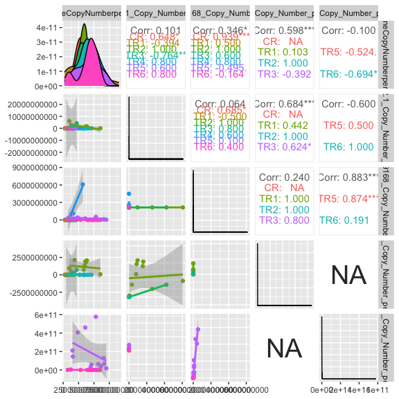
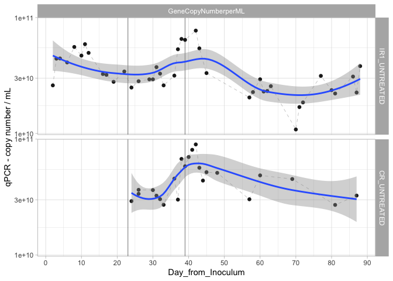
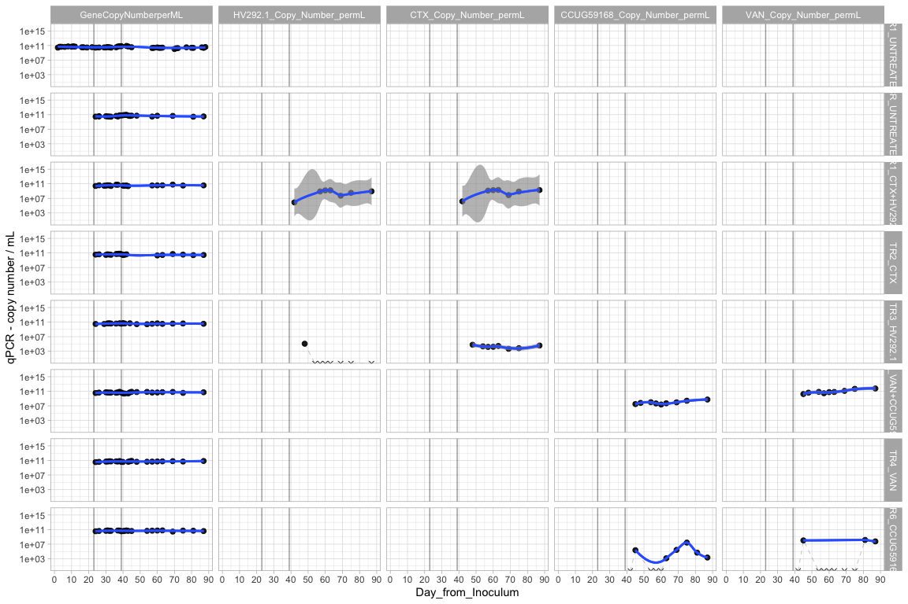
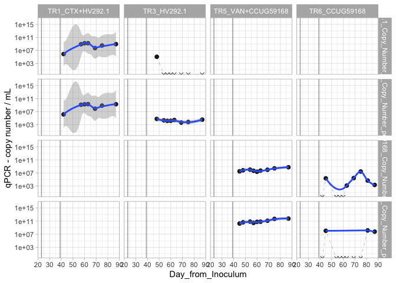
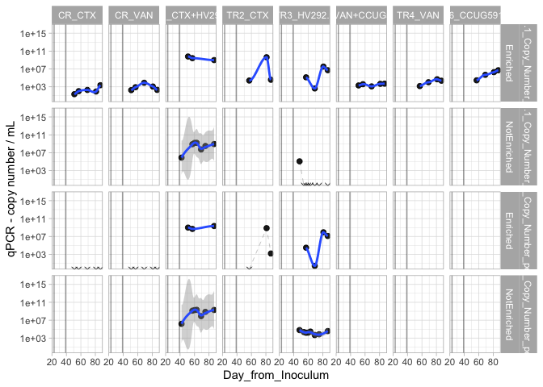

#### Load required packages


```r
library(tidyverse)
library(phyloseq)
library(speedyseq)
library(ggrepel)
library(ampvis2)
library(plotly)
library(microbiome)
options(getClass.msg=FALSE) # https://github.com/epurdom/clusterExperiment/issues/66
#this fixes an error message that pops up because the class 'Annotated' is defined in two different packages
```

#### Load functions from Github


```r
'%!in%' <- function(x,y)!('%in%'(x,y))

source("https://raw.githubusercontent.com/fconstancias/DivComAnalyses/master/R/phyloseq_taxa_tests.R")
source("https://raw.githubusercontent.com/fconstancias/DivComAnalyses/master/R/phyloseq_normalisation.R")
```

```
## Loading required package: scales
```

```
## 
## Attaching package: 'scales'
```

```
## The following object is masked from 'package:microbiome':
## 
##     alpha
```

```
## The following object is masked from 'package:purrr':
## 
##     discard
```

```
## The following object is masked from 'package:readr':
## 
##     col_factor
```

```
## Loading required package: reshape2
```

```
## 
## Attaching package: 'reshape2'
```

```
## The following object is masked from 'package:tidyr':
## 
##     smiths
```

```r
source("https://raw.githubusercontent.com/fconstancias/DivComAnalyses/master/R/phyloseq_alpha.R")
source("https://raw.githubusercontent.com/fconstancias/DivComAnalyses/master/R/phyloseq_beta.R")
source("https://raw.githubusercontent.com/fconstancias/DivComAnalyses/master/R/phyloseq_heatmap.R")
```


#### Load physeq object


```r
ps = "data/processed/physeq_update_23_11.RDS"

ps %>% 
  here::here() %>%
  readRDS() %>%
  phyloseq_get_strains_fast() %>%
  phyloseq_remove_chloro_mitho() -> physeq
```

```
## Joining, by = "ASV"
```

```r
physeq %>% 
  subset_samples(Experiment == "Continuous") %>% 
  subset_samples(Paul %!in% c("Paul")) %>%
  subset_samples(Reactor != "IR2") -> ps_PolyFermS
```

We will be analysing only the PolyFermS samples here so take a subset of the physeq object.  

```r
physeq %>% 
  subset_samples(Experiment == "Continuous") %>% 
  subset_samples(Paul %!in% c("Paul")) %>%
  subset_samples(Reactor != "IR2") -> ps_polyFermS

sample_data(ps_polyFermS)$Reactor <- fct_relevel(sample_data(ps_polyFermS)$Reactor, "IR1", "CR", "TR1", "TR2","TR3", "TR4", "TR5", "TR6") 

sample_data(ps_polyFermS)$Treatment <- fct_relevel(sample_data(ps_polyFermS)$Treatment, "UNTREATED",  "CTX+HV292.1", "CTX","HV292.1","VAN+CCUG59168", "VAN",  "CCUG59168") 

sample_data(ps_polyFermS)$Reactor_Treatment <- fct_relevel(sample_data(ps_polyFermS)$Reactor_Treatment, "IR1_UNTREATED","CR_UNTREATED", "CR_CTX", "CR_VAN", "TR1_CTX+HV292.1","TR2_CTX", "TR3_HV292.1", "TR5_VAN+CCUG59168", "TR4_VAN", "TR6_CCUG59168") 

ps_polyFermS %>% 
  rarefy_even_depth(sample.size = 4576,
                    rngseed = 123) -> ps_polyFermS_rare
```

```
## `set.seed(123)` was used to initialize repeatable random subsampling.
```

```
## Please record this for your records so others can reproduce.
```

```
## Try `set.seed(123); .Random.seed` for the full vector
```

```
## ...
```

```
## 16 samples removedbecause they contained fewer reads than `sample.size`.
```

```
## Up to first five removed samples are:
```

```
## CR-40-S166ETR1-30-S178ETR1-42-S194ETR2-30-S195IR1-40-S197
```

```
## ...
```

```
## 50OTUs were removed because they are no longer 
## present in any sample after random subsampling
```

```
## ...
```


```r
sample_data(ps_polyFermS_rare) %>%
  data.frame() -> df
```


Plotting a bar plot of the different diversity indices 

```r
measures = c("GeneCopyNumberperML", "HV292.1_Copy_Number_permL", "CCUG59168_Copy_Number_permL", "CTX_Copy_Number_permL","VAN_Copy_Number_permL")

df %>%
  GGally::ggpairs(columns = measures) -> p_corr

p_corr
```




```r
df %>%
  plot_alphas(measure = measures,
             x_group = "Reactor_Treatment",
             colour_group = "Enrichment",
             fill_group = "Enrichment",
              shape_group = "Enrichment",
              facet_group = "Reactor_Treatment",
            test_group = "Reactor_Treatment",
            test_group_2 = "Enrichment") -> out
```


```r
plot_alpha_time <- function(df, 
                            x = "Day_from_Inoculum", 
                            y = "value", 
                            shape = "neg",
                            group = "Reactor_Treatment", 
                            facet)
{
  df %>%
  arrange(Day_from_Inoculum) %>%
  ggplot(aes_string(x = x,
             y = y, shape = shape)) +
  geom_point(size=2, alpha=0.9, aes_string(group = group),  show.legend = FALSE) + 
  geom_path(inherit.aes = TRUE, aes_string(group=group),
            size = 0.08,
            linetype = "dashed") +
  facet_grid(as.formula(facet), scales = "free") +
  theme_light() +
  scale_color_viridis_d(na.value = "black") + 
  geom_vline(xintercept = c(23,39), 
             color="black", alpha=0.4) + 
  # geom_smooth(show.legend = TRUE, level = 0.95) + 
  scale_x_continuous(breaks=seq(0,90,10)) -> plot

  return(plot)
}
```


```r
out$plot$data %>%
  dplyr::filter(Reactor %in% c("IR1", "CR")) %>%
  dplyr::filter(Enrichment == "NotEnriched") %>%
  dplyr::mutate(neg = ifelse(value == 0, "neg", "pos")) %>%
  #dplyr::filter(alphadiversiy %in% c("Observed")) %>% 
  plot_alpha_time(facet = c("Reactor_Treatment ~ alphadiversiy")) + 
  facet_null() + 
  facet_grid(Reactor_Treatment~ alphadiversiy, scales = "fixed") +
  scale_y_log10() +
  geom_smooth(show.legend = FALSE, level = 0.95) +
  ylab("qPCR - copy number / mL") -> p1

p1 
```




```r
out$plot$data %>%
  dplyr::filter(Enrichment == "NotEnriched") %>%
  dplyr::filter(alphadiversiy == "GeneCopyNumberperML") %>%
  dplyr::mutate(neg = ifelse(value == 0, "neg", "pos")) %>%
  plot_alpha_time(facet = c("alphadiversiy ~ Reactor_Treatment")) +
  facet_null() + 
  facet_grid(Reactor_Treatment~ alphadiversiy, scales = "fixed") +
  geom_smooth(show.legend = FALSE, level = 0.95) +
  scale_y_log10() +
  ylab("qPCR - copy number / mL") -> p2

p2
```

<!-- -->

```r
# p2 %>%
#   plotly::ggplotly()
```


```r
out$plot$data %>%
  dplyr::filter(Enrichment == "NotEnriched") %>%
  dplyr::filter(alphadiversiy %in% c("GeneCopyNumberperML","HV292.1_Copy_Number_permL", "CTX_Copy_Number_permL", "CCUG59168_Copy_Number_permL", "VAN_Copy_Number_permL")) %>%
  dplyr::mutate(alphadiversiy = fct_relevel(alphadiversiy,"GeneCopyNumberperML", "HV292.1_Copy_Number_permL", "CTX_Copy_Number_permL", "CCUG59168_Copy_Number_permL", "VAN_Copy_Number_permL")) %>%
  dplyr::mutate(neg = ifelse(value == 0, "neg", "pos")) %>%
  plot_alpha_time(facet = c("alphadiversiy ~ Reactor_Treatment")) +
  facet_null() +
  facet_grid(alphadiversiy ~ Reactor_Treatment, scales = "fixed") +
  scale_y_log10() +
  geom_smooth(show.legend = FALSE, level = 0.95) +
  scale_shape_manual(values=c(4, 19)) +
  ylab("qPCR - copy number / mL") -> p3

p3
```


```r
p3 +
  facet_null() +
  facet_grid(Reactor_Treatment ~ alphadiversiy, scales = "fixed") +
  scale_y_log10() +
  geom_smooth(show.legend = FALSE, level = 0.95) +
  scale_shape_manual(values=c(4, 19)) +
  ylab("qPCR - copy number / mL") -> p4

p4
```




```r
out$plot$data %>%
  dplyr::filter(Enrichment == "NotEnriched") %>%
  dplyr::filter(alphadiversiy %in% c("HV292.1_Copy_Number_permL", "CTX_Copy_Number_permL", "CCUG59168_Copy_Number_permL", "VAN_Copy_Number_permL")) %>%
  dplyr::mutate(alphadiversiy = fct_relevel(alphadiversiy,"HV292.1_Copy_Number_permL", "CTX_Copy_Number_permL", "CCUG59168_Copy_Number_permL", "VAN_Copy_Number_permL")) %>%
  dplyr::mutate(neg = ifelse(value == 0, "neg", "pos")) %>%
  plot_alpha_time(facet = c("alphadiversiy ~ Reactor_Treatment")) +
  facet_null() +
  facet_grid(alphadiversiy ~ Reactor_Treatment, scales = "fixed") +
  scale_y_log10() +
  geom_smooth(show.legend = FALSE, level = 0.95) +
  scale_shape_manual(values=c(4, 19)) +
  ylab("qPCR - copy number / mL") -> p5

p5
```



```r
out$plot$data %>%
  # dplyr::filter(Enrichment == "NotEnriched") %>%
  dplyr::filter(alphadiversiy %in% c("HV292.1_Copy_Number_permL", "CTX_Copy_Number_permL")) %>%
  dplyr::mutate(alphadiversiy = fct_relevel(alphadiversiy,"HV292.1_Copy_Number_permL", "CTX_Copy_Number_permL")) %>%
  dplyr::mutate(neg = ifelse(value == 0, "neg", "pos")) %>%
  plot_alpha_time(facet = c("alphadiversiy ~ Reactor_Treatment")) +
  facet_null() +
  facet_grid(alphadiversiy + Enrichment ~ Reactor_Treatment , scales = "fixed") +
  scale_y_log10() +
  geom_smooth(show.legend = FALSE, level = 0.95) +
  scale_shape_manual(values=c(4, 19)) +
  ylab("qPCR - copy number / mL") -> p6

p6 + scale_x_continuous(breaks=seq(0,90,20))
```




```r
out$plot$data %>%
  # dplyr::filter(Enrichment == "NotEnriched") %>%
  dplyr::filter(alphadiversiy %in% c("CCUG59168_Copy_Number_permL", "VAN_Copy_Number_permL")) %>%
  dplyr::mutate(alphadiversiy = fct_relevel(alphadiversiy,"CCUG59168_Copy_Number_permL", "VAN_Copy_Number_permL")) %>%
  dplyr::mutate(neg = ifelse(value == 0, "neg", "pos")) %>%
  plot_alpha_time(facet = c("alphadiversiy ~ Reactor_Treatment")) +
  facet_null() +
  facet_grid(alphadiversiy + Enrichment ~ Reactor_Treatment , scales = "fixed") +
  scale_y_log10() +
  geom_smooth(show.legend = FALSE, level = 0.95) +
  scale_shape_manual(values=c(4, 19)) +
  ylab("qPCR - copy number / mL") -> p7

p7 + scale_x_continuous(breaks=seq(0,90,20))
```


```r
paste0(here::here(),
       "/data/processed/",
       "qPCR",
       "_",
       format(Sys.time(), "%Y%b%d")
       ,".RData") %>% save.image()
# load("/Users/fconstan/Projects/EZe/ASV/260420.RData")
```


```r
sessionInfo()
```

```
## R version 3.6.3 (2020-02-29)
## Platform: x86_64-apple-darwin15.6.0 (64-bit)
## Running under: macOS Mojave 10.14.6
## 
## Matrix products: default
## BLAS:   /Library/Frameworks/R.framework/Versions/3.6/Resources/lib/libRblas.0.dylib
## LAPACK: /Library/Frameworks/R.framework/Versions/3.6/Resources/lib/libRlapack.dylib
## 
## locale:
## [1] en_US.UTF-8/en_US.UTF-8/en_US.UTF-8/C/en_US.UTF-8/en_US.UTF-8
## 
## attached base packages:
## [1] stats     graphics  grDevices utils     datasets  methods   base     
## 
## other attached packages:
##  [1] reshape2_1.4.4    scales_1.1.1      microbiome_2.1.26 plotly_4.9.2.1   
##  [5] ampvis2_2.6.4     ggrepel_0.8.2     speedyseq_0.3.0   phyloseq_1.30.0  
##  [9] forcats_0.5.0     stringr_1.4.0     dplyr_1.0.2       purrr_0.3.4      
## [13] readr_1.4.0       tidyr_1.1.2       tibble_3.0.4      ggplot2_3.3.2    
## [17] tidyverse_1.3.0  
## 
## loaded via a namespace (and not attached):
##   [1] Rtsne_0.15          colorspace_2.0-0    ggsignif_0.6.0     
##   [4] rio_0.5.16          ellipsis_0.3.1      rprojroot_2.0.2    
##   [7] XVector_0.26.0      fs_1.5.0            rstudioapi_0.13    
##  [10] ggpubr_0.4.0        farver_2.0.3        ggnet_0.1.0        
##  [13] fansi_0.4.1         lubridate_1.7.9.2   xml2_1.3.2         
##  [16] codetools_0.2-18    splines_3.6.3       doParallel_1.0.16  
##  [19] knitr_1.30          ade4_1.7-16         jsonlite_1.7.1     
##  [22] broom_0.7.2         cluster_2.1.0       dbplyr_2.0.0       
##  [25] compiler_3.6.3      httr_1.4.2          backports_1.2.0    
##  [28] assertthat_0.2.1    Matrix_1.2-18       lazyeval_0.2.2     
##  [31] cli_2.2.0           htmltools_0.5.0     prettyunits_1.1.1  
##  [34] tools_3.6.3         igraph_1.2.6        gtable_0.3.0       
##  [37] glue_1.4.2          Rcpp_1.0.5          carData_3.0-4      
##  [40] Biobase_2.46.0      cellranger_1.1.0    vctrs_0.3.5        
##  [43] Biostrings_2.54.0   multtest_2.42.0     ape_5.4-1          
##  [46] nlme_3.1-150        iterators_1.0.13    xfun_0.19          
##  [49] network_1.16.1      openxlsx_4.2.3      rvest_0.3.6        
##  [52] lifecycle_0.2.0     rstatix_0.6.0       zlibbioc_1.32.0    
##  [55] MASS_7.3-53         hms_0.5.3           parallel_3.6.3     
##  [58] biomformat_1.14.0   rhdf5_2.30.1        RColorBrewer_1.1-2 
##  [61] curl_4.3            yaml_2.2.1          reshape_0.8.8      
##  [64] stringi_1.5.3       S4Vectors_0.24.4    foreach_1.5.1      
##  [67] permute_0.9-5       BiocGenerics_0.32.0 zip_2.1.1          
##  [70] rlang_0.4.9         pkgconfig_2.0.3     evaluate_0.14      
##  [73] lattice_0.20-41     Rhdf5lib_1.8.0      patchwork_1.1.0    
##  [76] htmlwidgets_1.5.2   labeling_0.4.2      tidyselect_1.1.0   
##  [79] here_1.0.1          GGally_2.0.0        plyr_1.8.6         
##  [82] magrittr_2.0.1      R6_2.5.0            IRanges_2.20.2     
##  [85] generics_0.1.0      DBI_1.1.0           foreign_0.8-75     
##  [88] pillar_1.4.7        haven_2.3.1         withr_2.3.0        
##  [91] mgcv_1.8-33         abind_1.4-5         survival_3.2-7     
##  [94] car_3.0-10          modelr_0.1.8        crayon_1.3.4       
##  [97] rmarkdown_2.5       progress_1.2.2      grid_3.6.3         
## [100] readxl_1.3.1        data.table_1.13.2   vegan_2.5-7        
## [103] reprex_0.3.0        digest_0.6.27       stats4_3.6.3       
## [106] munsell_0.5.0       viridisLite_0.3.0
```

